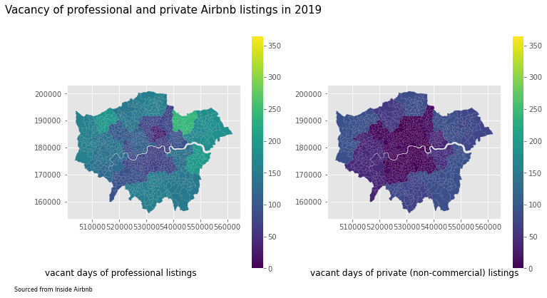
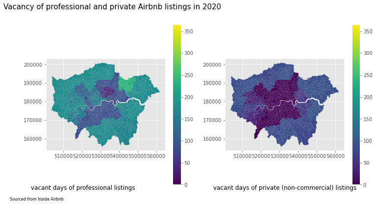
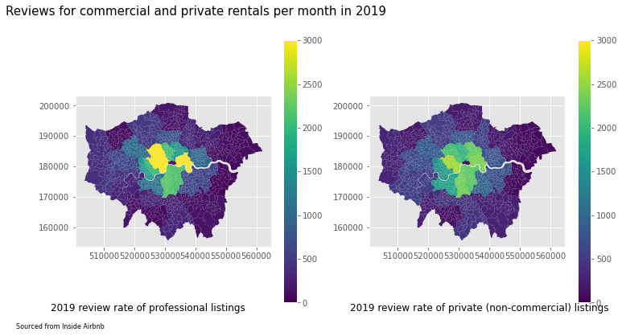
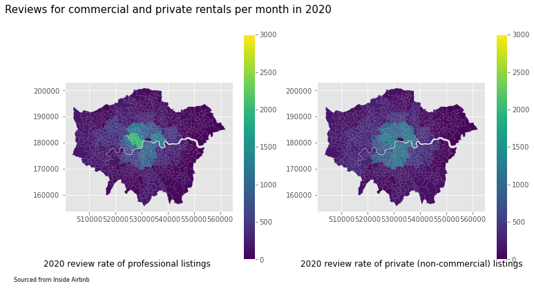
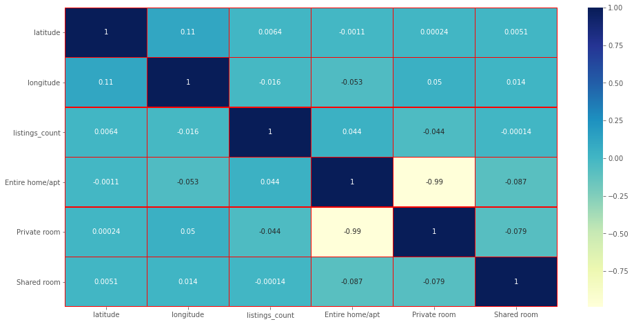

### Front matter 

CASA0013 Introduction to Programming for Spatial Analysts

Student id: 17064051

Topic: The professionalisation of Airbnb hosts: impact of unregulated professional hosts on London rental market.

Word count: 2045

Github: https://github.com/zcak/Data_Led

# Executive Summary

Explore how many unregulated professional hosts occupied in the list of Airbnb London hosts and how they impacted local rental market and 'true' local home-sharers through Airbnb in London, UK.

#### Key findings:
1. Around 40% of hosts renting through Airbnb in London were unregulated commercial operators/professional hosts in the past two years.
2. The existence of the large proportion of unregulated commercial operators/professional hosts drove up the rental price in London through Airbnb.
3. They reduced the competitiveness of non-professional hosts around city of London.
4. Local authorities should pay attention to the phenomenon about unregulated professional hosts.


# Reproducible Analysis


```python
#########################################################################
# Packages
import pandas as pd
import numpy as np
import seaborn as sns
import geopandas as gpd
import statsmodels.api as sms
import warnings
warnings.filterwarnings('ignore')
import matplotlib as mpl
import matplotlib.pyplot as plt
plt.style.use('ggplot')
import contextily as cx
import os
from requests import get
from urllib.parse import urlparse

# For map
import folium
import pandas as pd
from folium import plugins
```

#### Deal with Airbnb dataset


```python
# Data for 2019

# Online path
# url19='http://data.insideairbnb.com/united-kingdom/england/london/2019-12-09/data/listings.csv.gz'
# df19=pd.read_csv(url19, compression='gzip', low_memory=False)

# OR

# Local path
df19=pd.read_csv('listings.csv.gz')

# Data for 2020

# Online path
# url20= 'http://data.insideairbnb.com/united-kingdom/england/london/2020-11-06/data/listings.csv.gz'
# df20=pd.read_csv(url20, compression='gzip', low_memory=False)

# OR

#Local path
df20=pd.read_csv('listings2020.csv.gz')
```


```python
# List the attributes of listings
# df19.columns.values.tolist()
# df20.columns.values.tolist()
```


```python
# Check the NULL values
df19.isnull().sum()
```


    id                                                  0
    listing_url                                         0
    scrape_id                                           0
    last_scraped                                        0
    name                                               25
                                                    ...  
    calculated_host_listings_count                      0
    calculated_host_listings_count_entire_homes         0
    calculated_host_listings_count_private_rooms        0
    calculated_host_listings_count_shared_rooms         0
    reviews_per_month                               20668
    Length: 106, dtype: int64


```python
df20.isnull().sum()
```


    id                                                  0
    listing_url                                         0
    scrape_id                                           0
    last_scraped                                        0
    name                                               24
                                                    ...  
    calculated_host_listings_count                      0
    calculated_host_listings_count_entire_homes         0
    calculated_host_listings_count_private_rooms        0
    calculated_host_listings_count_shared_rooms         0
    reviews_per_month                               22431
    Length: 74, dtype: int64


```python
# Replace NaN values
df19.fillna({'reviews_per_month':0},inplace=True)
df19.fillna({'name':0},inplace=True)
df19.fillna({'host_is_superhost':0},inplace=True)
df19.fillna({'host name':0},inplace=True)
# Change type of 'host_id'
df19['host_id']=df19['host_id'].astype(str)

# Replace NaN values
df20.fillna({'reviews_per_month':0},inplace=True)
df20.fillna({'name':0},inplace=True)
df20.fillna({'host_is_superhost':0},inplace=True)
df20.fillna({'host name':0},inplace=True)
# Change type of 'host_id'
df20['host_id']=df20['host_id'].astype(str)
```


```python
# Exclude hotel rooms which are already defined
df19=df19[df19['calculated_host_listings_count']==df19['calculated_host_listings_count_entire_homes'] + df19['calculated_host_listings_count_private_rooms']+ df19['calculated_host_listings_count_shared_rooms']]
df20=df20[df20['calculated_host_listings_count']==df20['calculated_host_listings_count_entire_homes'] + df20['calculated_host_listings_count_private_rooms']+ df20['calculated_host_listings_count_shared_rooms']]
```


```python
# Create a dataframe containing target data
dataframe19 = pd.DataFrame()

dataframe19['host_id']=df19['host_id']
dataframe19['host_name']=df19['host_name']
dataframe19['room_type']=df19['room_type']
dataframe19['price']=df19['price'].str.replace('$','')
dataframe19['price']=dataframe19['price'].str.replace(',','')
dataframe19['price'] = pd.to_numeric(dataframe19['price'])
dataframe19['neighbourhood']=df19['neighbourhood']
dataframe19['latitude']=df19['latitude']
dataframe19['longitude']=df19['longitude']
dataframe19['listings_count']=df19['calculated_host_listings_count']
dataframe19['availability']=df19['availability_365']
dataframe19['reviews_per_month']=df19['reviews_per_month']
dataframe19['minimum_nights']=df19['minimum_nights']
dataframe19 = dataframe19.groupby('host_id').head()
dataframe19 = dataframe19[dataframe19['listings_count']>0]
```


```python
# Create a dataframe containing target data
dataframe20 = pd.DataFrame()

dataframe20['host_id']=df20['host_id']
dataframe20['host_name']=df20['host_name']
dataframe20['room_type']=df20['room_type']
dataframe20['price']=df20['price'].str.replace('$','')
dataframe20['price']=dataframe20['price'].str.replace(',','')
dataframe20['price'] = pd.to_numeric(dataframe20['price'])
dataframe20['neighbourhood']=df20['neighbourhood']
dataframe20['latitude']=df20['latitude']
dataframe20['longitude']=df20['longitude']
dataframe20['listings_count']=df20['calculated_host_listings_count']
dataframe20['availability']=df20['availability_365']
dataframe20['reviews_per_month']=df20['reviews_per_month']
dataframe20['minimum_nights']=df20['minimum_nights']
dataframe20 = dataframe20.groupby('host_id').head()
dataframe20 = dataframe20[dataframe20['listings_count']>0]
```

#### Explore 
1. how many (percentage of) active hosts with multiple units were in Airbnb London platform;
2. how the proportion/number of commercial operators changed during 2019-2020

for different rental types (indicating in 'room_type').


```python
# Professions who invested in Airbnb (for any room type)

professional_number19 = dataframe19[dataframe19['listings_count']>1].shape[0]
professional_proportion19 = round(dataframe19[dataframe19['listings_count']>1].shape[0]/dataframe19.shape[0]*100,2)

prof19=dataframe19[dataframe19['listings_count']>1]
prof19['booking'] = round(prof19.availability[prof19.availability>0].value_counts()/365,2)
prof19[prof19['booking']>=1-90/365]
reg19=dataframe19[dataframe19['listings_count']==1]
reg19['booking'] = round(reg19.availability[reg19.availability>0].value_counts()/365,2)

```


```python
professional_number20 = dataframe20[dataframe20['listings_count']>1].shape[0]
professional_proportion20 = round(dataframe20[dataframe20['listings_count']>1].shape[0]/dataframe20.shape[0]*100,2)

prof20=dataframe20[dataframe20['listings_count']>1]
prof20['booking'] = round(prof20.availability[prof20.availability>0].value_counts()/365,2)
prof20[prof20['booking']>=1-90/365]
reg20=dataframe20[dataframe20['listings_count']==1]
reg20['booking'] = round(reg20.availability[reg20.availability>0].value_counts()/365,2)

```


```python
print('There were', professional_number19, 'commercial operatiors/professional hosts, around', professional_proportion19, '% among all the Airbnb hosts in 2019.')
print('There were', professional_number20, 'commercial operatiors/professional hosts, around', professional_proportion20, '% among all the Airbnb hosts in 2020.')
```

    There were 27700 commercial operatiors/professional hosts, around 38.63 % among all the Airbnb hosts in 2019.
    There were 24155 commercial operatiors/professional hosts, around 36.51 % among all the Airbnb hosts in 2020.
    


```python
# Professions who invested in entire home/apartment

Entire_home19 = dataframe19[dataframe19['room_type']=='Entire home/apt']

professional_entire_number19 = Entire_home19[Entire_home19['listings_count']>1].shape[0]
professional_entire_proportion19 = round(Entire_home19[Entire_home19['listings_count']>1].shape[0]/Entire_home19.shape[0]*100,2)
```


```python
Entire_home20 = dataframe20[dataframe20['room_type']=='Entire home/apt']

professional_entire_number20 = Entire_home20[Entire_home20['listings_count']>1].shape[0]
professional_entire_proportion20 = round(Entire_home20[Entire_home20['listings_count']>1].shape[0]/Entire_home20.shape[0]*100,2)
```


```python
print('There were', professional_entire_number19, 'commercial operatiors/professional hosts who invested entire homes or apartments, around', professional_entire_proportion19, '% among all the Airbnb private-home/apartment hosts in 2019.')
print('There were', professional_entire_number20, 'commercial operatiors/professional hosts who invested entire homes or apartments, around', professional_entire_proportion20, '% among all the Airbnb private-home/apartment hosts in 2020.')
```

    There were 13405 commercial operatiors/professional hosts who invested entire homes or apartments, around 35.85 % among all the Airbnb private-home/apartment hosts in 2019.
    There were 11245 commercial operatiors/professional hosts who invested entire homes or apartments, around 33.04 % among all the Airbnb private-home/apartment hosts in 2020.
    


```python
# Professions who invested in shared rooms
Shared_room19 = dataframe19[dataframe19['room_type']=='Shared room']

professional_shared_number19 = Shared_room19[Shared_room19['listings_count']>1].shape[0]
professional_shared_proportion19 = round(Shared_room19[Shared_room19['listings_count']>1].shape[0]/Shared_room19.shape[0]*100,2)
```


```python
Shared_room20 = dataframe20[dataframe20['room_type']=='Shared room']

professional_shared_number20 = Shared_room20[Shared_room20['listings_count']>1].shape[0]
professional_shared_proportion20 = round(Shared_room20[Shared_room20['listings_count']>1].shape[0]/Shared_room20.shape[0]*100,2)
```


```python
print('There were', professional_shared_number19, 'commercial operatiors/professional hosts who invested in shared rooms, around', professional_shared_proportion19, '% among all the Airbnb shared-room hosts in 2019.')
print('There were', professional_shared_number20, 'commercial operatiors/professional hosts who invested in shared rooms, around', professional_shared_proportion20, '% among all the Airbnb shared-room hosts in 2020.')
```

    There were 201 commercial operatiors/professional hosts who invested in shared rooms, around 40.61 % among all the Airbnb shared-room hosts in 2019.
    There were 214 commercial operatiors/professional hosts who invested in shared rooms, around 41.55 % among all the Airbnb shared-room hosts in 2020.
    


```python
# Professions who invested in private rooms
Private_room19 = dataframe19[dataframe19['room_type']=='Private room']

professional_private_number19 = Private_room19[Private_room19['listings_count']>1].shape[0]
professional_private_proportion19 = round(Private_room19[Private_room19['listings_count']>1].shape[0]/Private_room19.shape[0]*100,2)
```


```python
Private_room20 = dataframe20[dataframe20['room_type']=='Private room']

professional_private_number20= Private_room20[Private_room20['listings_count']>1].shape[0]
professional_private_proportion20 = round(Private_room20[Private_room20['listings_count']>1].shape[0]/Private_room20.shape[0]*100,2)
```


```python
print('There were', professional_private_number19, 'commercial operatiors/professional hosts who invested in private rooms, around', professional_private_proportion19, '% among all the Airbnb private-room hosts in 2019.')
print('There were', professional_private_number20, 'commercial operatiors/professional hosts who invested in private rooms, around', professional_private_proportion20, '% among all the Airbnb private-room hosts in 2020.')
```

    There were 14094 commercial operatiors/professional hosts who invested in private rooms, around 41.67 % among all the Airbnb private-room hosts in 2019.
    There were 12696 commercial operatiors/professional hosts who invested in private rooms, around 40.17 % among all the Airbnb private-room hosts in 2020.
    


### Mapping


```python
# Read the boundary of London MSOA

# Online path
# London_gpd= gpd.read_file('https://github.com/zcak/Data_Led/blob/main/London_MSOAs.gpkg?raw=true')
# Or

# Local path
London_gpd= gpd.read_file('London_MSOAs.gpkg')
London_gpd.to_crs('EPSG:27700')
```


<div>
<style scoped>
    .dataframe tbody tr th:only-of-type {
        vertical-align: middle;
    }

    .dataframe tbody tr th {
        vertical-align: top;
    }

    .dataframe thead th {
        text-align: right;
    }
</style>
<table border="1" class="dataframe">
  <thead>
    <tr style="text-align: right;">
      <th></th>
      <th>OBJECTID</th>
      <th>MSOA11CD</th>
      <th>MSOA11NM</th>
      <th>BNG_E</th>
      <th>BNG_N</th>
      <th>Borough</th>
      <th>msoa11hclnm</th>
      <th>geometry</th>
    </tr>
  </thead>
  <tbody>
    <tr>
      <th>0</th>
      <td>1</td>
      <td>E02000001</td>
      <td>City of London 001</td>
      <td>532384</td>
      <td>181355</td>
      <td>City of London</td>
      <td>City of London</td>
      <td>POLYGON ((532135.138 182198.131, 532158.250 18...</td>
    </tr>
    <tr>
      <th>1</th>
      <td>2</td>
      <td>E02000002</td>
      <td>Barking and Dagenham 001</td>
      <td>548267</td>
      <td>189685</td>
      <td>Barking and Dagenham</td>
      <td>Marks Gate</td>
      <td>POLYGON ((548881.563 190845.265, 548881.125 19...</td>
    </tr>
    <tr>
      <th>2</th>
      <td>3</td>
      <td>E02000003</td>
      <td>Barking and Dagenham 002</td>
      <td>548259</td>
      <td>188520</td>
      <td>Barking and Dagenham</td>
      <td>Chadwell Heath East</td>
      <td>POLYGON ((549102.438 189324.625, 548954.517 18...</td>
    </tr>
    <tr>
      <th>3</th>
      <td>4</td>
      <td>E02000004</td>
      <td>Barking and Dagenham 003</td>
      <td>551004</td>
      <td>186412</td>
      <td>Barking and Dagenham</td>
      <td>Eastbrookend</td>
      <td>POLYGON ((551550.056 187364.705, 551478.000 18...</td>
    </tr>
    <tr>
      <th>4</th>
      <td>5</td>
      <td>E02000005</td>
      <td>Barking and Dagenham 004</td>
      <td>548733</td>
      <td>186824</td>
      <td>Barking and Dagenham</td>
      <td>Becontree Heath</td>
      <td>POLYGON ((549099.634 187656.076, 549161.375 18...</td>
    </tr>
    <tr>
      <th>...</th>
      <td>...</td>
      <td>...</td>
      <td>...</td>
      <td>...</td>
      <td>...</td>
      <td>...</td>
      <td>...</td>
      <td>...</td>
    </tr>
    <tr>
      <th>978</th>
      <td>6784</td>
      <td>E02006927</td>
      <td>Greenwich 034</td>
      <td>540765</td>
      <td>175168</td>
      <td>Greenwich</td>
      <td>Kidbrooke South</td>
      <td>POLYGON ((541029.881 176265.023, 541101.997 17...</td>
    </tr>
    <tr>
      <th>979</th>
      <td>6785</td>
      <td>E02006928</td>
      <td>Greenwich 035</td>
      <td>537902</td>
      <td>177443</td>
      <td>Greenwich</td>
      <td>Greenwich &amp; Deptford Creekside</td>
      <td>MULTIPOLYGON (((538300.370 177956.634, 538290....</td>
    </tr>
    <tr>
      <th>980</th>
      <td>6786</td>
      <td>E02006929</td>
      <td>Greenwich 036</td>
      <td>540015</td>
      <td>179091</td>
      <td>Greenwich</td>
      <td>Greenwich Peninsula</td>
      <td>POLYGON ((540054.362 179353.134, 540220.354 17...</td>
    </tr>
    <tr>
      <th>981</th>
      <td>6787</td>
      <td>E02006930</td>
      <td>Greenwich 037</td>
      <td>540126</td>
      <td>178333</td>
      <td>Greenwich</td>
      <td>Greenwich East</td>
      <td>POLYGON ((539552.478 178604.042, 539533.000 17...</td>
    </tr>
    <tr>
      <th>982</th>
      <td>6788</td>
      <td>E02006931</td>
      <td>Greenwich 038</td>
      <td>538710</td>
      <td>177146</td>
      <td>Greenwich</td>
      <td>Greenwich Town &amp; Park</td>
      <td>POLYGON ((538824.629 177735.438, 538880.250 17...</td>
    </tr>
  </tbody>
</table>
<p>983 rows × 8 columns</p>
</div>


```python
# Coverting dataframe to geodataframe and combine

# For 2019
# professional hosts
df_19_prof = gpd.GeoDataFrame(prof19,geometry=gpd.points_from_xy(prof19['longitude'], prof19['latitude'], crs='epsg:4326'))
df_19_prof = df_19_prof.to_crs('EPSG:27700')
# Join with London borough boundary data
# df_19_prof_gpd = gpd.sjoin(df_19_prof, London_gpd, op='within', how='left')
# df_19_prof_gpd.drop(columns = ['hectares','nonld_area','ons_inner','sub_2011'], inplace=True)
# Clean Data
# df_19_prof_gpd.drop(index=df_19_prof_gpd[df_19_prof_gpd.Borough.isnull()].index.values, axis=1, inplace=True)

# regular hosts
df_19_reg = gpd.GeoDataFrame(reg19,geometry=gpd.points_from_xy(reg19['longitude'], reg19['latitude'], crs='epsg:4326'))
df_19_reg = df_19_reg.to_crs('EPSG:27700')
# Join with London borough boundary data
# df_19_reg_gpd = gpd.sjoin(df_19_reg, London_gpd, op='within', how='left')
# df_19_reg_gpd.drop(columns = ['hectares','nonld_area','ons_inner','sub_2011'], inplace=True)
# Clean Data
# df_19_reg_gpd.drop(index=df_19_reg_gpd[df_19_reg_gpd.Borough.isnull()].index.values, axis=1, inplace=True)

```


```python
# For 2020
# professional hosts
df_20_prof = gpd.GeoDataFrame(prof20,geometry=gpd.points_from_xy(prof20['longitude'], prof20['latitude'], crs='epsg:4326'))
df_20_prof = df_20_prof.to_crs('EPSG:27700')
# Join with London borough boundary data
# df_20_prof_gpd = gpd.sjoin(df_20_prof, London_gpd, op='within', how='left')
# df_20_prof_gpd.drop(columns = ['hectares','nonld_area','ons_inner','sub_2011'], inplace=True)
# Clean Data
# df_20_prof_gpd.drop(index=df_20_prof_gpd[df_20_prof_gpd.Borough.isnull()].index.values, axis=1, inplace=True)

# regular hosts
df_20_reg = gpd.GeoDataFrame(reg20,geometry=gpd.points_from_xy(reg20['longitude'], reg20['latitude'], crs='epsg:4326'))
df_20_reg = df_20_reg.to_crs('EPSG:27700')
# Join with London borough boundary data
# df_20_reg_gpd = gpd.sjoin(df_20_reg, London_gpd, op='within', how='left')
# df_20_reg_gpd.drop(columns = ['hectares','nonld_area','ons_inner','sub_2011'], inplace=True)
# Clean Data
# df_20_reg_gpd.drop(index=df_20_reg_gpd[df_20_reg_gpd.Borough.isnull()].index.values, axis=1, inplace=True)

```

#### How were hotel-like rentals distributed in London in 2020 (by testing 2000 of them)?


```python
# define the world map
world_map = folium.Map()

# display world map
world_map

limit = 2000
data_20_prof = prof20.iloc[0:limit, :]
listing_20_prof = folium.map.FeatureGroup()

latitude=51.5074
longitude=0.1278
london_map_20_prof = folium.Map(location = [latitude, longitude], zoom_start = 12)

listing_20_prof = plugins.MarkerCluster().add_to(london_map_20_prof)

# loop through the dataframe and add each data point to the mark cluster
for lat, lng, label1, label2 in zip(data_20_prof.latitude, data_20_prof.longitude, data_20_prof.booking,data_20_prof.price):
    folium.Marker(
        location=[lat, lng],
        icon=None,
        popup=[label1,label2],
    ).add_to(listing_20_prof)

london_map_20_prof.add_child(listing_20_prof)
```


<div style="width:100%;"><div style="position:relative;width:100%;height:0;padding-bottom:60%;"><iframe src="data:text/html;charset=utf-8;base64,PCFET0NUWVBFIGh0bWw+CjxoZWFkPiAgICAKICAgIDxtZXRhIGh0dHAtZXF1aXY9ImNvbnRlbnQtdHlwZSIgY29udGVudD0idGV4dC9odG1sOyBjaGFyc2V0PVVURi04IiAvPgogICAgCiAgICAgICAgPHNjcmlwdD4KICAgICAgICAgICAgTF9OT19UT1VDSCA9IGZhbHNlOwogICAgICAgICAgICBMX0RJU0FCTEVfM0QgPSBmYWxzZTsKICAgICAgICA8L3NjcmlwdD4KICAgIAogICAgPHN0eWxlPmh0bWwsIGJvZHkge3dpZHRoOiAxMDAlO2hlaWdodDogMTAwJTttYXJnaW46IDA7cGFkZGluZzogMDt9PC9zdHlsZT4KICAgIDxzdHlsZT4jbWFwIHtwb3NpdGlvbjphYnNvbHV0ZTt0b3A6MDtib3R0b206MDtyaWdodDowO2xlZnQ6MDt9PC9zdHlsZT4KICAgIDxzY3JpcHQgc3JjPSJodHRwczovL2Nkbi5qc2RlbGl2ci5uZXQvbnBtL2xlYWZsZXRAMS42LjAvZGlzdC9sZWFmbGV0LmpzIj48L3NjcmlwdD4KICAgIDxzY3JpcHQgc3JjPSJodHRwczovL2NvZGUuanF1ZXJ5LmNvbS9qcXVlcnktMS4xMi40Lm1pbi5qcyI+PC9zY3JpcHQ+CiAgICA8c2NyaXB0IHNyYz0iaHR0cHM6Ly9tYXhjZG4uYm9vdHN0cmFwY2RuLmNvbS9ib290c3RyYXAvMy4yLjAvanMvYm9vdHN0cmFwLm1pbi5qcyI+PC9zY3JpcHQ+CiAgICA8c2NyaXB0IHNyYz0iaHR0cHM6Ly9jZG5qcy5jbG91ZGZsYXJlLmNvbS9hamF4L2xpYnMvTGVhZmxldC5hd2Vzb21lLW1hcmtlcnMvMi4wLjIvbGVhZmxldC5hd2Vzb21lLW1hcmtlcnMuanMiPjwvc2NyaXB0PgogICAgPGxpbmsgcmVsPSJzdHlsZXNoZWV0IiBocmVmPSJodHRwczovL2Nkbi5qc2RlbGl2ci5uZXQvbnBtL2xlYWZsZXRAMS42LjAvZGlzdC9sZWFmbGV0LmNzcyIvPgogICAgPGxpbmsgcmVsPSJzdHlsZXNoZWV0IiBocmVmPSJodHRwczovL21heGNkbi5ib290c3RyYXBjZG4uY29tL2Jvb3RzdHJhcC8zLjIuMC9jc3MvYm9vdHN0cmFwLm1pbi5jc3MiLz4KICAgIDxsaW5rIHJlbD0ic3R5bGVzaGVldCIgaHJlZj0iaHR0cHM6Ly9tYXhjZG4uYm9vdHN0cmFwY2RuLmNvbS9ib290c3RyYXAvMy4yLjAvY3NzL2Jvb3RzdHJhcC10aGVtZS5taW4uY3NzIi8+CiAgICA8bGluayByZWw9InN0eWxlc2hlZXQiIGhyZWY9Imh0dHBzOi8vbWF4Y2RuLmJvb3RzdHJhcGNkbi5jb20vZm9udC1hd2Vzb21lLzQuNi4zL2Nzcy9mb250LWF3ZXNvbWUubWluLmNzcyIvPgogICAgPGxpbmsgcmVsPSJzdHlsZXNoZWV0IiBocmVmPSJodHRwczovL2NkbmpzLmNsb3VkZmxhcmUuY29tL2FqYXgvbGlicy9MZWFmbGV0LmF3ZXNvbWUtbWFya2Vycy8yLjAuMi9sZWFmbGV0LmF3ZXNvbWUtbWFya2Vycy5jc3MiLz4KICAgIDxsaW5rIHJlbD0ic3R5bGVzaGVldCIgaHJlZj0iaHR0cHM6Ly9jZG4uanNkZWxpdnIubmV0L2doL3B5dGhvbi12aXN1YWxpemF0aW9uL2ZvbGl1bS9mb2xpdW0vdGVtcGxhdGVzL2xlYWZsZXQuYXdlc29tZS5yb3RhdGUubWluLmNzcyIvPgogICAgCiAgICAgICAgICAgIDxtZXRhIG5hbWU9InZpZXdwb3J0IiBjb250ZW50PSJ3aWR0aD1kZXZpY2Utd2lkdGgsCiAgICAgICAgICAgICAgICBpbml0aWFsLXNjYWxlPTEuMCwgbWF4aW11bS1zY2FsZT0xLjAsIHVzZXItc2NhbGFibGU9bm8iIC8+CiAgICAgICAgICAgIDxzdHlsZT4KICAgICAgICAgICAgICAgICNtYXBfMDk3YzQ3MzMwOGQ4NDk4NWExYTk0NGIyZWZmZmE1YWYgewogICAgICAgICAgICAgICAgICAgIHBvc2l0aW9uOiByZWxhdGl2ZTsKICAgICAgICAgICAgICAgICAgICB3aWR0aDogMTAwLjAlOwogICAgICAgICAgICAgICAgICAgIGhlaWdodDogMTAwLjAlOwogICAgICAgICAgICAgICAgICAgIGxlZnQ6IDAuMCU7CiAgICAgICAgICAgICAgICAgICAgdG9wOiAwLjAlOwogICAgICAgICAgICAgICAgfQogICAgICAgICAgICA8L3N0eWxlPgogICAgICAgIAogICAgPHNjcmlwdCBzcmM9Imh0dHBzOi8vY2RuanMuY2xvdWRmbGFyZS5jb20vYWpheC9saWJzL2xlYWZsZXQubWFya2VyY2x1c3Rlci8xLjEuMC9sZWFmbGV0Lm1hcmtlcmNsdXN0ZXIuanMiPjwvc2NyaXB0PgogICAgPGxpbmsgcmVsPSJzdHlsZXNoZWV0IiBocmVmPSJodHRwczovL2NkbmpzLmNsb3VkZmxhcmUuY29tL2FqYXgvbGlicy9sZWFmbGV0Lm1hcmtlcmNsdXN0ZXIvMS4xLjAvTWFya2VyQ2x1c3Rlci5jc3MiLz4KICAgIDxsaW5rIHJlbD0ic3R5bGVzaGVldCIgaHJlZj0iaHR0cHM6Ly9jZG5qcy5jbG91ZGZsYXJlLmNvbS9hamF4L2xpYnMvbGVhZmxldC5tYXJrZXJjbHVzdGVyLzEuMS4wL01hcmtlckNsdXN0ZXIuRGVmYXVsdC5jc3MiLz4KPC9oZWFkPgo8Ym9keT4gICAgCiAgICAKICAgICAgICAgICAgPGRpdiBjbGFzcz0iZm9saXVtLW1hcCIgaWQ9Im1hcF8wOTdjNDczMzA4ZDg0OTg1YTFhOTQ0YjJlZmZmYTVhZiIgPjwvZGl2PgogICAgICAgIAo8L2JvZHk+CjxzY3JpcHQ+ICAgIAogICAgCiAgICAgICAgICAgIHZhciBtYXBfMDk3YzQ3MzMwOGQ4NDk4NWExYTk0NGIyZWZmZmE1YWYgPSBMLm1hcCgKICAgICAgICAgICAgICAgICJtYXBfMDk3YzQ3MzMwOGQ4NDk4NWExYTk0NGIyZWZmZmE1YWYiLAogICAgICAgICAgICAgICAgewogICAgICAgICAgICAgICAgICAgIGNlbnRlcjogWzUxLjUwNzQsIDAuMTI3OF0sCiAgICAgICAgICAgICAgICAgICAgY3JzOiBMLkNSUy5FUFNHMzg1NywKICAgICAgICAgICAgICAgICAgICB6b29tOiAxMiwKICAgICAgICAgICAgICAgICAgICB6b29tQ29udHJvbDogdHJ1ZSwKICAgICAgICAgICAgICAgICAgICBwcmVmZXJDYW52YXM6IGZhbHNlLAogICAgICAgICAgICAgICAgfQogICAgICAgICAgICApOwoKICAgICAgICAgICAgCgogICAgICAgIAogICAgCiAgICAgICAgICAgIHZhciB0aWxlX2xheWVyX2NlMDIyYmM0MGJmMDQ1Mzk4ZjNiZDk0OGFkYzVjOGVhID0gTC50aWxlTGF5ZXIoCiAgICAgICAgICAgICAgICAiaHR0cHM6Ly97c30udGlsZS5vcGVuc3RyZWV0bWFwLm9yZy97en0ve3h9L3t5fS5wbmciLAogICAgICAgICAgICAgICAgeyJhdHRyaWJ1dGlvbiI6ICJEYXRhIGJ5IFx1MDAyNmNvcHk7IFx1MDAzY2EgaHJlZj1cImh0dHA6Ly9vcGVuc3RyZWV0bWFwLm9yZ1wiXHUwMDNlT3BlblN0cmVldE1hcFx1MDAzYy9hXHUwMDNlLCB1bmRlciBcdTAwM2NhIGhyZWY9XCJodHRwOi8vd3d3Lm9wZW5zdHJlZXRtYXAub3JnL2NvcHlyaWdodFwiXHUwMDNlT0RiTFx1MDAzYy9hXHUwMDNlLiIsICJkZXRlY3RSZXRpbmEiOiBmYWxzZSwgIm1heE5hdGl2ZVpvb20iOiAxOCwgIm1heFpvb20iOiAxOCwgIm1pblpvb20iOiAwLCAibm9XcmFwIjogZmFsc2UsICJvcGFjaXR5IjogMSwgInN1YmRvbWFpbnMiOiAiYWJjIiwgInRtcyI6IGZhbHNlfQogICAgICAgICAgICApLmFkZFRvKG1hcF8wOTdjNDczMzA4ZDg0OTg1YTFhOTQ0YjJlZmZmYTVhZik7CiAgICAgICAgCiAgICAKICAgICAgICAgICAgdmFyIG1hcmtlcl9jbHVzdGVyXzdkZWE4YzM3NDZlOTRlNWNiNzk3YjVmZTFlYmJlOGZmID0gTC5tYXJrZXJDbHVzdGVyR3JvdXAoCiAgICAgICAgICAgICAgICB7fQogICAgICAgICAgICApOwogICAgICAgICAgICBtYXBfMDk3YzQ3MzMwOGQ4NDk4NWExYTk0NGIyZWZmZmE1YWYuYWRkTGF5ZXIobWFya2VyX2NsdXN0ZXJfN2RlYThjMzc0NmU5NGU1Y2I3OTdiNWZlMWViYmU4ZmYpOwogICAgICAgIAogICAgCiAgICAgICAgICAgIHZhciBtYXJrZXJfYzc1M2ZlNTJmMWY3NGEwY2FkYzQ1ZThlMjg4NWMwZWIgPSBMLm1hcmtlcigKICAgICAgICAgICAgICAgIFs1MS40NjIyNSwgLTAuMTE3MzJdLAogICAgICAgICAgICAgICAge30KICAgICAgICAgICAgKS5hZGRUbyhtYXJrZXJfY2x1c3Rlcl83ZGVhOGMzNzQ2ZTk0ZTVjYjc5N2I1ZmUxZWJiZThmZik7CiAgICAgICAgCiAgICAKICAgICAgICB2YXIgcG9wdXBfZDRhMTlmY2MwNWMyNDhjY2EyZGMxYThjYzc1ZTBiZDcgPSBMLnBvcHVwKHsibWF4V2lkdGgiOiAiMTAwJSJ9KTsKCiAgICAgICAgCiAgICAgICAgICAgIHZhciBodG1sXzIyYTQ5ZDI2MmM1ZTQyMDNhNjg0MTA3NGVlMjM0ZTIzID0gJChgPGRpdiBpZD0iaHRtbF8yMmE0OWQyNjJjNWU0MjAzYTY4NDEwNzRlZTIzNGUyMyIgc3R5bGU9IndpZHRoOiAxMDAuMCU7IGhlaWdodDogMTAwLjAlOyI+W25hbiwgMTA1LjBdPC9kaXY+YClbMF07CiAgICAgICAgICAgIHBvcHVwX2Q0YTE5ZmNjMDVjMjQ4Y2NhMmRjMWE4Y2M3NWUwYmQ3LnNldENvbnRlbnQoaHRtbF8yMmE0OWQyNjJjNWU0MjAzYTY4NDEwNzRlZTIzNGUyMyk7CiAgICAgICAgCgogICAgICAgIG1hcmtlcl9jNzUzZmU1MmYxZjc0YTBjYWRjNDVlOGUyODg1YzBlYi5iaW5kUG9wdXAocG9wdXBfZDRhMTlmY2MwNWMyNDhjY2EyZGMxYThjYzc1ZTBiZDcpCiAgICAgICAgOwoKICAgICAgICAKICAgIAogICAgCiAgICAgICAgICAgIHZhciBtYXJrZXJfN2Q4MmM4YzVmMjE3NGI3OTlhM2U3NWJlMDlmNTdjZjAgPSBMLm1hcmtlcigKICAgICAgICAgICAgICAgIFs1MS41NjgwMiwgLTAuMTExMjFdLAogICAgICAgICAgICAgICAge30KICAgICAgICAgICAgKS5hZGRUbyhtYXJrZXJfY2x1c3Rlcl83ZGVhOGMzNzQ2ZTk0ZTVjYjc5N2I1ZmUxZWJiZThmZik7CiAgICAgICAgCiAgICAKICAgICAgICB2YXIgcG9wdXBfODRiNjFlNTVkNzA4NDJkMjk5ZGYxYjVkMzkzOTJmNzYgPSBMLnBvcHVwKHsibWF4V2lkdGgiOiAiMTAwJSJ9KTsKCiAgICAgICAgCiAgICAgICAgICAgIHZhciBodG1sXzlkMzA5N2NkMTVhMDRiOGNhMTkyZTA4NGVjZGQ2YWFiID0gJChgPGRpdiBpZD0iaHRtbF85ZDMwOTdjZDE1YTA0YjhjYTE5MmUwODRlY2RkNmFhYiIgc3R5bGU9IndpZHRoOiAxMDAuMCU7IGhlaWdodDogMTAwLjAlOyI+WzAuNDEsIDQwLjBdPC9kaXY+YClbMF07CiAgICAgICAgICAgIHBvcHVwXzg0YjYxZTU1ZDcwODQyZDI5OWRmMWI1ZDM5MzkyZjc2LnNldENvbnRlbnQoaHRtbF85ZDMwOTdjZDE1YTA0YjhjYTE5MmUwODRlY2RkNmFhYik7CiAgICAgICAgCgogICAgICAgIG1hcmtlcl83ZDgyYzhjNWYyMTc0Yjc5OWEzZTc1YmUwOWY1N2NmMC5iaW5kUG9wdXAocG9wdXBfODRiNjFlNTVkNzA4NDJkMjk5ZGYxYjVkMzkzOTJmNzYpCiAgICAgICAgOwoKICAgICAgICAKICAgIAogICAgCiAgICAgICAgICAgIHZhciBtYXJrZXJfM2QxY2VkZWQyYWFmNGQ0NWFhMDI2MGNiMjk0ZDdmMzYgPSBMLm1hcmtlcigKICAgICAgICAgICAgICAgIFs1MS41MjE5NSwgLTAuMTQwOTRdLAogICAgICAgICAgICAgICAge30KICAgICAgICAgICAgKS5hZGRUbyhtYXJrZXJfY2x1c3Rlcl83ZGVhOGMzNzQ2ZTk0ZTVjYjc5N2I1ZmUxZWJiZThmZik7CiAgICAgICAgCiAgICAKICAgICAgICB2YXIgcG9wdXBfZWJhNDMyNGQ1OWMxNDhhNjliMTY3NGRhNTc4ODM5NTYgPSBMLnBvcHVwKHsibWF4V2lkdGgiOiAiMTAwJSJ9KTsKCiAgICAgICAgCiAgICAgICAgICAgIHZhciBodG1sX2FkODBhNDllMjY2YzQ4NWFhZDlhYTlhYzljYzZjZWYwID0gJChgPGRpdiBpZD0iaHRtbF9hZDgwYTQ5ZTI2NmM0ODVhYWQ5YWE5YWM5Y2M2Y2VmMCIgc3R5bGU9IndpZHRoOiAxMDAuMCU7IGhlaWdodDogMTAwLjAlOyI+WzAuMTIsIDMwNy4wXTwvZGl2PmApWzBdOwogICAgICAgICAgICBwb3B1cF9lYmE0MzI0ZDU5YzE0OGE2OWIxNjc0ZGE1Nzg4Mzk1Ni5zZXRDb250ZW50KGh0bWxfYWQ4MGE0OWUyNjZjNDg1YWFkOWFhOWFjOWNjNmNlZjApOwogICAgICAgIAoKICAgICAgICBtYXJrZXJfM2QxY2VkZWQyYWFmNGQ0NWFhMDI2MGNiMjk0ZDdmMzYuYmluZFBvcHVwKHBvcHVwX2ViYTQzMjRkNTljMTQ4YTY5YjE2NzRkYTU3ODgzOTU2KQogICAgICAgIDsKCiAgICAgICAgCiAgICAKICAgIAogICAgICAgICAgICB2YXIgbWFya2VyXzkyZWUzMWM2NzRiODRkMjA4NmFkNjAxMGMzMWNiNDE5ID0gTC5tYXJrZXIoCiAgICAgICAgICAgICAgICBbNTEuNDc5MzUsIC0wLjE5NzQzXSwKICAgICAgICAgICAgICAgIHt9CiAgICAgICAgICAgICkuYWRkVG8obWFya2VyX2NsdXN0ZXJfN2RlYThjMzc0NmU5NGU1Y2I3OTdiNWZlMWViYmU4ZmYpOwogICAgICAgIAogICAgCiAgICAgICAgdmFyIHBvcHVwX2QwODE2YzY5YTBiNDQxNzJiNDkxMGY0M2ZkYjFkYjQ4ID0gTC5wb3B1cCh7Im1heFdpZHRoIjogIjEwMCUifSk7CgogICAgICAgIAogICAgICAgICAgICB2YXIgaHRtbF8xNmQ2YjY1ZmNjNWY0OWQxYjMyOWIxN2ViNWI3MzYxMCA9ICQoYDxkaXYgaWQ9Imh0bWxfMTZkNmI2NWZjYzVmNDlkMWIzMjliMTdlYjViNzM2MTAiIHN0eWxlPSJ3aWR0aDogMTAwLjAlOyBoZWlnaHQ6IDEwMC4wJTsiPlswLjA5LCAxNTAuMF08L2Rpdj5gKVswXTsKICAgICAgICAgICAgcG9wdXBfZDA4MTZjNjlhMGI0NDE3MmI0OTEwZjQzZmRiMWRiNDguc2V0Q29udGVudChodG1sXzE2ZDZiNjVmY2M1ZjQ5ZDFiMzI5YjE3ZWI1YjczNjEwKTsKICAgICAgICAKCiAgICAgICAgbWFya2VyXzkyZWUzMWM2NzRiODRkMjA4NmFkNjAxMGMzMWNiNDE5LmJpbmRQb3B1cChwb3B1cF9kMDgxNmM2OWEwYjQ0MTcyYjQ5MTBmNDNmZGIxZGI0OCkKICAgICAgICA7CgogICAgICAgIAogICAgCiAgICAKICAgICAgICAgICAgdmFyIG1hcmtlcl80ODk0ODU1ZDcwNzk0ZWY4YjZlZjJkMWQwNTAwNTk0MiA9IEwubWFya2VyKAogICAgICAgICAgICAgICAgWzUxLjU3MjI0LCAtMC4yMDkwNl0sCiAgICAgICAgICAgICAgICB7fQogICAgICAgICAgICApLmFkZFRvKG1hcmtlcl9jbHVzdGVyXzdkZWE4YzM3NDZlOTRlNWNiNzk3YjVmZTFlYmJlOGZmKTsKICAgICAgICAKICAgIAogICAgICAgIHZhciBwb3B1cF8wZTM4MzVkMmQwYzM0YzljYTM1YTQzYzExODc3Y2Y1NiA9IEwucG9wdXAoeyJtYXhXaWR0aCI6ICIxMDAlIn0pOwoKICAgICAgICAKICAgICAgICAgICAgdmFyIGh0bWxfMzcyZDU1NmU3YWY2NDI3MGFjOTc3N2E3Njk5MTU2MTYgPSAkKGA8ZGl2IGlkPSJodG1sXzM3MmQ1NTZlN2FmNjQyNzBhYzk3NzdhNzY5OTE1NjE2IiBzdHlsZT0id2lkdGg6IDEwMC4wJTsgaGVpZ2h0OiAxMDAuMCU7Ij5bMC4xNCwgMjkuMF08L2Rpdj5gKVswXTsKICAgICAgICAgICAgcG9wdXBfMGUzODM1ZDJkMGMzNGM5Y2EzNWE0M2MxMTg3N2NmNTYuc2V0Q29udGVudChodG1sXzM3MmQ1NTZlN2FmNjQyNzBhYzk3NzdhNzY5OTE1NjE2KTsKICAgICAgICAKCiAgICAgICAgbWFya2VyXzQ4OTQ4NTVkNzA3OTRlZjhiNmVmMmQxZDA1MDA1OTQyLmJpbmRQb3B1cChwb3B1cF8wZTM4MzVkMmQwYzM0YzljYTM1YTQzYzExODc3Y2Y1NikKICAgICAgICA7CgogICAgICAgIAogICAgCiAgICAKICAgICAgICAgICAgdmFyIG1hcmtlcl9mMDVmZjBiMjhmMmM0ODViOTE0YzVlMjYyOWVmYmYyZSA9IEwubWFya2VyKAogICAgICAgICAgICAgICAgWzUxLjUzOTcyLCAtMC4wNTg4NV0sCiAgICAgICAgICAgICAgICB7fQogICAgICAgICAgICApLmFkZFRvKG1hcmtlcl9jbHVzdGVyXzdkZWE4YzM3NDZlOTRlNWNiNzk3YjVmZTFlYmJlOGZmKTsKICAgICAgICAKICAgIAogICAgICAgIHZhciBwb3B1cF9mNGU5MmVlNzM0NWU0NTY4OWQ2ZmZiNjVmZTdhMGQzMyA9IEwucG9wdXAoeyJtYXhXaWR0aCI6ICIxMDAlIn0pOwoKICAgICAgICAKICAgICAgICAgICAgdmFyIGh0bWxfYzQyYTI5ODM0MDcwNDg1Y2E5YjEwODQ3OTBkYzk4NGUgPSAkKGA8ZGl2IGlkPSJodG1sX2M0MmEyOTgzNDA3MDQ4NWNhOWIxMDg0NzkwZGM5ODRlIiBzdHlsZT0id2lkdGg6IDEwMC4wJTsgaGVpZ2h0OiAxMDAuMCU7Ij5bMC4wOCwgODAuMF08L2Rpdj5gKVswXTsKICAgICAgICAgICAgcG9wdXBfZjRlOTJlZTczNDVlNDU2ODlkNmZmYjY1ZmU3YTBkMzMuc2V0Q29udGVudChodG1sX2M0MmEyOTgzNDA3MDQ4NWNhOWIxMDg0NzkwZGM5ODRlKTsKICAgICAgICAKCiAgICAgICAgbWFya2VyX2YwNWZmMGIyOGYyYzQ4NWI5MTRjNWUyNjI5ZWZiZjJlLmJpbmRQb3B1cChwb3B1cF9mNGU5MmVlNzM0NWU0NTY4OWQ2ZmZiNjVmZTdhMGQzMykKICAgICAgICA7CgogICAgICAgIAogICAgCiAgICAKICAgICAgICAgICAgdmFyIG1hcmtlcl8zZjNlNzJkYTNlOTk0OWI0YTk3NDAzZDEwZTMyMjZiYSA9IEwubWFya2VyKAogICAgICAgICAgICAgICAgWzUxLjUwNjg3LCAtMC4yMzMyOF0sCiAgICAgICAgICAgICAgICB7fQogICAgICAgICAgICApLmFkZFRvKG1hcmtlcl9jbHVzdGVyXzdkZWE4YzM3NDZlOTRlNWNiNzk3YjVmZTFlYmJlOGZmKTsKICAgICAgICAKICAgIAogICAgICAgIHZhciBwb3B1cF81OGIzOWViYjMyZmY0NTliYmRiODI0MDViZTY3NTVjYyA9IEwucG9wdXAoeyJtYXhXaWR0aCI6ICIxMDAlIn0pOwoKICAgICAgICAKICAgICAgICAgICAgdmFyIGh0bWxfN2UzMTUyODVlNjg4NGJjZmE0NGI1YjcxNGYzNTQzMzYgPSAkKGA8ZGl2IGlkPSJodG1sXzdlMzE1Mjg1ZTY4ODRiY2ZhNDRiNWI3MTRmMzU0MzM2IiBzdHlsZT0id2lkdGg6IDEwMC4wJTsgaGVpZ2h0OiAxMDAuMCU7Ij5bMC4xLCA1OC4wXTwvZGl2PmApWzBdOwogICAgICAgICAgICBwb3B1cF81OGIzOWViYjMyZmY0NTliYmRiODI0MDViZTY3NTVjYy5zZXRDb250ZW50KGh0bWxfN2UzMTUyODVlNjg4NGJjZmE0NGI1YjcxNGYzNTQzMzYpOwogICAgICAgIAoKICAgICAgICBtYXJrZXJfM2YzZTcyZGEzZTk5NDliNGE5NzQwM2QxMGUzMjI2YmEuYmluZFBvcHVwKHBvcHVwXzU4YjM5ZWJiMzJmZjQ1OWJiZGI4MjQwNWJlNjc1NWNjKQogICAgICAgIDsKCiAgICAgICAgCiAgICAKICAgIAogICAgICAgICAgICB2YXIgbWFya2VyX2M0YTM1ZDNjYjlmNjRlNWM5NmZiNGIwMDJhODcwOGJjID0gTC5tYXJrZXIoCiAgICAgICAgICAgICAgICBbNTEuNTA4MTksIC0wLjIzMjg0XSwKICAgICAgICAgICAgICAgIHt9CiAgICAgICAgICAgICkuYWRkVG8obWFya2VyX2NsdXN0ZXJfN2RlYThjMzc0NmU5NGU1Y2I3OTdiNWZlMWViYmU4ZmYpOwogICAgICAgIAogICAgCiAgICAgICAgdmFyIHBvcHVwXzQ5NzM2ZGI4YzUyZTQxZmM5OGM3MDM3OTZjZDI3NDdhID0gTC5wb3B1cCh7Im1heFdpZHRoIjogIjEwMCUifSk7CgogICAgICAgIAogICAgICAgICAgICB2YXIgaHRtbF9iZTE2MGJjNmM4ODE0ODZmYjZkOTIwMjE0ZjI4OTkxOCA9ICQoYDxkaXYgaWQ9Imh0bWxfYmUxNjBiYzZjODgxNDg2ZmI2ZDkyMDIxNGYyODk5MTgiIHN0eWxlPSJ3aWR0aDogMTAwLjAlOyBoZWlnaHQ6IDEwMC4wJTsiPlswLjEsIDIwMC4wXTwvZGl2PmApWzBdOwogICAgICAgICAgICBwb3B1cF80OTczNmRiOGM1MmU0MWZjOThjNzAzNzk2Y2QyNzQ3YS5zZXRDb250ZW50KGh0bWxfYmUxNjBiYzZjODgxNDg2ZmI2ZDkyMDIxNGYyODk5MTgpOwogICAgICAgIAoKICAgICAgICBtYXJrZXJfYzRhMzVkM2NiOWY2NGU1Yzk2ZmI0YjAwMmE4NzA4YmMuYmluZFBvcHVwKHBvcHVwXzQ5NzM2ZGI4YzUyZTQxZmM5OGM3MDM3OTZjZDI3NDdhKQogICAgICAgIDsKCiAgICAgICAgCiAgICAKICAgIAogICAgICAgICAgICB2YXIgbWFya2VyX2U4MjkwMmJkYjNlNzQxMmY4OTA3OGEzZmQwYWJkZThiID0gTC5tYXJrZXIoCiAgICAgICAgICAgICAgICBbNTEuNTg3MywgLTAuMDg2MDZdLAogICAgICAgICAgICAgICAge30KICAgICAgICAgICAgKS5hZGRUbyhtYXJrZXJfY2x1c3Rlcl83ZGVhOGMzNzQ2ZTk0ZTVjYjc5N2I1ZmUxZWJiZThmZik7CiAgICAgICAgCiAgICAKICAgICAgICB2YXIgcG9wdXBfMmU0YmE5MjY2YjIxNDk2MWIyMGI1Yzk4YTM5MjM2YTIgPSBMLnBvcHVwKHsibWF4V2lkdGgiOiAiMTAwJSJ9KTsKCiAgICAgICAgCiAgICAgICAgICAgIHZhciBodG1sXzFkY2FkMzAwOGU3YjQwMjNhYmEyODQyNTVhMmEyYjQyID0gJChgPGRpdiBpZD0iaHRtbF8xZGNhZDMwMDhlN2I0MDIzYWJhMjg0MjU1YTJhMmI0MiIgc3R5bGU9IndpZHRoOiAxMDAuMCU7IGhlaWdodDogMTAwLjAlOyI+WzAuMDksIDQ1LjBdPC9kaXY+YClbMF07CiAgICAgICAgICAgIHBvcHVwXzJlNGJhOTI2NmIyMTQ5NjFiMjBiNWM5OGEzOTIzNmEyLnNldENvbnRlbnQoaHRtbF8xZGNhZDMwMDhlN2I0MDIzYWJhMjg0MjU1YTJhMmI0Mik7CiAgICAgICAgCgogICAgICAgIG1hcmtlcl9lODI5MDJiZGIzZTc0MTJmODkwNzhhM2ZkMGFiZGU4Yi5iaW5kUG9wdXAocG9wdXBfMmU0YmE5MjY2YjIxNDk2MWIyMGI1Yzk4YTM5MjM2YTIpCiAgICAgICAgOwoKICAgICAgICAKICAgIAogICAgCiAgICAgICAgICAgIHZhciBtYXJrZXJfNDhlZDlmNTJkNWIyNGZmZmFjMDMwNzQ5MWYxNDBhZmQgPSBMLm1hcmtlcigKICAgICAgICAgICAgICAgIFs1MS41ODg2LCAtMC4wODgwNV0sCiAgICAgICAgICAgICAgICB7fQogICAgICAgICAgICApLmFkZFRvKG1hcmtlcl9jbHVzdGVyXzdkZWE4YzM3NDZlOTRlNWNiNzk3YjVmZTFlYmJlOGZmKTsKICAgICAgICAKICAgIAogICAgICAgIHZhciBwb3B1cF84NjAwOGM2ZjcwNDI0ZTdlODRmMGQ1YzBkYTZmMTQ0MyA9IEwucG9wdXAoeyJtYXhXaWR0aCI6ICIxMDAlIn0pOwoKICAgICAgICAKICAgICAgICAgICAgdmFyIGh0bWxfYzA1NWRjNzFmMzNhNGIxMDg0MmM2YTlmZGVkNWI0MTQgPSAkKGA8ZGl2IGlkPSJodG1sX2MwNTVkYzcxZjMzYTRiMTA4NDJjNmE5ZmRlZDViNDE0IiBzdHlsZT0id2lkdGg6IDEwMC4wJTsgaGVpZ2h0OiAxMDAuMCU7Ij5bMC4xLCA0NS4wXTwvZGl2PmApWzBdOwogICAgICAgICAgICBwb3B1cF84NjAwOGM2ZjcwNDI0ZTdlODRmMGQ1YzBkYTZmMTQ0My5zZXRDb250ZW50KGh0bWxfYzA1NWRjNzFmMzNhNGIxMDg0MmM2YTlmZGVkNWI0MTQpOwogICAgICAgIAoKICAgICAgICBtYXJrZXJfNDhlZDlmNTJkNWIyNGZmZmFjMDMwNzQ5MWYxNDBhZmQuYmluZFBvcHVwKHBvcHVwXzg2MDA4YzZmNzA0MjRlN2U4NGYwZDVjMGRhNmYxNDQzKQogICAgICAgIDsKCiAgICAgICAgCiAgICAKICAgIAogICAgICAgICAgICB2YXIgbWFya2VyX2FlOWRiMDA1NjQxMDRkZDk4NTVkOTVjZjUyZjdiMmY3ID0gTC5tYXJrZXIoCiAgICAgICAgICAgICAgICBbNTEuNTczNzUsIC0wLjIwODldLAogICAgICAgICAgICAgICAge30KICAgICAgICAgICAgKS5hZGRUbyhtYXJrZXJfY2x1c3Rlcl83ZGVhOGMzNzQ2ZTk0ZTVjYjc5N2I1ZmUxZWJiZThmZik7CiAgICAgICAgCiAgICAKICAgICAgICB2YXIgcG9wdXBfNmE5OGIyOWM0ZmMyNDdiYmE0MDYyMjZhMGEwYmViOGIgPSBMLnBvcHVwKHsibWF4V2lkdGgiOiAiMTAwJSJ9KTsKCiAgICAgICAgCiAgICAgICAgICAgIHZhciBodG1sXzY4MjFkNDBhM2VkYTQ0YzZiOTRkYjBkNDBjY2IwYzhhID0gJChgPGRpdiBpZD0iaHRtbF82ODIxZDQwYTNlZGE0NGM2Yjk0ZGIwZDQwY2NiMGM4YSIgc3R5bGU9IndpZHRoOiAxMDAuMCU7IGhlaWdodDogMTAwLjAlOyI+WzAuMDUsIDI5LjBdPC9kaXY+YClbMF07CiAgICAgICAgICAgIHBvcHVwXzZhOThiMjljNGZjMjQ3YmJhNDA2MjI2YTBhMGJlYjhiLnNldENvbnRlbnQoaHRtbF82ODIxZDQwYTNlZGE0NGM2Yjk0ZGIwZDQwY2NiMGM4YSk7CiAgICAgICAgCgogICAgICAgIG1hcmtlcl9hZTlkYjAwNTY0MTA0ZGQ5ODU1ZDk1Y2Y1MmY3YjJmNy5iaW5kUG9wdXAocG9wdXBfNmE5OGIyOWM0ZmMyNDdiYmE0MDYyMjZhMGEwYmViOGIpCiAgICAgICAgOwoKICAgICAgICAKICAgIAogICAgCiAgICAgICAgICAgIHZhciBtYXJrZXJfOTYyN2ZlNjRlOTljNDczOWJiYWM0MjIxNjY4N2M1YTYgPSBMLm1hcmtlcigKICAgICAgICAgICAgICAgIFs1MS40OTQ0MSwgLTAuMjA0NzldLAogICAgICAgICAgICAgICAge30KICAgICAgICAgICAgKS5hZGRUbyhtYXJrZXJfY2x1c3Rlcl83ZGVhOGMzNzQ2ZTk0ZTVjYjc5N2I1ZmUxZWJiZThmZik7CiAgICAgICAgCiAgICAKICAgICAgICB2YXIgcG9wdXBfNTc1MGE0OTMwZTViNDQ5MWFjMTU1YWMxNjQzZWIzZDQgPSBMLnBvcHVwKHsibWF4V2lkdGgiOiAiMTAwJSJ9KTsKCiAgICAgICAgCiAgICAgICAgICAgIHZhciBodG1sXzAxYjE4Njk2NjNiNjQ5YjQ5YzAyYmMyMmFlZTk0NzQzID0gJChgPGRpdiBpZD0iaHRtbF8wMWIxODY5NjYzYjY0OWI0OWMwMmJjMjJhZWU5NDc0MyIgc3R5bGU9IndpZHRoOiAxMDAuMCU7IGhlaWdodDogMTAwLjAlOyI+WzAuMDUsIDUwLjBdPC9kaXY+YClbMF07CiAgICAgICAgICAgIHBvcHVwXzU3NTBhNDkzMGU1YjQ0OTFhYzE1NWFjMTY0M2ViM2Q0LnNldENvbnRlbnQoaHRtbF8wMWIxODY5NjYzYjY0OWI0OWMwMmJjMjJhZWU5NDc0Myk7CiAgICAgICAgCgogICAgICAgIG1hcmtlcl85NjI3ZmU2NGU5OWM0NzM5YmJhYzQyMjE2Njg3YzVhNi5iaW5kUG9wdXAocG9wdXBfNTc1MGE0OTMwZTViNDQ5MWFjMTU1YWMxNjQzZWIzZDQpCiAgICAgICAgOwoKICAgICAgICAKICAgIAogICAgCiAgICAgICAgICAgIHZhciBtYXJrZXJfYjU3OTQwZGQ3NzdmNGYyYzgxNTFkOWNlMzA4NzA3NDUgPSBMLm1hcmtlcigKICAgICAgICAgICAgICAgIFs1MS40ODE3MiwgLTAuMjA5NTddLAogICAgICAgICAgICAgICAge30KICAgICAgICAgICAgKS5hZGRUbyhtYXJrZXJfY2x1c3Rlcl83ZGVhOGMzNzQ2ZTk0ZTVjYjc5N2I1ZmUxZWJiZThmZik7CiAgICAgICAgCiAgICAKICAgICAgICB2YXIgcG9wdXBfNDkxNGQ1MTU4NmQzNDFjMjg0NTAxMGRlMDcxNDZmMjIgPSBMLnBvcHVwKHsibWF4V2lkdGgiOiAiMTAwJSJ9KTsKCiAgICAgICAgCiAgICAgICAgICAgIHZhciBodG1sX2IxZWQ4OTVlMmM5ODQ1N2Q4MGNhMDg5NjhkYWUxYjYwID0gJChgPGRpdiBpZD0iaHRtbF9iMWVkODk1ZTJjOTg0NTdkODBjYTA4OTY4ZGFlMWI2MCIgc3R5bGU9IndpZHRoOiAxMDAuMCU7IGhlaWdodDogMTAwLjAlOyI+WzAuMDUsIDM4LjBdPC9kaXY+YClbMF07CiAgICAgICAgICAgIHBvcHVwXzQ5MTRkNTE1ODZkMzQxYzI4NDUwMTBkZTA3MTQ2ZjIyLnNldENvbnRlbnQoaHRtbF9iMWVkODk1ZTJjOTg0NTdkODBjYTA4OTY4ZGFlMWI2MCk7CiAgICAgICAgCgogICAgICAgIG1hcmtlcl9iNTc5NDBkZDc3N2Y0ZjJjODE1MWQ5Y2UzMDg3MDc0NS5iaW5kUG9wdXAocG9wdXBfNDkxNGQ1MTU4NmQzNDFjMjg0NTAxMGRlMDcxNDZmMjIpCiAgICAgICAgOwoKICAgICAgICAKICAgIAogICAgCiAgICAgICAgICAgIHZhciBtYXJrZXJfOWQxZjRiYmFlZGI4NDFkNzhiMGFjODkwOWZkYzkxOTggPSBMLm1hcmtlcigKICAgICAgICAgICAgICAgIFs1MS40NzUxMSwgLTAuMTkyNjNdLAogICAgICAgICAgICAgICAge30KICAgICAgICAgICAgKS5hZGRUbyhtYXJrZXJfY2x1c3Rlcl83ZGVhOGMzNzQ2ZTk0ZTVjYjc5N2I1ZmUxZWJiZThmZik7CiAgICAgICAgCiAgICAKICAgICAgICB2YXIgcG9wdXBfNTJjYWMwYjFhN2Y4NDA3MDhhYjFmMTRhYTg3YWRiNGUgPSBMLnBvcHVwKHsibWF4V2lkdGgiOiAiMTAwJSJ9KTsKCiAgICAgICAgCiAgICAgICAgICAgIHZhciBodG1sXzVhNThhMGY4MGEyYTQxNTJiNTc4M2EyOTk4NGE3NGU0ID0gJChgPGRpdiBpZD0iaHRtbF81YTU4YTBmODBhMmE0MTUyYjU3ODNhMjk5ODRhNzRlNCIgc3R5bGU9IndpZHRoOiAxMDAuMCU7IGhlaWdodDogMTAwLjAlOyI+WzAuMSwgNjUuMF08L2Rpdj5gKVswXTsKICAgICAgICAgICAgcG9wdXBfNTJjYWMwYjFhN2Y4NDA3MDhhYjFmMTRhYTg3YWRiNGUuc2V0Q29udGVudChodG1sXzVhNThhMGY4MGEyYTQxNTJiNTc4M2EyOTk4NGE3NGU0KTsKICAgICAgICAKCiAgICAgICAgbWFya2VyXzlkMWY0YmJhZWRiODQxZDc4YjBhYzg5MDlmZGM5MTk4LmJpbmRQb3B1cChwb3B1cF81MmNhYzBiMWE3Zjg0MDcwOGFiMWYxNGFhODdhZGI0ZSkKICAgICAgICA7CgogICAgICAgIAogICAgCiAgICAKICAgICAgICAgICAgdmFyIG1hcmtlcl9lYjhiZTNmZTczN2E0ZmYxODRhYThiZWZlZWQ0Yjc0NyA9IEwubWFya2VyKAogICAgICAgICAgICAgICAgWzUxLjQ3NjEyLCAtMC4xOTE4M10sCiAgICAgICAgICAgICAgICB7fQogICAgICAgICAgICApLmFkZFRvKG1hcmtlcl9jbHVzdGVyXzdkZWE4YzM3NDZlOTRlNWNiNzk3YjVmZTFlYmJlOGZmKTsKICAgICAgICAKICAgIAogICAgICAgIHZhciBwb3B1cF8xMGYyYTFlNWU1ZmU0MTVjYWIxNDU5ZmIzODM0MzBkZSA9IEwucG9wdXAoeyJtYXhXaWR0aCI6ICIxMDAlIn0pOwoKICAgICAgICAKICAgICAgICAgICAgdmFyIGh0bWxfYjc0Y2I1NWVlYjUxNGNlNjlkNWViYjcxZDRmZmQ5ODkgPSAkKGA8ZGl2IGlkPSJodG1sX2I3NGNiNTVlZWI1MTRjZTY5ZDVlYmI3MWQ0ZmZkOTg5IiBzdHlsZT0id2lkdGg6IDEwMC4wJTsgaGVpZ2h0OiAxMDAuMCU7Ij5bMC4wOSwgNTUuMF08L2Rpdj5gKVswXTsKICAgICAgICAgICAgcG9wdXBfMTBmMmExZTVlNWZlNDE1Y2FiMTQ1OWZiMzgzNDMwZGUuc2V0Q29udGVudChodG1sX2I3NGNiNTVlZWI1MTRjZTY5ZDVlYmI3MWQ0ZmZkOTg5KTsKICAgICAgICAKCiAgICAgICAgbWFya2VyX2ViOGJlM2ZlNzM3YTRmZjE4NGFhOGJlZmVlZDRiNzQ3LmJpbmRQb3B1cChwb3B1cF8xMGYyYTFlNWU1ZmU0MTVjYWIxNDU5ZmIzODM0MzBkZSkKICAgICAgICA7CgogICAgICAgIAogICAgCiAgICAKICAgICAgICAgICAgdmFyIG1hcmtlcl8yMWRjMWM3OTEzMzc0OWVhYTE2MGYwNGIwMTgyN2VjYiA9IEwubWFya2VyKAogICAgICAgICAgICAgICAgWzUxLjU5NTU0LCAtMC4yNDE4N10sCiAgICAgICAgICAgICAgICB7fQogICAgICAgICAgICApLmFkZFRvKG1hcmtlcl9jbHVzdGVyXzdkZWE4YzM3NDZlOTRlNWNiNzk3YjVmZTFlYmJlOGZmKTsKICAgICAgICAKICAgIAogICAgICAgIHZhciBwb3B1cF81YTQwZjM5Y2UyMTU0ZWJhOGI2NjNlNDJhMzUzNTAzZiA9IEwucG9wdXAoeyJtYXhXaWR0aCI6ICIxMDAlIn0pOwoKICAgICAgICAKICAgICAgICAgICAgdmFyIGh0bWxfYWNjZDYzNWM4Y2FlNDMyMmE3Mzk1NGNkZDc0ZmFjNDAgPSAkKGA8ZGl2IGlkPSJodG1sX2FjY2Q2MzVjOGNhZTQzMjJhNzM5NTRjZGQ3NGZhYzQwIiBzdHlsZT0id2lkdGg6IDEwMC4wJTsgaGVpZ2h0OiAxMDAuMCU7Ij5bMC4xMywgMjkuMF08L2Rpdj5gKVswXTsKICAgICAgICAgICAgcG9wdXBfNWE0MGYzOWNlMjE1NGViYThiNjYzZTQyYTM1MzUwM2Yuc2V0Q29udGVudChodG1sX2FjY2Q2MzVjOGNhZTQzMjJhNzM5NTRjZGQ3NGZhYzQwKTsKICAgICAgICAKCiAgICAgICAgbWFya2VyXzIxZGMxYzc5MTMzNzQ5ZWFhMTYwZjA0YjAxODI3ZWNiLmJpbmRQb3B1cChwb3B1cF81YTQwZjM5Y2UyMTU0ZWJhOGI2NjNlNDJhMzUzNTAzZikKICAgICAgICA7CgogICAgICAgIAogICAgCiAgICAKICAgICAgICAgICAgdmFyIG1hcmtlcl9kYWY3ZWYxOTA2YTc0ZjQ3OWFlNTkzMWVjZTVmZjkxZCA9IEwubWFya2VyKAogICAgICAgICAgICAgICAgWzUxLjQ4MDU1LCAtMC4xODIzOF0sCiAgICAgICAgICAgICAgICB7fQogICAgICAgICAgICApLmFkZFRvKG1hcmtlcl9jbHVzdGVyXzdkZWE4YzM3NDZlOTRlNWNiNzk3YjVmZTFlYmJlOGZmKTsKICAgICAgICAKICAgIAogICAgICAgIHZhciBwb3B1cF9mMmQzYWVkYmE0ZGM0YTVlYTdkYWQ4NzQ5NDVkMmZiYyA9IEwucG9wdXAoeyJtYXhXaWR0aCI6ICIxMDAlIn0pOwoKICAgICAgICAKICAgICAgICAgICAgdmFyIGh0bWxfNWY5MWU0MGMyNzQ3NGNmYmI5ZDQzMzU2YTMwZDMwYzkgPSAkKGA8ZGl2IGlkPSJodG1sXzVmOTFlNDBjMjc0NzRjZmJiOWQ0MzM1NmEzMGQzMGM5IiBzdHlsZT0id2lkdGg6IDEwMC4wJTsgaGVpZ2h0OiAxMDAuMCU7Ij5bMC4wNCwgODUuMF08L2Rpdj5gKVswXTsKICAgICAgICAgICAgcG9wdXBfZjJkM2FlZGJhNGRjNGE1ZWE3ZGFkODc0OTQ1ZDJmYmMuc2V0Q29udGVudChodG1sXzVmOTFlNDBjMjc0NzRjZmJiOWQ0MzM1NmEzMGQzMGM5KTsKICAgICAgICAKCiAgICAgICAgbWFya2VyX2RhZjdlZjE5MDZhNzRmNDc5YWU1OTMxZWNlNWZmOTFkLmJpbmRQb3B1cChwb3B1cF9mMmQzYWVkYmE0ZGM0YTVlYTdkYWQ4NzQ5NDVkMmZiYykKICAgICAgICA7CgogICAgICAgIAogICAgCiAgICAKICAgICAgICAgICAgdmFyIG1hcmtlcl80NmY4Y2JlNWIwMmY0ODVjOTY1YjE5MzhkNGZhYTkwZSA9IEwubWFya2VyKAogICAgICAgICAgICAgICAgWzUxLjM5OTk4LCAtMC4xMDU0OF0sCiAgICAgICAgICAgICAgICB7fQogICAgICAgICAgICApLmFkZFRvKG1hcmtlcl9jbHVzdGVyXzdkZWE4YzM3NDZlOTRlNWNiNzk3YjVmZTFlYmJlOGZmKTsKICAgICAgICAKICAgIAogICAgICAgIHZhciBwb3B1cF9hOWQzMmNlNTlhZmU0MTM5YTQwODQ1NTViOWMzODBiOSA9IEwucG9wdXAoeyJtYXhXaWR0aCI6ICIxMDAlIn0pOwoKICAgICAgICAKICAgICAgICAgICAgdmFyIGh0bWxfNWVhNTJjODZkZWExNDhlYzk4OGJhMTY3ZjZhYzQ5YmMgPSAkKGA8ZGl2IGlkPSJodG1sXzVlYTUyYzg2ZGVhMTQ4ZWM5ODhiYTE2N2Y2YWM0OWJjIiBzdHlsZT0id2lkdGg6IDEwMC4wJTsgaGVpZ2h0OiAxMDAuMCU7Ij5bMC4wNSwgMzUuMF08L2Rpdj5gKVswXTsKICAgICAgICAgICAgcG9wdXBfYTlkMzJjZTU5YWZlNDEzOWE0MDg0NTU1YjljMzgwYjkuc2V0Q29udGVudChodG1sXzVlYTUyYzg2ZGVhMTQ4ZWM5ODhiYTE2N2Y2YWM0OWJjKTsKICAgICAgICAKCiAgICAgICAgbWFya2VyXzQ2ZjhjYmU1YjAyZjQ4NWM5NjViMTkzOGQ0ZmFhOTBlLmJpbmRQb3B1cChwb3B1cF9hOWQzMmNlNTlhZmU0MTM5YTQwODQ1NTViOWMzODBiOSkKICAgICAgICA7CgogICAgICAgIAogICAgCiAgICAKICAgICAgICAgICAgdmFyIG1hcmtlcl8yNDIxOWJhMWIwMTY0ZjcyODdhNWVmZmIzMzY0NzEzZSA9IEwubWFya2VyKAogICAgICAgICAgICAgICAgWzUxLjUyNDA0LCAtMC4xODQ5NF0sCiAgICAgICAgICAgICAgICB7fQogICAgICAgICAgICApLmFkZFRvKG1hcmtlcl9jbHVzdGVyXzdkZWE4YzM3NDZlOTRlNWNiNzk3YjVmZTFlYmJlOGZmKTsKICAgICAgICAKICAgIAogICAgICAgIHZhciBwb3B1cF8wZDEzZTJjYTRmNTk0YmYwYTkxZWVmYjIxNThlY2Q4YyA9IEwucG9wdXAoeyJtYXhXaWR0aCI6ICIxMDAlIn0pOwoKICAgICAgICAKICAgICAgICAgICAgdmFyIGh0bWxfOGY0Y2Q2NTI0ODc2NGFjYWFkNWZjYzlhNTcwNmUwNzQgPSAkKGA8ZGl2IGlkPSJodG1sXzhmNGNkNjUyNDg3NjRhY2FhZDVmY2M5YTU3MDZlMDc0IiBzdHlsZT0id2lkdGg6IDEwMC4wJTsgaGVpZ2h0OiAxMDAuMCU7Ij5bMC4wNywgNzAuMF08L2Rpdj5gKVswXTsKICAgICAgICAgICAgcG9wdXBfMGQxM2UyY2E0ZjU5NGJmMGE5MWVlZmIyMTU4ZWNkOGMuc2V0Q29udGVudChodG1sXzhmNGNkNjUyNDg3NjRhY2FhZDVmY2M5YTU3MDZlMDc0KTsKICAgICAgICAKCiAgICAgICAgbWFya2VyXzI0MjE5YmExYjAxNjRmNzI4N2E1ZWZmYjMzNjQ3MTNlLmJpbmRQb3B1cChwb3B1cF8wZDEzZTJjYTRmNTk0YmYwYTkxZWVmYjIxNThlY2Q4YykKICAgICAgICA7CgogICAgICAgIAogICAgCiAgICAKICAgICAgICAgICAgdmFyIG1hcmtlcl9kMzYzZTY2ZGYxMDU0N2U1OGM1OGU0ZGE5ZThjYjRkNSA9IEwubWFya2VyKAogICAgICAgICAgICAgICAgWzUxLjUyMTI2LCAtMC4wNTY5Nl0sCiAgICAgICAgICAgICAgICB7fQogICAgICAgICAgICApLmFkZFRvKG1hcmtlcl9jbHVzdGVyXzdkZWE4YzM3NDZlOTRlNWNiNzk3YjVmZTFlYmJlOGZmKTsKICAgICAgICAKICAgIAogICAgICAgIHZhciBwb3B1cF8xNjQzMDFhYmFkMzU0Njg2OTQ1MjQ2NTUxOGZiNjM1MSA9IEwucG9wdXAoeyJtYXhXaWR0aCI6ICIxMDAlIn0pOwoKICAgICAgICAKICAgICAgICAgICAgdmFyIGh0bWxfZTI4NWQwYzFhZjhkNDE4ZGE5YmY0ZDYyYzRiOGM2OTUgPSAkKGA8ZGl2IGlkPSJodG1sX2UyODVkMGMxYWY4ZDQxOGRhOWJmNGQ2MmM0YjhjNjk1IiBzdHlsZT0id2lkdGg6IDEwMC4wJTsgaGVpZ2h0OiAxMDAuMCU7Ij5bMC4wOSwgNDMuMF08L2Rpdj5gKVswXTsKICAgICAgICAgICAgcG9wdXBfMTY0MzAxYWJhZDM1NDY4Njk0NTI0NjU1MThmYjYzNTEuc2V0Q29udGVudChodG1sX2UyODVkMGMxYWY4ZDQxOGRhOWJmNGQ2MmM0YjhjNjk1KTsKICAgICAgICAKCiAgICAgICAgbWFya2VyX2QzNjNlNjZkZjEwNTQ3ZTU4YzU4ZTRkYTllOGNiNGQ1LmJpbmRQb3B1cChwb3B1cF8xNjQzMDFhYmFkMzU0Njg2OTQ1MjQ2NTUxOGZiNjM1MSkKICAgICAgICA7CgogICAgICAgIAogICAgCiAgICAKICAgICAgICAgICAgdmFyIG1hcmtlcl8xNTYyMDMzNGM2MDU0ZmNhODY1YzRjZTUwZTI4ODZmZiA9IEwubWFya2VyKAogICAgICAgICAgICAgICAgWzUxLjU2MDkzLCAwLjA2NjkyXSwKICAgICAgICAgICAgICAgIHt9CiAgICAgICAgICAgICkuYWRkVG8obWFya2VyX2NsdXN0ZXJfN2RlYThjMzc0NmU5NGU1Y2I3OTdiNWZlMWViYmU4ZmYpOwogICAgICAgIAogICAgCiAgICAgICAgdmFyIHBvcHVwX2IwYTZmNzdjOThiMTQ2NTlhZWU2YzZmNDcyZTY3NDI4ID0gTC5wb3B1cCh7Im1heFdpZHRoIjogIjEwMCUifSk7CgogICAgICAgIAogICAgICAgICAgICB2YXIgaHRtbF9kZDg2NTZlMDg2NDY0Nzc0YWMyNTUyNDhkNmE4NzMyZCA9ICQoYDxkaXYgaWQ9Imh0bWxfZGQ4NjU2ZTA4NjQ2NDc3NGFjMjU1MjQ4ZDZhODczMmQiIHN0eWxlPSJ3aWR0aDogMTAwLjAlOyBoZWlnaHQ6IDEwMC4wJTsiPlswLjE4LCA0OS4wXTwvZGl2PmApWzBdOwogICAgICAgICAgICBwb3B1cF9iMGE2Zjc3Yzk4YjE0NjU5YWVlNmM2ZjQ3MmU2NzQyOC5zZXRDb250ZW50KGh0bWxfZGQ4NjU2ZTA4NjQ2NDc3NGFjMjU1MjQ4ZDZhODczMmQpOwogICAgICAgIAoKICAgICAgICBtYXJrZXJfMTU2MjAzMzRjNjA1NGZjYTg2NWM0Y2U1MGUyODg2ZmYuYmluZFBvcHVwKHBvcHVwX2IwYTZmNzdjOThiMTQ2NTlhZWU2YzZmNDcyZTY3NDI4KQogICAgICAgIDsKCiAgICAgICAgCiAgICAKICAgIAogICAgICAgICAgICB2YXIgbWFya2VyXzZkNmU3MzQ5MWRjNDQ5ZjJiMzY5MDg4NDRhODU3YmFjID0gTC5tYXJrZXIoCiAgICAgICAgICAgICAgICBbNTEuNTU5NDIsIDAuMDY4NDZdLAogICAgICAgICAgICAgICAge30KICAgICAgICAgICAgKS5hZGRUbyhtYXJrZXJfY2x1c3Rlcl83ZGVhOGMzNzQ2ZTk0ZTVjYjc5N2I1ZmUxZWJiZThmZik7CiAgICAgICAgCiAgICAKICAgICAgICB2YXIgcG9wdXBfYWMzNmExNTBiNmQzNDA0NGJkMTcxYmFhMGZjOGViZmIgPSBMLnBvcHVwKHsibWF4V2lkdGgiOiAiMTAwJSJ9KTsKCiAgICAgICAgCiAgICAgICAgICAgIHZhciBodG1sX2I4ZWZmZTFmYmFiZDQ5Y2ZhYmNlM2M5OGUyZGIxZjU0ID0gJChgPGRpdiBpZD0iaHRtbF9iOGVmZmUxZmJhYmQ0OWNmYWJjZTNjOThlMmRiMWY1NCIgc3R5bGU9IndpZHRoOiAxMDAuMCU7IGhlaWdodDogMTAwLjAlOyI+WzAuMTksIDU1LjBdPC9kaXY+YClbMF07CiAgICAgICAgICAgIHBvcHVwX2FjMzZhMTUwYjZkMzQwNDRiZDE3MWJhYTBmYzhlYmZiLnNldENvbnRlbnQoaHRtbF9iOGVmZmUxZmJhYmQ0OWNmYWJjZTNjOThlMmRiMWY1NCk7CiAgICAgICAgCgogICAgICAgIG1hcmtlcl82ZDZlNzM0OTFkYzQ0OWYyYjM2OTA4ODQ0YTg1N2JhYy5iaW5kUG9wdXAocG9wdXBfYWMzNmExNTBiNmQzNDA0NGJkMTcxYmFhMGZjOGViZmIpCiAgICAgICAgOwoKICAgICAgICAKICAgIAogICAgCiAgICAgICAgICAgIHZhciBtYXJrZXJfY2JiMGViYjM2ZGI1NDhjNzlhNjZhYTc2NzJkY2VlOTcgPSBMLm1hcmtlcigKICAgICAgICAgICAgICAgIFs1MS40OTk0NiwgLTAuMDE5MzRdLAogICAgICAgICAgICAgICAge30KICAgICAgICAgICAgKS5hZGRUbyhtYXJrZXJfY2x1c3Rlcl83ZGVhOGMzNzQ2ZTk0ZTVjYjc5N2I1ZmUxZWJiZThmZik7CiAgICAgICAgCiAgICAKICAgICAgICB2YXIgcG9wdXBfNDc5OWE4NGNiYzE2NDQ1MGJiZmIyYzNlZDFmYzE4YWUgPSBMLnBvcHVwKHsibWF4V2lkdGgiOiAiMTAwJSJ9KTsKCiAgICAgICAgCiAgICAgICAgICAgIHZhciBodG1sXzhlMGM2NGQxYmQ5NTQwMTI4YmI1ZTQ1Nzk1MTliOTNlID0gJChgPGRpdiBpZD0iaHRtbF84ZTBjNjRkMWJkOTU0MDEyOGJiNWU0NTc5NTE5YjkzZSIgc3R5bGU9IndpZHRoOiAxMDAuMCU7IGhlaWdodDogMTAwLjAlOyI+WzAuMTMsIDEzNS4wXTwvZGl2PmApWzBdOwogICAgICAgICAgICBwb3B1cF80Nzk5YTg0Y2JjMTY0NDUwYmJmYjJjM2VkMWZjMThhZS5zZXRDb250ZW50KGh0bWxfOGUwYzY0ZDFiZDk1NDAxMjhiYjVlNDU3OTUxOWI5M2UpOwogICAgICAgIAoKICAgICAgICBtYXJrZXJfY2JiMGViYjM2ZGI1NDhjNzlhNjZhYTc2NzJkY2VlOTcuYmluZFBvcHVwKHBvcHVwXzQ3OTlhODRjYmMxNjQ0NTBiYmZiMmMzZWQxZmMxOGFlKQogICAgICAgIDsKCiAgICAgICAgCiAgICAKICAgIAogICAgICAgICAgICB2YXIgbWFya2VyXzI2NDI1NDRjMGM5YjQ0MWY4MGM4YTI0OTFhNjczODg4ID0gTC5tYXJrZXIoCiAgICAgICAgICAgICAgICBbNTEuNTIwNTMsIC0wLjIwOTY4XSwKICAgICAgICAgICAgICAgIHt9CiAgICAgICAgICAgICkuYWRkVG8obWFya2VyX2NsdXN0ZXJfN2RlYThjMzc0NmU5NGU1Y2I3OTdiNWZlMWViYmU4ZmYpOwogICAgICAgIAogICAgCiAgICAgICAgdmFyIHBvcHVwXzNkNzVlZmI3Y2VlNDQ4OGY4ODhhZDI3MmE2Mjk2YWQyID0gTC5wb3B1cCh7Im1heFdpZHRoIjogIjEwMCUifSk7CgogICAgICAgIAogICAgICAgICAgICB2YXIgaHRtbF83Y2I0NzViM2UwOTE0ODhlOWM3ZWEyMDU5NjUwYWE3YiA9ICQoYDxkaXYgaWQ9Imh0bWxfN2NiNDc1YjNlMDkxNDg4ZTljN2VhMjA1OTY1MGFhN2IiIHN0eWxlPSJ3aWR0aDogMTAwLjAlOyBoZWlnaHQ6IDEwMC4wJTsiPlswLjA1LCA0NS4wXTwvZGl2PmApWzBdOwogICAgICAgICAgICBwb3B1cF8zZDc1ZWZiN2NlZTQ0ODhmODg4YWQyNzJhNjI5NmFkMi5zZXRDb250ZW50KGh0bWxfN2NiNDc1YjNlMDkxNDg4ZTljN2VhMjA1OTY1MGFhN2IpOwogICAgICAgIAoKICAgICAgICBtYXJrZXJfMjY0MjU0NGMwYzliNDQxZjgwYzhhMjQ5MWE2NzM4ODguYmluZFBvcHVwKHBvcHVwXzNkNzVlZmI3Y2VlNDQ4OGY4ODhhZDI3MmE2Mjk2YWQyKQogICAgICAgIDsKCiAgICAgICAgCiAgICAKICAgIAogICAgICAgICAgICB2YXIgbWFya2VyXzIyYTE1OGM2NmY2MTQ5MjdhZGFjOTg5OTY1YzIyYTc0ID0gTC5tYXJrZXIoCiAgICAgICAgICAgICAgICBbNTEuNDg2MjQsIC0wLjA5NjI0XSwKICAgICAgICAgICAgICAgIHt9CiAgICAgICAgICAgICkuYWRkVG8obWFya2VyX2NsdXN0ZXJfN2RlYThjMzc0NmU5NGU1Y2I3OTdiNWZlMWViYmU4ZmYpOwogICAgICAgIAogICAgCiAgICAgICAgdmFyIHBvcHVwXzljZTc4OTk3NzMwYzQxNTViOGNmMTJhN2IwOGM0ZWQzID0gTC5wb3B1cCh7Im1heFdpZHRoIjogIjEwMCUifSk7CgogICAgICAgIAogICAgICAgICAgICB2YXIgaHRtbF9kYmIzOTQ5MDAzZDE0ZDc4OGQ5OTBjMTg2MWU1N2UzOCA9ICQoYDxkaXYgaWQ9Imh0bWxfZGJiMzk0OTAwM2QxNGQ3ODhkOTkwYzE4NjFlNTdlMzgiIHN0eWxlPSJ3aWR0aDogMTAwLjAlOyBoZWlnaHQ6IDEwMC4wJTsiPlswLjA1LCA3NS4wXTwvZGl2PmApWzBdOwogICAgICAgICAgICBwb3B1cF85Y2U3ODk5NzczMGM0MTU1YjhjZjEyYTdiMDhjNGVkMy5zZXRDb250ZW50KGh0bWxfZGJiMzk0OTAwM2QxNGQ3ODhkOTkwYzE4NjFlNTdlMzgpOwogICAgICAgIAoKICAgICAgICBtYXJrZXJfMjJhMTU4YzY2ZjYxNDkyN2FkYWM5ODk5NjVjMjJhNzQuYmluZFBvcHVwKHBvcHVwXzljZTc4OTk3NzMwYzQxNTViOGNmMTJhN2IwOGM0ZWQzKQogICAgICAgIDsKCiAgICAgICAgCiAgICAKICAgIAogICAgICAgICAgICB2YXIgbWFya2VyXzkxYmExMDZlZGJhNTQ2ZjRhNDFiOWVjNzU2M2FjZTJhID0gTC5tYXJrZXIoCiAgICAgICAgICAgICAgICBbNTEuNDc5NiwgLTAuMDk4MjFdLAogICAgICAgICAgICAgICAge30KICAgICAgICAgICAgKS5hZGRUbyhtYXJrZXJfY2x1c3Rlcl83ZGVhOGMzNzQ2ZTk0ZTVjYjc5N2I1ZmUxZWJiZThmZik7CiAgICAgICAgCiAgICAKICAgICAgICB2YXIgcG9wdXBfNGJhNWRhZDMzZmVhNGUyNGI1YWZjMWViNTFhNzIzMzcgPSBMLnBvcHVwKHsibWF4V2lkdGgiOiAiMTAwJSJ9KTsKCiAgICAgICAgCiAgICAgICAgICAgIHZhciBodG1sXzAxMjlmY2IzNjRhODRkM2RiMDZjYjRmMDk0Yzg4OTY3ID0gJChgPGRpdiBpZD0iaHRtbF8wMTI5ZmNiMzY0YTg0ZDNkYjA2Y2I0ZjA5NGM4ODk2NyIgc3R5bGU9IndpZHRoOiAxMDAuMCU7IGhlaWdodDogMTAwLjAlOyI+WzAuMDUsIDk5LjBdPC9kaXY+YClbMF07CiAgICAgICAgICAgIHBvcHVwXzRiYTVkYWQzM2ZlYTRlMjRiNWFmYzFlYjUxYTcyMzM3LnNldENvbnRlbnQoaHRtbF8wMTI5ZmNiMzY0YTg0ZDNkYjA2Y2I0ZjA5NGM4ODk2Nyk7CiAgICAgICAgCgogICAgICAgIG1hcmtlcl85MWJhMTA2ZWRiYTU0NmY0YTQxYjllYzc1NjNhY2UyYS5iaW5kUG9wdXAocG9wdXBfNGJhNWRhZDMzZmVhNGUyNGI1YWZjMWViNTFhNzIzMzcpCiAgICAgICAgOwoKICAgICAgICAKICAgIAogICAgCiAgICAgICAgICAgIHZhciBtYXJrZXJfZGYxNmYwMGFiNmYwNGM0N2JiZDM3Yzc5ZTM1MjQyYWIgPSBMLm1hcmtlcigKICAgICAgICAgICAgICAgIFs1MS42MDIwMiwgLTAuMjYxMzldLAogICAgICAgICAgICAgICAge30KICAgICAgICAgICAgKS5hZGRUbyhtYXJrZXJfY2x1c3Rlcl83ZGVhOGMzNzQ2ZTk0ZTVjYjc5N2I1ZmUxZWJiZThmZik7CiAgICAgICAgCiAgICAKICAgICAgICB2YXIgcG9wdXBfNzU2Mzc5MWFjZWQyNDY5MGI3YWM0YWIxMTY3MjVjZjQgPSBMLnBvcHVwKHsibWF4V2lkdGgiOiAiMTAwJSJ9KTsKCiAgICAgICAgCiAgICAgICAgICAgIHZhciBodG1sXzBkZmNkNjJkYjNlMjQ3OThiNGE1NmQ1ODE4OGM2YTM4ID0gJChgPGRpdiBpZD0iaHRtbF8wZGZjZDYyZGIzZTI0Nzk4YjRhNTZkNTgxODhjNmEzOCIgc3R5bGU9IndpZHRoOiAxMDAuMCU7IGhlaWdodDogMTAwLjAlOyI+WzAuMDUsIDI1LjBdPC9kaXY+YClbMF07CiAgICAgICAgICAgIHBvcHVwXzc1NjM3OTFhY2VkMjQ2OTBiN2FjNGFiMTE2NzI1Y2Y0LnNldENvbnRlbnQoaHRtbF8wZGZjZDYyZGIzZTI0Nzk4YjRhNTZkNTgxODhjNmEzOCk7CiAgICAgICAgCgogICAgICAgIG1hcmtlcl9kZjE2ZjAwYWI2ZjA0YzQ3YmJkMzdjNzllMzUyNDJhYi5iaW5kUG9wdXAocG9wdXBfNzU2Mzc5MWFjZWQyNDY5MGI3YWM0YWIxMTY3MjVjZjQpCiAgICAgICAgOwoKICAgICAgICAKICAgIAogICAgCiAgICAgICAgICAgIHZhciBtYXJrZXJfOTYyMzQ2NDM4OTk3NDQyNzk0MDAzOTE0MjI5MmI4ZTcgPSBMLm1hcmtlcigKICAgICAgICAgICAgICAgIFs1MS41NjEzMSwgMC4wNjgyMl0sCiAgICAgICAgICAgICAgICB7fQogICAgICAgICAgICApLmFkZFRvKG1hcmtlcl9jbHVzdGVyXzdkZWE4YzM3NDZlOTRlNWNiNzk3YjVmZTFlYmJlOGZmKTsKICAgICAgICAKICAgIAogICAgICAgIHZhciBwb3B1cF83MzVkOTk4MWZmNjg0NzM0YTRiODQ1NmI3ZmUxOTJmOCA9IEwucG9wdXAoeyJtYXhXaWR0aCI6ICIxMDAlIn0pOwoKICAgICAgICAKICAgICAgICAgICAgdmFyIGh0bWxfYWE0MWZlODM3NGUwNDQ1MTkxZTQzYjE2NzI3N2FhNzEgPSAkKGA8ZGl2IGlkPSJodG1sX2FhNDFmZTgzNzRlMDQ0NTE5MWU0M2IxNjcyNzdhYTcxIiBzdHlsZT0id2lkdGg6IDEwMC4wJTsgaGVpZ2h0OiAxMDAuMCU7Ij5bMC4wOCwgNjIuMF08L2Rpdj5gKVswXTsKICAgICAgICAgICAgcG9wdXBfNzM1ZDk5ODFmZjY4NDczNGE0Yjg0NTZiN2ZlMTkyZjguc2V0Q29udGVudChodG1sX2FhNDFmZTgzNzRlMDQ0NTE5MWU0M2IxNjcyNzdhYTcxKTsKICAgICAgICAKCiAgICAgICAgbWFya2VyXzk2MjM0NjQzODk5NzQ0Mjc5NDAwMzkxNDIyOTJiOGU3LmJpbmRQb3B1cChwb3B1cF83MzVkOTk4MWZmNjg0NzM0YTRiODQ1NmI3ZmUxOTJmOCkKICAgICAgICA7CgogICAgICAgIAogICAgCiAgICAKICAgICAgICAgICAgdmFyIG1hcmtlcl8wMDQwMDI3MmQ5NTQ0OWZlYTRlNDA0NTJlMDhkMjI1YSA9IEwubWFya2VyKAogICAgICAgICAgICAgICAgWzUxLjUyMjE2LCAtMC4xMzg1OV0sCiAgICAgICAgICAgICAgICB7fQogICAgICAgICAgICApLmFkZFRvKG1hcmtlcl9jbHVzdGVyXzdkZWE4YzM3NDZlOTRlNWNiNzk3YjVmZTFlYmJlOGZmKTsKICAgICAgICAKICAgIAogICAgICAgIHZhciBwb3B1cF8xMzUzMzRhZjk0NDA0ZDlkOTU1MGY0ODVjZGZkODUwMSA9IEwucG9wdXAoeyJtYXhXaWR0aCI6ICIxMDAlIn0pOwoKICAgICAgICAKICAgICAgICAgICAgdmFyIGh0bWxfOTU4ODNmYmViOWM1NDllMGE2YzE1NzZjMGY0ZGE5Y2UgPSAkKGA8ZGl2IGlkPSJodG1sXzk1ODgzZmJlYjljNTQ5ZTBhNmMxNTc2YzBmNGRhOWNlIiBzdHlsZT0id2lkdGg6IDEwMC4wJTsgaGVpZ2h0OiAxMDAuMCU7Ij5bMC4xMSwgMTQ4LjBdPC9kaXY+YClbMF07CiAgICAgICAgICAgIHBvcHVwXzEzNTMzNGFmOTQ0MDRkOWQ5NTUwZjQ4NWNkZmQ4NTAxLnNldENvbnRlbnQoaHRtbF85NTg4M2ZiZWI5YzU0OWUwYTZjMTU3NmMwZjRkYTljZSk7CiAgICAgICAgCgogICAgICAgIG1hcmtlcl8wMDQwMDI3MmQ5NTQ0OWZlYTRlNDA0NTJlMDhkMjI1YS5iaW5kUG9wdXAocG9wdXBfMTM1MzM0YWY5NDQwNGQ5ZDk1NTBmNDg1Y2RmZDg1MDEpCiAgICAgICAgOwoKICAgICAgICAKICAgIAogICAgCiAgICAgICAgICAgIHZhciBtYXJrZXJfYjU4Y2YxNWMyOTZkNDBjM2IyNzc5YTJiMDU0NzdhMDAgPSBMLm1hcmtlcigKICAgICAgICAgICAgICAgIFs1MS40OTM4OSwgLTAuMjA0MThdLAogICAgICAgICAgICAgICAge30KICAgICAgICAgICAgKS5hZGRUbyhtYXJrZXJfY2x1c3Rlcl83ZGVhOGMzNzQ2ZTk0ZTVjYjc5N2I1ZmUxZWJiZThmZik7CiAgICAgICAgCiAgICAKICAgICAgICB2YXIgcG9wdXBfOTUwOTdmNTM1ZmY2NDY0ODllNTExM2YwMzc2ZmM1OGIgPSBMLnBvcHVwKHsibWF4V2lkdGgiOiAiMTAwJSJ9KTsKCiAgICAgICAgCiAgICAgICAgICAgIHZhciBodG1sXzk0NjY3MTcxZGMxNDQ1NDk4MmRjNTJmNTM3MTQ2YjM5ID0gJChgPGRpdiBpZD0iaHRtbF85NDY2NzE3MWRjMTQ0NTQ5ODJkYzUyZjUzNzE0NmIzOSIgc3R5bGU9IndpZHRoOiAxMDAuMCU7IGhlaWdodDogMTAwLjAlOyI+WzAuMDcsIDQyMS4wXTwvZGl2PmApWzBdOwogICAgICAgICAgICBwb3B1cF85NTA5N2Y1MzVmZjY0NjQ4OWU1MTEzZjAzNzZmYzU4Yi5zZXRDb250ZW50KGh0bWxfOTQ2NjcxNzFkYzE0NDU0OTgyZGM1MmY1MzcxNDZiMzkpOwogICAgICAgIAoKICAgICAgICBtYXJrZXJfYjU4Y2YxNWMyOTZkNDBjM2IyNzc5YTJiMDU0NzdhMDAuYmluZFBvcHVwKHBvcHVwXzk1MDk3ZjUzNWZmNjQ2NDg5ZTUxMTNmMDM3NmZjNThiKQogICAgICAgIDsKCiAgICAgICAgCiAgICAKICAgIAogICAgICAgICAgICB2YXIgbWFya2VyX2QxZWQ4Y2RmMDBiYzRmZjNhMzNhYWE1MDg5MDhkMDUwID0gTC5tYXJrZXIoCiAgICAgICAgICAgICAgICBbNTEuNTI0MjMsIC0wLjE4NDgxXSwKICAgICAgICAgICAgICAgIHt9CiAgICAgICAgICAgICkuYWRkVG8obWFya2VyX2NsdXN0ZXJfN2RlYThjMzc0NmU5NGU1Y2I3OTdiNWZlMWViYmU4ZmYpOwogICAgICAgIAogICAgCiAgICAgICAgdmFyIHBvcHVwXzAxMzFlNWM3ZjVkMzQ2NThiZjE1MTFhYTEzYzFmNDlkID0gTC5wb3B1cCh7Im1heFdpZHRoIjogIjEwMCUifSk7CgogICAgICAgIAogICAgICAgICAgICB2YXIgaHRtbF80NGVmYWZhZWMyNzg0NzA4YjNiZjJiN2FkZmM3ZTM4OSA9ICQoYDxkaXYgaWQ9Imh0bWxfNDRlZmFmYWVjMjc4NDcwOGIzYmYyYjdhZGZjN2UzODkiIHN0eWxlPSJ3aWR0aDogMTAwLjAlOyBoZWlnaHQ6IDEwMC4wJTsiPlswLjA1LCAyMDAuMF08L2Rpdj5gKVswXTsKICAgICAgICAgICAgcG9wdXBfMDEzMWU1YzdmNWQzNDY1OGJmMTUxMWFhMTNjMWY0OWQuc2V0Q29udGVudChodG1sXzQ0ZWZhZmFlYzI3ODQ3MDhiM2JmMmI3YWRmYzdlMzg5KTsKICAgICAgICAKCiAgICAgICAgbWFya2VyX2QxZWQ4Y2RmMDBiYzRmZjNhMzNhYWE1MDg5MDhkMDUwLmJpbmRQb3B1cChwb3B1cF8wMTMxZTVjN2Y1ZDM0NjU4YmYxNTExYWExM2MxZjQ5ZCkKICAgICAgICA7CgogICAgICAgIAogICAgCiAgICAKICAgICAgICAgICAgdmFyIG1hcmtlcl9lMTcyYjNhOWViNDU0NzFhODUyYTQ1MDcwMWMxN2ZhZCA9IEwubWFya2VyKAogICAgICAgICAgICAgICAgWzUxLjQwMDkyLCAtMC4xMDQ1Ml0sCiAgICAgICAgICAgICAgICB7fQogICAgICAgICAgICApLmFkZFRvKG1hcmtlcl9jbHVzdGVyXzdkZWE4YzM3NDZlOTRlNWNiNzk3YjVmZTFlYmJlOGZmKTsKICAgICAgICAKICAgIAogICAgICAgIHZhciBwb3B1cF9hNmMyMTBjZjc0MGQ0NmNmYjk3MGEyZWZlNjk2NTgxNSA9IEwucG9wdXAoeyJtYXhXaWR0aCI6ICIxMDAlIn0pOwoKICAgICAgICAKICAgICAgICAgICAgdmFyIGh0bWxfYjk5ZGY0ODAxNjMyNDY3MDk3YWE5YmE4YmEwYjg5YTkgPSAkKGA8ZGl2IGlkPSJodG1sX2I5OWRmNDgwMTYzMjQ2NzA5N2FhOWJhOGJhMGI4OWE5IiBzdHlsZT0id2lkdGg6IDEwMC4wJTsgaGVpZ2h0OiAxMDAuMCU7Ij5bMC4xMiwgMzUuMF08L2Rpdj5gKVswXTsKICAgICAgICAgICAgcG9wdXBfYTZjMjEwY2Y3NDBkNDZjZmI5NzBhMmVmZTY5NjU4MTUuc2V0Q29udGVudChodG1sX2I5OWRmNDgwMTYzMjQ2NzA5N2FhOWJhOGJhMGI4OWE5KTsKICAgICAgICAKCiAgICAgICAgbWFya2VyX2UxNzJiM2E5ZWI0NTQ3MWE4NTJhNDUwNzAxYzE3ZmFkLmJpbmRQb3B1cChwb3B1cF9hNmMyMTBjZjc0MGQ0NmNmYjk3MGEyZWZlNjk2NTgxNSkKICAgICAgICA7CgogICAgICAgIAogICAgCiAgICAKICAgICAgICAgICAgdmFyIG1hcmtlcl9mZmViY2QyMTYxMDM0MmZhYmIxNzFjZmZiOGM5YjE2MCA9IEwubWFya2VyKAogICAgICAgICAgICAgICAgWzUxLjUyMTIzLCAtMC4xNDAzM10sCiAgICAgICAgICAgICAgICB7fQogICAgICAgICAgICApLmFkZFRvKG1hcmtlcl9jbHVzdGVyXzdkZWE4YzM3NDZlOTRlNWNiNzk3YjVmZTFlYmJlOGZmKTsKICAgICAgICAKICAgIAogICAgICAgIHZhciBwb3B1cF8yNzZhYzY0NWU4OTg0MTE1YWQ3ZTY1MGU3NDdmZDA2MiA9IEwucG9wdXAoeyJtYXhXaWR0aCI6ICIxMDAlIn0pOwoKICAgICAgICAKICAgICAgICAgICAgdmFyIGh0bWxfZTEyZTZkZjQ3MWVmNDUwNWI0OGZlZDhiMTRlOWM0MGEgPSAkKGA8ZGl2IGlkPSJodG1sX2UxMmU2ZGY0NzFlZjQ1MDViNDhmZWQ4YjE0ZTljNDBhIiBzdHlsZT0id2lkdGg6IDEwMC4wJTsgaGVpZ2h0OiAxMDAuMCU7Ij5bMC4yOSwgMjEwLjBdPC9kaXY+YClbMF07CiAgICAgICAgICAgIHBvcHVwXzI3NmFjNjQ1ZTg5ODQxMTVhZDdlNjUwZTc0N2ZkMDYyLnNldENvbnRlbnQoaHRtbF9lMTJlNmRmNDcxZWY0NTA1YjQ4ZmVkOGIxNGU5YzQwYSk7CiAgICAgICAgCgogICAgICAgIG1hcmtlcl9mZmViY2QyMTYxMDM0MmZhYmIxNzFjZmZiOGM5YjE2MC5iaW5kUG9wdXAocG9wdXBfMjc2YWM2NDVlODk4NDExNWFkN2U2NTBlNzQ3ZmQwNjIpCiAgICAgICAgOwoKICAgICAgICAKICAgIAogICAgCiAgICAgICAgICAgIHZhciBtYXJrZXJfNGYzZWVmN2Y3NWNjNGJjZTljOTEyMTE3NTIyMDhkNDAgPSBMLm1hcmtlcigKICAgICAgICAgICAgICAgIFs1MS41MTA2MSwgLTAuMDY2NDZdLAogICAgICAgICAgICAgICAge30KICAgICAgICAgICAgKS5hZGRUbyhtYXJrZXJfY2x1c3Rlcl83ZGVhOGMzNzQ2ZTk0ZTVjYjc5N2I1ZmUxZWJiZThmZik7CiAgICAgICAgCiAgICAKICAgICAgICB2YXIgcG9wdXBfNjFlZjc4Y2Q1MTZhNDcxMGJmYzgwMzlkZTc3ZjNjNTMgPSBMLnBvcHVwKHsibWF4V2lkdGgiOiAiMTAwJSJ9KTsKCiAgICAgICAgCiAgICAgICAgICAgIHZhciBodG1sXzMyZTE5YjIwZTFiMTQ4ZTFiZWJkNTA3MWZlMzcxNTZhID0gJChgPGRpdiBpZD0iaHRtbF8zMmUxOWIyMGUxYjE0OGUxYmViZDUwNzFmZTM3MTU2YSIgc3R5bGU9IndpZHRoOiAxMDAuMCU7IGhlaWdodDogMTAwLjAlOyI+WzAuMjEsIDEzOC4wXTwvZGl2PmApWzBdOwogICAgICAgICAgICBwb3B1cF82MWVmNzhjZDUxNmE0NzEwYmZjODAzOWRlNzdmM2M1My5zZXRDb250ZW50KGh0bWxfMzJlMTliMjBlMWIxNDhlMWJlYmQ1MDcxZmUzNzE1NmEpOwogICAgICAgIAoKICAgICAgICBtYXJrZXJfNGYzZWVmN2Y3NWNjNGJjZTljOTEyMTE3NTIyMDhkNDAuYmluZFBvcHVwKHBvcHVwXzYxZWY3OGNkNTE2YTQ3MTBiZmM4MDM5ZGU3N2YzYzUzKQogICAgICAgIDsKCiAgICAgICAgCiAgICAKICAgIAogICAgICAgICAgICB2YXIgbWFya2VyX2I4YmJkYTE2OGIxMzRlMTFhOGY0MTJlYmFmOWVkOTgxID0gTC5tYXJrZXIoCiAgICAgICAgICAgICAgICBbNTEuNTI4NDIsIC0wLjExMTQxXSwKICAgICAgICAgICAgICAgIHt9CiAgICAgICAgICAgICkuYWRkVG8obWFya2VyX2NsdXN0ZXJfN2RlYThjMzc0NmU5NGU1Y2I3OTdiNWZlMWViYmU4ZmYpOwogICAgICAgIAogICAgCiAgICAgICAgdmFyIHBvcHVwX2VkMWU2ZjhlMjE2ZjQyODk4ZmViNGU0OWI5YjRkODMwID0gTC5wb3B1cCh7Im1heFdpZHRoIjogIjEwMCUifSk7CgogICAgICAgIAogICAgICAgICAgICB2YXIgaHRtbF8wYzI4N2YzYWJiNDQ0ZDZmYmMzZWM5YzA0ODNiZmYyMiA9ICQoYDxkaXYgaWQ9Imh0bWxfMGMyODdmM2FiYjQ0NGQ2ZmJjM2VjOWMwNDgzYmZmMjIiIHN0eWxlPSJ3aWR0aDogMTAwLjAlOyBoZWlnaHQ6IDEwMC4wJTsiPlswLjEyLCAxMDIuMF08L2Rpdj5gKVswXTsKICAgICAgICAgICAgcG9wdXBfZWQxZTZmOGUyMTZmNDI4OThmZWI0ZTQ5YjliNGQ4MzAuc2V0Q29udGVudChodG1sXzBjMjg3ZjNhYmI0NDRkNmZiYzNlYzljMDQ4M2JmZjIyKTsKICAgICAgICAKCiAgICAgICAgbWFya2VyX2I4YmJkYTE2OGIxMzRlMTFhOGY0MTJlYmFmOWVkOTgxLmJpbmRQb3B1cChwb3B1cF9lZDFlNmY4ZTIxNmY0Mjg5OGZlYjRlNDliOWI0ZDgzMCkKICAgICAgICA7CgogICAgICAgIAogICAgCiAgICAKICAgICAgICAgICAgdmFyIG1hcmtlcl8yYWMwNjE0Njg4ZDI0Zjk3YTNiMWYyMzI2N2I2ZDQwOSA9IEwubWFya2VyKAogICAgICAgICAgICAgICAgWzUxLjUzODUsIC0wLjE5MjU1XSwKICAgICAgICAgICAgICAgIHt9CiAgICAgICAgICAgICkuYWRkVG8obWFya2VyX2NsdXN0ZXJfN2RlYThjMzc0NmU5NGU1Y2I3OTdiNWZlMWViYmU4ZmYpOwogICAgICAgIAogICAgCiAgICAgICAgdmFyIHBvcHVwXzhlNjYzOTg1ZGQyMzQwNTg4NjE3ZTc5OGU2MjgwNGM1ID0gTC5wb3B1cCh7Im1heFdpZHRoIjogIjEwMCUifSk7CgogICAgICAgIAogICAgICAgICAgICB2YXIgaHRtbF8zNmY2MTdiY2I0MDQ0NDJjYjk1NGRmMjVhNTVhYTQwNCA9ICQoYDxkaXYgaWQ9Imh0bWxfMzZmNjE3YmNiNDA0NDQyY2I5NTRkZjI1YTU1YWE0MDQiIHN0eWxlPSJ3aWR0aDogMTAwLjAlOyBoZWlnaHQ6IDEwMC4wJTsiPlswLjExLCAxMjAuMF08L2Rpdj5gKVswXTsKICAgICAgICAgICAgcG9wdXBfOGU2NjM5ODVkZDIzNDA1ODg2MTdlNzk4ZTYyODA0YzUuc2V0Q29udGVudChodG1sXzM2ZjYxN2JjYjQwNDQ0MmNiOTU0ZGYyNWE1NWFhNDA0KTsKICAgICAgICAKCiAgICAgICAgbWFya2VyXzJhYzA2MTQ2ODhkMjRmOTdhM2IxZjIzMjY3YjZkNDA5LmJpbmRQb3B1cChwb3B1cF84ZTY2Mzk4NWRkMjM0MDU4ODYxN2U3OThlNjI4MDRjNSkKICAgICAgICA7CgogICAgICAgIAogICAgCiAgICAKICAgICAgICAgICAgdmFyIG1hcmtlcl8zOTgyZmJkMjAwZjA0YjE4OWU2N2VjNzgzYzNkOWYzYiA9IEwubWFya2VyKAogICAgICAgICAgICAgICAgWzUxLjU4OTM3LCAtMC4xMjI3NF0sCiAgICAgICAgICAgICAgICB7fQogICAgICAgICAgICApLmFkZFRvKG1hcmtlcl9jbHVzdGVyXzdkZWE4YzM3NDZlOTRlNWNiNzk3YjVmZTFlYmJlOGZmKTsKICAgICAgICAKICAgIAogICAgICAgIHZhciBwb3B1cF9iOWM4YzRmNWRiZjc0NTIyYTYzMGRiNzQ5YTMwMjYyZiA9IEwucG9wdXAoeyJtYXhXaWR0aCI6ICIxMDAlIn0pOwoKICAgICAgICAKICAgICAgICAgICAgdmFyIGh0bWxfM2ZmNjI2MWMyODZiNDMxYzhlOGM1ZTVkNzQ5YjhhYTggPSAkKGA8ZGl2IGlkPSJodG1sXzNmZjYyNjFjMjg2YjQzMWM4ZThjNWU1ZDc0OWI4YWE4IiBzdHlsZT0id2lkdGg6IDEwMC4wJTsgaGVpZ2h0OiAxMDAuMCU7Ij5bMC4xMSwgNDAuMF08L2Rpdj5gKVswXTsKICAgICAgICAgICAgcG9wdXBfYjljOGM0ZjVkYmY3NDUyMmE2MzBkYjc0OWEzMDI2MmYuc2V0Q29udGVudChodG1sXzNmZjYyNjFjMjg2YjQzMWM4ZThjNWU1ZDc0OWI4YWE4KTsKICAgICAgICAKCiAgICAgICAgbWFya2VyXzM5ODJmYmQyMDBmMDRiMTg5ZTY3ZWM3ODNjM2Q5ZjNiLmJpbmRQb3B1cChwb3B1cF9iOWM4YzRmNWRiZjc0NTIyYTYzMGRiNzQ5YTMwMjYyZikKICAgICAgICA7CgogICAgICAgIAogICAgCiAgICAKICAgICAgICAgICAgdmFyIG1hcmtlcl8yYjJkODczMGI3OWI0MWU2OGVmNTQ5OWJiYTJlYTEwNCA9IEwubWFya2VyKAogICAgICAgICAgICAgICAgWzUxLjUxNjg4LCAtMC4xODUxM10sCiAgICAgICAgICAgICAgICB7fQogICAgICAgICAgICApLmFkZFRvKG1hcmtlcl9jbHVzdGVyXzdkZWE4YzM3NDZlOTRlNWNiNzk3YjVmZTFlYmJlOGZmKTsKICAgICAgICAKICAgIAogICAgICAgIHZhciBwb3B1cF8xMWI2NGIyODk0YTc0YzFkYTE1OTQ2ZTgyYzYxYmRjZiA9IEwucG9wdXAoeyJtYXhXaWR0aCI6ICIxMDAlIn0pOwoKICAgICAgICAKICAgICAgICAgICAgdmFyIGh0bWxfMGIwMDVkZTc2MzZjNDcyOTk5NTgxYjgzMjFhOWQyNTkgPSAkKGA8ZGl2IGlkPSJodG1sXzBiMDA1ZGU3NjM2YzQ3Mjk5OTU4MWI4MzIxYTlkMjU5IiBzdHlsZT0id2lkdGg6IDEwMC4wJTsgaGVpZ2h0OiAxMDAuMCU7Ij5bMC4xNiwgMTUyLjBdPC9kaXY+YClbMF07CiAgICAgICAgICAgIHBvcHVwXzExYjY0YjI4OTRhNzRjMWRhMTU5NDZlODJjNjFiZGNmLnNldENvbnRlbnQoaHRtbF8wYjAwNWRlNzYzNmM0NzI5OTk1ODFiODMyMWE5ZDI1OSk7CiAgICAgICAgCgogICAgICAgIG1hcmtlcl8yYjJkODczMGI3OWI0MWU2OGVmNTQ5OWJiYTJlYTEwNC5iaW5kUG9wdXAocG9wdXBfMTFiNjRiMjg5NGE3NGMxZGExNTk0NmU4MmM2MWJkY2YpCiAgICAgICAgOwoKICAgICAgICAKICAgIAogICAgCiAgICAgICAgICAgIHZhciBtYXJrZXJfNTM0MDYwODQ1YWUyNDdlZmE0MjI0YWMxNDQ4N2E1NzkgPSBMLm1hcmtlcigKICAgICAgICAgICAgICAgIFs1MS41NjgyMiwgLTAuMTEyNjZdLAogICAgICAgICAgICAgICAge30KICAgICAgICAgICAgKS5hZGRUbyhtYXJrZXJfY2x1c3Rlcl83ZGVhOGMzNzQ2ZTk0ZTVjYjc5N2I1ZmUxZWJiZThmZik7CiAgICAgICAgCiAgICAKICAgICAgICB2YXIgcG9wdXBfMmU0YjJhYjA3OTExNDlkNTk2NDc5NGM0YjVlYjNiMmUgPSBMLnBvcHVwKHsibWF4V2lkdGgiOiAiMTAwJSJ9KTsKCiAgICAgICAgCiAgICAgICAgICAgIHZhciBodG1sX2FiZWI0ZjY0MDRiOTRhMWFiN2MxZmI2ZDFmOTYwY2VhID0gJChgPGRpdiBpZD0iaHRtbF9hYmViNGY2NDA0Yjk0YTFhYjdjMWZiNmQxZjk2MGNlYSIgc3R5bGU9IndpZHRoOiAxMDAuMCU7IGhlaWdodDogMTAwLjAlOyI+WzAuMDksIDEyNS4wXTwvZGl2PmApWzBdOwogICAgICAgICAgICBwb3B1cF8yZTRiMmFiMDc5MTE0OWQ1OTY0Nzk0YzRiNWViM2IyZS5zZXRDb250ZW50KGh0bWxfYWJlYjRmNjQwNGI5NGExYWI3YzFmYjZkMWY5NjBjZWEpOwogICAgICAgIAoKICAgICAgICBtYXJrZXJfNTM0MDYwODQ1YWUyNDdlZmE0MjI0YWMxNDQ4N2E1NzkuYmluZFBvcHVwKHBvcHVwXzJlNGIyYWIwNzkxMTQ5ZDU5NjQ3OTRjNGI1ZWIzYjJlKQogICAgICAgIDsKCiAgICAgICAgCiAgICAKICAgIAogICAgICAgICAgICB2YXIgbWFya2VyXzdhODE5NjFhN2VjMDQ1N2M5ZjJkMjE3NmE4NTg4ZDk2ID0gTC5tYXJrZXIoCiAgICAgICAgICAgICAgICBbNTEuNDEyOTcsIC0wLjExMzY3XSwKICAgICAgICAgICAgICAgIHt9CiAgICAgICAgICAgICkuYWRkVG8obWFya2VyX2NsdXN0ZXJfN2RlYThjMzc0NmU5NGU1Y2I3OTdiNWZlMWViYmU4ZmYpOwogICAgICAgIAogICAgCiAgICAgICAgdmFyIHBvcHVwXzYwZDczZWM3ZTA4MTRmODVhOWYxYzliZDMyNzY4NTcyID0gTC5wb3B1cCh7Im1heFdpZHRoIjogIjEwMCUifSk7CgogICAgICAgIAogICAgICAgICAgICB2YXIgaHRtbF9jMGRiNzI4MzI5OWE0YzVkYWI4YWI1MjhlNjA1ZDY5NCA9ICQoYDxkaXYgaWQ9Imh0bWxfYzBkYjcyODMyOTlhNGM1ZGFiOGFiNTI4ZTYwNWQ2OTQiIHN0eWxlPSJ3aWR0aDogMTAwLjAlOyBoZWlnaHQ6IDEwMC4wJTsiPlswLjA0LCA0MC4wXTwvZGl2PmApWzBdOwogICAgICAgICAgICBwb3B1cF82MGQ3M2VjN2UwODE0Zjg1YTlmMWM5YmQzMjc2ODU3Mi5zZXRDb250ZW50KGh0bWxfYzBkYjcyODMyOTlhNGM1ZGFiOGFiNTI4ZTYwNWQ2OTQpOwogICAgICAgIAoKICAgICAgICBtYXJrZXJfN2E4MTk2MWE3ZWMwNDU3YzlmMmQyMTc2YTg1ODhkOTYuYmluZFBvcHVwKHBvcHVwXzYwZDczZWM3ZTA4MTRmODVhOWYxYzliZDMyNzY4NTcyKQogICAgICAgIDsKCiAgICAgICAgCiAgICAKICAgIAogICAgICAgICAgICB2YXIgbWFya2VyXzBkNzhkOWI2NDhjOTQ0OTFiNWVkZmUxZmU4ZWMxOGQ3ID0gTC5tYXJrZXIoCiAgICAgICAgICAgICAgICBbNTEuNTEwNzQsIC0wLjE5ODUzXSwKICAgICAgICAgICAgICAgIHt9CiAgICAgICAgICAgICkuYWRkVG8obWFya2VyX2NsdXN0ZXJfN2RlYThjMzc0NmU5NGU1Y2I3OTdiNWZlMWViYmU4ZmYpOwogICAgICAgIAogICAgCiAgICAgICAgdmFyIHBvcHVwX2U4YTVlZjA0OTgwNDQ3MDVhNjI2NWE1ODc2ZTFlZThmID0gTC5wb3B1cCh7Im1heFdpZHRoIjogIjEwMCUifSk7CgogICAgICAgIAogICAgICAgICAgICB2YXIgaHRtbF82MGU5MDI0N2VmMGQ0M2JkOGU0ODFlNGU4NDFkMzgwZiA9ICQoYDxkaXYgaWQ9Imh0bWxfNjBlOTAyNDdlZjBkNDNiZDhlNDgxZTRlODQxZDM4MGYiIHN0eWxlPSJ3aWR0aDogMTAwLjAlOyBoZWlnaHQ6IDEwMC4wJTsiPlswLjAyLCA4OS4wXTwvZGl2PmApWzBdOwogICAgICAgICAgICBwb3B1cF9lOGE1ZWYwNDk4MDQ0NzA1YTYyNjVhNTg3NmUxZWU4Zi5zZXRDb250ZW50KGh0bWxfNjBlOTAyNDdlZjBkNDNiZDhlNDgxZTRlODQxZDM4MGYpOwogICAgICAgIAoKICAgICAgICBtYXJrZXJfMGQ3OGQ5YjY0OGM5NDQ5MWI1ZWRmZTFmZThlYzE4ZDcuYmluZFBvcHVwKHBvcHVwX2U4YTVlZjA0OTgwNDQ3MDVhNjI2NWE1ODc2ZTFlZThmKQogICAgICAgIDsKCiAgICAgICAgCiAgICAKICAgIAogICAgICAgICAgICB2YXIgbWFya2VyXzExNzk3YmNkNGM2ZDQ2YjNhYmExMTg0NGVlOWM0OWI3ID0gTC5tYXJrZXIoCiAgICAgICAgICAgICAgICBbNTEuNTQwNTUsIC0wLjExNjgyXSwKICAgICAgICAgICAgICAgIHt9CiAgICAgICAgICAgICkuYWRkVG8obWFya2VyX2NsdXN0ZXJfN2RlYThjMzc0NmU5NGU1Y2I3OTdiNWZlMWViYmU4ZmYpOwogICAgICAgIAogICAgCiAgICAgICAgdmFyIHBvcHVwXzBmY2M0OWU1OTkzMTRhY2Y5OTQ5MDA3NjU5ZTA1ZDAxID0gTC5wb3B1cCh7Im1heFdpZHRoIjogIjEwMCUifSk7CgogICAgICAgIAogICAgICAgICAgICB2YXIgaHRtbF8zZWE4ZmIzODYyOTU0YjFjOTIyMmNjMTY4Y2ViMmIzMiA9ICQoYDxkaXYgaWQ9Imh0bWxfM2VhOGZiMzg2Mjk1NGIxYzkyMjJjYzE2OGNlYjJiMzIiIHN0eWxlPSJ3aWR0aDogMTAwLjAlOyBoZWlnaHQ6IDEwMC4wJTsiPlswLjAyLCA5Ni4wXTwvZGl2PmApWzBdOwogICAgICAgICAgICBwb3B1cF8wZmNjNDllNTk5MzE0YWNmOTk0OTAwNzY1OWUwNWQwMS5zZXRDb250ZW50KGh0bWxfM2VhOGZiMzg2Mjk1NGIxYzkyMjJjYzE2OGNlYjJiMzIpOwogICAgICAgIAoKICAgICAgICBtYXJrZXJfMTE3OTdiY2Q0YzZkNDZiM2FiYTExODQ0ZWU5YzQ5YjcuYmluZFBvcHVwKHBvcHVwXzBmY2M0OWU1OTkzMTRhY2Y5OTQ5MDA3NjU5ZTA1ZDAxKQogICAgICAgIDsKCiAgICAgICAgCiAgICAKICAgIAogICAgICAgICAgICB2YXIgbWFya2VyXzQyYjM1NjZkMzIyNzQ2ZDU5YzYwNmQ0YmI0MjE3NmZiID0gTC5tYXJrZXIoCiAgICAgICAgICAgICAgICBbNTEuNTUwNzEsIC0wLjA4NTQ3XSwKICAgICAgICAgICAgICAgIHt9CiAgICAgICAgICAgICkuYWRkVG8obWFya2VyX2NsdXN0ZXJfN2RlYThjMzc0NmU5NGU1Y2I3OTdiNWZlMWViYmU4ZmYpOwogICAgICAgIAogICAgCiAgICAgICAgdmFyIHBvcHVwX2M4MGE1YWVkNzAzZDQ0NGY5NjVmZThiZDYwZDRhMTk0ID0gTC5wb3B1cCh7Im1heFdpZHRoIjogIjEwMCUifSk7CgogICAgICAgIAogICAgICAgICAgICB2YXIgaHRtbF81MGYzNzMxNzcyZTg0ZDI0YTI0N2JlMDQyNGQ0NjM4NSA9ICQoYDxkaXYgaWQ9Imh0bWxfNTBmMzczMTc3MmU4NGQyNGEyNDdiZTA0MjRkNDYzODUiIHN0eWxlPSJ3aWR0aDogMTAwLjAlOyBoZWlnaHQ6IDEwMC4wJTsiPlswLjA0LCA2NS4wXTwvZGl2PmApWzBdOwogICAgICAgICAgICBwb3B1cF9jODBhNWFlZDcwM2Q0NDRmOTY1ZmU4YmQ2MGQ0YTE5NC5zZXRDb250ZW50KGh0bWxfNTBmMzczMTc3MmU4NGQyNGEyNDdiZTA0MjRkNDYzODUpOwogICAgICAgIAoKICAgICAgICBtYXJrZXJfNDJiMzU2NmQzMjI3NDZkNTljNjA2ZDRiYjQyMTc2ZmIuYmluZFBvcHVwKHBvcHVwX2M4MGE1YWVkNzAzZDQ0NGY5NjVmZThiZDYwZDRhMTk0KQogICAgICAgIDsKCiAgICAgICAgCiAgICAKICAgIAogICAgICAgICAgICB2YXIgbWFya2VyX2FhZTQxZGI3MTIzYzQ1NDM4ZjZiZmZhY2U0NzI5ODllID0gTC5tYXJrZXIoCiAgICAgICAgICAgICAgICBbNTEuNDE1NjIsIC0wLjE5NDg5XSwKICAgICAgICAgICAgICAgIHt9CiAgICAgICAgICAgICkuYWRkVG8obWFya2VyX2NsdXN0ZXJfN2RlYThjMzc0NmU5NGU1Y2I3OTdiNWZlMWViYmU4ZmYpOwogICAgICAgIAogICAgCiAgICAgICAgdmFyIHBvcHVwX2EwZjBiNDUxOTEwNTQxZjI4NDRkODZkZTUzYTA4Y2ZiID0gTC5wb3B1cCh7Im1heFdpZHRoIjogIjEwMCUifSk7CgogICAgICAgIAogICAgICAgICAgICB2YXIgaHRtbF9lYTk2YzYxZmNhOGE0Y2QxYjY5ZjJiODViYjFjYWY1ZiA9ICQoYDxkaXYgaWQ9Imh0bWxfZWE5NmM2MWZjYThhNGNkMWI2OWYyYjg1YmIxY2FmNWYiIHN0eWxlPSJ3aWR0aDogMTAwLjAlOyBoZWlnaHQ6IDEwMC4wJTsiPlswLjA5LCA3NS4wXTwvZGl2PmApWzBdOwogICAgICAgICAgICBwb3B1cF9hMGYwYjQ1MTkxMDU0MWYyODQ0ZDg2ZGU1M2EwOGNmYi5zZXRDb250ZW50KGh0bWxfZWE5NmM2MWZjYThhNGNkMWI2OWYyYjg1YmIxY2FmNWYpOwogICAgICAgIAoKICAgICAgICBtYXJrZXJfYWFlNDFkYjcxMjNjNDU0MzhmNmJmZmFjZTQ3Mjk4OWUuYmluZFBvcHVwKHBvcHVwX2EwZjBiNDUxOTEwNTQxZjI4NDRkODZkZTUzYTA4Y2ZiKQogICAgICAgIDsKCiAgICAgICAgCiAgICAKICAgIAogICAgICAgICAgICB2YXIgbWFya2VyX2RmZTY2ZmMwOTk0NjRiODk4NmRlMzI1NGU0YWNlNzEzID0gTC5tYXJrZXIoCiAgICAgICAgICAgICAgICBbNTEuNjA3OTYsIC0wLjEyNTUxXSwKICAgICAgICAgICAgICAgIHt9CiAgICAgICAgICAgICkuYWRkVG8obWFya2VyX2NsdXN0ZXJfN2RlYThjMzc0NmU5NGU1Y2I3OTdiNWZlMWViYmU4ZmYpOwogICAgICAgIAogICAgCiAgICAgICAgdmFyIHBvcHVwXzViODkyZTVkOTJmMzQ5YzRiMjRmODViYzMwNTIyNjcyID0gTC5wb3B1cCh7Im1heFdpZHRoIjogIjEwMCUifSk7CgogICAgICAgIAogICAgICAgICAgICB2YXIgaHRtbF8yMmRlZDhhZjFkMGM0YjgzYjU2Njg3MWMzMGJjZGU5YiA9ICQoYDxkaXYgaWQ9Imh0bWxfMjJkZWQ4YWYxZDBjNGI4M2I1NjY4NzFjMzBiY2RlOWIiIHN0eWxlPSJ3aWR0aDogMTAwLjAlOyBoZWlnaHQ6IDEwMC4wJTsiPlswLjAzLCAzOS4wXTwvZGl2PmApWzBdOwogICAgICAgICAgICBwb3B1cF81Yjg5MmU1ZDkyZjM0OWM0YjI0Zjg1YmMzMDUyMjY3Mi5zZXRDb250ZW50KGh0bWxfMjJkZWQ4YWYxZDBjNGI4M2I1NjY4NzFjMzBiY2RlOWIpOwogICAgICAgIAoKICAgICAgICBtYXJrZXJfZGZlNjZmYzA5OTQ2NGI4OTg2ZGUzMjU0ZTRhY2U3MTMuYmluZFBvcHVwKHBvcHVwXzViODkyZTVkOTJmMzQ5YzRiMjRmODViYzMwNTIyNjcyKQogICAgICAgIDsKCiAgICAgICAgCiAgICAKICAgIAogICAgICAgICAgICB2YXIgbWFya2VyXzgwZjZkNGU0NjRhZDQ0YzJhNDExNWRjMzFmMjg4OWE1ID0gTC5tYXJrZXIoCiAgICAgICAgICAgICAgICBbNTEuNDc4NDUsIC0wLjE5MzI4XSwKICAgICAgICAgICAgICAgIHt9CiAgICAgICAgICAgICkuYWRkVG8obWFya2VyX2NsdXN0ZXJfN2RlYThjMzc0NmU5NGU1Y2I3OTdiNWZlMWViYmU4ZmYpOwogICAgICAgIAogICAgCiAgICAgICAgdmFyIHBvcHVwXzMzMTc4NWU4NWEzZjRmYzliYTBhYjhjMjBlNzQ1MTBlID0gTC5wb3B1cCh7Im1heFdpZHRoIjogIjEwMCUifSk7CgogICAgICAgIAogICAgICAgICAgICB2YXIgaHRtbF85MTQwNTgzYzJlNGE0ZGVhOTRkOGUxNWYxNDg1ZTViNCA9ICQoYDxkaXYgaWQ9Imh0bWxfOTE0MDU4M2MyZTRhNGRlYTk0ZDhlMTVmMTQ4NWU1YjQiIHN0eWxlPSJ3aWR0aDogMTAwLjAlOyBoZWlnaHQ6IDEwMC4wJTsiPlswLjAyLCA3NS4wXTwvZGl2PmApWzBdOwogICAgICAgICAgICBwb3B1cF8zMzE3ODVlODVhM2Y0ZmM5YmEwYWI4YzIwZTc0NTEwZS5zZXRDb250ZW50KGh0bWxfOTE0MDU4M2MyZTRhNGRlYTk0ZDhlMTVmMTQ4NWU1YjQpOwogICAgICAgIAoKICAgICAgICBtYXJrZXJfODBmNmQ0ZTQ2NGFkNDRjMmE0MTE1ZGMzMWYyODg5YTUuYmluZFBvcHVwKHBvcHVwXzMzMTc4NWU4NWEzZjRmYzliYTBhYjhjMjBlNzQ1MTBlKQogICAgICAgIDsKCiAgICAgICAgCiAgICAKICAgIAogICAgICAgICAgICB2YXIgbWFya2VyX2I4YmFhOTc3NGM2NzRmYTI4Yzk1ZmJiMGY4ZTUyZGEwID0gTC5tYXJrZXIoCiAgICAgICAgICAgICAgICBbNTEuNTQ2OCwgLTAuMTA2NjddLAogICAgICAgICAgICAgICAge30KICAgICAgICAgICAgKS5hZGRUbyhtYXJrZXJfY2x1c3Rlcl83ZGVhOGMzNzQ2ZTk0ZTVjYjc5N2I1ZmUxZWJiZThmZik7CiAgICAgICAgCiAgICAKICAgICAgICB2YXIgcG9wdXBfNDIzYmRkMmE1OGJiNDUxMmEwZTU4NGUwNGUzOTc4NGIgPSBMLnBvcHVwKHsibWF4V2lkdGgiOiAiMTAwJSJ9KTsKCiAgICAgICAgCiAgICAgICAgICAgIHZhciBodG1sXzZkZjRiY2NhZWZkMzQwODQ4YjEyY2QzNWUyOTFlOGQzID0gJChgPGRpdiBpZD0iaHRtbF82ZGY0YmNjYWVmZDM0MDg0OGIxMmNkMzVlMjkxZThkMyIgc3R5bGU9IndpZHRoOiAxMDAuMCU7IGhlaWdodDogMTAwLjAlOyI+WzAuMDUsIDExOC4wXTwvZGl2PmApWzBdOwogICAgICAgICAgICBwb3B1cF80MjNiZGQyYTU4YmI0NTEyYTBlNTg0ZTA0ZTM5Nzg0Yi5zZXRDb250ZW50KGh0bWxfNmRmNGJjY2FlZmQzNDA4NDhiMTJjZDM1ZTI5MWU4ZDMpOwogICAgICAgIAoKICAgICAgICBtYXJrZXJfYjhiYWE5Nzc0YzY3NGZhMjhjOTVmYmIwZjhlNTJkYTAuYmluZFBvcHVwKHBvcHVwXzQyM2JkZDJhNThiYjQ1MTJhMGU1ODRlMDRlMzk3ODRiKQogICAgICAgIDsKCiAgICAgICAgCiAgICAKICAgIAogICAgICAgICAgICB2YXIgbWFya2VyXzQ5NDE5Zjg4ZjAzMTRjYTJhNTcwNmM5N2UzODFiYzNlID0gTC5tYXJrZXIoCiAgICAgICAgICAgICAgICBbNTEuNTQ2NDcsIC0wLjA1NjY0XSwKICAgICAgICAgICAgICAgIHt9CiAgICAgICAgICAgICkuYWRkVG8obWFya2VyX2NsdXN0ZXJfN2RlYThjMzc0NmU5NGU1Y2I3OTdiNWZlMWViYmU4ZmYpOwogICAgICAgIAogICAgCiAgICAgICAgdmFyIHBvcHVwXzkwNGNjN2U1MWVlMDQ1OTY4ZmVkMGM1OTU0MDAyM2EyID0gTC5wb3B1cCh7Im1heFdpZHRoIjogIjEwMCUifSk7CgogICAgICAgIAogICAgICAgICAgICB2YXIgaHRtbF9lNDQ3MWE1ZmQ4NWY0OTMxYjBmNDAwMGZiNjUwMWNjOCA9ICQoYDxkaXYgaWQ9Imh0bWxfZTQ0NzFhNWZkODVmNDkzMWIwZjQwMDBmYjY1MDFjYzgiIHN0eWxlPSJ3aWR0aDogMTAwLjAlOyBoZWlnaHQ6IDEwMC4wJTsiPlswLjAzLCAxMzUuMF08L2Rpdj5gKVswXTsKICAgICAgICAgICAgcG9wdXBfOTA0Y2M3ZTUxZWUwNDU5NjhmZWQwYzU5NTQwMDIzYTIuc2V0Q29udGVudChodG1sX2U0NDcxYTVmZDg1ZjQ5MzFiMGY0MDAwZmI2NTAxY2M4KTsKICAgICAgICAKCiAgICAgICAgbWFya2VyXzQ5NDE5Zjg4ZjAzMTRjYTJhNTcwNmM5N2UzODFiYzNlLmJpbmRQb3B1cChwb3B1cF85MDRjYzdlNTFlZTA0NTk2OGZlZDBjNTk1NDAwMjNhMikKICAgICAgICA7CgogICAgICAgIAogICAgCiAgICAKICAgICAgICAgICAgdmFyIG1hcmtlcl9mMDk4ODJiZjQ3NDg0OWE1YmEyMjhjNjM0MGY1ODRkNiA9IEwubWFya2VyKAogICAgICAgICAgICAgICAgWzUxLjUzMzMsIC0wLjAzMDMyXSwKICAgICAgICAgICAgICAgIHt9CiAgICAgICAgICAgICkuYWRkVG8obWFya2VyX2NsdXN0ZXJfN2RlYThjMzc0NmU5NGU1Y2I3OTdiNWZlMWViYmU4ZmYpOwogICAgICAgIAogICAgCiAgICAgICAgdmFyIHBvcHVwX2ZjYmYwYWU3YWU1MTQ2OTZhZTUzOTYyMzI2MmNjMzNhID0gTC5wb3B1cCh7Im1heFdpZHRoIjogIjEwMCUifSk7CgogICAgICAgIAogICAgICAgICAgICB2YXIgaHRtbF9iMWYxZTEwOWRhMDA0NDAyYjJjOGViNDk0NTM2OWJjNSA9ICQoYDxkaXYgaWQ9Imh0bWxfYjFmMWUxMDlkYTAwNDQwMmIyYzhlYjQ5NDUzNjliYzUiIHN0eWxlPSJ3aWR0aDogMTAwLjAlOyBoZWlnaHQ6IDEwMC4wJTsiPlswLjA0LCA2OC4wXTwvZGl2PmApWzBdOwogICAgICAgICAgICBwb3B1cF9mY2JmMGFlN2FlNTE0Njk2YWU1Mzk2MjMyNjJjYzMzYS5zZXRDb250ZW50KGh0bWxfYjFmMWUxMDlkYTAwNDQwMmIyYzhlYjQ5NDUzNjliYzUpOwogICAgICAgIAoKICAgICAgICBtYXJrZXJfZjA5ODgyYmY0NzQ4NDlhNWJhMjI4YzYzNDBmNTg0ZDYuYmluZFBvcHVwKHBvcHVwX2ZjYmYwYWU3YWU1MTQ2OTZhZTUzOTYyMzI2MmNjMzNhKQogICAgICAgIDsKCiAgICAgICAgCiAgICAKICAgIAogICAgICAgICAgICB2YXIgbWFya2VyXzRjNjE0NmMxYzk0YTQ3MTRiNTBkNmM1ZGU2YzMwNTg4ID0gTC5tYXJrZXIoCiAgICAgICAgICAgICAgICBbNTEuNTI0MDcsIC0wLjEwNTU0XSwKICAgICAgICAgICAgICAgIHt9CiAgICAgICAgICAgICkuYWRkVG8obWFya2VyX2NsdXN0ZXJfN2RlYThjMzc0NmU5NGU1Y2I3OTdiNWZlMWViYmU4ZmYpOwogICAgICAgIAogICAgCiAgICAgICAgdmFyIHBvcHVwXzU3YjhlYTA4ZTM3NTQwZmRiZGZjZWE1NWZkNjhlZDBkID0gTC5wb3B1cCh7Im1heFdpZHRoIjogIjEwMCUifSk7CgogICAgICAgIAogICAgICAgICAgICB2YXIgaHRtbF8yNTI4OWM4NTM4MGM0MzU5YWI4MGQ2OWRjOGNhMThhMiA9ICQoYDxkaXYgaWQ9Imh0bWxfMjUyODljODUzODBjNDM1OWFiODBkNjlkYzhjYTE4YTIiIHN0eWxlPSJ3aWR0aDogMTAwLjAlOyBoZWlnaHQ6IDEwMC4wJTsiPlswLjAyLCA5My4wXTwvZGl2PmApWzBdOwogICAgICAgICAgICBwb3B1cF81N2I4ZWEwOGUzNzU0MGZkYmRmY2VhNTVmZDY4ZWQwZC5zZXRDb250ZW50KGh0bWxfMjUyODljODUzODBjNDM1OWFiODBkNjlkYzhjYTE4YTIpOwogICAgICAgIAoKICAgICAgICBtYXJrZXJfNGM2MTQ2YzFjOTRhNDcxNGI1MGQ2YzVkZTZjMzA1ODguYmluZFBvcHVwKHBvcHVwXzU3YjhlYTA4ZTM3NTQwZmRiZGZjZWE1NWZkNjhlZDBkKQogICAgICAgIDsKCiAgICAgICAgCiAgICAKICAgIAogICAgICAgICAgICB2YXIgbWFya2VyX2ExYmI4ZTI2ZjdmNzRjMzdiNGE5YjlkZWRhMzJiZjUzID0gTC5tYXJrZXIoCiAgICAgICAgICAgICAgICBbNTEuNTY3MzksIC0wLjExMjY0XSwKICAgICAgICAgICAgICAgIHt9CiAgICAgICAgICAgICkuYWRkVG8obWFya2VyX2NsdXN0ZXJfN2RlYThjMzc0NmU5NGU1Y2I3OTdiNWZlMWViYmU4ZmYpOwogICAgICAgIAogICAgCiAgICAgICAgdmFyIHBvcHVwXzYwMmRiNmI1M2ZjNjQ4YTg4ZTZhNDdlY2E5OTI1MzcwID0gTC5wb3B1cCh7Im1heFdpZHRoIjogIjEwMCUifSk7CgogICAgICAgIAogICAgICAgICAgICB2YXIgaHRtbF82YzE0ZTYwN2RjZTA0OWMzOTY0Y2I1Y2Y4NzhkMGNiNiA9ICQoYDxkaXYgaWQ9Imh0bWxfNmMxNGU2MDdkY2UwNDljMzk2NGNiNWNmODc4ZDBjYjYiIHN0eWxlPSJ3aWR0aDogMTAwLjAlOyBoZWlnaHQ6IDEwMC4wJTsiPlswLjAxLCAzMS4wXTwvZGl2PmApWzBdOwogICAgICAgICAgICBwb3B1cF82MDJkYjZiNTNmYzY0OGE4OGU2YTQ3ZWNhOTkyNTM3MC5zZXRDb250ZW50KGh0bWxfNmMxNGU2MDdkY2UwNDljMzk2NGNiNWNmODc4ZDBjYjYpOwogICAgICAgIAoKICAgICAgICBtYXJrZXJfYTFiYjhlMjZmN2Y3NGMzN2I0YTliOWRlZGEzMmJmNTMuYmluZFBvcHVwKHBvcHVwXzYwMmRiNmI1M2ZjNjQ4YTg4ZTZhNDdlY2E5OTI1MzcwKQogICAgICAgIDsKCiAgICAgICAgCiAgICAKICAgIAogICAgICAgICAgICB2YXIgbWFya2VyX2UwMzlkZmM1NTVmZTQ2YjBiOTE4ODllMWY4ZWQ0NDQ2ID0gTC5tYXJrZXIoCiAgICAgICAgICAgICAgICBbNTEuNTQ1OTksIC0wLjA3NDI2XSwKICAgICAgICAgICAgICAgIHt9CiAgICAgICAgICAgICkuYWRkVG8obWFya2VyX2NsdXN0ZXJfN2RlYThjMzc0NmU5NGU1Y2I3OTdiNWZlMWViYmU4ZmYpOwogICAgICAgIAogICAgCiAgICAgICAgdmFyIHBvcHVwXzcwOGNiZGRiYmU5MTRjZWY5MDQ4ZjQ0YThlNTYwYzBiID0gTC5wb3B1cCh7Im1heFdpZHRoIjogIjEwMCUifSk7CgogICAgICAgIAogICAgICAgICAgICB2YXIgaHRtbF9jNTRhN2EzMzRhNjE0NTEwOTViZTllZTg3MzBiMjBhMCA9ICQoYDxkaXYgaWQ9Imh0bWxfYzU0YTdhMzM0YTYxNDUxMDk1YmU5ZWU4NzMwYjIwYTAiIHN0eWxlPSJ3aWR0aDogMTAwLjAlOyBoZWlnaHQ6IDEwMC4wJTsiPlswLjAyLCAxMzUuMF08L2Rpdj5gKVswXTsKICAgICAgICAgICAgcG9wdXBfNzA4Y2JkZGJiZTkxNGNlZjkwNDhmNDRhOGU1NjBjMGIuc2V0Q29udGVudChodG1sX2M1NGE3YTMzNGE2MTQ1MTA5NWJlOWVlODczMGIyMGEwKTsKICAgICAgICAKCiAgICAgICAgbWFya2VyX2UwMzlkZmM1NTVmZTQ2YjBiOTE4ODllMWY4ZWQ0NDQ2LmJpbmRQb3B1cChwb3B1cF83MDhjYmRkYmJlOTE0Y2VmOTA0OGY0NGE4ZTU2MGMwYikKICAgICAgICA7CgogICAgICAgIAogICAgCiAgICAKICAgICAgICAgICAgdmFyIG1hcmtlcl80ZjE1OWJlZTkzNzA0ZjI2YjQwNTllMGM4ZTUxY2FiOSA9IEwubWFya2VyKAogICAgICAgICAgICAgICAgWzUxLjUzMzIzLCAtMC4xNzg0OF0sCiAgICAgICAgICAgICAgICB7fQogICAgICAgICAgICApLmFkZFRvKG1hcmtlcl9jbHVzdGVyXzdkZWE4YzM3NDZlOTRlNWNiNzk3YjVmZTFlYmJlOGZmKTsKICAgICAgICAKICAgIAogICAgICAgIHZhciBwb3B1cF8xZWQ0NjQ2NGNhNmY0NDYxYmY4ZjhiMzAwZGRhNTQ5YSA9IEwucG9wdXAoeyJtYXhXaWR0aCI6ICIxMDAlIn0pOwoKICAgICAgICAKICAgICAgICAgICAgdmFyIGh0bWxfNWJiZTE4N2FjNjlmNDJmZTg5NWE0MGJkYTdkZDdjYjYgPSAkKGA8ZGl2IGlkPSJodG1sXzViYmUxODdhYzY5ZjQyZmU4OTVhNDBiZGE3ZGQ3Y2I2IiBzdHlsZT0id2lkdGg6IDEwMC4wJTsgaGVpZ2h0OiAxMDAuMCU7Ij5bMC4wNSwgMTM1LjBdPC9kaXY+YClbMF07CiAgICAgICAgICAgIHBvcHVwXzFlZDQ2NDY0Y2E2ZjQ0NjFiZjhmOGIzMDBkZGE1NDlhLnNldENvbnRlbnQoaHRtbF81YmJlMTg3YWM2OWY0MmZlODk1YTQwYmRhN2RkN2NiNik7CiAgICAgICAgCgogICAgICAgIG1hcmtlcl80ZjE1OWJlZTkzNzA0ZjI2YjQwNTllMGM4ZTUxY2FiOS5iaW5kUG9wdXAocG9wdXBfMWVkNDY0NjRjYTZmNDQ2MWJmOGY4YjMwMGRkYTU0OWEpCiAgICAgICAgOwoKICAgICAgICAKICAgIAogICAgCiAgICAgICAgICAgIHZhciBtYXJrZXJfOGRlYmRlMDRkYWFmNGZlOWE1YTdhZWYwMjg0MzVjMjYgPSBMLm1hcmtlcigKICAgICAgICAgICAgICAgIFs1MS40ODk3NCwgLTAuMTExMTZdLAogICAgICAgICAgICAgICAge30KICAgICAgICAgICAgKS5hZGRUbyhtYXJrZXJfY2x1c3Rlcl83ZGVhOGMzNzQ2ZTk0ZTVjYjc5N2I1ZmUxZWJiZThmZik7CiAgICAgICAgCiAgICAKICAgICAgICB2YXIgcG9wdXBfMzljOTUyNmU5NmY5NGYzZDllNTlkMWJiNWMyNzQyNTcgPSBMLnBvcHVwKHsibWF4V2lkdGgiOiAiMTAwJSJ9KTsKCiAgICAgICAgCiAgICAgICAgICAgIHZhciBodG1sX2Y2Njg3NWU1ZDZlNjRiYzBhYjk4M2U1ZjdhYjBkZWY2ID0gJChgPGRpdiBpZD0iaHRtbF9mNjY4NzVlNWQ2ZTY0YmMwYWI5ODNlNWY3YWIwZGVmNiIgc3R5bGU9IndpZHRoOiAxMDAuMCU7IGhlaWdodDogMTAwLjAlOyI+WzAuMDYsIDkwLjBdPC9kaXY+YClbMF07CiAgICAgICAgICAgIHBvcHVwXzM5Yzk1MjZlOTZmOTRmM2Q5ZTU5ZDFiYjVjMjc0MjU3LnNldENvbnRlbnQoaHRtbF9mNjY4NzVlNWQ2ZTY0YmMwYWI5ODNlNWY3YWIwZGVmNik7CiAgICAgICAgCgogICAgICAgIG1hcmtlcl84ZGViZGUwNGRhYWY0ZmU5YTVhN2FlZjAyODQzNWMyNi5iaW5kUG9wdXAocG9wdXBfMzljOTUyNmU5NmY5NGYzZDllNTlkMWJiNWMyNzQyNTcpCiAgICAgICAgOwoKICAgICAgICAKICAgIAogICAgCiAgICAgICAgICAgIHZhciBtYXJrZXJfNTVmZmViZmY4M2FlNDIyZDllOGQzNzZkZjFlNmU3OWIgPSBMLm1hcmtlcigKICAgICAgICAgICAgICAgIFs1MS41MDk2NywgLTAuMDc4MTRdLAogICAgICAgICAgICAgICAge30KICAgICAgICAgICAgKS5hZGRUbyhtYXJrZXJfY2x1c3Rlcl83ZGVhOGMzNzQ2ZTk0ZTVjYjc5N2I1ZmUxZWJiZThmZik7CiAgICAgICAgCiAgICAKICAgICAgICB2YXIgcG9wdXBfZmQwYzIxNjY3NTBjNGNkN2FjODc5OTlhM2U3ZDhjNTQgPSBMLnBvcHVwKHsibWF4V2lkdGgiOiAiMTAwJSJ9KTsKCiAgICAgICAgCiAgICAgICAgICAgIHZhciBodG1sXzY2MDY4NjlmYzAyZDQxYjA5NzNhYjZjMGJhNWZkNmE1ID0gJChgPGRpdiBpZD0iaHRtbF82NjA2ODY5ZmMwMmQ0MWIwOTczYWI2YzBiYTVmZDZhNSIgc3R5bGU9IndpZHRoOiAxMDAuMCU7IGhlaWdodDogMTAwLjAlOyI+WzAuMDIsIDEzMC4wXTwvZGl2PmApWzBdOwogICAgICAgICAgICBwb3B1cF9mZDBjMjE2Njc1MGM0Y2Q3YWM4Nzk5OWEzZTdkOGM1NC5zZXRDb250ZW50KGh0bWxfNjYwNjg2OWZjMDJkNDFiMDk3M2FiNmMwYmE1ZmQ2YTUpOwogICAgICAgIAoKICAgICAgICBtYXJrZXJfNTVmZmViZmY4M2FlNDIyZDllOGQzNzZkZjFlNmU3OWIuYmluZFBvcHVwKHBvcHVwX2ZkMGMyMTY2NzUwYzRjZDdhYzg3OTk5YTNlN2Q4YzU0KQogICAgICAgIDsKCiAgICAgICAgCiAgICAKICAgIAogICAgICAgICAgICB2YXIgbWFya2VyXzY1ODJlZTUyYjNhNjRhZjY4ZGUxOWI0ZDE1NjkzZjM4ID0gTC5tYXJrZXIoCiAgICAgICAgICAgICAgICBbNTEuNTIxOTcsIC0wLjE0MDM1XSwKICAgICAgICAgICAgICAgIHt9CiAgICAgICAgICAgICkuYWRkVG8obWFya2VyX2NsdXN0ZXJfN2RlYThjMzc0NmU5NGU1Y2I3OTdiNWZlMWViYmU4ZmYpOwogICAgICAgIAogICAgCiAgICAgICAgdmFyIHBvcHVwXzM1YTFiNjUyZjY2MDQ3MjhiYWQ1MWFiMmU2MTU3YmUxID0gTC5wb3B1cCh7Im1heFdpZHRoIjogIjEwMCUifSk7CgogICAgICAgIAogICAgICAgICAgICB2YXIgaHRtbF8wZWQ1OWVlZDZmMzg0ZDk2YWEwOTAwODdlNTVlYWJiOCA9ICQoYDxkaXYgaWQ9Imh0bWxfMGVkNTllZWQ2ZjM4NGQ5NmFhMDkwMDg3ZTU1ZWFiYjgiIHN0eWxlPSJ3aWR0aDogMTAwLjAlOyBoZWlnaHQ6IDEwMC4wJTsiPlswLjA0LCAxNTMuMF08L2Rpdj5gKVswXTsKICAgICAgICAgICAgcG9wdXBfMzVhMWI2NTJmNjYwNDcyOGJhZDUxYWIyZTYxNTdiZTEuc2V0Q29udGVudChodG1sXzBlZDU5ZWVkNmYzODRkOTZhYTA5MDA4N2U1NWVhYmI4KTsKICAgICAgICAKCiAgICAgICAgbWFya2VyXzY1ODJlZTUyYjNhNjRhZjY4ZGUxOWI0ZDE1NjkzZjM4LmJpbmRQb3B1cChwb3B1cF8zNWExYjY1MmY2NjA0NzI4YmFkNTFhYjJlNjE1N2JlMSkKICAgICAgICA7CgogICAgICAgIAogICAgCiAgICAKICAgICAgICAgICAgdmFyIG1hcmtlcl85NzJmOGM4ODI1NmY0Nzc5OTBjNThhZmMwYzYxZTFkYyA9IEwubWFya2VyKAogICAgICAgICAgICAgICAgWzUxLjQwMjY5LCAtMC4xOTE3N10sCiAgICAgICAgICAgICAgICB7fQogICAgICAgICAgICApLmFkZFRvKG1hcmtlcl9jbHVzdGVyXzdkZWE4YzM3NDZlOTRlNWNiNzk3YjVmZTFlYmJlOGZmKTsKICAgICAgICAKICAgIAogICAgICAgIHZhciBwb3B1cF83MDEyYjFlNmM0NDE0MGE4YTlmODNlODYzZjQwYjFkMiA9IEwucG9wdXAoeyJtYXhXaWR0aCI6ICIxMDAlIn0pOwoKICAgICAgICAKICAgICAgICAgICAgdmFyIGh0bWxfNTk3M2RjYjE4NDc3NDMzMDkyZmI1YmE3NGJiZTMwYmIgPSAkKGA8ZGl2IGlkPSJodG1sXzU5NzNkY2IxODQ3NzQzMzA5MmZiNWJhNzRiYmUzMGJiIiBzdHlsZT0id2lkdGg6IDEwMC4wJTsgaGVpZ2h0OiAxMDAuMCU7Ij5bMC4wMywgMTM4LjBdPC9kaXY+YClbMF07CiAgICAgICAgICAgIHBvcHVwXzcwMTJiMWU2YzQ0MTQwYThhOWY4M2U4NjNmNDBiMWQyLnNldENvbnRlbnQoaHRtbF81OTczZGNiMTg0Nzc0MzMwOTJmYjViYTc0YmJlMzBiYik7CiAgICAgICAgCgogICAgICAgIG1hcmtlcl85NzJmOGM4ODI1NmY0Nzc5OTBjNThhZmMwYzYxZTFkYy5iaW5kUG9wdXAocG9wdXBfNzAxMmIxZTZjNDQxNDBhOGE5ZjgzZTg2M2Y0MGIxZDIpCiAgICAgICAgOwoKICAgICAgICAKICAgIAogICAgCiAgICAgICAgICAgIHZhciBtYXJrZXJfNmZiODYzY2E4Njc5NGFjMWExNWY4Njg3MWEyOWVhNjcgPSBMLm1hcmtlcigKICAgICAgICAgICAgICAgIFs1MS41MzA1OCwgLTAuMDEyMDNdLAogICAgICAgICAgICAgICAge30KICAgICAgICAgICAgKS5hZGRUbyhtYXJrZXJfY2x1c3Rlcl83ZGVhOGMzNzQ2ZTk0ZTVjYjc5N2I1ZmUxZWJiZThmZik7CiAgICAgICAgCiAgICAKICAgICAgICB2YXIgcG9wdXBfNTM2YWVkOTY3MjczNDA3NmFlY2QwYWM5MjRlZTg3YmMgPSBMLnBvcHVwKHsibWF4V2lkdGgiOiAiMTAwJSJ9KTsKCiAgICAgICAgCiAgICAgICAgICAgIHZhciBodG1sX2I4MzU4YTliNmVlNzQyNzM4YWM5ZGRlMzM4ZTViMmNiID0gJChgPGRpdiBpZD0iaHRtbF9iODM1OGE5YjZlZTc0MjczOGFjOWRkZTMzOGU1YjJjYiIgc3R5bGU9IndpZHRoOiAxMDAuMCU7IGhlaWdodDogMTAwLjAlOyI+WzAuMDQsIDc1LjBdPC9kaXY+YClbMF07CiAgICAgICAgICAgIHBvcHVwXzUzNmFlZDk2NzI3MzQwNzZhZWNkMGFjOTI0ZWU4N2JjLnNldENvbnRlbnQoaHRtbF9iODM1OGE5YjZlZTc0MjczOGFjOWRkZTMzOGU1YjJjYik7CiAgICAgICAgCgogICAgICAgIG1hcmtlcl82ZmI4NjNjYTg2Nzk0YWMxYTE1Zjg2ODcxYTI5ZWE2Ny5iaW5kUG9wdXAocG9wdXBfNTM2YWVkOTY3MjczNDA3NmFlY2QwYWM5MjRlZTg3YmMpCiAgICAgICAgOwoKICAgICAgICAKICAgIAogICAgCiAgICAgICAgICAgIHZhciBtYXJrZXJfNTU5YThmN2U4ZTBhNDViNjg5NzdlNWU0MjczNjlmYTAgPSBMLm1hcmtlcigKICAgICAgICAgICAgICAgIFs1MS41MDU0OSwgLTAuMzM0NDNdLAogICAgICAgICAgICAgICAge30KICAgICAgICAgICAgKS5hZGRUbyhtYXJrZXJfY2x1c3Rlcl83ZGVhOGMzNzQ2ZTk0ZTVjYjc5N2I1ZmUxZWJiZThmZik7CiAgICAgICAgCiAgICAKICAgICAgICB2YXIgcG9wdXBfMTU1NjcyNzQ1NjdjNDIxZjk4NmIyNDg3NDM0YmZkZTEgPSBMLnBvcHVwKHsibWF4V2lkdGgiOiAiMTAwJSJ9KTsKCiAgICAgICAgCiAgICAgICAgICAgIHZhciBodG1sX2NkYjI4NWFjZThjNTQ2NTZhODlmYWVlMjYwYzUyNzkwID0gJChgPGRpdiBpZD0iaHRtbF9jZGIyODVhY2U4YzU0NjU2YTg5ZmFlZTI2MGM1Mjc5MCIgc3R5bGU9IndpZHRoOiAxMDAuMCU7IGhlaWdodDogMTAwLjAlOyI+WzAuMDcsIDI4LjBdPC9kaXY+YClbMF07CiAgICAgICAgICAgIHBvcHVwXzE1NTY3Mjc0NTY3YzQyMWY5ODZiMjQ4NzQzNGJmZGUxLnNldENvbnRlbnQoaHRtbF9jZGIyODVhY2U4YzU0NjU2YTg5ZmFlZTI2MGM1Mjc5MCk7CiAgICAgICAgCgogICAgICAgIG1hcmtlcl81NTlhOGY3ZThlMGE0NWI2ODk3N2U1ZTQyNzM2OWZhMC5iaW5kUG9wdXAocG9wdXBfMTU1NjcyNzQ1NjdjNDIxZjk4NmIyNDg3NDM0YmZkZTEpCiAgICAgICAgOwoKICAgICAgICAKICAgIAogICAgCiAgICAgICAgICAgIHZhciBtYXJrZXJfN2E0ZWVmMjdmNjc0NDE2OWI5MjFlM2ZkMDE2MzZjM2YgPSBMLm1hcmtlcigKICAgICAgICAgICAgICAgIFs1MS40ODEyOCwgLTAuMTgwNzFdLAogICAgICAgICAgICAgICAge30KICAgICAgICAgICAgKS5hZGRUbyhtYXJrZXJfY2x1c3Rlcl83ZGVhOGMzNzQ2ZTk0ZTVjYjc5N2I1ZmUxZWJiZThmZik7CiAgICAgICAgCiAgICAKICAgICAgICB2YXIgcG9wdXBfZGMwYjZlOTJjNTY1NDY5N2JhM2E2Yzc0NmM1NDUyMzkgPSBMLnBvcHVwKHsibWF4V2lkdGgiOiAiMTAwJSJ9KTsKCiAgICAgICAgCiAgICAgICAgICAgIHZhciBodG1sXzY5NWEzMjQ1YjdjYTRmMDk5ZWM4NGQxZWZkYzE2OGNkID0gJChgPGRpdiBpZD0iaHRtbF82OTVhMzI0NWI3Y2E0ZjA5OWVjODRkMWVmZGMxNjhjZCIgc3R5bGU9IndpZHRoOiAxMDAuMCU7IGhlaWdodDogMTAwLjAlOyI+WzAuMDgsIDU5LjBdPC9kaXY+YClbMF07CiAgICAgICAgICAgIHBvcHVwX2RjMGI2ZTkyYzU2NTQ2OTdiYTNhNmM3NDZjNTQ1MjM5LnNldENvbnRlbnQoaHRtbF82OTVhMzI0NWI3Y2E0ZjA5OWVjODRkMWVmZGMxNjhjZCk7CiAgICAgICAgCgogICAgICAgIG1hcmtlcl83YTRlZWYyN2Y2NzQ0MTY5YjkyMWUzZmQwMTYzNmMzZi5iaW5kUG9wdXAocG9wdXBfZGMwYjZlOTJjNTY1NDY5N2JhM2E2Yzc0NmM1NDUyMzkpCiAgICAgICAgOwoKICAgICAgICAKICAgIAogICAgCiAgICAgICAgICAgIHZhciBtYXJrZXJfODU1ZDNiZTk2NjUwNDZmMWJlNTA5ZWFjZDJmOGU3ODIgPSBMLm1hcmtlcigKICAgICAgICAgICAgICAgIFs1MS41NDYzMiwgLTAuMDc0ODhdLAogICAgICAgICAgICAgICAge30KICAgICAgICAgICAgKS5hZGRUbyhtYXJrZXJfY2x1c3Rlcl83ZGVhOGMzNzQ2ZTk0ZTVjYjc5N2I1ZmUxZWJiZThmZik7CiAgICAgICAgCiAgICAKICAgICAgICB2YXIgcG9wdXBfMmE0NDRlMjc5YzJjNDBjYmJiMGMzNDNmZjQ0MDRhMjggPSBMLnBvcHVwKHsibWF4V2lkdGgiOiAiMTAwJSJ9KTsKCiAgICAgICAgCiAgICAgICAgICAgIHZhciBodG1sXzY5NWFkODI2YWFjZTQ4MzY4ZDk1M2VmYTZjZDFjMzM5ID0gJChgPGRpdiBpZD0iaHRtbF82OTVhZDgyNmFhY2U0ODM2OGQ5NTNlZmE2Y2QxYzMzOSIgc3R5bGU9IndpZHRoOiAxMDAuMCU7IGhlaWdodDogMTAwLjAlOyI+WzAuMDQsIDk5LjBdPC9kaXY+YClbMF07CiAgICAgICAgICAgIHBvcHVwXzJhNDQ0ZTI3OWMyYzQwY2JiYjBjMzQzZmY0NDA0YTI4LnNldENvbnRlbnQoaHRtbF82OTVhZDgyNmFhY2U0ODM2OGQ5NTNlZmE2Y2QxYzMzOSk7CiAgICAgICAgCgogICAgICAgIG1hcmtlcl84NTVkM2JlOTY2NTA0NmYxYmU1MDllYWNkMmY4ZTc4Mi5iaW5kUG9wdXAocG9wdXBfMmE0NDRlMjc5YzJjNDBjYmJiMGMzNDNmZjQ0MDRhMjgpCiAgICAgICAgOwoKICAgICAgICAKICAgIAogICAgCiAgICAgICAgICAgIHZhciBtYXJrZXJfZWM5ZjEwNDk4M2QyNDA2Yjk0N2UyMWNiYWFkYzZlYzQgPSBMLm1hcmtlcigKICAgICAgICAgICAgICAgIFs1MS40NzAxMywgLTAuMDQyNjZdLAogICAgICAgICAgICAgICAge30KICAgICAgICAgICAgKS5hZGRUbyhtYXJrZXJfY2x1c3Rlcl83ZGVhOGMzNzQ2ZTk0ZTVjYjc5N2I1ZmUxZWJiZThmZik7CiAgICAgICAgCiAgICAKICAgICAgICB2YXIgcG9wdXBfNmQwMGEwMDYzMjcxNDkyZDhlMjAxOTc4Y2NjYmQ1YzggPSBMLnBvcHVwKHsibWF4V2lkdGgiOiAiMTAwJSJ9KTsKCiAgICAgICAgCiAgICAgICAgICAgIHZhciBodG1sX2E5NjcyNGIwZWUyNTQzZTJiMzFmZmQ3ZWNkYTAzOWZlID0gJChgPGRpdiBpZD0iaHRtbF9hOTY3MjRiMGVlMjU0M2UyYjMxZmZkN2VjZGEwMzlmZSIgc3R5bGU9IndpZHRoOiAxMDAuMCU7IGhlaWdodDogMTAwLjAlOyI+WzAuMDMsIDExMC4wXTwvZGl2PmApWzBdOwogICAgICAgICAgICBwb3B1cF82ZDAwYTAwNjMyNzE0OTJkOGUyMDE5NzhjY2NiZDVjOC5zZXRDb250ZW50KGh0bWxfYTk2NzI0YjBlZTI1NDNlMmIzMWZmZDdlY2RhMDM5ZmUpOwogICAgICAgIAoKICAgICAgICBtYXJrZXJfZWM5ZjEwNDk4M2QyNDA2Yjk0N2UyMWNiYWFkYzZlYzQuYmluZFBvcHVwKHBvcHVwXzZkMDBhMDA2MzI3MTQ5MmQ4ZTIwMTk3OGNjY2JkNWM4KQogICAgICAgIDsKCiAgICAgICAgCiAgICAKICAgIAogICAgICAgICAgICB2YXIgbWFya2VyX2FhZTk5MDg1YTY1ZTRiYTJhZjZlYjU4M2IyOWU1MDYwID0gTC5tYXJrZXIoCiAgICAgICAgICAgICAgICBbNTEuNDY3ODgsIC0wLjA5OTkzXSwKICAgICAgICAgICAgICAgIHt9CiAgICAgICAgICAgICkuYWRkVG8obWFya2VyX2NsdXN0ZXJfN2RlYThjMzc0NmU5NGU1Y2I3OTdiNWZlMWViYmU4ZmYpOwogICAgICAgIAogICAgCiAgICAgICAgdmFyIHBvcHVwXzQwZGRmMzEyOWVjMTQ2ZWE4NWRlMjJhNzIzZGFjMjM3ID0gTC5wb3B1cCh7Im1heFdpZHRoIjogIjEwMCUifSk7CgogICAgICAgIAogICAgICAgICAgICB2YXIgaHRtbF9mOTA5NGJlOGM2YWY0Mjk2OTVhMzYzMWNiNDYxMTMxNCA9ICQoYDxkaXYgaWQ9Imh0bWxfZjkwOTRiZThjNmFmNDI5Njk1YTM2MzFjYjQ2MTEzMTQiIHN0eWxlPSJ3aWR0aDogMTAwLjAlOyBoZWlnaHQ6IDEwMC4wJTsiPlswLjA1LCAzNC4wXTwvZGl2PmApWzBdOwogICAgICAgICAgICBwb3B1cF80MGRkZjMxMjllYzE0NmVhODVkZTIyYTcyM2RhYzIzNy5zZXRDb250ZW50KGh0bWxfZjkwOTRiZThjNmFmNDI5Njk1YTM2MzFjYjQ2MTEzMTQpOwogICAgICAgIAoKICAgICAgICBtYXJrZXJfYWFlOTkwODVhNjVlNGJhMmFmNmViNTgzYjI5ZTUwNjAuYmluZFBvcHVwKHBvcHVwXzQwZGRmMzEyOWVjMTQ2ZWE4NWRlMjJhNzIzZGFjMjM3KQogICAgICAgIDsKCiAgICAgICAgCiAgICAKICAgIAogICAgICAgICAgICB2YXIgbWFya2VyX2UyMzA2OGJkOWM4MDQxM2U4MzMzYzE1NGQxNmU0YmEzID0gTC5tYXJrZXIoCiAgICAgICAgICAgICAgICBbNTEuNTA2ODksIC0wLjE0MjAyXSwKICAgICAgICAgICAgICAgIHt9CiAgICAgICAgICAgICkuYWRkVG8obWFya2VyX2NsdXN0ZXJfN2RlYThjMzc0NmU5NGU1Y2I3OTdiNWZlMWViYmU4ZmYpOwogICAgICAgIAogICAgCiAgICAgICAgdmFyIHBvcHVwX2EyZTI3YjFlZGQ2OTQ2YjQ5ZTM4ZGM5OTFjNjk4MTc5ID0gTC5wb3B1cCh7Im1heFdpZHRoIjogIjEwMCUifSk7CgogICAgICAgIAogICAgICAgICAgICB2YXIgaHRtbF9hYmZhMzhmZmM4OTc0M2UyOWFiMDQ1MjQxZTE1NmZjNiA9ICQoYDxkaXYgaWQ9Imh0bWxfYWJmYTM4ZmZjODk3NDNlMjlhYjA0NTI0MWUxNTZmYzYiIHN0eWxlPSJ3aWR0aDogMTAwLjAlOyBoZWlnaHQ6IDEwMC4wJTsiPlswLjA3LCAxMzAwLjBdPC9kaXY+YClbMF07CiAgICAgICAgICAgIHBvcHVwX2EyZTI3YjFlZGQ2OTQ2YjQ5ZTM4ZGM5OTFjNjk4MTc5LnNldENvbnRlbnQoaHRtbF9hYmZhMzhmZmM4OTc0M2UyOWFiMDQ1MjQxZTE1NmZjNik7CiAgICAgICAgCgogICAgICAgIG1hcmtlcl9lMjMwNjhiZDljODA0MTNlODMzM2MxNTRkMTZlNGJhMy5iaW5kUG9wdXAocG9wdXBfYTJlMjdiMWVkZDY5NDZiNDllMzhkYzk5MWM2OTgxNzkpCiAgICAgICAgOwoKICAgICAgICAKICAgIAogICAgCiAgICAgICAgICAgIHZhciBtYXJrZXJfNWUxNGNlYjA1NGM3NGZlYTk4MWEwZmY1M2ZmN2IxNmYgPSBMLm1hcmtlcigKICAgICAgICAgICAgICAgIFs1MS40OTQ2LCAtMC4xOTQ0MV0sCiAgICAgICAgICAgICAgICB7fQogICAgICAgICAgICApLmFkZFRvKG1hcmtlcl9jbHVzdGVyXzdkZWE4YzM3NDZlOTRlNWNiNzk3YjVmZTFlYmJlOGZmKTsKICAgICAgICAKICAgIAogICAgICAgIHZhciBwb3B1cF85NTFhOTQ5MjExYzk0YzYyYTRlMTI2ZTI4NGVmYTQ2NiA9IEwucG9wdXAoeyJtYXhXaWR0aCI6ICIxMDAlIn0pOwoKICAgICAgICAKICAgICAgICAgICAgdmFyIGh0bWxfYTFjNjlhODUwODlkNDg1NDhhZmUxODgxNWM1ZjZjMjAgPSAkKGA8ZGl2IGlkPSJodG1sX2ExYzY5YTg1MDg5ZDQ4NTQ4YWZlMTg4MTVjNWY2YzIwIiBzdHlsZT0id2lkdGg6IDEwMC4wJTsgaGVpZ2h0OiAxMDAuMCU7Ij5bMC4wOSwgODUuMF08L2Rpdj5gKVswXTsKICAgICAgICAgICAgcG9wdXBfOTUxYTk0OTIxMWM5NGM2MmE0ZTEyNmUyODRlZmE0NjYuc2V0Q29udGVudChodG1sX2ExYzY5YTg1MDg5ZDQ4NTQ4YWZlMTg4MTVjNWY2YzIwKTsKICAgICAgICAKCiAgICAgICAgbWFya2VyXzVlMTRjZWIwNTRjNzRmZWE5ODFhMGZmNTNmZjdiMTZmLmJpbmRQb3B1cChwb3B1cF85NTFhOTQ5MjExYzk0YzYyYTRlMTI2ZTI4NGVmYTQ2NikKICAgICAgICA7CgogICAgICAgIAogICAgCiAgICAKICAgICAgICAgICAgdmFyIG1hcmtlcl9kOWEzYWYxMjRiYmI0NGVhYjM1MTZiYTQ5MGM5YWUyYiA9IEwubWFya2VyKAogICAgICAgICAgICAgICAgWzUxLjUyOTQ4LCAtMC4wODU5MV0sCiAgICAgICAgICAgICAgICB7fQogICAgICAgICAgICApLmFkZFRvKG1hcmtlcl9jbHVzdGVyXzdkZWE4YzM3NDZlOTRlNWNiNzk3YjVmZTFlYmJlOGZmKTsKICAgICAgICAKICAgIAogICAgICAgIHZhciBwb3B1cF80NTU4OWVkNTdiYjE0M2MwOTZkZGFjZTAxOTg5ZWM5YyA9IEwucG9wdXAoeyJtYXhXaWR0aCI6ICIxMDAlIn0pOwoKICAgICAgICAKICAgICAgICAgICAgdmFyIGh0bWxfNjNiZWNmZGVjODA1NGUyY2IyN2NjNmM5MTQwZDJjNWUgPSAkKGA8ZGl2IGlkPSJodG1sXzYzYmVjZmRlYzgwNTRlMmNiMjdjYzZjOTE0MGQyYzVlIiBzdHlsZT0id2lkdGg6IDEwMC4wJTsgaGVpZ2h0OiAxMDAuMCU7Ij5bMC4xNSwgOTcuMF08L2Rpdj5gKVswXTsKICAgICAgICAgICAgcG9wdXBfNDU1ODllZDU3YmIxNDNjMDk2ZGRhY2UwMTk4OWVjOWMuc2V0Q29udGVudChodG1sXzYzYmVjZmRlYzgwNTRlMmNiMjdjYzZjOTE0MGQyYzVlKTsKICAgICAgICAKCiAgICAgICAgbWFya2VyX2Q5YTNhZjEyNGJiYjQ0ZWFiMzUxNmJhNDkwYzlhZTJiLmJpbmRQb3B1cChwb3B1cF80NTU4OWVkNTdiYjE0M2MwOTZkZGFjZTAxOTg5ZWM5YykKICAgICAgICA7CgogICAgICAgIAogICAgCiAgICAKICAgICAgICAgICAgdmFyIG1hcmtlcl8zZDA1OWVkNDFjMmI0OGViOWUxN2Q3Nzc1NDU5MmY5NyA9IEwubWFya2VyKAogICAgICAgICAgICAgICAgWzUxLjUzOTE5LCAtMC4yNDA3Ml0sCiAgICAgICAgICAgICAgICB7fQogICAgICAgICAgICApLmFkZFRvKG1hcmtlcl9jbHVzdGVyXzdkZWE4YzM3NDZlOTRlNWNiNzk3YjVmZTFlYmJlOGZmKTsKICAgICAgICAKICAgIAogICAgICAgIHZhciBwb3B1cF9iYjNkMGU2MzAzOTk0NmIxOGU2OTU0ZTI5MjlhM2YyNSA9IEwucG9wdXAoeyJtYXhXaWR0aCI6ICIxMDAlIn0pOwoKICAgICAgICAKICAgICAgICAgICAgdmFyIGh0bWxfZmYwMjQ5YWM0MGFiNGFiNjgzZDI0YTA3MzI4NDg4ZDkgPSAkKGA8ZGl2IGlkPSJodG1sX2ZmMDI0OWFjNDBhYjRhYjY4M2QyNGEwNzMyODQ4OGQ5IiBzdHlsZT0id2lkdGg6IDEwMC4wJTsgaGVpZ2h0OiAxMDAuMCU7Ij5bMC4wNiwgMTUwLjBdPC9kaXY+YClbMF07CiAgICAgICAgICAgIHBvcHVwX2JiM2QwZTYzMDM5OTQ2YjE4ZTY5NTRlMjkyOWEzZjI1LnNldENvbnRlbnQoaHRtbF9mZjAyNDlhYzQwYWI0YWI2ODNkMjRhMDczMjg0ODhkOSk7CiAgICAgICAgCgogICAgICAgIG1hcmtlcl8zZDA1OWVkNDFjMmI0OGViOWUxN2Q3Nzc1NDU5MmY5Ny5iaW5kUG9wdXAocG9wdXBfYmIzZDBlNjMwMzk5NDZiMThlNjk1NGUyOTI5YTNmMjUpCiAgICAgICAgOwoKICAgICAgICAKICAgIAogICAgCiAgICAgICAgICAgIHZhciBtYXJrZXJfNTUwZTllNTQ2OGZkNDMzOGEzZDJlMGNiYWEyNTU1ZGYgPSBMLm1hcmtlcigKICAgICAgICAgICAgICAgIFs1MS40NjkzMiwgLTAuMTUyNzddLAogICAgICAgICAgICAgICAge30KICAgICAgICAgICAgKS5hZGRUbyhtYXJrZXJfY2x1c3Rlcl83ZGVhOGMzNzQ2ZTk0ZTVjYjc5N2I1ZmUxZWJiZThmZik7CiAgICAgICAgCiAgICAKICAgICAgICB2YXIgcG9wdXBfMGY4MjM5NTM3NWQ2NDNkYmI2MTI5NGZiNzI5YWE3ZGIgPSBMLnBvcHVwKHsibWF4V2lkdGgiOiAiMTAwJSJ9KTsKCiAgICAgICAgCiAgICAgICAgICAgIHZhciBodG1sXzJhZGU1ZTE1MjA4NTRjMzdiMDZkYTQwYmJhMjM1MDVjID0gJChgPGRpdiBpZD0iaHRtbF8yYWRlNWUxNTIwODU0YzM3YjA2ZGE0MGJiYTIzNTA1YyIgc3R5bGU9IndpZHRoOiAxMDAuMCU7IGhlaWdodDogMTAwLjAlOyI+WzAuMSwgNTAuMF08L2Rpdj5gKVswXTsKICAgICAgICAgICAgcG9wdXBfMGY4MjM5NTM3NWQ2NDNkYmI2MTI5NGZiNzI5YWE3ZGIuc2V0Q29udGVudChodG1sXzJhZGU1ZTE1MjA4NTRjMzdiMDZkYTQwYmJhMjM1MDVjKTsKICAgICAgICAKCiAgICAgICAgbWFya2VyXzU1MGU5ZTU0NjhmZDQzMzhhM2QyZTBjYmFhMjU1NWRmLmJpbmRQb3B1cChwb3B1cF8wZjgyMzk1Mzc1ZDY0M2RiYjYxMjk0ZmI3MjlhYTdkYikKICAgICAgICA7CgogICAgICAgIAogICAgCiAgICAKICAgICAgICAgICAgdmFyIG1hcmtlcl9kYTQzZTk2ZDkxMjg0MTc3Yjg1YTkyNWQ0MGMzYTZhOCA9IEwubWFya2VyKAogICAgICAgICAgICAgICAgWzUxLjQxOTI1LCAtMC4xNTAxMV0sCiAgICAgICAgICAgICAgICB7fQogICAgICAgICAgICApLmFkZFRvKG1hcmtlcl9jbHVzdGVyXzdkZWE4YzM3NDZlOTRlNWNiNzk3YjVmZTFlYmJlOGZmKTsKICAgICAgICAKICAgIAogICAgICAgIHZhciBwb3B1cF8xZTliZTQ1YzlmZjI0MGZkOTg1MTNmOTZkMDZlNTQ3MiA9IEwucG9wdXAoeyJtYXhXaWR0aCI6ICIxMDAlIn0pOwoKICAgICAgICAKICAgICAgICAgICAgdmFyIGh0bWxfNTRlZDRlYmMzY2VhNGRhY2E0Nzk4YTdlMThlOTIxMjggPSAkKGA8ZGl2IGlkPSJodG1sXzU0ZWQ0ZWJjM2NlYTRkYWNhNDc5OGE3ZTE4ZTkyMTI4IiBzdHlsZT0id2lkdGg6IDEwMC4wJTsgaGVpZ2h0OiAxMDAuMCU7Ij5bMC4wOSwgNTUuMF08L2Rpdj5gKVswXTsKICAgICAgICAgICAgcG9wdXBfMWU5YmU0NWM5ZmYyNDBmZDk4NTEzZjk2ZDA2ZTU0NzIuc2V0Q29udGVudChodG1sXzU0ZWQ0ZWJjM2NlYTRkYWNhNDc5OGE3ZTE4ZTkyMTI4KTsKICAgICAgICAKCiAgICAgICAgbWFya2VyX2RhNDNlOTZkOTEyODQxNzdiODVhOTI1ZDQwYzNhNmE4LmJpbmRQb3B1cChwb3B1cF8xZTliZTQ1YzlmZjI0MGZkOTg1MTNmOTZkMDZlNTQ3MikKICAgICAgICA7CgogICAgICAgIAogICAgCiAgICAKICAgICAgICAgICAgdmFyIG1hcmtlcl9hZDkwMjhmNDE2ZTU0ZmQyOTkxNjdkZDIyMTJlMzhiOCA9IEwubWFya2VyKAogICAgICAgICAgICAgICAgWzUxLjU1MDgzLCAtMC4wODQyNV0sCiAgICAgICAgICAgICAgICB7fQogICAgICAgICAgICApLmFkZFRvKG1hcmtlcl9jbHVzdGVyXzdkZWE4YzM3NDZlOTRlNWNiNzk3YjVmZTFlYmJlOGZmKTsKICAgICAgICAKICAgIAogICAgICAgIHZhciBwb3B1cF8zOGRkY2MzNmRmNGY0ZjFmYTk5NGNiMDVlZmNmN2Y5OSA9IEwucG9wdXAoeyJtYXhXaWR0aCI6ICIxMDAlIn0pOwoKICAgICAgICAKICAgICAgICAgICAgdmFyIGh0bWxfYTk0YmU3NmY1OThiNDk5OTkwYTcyNmU3NTg4YjFiNDUgPSAkKGA8ZGl2IGlkPSJodG1sX2E5NGJlNzZmNTk4YjQ5OTk5MGE3MjZlNzU4OGIxYjQ1IiBzdHlsZT0id2lkdGg6IDEwMC4wJTsgaGVpZ2h0OiAxMDAuMCU7Ij5bMC4yMiwgNjUuMF08L2Rpdj5gKVswXTsKICAgICAgICAgICAgcG9wdXBfMzhkZGNjMzZkZjRmNGYxZmE5OTRjYjA1ZWZjZjdmOTkuc2V0Q29udGVudChodG1sX2E5NGJlNzZmNTk4YjQ5OTk5MGE3MjZlNzU4OGIxYjQ1KTsKICAgICAgICAKCiAgICAgICAgbWFya2VyX2FkOTAyOGY0MTZlNTRmZDI5OTE2N2RkMjIxMmUzOGI4LmJpbmRQb3B1cChwb3B1cF8zOGRkY2MzNmRmNGY0ZjFmYTk5NGNiMDVlZmNmN2Y5OSkKICAgICAgICA7CgogICAgICAgIAogICAgCiAgICAKICAgICAgICAgICAgdmFyIG1hcmtlcl9iMDJlMjE3ZDVmOTk0NTM4OWM1MjFkNjc5ZjNhYzJmOSA9IEwubWFya2VyKAogICAgICAgICAgICAgICAgWzUxLjQ4NjA2LCAtMC4xMjQzXSwKICAgICAgICAgICAgICAgIHt9CiAgICAgICAgICAgICkuYWRkVG8obWFya2VyX2NsdXN0ZXJfN2RlYThjMzc0NmU5NGU1Y2I3OTdiNWZlMWViYmU4ZmYpOwogICAgICAgIAogICAgCiAgICAgICAgdmFyIHBvcHVwX2FkMDVmMzhmNGJjMzQ3OTFiYzM5Njk2NTU4YTM4ZjBhID0gTC5wb3B1cCh7Im1heFdpZHRoIjogIjEwMCUifSk7CgogICAgICAgIAogICAgICAgICAgICB2YXIgaHRtbF9mZTRhYzdjMThhNTU0Yjk5YWNiMDE2ZTJiYzRlZmQ2ZSA9ICQoYDxkaXYgaWQ9Imh0bWxfZmU0YWM3YzE4YTU1NGI5OWFjYjAxNmUyYmM0ZWZkNmUiIHN0eWxlPSJ3aWR0aDogMTAwLjAlOyBoZWlnaHQ6IDEwMC4wJTsiPlsxLjUyLCA4Ny4wXTwvZGl2PmApWzBdOwogICAgICAgICAgICBwb3B1cF9hZDA1ZjM4ZjRiYzM0NzkxYmMzOTY5NjU1OGEzOGYwYS5zZXRDb250ZW50KGh0bWxfZmU0YWM3YzE4YTU1NGI5OWFjYjAxNmUyYmM0ZWZkNmUpOwogICAgICAgIAoKICAgICAgICBtYXJrZXJfYjAyZTIxN2Q1Zjk5NDUzODljNTIxZDY3OWYzYWMyZjkuYmluZFBvcHVwKHBvcHVwX2FkMDVmMzhmNGJjMzQ3OTFiYzM5Njk2NTU4YTM4ZjBhKQogICAgICAgIDsKCiAgICAgICAgCiAgICAKICAgIAogICAgICAgICAgICB2YXIgbWFya2VyXzYzYzgyMmNjODU5YzQ0MzlhNGQ2NGFhOGY4YjJlMGQ4ID0gTC5tYXJrZXIoCiAgICAgICAgICAgICAgICBbNTEuMzg0NDcsIC0wLjEyNjU5XSwKICAgICAgICAgICAgICAgIHt9CiAgICAgICAgICAgICkuYWRkVG8obWFya2VyX2NsdXN0ZXJfN2RlYThjMzc0NmU5NGU1Y2I3OTdiNWZlMWViYmU4ZmYpOwogICAgICAgIAogICAgCiAgICAgICAgdmFyIHBvcHVwXzk0NDg5YmE0NmIyNDRiMDk5YjQ0MGFmZWM4ODAwMmYzID0gTC5wb3B1cCh7Im1heFdpZHRoIjogIjEwMCUifSk7CgogICAgICAgIAogICAgICAgICAgICB2YXIgaHRtbF8zYWViN2IyNGIwZmQ0YjQ1ODBhNWFmZjI1ZjUzMjAxNSA9ICQoYDxkaXYgaWQ9Imh0bWxfM2FlYjdiMjRiMGZkNGI0NTgwYTVhZmYyNWY1MzIwMTUiIHN0eWxlPSJ3aWR0aDogMTAwLjAlOyBoZWlnaHQ6IDEwMC4wJTsiPlswLjA0LCAxOC4wXTwvZGl2PmApWzBdOwogICAgICAgICAgICBwb3B1cF85NDQ4OWJhNDZiMjQ0YjA5OWI0NDBhZmVjODgwMDJmMy5zZXRDb250ZW50KGh0bWxfM2FlYjdiMjRiMGZkNGI0NTgwYTVhZmYyNWY1MzIwMTUpOwogICAgICAgIAoKICAgICAgICBtYXJrZXJfNjNjODIyY2M4NTljNDQzOWE0ZDY0YWE4ZjhiMmUwZDguYmluZFBvcHVwKHBvcHVwXzk0NDg5YmE0NmIyNDRiMDk5YjQ0MGFmZWM4ODAwMmYzKQogICAgICAgIDsKCiAgICAgICAgCiAgICAKICAgIAogICAgICAgICAgICB2YXIgbWFya2VyXzlhMTE3ODEwMTU1ZDRhZjA5OGRkM2FiNDEwMzViZTBlID0gTC5tYXJrZXIoCiAgICAgICAgICAgICAgICBbNTEuNTM0NjIsIC0wLjE0MzMyXSwKICAgICAgICAgICAgICAgIHt9CiAgICAgICAgICAgICkuYWRkVG8obWFya2VyX2NsdXN0ZXJfN2RlYThjMzc0NmU5NGU1Y2I3OTdiNWZlMWViYmU4ZmYpOwogICAgICAgIAogICAgCiAgICAgICAgdmFyIHBvcHVwXzUwNzcwNjliOGRiYjQ5NGY4Mjc4MWVlZWI2MDZkZjhmID0gTC5wb3B1cCh7Im1heFdpZHRoIjogIjEwMCUifSk7CgogICAgICAgIAogICAgICAgICAgICB2YXIgaHRtbF8zY2QxMjk1YTE5MzQ0NmVkOGQ3NTU5MTU2YWYwZjNiOSA9ICQoYDxkaXYgaWQ9Imh0bWxfM2NkMTI5NWExOTM0NDZlZDhkNzU1OTE1NmFmMGYzYjkiIHN0eWxlPSJ3aWR0aDogMTAwLjAlOyBoZWlnaHQ6IDEwMC4wJTsiPlswLjAyLCAxMDcuMF08L2Rpdj5gKVswXTsKICAgICAgICAgICAgcG9wdXBfNTA3NzA2OWI4ZGJiNDk0ZjgyNzgxZWVlYjYwNmRmOGYuc2V0Q29udGVudChodG1sXzNjZDEyOTVhMTkzNDQ2ZWQ4ZDc1NTkxNTZhZjBmM2I5KTsKICAgICAgICAKCiAgICAgICAgbWFya2VyXzlhMTE3ODEwMTU1ZDRhZjA5OGRkM2FiNDEwMzViZTBlLmJpbmRQb3B1cChwb3B1cF81MDc3MDY5YjhkYmI0OTRmODI3ODFlZWViNjA2ZGY4ZikKICAgICAgICA7CgogICAgICAgIAogICAgCiAgICAKICAgICAgICAgICAgdmFyIG1hcmtlcl85NjAyYjEyNzZlNjc0NzRjYjgwZDAwNDdlYzI0ZmU5ZSA9IEwubWFya2VyKAogICAgICAgICAgICAgICAgWzUxLjM2NzYsIC0wLjEyMjA5XSwKICAgICAgICAgICAgICAgIHt9CiAgICAgICAgICAgICkuYWRkVG8obWFya2VyX2NsdXN0ZXJfN2RlYThjMzc0NmU5NGU1Y2I3OTdiNWZlMWViYmU4ZmYpOwogICAgICAgIAogICAgCiAgICAgICAgdmFyIHBvcHVwX2E4MmZlMWEzMzBhNDRiYzk5NDljOGQzZmMyNzE4YWEwID0gTC5wb3B1cCh7Im1heFdpZHRoIjogIjEwMCUifSk7CgogICAgICAgIAogICAgICAgICAgICB2YXIgaHRtbF9jYmI0Y2Y2MTU0YWM0MTc5YmZhYTM1NDNiNTVjYzVjZiA9ICQoYDxkaXYgaWQ9Imh0bWxfY2JiNGNmNjE1NGFjNDE3OWJmYWEzNTQzYjU1Y2M1Y2YiIHN0eWxlPSJ3aWR0aDogMTAwLjAlOyBoZWlnaHQ6IDEwMC4wJTsiPlswLjAyLCAzNS4wXTwvZGl2PmApWzBdOwogICAgICAgICAgICBwb3B1cF9hODJmZTFhMzMwYTQ0YmM5OTQ5YzhkM2ZjMjcxOGFhMC5zZXRDb250ZW50KGh0bWxfY2JiNGNmNjE1NGFjNDE3OWJmYWEzNTQzYjU1Y2M1Y2YpOwogICAgICAgIAoKICAgICAgICBtYXJrZXJfOTYwMmIxMjc2ZTY3NDc0Y2I4MGQwMDQ3ZWMyNGZlOWUuYmluZFBvcHVwKHBvcHVwX2E4MmZlMWEzMzBhNDRiYzk5NDljOGQzZmMyNzE4YWEwKQogICAgICAgIDsKCiAgICAgICAgCiAgICAKICAgIAogICAgICAgICAgICB2YXIgbWFya2VyXzEwOGUyNGE5ZmMyZTQ3NWM4NzgwZTc2MGEzMzRlZDVhID0gTC5tYXJrZXIoCiAgICAgICAgICAgICAgICBbNTEuNTExNjQsIC0wLjIwMjc4XSwKICAgICAgICAgICAgICAgIHt9CiAgICAgICAgICAgICkuYWRkVG8obWFya2VyX2NsdXN0ZXJfN2RlYThjMzc0NmU5NGU1Y2I3OTdiNWZlMWViYmU4ZmYpOwogICAgICAgIAogICAgCiAgICAgICAgdmFyIHBvcHVwXzU0MjEwZDg5NDE0MTQ2YTFhZWZkZDA0Y2U4MzI0NDJlID0gTC5wb3B1cCh7Im1heFdpZHRoIjogIjEwMCUifSk7CgogICAgICAgIAogICAgICAgICAgICB2YXIgaHRtbF9kMzcyYWM0OGJkMGY0OGJhOGY2M2E0ZjczOWRhYmRjMyA9ICQoYDxkaXYgaWQ9Imh0bWxfZDM3MmFjNDhiZDBmNDhiYThmNjNhNGY3MzlkYWJkYzMiIHN0eWxlPSJ3aWR0aDogMTAwLjAlOyBoZWlnaHQ6IDEwMC4wJTsiPlswLjAxLCA0MDAuMF08L2Rpdj5gKVswXTsKICAgICAgICAgICAgcG9wdXBfNTQyMTBkODk0MTQxNDZhMWFlZmRkMDRjZTgzMjQ0MmUuc2V0Q29udGVudChodG1sX2QzNzJhYzQ4YmQwZjQ4YmE4ZjYzYTRmNzM5ZGFiZGMzKTsKICAgICAgICAKCiAgICAgICAgbWFya2VyXzEwOGUyNGE5ZmMyZTQ3NWM4NzgwZTc2MGEzMzRlZDVhLmJpbmRQb3B1cChwb3B1cF81NDIxMGQ4OTQxNDE0NmExYWVmZGQwNGNlODMyNDQyZSkKICAgICAgICA7CgogICAgICAgIAogICAgCiAgICAKICAgICAgICAgICAgdmFyIG1hcmtlcl9mOTIwNTNjMWUyMWI0OWNiYWY5YzhjMWZmMWYyNGE1MyA9IEwubWFya2VyKAogICAgICAgICAgICAgICAgWzUxLjUxODc2LCAtMC4yMDcwNV0sCiAgICAgICAgICAgICAgICB7fQogICAgICAgICAgICApLmFkZFRvKG1hcmtlcl9jbHVzdGVyXzdkZWE4YzM3NDZlOTRlNWNiNzk3YjVmZTFlYmJlOGZmKTsKICAgICAgICAKICAgIAogICAgICAgIHZhciBwb3B1cF84ZjI1N2U4ZDUyM2U0ZjgwOWU1ODQyMGRhNWZjZDk1NiA9IEwucG9wdXAoeyJtYXhXaWR0aCI6ICIxMDAlIn0pOwoKICAgICAgICAKICAgICAgICAgICAgdmFyIGh0bWxfYjVmMWQ3ZTc0YjVjNDM4ZWIyZWI3MzA3NmEwY2Y1NTEgPSAkKGA8ZGl2IGlkPSJodG1sX2I1ZjFkN2U3NGI1YzQzOGViMmViNzMwNzZhMGNmNTUxIiBzdHlsZT0id2lkdGg6IDEwMC4wJTsgaGVpZ2h0OiAxMDAuMCU7Ij5bMC4wMiwgMzYuMF08L2Rpdj5gKVswXTsKICAgICAgICAgICAgcG9wdXBfOGYyNTdlOGQ1MjNlNGY4MDllNTg0MjBkYTVmY2Q5NTYuc2V0Q29udGVudChodG1sX2I1ZjFkN2U3NGI1YzQzOGViMmViNzMwNzZhMGNmNTUxKTsKICAgICAgICAKCiAgICAgICAgbWFya2VyX2Y5MjA1M2MxZTIxYjQ5Y2JhZjljOGMxZmYxZjI0YTUzLmJpbmRQb3B1cChwb3B1cF84ZjI1N2U4ZDUyM2U0ZjgwOWU1ODQyMGRhNWZjZDk1NikKICAgICAgICA7CgogICAgICAgIAogICAgCiAgICAKICAgICAgICAgICAgdmFyIG1hcmtlcl8yZjQ1MDc5MzQyZDM0MmU1YjEzMjM0MmYxYWE0ZTljYyA9IEwubWFya2VyKAogICAgICAgICAgICAgICAgWzUxLjQ3OTczLCAtMC4yMjIwNV0sCiAgICAgICAgICAgICAgICB7fQogICAgICAgICAgICApLmFkZFRvKG1hcmtlcl9jbHVzdGVyXzdkZWE4YzM3NDZlOTRlNWNiNzk3YjVmZTFlYmJlOGZmKTsKICAgICAgICAKICAgIAogICAgICAgIHZhciBwb3B1cF9lMjUzZDVmYTJhODE0MjA1OWUyYTY2NmM3OGY1NWYzOCA9IEwucG9wdXAoeyJtYXhXaWR0aCI6ICIxMDAlIn0pOwoKICAgICAgICAKICAgICAgICAgICAgdmFyIGh0bWxfZGMwMDlmMjBkNGMxNGI5MjhmNGMwNWQ0M2JiMjU1YmEgPSAkKGA8ZGl2IGlkPSJodG1sX2RjMDA5ZjIwZDRjMTRiOTI4ZjRjMDVkNDNiYjI1NWJhIiBzdHlsZT0id2lkdGg6IDEwMC4wJTsgaGVpZ2h0OiAxMDAuMCU7Ij5bMC4wNSwgNTEuMF08L2Rpdj5gKVswXTsKICAgICAgICAgICAgcG9wdXBfZTI1M2Q1ZmEyYTgxNDIwNTllMmE2NjZjNzhmNTVmMzguc2V0Q29udGVudChodG1sX2RjMDA5ZjIwZDRjMTRiOTI4ZjRjMDVkNDNiYjI1NWJhKTsKICAgICAgICAKCiAgICAgICAgbWFya2VyXzJmNDUwNzkzNDJkMzQyZTViMTMyMzQyZjFhYTRlOWNjLmJpbmRQb3B1cChwb3B1cF9lMjUzZDVmYTJhODE0MjA1OWUyYTY2NmM3OGY1NWYzOCkKICAgICAgICA7CgogICAgICAgIAogICAgCiAgICAKICAgICAgICAgICAgdmFyIG1hcmtlcl81NDA1MmQ4ZmZhYWU0NzliYjhhY2QxZGYxOWJiYjdiMyA9IEwubWFya2VyKAogICAgICAgICAgICAgICAgWzUxLjUyODQ5LCAtMC4wNzczMV0sCiAgICAgICAgICAgICAgICB7fQogICAgICAgICAgICApLmFkZFRvKG1hcmtlcl9jbHVzdGVyXzdkZWE4YzM3NDZlOTRlNWNiNzk3YjVmZTFlYmJlOGZmKTsKICAgICAgICAKICAgIAogICAgICAgIHZhciBwb3B1cF8yN2I1MmY2NjI3NDI0NjRmYWVhN2ZiY2Q5NzBkN2M1MyA9IEwucG9wdXAoeyJtYXhXaWR0aCI6ICIxMDAlIn0pOwoKICAgICAgICAKICAgICAgICAgICAgdmFyIGh0bWxfNjhkNWQ4OGJhNDQ2NDgyMWFiMWEzNDA4ZjY5OGM3NDAgPSAkKGA8ZGl2IGlkPSJodG1sXzY4ZDVkODhiYTQ0NjQ4MjFhYjFhMzQwOGY2OThjNzQwIiBzdHlsZT0id2lkdGg6IDEwMC4wJTsgaGVpZ2h0OiAxMDAuMCU7Ij5bMC4wMiwgNTUuMF08L2Rpdj5gKVswXTsKICAgICAgICAgICAgcG9wdXBfMjdiNTJmNjYyNzQyNDY0ZmFlYTdmYmNkOTcwZDdjNTMuc2V0Q29udGVudChodG1sXzY4ZDVkODhiYTQ0NjQ4MjFhYjFhMzQwOGY2OThjNzQwKTsKICAgICAgICAKCiAgICAgICAgbWFya2VyXzU0MDUyZDhmZmFhZTQ3OWJiOGFjZDFkZjE5YmJiN2IzLmJpbmRQb3B1cChwb3B1cF8yN2I1MmY2NjI3NDI0NjRmYWVhN2ZiY2Q5NzBkN2M1MykKICAgICAgICA7CgogICAgICAgIAogICAgCiAgICAKICAgICAgICAgICAgdmFyIG1hcmtlcl8yOTE3Y2M5MThhMGI0MWFjYjE4YjU0N2JhOGYzNTdmNyA9IEwubWFya2VyKAogICAgICAgICAgICAgICAgWzUxLjQ4NzQ3LCAtMC4wNDA2Nl0sCiAgICAgICAgICAgICAgICB7fQogICAgICAgICAgICApLmFkZFRvKG1hcmtlcl9jbHVzdGVyXzdkZWE4YzM3NDZlOTRlNWNiNzk3YjVmZTFlYmJlOGZmKTsKICAgICAgICAKICAgIAogICAgICAgIHZhciBwb3B1cF9lNjI5YzgxOGEwZjQ0YjdmOTkzNmU2NWEwOTZiZjUxZCA9IEwucG9wdXAoeyJtYXhXaWR0aCI6ICIxMDAlIn0pOwoKICAgICAgICAKICAgICAgICAgICAgdmFyIGh0bWxfYjBjOWNiMTkyZTI4NGUyMDllZDBlYjJhZGRiZmY5M2IgPSAkKGA8ZGl2IGlkPSJodG1sX2IwYzljYjE5MmUyODRlMjA5ZWQwZWIyYWRkYmZmOTNiIiBzdHlsZT0id2lkdGg6IDEwMC4wJTsgaGVpZ2h0OiAxMDAuMCU7Ij5bMC4wMiwgMzAuMF08L2Rpdj5gKVswXTsKICAgICAgICAgICAgcG9wdXBfZTYyOWM4MThhMGY0NGI3Zjk5MzZlNjVhMDk2YmY1MWQuc2V0Q29udGVudChodG1sX2IwYzljYjE5MmUyODRlMjA5ZWQwZWIyYWRkYmZmOTNiKTsKICAgICAgICAKCiAgICAgICAgbWFya2VyXzI5MTdjYzkxOGEwYjQxYWNiMThiNTQ3YmE4ZjM1N2Y3LmJpbmRQb3B1cChwb3B1cF9lNjI5YzgxOGEwZjQ0YjdmOTkzNmU2NWEwOTZiZjUxZCkKICAgICAgICA7CgogICAgICAgIAogICAgCiAgICAKICAgICAgICAgICAgdmFyIG1hcmtlcl9jMjVmMDZmODU1M2M0ZWNiOTM4Y2I1NDczYzU5MmY4NCA9IEwubWFya2VyKAogICAgICAgICAgICAgICAgWzUxLjQ4OTkzLCAtMC4xOTcxOF0sCiAgICAgICAgICAgICAgICB7fQogICAgICAgICAgICApLmFkZFRvKG1hcmtlcl9jbHVzdGVyXzdkZWE4YzM3NDZlOTRlNWNiNzk3YjVmZTFlYmJlOGZmKTsKICAgICAgICAKICAgIAogICAgICAgIHZhciBwb3B1cF9lMmE2MDRiNzJkMTc0MmEzOGVkY2IwMDc0ODA0NmYxYiA9IEwucG9wdXAoeyJtYXhXaWR0aCI6ICIxMDAlIn0pOwoKICAgICAgICAKICAgICAgICAgICAgdmFyIGh0bWxfOTJhZWEwODcyMzFkNDJmMTk2MmM5NTVmODRmN2I2MmIgPSAkKGA8ZGl2IGlkPSJodG1sXzkyYWVhMDg3MjMxZDQyZjE5NjJjOTU1Zjg0ZjdiNjJiIiBzdHlsZT0id2lkdGg6IDEwMC4wJTsgaGVpZ2h0OiAxMDAuMCU7Ij5bMC4wNCwgNzUuMF08L2Rpdj5gKVswXTsKICAgICAgICAgICAgcG9wdXBfZTJhNjA0YjcyZDE3NDJhMzhlZGNiMDA3NDgwNDZmMWIuc2V0Q29udGVudChodG1sXzkyYWVhMDg3MjMxZDQyZjE5NjJjOTU1Zjg0ZjdiNjJiKTsKICAgICAgICAKCiAgICAgICAgbWFya2VyX2MyNWYwNmY4NTUzYzRlY2I5MzhjYjU0NzNjNTkyZjg0LmJpbmRQb3B1cChwb3B1cF9lMmE2MDRiNzJkMTc0MmEzOGVkY2IwMDc0ODA0NmYxYikKICAgICAgICA7CgogICAgICAgIAogICAgCiAgICAKICAgICAgICAgICAgdmFyIG1hcmtlcl85NTMyYzAyMTcyODE0YWNkYjA0MWMwOTVjMTg4NTcwZiA9IEwubWFya2VyKAogICAgICAgICAgICAgICAgWzUxLjU0ODI2LCAtMC4wODUyMl0sCiAgICAgICAgICAgICAgICB7fQogICAgICAgICAgICApLmFkZFRvKG1hcmtlcl9jbHVzdGVyXzdkZWE4YzM3NDZlOTRlNWNiNzk3YjVmZTFlYmJlOGZmKTsKICAgICAgICAKICAgIAogICAgICAgIHZhciBwb3B1cF84OTBmN2U2MGNhN2Y0ZWEyYTVhZGQzZTliZTVlOTU5MCA9IEwucG9wdXAoeyJtYXhXaWR0aCI6ICIxMDAlIn0pOwoKICAgICAgICAKICAgICAgICAgICAgdmFyIGh0bWxfZWYzYzk2YzM5NDE2NGFlZjgzNmQ2NThlMjczZjRhMzYgPSAkKGA8ZGl2IGlkPSJodG1sX2VmM2M5NmMzOTQxNjRhZWY4MzZkNjU4ZTI3M2Y0YTM2IiBzdHlsZT0id2lkdGg6IDEwMC4wJTsgaGVpZ2h0OiAxMDAuMCU7Ij5bMC4wNSwgNDIuMF08L2Rpdj5gKVswXTsKICAgICAgICAgICAgcG9wdXBfODkwZjdlNjBjYTdmNGVhMmE1YWRkM2U5YmU1ZTk1OTAuc2V0Q29udGVudChodG1sX2VmM2M5NmMzOTQxNjRhZWY4MzZkNjU4ZTI3M2Y0YTM2KTsKICAgICAgICAKCiAgICAgICAgbWFya2VyXzk1MzJjMDIxNzI4MTRhY2RiMDQxYzA5NWMxODg1NzBmLmJpbmRQb3B1cChwb3B1cF84OTBmN2U2MGNhN2Y0ZWEyYTVhZGQzZTliZTVlOTU5MCkKICAgICAgICA7CgogICAgICAgIAogICAgCiAgICAKICAgICAgICAgICAgdmFyIG1hcmtlcl9hZTIxMjQxNzQzZDg0MzgzYTk2NDJhMWU0NjE0ZTg0YSA9IEwubWFya2VyKAogICAgICAgICAgICAgICAgWzUxLjUyMTUzLCAtMC4xMDA0XSwKICAgICAgICAgICAgICAgIHt9CiAgICAgICAgICAgICkuYWRkVG8obWFya2VyX2NsdXN0ZXJfN2RlYThjMzc0NmU5NGU1Y2I3OTdiNWZlMWViYmU4ZmYpOwogICAgICAgIAogICAgCiAgICAgICAgdmFyIHBvcHVwXzExMjhhMDM4OGRmYjRjZDU5MTY3OGZiOGRmNDg1Y2NlID0gTC5wb3B1cCh7Im1heFdpZHRoIjogIjEwMCUifSk7CgogICAgICAgIAogICAgICAgICAgICB2YXIgaHRtbF8yMWI1YjYzYjdjNDc0NjNiYjkxZDgwZWNiZTQyMDUwNSA9ICQoYDxkaXYgaWQ9Imh0bWxfMjFiNWI2M2I3YzQ3NDYzYmI5MWQ4MGVjYmU0MjA1MDUiIHN0eWxlPSJ3aWR0aDogMTAwLjAlOyBoZWlnaHQ6IDEwMC4wJTsiPlswLjA0LCA3MS4wXTwvZGl2PmApWzBdOwogICAgICAgICAgICBwb3B1cF8xMTI4YTAzODhkZmI0Y2Q1OTE2NzhmYjhkZjQ4NWNjZS5zZXRDb250ZW50KGh0bWxfMjFiNWI2M2I3YzQ3NDYzYmI5MWQ4MGVjYmU0MjA1MDUpOwogICAgICAgIAoKICAgICAgICBtYXJrZXJfYWUyMTI0MTc0M2Q4NDM4M2E5NjQyYTFlNDYxNGU4NGEuYmluZFBvcHVwKHBvcHVwXzExMjhhMDM4OGRmYjRjZDU5MTY3OGZiOGRmNDg1Y2NlKQogICAgICAgIDsKCiAgICAgICAgCiAgICAKICAgIAogICAgICAgICAgICB2YXIgbWFya2VyXzRhZmY0NTE5NzAzYzRlZWJiZjk0NDdlYzJjNGFiNWExID0gTC5tYXJrZXIoCiAgICAgICAgICAgICAgICBbNTEuNDg2NjgsIC0wLjEwNTEzXSwKICAgICAgICAgICAgICAgIHt9CiAgICAgICAgICAgICkuYWRkVG8obWFya2VyX2NsdXN0ZXJfN2RlYThjMzc0NmU5NGU1Y2I3OTdiNWZlMWViYmU4ZmYpOwogICAgICAgIAogICAgCiAgICAgICAgdmFyIHBvcHVwXzJkNzQ0MjgwOTIxNTQzMjFiNThkZjNiNzk4ZTdkZTRjID0gTC5wb3B1cCh7Im1heFdpZHRoIjogIjEwMCUifSk7CgogICAgICAgIAogICAgICAgICAgICB2YXIgaHRtbF85NjlmMzUwNWMwZGE0OWExOTY3NDE1YTkxNjA1MzIxMyA9ICQoYDxkaXYgaWQ9Imh0bWxfOTY5ZjM1MDVjMGRhNDlhMTk2NzQxNWE5MTYwNTMyMTMiIHN0eWxlPSJ3aWR0aDogMTAwLjAlOyBoZWlnaHQ6IDEwMC4wJTsiPlswLjA0LCA0OC4wXTwvZGl2PmApWzBdOwogICAgICAgICAgICBwb3B1cF8yZDc0NDI4MDkyMTU0MzIxYjU4ZGYzYjc5OGU3ZGU0Yy5zZXRDb250ZW50KGh0bWxfOTY5ZjM1MDVjMGRhNDlhMTk2NzQxNWE5MTYwNTMyMTMpOwogICAgICAgIAoKICAgICAgICBtYXJrZXJfNGFmZjQ1MTk3MDNjNGVlYmJmOTQ0N2VjMmM0YWI1YTEuYmluZFBvcHVwKHBvcHVwXzJkNzQ0MjgwOTIxNTQzMjFiNThkZjNiNzk4ZTdkZTRjKQogICAgICAgIDsKCiAgICAgICAgCiAgICAKICAgIAogICAgICAgICAgICB2YXIgbWFya2VyX2Y5YzRhZTBhOWQ3YzQyMDZhYTgxYzQ1MDIyMzg1ODJiID0gTC5tYXJrZXIoCiAgICAgICAgICAgICAgICBbNTEuNDkwMzksIC0wLjE5NTk1XSwKICAgICAgICAgICAgICAgIHt9CiAgICAgICAgICAgICkuYWRkVG8obWFya2VyX2NsdXN0ZXJfN2RlYThjMzc0NmU5NGU1Y2I3OTdiNWZlMWViYmU4ZmYpOwogICAgICAgIAogICAgCiAgICAgICAgdmFyIHBvcHVwXzlmMTZjZmQxMjRlODQ3NGM5MzQ4MDRhNDhmMTNmZGU0ID0gTC5wb3B1cCh7Im1heFdpZHRoIjogIjEwMCUifSk7CgogICAgICAgIAogICAgICAgICAgICB2YXIgaHRtbF9mYWFhMzhkNTM3N2Y0MTMzYWUwNmNhZTkyNThiM2IwNyA9ICQoYDxkaXYgaWQ9Imh0bWxfZmFhYTM4ZDUzNzdmNDEzM2FlMDZjYWU5MjU4YjNiMDciIHN0eWxlPSJ3aWR0aDogMTAwLjAlOyBoZWlnaHQ6IDEwMC4wJTsiPlswLjAxLCAxMDAuMF08L2Rpdj5gKVswXTsKICAgICAgICAgICAgcG9wdXBfOWYxNmNmZDEyNGU4NDc0YzkzNDgwNGE0OGYxM2ZkZTQuc2V0Q29udGVudChodG1sX2ZhYWEzOGQ1Mzc3ZjQxMzNhZTA2Y2FlOTI1OGIzYjA3KTsKICAgICAgICAKCiAgICAgICAgbWFya2VyX2Y5YzRhZTBhOWQ3YzQyMDZhYTgxYzQ1MDIyMzg1ODJiLmJpbmRQb3B1cChwb3B1cF85ZjE2Y2ZkMTI0ZTg0NzRjOTM0ODA0YTQ4ZjEzZmRlNCkKICAgICAgICA7CgogICAgICAgIAogICAgCiAgICAKICAgICAgICAgICAgdmFyIG1hcmtlcl9kZTE3ZTgxMjE0M2M0MTVhYTk5NzFmYzE0NTQ4YmE5YSA9IEwubWFya2VyKAogICAgICAgICAgICAgICAgWzUxLjYwNDc3LCAtMC4xMjU0N10sCiAgICAgICAgICAgICAgICB7fQogICAgICAgICAgICApLmFkZFRvKG1hcmtlcl9jbHVzdGVyXzdkZWE4YzM3NDZlOTRlNWNiNzk3YjVmZTFlYmJlOGZmKTsKICAgICAgICAKICAgIAogICAgICAgIHZhciBwb3B1cF8zYjY3ODQ5OTE5MjA0NmZiYjI1MDVlODFkYjQ0OTA5MCA9IEwucG9wdXAoeyJtYXhXaWR0aCI6ICIxMDAlIn0pOwoKICAgICAgICAKICAgICAgICAgICAgdmFyIGh0bWxfMzMzNDQ2ZDI1MmE4NDA3ZGE1NTkyNjI0ZTc1ZjdhYmIgPSAkKGA8ZGl2IGlkPSJodG1sXzMzMzQ0NmQyNTJhODQwN2RhNTU5MjYyNGU3NWY3YWJiIiBzdHlsZT0id2lkdGg6IDEwMC4wJTsgaGVpZ2h0OiAxMDAuMCU7Ij5bMC4wMiwgMTIxLjBdPC9kaXY+YClbMF07CiAgICAgICAgICAgIHBvcHVwXzNiNjc4NDk5MTkyMDQ2ZmJiMjUwNWU4MWRiNDQ5MDkwLnNldENvbnRlbnQoaHRtbF8zMzM0NDZkMjUyYTg0MDdkYTU1OTI2MjRlNzVmN2FiYik7CiAgICAgICAgCgogICAgICAgIG1hcmtlcl9kZTE3ZTgxMjE0M2M0MTVhYTk5NzFmYzE0NTQ4YmE5YS5iaW5kUG9wdXAocG9wdXBfM2I2Nzg0OTkxOTIwNDZmYmIyNTA1ZTgxZGI0NDkwOTApCiAgICAgICAgOwoKICAgICAgICAKICAgIAogICAgCiAgICAgICAgICAgIHZhciBtYXJrZXJfNGI3NGI0ODIxMDQxNGRmZjllYWM1OWM2MGYwNzU4OWMgPSBMLm1hcmtlcigKICAgICAgICAgICAgICAgIFs1MS41MDQ1MywgLTAuMTA3NDJdLAogICAgICAgICAgICAgICAge30KICAgICAgICAgICAgKS5hZGRUbyhtYXJrZXJfY2x1c3Rlcl83ZGVhOGMzNzQ2ZTk0ZTVjYjc5N2I1ZmUxZWJiZThmZik7CiAgICAgICAgCiAgICAKICAgICAgICB2YXIgcG9wdXBfOTQ0MGVmYWRkMGJkNDY1OGI5MjBlYWU2NjdmZjVlMmIgPSBMLnBvcHVwKHsibWF4V2lkdGgiOiAiMTAwJSJ9KTsKCiAgICAgICAgCiAgICAgICAgICAgIHZhciBodG1sXzMxZjAwMjY5Y2Y5ZDQ4YzBiYjhjYTk2ZTgyYzI1YmY4ID0gJChgPGRpdiBpZD0iaHRtbF8zMWYwMDI2OWNmOWQ0OGMwYmI4Y2E5NmU4MmMyNWJmOCIgc3R5bGU9IndpZHRoOiAxMDAuMCU7IGhlaWdodDogMTAwLjAlOyI+WzAuMDEsIDI2LjBdPC9kaXY+YClbMF07CiAgICAgICAgICAgIHBvcHVwXzk0NDBlZmFkZDBiZDQ2NThiOTIwZWFlNjY3ZmY1ZTJiLnNldENvbnRlbnQoaHRtbF8zMWYwMDI2OWNmOWQ0OGMwYmI4Y2E5NmU4MmMyNWJmOCk7CiAgICAgICAgCgogICAgICAgIG1hcmtlcl80Yjc0YjQ4MjEwNDE0ZGZmOWVhYzU5YzYwZjA3NTg5Yy5iaW5kUG9wdXAocG9wdXBfOTQ0MGVmYWRkMGJkNDY1OGI5MjBlYWU2NjdmZjVlMmIpCiAgICAgICAgOwoKICAgICAgICAKICAgIAogICAgCiAgICAgICAgICAgIHZhciBtYXJrZXJfMDdhNTM1OWE0ZTM1NDI2ODg1YzNmOTQyOWY5N2NlZWQgPSBMLm1hcmtlcigKICAgICAgICAgICAgICAgIFs1MS41MjA1NywgLTAuMTA1NzJdLAogICAgICAgICAgICAgICAge30KICAgICAgICAgICAgKS5hZGRUbyhtYXJrZXJfY2x1c3Rlcl83ZGVhOGMzNzQ2ZTk0ZTVjYjc5N2I1ZmUxZWJiZThmZik7CiAgICAgICAgCiAgICAKICAgICAgICB2YXIgcG9wdXBfNzk1ZjdlZmEzYjc0NGM2ZjlhNjMzZDc3MWRkNWFmZTMgPSBMLnBvcHVwKHsibWF4V2lkdGgiOiAiMTAwJSJ9KTsKCiAgICAgICAgCiAgICAgICAgICAgIHZhciBodG1sX2U1MTVhZWE3ZTQ2ZjQzNzc4MjZkMGI0MmRiNmZiMzdlID0gJChgPGRpdiBpZD0iaHRtbF9lNTE1YWVhN2U0NmY0Mzc3ODI2ZDBiNDJkYjZmYjM3ZSIgc3R5bGU9IndpZHRoOiAxMDAuMCU7IGhlaWdodDogMTAwLjAlOyI+WzAuMDIsIDE2MC4wXTwvZGl2PmApWzBdOwogICAgICAgICAgICBwb3B1cF83OTVmN2VmYTNiNzQ0YzZmOWE2MzNkNzcxZGQ1YWZlMy5zZXRDb250ZW50KGh0bWxfZTUxNWFlYTdlNDZmNDM3NzgyNmQwYjQyZGI2ZmIzN2UpOwogICAgICAgIAoKICAgICAgICBtYXJrZXJfMDdhNTM1OWE0ZTM1NDI2ODg1YzNmOTQyOWY5N2NlZWQuYmluZFBvcHVwKHBvcHVwXzc5NWY3ZWZhM2I3NDRjNmY5YTYzM2Q3NzFkZDVhZmUzKQogICAgICAgIDsKCiAgICAgICAgCiAgICAKICAgIAogICAgICAgICAgICB2YXIgbWFya2VyXzBjNDUzZmM2MWFiMTRlMzI4ZTY3YzdmOGU1N2M1OTY0ID0gTC5tYXJrZXIoCiAgICAgICAgICAgICAgICBbNTEuNTk5MTQsIC0wLjE1MTU0XSwKICAgICAgICAgICAgICAgIHt9CiAgICAgICAgICAgICkuYWRkVG8obWFya2VyX2NsdXN0ZXJfN2RlYThjMzc0NmU5NGU1Y2I3OTdiNWZlMWViYmU4ZmYpOwogICAgICAgIAogICAgCiAgICAgICAgdmFyIHBvcHVwX2VlMTM0NzA2ODkzMDQwYWZhNTllYzUzNmNkZTA1NTEyID0gTC5wb3B1cCh7Im1heFdpZHRoIjogIjEwMCUifSk7CgogICAgICAgIAogICAgICAgICAgICB2YXIgaHRtbF84MWI3OWQwMGI0OGQ0YzZjYjAzODM4NzM2MzU5YjE4NSA9ICQoYDxkaXYgaWQ9Imh0bWxfODFiNzlkMDBiNDhkNGM2Y2IwMzgzODczNjM1OWIxODUiIHN0eWxlPSJ3aWR0aDogMTAwLjAlOyBoZWlnaHQ6IDEwMC4wJTsiPlswLjA0LCAzMy4wXTwvZGl2PmApWzBdOwogICAgICAgICAgICBwb3B1cF9lZTEzNDcwNjg5MzA0MGFmYTU5ZWM1MzZjZGUwNTUxMi5zZXRDb250ZW50KGh0bWxfODFiNzlkMDBiNDhkNGM2Y2IwMzgzODczNjM1OWIxODUpOwogICAgICAgIAoKICAgICAgICBtYXJrZXJfMGM0NTNmYzYxYWIxNGUzMjhlNjdjN2Y4ZTU3YzU5NjQuYmluZFBvcHVwKHBvcHVwX2VlMTM0NzA2ODkzMDQwYWZhNTllYzUzNmNkZTA1NTEyKQogICAgICAgIDsKCiAgICAgICAgCiAgICAKICAgIAogICAgICAgICAgICB2YXIgbWFya2VyX2IzOGNjOGI2ZWNkNTQxNTY4ZDQ1ODIxZjA0M2U1OWQwID0gTC5tYXJrZXIoCiAgICAgICAgICAgICAgICBbNTEuNTc1ODksIC0wLjA2ODkyXSwKICAgICAgICAgICAgICAgIHt9CiAgICAgICAgICAgICkuYWRkVG8obWFya2VyX2NsdXN0ZXJfN2RlYThjMzc0NmU5NGU1Y2I3OTdiNWZlMWViYmU4ZmYpOwogICAgICAgIAogICAgCiAgICAgICAgdmFyIHBvcHVwXzIzNWMyMjliZTIwMTRlYWQ5MDgzNzcwOTRkNzAwNTI1ID0gTC5wb3B1cCh7Im1heFdpZHRoIjogIjEwMCUifSk7CgogICAgICAgIAogICAgICAgICAgICB2YXIgaHRtbF9jMjFmOTQ1MzkwMjY0NjdkOTUyMDQyODdmNmY1OGU2NSA9ICQoYDxkaXYgaWQ9Imh0bWxfYzIxZjk0NTM5MDI2NDY3ZDk1MjA0Mjg3ZjZmNThlNjUiIHN0eWxlPSJ3aWR0aDogMTAwLjAlOyBoZWlnaHQ6IDEwMC4wJTsiPlswLjAyLCA2NS4wXTwvZGl2PmApWzBdOwogICAgICAgICAgICBwb3B1cF8yMzVjMjI5YmUyMDE0ZWFkOTA4Mzc3MDk0ZDcwMDUyNS5zZXRDb250ZW50KGh0bWxfYzIxZjk0NTM5MDI2NDY3ZDk1MjA0Mjg3ZjZmNThlNjUpOwogICAgICAgIAoKICAgICAgICBtYXJrZXJfYjM4Y2M4YjZlY2Q1NDE1NjhkNDU4MjFmMDQzZTU5ZDAuYmluZFBvcHVwKHBvcHVwXzIzNWMyMjliZTIwMTRlYWQ5MDgzNzcwOTRkNzAwNTI1KQogICAgICAgIDsKCiAgICAgICAgCiAgICAKICAgIAogICAgICAgICAgICB2YXIgbWFya2VyX2UwMmRlMmQyNThlYjQ5MjQ4OGM3MjM4YzEyYjY0ODk0ID0gTC5tYXJrZXIoCiAgICAgICAgICAgICAgICBbNTEuNjA1NTIsIC0wLjE0ODQ1XSwKICAgICAgICAgICAgICAgIHt9CiAgICAgICAgICAgICkuYWRkVG8obWFya2VyX2NsdXN0ZXJfN2RlYThjMzc0NmU5NGU1Y2I3OTdiNWZlMWViYmU4ZmYpOwogICAgICAgIAogICAgCiAgICAgICAgdmFyIHBvcHVwXzE3OGRkYzIwOWQ3ZDRkZjU4MjZlNjU4ZWFlYmFkYWIxID0gTC5wb3B1cCh7Im1heFdpZHRoIjogIjEwMCUifSk7CgogICAgICAgIAogICAgICAgICAgICB2YXIgaHRtbF80NjYzNmUyNDA1MWY0ZmFjOTU2NjljYjg2YmQxNDhhZSA9ICQoYDxkaXYgaWQ9Imh0bWxfNDY2MzZlMjQwNTFmNGZhYzk1NjY5Y2I4NmJkMTQ4YWUiIHN0eWxlPSJ3aWR0aDogMTAwLjAlOyBoZWlnaHQ6IDEwMC4wJTsiPlswLjA0LCAzMy4wXTwvZGl2PmApWzBdOwogICAgICAgICAgICBwb3B1cF8xNzhkZGMyMDlkN2Q0ZGY1ODI2ZTY1OGVhZWJhZGFiMS5zZXRDb250ZW50KGh0bWxfNDY2MzZlMjQwNTFmNGZhYzk1NjY5Y2I4NmJkMTQ4YWUpOwogICAgICAgIAoKICAgICAgICBtYXJrZXJfZTAyZGUyZDI1OGViNDkyNDg4YzcyMzhjMTJiNjQ4OTQuYmluZFBvcHVwKHBvcHVwXzE3OGRkYzIwOWQ3ZDRkZjU4MjZlNjU4ZWFlYmFkYWIxKQogICAgICAgIDsKCiAgICAgICAgCiAgICAKICAgIAogICAgICAgICAgICB2YXIgbWFya2VyXzBjYmNhMmQ3ZTM0NzQyMjRhZGExMTc5OWNiYWE0ZDgyID0gTC5tYXJrZXIoCiAgICAgICAgICAgICAgICBbNTEuNDI4NjQsIC0wLjE1NzAxXSwKICAgICAgICAgICAgICAgIHt9CiAgICAgICAgICAgICkuYWRkVG8obWFya2VyX2NsdXN0ZXJfN2RlYThjMzc0NmU5NGU1Y2I3OTdiNWZlMWViYmU4ZmYpOwogICAgICAgIAogICAgCiAgICAgICAgdmFyIHBvcHVwXzllZWJiZWI0NTcxZTQ1Yzc4ZjBhZDcyM2Y2MjYwOThiID0gTC5wb3B1cCh7Im1heFdpZHRoIjogIjEwMCUifSk7CgogICAgICAgIAogICAgICAgICAgICB2YXIgaHRtbF84OTViZDE3MWNmOGQ0MzIyOTk0Y2EzNzFiZjQzOWE4YiA9ICQoYDxkaXYgaWQ9Imh0bWxfODk1YmQxNzFjZjhkNDMyMjk5NGNhMzcxYmY0MzlhOGIiIHN0eWxlPSJ3aWR0aDogMTAwLjAlOyBoZWlnaHQ6IDEwMC4wJTsiPlswLjAzLCAyOS4wXTwvZGl2PmApWzBdOwogICAgICAgICAgICBwb3B1cF85ZWViYmViNDU3MWU0NWM3OGYwYWQ3MjNmNjI2MDk4Yi5zZXRDb250ZW50KGh0bWxfODk1YmQxNzFjZjhkNDMyMjk5NGNhMzcxYmY0MzlhOGIpOwogICAgICAgIAoKICAgICAgICBtYXJrZXJfMGNiY2EyZDdlMzQ3NDIyNGFkYTExNzk5Y2JhYTRkODIuYmluZFBvcHVwKHBvcHVwXzllZWJiZWI0NTcxZTQ1Yzc4ZjBhZDcyM2Y2MjYwOThiKQogICAgICAgIDsKCiAgICAgICAgCiAgICAKICAgIAogICAgICAgICAgICB2YXIgbWFya2VyX2I1MzgzZGExMTY2MTQ3NDc4ODhkNTU4YjY1MTA1YzNkID0gTC5tYXJrZXIoCiAgICAgICAgICAgICAgICBbNTEuNTYxMzgsIC0wLjExMDg4XSwKICAgICAgICAgICAgICAgIHt9CiAgICAgICAgICAgICkuYWRkVG8obWFya2VyX2NsdXN0ZXJfN2RlYThjMzc0NmU5NGU1Y2I3OTdiNWZlMWViYmU4ZmYpOwogICAgICAgIAogICAgCiAgICAgICAgdmFyIHBvcHVwXzY2OTFlMGRmMjUxNTRjNzViNjRhMWUzYmNmNWM0MGZhID0gTC5wb3B1cCh7Im1heFdpZHRoIjogIjEwMCUifSk7CgogICAgICAgIAogICAgICAgICAgICB2YXIgaHRtbF9iNmZjODM5OThmYjg0NTVjOGI3ZTljNzZhMmYzNDA1MyA9ICQoYDxkaXYgaWQ9Imh0bWxfYjZmYzgzOTk4ZmI4NDU1YzhiN2U5Yzc2YTJmMzQwNTMiIHN0eWxlPSJ3aWR0aDogMTAwLjAlOyBoZWlnaHQ6IDEwMC4wJTsiPlswLjAyLCAyNy4wXTwvZGl2PmApWzBdOwogICAgICAgICAgICBwb3B1cF82NjkxZTBkZjI1MTU0Yzc1YjY0YTFlM2JjZjVjNDBmYS5zZXRDb250ZW50KGh0bWxfYjZmYzgzOTk4ZmI4NDU1YzhiN2U5Yzc2YTJmMzQwNTMpOwogICAgICAgIAoKICAgICAgICBtYXJrZXJfYjUzODNkYTExNjYxNDc0Nzg4OGQ1NThiNjUxMDVjM2QuYmluZFBvcHVwKHBvcHVwXzY2OTFlMGRmMjUxNTRjNzViNjRhMWUzYmNmNWM0MGZhKQogICAgICAgIDsKCiAgICAgICAgCiAgICAKICAgIAogICAgICAgICAgICB2YXIgbWFya2VyXzRjODhhMjc5YmFhYzRkZDQ4NmM4MWI3ZmQxMjlhMDM2ID0gTC5tYXJrZXIoCiAgICAgICAgICAgICAgICBbNTEuNTUzMDYsIC0wLjA0NTYyXSwKICAgICAgICAgICAgICAgIHt9CiAgICAgICAgICAgICkuYWRkVG8obWFya2VyX2NsdXN0ZXJfN2RlYThjMzc0NmU5NGU1Y2I3OTdiNWZlMWViYmU4ZmYpOwogICAgICAgIAogICAgCiAgICAgICAgdmFyIHBvcHVwX2ExNTczM2ZhNThiZDQxNDlhMTgyMzdlODQwZDY5YWQ2ID0gTC5wb3B1cCh7Im1heFdpZHRoIjogIjEwMCUifSk7CgogICAgICAgIAogICAgICAgICAgICB2YXIgaHRtbF84MjE3Nzk2MGYzYjU0ZDA4OTJjN2I5NWUxZWI2Yzc2MSA9ICQoYDxkaXYgaWQ9Imh0bWxfODIxNzc5NjBmM2I1NGQwODkyYzdiOTVlMWViNmM3NjEiIHN0eWxlPSJ3aWR0aDogMTAwLjAlOyBoZWlnaHQ6IDEwMC4wJTsiPlswLjAyLCAxMjMuMF08L2Rpdj5gKVswXTsKICAgICAgICAgICAgcG9wdXBfYTE1NzMzZmE1OGJkNDE0OWExODIzN2U4NDBkNjlhZDYuc2V0Q29udGVudChodG1sXzgyMTc3OTYwZjNiNTRkMDg5MmM3Yjk1ZTFlYjZjNzYxKTsKICAgICAgICAKCiAgICAgICAgbWFya2VyXzRjODhhMjc5YmFhYzRkZDQ4NmM4MWI3ZmQxMjlhMDM2LmJpbmRQb3B1cChwb3B1cF9hMTU3MzNmYTU4YmQ0MTQ5YTE4MjM3ZTg0MGQ2OWFkNikKICAgICAgICA7CgogICAgICAgIAogICAgCiAgICAKICAgICAgICAgICAgdmFyIG1hcmtlcl81MTgyNjgyNWE2NmE0N2ZlODFmMmY4NzUwYmU4NGRkZCA9IEwubWFya2VyKAogICAgICAgICAgICAgICAgWzUxLjYzNTQ2LCAtMC4xMTcyNl0sCiAgICAgICAgICAgICAgICB7fQogICAgICAgICAgICApLmFkZFRvKG1hcmtlcl9jbHVzdGVyXzdkZWE4YzM3NDZlOTRlNWNiNzk3YjVmZTFlYmJlOGZmKTsKICAgICAgICAKICAgIAogICAgICAgIHZhciBwb3B1cF82ZWJhZjUxOWMwZGE0MDFiODY4ZmY3NWRjMWJlZTNmNCA9IEwucG9wdXAoeyJtYXhXaWR0aCI6ICIxMDAlIn0pOwoKICAgICAgICAKICAgICAgICAgICAgdmFyIGh0bWxfY2VkZjY3MzNmNGM3NDg1ZmJiMjI1OTM4YjJkMDhmYzggPSAkKGA8ZGl2IGlkPSJodG1sX2NlZGY2NzMzZjRjNzQ4NWZiYjIyNTkzOGIyZDA4ZmM4IiBzdHlsZT0id2lkdGg6IDEwMC4wJTsgaGVpZ2h0OiAxMDAuMCU7Ij5bMC4wMiwgNjYuMF08L2Rpdj5gKVswXTsKICAgICAgICAgICAgcG9wdXBfNmViYWY1MTljMGRhNDAxYjg2OGZmNzVkYzFiZWUzZjQuc2V0Q29udGVudChodG1sX2NlZGY2NzMzZjRjNzQ4NWZiYjIyNTkzOGIyZDA4ZmM4KTsKICAgICAgICAKCiAgICAgICAgbWFya2VyXzUxODI2ODI1YTY2YTQ3ZmU4MWYyZjg3NTBiZTg0ZGRkLmJpbmRQb3B1cChwb3B1cF82ZWJhZjUxOWMwZGE0MDFiODY4ZmY3NWRjMWJlZTNmNCkKICAgICAgICA7CgogICAgICAgIAogICAgCiAgICAKICAgICAgICAgICAgdmFyIG1hcmtlcl9kNmFiMjNlODQ2ODg0OWUyYWE5MzcwZDAyZmVlNTc1NiA9IEwubWFya2VyKAogICAgICAgICAgICAgICAgWzUxLjUyOTMyLCAtMC4wODA5NF0sCiAgICAgICAgICAgICAgICB7fQogICAgICAgICAgICApLmFkZFRvKG1hcmtlcl9jbHVzdGVyXzdkZWE4YzM3NDZlOTRlNWNiNzk3YjVmZTFlYmJlOGZmKTsKICAgICAgICAKICAgIAogICAgICAgIHZhciBwb3B1cF8wMTQ1MGFjMjM3OGU0MWQ3OWY1MmI2ZTFmOTE5ZWVjMCA9IEwucG9wdXAoeyJtYXhXaWR0aCI6ICIxMDAlIn0pOwoKICAgICAgICAKICAgICAgICAgICAgdmFyIGh0bWxfOGU5MmU0MTJjNzFhNDUzZWI4NzM1YzA1M2JlYjBlMTYgPSAkKGA8ZGl2IGlkPSJodG1sXzhlOTJlNDEyYzcxYTQ1M2ViODczNWMwNTNiZWIwZTE2IiBzdHlsZT0id2lkdGg6IDEwMC4wJTsgaGVpZ2h0OiAxMDAuMCU7Ij5bMC4wMSwgNDUwLjBdPC9kaXY+YClbMF07CiAgICAgICAgICAgIHBvcHVwXzAxNDUwYWMyMzc4ZTQxZDc5ZjUyYjZlMWY5MTllZWMwLnNldENvbnRlbnQoaHRtbF84ZTkyZTQxMmM3MWE0NTNlYjg3MzVjMDUzYmViMGUxNik7CiAgICAgICAgCgogICAgICAgIG1hcmtlcl9kNmFiMjNlODQ2ODg0OWUyYWE5MzcwZDAyZmVlNTc1Ni5iaW5kUG9wdXAocG9wdXBfMDE0NTBhYzIzNzhlNDFkNzlmNTJiNmUxZjkxOWVlYzApCiAgICAgICAgOwoKICAgICAgICAKICAgIAogICAgCiAgICAgICAgICAgIHZhciBtYXJrZXJfMjNmNDlhMDg3ZmVmNDg5Y2FmMGIwYmEyYWQ0MTlhMTIgPSBMLm1hcmtlcigKICAgICAgICAgICAgICAgIFs1MS40OTM4MywgLTAuMTIwMjFdLAogICAgICAgICAgICAgICAge30KICAgICAgICAgICAgKS5hZGRUbyhtYXJrZXJfY2x1c3Rlcl83ZGVhOGMzNzQ2ZTk0ZTVjYjc5N2I1ZmUxZWJiZThmZik7CiAgICAgICAgCiAgICAKICAgICAgICB2YXIgcG9wdXBfNjM2MDI4NmIwMDJmNGJkMDlkNjk1NDVjYTQ3M2JmMTcgPSBMLnBvcHVwKHsibWF4V2lkdGgiOiAiMTAwJSJ9KTsKCiAgICAgICAgCiAgICAgICAgICAgIHZhciBodG1sXzIzYmQ2M2Q2NTVhYzQ1ZDFhODY3ZDk3ZWJiNDgwZjE4ID0gJChgPGRpdiBpZD0iaHRtbF8yM2JkNjNkNjU1YWM0NWQxYTg2N2Q5N2ViYjQ4MGYxOCIgc3R5bGU9IndpZHRoOiAxMDAuMCU7IGhlaWdodDogMTAwLjAlOyI+WzAuMDIsIDEwMC4wXTwvZGl2PmApWzBdOwogICAgICAgICAgICBwb3B1cF82MzYwMjg2YjAwMmY0YmQwOWQ2OTU0NWNhNDczYmYxNy5zZXRDb250ZW50KGh0bWxfMjNiZDYzZDY1NWFjNDVkMWE4NjdkOTdlYmI0ODBmMTgpOwogICAgICAgIAoKICAgICAgICBtYXJrZXJfMjNmNDlhMDg3ZmVmNDg5Y2FmMGIwYmEyYWQ0MTlhMTIuYmluZFBvcHVwKHBvcHVwXzYzNjAyODZiMDAyZjRiZDA5ZDY5NTQ1Y2E0NzNiZjE3KQogICAgICAgIDsKCiAgICAgICAgCiAgICAKICAgIAogICAgICAgICAgICB2YXIgbWFya2VyX2UxYzRiNTcyNDhiYjQzNWU5YjE4MDczMWZmMTFlMTllID0gTC5tYXJrZXIoCiAgICAgICAgICAgICAgICBbNTEuNTE3NTMsIC0wLjE5NjExXSwKICAgICAgICAgICAgICAgIHt9CiAgICAgICAgICAgICkuYWRkVG8obWFya2VyX2NsdXN0ZXJfN2RlYThjMzc0NmU5NGU1Y2I3OTdiNWZlMWViYmU4ZmYpOwogICAgICAgIAogICAgCiAgICAgICAgdmFyIHBvcHVwXzEwNzEzYWY5NTUzMjRkMzY5NDAwYjZiZjM1YmJkZDEzID0gTC5wb3B1cCh7Im1heFdpZHRoIjogIjEwMCUifSk7CgogICAgICAgIAogICAgICAgICAgICB2YXIgaHRtbF83NmQwNDFhMjYzNTg0NzA3YjQ2MDBkODQwMTAyZmY1NCA9ICQoYDxkaXYgaWQ9Imh0bWxfNzZkMDQxYTI2MzU4NDcwN2I0NjAwZDg0MDEwMmZmNTQiIHN0eWxlPSJ3aWR0aDogMTAwLjAlOyBoZWlnaHQ6IDEwMC4wJTsiPlswLjAzLCAxNDguMF08L2Rpdj5gKVswXTsKICAgICAgICAgICAgcG9wdXBfMTA3MTNhZjk1NTMyNGQzNjk0MDBiNmJmMzViYmRkMTMuc2V0Q29udGVudChodG1sXzc2ZDA0MWEyNjM1ODQ3MDdiNDYwMGQ4NDAxMDJmZjU0KTsKICAgICAgICAKCiAgICAgICAgbWFya2VyX2UxYzRiNTcyNDhiYjQzNWU5YjE4MDczMWZmMTFlMTllLmJpbmRQb3B1cChwb3B1cF8xMDcxM2FmOTU1MzI0ZDM2OTQwMGI2YmYzNWJiZGQxMykKICAgICAgICA7CgogICAgICAgIAogICAgCiAgICAKICAgICAgICAgICAgdmFyIG1hcmtlcl8wYjQzNWVhYWZlM2I0Nzk5OTc4MjU3MDM0NDRlMjkzOSA9IEwubWFya2VyKAogICAgICAgICAgICAgICAgWzUxLjUxODk0LCAtMC4xOTY5NV0sCiAgICAgICAgICAgICAgICB7fQogICAgICAgICAgICApLmFkZFRvKG1hcmtlcl9jbHVzdGVyXzdkZWE4YzM3NDZlOTRlNWNiNzk3YjVmZTFlYmJlOGZmKTsKICAgICAgICAKICAgIAogICAgICAgIHZhciBwb3B1cF8zZmM3MGYzNzIyMzk0MjhiODkwM2M5NmYxNGVhMDhhMiA9IEwucG9wdXAoeyJtYXhXaWR0aCI6ICIxMDAlIn0pOwoKICAgICAgICAKICAgICAgICAgICAgdmFyIGh0bWxfYTllMGExOWRiMmYyNDZhM2I2YWNiYmNkOGU0MTg3NGYgPSAkKGA8ZGl2IGlkPSJodG1sX2E5ZTBhMTlkYjJmMjQ2YTNiNmFjYmJjZDhlNDE4NzRmIiBzdHlsZT0id2lkdGg6IDEwMC4wJTsgaGVpZ2h0OiAxMDAuMCU7Ij5bMC4wMiwgMjI5LjBdPC9kaXY+YClbMF07CiAgICAgICAgICAgIHBvcHVwXzNmYzcwZjM3MjIzOTQyOGI4OTAzYzk2ZjE0ZWEwOGEyLnNldENvbnRlbnQoaHRtbF9hOWUwYTE5ZGIyZjI0NmEzYjZhY2JiY2Q4ZTQxODc0Zik7CiAgICAgICAgCgogICAgICAgIG1hcmtlcl8wYjQzNWVhYWZlM2I0Nzk5OTc4MjU3MDM0NDRlMjkzOS5iaW5kUG9wdXAocG9wdXBfM2ZjNzBmMzcyMjM5NDI4Yjg5MDNjOTZmMTRlYTA4YTIpCiAgICAgICAgOwoKICAgICAgICAKICAgIAogICAgCiAgICAgICAgICAgIHZhciBtYXJrZXJfODMyZjlhZDJjNGMzNDBlMjgzODBkNmM0NjQxYTcwMTEgPSBMLm1hcmtlcigKICAgICAgICAgICAgICAgIFs1MS40OTgyNSwgLTAuMjA2Ml0sCiAgICAgICAgICAgICAgICB7fQogICAgICAgICAgICApLmFkZFRvKG1hcmtlcl9jbHVzdGVyXzdkZWE4YzM3NDZlOTRlNWNiNzk3YjVmZTFlYmJlOGZmKTsKICAgICAgICAKICAgIAogICAgICAgIHZhciBwb3B1cF84NDYzYzU4MDRmZGI0OTFmYThhNzYxZDkxM2NmNjU1ZiA9IEwucG9wdXAoeyJtYXhXaWR0aCI6ICIxMDAlIn0pOwoKICAgICAgICAKICAgICAgICAgICAgdmFyIGh0bWxfMmQ3NjM1NDNjZTQxNDg2Mzg1OTVmYzk1ZDNlYzE1YzcgPSAkKGA8ZGl2IGlkPSJodG1sXzJkNzYzNTQzY2U0MTQ4NjM4NTk1ZmM5NWQzZWMxNWM3IiBzdHlsZT0id2lkdGg6IDEwMC4wJTsgaGVpZ2h0OiAxMDAuMCU7Ij5bMC4wMiwgMTU5LjBdPC9kaXY+YClbMF07CiAgICAgICAgICAgIHBvcHVwXzg0NjNjNTgwNGZkYjQ5MWZhOGE3NjFkOTEzY2Y2NTVmLnNldENvbnRlbnQoaHRtbF8yZDc2MzU0M2NlNDE0ODYzODU5NWZjOTVkM2VjMTVjNyk7CiAgICAgICAgCgogICAgICAgIG1hcmtlcl84MzJmOWFkMmM0YzM0MGUyODM4MGQ2YzQ2NDFhNzAxMS5iaW5kUG9wdXAocG9wdXBfODQ2M2M1ODA0ZmRiNDkxZmE4YTc2MWQ5MTNjZjY1NWYpCiAgICAgICAgOwoKICAgICAgICAKICAgIAogICAgCiAgICAgICAgICAgIHZhciBtYXJrZXJfNDIwZThhZDAwYmZlNDYxYWI4OTY3MDViNGVlZjIxODIgPSBMLm1hcmtlcigKICAgICAgICAgICAgICAgIFs1MS40OTcxMiwgLTAuMjA2NjFdLAogICAgICAgICAgICAgICAge30KICAgICAgICAgICAgKS5hZGRUbyhtYXJrZXJfY2x1c3Rlcl83ZGVhOGMzNzQ2ZTk0ZTVjYjc5N2I1ZmUxZWJiZThmZik7CiAgICAgICAgCiAgICAKICAgICAgICB2YXIgcG9wdXBfMWUwYzIxZWU3NWVlNDE3NDk5NjhlNzY0NDIwMzExNGMgPSBMLnBvcHVwKHsibWF4V2lkdGgiOiAiMTAwJSJ9KTsKCiAgICAgICAgCiAgICAgICAgICAgIHZhciBodG1sXzA2Yjk4MTU1MzEyODQzMmQ5YmU4YTg1ZTVjZWVkMDIwID0gJChgPGRpdiBpZD0iaHRtbF8wNmI5ODE1NTMxMjg0MzJkOWJlOGE4NWU1Y2VlZDAyMCIgc3R5bGU9IndpZHRoOiAxMDAuMCU7IGhlaWdodDogMTAwLjAlOyI+WzAuMDUsIDE5OS4wXTwvZGl2PmApWzBdOwogICAgICAgICAgICBwb3B1cF8xZTBjMjFlZTc1ZWU0MTc0OTk2OGU3NjQ0MjAzMTE0Yy5zZXRDb250ZW50KGh0bWxfMDZiOTgxNTUzMTI4NDMyZDliZThhODVlNWNlZWQwMjApOwogICAgICAgIAoKICAgICAgICBtYXJrZXJfNDIwZThhZDAwYmZlNDYxYWI4OTY3MDViNGVlZjIxODIuYmluZFBvcHVwKHBvcHVwXzFlMGMyMWVlNzVlZTQxNzQ5OTY4ZTc2NDQyMDMxMTRjKQogICAgICAgIDsKCiAgICAgICAgCiAgICAKICAgIAogICAgICAgICAgICB2YXIgbWFya2VyX2ZlMmRhZWNiODkyZTQ0NzRhZDRlMGU2ODc1OWQ3M2QwID0gTC5tYXJrZXIoCiAgICAgICAgICAgICAgICBbNTEuNTIxMzUsIC0wLjEwODddLAogICAgICAgICAgICAgICAge30KICAgICAgICAgICAgKS5hZGRUbyhtYXJrZXJfY2x1c3Rlcl83ZGVhOGMzNzQ2ZTk0ZTVjYjc5N2I1ZmUxZWJiZThmZik7CiAgICAgICAgCiAgICAKICAgICAgICB2YXIgcG9wdXBfM2JmZmQ0MGU4MjBlNDI1NmJjN2M1NDkyODViM2FlOTIgPSBMLnBvcHVwKHsibWF4V2lkdGgiOiAiMTAwJSJ9KTsKCiAgICAgICAgCiAgICAgICAgICAgIHZhciBodG1sXzRhOGVhYzM1NDYwYzQ4ODJiMzcxM2VjMjMzNTcyMzNiID0gJChgPGRpdiBpZD0iaHRtbF80YThlYWMzNTQ2MGM0ODgyYjM3MTNlYzIzMzU3MjMzYiIgc3R5bGU9IndpZHRoOiAxMDAuMCU7IGhlaWdodDogMTAwLjAlOyI+WzAuMDIsIDk1LjBdPC9kaXY+YClbMF07CiAgICAgICAgICAgIHBvcHVwXzNiZmZkNDBlODIwZTQyNTZiYzdjNTQ5Mjg1YjNhZTkyLnNldENvbnRlbnQoaHRtbF80YThlYWMzNTQ2MGM0ODgyYjM3MTNlYzIzMzU3MjMzYik7CiAgICAgICAgCgogICAgICAgIG1hcmtlcl9mZTJkYWVjYjg5MmU0NDc0YWQ0ZTBlNjg3NTlkNzNkMC5iaW5kUG9wdXAocG9wdXBfM2JmZmQ0MGU4MjBlNDI1NmJjN2M1NDkyODViM2FlOTIpCiAgICAgICAgOwoKICAgICAgICAKICAgIAogICAgCiAgICAgICAgICAgIHZhciBtYXJrZXJfMDQyZTU4NzU2NGNjNGE2NjljMzM2ZGI3ZWI1YmNjOTAgPSBMLm1hcmtlcigKICAgICAgICAgICAgICAgIFs1MS41Mjk4NCwgLTAuMDgxNTVdLAogICAgICAgICAgICAgICAge30KICAgICAgICAgICAgKS5hZGRUbyhtYXJrZXJfY2x1c3Rlcl83ZGVhOGMzNzQ2ZTk0ZTVjYjc5N2I1ZmUxZWJiZThmZik7CiAgICAgICAgCiAgICAKICAgICAgICB2YXIgcG9wdXBfNDRlZTJjYTA1MWQ2NDY5ZjkzOTM5MjVlNzdiYmQwN2UgPSBMLnBvcHVwKHsibWF4V2lkdGgiOiAiMTAwJSJ9KTsKCiAgICAgICAgCiAgICAgICAgICAgIHZhciBodG1sX2VhNjQ5N2IzMDJlYjRiOTY4NTk3Yjg3NzBlM2RjYTBkID0gJChgPGRpdiBpZD0iaHRtbF9lYTY0OTdiMzAyZWI0Yjk2ODU5N2I4NzcwZTNkY2EwZCIgc3R5bGU9IndpZHRoOiAxMDAuMCU7IGhlaWdodDogMTAwLjAlOyI+WzAuMDMsIDQwLjBdPC9kaXY+YClbMF07CiAgICAgICAgICAgIHBvcHVwXzQ0ZWUyY2EwNTFkNjQ2OWY5MzkzOTI1ZTc3YmJkMDdlLnNldENvbnRlbnQoaHRtbF9lYTY0OTdiMzAyZWI0Yjk2ODU5N2I4NzcwZTNkY2EwZCk7CiAgICAgICAgCgogICAgICAgIG1hcmtlcl8wNDJlNTg3NTY0Y2M0YTY2OWMzMzZkYjdlYjViY2M5MC5iaW5kUG9wdXAocG9wdXBfNDRlZTJjYTA1MWQ2NDY5ZjkzOTM5MjVlNzdiYmQwN2UpCiAgICAgICAgOwoKICAgICAgICAKICAgIAogICAgCiAgICAgICAgICAgIHZhciBtYXJrZXJfMGJhMWZiYzcyZTE0NDAzYzg3YTAwYzUxOWMyMzIwZjkgPSBMLm1hcmtlcigKICAgICAgICAgICAgICAgIFs1MS40NjkzOCwgLTAuMTcxMzRdLAogICAgICAgICAgICAgICAge30KICAgICAgICAgICAgKS5hZGRUbyhtYXJrZXJfY2x1c3Rlcl83ZGVhOGMzNzQ2ZTk0ZTVjYjc5N2I1ZmUxZWJiZThmZik7CiAgICAgICAgCiAgICAKICAgICAgICB2YXIgcG9wdXBfZTFiMWVhNWUyYTA3NDJiMGEyYWQxNjUxYWIyMjkyNzUgPSBMLnBvcHVwKHsibWF4V2lkdGgiOiAiMTAwJSJ9KTsKCiAgICAgICAgCiAgICAgICAgICAgIHZhciBodG1sXzVhMjU4NTA0Njc1YjQyY2Y5Y2JjNDY0MDJlMGY4OTliID0gJChgPGRpdiBpZD0iaHRtbF81YTI1ODUwNDY3NWI0MmNmOWNiYzQ2NDAyZTBmODk5YiIgc3R5bGU9IndpZHRoOiAxMDAuMCU7IGhlaWdodDogMTAwLjAlOyI+WzAuMDQsIDM1LjBdPC9kaXY+YClbMF07CiAgICAgICAgICAgIHBvcHVwX2UxYjFlYTVlMmEwNzQyYjBhMmFkMTY1MWFiMjI5Mjc1LnNldENvbnRlbnQoaHRtbF81YTI1ODUwNDY3NWI0MmNmOWNiYzQ2NDAyZTBmODk5Yik7CiAgICAgICAgCgogICAgICAgIG1hcmtlcl8wYmExZmJjNzJlMTQ0MDNjODdhMDBjNTE5YzIzMjBmOS5iaW5kUG9wdXAocG9wdXBfZTFiMWVhNWUyYTA3NDJiMGEyYWQxNjUxYWIyMjkyNzUpCiAgICAgICAgOwoKICAgICAgICAKICAgIAogICAgCiAgICAgICAgICAgIHZhciBtYXJrZXJfMWQ2NTQxZmU3YTgxNDAwYWI0MTQxZGZkYTBiODYzNDcgPSBMLm1hcmtlcigKICAgICAgICAgICAgICAgIFs1MS40NDI1MSwgLTAuMDE5ODldLAogICAgICAgICAgICAgICAge30KICAgICAgICAgICAgKS5hZGRUbyhtYXJrZXJfY2x1c3Rlcl83ZGVhOGMzNzQ2ZTk0ZTVjYjc5N2I1ZmUxZWJiZThmZik7CiAgICAgICAgCiAgICAKICAgICAgICB2YXIgcG9wdXBfYzAwZWIwYzQzMjFkNDBkN2I3NDAzNWQyZmY4MDE1MTYgPSBMLnBvcHVwKHsibWF4V2lkdGgiOiAiMTAwJSJ9KTsKCiAgICAgICAgCiAgICAgICAgICAgIHZhciBodG1sX2Q2NGE0MTVkMzNlNzRiYzBhYmYwZWIyOTgzMjJlM2EwID0gJChgPGRpdiBpZD0iaHRtbF9kNjRhNDE1ZDMzZTc0YmMwYWJmMGViMjk4MzIyZTNhMCIgc3R5bGU9IndpZHRoOiAxMDAuMCU7IGhlaWdodDogMTAwLjAlOyI+WzAuMDQsIDIzOS4wXTwvZGl2PmApWzBdOwogICAgICAgICAgICBwb3B1cF9jMDBlYjBjNDMyMWQ0MGQ3Yjc0MDM1ZDJmZjgwMTUxNi5zZXRDb250ZW50KGh0bWxfZDY0YTQxNWQzM2U3NGJjMGFiZjBlYjI5ODMyMmUzYTApOwogICAgICAgIAoKICAgICAgICBtYXJrZXJfMWQ2NTQxZmU3YTgxNDAwYWI0MTQxZGZkYTBiODYzNDcuYmluZFBvcHVwKHBvcHVwX2MwMGViMGM0MzIxZDQwZDdiNzQwMzVkMmZmODAxNTE2KQogICAgICAgIDsKCiAgICAgICAgCiAgICAKICAgIAogICAgICAgICAgICB2YXIgbWFya2VyXzU4MzdlMjRlZjRjNjQ4YWVhMTkyMmM1YjNhMGYwNDYxID0gTC5tYXJrZXIoCiAgICAgICAgICAgICAgICBbNTEuNDQyOTMsIC0wLjAyMDFdLAogICAgICAgICAgICAgICAge30KICAgICAgICAgICAgKS5hZGRUbyhtYXJrZXJfY2x1c3Rlcl83ZGVhOGMzNzQ2ZTk0ZTVjYjc5N2I1ZmUxZWJiZThmZik7CiAgICAgICAgCiAgICAKICAgICAgICB2YXIgcG9wdXBfZWE5MDY5MmU1NjAxNDA4NzliNTIwYjA0YmEyYmZjMGMgPSBMLnBvcHVwKHsibWF4V2lkdGgiOiAiMTAwJSJ9KTsKCiAgICAgICAgCiAgICAgICAgICAgIHZhciBodG1sX2ExMjZmNTE0MjQ0ZTQxNzFhYzVlYTZiZjk3ZDA0MThiID0gJChgPGRpdiBpZD0iaHRtbF9hMTI2ZjUxNDI0NGU0MTcxYWM1ZWE2YmY5N2QwNDE4YiIgc3R5bGU9IndpZHRoOiAxMDAuMCU7IGhlaWdodDogMTAwLjAlOyI+WzAuMDIsIDg3LjBdPC9kaXY+YClbMF07CiAgICAgICAgICAgIHBvcHVwX2VhOTA2OTJlNTYwMTQwODc5YjUyMGIwNGJhMmJmYzBjLnNldENvbnRlbnQoaHRtbF9hMTI2ZjUxNDI0NGU0MTcxYWM1ZWE2YmY5N2QwNDE4Yik7CiAgICAgICAgCgogICAgICAgIG1hcmtlcl81ODM3ZTI0ZWY0YzY0OGFlYTE5MjJjNWIzYTBmMDQ2MS5iaW5kUG9wdXAocG9wdXBfZWE5MDY5MmU1NjAxNDA4NzliNTIwYjA0YmEyYmZjMGMpCiAgICAgICAgOwoKICAgICAgICAKICAgIAogICAgCiAgICAgICAgICAgIHZhciBtYXJrZXJfYTVhYzg1NjI5Yjc0NDQ2MmIzMWU5ZjE4MjlkOTIxY2UgPSBMLm1hcmtlcigKICAgICAgICAgICAgICAgIFs1MS40NDM2OCwgLTAuMDIxOTVdLAogICAgICAgICAgICAgICAge30KICAgICAgICAgICAgKS5hZGRUbyhtYXJrZXJfY2x1c3Rlcl83ZGVhOGMzNzQ2ZTk0ZTVjYjc5N2I1ZmUxZWJiZThmZik7CiAgICAgICAgCiAgICAKICAgICAgICB2YXIgcG9wdXBfZDRmYzA1OTMwOTlhNDYwMGFhMjk1NjFmODJjNGM0ZmIgPSBMLnBvcHVwKHsibWF4V2lkdGgiOiAiMTAwJSJ9KTsKCiAgICAgICAgCiAgICAgICAgICAgIHZhciBodG1sX2IwNmQxZmE3YjcwYzQ1NGViNDcxNmJjMjczNmQwMTFlID0gJChgPGRpdiBpZD0iaHRtbF9iMDZkMWZhN2I3MGM0NTRlYjQ3MTZiYzI3MzZkMDExZSIgc3R5bGU9IndpZHRoOiAxMDAuMCU7IGhlaWdodDogMTAwLjAlOyI+WzAuMDMsIDEyMS4wXTwvZGl2PmApWzBdOwogICAgICAgICAgICBwb3B1cF9kNGZjMDU5MzA5OWE0NjAwYWEyOTU2MWY4MmM0YzRmYi5zZXRDb250ZW50KGh0bWxfYjA2ZDFmYTdiNzBjNDU0ZWI0NzE2YmMyNzM2ZDAxMWUpOwogICAgICAgIAoKICAgICAgICBtYXJrZXJfYTVhYzg1NjI5Yjc0NDQ2MmIzMWU5ZjE4MjlkOTIxY2UuYmluZFBvcHVwKHBvcHVwX2Q0ZmMwNTkzMDk5YTQ2MDBhYTI5NTYxZjgyYzRjNGZiKQogICAgICAgIDsKCiAgICAgICAgCiAgICAKICAgIAogICAgICAgICAgICB2YXIgbWFya2VyXzU0OTRkNjdkZWIxZDQzODg4YmNmNzRkMTQxZWIzOGJkID0gTC5tYXJrZXIoCiAgICAgICAgICAgICAgICBbNTEuNDQxNzcsIC0wLjAyMjA0XSwKICAgICAgICAgICAgICAgIHt9CiAgICAgICAgICAgICkuYWRkVG8obWFya2VyX2NsdXN0ZXJfN2RlYThjMzc0NmU5NGU1Y2I3OTdiNWZlMWViYmU4ZmYpOwogICAgICAgIAogICAgCiAgICAgICAgdmFyIHBvcHVwXzE4NmI2Y2U5MWNhMDQxYjhhM2U0OTZhNWY1MWYyMWZiID0gTC5wb3B1cCh7Im1heFdpZHRoIjogIjEwMCUifSk7CgogICAgICAgIAogICAgICAgICAgICB2YXIgaHRtbF9iNjBkNjIxZjU5NGY0ZTlmODRhODMzODZkNGEzNzVjMCA9ICQoYDxkaXYgaWQ9Imh0bWxfYjYwZDYyMWY1OTRmNGU5Zjg0YTgzMzg2ZDRhMzc1YzAiIHN0eWxlPSJ3aWR0aDogMTAwLjAlOyBoZWlnaHQ6IDEwMC4wJTsiPlswLjAxLCAxMDMuMF08L2Rpdj5gKVswXTsKICAgICAgICAgICAgcG9wdXBfMTg2YjZjZTkxY2EwNDFiOGEzZTQ5NmE1ZjUxZjIxZmIuc2V0Q29udGVudChodG1sX2I2MGQ2MjFmNTk0ZjRlOWY4NGE4MzM4NmQ0YTM3NWMwKTsKICAgICAgICAKCiAgICAgICAgbWFya2VyXzU0OTRkNjdkZWIxZDQzODg4YmNmNzRkMTQxZWIzOGJkLmJpbmRQb3B1cChwb3B1cF8xODZiNmNlOTFjYTA0MWI4YTNlNDk2YTVmNTFmMjFmYikKICAgICAgICA7CgogICAgICAgIAogICAgCiAgICAKICAgICAgICAgICAgdmFyIG1hcmtlcl9mYTg1YmJhODY1MWU0NDZiOGE5ZTc1NDhiYTRjNmQzNCA9IEwubWFya2VyKAogICAgICAgICAgICAgICAgWzUxLjQ0MjgzLCAtMC4wMjE0XSwKICAgICAgICAgICAgICAgIHt9CiAgICAgICAgICAgICkuYWRkVG8obWFya2VyX2NsdXN0ZXJfN2RlYThjMzc0NmU5NGU1Y2I3OTdiNWZlMWViYmU4ZmYpOwogICAgICAgIAogICAgCiAgICAgICAgdmFyIHBvcHVwXzU0Yzk1YzVjMWY1ODRkNWE5MzI2MmVkZDU2MzQ5YTQzID0gTC5wb3B1cCh7Im1heFdpZHRoIjogIjEwMCUifSk7CgogICAgICAgIAogICAgICAgICAgICB2YXIgaHRtbF8wMTA4NWNiZjFmMTY0ZmEyYTNjN2VhNDVhYTMzZjEzYyA9ICQoYDxkaXYgaWQ9Imh0bWxfMDEwODVjYmYxZjE2NGZhMmEzYzdlYTQ1YWEzM2YxM2MiIHN0eWxlPSJ3aWR0aDogMTAwLjAlOyBoZWlnaHQ6IDEwMC4wJTsiPlswLjAyLCA4NS4wXTwvZGl2PmApWzBdOwogICAgICAgICAgICBwb3B1cF81NGM5NWM1YzFmNTg0ZDVhOTMyNjJlZGQ1NjM0OWE0My5zZXRDb250ZW50KGh0bWxfMDEwODVjYmYxZjE2NGZhMmEzYzdlYTQ1YWEzM2YxM2MpOwogICAgICAgIAoKICAgICAgICBtYXJrZXJfZmE4NWJiYTg2NTFlNDQ2YjhhOWU3NTQ4YmE0YzZkMzQuYmluZFBvcHVwKHBvcHVwXzU0Yzk1YzVjMWY1ODRkNWE5MzI2MmVkZDU2MzQ5YTQzKQogICAgICAgIDsKCiAgICAgICAgCiAgICAKICAgIAogICAgICAgICAgICB2YXIgbWFya2VyXzY3M2M3ZDcwNzg2NDRmZjdiYTM5YmZhN2FjMmUwMTA3ID0gTC5tYXJrZXIoCiAgICAgICAgICAgICAgICBbNTEuNTgxNzcsIC0wLjA3Njc0XSwKICAgICAgICAgICAgICAgIHt9CiAgICAgICAgICAgICkuYWRkVG8obWFya2VyX2NsdXN0ZXJfN2RlYThjMzc0NmU5NGU1Y2I3OTdiNWZlMWViYmU4ZmYpOwogICAgICAgIAogICAgCiAgICAgICAgdmFyIHBvcHVwX2IyMzMyYTE5NzMwZjRlMDViYWQyZWI4YjBjZWZjZWRmID0gTC5wb3B1cCh7Im1heFdpZHRoIjogIjEwMCUifSk7CgogICAgICAgIAogICAgICAgICAgICB2YXIgaHRtbF8zOTMxOTBiMWY1ZGM0ZGNjOWQyYzgwYWY4MTJhYjMxOCA9ICQoYDxkaXYgaWQ9Imh0bWxfMzkzMTkwYjFmNWRjNGRjYzlkMmM4MGFmODEyYWIzMTgiIHN0eWxlPSJ3aWR0aDogMTAwLjAlOyBoZWlnaHQ6IDEwMC4wJTsiPlswLjAzLCAzMC4wXTwvZGl2PmApWzBdOwogICAgICAgICAgICBwb3B1cF9iMjMzMmExOTczMGY0ZTA1YmFkMmViOGIwY2VmY2VkZi5zZXRDb250ZW50KGh0bWxfMzkzMTkwYjFmNWRjNGRjYzlkMmM4MGFmODEyYWIzMTgpOwogICAgICAgIAoKICAgICAgICBtYXJrZXJfNjczYzdkNzA3ODY0NGZmN2JhMzliZmE3YWMyZTAxMDcuYmluZFBvcHVwKHBvcHVwX2IyMzMyYTE5NzMwZjRlMDViYWQyZWI4YjBjZWZjZWRmKQogICAgICAgIDsKCiAgICAgICAgCiAgICAKICAgIAogICAgICAgICAgICB2YXIgbWFya2VyX2VhMGY0ZDkwNTZjZTQyMDk5NTgwNWY1OTgzN2E4N2NkID0gTC5tYXJrZXIoCiAgICAgICAgICAgICAgICBbNTEuNTA0MjMsIC0wLjEwNzc3XSwKICAgICAgICAgICAgICAgIHt9CiAgICAgICAgICAgICkuYWRkVG8obWFya2VyX2NsdXN0ZXJfN2RlYThjMzc0NmU5NGU1Y2I3OTdiNWZlMWViYmU4ZmYpOwogICAgICAgIAogICAgCiAgICAgICAgdmFyIHBvcHVwX2NjNmFlNmE2Y2U0NjQ5ZGJhMjViNWYwNjZlNDkxYzZiID0gTC5wb3B1cCh7Im1heFdpZHRoIjogIjEwMCUifSk7CgogICAgICAgIAogICAgICAgICAgICB2YXIgaHRtbF8zMDcyNzk1MDc1MmE0ZTFiYTBkNmVlNDMwMDVlNWZmYSA9ICQoYDxkaXYgaWQ9Imh0bWxfMzA3Mjc5NTA3NTJhNGUxYmEwZDZlZTQzMDA1ZTVmZmEiIHN0eWxlPSJ3aWR0aDogMTAwLjAlOyBoZWlnaHQ6IDEwMC4wJTsiPlswLjAzLCAyNS4wXTwvZGl2PmApWzBdOwogICAgICAgICAgICBwb3B1cF9jYzZhZTZhNmNlNDY0OWRiYTI1YjVmMDY2ZTQ5MWM2Yi5zZXRDb250ZW50KGh0bWxfMzA3Mjc5NTA3NTJhNGUxYmEwZDZlZTQzMDA1ZTVmZmEpOwogICAgICAgIAoKICAgICAgICBtYXJrZXJfZWEwZjRkOTA1NmNlNDIwOTk1ODA1ZjU5ODM3YTg3Y2QuYmluZFBvcHVwKHBvcHVwX2NjNmFlNmE2Y2U0NjQ5ZGJhMjViNWYwNjZlNDkxYzZiKQogICAgICAgIDsKCiAgICAgICAgCiAgICAKICAgIAogICAgICAgICAgICB2YXIgbWFya2VyXzQ3NjdjMGQyM2EwNTRjYmU4MzA5YmEyNTIxZGU1MjM3ID0gTC5tYXJrZXIoCiAgICAgICAgICAgICAgICBbNTEuNTA1NTgsIC0wLjMyODE3XSwKICAgICAgICAgICAgICAgIHt9CiAgICAgICAgICAgICkuYWRkVG8obWFya2VyX2NsdXN0ZXJfN2RlYThjMzc0NmU5NGU1Y2I3OTdiNWZlMWViYmU4ZmYpOwogICAgICAgIAogICAgCiAgICAgICAgdmFyIHBvcHVwXzRkZGZmOWJlYzcxNTRlNmVhNjg1ZjBkNmQxMTAwYzI1ID0gTC5wb3B1cCh7Im1heFdpZHRoIjogIjEwMCUifSk7CgogICAgICAgIAogICAgICAgICAgICB2YXIgaHRtbF83MDJmMTIwNTNiYmM0OTg2YjNlOGE4ZjA5YjQ5M2MxNCA9ICQoYDxkaXYgaWQ9Imh0bWxfNzAyZjEyMDUzYmJjNDk4NmIzZThhOGYwOWI0OTNjMTQiIHN0eWxlPSJ3aWR0aDogMTAwLjAlOyBoZWlnaHQ6IDEwMC4wJTsiPlswLjA0LCAyOS4wXTwvZGl2PmApWzBdOwogICAgICAgICAgICBwb3B1cF80ZGRmZjliZWM3MTU0ZTZlYTY4NWYwZDZkMTEwMGMyNS5zZXRDb250ZW50KGh0bWxfNzAyZjEyMDUzYmJjNDk4NmIzZThhOGYwOWI0OTNjMTQpOwogICAgICAgIAoKICAgICAgICBtYXJrZXJfNDc2N2MwZDIzYTA1NGNiZTgzMDliYTI1MjFkZTUyMzcuYmluZFBvcHVwKHBvcHVwXzRkZGZmOWJlYzcxNTRlNmVhNjg1ZjBkNmQxMTAwYzI1KQogICAgICAgIDsKCiAgICAgICAgCiAgICAKICAgIAogICAgICAgICAgICB2YXIgbWFya2VyXzU2MzM2NDllMDNiYjQzYWU5N2M1ZmYxODVjYTk2OTc4ID0gTC5tYXJrZXIoCiAgICAgICAgICAgICAgICBbNTEuNTMwODUsIC0wLjM5OTddLAogICAgICAgICAgICAgICAge30KICAgICAgICAgICAgKS5hZGRUbyhtYXJrZXJfY2x1c3Rlcl83ZGVhOGMzNzQ2ZTk0ZTVjYjc5N2I1ZmUxZWJiZThmZik7CiAgICAgICAgCiAgICAKICAgICAgICB2YXIgcG9wdXBfNzAzMmNhYjNiMTNlNDg1M2IwMzVkY2Y2NDNkNDgyZTUgPSBMLnBvcHVwKHsibWF4V2lkdGgiOiAiMTAwJSJ9KTsKCiAgICAgICAgCiAgICAgICAgICAgIHZhciBodG1sXzQxYTBhYzg1ZTg3MjQxYWI4NjUxZTU1ZDkyZWQ0OTlkID0gJChgPGRpdiBpZD0iaHRtbF80MWEwYWM4NWU4NzI0MWFiODY1MWU1NWQ5MmVkNDk5ZCIgc3R5bGU9IndpZHRoOiAxMDAuMCU7IGhlaWdodDogMTAwLjAlOyI+WzAuMDYsIDMwLjBdPC9kaXY+YClbMF07CiAgICAgICAgICAgIHBvcHVwXzcwMzJjYWIzYjEzZTQ4NTNiMDM1ZGNmNjQzZDQ4MmU1LnNldENvbnRlbnQoaHRtbF80MWEwYWM4NWU4NzI0MWFiODY1MWU1NWQ5MmVkNDk5ZCk7CiAgICAgICAgCgogICAgICAgIG1hcmtlcl81NjMzNjQ5ZTAzYmI0M2FlOTdjNWZmMTg1Y2E5Njk3OC5iaW5kUG9wdXAocG9wdXBfNzAzMmNhYjNiMTNlNDg1M2IwMzVkY2Y2NDNkNDgyZTUpCiAgICAgICAgOwoKICAgICAgICAKICAgIAogICAgCiAgICAgICAgICAgIHZhciBtYXJrZXJfZmY3ZDVhZjMzZWM1NGY0NTllM2MyODY5NGU3OWQyZjYgPSBMLm1hcmtlcigKICAgICAgICAgICAgICAgIFs1MS41MDE3NywgLTAuMjE0MzNdLAogICAgICAgICAgICAgICAge30KICAgICAgICAgICAgKS5hZGRUbyhtYXJrZXJfY2x1c3Rlcl83ZGVhOGMzNzQ2ZTk0ZTVjYjc5N2I1ZmUxZWJiZThmZik7CiAgICAgICAgCiAgICAKICAgICAgICB2YXIgcG9wdXBfNWY1NTYzNzNiMDY1NGVmZmE3NDVhYzA4ZmEzYzg5Y2IgPSBMLnBvcHVwKHsibWF4V2lkdGgiOiAiMTAwJSJ9KTsKCiAgICAgICAgCiAgICAgICAgICAgIHZhciBodG1sXzM3YzZiNDBmMzJhMTQ4NWZhM2Q3NmIyOTgxNTUyMWVjID0gJChgPGRpdiBpZD0iaHRtbF8zN2M2YjQwZjMyYTE0ODVmYTNkNzZiMjk4MTU1MjFlYyIgc3R5bGU9IndpZHRoOiAxMDAuMCU7IGhlaWdodDogMTAwLjAlOyI+WzAuMDMsIDE0OS4wXTwvZGl2PmApWzBdOwogICAgICAgICAgICBwb3B1cF81ZjU1NjM3M2IwNjU0ZWZmYTc0NWFjMDhmYTNjODljYi5zZXRDb250ZW50KGh0bWxfMzdjNmI0MGYzMmExNDg1ZmEzZDc2YjI5ODE1NTIxZWMpOwogICAgICAgIAoKICAgICAgICBtYXJrZXJfZmY3ZDVhZjMzZWM1NGY0NTllM2MyODY5NGU3OWQyZjYuYmluZFBvcHVwKHBvcHVwXzVmNTU2MzczYjA2NTRlZmZhNzQ1YWMwOGZhM2M4OWNiKQogICAgICAgIDsKCiAgICAgICAgCiAgICAKICAgIAogICAgICAgICAgICB2YXIgbWFya2VyXzZlMDZkMmJiODA2ZTQxZmJiYTIzN2JmZjZiYjZmZGNkID0gTC5tYXJrZXIoCiAgICAgICAgICAgICAgICBbNTEuNTM4MiwgLTAuMTg5MDZdLAogICAgICAgICAgICAgICAge30KICAgICAgICAgICAgKS5hZGRUbyhtYXJrZXJfY2x1c3Rlcl83ZGVhOGMzNzQ2ZTk0ZTVjYjc5N2I1ZmUxZWJiZThmZik7CiAgICAgICAgCiAgICAKICAgICAgICB2YXIgcG9wdXBfODM0NTllMWU3YWM3NDlkMmEyOTYxYTU3MzU4ZTExMzUgPSBMLnBvcHVwKHsibWF4V2lkdGgiOiAiMTAwJSJ9KTsKCiAgICAgICAgCiAgICAgICAgICAgIHZhciBodG1sX2VmMWNkZWJjMjliYzQwZmFhMTgzYmYxNjE3MGYwZDUzID0gJChgPGRpdiBpZD0iaHRtbF9lZjFjZGViYzI5YmM0MGZhYTE4M2JmMTYxNzBmMGQ1MyIgc3R5bGU9IndpZHRoOiAxMDAuMCU7IGhlaWdodDogMTAwLjAlOyI+WzAuMTQsIDc3LjBdPC9kaXY+YClbMF07CiAgICAgICAgICAgIHBvcHVwXzgzNDU5ZTFlN2FjNzQ5ZDJhMjk2MWE1NzM1OGUxMTM1LnNldENvbnRlbnQoaHRtbF9lZjFjZGViYzI5YmM0MGZhYTE4M2JmMTYxNzBmMGQ1Myk7CiAgICAgICAgCgogICAgICAgIG1hcmtlcl82ZTA2ZDJiYjgwNmU0MWZiYmEyMzdiZmY2YmI2ZmRjZC5iaW5kUG9wdXAocG9wdXBfODM0NTllMWU3YWM3NDlkMmEyOTYxYTU3MzU4ZTExMzUpCiAgICAgICAgOwoKICAgICAgICAKICAgIAogICAgCiAgICAgICAgICAgIHZhciBtYXJrZXJfZGZhN2FjOTY1MzMxNGVlZTk4ZjI0NjMxNTNkYTE4ZWMgPSBMLm1hcmtlcigKICAgICAgICAgICAgICAgIFs1MS40MjI4LCAtMC4xNzc1N10sCiAgICAgICAgICAgICAgICB7fQogICAgICAgICAgICApLmFkZFRvKG1hcmtlcl9jbHVzdGVyXzdkZWE4YzM3NDZlOTRlNWNiNzk3YjVmZTFlYmJlOGZmKTsKICAgICAgICAKICAgIAogICAgICAgIHZhciBwb3B1cF81NWQxNWFjMjlkZTg0MGFkOGRmNjc3YzIyMDI3MjYyNSA9IEwucG9wdXAoeyJtYXhXaWR0aCI6ICIxMDAlIn0pOwoKICAgICAgICAKICAgICAgICAgICAgdmFyIGh0bWxfMmU0YmE0YTIxMTMyNGE4YjhiMGE3ZDZkMzNiN2MyZTUgPSAkKGA8ZGl2IGlkPSJodG1sXzJlNGJhNGEyMTEzMjRhOGI4YjBhN2Q2ZDMzYjdjMmU1IiBzdHlsZT0id2lkdGg6IDEwMC4wJTsgaGVpZ2h0OiAxMDAuMCU7Ij5bMC4wNSwgODcuMF08L2Rpdj5gKVswXTsKICAgICAgICAgICAgcG9wdXBfNTVkMTVhYzI5ZGU4NDBhZDhkZjY3N2MyMjAyNzI2MjUuc2V0Q29udGVudChodG1sXzJlNGJhNGEyMTEzMjRhOGI4YjBhN2Q2ZDMzYjdjMmU1KTsKICAgICAgICAKCiAgICAgICAgbWFya2VyX2RmYTdhYzk2NTMzMTRlZWU5OGYyNDYzMTUzZGExOGVjLmJpbmRQb3B1cChwb3B1cF81NWQxNWFjMjlkZTg0MGFkOGRmNjc3YzIyMDI3MjYyNSkKICAgICAgICA7CgogICAgICAgIAogICAgCiAgICAKICAgICAgICAgICAgdmFyIG1hcmtlcl8yN2QwNmZkMzM1ZDc0NGRmYjA0OWRlZTgxZDY1ZDJhZCA9IEwubWFya2VyKAogICAgICAgICAgICAgICAgWzUxLjQzOTU4LCAtMC4wNTM0Ml0sCiAgICAgICAgICAgICAgICB7fQogICAgICAgICAgICApLmFkZFRvKG1hcmtlcl9jbHVzdGVyXzdkZWE4YzM3NDZlOTRlNWNiNzk3YjVmZTFlYmJlOGZmKTsKICAgICAgICAKICAgIAogICAgICAgIHZhciBwb3B1cF8wMmE3ZjMxMDJkNWQ0ZjEzYWFjNjc2ZDIwOWIxMTdiMyA9IEwucG9wdXAoeyJtYXhXaWR0aCI6ICIxMDAlIn0pOwoKICAgICAgICAKICAgICAgICAgICAgdmFyIGh0bWxfMTU0YzdmZTZhNTFhNGEzMzhkY2YxZTk3ZDdjNDU5YjUgPSAkKGA8ZGl2IGlkPSJodG1sXzE1NGM3ZmU2YTUxYTRhMzM4ZGNmMWU5N2Q3YzQ1OWI1IiBzdHlsZT0id2lkdGg6IDEwMC4wJTsgaGVpZ2h0OiAxMDAuMCU7Ij5bMC4wNCwgMTMyLjBdPC9kaXY+YClbMF07CiAgICAgICAgICAgIHBvcHVwXzAyYTdmMzEwMmQ1ZDRmMTNhYWM2NzZkMjA5YjExN2IzLnNldENvbnRlbnQoaHRtbF8xNTRjN2ZlNmE1MWE0YTMzOGRjZjFlOTdkN2M0NTliNSk7CiAgICAgICAgCgogICAgICAgIG1hcmtlcl8yN2QwNmZkMzM1ZDc0NGRmYjA0OWRlZTgxZDY1ZDJhZC5iaW5kUG9wdXAocG9wdXBfMDJhN2YzMTAyZDVkNGYxM2FhYzY3NmQyMDliMTE3YjMpCiAgICAgICAgOwoKICAgICAgICAKICAgIAogICAgCiAgICAgICAgICAgIHZhciBtYXJrZXJfNGMzNzBlOTNjNTA1NDk2NmI2YmJmNzYxNjAxZmZlZjYgPSBMLm1hcmtlcigKICAgICAgICAgICAgICAgIFs1MS42MTU5OCwgLTAuMDIyNDRdLAogICAgICAgICAgICAgICAge30KICAgICAgICAgICAgKS5hZGRUbyhtYXJrZXJfY2x1c3Rlcl83ZGVhOGMzNzQ2ZTk0ZTVjYjc5N2I1ZmUxZWJiZThmZik7CiAgICAgICAgCiAgICAKICAgICAgICB2YXIgcG9wdXBfNGMwMjQ3NzFjMzBmNDE3ZjlmMDgzZTIzYmI0NmIxNDEgPSBMLnBvcHVwKHsibWF4V2lkdGgiOiAiMTAwJSJ9KTsKCiAgICAgICAgCiAgICAgICAgICAgIHZhciBodG1sX2MwMjNhYjc3YmVjMzRjZTdhMWIxOTE3MjBkODgxNzM3ID0gJChgPGRpdiBpZD0iaHRtbF9jMDIzYWI3N2JlYzM0Y2U3YTFiMTkxNzIwZDg4MTczNyIgc3R5bGU9IndpZHRoOiAxMDAuMCU7IGhlaWdodDogMTAwLjAlOyI+WzAuMDcsIDUwLjBdPC9kaXY+YClbMF07CiAgICAgICAgICAgIHBvcHVwXzRjMDI0NzcxYzMwZjQxN2Y5ZjA4M2UyM2JiNDZiMTQxLnNldENvbnRlbnQoaHRtbF9jMDIzYWI3N2JlYzM0Y2U3YTFiMTkxNzIwZDg4MTczNyk7CiAgICAgICAgCgogICAgICAgIG1hcmtlcl80YzM3MGU5M2M1MDU0OTY2YjZiYmY3NjE2MDFmZmVmNi5iaW5kUG9wdXAocG9wdXBfNGMwMjQ3NzFjMzBmNDE3ZjlmMDgzZTIzYmI0NmIxNDEpCiAgICAgICAgOwoKICAgICAgICAKICAgIAogICAgCiAgICAgICAgICAgIHZhciBtYXJrZXJfMTQ3YjkzOTZmMTVkNDVhMjkyMWY1OTI1OTNjMTgyNTUgPSBMLm1hcmtlcigKICAgICAgICAgICAgICAgIFs1MS41MTgxNiwgLTAuMTY1NzRdLAogICAgICAgICAgICAgICAge30KICAgICAgICAgICAgKS5hZGRUbyhtYXJrZXJfY2x1c3Rlcl83ZGVhOGMzNzQ2ZTk0ZTVjYjc5N2I1ZmUxZWJiZThmZik7CiAgICAgICAgCiAgICAKICAgICAgICB2YXIgcG9wdXBfNTgwNDlmNjdlMjg1NGI0OWExOWU2MmY2NzAyYTI5OTQgPSBMLnBvcHVwKHsibWF4V2lkdGgiOiAiMTAwJSJ9KTsKCiAgICAgICAgCiAgICAgICAgICAgIHZhciBodG1sXzYyN2RmYTEyZWY1NjQ1Y2U5NWQ2MzM4ZDcxMDIyNDIwID0gJChgPGRpdiBpZD0iaHRtbF82MjdkZmExMmVmNTY0NWNlOTVkNjMzOGQ3MTAyMjQyMCIgc3R5bGU9IndpZHRoOiAxMDAuMCU7IGhlaWdodDogMTAwLjAlOyI+WzAuMTEsIDIxMC4wXTwvZGl2PmApWzBdOwogICAgICAgICAgICBwb3B1cF81ODA0OWY2N2UyODU0YjQ5YTE5ZTYyZjY3MDJhMjk5NC5zZXRDb250ZW50KGh0bWxfNjI3ZGZhMTJlZjU2NDVjZTk1ZDYzMzhkNzEwMjI0MjApOwogICAgICAgIAoKICAgICAgICBtYXJrZXJfMTQ3YjkzOTZmMTVkNDVhMjkyMWY1OTI1OTNjMTgyNTUuYmluZFBvcHVwKHBvcHVwXzU4MDQ5ZjY3ZTI4NTRiNDlhMTllNjJmNjcwMmEyOTk0KQogICAgICAgIDsKCiAgICAgICAgCiAgICAKICAgIAogICAgICAgICAgICB2YXIgbWFya2VyXzI1ZmU3ZmQzNTg1ZDQ4Zjc5ZWEzNmM1MGUyYWU3MDUxID0gTC5tYXJrZXIoCiAgICAgICAgICAgICAgICBbNTEuNDIxNjgsIC0wLjE3ODAzXSwKICAgICAgICAgICAgICAgIHt9CiAgICAgICAgICAgICkuYWRkVG8obWFya2VyX2NsdXN0ZXJfN2RlYThjMzc0NmU5NGU1Y2I3OTdiNWZlMWViYmU4ZmYpOwogICAgICAgIAogICAgCiAgICAgICAgdmFyIHBvcHVwXzQ1NjkzMmMzZmY0NTQzMDE5MDZkYzY4NGMzNTc5YTU1ID0gTC5wb3B1cCh7Im1heFdpZHRoIjogIjEwMCUifSk7CgogICAgICAgIAogICAgICAgICAgICB2YXIgaHRtbF9iZTMwMDQyZmM1NDQ0ZTA2OWI2MTc0ZGY0YmE2NDhjZiA9ICQoYDxkaXYgaWQ9Imh0bWxfYmUzMDA0MmZjNTQ0NGUwNjliNjE3NGRmNGJhNjQ4Y2YiIHN0eWxlPSJ3aWR0aDogMTAwLjAlOyBoZWlnaHQ6IDEwMC4wJTsiPlswLjE4LCAxMzAuMF08L2Rpdj5gKVswXTsKICAgICAgICAgICAgcG9wdXBfNDU2OTMyYzNmZjQ1NDMwMTkwNmRjNjg0YzM1NzlhNTUuc2V0Q29udGVudChodG1sX2JlMzAwNDJmYzU0NDRlMDY5YjYxNzRkZjRiYTY0OGNmKTsKICAgICAgICAKCiAgICAgICAgbWFya2VyXzI1ZmU3ZmQzNTg1ZDQ4Zjc5ZWEzNmM1MGUyYWU3MDUxLmJpbmRQb3B1cChwb3B1cF80NTY5MzJjM2ZmNDU0MzAxOTA2ZGM2ODRjMzU3OWE1NSkKICAgICAgICA7CgogICAgICAgIAogICAgCiAgICAKICAgICAgICAgICAgdmFyIG1hcmtlcl8yOWRlYTExMTgzMDE0MzE4ODRhZTY5NTJmMTk2YmNlYSA9IEwubWFya2VyKAogICAgICAgICAgICAgICAgWzUxLjQ5MjgxLCAtMC4zMDkyMV0sCiAgICAgICAgICAgICAgICB7fQogICAgICAgICAgICApLmFkZFRvKG1hcmtlcl9jbHVzdGVyXzdkZWE4YzM3NDZlOTRlNWNiNzk3YjVmZTFlYmJlOGZmKTsKICAgICAgICAKICAgIAogICAgICAgIHZhciBwb3B1cF84NjA5NDU4MmNkYjE0MjllYWNkMTgyNzYyOGFmOTUwZSA9IEwucG9wdXAoeyJtYXhXaWR0aCI6ICIxMDAlIn0pOwoKICAgICAgICAKICAgICAgICAgICAgdmFyIGh0bWxfMGJkM2M2MGQyOGNjNDBhZDhkYTM1ZGQ4MzkwMjQyNmQgPSAkKGA8ZGl2IGlkPSJodG1sXzBiZDNjNjBkMjhjYzQwYWQ4ZGEzNWRkODM5MDI0MjZkIiBzdHlsZT0id2lkdGg6IDEwMC4wJTsgaGVpZ2h0OiAxMDAuMCU7Ij5bMC4yNiwgMTI0LjBdPC9kaXY+YClbMF07CiAgICAgICAgICAgIHBvcHVwXzg2MDk0NTgyY2RiMTQyOWVhY2QxODI3NjI4YWY5NTBlLnNldENvbnRlbnQoaHRtbF8wYmQzYzYwZDI4Y2M0MGFkOGRhMzVkZDgzOTAyNDI2ZCk7CiAgICAgICAgCgogICAgICAgIG1hcmtlcl8yOWRlYTExMTgzMDE0MzE4ODRhZTY5NTJmMTk2YmNlYS5iaW5kUG9wdXAocG9wdXBfODYwOTQ1ODJjZGIxNDI5ZWFjZDE4Mjc2MjhhZjk1MGUpCiAgICAgICAgOwoKICAgICAgICAKICAgIAogICAgCiAgICAgICAgICAgIHZhciBtYXJrZXJfNGFlMjE5NGUxMzA0NDEwMjg0NjIwODUzYWNjMmMxMmEgPSBMLm1hcmtlcigKICAgICAgICAgICAgICAgIFs1MS41Mjg2NCwgLTAuMTg0ODRdLAogICAgICAgICAgICAgICAge30KICAgICAgICAgICAgKS5hZGRUbyhtYXJrZXJfY2x1c3Rlcl83ZGVhOGMzNzQ2ZTk0ZTVjYjc5N2I1ZmUxZWJiZThmZik7CiAgICAgICAgCiAgICAKICAgICAgICB2YXIgcG9wdXBfNDAzOTE5MDQ3MjU1NDk5ZGE0Yzc5ZGIwZWJiNDEwNWYgPSBMLnBvcHVwKHsibWF4V2lkdGgiOiAiMTAwJSJ9KTsKCiAgICAgICAgCiAgICAgICAgICAgIHZhciBodG1sXzZiNGEyN2Q3NzIxYTQwNjQ4OGQ4ZGRkM2FiOTcyMGM3ID0gJChgPGRpdiBpZD0iaHRtbF82YjRhMjdkNzcyMWE0MDY0ODhkOGRkZDNhYjk3MjBjNyIgc3R5bGU9IndpZHRoOiAxMDAuMCU7IGhlaWdodDogMTAwLjAlOyI+WzAuMDIsIDk1MC4wXTwvZGl2PmApWzBdOwogICAgICAgICAgICBwb3B1cF80MDM5MTkwNDcyNTU0OTlkYTRjNzlkYjBlYmI0MTA1Zi5zZXRDb250ZW50KGh0bWxfNmI0YTI3ZDc3MjFhNDA2NDg4ZDhkZGQzYWI5NzIwYzcpOwogICAgICAgIAoKICAgICAgICBtYXJrZXJfNGFlMjE5NGUxMzA0NDEwMjg0NjIwODUzYWNjMmMxMmEuYmluZFBvcHVwKHBvcHVwXzQwMzkxOTA0NzI1NTQ5OWRhNGM3OWRiMGViYjQxMDVmKQogICAgICAgIDsKCiAgICAgICAgCiAgICAKICAgIAogICAgICAgICAgICB2YXIgbWFya2VyX2Q5MmYxOWRlZmQzZTQ2M2ZhNDcxODE4YmJmZTA4ZmQzID0gTC5tYXJrZXIoCiAgICAgICAgICAgICAgICBbNTEuNDk5MjksIC0wLjA4ODcxXSwKICAgICAgICAgICAgICAgIHt9CiAgICAgICAgICAgICkuYWRkVG8obWFya2VyX2NsdXN0ZXJfN2RlYThjMzc0NmU5NGU1Y2I3OTdiNWZlMWViYmU4ZmYpOwogICAgICAgIAogICAgCiAgICAgICAgdmFyIHBvcHVwX2YxZjFmOWY4M2ZkMzQxYThiYjA0YjBhZTVhZjViYmEwID0gTC5wb3B1cCh7Im1heFdpZHRoIjogIjEwMCUifSk7CgogICAgICAgIAogICAgICAgICAgICB2YXIgaHRtbF8yMmNmMWNmZThiMDU0NjU0YmQ0N2Y0MTkyMjJjZjRiOCA9ICQoYDxkaXYgaWQ9Imh0bWxfMjJjZjFjZmU4YjA1NDY1NGJkNDdmNDE5MjIyY2Y0YjgiIHN0eWxlPSJ3aWR0aDogMTAwLjAlOyBoZWlnaHQ6IDEwMC4wJTsiPlswLjA0LCAxNDkuMF08L2Rpdj5gKVswXTsKICAgICAgICAgICAgcG9wdXBfZjFmMWY5ZjgzZmQzNDFhOGJiMDRiMGFlNWFmNWJiYTAuc2V0Q29udGVudChodG1sXzIyY2YxY2ZlOGIwNTQ2NTRiZDQ3ZjQxOTIyMmNmNGI4KTsKICAgICAgICAKCiAgICAgICAgbWFya2VyX2Q5MmYxOWRlZmQzZTQ2M2ZhNDcxODE4YmJmZTA4ZmQzLmJpbmRQb3B1cChwb3B1cF9mMWYxZjlmODNmZDM0MWE4YmIwNGIwYWU1YWY1YmJhMCkKICAgICAgICA7CgogICAgICAgIAogICAgCiAgICAKICAgICAgICAgICAgdmFyIG1hcmtlcl9mMjVmMGQwNjFlNjc0ODkxOTY1MTM4Y2YwYzJiOTUwNyA9IEwubWFya2VyKAogICAgICAgICAgICAgICAgWzUxLjUwNzA3LCAtMC4yNDc2NF0sCiAgICAgICAgICAgICAgICB7fQogICAgICAgICAgICApLmFkZFRvKG1hcmtlcl9jbHVzdGVyXzdkZWE4YzM3NDZlOTRlNWNiNzk3YjVmZTFlYmJlOGZmKTsKICAgICAgICAKICAgIAogICAgICAgIHZhciBwb3B1cF9mNjhmZTkzNjhhOTU0MGMzODcyYzg1YmFjNTgxOGZjYSA9IEwucG9wdXAoeyJtYXhXaWR0aCI6ICIxMDAlIn0pOwoKICAgICAgICAKICAgICAgICAgICAgdmFyIGh0bWxfZGQzNjFhOTFmMzIzNDg0Y2JhZGI3NjI2NTMzZmIzYTYgPSAkKGA8ZGl2IGlkPSJodG1sX2RkMzYxYTkxZjMyMzQ4NGNiYWRiNzYyNjUzM2ZiM2E2IiBzdHlsZT0id2lkdGg6IDEwMC4wJTsgaGVpZ2h0OiAxMDAuMCU7Ij5bMC4wNCwgNjIuMF08L2Rpdj5gKVswXTsKICAgICAgICAgICAgcG9wdXBfZjY4ZmU5MzY4YTk1NDBjMzg3MmM4NWJhYzU4MThmY2Euc2V0Q29udGVudChodG1sX2RkMzYxYTkxZjMyMzQ4NGNiYWRiNzYyNjUzM2ZiM2E2KTsKICAgICAgICAKCiAgICAgICAgbWFya2VyX2YyNWYwZDA2MWU2NzQ4OTE5NjUxMzhjZjBjMmI5NTA3LmJpbmRQb3B1cChwb3B1cF9mNjhmZTkzNjhhOTU0MGMzODcyYzg1YmFjNTgxOGZjYSkKICAgICAgICA7CgogICAgICAgIAogICAgCiAgICAKICAgICAgICAgICAgdmFyIG1hcmtlcl82ZDZlNzBlM2RkZWU0NDcyYjFjYzE4NDAwOTZhNTgxNiA9IEwubWFya2VyKAogICAgICAgICAgICAgICAgWzUxLjQ2ODY1LCAtMC4wNDMzXSwKICAgICAgICAgICAgICAgIHt9CiAgICAgICAgICAgICkuYWRkVG8obWFya2VyX2NsdXN0ZXJfN2RlYThjMzc0NmU5NGU1Y2I3OTdiNWZlMWViYmU4ZmYpOwogICAgICAgIAogICAgCiAgICAgICAgdmFyIHBvcHVwX2E0ZGU0OTZlZGEyNzRmNjM5ZmE0ZmFkNThhMTBjZjRjID0gTC5wb3B1cCh7Im1heFdpZHRoIjogIjEwMCUifSk7CgogICAgICAgIAogICAgICAgICAgICB2YXIgaHRtbF8yODBhZTc0MGZiNTk0MjRkYmJiMDc0ZDVhYmVmOWJkOSA9ICQoYDxkaXYgaWQ9Imh0bWxfMjgwYWU3NDBmYjU5NDI0ZGJiYjA3NGQ1YWJlZjliZDkiIHN0eWxlPSJ3aWR0aDogMTAwLjAlOyBoZWlnaHQ6IDEwMC4wJTsiPlswLjA0LCA3NS4wXTwvZGl2PmApWzBdOwogICAgICAgICAgICBwb3B1cF9hNGRlNDk2ZWRhMjc0ZjYzOWZhNGZhZDU4YTEwY2Y0Yy5zZXRDb250ZW50KGh0bWxfMjgwYWU3NDBmYjU5NDI0ZGJiYjA3NGQ1YWJlZjliZDkpOwogICAgICAgIAoKICAgICAgICBtYXJrZXJfNmQ2ZTcwZTNkZGVlNDQ3MmIxY2MxODQwMDk2YTU4MTYuYmluZFBvcHVwKHBvcHVwX2E0ZGU0OTZlZGEyNzRmNjM5ZmE0ZmFkNThhMTBjZjRjKQogICAgICAgIDsKCiAgICAgICAgCiAgICAKICAgIAogICAgICAgICAgICB2YXIgbWFya2VyXzU1MTI2ZTUzMTAxNTQ5NDhhOGI3NDg1OWE3OWQ1NWU5ID0gTC5tYXJrZXIoCiAgICAgICAgICAgICAgICBbNTEuNTExNSwgLTAuMTg3NDldLAogICAgICAgICAgICAgICAge30KICAgICAgICAgICAgKS5hZGRUbyhtYXJrZXJfY2x1c3Rlcl83ZGVhOGMzNzQ2ZTk0ZTVjYjc5N2I1ZmUxZWJiZThmZik7CiAgICAgICAgCiAgICAKICAgICAgICB2YXIgcG9wdXBfODk3YmViZWNlNTgwNGI5ZTk3YjcyNGQzOTllMzk5YjEgPSBMLnBvcHVwKHsibWF4V2lkdGgiOiAiMTAwJSJ9KTsKCiAgICAgICAgCiAgICAgICAgICAgIHZhciBodG1sX2IxZjZjYTU4Zjg1OTQ2ODhiYmMzNGZhOTJiZDczZjFlID0gJChgPGRpdiBpZD0iaHRtbF9iMWY2Y2E1OGY4NTk0Njg4YmJjMzRmYTkyYmQ3M2YxZSIgc3R5bGU9IndpZHRoOiAxMDAuMCU7IGhlaWdodDogMTAwLjAlOyI+WzAuMDQsIDI1MC4wXTwvZGl2PmApWzBdOwogICAgICAgICAgICBwb3B1cF84OTdiZWJlY2U1ODA0YjllOTdiNzI0ZDM5OWUzOTliMS5zZXRDb250ZW50KGh0bWxfYjFmNmNhNThmODU5NDY4OGJiYzM0ZmE5MmJkNzNmMWUpOwogICAgICAgIAoKICAgICAgICBtYXJrZXJfNTUxMjZlNTMxMDE1NDk0OGE4Yjc0ODU5YTc5ZDU1ZTkuYmluZFBvcHVwKHBvcHVwXzg5N2JlYmVjZTU4MDRiOWU5N2I3MjRkMzk5ZTM5OWIxKQogICAgICAgIDsKCiAgICAgICAgCiAgICAKICAgIAogICAgICAgICAgICB2YXIgbWFya2VyX2VhYWJlNDI0OTgyYjRkY2ViZjM2NzRiYTE1NzkyNDlhID0gTC5tYXJrZXIoCiAgICAgICAgICAgICAgICBbNTEuNTA0MTQsIC0wLjA4Mjc0XSwKICAgICAgICAgICAgICAgIHt9CiAgICAgICAgICAgICkuYWRkVG8obWFya2VyX2NsdXN0ZXJfN2RlYThjMzc0NmU5NGU1Y2I3OTdiNWZlMWViYmU4ZmYpOwogICAgICAgIAogICAgCiAgICAgICAgdmFyIHBvcHVwX2U5ZTZjMmYyMmE1OTQ5ZmQ5MWI0NzI3ZGVmZTM2OWRhID0gTC5wb3B1cCh7Im1heFdpZHRoIjogIjEwMCUifSk7CgogICAgICAgIAogICAgICAgICAgICB2YXIgaHRtbF81ZTQ2MDI3NTcwMzk0MWM5YWVhYTUyNDYyOGFkOGYyNiA9ICQoYDxkaXYgaWQ9Imh0bWxfNWU0NjAyNzU3MDM5NDFjOWFlYWE1MjQ2MjhhZDhmMjYiIHN0eWxlPSJ3aWR0aDogMTAwLjAlOyBoZWlnaHQ6IDEwMC4wJTsiPlswLjAzLCAyMDAuMF08L2Rpdj5gKVswXTsKICAgICAgICAgICAgcG9wdXBfZTllNmMyZjIyYTU5NDlmZDkxYjQ3MjdkZWZlMzY5ZGEuc2V0Q29udGVudChodG1sXzVlNDYwMjc1NzAzOTQxYzlhZWFhNTI0NjI4YWQ4ZjI2KTsKICAgICAgICAKCiAgICAgICAgbWFya2VyX2VhYWJlNDI0OTgyYjRkY2ViZjM2NzRiYTE1NzkyNDlhLmJpbmRQb3B1cChwb3B1cF9lOWU2YzJmMjJhNTk0OWZkOTFiNDcyN2RlZmUzNjlkYSkKICAgICAgICA7CgogICAgICAgIAogICAgCiAgICAKICAgICAgICAgICAgdmFyIG1hcmtlcl9jNTI3ODZiYTdkNDg0YzJjOWI2MGQ0NzEzYTY0Yjc3ZiA9IEwubWFya2VyKAogICAgICAgICAgICAgICAgWzUxLjUyMTg1LCAwLjAyNDE3XSwKICAgICAgICAgICAgICAgIHt9CiAgICAgICAgICAgICkuYWRkVG8obWFya2VyX2NsdXN0ZXJfN2RlYThjMzc0NmU5NGU1Y2I3OTdiNWZlMWViYmU4ZmYpOwogICAgICAgIAogICAgCiAgICAgICAgdmFyIHBvcHVwXzA3ZDQ0MzExYzY5MTRmOWM4MWI4Yzc4NGJmNTUxMGMzID0gTC5wb3B1cCh7Im1heFdpZHRoIjogIjEwMCUifSk7CgogICAgICAgIAogICAgICAgICAgICB2YXIgaHRtbF80OGIyYTI4YjM0MzY0MjI0Yjg5MjQyMjg3NDQxM2MwZSA9ICQoYDxkaXYgaWQ9Imh0bWxfNDhiMmEyOGIzNDM2NDIyNGI4OTI0MjI4NzQ0MTNjMGUiIHN0eWxlPSJ3aWR0aDogMTAwLjAlOyBoZWlnaHQ6IDEwMC4wJTsiPlswLjA1LCA0NS4wXTwvZGl2PmApWzBdOwogICAgICAgICAgICBwb3B1cF8wN2Q0NDMxMWM2OTE0ZjljODFiOGM3ODRiZjU1MTBjMy5zZXRDb250ZW50KGh0bWxfNDhiMmEyOGIzNDM2NDIyNGI4OTI0MjI4NzQ0MTNjMGUpOwogICAgICAgIAoKICAgICAgICBtYXJrZXJfYzUyNzg2YmE3ZDQ4NGMyYzliNjBkNDcxM2E2NGI3N2YuYmluZFBvcHVwKHBvcHVwXzA3ZDQ0MzExYzY5MTRmOWM4MWI4Yzc4NGJmNTUxMGMzKQogICAgICAgIDsKCiAgICAgICAgCiAgICAKICAgIAogICAgICAgICAgICB2YXIgbWFya2VyXzNiY2Y0MmYzZGNlNDQ4Njc4MDlhYjNhMTM1NmIyMmEzID0gTC5tYXJrZXIoCiAgICAgICAgICAgICAgICBbNTEuNTIxODUsIDAuMDI0MTddLAogICAgICAgICAgICAgICAge30KICAgICAgICAgICAgKS5hZGRUbyhtYXJrZXJfY2x1c3Rlcl83ZGVhOGMzNzQ2ZTk0ZTVjYjc5N2I1ZmUxZWJiZThmZik7CiAgICAgICAgCiAgICAKICAgICAgICB2YXIgcG9wdXBfYjI2ZWQ0YTEwNGNiNGZjYmE5MjMzM2IyODkzYjA0OWYgPSBMLnBvcHVwKHsibWF4V2lkdGgiOiAiMTAwJSJ9KTsKCiAgICAgICAgCiAgICAgICAgICAgIHZhciBodG1sX2EwOTEwOWJhMDAwYjRmMDRhNGFiYWUyNTk1YjA5NTk3ID0gJChgPGRpdiBpZD0iaHRtbF9hMDkxMDliYTAwMGI0ZjA0YTRhYmFlMjU5NWIwOTU5NyIgc3R5bGU9IndpZHRoOiAxMDAuMCU7IGhlaWdodDogMTAwLjAlOyI+WzAuMDIsIDQ1LjBdPC9kaXY+YClbMF07CiAgICAgICAgICAgIHBvcHVwX2IyNmVkNGExMDRjYjRmY2JhOTIzMzNiMjg5M2IwNDlmLnNldENvbnRlbnQoaHRtbF9hMDkxMDliYTAwMGI0ZjA0YTRhYmFlMjU5NWIwOTU5Nyk7CiAgICAgICAgCgogICAgICAgIG1hcmtlcl8zYmNmNDJmM2RjZTQ0ODY3ODA5YWIzYTEzNTZiMjJhMy5iaW5kUG9wdXAocG9wdXBfYjI2ZWQ0YTEwNGNiNGZjYmE5MjMzM2IyODkzYjA0OWYpCiAgICAgICAgOwoKICAgICAgICAKICAgIAogICAgCiAgICAgICAgICAgIHZhciBtYXJrZXJfMzFkNWRkYjkxNGFiNDM0NjhmMWU1YmY0ODY1ZjVhYjkgPSBMLm1hcmtlcigKICAgICAgICAgICAgICAgIFs1MS40MzAyNywgLTAuMTI4ODFdLAogICAgICAgICAgICAgICAge30KICAgICAgICAgICAgKS5hZGRUbyhtYXJrZXJfY2x1c3Rlcl83ZGVhOGMzNzQ2ZTk0ZTVjYjc5N2I1ZmUxZWJiZThmZik7CiAgICAgICAgCiAgICAKICAgICAgICB2YXIgcG9wdXBfOWI4ZjZjYjE1NWIwNDRlMDk4NjgxYmJlNzllZGE4OWIgPSBMLnBvcHVwKHsibWF4V2lkdGgiOiAiMTAwJSJ9KTsKCiAgICAgICAgCiAgICAgICAgICAgIHZhciBodG1sXzkzNzBkMmRhYjVmNTQ3ZjE4ZmVkMTRiOTQ4YTkyYjIwID0gJChgPGRpdiBpZD0iaHRtbF85MzcwZDJkYWI1ZjU0N2YxOGZlZDE0Yjk0OGE5MmIyMCIgc3R5bGU9IndpZHRoOiAxMDAuMCU7IGhlaWdodDogMTAwLjAlOyI+WzAuMDQsIDI5LjBdPC9kaXY+YClbMF07CiAgICAgICAgICAgIHBvcHVwXzliOGY2Y2IxNTViMDQ0ZTA5ODY4MWJiZTc5ZWRhODliLnNldENvbnRlbnQoaHRtbF85MzcwZDJkYWI1ZjU0N2YxOGZlZDE0Yjk0OGE5MmIyMCk7CiAgICAgICAgCgogICAgICAgIG1hcmtlcl8zMWQ1ZGRiOTE0YWI0MzQ2OGYxZTViZjQ4NjVmNWFiOS5iaW5kUG9wdXAocG9wdXBfOWI4ZjZjYjE1NWIwNDRlMDk4NjgxYmJlNzllZGE4OWIpCiAgICAgICAgOwoKICAgICAgICAKICAgIAogICAgCiAgICAgICAgICAgIHZhciBtYXJrZXJfODZlMzdhMTdhZjJhNGJiMDg0ZTM4MGNkOTI0N2U3ZTcgPSBMLm1hcmtlcigKICAgICAgICAgICAgICAgIFs1MS41OTIyOCwgLTAuMjU2NDRdLAogICAgICAgICAgICAgICAge30KICAgICAgICAgICAgKS5hZGRUbyhtYXJrZXJfY2x1c3Rlcl83ZGVhOGMzNzQ2ZTk0ZTVjYjc5N2I1ZmUxZWJiZThmZik7CiAgICAgICAgCiAgICAKICAgICAgICB2YXIgcG9wdXBfNTg4YWZmNjMwNzZmNGRhYzhjNGY0N2E0OWY1ZGFhMDIgPSBMLnBvcHVwKHsibWF4V2lkdGgiOiAiMTAwJSJ9KTsKCiAgICAgICAgCiAgICAgICAgICAgIHZhciBodG1sXzM3YzQxYWRhMjEzMTRjYjM4Y2JiY2Q0OWE5YzhmODEwID0gJChgPGRpdiBpZD0iaHRtbF8zN2M0MWFkYTIxMzE0Y2IzOGNiYmNkNDlhOWM4ZjgxMCIgc3R5bGU9IndpZHRoOiAxMDAuMCU7IGhlaWdodDogMTAwLjAlOyI+WzAuMDcsIDUwLjBdPC9kaXY+YClbMF07CiAgICAgICAgICAgIHBvcHVwXzU4OGFmZjYzMDc2ZjRkYWM4YzRmNDdhNDlmNWRhYTAyLnNldENvbnRlbnQoaHRtbF8zN2M0MWFkYTIxMzE0Y2IzOGNiYmNkNDlhOWM4ZjgxMCk7CiAgICAgICAgCgogICAgICAgIG1hcmtlcl84NmUzN2ExN2FmMmE0YmIwODRlMzgwY2Q5MjQ3ZTdlNy5iaW5kUG9wdXAocG9wdXBfNTg4YWZmNjMwNzZmNGRhYzhjNGY0N2E0OWY1ZGFhMDIpCiAgICAgICAgOwoKICAgICAgICAKICAgIAogICAgCiAgICAgICAgICAgIHZhciBtYXJrZXJfZmIzZmY2MmI5ZTg4NGIyOWEzN2Q3NmUxMzYxNzJkYzkgPSBMLm1hcmtlcigKICAgICAgICAgICAgICAgIFs1MS40ODc5NCwgLTAuMjE0NjddLAogICAgICAgICAgICAgICAge30KICAgICAgICAgICAgKS5hZGRUbyhtYXJrZXJfY2x1c3Rlcl83ZGVhOGMzNzQ2ZTk0ZTVjYjc5N2I1ZmUxZWJiZThmZik7CiAgICAgICAgCiAgICAKICAgICAgICB2YXIgcG9wdXBfZmI1N2U0NWJmYzgyNDU1OThkZTlhZDgzZDVhZjc2NjcgPSBMLnBvcHVwKHsibWF4V2lkdGgiOiAiMTAwJSJ9KTsKCiAgICAgICAgCiAgICAgICAgICAgIHZhciBodG1sX2VmMTFhMTNmMjgxNDRkMTBiNWMyNDAwOWIxNzcyNGY5ID0gJChgPGRpdiBpZD0iaHRtbF9lZjExYTEzZjI4MTQ0ZDEwYjVjMjQwMDliMTc3MjRmOSIgc3R5bGU9IndpZHRoOiAxMDAuMCU7IGhlaWdodDogMTAwLjAlOyI+WzAuMSwgNTQuMF08L2Rpdj5gKVswXTsKICAgICAgICAgICAgcG9wdXBfZmI1N2U0NWJmYzgyNDU1OThkZTlhZDgzZDVhZjc2Njcuc2V0Q29udGVudChodG1sX2VmMTFhMTNmMjgxNDRkMTBiNWMyNDAwOWIxNzcyNGY5KTsKICAgICAgICAKCiAgICAgICAgbWFya2VyX2ZiM2ZmNjJiOWU4ODRiMjlhMzdkNzZlMTM2MTcyZGM5LmJpbmRQb3B1cChwb3B1cF9mYjU3ZTQ1YmZjODI0NTU5OGRlOWFkODNkNWFmNzY2NykKICAgICAgICA7CgogICAgICAgIAogICAgCiAgICAKICAgICAgICAgICAgdmFyIG1hcmtlcl81YzY5ZjY5NDJlYjQ0YWJkOTE5MDU0OGE5MjQ4NTMyMyA9IEwubWFya2VyKAogICAgICAgICAgICAgICAgWzUxLjQzMDIxLCAtMC4xMjcyMl0sCiAgICAgICAgICAgICAgICB7fQogICAgICAgICAgICApLmFkZFRvKG1hcmtlcl9jbHVzdGVyXzdkZWE4YzM3NDZlOTRlNWNiNzk3YjVmZTFlYmJlOGZmKTsKICAgICAgICAKICAgIAogICAgICAgIHZhciBwb3B1cF80MDc5NWIzMWY2NTA0Y2Y4YTI4NGE4ODEyYmQxODhhZCA9IEwucG9wdXAoeyJtYXhXaWR0aCI6ICIxMDAlIn0pOwoKICAgICAgICAKICAgICAgICAgICAgdmFyIGh0bWxfMWZhOTdhM2QyNDhmNDYzMGI5YzVkNjc0ODFkNmVmYzUgPSAkKGA8ZGl2IGlkPSJodG1sXzFmYTk3YTNkMjQ4ZjQ2MzBiOWM1ZDY3NDgxZDZlZmM1IiBzdHlsZT0id2lkdGg6IDEwMC4wJTsgaGVpZ2h0OiAxMDAuMCU7Ij5bMC4wMywgMTM1LjBdPC9kaXY+YClbMF07CiAgICAgICAgICAgIHBvcHVwXzQwNzk1YjMxZjY1MDRjZjhhMjg0YTg4MTJiZDE4OGFkLnNldENvbnRlbnQoaHRtbF8xZmE5N2EzZDI0OGY0NjMwYjljNWQ2NzQ4MWQ2ZWZjNSk7CiAgICAgICAgCgogICAgICAgIG1hcmtlcl81YzY5ZjY5NDJlYjQ0YWJkOTE5MDU0OGE5MjQ4NTMyMy5iaW5kUG9wdXAocG9wdXBfNDA3OTViMzFmNjUwNGNmOGEyODRhODgxMmJkMTg4YWQpCiAgICAgICAgOwoKICAgICAgICAKICAgIAogICAgCiAgICAgICAgICAgIHZhciBtYXJrZXJfOTg0OWM4OGQ0OGZjNGNjNDgxMDliODA4ODk5MDA5MTIgPSBMLm1hcmtlcigKICAgICAgICAgICAgICAgIFs1MS40ODA0MywgMC4wMzk0Nl0sCiAgICAgICAgICAgICAgICB7fQogICAgICAgICAgICApLmFkZFRvKG1hcmtlcl9jbHVzdGVyXzdkZWE4YzM3NDZlOTRlNWNiNzk3YjVmZTFlYmJlOGZmKTsKICAgICAgICAKICAgIAogICAgICAgIHZhciBwb3B1cF9jMTczZTc5NzFhMTE0OTBhYTA2ZmFiMzMwNWQ1YTE0OCA9IEwucG9wdXAoeyJtYXhXaWR0aCI6ICIxMDAlIn0pOwoKICAgICAgICAKICAgICAgICAgICAgdmFyIGh0bWxfZDU1NmNkZmM2MjcwNDI3ZmI2NjA2MjA0M2Y0MmJmNGUgPSAkKGA8ZGl2IGlkPSJodG1sX2Q1NTZjZGZjNjI3MDQyN2ZiNjYwNjIwNDNmNDJiZjRlIiBzdHlsZT0id2lkdGg6IDEwMC4wJTsgaGVpZ2h0OiAxMDAuMCU7Ij5bMC4wNywgNDAuMF08L2Rpdj5gKVswXTsKICAgICAgICAgICAgcG9wdXBfYzE3M2U3OTcxYTExNDkwYWEwNmZhYjMzMDVkNWExNDguc2V0Q29udGVudChodG1sX2Q1NTZjZGZjNjI3MDQyN2ZiNjYwNjIwNDNmNDJiZjRlKTsKICAgICAgICAKCiAgICAgICAgbWFya2VyXzk4NDljODhkNDhmYzRjYzQ4MTA5YjgwODg5OTAwOTEyLmJpbmRQb3B1cChwb3B1cF9jMTczZTc5NzFhMTE0OTBhYTA2ZmFiMzMwNWQ1YTE0OCkKICAgICAgICA7CgogICAgICAgIAogICAgCiAgICAKICAgICAgICAgICAgdmFyIG1hcmtlcl82NmI1YzNjYWEzZTE0MmRmOTI4ZjY0ZjNjMDViZGU5MiA9IEwubWFya2VyKAogICAgICAgICAgICAgICAgWzUxLjQ3Njg5LCAwLjAzMjM4XSwKICAgICAgICAgICAgICAgIHt9CiAgICAgICAgICAgICkuYWRkVG8obWFya2VyX2NsdXN0ZXJfN2RlYThjMzc0NmU5NGU1Y2I3OTdiNWZlMWViYmU4ZmYpOwogICAgICAgIAogICAgCiAgICAgICAgdmFyIHBvcHVwXzRmZTEzOTYzYTlhZDQzZDNiMzhhMWMxNWM1NjJlNjUxID0gTC5wb3B1cCh7Im1heFdpZHRoIjogIjEwMCUifSk7CgogICAgICAgIAogICAgICAgICAgICB2YXIgaHRtbF8xMjY3ZDg2OGY4MTU0YjliOWQzN2M0Mzc2NjVkNGVhYiA9ICQoYDxkaXYgaWQ9Imh0bWxfMTI2N2Q4NjhmODE1NGI5YjlkMzdjNDM3NjY1ZDRlYWIiIHN0eWxlPSJ3aWR0aDogMTAwLjAlOyBoZWlnaHQ6IDEwMC4wJTsiPlswLjA1LCAzMi4wXTwvZGl2PmApWzBdOwogICAgICAgICAgICBwb3B1cF80ZmUxMzk2M2E5YWQ0M2QzYjM4YTFjMTVjNTYyZTY1MS5zZXRDb250ZW50KGh0bWxfMTI2N2Q4NjhmODE1NGI5YjlkMzdjNDM3NjY1ZDRlYWIpOwogICAgICAgIAoKICAgICAgICBtYXJrZXJfNjZiNWMzY2FhM2UxNDJkZjkyOGY2NGYzYzA1YmRlOTIuYmluZFBvcHVwKHBvcHVwXzRmZTEzOTYzYTlhZDQzZDNiMzhhMWMxNWM1NjJlNjUxKQogICAgICAgIDsKCiAgICAgICAgCiAgICAKICAgIAogICAgICAgICAgICB2YXIgbWFya2VyX2FiMDcwMTgyYjQ5MDRlZmFiNjM3N2VhYjhhYTI2MmUzID0gTC5tYXJrZXIoCiAgICAgICAgICAgICAgICBbNTEuNTI0NCwgLTAuMTAyMzNdLAogICAgICAgICAgICAgICAge30KICAgICAgICAgICAgKS5hZGRUbyhtYXJrZXJfY2x1c3Rlcl83ZGVhOGMzNzQ2ZTk0ZTVjYjc5N2I1ZmUxZWJiZThmZik7CiAgICAgICAgCiAgICAKICAgICAgICB2YXIgcG9wdXBfZTdlZDRmNTY4NzIwNGM2NTkxNzhkNWI0YjBkNDhhM2MgPSBMLnBvcHVwKHsibWF4V2lkdGgiOiAiMTAwJSJ9KTsKCiAgICAgICAgCiAgICAgICAgICAgIHZhciBodG1sX2Y5YzQxZTY0NTNkOTQ5NDhhZDkzYjY5YzM2OWFjZjMxID0gJChgPGRpdiBpZD0iaHRtbF9mOWM0MWU2NDUzZDk0OTQ4YWQ5M2I2OWMzNjlhY2YzMSIgc3R5bGU9IndpZHRoOiAxMDAuMCU7IGhlaWdodDogMTAwLjAlOyI+WzAuMDgsIDE0MC4wXTwvZGl2PmApWzBdOwogICAgICAgICAgICBwb3B1cF9lN2VkNGY1Njg3MjA0YzY1OTE3OGQ1YjRiMGQ0OGEzYy5zZXRDb250ZW50KGh0bWxfZjljNDFlNjQ1M2Q5NDk0OGFkOTNiNjljMzY5YWNmMzEpOwogICAgICAgIAoKICAgICAgICBtYXJrZXJfYWIwNzAxODJiNDkwNGVmYWI2Mzc3ZWFiOGFhMjYyZTMuYmluZFBvcHVwKHBvcHVwX2U3ZWQ0ZjU2ODcyMDRjNjU5MTc4ZDViNGIwZDQ4YTNjKQogICAgICAgIDsKCiAgICAgICAgCiAgICAKICAgIAogICAgICAgICAgICB2YXIgbWFya2VyX2YyNDRjZmIwMzQxZTQ5NGZhMzIwYWU3Y2M4ZjU5Y2ZhID0gTC5tYXJrZXIoCiAgICAgICAgICAgICAgICBbNTEuNTU1MzksIC0wLjAwMTkxXSwKICAgICAgICAgICAgICAgIHt9CiAgICAgICAgICAgICkuYWRkVG8obWFya2VyX2NsdXN0ZXJfN2RlYThjMzc0NmU5NGU1Y2I3OTdiNWZlMWViYmU4ZmYpOwogICAgICAgIAogICAgCiAgICAgICAgdmFyIHBvcHVwXzZhNjQ2NzI3ZjU2MDQ3MDk4MDgyNTg2OGFjNDk2NjBjID0gTC5wb3B1cCh7Im1heFdpZHRoIjogIjEwMCUifSk7CgogICAgICAgIAogICAgICAgICAgICB2YXIgaHRtbF8wNjRlYzU2MzM4YjU0M2EyYjg5MDZlODVkMjk1NjVhZSA9ICQoYDxkaXYgaWQ9Imh0bWxfMDY0ZWM1NjMzOGI1NDNhMmI4OTA2ZTg1ZDI5NTY1YWUiIHN0eWxlPSJ3aWR0aDogMTAwLjAlOyBoZWlnaHQ6IDEwMC4wJTsiPlswLjA2LCAyMDAuMF08L2Rpdj5gKVswXTsKICAgICAgICAgICAgcG9wdXBfNmE2NDY3MjdmNTYwNDcwOTgwODI1ODY4YWM0OTY2MGMuc2V0Q29udGVudChodG1sXzA2NGVjNTYzMzhiNTQzYTJiODkwNmU4NWQyOTU2NWFlKTsKICAgICAgICAKCiAgICAgICAgbWFya2VyX2YyNDRjZmIwMzQxZTQ5NGZhMzIwYWU3Y2M4ZjU5Y2ZhLmJpbmRQb3B1cChwb3B1cF82YTY0NjcyN2Y1NjA0NzA5ODA4MjU4NjhhYzQ5NjYwYykKICAgICAgICA7CgogICAgICAgIAogICAgCiAgICAKICAgICAgICAgICAgdmFyIG1hcmtlcl8yYTE0MGYxZmJhYmU0MmNkODk1NTZiOGZmOTc0MjIwZSA9IEwubWFya2VyKAogICAgICAgICAgICAgICAgWzUxLjQxNzE1LCAtMC4yNDU3XSwKICAgICAgICAgICAgICAgIHt9CiAgICAgICAgICAgICkuYWRkVG8obWFya2VyX2NsdXN0ZXJfN2RlYThjMzc0NmU5NGU1Y2I3OTdiNWZlMWViYmU4ZmYpOwogICAgICAgIAogICAgCiAgICAgICAgdmFyIHBvcHVwXzAzNjRmZGJjZWMzOTRmOWQ4MzQ4NjczZjkyNDY2Y2E2ID0gTC5wb3B1cCh7Im1heFdpZHRoIjogIjEwMCUifSk7CgogICAgICAgIAogICAgICAgICAgICB2YXIgaHRtbF9hMDExNmRmYzY4ZDc0NGUzOTg3YTU0YmQ3M2MzZmU3ZiA9ICQoYDxkaXYgaWQ9Imh0bWxfYTAxMTZkZmM2OGQ3NDRlMzk4N2E1NGJkNzNjM2ZlN2YiIHN0eWxlPSJ3aWR0aDogMTAwLjAlOyBoZWlnaHQ6IDEwMC4wJTsiPlswLjAzLCAxNTIuMF08L2Rpdj5gKVswXTsKICAgICAgICAgICAgcG9wdXBfMDM2NGZkYmNlYzM5NGY5ZDgzNDg2NzNmOTI0NjZjYTYuc2V0Q29udGVudChodG1sX2EwMTE2ZGZjNjhkNzQ0ZTM5ODdhNTRiZDczYzNmZTdmKTsKICAgICAgICAKCiAgICAgICAgbWFya2VyXzJhMTQwZjFmYmFiZTQyY2Q4OTU1NmI4ZmY5NzQyMjBlLmJpbmRQb3B1cChwb3B1cF8wMzY0ZmRiY2VjMzk0ZjlkODM0ODY3M2Y5MjQ2NmNhNikKICAgICAgICA7CgogICAgICAgIAogICAgCiAgICAKICAgICAgICAgICAgdmFyIG1hcmtlcl9mNDBmMmU5NTViNTY0YThlYmZiNjYwZDFiMWRkOWFhNiA9IEwubWFya2VyKAogICAgICAgICAgICAgICAgWzUxLjQxNzYxLCAtMC4yNDYxM10sCiAgICAgICAgICAgICAgICB7fQogICAgICAgICAgICApLmFkZFRvKG1hcmtlcl9jbHVzdGVyXzdkZWE4YzM3NDZlOTRlNWNiNzk3YjVmZTFlYmJlOGZmKTsKICAgICAgICAKICAgIAogICAgICAgIHZhciBwb3B1cF83Mzc4NmIxZWRiZjk0NTA4OWE1YzU0NDU0NTc4MTIzMSA9IEwucG9wdXAoeyJtYXhXaWR0aCI6ICIxMDAlIn0pOwoKICAgICAgICAKICAgICAgICAgICAgdmFyIGh0bWxfOTcxNjgwNjc1NjU5NDdkYjk1NzkxY2JiZTVmMzZmOGEgPSAkKGA8ZGl2IGlkPSJodG1sXzk3MTY4MDY3NTY1OTQ3ZGI5NTc5MWNiYmU1ZjM2ZjhhIiBzdHlsZT0id2lkdGg6IDEwMC4wJTsgaGVpZ2h0OiAxMDAuMCU7Ij5bMC4wMywgMTA3LjBdPC9kaXY+YClbMF07CiAgICAgICAgICAgIHBvcHVwXzczNzg2YjFlZGJmOTQ1MDg5YTVjNTQ0NTQ1NzgxMjMxLnNldENvbnRlbnQoaHRtbF85NzE2ODA2NzU2NTk0N2RiOTU3OTFjYmJlNWYzNmY4YSk7CiAgICAgICAgCgogICAgICAgIG1hcmtlcl9mNDBmMmU5NTViNTY0YThlYmZiNjYwZDFiMWRkOWFhNi5iaW5kUG9wdXAocG9wdXBfNzM3ODZiMWVkYmY5NDUwODlhNWM1NDQ1NDU3ODEyMzEpCiAgICAgICAgOwoKICAgICAgICAKICAgIAogICAgCiAgICAgICAgICAgIHZhciBtYXJrZXJfMWJhYTBhZWUyNDgyNGRmZTg3MGQ2YWUwZDRmNzI4MmQgPSBMLm1hcmtlcigKICAgICAgICAgICAgICAgIFs1MS40OTUyMSwgLTAuMTAwMTNdLAogICAgICAgICAgICAgICAge30KICAgICAgICAgICAgKS5hZGRUbyhtYXJrZXJfY2x1c3Rlcl83ZGVhOGMzNzQ2ZTk0ZTVjYjc5N2I1ZmUxZWJiZThmZik7CiAgICAgICAgCiAgICAKICAgICAgICB2YXIgcG9wdXBfY2M1MzUyODFhNzEwNDViMmIwZjllMzMzNjk4YzE0NmMgPSBMLnBvcHVwKHsibWF4V2lkdGgiOiAiMTAwJSJ9KTsKCiAgICAgICAgCiAgICAgICAgICAgIHZhciBodG1sX2NmYThlNzFmMTViYTQ4MTBiZWE3NTA1ZjE4MmRiM2RhID0gJChgPGRpdiBpZD0iaHRtbF9jZmE4ZTcxZjE1YmE0ODEwYmVhNzUwNWYxODJkYjNkYSIgc3R5bGU9IndpZHRoOiAxMDAuMCU7IGhlaWdodDogMTAwLjAlOyI+WzAuMDgsIDEzNC4wXTwvZGl2PmApWzBdOwogICAgICAgICAgICBwb3B1cF9jYzUzNTI4MWE3MTA0NWIyYjBmOWUzMzM2OThjMTQ2Yy5zZXRDb250ZW50KGh0bWxfY2ZhOGU3MWYxNWJhNDgxMGJlYTc1MDVmMTgyZGIzZGEpOwogICAgICAgIAoKICAgICAgICBtYXJrZXJfMWJhYTBhZWUyNDgyNGRmZTg3MGQ2YWUwZDRmNzI4MmQuYmluZFBvcHVwKHBvcHVwX2NjNTM1MjgxYTcxMDQ1YjJiMGY5ZTMzMzY5OGMxNDZjKQogICAgICAgIDsKCiAgICAgICAgCiAgICAKICAgIAogICAgICAgICAgICB2YXIgbWFya2VyX2VjMGY5NTMwZTM2YTQ2ZmRiYWRjMDM0NDI3ZTkyMDg0ID0gTC5tYXJrZXIoCiAgICAgICAgICAgICAgICBbNTEuNTIzNDQsIC0wLjQ2MTc4XSwKICAgICAgICAgICAgICAgIHt9CiAgICAgICAgICAgICkuYWRkVG8obWFya2VyX2NsdXN0ZXJfN2RlYThjMzc0NmU5NGU1Y2I3OTdiNWZlMWViYmU4ZmYpOwogICAgICAgIAogICAgCiAgICAgICAgdmFyIHBvcHVwX2E0YjAyYTQ2NDVmMzRlYTQ4ZWZlMDRhZjIyYjNlZjVhID0gTC5wb3B1cCh7Im1heFdpZHRoIjogIjEwMCUifSk7CgogICAgICAgIAogICAgICAgICAgICB2YXIgaHRtbF82MzhiY2QyMTY1OTg0YTY1ODA5MmQ4NGIyYTBjOWFhNSA9ICQoYDxkaXYgaWQ9Imh0bWxfNjM4YmNkMjE2NTk4NGE2NTgwOTJkODRiMmEwYzlhYTUiIHN0eWxlPSJ3aWR0aDogMTAwLjAlOyBoZWlnaHQ6IDEwMC4wJTsiPlswLjA4LCAyNi4wXTwvZGl2PmApWzBdOwogICAgICAgICAgICBwb3B1cF9hNGIwMmE0NjQ1ZjM0ZWE0OGVmZTA0YWYyMmIzZWY1YS5zZXRDb250ZW50KGh0bWxfNjM4YmNkMjE2NTk4NGE2NTgwOTJkODRiMmEwYzlhYTUpOwogICAgICAgIAoKICAgICAgICBtYXJrZXJfZWMwZjk1MzBlMzZhNDZmZGJhZGMwMzQ0MjdlOTIwODQuYmluZFBvcHVwKHBvcHVwX2E0YjAyYTQ2NDVmMzRlYTQ4ZWZlMDRhZjIyYjNlZjVhKQogICAgICAgIDsKCiAgICAgICAgCiAgICAKICAgIAogICAgICAgICAgICB2YXIgbWFya2VyX2Y5YjI4ZDRiZDEwMDRlODU4OTUyNzY3YzlhZDg4NGUxID0gTC5tYXJrZXIoCiAgICAgICAgICAgICAgICBbNTEuNTIxOTcsIC0wLjE0MDM1XSwKICAgICAgICAgICAgICAgIHt9CiAgICAgICAgICAgICkuYWRkVG8obWFya2VyX2NsdXN0ZXJfN2RlYThjMzc0NmU5NGU1Y2I3OTdiNWZlMWViYmU4ZmYpOwogICAgICAgIAogICAgCiAgICAgICAgdmFyIHBvcHVwXzg1Mjg5NjQ1OTc2NDQ3MTA4OTM2MDc0M2Y4YTRhNDNiID0gTC5wb3B1cCh7Im1heFdpZHRoIjogIjEwMCUifSk7CgogICAgICAgIAogICAgICAgICAgICB2YXIgaHRtbF8zYzA3MjI4M2UwNGE0M2E0YjM0ZTIzYTI5ZjlmNDg2ZCA9ICQoYDxkaXYgaWQ9Imh0bWxfM2MwNzIyODNlMDRhNDNhNGIzNGUyM2EyOWY5ZjQ4NmQiIHN0eWxlPSJ3aWR0aDogMTAwLjAlOyBoZWlnaHQ6IDEwMC4wJTsiPlswLjAzLCAxNzkuMF08L2Rpdj5gKVswXTsKICAgICAgICAgICAgcG9wdXBfODUyODk2NDU5NzY0NDcxMDg5MzYwNzQzZjhhNGE0M2Iuc2V0Q29udGVudChodG1sXzNjMDcyMjgzZTA0YTQzYTRiMzRlMjNhMjlmOWY0ODZkKTsKICAgICAgICAKCiAgICAgICAgbWFya2VyX2Y5YjI4ZDRiZDEwMDRlODU4OTUyNzY3YzlhZDg4NGUxLmJpbmRQb3B1cChwb3B1cF84NTI4OTY0NTk3NjQ0NzEwODkzNjA3NDNmOGE0YTQzYikKICAgICAgICA7CgogICAgICAgIAogICAgCiAgICAKICAgICAgICAgICAgdmFyIG1hcmtlcl9mNDMyNTE2Y2Y0Njg0MWE4OWQ1NmI2MWZkNDZhNmU4NSA9IEwubWFya2VyKAogICAgICAgICAgICAgICAgWzUxLjUwNTg0LCAtMC4wMjgxNF0sCiAgICAgICAgICAgICAgICB7fQogICAgICAgICAgICApLmFkZFRvKG1hcmtlcl9jbHVzdGVyXzdkZWE4YzM3NDZlOTRlNWNiNzk3YjVmZTFlYmJlOGZmKTsKICAgICAgICAKICAgIAogICAgICAgIHZhciBwb3B1cF9kMTVlOTVmN2Y2YmM0ZGVhODdkMzk3ODM1ZGQ0ZGQ0NyA9IEwucG9wdXAoeyJtYXhXaWR0aCI6ICIxMDAlIn0pOwoKICAgICAgICAKICAgICAgICAgICAgdmFyIGh0bWxfZmI5NTBkMGM0N2ZlNDI0Yjk1NjQ4YmRlNTAzODg1MDkgPSAkKGA8ZGl2IGlkPSJodG1sX2ZiOTUwZDBjNDdmZTQyNGI5NTY0OGJkZTUwMzg4NTA5IiBzdHlsZT0id2lkdGg6IDEwMC4wJTsgaGVpZ2h0OiAxMDAuMCU7Ij5bMC4wNSwgMTQwLjBdPC9kaXY+YClbMF07CiAgICAgICAgICAgIHBvcHVwX2QxNWU5NWY3ZjZiYzRkZWE4N2QzOTc4MzVkZDRkZDQ3LnNldENvbnRlbnQoaHRtbF9mYjk1MGQwYzQ3ZmU0MjRiOTU2NDhiZGU1MDM4ODUwOSk7CiAgICAgICAgCgogICAgICAgIG1hcmtlcl9mNDMyNTE2Y2Y0Njg0MWE4OWQ1NmI2MWZkNDZhNmU4NS5iaW5kUG9wdXAocG9wdXBfZDE1ZTk1ZjdmNmJjNGRlYTg3ZDM5NzgzNWRkNGRkNDcpCiAgICAgICAgOwoKICAgICAgICAKICAgIAogICAgCiAgICAgICAgICAgIHZhciBtYXJrZXJfMDlmNWUyYTM0ODZiNDVkNGFkYzg4NzEzZDYyMGU1ZTUgPSBMLm1hcmtlcigKICAgICAgICAgICAgICAgIFs1MS41NjIwNywgLTAuMTAwNTldLAogICAgICAgICAgICAgICAge30KICAgICAgICAgICAgKS5hZGRUbyhtYXJrZXJfY2x1c3Rlcl83ZGVhOGMzNzQ2ZTk0ZTVjYjc5N2I1ZmUxZWJiZThmZik7CiAgICAgICAgCiAgICAKICAgICAgICB2YXIgcG9wdXBfYmRlZjU1MzY0N2ViNDlhMWE1YTk0OTNiNzcxNzk1MTUgPSBMLnBvcHVwKHsibWF4V2lkdGgiOiAiMTAwJSJ9KTsKCiAgICAgICAgCiAgICAgICAgICAgIHZhciBodG1sX2RjZGRjMGM1Zjg5NDQ3MDFiN2M4MjJkNzE4MWQzNmJjID0gJChgPGRpdiBpZD0iaHRtbF9kY2RkYzBjNWY4OTQ0NzAxYjdjODIyZDcxODFkMzZiYyIgc3R5bGU9IndpZHRoOiAxMDAuMCU7IGhlaWdodDogMTAwLjAlOyI+WzAuMDUsIDE4MC4wXTwvZGl2PmApWzBdOwogICAgICAgICAgICBwb3B1cF9iZGVmNTUzNjQ3ZWI0OWExYTVhOTQ5M2I3NzE3OTUxNS5zZXRDb250ZW50KGh0bWxfZGNkZGMwYzVmODk0NDcwMWI3YzgyMmQ3MTgxZDM2YmMpOwogICAgICAgIAoKICAgICAgICBtYXJrZXJfMDlmNWUyYTM0ODZiNDVkNGFkYzg4NzEzZDYyMGU1ZTUuYmluZFBvcHVwKHBvcHVwX2JkZWY1NTM2NDdlYjQ5YTFhNWE5NDkzYjc3MTc5NTE1KQogICAgICAgIDsKCiAgICAgICAgCiAgICAKICAgIAogICAgICAgICAgICB2YXIgbWFya2VyXzlhMjRmMjAwZTYyZDRkMjg4ODkzYmYzYmI3MDVkZGE5ID0gTC5tYXJrZXIoCiAgICAgICAgICAgICAgICBbNTEuNDY3MjEsIC0wLjEwMTM2XSwKICAgICAgICAgICAgICAgIHt9CiAgICAgICAgICAgICkuYWRkVG8obWFya2VyX2NsdXN0ZXJfN2RlYThjMzc0NmU5NGU1Y2I3OTdiNWZlMWViYmU4ZmYpOwogICAgICAgIAogICAgCiAgICAgICAgdmFyIHBvcHVwXzBiOTZhNDc1YWY2NjQwZGRhZjA4YTg1NTU4ZmMwNWVlID0gTC5wb3B1cCh7Im1heFdpZHRoIjogIjEwMCUifSk7CgogICAgICAgIAogICAgICAgICAgICB2YXIgaHRtbF9lZGNmYzM1YWFiOTE0YjM0ODliMDY1ZjU4NTNmOWQ3YyA9ICQoYDxkaXYgaWQ9Imh0bWxfZWRjZmMzNWFhYjkxNGIzNDg5YjA2NWY1ODUzZjlkN2MiIHN0eWxlPSJ3aWR0aDogMTAwLjAlOyBoZWlnaHQ6IDEwMC4wJTsiPlswLjA1LCAzNS4wXTwvZGl2PmApWzBdOwogICAgICAgICAgICBwb3B1cF8wYjk2YTQ3NWFmNjY0MGRkYWYwOGE4NTU1OGZjMDVlZS5zZXRDb250ZW50KGh0bWxfZWRjZmMzNWFhYjkxNGIzNDg5YjA2NWY1ODUzZjlkN2MpOwogICAgICAgIAoKICAgICAgICBtYXJrZXJfOWEyNGYyMDBlNjJkNGQyODg4OTNiZjNiYjcwNWRkYTkuYmluZFBvcHVwKHBvcHVwXzBiOTZhNDc1YWY2NjQwZGRhZjA4YTg1NTU4ZmMwNWVlKQogICAgICAgIDsKCiAgICAgICAgCiAgICAKICAgIAogICAgICAgICAgICB2YXIgbWFya2VyXzNkNmJlYTBjYzFhYzQ2ZWU5ZmQ5ZTFlZjAxZmQzNjkxID0gTC5tYXJrZXIoCiAgICAgICAgICAgICAgICBbNTEuNDE3NTUsIC0wLjE1MzA5XSwKICAgICAgICAgICAgICAgIHt9CiAgICAgICAgICAgICkuYWRkVG8obWFya2VyX2NsdXN0ZXJfN2RlYThjMzc0NmU5NGU1Y2I3OTdiNWZlMWViYmU4ZmYpOwogICAgICAgIAogICAgCiAgICAgICAgdmFyIHBvcHVwXzY0OGEwYzdlZjI1NjRmZDc5ZTFlOGUwMmQ2NWRhODJhID0gTC5wb3B1cCh7Im1heFdpZHRoIjogIjEwMCUifSk7CgogICAgICAgIAogICAgICAgICAgICB2YXIgaHRtbF81N2IyZDkyZTdkMTI0NmFiODE5ZGE0NTkzODQ5YzdhOSA9ICQoYDxkaXYgaWQ9Imh0bWxfNTdiMmQ5MmU3ZDEyNDZhYjgxOWRhNDU5Mzg0OWM3YTkiIHN0eWxlPSJ3aWR0aDogMTAwLjAlOyBoZWlnaHQ6IDEwMC4wJTsiPlswLjA2LCA1MDAuMF08L2Rpdj5gKVswXTsKICAgICAgICAgICAgcG9wdXBfNjQ4YTBjN2VmMjU2NGZkNzllMWU4ZTAyZDY1ZGE4MmEuc2V0Q29udGVudChodG1sXzU3YjJkOTJlN2QxMjQ2YWI4MTlkYTQ1OTM4NDljN2E5KTsKICAgICAgICAKCiAgICAgICAgbWFya2VyXzNkNmJlYTBjYzFhYzQ2ZWU5ZmQ5ZTFlZjAxZmQzNjkxLmJpbmRQb3B1cChwb3B1cF82NDhhMGM3ZWYyNTY0ZmQ3OWUxZThlMDJkNjVkYTgyYSkKICAgICAgICA7CgogICAgICAgIAogICAgCiAgICAKICAgICAgICAgICAgdmFyIG1hcmtlcl8xZTNiOTc4MTQ2YjU0N2VlODg1NDAxNzEyNTExMDg2MiA9IEwubWFya2VyKAogICAgICAgICAgICAgICAgWzUxLjU0MzIxLCAwLjAwNjI2XSwKICAgICAgICAgICAgICAgIHt9CiAgICAgICAgICAgICkuYWRkVG8obWFya2VyX2NsdXN0ZXJfN2RlYThjMzc0NmU5NGU1Y2I3OTdiNWZlMWViYmU4ZmYpOwogICAgICAgIAogICAgCiAgICAgICAgdmFyIHBvcHVwXzNlZDM2NDJiNzYwMTQ3MzU4NDIwOTA3YmQxMzFkYjY2ID0gTC5wb3B1cCh7Im1heFdpZHRoIjogIjEwMCUifSk7CgogICAgICAgIAogICAgICAgICAgICB2YXIgaHRtbF8wZTVjMTQzMTczMjk0YjhkODk5YjhlZDBiYTZhYmQyYiA9ICQoYDxkaXYgaWQ9Imh0bWxfMGU1YzE0MzE3MzI5NGI4ZDg5OWI4ZWQwYmE2YWJkMmIiIHN0eWxlPSJ3aWR0aDogMTAwLjAlOyBoZWlnaHQ6IDEwMC4wJTsiPlswLjA2LCAxMDAuMF08L2Rpdj5gKVswXTsKICAgICAgICAgICAgcG9wdXBfM2VkMzY0MmI3NjAxNDczNTg0MjA5MDdiZDEzMWRiNjYuc2V0Q29udGVudChodG1sXzBlNWMxNDMxNzMyOTRiOGQ4OTliOGVkMGJhNmFiZDJiKTsKICAgICAgICAKCiAgICAgICAgbWFya2VyXzFlM2I5NzgxNDZiNTQ3ZWU4ODU0MDE3MTI1MTEwODYyLmJpbmRQb3B1cChwb3B1cF8zZWQzNjQyYjc2MDE0NzM1ODQyMDkwN2JkMTMxZGI2NikKICAgICAgICA7CgogICAgICAgIAogICAgCiAgICAKICAgICAgICAgICAgdmFyIG1hcmtlcl83ODZlMWZkMGQ4NDg0NDA1OGY1MDFmMzhjMTE5ZmNkOCA9IEwubWFya2VyKAogICAgICAgICAgICAgICAgWzUxLjUyNzA0LCAtMC4wODEyOV0sCiAgICAgICAgICAgICAgICB7fQogICAgICAgICAgICApLmFkZFRvKG1hcmtlcl9jbHVzdGVyXzdkZWE4YzM3NDZlOTRlNWNiNzk3YjVmZTFlYmJlOGZmKTsKICAgICAgICAKICAgIAogICAgICAgIHZhciBwb3B1cF8zYjFlYTllZDhjNzk0NjRkOGE0YWFiMGZkNjA1N2E1MSA9IEwucG9wdXAoeyJtYXhXaWR0aCI6ICIxMDAlIn0pOwoKICAgICAgICAKICAgICAgICAgICAgdmFyIGh0bWxfMDgyMGM0NTM5Yzc0NGQ2ZDk2ZmE2YTM5NTA2ZTkwNWYgPSAkKGA8ZGl2IGlkPSJodG1sXzA4MjBjNDUzOWM3NDRkNmQ5NmZhNmEzOTUwNmU5MDVmIiBzdHlsZT0id2lkdGg6IDEwMC4wJTsgaGVpZ2h0OiAxMDAuMCU7Ij5bMC4wNywgMTQ0LjBdPC9kaXY+YClbMF07CiAgICAgICAgICAgIHBvcHVwXzNiMWVhOWVkOGM3OTQ2NGQ4YTRhYWIwZmQ2MDU3YTUxLnNldENvbnRlbnQoaHRtbF8wODIwYzQ1MzljNzQ0ZDZkOTZmYTZhMzk1MDZlOTA1Zik7CiAgICAgICAgCgogICAgICAgIG1hcmtlcl83ODZlMWZkMGQ4NDg0NDA1OGY1MDFmMzhjMTE5ZmNkOC5iaW5kUG9wdXAocG9wdXBfM2IxZWE5ZWQ4Yzc5NDY0ZDhhNGFhYjBmZDYwNTdhNTEpCiAgICAgICAgOwoKICAgICAgICAKICAgIAogICAgCiAgICAgICAgICAgIHZhciBtYXJrZXJfNzI2NmMyZjEzMzg1NDE3YTllN2Y3NjM3MjA2MmEzODYgPSBMLm1hcmtlcigKICAgICAgICAgICAgICAgIFs1MS42MDEzOSwgLTAuMDg2MzldLAogICAgICAgICAgICAgICAge30KICAgICAgICAgICAgKS5hZGRUbyhtYXJrZXJfY2x1c3Rlcl83ZGVhOGMzNzQ2ZTk0ZTVjYjc5N2I1ZmUxZWJiZThmZik7CiAgICAgICAgCiAgICAKICAgICAgICB2YXIgcG9wdXBfYmE0NGY5MTdmZjRlNDAzOTk5ZThlZTgyMmQ5N2UzOWQgPSBMLnBvcHVwKHsibWF4V2lkdGgiOiAiMTAwJSJ9KTsKCiAgICAgICAgCiAgICAgICAgICAgIHZhciBodG1sXzNjNWIxODgxOGM1ZjQ2ZmY4NmJjMjM3YTc3NGJiNGE2ID0gJChgPGRpdiBpZD0iaHRtbF8zYzViMTg4MThjNWY0NmZmODZiYzIzN2E3NzRiYjRhNiIgc3R5bGU9IndpZHRoOiAxMDAuMCU7IGhlaWdodDogMTAwLjAlOyI+WzAuMDUsIDI2LjBdPC9kaXY+YClbMF07CiAgICAgICAgICAgIHBvcHVwX2JhNDRmOTE3ZmY0ZTQwMzk5OWU4ZWU4MjJkOTdlMzlkLnNldENvbnRlbnQoaHRtbF8zYzViMTg4MThjNWY0NmZmODZiYzIzN2E3NzRiYjRhNik7CiAgICAgICAgCgogICAgICAgIG1hcmtlcl83MjY2YzJmMTMzODU0MTdhOWU3Zjc2MzcyMDYyYTM4Ni5iaW5kUG9wdXAocG9wdXBfYmE0NGY5MTdmZjRlNDAzOTk5ZThlZTgyMmQ5N2UzOWQpCiAgICAgICAgOwoKICAgICAgICAKICAgIAogICAgCiAgICAgICAgICAgIHZhciBtYXJrZXJfNDkyZTNhN2EzZWE3NDE4Yzg2NDRkNTEwNDFhM2VkMTMgPSBMLm1hcmtlcigKICAgICAgICAgICAgICAgIFs1MS40Nzc3NiwgLTAuMTQ5MzldLAogICAgICAgICAgICAgICAge30KICAgICAgICAgICAgKS5hZGRUbyhtYXJrZXJfY2x1c3Rlcl83ZGVhOGMzNzQ2ZTk0ZTVjYjc5N2I1ZmUxZWJiZThmZik7CiAgICAgICAgCiAgICAKICAgICAgICB2YXIgcG9wdXBfZGVhYjllZDE2YWM0NDFhMjkwOGM2OTYyNjJmNGFmYzUgPSBMLnBvcHVwKHsibWF4V2lkdGgiOiAiMTAwJSJ9KTsKCiAgICAgICAgCiAgICAgICAgICAgIHZhciBodG1sX2Y1ZmRmZTAyMjA2NjQyNDFhNmQzZWNhOWRiODhhMWQ2ID0gJChgPGRpdiBpZD0iaHRtbF9mNWZkZmUwMjIwNjY0MjQxYTZkM2VjYTlkYjg4YTFkNiIgc3R5bGU9IndpZHRoOiAxMDAuMCU7IGhlaWdodDogMTAwLjAlOyI+WzAuMDcsIDE5Ny4wXTwvZGl2PmApWzBdOwogICAgICAgICAgICBwb3B1cF9kZWFiOWVkMTZhYzQ0MWEyOTA4YzY5NjI2MmY0YWZjNS5zZXRDb250ZW50KGh0bWxfZjVmZGZlMDIyMDY2NDI0MWE2ZDNlY2E5ZGI4OGExZDYpOwogICAgICAgIAoKICAgICAgICBtYXJrZXJfNDkyZTNhN2EzZWE3NDE4Yzg2NDRkNTEwNDFhM2VkMTMuYmluZFBvcHVwKHBvcHVwX2RlYWI5ZWQxNmFjNDQxYTI5MDhjNjk2MjYyZjRhZmM1KQogICAgICAgIDsKCiAgICAgICAgCiAgICAKICAgIAogICAgICAgICAgICB2YXIgbWFya2VyXzE0ZGVkYWZiY2RkMzQ3MDNiYmViNGVlZDdlMjRkMDgyID0gTC5tYXJrZXIoCiAgICAgICAgICAgICAgICBbNTEuNDQwODUsIC0wLjEzMzQ4XSwKICAgICAgICAgICAgICAgIHt9CiAgICAgICAgICAgICkuYWRkVG8obWFya2VyX2NsdXN0ZXJfN2RlYThjMzc0NmU5NGU1Y2I3OTdiNWZlMWViYmU4ZmYpOwogICAgICAgIAogICAgCiAgICAgICAgdmFyIHBvcHVwXzA0NTE3MjE5ZDUwNzQwZDk4ZDE1NDE1ZWYyNDZkY2ZhID0gTC5wb3B1cCh7Im1heFdpZHRoIjogIjEwMCUifSk7CgogICAgICAgIAogICAgICAgICAgICB2YXIgaHRtbF83M2IzZTQ3NzQ4YzE0NDEwODdlZjc0ZGFmMDE0ZDkwNCA9ICQoYDxkaXYgaWQ9Imh0bWxfNzNiM2U0Nzc0OGMxNDQxMDg3ZWY3NGRhZjAxNGQ5MDQiIHN0eWxlPSJ3aWR0aDogMTAwLjAlOyBoZWlnaHQ6IDEwMC4wJTsiPlswLjEzLCAzMS4wXTwvZGl2PmApWzBdOwogICAgICAgICAgICBwb3B1cF8wNDUxNzIxOWQ1MDc0MGQ5OGQxNTQxNWVmMjQ2ZGNmYS5zZXRDb250ZW50KGh0bWxfNzNiM2U0Nzc0OGMxNDQxMDg3ZWY3NGRhZjAxNGQ5MDQpOwogICAgICAgIAoKICAgICAgICBtYXJrZXJfMTRkZWRhZmJjZGQzNDcwM2JiZWI0ZWVkN2UyNGQwODIuYmluZFBvcHVwKHBvcHVwXzA0NTE3MjE5ZDUwNzQwZDk4ZDE1NDE1ZWYyNDZkY2ZhKQogICAgICAgIDsKCiAgICAgICAgCiAgICAKICAgIAogICAgICAgICAgICB2YXIgbWFya2VyXzhiOWU0MjVjMzI5MjQ1Zjc4M2RlOTIyNmYyOTgxOTE0ID0gTC5tYXJrZXIoCiAgICAgICAgICAgICAgICBbNTEuNDgzNjYsIC0wLjExNjU4XSwKICAgICAgICAgICAgICAgIHt9CiAgICAgICAgICAgICkuYWRkVG8obWFya2VyX2NsdXN0ZXJfN2RlYThjMzc0NmU5NGU1Y2I3OTdiNWZlMWViYmU4ZmYpOwogICAgICAgIAogICAgCiAgICAgICAgdmFyIHBvcHVwX2ZkMWJhZGZkNTI5YTRkMDk4YTViNWM1M2RiZDI4ZGQyID0gTC5wb3B1cCh7Im1heFdpZHRoIjogIjEwMCUifSk7CgogICAgICAgIAogICAgICAgICAgICB2YXIgaHRtbF8yMmY3Y2Q4MDBmYjQ0NjBiYTM1ZDIwOWE1ZTMxZDg2ZSA9ICQoYDxkaXYgaWQ9Imh0bWxfMjJmN2NkODAwZmI0NDYwYmEzNWQyMDlhNWUzMWQ4NmUiIHN0eWxlPSJ3aWR0aDogMTAwLjAlOyBoZWlnaHQ6IDEwMC4wJTsiPlswLjEsIDUwLjBdPC9kaXY+YClbMF07CiAgICAgICAgICAgIHBvcHVwX2ZkMWJhZGZkNTI5YTRkMDk4YTViNWM1M2RiZDI4ZGQyLnNldENvbnRlbnQoaHRtbF8yMmY3Y2Q4MDBmYjQ0NjBiYTM1ZDIwOWE1ZTMxZDg2ZSk7CiAgICAgICAgCgogICAgICAgIG1hcmtlcl84YjllNDI1YzMyOTI0NWY3ODNkZTkyMjZmMjk4MTkxNC5iaW5kUG9wdXAocG9wdXBfZmQxYmFkZmQ1MjlhNGQwOThhNWI1YzUzZGJkMjhkZDIpCiAgICAgICAgOwoKICAgICAgICAKICAgIAogICAgCiAgICAgICAgICAgIHZhciBtYXJrZXJfZjQyNGRmYWQwMzA3NDU1YTk5ODdjN2FiMTEzZWE3MTYgPSBMLm1hcmtlcigKICAgICAgICAgICAgICAgIFs1MS41NDQ2MiwgLTAuMTQ2OTZdLAogICAgICAgICAgICAgICAge30KICAgICAgICAgICAgKS5hZGRUbyhtYXJrZXJfY2x1c3Rlcl83ZGVhOGMzNzQ2ZTk0ZTVjYjc5N2I1ZmUxZWJiZThmZik7CiAgICAgICAgCiAgICAKICAgICAgICB2YXIgcG9wdXBfM2Q2YjIyMjk4ZDM4NDhlY2I2MGI0YjQwNjg4NWRlNmQgPSBMLnBvcHVwKHsibWF4V2lkdGgiOiAiMTAwJSJ9KTsKCiAgICAgICAgCiAgICAgICAgICAgIHZhciBodG1sX2FlYzY2OGYwMGZlYzRmNjZhZTQ0NDk5ZTc2YmJhMzZhID0gJChgPGRpdiBpZD0iaHRtbF9hZWM2NjhmMDBmZWM0ZjY2YWU0NDQ5OWU3NmJiYTM2YSIgc3R5bGU9IndpZHRoOiAxMDAuMCU7IGhlaWdodDogMTAwLjAlOyI+WzAuMTYsIDkzLjBdPC9kaXY+YClbMF07CiAgICAgICAgICAgIHBvcHVwXzNkNmIyMjI5OGQzODQ4ZWNiNjBiNGI0MDY4ODVkZTZkLnNldENvbnRlbnQoaHRtbF9hZWM2NjhmMDBmZWM0ZjY2YWU0NDQ5OWU3NmJiYTM2YSk7CiAgICAgICAgCgogICAgICAgIG1hcmtlcl9mNDI0ZGZhZDAzMDc0NTVhOTk4N2M3YWIxMTNlYTcxNi5iaW5kUG9wdXAocG9wdXBfM2Q2YjIyMjk4ZDM4NDhlY2I2MGI0YjQwNjg4NWRlNmQpCiAgICAgICAgOwoKICAgICAgICAKICAgIAogICAgCiAgICAgICAgICAgIHZhciBtYXJrZXJfNGE2NzFlMTJiNzBjNDg0NzgzZWFhOGJjZmM0NWExNzUgPSBMLm1hcmtlcigKICAgICAgICAgICAgICAgIFs1MS40OTcwOSwgLTAuMjAzMl0sCiAgICAgICAgICAgICAgICB7fQogICAgICAgICAgICApLmFkZFRvKG1hcmtlcl9jbHVzdGVyXzdkZWE4YzM3NDZlOTRlNWNiNzk3YjVmZTFlYmJlOGZmKTsKICAgICAgICAKICAgIAogICAgICAgIHZhciBwb3B1cF80MGVlNzhkNTU5OTk0NWNjOTRmYzRmMjg1YTYwMjU1NSA9IEwucG9wdXAoeyJtYXhXaWR0aCI6ICIxMDAlIn0pOwoKICAgICAgICAKICAgICAgICAgICAgdmFyIGh0bWxfNzcwNmFjYTY1YzdhNGVlMGE5YzQ3ZjI1ZTQ1ZGQyNWMgPSAkKGA8ZGl2IGlkPSJodG1sXzc3MDZhY2E2NWM3YTRlZTBhOWM0N2YyNWU0NWRkMjVjIiBzdHlsZT0id2lkdGg6IDEwMC4wJTsgaGVpZ2h0OiAxMDAuMCU7Ij5bMC4wOCwgNjkuMF08L2Rpdj5gKVswXTsKICAgICAgICAgICAgcG9wdXBfNDBlZTc4ZDU1OTk5NDVjYzk0ZmM0ZjI4NWE2MDI1NTUuc2V0Q29udGVudChodG1sXzc3MDZhY2E2NWM3YTRlZTBhOWM0N2YyNWU0NWRkMjVjKTsKICAgICAgICAKCiAgICAgICAgbWFya2VyXzRhNjcxZTEyYjcwYzQ4NDc4M2VhYThiY2ZjNDVhMTc1LmJpbmRQb3B1cChwb3B1cF80MGVlNzhkNTU5OTk0NWNjOTRmYzRmMjg1YTYwMjU1NSkKICAgICAgICA7CgogICAgICAgIAogICAgCiAgICAKICAgICAgICAgICAgdmFyIG1hcmtlcl85MGZjMzA1OWViYTg0NDgwOWIzNDdmMDJkYTAyZDM0NCA9IEwubWFya2VyKAogICAgICAgICAgICAgICAgWzUxLjQ2ODExLCAtMC4xNzEzNF0sCiAgICAgICAgICAgICAgICB7fQogICAgICAgICAgICApLmFkZFRvKG1hcmtlcl9jbHVzdGVyXzdkZWE4YzM3NDZlOTRlNWNiNzk3YjVmZTFlYmJlOGZmKTsKICAgICAgICAKICAgIAogICAgICAgIHZhciBwb3B1cF8zZWRiNzllYmQ2NDE0Yjg4YTdkZGIzMGFhNTcwZDczOSA9IEwucG9wdXAoeyJtYXhXaWR0aCI6ICIxMDAlIn0pOwoKICAgICAgICAKICAgICAgICAgICAgdmFyIGh0bWxfMjk5YjQwNDUwZTcwNGZlOGFkYjBlYjhhNDdkODY1NjggPSAkKGA8ZGl2IGlkPSJodG1sXzI5OWI0MDQ1MGU3MDRmZThhZGIwZWI4YTQ3ZDg2NTY4IiBzdHlsZT0id2lkdGg6IDEwMC4wJTsgaGVpZ2h0OiAxMDAuMCU7Ij5bMC4xNiwgNDAuMF08L2Rpdj5gKVswXTsKICAgICAgICAgICAgcG9wdXBfM2VkYjc5ZWJkNjQxNGI4OGE3ZGRiMzBhYTU3MGQ3Mzkuc2V0Q29udGVudChodG1sXzI5OWI0MDQ1MGU3MDRmZThhZGIwZWI4YTQ3ZDg2NTY4KTsKICAgICAgICAKCiAgICAgICAgbWFya2VyXzkwZmMzMDU5ZWJhODQ0ODA5YjM0N2YwMmRhMDJkMzQ0LmJpbmRQb3B1cChwb3B1cF8zZWRiNzllYmQ2NDE0Yjg4YTdkZGIzMGFhNTcwZDczOSkKICAgICAgICA7CgogICAgICAgIAogICAgCiAgICAKICAgICAgICAgICAgdmFyIG1hcmtlcl9iOGIzZmYxMjExOWY0ODg0OWE3YjBjMzMwMzVlYWJjMiA9IEwubWFya2VyKAogICAgICAgICAgICAgICAgWzUxLjU0MzY4LCAtMC4xNzMzMl0sCiAgICAgICAgICAgICAgICB7fQogICAgICAgICAgICApLmFkZFRvKG1hcmtlcl9jbHVzdGVyXzdkZWE4YzM3NDZlOTRlNWNiNzk3YjVmZTFlYmJlOGZmKTsKICAgICAgICAKICAgIAogICAgICAgIHZhciBwb3B1cF84YmMwNzc3YzNlM2U0N2ZlOGJmNmZiZjQwMmJmMzFmMyA9IEwucG9wdXAoeyJtYXhXaWR0aCI6ICIxMDAlIn0pOwoKICAgICAgICAKICAgICAgICAgICAgdmFyIGh0bWxfOWRhOGZmMWUxM2I4NGRkYjg2YjViZjQzMTkxYjc2ZmYgPSAkKGA8ZGl2IGlkPSJodG1sXzlkYThmZjFlMTNiODRkZGI4NmI1YmY0MzE5MWI3NmZmIiBzdHlsZT0id2lkdGg6IDEwMC4wJTsgaGVpZ2h0OiAxMDAuMCU7Ij5bMC4xNiwgNDYuMF08L2Rpdj5gKVswXTsKICAgICAgICAgICAgcG9wdXBfOGJjMDc3N2MzZTNlNDdmZThiZjZmYmY0MDJiZjMxZjMuc2V0Q29udGVudChodG1sXzlkYThmZjFlMTNiODRkZGI4NmI1YmY0MzE5MWI3NmZmKTsKICAgICAgICAKCiAgICAgICAgbWFya2VyX2I4YjNmZjEyMTE5ZjQ4ODQ5YTdiMGMzMzAzNWVhYmMyLmJpbmRQb3B1cChwb3B1cF84YmMwNzc3YzNlM2U0N2ZlOGJmNmZiZjQwMmJmMzFmMykKICAgICAgICA7CgogICAgICAgIAogICAgCiAgICAKICAgICAgICAgICAgdmFyIG1hcmtlcl80OGQzZTEyYzNmY2U0ZTVkODAwODdmOGQwNDQwYzQ0YiA9IEwubWFya2VyKAogICAgICAgICAgICAgICAgWzUxLjU0OTk5LCAtMC4xODQ1NV0sCiAgICAgICAgICAgICAgICB7fQogICAgICAgICAgICApLmFkZFRvKG1hcmtlcl9jbHVzdGVyXzdkZWE4YzM3NDZlOTRlNWNiNzk3YjVmZTFlYmJlOGZmKTsKICAgICAgICAKICAgIAogICAgICAgIHZhciBwb3B1cF9hOTQyMWFkODNlNDE0MDAxOTEwZjM0ZGExY2QxZDhmNSA9IEwucG9wdXAoeyJtYXhXaWR0aCI6ICIxMDAlIn0pOwoKICAgICAgICAKICAgICAgICAgICAgdmFyIGh0bWxfNGJiMjMxMTViYWMwNDg3OWE3NDFhN2VjYTI4OTczYjAgPSAkKGA8ZGl2IGlkPSJodG1sXzRiYjIzMTE1YmFjMDQ4NzlhNzQxYTdlY2EyODk3M2IwIiBzdHlsZT0id2lkdGg6IDEwMC4wJTsgaGVpZ2h0OiAxMDAuMCU7Ij5bMC4xOSwgNzM3LjBdPC9kaXY+YClbMF07CiAgICAgICAgICAgIHBvcHVwX2E5NDIxYWQ4M2U0MTQwMDE5MTBmMzRkYTFjZDFkOGY1LnNldENvbnRlbnQoaHRtbF80YmIyMzExNWJhYzA0ODc5YTc0MWE3ZWNhMjg5NzNiMCk7CiAgICAgICAgCgogICAgICAgIG1hcmtlcl80OGQzZTEyYzNmY2U0ZTVkODAwODdmOGQwNDQwYzQ0Yi5iaW5kUG9wdXAocG9wdXBfYTk0MjFhZDgzZTQxNDAwMTkxMGYzNGRhMWNkMWQ4ZjUpCiAgICAgICAgOwoKICAgICAgICAKICAgIAogICAgCiAgICAgICAgICAgIHZhciBtYXJrZXJfMDk0ZDRhMjQ3NDRjNDg2YTljOGIwMjI4OTA4MTQ5MzQgPSBMLm1hcmtlcigKICAgICAgICAgICAgICAgIFs1MS40NzYzNCwgLTAuMTUwNjhdLAogICAgICAgICAgICAgICAge30KICAgICAgICAgICAgKS5hZGRUbyhtYXJrZXJfY2x1c3Rlcl83ZGVhOGMzNzQ2ZTk0ZTVjYjc5N2I1ZmUxZWJiZThmZik7CiAgICAgICAgCiAgICAKICAgICAgICB2YXIgcG9wdXBfYTViMDk1OWJkZjViNDNkZGI4OGI0Zjc0NGFiYjRkOTEgPSBMLnBvcHVwKHsibWF4V2lkdGgiOiAiMTAwJSJ9KTsKCiAgICAgICAgCiAgICAgICAgICAgIHZhciBodG1sX2MwM2I4NzUyYWYzYzQ2MTFhZmYyYzFhMmFkNWM5YWQ3ID0gJChgPGRpdiBpZD0iaHRtbF9jMDNiODc1MmFmM2M0NjExYWZmMmMxYTJhZDVjOWFkNyIgc3R5bGU9IndpZHRoOiAxMDAuMCU7IGhlaWdodDogMTAwLjAlOyI+WzAuMzgsIDYwLjBdPC9kaXY+YClbMF07CiAgICAgICAgICAgIHBvcHVwX2E1YjA5NTliZGY1YjQzZGRiODhiNGY3NDRhYmI0ZDkxLnNldENvbnRlbnQoaHRtbF9jMDNiODc1MmFmM2M0NjExYWZmMmMxYTJhZDVjOWFkNyk7CiAgICAgICAgCgogICAgICAgIG1hcmtlcl8wOTRkNGEyNDc0NGM0ODZhOWM4YjAyMjg5MDgxNDkzNC5iaW5kUG9wdXAocG9wdXBfYTViMDk1OWJkZjViNDNkZGI4OGI0Zjc0NGFiYjRkOTEpCiAgICAgICAgOwoKICAgICAgICAKICAgIAogICAgCiAgICAgICAgICAgIHZhciBtYXJrZXJfZThkY2FkM2MzNTIzNGZlYmFmNDIxZDJmZmY4NzQ1YjMgPSBMLm1hcmtlcigKICAgICAgICAgICAgICAgIFs1MS41MTczOSwgLTAuMjE0MDJdLAogICAgICAgICAgICAgICAge30KICAgICAgICAgICAgKS5hZGRUbyhtYXJrZXJfY2x1c3Rlcl83ZGVhOGMzNzQ2ZTk0ZTVjYjc5N2I1ZmUxZWJiZThmZik7CiAgICAgICAgCiAgICAKICAgICAgICB2YXIgcG9wdXBfMzkxMTk5YmE0OTdmNDE0OGJlOTQ0Y2JjZjM2MzQ1YWMgPSBMLnBvcHVwKHsibWF4V2lkdGgiOiAiMTAwJSJ9KTsKCiAgICAgICAgCiAgICAgICAgICAgIHZhciBodG1sXzMxN2Q2ZTA3YThjYjQyYTBhOWExMDVlZmNhMTE1YzRhID0gJChgPGRpdiBpZD0iaHRtbF8zMTdkNmUwN2E4Y2I0MmEwYTlhMTA1ZWZjYTExNWM0YSIgc3R5bGU9IndpZHRoOiAxMDAuMCU7IGhlaWdodDogMTAwLjAlOyI+WzAuMjksIDY1LjBdPC9kaXY+YClbMF07CiAgICAgICAgICAgIHBvcHVwXzM5MTE5OWJhNDk3ZjQxNDhiZTk0NGNiY2YzNjM0NWFjLnNldENvbnRlbnQoaHRtbF8zMTdkNmUwN2E4Y2I0MmEwYTlhMTA1ZWZjYTExNWM0YSk7CiAgICAgICAgCgogICAgICAgIG1hcmtlcl9lOGRjYWQzYzM1MjM0ZmViYWY0MjFkMmZmZjg3NDViMy5iaW5kUG9wdXAocG9wdXBfMzkxMTk5YmE0OTdmNDE0OGJlOTQ0Y2JjZjM2MzQ1YWMpCiAgICAgICAgOwoKICAgICAgICAKICAgIAogICAgCiAgICAgICAgICAgIHZhciBtYXJrZXJfNjVjYzM3OTY3MGQyNDA1ZDhhMjcxNGQzZWFkOTRhMGQgPSBMLm1hcmtlcigKICAgICAgICAgICAgICAgIFs1MS40Njk1OCwgLTAuMTMwMDRdLAogICAgICAgICAgICAgICAge30KICAgICAgICAgICAgKS5hZGRUbyhtYXJrZXJfY2x1c3Rlcl83ZGVhOGMzNzQ2ZTk0ZTVjYjc5N2I1ZmUxZWJiZThmZik7CiAgICAgICAgCiAgICAKICAgICAgICB2YXIgcG9wdXBfZWVlZDYzOWY2YTA4NGM2ODlkM2FjZWMxMTUyYzkxMjYgPSBMLnBvcHVwKHsibWF4V2lkdGgiOiAiMTAwJSJ9KTsKCiAgICAgICAgCiAgICAgICAgICAgIHZhciBodG1sX2RlYjIxZDAxNTQ3MDQ3YzdhMjBkMDRiM2JjMzI4MGFjID0gJChgPGRpdiBpZD0iaHRtbF9kZWIyMWQwMTU0NzA0N2M3YTIwZDA0YjNiYzMyODBhYyIgc3R5bGU9IndpZHRoOiAxMDAuMCU7IGhlaWdodDogMTAwLjAlOyI+WzAuMTksIDEzOC4wXTwvZGl2PmApWzBdOwogICAgICAgICAgICBwb3B1cF9lZWVkNjM5ZjZhMDg0YzY4OWQzYWNlYzExNTJjOTEyNi5zZXRDb250ZW50KGh0bWxfZGViMjFkMDE1NDcwNDdjN2EyMGQwNGIzYmMzMjgwYWMpOwogICAgICAgIAoKICAgICAgICBtYXJrZXJfNjVjYzM3OTY3MGQyNDA1ZDhhMjcxNGQzZWFkOTRhMGQuYmluZFBvcHVwKHBvcHVwX2VlZWQ2MzlmNmEwODRjNjg5ZDNhY2VjMTE1MmM5MTI2KQogICAgICAgIDsKCiAgICAgICAgCiAgICAKICAgIAogICAgICAgICAgICB2YXIgbWFya2VyXzhjODk2MDQ5NzgyYzQ3NWFhM2Q1MTkzNzJjMGRhNDViID0gTC5tYXJrZXIoCiAgICAgICAgICAgICAgICBbNTEuNTUyMzUsIC0wLjEyMzg0XSwKICAgICAgICAgICAgICAgIHt9CiAgICAgICAgICAgICkuYWRkVG8obWFya2VyX2NsdXN0ZXJfN2RlYThjMzc0NmU5NGU1Y2I3OTdiNWZlMWViYmU4ZmYpOwogICAgICAgIAogICAgCiAgICAgICAgdmFyIHBvcHVwXzQzNzg3NGFhMzljMjQ3ZGJiZDliNTFhNTFkZmRlZDY0ID0gTC5wb3B1cCh7Im1heFdpZHRoIjogIjEwMCUifSk7CgogICAgICAgIAogICAgICAgICAgICB2YXIgaHRtbF8wNGIyNTExYjAzZTc0N2RhOTk1MjAxYzBmMDJlMGFhZSA9ICQoYDxkaXYgaWQ9Imh0bWxfMDRiMjUxMWIwM2U3NDdkYTk5NTIwMWMwZjAyZTBhYWUiIHN0eWxlPSJ3aWR0aDogMTAwLjAlOyBoZWlnaHQ6IDEwMC4wJTsiPlswLjQ1LCA3MC4wXTwvZGl2PmApWzBdOwogICAgICAgICAgICBwb3B1cF80Mzc4NzRhYTM5YzI0N2RiYmQ5YjUxYTUxZGZkZWQ2NC5zZXRDb250ZW50KGh0bWxfMDRiMjUxMWIwM2U3NDdkYTk5NTIwMWMwZjAyZTBhYWUpOwogICAgICAgIAoKICAgICAgICBtYXJrZXJfOGM4OTYwNDk3ODJjNDc1YWEzZDUxOTM3MmMwZGE0NWIuYmluZFBvcHVwKHBvcHVwXzQzNzg3NGFhMzljMjQ3ZGJiZDliNTFhNTFkZmRlZDY0KQogICAgICAgIDsKCiAgICAgICAgCiAgICAKICAgIAogICAgICAgICAgICB2YXIgbWFya2VyXzUwYjViZTY3ODk0NTQ2NWNiNTVlNGQ0N2NhYWJmMGEwID0gTC5tYXJrZXIoCiAgICAgICAgICAgICAgICBbNTEuNTAxNDQsIC0wLjI1Njc4XSwKICAgICAgICAgICAgICAgIHt9CiAgICAgICAgICAgICkuYWRkVG8obWFya2VyX2NsdXN0ZXJfN2RlYThjMzc0NmU5NGU1Y2I3OTdiNWZlMWViYmU4ZmYpOwogICAgICAgIAogICAgCiAgICAgICAgdmFyIHBvcHVwXzUzNmE0NTAyZTE0MDQ2NzdiMWNiMjhmODM0YTRhZTg3ID0gTC5wb3B1cCh7Im1heFdpZHRoIjogIjEwMCUifSk7CgogICAgICAgIAogICAgICAgICAgICB2YXIgaHRtbF8zMDZiMjBjY2ZhMmY0NDIyODY3YjNlYWRlMTY5ZDJkMSA9ICQoYDxkaXYgaWQ9Imh0bWxfMzA2YjIwY2NmYTJmNDQyMjg2N2IzZWFkZTE2OWQyZDEiIHN0eWxlPSJ3aWR0aDogMTAwLjAlOyBoZWlnaHQ6IDEwMC4wJTsiPlswLjI1LCA1Ni4wXTwvZGl2PmApWzBdOwogICAgICAgICAgICBwb3B1cF81MzZhNDUwMmUxNDA0Njc3YjFjYjI4ZjgzNGE0YWU4Ny5zZXRDb250ZW50KGh0bWxfMzA2YjIwY2NmYTJmNDQyMjg2N2IzZWFkZTE2OWQyZDEpOwogICAgICAgIAoKICAgICAgICBtYXJrZXJfNTBiNWJlNjc4OTQ1NDY1Y2I1NWU0ZDQ3Y2FhYmYwYTAuYmluZFBvcHVwKHBvcHVwXzUzNmE0NTAyZTE0MDQ2NzdiMWNiMjhmODM0YTRhZTg3KQogICAgICAgIDsKCiAgICAgICAgCiAgICAKICAgIAogICAgICAgICAgICB2YXIgbWFya2VyXzM4ODNiNzYwMDhiZTQxN2I5YjcxODE2YzJkOWNlN2JiID0gTC5tYXJrZXIoCiAgICAgICAgICAgICAgICBbNTEuNTcyOTEsIDAuMTQ1NjJdLAogICAgICAgICAgICAgICAge30KICAgICAgICAgICAgKS5hZGRUbyhtYXJrZXJfY2x1c3Rlcl83ZGVhOGMzNzQ2ZTk0ZTVjYjc5N2I1ZmUxZWJiZThmZik7CiAgICAgICAgCiAgICAKICAgICAgICB2YXIgcG9wdXBfYjkzZTI4OTUwZmE5NDk5MjlkM2ViYjBhNGYzNGJkODMgPSBMLnBvcHVwKHsibWF4V2lkdGgiOiAiMTAwJSJ9KTsKCiAgICAgICAgCiAgICAgICAgICAgIHZhciBodG1sXzA1YTIwZjk1ZTFhZDRlYjZiYWE5MzU1OThkZDc3YzhmID0gJChgPGRpdiBpZD0iaHRtbF8wNWEyMGY5NWUxYWQ0ZWI2YmFhOTM1NTk4ZGQ3N2M4ZiIgc3R5bGU9IndpZHRoOiAxMDAuMCU7IGhlaWdodDogMTAwLjAlOyI+WzAuMzYsIDQ2LjBdPC9kaXY+YClbMF07CiAgICAgICAgICAgIHBvcHVwX2I5M2UyODk1MGZhOTQ5OTI5ZDNlYmIwYTRmMzRiZDgzLnNldENvbnRlbnQoaHRtbF8wNWEyMGY5NWUxYWQ0ZWI2YmFhOTM1NTk4ZGQ3N2M4Zik7CiAgICAgICAgCgogICAgICAgIG1hcmtlcl8zODgzYjc2MDA4YmU0MTdiOWI3MTgxNmMyZDljZTdiYi5iaW5kUG9wdXAocG9wdXBfYjkzZTI4OTUwZmE5NDk5MjlkM2ViYjBhNGYzNGJkODMpCiAgICAgICAgOwoKICAgICAgICAKICAgIAogICAgCiAgICAgICAgICAgIHZhciBtYXJrZXJfYmY3MzU1YTYwZTMxNGNkOWFkMzJmZTM5ZmE2MWNlOTggPSBMLm1hcmtlcigKICAgICAgICAgICAgICAgIFs1MS40NTczNSwgLTAuMDE2MTRdLAogICAgICAgICAgICAgICAge30KICAgICAgICAgICAgKS5hZGRUbyhtYXJrZXJfY2x1c3Rlcl83ZGVhOGMzNzQ2ZTk0ZTVjYjc5N2I1ZmUxZWJiZThmZik7CiAgICAgICAgCiAgICAKICAgICAgICB2YXIgcG9wdXBfMWRiMjMyZDRiZjIyNDUxNGJjOTFmYmQ0NmI4ZWUzN2UgPSBMLnBvcHVwKHsibWF4V2lkdGgiOiAiMTAwJSJ9KTsKCiAgICAgICAgCiAgICAgICAgICAgIHZhciBodG1sXzY2NTk4NGJmNGM2NTQzMzhhNzllZTQxODllOGRlMmI3ID0gJChgPGRpdiBpZD0iaHRtbF82NjU5ODRiZjRjNjU0MzM4YTc5ZWU0MTg5ZThkZTJiNyIgc3R5bGU9IndpZHRoOiAxMDAuMCU7IGhlaWdodDogMTAwLjAlOyI+WzAuNCwgMzYuMF08L2Rpdj5gKVswXTsKICAgICAgICAgICAgcG9wdXBfMWRiMjMyZDRiZjIyNDUxNGJjOTFmYmQ0NmI4ZWUzN2Uuc2V0Q29udGVudChodG1sXzY2NTk4NGJmNGM2NTQzMzhhNzllZTQxODllOGRlMmI3KTsKICAgICAgICAKCiAgICAgICAgbWFya2VyX2JmNzM1NWE2MGUzMTRjZDlhZDMyZmUzOWZhNjFjZTk4LmJpbmRQb3B1cChwb3B1cF8xZGIyMzJkNGJmMjI0NTE0YmM5MWZiZDQ2YjhlZTM3ZSkKICAgICAgICA7CgogICAgICAgIAogICAgCiAgICAKICAgICAgICAgICAgdmFyIG1hcmtlcl8xZDA5ZjU5MmJjMGQ0NjFmOTljMDFjN2E3NzM5YjRmMyA9IEwubWFya2VyKAogICAgICAgICAgICAgICAgWzUxLjUyMjQ5LCAtMC4xMDUyNV0sCiAgICAgICAgICAgICAgICB7fQogICAgICAgICAgICApLmFkZFRvKG1hcmtlcl9jbHVzdGVyXzdkZWE4YzM3NDZlOTRlNWNiNzk3YjVmZTFlYmJlOGZmKTsKICAgICAgICAKICAgIAogICAgICAgIHZhciBwb3B1cF85NjhlZDQ4ZTU2Y2Q0YjZiODZmNjg0YmZhZmRiYmJlOCA9IEwucG9wdXAoeyJtYXhXaWR0aCI6ICIxMDAlIn0pOwoKICAgICAgICAKICAgICAgICAgICAgdmFyIGh0bWxfNTM5ZTY2N2Y3N2M5NGI4MThkMGQ3MDgyMjI1ODExNzAgPSAkKGA8ZGl2IGlkPSJodG1sXzUzOWU2NjdmNzdjOTRiODE4ZDBkNzA4MjIyNTgxMTcwIiBzdHlsZT0id2lkdGg6IDEwMC4wJTsgaGVpZ2h0OiAxMDAuMCU7Ij5bMC43NiwgNjAuMF08L2Rpdj5gKVswXTsKICAgICAgICAgICAgcG9wdXBfOTY4ZWQ0OGU1NmNkNGI2Yjg2ZjY4NGJmYWZkYmJiZTguc2V0Q29udGVudChodG1sXzUzOWU2NjdmNzdjOTRiODE4ZDBkNzA4MjIyNTgxMTcwKTsKICAgICAgICAKCiAgICAgICAgbWFya2VyXzFkMDlmNTkyYmMwZDQ2MWY5OWMwMWM3YTc3MzliNGYzLmJpbmRQb3B1cChwb3B1cF85NjhlZDQ4ZTU2Y2Q0YjZiODZmNjg0YmZhZmRiYmJlOCkKICAgICAgICA7CgogICAgICAgIAogICAgCiAgICAKICAgICAgICAgICAgdmFyIG1hcmtlcl8wMGFkNzk0ZDNjN2E0YjY2YTdkMTc1MGU5ZWFmZmMyNiA9IEwubWFya2VyKAogICAgICAgICAgICAgICAgWzUxLjQwMjA4LCAtMC4wOTg3XSwKICAgICAgICAgICAgICAgIHt9CiAgICAgICAgICAgICkuYWRkVG8obWFya2VyX2NsdXN0ZXJfN2RlYThjMzc0NmU5NGU1Y2I3OTdiNWZlMWViYmU4ZmYpOwogICAgICAgIAogICAgCiAgICAgICAgdmFyIHBvcHVwXzM2ZjQzNmM2ODcyYzQyNjBiNmRmOGMyMzRkMmJjNzgxID0gTC5wb3B1cCh7Im1heFdpZHRoIjogIjEwMCUifSk7CgogICAgICAgIAogICAgICAgICAgICB2YXIgaHRtbF8zMWY2MmMzNzdlNWY0NzRmYTM3ZmRlYzE5YTVjYmMzZSA9ICQoYDxkaXYgaWQ9Imh0bWxfMzFmNjJjMzc3ZTVmNDc0ZmEzN2ZkZWMxOWE1Y2JjM2UiIHN0eWxlPSJ3aWR0aDogMTAwLjAlOyBoZWlnaHQ6IDEwMC4wJTsiPltuYW4sIDIwLjBdPC9kaXY+YClbMF07CiAgICAgICAgICAgIHBvcHVwXzM2ZjQzNmM2ODcyYzQyNjBiNmRmOGMyMzRkMmJjNzgxLnNldENvbnRlbnQoaHRtbF8zMWY2MmMzNzdlNWY0NzRmYTM3ZmRlYzE5YTVjYmMzZSk7CiAgICAgICAgCgogICAgICAgIG1hcmtlcl8wMGFkNzk0ZDNjN2E0YjY2YTdkMTc1MGU5ZWFmZmMyNi5iaW5kUG9wdXAocG9wdXBfMzZmNDM2YzY4NzJjNDI2MGI2ZGY4YzIzNGQyYmM3ODEpCiAgICAgICAgOwoKICAgICAgICAKICAgIAogICAgCiAgICAgICAgICAgIHZhciBtYXJrZXJfYjE2N2MxMTA3MjE3NDgxNzlhNTAxMWZmOTQ3MzhlYjYgPSBMLm1hcmtlcigKICAgICAgICAgICAgICAgIFs1MS41MTY5NywgLTAuMTgyMzFdLAogICAgICAgICAgICAgICAge30KICAgICAgICAgICAgKS5hZGRUbyhtYXJrZXJfY2x1c3Rlcl83ZGVhOGMzNzQ2ZTk0ZTVjYjc5N2I1ZmUxZWJiZThmZik7CiAgICAgICAgCiAgICAKICAgICAgICB2YXIgcG9wdXBfNTc2Y2UzNGNmNTBhNGYyMGE1NjM1OGQ3Y2ZkMzkxMTcgPSBMLnBvcHVwKHsibWF4V2lkdGgiOiAiMTAwJSJ9KTsKCiAgICAgICAgCiAgICAgICAgICAgIHZhciBodG1sXzljZTg2NTBiYWIyNDRjMTliOWU0YmRmOWZiNGU0NzY5ID0gJChgPGRpdiBpZD0iaHRtbF85Y2U4NjUwYmFiMjQ0YzE5YjllNGJkZjlmYjRlNDc2OSIgc3R5bGU9IndpZHRoOiAxMDAuMCU7IGhlaWdodDogMTAwLjAlOyI+W25hbiwgMTY1LjBdPC9kaXY+YClbMF07CiAgICAgICAgICAgIHBvcHVwXzU3NmNlMzRjZjUwYTRmMjBhNTYzNThkN2NmZDM5MTE3LnNldENvbnRlbnQoaHRtbF85Y2U4NjUwYmFiMjQ0YzE5YjllNGJkZjlmYjRlNDc2OSk7CiAgICAgICAgCgogICAgICAgIG1hcmtlcl9iMTY3YzExMDcyMTc0ODE3OWE1MDExZmY5NDczOGViNi5iaW5kUG9wdXAocG9wdXBfNTc2Y2UzNGNmNTBhNGYyMGE1NjM1OGQ3Y2ZkMzkxMTcpCiAgICAgICAgOwoKICAgICAgICAKICAgIAogICAgCiAgICAgICAgICAgIHZhciBtYXJrZXJfZGEwZDdlNTgxZTUyNGQxYzkzZmQ3NWRjZDYxNTM4MjcgPSBMLm1hcmtlcigKICAgICAgICAgICAgICAgIFs1MS40MTg2OCwgLTAuMTI0NjJdLAogICAgICAgICAgICAgICAge30KICAgICAgICAgICAgKS5hZGRUbyhtYXJrZXJfY2x1c3Rlcl83ZGVhOGMzNzQ2ZTk0ZTVjYjc5N2I1ZmUxZWJiZThmZik7CiAgICAgICAgCiAgICAKICAgICAgICB2YXIgcG9wdXBfMWQzY2VjNzkyODcyNGVhNDlkMTQ3N2IxMDE0YTdkYmEgPSBMLnBvcHVwKHsibWF4V2lkdGgiOiAiMTAwJSJ9KTsKCiAgICAgICAgCiAgICAgICAgICAgIHZhciBodG1sXzViMjNhYTEwMzNhYzQwODBhMjNiZWIwZGE0MWQ3ZWQyID0gJChgPGRpdiBpZD0iaHRtbF81YjIzYWExMDMzYWM0MDgwYTIzYmViMGRhNDFkN2VkMiIgc3R5bGU9IndpZHRoOiAxMDAuMCU7IGhlaWdodDogMTAwLjAlOyI+W25hbiwgMjUuMF08L2Rpdj5gKVswXTsKICAgICAgICAgICAgcG9wdXBfMWQzY2VjNzkyODcyNGVhNDlkMTQ3N2IxMDE0YTdkYmEuc2V0Q29udGVudChodG1sXzViMjNhYTEwMzNhYzQwODBhMjNiZWIwZGE0MWQ3ZWQyKTsKICAgICAgICAKCiAgICAgICAgbWFya2VyX2RhMGQ3ZTU4MWU1MjRkMWM5M2ZkNzVkY2Q2MTUzODI3LmJpbmRQb3B1cChwb3B1cF8xZDNjZWM3OTI4NzI0ZWE0OWQxNDc3YjEwMTRhN2RiYSkKICAgICAgICA7CgogICAgICAgIAogICAgCiAgICAKICAgICAgICAgICAgdmFyIG1hcmtlcl9hZTM0YTc2NjI2NTQ0NmRmYjgyYzEwMzFmNTAyYzJmZiA9IEwubWFya2VyKAogICAgICAgICAgICAgICAgWzUxLjQxNzU3LCAtMC4xMjQ1M10sCiAgICAgICAgICAgICAgICB7fQogICAgICAgICAgICApLmFkZFRvKG1hcmtlcl9jbHVzdGVyXzdkZWE4YzM3NDZlOTRlNWNiNzk3YjVmZTFlYmJlOGZmKTsKICAgICAgICAKICAgIAogICAgICAgIHZhciBwb3B1cF9lYmUxNjA3NWM1Mzk0ZDc0OGU3MDhhMjMwZWE3YTE2ZSA9IEwucG9wdXAoeyJtYXhXaWR0aCI6ICIxMDAlIn0pOwoKICAgICAgICAKICAgICAgICAgICAgdmFyIGh0bWxfNjI5NWQ2ZTg4ZDRiNDdkOTgwYjc5OWQwODdiOThjZDYgPSAkKGA8ZGl2IGlkPSJodG1sXzYyOTVkNmU4OGQ0YjQ3ZDk4MGI3OTlkMDg3Yjk4Y2Q2IiBzdHlsZT0id2lkdGg6IDEwMC4wJTsgaGVpZ2h0OiAxMDAuMCU7Ij5bbmFuLCAyNS4wXTwvZGl2PmApWzBdOwogICAgICAgICAgICBwb3B1cF9lYmUxNjA3NWM1Mzk0ZDc0OGU3MDhhMjMwZWE3YTE2ZS5zZXRDb250ZW50KGh0bWxfNjI5NWQ2ZTg4ZDRiNDdkOTgwYjc5OWQwODdiOThjZDYpOwogICAgICAgIAoKICAgICAgICBtYXJrZXJfYWUzNGE3NjYyNjU0NDZkZmI4MmMxMDMxZjUwMmMyZmYuYmluZFBvcHVwKHBvcHVwX2ViZTE2MDc1YzUzOTRkNzQ4ZTcwOGEyMzBlYTdhMTZlKQogICAgICAgIDsKCiAgICAgICAgCiAgICAKICAgIAogICAgICAgICAgICB2YXIgbWFya2VyXzU1NjQ2MmU5ZWNiOTQwMDFiM2ZjYWJmMTA1MzU4YWE0ID0gTC5tYXJrZXIoCiAgICAgICAgICAgICAgICBbNTEuNTQ0MzksIDAuMDU4NzJdLAogICAgICAgICAgICAgICAge30KICAgICAgICAgICAgKS5hZGRUbyhtYXJrZXJfY2x1c3Rlcl83ZGVhOGMzNzQ2ZTk0ZTVjYjc5N2I1ZmUxZWJiZThmZik7CiAgICAgICAgCiAgICAKICAgICAgICB2YXIgcG9wdXBfZmEzZjRkMjM1ZjI4NGY1N2JlZmZkN2JjYTRmMzQ0MzkgPSBMLnBvcHVwKHsibWF4V2lkdGgiOiAiMTAwJSJ9KTsKCiAgICAgICAgCiAgICAgICAgICAgIHZhciBodG1sX2Y1ZGQ1M2Y1MjA4YTQ1NWM5NzFjM2I4MjY1MzVhZWJkID0gJChgPGRpdiBpZD0iaHRtbF9mNWRkNTNmNTIwOGE0NTVjOTcxYzNiODI2NTM1YWViZCIgc3R5bGU9IndpZHRoOiAxMDAuMCU7IGhlaWdodDogMTAwLjAlOyI+W25hbiwgMTc1LjBdPC9kaXY+YClbMF07CiAgICAgICAgICAgIHBvcHVwX2ZhM2Y0ZDIzNWYyODRmNTdiZWZmZDdiY2E0ZjM0NDM5LnNldENvbnRlbnQoaHRtbF9mNWRkNTNmNTIwOGE0NTVjOTcxYzNiODI2NTM1YWViZCk7CiAgICAgICAgCgogICAgICAgIG1hcmtlcl81NTY0NjJlOWVjYjk0MDAxYjNmY2FiZjEwNTM1OGFhNC5iaW5kUG9wdXAocG9wdXBfZmEzZjRkMjM1ZjI4NGY1N2JlZmZkN2JjYTRmMzQ0MzkpCiAgICAgICAgOwoKICAgICAgICAKICAgIAogICAgCiAgICAgICAgICAgIHZhciBtYXJrZXJfZjBhYjYxMzRkMjY1NGJiOGI3ZTdlZWNiOGQwMmMwYzIgPSBMLm1hcmtlcigKICAgICAgICAgICAgICAgIFs1MS41MzQsIC0wLjIzNzg0XSwKICAgICAgICAgICAgICAgIHt9CiAgICAgICAgICAgICkuYWRkVG8obWFya2VyX2NsdXN0ZXJfN2RlYThjMzc0NmU5NGU1Y2I3OTdiNWZlMWViYmU4ZmYpOwogICAgICAgIAogICAgCiAgICAgICAgdmFyIHBvcHVwXzg1OWIxMDgyNTczZjRjYTA4MGI1ZjFiMzJlMWYyZGY4ID0gTC5wb3B1cCh7Im1heFdpZHRoIjogIjEwMCUifSk7CgogICAgICAgIAogICAgICAgICAgICB2YXIgaHRtbF81ZTYxYzc2NmRiMDY0YjhiYmQyNTExYWQxNzg1OWZkNSA9ICQoYDxkaXYgaWQ9Imh0bWxfNWU2MWM3NjZkYjA2NGI4YmJkMjUxMWFkMTc4NTlmZDUiIHN0eWxlPSJ3aWR0aDogMTAwLjAlOyBoZWlnaHQ6IDEwMC4wJTsiPltuYW4sIDIzNS4wXTwvZGl2PmApWzBdOwogICAgICAgICAgICBwb3B1cF84NTliMTA4MjU3M2Y0Y2EwODBiNWYxYjMyZTFmMmRmOC5zZXRDb250ZW50KGh0bWxfNWU2MWM3NjZkYjA2NGI4YmJkMjUxMWFkMTc4NTlmZDUpOwogICAgICAgIAoKICAgICAgICBtYXJrZXJfZjBhYjYxMzRkMjY1NGJiOGI3ZTdlZWNiOGQwMmMwYzIuYmluZFBvcHVwKHBvcHVwXzg1OWIxMDgyNTczZjRjYTA4MGI1ZjFiMzJlMWYyZGY4KQogICAgICAgIDsKCiAgICAgICAgCiAgICAKICAgIAogICAgICAgICAgICB2YXIgbWFya2VyXzI4MmVkOWVkMDExMzQwZDNhYWE2YTA4NWNjNDFjMmQ1ID0gTC5tYXJrZXIoCiAgICAgICAgICAgICAgICBbNTEuNDk2MDUsIC0wLjA2OTMyXSwKICAgICAgICAgICAgICAgIHt9CiAgICAgICAgICAgICkuYWRkVG8obWFya2VyX2NsdXN0ZXJfN2RlYThjMzc0NmU5NGU1Y2I3OTdiNWZlMWViYmU4ZmYpOwogICAgICAgIAogICAgCiAgICAgICAgdmFyIHBvcHVwXzU4ODI3NzQ3NzU2NjQyOTc4Yzk4OTM1Y2JiZjJlYzk2ID0gTC5wb3B1cCh7Im1heFdpZHRoIjogIjEwMCUifSk7CgogICAgICAgIAogICAgICAgICAgICB2YXIgaHRtbF9hODRmZThhYmQwY2E0NjNmYWUxNDA3OTc3MjdhMGY0MSA9ICQoYDxkaXYgaWQ9Imh0bWxfYTg0ZmU4YWJkMGNhNDYzZmFlMTQwNzk3NzI3YTBmNDEiIHN0eWxlPSJ3aWR0aDogMTAwLjAlOyBoZWlnaHQ6IDEwMC4wJTsiPltuYW4sIDc1LjBdPC9kaXY+YClbMF07CiAgICAgICAgICAgIHBvcHVwXzU4ODI3NzQ3NzU2NjQyOTc4Yzk4OTM1Y2JiZjJlYzk2LnNldENvbnRlbnQoaHRtbF9hODRmZThhYmQwY2E0NjNmYWUxNDA3OTc3MjdhMGY0MSk7CiAgICAgICAgCgogICAgICAgIG1hcmtlcl8yODJlZDllZDAxMTM0MGQzYWFhNmEwODVjYzQxYzJkNS5iaW5kUG9wdXAocG9wdXBfNTg4Mjc3NDc3NTY2NDI5NzhjOTg5MzVjYmJmMmVjOTYpCiAgICAgICAgOwoKICAgICAgICAKICAgIAogICAgCiAgICAgICAgICAgIHZhciBtYXJrZXJfMTg3ZDE5Mzk1ZWE4NGZhZmI5MTQ2OWYwNjNmNGM3NDYgPSBMLm1hcmtlcigKICAgICAgICAgICAgICAgIFs1MS41MDA2MiwgMC4wMzExN10sCiAgICAgICAgICAgICAgICB7fQogICAgICAgICAgICApLmFkZFRvKG1hcmtlcl9jbHVzdGVyXzdkZWE4YzM3NDZlOTRlNWNiNzk3YjVmZTFlYmJlOGZmKTsKICAgICAgICAKICAgIAogICAgICAgIHZhciBwb3B1cF9iODA1YzVjZWMyMmQ0MjZjOTQ3ODQ0MDBlYzFlMDNiMiA9IEwucG9wdXAoeyJtYXhXaWR0aCI6ICIxMDAlIn0pOwoKICAgICAgICAKICAgICAgICAgICAgdmFyIGh0bWxfZjM5NzlhYjhkMDMxNDNlYjk1NWQzNDU1NzAzYmExNjMgPSAkKGA8ZGl2IGlkPSJodG1sX2YzOTc5YWI4ZDAzMTQzZWI5NTVkMzQ1NTcwM2JhMTYzIiBzdHlsZT0id2lkdGg6IDEwMC4wJTsgaGVpZ2h0OiAxMDAuMCU7Ij5bbmFuLCAxMzUuMF08L2Rpdj5gKVswXTsKICAgICAgICAgICAgcG9wdXBfYjgwNWM1Y2VjMjJkNDI2Yzk0Nzg0NDAwZWMxZTAzYjIuc2V0Q29udGVudChodG1sX2YzOTc5YWI4ZDAzMTQzZWI5NTVkMzQ1NTcwM2JhMTYzKTsKICAgICAgICAKCiAgICAgICAgbWFya2VyXzE4N2QxOTM5NWVhODRmYWZiOTE0NjlmMDYzZjRjNzQ2LmJpbmRQb3B1cChwb3B1cF9iODA1YzVjZWMyMmQ0MjZjOTQ3ODQ0MDBlYzFlMDNiMikKICAgICAgICA7CgogICAgICAgIAogICAgCiAgICAKICAgICAgICAgICAgdmFyIG1hcmtlcl85MzQ2Y2UzMTRhZDM0ZTRmODk4NmE4NjI5MDY3MWZjYyA9IEwubWFya2VyKAogICAgICAgICAgICAgICAgWzUxLjU1MDI1LCAtMC4xODQ0NV0sCiAgICAgICAgICAgICAgICB7fQogICAgICAgICAgICApLmFkZFRvKG1hcmtlcl9jbHVzdGVyXzdkZWE4YzM3NDZlOTRlNWNiNzk3YjVmZTFlYmJlOGZmKTsKICAgICAgICAKICAgIAogICAgICAgIHZhciBwb3B1cF8xZmFiODM1ZTk0NzI0ODJkOTM4OWY1NTNkNDY2NmY1NSA9IEwucG9wdXAoeyJtYXhXaWR0aCI6ICIxMDAlIn0pOwoKICAgICAgICAKICAgICAgICAgICAgdmFyIGh0bWxfYjhmMDY0MjkwMWI4NDExM2E3NzUyOGVhZmVjNjA1OTQgPSAkKGA8ZGl2IGlkPSJodG1sX2I4ZjA2NDI5MDFiODQxMTNhNzc1MjhlYWZlYzYwNTk0IiBzdHlsZT0id2lkdGg6IDEwMC4wJTsgaGVpZ2h0OiAxMDAuMCU7Ij5bbmFuLCAzNjYuMF08L2Rpdj5gKVswXTsKICAgICAgICAgICAgcG9wdXBfMWZhYjgzNWU5NDcyNDgyZDkzODlmNTUzZDQ2NjZmNTUuc2V0Q29udGVudChodG1sX2I4ZjA2NDI5MDFiODQxMTNhNzc1MjhlYWZlYzYwNTk0KTsKICAgICAgICAKCiAgICAgICAgbWFya2VyXzkzNDZjZTMxNGFkMzRlNGY4OTg2YTg2MjkwNjcxZmNjLmJpbmRQb3B1cChwb3B1cF8xZmFiODM1ZTk0NzI0ODJkOTM4OWY1NTNkNDY2NmY1NSkKICAgICAgICA7CgogICAgICAgIAogICAgCiAgICAKICAgICAgICAgICAgdmFyIG1hcmtlcl80M2M5MzQxYjU5MDE0ZjJiYWUwMTlhNzBlNTg2ODFmYyA9IEwubWFya2VyKAogICAgICAgICAgICAgICAgWzUxLjQ0MTY2LCAtMC4xMzc3XSwKICAgICAgICAgICAgICAgIHt9CiAgICAgICAgICAgICkuYWRkVG8obWFya2VyX2NsdXN0ZXJfN2RlYThjMzc0NmU5NGU1Y2I3OTdiNWZlMWViYmU4ZmYpOwogICAgICAgIAogICAgCiAgICAgICAgdmFyIHBvcHVwX2E2OTMwNDQ0YzhmYTQ5NDA5Njk4NzlmZGJjYTM3MDhiID0gTC5wb3B1cCh7Im1heFdpZHRoIjogIjEwMCUifSk7CgogICAgICAgIAogICAgICAgICAgICB2YXIgaHRtbF9iY2ZlNTJjYjMwMDA0NzZhYTFlYzk0ZmNjYmZlNDMwZSA9ICQoYDxkaXYgaWQ9Imh0bWxfYmNmZTUyY2IzMDAwNDc2YWExZWM5NGZjY2JmZTQzMGUiIHN0eWxlPSJ3aWR0aDogMTAwLjAlOyBoZWlnaHQ6IDEwMC4wJTsiPltuYW4sIDE2MC4wXTwvZGl2PmApWzBdOwogICAgICAgICAgICBwb3B1cF9hNjkzMDQ0NGM4ZmE0OTQwOTY5ODc5ZmRiY2EzNzA4Yi5zZXRDb250ZW50KGh0bWxfYmNmZTUyY2IzMDAwNDc2YWExZWM5NGZjY2JmZTQzMGUpOwogICAgICAgIAoKICAgICAgICBtYXJrZXJfNDNjOTM0MWI1OTAxNGYyYmFlMDE5YTcwZTU4NjgxZmMuYmluZFBvcHVwKHBvcHVwX2E2OTMwNDQ0YzhmYTQ5NDA5Njk4NzlmZGJjYTM3MDhiKQogICAgICAgIDsKCiAgICAgICAgCiAgICAKICAgIAogICAgICAgICAgICB2YXIgbWFya2VyXzI1NGQ5N2ZhYTA0ZDRiYjBiYjBjMjY2MzA0NGFkOGYwID0gTC5tYXJrZXIoCiAgICAgICAgICAgICAgICBbNTEuNDQ1NTMsIC0wLjEzNzczXSwKICAgICAgICAgICAgICAgIHt9CiAgICAgICAgICAgICkuYWRkVG8obWFya2VyX2NsdXN0ZXJfN2RlYThjMzc0NmU5NGU1Y2I3OTdiNWZlMWViYmU4ZmYpOwogICAgICAgIAogICAgCiAgICAgICAgdmFyIHBvcHVwX2E4ODNmMTA5YWM0ZTQyYTdiZmRjZjBlMzdiZTQwYjk2ID0gTC5wb3B1cCh7Im1heFdpZHRoIjogIjEwMCUifSk7CgogICAgICAgIAogICAgICAgICAgICB2YXIgaHRtbF85MjMxNzlhMjBjY2Q0OGEwODQ0YTUwNTFlOGQwMDQ0ZiA9ICQoYDxkaXYgaWQ9Imh0bWxfOTIzMTc5YTIwY2NkNDhhMDg0NGE1MDUxZThkMDA0NGYiIHN0eWxlPSJ3aWR0aDogMTAwLjAlOyBoZWlnaHQ6IDEwMC4wJTsiPltuYW4sIDMwLjBdPC9kaXY+YClbMF07CiAgICAgICAgICAgIHBvcHVwX2E4ODNmMTA5YWM0ZTQyYTdiZmRjZjBlMzdiZTQwYjk2LnNldENvbnRlbnQoaHRtbF85MjMxNzlhMjBjY2Q0OGEwODQ0YTUwNTFlOGQwMDQ0Zik7CiAgICAgICAgCgogICAgICAgIG1hcmtlcl8yNTRkOTdmYWEwNGQ0YmIwYmIwYzI2NjMwNDRhZDhmMC5iaW5kUG9wdXAocG9wdXBfYTg4M2YxMDlhYzRlNDJhN2JmZGNmMGUzN2JlNDBiOTYpCiAgICAgICAgOwoKICAgICAgICAKICAgIAogICAgCiAgICAgICAgICAgIHZhciBtYXJrZXJfMWMwNjg4MjRkMWQ0NDFkMGExMDkzMmNmNzE2ZTg3YzIgPSBMLm1hcmtlcigKICAgICAgICAgICAgICAgIFs1MS41NDQwMywgMC4wMDkxN10sCiAgICAgICAgICAgICAgICB7fQogICAgICAgICAgICApLmFkZFRvKG1hcmtlcl9jbHVzdGVyXzdkZWE4YzM3NDZlOTRlNWNiNzk3YjVmZTFlYmJlOGZmKTsKICAgICAgICAKICAgIAogICAgICAgIHZhciBwb3B1cF9lZTMwNmRmYTljNWM0YTE3OTBmNzY1ZDFiN2MwMDc3YyA9IEwucG9wdXAoeyJtYXhXaWR0aCI6ICIxMDAlIn0pOwoKICAgICAgICAKICAgICAgICAgICAgdmFyIGh0bWxfYjc2MDNlMGYxYWU0NGY5YzkxZTM2YTg4YWM1OTI4OWIgPSAkKGA8ZGl2IGlkPSJodG1sX2I3NjAzZTBmMWFlNDRmOWM5MWUzNmE4OGFjNTkyODliIiBzdHlsZT0id2lkdGg6IDEwMC4wJTsgaGVpZ2h0OiAxMDAuMCU7Ij5bbmFuLCAxMDAuMF08L2Rpdj5gKVswXTsKICAgICAgICAgICAgcG9wdXBfZWUzMDZkZmE5YzVjNGExNzkwZjc2NWQxYjdjMDA3N2Muc2V0Q29udGVudChodG1sX2I3NjAzZTBmMWFlNDRmOWM5MWUzNmE4OGFjNTkyODliKTsKICAgICAgICAKCiAgICAgICAgbWFya2VyXzFjMDY4ODI0ZDFkNDQxZDBhMTA5MzJjZjcxNmU4N2MyLmJpbmRQb3B1cChwb3B1cF9lZTMwNmRmYTljNWM0YTE3OTBmNzY1ZDFiN2MwMDc3YykKICAgICAgICA7CgogICAgICAgIAogICAgCiAgICAKICAgICAgICAgICAgdmFyIG1hcmtlcl9kMTlmN2E4NTkxNGQ0Yjc2ODhlYjM5NTkxMzVlZTA3YSA9IEwubWFya2VyKAogICAgICAgICAgICAgICAgWzUxLjU0MjY3LCAtMC4xNDUxOV0sCiAgICAgICAgICAgICAgICB7fQogICAgICAgICAgICApLmFkZFRvKG1hcmtlcl9jbHVzdGVyXzdkZWE4YzM3NDZlOTRlNWNiNzk3YjVmZTFlYmJlOGZmKTsKICAgICAgICAKICAgIAogICAgICAgIHZhciBwb3B1cF81NjNhZDIyYjgxYmY0MTcwYTVkM2NmOTM3ZjgyNDRmNSA9IEwucG9wdXAoeyJtYXhXaWR0aCI6ICIxMDAlIn0pOwoKICAgICAgICAKICAgICAgICAgICAgdmFyIGh0bWxfMGFmYzEyYTllNmQxNGJhZDliMzA0NWUzN2IwZmU3YjMgPSAkKGA8ZGl2IGlkPSJodG1sXzBhZmMxMmE5ZTZkMTRiYWQ5YjMwNDVlMzdiMGZlN2IzIiBzdHlsZT0id2lkdGg6IDEwMC4wJTsgaGVpZ2h0OiAxMDAuMCU7Ij5bbmFuLCA0OS4wXTwvZGl2PmApWzBdOwogICAgICAgICAgICBwb3B1cF81NjNhZDIyYjgxYmY0MTcwYTVkM2NmOTM3ZjgyNDRmNS5zZXRDb250ZW50KGh0bWxfMGFmYzEyYTllNmQxNGJhZDliMzA0NWUzN2IwZmU3YjMpOwogICAgICAgIAoKICAgICAgICBtYXJrZXJfZDE5ZjdhODU5MTRkNGI3Njg4ZWIzOTU5MTM1ZWUwN2EuYmluZFBvcHVwKHBvcHVwXzU2M2FkMjJiODFiZjQxNzBhNWQzY2Y5MzdmODI0NGY1KQogICAgICAgIDsKCiAgICAgICAgCiAgICAKICAgIAogICAgICAgICAgICB2YXIgbWFya2VyX2IzNzM4ZDQ4Y2MzODRmYjc5MmJhZGRmNWExMjRlZjY1ID0gTC5tYXJrZXIoCiAgICAgICAgICAgICAgICBbNTEuNTQ0LCAtMC4xNDUwOV0sCiAgICAgICAgICAgICAgICB7fQogICAgICAgICAgICApLmFkZFRvKG1hcmtlcl9jbHVzdGVyXzdkZWE4YzM3NDZlOTRlNWNiNzk3YjVmZTFlYmJlOGZmKTsKICAgICAgICAKICAgIAogICAgICAgIHZhciBwb3B1cF9hODI0NTcwZGVkYTA0NjExODE5MzM3MTUzOGY4OWMzMSA9IEwucG9wdXAoeyJtYXhXaWR0aCI6ICIxMDAlIn0pOwoKICAgICAgICAKICAgICAgICAgICAgdmFyIGh0bWxfMzJkYWU0ZjJjNDM4NDM0MWFmZjZkNjNhOWM0YWQxNGEgPSAkKGA8ZGl2IGlkPSJodG1sXzMyZGFlNGYyYzQzODQzNDFhZmY2ZDYzYTljNGFkMTRhIiBzdHlsZT0id2lkdGg6IDEwMC4wJTsgaGVpZ2h0OiAxMDAuMCU7Ij5bbmFuLCAyNTAuMF08L2Rpdj5gKVswXTsKICAgICAgICAgICAgcG9wdXBfYTgyNDU3MGRlZGEwNDYxMTgxOTMzNzE1MzhmODljMzEuc2V0Q29udGVudChodG1sXzMyZGFlNGYyYzQzODQzNDFhZmY2ZDYzYTljNGFkMTRhKTsKICAgICAgICAKCiAgICAgICAgbWFya2VyX2IzNzM4ZDQ4Y2MzODRmYjc5MmJhZGRmNWExMjRlZjY1LmJpbmRQb3B1cChwb3B1cF9hODI0NTcwZGVkYTA0NjExODE5MzM3MTUzOGY4OWMzMSkKICAgICAgICA7CgogICAgICAgIAogICAgCiAgICAKICAgICAgICAgICAgdmFyIG1hcmtlcl9jNzJjYTMyYWU0NjE0OTFkYTlhN2E1NTI0MDFmMTc3YyA9IEwubWFya2VyKAogICAgICAgICAgICAgICAgWzUxLjYxNjU0LCAtMC4xNDkzNl0sCiAgICAgICAgICAgICAgICB7fQogICAgICAgICAgICApLmFkZFRvKG1hcmtlcl9jbHVzdGVyXzdkZWE4YzM3NDZlOTRlNWNiNzk3YjVmZTFlYmJlOGZmKTsKICAgICAgICAKICAgIAogICAgICAgIHZhciBwb3B1cF85YmY0ZjE5MGNhOTM0ZTg5YTlmMDIzZTU3ZWExYjdkMyA9IEwucG9wdXAoeyJtYXhXaWR0aCI6ICIxMDAlIn0pOwoKICAgICAgICAKICAgICAgICAgICAgdmFyIGh0bWxfZTFkZmYxOWRmNzNhNDk3ZGI4NDNkOTBhZGJmNGZjMTIgPSAkKGA8ZGl2IGlkPSJodG1sX2UxZGZmMTlkZjczYTQ5N2RiODQzZDkwYWRiZjRmYzEyIiBzdHlsZT0id2lkdGg6IDEwMC4wJTsgaGVpZ2h0OiAxMDAuMCU7Ij5bbmFuLCA1MC4wXTwvZGl2PmApWzBdOwogICAgICAgICAgICBwb3B1cF85YmY0ZjE5MGNhOTM0ZTg5YTlmMDIzZTU3ZWExYjdkMy5zZXRDb250ZW50KGh0bWxfZTFkZmYxOWRmNzNhNDk3ZGI4NDNkOTBhZGJmNGZjMTIpOwogICAgICAgIAoKICAgICAgICBtYXJrZXJfYzcyY2EzMmFlNDYxNDkxZGE5YTdhNTUyNDAxZjE3N2MuYmluZFBvcHVwKHBvcHVwXzliZjRmMTkwY2E5MzRlODlhOWYwMjNlNTdlYTFiN2QzKQogICAgICAgIDsKCiAgICAgICAgCiAgICAKICAgIAogICAgICAgICAgICB2YXIgbWFya2VyX2YwN2M2NzhmYTQ2NzRmMzM5YjJiM2M3MWZmNzZhOTRhID0gTC5tYXJrZXIoCiAgICAgICAgICAgICAgICBbNTEuNTY5NTYsIC0wLjEwNzc4XSwKICAgICAgICAgICAgICAgIHt9CiAgICAgICAgICAgICkuYWRkVG8obWFya2VyX2NsdXN0ZXJfN2RlYThjMzc0NmU5NGU1Y2I3OTdiNWZlMWViYmU4ZmYpOwogICAgICAgIAogICAgCiAgICAgICAgdmFyIHBvcHVwX2QzYTI3MzVmYmQwYjQyZWU5MDFhYzZmYTIzMjU1Y2VmID0gTC5wb3B1cCh7Im1heFdpZHRoIjogIjEwMCUifSk7CgogICAgICAgIAogICAgICAgICAgICB2YXIgaHRtbF9iOGM5YmU0Yzc1ZDE0YTNmYjkzYWEwZTE0ZjY0MzI5OSA9ICQoYDxkaXYgaWQ9Imh0bWxfYjhjOWJlNGM3NWQxNGEzZmI5M2FhMGUxNGY2NDMyOTkiIHN0eWxlPSJ3aWR0aDogMTAwLjAlOyBoZWlnaHQ6IDEwMC4wJTsiPltuYW4sIDI0MC4wXTwvZGl2PmApWzBdOwogICAgICAgICAgICBwb3B1cF9kM2EyNzM1ZmJkMGI0MmVlOTAxYWM2ZmEyMzI1NWNlZi5zZXRDb250ZW50KGh0bWxfYjhjOWJlNGM3NWQxNGEzZmI5M2FhMGUxNGY2NDMyOTkpOwogICAgICAgIAoKICAgICAgICBtYXJrZXJfZjA3YzY3OGZhNDY3NGYzMzliMmIzYzcxZmY3NmE5NGEuYmluZFBvcHVwKHBvcHVwX2QzYTI3MzVmYmQwYjQyZWU5MDFhYzZmYTIzMjU1Y2VmKQogICAgICAgIDsKCiAgICAgICAgCiAgICAKICAgIAogICAgICAgICAgICB2YXIgbWFya2VyXzNiOTAxM2M5Zjg4MDQ5ZGM4ZTk1ZjNmNzA1ZDFhZjYzID0gTC5tYXJrZXIoCiAgICAgICAgICAgICAgICBbNTEuNTM1NTUsIC0wLjExNzM5XSwKICAgICAgICAgICAgICAgIHt9CiAgICAgICAgICAgICkuYWRkVG8obWFya2VyX2NsdXN0ZXJfN2RlYThjMzc0NmU5NGU1Y2I3OTdiNWZlMWViYmU4ZmYpOwogICAgICAgIAogICAgCiAgICAgICAgdmFyIHBvcHVwX2QyN2MwYWI3MjFmZjQ0YmU4ZTdlMDNlZjAxMjExZGQ3ID0gTC5wb3B1cCh7Im1heFdpZHRoIjogIjEwMCUifSk7CgogICAgICAgIAogICAgICAgICAgICB2YXIgaHRtbF8wOWRhNzE0M2IyYTQ0NWUzOTIyYmU5NzU5NTdkMDNhOCA9ICQoYDxkaXYgaWQ9Imh0bWxfMDlkYTcxNDNiMmE0NDVlMzkyMmJlOTc1OTU3ZDAzYTgiIHN0eWxlPSJ3aWR0aDogMTAwLjAlOyBoZWlnaHQ6IDEwMC4wJTsiPltuYW4sIDM0LjBdPC9kaXY+YClbMF07CiAgICAgICAgICAgIHBvcHVwX2QyN2MwYWI3MjFmZjQ0YmU4ZTdlMDNlZjAxMjExZGQ3LnNldENvbnRlbnQoaHRtbF8wOWRhNzE0M2IyYTQ0NWUzOTIyYmU5NzU5NTdkMDNhOCk7CiAgICAgICAgCgogICAgICAgIG1hcmtlcl8zYjkwMTNjOWY4ODA0OWRjOGU5NWYzZjcwNWQxYWY2My5iaW5kUG9wdXAocG9wdXBfZDI3YzBhYjcyMWZmNDRiZThlN2UwM2VmMDEyMTFkZDcpCiAgICAgICAgOwoKICAgICAgICAKICAgIAogICAgCiAgICAgICAgICAgIHZhciBtYXJrZXJfZTc3NWMzM2YyODVjNGEzM2I3MzNkYWQwOTg2YTIxNzIgPSBMLm1hcmtlcigKICAgICAgICAgICAgICAgIFs1MS41NDQ4MiwgLTAuMTEwMDhdLAogICAgICAgICAgICAgICAge30KICAgICAgICAgICAgKS5hZGRUbyhtYXJrZXJfY2x1c3Rlcl83ZGVhOGMzNzQ2ZTk0ZTVjYjc5N2I1ZmUxZWJiZThmZik7CiAgICAgICAgCiAgICAKICAgICAgICB2YXIgcG9wdXBfYTMyMjNlZGRjNTZhNDQxYmIzMTZkYzU5YjRlYzllMDkgPSBMLnBvcHVwKHsibWF4V2lkdGgiOiAiMTAwJSJ9KTsKCiAgICAgICAgCiAgICAgICAgICAgIHZhciBodG1sX2M0YjJmYmQxNDJiZjQwYTFhYjlkZjcyZTgyZWEyMWIzID0gJChgPGRpdiBpZD0iaHRtbF9jNGIyZmJkMTQyYmY0MGExYWI5ZGY3MmU4MmVhMjFiMyIgc3R5bGU9IndpZHRoOiAxMDAuMCU7IGhlaWdodDogMTAwLjAlOyI+W25hbiwgNTUuMF08L2Rpdj5gKVswXTsKICAgICAgICAgICAgcG9wdXBfYTMyMjNlZGRjNTZhNDQxYmIzMTZkYzU5YjRlYzllMDkuc2V0Q29udGVudChodG1sX2M0YjJmYmQxNDJiZjQwYTFhYjlkZjcyZTgyZWEyMWIzKTsKICAgICAgICAKCiAgICAgICAgbWFya2VyX2U3NzVjMzNmMjg1YzRhMzNiNzMzZGFkMDk4NmEyMTcyLmJpbmRQb3B1cChwb3B1cF9hMzIyM2VkZGM1NmE0NDFiYjMxNmRjNTliNGVjOWUwOSkKICAgICAgICA7CgogICAgICAgIAogICAgCiAgICAKICAgICAgICAgICAgdmFyIG1hcmtlcl8wNWM2MmVlNzU3ZmY0NTJlYmQ5Nzg2NmJiMmM1Y2Q4YyA9IEwubWFya2VyKAogICAgICAgICAgICAgICAgWzUxLjU5MTY0LCAtMC4yMjQ5Ml0sCiAgICAgICAgICAgICAgICB7fQogICAgICAgICAgICApLmFkZFRvKG1hcmtlcl9jbHVzdGVyXzdkZWE4YzM3NDZlOTRlNWNiNzk3YjVmZTFlYmJlOGZmKTsKICAgICAgICAKICAgIAogICAgICAgIHZhciBwb3B1cF8zNmU2MjA2MjQ3OWE0MDkzODM4NzRkYmJlNTdkZTY3ZSA9IEwucG9wdXAoeyJtYXhXaWR0aCI6ICIxMDAlIn0pOwoKICAgICAgICAKICAgICAgICAgICAgdmFyIGh0bWxfOGI1ZTAwN2JhMWEwNDFiNjk4MmE2ZWExMjllZDMwMWMgPSAkKGA8ZGl2IGlkPSJodG1sXzhiNWUwMDdiYTFhMDQxYjY5ODJhNmVhMTI5ZWQzMDFjIiBzdHlsZT0id2lkdGg6IDEwMC4wJTsgaGVpZ2h0OiAxMDAuMCU7Ij5bbmFuLCAyMDAuMF08L2Rpdj5gKVswXTsKICAgICAgICAgICAgcG9wdXBfMzZlNjIwNjI0NzlhNDA5MzgzODc0ZGJiZTU3ZGU2N2Uuc2V0Q29udGVudChodG1sXzhiNWUwMDdiYTFhMDQxYjY5ODJhNmVhMTI5ZWQzMDFjKTsKICAgICAgICAKCiAgICAgICAgbWFya2VyXzA1YzYyZWU3NTdmZjQ1MmViZDk3ODY2YmIyYzVjZDhjLmJpbmRQb3B1cChwb3B1cF8zNmU2MjA2MjQ3OWE0MDkzODM4NzRkYmJlNTdkZTY3ZSkKICAgICAgICA7CgogICAgICAgIAogICAgCiAgICAKICAgICAgICAgICAgdmFyIG1hcmtlcl9hMDIzZTUxMTZjMzg0ZWQ0OTg4NDc0ZGQ3NTUwZTZiZCA9IEwubWFya2VyKAogICAgICAgICAgICAgICAgWzUxLjUyMDc3LCAwLjAyNDc5XSwKICAgICAgICAgICAgICAgIHt9CiAgICAgICAgICAgICkuYWRkVG8obWFya2VyX2NsdXN0ZXJfN2RlYThjMzc0NmU5NGU1Y2I3OTdiNWZlMWViYmU4ZmYpOwogICAgICAgIAogICAgCiAgICAgICAgdmFyIHBvcHVwXzA5ZDE2ZmYwODgwZDQ3Yjc4MTdlZWE4OTVhODQ1YjZjID0gTC5wb3B1cCh7Im1heFdpZHRoIjogIjEwMCUifSk7CgogICAgICAgIAogICAgICAgICAgICB2YXIgaHRtbF8zZTc3NThjOWY2OTY0Y2I4ODQ4MzcyZDhmMjJjODEzNCA9ICQoYDxkaXYgaWQ9Imh0bWxfM2U3NzU4YzlmNjk2NGNiODg0ODM3MmQ4ZjIyYzgxMzQiIHN0eWxlPSJ3aWR0aDogMTAwLjAlOyBoZWlnaHQ6IDEwMC4wJTsiPltuYW4sIDEwOS4wXTwvZGl2PmApWzBdOwogICAgICAgICAgICBwb3B1cF8wOWQxNmZmMDg4MGQ0N2I3ODE3ZWVhODk1YTg0NWI2Yy5zZXRDb250ZW50KGh0bWxfM2U3NzU4YzlmNjk2NGNiODg0ODM3MmQ4ZjIyYzgxMzQpOwogICAgICAgIAoKICAgICAgICBtYXJrZXJfYTAyM2U1MTE2YzM4NGVkNDk4ODQ3NGRkNzU1MGU2YmQuYmluZFBvcHVwKHBvcHVwXzA5ZDE2ZmYwODgwZDQ3Yjc4MTdlZWE4OTVhODQ1YjZjKQogICAgICAgIDsKCiAgICAgICAgCiAgICAKICAgIAogICAgICAgICAgICB2YXIgbWFya2VyX2I0ODEyYTczOTc1MTQ1ZTdiMGRkMjM5NDIyNzU5MzkxID0gTC5tYXJrZXIoCiAgICAgICAgICAgICAgICBbNTEuNDYyOTksIC0wLjIyMzM2XSwKICAgICAgICAgICAgICAgIHt9CiAgICAgICAgICAgICkuYWRkVG8obWFya2VyX2NsdXN0ZXJfN2RlYThjMzc0NmU5NGU1Y2I3OTdiNWZlMWViYmU4ZmYpOwogICAgICAgIAogICAgCiAgICAgICAgdmFyIHBvcHVwXzE5YzE1ZmMwNTQxZjQzMzBhYmMwZThhM2VjOTBjNzhlID0gTC5wb3B1cCh7Im1heFdpZHRoIjogIjEwMCUifSk7CgogICAgICAgIAogICAgICAgICAgICB2YXIgaHRtbF8zNTY3MDU3MGYzYTI0ZjlkYTc4Yzg2ZDA4Y2RlYTFhNSA9ICQoYDxkaXYgaWQ9Imh0bWxfMzU2NzA1NzBmM2EyNGY5ZGE3OGM4NmQwOGNkZWExYTUiIHN0eWxlPSJ3aWR0aDogMTAwLjAlOyBoZWlnaHQ6IDEwMC4wJTsiPltuYW4sIDc1LjBdPC9kaXY+YClbMF07CiAgICAgICAgICAgIHBvcHVwXzE5YzE1ZmMwNTQxZjQzMzBhYmMwZThhM2VjOTBjNzhlLnNldENvbnRlbnQoaHRtbF8zNTY3MDU3MGYzYTI0ZjlkYTc4Yzg2ZDA4Y2RlYTFhNSk7CiAgICAgICAgCgogICAgICAgIG1hcmtlcl9iNDgxMmE3Mzk3NTE0NWU3YjBkZDIzOTQyMjc1OTM5MS5iaW5kUG9wdXAocG9wdXBfMTljMTVmYzA1NDFmNDMzMGFiYzBlOGEzZWM5MGM3OGUpCiAgICAgICAgOwoKICAgICAgICAKICAgIAogICAgCiAgICAgICAgICAgIHZhciBtYXJrZXJfYWJhMzc5NTBlNjA3NDBiYjgyYTE0NTg3Y2RhMjUyYWUgPSBMLm1hcmtlcigKICAgICAgICAgICAgICAgIFs1MS40NjMxNiwgLTAuMjIxMjRdLAogICAgICAgICAgICAgICAge30KICAgICAgICAgICAgKS5hZGRUbyhtYXJrZXJfY2x1c3Rlcl83ZGVhOGMzNzQ2ZTk0ZTVjYjc5N2I1ZmUxZWJiZThmZik7CiAgICAgICAgCiAgICAKICAgICAgICB2YXIgcG9wdXBfNjExYWMyYmVkMTE0NDFkNmEwNGY0YmYyNTZlNTk0NjEgPSBMLnBvcHVwKHsibWF4V2lkdGgiOiAiMTAwJSJ9KTsKCiAgICAgICAgCiAgICAgICAgICAgIHZhciBodG1sXzIwOGJhZDlmMWE5NTRmNmZhNWQ5ZjA3NDU4ODkyNzk4ID0gJChgPGRpdiBpZD0iaHRtbF8yMDhiYWQ5ZjFhOTU0ZjZmYTVkOWYwNzQ1ODg5Mjc5OCIgc3R5bGU9IndpZHRoOiAxMDAuMCU7IGhlaWdodDogMTAwLjAlOyI+W25hbiwgNDUuMF08L2Rpdj5gKVswXTsKICAgICAgICAgICAgcG9wdXBfNjExYWMyYmVkMTE0NDFkNmEwNGY0YmYyNTZlNTk0NjEuc2V0Q29udGVudChodG1sXzIwOGJhZDlmMWE5NTRmNmZhNWQ5ZjA3NDU4ODkyNzk4KTsKICAgICAgICAKCiAgICAgICAgbWFya2VyX2FiYTM3OTUwZTYwNzQwYmI4MmExNDU4N2NkYTI1MmFlLmJpbmRQb3B1cChwb3B1cF82MTFhYzJiZWQxMTQ0MWQ2YTA0ZjRiZjI1NmU1OTQ2MSkKICAgICAgICA7CgogICAgICAgIAogICAgCiAgICAKICAgICAgICAgICAgdmFyIG1hcmtlcl9jNTMzM2EwZTgwMjA0MzdkYjhkYTEyODg0MDVjYjFmNyA9IEwubWFya2VyKAogICAgICAgICAgICAgICAgWzUxLjYwMDgxLCAtMC4xMTQ4OV0sCiAgICAgICAgICAgICAgICB7fQogICAgICAgICAgICApLmFkZFRvKG1hcmtlcl9jbHVzdGVyXzdkZWE4YzM3NDZlOTRlNWNiNzk3YjVmZTFlYmJlOGZmKTsKICAgICAgICAKICAgIAogICAgICAgIHZhciBwb3B1cF9hY2Q4NmJiY2Q5NDQ0NmJiOTJkZWU1MjYxMjMzNzllZiA9IEwucG9wdXAoeyJtYXhXaWR0aCI6ICIxMDAlIn0pOwoKICAgICAgICAKICAgICAgICAgICAgdmFyIGh0bWxfOGEzMzYyZDM3NjgxNDQxM2FlZDA5ZDA0MzE1MjRhYmIgPSAkKGA8ZGl2IGlkPSJodG1sXzhhMzM2MmQzNzY4MTQ0MTNhZWQwOWQwNDMxNTI0YWJiIiBzdHlsZT0id2lkdGg6IDEwMC4wJTsgaGVpZ2h0OiAxMDAuMCU7Ij5bbmFuLCA0NS4wXTwvZGl2PmApWzBdOwogICAgICAgICAgICBwb3B1cF9hY2Q4NmJiY2Q5NDQ0NmJiOTJkZWU1MjYxMjMzNzllZi5zZXRDb250ZW50KGh0bWxfOGEzMzYyZDM3NjgxNDQxM2FlZDA5ZDA0MzE1MjRhYmIpOwogICAgICAgIAoKICAgICAgICBtYXJrZXJfYzUzMzNhMGU4MDIwNDM3ZGI4ZGExMjg4NDA1Y2IxZjcuYmluZFBvcHVwKHBvcHVwX2FjZDg2YmJjZDk0NDQ2YmI5MmRlZTUyNjEyMzM3OWVmKQogICAgICAgIDsKCiAgICAgICAgCiAgICAKICAgIAogICAgICAgICAgICB2YXIgbWFya2VyXzA0ODBjY2M3YzEwNDRhMGM5MmYzMjhiZmE1YjQ4ZTA5ID0gTC5tYXJrZXIoCiAgICAgICAgICAgICAgICBbNTEuNDI3NDEsIDAuMDA4XSwKICAgICAgICAgICAgICAgIHt9CiAgICAgICAgICAgICkuYWRkVG8obWFya2VyX2NsdXN0ZXJfN2RlYThjMzc0NmU5NGU1Y2I3OTdiNWZlMWViYmU4ZmYpOwogICAgICAgIAogICAgCiAgICAgICAgdmFyIHBvcHVwXzdhN2RhZDViYzc4ZTQ4YTRiOGEzYjMyZjFkYTc5YzEzID0gTC5wb3B1cCh7Im1heFdpZHRoIjogIjEwMCUifSk7CgogICAgICAgIAogICAgICAgICAgICB2YXIgaHRtbF8xYjIyNmNjNzUxYWM0MGE5YTFlZTIyZDNkYmMwMmY5YiA9ICQoYDxkaXYgaWQ9Imh0bWxfMWIyMjZjYzc1MWFjNDBhOWExZWUyMmQzZGJjMDJmOWIiIHN0eWxlPSJ3aWR0aDogMTAwLjAlOyBoZWlnaHQ6IDEwMC4wJTsiPltuYW4sIDg3LjBdPC9kaXY+YClbMF07CiAgICAgICAgICAgIHBvcHVwXzdhN2RhZDViYzc4ZTQ4YTRiOGEzYjMyZjFkYTc5YzEzLnNldENvbnRlbnQoaHRtbF8xYjIyNmNjNzUxYWM0MGE5YTFlZTIyZDNkYmMwMmY5Yik7CiAgICAgICAgCgogICAgICAgIG1hcmtlcl8wNDgwY2NjN2MxMDQ0YTBjOTJmMzI4YmZhNWI0OGUwOS5iaW5kUG9wdXAocG9wdXBfN2E3ZGFkNWJjNzhlNDhhNGI4YTNiMzJmMWRhNzljMTMpCiAgICAgICAgOwoKICAgICAgICAKICAgIAogICAgCiAgICAgICAgICAgIHZhciBtYXJrZXJfMGUyYjJiMmY5OTFiNDhmNjgzNGQ5ZTk3MzVlMjlmMDEgPSBMLm1hcmtlcigKICAgICAgICAgICAgICAgIFs1MS40MjY5NCwgMC4wMDcwM10sCiAgICAgICAgICAgICAgICB7fQogICAgICAgICAgICApLmFkZFRvKG1hcmtlcl9jbHVzdGVyXzdkZWE4YzM3NDZlOTRlNWNiNzk3YjVmZTFlYmJlOGZmKTsKICAgICAgICAKICAgIAogICAgICAgIHZhciBwb3B1cF9iMDM0M2RkZGE0M2M0ZmYyYTg1YjExNzc1YWEzNjU5OSA9IEwucG9wdXAoeyJtYXhXaWR0aCI6ICIxMDAlIn0pOwoKICAgICAgICAKICAgICAgICAgICAgdmFyIGh0bWxfNDY0ZGY2N2M1MDcxNDczMWE4YmNjNjcwODVmZDU4ODcgPSAkKGA8ZGl2IGlkPSJodG1sXzQ2NGRmNjdjNTA3MTQ3MzFhOGJjYzY3MDg1ZmQ1ODg3IiBzdHlsZT0id2lkdGg6IDEwMC4wJTsgaGVpZ2h0OiAxMDAuMCU7Ij5bbmFuLCA4Ni4wXTwvZGl2PmApWzBdOwogICAgICAgICAgICBwb3B1cF9iMDM0M2RkZGE0M2M0ZmYyYTg1YjExNzc1YWEzNjU5OS5zZXRDb250ZW50KGh0bWxfNDY0ZGY2N2M1MDcxNDczMWE4YmNjNjcwODVmZDU4ODcpOwogICAgICAgIAoKICAgICAgICBtYXJrZXJfMGUyYjJiMmY5OTFiNDhmNjgzNGQ5ZTk3MzVlMjlmMDEuYmluZFBvcHVwKHBvcHVwX2IwMzQzZGRkYTQzYzRmZjJhODViMTE3NzVhYTM2NTk5KQogICAgICAgIDsKCiAgICAgICAgCiAgICAKICAgIAogICAgICAgICAgICB2YXIgbWFya2VyXzFkOGUyZTYwZDZlZjRiNjZiMTYxODI4OWJiYjYxNmM1ID0gTC5tYXJrZXIoCiAgICAgICAgICAgICAgICBbNTEuNDkzNjgsIC0wLjEzMDI3XSwKICAgICAgICAgICAgICAgIHt9CiAgICAgICAgICAgICkuYWRkVG8obWFya2VyX2NsdXN0ZXJfN2RlYThjMzc0NmU5NGU1Y2I3OTdiNWZlMWViYmU4ZmYpOwogICAgICAgIAogICAgCiAgICAgICAgdmFyIHBvcHVwX2VmNzE1OTZmOWExMDRjMjY4NjlhODJlODdmZjExMDlmID0gTC5wb3B1cCh7Im1heFdpZHRoIjogIjEwMCUifSk7CgogICAgICAgIAogICAgICAgICAgICB2YXIgaHRtbF83NTA3ZDViNGE4MmE0YjE1YWQ0ODMxNzRkMDFkNzE3YiA9ICQoYDxkaXYgaWQ9Imh0bWxfNzUwN2Q1YjRhODJhNGIxNWFkNDgzMTc0ZDAxZDcxN2IiIHN0eWxlPSJ3aWR0aDogMTAwLjAlOyBoZWlnaHQ6IDEwMC4wJTsiPltuYW4sIDExNy4wXTwvZGl2PmApWzBdOwogICAgICAgICAgICBwb3B1cF9lZjcxNTk2ZjlhMTA0YzI2ODY5YTgyZTg3ZmYxMTA5Zi5zZXRDb250ZW50KGh0bWxfNzUwN2Q1YjRhODJhNGIxNWFkNDgzMTc0ZDAxZDcxN2IpOwogICAgICAgIAoKICAgICAgICBtYXJrZXJfMWQ4ZTJlNjBkNmVmNGI2NmIxNjE4Mjg5YmJiNjE2YzUuYmluZFBvcHVwKHBvcHVwX2VmNzE1OTZmOWExMDRjMjY4NjlhODJlODdmZjExMDlmKQogICAgICAgIDsKCiAgICAgICAgCiAgICAKICAgIAogICAgICAgICAgICB2YXIgbWFya2VyX2VhOTI5MGZjMjUyMjQ1NjBiMjUxMDExMTI5NDdiYjgyID0gTC5tYXJrZXIoCiAgICAgICAgICAgICAgICBbNTEuNTM5NjIsIC0wLjE0MjY4XSwKICAgICAgICAgICAgICAgIHt9CiAgICAgICAgICAgICkuYWRkVG8obWFya2VyX2NsdXN0ZXJfN2RlYThjMzc0NmU5NGU1Y2I3OTdiNWZlMWViYmU4ZmYpOwogICAgICAgIAogICAgCiAgICAgICAgdmFyIHBvcHVwXzJhNTFjNDlkYjNjZjQwNWQ5ODQ1MTQ3MzJkNzJkMjU3ID0gTC5wb3B1cCh7Im1heFdpZHRoIjogIjEwMCUifSk7CgogICAgICAgIAogICAgICAgICAgICB2YXIgaHRtbF80MDc0MDUxZGM1ZDk0M2NmYTJjZDE5N2U1OGU3MzE1NiA9ICQoYDxkaXYgaWQ9Imh0bWxfNDA3NDA1MWRjNWQ5NDNjZmEyY2QxOTdlNThlNzMxNTYiIHN0eWxlPSJ3aWR0aDogMTAwLjAlOyBoZWlnaHQ6IDEwMC4wJTsiPltuYW4sIDk2LjBdPC9kaXY+YClbMF07CiAgICAgICAgICAgIHBvcHVwXzJhNTFjNDlkYjNjZjQwNWQ5ODQ1MTQ3MzJkNzJkMjU3LnNldENvbnRlbnQoaHRtbF80MDc0MDUxZGM1ZDk0M2NmYTJjZDE5N2U1OGU3MzE1Nik7CiAgICAgICAgCgogICAgICAgIG1hcmtlcl9lYTkyOTBmYzI1MjI0NTYwYjI1MTAxMTEyOTQ3YmI4Mi5iaW5kUG9wdXAocG9wdXBfMmE1MWM0OWRiM2NmNDA1ZDk4NDUxNDczMmQ3MmQyNTcpCiAgICAgICAgOwoKICAgICAgICAKICAgIAogICAgCiAgICAgICAgICAgIHZhciBtYXJrZXJfZmExYzUxNDYyODk4NDIwNWJjNjJmMzZmNWQ2N2VhNjIgPSBMLm1hcmtlcigKICAgICAgICAgICAgICAgIFs1MS40NDAzNiwgLTAuMTMzNjldLAogICAgICAgICAgICAgICAge30KICAgICAgICAgICAgKS5hZGRUbyhtYXJrZXJfY2x1c3Rlcl83ZGVhOGMzNzQ2ZTk0ZTVjYjc5N2I1ZmUxZWJiZThmZik7CiAgICAgICAgCiAgICAKICAgICAgICB2YXIgcG9wdXBfYTdjODE3NWMwOTgzNDQyM2JkN2U0MWMxMTVkZDcyYzggPSBMLnBvcHVwKHsibWF4V2lkdGgiOiAiMTAwJSJ9KTsKCiAgICAgICAgCiAgICAgICAgICAgIHZhciBodG1sXzgwNTBlNTAxNzk4MDRiOWJiMWZmZjBhYTg2YmJkYTE0ID0gJChgPGRpdiBpZD0iaHRtbF84MDUwZTUwMTc5ODA0YjliYjFmZmYwYWE4NmJiZGExNCIgc3R5bGU9IndpZHRoOiAxMDAuMCU7IGhlaWdodDogMTAwLjAlOyI+W25hbiwgMjcuMF08L2Rpdj5gKVswXTsKICAgICAgICAgICAgcG9wdXBfYTdjODE3NWMwOTgzNDQyM2JkN2U0MWMxMTVkZDcyYzguc2V0Q29udGVudChodG1sXzgwNTBlNTAxNzk4MDRiOWJiMWZmZjBhYTg2YmJkYTE0KTsKICAgICAgICAKCiAgICAgICAgbWFya2VyX2ZhMWM1MTQ2Mjg5ODQyMDViYzYyZjM2ZjVkNjdlYTYyLmJpbmRQb3B1cChwb3B1cF9hN2M4MTc1YzA5ODM0NDIzYmQ3ZTQxYzExNWRkNzJjOCkKICAgICAgICA7CgogICAgICAgIAogICAgCiAgICAKICAgICAgICAgICAgdmFyIG1hcmtlcl9lMWM3YTA5ZDBmNGI0OTE4YjU0ZjU0MzA3MmQwMmEwZCA9IEwubWFya2VyKAogICAgICAgICAgICAgICAgWzUxLjUwMDQ2LCAtMC4xMTQ4Ml0sCiAgICAgICAgICAgICAgICB7fQogICAgICAgICAgICApLmFkZFRvKG1hcmtlcl9jbHVzdGVyXzdkZWE4YzM3NDZlOTRlNWNiNzk3YjVmZTFlYmJlOGZmKTsKICAgICAgICAKICAgIAogICAgICAgIHZhciBwb3B1cF9mODYyY2M1ZjEzNTU0NWI4ODNkOTkzMGNhMjAxMTEzNCA9IEwucG9wdXAoeyJtYXhXaWR0aCI6ICIxMDAlIn0pOwoKICAgICAgICAKICAgICAgICAgICAgdmFyIGh0bWxfM2FiNDIwYzBmYzkwNGUzMmEyMjgwNThkOTY0YzllMTMgPSAkKGA8ZGl2IGlkPSJodG1sXzNhYjQyMGMwZmM5MDRlMzJhMjI4MDU4ZDk2NGM5ZTEzIiBzdHlsZT0id2lkdGg6IDEwMC4wJTsgaGVpZ2h0OiAxMDAuMCU7Ij5bbmFuLCA1NC4wXTwvZGl2PmApWzBdOwogICAgICAgICAgICBwb3B1cF9mODYyY2M1ZjEzNTU0NWI4ODNkOTkzMGNhMjAxMTEzNC5zZXRDb250ZW50KGh0bWxfM2FiNDIwYzBmYzkwNGUzMmEyMjgwNThkOTY0YzllMTMpOwogICAgICAgIAoKICAgICAgICBtYXJrZXJfZTFjN2EwOWQwZjRiNDkxOGI1NGY1NDMwNzJkMDJhMGQuYmluZFBvcHVwKHBvcHVwX2Y4NjJjYzVmMTM1NTQ1Yjg4M2Q5OTMwY2EyMDExMTM0KQogICAgICAgIDsKCiAgICAgICAgCiAgICAKICAgIAogICAgICAgICAgICB2YXIgbWFya2VyXzQyMjczODlkYTYyMjQ2ZDE4YjE2ZDUzNzc1ZmU3ZDZkID0gTC5tYXJrZXIoCiAgICAgICAgICAgICAgICBbNTEuNDAyOTYsIC0wLjI1MDQ0XSwKICAgICAgICAgICAgICAgIHt9CiAgICAgICAgICAgICkuYWRkVG8obWFya2VyX2NsdXN0ZXJfN2RlYThjMzc0NmU5NGU1Y2I3OTdiNWZlMWViYmU4ZmYpOwogICAgICAgIAogICAgCiAgICAgICAgdmFyIHBvcHVwXzZhZDdlNjQ1Y2NmYTQ5Mzg5ODY3MTk1YjVhOGE0OTBmID0gTC5wb3B1cCh7Im1heFdpZHRoIjogIjEwMCUifSk7CgogICAgICAgIAogICAgICAgICAgICB2YXIgaHRtbF8xOGYyYjNmNTJlZmM0YjMzYTYwM2FmMmEzMDI0YzcyZCA9ICQoYDxkaXYgaWQ9Imh0bWxfMThmMmIzZjUyZWZjNGIzM2E2MDNhZjJhMzAyNGM3MmQiIHN0eWxlPSJ3aWR0aDogMTAwLjAlOyBoZWlnaHQ6IDEwMC4wJTsiPltuYW4sIDgwLjBdPC9kaXY+YClbMF07CiAgICAgICAgICAgIHBvcHVwXzZhZDdlNjQ1Y2NmYTQ5Mzg5ODY3MTk1YjVhOGE0OTBmLnNldENvbnRlbnQoaHRtbF8xOGYyYjNmNTJlZmM0YjMzYTYwM2FmMmEzMDI0YzcyZCk7CiAgICAgICAgCgogICAgICAgIG1hcmtlcl80MjI3Mzg5ZGE2MjI0NmQxOGIxNmQ1Mzc3NWZlN2Q2ZC5iaW5kUG9wdXAocG9wdXBfNmFkN2U2NDVjY2ZhNDkzODk4NjcxOTViNWE4YTQ5MGYpCiAgICAgICAgOwoKICAgICAgICAKICAgIAogICAgCiAgICAgICAgICAgIHZhciBtYXJrZXJfMzdiZWY3YzU2MDhkNDlhYThhN2EyNzgzZDZlZTNkNTUgPSBMLm1hcmtlcigKICAgICAgICAgICAgICAgIFs1MS41OTg5NSwgLTAuMDA3MDVdLAogICAgICAgICAgICAgICAge30KICAgICAgICAgICAgKS5hZGRUbyhtYXJrZXJfY2x1c3Rlcl83ZGVhOGMzNzQ2ZTk0ZTVjYjc5N2I1ZmUxZWJiZThmZik7CiAgICAgICAgCiAgICAKICAgICAgICB2YXIgcG9wdXBfZGJiOGZjZTdmMDdiNDIxOTgyOTIyNjNiZDJkNjYyMjggPSBMLnBvcHVwKHsibWF4V2lkdGgiOiAiMTAwJSJ9KTsKCiAgICAgICAgCiAgICAgICAgICAgIHZhciBodG1sX2FiNjhhOWEwMzhmMjQ5ZmY5ZGIzMDMzZWE3YjQxNTkwID0gJChgPGRpdiBpZD0iaHRtbF9hYjY4YTlhMDM4ZjI0OWZmOWRiMzAzM2VhN2I0MTU5MCIgc3R5bGU9IndpZHRoOiAxMDAuMCU7IGhlaWdodDogMTAwLjAlOyI+W25hbiwgMzAuMF08L2Rpdj5gKVswXTsKICAgICAgICAgICAgcG9wdXBfZGJiOGZjZTdmMDdiNDIxOTgyOTIyNjNiZDJkNjYyMjguc2V0Q29udGVudChodG1sX2FiNjhhOWEwMzhmMjQ5ZmY5ZGIzMDMzZWE3YjQxNTkwKTsKICAgICAgICAKCiAgICAgICAgbWFya2VyXzM3YmVmN2M1NjA4ZDQ5YWE4YTdhMjc4M2Q2ZWUzZDU1LmJpbmRQb3B1cChwb3B1cF9kYmI4ZmNlN2YwN2I0MjE5ODI5MjI2M2JkMmQ2NjIyOCkKICAgICAgICA7CgogICAgICAgIAogICAgCiAgICAKICAgICAgICAgICAgdmFyIG1hcmtlcl82ODYxYjc0YmJjZGM0ZWE1OGVjYzMwMjJhYzU0YzU5YyA9IEwubWFya2VyKAogICAgICAgICAgICAgICAgWzUxLjQyNjc1LCAtMC4xNjc4NV0sCiAgICAgICAgICAgICAgICB7fQogICAgICAgICAgICApLmFkZFRvKG1hcmtlcl9jbHVzdGVyXzdkZWE4YzM3NDZlOTRlNWNiNzk3YjVmZTFlYmJlOGZmKTsKICAgICAgICAKICAgIAogICAgICAgIHZhciBwb3B1cF9hNGZjMzA4ZDVkY2I0OTBlYmM4YTk4MTQ5MDM4NGJmNSA9IEwucG9wdXAoeyJtYXhXaWR0aCI6ICIxMDAlIn0pOwoKICAgICAgICAKICAgICAgICAgICAgdmFyIGh0bWxfNzEzOTE3MDBhYWE5NDE4NGFhMGEwZTc1YzRjMDU1NTIgPSAkKGA8ZGl2IGlkPSJodG1sXzcxMzkxNzAwYWFhOTQxODRhYTBhMGU3NWM0YzA1NTUyIiBzdHlsZT0id2lkdGg6IDEwMC4wJTsgaGVpZ2h0OiAxMDAuMCU7Ij5bbmFuLCAzNi4wXTwvZGl2PmApWzBdOwogICAgICAgICAgICBwb3B1cF9hNGZjMzA4ZDVkY2I0OTBlYmM4YTk4MTQ5MDM4NGJmNS5zZXRDb250ZW50KGh0bWxfNzEzOTE3MDBhYWE5NDE4NGFhMGEwZTc1YzRjMDU1NTIpOwogICAgICAgIAoKICAgICAgICBtYXJrZXJfNjg2MWI3NGJiY2RjNGVhNThlY2MzMDIyYWM1NGM1OWMuYmluZFBvcHVwKHBvcHVwX2E0ZmMzMDhkNWRjYjQ5MGViYzhhOTgxNDkwMzg0YmY1KQogICAgICAgIDsKCiAgICAgICAgCiAgICAKICAgIAogICAgICAgICAgICB2YXIgbWFya2VyXzQ4YzgzY2IwNmYyMzQyNjhhMWFmNDZjMTQ0ODI0MDZjID0gTC5tYXJrZXIoCiAgICAgICAgICAgICAgICBbNTEuNDI1MjUsIC0wLjE2NjM2XSwKICAgICAgICAgICAgICAgIHt9CiAgICAgICAgICAgICkuYWRkVG8obWFya2VyX2NsdXN0ZXJfN2RlYThjMzc0NmU5NGU1Y2I3OTdiNWZlMWViYmU4ZmYpOwogICAgICAgIAogICAgCiAgICAgICAgdmFyIHBvcHVwXzM3OThjMWYwNDRiNjRjZjJhNjA4ZWNkNmNkM2I3ZWI0ID0gTC5wb3B1cCh7Im1heFdpZHRoIjogIjEwMCUifSk7CgogICAgICAgIAogICAgICAgICAgICB2YXIgaHRtbF85ZDhjZTE4N2FjZDY0NGEyODY4OTA3MWJmYmRlMDUzMCA9ICQoYDxkaXYgaWQ9Imh0bWxfOWQ4Y2UxODdhY2Q2NDRhMjg2ODkwNzFiZmJkZTA1MzAiIHN0eWxlPSJ3aWR0aDogMTAwLjAlOyBoZWlnaHQ6IDEwMC4wJTsiPltuYW4sIDEyMC4wXTwvZGl2PmApWzBdOwogICAgICAgICAgICBwb3B1cF8zNzk4YzFmMDQ0YjY0Y2YyYTYwOGVjZDZjZDNiN2ViNC5zZXRDb250ZW50KGh0bWxfOWQ4Y2UxODdhY2Q2NDRhMjg2ODkwNzFiZmJkZTA1MzApOwogICAgICAgIAoKICAgICAgICBtYXJrZXJfNDhjODNjYjA2ZjIzNDI2OGExYWY0NmMxNDQ4MjQwNmMuYmluZFBvcHVwKHBvcHVwXzM3OThjMWYwNDRiNjRjZjJhNjA4ZWNkNmNkM2I3ZWI0KQogICAgICAgIDsKCiAgICAgICAgCiAgICAKICAgIAogICAgICAgICAgICB2YXIgbWFya2VyX2I3OTU4NDcxMGQ3NzRiZTBiMmI4N2JhZmQ4YjgyY2IyID0gTC5tYXJrZXIoCiAgICAgICAgICAgICAgICBbNTEuNTI3MDMsIC0wLjA0MDU4XSwKICAgICAgICAgICAgICAgIHt9CiAgICAgICAgICAgICkuYWRkVG8obWFya2VyX2NsdXN0ZXJfN2RlYThjMzc0NmU5NGU1Y2I3OTdiNWZlMWViYmU4ZmYpOwogICAgICAgIAogICAgCiAgICAgICAgdmFyIHBvcHVwXzg5OTY3MjAyM2IyZjQ5ODhiYTdlNTJlOTE1MjYzMGI2ID0gTC5wb3B1cCh7Im1heFdpZHRoIjogIjEwMCUifSk7CgogICAgICAgIAogICAgICAgICAgICB2YXIgaHRtbF82ZDM5Nzc1NjdiNmQ0ZGEwYWE5Njg2OTk4ZmEwNGE2YiA9ICQoYDxkaXYgaWQ9Imh0bWxfNmQzOTc3NTY3YjZkNGRhMGFhOTY4Njk5OGZhMDRhNmIiIHN0eWxlPSJ3aWR0aDogMTAwLjAlOyBoZWlnaHQ6IDEwMC4wJTsiPltuYW4sIDYwLjBdPC9kaXY+YClbMF07CiAgICAgICAgICAgIHBvcHVwXzg5OTY3MjAyM2IyZjQ5ODhiYTdlNTJlOTE1MjYzMGI2LnNldENvbnRlbnQoaHRtbF82ZDM5Nzc1NjdiNmQ0ZGEwYWE5Njg2OTk4ZmEwNGE2Yik7CiAgICAgICAgCgogICAgICAgIG1hcmtlcl9iNzk1ODQ3MTBkNzc0YmUwYjJiODdiYWZkOGI4MmNiMi5iaW5kUG9wdXAocG9wdXBfODk5NjcyMDIzYjJmNDk4OGJhN2U1MmU5MTUyNjMwYjYpCiAgICAgICAgOwoKICAgICAgICAKICAgIAogICAgCiAgICAgICAgICAgIHZhciBtYXJrZXJfZmE5N2YxMmY4Yjc5NGFlNWJmMzExY2RjNGM0MDBlZTcgPSBMLm1hcmtlcigKICAgICAgICAgICAgICAgIFs1MS41MjgwMSwgLTAuMDQxOThdLAogICAgICAgICAgICAgICAge30KICAgICAgICAgICAgKS5hZGRUbyhtYXJrZXJfY2x1c3Rlcl83ZGVhOGMzNzQ2ZTk0ZTVjYjc5N2I1ZmUxZWJiZThmZik7CiAgICAgICAgCiAgICAKICAgICAgICB2YXIgcG9wdXBfMzc0ZTg3NDJlM2UyNGZhNzg3ZGRkOWM5MjdhMDc3NWMgPSBMLnBvcHVwKHsibWF4V2lkdGgiOiAiMTAwJSJ9KTsKCiAgICAgICAgCiAgICAgICAgICAgIHZhciBodG1sX2RlNTdlM2JlYjViZTRiNjBiMjBmZWZmZGJmYTJiMmQ1ID0gJChgPGRpdiBpZD0iaHRtbF9kZTU3ZTNiZWI1YmU0YjYwYjIwZmVmZmRiZmEyYjJkNSIgc3R5bGU9IndpZHRoOiAxMDAuMCU7IGhlaWdodDogMTAwLjAlOyI+W25hbiwgMzAuMF08L2Rpdj5gKVswXTsKICAgICAgICAgICAgcG9wdXBfMzc0ZTg3NDJlM2UyNGZhNzg3ZGRkOWM5MjdhMDc3NWMuc2V0Q29udGVudChodG1sX2RlNTdlM2JlYjViZTRiNjBiMjBmZWZmZGJmYTJiMmQ1KTsKICAgICAgICAKCiAgICAgICAgbWFya2VyX2ZhOTdmMTJmOGI3OTRhZTViZjMxMWNkYzRjNDAwZWU3LmJpbmRQb3B1cChwb3B1cF8zNzRlODc0MmUzZTI0ZmE3ODdkZGQ5YzkyN2EwNzc1YykKICAgICAgICA7CgogICAgICAgIAogICAgCiAgICAKICAgICAgICAgICAgdmFyIG1hcmtlcl84YjNjOWJiNzljNDY0NjY1YjFjOTcxMzBkZWRjMDk1NSA9IEwubWFya2VyKAogICAgICAgICAgICAgICAgWzUxLjQ4MjQ5LCAtMC4xOTkyOV0sCiAgICAgICAgICAgICAgICB7fQogICAgICAgICAgICApLmFkZFRvKG1hcmtlcl9jbHVzdGVyXzdkZWE4YzM3NDZlOTRlNWNiNzk3YjVmZTFlYmJlOGZmKTsKICAgICAgICAKICAgIAogICAgICAgIHZhciBwb3B1cF8yYzBjMmIyMDdlZDM0YjQyYTc2MTlmZTlkZTg4MWQyZiA9IEwucG9wdXAoeyJtYXhXaWR0aCI6ICIxMDAlIn0pOwoKICAgICAgICAKICAgICAgICAgICAgdmFyIGh0bWxfODkwMzM4OGQ0ZmRmNGYzZWI1Yzk0MGU5YmRkMzdkODAgPSAkKGA8ZGl2IGlkPSJodG1sXzg5MDMzODhkNGZkZjRmM2ViNWM5NDBlOWJkZDM3ZDgwIiBzdHlsZT0id2lkdGg6IDEwMC4wJTsgaGVpZ2h0OiAxMDAuMCU7Ij5bbmFuLCA5Mi4wXTwvZGl2PmApWzBdOwogICAgICAgICAgICBwb3B1cF8yYzBjMmIyMDdlZDM0YjQyYTc2MTlmZTlkZTg4MWQyZi5zZXRDb250ZW50KGh0bWxfODkwMzM4OGQ0ZmRmNGYzZWI1Yzk0MGU5YmRkMzdkODApOwogICAgICAgIAoKICAgICAgICBtYXJrZXJfOGIzYzliYjc5YzQ2NDY2NWIxYzk3MTMwZGVkYzA5NTUuYmluZFBvcHVwKHBvcHVwXzJjMGMyYjIwN2VkMzRiNDJhNzYxOWZlOWRlODgxZDJmKQogICAgICAgIDsKCiAgICAgICAgCiAgICAKICAgIAogICAgICAgICAgICB2YXIgbWFya2VyXzFkZjdkOGI0MzRiNDQ5NmM4MTlmZjRlZGM2OTRmMzI1ID0gTC5tYXJrZXIoCiAgICAgICAgICAgICAgICBbNTEuNTU1MTQsIC0wLjA1NjQ5XSwKICAgICAgICAgICAgICAgIHt9CiAgICAgICAgICAgICkuYWRkVG8obWFya2VyX2NsdXN0ZXJfN2RlYThjMzc0NmU5NGU1Y2I3OTdiNWZlMWViYmU4ZmYpOwogICAgICAgIAogICAgCiAgICAgICAgdmFyIHBvcHVwXzZlOTgxNmRkZWEwNzQxNGM5OTU1NTNkYTg3ZDEyNTU4ID0gTC5wb3B1cCh7Im1heFdpZHRoIjogIjEwMCUifSk7CgogICAgICAgIAogICAgICAgICAgICB2YXIgaHRtbF84YmQ2MjIxNmYxYTQ0NzM5YmVkM2I0ZGU0YzNmODU5MCA9ICQoYDxkaXYgaWQ9Imh0bWxfOGJkNjIyMTZmMWE0NDczOWJlZDNiNGRlNGMzZjg1OTAiIHN0eWxlPSJ3aWR0aDogMTAwLjAlOyBoZWlnaHQ6IDEwMC4wJTsiPltuYW4sIDE1MC4wXTwvZGl2PmApWzBdOwogICAgICAgICAgICBwb3B1cF82ZTk4MTZkZGVhMDc0MTRjOTk1NTUzZGE4N2QxMjU1OC5zZXRDb250ZW50KGh0bWxfOGJkNjIyMTZmMWE0NDczOWJlZDNiNGRlNGMzZjg1OTApOwogICAgICAgIAoKICAgICAgICBtYXJrZXJfMWRmN2Q4YjQzNGI0NDk2YzgxOWZmNGVkYzY5NGYzMjUuYmluZFBvcHVwKHBvcHVwXzZlOTgxNmRkZWEwNzQxNGM5OTU1NTNkYTg3ZDEyNTU4KQogICAgICAgIDsKCiAgICAgICAgCiAgICAKICAgIAogICAgICAgICAgICB2YXIgbWFya2VyX2JlMzhjODY4ZDE3MTRmNGM4NWU2YmNmNjQ2MWY1ODAzID0gTC5tYXJrZXIoCiAgICAgICAgICAgICAgICBbNTEuNTQwNDksIC0wLjA5MDQxXSwKICAgICAgICAgICAgICAgIHt9CiAgICAgICAgICAgICkuYWRkVG8obWFya2VyX2NsdXN0ZXJfN2RlYThjMzc0NmU5NGU1Y2I3OTdiNWZlMWViYmU4ZmYpOwogICAgICAgIAogICAgCiAgICAgICAgdmFyIHBvcHVwXzk5MWExNzc0NTA4ZjRiYTFiNjViMzNhNDYyYzBiOTI3ID0gTC5wb3B1cCh7Im1heFdpZHRoIjogIjEwMCUifSk7CgogICAgICAgIAogICAgICAgICAgICB2YXIgaHRtbF85NDVkOGJhYzM4NmU0MTEzOTRlOTA4NWEwNzgwM2VjNSA9ICQoYDxkaXYgaWQ9Imh0bWxfOTQ1ZDhiYWMzODZlNDExMzk0ZTkwODVhMDc4MDNlYzUiIHN0eWxlPSJ3aWR0aDogMTAwLjAlOyBoZWlnaHQ6IDEwMC4wJTsiPltuYW4sIDQ5LjBdPC9kaXY+YClbMF07CiAgICAgICAgICAgIHBvcHVwXzk5MWExNzc0NTA4ZjRiYTFiNjViMzNhNDYyYzBiOTI3LnNldENvbnRlbnQoaHRtbF85NDVkOGJhYzM4NmU0MTEzOTRlOTA4NWEwNzgwM2VjNSk7CiAgICAgICAgCgogICAgICAgIG1hcmtlcl9iZTM4Yzg2OGQxNzE0ZjRjODVlNmJjZjY0NjFmNTgwMy5iaW5kUG9wdXAocG9wdXBfOTkxYTE3NzQ1MDhmNGJhMWI2NWIzM2E0NjJjMGI5MjcpCiAgICAgICAgOwoKICAgICAgICAKICAgIAogICAgCiAgICAgICAgICAgIHZhciBtYXJrZXJfNDU1ODEzNmVmN2FmNDU0NDgyZmNkZjg3M2VkMzEwZTQgPSBMLm1hcmtlcigKICAgICAgICAgICAgICAgIFs1MS40NDI1OSwgLTAuMTI5NDldLAogICAgICAgICAgICAgICAge30KICAgICAgICAgICAgKS5hZGRUbyhtYXJrZXJfY2x1c3Rlcl83ZGVhOGMzNzQ2ZTk0ZTVjYjc5N2I1ZmUxZWJiZThmZik7CiAgICAgICAgCiAgICAKICAgICAgICB2YXIgcG9wdXBfNGI0YmMyYWM0ZGQ1NGI3ZGI2ZWNjMjgyMzY5YmMzZDIgPSBMLnBvcHVwKHsibWF4V2lkdGgiOiAiMTAwJSJ9KTsKCiAgICAgICAgCiAgICAgICAgICAgIHZhciBodG1sXzJmOTE5ODFlMzdiYjRlNWU4MGU0MjllZGM3ZDZjZWM4ID0gJChgPGRpdiBpZD0iaHRtbF8yZjkxOTgxZTM3YmI0ZTVlODBlNDI5ZWRjN2Q2Y2VjOCIgc3R5bGU9IndpZHRoOiAxMDAuMCU7IGhlaWdodDogMTAwLjAlOyI+W25hbiwgNjYuMF08L2Rpdj5gKVswXTsKICAgICAgICAgICAgcG9wdXBfNGI0YmMyYWM0ZGQ1NGI3ZGI2ZWNjMjgyMzY5YmMzZDIuc2V0Q29udGVudChodG1sXzJmOTE5ODFlMzdiYjRlNWU4MGU0MjllZGM3ZDZjZWM4KTsKICAgICAgICAKCiAgICAgICAgbWFya2VyXzQ1NTgxMzZlZjdhZjQ1NDQ4MmZjZGY4NzNlZDMxMGU0LmJpbmRQb3B1cChwb3B1cF80YjRiYzJhYzRkZDU0YjdkYjZlY2MyODIzNjliYzNkMikKICAgICAgICA7CgogICAgICAgIAogICAgCiAgICAKICAgICAgICAgICAgdmFyIG1hcmtlcl81YTc1MDEzNTEwM2M0YzdhYTgwMzYxNjAyMzFlZDc0YyA9IEwubWFya2VyKAogICAgICAgICAgICAgICAgWzUxLjU1ODE3LCAtMC4wMTExNF0sCiAgICAgICAgICAgICAgICB7fQogICAgICAgICAgICApLmFkZFRvKG1hcmtlcl9jbHVzdGVyXzdkZWE4YzM3NDZlOTRlNWNiNzk3YjVmZTFlYmJlOGZmKTsKICAgICAgICAKICAgIAogICAgICAgIHZhciBwb3B1cF80MWE5NzA5OTI0NjE0MWU0YTJmNDZjMjg2YmZlNjdlMSA9IEwucG9wdXAoeyJtYXhXaWR0aCI6ICIxMDAlIn0pOwoKICAgICAgICAKICAgICAgICAgICAgdmFyIGh0bWxfMDQyNTllNDE3YmQxNGQxMzlhYmQ5Nzg3ZmY0MmRkY2MgPSAkKGA8ZGl2IGlkPSJodG1sXzA0MjU5ZTQxN2JkMTRkMTM5YWJkOTc4N2ZmNDJkZGNjIiBzdHlsZT0id2lkdGg6IDEwMC4wJTsgaGVpZ2h0OiAxMDAuMCU7Ij5bbmFuLCAzOS4wXTwvZGl2PmApWzBdOwogICAgICAgICAgICBwb3B1cF80MWE5NzA5OTI0NjE0MWU0YTJmNDZjMjg2YmZlNjdlMS5zZXRDb250ZW50KGh0bWxfMDQyNTllNDE3YmQxNGQxMzlhYmQ5Nzg3ZmY0MmRkY2MpOwogICAgICAgIAoKICAgICAgICBtYXJrZXJfNWE3NTAxMzUxMDNjNGM3YWE4MDM2MTYwMjMxZWQ3NGMuYmluZFBvcHVwKHBvcHVwXzQxYTk3MDk5MjQ2MTQxZTRhMmY0NmMyODZiZmU2N2UxKQogICAgICAgIDsKCiAgICAgICAgCiAgICAKICAgIAogICAgICAgICAgICB2YXIgbWFya2VyX2I2YTUwMDkyZDNjYTRhMjM5MjRhMTlhNWI1NmU3ZjZkID0gTC5tYXJrZXIoCiAgICAgICAgICAgICAgICBbNTEuNDUwODQsIC0wLjEyMzc4XSwKICAgICAgICAgICAgICAgIHt9CiAgICAgICAgICAgICkuYWRkVG8obWFya2VyX2NsdXN0ZXJfN2RlYThjMzc0NmU5NGU1Y2I3OTdiNWZlMWViYmU4ZmYpOwogICAgICAgIAogICAgCiAgICAgICAgdmFyIHBvcHVwX2JlNDExYTBlODI0MTQ4NWJiZjQxYjgxOTNmNTdiMjk0ID0gTC5wb3B1cCh7Im1heFdpZHRoIjogIjEwMCUifSk7CgogICAgICAgIAogICAgICAgICAgICB2YXIgaHRtbF8wNTA4Y2M5YzI1Zjc0NjkzOWRhNjlmZmJkYmU0YTc5NyA9ICQoYDxkaXYgaWQ9Imh0bWxfMDUwOGNjOWMyNWY3NDY5MzlkYTY5ZmZiZGJlNGE3OTciIHN0eWxlPSJ3aWR0aDogMTAwLjAlOyBoZWlnaHQ6IDEwMC4wJTsiPltuYW4sIDYxLjBdPC9kaXY+YClbMF07CiAgICAgICAgICAgIHBvcHVwX2JlNDExYTBlODI0MTQ4NWJiZjQxYjgxOTNmNTdiMjk0LnNldENvbnRlbnQoaHRtbF8wNTA4Y2M5YzI1Zjc0NjkzOWRhNjlmZmJkYmU0YTc5Nyk7CiAgICAgICAgCgogICAgICAgIG1hcmtlcl9iNmE1MDA5MmQzY2E0YTIzOTI0YTE5YTViNTZlN2Y2ZC5iaW5kUG9wdXAocG9wdXBfYmU0MTFhMGU4MjQxNDg1YmJmNDFiODE5M2Y1N2IyOTQpCiAgICAgICAgOwoKICAgICAgICAKICAgIAogICAgCiAgICAgICAgICAgIHZhciBtYXJrZXJfMjhlODVhMmFhNGM5NDRhMGJmNDgwNGJjZDNjODIzMDEgPSBMLm1hcmtlcigKICAgICAgICAgICAgICAgIFs1MS40NDc3MywgLTAuMTIyNTJdLAogICAgICAgICAgICAgICAge30KICAgICAgICAgICAgKS5hZGRUbyhtYXJrZXJfY2x1c3Rlcl83ZGVhOGMzNzQ2ZTk0ZTVjYjc5N2I1ZmUxZWJiZThmZik7CiAgICAgICAgCiAgICAKICAgICAgICB2YXIgcG9wdXBfNmU3MTkwMDNhM2RiNDRiOGJmYTIwYjg1M2JkMDc0NDIgPSBMLnBvcHVwKHsibWF4V2lkdGgiOiAiMTAwJSJ9KTsKCiAgICAgICAgCiAgICAgICAgICAgIHZhciBodG1sX2Y5NWFiMjY2ZWIyNTQwNWQ4ZDllNmFkNzY5YjA0NDY1ID0gJChgPGRpdiBpZD0iaHRtbF9mOTVhYjI2NmViMjU0MDVkOGQ5ZTZhZDc2OWIwNDQ2NSIgc3R5bGU9IndpZHRoOiAxMDAuMCU7IGhlaWdodDogMTAwLjAlOyI+W25hbiwgNTUuMF08L2Rpdj5gKVswXTsKICAgICAgICAgICAgcG9wdXBfNmU3MTkwMDNhM2RiNDRiOGJmYTIwYjg1M2JkMDc0NDIuc2V0Q29udGVudChodG1sX2Y5NWFiMjY2ZWIyNTQwNWQ4ZDllNmFkNzY5YjA0NDY1KTsKICAgICAgICAKCiAgICAgICAgbWFya2VyXzI4ZTg1YTJhYTRjOTQ0YTBiZjQ4MDRiY2QzYzgyMzAxLmJpbmRQb3B1cChwb3B1cF82ZTcxOTAwM2EzZGI0NGI4YmZhMjBiODUzYmQwNzQ0MikKICAgICAgICA7CgogICAgICAgIAogICAgCiAgICAKICAgICAgICAgICAgdmFyIG1hcmtlcl8wMGJlZGIzMWU2MDY0YWRiYTY0Y2EwZjkzYzRkNmI1YyA9IEwubWFya2VyKAogICAgICAgICAgICAgICAgWzUxLjUzNTQ3LCAtMC4wNTU0M10sCiAgICAgICAgICAgICAgICB7fQogICAgICAgICAgICApLmFkZFRvKG1hcmtlcl9jbHVzdGVyXzdkZWE4YzM3NDZlOTRlNWNiNzk3YjVmZTFlYmJlOGZmKTsKICAgICAgICAKICAgIAogICAgICAgIHZhciBwb3B1cF9iODVjMDQ1OThkYzE0MTc0OGM2MzAxOTgzMDQ1ZTJiOCA9IEwucG9wdXAoeyJtYXhXaWR0aCI6ICIxMDAlIn0pOwoKICAgICAgICAKICAgICAgICAgICAgdmFyIGh0bWxfOGE0M2VhZWYzNWJhNDVmZDg2YmE3MjNkMjYyNzAwOTYgPSAkKGA8ZGl2IGlkPSJodG1sXzhhNDNlYWVmMzViYTQ1ZmQ4NmJhNzIzZDI2MjcwMDk2IiBzdHlsZT0id2lkdGg6IDEwMC4wJTsgaGVpZ2h0OiAxMDAuMCU7Ij5bbmFuLCAyOC4wXTwvZGl2PmApWzBdOwogICAgICAgICAgICBwb3B1cF9iODVjMDQ1OThkYzE0MTc0OGM2MzAxOTgzMDQ1ZTJiOC5zZXRDb250ZW50KGh0bWxfOGE0M2VhZWYzNWJhNDVmZDg2YmE3MjNkMjYyNzAwOTYpOwogICAgICAgIAoKICAgICAgICBtYXJrZXJfMDBiZWRiMzFlNjA2NGFkYmE2NGNhMGY5M2M0ZDZiNWMuYmluZFBvcHVwKHBvcHVwX2I4NWMwNDU5OGRjMTQxNzQ4YzYzMDE5ODMwNDVlMmI4KQogICAgICAgIDsKCiAgICAgICAgCiAgICAKICAgIAogICAgICAgICAgICB2YXIgbWFya2VyXzFiN2I4NDA1NTZhNTQ1OWFiNjIxZmZlOWQ3ZjczMjk0ID0gTC5tYXJrZXIoCiAgICAgICAgICAgICAgICBbNTEuNTM1MjksIC0wLjA1NjU5XSwKICAgICAgICAgICAgICAgIHt9CiAgICAgICAgICAgICkuYWRkVG8obWFya2VyX2NsdXN0ZXJfN2RlYThjMzc0NmU5NGU1Y2I3OTdiNWZlMWViYmU4ZmYpOwogICAgICAgIAogICAgCiAgICAgICAgdmFyIHBvcHVwX2RmNjFkZjliNjdjMTRhNzdhMTFmMDMwMDZiN2Q0NTc3ID0gTC5wb3B1cCh7Im1heFdpZHRoIjogIjEwMCUifSk7CgogICAgICAgIAogICAgICAgICAgICB2YXIgaHRtbF80M2ZiOGI2MDNjODk0NGM2OTAwNTk1YjM0ZGYzYzdmOSA9ICQoYDxkaXYgaWQ9Imh0bWxfNDNmYjhiNjAzYzg5NDRjNjkwMDU5NWIzNGRmM2M3ZjkiIHN0eWxlPSJ3aWR0aDogMTAwLjAlOyBoZWlnaHQ6IDEwMC4wJTsiPltuYW4sIDcwLjBdPC9kaXY+YClbMF07CiAgICAgICAgICAgIHBvcHVwX2RmNjFkZjliNjdjMTRhNzdhMTFmMDMwMDZiN2Q0NTc3LnNldENvbnRlbnQoaHRtbF80M2ZiOGI2MDNjODk0NGM2OTAwNTk1YjM0ZGYzYzdmOSk7CiAgICAgICAgCgogICAgICAgIG1hcmtlcl8xYjdiODQwNTU2YTU0NTlhYjYyMWZmZTlkN2Y3MzI5NC5iaW5kUG9wdXAocG9wdXBfZGY2MWRmOWI2N2MxNGE3N2ExMWYwMzAwNmI3ZDQ1NzcpCiAgICAgICAgOwoKICAgICAgICAKICAgIAogICAgCiAgICAgICAgICAgIHZhciBtYXJrZXJfZDcwOGVmZTUyN2I0NGNjOWJlNTZmMDVjMjRlNjczYjAgPSBMLm1hcmtlcigKICAgICAgICAgICAgICAgIFs1MS40ODU5MywgLTAuMzY3MjldLAogICAgICAgICAgICAgICAge30KICAgICAgICAgICAgKS5hZGRUbyhtYXJrZXJfY2x1c3Rlcl83ZGVhOGMzNzQ2ZTk0ZTVjYjc5N2I1ZmUxZWJiZThmZik7CiAgICAgICAgCiAgICAKICAgICAgICB2YXIgcG9wdXBfZTI3ZTEyY2Q1MDcwNDc2Yzk0ZjJjMjUwZjBhNjRhYmIgPSBMLnBvcHVwKHsibWF4V2lkdGgiOiAiMTAwJSJ9KTsKCiAgICAgICAgCiAgICAgICAgICAgIHZhciBodG1sX2Y1ZWZhYTRlZGRiMTQ3MDRhMDg2YTc3MWQ0MjYxNjg1ID0gJChgPGRpdiBpZD0iaHRtbF9mNWVmYWE0ZWRkYjE0NzA0YTA4NmE3NzFkNDI2MTY4NSIgc3R5bGU9IndpZHRoOiAxMDAuMCU7IGhlaWdodDogMTAwLjAlOyI+W25hbiwgMzUuMF08L2Rpdj5gKVswXTsKICAgICAgICAgICAgcG9wdXBfZTI3ZTEyY2Q1MDcwNDc2Yzk0ZjJjMjUwZjBhNjRhYmIuc2V0Q29udGVudChodG1sX2Y1ZWZhYTRlZGRiMTQ3MDRhMDg2YTc3MWQ0MjYxNjg1KTsKICAgICAgICAKCiAgICAgICAgbWFya2VyX2Q3MDhlZmU1MjdiNDRjYzliZTU2ZjA1YzI0ZTY3M2IwLmJpbmRQb3B1cChwb3B1cF9lMjdlMTJjZDUwNzA0NzZjOTRmMmMyNTBmMGE2NGFiYikKICAgICAgICA7CgogICAgICAgIAogICAgCiAgICAKICAgICAgICAgICAgdmFyIG1hcmtlcl9kYWIwZmMyMWY3ZjI0MzA0OWIzMjJjOGYwMTEzYmM1MiA9IEwubWFya2VyKAogICAgICAgICAgICAgICAgWzUxLjQyODMzLCAtMC4zNDY0Nl0sCiAgICAgICAgICAgICAgICB7fQogICAgICAgICAgICApLmFkZFRvKG1hcmtlcl9jbHVzdGVyXzdkZWE4YzM3NDZlOTRlNWNiNzk3YjVmZTFlYmJlOGZmKTsKICAgICAgICAKICAgIAogICAgICAgIHZhciBwb3B1cF84NGJlNmQwNDhhY2E0YWE5YTk2YWI4ZDk3OWU0ODA5OSA9IEwucG9wdXAoeyJtYXhXaWR0aCI6ICIxMDAlIn0pOwoKICAgICAgICAKICAgICAgICAgICAgdmFyIGh0bWxfOTJkOTU4OWY1ZGM4NDY5YjhjMGZhNTFmYTM0YzRjNWUgPSAkKGA8ZGl2IGlkPSJodG1sXzkyZDk1ODlmNWRjODQ2OWI4YzBmYTUxZmEzNGM0YzVlIiBzdHlsZT0id2lkdGg6IDEwMC4wJTsgaGVpZ2h0OiAxMDAuMCU7Ij5bbmFuLCAzNC4wXTwvZGl2PmApWzBdOwogICAgICAgICAgICBwb3B1cF84NGJlNmQwNDhhY2E0YWE5YTk2YWI4ZDk3OWU0ODA5OS5zZXRDb250ZW50KGh0bWxfOTJkOTU4OWY1ZGM4NDY5YjhjMGZhNTFmYTM0YzRjNWUpOwogICAgICAgIAoKICAgICAgICBtYXJrZXJfZGFiMGZjMjFmN2YyNDMwNDliMzIyYzhmMDExM2JjNTIuYmluZFBvcHVwKHBvcHVwXzg0YmU2ZDA0OGFjYTRhYTlhOTZhYjhkOTc5ZTQ4MDk5KQogICAgICAgIDsKCiAgICAgICAgCiAgICAKICAgIAogICAgICAgICAgICB2YXIgbWFya2VyX2EyYzg4Njc0MWU4YjRmYjg5NzllM2VjZGQ5YzcyM2QwID0gTC5tYXJrZXIoCiAgICAgICAgICAgICAgICBbNTEuNTM4OSwgLTAuMTEyOThdLAogICAgICAgICAgICAgICAge30KICAgICAgICAgICAgKS5hZGRUbyhtYXJrZXJfY2x1c3Rlcl83ZGVhOGMzNzQ2ZTk0ZTVjYjc5N2I1ZmUxZWJiZThmZik7CiAgICAgICAgCiAgICAKICAgICAgICB2YXIgcG9wdXBfNjNkZGQ2OGUyYTBiNDUyYmI5MmNiZTZhNjhjOTkyNzcgPSBMLnBvcHVwKHsibWF4V2lkdGgiOiAiMTAwJSJ9KTsKCiAgICAgICAgCiAgICAgICAgICAgIHZhciBodG1sXzNkNzA1NjBiZGI1YjRhN2JiNjAwYTE2MGY2ZTk4YmI0ID0gJChgPGRpdiBpZD0iaHRtbF8zZDcwNTYwYmRiNWI0YTdiYjYwMGExNjBmNmU5OGJiNCIgc3R5bGU9IndpZHRoOiAxMDAuMCU7IGhlaWdodDogMTAwLjAlOyI+W25hbiwgMTIyLjBdPC9kaXY+YClbMF07CiAgICAgICAgICAgIHBvcHVwXzYzZGRkNjhlMmEwYjQ1MmJiOTJjYmU2YTY4Yzk5Mjc3LnNldENvbnRlbnQoaHRtbF8zZDcwNTYwYmRiNWI0YTdiYjYwMGExNjBmNmU5OGJiNCk7CiAgICAgICAgCgogICAgICAgIG1hcmtlcl9hMmM4ODY3NDFlOGI0ZmI4OTc5ZTNlY2RkOWM3MjNkMC5iaW5kUG9wdXAocG9wdXBfNjNkZGQ2OGUyYTBiNDUyYmI5MmNiZTZhNjhjOTkyNzcpCiAgICAgICAgOwoKICAgICAgICAKICAgIAogICAgCiAgICAgICAgICAgIHZhciBtYXJrZXJfNzg5MWE5YmI1MjVhNDdmY2FjNjk2YWZmYzRjY2UyNWIgPSBMLm1hcmtlcigKICAgICAgICAgICAgICAgIFs1MS41MDMzMSwgLTAuMjQwNzFdLAogICAgICAgICAgICAgICAge30KICAgICAgICAgICAgKS5hZGRUbyhtYXJrZXJfY2x1c3Rlcl83ZGVhOGMzNzQ2ZTk0ZTVjYjc5N2I1ZmUxZWJiZThmZik7CiAgICAgICAgCiAgICAKICAgICAgICB2YXIgcG9wdXBfNTg0MjQ0YmJlZGIyNDI0N2I3Yzk4NjA5ZDVmNWNhYmEgPSBMLnBvcHVwKHsibWF4V2lkdGgiOiAiMTAwJSJ9KTsKCiAgICAgICAgCiAgICAgICAgICAgIHZhciBodG1sXzU5MWM1NGQ2NWZiMDQ2M2Q5NWU4ZTlhYzY4ZjcwOGI4ID0gJChgPGRpdiBpZD0iaHRtbF81OTFjNTRkNjVmYjA0NjNkOTVlOGU5YWM2OGY3MDhiOCIgc3R5bGU9IndpZHRoOiAxMDAuMCU7IGhlaWdodDogMTAwLjAlOyI+W25hbiwgMzAuMF08L2Rpdj5gKVswXTsKICAgICAgICAgICAgcG9wdXBfNTg0MjQ0YmJlZGIyNDI0N2I3Yzk4NjA5ZDVmNWNhYmEuc2V0Q29udGVudChodG1sXzU5MWM1NGQ2NWZiMDQ2M2Q5NWU4ZTlhYzY4ZjcwOGI4KTsKICAgICAgICAKCiAgICAgICAgbWFya2VyXzc4OTFhOWJiNTI1YTQ3ZmNhYzY5NmFmZmM0Y2NlMjViLmJpbmRQb3B1cChwb3B1cF81ODQyNDRiYmVkYjI0MjQ3YjdjOTg2MDlkNWY1Y2FiYSkKICAgICAgICA7CgogICAgICAgIAogICAgCiAgICAKICAgICAgICAgICAgdmFyIG1hcmtlcl9jMjFmZjQ0NzIxY2E0NTdmOTI3MzI0YjVhNzg3ZTg5NCA9IEwubWFya2VyKAogICAgICAgICAgICAgICAgWzUxLjUwMzMsIC0wLjI0MDU3XSwKICAgICAgICAgICAgICAgIHt9CiAgICAgICAgICAgICkuYWRkVG8obWFya2VyX2NsdXN0ZXJfN2RlYThjMzc0NmU5NGU1Y2I3OTdiNWZlMWViYmU4ZmYpOwogICAgICAgIAogICAgCiAgICAgICAgdmFyIHBvcHVwXzcxZThmMWMwMjNmYjQ3MjNiZTllYmFhZjJmZmUwZmQ1ID0gTC5wb3B1cCh7Im1heFdpZHRoIjogIjEwMCUifSk7CgogICAgICAgIAogICAgICAgICAgICB2YXIgaHRtbF9iZDFiZmZhMTg5YzA0YzIyOTFkY2E1NDFhMWE3NDAxZCA9ICQoYDxkaXYgaWQ9Imh0bWxfYmQxYmZmYTE4OWMwNGMyMjkxZGNhNTQxYTFhNzQwMWQiIHN0eWxlPSJ3aWR0aDogMTAwLjAlOyBoZWlnaHQ6IDEwMC4wJTsiPltuYW4sIDM1LjBdPC9kaXY+YClbMF07CiAgICAgICAgICAgIHBvcHVwXzcxZThmMWMwMjNmYjQ3MjNiZTllYmFhZjJmZmUwZmQ1LnNldENvbnRlbnQoaHRtbF9iZDFiZmZhMTg5YzA0YzIyOTFkY2E1NDFhMWE3NDAxZCk7CiAgICAgICAgCgogICAgICAgIG1hcmtlcl9jMjFmZjQ0NzIxY2E0NTdmOTI3MzI0YjVhNzg3ZTg5NC5iaW5kUG9wdXAocG9wdXBfNzFlOGYxYzAyM2ZiNDcyM2JlOWViYWFmMmZmZTBmZDUpCiAgICAgICAgOwoKICAgICAgICAKICAgIAogICAgCiAgICAgICAgICAgIHZhciBtYXJrZXJfZmU4MTI0OTg3ODRkNGU3ZGFjNGZjYzQ5ZGVmN2QzOWIgPSBMLm1hcmtlcigKICAgICAgICAgICAgICAgIFs1MS40ODY5OCwgLTAuMzY4NjJdLAogICAgICAgICAgICAgICAge30KICAgICAgICAgICAgKS5hZGRUbyhtYXJrZXJfY2x1c3Rlcl83ZGVhOGMzNzQ2ZTk0ZTVjYjc5N2I1ZmUxZWJiZThmZik7CiAgICAgICAgCiAgICAKICAgICAgICB2YXIgcG9wdXBfZWIxNTgwZTdiNzYzNDdmY2I4MTRiZTMxZmY1ZTM0NTMgPSBMLnBvcHVwKHsibWF4V2lkdGgiOiAiMTAwJSJ9KTsKCiAgICAgICAgCiAgICAgICAgICAgIHZhciBodG1sX2FjYjc3NzFhNDZjNzQ5NGJhZmQxMzIxZmZjNzUzYmIxID0gJChgPGRpdiBpZD0iaHRtbF9hY2I3NzcxYTQ2Yzc0OTRiYWZkMTMyMWZmYzc1M2JiMSIgc3R5bGU9IndpZHRoOiAxMDAuMCU7IGhlaWdodDogMTAwLjAlOyI+W25hbiwgNDQuMF08L2Rpdj5gKVswXTsKICAgICAgICAgICAgcG9wdXBfZWIxNTgwZTdiNzYzNDdmY2I4MTRiZTMxZmY1ZTM0NTMuc2V0Q29udGVudChodG1sX2FjYjc3NzFhNDZjNzQ5NGJhZmQxMzIxZmZjNzUzYmIxKTsKICAgICAgICAKCiAgICAgICAgbWFya2VyX2ZlODEyNDk4Nzg0ZDRlN2RhYzRmY2M0OWRlZjdkMzliLmJpbmRQb3B1cChwb3B1cF9lYjE1ODBlN2I3NjM0N2ZjYjgxNGJlMzFmZjVlMzQ1MykKICAgICAgICA7CgogICAgICAgIAogICAgCiAgICAKICAgICAgICAgICAgdmFyIG1hcmtlcl9hNDUxNWY5ZTY1NGM0ZTFjODBlNzY0NzAwMzVkNDhkYyA9IEwubWFya2VyKAogICAgICAgICAgICAgICAgWzUxLjUxODEzLCAwLjAxNjk0XSwKICAgICAgICAgICAgICAgIHt9CiAgICAgICAgICAgICkuYWRkVG8obWFya2VyX2NsdXN0ZXJfN2RlYThjMzc0NmU5NGU1Y2I3OTdiNWZlMWViYmU4ZmYpOwogICAgICAgIAogICAgCiAgICAgICAgdmFyIHBvcHVwX2UwYmNmMGI0OWJiYzQ0Nzg5MmI5ZTU3YjUyNWU0Y2Y4ID0gTC5wb3B1cCh7Im1heFdpZHRoIjogIjEwMCUifSk7CgogICAgICAgIAogICAgICAgICAgICB2YXIgaHRtbF82NDhjOTE5YzA4NDg0ZGY5YTUyYmI1MmRmYmI1OTcxMCA9ICQoYDxkaXYgaWQ9Imh0bWxfNjQ4YzkxOWMwODQ4NGRmOWE1MmJiNTJkZmJiNTk3MTAiIHN0eWxlPSJ3aWR0aDogMTAwLjAlOyBoZWlnaHQ6IDEwMC4wJTsiPltuYW4sIDgwLjBdPC9kaXY+YClbMF07CiAgICAgICAgICAgIHBvcHVwX2UwYmNmMGI0OWJiYzQ0Nzg5MmI5ZTU3YjUyNWU0Y2Y4LnNldENvbnRlbnQoaHRtbF82NDhjOTE5YzA4NDg0ZGY5YTUyYmI1MmRmYmI1OTcxMCk7CiAgICAgICAgCgogICAgICAgIG1hcmtlcl9hNDUxNWY5ZTY1NGM0ZTFjODBlNzY0NzAwMzVkNDhkYy5iaW5kUG9wdXAocG9wdXBfZTBiY2YwYjQ5YmJjNDQ3ODkyYjllNTdiNTI1ZTRjZjgpCiAgICAgICAgOwoKICAgICAgICAKICAgIAogICAgCiAgICAgICAgICAgIHZhciBtYXJrZXJfMWE5MzdjNDBhNzY5NDYxM2FmMzBhZGUxNGIwZjBkNTQgPSBMLm1hcmtlcigKICAgICAgICAgICAgICAgIFs1MS41NDQxLCAtMC4xNDAwN10sCiAgICAgICAgICAgICAgICB7fQogICAgICAgICAgICApLmFkZFRvKG1hcmtlcl9jbHVzdGVyXzdkZWE4YzM3NDZlOTRlNWNiNzk3YjVmZTFlYmJlOGZmKTsKICAgICAgICAKICAgIAogICAgICAgIHZhciBwb3B1cF8yNTZhZjhjN2ZmZjc0ZWE5ODJmYTdkMjdmODFlZDM4OCA9IEwucG9wdXAoeyJtYXhXaWR0aCI6ICIxMDAlIn0pOwoKICAgICAgICAKICAgICAgICAgICAgdmFyIGh0bWxfNTIxZjBmYWJmNzJmNGViMTkzY2VjNmE5NjAyMThlMTQgPSAkKGA8ZGl2IGlkPSJodG1sXzUyMWYwZmFiZjcyZjRlYjE5M2NlYzZhOTYwMjE4ZTE0IiBzdHlsZT0id2lkdGg6IDEwMC4wJTsgaGVpZ2h0OiAxMDAuMCU7Ij5bbmFuLCA5My4wXTwvZGl2PmApWzBdOwogICAgICAgICAgICBwb3B1cF8yNTZhZjhjN2ZmZjc0ZWE5ODJmYTdkMjdmODFlZDM4OC5zZXRDb250ZW50KGh0bWxfNTIxZjBmYWJmNzJmNGViMTkzY2VjNmE5NjAyMThlMTQpOwogICAgICAgIAoKICAgICAgICBtYXJrZXJfMWE5MzdjNDBhNzY5NDYxM2FmMzBhZGUxNGIwZjBkNTQuYmluZFBvcHVwKHBvcHVwXzI1NmFmOGM3ZmZmNzRlYTk4MmZhN2QyN2Y4MWVkMzg4KQogICAgICAgIDsKCiAgICAgICAgCiAgICAKICAgIAogICAgICAgICAgICB2YXIgbWFya2VyXzRmMzBkY2UzMjNlODRmNzRiNWFkY2E3MTU1MmRlMjIxID0gTC5tYXJrZXIoCiAgICAgICAgICAgICAgICBbNTEuNTQ0MzQsIC0wLjEzOTk0XSwKICAgICAgICAgICAgICAgIHt9CiAgICAgICAgICAgICkuYWRkVG8obWFya2VyX2NsdXN0ZXJfN2RlYThjMzc0NmU5NGU1Y2I3OTdiNWZlMWViYmU4ZmYpOwogICAgICAgIAogICAgCiAgICAgICAgdmFyIHBvcHVwX2M4Nzg1MGI0YmI1MjQyM2I5MzZjNGIzMTUyZGRjZjMxID0gTC5wb3B1cCh7Im1heFdpZHRoIjogIjEwMCUifSk7CgogICAgICAgIAogICAgICAgICAgICB2YXIgaHRtbF85NGIwZjYxYmI2ODU0MWIxODVlYjgwZGI4Yjg3NGVhYyA9ICQoYDxkaXYgaWQ9Imh0bWxfOTRiMGY2MWJiNjg1NDFiMTg1ZWI4MGRiOGI4NzRlYWMiIHN0eWxlPSJ3aWR0aDogMTAwLjAlOyBoZWlnaHQ6IDEwMC4wJTsiPltuYW4sIDE5Ny4wXTwvZGl2PmApWzBdOwogICAgICAgICAgICBwb3B1cF9jODc4NTBiNGJiNTI0MjNiOTM2YzRiMzE1MmRkY2YzMS5zZXRDb250ZW50KGh0bWxfOTRiMGY2MWJiNjg1NDFiMTg1ZWI4MGRiOGI4NzRlYWMpOwogICAgICAgIAoKICAgICAgICBtYXJrZXJfNGYzMGRjZTMyM2U4NGY3NGI1YWRjYTcxNTUyZGUyMjEuYmluZFBvcHVwKHBvcHVwX2M4Nzg1MGI0YmI1MjQyM2I5MzZjNGIzMTUyZGRjZjMxKQogICAgICAgIDsKCiAgICAgICAgCiAgICAKICAgIAogICAgICAgICAgICB2YXIgbWFya2VyXzljNWU1ZjcwM2VhNDQxN2JhNzRmYWU5MmM0NTUwNjExID0gTC5tYXJrZXIoCiAgICAgICAgICAgICAgICBbNTEuNTA4NjYsIC0wLjAxODU1XSwKICAgICAgICAgICAgICAgIHt9CiAgICAgICAgICAgICkuYWRkVG8obWFya2VyX2NsdXN0ZXJfN2RlYThjMzc0NmU5NGU1Y2I3OTdiNWZlMWViYmU4ZmYpOwogICAgICAgIAogICAgCiAgICAgICAgdmFyIHBvcHVwX2Q4MmU4NzY2MGUyYjQ3NmNiZWI5ZTQxNGY3NmE4ODQxID0gTC5wb3B1cCh7Im1heFdpZHRoIjogIjEwMCUifSk7CgogICAgICAgIAogICAgICAgICAgICB2YXIgaHRtbF82NDk3MTNhZTI5NWU0OTdkYTI3NTQ4NDA4NWNjZDU2ZSA9ICQoYDxkaXYgaWQ9Imh0bWxfNjQ5NzEzYWUyOTVlNDk3ZGEyNzU0ODQwODVjY2Q1NmUiIHN0eWxlPSJ3aWR0aDogMTAwLjAlOyBoZWlnaHQ6IDEwMC4wJTsiPltuYW4sIDUyLjBdPC9kaXY+YClbMF07CiAgICAgICAgICAgIHBvcHVwX2Q4MmU4NzY2MGUyYjQ3NmNiZWI5ZTQxNGY3NmE4ODQxLnNldENvbnRlbnQoaHRtbF82NDk3MTNhZTI5NWU0OTdkYTI3NTQ4NDA4NWNjZDU2ZSk7CiAgICAgICAgCgogICAgICAgIG1hcmtlcl85YzVlNWY3MDNlYTQ0MTdiYTc0ZmFlOTJjNDU1MDYxMS5iaW5kUG9wdXAocG9wdXBfZDgyZTg3NjYwZTJiNDc2Y2JlYjllNDE0Zjc2YTg4NDEpCiAgICAgICAgOwoKICAgICAgICAKICAgIAogICAgCiAgICAgICAgICAgIHZhciBtYXJrZXJfYTlmZmE0MTUxODgzNGU4ODhkY2Q0ZDExMTAzOGM2NjMgPSBMLm1hcmtlcigKICAgICAgICAgICAgICAgIFs1MS41NzA5MiwgMC4wNzY0OF0sCiAgICAgICAgICAgICAgICB7fQogICAgICAgICAgICApLmFkZFRvKG1hcmtlcl9jbHVzdGVyXzdkZWE4YzM3NDZlOTRlNWNiNzk3YjVmZTFlYmJlOGZmKTsKICAgICAgICAKICAgIAogICAgICAgIHZhciBwb3B1cF84M2JjNWVmOGYwZGU0Y2FlYmMwN2U3MGQwOGMxMTYyZCA9IEwucG9wdXAoeyJtYXhXaWR0aCI6ICIxMDAlIn0pOwoKICAgICAgICAKICAgICAgICAgICAgdmFyIGh0bWxfN2U0NDZmMjczZjcyNGI0NWFmYjJkNmViODQ3NTlmZDcgPSAkKGA8ZGl2IGlkPSJodG1sXzdlNDQ2ZjI3M2Y3MjRiNDVhZmIyZDZlYjg0NzU5ZmQ3IiBzdHlsZT0id2lkdGg6IDEwMC4wJTsgaGVpZ2h0OiAxMDAuMCU7Ij5bbmFuLCAyOC4wXTwvZGl2PmApWzBdOwogICAgICAgICAgICBwb3B1cF84M2JjNWVmOGYwZGU0Y2FlYmMwN2U3MGQwOGMxMTYyZC5zZXRDb250ZW50KGh0bWxfN2U0NDZmMjczZjcyNGI0NWFmYjJkNmViODQ3NTlmZDcpOwogICAgICAgIAoKICAgICAgICBtYXJrZXJfYTlmZmE0MTUxODgzNGU4ODhkY2Q0ZDExMTAzOGM2NjMuYmluZFBvcHVwKHBvcHVwXzgzYmM1ZWY4ZjBkZTRjYWViYzA3ZTcwZDA4YzExNjJkKQogICAgICAgIDsKCiAgICAgICAgCiAgICAKICAgIAogICAgICAgICAgICB2YXIgbWFya2VyXzZlNmJiYzExMzhkZDRlOGZiNWE1OWEwZDA2NmFiMDMyID0gTC5tYXJrZXIoCiAgICAgICAgICAgICAgICBbNTEuNDIwMywgLTAuMjM1MzNdLAogICAgICAgICAgICAgICAge30KICAgICAgICAgICAgKS5hZGRUbyhtYXJrZXJfY2x1c3Rlcl83ZGVhOGMzNzQ2ZTk0ZTVjYjc5N2I1ZmUxZWJiZThmZik7CiAgICAgICAgCiAgICAKICAgICAgICB2YXIgcG9wdXBfOThiMTAzMGFmYTdlNGZkMmE0MzYxODk0Y2I5Y2Y1ZjAgPSBMLnBvcHVwKHsibWF4V2lkdGgiOiAiMTAwJSJ9KTsKCiAgICAgICAgCiAgICAgICAgICAgIHZhciBodG1sXzEwMjY1MjEyODdhODRkMmY4NDg1NmEwNzI2YTQ5MTQ1ID0gJChgPGRpdiBpZD0iaHRtbF8xMDI2NTIxMjg3YTg0ZDJmODQ4NTZhMDcyNmE0OTE0NSIgc3R5bGU9IndpZHRoOiAxMDAuMCU7IGhlaWdodDogMTAwLjAlOyI+W25hbiwgODUuMF08L2Rpdj5gKVswXTsKICAgICAgICAgICAgcG9wdXBfOThiMTAzMGFmYTdlNGZkMmE0MzYxODk0Y2I5Y2Y1ZjAuc2V0Q29udGVudChodG1sXzEwMjY1MjEyODdhODRkMmY4NDg1NmEwNzI2YTQ5MTQ1KTsKICAgICAgICAKCiAgICAgICAgbWFya2VyXzZlNmJiYzExMzhkZDRlOGZiNWE1OWEwZDA2NmFiMDMyLmJpbmRQb3B1cChwb3B1cF85OGIxMDMwYWZhN2U0ZmQyYTQzNjE4OTRjYjljZjVmMCkKICAgICAgICA7CgogICAgICAgIAogICAgCiAgICAKICAgICAgICAgICAgdmFyIG1hcmtlcl9hNjAyYzNlODY3OGU0YTA1OGRjYWE3MjU5ODFiNzU4MiA9IEwubWFya2VyKAogICAgICAgICAgICAgICAgWzUxLjUwNzQyLCAtMC4yMjczNV0sCiAgICAgICAgICAgICAgICB7fQogICAgICAgICAgICApLmFkZFRvKG1hcmtlcl9jbHVzdGVyXzdkZWE4YzM3NDZlOTRlNWNiNzk3YjVmZTFlYmJlOGZmKTsKICAgICAgICAKICAgIAogICAgICAgIHZhciBwb3B1cF8zZjI4ZjQ2YmYxZTM0ZmE4YjkyMWQxODliNWY2N2Y1OCA9IEwucG9wdXAoeyJtYXhXaWR0aCI6ICIxMDAlIn0pOwoKICAgICAgICAKICAgICAgICAgICAgdmFyIGh0bWxfNTg5ODI2YzAwMDU5NDA1YWI0MGE0N2M5OTIxMDVjYTYgPSAkKGA8ZGl2IGlkPSJodG1sXzU4OTgyNmMwMDA1OTQwNWFiNDBhNDdjOTkyMTA1Y2E2IiBzdHlsZT0id2lkdGg6IDEwMC4wJTsgaGVpZ2h0OiAxMDAuMCU7Ij5bbmFuLCA0Mi4wXTwvZGl2PmApWzBdOwogICAgICAgICAgICBwb3B1cF8zZjI4ZjQ2YmYxZTM0ZmE4YjkyMWQxODliNWY2N2Y1OC5zZXRDb250ZW50KGh0bWxfNTg5ODI2YzAwMDU5NDA1YWI0MGE0N2M5OTIxMDVjYTYpOwogICAgICAgIAoKICAgICAgICBtYXJrZXJfYTYwMmMzZTg2NzhlNGEwNThkY2FhNzI1OTgxYjc1ODIuYmluZFBvcHVwKHBvcHVwXzNmMjhmNDZiZjFlMzRmYThiOTIxZDE4OWI1ZjY3ZjU4KQogICAgICAgIDsKCiAgICAgICAgCiAgICAKICAgIAogICAgICAgICAgICB2YXIgbWFya2VyX2UyOTY4MjFkNWQ5MjQ1YmI4OTYyYTJlMmI3ZTY4N2E0ID0gTC5tYXJrZXIoCiAgICAgICAgICAgICAgICBbNTEuNDczODYsIC0wLjE2MzU1XSwKICAgICAgICAgICAgICAgIHt9CiAgICAgICAgICAgICkuYWRkVG8obWFya2VyX2NsdXN0ZXJfN2RlYThjMzc0NmU5NGU1Y2I3OTdiNWZlMWViYmU4ZmYpOwogICAgICAgIAogICAgCiAgICAgICAgdmFyIHBvcHVwXzViNjMxODc0YzMyNTQyYmZhMjhiNGIxYzc2OTYzNDE4ID0gTC5wb3B1cCh7Im1heFdpZHRoIjogIjEwMCUifSk7CgogICAgICAgIAogICAgICAgICAgICB2YXIgaHRtbF9jY2I1OTU5MGY2OTU0MmU1YjM5Nzk1MzE2NTY4ODg3ZSA9ICQoYDxkaXYgaWQ9Imh0bWxfY2NiNTk1OTBmNjk1NDJlNWIzOTc5NTMxNjU2ODg4N2UiIHN0eWxlPSJ3aWR0aDogMTAwLjAlOyBoZWlnaHQ6IDEwMC4wJTsiPltuYW4sIDU0LjBdPC9kaXY+YClbMF07CiAgICAgICAgICAgIHBvcHVwXzViNjMxODc0YzMyNTQyYmZhMjhiNGIxYzc2OTYzNDE4LnNldENvbnRlbnQoaHRtbF9jY2I1OTU5MGY2OTU0MmU1YjM5Nzk1MzE2NTY4ODg3ZSk7CiAgICAgICAgCgogICAgICAgIG1hcmtlcl9lMjk2ODIxZDVkOTI0NWJiODk2MmEyZTJiN2U2ODdhNC5iaW5kUG9wdXAocG9wdXBfNWI2MzE4NzRjMzI1NDJiZmEyOGI0YjFjNzY5NjM0MTgpCiAgICAgICAgOwoKICAgICAgICAKICAgIAogICAgCiAgICAgICAgICAgIHZhciBtYXJrZXJfNTY5NTEzZTVhNzA5NGIzOThiNTI2NTI5MGI1YjEyOWUgPSBMLm1hcmtlcigKICAgICAgICAgICAgICAgIFs1MS40MDk0MywgMC4wMDYyXSwKICAgICAgICAgICAgICAgIHt9CiAgICAgICAgICAgICkuYWRkVG8obWFya2VyX2NsdXN0ZXJfN2RlYThjMzc0NmU5NGU1Y2I3OTdiNWZlMWViYmU4ZmYpOwogICAgICAgIAogICAgCiAgICAgICAgdmFyIHBvcHVwXzQ2OTBjMDU4MTA2OTQwN2ViOGE4NDI5MzgwYzliMmZiID0gTC5wb3B1cCh7Im1heFdpZHRoIjogIjEwMCUifSk7CgogICAgICAgIAogICAgICAgICAgICB2YXIgaHRtbF9hZjE5MTA4MTY4ZjE0YjEzOTVjYmQ3ODhmNjUxOTUxZiA9ICQoYDxkaXYgaWQ9Imh0bWxfYWYxOTEwODE2OGYxNGIxMzk1Y2JkNzg4ZjY1MTk1MWYiIHN0eWxlPSJ3aWR0aDogMTAwLjAlOyBoZWlnaHQ6IDEwMC4wJTsiPltuYW4sIDUwLjBdPC9kaXY+YClbMF07CiAgICAgICAgICAgIHBvcHVwXzQ2OTBjMDU4MTA2OTQwN2ViOGE4NDI5MzgwYzliMmZiLnNldENvbnRlbnQoaHRtbF9hZjE5MTA4MTY4ZjE0YjEzOTVjYmQ3ODhmNjUxOTUxZik7CiAgICAgICAgCgogICAgICAgIG1hcmtlcl81Njk1MTNlNWE3MDk0YjM5OGI1MjY1MjkwYjViMTI5ZS5iaW5kUG9wdXAocG9wdXBfNDY5MGMwNTgxMDY5NDA3ZWI4YTg0MjkzODBjOWIyZmIpCiAgICAgICAgOwoKICAgICAgICAKICAgIAogICAgCiAgICAgICAgICAgIHZhciBtYXJrZXJfN2YyZWY1ODNkMzcxNDY3Y2E2ZGM0OTJhNDY4ZGNjMTAgPSBMLm1hcmtlcigKICAgICAgICAgICAgICAgIFs1MS41MTQ3NiwgLTAuMTU4MTNdLAogICAgICAgICAgICAgICAge30KICAgICAgICAgICAgKS5hZGRUbyhtYXJrZXJfY2x1c3Rlcl83ZGVhOGMzNzQ2ZTk0ZTVjYjc5N2I1ZmUxZWJiZThmZik7CiAgICAgICAgCiAgICAKICAgICAgICB2YXIgcG9wdXBfODNiOTA5YjYzYjIzNDEwMWIwOWFiZGE0ZGMyODM2NDQgPSBMLnBvcHVwKHsibWF4V2lkdGgiOiAiMTAwJSJ9KTsKCiAgICAgICAgCiAgICAgICAgICAgIHZhciBodG1sX2I3MmExYjk3ZDU0NzQ0NzFiMDc4YTVhNGM0OWVjZDgxID0gJChgPGRpdiBpZD0iaHRtbF9iNzJhMWI5N2Q1NDc0NDcxYjA3OGE1YTRjNDllY2Q4MSIgc3R5bGU9IndpZHRoOiAxMDAuMCU7IGhlaWdodDogMTAwLjAlOyI+W25hbiwgMTgzLjBdPC9kaXY+YClbMF07CiAgICAgICAgICAgIHBvcHVwXzgzYjkwOWI2M2IyMzQxMDFiMDlhYmRhNGRjMjgzNjQ0LnNldENvbnRlbnQoaHRtbF9iNzJhMWI5N2Q1NDc0NDcxYjA3OGE1YTRjNDllY2Q4MSk7CiAgICAgICAgCgogICAgICAgIG1hcmtlcl83ZjJlZjU4M2QzNzE0NjdjYTZkYzQ5MmE0NjhkY2MxMC5iaW5kUG9wdXAocG9wdXBfODNiOTA5YjYzYjIzNDEwMWIwOWFiZGE0ZGMyODM2NDQpCiAgICAgICAgOwoKICAgICAgICAKICAgIAogICAgCiAgICAgICAgICAgIHZhciBtYXJrZXJfNjE4MDdjMjE4OWQwNDllYWI0Y2M3OTk4ZDA4MWZhYWEgPSBMLm1hcmtlcigKICAgICAgICAgICAgICAgIFs1MS41NDEzMSwgMC4wMDM3Nl0sCiAgICAgICAgICAgICAgICB7fQogICAgICAgICAgICApLmFkZFRvKG1hcmtlcl9jbHVzdGVyXzdkZWE4YzM3NDZlOTRlNWNiNzk3YjVmZTFlYmJlOGZmKTsKICAgICAgICAKICAgIAogICAgICAgIHZhciBwb3B1cF8yOTg4MGNlZDRlMzQ0OGE3YTNkZjUyZmQ5ZmMyMGEyNiA9IEwucG9wdXAoeyJtYXhXaWR0aCI6ICIxMDAlIn0pOwoKICAgICAgICAKICAgICAgICAgICAgdmFyIGh0bWxfZTA3YmZiZGJhYWE5NGFkMTlkYjU1NzBiZTllOTkyM2MgPSAkKGA8ZGl2IGlkPSJodG1sX2UwN2JmYmRiYWFhOTRhZDE5ZGI1NTcwYmU5ZTk5MjNjIiBzdHlsZT0id2lkdGg6IDEwMC4wJTsgaGVpZ2h0OiAxMDAuMCU7Ij5bbmFuLCA0MC4wXTwvZGl2PmApWzBdOwogICAgICAgICAgICBwb3B1cF8yOTg4MGNlZDRlMzQ0OGE3YTNkZjUyZmQ5ZmMyMGEyNi5zZXRDb250ZW50KGh0bWxfZTA3YmZiZGJhYWE5NGFkMTlkYjU1NzBiZTllOTkyM2MpOwogICAgICAgIAoKICAgICAgICBtYXJrZXJfNjE4MDdjMjE4OWQwNDllYWI0Y2M3OTk4ZDA4MWZhYWEuYmluZFBvcHVwKHBvcHVwXzI5ODgwY2VkNGUzNDQ4YTdhM2RmNTJmZDlmYzIwYTI2KQogICAgICAgIDsKCiAgICAgICAgCiAgICAKICAgIAogICAgICAgICAgICB2YXIgbWFya2VyXzEwYjlmY2NlMGVhZTQ4Y2JhZjQ1NWQzMTJjMWUyMWIyID0gTC5tYXJrZXIoCiAgICAgICAgICAgICAgICBbNTEuNDE1NzUsIC0wLjIzNDc2XSwKICAgICAgICAgICAgICAgIHt9CiAgICAgICAgICAgICkuYWRkVG8obWFya2VyX2NsdXN0ZXJfN2RlYThjMzc0NmU5NGU1Y2I3OTdiNWZlMWViYmU4ZmYpOwogICAgICAgIAogICAgCiAgICAgICAgdmFyIHBvcHVwXzZlNmY3NDI0ZTE3ODQ1YzhhY2MwYmExNWJlYzUxMTlmID0gTC5wb3B1cCh7Im1heFdpZHRoIjogIjEwMCUifSk7CgogICAgICAgIAogICAgICAgICAgICB2YXIgaHRtbF84NjhlODUxOWU3ODY0Y2Y4OWQxZTJlNjMwYmI4MjZkOCA9ICQoYDxkaXYgaWQ9Imh0bWxfODY4ZTg1MTllNzg2NGNmODlkMWUyZTYzMGJiODI2ZDgiIHN0eWxlPSJ3aWR0aDogMTAwLjAlOyBoZWlnaHQ6IDEwMC4wJTsiPltuYW4sIDIzMC4wXTwvZGl2PmApWzBdOwogICAgICAgICAgICBwb3B1cF82ZTZmNzQyNGUxNzg0NWM4YWNjMGJhMTViZWM1MTE5Zi5zZXRDb250ZW50KGh0bWxfODY4ZTg1MTllNzg2NGNmODlkMWUyZTYzMGJiODI2ZDgpOwogICAgICAgIAoKICAgICAgICBtYXJrZXJfMTBiOWZjY2UwZWFlNDhjYmFmNDU1ZDMxMmMxZTIxYjIuYmluZFBvcHVwKHBvcHVwXzZlNmY3NDI0ZTE3ODQ1YzhhY2MwYmExNWJlYzUxMTlmKQogICAgICAgIDsKCiAgICAgICAgCiAgICAKICAgIAogICAgICAgICAgICB2YXIgbWFya2VyXzc3MjhlMjk4YzZlNzRiYTJiM2U3ODljZThhNTE2MDU5ID0gTC5tYXJrZXIoCiAgICAgICAgICAgICAgICBbNTEuNDY0NzksIC0wLjMyNjI4XSwKICAgICAgICAgICAgICAgIHt9CiAgICAgICAgICAgICkuYWRkVG8obWFya2VyX2NsdXN0ZXJfN2RlYThjMzc0NmU5NGU1Y2I3OTdiNWZlMWViYmU4ZmYpOwogICAgICAgIAogICAgCiAgICAgICAgdmFyIHBvcHVwXzZmZWIxMDA4ODQ1YjQzYTY5NzQ3ZTQxNmVhZTY4ZGIyID0gTC5wb3B1cCh7Im1heFdpZHRoIjogIjEwMCUifSk7CgogICAgICAgIAogICAgICAgICAgICB2YXIgaHRtbF8zYTkxMWY1MDBlODI0ZjAxYjY4ODVkMjRiY2YwYjk3YyA9ICQoYDxkaXYgaWQ9Imh0bWxfM2E5MTFmNTAwZTgyNGYwMWI2ODg1ZDI0YmNmMGI5N2MiIHN0eWxlPSJ3aWR0aDogMTAwLjAlOyBoZWlnaHQ6IDEwMC4wJTsiPltuYW4sIDMzLjBdPC9kaXY+YClbMF07CiAgICAgICAgICAgIHBvcHVwXzZmZWIxMDA4ODQ1YjQzYTY5NzQ3ZTQxNmVhZTY4ZGIyLnNldENvbnRlbnQoaHRtbF8zYTkxMWY1MDBlODI0ZjAxYjY4ODVkMjRiY2YwYjk3Yyk7CiAgICAgICAgCgogICAgICAgIG1hcmtlcl83NzI4ZTI5OGM2ZTc0YmEyYjNlNzg5Y2U4YTUxNjA1OS5iaW5kUG9wdXAocG9wdXBfNmZlYjEwMDg4NDViNDNhNjk3NDdlNDE2ZWFlNjhkYjIpCiAgICAgICAgOwoKICAgICAgICAKICAgIAogICAgCiAgICAgICAgICAgIHZhciBtYXJrZXJfZjFmOTE5ZTUzYWU1NGI2YWIzZTFkNTdjNzdjMmNmNjggPSBMLm1hcmtlcigKICAgICAgICAgICAgICAgIFs1MS40OTM0MywgMC4wMTE5OF0sCiAgICAgICAgICAgICAgICB7fQogICAgICAgICAgICApLmFkZFRvKG1hcmtlcl9jbHVzdGVyXzdkZWE4YzM3NDZlOTRlNWNiNzk3YjVmZTFlYmJlOGZmKTsKICAgICAgICAKICAgIAogICAgICAgIHZhciBwb3B1cF9lOTdjZmVkOWFkMzE0ZDgwYWM3ODUzNzkwZmY2YmUzOCA9IEwucG9wdXAoeyJtYXhXaWR0aCI6ICIxMDAlIn0pOwoKICAgICAgICAKICAgICAgICAgICAgdmFyIGh0bWxfMjk1MzVhYTlmN2I1NGRlNWE0ZWU4OGI5ZDVjNGY3ZjIgPSAkKGA8ZGl2IGlkPSJodG1sXzI5NTM1YWE5ZjdiNTRkZTVhNGVlODhiOWQ1YzRmN2YyIiBzdHlsZT0id2lkdGg6IDEwMC4wJTsgaGVpZ2h0OiAxMDAuMCU7Ij5bbmFuLCAyOC4wXTwvZGl2PmApWzBdOwogICAgICAgICAgICBwb3B1cF9lOTdjZmVkOWFkMzE0ZDgwYWM3ODUzNzkwZmY2YmUzOC5zZXRDb250ZW50KGh0bWxfMjk1MzVhYTlmN2I1NGRlNWE0ZWU4OGI5ZDVjNGY3ZjIpOwogICAgICAgIAoKICAgICAgICBtYXJrZXJfZjFmOTE5ZTUzYWU1NGI2YWIzZTFkNTdjNzdjMmNmNjguYmluZFBvcHVwKHBvcHVwX2U5N2NmZWQ5YWQzMTRkODBhYzc4NTM3OTBmZjZiZTM4KQogICAgICAgIDsKCiAgICAgICAgCiAgICAKICAgIAogICAgICAgICAgICB2YXIgbWFya2VyXzNiM2NlN2ExYmFmMjRhZWViYjdhN2JjYzkzYzUwNWZlID0gTC5tYXJrZXIoCiAgICAgICAgICAgICAgICBbNTEuNDMyNjMsIC0wLjA2NDg1XSwKICAgICAgICAgICAgICAgIHt9CiAgICAgICAgICAgICkuYWRkVG8obWFya2VyX2NsdXN0ZXJfN2RlYThjMzc0NmU5NGU1Y2I3OTdiNWZlMWViYmU4ZmYpOwogICAgICAgIAogICAgCiAgICAgICAgdmFyIHBvcHVwX2Y0NjA5NmNhZWY5MTQyMmQ5NTcxZjhiMjMxMzc4NDJkID0gTC5wb3B1cCh7Im1heFdpZHRoIjogIjEwMCUifSk7CgogICAgICAgIAogICAgICAgICAgICB2YXIgaHRtbF82ZDE1Y2VhZjlmZWU0ZWQxOTE0OGIzMmRlYjYzZjE3MiA9ICQoYDxkaXYgaWQ9Imh0bWxfNmQxNWNlYWY5ZmVlNGVkMTkxNDhiMzJkZWI2M2YxNzIiIHN0eWxlPSJ3aWR0aDogMTAwLjAlOyBoZWlnaHQ6IDEwMC4wJTsiPltuYW4sIDMyLjBdPC9kaXY+YClbMF07CiAgICAgICAgICAgIHBvcHVwX2Y0NjA5NmNhZWY5MTQyMmQ5NTcxZjhiMjMxMzc4NDJkLnNldENvbnRlbnQoaHRtbF82ZDE1Y2VhZjlmZWU0ZWQxOTE0OGIzMmRlYjYzZjE3Mik7CiAgICAgICAgCgogICAgICAgIG1hcmtlcl8zYjNjZTdhMWJhZjI0YWVlYmI3YTdiY2M5M2M1MDVmZS5iaW5kUG9wdXAocG9wdXBfZjQ2MDk2Y2FlZjkxNDIyZDk1NzFmOGIyMzEzNzg0MmQpCiAgICAgICAgOwoKICAgICAgICAKICAgIAogICAgCiAgICAgICAgICAgIHZhciBtYXJrZXJfYmFmZGMzZGJhYWViNGViNTk0NmViOGQ4Nzk2NjIzNmYgPSBMLm1hcmtlcigKICAgICAgICAgICAgICAgIFs1MS40OTIyNiwgLTAuMTQwNDJdLAogICAgICAgICAgICAgICAge30KICAgICAgICAgICAgKS5hZGRUbyhtYXJrZXJfY2x1c3Rlcl83ZGVhOGMzNzQ2ZTk0ZTVjYjc5N2I1ZmUxZWJiZThmZik7CiAgICAgICAgCiAgICAKICAgICAgICB2YXIgcG9wdXBfM2Y5MGNmY2E2YjM1NGU4M2JiOTk5NTNlMGQ4Yjc1OGEgPSBMLnBvcHVwKHsibWF4V2lkdGgiOiAiMTAwJSJ9KTsKCiAgICAgICAgCiAgICAgICAgICAgIHZhciBodG1sXzI3ODA3NjgyODJiMjQ1MjlhODg2NzkxMWViYTcyZDM1ID0gJChgPGRpdiBpZD0iaHRtbF8yNzgwNzY4MjgyYjI0NTI5YTg4Njc5MTFlYmE3MmQzNSIgc3R5bGU9IndpZHRoOiAxMDAuMCU7IGhlaWdodDogMTAwLjAlOyI+W25hbiwgOTUuMF08L2Rpdj5gKVswXTsKICAgICAgICAgICAgcG9wdXBfM2Y5MGNmY2E2YjM1NGU4M2JiOTk5NTNlMGQ4Yjc1OGEuc2V0Q29udGVudChodG1sXzI3ODA3NjgyODJiMjQ1MjlhODg2NzkxMWViYTcyZDM1KTsKICAgICAgICAKCiAgICAgICAgbWFya2VyX2JhZmRjM2RiYWFlYjRlYjU5NDZlYjhkODc5NjYyMzZmLmJpbmRQb3B1cChwb3B1cF8zZjkwY2ZjYTZiMzU0ZTgzYmI5OTk1M2UwZDhiNzU4YSkKICAgICAgICA7CgogICAgICAgIAogICAgCiAgICAKICAgICAgICAgICAgdmFyIG1hcmtlcl9lYmEzNjM5ZjQxNDg0ZDJiOWQ2MDE5ZTdmOWRmYWE0NSA9IEwubWFya2VyKAogICAgICAgICAgICAgICAgWzUxLjQ1NTEyLCAtMC4wMzc4OV0sCiAgICAgICAgICAgICAgICB7fQogICAgICAgICAgICApLmFkZFRvKG1hcmtlcl9jbHVzdGVyXzdkZWE4YzM3NDZlOTRlNWNiNzk3YjVmZTFlYmJlOGZmKTsKICAgICAgICAKICAgIAogICAgICAgIHZhciBwb3B1cF81ZDVkZWM1YzliMDQ0NjAyOGZiODJkZmQ5Y2MxYmIwMyA9IEwucG9wdXAoeyJtYXhXaWR0aCI6ICIxMDAlIn0pOwoKICAgICAgICAKICAgICAgICAgICAgdmFyIGh0bWxfNmMwMWIzMGFhZTg0NDgyZWEzNmQ3YjIwMTY4MGZkYmIgPSAkKGA8ZGl2IGlkPSJodG1sXzZjMDFiMzBhYWU4NDQ4MmVhMzZkN2IyMDE2ODBmZGJiIiBzdHlsZT0id2lkdGg6IDEwMC4wJTsgaGVpZ2h0OiAxMDAuMCU7Ij5bbmFuLCAyOC4wXTwvZGl2PmApWzBdOwogICAgICAgICAgICBwb3B1cF81ZDVkZWM1YzliMDQ0NjAyOGZiODJkZmQ5Y2MxYmIwMy5zZXRDb250ZW50KGh0bWxfNmMwMWIzMGFhZTg0NDgyZWEzNmQ3YjIwMTY4MGZkYmIpOwogICAgICAgIAoKICAgICAgICBtYXJrZXJfZWJhMzYzOWY0MTQ4NGQyYjlkNjAxOWU3ZjlkZmFhNDUuYmluZFBvcHVwKHBvcHVwXzVkNWRlYzVjOWIwNDQ2MDI4ZmI4MmRmZDljYzFiYjAzKQogICAgICAgIDsKCiAgICAgICAgCiAgICAKICAgIAogICAgICAgICAgICB2YXIgbWFya2VyXzJiZjY0Njc2OGYwZjQ5YzM5YTZmMTZmMzU1MjQxMWMzID0gTC5tYXJrZXIoCiAgICAgICAgICAgICAgICBbNTEuNDU1NiwgLTAuMDQwMTFdLAogICAgICAgICAgICAgICAge30KICAgICAgICAgICAgKS5hZGRUbyhtYXJrZXJfY2x1c3Rlcl83ZGVhOGMzNzQ2ZTk0ZTVjYjc5N2I1ZmUxZWJiZThmZik7CiAgICAgICAgCiAgICAKICAgICAgICB2YXIgcG9wdXBfMWQ3MjBjOTE1M2Y5NDQ1YTk3YjdiYWUwYjk5MDY0MWIgPSBMLnBvcHVwKHsibWF4V2lkdGgiOiAiMTAwJSJ9KTsKCiAgICAgICAgCiAgICAgICAgICAgIHZhciBodG1sXzI5M2JjZTllZDBiMjRmMmNiYTU0ZTQ1N2Q4MjA0NDIxID0gJChgPGRpdiBpZD0iaHRtbF8yOTNiY2U5ZWQwYjI0ZjJjYmE1NGU0NTdkODIwNDQyMSIgc3R5bGU9IndpZHRoOiAxMDAuMCU7IGhlaWdodDogMTAwLjAlOyI+W25hbiwgMjUuMF08L2Rpdj5gKVswXTsKICAgICAgICAgICAgcG9wdXBfMWQ3MjBjOTE1M2Y5NDQ1YTk3YjdiYWUwYjk5MDY0MWIuc2V0Q29udGVudChodG1sXzI5M2JjZTllZDBiMjRmMmNiYTU0ZTQ1N2Q4MjA0NDIxKTsKICAgICAgICAKCiAgICAgICAgbWFya2VyXzJiZjY0Njc2OGYwZjQ5YzM5YTZmMTZmMzU1MjQxMWMzLmJpbmRQb3B1cChwb3B1cF8xZDcyMGM5MTUzZjk0NDVhOTdiN2JhZTBiOTkwNjQxYikKICAgICAgICA7CgogICAgICAgIAogICAgCiAgICAKICAgICAgICAgICAgdmFyIG1hcmtlcl9hYTI5YjMwMDY0MjE0NTQyYjc4N2Y5MzQzYjQ4MmZiOSA9IEwubWFya2VyKAogICAgICAgICAgICAgICAgWzUxLjQ3MjczLCAtMC4yMDI4OV0sCiAgICAgICAgICAgICAgICB7fQogICAgICAgICAgICApLmFkZFRvKG1hcmtlcl9jbHVzdGVyXzdkZWE4YzM3NDZlOTRlNWNiNzk3YjVmZTFlYmJlOGZmKTsKICAgICAgICAKICAgIAogICAgICAgIHZhciBwb3B1cF9jOGFjNzJhYWI2NjY0NDEzYTRmNzZkNGU3ZjBkNjM3OCA9IEwucG9wdXAoeyJtYXhXaWR0aCI6ICIxMDAlIn0pOwoKICAgICAgICAKICAgICAgICAgICAgdmFyIGh0bWxfMGZkZDhiOTFhMDBhNDRjNmIxMmM5OTBhMTVjMTY0NDYgPSAkKGA8ZGl2IGlkPSJodG1sXzBmZGQ4YjkxYTAwYTQ0YzZiMTJjOTkwYTE1YzE2NDQ2IiBzdHlsZT0id2lkdGg6IDEwMC4wJTsgaGVpZ2h0OiAxMDAuMCU7Ij5bbmFuLCA2MC4wXTwvZGl2PmApWzBdOwogICAgICAgICAgICBwb3B1cF9jOGFjNzJhYWI2NjY0NDEzYTRmNzZkNGU3ZjBkNjM3OC5zZXRDb250ZW50KGh0bWxfMGZkZDhiOTFhMDBhNDRjNmIxMmM5OTBhMTVjMTY0NDYpOwogICAgICAgIAoKICAgICAgICBtYXJrZXJfYWEyOWIzMDA2NDIxNDU0MmI3ODdmOTM0M2I0ODJmYjkuYmluZFBvcHVwKHBvcHVwX2M4YWM3MmFhYjY2NjQ0MTNhNGY3NmQ0ZTdmMGQ2Mzc4KQogICAgICAgIDsKCiAgICAgICAgCiAgICAKICAgIAogICAgICAgICAgICB2YXIgbWFya2VyX2M2YTEwZmI0ZWYwNjRiMGE5ZTQzMzc0ZThlMmE5ZjU2ID0gTC5tYXJrZXIoCiAgICAgICAgICAgICAgICBbNTEuNTMxNjQsIC0wLjA3XSwKICAgICAgICAgICAgICAgIHt9CiAgICAgICAgICAgICkuYWRkVG8obWFya2VyX2NsdXN0ZXJfN2RlYThjMzc0NmU5NGU1Y2I3OTdiNWZlMWViYmU4ZmYpOwogICAgICAgIAogICAgCiAgICAgICAgdmFyIHBvcHVwXzExZWFlMWZhNDE0MDQ3MDliNDA4MDgzNWFmMDUwNzdmID0gTC5wb3B1cCh7Im1heFdpZHRoIjogIjEwMCUifSk7CgogICAgICAgIAogICAgICAgICAgICB2YXIgaHRtbF8xZjE4NWFjMWZhMGE0NTNiODlkZGQ3ZDc2ODBhNzVkNiA9ICQoYDxkaXYgaWQ9Imh0bWxfMWYxODVhYzFmYTBhNDUzYjg5ZGRkN2Q3NjgwYTc1ZDYiIHN0eWxlPSJ3aWR0aDogMTAwLjAlOyBoZWlnaHQ6IDEwMC4wJTsiPltuYW4sIDUwLjBdPC9kaXY+YClbMF07CiAgICAgICAgICAgIHBvcHVwXzExZWFlMWZhNDE0MDQ3MDliNDA4MDgzNWFmMDUwNzdmLnNldENvbnRlbnQoaHRtbF8xZjE4NWFjMWZhMGE0NTNiODlkZGQ3ZDc2ODBhNzVkNik7CiAgICAgICAgCgogICAgICAgIG1hcmtlcl9jNmExMGZiNGVmMDY0YjBhOWU0MzM3NGU4ZTJhOWY1Ni5iaW5kUG9wdXAocG9wdXBfMTFlYWUxZmE0MTQwNDcwOWI0MDgwODM1YWYwNTA3N2YpCiAgICAgICAgOwoKICAgICAgICAKICAgIAogICAgCiAgICAgICAgICAgIHZhciBtYXJrZXJfYzZlZmQyNDdiYWJlNDZjMDgyNjgyOTBjOGUzYWE2MjggPSBMLm1hcmtlcigKICAgICAgICAgICAgICAgIFs1MS41MzkxOSwgLTAuMDkwMTFdLAogICAgICAgICAgICAgICAge30KICAgICAgICAgICAgKS5hZGRUbyhtYXJrZXJfY2x1c3Rlcl83ZGVhOGMzNzQ2ZTk0ZTVjYjc5N2I1ZmUxZWJiZThmZik7CiAgICAgICAgCiAgICAKICAgICAgICB2YXIgcG9wdXBfNTZhODIyYWEyNWYzNGM0OGE0YzNjNjcwZjA1ZjYwZWQgPSBMLnBvcHVwKHsibWF4V2lkdGgiOiAiMTAwJSJ9KTsKCiAgICAgICAgCiAgICAgICAgICAgIHZhciBodG1sXzNkYzUwYzQ5OTJkMTQ3MjliOGUwZmRhMTViYWExZDlhID0gJChgPGRpdiBpZD0iaHRtbF8zZGM1MGM0OTkyZDE0NzI5YjhlMGZkYTE1YmFhMWQ5YSIgc3R5bGU9IndpZHRoOiAxMDAuMCU7IGhlaWdodDogMTAwLjAlOyI+W25hbiwgMTgwLjBdPC9kaXY+YClbMF07CiAgICAgICAgICAgIHBvcHVwXzU2YTgyMmFhMjVmMzRjNDhhNGMzYzY3MGYwNWY2MGVkLnNldENvbnRlbnQoaHRtbF8zZGM1MGM0OTkyZDE0NzI5YjhlMGZkYTE1YmFhMWQ5YSk7CiAgICAgICAgCgogICAgICAgIG1hcmtlcl9jNmVmZDI0N2JhYmU0NmMwODI2ODI5MGM4ZTNhYTYyOC5iaW5kUG9wdXAocG9wdXBfNTZhODIyYWEyNWYzNGM0OGE0YzNjNjcwZjA1ZjYwZWQpCiAgICAgICAgOwoKICAgICAgICAKICAgIAogICAgCiAgICAgICAgICAgIHZhciBtYXJrZXJfNmJiOTJmMDkxY2ExNDI2NTk5ZjU5NTJkN2QxNDUwYWIgPSBMLm1hcmtlcigKICAgICAgICAgICAgICAgIFs1MS41MjE3LCAtMC4zMjI4MV0sCiAgICAgICAgICAgICAgICB7fQogICAgICAgICAgICApLmFkZFRvKG1hcmtlcl9jbHVzdGVyXzdkZWE4YzM3NDZlOTRlNWNiNzk3YjVmZTFlYmJlOGZmKTsKICAgICAgICAKICAgIAogICAgICAgIHZhciBwb3B1cF9kN2Y5NDAxYzEzOWQ0ZTY5YjQzMzhlZTAxY2Q5Nzc3NSA9IEwucG9wdXAoeyJtYXhXaWR0aCI6ICIxMDAlIn0pOwoKICAgICAgICAKICAgICAgICAgICAgdmFyIGh0bWxfZTdiY2MxN2UxY2ZlNGQzZWJjYWRiMzY5ODc5ZDAxNjcgPSAkKGA8ZGl2IGlkPSJodG1sX2U3YmNjMTdlMWNmZTRkM2ViY2FkYjM2OTg3OWQwMTY3IiBzdHlsZT0id2lkdGg6IDEwMC4wJTsgaGVpZ2h0OiAxMDAuMCU7Ij5bbmFuLCA2MS4wXTwvZGl2PmApWzBdOwogICAgICAgICAgICBwb3B1cF9kN2Y5NDAxYzEzOWQ0ZTY5YjQzMzhlZTAxY2Q5Nzc3NS5zZXRDb250ZW50KGh0bWxfZTdiY2MxN2UxY2ZlNGQzZWJjYWRiMzY5ODc5ZDAxNjcpOwogICAgICAgIAoKICAgICAgICBtYXJrZXJfNmJiOTJmMDkxY2ExNDI2NTk5ZjU5NTJkN2QxNDUwYWIuYmluZFBvcHVwKHBvcHVwX2Q3Zjk0MDFjMTM5ZDRlNjliNDMzOGVlMDFjZDk3Nzc1KQogICAgICAgIDsKCiAgICAgICAgCiAgICAKICAgIAogICAgICAgICAgICB2YXIgbWFya2VyX2ZjMGMzNGQ2MWNkZTRiODNhMGU2MDg5NTJjZDU4ZmY3ID0gTC5tYXJrZXIoCiAgICAgICAgICAgICAgICBbNTEuNDYwNjgsIC0wLjE4NTg5XSwKICAgICAgICAgICAgICAgIHt9CiAgICAgICAgICAgICkuYWRkVG8obWFya2VyX2NsdXN0ZXJfN2RlYThjMzc0NmU5NGU1Y2I3OTdiNWZlMWViYmU4ZmYpOwogICAgICAgIAogICAgCiAgICAgICAgdmFyIHBvcHVwXzVmZThlNjQ2NGYyYzRjNzZhODQ3YWE4NmI5NTllNGU0ID0gTC5wb3B1cCh7Im1heFdpZHRoIjogIjEwMCUifSk7CgogICAgICAgIAogICAgICAgICAgICB2YXIgaHRtbF80YWE1YTMxNDkzYzE0ZmIzODJmMWVlZjU0NzdjY2VmMCA9ICQoYDxkaXYgaWQ9Imh0bWxfNGFhNWEzMTQ5M2MxNGZiMzgyZjFlZWY1NDc3Y2NlZjAiIHN0eWxlPSJ3aWR0aDogMTAwLjAlOyBoZWlnaHQ6IDEwMC4wJTsiPltuYW4sIDQwLjBdPC9kaXY+YClbMF07CiAgICAgICAgICAgIHBvcHVwXzVmZThlNjQ2NGYyYzRjNzZhODQ3YWE4NmI5NTllNGU0LnNldENvbnRlbnQoaHRtbF80YWE1YTMxNDkzYzE0ZmIzODJmMWVlZjU0NzdjY2VmMCk7CiAgICAgICAgCgogICAgICAgIG1hcmtlcl9mYzBjMzRkNjFjZGU0YjgzYTBlNjA4OTUyY2Q1OGZmNy5iaW5kUG9wdXAocG9wdXBfNWZlOGU2NDY0ZjJjNGM3NmE4NDdhYTg2Yjk1OWU0ZTQpCiAgICAgICAgOwoKICAgICAgICAKICAgIAogICAgCiAgICAgICAgICAgIHZhciBtYXJrZXJfZTc4ODdhMGZiYzg0NGNjM2JhNzAyZTkyMmI1MTA0NzcgPSBMLm1hcmtlcigKICAgICAgICAgICAgICAgIFs1MS41MjczLCAtMC4xMTAzMl0sCiAgICAgICAgICAgICAgICB7fQogICAgICAgICAgICApLmFkZFRvKG1hcmtlcl9jbHVzdGVyXzdkZWE4YzM3NDZlOTRlNWNiNzk3YjVmZTFlYmJlOGZmKTsKICAgICAgICAKICAgIAogICAgICAgIHZhciBwb3B1cF9jYWFiNWVhZWJkMDA0ZmMyYWZlMTQxMWNmMGRmMjBkOSA9IEwucG9wdXAoeyJtYXhXaWR0aCI6ICIxMDAlIn0pOwoKICAgICAgICAKICAgICAgICAgICAgdmFyIGh0bWxfOWYyNDA3YWZjZGI1NGMzMDhkZWYyMjI1ODhkZjNiMzkgPSAkKGA8ZGl2IGlkPSJodG1sXzlmMjQwN2FmY2RiNTRjMzA4ZGVmMjIyNTg4ZGYzYjM5IiBzdHlsZT0id2lkdGg6IDEwMC4wJTsgaGVpZ2h0OiAxMDAuMCU7Ij5bbmFuLCAxNTUuMF08L2Rpdj5gKVswXTsKICAgICAgICAgICAgcG9wdXBfY2FhYjVlYWViZDAwNGZjMmFmZTE0MTFjZjBkZjIwZDkuc2V0Q29udGVudChodG1sXzlmMjQwN2FmY2RiNTRjMzA4ZGVmMjIyNTg4ZGYzYjM5KTsKICAgICAgICAKCiAgICAgICAgbWFya2VyX2U3ODg3YTBmYmM4NDRjYzNiYTcwMmU5MjJiNTEwNDc3LmJpbmRQb3B1cChwb3B1cF9jYWFiNWVhZWJkMDA0ZmMyYWZlMTQxMWNmMGRmMjBkOSkKICAgICAgICA7CgogICAgICAgIAogICAgCiAgICAKICAgICAgICAgICAgdmFyIG1hcmtlcl82MDQ3MTBmNWZiNmI0ZmVlYjEyMzZmNjUxNzU4ZTgzNCA9IEwubWFya2VyKAogICAgICAgICAgICAgICAgWzUxLjQ3NTczLCAtMC4yMDY4M10sCiAgICAgICAgICAgICAgICB7fQogICAgICAgICAgICApLmFkZFRvKG1hcmtlcl9jbHVzdGVyXzdkZWE4YzM3NDZlOTRlNWNiNzk3YjVmZTFlYmJlOGZmKTsKICAgICAgICAKICAgIAogICAgICAgIHZhciBwb3B1cF8zOTM0NTdkOThhZTE0NTMwODc4ZmExYjE1N2YyNjA4NyA9IEwucG9wdXAoeyJtYXhXaWR0aCI6ICIxMDAlIn0pOwoKICAgICAgICAKICAgICAgICAgICAgdmFyIGh0bWxfYWNkMmU3MTVkMjFmNDFhZTljOGEzMzY1ZTcwN2YzMmYgPSAkKGA8ZGl2IGlkPSJodG1sX2FjZDJlNzE1ZDIxZjQxYWU5YzhhMzM2NWU3MDdmMzJmIiBzdHlsZT0id2lkdGg6IDEwMC4wJTsgaGVpZ2h0OiAxMDAuMCU7Ij5bbmFuLCA2MC4wXTwvZGl2PmApWzBdOwogICAgICAgICAgICBwb3B1cF8zOTM0NTdkOThhZTE0NTMwODc4ZmExYjE1N2YyNjA4Ny5zZXRDb250ZW50KGh0bWxfYWNkMmU3MTVkMjFmNDFhZTljOGEzMzY1ZTcwN2YzMmYpOwogICAgICAgIAoKICAgICAgICBtYXJrZXJfNjA0NzEwZjVmYjZiNGZlZWIxMjM2ZjY1MTc1OGU4MzQuYmluZFBvcHVwKHBvcHVwXzM5MzQ1N2Q5OGFlMTQ1MzA4NzhmYTFiMTU3ZjI2MDg3KQogICAgICAgIDsKCiAgICAgICAgCiAgICAKICAgIAogICAgICAgICAgICB2YXIgbWFya2VyXzRiNzY2OWE3MjZiNDRlMmY4MGY5YTdkOWU5NGMwZDQ5ID0gTC5tYXJrZXIoCiAgICAgICAgICAgICAgICBbNTEuNTAxMzMsIC0wLjEwOTk2XSwKICAgICAgICAgICAgICAgIHt9CiAgICAgICAgICAgICkuYWRkVG8obWFya2VyX2NsdXN0ZXJfN2RlYThjMzc0NmU5NGU1Y2I3OTdiNWZlMWViYmU4ZmYpOwogICAgICAgIAogICAgCiAgICAgICAgdmFyIHBvcHVwXzEzZjAyZjg2MmIzNDQ1ZTQ4MDk1YmIyOWQ3NGQ0NDcwID0gTC5wb3B1cCh7Im1heFdpZHRoIjogIjEwMCUifSk7CgogICAgICAgIAogICAgICAgICAgICB2YXIgaHRtbF8wYzBjZjMzMmIxNzE0MTQ5YTAyMzY1OGJlNWMyMDYzMiA9ICQoYDxkaXYgaWQ9Imh0bWxfMGMwY2YzMzJiMTcxNDE0OWEwMjM2NThiZTVjMjA2MzIiIHN0eWxlPSJ3aWR0aDogMTAwLjAlOyBoZWlnaHQ6IDEwMC4wJTsiPltuYW4sIDYwLjBdPC9kaXY+YClbMF07CiAgICAgICAgICAgIHBvcHVwXzEzZjAyZjg2MmIzNDQ1ZTQ4MDk1YmIyOWQ3NGQ0NDcwLnNldENvbnRlbnQoaHRtbF8wYzBjZjMzMmIxNzE0MTQ5YTAyMzY1OGJlNWMyMDYzMik7CiAgICAgICAgCgogICAgICAgIG1hcmtlcl80Yjc2NjlhNzI2YjQ0ZTJmODBmOWE3ZDllOTRjMGQ0OS5iaW5kUG9wdXAocG9wdXBfMTNmMDJmODYyYjM0NDVlNDgwOTViYjI5ZDc0ZDQ0NzApCiAgICAgICAgOwoKICAgICAgICAKICAgIAogICAgCiAgICAgICAgICAgIHZhciBtYXJrZXJfOTRlOTRiNTZkOTI2NGU4Zjg3MzY3NTQxNGRkOWIyYzggPSBMLm1hcmtlcigKICAgICAgICAgICAgICAgIFs1MS40MDc0OSwgLTAuMDA1MTRdLAogICAgICAgICAgICAgICAge30KICAgICAgICAgICAgKS5hZGRUbyhtYXJrZXJfY2x1c3Rlcl83ZGVhOGMzNzQ2ZTk0ZTVjYjc5N2I1ZmUxZWJiZThmZik7CiAgICAgICAgCiAgICAKICAgICAgICB2YXIgcG9wdXBfYTQ3NDgyM2RiYzc3NGRiN2FhNzQ2NTQxMDIzMzYxMDYgPSBMLnBvcHVwKHsibWF4V2lkdGgiOiAiMTAwJSJ9KTsKCiAgICAgICAgCiAgICAgICAgICAgIHZhciBodG1sXzQyZjI0NmE5ZjIzODRkNGFiNzVlZTQzMTg1NzNlOGFkID0gJChgPGRpdiBpZD0iaHRtbF80MmYyNDZhOWYyMzg0ZDRhYjc1ZWU0MzE4NTczZThhZCIgc3R5bGU9IndpZHRoOiAxMDAuMCU7IGhlaWdodDogMTAwLjAlOyI+W25hbiwgNjAuMF08L2Rpdj5gKVswXTsKICAgICAgICAgICAgcG9wdXBfYTQ3NDgyM2RiYzc3NGRiN2FhNzQ2NTQxMDIzMzYxMDYuc2V0Q29udGVudChodG1sXzQyZjI0NmE5ZjIzODRkNGFiNzVlZTQzMTg1NzNlOGFkKTsKICAgICAgICAKCiAgICAgICAgbWFya2VyXzk0ZTk0YjU2ZDkyNjRlOGY4NzM2NzU0MTRkZDliMmM4LmJpbmRQb3B1cChwb3B1cF9hNDc0ODIzZGJjNzc0ZGI3YWE3NDY1NDEwMjMzNjEwNikKICAgICAgICA7CgogICAgICAgIAogICAgCiAgICAKICAgICAgICAgICAgdmFyIG1hcmtlcl8yMjk4YjQ3OGUzOTk0NmU4YmIyM2IzMjg5MzJlNTJlZCA9IEwubWFya2VyKAogICAgICAgICAgICAgICAgWzUxLjU4Mjc0LCAtMC4xMjcxOV0sCiAgICAgICAgICAgICAgICB7fQogICAgICAgICAgICApLmFkZFRvKG1hcmtlcl9jbHVzdGVyXzdkZWE4YzM3NDZlOTRlNWNiNzk3YjVmZTFlYmJlOGZmKTsKICAgICAgICAKICAgIAogICAgICAgIHZhciBwb3B1cF9jNmYzMjZlYzMyM2E0M2E4YmUyOTZkYzc2OTgwYWY5NiA9IEwucG9wdXAoeyJtYXhXaWR0aCI6ICIxMDAlIn0pOwoKICAgICAgICAKICAgICAgICAgICAgdmFyIGh0bWxfYWRmYjg3YmQ3OTU4NGNhOWJmMjM3Njg4NDYwODlkMDAgPSAkKGA8ZGl2IGlkPSJodG1sX2FkZmI4N2JkNzk1ODRjYTliZjIzNzY4ODQ2MDg5ZDAwIiBzdHlsZT0id2lkdGg6IDEwMC4wJTsgaGVpZ2h0OiAxMDAuMCU7Ij5bbmFuLCA2MC4wXTwvZGl2PmApWzBdOwogICAgICAgICAgICBwb3B1cF9jNmYzMjZlYzMyM2E0M2E4YmUyOTZkYzc2OTgwYWY5Ni5zZXRDb250ZW50KGh0bWxfYWRmYjg3YmQ3OTU4NGNhOWJmMjM3Njg4NDYwODlkMDApOwogICAgICAgIAoKICAgICAgICBtYXJrZXJfMjI5OGI0NzhlMzk5NDZlOGJiMjNiMzI4OTMyZTUyZWQuYmluZFBvcHVwKHBvcHVwX2M2ZjMyNmVjMzIzYTQzYThiZTI5NmRjNzY5ODBhZjk2KQogICAgICAgIDsKCiAgICAgICAgCiAgICAKICAgIAogICAgICAgICAgICB2YXIgbWFya2VyX2QyYWJmYjM4YWI2NjRjN2ZhZTQ0ZmJjYWU4YTZjNTQxID0gTC5tYXJrZXIoCiAgICAgICAgICAgICAgICBbNTEuNTUwMzksIC0wLjE3MDQxXSwKICAgICAgICAgICAgICAgIHt9CiAgICAgICAgICAgICkuYWRkVG8obWFya2VyX2NsdXN0ZXJfN2RlYThjMzc0NmU5NGU1Y2I3OTdiNWZlMWViYmU4ZmYpOwogICAgICAgIAogICAgCiAgICAgICAgdmFyIHBvcHVwXzNjMmJkY2U4NTYxNzQzYWRiNWQ4OTNmYjY1ZDU3YTA2ID0gTC5wb3B1cCh7Im1heFdpZHRoIjogIjEwMCUifSk7CgogICAgICAgIAogICAgICAgICAgICB2YXIgaHRtbF8yNmIzYTk0NWJlOTE0NWEwYjc3MjQxMzMzMTA5MjMyNCA9ICQoYDxkaXYgaWQ9Imh0bWxfMjZiM2E5NDViZTkxNDVhMGI3NzI0MTMzMzEwOTIzMjQiIHN0eWxlPSJ3aWR0aDogMTAwLjAlOyBoZWlnaHQ6IDEwMC4wJTsiPltuYW4sIDIwMC4wXTwvZGl2PmApWzBdOwogICAgICAgICAgICBwb3B1cF8zYzJiZGNlODU2MTc0M2FkYjVkODkzZmI2NWQ1N2EwNi5zZXRDb250ZW50KGh0bWxfMjZiM2E5NDViZTkxNDVhMGI3NzI0MTMzMzEwOTIzMjQpOwogICAgICAgIAoKICAgICAgICBtYXJrZXJfZDJhYmZiMzhhYjY2NGM3ZmFlNDRmYmNhZThhNmM1NDEuYmluZFBvcHVwKHBvcHVwXzNjMmJkY2U4NTYxNzQzYWRiNWQ4OTNmYjY1ZDU3YTA2KQogICAgICAgIDsKCiAgICAgICAgCiAgICAKICAgIAogICAgICAgICAgICB2YXIgbWFya2VyX2MyZmZhNzdhNmIxZjRmYmE4ZTJiOGVlY2IxZGM2ZDI2ID0gTC5tYXJrZXIoCiAgICAgICAgICAgICAgICBbNTEuNTQ3NjIsIC0wLjA4Mzg1XSwKICAgICAgICAgICAgICAgIHt9CiAgICAgICAgICAgICkuYWRkVG8obWFya2VyX2NsdXN0ZXJfN2RlYThjMzc0NmU5NGU1Y2I3OTdiNWZlMWViYmU4ZmYpOwogICAgICAgIAogICAgCiAgICAgICAgdmFyIHBvcHVwXzBkZGIyZWZiYmJlNTRlYzFhZTMzZDY4ZmY3Y2Q3NDdlID0gTC5wb3B1cCh7Im1heFdpZHRoIjogIjEwMCUifSk7CgogICAgICAgIAogICAgICAgICAgICB2YXIgaHRtbF80NDMzMjc5MThhYWE0N2VjODg2NTYwZWM2NjgyOTI4NyA9ICQoYDxkaXYgaWQ9Imh0bWxfNDQzMzI3OTE4YWFhNDdlYzg4NjU2MGVjNjY4MjkyODciIHN0eWxlPSJ3aWR0aDogMTAwLjAlOyBoZWlnaHQ6IDEwMC4wJTsiPltuYW4sIDM5LjBdPC9kaXY+YClbMF07CiAgICAgICAgICAgIHBvcHVwXzBkZGIyZWZiYmJlNTRlYzFhZTMzZDY4ZmY3Y2Q3NDdlLnNldENvbnRlbnQoaHRtbF80NDMzMjc5MThhYWE0N2VjODg2NTYwZWM2NjgyOTI4Nyk7CiAgICAgICAgCgogICAgICAgIG1hcmtlcl9jMmZmYTc3YTZiMWY0ZmJhOGUyYjhlZWNiMWRjNmQyNi5iaW5kUG9wdXAocG9wdXBfMGRkYjJlZmJiYmU1NGVjMWFlMzNkNjhmZjdjZDc0N2UpCiAgICAgICAgOwoKICAgICAgICAKICAgIAogICAgCiAgICAgICAgICAgIHZhciBtYXJrZXJfNjJmMjEyMGNkMWFkNGRkZTgwY2FkNmI4OWViNmIzNmQgPSBMLm1hcmtlcigKICAgICAgICAgICAgICAgIFs1MS41MjY0NCwgLTAuMDc5NDVdLAogICAgICAgICAgICAgICAge30KICAgICAgICAgICAgKS5hZGRUbyhtYXJrZXJfY2x1c3Rlcl83ZGVhOGMzNzQ2ZTk0ZTVjYjc5N2I1ZmUxZWJiZThmZik7CiAgICAgICAgCiAgICAKICAgICAgICB2YXIgcG9wdXBfMTlmYTBlZjg3NWUwNGUyOThlNDRiODM2NWRiN2RhNDggPSBMLnBvcHVwKHsibWF4V2lkdGgiOiAiMTAwJSJ9KTsKCiAgICAgICAgCiAgICAgICAgICAgIHZhciBodG1sXzAwNjlkZjBiODdhZTQzNjViZDc1YTA4YzNlOGIwOGQzID0gJChgPGRpdiBpZD0iaHRtbF8wMDY5ZGYwYjg3YWU0MzY1YmQ3NWEwOGMzZThiMDhkMyIgc3R5bGU9IndpZHRoOiAxMDAuMCU7IGhlaWdodDogMTAwLjAlOyI+W25hbiwgNTA3LjBdPC9kaXY+YClbMF07CiAgICAgICAgICAgIHBvcHVwXzE5ZmEwZWY4NzVlMDRlMjk4ZTQ0YjgzNjVkYjdkYTQ4LnNldENvbnRlbnQoaHRtbF8wMDY5ZGYwYjg3YWU0MzY1YmQ3NWEwOGMzZThiMDhkMyk7CiAgICAgICAgCgogICAgICAgIG1hcmtlcl82MmYyMTIwY2QxYWQ0ZGRlODBjYWQ2Yjg5ZWI2YjM2ZC5iaW5kUG9wdXAocG9wdXBfMTlmYTBlZjg3NWUwNGUyOThlNDRiODM2NWRiN2RhNDgpCiAgICAgICAgOwoKICAgICAgICAKICAgIAogICAgCiAgICAgICAgICAgIHZhciBtYXJrZXJfNjg5NDcxYjNmZjg4NDI4Mzg5MDRiNzM1N2FjZDk3MGYgPSBMLm1hcmtlcigKICAgICAgICAgICAgICAgIFs1MS41MjYsIC0wLjA3OTI4XSwKICAgICAgICAgICAgICAgIHt9CiAgICAgICAgICAgICkuYWRkVG8obWFya2VyX2NsdXN0ZXJfN2RlYThjMzc0NmU5NGU1Y2I3OTdiNWZlMWViYmU4ZmYpOwogICAgICAgIAogICAgCiAgICAgICAgdmFyIHBvcHVwXzJlZWM2Y2VkNTA4NjQxZDM4ZmZiNDJhOTE2OTIzY2I4ID0gTC5wb3B1cCh7Im1heFdpZHRoIjogIjEwMCUifSk7CgogICAgICAgIAogICAgICAgICAgICB2YXIgaHRtbF8wYjU1YzlkZTkwYmE0MDZhOTAwODBhMGRlMTVmOTUzOSA9ICQoYDxkaXYgaWQ9Imh0bWxfMGI1NWM5ZGU5MGJhNDA2YTkwMDgwYTBkZTE1Zjk1MzkiIHN0eWxlPSJ3aWR0aDogMTAwLjAlOyBoZWlnaHQ6IDEwMC4wJTsiPltuYW4sIDUwNy4wXTwvZGl2PmApWzBdOwogICAgICAgICAgICBwb3B1cF8yZWVjNmNlZDUwODY0MWQzOGZmYjQyYTkxNjkyM2NiOC5zZXRDb250ZW50KGh0bWxfMGI1NWM5ZGU5MGJhNDA2YTkwMDgwYTBkZTE1Zjk1MzkpOwogICAgICAgIAoKICAgICAgICBtYXJrZXJfNjg5NDcxYjNmZjg4NDI4Mzg5MDRiNzM1N2FjZDk3MGYuYmluZFBvcHVwKHBvcHVwXzJlZWM2Y2VkNTA4NjQxZDM4ZmZiNDJhOTE2OTIzY2I4KQogICAgICAgIDsKCiAgICAgICAgCiAgICAKICAgIAogICAgICAgICAgICB2YXIgbWFya2VyXzU5NzQyYThiMTEyYzRjZTI5ODhhY2YyMmQ0Y2EwN2ZmID0gTC5tYXJrZXIoCiAgICAgICAgICAgICAgICBbNTEuNDM5MjksIDAuMDA0NTddLAogICAgICAgICAgICAgICAge30KICAgICAgICAgICAgKS5hZGRUbyhtYXJrZXJfY2x1c3Rlcl83ZGVhOGMzNzQ2ZTk0ZTVjYjc5N2I1ZmUxZWJiZThmZik7CiAgICAgICAgCiAgICAKICAgICAgICB2YXIgcG9wdXBfMTRlZjEzNTNlZTJkNGEyYWI0NDc0MjNhMjU0ODExYmIgPSBMLnBvcHVwKHsibWF4V2lkdGgiOiAiMTAwJSJ9KTsKCiAgICAgICAgCiAgICAgICAgICAgIHZhciBodG1sX2MwYmExN2NjMzQ0MzRiMmRiNzA4NTJjYWRhNWFmNTIzID0gJChgPGRpdiBpZD0iaHRtbF9jMGJhMTdjYzM0NDM0YjJkYjcwODUyY2FkYTVhZjUyMyIgc3R5bGU9IndpZHRoOiAxMDAuMCU7IGhlaWdodDogMTAwLjAlOyI+W25hbiwgMTAwLjBdPC9kaXY+YClbMF07CiAgICAgICAgICAgIHBvcHVwXzE0ZWYxMzUzZWUyZDRhMmFiNDQ3NDIzYTI1NDgxMWJiLnNldENvbnRlbnQoaHRtbF9jMGJhMTdjYzM0NDM0YjJkYjcwODUyY2FkYTVhZjUyMyk7CiAgICAgICAgCgogICAgICAgIG1hcmtlcl81OTc0MmE4YjExMmM0Y2UyOTg4YWNmMjJkNGNhMDdmZi5iaW5kUG9wdXAocG9wdXBfMTRlZjEzNTNlZTJkNGEyYWI0NDc0MjNhMjU0ODExYmIpCiAgICAgICAgOwoKICAgICAgICAKICAgIAogICAgCiAgICAgICAgICAgIHZhciBtYXJrZXJfNGU0ZGM5MDJhYjM1NDUzYThhZTdhZDgyNDYwZjZkNGEgPSBMLm1hcmtlcigKICAgICAgICAgICAgICAgIFs1MS41NTE5NCwgLTAuMTIzODRdLAogICAgICAgICAgICAgICAge30KICAgICAgICAgICAgKS5hZGRUbyhtYXJrZXJfY2x1c3Rlcl83ZGVhOGMzNzQ2ZTk0ZTVjYjc5N2I1ZmUxZWJiZThmZik7CiAgICAgICAgCiAgICAKICAgICAgICB2YXIgcG9wdXBfYzFkOWJmMWUyODljNDdjN2IyYWU5YmExY2Q4ZDc3OGYgPSBMLnBvcHVwKHsibWF4V2lkdGgiOiAiMTAwJSJ9KTsKCiAgICAgICAgCiAgICAgICAgICAgIHZhciBodG1sXzdjMDIwMzg5ODU0OTQ0Y2RiYzljYmY2OGJkYjM4YzVkID0gJChgPGRpdiBpZD0iaHRtbF83YzAyMDM4OTg1NDk0NGNkYmM5Y2JmNjhiZGIzOGM1ZCIgc3R5bGU9IndpZHRoOiAxMDAuMCU7IGhlaWdodDogMTAwLjAlOyI+W25hbiwgOTAuMF08L2Rpdj5gKVswXTsKICAgICAgICAgICAgcG9wdXBfYzFkOWJmMWUyODljNDdjN2IyYWU5YmExY2Q4ZDc3OGYuc2V0Q29udGVudChodG1sXzdjMDIwMzg5ODU0OTQ0Y2RiYzljYmY2OGJkYjM4YzVkKTsKICAgICAgICAKCiAgICAgICAgbWFya2VyXzRlNGRjOTAyYWIzNTQ1M2E4YWU3YWQ4MjQ2MGY2ZDRhLmJpbmRQb3B1cChwb3B1cF9jMWQ5YmYxZTI4OWM0N2M3YjJhZTliYTFjZDhkNzc4ZikKICAgICAgICA7CgogICAgICAgIAogICAgCiAgICAKICAgICAgICAgICAgdmFyIG1hcmtlcl82OWU1YmRiNzRlY2M0YzkzOTE0OGRlY2FjNzc5MzcwMyA9IEwubWFya2VyKAogICAgICAgICAgICAgICAgWzUxLjQ0MjU5LCAtMC4wNDU3Nl0sCiAgICAgICAgICAgICAgICB7fQogICAgICAgICAgICApLmFkZFRvKG1hcmtlcl9jbHVzdGVyXzdkZWE4YzM3NDZlOTRlNWNiNzk3YjVmZTFlYmJlOGZmKTsKICAgICAgICAKICAgIAogICAgICAgIHZhciBwb3B1cF9iYThmYWUzNmU1NjE0YTg4OGUzOTkxZjM1ZTY1OGZlNyA9IEwucG9wdXAoeyJtYXhXaWR0aCI6ICIxMDAlIn0pOwoKICAgICAgICAKICAgICAgICAgICAgdmFyIGh0bWxfZmQzZWM5MzE2N2EwNGU2ZWFhNjE4NDU3OGM5M2RmM2YgPSAkKGA8ZGl2IGlkPSJodG1sX2ZkM2VjOTMxNjdhMDRlNmVhYTYxODQ1NzhjOTNkZjNmIiBzdHlsZT0id2lkdGg6IDEwMC4wJTsgaGVpZ2h0OiAxMDAuMCU7Ij5bbmFuLCAyNC4wXTwvZGl2PmApWzBdOwogICAgICAgICAgICBwb3B1cF9iYThmYWUzNmU1NjE0YTg4OGUzOTkxZjM1ZTY1OGZlNy5zZXRDb250ZW50KGh0bWxfZmQzZWM5MzE2N2EwNGU2ZWFhNjE4NDU3OGM5M2RmM2YpOwogICAgICAgIAoKICAgICAgICBtYXJrZXJfNjllNWJkYjc0ZWNjNGM5MzkxNDhkZWNhYzc3OTM3MDMuYmluZFBvcHVwKHBvcHVwX2JhOGZhZTM2ZTU2MTRhODg4ZTM5OTFmMzVlNjU4ZmU3KQogICAgICAgIDsKCiAgICAgICAgCiAgICAKICAgIAogICAgICAgICAgICB2YXIgbWFya2VyX2UxNDVkOWEyNTI1YTQ2ZmU4ZmRhYThkMzg2MWU4Y2I1ID0gTC5tYXJrZXIoCiAgICAgICAgICAgICAgICBbNTEuNTU2NTMsIC0wLjE3MzQ4XSwKICAgICAgICAgICAgICAgIHt9CiAgICAgICAgICAgICkuYWRkVG8obWFya2VyX2NsdXN0ZXJfN2RlYThjMzc0NmU5NGU1Y2I3OTdiNWZlMWViYmU4ZmYpOwogICAgICAgIAogICAgCiAgICAgICAgdmFyIHBvcHVwXzg3MmM3YmIzY2M5NDRmMjc4MjFiNTVlMjU0YjdjNTRkID0gTC5wb3B1cCh7Im1heFdpZHRoIjogIjEwMCUifSk7CgogICAgICAgIAogICAgICAgICAgICB2YXIgaHRtbF9jODE2OGNhOWU1YmM0OTI3ODM4OGNmYzk1ZTI3MDU0OSA9ICQoYDxkaXYgaWQ9Imh0bWxfYzgxNjhjYTllNWJjNDkyNzgzODhjZmM5NWUyNzA1NDkiIHN0eWxlPSJ3aWR0aDogMTAwLjAlOyBoZWlnaHQ6IDEwMC4wJTsiPltuYW4sIDUwMC4wXTwvZGl2PmApWzBdOwogICAgICAgICAgICBwb3B1cF84NzJjN2JiM2NjOTQ0ZjI3ODIxYjU1ZTI1NGI3YzU0ZC5zZXRDb250ZW50KGh0bWxfYzgxNjhjYTllNWJjNDkyNzgzODhjZmM5NWUyNzA1NDkpOwogICAgICAgIAoKICAgICAgICBtYXJrZXJfZTE0NWQ5YTI1MjVhNDZmZThmZGFhOGQzODYxZThjYjUuYmluZFBvcHVwKHBvcHVwXzg3MmM3YmIzY2M5NDRmMjc4MjFiNTVlMjU0YjdjNTRkKQogICAgICAgIDsKCiAgICAgICAgCiAgICAKICAgIAogICAgICAgICAgICB2YXIgbWFya2VyXzAxYzgxYjg1MTk2ZTQ1ZDJhZTcwMjRjOWViMTMyYTgwID0gTC5tYXJrZXIoCiAgICAgICAgICAgICAgICBbNTEuNDc4MzMsIC0wLjEwMzJdLAogICAgICAgICAgICAgICAge30KICAgICAgICAgICAgKS5hZGRUbyhtYXJrZXJfY2x1c3Rlcl83ZGVhOGMzNzQ2ZTk0ZTVjYjc5N2I1ZmUxZWJiZThmZik7CiAgICAgICAgCiAgICAKICAgICAgICB2YXIgcG9wdXBfZWQzNDU4ZDc5Nzg4NGQ5NWI3ZTZkNWZjOGUwMjdhNmEgPSBMLnBvcHVwKHsibWF4V2lkdGgiOiAiMTAwJSJ9KTsKCiAgICAgICAgCiAgICAgICAgICAgIHZhciBodG1sXzExZmFmNDUxYzM4NDQ1NTFiOTRlODk0NTRiZjA0NGVlID0gJChgPGRpdiBpZD0iaHRtbF8xMWZhZjQ1MWMzODQ0NTUxYjk0ZTg5NDU0YmYwNDRlZSIgc3R5bGU9IndpZHRoOiAxMDAuMCU7IGhlaWdodDogMTAwLjAlOyI+W25hbiwgMTUwLjBdPC9kaXY+YClbMF07CiAgICAgICAgICAgIHBvcHVwX2VkMzQ1OGQ3OTc4ODRkOTViN2U2ZDVmYzhlMDI3YTZhLnNldENvbnRlbnQoaHRtbF8xMWZhZjQ1MWMzODQ0NTUxYjk0ZTg5NDU0YmYwNDRlZSk7CiAgICAgICAgCgogICAgICAgIG1hcmtlcl8wMWM4MWI4NTE5NmU0NWQyYWU3MDI0YzllYjEzMmE4MC5iaW5kUG9wdXAocG9wdXBfZWQzNDU4ZDc5Nzg4NGQ5NWI3ZTZkNWZjOGUwMjdhNmEpCiAgICAgICAgOwoKICAgICAgICAKICAgIAogICAgCiAgICAgICAgICAgIHZhciBtYXJrZXJfMTFhYjY5NWNlNmFmNDE4MWIyMGI3OWY4ODlkNzg1OGUgPSBMLm1hcmtlcigKICAgICAgICAgICAgICAgIFs1MS40Nzc2MSwgLTAuMTAyOTVdLAogICAgICAgICAgICAgICAge30KICAgICAgICAgICAgKS5hZGRUbyhtYXJrZXJfY2x1c3Rlcl83ZGVhOGMzNzQ2ZTk0ZTVjYjc5N2I1ZmUxZWJiZThmZik7CiAgICAgICAgCiAgICAKICAgICAgICB2YXIgcG9wdXBfNmYyMDZmMmRlZmM4NGY1NjhlYjRlM2ZiNWQ3ZDA4OTkgPSBMLnBvcHVwKHsibWF4V2lkdGgiOiAiMTAwJSJ9KTsKCiAgICAgICAgCiAgICAgICAgICAgIHZhciBodG1sX2I2MWMxOGZiMDBiYjRjYmY4ZGY0OGFmODIyOGZlY2MxID0gJChgPGRpdiBpZD0iaHRtbF9iNjFjMThmYjAwYmI0Y2JmOGRmNDhhZjgyMjhmZWNjMSIgc3R5bGU9IndpZHRoOiAxMDAuMCU7IGhlaWdodDogMTAwLjAlOyI+W25hbiwgMTQwLjBdPC9kaXY+YClbMF07CiAgICAgICAgICAgIHBvcHVwXzZmMjA2ZjJkZWZjODRmNTY4ZWI0ZTNmYjVkN2QwODk5LnNldENvbnRlbnQoaHRtbF9iNjFjMThmYjAwYmI0Y2JmOGRmNDhhZjgyMjhmZWNjMSk7CiAgICAgICAgCgogICAgICAgIG1hcmtlcl8xMWFiNjk1Y2U2YWY0MTgxYjIwYjc5Zjg4OWQ3ODU4ZS5iaW5kUG9wdXAocG9wdXBfNmYyMDZmMmRlZmM4NGY1NjhlYjRlM2ZiNWQ3ZDA4OTkpCiAgICAgICAgOwoKICAgICAgICAKICAgIAogICAgCiAgICAgICAgICAgIHZhciBtYXJrZXJfNjU3ODRkNjc1YzdhNGI1YmI3ODIzNjQ1ZjQ4ZTI3YzQgPSBMLm1hcmtlcigKICAgICAgICAgICAgICAgIFs1MS40NzkyLCAtMC4xMDM1M10sCiAgICAgICAgICAgICAgICB7fQogICAgICAgICAgICApLmFkZFRvKG1hcmtlcl9jbHVzdGVyXzdkZWE4YzM3NDZlOTRlNWNiNzk3YjVmZTFlYmJlOGZmKTsKICAgICAgICAKICAgIAogICAgICAgIHZhciBwb3B1cF83ZjVjNWZmZmM5MGU0NzA5YTYwODA1N2RjYmYyYzJmYyA9IEwucG9wdXAoeyJtYXhXaWR0aCI6ICIxMDAlIn0pOwoKICAgICAgICAKICAgICAgICAgICAgdmFyIGh0bWxfNWNlYWRkZmVkMTJjNDdiZTliZGZlMmQ4NDIxZDA0ZDcgPSAkKGA8ZGl2IGlkPSJodG1sXzVjZWFkZGZlZDEyYzQ3YmU5YmRmZTJkODQyMWQwNGQ3IiBzdHlsZT0id2lkdGg6IDEwMC4wJTsgaGVpZ2h0OiAxMDAuMCU7Ij5bbmFuLCAxNDAuMF08L2Rpdj5gKVswXTsKICAgICAgICAgICAgcG9wdXBfN2Y1YzVmZmZjOTBlNDcwOWE2MDgwNTdkY2JmMmMyZmMuc2V0Q29udGVudChodG1sXzVjZWFkZGZlZDEyYzQ3YmU5YmRmZTJkODQyMWQwNGQ3KTsKICAgICAgICAKCiAgICAgICAgbWFya2VyXzY1Nzg0ZDY3NWM3YTRiNWJiNzgyMzY0NWY0OGUyN2M0LmJpbmRQb3B1cChwb3B1cF83ZjVjNWZmZmM5MGU0NzA5YTYwODA1N2RjYmYyYzJmYykKICAgICAgICA7CgogICAgICAgIAogICAgCiAgICAKICAgICAgICAgICAgdmFyIG1hcmtlcl9jM2ZiNmRlZWJjMWE0OGE4ODIzN2IxMzBkYjVlNjkxNCA9IEwubWFya2VyKAogICAgICAgICAgICAgICAgWzUxLjUzOTE0LCAtMC4xOTg5OV0sCiAgICAgICAgICAgICAgICB7fQogICAgICAgICAgICApLmFkZFRvKG1hcmtlcl9jbHVzdGVyXzdkZWE4YzM3NDZlOTRlNWNiNzk3YjVmZTFlYmJlOGZmKTsKICAgICAgICAKICAgIAogICAgICAgIHZhciBwb3B1cF82OWU4ZTMyMTQ2Mzc0NmQzYTUzYzUxOTViMmNiY2YwZSA9IEwucG9wdXAoeyJtYXhXaWR0aCI6ICIxMDAlIn0pOwoKICAgICAgICAKICAgICAgICAgICAgdmFyIGh0bWxfODY0OTIyNmJmZDM0NDg3MTgzMDc1ODI0NTE0ZWY4OGYgPSAkKGA8ZGl2IGlkPSJodG1sXzg2NDkyMjZiZmQzNDQ4NzE4MzA3NTgyNDUxNGVmODhmIiBzdHlsZT0id2lkdGg6IDEwMC4wJTsgaGVpZ2h0OiAxMDAuMCU7Ij5bbmFuLCA4My4wXTwvZGl2PmApWzBdOwogICAgICAgICAgICBwb3B1cF82OWU4ZTMyMTQ2Mzc0NmQzYTUzYzUxOTViMmNiY2YwZS5zZXRDb250ZW50KGh0bWxfODY0OTIyNmJmZDM0NDg3MTgzMDc1ODI0NTE0ZWY4OGYpOwogICAgICAgIAoKICAgICAgICBtYXJrZXJfYzNmYjZkZWViYzFhNDhhODgyMzdiMTMwZGI1ZTY5MTQuYmluZFBvcHVwKHBvcHVwXzY5ZThlMzIxNDYzNzQ2ZDNhNTNjNTE5NWIyY2JjZjBlKQogICAgICAgIDsKCiAgICAgICAgCiAgICAKICAgIAogICAgICAgICAgICB2YXIgbWFya2VyX2VmMmIzZmM2MmQ5MDQ4Zjg4NjIzZTA4YjFhNzg1YTE1ID0gTC5tYXJrZXIoCiAgICAgICAgICAgICAgICBbNTEuNTIsIC0wLjEwNDk1XSwKICAgICAgICAgICAgICAgIHt9CiAgICAgICAgICAgICkuYWRkVG8obWFya2VyX2NsdXN0ZXJfN2RlYThjMzc0NmU5NGU1Y2I3OTdiNWZlMWViYmU4ZmYpOwogICAgICAgIAogICAgCiAgICAgICAgdmFyIHBvcHVwX2UxMjViNjBmODBkMDRlOTliZDRlOTZkYjViYjZhZjNiID0gTC5wb3B1cCh7Im1heFdpZHRoIjogIjEwMCUifSk7CgogICAgICAgIAogICAgICAgICAgICB2YXIgaHRtbF83MDRhODY5MjQyMjA0MGVhODdjZWNlZGJiNTAwNmI5NCA9ICQoYDxkaXYgaWQ9Imh0bWxfNzA0YTg2OTI0MjIwNDBlYTg3Y2VjZWRiYjUwMDZiOTQiIHN0eWxlPSJ3aWR0aDogMTAwLjAlOyBoZWlnaHQ6IDEwMC4wJTsiPltuYW4sIDk1LjBdPC9kaXY+YClbMF07CiAgICAgICAgICAgIHBvcHVwX2UxMjViNjBmODBkMDRlOTliZDRlOTZkYjViYjZhZjNiLnNldENvbnRlbnQoaHRtbF83MDRhODY5MjQyMjA0MGVhODdjZWNlZGJiNTAwNmI5NCk7CiAgICAgICAgCgogICAgICAgIG1hcmtlcl9lZjJiM2ZjNjJkOTA0OGY4ODYyM2UwOGIxYTc4NWExNS5iaW5kUG9wdXAocG9wdXBfZTEyNWI2MGY4MGQwNGU5OWJkNGU5NmRiNWJiNmFmM2IpCiAgICAgICAgOwoKICAgICAgICAKICAgIAogICAgCiAgICAgICAgICAgIHZhciBtYXJrZXJfODhmMGIxMzFjNDVkNGM5ZjkyODQyZGQ4YjFlODUyZjIgPSBMLm1hcmtlcigKICAgICAgICAgICAgICAgIFs1MS40OTgyOCwgLTAuMDE5MjldLAogICAgICAgICAgICAgICAge30KICAgICAgICAgICAgKS5hZGRUbyhtYXJrZXJfY2x1c3Rlcl83ZGVhOGMzNzQ2ZTk0ZTVjYjc5N2I1ZmUxZWJiZThmZik7CiAgICAgICAgCiAgICAKICAgICAgICB2YXIgcG9wdXBfNDgzYjdkY2NlZmY5NGMxMmE1MjVjODc0NjQ3NDlmYWEgPSBMLnBvcHVwKHsibWF4V2lkdGgiOiAiMTAwJSJ9KTsKCiAgICAgICAgCiAgICAgICAgICAgIHZhciBodG1sXzljOTE1NTg5OTAwYzQ5MWQ4Y2ZmY2I1ZGRlMDliYjQyID0gJChgPGRpdiBpZD0iaHRtbF85YzkxNTU4OTkwMGM0OTFkOGNmZmNiNWRkZTA5YmI0MiIgc3R5bGU9IndpZHRoOiAxMDAuMCU7IGhlaWdodDogMTAwLjAlOyI+W25hbiwgMjAzLjBdPC9kaXY+YClbMF07CiAgICAgICAgICAgIHBvcHVwXzQ4M2I3ZGNjZWZmOTRjMTJhNTI1Yzg3NDY0NzQ5ZmFhLnNldENvbnRlbnQoaHRtbF85YzkxNTU4OTkwMGM0OTFkOGNmZmNiNWRkZTA5YmI0Mik7CiAgICAgICAgCgogICAgICAgIG1hcmtlcl84OGYwYjEzMWM0NWQ0YzlmOTI4NDJkZDhiMWU4NTJmMi5iaW5kUG9wdXAocG9wdXBfNDgzYjdkY2NlZmY5NGMxMmE1MjVjODc0NjQ3NDlmYWEpCiAgICAgICAgOwoKICAgICAgICAKICAgIAogICAgCiAgICAgICAgICAgIHZhciBtYXJrZXJfODUzYTc3MTk4OWMzNDA5NWE5YzZkMGQ2MTAwNmNhYmYgPSBMLm1hcmtlcigKICAgICAgICAgICAgICAgIFs1MS41NDE0MywgLTAuMTQ2NDZdLAogICAgICAgICAgICAgICAge30KICAgICAgICAgICAgKS5hZGRUbyhtYXJrZXJfY2x1c3Rlcl83ZGVhOGMzNzQ2ZTk0ZTVjYjc5N2I1ZmUxZWJiZThmZik7CiAgICAgICAgCiAgICAKICAgICAgICB2YXIgcG9wdXBfYzdlZWQ0MDZmZTg5NGViMzhkZThjZTFlMTQ5NWJkMTAgPSBMLnBvcHVwKHsibWF4V2lkdGgiOiAiMTAwJSJ9KTsKCiAgICAgICAgCiAgICAgICAgICAgIHZhciBodG1sXzgyODI4ZTI5YjAyODRmMjc4ZmM2MjY5ZmU2NzkzY2YwID0gJChgPGRpdiBpZD0iaHRtbF84MjgyOGUyOWIwMjg0ZjI3OGZjNjI2OWZlNjc5M2NmMCIgc3R5bGU9IndpZHRoOiAxMDAuMCU7IGhlaWdodDogMTAwLjAlOyI+W25hbiwgMTkwLjBdPC9kaXY+YClbMF07CiAgICAgICAgICAgIHBvcHVwX2M3ZWVkNDA2ZmU4OTRlYjM4ZGU4Y2UxZTE0OTViZDEwLnNldENvbnRlbnQoaHRtbF84MjgyOGUyOWIwMjg0ZjI3OGZjNjI2OWZlNjc5M2NmMCk7CiAgICAgICAgCgogICAgICAgIG1hcmtlcl84NTNhNzcxOTg5YzM0MDk1YTljNmQwZDYxMDA2Y2FiZi5iaW5kUG9wdXAocG9wdXBfYzdlZWQ0MDZmZTg5NGViMzhkZThjZTFlMTQ5NWJkMTApCiAgICAgICAgOwoKICAgICAgICAKICAgIAogICAgCiAgICAgICAgICAgIHZhciBtYXJrZXJfYmExMjIyMTVjNzllNDYxZWIxNjY5MGZhMzFhYjgzNTQgPSBMLm1hcmtlcigKICAgICAgICAgICAgICAgIFs1MS41Mzc3MiwgLTAuMTQwMzhdLAogICAgICAgICAgICAgICAge30KICAgICAgICAgICAgKS5hZGRUbyhtYXJrZXJfY2x1c3Rlcl83ZGVhOGMzNzQ2ZTk0ZTVjYjc5N2I1ZmUxZWJiZThmZik7CiAgICAgICAgCiAgICAKICAgICAgICB2YXIgcG9wdXBfMDg2NTI1M2FmMDAzNDFkZWJiMDIyZGE0MzUyMjdhZmUgPSBMLnBvcHVwKHsibWF4V2lkdGgiOiAiMTAwJSJ9KTsKCiAgICAgICAgCiAgICAgICAgICAgIHZhciBodG1sX2ZlNzNmZTUzNGE0ODRlMWI4MzI3MGM5YzIyZGNkNGJiID0gJChgPGRpdiBpZD0iaHRtbF9mZTczZmU1MzRhNDg0ZTFiODMyNzBjOWMyMmRjZDRiYiIgc3R5bGU9IndpZHRoOiAxMDAuMCU7IGhlaWdodDogMTAwLjAlOyI+W25hbiwgNTEuMF08L2Rpdj5gKVswXTsKICAgICAgICAgICAgcG9wdXBfMDg2NTI1M2FmMDAzNDFkZWJiMDIyZGE0MzUyMjdhZmUuc2V0Q29udGVudChodG1sX2ZlNzNmZTUzNGE0ODRlMWI4MzI3MGM5YzIyZGNkNGJiKTsKICAgICAgICAKCiAgICAgICAgbWFya2VyX2JhMTIyMjE1Yzc5ZTQ2MWViMTY2OTBmYTMxYWI4MzU0LmJpbmRQb3B1cChwb3B1cF8wODY1MjUzYWYwMDM0MWRlYmIwMjJkYTQzNTIyN2FmZSkKICAgICAgICA7CgogICAgICAgIAogICAgCiAgICAKICAgICAgICAgICAgdmFyIG1hcmtlcl81N2RjNTUwMDAyNjc0MWI5YWY1NWUyZTlkNjlmNWQ0MiA9IEwubWFya2VyKAogICAgICAgICAgICAgICAgWzUxLjQ3MzkzLCAwLjA1Nzc1XSwKICAgICAgICAgICAgICAgIHt9CiAgICAgICAgICAgICkuYWRkVG8obWFya2VyX2NsdXN0ZXJfN2RlYThjMzc0NmU5NGU1Y2I3OTdiNWZlMWViYmU4ZmYpOwogICAgICAgIAogICAgCiAgICAgICAgdmFyIHBvcHVwXzA3Nzc1OTkxOWU3ZjQ5ZDk4NDZmZTdlNzExODE4OTZiID0gTC5wb3B1cCh7Im1heFdpZHRoIjogIjEwMCUifSk7CgogICAgICAgIAogICAgICAgICAgICB2YXIgaHRtbF85NzFlZjIyZTY5N2Y0NzdlODQ4NjgxMzc0NTgyM2E4OSA9ICQoYDxkaXYgaWQ9Imh0bWxfOTcxZWYyMmU2OTdmNDc3ZTg0ODY4MTM3NDU4MjNhODkiIHN0eWxlPSJ3aWR0aDogMTAwLjAlOyBoZWlnaHQ6IDEwMC4wJTsiPltuYW4sIDI1MC4wXTwvZGl2PmApWzBdOwogICAgICAgICAgICBwb3B1cF8wNzc3NTk5MTllN2Y0OWQ5ODQ2ZmU3ZTcxMTgxODk2Yi5zZXRDb250ZW50KGh0bWxfOTcxZWYyMmU2OTdmNDc3ZTg0ODY4MTM3NDU4MjNhODkpOwogICAgICAgIAoKICAgICAgICBtYXJrZXJfNTdkYzU1MDAwMjY3NDFiOWFmNTVlMmU5ZDY5ZjVkNDIuYmluZFBvcHVwKHBvcHVwXzA3Nzc1OTkxOWU3ZjQ5ZDk4NDZmZTdlNzExODE4OTZiKQogICAgICAgIDsKCiAgICAgICAgCiAgICAKICAgIAogICAgICAgICAgICB2YXIgbWFya2VyX2JmZDYxYjk2NTBkZDRlOTliNGI0YWViZGE4YTVkM2Y5ID0gTC5tYXJrZXIoCiAgICAgICAgICAgICAgICBbNTEuNTYyNDIsIC0wLjA4MjA3XSwKICAgICAgICAgICAgICAgIHt9CiAgICAgICAgICAgICkuYWRkVG8obWFya2VyX2NsdXN0ZXJfN2RlYThjMzc0NmU5NGU1Y2I3OTdiNWZlMWViYmU4ZmYpOwogICAgICAgIAogICAgCiAgICAgICAgdmFyIHBvcHVwX2Q3ZjI4ZWZlOWQ1ODRlYmNiMGUzNWFkNmEyNWRiMTczID0gTC5wb3B1cCh7Im1heFdpZHRoIjogIjEwMCUifSk7CgogICAgICAgIAogICAgICAgICAgICB2YXIgaHRtbF85ZGQyYTE5MGZmZDY0YzcwODhmODliNDFhZDdjMWRjOSA9ICQoYDxkaXYgaWQ9Imh0bWxfOWRkMmExOTBmZmQ2NGM3MDg4Zjg5YjQxYWQ3YzFkYzkiIHN0eWxlPSJ3aWR0aDogMTAwLjAlOyBoZWlnaHQ6IDEwMC4wJTsiPltuYW4sIDQwLjBdPC9kaXY+YClbMF07CiAgICAgICAgICAgIHBvcHVwX2Q3ZjI4ZWZlOWQ1ODRlYmNiMGUzNWFkNmEyNWRiMTczLnNldENvbnRlbnQoaHRtbF85ZGQyYTE5MGZmZDY0YzcwODhmODliNDFhZDdjMWRjOSk7CiAgICAgICAgCgogICAgICAgIG1hcmtlcl9iZmQ2MWI5NjUwZGQ0ZTk5YjRiNGFlYmRhOGE1ZDNmOS5iaW5kUG9wdXAocG9wdXBfZDdmMjhlZmU5ZDU4NGViY2IwZTM1YWQ2YTI1ZGIxNzMpCiAgICAgICAgOwoKICAgICAgICAKICAgIAogICAgCiAgICAgICAgICAgIHZhciBtYXJrZXJfYjVmZmI3MTU5MWJmNGU5N2I5YmFiNTM5OGU5OTZmZGEgPSBMLm1hcmtlcigKICAgICAgICAgICAgICAgIFs1MS40NDA1NywgLTAuMTM0Nl0sCiAgICAgICAgICAgICAgICB7fQogICAgICAgICAgICApLmFkZFRvKG1hcmtlcl9jbHVzdGVyXzdkZWE4YzM3NDZlOTRlNWNiNzk3YjVmZTFlYmJlOGZmKTsKICAgICAgICAKICAgIAogICAgICAgIHZhciBwb3B1cF9iZWJlNzRiMzI1NTg0MDczYTUyZTM4N2U4MjM3Mjc3MiA9IEwucG9wdXAoeyJtYXhXaWR0aCI6ICIxMDAlIn0pOwoKICAgICAgICAKICAgICAgICAgICAgdmFyIGh0bWxfZTdhMTE4NTcxNmU3NDg5ZDhiYmQxNTJlYTI1ZmU0MDYgPSAkKGA8ZGl2IGlkPSJodG1sX2U3YTExODU3MTZlNzQ4OWQ4YmJkMTUyZWEyNWZlNDA2IiBzdHlsZT0id2lkdGg6IDEwMC4wJTsgaGVpZ2h0OiAxMDAuMCU7Ij5bbmFuLCAzMi4wXTwvZGl2PmApWzBdOwogICAgICAgICAgICBwb3B1cF9iZWJlNzRiMzI1NTg0MDczYTUyZTM4N2U4MjM3Mjc3Mi5zZXRDb250ZW50KGh0bWxfZTdhMTE4NTcxNmU3NDg5ZDhiYmQxNTJlYTI1ZmU0MDYpOwogICAgICAgIAoKICAgICAgICBtYXJrZXJfYjVmZmI3MTU5MWJmNGU5N2I5YmFiNTM5OGU5OTZmZGEuYmluZFBvcHVwKHBvcHVwX2JlYmU3NGIzMjU1ODQwNzNhNTJlMzg3ZTgyMzcyNzcyKQogICAgICAgIDsKCiAgICAgICAgCiAgICAKICAgIAogICAgICAgICAgICB2YXIgbWFya2VyXzVjMjcxYzRlZjIzMDRlYmRiODFlY2U0MTI3YTIyNmY5ID0gTC5tYXJrZXIoCiAgICAgICAgICAgICAgICBbNTEuNDk4MywgLTAuMjEzMV0sCiAgICAgICAgICAgICAgICB7fQogICAgICAgICAgICApLmFkZFRvKG1hcmtlcl9jbHVzdGVyXzdkZWE4YzM3NDZlOTRlNWNiNzk3YjVmZTFlYmJlOGZmKTsKICAgICAgICAKICAgIAogICAgICAgIHZhciBwb3B1cF9jMzIzMTk0OWExZjA0NDZiYjEzY2RmZjQwZGMzOWUwYyA9IEwucG9wdXAoeyJtYXhXaWR0aCI6ICIxMDAlIn0pOwoKICAgICAgICAKICAgICAgICAgICAgdmFyIGh0bWxfZGM0YzI2YWIzNGJhNGEzMGEwZWEzM2MzYjgyMDEzMzYgPSAkKGA8ZGl2IGlkPSJodG1sX2RjNGMyNmFiMzRiYTRhMzBhMGVhMzNjM2I4MjAxMzM2IiBzdHlsZT0id2lkdGg6IDEwMC4wJTsgaGVpZ2h0OiAxMDAuMCU7Ij5bbmFuLCA3OS4wXTwvZGl2PmApWzBdOwogICAgICAgICAgICBwb3B1cF9jMzIzMTk0OWExZjA0NDZiYjEzY2RmZjQwZGMzOWUwYy5zZXRDb250ZW50KGh0bWxfZGM0YzI2YWIzNGJhNGEzMGEwZWEzM2MzYjgyMDEzMzYpOwogICAgICAgIAoKICAgICAgICBtYXJrZXJfNWMyNzFjNGVmMjMwNGViZGI4MWVjZTQxMjdhMjI2ZjkuYmluZFBvcHVwKHBvcHVwX2MzMjMxOTQ5YTFmMDQ0NmJiMTNjZGZmNDBkYzM5ZTBjKQogICAgICAgIDsKCiAgICAgICAgCiAgICAKICAgIAogICAgICAgICAgICB2YXIgbWFya2VyXzk4Njk3ZTIyZTgxMDQzMmZhNDFhMzJkZTY3NjUxMWM3ID0gTC5tYXJrZXIoCiAgICAgICAgICAgICAgICBbNTEuMzg0ODMsIC0wLjEyNjY3XSwKICAgICAgICAgICAgICAgIHt9CiAgICAgICAgICAgICkuYWRkVG8obWFya2VyX2NsdXN0ZXJfN2RlYThjMzc0NmU5NGU1Y2I3OTdiNWZlMWViYmU4ZmYpOwogICAgICAgIAogICAgCiAgICAgICAgdmFyIHBvcHVwX2U0OGUwOTY5MTdjMjQwNGU4ZTQxYzM2MjA0MmIwMGU4ID0gTC5wb3B1cCh7Im1heFdpZHRoIjogIjEwMCUifSk7CgogICAgICAgIAogICAgICAgICAgICB2YXIgaHRtbF9kMWFhM2JkYWI4Mjc0ODc5YTIwZTVhNzk0NDMxMTg0NyA9ICQoYDxkaXYgaWQ9Imh0bWxfZDFhYTNiZGFiODI3NDg3OWEyMGU1YTc5NDQzMTE4NDciIHN0eWxlPSJ3aWR0aDogMTAwLjAlOyBoZWlnaHQ6IDEwMC4wJTsiPltuYW4sIDE4LjBdPC9kaXY+YClbMF07CiAgICAgICAgICAgIHBvcHVwX2U0OGUwOTY5MTdjMjQwNGU4ZTQxYzM2MjA0MmIwMGU4LnNldENvbnRlbnQoaHRtbF9kMWFhM2JkYWI4Mjc0ODc5YTIwZTVhNzk0NDMxMTg0Nyk7CiAgICAgICAgCgogICAgICAgIG1hcmtlcl85ODY5N2UyMmU4MTA0MzJmYTQxYTMyZGU2NzY1MTFjNy5iaW5kUG9wdXAocG9wdXBfZTQ4ZTA5NjkxN2MyNDA0ZThlNDFjMzYyMDQyYjAwZTgpCiAgICAgICAgOwoKICAgICAgICAKICAgIAogICAgCiAgICAgICAgICAgIHZhciBtYXJrZXJfNjk4MDZlNTA0ZGVkNGZkZjg5M2E0N2Q1OGYzNWY4OGYgPSBMLm1hcmtlcigKICAgICAgICAgICAgICAgIFs1MS41MTU1OSwgLTAuMDU2ODRdLAogICAgICAgICAgICAgICAge30KICAgICAgICAgICAgKS5hZGRUbyhtYXJrZXJfY2x1c3Rlcl83ZGVhOGMzNzQ2ZTk0ZTVjYjc5N2I1ZmUxZWJiZThmZik7CiAgICAgICAgCiAgICAKICAgICAgICB2YXIgcG9wdXBfODRjMmNjYzIxNWI1NGRhMTg1ZGQxY2NlMWJhYjlmOTggPSBMLnBvcHVwKHsibWF4V2lkdGgiOiAiMTAwJSJ9KTsKCiAgICAgICAgCiAgICAgICAgICAgIHZhciBodG1sXzViYjYwNDJlZjViNDQ5NThiNjQ0YzkwZTUzZjE3MGZiID0gJChgPGRpdiBpZD0iaHRtbF81YmI2MDQyZWY1YjQ0OTU4YjY0NGM5MGU1M2YxNzBmYiIgc3R5bGU9IndpZHRoOiAxMDAuMCU7IGhlaWdodDogMTAwLjAlOyI+W25hbiwgMTAxLjBdPC9kaXY+YClbMF07CiAgICAgICAgICAgIHBvcHVwXzg0YzJjY2MyMTViNTRkYTE4NWRkMWNjZTFiYWI5Zjk4LnNldENvbnRlbnQoaHRtbF81YmI2MDQyZWY1YjQ0OTU4YjY0NGM5MGU1M2YxNzBmYik7CiAgICAgICAgCgogICAgICAgIG1hcmtlcl82OTgwNmU1MDRkZWQ0ZmRmODkzYTQ3ZDU4ZjM1Zjg4Zi5iaW5kUG9wdXAocG9wdXBfODRjMmNjYzIxNWI1NGRhMTg1ZGQxY2NlMWJhYjlmOTgpCiAgICAgICAgOwoKICAgICAgICAKICAgIAogICAgCiAgICAgICAgICAgIHZhciBtYXJrZXJfZDdlNzNhODliMzMzNDFlOTg4NmExODczZmQ5MWQ5NTcgPSBMLm1hcmtlcigKICAgICAgICAgICAgICAgIFs1MS41NTgxNiwgLTAuMDU0MzldLAogICAgICAgICAgICAgICAge30KICAgICAgICAgICAgKS5hZGRUbyhtYXJrZXJfY2x1c3Rlcl83ZGVhOGMzNzQ2ZTk0ZTVjYjc5N2I1ZmUxZWJiZThmZik7CiAgICAgICAgCiAgICAKICAgICAgICB2YXIgcG9wdXBfN2JkYTNiMzdlNjM1NDBhMTk1ZDE3NzIyYzQwNDJiZmYgPSBMLnBvcHVwKHsibWF4V2lkdGgiOiAiMTAwJSJ9KTsKCiAgICAgICAgCiAgICAgICAgICAgIHZhciBodG1sXzI0ZGE0NDY1MDliNTRjMzg4YmFmZjA3NDgxZTg0NTFkID0gJChgPGRpdiBpZD0iaHRtbF8yNGRhNDQ2NTA5YjU0YzM4OGJhZmYwNzQ4MWU4NDUxZCIgc3R5bGU9IndpZHRoOiAxMDAuMCU7IGhlaWdodDogMTAwLjAlOyI+W25hbiwgNTAuMF08L2Rpdj5gKVswXTsKICAgICAgICAgICAgcG9wdXBfN2JkYTNiMzdlNjM1NDBhMTk1ZDE3NzIyYzQwNDJiZmYuc2V0Q29udGVudChodG1sXzI0ZGE0NDY1MDliNTRjMzg4YmFmZjA3NDgxZTg0NTFkKTsKICAgICAgICAKCiAgICAgICAgbWFya2VyX2Q3ZTczYTg5YjMzMzQxZTk4ODZhMTg3M2ZkOTFkOTU3LmJpbmRQb3B1cChwb3B1cF83YmRhM2IzN2U2MzU0MGExOTVkMTc3MjJjNDA0MmJmZikKICAgICAgICA7CgogICAgICAgIAogICAgCiAgICAKICAgICAgICAgICAgdmFyIG1hcmtlcl9lMTMxMThkODY3NTQ0MzU1ODE1NTNkOWQ5ZTA0NGNlOCA9IEwubWFya2VyKAogICAgICAgICAgICAgICAgWzUxLjU1ODMsIC0wLjA1MzAxXSwKICAgICAgICAgICAgICAgIHt9CiAgICAgICAgICAgICkuYWRkVG8obWFya2VyX2NsdXN0ZXJfN2RlYThjMzc0NmU5NGU1Y2I3OTdiNWZlMWViYmU4ZmYpOwogICAgICAgIAogICAgCiAgICAgICAgdmFyIHBvcHVwXzUwOGNiMjcwMjNjMDRiMTg4ZTkzNzQ5MmRiMTJiODYwID0gTC5wb3B1cCh7Im1heFdpZHRoIjogIjEwMCUifSk7CgogICAgICAgIAogICAgICAgICAgICB2YXIgaHRtbF8wNzhmMmIzNjIwMzM0NTBlOTRmMjIwNzhjMjYzODYwMiA9ICQoYDxkaXYgaWQ9Imh0bWxfMDc4ZjJiMzYyMDMzNDUwZTk0ZjIyMDc4YzI2Mzg2MDIiIHN0eWxlPSJ3aWR0aDogMTAwLjAlOyBoZWlnaHQ6IDEwMC4wJTsiPltuYW4sIDUwLjBdPC9kaXY+YClbMF07CiAgICAgICAgICAgIHBvcHVwXzUwOGNiMjcwMjNjMDRiMTg4ZTkzNzQ5MmRiMTJiODYwLnNldENvbnRlbnQoaHRtbF8wNzhmMmIzNjIwMzM0NTBlOTRmMjIwNzhjMjYzODYwMik7CiAgICAgICAgCgogICAgICAgIG1hcmtlcl9lMTMxMThkODY3NTQ0MzU1ODE1NTNkOWQ5ZTA0NGNlOC5iaW5kUG9wdXAocG9wdXBfNTA4Y2IyNzAyM2MwNGIxODhlOTM3NDkyZGIxMmI4NjApCiAgICAgICAgOwoKICAgICAgICAKICAgIAogICAgCiAgICAgICAgICAgIHZhciBtYXJrZXJfMjhlMmJmNDhjNzIwNDQ0ZWExZDU5ODlkMTMyOWYwMmEgPSBMLm1hcmtlcigKICAgICAgICAgICAgICAgIFs1MS40NzYxMSwgMC4wNTkxN10sCiAgICAgICAgICAgICAgICB7fQogICAgICAgICAgICApLmFkZFRvKG1hcmtlcl9jbHVzdGVyXzdkZWE4YzM3NDZlOTRlNWNiNzk3YjVmZTFlYmJlOGZmKTsKICAgICAgICAKICAgIAogICAgICAgIHZhciBwb3B1cF82NGJjYWJkYmNiMTM0MTBjOTI3NTNkYjJjNzRjZjAxNyA9IEwucG9wdXAoeyJtYXhXaWR0aCI6ICIxMDAlIn0pOwoKICAgICAgICAKICAgICAgICAgICAgdmFyIGh0bWxfMzhjOWY3YWZjZTU3NGI1ZGIwMmVhYTM1MDM4ZWQyYjYgPSAkKGA8ZGl2IGlkPSJodG1sXzM4YzlmN2FmY2U1NzRiNWRiMDJlYWEzNTAzOGVkMmI2IiBzdHlsZT0id2lkdGg6IDEwMC4wJTsgaGVpZ2h0OiAxMDAuMCU7Ij5bbmFuLCAxNTAuMF08L2Rpdj5gKVswXTsKICAgICAgICAgICAgcG9wdXBfNjRiY2FiZGJjYjEzNDEwYzkyNzUzZGIyYzc0Y2YwMTcuc2V0Q29udGVudChodG1sXzM4YzlmN2FmY2U1NzRiNWRiMDJlYWEzNTAzOGVkMmI2KTsKICAgICAgICAKCiAgICAgICAgbWFya2VyXzI4ZTJiZjQ4YzcyMDQ0NGVhMWQ1OTg5ZDEzMjlmMDJhLmJpbmRQb3B1cChwb3B1cF82NGJjYWJkYmNiMTM0MTBjOTI3NTNkYjJjNzRjZjAxNykKICAgICAgICA7CgogICAgICAgIAogICAgCiAgICAKICAgICAgICAgICAgdmFyIG1hcmtlcl80OWQyZDMwZDVjYjE0ZjM4YmRiZmFiMGVkODZlNjg4MCA9IEwubWFya2VyKAogICAgICAgICAgICAgICAgWzUxLjUyNDg3LCAtMC4wODY0NV0sCiAgICAgICAgICAgICAgICB7fQogICAgICAgICAgICApLmFkZFRvKG1hcmtlcl9jbHVzdGVyXzdkZWE4YzM3NDZlOTRlNWNiNzk3YjVmZTFlYmJlOGZmKTsKICAgICAgICAKICAgIAogICAgICAgIHZhciBwb3B1cF81ZjYyM2YxOTVjMjA0MDQ2YjEyZWFjMThlMDllYjE5ZCA9IEwucG9wdXAoeyJtYXhXaWR0aCI6ICIxMDAlIn0pOwoKICAgICAgICAKICAgICAgICAgICAgdmFyIGh0bWxfODlmY2RlNTFiZGEwNGIxMmE3NTc1NGEyY2VjODI5MzggPSAkKGA8ZGl2IGlkPSJodG1sXzg5ZmNkZTUxYmRhMDRiMTJhNzU3NTRhMmNlYzgyOTM4IiBzdHlsZT0id2lkdGg6IDEwMC4wJTsgaGVpZ2h0OiAxMDAuMCU7Ij5bbmFuLCAxNDAuMF08L2Rpdj5gKVswXTsKICAgICAgICAgICAgcG9wdXBfNWY2MjNmMTk1YzIwNDA0NmIxMmVhYzE4ZTA5ZWIxOWQuc2V0Q29udGVudChodG1sXzg5ZmNkZTUxYmRhMDRiMTJhNzU3NTRhMmNlYzgyOTM4KTsKICAgICAgICAKCiAgICAgICAgbWFya2VyXzQ5ZDJkMzBkNWNiMTRmMzhiZGJmYWIwZWQ4NmU2ODgwLmJpbmRQb3B1cChwb3B1cF81ZjYyM2YxOTVjMjA0MDQ2YjEyZWFjMThlMDllYjE5ZCkKICAgICAgICA7CgogICAgICAgIAogICAgCiAgICAKICAgICAgICAgICAgdmFyIG1hcmtlcl83M2RhOWY0MDNlNDM0NTA0OTI1NmE4YjY4OTA2MTlmMCA9IEwubWFya2VyKAogICAgICAgICAgICAgICAgWzUxLjUyMzk5LCAtMC4wNzcxN10sCiAgICAgICAgICAgICAgICB7fQogICAgICAgICAgICApLmFkZFRvKG1hcmtlcl9jbHVzdGVyXzdkZWE4YzM3NDZlOTRlNWNiNzk3YjVmZTFlYmJlOGZmKTsKICAgICAgICAKICAgIAogICAgICAgIHZhciBwb3B1cF82NzAxYjEyZjAxMjA0YjdlOThlZGQ3ZmVmNmMyMGJkYyA9IEwucG9wdXAoeyJtYXhXaWR0aCI6ICIxMDAlIn0pOwoKICAgICAgICAKICAgICAgICAgICAgdmFyIGh0bWxfNjg1NTNiODUyNTZhNDQ1Y2EzMjMxNDIzMTViMWVmMDYgPSAkKGA8ZGl2IGlkPSJodG1sXzY4NTUzYjg1MjU2YTQ0NWNhMzIzMTQyMzE1YjFlZjA2IiBzdHlsZT0id2lkdGg6IDEwMC4wJTsgaGVpZ2h0OiAxMDAuMCU7Ij5bbmFuLCAxNTUuMF08L2Rpdj5gKVswXTsKICAgICAgICAgICAgcG9wdXBfNjcwMWIxMmYwMTIwNGI3ZTk4ZWRkN2ZlZjZjMjBiZGMuc2V0Q29udGVudChodG1sXzY4NTUzYjg1MjU2YTQ0NWNhMzIzMTQyMzE1YjFlZjA2KTsKICAgICAgICAKCiAgICAgICAgbWFya2VyXzczZGE5ZjQwM2U0MzQ1MDQ5MjU2YThiNjg5MDYxOWYwLmJpbmRQb3B1cChwb3B1cF82NzAxYjEyZjAxMjA0YjdlOThlZGQ3ZmVmNmMyMGJkYykKICAgICAgICA7CgogICAgICAgIAogICAgCiAgICAKICAgICAgICAgICAgdmFyIG1hcmtlcl8wNmU2MjAzZDY1MGM0NjQ0YTRiMThiNjJkMWI5YjY2OCA9IEwubWFya2VyKAogICAgICAgICAgICAgICAgWzUxLjQ2NjczLCAtMC4wOTYyNV0sCiAgICAgICAgICAgICAgICB7fQogICAgICAgICAgICApLmFkZFRvKG1hcmtlcl9jbHVzdGVyXzdkZWE4YzM3NDZlOTRlNWNiNzk3YjVmZTFlYmJlOGZmKTsKICAgICAgICAKICAgIAogICAgICAgIHZhciBwb3B1cF9jMWY3MjM3NDY3YmY0NTgyOTdkYjU5Mzg2MGE5ZDU3YSA9IEwucG9wdXAoeyJtYXhXaWR0aCI6ICIxMDAlIn0pOwoKICAgICAgICAKICAgICAgICAgICAgdmFyIGh0bWxfYjQwMzNiNzA4ZGQ3NDg3Zjk5NDI3ODQ1OGRjZTA1MGIgPSAkKGA8ZGl2IGlkPSJodG1sX2I0MDMzYjcwOGRkNzQ4N2Y5OTQyNzg0NThkY2UwNTBiIiBzdHlsZT0id2lkdGg6IDEwMC4wJTsgaGVpZ2h0OiAxMDAuMCU7Ij5bbmFuLCA4MS4wXTwvZGl2PmApWzBdOwogICAgICAgICAgICBwb3B1cF9jMWY3MjM3NDY3YmY0NTgyOTdkYjU5Mzg2MGE5ZDU3YS5zZXRDb250ZW50KGh0bWxfYjQwMzNiNzA4ZGQ3NDg3Zjk5NDI3ODQ1OGRjZTA1MGIpOwogICAgICAgIAoKICAgICAgICBtYXJrZXJfMDZlNjIwM2Q2NTBjNDY0NGE0YjE4YjYyZDFiOWI2NjguYmluZFBvcHVwKHBvcHVwX2MxZjcyMzc0NjdiZjQ1ODI5N2RiNTkzODYwYTlkNTdhKQogICAgICAgIDsKCiAgICAgICAgCiAgICAKICAgIAogICAgICAgICAgICB2YXIgbWFya2VyXzRjNTFiZWRlNzVkNzRmMDM4OTAzNmQzZTE4MGIxOGI3ID0gTC5tYXJrZXIoCiAgICAgICAgICAgICAgICBbNTEuNTQ2MDUsIC0wLjA3NTEzXSwKICAgICAgICAgICAgICAgIHt9CiAgICAgICAgICAgICkuYWRkVG8obWFya2VyX2NsdXN0ZXJfN2RlYThjMzc0NmU5NGU1Y2I3OTdiNWZlMWViYmU4ZmYpOwogICAgICAgIAogICAgCiAgICAgICAgdmFyIHBvcHVwX2U0ZWY2ZmI4ZGZjYTQ5OTNiNDFkZjZkYjA5MGMyMjZhID0gTC5wb3B1cCh7Im1heFdpZHRoIjogIjEwMCUifSk7CgogICAgICAgIAogICAgICAgICAgICB2YXIgaHRtbF9kMzE0ZTQxNDgxZWU0ZDRmYWRmYjMxZmJiMzM5Yzc4MyA9ICQoYDxkaXYgaWQ9Imh0bWxfZDMxNGU0MTQ4MWVlNGQ0ZmFkZmIzMWZiYjMzOWM3ODMiIHN0eWxlPSJ3aWR0aDogMTAwLjAlOyBoZWlnaHQ6IDEwMC4wJTsiPltuYW4sIDUwLjBdPC9kaXY+YClbMF07CiAgICAgICAgICAgIHBvcHVwX2U0ZWY2ZmI4ZGZjYTQ5OTNiNDFkZjZkYjA5MGMyMjZhLnNldENvbnRlbnQoaHRtbF9kMzE0ZTQxNDgxZWU0ZDRmYWRmYjMxZmJiMzM5Yzc4Myk7CiAgICAgICAgCgogICAgICAgIG1hcmtlcl80YzUxYmVkZTc1ZDc0ZjAzODkwMzZkM2UxODBiMThiNy5iaW5kUG9wdXAocG9wdXBfZTRlZjZmYjhkZmNhNDk5M2I0MWRmNmRiMDkwYzIyNmEpCiAgICAgICAgOwoKICAgICAgICAKICAgIAogICAgCiAgICAgICAgICAgIHZhciBtYXJrZXJfYTdjMmZhMWU1OGVhNDM3YzhlMTZhOWY1NzJlNjE1NGMgPSBMLm1hcmtlcigKICAgICAgICAgICAgICAgIFs1MS41ODcxNiwgLTAuMDAyMjldLAogICAgICAgICAgICAgICAge30KICAgICAgICAgICAgKS5hZGRUbyhtYXJrZXJfY2x1c3Rlcl83ZGVhOGMzNzQ2ZTk0ZTVjYjc5N2I1ZmUxZWJiZThmZik7CiAgICAgICAgCiAgICAKICAgICAgICB2YXIgcG9wdXBfZGUzYWIwYjZkMjkzNDNhNzg2OGViNzUwY2MwZThiNGYgPSBMLnBvcHVwKHsibWF4V2lkdGgiOiAiMTAwJSJ9KTsKCiAgICAgICAgCiAgICAgICAgICAgIHZhciBodG1sXzY3OTc2NzEwODVjODRmYWFhYmFlYjViOTY3Mzg4YzFhID0gJChgPGRpdiBpZD0iaHRtbF82Nzk3NjcxMDg1Yzg0ZmFhYWJhZWI1Yjk2NzM4OGMxYSIgc3R5bGU9IndpZHRoOiAxMDAuMCU7IGhlaWdodDogMTAwLjAlOyI+W25hbiwgNDAuMF08L2Rpdj5gKVswXTsKICAgICAgICAgICAgcG9wdXBfZGUzYWIwYjZkMjkzNDNhNzg2OGViNzUwY2MwZThiNGYuc2V0Q29udGVudChodG1sXzY3OTc2NzEwODVjODRmYWFhYmFlYjViOTY3Mzg4YzFhKTsKICAgICAgICAKCiAgICAgICAgbWFya2VyX2E3YzJmYTFlNThlYTQzN2M4ZTE2YTlmNTcyZTYxNTRjLmJpbmRQb3B1cChwb3B1cF9kZTNhYjBiNmQyOTM0M2E3ODY4ZWI3NTBjYzBlOGI0ZikKICAgICAgICA7CgogICAgICAgIAogICAgCiAgICAKICAgICAgICAgICAgdmFyIG1hcmtlcl8xYmExMDI5YjQwNjQ0MjFjYTE3NWJkN2M0NDc4MDY0MiA9IEwubWFya2VyKAogICAgICAgICAgICAgICAgWzUxLjQ3ODM5LCAtMC4xMDgzOV0sCiAgICAgICAgICAgICAgICB7fQogICAgICAgICAgICApLmFkZFRvKG1hcmtlcl9jbHVzdGVyXzdkZWE4YzM3NDZlOTRlNWNiNzk3YjVmZTFlYmJlOGZmKTsKICAgICAgICAKICAgIAogICAgICAgIHZhciBwb3B1cF9hOTZhNjBiZmNiZjM0ZjhhYTZmMTAyMzliNmU1YzIxZiA9IEwucG9wdXAoeyJtYXhXaWR0aCI6ICIxMDAlIn0pOwoKICAgICAgICAKICAgICAgICAgICAgdmFyIGh0bWxfZjA4NjRlYjhjMzM2NGIxYjkzZGFhODQyYzFlZGVhYWEgPSAkKGA8ZGl2IGlkPSJodG1sX2YwODY0ZWI4YzMzNjRiMWI5M2RhYTg0MmMxZWRlYWFhIiBzdHlsZT0id2lkdGg6IDEwMC4wJTsgaGVpZ2h0OiAxMDAuMCU7Ij5bbmFuLCA4MC4wXTwvZGl2PmApWzBdOwogICAgICAgICAgICBwb3B1cF9hOTZhNjBiZmNiZjM0ZjhhYTZmMTAyMzliNmU1YzIxZi5zZXRDb250ZW50KGh0bWxfZjA4NjRlYjhjMzM2NGIxYjkzZGFhODQyYzFlZGVhYWEpOwogICAgICAgIAoKICAgICAgICBtYXJrZXJfMWJhMTAyOWI0MDY0NDIxY2ExNzViZDdjNDQ3ODA2NDIuYmluZFBvcHVwKHBvcHVwX2E5NmE2MGJmY2JmMzRmOGFhNmYxMDIzOWI2ZTVjMjFmKQogICAgICAgIDsKCiAgICAgICAgCiAgICAKICAgIAogICAgICAgICAgICB2YXIgbWFya2VyXzAwYTlmMWI2Yzg1NjQ1MGFhOWVlZjMxNGJmZTA4OTAxID0gTC5tYXJrZXIoCiAgICAgICAgICAgICAgICBbNTEuNTUwMTIsIC0wLjA3MTI1XSwKICAgICAgICAgICAgICAgIHt9CiAgICAgICAgICAgICkuYWRkVG8obWFya2VyX2NsdXN0ZXJfN2RlYThjMzc0NmU5NGU1Y2I3OTdiNWZlMWViYmU4ZmYpOwogICAgICAgIAogICAgCiAgICAgICAgdmFyIHBvcHVwXzY0ZTQ3ZjYyZDA5ZDRkNzFiYWFiY2RmODRiNTcwNzhjID0gTC5wb3B1cCh7Im1heFdpZHRoIjogIjEwMCUifSk7CgogICAgICAgIAogICAgICAgICAgICB2YXIgaHRtbF8xNDlkYmJiMjE5ZTU0N2I5ODU0Zjg1NWIyYTkyOGRkZCA9ICQoYDxkaXYgaWQ9Imh0bWxfMTQ5ZGJiYjIxOWU1NDdiOTg1NGY4NTViMmE5MjhkZGQiIHN0eWxlPSJ3aWR0aDogMTAwLjAlOyBoZWlnaHQ6IDEwMC4wJTsiPltuYW4sIDc4LjBdPC9kaXY+YClbMF07CiAgICAgICAgICAgIHBvcHVwXzY0ZTQ3ZjYyZDA5ZDRkNzFiYWFiY2RmODRiNTcwNzhjLnNldENvbnRlbnQoaHRtbF8xNDlkYmJiMjE5ZTU0N2I5ODU0Zjg1NWIyYTkyOGRkZCk7CiAgICAgICAgCgogICAgICAgIG1hcmtlcl8wMGE5ZjFiNmM4NTY0NTBhYTllZWYzMTRiZmUwODkwMS5iaW5kUG9wdXAocG9wdXBfNjRlNDdmNjJkMDlkNGQ3MWJhYWJjZGY4NGI1NzA3OGMpCiAgICAgICAgOwoKICAgICAgICAKICAgIAogICAgCiAgICAgICAgICAgIHZhciBtYXJrZXJfN2QyMWZkNDEzZDUyNGRjMDhiZWM0NWNlNTJkNTlkY2UgPSBMLm1hcmtlcigKICAgICAgICAgICAgICAgIFs1MS41Mzk4NiwgLTAuMDIyM10sCiAgICAgICAgICAgICAgICB7fQogICAgICAgICAgICApLmFkZFRvKG1hcmtlcl9jbHVzdGVyXzdkZWE4YzM3NDZlOTRlNWNiNzk3YjVmZTFlYmJlOGZmKTsKICAgICAgICAKICAgIAogICAgICAgIHZhciBwb3B1cF9mYzM0ODFmMjBiM2Y0MDBlOTE4NDQ5NWNjOTMzZDM4ZiA9IEwucG9wdXAoeyJtYXhXaWR0aCI6ICIxMDAlIn0pOwoKICAgICAgICAKICAgICAgICAgICAgdmFyIGh0bWxfZWQ2OWRmZDkzM2IxNGE5MGEwYzUwZDMwODYxNmFiNTggPSAkKGA8ZGl2IGlkPSJodG1sX2VkNjlkZmQ5MzNiMTRhOTBhMGM1MGQzMDg2MTZhYjU4IiBzdHlsZT0id2lkdGg6IDEwMC4wJTsgaGVpZ2h0OiAxMDAuMCU7Ij5bbmFuLCA0NS4wXTwvZGl2PmApWzBdOwogICAgICAgICAgICBwb3B1cF9mYzM0ODFmMjBiM2Y0MDBlOTE4NDQ5NWNjOTMzZDM4Zi5zZXRDb250ZW50KGh0bWxfZWQ2OWRmZDkzM2IxNGE5MGEwYzUwZDMwODYxNmFiNTgpOwogICAgICAgIAoKICAgICAgICBtYXJrZXJfN2QyMWZkNDEzZDUyNGRjMDhiZWM0NWNlNTJkNTlkY2UuYmluZFBvcHVwKHBvcHVwX2ZjMzQ4MWYyMGIzZjQwMGU5MTg0NDk1Y2M5MzNkMzhmKQogICAgICAgIDsKCiAgICAgICAgCiAgICAKICAgIAogICAgICAgICAgICB2YXIgbWFya2VyXzM3ZmJkMjVhMzc5ZDQ2ZWY4NThjODM0OGYzOGNlMDBjID0gTC5tYXJrZXIoCiAgICAgICAgICAgICAgICBbNTEuNDc4MTQsIC0wLjE2NjQ1XSwKICAgICAgICAgICAgICAgIHt9CiAgICAgICAgICAgICkuYWRkVG8obWFya2VyX2NsdXN0ZXJfN2RlYThjMzc0NmU5NGU1Y2I3OTdiNWZlMWViYmU4ZmYpOwogICAgICAgIAogICAgCiAgICAgICAgdmFyIHBvcHVwXzVmZWIzZDViYmVkODQyNzJhZTJjZDk3ZWQ4N2FhMTk5ID0gTC5wb3B1cCh7Im1heFdpZHRoIjogIjEwMCUifSk7CgogICAgICAgIAogICAgICAgICAgICB2YXIgaHRtbF85MDdiN2ZiMDEzNjU0ODA1YTZjOTZhMWIwYzUxNzVlOSA9ICQoYDxkaXYgaWQ9Imh0bWxfOTA3YjdmYjAxMzY1NDgwNWE2Yzk2YTFiMGM1MTc1ZTkiIHN0eWxlPSJ3aWR0aDogMTAwLjAlOyBoZWlnaHQ6IDEwMC4wJTsiPltuYW4sIDIyNS4wXTwvZGl2PmApWzBdOwogICAgICAgICAgICBwb3B1cF81ZmViM2Q1YmJlZDg0MjcyYWUyY2Q5N2VkODdhYTE5OS5zZXRDb250ZW50KGh0bWxfOTA3YjdmYjAxMzY1NDgwNWE2Yzk2YTFiMGM1MTc1ZTkpOwogICAgICAgIAoKICAgICAgICBtYXJrZXJfMzdmYmQyNWEzNzlkNDZlZjg1OGM4MzQ4ZjM4Y2UwMGMuYmluZFBvcHVwKHBvcHVwXzVmZWIzZDViYmVkODQyNzJhZTJjZDk3ZWQ4N2FhMTk5KQogICAgICAgIDsKCiAgICAgICAgCiAgICAKICAgIAogICAgICAgICAgICB2YXIgbWFya2VyXzhkMTliODgyOTQ1YjRiZWE5NWFiYTQ4YzBiMDkwNDFmID0gTC5tYXJrZXIoCiAgICAgICAgICAgICAgICBbNTEuNTM1NjcsIC0wLjA3MjZdLAogICAgICAgICAgICAgICAge30KICAgICAgICAgICAgKS5hZGRUbyhtYXJrZXJfY2x1c3Rlcl83ZGVhOGMzNzQ2ZTk0ZTVjYjc5N2I1ZmUxZWJiZThmZik7CiAgICAgICAgCiAgICAKICAgICAgICB2YXIgcG9wdXBfNDQ4ZWY3YWYyMWUxNDc5YmJhNTA2NTM1MjBkYjJmNDYgPSBMLnBvcHVwKHsibWF4V2lkdGgiOiAiMTAwJSJ9KTsKCiAgICAgICAgCiAgICAgICAgICAgIHZhciBodG1sXzM3NzNjYWE0NGJmNzQwZGViYTdjY2Q4MDMwNGJjYjYxID0gJChgPGRpdiBpZD0iaHRtbF8zNzczY2FhNDRiZjc0MGRlYmE3Y2NkODAzMDRiY2I2MSIgc3R5bGU9IndpZHRoOiAxMDAuMCU7IGhlaWdodDogMTAwLjAlOyI+W25hbiwgNjYuMF08L2Rpdj5gKVswXTsKICAgICAgICAgICAgcG9wdXBfNDQ4ZWY3YWYyMWUxNDc5YmJhNTA2NTM1MjBkYjJmNDYuc2V0Q29udGVudChodG1sXzM3NzNjYWE0NGJmNzQwZGViYTdjY2Q4MDMwNGJjYjYxKTsKICAgICAgICAKCiAgICAgICAgbWFya2VyXzhkMTliODgyOTQ1YjRiZWE5NWFiYTQ4YzBiMDkwNDFmLmJpbmRQb3B1cChwb3B1cF80NDhlZjdhZjIxZTE0NzliYmE1MDY1MzUyMGRiMmY0NikKICAgICAgICA7CgogICAgICAgIAogICAgCiAgICAKICAgICAgICAgICAgdmFyIG1hcmtlcl9hMTUzODc2YWIxOWY0Mjk5ODVmM2RmZjNlOTI2YTMxZCA9IEwubWFya2VyKAogICAgICAgICAgICAgICAgWzUxLjU4MTg3LCAtMC4wNzYxNl0sCiAgICAgICAgICAgICAgICB7fQogICAgICAgICAgICApLmFkZFRvKG1hcmtlcl9jbHVzdGVyXzdkZWE4YzM3NDZlOTRlNWNiNzk3YjVmZTFlYmJlOGZmKTsKICAgICAgICAKICAgIAogICAgICAgIHZhciBwb3B1cF9jNWJjODM0MDY2OTM0NjgzOGE4YTg0MjE4OTkxYzYwOCA9IEwucG9wdXAoeyJtYXhXaWR0aCI6ICIxMDAlIn0pOwoKICAgICAgICAKICAgICAgICAgICAgdmFyIGh0bWxfMzNmOWI2ZjRlZjJmNDRhYzg1MWFiYWJhYzgwOGY4ODAgPSAkKGA8ZGl2IGlkPSJodG1sXzMzZjliNmY0ZWYyZjQ0YWM4NTFhYmFiYWM4MDhmODgwIiBzdHlsZT0id2lkdGg6IDEwMC4wJTsgaGVpZ2h0OiAxMDAuMCU7Ij5bbmFuLCAzMC4wXTwvZGl2PmApWzBdOwogICAgICAgICAgICBwb3B1cF9jNWJjODM0MDY2OTM0NjgzOGE4YTg0MjE4OTkxYzYwOC5zZXRDb250ZW50KGh0bWxfMzNmOWI2ZjRlZjJmNDRhYzg1MWFiYWJhYzgwOGY4ODApOwogICAgICAgIAoKICAgICAgICBtYXJrZXJfYTE1Mzg3NmFiMTlmNDI5OTg1ZjNkZmYzZTkyNmEzMWQuYmluZFBvcHVwKHBvcHVwX2M1YmM4MzQwNjY5MzQ2ODM4YThhODQyMTg5OTFjNjA4KQogICAgICAgIDsKCiAgICAgICAgCiAgICAKICAgIAogICAgICAgICAgICB2YXIgbWFya2VyXzQwZWM0NGRmMDMyYzRkNGQ5NmMzODU4YWE5ZWVlNTg2ID0gTC5tYXJrZXIoCiAgICAgICAgICAgICAgICBbNTEuNTY0OTMsIC0wLjEzNDAzXSwKICAgICAgICAgICAgICAgIHt9CiAgICAgICAgICAgICkuYWRkVG8obWFya2VyX2NsdXN0ZXJfN2RlYThjMzc0NmU5NGU1Y2I3OTdiNWZlMWViYmU4ZmYpOwogICAgICAgIAogICAgCiAgICAgICAgdmFyIHBvcHVwXzdiMjY5NTkxODQ3YjQ3ZDFhN2I5NDVlYWZhM2Y4ZmY5ID0gTC5wb3B1cCh7Im1heFdpZHRoIjogIjEwMCUifSk7CgogICAgICAgIAogICAgICAgICAgICB2YXIgaHRtbF9iNzk3OWI5YjY3YjU0NjEzOTFkZGRhYWUzOTc2MTU1MyA9ICQoYDxkaXYgaWQ9Imh0bWxfYjc5NzliOWI2N2I1NDYxMzkxZGRkYWFlMzk3NjE1NTMiIHN0eWxlPSJ3aWR0aDogMTAwLjAlOyBoZWlnaHQ6IDEwMC4wJTsiPltuYW4sIDUzLjBdPC9kaXY+YClbMF07CiAgICAgICAgICAgIHBvcHVwXzdiMjY5NTkxODQ3YjQ3ZDFhN2I5NDVlYWZhM2Y4ZmY5LnNldENvbnRlbnQoaHRtbF9iNzk3OWI5YjY3YjU0NjEzOTFkZGRhYWUzOTc2MTU1Myk7CiAgICAgICAgCgogICAgICAgIG1hcmtlcl80MGVjNDRkZjAzMmM0ZDRkOTZjMzg1OGFhOWVlZTU4Ni5iaW5kUG9wdXAocG9wdXBfN2IyNjk1OTE4NDdiNDdkMWE3Yjk0NWVhZmEzZjhmZjkpCiAgICAgICAgOwoKICAgICAgICAKICAgIAogICAgCiAgICAgICAgICAgIHZhciBtYXJrZXJfOTgyNDk5ZmQwMWNjNDcyZWI0NDRjMWQ0N2RlMWVkOWQgPSBMLm1hcmtlcigKICAgICAgICAgICAgICAgIFs1MS41MTIzNywgLTAuMTMyMDhdLAogICAgICAgICAgICAgICAge30KICAgICAgICAgICAgKS5hZGRUbyhtYXJrZXJfY2x1c3Rlcl83ZGVhOGMzNzQ2ZTk0ZTVjYjc5N2I1ZmUxZWJiZThmZik7CiAgICAgICAgCiAgICAKICAgICAgICB2YXIgcG9wdXBfODM5NjA1NjlmNWFkNGExNDlkZDYwYjE3ODkwYWE1ZjAgPSBMLnBvcHVwKHsibWF4V2lkdGgiOiAiMTAwJSJ9KTsKCiAgICAgICAgCiAgICAgICAgICAgIHZhciBodG1sXzg3MTVkNjMyNzg2MDRkZmZiOWUwNjM1YWI2OGQ3Nzc3ID0gJChgPGRpdiBpZD0iaHRtbF84NzE1ZDYzMjc4NjA0ZGZmYjllMDYzNWFiNjhkNzc3NyIgc3R5bGU9IndpZHRoOiAxMDAuMCU7IGhlaWdodDogMTAwLjAlOyI+W25hbiwgNjUuMF08L2Rpdj5gKVswXTsKICAgICAgICAgICAgcG9wdXBfODM5NjA1NjlmNWFkNGExNDlkZDYwYjE3ODkwYWE1ZjAuc2V0Q29udGVudChodG1sXzg3MTVkNjMyNzg2MDRkZmZiOWUwNjM1YWI2OGQ3Nzc3KTsKICAgICAgICAKCiAgICAgICAgbWFya2VyXzk4MjQ5OWZkMDFjYzQ3MmViNDQ0YzFkNDdkZTFlZDlkLmJpbmRQb3B1cChwb3B1cF84Mzk2MDU2OWY1YWQ0YTE0OWRkNjBiMTc4OTBhYTVmMCkKICAgICAgICA7CgogICAgICAgIAogICAgCiAgICAKICAgICAgICAgICAgdmFyIG1hcmtlcl9jZjgxYjdiZjI3OGY0ODY2OGEyN2RkMTI0YmU4NzUzZiA9IEwubWFya2VyKAogICAgICAgICAgICAgICAgWzUxLjU1MDA4LCAtMC4wNzNdLAogICAgICAgICAgICAgICAge30KICAgICAgICAgICAgKS5hZGRUbyhtYXJrZXJfY2x1c3Rlcl83ZGVhOGMzNzQ2ZTk0ZTVjYjc5N2I1ZmUxZWJiZThmZik7CiAgICAgICAgCiAgICAKICAgICAgICB2YXIgcG9wdXBfYzYzOTMwNTMzNGQ1NDBhZmI2YjYyZTEzZDk3NWRjNzggPSBMLnBvcHVwKHsibWF4V2lkdGgiOiAiMTAwJSJ9KTsKCiAgICAgICAgCiAgICAgICAgICAgIHZhciBodG1sXzNmOTU1NjhhMDA4MjQ0NzdiOTIyYjk4YzNhYzU3YjZmID0gJChgPGRpdiBpZD0iaHRtbF8zZjk1NTY4YTAwODI0NDc3YjkyMmI5OGMzYWM1N2I2ZiIgc3R5bGU9IndpZHRoOiAxMDAuMCU7IGhlaWdodDogMTAwLjAlOyI+W25hbiwgNzguMF08L2Rpdj5gKVswXTsKICAgICAgICAgICAgcG9wdXBfYzYzOTMwNTMzNGQ1NDBhZmI2YjYyZTEzZDk3NWRjNzguc2V0Q29udGVudChodG1sXzNmOTU1NjhhMDA4MjQ0NzdiOTIyYjk4YzNhYzU3YjZmKTsKICAgICAgICAKCiAgICAgICAgbWFya2VyX2NmODFiN2JmMjc4ZjQ4NjY4YTI3ZGQxMjRiZTg3NTNmLmJpbmRQb3B1cChwb3B1cF9jNjM5MzA1MzM0ZDU0MGFmYjZiNjJlMTNkOTc1ZGM3OCkKICAgICAgICA7CgogICAgICAgIAogICAgCiAgICAKICAgICAgICAgICAgdmFyIG1hcmtlcl9mNWI3MWE0YjkyNTE0ZGRiYTJmYTVmYzhkNTdhMTc0MCA9IEwubWFya2VyKAogICAgICAgICAgICAgICAgWzUxLjUzNzYxLCAtMC4wOTkyOF0sCiAgICAgICAgICAgICAgICB7fQogICAgICAgICAgICApLmFkZFRvKG1hcmtlcl9jbHVzdGVyXzdkZWE4YzM3NDZlOTRlNWNiNzk3YjVmZTFlYmJlOGZmKTsKICAgICAgICAKICAgIAogICAgICAgIHZhciBwb3B1cF8wOTE1NTllYWQwZjE0YzBlYjc5MzczZjEyNjZiMWI1NyA9IEwucG9wdXAoeyJtYXhXaWR0aCI6ICIxMDAlIn0pOwoKICAgICAgICAKICAgICAgICAgICAgdmFyIGh0bWxfZDhkYTVhMDMxNmNkNGFlNWFjZjhiNmVlYzg1Yjg2YmIgPSAkKGA8ZGl2IGlkPSJodG1sX2Q4ZGE1YTAzMTZjZDRhZTVhY2Y4YjZlZWM4NWI4NmJiIiBzdHlsZT0id2lkdGg6IDEwMC4wJTsgaGVpZ2h0OiAxMDAuMCU7Ij5bbmFuLCA5OS4wXTwvZGl2PmApWzBdOwogICAgICAgICAgICBwb3B1cF8wOTE1NTllYWQwZjE0YzBlYjc5MzczZjEyNjZiMWI1Ny5zZXRDb250ZW50KGh0bWxfZDhkYTVhMDMxNmNkNGFlNWFjZjhiNmVlYzg1Yjg2YmIpOwogICAgICAgIAoKICAgICAgICBtYXJrZXJfZjViNzFhNGI5MjUxNGRkYmEyZmE1ZmM4ZDU3YTE3NDAuYmluZFBvcHVwKHBvcHVwXzA5MTU1OWVhZDBmMTRjMGViNzkzNzNmMTI2NmIxYjU3KQogICAgICAgIDsKCiAgICAgICAgCiAgICAKICAgIAogICAgICAgICAgICB2YXIgbWFya2VyX2M5N2Q0NDViYTdlZTQ5Y2NhNTA3N2M4ZmI5MzdmMzY2ID0gTC5tYXJrZXIoCiAgICAgICAgICAgICAgICBbNTEuNDE4NTksIC0wLjIzMDMxXSwKICAgICAgICAgICAgICAgIHt9CiAgICAgICAgICAgICkuYWRkVG8obWFya2VyX2NsdXN0ZXJfN2RlYThjMzc0NmU5NGU1Y2I3OTdiNWZlMWViYmU4ZmYpOwogICAgICAgIAogICAgCiAgICAgICAgdmFyIHBvcHVwXzkxMDk2MDhiZmQyMjQxZDhiN2ZiNWJkNDFiZTUyYmZiID0gTC5wb3B1cCh7Im1heFdpZHRoIjogIjEwMCUifSk7CgogICAgICAgIAogICAgICAgICAgICB2YXIgaHRtbF84ODVjNzhhMjdjZjE0ZmMyODgzMDVkNDEwOWQ0YjUyZiA9ICQoYDxkaXYgaWQ9Imh0bWxfODg1Yzc4YTI3Y2YxNGZjMjg4MzA1ZDQxMDlkNGI1MmYiIHN0eWxlPSJ3aWR0aDogMTAwLjAlOyBoZWlnaHQ6IDEwMC4wJTsiPltuYW4sIDg1LjBdPC9kaXY+YClbMF07CiAgICAgICAgICAgIHBvcHVwXzkxMDk2MDhiZmQyMjQxZDhiN2ZiNWJkNDFiZTUyYmZiLnNldENvbnRlbnQoaHRtbF84ODVjNzhhMjdjZjE0ZmMyODgzMDVkNDEwOWQ0YjUyZik7CiAgICAgICAgCgogICAgICAgIG1hcmtlcl9jOTdkNDQ1YmE3ZWU0OWNjYTUwNzdjOGZiOTM3ZjM2Ni5iaW5kUG9wdXAocG9wdXBfOTEwOTYwOGJmZDIyNDFkOGI3ZmI1YmQ0MWJlNTJiZmIpCiAgICAgICAgOwoKICAgICAgICAKICAgIAogICAgCiAgICAgICAgICAgIHZhciBtYXJrZXJfYWM3MjgwZDg2Y2UyNDdkOTgyYzk0YjlmODFmMTAxODUgPSBMLm1hcmtlcigKICAgICAgICAgICAgICAgIFs1MS42MTY4NSwgLTAuMTQ4OTNdLAogICAgICAgICAgICAgICAge30KICAgICAgICAgICAgKS5hZGRUbyhtYXJrZXJfY2x1c3Rlcl83ZGVhOGMzNzQ2ZTk0ZTVjYjc5N2I1ZmUxZWJiZThmZik7CiAgICAgICAgCiAgICAKICAgICAgICB2YXIgcG9wdXBfOTViM2NhYTg3ZGZjNDU0Mjk5YmY2ZGExZjBlOGFiY2YgPSBMLnBvcHVwKHsibWF4V2lkdGgiOiAiMTAwJSJ9KTsKCiAgICAgICAgCiAgICAgICAgICAgIHZhciBodG1sX2RmZGU5ZWFiOWQxNjRjYWI4ZTJmYTdjOTdjODA0MmVmID0gJChgPGRpdiBpZD0iaHRtbF9kZmRlOWVhYjlkMTY0Y2FiOGUyZmE3Yzk3YzgwNDJlZiIgc3R5bGU9IndpZHRoOiAxMDAuMCU7IGhlaWdodDogMTAwLjAlOyI+W25hbiwgNTAuMF08L2Rpdj5gKVswXTsKICAgICAgICAgICAgcG9wdXBfOTViM2NhYTg3ZGZjNDU0Mjk5YmY2ZGExZjBlOGFiY2Yuc2V0Q29udGVudChodG1sX2RmZGU5ZWFiOWQxNjRjYWI4ZTJmYTdjOTdjODA0MmVmKTsKICAgICAgICAKCiAgICAgICAgbWFya2VyX2FjNzI4MGQ4NmNlMjQ3ZDk4MmM5NGI5ZjgxZjEwMTg1LmJpbmRQb3B1cChwb3B1cF85NWIzY2FhODdkZmM0NTQyOTliZjZkYTFmMGU4YWJjZikKICAgICAgICA7CgogICAgICAgIAogICAgCiAgICAKICAgICAgICAgICAgdmFyIG1hcmtlcl8xMDY0OGY2MDliOWU0NjJjOWJlZjVhYTZjODk3OWIyOSA9IEwubWFya2VyKAogICAgICAgICAgICAgICAgWzUxLjU0NjIsIC0wLjA1NjEyXSwKICAgICAgICAgICAgICAgIHt9CiAgICAgICAgICAgICkuYWRkVG8obWFya2VyX2NsdXN0ZXJfN2RlYThjMzc0NmU5NGU1Y2I3OTdiNWZlMWViYmU4ZmYpOwogICAgICAgIAogICAgCiAgICAgICAgdmFyIHBvcHVwXzQzNDhkMGY5MzU2ZDQ4MTBhNjFhNWMwMWU0ODU0YTZjID0gTC5wb3B1cCh7Im1heFdpZHRoIjogIjEwMCUifSk7CgogICAgICAgIAogICAgICAgICAgICB2YXIgaHRtbF8zZWQyNzJkNzMzYjk0MTAxOWQ3NmMxYmNmYzUwMzQ4NSA9ICQoYDxkaXYgaWQ9Imh0bWxfM2VkMjcyZDczM2I5NDEwMTlkNzZjMWJjZmM1MDM0ODUiIHN0eWxlPSJ3aWR0aDogMTAwLjAlOyBoZWlnaHQ6IDEwMC4wJTsiPltuYW4sIDc0LjBdPC9kaXY+YClbMF07CiAgICAgICAgICAgIHBvcHVwXzQzNDhkMGY5MzU2ZDQ4MTBhNjFhNWMwMWU0ODU0YTZjLnNldENvbnRlbnQoaHRtbF8zZWQyNzJkNzMzYjk0MTAxOWQ3NmMxYmNmYzUwMzQ4NSk7CiAgICAgICAgCgogICAgICAgIG1hcmtlcl8xMDY0OGY2MDliOWU0NjJjOWJlZjVhYTZjODk3OWIyOS5iaW5kUG9wdXAocG9wdXBfNDM0OGQwZjkzNTZkNDgxMGE2MWE1YzAxZTQ4NTRhNmMpCiAgICAgICAgOwoKICAgICAgICAKICAgIAogICAgCiAgICAgICAgICAgIHZhciBtYXJrZXJfYTI0M2I3OGMxOTUzNDIyMTk0ZTFkNWJkY2RiZjg5ZjkgPSBMLm1hcmtlcigKICAgICAgICAgICAgICAgIFs1MS41NDU4MiwgLTAuMDc0MTZdLAogICAgICAgICAgICAgICAge30KICAgICAgICAgICAgKS5hZGRUbyhtYXJrZXJfY2x1c3Rlcl83ZGVhOGMzNzQ2ZTk0ZTVjYjc5N2I1ZmUxZWJiZThmZik7CiAgICAgICAgCiAgICAKICAgICAgICB2YXIgcG9wdXBfNWRhNWQzMjg0MzE2NGFiYmE0OTQxY2RkMmRlY2M0NDcgPSBMLnBvcHVwKHsibWF4V2lkdGgiOiAiMTAwJSJ9KTsKCiAgICAgICAgCiAgICAgICAgICAgIHZhciBodG1sXzA1YWVhYTRkNmFmMjQxZTJiNWE4OGMyNmZhMjhjZDA0ID0gJChgPGRpdiBpZD0iaHRtbF8wNWFlYWE0ZDZhZjI0MWUyYjVhODhjMjZmYTI4Y2QwNCIgc3R5bGU9IndpZHRoOiAxMDAuMCU7IGhlaWdodDogMTAwLjAlOyI+W25hbiwgMzIwLjBdPC9kaXY+YClbMF07CiAgICAgICAgICAgIHBvcHVwXzVkYTVkMzI4NDMxNjRhYmJhNDk0MWNkZDJkZWNjNDQ3LnNldENvbnRlbnQoaHRtbF8wNWFlYWE0ZDZhZjI0MWUyYjVhODhjMjZmYTI4Y2QwNCk7CiAgICAgICAgCgogICAgICAgIG1hcmtlcl9hMjQzYjc4YzE5NTM0MjIxOTRlMWQ1YmRjZGJmODlmOS5iaW5kUG9wdXAocG9wdXBfNWRhNWQzMjg0MzE2NGFiYmE0OTQxY2RkMmRlY2M0NDcpCiAgICAgICAgOwoKICAgICAgICAKICAgIAogICAgCiAgICAgICAgICAgIHZhciBtYXJrZXJfNTI5YjBjNzc3YTI2NDg4MDgyMTEwM2RkOTMxNzFiOTUgPSBMLm1hcmtlcigKICAgICAgICAgICAgICAgIFs1MS42MTcxLCAtMC4xNDc2OV0sCiAgICAgICAgICAgICAgICB7fQogICAgICAgICAgICApLmFkZFRvKG1hcmtlcl9jbHVzdGVyXzdkZWE4YzM3NDZlOTRlNWNiNzk3YjVmZTFlYmJlOGZmKTsKICAgICAgICAKICAgIAogICAgICAgIHZhciBwb3B1cF8wNWQ3MWRlMDBjZmM0MTliYjNkOWM0OGNmMjliMmUzNyA9IEwucG9wdXAoeyJtYXhXaWR0aCI6ICIxMDAlIn0pOwoKICAgICAgICAKICAgICAgICAgICAgdmFyIGh0bWxfNmZiMmE1NGYxZmRkNDk3OGE1YzM4NDdkYWI1ZDRmMGEgPSAkKGA8ZGl2IGlkPSJodG1sXzZmYjJhNTRmMWZkZDQ5NzhhNWMzODQ3ZGFiNWQ0ZjBhIiBzdHlsZT0id2lkdGg6IDEwMC4wJTsgaGVpZ2h0OiAxMDAuMCU7Ij5bbmFuLCAxMDAuMF08L2Rpdj5gKVswXTsKICAgICAgICAgICAgcG9wdXBfMDVkNzFkZTAwY2ZjNDE5YmIzZDljNDhjZjI5YjJlMzcuc2V0Q29udGVudChodG1sXzZmYjJhNTRmMWZkZDQ5NzhhNWMzODQ3ZGFiNWQ0ZjBhKTsKICAgICAgICAKCiAgICAgICAgbWFya2VyXzUyOWIwYzc3N2EyNjQ4ODA4MjExMDNkZDkzMTcxYjk1LmJpbmRQb3B1cChwb3B1cF8wNWQ3MWRlMDBjZmM0MTliYjNkOWM0OGNmMjliMmUzNykKICAgICAgICA7CgogICAgICAgIAogICAgCiAgICAKICAgICAgICAgICAgdmFyIG1hcmtlcl9jZjY5NzI1YTAyNmE0Y2Y3ODJhZDNlYzNjYWM1Y2VmZSA9IEwubWFya2VyKAogICAgICAgICAgICAgICAgWzUxLjQxNDQ3LCAtMC4xOTU5MV0sCiAgICAgICAgICAgICAgICB7fQogICAgICAgICAgICApLmFkZFRvKG1hcmtlcl9jbHVzdGVyXzdkZWE4YzM3NDZlOTRlNWNiNzk3YjVmZTFlYmJlOGZmKTsKICAgICAgICAKICAgIAogICAgICAgIHZhciBwb3B1cF9iNzY4MDI5NDFjZDc0Yjg5OWEwMTkwMDAzZGIwN2ZlMSA9IEwucG9wdXAoeyJtYXhXaWR0aCI6ICIxMDAlIn0pOwoKICAgICAgICAKICAgICAgICAgICAgdmFyIGh0bWxfYjg3OTk3NTNjOTdiNDFkOTg1NWJmMWZiYWIxOTVmNjcgPSAkKGA8ZGl2IGlkPSJodG1sX2I4Nzk5NzUzYzk3YjQxZDk4NTViZjFmYmFiMTk1ZjY3IiBzdHlsZT0id2lkdGg6IDEwMC4wJTsgaGVpZ2h0OiAxMDAuMCU7Ij5bbmFuLCA3MC4wXTwvZGl2PmApWzBdOwogICAgICAgICAgICBwb3B1cF9iNzY4MDI5NDFjZDc0Yjg5OWEwMTkwMDAzZGIwN2ZlMS5zZXRDb250ZW50KGh0bWxfYjg3OTk3NTNjOTdiNDFkOTg1NWJmMWZiYWIxOTVmNjcpOwogICAgICAgIAoKICAgICAgICBtYXJrZXJfY2Y2OTcyNWEwMjZhNGNmNzgyYWQzZWMzY2FjNWNlZmUuYmluZFBvcHVwKHBvcHVwX2I3NjgwMjk0MWNkNzRiODk5YTAxOTAwMDNkYjA3ZmUxKQogICAgICAgIDsKCiAgICAgICAgCiAgICAKICAgIAogICAgICAgICAgICB2YXIgbWFya2VyXzlmNzdiMWZhN2EzYjQxNWZhYjE2OWI5NzcyNzczMDlmID0gTC5tYXJrZXIoCiAgICAgICAgICAgICAgICBbNTEuMzk5OTEsIC0wLjA0MDQzXSwKICAgICAgICAgICAgICAgIHt9CiAgICAgICAgICAgICkuYWRkVG8obWFya2VyX2NsdXN0ZXJfN2RlYThjMzc0NmU5NGU1Y2I3OTdiNWZlMWViYmU4ZmYpOwogICAgICAgIAogICAgCiAgICAgICAgdmFyIHBvcHVwXzAzZjNlOTc3YWJjNjQ0Y2Y4MTg1YWU3YzA4YmY1MGVjID0gTC5wb3B1cCh7Im1heFdpZHRoIjogIjEwMCUifSk7CgogICAgICAgIAogICAgICAgICAgICB2YXIgaHRtbF9jM2NkOTcyMmIxNmY0ODM1OGQyOGJkNTM5YjdjOTEzYyA9ICQoYDxkaXYgaWQ9Imh0bWxfYzNjZDk3MjJiMTZmNDgzNThkMjhiZDUzOWI3YzkxM2MiIHN0eWxlPSJ3aWR0aDogMTAwLjAlOyBoZWlnaHQ6IDEwMC4wJTsiPltuYW4sIDQ5LjBdPC9kaXY+YClbMF07CiAgICAgICAgICAgIHBvcHVwXzAzZjNlOTc3YWJjNjQ0Y2Y4MTg1YWU3YzA4YmY1MGVjLnNldENvbnRlbnQoaHRtbF9jM2NkOTcyMmIxNmY0ODM1OGQyOGJkNTM5YjdjOTEzYyk7CiAgICAgICAgCgogICAgICAgIG1hcmtlcl85Zjc3YjFmYTdhM2I0MTVmYWIxNjliOTc3Mjc3MzA5Zi5iaW5kUG9wdXAocG9wdXBfMDNmM2U5NzdhYmM2NDRjZjgxODVhZTdjMDhiZjUwZWMpCiAgICAgICAgOwoKICAgICAgICAKICAgIAogICAgCiAgICAgICAgICAgIHZhciBtYXJrZXJfNWE0NTBjMjE0ZDZkNGRjMzhhM2Y0OThjMTI3ZTlhMWQgPSBMLm1hcmtlcigKICAgICAgICAgICAgICAgIFs1MS42MTQ1NCwgLTAuMTYzMjldLAogICAgICAgICAgICAgICAge30KICAgICAgICAgICAgKS5hZGRUbyhtYXJrZXJfY2x1c3Rlcl83ZGVhOGMzNzQ2ZTk0ZTVjYjc5N2I1ZmUxZWJiZThmZik7CiAgICAgICAgCiAgICAKICAgICAgICB2YXIgcG9wdXBfZWM2ZjBlMDYzMTg4NGE1OTk2NzIyZmFkYzYwN2EwMzQgPSBMLnBvcHVwKHsibWF4V2lkdGgiOiAiMTAwJSJ9KTsKCiAgICAgICAgCiAgICAgICAgICAgIHZhciBodG1sXzQ0OTc0NTM3NDEzYzQ5NzlhY2Y4NWE3ZGExYTFmNGIxID0gJChgPGRpdiBpZD0iaHRtbF80NDk3NDUzNzQxM2M0OTc5YWNmODVhN2RhMWExZjRiMSIgc3R5bGU9IndpZHRoOiAxMDAuMCU7IGhlaWdodDogMTAwLjAlOyI+W25hbiwgMzMuMF08L2Rpdj5gKVswXTsKICAgICAgICAgICAgcG9wdXBfZWM2ZjBlMDYzMTg4NGE1OTk2NzIyZmFkYzYwN2EwMzQuc2V0Q29udGVudChodG1sXzQ0OTc0NTM3NDEzYzQ5NzlhY2Y4NWE3ZGExYTFmNGIxKTsKICAgICAgICAKCiAgICAgICAgbWFya2VyXzVhNDUwYzIxNGQ2ZDRkYzM4YTNmNDk4YzEyN2U5YTFkLmJpbmRQb3B1cChwb3B1cF9lYzZmMGUwNjMxODg0YTU5OTY3MjJmYWRjNjA3YTAzNCkKICAgICAgICA7CgogICAgICAgIAogICAgCiAgICAKICAgICAgICAgICAgdmFyIG1hcmtlcl8xOWVlMGMxZjVmODk0ZGQzYWRkNzhlOWFkYzc3ZTQ5NCA9IEwubWFya2VyKAogICAgICAgICAgICAgICAgWzUxLjU2NzQxLCAtMC4wOTk0NV0sCiAgICAgICAgICAgICAgICB7fQogICAgICAgICAgICApLmFkZFRvKG1hcmtlcl9jbHVzdGVyXzdkZWE4YzM3NDZlOTRlNWNiNzk3YjVmZTFlYmJlOGZmKTsKICAgICAgICAKICAgIAogICAgICAgIHZhciBwb3B1cF8zMzYxYjc1ZGQ1MjU0MWZlOTE5YTkwZGQ4MmE3OTRlMiA9IEwucG9wdXAoeyJtYXhXaWR0aCI6ICIxMDAlIn0pOwoKICAgICAgICAKICAgICAgICAgICAgdmFyIGh0bWxfYzVmY2ZiYzUzNzI2NGM0MDg5NmZjNGRhYmEzZDkzNmMgPSAkKGA8ZGl2IGlkPSJodG1sX2M1ZmNmYmM1MzcyNjRjNDA4OTZmYzRkYWJhM2Q5MzZjIiBzdHlsZT0id2lkdGg6IDEwMC4wJTsgaGVpZ2h0OiAxMDAuMCU7Ij5bbmFuLCAxMzAuMF08L2Rpdj5gKVswXTsKICAgICAgICAgICAgcG9wdXBfMzM2MWI3NWRkNTI1NDFmZTkxOWE5MGRkODJhNzk0ZTIuc2V0Q29udGVudChodG1sX2M1ZmNmYmM1MzcyNjRjNDA4OTZmYzRkYWJhM2Q5MzZjKTsKICAgICAgICAKCiAgICAgICAgbWFya2VyXzE5ZWUwYzFmNWY4OTRkZDNhZGQ3OGU5YWRjNzdlNDk0LmJpbmRQb3B1cChwb3B1cF8zMzYxYjc1ZGQ1MjU0MWZlOTE5YTkwZGQ4MmE3OTRlMikKICAgICAgICA7CgogICAgICAgIAogICAgCiAgICAKICAgICAgICAgICAgdmFyIG1hcmtlcl83MjkwNmY3NThhNmM0MzEzYWY1MzcyNGEwZDRjZGQ4YSA9IEwubWFya2VyKAogICAgICAgICAgICAgICAgWzUxLjU2MTQ3LCAtMC4wNDU4Nl0sCiAgICAgICAgICAgICAgICB7fQogICAgICAgICAgICApLmFkZFRvKG1hcmtlcl9jbHVzdGVyXzdkZWE4YzM3NDZlOTRlNWNiNzk3YjVmZTFlYmJlOGZmKTsKICAgICAgICAKICAgIAogICAgICAgIHZhciBwb3B1cF80ZThlOTMzZDFkZTI0MjE5ODE1YTY0ODg3ZmEyZDYwNCA9IEwucG9wdXAoeyJtYXhXaWR0aCI6ICIxMDAlIn0pOwoKICAgICAgICAKICAgICAgICAgICAgdmFyIGh0bWxfOWMzMjNjM2UxZWJlNGUzZjgzMjZlYzc5MWI5YzM2ZGUgPSAkKGA8ZGl2IGlkPSJodG1sXzljMzIzYzNlMWViZTRlM2Y4MzI2ZWM3OTFiOWMzNmRlIiBzdHlsZT0id2lkdGg6IDEwMC4wJTsgaGVpZ2h0OiAxMDAuMCU7Ij5bbmFuLCAzMy4wXTwvZGl2PmApWzBdOwogICAgICAgICAgICBwb3B1cF80ZThlOTMzZDFkZTI0MjE5ODE1YTY0ODg3ZmEyZDYwNC5zZXRDb250ZW50KGh0bWxfOWMzMjNjM2UxZWJlNGUzZjgzMjZlYzc5MWI5YzM2ZGUpOwogICAgICAgIAoKICAgICAgICBtYXJrZXJfNzI5MDZmNzU4YTZjNDMxM2FmNTM3MjRhMGQ0Y2RkOGEuYmluZFBvcHVwKHBvcHVwXzRlOGU5MzNkMWRlMjQyMTk4MTVhNjQ4ODdmYTJkNjA0KQogICAgICAgIDsKCiAgICAgICAgCiAgICAKICAgIAogICAgICAgICAgICB2YXIgbWFya2VyXzQ2ZTQxZjhjN2VlODRjMGQ4NmEyMWVlZWYxOGM2ZDlmID0gTC5tYXJrZXIoCiAgICAgICAgICAgICAgICBbNTEuNTI3MzEsIC0wLjA0NDcyXSwKICAgICAgICAgICAgICAgIHt9CiAgICAgICAgICAgICkuYWRkVG8obWFya2VyX2NsdXN0ZXJfN2RlYThjMzc0NmU5NGU1Y2I3OTdiNWZlMWViYmU4ZmYpOwogICAgICAgIAogICAgCiAgICAgICAgdmFyIHBvcHVwX2JlZWQ5ODQ5NGQyYTQ0NWQ5OGY3NGIzOGM5NjljYTg5ID0gTC5wb3B1cCh7Im1heFdpZHRoIjogIjEwMCUifSk7CgogICAgICAgIAogICAgICAgICAgICB2YXIgaHRtbF8wNmVjNGE4NGRhOTM0YzQxOTcxNzNjOGE5ZThkZjgxNCA9ICQoYDxkaXYgaWQ9Imh0bWxfMDZlYzRhODRkYTkzNGM0MTk3MTczYzhhOWU4ZGY4MTQiIHN0eWxlPSJ3aWR0aDogMTAwLjAlOyBoZWlnaHQ6IDEwMC4wJTsiPltuYW4sIDY3LjBdPC9kaXY+YClbMF07CiAgICAgICAgICAgIHBvcHVwX2JlZWQ5ODQ5NGQyYTQ0NWQ5OGY3NGIzOGM5NjljYTg5LnNldENvbnRlbnQoaHRtbF8wNmVjNGE4NGRhOTM0YzQxOTcxNzNjOGE5ZThkZjgxNCk7CiAgICAgICAgCgogICAgICAgIG1hcmtlcl80NmU0MWY4YzdlZTg0YzBkODZhMjFlZWVmMThjNmQ5Zi5iaW5kUG9wdXAocG9wdXBfYmVlZDk4NDk0ZDJhNDQ1ZDk4Zjc0YjM4Yzk2OWNhODkpCiAgICAgICAgOwoKICAgICAgICAKICAgIAogICAgCiAgICAgICAgICAgIHZhciBtYXJrZXJfYjQzYmZiNzc2MDA0NDc2ZjkyY2VhZjllZDA3ZGVhMjIgPSBMLm1hcmtlcigKICAgICAgICAgICAgICAgIFs1MS40OTU2LCAtMC4yMjg0MV0sCiAgICAgICAgICAgICAgICB7fQogICAgICAgICAgICApLmFkZFRvKG1hcmtlcl9jbHVzdGVyXzdkZWE4YzM3NDZlOTRlNWNiNzk3YjVmZTFlYmJlOGZmKTsKICAgICAgICAKICAgIAogICAgICAgIHZhciBwb3B1cF81YTdiMDMwMmRkNWY0ODY3OTNmZmEwOTYxOGQ4OWUyMCA9IEwucG9wdXAoeyJtYXhXaWR0aCI6ICIxMDAlIn0pOwoKICAgICAgICAKICAgICAgICAgICAgdmFyIGh0bWxfYmI3ZjU5NjI3YmQyNGI0ZjkwMzcwMjY1ZTJhZWZkMjggPSAkKGA8ZGl2IGlkPSJodG1sX2JiN2Y1OTYyN2JkMjRiNGY5MDM3MDI2NWUyYWVmZDI4IiBzdHlsZT0id2lkdGg6IDEwMC4wJTsgaGVpZ2h0OiAxMDAuMCU7Ij5bbmFuLCA1MC4wXTwvZGl2PmApWzBdOwogICAgICAgICAgICBwb3B1cF81YTdiMDMwMmRkNWY0ODY3OTNmZmEwOTYxOGQ4OWUyMC5zZXRDb250ZW50KGh0bWxfYmI3ZjU5NjI3YmQyNGI0ZjkwMzcwMjY1ZTJhZWZkMjgpOwogICAgICAgIAoKICAgICAgICBtYXJrZXJfYjQzYmZiNzc2MDA0NDc2ZjkyY2VhZjllZDA3ZGVhMjIuYmluZFBvcHVwKHBvcHVwXzVhN2IwMzAyZGQ1ZjQ4Njc5M2ZmYTA5NjE4ZDg5ZTIwKQogICAgICAgIDsKCiAgICAgICAgCiAgICAKICAgIAogICAgICAgICAgICB2YXIgbWFya2VyX2RhNDIyMjg2OGNlMzRiODlhYjc2ZDQ2ZjNiZWQ5YTkxID0gTC5tYXJrZXIoCiAgICAgICAgICAgICAgICBbNTEuNTI5MjgsIC0wLjA2NjExXSwKICAgICAgICAgICAgICAgIHt9CiAgICAgICAgICAgICkuYWRkVG8obWFya2VyX2NsdXN0ZXJfN2RlYThjMzc0NmU5NGU1Y2I3OTdiNWZlMWViYmU4ZmYpOwogICAgICAgIAogICAgCiAgICAgICAgdmFyIHBvcHVwXzUyYmI2M2ZlMjEwMTQyN2U4MDdlOTkyYzgyY2E4OTdjID0gTC5wb3B1cCh7Im1heFdpZHRoIjogIjEwMCUifSk7CgogICAgICAgIAogICAgICAgICAgICB2YXIgaHRtbF81YjE1OGRlNDQwNTM0NWM0YTcyYmZkZGVjZDBhZWI4NyA9ICQoYDxkaXYgaWQ9Imh0bWxfNWIxNThkZTQ0MDUzNDVjNGE3MmJmZGRlY2QwYWViODciIHN0eWxlPSJ3aWR0aDogMTAwLjAlOyBoZWlnaHQ6IDEwMC4wJTsiPltuYW4sIDE1MC4wXTwvZGl2PmApWzBdOwogICAgICAgICAgICBwb3B1cF81MmJiNjNmZTIxMDE0MjdlODA3ZTk5MmM4MmNhODk3Yy5zZXRDb250ZW50KGh0bWxfNWIxNThkZTQ0MDUzNDVjNGE3MmJmZGRlY2QwYWViODcpOwogICAgICAgIAoKICAgICAgICBtYXJrZXJfZGE0MjIyODY4Y2UzNGI4OWFiNzZkNDZmM2JlZDlhOTEuYmluZFBvcHVwKHBvcHVwXzUyYmI2M2ZlMjEwMTQyN2U4MDdlOTkyYzgyY2E4OTdjKQogICAgICAgIDsKCiAgICAgICAgCiAgICAKICAgIAogICAgICAgICAgICB2YXIgbWFya2VyXzhhNzlmOGQzMTkxMjQ1ZWU5ZGQ3NTc3NWIzNDRkNTNhID0gTC5tYXJrZXIoCiAgICAgICAgICAgICAgICBbNTEuNDA5MTcsIDAuMDA3OTFdLAogICAgICAgICAgICAgICAge30KICAgICAgICAgICAgKS5hZGRUbyhtYXJrZXJfY2x1c3Rlcl83ZGVhOGMzNzQ2ZTk0ZTVjYjc5N2I1ZmUxZWJiZThmZik7CiAgICAgICAgCiAgICAKICAgICAgICB2YXIgcG9wdXBfZWM0MmE1ZGQ2M2RiNGM2ZWJkYWUzY2UxODgzYjBlZTkgPSBMLnBvcHVwKHsibWF4V2lkdGgiOiAiMTAwJSJ9KTsKCiAgICAgICAgCiAgICAgICAgICAgIHZhciBodG1sXzNkOTkxMTU3NTdhODQ5OGFhOTAyY2IxMzgzZjU5YzMyID0gJChgPGRpdiBpZD0iaHRtbF8zZDk5MTE1NzU3YTg0OThhYTkwMmNiMTM4M2Y1OWMzMiIgc3R5bGU9IndpZHRoOiAxMDAuMCU7IGhlaWdodDogMTAwLjAlOyI+W25hbiwgNzUuMF08L2Rpdj5gKVswXTsKICAgICAgICAgICAgcG9wdXBfZWM0MmE1ZGQ2M2RiNGM2ZWJkYWUzY2UxODgzYjBlZTkuc2V0Q29udGVudChodG1sXzNkOTkxMTU3NTdhODQ5OGFhOTAyY2IxMzgzZjU5YzMyKTsKICAgICAgICAKCiAgICAgICAgbWFya2VyXzhhNzlmOGQzMTkxMjQ1ZWU5ZGQ3NTc3NWIzNDRkNTNhLmJpbmRQb3B1cChwb3B1cF9lYzQyYTVkZDYzZGI0YzZlYmRhZTNjZTE4ODNiMGVlOSkKICAgICAgICA7CgogICAgICAgIAogICAgCiAgICAKICAgICAgICAgICAgdmFyIG1hcmtlcl82OTA4NTVjOTAzYzU0YzUxYWI4NzQ2MGIxNDk1MDYwNiA9IEwubWFya2VyKAogICAgICAgICAgICAgICAgWzUxLjUwMjcyLCAtMC4wMzc5NV0sCiAgICAgICAgICAgICAgICB7fQogICAgICAgICAgICApLmFkZFRvKG1hcmtlcl9jbHVzdGVyXzdkZWE4YzM3NDZlOTRlNWNiNzk3YjVmZTFlYmJlOGZmKTsKICAgICAgICAKICAgIAogICAgICAgIHZhciBwb3B1cF82MDlkOTNmZjAyZDU0ODJiOGUwYzc3YzYwZjdlNTIyYiA9IEwucG9wdXAoeyJtYXhXaWR0aCI6ICIxMDAlIn0pOwoKICAgICAgICAKICAgICAgICAgICAgdmFyIGh0bWxfZDViOWEwNWEwODdiNDRjMTkwMGI2YzkxZjNhZGE1MDMgPSAkKGA8ZGl2IGlkPSJodG1sX2Q1YjlhMDVhMDg3YjQ0YzE5MDBiNmM5MWYzYWRhNTAzIiBzdHlsZT0id2lkdGg6IDEwMC4wJTsgaGVpZ2h0OiAxMDAuMCU7Ij5bbmFuLCA0OTkuMF08L2Rpdj5gKVswXTsKICAgICAgICAgICAgcG9wdXBfNjA5ZDkzZmYwMmQ1NDgyYjhlMGM3N2M2MGY3ZTUyMmIuc2V0Q29udGVudChodG1sX2Q1YjlhMDVhMDg3YjQ0YzE5MDBiNmM5MWYzYWRhNTAzKTsKICAgICAgICAKCiAgICAgICAgbWFya2VyXzY5MDg1NWM5MDNjNTRjNTFhYjg3NDYwYjE0OTUwNjA2LmJpbmRQb3B1cChwb3B1cF82MDlkOTNmZjAyZDU0ODJiOGUwYzc3YzYwZjdlNTIyYikKICAgICAgICA7CgogICAgICAgIAogICAgCiAgICAKICAgICAgICAgICAgdmFyIG1hcmtlcl8yMzJiMjhhMDNlYjY0NDEzYTliNTViZDVhNjcyMjAwYSA9IEwubWFya2VyKAogICAgICAgICAgICAgICAgWzUxLjUzMTE1LCAtMC4wNjM3Ml0sCiAgICAgICAgICAgICAgICB7fQogICAgICAgICAgICApLmFkZFRvKG1hcmtlcl9jbHVzdGVyXzdkZWE4YzM3NDZlOTRlNWNiNzk3YjVmZTFlYmJlOGZmKTsKICAgICAgICAKICAgIAogICAgICAgIHZhciBwb3B1cF9jNzFkYTMwODUzMGE0ZjA5OGJiYWYxZjdlMmEzMGNlYiA9IEwucG9wdXAoeyJtYXhXaWR0aCI6ICIxMDAlIn0pOwoKICAgICAgICAKICAgICAgICAgICAgdmFyIGh0bWxfN2FjNjQ2NjE4Mjg1NDM0YzllMzJkZGQwNTk1MTNiMGEgPSAkKGA8ZGl2IGlkPSJodG1sXzdhYzY0NjYxODI4NTQzNGM5ZTMyZGRkMDU5NTEzYjBhIiBzdHlsZT0id2lkdGg6IDEwMC4wJTsgaGVpZ2h0OiAxMDAuMCU7Ij5bbmFuLCA5My4wXTwvZGl2PmApWzBdOwogICAgICAgICAgICBwb3B1cF9jNzFkYTMwODUzMGE0ZjA5OGJiYWYxZjdlMmEzMGNlYi5zZXRDb250ZW50KGh0bWxfN2FjNjQ2NjE4Mjg1NDM0YzllMzJkZGQwNTk1MTNiMGEpOwogICAgICAgIAoKICAgICAgICBtYXJrZXJfMjMyYjI4YTAzZWI2NDQxM2E5YjU1YmQ1YTY3MjIwMGEuYmluZFBvcHVwKHBvcHVwX2M3MWRhMzA4NTMwYTRmMDk4YmJhZjFmN2UyYTMwY2ViKQogICAgICAgIDsKCiAgICAgICAgCiAgICAKICAgIAogICAgICAgICAgICB2YXIgbWFya2VyXzQ0Y2NjZWQ2ZTI4OTRmNGRhOGNhZGIwYjQ4OWZiYjY1ID0gTC5tYXJrZXIoCiAgICAgICAgICAgICAgICBbNTEuNTcyMTMsIDAuMDc4MTVdLAogICAgICAgICAgICAgICAge30KICAgICAgICAgICAgKS5hZGRUbyhtYXJrZXJfY2x1c3Rlcl83ZGVhOGMzNzQ2ZTk0ZTVjYjc5N2I1ZmUxZWJiZThmZik7CiAgICAgICAgCiAgICAKICAgICAgICB2YXIgcG9wdXBfMDI4YWRhM2EzZjE5NGQxYmE4YWIzM2I3OGE0MDg2ZGQgPSBMLnBvcHVwKHsibWF4V2lkdGgiOiAiMTAwJSJ9KTsKCiAgICAgICAgCiAgICAgICAgICAgIHZhciBodG1sXzc5NzY2YWFlNTE4MDQ2N2RiOWE5OTE4M2ExMTA5NTVmID0gJChgPGRpdiBpZD0iaHRtbF83OTc2NmFhZTUxODA0NjdkYjlhOTkxODNhMTEwOTU1ZiIgc3R5bGU9IndpZHRoOiAxMDAuMCU7IGhlaWdodDogMTAwLjAlOyI+W25hbiwgMzAuMF08L2Rpdj5gKVswXTsKICAgICAgICAgICAgcG9wdXBfMDI4YWRhM2EzZjE5NGQxYmE4YWIzM2I3OGE0MDg2ZGQuc2V0Q29udGVudChodG1sXzc5NzY2YWFlNTE4MDQ2N2RiOWE5OTE4M2ExMTA5NTVmKTsKICAgICAgICAKCiAgICAgICAgbWFya2VyXzQ0Y2NjZWQ2ZTI4OTRmNGRhOGNhZGIwYjQ4OWZiYjY1LmJpbmRQb3B1cChwb3B1cF8wMjhhZGEzYTNmMTk0ZDFiYThhYjMzYjc4YTQwODZkZCkKICAgICAgICA7CgogICAgICAgIAogICAgCiAgICAKICAgICAgICAgICAgdmFyIG1hcmtlcl84ZTJjZjZjNWE0NDI0OGI2Yjk3ZDJlNWIzMjFjNTkxMiA9IEwubWFya2VyKAogICAgICAgICAgICAgICAgWzUxLjU2ODI4LCAtMC4yOTUxXSwKICAgICAgICAgICAgICAgIHt9CiAgICAgICAgICAgICkuYWRkVG8obWFya2VyX2NsdXN0ZXJfN2RlYThjMzc0NmU5NGU1Y2I3OTdiNWZlMWViYmU4ZmYpOwogICAgICAgIAogICAgCiAgICAgICAgdmFyIHBvcHVwXzY5NmM0OWRjMWU5ZjQ0MzZiODMxZWNhZTNmNzZhM2UzID0gTC5wb3B1cCh7Im1heFdpZHRoIjogIjEwMCUifSk7CgogICAgICAgIAogICAgICAgICAgICB2YXIgaHRtbF9jZWVhYzNlY2VkMWE0NWYxYWJkZDM2N2VmNGFkZjYwNiA9ICQoYDxkaXYgaWQ9Imh0bWxfY2VlYWMzZWNlZDFhNDVmMWFiZGQzNjdlZjRhZGY2MDYiIHN0eWxlPSJ3aWR0aDogMTAwLjAlOyBoZWlnaHQ6IDEwMC4wJTsiPltuYW4sIDQwLjBdPC9kaXY+YClbMF07CiAgICAgICAgICAgIHBvcHVwXzY5NmM0OWRjMWU5ZjQ0MzZiODMxZWNhZTNmNzZhM2UzLnNldENvbnRlbnQoaHRtbF9jZWVhYzNlY2VkMWE0NWYxYWJkZDM2N2VmNGFkZjYwNik7CiAgICAgICAgCgogICAgICAgIG1hcmtlcl84ZTJjZjZjNWE0NDI0OGI2Yjk3ZDJlNWIzMjFjNTkxMi5iaW5kUG9wdXAocG9wdXBfNjk2YzQ5ZGMxZTlmNDQzNmI4MzFlY2FlM2Y3NmEzZTMpCiAgICAgICAgOwoKICAgICAgICAKICAgIAogICAgCiAgICAgICAgICAgIHZhciBtYXJrZXJfYjY5NWQ5MTZiMjQzNDJiNWI4YzVkZGM1NTAwZGJkODYgPSBMLm1hcmtlcigKICAgICAgICAgICAgICAgIFs1MS41MjE3MSwgLTAuMDM1NDRdLAogICAgICAgICAgICAgICAge30KICAgICAgICAgICAgKS5hZGRUbyhtYXJrZXJfY2x1c3Rlcl83ZGVhOGMzNzQ2ZTk0ZTVjYjc5N2I1ZmUxZWJiZThmZik7CiAgICAgICAgCiAgICAKICAgICAgICB2YXIgcG9wdXBfNzk4MmQwYTZlOTNjNGI5MTk4YzgxZjFjYmRhZTYwNzAgPSBMLnBvcHVwKHsibWF4V2lkdGgiOiAiMTAwJSJ9KTsKCiAgICAgICAgCiAgICAgICAgICAgIHZhciBodG1sX2JlODkxODg0MTk3NjQ5MDdiMmI1MWEwYzgxYzAwM2ZiID0gJChgPGRpdiBpZD0iaHRtbF9iZTg5MTg4NDE5NzY0OTA3YjJiNTFhMGM4MWMwMDNmYiIgc3R5bGU9IndpZHRoOiAxMDAuMCU7IGhlaWdodDogMTAwLjAlOyI+W25hbiwgNjkuMF08L2Rpdj5gKVswXTsKICAgICAgICAgICAgcG9wdXBfNzk4MmQwYTZlOTNjNGI5MTk4YzgxZjFjYmRhZTYwNzAuc2V0Q29udGVudChodG1sX2JlODkxODg0MTk3NjQ5MDdiMmI1MWEwYzgxYzAwM2ZiKTsKICAgICAgICAKCiAgICAgICAgbWFya2VyX2I2OTVkOTE2YjI0MzQyYjViOGM1ZGRjNTUwMGRiZDg2LmJpbmRQb3B1cChwb3B1cF83OTgyZDBhNmU5M2M0YjkxOThjODFmMWNiZGFlNjA3MCkKICAgICAgICA7CgogICAgICAgIAogICAgCiAgICAKICAgICAgICAgICAgdmFyIG1hcmtlcl8wOTY3NjA2MTBhMWE0YzBmOGU5ZWRkZjViNjM5YjYyZiA9IEwubWFya2VyKAogICAgICAgICAgICAgICAgWzUxLjUyMzcsIC0wLjA1NjIzXSwKICAgICAgICAgICAgICAgIHt9CiAgICAgICAgICAgICkuYWRkVG8obWFya2VyX2NsdXN0ZXJfN2RlYThjMzc0NmU5NGU1Y2I3OTdiNWZlMWViYmU4ZmYpOwogICAgICAgIAogICAgCiAgICAgICAgdmFyIHBvcHVwXzQ2OGU0MGQ1Mjc4MDRiMTY4YmMwNWE0NmU5NmI3MmM4ID0gTC5wb3B1cCh7Im1heFdpZHRoIjogIjEwMCUifSk7CgogICAgICAgIAogICAgICAgICAgICB2YXIgaHRtbF9kMWRjYThjMzJhZTU0M2NiYWM2ZmY1Yjc1ZGJiMWNmYSA9ICQoYDxkaXYgaWQ9Imh0bWxfZDFkY2E4YzMyYWU1NDNjYmFjNmZmNWI3NWRiYjFjZmEiIHN0eWxlPSJ3aWR0aDogMTAwLjAlOyBoZWlnaHQ6IDEwMC4wJTsiPltuYW4sIDUxLjBdPC9kaXY+YClbMF07CiAgICAgICAgICAgIHBvcHVwXzQ2OGU0MGQ1Mjc4MDRiMTY4YmMwNWE0NmU5NmI3MmM4LnNldENvbnRlbnQoaHRtbF9kMWRjYThjMzJhZTU0M2NiYWM2ZmY1Yjc1ZGJiMWNmYSk7CiAgICAgICAgCgogICAgICAgIG1hcmtlcl8wOTY3NjA2MTBhMWE0YzBmOGU5ZWRkZjViNjM5YjYyZi5iaW5kUG9wdXAocG9wdXBfNDY4ZTQwZDUyNzgwNGIxNjhiYzA1YTQ2ZTk2YjcyYzgpCiAgICAgICAgOwoKICAgICAgICAKICAgIAogICAgCiAgICAgICAgICAgIHZhciBtYXJrZXJfMzBlOTJiMTBkZmEyNDFlZTk2MjMxYzYwZTk2NWVkYzggPSBMLm1hcmtlcigKICAgICAgICAgICAgICAgIFs1MS41MDM2NiwgLTAuMjM2NTJdLAogICAgICAgICAgICAgICAge30KICAgICAgICAgICAgKS5hZGRUbyhtYXJrZXJfY2x1c3Rlcl83ZGVhOGMzNzQ2ZTk0ZTVjYjc5N2I1ZmUxZWJiZThmZik7CiAgICAgICAgCiAgICAKICAgICAgICB2YXIgcG9wdXBfZDU1NzYxNTZjZDdmNGEyYmJhZDEyMmU3MjFiNmQ2YWMgPSBMLnBvcHVwKHsibWF4V2lkdGgiOiAiMTAwJSJ9KTsKCiAgICAgICAgCiAgICAgICAgICAgIHZhciBodG1sXzY4NjQzMWYwYjc5ZjQ2MWY5ZDNjZTE1MjA4YmNkN2RmID0gJChgPGRpdiBpZD0iaHRtbF82ODY0MzFmMGI3OWY0NjFmOWQzY2UxNTIwOGJjZDdkZiIgc3R5bGU9IndpZHRoOiAxMDAuMCU7IGhlaWdodDogMTAwLjAlOyI+W25hbiwgMzIuMF08L2Rpdj5gKVswXTsKICAgICAgICAgICAgcG9wdXBfZDU1NzYxNTZjZDdmNGEyYmJhZDEyMmU3MjFiNmQ2YWMuc2V0Q29udGVudChodG1sXzY4NjQzMWYwYjc5ZjQ2MWY5ZDNjZTE1MjA4YmNkN2RmKTsKICAgICAgICAKCiAgICAgICAgbWFya2VyXzMwZTkyYjEwZGZhMjQxZWU5NjIzMWM2MGU5NjVlZGM4LmJpbmRQb3B1cChwb3B1cF9kNTU3NjE1NmNkN2Y0YTJiYmFkMTIyZTcyMWI2ZDZhYykKICAgICAgICA7CgogICAgICAgIAogICAgCiAgICAKICAgICAgICAgICAgdmFyIG1hcmtlcl8xZTY5ZTkzODhiZjc0NzNhYWE1MDliNTM3OTUzZjZlYiA9IEwubWFya2VyKAogICAgICAgICAgICAgICAgWzUxLjQyNDMxLCAtMC4yMDQyM10sCiAgICAgICAgICAgICAgICB7fQogICAgICAgICAgICApLmFkZFRvKG1hcmtlcl9jbHVzdGVyXzdkZWE4YzM3NDZlOTRlNWNiNzk3YjVmZTFlYmJlOGZmKTsKICAgICAgICAKICAgIAogICAgICAgIHZhciBwb3B1cF9hYmNhNDUxMWMwMTk0Y2UwODlmNjNiZmQ4MDViNTI0YiA9IEwucG9wdXAoeyJtYXhXaWR0aCI6ICIxMDAlIn0pOwoKICAgICAgICAKICAgICAgICAgICAgdmFyIGh0bWxfN2Y2NjViOGFiYTE0NDRmMmE1NTA4OGQzOGM2NzY0YzYgPSAkKGA8ZGl2IGlkPSJodG1sXzdmNjY1YjhhYmExNDQ0ZjJhNTUwODhkMzhjNjc2NGM2IiBzdHlsZT0id2lkdGg6IDEwMC4wJTsgaGVpZ2h0OiAxMDAuMCU7Ij5bbmFuLCA1MC4wXTwvZGl2PmApWzBdOwogICAgICAgICAgICBwb3B1cF9hYmNhNDUxMWMwMTk0Y2UwODlmNjNiZmQ4MDViNTI0Yi5zZXRDb250ZW50KGh0bWxfN2Y2NjViOGFiYTE0NDRmMmE1NTA4OGQzOGM2NzY0YzYpOwogICAgICAgIAoKICAgICAgICBtYXJrZXJfMWU2OWU5Mzg4YmY3NDczYWFhNTA5YjUzNzk1M2Y2ZWIuYmluZFBvcHVwKHBvcHVwX2FiY2E0NTExYzAxOTRjZTA4OWY2M2JmZDgwNWI1MjRiKQogICAgICAgIDsKCiAgICAgICAgCiAgICAKICAgIAogICAgICAgICAgICB2YXIgbWFya2VyXzU0OTYzYjBiOWY1NjQ0NTFiZDVkZGQyYTJhYTcyNTNhID0gTC5tYXJrZXIoCiAgICAgICAgICAgICAgICBbNTEuNDIyODQsIC0wLjIwMDUyXSwKICAgICAgICAgICAgICAgIHt9CiAgICAgICAgICAgICkuYWRkVG8obWFya2VyX2NsdXN0ZXJfN2RlYThjMzc0NmU5NGU1Y2I3OTdiNWZlMWViYmU4ZmYpOwogICAgICAgIAogICAgCiAgICAgICAgdmFyIHBvcHVwX2MzMTEyNDVlODNjMDQ5OWFhYjhlNjk3ZTRkYjYzZDk0ID0gTC5wb3B1cCh7Im1heFdpZHRoIjogIjEwMCUifSk7CgogICAgICAgIAogICAgICAgICAgICB2YXIgaHRtbF9iMzE1YWUzYWE3Zjc0Y2VhYTkxM2ZlYjAwZTdhODA4YiA9ICQoYDxkaXYgaWQ9Imh0bWxfYjMxNWFlM2FhN2Y3NGNlYWE5MTNmZWIwMGU3YTgwOGIiIHN0eWxlPSJ3aWR0aDogMTAwLjAlOyBoZWlnaHQ6IDEwMC4wJTsiPltuYW4sIDU1LjBdPC9kaXY+YClbMF07CiAgICAgICAgICAgIHBvcHVwX2MzMTEyNDVlODNjMDQ5OWFhYjhlNjk3ZTRkYjYzZDk0LnNldENvbnRlbnQoaHRtbF9iMzE1YWUzYWE3Zjc0Y2VhYTkxM2ZlYjAwZTdhODA4Yik7CiAgICAgICAgCgogICAgICAgIG1hcmtlcl81NDk2M2IwYjlmNTY0NDUxYmQ1ZGRkMmEyYWE3MjUzYS5iaW5kUG9wdXAocG9wdXBfYzMxMTI0NWU4M2MwNDk5YWFiOGU2OTdlNGRiNjNkOTQpCiAgICAgICAgOwoKICAgICAgICAKICAgIAogICAgCiAgICAgICAgICAgIHZhciBtYXJrZXJfY2VkOTU1ZDMzNmYwNDZkZGI4NTM5ZGRkYzZjNjhkMTggPSBMLm1hcmtlcigKICAgICAgICAgICAgICAgIFs1MS40MjQ0LCAtMC4yMDcyOV0sCiAgICAgICAgICAgICAgICB7fQogICAgICAgICAgICApLmFkZFRvKG1hcmtlcl9jbHVzdGVyXzdkZWE4YzM3NDZlOTRlNWNiNzk3YjVmZTFlYmJlOGZmKTsKICAgICAgICAKICAgIAogICAgICAgIHZhciBwb3B1cF8wY2Q2NjkxYjk3Yjc0YmFmOWJhNzdhNGZhYjgwZDY0OSA9IEwucG9wdXAoeyJtYXhXaWR0aCI6ICIxMDAlIn0pOwoKICAgICAgICAKICAgICAgICAgICAgdmFyIGh0bWxfNzhmNWMyODgxNmIyNDhkZGIxYzM3NDc0ZjViNmQ2NzMgPSAkKGA8ZGl2IGlkPSJodG1sXzc4ZjVjMjg4MTZiMjQ4ZGRiMWMzNzQ3NGY1YjZkNjczIiBzdHlsZT0id2lkdGg6IDEwMC4wJTsgaGVpZ2h0OiAxMDAuMCU7Ij5bbmFuLCA1NS4wXTwvZGl2PmApWzBdOwogICAgICAgICAgICBwb3B1cF8wY2Q2NjkxYjk3Yjc0YmFmOWJhNzdhNGZhYjgwZDY0OS5zZXRDb250ZW50KGh0bWxfNzhmNWMyODgxNmIyNDhkZGIxYzM3NDc0ZjViNmQ2NzMpOwogICAgICAgIAoKICAgICAgICBtYXJrZXJfY2VkOTU1ZDMzNmYwNDZkZGI4NTM5ZGRkYzZjNjhkMTguYmluZFBvcHVwKHBvcHVwXzBjZDY2OTFiOTdiNzRiYWY5YmE3N2E0ZmFiODBkNjQ5KQogICAgICAgIDsKCiAgICAgICAgCiAgICAKICAgIAogICAgICAgICAgICB2YXIgbWFya2VyX2VkYzQ4MTgxYzRmODQwYjZiNDc3YzhmMjE4OWZhMDc0ID0gTC5tYXJrZXIoCiAgICAgICAgICAgICAgICBbNTEuNDIzNCwgLTAuMjA3MzldLAogICAgICAgICAgICAgICAge30KICAgICAgICAgICAgKS5hZGRUbyhtYXJrZXJfY2x1c3Rlcl83ZGVhOGMzNzQ2ZTk0ZTVjYjc5N2I1ZmUxZWJiZThmZik7CiAgICAgICAgCiAgICAKICAgICAgICB2YXIgcG9wdXBfMGUzZDBhZTkyMzFmNDg5Yjg1OGYwMTBhOTZhOTdiMzMgPSBMLnBvcHVwKHsibWF4V2lkdGgiOiAiMTAwJSJ9KTsKCiAgICAgICAgCiAgICAgICAgICAgIHZhciBodG1sX2Q4Nzg2Nzk1ZWU5MjRlM2NhNGM4MmExNmFlYWI5OTQwID0gJChgPGRpdiBpZD0iaHRtbF9kODc4Njc5NWVlOTI0ZTNjYTRjODJhMTZhZWFiOTk0MCIgc3R5bGU9IndpZHRoOiAxMDAuMCU7IGhlaWdodDogMTAwLjAlOyI+W25hbiwgNTIuMF08L2Rpdj5gKVswXTsKICAgICAgICAgICAgcG9wdXBfMGUzZDBhZTkyMzFmNDg5Yjg1OGYwMTBhOTZhOTdiMzMuc2V0Q29udGVudChodG1sX2Q4Nzg2Nzk1ZWU5MjRlM2NhNGM4MmExNmFlYWI5OTQwKTsKICAgICAgICAKCiAgICAgICAgbWFya2VyX2VkYzQ4MTgxYzRmODQwYjZiNDc3YzhmMjE4OWZhMDc0LmJpbmRQb3B1cChwb3B1cF8wZTNkMGFlOTIzMWY0ODliODU4ZjAxMGE5NmE5N2IzMykKICAgICAgICA7CgogICAgICAgIAogICAgCiAgICAKICAgICAgICAgICAgdmFyIG1hcmtlcl9hYmQxMTU5NTNkYTM0NjM3YmQxMzU1NzI2ZTI0ZmUyYyA9IEwubWFya2VyKAogICAgICAgICAgICAgICAgWzUxLjQ5MzAxLCAwLjA3NDEyXSwKICAgICAgICAgICAgICAgIHt9CiAgICAgICAgICAgICkuYWRkVG8obWFya2VyX2NsdXN0ZXJfN2RlYThjMzc0NmU5NGU1Y2I3OTdiNWZlMWViYmU4ZmYpOwogICAgICAgIAogICAgCiAgICAgICAgdmFyIHBvcHVwXzBjMmI2Y2ZkZTBkMzQ1N2JhMGQ1ZWQzNmQ4Y2VmZTgzID0gTC5wb3B1cCh7Im1heFdpZHRoIjogIjEwMCUifSk7CgogICAgICAgIAogICAgICAgICAgICB2YXIgaHRtbF83YzI1ZDdmZmE5ZWM0ZmVkOWRiY2Q0NDBiNTcyMTI5ZiA9ICQoYDxkaXYgaWQ9Imh0bWxfN2MyNWQ3ZmZhOWVjNGZlZDlkYmNkNDQwYjU3MjEyOWYiIHN0eWxlPSJ3aWR0aDogMTAwLjAlOyBoZWlnaHQ6IDEwMC4wJTsiPltuYW4sIDc4LjBdPC9kaXY+YClbMF07CiAgICAgICAgICAgIHBvcHVwXzBjMmI2Y2ZkZTBkMzQ1N2JhMGQ1ZWQzNmQ4Y2VmZTgzLnNldENvbnRlbnQoaHRtbF83YzI1ZDdmZmE5ZWM0ZmVkOWRiY2Q0NDBiNTcyMTI5Zik7CiAgICAgICAgCgogICAgICAgIG1hcmtlcl9hYmQxMTU5NTNkYTM0NjM3YmQxMzU1NzI2ZTI0ZmUyYy5iaW5kUG9wdXAocG9wdXBfMGMyYjZjZmRlMGQzNDU3YmEwZDVlZDM2ZDhjZWZlODMpCiAgICAgICAgOwoKICAgICAgICAKICAgIAogICAgCiAgICAgICAgICAgIHZhciBtYXJrZXJfYWJmN2FjOTVhOWY5NGI0ZTk4NTBiMTMzOGYyNTBmYjQgPSBMLm1hcmtlcigKICAgICAgICAgICAgICAgIFs1MS40NjcxMywgLTAuMTUwNjJdLAogICAgICAgICAgICAgICAge30KICAgICAgICAgICAgKS5hZGRUbyhtYXJrZXJfY2x1c3Rlcl83ZGVhOGMzNzQ2ZTk0ZTVjYjc5N2I1ZmUxZWJiZThmZik7CiAgICAgICAgCiAgICAKICAgICAgICB2YXIgcG9wdXBfMmUwOGFlZWQ4ODExNDVjOWE0YTRmNDFhMDFjYjYwY2UgPSBMLnBvcHVwKHsibWF4V2lkdGgiOiAiMTAwJSJ9KTsKCiAgICAgICAgCiAgICAgICAgICAgIHZhciBodG1sX2JhMGQ2N2QzNDEzNDRjNTZiZGE1ZWQyMmY3ZTY4MGU3ID0gJChgPGRpdiBpZD0iaHRtbF9iYTBkNjdkMzQxMzQ0YzU2YmRhNWVkMjJmN2U2ODBlNyIgc3R5bGU9IndpZHRoOiAxMDAuMCU7IGhlaWdodDogMTAwLjAlOyI+W25hbiwgMjQxLjBdPC9kaXY+YClbMF07CiAgICAgICAgICAgIHBvcHVwXzJlMDhhZWVkODgxMTQ1YzlhNGE0ZjQxYTAxY2I2MGNlLnNldENvbnRlbnQoaHRtbF9iYTBkNjdkMzQxMzQ0YzU2YmRhNWVkMjJmN2U2ODBlNyk7CiAgICAgICAgCgogICAgICAgIG1hcmtlcl9hYmY3YWM5NWE5Zjk0YjRlOTg1MGIxMzM4ZjI1MGZiNC5iaW5kUG9wdXAocG9wdXBfMmUwOGFlZWQ4ODExNDVjOWE0YTRmNDFhMDFjYjYwY2UpCiAgICAgICAgOwoKICAgICAgICAKICAgIAogICAgCiAgICAgICAgICAgIHZhciBtYXJrZXJfM2Y2ZDIwNzJkNWYyNDJiNGJkN2JjYzU2MmQ2ZDM5MmEgPSBMLm1hcmtlcigKICAgICAgICAgICAgICAgIFs1MS41ODkzMSwgLTAuMjUwNTVdLAogICAgICAgICAgICAgICAge30KICAgICAgICAgICAgKS5hZGRUbyhtYXJrZXJfY2x1c3Rlcl83ZGVhOGMzNzQ2ZTk0ZTVjYjc5N2I1ZmUxZWJiZThmZik7CiAgICAgICAgCiAgICAKICAgICAgICB2YXIgcG9wdXBfZTc1YTk5NTAyMWYxNDY2MWJlMzg4NzdiNDcwOTc3ZTMgPSBMLnBvcHVwKHsibWF4V2lkdGgiOiAiMTAwJSJ9KTsKCiAgICAgICAgCiAgICAgICAgICAgIHZhciBodG1sXzRmZGE2Yjg4MWFkODRjYWNhNzNjZjc0YzZjYWMwNzkzID0gJChgPGRpdiBpZD0iaHRtbF80ZmRhNmI4ODFhZDg0Y2FjYTczY2Y3NGM2Y2FjMDc5MyIgc3R5bGU9IndpZHRoOiAxMDAuMCU7IGhlaWdodDogMTAwLjAlOyI+W25hbiwgNTUuMF08L2Rpdj5gKVswXTsKICAgICAgICAgICAgcG9wdXBfZTc1YTk5NTAyMWYxNDY2MWJlMzg4NzdiNDcwOTc3ZTMuc2V0Q29udGVudChodG1sXzRmZGE2Yjg4MWFkODRjYWNhNzNjZjc0YzZjYWMwNzkzKTsKICAgICAgICAKCiAgICAgICAgbWFya2VyXzNmNmQyMDcyZDVmMjQyYjRiZDdiY2M1NjJkNmQzOTJhLmJpbmRQb3B1cChwb3B1cF9lNzVhOTk1MDIxZjE0NjYxYmUzODg3N2I0NzA5NzdlMykKICAgICAgICA7CgogICAgICAgIAogICAgCiAgICAKICAgICAgICAgICAgdmFyIG1hcmtlcl9kYjU4NWVlYmZjMDY0ZGM0YTlkYzFmNTEwNmU3N2ZhZCA9IEwubWFya2VyKAogICAgICAgICAgICAgICAgWzUxLjU2NDQ3LCAtMC4xMTg1OV0sCiAgICAgICAgICAgICAgICB7fQogICAgICAgICAgICApLmFkZFRvKG1hcmtlcl9jbHVzdGVyXzdkZWE4YzM3NDZlOTRlNWNiNzk3YjVmZTFlYmJlOGZmKTsKICAgICAgICAKICAgIAogICAgICAgIHZhciBwb3B1cF9iZmE0ZDkwZWYwMzk0Y2FlOWIzMTZjZmI3MDBjMTE4MyA9IEwucG9wdXAoeyJtYXhXaWR0aCI6ICIxMDAlIn0pOwoKICAgICAgICAKICAgICAgICAgICAgdmFyIGh0bWxfMmEwYmYzNDNkOWM1NDcwM2FjNzc2MDc2NTZjMDY1NzAgPSAkKGA8ZGl2IGlkPSJodG1sXzJhMGJmMzQzZDljNTQ3MDNhYzc3NjA3NjU2YzA2NTcwIiBzdHlsZT0id2lkdGg6IDEwMC4wJTsgaGVpZ2h0OiAxMDAuMCU7Ij5bbmFuLCAzMC4wXTwvZGl2PmApWzBdOwogICAgICAgICAgICBwb3B1cF9iZmE0ZDkwZWYwMzk0Y2FlOWIzMTZjZmI3MDBjMTE4My5zZXRDb250ZW50KGh0bWxfMmEwYmYzNDNkOWM1NDcwM2FjNzc2MDc2NTZjMDY1NzApOwogICAgICAgIAoKICAgICAgICBtYXJrZXJfZGI1ODVlZWJmYzA2NGRjNGE5ZGMxZjUxMDZlNzdmYWQuYmluZFBvcHVwKHBvcHVwX2JmYTRkOTBlZjAzOTRjYWU5YjMxNmNmYjcwMGMxMTgzKQogICAgICAgIDsKCiAgICAgICAgCiAgICAKICAgIAogICAgICAgICAgICB2YXIgbWFya2VyXzU3NWI4NzgyODRhZjQ2ZjViN2ZkNTkwMzMzMWZmM2YxID0gTC5tYXJrZXIoCiAgICAgICAgICAgICAgICBbNTEuNTYyMjIsIC0wLjExMjI2XSwKICAgICAgICAgICAgICAgIHt9CiAgICAgICAgICAgICkuYWRkVG8obWFya2VyX2NsdXN0ZXJfN2RlYThjMzc0NmU5NGU1Y2I3OTdiNWZlMWViYmU4ZmYpOwogICAgICAgIAogICAgCiAgICAgICAgdmFyIHBvcHVwX2ViOGE2OWJiNzc2NjRlOWJiZDY5ODdiM2RjNzQ0ZmM5ID0gTC5wb3B1cCh7Im1heFdpZHRoIjogIjEwMCUifSk7CgogICAgICAgIAogICAgICAgICAgICB2YXIgaHRtbF80YjYyM2YzYjY5NWE0ZGE1YWFiNDQ1YTIwZmEyMWUyZiA9ICQoYDxkaXYgaWQ9Imh0bWxfNGI2MjNmM2I2OTVhNGRhNWFhYjQ0NWEyMGZhMjFlMmYiIHN0eWxlPSJ3aWR0aDogMTAwLjAlOyBoZWlnaHQ6IDEwMC4wJTsiPltuYW4sIDMwLjBdPC9kaXY+YClbMF07CiAgICAgICAgICAgIHBvcHVwX2ViOGE2OWJiNzc2NjRlOWJiZDY5ODdiM2RjNzQ0ZmM5LnNldENvbnRlbnQoaHRtbF80YjYyM2YzYjY5NWE0ZGE1YWFiNDQ1YTIwZmEyMWUyZik7CiAgICAgICAgCgogICAgICAgIG1hcmtlcl81NzViODc4Mjg0YWY0NmY1YjdmZDU5MDMzMzFmZjNmMS5iaW5kUG9wdXAocG9wdXBfZWI4YTY5YmI3NzY2NGU5YmJkNjk4N2IzZGM3NDRmYzkpCiAgICAgICAgOwoKICAgICAgICAKICAgIAogICAgCiAgICAgICAgICAgIHZhciBtYXJrZXJfMDM1NTI3ZTk3NDQyNGQwZDk2MGRkNDQ0MzczNDMxOWUgPSBMLm1hcmtlcigKICAgICAgICAgICAgICAgIFs1MS40NzM4NiwgLTAuMTYzOTddLAogICAgICAgICAgICAgICAge30KICAgICAgICAgICAgKS5hZGRUbyhtYXJrZXJfY2x1c3Rlcl83ZGVhOGMzNzQ2ZTk0ZTVjYjc5N2I1ZmUxZWJiZThmZik7CiAgICAgICAgCiAgICAKICAgICAgICB2YXIgcG9wdXBfYTc2YWM0N2VlYjhkNGU2MjgzNWNjNWY1NzAyNGU2ZDAgPSBMLnBvcHVwKHsibWF4V2lkdGgiOiAiMTAwJSJ9KTsKCiAgICAgICAgCiAgICAgICAgICAgIHZhciBodG1sXzU0M2UwYWU5ZmRiNzQyZGRhNTZiODczZGM5YTM2YTdkID0gJChgPGRpdiBpZD0iaHRtbF81NDNlMGFlOWZkYjc0MmRkYTU2Yjg3M2RjOWEzNmE3ZCIgc3R5bGU9IndpZHRoOiAxMDAuMCU7IGhlaWdodDogMTAwLjAlOyI+W25hbiwgNTQuMF08L2Rpdj5gKVswXTsKICAgICAgICAgICAgcG9wdXBfYTc2YWM0N2VlYjhkNGU2MjgzNWNjNWY1NzAyNGU2ZDAuc2V0Q29udGVudChodG1sXzU0M2UwYWU5ZmRiNzQyZGRhNTZiODczZGM5YTM2YTdkKTsKICAgICAgICAKCiAgICAgICAgbWFya2VyXzAzNTUyN2U5NzQ0MjRkMGQ5NjBkZDQ0NDM3MzQzMTllLmJpbmRQb3B1cChwb3B1cF9hNzZhYzQ3ZWViOGQ0ZTYyODM1Y2M1ZjU3MDI0ZTZkMCkKICAgICAgICA7CgogICAgICAgIAogICAgCiAgICAKICAgICAgICAgICAgdmFyIG1hcmtlcl9kZTAzNmVhZDc2MmY0NTUwOTBiZTFjNzY4ZmI1OGE4NSA9IEwubWFya2VyKAogICAgICAgICAgICAgICAgWzUxLjQ2ODQ2LCAtMC4xNDEyMl0sCiAgICAgICAgICAgICAgICB7fQogICAgICAgICAgICApLmFkZFRvKG1hcmtlcl9jbHVzdGVyXzdkZWE4YzM3NDZlOTRlNWNiNzk3YjVmZTFlYmJlOGZmKTsKICAgICAgICAKICAgIAogICAgICAgIHZhciBwb3B1cF83YzM1MWM2M2I0YTE0MTg3ODJhNjg5MzRjMWVmYzY0OCA9IEwucG9wdXAoeyJtYXhXaWR0aCI6ICIxMDAlIn0pOwoKICAgICAgICAKICAgICAgICAgICAgdmFyIGh0bWxfOTc5NGY0N2RkZTY2NGFmMzhhYjlkNGMyOGExNjVlN2QgPSAkKGA8ZGl2IGlkPSJodG1sXzk3OTRmNDdkZGU2NjRhZjM4YWI5ZDRjMjhhMTY1ZTdkIiBzdHlsZT0id2lkdGg6IDEwMC4wJTsgaGVpZ2h0OiAxMDAuMCU7Ij5bbmFuLCA1MC4wXTwvZGl2PmApWzBdOwogICAgICAgICAgICBwb3B1cF83YzM1MWM2M2I0YTE0MTg3ODJhNjg5MzRjMWVmYzY0OC5zZXRDb250ZW50KGh0bWxfOTc5NGY0N2RkZTY2NGFmMzhhYjlkNGMyOGExNjVlN2QpOwogICAgICAgIAoKICAgICAgICBtYXJrZXJfZGUwMzZlYWQ3NjJmNDU1MDkwYmUxYzc2OGZiNThhODUuYmluZFBvcHVwKHBvcHVwXzdjMzUxYzYzYjRhMTQxODc4MmE2ODkzNGMxZWZjNjQ4KQogICAgICAgIDsKCiAgICAgICAgCiAgICAKICAgIAogICAgICAgICAgICB2YXIgbWFya2VyXzljYTg2MzA0YzNmNjRlMmI5MzNmN2EwOGVlMDNkNzRjID0gTC5tYXJrZXIoCiAgICAgICAgICAgICAgICBbNTEuMzk5NjgsIC0wLjA0MTIxXSwKICAgICAgICAgICAgICAgIHt9CiAgICAgICAgICAgICkuYWRkVG8obWFya2VyX2NsdXN0ZXJfN2RlYThjMzc0NmU5NGU1Y2I3OTdiNWZlMWViYmU4ZmYpOwogICAgICAgIAogICAgCiAgICAgICAgdmFyIHBvcHVwXzk1ZWU5NjVkODAyZTQ0NTM5NzgzZGFjMzdmZDFjY2YzID0gTC5wb3B1cCh7Im1heFdpZHRoIjogIjEwMCUifSk7CgogICAgICAgIAogICAgICAgICAgICB2YXIgaHRtbF84MzJhMzI4OWRmMTY0N2Y2ODY5Y2IyZWZlZDQzYzgyNiA9ICQoYDxkaXYgaWQ9Imh0bWxfODMyYTMyODlkZjE2NDdmNjg2OWNiMmVmZWQ0M2M4MjYiIHN0eWxlPSJ3aWR0aDogMTAwLjAlOyBoZWlnaHQ6IDEwMC4wJTsiPltuYW4sIDQ2LjBdPC9kaXY+YClbMF07CiAgICAgICAgICAgIHBvcHVwXzk1ZWU5NjVkODAyZTQ0NTM5NzgzZGFjMzdmZDFjY2YzLnNldENvbnRlbnQoaHRtbF84MzJhMzI4OWRmMTY0N2Y2ODY5Y2IyZWZlZDQzYzgyNik7CiAgICAgICAgCgogICAgICAgIG1hcmtlcl85Y2E4NjMwNGMzZjY0ZTJiOTMzZjdhMDhlZTAzZDc0Yy5iaW5kUG9wdXAocG9wdXBfOTVlZTk2NWQ4MDJlNDQ1Mzk3ODNkYWMzN2ZkMWNjZjMpCiAgICAgICAgOwoKICAgICAgICAKICAgIAogICAgCiAgICAgICAgICAgIHZhciBtYXJrZXJfZGJhZTBiYjQyMTQyNGNlZmFmZGIzYjM5MGM1ZjVjZmQgPSBMLm1hcmtlcigKICAgICAgICAgICAgICAgIFs1MS41NTk2NCwgLTAuMTE0MDddLAogICAgICAgICAgICAgICAge30KICAgICAgICAgICAgKS5hZGRUbyhtYXJrZXJfY2x1c3Rlcl83ZGVhOGMzNzQ2ZTk0ZTVjYjc5N2I1ZmUxZWJiZThmZik7CiAgICAgICAgCiAgICAKICAgICAgICB2YXIgcG9wdXBfOWRiYzhjMGQ1MDZmNGRiMzlmODhlYjcxODc0MTAxMGUgPSBMLnBvcHVwKHsibWF4V2lkdGgiOiAiMTAwJSJ9KTsKCiAgICAgICAgCiAgICAgICAgICAgIHZhciBodG1sXzJiOGZhMzhkZDI3ZjQ3MWJhMWI2ZTlhNTgxYmY1M2JhID0gJChgPGRpdiBpZD0iaHRtbF8yYjhmYTM4ZGQyN2Y0NzFiYTFiNmU5YTU4MWJmNTNiYSIgc3R5bGU9IndpZHRoOiAxMDAuMCU7IGhlaWdodDogMTAwLjAlOyI+W25hbiwgNjYuMF08L2Rpdj5gKVswXTsKICAgICAgICAgICAgcG9wdXBfOWRiYzhjMGQ1MDZmNGRiMzlmODhlYjcxODc0MTAxMGUuc2V0Q29udGVudChodG1sXzJiOGZhMzhkZDI3ZjQ3MWJhMWI2ZTlhNTgxYmY1M2JhKTsKICAgICAgICAKCiAgICAgICAgbWFya2VyX2RiYWUwYmI0MjE0MjRjZWZhZmRiM2IzOTBjNWY1Y2ZkLmJpbmRQb3B1cChwb3B1cF85ZGJjOGMwZDUwNmY0ZGIzOWY4OGViNzE4NzQxMDEwZSkKICAgICAgICA7CgogICAgICAgIAogICAgCiAgICAKICAgICAgICAgICAgdmFyIG1hcmtlcl85YjVmYjA0ZjRjMDY0ZDllYTBiMWU0ZmE1OTRhODIwZSA9IEwubWFya2VyKAogICAgICAgICAgICAgICAgWzUxLjUzMDgsIC0wLjExMTE3XSwKICAgICAgICAgICAgICAgIHt9CiAgICAgICAgICAgICkuYWRkVG8obWFya2VyX2NsdXN0ZXJfN2RlYThjMzc0NmU5NGU1Y2I3OTdiNWZlMWViYmU4ZmYpOwogICAgICAgIAogICAgCiAgICAgICAgdmFyIHBvcHVwXzc0MjFlZjM3M2NkMDQ4MDJiNmM0ZmQzMTFhMThlNTQxID0gTC5wb3B1cCh7Im1heFdpZHRoIjogIjEwMCUifSk7CgogICAgICAgIAogICAgICAgICAgICB2YXIgaHRtbF9hNDUzMDdhOTMxZDA0YzQ5YTdmMTQ3MDZhYmVlNGYyNSA9ICQoYDxkaXYgaWQ9Imh0bWxfYTQ1MzA3YTkzMWQwNGM0OWE3ZjE0NzA2YWJlZTRmMjUiIHN0eWxlPSJ3aWR0aDogMTAwLjAlOyBoZWlnaHQ6IDEwMC4wJTsiPltuYW4sIDM1MC4wXTwvZGl2PmApWzBdOwogICAgICAgICAgICBwb3B1cF83NDIxZWYzNzNjZDA0ODAyYjZjNGZkMzExYTE4ZTU0MS5zZXRDb250ZW50KGh0bWxfYTQ1MzA3YTkzMWQwNGM0OWE3ZjE0NzA2YWJlZTRmMjUpOwogICAgICAgIAoKICAgICAgICBtYXJrZXJfOWI1ZmIwNGY0YzA2NGQ5ZWEwYjFlNGZhNTk0YTgyMGUuYmluZFBvcHVwKHBvcHVwXzc0MjFlZjM3M2NkMDQ4MDJiNmM0ZmQzMTFhMThlNTQxKQogICAgICAgIDsKCiAgICAgICAgCiAgICAKICAgIAogICAgICAgICAgICB2YXIgbWFya2VyXzc1ZGNlNzdhNTcwMzQ1ZmNiMjZlYjIxMDdhMjE0NWE0ID0gTC5tYXJrZXIoCiAgICAgICAgICAgICAgICBbNTEuNjE3NTQsIC0wLjAyMjg5XSwKICAgICAgICAgICAgICAgIHt9CiAgICAgICAgICAgICkuYWRkVG8obWFya2VyX2NsdXN0ZXJfN2RlYThjMzc0NmU5NGU1Y2I3OTdiNWZlMWViYmU4ZmYpOwogICAgICAgIAogICAgCiAgICAgICAgdmFyIHBvcHVwXzljZWJlY2RmODAyYTRiNmY4NjJkODRmYjhlYzk3ZmJjID0gTC5wb3B1cCh7Im1heFdpZHRoIjogIjEwMCUifSk7CgogICAgICAgIAogICAgICAgICAgICB2YXIgaHRtbF84ZDlhYTRiYzIxZTQ0MzhmYTk1YWZhMWVlMGM1ZmQ3ZCA9ICQoYDxkaXYgaWQ9Imh0bWxfOGQ5YWE0YmMyMWU0NDM4ZmE5NWFmYTFlZTBjNWZkN2QiIHN0eWxlPSJ3aWR0aDogMTAwLjAlOyBoZWlnaHQ6IDEwMC4wJTsiPltuYW4sIDcwLjBdPC9kaXY+YClbMF07CiAgICAgICAgICAgIHBvcHVwXzljZWJlY2RmODAyYTRiNmY4NjJkODRmYjhlYzk3ZmJjLnNldENvbnRlbnQoaHRtbF84ZDlhYTRiYzIxZTQ0MzhmYTk1YWZhMWVlMGM1ZmQ3ZCk7CiAgICAgICAgCgogICAgICAgIG1hcmtlcl83NWRjZTc3YTU3MDM0NWZjYjI2ZWIyMTA3YTIxNDVhNC5iaW5kUG9wdXAocG9wdXBfOWNlYmVjZGY4MDJhNGI2Zjg2MmQ4NGZiOGVjOTdmYmMpCiAgICAgICAgOwoKICAgICAgICAKICAgIAogICAgCiAgICAgICAgICAgIHZhciBtYXJrZXJfZWYzOWZhNTEwNDNlNGQwMDk1NDAxOGQyZThmY2ZiOGUgPSBMLm1hcmtlcigKICAgICAgICAgICAgICAgIFs1MS41MTU0OSwgLTAuMjA2M10sCiAgICAgICAgICAgICAgICB7fQogICAgICAgICAgICApLmFkZFRvKG1hcmtlcl9jbHVzdGVyXzdkZWE4YzM3NDZlOTRlNWNiNzk3YjVmZTFlYmJlOGZmKTsKICAgICAgICAKICAgIAogICAgICAgIHZhciBwb3B1cF9jMWI2NDBjYjNhZmE0ODI2YTgyMTRlZDY2YzcwZGEwOSA9IEwucG9wdXAoeyJtYXhXaWR0aCI6ICIxMDAlIn0pOwoKICAgICAgICAKICAgICAgICAgICAgdmFyIGh0bWxfZjQ4Mjg3YjhlZjMxNGJmYmIyNTIxOGFiMzg1ZWY4ZGEgPSAkKGA8ZGl2IGlkPSJodG1sX2Y0ODI4N2I4ZWYzMTRiZmJiMjUyMThhYjM4NWVmOGRhIiBzdHlsZT0id2lkdGg6IDEwMC4wJTsgaGVpZ2h0OiAxMDAuMCU7Ij5bbmFuLCAyMDAwLjBdPC9kaXY+YClbMF07CiAgICAgICAgICAgIHBvcHVwX2MxYjY0MGNiM2FmYTQ4MjZhODIxNGVkNjZjNzBkYTA5LnNldENvbnRlbnQoaHRtbF9mNDgyODdiOGVmMzE0YmZiYjI1MjE4YWIzODVlZjhkYSk7CiAgICAgICAgCgogICAgICAgIG1hcmtlcl9lZjM5ZmE1MTA0M2U0ZDAwOTU0MDE4ZDJlOGZjZmI4ZS5iaW5kUG9wdXAocG9wdXBfYzFiNjQwY2IzYWZhNDgyNmE4MjE0ZWQ2NmM3MGRhMDkpCiAgICAgICAgOwoKICAgICAgICAKICAgIAogICAgCiAgICAgICAgICAgIHZhciBtYXJrZXJfZDdkZTczNDU2Nzg2NDA3ZmIwYTJlYjY4MWRjZDQ0NjEgPSBMLm1hcmtlcigKICAgICAgICAgICAgICAgIFs1MS40MDU2NCwgLTAuMDkyNDRdLAogICAgICAgICAgICAgICAge30KICAgICAgICAgICAgKS5hZGRUbyhtYXJrZXJfY2x1c3Rlcl83ZGVhOGMzNzQ2ZTk0ZTVjYjc5N2I1ZmUxZWJiZThmZik7CiAgICAgICAgCiAgICAKICAgICAgICB2YXIgcG9wdXBfYTA5YmQ0MTJiMWY4NGJlNjg2Njk5YTE4ZWQ3MTRlNTQgPSBMLnBvcHVwKHsibWF4V2lkdGgiOiAiMTAwJSJ9KTsKCiAgICAgICAgCiAgICAgICAgICAgIHZhciBodG1sXzI5MDI4MTg1Yzg1MzQzMWFiN2VkY2JiYjg1MjhlZWIzID0gJChgPGRpdiBpZD0iaHRtbF8yOTAyODE4NWM4NTM0MzFhYjdlZGNiYmI4NTI4ZWViMyIgc3R5bGU9IndpZHRoOiAxMDAuMCU7IGhlaWdodDogMTAwLjAlOyI+W25hbiwgMzQuMF08L2Rpdj5gKVswXTsKICAgICAgICAgICAgcG9wdXBfYTA5YmQ0MTJiMWY4NGJlNjg2Njk5YTE4ZWQ3MTRlNTQuc2V0Q29udGVudChodG1sXzI5MDI4MTg1Yzg1MzQzMWFiN2VkY2JiYjg1MjhlZWIzKTsKICAgICAgICAKCiAgICAgICAgbWFya2VyX2Q3ZGU3MzQ1Njc4NjQwN2ZiMGEyZWI2ODFkY2Q0NDYxLmJpbmRQb3B1cChwb3B1cF9hMDliZDQxMmIxZjg0YmU2ODY2OTlhMThlZDcxNGU1NCkKICAgICAgICA7CgogICAgICAgIAogICAgCiAgICAKICAgICAgICAgICAgdmFyIG1hcmtlcl9hNjRiZTA1YzYwYTU0ODhlOWRlNWFjMGQ4NDEwY2Q1NyA9IEwubWFya2VyKAogICAgICAgICAgICAgICAgWzUxLjUzNTE4LCAtMC4yMDMxOV0sCiAgICAgICAgICAgICAgICB7fQogICAgICAgICAgICApLmFkZFRvKG1hcmtlcl9jbHVzdGVyXzdkZWE4YzM3NDZlOTRlNWNiNzk3YjVmZTFlYmJlOGZmKTsKICAgICAgICAKICAgIAogICAgICAgIHZhciBwb3B1cF8yMTQxZjAzNWZhOGM0MTgyOGQzZTgyZDlhYTgxNmNjZSA9IEwucG9wdXAoeyJtYXhXaWR0aCI6ICIxMDAlIn0pOwoKICAgICAgICAKICAgICAgICAgICAgdmFyIGh0bWxfODA0NDM1NTdmNThkNGFjNjk3MzZiMTUzMjYwMWJmZDcgPSAkKGA8ZGl2IGlkPSJodG1sXzgwNDQzNTU3ZjU4ZDRhYzY5NzM2YjE1MzI2MDFiZmQ3IiBzdHlsZT0id2lkdGg6IDEwMC4wJTsgaGVpZ2h0OiAxMDAuMCU7Ij5bbmFuLCAxNTguMF08L2Rpdj5gKVswXTsKICAgICAgICAgICAgcG9wdXBfMjE0MWYwMzVmYThjNDE4MjhkM2U4MmQ5YWE4MTZjY2Uuc2V0Q29udGVudChodG1sXzgwNDQzNTU3ZjU4ZDRhYzY5NzM2YjE1MzI2MDFiZmQ3KTsKICAgICAgICAKCiAgICAgICAgbWFya2VyX2E2NGJlMDVjNjBhNTQ4OGU5ZGU1YWMwZDg0MTBjZDU3LmJpbmRQb3B1cChwb3B1cF8yMTQxZjAzNWZhOGM0MTgyOGQzZTgyZDlhYTgxNmNjZSkKICAgICAgICA7CgogICAgICAgIAogICAgCiAgICAKICAgICAgICAgICAgdmFyIG1hcmtlcl8yZjhmNzg5MjQ5ZGY0NmFkYmEwNjRlMWMzYjA5NjFhYyA9IEwubWFya2VyKAogICAgICAgICAgICAgICAgWzUxLjQ2NjQ0LCAtMC4wOTcxMV0sCiAgICAgICAgICAgICAgICB7fQogICAgICAgICAgICApLmFkZFRvKG1hcmtlcl9jbHVzdGVyXzdkZWE4YzM3NDZlOTRlNWNiNzk3YjVmZTFlYmJlOGZmKTsKICAgICAgICAKICAgIAogICAgICAgIHZhciBwb3B1cF8wMTg4N2Q4MWNhY2Y0MWJkODU5NDllNDcwNzBiMjgyOCA9IEwucG9wdXAoeyJtYXhXaWR0aCI6ICIxMDAlIn0pOwoKICAgICAgICAKICAgICAgICAgICAgdmFyIGh0bWxfNjU3ZTBiNmJmOWY2NGRiNzhlZmUzMDdlOTRmZGY4NTEgPSAkKGA8ZGl2IGlkPSJodG1sXzY1N2UwYjZiZjlmNjRkYjc4ZWZlMzA3ZTk0ZmRmODUxIiBzdHlsZT0id2lkdGg6IDEwMC4wJTsgaGVpZ2h0OiAxMDAuMCU7Ij5bbmFuLCA0NS4wXTwvZGl2PmApWzBdOwogICAgICAgICAgICBwb3B1cF8wMTg4N2Q4MWNhY2Y0MWJkODU5NDllNDcwNzBiMjgyOC5zZXRDb250ZW50KGh0bWxfNjU3ZTBiNmJmOWY2NGRiNzhlZmUzMDdlOTRmZGY4NTEpOwogICAgICAgIAoKICAgICAgICBtYXJrZXJfMmY4Zjc4OTI0OWRmNDZhZGJhMDY0ZTFjM2IwOTYxYWMuYmluZFBvcHVwKHBvcHVwXzAxODg3ZDgxY2FjZjQxYmQ4NTk0OWU0NzA3MGIyODI4KQogICAgICAgIDsKCiAgICAgICAgCiAgICAKICAgIAogICAgICAgICAgICB2YXIgbWFya2VyXzlhMzUwNzY4YmVmNDRlYmZhZjM3NmUyODAxNGNlY2I2ID0gTC5tYXJrZXIoCiAgICAgICAgICAgICAgICBbNTEuNTU4NTIsIC0wLjA0OTY4XSwKICAgICAgICAgICAgICAgIHt9CiAgICAgICAgICAgICkuYWRkVG8obWFya2VyX2NsdXN0ZXJfN2RlYThjMzc0NmU5NGU1Y2I3OTdiNWZlMWViYmU4ZmYpOwogICAgICAgIAogICAgCiAgICAgICAgdmFyIHBvcHVwXzQ5Yjk1Yjg5MzExNTQ5NTViOTg1Y2QwMGE1ZGQyYWE5ID0gTC5wb3B1cCh7Im1heFdpZHRoIjogIjEwMCUifSk7CgogICAgICAgIAogICAgICAgICAgICB2YXIgaHRtbF9jNGVhMmE1NTA2YmU0NTBlOTJkMWQyYmE3MzM2NjMxZSA9ICQoYDxkaXYgaWQ9Imh0bWxfYzRlYTJhNTUwNmJlNDUwZTkyZDFkMmJhNzMzNjYzMWUiIHN0eWxlPSJ3aWR0aDogMTAwLjAlOyBoZWlnaHQ6IDEwMC4wJTsiPltuYW4sIDQ0LjBdPC9kaXY+YClbMF07CiAgICAgICAgICAgIHBvcHVwXzQ5Yjk1Yjg5MzExNTQ5NTViOTg1Y2QwMGE1ZGQyYWE5LnNldENvbnRlbnQoaHRtbF9jNGVhMmE1NTA2YmU0NTBlOTJkMWQyYmE3MzM2NjMxZSk7CiAgICAgICAgCgogICAgICAgIG1hcmtlcl85YTM1MDc2OGJlZjQ0ZWJmYWYzNzZlMjgwMTRjZWNiNi5iaW5kUG9wdXAocG9wdXBfNDliOTViODkzMTE1NDk1NWI5ODVjZDAwYTVkZDJhYTkpCiAgICAgICAgOwoKICAgICAgICAKICAgIAogICAgCiAgICAgICAgICAgIHZhciBtYXJrZXJfMGJmZjE2OWM2NTFjNGIxYjlhYjkzZDE4ZDM5OGFiZmQgPSBMLm1hcmtlcigKICAgICAgICAgICAgICAgIFs1MS40MDQ1OCwgLTAuMDkyNTZdLAogICAgICAgICAgICAgICAge30KICAgICAgICAgICAgKS5hZGRUbyhtYXJrZXJfY2x1c3Rlcl83ZGVhOGMzNzQ2ZTk0ZTVjYjc5N2I1ZmUxZWJiZThmZik7CiAgICAgICAgCiAgICAKICAgICAgICB2YXIgcG9wdXBfNTQ0ZWNkZGM4MmNkNDg0Y2JjN2QwODU2N2VjYmVjYWQgPSBMLnBvcHVwKHsibWF4V2lkdGgiOiAiMTAwJSJ9KTsKCiAgICAgICAgCiAgICAgICAgICAgIHZhciBodG1sXzk1MjFmZmRiZmYxMTQzYjg5MWJkODdmMTUwOWI0NDgyID0gJChgPGRpdiBpZD0iaHRtbF85NTIxZmZkYmZmMTE0M2I4OTFiZDg3ZjE1MDliNDQ4MiIgc3R5bGU9IndpZHRoOiAxMDAuMCU7IGhlaWdodDogMTAwLjAlOyI+W25hbiwgMzUuMF08L2Rpdj5gKVswXTsKICAgICAgICAgICAgcG9wdXBfNTQ0ZWNkZGM4MmNkNDg0Y2JjN2QwODU2N2VjYmVjYWQuc2V0Q29udGVudChodG1sXzk1MjFmZmRiZmYxMTQzYjg5MWJkODdmMTUwOWI0NDgyKTsKICAgICAgICAKCiAgICAgICAgbWFya2VyXzBiZmYxNjljNjUxYzRiMWI5YWI5M2QxOGQzOThhYmZkLmJpbmRQb3B1cChwb3B1cF81NDRlY2RkYzgyY2Q0ODRjYmM3ZDA4NTY3ZWNiZWNhZCkKICAgICAgICA7CgogICAgICAgIAogICAgCiAgICAKICAgICAgICAgICAgdmFyIG1hcmtlcl83ODMzYWQxZDNmNzM0NmNmYWFjYTg3ZTc3Y2JjYjMzNyA9IEwubWFya2VyKAogICAgICAgICAgICAgICAgWzUxLjUwMzE3LCAtMC4yMTYzOF0sCiAgICAgICAgICAgICAgICB7fQogICAgICAgICAgICApLmFkZFRvKG1hcmtlcl9jbHVzdGVyXzdkZWE4YzM3NDZlOTRlNWNiNzk3YjVmZTFlYmJlOGZmKTsKICAgICAgICAKICAgIAogICAgICAgIHZhciBwb3B1cF9hNDU0ZTkyZDVkODI0OTcwYjQxZjAwMGJjMWVhYWQ3YSA9IEwucG9wdXAoeyJtYXhXaWR0aCI6ICIxMDAlIn0pOwoKICAgICAgICAKICAgICAgICAgICAgdmFyIGh0bWxfM2YzMjgwMzM3NzVlNDdjN2IwYzE0Nzc2OTJiNWI2MWYgPSAkKGA8ZGl2IGlkPSJodG1sXzNmMzI4MDMzNzc1ZTQ3YzdiMGMxNDc3NjkyYjViNjFmIiBzdHlsZT0id2lkdGg6IDEwMC4wJTsgaGVpZ2h0OiAxMDAuMCU7Ij5bbmFuLCAyMjUuMF08L2Rpdj5gKVswXTsKICAgICAgICAgICAgcG9wdXBfYTQ1NGU5MmQ1ZDgyNDk3MGI0MWYwMDBiYzFlYWFkN2Euc2V0Q29udGVudChodG1sXzNmMzI4MDMzNzc1ZTQ3YzdiMGMxNDc3NjkyYjViNjFmKTsKICAgICAgICAKCiAgICAgICAgbWFya2VyXzc4MzNhZDFkM2Y3MzQ2Y2ZhYWNhODdlNzdjYmNiMzM3LmJpbmRQb3B1cChwb3B1cF9hNDU0ZTkyZDVkODI0OTcwYjQxZjAwMGJjMWVhYWQ3YSkKICAgICAgICA7CgogICAgICAgIAogICAgCiAgICAKICAgICAgICAgICAgdmFyIG1hcmtlcl8xMTNlZjVkYzBlNDM0ZWRkOTE0YTljYWE1ZDBhYTU1ZiA9IEwubWFya2VyKAogICAgICAgICAgICAgICAgWzUxLjUzODM0LCAtMC4xMTQ3XSwKICAgICAgICAgICAgICAgIHt9CiAgICAgICAgICAgICkuYWRkVG8obWFya2VyX2NsdXN0ZXJfN2RlYThjMzc0NmU5NGU1Y2I3OTdiNWZlMWViYmU4ZmYpOwogICAgICAgIAogICAgCiAgICAgICAgdmFyIHBvcHVwXzNkM2U2NGFlNWJhNDQ1M2Q4ZTNlMWRlNWRiOTQ1OGM1ID0gTC5wb3B1cCh7Im1heFdpZHRoIjogIjEwMCUifSk7CgogICAgICAgIAogICAgICAgICAgICB2YXIgaHRtbF82ZmRkMjBhZjg2ZjU0NTYyYTg3NzA5ODM2ZmM2ZGU2NSA9ICQoYDxkaXYgaWQ9Imh0bWxfNmZkZDIwYWY4NmY1NDU2MmE4NzcwOTgzNmZjNmRlNjUiIHN0eWxlPSJ3aWR0aDogMTAwLjAlOyBoZWlnaHQ6IDEwMC4wJTsiPltuYW4sIDExNy4wXTwvZGl2PmApWzBdOwogICAgICAgICAgICBwb3B1cF8zZDNlNjRhZTViYTQ0NTNkOGUzZTFkZTVkYjk0NThjNS5zZXRDb250ZW50KGh0bWxfNmZkZDIwYWY4NmY1NDU2MmE4NzcwOTgzNmZjNmRlNjUpOwogICAgICAgIAoKICAgICAgICBtYXJrZXJfMTEzZWY1ZGMwZTQzNGVkZDkxNGE5Y2FhNWQwYWE1NWYuYmluZFBvcHVwKHBvcHVwXzNkM2U2NGFlNWJhNDQ1M2Q4ZTNlMWRlNWRiOTQ1OGM1KQogICAgICAgIDsKCiAgICAgICAgCiAgICAKICAgIAogICAgICAgICAgICB2YXIgbWFya2VyXzUwMTU2OGM0NTZmOTQzN2VhZTE2ZDI0YTZkNzMxZWRjID0gTC5tYXJrZXIoCiAgICAgICAgICAgICAgICBbNTEuNDE1ODMsIC0wLjE0ODk4XSwKICAgICAgICAgICAgICAgIHt9CiAgICAgICAgICAgICkuYWRkVG8obWFya2VyX2NsdXN0ZXJfN2RlYThjMzc0NmU5NGU1Y2I3OTdiNWZlMWViYmU4ZmYpOwogICAgICAgIAogICAgCiAgICAgICAgdmFyIHBvcHVwX2MxMGQyYjA5OTUyYzQwOTM5ZjhiZTEyODcyYTY2MGM5ID0gTC5wb3B1cCh7Im1heFdpZHRoIjogIjEwMCUifSk7CgogICAgICAgIAogICAgICAgICAgICB2YXIgaHRtbF81NzM4YTYwMjcxYjU0MzMxOWQyZmZiZjVjODg5NTkzYiA9ICQoYDxkaXYgaWQ9Imh0bWxfNTczOGE2MDI3MWI1NDMzMTlkMmZmYmY1Yzg4OTU5M2IiIHN0eWxlPSJ3aWR0aDogMTAwLjAlOyBoZWlnaHQ6IDEwMC4wJTsiPltuYW4sIDU0LjBdPC9kaXY+YClbMF07CiAgICAgICAgICAgIHBvcHVwX2MxMGQyYjA5OTUyYzQwOTM5ZjhiZTEyODcyYTY2MGM5LnNldENvbnRlbnQoaHRtbF81NzM4YTYwMjcxYjU0MzMxOWQyZmZiZjVjODg5NTkzYik7CiAgICAgICAgCgogICAgICAgIG1hcmtlcl81MDE1NjhjNDU2Zjk0MzdlYWUxNmQyNGE2ZDczMWVkYy5iaW5kUG9wdXAocG9wdXBfYzEwZDJiMDk5NTJjNDA5MzlmOGJlMTI4NzJhNjYwYzkpCiAgICAgICAgOwoKICAgICAgICAKICAgIAogICAgCiAgICAgICAgICAgIHZhciBtYXJrZXJfNmE5YzkwOWUzMWFhNGI5NzhhODJhZGI1ZDZmODEwM2MgPSBMLm1hcmtlcigKICAgICAgICAgICAgICAgIFs1MS40MTg0OCwgLTAuMzAzNTZdLAogICAgICAgICAgICAgICAge30KICAgICAgICAgICAgKS5hZGRUbyhtYXJrZXJfY2x1c3Rlcl83ZGVhOGMzNzQ2ZTk0ZTVjYjc5N2I1ZmUxZWJiZThmZik7CiAgICAgICAgCiAgICAKICAgICAgICB2YXIgcG9wdXBfMDAxZDgyYjc2YjZkNDhiNTk3OTYwODJmMDA5ZWRhMmIgPSBMLnBvcHVwKHsibWF4V2lkdGgiOiAiMTAwJSJ9KTsKCiAgICAgICAgCiAgICAgICAgICAgIHZhciBodG1sX2Q1NWIzNGI4NTY2ZTRmN2JhYzk2OGY2MTdjMmEzN2ViID0gJChgPGRpdiBpZD0iaHRtbF9kNTViMzRiODU2NmU0ZjdiYWM5NjhmNjE3YzJhMzdlYiIgc3R5bGU9IndpZHRoOiAxMDAuMCU7IGhlaWdodDogMTAwLjAlOyI+W25hbiwgMzYuMF08L2Rpdj5gKVswXTsKICAgICAgICAgICAgcG9wdXBfMDAxZDgyYjc2YjZkNDhiNTk3OTYwODJmMDA5ZWRhMmIuc2V0Q29udGVudChodG1sX2Q1NWIzNGI4NTY2ZTRmN2JhYzk2OGY2MTdjMmEzN2ViKTsKICAgICAgICAKCiAgICAgICAgbWFya2VyXzZhOWM5MDllMzFhYTRiOTc4YTgyYWRiNWQ2ZjgxMDNjLmJpbmRQb3B1cChwb3B1cF8wMDFkODJiNzZiNmQ0OGI1OTc5NjA4MmYwMDllZGEyYikKICAgICAgICA7CgogICAgICAgIAogICAgCiAgICAKICAgICAgICAgICAgdmFyIG1hcmtlcl9kODMwYWUzMDZjYTg0MzBlYjQ5NzZlYzdjZWQ3ZDQ4YSA9IEwubWFya2VyKAogICAgICAgICAgICAgICAgWzUxLjUxNTA5LCAtMC4wNTY4XSwKICAgICAgICAgICAgICAgIHt9CiAgICAgICAgICAgICkuYWRkVG8obWFya2VyX2NsdXN0ZXJfN2RlYThjMzc0NmU5NGU1Y2I3OTdiNWZlMWViYmU4ZmYpOwogICAgICAgIAogICAgCiAgICAgICAgdmFyIHBvcHVwXzVkMGE3MTE0ZmFiNTQwYjNiYmE2ZDI5ZDBmZGJlYWVmID0gTC5wb3B1cCh7Im1heFdpZHRoIjogIjEwMCUifSk7CgogICAgICAgIAogICAgICAgICAgICB2YXIgaHRtbF8yZTMyZmE5ZDU0ZGI0NzYyYmRmMjFhNGUzNjRjMDY2YyA9ICQoYDxkaXYgaWQ9Imh0bWxfMmUzMmZhOWQ1NGRiNDc2MmJkZjIxYTRlMzY0YzA2NmMiIHN0eWxlPSJ3aWR0aDogMTAwLjAlOyBoZWlnaHQ6IDEwMC4wJTsiPltuYW4sIDg3LjBdPC9kaXY+YClbMF07CiAgICAgICAgICAgIHBvcHVwXzVkMGE3MTE0ZmFiNTQwYjNiYmE2ZDI5ZDBmZGJlYWVmLnNldENvbnRlbnQoaHRtbF8yZTMyZmE5ZDU0ZGI0NzYyYmRmMjFhNGUzNjRjMDY2Yyk7CiAgICAgICAgCgogICAgICAgIG1hcmtlcl9kODMwYWUzMDZjYTg0MzBlYjQ5NzZlYzdjZWQ3ZDQ4YS5iaW5kUG9wdXAocG9wdXBfNWQwYTcxMTRmYWI1NDBiM2JiYTZkMjlkMGZkYmVhZWYpCiAgICAgICAgOwoKICAgICAgICAKICAgIAogICAgCiAgICAgICAgICAgIHZhciBtYXJrZXJfYTA2MjE2OGYxMTcxNDY5YjhiNjUzYWFhZjQ1NWZkMjMgPSBMLm1hcmtlcigKICAgICAgICAgICAgICAgIFs1MS41MzE0NywgLTAuMDc0MjRdLAogICAgICAgICAgICAgICAge30KICAgICAgICAgICAgKS5hZGRUbyhtYXJrZXJfY2x1c3Rlcl83ZGVhOGMzNzQ2ZTk0ZTVjYjc5N2I1ZmUxZWJiZThmZik7CiAgICAgICAgCiAgICAKICAgICAgICB2YXIgcG9wdXBfYWNjNWQ0MWUzY2M0NDcwOGI1MjY0NGIyNGI3MzI0ZTQgPSBMLnBvcHVwKHsibWF4V2lkdGgiOiAiMTAwJSJ9KTsKCiAgICAgICAgCiAgICAgICAgICAgIHZhciBodG1sXzYwODMwNWVmYTRhZTQ2MTE4ZThiNGUxYjRiMDhlMTU4ID0gJChgPGRpdiBpZD0iaHRtbF82MDgzMDVlZmE0YWU0NjExOGU4YjRlMWI0YjA4ZTE1OCIgc3R5bGU9IndpZHRoOiAxMDAuMCU7IGhlaWdodDogMTAwLjAlOyI+W25hbiwgODAuMF08L2Rpdj5gKVswXTsKICAgICAgICAgICAgcG9wdXBfYWNjNWQ0MWUzY2M0NDcwOGI1MjY0NGIyNGI3MzI0ZTQuc2V0Q29udGVudChodG1sXzYwODMwNWVmYTRhZTQ2MTE4ZThiNGUxYjRiMDhlMTU4KTsKICAgICAgICAKCiAgICAgICAgbWFya2VyX2EwNjIxNjhmMTE3MTQ2OWI4YjY1M2FhYWY0NTVmZDIzLmJpbmRQb3B1cChwb3B1cF9hY2M1ZDQxZTNjYzQ0NzA4YjUyNjQ0YjI0YjczMjRlNCkKICAgICAgICA7CgogICAgICAgIAogICAgCiAgICAKICAgICAgICAgICAgdmFyIG1hcmtlcl8zM2I0NDA1MDljYzk0MGRhODA2YThjY2Y5MDRkMWQ5YyA9IEwubWFya2VyKAogICAgICAgICAgICAgICAgWzUxLjQ5MjYyLCAtMC4xMzEyM10sCiAgICAgICAgICAgICAgICB7fQogICAgICAgICAgICApLmFkZFRvKG1hcmtlcl9jbHVzdGVyXzdkZWE4YzM3NDZlOTRlNWNiNzk3YjVmZTFlYmJlOGZmKTsKICAgICAgICAKICAgIAogICAgICAgIHZhciBwb3B1cF80ODEwN2QwMGFlZTU0NjExYjE0MzQwYjdmNzA5NWJkNiA9IEwucG9wdXAoeyJtYXhXaWR0aCI6ICIxMDAlIn0pOwoKICAgICAgICAKICAgICAgICAgICAgdmFyIGh0bWxfYjg3NTM0NzFiMWQ3NDNiMWEyNTRkZDYxNTEwNWU4NTggPSAkKGA8ZGl2IGlkPSJodG1sX2I4NzUzNDcxYjFkNzQzYjFhMjU0ZGQ2MTUxMDVlODU4IiBzdHlsZT0id2lkdGg6IDEwMC4wJTsgaGVpZ2h0OiAxMDAuMCU7Ij5bbmFuLCA2NC4wXTwvZGl2PmApWzBdOwogICAgICAgICAgICBwb3B1cF80ODEwN2QwMGFlZTU0NjExYjE0MzQwYjdmNzA5NWJkNi5zZXRDb250ZW50KGh0bWxfYjg3NTM0NzFiMWQ3NDNiMWEyNTRkZDYxNTEwNWU4NTgpOwogICAgICAgIAoKICAgICAgICBtYXJrZXJfMzNiNDQwNTA5Y2M5NDBkYTgwNmE4Y2NmOTA0ZDFkOWMuYmluZFBvcHVwKHBvcHVwXzQ4MTA3ZDAwYWVlNTQ2MTFiMTQzNDBiN2Y3MDk1YmQ2KQogICAgICAgIDsKCiAgICAgICAgCiAgICAKICAgIAogICAgICAgICAgICB2YXIgbWFya2VyX2EyNDkxYmQ4NzU4NTQ0ZGFhOWIyY2FlNjA0NDIwOGViID0gTC5tYXJrZXIoCiAgICAgICAgICAgICAgICBbNTEuNjA1ODksIC0wLjAwMjU2XSwKICAgICAgICAgICAgICAgIHt9CiAgICAgICAgICAgICkuYWRkVG8obWFya2VyX2NsdXN0ZXJfN2RlYThjMzc0NmU5NGU1Y2I3OTdiNWZlMWViYmU4ZmYpOwogICAgICAgIAogICAgCiAgICAgICAgdmFyIHBvcHVwXzYxYWQyMDQ5ODllOTQ3ZjBiM2ZkMDY3YzBhZTAzY2EzID0gTC5wb3B1cCh7Im1heFdpZHRoIjogIjEwMCUifSk7CgogICAgICAgIAogICAgICAgICAgICB2YXIgaHRtbF9lM2UyZDJlYzU5OWQ0MzZiYTFlYmVlM2U3ZWNkZTgwOSA9ICQoYDxkaXYgaWQ9Imh0bWxfZTNlMmQyZWM1OTlkNDM2YmExZWJlZTNlN2VjZGU4MDkiIHN0eWxlPSJ3aWR0aDogMTAwLjAlOyBoZWlnaHQ6IDEwMC4wJTsiPltuYW4sIDEwNi4wXTwvZGl2PmApWzBdOwogICAgICAgICAgICBwb3B1cF82MWFkMjA0OTg5ZTk0N2YwYjNmZDA2N2MwYWUwM2NhMy5zZXRDb250ZW50KGh0bWxfZTNlMmQyZWM1OTlkNDM2YmExZWJlZTNlN2VjZGU4MDkpOwogICAgICAgIAoKICAgICAgICBtYXJrZXJfYTI0OTFiZDg3NTg1NDRkYWE5YjJjYWU2MDQ0MjA4ZWIuYmluZFBvcHVwKHBvcHVwXzYxYWQyMDQ5ODllOTQ3ZjBiM2ZkMDY3YzBhZTAzY2EzKQogICAgICAgIDsKCiAgICAgICAgCiAgICAKICAgIAogICAgICAgICAgICB2YXIgbWFya2VyX2VkY2JhZjI4ZWMxMjQ0OTc4ZDJhOTZiNDYwNTViZGU4ID0gTC5tYXJrZXIoCiAgICAgICAgICAgICAgICBbNTEuNDMwMTksIC0wLjA1OTM2XSwKICAgICAgICAgICAgICAgIHt9CiAgICAgICAgICAgICkuYWRkVG8obWFya2VyX2NsdXN0ZXJfN2RlYThjMzc0NmU5NGU1Y2I3OTdiNWZlMWViYmU4ZmYpOwogICAgICAgIAogICAgCiAgICAgICAgdmFyIHBvcHVwXzgyYzRkY2NiNDUzNTQ5OTNiYzVkNGY0NzY5Y2ExMDBkID0gTC5wb3B1cCh7Im1heFdpZHRoIjogIjEwMCUifSk7CgogICAgICAgIAogICAgICAgICAgICB2YXIgaHRtbF9jNDJkM2NiYTZmMDg0MGUxYjhmYmIzMTdlOTEzNzk1NSA9ICQoYDxkaXYgaWQ9Imh0bWxfYzQyZDNjYmE2ZjA4NDBlMWI4ZmJiMzE3ZTkxMzc5NTUiIHN0eWxlPSJ3aWR0aDogMTAwLjAlOyBoZWlnaHQ6IDEwMC4wJTsiPltuYW4sIDIwLjBdPC9kaXY+YClbMF07CiAgICAgICAgICAgIHBvcHVwXzgyYzRkY2NiNDUzNTQ5OTNiYzVkNGY0NzY5Y2ExMDBkLnNldENvbnRlbnQoaHRtbF9jNDJkM2NiYTZmMDg0MGUxYjhmYmIzMTdlOTEzNzk1NSk7CiAgICAgICAgCgogICAgICAgIG1hcmtlcl9lZGNiYWYyOGVjMTI0NDk3OGQyYTk2YjQ2MDU1YmRlOC5iaW5kUG9wdXAocG9wdXBfODJjNGRjY2I0NTM1NDk5M2JjNWQ0ZjQ3NjljYTEwMGQpCiAgICAgICAgOwoKICAgICAgICAKICAgIAogICAgCiAgICAgICAgICAgIHZhciBtYXJrZXJfYTFhM2Y0OTNlYmFhNDNkMzlhNjk2ODM1ZWVhMzg3NjcgPSBMLm1hcmtlcigKICAgICAgICAgICAgICAgIFs1MS41NTkyMywgLTAuMDk4NzldLAogICAgICAgICAgICAgICAge30KICAgICAgICAgICAgKS5hZGRUbyhtYXJrZXJfY2x1c3Rlcl83ZGVhOGMzNzQ2ZTk0ZTVjYjc5N2I1ZmUxZWJiZThmZik7CiAgICAgICAgCiAgICAKICAgICAgICB2YXIgcG9wdXBfZjY3NDNmMDM3MzNmNDhhZTgxMWFmZTUyMmUyMjM4ZTEgPSBMLnBvcHVwKHsibWF4V2lkdGgiOiAiMTAwJSJ9KTsKCiAgICAgICAgCiAgICAgICAgICAgIHZhciBodG1sXzg3YTg0N2ZhOTM2YTQ3NzNiYWJiMmRjZTk4ZWI2OGFmID0gJChgPGRpdiBpZD0iaHRtbF84N2E4NDdmYTkzNmE0NzczYmFiYjJkY2U5OGViNjhhZiIgc3R5bGU9IndpZHRoOiAxMDAuMCU7IGhlaWdodDogMTAwLjAlOyI+W25hbiwgNTkuMF08L2Rpdj5gKVswXTsKICAgICAgICAgICAgcG9wdXBfZjY3NDNmMDM3MzNmNDhhZTgxMWFmZTUyMmUyMjM4ZTEuc2V0Q29udGVudChodG1sXzg3YTg0N2ZhOTM2YTQ3NzNiYWJiMmRjZTk4ZWI2OGFmKTsKICAgICAgICAKCiAgICAgICAgbWFya2VyX2ExYTNmNDkzZWJhYTQzZDM5YTY5NjgzNWVlYTM4NzY3LmJpbmRQb3B1cChwb3B1cF9mNjc0M2YwMzczM2Y0OGFlODExYWZlNTIyZTIyMzhlMSkKICAgICAgICA7CgogICAgICAgIAogICAgCiAgICAKICAgICAgICAgICAgdmFyIG1hcmtlcl84N2ZmZTc2Mjc5Njg0YjNiOGQyOGIyNzJhZWFjNGVkYSA9IEwubWFya2VyKAogICAgICAgICAgICAgICAgWzUxLjU3MjA4LCAwLjAwNDg4XSwKICAgICAgICAgICAgICAgIHt9CiAgICAgICAgICAgICkuYWRkVG8obWFya2VyX2NsdXN0ZXJfN2RlYThjMzc0NmU5NGU1Y2I3OTdiNWZlMWViYmU4ZmYpOwogICAgICAgIAogICAgCiAgICAgICAgdmFyIHBvcHVwXzIxZTc0NWIxMWU1YzQyM2U5MTIzNTY3MDcwMGI0ZDdhID0gTC5wb3B1cCh7Im1heFdpZHRoIjogIjEwMCUifSk7CgogICAgICAgIAogICAgICAgICAgICB2YXIgaHRtbF9kOWNlYTdhZDg4MWE0NmFmOTdlNzY5ZGU4YmIzZDhlMSA9ICQoYDxkaXYgaWQ9Imh0bWxfZDljZWE3YWQ4ODFhNDZhZjk3ZTc2OWRlOGJiM2Q4ZTEiIHN0eWxlPSJ3aWR0aDogMTAwLjAlOyBoZWlnaHQ6IDEwMC4wJTsiPltuYW4sIDIxLjBdPC9kaXY+YClbMF07CiAgICAgICAgICAgIHBvcHVwXzIxZTc0NWIxMWU1YzQyM2U5MTIzNTY3MDcwMGI0ZDdhLnNldENvbnRlbnQoaHRtbF9kOWNlYTdhZDg4MWE0NmFmOTdlNzY5ZGU4YmIzZDhlMSk7CiAgICAgICAgCgogICAgICAgIG1hcmtlcl84N2ZmZTc2Mjc5Njg0YjNiOGQyOGIyNzJhZWFjNGVkYS5iaW5kUG9wdXAocG9wdXBfMjFlNzQ1YjExZTVjNDIzZTkxMjM1NjcwNzAwYjRkN2EpCiAgICAgICAgOwoKICAgICAgICAKICAgIAogICAgCiAgICAgICAgICAgIHZhciBtYXJrZXJfNmQ5MjY5NmRiY2FhNGE3ZjgyY2VjMDkxM2ZhYjI0ODQgPSBMLm1hcmtlcigKICAgICAgICAgICAgICAgIFs1MS41NDA3NSwgLTAuMDU4NTldLAogICAgICAgICAgICAgICAge30KICAgICAgICAgICAgKS5hZGRUbyhtYXJrZXJfY2x1c3Rlcl83ZGVhOGMzNzQ2ZTk0ZTVjYjc5N2I1ZmUxZWJiZThmZik7CiAgICAgICAgCiAgICAKICAgICAgICB2YXIgcG9wdXBfMjc5MTdiOGZmN2Q3NDVhNGI2MDBhMTMxZDQ2MmI5OWIgPSBMLnBvcHVwKHsibWF4V2lkdGgiOiAiMTAwJSJ9KTsKCiAgICAgICAgCiAgICAgICAgICAgIHZhciBodG1sX2U5OWNmMTk4NDRhOTQ3MWRiNGIzOTJkZWNhNjUyMTE5ID0gJChgPGRpdiBpZD0iaHRtbF9lOTljZjE5ODQ0YTk0NzFkYjRiMzkyZGVjYTY1MjExOSIgc3R5bGU9IndpZHRoOiAxMDAuMCU7IGhlaWdodDogMTAwLjAlOyI+W25hbiwgMzAuMF08L2Rpdj5gKVswXTsKICAgICAgICAgICAgcG9wdXBfMjc5MTdiOGZmN2Q3NDVhNGI2MDBhMTMxZDQ2MmI5OWIuc2V0Q29udGVudChodG1sX2U5OWNmMTk4NDRhOTQ3MWRiNGIzOTJkZWNhNjUyMTE5KTsKICAgICAgICAKCiAgICAgICAgbWFya2VyXzZkOTI2OTZkYmNhYTRhN2Y4MmNlYzA5MTNmYWIyNDg0LmJpbmRQb3B1cChwb3B1cF8yNzkxN2I4ZmY3ZDc0NWE0YjYwMGExMzFkNDYyYjk5YikKICAgICAgICA7CgogICAgICAgIAogICAgCiAgICAKICAgICAgICAgICAgdmFyIG1hcmtlcl9iYzdmNjQyNmU5ZDk0Y2FjYWM3NDExNzcxNDhkZTU3OCA9IEwubWFya2VyKAogICAgICAgICAgICAgICAgWzUxLjUwMzAzLCAtMC4yMzkyOF0sCiAgICAgICAgICAgICAgICB7fQogICAgICAgICAgICApLmFkZFRvKG1hcmtlcl9jbHVzdGVyXzdkZWE4YzM3NDZlOTRlNWNiNzk3YjVmZTFlYmJlOGZmKTsKICAgICAgICAKICAgIAogICAgICAgIHZhciBwb3B1cF9jZTYyYTUzZDIyNTA0NTQxYjUxNzBmOTQ0NDk1MTc2YiA9IEwucG9wdXAoeyJtYXhXaWR0aCI6ICIxMDAlIn0pOwoKICAgICAgICAKICAgICAgICAgICAgdmFyIGh0bWxfN2I5NmFlMjIzYjAyNDMzMmFlODI2YjhmMWIwZDQ1ZTAgPSAkKGA8ZGl2IGlkPSJodG1sXzdiOTZhZTIyM2IwMjQzMzJhZTgyNmI4ZjFiMGQ0NWUwIiBzdHlsZT0id2lkdGg6IDEwMC4wJTsgaGVpZ2h0OiAxMDAuMCU7Ij5bbmFuLCAzOC4wXTwvZGl2PmApWzBdOwogICAgICAgICAgICBwb3B1cF9jZTYyYTUzZDIyNTA0NTQxYjUxNzBmOTQ0NDk1MTc2Yi5zZXRDb250ZW50KGh0bWxfN2I5NmFlMjIzYjAyNDMzMmFlODI2YjhmMWIwZDQ1ZTApOwogICAgICAgIAoKICAgICAgICBtYXJrZXJfYmM3ZjY0MjZlOWQ5NGNhY2FjNzQxMTc3MTQ4ZGU1NzguYmluZFBvcHVwKHBvcHVwX2NlNjJhNTNkMjI1MDQ1NDFiNTE3MGY5NDQ0OTUxNzZiKQogICAgICAgIDsKCiAgICAgICAgCiAgICAKICAgIAogICAgICAgICAgICB2YXIgbWFya2VyXzg4MmZmNmFiYTZkMzQwOWNiNGNhODQ4MDY0Zjk1NzI3ID0gTC5tYXJrZXIoCiAgICAgICAgICAgICAgICBbNTEuNDU4OTksIC0wLjEyMDMyXSwKICAgICAgICAgICAgICAgIHt9CiAgICAgICAgICAgICkuYWRkVG8obWFya2VyX2NsdXN0ZXJfN2RlYThjMzc0NmU5NGU1Y2I3OTdiNWZlMWViYmU4ZmYpOwogICAgICAgIAogICAgCiAgICAgICAgdmFyIHBvcHVwXzc2MWI4YjA2OTZjYjQ0MjliOTc2M2E4ZDgwOTljM2Y2ID0gTC5wb3B1cCh7Im1heFdpZHRoIjogIjEwMCUifSk7CgogICAgICAgIAogICAgICAgICAgICB2YXIgaHRtbF80ODMzZTc1NjlhNWM0ZDJkYjVlY2E0ZWE1ODBiMjM0MSA9ICQoYDxkaXYgaWQ9Imh0bWxfNDgzM2U3NTY5YTVjNGQyZGI1ZWNhNGVhNTgwYjIzNDEiIHN0eWxlPSJ3aWR0aDogMTAwLjAlOyBoZWlnaHQ6IDEwMC4wJTsiPltuYW4sIDUwMC4wXTwvZGl2PmApWzBdOwogICAgICAgICAgICBwb3B1cF83NjFiOGIwNjk2Y2I0NDI5Yjk3NjNhOGQ4MDk5YzNmNi5zZXRDb250ZW50KGh0bWxfNDgzM2U3NTY5YTVjNGQyZGI1ZWNhNGVhNTgwYjIzNDEpOwogICAgICAgIAoKICAgICAgICBtYXJrZXJfODgyZmY2YWJhNmQzNDA5Y2I0Y2E4NDgwNjRmOTU3MjcuYmluZFBvcHVwKHBvcHVwXzc2MWI4YjA2OTZjYjQ0MjliOTc2M2E4ZDgwOTljM2Y2KQogICAgICAgIDsKCiAgICAgICAgCiAgICAKICAgIAogICAgICAgICAgICB2YXIgbWFya2VyXzZhNzU4ZWQ4YWVmNjQ0MTg4ZGU5ZjkzN2M0ODMyOTFiID0gTC5tYXJrZXIoCiAgICAgICAgICAgICAgICBbNTEuNDc1MzEsIC0wLjEwNDAzXSwKICAgICAgICAgICAgICAgIHt9CiAgICAgICAgICAgICkuYWRkVG8obWFya2VyX2NsdXN0ZXJfN2RlYThjMzc0NmU5NGU1Y2I3OTdiNWZlMWViYmU4ZmYpOwogICAgICAgIAogICAgCiAgICAgICAgdmFyIHBvcHVwX2UxMjYxMjY3MGFlNzQyYzc5YzczNGM4M2I1MDgyYjlmID0gTC5wb3B1cCh7Im1heFdpZHRoIjogIjEwMCUifSk7CgogICAgICAgIAogICAgICAgICAgICB2YXIgaHRtbF9iMDA2MDgwOTVjMTI0ODY5OGZmOTk5YzEyOTljZTRmYSA9ICQoYDxkaXYgaWQ9Imh0bWxfYjAwNjA4MDk1YzEyNDg2OThmZjk5OWMxMjk5Y2U0ZmEiIHN0eWxlPSJ3aWR0aDogMTAwLjAlOyBoZWlnaHQ6IDEwMC4wJTsiPltuYW4sIDk5LjBdPC9kaXY+YClbMF07CiAgICAgICAgICAgIHBvcHVwX2UxMjYxMjY3MGFlNzQyYzc5YzczNGM4M2I1MDgyYjlmLnNldENvbnRlbnQoaHRtbF9iMDA2MDgwOTVjMTI0ODY5OGZmOTk5YzEyOTljZTRmYSk7CiAgICAgICAgCgogICAgICAgIG1hcmtlcl82YTc1OGVkOGFlZjY0NDE4OGRlOWY5MzdjNDgzMjkxYi5iaW5kUG9wdXAocG9wdXBfZTEyNjEyNjcwYWU3NDJjNzljNzM0YzgzYjUwODJiOWYpCiAgICAgICAgOwoKICAgICAgICAKICAgIAogICAgCiAgICAgICAgICAgIHZhciBtYXJrZXJfYmRhZmE5ZGMxY2RhNGIwMDlkMDI1NmQ0NGY0ZDM3YmIgPSBMLm1hcmtlcigKICAgICAgICAgICAgICAgIFs1MS40OTQ1LCAtMC4xMDQ0Ml0sCiAgICAgICAgICAgICAgICB7fQogICAgICAgICAgICApLmFkZFRvKG1hcmtlcl9jbHVzdGVyXzdkZWE4YzM3NDZlOTRlNWNiNzk3YjVmZTFlYmJlOGZmKTsKICAgICAgICAKICAgIAogICAgICAgIHZhciBwb3B1cF80ODU4NTVmM2Y0ODg0NTczYmJmNjY2MzhhNGQ3NzY4NSA9IEwucG9wdXAoeyJtYXhXaWR0aCI6ICIxMDAlIn0pOwoKICAgICAgICAKICAgICAgICAgICAgdmFyIGh0bWxfN2MwYmY3ZDU5ZGE4NGYyZmFkNGUzNTY0NWY2MGNjZTkgPSAkKGA8ZGl2IGlkPSJodG1sXzdjMGJmN2Q1OWRhODRmMmZhZDRlMzU2NDVmNjBjY2U5IiBzdHlsZT0id2lkdGg6IDEwMC4wJTsgaGVpZ2h0OiAxMDAuMCU7Ij5bbmFuLCAzOS4wXTwvZGl2PmApWzBdOwogICAgICAgICAgICBwb3B1cF80ODU4NTVmM2Y0ODg0NTczYmJmNjY2MzhhNGQ3NzY4NS5zZXRDb250ZW50KGh0bWxfN2MwYmY3ZDU5ZGE4NGYyZmFkNGUzNTY0NWY2MGNjZTkpOwogICAgICAgIAoKICAgICAgICBtYXJrZXJfYmRhZmE5ZGMxY2RhNGIwMDlkMDI1NmQ0NGY0ZDM3YmIuYmluZFBvcHVwKHBvcHVwXzQ4NTg1NWYzZjQ4ODQ1NzNiYmY2NjYzOGE0ZDc3Njg1KQogICAgICAgIDsKCiAgICAgICAgCiAgICAKICAgIAogICAgICAgICAgICB2YXIgbWFya2VyXzFkOTQyOGZhN2MzYjRkZjRhMjIyY2NhMTcwNjAxYzBiID0gTC5tYXJrZXIoCiAgICAgICAgICAgICAgICBbNTEuNTMyMjYsIC0wLjA4MjM1XSwKICAgICAgICAgICAgICAgIHt9CiAgICAgICAgICAgICkuYWRkVG8obWFya2VyX2NsdXN0ZXJfN2RlYThjMzc0NmU5NGU1Y2I3OTdiNWZlMWViYmU4ZmYpOwogICAgICAgIAogICAgCiAgICAgICAgdmFyIHBvcHVwXzc4YmY4ZjJiNDM5NTRiYWM4NzhlOTlmOGNhMTU3YTgwID0gTC5wb3B1cCh7Im1heFdpZHRoIjogIjEwMCUifSk7CgogICAgICAgIAogICAgICAgICAgICB2YXIgaHRtbF9mZDIyMmE2NjE4MzY0ZmU3ODlkYjJmZThiM2MwZjY4NiA9ICQoYDxkaXYgaWQ9Imh0bWxfZmQyMjJhNjYxODM2NGZlNzg5ZGIyZmU4YjNjMGY2ODYiIHN0eWxlPSJ3aWR0aDogMTAwLjAlOyBoZWlnaHQ6IDEwMC4wJTsiPltuYW4sIDExNy4wXTwvZGl2PmApWzBdOwogICAgICAgICAgICBwb3B1cF83OGJmOGYyYjQzOTU0YmFjODc4ZTk5ZjhjYTE1N2E4MC5zZXRDb250ZW50KGh0bWxfZmQyMjJhNjYxODM2NGZlNzg5ZGIyZmU4YjNjMGY2ODYpOwogICAgICAgIAoKICAgICAgICBtYXJrZXJfMWQ5NDI4ZmE3YzNiNGRmNGEyMjJjY2ExNzA2MDFjMGIuYmluZFBvcHVwKHBvcHVwXzc4YmY4ZjJiNDM5NTRiYWM4NzhlOTlmOGNhMTU3YTgwKQogICAgICAgIDsKCiAgICAgICAgCiAgICAKICAgIAogICAgICAgICAgICB2YXIgbWFya2VyX2IzM2MwOGM3NTEyZjQ1NzdhZmE1Mzc1NzJmMTAyMWU3ID0gTC5tYXJrZXIoCiAgICAgICAgICAgICAgICBbNTEuNDczMzQsIC0wLjE1NTQ2XSwKICAgICAgICAgICAgICAgIHt9CiAgICAgICAgICAgICkuYWRkVG8obWFya2VyX2NsdXN0ZXJfN2RlYThjMzc0NmU5NGU1Y2I3OTdiNWZlMWViYmU4ZmYpOwogICAgICAgIAogICAgCiAgICAgICAgdmFyIHBvcHVwXzZiYjEwODdmMmVmYzQyYWNiMjA5NzM4ZjY1Y2VkYjM1ID0gTC5wb3B1cCh7Im1heFdpZHRoIjogIjEwMCUifSk7CgogICAgICAgIAogICAgICAgICAgICB2YXIgaHRtbF83NTI5YjExMDE4NDU0YmY0ODJjZWQ3OWY3MjIzNjk2MiA9ICQoYDxkaXYgaWQ9Imh0bWxfNzUyOWIxMTAxODQ1NGJmNDgyY2VkNzlmNzIyMzY5NjIiIHN0eWxlPSJ3aWR0aDogMTAwLjAlOyBoZWlnaHQ6IDEwMC4wJTsiPltuYW4sIDU3LjBdPC9kaXY+YClbMF07CiAgICAgICAgICAgIHBvcHVwXzZiYjEwODdmMmVmYzQyYWNiMjA5NzM4ZjY1Y2VkYjM1LnNldENvbnRlbnQoaHRtbF83NTI5YjExMDE4NDU0YmY0ODJjZWQ3OWY3MjIzNjk2Mik7CiAgICAgICAgCgogICAgICAgIG1hcmtlcl9iMzNjMDhjNzUxMmY0NTc3YWZhNTM3NTcyZjEwMjFlNy5iaW5kUG9wdXAocG9wdXBfNmJiMTA4N2YyZWZjNDJhY2IyMDk3MzhmNjVjZWRiMzUpCiAgICAgICAgOwoKICAgICAgICAKICAgIAogICAgCiAgICAgICAgICAgIHZhciBtYXJrZXJfZjkwYzFiNmVmNWFkNGQ2M2I3YjVjMDQ4NWVlMTFlOGQgPSBMLm1hcmtlcigKICAgICAgICAgICAgICAgIFs1MS41Mjc3MywgLTAuMDczNjRdLAogICAgICAgICAgICAgICAge30KICAgICAgICAgICAgKS5hZGRUbyhtYXJrZXJfY2x1c3Rlcl83ZGVhOGMzNzQ2ZTk0ZTVjYjc5N2I1ZmUxZWJiZThmZik7CiAgICAgICAgCiAgICAKICAgICAgICB2YXIgcG9wdXBfNmQ0YTlkMjI5YTlhNGIzMThlZTI5NmMyNGZiYjdjNzkgPSBMLnBvcHVwKHsibWF4V2lkdGgiOiAiMTAwJSJ9KTsKCiAgICAgICAgCiAgICAgICAgICAgIHZhciBodG1sXzQ2MWQ1N2FkZWZlOTRjNzI5ZjUxZjRlZjA4ZTA0NjUzID0gJChgPGRpdiBpZD0iaHRtbF80NjFkNTdhZGVmZTk0YzcyOWY1MWY0ZWYwOGUwNDY1MyIgc3R5bGU9IndpZHRoOiAxMDAuMCU7IGhlaWdodDogMTAwLjAlOyI+W25hbiwgNDUuMF08L2Rpdj5gKVswXTsKICAgICAgICAgICAgcG9wdXBfNmQ0YTlkMjI5YTlhNGIzMThlZTI5NmMyNGZiYjdjNzkuc2V0Q29udGVudChodG1sXzQ2MWQ1N2FkZWZlOTRjNzI5ZjUxZjRlZjA4ZTA0NjUzKTsKICAgICAgICAKCiAgICAgICAgbWFya2VyX2Y5MGMxYjZlZjVhZDRkNjNiN2I1YzA0ODVlZTExZThkLmJpbmRQb3B1cChwb3B1cF82ZDRhOWQyMjlhOWE0YjMxOGVlMjk2YzI0ZmJiN2M3OSkKICAgICAgICA7CgogICAgICAgIAogICAgCiAgICAKICAgICAgICAgICAgdmFyIG1hcmtlcl80NjdjZGMwOGU0Y2E0MGJkOTkxMDkyNWZmMGQ5YWU4YyA9IEwubWFya2VyKAogICAgICAgICAgICAgICAgWzUxLjUyMjE2LCAtMC4yMTYxNF0sCiAgICAgICAgICAgICAgICB7fQogICAgICAgICAgICApLmFkZFRvKG1hcmtlcl9jbHVzdGVyXzdkZWE4YzM3NDZlOTRlNWNiNzk3YjVmZTFlYmJlOGZmKTsKICAgICAgICAKICAgIAogICAgICAgIHZhciBwb3B1cF81NjZmNDcwMWMzODY0NTZhYWNmNTgwYmU3YmY5NjRmYyA9IEwucG9wdXAoeyJtYXhXaWR0aCI6ICIxMDAlIn0pOwoKICAgICAgICAKICAgICAgICAgICAgdmFyIGh0bWxfM2ZmY2MzM2RmZWFhNDc2NWE3YTcwNDFhOWE0NWVhMjMgPSAkKGA8ZGl2IGlkPSJodG1sXzNmZmNjMzNkZmVhYTQ3NjVhN2E3MDQxYTlhNDVlYTIzIiBzdHlsZT0id2lkdGg6IDEwMC4wJTsgaGVpZ2h0OiAxMDAuMCU7Ij5bbmFuLCAxMDYuMF08L2Rpdj5gKVswXTsKICAgICAgICAgICAgcG9wdXBfNTY2ZjQ3MDFjMzg2NDU2YWFjZjU4MGJlN2JmOTY0ZmMuc2V0Q29udGVudChodG1sXzNmZmNjMzNkZmVhYTQ3NjVhN2E3MDQxYTlhNDVlYTIzKTsKICAgICAgICAKCiAgICAgICAgbWFya2VyXzQ2N2NkYzA4ZTRjYTQwYmQ5OTEwOTI1ZmYwZDlhZThjLmJpbmRQb3B1cChwb3B1cF81NjZmNDcwMWMzODY0NTZhYWNmNTgwYmU3YmY5NjRmYykKICAgICAgICA7CgogICAgICAgIAogICAgCiAgICAKICAgICAgICAgICAgdmFyIG1hcmtlcl9hN2UyMTZmMDBiOTU0ODg5YTVmMjRkZDk3N2QyZTg4YiA9IEwubWFya2VyKAogICAgICAgICAgICAgICAgWzUxLjUyMzA2LCAtMC4xMzcwNV0sCiAgICAgICAgICAgICAgICB7fQogICAgICAgICAgICApLmFkZFRvKG1hcmtlcl9jbHVzdGVyXzdkZWE4YzM3NDZlOTRlNWNiNzk3YjVmZTFlYmJlOGZmKTsKICAgICAgICAKICAgIAogICAgICAgIHZhciBwb3B1cF8zMTZiZTdkMzQ4MmQ0YzRhODBhZjU0ZWNhMmFhMTRiNCA9IEwucG9wdXAoeyJtYXhXaWR0aCI6ICIxMDAlIn0pOwoKICAgICAgICAKICAgICAgICAgICAgdmFyIGh0bWxfMGUxZWZlOWNkZmNiNGYwNWEwZjczNmJhMzhlYzUzMGYgPSAkKGA8ZGl2IGlkPSJodG1sXzBlMWVmZTljZGZjYjRmMDVhMGY3MzZiYTM4ZWM1MzBmIiBzdHlsZT0id2lkdGg6IDEwMC4wJTsgaGVpZ2h0OiAxMDAuMCU7Ij5bbmFuLCAyMjUuMF08L2Rpdj5gKVswXTsKICAgICAgICAgICAgcG9wdXBfMzE2YmU3ZDM0ODJkNGM0YTgwYWY1NGVjYTJhYTE0YjQuc2V0Q29udGVudChodG1sXzBlMWVmZTljZGZjYjRmMDVhMGY3MzZiYTM4ZWM1MzBmKTsKICAgICAgICAKCiAgICAgICAgbWFya2VyX2E3ZTIxNmYwMGI5NTQ4ODlhNWYyNGRkOTc3ZDJlODhiLmJpbmRQb3B1cChwb3B1cF8zMTZiZTdkMzQ4MmQ0YzRhODBhZjU0ZWNhMmFhMTRiNCkKICAgICAgICA7CgogICAgICAgIAogICAgCiAgICAKICAgICAgICAgICAgdmFyIG1hcmtlcl82ZTA4OGJhY2UxMjU0YjgxOWU1NzE1Mzg4ODAwYTVjNSA9IEwubWFya2VyKAogICAgICAgICAgICAgICAgWzUxLjU5NjE5LCAtMC4wMTcyMl0sCiAgICAgICAgICAgICAgICB7fQogICAgICAgICAgICApLmFkZFRvKG1hcmtlcl9jbHVzdGVyXzdkZWE4YzM3NDZlOTRlNWNiNzk3YjVmZTFlYmJlOGZmKTsKICAgICAgICAKICAgIAogICAgICAgIHZhciBwb3B1cF8zYWJhNWM2N2NhODA0MWNiOTc3MWMzOGJmZmEzNzllNyA9IEwucG9wdXAoeyJtYXhXaWR0aCI6ICIxMDAlIn0pOwoKICAgICAgICAKICAgICAgICAgICAgdmFyIGh0bWxfMzE1Mzg1MTdiMzdlNDJhMDgwY2M3ODdjZTdmZDE2MzkgPSAkKGA8ZGl2IGlkPSJodG1sXzMxNTM4NTE3YjM3ZTQyYTA4MGNjNzg3Y2U3ZmQxNjM5IiBzdHlsZT0id2lkdGg6IDEwMC4wJTsgaGVpZ2h0OiAxMDAuMCU7Ij5bbmFuLCA0MC4wXTwvZGl2PmApWzBdOwogICAgICAgICAgICBwb3B1cF8zYWJhNWM2N2NhODA0MWNiOTc3MWMzOGJmZmEzNzllNy5zZXRDb250ZW50KGh0bWxfMzE1Mzg1MTdiMzdlNDJhMDgwY2M3ODdjZTdmZDE2MzkpOwogICAgICAgIAoKICAgICAgICBtYXJrZXJfNmUwODhiYWNlMTI1NGI4MTllNTcxNTM4ODgwMGE1YzUuYmluZFBvcHVwKHBvcHVwXzNhYmE1YzY3Y2E4MDQxY2I5NzcxYzM4YmZmYTM3OWU3KQogICAgICAgIDsKCiAgICAgICAgCiAgICAKICAgIAogICAgICAgICAgICB2YXIgbWFya2VyXzcyZmIxNmNkY2Y2MDQ5ZDg5Mzk1ODQ0ZmU4ZjI4YzYxID0gTC5tYXJrZXIoCiAgICAgICAgICAgICAgICBbNTEuNDE2NjMsIC0wLjE0MDU1XSwKICAgICAgICAgICAgICAgIHt9CiAgICAgICAgICAgICkuYWRkVG8obWFya2VyX2NsdXN0ZXJfN2RlYThjMzc0NmU5NGU1Y2I3OTdiNWZlMWViYmU4ZmYpOwogICAgICAgIAogICAgCiAgICAgICAgdmFyIHBvcHVwXzA1YWIwMWIwYzg5MjRhZWI5MWYwZmRlNTE5ZjQyNDc3ID0gTC5wb3B1cCh7Im1heFdpZHRoIjogIjEwMCUifSk7CgogICAgICAgIAogICAgICAgICAgICB2YXIgaHRtbF81NDFmZjZjZGMxZWM0N2Q2ODMyN2E0MzgwOTUwMzFhNCA9ICQoYDxkaXYgaWQ9Imh0bWxfNTQxZmY2Y2RjMWVjNDdkNjgzMjdhNDM4MDk1MDMxYTQiIHN0eWxlPSJ3aWR0aDogMTAwLjAlOyBoZWlnaHQ6IDEwMC4wJTsiPltuYW4sIDYwLjBdPC9kaXY+YClbMF07CiAgICAgICAgICAgIHBvcHVwXzA1YWIwMWIwYzg5MjRhZWI5MWYwZmRlNTE5ZjQyNDc3LnNldENvbnRlbnQoaHRtbF81NDFmZjZjZGMxZWM0N2Q2ODMyN2E0MzgwOTUwMzFhNCk7CiAgICAgICAgCgogICAgICAgIG1hcmtlcl83MmZiMTZjZGNmNjA0OWQ4OTM5NTg0NGZlOGYyOGM2MS5iaW5kUG9wdXAocG9wdXBfMDVhYjAxYjBjODkyNGFlYjkxZjBmZGU1MTlmNDI0NzcpCiAgICAgICAgOwoKICAgICAgICAKICAgIAogICAgCiAgICAgICAgICAgIHZhciBtYXJrZXJfMTExN2E3YTYyOTUxNGM3N2EyMGQyMzQ3YmVmYjAwYTIgPSBMLm1hcmtlcigKICAgICAgICAgICAgICAgIFs1MS40NzM1NSwgLTAuMTU2MjVdLAogICAgICAgICAgICAgICAge30KICAgICAgICAgICAgKS5hZGRUbyhtYXJrZXJfY2x1c3Rlcl83ZGVhOGMzNzQ2ZTk0ZTVjYjc5N2I1ZmUxZWJiZThmZik7CiAgICAgICAgCiAgICAKICAgICAgICB2YXIgcG9wdXBfYWFhOTA5ZDA0NTlmNDEzMWEyZDA4Y2QzOTMwMTI2Y2MgPSBMLnBvcHVwKHsibWF4V2lkdGgiOiAiMTAwJSJ9KTsKCiAgICAgICAgCiAgICAgICAgICAgIHZhciBodG1sXzljOGJjY2YyZWI1YTQyODFiZjk0OTE1Zjg3MGE1NzVhID0gJChgPGRpdiBpZD0iaHRtbF85YzhiY2NmMmViNWE0MjgxYmY5NDkxNWY4NzBhNTc1YSIgc3R5bGU9IndpZHRoOiAxMDAuMCU7IGhlaWdodDogMTAwLjAlOyI+W25hbiwgODQuMF08L2Rpdj5gKVswXTsKICAgICAgICAgICAgcG9wdXBfYWFhOTA5ZDA0NTlmNDEzMWEyZDA4Y2QzOTMwMTI2Y2Muc2V0Q29udGVudChodG1sXzljOGJjY2YyZWI1YTQyODFiZjk0OTE1Zjg3MGE1NzVhKTsKICAgICAgICAKCiAgICAgICAgbWFya2VyXzExMTdhN2E2Mjk1MTRjNzdhMjBkMjM0N2JlZmIwMGEyLmJpbmRQb3B1cChwb3B1cF9hYWE5MDlkMDQ1OWY0MTMxYTJkMDhjZDM5MzAxMjZjYykKICAgICAgICA7CgogICAgICAgIAogICAgCiAgICAKICAgICAgICAgICAgdmFyIG1hcmtlcl8wMDJmYWFkOWJkZGY0OTAxYWEwYjRiNjA0M2NjNmEwZiA9IEwubWFya2VyKAogICAgICAgICAgICAgICAgWzUxLjUyMTAxLCAtMC4xMDU5OF0sCiAgICAgICAgICAgICAgICB7fQogICAgICAgICAgICApLmFkZFRvKG1hcmtlcl9jbHVzdGVyXzdkZWE4YzM3NDZlOTRlNWNiNzk3YjVmZTFlYmJlOGZmKTsKICAgICAgICAKICAgIAogICAgICAgIHZhciBwb3B1cF81M2U0MzA2NDYxNTI0MTI5OTEzZjMwODhkYmEyYTg4NCA9IEwucG9wdXAoeyJtYXhXaWR0aCI6ICIxMDAlIn0pOwoKICAgICAgICAKICAgICAgICAgICAgdmFyIGh0bWxfMGY4ODQwZTQ5MTY1NDhhMTkyODM4MTI3M2VmYWQwZjcgPSAkKGA8ZGl2IGlkPSJodG1sXzBmODg0MGU0OTE2NTQ4YTE5MjgzODEyNzNlZmFkMGY3IiBzdHlsZT0id2lkdGg6IDEwMC4wJTsgaGVpZ2h0OiAxMDAuMCU7Ij5bbmFuLCA3NS4wXTwvZGl2PmApWzBdOwogICAgICAgICAgICBwb3B1cF81M2U0MzA2NDYxNTI0MTI5OTEzZjMwODhkYmEyYTg4NC5zZXRDb250ZW50KGh0bWxfMGY4ODQwZTQ5MTY1NDhhMTkyODM4MTI3M2VmYWQwZjcpOwogICAgICAgIAoKICAgICAgICBtYXJrZXJfMDAyZmFhZDliZGRmNDkwMWFhMGI0YjYwNDNjYzZhMGYuYmluZFBvcHVwKHBvcHVwXzUzZTQzMDY0NjE1MjQxMjk5MTNmMzA4OGRiYTJhODg0KQogICAgICAgIDsKCiAgICAgICAgCiAgICAKICAgIAogICAgICAgICAgICB2YXIgbWFya2VyXzNiZDQ1MWQ1MjVjMzQ1OGJhOTg3YzhjYWY4ZjAxYWJiID0gTC5tYXJrZXIoCiAgICAgICAgICAgICAgICBbNTEuNTU3OTQsIC0wLjAwOTddLAogICAgICAgICAgICAgICAge30KICAgICAgICAgICAgKS5hZGRUbyhtYXJrZXJfY2x1c3Rlcl83ZGVhOGMzNzQ2ZTk0ZTVjYjc5N2I1ZmUxZWJiZThmZik7CiAgICAgICAgCiAgICAKICAgICAgICB2YXIgcG9wdXBfZDMwMTY3NDBhYjg1NGFhNThjZjUwOWZjNjRkOWI3N2IgPSBMLnBvcHVwKHsibWF4V2lkdGgiOiAiMTAwJSJ9KTsKCiAgICAgICAgCiAgICAgICAgICAgIHZhciBodG1sX2VlOTlmYjBlOTFlZDRhYjg4YTVkMDE2ZjU5YjY5ODIzID0gJChgPGRpdiBpZD0iaHRtbF9lZTk5ZmIwZTkxZWQ0YWI4OGE1ZDAxNmY1OWI2OTgyMyIgc3R5bGU9IndpZHRoOiAxMDAuMCU7IGhlaWdodDogMTAwLjAlOyI+W25hbiwgMzkuMF08L2Rpdj5gKVswXTsKICAgICAgICAgICAgcG9wdXBfZDMwMTY3NDBhYjg1NGFhNThjZjUwOWZjNjRkOWI3N2Iuc2V0Q29udGVudChodG1sX2VlOTlmYjBlOTFlZDRhYjg4YTVkMDE2ZjU5YjY5ODIzKTsKICAgICAgICAKCiAgICAgICAgbWFya2VyXzNiZDQ1MWQ1MjVjMzQ1OGJhOTg3YzhjYWY4ZjAxYWJiLmJpbmRQb3B1cChwb3B1cF9kMzAxNjc0MGFiODU0YWE1OGNmNTA5ZmM2NGQ5Yjc3YikKICAgICAgICA7CgogICAgICAgIAogICAgCiAgICAKICAgICAgICAgICAgdmFyIG1hcmtlcl9jNDYyMzYyZWFlYmM0OTJlOTNiMGQ3Y2Q2OTdiMGRmZCA9IEwubWFya2VyKAogICAgICAgICAgICAgICAgWzUxLjY1NzY3LCAtMC4wOTI2NF0sCiAgICAgICAgICAgICAgICB7fQogICAgICAgICAgICApLmFkZFRvKG1hcmtlcl9jbHVzdGVyXzdkZWE4YzM3NDZlOTRlNWNiNzk3YjVmZTFlYmJlOGZmKTsKICAgICAgICAKICAgIAogICAgICAgIHZhciBwb3B1cF85NGE1MDNiZGEwOTQ0OTIwODc0NjFiNWVjNjA4OWUwOCA9IEwucG9wdXAoeyJtYXhXaWR0aCI6ICIxMDAlIn0pOwoKICAgICAgICAKICAgICAgICAgICAgdmFyIGh0bWxfNTQzYTRmMzI4NTBhNDIwMzk1YzQ5ZDkwNTc1ZmQ4MjMgPSAkKGA8ZGl2IGlkPSJodG1sXzU0M2E0ZjMyODUwYTQyMDM5NWM0OWQ5MDU3NWZkODIzIiBzdHlsZT0id2lkdGg6IDEwMC4wJTsgaGVpZ2h0OiAxMDAuMCU7Ij5bbmFuLCAyMi4wXTwvZGl2PmApWzBdOwogICAgICAgICAgICBwb3B1cF85NGE1MDNiZGEwOTQ0OTIwODc0NjFiNWVjNjA4OWUwOC5zZXRDb250ZW50KGh0bWxfNTQzYTRmMzI4NTBhNDIwMzk1YzQ5ZDkwNTc1ZmQ4MjMpOwogICAgICAgIAoKICAgICAgICBtYXJrZXJfYzQ2MjM2MmVhZWJjNDkyZTkzYjBkN2NkNjk3YjBkZmQuYmluZFBvcHVwKHBvcHVwXzk0YTUwM2JkYTA5NDQ5MjA4NzQ2MWI1ZWM2MDg5ZTA4KQogICAgICAgIDsKCiAgICAgICAgCiAgICAKICAgIAogICAgICAgICAgICB2YXIgbWFya2VyXzhhNDIwMGJmZThlNzRmNWQ5ZGJjYzk4NmIwNGJkZjJkID0gTC5tYXJrZXIoCiAgICAgICAgICAgICAgICBbNTEuNDg5MjMsIC0wLjIwNjgxXSwKICAgICAgICAgICAgICAgIHt9CiAgICAgICAgICAgICkuYWRkVG8obWFya2VyX2NsdXN0ZXJfN2RlYThjMzc0NmU5NGU1Y2I3OTdiNWZlMWViYmU4ZmYpOwogICAgICAgIAogICAgCiAgICAgICAgdmFyIHBvcHVwXzZmNjZhMDgzNjIwOTQ4ZGI5OTFkMmQ0YjM3ZDZhNjhhID0gTC5wb3B1cCh7Im1heFdpZHRoIjogIjEwMCUifSk7CgogICAgICAgIAogICAgICAgICAgICB2YXIgaHRtbF81OTcyNTQ0OWNmMzc0NDZkYTg1Njg4ODQ1OTY2NGRkMSA9ICQoYDxkaXYgaWQ9Imh0bWxfNTk3MjU0NDljZjM3NDQ2ZGE4NTY4ODg0NTk2NjRkZDEiIHN0eWxlPSJ3aWR0aDogMTAwLjAlOyBoZWlnaHQ6IDEwMC4wJTsiPltuYW4sIDEyMC4wXTwvZGl2PmApWzBdOwogICAgICAgICAgICBwb3B1cF82ZjY2YTA4MzYyMDk0OGRiOTkxZDJkNGIzN2Q2YTY4YS5zZXRDb250ZW50KGh0bWxfNTk3MjU0NDljZjM3NDQ2ZGE4NTY4ODg0NTk2NjRkZDEpOwogICAgICAgIAoKICAgICAgICBtYXJrZXJfOGE0MjAwYmZlOGU3NGY1ZDlkYmNjOTg2YjA0YmRmMmQuYmluZFBvcHVwKHBvcHVwXzZmNjZhMDgzNjIwOTQ4ZGI5OTFkMmQ0YjM3ZDZhNjhhKQogICAgICAgIDsKCiAgICAgICAgCiAgICAKICAgIAogICAgICAgICAgICB2YXIgbWFya2VyXzkwMzgyMjkyOGQyNjQyNmViMTAxNTJjZjdjZDVjNTJlID0gTC5tYXJrZXIoCiAgICAgICAgICAgICAgICBbNTEuNDgxMDYsIC0wLjI1ODk3XSwKICAgICAgICAgICAgICAgIHt9CiAgICAgICAgICAgICkuYWRkVG8obWFya2VyX2NsdXN0ZXJfN2RlYThjMzc0NmU5NGU1Y2I3OTdiNWZlMWViYmU4ZmYpOwogICAgICAgIAogICAgCiAgICAgICAgdmFyIHBvcHVwX2IwYzY5YjBjZGUzMDQ1ZTA5NTU2MTA2MzZlMWJlZTU0ID0gTC5wb3B1cCh7Im1heFdpZHRoIjogIjEwMCUifSk7CgogICAgICAgIAogICAgICAgICAgICB2YXIgaHRtbF9iZDIyZmZlZGFlYWQ0OWUwYWJhMjk1ZDZjN2Q2ZTk1YSA9ICQoYDxkaXYgaWQ9Imh0bWxfYmQyMmZmZWRhZWFkNDllMGFiYTI5NWQ2YzdkNmU5NWEiIHN0eWxlPSJ3aWR0aDogMTAwLjAlOyBoZWlnaHQ6IDEwMC4wJTsiPltuYW4sIDUyLjBdPC9kaXY+YClbMF07CiAgICAgICAgICAgIHBvcHVwX2IwYzY5YjBjZGUzMDQ1ZTA5NTU2MTA2MzZlMWJlZTU0LnNldENvbnRlbnQoaHRtbF9iZDIyZmZlZGFlYWQ0OWUwYWJhMjk1ZDZjN2Q2ZTk1YSk7CiAgICAgICAgCgogICAgICAgIG1hcmtlcl85MDM4MjI5MjhkMjY0MjZlYjEwMTUyY2Y3Y2Q1YzUyZS5iaW5kUG9wdXAocG9wdXBfYjBjNjliMGNkZTMwNDVlMDk1NTYxMDYzNmUxYmVlNTQpCiAgICAgICAgOwoKICAgICAgICAKICAgIAogICAgCiAgICAgICAgICAgIHZhciBtYXJrZXJfNDI4MzU5NTBjNzg3NDMyMDg5M2Y5OGY5ZmQ2ZTljZWYgPSBMLm1hcmtlcigKICAgICAgICAgICAgICAgIFs1MS41NDI5NSwgMC4wNTkzMV0sCiAgICAgICAgICAgICAgICB7fQogICAgICAgICAgICApLmFkZFRvKG1hcmtlcl9jbHVzdGVyXzdkZWE4YzM3NDZlOTRlNWNiNzk3YjVmZTFlYmJlOGZmKTsKICAgICAgICAKICAgIAogICAgICAgIHZhciBwb3B1cF9jNzlkMWE3NGRkNTI0ZmZlYmQ3ZTdmYTJiMWMwY2JiMSA9IEwucG9wdXAoeyJtYXhXaWR0aCI6ICIxMDAlIn0pOwoKICAgICAgICAKICAgICAgICAgICAgdmFyIGh0bWxfNTQzYjg1YzMyOWQxNGYwMDg3ZmJmMjdhMGU5MzYzODYgPSAkKGA8ZGl2IGlkPSJodG1sXzU0M2I4NWMzMjlkMTRmMDA4N2ZiZjI3YTBlOTM2Mzg2IiBzdHlsZT0id2lkdGg6IDEwMC4wJTsgaGVpZ2h0OiAxMDAuMCU7Ij5bbmFuLCA1NS4wXTwvZGl2PmApWzBdOwogICAgICAgICAgICBwb3B1cF9jNzlkMWE3NGRkNTI0ZmZlYmQ3ZTdmYTJiMWMwY2JiMS5zZXRDb250ZW50KGh0bWxfNTQzYjg1YzMyOWQxNGYwMDg3ZmJmMjdhMGU5MzYzODYpOwogICAgICAgIAoKICAgICAgICBtYXJrZXJfNDI4MzU5NTBjNzg3NDMyMDg5M2Y5OGY5ZmQ2ZTljZWYuYmluZFBvcHVwKHBvcHVwX2M3OWQxYTc0ZGQ1MjRmZmViZDdlN2ZhMmIxYzBjYmIxKQogICAgICAgIDsKCiAgICAgICAgCiAgICAKICAgIAogICAgICAgICAgICB2YXIgbWFya2VyX2ZkOGQzYjViNjY1NzRlNWZiYTE4YmM3ODdhYTE4YWQ5ID0gTC5tYXJrZXIoCiAgICAgICAgICAgICAgICBbNTEuNTI2OSwgLTAuMTEwMjhdLAogICAgICAgICAgICAgICAge30KICAgICAgICAgICAgKS5hZGRUbyhtYXJrZXJfY2x1c3Rlcl83ZGVhOGMzNzQ2ZTk0ZTVjYjc5N2I1ZmUxZWJiZThmZik7CiAgICAgICAgCiAgICAKICAgICAgICB2YXIgcG9wdXBfMTU5OWIwNjA0MzRlNDU0MGJkMDVmMmI3OGYwNjUzNjYgPSBMLnBvcHVwKHsibWF4V2lkdGgiOiAiMTAwJSJ9KTsKCiAgICAgICAgCiAgICAgICAgICAgIHZhciBodG1sXzc2MjY5OGVhMzFhMDQwODQ4YzlkNjA5NDI2ZWI2MjZmID0gJChgPGRpdiBpZD0iaHRtbF83NjI2OThlYTMxYTA0MDg0OGM5ZDYwOTQyNmViNjI2ZiIgc3R5bGU9IndpZHRoOiAxMDAuMCU7IGhlaWdodDogMTAwLjAlOyI+W25hbiwgMTMwLjBdPC9kaXY+YClbMF07CiAgICAgICAgICAgIHBvcHVwXzE1OTliMDYwNDM0ZTQ1NDBiZDA1ZjJiNzhmMDY1MzY2LnNldENvbnRlbnQoaHRtbF83NjI2OThlYTMxYTA0MDg0OGM5ZDYwOTQyNmViNjI2Zik7CiAgICAgICAgCgogICAgICAgIG1hcmtlcl9mZDhkM2I1YjY2NTc0ZTVmYmExOGJjNzg3YWExOGFkOS5iaW5kUG9wdXAocG9wdXBfMTU5OWIwNjA0MzRlNDU0MGJkMDVmMmI3OGYwNjUzNjYpCiAgICAgICAgOwoKICAgICAgICAKICAgIAogICAgCiAgICAgICAgICAgIHZhciBtYXJrZXJfMzE0NDhlNjRlZTI3NDJiYzk2OGE5MjJkOWY2MDVhOTUgPSBMLm1hcmtlcigKICAgICAgICAgICAgICAgIFs1MS41NTAxNCwgLTAuMDQyMTVdLAogICAgICAgICAgICAgICAge30KICAgICAgICAgICAgKS5hZGRUbyhtYXJrZXJfY2x1c3Rlcl83ZGVhOGMzNzQ2ZTk0ZTVjYjc5N2I1ZmUxZWJiZThmZik7CiAgICAgICAgCiAgICAKICAgICAgICB2YXIgcG9wdXBfNzA1YTQwNzQ0NzZkNGZmMmE2YjM3MGI4Nzg4OWQwZmYgPSBMLnBvcHVwKHsibWF4V2lkdGgiOiAiMTAwJSJ9KTsKCiAgICAgICAgCiAgICAgICAgICAgIHZhciBodG1sXzI0OTI2YmE3MDhhYjQzMDdhNWZmMTEzNThmYjNiOTVhID0gJChgPGRpdiBpZD0iaHRtbF8yNDkyNmJhNzA4YWI0MzA3YTVmZjExMzU4ZmIzYjk1YSIgc3R5bGU9IndpZHRoOiAxMDAuMCU7IGhlaWdodDogMTAwLjAlOyI+W25hbiwgNTAuMF08L2Rpdj5gKVswXTsKICAgICAgICAgICAgcG9wdXBfNzA1YTQwNzQ0NzZkNGZmMmE2YjM3MGI4Nzg4OWQwZmYuc2V0Q29udGVudChodG1sXzI0OTI2YmE3MDhhYjQzMDdhNWZmMTEzNThmYjNiOTVhKTsKICAgICAgICAKCiAgICAgICAgbWFya2VyXzMxNDQ4ZTY0ZWUyNzQyYmM5NjhhOTIyZDlmNjA1YTk1LmJpbmRQb3B1cChwb3B1cF83MDVhNDA3NDQ3NmQ0ZmYyYTZiMzcwYjg3ODg5ZDBmZikKICAgICAgICA7CgogICAgICAgIAogICAgCiAgICAKICAgICAgICAgICAgdmFyIG1hcmtlcl83M2E3YmY4YWQwMGI0Y2QxYWNlOTIyNjBjODZhYWE3YSA9IEwubWFya2VyKAogICAgICAgICAgICAgICAgWzUxLjUyOTQ0LCAtMC4wMjA3OV0sCiAgICAgICAgICAgICAgICB7fQogICAgICAgICAgICApLmFkZFRvKG1hcmtlcl9jbHVzdGVyXzdkZWE4YzM3NDZlOTRlNWNiNzk3YjVmZTFlYmJlOGZmKTsKICAgICAgICAKICAgIAogICAgICAgIHZhciBwb3B1cF9lNzIxZWU1ODk5NzM0N2Q5YjQ2NjFhYTA0OGFkMTNlMiA9IEwucG9wdXAoeyJtYXhXaWR0aCI6ICIxMDAlIn0pOwoKICAgICAgICAKICAgICAgICAgICAgdmFyIGh0bWxfOGYxMGJhNjQ2ZGJiNGFjYTk4NmQ3ZTNiY2M1ZjFmZTIgPSAkKGA8ZGl2IGlkPSJodG1sXzhmMTBiYTY0NmRiYjRhY2E5ODZkN2UzYmNjNWYxZmUyIiBzdHlsZT0id2lkdGg6IDEwMC4wJTsgaGVpZ2h0OiAxMDAuMCU7Ij5bbmFuLCAxMTQuMF08L2Rpdj5gKVswXTsKICAgICAgICAgICAgcG9wdXBfZTcyMWVlNTg5OTczNDdkOWI0NjYxYWEwNDhhZDEzZTIuc2V0Q29udGVudChodG1sXzhmMTBiYTY0NmRiYjRhY2E5ODZkN2UzYmNjNWYxZmUyKTsKICAgICAgICAKCiAgICAgICAgbWFya2VyXzczYTdiZjhhZDAwYjRjZDFhY2U5MjI2MGM4NmFhYTdhLmJpbmRQb3B1cChwb3B1cF9lNzIxZWU1ODk5NzM0N2Q5YjQ2NjFhYTA0OGFkMTNlMikKICAgICAgICA7CgogICAgICAgIAogICAgCiAgICAKICAgICAgICAgICAgdmFyIG1hcmtlcl81MDMyOWQ2NGU3ZDk0NDRkOTMwMGI2ZWVkYjY2N2Y5MCA9IEwubWFya2VyKAogICAgICAgICAgICAgICAgWzUxLjU4OTczLCAtMC4wODUwOV0sCiAgICAgICAgICAgICAgICB7fQogICAgICAgICAgICApLmFkZFRvKG1hcmtlcl9jbHVzdGVyXzdkZWE4YzM3NDZlOTRlNWNiNzk3YjVmZTFlYmJlOGZmKTsKICAgICAgICAKICAgIAogICAgICAgIHZhciBwb3B1cF9iYTAwZjQxNWJhZWE0MmU0YTcyODllNDJmMWQ0ZWY2NyA9IEwucG9wdXAoeyJtYXhXaWR0aCI6ICIxMDAlIn0pOwoKICAgICAgICAKICAgICAgICAgICAgdmFyIGh0bWxfOWU4NDBkYjgwNzI3NDVlYmE0OTBmOTMwNTFhYmMwNWQgPSAkKGA8ZGl2IGlkPSJodG1sXzllODQwZGI4MDcyNzQ1ZWJhNDkwZjkzMDUxYWJjMDVkIiBzdHlsZT0id2lkdGg6IDEwMC4wJTsgaGVpZ2h0OiAxMDAuMCU7Ij5bbmFuLCAzMi4wXTwvZGl2PmApWzBdOwogICAgICAgICAgICBwb3B1cF9iYTAwZjQxNWJhZWE0MmU0YTcyODllNDJmMWQ0ZWY2Ny5zZXRDb250ZW50KGh0bWxfOWU4NDBkYjgwNzI3NDVlYmE0OTBmOTMwNTFhYmMwNWQpOwogICAgICAgIAoKICAgICAgICBtYXJrZXJfNTAzMjlkNjRlN2Q5NDQ0ZDkzMDBiNmVlZGI2NjdmOTAuYmluZFBvcHVwKHBvcHVwX2JhMDBmNDE1YmFlYTQyZTRhNzI4OWU0MmYxZDRlZjY3KQogICAgICAgIDsKCiAgICAgICAgCiAgICAKICAgIAogICAgICAgICAgICB2YXIgbWFya2VyXzBjZDZiMTdkOGUxMjQwYjU5NDU1MDliMTUwODQ0ZTI4ID0gTC5tYXJrZXIoCiAgICAgICAgICAgICAgICBbNTEuNDkwNTIsIC0wLjE3ODQyXSwKICAgICAgICAgICAgICAgIHt9CiAgICAgICAgICAgICkuYWRkVG8obWFya2VyX2NsdXN0ZXJfN2RlYThjMzc0NmU5NGU1Y2I3OTdiNWZlMWViYmU4ZmYpOwogICAgICAgIAogICAgCiAgICAgICAgdmFyIHBvcHVwXzUxN2EzMzNhMWQxZTQzMDU5ZWMwMDc4ZDc4OTcwMjEwID0gTC5wb3B1cCh7Im1heFdpZHRoIjogIjEwMCUifSk7CgogICAgICAgIAogICAgICAgICAgICB2YXIgaHRtbF8xMjI0YTc1ZjJmNTA0MDA5ODIyNjU1OGRhNThjZTMxMiA9ICQoYDxkaXYgaWQ9Imh0bWxfMTIyNGE3NWYyZjUwNDAwOTgyMjY1NThkYTU4Y2UzMTIiIHN0eWxlPSJ3aWR0aDogMTAwLjAlOyBoZWlnaHQ6IDEwMC4wJTsiPltuYW4sIDIwMC4wXTwvZGl2PmApWzBdOwogICAgICAgICAgICBwb3B1cF81MTdhMzMzYTFkMWU0MzA1OWVjMDA3OGQ3ODk3MDIxMC5zZXRDb250ZW50KGh0bWxfMTIyNGE3NWYyZjUwNDAwOTgyMjY1NThkYTU4Y2UzMTIpOwogICAgICAgIAoKICAgICAgICBtYXJrZXJfMGNkNmIxN2Q4ZTEyNDBiNTk0NTUwOWIxNTA4NDRlMjguYmluZFBvcHVwKHBvcHVwXzUxN2EzMzNhMWQxZTQzMDU5ZWMwMDc4ZDc4OTcwMjEwKQogICAgICAgIDsKCiAgICAgICAgCiAgICAKICAgIAogICAgICAgICAgICB2YXIgbWFya2VyXzEwN2IzODU3MTgwMjQ1ZjI5YmY1YTE2NzQ4ODNkZmY0ID0gTC5tYXJrZXIoCiAgICAgICAgICAgICAgICBbNTEuNTMzNzIsIC0wLjExNTYxXSwKICAgICAgICAgICAgICAgIHt9CiAgICAgICAgICAgICkuYWRkVG8obWFya2VyX2NsdXN0ZXJfN2RlYThjMzc0NmU5NGU1Y2I3OTdiNWZlMWViYmU4ZmYpOwogICAgICAgIAogICAgCiAgICAgICAgdmFyIHBvcHVwXzdhNDJhNjg3NDYxNDQxYzRhNjJjNDRjYmQ3YWNhNmQxID0gTC5wb3B1cCh7Im1heFdpZHRoIjogIjEwMCUifSk7CgogICAgICAgIAogICAgICAgICAgICB2YXIgaHRtbF9kYTdmNDhjZGMyYmM0MjkzYmE3YzU3NjRkMGIzNDdjYiA9ICQoYDxkaXYgaWQ9Imh0bWxfZGE3ZjQ4Y2RjMmJjNDI5M2JhN2M1NzY0ZDBiMzQ3Y2IiIHN0eWxlPSJ3aWR0aDogMTAwLjAlOyBoZWlnaHQ6IDEwMC4wJTsiPltuYW4sIDEwMi4wXTwvZGl2PmApWzBdOwogICAgICAgICAgICBwb3B1cF83YTQyYTY4NzQ2MTQ0MWM0YTYyYzQ0Y2JkN2FjYTZkMS5zZXRDb250ZW50KGh0bWxfZGE3ZjQ4Y2RjMmJjNDI5M2JhN2M1NzY0ZDBiMzQ3Y2IpOwogICAgICAgIAoKICAgICAgICBtYXJrZXJfMTA3YjM4NTcxODAyNDVmMjliZjVhMTY3NDg4M2RmZjQuYmluZFBvcHVwKHBvcHVwXzdhNDJhNjg3NDYxNDQxYzRhNjJjNDRjYmQ3YWNhNmQxKQogICAgICAgIDsKCiAgICAgICAgCiAgICAKICAgIAogICAgICAgICAgICB2YXIgbWFya2VyX2I4MTgzNTczNDEzYTQ5YmI5OGM1MzIzMDhmZGRjMWE2ID0gTC5tYXJrZXIoCiAgICAgICAgICAgICAgICBbNTEuNTc3NzQsIC0wLjA3NjIyXSwKICAgICAgICAgICAgICAgIHt9CiAgICAgICAgICAgICkuYWRkVG8obWFya2VyX2NsdXN0ZXJfN2RlYThjMzc0NmU5NGU1Y2I3OTdiNWZlMWViYmU4ZmYpOwogICAgICAgIAogICAgCiAgICAgICAgdmFyIHBvcHVwXzUxNGI4OTU5MGJhODRjZDA5Njg1YTJlNmUyZTdhNGYxID0gTC5wb3B1cCh7Im1heFdpZHRoIjogIjEwMCUifSk7CgogICAgICAgIAogICAgICAgICAgICB2YXIgaHRtbF81ZGY4ZGYwOGFlZGU0MmJjYWY2ZmU1ZTViNzgxMjg4NCA9ICQoYDxkaXYgaWQ9Imh0bWxfNWRmOGRmMDhhZWRlNDJiY2FmNmZlNWU1Yjc4MTI4ODQiIHN0eWxlPSJ3aWR0aDogMTAwLjAlOyBoZWlnaHQ6IDEwMC4wJTsiPltuYW4sIDM4LjBdPC9kaXY+YClbMF07CiAgICAgICAgICAgIHBvcHVwXzUxNGI4OTU5MGJhODRjZDA5Njg1YTJlNmUyZTdhNGYxLnNldENvbnRlbnQoaHRtbF81ZGY4ZGYwOGFlZGU0MmJjYWY2ZmU1ZTViNzgxMjg4NCk7CiAgICAgICAgCgogICAgICAgIG1hcmtlcl9iODE4MzU3MzQxM2E0OWJiOThjNTMyMzA4ZmRkYzFhNi5iaW5kUG9wdXAocG9wdXBfNTE0Yjg5NTkwYmE4NGNkMDk2ODVhMmU2ZTJlN2E0ZjEpCiAgICAgICAgOwoKICAgICAgICAKICAgIAogICAgCiAgICAgICAgICAgIHZhciBtYXJrZXJfYjM4NGVhNWZmOTJlNGE1NGFmN2ViMTIzZGI1MzM5ZWEgPSBMLm1hcmtlcigKICAgICAgICAgICAgICAgIFs1MS41MjgwNCwgLTAuMDc1MzNdLAogICAgICAgICAgICAgICAge30KICAgICAgICAgICAgKS5hZGRUbyhtYXJrZXJfY2x1c3Rlcl83ZGVhOGMzNzQ2ZTk0ZTVjYjc5N2I1ZmUxZWJiZThmZik7CiAgICAgICAgCiAgICAKICAgICAgICB2YXIgcG9wdXBfNWVlYTU0OTVkZDE4NGI4ODhhMTAzN2MxOTY5NTc1NzUgPSBMLnBvcHVwKHsibWF4V2lkdGgiOiAiMTAwJSJ9KTsKCiAgICAgICAgCiAgICAgICAgICAgIHZhciBodG1sXzZlY2RjMzFlYTc3ZTQ0NGU5N2JjNmQxODI4MTE4Zjg0ID0gJChgPGRpdiBpZD0iaHRtbF82ZWNkYzMxZWE3N2U0NDRlOTdiYzZkMTgyODExOGY4NCIgc3R5bGU9IndpZHRoOiAxMDAuMCU7IGhlaWdodDogMTAwLjAlOyI+W25hbiwgMTEzLjBdPC9kaXY+YClbMF07CiAgICAgICAgICAgIHBvcHVwXzVlZWE1NDk1ZGQxODRiODg4YTEwMzdjMTk2OTU3NTc1LnNldENvbnRlbnQoaHRtbF82ZWNkYzMxZWE3N2U0NDRlOTdiYzZkMTgyODExOGY4NCk7CiAgICAgICAgCgogICAgICAgIG1hcmtlcl9iMzg0ZWE1ZmY5MmU0YTU0YWY3ZWIxMjNkYjUzMzllYS5iaW5kUG9wdXAocG9wdXBfNWVlYTU0OTVkZDE4NGI4ODhhMTAzN2MxOTY5NTc1NzUpCiAgICAgICAgOwoKICAgICAgICAKICAgIAogICAgCiAgICAgICAgICAgIHZhciBtYXJrZXJfYTczZmIxMTY2NmY0NDljNGI4NzNhMWQ0ODg0YmUyMDQgPSBMLm1hcmtlcigKICAgICAgICAgICAgICAgIFs1MS41MTY0OSwgLTAuMTk1ODhdLAogICAgICAgICAgICAgICAge30KICAgICAgICAgICAgKS5hZGRUbyhtYXJrZXJfY2x1c3Rlcl83ZGVhOGMzNzQ2ZTk0ZTVjYjc5N2I1ZmUxZWJiZThmZik7CiAgICAgICAgCiAgICAKICAgICAgICB2YXIgcG9wdXBfMjJmOTFkZTZhMDZmNDllZWFkZmI5MmYyN2M1OWE0ZmMgPSBMLnBvcHVwKHsibWF4V2lkdGgiOiAiMTAwJSJ9KTsKCiAgICAgICAgCiAgICAgICAgICAgIHZhciBodG1sX2VjNmY4NDE4ZTEzZjRmYTRhNjY3OGRjMGY0YzI2NGY5ID0gJChgPGRpdiBpZD0iaHRtbF9lYzZmODQxOGUxM2Y0ZmE0YTY2NzhkYzBmNGMyNjRmOSIgc3R5bGU9IndpZHRoOiAxMDAuMCU7IGhlaWdodDogMTAwLjAlOyI+W25hbiwgMjAwLjBdPC9kaXY+YClbMF07CiAgICAgICAgICAgIHBvcHVwXzIyZjkxZGU2YTA2ZjQ5ZWVhZGZiOTJmMjdjNTlhNGZjLnNldENvbnRlbnQoaHRtbF9lYzZmODQxOGUxM2Y0ZmE0YTY2NzhkYzBmNGMyNjRmOSk7CiAgICAgICAgCgogICAgICAgIG1hcmtlcl9hNzNmYjExNjY2ZjQ0OWM0Yjg3M2ExZDQ4ODRiZTIwNC5iaW5kUG9wdXAocG9wdXBfMjJmOTFkZTZhMDZmNDllZWFkZmI5MmYyN2M1OWE0ZmMpCiAgICAgICAgOwoKICAgICAgICAKICAgIAogICAgCiAgICAgICAgICAgIHZhciBtYXJrZXJfNzBjNjdkZDI0ZmMyNDE1Njk5NjI1YmRmMDExZjNmM2MgPSBMLm1hcmtlcigKICAgICAgICAgICAgICAgIFs1MS41MjcyOCwgLTAuMDcyNV0sCiAgICAgICAgICAgICAgICB7fQogICAgICAgICAgICApLmFkZFRvKG1hcmtlcl9jbHVzdGVyXzdkZWE4YzM3NDZlOTRlNWNiNzk3YjVmZTFlYmJlOGZmKTsKICAgICAgICAKICAgIAogICAgICAgIHZhciBwb3B1cF9iNDM5ZTcwZTkzYjg0OTkwOTg5ZjRjOWMxNzU4NTU1NSA9IEwucG9wdXAoeyJtYXhXaWR0aCI6ICIxMDAlIn0pOwoKICAgICAgICAKICAgICAgICAgICAgdmFyIGh0bWxfNWE4NTFjMmNkNDIzNGI1Mzk2Yjk3ZWNiNTBmMDc1NWEgPSAkKGA8ZGl2IGlkPSJodG1sXzVhODUxYzJjZDQyMzRiNTM5NmI5N2VjYjUwZjA3NTVhIiBzdHlsZT0id2lkdGg6IDEwMC4wJTsgaGVpZ2h0OiAxMDAuMCU7Ij5bbmFuLCAxNDAuMF08L2Rpdj5gKVswXTsKICAgICAgICAgICAgcG9wdXBfYjQzOWU3MGU5M2I4NDk5MDk4OWY0YzljMTc1ODU1NTUuc2V0Q29udGVudChodG1sXzVhODUxYzJjZDQyMzRiNTM5NmI5N2VjYjUwZjA3NTVhKTsKICAgICAgICAKCiAgICAgICAgbWFya2VyXzcwYzY3ZGQyNGZjMjQxNTY5OTYyNWJkZjAxMWYzZjNjLmJpbmRQb3B1cChwb3B1cF9iNDM5ZTcwZTkzYjg0OTkwOTg5ZjRjOWMxNzU4NTU1NSkKICAgICAgICA7CgogICAgICAgIAogICAgCiAgICAKICAgICAgICAgICAgdmFyIG1hcmtlcl9lMTgxZDlhNTMzNjc0N2FjOGM3ZDY1MTY3M2FlMjEyMCA9IEwubWFya2VyKAogICAgICAgICAgICAgICAgWzUxLjYwNjgyLCAtMC4yOTIxMV0sCiAgICAgICAgICAgICAgICB7fQogICAgICAgICAgICApLmFkZFRvKG1hcmtlcl9jbHVzdGVyXzdkZWE4YzM3NDZlOTRlNWNiNzk3YjVmZTFlYmJlOGZmKTsKICAgICAgICAKICAgIAogICAgICAgIHZhciBwb3B1cF81ZTM4MmUyZmMyYjQ0MmQwOGMwYjIzNzRlMzA0OWEzYSA9IEwucG9wdXAoeyJtYXhXaWR0aCI6ICIxMDAlIn0pOwoKICAgICAgICAKICAgICAgICAgICAgdmFyIGh0bWxfYTM5NDc3YWI3YzlkNDJmNjg0M2U3MTUzZGVkNjY4NjEgPSAkKGA8ZGl2IGlkPSJodG1sX2EzOTQ3N2FiN2M5ZDQyZjY4NDNlNzE1M2RlZDY2ODYxIiBzdHlsZT0id2lkdGg6IDEwMC4wJTsgaGVpZ2h0OiAxMDAuMCU7Ij5bbmFuLCAyNy4wXTwvZGl2PmApWzBdOwogICAgICAgICAgICBwb3B1cF81ZTM4MmUyZmMyYjQ0MmQwOGMwYjIzNzRlMzA0OWEzYS5zZXRDb250ZW50KGh0bWxfYTM5NDc3YWI3YzlkNDJmNjg0M2U3MTUzZGVkNjY4NjEpOwogICAgICAgIAoKICAgICAgICBtYXJrZXJfZTE4MWQ5YTUzMzY3NDdhYzhjN2Q2NTE2NzNhZTIxMjAuYmluZFBvcHVwKHBvcHVwXzVlMzgyZTJmYzJiNDQyZDA4YzBiMjM3NGUzMDQ5YTNhKQogICAgICAgIDsKCiAgICAgICAgCiAgICAKICAgIAogICAgICAgICAgICB2YXIgbWFya2VyX2Y1YTg3NGY5OGIxYjQxODI4ZmUyZTZkOTZkNmExNDg5ID0gTC5tYXJrZXIoCiAgICAgICAgICAgICAgICBbNTEuNDQwNzgsIC0wLjEyNzc2XSwKICAgICAgICAgICAgICAgIHt9CiAgICAgICAgICAgICkuYWRkVG8obWFya2VyX2NsdXN0ZXJfN2RlYThjMzc0NmU5NGU1Y2I3OTdiNWZlMWViYmU4ZmYpOwogICAgICAgIAogICAgCiAgICAgICAgdmFyIHBvcHVwX2UyNzVhMGM0NDhiYjQwYTI5ODZiMGY2YTA1OWZjMzE1ID0gTC5wb3B1cCh7Im1heFdpZHRoIjogIjEwMCUifSk7CgogICAgICAgIAogICAgICAgICAgICB2YXIgaHRtbF9hMWVlNzE0YTM5NDY0MWYxYTQzMjcwN2YwMjVmMDIyYiA9ICQoYDxkaXYgaWQ9Imh0bWxfYTFlZTcxNGEzOTQ2NDFmMWE0MzI3MDdmMDI1ZjAyMmIiIHN0eWxlPSJ3aWR0aDogMTAwLjAlOyBoZWlnaHQ6IDEwMC4wJTsiPltuYW4sIDM1LjBdPC9kaXY+YClbMF07CiAgICAgICAgICAgIHBvcHVwX2UyNzVhMGM0NDhiYjQwYTI5ODZiMGY2YTA1OWZjMzE1LnNldENvbnRlbnQoaHRtbF9hMWVlNzE0YTM5NDY0MWYxYTQzMjcwN2YwMjVmMDIyYik7CiAgICAgICAgCgogICAgICAgIG1hcmtlcl9mNWE4NzRmOThiMWI0MTgyOGZlMmU2ZDk2ZDZhMTQ4OS5iaW5kUG9wdXAocG9wdXBfZTI3NWEwYzQ0OGJiNDBhMjk4NmIwZjZhMDU5ZmMzMTUpCiAgICAgICAgOwoKICAgICAgICAKICAgIAogICAgCiAgICAgICAgICAgIHZhciBtYXJrZXJfZjM1MmE2YmQ4NmU5NGRkZGI0OTI4MTQxZDNiOTgxMTIgPSBMLm1hcmtlcigKICAgICAgICAgICAgICAgIFs1MS41NDYzMSwgLTAuMDY2MzldLAogICAgICAgICAgICAgICAge30KICAgICAgICAgICAgKS5hZGRUbyhtYXJrZXJfY2x1c3Rlcl83ZGVhOGMzNzQ2ZTk0ZTVjYjc5N2I1ZmUxZWJiZThmZik7CiAgICAgICAgCiAgICAKICAgICAgICB2YXIgcG9wdXBfY2M0YmY2ZjczMGY1NDEwZTk4MzNhMjkzNTNhMjViNWQgPSBMLnBvcHVwKHsibWF4V2lkdGgiOiAiMTAwJSJ9KTsKCiAgICAgICAgCiAgICAgICAgICAgIHZhciBodG1sX2Y5ODBkZTRhNDgzYzQ2M2Y4MmQ2ZjVlMmYzN2VhMDJkID0gJChgPGRpdiBpZD0iaHRtbF9mOTgwZGU0YTQ4M2M0NjNmODJkNmY1ZTJmMzdlYTAyZCIgc3R5bGU9IndpZHRoOiAxMDAuMCU7IGhlaWdodDogMTAwLjAlOyI+W25hbiwgNzkuMF08L2Rpdj5gKVswXTsKICAgICAgICAgICAgcG9wdXBfY2M0YmY2ZjczMGY1NDEwZTk4MzNhMjkzNTNhMjViNWQuc2V0Q29udGVudChodG1sX2Y5ODBkZTRhNDgzYzQ2M2Y4MmQ2ZjVlMmYzN2VhMDJkKTsKICAgICAgICAKCiAgICAgICAgbWFya2VyX2YzNTJhNmJkODZlOTRkZGRiNDkyODE0MWQzYjk4MTEyLmJpbmRQb3B1cChwb3B1cF9jYzRiZjZmNzMwZjU0MTBlOTgzM2EyOTM1M2EyNWI1ZCkKICAgICAgICA7CgogICAgICAgIAogICAgCiAgICAKICAgICAgICAgICAgdmFyIG1hcmtlcl8zNzEwNGE5N2RlZWQ0NThjYmQwODU3MjQ1ZWQ0MjgzYiA9IEwubWFya2VyKAogICAgICAgICAgICAgICAgWzUxLjUyNjYxLCAtMC4zMzYxNl0sCiAgICAgICAgICAgICAgICB7fQogICAgICAgICAgICApLmFkZFRvKG1hcmtlcl9jbHVzdGVyXzdkZWE4YzM3NDZlOTRlNWNiNzk3YjVmZTFlYmJlOGZmKTsKICAgICAgICAKICAgIAogICAgICAgIHZhciBwb3B1cF83NzFkMDJlMWE0OGE0YWY3OWViODdmZTU5ODAxYmQ3ZiA9IEwucG9wdXAoeyJtYXhXaWR0aCI6ICIxMDAlIn0pOwoKICAgICAgICAKICAgICAgICAgICAgdmFyIGh0bWxfOTBiOGJhM2YwYjdiNDk3NmJkNTc5NDA5Y2NhOGU5ZGYgPSAkKGA8ZGl2IGlkPSJodG1sXzkwYjhiYTNmMGI3YjQ5NzZiZDU3OTQwOWNjYThlOWRmIiBzdHlsZT0id2lkdGg6IDEwMC4wJTsgaGVpZ2h0OiAxMDAuMCU7Ij5bbmFuLCAzNS4wXTwvZGl2PmApWzBdOwogICAgICAgICAgICBwb3B1cF83NzFkMDJlMWE0OGE0YWY3OWViODdmZTU5ODAxYmQ3Zi5zZXRDb250ZW50KGh0bWxfOTBiOGJhM2YwYjdiNDk3NmJkNTc5NDA5Y2NhOGU5ZGYpOwogICAgICAgIAoKICAgICAgICBtYXJrZXJfMzcxMDRhOTdkZWVkNDU4Y2JkMDg1NzI0NWVkNDI4M2IuYmluZFBvcHVwKHBvcHVwXzc3MWQwMmUxYTQ4YTRhZjc5ZWI4N2ZlNTk4MDFiZDdmKQogICAgICAgIDsKCiAgICAgICAgCiAgICAKICAgIAogICAgICAgICAgICB2YXIgbWFya2VyXzVkZmZiOGIyMjdkMzQ1OTU5NGNiNTM2MDZhNzMxOWI5ID0gTC5tYXJrZXIoCiAgICAgICAgICAgICAgICBbNTEuNDg4NjgsIC0wLjA2NjY5XSwKICAgICAgICAgICAgICAgIHt9CiAgICAgICAgICAgICkuYWRkVG8obWFya2VyX2NsdXN0ZXJfN2RlYThjMzc0NmU5NGU1Y2I3OTdiNWZlMWViYmU4ZmYpOwogICAgICAgIAogICAgCiAgICAgICAgdmFyIHBvcHVwX2Q5NWU5N2ZlYWJiYTRlOGI5YTNkZmUyYjNhYzZhOGFlID0gTC5wb3B1cCh7Im1heFdpZHRoIjogIjEwMCUifSk7CgogICAgICAgIAogICAgICAgICAgICB2YXIgaHRtbF8yZjZhZWRhYTA5MWY0ZjAwYWM3NDU1ODkwZWMyYWY4NCA9ICQoYDxkaXYgaWQ9Imh0bWxfMmY2YWVkYWEwOTFmNGYwMGFjNzQ1NTg5MGVjMmFmODQiIHN0eWxlPSJ3aWR0aDogMTAwLjAlOyBoZWlnaHQ6IDEwMC4wJTsiPltuYW4sIDI2LjBdPC9kaXY+YClbMF07CiAgICAgICAgICAgIHBvcHVwX2Q5NWU5N2ZlYWJiYTRlOGI5YTNkZmUyYjNhYzZhOGFlLnNldENvbnRlbnQoaHRtbF8yZjZhZWRhYTA5MWY0ZjAwYWM3NDU1ODkwZWMyYWY4NCk7CiAgICAgICAgCgogICAgICAgIG1hcmtlcl81ZGZmYjhiMjI3ZDM0NTk1OTRjYjUzNjA2YTczMTliOS5iaW5kUG9wdXAocG9wdXBfZDk1ZTk3ZmVhYmJhNGU4YjlhM2RmZTJiM2FjNmE4YWUpCiAgICAgICAgOwoKICAgICAgICAKICAgIAogICAgCiAgICAgICAgICAgIHZhciBtYXJrZXJfODlmZmYwY2IyYjQ5NGIzYzljOGNiM2U5MjIwYzczMWUgPSBMLm1hcmtlcigKICAgICAgICAgICAgICAgIFs1MS41NTY1OSwgLTAuMTk0ODhdLAogICAgICAgICAgICAgICAge30KICAgICAgICAgICAgKS5hZGRUbyhtYXJrZXJfY2x1c3Rlcl83ZGVhOGMzNzQ2ZTk0ZTVjYjc5N2I1ZmUxZWJiZThmZik7CiAgICAgICAgCiAgICAKICAgICAgICB2YXIgcG9wdXBfYzhmMGRlMzM2MjQ5NDQ3NWFmYjY5Njk5MzI4NTFjNGMgPSBMLnBvcHVwKHsibWF4V2lkdGgiOiAiMTAwJSJ9KTsKCiAgICAgICAgCiAgICAgICAgICAgIHZhciBodG1sX2U0MjU4M2I0ZDUxNzQxMThiYWQ3NmQ5MzZjZjZlOTc5ID0gJChgPGRpdiBpZD0iaHRtbF9lNDI1ODNiNGQ1MTc0MTE4YmFkNzZkOTM2Y2Y2ZTk3OSIgc3R5bGU9IndpZHRoOiAxMDAuMCU7IGhlaWdodDogMTAwLjAlOyI+W25hbiwgNDYuMF08L2Rpdj5gKVswXTsKICAgICAgICAgICAgcG9wdXBfYzhmMGRlMzM2MjQ5NDQ3NWFmYjY5Njk5MzI4NTFjNGMuc2V0Q29udGVudChodG1sX2U0MjU4M2I0ZDUxNzQxMThiYWQ3NmQ5MzZjZjZlOTc5KTsKICAgICAgICAKCiAgICAgICAgbWFya2VyXzg5ZmZmMGNiMmI0OTRiM2M5YzhjYjNlOTIyMGM3MzFlLmJpbmRQb3B1cChwb3B1cF9jOGYwZGUzMzYyNDk0NDc1YWZiNjk2OTkzMjg1MWM0YykKICAgICAgICA7CgogICAgICAgIAogICAgCiAgICAKICAgICAgICAgICAgdmFyIG1hcmtlcl9mNDhlNGQ0NGQ0MDU0OTZmOTVhYWNkZGJkNGYyZGQzNSA9IEwubWFya2VyKAogICAgICAgICAgICAgICAgWzUxLjQ5ODY5LCAtMC4yODMyMV0sCiAgICAgICAgICAgICAgICB7fQogICAgICAgICAgICApLmFkZFRvKG1hcmtlcl9jbHVzdGVyXzdkZWE4YzM3NDZlOTRlNWNiNzk3YjVmZTFlYmJlOGZmKTsKICAgICAgICAKICAgIAogICAgICAgIHZhciBwb3B1cF9hNDk0MjdjNzQ3YWI0Yzg1YTRjNDRiZjVlZTQ0YjIzNSA9IEwucG9wdXAoeyJtYXhXaWR0aCI6ICIxMDAlIn0pOwoKICAgICAgICAKICAgICAgICAgICAgdmFyIGh0bWxfNmI2ZTQ4ZDM3MTZmNDhlZWE4NGJmYzEwMzljYTFiOTggPSAkKGA8ZGl2IGlkPSJodG1sXzZiNmU0OGQzNzE2ZjQ4ZWVhODRiZmMxMDM5Y2ExYjk4IiBzdHlsZT0id2lkdGg6IDEwMC4wJTsgaGVpZ2h0OiAxMDAuMCU7Ij5bbmFuLCA2OC4wXTwvZGl2PmApWzBdOwogICAgICAgICAgICBwb3B1cF9hNDk0MjdjNzQ3YWI0Yzg1YTRjNDRiZjVlZTQ0YjIzNS5zZXRDb250ZW50KGh0bWxfNmI2ZTQ4ZDM3MTZmNDhlZWE4NGJmYzEwMzljYTFiOTgpOwogICAgICAgIAoKICAgICAgICBtYXJrZXJfZjQ4ZTRkNDRkNDA1NDk2Zjk1YWFjZGRiZDRmMmRkMzUuYmluZFBvcHVwKHBvcHVwX2E0OTQyN2M3NDdhYjRjODVhNGM0NGJmNWVlNDRiMjM1KQogICAgICAgIDsKCiAgICAgICAgCiAgICAKICAgIAogICAgICAgICAgICB2YXIgbWFya2VyX2ZjOGNmYzdmNWM2ZTRlYjJiODIwN2QwYmY4OGE1NjQxID0gTC5tYXJrZXIoCiAgICAgICAgICAgICAgICBbNTEuNTIwMTksIC0wLjA0ODY0XSwKICAgICAgICAgICAgICAgIHt9CiAgICAgICAgICAgICkuYWRkVG8obWFya2VyX2NsdXN0ZXJfN2RlYThjMzc0NmU5NGU1Y2I3OTdiNWZlMWViYmU4ZmYpOwogICAgICAgIAogICAgCiAgICAgICAgdmFyIHBvcHVwX2I5NTlmOWY1MmYwODQ4NmE4NDBmNmJhZDFmZmNlNjFiID0gTC5wb3B1cCh7Im1heFdpZHRoIjogIjEwMCUifSk7CgogICAgICAgIAogICAgICAgICAgICB2YXIgaHRtbF9iYTZmZDhmNzY5OTc0YzhmYjQ5MThmMDQyOWFiZTJlYSA9ICQoYDxkaXYgaWQ9Imh0bWxfYmE2ZmQ4Zjc2OTk3NGM4ZmI0OTE4ZjA0MjlhYmUyZWEiIHN0eWxlPSJ3aWR0aDogMTAwLjAlOyBoZWlnaHQ6IDEwMC4wJTsiPltuYW4sIDQ1LjBdPC9kaXY+YClbMF07CiAgICAgICAgICAgIHBvcHVwX2I5NTlmOWY1MmYwODQ4NmE4NDBmNmJhZDFmZmNlNjFiLnNldENvbnRlbnQoaHRtbF9iYTZmZDhmNzY5OTc0YzhmYjQ5MThmMDQyOWFiZTJlYSk7CiAgICAgICAgCgogICAgICAgIG1hcmtlcl9mYzhjZmM3ZjVjNmU0ZWIyYjgyMDdkMGJmODhhNTY0MS5iaW5kUG9wdXAocG9wdXBfYjk1OWY5ZjUyZjA4NDg2YTg0MGY2YmFkMWZmY2U2MWIpCiAgICAgICAgOwoKICAgICAgICAKICAgIAogICAgCiAgICAgICAgICAgIHZhciBtYXJrZXJfYTAzOTgxNzMxZWVhNGJhMzg2M2EyZTgxZjI4ZGE4OWEgPSBMLm1hcmtlcigKICAgICAgICAgICAgICAgIFs1MS41NTgzMSwgLTAuMTI1NTRdLAogICAgICAgICAgICAgICAge30KICAgICAgICAgICAgKS5hZGRUbyhtYXJrZXJfY2x1c3Rlcl83ZGVhOGMzNzQ2ZTk0ZTVjYjc5N2I1ZmUxZWJiZThmZik7CiAgICAgICAgCiAgICAKICAgICAgICB2YXIgcG9wdXBfZmIwYzU1YzJkZjMxNDFlMzljMDg0OWVhMjk3MmFlOGEgPSBMLnBvcHVwKHsibWF4V2lkdGgiOiAiMTAwJSJ9KTsKCiAgICAgICAgCiAgICAgICAgICAgIHZhciBodG1sXzkyNjAzYjAwN2JiNTQzNmZhZmZiYjY1MTMyZjdiODVkID0gJChgPGRpdiBpZD0iaHRtbF85MjYwM2IwMDdiYjU0MzZmYWZmYmI2NTEzMmY3Yjg1ZCIgc3R5bGU9IndpZHRoOiAxMDAuMCU7IGhlaWdodDogMTAwLjAlOyI+W25hbiwgMzEwLjBdPC9kaXY+YClbMF07CiAgICAgICAgICAgIHBvcHVwX2ZiMGM1NWMyZGYzMTQxZTM5YzA4NDllYTI5NzJhZThhLnNldENvbnRlbnQoaHRtbF85MjYwM2IwMDdiYjU0MzZmYWZmYmI2NTEzMmY3Yjg1ZCk7CiAgICAgICAgCgogICAgICAgIG1hcmtlcl9hMDM5ODE3MzFlZWE0YmEzODYzYTJlODFmMjhkYTg5YS5iaW5kUG9wdXAocG9wdXBfZmIwYzU1YzJkZjMxNDFlMzljMDg0OWVhMjk3MmFlOGEpCiAgICAgICAgOwoKICAgICAgICAKICAgIAogICAgCiAgICAgICAgICAgIHZhciBtYXJrZXJfNDY2YTY2OTQ1OGNkNDY3YmIxMjg5ZDcwNDIxMmM3NzggPSBMLm1hcmtlcigKICAgICAgICAgICAgICAgIFs1MS41MTc3NywgLTAuMjgyNzFdLAogICAgICAgICAgICAgICAge30KICAgICAgICAgICAgKS5hZGRUbyhtYXJrZXJfY2x1c3Rlcl83ZGVhOGMzNzQ2ZTk0ZTVjYjc5N2I1ZmUxZWJiZThmZik7CiAgICAgICAgCiAgICAKICAgICAgICB2YXIgcG9wdXBfMzJhOTRlNmFlMTlhNDZiYjg0NGExNmQ4ZTg5MTc2NzUgPSBMLnBvcHVwKHsibWF4V2lkdGgiOiAiMTAwJSJ9KTsKCiAgICAgICAgCiAgICAgICAgICAgIHZhciBodG1sXzMyNjBjYTYxMTA1ZjRmMTg4NGY2NGU0Yjc4YzFiNjA4ID0gJChgPGRpdiBpZD0iaHRtbF8zMjYwY2E2MTEwNWY0ZjE4ODRmNjRlNGI3OGMxYjYwOCIgc3R5bGU9IndpZHRoOiAxMDAuMCU7IGhlaWdodDogMTAwLjAlOyI+W25hbiwgMzQuMF08L2Rpdj5gKVswXTsKICAgICAgICAgICAgcG9wdXBfMzJhOTRlNmFlMTlhNDZiYjg0NGExNmQ4ZTg5MTc2NzUuc2V0Q29udGVudChodG1sXzMyNjBjYTYxMTA1ZjRmMTg4NGY2NGU0Yjc4YzFiNjA4KTsKICAgICAgICAKCiAgICAgICAgbWFya2VyXzQ2NmE2Njk0NThjZDQ2N2JiMTI4OWQ3MDQyMTJjNzc4LmJpbmRQb3B1cChwb3B1cF8zMmE5NGU2YWUxOWE0NmJiODQ0YTE2ZDhlODkxNzY3NSkKICAgICAgICA7CgogICAgICAgIAogICAgCiAgICAKICAgICAgICAgICAgdmFyIG1hcmtlcl82MzJkZmI1NjBjNTg0NjljOTIxNTE4ZDBjNmZlNjFiNCA9IEwubWFya2VyKAogICAgICAgICAgICAgICAgWzUxLjQ4NjQ1LCAtMC4yMDQ0N10sCiAgICAgICAgICAgICAgICB7fQogICAgICAgICAgICApLmFkZFRvKG1hcmtlcl9jbHVzdGVyXzdkZWE4YzM3NDZlOTRlNWNiNzk3YjVmZTFlYmJlOGZmKTsKICAgICAgICAKICAgIAogICAgICAgIHZhciBwb3B1cF83NzljY2YyMTA4YWM0NDNmOTUzOTUxMTYzOTVhN2JhZSA9IEwucG9wdXAoeyJtYXhXaWR0aCI6ICIxMDAlIn0pOwoKICAgICAgICAKICAgICAgICAgICAgdmFyIGh0bWxfNTA5YmM4NjM2NWY3NGMyMmJjYmZlNDFlODU5Y2E2ZDAgPSAkKGA8ZGl2IGlkPSJodG1sXzUwOWJjODYzNjVmNzRjMjJiY2JmZTQxZTg1OWNhNmQwIiBzdHlsZT0id2lkdGg6IDEwMC4wJTsgaGVpZ2h0OiAxMDAuMCU7Ij5bbmFuLCAzNS4wXTwvZGl2PmApWzBdOwogICAgICAgICAgICBwb3B1cF83NzljY2YyMTA4YWM0NDNmOTUzOTUxMTYzOTVhN2JhZS5zZXRDb250ZW50KGh0bWxfNTA5YmM4NjM2NWY3NGMyMmJjYmZlNDFlODU5Y2E2ZDApOwogICAgICAgIAoKICAgICAgICBtYXJrZXJfNjMyZGZiNTYwYzU4NDY5YzkyMTUxOGQwYzZmZTYxYjQuYmluZFBvcHVwKHBvcHVwXzc3OWNjZjIxMDhhYzQ0M2Y5NTM5NTExNjM5NWE3YmFlKQogICAgICAgIDsKCiAgICAgICAgCiAgICAKICAgIAogICAgICAgICAgICB2YXIgbWFya2VyXzEyNjYyOTEwOTIyMDQ4MDRhNDRkYWMyYTM3ODc2NDkwID0gTC5tYXJrZXIoCiAgICAgICAgICAgICAgICBbNTEuNTM5NDksIC0wLjIwMDgxXSwKICAgICAgICAgICAgICAgIHt9CiAgICAgICAgICAgICkuYWRkVG8obWFya2VyX2NsdXN0ZXJfN2RlYThjMzc0NmU5NGU1Y2I3OTdiNWZlMWViYmU4ZmYpOwogICAgICAgIAogICAgCiAgICAgICAgdmFyIHBvcHVwXzA2NDM3ZDA2ZTU3MTRlNGY4Y2VkMWQ3ODE0ZjI0NWJkID0gTC5wb3B1cCh7Im1heFdpZHRoIjogIjEwMCUifSk7CgogICAgICAgIAogICAgICAgICAgICB2YXIgaHRtbF9hNGZjMjZkMzQ3NTk0MWY4YjE5NDY5YzgwMWUyYWQxMyA9ICQoYDxkaXYgaWQ9Imh0bWxfYTRmYzI2ZDM0NzU5NDFmOGIxOTQ2OWM4MDFlMmFkMTMiIHN0eWxlPSJ3aWR0aDogMTAwLjAlOyBoZWlnaHQ6IDEwMC4wJTsiPltuYW4sIDU0LjBdPC9kaXY+YClbMF07CiAgICAgICAgICAgIHBvcHVwXzA2NDM3ZDA2ZTU3MTRlNGY4Y2VkMWQ3ODE0ZjI0NWJkLnNldENvbnRlbnQoaHRtbF9hNGZjMjZkMzQ3NTk0MWY4YjE5NDY5YzgwMWUyYWQxMyk7CiAgICAgICAgCgogICAgICAgIG1hcmtlcl8xMjY2MjkxMDkyMjA0ODA0YTQ0ZGFjMmEzNzg3NjQ5MC5iaW5kUG9wdXAocG9wdXBfMDY0MzdkMDZlNTcxNGU0ZjhjZWQxZDc4MTRmMjQ1YmQpCiAgICAgICAgOwoKICAgICAgICAKICAgIAogICAgCiAgICAgICAgICAgIHZhciBtYXJrZXJfZGVmNTBhYTRhNGMyNDc5Zjk0NWVmOWEyMGMxYTM2NWYgPSBMLm1hcmtlcigKICAgICAgICAgICAgICAgIFs1MS41Mzk0NSwgLTAuMjAwODddLAogICAgICAgICAgICAgICAge30KICAgICAgICAgICAgKS5hZGRUbyhtYXJrZXJfY2x1c3Rlcl83ZGVhOGMzNzQ2ZTk0ZTVjYjc5N2I1ZmUxZWJiZThmZik7CiAgICAgICAgCiAgICAKICAgICAgICB2YXIgcG9wdXBfNWM2M2RmMzEwZjljNDM1NWJhZWZmMjc1NzY3MTg3MWIgPSBMLnBvcHVwKHsibWF4V2lkdGgiOiAiMTAwJSJ9KTsKCiAgICAgICAgCiAgICAgICAgICAgIHZhciBodG1sXzkzYzExYzkzOGMyZTQ1NWQ5MzdmNDlhMTEzNTAzZGM2ID0gJChgPGRpdiBpZD0iaHRtbF85M2MxMWM5MzhjMmU0NTVkOTM3ZjQ5YTExMzUwM2RjNiIgc3R5bGU9IndpZHRoOiAxMDAuMCU7IGhlaWdodDogMTAwLjAlOyI+W25hbiwgODYuMF08L2Rpdj5gKVswXTsKICAgICAgICAgICAgcG9wdXBfNWM2M2RmMzEwZjljNDM1NWJhZWZmMjc1NzY3MTg3MWIuc2V0Q29udGVudChodG1sXzkzYzExYzkzOGMyZTQ1NWQ5MzdmNDlhMTEzNTAzZGM2KTsKICAgICAgICAKCiAgICAgICAgbWFya2VyX2RlZjUwYWE0YTRjMjQ3OWY5NDVlZjlhMjBjMWEzNjVmLmJpbmRQb3B1cChwb3B1cF81YzYzZGYzMTBmOWM0MzU1YmFlZmYyNzU3NjcxODcxYikKICAgICAgICA7CgogICAgICAgIAogICAgCiAgICAKICAgICAgICAgICAgdmFyIG1hcmtlcl9hZjQyM2Q4M2RiYTM0MmIyOTZlZWFlYmQ2ODFkZDE0NiA9IEwubWFya2VyKAogICAgICAgICAgICAgICAgWzUxLjQzMTkzLCAtMC4wNjUwMV0sCiAgICAgICAgICAgICAgICB7fQogICAgICAgICAgICApLmFkZFRvKG1hcmtlcl9jbHVzdGVyXzdkZWE4YzM3NDZlOTRlNWNiNzk3YjVmZTFlYmJlOGZmKTsKICAgICAgICAKICAgIAogICAgICAgIHZhciBwb3B1cF9lYmRlN2QxMWJhNjU0Y2ZjYTRhNmIwMmE2NWY0NDMzOCA9IEwucG9wdXAoeyJtYXhXaWR0aCI6ICIxMDAlIn0pOwoKICAgICAgICAKICAgICAgICAgICAgdmFyIGh0bWxfNTQxZDM2NGMwMTgwNGE5MmJiNDQ1NzE0OTE1ZmU3MjkgPSAkKGA8ZGl2IGlkPSJodG1sXzU0MWQzNjRjMDE4MDRhOTJiYjQ0NTcxNDkxNWZlNzI5IiBzdHlsZT0id2lkdGg6IDEwMC4wJTsgaGVpZ2h0OiAxMDAuMCU7Ij5bbmFuLCAzNS4wXTwvZGl2PmApWzBdOwogICAgICAgICAgICBwb3B1cF9lYmRlN2QxMWJhNjU0Y2ZjYTRhNmIwMmE2NWY0NDMzOC5zZXRDb250ZW50KGh0bWxfNTQxZDM2NGMwMTgwNGE5MmJiNDQ1NzE0OTE1ZmU3MjkpOwogICAgICAgIAoKICAgICAgICBtYXJrZXJfYWY0MjNkODNkYmEzNDJiMjk2ZWVhZWJkNjgxZGQxNDYuYmluZFBvcHVwKHBvcHVwX2ViZGU3ZDExYmE2NTRjZmNhNGE2YjAyYTY1ZjQ0MzM4KQogICAgICAgIDsKCiAgICAgICAgCiAgICAKICAgIAogICAgICAgICAgICB2YXIgbWFya2VyXzI4ZTczNjU1YmY2NDQzMmQ5ZTg1MTY3NzMzMmRkNThkID0gTC5tYXJrZXIoCiAgICAgICAgICAgICAgICBbNTEuNTQ3MzUsIDAuMDA0MjhdLAogICAgICAgICAgICAgICAge30KICAgICAgICAgICAgKS5hZGRUbyhtYXJrZXJfY2x1c3Rlcl83ZGVhOGMzNzQ2ZTk0ZTVjYjc5N2I1ZmUxZWJiZThmZik7CiAgICAgICAgCiAgICAKICAgICAgICB2YXIgcG9wdXBfMGIwY2QyM2FkMTllNGVmMjllMzQyMDJhNjhiZGM0MjAgPSBMLnBvcHVwKHsibWF4V2lkdGgiOiAiMTAwJSJ9KTsKCiAgICAgICAgCiAgICAgICAgICAgIHZhciBodG1sX2Y5N2VkYzg1YmE3MjRmYTRhOGE4OTI4YmMyMzYzZTE1ID0gJChgPGRpdiBpZD0iaHRtbF9mOTdlZGM4NWJhNzI0ZmE0YThhODkyOGJjMjM2M2UxNSIgc3R5bGU9IndpZHRoOiAxMDAuMCU7IGhlaWdodDogMTAwLjAlOyI+W25hbiwgNDAuMF08L2Rpdj5gKVswXTsKICAgICAgICAgICAgcG9wdXBfMGIwY2QyM2FkMTllNGVmMjllMzQyMDJhNjhiZGM0MjAuc2V0Q29udGVudChodG1sX2Y5N2VkYzg1YmE3MjRmYTRhOGE4OTI4YmMyMzYzZTE1KTsKICAgICAgICAKCiAgICAgICAgbWFya2VyXzI4ZTczNjU1YmY2NDQzMmQ5ZTg1MTY3NzMzMmRkNThkLmJpbmRQb3B1cChwb3B1cF8wYjBjZDIzYWQxOWU0ZWYyOWUzNDIwMmE2OGJkYzQyMCkKICAgICAgICA7CgogICAgICAgIAogICAgCiAgICAKICAgICAgICAgICAgdmFyIG1hcmtlcl8xMWFmYjk0NzE1OGY0YzYzYTNjMmQ3Nzk4N2YyNThiMyA9IEwubWFya2VyKAogICAgICAgICAgICAgICAgWzUxLjU4Nzc4LCAtMC4zNzM2N10sCiAgICAgICAgICAgICAgICB7fQogICAgICAgICAgICApLmFkZFRvKG1hcmtlcl9jbHVzdGVyXzdkZWE4YzM3NDZlOTRlNWNiNzk3YjVmZTFlYmJlOGZmKTsKICAgICAgICAKICAgIAogICAgICAgIHZhciBwb3B1cF8xNWQ2M2YyOTM5MzE0ZGQ5YjE5ZGUyNjAyZjM5OTA4YiA9IEwucG9wdXAoeyJtYXhXaWR0aCI6ICIxMDAlIn0pOwoKICAgICAgICAKICAgICAgICAgICAgdmFyIGh0bWxfMmYxMjYyY2E2YTQ0NGY1YTg5MjkyOTkzOTMxOGQzYmMgPSAkKGA8ZGl2IGlkPSJodG1sXzJmMTI2MmNhNmE0NDRmNWE4OTI5Mjk5MzkzMThkM2JjIiBzdHlsZT0id2lkdGg6IDEwMC4wJTsgaGVpZ2h0OiAxMDAuMCU7Ij5bbmFuLCA0NS4wXTwvZGl2PmApWzBdOwogICAgICAgICAgICBwb3B1cF8xNWQ2M2YyOTM5MzE0ZGQ5YjE5ZGUyNjAyZjM5OTA4Yi5zZXRDb250ZW50KGh0bWxfMmYxMjYyY2E2YTQ0NGY1YTg5MjkyOTkzOTMxOGQzYmMpOwogICAgICAgIAoKICAgICAgICBtYXJrZXJfMTFhZmI5NDcxNThmNGM2M2EzYzJkNzc5ODdmMjU4YjMuYmluZFBvcHVwKHBvcHVwXzE1ZDYzZjI5MzkzMTRkZDliMTlkZTI2MDJmMzk5MDhiKQogICAgICAgIDsKCiAgICAgICAgCiAgICAKICAgIAogICAgICAgICAgICB2YXIgbWFya2VyXzEwNDQ2OTlhNDA5MDQ0MjA4Y2ZlOGI0YWEyNDdmZWM4ID0gTC5tYXJrZXIoCiAgICAgICAgICAgICAgICBbNTEuNDg1MTcsIC0wLjEyMDg4XSwKICAgICAgICAgICAgICAgIHt9CiAgICAgICAgICAgICkuYWRkVG8obWFya2VyX2NsdXN0ZXJfN2RlYThjMzc0NmU5NGU1Y2I3OTdiNWZlMWViYmU4ZmYpOwogICAgICAgIAogICAgCiAgICAgICAgdmFyIHBvcHVwXzFjMTAwOTkzNzE5ZDQzNmE5OTJiMDI1NDIxNmEwOGM2ID0gTC5wb3B1cCh7Im1heFdpZHRoIjogIjEwMCUifSk7CgogICAgICAgIAogICAgICAgICAgICB2YXIgaHRtbF9iYzFmNGMxYmNhOWM0MjM0ODNhOGZhNTBmZTE2YjIyMSA9ICQoYDxkaXYgaWQ9Imh0bWxfYmMxZjRjMWJjYTljNDIzNDgzYThmYTUwZmUxNmIyMjEiIHN0eWxlPSJ3aWR0aDogMTAwLjAlOyBoZWlnaHQ6IDEwMC4wJTsiPltuYW4sIDQxNS4wXTwvZGl2PmApWzBdOwogICAgICAgICAgICBwb3B1cF8xYzEwMDk5MzcxOWQ0MzZhOTkyYjAyNTQyMTZhMDhjNi5zZXRDb250ZW50KGh0bWxfYmMxZjRjMWJjYTljNDIzNDgzYThmYTUwZmUxNmIyMjEpOwogICAgICAgIAoKICAgICAgICBtYXJrZXJfMTA0NDY5OWE0MDkwNDQyMDhjZmU4YjRhYTI0N2ZlYzguYmluZFBvcHVwKHBvcHVwXzFjMTAwOTkzNzE5ZDQzNmE5OTJiMDI1NDIxNmEwOGM2KQogICAgICAgIDsKCiAgICAgICAgCiAgICAKICAgIAogICAgICAgICAgICB2YXIgbWFya2VyXzcyZmY4OTY5NTUwNzRhZDY5ZjQxMmE3N2NmMmQ4MzJiID0gTC5tYXJrZXIoCiAgICAgICAgICAgICAgICBbNTEuNDU2OTUsIC0wLjEwOTI3XSwKICAgICAgICAgICAgICAgIHt9CiAgICAgICAgICAgICkuYWRkVG8obWFya2VyX2NsdXN0ZXJfN2RlYThjMzc0NmU5NGU1Y2I3OTdiNWZlMWViYmU4ZmYpOwogICAgICAgIAogICAgCiAgICAgICAgdmFyIHBvcHVwXzA2NzIwZmNiZjQ3NjQwNjE5MzNiYWExYzYxOTc3YzE1ID0gTC5wb3B1cCh7Im1heFdpZHRoIjogIjEwMCUifSk7CgogICAgICAgIAogICAgICAgICAgICB2YXIgaHRtbF8wOGFmOWY4NGJkMTI0YWMwYmE3MTlmYWNjMGUzZjM5YiA9ICQoYDxkaXYgaWQ9Imh0bWxfMDhhZjlmODRiZDEyNGFjMGJhNzE5ZmFjYzBlM2YzOWIiIHN0eWxlPSJ3aWR0aDogMTAwLjAlOyBoZWlnaHQ6IDEwMC4wJTsiPltuYW4sIDM2LjBdPC9kaXY+YClbMF07CiAgICAgICAgICAgIHBvcHVwXzA2NzIwZmNiZjQ3NjQwNjE5MzNiYWExYzYxOTc3YzE1LnNldENvbnRlbnQoaHRtbF8wOGFmOWY4NGJkMTI0YWMwYmE3MTlmYWNjMGUzZjM5Yik7CiAgICAgICAgCgogICAgICAgIG1hcmtlcl83MmZmODk2OTU1MDc0YWQ2OWY0MTJhNzdjZjJkODMyYi5iaW5kUG9wdXAocG9wdXBfMDY3MjBmY2JmNDc2NDA2MTkzM2JhYTFjNjE5NzdjMTUpCiAgICAgICAgOwoKICAgICAgICAKICAgIAogICAgCiAgICAgICAgICAgIHZhciBtYXJrZXJfNzY0MjdkZmQ0YjRmNDZkY2I0ODFlM2U5NTZjODA3OGYgPSBMLm1hcmtlcigKICAgICAgICAgICAgICAgIFs1MS40NTM0OSwgLTAuMTA4NzZdLAogICAgICAgICAgICAgICAge30KICAgICAgICAgICAgKS5hZGRUbyhtYXJrZXJfY2x1c3Rlcl83ZGVhOGMzNzQ2ZTk0ZTVjYjc5N2I1ZmUxZWJiZThmZik7CiAgICAgICAgCiAgICAKICAgICAgICB2YXIgcG9wdXBfNTBiZjk3ZGI2OTMxNGVkYzliZGYwYzEwZTc3YWJiMDUgPSBMLnBvcHVwKHsibWF4V2lkdGgiOiAiMTAwJSJ9KTsKCiAgICAgICAgCiAgICAgICAgICAgIHZhciBodG1sXzEwMzViZjhiMDcxNjRmYWVhYTNjNTBiM2IxMGI2OGU5ID0gJChgPGRpdiBpZD0iaHRtbF8xMDM1YmY4YjA3MTY0ZmFlYWEzYzUwYjNiMTBiNjhlOSIgc3R5bGU9IndpZHRoOiAxMDAuMCU7IGhlaWdodDogMTAwLjAlOyI+W25hbiwgNzAuMF08L2Rpdj5gKVswXTsKICAgICAgICAgICAgcG9wdXBfNTBiZjk3ZGI2OTMxNGVkYzliZGYwYzEwZTc3YWJiMDUuc2V0Q29udGVudChodG1sXzEwMzViZjhiMDcxNjRmYWVhYTNjNTBiM2IxMGI2OGU5KTsKICAgICAgICAKCiAgICAgICAgbWFya2VyXzc2NDI3ZGZkNGI0ZjQ2ZGNiNDgxZTNlOTU2YzgwNzhmLmJpbmRQb3B1cChwb3B1cF81MGJmOTdkYjY5MzE0ZWRjOWJkZjBjMTBlNzdhYmIwNSkKICAgICAgICA7CgogICAgICAgIAogICAgCiAgICAKICAgICAgICAgICAgdmFyIG1hcmtlcl8zNWNhOTc2YzdhM2Y0NjFhYTMxYWM5MTQxNTQzMGM1MSA9IEwubWFya2VyKAogICAgICAgICAgICAgICAgWzUxLjU0ODAzLCAtMC4yNTMxOF0sCiAgICAgICAgICAgICAgICB7fQogICAgICAgICAgICApLmFkZFRvKG1hcmtlcl9jbHVzdGVyXzdkZWE4YzM3NDZlOTRlNWNiNzk3YjVmZTFlYmJlOGZmKTsKICAgICAgICAKICAgIAogICAgICAgIHZhciBwb3B1cF9hYjlmYmVkNmZhZWI0MWE0YmE3YmIwZDliNDEwOWYwNCA9IEwucG9wdXAoeyJtYXhXaWR0aCI6ICIxMDAlIn0pOwoKICAgICAgICAKICAgICAgICAgICAgdmFyIGh0bWxfMDVlMTYwNzhjMGY5NGQ4ZWE4ZWE1NTAyOWVkODQ5NmIgPSAkKGA8ZGl2IGlkPSJodG1sXzA1ZTE2MDc4YzBmOTRkOGVhOGVhNTUwMjllZDg0OTZiIiBzdHlsZT0id2lkdGg6IDEwMC4wJTsgaGVpZ2h0OiAxMDAuMCU7Ij5bbmFuLCAyMi4wXTwvZGl2PmApWzBdOwogICAgICAgICAgICBwb3B1cF9hYjlmYmVkNmZhZWI0MWE0YmE3YmIwZDliNDEwOWYwNC5zZXRDb250ZW50KGh0bWxfMDVlMTYwNzhjMGY5NGQ4ZWE4ZWE1NTAyOWVkODQ5NmIpOwogICAgICAgIAoKICAgICAgICBtYXJrZXJfMzVjYTk3NmM3YTNmNDYxYWEzMWFjOTE0MTU0MzBjNTEuYmluZFBvcHVwKHBvcHVwX2FiOWZiZWQ2ZmFlYjQxYTRiYTdiYjBkOWI0MTA5ZjA0KQogICAgICAgIDsKCiAgICAgICAgCiAgICAKICAgIAogICAgICAgICAgICB2YXIgbWFya2VyX2UwNWJhOGM0YmRlMjRjNGI4N2MxZDI4ZDdjYTZkYzI2ID0gTC5tYXJrZXIoCiAgICAgICAgICAgICAgICBbNTEuNDk0NjEsIC0wLjIwNTE0XSwKICAgICAgICAgICAgICAgIHt9CiAgICAgICAgICAgICkuYWRkVG8obWFya2VyX2NsdXN0ZXJfN2RlYThjMzc0NmU5NGU1Y2I3OTdiNWZlMWViYmU4ZmYpOwogICAgICAgIAogICAgCiAgICAgICAgdmFyIHBvcHVwXzE1ZDVlNmY3ZjA0YTQyMzI4MWFiNjUzYjhhZTJlNDhmID0gTC5wb3B1cCh7Im1heFdpZHRoIjogIjEwMCUifSk7CgogICAgICAgIAogICAgICAgICAgICB2YXIgaHRtbF9kMWRiOTMxMjA3MjA0OWQ3YWYxY2Q5NjUyOWE5OTAwOSA9ICQoYDxkaXYgaWQ9Imh0bWxfZDFkYjkzMTIwNzIwNDlkN2FmMWNkOTY1MjlhOTkwMDkiIHN0eWxlPSJ3aWR0aDogMTAwLjAlOyBoZWlnaHQ6IDEwMC4wJTsiPltuYW4sIDUwLjBdPC9kaXY+YClbMF07CiAgICAgICAgICAgIHBvcHVwXzE1ZDVlNmY3ZjA0YTQyMzI4MWFiNjUzYjhhZTJlNDhmLnNldENvbnRlbnQoaHRtbF9kMWRiOTMxMjA3MjA0OWQ3YWYxY2Q5NjUyOWE5OTAwOSk7CiAgICAgICAgCgogICAgICAgIG1hcmtlcl9lMDViYThjNGJkZTI0YzRiODdjMWQyOGQ3Y2E2ZGMyNi5iaW5kUG9wdXAocG9wdXBfMTVkNWU2ZjdmMDRhNDIzMjgxYWI2NTNiOGFlMmU0OGYpCiAgICAgICAgOwoKICAgICAgICAKICAgIAogICAgCiAgICAgICAgICAgIHZhciBtYXJrZXJfN2RiZjc5ODhkZGRiNDhmNThlZTgxYmY3NjVkNzUxNmQgPSBMLm1hcmtlcigKICAgICAgICAgICAgICAgIFs1MS40OTU1NywgLTAuMjI4NDNdLAogICAgICAgICAgICAgICAge30KICAgICAgICAgICAgKS5hZGRUbyhtYXJrZXJfY2x1c3Rlcl83ZGVhOGMzNzQ2ZTk0ZTVjYjc5N2I1ZmUxZWJiZThmZik7CiAgICAgICAgCiAgICAKICAgICAgICB2YXIgcG9wdXBfN2RlMGZiNWNlODVlNDBjN2I1MGNhOTJiNjM4ZjU0OTAgPSBMLnBvcHVwKHsibWF4V2lkdGgiOiAiMTAwJSJ9KTsKCiAgICAgICAgCiAgICAgICAgICAgIHZhciBodG1sXzIzMjY5NDI0YzZmNzQ0Njg5NjUwNjc5NzJhMGNhMjJiID0gJChgPGRpdiBpZD0iaHRtbF8yMzI2OTQyNGM2Zjc0NDY4OTY1MDY3OTcyYTBjYTIyYiIgc3R5bGU9IndpZHRoOiAxMDAuMCU7IGhlaWdodDogMTAwLjAlOyI+W25hbiwgOTEuMF08L2Rpdj5gKVswXTsKICAgICAgICAgICAgcG9wdXBfN2RlMGZiNWNlODVlNDBjN2I1MGNhOTJiNjM4ZjU0OTAuc2V0Q29udGVudChodG1sXzIzMjY5NDI0YzZmNzQ0Njg5NjUwNjc5NzJhMGNhMjJiKTsKICAgICAgICAKCiAgICAgICAgbWFya2VyXzdkYmY3OTg4ZGRkYjQ4ZjU4ZWU4MWJmNzY1ZDc1MTZkLmJpbmRQb3B1cChwb3B1cF83ZGUwZmI1Y2U4NWU0MGM3YjUwY2E5MmI2MzhmNTQ5MCkKICAgICAgICA7CgogICAgICAgIAogICAgCiAgICAKICAgICAgICAgICAgdmFyIG1hcmtlcl8xYThkZDMwMmQ1ZjY0N2ZmOGViNmVjNDhlZmI1NmRjMiA9IEwubWFya2VyKAogICAgICAgICAgICAgICAgWzUxLjU3MjE5LCAwLjAwMjg1XSwKICAgICAgICAgICAgICAgIHt9CiAgICAgICAgICAgICkuYWRkVG8obWFya2VyX2NsdXN0ZXJfN2RlYThjMzc0NmU5NGU1Y2I3OTdiNWZlMWViYmU4ZmYpOwogICAgICAgIAogICAgCiAgICAgICAgdmFyIHBvcHVwXzVkYWMxZWZhNTFmZjRhNzY5N2I0YzYzZWE1MGZiMzEwID0gTC5wb3B1cCh7Im1heFdpZHRoIjogIjEwMCUifSk7CgogICAgICAgIAogICAgICAgICAgICB2YXIgaHRtbF80MTBmMzE4ZmYyNDU0MWE1OWM5NTRkZWI0OTQwMzA2MSA9ICQoYDxkaXYgaWQ9Imh0bWxfNDEwZjMxOGZmMjQ1NDFhNTljOTU0ZGViNDk0MDMwNjEiIHN0eWxlPSJ3aWR0aDogMTAwLjAlOyBoZWlnaHQ6IDEwMC4wJTsiPltuYW4sIDI4LjBdPC9kaXY+YClbMF07CiAgICAgICAgICAgIHBvcHVwXzVkYWMxZWZhNTFmZjRhNzY5N2I0YzYzZWE1MGZiMzEwLnNldENvbnRlbnQoaHRtbF80MTBmMzE4ZmYyNDU0MWE1OWM5NTRkZWI0OTQwMzA2MSk7CiAgICAgICAgCgogICAgICAgIG1hcmtlcl8xYThkZDMwMmQ1ZjY0N2ZmOGViNmVjNDhlZmI1NmRjMi5iaW5kUG9wdXAocG9wdXBfNWRhYzFlZmE1MWZmNGE3Njk3YjRjNjNlYTUwZmIzMTApCiAgICAgICAgOwoKICAgICAgICAKICAgIAogICAgCiAgICAgICAgICAgIHZhciBtYXJrZXJfNDg4ZmUxM2Y2OGI0NDI3NjhhM2ExMzlhMGIwNzIzNGEgPSBMLm1hcmtlcigKICAgICAgICAgICAgICAgIFs1MS41MDc0NSwgLTAuMjMwMjhdLAogICAgICAgICAgICAgICAge30KICAgICAgICAgICAgKS5hZGRUbyhtYXJrZXJfY2x1c3Rlcl83ZGVhOGMzNzQ2ZTk0ZTVjYjc5N2I1ZmUxZWJiZThmZik7CiAgICAgICAgCiAgICAKICAgICAgICB2YXIgcG9wdXBfOGRmM2MyNTNkYTY5NDdmNzg5YjU4Nzc5NGZkYmUwM2UgPSBMLnBvcHVwKHsibWF4V2lkdGgiOiAiMTAwJSJ9KTsKCiAgICAgICAgCiAgICAgICAgICAgIHZhciBodG1sXzI1ODA4NWFjYTZlNzQwMDI5ZWMyMjZiNTM1YTE3YzFkID0gJChgPGRpdiBpZD0iaHRtbF8yNTgwODVhY2E2ZTc0MDAyOWVjMjI2YjUzNWExN2MxZCIgc3R5bGU9IndpZHRoOiAxMDAuMCU7IGhlaWdodDogMTAwLjAlOyI+W25hbiwgNzMuMF08L2Rpdj5gKVswXTsKICAgICAgICAgICAgcG9wdXBfOGRmM2MyNTNkYTY5NDdmNzg5YjU4Nzc5NGZkYmUwM2Uuc2V0Q29udGVudChodG1sXzI1ODA4NWFjYTZlNzQwMDI5ZWMyMjZiNTM1YTE3YzFkKTsKICAgICAgICAKCiAgICAgICAgbWFya2VyXzQ4OGZlMTNmNjhiNDQyNzY4YTNhMTM5YTBiMDcyMzRhLmJpbmRQb3B1cChwb3B1cF84ZGYzYzI1M2RhNjk0N2Y3ODliNTg3Nzk0ZmRiZTAzZSkKICAgICAgICA7CgogICAgICAgIAogICAgCiAgICAKICAgICAgICAgICAgdmFyIG1hcmtlcl85NmU3YjdiMGI2Njc0MWIzYjQyNDc4OTYwZWZkYWZmOSA9IEwubWFya2VyKAogICAgICAgICAgICAgICAgWzUxLjQxNjE3LCAtMC4xNzU2Ml0sCiAgICAgICAgICAgICAgICB7fQogICAgICAgICAgICApLmFkZFRvKG1hcmtlcl9jbHVzdGVyXzdkZWE4YzM3NDZlOTRlNWNiNzk3YjVmZTFlYmJlOGZmKTsKICAgICAgICAKICAgIAogICAgICAgIHZhciBwb3B1cF9iMzdjNmEzMTBiY2Q0NDZlYjAxNDFiY2JhNmI5YjlhNCA9IEwucG9wdXAoeyJtYXhXaWR0aCI6ICIxMDAlIn0pOwoKICAgICAgICAKICAgICAgICAgICAgdmFyIGh0bWxfNDZjMjY0NmVjOWMxNDgzMThhZDM5NWNjYzBkZjBhMGQgPSAkKGA8ZGl2IGlkPSJodG1sXzQ2YzI2NDZlYzljMTQ4MzE4YWQzOTVjY2MwZGYwYTBkIiBzdHlsZT0id2lkdGg6IDEwMC4wJTsgaGVpZ2h0OiAxMDAuMCU7Ij5bbmFuLCAxMTIuMF08L2Rpdj5gKVswXTsKICAgICAgICAgICAgcG9wdXBfYjM3YzZhMzEwYmNkNDQ2ZWIwMTQxYmNiYTZiOWI5YTQuc2V0Q29udGVudChodG1sXzQ2YzI2NDZlYzljMTQ4MzE4YWQzOTVjY2MwZGYwYTBkKTsKICAgICAgICAKCiAgICAgICAgbWFya2VyXzk2ZTdiN2IwYjY2NzQxYjNiNDI0Nzg5NjBlZmRhZmY5LmJpbmRQb3B1cChwb3B1cF9iMzdjNmEzMTBiY2Q0NDZlYjAxNDFiY2JhNmI5YjlhNCkKICAgICAgICA7CgogICAgICAgIAogICAgCiAgICAKICAgICAgICAgICAgdmFyIG1hcmtlcl9kMjMwOWU4ZDhlMzg0ZTA4ODEwZjVmY2EwMDlkNDIzMSA9IEwubWFya2VyKAogICAgICAgICAgICAgICAgWzUxLjQ5NTY1LCAtMC4yMjgyOF0sCiAgICAgICAgICAgICAgICB7fQogICAgICAgICAgICApLmFkZFRvKG1hcmtlcl9jbHVzdGVyXzdkZWE4YzM3NDZlOTRlNWNiNzk3YjVmZTFlYmJlOGZmKTsKICAgICAgICAKICAgIAogICAgICAgIHZhciBwb3B1cF80ZGY3YWJhN2U4MzA0MDdjODEwYzdkZTE1YWZhZWYwZCA9IEwucG9wdXAoeyJtYXhXaWR0aCI6ICIxMDAlIn0pOwoKICAgICAgICAKICAgICAgICAgICAgdmFyIGh0bWxfOTYzZTQ1NzRkMjc4NDMxYzg1ZGViMGM0YjUwMjM5NGMgPSAkKGA8ZGl2IGlkPSJodG1sXzk2M2U0NTc0ZDI3ODQzMWM4NWRlYjBjNGI1MDIzOTRjIiBzdHlsZT0id2lkdGg6IDEwMC4wJTsgaGVpZ2h0OiAxMDAuMCU7Ij5bbmFuLCA2Ni4wXTwvZGl2PmApWzBdOwogICAgICAgICAgICBwb3B1cF80ZGY3YWJhN2U4MzA0MDdjODEwYzdkZTE1YWZhZWYwZC5zZXRDb250ZW50KGh0bWxfOTYzZTQ1NzRkMjc4NDMxYzg1ZGViMGM0YjUwMjM5NGMpOwogICAgICAgIAoKICAgICAgICBtYXJrZXJfZDIzMDllOGQ4ZTM4NGUwODgxMGY1ZmNhMDA5ZDQyMzEuYmluZFBvcHVwKHBvcHVwXzRkZjdhYmE3ZTgzMDQwN2M4MTBjN2RlMTVhZmFlZjBkKQogICAgICAgIDsKCiAgICAgICAgCiAgICAKICAgIAogICAgICAgICAgICB2YXIgbWFya2VyX2YwNzRjN2FhOTdiMjRhYTJiY2RkNGYwM2Y2YTkzNTA2ID0gTC5tYXJrZXIoCiAgICAgICAgICAgICAgICBbNTEuNTk0MDksIC0wLjAyMTk4XSwKICAgICAgICAgICAgICAgIHt9CiAgICAgICAgICAgICkuYWRkVG8obWFya2VyX2NsdXN0ZXJfN2RlYThjMzc0NmU5NGU1Y2I3OTdiNWZlMWViYmU4ZmYpOwogICAgICAgIAogICAgCiAgICAgICAgdmFyIHBvcHVwXzMxMWI3M2M1YTI2NjQ3ZjA5OGIxN2JmNjM5ZTQ3ZmZlID0gTC5wb3B1cCh7Im1heFdpZHRoIjogIjEwMCUifSk7CgogICAgICAgIAogICAgICAgICAgICB2YXIgaHRtbF84MWEzYWNhMzdiODE0ODM4ODg5YTAyZWYxMTJhY2QwZiA9ICQoYDxkaXYgaWQ9Imh0bWxfODFhM2FjYTM3YjgxNDgzODg4OWEwMmVmMTEyYWNkMGYiIHN0eWxlPSJ3aWR0aDogMTAwLjAlOyBoZWlnaHQ6IDEwMC4wJTsiPltuYW4sIDQ3LjBdPC9kaXY+YClbMF07CiAgICAgICAgICAgIHBvcHVwXzMxMWI3M2M1YTI2NjQ3ZjA5OGIxN2JmNjM5ZTQ3ZmZlLnNldENvbnRlbnQoaHRtbF84MWEzYWNhMzdiODE0ODM4ODg5YTAyZWYxMTJhY2QwZik7CiAgICAgICAgCgogICAgICAgIG1hcmtlcl9mMDc0YzdhYTk3YjI0YWEyYmNkZDRmMDNmNmE5MzUwNi5iaW5kUG9wdXAocG9wdXBfMzExYjczYzVhMjY2NDdmMDk4YjE3YmY2MzllNDdmZmUpCiAgICAgICAgOwoKICAgICAgICAKICAgIAogICAgCiAgICAgICAgICAgIHZhciBtYXJrZXJfZGFlZDE2ZTRlOGQyNGM3Zjk2ZjIxZGZmYmE4MGFiODcgPSBMLm1hcmtlcigKICAgICAgICAgICAgICAgIFs1MS41MzQsIC0wLjAzNThdLAogICAgICAgICAgICAgICAge30KICAgICAgICAgICAgKS5hZGRUbyhtYXJrZXJfY2x1c3Rlcl83ZGVhOGMzNzQ2ZTk0ZTVjYjc5N2I1ZmUxZWJiZThmZik7CiAgICAgICAgCiAgICAKICAgICAgICB2YXIgcG9wdXBfNjQzYzAwNGY5YmMyNDgyYzg3ZmQ5ZTZiM2JmNjEwZDYgPSBMLnBvcHVwKHsibWF4V2lkdGgiOiAiMTAwJSJ9KTsKCiAgICAgICAgCiAgICAgICAgICAgIHZhciBodG1sX2FhNGFhNjM0OGJiYjRkNmE4ZjEzMWJiNjljY2QwZjAxID0gJChgPGRpdiBpZD0iaHRtbF9hYTRhYTYzNDhiYmI0ZDZhOGYxMzFiYjY5Y2NkMGYwMSIgc3R5bGU9IndpZHRoOiAxMDAuMCU7IGhlaWdodDogMTAwLjAlOyI+W25hbiwgMTMuMF08L2Rpdj5gKVswXTsKICAgICAgICAgICAgcG9wdXBfNjQzYzAwNGY5YmMyNDgyYzg3ZmQ5ZTZiM2JmNjEwZDYuc2V0Q29udGVudChodG1sX2FhNGFhNjM0OGJiYjRkNmE4ZjEzMWJiNjljY2QwZjAxKTsKICAgICAgICAKCiAgICAgICAgbWFya2VyX2RhZWQxNmU0ZThkMjRjN2Y5NmYyMWRmZmJhODBhYjg3LmJpbmRQb3B1cChwb3B1cF82NDNjMDA0ZjliYzI0ODJjODdmZDllNmIzYmY2MTBkNikKICAgICAgICA7CgogICAgICAgIAogICAgCiAgICAKICAgICAgICAgICAgdmFyIG1hcmtlcl8yMjcwOGU0ZjczOTA0YjgxODU3NGFhNDViYmJkZTQwYiA9IEwubWFya2VyKAogICAgICAgICAgICAgICAgWzUxLjUyMTg0LCAwLjAyMTFdLAogICAgICAgICAgICAgICAge30KICAgICAgICAgICAgKS5hZGRUbyhtYXJrZXJfY2x1c3Rlcl83ZGVhOGMzNzQ2ZTk0ZTVjYjc5N2I1ZmUxZWJiZThmZik7CiAgICAgICAgCiAgICAKICAgICAgICB2YXIgcG9wdXBfY2EzYWMwODYxODg3NDRlZWIwODZiMDQ3MDk5OGY5NmEgPSBMLnBvcHVwKHsibWF4V2lkdGgiOiAiMTAwJSJ9KTsKCiAgICAgICAgCiAgICAgICAgICAgIHZhciBodG1sXzI4YmZmY2EyNWE5ZDRhMTY4NzEyNDM3ZWJiZjc1NDAzID0gJChgPGRpdiBpZD0iaHRtbF8yOGJmZmNhMjVhOWQ0YTE2ODcxMjQzN2ViYmY3NTQwMyIgc3R5bGU9IndpZHRoOiAxMDAuMCU7IGhlaWdodDogMTAwLjAlOyI+W25hbiwgMjcuMF08L2Rpdj5gKVswXTsKICAgICAgICAgICAgcG9wdXBfY2EzYWMwODYxODg3NDRlZWIwODZiMDQ3MDk5OGY5NmEuc2V0Q29udGVudChodG1sXzI4YmZmY2EyNWE5ZDRhMTY4NzEyNDM3ZWJiZjc1NDAzKTsKICAgICAgICAKCiAgICAgICAgbWFya2VyXzIyNzA4ZTRmNzM5MDRiODE4NTc0YWE0NWJiYmRlNDBiLmJpbmRQb3B1cChwb3B1cF9jYTNhYzA4NjE4ODc0NGVlYjA4NmIwNDcwOTk4Zjk2YSkKICAgICAgICA7CgogICAgICAgIAogICAgCiAgICAKICAgICAgICAgICAgdmFyIG1hcmtlcl83MTRmMTE2ODYwMDg0ZDFjYmU5ZGFlYjQxNjUwYzAyZSA9IEwubWFya2VyKAogICAgICAgICAgICAgICAgWzUxLjQ0NjA1LCAtMC4xMjE1MV0sCiAgICAgICAgICAgICAgICB7fQogICAgICAgICAgICApLmFkZFRvKG1hcmtlcl9jbHVzdGVyXzdkZWE4YzM3NDZlOTRlNWNiNzk3YjVmZTFlYmJlOGZmKTsKICAgICAgICAKICAgIAogICAgICAgIHZhciBwb3B1cF85YzZmYzczNzM5MGI0MjAxOTNkODg5N2IzYTNjNTU0YyA9IEwucG9wdXAoeyJtYXhXaWR0aCI6ICIxMDAlIn0pOwoKICAgICAgICAKICAgICAgICAgICAgdmFyIGh0bWxfYmU2NWIzNDBkMGVlNDEwN2FlM2YxYzhhNThjN2QzZTQgPSAkKGA8ZGl2IGlkPSJodG1sX2JlNjViMzQwZDBlZTQxMDdhZTNmMWM4YTU4YzdkM2U0IiBzdHlsZT0id2lkdGg6IDEwMC4wJTsgaGVpZ2h0OiAxMDAuMCU7Ij5bbmFuLCA2NC4wXTwvZGl2PmApWzBdOwogICAgICAgICAgICBwb3B1cF85YzZmYzczNzM5MGI0MjAxOTNkODg5N2IzYTNjNTU0Yy5zZXRDb250ZW50KGh0bWxfYmU2NWIzNDBkMGVlNDEwN2FlM2YxYzhhNThjN2QzZTQpOwogICAgICAgIAoKICAgICAgICBtYXJrZXJfNzE0ZjExNjg2MDA4NGQxY2JlOWRhZWI0MTY1MGMwMmUuYmluZFBvcHVwKHBvcHVwXzljNmZjNzM3MzkwYjQyMDE5M2Q4ODk3YjNhM2M1NTRjKQogICAgICAgIDsKCiAgICAgICAgCiAgICAKICAgIAogICAgICAgICAgICB2YXIgbWFya2VyX2FlNGViMjFmYTM2ZTQ3ZmFiMWYxMDk0ZDhlMGY2NGNlID0gTC5tYXJrZXIoCiAgICAgICAgICAgICAgICBbNTEuNjU3NywgLTAuMDkyNjNdLAogICAgICAgICAgICAgICAge30KICAgICAgICAgICAgKS5hZGRUbyhtYXJrZXJfY2x1c3Rlcl83ZGVhOGMzNzQ2ZTk0ZTVjYjc5N2I1ZmUxZWJiZThmZik7CiAgICAgICAgCiAgICAKICAgICAgICB2YXIgcG9wdXBfNjA0YjNkZmFkODljNDViNzlmNTA0MWI0ODFhMDc2MWYgPSBMLnBvcHVwKHsibWF4V2lkdGgiOiAiMTAwJSJ9KTsKCiAgICAgICAgCiAgICAgICAgICAgIHZhciBodG1sX2I5M2IxNDczM2IxNTRkMzFhMmQ4ZGY1MjU1MmMyZTA5ID0gJChgPGRpdiBpZD0iaHRtbF9iOTNiMTQ3MzNiMTU0ZDMxYTJkOGRmNTI1NTJjMmUwOSIgc3R5bGU9IndpZHRoOiAxMDAuMCU7IGhlaWdodDogMTAwLjAlOyI+W25hbiwgMjQuMF08L2Rpdj5gKVswXTsKICAgICAgICAgICAgcG9wdXBfNjA0YjNkZmFkODljNDViNzlmNTA0MWI0ODFhMDc2MWYuc2V0Q29udGVudChodG1sX2I5M2IxNDczM2IxNTRkMzFhMmQ4ZGY1MjU1MmMyZTA5KTsKICAgICAgICAKCiAgICAgICAgbWFya2VyX2FlNGViMjFmYTM2ZTQ3ZmFiMWYxMDk0ZDhlMGY2NGNlLmJpbmRQb3B1cChwb3B1cF82MDRiM2RmYWQ4OWM0NWI3OWY1MDQxYjQ4MWEwNzYxZikKICAgICAgICA7CgogICAgICAgIAogICAgCiAgICAKICAgICAgICAgICAgdmFyIG1hcmtlcl81MmZiYTZhNDgzYTE0MDk4OWY3ODBjZjFlMzQ4NmU5OCA9IEwubWFya2VyKAogICAgICAgICAgICAgICAgWzUxLjUwMTk2LCAtMC4xMDcxXSwKICAgICAgICAgICAgICAgIHt9CiAgICAgICAgICAgICkuYWRkVG8obWFya2VyX2NsdXN0ZXJfN2RlYThjMzc0NmU5NGU1Y2I3OTdiNWZlMWViYmU4ZmYpOwogICAgICAgIAogICAgCiAgICAgICAgdmFyIHBvcHVwXzIxMWNiYmQ1OTI0YTQ4NzY4ZDY2ZTA1NjZkYjg1MDkyID0gTC5wb3B1cCh7Im1heFdpZHRoIjogIjEwMCUifSk7CgogICAgICAgIAogICAgICAgICAgICB2YXIgaHRtbF8xMzdkNGM1ZTFhN2Y0Mjg2YjI0ODNjN2EzMWFkNTg1YyA9ICQoYDxkaXYgaWQ9Imh0bWxfMTM3ZDRjNWUxYTdmNDI4NmIyNDgzYzdhMzFhZDU4NWMiIHN0eWxlPSJ3aWR0aDogMTAwLjAlOyBoZWlnaHQ6IDEwMC4wJTsiPltuYW4sIDExOC4wXTwvZGl2PmApWzBdOwogICAgICAgICAgICBwb3B1cF8yMTFjYmJkNTkyNGE0ODc2OGQ2NmUwNTY2ZGI4NTA5Mi5zZXRDb250ZW50KGh0bWxfMTM3ZDRjNWUxYTdmNDI4NmIyNDgzYzdhMzFhZDU4NWMpOwogICAgICAgIAoKICAgICAgICBtYXJrZXJfNTJmYmE2YTQ4M2ExNDA5ODlmNzgwY2YxZTM0ODZlOTguYmluZFBvcHVwKHBvcHVwXzIxMWNiYmQ1OTI0YTQ4NzY4ZDY2ZTA1NjZkYjg1MDkyKQogICAgICAgIDsKCiAgICAgICAgCiAgICAKICAgIAogICAgICAgICAgICB2YXIgbWFya2VyX2E3NDQwZjEyZmUwMjQyY2E4MjJlNjhkZjA4MGI4YjQzID0gTC5tYXJrZXIoCiAgICAgICAgICAgICAgICBbNTEuNTc3MDgsIDAuMDIxNjhdLAogICAgICAgICAgICAgICAge30KICAgICAgICAgICAgKS5hZGRUbyhtYXJrZXJfY2x1c3Rlcl83ZGVhOGMzNzQ2ZTk0ZTVjYjc5N2I1ZmUxZWJiZThmZik7CiAgICAgICAgCiAgICAKICAgICAgICB2YXIgcG9wdXBfOWQ5M2I4NTY2ZTBmNDZjYzgzMDVjYjRmNTU2ODE0MTkgPSBMLnBvcHVwKHsibWF4V2lkdGgiOiAiMTAwJSJ9KTsKCiAgICAgICAgCiAgICAgICAgICAgIHZhciBodG1sX2JiNWRhMWJiYThlMjRlOWNiNjAxYTc2MTc4YTlhZDQ3ID0gJChgPGRpdiBpZD0iaHRtbF9iYjVkYTFiYmE4ZTI0ZTljYjYwMWE3NjE3OGE5YWQ0NyIgc3R5bGU9IndpZHRoOiAxMDAuMCU7IGhlaWdodDogMTAwLjAlOyI+W25hbiwgNDkuMF08L2Rpdj5gKVswXTsKICAgICAgICAgICAgcG9wdXBfOWQ5M2I4NTY2ZTBmNDZjYzgzMDVjYjRmNTU2ODE0MTkuc2V0Q29udGVudChodG1sX2JiNWRhMWJiYThlMjRlOWNiNjAxYTc2MTc4YTlhZDQ3KTsKICAgICAgICAKCiAgICAgICAgbWFya2VyX2E3NDQwZjEyZmUwMjQyY2E4MjJlNjhkZjA4MGI4YjQzLmJpbmRQb3B1cChwb3B1cF85ZDkzYjg1NjZlMGY0NmNjODMwNWNiNGY1NTY4MTQxOSkKICAgICAgICA7CgogICAgICAgIAogICAgCiAgICAKICAgICAgICAgICAgdmFyIG1hcmtlcl85MDNhYjc2YjYzMjI0ODE1ODljMjFjODQzNzc2Y2JlMCA9IEwubWFya2VyKAogICAgICAgICAgICAgICAgWzUxLjQyOTUsIDAuMDE4NDFdLAogICAgICAgICAgICAgICAge30KICAgICAgICAgICAgKS5hZGRUbyhtYXJrZXJfY2x1c3Rlcl83ZGVhOGMzNzQ2ZTk0ZTVjYjc5N2I1ZmUxZWJiZThmZik7CiAgICAgICAgCiAgICAKICAgICAgICB2YXIgcG9wdXBfMmUzMTk0NmNhNjFjNGM0OTk1NzQ5YmYyZWIzMzkzZmIgPSBMLnBvcHVwKHsibWF4V2lkdGgiOiAiMTAwJSJ9KTsKCiAgICAgICAgCiAgICAgICAgICAgIHZhciBodG1sX2Y5M2Q1ZTc4ZjM1NDQ1NmY5ODVhYWMwNTc2ZTBkZTcwID0gJChgPGRpdiBpZD0iaHRtbF9mOTNkNWU3OGYzNTQ0NTZmOTg1YWFjMDU3NmUwZGU3MCIgc3R5bGU9IndpZHRoOiAxMDAuMCU7IGhlaWdodDogMTAwLjAlOyI+W25hbiwgMjAuMF08L2Rpdj5gKVswXTsKICAgICAgICAgICAgcG9wdXBfMmUzMTk0NmNhNjFjNGM0OTk1NzQ5YmYyZWIzMzkzZmIuc2V0Q29udGVudChodG1sX2Y5M2Q1ZTc4ZjM1NDQ1NmY5ODVhYWMwNTc2ZTBkZTcwKTsKICAgICAgICAKCiAgICAgICAgbWFya2VyXzkwM2FiNzZiNjMyMjQ4MTU4OWMyMWM4NDM3NzZjYmUwLmJpbmRQb3B1cChwb3B1cF8yZTMxOTQ2Y2E2MWM0YzQ5OTU3NDliZjJlYjMzOTNmYikKICAgICAgICA7CgogICAgICAgIAogICAgCiAgICAKICAgICAgICAgICAgdmFyIG1hcmtlcl9kNWQyZDRlYzNlYTQ0MDlhOWQ4MTFiYjgzNjY1Zjc5NyA9IEwubWFya2VyKAogICAgICAgICAgICAgICAgWzUxLjQzMDg4LCAwLjAxODIyXSwKICAgICAgICAgICAgICAgIHt9CiAgICAgICAgICAgICkuYWRkVG8obWFya2VyX2NsdXN0ZXJfN2RlYThjMzc0NmU5NGU1Y2I3OTdiNWZlMWViYmU4ZmYpOwogICAgICAgIAogICAgCiAgICAgICAgdmFyIHBvcHVwXzAyMWZiYjY5M2Y1MjQyNTNiMWQ0MWRlMGExNjA2OGFiID0gTC5wb3B1cCh7Im1heFdpZHRoIjogIjEwMCUifSk7CgogICAgICAgIAogICAgICAgICAgICB2YXIgaHRtbF81ZTNlZDY1YThlNzY0NTIyYmMxYTljZjQ4NDg5ZTU5MCA9ICQoYDxkaXYgaWQ9Imh0bWxfNWUzZWQ2NWE4ZTc2NDUyMmJjMWE5Y2Y0ODQ4OWU1OTAiIHN0eWxlPSJ3aWR0aDogMTAwLjAlOyBoZWlnaHQ6IDEwMC4wJTsiPltuYW4sIDM1LjBdPC9kaXY+YClbMF07CiAgICAgICAgICAgIHBvcHVwXzAyMWZiYjY5M2Y1MjQyNTNiMWQ0MWRlMGExNjA2OGFiLnNldENvbnRlbnQoaHRtbF81ZTNlZDY1YThlNzY0NTIyYmMxYTljZjQ4NDg5ZTU5MCk7CiAgICAgICAgCgogICAgICAgIG1hcmtlcl9kNWQyZDRlYzNlYTQ0MDlhOWQ4MTFiYjgzNjY1Zjc5Ny5iaW5kUG9wdXAocG9wdXBfMDIxZmJiNjkzZjUyNDI1M2IxZDQxZGUwYTE2MDY4YWIpCiAgICAgICAgOwoKICAgICAgICAKICAgIAogICAgCiAgICAgICAgICAgIHZhciBtYXJrZXJfYzc3NzI2ZDFmM2E3NGI3MDhiZjdmN2RlYjI1ZDg5NzcgPSBMLm1hcmtlcigKICAgICAgICAgICAgICAgIFs1MS41NDMzNCwgLTAuMDk1NjhdLAogICAgICAgICAgICAgICAge30KICAgICAgICAgICAgKS5hZGRUbyhtYXJrZXJfY2x1c3Rlcl83ZGVhOGMzNzQ2ZTk0ZTVjYjc5N2I1ZmUxZWJiZThmZik7CiAgICAgICAgCiAgICAKICAgICAgICB2YXIgcG9wdXBfOGM4Nzg2NmUwNmE1NGE2YTliM2MxZWI1ZTJlYjk1OWIgPSBMLnBvcHVwKHsibWF4V2lkdGgiOiAiMTAwJSJ9KTsKCiAgICAgICAgCiAgICAgICAgICAgIHZhciBodG1sXzBjN2Y1NDg2NWNkNDQyMTg4NjdlNWMwODJkZTY1NWRiID0gJChgPGRpdiBpZD0iaHRtbF8wYzdmNTQ4NjVjZDQ0MjE4ODY3ZTVjMDgyZGU2NTVkYiIgc3R5bGU9IndpZHRoOiAxMDAuMCU7IGhlaWdodDogMTAwLjAlOyI+W25hbiwgMzEuMF08L2Rpdj5gKVswXTsKICAgICAgICAgICAgcG9wdXBfOGM4Nzg2NmUwNmE1NGE2YTliM2MxZWI1ZTJlYjk1OWIuc2V0Q29udGVudChodG1sXzBjN2Y1NDg2NWNkNDQyMTg4NjdlNWMwODJkZTY1NWRiKTsKICAgICAgICAKCiAgICAgICAgbWFya2VyX2M3NzcyNmQxZjNhNzRiNzA4YmY3ZjdkZWIyNWQ4OTc3LmJpbmRQb3B1cChwb3B1cF84Yzg3ODY2ZTA2YTU0YTZhOWIzYzFlYjVlMmViOTU5YikKICAgICAgICA7CgogICAgICAgIAogICAgCiAgICAKICAgICAgICAgICAgdmFyIG1hcmtlcl85Y2QzNDcyOGI0MTE0MWY5OWQ0ZGY4NmNiNTU3M2NhOSA9IEwubWFya2VyKAogICAgICAgICAgICAgICAgWzUxLjQ1MjY5LCAtMC4xNDAxMV0sCiAgICAgICAgICAgICAgICB7fQogICAgICAgICAgICApLmFkZFRvKG1hcmtlcl9jbHVzdGVyXzdkZWE4YzM3NDZlOTRlNWNiNzk3YjVmZTFlYmJlOGZmKTsKICAgICAgICAKICAgIAogICAgICAgIHZhciBwb3B1cF9kMzM2NDRkMDBiZDY0MmY2YjE3Mjk5Yjg0YTNlYzA0YiA9IEwucG9wdXAoeyJtYXhXaWR0aCI6ICIxMDAlIn0pOwoKICAgICAgICAKICAgICAgICAgICAgdmFyIGh0bWxfZGIzZDA0NzNiM2RiNDBlYzg3MTcwMzVlZDg5NWNlZTEgPSAkKGA8ZGl2IGlkPSJodG1sX2RiM2QwNDczYjNkYjQwZWM4NzE3MDM1ZWQ4OTVjZWUxIiBzdHlsZT0id2lkdGg6IDEwMC4wJTsgaGVpZ2h0OiAxMDAuMCU7Ij5bbmFuLCAxNDAuMF08L2Rpdj5gKVswXTsKICAgICAgICAgICAgcG9wdXBfZDMzNjQ0ZDAwYmQ2NDJmNmIxNzI5OWI4NGEzZWMwNGIuc2V0Q29udGVudChodG1sX2RiM2QwNDczYjNkYjQwZWM4NzE3MDM1ZWQ4OTVjZWUxKTsKICAgICAgICAKCiAgICAgICAgbWFya2VyXzljZDM0NzI4YjQxMTQxZjk5ZDRkZjg2Y2I1NTczY2E5LmJpbmRQb3B1cChwb3B1cF9kMzM2NDRkMDBiZDY0MmY2YjE3Mjk5Yjg0YTNlYzA0YikKICAgICAgICA7CgogICAgICAgIAogICAgCiAgICAKICAgICAgICAgICAgdmFyIG1hcmtlcl9lOGFkMjQ0YTZjMzE0MWU4YTI4NTUwZjllYmE0ZGM1OCA9IEwubWFya2VyKAogICAgICAgICAgICAgICAgWzUxLjU2MDYsIC0wLjA5ODE0XSwKICAgICAgICAgICAgICAgIHt9CiAgICAgICAgICAgICkuYWRkVG8obWFya2VyX2NsdXN0ZXJfN2RlYThjMzc0NmU5NGU1Y2I3OTdiNWZlMWViYmU4ZmYpOwogICAgICAgIAogICAgCiAgICAgICAgdmFyIHBvcHVwXzUyZjQ4Yzc2NjEzYjQzOWE5OTJhNDNkM2E5ODVmYTVhID0gTC5wb3B1cCh7Im1heFdpZHRoIjogIjEwMCUifSk7CgogICAgICAgIAogICAgICAgICAgICB2YXIgaHRtbF80NmRlNDUxMDA2ZWI0NmQ4OTRhZTg5YmUxNGVhMzY2MSA9ICQoYDxkaXYgaWQ9Imh0bWxfNDZkZTQ1MTAwNmViNDZkODk0YWU4OWJlMTRlYTM2NjEiIHN0eWxlPSJ3aWR0aDogMTAwLjAlOyBoZWlnaHQ6IDEwMC4wJTsiPltuYW4sIDk5LjBdPC9kaXY+YClbMF07CiAgICAgICAgICAgIHBvcHVwXzUyZjQ4Yzc2NjEzYjQzOWE5OTJhNDNkM2E5ODVmYTVhLnNldENvbnRlbnQoaHRtbF80NmRlNDUxMDA2ZWI0NmQ4OTRhZTg5YmUxNGVhMzY2MSk7CiAgICAgICAgCgogICAgICAgIG1hcmtlcl9lOGFkMjQ0YTZjMzE0MWU4YTI4NTUwZjllYmE0ZGM1OC5iaW5kUG9wdXAocG9wdXBfNTJmNDhjNzY2MTNiNDM5YTk5MmE0M2QzYTk4NWZhNWEpCiAgICAgICAgOwoKICAgICAgICAKICAgIAogICAgCiAgICAgICAgICAgIHZhciBtYXJrZXJfNzBiNzM5MWJkYmFkNDhjNWE4Y2E0ZDRiZmJiMmE2YzEgPSBMLm1hcmtlcigKICAgICAgICAgICAgICAgIFs1MS41NjAwNSwgLTAuMDk5MzldLAogICAgICAgICAgICAgICAge30KICAgICAgICAgICAgKS5hZGRUbyhtYXJrZXJfY2x1c3Rlcl83ZGVhOGMzNzQ2ZTk0ZTVjYjc5N2I1ZmUxZWJiZThmZik7CiAgICAgICAgCiAgICAKICAgICAgICB2YXIgcG9wdXBfMjhjOGRkOTMyMDg2NDViMWE4ZTViZDdjZjM2ZTI4OGIgPSBMLnBvcHVwKHsibWF4V2lkdGgiOiAiMTAwJSJ9KTsKCiAgICAgICAgCiAgICAgICAgICAgIHZhciBodG1sXzI4ZmVjYTkxYWY0NzQ4MDA5NzU0ZTdiYmYxNWVhZGUxID0gJChgPGRpdiBpZD0iaHRtbF8yOGZlY2E5MWFmNDc0ODAwOTc1NGU3YmJmMTVlYWRlMSIgc3R5bGU9IndpZHRoOiAxMDAuMCU7IGhlaWdodDogMTAwLjAlOyI+W25hbiwgMjY1LjBdPC9kaXY+YClbMF07CiAgICAgICAgICAgIHBvcHVwXzI4YzhkZDkzMjA4NjQ1YjFhOGU1YmQ3Y2YzNmUyODhiLnNldENvbnRlbnQoaHRtbF8yOGZlY2E5MWFmNDc0ODAwOTc1NGU3YmJmMTVlYWRlMSk7CiAgICAgICAgCgogICAgICAgIG1hcmtlcl83MGI3MzkxYmRiYWQ0OGM1YThjYTRkNGJmYmIyYTZjMS5iaW5kUG9wdXAocG9wdXBfMjhjOGRkOTMyMDg2NDViMWE4ZTViZDdjZjM2ZTI4OGIpCiAgICAgICAgOwoKICAgICAgICAKICAgIAogICAgCiAgICAgICAgICAgIHZhciBtYXJrZXJfMGM5NmIxNWZhZDYxNGQ1ODhjN2Q1YTEyNzJmZTI0YjEgPSBMLm1hcmtlcigKICAgICAgICAgICAgICAgIFs1MS40NjYwNCwgLTAuMTE5MzRdLAogICAgICAgICAgICAgICAge30KICAgICAgICAgICAgKS5hZGRUbyhtYXJrZXJfY2x1c3Rlcl83ZGVhOGMzNzQ2ZTk0ZTVjYjc5N2I1ZmUxZWJiZThmZik7CiAgICAgICAgCiAgICAKICAgICAgICB2YXIgcG9wdXBfZDkwNmM2MGJjMTllNDA4OGJhYjc5ZjQ1ZTIxYTdlOTkgPSBMLnBvcHVwKHsibWF4V2lkdGgiOiAiMTAwJSJ9KTsKCiAgICAgICAgCiAgICAgICAgICAgIHZhciBodG1sX2QzODZmYTdlMDFkZjQ4YzRhY2E1NGI3MGFjNmRlYjI5ID0gJChgPGRpdiBpZD0iaHRtbF9kMzg2ZmE3ZTAxZGY0OGM0YWNhNTRiNzBhYzZkZWIyOSIgc3R5bGU9IndpZHRoOiAxMDAuMCU7IGhlaWdodDogMTAwLjAlOyI+W25hbiwgOTUuMF08L2Rpdj5gKVswXTsKICAgICAgICAgICAgcG9wdXBfZDkwNmM2MGJjMTllNDA4OGJhYjc5ZjQ1ZTIxYTdlOTkuc2V0Q29udGVudChodG1sX2QzODZmYTdlMDFkZjQ4YzRhY2E1NGI3MGFjNmRlYjI5KTsKICAgICAgICAKCiAgICAgICAgbWFya2VyXzBjOTZiMTVmYWQ2MTRkNTg4YzdkNWExMjcyZmUyNGIxLmJpbmRQb3B1cChwb3B1cF9kOTA2YzYwYmMxOWU0MDg4YmFiNzlmNDVlMjFhN2U5OSkKICAgICAgICA7CgogICAgICAgIAogICAgCiAgICAKICAgICAgICAgICAgdmFyIG1hcmtlcl9jYzI1Mjc1N2FiMjY0NTNlYTViYzk4N2I1ZDkwZWFjOCA9IEwubWFya2VyKAogICAgICAgICAgICAgICAgWzUxLjUzMTc4LCAtMC4wNTgxN10sCiAgICAgICAgICAgICAgICB7fQogICAgICAgICAgICApLmFkZFRvKG1hcmtlcl9jbHVzdGVyXzdkZWE4YzM3NDZlOTRlNWNiNzk3YjVmZTFlYmJlOGZmKTsKICAgICAgICAKICAgIAogICAgICAgIHZhciBwb3B1cF82OWEwMTQzMTM5ODM0ODhiOGIxZjY0ZGYwNzJiNjIwOSA9IEwucG9wdXAoeyJtYXhXaWR0aCI6ICIxMDAlIn0pOwoKICAgICAgICAKICAgICAgICAgICAgdmFyIGh0bWxfMjk5MTcwYmY5MDIwNGQwY2E5MmE2ZGE0NzQ2MzYzMmUgPSAkKGA8ZGl2IGlkPSJodG1sXzI5OTE3MGJmOTAyMDRkMGNhOTJhNmRhNDc0NjM2MzJlIiBzdHlsZT0id2lkdGg6IDEwMC4wJTsgaGVpZ2h0OiAxMDAuMCU7Ij5bbmFuLCAzNS4wXTwvZGl2PmApWzBdOwogICAgICAgICAgICBwb3B1cF82OWEwMTQzMTM5ODM0ODhiOGIxZjY0ZGYwNzJiNjIwOS5zZXRDb250ZW50KGh0bWxfMjk5MTcwYmY5MDIwNGQwY2E5MmE2ZGE0NzQ2MzYzMmUpOwogICAgICAgIAoKICAgICAgICBtYXJrZXJfY2MyNTI3NTdhYjI2NDUzZWE1YmM5ODdiNWQ5MGVhYzguYmluZFBvcHVwKHBvcHVwXzY5YTAxNDMxMzk4MzQ4OGI4YjFmNjRkZjA3MmI2MjA5KQogICAgICAgIDsKCiAgICAgICAgCiAgICAKICAgIAogICAgICAgICAgICB2YXIgbWFya2VyX2I3ZGRiN2YwNzViYjQ4MTViMWJkZjNmYjA3ZDRiODRlID0gTC5tYXJrZXIoCiAgICAgICAgICAgICAgICBbNTEuNDk3NzksIC0wLjIxMzM0XSwKICAgICAgICAgICAgICAgIHt9CiAgICAgICAgICAgICkuYWRkVG8obWFya2VyX2NsdXN0ZXJfN2RlYThjMzc0NmU5NGU1Y2I3OTdiNWZlMWViYmU4ZmYpOwogICAgICAgIAogICAgCiAgICAgICAgdmFyIHBvcHVwX2VhZDUyMmRlNzQzNTRiNzZhZmE4MDJhM2YwNGNhNDAyID0gTC5wb3B1cCh7Im1heFdpZHRoIjogIjEwMCUifSk7CgogICAgICAgIAogICAgICAgICAgICB2YXIgaHRtbF9jNTA0YjYwMTA5M2U0ODU2OTlhMjgwNWY4NTBlMjg3OCA9ICQoYDxkaXYgaWQ9Imh0bWxfYzUwNGI2MDEwOTNlNDg1Njk5YTI4MDVmODUwZTI4NzgiIHN0eWxlPSJ3aWR0aDogMTAwLjAlOyBoZWlnaHQ6IDEwMC4wJTsiPltuYW4sIDE1MS4wXTwvZGl2PmApWzBdOwogICAgICAgICAgICBwb3B1cF9lYWQ1MjJkZTc0MzU0Yjc2YWZhODAyYTNmMDRjYTQwMi5zZXRDb250ZW50KGh0bWxfYzUwNGI2MDEwOTNlNDg1Njk5YTI4MDVmODUwZTI4NzgpOwogICAgICAgIAoKICAgICAgICBtYXJrZXJfYjdkZGI3ZjA3NWJiNDgxNWIxYmRmM2ZiMDdkNGI4NGUuYmluZFBvcHVwKHBvcHVwX2VhZDUyMmRlNzQzNTRiNzZhZmE4MDJhM2YwNGNhNDAyKQogICAgICAgIDsKCiAgICAgICAgCiAgICAKICAgIAogICAgICAgICAgICB2YXIgbWFya2VyX2QxMDMwY2U5OGUyNjRlNGNiZjk1OWQ1NDUyZWQ1MmE3ID0gTC5tYXJrZXIoCiAgICAgICAgICAgICAgICBbNTEuNDg1NjcsIC0wLjA5NDg0XSwKICAgICAgICAgICAgICAgIHt9CiAgICAgICAgICAgICkuYWRkVG8obWFya2VyX2NsdXN0ZXJfN2RlYThjMzc0NmU5NGU1Y2I3OTdiNWZlMWViYmU4ZmYpOwogICAgICAgIAogICAgCiAgICAgICAgdmFyIHBvcHVwXzM4YzIyMjQwMjJmYjRmNDk4MDU1YWZhYTM2MmNlZDNlID0gTC5wb3B1cCh7Im1heFdpZHRoIjogIjEwMCUifSk7CgogICAgICAgIAogICAgICAgICAgICB2YXIgaHRtbF8zNmVkY2NjOGU1Y2E0ZDMxOTc4NWNjZjk3OWJlYTE3OCA9ICQoYDxkaXYgaWQ9Imh0bWxfMzZlZGNjYzhlNWNhNGQzMTk3ODVjY2Y5NzliZWExNzgiIHN0eWxlPSJ3aWR0aDogMTAwLjAlOyBoZWlnaHQ6IDEwMC4wJTsiPltuYW4sIDcwLjBdPC9kaXY+YClbMF07CiAgICAgICAgICAgIHBvcHVwXzM4YzIyMjQwMjJmYjRmNDk4MDU1YWZhYTM2MmNlZDNlLnNldENvbnRlbnQoaHRtbF8zNmVkY2NjOGU1Y2E0ZDMxOTc4NWNjZjk3OWJlYTE3OCk7CiAgICAgICAgCgogICAgICAgIG1hcmtlcl9kMTAzMGNlOThlMjY0ZTRjYmY5NTlkNTQ1MmVkNTJhNy5iaW5kUG9wdXAocG9wdXBfMzhjMjIyNDAyMmZiNGY0OTgwNTVhZmFhMzYyY2VkM2UpCiAgICAgICAgOwoKICAgICAgICAKICAgIAogICAgCiAgICAgICAgICAgIHZhciBtYXJrZXJfNmM3ZDg5OTA4YjQ4NDM0NmFhZmQ4MDdiYjI4MDZiMjYgPSBMLm1hcmtlcigKICAgICAgICAgICAgICAgIFs1MS41MDE1MywgMC4wMzAzM10sCiAgICAgICAgICAgICAgICB7fQogICAgICAgICAgICApLmFkZFRvKG1hcmtlcl9jbHVzdGVyXzdkZWE4YzM3NDZlOTRlNWNiNzk3YjVmZTFlYmJlOGZmKTsKICAgICAgICAKICAgIAogICAgICAgIHZhciBwb3B1cF9hYWFhZmU0NTA0ODQ0MjZlYmQwZTZlNjlhNGM4NTVjNyA9IEwucG9wdXAoeyJtYXhXaWR0aCI6ICIxMDAlIn0pOwoKICAgICAgICAKICAgICAgICAgICAgdmFyIGh0bWxfZTc5MjIwODZkMWNkNDNlNDg2NmVlODUxYTYwNDc0ZDQgPSAkKGA8ZGl2IGlkPSJodG1sX2U3OTIyMDg2ZDFjZDQzZTQ4NjZlZTg1MWE2MDQ3NGQ0IiBzdHlsZT0id2lkdGg6IDEwMC4wJTsgaGVpZ2h0OiAxMDAuMCU7Ij5bbmFuLCAxODAuMF08L2Rpdj5gKVswXTsKICAgICAgICAgICAgcG9wdXBfYWFhYWZlNDUwNDg0NDI2ZWJkMGU2ZTY5YTRjODU1Yzcuc2V0Q29udGVudChodG1sX2U3OTIyMDg2ZDFjZDQzZTQ4NjZlZTg1MWE2MDQ3NGQ0KTsKICAgICAgICAKCiAgICAgICAgbWFya2VyXzZjN2Q4OTkwOGI0ODQzNDZhYWZkODA3YmIyODA2YjI2LmJpbmRQb3B1cChwb3B1cF9hYWFhZmU0NTA0ODQ0MjZlYmQwZTZlNjlhNGM4NTVjNykKICAgICAgICA7CgogICAgICAgIAogICAgCiAgICAKICAgICAgICAgICAgdmFyIG1hcmtlcl82NWE1NjUyMmJlNDQ0ZTI2OTdiNjZkNmE5ZDYwZWUzMyA9IEwubWFya2VyKAogICAgICAgICAgICAgICAgWzUxLjU0OTE4LCAtMC4xNjUzXSwKICAgICAgICAgICAgICAgIHt9CiAgICAgICAgICAgICkuYWRkVG8obWFya2VyX2NsdXN0ZXJfN2RlYThjMzc0NmU5NGU1Y2I3OTdiNWZlMWViYmU4ZmYpOwogICAgICAgIAogICAgCiAgICAgICAgdmFyIHBvcHVwX2ZhYmU5ZjkyNWUyZDRlOGU5M2Y0NWRiZTg4MzM3ZWVjID0gTC5wb3B1cCh7Im1heFdpZHRoIjogIjEwMCUifSk7CgogICAgICAgIAogICAgICAgICAgICB2YXIgaHRtbF85ZmMzNTc5ZTM5MDM0NTQwOGY4NjY0MTZlNWI0ZDNhNiA9ICQoYDxkaXYgaWQ9Imh0bWxfOWZjMzU3OWUzOTAzNDU0MDhmODY2NDE2ZTViNGQzYTYiIHN0eWxlPSJ3aWR0aDogMTAwLjAlOyBoZWlnaHQ6IDEwMC4wJTsiPltuYW4sIDk5LjBdPC9kaXY+YClbMF07CiAgICAgICAgICAgIHBvcHVwX2ZhYmU5ZjkyNWUyZDRlOGU5M2Y0NWRiZTg4MzM3ZWVjLnNldENvbnRlbnQoaHRtbF85ZmMzNTc5ZTM5MDM0NTQwOGY4NjY0MTZlNWI0ZDNhNik7CiAgICAgICAgCgogICAgICAgIG1hcmtlcl82NWE1NjUyMmJlNDQ0ZTI2OTdiNjZkNmE5ZDYwZWUzMy5iaW5kUG9wdXAocG9wdXBfZmFiZTlmOTI1ZTJkNGU4ZTkzZjQ1ZGJlODgzMzdlZWMpCiAgICAgICAgOwoKICAgICAgICAKICAgIAogICAgCiAgICAgICAgICAgIHZhciBtYXJrZXJfZWE3ZDZlNDVjOTgwNGQ3OThlZGI1NzBkZDIyYzA1MzkgPSBMLm1hcmtlcigKICAgICAgICAgICAgICAgIFs1MS41Nzc0OSwgLTAuMDc2MzddLAogICAgICAgICAgICAgICAge30KICAgICAgICAgICAgKS5hZGRUbyhtYXJrZXJfY2x1c3Rlcl83ZGVhOGMzNzQ2ZTk0ZTVjYjc5N2I1ZmUxZWJiZThmZik7CiAgICAgICAgCiAgICAKICAgICAgICB2YXIgcG9wdXBfNTViZjcxN2YwYzUzNDU4YjlkNjFkMDU4YjUxZDRkNWMgPSBMLnBvcHVwKHsibWF4V2lkdGgiOiAiMTAwJSJ9KTsKCiAgICAgICAgCiAgICAgICAgICAgIHZhciBodG1sX2E5MzBjZGQ1YThjZDRiNmViYTI1NmQ4YzI5YTY4YjQzID0gJChgPGRpdiBpZD0iaHRtbF9hOTMwY2RkNWE4Y2Q0YjZlYmEyNTZkOGMyOWE2OGI0MyIgc3R5bGU9IndpZHRoOiAxMDAuMCU7IGhlaWdodDogMTAwLjAlOyI+W25hbiwgMzQuMF08L2Rpdj5gKVswXTsKICAgICAgICAgICAgcG9wdXBfNTViZjcxN2YwYzUzNDU4YjlkNjFkMDU4YjUxZDRkNWMuc2V0Q29udGVudChodG1sX2E5MzBjZGQ1YThjZDRiNmViYTI1NmQ4YzI5YTY4YjQzKTsKICAgICAgICAKCiAgICAgICAgbWFya2VyX2VhN2Q2ZTQ1Yzk4MDRkNzk4ZWRiNTcwZGQyMmMwNTM5LmJpbmRQb3B1cChwb3B1cF81NWJmNzE3ZjBjNTM0NThiOWQ2MWQwNThiNTFkNGQ1YykKICAgICAgICA7CgogICAgICAgIAogICAgCiAgICAKICAgICAgICAgICAgdmFyIG1hcmtlcl9lZDExNzhmMTQ0OWU0MTVjOGVhMThjYmZjN2FhMGI1ZiA9IEwubWFya2VyKAogICAgICAgICAgICAgICAgWzUxLjUyOTI0LCAtMC4xMjgyNV0sCiAgICAgICAgICAgICAgICB7fQogICAgICAgICAgICApLmFkZFRvKG1hcmtlcl9jbHVzdGVyXzdkZWE4YzM3NDZlOTRlNWNiNzk3YjVmZTFlYmJlOGZmKTsKICAgICAgICAKICAgIAogICAgICAgIHZhciBwb3B1cF84NDk0MzI4NDE2YTk0MjViODM4YjU1OGIwY2YwYjNjZSA9IEwucG9wdXAoeyJtYXhXaWR0aCI6ICIxMDAlIn0pOwoKICAgICAgICAKICAgICAgICAgICAgdmFyIGh0bWxfYTY0MTQzNzQ5NzJkNDcyODliZDJlNTRjYzI3MzgyYTEgPSAkKGA8ZGl2IGlkPSJodG1sX2E2NDE0Mzc0OTcyZDQ3Mjg5YmQyZTU0Y2MyNzM4MmExIiBzdHlsZT0id2lkdGg6IDEwMC4wJTsgaGVpZ2h0OiAxMDAuMCU7Ij5bbmFuLCA4NS4wXTwvZGl2PmApWzBdOwogICAgICAgICAgICBwb3B1cF84NDk0MzI4NDE2YTk0MjViODM4YjU1OGIwY2YwYjNjZS5zZXRDb250ZW50KGh0bWxfYTY0MTQzNzQ5NzJkNDcyODliZDJlNTRjYzI3MzgyYTEpOwogICAgICAgIAoKICAgICAgICBtYXJrZXJfZWQxMTc4ZjE0NDllNDE1YzhlYTE4Y2JmYzdhYTBiNWYuYmluZFBvcHVwKHBvcHVwXzg0OTQzMjg0MTZhOTQyNWI4MzhiNTU4YjBjZjBiM2NlKQogICAgICAgIDsKCiAgICAgICAgCiAgICAKICAgIAogICAgICAgICAgICB2YXIgbWFya2VyX2FjZTY4M2E0M2QwNTQwNWNiMjU5NDAwNWExNjg3NWZhID0gTC5tYXJrZXIoCiAgICAgICAgICAgICAgICBbNTEuNTI4ODYsIC0wLjA1MTU4XSwKICAgICAgICAgICAgICAgIHt9CiAgICAgICAgICAgICkuYWRkVG8obWFya2VyX2NsdXN0ZXJfN2RlYThjMzc0NmU5NGU1Y2I3OTdiNWZlMWViYmU4ZmYpOwogICAgICAgIAogICAgCiAgICAgICAgdmFyIHBvcHVwXzI3OWEzYWQ1OGE0MjQ4ZDI5ZTI0MGVlMDg3ZDE1MWE3ID0gTC5wb3B1cCh7Im1heFdpZHRoIjogIjEwMCUifSk7CgogICAgICAgIAogICAgICAgICAgICB2YXIgaHRtbF84MGY2OTAyY2NhZDg0NWU3YTNkMjMwYjUxNjQzNjEwMSA9ICQoYDxkaXYgaWQ9Imh0bWxfODBmNjkwMmNjYWQ4NDVlN2EzZDIzMGI1MTY0MzYxMDEiIHN0eWxlPSJ3aWR0aDogMTAwLjAlOyBoZWlnaHQ6IDEwMC4wJTsiPltuYW4sIDg1LjBdPC9kaXY+YClbMF07CiAgICAgICAgICAgIHBvcHVwXzI3OWEzYWQ1OGE0MjQ4ZDI5ZTI0MGVlMDg3ZDE1MWE3LnNldENvbnRlbnQoaHRtbF84MGY2OTAyY2NhZDg0NWU3YTNkMjMwYjUxNjQzNjEwMSk7CiAgICAgICAgCgogICAgICAgIG1hcmtlcl9hY2U2ODNhNDNkMDU0MDVjYjI1OTQwMDVhMTY4NzVmYS5iaW5kUG9wdXAocG9wdXBfMjc5YTNhZDU4YTQyNDhkMjllMjQwZWUwODdkMTUxYTcpCiAgICAgICAgOwoKICAgICAgICAKICAgIAogICAgCiAgICAgICAgICAgIHZhciBtYXJrZXJfMTU1NDFhY2ViMGVmNGQ0NmJmZDg2Y2FjMTY3MjhiZTYgPSBMLm1hcmtlcigKICAgICAgICAgICAgICAgIFs1MS41NDgzLCAtMC4zNjE5MV0sCiAgICAgICAgICAgICAgICB7fQogICAgICAgICAgICApLmFkZFRvKG1hcmtlcl9jbHVzdGVyXzdkZWE4YzM3NDZlOTRlNWNiNzk3YjVmZTFlYmJlOGZmKTsKICAgICAgICAKICAgIAogICAgICAgIHZhciBwb3B1cF9lZDhlMmFkNDA0NmQ0YjhjOWMwNGQ4MzBlYjM3MWViZCA9IEwucG9wdXAoeyJtYXhXaWR0aCI6ICIxMDAlIn0pOwoKICAgICAgICAKICAgICAgICAgICAgdmFyIGh0bWxfMDUyNjg0YTRjZmQ3NDU0YThmYjQ2ZWMyMDI1NTlmZGQgPSAkKGA8ZGl2IGlkPSJodG1sXzA1MjY4NGE0Y2ZkNzQ1NGE4ZmI0NmVjMjAyNTU5ZmRkIiBzdHlsZT0id2lkdGg6IDEwMC4wJTsgaGVpZ2h0OiAxMDAuMCU7Ij5bbmFuLCAxOC4wXTwvZGl2PmApWzBdOwogICAgICAgICAgICBwb3B1cF9lZDhlMmFkNDA0NmQ0YjhjOWMwNGQ4MzBlYjM3MWViZC5zZXRDb250ZW50KGh0bWxfMDUyNjg0YTRjZmQ3NDU0YThmYjQ2ZWMyMDI1NTlmZGQpOwogICAgICAgIAoKICAgICAgICBtYXJrZXJfMTU1NDFhY2ViMGVmNGQ0NmJmZDg2Y2FjMTY3MjhiZTYuYmluZFBvcHVwKHBvcHVwX2VkOGUyYWQ0MDQ2ZDRiOGM5YzA0ZDgzMGViMzcxZWJkKQogICAgICAgIDsKCiAgICAgICAgCiAgICAKICAgIAogICAgICAgICAgICB2YXIgbWFya2VyXzc0NGM0NDMzMWE1NjQ2ZjViYmYxODMzNDc4MDA4NTY0ID0gTC5tYXJrZXIoCiAgICAgICAgICAgICAgICBbNTEuNTMzODgsIC0wLjAzNDY3XSwKICAgICAgICAgICAgICAgIHt9CiAgICAgICAgICAgICkuYWRkVG8obWFya2VyX2NsdXN0ZXJfN2RlYThjMzc0NmU5NGU1Y2I3OTdiNWZlMWViYmU4ZmYpOwogICAgICAgIAogICAgCiAgICAgICAgdmFyIHBvcHVwX2EzM2E2OTBlMmEwNzQxNWNiNmIxMmE5NTE4ZmVkMjIwID0gTC5wb3B1cCh7Im1heFdpZHRoIjogIjEwMCUifSk7CgogICAgICAgIAogICAgICAgICAgICB2YXIgaHRtbF9hMjRjZjBjM2JlNjE0M2IwOWQzMjYxMWQyOGM3OWUyMSA9ICQoYDxkaXYgaWQ9Imh0bWxfYTI0Y2YwYzNiZTYxNDNiMDlkMzI2MTFkMjhjNzllMjEiIHN0eWxlPSJ3aWR0aDogMTAwLjAlOyBoZWlnaHQ6IDEwMC4wJTsiPltuYW4sIDE4LjBdPC9kaXY+YClbMF07CiAgICAgICAgICAgIHBvcHVwX2EzM2E2OTBlMmEwNzQxNWNiNmIxMmE5NTE4ZmVkMjIwLnNldENvbnRlbnQoaHRtbF9hMjRjZjBjM2JlNjE0M2IwOWQzMjYxMWQyOGM3OWUyMSk7CiAgICAgICAgCgogICAgICAgIG1hcmtlcl83NDRjNDQzMzFhNTY0NmY1YmJmMTgzMzQ3ODAwODU2NC5iaW5kUG9wdXAocG9wdXBfYTMzYTY5MGUyYTA3NDE1Y2I2YjEyYTk1MThmZWQyMjApCiAgICAgICAgOwoKICAgICAgICAKICAgIAogICAgCiAgICAgICAgICAgIHZhciBtYXJrZXJfODgzMWNjMmVjNjhjNDBkNzlkZjkwMWQ3OGJkNWNjYTggPSBMLm1hcmtlcigKICAgICAgICAgICAgICAgIFs1MS40NjAxNiwgLTAuMTg2MzVdLAogICAgICAgICAgICAgICAge30KICAgICAgICAgICAgKS5hZGRUbyhtYXJrZXJfY2x1c3Rlcl83ZGVhOGMzNzQ2ZTk0ZTVjYjc5N2I1ZmUxZWJiZThmZik7CiAgICAgICAgCiAgICAKICAgICAgICB2YXIgcG9wdXBfODgwNDE1YzA2NjMwNGNlY2IyYWJkZGQ0ZjQ4MTVjNjIgPSBMLnBvcHVwKHsibWF4V2lkdGgiOiAiMTAwJSJ9KTsKCiAgICAgICAgCiAgICAgICAgICAgIHZhciBodG1sXzk5MWU0MzY2MWZhMzQ3NzM5YTc2MzQzNjAzZTNhMGNhID0gJChgPGRpdiBpZD0iaHRtbF85OTFlNDM2NjFmYTM0NzczOWE3NjM0MzYwM2UzYTBjYSIgc3R5bGU9IndpZHRoOiAxMDAuMCU7IGhlaWdodDogMTAwLjAlOyI+W25hbiwgMzUuMF08L2Rpdj5gKVswXTsKICAgICAgICAgICAgcG9wdXBfODgwNDE1YzA2NjMwNGNlY2IyYWJkZGQ0ZjQ4MTVjNjIuc2V0Q29udGVudChodG1sXzk5MWU0MzY2MWZhMzQ3NzM5YTc2MzQzNjAzZTNhMGNhKTsKICAgICAgICAKCiAgICAgICAgbWFya2VyXzg4MzFjYzJlYzY4YzQwZDc5ZGY5MDFkNzhiZDVjY2E4LmJpbmRQb3B1cChwb3B1cF84ODA0MTVjMDY2MzA0Y2VjYjJhYmRkZDRmNDgxNWM2MikKICAgICAgICA7CgogICAgICAgIAogICAgCiAgICAKICAgICAgICAgICAgdmFyIG1hcmtlcl8xNWUyNjMwNWIxOTk0ODczYTE4ZmI4ZmI3NTllYjZlOCA9IEwubWFya2VyKAogICAgICAgICAgICAgICAgWzUxLjUyNDc1LCAtMC4xNDQ1Nl0sCiAgICAgICAgICAgICAgICB7fQogICAgICAgICAgICApLmFkZFRvKG1hcmtlcl9jbHVzdGVyXzdkZWE4YzM3NDZlOTRlNWNiNzk3YjVmZTFlYmJlOGZmKTsKICAgICAgICAKICAgIAogICAgICAgIHZhciBwb3B1cF9iODEwYjZkMTQwNjA0MDExODA1NDQ0OWU3ZmUzZjRlZiA9IEwucG9wdXAoeyJtYXhXaWR0aCI6ICIxMDAlIn0pOwoKICAgICAgICAKICAgICAgICAgICAgdmFyIGh0bWxfNDkyNGY1MGU1NWZkNDE2MjhlZWU5ODU2MmNiOTA1MzEgPSAkKGA8ZGl2IGlkPSJodG1sXzQ5MjRmNTBlNTVmZDQxNjI4ZWVlOTg1NjJjYjkwNTMxIiBzdHlsZT0id2lkdGg6IDEwMC4wJTsgaGVpZ2h0OiAxMDAuMCU7Ij5bbmFuLCAxMTAuMF08L2Rpdj5gKVswXTsKICAgICAgICAgICAgcG9wdXBfYjgxMGI2ZDE0MDYwNDAxMTgwNTQ0NDllN2ZlM2Y0ZWYuc2V0Q29udGVudChodG1sXzQ5MjRmNTBlNTVmZDQxNjI4ZWVlOTg1NjJjYjkwNTMxKTsKICAgICAgICAKCiAgICAgICAgbWFya2VyXzE1ZTI2MzA1YjE5OTQ4NzNhMThmYjhmYjc1OWViNmU4LmJpbmRQb3B1cChwb3B1cF9iODEwYjZkMTQwNjA0MDExODA1NDQ0OWU3ZmUzZjRlZikKICAgICAgICA7CgogICAgICAgIAogICAgCiAgICAKICAgICAgICAgICAgdmFyIG1hcmtlcl9hZjllNWUzMGJhNWU0MTVlYjY1YTBiYTFiZjFiZDA1MCA9IEwubWFya2VyKAogICAgICAgICAgICAgICAgWzUxLjUyNjU0LCAtMC4wODcwM10sCiAgICAgICAgICAgICAgICB7fQogICAgICAgICAgICApLmFkZFRvKG1hcmtlcl9jbHVzdGVyXzdkZWE4YzM3NDZlOTRlNWNiNzk3YjVmZTFlYmJlOGZmKTsKICAgICAgICAKICAgIAogICAgICAgIHZhciBwb3B1cF8wYzc2M2ViMzc0Nzc0NzM3YWUyY2E2ODJiNDM5ZmE0OCA9IEwucG9wdXAoeyJtYXhXaWR0aCI6ICIxMDAlIn0pOwoKICAgICAgICAKICAgICAgICAgICAgdmFyIGh0bWxfZTlkYjJhNjhjYTU2NDgzZjk4NTdkN2M1M2UxNjA0YmIgPSAkKGA8ZGl2IGlkPSJodG1sX2U5ZGIyYTY4Y2E1NjQ4M2Y5ODU3ZDdjNTNlMTYwNGJiIiBzdHlsZT0id2lkdGg6IDEwMC4wJTsgaGVpZ2h0OiAxMDAuMCU7Ij5bbmFuLCA2NS4wXTwvZGl2PmApWzBdOwogICAgICAgICAgICBwb3B1cF8wYzc2M2ViMzc0Nzc0NzM3YWUyY2E2ODJiNDM5ZmE0OC5zZXRDb250ZW50KGh0bWxfZTlkYjJhNjhjYTU2NDgzZjk4NTdkN2M1M2UxNjA0YmIpOwogICAgICAgIAoKICAgICAgICBtYXJrZXJfYWY5ZTVlMzBiYTVlNDE1ZWI2NWEwYmExYmYxYmQwNTAuYmluZFBvcHVwKHBvcHVwXzBjNzYzZWIzNzQ3NzQ3MzdhZTJjYTY4MmI0MzlmYTQ4KQogICAgICAgIDsKCiAgICAgICAgCiAgICAKICAgIAogICAgICAgICAgICB2YXIgbWFya2VyXzllYmM3YmM1N2RjOTRjNzc4YWQyYmYxM2JjYjYwMWQ0ID0gTC5tYXJrZXIoCiAgICAgICAgICAgICAgICBbNTEuNTgyMzgsIC0wLjAxODg1XSwKICAgICAgICAgICAgICAgIHt9CiAgICAgICAgICAgICkuYWRkVG8obWFya2VyX2NsdXN0ZXJfN2RlYThjMzc0NmU5NGU1Y2I3OTdiNWZlMWViYmU4ZmYpOwogICAgICAgIAogICAgCiAgICAgICAgdmFyIHBvcHVwXzQwNjM3YWFkNDUwMTQ0ZmZiOTU2MzE3MjJjY2FjMTAxID0gTC5wb3B1cCh7Im1heFdpZHRoIjogIjEwMCUifSk7CgogICAgICAgIAogICAgICAgICAgICB2YXIgaHRtbF80YzUxYjBmYmY3Yjk0MmQ0OGE5NWRkMGJkY2E0YTQzNiA9ICQoYDxkaXYgaWQ9Imh0bWxfNGM1MWIwZmJmN2I5NDJkNDhhOTVkZDBiZGNhNGE0MzYiIHN0eWxlPSJ3aWR0aDogMTAwLjAlOyBoZWlnaHQ6IDEwMC4wJTsiPltuYW4sIDE1MC4wXTwvZGl2PmApWzBdOwogICAgICAgICAgICBwb3B1cF80MDYzN2FhZDQ1MDE0NGZmYjk1NjMxNzIyY2NhYzEwMS5zZXRDb250ZW50KGh0bWxfNGM1MWIwZmJmN2I5NDJkNDhhOTVkZDBiZGNhNGE0MzYpOwogICAgICAgIAoKICAgICAgICBtYXJrZXJfOWViYzdiYzU3ZGM5NGM3NzhhZDJiZjEzYmNiNjAxZDQuYmluZFBvcHVwKHBvcHVwXzQwNjM3YWFkNDUwMTQ0ZmZiOTU2MzE3MjJjY2FjMTAxKQogICAgICAgIDsKCiAgICAgICAgCiAgICAKICAgIAogICAgICAgICAgICB2YXIgbWFya2VyXzBmNWZhY2JiNjMxNDQ2Mzg5NmMwYThkNTc3ZjY2ZmE2ID0gTC5tYXJrZXIoCiAgICAgICAgICAgICAgICBbNTEuNTY5MjksIDAuMDY0MzNdLAogICAgICAgICAgICAgICAge30KICAgICAgICAgICAgKS5hZGRUbyhtYXJrZXJfY2x1c3Rlcl83ZGVhOGMzNzQ2ZTk0ZTVjYjc5N2I1ZmUxZWJiZThmZik7CiAgICAgICAgCiAgICAKICAgICAgICB2YXIgcG9wdXBfODU5ODY2NmU2ZDYwNGZkNGE1MTc3YmJkYWEwZDE4OWEgPSBMLnBvcHVwKHsibWF4V2lkdGgiOiAiMTAwJSJ9KTsKCiAgICAgICAgCiAgICAgICAgICAgIHZhciBodG1sX2RiMzE5NzY0ZmRhNjQzNzlhZjBkYmVkNDFlMjgyYmE5ID0gJChgPGRpdiBpZD0iaHRtbF9kYjMxOTc2NGZkYTY0Mzc5YWYwZGJlZDQxZTI4MmJhOSIgc3R5bGU9IndpZHRoOiAxMDAuMCU7IGhlaWdodDogMTAwLjAlOyI+W25hbiwgNTEuMF08L2Rpdj5gKVswXTsKICAgICAgICAgICAgcG9wdXBfODU5ODY2NmU2ZDYwNGZkNGE1MTc3YmJkYWEwZDE4OWEuc2V0Q29udGVudChodG1sX2RiMzE5NzY0ZmRhNjQzNzlhZjBkYmVkNDFlMjgyYmE5KTsKICAgICAgICAKCiAgICAgICAgbWFya2VyXzBmNWZhY2JiNjMxNDQ2Mzg5NmMwYThkNTc3ZjY2ZmE2LmJpbmRQb3B1cChwb3B1cF84NTk4NjY2ZTZkNjA0ZmQ0YTUxNzdiYmRhYTBkMTg5YSkKICAgICAgICA7CgogICAgICAgIAogICAgCiAgICAKICAgICAgICAgICAgdmFyIG1hcmtlcl9lNWQ0ZjQ1YTU2ODM0ZTA0YTRiNjY5MzkxNjcyZGYzMCA9IEwubWFya2VyKAogICAgICAgICAgICAgICAgWzUxLjQ3OTc5LCAtMC4xNjY2M10sCiAgICAgICAgICAgICAgICB7fQogICAgICAgICAgICApLmFkZFRvKG1hcmtlcl9jbHVzdGVyXzdkZWE4YzM3NDZlOTRlNWNiNzk3YjVmZTFlYmJlOGZmKTsKICAgICAgICAKICAgIAogICAgICAgIHZhciBwb3B1cF8zODhlYjA3NjgyMjk0NzA5YjA3Nzc5YTU3Y2NjNTk1MyA9IEwucG9wdXAoeyJtYXhXaWR0aCI6ICIxMDAlIn0pOwoKICAgICAgICAKICAgICAgICAgICAgdmFyIGh0bWxfNmI0MDZjODAyY2Y1NDFhZjg0N2NjMzUwMmJhMDg4YTYgPSAkKGA8ZGl2IGlkPSJodG1sXzZiNDA2YzgwMmNmNTQxYWY4NDdjYzM1MDJiYTA4OGE2IiBzdHlsZT0id2lkdGg6IDEwMC4wJTsgaGVpZ2h0OiAxMDAuMCU7Ij5bbmFuLCA2MS4wXTwvZGl2PmApWzBdOwogICAgICAgICAgICBwb3B1cF8zODhlYjA3NjgyMjk0NzA5YjA3Nzc5YTU3Y2NjNTk1My5zZXRDb250ZW50KGh0bWxfNmI0MDZjODAyY2Y1NDFhZjg0N2NjMzUwMmJhMDg4YTYpOwogICAgICAgIAoKICAgICAgICBtYXJrZXJfZTVkNGY0NWE1NjgzNGUwNGE0YjY2OTM5MTY3MmRmMzAuYmluZFBvcHVwKHBvcHVwXzM4OGViMDc2ODIyOTQ3MDliMDc3NzlhNTdjY2M1OTUzKQogICAgICAgIDsKCiAgICAgICAgCiAgICAKICAgIAogICAgICAgICAgICB2YXIgbWFya2VyXzRhZjNhNTQwMGRkNzQwYzI5NDY3NWQyNTM5ZDFhYWVlID0gTC5tYXJrZXIoCiAgICAgICAgICAgICAgICBbNTEuNDc4ODgsIC0wLjAwNzI5XSwKICAgICAgICAgICAgICAgIHt9CiAgICAgICAgICAgICkuYWRkVG8obWFya2VyX2NsdXN0ZXJfN2RlYThjMzc0NmU5NGU1Y2I3OTdiNWZlMWViYmU4ZmYpOwogICAgICAgIAogICAgCiAgICAgICAgdmFyIHBvcHVwXzFkOTFkZjQ5ZGQ3YzQzNmM5NDM1MjhlNDVhMTdlYjI3ID0gTC5wb3B1cCh7Im1heFdpZHRoIjogIjEwMCUifSk7CgogICAgICAgIAogICAgICAgICAgICB2YXIgaHRtbF80ZTNhYzMwYzk4Mjk0ODUxYmRhYmE1MTlhNTZmMTBkNSA9ICQoYDxkaXYgaWQ9Imh0bWxfNGUzYWMzMGM5ODI5NDg1MWJkYWJhNTE5YTU2ZjEwZDUiIHN0eWxlPSJ3aWR0aDogMTAwLjAlOyBoZWlnaHQ6IDEwMC4wJTsiPltuYW4sIDMwLjBdPC9kaXY+YClbMF07CiAgICAgICAgICAgIHBvcHVwXzFkOTFkZjQ5ZGQ3YzQzNmM5NDM1MjhlNDVhMTdlYjI3LnNldENvbnRlbnQoaHRtbF80ZTNhYzMwYzk4Mjk0ODUxYmRhYmE1MTlhNTZmMTBkNSk7CiAgICAgICAgCgogICAgICAgIG1hcmtlcl80YWYzYTU0MDBkZDc0MGMyOTQ2NzVkMjUzOWQxYWFlZS5iaW5kUG9wdXAocG9wdXBfMWQ5MWRmNDlkZDdjNDM2Yzk0MzUyOGU0NWExN2ViMjcpCiAgICAgICAgOwoKICAgICAgICAKICAgIAogICAgCiAgICAgICAgICAgIHZhciBtYXJrZXJfNjJiYzRkMmQ3OTFlNGFhMGFjOTliZjg1YmI1MGRjZTEgPSBMLm1hcmtlcigKICAgICAgICAgICAgICAgIFs1MS40NzgzNSwgMC4wODQwMV0sCiAgICAgICAgICAgICAgICB7fQogICAgICAgICAgICApLmFkZFRvKG1hcmtlcl9jbHVzdGVyXzdkZWE4YzM3NDZlOTRlNWNiNzk3YjVmZTFlYmJlOGZmKTsKICAgICAgICAKICAgIAogICAgICAgIHZhciBwb3B1cF8xNjQyZTA2NmQ0ZDg0MDRjOGU0YmYwZDU1NzBkNGNhYSA9IEwucG9wdXAoeyJtYXhXaWR0aCI6ICIxMDAlIn0pOwoKICAgICAgICAKICAgICAgICAgICAgdmFyIGh0bWxfZTA1YTdmNjhmMzdjNDE0ODgwZDc1NjFiZDcyMzk2NjkgPSAkKGA8ZGl2IGlkPSJodG1sX2UwNWE3ZjY4ZjM3YzQxNDg4MGQ3NTYxYmQ3MjM5NjY5IiBzdHlsZT0id2lkdGg6IDEwMC4wJTsgaGVpZ2h0OiAxMDAuMCU7Ij5bbmFuLCA1MC4wXTwvZGl2PmApWzBdOwogICAgICAgICAgICBwb3B1cF8xNjQyZTA2NmQ0ZDg0MDRjOGU0YmYwZDU1NzBkNGNhYS5zZXRDb250ZW50KGh0bWxfZTA1YTdmNjhmMzdjNDE0ODgwZDc1NjFiZDcyMzk2NjkpOwogICAgICAgIAoKICAgICAgICBtYXJrZXJfNjJiYzRkMmQ3OTFlNGFhMGFjOTliZjg1YmI1MGRjZTEuYmluZFBvcHVwKHBvcHVwXzE2NDJlMDY2ZDRkODQwNGM4ZTRiZjBkNTU3MGQ0Y2FhKQogICAgICAgIDsKCiAgICAgICAgCiAgICAKICAgIAogICAgICAgICAgICB2YXIgbWFya2VyX2EyMmJjY2YyY2IwMzQ1YzI5MjJlMjI4MzI0NGZkMWUxID0gTC5tYXJrZXIoCiAgICAgICAgICAgICAgICBbNTEuNTg1MDcsIC0wLjI0NjU4XSwKICAgICAgICAgICAgICAgIHt9CiAgICAgICAgICAgICkuYWRkVG8obWFya2VyX2NsdXN0ZXJfN2RlYThjMzc0NmU5NGU1Y2I3OTdiNWZlMWViYmU4ZmYpOwogICAgICAgIAogICAgCiAgICAgICAgdmFyIHBvcHVwXzM5NTA2N2NmN2I1MzRmNjQ5MjhiYTZiMTljZDI4YjcxID0gTC5wb3B1cCh7Im1heFdpZHRoIjogIjEwMCUifSk7CgogICAgICAgIAogICAgICAgICAgICB2YXIgaHRtbF81ZDliODFiOGU1ZDY0NjFkOTUwMzU1MzBkMTE3MzZiZSA9ICQoYDxkaXYgaWQ9Imh0bWxfNWQ5YjgxYjhlNWQ2NDYxZDk1MDM1NTMwZDExNzM2YmUiIHN0eWxlPSJ3aWR0aDogMTAwLjAlOyBoZWlnaHQ6IDEwMC4wJTsiPltuYW4sIDEyMC4wXTwvZGl2PmApWzBdOwogICAgICAgICAgICBwb3B1cF8zOTUwNjdjZjdiNTM0ZjY0OTI4YmE2YjE5Y2QyOGI3MS5zZXRDb250ZW50KGh0bWxfNWQ5YjgxYjhlNWQ2NDYxZDk1MDM1NTMwZDExNzM2YmUpOwogICAgICAgIAoKICAgICAgICBtYXJrZXJfYTIyYmNjZjJjYjAzNDVjMjkyMmUyMjgzMjQ0ZmQxZTEuYmluZFBvcHVwKHBvcHVwXzM5NTA2N2NmN2I1MzRmNjQ5MjhiYTZiMTljZDI4YjcxKQogICAgICAgIDsKCiAgICAgICAgCiAgICAKICAgIAogICAgICAgICAgICB2YXIgbWFya2VyX2JiZjg4YjZhOTViYTQxOTc4OWNlNmMxYTU5MDdjNTRhID0gTC5tYXJrZXIoCiAgICAgICAgICAgICAgICBbNTEuNTQyMjksIDAuMDA5M10sCiAgICAgICAgICAgICAgICB7fQogICAgICAgICAgICApLmFkZFRvKG1hcmtlcl9jbHVzdGVyXzdkZWE4YzM3NDZlOTRlNWNiNzk3YjVmZTFlYmJlOGZmKTsKICAgICAgICAKICAgIAogICAgICAgIHZhciBwb3B1cF9hMGJjMGM5ODQ2N2Q0ZmQyYTQyNGQ5NDZkZTk3MGJlMCA9IEwucG9wdXAoeyJtYXhXaWR0aCI6ICIxMDAlIn0pOwoKICAgICAgICAKICAgICAgICAgICAgdmFyIGh0bWxfNmJkYjA0NDY3OGJjNGEwNjhhYzM4MWIxNDk0OTM2Y2QgPSAkKGA8ZGl2IGlkPSJodG1sXzZiZGIwNDQ2NzhiYzRhMDY4YWMzODFiMTQ5NDkzNmNkIiBzdHlsZT0id2lkdGg6IDEwMC4wJTsgaGVpZ2h0OiAxMDAuMCU7Ij5bbmFuLCA0MC4wXTwvZGl2PmApWzBdOwogICAgICAgICAgICBwb3B1cF9hMGJjMGM5ODQ2N2Q0ZmQyYTQyNGQ5NDZkZTk3MGJlMC5zZXRDb250ZW50KGh0bWxfNmJkYjA0NDY3OGJjNGEwNjhhYzM4MWIxNDk0OTM2Y2QpOwogICAgICAgIAoKICAgICAgICBtYXJrZXJfYmJmODhiNmE5NWJhNDE5Nzg5Y2U2YzFhNTkwN2M1NGEuYmluZFBvcHVwKHBvcHVwX2EwYmMwYzk4NDY3ZDRmZDJhNDI0ZDk0NmRlOTcwYmUwKQogICAgICAgIDsKCiAgICAgICAgCiAgICAKICAgIAogICAgICAgICAgICB2YXIgbWFya2VyX2IyMWE1MjM5NjMxOTQ2NWRhMmVkZjZmMzUzMzNhMDc3ID0gTC5tYXJrZXIoCiAgICAgICAgICAgICAgICBbNTEuNTE0MTUsIC0wLjE4ODU0XSwKICAgICAgICAgICAgICAgIHt9CiAgICAgICAgICAgICkuYWRkVG8obWFya2VyX2NsdXN0ZXJfN2RlYThjMzc0NmU5NGU1Y2I3OTdiNWZlMWViYmU4ZmYpOwogICAgICAgIAogICAgCiAgICAgICAgdmFyIHBvcHVwX2YzZjQzZDJlNzEzMTQxMDhiZjAyZTkyMWYyMGYzMGU2ID0gTC5wb3B1cCh7Im1heFdpZHRoIjogIjEwMCUifSk7CgogICAgICAgIAogICAgICAgICAgICB2YXIgaHRtbF8wMDcwNTM2ZGZjNzk0ZjVkOTdiYjgyNDJhMWUwMjQyMSA9ICQoYDxkaXYgaWQ9Imh0bWxfMDA3MDUzNmRmYzc5NGY1ZDk3YmI4MjQyYTFlMDI0MjEiIHN0eWxlPSJ3aWR0aDogMTAwLjAlOyBoZWlnaHQ6IDEwMC4wJTsiPltuYW4sIDQ4LjBdPC9kaXY+YClbMF07CiAgICAgICAgICAgIHBvcHVwX2YzZjQzZDJlNzEzMTQxMDhiZjAyZTkyMWYyMGYzMGU2LnNldENvbnRlbnQoaHRtbF8wMDcwNTM2ZGZjNzk0ZjVkOTdiYjgyNDJhMWUwMjQyMSk7CiAgICAgICAgCgogICAgICAgIG1hcmtlcl9iMjFhNTIzOTYzMTk0NjVkYTJlZGY2ZjM1MzMzYTA3Ny5iaW5kUG9wdXAocG9wdXBfZjNmNDNkMmU3MTMxNDEwOGJmMDJlOTIxZjIwZjMwZTYpCiAgICAgICAgOwoKICAgICAgICAKICAgIAogICAgCiAgICAgICAgICAgIHZhciBtYXJrZXJfYjhhZWQwMGI1Y2JlNDU2NGE3OTQ1NWUyNzkwZmEzNmUgPSBMLm1hcmtlcigKICAgICAgICAgICAgICAgIFs1MS40OTI3NiwgLTAuMTk5NzldLAogICAgICAgICAgICAgICAge30KICAgICAgICAgICAgKS5hZGRUbyhtYXJrZXJfY2x1c3Rlcl83ZGVhOGMzNzQ2ZTk0ZTVjYjc5N2I1ZmUxZWJiZThmZik7CiAgICAgICAgCiAgICAKICAgICAgICB2YXIgcG9wdXBfZGE0NDlmZTdmZTc3NGU5ZTk1YmNjMWU1Y2U4Njc0NDYgPSBMLnBvcHVwKHsibWF4V2lkdGgiOiAiMTAwJSJ9KTsKCiAgICAgICAgCiAgICAgICAgICAgIHZhciBodG1sX2ExNWY4ZjZjZWU0YzQwNmJhMzZlMmQ4ZWQyOWU2MzQ1ID0gJChgPGRpdiBpZD0iaHRtbF9hMTVmOGY2Y2VlNGM0MDZiYTM2ZTJkOGVkMjllNjM0NSIgc3R5bGU9IndpZHRoOiAxMDAuMCU7IGhlaWdodDogMTAwLjAlOyI+W25hbiwgMTAyLjBdPC9kaXY+YClbMF07CiAgICAgICAgICAgIHBvcHVwX2RhNDQ5ZmU3ZmU3NzRlOWU5NWJjYzFlNWNlODY3NDQ2LnNldENvbnRlbnQoaHRtbF9hMTVmOGY2Y2VlNGM0MDZiYTM2ZTJkOGVkMjllNjM0NSk7CiAgICAgICAgCgogICAgICAgIG1hcmtlcl9iOGFlZDAwYjVjYmU0NTY0YTc5NDU1ZTI3OTBmYTM2ZS5iaW5kUG9wdXAocG9wdXBfZGE0NDlmZTdmZTc3NGU5ZTk1YmNjMWU1Y2U4Njc0NDYpCiAgICAgICAgOwoKICAgICAgICAKICAgIAogICAgCiAgICAgICAgICAgIHZhciBtYXJrZXJfNTcxYjgzYTNiODk0NGE1Njg2OGFmZDQxZjc0Y2RiMDIgPSBMLm1hcmtlcigKICAgICAgICAgICAgICAgIFs1MS40NzY5NiwgMC4wODQxMV0sCiAgICAgICAgICAgICAgICB7fQogICAgICAgICAgICApLmFkZFRvKG1hcmtlcl9jbHVzdGVyXzdkZWE4YzM3NDZlOTRlNWNiNzk3YjVmZTFlYmJlOGZmKTsKICAgICAgICAKICAgIAogICAgICAgIHZhciBwb3B1cF84ZTllZGFkNmU1ZmI0M2Q3OTliOWE0NmVmYzM0OGNkZCA9IEwucG9wdXAoeyJtYXhXaWR0aCI6ICIxMDAlIn0pOwoKICAgICAgICAKICAgICAgICAgICAgdmFyIGh0bWxfZmE2Nzk0Y2RiZGUwNDBiYmEwZWE4OWNhMTIwZjNjMjUgPSAkKGA8ZGl2IGlkPSJodG1sX2ZhNjc5NGNkYmRlMDQwYmJhMGVhODljYTEyMGYzYzI1IiBzdHlsZT0id2lkdGg6IDEwMC4wJTsgaGVpZ2h0OiAxMDAuMCU7Ij5bbmFuLCA4MC4wXTwvZGl2PmApWzBdOwogICAgICAgICAgICBwb3B1cF84ZTllZGFkNmU1ZmI0M2Q3OTliOWE0NmVmYzM0OGNkZC5zZXRDb250ZW50KGh0bWxfZmE2Nzk0Y2RiZGUwNDBiYmEwZWE4OWNhMTIwZjNjMjUpOwogICAgICAgIAoKICAgICAgICBtYXJrZXJfNTcxYjgzYTNiODk0NGE1Njg2OGFmZDQxZjc0Y2RiMDIuYmluZFBvcHVwKHBvcHVwXzhlOWVkYWQ2ZTVmYjQzZDc5OWI5YTQ2ZWZjMzQ4Y2RkKQogICAgICAgIDsKCiAgICAgICAgCiAgICAKICAgIAogICAgICAgICAgICB2YXIgbWFya2VyXzAxZDVjZjZkYWEyZTRmY2JhODk1MjYxZjk5YzNmMGQyID0gTC5tYXJrZXIoCiAgICAgICAgICAgICAgICBbNTEuNTM0NTMsIC0wLjA4NzFdLAogICAgICAgICAgICAgICAge30KICAgICAgICAgICAgKS5hZGRUbyhtYXJrZXJfY2x1c3Rlcl83ZGVhOGMzNzQ2ZTk0ZTVjYjc5N2I1ZmUxZWJiZThmZik7CiAgICAgICAgCiAgICAKICAgICAgICB2YXIgcG9wdXBfZjE5MzhkODQ1ZDFhNDg1MGFmYjhhNWIyMDYxYjE3ZTMgPSBMLnBvcHVwKHsibWF4V2lkdGgiOiAiMTAwJSJ9KTsKCiAgICAgICAgCiAgICAgICAgICAgIHZhciBodG1sX2NlNTM5OTE5MmJjYjQzMzBhNmRjN2E0OTdlMmQzNTI2ID0gJChgPGRpdiBpZD0iaHRtbF9jZTUzOTkxOTJiY2I0MzMwYTZkYzdhNDk3ZTJkMzUyNiIgc3R5bGU9IndpZHRoOiAxMDAuMCU7IGhlaWdodDogMTAwLjAlOyI+W25hbiwgMTMzLjBdPC9kaXY+YClbMF07CiAgICAgICAgICAgIHBvcHVwX2YxOTM4ZDg0NWQxYTQ4NTBhZmI4YTViMjA2MWIxN2UzLnNldENvbnRlbnQoaHRtbF9jZTUzOTkxOTJiY2I0MzMwYTZkYzdhNDk3ZTJkMzUyNik7CiAgICAgICAgCgogICAgICAgIG1hcmtlcl8wMWQ1Y2Y2ZGFhMmU0ZmNiYTg5NTI2MWY5OWMzZjBkMi5iaW5kUG9wdXAocG9wdXBfZjE5MzhkODQ1ZDFhNDg1MGFmYjhhNWIyMDYxYjE3ZTMpCiAgICAgICAgOwoKICAgICAgICAKICAgIAogICAgCiAgICAgICAgICAgIHZhciBtYXJrZXJfODVkMDc4NDZmMzVjNGYzZDk5YmY5Y2Q1M2Y0YTg0NjkgPSBMLm1hcmtlcigKICAgICAgICAgICAgICAgIFs1MS41NTc0MywgLTAuMDExMjJdLAogICAgICAgICAgICAgICAge30KICAgICAgICAgICAgKS5hZGRUbyhtYXJrZXJfY2x1c3Rlcl83ZGVhOGMzNzQ2ZTk0ZTVjYjc5N2I1ZmUxZWJiZThmZik7CiAgICAgICAgCiAgICAKICAgICAgICB2YXIgcG9wdXBfMWQyOTI3ZDM5Y2VjNDIwYjgxMmY2NzE2ZjNhZTYxNzEgPSBMLnBvcHVwKHsibWF4V2lkdGgiOiAiMTAwJSJ9KTsKCiAgICAgICAgCiAgICAgICAgICAgIHZhciBodG1sXzUwODI2NDAyZWRmODQxMzhiNTc0YTBhMmU4YTkwNTc5ID0gJChgPGRpdiBpZD0iaHRtbF81MDgyNjQwMmVkZjg0MTM4YjU3NGEwYTJlOGE5MDU3OSIgc3R5bGU9IndpZHRoOiAxMDAuMCU7IGhlaWdodDogMTAwLjAlOyI+W25hbiwgMzkuMF08L2Rpdj5gKVswXTsKICAgICAgICAgICAgcG9wdXBfMWQyOTI3ZDM5Y2VjNDIwYjgxMmY2NzE2ZjNhZTYxNzEuc2V0Q29udGVudChodG1sXzUwODI2NDAyZWRmODQxMzhiNTc0YTBhMmU4YTkwNTc5KTsKICAgICAgICAKCiAgICAgICAgbWFya2VyXzg1ZDA3ODQ2ZjM1YzRmM2Q5OWJmOWNkNTNmNGE4NDY5LmJpbmRQb3B1cChwb3B1cF8xZDI5MjdkMzljZWM0MjBiODEyZjY3MTZmM2FlNjE3MSkKICAgICAgICA7CgogICAgICAgIAogICAgCiAgICAKICAgICAgICAgICAgdmFyIG1hcmtlcl82MWQ5ZDk4Y2FhM2M0ZDIyYjExYjEwMjcxNjIzZjQ4MSA9IEwubWFya2VyKAogICAgICAgICAgICAgICAgWzUxLjU1NzksIC0wLjAxMDU3XSwKICAgICAgICAgICAgICAgIHt9CiAgICAgICAgICAgICkuYWRkVG8obWFya2VyX2NsdXN0ZXJfN2RlYThjMzc0NmU5NGU1Y2I3OTdiNWZlMWViYmU4ZmYpOwogICAgICAgIAogICAgCiAgICAgICAgdmFyIHBvcHVwX2RjNzY3YzIzZjg5NzQ3ZTE5ZjJiMmI1NmYzM2NmNzk4ID0gTC5wb3B1cCh7Im1heFdpZHRoIjogIjEwMCUifSk7CgogICAgICAgIAogICAgICAgICAgICB2YXIgaHRtbF8wMzU4NWYzYmUxZWE0YmM5YTc5OWZlOTFkOGE2NzgyOSA9ICQoYDxkaXYgaWQ9Imh0bWxfMDM1ODVmM2JlMWVhNGJjOWE3OTlmZTkxZDhhNjc4MjkiIHN0eWxlPSJ3aWR0aDogMTAwLjAlOyBoZWlnaHQ6IDEwMC4wJTsiPltuYW4sIDQyLjBdPC9kaXY+YClbMF07CiAgICAgICAgICAgIHBvcHVwX2RjNzY3YzIzZjg5NzQ3ZTE5ZjJiMmI1NmYzM2NmNzk4LnNldENvbnRlbnQoaHRtbF8wMzU4NWYzYmUxZWE0YmM5YTc5OWZlOTFkOGE2NzgyOSk7CiAgICAgICAgCgogICAgICAgIG1hcmtlcl82MWQ5ZDk4Y2FhM2M0ZDIyYjExYjEwMjcxNjIzZjQ4MS5iaW5kUG9wdXAocG9wdXBfZGM3NjdjMjNmODk3NDdlMTlmMmIyYjU2ZjMzY2Y3OTgpCiAgICAgICAgOwoKICAgICAgICAKICAgIAogICAgCiAgICAgICAgICAgIHZhciBtYXJrZXJfZWUyZDcwMWU4MTQ2NDQ1Y2E4YmY4MjA1YWY0ZjJkMmUgPSBMLm1hcmtlcigKICAgICAgICAgICAgICAgIFs1MS41MTc0OSwgLTAuMTk4MzJdLAogICAgICAgICAgICAgICAge30KICAgICAgICAgICAgKS5hZGRUbyhtYXJrZXJfY2x1c3Rlcl83ZGVhOGMzNzQ2ZTk0ZTVjYjc5N2I1ZmUxZWJiZThmZik7CiAgICAgICAgCiAgICAKICAgICAgICB2YXIgcG9wdXBfOWY3YzQ3NDdlZDA1NDk2NGI0YTA5YjIwNzYxYTYxMzUgPSBMLnBvcHVwKHsibWF4V2lkdGgiOiAiMTAwJSJ9KTsKCiAgICAgICAgCiAgICAgICAgICAgIHZhciBodG1sX2RlMmI0ZTBlZmMzMzQ1NzBiODJkYjFkY2U3ZWM1NWZlID0gJChgPGRpdiBpZD0iaHRtbF9kZTJiNGUwZWZjMzM0NTcwYjgyZGIxZGNlN2VjNTVmZSIgc3R5bGU9IndpZHRoOiAxMDAuMCU7IGhlaWdodDogMTAwLjAlOyI+W25hbiwgODUuMF08L2Rpdj5gKVswXTsKICAgICAgICAgICAgcG9wdXBfOWY3YzQ3NDdlZDA1NDk2NGI0YTA5YjIwNzYxYTYxMzUuc2V0Q29udGVudChodG1sX2RlMmI0ZTBlZmMzMzQ1NzBiODJkYjFkY2U3ZWM1NWZlKTsKICAgICAgICAKCiAgICAgICAgbWFya2VyX2VlMmQ3MDFlODE0NjQ0NWNhOGJmODIwNWFmNGYyZDJlLmJpbmRQb3B1cChwb3B1cF85ZjdjNDc0N2VkMDU0OTY0YjRhMDliMjA3NjFhNjEzNSkKICAgICAgICA7CgogICAgICAgIAogICAgCiAgICAKICAgICAgICAgICAgdmFyIG1hcmtlcl85MmNkODRjMDdkODU0NDllOGJmZGE3YTRiMGNkOWY5ZSA9IEwubWFya2VyKAogICAgICAgICAgICAgICAgWzUxLjQ1NzQsIC0wLjEyMDk3XSwKICAgICAgICAgICAgICAgIHt9CiAgICAgICAgICAgICkuYWRkVG8obWFya2VyX2NsdXN0ZXJfN2RlYThjMzc0NmU5NGU1Y2I3OTdiNWZlMWViYmU4ZmYpOwogICAgICAgIAogICAgCiAgICAgICAgdmFyIHBvcHVwX2NlYjNlOGQ3YWI4ZjRhNzY5Yzg2NWJmMGUwZGRjNDU1ID0gTC5wb3B1cCh7Im1heFdpZHRoIjogIjEwMCUifSk7CgogICAgICAgIAogICAgICAgICAgICB2YXIgaHRtbF83YzkxNmRjYzQ2ZDA0Yjg2OWQxYjFlNmVjYjI3OWQzYiA9ICQoYDxkaXYgaWQ9Imh0bWxfN2M5MTZkY2M0NmQwNGI4NjlkMWIxZTZlY2IyNzlkM2IiIHN0eWxlPSJ3aWR0aDogMTAwLjAlOyBoZWlnaHQ6IDEwMC4wJTsiPltuYW4sIDQ1LjBdPC9kaXY+YClbMF07CiAgICAgICAgICAgIHBvcHVwX2NlYjNlOGQ3YWI4ZjRhNzY5Yzg2NWJmMGUwZGRjNDU1LnNldENvbnRlbnQoaHRtbF83YzkxNmRjYzQ2ZDA0Yjg2OWQxYjFlNmVjYjI3OWQzYik7CiAgICAgICAgCgogICAgICAgIG1hcmtlcl85MmNkODRjMDdkODU0NDllOGJmZGE3YTRiMGNkOWY5ZS5iaW5kUG9wdXAocG9wdXBfY2ViM2U4ZDdhYjhmNGE3NjljODY1YmYwZTBkZGM0NTUpCiAgICAgICAgOwoKICAgICAgICAKICAgIAogICAgCiAgICAgICAgICAgIHZhciBtYXJrZXJfNzEyNGY0ZDllNzgzNGIyYzk5NDY2YTY5YmE1NjVkZWQgPSBMLm1hcmtlcigKICAgICAgICAgICAgICAgIFs1MS40NzYyLCAwLjAyNzM1XSwKICAgICAgICAgICAgICAgIHt9CiAgICAgICAgICAgICkuYWRkVG8obWFya2VyX2NsdXN0ZXJfN2RlYThjMzc0NmU5NGU1Y2I3OTdiNWZlMWViYmU4ZmYpOwogICAgICAgIAogICAgCiAgICAgICAgdmFyIHBvcHVwX2VjY2M0MWZlN2NhYjRlYjZhMGE2NDdjZDUyOGNlOTc2ID0gTC5wb3B1cCh7Im1heFdpZHRoIjogIjEwMCUifSk7CgogICAgICAgIAogICAgICAgICAgICB2YXIgaHRtbF9kMDU5MjAyZjc3YzM0OGI3YTE0ZGNiNDE4NWMwMTAxYSA9ICQoYDxkaXYgaWQ9Imh0bWxfZDA1OTIwMmY3N2MzNDhiN2ExNGRjYjQxODVjMDEwMWEiIHN0eWxlPSJ3aWR0aDogMTAwLjAlOyBoZWlnaHQ6IDEwMC4wJTsiPltuYW4sIDExMy4wXTwvZGl2PmApWzBdOwogICAgICAgICAgICBwb3B1cF9lY2NjNDFmZTdjYWI0ZWI2YTBhNjQ3Y2Q1MjhjZTk3Ni5zZXRDb250ZW50KGh0bWxfZDA1OTIwMmY3N2MzNDhiN2ExNGRjYjQxODVjMDEwMWEpOwogICAgICAgIAoKICAgICAgICBtYXJrZXJfNzEyNGY0ZDllNzgzNGIyYzk5NDY2YTY5YmE1NjVkZWQuYmluZFBvcHVwKHBvcHVwX2VjY2M0MWZlN2NhYjRlYjZhMGE2NDdjZDUyOGNlOTc2KQogICAgICAgIDsKCiAgICAgICAgCiAgICAKICAgIAogICAgICAgICAgICB2YXIgbWFya2VyX2JmMjQzY2I1ZTI4ZTQyODliMmY3ZWMwMjE4YzBhY2MxID0gTC5tYXJrZXIoCiAgICAgICAgICAgICAgICBbNTEuNDc1ODIsIDAuMDI3MzRdLAogICAgICAgICAgICAgICAge30KICAgICAgICAgICAgKS5hZGRUbyhtYXJrZXJfY2x1c3Rlcl83ZGVhOGMzNzQ2ZTk0ZTVjYjc5N2I1ZmUxZWJiZThmZik7CiAgICAgICAgCiAgICAKICAgICAgICB2YXIgcG9wdXBfZGI2NzgwNWZhODQyNDM0OGE4MTIxMGI2ZTVlYmZiZDAgPSBMLnBvcHVwKHsibWF4V2lkdGgiOiAiMTAwJSJ9KTsKCiAgICAgICAgCiAgICAgICAgICAgIHZhciBodG1sX2Q0ZjM4ZjI2NDY0ZDRiNDc4NzIwMzcxY2M2YjdjOTU2ID0gJChgPGRpdiBpZD0iaHRtbF9kNGYzOGYyNjQ2NGQ0YjQ3ODcyMDM3MWNjNmI3Yzk1NiIgc3R5bGU9IndpZHRoOiAxMDAuMCU7IGhlaWdodDogMTAwLjAlOyI+W25hbiwgMTEzLjBdPC9kaXY+YClbMF07CiAgICAgICAgICAgIHBvcHVwX2RiNjc4MDVmYTg0MjQzNDhhODEyMTBiNmU1ZWJmYmQwLnNldENvbnRlbnQoaHRtbF9kNGYzOGYyNjQ2NGQ0YjQ3ODcyMDM3MWNjNmI3Yzk1Nik7CiAgICAgICAgCgogICAgICAgIG1hcmtlcl9iZjI0M2NiNWUyOGU0Mjg5YjJmN2VjMDIxOGMwYWNjMS5iaW5kUG9wdXAocG9wdXBfZGI2NzgwNWZhODQyNDM0OGE4MTIxMGI2ZTVlYmZiZDApCiAgICAgICAgOwoKICAgICAgICAKICAgIAogICAgCiAgICAgICAgICAgIHZhciBtYXJrZXJfZjA4YmIyYzdmZTdjNDI2MGFjNjgxYWYzNWRiNTViMTggPSBMLm1hcmtlcigKICAgICAgICAgICAgICAgIFs1MS40NzU2NCwgMC4wMjc4OF0sCiAgICAgICAgICAgICAgICB7fQogICAgICAgICAgICApLmFkZFRvKG1hcmtlcl9jbHVzdGVyXzdkZWE4YzM3NDZlOTRlNWNiNzk3YjVmZTFlYmJlOGZmKTsKICAgICAgICAKICAgIAogICAgICAgIHZhciBwb3B1cF80YmViYTBmOWNkMmU0YWQ3YjMwYzZmZjU0MTFiYjY3NiA9IEwucG9wdXAoeyJtYXhXaWR0aCI6ICIxMDAlIn0pOwoKICAgICAgICAKICAgICAgICAgICAgdmFyIGh0bWxfY2EyN2VmNWVjNTRkNDZiZDlmMmZmMDVkYTI1NDE3M2MgPSAkKGA8ZGl2IGlkPSJodG1sX2NhMjdlZjVlYzU0ZDQ2YmQ5ZjJmZjA1ZGEyNTQxNzNjIiBzdHlsZT0id2lkdGg6IDEwMC4wJTsgaGVpZ2h0OiAxMDAuMCU7Ij5bbmFuLCAxMTMuMF08L2Rpdj5gKVswXTsKICAgICAgICAgICAgcG9wdXBfNGJlYmEwZjljZDJlNGFkN2IzMGM2ZmY1NDExYmI2NzYuc2V0Q29udGVudChodG1sX2NhMjdlZjVlYzU0ZDQ2YmQ5ZjJmZjA1ZGEyNTQxNzNjKTsKICAgICAgICAKCiAgICAgICAgbWFya2VyX2YwOGJiMmM3ZmU3YzQyNjBhYzY4MWFmMzVkYjU1YjE4LmJpbmRQb3B1cChwb3B1cF80YmViYTBmOWNkMmU0YWQ3YjMwYzZmZjU0MTFiYjY3NikKICAgICAgICA7CgogICAgICAgIAogICAgCiAgICAKICAgICAgICAgICAgdmFyIG1hcmtlcl83M2IxOWYyYmU4NTU0OGQ1YmE5ZmJkMzI3NWUyODIwOSA9IEwubWFya2VyKAogICAgICAgICAgICAgICAgWzUxLjUxMjc3LCAtMC4wNzQwNl0sCiAgICAgICAgICAgICAgICB7fQogICAgICAgICAgICApLmFkZFRvKG1hcmtlcl9jbHVzdGVyXzdkZWE4YzM3NDZlOTRlNWNiNzk3YjVmZTFlYmJlOGZmKTsKICAgICAgICAKICAgIAogICAgICAgIHZhciBwb3B1cF8yZTQ3Yjg4OWRkMjE0N2E1OTEzNTA4N2FlMWRmNThlNyA9IEwucG9wdXAoeyJtYXhXaWR0aCI6ICIxMDAlIn0pOwoKICAgICAgICAKICAgICAgICAgICAgdmFyIGh0bWxfZTY2ZGZiYmM3NTEwNDEyOWFkYmI2OTA0ODU3MjYzZTkgPSAkKGA8ZGl2IGlkPSJodG1sX2U2NmRmYmJjNzUxMDQxMjlhZGJiNjkwNDg1NzI2M2U5IiBzdHlsZT0id2lkdGg6IDEwMC4wJTsgaGVpZ2h0OiAxMDAuMCU7Ij5bbmFuLCA5OS4wXTwvZGl2PmApWzBdOwogICAgICAgICAgICBwb3B1cF8yZTQ3Yjg4OWRkMjE0N2E1OTEzNTA4N2FlMWRmNThlNy5zZXRDb250ZW50KGh0bWxfZTY2ZGZiYmM3NTEwNDEyOWFkYmI2OTA0ODU3MjYzZTkpOwogICAgICAgIAoKICAgICAgICBtYXJrZXJfNzNiMTlmMmJlODU1NDhkNWJhOWZiZDMyNzVlMjgyMDkuYmluZFBvcHVwKHBvcHVwXzJlNDdiODg5ZGQyMTQ3YTU5MTM1MDg3YWUxZGY1OGU3KQogICAgICAgIDsKCiAgICAgICAgCiAgICAKICAgIAogICAgICAgICAgICB2YXIgbWFya2VyX2E2YmYwZjYxNjBmNjQyOGE4ZjY3ZmYzZTU1MDhhMjBiID0gTC5tYXJrZXIoCiAgICAgICAgICAgICAgICBbNTEuNTQ2MiwgLTAuMTA0OTFdLAogICAgICAgICAgICAgICAge30KICAgICAgICAgICAgKS5hZGRUbyhtYXJrZXJfY2x1c3Rlcl83ZGVhOGMzNzQ2ZTk0ZTVjYjc5N2I1ZmUxZWJiZThmZik7CiAgICAgICAgCiAgICAKICAgICAgICB2YXIgcG9wdXBfMzI4OTkzNGViNzA3NGRlN2E5ZTFkOTkxODVmN2NkZGEgPSBMLnBvcHVwKHsibWF4V2lkdGgiOiAiMTAwJSJ9KTsKCiAgICAgICAgCiAgICAgICAgICAgIHZhciBodG1sXzM0YmY2YzdlNzBlMjRiZmFhMGY5NjdmZWY3N2NkM2ExID0gJChgPGRpdiBpZD0iaHRtbF8zNGJmNmM3ZTcwZTI0YmZhYTBmOTY3ZmVmNzdjZDNhMSIgc3R5bGU9IndpZHRoOiAxMDAuMCU7IGhlaWdodDogMTAwLjAlOyI+W25hbiwgMTM5LjBdPC9kaXY+YClbMF07CiAgICAgICAgICAgIHBvcHVwXzMyODk5MzRlYjcwNzRkZTdhOWUxZDk5MTg1ZjdjZGRhLnNldENvbnRlbnQoaHRtbF8zNGJmNmM3ZTcwZTI0YmZhYTBmOTY3ZmVmNzdjZDNhMSk7CiAgICAgICAgCgogICAgICAgIG1hcmtlcl9hNmJmMGY2MTYwZjY0MjhhOGY2N2ZmM2U1NTA4YTIwYi5iaW5kUG9wdXAocG9wdXBfMzI4OTkzNGViNzA3NGRlN2E5ZTFkOTkxODVmN2NkZGEpCiAgICAgICAgOwoKICAgICAgICAKICAgIAogICAgCiAgICAgICAgICAgIHZhciBtYXJrZXJfZTMxMGU0MzRiZmMzNGI3Yzg5YjhmZjYxNTJkMzYyNGUgPSBMLm1hcmtlcigKICAgICAgICAgICAgICAgIFs1MS41MTc5NSwgMC4wMTg0OF0sCiAgICAgICAgICAgICAgICB7fQogICAgICAgICAgICApLmFkZFRvKG1hcmtlcl9jbHVzdGVyXzdkZWE4YzM3NDZlOTRlNWNiNzk3YjVmZTFlYmJlOGZmKTsKICAgICAgICAKICAgIAogICAgICAgIHZhciBwb3B1cF84OTRkZTgyYTMwNzY0NjZmOGExYmFjYmNlZTU4NDFmNSA9IEwucG9wdXAoeyJtYXhXaWR0aCI6ICIxMDAlIn0pOwoKICAgICAgICAKICAgICAgICAgICAgdmFyIGh0bWxfZjk3Yzk0OTBiYTc1NGQ4NmE1OTFhZGFmNGRjZDBmYjggPSAkKGA8ZGl2IGlkPSJodG1sX2Y5N2M5NDkwYmE3NTRkODZhNTkxYWRhZjRkY2QwZmI4IiBzdHlsZT0id2lkdGg6IDEwMC4wJTsgaGVpZ2h0OiAxMDAuMCU7Ij5bbmFuLCA4MC4wXTwvZGl2PmApWzBdOwogICAgICAgICAgICBwb3B1cF84OTRkZTgyYTMwNzY0NjZmOGExYmFjYmNlZTU4NDFmNS5zZXRDb250ZW50KGh0bWxfZjk3Yzk0OTBiYTc1NGQ4NmE1OTFhZGFmNGRjZDBmYjgpOwogICAgICAgIAoKICAgICAgICBtYXJrZXJfZTMxMGU0MzRiZmMzNGI3Yzg5YjhmZjYxNTJkMzYyNGUuYmluZFBvcHVwKHBvcHVwXzg5NGRlODJhMzA3NjQ2NmY4YTFiYWNiY2VlNTg0MWY1KQogICAgICAgIDsKCiAgICAgICAgCiAgICAKICAgIAogICAgICAgICAgICB2YXIgbWFya2VyX2FlZDRhZDJkNTFhNjQzMDM4YzU0OWRmZmYxZmRhOWNhID0gTC5tYXJrZXIoCiAgICAgICAgICAgICAgICBbNTEuNTM3MTMsIC0wLjA3NjkyXSwKICAgICAgICAgICAgICAgIHt9CiAgICAgICAgICAgICkuYWRkVG8obWFya2VyX2NsdXN0ZXJfN2RlYThjMzc0NmU5NGU1Y2I3OTdiNWZlMWViYmU4ZmYpOwogICAgICAgIAogICAgCiAgICAgICAgdmFyIHBvcHVwXzMwZDUwNTUwMDM4MzQ4MTNhYWI4NGNjMDY2MTk2ZWEzID0gTC5wb3B1cCh7Im1heFdpZHRoIjogIjEwMCUifSk7CgogICAgICAgIAogICAgICAgICAgICB2YXIgaHRtbF8xNTY3ZTg1OWJiN2M0OTUzYjBlMTUxNWJlMzNiNzY5NSA9ICQoYDxkaXYgaWQ9Imh0bWxfMTU2N2U4NTliYjdjNDk1M2IwZTE1MTViZTMzYjc2OTUiIHN0eWxlPSJ3aWR0aDogMTAwLjAlOyBoZWlnaHQ6IDEwMC4wJTsiPltuYW4sIDM4LjBdPC9kaXY+YClbMF07CiAgICAgICAgICAgIHBvcHVwXzMwZDUwNTUwMDM4MzQ4MTNhYWI4NGNjMDY2MTk2ZWEzLnNldENvbnRlbnQoaHRtbF8xNTY3ZTg1OWJiN2M0OTUzYjBlMTUxNWJlMzNiNzY5NSk7CiAgICAgICAgCgogICAgICAgIG1hcmtlcl9hZWQ0YWQyZDUxYTY0MzAzOGM1NDlkZmZmMWZkYTljYS5iaW5kUG9wdXAocG9wdXBfMzBkNTA1NTAwMzgzNDgxM2FhYjg0Y2MwNjYxOTZlYTMpCiAgICAgICAgOwoKICAgICAgICAKICAgIAogICAgCiAgICAgICAgICAgIHZhciBtYXJrZXJfZTM3MjFmMDhiMjJhNDcwZjllM2VmYTliZDNjMWQxZGIgPSBMLm1hcmtlcigKICAgICAgICAgICAgICAgIFs1MS41MzY5NiwgLTAuMDc3MDhdLAogICAgICAgICAgICAgICAge30KICAgICAgICAgICAgKS5hZGRUbyhtYXJrZXJfY2x1c3Rlcl83ZGVhOGMzNzQ2ZTk0ZTVjYjc5N2I1ZmUxZWJiZThmZik7CiAgICAgICAgCiAgICAKICAgICAgICB2YXIgcG9wdXBfZjhiOWU3Yjk0MThmNDQ5OGI5YzMwZTRlYjJmNzI4ZTAgPSBMLnBvcHVwKHsibWF4V2lkdGgiOiAiMTAwJSJ9KTsKCiAgICAgICAgCiAgICAgICAgICAgIHZhciBodG1sXzM2MDhmOTVjMGNiZDRhZDFhY2FiODJiMzYzZjgyYjBjID0gJChgPGRpdiBpZD0iaHRtbF8zNjA4Zjk1YzBjYmQ0YWQxYWNhYjgyYjM2M2Y4MmIwYyIgc3R5bGU9IndpZHRoOiAxMDAuMCU7IGhlaWdodDogMTAwLjAlOyI+W25hbiwgMzUuMF08L2Rpdj5gKVswXTsKICAgICAgICAgICAgcG9wdXBfZjhiOWU3Yjk0MThmNDQ5OGI5YzMwZTRlYjJmNzI4ZTAuc2V0Q29udGVudChodG1sXzM2MDhmOTVjMGNiZDRhZDFhY2FiODJiMzYzZjgyYjBjKTsKICAgICAgICAKCiAgICAgICAgbWFya2VyX2UzNzIxZjA4YjIyYTQ3MGY5ZTNlZmE5YmQzYzFkMWRiLmJpbmRQb3B1cChwb3B1cF9mOGI5ZTdiOTQxOGY0NDk4YjljMzBlNGViMmY3MjhlMCkKICAgICAgICA7CgogICAgICAgIAogICAgCiAgICAKICAgICAgICAgICAgdmFyIG1hcmtlcl9lNzZiMWM3ZDFkOTk0ZmMwODE5ZGQ4YTFiNDIyMDNjOSA9IEwubWFya2VyKAogICAgICAgICAgICAgICAgWzUxLjU3OTYsIDAuMTY4MV0sCiAgICAgICAgICAgICAgICB7fQogICAgICAgICAgICApLmFkZFRvKG1hcmtlcl9jbHVzdGVyXzdkZWE4YzM3NDZlOTRlNWNiNzk3YjVmZTFlYmJlOGZmKTsKICAgICAgICAKICAgIAogICAgICAgIHZhciBwb3B1cF9mY2Q1YWY5ZmJiNGI0M2UxODQyODkxNGM3OTI5MjAzYyA9IEwucG9wdXAoeyJtYXhXaWR0aCI6ICIxMDAlIn0pOwoKICAgICAgICAKICAgICAgICAgICAgdmFyIGh0bWxfYmNjMjNkNjUzZTJiNGFjY2FhNTRmOWY4ZjRiMTdiM2UgPSAkKGA8ZGl2IGlkPSJodG1sX2JjYzIzZDY1M2UyYjRhY2NhYTU0ZjlmOGY0YjE3YjNlIiBzdHlsZT0id2lkdGg6IDEwMC4wJTsgaGVpZ2h0OiAxMDAuMCU7Ij5bbmFuLCAxOC4wXTwvZGl2PmApWzBdOwogICAgICAgICAgICBwb3B1cF9mY2Q1YWY5ZmJiNGI0M2UxODQyODkxNGM3OTI5MjAzYy5zZXRDb250ZW50KGh0bWxfYmNjMjNkNjUzZTJiNGFjY2FhNTRmOWY4ZjRiMTdiM2UpOwogICAgICAgIAoKICAgICAgICBtYXJrZXJfZTc2YjFjN2QxZDk5NGZjMDgxOWRkOGExYjQyMjAzYzkuYmluZFBvcHVwKHBvcHVwX2ZjZDVhZjlmYmI0YjQzZTE4NDI4OTE0Yzc5MjkyMDNjKQogICAgICAgIDsKCiAgICAgICAgCiAgICAKICAgIAogICAgICAgICAgICB2YXIgbWFya2VyXzRjOTY0MzhhM2M2ZDRlNDFhNDlkMjMxODVmODQ4YjkwID0gTC5tYXJrZXIoCiAgICAgICAgICAgICAgICBbNTEuNDk5NTMsIC0wLjI0NTU1XSwKICAgICAgICAgICAgICAgIHt9CiAgICAgICAgICAgICkuYWRkVG8obWFya2VyX2NsdXN0ZXJfN2RlYThjMzc0NmU5NGU1Y2I3OTdiNWZlMWViYmU4ZmYpOwogICAgICAgIAogICAgCiAgICAgICAgdmFyIHBvcHVwXzU2ZjJhMjNkYTMzYzQ1YjU5YTIwYTAwMmZjNjMxMWUwID0gTC5wb3B1cCh7Im1heFdpZHRoIjogIjEwMCUifSk7CgogICAgICAgIAogICAgICAgICAgICB2YXIgaHRtbF9kZmMxODAzOGMzMGY0NDA3YjAwNTgwMWFmNzliMTE5OSA9ICQoYDxkaXYgaWQ9Imh0bWxfZGZjMTgwMzhjMzBmNDQwN2IwMDU4MDFhZjc5YjExOTkiIHN0eWxlPSJ3aWR0aDogMTAwLjAlOyBoZWlnaHQ6IDEwMC4wJTsiPltuYW4sIDc1LjBdPC9kaXY+YClbMF07CiAgICAgICAgICAgIHBvcHVwXzU2ZjJhMjNkYTMzYzQ1YjU5YTIwYTAwMmZjNjMxMWUwLnNldENvbnRlbnQoaHRtbF9kZmMxODAzOGMzMGY0NDA3YjAwNTgwMWFmNzliMTE5OSk7CiAgICAgICAgCgogICAgICAgIG1hcmtlcl80Yzk2NDM4YTNjNmQ0ZTQxYTQ5ZDIzMTg1Zjg0OGI5MC5iaW5kUG9wdXAocG9wdXBfNTZmMmEyM2RhMzNjNDViNTlhMjBhMDAyZmM2MzExZTApCiAgICAgICAgOwoKICAgICAgICAKICAgIAogICAgCiAgICAgICAgICAgIHZhciBtYXJrZXJfYWEyYWRkOGZmMjk3NDkyYTgxZTkxMzVjOTRmNmJiODQgPSBMLm1hcmtlcigKICAgICAgICAgICAgICAgIFs1MS40OTc1MywgLTAuMjQ1NzJdLAogICAgICAgICAgICAgICAge30KICAgICAgICAgICAgKS5hZGRUbyhtYXJrZXJfY2x1c3Rlcl83ZGVhOGMzNzQ2ZTk0ZTVjYjc5N2I1ZmUxZWJiZThmZik7CiAgICAgICAgCiAgICAKICAgICAgICB2YXIgcG9wdXBfMDhiZDE0YmMzZDFhNGI3MThlNTUyMDI0ZTM3ZDJmYjQgPSBMLnBvcHVwKHsibWF4V2lkdGgiOiAiMTAwJSJ9KTsKCiAgICAgICAgCiAgICAgICAgICAgIHZhciBodG1sX2QwN2Q1YTVhZDNkNjQ3ZWNhYTRlOWE1OGM4NGI5NDFkID0gJChgPGRpdiBpZD0iaHRtbF9kMDdkNWE1YWQzZDY0N2VjYWE0ZTlhNThjODRiOTQxZCIgc3R5bGU9IndpZHRoOiAxMDAuMCU7IGhlaWdodDogMTAwLjAlOyI+W25hbiwgMTUwLjBdPC9kaXY+YClbMF07CiAgICAgICAgICAgIHBvcHVwXzA4YmQxNGJjM2QxYTRiNzE4ZTU1MjAyNGUzN2QyZmI0LnNldENvbnRlbnQoaHRtbF9kMDdkNWE1YWQzZDY0N2VjYWE0ZTlhNThjODRiOTQxZCk7CiAgICAgICAgCgogICAgICAgIG1hcmtlcl9hYTJhZGQ4ZmYyOTc0OTJhODFlOTEzNWM5NGY2YmI4NC5iaW5kUG9wdXAocG9wdXBfMDhiZDE0YmMzZDFhNGI3MThlNTUyMDI0ZTM3ZDJmYjQpCiAgICAgICAgOwoKICAgICAgICAKICAgIAogICAgCiAgICAgICAgICAgIHZhciBtYXJrZXJfZDdkNjBiMjVmYjZlNDY0N2E5YTEyMDYxYjZlMzEzM2YgPSBMLm1hcmtlcigKICAgICAgICAgICAgICAgIFs1MS41NDYyOSwgLTAuMjI3MjldLAogICAgICAgICAgICAgICAge30KICAgICAgICAgICAgKS5hZGRUbyhtYXJrZXJfY2x1c3Rlcl83ZGVhOGMzNzQ2ZTk0ZTVjYjc5N2I1ZmUxZWJiZThmZik7CiAgICAgICAgCiAgICAKICAgICAgICB2YXIgcG9wdXBfZmIwMGZjOWQ1ODdkNGMxZmJhMGZmMGRiNTdhNTI2MmQgPSBMLnBvcHVwKHsibWF4V2lkdGgiOiAiMTAwJSJ9KTsKCiAgICAgICAgCiAgICAgICAgICAgIHZhciBodG1sXzY3ZThlY2VkOGVlODRiMzk5NWIxZjRiZTI3MmE4YWQwID0gJChgPGRpdiBpZD0iaHRtbF82N2U4ZWNlZDhlZTg0YjM5OTViMWY0YmUyNzJhOGFkMCIgc3R5bGU9IndpZHRoOiAxMDAuMCU7IGhlaWdodDogMTAwLjAlOyI+W25hbiwgNjkuMF08L2Rpdj5gKVswXTsKICAgICAgICAgICAgcG9wdXBfZmIwMGZjOWQ1ODdkNGMxZmJhMGZmMGRiNTdhNTI2MmQuc2V0Q29udGVudChodG1sXzY3ZThlY2VkOGVlODRiMzk5NWIxZjRiZTI3MmE4YWQwKTsKICAgICAgICAKCiAgICAgICAgbWFya2VyX2Q3ZDYwYjI1ZmI2ZTQ2NDdhOWExMjA2MWI2ZTMxMzNmLmJpbmRQb3B1cChwb3B1cF9mYjAwZmM5ZDU4N2Q0YzFmYmEwZmYwZGI1N2E1MjYyZCkKICAgICAgICA7CgogICAgICAgIAogICAgCiAgICAKICAgICAgICAgICAgdmFyIG1hcmtlcl85NjMwNjJhOWFhMGM0ZWQ3YTJlN2NkN2MzODdmNTAwYyA9IEwubWFya2VyKAogICAgICAgICAgICAgICAgWzUxLjU3MDQxLCAtMC4xNDIxOF0sCiAgICAgICAgICAgICAgICB7fQogICAgICAgICAgICApLmFkZFRvKG1hcmtlcl9jbHVzdGVyXzdkZWE4YzM3NDZlOTRlNWNiNzk3YjVmZTFlYmJlOGZmKTsKICAgICAgICAKICAgIAogICAgICAgIHZhciBwb3B1cF9lMGZhZGJmNTYxY2E0OWVlYTc1NTBkMmZhMzhkOWE2ZCA9IEwucG9wdXAoeyJtYXhXaWR0aCI6ICIxMDAlIn0pOwoKICAgICAgICAKICAgICAgICAgICAgdmFyIGh0bWxfYjk0ZDM1NzliYWVmNDdjYWI1YTFlOGEwMmRlNDIxZWUgPSAkKGA8ZGl2IGlkPSJodG1sX2I5NGQzNTc5YmFlZjQ3Y2FiNWExZThhMDJkZTQyMWVlIiBzdHlsZT0id2lkdGg6IDEwMC4wJTsgaGVpZ2h0OiAxMDAuMCU7Ij5bbmFuLCA0OS4wXTwvZGl2PmApWzBdOwogICAgICAgICAgICBwb3B1cF9lMGZhZGJmNTYxY2E0OWVlYTc1NTBkMmZhMzhkOWE2ZC5zZXRDb250ZW50KGh0bWxfYjk0ZDM1NzliYWVmNDdjYWI1YTFlOGEwMmRlNDIxZWUpOwogICAgICAgIAoKICAgICAgICBtYXJrZXJfOTYzMDYyYTlhYTBjNGVkN2EyZTdjZDdjMzg3ZjUwMGMuYmluZFBvcHVwKHBvcHVwX2UwZmFkYmY1NjFjYTQ5ZWVhNzU1MGQyZmEzOGQ5YTZkKQogICAgICAgIDsKCiAgICAgICAgCiAgICAKICAgIAogICAgICAgICAgICB2YXIgbWFya2VyXzBlMWE5NGEyZDNmNjRhZDQ4YzVhZjhkYWE5YTVmMDVkID0gTC5tYXJrZXIoCiAgICAgICAgICAgICAgICBbNTEuNTI0NjUsIDAuMDI1OThdLAogICAgICAgICAgICAgICAge30KICAgICAgICAgICAgKS5hZGRUbyhtYXJrZXJfY2x1c3Rlcl83ZGVhOGMzNzQ2ZTk0ZTVjYjc5N2I1ZmUxZWJiZThmZik7CiAgICAgICAgCiAgICAKICAgICAgICB2YXIgcG9wdXBfMmY0OGQ0ZmI1YjUzNDYzYjhiNDIyNDliMjMzZmUyOTEgPSBMLnBvcHVwKHsibWF4V2lkdGgiOiAiMTAwJSJ9KTsKCiAgICAgICAgCiAgICAgICAgICAgIHZhciBodG1sX2RiODRlOTIzZDU5ZDQ2OWI5MTNlYmQ5OTczMDMyMjg5ID0gJChgPGRpdiBpZD0iaHRtbF9kYjg0ZTkyM2Q1OWQ0NjliOTEzZWJkOTk3MzAzMjI4OSIgc3R5bGU9IndpZHRoOiAxMDAuMCU7IGhlaWdodDogMTAwLjAlOyI+W25hbiwgMTguMF08L2Rpdj5gKVswXTsKICAgICAgICAgICAgcG9wdXBfMmY0OGQ0ZmI1YjUzNDYzYjhiNDIyNDliMjMzZmUyOTEuc2V0Q29udGVudChodG1sX2RiODRlOTIzZDU5ZDQ2OWI5MTNlYmQ5OTczMDMyMjg5KTsKICAgICAgICAKCiAgICAgICAgbWFya2VyXzBlMWE5NGEyZDNmNjRhZDQ4YzVhZjhkYWE5YTVmMDVkLmJpbmRQb3B1cChwb3B1cF8yZjQ4ZDRmYjViNTM0NjNiOGI0MjI0OWIyMzNmZTI5MSkKICAgICAgICA7CgogICAgICAgIAogICAgCiAgICAKICAgICAgICAgICAgdmFyIG1hcmtlcl8zNmQ0MTYwMzNlYTY0MWU2YmYxNGM5YWFhYjc0M2EwZiA9IEwubWFya2VyKAogICAgICAgICAgICAgICAgWzUxLjUxNTgsIC0wLjA2NDExXSwKICAgICAgICAgICAgICAgIHt9CiAgICAgICAgICAgICkuYWRkVG8obWFya2VyX2NsdXN0ZXJfN2RlYThjMzc0NmU5NGU1Y2I3OTdiNWZlMWViYmU4ZmYpOwogICAgICAgIAogICAgCiAgICAgICAgdmFyIHBvcHVwX2JkOTc2ZGVjMjRiYjRhN2NhODE1ZWNhNTVkMTE3MWUzID0gTC5wb3B1cCh7Im1heFdpZHRoIjogIjEwMCUifSk7CgogICAgICAgIAogICAgICAgICAgICB2YXIgaHRtbF9mYWJhNDFjODk2MDI0ZDdhOTk0OWJjYzQ1YjAxYWNjNCA9ICQoYDxkaXYgaWQ9Imh0bWxfZmFiYTQxYzg5NjAyNGQ3YTk5NDliY2M0NWIwMWFjYzQiIHN0eWxlPSJ3aWR0aDogMTAwLjAlOyBoZWlnaHQ6IDEwMC4wJTsiPltuYW4sIDQ1LjBdPC9kaXY+YClbMF07CiAgICAgICAgICAgIHBvcHVwX2JkOTc2ZGVjMjRiYjRhN2NhODE1ZWNhNTVkMTE3MWUzLnNldENvbnRlbnQoaHRtbF9mYWJhNDFjODk2MDI0ZDdhOTk0OWJjYzQ1YjAxYWNjNCk7CiAgICAgICAgCgogICAgICAgIG1hcmtlcl8zNmQ0MTYwMzNlYTY0MWU2YmYxNGM5YWFhYjc0M2EwZi5iaW5kUG9wdXAocG9wdXBfYmQ5NzZkZWMyNGJiNGE3Y2E4MTVlY2E1NWQxMTcxZTMpCiAgICAgICAgOwoKICAgICAgICAKICAgIAogICAgCiAgICAgICAgICAgIHZhciBtYXJrZXJfNjY2ZGQ2MWUzMGNjNDk0ZTk1NGVhMDI1OWJlYjkyNjIgPSBMLm1hcmtlcigKICAgICAgICAgICAgICAgIFs1MS41NTA5MiwgLTAuMTE0MjVdLAogICAgICAgICAgICAgICAge30KICAgICAgICAgICAgKS5hZGRUbyhtYXJrZXJfY2x1c3Rlcl83ZGVhOGMzNzQ2ZTk0ZTVjYjc5N2I1ZmUxZWJiZThmZik7CiAgICAgICAgCiAgICAKICAgICAgICB2YXIgcG9wdXBfZDEwZjY4ZDgzYzlhNGU2NzliMjFlOTM0ZGM4YTMwMmUgPSBMLnBvcHVwKHsibWF4V2lkdGgiOiAiMTAwJSJ9KTsKCiAgICAgICAgCiAgICAgICAgICAgIHZhciBodG1sX2JkNGVjZTkxOTcwODRhMmM4NDFjN2E1NWI1ODU0MGE5ID0gJChgPGRpdiBpZD0iaHRtbF9iZDRlY2U5MTk3MDg0YTJjODQxYzdhNTViNTg1NDBhOSIgc3R5bGU9IndpZHRoOiAxMDAuMCU7IGhlaWdodDogMTAwLjAlOyI+W25hbiwgMTUwLjBdPC9kaXY+YClbMF07CiAgICAgICAgICAgIHBvcHVwX2QxMGY2OGQ4M2M5YTRlNjc5YjIxZTkzNGRjOGEzMDJlLnNldENvbnRlbnQoaHRtbF9iZDRlY2U5MTk3MDg0YTJjODQxYzdhNTViNTg1NDBhOSk7CiAgICAgICAgCgogICAgICAgIG1hcmtlcl82NjZkZDYxZTMwY2M0OTRlOTU0ZWEwMjU5YmViOTI2Mi5iaW5kUG9wdXAocG9wdXBfZDEwZjY4ZDgzYzlhNGU2NzliMjFlOTM0ZGM4YTMwMmUpCiAgICAgICAgOwoKICAgICAgICAKICAgIAogICAgCiAgICAgICAgICAgIHZhciBtYXJrZXJfOTdkYzA3Y2YxYzgyNDJkMTk2ZjY5ZDQ5NGEwODE5NTAgPSBMLm1hcmtlcigKICAgICAgICAgICAgICAgIFs1MS40OTMwNywgLTAuMTY2MzRdLAogICAgICAgICAgICAgICAge30KICAgICAgICAgICAgKS5hZGRUbyhtYXJrZXJfY2x1c3Rlcl83ZGVhOGMzNzQ2ZTk0ZTVjYjc5N2I1ZmUxZWJiZThmZik7CiAgICAgICAgCiAgICAKICAgICAgICB2YXIgcG9wdXBfNmNhNWVkNTU4NjZjNDFiNmJlZmQ4ZTY0OTMyYTU0MzUgPSBMLnBvcHVwKHsibWF4V2lkdGgiOiAiMTAwJSJ9KTsKCiAgICAgICAgCiAgICAgICAgICAgIHZhciBodG1sX2I2NTdiNzk4YWRhYzQ3MzlhYjhjNzZkODA3MGI3OTRhID0gJChgPGRpdiBpZD0iaHRtbF9iNjU3Yjc5OGFkYWM0NzM5YWI4Yzc2ZDgwNzBiNzk0YSIgc3R5bGU9IndpZHRoOiAxMDAuMCU7IGhlaWdodDogMTAwLjAlOyI+W25hbiwgOTYuMF08L2Rpdj5gKVswXTsKICAgICAgICAgICAgcG9wdXBfNmNhNWVkNTU4NjZjNDFiNmJlZmQ4ZTY0OTMyYTU0MzUuc2V0Q29udGVudChodG1sX2I2NTdiNzk4YWRhYzQ3MzlhYjhjNzZkODA3MGI3OTRhKTsKICAgICAgICAKCiAgICAgICAgbWFya2VyXzk3ZGMwN2NmMWM4MjQyZDE5NmY2OWQ0OTRhMDgxOTUwLmJpbmRQb3B1cChwb3B1cF82Y2E1ZWQ1NTg2NmM0MWI2YmVmZDhlNjQ5MzJhNTQzNSkKICAgICAgICA7CgogICAgICAgIAogICAgCiAgICAKICAgICAgICAgICAgdmFyIG1hcmtlcl81ZWQzNzE2MzY1NjQ0NzcyYWNlMzYzMzUwNzQyNDNhYiA9IEwubWFya2VyKAogICAgICAgICAgICAgICAgWzUxLjU4MjU3LCAtMC4wMTkxOF0sCiAgICAgICAgICAgICAgICB7fQogICAgICAgICAgICApLmFkZFRvKG1hcmtlcl9jbHVzdGVyXzdkZWE4YzM3NDZlOTRlNWNiNzk3YjVmZTFlYmJlOGZmKTsKICAgICAgICAKICAgIAogICAgICAgIHZhciBwb3B1cF9jNjEzMTQzY2YxOTQ0ZmI2YjMyYmE2YWZmNWM3MDRmZCA9IEwucG9wdXAoeyJtYXhXaWR0aCI6ICIxMDAlIn0pOwoKICAgICAgICAKICAgICAgICAgICAgdmFyIGh0bWxfMTc4OTM4YTNjNTViNGE5NGEyZGFmMzYwYWYzZjczNjEgPSAkKGA8ZGl2IGlkPSJodG1sXzE3ODkzOGEzYzU1YjRhOTRhMmRhZjM2MGFmM2Y3MzYxIiBzdHlsZT0id2lkdGg6IDEwMC4wJTsgaGVpZ2h0OiAxMDAuMCU7Ij5bbmFuLCAxMTkuMF08L2Rpdj5gKVswXTsKICAgICAgICAgICAgcG9wdXBfYzYxMzE0M2NmMTk0NGZiNmIzMmJhNmFmZjVjNzA0ZmQuc2V0Q29udGVudChodG1sXzE3ODkzOGEzYzU1YjRhOTRhMmRhZjM2MGFmM2Y3MzYxKTsKICAgICAgICAKCiAgICAgICAgbWFya2VyXzVlZDM3MTYzNjU2NDQ3NzJhY2UzNjMzNTA3NDI0M2FiLmJpbmRQb3B1cChwb3B1cF9jNjEzMTQzY2YxOTQ0ZmI2YjMyYmE2YWZmNWM3MDRmZCkKICAgICAgICA7CgogICAgICAgIAogICAgCiAgICAKICAgICAgICAgICAgdmFyIG1hcmtlcl9hMTMyNTBkNDRmYjM0Y2FkYjM4NjcyYWQ1MGM3NDlmMiA9IEwubWFya2VyKAogICAgICAgICAgICAgICAgWzUxLjQ5MzM2LCAtMC4xNjg2NV0sCiAgICAgICAgICAgICAgICB7fQogICAgICAgICAgICApLmFkZFRvKG1hcmtlcl9jbHVzdGVyXzdkZWE4YzM3NDZlOTRlNWNiNzk3YjVmZTFlYmJlOGZmKTsKICAgICAgICAKICAgIAogICAgICAgIHZhciBwb3B1cF85Y2I3ZTBiM2MwMjM0NmRhODM3MWVkOWRlMmU0ZWM4NCA9IEwucG9wdXAoeyJtYXhXaWR0aCI6ICIxMDAlIn0pOwoKICAgICAgICAKICAgICAgICAgICAgdmFyIGh0bWxfY2VkMmEwNzczZGZlNDM2ZmE4YjQxOGY0OTBhMjY1MTUgPSAkKGA8ZGl2IGlkPSJodG1sX2NlZDJhMDc3M2RmZTQzNmZhOGI0MThmNDkwYTI2NTE1IiBzdHlsZT0id2lkdGg6IDEwMC4wJTsgaGVpZ2h0OiAxMDAuMCU7Ij5bbmFuLCA4NS4wXTwvZGl2PmApWzBdOwogICAgICAgICAgICBwb3B1cF85Y2I3ZTBiM2MwMjM0NmRhODM3MWVkOWRlMmU0ZWM4NC5zZXRDb250ZW50KGh0bWxfY2VkMmEwNzczZGZlNDM2ZmE4YjQxOGY0OTBhMjY1MTUpOwogICAgICAgIAoKICAgICAgICBtYXJrZXJfYTEzMjUwZDQ0ZmIzNGNhZGIzODY3MmFkNTBjNzQ5ZjIuYmluZFBvcHVwKHBvcHVwXzljYjdlMGIzYzAyMzQ2ZGE4MzcxZWQ5ZGUyZTRlYzg0KQogICAgICAgIDsKCiAgICAgICAgCiAgICAKICAgIAogICAgICAgICAgICB2YXIgbWFya2VyXzBmMjAwN2FkMTIzYzQyMGQ5Njc4YzA3NWJjZjYyY2Q5ID0gTC5tYXJrZXIoCiAgICAgICAgICAgICAgICBbNTEuNTE4MTMsIC0wLjE5NjAzXSwKICAgICAgICAgICAgICAgIHt9CiAgICAgICAgICAgICkuYWRkVG8obWFya2VyX2NsdXN0ZXJfN2RlYThjMzc0NmU5NGU1Y2I3OTdiNWZlMWViYmU4ZmYpOwogICAgICAgIAogICAgCiAgICAgICAgdmFyIHBvcHVwX2ZiMWRmYTk2MGMwOTQyMDk4MmYxNDAzOWQ3OTJhZGVjID0gTC5wb3B1cCh7Im1heFdpZHRoIjogIjEwMCUifSk7CgogICAgICAgIAogICAgICAgICAgICB2YXIgaHRtbF8yOWQ0YmFhYTc1MjU0ZDkxYTkxMmQ3NTU5MzBlMTEzOCA9ICQoYDxkaXYgaWQ9Imh0bWxfMjlkNGJhYWE3NTI1NGQ5MWE5MTJkNzU1OTMwZTExMzgiIHN0eWxlPSJ3aWR0aDogMTAwLjAlOyBoZWlnaHQ6IDEwMC4wJTsiPltuYW4sIDIzNi4wXTwvZGl2PmApWzBdOwogICAgICAgICAgICBwb3B1cF9mYjFkZmE5NjBjMDk0MjA5ODJmMTQwMzlkNzkyYWRlYy5zZXRDb250ZW50KGh0bWxfMjlkNGJhYWE3NTI1NGQ5MWE5MTJkNzU1OTMwZTExMzgpOwogICAgICAgIAoKICAgICAgICBtYXJrZXJfMGYyMDA3YWQxMjNjNDIwZDk2NzhjMDc1YmNmNjJjZDkuYmluZFBvcHVwKHBvcHVwX2ZiMWRmYTk2MGMwOTQyMDk4MmYxNDAzOWQ3OTJhZGVjKQogICAgICAgIDsKCiAgICAgICAgCiAgICAKICAgIAogICAgICAgICAgICB2YXIgbWFya2VyXzljNjZiYWQ3MDI5YjQ0NjViNjIyMTZhMTQ5ZjUzZDZiID0gTC5tYXJrZXIoCiAgICAgICAgICAgICAgICBbNTEuNTE1MjUsIC0wLjE2NjA2XSwKICAgICAgICAgICAgICAgIHt9CiAgICAgICAgICAgICkuYWRkVG8obWFya2VyX2NsdXN0ZXJfN2RlYThjMzc0NmU5NGU1Y2I3OTdiNWZlMWViYmU4ZmYpOwogICAgICAgIAogICAgCiAgICAgICAgdmFyIHBvcHVwXzI4YWQ2ZTQ3YzQ1NjQxZTJiODg5NmEyZWE4ZGMxNmI4ID0gTC5wb3B1cCh7Im1heFdpZHRoIjogIjEwMCUifSk7CgogICAgICAgIAogICAgICAgICAgICB2YXIgaHRtbF8xOWRjZWZlZDg0YzY0OGM1YTQzNDJhNmM0MDkyOTQ2OCA9ICQoYDxkaXYgaWQ9Imh0bWxfMTlkY2VmZWQ4NGM2NDhjNWE0MzQyYTZjNDA5Mjk0NjgiIHN0eWxlPSJ3aWR0aDogMTAwLjAlOyBoZWlnaHQ6IDEwMC4wJTsiPltuYW4sIDY4LjBdPC9kaXY+YClbMF07CiAgICAgICAgICAgIHBvcHVwXzI4YWQ2ZTQ3YzQ1NjQxZTJiODg5NmEyZWE4ZGMxNmI4LnNldENvbnRlbnQoaHRtbF8xOWRjZWZlZDg0YzY0OGM1YTQzNDJhNmM0MDkyOTQ2OCk7CiAgICAgICAgCgogICAgICAgIG1hcmtlcl85YzY2YmFkNzAyOWI0NDY1YjYyMjE2YTE0OWY1M2Q2Yi5iaW5kUG9wdXAocG9wdXBfMjhhZDZlNDdjNDU2NDFlMmI4ODk2YTJlYThkYzE2YjgpCiAgICAgICAgOwoKICAgICAgICAKICAgIAogICAgCiAgICAgICAgICAgIHZhciBtYXJrZXJfY2Q1ZGMwYTk4MGU3NGMyYmFjMmRhNTU4MjJiN2E4ZDggPSBMLm1hcmtlcigKICAgICAgICAgICAgICAgIFs1MS41NjIxNywgLTAuMDcxODRdLAogICAgICAgICAgICAgICAge30KICAgICAgICAgICAgKS5hZGRUbyhtYXJrZXJfY2x1c3Rlcl83ZGVhOGMzNzQ2ZTk0ZTVjYjc5N2I1ZmUxZWJiZThmZik7CiAgICAgICAgCiAgICAKICAgICAgICB2YXIgcG9wdXBfOGU1ZTY4ZDc5ODZmNDZhMjkzNGNjOWJkMjJlMGY1NDUgPSBMLnBvcHVwKHsibWF4V2lkdGgiOiAiMTAwJSJ9KTsKCiAgICAgICAgCiAgICAgICAgICAgIHZhciBodG1sXzAzZDAwOTU0OTlmNDQ0YzVhODJlZDQzNjgwMzIzZGQ5ID0gJChgPGRpdiBpZD0iaHRtbF8wM2QwMDk1NDk5ZjQ0NGM1YTgyZWQ0MzY4MDMyM2RkOSIgc3R5bGU9IndpZHRoOiAxMDAuMCU7IGhlaWdodDogMTAwLjAlOyI+W25hbiwgMzIuMF08L2Rpdj5gKVswXTsKICAgICAgICAgICAgcG9wdXBfOGU1ZTY4ZDc5ODZmNDZhMjkzNGNjOWJkMjJlMGY1NDUuc2V0Q29udGVudChodG1sXzAzZDAwOTU0OTlmNDQ0YzVhODJlZDQzNjgwMzIzZGQ5KTsKICAgICAgICAKCiAgICAgICAgbWFya2VyX2NkNWRjMGE5ODBlNzRjMmJhYzJkYTU1ODIyYjdhOGQ4LmJpbmRQb3B1cChwb3B1cF84ZTVlNjhkNzk4NmY0NmEyOTM0Y2M5YmQyMmUwZjU0NSkKICAgICAgICA7CgogICAgICAgIAogICAgCiAgICAKICAgICAgICAgICAgdmFyIG1hcmtlcl80Y2ViMjUxMzUwMzA0OWQ3YTkyNTAwZWE0MjkwMDM4MyA9IEwubWFya2VyKAogICAgICAgICAgICAgICAgWzUxLjUwMDAyLCAtMC4yMTA4Nl0sCiAgICAgICAgICAgICAgICB7fQogICAgICAgICAgICApLmFkZFRvKG1hcmtlcl9jbHVzdGVyXzdkZWE4YzM3NDZlOTRlNWNiNzk3YjVmZTFlYmJlOGZmKTsKICAgICAgICAKICAgIAogICAgICAgIHZhciBwb3B1cF8yMzEzZTA2MzdhM2I0ODVmYjE4ODJiNzkwM2ZhMTlmNyA9IEwucG9wdXAoeyJtYXhXaWR0aCI6ICIxMDAlIn0pOwoKICAgICAgICAKICAgICAgICAgICAgdmFyIGh0bWxfZDg2YmQ5MGI4OWEyNDNjOGI2YzY3ZGZiMmZjZjMyN2IgPSAkKGA8ZGl2IGlkPSJodG1sX2Q4NmJkOTBiODlhMjQzYzhiNmM2N2RmYjJmY2YzMjdiIiBzdHlsZT0id2lkdGg6IDEwMC4wJTsgaGVpZ2h0OiAxMDAuMCU7Ij5bbmFuLCAyODIuMF08L2Rpdj5gKVswXTsKICAgICAgICAgICAgcG9wdXBfMjMxM2UwNjM3YTNiNDg1ZmIxODgyYjc5MDNmYTE5Zjcuc2V0Q29udGVudChodG1sX2Q4NmJkOTBiODlhMjQzYzhiNmM2N2RmYjJmY2YzMjdiKTsKICAgICAgICAKCiAgICAgICAgbWFya2VyXzRjZWIyNTEzNTAzMDQ5ZDdhOTI1MDBlYTQyOTAwMzgzLmJpbmRQb3B1cChwb3B1cF8yMzEzZTA2MzdhM2I0ODVmYjE4ODJiNzkwM2ZhMTlmNykKICAgICAgICA7CgogICAgICAgIAogICAgCiAgICAKICAgICAgICAgICAgdmFyIG1hcmtlcl84MzRiYjZjNTdkZWY0ZWQ5YjYzNGM1OWE5ZWRhYjExZCA9IEwubWFya2VyKAogICAgICAgICAgICAgICAgWzUxLjUyNDM2LCAtMC4xOTkyNF0sCiAgICAgICAgICAgICAgICB7fQogICAgICAgICAgICApLmFkZFRvKG1hcmtlcl9jbHVzdGVyXzdkZWE4YzM3NDZlOTRlNWNiNzk3YjVmZTFlYmJlOGZmKTsKICAgICAgICAKICAgIAogICAgICAgIHZhciBwb3B1cF81MjdiNTdjOTFkMmY0ZWVlYTYxNDZlOWY2YTRjNzcwZiA9IEwucG9wdXAoeyJtYXhXaWR0aCI6ICIxMDAlIn0pOwoKICAgICAgICAKICAgICAgICAgICAgdmFyIGh0bWxfZmQ5ODdhYjc2MGFjNDg0YjljN2ZmZDQ0NzlkNDY2MWIgPSAkKGA8ZGl2IGlkPSJodG1sX2ZkOTg3YWI3NjBhYzQ4NGI5YzdmZmQ0NDc5ZDQ2NjFiIiBzdHlsZT0id2lkdGg6IDEwMC4wJTsgaGVpZ2h0OiAxMDAuMCU7Ij5bbmFuLCA0NS4wXTwvZGl2PmApWzBdOwogICAgICAgICAgICBwb3B1cF81MjdiNTdjOTFkMmY0ZWVlYTYxNDZlOWY2YTRjNzcwZi5zZXRDb250ZW50KGh0bWxfZmQ5ODdhYjc2MGFjNDg0YjljN2ZmZDQ0NzlkNDY2MWIpOwogICAgICAgIAoKICAgICAgICBtYXJrZXJfODM0YmI2YzU3ZGVmNGVkOWI2MzRjNTlhOWVkYWIxMWQuYmluZFBvcHVwKHBvcHVwXzUyN2I1N2M5MWQyZjRlZWVhNjE0NmU5ZjZhNGM3NzBmKQogICAgICAgIDsKCiAgICAgICAgCiAgICAKICAgIAogICAgICAgICAgICB2YXIgbWFya2VyXzQ4MTIxMTBlYzI4MzQ4Y2Y4OTg2YWU5ZTk1YzdhZDNhID0gTC5tYXJrZXIoCiAgICAgICAgICAgICAgICBbNTEuNTI0MjYsIC0wLjE5ODA5XSwKICAgICAgICAgICAgICAgIHt9CiAgICAgICAgICAgICkuYWRkVG8obWFya2VyX2NsdXN0ZXJfN2RlYThjMzc0NmU5NGU1Y2I3OTdiNWZlMWViYmU4ZmYpOwogICAgICAgIAogICAgCiAgICAgICAgdmFyIHBvcHVwX2FlMzUzNDVjMmIyZDQwYzdhZTdhN2E2MmExZjI2NWU0ID0gTC5wb3B1cCh7Im1heFdpZHRoIjogIjEwMCUifSk7CgogICAgICAgIAogICAgICAgICAgICB2YXIgaHRtbF83MDQ0MzYwZjAyNGE0ZDU4YmEwZTk3N2ExYTkwOTBkZiA9ICQoYDxkaXYgaWQ9Imh0bWxfNzA0NDM2MGYwMjRhNGQ1OGJhMGU5NzdhMWE5MDkwZGYiIHN0eWxlPSJ3aWR0aDogMTAwLjAlOyBoZWlnaHQ6IDEwMC4wJTsiPltuYW4sIDM1LjBdPC9kaXY+YClbMF07CiAgICAgICAgICAgIHBvcHVwX2FlMzUzNDVjMmIyZDQwYzdhZTdhN2E2MmExZjI2NWU0LnNldENvbnRlbnQoaHRtbF83MDQ0MzYwZjAyNGE0ZDU4YmEwZTk3N2ExYTkwOTBkZik7CiAgICAgICAgCgogICAgICAgIG1hcmtlcl80ODEyMTEwZWMyODM0OGNmODk4NmFlOWU5NWM3YWQzYS5iaW5kUG9wdXAocG9wdXBfYWUzNTM0NWMyYjJkNDBjN2FlN2E3YTYyYTFmMjY1ZTQpCiAgICAgICAgOwoKICAgICAgICAKICAgIAogICAgCiAgICAgICAgICAgIHZhciBtYXJrZXJfZWFlN2ViN2NhNTZlNDdhNjhhZjgxZmI2MGY3YjI2NzEgPSBMLm1hcmtlcigKICAgICAgICAgICAgICAgIFs1MS41MDQ1OCwgLTAuMTkzMzddLAogICAgICAgICAgICAgICAge30KICAgICAgICAgICAgKS5hZGRUbyhtYXJrZXJfY2x1c3Rlcl83ZGVhOGMzNzQ2ZTk0ZTVjYjc5N2I1ZmUxZWJiZThmZik7CiAgICAgICAgCiAgICAKICAgICAgICB2YXIgcG9wdXBfZDVmZTE0MzgwZDJjNDJkNmE2NzVlOTUzM2ZlYWExZTAgPSBMLnBvcHVwKHsibWF4V2lkdGgiOiAiMTAwJSJ9KTsKCiAgICAgICAgCiAgICAgICAgICAgIHZhciBodG1sX2U0OTRhODkxZmNiNjQ1MWY5ZDZjOTkzZDg4MjQ1NDk3ID0gJChgPGRpdiBpZD0iaHRtbF9lNDk0YTg5MWZjYjY0NTFmOWQ2Yzk5M2Q4ODI0NTQ5NyIgc3R5bGU9IndpZHRoOiAxMDAuMCU7IGhlaWdodDogMTAwLjAlOyI+W25hbiwgMTAwLjBdPC9kaXY+YClbMF07CiAgICAgICAgICAgIHBvcHVwX2Q1ZmUxNDM4MGQyYzQyZDZhNjc1ZTk1MzNmZWFhMWUwLnNldENvbnRlbnQoaHRtbF9lNDk0YTg5MWZjYjY0NTFmOWQ2Yzk5M2Q4ODI0NTQ5Nyk7CiAgICAgICAgCgogICAgICAgIG1hcmtlcl9lYWU3ZWI3Y2E1NmU0N2E2OGFmODFmYjYwZjdiMjY3MS5iaW5kUG9wdXAocG9wdXBfZDVmZTE0MzgwZDJjNDJkNmE2NzVlOTUzM2ZlYWExZTApCiAgICAgICAgOwoKICAgICAgICAKICAgIAogICAgCiAgICAgICAgICAgIHZhciBtYXJrZXJfYzEzMjZmZjg0Mjc2NDljNWJiNWY0NjA0YzI5NjY0NTQgPSBMLm1hcmtlcigKICAgICAgICAgICAgICAgIFs1MS41MTY3NSwgLTAuMDczNTJdLAogICAgICAgICAgICAgICAge30KICAgICAgICAgICAgKS5hZGRUbyhtYXJrZXJfY2x1c3Rlcl83ZGVhOGMzNzQ2ZTk0ZTVjYjc5N2I1ZmUxZWJiZThmZik7CiAgICAgICAgCiAgICAKICAgICAgICB2YXIgcG9wdXBfZGVhMzY1YTg5MTgzNDc5NmI0OTIxN2Q2NDhjMjhkMjQgPSBMLnBvcHVwKHsibWF4V2lkdGgiOiAiMTAwJSJ9KTsKCiAgICAgICAgCiAgICAgICAgICAgIHZhciBodG1sX2Y0MDFjNzcwNzgzMzQ3NWViNGE5ZjRkN2FlMTdmNDg5ID0gJChgPGRpdiBpZD0iaHRtbF9mNDAxYzc3MDc4MzM0NzVlYjRhOWY0ZDdhZTE3ZjQ4OSIgc3R5bGU9IndpZHRoOiAxMDAuMCU7IGhlaWdodDogMTAwLjAlOyI+W25hbiwgOTAuMF08L2Rpdj5gKVswXTsKICAgICAgICAgICAgcG9wdXBfZGVhMzY1YTg5MTgzNDc5NmI0OTIxN2Q2NDhjMjhkMjQuc2V0Q29udGVudChodG1sX2Y0MDFjNzcwNzgzMzQ3NWViNGE5ZjRkN2FlMTdmNDg5KTsKICAgICAgICAKCiAgICAgICAgbWFya2VyX2MxMzI2ZmY4NDI3NjQ5YzViYjVmNDYwNGMyOTY2NDU0LmJpbmRQb3B1cChwb3B1cF9kZWEzNjVhODkxODM0Nzk2YjQ5MjE3ZDY0OGMyOGQyNCkKICAgICAgICA7CgogICAgICAgIAogICAgCiAgICAKICAgICAgICAgICAgdmFyIG1hcmtlcl9lNjY5MzRhNmNjYmE0ZjQ2OTEyNTI3MTJjMWNjM2FlZCA9IEwubWFya2VyKAogICAgICAgICAgICAgICAgWzUxLjUyMTc5LCAtMC4xNzY0XSwKICAgICAgICAgICAgICAgIHt9CiAgICAgICAgICAgICkuYWRkVG8obWFya2VyX2NsdXN0ZXJfN2RlYThjMzc0NmU5NGU1Y2I3OTdiNWZlMWViYmU4ZmYpOwogICAgICAgIAogICAgCiAgICAgICAgdmFyIHBvcHVwXzEwYmYwNzBkMWQzNDQ1NGY4ODNjODZjOTc2YjEzY2RiID0gTC5wb3B1cCh7Im1heFdpZHRoIjogIjEwMCUifSk7CgogICAgICAgIAogICAgICAgICAgICB2YXIgaHRtbF85NzVjYmEwZWJiNTY0ZmJjOGZkMDBhMTQ2YWZiZTQyYyA9ICQoYDxkaXYgaWQ9Imh0bWxfOTc1Y2JhMGViYjU2NGZiYzhmZDAwYTE0NmFmYmU0MmMiIHN0eWxlPSJ3aWR0aDogMTAwLjAlOyBoZWlnaHQ6IDEwMC4wJTsiPltuYW4sIDI4Ni4wXTwvZGl2PmApWzBdOwogICAgICAgICAgICBwb3B1cF8xMGJmMDcwZDFkMzQ0NTRmODgzYzg2Yzk3NmIxM2NkYi5zZXRDb250ZW50KGh0bWxfOTc1Y2JhMGViYjU2NGZiYzhmZDAwYTE0NmFmYmU0MmMpOwogICAgICAgIAoKICAgICAgICBtYXJrZXJfZTY2OTM0YTZjY2JhNGY0NjkxMjUyNzEyYzFjYzNhZWQuYmluZFBvcHVwKHBvcHVwXzEwYmYwNzBkMWQzNDQ1NGY4ODNjODZjOTc2YjEzY2RiKQogICAgICAgIDsKCiAgICAgICAgCiAgICAKICAgIAogICAgICAgICAgICB2YXIgbWFya2VyX2ExZDY5ZTcwMWUyNjQ0OTI4MmJmODg2M2M1ZDhkZjAzID0gTC5tYXJrZXIoCiAgICAgICAgICAgICAgICBbNTEuNTU0MjUsIC0wLjA1NTcxXSwKICAgICAgICAgICAgICAgIHt9CiAgICAgICAgICAgICkuYWRkVG8obWFya2VyX2NsdXN0ZXJfN2RlYThjMzc0NmU5NGU1Y2I3OTdiNWZlMWViYmU4ZmYpOwogICAgICAgIAogICAgCiAgICAgICAgdmFyIHBvcHVwXzE3M2FlNTRjNzExNzRkNmE4ZDhiNTU1NDdhOWE2YmRkID0gTC5wb3B1cCh7Im1heFdpZHRoIjogIjEwMCUifSk7CgogICAgICAgIAogICAgICAgICAgICB2YXIgaHRtbF84ZDQ0NWM5YzgxY2I0YjQ5YmRmZDEwNTk3ZjRiYTExMCA9ICQoYDxkaXYgaWQ9Imh0bWxfOGQ0NDVjOWM4MWNiNGI0OWJkZmQxMDU5N2Y0YmExMTAiIHN0eWxlPSJ3aWR0aDogMTAwLjAlOyBoZWlnaHQ6IDEwMC4wJTsiPltuYW4sIDY5LjBdPC9kaXY+YClbMF07CiAgICAgICAgICAgIHBvcHVwXzE3M2FlNTRjNzExNzRkNmE4ZDhiNTU1NDdhOWE2YmRkLnNldENvbnRlbnQoaHRtbF84ZDQ0NWM5YzgxY2I0YjQ5YmRmZDEwNTk3ZjRiYTExMCk7CiAgICAgICAgCgogICAgICAgIG1hcmtlcl9hMWQ2OWU3MDFlMjY0NDkyODJiZjg4NjNjNWQ4ZGYwMy5iaW5kUG9wdXAocG9wdXBfMTczYWU1NGM3MTE3NGQ2YThkOGI1NTU0N2E5YTZiZGQpCiAgICAgICAgOwoKICAgICAgICAKICAgIAogICAgCiAgICAgICAgICAgIHZhciBtYXJrZXJfZDk3MTk2OWQ2ZGVlNGJiZDg1MjNjOGM2MDJmMmJmNDQgPSBMLm1hcmtlcigKICAgICAgICAgICAgICAgIFs1MS41NTExOCwgLTAuMDU1MTldLAogICAgICAgICAgICAgICAge30KICAgICAgICAgICAgKS5hZGRUbyhtYXJrZXJfY2x1c3Rlcl83ZGVhOGMzNzQ2ZTk0ZTVjYjc5N2I1ZmUxZWJiZThmZik7CiAgICAgICAgCiAgICAKICAgICAgICB2YXIgcG9wdXBfMzJjZTI5ODA2NDI5NDUzNWE3M2IxYTI1MGEwYmFkMWIgPSBMLnBvcHVwKHsibWF4V2lkdGgiOiAiMTAwJSJ9KTsKCiAgICAgICAgCiAgICAgICAgICAgIHZhciBodG1sXzc5YmNhMjA0YmZhZjQ2ZmZiZjcwYTNhYmJjMDZkODI3ID0gJChgPGRpdiBpZD0iaHRtbF83OWJjYTIwNGJmYWY0NmZmYmY3MGEzYWJiYzA2ZDgyNyIgc3R5bGU9IndpZHRoOiAxMDAuMCU7IGhlaWdodDogMTAwLjAlOyI+W25hbiwgNjguMF08L2Rpdj5gKVswXTsKICAgICAgICAgICAgcG9wdXBfMzJjZTI5ODA2NDI5NDUzNWE3M2IxYTI1MGEwYmFkMWIuc2V0Q29udGVudChodG1sXzc5YmNhMjA0YmZhZjQ2ZmZiZjcwYTNhYmJjMDZkODI3KTsKICAgICAgICAKCiAgICAgICAgbWFya2VyX2Q5NzE5NjlkNmRlZTRiYmQ4NTIzYzhjNjAyZjJiZjQ0LmJpbmRQb3B1cChwb3B1cF8zMmNlMjk4MDY0Mjk0NTM1YTczYjFhMjUwYTBiYWQxYikKICAgICAgICA7CgogICAgICAgIAogICAgCiAgICAKICAgICAgICAgICAgdmFyIG1hcmtlcl9jNTdhYTk4MjRlNTk0MzRmODA2ODBlOWNmYjliZjIxMyA9IEwubWFya2VyKAogICAgICAgICAgICAgICAgWzUxLjQ5OTEzLCAtMC4xMTQ5XSwKICAgICAgICAgICAgICAgIHt9CiAgICAgICAgICAgICkuYWRkVG8obWFya2VyX2NsdXN0ZXJfN2RlYThjMzc0NmU5NGU1Y2I3OTdiNWZlMWViYmU4ZmYpOwogICAgICAgIAogICAgCiAgICAgICAgdmFyIHBvcHVwX2Y5OThmM2QyMWQxMjQyOGFhNjhlMjlhMjhkN2RhZGE4ID0gTC5wb3B1cCh7Im1heFdpZHRoIjogIjEwMCUifSk7CgogICAgICAgIAogICAgICAgICAgICB2YXIgaHRtbF9jMjM1OWIwNWZmOGE0Y2QzYWYyZmJkNjAzNzI3OWY1YiA9ICQoYDxkaXYgaWQ9Imh0bWxfYzIzNTliMDVmZjhhNGNkM2FmMmZiZDYwMzcyNzlmNWIiIHN0eWxlPSJ3aWR0aDogMTAwLjAlOyBoZWlnaHQ6IDEwMC4wJTsiPltuYW4sIDU1LjBdPC9kaXY+YClbMF07CiAgICAgICAgICAgIHBvcHVwX2Y5OThmM2QyMWQxMjQyOGFhNjhlMjlhMjhkN2RhZGE4LnNldENvbnRlbnQoaHRtbF9jMjM1OWIwNWZmOGE0Y2QzYWYyZmJkNjAzNzI3OWY1Yik7CiAgICAgICAgCgogICAgICAgIG1hcmtlcl9jNTdhYTk4MjRlNTk0MzRmODA2ODBlOWNmYjliZjIxMy5iaW5kUG9wdXAocG9wdXBfZjk5OGYzZDIxZDEyNDI4YWE2OGUyOWEyOGQ3ZGFkYTgpCiAgICAgICAgOwoKICAgICAgICAKICAgIAogICAgCiAgICAgICAgICAgIHZhciBtYXJrZXJfZDI3NDkwODg0YTJlNGQwODk3MmY5ZDc1ZDM0ZDU1OGIgPSBMLm1hcmtlcigKICAgICAgICAgICAgICAgIFs1MS41MzcxNywgLTAuMDUyOTVdLAogICAgICAgICAgICAgICAge30KICAgICAgICAgICAgKS5hZGRUbyhtYXJrZXJfY2x1c3Rlcl83ZGVhOGMzNzQ2ZTk0ZTVjYjc5N2I1ZmUxZWJiZThmZik7CiAgICAgICAgCiAgICAKICAgICAgICB2YXIgcG9wdXBfM2E3YjRhNDk1MTRlNGQ1Y2E2MWU2OWQ4N2Y5YjZmNmIgPSBMLnBvcHVwKHsibWF4V2lkdGgiOiAiMTAwJSJ9KTsKCiAgICAgICAgCiAgICAgICAgICAgIHZhciBodG1sXzc3OGU3MzFlODFiMTRiMjJhNzQzNWUzODk1MWU2ZmMyID0gJChgPGRpdiBpZD0iaHRtbF83NzhlNzMxZTgxYjE0YjIyYTc0MzVlMzg5NTFlNmZjMiIgc3R5bGU9IndpZHRoOiAxMDAuMCU7IGhlaWdodDogMTAwLjAlOyI+W25hbiwgNTUuMF08L2Rpdj5gKVswXTsKICAgICAgICAgICAgcG9wdXBfM2E3YjRhNDk1MTRlNGQ1Y2E2MWU2OWQ4N2Y5YjZmNmIuc2V0Q29udGVudChodG1sXzc3OGU3MzFlODFiMTRiMjJhNzQzNWUzODk1MWU2ZmMyKTsKICAgICAgICAKCiAgICAgICAgbWFya2VyX2QyNzQ5MDg4NGEyZTRkMDg5NzJmOWQ3NWQzNGQ1NThiLmJpbmRQb3B1cChwb3B1cF8zYTdiNGE0OTUxNGU0ZDVjYTYxZTY5ZDg3ZjliNmY2YikKICAgICAgICA7CgogICAgICAgIAogICAgCiAgICAKICAgICAgICAgICAgdmFyIG1hcmtlcl8xMzdkODNlMWUxNTY0YzA2YTE1ZjMzZTVhMDMxMmYyZCA9IEwubWFya2VyKAogICAgICAgICAgICAgICAgWzUxLjQ5OTA1LCAtMC4yNDYxOF0sCiAgICAgICAgICAgICAgICB7fQogICAgICAgICAgICApLmFkZFRvKG1hcmtlcl9jbHVzdGVyXzdkZWE4YzM3NDZlOTRlNWNiNzk3YjVmZTFlYmJlOGZmKTsKICAgICAgICAKICAgIAogICAgICAgIHZhciBwb3B1cF8zYWZiYjRjY2Y0MTc0OGQ5OTQ4NmQ2NTA4NzVmZjM3ZSA9IEwucG9wdXAoeyJtYXhXaWR0aCI6ICIxMDAlIn0pOwoKICAgICAgICAKICAgICAgICAgICAgdmFyIGh0bWxfNzI0OTJjYmYxM2ZkNGE0N2FjNGYwOWMyNDEwNWMxYWEgPSAkKGA8ZGl2IGlkPSJodG1sXzcyNDkyY2JmMTNmZDRhNDdhYzRmMDljMjQxMDVjMWFhIiBzdHlsZT0id2lkdGg6IDEwMC4wJTsgaGVpZ2h0OiAxMDAuMCU7Ij5bbmFuLCA3NS4wXTwvZGl2PmApWzBdOwogICAgICAgICAgICBwb3B1cF8zYWZiYjRjY2Y0MTc0OGQ5OTQ4NmQ2NTA4NzVmZjM3ZS5zZXRDb250ZW50KGh0bWxfNzI0OTJjYmYxM2ZkNGE0N2FjNGYwOWMyNDEwNWMxYWEpOwogICAgICAgIAoKICAgICAgICBtYXJrZXJfMTM3ZDgzZTFlMTU2NGMwNmExNWYzM2U1YTAzMTJmMmQuYmluZFBvcHVwKHBvcHVwXzNhZmJiNGNjZjQxNzQ4ZDk5NDg2ZDY1MDg3NWZmMzdlKQogICAgICAgIDsKCiAgICAgICAgCiAgICAKICAgIAogICAgICAgICAgICB2YXIgbWFya2VyX2VhYTljMzFjNmM3MjQyYTdiYmJmMDg3MmY4NDc1MDRlID0gTC5tYXJrZXIoCiAgICAgICAgICAgICAgICBbNTEuNDk4NDYsIC0wLjI0NTE5XSwKICAgICAgICAgICAgICAgIHt9CiAgICAgICAgICAgICkuYWRkVG8obWFya2VyX2NsdXN0ZXJfN2RlYThjMzc0NmU5NGU1Y2I3OTdiNWZlMWViYmU4ZmYpOwogICAgICAgIAogICAgCiAgICAgICAgdmFyIHBvcHVwXzg1OGU1ODI4NmYwYzQ3NTA5ZWYxNjViNjcwMzFjMDMwID0gTC5wb3B1cCh7Im1heFdpZHRoIjogIjEwMCUifSk7CgogICAgICAgIAogICAgICAgICAgICB2YXIgaHRtbF81MzZmMTgyOTJmMjk0MjI5YmYxYmZjMzM3MGFlYTk0MiA9ICQoYDxkaXYgaWQ9Imh0bWxfNTM2ZjE4MjkyZjI5NDIyOWJmMWJmYzMzNzBhZWE5NDIiIHN0eWxlPSJ3aWR0aDogMTAwLjAlOyBoZWlnaHQ6IDEwMC4wJTsiPltuYW4sIDExNS4wXTwvZGl2PmApWzBdOwogICAgICAgICAgICBwb3B1cF84NThlNTgyODZmMGM0NzUwOWVmMTY1YjY3MDMxYzAzMC5zZXRDb250ZW50KGh0bWxfNTM2ZjE4MjkyZjI5NDIyOWJmMWJmYzMzNzBhZWE5NDIpOwogICAgICAgIAoKICAgICAgICBtYXJrZXJfZWFhOWMzMWM2YzcyNDJhN2JiYmYwODcyZjg0NzUwNGUuYmluZFBvcHVwKHBvcHVwXzg1OGU1ODI4NmYwYzQ3NTA5ZWYxNjViNjcwMzFjMDMwKQogICAgICAgIDsKCiAgICAgICAgCiAgICAKICAgIAogICAgICAgICAgICB2YXIgbWFya2VyXzk5YWYzZjIxMTE1MjRhODhiNTU2ZTU0N2QwY2I0ZjYzID0gTC5tYXJrZXIoCiAgICAgICAgICAgICAgICBbNTEuNTU1NDEsIDAuMDIwMV0sCiAgICAgICAgICAgICAgICB7fQogICAgICAgICAgICApLmFkZFRvKG1hcmtlcl9jbHVzdGVyXzdkZWE4YzM3NDZlOTRlNWNiNzk3YjVmZTFlYmJlOGZmKTsKICAgICAgICAKICAgIAogICAgICAgIHZhciBwb3B1cF81MTJhOWFmZGZiNGQ0MGYyYjk1Y2EyODA3NzRmYmM1NCA9IEwucG9wdXAoeyJtYXhXaWR0aCI6ICIxMDAlIn0pOwoKICAgICAgICAKICAgICAgICAgICAgdmFyIGh0bWxfN2M4NjU2NzkwYzY1NGNiM2EwYjY2MmFlZDNmNTU0OTUgPSAkKGA8ZGl2IGlkPSJodG1sXzdjODY1Njc5MGM2NTRjYjNhMGI2NjJhZWQzZjU1NDk1IiBzdHlsZT0id2lkdGg6IDEwMC4wJTsgaGVpZ2h0OiAxMDAuMCU7Ij5bbmFuLCA1Ni4wXTwvZGl2PmApWzBdOwogICAgICAgICAgICBwb3B1cF81MTJhOWFmZGZiNGQ0MGYyYjk1Y2EyODA3NzRmYmM1NC5zZXRDb250ZW50KGh0bWxfN2M4NjU2NzkwYzY1NGNiM2EwYjY2MmFlZDNmNTU0OTUpOwogICAgICAgIAoKICAgICAgICBtYXJrZXJfOTlhZjNmMjExMTUyNGE4OGI1NTZlNTQ3ZDBjYjRmNjMuYmluZFBvcHVwKHBvcHVwXzUxMmE5YWZkZmI0ZDQwZjJiOTVjYTI4MDc3NGZiYzU0KQogICAgICAgIDsKCiAgICAgICAgCiAgICAKICAgIAogICAgICAgICAgICB2YXIgbWFya2VyXzg4ZDEyM2RhNDA5ZDRkMGQ4OTdlZjhhNTBkOTdmODllID0gTC5tYXJrZXIoCiAgICAgICAgICAgICAgICBbNTEuNTU2NzMsIDAuMDIxMjhdLAogICAgICAgICAgICAgICAge30KICAgICAgICAgICAgKS5hZGRUbyhtYXJrZXJfY2x1c3Rlcl83ZGVhOGMzNzQ2ZTk0ZTVjYjc5N2I1ZmUxZWJiZThmZik7CiAgICAgICAgCiAgICAKICAgICAgICB2YXIgcG9wdXBfZDA0NjIxNGM0ZDMxNDQ2ZTg5ZTc4MTNlODlhZDBmMGUgPSBMLnBvcHVwKHsibWF4V2lkdGgiOiAiMTAwJSJ9KTsKCiAgICAgICAgCiAgICAgICAgICAgIHZhciBodG1sX2I2OWM1MDUzMDYwZDRhMzI5MThlYzY0OTA2YzNlNjBiID0gJChgPGRpdiBpZD0iaHRtbF9iNjljNTA1MzA2MGQ0YTMyOTE4ZWM2NDkwNmMzZTYwYiIgc3R5bGU9IndpZHRoOiAxMDAuMCU7IGhlaWdodDogMTAwLjAlOyI+W25hbiwgNDEuMF08L2Rpdj5gKVswXTsKICAgICAgICAgICAgcG9wdXBfZDA0NjIxNGM0ZDMxNDQ2ZTg5ZTc4MTNlODlhZDBmMGUuc2V0Q29udGVudChodG1sX2I2OWM1MDUzMDYwZDRhMzI5MThlYzY0OTA2YzNlNjBiKTsKICAgICAgICAKCiAgICAgICAgbWFya2VyXzg4ZDEyM2RhNDA5ZDRkMGQ4OTdlZjhhNTBkOTdmODllLmJpbmRQb3B1cChwb3B1cF9kMDQ2MjE0YzRkMzE0NDZlODllNzgxM2U4OWFkMGYwZSkKICAgICAgICA7CgogICAgICAgIAogICAgCiAgICAKICAgICAgICAgICAgdmFyIG1hcmtlcl85YmRjMWYyOTM5OTY0OGM5ODBhYjA5Y2EzMzkyNDlhZCA9IEwubWFya2VyKAogICAgICAgICAgICAgICAgWzUxLjQ4MDUsIC0wLjIwNzVdLAogICAgICAgICAgICAgICAge30KICAgICAgICAgICAgKS5hZGRUbyhtYXJrZXJfY2x1c3Rlcl83ZGVhOGMzNzQ2ZTk0ZTVjYjc5N2I1ZmUxZWJiZThmZik7CiAgICAgICAgCiAgICAKICAgICAgICB2YXIgcG9wdXBfYWUyNjIyN2JiNzk3NDcxNzg5ZmY5ZTcxNzQ0ZDEyZTAgPSBMLnBvcHVwKHsibWF4V2lkdGgiOiAiMTAwJSJ9KTsKCiAgICAgICAgCiAgICAgICAgICAgIHZhciBodG1sXzVkNmNiYjZhODljNTQyYzNiMTQzYjc2NDdjMmU3ZWJlID0gJChgPGRpdiBpZD0iaHRtbF81ZDZjYmI2YTg5YzU0MmMzYjE0M2I3NjQ3YzJlN2ViZSIgc3R5bGU9IndpZHRoOiAxMDAuMCU7IGhlaWdodDogMTAwLjAlOyI+W25hbiwgNjkuMF08L2Rpdj5gKVswXTsKICAgICAgICAgICAgcG9wdXBfYWUyNjIyN2JiNzk3NDcxNzg5ZmY5ZTcxNzQ0ZDEyZTAuc2V0Q29udGVudChodG1sXzVkNmNiYjZhODljNTQyYzNiMTQzYjc2NDdjMmU3ZWJlKTsKICAgICAgICAKCiAgICAgICAgbWFya2VyXzliZGMxZjI5Mzk5NjQ4Yzk4MGFiMDljYTMzOTI0OWFkLmJpbmRQb3B1cChwb3B1cF9hZTI2MjI3YmI3OTc0NzE3ODlmZjllNzE3NDRkMTJlMCkKICAgICAgICA7CgogICAgICAgIAogICAgCiAgICAKICAgICAgICAgICAgdmFyIG1hcmtlcl9iYTA4ZTRmNmUxZjM0ZTA5ODRjZWQ0NzkwYWFjMmVhOCA9IEwubWFya2VyKAogICAgICAgICAgICAgICAgWzUxLjUyMjE1LCAtMC4yNjAxMV0sCiAgICAgICAgICAgICAgICB7fQogICAgICAgICAgICApLmFkZFRvKG1hcmtlcl9jbHVzdGVyXzdkZWE4YzM3NDZlOTRlNWNiNzk3YjVmZTFlYmJlOGZmKTsKICAgICAgICAKICAgIAogICAgICAgIHZhciBwb3B1cF9hNmMzNjc2YjViYTQ0ZjEwOGQxNzZkYjU5MTFmMjJhMSA9IEwucG9wdXAoeyJtYXhXaWR0aCI6ICIxMDAlIn0pOwoKICAgICAgICAKICAgICAgICAgICAgdmFyIGh0bWxfNjAxZWI2YTIxYWNlNGEyN2ExOTliNDQzYzM0ZGVlZmIgPSAkKGA8ZGl2IGlkPSJodG1sXzYwMWViNmEyMWFjZTRhMjdhMTk5YjQ0M2MzNGRlZWZiIiBzdHlsZT0id2lkdGg6IDEwMC4wJTsgaGVpZ2h0OiAxMDAuMCU7Ij5bbmFuLCA5OS4wXTwvZGl2PmApWzBdOwogICAgICAgICAgICBwb3B1cF9hNmMzNjc2YjViYTQ0ZjEwOGQxNzZkYjU5MTFmMjJhMS5zZXRDb250ZW50KGh0bWxfNjAxZWI2YTIxYWNlNGEyN2ExOTliNDQzYzM0ZGVlZmIpOwogICAgICAgIAoKICAgICAgICBtYXJrZXJfYmEwOGU0ZjZlMWYzNGUwOTg0Y2VkNDc5MGFhYzJlYTguYmluZFBvcHVwKHBvcHVwX2E2YzM2NzZiNWJhNDRmMTA4ZDE3NmRiNTkxMWYyMmExKQogICAgICAgIDsKCiAgICAgICAgCiAgICAKICAgIAogICAgICAgICAgICB2YXIgbWFya2VyX2VlNzkyY2NiOTBjNTQ2NjlhNWRhMmUyYjJhNWVmMzJlID0gTC5tYXJrZXIoCiAgICAgICAgICAgICAgICBbNTEuNDYwMzQsIC0wLjAwNzIyXSwKICAgICAgICAgICAgICAgIHt9CiAgICAgICAgICAgICkuYWRkVG8obWFya2VyX2NsdXN0ZXJfN2RlYThjMzc0NmU5NGU1Y2I3OTdiNWZlMWViYmU4ZmYpOwogICAgICAgIAogICAgCiAgICAgICAgdmFyIHBvcHVwXzRmMjg2YzIyYmFjZTQ2YjFiZGEzNjA0NDI4Y2NmYWIzID0gTC5wb3B1cCh7Im1heFdpZHRoIjogIjEwMCUifSk7CgogICAgICAgIAogICAgICAgICAgICB2YXIgaHRtbF8xNGM2YTUxMjkyZTc0MGIyYmRhNWE3ZDJjNmM3YTUzMiA9ICQoYDxkaXYgaWQ9Imh0bWxfMTRjNmE1MTI5MmU3NDBiMmJkYTVhN2QyYzZjN2E1MzIiIHN0eWxlPSJ3aWR0aDogMTAwLjAlOyBoZWlnaHQ6IDEwMC4wJTsiPltuYW4sIDM3LjBdPC9kaXY+YClbMF07CiAgICAgICAgICAgIHBvcHVwXzRmMjg2YzIyYmFjZTQ2YjFiZGEzNjA0NDI4Y2NmYWIzLnNldENvbnRlbnQoaHRtbF8xNGM2YTUxMjkyZTc0MGIyYmRhNWE3ZDJjNmM3YTUzMik7CiAgICAgICAgCgogICAgICAgIG1hcmtlcl9lZTc5MmNjYjkwYzU0NjY5YTVkYTJlMmIyYTVlZjMyZS5iaW5kUG9wdXAocG9wdXBfNGYyODZjMjJiYWNlNDZiMWJkYTM2MDQ0MjhjY2ZhYjMpCiAgICAgICAgOwoKICAgICAgICAKICAgIAogICAgCiAgICAgICAgICAgIHZhciBtYXJrZXJfNWIxNWU2MzMzNjU1NDRkNWEwNTI4Nzc1ZWYzNGJhZjAgPSBMLm1hcmtlcigKICAgICAgICAgICAgICAgIFs1MS41Mjk3LCAtMC4wNzI5OF0sCiAgICAgICAgICAgICAgICB7fQogICAgICAgICAgICApLmFkZFRvKG1hcmtlcl9jbHVzdGVyXzdkZWE4YzM3NDZlOTRlNWNiNzk3YjVmZTFlYmJlOGZmKTsKICAgICAgICAKICAgIAogICAgICAgIHZhciBwb3B1cF9kMjYwYmMxY2FmYzI0MjUyYWQ3Zjk3YWEzMjY4NTE3MyA9IEwucG9wdXAoeyJtYXhXaWR0aCI6ICIxMDAlIn0pOwoKICAgICAgICAKICAgICAgICAgICAgdmFyIGh0bWxfYmQxY2I5MDYwNzI5NDcyYzlmMDY5MTViYjlhMDcxYWYgPSAkKGA8ZGl2IGlkPSJodG1sX2JkMWNiOTA2MDcyOTQ3MmM5ZjA2OTE1YmI5YTA3MWFmIiBzdHlsZT0id2lkdGg6IDEwMC4wJTsgaGVpZ2h0OiAxMDAuMCU7Ij5bbmFuLCA1OC4wXTwvZGl2PmApWzBdOwogICAgICAgICAgICBwb3B1cF9kMjYwYmMxY2FmYzI0MjUyYWQ3Zjk3YWEzMjY4NTE3My5zZXRDb250ZW50KGh0bWxfYmQxY2I5MDYwNzI5NDcyYzlmMDY5MTViYjlhMDcxYWYpOwogICAgICAgIAoKICAgICAgICBtYXJrZXJfNWIxNWU2MzMzNjU1NDRkNWEwNTI4Nzc1ZWYzNGJhZjAuYmluZFBvcHVwKHBvcHVwX2QyNjBiYzFjYWZjMjQyNTJhZDdmOTdhYTMyNjg1MTczKQogICAgICAgIDsKCiAgICAgICAgCiAgICAKICAgIAogICAgICAgICAgICB2YXIgbWFya2VyXzQ3YWVjOWY1NjMwMzRlOWRhMDI1YWIzMTFkNmQ5OTU3ID0gTC5tYXJrZXIoCiAgICAgICAgICAgICAgICBbNTEuNTA1MTEsIC0wLjA5MjldLAogICAgICAgICAgICAgICAge30KICAgICAgICAgICAgKS5hZGRUbyhtYXJrZXJfY2x1c3Rlcl83ZGVhOGMzNzQ2ZTk0ZTVjYjc5N2I1ZmUxZWJiZThmZik7CiAgICAgICAgCiAgICAKICAgICAgICB2YXIgcG9wdXBfMzExZGY2NjRkZWI4NGFjOWEzYWNmN2RjYjdkYWI0NWIgPSBMLnBvcHVwKHsibWF4V2lkdGgiOiAiMTAwJSJ9KTsKCiAgICAgICAgCiAgICAgICAgICAgIHZhciBodG1sXzQ0NDZmNDZjZThiOTRmMDc5MTk1MzRkZWY3MDQzZWU0ID0gJChgPGRpdiBpZD0iaHRtbF80NDQ2ZjQ2Y2U4Yjk0ZjA3OTE5NTM0ZGVmNzA0M2VlNCIgc3R5bGU9IndpZHRoOiAxMDAuMCU7IGhlaWdodDogMTAwLjAlOyI+W25hbiwgMTI1LjBdPC9kaXY+YClbMF07CiAgICAgICAgICAgIHBvcHVwXzMxMWRmNjY0ZGViODRhYzlhM2FjZjdkY2I3ZGFiNDViLnNldENvbnRlbnQoaHRtbF80NDQ2ZjQ2Y2U4Yjk0ZjA3OTE5NTM0ZGVmNzA0M2VlNCk7CiAgICAgICAgCgogICAgICAgIG1hcmtlcl80N2FlYzlmNTYzMDM0ZTlkYTAyNWFiMzExZDZkOTk1Ny5iaW5kUG9wdXAocG9wdXBfMzExZGY2NjRkZWI4NGFjOWEzYWNmN2RjYjdkYWI0NWIpCiAgICAgICAgOwoKICAgICAgICAKICAgIAogICAgCiAgICAgICAgICAgIHZhciBtYXJrZXJfYjNjZmVmMzk2ZjdlNDE1Nzg2ZWI0OGNhZTVjYmM5MWIgPSBMLm1hcmtlcigKICAgICAgICAgICAgICAgIFs1MS40Nzk4MywgMC4wMTA0MV0sCiAgICAgICAgICAgICAgICB7fQogICAgICAgICAgICApLmFkZFRvKG1hcmtlcl9jbHVzdGVyXzdkZWE4YzM3NDZlOTRlNWNiNzk3YjVmZTFlYmJlOGZmKTsKICAgICAgICAKICAgIAogICAgICAgIHZhciBwb3B1cF83ODVkMmE4ODg2YzM0NjFjOTRjYzdiMzZiMzA3NWJlOCA9IEwucG9wdXAoeyJtYXhXaWR0aCI6ICIxMDAlIn0pOwoKICAgICAgICAKICAgICAgICAgICAgdmFyIGh0bWxfMGFlYTkzZmZhZjJkNDIzMzhjN2RhZDYyYTFjODM1MGIgPSAkKGA8ZGl2IGlkPSJodG1sXzBhZWE5M2ZmYWYyZDQyMzM4YzdkYWQ2MmExYzgzNTBiIiBzdHlsZT0id2lkdGg6IDEwMC4wJTsgaGVpZ2h0OiAxMDAuMCU7Ij5bbmFuLCA1MC4wXTwvZGl2PmApWzBdOwogICAgICAgICAgICBwb3B1cF83ODVkMmE4ODg2YzM0NjFjOTRjYzdiMzZiMzA3NWJlOC5zZXRDb250ZW50KGh0bWxfMGFlYTkzZmZhZjJkNDIzMzhjN2RhZDYyYTFjODM1MGIpOwogICAgICAgIAoKICAgICAgICBtYXJrZXJfYjNjZmVmMzk2ZjdlNDE1Nzg2ZWI0OGNhZTVjYmM5MWIuYmluZFBvcHVwKHBvcHVwXzc4NWQyYTg4ODZjMzQ2MWM5NGNjN2IzNmIzMDc1YmU4KQogICAgICAgIDsKCiAgICAgICAgCiAgICAKICAgIAogICAgICAgICAgICB2YXIgbWFya2VyXzc3MTA4NGZmYzBhYzQ4MzU5YzIzNjY4YzEyZThjZmE1ID0gTC5tYXJrZXIoCiAgICAgICAgICAgICAgICBbNTEuNTY3OTIsIC0wLjA5NjYzXSwKICAgICAgICAgICAgICAgIHt9CiAgICAgICAgICAgICkuYWRkVG8obWFya2VyX2NsdXN0ZXJfN2RlYThjMzc0NmU5NGU1Y2I3OTdiNWZlMWViYmU4ZmYpOwogICAgICAgIAogICAgCiAgICAgICAgdmFyIHBvcHVwXzIxOTcyNTg2ZmViODQ1MjViY2E5ZDFiYjBjMTVhZDQzID0gTC5wb3B1cCh7Im1heFdpZHRoIjogIjEwMCUifSk7CgogICAgICAgIAogICAgICAgICAgICB2YXIgaHRtbF81OTQzNTc5Yzg0OGQ0OWQ2YWM4ZjQ4YjEzZWYxMTQyYSA9ICQoYDxkaXYgaWQ9Imh0bWxfNTk0MzU3OWM4NDhkNDlkNmFjOGY0OGIxM2VmMTE0MmEiIHN0eWxlPSJ3aWR0aDogMTAwLjAlOyBoZWlnaHQ6IDEwMC4wJTsiPltuYW4sIDEzMC4wXTwvZGl2PmApWzBdOwogICAgICAgICAgICBwb3B1cF8yMTk3MjU4NmZlYjg0NTI1YmNhOWQxYmIwYzE1YWQ0My5zZXRDb250ZW50KGh0bWxfNTk0MzU3OWM4NDhkNDlkNmFjOGY0OGIxM2VmMTE0MmEpOwogICAgICAgIAoKICAgICAgICBtYXJrZXJfNzcxMDg0ZmZjMGFjNDgzNTljMjM2NjhjMTJlOGNmYTUuYmluZFBvcHVwKHBvcHVwXzIxOTcyNTg2ZmViODQ1MjViY2E5ZDFiYjBjMTVhZDQzKQogICAgICAgIDsKCiAgICAgICAgCiAgICAKICAgIAogICAgICAgICAgICB2YXIgbWFya2VyX2I3YzE0ODY0MTRkNTQyMTQ4NDBhMGFmNGI1YTQ2ZTU5ID0gTC5tYXJrZXIoCiAgICAgICAgICAgICAgICBbNTEuNTY3ODcsIC0wLjA5ODA3XSwKICAgICAgICAgICAgICAgIHt9CiAgICAgICAgICAgICkuYWRkVG8obWFya2VyX2NsdXN0ZXJfN2RlYThjMzc0NmU5NGU1Y2I3OTdiNWZlMWViYmU4ZmYpOwogICAgICAgIAogICAgCiAgICAgICAgdmFyIHBvcHVwX2M3ZmMxYmQ0ZDAzZTQ4YWFiNjc5NDYzMThlM2E5NGVkID0gTC5wb3B1cCh7Im1heFdpZHRoIjogIjEwMCUifSk7CgogICAgICAgIAogICAgICAgICAgICB2YXIgaHRtbF80OWNjOThjOWMwZWU0YzgzYjdjN2I1MmMxMDIyY2RhMyA9ICQoYDxkaXYgaWQ9Imh0bWxfNDljYzk4YzljMGVlNGM4M2I3YzdiNTJjMTAyMmNkYTMiIHN0eWxlPSJ3aWR0aDogMTAwLjAlOyBoZWlnaHQ6IDEwMC4wJTsiPltuYW4sIDkwLjBdPC9kaXY+YClbMF07CiAgICAgICAgICAgIHBvcHVwX2M3ZmMxYmQ0ZDAzZTQ4YWFiNjc5NDYzMThlM2E5NGVkLnNldENvbnRlbnQoaHRtbF80OWNjOThjOWMwZWU0YzgzYjdjN2I1MmMxMDIyY2RhMyk7CiAgICAgICAgCgogICAgICAgIG1hcmtlcl9iN2MxNDg2NDE0ZDU0MjE0ODQwYTBhZjRiNWE0NmU1OS5iaW5kUG9wdXAocG9wdXBfYzdmYzFiZDRkMDNlNDhhYWI2Nzk0NjMxOGUzYTk0ZWQpCiAgICAgICAgOwoKICAgICAgICAKICAgIAogICAgCiAgICAgICAgICAgIHZhciBtYXJrZXJfNzRjMjdlODYzNzZmNDRkZmIzNmZkMTgxODFhYmNkYjIgPSBMLm1hcmtlcigKICAgICAgICAgICAgICAgIFs1MS41MTA1NywgLTAuMjg1NTVdLAogICAgICAgICAgICAgICAge30KICAgICAgICAgICAgKS5hZGRUbyhtYXJrZXJfY2x1c3Rlcl83ZGVhOGMzNzQ2ZTk0ZTVjYjc5N2I1ZmUxZWJiZThmZik7CiAgICAgICAgCiAgICAKICAgICAgICB2YXIgcG9wdXBfNzc1Nzc1ZjU4ODMzNDIxOTk3YmNlODAwZDE0YmNjZGUgPSBMLnBvcHVwKHsibWF4V2lkdGgiOiAiMTAwJSJ9KTsKCiAgICAgICAgCiAgICAgICAgICAgIHZhciBodG1sXzdhYWYyYTBmZGI5ZTQwNzFhYTIzNzczMjkwOTEwYWU5ID0gJChgPGRpdiBpZD0iaHRtbF83YWFmMmEwZmRiOWU0MDcxYWEyMzc3MzI5MDkxMGFlOSIgc3R5bGU9IndpZHRoOiAxMDAuMCU7IGhlaWdodDogMTAwLjAlOyI+W25hbiwgNDUuMF08L2Rpdj5gKVswXTsKICAgICAgICAgICAgcG9wdXBfNzc1Nzc1ZjU4ODMzNDIxOTk3YmNlODAwZDE0YmNjZGUuc2V0Q29udGVudChodG1sXzdhYWYyYTBmZGI5ZTQwNzFhYTIzNzczMjkwOTEwYWU5KTsKICAgICAgICAKCiAgICAgICAgbWFya2VyXzc0YzI3ZTg2Mzc2ZjQ0ZGZiMzZmZDE4MTgxYWJjZGIyLmJpbmRQb3B1cChwb3B1cF83NzU3NzVmNTg4MzM0MjE5OTdiY2U4MDBkMTRiY2NkZSkKICAgICAgICA7CgogICAgICAgIAogICAgCiAgICAKICAgICAgICAgICAgdmFyIG1hcmtlcl84ZTY1Yzk0OTJhYzc0M2U4OWZkOWM2NTE0MDdhMDBiNSA9IEwubWFya2VyKAogICAgICAgICAgICAgICAgWzUxLjU5MjA0LCAwLjAwMDkxXSwKICAgICAgICAgICAgICAgIHt9CiAgICAgICAgICAgICkuYWRkVG8obWFya2VyX2NsdXN0ZXJfN2RlYThjMzc0NmU5NGU1Y2I3OTdiNWZlMWViYmU4ZmYpOwogICAgICAgIAogICAgCiAgICAgICAgdmFyIHBvcHVwX2ZiNWYyZjA0NDkzZjQzYzlhZmI3NDlhMzhmNDJjYWQ0ID0gTC5wb3B1cCh7Im1heFdpZHRoIjogIjEwMCUifSk7CgogICAgICAgIAogICAgICAgICAgICB2YXIgaHRtbF9hYzcwNjY0NzZmMGQ0YjM1OWIwOTJhM2FjM2JhMWEzZSA9ICQoYDxkaXYgaWQ9Imh0bWxfYWM3MDY2NDc2ZjBkNGIzNTliMDkyYTNhYzNiYTFhM2UiIHN0eWxlPSJ3aWR0aDogMTAwLjAlOyBoZWlnaHQ6IDEwMC4wJTsiPltuYW4sIDIzLjBdPC9kaXY+YClbMF07CiAgICAgICAgICAgIHBvcHVwX2ZiNWYyZjA0NDkzZjQzYzlhZmI3NDlhMzhmNDJjYWQ0LnNldENvbnRlbnQoaHRtbF9hYzcwNjY0NzZmMGQ0YjM1OWIwOTJhM2FjM2JhMWEzZSk7CiAgICAgICAgCgogICAgICAgIG1hcmtlcl84ZTY1Yzk0OTJhYzc0M2U4OWZkOWM2NTE0MDdhMDBiNS5iaW5kUG9wdXAocG9wdXBfZmI1ZjJmMDQ0OTNmNDNjOWFmYjc0OWEzOGY0MmNhZDQpCiAgICAgICAgOwoKICAgICAgICAKICAgIAogICAgCiAgICAgICAgICAgIHZhciBtYXJrZXJfNDMxOTA2OTQ0ZDVhNDJiOWI5MTdiOGEzNzJkZjM5ZDggPSBMLm1hcmtlcigKICAgICAgICAgICAgICAgIFs1MS41NDU2NSwgMC4wMDA2Ml0sCiAgICAgICAgICAgICAgICB7fQogICAgICAgICAgICApLmFkZFRvKG1hcmtlcl9jbHVzdGVyXzdkZWE4YzM3NDZlOTRlNWNiNzk3YjVmZTFlYmJlOGZmKTsKICAgICAgICAKICAgIAogICAgICAgIHZhciBwb3B1cF82N2NjYzAyZDNkYjY0MmRjODhjMjEzYzMxMWJhMmU4OCA9IEwucG9wdXAoeyJtYXhXaWR0aCI6ICIxMDAlIn0pOwoKICAgICAgICAKICAgICAgICAgICAgdmFyIGh0bWxfODE5ZWU4MTg5ZGMwNGJlODk5NGU0MDQzOWMyZTA5ODggPSAkKGA8ZGl2IGlkPSJodG1sXzgxOWVlODE4OWRjMDRiZTg5OTRlNDA0MzljMmUwOTg4IiBzdHlsZT0id2lkdGg6IDEwMC4wJTsgaGVpZ2h0OiAxMDAuMCU7Ij5bbmFuLCAyMDAuMF08L2Rpdj5gKVswXTsKICAgICAgICAgICAgcG9wdXBfNjdjY2MwMmQzZGI2NDJkYzg4YzIxM2MzMTFiYTJlODguc2V0Q29udGVudChodG1sXzgxOWVlODE4OWRjMDRiZTg5OTRlNDA0MzljMmUwOTg4KTsKICAgICAgICAKCiAgICAgICAgbWFya2VyXzQzMTkwNjk0NGQ1YTQyYjliOTE3YjhhMzcyZGYzOWQ4LmJpbmRQb3B1cChwb3B1cF82N2NjYzAyZDNkYjY0MmRjODhjMjEzYzMxMWJhMmU4OCkKICAgICAgICA7CgogICAgICAgIAogICAgCiAgICAKICAgICAgICAgICAgdmFyIG1hcmtlcl83N2JhMjE3NWQ1ZGU0NWMzOGQwMTFmNDQ5ZTYwOWFmNiA9IEwubWFya2VyKAogICAgICAgICAgICAgICAgWzUxLjQ2MjA3LCAtMC4wMDY4OV0sCiAgICAgICAgICAgICAgICB7fQogICAgICAgICAgICApLmFkZFRvKG1hcmtlcl9jbHVzdGVyXzdkZWE4YzM3NDZlOTRlNWNiNzk3YjVmZTFlYmJlOGZmKTsKICAgICAgICAKICAgIAogICAgICAgIHZhciBwb3B1cF9lYWE1YjVhODZkNDA0MjczODQ3MzAyYzg5MDE0YmNjZSA9IEwucG9wdXAoeyJtYXhXaWR0aCI6ICIxMDAlIn0pOwoKICAgICAgICAKICAgICAgICAgICAgdmFyIGh0bWxfOWZmZDk0OTFhMGMzNDE3YzljNjBhZTljYWVjYzM3MTcgPSAkKGA8ZGl2IGlkPSJodG1sXzlmZmQ5NDkxYTBjMzQxN2M5YzYwYWU5Y2FlY2MzNzE3IiBzdHlsZT0id2lkdGg6IDEwMC4wJTsgaGVpZ2h0OiAxMDAuMCU7Ij5bbmFuLCAyOS4wXTwvZGl2PmApWzBdOwogICAgICAgICAgICBwb3B1cF9lYWE1YjVhODZkNDA0MjczODQ3MzAyYzg5MDE0YmNjZS5zZXRDb250ZW50KGh0bWxfOWZmZDk0OTFhMGMzNDE3YzljNjBhZTljYWVjYzM3MTcpOwogICAgICAgIAoKICAgICAgICBtYXJrZXJfNzdiYTIxNzVkNWRlNDVjMzhkMDExZjQ0OWU2MDlhZjYuYmluZFBvcHVwKHBvcHVwX2VhYTViNWE4NmQ0MDQyNzM4NDczMDJjODkwMTRiY2NlKQogICAgICAgIDsKCiAgICAgICAgCiAgICAKICAgIAogICAgICAgICAgICB2YXIgbWFya2VyXzQwZTM4YWRkMjMyMDRhYTM4ZjJiMTliYWM2OGVkM2Y0ID0gTC5tYXJrZXIoCiAgICAgICAgICAgICAgICBbNTEuNTIxLCAtMC4yMjUzXSwKICAgICAgICAgICAgICAgIHt9CiAgICAgICAgICAgICkuYWRkVG8obWFya2VyX2NsdXN0ZXJfN2RlYThjMzc0NmU5NGU1Y2I3OTdiNWZlMWViYmU4ZmYpOwogICAgICAgIAogICAgCiAgICAgICAgdmFyIHBvcHVwXzVmMjM2MzRhMThlMDQxMzliYmQ2ZDgzZGRlZTY5YzJhID0gTC5wb3B1cCh7Im1heFdpZHRoIjogIjEwMCUifSk7CgogICAgICAgIAogICAgICAgICAgICB2YXIgaHRtbF83ZjEyNDcyNzgzZWE0ZmEyYWUzMTUxNmMyNWFjMGFhYyA9ICQoYDxkaXYgaWQ9Imh0bWxfN2YxMjQ3Mjc4M2VhNGZhMmFlMzE1MTZjMjVhYzBhYWMiIHN0eWxlPSJ3aWR0aDogMTAwLjAlOyBoZWlnaHQ6IDEwMC4wJTsiPltuYW4sIDM1LjBdPC9kaXY+YClbMF07CiAgICAgICAgICAgIHBvcHVwXzVmMjM2MzRhMThlMDQxMzliYmQ2ZDgzZGRlZTY5YzJhLnNldENvbnRlbnQoaHRtbF83ZjEyNDcyNzgzZWE0ZmEyYWUzMTUxNmMyNWFjMGFhYyk7CiAgICAgICAgCgogICAgICAgIG1hcmtlcl80MGUzOGFkZDIzMjA0YWEzOGYyYjE5YmFjNjhlZDNmNC5iaW5kUG9wdXAocG9wdXBfNWYyMzYzNGExOGUwNDEzOWJiZDZkODNkZGVlNjljMmEpCiAgICAgICAgOwoKICAgICAgICAKICAgIAogICAgCiAgICAgICAgICAgIHZhciBtYXJrZXJfMjhmNzc2NjBlNzZjNDlmZjgyOTczMzI3ZjcxN2Y2NGUgPSBMLm1hcmtlcigKICAgICAgICAgICAgICAgIFs1MS41MjE5MiwgLTAuMjI1NTddLAogICAgICAgICAgICAgICAge30KICAgICAgICAgICAgKS5hZGRUbyhtYXJrZXJfY2x1c3Rlcl83ZGVhOGMzNzQ2ZTk0ZTVjYjc5N2I1ZmUxZWJiZThmZik7CiAgICAgICAgCiAgICAKICAgICAgICB2YXIgcG9wdXBfYjYwY2U1NDQxMjQ0NDFmMzhmYWYzNDU1YzY3YjExNmUgPSBMLnBvcHVwKHsibWF4V2lkdGgiOiAiMTAwJSJ9KTsKCiAgICAgICAgCiAgICAgICAgICAgIHZhciBodG1sXzZkZDI1YTdmNzBkOTRkODA4ODQ4ZTM3ZDcyYWM5NDllID0gJChgPGRpdiBpZD0iaHRtbF82ZGQyNWE3ZjcwZDk0ZDgwODg0OGUzN2Q3MmFjOTQ5ZSIgc3R5bGU9IndpZHRoOiAxMDAuMCU7IGhlaWdodDogMTAwLjAlOyI+W25hbiwgMzUuMF08L2Rpdj5gKVswXTsKICAgICAgICAgICAgcG9wdXBfYjYwY2U1NDQxMjQ0NDFmMzhmYWYzNDU1YzY3YjExNmUuc2V0Q29udGVudChodG1sXzZkZDI1YTdmNzBkOTRkODA4ODQ4ZTM3ZDcyYWM5NDllKTsKICAgICAgICAKCiAgICAgICAgbWFya2VyXzI4Zjc3NjYwZTc2YzQ5ZmY4Mjk3MzMyN2Y3MTdmNjRlLmJpbmRQb3B1cChwb3B1cF9iNjBjZTU0NDEyNDQ0MWYzOGZhZjM0NTVjNjdiMTE2ZSkKICAgICAgICA7CgogICAgICAgIAogICAgCiAgICAKICAgICAgICAgICAgdmFyIG1hcmtlcl80ODBkNWQ1NTc3YTQ0MDQ3OWY3ZmQ5ODViOTY1N2MxMyA9IEwubWFya2VyKAogICAgICAgICAgICAgICAgWzUxLjQ4NDc2LCAwLjAyNzU3XSwKICAgICAgICAgICAgICAgIHt9CiAgICAgICAgICAgICkuYWRkVG8obWFya2VyX2NsdXN0ZXJfN2RlYThjMzc0NmU5NGU1Y2I3OTdiNWZlMWViYmU4ZmYpOwogICAgICAgIAogICAgCiAgICAgICAgdmFyIHBvcHVwXzEwODhjZGEzOWI3ZDRmZWQ5OGZhZTFiMzNkNTEzOTE1ID0gTC5wb3B1cCh7Im1heFdpZHRoIjogIjEwMCUifSk7CgogICAgICAgIAogICAgICAgICAgICB2YXIgaHRtbF9lOTYyNjdmOWVmYjI0Yjg2OWFlYzU2YmNhODM1MmVkZiA9ICQoYDxkaXYgaWQ9Imh0bWxfZTk2MjY3ZjllZmIyNGI4NjlhZWM1NmJjYTgzNTJlZGYiIHN0eWxlPSJ3aWR0aDogMTAwLjAlOyBoZWlnaHQ6IDEwMC4wJTsiPltuYW4sIDU3LjBdPC9kaXY+YClbMF07CiAgICAgICAgICAgIHBvcHVwXzEwODhjZGEzOWI3ZDRmZWQ5OGZhZTFiMzNkNTEzOTE1LnNldENvbnRlbnQoaHRtbF9lOTYyNjdmOWVmYjI0Yjg2OWFlYzU2YmNhODM1MmVkZik7CiAgICAgICAgCgogICAgICAgIG1hcmtlcl80ODBkNWQ1NTc3YTQ0MDQ3OWY3ZmQ5ODViOTY1N2MxMy5iaW5kUG9wdXAocG9wdXBfMTA4OGNkYTM5YjdkNGZlZDk4ZmFlMWIzM2Q1MTM5MTUpCiAgICAgICAgOwoKICAgICAgICAKICAgIAogICAgCiAgICAgICAgICAgIHZhciBtYXJrZXJfNjRhNWQyMWZlZjlmNDM5NWJjNThmNjlmZThjMzJlNDkgPSBMLm1hcmtlcigKICAgICAgICAgICAgICAgIFs1MS40ODEzNSwgMC4wMzE5OF0sCiAgICAgICAgICAgICAgICB7fQogICAgICAgICAgICApLmFkZFRvKG1hcmtlcl9jbHVzdGVyXzdkZWE4YzM3NDZlOTRlNWNiNzk3YjVmZTFlYmJlOGZmKTsKICAgICAgICAKICAgIAogICAgICAgIHZhciBwb3B1cF9hZjAzZTVkN2UxODg0MDc5YTRmYTU3NDMzNjZmMzdkZCA9IEwucG9wdXAoeyJtYXhXaWR0aCI6ICIxMDAlIn0pOwoKICAgICAgICAKICAgICAgICAgICAgdmFyIGh0bWxfZGVmNTE0ZmMxMjJlNGVmMDg0NThjNmFjMTJjYzZjNjkgPSAkKGA8ZGl2IGlkPSJodG1sX2RlZjUxNGZjMTIyZTRlZjA4NDU4YzZhYzEyY2M2YzY5IiBzdHlsZT0id2lkdGg6IDEwMC4wJTsgaGVpZ2h0OiAxMDAuMCU7Ij5bbmFuLCAzNS4wXTwvZGl2PmApWzBdOwogICAgICAgICAgICBwb3B1cF9hZjAzZTVkN2UxODg0MDc5YTRmYTU3NDMzNjZmMzdkZC5zZXRDb250ZW50KGh0bWxfZGVmNTE0ZmMxMjJlNGVmMDg0NThjNmFjMTJjYzZjNjkpOwogICAgICAgIAoKICAgICAgICBtYXJrZXJfNjRhNWQyMWZlZjlmNDM5NWJjNThmNjlmZThjMzJlNDkuYmluZFBvcHVwKHBvcHVwX2FmMDNlNWQ3ZTE4ODQwNzlhNGZhNTc0MzM2NmYzN2RkKQogICAgICAgIDsKCiAgICAgICAgCiAgICAKICAgIAogICAgICAgICAgICB2YXIgbWFya2VyXzRhOWI1MzIyMjdiMzRmNTU5ODNiODhhYTQ3NzI3NGY4ID0gTC5tYXJrZXIoCiAgICAgICAgICAgICAgICBbNTEuNTM3MzUsIC0wLjA3OTM4XSwKICAgICAgICAgICAgICAgIHt9CiAgICAgICAgICAgICkuYWRkVG8obWFya2VyX2NsdXN0ZXJfN2RlYThjMzc0NmU5NGU1Y2I3OTdiNWZlMWViYmU4ZmYpOwogICAgICAgIAogICAgCiAgICAgICAgdmFyIHBvcHVwXzFmM2IzMmNiYTM1ZDQxZmFiMTRhMDM2Mzk1OWI4MTdiID0gTC5wb3B1cCh7Im1heFdpZHRoIjogIjEwMCUifSk7CgogICAgICAgIAogICAgICAgICAgICB2YXIgaHRtbF8zODgzZDg3MjZlYmM0NmE3OTk3NjVmMWY3MWQyNjYxYyA9ICQoYDxkaXYgaWQ9Imh0bWxfMzg4M2Q4NzI2ZWJjNDZhNzk5NzY1ZjFmNzFkMjY2MWMiIHN0eWxlPSJ3aWR0aDogMTAwLjAlOyBoZWlnaHQ6IDEwMC4wJTsiPltuYW4sIDQ0LjBdPC9kaXY+YClbMF07CiAgICAgICAgICAgIHBvcHVwXzFmM2IzMmNiYTM1ZDQxZmFiMTRhMDM2Mzk1OWI4MTdiLnNldENvbnRlbnQoaHRtbF8zODgzZDg3MjZlYmM0NmE3OTk3NjVmMWY3MWQyNjYxYyk7CiAgICAgICAgCgogICAgICAgIG1hcmtlcl80YTliNTMyMjI3YjM0ZjU1OTgzYjg4YWE0NzcyNzRmOC5iaW5kUG9wdXAocG9wdXBfMWYzYjMyY2JhMzVkNDFmYWIxNGEwMzYzOTU5YjgxN2IpCiAgICAgICAgOwoKICAgICAgICAKICAgIAogICAgCiAgICAgICAgICAgIHZhciBtYXJrZXJfODA4MTIzM2ZkNjY3NGQxMDgyNmUwNzVhZDQ1MzkxZDAgPSBMLm1hcmtlcigKICAgICAgICAgICAgICAgIFs1MS41NTUwMiwgLTAuMDAyNTldLAogICAgICAgICAgICAgICAge30KICAgICAgICAgICAgKS5hZGRUbyhtYXJrZXJfY2x1c3Rlcl83ZGVhOGMzNzQ2ZTk0ZTVjYjc5N2I1ZmUxZWJiZThmZik7CiAgICAgICAgCiAgICAKICAgICAgICB2YXIgcG9wdXBfOTI5ZGM5NjQ1ZjIyNDZjMWFiMTY5M2E3ZWIyODk4MWMgPSBMLnBvcHVwKHsibWF4V2lkdGgiOiAiMTAwJSJ9KTsKCiAgICAgICAgCiAgICAgICAgICAgIHZhciBodG1sXzgwOWFjZTVlMmNhODQ2MzJiMjdlNDRjMGYzZTNlODYzID0gJChgPGRpdiBpZD0iaHRtbF84MDlhY2U1ZTJjYTg0NjMyYjI3ZTQ0YzBmM2UzZTg2MyIgc3R5bGU9IndpZHRoOiAxMDAuMCU7IGhlaWdodDogMTAwLjAlOyI+W25hbiwgNTAuMF08L2Rpdj5gKVswXTsKICAgICAgICAgICAgcG9wdXBfOTI5ZGM5NjQ1ZjIyNDZjMWFiMTY5M2E3ZWIyODk4MWMuc2V0Q29udGVudChodG1sXzgwOWFjZTVlMmNhODQ2MzJiMjdlNDRjMGYzZTNlODYzKTsKICAgICAgICAKCiAgICAgICAgbWFya2VyXzgwODEyMzNmZDY2NzRkMTA4MjZlMDc1YWQ0NTM5MWQwLmJpbmRQb3B1cChwb3B1cF85MjlkYzk2NDVmMjI0NmMxYWIxNjkzYTdlYjI4OTgxYykKICAgICAgICA7CgogICAgICAgIAogICAgCiAgICAKICAgICAgICAgICAgdmFyIG1hcmtlcl8zNjZkMzkyYjI5MmU0ODIyODRhMzEzNjZkMjY3ODA1NSA9IEwubWFya2VyKAogICAgICAgICAgICAgICAgWzUxLjUyMjA5LCAtMC4xMDU2N10sCiAgICAgICAgICAgICAgICB7fQogICAgICAgICAgICApLmFkZFRvKG1hcmtlcl9jbHVzdGVyXzdkZWE4YzM3NDZlOTRlNWNiNzk3YjVmZTFlYmJlOGZmKTsKICAgICAgICAKICAgIAogICAgICAgIHZhciBwb3B1cF85N2UxMmFhNDY4ZDM0MDBkYjJlZTZjOGQ1YTUzYTdlMyA9IEwucG9wdXAoeyJtYXhXaWR0aCI6ICIxMDAlIn0pOwoKICAgICAgICAKICAgICAgICAgICAgdmFyIGh0bWxfNThjMTc1Mzc2ODhmNGU1OGE0ZmI3ZWYwZTU3N2E2MDUgPSAkKGA8ZGl2IGlkPSJodG1sXzU4YzE3NTM3Njg4ZjRlNThhNGZiN2VmMGU1NzdhNjA1IiBzdHlsZT0id2lkdGg6IDEwMC4wJTsgaGVpZ2h0OiAxMDAuMCU7Ij5bbmFuLCA3OS4wXTwvZGl2PmApWzBdOwogICAgICAgICAgICBwb3B1cF85N2UxMmFhNDY4ZDM0MDBkYjJlZTZjOGQ1YTUzYTdlMy5zZXRDb250ZW50KGh0bWxfNThjMTc1Mzc2ODhmNGU1OGE0ZmI3ZWYwZTU3N2E2MDUpOwogICAgICAgIAoKICAgICAgICBtYXJrZXJfMzY2ZDM5MmIyOTJlNDgyMjg0YTMxMzY2ZDI2NzgwNTUuYmluZFBvcHVwKHBvcHVwXzk3ZTEyYWE0NjhkMzQwMGRiMmVlNmM4ZDVhNTNhN2UzKQogICAgICAgIDsKCiAgICAgICAgCiAgICAKICAgIAogICAgICAgICAgICB2YXIgbWFya2VyXzM0NDdiZTA5OTlhYTRkMGQ5NjQyOTU5MGE0ZDBkN2YxID0gTC5tYXJrZXIoCiAgICAgICAgICAgICAgICBbNTEuNTY5MTUsIDAuMDEyNzZdLAogICAgICAgICAgICAgICAge30KICAgICAgICAgICAgKS5hZGRUbyhtYXJrZXJfY2x1c3Rlcl83ZGVhOGMzNzQ2ZTk0ZTVjYjc5N2I1ZmUxZWJiZThmZik7CiAgICAgICAgCiAgICAKICAgICAgICB2YXIgcG9wdXBfM2IxMTYwMDk5ODYyNDNjNGJjODc1ZDJjNzYzMTI1NDYgPSBMLnBvcHVwKHsibWF4V2lkdGgiOiAiMTAwJSJ9KTsKCiAgICAgICAgCiAgICAgICAgICAgIHZhciBodG1sXzgyODhjYjczMWZjMDQ3YzA5NzllYjcwNGQ0OThjNTRhID0gJChgPGRpdiBpZD0iaHRtbF84Mjg4Y2I3MzFmYzA0N2MwOTc5ZWI3MDRkNDk4YzU0YSIgc3R5bGU9IndpZHRoOiAxMDAuMCU7IGhlaWdodDogMTAwLjAlOyI+W25hbiwgMzUuMF08L2Rpdj5gKVswXTsKICAgICAgICAgICAgcG9wdXBfM2IxMTYwMDk5ODYyNDNjNGJjODc1ZDJjNzYzMTI1NDYuc2V0Q29udGVudChodG1sXzgyODhjYjczMWZjMDQ3YzA5NzllYjcwNGQ0OThjNTRhKTsKICAgICAgICAKCiAgICAgICAgbWFya2VyXzM0NDdiZTA5OTlhYTRkMGQ5NjQyOTU5MGE0ZDBkN2YxLmJpbmRQb3B1cChwb3B1cF8zYjExNjAwOTk4NjI0M2M0YmM4NzVkMmM3NjMxMjU0NikKICAgICAgICA7CgogICAgICAgIAogICAgCiAgICAKICAgICAgICAgICAgdmFyIG1hcmtlcl9jODU5YTQzY2FjZGE0YzNjYWEyOTFkZDE5MzlhZmI5OSA9IEwubWFya2VyKAogICAgICAgICAgICAgICAgWzUxLjU2Nzc1LCAwLjAxNDY5XSwKICAgICAgICAgICAgICAgIHt9CiAgICAgICAgICAgICkuYWRkVG8obWFya2VyX2NsdXN0ZXJfN2RlYThjMzc0NmU5NGU1Y2I3OTdiNWZlMWViYmU4ZmYpOwogICAgICAgIAogICAgCiAgICAgICAgdmFyIHBvcHVwX2QzYzg3ODg0YzRhYzQ2NmZhMjk0N2MyOTNiM2I5NGI0ID0gTC5wb3B1cCh7Im1heFdpZHRoIjogIjEwMCUifSk7CgogICAgICAgIAogICAgICAgICAgICB2YXIgaHRtbF81MGE0YjM3MDk4NTA0ZjQwODE1MTg3YWVhNGIzNzMyZSA9ICQoYDxkaXYgaWQ9Imh0bWxfNTBhNGIzNzA5ODUwNGY0MDgxNTE4N2FlYTRiMzczMmUiIHN0eWxlPSJ3aWR0aDogMTAwLjAlOyBoZWlnaHQ6IDEwMC4wJTsiPltuYW4sIDMyLjBdPC9kaXY+YClbMF07CiAgICAgICAgICAgIHBvcHVwX2QzYzg3ODg0YzRhYzQ2NmZhMjk0N2MyOTNiM2I5NGI0LnNldENvbnRlbnQoaHRtbF81MGE0YjM3MDk4NTA0ZjQwODE1MTg3YWVhNGIzNzMyZSk7CiAgICAgICAgCgogICAgICAgIG1hcmtlcl9jODU5YTQzY2FjZGE0YzNjYWEyOTFkZDE5MzlhZmI5OS5iaW5kUG9wdXAocG9wdXBfZDNjODc4ODRjNGFjNDY2ZmEyOTQ3YzI5M2IzYjk0YjQpCiAgICAgICAgOwoKICAgICAgICAKICAgIAogICAgCiAgICAgICAgICAgIHZhciBtYXJrZXJfOTk4MjE0ZDVjNzM4NGI3MDg2MjBhMzcwZjdlYzY2OTQgPSBMLm1hcmtlcigKICAgICAgICAgICAgICAgIFs1MS41NDc2LCAwLjAwMDgxXSwKICAgICAgICAgICAgICAgIHt9CiAgICAgICAgICAgICkuYWRkVG8obWFya2VyX2NsdXN0ZXJfN2RlYThjMzc0NmU5NGU1Y2I3OTdiNWZlMWViYmU4ZmYpOwogICAgICAgIAogICAgCiAgICAgICAgdmFyIHBvcHVwX2I5NzU4NmQzNWE0ZjRkOTJhODY4Yzk1MmI5ZmY1YmY5ID0gTC5wb3B1cCh7Im1heFdpZHRoIjogIjEwMCUifSk7CgogICAgICAgIAogICAgICAgICAgICB2YXIgaHRtbF81MTJjZmUxMDBmMGI0ZTAzYjg0ZGU3ZjBjY2M0ZGMxMCA9ICQoYDxkaXYgaWQ9Imh0bWxfNTEyY2ZlMTAwZjBiNGUwM2I4NGRlN2YwY2NjNGRjMTAiIHN0eWxlPSJ3aWR0aDogMTAwLjAlOyBoZWlnaHQ6IDEwMC4wJTsiPltuYW4sIDY3LjBdPC9kaXY+YClbMF07CiAgICAgICAgICAgIHBvcHVwX2I5NzU4NmQzNWE0ZjRkOTJhODY4Yzk1MmI5ZmY1YmY5LnNldENvbnRlbnQoaHRtbF81MTJjZmUxMDBmMGI0ZTAzYjg0ZGU3ZjBjY2M0ZGMxMCk7CiAgICAgICAgCgogICAgICAgIG1hcmtlcl85OTgyMTRkNWM3Mzg0YjcwODYyMGEzNzBmN2VjNjY5NC5iaW5kUG9wdXAocG9wdXBfYjk3NTg2ZDM1YTRmNGQ5MmE4NjhjOTUyYjlmZjViZjkpCiAgICAgICAgOwoKICAgICAgICAKICAgIAogICAgCiAgICAgICAgICAgIHZhciBtYXJrZXJfY2ZiYmJiNDFlMjQ5NDkyMGJiNjY1N2QyOWFlMDgxMDQgPSBMLm1hcmtlcigKICAgICAgICAgICAgICAgIFs1MS41MzIxMywgLTAuMDg4ODJdLAogICAgICAgICAgICAgICAge30KICAgICAgICAgICAgKS5hZGRUbyhtYXJrZXJfY2x1c3Rlcl83ZGVhOGMzNzQ2ZTk0ZTVjYjc5N2I1ZmUxZWJiZThmZik7CiAgICAgICAgCiAgICAKICAgICAgICB2YXIgcG9wdXBfNmQwNjE2ODU2MTRjNDA2OGIxMmY2MmJjNjUyMWI2ZmEgPSBMLnBvcHVwKHsibWF4V2lkdGgiOiAiMTAwJSJ9KTsKCiAgICAgICAgCiAgICAgICAgICAgIHZhciBodG1sXzFkZGVhYjg2YWE3YTQ2ODFhNTAwYzgxNTQyOTBiZDhhID0gJChgPGRpdiBpZD0iaHRtbF8xZGRlYWI4NmFhN2E0NjgxYTUwMGM4MTU0MjkwYmQ4YSIgc3R5bGU9IndpZHRoOiAxMDAuMCU7IGhlaWdodDogMTAwLjAlOyI+W25hbiwgNTAuMF08L2Rpdj5gKVswXTsKICAgICAgICAgICAgcG9wdXBfNmQwNjE2ODU2MTRjNDA2OGIxMmY2MmJjNjUyMWI2ZmEuc2V0Q29udGVudChodG1sXzFkZGVhYjg2YWE3YTQ2ODFhNTAwYzgxNTQyOTBiZDhhKTsKICAgICAgICAKCiAgICAgICAgbWFya2VyX2NmYmJiYjQxZTI0OTQ5MjBiYjY2NTdkMjlhZTA4MTA0LmJpbmRQb3B1cChwb3B1cF82ZDA2MTY4NTYxNGM0MDY4YjEyZjYyYmM2NTIxYjZmYSkKICAgICAgICA7CgogICAgICAgIAogICAgCiAgICAKICAgICAgICAgICAgdmFyIG1hcmtlcl82Mjc5YWU3YzZlMGE0MTNkYjNmMTg0NzhkNzJiNWFjZSA9IEwubWFya2VyKAogICAgICAgICAgICAgICAgWzUxLjU1OTUzLCAtMC4yODU5XSwKICAgICAgICAgICAgICAgIHt9CiAgICAgICAgICAgICkuYWRkVG8obWFya2VyX2NsdXN0ZXJfN2RlYThjMzc0NmU5NGU1Y2I3OTdiNWZlMWViYmU4ZmYpOwogICAgICAgIAogICAgCiAgICAgICAgdmFyIHBvcHVwX2Y1OTFhNjE5NTA4NzQ5ZDU5MmE4YTFhOWQ1NWJjNWIxID0gTC5wb3B1cCh7Im1heFdpZHRoIjogIjEwMCUifSk7CgogICAgICAgIAogICAgICAgICAgICB2YXIgaHRtbF9mYjgxMDZkMTU0M2U0Y2MyOGU2NTJkMzhjNjIwZDRjNCA9ICQoYDxkaXYgaWQ9Imh0bWxfZmI4MTA2ZDE1NDNlNGNjMjhlNjUyZDM4YzYyMGQ0YzQiIHN0eWxlPSJ3aWR0aDogMTAwLjAlOyBoZWlnaHQ6IDEwMC4wJTsiPltuYW4sIDk1LjBdPC9kaXY+YClbMF07CiAgICAgICAgICAgIHBvcHVwX2Y1OTFhNjE5NTA4NzQ5ZDU5MmE4YTFhOWQ1NWJjNWIxLnNldENvbnRlbnQoaHRtbF9mYjgxMDZkMTU0M2U0Y2MyOGU2NTJkMzhjNjIwZDRjNCk7CiAgICAgICAgCgogICAgICAgIG1hcmtlcl82Mjc5YWU3YzZlMGE0MTNkYjNmMTg0NzhkNzJiNWFjZS5iaW5kUG9wdXAocG9wdXBfZjU5MWE2MTk1MDg3NDlkNTkyYThhMWE5ZDU1YmM1YjEpCiAgICAgICAgOwoKICAgICAgICAKICAgIAogICAgCiAgICAgICAgICAgIHZhciBtYXJrZXJfY2I0YzFlNDhhMWEyNDQzZGI3YzAzNDdmYzUwZTBhZjggPSBMLm1hcmtlcigKICAgICAgICAgICAgICAgIFs1MS41MjM4NSwgLTAuMTE3NzVdLAogICAgICAgICAgICAgICAge30KICAgICAgICAgICAgKS5hZGRUbyhtYXJrZXJfY2x1c3Rlcl83ZGVhOGMzNzQ2ZTk0ZTVjYjc5N2I1ZmUxZWJiZThmZik7CiAgICAgICAgCiAgICAKICAgICAgICB2YXIgcG9wdXBfMjgxYzVlODJmM2M4NGJhODllNWIzNGYzZDkyN2M5NjkgPSBMLnBvcHVwKHsibWF4V2lkdGgiOiAiMTAwJSJ9KTsKCiAgICAgICAgCiAgICAgICAgICAgIHZhciBodG1sXzdkM2JjMjEwOTA4YjQ5OGFiNzMwNjZmMmU5YTU3NTQ4ID0gJChgPGRpdiBpZD0iaHRtbF83ZDNiYzIxMDkwOGI0OThhYjczMDY2ZjJlOWE1NzU0OCIgc3R5bGU9IndpZHRoOiAxMDAuMCU7IGhlaWdodDogMTAwLjAlOyI+W25hbiwgNzkuMF08L2Rpdj5gKVswXTsKICAgICAgICAgICAgcG9wdXBfMjgxYzVlODJmM2M4NGJhODllNWIzNGYzZDkyN2M5Njkuc2V0Q29udGVudChodG1sXzdkM2JjMjEwOTA4YjQ5OGFiNzMwNjZmMmU5YTU3NTQ4KTsKICAgICAgICAKCiAgICAgICAgbWFya2VyX2NiNGMxZTQ4YTFhMjQ0M2RiN2MwMzQ3ZmM1MGUwYWY4LmJpbmRQb3B1cChwb3B1cF8yODFjNWU4MmYzYzg0YmE4OWU1YjM0ZjNkOTI3Yzk2OSkKICAgICAgICA7CgogICAgICAgIAogICAgCiAgICAKICAgICAgICAgICAgdmFyIG1hcmtlcl82Nzk2MGJiN2YzMTY0M2EzOGNiOGE1YmQ2NjE5MWQ5OSA9IEwubWFya2VyKAogICAgICAgICAgICAgICAgWzUxLjUyNDExLCAtMC4xMTc3N10sCiAgICAgICAgICAgICAgICB7fQogICAgICAgICAgICApLmFkZFRvKG1hcmtlcl9jbHVzdGVyXzdkZWE4YzM3NDZlOTRlNWNiNzk3YjVmZTFlYmJlOGZmKTsKICAgICAgICAKICAgIAogICAgICAgIHZhciBwb3B1cF9mNzc5ZDJlYjRkZjU0ZWU1OWQ4YTFjMmZlNGMxOGU0ZCA9IEwucG9wdXAoeyJtYXhXaWR0aCI6ICIxMDAlIn0pOwoKICAgICAgICAKICAgICAgICAgICAgdmFyIGh0bWxfNWZlYzFiMzgwNzNmNGNiNWE3NWZmOGY3MDg1NTRkZjQgPSAkKGA8ZGl2IGlkPSJodG1sXzVmZWMxYjM4MDczZjRjYjVhNzVmZjhmNzA4NTU0ZGY0IiBzdHlsZT0id2lkdGg6IDEwMC4wJTsgaGVpZ2h0OiAxMDAuMCU7Ij5bbmFuLCA2NS4wXTwvZGl2PmApWzBdOwogICAgICAgICAgICBwb3B1cF9mNzc5ZDJlYjRkZjU0ZWU1OWQ4YTFjMmZlNGMxOGU0ZC5zZXRDb250ZW50KGh0bWxfNWZlYzFiMzgwNzNmNGNiNWE3NWZmOGY3MDg1NTRkZjQpOwogICAgICAgIAoKICAgICAgICBtYXJrZXJfNjc5NjBiYjdmMzE2NDNhMzhjYjhhNWJkNjYxOTFkOTkuYmluZFBvcHVwKHBvcHVwX2Y3NzlkMmViNGRmNTRlZTU5ZDhhMWMyZmU0YzE4ZTRkKQogICAgICAgIDsKCiAgICAgICAgCiAgICAKICAgIAogICAgICAgICAgICB2YXIgbWFya2VyX2M5YjZlM2QzNTMwMzRjZTNiZjQ0Nzk3ODdjZjM2ZjJhID0gTC5tYXJrZXIoCiAgICAgICAgICAgICAgICBbNTEuNTI2NjUsIC0wLjA3NDY1XSwKICAgICAgICAgICAgICAgIHt9CiAgICAgICAgICAgICkuYWRkVG8obWFya2VyX2NsdXN0ZXJfN2RlYThjMzc0NmU5NGU1Y2I3OTdiNWZlMWViYmU4ZmYpOwogICAgICAgIAogICAgCiAgICAgICAgdmFyIHBvcHVwXzdkMGEwZTMxNWNkZDQ1NDY4NmIwY2NmNjQ1YTc2MzM2ID0gTC5wb3B1cCh7Im1heFdpZHRoIjogIjEwMCUifSk7CgogICAgICAgIAogICAgICAgICAgICB2YXIgaHRtbF8wM2ZjNTE4ZjMwYTM0ZDI5YjE2YTE1OWEwMTEyNDEwYiA9ICQoYDxkaXYgaWQ9Imh0bWxfMDNmYzUxOGYzMGEzNGQyOWIxNmExNTlhMDExMjQxMGIiIHN0eWxlPSJ3aWR0aDogMTAwLjAlOyBoZWlnaHQ6IDEwMC4wJTsiPltuYW4sIDQ1LjBdPC9kaXY+YClbMF07CiAgICAgICAgICAgIHBvcHVwXzdkMGEwZTMxNWNkZDQ1NDY4NmIwY2NmNjQ1YTc2MzM2LnNldENvbnRlbnQoaHRtbF8wM2ZjNTE4ZjMwYTM0ZDI5YjE2YTE1OWEwMTEyNDEwYik7CiAgICAgICAgCgogICAgICAgIG1hcmtlcl9jOWI2ZTNkMzUzMDM0Y2UzYmY0NDc5Nzg3Y2YzNmYyYS5iaW5kUG9wdXAocG9wdXBfN2QwYTBlMzE1Y2RkNDU0Njg2YjBjY2Y2NDVhNzYzMzYpCiAgICAgICAgOwoKICAgICAgICAKICAgIAogICAgCiAgICAgICAgICAgIHZhciBtYXJrZXJfODYwNjEzYmNmZWZiNDliOTgyM2E5ZTE4ZTQ1MDk1NzQgPSBMLm1hcmtlcigKICAgICAgICAgICAgICAgIFs1MS41OTU3OSwgMC4wMDIzMV0sCiAgICAgICAgICAgICAgICB7fQogICAgICAgICAgICApLmFkZFRvKG1hcmtlcl9jbHVzdGVyXzdkZWE4YzM3NDZlOTRlNWNiNzk3YjVmZTFlYmJlOGZmKTsKICAgICAgICAKICAgIAogICAgICAgIHZhciBwb3B1cF80MmUxZDM5ZjVlOGM0ZjQwOTkwNjZhNjM0NjgwNzAzNyA9IEwucG9wdXAoeyJtYXhXaWR0aCI6ICIxMDAlIn0pOwoKICAgICAgICAKICAgICAgICAgICAgdmFyIGh0bWxfNzM1ZDNlNGM3Yzk4NGJkY2I0NmQzNGI1NTE0YTg2M2UgPSAkKGA8ZGl2IGlkPSJodG1sXzczNWQzZTRjN2M5ODRiZGNiNDZkMzRiNTUxNGE4NjNlIiBzdHlsZT0id2lkdGg6IDEwMC4wJTsgaGVpZ2h0OiAxMDAuMCU7Ij5bbmFuLCAyNi4wXTwvZGl2PmApWzBdOwogICAgICAgICAgICBwb3B1cF80MmUxZDM5ZjVlOGM0ZjQwOTkwNjZhNjM0NjgwNzAzNy5zZXRDb250ZW50KGh0bWxfNzM1ZDNlNGM3Yzk4NGJkY2I0NmQzNGI1NTE0YTg2M2UpOwogICAgICAgIAoKICAgICAgICBtYXJrZXJfODYwNjEzYmNmZWZiNDliOTgyM2E5ZTE4ZTQ1MDk1NzQuYmluZFBvcHVwKHBvcHVwXzQyZTFkMzlmNWU4YzRmNDA5OTA2NmE2MzQ2ODA3MDM3KQogICAgICAgIDsKCiAgICAgICAgCiAgICAKICAgIAogICAgICAgICAgICB2YXIgbWFya2VyXzg1ODkxYWM3ZDE2MjRiZmQ5YTY0OWNmNDY1NmE5YjRjID0gTC5tYXJrZXIoCiAgICAgICAgICAgICAgICBbNTEuNTU3NzUsIC0wLjA4NzI1XSwKICAgICAgICAgICAgICAgIHt9CiAgICAgICAgICAgICkuYWRkVG8obWFya2VyX2NsdXN0ZXJfN2RlYThjMzc0NmU5NGU1Y2I3OTdiNWZlMWViYmU4ZmYpOwogICAgICAgIAogICAgCiAgICAgICAgdmFyIHBvcHVwX2MwNGUyMTY4MmQ1NDRkZjE5YzU1ZWNkY2YwZTA3ZTAzID0gTC5wb3B1cCh7Im1heFdpZHRoIjogIjEwMCUifSk7CgogICAgICAgIAogICAgICAgICAgICB2YXIgaHRtbF9hYTZhNmFhNmI4ZDY0OGVlOWU1ZjcwMGZhYThmMjc5MCA9ICQoYDxkaXYgaWQ9Imh0bWxfYWE2YTZhYTZiOGQ2NDhlZTllNWY3MDBmYWE4ZjI3OTAiIHN0eWxlPSJ3aWR0aDogMTAwLjAlOyBoZWlnaHQ6IDEwMC4wJTsiPltuYW4sIDExMC4wXTwvZGl2PmApWzBdOwogICAgICAgICAgICBwb3B1cF9jMDRlMjE2ODJkNTQ0ZGYxOWM1NWVjZGNmMGUwN2UwMy5zZXRDb250ZW50KGh0bWxfYWE2YTZhYTZiOGQ2NDhlZTllNWY3MDBmYWE4ZjI3OTApOwogICAgICAgIAoKICAgICAgICBtYXJrZXJfODU4OTFhYzdkMTYyNGJmZDlhNjQ5Y2Y0NjU2YTliNGMuYmluZFBvcHVwKHBvcHVwX2MwNGUyMTY4MmQ1NDRkZjE5YzU1ZWNkY2YwZTA3ZTAzKQogICAgICAgIDsKCiAgICAgICAgCiAgICAKICAgIAogICAgICAgICAgICB2YXIgbWFya2VyX2M1MDhmNjljMjQ1OTQ4YjdhZGY0YTFjOTE3NjFjMmRhID0gTC5tYXJrZXIoCiAgICAgICAgICAgICAgICBbNTEuNTQ1ODUsIDAuMDAwMTJdLAogICAgICAgICAgICAgICAge30KICAgICAgICAgICAgKS5hZGRUbyhtYXJrZXJfY2x1c3Rlcl83ZGVhOGMzNzQ2ZTk0ZTVjYjc5N2I1ZmUxZWJiZThmZik7CiAgICAgICAgCiAgICAKICAgICAgICB2YXIgcG9wdXBfZGZmYjg1MGI3NTUxNDFmMjk1MGNiMGE4YThiZjliNmIgPSBMLnBvcHVwKHsibWF4V2lkdGgiOiAiMTAwJSJ9KTsKCiAgICAgICAgCiAgICAgICAgICAgIHZhciBodG1sXzNmMzRhZmRiYWQzYTQwYjc4NDhiMWRjMTgwZjVlNjU1ID0gJChgPGRpdiBpZD0iaHRtbF8zZjM0YWZkYmFkM2E0MGI3ODQ4YjFkYzE4MGY1ZTY1NSIgc3R5bGU9IndpZHRoOiAxMDAuMCU7IGhlaWdodDogMTAwLjAlOyI+W25hbiwgNTIuMF08L2Rpdj5gKVswXTsKICAgICAgICAgICAgcG9wdXBfZGZmYjg1MGI3NTUxNDFmMjk1MGNiMGE4YThiZjliNmIuc2V0Q29udGVudChodG1sXzNmMzRhZmRiYWQzYTQwYjc4NDhiMWRjMTgwZjVlNjU1KTsKICAgICAgICAKCiAgICAgICAgbWFya2VyX2M1MDhmNjljMjQ1OTQ4YjdhZGY0YTFjOTE3NjFjMmRhLmJpbmRQb3B1cChwb3B1cF9kZmZiODUwYjc1NTE0MWYyOTUwY2IwYThhOGJmOWI2YikKICAgICAgICA7CgogICAgICAgIAogICAgCiAgICAKICAgICAgICAgICAgdmFyIG1hcmtlcl84MmYwNmU0M2YwZTk0Y2EwOTcwNzllNjQxN2YyMmM5NCA9IEwubWFya2VyKAogICAgICAgICAgICAgICAgWzUxLjUxNTU5LCAtMC4xODE0NV0sCiAgICAgICAgICAgICAgICB7fQogICAgICAgICAgICApLmFkZFRvKG1hcmtlcl9jbHVzdGVyXzdkZWE4YzM3NDZlOTRlNWNiNzk3YjVmZTFlYmJlOGZmKTsKICAgICAgICAKICAgIAogICAgICAgIHZhciBwb3B1cF80MzU4OWY1ZTFhNzI0Mzk3YmU0MjUyNGI0ZGJjYWY1YiA9IEwucG9wdXAoeyJtYXhXaWR0aCI6ICIxMDAlIn0pOwoKICAgICAgICAKICAgICAgICAgICAgdmFyIGh0bWxfZTcxYzA3ZDc0NGQxNGMxM2I3NTA4M2U1YjE1NTY5MjMgPSAkKGA8ZGl2IGlkPSJodG1sX2U3MWMwN2Q3NDRkMTRjMTNiNzUwODNlNWIxNTU2OTIzIiBzdHlsZT0id2lkdGg6IDEwMC4wJTsgaGVpZ2h0OiAxMDAuMCU7Ij5bbmFuLCAyNDMuMF08L2Rpdj5gKVswXTsKICAgICAgICAgICAgcG9wdXBfNDM1ODlmNWUxYTcyNDM5N2JlNDI1MjRiNGRiY2FmNWIuc2V0Q29udGVudChodG1sX2U3MWMwN2Q3NDRkMTRjMTNiNzUwODNlNWIxNTU2OTIzKTsKICAgICAgICAKCiAgICAgICAgbWFya2VyXzgyZjA2ZTQzZjBlOTRjYTA5NzA3OWU2NDE3ZjIyYzk0LmJpbmRQb3B1cChwb3B1cF80MzU4OWY1ZTFhNzI0Mzk3YmU0MjUyNGI0ZGJjYWY1YikKICAgICAgICA7CgogICAgICAgIAogICAgCiAgICAKICAgICAgICAgICAgdmFyIG1hcmtlcl9kYzZjMmMxNzc5YjY0ZjEzYmUzZDllNGQwNWJlNmExZSA9IEwubWFya2VyKAogICAgICAgICAgICAgICAgWzUxLjU0MjU0LCAtMC4xODU3Nl0sCiAgICAgICAgICAgICAgICB7fQogICAgICAgICAgICApLmFkZFRvKG1hcmtlcl9jbHVzdGVyXzdkZWE4YzM3NDZlOTRlNWNiNzk3YjVmZTFlYmJlOGZmKTsKICAgICAgICAKICAgIAogICAgICAgIHZhciBwb3B1cF9iNWI3MjYxNTU1N2M0OGNjYjQ1OGM0ZTUwZWFkMmM4OSA9IEwucG9wdXAoeyJtYXhXaWR0aCI6ICIxMDAlIn0pOwoKICAgICAgICAKICAgICAgICAgICAgdmFyIGh0bWxfNTVjNWY5NzBiNDQwNGY5NDljMjU2YjliN2I2OWIyM2UgPSAkKGA8ZGl2IGlkPSJodG1sXzU1YzVmOTcwYjQ0MDRmOTQ5YzI1NmI5YjdiNjliMjNlIiBzdHlsZT0id2lkdGg6IDEwMC4wJTsgaGVpZ2h0OiAxMDAuMCU7Ij5bbmFuLCA2NC4wXTwvZGl2PmApWzBdOwogICAgICAgICAgICBwb3B1cF9iNWI3MjYxNTU1N2M0OGNjYjQ1OGM0ZTUwZWFkMmM4OS5zZXRDb250ZW50KGh0bWxfNTVjNWY5NzBiNDQwNGY5NDljMjU2YjliN2I2OWIyM2UpOwogICAgICAgIAoKICAgICAgICBtYXJrZXJfZGM2YzJjMTc3OWI2NGYxM2JlM2Q5ZTRkMDViZTZhMWUuYmluZFBvcHVwKHBvcHVwX2I1YjcyNjE1NTU3YzQ4Y2NiNDU4YzRlNTBlYWQyYzg5KQogICAgICAgIDsKCiAgICAgICAgCiAgICAKICAgIAogICAgICAgICAgICB2YXIgbWFya2VyXzRiZTU3MTdlNjRlMzQxMTc5YmI0OTI3YzA3NDQ4OWM5ID0gTC5tYXJrZXIoCiAgICAgICAgICAgICAgICBbNTEuNTIyOTgsIDAuMDQxNTFdLAogICAgICAgICAgICAgICAge30KICAgICAgICAgICAgKS5hZGRUbyhtYXJrZXJfY2x1c3Rlcl83ZGVhOGMzNzQ2ZTk0ZTVjYjc5N2I1ZmUxZWJiZThmZik7CiAgICAgICAgCiAgICAKICAgICAgICB2YXIgcG9wdXBfYTc4MmI2Njk0MGIyNGUzNTk2MzA0ZGI1N2FjYWQwMTMgPSBMLnBvcHVwKHsibWF4V2lkdGgiOiAiMTAwJSJ9KTsKCiAgICAgICAgCiAgICAgICAgICAgIHZhciBodG1sXzhmNmJmZTExMTAwNjRmMjlhMmI3NmU3OGMzZWMwZGI5ID0gJChgPGRpdiBpZD0iaHRtbF84ZjZiZmUxMTEwMDY0ZjI5YTJiNzZlNzhjM2VjMGRiOSIgc3R5bGU9IndpZHRoOiAxMDAuMCU7IGhlaWdodDogMTAwLjAlOyI+W25hbiwgMzAuMF08L2Rpdj5gKVswXTsKICAgICAgICAgICAgcG9wdXBfYTc4MmI2Njk0MGIyNGUzNTk2MzA0ZGI1N2FjYWQwMTMuc2V0Q29udGVudChodG1sXzhmNmJmZTExMTAwNjRmMjlhMmI3NmU3OGMzZWMwZGI5KTsKICAgICAgICAKCiAgICAgICAgbWFya2VyXzRiZTU3MTdlNjRlMzQxMTc5YmI0OTI3YzA3NDQ4OWM5LmJpbmRQb3B1cChwb3B1cF9hNzgyYjY2OTQwYjI0ZTM1OTYzMDRkYjU3YWNhZDAxMykKICAgICAgICA7CgogICAgICAgIAogICAgCiAgICAKICAgICAgICAgICAgdmFyIG1hcmtlcl9hYzViMzY5OTllYjk0Njk3OWNjOGExZWE5MGQ3ODFkOCA9IEwubWFya2VyKAogICAgICAgICAgICAgICAgWzUxLjUxMzM0LCAtMC4xMjY0OV0sCiAgICAgICAgICAgICAgICB7fQogICAgICAgICAgICApLmFkZFRvKG1hcmtlcl9jbHVzdGVyXzdkZWE4YzM3NDZlOTRlNWNiNzk3YjVmZTFlYmJlOGZmKTsKICAgICAgICAKICAgIAogICAgICAgIHZhciBwb3B1cF81ZWIyMWVjNjJmYzE0MTNiODIyZTEwMGExMDdjYzgyMCA9IEwucG9wdXAoeyJtYXhXaWR0aCI6ICIxMDAlIn0pOwoKICAgICAgICAKICAgICAgICAgICAgdmFyIGh0bWxfNTQ4ZmRlYzQ4ZGE2NGU5NGE4NzBhYzZmYzI4ZWIxM2IgPSAkKGA8ZGl2IGlkPSJodG1sXzU0OGZkZWM0OGRhNjRlOTRhODcwYWM2ZmMyOGViMTNiIiBzdHlsZT0id2lkdGg6IDEwMC4wJTsgaGVpZ2h0OiAxMDAuMCU7Ij5bbmFuLCAyNzAuMF08L2Rpdj5gKVswXTsKICAgICAgICAgICAgcG9wdXBfNWViMjFlYzYyZmMxNDEzYjgyMmUxMDBhMTA3Y2M4MjAuc2V0Q29udGVudChodG1sXzU0OGZkZWM0OGRhNjRlOTRhODcwYWM2ZmMyOGViMTNiKTsKICAgICAgICAKCiAgICAgICAgbWFya2VyX2FjNWIzNjk5OWViOTQ2OTc5Y2M4YTFlYTkwZDc4MWQ4LmJpbmRQb3B1cChwb3B1cF81ZWIyMWVjNjJmYzE0MTNiODIyZTEwMGExMDdjYzgyMCkKICAgICAgICA7CgogICAgICAgIAogICAgCiAgICAKICAgICAgICAgICAgdmFyIG1hcmtlcl82YmYxODQ1N2VhMmQ0MmYzYmY0MjJhYTRlYTI2OTUwZCA9IEwubWFya2VyKAogICAgICAgICAgICAgICAgWzUxLjQ3NTQ1LCAtMC4wMjQ3NF0sCiAgICAgICAgICAgICAgICB7fQogICAgICAgICAgICApLmFkZFRvKG1hcmtlcl9jbHVzdGVyXzdkZWE4YzM3NDZlOTRlNWNiNzk3YjVmZTFlYmJlOGZmKTsKICAgICAgICAKICAgIAogICAgICAgIHZhciBwb3B1cF8wZmNkNTk2MmJkNzA0YzNmODk3ODg3YWMzNjg3YWY3MCA9IEwucG9wdXAoeyJtYXhXaWR0aCI6ICIxMDAlIn0pOwoKICAgICAgICAKICAgICAgICAgICAgdmFyIGh0bWxfYTljMDI0NDk1MTk3NDU5NmFlOWU4YmU2YWQ1YjBhZWEgPSAkKGA8ZGl2IGlkPSJodG1sX2E5YzAyNDQ5NTE5NzQ1OTZhZTllOGJlNmFkNWIwYWVhIiBzdHlsZT0id2lkdGg6IDEwMC4wJTsgaGVpZ2h0OiAxMDAuMCU7Ij5bbmFuLCAyOS4wXTwvZGl2PmApWzBdOwogICAgICAgICAgICBwb3B1cF8wZmNkNTk2MmJkNzA0YzNmODk3ODg3YWMzNjg3YWY3MC5zZXRDb250ZW50KGh0bWxfYTljMDI0NDk1MTk3NDU5NmFlOWU4YmU2YWQ1YjBhZWEpOwogICAgICAgIAoKICAgICAgICBtYXJrZXJfNmJmMTg0NTdlYTJkNDJmM2JmNDIyYWE0ZWEyNjk1MGQuYmluZFBvcHVwKHBvcHVwXzBmY2Q1OTYyYmQ3MDRjM2Y4OTc4ODdhYzM2ODdhZjcwKQogICAgICAgIDsKCiAgICAgICAgCiAgICAKICAgIAogICAgICAgICAgICB2YXIgbWFya2VyX2U2YjRjMWUxMTJmODRiN2E4OGRjYTBkNmViYjhhZDQ1ID0gTC5tYXJrZXIoCiAgICAgICAgICAgICAgICBbNTEuNjA3NDcsIC0wLjM3MjhdLAogICAgICAgICAgICAgICAge30KICAgICAgICAgICAgKS5hZGRUbyhtYXJrZXJfY2x1c3Rlcl83ZGVhOGMzNzQ2ZTk0ZTVjYjc5N2I1ZmUxZWJiZThmZik7CiAgICAgICAgCiAgICAKICAgICAgICB2YXIgcG9wdXBfMjQ5N2VkODBkNDE0NDU4OTk0MzE3NzUzNDU4ZTUyMDIgPSBMLnBvcHVwKHsibWF4V2lkdGgiOiAiMTAwJSJ9KTsKCiAgICAgICAgCiAgICAgICAgICAgIHZhciBodG1sX2I1ZGI5ZjhmYzE2ZDQ3OWY5ZDA3ZTI2MWI4OGQ4ZmNmID0gJChgPGRpdiBpZD0iaHRtbF9iNWRiOWY4ZmMxNmQ0NzlmOWQwN2UyNjFiODhkOGZjZiIgc3R5bGU9IndpZHRoOiAxMDAuMCU7IGhlaWdodDogMTAwLjAlOyI+W25hbiwgNDkuMF08L2Rpdj5gKVswXTsKICAgICAgICAgICAgcG9wdXBfMjQ5N2VkODBkNDE0NDU4OTk0MzE3NzUzNDU4ZTUyMDIuc2V0Q29udGVudChodG1sX2I1ZGI5ZjhmYzE2ZDQ3OWY5ZDA3ZTI2MWI4OGQ4ZmNmKTsKICAgICAgICAKCiAgICAgICAgbWFya2VyX2U2YjRjMWUxMTJmODRiN2E4OGRjYTBkNmViYjhhZDQ1LmJpbmRQb3B1cChwb3B1cF8yNDk3ZWQ4MGQ0MTQ0NTg5OTQzMTc3NTM0NThlNTIwMikKICAgICAgICA7CgogICAgICAgIAogICAgCiAgICAKICAgICAgICAgICAgdmFyIG1hcmtlcl83Y2U3OWRjNTQyNGQ0ZDkxYmVlYzNmMGQxNDBmZDI3MyA9IEwubWFya2VyKAogICAgICAgICAgICAgICAgWzUxLjUxNDYxLCAtMC4yMDI2XSwKICAgICAgICAgICAgICAgIHt9CiAgICAgICAgICAgICkuYWRkVG8obWFya2VyX2NsdXN0ZXJfN2RlYThjMzc0NmU5NGU1Y2I3OTdiNWZlMWViYmU4ZmYpOwogICAgICAgIAogICAgCiAgICAgICAgdmFyIHBvcHVwXzljYjk1M2E5NTRjNDRkZjRiNWNmYjM1N2E2NzUwMTE0ID0gTC5wb3B1cCh7Im1heFdpZHRoIjogIjEwMCUifSk7CgogICAgICAgIAogICAgICAgICAgICB2YXIgaHRtbF81MmU0OTkyMWNhYzU0ODAxOGNhOTBhNzZmNmM0NzQyOCA9ICQoYDxkaXYgaWQ9Imh0bWxfNTJlNDk5MjFjYWM1NDgwMThjYTkwYTc2ZjZjNDc0MjgiIHN0eWxlPSJ3aWR0aDogMTAwLjAlOyBoZWlnaHQ6IDEwMC4wJTsiPltuYW4sIDI1MC4wXTwvZGl2PmApWzBdOwogICAgICAgICAgICBwb3B1cF85Y2I5NTNhOTU0YzQ0ZGY0YjVjZmIzNTdhNjc1MDExNC5zZXRDb250ZW50KGh0bWxfNTJlNDk5MjFjYWM1NDgwMThjYTkwYTc2ZjZjNDc0MjgpOwogICAgICAgIAoKICAgICAgICBtYXJrZXJfN2NlNzlkYzU0MjRkNGQ5MWJlZWMzZjBkMTQwZmQyNzMuYmluZFBvcHVwKHBvcHVwXzljYjk1M2E5NTRjNDRkZjRiNWNmYjM1N2E2NzUwMTE0KQogICAgICAgIDsKCiAgICAgICAgCiAgICAKICAgIAogICAgICAgICAgICB2YXIgbWFya2VyXzc2NGM1MGQwYjUwNTRjODJiNWJlZDY1MjNhMmJmNzdhID0gTC5tYXJrZXIoCiAgICAgICAgICAgICAgICBbNTEuNDc3MzUsIC0wLjIwMjA1XSwKICAgICAgICAgICAgICAgIHt9CiAgICAgICAgICAgICkuYWRkVG8obWFya2VyX2NsdXN0ZXJfN2RlYThjMzc0NmU5NGU1Y2I3OTdiNWZlMWViYmU4ZmYpOwogICAgICAgIAogICAgCiAgICAgICAgdmFyIHBvcHVwXzNmZWZjMzFmYzExYTRhOTI5ODAyYmNjZTc2MGU1OTIwID0gTC5wb3B1cCh7Im1heFdpZHRoIjogIjEwMCUifSk7CgogICAgICAgIAogICAgICAgICAgICB2YXIgaHRtbF8xOGMwNTdmMzg3OTU0ZThhODc1NGIwNmVmN2MyZTA5YSA9ICQoYDxkaXYgaWQ9Imh0bWxfMThjMDU3ZjM4Nzk1NGU4YTg3NTRiMDZlZjdjMmUwOWEiIHN0eWxlPSJ3aWR0aDogMTAwLjAlOyBoZWlnaHQ6IDEwMC4wJTsiPltuYW4sIDQ5OS4wXTwvZGl2PmApWzBdOwogICAgICAgICAgICBwb3B1cF8zZmVmYzMxZmMxMWE0YTkyOTgwMmJjY2U3NjBlNTkyMC5zZXRDb250ZW50KGh0bWxfMThjMDU3ZjM4Nzk1NGU4YTg3NTRiMDZlZjdjMmUwOWEpOwogICAgICAgIAoKICAgICAgICBtYXJrZXJfNzY0YzUwZDBiNTA1NGM4MmI1YmVkNjUyM2EyYmY3N2EuYmluZFBvcHVwKHBvcHVwXzNmZWZjMzFmYzExYTRhOTI5ODAyYmNjZTc2MGU1OTIwKQogICAgICAgIDsKCiAgICAgICAgCiAgICAKICAgIAogICAgICAgICAgICB2YXIgbWFya2VyXzEzZWE0YTMwYzgwODQ0OTNiZjNhNTM5MTc2NjBmMGIzID0gTC5tYXJrZXIoCiAgICAgICAgICAgICAgICBbNTEuNTI0ODIsIC0wLjEwNDldLAogICAgICAgICAgICAgICAge30KICAgICAgICAgICAgKS5hZGRUbyhtYXJrZXJfY2x1c3Rlcl83ZGVhOGMzNzQ2ZTk0ZTVjYjc5N2I1ZmUxZWJiZThmZik7CiAgICAgICAgCiAgICAKICAgICAgICB2YXIgcG9wdXBfYjQ2M2EwZDU1ZTY5NGNjZjkxNDE4N2Q0Mjc4MDBmZDggPSBMLnBvcHVwKHsibWF4V2lkdGgiOiAiMTAwJSJ9KTsKCiAgICAgICAgCiAgICAgICAgICAgIHZhciBodG1sXzQ3Y2NlYzg3NDEwOTRiMTE5M2Y4ODQ0NzJmZDE2ZTYzID0gJChgPGRpdiBpZD0iaHRtbF80N2NjZWM4NzQxMDk0YjExOTNmODg0NDcyZmQxNmU2MyIgc3R5bGU9IndpZHRoOiAxMDAuMCU7IGhlaWdodDogMTAwLjAlOyI+W25hbiwgNTMuMF08L2Rpdj5gKVswXTsKICAgICAgICAgICAgcG9wdXBfYjQ2M2EwZDU1ZTY5NGNjZjkxNDE4N2Q0Mjc4MDBmZDguc2V0Q29udGVudChodG1sXzQ3Y2NlYzg3NDEwOTRiMTE5M2Y4ODQ0NzJmZDE2ZTYzKTsKICAgICAgICAKCiAgICAgICAgbWFya2VyXzEzZWE0YTMwYzgwODQ0OTNiZjNhNTM5MTc2NjBmMGIzLmJpbmRQb3B1cChwb3B1cF9iNDYzYTBkNTVlNjk0Y2NmOTE0MTg3ZDQyNzgwMGZkOCkKICAgICAgICA7CgogICAgICAgIAogICAgCiAgICAKICAgICAgICAgICAgdmFyIG1hcmtlcl9lZjhlMGJjYWExZjk0MjFhOTEzZGNjZmZiODU4M2Q2NyA9IEwubWFya2VyKAogICAgICAgICAgICAgICAgWzUxLjQzNDgzLCAtMC4yMjA1MV0sCiAgICAgICAgICAgICAgICB7fQogICAgICAgICAgICApLmFkZFRvKG1hcmtlcl9jbHVzdGVyXzdkZWE4YzM3NDZlOTRlNWNiNzk3YjVmZTFlYmJlOGZmKTsKICAgICAgICAKICAgIAogICAgICAgIHZhciBwb3B1cF9hMWYwODY2MTQ0NzU0NjM1YWViZWEwNGJlZWNlZjUwZSA9IEwucG9wdXAoeyJtYXhXaWR0aCI6ICIxMDAlIn0pOwoKICAgICAgICAKICAgICAgICAgICAgdmFyIGh0bWxfNmQ2Zjg0NzRhM2Q3NGYyNzk5YzMwMmFkMzIzZjJkMjAgPSAkKGA8ZGl2IGlkPSJodG1sXzZkNmY4NDc0YTNkNzRmMjc5OWMzMDJhZDMyM2YyZDIwIiBzdHlsZT0id2lkdGg6IDEwMC4wJTsgaGVpZ2h0OiAxMDAuMCU7Ij5bbmFuLCA4OC4wXTwvZGl2PmApWzBdOwogICAgICAgICAgICBwb3B1cF9hMWYwODY2MTQ0NzU0NjM1YWViZWEwNGJlZWNlZjUwZS5zZXRDb250ZW50KGh0bWxfNmQ2Zjg0NzRhM2Q3NGYyNzk5YzMwMmFkMzIzZjJkMjApOwogICAgICAgIAoKICAgICAgICBtYXJrZXJfZWY4ZTBiY2FhMWY5NDIxYTkxM2RjY2ZmYjg1ODNkNjcuYmluZFBvcHVwKHBvcHVwX2ExZjA4NjYxNDQ3NTQ2MzVhZWJlYTA0YmVlY2VmNTBlKQogICAgICAgIDsKCiAgICAgICAgCiAgICAKICAgIAogICAgICAgICAgICB2YXIgbWFya2VyX2VjY2Q1NDFiYjZkYjQ1ODM4YmIyMzMyYzNkM2ExNmFmID0gTC5tYXJrZXIoCiAgICAgICAgICAgICAgICBbNTEuNDk3OTIsIC0wLjIwOF0sCiAgICAgICAgICAgICAgICB7fQogICAgICAgICAgICApLmFkZFRvKG1hcmtlcl9jbHVzdGVyXzdkZWE4YzM3NDZlOTRlNWNiNzk3YjVmZTFlYmJlOGZmKTsKICAgICAgICAKICAgIAogICAgICAgIHZhciBwb3B1cF83NTgwYjM0YmMzM2Q0YWQwODdlMmFhNjlkY2IzNTdmNCA9IEwucG9wdXAoeyJtYXhXaWR0aCI6ICIxMDAlIn0pOwoKICAgICAgICAKICAgICAgICAgICAgdmFyIGh0bWxfNmRmMDUxMTZkZTM5NGU4MmE5ZWVmYTA0MzU4ZTE0YTMgPSAkKGA8ZGl2IGlkPSJodG1sXzZkZjA1MTE2ZGUzOTRlODJhOWVlZmEwNDM1OGUxNGEzIiBzdHlsZT0id2lkdGg6IDEwMC4wJTsgaGVpZ2h0OiAxMDAuMCU7Ij5bbmFuLCAyNjEuMF08L2Rpdj5gKVswXTsKICAgICAgICAgICAgcG9wdXBfNzU4MGIzNGJjMzNkNGFkMDg3ZTJhYTY5ZGNiMzU3ZjQuc2V0Q29udGVudChodG1sXzZkZjA1MTE2ZGUzOTRlODJhOWVlZmEwNDM1OGUxNGEzKTsKICAgICAgICAKCiAgICAgICAgbWFya2VyX2VjY2Q1NDFiYjZkYjQ1ODM4YmIyMzMyYzNkM2ExNmFmLmJpbmRQb3B1cChwb3B1cF83NTgwYjM0YmMzM2Q0YWQwODdlMmFhNjlkY2IzNTdmNCkKICAgICAgICA7CgogICAgICAgIAogICAgCiAgICAKICAgICAgICAgICAgdmFyIG1hcmtlcl9mOGQ2ZjZjOGU0NWM0NmUzYmM1NjUwMTg4N2U3ZDA1MiA9IEwubWFya2VyKAogICAgICAgICAgICAgICAgWzUxLjUxODE2LCAtMC4xOTU3OV0sCiAgICAgICAgICAgICAgICB7fQogICAgICAgICAgICApLmFkZFRvKG1hcmtlcl9jbHVzdGVyXzdkZWE4YzM3NDZlOTRlNWNiNzk3YjVmZTFlYmJlOGZmKTsKICAgICAgICAKICAgIAogICAgICAgIHZhciBwb3B1cF9kMWM2MWI2MWRiNTQ0NjMzODIxNjljY2QyNTFjYWEzMiA9IEwucG9wdXAoeyJtYXhXaWR0aCI6ICIxMDAlIn0pOwoKICAgICAgICAKICAgICAgICAgICAgdmFyIGh0bWxfZWRiNzhlMDVjYWIxNDhkMjhiYjhmZDQyYzU3MjdmZDcgPSAkKGA8ZGl2IGlkPSJodG1sX2VkYjc4ZTA1Y2FiMTQ4ZDI4YmI4ZmQ0MmM1NzI3ZmQ3IiBzdHlsZT0id2lkdGg6IDEwMC4wJTsgaGVpZ2h0OiAxMDAuMCU7Ij5bbmFuLCAyODUuMF08L2Rpdj5gKVswXTsKICAgICAgICAgICAgcG9wdXBfZDFjNjFiNjFkYjU0NDYzMzgyMTY5Y2NkMjUxY2FhMzIuc2V0Q29udGVudChodG1sX2VkYjc4ZTA1Y2FiMTQ4ZDI4YmI4ZmQ0MmM1NzI3ZmQ3KTsKICAgICAgICAKCiAgICAgICAgbWFya2VyX2Y4ZDZmNmM4ZTQ1YzQ2ZTNiYzU2NTAxODg3ZTdkMDUyLmJpbmRQb3B1cChwb3B1cF9kMWM2MWI2MWRiNTQ0NjMzODIxNjljY2QyNTFjYWEzMikKICAgICAgICA7CgogICAgICAgIAogICAgCiAgICAKICAgICAgICAgICAgdmFyIG1hcmtlcl82M2E4MDJiNjdmODc0NzEzYjE3M2NjNzVlYmZkNjhlNiA9IEwubWFya2VyKAogICAgICAgICAgICAgICAgWzUxLjQxNzQzLCAtMC4zMDM2NV0sCiAgICAgICAgICAgICAgICB7fQogICAgICAgICAgICApLmFkZFRvKG1hcmtlcl9jbHVzdGVyXzdkZWE4YzM3NDZlOTRlNWNiNzk3YjVmZTFlYmJlOGZmKTsKICAgICAgICAKICAgIAogICAgICAgIHZhciBwb3B1cF8wNzUxNmVmY2QzY2M0ZDFkOTQ3YzQ4ZWNhMjNkOWM2YyA9IEwucG9wdXAoeyJtYXhXaWR0aCI6ICIxMDAlIn0pOwoKICAgICAgICAKICAgICAgICAgICAgdmFyIGh0bWxfOWM5ZDFlMDgxZWIzNDBhN2ExODU1ZGRkMzMxN2E2NGUgPSAkKGA8ZGl2IGlkPSJodG1sXzljOWQxZTA4MWViMzQwYTdhMTg1NWRkZDMzMTdhNjRlIiBzdHlsZT0id2lkdGg6IDEwMC4wJTsgaGVpZ2h0OiAxMDAuMCU7Ij5bbmFuLCA0Mi4wXTwvZGl2PmApWzBdOwogICAgICAgICAgICBwb3B1cF8wNzUxNmVmY2QzY2M0ZDFkOTQ3YzQ4ZWNhMjNkOWM2Yy5zZXRDb250ZW50KGh0bWxfOWM5ZDFlMDgxZWIzNDBhN2ExODU1ZGRkMzMxN2E2NGUpOwogICAgICAgIAoKICAgICAgICBtYXJrZXJfNjNhODAyYjY3Zjg3NDcxM2IxNzNjYzc1ZWJmZDY4ZTYuYmluZFBvcHVwKHBvcHVwXzA3NTE2ZWZjZDNjYzRkMWQ5NDdjNDhlY2EyM2Q5YzZjKQogICAgICAgIDsKCiAgICAgICAgCiAgICAKICAgIAogICAgICAgICAgICB2YXIgbWFya2VyXzc1MjZiMWJhN2E0YzQ2YTRhZTlkZjI0YWQ2MmE2YTYwID0gTC5tYXJrZXIoCiAgICAgICAgICAgICAgICBbNTEuNTEyMjMsIC0wLjEyNTM0XSwKICAgICAgICAgICAgICAgIHt9CiAgICAgICAgICAgICkuYWRkVG8obWFya2VyX2NsdXN0ZXJfN2RlYThjMzc0NmU5NGU1Y2I3OTdiNWZlMWViYmU4ZmYpOwogICAgICAgIAogICAgCiAgICAgICAgdmFyIHBvcHVwXzY5MWMxYzIzYmQwYTQ3ZWFhNWNiZTMyMDJlZmRlYWZmID0gTC5wb3B1cCh7Im1heFdpZHRoIjogIjEwMCUifSk7CgogICAgICAgIAogICAgICAgICAgICB2YXIgaHRtbF9hOWNjODQzMGM0MWM0NjMxYjUyMDBhYWYwMWVkNWE0ZiA9ICQoYDxkaXYgaWQ9Imh0bWxfYTljYzg0MzBjNDFjNDYzMWI1MjAwYWFmMDFlZDVhNGYiIHN0eWxlPSJ3aWR0aDogMTAwLjAlOyBoZWlnaHQ6IDEwMC4wJTsiPltuYW4sIDEyMy4wXTwvZGl2PmApWzBdOwogICAgICAgICAgICBwb3B1cF82OTFjMWMyM2JkMGE0N2VhYTVjYmUzMjAyZWZkZWFmZi5zZXRDb250ZW50KGh0bWxfYTljYzg0MzBjNDFjNDYzMWI1MjAwYWFmMDFlZDVhNGYpOwogICAgICAgIAoKICAgICAgICBtYXJrZXJfNzUyNmIxYmE3YTRjNDZhNGFlOWRmMjRhZDYyYTZhNjAuYmluZFBvcHVwKHBvcHVwXzY5MWMxYzIzYmQwYTQ3ZWFhNWNiZTMyMDJlZmRlYWZmKQogICAgICAgIDsKCiAgICAgICAgCiAgICAKICAgIAogICAgICAgICAgICB2YXIgbWFya2VyXzU2YmE1MmUxOGIxMjRmNGU5ZTdkOTZiY2UzOWFmNTQ5ID0gTC5tYXJrZXIoCiAgICAgICAgICAgICAgICBbNTEuNTYzNiwgLTAuMDAzODhdLAogICAgICAgICAgICAgICAge30KICAgICAgICAgICAgKS5hZGRUbyhtYXJrZXJfY2x1c3Rlcl83ZGVhOGMzNzQ2ZTk0ZTVjYjc5N2I1ZmUxZWJiZThmZik7CiAgICAgICAgCiAgICAKICAgICAgICB2YXIgcG9wdXBfNGE0YmMyNjNhN2E0NDYzNmEyZTc4ZDUyMzU2YzNlMzMgPSBMLnBvcHVwKHsibWF4V2lkdGgiOiAiMTAwJSJ9KTsKCiAgICAgICAgCiAgICAgICAgICAgIHZhciBodG1sXzU3ZDg2YzI2ZjBkYjQ3NjliOTliYWQ2NWUwMjg1YTQyID0gJChgPGRpdiBpZD0iaHRtbF81N2Q4NmMyNmYwZGI0NzY5Yjk5YmFkNjVlMDI4NWE0MiIgc3R5bGU9IndpZHRoOiAxMDAuMCU7IGhlaWdodDogMTAwLjAlOyI+W25hbiwgNzUuMF08L2Rpdj5gKVswXTsKICAgICAgICAgICAgcG9wdXBfNGE0YmMyNjNhN2E0NDYzNmEyZTc4ZDUyMzU2YzNlMzMuc2V0Q29udGVudChodG1sXzU3ZDg2YzI2ZjBkYjQ3NjliOTliYWQ2NWUwMjg1YTQyKTsKICAgICAgICAKCiAgICAgICAgbWFya2VyXzU2YmE1MmUxOGIxMjRmNGU5ZTdkOTZiY2UzOWFmNTQ5LmJpbmRQb3B1cChwb3B1cF80YTRiYzI2M2E3YTQ0NjM2YTJlNzhkNTIzNTZjM2UzMykKICAgICAgICA7CgogICAgICAgIAogICAgCiAgICAKICAgICAgICAgICAgdmFyIG1hcmtlcl9jZDIwNWI4ZTU3NjY0ZDk4OWI1ZTNkNzVjZWMwMzJlMyA9IEwubWFya2VyKAogICAgICAgICAgICAgICAgWzUxLjU1NzQxLCAtMC4wMDk2Ml0sCiAgICAgICAgICAgICAgICB7fQogICAgICAgICAgICApLmFkZFRvKG1hcmtlcl9jbHVzdGVyXzdkZWE4YzM3NDZlOTRlNWNiNzk3YjVmZTFlYmJlOGZmKTsKICAgICAgICAKICAgIAogICAgICAgIHZhciBwb3B1cF9lYWZmZjkwNzZhMjE0MzFiODgxMTA0OWQxNDAyZDYwZCA9IEwucG9wdXAoeyJtYXhXaWR0aCI6ICIxMDAlIn0pOwoKICAgICAgICAKICAgICAgICAgICAgdmFyIGh0bWxfODlmN2RmNWRiMTE2NGYwY2E4YmEyNzE5NGZhYzA3N2UgPSAkKGA8ZGl2IGlkPSJodG1sXzg5ZjdkZjVkYjExNjRmMGNhOGJhMjcxOTRmYWMwNzdlIiBzdHlsZT0id2lkdGg6IDEwMC4wJTsgaGVpZ2h0OiAxMDAuMCU7Ij5bbmFuLCAzNC4wXTwvZGl2PmApWzBdOwogICAgICAgICAgICBwb3B1cF9lYWZmZjkwNzZhMjE0MzFiODgxMTA0OWQxNDAyZDYwZC5zZXRDb250ZW50KGh0bWxfODlmN2RmNWRiMTE2NGYwY2E4YmEyNzE5NGZhYzA3N2UpOwogICAgICAgIAoKICAgICAgICBtYXJrZXJfY2QyMDViOGU1NzY2NGQ5ODliNWUzZDc1Y2VjMDMyZTMuYmluZFBvcHVwKHBvcHVwX2VhZmZmOTA3NmEyMTQzMWI4ODExMDQ5ZDE0MDJkNjBkKQogICAgICAgIDsKCiAgICAgICAgCiAgICAKICAgIAogICAgICAgICAgICB2YXIgbWFya2VyXzYzMDdmNmQzM2ZkMTQzNzRiMGU0MmFlNjgxNGNlZTIwID0gTC5tYXJrZXIoCiAgICAgICAgICAgICAgICBbNTEuNTU4NTEsIC0wLjAwOTY3XSwKICAgICAgICAgICAgICAgIHt9CiAgICAgICAgICAgICkuYWRkVG8obWFya2VyX2NsdXN0ZXJfN2RlYThjMzc0NmU5NGU1Y2I3OTdiNWZlMWViYmU4ZmYpOwogICAgICAgIAogICAgCiAgICAgICAgdmFyIHBvcHVwXzU4ZThjMDNiOGNhMTRmNzJhNTE4ZDNiZDRkOGNlZmU4ID0gTC5wb3B1cCh7Im1heFdpZHRoIjogIjEwMCUifSk7CgogICAgICAgIAogICAgICAgICAgICB2YXIgaHRtbF8yZDQ1MWQxNmNkNGY0MjA4YjVmZjk2NjFlMWIzMzU0MSA9ICQoYDxkaXYgaWQ9Imh0bWxfMmQ0NTFkMTZjZDRmNDIwOGI1ZmY5NjYxZTFiMzM1NDEiIHN0eWxlPSJ3aWR0aDogMTAwLjAlOyBoZWlnaHQ6IDEwMC4wJTsiPltuYW4sIDI3LjBdPC9kaXY+YClbMF07CiAgICAgICAgICAgIHBvcHVwXzU4ZThjMDNiOGNhMTRmNzJhNTE4ZDNiZDRkOGNlZmU4LnNldENvbnRlbnQoaHRtbF8yZDQ1MWQxNmNkNGY0MjA4YjVmZjk2NjFlMWIzMzU0MSk7CiAgICAgICAgCgogICAgICAgIG1hcmtlcl82MzA3ZjZkMzNmZDE0Mzc0YjBlNDJhZTY4MTRjZWUyMC5iaW5kUG9wdXAocG9wdXBfNThlOGMwM2I4Y2ExNGY3MmE1MThkM2JkNGQ4Y2VmZTgpCiAgICAgICAgOwoKICAgICAgICAKICAgIAogICAgCiAgICAgICAgICAgIHZhciBtYXJrZXJfY2VjMTBlNjMwOGFlNDk3YzlhMjk4Nzg2ZTBhZTIwZDEgPSBMLm1hcmtlcigKICAgICAgICAgICAgICAgIFs1MS41NjEwNSwgLTAuMDQ2MjRdLAogICAgICAgICAgICAgICAge30KICAgICAgICAgICAgKS5hZGRUbyhtYXJrZXJfY2x1c3Rlcl83ZGVhOGMzNzQ2ZTk0ZTVjYjc5N2I1ZmUxZWJiZThmZik7CiAgICAgICAgCiAgICAKICAgICAgICB2YXIgcG9wdXBfMDhmYzQ0MTJkZDE4NDJmNzk1YjFhMGQxZjExNzdkZjQgPSBMLnBvcHVwKHsibWF4V2lkdGgiOiAiMTAwJSJ9KTsKCiAgICAgICAgCiAgICAgICAgICAgIHZhciBodG1sX2U3NzE1ODVlN2FmYjQ3ZWM5NjBlYzViNWVjNmZmOWFjID0gJChgPGRpdiBpZD0iaHRtbF9lNzcxNTg1ZTdhZmI0N2VjOTYwZWM1YjVlYzZmZjlhYyIgc3R5bGU9IndpZHRoOiAxMDAuMCU7IGhlaWdodDogMTAwLjAlOyI+W25hbiwgMzAuMF08L2Rpdj5gKVswXTsKICAgICAgICAgICAgcG9wdXBfMDhmYzQ0MTJkZDE4NDJmNzk1YjFhMGQxZjExNzdkZjQuc2V0Q29udGVudChodG1sX2U3NzE1ODVlN2FmYjQ3ZWM5NjBlYzViNWVjNmZmOWFjKTsKICAgICAgICAKCiAgICAgICAgbWFya2VyX2NlYzEwZTYzMDhhZTQ5N2M5YTI5ODc4NmUwYWUyMGQxLmJpbmRQb3B1cChwb3B1cF8wOGZjNDQxMmRkMTg0MmY3OTViMWEwZDFmMTE3N2RmNCkKICAgICAgICA7CgogICAgICAgIAogICAgCiAgICAKICAgICAgICAgICAgdmFyIG1hcmtlcl8yOGUxOTZhZWFjZTA0NGYxYTc5NjA3ZGIzMjg3NDllZSA9IEwubWFya2VyKAogICAgICAgICAgICAgICAgWzUxLjQ3ODU5LCAtMC40MTA5N10sCiAgICAgICAgICAgICAgICB7fQogICAgICAgICAgICApLmFkZFRvKG1hcmtlcl9jbHVzdGVyXzdkZWE4YzM3NDZlOTRlNWNiNzk3YjVmZTFlYmJlOGZmKTsKICAgICAgICAKICAgIAogICAgICAgIHZhciBwb3B1cF9kYzM1ZmQ4MDJiYjA0N2RmOGFhMjNkNzcwNDk0ZGFlNCA9IEwucG9wdXAoeyJtYXhXaWR0aCI6ICIxMDAlIn0pOwoKICAgICAgICAKICAgICAgICAgICAgdmFyIGh0bWxfMzI1MGZmN2YwNzQ0NGI1MmE0Yzg0ZGU5MmZkZGNiNDMgPSAkKGA8ZGl2IGlkPSJodG1sXzMyNTBmZjdmMDc0NDRiNTJhNGM4NGRlOTJmZGRjYjQzIiBzdHlsZT0id2lkdGg6IDEwMC4wJTsgaGVpZ2h0OiAxMDAuMCU7Ij5bbmFuLCA2MC4wXTwvZGl2PmApWzBdOwogICAgICAgICAgICBwb3B1cF9kYzM1ZmQ4MDJiYjA0N2RmOGFhMjNkNzcwNDk0ZGFlNC5zZXRDb250ZW50KGh0bWxfMzI1MGZmN2YwNzQ0NGI1MmE0Yzg0ZGU5MmZkZGNiNDMpOwogICAgICAgIAoKICAgICAgICBtYXJrZXJfMjhlMTk2YWVhY2UwNDRmMWE3OTYwN2RiMzI4NzQ5ZWUuYmluZFBvcHVwKHBvcHVwX2RjMzVmZDgwMmJiMDQ3ZGY4YWEyM2Q3NzA0OTRkYWU0KQogICAgICAgIDsKCiAgICAgICAgCiAgICAKICAgIAogICAgICAgICAgICB2YXIgbWFya2VyXzBlMjQ3MzYwMTg5NjQwZmQ5YTE3ZDNmMDViY2IyMWZlID0gTC5tYXJrZXIoCiAgICAgICAgICAgICAgICBbNTEuNDY2MTIsIC0wLjExODUzXSwKICAgICAgICAgICAgICAgIHt9CiAgICAgICAgICAgICkuYWRkVG8obWFya2VyX2NsdXN0ZXJfN2RlYThjMzc0NmU5NGU1Y2I3OTdiNWZlMWViYmU4ZmYpOwogICAgICAgIAogICAgCiAgICAgICAgdmFyIHBvcHVwXzBlYzQzZDI1MDQxNjRjNjM5MmFkZjM2YWM1ZGZjNTZkID0gTC5wb3B1cCh7Im1heFdpZHRoIjogIjEwMCUifSk7CgogICAgICAgIAogICAgICAgICAgICB2YXIgaHRtbF9hMjcyMjM2N2U1OTU0N2IzYjAxOTY1Y2I0MDVlMjlhMiA9ICQoYDxkaXYgaWQ9Imh0bWxfYTI3MjIzNjdlNTk1NDdiM2IwMTk2NWNiNDA1ZTI5YTIiIHN0eWxlPSJ3aWR0aDogMTAwLjAlOyBoZWlnaHQ6IDEwMC4wJTsiPltuYW4sIDExOS4wXTwvZGl2PmApWzBdOwogICAgICAgICAgICBwb3B1cF8wZWM0M2QyNTA0MTY0YzYzOTJhZGYzNmFjNWRmYzU2ZC5zZXRDb250ZW50KGh0bWxfYTI3MjIzNjdlNTk1NDdiM2IwMTk2NWNiNDA1ZTI5YTIpOwogICAgICAgIAoKICAgICAgICBtYXJrZXJfMGUyNDczNjAxODk2NDBmZDlhMTdkM2YwNWJjYjIxZmUuYmluZFBvcHVwKHBvcHVwXzBlYzQzZDI1MDQxNjRjNjM5MmFkZjM2YWM1ZGZjNTZkKQogICAgICAgIDsKCiAgICAgICAgCiAgICAKICAgIAogICAgICAgICAgICB2YXIgbWFya2VyXzkwY2ZjNmE1ZDQzNDQ5ZjY4NmVkNjlmNzY0MzExMjc5ID0gTC5tYXJrZXIoCiAgICAgICAgICAgICAgICBbNTEuNDY3MTYsIC0wLjEyMDE3XSwKICAgICAgICAgICAgICAgIHt9CiAgICAgICAgICAgICkuYWRkVG8obWFya2VyX2NsdXN0ZXJfN2RlYThjMzc0NmU5NGU1Y2I3OTdiNWZlMWViYmU4ZmYpOwogICAgICAgIAogICAgCiAgICAgICAgdmFyIHBvcHVwXzM1ZjQ1ODc0OWRmYTQwYjVhOGFjMTQ3MjIwOWVhZTI2ID0gTC5wb3B1cCh7Im1heFdpZHRoIjogIjEwMCUifSk7CgogICAgICAgIAogICAgICAgICAgICB2YXIgaHRtbF82MjUyYzk3MzNhMmE0ODZlOTNhOGY4MWI0MzFiZTc4MyA9ICQoYDxkaXYgaWQ9Imh0bWxfNjI1MmM5NzMzYTJhNDg2ZTkzYThmODFiNDMxYmU3ODMiIHN0eWxlPSJ3aWR0aDogMTAwLjAlOyBoZWlnaHQ6IDEwMC4wJTsiPltuYW4sIDExOC4wXTwvZGl2PmApWzBdOwogICAgICAgICAgICBwb3B1cF8zNWY0NTg3NDlkZmE0MGI1YThhYzE0NzIyMDllYWUyNi5zZXRDb250ZW50KGh0bWxfNjI1MmM5NzMzYTJhNDg2ZTkzYThmODFiNDMxYmU3ODMpOwogICAgICAgIAoKICAgICAgICBtYXJrZXJfOTBjZmM2YTVkNDM0NDlmNjg2ZWQ2OWY3NjQzMTEyNzkuYmluZFBvcHVwKHBvcHVwXzM1ZjQ1ODc0OWRmYTQwYjVhOGFjMTQ3MjIwOWVhZTI2KQogICAgICAgIDsKCiAgICAgICAgCiAgICAKICAgIAogICAgICAgICAgICB2YXIgbWFya2VyXzY0NWQ0YjJhODllMjQzY2Y5Yjk5MTRmNWRkZTVlZjU0ID0gTC5tYXJrZXIoCiAgICAgICAgICAgICAgICBbNTEuNTk2NDMsIC0wLjMzMTY1XSwKICAgICAgICAgICAgICAgIHt9CiAgICAgICAgICAgICkuYWRkVG8obWFya2VyX2NsdXN0ZXJfN2RlYThjMzc0NmU5NGU1Y2I3OTdiNWZlMWViYmU4ZmYpOwogICAgICAgIAogICAgCiAgICAgICAgdmFyIHBvcHVwXzhlODE2MDBiZmQ3YTQ5NDM4ZTdhZTVkNDMzMzcwYjAyID0gTC5wb3B1cCh7Im1heFdpZHRoIjogIjEwMCUifSk7CgogICAgICAgIAogICAgICAgICAgICB2YXIgaHRtbF8wYzAwMGU1Njg5YWI0YWJkYThjYjVjMWYwY2U5YTQ0YyA9ICQoYDxkaXYgaWQ9Imh0bWxfMGMwMDBlNTY4OWFiNGFiZGE4Y2I1YzFmMGNlOWE0NGMiIHN0eWxlPSJ3aWR0aDogMTAwLjAlOyBoZWlnaHQ6IDEwMC4wJTsiPltuYW4sIDI2LjBdPC9kaXY+YClbMF07CiAgICAgICAgICAgIHBvcHVwXzhlODE2MDBiZmQ3YTQ5NDM4ZTdhZTVkNDMzMzcwYjAyLnNldENvbnRlbnQoaHRtbF8wYzAwMGU1Njg5YWI0YWJkYThjYjVjMWYwY2U5YTQ0Yyk7CiAgICAgICAgCgogICAgICAgIG1hcmtlcl82NDVkNGIyYTg5ZTI0M2NmOWI5OTE0ZjVkZGU1ZWY1NC5iaW5kUG9wdXAocG9wdXBfOGU4MTYwMGJmZDdhNDk0MzhlN2FlNWQ0MzMzNzBiMDIpCiAgICAgICAgOwoKICAgICAgICAKICAgIAogICAgCiAgICAgICAgICAgIHZhciBtYXJrZXJfMzdkYTNiZjQ2ZDZiNGQ5YTgwM2U5MTI5NTVkMjk0OWIgPSBMLm1hcmtlcigKICAgICAgICAgICAgICAgIFs1MS41MTI0MiwgLTAuMDcyNTZdLAogICAgICAgICAgICAgICAge30KICAgICAgICAgICAgKS5hZGRUbyhtYXJrZXJfY2x1c3Rlcl83ZGVhOGMzNzQ2ZTk0ZTVjYjc5N2I1ZmUxZWJiZThmZik7CiAgICAgICAgCiAgICAKICAgICAgICB2YXIgcG9wdXBfYTk3NzExYWE2MGYzNGVmYTk1NTUxM2Q4ZTg3NDE0MWMgPSBMLnBvcHVwKHsibWF4V2lkdGgiOiAiMTAwJSJ9KTsKCiAgICAgICAgCiAgICAgICAgICAgIHZhciBodG1sX2JhMDIxYzJmYzAwYjRiYWJhM2EyYjY1NWZmOWY2Yzk3ID0gJChgPGRpdiBpZD0iaHRtbF9iYTAyMWMyZmMwMGI0YmFiYTNhMmI2NTVmZjlmNmM5NyIgc3R5bGU9IndpZHRoOiAxMDAuMCU7IGhlaWdodDogMTAwLjAlOyI+W25hbiwgMTc5LjBdPC9kaXY+YClbMF07CiAgICAgICAgICAgIHBvcHVwX2E5NzcxMWFhNjBmMzRlZmE5NTU1MTNkOGU4NzQxNDFjLnNldENvbnRlbnQoaHRtbF9iYTAyMWMyZmMwMGI0YmFiYTNhMmI2NTVmZjlmNmM5Nyk7CiAgICAgICAgCgogICAgICAgIG1hcmtlcl8zN2RhM2JmNDZkNmI0ZDlhODAzZTkxMjk1NWQyOTQ5Yi5iaW5kUG9wdXAocG9wdXBfYTk3NzExYWE2MGYzNGVmYTk1NTUxM2Q4ZTg3NDE0MWMpCiAgICAgICAgOwoKICAgICAgICAKICAgIAogICAgCiAgICAgICAgICAgIHZhciBtYXJrZXJfNTEwN2MxMzZmNzU3NDg4N2I3ZjQ2ODg2MTk2MjU3YjYgPSBMLm1hcmtlcigKICAgICAgICAgICAgICAgIFs1MS40OTk4NCwgMC4wMzEyNF0sCiAgICAgICAgICAgICAgICB7fQogICAgICAgICAgICApLmFkZFRvKG1hcmtlcl9jbHVzdGVyXzdkZWE4YzM3NDZlOTRlNWNiNzk3YjVmZTFlYmJlOGZmKTsKICAgICAgICAKICAgIAogICAgICAgIHZhciBwb3B1cF9hNjM3MTQyNDI1MjU0YjViODNkOWFjMzM3NjUzZDBmMCA9IEwucG9wdXAoeyJtYXhXaWR0aCI6ICIxMDAlIn0pOwoKICAgICAgICAKICAgICAgICAgICAgdmFyIGh0bWxfYzgzNTI5NThlYjZlNDE5MDk2Yjk0OGVkZThhZTk5MjUgPSAkKGA8ZGl2IGlkPSJodG1sX2M4MzUyOTU4ZWI2ZTQxOTA5NmI5NDhlZGU4YWU5OTI1IiBzdHlsZT0id2lkdGg6IDEwMC4wJTsgaGVpZ2h0OiAxMDAuMCU7Ij5bbmFuLCAxNTAuMF08L2Rpdj5gKVswXTsKICAgICAgICAgICAgcG9wdXBfYTYzNzE0MjQyNTI1NGI1YjgzZDlhYzMzNzY1M2QwZjAuc2V0Q29udGVudChodG1sX2M4MzUyOTU4ZWI2ZTQxOTA5NmI5NDhlZGU4YWU5OTI1KTsKICAgICAgICAKCiAgICAgICAgbWFya2VyXzUxMDdjMTM2Zjc1NzQ4ODdiN2Y0Njg4NjE5NjI1N2I2LmJpbmRQb3B1cChwb3B1cF9hNjM3MTQyNDI1MjU0YjViODNkOWFjMzM3NjUzZDBmMCkKICAgICAgICA7CgogICAgICAgIAogICAgCiAgICAKICAgICAgICAgICAgdmFyIG1hcmtlcl9lZmE5YzdjZjE2ODE0Y2Q5YmNmOTU1N2IzOGRhYzVhZCA9IEwubWFya2VyKAogICAgICAgICAgICAgICAgWzUxLjUyMTksIC0wLjEzODA0XSwKICAgICAgICAgICAgICAgIHt9CiAgICAgICAgICAgICkuYWRkVG8obWFya2VyX2NsdXN0ZXJfN2RlYThjMzc0NmU5NGU1Y2I3OTdiNWZlMWViYmU4ZmYpOwogICAgICAgIAogICAgCiAgICAgICAgdmFyIHBvcHVwX2I5MmJhYTRlZjdjYTQ1MWI5ODE0OWE2YjdmN2Q1ZTFmID0gTC5wb3B1cCh7Im1heFdpZHRoIjogIjEwMCUifSk7CgogICAgICAgIAogICAgICAgICAgICB2YXIgaHRtbF85ZjMzNGJjODhiZWY0ZDY1OWJkZDdjMTFmMDA2N2JmNCA9ICQoYDxkaXYgaWQ9Imh0bWxfOWYzMzRiYzg4YmVmNGQ2NTliZGQ3YzExZjAwNjdiZjQiIHN0eWxlPSJ3aWR0aDogMTAwLjAlOyBoZWlnaHQ6IDEwMC4wJTsiPltuYW4sIDE0OC4wXTwvZGl2PmApWzBdOwogICAgICAgICAgICBwb3B1cF9iOTJiYWE0ZWY3Y2E0NTFiOTgxNDlhNmI3ZjdkNWUxZi5zZXRDb250ZW50KGh0bWxfOWYzMzRiYzg4YmVmNGQ2NTliZGQ3YzExZjAwNjdiZjQpOwogICAgICAgIAoKICAgICAgICBtYXJrZXJfZWZhOWM3Y2YxNjgxNGNkOWJjZjk1NTdiMzhkYWM1YWQuYmluZFBvcHVwKHBvcHVwX2I5MmJhYTRlZjdjYTQ1MWI5ODE0OWE2YjdmN2Q1ZTFmKQogICAgICAgIDsKCiAgICAgICAgCiAgICAKICAgIAogICAgICAgICAgICB2YXIgbWFya2VyXzJlMGMxZDNhNzg5YzQ1YjdiNDViNjExZWE3NjBhMmE5ID0gTC5tYXJrZXIoCiAgICAgICAgICAgICAgICBbNTEuNDQ2MDgsIC0wLjEyNDE0XSwKICAgICAgICAgICAgICAgIHt9CiAgICAgICAgICAgICkuYWRkVG8obWFya2VyX2NsdXN0ZXJfN2RlYThjMzc0NmU5NGU1Y2I3OTdiNWZlMWViYmU4ZmYpOwogICAgICAgIAogICAgCiAgICAgICAgdmFyIHBvcHVwXzMyZjYwMGI3ODBhNDQwNDNhYmZiMzE3NTJiZTRkMGZjID0gTC5wb3B1cCh7Im1heFdpZHRoIjogIjEwMCUifSk7CgogICAgICAgIAogICAgICAgICAgICB2YXIgaHRtbF80NmUxNWZiMThmYTA0MTg3OTk5ZDY5ODMwZjk1MzIwYSA9ICQoYDxkaXYgaWQ9Imh0bWxfNDZlMTVmYjE4ZmEwNDE4Nzk5OWQ2OTgzMGY5NTMyMGEiIHN0eWxlPSJ3aWR0aDogMTAwLjAlOyBoZWlnaHQ6IDEwMC4wJTsiPltuYW4sIDEyMC4wXTwvZGl2PmApWzBdOwogICAgICAgICAgICBwb3B1cF8zMmY2MDBiNzgwYTQ0MDQzYWJmYjMxNzUyYmU0ZDBmYy5zZXRDb250ZW50KGh0bWxfNDZlMTVmYjE4ZmEwNDE4Nzk5OWQ2OTgzMGY5NTMyMGEpOwogICAgICAgIAoKICAgICAgICBtYXJrZXJfMmUwYzFkM2E3ODljNDViN2I0NWI2MTFlYTc2MGEyYTkuYmluZFBvcHVwKHBvcHVwXzMyZjYwMGI3ODBhNDQwNDNhYmZiMzE3NTJiZTRkMGZjKQogICAgICAgIDsKCiAgICAgICAgCiAgICAKICAgIAogICAgICAgICAgICB2YXIgbWFya2VyXzAzZTU1OGFmNDUxODQ4NzhiMTJlYmM4OThmMjU3OTcwID0gTC5tYXJrZXIoCiAgICAgICAgICAgICAgICBbNTEuNDg3MzgsIC0wLjM3NTQ1XSwKICAgICAgICAgICAgICAgIHt9CiAgICAgICAgICAgICkuYWRkVG8obWFya2VyX2NsdXN0ZXJfN2RlYThjMzc0NmU5NGU1Y2I3OTdiNWZlMWViYmU4ZmYpOwogICAgICAgIAogICAgCiAgICAgICAgdmFyIHBvcHVwX2JiYWU2NzI4YTljMzRmYWFhZDE3ZWQ1OGE5NTg5ZjNlID0gTC5wb3B1cCh7Im1heFdpZHRoIjogIjEwMCUifSk7CgogICAgICAgIAogICAgICAgICAgICB2YXIgaHRtbF9iODVmODg5NWYyNDM0N2MxODQyMjIxZDZhMDM3OTk5MCA9ICQoYDxkaXYgaWQ9Imh0bWxfYjg1Zjg4OTVmMjQzNDdjMTg0MjIyMWQ2YTAzNzk5OTAiIHN0eWxlPSJ3aWR0aDogMTAwLjAlOyBoZWlnaHQ6IDEwMC4wJTsiPltuYW4sIDI5LjBdPC9kaXY+YClbMF07CiAgICAgICAgICAgIHBvcHVwX2JiYWU2NzI4YTljMzRmYWFhZDE3ZWQ1OGE5NTg5ZjNlLnNldENvbnRlbnQoaHRtbF9iODVmODg5NWYyNDM0N2MxODQyMjIxZDZhMDM3OTk5MCk7CiAgICAgICAgCgogICAgICAgIG1hcmtlcl8wM2U1NThhZjQ1MTg0ODc4YjEyZWJjODk4ZjI1Nzk3MC5iaW5kUG9wdXAocG9wdXBfYmJhZTY3MjhhOWMzNGZhYWFkMTdlZDU4YTk1ODlmM2UpCiAgICAgICAgOwoKICAgICAgICAKICAgIAogICAgCiAgICAgICAgICAgIHZhciBtYXJrZXJfYjVhNjFmMmE2NTYxNDM2NjhmNDQzOTcyZTg3MzMzYjQgPSBMLm1hcmtlcigKICAgICAgICAgICAgICAgIFs1MS40ODUyMywgLTAuMzY4MDVdLAogICAgICAgICAgICAgICAge30KICAgICAgICAgICAgKS5hZGRUbyhtYXJrZXJfY2x1c3Rlcl83ZGVhOGMzNzQ2ZTk0ZTVjYjc5N2I1ZmUxZWJiZThmZik7CiAgICAgICAgCiAgICAKICAgICAgICB2YXIgcG9wdXBfMzg3ODA5MzYzZGFkNDQzNWI3MTYwNWQ0ZWIxZGZiYTMgPSBMLnBvcHVwKHsibWF4V2lkdGgiOiAiMTAwJSJ9KTsKCiAgICAgICAgCiAgICAgICAgICAgIHZhciBodG1sX2FjM2FlYzg0MzYwZjRlYzdiNjkwMGUzZTZhNmZjMGE2ID0gJChgPGRpdiBpZD0iaHRtbF9hYzNhZWM4NDM2MGY0ZWM3YjY5MDBlM2U2YTZmYzBhNiIgc3R5bGU9IndpZHRoOiAxMDAuMCU7IGhlaWdodDogMTAwLjAlOyI+W25hbiwgMjguMF08L2Rpdj5gKVswXTsKICAgICAgICAgICAgcG9wdXBfMzg3ODA5MzYzZGFkNDQzNWI3MTYwNWQ0ZWIxZGZiYTMuc2V0Q29udGVudChodG1sX2FjM2FlYzg0MzYwZjRlYzdiNjkwMGUzZTZhNmZjMGE2KTsKICAgICAgICAKCiAgICAgICAgbWFya2VyX2I1YTYxZjJhNjU2MTQzNjY4ZjQ0Mzk3MmU4NzMzM2I0LmJpbmRQb3B1cChwb3B1cF8zODc4MDkzNjNkYWQ0NDM1YjcxNjA1ZDRlYjFkZmJhMykKICAgICAgICA7CgogICAgICAgIAogICAgCiAgICAKICAgICAgICAgICAgdmFyIG1hcmtlcl8wZDE0MTZlMDFmYzY0ZjcwOGE5Y2VmMzM2YWY1MGEyZCA9IEwubWFya2VyKAogICAgICAgICAgICAgICAgWzUxLjUyNzI5LCAtMC4wNjEzNF0sCiAgICAgICAgICAgICAgICB7fQogICAgICAgICAgICApLmFkZFRvKG1hcmtlcl9jbHVzdGVyXzdkZWE4YzM3NDZlOTRlNWNiNzk3YjVmZTFlYmJlOGZmKTsKICAgICAgICAKICAgIAogICAgICAgIHZhciBwb3B1cF8yMjBhMTMzMjliMTk0NzQ3ODgxNjI5NTA4YTU2YWY2NiA9IEwucG9wdXAoeyJtYXhXaWR0aCI6ICIxMDAlIn0pOwoKICAgICAgICAKICAgICAgICAgICAgdmFyIGh0bWxfOGMzYmJiMjgyYjYyNGVkZGFkN2RjN2Y0ODFkNWE3NTMgPSAkKGA8ZGl2IGlkPSJodG1sXzhjM2JiYjI4MmI2MjRlZGRhZDdkYzdmNDgxZDVhNzUzIiBzdHlsZT0id2lkdGg6IDEwMC4wJTsgaGVpZ2h0OiAxMDAuMCU7Ij5bbmFuLCA0MS4wXTwvZGl2PmApWzBdOwogICAgICAgICAgICBwb3B1cF8yMjBhMTMzMjliMTk0NzQ3ODgxNjI5NTA4YTU2YWY2Ni5zZXRDb250ZW50KGh0bWxfOGMzYmJiMjgyYjYyNGVkZGFkN2RjN2Y0ODFkNWE3NTMpOwogICAgICAgIAoKICAgICAgICBtYXJrZXJfMGQxNDE2ZTAxZmM2NGY3MDhhOWNlZjMzNmFmNTBhMmQuYmluZFBvcHVwKHBvcHVwXzIyMGExMzMyOWIxOTQ3NDc4ODE2Mjk1MDhhNTZhZjY2KQogICAgICAgIDsKCiAgICAgICAgCiAgICAKICAgIAogICAgICAgICAgICB2YXIgbWFya2VyXzFmY2MyYjIzOWFlMTRhYmQ4M2JlYzAyNTIwMWYwOGY4ID0gTC5tYXJrZXIoCiAgICAgICAgICAgICAgICBbNTEuNDIzMDMsIC0wLjEzMDE4XSwKICAgICAgICAgICAgICAgIHt9CiAgICAgICAgICAgICkuYWRkVG8obWFya2VyX2NsdXN0ZXJfN2RlYThjMzc0NmU5NGU1Y2I3OTdiNWZlMWViYmU4ZmYpOwogICAgICAgIAogICAgCiAgICAgICAgdmFyIHBvcHVwXzBlNDM1ZjlmNjg0NTQ1MGQ5MGYyNmZjYzNmMjY2ZDlmID0gTC5wb3B1cCh7Im1heFdpZHRoIjogIjEwMCUifSk7CgogICAgICAgIAogICAgICAgICAgICB2YXIgaHRtbF9lMWJiZTNlYjU5Njg0YzdjOGE2NWM5M2Q0MjdlZTU5MyA9ICQoYDxkaXYgaWQ9Imh0bWxfZTFiYmUzZWI1OTY4NGM3YzhhNjVjOTNkNDI3ZWU1OTMiIHN0eWxlPSJ3aWR0aDogMTAwLjAlOyBoZWlnaHQ6IDEwMC4wJTsiPltuYW4sIDEyOS4wXTwvZGl2PmApWzBdOwogICAgICAgICAgICBwb3B1cF8wZTQzNWY5ZjY4NDU0NTBkOTBmMjZmY2MzZjI2NmQ5Zi5zZXRDb250ZW50KGh0bWxfZTFiYmUzZWI1OTY4NGM3YzhhNjVjOTNkNDI3ZWU1OTMpOwogICAgICAgIAoKICAgICAgICBtYXJrZXJfMWZjYzJiMjM5YWUxNGFiZDgzYmVjMDI1MjAxZjA4ZjguYmluZFBvcHVwKHBvcHVwXzBlNDM1ZjlmNjg0NTQ1MGQ5MGYyNmZjYzNmMjY2ZDlmKQogICAgICAgIDsKCiAgICAgICAgCiAgICAKICAgIAogICAgICAgICAgICB2YXIgbWFya2VyX2NiN2M3Zjc2OTUzOTQ1MzBhNDJhYmFlYzY0NjM0ZTYxID0gTC5tYXJrZXIoCiAgICAgICAgICAgICAgICBbNTEuNDg5MDQsIC0wLjA1ODgyXSwKICAgICAgICAgICAgICAgIHt9CiAgICAgICAgICAgICkuYWRkVG8obWFya2VyX2NsdXN0ZXJfN2RlYThjMzc0NmU5NGU1Y2I3OTdiNWZlMWViYmU4ZmYpOwogICAgICAgIAogICAgCiAgICAgICAgdmFyIHBvcHVwX2NkOGU2ZGUxYWFkYzRhYmM5OWVjMzMxYzhjOTAyNDU5ID0gTC5wb3B1cCh7Im1heFdpZHRoIjogIjEwMCUifSk7CgogICAgICAgIAogICAgICAgICAgICB2YXIgaHRtbF81OWUxOWFlYmNmZGE0NzYxOWQ5Y2QzMjE2ZjI5YTkxOSA9ICQoYDxkaXYgaWQ9Imh0bWxfNTllMTlhZWJjZmRhNDc2MTlkOWNkMzIxNmYyOWE5MTkiIHN0eWxlPSJ3aWR0aDogMTAwLjAlOyBoZWlnaHQ6IDEwMC4wJTsiPltuYW4sIDg5LjBdPC9kaXY+YClbMF07CiAgICAgICAgICAgIHBvcHVwX2NkOGU2ZGUxYWFkYzRhYmM5OWVjMzMxYzhjOTAyNDU5LnNldENvbnRlbnQoaHRtbF81OWUxOWFlYmNmZGE0NzYxOWQ5Y2QzMjE2ZjI5YTkxOSk7CiAgICAgICAgCgogICAgICAgIG1hcmtlcl9jYjdjN2Y3Njk1Mzk0NTMwYTQyYWJhZWM2NDYzNGU2MS5iaW5kUG9wdXAocG9wdXBfY2Q4ZTZkZTFhYWRjNGFiYzk5ZWMzMzFjOGM5MDI0NTkpCiAgICAgICAgOwoKICAgICAgICAKICAgIAogICAgCiAgICAgICAgICAgIHZhciBtYXJrZXJfNjE0ZDY2YjVhZmU4NDg1OWEzZmZkODRhZDZlYTA3OTIgPSBMLm1hcmtlcigKICAgICAgICAgICAgICAgIFs1MS40OTQ1NywgMC4wNzU2NV0sCiAgICAgICAgICAgICAgICB7fQogICAgICAgICAgICApLmFkZFRvKG1hcmtlcl9jbHVzdGVyXzdkZWE4YzM3NDZlOTRlNWNiNzk3YjVmZTFlYmJlOGZmKTsKICAgICAgICAKICAgIAogICAgICAgIHZhciBwb3B1cF80MjBjZThhOTgxNjI0MTkwODhmNmNjNWQwZDk5YzQ5ZiA9IEwucG9wdXAoeyJtYXhXaWR0aCI6ICIxMDAlIn0pOwoKICAgICAgICAKICAgICAgICAgICAgdmFyIGh0bWxfZGM4Y2E0NzQ2YTA1NGRlZTk1ZjE4NmFiMzBmZWJiOGQgPSAkKGA8ZGl2IGlkPSJodG1sX2RjOGNhNDc0NmEwNTRkZWU5NWYxODZhYjMwZmViYjhkIiBzdHlsZT0id2lkdGg6IDEwMC4wJTsgaGVpZ2h0OiAxMDAuMCU7Ij5bbmFuLCA0OS4wXTwvZGl2PmApWzBdOwogICAgICAgICAgICBwb3B1cF80MjBjZThhOTgxNjI0MTkwODhmNmNjNWQwZDk5YzQ5Zi5zZXRDb250ZW50KGh0bWxfZGM4Y2E0NzQ2YTA1NGRlZTk1ZjE4NmFiMzBmZWJiOGQpOwogICAgICAgIAoKICAgICAgICBtYXJrZXJfNjE0ZDY2YjVhZmU4NDg1OWEzZmZkODRhZDZlYTA3OTIuYmluZFBvcHVwKHBvcHVwXzQyMGNlOGE5ODE2MjQxOTA4OGY2Y2M1ZDBkOTljNDlmKQogICAgICAgIDsKCiAgICAgICAgCiAgICAKICAgIAogICAgICAgICAgICB2YXIgbWFya2VyXzJlMWU0ZmJiNWQyNDQ3MGM5MmMyNWVjMTQ0NWY0ZDk3ID0gTC5tYXJrZXIoCiAgICAgICAgICAgICAgICBbNTEuNDcxMzQsIC0wLjAzMl0sCiAgICAgICAgICAgICAgICB7fQogICAgICAgICAgICApLmFkZFRvKG1hcmtlcl9jbHVzdGVyXzdkZWE4YzM3NDZlOTRlNWNiNzk3YjVmZTFlYmJlOGZmKTsKICAgICAgICAKICAgIAogICAgICAgIHZhciBwb3B1cF9jYjU1N2EzMTVhOWU0N2RjODY3ZjAyOTZiZTBlMjgwMSA9IEwucG9wdXAoeyJtYXhXaWR0aCI6ICIxMDAlIn0pOwoKICAgICAgICAKICAgICAgICAgICAgdmFyIGh0bWxfYzgwMDQ5N2Y4YWJkNDhkN2I5MTIyMjQ3MjAwNDQwMjkgPSAkKGA8ZGl2IGlkPSJodG1sX2M4MDA0OTdmOGFiZDQ4ZDdiOTEyMjI0NzIwMDQ0MDI5IiBzdHlsZT0id2lkdGg6IDEwMC4wJTsgaGVpZ2h0OiAxMDAuMCU7Ij5bbmFuLCAzNS4wXTwvZGl2PmApWzBdOwogICAgICAgICAgICBwb3B1cF9jYjU1N2EzMTVhOWU0N2RjODY3ZjAyOTZiZTBlMjgwMS5zZXRDb250ZW50KGh0bWxfYzgwMDQ5N2Y4YWJkNDhkN2I5MTIyMjQ3MjAwNDQwMjkpOwogICAgICAgIAoKICAgICAgICBtYXJrZXJfMmUxZTRmYmI1ZDI0NDcwYzkyYzI1ZWMxNDQ1ZjRkOTcuYmluZFBvcHVwKHBvcHVwX2NiNTU3YTMxNWE5ZTQ3ZGM4NjdmMDI5NmJlMGUyODAxKQogICAgICAgIDsKCiAgICAgICAgCiAgICAKICAgIAogICAgICAgICAgICB2YXIgbWFya2VyXzEyMTg2OTdkZDVmMjQxN2FhOGJiY2Y2MDFmMzRlNGYwID0gTC5tYXJrZXIoCiAgICAgICAgICAgICAgICBbNTEuNTI0MTcsIC0wLjE2MDUxXSwKICAgICAgICAgICAgICAgIHt9CiAgICAgICAgICAgICkuYWRkVG8obWFya2VyX2NsdXN0ZXJfN2RlYThjMzc0NmU5NGU1Y2I3OTdiNWZlMWViYmU4ZmYpOwogICAgICAgIAogICAgCiAgICAgICAgdmFyIHBvcHVwX2NjY2JhZWUwOTg3MTQ5MTk4NjIwNDhmMmE3ZThkN2Y2ID0gTC5wb3B1cCh7Im1heFdpZHRoIjogIjEwMCUifSk7CgogICAgICAgIAogICAgICAgICAgICB2YXIgaHRtbF8wNWEwNzRlYWFmYTI0Y2FlOTlkMDkyNTJlZDE3NTFjYyA9ICQoYDxkaXYgaWQ9Imh0bWxfMDVhMDc0ZWFhZmEyNGNhZTk5ZDA5MjUyZWQxNzUxY2MiIHN0eWxlPSJ3aWR0aDogMTAwLjAlOyBoZWlnaHQ6IDEwMC4wJTsiPltuYW4sIDEzNy4wXTwvZGl2PmApWzBdOwogICAgICAgICAgICBwb3B1cF9jY2NiYWVlMDk4NzE0OTE5ODYyMDQ4ZjJhN2U4ZDdmNi5zZXRDb250ZW50KGh0bWxfMDVhMDc0ZWFhZmEyNGNhZTk5ZDA5MjUyZWQxNzUxY2MpOwogICAgICAgIAoKICAgICAgICBtYXJrZXJfMTIxODY5N2RkNWYyNDE3YWE4YmJjZjYwMWYzNGU0ZjAuYmluZFBvcHVwKHBvcHVwX2NjY2JhZWUwOTg3MTQ5MTk4NjIwNDhmMmE3ZThkN2Y2KQogICAgICAgIDsKCiAgICAgICAgCiAgICAKICAgIAogICAgICAgICAgICB2YXIgbWFya2VyXzdlNjRkM2VmZjg2ZDQ1NjhhYzE5ZDhhYzhkM2IzZDJlID0gTC5tYXJrZXIoCiAgICAgICAgICAgICAgICBbNTEuNTE1MTgsIC0wLjE5MTA4XSwKICAgICAgICAgICAgICAgIHt9CiAgICAgICAgICAgICkuYWRkVG8obWFya2VyX2NsdXN0ZXJfN2RlYThjMzc0NmU5NGU1Y2I3OTdiNWZlMWViYmU4ZmYpOwogICAgICAgIAogICAgCiAgICAgICAgdmFyIHBvcHVwX2ZkNjI0N2Y0MDBlYTQ5NzZiYTUwNDBhYmY2N2UzOTdjID0gTC5wb3B1cCh7Im1heFdpZHRoIjogIjEwMCUifSk7CgogICAgICAgIAogICAgICAgICAgICB2YXIgaHRtbF9hZDZjNWU3ODhiODg0MmFjOWU1ODI5ZmQzYmRlMGYyZiA9ICQoYDxkaXYgaWQ9Imh0bWxfYWQ2YzVlNzg4Yjg4NDJhYzllNTgyOWZkM2JkZTBmMmYiIHN0eWxlPSJ3aWR0aDogMTAwLjAlOyBoZWlnaHQ6IDEwMC4wJTsiPltuYW4sIDY4LjBdPC9kaXY+YClbMF07CiAgICAgICAgICAgIHBvcHVwX2ZkNjI0N2Y0MDBlYTQ5NzZiYTUwNDBhYmY2N2UzOTdjLnNldENvbnRlbnQoaHRtbF9hZDZjNWU3ODhiODg0MmFjOWU1ODI5ZmQzYmRlMGYyZik7CiAgICAgICAgCgogICAgICAgIG1hcmtlcl83ZTY0ZDNlZmY4NmQ0NTY4YWMxOWQ4YWM4ZDNiM2QyZS5iaW5kUG9wdXAocG9wdXBfZmQ2MjQ3ZjQwMGVhNDk3NmJhNTA0MGFiZjY3ZTM5N2MpCiAgICAgICAgOwoKICAgICAgICAKICAgIAogICAgCiAgICAgICAgICAgIHZhciBtYXJrZXJfMTgzN2ZlYzUxZGVkNDQzMWFkYzFiOGZkNjc0YmM4N2YgPSBMLm1hcmtlcigKICAgICAgICAgICAgICAgIFs1MS41MTM4MSwgLTAuMTgxODVdLAogICAgICAgICAgICAgICAge30KICAgICAgICAgICAgKS5hZGRUbyhtYXJrZXJfY2x1c3Rlcl83ZGVhOGMzNzQ2ZTk0ZTVjYjc5N2I1ZmUxZWJiZThmZik7CiAgICAgICAgCiAgICAKICAgICAgICB2YXIgcG9wdXBfNzJhMTcwODA4ODc5NDlkNWFmZWIyNzBiNjRhZWM3ZGUgPSBMLnBvcHVwKHsibWF4V2lkdGgiOiAiMTAwJSJ9KTsKCiAgICAgICAgCiAgICAgICAgICAgIHZhciBodG1sX2QxNmYzYmQ3N2FlMzRiOGM5OGY1NTg0Njg4YjJkZTI4ID0gJChgPGRpdiBpZD0iaHRtbF9kMTZmM2JkNzdhZTM0YjhjOThmNTU4NDY4OGIyZGUyOCIgc3R5bGU9IndpZHRoOiAxMDAuMCU7IGhlaWdodDogMTAwLjAlOyI+W25hbiwgMTI5LjBdPC9kaXY+YClbMF07CiAgICAgICAgICAgIHBvcHVwXzcyYTE3MDgwODg3OTQ5ZDVhZmViMjcwYjY0YWVjN2RlLnNldENvbnRlbnQoaHRtbF9kMTZmM2JkNzdhZTM0YjhjOThmNTU4NDY4OGIyZGUyOCk7CiAgICAgICAgCgogICAgICAgIG1hcmtlcl8xODM3ZmVjNTFkZWQ0NDMxYWRjMWI4ZmQ2NzRiYzg3Zi5iaW5kUG9wdXAocG9wdXBfNzJhMTcwODA4ODc5NDlkNWFmZWIyNzBiNjRhZWM3ZGUpCiAgICAgICAgOwoKICAgICAgICAKICAgIAogICAgCiAgICAgICAgICAgIHZhciBtYXJrZXJfYjVhMDBiYTBjNmFhNGNlOWIwODI4NDBiZjNiN2U2NzQgPSBMLm1hcmtlcigKICAgICAgICAgICAgICAgIFs1MS41MTUxNywgLTAuMTkxMDNdLAogICAgICAgICAgICAgICAge30KICAgICAgICAgICAgKS5hZGRUbyhtYXJrZXJfY2x1c3Rlcl83ZGVhOGMzNzQ2ZTk0ZTVjYjc5N2I1ZmUxZWJiZThmZik7CiAgICAgICAgCiAgICAKICAgICAgICB2YXIgcG9wdXBfZTNkYTk1MDcxYWVmNGY1NzkxMzgyYTlkZDNlMTQxMmYgPSBMLnBvcHVwKHsibWF4V2lkdGgiOiAiMTAwJSJ9KTsKCiAgICAgICAgCiAgICAgICAgICAgIHZhciBodG1sXzBmM2E0MWJiMTg1YjRkY2E5M2E5MzdkN2U0Yjg3ZGE3ID0gJChgPGRpdiBpZD0iaHRtbF8wZjNhNDFiYjE4NWI0ZGNhOTNhOTM3ZDdlNGI4N2RhNyIgc3R5bGU9IndpZHRoOiAxMDAuMCU7IGhlaWdodDogMTAwLjAlOyI+W25hbiwgNjMuMF08L2Rpdj5gKVswXTsKICAgICAgICAgICAgcG9wdXBfZTNkYTk1MDcxYWVmNGY1NzkxMzgyYTlkZDNlMTQxMmYuc2V0Q29udGVudChodG1sXzBmM2E0MWJiMTg1YjRkY2E5M2E5MzdkN2U0Yjg3ZGE3KTsKICAgICAgICAKCiAgICAgICAgbWFya2VyX2I1YTAwYmEwYzZhYTRjZTliMDgyODQwYmYzYjdlNjc0LmJpbmRQb3B1cChwb3B1cF9lM2RhOTUwNzFhZWY0ZjU3OTEzODJhOWRkM2UxNDEyZikKICAgICAgICA7CgogICAgICAgIAogICAgCiAgICAKICAgICAgICAgICAgdmFyIG1hcmtlcl82NjE3NTZmMDFhMmQ0MDIxOTBmYzk2OThmZDg5MDdkMyA9IEwubWFya2VyKAogICAgICAgICAgICAgICAgWzUxLjQ4Mjc1LCAtMC4xOTkxNl0sCiAgICAgICAgICAgICAgICB7fQogICAgICAgICAgICApLmFkZFRvKG1hcmtlcl9jbHVzdGVyXzdkZWE4YzM3NDZlOTRlNWNiNzk3YjVmZTFlYmJlOGZmKTsKICAgICAgICAKICAgIAogICAgICAgIHZhciBwb3B1cF8yMGM1NTg4NDk2N2E0YzdhYTBiN2Y4YWM5NTQ1NzJmNyA9IEwucG9wdXAoeyJtYXhXaWR0aCI6ICIxMDAlIn0pOwoKICAgICAgICAKICAgICAgICAgICAgdmFyIGh0bWxfMmEwMjllN2M0ZWNlNDgyY2JmMjc1MTBlYWNjMWUyZDggPSAkKGA8ZGl2IGlkPSJodG1sXzJhMDI5ZTdjNGVjZTQ4MmNiZjI3NTEwZWFjYzFlMmQ4IiBzdHlsZT0id2lkdGg6IDEwMC4wJTsgaGVpZ2h0OiAxMDAuMCU7Ij5bbmFuLCA1NS4wXTwvZGl2PmApWzBdOwogICAgICAgICAgICBwb3B1cF8yMGM1NTg4NDk2N2E0YzdhYTBiN2Y4YWM5NTQ1NzJmNy5zZXRDb250ZW50KGh0bWxfMmEwMjllN2M0ZWNlNDgyY2JmMjc1MTBlYWNjMWUyZDgpOwogICAgICAgIAoKICAgICAgICBtYXJrZXJfNjYxNzU2ZjAxYTJkNDAyMTkwZmM5Njk4ZmQ4OTA3ZDMuYmluZFBvcHVwKHBvcHVwXzIwYzU1ODg0OTY3YTRjN2FhMGI3ZjhhYzk1NDU3MmY3KQogICAgICAgIDsKCiAgICAgICAgCiAgICAKICAgIAogICAgICAgICAgICB2YXIgbWFya2VyX2VlNGZjNTk4M2MxNDQyNzVhNDY4NGJmOWQyNTM2OTY1ID0gTC5tYXJrZXIoCiAgICAgICAgICAgICAgICBbNTEuNTcyMTgsIDAuMDg4ODddLAogICAgICAgICAgICAgICAge30KICAgICAgICAgICAgKS5hZGRUbyhtYXJrZXJfY2x1c3Rlcl83ZGVhOGMzNzQ2ZTk0ZTVjYjc5N2I1ZmUxZWJiZThmZik7CiAgICAgICAgCiAgICAKICAgICAgICB2YXIgcG9wdXBfNzk4MWZhNTlmMGQ0NDUzM2EyZWE2OGFlMmNkNDBjYTMgPSBMLnBvcHVwKHsibWF4V2lkdGgiOiAiMTAwJSJ9KTsKCiAgICAgICAgCiAgICAgICAgICAgIHZhciBodG1sXzU5N2ZjMTA5OWRiNjQ1NzFiNDFiYjk4MGI3MTA0NmNjID0gJChgPGRpdiBpZD0iaHRtbF81OTdmYzEwOTlkYjY0NTcxYjQxYmI5ODBiNzEwNDZjYyIgc3R5bGU9IndpZHRoOiAxMDAuMCU7IGhlaWdodDogMTAwLjAlOyI+W25hbiwgMjUuMF08L2Rpdj5gKVswXTsKICAgICAgICAgICAgcG9wdXBfNzk4MWZhNTlmMGQ0NDUzM2EyZWE2OGFlMmNkNDBjYTMuc2V0Q29udGVudChodG1sXzU5N2ZjMTA5OWRiNjQ1NzFiNDFiYjk4MGI3MTA0NmNjKTsKICAgICAgICAKCiAgICAgICAgbWFya2VyX2VlNGZjNTk4M2MxNDQyNzVhNDY4NGJmOWQyNTM2OTY1LmJpbmRQb3B1cChwb3B1cF83OTgxZmE1OWYwZDQ0NTMzYTJlYTY4YWUyY2Q0MGNhMykKICAgICAgICA7CgogICAgICAgIAogICAgCiAgICAKICAgICAgICAgICAgdmFyIG1hcmtlcl8zZTc2MjY0ZTFlMjM0ZWNkYTEzZDAxNTNlZjk4ZTNmMyA9IEwubWFya2VyKAogICAgICAgICAgICAgICAgWzUxLjQ3ODI5LCAtMC4yMjA1NF0sCiAgICAgICAgICAgICAgICB7fQogICAgICAgICAgICApLmFkZFRvKG1hcmtlcl9jbHVzdGVyXzdkZWE4YzM3NDZlOTRlNWNiNzk3YjVmZTFlYmJlOGZmKTsKICAgICAgICAKICAgIAogICAgICAgIHZhciBwb3B1cF8xZThiN2RlMDY3OTc0NWRmYTllZDQ5NDhhMGU4NjRjNCA9IEwucG9wdXAoeyJtYXhXaWR0aCI6ICIxMDAlIn0pOwoKICAgICAgICAKICAgICAgICAgICAgdmFyIGh0bWxfYzZmNTY0ZDk0ZGFlNDEyZjlkZDkxZjY0YTg1ODhkYWEgPSAkKGA8ZGl2IGlkPSJodG1sX2M2ZjU2NGQ5NGRhZTQxMmY5ZGQ5MWY2NGE4NTg4ZGFhIiBzdHlsZT0id2lkdGg6IDEwMC4wJTsgaGVpZ2h0OiAxMDAuMCU7Ij5bbmFuLCA2MS4wXTwvZGl2PmApWzBdOwogICAgICAgICAgICBwb3B1cF8xZThiN2RlMDY3OTc0NWRmYTllZDQ5NDhhMGU4NjRjNC5zZXRDb250ZW50KGh0bWxfYzZmNTY0ZDk0ZGFlNDEyZjlkZDkxZjY0YTg1ODhkYWEpOwogICAgICAgIAoKICAgICAgICBtYXJrZXJfM2U3NjI2NGUxZTIzNGVjZGExM2QwMTUzZWY5OGUzZjMuYmluZFBvcHVwKHBvcHVwXzFlOGI3ZGUwNjc5NzQ1ZGZhOWVkNDk0OGEwZTg2NGM0KQogICAgICAgIDsKCiAgICAgICAgCiAgICAKICAgIAogICAgICAgICAgICB2YXIgbWFya2VyX2NiYzdiNjM2NzkyODRhMDVhOWUxMmZmNDc5MDdhNGU3ID0gTC5tYXJrZXIoCiAgICAgICAgICAgICAgICBbNTEuNDc5NDMsIC0wLjIyMTk2XSwKICAgICAgICAgICAgICAgIHt9CiAgICAgICAgICAgICkuYWRkVG8obWFya2VyX2NsdXN0ZXJfN2RlYThjMzc0NmU5NGU1Y2I3OTdiNWZlMWViYmU4ZmYpOwogICAgICAgIAogICAgCiAgICAgICAgdmFyIHBvcHVwXzkzZWQzOThjNjUzZjRiOTJhYzY4OWZiNmY0NmRmNDc5ID0gTC5wb3B1cCh7Im1heFdpZHRoIjogIjEwMCUifSk7CgogICAgICAgIAogICAgICAgICAgICB2YXIgaHRtbF85MDM1NGU0NGNjNDk0YzE3ODcwZTRhNmViMWM3NDM2ZiA9ICQoYDxkaXYgaWQ9Imh0bWxfOTAzNTRlNDRjYzQ5NGMxNzg3MGU0YTZlYjFjNzQzNmYiIHN0eWxlPSJ3aWR0aDogMTAwLjAlOyBoZWlnaHQ6IDEwMC4wJTsiPltuYW4sIDYwLjBdPC9kaXY+YClbMF07CiAgICAgICAgICAgIHBvcHVwXzkzZWQzOThjNjUzZjRiOTJhYzY4OWZiNmY0NmRmNDc5LnNldENvbnRlbnQoaHRtbF85MDM1NGU0NGNjNDk0YzE3ODcwZTRhNmViMWM3NDM2Zik7CiAgICAgICAgCgogICAgICAgIG1hcmtlcl9jYmM3YjYzNjc5Mjg0YTA1YTllMTJmZjQ3OTA3YTRlNy5iaW5kUG9wdXAocG9wdXBfOTNlZDM5OGM2NTNmNGI5MmFjNjg5ZmI2ZjQ2ZGY0NzkpCiAgICAgICAgOwoKICAgICAgICAKICAgIAogICAgCiAgICAgICAgICAgIHZhciBtYXJrZXJfODk2YzcwNGM2ZGY5NDM2YmJhZGNiM2ZkZDQ1OWRjNjkgPSBMLm1hcmtlcigKICAgICAgICAgICAgICAgIFs1MS41MDg2OSwgLTAuMTk2MDhdLAogICAgICAgICAgICAgICAge30KICAgICAgICAgICAgKS5hZGRUbyhtYXJrZXJfY2x1c3Rlcl83ZGVhOGMzNzQ2ZTk0ZTVjYjc5N2I1ZmUxZWJiZThmZik7CiAgICAgICAgCiAgICAKICAgICAgICB2YXIgcG9wdXBfYjBlYTA5ZDg5MmMxNDEyZmIyODY3OGYwOWQ5ZDI3M2YgPSBMLnBvcHVwKHsibWF4V2lkdGgiOiAiMTAwJSJ9KTsKCiAgICAgICAgCiAgICAgICAgICAgIHZhciBodG1sXzdiMTEzZDgxY2I5ZjQwMGZiMzViNGQ1YTg0NzQwOWNjID0gJChgPGRpdiBpZD0iaHRtbF83YjExM2Q4MWNiOWY0MDBmYjM1YjRkNWE4NDc0MDljYyIgc3R5bGU9IndpZHRoOiAxMDAuMCU7IGhlaWdodDogMTAwLjAlOyI+W25hbiwgNzUuMF08L2Rpdj5gKVswXTsKICAgICAgICAgICAgcG9wdXBfYjBlYTA5ZDg5MmMxNDEyZmIyODY3OGYwOWQ5ZDI3M2Yuc2V0Q29udGVudChodG1sXzdiMTEzZDgxY2I5ZjQwMGZiMzViNGQ1YTg0NzQwOWNjKTsKICAgICAgICAKCiAgICAgICAgbWFya2VyXzg5NmM3MDRjNmRmOTQzNmJiYWRjYjNmZGQ0NTlkYzY5LmJpbmRQb3B1cChwb3B1cF9iMGVhMDlkODkyYzE0MTJmYjI4Njc4ZjA5ZDlkMjczZikKICAgICAgICA7CgogICAgICAgIAogICAgCiAgICAKICAgICAgICAgICAgdmFyIG1hcmtlcl84NzQ0MzY5MjU3N2E0NTIwYmM4NjAxNmEzMTA5NjA3YyA9IEwubWFya2VyKAogICAgICAgICAgICAgICAgWzUxLjU0MTY1LCAtMC4xMzYzMV0sCiAgICAgICAgICAgICAgICB7fQogICAgICAgICAgICApLmFkZFRvKG1hcmtlcl9jbHVzdGVyXzdkZWE4YzM3NDZlOTRlNWNiNzk3YjVmZTFlYmJlOGZmKTsKICAgICAgICAKICAgIAogICAgICAgIHZhciBwb3B1cF9jYzA5YTlhZGQ1ODM0YjgwYTRiNjA3NmIwMTFmOGRiNiA9IEwucG9wdXAoeyJtYXhXaWR0aCI6ICIxMDAlIn0pOwoKICAgICAgICAKICAgICAgICAgICAgdmFyIGh0bWxfMzM2NzBiNWQ3OGU5NDZkNzlhN2QwZWZjZGUzMzViMmQgPSAkKGA8ZGl2IGlkPSJodG1sXzMzNjcwYjVkNzhlOTQ2ZDc5YTdkMGVmY2RlMzM1YjJkIiBzdHlsZT0id2lkdGg6IDEwMC4wJTsgaGVpZ2h0OiAxMDAuMCU7Ij5bbmFuLCA0My4wXTwvZGl2PmApWzBdOwogICAgICAgICAgICBwb3B1cF9jYzA5YTlhZGQ1ODM0YjgwYTRiNjA3NmIwMTFmOGRiNi5zZXRDb250ZW50KGh0bWxfMzM2NzBiNWQ3OGU5NDZkNzlhN2QwZWZjZGUzMzViMmQpOwogICAgICAgIAoKICAgICAgICBtYXJrZXJfODc0NDM2OTI1NzdhNDUyMGJjODYwMTZhMzEwOTYwN2MuYmluZFBvcHVwKHBvcHVwX2NjMDlhOWFkZDU4MzRiODBhNGI2MDc2YjAxMWY4ZGI2KQogICAgICAgIDsKCiAgICAgICAgCiAgICAKICAgIAogICAgICAgICAgICB2YXIgbWFya2VyX2FkNjRhMmRhODc2YjRkN2Q4MTM3YTkyNzhlMWMyMDg1ID0gTC5tYXJrZXIoCiAgICAgICAgICAgICAgICBbNTEuNDkwMzgsIC0wLjEzOTVdLAogICAgICAgICAgICAgICAge30KICAgICAgICAgICAgKS5hZGRUbyhtYXJrZXJfY2x1c3Rlcl83ZGVhOGMzNzQ2ZTk0ZTVjYjc5N2I1ZmUxZWJiZThmZik7CiAgICAgICAgCiAgICAKICAgICAgICB2YXIgcG9wdXBfZDQ5YTBlMDUxM2IxNGI0MGE0ZDExNDc3N2JlYWY1OTQgPSBMLnBvcHVwKHsibWF4V2lkdGgiOiAiMTAwJSJ9KTsKCiAgICAgICAgCiAgICAgICAgICAgIHZhciBodG1sXzg1NDFkN2RjMTg1YjRjNGM4NzFhZDA5YTNhODZhZTI0ID0gJChgPGRpdiBpZD0iaHRtbF84NTQxZDdkYzE4NWI0YzRjODcxYWQwOWEzYTg2YWUyNCIgc3R5bGU9IndpZHRoOiAxMDAuMCU7IGhlaWdodDogMTAwLjAlOyI+W25hbiwgMTcyLjBdPC9kaXY+YClbMF07CiAgICAgICAgICAgIHBvcHVwX2Q0OWEwZTA1MTNiMTRiNDBhNGQxMTQ3NzdiZWFmNTk0LnNldENvbnRlbnQoaHRtbF84NTQxZDdkYzE4NWI0YzRjODcxYWQwOWEzYTg2YWUyNCk7CiAgICAgICAgCgogICAgICAgIG1hcmtlcl9hZDY0YTJkYTg3NmI0ZDdkODEzN2E5Mjc4ZTFjMjA4NS5iaW5kUG9wdXAocG9wdXBfZDQ5YTBlMDUxM2IxNGI0MGE0ZDExNDc3N2JlYWY1OTQpCiAgICAgICAgOwoKICAgICAgICAKICAgIAogICAgCiAgICAgICAgICAgIHZhciBtYXJrZXJfMjQ1OTQwYjJhOTY2NDQ1NWExM2U3NzM2N2JiODZmODggPSBMLm1hcmtlcigKICAgICAgICAgICAgICAgIFs1MS40ODQxMywgLTAuMTk4NDJdLAogICAgICAgICAgICAgICAge30KICAgICAgICAgICAgKS5hZGRUbyhtYXJrZXJfY2x1c3Rlcl83ZGVhOGMzNzQ2ZTk0ZTVjYjc5N2I1ZmUxZWJiZThmZik7CiAgICAgICAgCiAgICAKICAgICAgICB2YXIgcG9wdXBfNzEzNDVmYWJmZmFkNDU1ZmJjNjY4ZmViNzIxNmUwYjkgPSBMLnBvcHVwKHsibWF4V2lkdGgiOiAiMTAwJSJ9KTsKCiAgICAgICAgCiAgICAgICAgICAgIHZhciBodG1sXzQ0YWUwOTBmYjAwMzRiNzg5NDE5MTUzYWRiNjkxZTQ0ID0gJChgPGRpdiBpZD0iaHRtbF80NGFlMDkwZmIwMDM0Yjc4OTQxOTE1M2FkYjY5MWU0NCIgc3R5bGU9IndpZHRoOiAxMDAuMCU7IGhlaWdodDogMTAwLjAlOyI+W25hbiwgNTUuMF08L2Rpdj5gKVswXTsKICAgICAgICAgICAgcG9wdXBfNzEzNDVmYWJmZmFkNDU1ZmJjNjY4ZmViNzIxNmUwYjkuc2V0Q29udGVudChodG1sXzQ0YWUwOTBmYjAwMzRiNzg5NDE5MTUzYWRiNjkxZTQ0KTsKICAgICAgICAKCiAgICAgICAgbWFya2VyXzI0NTk0MGIyYTk2NjQ0NTVhMTNlNzczNjdiYjg2Zjg4LmJpbmRQb3B1cChwb3B1cF83MTM0NWZhYmZmYWQ0NTVmYmM2NjhmZWI3MjE2ZTBiOSkKICAgICAgICA7CgogICAgICAgIAogICAgCiAgICAKICAgICAgICAgICAgdmFyIG1hcmtlcl82MzA3YTFlYmZlY2U0ZTU5ODczYzg5YWU4MTg0YjYxOSA9IEwubWFya2VyKAogICAgICAgICAgICAgICAgWzUxLjQ4MTExLCAtMC4yMDI5N10sCiAgICAgICAgICAgICAgICB7fQogICAgICAgICAgICApLmFkZFRvKG1hcmtlcl9jbHVzdGVyXzdkZWE4YzM3NDZlOTRlNWNiNzk3YjVmZTFlYmJlOGZmKTsKICAgICAgICAKICAgIAogICAgICAgIHZhciBwb3B1cF9jNDUyZWM3NTJmNWI0ZDhiOGU2ZGUwZTlhMjY5MTAxMiA9IEwucG9wdXAoeyJtYXhXaWR0aCI6ICIxMDAlIn0pOwoKICAgICAgICAKICAgICAgICAgICAgdmFyIGh0bWxfOWVkODhjMGMzODU2NGRkMGE0NGIzZWUyOTRkNzY1YzkgPSAkKGA8ZGl2IGlkPSJodG1sXzllZDg4YzBjMzg1NjRkZDBhNDRiM2VlMjk0ZDc2NWM5IiBzdHlsZT0id2lkdGg6IDEwMC4wJTsgaGVpZ2h0OiAxMDAuMCU7Ij5bbmFuLCAzNy4wXTwvZGl2PmApWzBdOwogICAgICAgICAgICBwb3B1cF9jNDUyZWM3NTJmNWI0ZDhiOGU2ZGUwZTlhMjY5MTAxMi5zZXRDb250ZW50KGh0bWxfOWVkODhjMGMzODU2NGRkMGE0NGIzZWUyOTRkNzY1YzkpOwogICAgICAgIAoKICAgICAgICBtYXJrZXJfNjMwN2ExZWJmZWNlNGU1OTg3M2M4OWFlODE4NGI2MTkuYmluZFBvcHVwKHBvcHVwX2M0NTJlYzc1MmY1YjRkOGI4ZTZkZTBlOWEyNjkxMDEyKQogICAgICAgIDsKCiAgICAgICAgCiAgICAKICAgIAogICAgICAgICAgICB2YXIgbWFya2VyXzBjNWJlNjFjNTM3YzQ1MTk4ZWE5YmUxMjM5OTdhY2YzID0gTC5tYXJrZXIoCiAgICAgICAgICAgICAgICBbNTEuNDI2NzMsIC0wLjEzNzQ5XSwKICAgICAgICAgICAgICAgIHt9CiAgICAgICAgICAgICkuYWRkVG8obWFya2VyX2NsdXN0ZXJfN2RlYThjMzc0NmU5NGU1Y2I3OTdiNWZlMWViYmU4ZmYpOwogICAgICAgIAogICAgCiAgICAgICAgdmFyIHBvcHVwX2MwZTg2NGNmYzY4ZTRkMDZhNzcxOTRhNzI1NDUyZTcxID0gTC5wb3B1cCh7Im1heFdpZHRoIjogIjEwMCUifSk7CgogICAgICAgIAogICAgICAgICAgICB2YXIgaHRtbF9hODM2ZGM1NDUxNDM0ZDNhODdkZWVhMjI0NDE2NWYwNSA9ICQoYDxkaXYgaWQ9Imh0bWxfYTgzNmRjNTQ1MTQzNGQzYTg3ZGVlYTIyNDQxNjVmMDUiIHN0eWxlPSJ3aWR0aDogMTAwLjAlOyBoZWlnaHQ6IDEwMC4wJTsiPltuYW4sIDMwLjBdPC9kaXY+YClbMF07CiAgICAgICAgICAgIHBvcHVwX2MwZTg2NGNmYzY4ZTRkMDZhNzcxOTRhNzI1NDUyZTcxLnNldENvbnRlbnQoaHRtbF9hODM2ZGM1NDUxNDM0ZDNhODdkZWVhMjI0NDE2NWYwNSk7CiAgICAgICAgCgogICAgICAgIG1hcmtlcl8wYzViZTYxYzUzN2M0NTE5OGVhOWJlMTIzOTk3YWNmMy5iaW5kUG9wdXAocG9wdXBfYzBlODY0Y2ZjNjhlNGQwNmE3NzE5NGE3MjU0NTJlNzEpCiAgICAgICAgOwoKICAgICAgICAKICAgIAogICAgCiAgICAgICAgICAgIHZhciBtYXJrZXJfMzAxY2QxYTZjZjZjNGY4ZDg1NjQwNzBjYWMyNzQzNDAgPSBMLm1hcmtlcigKICAgICAgICAgICAgICAgIFs1MS40OTAyMSwgLTAuMTQwNTNdLAogICAgICAgICAgICAgICAge30KICAgICAgICAgICAgKS5hZGRUbyhtYXJrZXJfY2x1c3Rlcl83ZGVhOGMzNzQ2ZTk0ZTVjYjc5N2I1ZmUxZWJiZThmZik7CiAgICAgICAgCiAgICAKICAgICAgICB2YXIgcG9wdXBfZGQyMWZlMDQxODYzNGUzYzg2NDkyZGM4YjM2MjQ3ZDkgPSBMLnBvcHVwKHsibWF4V2lkdGgiOiAiMTAwJSJ9KTsKCiAgICAgICAgCiAgICAgICAgICAgIHZhciBodG1sXzNhYTRkNDFjNjQzMjQ0NTA4ZDdjMTMzM2JiNGQ0OGQyID0gJChgPGRpdiBpZD0iaHRtbF8zYWE0ZDQxYzY0MzI0NDUwOGQ3YzEzMzNiYjRkNDhkMiIgc3R5bGU9IndpZHRoOiAxMDAuMCU7IGhlaWdodDogMTAwLjAlOyI+W25hbiwgODcuMF08L2Rpdj5gKVswXTsKICAgICAgICAgICAgcG9wdXBfZGQyMWZlMDQxODYzNGUzYzg2NDkyZGM4YjM2MjQ3ZDkuc2V0Q29udGVudChodG1sXzNhYTRkNDFjNjQzMjQ0NTA4ZDdjMTMzM2JiNGQ0OGQyKTsKICAgICAgICAKCiAgICAgICAgbWFya2VyXzMwMWNkMWE2Y2Y2YzRmOGQ4NTY0MDcwY2FjMjc0MzQwLmJpbmRQb3B1cChwb3B1cF9kZDIxZmUwNDE4NjM0ZTNjODY0OTJkYzhiMzYyNDdkOSkKICAgICAgICA7CgogICAgICAgIAogICAgCiAgICAKICAgICAgICAgICAgdmFyIG1hcmtlcl8yZjcwNDUzYzUzZmU0YmM5OTNiMmE0Y2UzN2Q2MDJiMyA9IEwubWFya2VyKAogICAgICAgICAgICAgICAgWzUxLjU1MzM2LCAtMC4xNzUyN10sCiAgICAgICAgICAgICAgICB7fQogICAgICAgICAgICApLmFkZFRvKG1hcmtlcl9jbHVzdGVyXzdkZWE4YzM3NDZlOTRlNWNiNzk3YjVmZTFlYmJlOGZmKTsKICAgICAgICAKICAgIAogICAgICAgIHZhciBwb3B1cF81ODE3NzMzNzJmOTk0N2M1YWQ1MTI0OGI4ZTJmMjFlZCA9IEwucG9wdXAoeyJtYXhXaWR0aCI6ICIxMDAlIn0pOwoKICAgICAgICAKICAgICAgICAgICAgdmFyIGh0bWxfM2EzYTBhZmU3MDM0NGNkYzgzYWIyOTFhMjgyODI5MzYgPSAkKGA8ZGl2IGlkPSJodG1sXzNhM2EwYWZlNzAzNDRjZGM4M2FiMjkxYTI4MjgyOTM2IiBzdHlsZT0id2lkdGg6IDEwMC4wJTsgaGVpZ2h0OiAxMDAuMCU7Ij5bbmFuLCAyMDAuMF08L2Rpdj5gKVswXTsKICAgICAgICAgICAgcG9wdXBfNTgxNzczMzcyZjk5NDdjNWFkNTEyNDhiOGUyZjIxZWQuc2V0Q29udGVudChodG1sXzNhM2EwYWZlNzAzNDRjZGM4M2FiMjkxYTI4MjgyOTM2KTsKICAgICAgICAKCiAgICAgICAgbWFya2VyXzJmNzA0NTNjNTNmZTRiYzk5M2IyYTRjZTM3ZDYwMmIzLmJpbmRQb3B1cChwb3B1cF81ODE3NzMzNzJmOTk0N2M1YWQ1MTI0OGI4ZTJmMjFlZCkKICAgICAgICA7CgogICAgICAgIAogICAgCiAgICAKICAgICAgICAgICAgdmFyIG1hcmtlcl80ZGMxOTEyMjNmNmU0ZDAzYWY5YWJlZDk2OGRiMzUxNCA9IEwubWFya2VyKAogICAgICAgICAgICAgICAgWzUxLjUzMTM2LCAtMC4yODkxOF0sCiAgICAgICAgICAgICAgICB7fQogICAgICAgICAgICApLmFkZFRvKG1hcmtlcl9jbHVzdGVyXzdkZWE4YzM3NDZlOTRlNWNiNzk3YjVmZTFlYmJlOGZmKTsKICAgICAgICAKICAgIAogICAgICAgIHZhciBwb3B1cF8yY2YyYjFkZGUwODE0ZTVhOGM0OTc5YzkyNDg4MjQ5YSA9IEwucG9wdXAoeyJtYXhXaWR0aCI6ICIxMDAlIn0pOwoKICAgICAgICAKICAgICAgICAgICAgdmFyIGh0bWxfMzA3MGE0NzdjMzk5NDFkNTg3NGZhMmFmOTk4YWExNzggPSAkKGA8ZGl2IGlkPSJodG1sXzMwNzBhNDc3YzM5OTQxZDU4NzRmYTJhZjk5OGFhMTc4IiBzdHlsZT0id2lkdGg6IDEwMC4wJTsgaGVpZ2h0OiAxMDAuMCU7Ij5bbmFuLCAxMDcuMF08L2Rpdj5gKVswXTsKICAgICAgICAgICAgcG9wdXBfMmNmMmIxZGRlMDgxNGU1YThjNDk3OWM5MjQ4ODI0OWEuc2V0Q29udGVudChodG1sXzMwNzBhNDc3YzM5OTQxZDU4NzRmYTJhZjk5OGFhMTc4KTsKICAgICAgICAKCiAgICAgICAgbWFya2VyXzRkYzE5MTIyM2Y2ZTRkMDNhZjlhYmVkOTY4ZGIzNTE0LmJpbmRQb3B1cChwb3B1cF8yY2YyYjFkZGUwODE0ZTVhOGM0OTc5YzkyNDg4MjQ5YSkKICAgICAgICA7CgogICAgICAgIAogICAgCiAgICAKICAgICAgICAgICAgdmFyIG1hcmtlcl9mNWU0OWRlOTNmZTk0NjJiYWEwMjU2MjRmMGZjNjUzMSA9IEwubWFya2VyKAogICAgICAgICAgICAgICAgWzUxLjUzMzE2LCAtMC4zOTk5OF0sCiAgICAgICAgICAgICAgICB7fQogICAgICAgICAgICApLmFkZFRvKG1hcmtlcl9jbHVzdGVyXzdkZWE4YzM3NDZlOTRlNWNiNzk3YjVmZTFlYmJlOGZmKTsKICAgICAgICAKICAgIAogICAgICAgIHZhciBwb3B1cF8yYWE3N2VlNDRjMmE0ZGU4YjFjNTFhMjFiN2NiNDI3OCA9IEwucG9wdXAoeyJtYXhXaWR0aCI6ICIxMDAlIn0pOwoKICAgICAgICAKICAgICAgICAgICAgdmFyIGh0bWxfY2ZiZjRmZGQ0ZWMzNDY0ZDljYzc1YzY0MGNlMTdjNDAgPSAkKGA8ZGl2IGlkPSJodG1sX2NmYmY0ZmRkNGVjMzQ2NGQ5Y2M3NWM2NDBjZTE3YzQwIiBzdHlsZT0id2lkdGg6IDEwMC4wJTsgaGVpZ2h0OiAxMDAuMCU7Ij5bbmFuLCAyNS4wXTwvZGl2PmApWzBdOwogICAgICAgICAgICBwb3B1cF8yYWE3N2VlNDRjMmE0ZGU4YjFjNTFhMjFiN2NiNDI3OC5zZXRDb250ZW50KGh0bWxfY2ZiZjRmZGQ0ZWMzNDY0ZDljYzc1YzY0MGNlMTdjNDApOwogICAgICAgIAoKICAgICAgICBtYXJrZXJfZjVlNDlkZTkzZmU5NDYyYmFhMDI1NjI0ZjBmYzY1MzEuYmluZFBvcHVwKHBvcHVwXzJhYTc3ZWU0NGMyYTRkZThiMWM1MWEyMWI3Y2I0Mjc4KQogICAgICAgIDsKCiAgICAgICAgCiAgICAKICAgIAogICAgICAgICAgICB2YXIgbWFya2VyX2Q5YzA2ZDlkYzQxMjQ3MTM4YzAzMTI2OTQyNWY0Nzc1ID0gTC5tYXJrZXIoCiAgICAgICAgICAgICAgICBbNTEuNTMxNjEsIC0wLjQwMTc0XSwKICAgICAgICAgICAgICAgIHt9CiAgICAgICAgICAgICkuYWRkVG8obWFya2VyX2NsdXN0ZXJfN2RlYThjMzc0NmU5NGU1Y2I3OTdiNWZlMWViYmU4ZmYpOwogICAgICAgIAogICAgCiAgICAgICAgdmFyIHBvcHVwX2FkZDg4OWVmNDAyYjQyNmU4YWQ4ZjBhOGVlMzdiOGFlID0gTC5wb3B1cCh7Im1heFdpZHRoIjogIjEwMCUifSk7CgogICAgICAgIAogICAgICAgICAgICB2YXIgaHRtbF9kODM3ZGMxODJlM2U0ZDg1OTY4ZGM5YTg3NWRlNTBhZSA9ICQoYDxkaXYgaWQ9Imh0bWxfZDgzN2RjMTgyZTNlNGQ4NTk2OGRjOWE4NzVkZTUwYWUiIHN0eWxlPSJ3aWR0aDogMTAwLjAlOyBoZWlnaHQ6IDEwMC4wJTsiPltuYW4sIDMyLjBdPC9kaXY+YClbMF07CiAgICAgICAgICAgIHBvcHVwX2FkZDg4OWVmNDAyYjQyNmU4YWQ4ZjBhOGVlMzdiOGFlLnNldENvbnRlbnQoaHRtbF9kODM3ZGMxODJlM2U0ZDg1OTY4ZGM5YTg3NWRlNTBhZSk7CiAgICAgICAgCgogICAgICAgIG1hcmtlcl9kOWMwNmQ5ZGM0MTI0NzEzOGMwMzEyNjk0MjVmNDc3NS5iaW5kUG9wdXAocG9wdXBfYWRkODg5ZWY0MDJiNDI2ZThhZDhmMGE4ZWUzN2I4YWUpCiAgICAgICAgOwoKICAgICAgICAKICAgIAogICAgCiAgICAgICAgICAgIHZhciBtYXJrZXJfZmQ4OWFjNzFiYzQwNGExY2EwZGYyZGIzZTQ4ZmQ2MGQgPSBMLm1hcmtlcigKICAgICAgICAgICAgICAgIFs1MS41MzMsIC0wLjQwMTQ1XSwKICAgICAgICAgICAgICAgIHt9CiAgICAgICAgICAgICkuYWRkVG8obWFya2VyX2NsdXN0ZXJfN2RlYThjMzc0NmU5NGU1Y2I3OTdiNWZlMWViYmU4ZmYpOwogICAgICAgIAogICAgCiAgICAgICAgdmFyIHBvcHVwXzhkNWVlMjNlNjRhZDQyMzZiNDY4YjVhMzcxY2E2ODFjID0gTC5wb3B1cCh7Im1heFdpZHRoIjogIjEwMCUifSk7CgogICAgICAgIAogICAgICAgICAgICB2YXIgaHRtbF9lNjlkNzI3MDE4ZGY0NzIzOWYwZDgzMjJhYzc0NjNkMSA9ICQoYDxkaXYgaWQ9Imh0bWxfZTY5ZDcyNzAxOGRmNDcyMzlmMGQ4MzIyYWM3NDYzZDEiIHN0eWxlPSJ3aWR0aDogMTAwLjAlOyBoZWlnaHQ6IDEwMC4wJTsiPltuYW4sIDEwMC4wXTwvZGl2PmApWzBdOwogICAgICAgICAgICBwb3B1cF84ZDVlZTIzZTY0YWQ0MjM2YjQ2OGI1YTM3MWNhNjgxYy5zZXRDb250ZW50KGh0bWxfZTY5ZDcyNzAxOGRmNDcyMzlmMGQ4MzIyYWM3NDYzZDEpOwogICAgICAgIAoKICAgICAgICBtYXJrZXJfZmQ4OWFjNzFiYzQwNGExY2EwZGYyZGIzZTQ4ZmQ2MGQuYmluZFBvcHVwKHBvcHVwXzhkNWVlMjNlNjRhZDQyMzZiNDY4YjVhMzcxY2E2ODFjKQogICAgICAgIDsKCiAgICAgICAgCiAgICAKICAgIAogICAgICAgICAgICB2YXIgbWFya2VyX2M4MjdiNmVmY2VmNDQ5NmRiYzM3MTVkNGQ1NGM2ZDQ1ID0gTC5tYXJrZXIoCiAgICAgICAgICAgICAgICBbNTEuNTE5ODgsIC0wLjAzNjc4XSwKICAgICAgICAgICAgICAgIHt9CiAgICAgICAgICAgICkuYWRkVG8obWFya2VyX2NsdXN0ZXJfN2RlYThjMzc0NmU5NGU1Y2I3OTdiNWZlMWViYmU4ZmYpOwogICAgICAgIAogICAgCiAgICAgICAgdmFyIHBvcHVwXzY1OTUyODZlY2U5OTRmMjk5NmRkNzFkNjJlMTliODlmID0gTC5wb3B1cCh7Im1heFdpZHRoIjogIjEwMCUifSk7CgogICAgICAgIAogICAgICAgICAgICB2YXIgaHRtbF9iMTRmNTRmZThlYTY0ZDJiYWI4NTQ0MjVlMWVlN2NjOSA9ICQoYDxkaXYgaWQ9Imh0bWxfYjE0ZjU0ZmU4ZWE2NGQyYmFiODU0NDI1ZTFlZTdjYzkiIHN0eWxlPSJ3aWR0aDogMTAwLjAlOyBoZWlnaHQ6IDEwMC4wJTsiPltuYW4sIDE0OC4wXTwvZGl2PmApWzBdOwogICAgICAgICAgICBwb3B1cF82NTk1Mjg2ZWNlOTk0ZjI5OTZkZDcxZDYyZTE5Yjg5Zi5zZXRDb250ZW50KGh0bWxfYjE0ZjU0ZmU4ZWE2NGQyYmFiODU0NDI1ZTFlZTdjYzkpOwogICAgICAgIAoKICAgICAgICBtYXJrZXJfYzgyN2I2ZWZjZWY0NDk2ZGJjMzcxNWQ0ZDU0YzZkNDUuYmluZFBvcHVwKHBvcHVwXzY1OTUyODZlY2U5OTRmMjk5NmRkNzFkNjJlMTliODlmKQogICAgICAgIDsKCiAgICAgICAgCiAgICAKICAgIAogICAgICAgICAgICB2YXIgbWFya2VyXzVkMjQzYWExZWRjMzRlNGJiYTQ0ZTkyZGFjMDQ0ZTcwID0gTC5tYXJrZXIoCiAgICAgICAgICAgICAgICBbNTEuNDkwMDMsIC0wLjEzODk3XSwKICAgICAgICAgICAgICAgIHt9CiAgICAgICAgICAgICkuYWRkVG8obWFya2VyX2NsdXN0ZXJfN2RlYThjMzc0NmU5NGU1Y2I3OTdiNWZlMWViYmU4ZmYpOwogICAgICAgIAogICAgCiAgICAgICAgdmFyIHBvcHVwXzkwODQ2YzJjZTk0NDRjODhiZjcwNTE5MDJhMzRjNDA3ID0gTC5wb3B1cCh7Im1heFdpZHRoIjogIjEwMCUifSk7CgogICAgICAgIAogICAgICAgICAgICB2YXIgaHRtbF83NTlkZTMwYjIzYmM0ZjYxOGIzMDZlMjU4YmEyZTVkZiA9ICQoYDxkaXYgaWQ9Imh0bWxfNzU5ZGUzMGIyM2JjNGY2MThiMzA2ZTI1OGJhMmU1ZGYiIHN0eWxlPSJ3aWR0aDogMTAwLjAlOyBoZWlnaHQ6IDEwMC4wJTsiPltuYW4sIDc2LjBdPC9kaXY+YClbMF07CiAgICAgICAgICAgIHBvcHVwXzkwODQ2YzJjZTk0NDRjODhiZjcwNTE5MDJhMzRjNDA3LnNldENvbnRlbnQoaHRtbF83NTlkZTMwYjIzYmM0ZjYxOGIzMDZlMjU4YmEyZTVkZik7CiAgICAgICAgCgogICAgICAgIG1hcmtlcl81ZDI0M2FhMWVkYzM0ZTRiYmE0NGU5MmRhYzA0NGU3MC5iaW5kUG9wdXAocG9wdXBfOTA4NDZjMmNlOTQ0NGM4OGJmNzA1MTkwMmEzNGM0MDcpCiAgICAgICAgOwoKICAgICAgICAKICAgIAogICAgCiAgICAgICAgICAgIHZhciBtYXJrZXJfNGRkOGMyNGJmNjY5NDUyZmE0OWFlY2FkZWY0NWY2YWEgPSBMLm1hcmtlcigKICAgICAgICAgICAgICAgIFs1MS40OTAyNiwgLTAuMTM5MjFdLAogICAgICAgICAgICAgICAge30KICAgICAgICAgICAgKS5hZGRUbyhtYXJrZXJfY2x1c3Rlcl83ZGVhOGMzNzQ2ZTk0ZTVjYjc5N2I1ZmUxZWJiZThmZik7CiAgICAgICAgCiAgICAKICAgICAgICB2YXIgcG9wdXBfZmRmMjM5NzQ2MjRmNDgzYmFiYzA4ZTQ2NGI1MTZjOGEgPSBMLnBvcHVwKHsibWF4V2lkdGgiOiAiMTAwJSJ9KTsKCiAgICAgICAgCiAgICAgICAgICAgIHZhciBodG1sXzQzNjcyY2M1MGI2ZDRiZWViYjA4MjEwYWZhYjgyMjQ1ID0gJChgPGRpdiBpZD0iaHRtbF80MzY3MmNjNTBiNmQ0YmVlYmIwODIxMGFmYWI4MjI0NSIgc3R5bGU9IndpZHRoOiAxMDAuMCU7IGhlaWdodDogMTAwLjAlOyI+W25hbiwgNjguMF08L2Rpdj5gKVswXTsKICAgICAgICAgICAgcG9wdXBfZmRmMjM5NzQ2MjRmNDgzYmFiYzA4ZTQ2NGI1MTZjOGEuc2V0Q29udGVudChodG1sXzQzNjcyY2M1MGI2ZDRiZWViYjA4MjEwYWZhYjgyMjQ1KTsKICAgICAgICAKCiAgICAgICAgbWFya2VyXzRkZDhjMjRiZjY2OTQ1MmZhNDlhZWNhZGVmNDVmNmFhLmJpbmRQb3B1cChwb3B1cF9mZGYyMzk3NDYyNGY0ODNiYWJjMDhlNDY0YjUxNmM4YSkKICAgICAgICA7CgogICAgICAgIAogICAgCiAgICAKICAgICAgICAgICAgdmFyIG1hcmtlcl9iZWI4NTcxNWJiNTI0MzZjYmY1NWE0MmI2NDQwZDIxNCA9IEwubWFya2VyKAogICAgICAgICAgICAgICAgWzUxLjQ4OTU1LCAtMC4xNDA2NF0sCiAgICAgICAgICAgICAgICB7fQogICAgICAgICAgICApLmFkZFRvKG1hcmtlcl9jbHVzdGVyXzdkZWE4YzM3NDZlOTRlNWNiNzk3YjVmZTFlYmJlOGZmKTsKICAgICAgICAKICAgIAogICAgICAgIHZhciBwb3B1cF8wYjY1ODBiYTE4M2U0NGNkYWNiYzRkYmU2ZGEyNjY2MSA9IEwucG9wdXAoeyJtYXhXaWR0aCI6ICIxMDAlIn0pOwoKICAgICAgICAKICAgICAgICAgICAgdmFyIGh0bWxfZTllYWY4YWU0MjA2NDA1M2JlNzIwMGI0NDliYjUyZDQgPSAkKGA8ZGl2IGlkPSJodG1sX2U5ZWFmOGFlNDIwNjQwNTNiZTcyMDBiNDQ5YmI1MmQ0IiBzdHlsZT0id2lkdGg6IDEwMC4wJTsgaGVpZ2h0OiAxMDAuMCU7Ij5bbmFuLCA4Ny4wXTwvZGl2PmApWzBdOwogICAgICAgICAgICBwb3B1cF8wYjY1ODBiYTE4M2U0NGNkYWNiYzRkYmU2ZGEyNjY2MS5zZXRDb250ZW50KGh0bWxfZTllYWY4YWU0MjA2NDA1M2JlNzIwMGI0NDliYjUyZDQpOwogICAgICAgIAoKICAgICAgICBtYXJrZXJfYmViODU3MTViYjUyNDM2Y2JmNTVhNDJiNjQ0MGQyMTQuYmluZFBvcHVwKHBvcHVwXzBiNjU4MGJhMTgzZTQ0Y2RhY2JjNGRiZTZkYTI2NjYxKQogICAgICAgIDsKCiAgICAgICAgCiAgICAKICAgIAogICAgICAgICAgICB2YXIgbWFya2VyX2QzOTcyZGIxOTA5OTRkOTY5NzIzY2U3MzNlOTQzNjUzID0gTC5tYXJrZXIoCiAgICAgICAgICAgICAgICBbNTEuNDY4ODQsIC0wLjEzMDQ2XSwKICAgICAgICAgICAgICAgIHt9CiAgICAgICAgICAgICkuYWRkVG8obWFya2VyX2NsdXN0ZXJfN2RlYThjMzc0NmU5NGU1Y2I3OTdiNWZlMWViYmU4ZmYpOwogICAgICAgIAogICAgCiAgICAgICAgdmFyIHBvcHVwXzk2NjQxMzVkNTgyYzRhODE5MmNkODZkZTZiYjdiN2FjID0gTC5wb3B1cCh7Im1heFdpZHRoIjogIjEwMCUifSk7CgogICAgICAgIAogICAgICAgICAgICB2YXIgaHRtbF9jYTRhMGM5NmNmZGE0MzNlYWY3MDZlMDk1ZTc0ZjAxYyA9ICQoYDxkaXYgaWQ9Imh0bWxfY2E0YTBjOTZjZmRhNDMzZWFmNzA2ZTA5NWU3NGYwMWMiIHN0eWxlPSJ3aWR0aDogMTAwLjAlOyBoZWlnaHQ6IDEwMC4wJTsiPltuYW4sIDEyOC4wXTwvZGl2PmApWzBdOwogICAgICAgICAgICBwb3B1cF85NjY0MTM1ZDU4MmM0YTgxOTJjZDg2ZGU2YmI3YjdhYy5zZXRDb250ZW50KGh0bWxfY2E0YTBjOTZjZmRhNDMzZWFmNzA2ZTA5NWU3NGYwMWMpOwogICAgICAgIAoKICAgICAgICBtYXJrZXJfZDM5NzJkYjE5MDk5NGQ5Njk3MjNjZTczM2U5NDM2NTMuYmluZFBvcHVwKHBvcHVwXzk2NjQxMzVkNTgyYzRhODE5MmNkODZkZTZiYjdiN2FjKQogICAgICAgIDsKCiAgICAgICAgCiAgICAKICAgIAogICAgICAgICAgICB2YXIgbWFya2VyXzA4MTU0OWVmNTg4NTQzNTM4Mjc3N2Y0YThjOTE3NTcxID0gTC5tYXJrZXIoCiAgICAgICAgICAgICAgICBbNTEuNDg2NzksIC0wLjIwMzRdLAogICAgICAgICAgICAgICAge30KICAgICAgICAgICAgKS5hZGRUbyhtYXJrZXJfY2x1c3Rlcl83ZGVhOGMzNzQ2ZTk0ZTVjYjc5N2I1ZmUxZWJiZThmZik7CiAgICAgICAgCiAgICAKICAgICAgICB2YXIgcG9wdXBfNzYxNjkzMTVhYmQ0NDNmMWEwMDYwOGY5MWVlMmM0ZGYgPSBMLnBvcHVwKHsibWF4V2lkdGgiOiAiMTAwJSJ9KTsKCiAgICAgICAgCiAgICAgICAgICAgIHZhciBodG1sXzE4ZGQ3ZjkwMTRmMDRhOGI5MzQwMmEwZDBlMTVlM2IwID0gJChgPGRpdiBpZD0iaHRtbF8xOGRkN2Y5MDE0ZjA0YThiOTM0MDJhMGQwZTE1ZTNiMCIgc3R5bGU9IndpZHRoOiAxMDAuMCU7IGhlaWdodDogMTAwLjAlOyI+W25hbiwgNDEuMF08L2Rpdj5gKVswXTsKICAgICAgICAgICAgcG9wdXBfNzYxNjkzMTVhYmQ0NDNmMWEwMDYwOGY5MWVlMmM0ZGYuc2V0Q29udGVudChodG1sXzE4ZGQ3ZjkwMTRmMDRhOGI5MzQwMmEwZDBlMTVlM2IwKTsKICAgICAgICAKCiAgICAgICAgbWFya2VyXzA4MTU0OWVmNTg4NTQzNTM4Mjc3N2Y0YThjOTE3NTcxLmJpbmRQb3B1cChwb3B1cF83NjE2OTMxNWFiZDQ0M2YxYTAwNjA4ZjkxZWUyYzRkZikKICAgICAgICA7CgogICAgICAgIAogICAgCiAgICAKICAgICAgICAgICAgdmFyIG1hcmtlcl85YzE5NDA0MzUwMTE0MDQ4YThlMTNlZTA3Mjg2NGRmYiA9IEwubWFya2VyKAogICAgICAgICAgICAgICAgWzUxLjUyODM2LCAtMC4wODA1OF0sCiAgICAgICAgICAgICAgICB7fQogICAgICAgICAgICApLmFkZFRvKG1hcmtlcl9jbHVzdGVyXzdkZWE4YzM3NDZlOTRlNWNiNzk3YjVmZTFlYmJlOGZmKTsKICAgICAgICAKICAgIAogICAgICAgIHZhciBwb3B1cF84ZjQzZjEwYWIyMmY0MTViYmRjOTFjMDdlNjdlMTMwMSA9IEwucG9wdXAoeyJtYXhXaWR0aCI6ICIxMDAlIn0pOwoKICAgICAgICAKICAgICAgICAgICAgdmFyIGh0bWxfNmRiYzljMzMyNGMwNGNmY2IxOTUzMDExYzI0NGU4Y2QgPSAkKGA8ZGl2IGlkPSJodG1sXzZkYmM5YzMzMjRjMDRjZmNiMTk1MzAxMWMyNDRlOGNkIiBzdHlsZT0id2lkdGg6IDEwMC4wJTsgaGVpZ2h0OiAxMDAuMCU7Ij5bbmFuLCAzNTAuMF08L2Rpdj5gKVswXTsKICAgICAgICAgICAgcG9wdXBfOGY0M2YxMGFiMjJmNDE1YmJkYzkxYzA3ZTY3ZTEzMDEuc2V0Q29udGVudChodG1sXzZkYmM5YzMzMjRjMDRjZmNiMTk1MzAxMWMyNDRlOGNkKTsKICAgICAgICAKCiAgICAgICAgbWFya2VyXzljMTk0MDQzNTAxMTQwNDhhOGUxM2VlMDcyODY0ZGZiLmJpbmRQb3B1cChwb3B1cF84ZjQzZjEwYWIyMmY0MTViYmRjOTFjMDdlNjdlMTMwMSkKICAgICAgICA7CgogICAgICAgIAogICAgCiAgICAKICAgICAgICAgICAgdmFyIG1hcmtlcl80NmQxMzFlOGZkY2E0MzlkODEwOGZmNWJkMjU4MzIzNyA9IEwubWFya2VyKAogICAgICAgICAgICAgICAgWzUxLjUxNzQ4LCAtMC4xOTc2XSwKICAgICAgICAgICAgICAgIHt9CiAgICAgICAgICAgICkuYWRkVG8obWFya2VyX2NsdXN0ZXJfN2RlYThjMzc0NmU5NGU1Y2I3OTdiNWZlMWViYmU4ZmYpOwogICAgICAgIAogICAgCiAgICAgICAgdmFyIHBvcHVwXzhiN2U2NGNjNTI5MTRjZDg4Y2Y1ZDJiOWRkNjg4MmY4ID0gTC5wb3B1cCh7Im1heFdpZHRoIjogIjEwMCUifSk7CgogICAgICAgIAogICAgICAgICAgICB2YXIgaHRtbF8yY2M2MmUxYzFjYzE0YWNmYWQ0YjZiOTI2ZDdlODUxZiA9ICQoYDxkaXYgaWQ9Imh0bWxfMmNjNjJlMWMxY2MxNGFjZmFkNGI2YjkyNmQ3ZTg1MWYiIHN0eWxlPSJ3aWR0aDogMTAwLjAlOyBoZWlnaHQ6IDEwMC4wJTsiPltuYW4sIDEyNi4wXTwvZGl2PmApWzBdOwogICAgICAgICAgICBwb3B1cF84YjdlNjRjYzUyOTE0Y2Q4OGNmNWQyYjlkZDY4ODJmOC5zZXRDb250ZW50KGh0bWxfMmNjNjJlMWMxY2MxNGFjZmFkNGI2YjkyNmQ3ZTg1MWYpOwogICAgICAgIAoKICAgICAgICBtYXJrZXJfNDZkMTMxZThmZGNhNDM5ZDgxMDhmZjViZDI1ODMyMzcuYmluZFBvcHVwKHBvcHVwXzhiN2U2NGNjNTI5MTRjZDg4Y2Y1ZDJiOWRkNjg4MmY4KQogICAgICAgIDsKCiAgICAgICAgCiAgICAKICAgIAogICAgICAgICAgICB2YXIgbWFya2VyXzI5OWY1YmNlNGUzNzQwOGQ5MTZhZGVkMDc2ZWNlZGY3ID0gTC5tYXJrZXIoCiAgICAgICAgICAgICAgICBbNTEuNTE3MzcsIC0wLjE5NjI4XSwKICAgICAgICAgICAgICAgIHt9CiAgICAgICAgICAgICkuYWRkVG8obWFya2VyX2NsdXN0ZXJfN2RlYThjMzc0NmU5NGU1Y2I3OTdiNWZlMWViYmU4ZmYpOwogICAgICAgIAogICAgCiAgICAgICAgdmFyIHBvcHVwXzMyMWVkZjE1YWU0MTQ1YmViNTRlYzllZDkzZWJlMTZhID0gTC5wb3B1cCh7Im1heFdpZHRoIjogIjEwMCUifSk7CgogICAgICAgIAogICAgICAgICAgICB2YXIgaHRtbF80MTczZjI2NWU2NDM0OWI3OGZjN2YxMzczOGFiOTFhOSA9ICQoYDxkaXYgaWQ9Imh0bWxfNDE3M2YyNjVlNjQzNDliNzhmYzdmMTM3MzhhYjkxYTkiIHN0eWxlPSJ3aWR0aDogMTAwLjAlOyBoZWlnaHQ6IDEwMC4wJTsiPltuYW4sIDI0MC4wXTwvZGl2PmApWzBdOwogICAgICAgICAgICBwb3B1cF8zMjFlZGYxNWFlNDE0NWJlYjU0ZWM5ZWQ5M2ViZTE2YS5zZXRDb250ZW50KGh0bWxfNDE3M2YyNjVlNjQzNDliNzhmYzdmMTM3MzhhYjkxYTkpOwogICAgICAgIAoKICAgICAgICBtYXJrZXJfMjk5ZjViY2U0ZTM3NDA4ZDkxNmFkZWQwNzZlY2VkZjcuYmluZFBvcHVwKHBvcHVwXzMyMWVkZjE1YWU0MTQ1YmViNTRlYzllZDkzZWJlMTZhKQogICAgICAgIDsKCiAgICAgICAgCiAgICAKICAgIAogICAgICAgICAgICB2YXIgbWFya2VyXzRiYTdmMDBlMzUzZjRkZmNhY2IxODQ0MTAwNDA3N2NjID0gTC5tYXJrZXIoCiAgICAgICAgICAgICAgICBbNTEuNDc5MDQsIC0wLjIwNzgzXSwKICAgICAgICAgICAgICAgIHt9CiAgICAgICAgICAgICkuYWRkVG8obWFya2VyX2NsdXN0ZXJfN2RlYThjMzc0NmU5NGU1Y2I3OTdiNWZlMWViYmU4ZmYpOwogICAgICAgIAogICAgCiAgICAgICAgdmFyIHBvcHVwXzFkN2I5NjUwNGVkYTRmYzhhYzFmOTI5Y2MyZWVjZWVkID0gTC5wb3B1cCh7Im1heFdpZHRoIjogIjEwMCUifSk7CgogICAgICAgIAogICAgICAgICAgICB2YXIgaHRtbF80ZmNkYTkyNTY5YmQ0YjRiODIzOGMwZjRjYTYxMGU4MiA9ICQoYDxkaXYgaWQ9Imh0bWxfNGZjZGE5MjU2OWJkNGI0YjgyMzhjMGY0Y2E2MTBlODIiIHN0eWxlPSJ3aWR0aDogMTAwLjAlOyBoZWlnaHQ6IDEwMC4wJTsiPltuYW4sIDk3LjBdPC9kaXY+YClbMF07CiAgICAgICAgICAgIHBvcHVwXzFkN2I5NjUwNGVkYTRmYzhhYzFmOTI5Y2MyZWVjZWVkLnNldENvbnRlbnQoaHRtbF80ZmNkYTkyNTY5YmQ0YjRiODIzOGMwZjRjYTYxMGU4Mik7CiAgICAgICAgCgogICAgICAgIG1hcmtlcl80YmE3ZjAwZTM1M2Y0ZGZjYWNiMTg0NDEwMDQwNzdjYy5iaW5kUG9wdXAocG9wdXBfMWQ3Yjk2NTA0ZWRhNGZjOGFjMWY5MjljYzJlZWNlZWQpCiAgICAgICAgOwoKICAgICAgICAKICAgIAogICAgCiAgICAgICAgICAgIHZhciBtYXJrZXJfY2U4YTRiNDRmZGM2NDRlOTgyZWJmZTZhOTE4ZWM5ODEgPSBMLm1hcmtlcigKICAgICAgICAgICAgICAgIFs1MS41MjI2MSwgLTAuMTAzNTVdLAogICAgICAgICAgICAgICAge30KICAgICAgICAgICAgKS5hZGRUbyhtYXJrZXJfY2x1c3Rlcl83ZGVhOGMzNzQ2ZTk0ZTVjYjc5N2I1ZmUxZWJiZThmZik7CiAgICAgICAgCiAgICAKICAgICAgICB2YXIgcG9wdXBfOTk1OGYyMmVhNTVhNDI3OTljMTMwN2I1Nzc0ZTUwODggPSBMLnBvcHVwKHsibWF4V2lkdGgiOiAiMTAwJSJ9KTsKCiAgICAgICAgCiAgICAgICAgICAgIHZhciBodG1sXzQ0NTBiNDM1YjJhNTQwNGQ4ODc5MzA4ZmMxNTI4MmU1ID0gJChgPGRpdiBpZD0iaHRtbF80NDUwYjQzNWIyYTU0MDRkODg3OTMwOGZjMTUyODJlNSIgc3R5bGU9IndpZHRoOiAxMDAuMCU7IGhlaWdodDogMTAwLjAlOyI+W25hbiwgNjUuMF08L2Rpdj5gKVswXTsKICAgICAgICAgICAgcG9wdXBfOTk1OGYyMmVhNTVhNDI3OTljMTMwN2I1Nzc0ZTUwODguc2V0Q29udGVudChodG1sXzQ0NTBiNDM1YjJhNTQwNGQ4ODc5MzA4ZmMxNTI4MmU1KTsKICAgICAgICAKCiAgICAgICAgbWFya2VyX2NlOGE0YjQ0ZmRjNjQ0ZTk4MmViZmU2YTkxOGVjOTgxLmJpbmRQb3B1cChwb3B1cF85OTU4ZjIyZWE1NWE0Mjc5OWMxMzA3YjU3NzRlNTA4OCkKICAgICAgICA7CgogICAgICAgIAogICAgCiAgICAKICAgICAgICAgICAgdmFyIG1hcmtlcl82MTFjZjBjOTUzZjU0Yjc2YmYzOWEzNzE1OGNmMWE1MyA9IEwubWFya2VyKAogICAgICAgICAgICAgICAgWzUxLjU1MTYxLCAtMC4wNjQ3N10sCiAgICAgICAgICAgICAgICB7fQogICAgICAgICAgICApLmFkZFRvKG1hcmtlcl9jbHVzdGVyXzdkZWE4YzM3NDZlOTRlNWNiNzk3YjVmZTFlYmJlOGZmKTsKICAgICAgICAKICAgIAogICAgICAgIHZhciBwb3B1cF82Yzc5ZmFiZDdjN2Y0ZmY1YWQ5ZjM2ZGMyZWJlZjJkMiA9IEwucG9wdXAoeyJtYXhXaWR0aCI6ICIxMDAlIn0pOwoKICAgICAgICAKICAgICAgICAgICAgdmFyIGh0bWxfMzBhOTMxOTU3YTcxNDI5MTk3ZTQyYjY3ZTZiNzU5NzcgPSAkKGA8ZGl2IGlkPSJodG1sXzMwYTkzMTk1N2E3MTQyOTE5N2U0MmI2N2U2Yjc1OTc3IiBzdHlsZT0id2lkdGg6IDEwMC4wJTsgaGVpZ2h0OiAxMDAuMCU7Ij5bbmFuLCA4Ni4wXTwvZGl2PmApWzBdOwogICAgICAgICAgICBwb3B1cF82Yzc5ZmFiZDdjN2Y0ZmY1YWQ5ZjM2ZGMyZWJlZjJkMi5zZXRDb250ZW50KGh0bWxfMzBhOTMxOTU3YTcxNDI5MTk3ZTQyYjY3ZTZiNzU5NzcpOwogICAgICAgIAoKICAgICAgICBtYXJrZXJfNjExY2YwYzk1M2Y1NGI3NmJmMzlhMzcxNThjZjFhNTMuYmluZFBvcHVwKHBvcHVwXzZjNzlmYWJkN2M3ZjRmZjVhZDlmMzZkYzJlYmVmMmQyKQogICAgICAgIDsKCiAgICAgICAgCiAgICAKICAgIAogICAgICAgICAgICB2YXIgbWFya2VyXzAxY2UwZTc4Mzg0ZDQ0OTY4MTExN2I1OWEyZTVkZWViID0gTC5tYXJrZXIoCiAgICAgICAgICAgICAgICBbNTEuNDg3MzEsIC0wLjExNjAzXSwKICAgICAgICAgICAgICAgIHt9CiAgICAgICAgICAgICkuYWRkVG8obWFya2VyX2NsdXN0ZXJfN2RlYThjMzc0NmU5NGU1Y2I3OTdiNWZlMWViYmU4ZmYpOwogICAgICAgIAogICAgCiAgICAgICAgdmFyIHBvcHVwXzFlNjdiMzJiNjRhNTQ5ZWY5ZjM4MzcyNzBlNGNkOTI4ID0gTC5wb3B1cCh7Im1heFdpZHRoIjogIjEwMCUifSk7CgogICAgICAgIAogICAgICAgICAgICB2YXIgaHRtbF9jOWZmMzJmNjNiMTQ0YWI3OWY3OWNmYjA4MTcyNzg5MiA9ICQoYDxkaXYgaWQ9Imh0bWxfYzlmZjMyZjYzYjE0NGFiNzlmNzljZmIwODE3Mjc4OTIiIHN0eWxlPSJ3aWR0aDogMTAwLjAlOyBoZWlnaHQ6IDEwMC4wJTsiPltuYW4sIDI2Mi4wXTwvZGl2PmApWzBdOwogICAgICAgICAgICBwb3B1cF8xZTY3YjMyYjY0YTU0OWVmOWYzODM3MjcwZTRjZDkyOC5zZXRDb250ZW50KGh0bWxfYzlmZjMyZjYzYjE0NGFiNzlmNzljZmIwODE3Mjc4OTIpOwogICAgICAgIAoKICAgICAgICBtYXJrZXJfMDFjZTBlNzgzODRkNDQ5NjgxMTE3YjU5YTJlNWRlZWIuYmluZFBvcHVwKHBvcHVwXzFlNjdiMzJiNjRhNTQ5ZWY5ZjM4MzcyNzBlNGNkOTI4KQogICAgICAgIDsKCiAgICAgICAgCiAgICAKICAgIAogICAgICAgICAgICB2YXIgbWFya2VyXzQ3NjdjYjBiOWNhMzQyZTg4NmRjNzAxZjViOGYyZDI5ID0gTC5tYXJrZXIoCiAgICAgICAgICAgICAgICBbNTEuNTE0LCAtMC4xODYzNF0sCiAgICAgICAgICAgICAgICB7fQogICAgICAgICAgICApLmFkZFRvKG1hcmtlcl9jbHVzdGVyXzdkZWE4YzM3NDZlOTRlNWNiNzk3YjVmZTFlYmJlOGZmKTsKICAgICAgICAKICAgIAogICAgICAgIHZhciBwb3B1cF80YmNjMjU4Zjg0M2Y0NzdkYmM4YmFhNWUzZWFmMWNjZCA9IEwucG9wdXAoeyJtYXhXaWR0aCI6ICIxMDAlIn0pOwoKICAgICAgICAKICAgICAgICAgICAgdmFyIGh0bWxfYjM1ZjlmYTQ5MTc4NGNlOWEwZDQ0NDhhNWUzNzhjOWUgPSAkKGA8ZGl2IGlkPSJodG1sX2IzNWY5ZmE0OTE3ODRjZTlhMGQ0NDQ4YTVlMzc4YzllIiBzdHlsZT0id2lkdGg6IDEwMC4wJTsgaGVpZ2h0OiAxMDAuMCU7Ij5bbmFuLCA2OS4wXTwvZGl2PmApWzBdOwogICAgICAgICAgICBwb3B1cF80YmNjMjU4Zjg0M2Y0NzdkYmM4YmFhNWUzZWFmMWNjZC5zZXRDb250ZW50KGh0bWxfYjM1ZjlmYTQ5MTc4NGNlOWEwZDQ0NDhhNWUzNzhjOWUpOwogICAgICAgIAoKICAgICAgICBtYXJrZXJfNDc2N2NiMGI5Y2EzNDJlODg2ZGM3MDFmNWI4ZjJkMjkuYmluZFBvcHVwKHBvcHVwXzRiY2MyNThmODQzZjQ3N2RiYzhiYWE1ZTNlYWYxY2NkKQogICAgICAgIDsKCiAgICAgICAgCiAgICAKICAgIAogICAgICAgICAgICB2YXIgbWFya2VyXzI5MDM2MzFjNzczZTQxNmM5N2Y5ZDViZGQ1NzU0YTUwID0gTC5tYXJrZXIoCiAgICAgICAgICAgICAgICBbNTEuNTI2NDIsIC0wLjMzNjcyXSwKICAgICAgICAgICAgICAgIHt9CiAgICAgICAgICAgICkuYWRkVG8obWFya2VyX2NsdXN0ZXJfN2RlYThjMzc0NmU5NGU1Y2I3OTdiNWZlMWViYmU4ZmYpOwogICAgICAgIAogICAgCiAgICAgICAgdmFyIHBvcHVwXzcwNDJhZDlhNDQxNTRlN2M5YmQxMDg1ZTNhODI1NWRiID0gTC5wb3B1cCh7Im1heFdpZHRoIjogIjEwMCUifSk7CgogICAgICAgIAogICAgICAgICAgICB2YXIgaHRtbF9hNTc4YzE1MDExZjE0ODRkYTRhYTdhZGNkZDY1ZmVkOCA9ICQoYDxkaXYgaWQ9Imh0bWxfYTU3OGMxNTAxMWYxNDg0ZGE0YWE3YWRjZGQ2NWZlZDgiIHN0eWxlPSJ3aWR0aDogMTAwLjAlOyBoZWlnaHQ6IDEwMC4wJTsiPltuYW4sIDMyLjBdPC9kaXY+YClbMF07CiAgICAgICAgICAgIHBvcHVwXzcwNDJhZDlhNDQxNTRlN2M5YmQxMDg1ZTNhODI1NWRiLnNldENvbnRlbnQoaHRtbF9hNTc4YzE1MDExZjE0ODRkYTRhYTdhZGNkZDY1ZmVkOCk7CiAgICAgICAgCgogICAgICAgIG1hcmtlcl8yOTAzNjMxYzc3M2U0MTZjOTdmOWQ1YmRkNTc1NGE1MC5iaW5kUG9wdXAocG9wdXBfNzA0MmFkOWE0NDE1NGU3YzliZDEwODVlM2E4MjU1ZGIpCiAgICAgICAgOwoKICAgICAgICAKICAgIAogICAgCiAgICAgICAgICAgIHZhciBtYXJrZXJfMGE4OWYzZWJjZDZiNDdhMWJiNGU0YmFmNjU2YjYyZjEgPSBMLm1hcmtlcigKICAgICAgICAgICAgICAgIFs1MS42MDAxMiwgLTAuMDg2NjJdLAogICAgICAgICAgICAgICAge30KICAgICAgICAgICAgKS5hZGRUbyhtYXJrZXJfY2x1c3Rlcl83ZGVhOGMzNzQ2ZTk0ZTVjYjc5N2I1ZmUxZWJiZThmZik7CiAgICAgICAgCiAgICAKICAgICAgICB2YXIgcG9wdXBfYWJjMjgwZTVmY2FmNGMwOWI0YjE5ZDZmNzdmZDgyMzggPSBMLnBvcHVwKHsibWF4V2lkdGgiOiAiMTAwJSJ9KTsKCiAgICAgICAgCiAgICAgICAgICAgIHZhciBodG1sXzljYTg4NGI3NTEyZDQ0OTg5M2JhMjlkOWE5YjFiMzBhID0gJChgPGRpdiBpZD0iaHRtbF85Y2E4ODRiNzUxMmQ0NDk4OTNiYTI5ZDlhOWIxYjMwYSIgc3R5bGU9IndpZHRoOiAxMDAuMCU7IGhlaWdodDogMTAwLjAlOyI+W25hbiwgMjAuMF08L2Rpdj5gKVswXTsKICAgICAgICAgICAgcG9wdXBfYWJjMjgwZTVmY2FmNGMwOWI0YjE5ZDZmNzdmZDgyMzguc2V0Q29udGVudChodG1sXzljYTg4NGI3NTEyZDQ0OTg5M2JhMjlkOWE5YjFiMzBhKTsKICAgICAgICAKCiAgICAgICAgbWFya2VyXzBhODlmM2ViY2Q2YjQ3YTFiYjRlNGJhZjY1NmI2MmYxLmJpbmRQb3B1cChwb3B1cF9hYmMyODBlNWZjYWY0YzA5YjRiMTlkNmY3N2ZkODIzOCkKICAgICAgICA7CgogICAgICAgIAogICAgCiAgICAKICAgICAgICAgICAgdmFyIG1hcmtlcl9jZjkxYzM5OTQyMzY0NWZjOTA5NWU1NTliZWE5MDZjOCA9IEwubWFya2VyKAogICAgICAgICAgICAgICAgWzUxLjUwNDY1LCAtMC4xOTYzM10sCiAgICAgICAgICAgICAgICB7fQogICAgICAgICAgICApLmFkZFRvKG1hcmtlcl9jbHVzdGVyXzdkZWE4YzM3NDZlOTRlNWNiNzk3YjVmZTFlYmJlOGZmKTsKICAgICAgICAKICAgIAogICAgICAgIHZhciBwb3B1cF82NDU1MjdkZDUzNWI0MmJlYmE1ZjEyOWE2ODBhOTYzNyA9IEwucG9wdXAoeyJtYXhXaWR0aCI6ICIxMDAlIn0pOwoKICAgICAgICAKICAgICAgICAgICAgdmFyIGh0bWxfNGU0MGE4N2JiOGQ4NGY0YjhlNGQ2ZDA5NjRlZjExNjQgPSAkKGA8ZGl2IGlkPSJodG1sXzRlNDBhODdiYjhkODRmNGI4ZTRkNmQwOTY0ZWYxMTY0IiBzdHlsZT0id2lkdGg6IDEwMC4wJTsgaGVpZ2h0OiAxMDAuMCU7Ij5bbmFuLCA5My4wXTwvZGl2PmApWzBdOwogICAgICAgICAgICBwb3B1cF82NDU1MjdkZDUzNWI0MmJlYmE1ZjEyOWE2ODBhOTYzNy5zZXRDb250ZW50KGh0bWxfNGU0MGE4N2JiOGQ4NGY0YjhlNGQ2ZDA5NjRlZjExNjQpOwogICAgICAgIAoKICAgICAgICBtYXJrZXJfY2Y5MWMzOTk0MjM2NDVmYzkwOTVlNTU5YmVhOTA2YzguYmluZFBvcHVwKHBvcHVwXzY0NTUyN2RkNTM1YjQyYmViYTVmMTI5YTY4MGE5NjM3KQogICAgICAgIDsKCiAgICAgICAgCiAgICAKICAgIAogICAgICAgICAgICB2YXIgbWFya2VyXzNkZTM2M2VjYTE2YTQ0ZTk5YTlmOGRhMWFkNGU3NmZhID0gTC5tYXJrZXIoCiAgICAgICAgICAgICAgICBbNTEuNTQ5NywgLTAuMTY1NjJdLAogICAgICAgICAgICAgICAge30KICAgICAgICAgICAgKS5hZGRUbyhtYXJrZXJfY2x1c3Rlcl83ZGVhOGMzNzQ2ZTk0ZTVjYjc5N2I1ZmUxZWJiZThmZik7CiAgICAgICAgCiAgICAKICAgICAgICB2YXIgcG9wdXBfZjEwZTg0MWZiNDMzNGUwNThhZDNhY2E4MGQ4NTUwZDMgPSBMLnBvcHVwKHsibWF4V2lkdGgiOiAiMTAwJSJ9KTsKCiAgICAgICAgCiAgICAgICAgICAgIHZhciBodG1sX2UwMTA1YTYzOTc3MjQxZWY4NTQ5YTFmNGIyOTZjOThkID0gJChgPGRpdiBpZD0iaHRtbF9lMDEwNWE2Mzk3NzI0MWVmODU0OWExZjRiMjk2Yzk4ZCIgc3R5bGU9IndpZHRoOiAxMDAuMCU7IGhlaWdodDogMTAwLjAlOyI+W25hbiwgNDAuMF08L2Rpdj5gKVswXTsKICAgICAgICAgICAgcG9wdXBfZjEwZTg0MWZiNDMzNGUwNThhZDNhY2E4MGQ4NTUwZDMuc2V0Q29udGVudChodG1sX2UwMTA1YTYzOTc3MjQxZWY4NTQ5YTFmNGIyOTZjOThkKTsKICAgICAgICAKCiAgICAgICAgbWFya2VyXzNkZTM2M2VjYTE2YTQ0ZTk5YTlmOGRhMWFkNGU3NmZhLmJpbmRQb3B1cChwb3B1cF9mMTBlODQxZmI0MzM0ZTA1OGFkM2FjYTgwZDg1NTBkMykKICAgICAgICA7CgogICAgICAgIAogICAgCiAgICAKICAgICAgICAgICAgdmFyIG1hcmtlcl9lMGEwNjEzMjE5YjQ0ZjkxODlhOTVhYzc4M2FhOGZhNSA9IEwubWFya2VyKAogICAgICAgICAgICAgICAgWzUxLjU0OTcsIC0wLjE2NTYyXSwKICAgICAgICAgICAgICAgIHt9CiAgICAgICAgICAgICkuYWRkVG8obWFya2VyX2NsdXN0ZXJfN2RlYThjMzc0NmU5NGU1Y2I3OTdiNWZlMWViYmU4ZmYpOwogICAgICAgIAogICAgCiAgICAgICAgdmFyIHBvcHVwXzE3NzMxZjg4Y2MzZTRlYmQ5NjJiNDBjNjZjNWQ4MGYwID0gTC5wb3B1cCh7Im1heFdpZHRoIjogIjEwMCUifSk7CgogICAgICAgIAogICAgICAgICAgICB2YXIgaHRtbF84YTAzZjA4M2U3OTI0ZDE3YTUwZDY2NWY2ZWEzY2M2NiA9ICQoYDxkaXYgaWQ9Imh0bWxfOGEwM2YwODNlNzkyNGQxN2E1MGQ2NjVmNmVhM2NjNjYiIHN0eWxlPSJ3aWR0aDogMTAwLjAlOyBoZWlnaHQ6IDEwMC4wJTsiPltuYW4sIDM1LjBdPC9kaXY+YClbMF07CiAgICAgICAgICAgIHBvcHVwXzE3NzMxZjg4Y2MzZTRlYmQ5NjJiNDBjNjZjNWQ4MGYwLnNldENvbnRlbnQoaHRtbF84YTAzZjA4M2U3OTI0ZDE3YTUwZDY2NWY2ZWEzY2M2Nik7CiAgICAgICAgCgogICAgICAgIG1hcmtlcl9lMGEwNjEzMjE5YjQ0ZjkxODlhOTVhYzc4M2FhOGZhNS5iaW5kUG9wdXAocG9wdXBfMTc3MzFmODhjYzNlNGViZDk2MmI0MGM2NmM1ZDgwZjApCiAgICAgICAgOwoKICAgICAgICAKICAgIAogICAgCiAgICAgICAgICAgIHZhciBtYXJrZXJfYTE3YjgxMWNiNTU0NDQxNWEzZTE3NmYxNDYyODIzNTYgPSBMLm1hcmtlcigKICAgICAgICAgICAgICAgIFs1MS41NTc3MSwgLTAuMTEzNzNdLAogICAgICAgICAgICAgICAge30KICAgICAgICAgICAgKS5hZGRUbyhtYXJrZXJfY2x1c3Rlcl83ZGVhOGMzNzQ2ZTk0ZTVjYjc5N2I1ZmUxZWJiZThmZik7CiAgICAgICAgCiAgICAKICAgICAgICB2YXIgcG9wdXBfMDY2Y2FkZDQ0MmJjNGVhZjg0ZGYzODEyMjk5MjI0YzIgPSBMLnBvcHVwKHsibWF4V2lkdGgiOiAiMTAwJSJ9KTsKCiAgICAgICAgCiAgICAgICAgICAgIHZhciBodG1sXzIwMGQ2YTc5M2I2ZTRhYzA4MmQ1YjgwMGQxMzQ5YzNjID0gJChgPGRpdiBpZD0iaHRtbF8yMDBkNmE3OTNiNmU0YWMwODJkNWI4MDBkMTM0OWMzYyIgc3R5bGU9IndpZHRoOiAxMDAuMCU7IGhlaWdodDogMTAwLjAlOyI+W25hbiwgNTAuMF08L2Rpdj5gKVswXTsKICAgICAgICAgICAgcG9wdXBfMDY2Y2FkZDQ0MmJjNGVhZjg0ZGYzODEyMjk5MjI0YzIuc2V0Q29udGVudChodG1sXzIwMGQ2YTc5M2I2ZTRhYzA4MmQ1YjgwMGQxMzQ5YzNjKTsKICAgICAgICAKCiAgICAgICAgbWFya2VyX2ExN2I4MTFjYjU1NDQ0MTVhM2UxNzZmMTQ2MjgyMzU2LmJpbmRQb3B1cChwb3B1cF8wNjZjYWRkNDQyYmM0ZWFmODRkZjM4MTIyOTkyMjRjMikKICAgICAgICA7CgogICAgICAgIAogICAgCiAgICAKICAgICAgICAgICAgdmFyIG1hcmtlcl9mYzk3YTRlYmI3ZGQ0NzhkOTI2ZWQ5Mzk3Mzk0ODY5MyA9IEwubWFya2VyKAogICAgICAgICAgICAgICAgWzUxLjQ0MzAxLCAtMC4xNjU3MV0sCiAgICAgICAgICAgICAgICB7fQogICAgICAgICAgICApLmFkZFRvKG1hcmtlcl9jbHVzdGVyXzdkZWE4YzM3NDZlOTRlNWNiNzk3YjVmZTFlYmJlOGZmKTsKICAgICAgICAKICAgIAogICAgICAgIHZhciBwb3B1cF8zY2ZhZWQ4MzAwZjg0YjE1OWQ2MDA2OGJlMzRiY2RkZiA9IEwucG9wdXAoeyJtYXhXaWR0aCI6ICIxMDAlIn0pOwoKICAgICAgICAKICAgICAgICAgICAgdmFyIGh0bWxfNmY5OGIwNTk2YmU2NGEzZDliOWQwNDFjMjVjOTYzMzkgPSAkKGA8ZGl2IGlkPSJodG1sXzZmOThiMDU5NmJlNjRhM2Q5YjlkMDQxYzI1Yzk2MzM5IiBzdHlsZT0id2lkdGg6IDEwMC4wJTsgaGVpZ2h0OiAxMDAuMCU7Ij5bbmFuLCAxNzIuMF08L2Rpdj5gKVswXTsKICAgICAgICAgICAgcG9wdXBfM2NmYWVkODMwMGY4NGIxNTlkNjAwNjhiZTM0YmNkZGYuc2V0Q29udGVudChodG1sXzZmOThiMDU5NmJlNjRhM2Q5YjlkMDQxYzI1Yzk2MzM5KTsKICAgICAgICAKCiAgICAgICAgbWFya2VyX2ZjOTdhNGViYjdkZDQ3OGQ5MjZlZDkzOTczOTQ4NjkzLmJpbmRQb3B1cChwb3B1cF8zY2ZhZWQ4MzAwZjg0YjE1OWQ2MDA2OGJlMzRiY2RkZikKICAgICAgICA7CgogICAgICAgIAogICAgCiAgICAKICAgICAgICAgICAgdmFyIG1hcmtlcl81MTM2OTBkNzY1ZmI0OTE2YjZkYWRjOWNhOWU1NTk5NyA9IEwubWFya2VyKAogICAgICAgICAgICAgICAgWzUxLjUxNTEyLCAtMC4yODE0N10sCiAgICAgICAgICAgICAgICB7fQogICAgICAgICAgICApLmFkZFRvKG1hcmtlcl9jbHVzdGVyXzdkZWE4YzM3NDZlOTRlNWNiNzk3YjVmZTFlYmJlOGZmKTsKICAgICAgICAKICAgIAogICAgICAgIHZhciBwb3B1cF9mNTg0ZDk4ZTI0MTM0YjkzOTM4ZjU0YzIzZjQ4NDY1OSA9IEwucG9wdXAoeyJtYXhXaWR0aCI6ICIxMDAlIn0pOwoKICAgICAgICAKICAgICAgICAgICAgdmFyIGh0bWxfNTFiYmM3ZjExNzVmNGUxOWI0YTY2ZTZkY2FhYTNkZTkgPSAkKGA8ZGl2IGlkPSJodG1sXzUxYmJjN2YxMTc1ZjRlMTliNGE2NmU2ZGNhYWEzZGU5IiBzdHlsZT0id2lkdGg6IDEwMC4wJTsgaGVpZ2h0OiAxMDAuMCU7Ij5bbmFuLCAzOC4wXTwvZGl2PmApWzBdOwogICAgICAgICAgICBwb3B1cF9mNTg0ZDk4ZTI0MTM0YjkzOTM4ZjU0YzIzZjQ4NDY1OS5zZXRDb250ZW50KGh0bWxfNTFiYmM3ZjExNzVmNGUxOWI0YTY2ZTZkY2FhYTNkZTkpOwogICAgICAgIAoKICAgICAgICBtYXJrZXJfNTEzNjkwZDc2NWZiNDkxNmI2ZGFkYzljYTllNTU5OTcuYmluZFBvcHVwKHBvcHVwX2Y1ODRkOThlMjQxMzRiOTM5MzhmNTRjMjNmNDg0NjU5KQogICAgICAgIDsKCiAgICAgICAgCiAgICAKICAgIAogICAgICAgICAgICB2YXIgbWFya2VyX2UzY2U4YzY2ZThhNzRjNWFhYWVmODVkNjBmMjg4NzFkID0gTC5tYXJrZXIoCiAgICAgICAgICAgICAgICBbNTEuNTMyMjYsIC0wLjA4MjM1XSwKICAgICAgICAgICAgICAgIHt9CiAgICAgICAgICAgICkuYWRkVG8obWFya2VyX2NsdXN0ZXJfN2RlYThjMzc0NmU5NGU1Y2I3OTdiNWZlMWViYmU4ZmYpOwogICAgICAgIAogICAgCiAgICAgICAgdmFyIHBvcHVwX2I2N2VlNjU4ZTRhNTRhYTM5NTc4MzMyYjQzNzQyMjQyID0gTC5wb3B1cCh7Im1heFdpZHRoIjogIjEwMCUifSk7CgogICAgICAgIAogICAgICAgICAgICB2YXIgaHRtbF9iNjU4YzI0MjVlODU0NTU3ODc4ZGYyYmFhYTQ1NGYzNCA9ICQoYDxkaXYgaWQ9Imh0bWxfYjY1OGMyNDI1ZTg1NDU1Nzg3OGRmMmJhYWE0NTRmMzQiIHN0eWxlPSJ3aWR0aDogMTAwLjAlOyBoZWlnaHQ6IDEwMC4wJTsiPltuYW4sIDEyOS4wXTwvZGl2PmApWzBdOwogICAgICAgICAgICBwb3B1cF9iNjdlZTY1OGU0YTU0YWEzOTU3ODMzMmI0Mzc0MjI0Mi5zZXRDb250ZW50KGh0bWxfYjY1OGMyNDI1ZTg1NDU1Nzg3OGRmMmJhYWE0NTRmMzQpOwogICAgICAgIAoKICAgICAgICBtYXJrZXJfZTNjZThjNjZlOGE3NGM1YWFhZWY4NWQ2MGYyODg3MWQuYmluZFBvcHVwKHBvcHVwX2I2N2VlNjU4ZTRhNTRhYTM5NTc4MzMyYjQzNzQyMjQyKQogICAgICAgIDsKCiAgICAgICAgCiAgICAKICAgIAogICAgICAgICAgICB2YXIgbWFya2VyXzFhMDA3ZjAwZjllYzQzMjFiOTA4ZmZkZTljZjA2ZjEzID0gTC5tYXJrZXIoCiAgICAgICAgICAgICAgICBbNTEuNDg1OTYsIC0wLjE4ODUyXSwKICAgICAgICAgICAgICAgIHt9CiAgICAgICAgICAgICkuYWRkVG8obWFya2VyX2NsdXN0ZXJfN2RlYThjMzc0NmU5NGU1Y2I3OTdiNWZlMWViYmU4ZmYpOwogICAgICAgIAogICAgCiAgICAgICAgdmFyIHBvcHVwXzNlNmU1MDNmMGY1MjRlNmNhZmUzNzRlN2M0ZGI4YmFiID0gTC5wb3B1cCh7Im1heFdpZHRoIjogIjEwMCUifSk7CgogICAgICAgIAogICAgICAgICAgICB2YXIgaHRtbF9mNDA4N2VmYWY4ZTQ0ZTRmODE3NGM4MDI1NzFkMzE1OSA9ICQoYDxkaXYgaWQ9Imh0bWxfZjQwODdlZmFmOGU0NGU0ZjgxNzRjODAyNTcxZDMxNTkiIHN0eWxlPSJ3aWR0aDogMTAwLjAlOyBoZWlnaHQ6IDEwMC4wJTsiPltuYW4sIDExNy4wXTwvZGl2PmApWzBdOwogICAgICAgICAgICBwb3B1cF8zZTZlNTAzZjBmNTI0ZTZjYWZlMzc0ZTdjNGRiOGJhYi5zZXRDb250ZW50KGh0bWxfZjQwODdlZmFmOGU0NGU0ZjgxNzRjODAyNTcxZDMxNTkpOwogICAgICAgIAoKICAgICAgICBtYXJrZXJfMWEwMDdmMDBmOWVjNDMyMWI5MDhmZmRlOWNmMDZmMTMuYmluZFBvcHVwKHBvcHVwXzNlNmU1MDNmMGY1MjRlNmNhZmUzNzRlN2M0ZGI4YmFiKQogICAgICAgIDsKCiAgICAgICAgCiAgICAKICAgIAogICAgICAgICAgICB2YXIgbWFya2VyXzNhYzM4YTYyODcyZjRkY2I4Zjg4MjlmZDcwYjQxNzE0ID0gTC5tYXJrZXIoCiAgICAgICAgICAgICAgICBbNTEuNDk3MDksIC0wLjE0NzYyXSwKICAgICAgICAgICAgICAgIHt9CiAgICAgICAgICAgICkuYWRkVG8obWFya2VyX2NsdXN0ZXJfN2RlYThjMzc0NmU5NGU1Y2I3OTdiNWZlMWViYmU4ZmYpOwogICAgICAgIAogICAgCiAgICAgICAgdmFyIHBvcHVwX2MxYzMzOTBhOTU0YjQ2OTc5MzdkNDkzOGM1YTI3MDZhID0gTC5wb3B1cCh7Im1heFdpZHRoIjogIjEwMCUifSk7CgogICAgICAgIAogICAgICAgICAgICB2YXIgaHRtbF8wMDViNjQ2ZmQxODc0MDJjYjE1NTk5NGY3NjFiMWZmOCA9ICQoYDxkaXYgaWQ9Imh0bWxfMDA1YjY0NmZkMTg3NDAyY2IxNTU5OTRmNzYxYjFmZjgiIHN0eWxlPSJ3aWR0aDogMTAwLjAlOyBoZWlnaHQ6IDEwMC4wJTsiPltuYW4sIDE0Ny4wXTwvZGl2PmApWzBdOwogICAgICAgICAgICBwb3B1cF9jMWMzMzkwYTk1NGI0Njk3OTM3ZDQ5MzhjNWEyNzA2YS5zZXRDb250ZW50KGh0bWxfMDA1YjY0NmZkMTg3NDAyY2IxNTU5OTRmNzYxYjFmZjgpOwogICAgICAgIAoKICAgICAgICBtYXJrZXJfM2FjMzhhNjI4NzJmNGRjYjhmODgyOWZkNzBiNDE3MTQuYmluZFBvcHVwKHBvcHVwX2MxYzMzOTBhOTU0YjQ2OTc5MzdkNDkzOGM1YTI3MDZhKQogICAgICAgIDsKCiAgICAgICAgCiAgICAKICAgIAogICAgICAgICAgICB2YXIgbWFya2VyXzI2MzA3ZjZlNjI5MDRhZTM5OTc2ZTM2OTIyNDg5Y2Y4ID0gTC5tYXJrZXIoCiAgICAgICAgICAgICAgICBbNTEuMzk2NCwgLTAuMzAxNDFdLAogICAgICAgICAgICAgICAge30KICAgICAgICAgICAgKS5hZGRUbyhtYXJrZXJfY2x1c3Rlcl83ZGVhOGMzNzQ2ZTk0ZTVjYjc5N2I1ZmUxZWJiZThmZik7CiAgICAgICAgCiAgICAKICAgICAgICB2YXIgcG9wdXBfMDU5MmU4OGZmZDMzNDA2NGFiNWQ2YjdiNDgxNjEzMTggPSBMLnBvcHVwKHsibWF4V2lkdGgiOiAiMTAwJSJ9KTsKCiAgICAgICAgCiAgICAgICAgICAgIHZhciBodG1sXzM4YzhkZmM4N2NjMjQ4YzA4NGZmNjlkYmYyYmRmNjg2ID0gJChgPGRpdiBpZD0iaHRtbF8zOGM4ZGZjODdjYzI0OGMwODRmZjY5ZGJmMmJkZjY4NiIgc3R5bGU9IndpZHRoOiAxMDAuMCU7IGhlaWdodDogMTAwLjAlOyI+W25hbiwgOTkuMF08L2Rpdj5gKVswXTsKICAgICAgICAgICAgcG9wdXBfMDU5MmU4OGZmZDMzNDA2NGFiNWQ2YjdiNDgxNjEzMTguc2V0Q29udGVudChodG1sXzM4YzhkZmM4N2NjMjQ4YzA4NGZmNjlkYmYyYmRmNjg2KTsKICAgICAgICAKCiAgICAgICAgbWFya2VyXzI2MzA3ZjZlNjI5MDRhZTM5OTc2ZTM2OTIyNDg5Y2Y4LmJpbmRQb3B1cChwb3B1cF8wNTkyZTg4ZmZkMzM0MDY0YWI1ZDZiN2I0ODE2MTMxOCkKICAgICAgICA7CgogICAgICAgIAogICAgCiAgICAKICAgICAgICAgICAgdmFyIG1hcmtlcl9lYmVmZmFjNmE5MDk0ZDU5OGNjMzMzYWZlNmEyNzViZCA9IEwubWFya2VyKAogICAgICAgICAgICAgICAgWzUxLjQ2MjI4LCAtMC4wNjE4XSwKICAgICAgICAgICAgICAgIHt9CiAgICAgICAgICAgICkuYWRkVG8obWFya2VyX2NsdXN0ZXJfN2RlYThjMzc0NmU5NGU1Y2I3OTdiNWZlMWViYmU4ZmYpOwogICAgICAgIAogICAgCiAgICAgICAgdmFyIHBvcHVwX2IyZjUxMjE0Yzg5ODQwYzZiNjg4Yjc2NjdiZGQ2ZjdiID0gTC5wb3B1cCh7Im1heFdpZHRoIjogIjEwMCUifSk7CgogICAgICAgIAogICAgICAgICAgICB2YXIgaHRtbF85OWVjMjYzMzRiY2M0ZDQxOGVmODE4MmQ2MTZiN2FhNiA9ICQoYDxkaXYgaWQ9Imh0bWxfOTllYzI2MzM0YmNjNGQ0MThlZjgxODJkNjE2YjdhYTYiIHN0eWxlPSJ3aWR0aDogMTAwLjAlOyBoZWlnaHQ6IDEwMC4wJTsiPltuYW4sIDUwLjBdPC9kaXY+YClbMF07CiAgICAgICAgICAgIHBvcHVwX2IyZjUxMjE0Yzg5ODQwYzZiNjg4Yjc2NjdiZGQ2ZjdiLnNldENvbnRlbnQoaHRtbF85OWVjMjYzMzRiY2M0ZDQxOGVmODE4MmQ2MTZiN2FhNik7CiAgICAgICAgCgogICAgICAgIG1hcmtlcl9lYmVmZmFjNmE5MDk0ZDU5OGNjMzMzYWZlNmEyNzViZC5iaW5kUG9wdXAocG9wdXBfYjJmNTEyMTRjODk4NDBjNmI2ODhiNzY2N2JkZDZmN2IpCiAgICAgICAgOwoKICAgICAgICAKICAgIAogICAgCiAgICAgICAgICAgIHZhciBtYXJrZXJfMjBjZGVjNDM5ZjkzNGIzMmJmNzBkYmJmMDJlM2VhYmUgPSBMLm1hcmtlcigKICAgICAgICAgICAgICAgIFs1MS41ODMzNiwgLTAuMTI1NjRdLAogICAgICAgICAgICAgICAge30KICAgICAgICAgICAgKS5hZGRUbyhtYXJrZXJfY2x1c3Rlcl83ZGVhOGMzNzQ2ZTk0ZTVjYjc5N2I1ZmUxZWJiZThmZik7CiAgICAgICAgCiAgICAKICAgICAgICB2YXIgcG9wdXBfNDY3MzEyY2JkNWFkNDUxN2EzYTA4ODczY2UwMTIwZTEgPSBMLnBvcHVwKHsibWF4V2lkdGgiOiAiMTAwJSJ9KTsKCiAgICAgICAgCiAgICAgICAgICAgIHZhciBodG1sX2MyNTM0YTdhNzZlZDQ1MzM4ZWMxN2NkZTk3ZTJhZmVlID0gJChgPGRpdiBpZD0iaHRtbF9jMjUzNGE3YTc2ZWQ0NTMzOGVjMTdjZGU5N2UyYWZlZSIgc3R5bGU9IndpZHRoOiAxMDAuMCU7IGhlaWdodDogMTAwLjAlOyI+W25hbiwgNTAuMF08L2Rpdj5gKVswXTsKICAgICAgICAgICAgcG9wdXBfNDY3MzEyY2JkNWFkNDUxN2EzYTA4ODczY2UwMTIwZTEuc2V0Q29udGVudChodG1sX2MyNTM0YTdhNzZlZDQ1MzM4ZWMxN2NkZTk3ZTJhZmVlKTsKICAgICAgICAKCiAgICAgICAgbWFya2VyXzIwY2RlYzQzOWY5MzRiMzJiZjcwZGJiZjAyZTNlYWJlLmJpbmRQb3B1cChwb3B1cF80NjczMTJjYmQ1YWQ0NTE3YTNhMDg4NzNjZTAxMjBlMSkKICAgICAgICA7CgogICAgICAgIAogICAgCiAgICAKICAgICAgICAgICAgdmFyIG1hcmtlcl84YzVmMWU4OTMzMDM0OTY0OTNiMTMxNzAwMjA3ZjYyMCA9IEwubWFya2VyKAogICAgICAgICAgICAgICAgWzUxLjU1NzE3LCAwLjAyMDE2XSwKICAgICAgICAgICAgICAgIHt9CiAgICAgICAgICAgICkuYWRkVG8obWFya2VyX2NsdXN0ZXJfN2RlYThjMzc0NmU5NGU1Y2I3OTdiNWZlMWViYmU4ZmYpOwogICAgICAgIAogICAgCiAgICAgICAgdmFyIHBvcHVwXzZiMjE3MzU0OTY5YzRiODA4ZTFlZGEwMGViMTc5ODQyID0gTC5wb3B1cCh7Im1heFdpZHRoIjogIjEwMCUifSk7CgogICAgICAgIAogICAgICAgICAgICB2YXIgaHRtbF82MTc0NmVjZGQ4Y2E0Mjc1OTE2MGE1MjI4NTUyYzhhMiA9ICQoYDxkaXYgaWQ9Imh0bWxfNjE3NDZlY2RkOGNhNDI3NTkxNjBhNTIyODU1MmM4YTIiIHN0eWxlPSJ3aWR0aDogMTAwLjAlOyBoZWlnaHQ6IDEwMC4wJTsiPltuYW4sIDQxLjBdPC9kaXY+YClbMF07CiAgICAgICAgICAgIHBvcHVwXzZiMjE3MzU0OTY5YzRiODA4ZTFlZGEwMGViMTc5ODQyLnNldENvbnRlbnQoaHRtbF82MTc0NmVjZGQ4Y2E0Mjc1OTE2MGE1MjI4NTUyYzhhMik7CiAgICAgICAgCgogICAgICAgIG1hcmtlcl84YzVmMWU4OTMzMDM0OTY0OTNiMTMxNzAwMjA3ZjYyMC5iaW5kUG9wdXAocG9wdXBfNmIyMTczNTQ5NjljNGI4MDhlMWVkYTAwZWIxNzk4NDIpCiAgICAgICAgOwoKICAgICAgICAKICAgIAogICAgCiAgICAgICAgICAgIHZhciBtYXJrZXJfN2Q4N2NhNmQ5N2EwNDlkMzhhOGNkMGYxZTE4MDExODUgPSBMLm1hcmtlcigKICAgICAgICAgICAgICAgIFs1MS41NDg0MSwgLTAuMDYwNzRdLAogICAgICAgICAgICAgICAge30KICAgICAgICAgICAgKS5hZGRUbyhtYXJrZXJfY2x1c3Rlcl83ZGVhOGMzNzQ2ZTk0ZTVjYjc5N2I1ZmUxZWJiZThmZik7CiAgICAgICAgCiAgICAKICAgICAgICB2YXIgcG9wdXBfZjcwMGY4YTZkNmQ1NGFjOThiMWZmY2UxYmEyY2EyMjUgPSBMLnBvcHVwKHsibWF4V2lkdGgiOiAiMTAwJSJ9KTsKCiAgICAgICAgCiAgICAgICAgICAgIHZhciBodG1sX2NhMmY0NDM3MzE2MjQwMGQ5YTQ3ODIwMGM4Yjc3NjNiID0gJChgPGRpdiBpZD0iaHRtbF9jYTJmNDQzNzMxNjI0MDBkOWE0NzgyMDBjOGI3NzYzYiIgc3R5bGU9IndpZHRoOiAxMDAuMCU7IGhlaWdodDogMTAwLjAlOyI+W25hbiwgMzAuMF08L2Rpdj5gKVswXTsKICAgICAgICAgICAgcG9wdXBfZjcwMGY4YTZkNmQ1NGFjOThiMWZmY2UxYmEyY2EyMjUuc2V0Q29udGVudChodG1sX2NhMmY0NDM3MzE2MjQwMGQ5YTQ3ODIwMGM4Yjc3NjNiKTsKICAgICAgICAKCiAgICAgICAgbWFya2VyXzdkODdjYTZkOTdhMDQ5ZDM4YThjZDBmMWUxODAxMTg1LmJpbmRQb3B1cChwb3B1cF9mNzAwZjhhNmQ2ZDU0YWM5OGIxZmZjZTFiYTJjYTIyNSkKICAgICAgICA7CgogICAgICAgIAogICAgCiAgICAKICAgICAgICAgICAgdmFyIG1hcmtlcl8wZjc1NTM2ODg3YzY0ZjZlYWZkYWQ1ZThmZDMyN2QwZSA9IEwubWFya2VyKAogICAgICAgICAgICAgICAgWzUxLjU0ODE3LCAtMC4wODA5NV0sCiAgICAgICAgICAgICAgICB7fQogICAgICAgICAgICApLmFkZFRvKG1hcmtlcl9jbHVzdGVyXzdkZWE4YzM3NDZlOTRlNWNiNzk3YjVmZTFlYmJlOGZmKTsKICAgICAgICAKICAgIAogICAgICAgIHZhciBwb3B1cF80ZjYwOGVjM2I2ZTY0N2IwYWI2YWE1NGVmOTk1YTQxYSA9IEwucG9wdXAoeyJtYXhXaWR0aCI6ICIxMDAlIn0pOwoKICAgICAgICAKICAgICAgICAgICAgdmFyIGh0bWxfOTNjMWFiM2VjNDgzNGM2ODkxYTI2NGFkYTU2NGFlMjggPSAkKGA8ZGl2IGlkPSJodG1sXzkzYzFhYjNlYzQ4MzRjNjg5MWEyNjRhZGE1NjRhZTI4IiBzdHlsZT0id2lkdGg6IDEwMC4wJTsgaGVpZ2h0OiAxMDAuMCU7Ij5bbmFuLCA2MC4wXTwvZGl2PmApWzBdOwogICAgICAgICAgICBwb3B1cF80ZjYwOGVjM2I2ZTY0N2IwYWI2YWE1NGVmOTk1YTQxYS5zZXRDb250ZW50KGh0bWxfOTNjMWFiM2VjNDgzNGM2ODkxYTI2NGFkYTU2NGFlMjgpOwogICAgICAgIAoKICAgICAgICBtYXJrZXJfMGY3NTUzNjg4N2M2NGY2ZWFmZGFkNWU4ZmQzMjdkMGUuYmluZFBvcHVwKHBvcHVwXzRmNjA4ZWMzYjZlNjQ3YjBhYjZhYTU0ZWY5OTVhNDFhKQogICAgICAgIDsKCiAgICAgICAgCiAgICAKICAgIAogICAgICAgICAgICB2YXIgbWFya2VyXzY4YjVmMzc4YzM4MzQxMDA4MzQ4OWFmODU3MmU0MTcwID0gTC5tYXJrZXIoCiAgICAgICAgICAgICAgICBbNTEuNTM4ODgsIDAuMDAyNjFdLAogICAgICAgICAgICAgICAge30KICAgICAgICAgICAgKS5hZGRUbyhtYXJrZXJfY2x1c3Rlcl83ZGVhOGMzNzQ2ZTk0ZTVjYjc5N2I1ZmUxZWJiZThmZik7CiAgICAgICAgCiAgICAKICAgICAgICB2YXIgcG9wdXBfM2Q3ZDc4YTQ2MGVmNGE3Y2E3Nzk0MTdlMjRlNjY3NmUgPSBMLnBvcHVwKHsibWF4V2lkdGgiOiAiMTAwJSJ9KTsKCiAgICAgICAgCiAgICAgICAgICAgIHZhciBodG1sXzgyZWYwMDlhN2JkMTQ1NzU5M2I5ZjBhOWVkYmYwNzc2ID0gJChgPGRpdiBpZD0iaHRtbF84MmVmMDA5YTdiZDE0NTc1OTNiOWYwYTllZGJmMDc3NiIgc3R5bGU9IndpZHRoOiAxMDAuMCU7IGhlaWdodDogMTAwLjAlOyI+W25hbiwgMTIwLjBdPC9kaXY+YClbMF07CiAgICAgICAgICAgIHBvcHVwXzNkN2Q3OGE0NjBlZjRhN2NhNzc5NDE3ZTI0ZTY2NzZlLnNldENvbnRlbnQoaHRtbF84MmVmMDA5YTdiZDE0NTc1OTNiOWYwYTllZGJmMDc3Nik7CiAgICAgICAgCgogICAgICAgIG1hcmtlcl82OGI1ZjM3OGMzODM0MTAwODM0ODlhZjg1NzJlNDE3MC5iaW5kUG9wdXAocG9wdXBfM2Q3ZDc4YTQ2MGVmNGE3Y2E3Nzk0MTdlMjRlNjY3NmUpCiAgICAgICAgOwoKICAgICAgICAKICAgIAogICAgCiAgICAgICAgICAgIHZhciBtYXJrZXJfYjIxOTQ2NjExYzdiNDVmNzlhOWY0NzY5MzNkNjdkZTMgPSBMLm1hcmtlcigKICAgICAgICAgICAgICAgIFs1MS40NDI3OSwgLTAuMTY3MTNdLAogICAgICAgICAgICAgICAge30KICAgICAgICAgICAgKS5hZGRUbyhtYXJrZXJfY2x1c3Rlcl83ZGVhOGMzNzQ2ZTk0ZTVjYjc5N2I1ZmUxZWJiZThmZik7CiAgICAgICAgCiAgICAKICAgICAgICB2YXIgcG9wdXBfYmVjNGJjNTE4MTBkNDIzMWFhZjM0YmYyMjZjNjRiNDMgPSBMLnBvcHVwKHsibWF4V2lkdGgiOiAiMTAwJSJ9KTsKCiAgICAgICAgCiAgICAgICAgICAgIHZhciBodG1sXzY0OGQzNGFhODZhYTQ0NjViMjFlNGI5MGQ3MWU4MDg0ID0gJChgPGRpdiBpZD0iaHRtbF82NDhkMzRhYTg2YWE0NDY1YjIxZTRiOTBkNzFlODA4NCIgc3R5bGU9IndpZHRoOiAxMDAuMCU7IGhlaWdodDogMTAwLjAlOyI+W25hbiwgMTc4LjBdPC9kaXY+YClbMF07CiAgICAgICAgICAgIHBvcHVwX2JlYzRiYzUxODEwZDQyMzFhYWYzNGJmMjI2YzY0YjQzLnNldENvbnRlbnQoaHRtbF82NDhkMzRhYTg2YWE0NDY1YjIxZTRiOTBkNzFlODA4NCk7CiAgICAgICAgCgogICAgICAgIG1hcmtlcl9iMjE5NDY2MTFjN2I0NWY3OWE5ZjQ3NjkzM2Q2N2RlMy5iaW5kUG9wdXAocG9wdXBfYmVjNGJjNTE4MTBkNDIzMWFhZjM0YmYyMjZjNjRiNDMpCiAgICAgICAgOwoKICAgICAgICAKICAgIAogICAgCiAgICAgICAgICAgIHZhciBtYXJrZXJfZjUwOWFhOTIwNzdmNDg5OThiYmRhYWNjYTQ2OGRiZWEgPSBMLm1hcmtlcigKICAgICAgICAgICAgICAgIFs1MS41MzIyNCwgLTAuMjAwNzFdLAogICAgICAgICAgICAgICAge30KICAgICAgICAgICAgKS5hZGRUbyhtYXJrZXJfY2x1c3Rlcl83ZGVhOGMzNzQ2ZTk0ZTVjYjc5N2I1ZmUxZWJiZThmZik7CiAgICAgICAgCiAgICAKICAgICAgICB2YXIgcG9wdXBfNGRjZmYzOWFkYjU0NDE5NGIxZTQ0YWVjYTlkZGRjZmUgPSBMLnBvcHVwKHsibWF4V2lkdGgiOiAiMTAwJSJ9KTsKCiAgICAgICAgCiAgICAgICAgICAgIHZhciBodG1sXzA1ZTdmYzc1YzUwNDQ5N2Q4MDg3NzdkMTkxMDQxYjQxID0gJChgPGRpdiBpZD0iaHRtbF8wNWU3ZmM3NWM1MDQ0OTdkODA4Nzc3ZDE5MTA0MWI0MSIgc3R5bGU9IndpZHRoOiAxMDAuMCU7IGhlaWdodDogMTAwLjAlOyI+W25hbiwgMTAwLjBdPC9kaXY+YClbMF07CiAgICAgICAgICAgIHBvcHVwXzRkY2ZmMzlhZGI1NDQxOTRiMWU0NGFlY2E5ZGRkY2ZlLnNldENvbnRlbnQoaHRtbF8wNWU3ZmM3NWM1MDQ0OTdkODA4Nzc3ZDE5MTA0MWI0MSk7CiAgICAgICAgCgogICAgICAgIG1hcmtlcl9mNTA5YWE5MjA3N2Y0ODk5OGJiZGFhY2NhNDY4ZGJlYS5iaW5kUG9wdXAocG9wdXBfNGRjZmYzOWFkYjU0NDE5NGIxZTQ0YWVjYTlkZGRjZmUpCiAgICAgICAgOwoKICAgICAgICAKICAgIAogICAgCiAgICAgICAgICAgIHZhciBtYXJrZXJfOGIyNzYxZWEyNGFmNDMzODhmMzgwZWU0N2E3MzQwMDIgPSBMLm1hcmtlcigKICAgICAgICAgICAgICAgIFs1MS41Mzg3NCwgMC4wMDIzOF0sCiAgICAgICAgICAgICAgICB7fQogICAgICAgICAgICApLmFkZFRvKG1hcmtlcl9jbHVzdGVyXzdkZWE4YzM3NDZlOTRlNWNiNzk3YjVmZTFlYmJlOGZmKTsKICAgICAgICAKICAgIAogICAgICAgIHZhciBwb3B1cF9iOGMzZWIwZmE2MzQ0ODRlYjY5YmQ5M2IzMWU0MTJiZSA9IEwucG9wdXAoeyJtYXhXaWR0aCI6ICIxMDAlIn0pOwoKICAgICAgICAKICAgICAgICAgICAgdmFyIGh0bWxfYjY5MDg2MGEzNGY4NDUxMWEyMTZhMzVhMjQ5Nzg5ODkgPSAkKGA8ZGl2IGlkPSJodG1sX2I2OTA4NjBhMzRmODQ1MTFhMjE2YTM1YTI0OTc4OTg5IiBzdHlsZT0id2lkdGg6IDEwMC4wJTsgaGVpZ2h0OiAxMDAuMCU7Ij5bbmFuLCA1MC4wXTwvZGl2PmApWzBdOwogICAgICAgICAgICBwb3B1cF9iOGMzZWIwZmE2MzQ0ODRlYjY5YmQ5M2IzMWU0MTJiZS5zZXRDb250ZW50KGh0bWxfYjY5MDg2MGEzNGY4NDUxMWEyMTZhMzVhMjQ5Nzg5ODkpOwogICAgICAgIAoKICAgICAgICBtYXJrZXJfOGIyNzYxZWEyNGFmNDMzODhmMzgwZWU0N2E3MzQwMDIuYmluZFBvcHVwKHBvcHVwX2I4YzNlYjBmYTYzNDQ4NGViNjliZDkzYjMxZTQxMmJlKQogICAgICAgIDsKCiAgICAgICAgCiAgICAKICAgIAogICAgICAgICAgICB2YXIgbWFya2VyXzcxZjI1MTk3MjI0ZTRiZTFiZDVmZTdjMmFiZWNhMDM4ID0gTC5tYXJrZXIoCiAgICAgICAgICAgICAgICBbNTEuNTI2MTIsIC0wLjEwOTExXSwKICAgICAgICAgICAgICAgIHt9CiAgICAgICAgICAgICkuYWRkVG8obWFya2VyX2NsdXN0ZXJfN2RlYThjMzc0NmU5NGU1Y2I3OTdiNWZlMWViYmU4ZmYpOwogICAgICAgIAogICAgCiAgICAgICAgdmFyIHBvcHVwXzM5OWIxZDljNDVkMjQ1ODI5MDJkZDM2MmI4YWQ3OGZmID0gTC5wb3B1cCh7Im1heFdpZHRoIjogIjEwMCUifSk7CgogICAgICAgIAogICAgICAgICAgICB2YXIgaHRtbF8xOTYyMjc2NTQ4OGY0NjJiOTgxN2E5ZWE3ZmI5N2EwZiA9ICQoYDxkaXYgaWQ9Imh0bWxfMTk2MjI3NjU0ODhmNDYyYjk4MTdhOWVhN2ZiOTdhMGYiIHN0eWxlPSJ3aWR0aDogMTAwLjAlOyBoZWlnaHQ6IDEwMC4wJTsiPltuYW4sIDk4LjBdPC9kaXY+YClbMF07CiAgICAgICAgICAgIHBvcHVwXzM5OWIxZDljNDVkMjQ1ODI5MDJkZDM2MmI4YWQ3OGZmLnNldENvbnRlbnQoaHRtbF8xOTYyMjc2NTQ4OGY0NjJiOTgxN2E5ZWE3ZmI5N2EwZik7CiAgICAgICAgCgogICAgICAgIG1hcmtlcl83MWYyNTE5NzIyNGU0YmUxYmQ1ZmU3YzJhYmVjYTAzOC5iaW5kUG9wdXAocG9wdXBfMzk5YjFkOWM0NWQyNDU4MjkwMmRkMzYyYjhhZDc4ZmYpCiAgICAgICAgOwoKICAgICAgICAKICAgIAogICAgCiAgICAgICAgICAgIHZhciBtYXJrZXJfY2NkODFjNjI0NTUyNGNiMzg5Y2Y2N2Q1ZWMwZjA4NzkgPSBMLm1hcmtlcigKICAgICAgICAgICAgICAgIFs1MS41Nzg5LCAtMC4wMTgyN10sCiAgICAgICAgICAgICAgICB7fQogICAgICAgICAgICApLmFkZFRvKG1hcmtlcl9jbHVzdGVyXzdkZWE4YzM3NDZlOTRlNWNiNzk3YjVmZTFlYmJlOGZmKTsKICAgICAgICAKICAgIAogICAgICAgIHZhciBwb3B1cF82YzQzNGE5MmQ1NTU0Mjc0YmEwODBmNGM5NmMyZTQxYiA9IEwucG9wdXAoeyJtYXhXaWR0aCI6ICIxMDAlIn0pOwoKICAgICAgICAKICAgICAgICAgICAgdmFyIGh0bWxfMjhhNGYxNjdlNzkxNDgxZWI2ZDhiNTRkMDUyYzAyYjMgPSAkKGA8ZGl2IGlkPSJodG1sXzI4YTRmMTY3ZTc5MTQ4MWViNmQ4YjU0ZDA1MmMwMmIzIiBzdHlsZT0id2lkdGg6IDEwMC4wJTsgaGVpZ2h0OiAxMDAuMCU7Ij5bbmFuLCA3MC4wXTwvZGl2PmApWzBdOwogICAgICAgICAgICBwb3B1cF82YzQzNGE5MmQ1NTU0Mjc0YmEwODBmNGM5NmMyZTQxYi5zZXRDb250ZW50KGh0bWxfMjhhNGYxNjdlNzkxNDgxZWI2ZDhiNTRkMDUyYzAyYjMpOwogICAgICAgIAoKICAgICAgICBtYXJrZXJfY2NkODFjNjI0NTUyNGNiMzg5Y2Y2N2Q1ZWMwZjA4NzkuYmluZFBvcHVwKHBvcHVwXzZjNDM0YTkyZDU1NTQyNzRiYTA4MGY0Yzk2YzJlNDFiKQogICAgICAgIDsKCiAgICAgICAgCiAgICAKICAgIAogICAgICAgICAgICB2YXIgbWFya2VyXzMyNDgyYjE1N2JmNTQ4Y2JhZjk0YTdjMTJmMzJjNDY0ID0gTC5tYXJrZXIoCiAgICAgICAgICAgICAgICBbNTEuNTUyODksIC0wLjIwNTY1XSwKICAgICAgICAgICAgICAgIHt9CiAgICAgICAgICAgICkuYWRkVG8obWFya2VyX2NsdXN0ZXJfN2RlYThjMzc0NmU5NGU1Y2I3OTdiNWZlMWViYmU4ZmYpOwogICAgICAgIAogICAgCiAgICAgICAgdmFyIHBvcHVwX2E2MWViZGI2NWJjZTQwODE5ZGE0NDVjMDQ0ZTM4ZGU4ID0gTC5wb3B1cCh7Im1heFdpZHRoIjogIjEwMCUifSk7CgogICAgICAgIAogICAgICAgICAgICB2YXIgaHRtbF8yYmZjNThhYzRkMWY0NDg4OTI3MjE5NGI2NWU4ZDBkYiA9ICQoYDxkaXYgaWQ9Imh0bWxfMmJmYzU4YWM0ZDFmNDQ4ODkyNzIxOTRiNjVlOGQwZGIiIHN0eWxlPSJ3aWR0aDogMTAwLjAlOyBoZWlnaHQ6IDEwMC4wJTsiPltuYW4sIDg5LjBdPC9kaXY+YClbMF07CiAgICAgICAgICAgIHBvcHVwX2E2MWViZGI2NWJjZTQwODE5ZGE0NDVjMDQ0ZTM4ZGU4LnNldENvbnRlbnQoaHRtbF8yYmZjNThhYzRkMWY0NDg4OTI3MjE5NGI2NWU4ZDBkYik7CiAgICAgICAgCgogICAgICAgIG1hcmtlcl8zMjQ4MmIxNTdiZjU0OGNiYWY5NGE3YzEyZjMyYzQ2NC5iaW5kUG9wdXAocG9wdXBfYTYxZWJkYjY1YmNlNDA4MTlkYTQ0NWMwNDRlMzhkZTgpCiAgICAgICAgOwoKICAgICAgICAKICAgIAogICAgCiAgICAgICAgICAgIHZhciBtYXJrZXJfYjJkOWY5MTlmZjc2NDhjZmJmMzRkZTdjOWRjOTRiOGEgPSBMLm1hcmtlcigKICAgICAgICAgICAgICAgIFs1MS41NTQyNywgLTAuMjMzNTddLAogICAgICAgICAgICAgICAge30KICAgICAgICAgICAgKS5hZGRUbyhtYXJrZXJfY2x1c3Rlcl83ZGVhOGMzNzQ2ZTk0ZTVjYjc5N2I1ZmUxZWJiZThmZik7CiAgICAgICAgCiAgICAKICAgICAgICB2YXIgcG9wdXBfZTliNmYwMThiZmFjNDRhNDk0NDZiYjgzMGM4YTdhNmQgPSBMLnBvcHVwKHsibWF4V2lkdGgiOiAiMTAwJSJ9KTsKCiAgICAgICAgCiAgICAgICAgICAgIHZhciBodG1sXzRhYjUwNDdkN2RmZjRhYWFiNDdiMDEzNjdhZGRkZmU1ID0gJChgPGRpdiBpZD0iaHRtbF80YWI1MDQ3ZDdkZmY0YWFhYjQ3YjAxMzY3YWRkZGZlNSIgc3R5bGU9IndpZHRoOiAxMDAuMCU7IGhlaWdodDogMTAwLjAlOyI+W25hbiwgMzAuMF08L2Rpdj5gKVswXTsKICAgICAgICAgICAgcG9wdXBfZTliNmYwMThiZmFjNDRhNDk0NDZiYjgzMGM4YTdhNmQuc2V0Q29udGVudChodG1sXzRhYjUwNDdkN2RmZjRhYWFiNDdiMDEzNjdhZGRkZmU1KTsKICAgICAgICAKCiAgICAgICAgbWFya2VyX2IyZDlmOTE5ZmY3NjQ4Y2ZiZjM0ZGU3YzlkYzk0YjhhLmJpbmRQb3B1cChwb3B1cF9lOWI2ZjAxOGJmYWM0NGE0OTQ0NmJiODMwYzhhN2E2ZCkKICAgICAgICA7CgogICAgICAgIAogICAgCiAgICAKICAgICAgICAgICAgdmFyIG1hcmtlcl9kZDM1Njc3OGFjM2Q0YWVhOTVkYzg0ZmEwYTNlODA0NSA9IEwubWFya2VyKAogICAgICAgICAgICAgICAgWzUxLjUyNjg5LCAtMC4wOTkwNF0sCiAgICAgICAgICAgICAgICB7fQogICAgICAgICAgICApLmFkZFRvKG1hcmtlcl9jbHVzdGVyXzdkZWE4YzM3NDZlOTRlNWNiNzk3YjVmZTFlYmJlOGZmKTsKICAgICAgICAKICAgIAogICAgICAgIHZhciBwb3B1cF8wYTZkNzRkZTg5YmE0YTA1YmUzOTNkYjRlM2Y1MDE3MSA9IEwucG9wdXAoeyJtYXhXaWR0aCI6ICIxMDAlIn0pOwoKICAgICAgICAKICAgICAgICAgICAgdmFyIGh0bWxfYTI1MWQ4OTA0NDI0NGU1N2JiYmEwNWYwOWIxY2VjZGEgPSAkKGA8ZGl2IGlkPSJodG1sX2EyNTFkODkwNDQyNDRlNTdiYmJhMDVmMDliMWNlY2RhIiBzdHlsZT0id2lkdGg6IDEwMC4wJTsgaGVpZ2h0OiAxMDAuMCU7Ij5bbmFuLCAxMjAuMF08L2Rpdj5gKVswXTsKICAgICAgICAgICAgcG9wdXBfMGE2ZDc0ZGU4OWJhNGEwNWJlMzkzZGI0ZTNmNTAxNzEuc2V0Q29udGVudChodG1sX2EyNTFkODkwNDQyNDRlNTdiYmJhMDVmMDliMWNlY2RhKTsKICAgICAgICAKCiAgICAgICAgbWFya2VyX2RkMzU2Nzc4YWMzZDRhZWE5NWRjODRmYTBhM2U4MDQ1LmJpbmRQb3B1cChwb3B1cF8wYTZkNzRkZTg5YmE0YTA1YmUzOTNkYjRlM2Y1MDE3MSkKICAgICAgICA7CgogICAgICAgIAogICAgCiAgICAKICAgICAgICAgICAgdmFyIG1hcmtlcl81ZjE5ZDQ0YTU5ZjE0NTQ1YWRkYmU0NzIxZTQzOGU0YiA9IEwubWFya2VyKAogICAgICAgICAgICAgICAgWzUxLjU4NDM1LCAtMC4xMjY3N10sCiAgICAgICAgICAgICAgICB7fQogICAgICAgICAgICApLmFkZFRvKG1hcmtlcl9jbHVzdGVyXzdkZWE4YzM3NDZlOTRlNWNiNzk3YjVmZTFlYmJlOGZmKTsKICAgICAgICAKICAgIAogICAgICAgIHZhciBwb3B1cF9hNmU1NTJlYWY1ZGQ0MzI4YjhhNGEwYjJjYjRiYzM5MyA9IEwucG9wdXAoeyJtYXhXaWR0aCI6ICIxMDAlIn0pOwoKICAgICAgICAKICAgICAgICAgICAgdmFyIGh0bWxfZmQ0NTFmZDg3OWFlNDc0NGI3MmIxZTlmMTU4MzQ0YzQgPSAkKGA8ZGl2IGlkPSJodG1sX2ZkNDUxZmQ4NzlhZTQ3NDRiNzJiMWU5ZjE1ODM0NGM0IiBzdHlsZT0id2lkdGg6IDEwMC4wJTsgaGVpZ2h0OiAxMDAuMCU7Ij5bbmFuLCA2MC4wXTwvZGl2PmApWzBdOwogICAgICAgICAgICBwb3B1cF9hNmU1NTJlYWY1ZGQ0MzI4YjhhNGEwYjJjYjRiYzM5My5zZXRDb250ZW50KGh0bWxfZmQ0NTFmZDg3OWFlNDc0NGI3MmIxZTlmMTU4MzQ0YzQpOwogICAgICAgIAoKICAgICAgICBtYXJrZXJfNWYxOWQ0NGE1OWYxNDU0NWFkZGJlNDcyMWU0MzhlNGIuYmluZFBvcHVwKHBvcHVwX2E2ZTU1MmVhZjVkZDQzMjhiOGE0YTBiMmNiNGJjMzkzKQogICAgICAgIDsKCiAgICAgICAgCiAgICAKICAgIAogICAgICAgICAgICB2YXIgbWFya2VyXzg4MGNmNzRlZTVlZTRlOTA5YWZmMmI3NTVkNjY5YzM4ID0gTC5tYXJrZXIoCiAgICAgICAgICAgICAgICBbNTEuNDc4ODMsIC0wLjE5ODE2XSwKICAgICAgICAgICAgICAgIHt9CiAgICAgICAgICAgICkuYWRkVG8obWFya2VyX2NsdXN0ZXJfN2RlYThjMzc0NmU5NGU1Y2I3OTdiNWZlMWViYmU4ZmYpOwogICAgICAgIAogICAgCiAgICAgICAgdmFyIHBvcHVwX2E3MDVhZTc2NjY5YTQ0M2NhMjkxMWVlZWI5NzFjZWRhID0gTC5wb3B1cCh7Im1heFdpZHRoIjogIjEwMCUifSk7CgogICAgICAgIAogICAgICAgICAgICB2YXIgaHRtbF85NWVhNGJlZGM2MTE0N2VhOWNmMzM5ZDlhMDg4NzdiMCA9ICQoYDxkaXYgaWQ9Imh0bWxfOTVlYTRiZWRjNjExNDdlYTljZjMzOWQ5YTA4ODc3YjAiIHN0eWxlPSJ3aWR0aDogMTAwLjAlOyBoZWlnaHQ6IDEwMC4wJTsiPltuYW4sIDE2OC4wXTwvZGl2PmApWzBdOwogICAgICAgICAgICBwb3B1cF9hNzA1YWU3NjY2OWE0NDNjYTI5MTFlZWViOTcxY2VkYS5zZXRDb250ZW50KGh0bWxfOTVlYTRiZWRjNjExNDdlYTljZjMzOWQ5YTA4ODc3YjApOwogICAgICAgIAoKICAgICAgICBtYXJrZXJfODgwY2Y3NGVlNWVlNGU5MDlhZmYyYjc1NWQ2NjljMzguYmluZFBvcHVwKHBvcHVwX2E3MDVhZTc2NjY5YTQ0M2NhMjkxMWVlZWI5NzFjZWRhKQogICAgICAgIDsKCiAgICAgICAgCiAgICAKICAgIAogICAgICAgICAgICB2YXIgbWFya2VyXzVjYTZhNDQxMWY3NjRjYjM4NjY2MTkzZTIxYjkxODRiID0gTC5tYXJrZXIoCiAgICAgICAgICAgICAgICBbNTEuNTYyMjUsIC0wLjAwNDYxXSwKICAgICAgICAgICAgICAgIHt9CiAgICAgICAgICAgICkuYWRkVG8obWFya2VyX2NsdXN0ZXJfN2RlYThjMzc0NmU5NGU1Y2I3OTdiNWZlMWViYmU4ZmYpOwogICAgICAgIAogICAgCiAgICAgICAgdmFyIHBvcHVwXzBjNjFiZWJiYzg0MzQ4NDliZTgxYzMxNzkxMjlmZThmID0gTC5wb3B1cCh7Im1heFdpZHRoIjogIjEwMCUifSk7CgogICAgICAgIAogICAgICAgICAgICB2YXIgaHRtbF8yNTNiNDg3ZjNlMjE0YzkxODczY2Y1YzNjZjI3NGIyZCA9ICQoYDxkaXYgaWQ9Imh0bWxfMjUzYjQ4N2YzZTIxNGM5MTg3M2NmNWMzY2YyNzRiMmQiIHN0eWxlPSJ3aWR0aDogMTAwLjAlOyBoZWlnaHQ6IDEwMC4wJTsiPltuYW4sIDI1LjBdPC9kaXY+YClbMF07CiAgICAgICAgICAgIHBvcHVwXzBjNjFiZWJiYzg0MzQ4NDliZTgxYzMxNzkxMjlmZThmLnNldENvbnRlbnQoaHRtbF8yNTNiNDg3ZjNlMjE0YzkxODczY2Y1YzNjZjI3NGIyZCk7CiAgICAgICAgCgogICAgICAgIG1hcmtlcl81Y2E2YTQ0MTFmNzY0Y2IzODY2NjE5M2UyMWI5MTg0Yi5iaW5kUG9wdXAocG9wdXBfMGM2MWJlYmJjODQzNDg0OWJlODFjMzE3OTEyOWZlOGYpCiAgICAgICAgOwoKICAgICAgICAKICAgIAogICAgCiAgICAgICAgICAgIHZhciBtYXJrZXJfZjFmYTNiZDZlZjI4NDc2ODk1MjQ1YWEwYTk2OGE4ZDMgPSBMLm1hcmtlcigKICAgICAgICAgICAgICAgIFs1MS41NDcyNywgLTAuMzU5MzRdLAogICAgICAgICAgICAgICAge30KICAgICAgICAgICAgKS5hZGRUbyhtYXJrZXJfY2x1c3Rlcl83ZGVhOGMzNzQ2ZTk0ZTVjYjc5N2I1ZmUxZWJiZThmZik7CiAgICAgICAgCiAgICAKICAgICAgICB2YXIgcG9wdXBfZWYxMWUyNzM2OTQwNDFjOGFiZmE1NTFhZmIyYWYyMDIgPSBMLnBvcHVwKHsibWF4V2lkdGgiOiAiMTAwJSJ9KTsKCiAgICAgICAgCiAgICAgICAgICAgIHZhciBodG1sXzA2YmVkNDI0NDZmZTQ4M2RiYjY4MDMwN2EwN2FiZTM4ID0gJChgPGRpdiBpZD0iaHRtbF8wNmJlZDQyNDQ2ZmU0ODNkYmI2ODAzMDdhMDdhYmUzOCIgc3R5bGU9IndpZHRoOiAxMDAuMCU7IGhlaWdodDogMTAwLjAlOyI+W25hbiwgMTYuMF08L2Rpdj5gKVswXTsKICAgICAgICAgICAgcG9wdXBfZWYxMWUyNzM2OTQwNDFjOGFiZmE1NTFhZmIyYWYyMDIuc2V0Q29udGVudChodG1sXzA2YmVkNDI0NDZmZTQ4M2RiYjY4MDMwN2EwN2FiZTM4KTsKICAgICAgICAKCiAgICAgICAgbWFya2VyX2YxZmEzYmQ2ZWYyODQ3Njg5NTI0NWFhMGE5NjhhOGQzLmJpbmRQb3B1cChwb3B1cF9lZjExZTI3MzY5NDA0MWM4YWJmYTU1MWFmYjJhZjIwMikKICAgICAgICA7CgogICAgICAgIAogICAgCiAgICAKICAgICAgICAgICAgdmFyIG1hcmtlcl9jYzJjMDQzYzE3MGI0Y2M2YmU5ZGQ1ZjlmZTM5YTRhZiA9IEwubWFya2VyKAogICAgICAgICAgICAgICAgWzUxLjQ1NjIzLCAtMC4xOTkwOV0sCiAgICAgICAgICAgICAgICB7fQogICAgICAgICAgICApLmFkZFRvKG1hcmtlcl9jbHVzdGVyXzdkZWE4YzM3NDZlOTRlNWNiNzk3YjVmZTFlYmJlOGZmKTsKICAgICAgICAKICAgIAogICAgICAgIHZhciBwb3B1cF9jZjEwMDZlYTk1MDg0OTUxYjJkNzVkMTZhNzI5N2MyNiA9IEwucG9wdXAoeyJtYXhXaWR0aCI6ICIxMDAlIn0pOwoKICAgICAgICAKICAgICAgICAgICAgdmFyIGh0bWxfY2EzZjcyYjk1NzE1NGE1NWFmYzBhYjllMjlkZmFkY2IgPSAkKGA8ZGl2IGlkPSJodG1sX2NhM2Y3MmI5NTcxNTRhNTVhZmMwYWI5ZTI5ZGZhZGNiIiBzdHlsZT0id2lkdGg6IDEwMC4wJTsgaGVpZ2h0OiAxMDAuMCU7Ij5bbmFuLCA3MC4wXTwvZGl2PmApWzBdOwogICAgICAgICAgICBwb3B1cF9jZjEwMDZlYTk1MDg0OTUxYjJkNzVkMTZhNzI5N2MyNi5zZXRDb250ZW50KGh0bWxfY2EzZjcyYjk1NzE1NGE1NWFmYzBhYjllMjlkZmFkY2IpOwogICAgICAgIAoKICAgICAgICBtYXJrZXJfY2MyYzA0M2MxNzBiNGNjNmJlOWRkNWY5ZmUzOWE0YWYuYmluZFBvcHVwKHBvcHVwX2NmMTAwNmVhOTUwODQ5NTFiMmQ3NWQxNmE3Mjk3YzI2KQogICAgICAgIDsKCiAgICAgICAgCiAgICAKICAgIAogICAgICAgICAgICB2YXIgbWFya2VyXzE0NzJiOTliNTM3OTQ1MjBhMzMyN2NjNWRiY2Y4Zjg0ID0gTC5tYXJrZXIoCiAgICAgICAgICAgICAgICBbNTEuNTcxNDMsIC0wLjEzNTkxXSwKICAgICAgICAgICAgICAgIHt9CiAgICAgICAgICAgICkuYWRkVG8obWFya2VyX2NsdXN0ZXJfN2RlYThjMzc0NmU5NGU1Y2I3OTdiNWZlMWViYmU4ZmYpOwogICAgICAgIAogICAgCiAgICAgICAgdmFyIHBvcHVwXzc1ZjcyZTBlMmUzYzRkZmRiM2Y2ZGQ4N2I5NzBmY2RkID0gTC5wb3B1cCh7Im1heFdpZHRoIjogIjEwMCUifSk7CgogICAgICAgIAogICAgICAgICAgICB2YXIgaHRtbF83ZWFiOTMzYWY1Nzg0MDEwOTcyOWRiMDYwY2MxNTRmMCA9ICQoYDxkaXYgaWQ9Imh0bWxfN2VhYjkzM2FmNTc4NDAxMDk3MjlkYjA2MGNjMTU0ZjAiIHN0eWxlPSJ3aWR0aDogMTAwLjAlOyBoZWlnaHQ6IDEwMC4wJTsiPltuYW4sIDM1LjBdPC9kaXY+YClbMF07CiAgICAgICAgICAgIHBvcHVwXzc1ZjcyZTBlMmUzYzRkZmRiM2Y2ZGQ4N2I5NzBmY2RkLnNldENvbnRlbnQoaHRtbF83ZWFiOTMzYWY1Nzg0MDEwOTcyOWRiMDYwY2MxNTRmMCk7CiAgICAgICAgCgogICAgICAgIG1hcmtlcl8xNDcyYjk5YjUzNzk0NTIwYTMzMjdjYzVkYmNmOGY4NC5iaW5kUG9wdXAocG9wdXBfNzVmNzJlMGUyZTNjNGRmZGIzZjZkZDg3Yjk3MGZjZGQpCiAgICAgICAgOwoKICAgICAgICAKICAgIAogICAgCiAgICAgICAgICAgIHZhciBtYXJrZXJfNjA2MGVmZjBlNTJlNGVjMjhhYzkwOGNjOWRiNTU3OWMgPSBMLm1hcmtlcigKICAgICAgICAgICAgICAgIFs1MS41OTc3NiwgLTAuMTUxMDZdLAogICAgICAgICAgICAgICAge30KICAgICAgICAgICAgKS5hZGRUbyhtYXJrZXJfY2x1c3Rlcl83ZGVhOGMzNzQ2ZTk0ZTVjYjc5N2I1ZmUxZWJiZThmZik7CiAgICAgICAgCiAgICAKICAgICAgICB2YXIgcG9wdXBfZGVhMWYwN2FhNzlkNDg5ODk4YTE2MmQ1MTM0NTZjYWEgPSBMLnBvcHVwKHsibWF4V2lkdGgiOiAiMTAwJSJ9KTsKCiAgICAgICAgCiAgICAgICAgICAgIHZhciBodG1sXzZiMTRmZDVmZWJjMjQ4MzViM2Q3OGI5ZWI4YmNhZWI3ID0gJChgPGRpdiBpZD0iaHRtbF82YjE0ZmQ1ZmViYzI0ODM1YjNkNzhiOWViOGJjYWViNyIgc3R5bGU9IndpZHRoOiAxMDAuMCU7IGhlaWdodDogMTAwLjAlOyI+W25hbiwgMjUuMF08L2Rpdj5gKVswXTsKICAgICAgICAgICAgcG9wdXBfZGVhMWYwN2FhNzlkNDg5ODk4YTE2MmQ1MTM0NTZjYWEuc2V0Q29udGVudChodG1sXzZiMTRmZDVmZWJjMjQ4MzViM2Q3OGI5ZWI4YmNhZWI3KTsKICAgICAgICAKCiAgICAgICAgbWFya2VyXzYwNjBlZmYwZTUyZTRlYzI4YWM5MDhjYzlkYjU1NzljLmJpbmRQb3B1cChwb3B1cF9kZWExZjA3YWE3OWQ0ODk4OThhMTYyZDUxMzQ1NmNhYSkKICAgICAgICA7CgogICAgICAgIAogICAgCiAgICAKICAgICAgICAgICAgdmFyIG1hcmtlcl9hNzIwODdkYzk0NmY0ZWZkYTQ3NWY5NTUzNTc2Y2ZkNCA9IEwubWFya2VyKAogICAgICAgICAgICAgICAgWzUxLjQ3NDM0LCAtMC4xNjcwM10sCiAgICAgICAgICAgICAgICB7fQogICAgICAgICAgICApLmFkZFRvKG1hcmtlcl9jbHVzdGVyXzdkZWE4YzM3NDZlOTRlNWNiNzk3YjVmZTFlYmJlOGZmKTsKICAgICAgICAKICAgIAogICAgICAgIHZhciBwb3B1cF83YTY3ZDVjNGZiMjk0M2Y4OWNjZGY2YzkxYzA4NTk5NCA9IEwucG9wdXAoeyJtYXhXaWR0aCI6ICIxMDAlIn0pOwoKICAgICAgICAKICAgICAgICAgICAgdmFyIGh0bWxfMmE2ZmIyYTViNGQ5NDU1ODkzOWY3ZjRkNjJiOWVlNjIgPSAkKGA8ZGl2IGlkPSJodG1sXzJhNmZiMmE1YjRkOTQ1NTg5MzlmN2Y0ZDYyYjllZTYyIiBzdHlsZT0id2lkdGg6IDEwMC4wJTsgaGVpZ2h0OiAxMDAuMCU7Ij5bbmFuLCA1MS4wXTwvZGl2PmApWzBdOwogICAgICAgICAgICBwb3B1cF83YTY3ZDVjNGZiMjk0M2Y4OWNjZGY2YzkxYzA4NTk5NC5zZXRDb250ZW50KGh0bWxfMmE2ZmIyYTViNGQ5NDU1ODkzOWY3ZjRkNjJiOWVlNjIpOwogICAgICAgIAoKICAgICAgICBtYXJrZXJfYTcyMDg3ZGM5NDZmNGVmZGE0NzVmOTU1MzU3NmNmZDQuYmluZFBvcHVwKHBvcHVwXzdhNjdkNWM0ZmIyOTQzZjg5Y2NkZjZjOTFjMDg1OTk0KQogICAgICAgIDsKCiAgICAgICAgCiAgICAKICAgIAogICAgICAgICAgICB2YXIgbWFya2VyX2I5OGU3NzkxOTA5ZDRjODFiMGYwZDhjMWY0M2U1OTFlID0gTC5tYXJrZXIoCiAgICAgICAgICAgICAgICBbNTEuNTAwOTgsIC0wLjIxMjA2XSwKICAgICAgICAgICAgICAgIHt9CiAgICAgICAgICAgICkuYWRkVG8obWFya2VyX2NsdXN0ZXJfN2RlYThjMzc0NmU5NGU1Y2I3OTdiNWZlMWViYmU4ZmYpOwogICAgICAgIAogICAgCiAgICAgICAgdmFyIHBvcHVwXzcxNDljNjI1MTM5NzRlMTBhZGQxNzkzNTFlNzhiYzIyID0gTC5wb3B1cCh7Im1heFdpZHRoIjogIjEwMCUifSk7CgogICAgICAgIAogICAgICAgICAgICB2YXIgaHRtbF80OWIyNzYxYjJhMzk0N2EyOTI4YTJkYzIxYmNkMzkzYSA9ICQoYDxkaXYgaWQ9Imh0bWxfNDliMjc2MWIyYTM5NDdhMjkyOGEyZGMyMWJjZDM5M2EiIHN0eWxlPSJ3aWR0aDogMTAwLjAlOyBoZWlnaHQ6IDEwMC4wJTsiPltuYW4sIDE0Mi4wXTwvZGl2PmApWzBdOwogICAgICAgICAgICBwb3B1cF83MTQ5YzYyNTEzOTc0ZTEwYWRkMTc5MzUxZTc4YmMyMi5zZXRDb250ZW50KGh0bWxfNDliMjc2MWIyYTM5NDdhMjkyOGEyZGMyMWJjZDM5M2EpOwogICAgICAgIAoKICAgICAgICBtYXJrZXJfYjk4ZTc3OTE5MDlkNGM4MWIwZjBkOGMxZjQzZTU5MWUuYmluZFBvcHVwKHBvcHVwXzcxNDljNjI1MTM5NzRlMTBhZGQxNzkzNTFlNzhiYzIyKQogICAgICAgIDsKCiAgICAgICAgCiAgICAKICAgIAogICAgICAgICAgICB2YXIgbWFya2VyX2E5MGNmMDFiNTJjZjRhYTM5MmE3ODc3YTEwMmU4OGQwID0gTC5tYXJrZXIoCiAgICAgICAgICAgICAgICBbNTEuNDk2ODgsIDAuMDEzMDhdLAogICAgICAgICAgICAgICAge30KICAgICAgICAgICAgKS5hZGRUbyhtYXJrZXJfY2x1c3Rlcl83ZGVhOGMzNzQ2ZTk0ZTVjYjc5N2I1ZmUxZWJiZThmZik7CiAgICAgICAgCiAgICAKICAgICAgICB2YXIgcG9wdXBfMDU2ZDEyYmRhOTM0NGJkZjhmZDU1ZDUzMzdiMTZhMmYgPSBMLnBvcHVwKHsibWF4V2lkdGgiOiAiMTAwJSJ9KTsKCiAgICAgICAgCiAgICAgICAgICAgIHZhciBodG1sX2MzZWM0OWJjMWRlZTQyYjU4ZWRlYmFlMGFmNjY3YWFkID0gJChgPGRpdiBpZD0iaHRtbF9jM2VjNDliYzFkZWU0MmI1OGVkZWJhZTBhZjY2N2FhZCIgc3R5bGU9IndpZHRoOiAxMDAuMCU7IGhlaWdodDogMTAwLjAlOyI+W25hbiwgMTEwLjBdPC9kaXY+YClbMF07CiAgICAgICAgICAgIHBvcHVwXzA1NmQxMmJkYTkzNDRiZGY4ZmQ1NWQ1MzM3YjE2YTJmLnNldENvbnRlbnQoaHRtbF9jM2VjNDliYzFkZWU0MmI1OGVkZWJhZTBhZjY2N2FhZCk7CiAgICAgICAgCgogICAgICAgIG1hcmtlcl9hOTBjZjAxYjUyY2Y0YWEzOTJhNzg3N2ExMDJlODhkMC5iaW5kUG9wdXAocG9wdXBfMDU2ZDEyYmRhOTM0NGJkZjhmZDU1ZDUzMzdiMTZhMmYpCiAgICAgICAgOwoKICAgICAgICAKICAgIAogICAgCiAgICAgICAgICAgIHZhciBtYXJrZXJfMzIzOTEwYjcyZjM1NDNjOWFhNmNlN2ViM2QyNGQ1OWMgPSBMLm1hcmtlcigKICAgICAgICAgICAgICAgIFs1MS41MTEwMywgLTAuMjc2MTRdLAogICAgICAgICAgICAgICAge30KICAgICAgICAgICAgKS5hZGRUbyhtYXJrZXJfY2x1c3Rlcl83ZGVhOGMzNzQ2ZTk0ZTVjYjc5N2I1ZmUxZWJiZThmZik7CiAgICAgICAgCiAgICAKICAgICAgICB2YXIgcG9wdXBfYjkzY2FkMDAzYTM0NGNjNDk5MTYyZWU2ODNiMGYyOWUgPSBMLnBvcHVwKHsibWF4V2lkdGgiOiAiMTAwJSJ9KTsKCiAgICAgICAgCiAgICAgICAgICAgIHZhciBodG1sXzgxZTFmZDgxYWQxZjQ2ZGU4NTFhZjEwZWE4MzMzZWZmID0gJChgPGRpdiBpZD0iaHRtbF84MWUxZmQ4MWFkMWY0NmRlODUxYWYxMGVhODMzM2VmZiIgc3R5bGU9IndpZHRoOiAxMDAuMCU7IGhlaWdodDogMTAwLjAlOyI+W25hbiwgNTEuMF08L2Rpdj5gKVswXTsKICAgICAgICAgICAgcG9wdXBfYjkzY2FkMDAzYTM0NGNjNDk5MTYyZWU2ODNiMGYyOWUuc2V0Q29udGVudChodG1sXzgxZTFmZDgxYWQxZjQ2ZGU4NTFhZjEwZWE4MzMzZWZmKTsKICAgICAgICAKCiAgICAgICAgbWFya2VyXzMyMzkxMGI3MmYzNTQzYzlhYTZjZTdlYjNkMjRkNTljLmJpbmRQb3B1cChwb3B1cF9iOTNjYWQwMDNhMzQ0Y2M0OTkxNjJlZTY4M2IwZjI5ZSkKICAgICAgICA7CgogICAgICAgIAogICAgCiAgICAKICAgICAgICAgICAgdmFyIG1hcmtlcl8wYWU3OTNkOTgxMTA0Y2I3YjhkOWNjMTExYjg4NGZjNiA9IEwubWFya2VyKAogICAgICAgICAgICAgICAgWzUxLjUxMDk0LCAtMC4yNzY5M10sCiAgICAgICAgICAgICAgICB7fQogICAgICAgICAgICApLmFkZFRvKG1hcmtlcl9jbHVzdGVyXzdkZWE4YzM3NDZlOTRlNWNiNzk3YjVmZTFlYmJlOGZmKTsKICAgICAgICAKICAgIAogICAgICAgIHZhciBwb3B1cF9jZjY0MzAzM2YwMzk0ZjViOGYyYzVhYjk1OWZhY2Q2MiA9IEwucG9wdXAoeyJtYXhXaWR0aCI6ICIxMDAlIn0pOwoKICAgICAgICAKICAgICAgICAgICAgdmFyIGh0bWxfMWMxYWFkMzgzNjdkNGM2Mjg3MGVkM2NlNTYxZWI3NGIgPSAkKGA8ZGl2IGlkPSJodG1sXzFjMWFhZDM4MzY3ZDRjNjI4NzBlZDNjZTU2MWViNzRiIiBzdHlsZT0id2lkdGg6IDEwMC4wJTsgaGVpZ2h0OiAxMDAuMCU7Ij5bbmFuLCA1Ni4wXTwvZGl2PmApWzBdOwogICAgICAgICAgICBwb3B1cF9jZjY0MzAzM2YwMzk0ZjViOGYyYzVhYjk1OWZhY2Q2Mi5zZXRDb250ZW50KGh0bWxfMWMxYWFkMzgzNjdkNGM2Mjg3MGVkM2NlNTYxZWI3NGIpOwogICAgICAgIAoKICAgICAgICBtYXJrZXJfMGFlNzkzZDk4MTEwNGNiN2I4ZDljYzExMWI4ODRmYzYuYmluZFBvcHVwKHBvcHVwX2NmNjQzMDMzZjAzOTRmNWI4ZjJjNWFiOTU5ZmFjZDYyKQogICAgICAgIDsKCiAgICAgICAgCiAgICAKICAgIAogICAgICAgICAgICB2YXIgbWFya2VyX2IxOGY5YzRmODQwMDQyNzA5MjdiMzZlMjk4NDU4NGE4ID0gTC5tYXJrZXIoCiAgICAgICAgICAgICAgICBbNTEuNDk5ODcsIC0wLjA1NTQyXSwKICAgICAgICAgICAgICAgIHt9CiAgICAgICAgICAgICkuYWRkVG8obWFya2VyX2NsdXN0ZXJfN2RlYThjMzc0NmU5NGU1Y2I3OTdiNWZlMWViYmU4ZmYpOwogICAgICAgIAogICAgCiAgICAgICAgdmFyIHBvcHVwXzUwOTlkZDcwNDA3ZjQ5ODY4MWM1ZGE4YWNiNjc0ZTM2ID0gTC5wb3B1cCh7Im1heFdpZHRoIjogIjEwMCUifSk7CgogICAgICAgIAogICAgICAgICAgICB2YXIgaHRtbF85NzUyODIzNTMxNjk0Y2QyYTQzN2M2YTZhOWM3NzdmYSA9ICQoYDxkaXYgaWQ9Imh0bWxfOTc1MjgyMzUzMTY5NGNkMmE0MzdjNmE2YTljNzc3ZmEiIHN0eWxlPSJ3aWR0aDogMTAwLjAlOyBoZWlnaHQ6IDEwMC4wJTsiPltuYW4sIDExMC4wXTwvZGl2PmApWzBdOwogICAgICAgICAgICBwb3B1cF81MDk5ZGQ3MDQwN2Y0OTg2ODFjNWRhOGFjYjY3NGUzNi5zZXRDb250ZW50KGh0bWxfOTc1MjgyMzUzMTY5NGNkMmE0MzdjNmE2YTljNzc3ZmEpOwogICAgICAgIAoKICAgICAgICBtYXJrZXJfYjE4ZjljNGY4NDAwNDI3MDkyN2IzNmUyOTg0NTg0YTguYmluZFBvcHVwKHBvcHVwXzUwOTlkZDcwNDA3ZjQ5ODY4MWM1ZGE4YWNiNjc0ZTM2KQogICAgICAgIDsKCiAgICAgICAgCiAgICAKICAgIAogICAgICAgICAgICB2YXIgbWFya2VyX2QyYWIyZGQzZmJmNDRkYmVhY2IzZDlkMzFlNDNiMzc2ID0gTC5tYXJrZXIoCiAgICAgICAgICAgICAgICBbNTEuNTM0OCwgLTAuMDkxMjldLAogICAgICAgICAgICAgICAge30KICAgICAgICAgICAgKS5hZGRUbyhtYXJrZXJfY2x1c3Rlcl83ZGVhOGMzNzQ2ZTk0ZTVjYjc5N2I1ZmUxZWJiZThmZik7CiAgICAgICAgCiAgICAKICAgICAgICB2YXIgcG9wdXBfODdhMWE2NDdkZTFlNDM1ZThjMTNmMGY0Nzg4MGI2ODEgPSBMLnBvcHVwKHsibWF4V2lkdGgiOiAiMTAwJSJ9KTsKCiAgICAgICAgCiAgICAgICAgICAgIHZhciBodG1sX2VkMGU4N2U4YWZmZjQyNDliMTlmYTFjNmYzZjM0ZDZiID0gJChgPGRpdiBpZD0iaHRtbF9lZDBlODdlOGFmZmY0MjQ5YjE5ZmExYzZmM2YzNGQ2YiIgc3R5bGU9IndpZHRoOiAxMDAuMCU7IGhlaWdodDogMTAwLjAlOyI+W25hbiwgNDUuMF08L2Rpdj5gKVswXTsKICAgICAgICAgICAgcG9wdXBfODdhMWE2NDdkZTFlNDM1ZThjMTNmMGY0Nzg4MGI2ODEuc2V0Q29udGVudChodG1sX2VkMGU4N2U4YWZmZjQyNDliMTlmYTFjNmYzZjM0ZDZiKTsKICAgICAgICAKCiAgICAgICAgbWFya2VyX2QyYWIyZGQzZmJmNDRkYmVhY2IzZDlkMzFlNDNiMzc2LmJpbmRQb3B1cChwb3B1cF84N2ExYTY0N2RlMWU0MzVlOGMxM2YwZjQ3ODgwYjY4MSkKICAgICAgICA7CgogICAgICAgIAogICAgCiAgICAKICAgICAgICAgICAgdmFyIG1hcmtlcl9mZDkzNWUzM2VjNmI0NWZhODQzNWQzYzY5YjM2NWJjYyA9IEwubWFya2VyKAogICAgICAgICAgICAgICAgWzUxLjUxNDksIC0wLjIwMDM3XSwKICAgICAgICAgICAgICAgIHt9CiAgICAgICAgICAgICkuYWRkVG8obWFya2VyX2NsdXN0ZXJfN2RlYThjMzc0NmU5NGU1Y2I3OTdiNWZlMWViYmU4ZmYpOwogICAgICAgIAogICAgCiAgICAgICAgdmFyIHBvcHVwXzlhMzQyNWJlODQ4NTQ0ZmJiOWUxOTI2Nzk4NTRkYmE1ID0gTC5wb3B1cCh7Im1heFdpZHRoIjogIjEwMCUifSk7CgogICAgICAgIAogICAgICAgICAgICB2YXIgaHRtbF8xM2JjZDVjZTNkYWE0Yzk4YTZiZjgzMTkxYTM0OTFkNSA9ICQoYDxkaXYgaWQ9Imh0bWxfMTNiY2Q1Y2UzZGFhNGM5OGE2YmY4MzE5MWEzNDkxZDUiIHN0eWxlPSJ3aWR0aDogMTAwLjAlOyBoZWlnaHQ6IDEwMC4wJTsiPltuYW4sIDE0MC4wXTwvZGl2PmApWzBdOwogICAgICAgICAgICBwb3B1cF85YTM0MjViZTg0ODU0NGZiYjllMTkyNjc5ODU0ZGJhNS5zZXRDb250ZW50KGh0bWxfMTNiY2Q1Y2UzZGFhNGM5OGE2YmY4MzE5MWEzNDkxZDUpOwogICAgICAgIAoKICAgICAgICBtYXJrZXJfZmQ5MzVlMzNlYzZiNDVmYTg0MzVkM2M2OWIzNjViY2MuYmluZFBvcHVwKHBvcHVwXzlhMzQyNWJlODQ4NTQ0ZmJiOWUxOTI2Nzk4NTRkYmE1KQogICAgICAgIDsKCiAgICAgICAgCiAgICAKICAgIAogICAgICAgICAgICB2YXIgbWFya2VyXzQxYjExNDA0YzZmNTQ4ZTRhNWI0YmVlODU3OTBlZWVmID0gTC5tYXJrZXIoCiAgICAgICAgICAgICAgICBbNTEuNTA1MzEsIC0wLjMxNDUzXSwKICAgICAgICAgICAgICAgIHt9CiAgICAgICAgICAgICkuYWRkVG8obWFya2VyX2NsdXN0ZXJfN2RlYThjMzc0NmU5NGU1Y2I3OTdiNWZlMWViYmU4ZmYpOwogICAgICAgIAogICAgCiAgICAgICAgdmFyIHBvcHVwX2FiYzY0NTY1NDNmZDRiMGE5YmQ5YjU4YTc1NWM2MDQ2ID0gTC5wb3B1cCh7Im1heFdpZHRoIjogIjEwMCUifSk7CgogICAgICAgIAogICAgICAgICAgICB2YXIgaHRtbF9mYWMxNDNiM2Q4ZWQ0MmZiYmJjY2MwZWQ1NzViNjE0MyA9ICQoYDxkaXYgaWQ9Imh0bWxfZmFjMTQzYjNkOGVkNDJmYmJiY2NjMGVkNTc1YjYxNDMiIHN0eWxlPSJ3aWR0aDogMTAwLjAlOyBoZWlnaHQ6IDEwMC4wJTsiPltuYW4sIDE2MC4wXTwvZGl2PmApWzBdOwogICAgICAgICAgICBwb3B1cF9hYmM2NDU2NTQzZmQ0YjBhOWJkOWI1OGE3NTVjNjA0Ni5zZXRDb250ZW50KGh0bWxfZmFjMTQzYjNkOGVkNDJmYmJiY2NjMGVkNTc1YjYxNDMpOwogICAgICAgIAoKICAgICAgICBtYXJrZXJfNDFiMTE0MDRjNmY1NDhlNGE1YjRiZWU4NTc5MGVlZWYuYmluZFBvcHVwKHBvcHVwX2FiYzY0NTY1NDNmZDRiMGE5YmQ5YjU4YTc1NWM2MDQ2KQogICAgICAgIDsKCiAgICAgICAgCiAgICAKICAgIAogICAgICAgICAgICB2YXIgbWFya2VyX2ZmNjcwN2Y1NmFiZDQ2YTBhMGQ4YWRjOGI1NWQ0NzZkID0gTC5tYXJrZXIoCiAgICAgICAgICAgICAgICBbNTEuNTAxNDcsIC0wLjEwOTY4XSwKICAgICAgICAgICAgICAgIHt9CiAgICAgICAgICAgICkuYWRkVG8obWFya2VyX2NsdXN0ZXJfN2RlYThjMzc0NmU5NGU1Y2I3OTdiNWZlMWViYmU4ZmYpOwogICAgICAgIAogICAgCiAgICAgICAgdmFyIHBvcHVwXzNiMWNlNzNlYjk2MzQ2M2E4MDdmZWE0NzEwOWJlNWFiID0gTC5wb3B1cCh7Im1heFdpZHRoIjogIjEwMCUifSk7CgogICAgICAgIAogICAgICAgICAgICB2YXIgaHRtbF9jNjFmYTdmY2ZkMTI0ODcwYmMyN2RmNThlNzZmYWI5YSA9ICQoYDxkaXYgaWQ9Imh0bWxfYzYxZmE3ZmNmZDEyNDg3MGJjMjdkZjU4ZTc2ZmFiOWEiIHN0eWxlPSJ3aWR0aDogMTAwLjAlOyBoZWlnaHQ6IDEwMC4wJTsiPltuYW4sIDQ1LjBdPC9kaXY+YClbMF07CiAgICAgICAgICAgIHBvcHVwXzNiMWNlNzNlYjk2MzQ2M2E4MDdmZWE0NzEwOWJlNWFiLnNldENvbnRlbnQoaHRtbF9jNjFmYTdmY2ZkMTI0ODcwYmMyN2RmNThlNzZmYWI5YSk7CiAgICAgICAgCgogICAgICAgIG1hcmtlcl9mZjY3MDdmNTZhYmQ0NmEwYTBkOGFkYzhiNTVkNDc2ZC5iaW5kUG9wdXAocG9wdXBfM2IxY2U3M2ViOTYzNDYzYTgwN2ZlYTQ3MTA5YmU1YWIpCiAgICAgICAgOwoKICAgICAgICAKICAgIAogICAgCiAgICAgICAgICAgIHZhciBtYXJrZXJfZGVmYjg1OTMwMmRiNGE4M2IzMWMwYTY5YzQwMmVhNjAgPSBMLm1hcmtlcigKICAgICAgICAgICAgICAgIFs1MS40NzE5LCAtMC4wMzE3N10sCiAgICAgICAgICAgICAgICB7fQogICAgICAgICAgICApLmFkZFRvKG1hcmtlcl9jbHVzdGVyXzdkZWE4YzM3NDZlOTRlNWNiNzk3YjVmZTFlYmJlOGZmKTsKICAgICAgICAKICAgIAogICAgICAgIHZhciBwb3B1cF81ODgwZDZmNTMyZTQ0ZDNkOWRjZjUyODQ0YWNhNzU0OCA9IEwucG9wdXAoeyJtYXhXaWR0aCI6ICIxMDAlIn0pOwoKICAgICAgICAKICAgICAgICAgICAgdmFyIGh0bWxfZjY2OGU0MDNjOGJmNDk1NmEyNTk1ZjBkZTM1YTJlZGEgPSAkKGA8ZGl2IGlkPSJodG1sX2Y2NjhlNDAzYzhiZjQ5NTZhMjU5NWYwZGUzNWEyZWRhIiBzdHlsZT0id2lkdGg6IDEwMC4wJTsgaGVpZ2h0OiAxMDAuMCU7Ij5bbmFuLCAzMy4wXTwvZGl2PmApWzBdOwogICAgICAgICAgICBwb3B1cF81ODgwZDZmNTMyZTQ0ZDNkOWRjZjUyODQ0YWNhNzU0OC5zZXRDb250ZW50KGh0bWxfZjY2OGU0MDNjOGJmNDk1NmEyNTk1ZjBkZTM1YTJlZGEpOwogICAgICAgIAoKICAgICAgICBtYXJrZXJfZGVmYjg1OTMwMmRiNGE4M2IzMWMwYTY5YzQwMmVhNjAuYmluZFBvcHVwKHBvcHVwXzU4ODBkNmY1MzJlNDRkM2Q5ZGNmNTI4NDRhY2E3NTQ4KQogICAgICAgIDsKCiAgICAgICAgCiAgICAKICAgIAogICAgICAgICAgICB2YXIgbWFya2VyXzUzMmQwMzk0NjM0MTQ2MjE4MTFjYzU5ZTdkMTkwYjAwID0gTC5tYXJrZXIoCiAgICAgICAgICAgICAgICBbNTEuNTM0OTYsIDAuMDA3NjhdLAogICAgICAgICAgICAgICAge30KICAgICAgICAgICAgKS5hZGRUbyhtYXJrZXJfY2x1c3Rlcl83ZGVhOGMzNzQ2ZTk0ZTVjYjc5N2I1ZmUxZWJiZThmZik7CiAgICAgICAgCiAgICAKICAgICAgICB2YXIgcG9wdXBfMWVmMDQ0NzQwNWUyNDM0Zjk5YTczNGEzYjYxYjRkMzMgPSBMLnBvcHVwKHsibWF4V2lkdGgiOiAiMTAwJSJ9KTsKCiAgICAgICAgCiAgICAgICAgICAgIHZhciBodG1sX2IwM2I0MjhiMDA5MjRkNDJiNTVjODM4ZDM2YzYyNWE1ID0gJChgPGRpdiBpZD0iaHRtbF9iMDNiNDI4YjAwOTI0ZDQyYjU1YzgzOGQzNmM2MjVhNSIgc3R5bGU9IndpZHRoOiAxMDAuMCU7IGhlaWdodDogMTAwLjAlOyI+W25hbiwgMjcuMF08L2Rpdj5gKVswXTsKICAgICAgICAgICAgcG9wdXBfMWVmMDQ0NzQwNWUyNDM0Zjk5YTczNGEzYjYxYjRkMzMuc2V0Q29udGVudChodG1sX2IwM2I0MjhiMDA5MjRkNDJiNTVjODM4ZDM2YzYyNWE1KTsKICAgICAgICAKCiAgICAgICAgbWFya2VyXzUzMmQwMzk0NjM0MTQ2MjE4MTFjYzU5ZTdkMTkwYjAwLmJpbmRQb3B1cChwb3B1cF8xZWYwNDQ3NDA1ZTI0MzRmOTlhNzM0YTNiNjFiNGQzMykKICAgICAgICA7CgogICAgICAgIAogICAgCiAgICAKICAgICAgICAgICAgdmFyIG1hcmtlcl82MzUyZmI1NjA1MDM0MjRkODc2MDJmZjAwOWMxMzg0MSA9IEwubWFya2VyKAogICAgICAgICAgICAgICAgWzUxLjQ5NjY2LCAwLjAxMjY4XSwKICAgICAgICAgICAgICAgIHt9CiAgICAgICAgICAgICkuYWRkVG8obWFya2VyX2NsdXN0ZXJfN2RlYThjMzc0NmU5NGU1Y2I3OTdiNWZlMWViYmU4ZmYpOwogICAgICAgIAogICAgCiAgICAgICAgdmFyIHBvcHVwXzFjZjQwMzVmMWY4NjQxZWU4MmM3NTU0MDg4Y2M2ZjAwID0gTC5wb3B1cCh7Im1heFdpZHRoIjogIjEwMCUifSk7CgogICAgICAgIAogICAgICAgICAgICB2YXIgaHRtbF8wMDBlNTcwYzA3MmE0Njc0OGMyZWJjZTZjZTZiYjg4NiA9ICQoYDxkaXYgaWQ9Imh0bWxfMDAwZTU3MGMwNzJhNDY3NDhjMmViY2U2Y2U2YmI4ODYiIHN0eWxlPSJ3aWR0aDogMTAwLjAlOyBoZWlnaHQ6IDEwMC4wJTsiPltuYW4sIDExMC4wXTwvZGl2PmApWzBdOwogICAgICAgICAgICBwb3B1cF8xY2Y0MDM1ZjFmODY0MWVlODJjNzU1NDA4OGNjNmYwMC5zZXRDb250ZW50KGh0bWxfMDAwZTU3MGMwNzJhNDY3NDhjMmViY2U2Y2U2YmI4ODYpOwogICAgICAgIAoKICAgICAgICBtYXJrZXJfNjM1MmZiNTYwNTAzNDI0ZDg3NjAyZmYwMDljMTM4NDEuYmluZFBvcHVwKHBvcHVwXzFjZjQwMzVmMWY4NjQxZWU4MmM3NTU0MDg4Y2M2ZjAwKQogICAgICAgIDsKCiAgICAgICAgCiAgICAKICAgIAogICAgICAgICAgICB2YXIgbWFya2VyXzdmOTQ2N2FmM2ViYzRlMGJhZTk4ODQ4ZDRmOTYwZTk1ID0gTC5tYXJrZXIoCiAgICAgICAgICAgICAgICBbNTEuNTEsIC0wLjA2Njc2XSwKICAgICAgICAgICAgICAgIHt9CiAgICAgICAgICAgICkuYWRkVG8obWFya2VyX2NsdXN0ZXJfN2RlYThjMzc0NmU5NGU1Y2I3OTdiNWZlMWViYmU4ZmYpOwogICAgICAgIAogICAgCiAgICAgICAgdmFyIHBvcHVwXzM0NmRhZjYwNTAzYzRjYTFiZDJlMTdjYzBiYWQ1MjViID0gTC5wb3B1cCh7Im1heFdpZHRoIjogIjEwMCUifSk7CgogICAgICAgIAogICAgICAgICAgICB2YXIgaHRtbF8wZGM0ZTU5OGJkM2I0Zjk2YWUxY2VlOGNhOGNiOGJjNyA9ICQoYDxkaXYgaWQ9Imh0bWxfMGRjNGU1OThiZDNiNGY5NmFlMWNlZThjYThjYjhiYzciIHN0eWxlPSJ3aWR0aDogMTAwLjAlOyBoZWlnaHQ6IDEwMC4wJTsiPltuYW4sIDIxNi4wXTwvZGl2PmApWzBdOwogICAgICAgICAgICBwb3B1cF8zNDZkYWY2MDUwM2M0Y2ExYmQyZTE3Y2MwYmFkNTI1Yi5zZXRDb250ZW50KGh0bWxfMGRjNGU1OThiZDNiNGY5NmFlMWNlZThjYThjYjhiYzcpOwogICAgICAgIAoKICAgICAgICBtYXJrZXJfN2Y5NDY3YWYzZWJjNGUwYmFlOTg4NDhkNGY5NjBlOTUuYmluZFBvcHVwKHBvcHVwXzM0NmRhZjYwNTAzYzRjYTFiZDJlMTdjYzBiYWQ1MjViKQogICAgICAgIDsKCiAgICAgICAgCiAgICAKICAgIAogICAgICAgICAgICB2YXIgbWFya2VyXzQ3YWM0ODA4Mjg0YjQwN2ZiNDczZWIyNTM2YTM3MzQ0ID0gTC5tYXJrZXIoCiAgICAgICAgICAgICAgICBbNTEuNDkzOTgsIDAuMDc1MTJdLAogICAgICAgICAgICAgICAge30KICAgICAgICAgICAgKS5hZGRUbyhtYXJrZXJfY2x1c3Rlcl83ZGVhOGMzNzQ2ZTk0ZTVjYjc5N2I1ZmUxZWJiZThmZik7CiAgICAgICAgCiAgICAKICAgICAgICB2YXIgcG9wdXBfMjg1YWJlNzFmYWE5NGEyMGFlZjg2OGI0YjIyNjRkZjYgPSBMLnBvcHVwKHsibWF4V2lkdGgiOiAiMTAwJSJ9KTsKCiAgICAgICAgCiAgICAgICAgICAgIHZhciBodG1sX2QxYzFmMWM4ZGQzMDRiMGQ4YzRlYWE2NzRiNzE1OWFjID0gJChgPGRpdiBpZD0iaHRtbF9kMWMxZjFjOGRkMzA0YjBkOGM0ZWFhNjc0YjcxNTlhYyIgc3R5bGU9IndpZHRoOiAxMDAuMCU7IGhlaWdodDogMTAwLjAlOyI+W25hbiwgMTA0LjBdPC9kaXY+YClbMF07CiAgICAgICAgICAgIHBvcHVwXzI4NWFiZTcxZmFhOTRhMjBhZWY4NjhiNGIyMjY0ZGY2LnNldENvbnRlbnQoaHRtbF9kMWMxZjFjOGRkMzA0YjBkOGM0ZWFhNjc0YjcxNTlhYyk7CiAgICAgICAgCgogICAgICAgIG1hcmtlcl80N2FjNDgwODI4NGI0MDdmYjQ3M2ViMjUzNmEzNzM0NC5iaW5kUG9wdXAocG9wdXBfMjg1YWJlNzFmYWE5NGEyMGFlZjg2OGI0YjIyNjRkZjYpCiAgICAgICAgOwoKICAgICAgICAKICAgIAogICAgCiAgICAgICAgICAgIHZhciBtYXJrZXJfNDc1MDI4YWViYzFiNDA3YWE3Mjg3YzJjODE2MjQ2MGQgPSBMLm1hcmtlcigKICAgICAgICAgICAgICAgIFs1MS41MTEzOCwgLTAuMjgwNTNdLAogICAgICAgICAgICAgICAge30KICAgICAgICAgICAgKS5hZGRUbyhtYXJrZXJfY2x1c3Rlcl83ZGVhOGMzNzQ2ZTk0ZTVjYjc5N2I1ZmUxZWJiZThmZik7CiAgICAgICAgCiAgICAKICAgICAgICB2YXIgcG9wdXBfMDNmYjBlOTM2NGExNDIzNGE3ZGQzYjg1NTIzZDRhNmQgPSBMLnBvcHVwKHsibWF4V2lkdGgiOiAiMTAwJSJ9KTsKCiAgICAgICAgCiAgICAgICAgICAgIHZhciBodG1sXzcwYTE1MjIyZjExYjQ3ZmQ4ZmIyNzRmY2E5ZWYxNGMzID0gJChgPGRpdiBpZD0iaHRtbF83MGExNTIyMmYxMWI0N2ZkOGZiMjc0ZmNhOWVmMTRjMyIgc3R5bGU9IndpZHRoOiAxMDAuMCU7IGhlaWdodDogMTAwLjAlOyI+W25hbiwgMzkuMF08L2Rpdj5gKVswXTsKICAgICAgICAgICAgcG9wdXBfMDNmYjBlOTM2NGExNDIzNGE3ZGQzYjg1NTIzZDRhNmQuc2V0Q29udGVudChodG1sXzcwYTE1MjIyZjExYjQ3ZmQ4ZmIyNzRmY2E5ZWYxNGMzKTsKICAgICAgICAKCiAgICAgICAgbWFya2VyXzQ3NTAyOGFlYmMxYjQwN2FhNzI4N2MyYzgxNjI0NjBkLmJpbmRQb3B1cChwb3B1cF8wM2ZiMGU5MzY0YTE0MjM0YTdkZDNiODU1MjNkNGE2ZCkKICAgICAgICA7CgogICAgICAgIAogICAgCiAgICAKICAgICAgICAgICAgdmFyIG1hcmtlcl81MGE5NjlhOWU1YjU0Njk1OTM2MTU0YWY1N2U0ZDYwMCA9IEwubWFya2VyKAogICAgICAgICAgICAgICAgWzUxLjQ3NzUxLCAtMC4yMDIwMV0sCiAgICAgICAgICAgICAgICB7fQogICAgICAgICAgICApLmFkZFRvKG1hcmtlcl9jbHVzdGVyXzdkZWE4YzM3NDZlOTRlNWNiNzk3YjVmZTFlYmJlOGZmKTsKICAgICAgICAKICAgIAogICAgICAgIHZhciBwb3B1cF9hNjBkMGY4YjFjYWE0YzFlOTEyZGZjYjNmNjc0ZTQ4ZSA9IEwucG9wdXAoeyJtYXhXaWR0aCI6ICIxMDAlIn0pOwoKICAgICAgICAKICAgICAgICAgICAgdmFyIGh0bWxfZGE3YzY5OGI2ODMzNDUwOTgzOWQyM2Q4Yjc0NTdkZDkgPSAkKGA8ZGl2IGlkPSJodG1sX2RhN2M2OThiNjgzMzQ1MDk4MzlkMjNkOGI3NDU3ZGQ5IiBzdHlsZT0id2lkdGg6IDEwMC4wJTsgaGVpZ2h0OiAxMDAuMCU7Ij5bbmFuLCAxOTkuMF08L2Rpdj5gKVswXTsKICAgICAgICAgICAgcG9wdXBfYTYwZDBmOGIxY2FhNGMxZTkxMmRmY2IzZjY3NGU0OGUuc2V0Q29udGVudChodG1sX2RhN2M2OThiNjgzMzQ1MDk4MzlkMjNkOGI3NDU3ZGQ5KTsKICAgICAgICAKCiAgICAgICAgbWFya2VyXzUwYTk2OWE5ZTViNTQ2OTU5MzYxNTRhZjU3ZTRkNjAwLmJpbmRQb3B1cChwb3B1cF9hNjBkMGY4YjFjYWE0YzFlOTEyZGZjYjNmNjc0ZTQ4ZSkKICAgICAgICA7CgogICAgICAgIAogICAgCiAgICAKICAgICAgICAgICAgdmFyIG1hcmtlcl8wY2IwZGRhNmU2YzI0Zjc0OWVmOTRlZjgwMTY1NGZjNCA9IEwubWFya2VyKAogICAgICAgICAgICAgICAgWzUxLjUwODg4LCAtMC4yNzU2Nl0sCiAgICAgICAgICAgICAgICB7fQogICAgICAgICAgICApLmFkZFRvKG1hcmtlcl9jbHVzdGVyXzdkZWE4YzM3NDZlOTRlNWNiNzk3YjVmZTFlYmJlOGZmKTsKICAgICAgICAKICAgIAogICAgICAgIHZhciBwb3B1cF8wMjM4ZmZjMzljODU0YmYyODg0ZWY5ZTU2NmJkZTc0MyA9IEwucG9wdXAoeyJtYXhXaWR0aCI6ICIxMDAlIn0pOwoKICAgICAgICAKICAgICAgICAgICAgdmFyIGh0bWxfNTM4MDY1ZjU4MzIzNDNjNDkxMDYzZTc4M2ExN2ZiNTMgPSAkKGA8ZGl2IGlkPSJodG1sXzUzODA2NWY1ODMyMzQzYzQ5MTA2M2U3ODNhMTdmYjUzIiBzdHlsZT0id2lkdGg6IDEwMC4wJTsgaGVpZ2h0OiAxMDAuMCU7Ij5bbmFuLCA5MC4wXTwvZGl2PmApWzBdOwogICAgICAgICAgICBwb3B1cF8wMjM4ZmZjMzljODU0YmYyODg0ZWY5ZTU2NmJkZTc0My5zZXRDb250ZW50KGh0bWxfNTM4MDY1ZjU4MzIzNDNjNDkxMDYzZTc4M2ExN2ZiNTMpOwogICAgICAgIAoKICAgICAgICBtYXJrZXJfMGNiMGRkYTZlNmMyNGY3NDllZjk0ZWY4MDE2NTRmYzQuYmluZFBvcHVwKHBvcHVwXzAyMzhmZmMzOWM4NTRiZjI4ODRlZjllNTY2YmRlNzQzKQogICAgICAgIDsKCiAgICAgICAgCiAgICAKICAgIAogICAgICAgICAgICB2YXIgbWFya2VyXzA4ZDJjNzA2NDBhMTQ2ZWY5NmE1MTJkNzk5ZmViODk2ID0gTC5tYXJrZXIoCiAgICAgICAgICAgICAgICBbNTEuNTI3MiwgLTAuMTAyNTddLAogICAgICAgICAgICAgICAge30KICAgICAgICAgICAgKS5hZGRUbyhtYXJrZXJfY2x1c3Rlcl83ZGVhOGMzNzQ2ZTk0ZTVjYjc5N2I1ZmUxZWJiZThmZik7CiAgICAgICAgCiAgICAKICAgICAgICB2YXIgcG9wdXBfZjQ4NzRhM2JjOTVhNDQ0ZWI5OWU4NGUwMmNlMjdkZjUgPSBMLnBvcHVwKHsibWF4V2lkdGgiOiAiMTAwJSJ9KTsKCiAgICAgICAgCiAgICAgICAgICAgIHZhciBodG1sX2YxYjZjYzEyNWUzMDQ5MTE4NmVkZjkxYWE0NzUyNGZkID0gJChgPGRpdiBpZD0iaHRtbF9mMWI2Y2MxMjVlMzA0OTExODZlZGY5MWFhNDc1MjRmZCIgc3R5bGU9IndpZHRoOiAxMDAuMCU7IGhlaWdodDogMTAwLjAlOyI+W25hbiwgMzUuMF08L2Rpdj5gKVswXTsKICAgICAgICAgICAgcG9wdXBfZjQ4NzRhM2JjOTVhNDQ0ZWI5OWU4NGUwMmNlMjdkZjUuc2V0Q29udGVudChodG1sX2YxYjZjYzEyNWUzMDQ5MTE4NmVkZjkxYWE0NzUyNGZkKTsKICAgICAgICAKCiAgICAgICAgbWFya2VyXzA4ZDJjNzA2NDBhMTQ2ZWY5NmE1MTJkNzk5ZmViODk2LmJpbmRQb3B1cChwb3B1cF9mNDg3NGEzYmM5NWE0NDRlYjk5ZTg0ZTAyY2UyN2RmNSkKICAgICAgICA7CgogICAgICAgIAogICAgCiAgICAKICAgICAgICAgICAgdmFyIG1hcmtlcl9kMTE3ODQ2YjYyMzg0ZDAyYmEwYmIxNTE0OGQzNjIxZSA9IEwubWFya2VyKAogICAgICAgICAgICAgICAgWzUxLjUxMTU4LCAtMC4wODE2M10sCiAgICAgICAgICAgICAgICB7fQogICAgICAgICAgICApLmFkZFRvKG1hcmtlcl9jbHVzdGVyXzdkZWE4YzM3NDZlOTRlNWNiNzk3YjVmZTFlYmJlOGZmKTsKICAgICAgICAKICAgIAogICAgICAgIHZhciBwb3B1cF82MDFkZDZmMWEyMWY0N2RlYWIzNjYxOGU4Y2M2NTM1NSA9IEwucG9wdXAoeyJtYXhXaWR0aCI6ICIxMDAlIn0pOwoKICAgICAgICAKICAgICAgICAgICAgdmFyIGh0bWxfN2I4NTc2ZDMzYTVlNDdhM2EzOWM3N2ZjN2E1YjMxYzEgPSAkKGA8ZGl2IGlkPSJodG1sXzdiODU3NmQzM2E1ZTQ3YTNhMzljNzdmYzdhNWIzMWMxIiBzdHlsZT0id2lkdGg6IDEwMC4wJTsgaGVpZ2h0OiAxMDAuMCU7Ij5bbmFuLCAyMjAuMF08L2Rpdj5gKVswXTsKICAgICAgICAgICAgcG9wdXBfNjAxZGQ2ZjFhMjFmNDdkZWFiMzY2MThlOGNjNjUzNTUuc2V0Q29udGVudChodG1sXzdiODU3NmQzM2E1ZTQ3YTNhMzljNzdmYzdhNWIzMWMxKTsKICAgICAgICAKCiAgICAgICAgbWFya2VyX2QxMTc4NDZiNjIzODRkMDJiYTBiYjE1MTQ4ZDM2MjFlLmJpbmRQb3B1cChwb3B1cF82MDFkZDZmMWEyMWY0N2RlYWIzNjYxOGU4Y2M2NTM1NSkKICAgICAgICA7CgogICAgICAgIAogICAgCiAgICAKICAgICAgICAgICAgdmFyIG1hcmtlcl82ODc4YWZhMTJkODc0ODk0ODUyOTE3YjViZTIxMDY1NCA9IEwubWFya2VyKAogICAgICAgICAgICAgICAgWzUxLjQwODEyLCAtMC4wMTQyNV0sCiAgICAgICAgICAgICAgICB7fQogICAgICAgICAgICApLmFkZFRvKG1hcmtlcl9jbHVzdGVyXzdkZWE4YzM3NDZlOTRlNWNiNzk3YjVmZTFlYmJlOGZmKTsKICAgICAgICAKICAgIAogICAgICAgIHZhciBwb3B1cF82NmM2ZTliMTA0ZTE0ZDc5OGZkZDY0MzY1ZWJmZDQ1OSA9IEwucG9wdXAoeyJtYXhXaWR0aCI6ICIxMDAlIn0pOwoKICAgICAgICAKICAgICAgICAgICAgdmFyIGh0bWxfNGMwYWIzOTNhZWZkNDE5ZjgyNDlhNmIzMzkzYWZiZTggPSAkKGA8ZGl2IGlkPSJodG1sXzRjMGFiMzkzYWVmZDQxOWY4MjQ5YTZiMzM5M2FmYmU4IiBzdHlsZT0id2lkdGg6IDEwMC4wJTsgaGVpZ2h0OiAxMDAuMCU7Ij5bbmFuLCA0MC4wXTwvZGl2PmApWzBdOwogICAgICAgICAgICBwb3B1cF82NmM2ZTliMTA0ZTE0ZDc5OGZkZDY0MzY1ZWJmZDQ1OS5zZXRDb250ZW50KGh0bWxfNGMwYWIzOTNhZWZkNDE5ZjgyNDlhNmIzMzkzYWZiZTgpOwogICAgICAgIAoKICAgICAgICBtYXJrZXJfNjg3OGFmYTEyZDg3NDg5NDg1MjkxN2I1YmUyMTA2NTQuYmluZFBvcHVwKHBvcHVwXzY2YzZlOWIxMDRlMTRkNzk4ZmRkNjQzNjVlYmZkNDU5KQogICAgICAgIDsKCiAgICAgICAgCiAgICAKICAgIAogICAgICAgICAgICB2YXIgbWFya2VyXzAxZjI0YzNhN2ZkMjQ3MTE5MWI2ZjRjOWM4ZjdmNDNlID0gTC5tYXJrZXIoCiAgICAgICAgICAgICAgICBbNTEuNDY0MTUsIC0wLjI1MTIxXSwKICAgICAgICAgICAgICAgIHt9CiAgICAgICAgICAgICkuYWRkVG8obWFya2VyX2NsdXN0ZXJfN2RlYThjMzc0NmU5NGU1Y2I3OTdiNWZlMWViYmU4ZmYpOwogICAgICAgIAogICAgCiAgICAgICAgdmFyIHBvcHVwXzA2ZTc4ZmRmNzI1NDQxNzc5ZGQwYWM5NmEyMTJiODA3ID0gTC5wb3B1cCh7Im1heFdpZHRoIjogIjEwMCUifSk7CgogICAgICAgIAogICAgICAgICAgICB2YXIgaHRtbF85OGNjMTU1NjBjZjI0OGJhOTFlZjY5NDNmOTFmZDNhYyA9ICQoYDxkaXYgaWQ9Imh0bWxfOThjYzE1NTYwY2YyNDhiYTkxZWY2OTQzZjkxZmQzYWMiIHN0eWxlPSJ3aWR0aDogMTAwLjAlOyBoZWlnaHQ6IDEwMC4wJTsiPltuYW4sIDM2LjBdPC9kaXY+YClbMF07CiAgICAgICAgICAgIHBvcHVwXzA2ZTc4ZmRmNzI1NDQxNzc5ZGQwYWM5NmEyMTJiODA3LnNldENvbnRlbnQoaHRtbF85OGNjMTU1NjBjZjI0OGJhOTFlZjY5NDNmOTFmZDNhYyk7CiAgICAgICAgCgogICAgICAgIG1hcmtlcl8wMWYyNGMzYTdmZDI0NzExOTFiNmY0YzljOGY3ZjQzZS5iaW5kUG9wdXAocG9wdXBfMDZlNzhmZGY3MjU0NDE3NzlkZDBhYzk2YTIxMmI4MDcpCiAgICAgICAgOwoKICAgICAgICAKICAgIAogICAgCiAgICAgICAgICAgIHZhciBtYXJrZXJfNWQ5ZTZhNjU5MTEwNDE5MTkzNzdjM2IxMDliNTk5ZWUgPSBMLm1hcmtlcigKICAgICAgICAgICAgICAgIFs1MS41NDE2NSwgLTAuMDk2MThdLAogICAgICAgICAgICAgICAge30KICAgICAgICAgICAgKS5hZGRUbyhtYXJrZXJfY2x1c3Rlcl83ZGVhOGMzNzQ2ZTk0ZTVjYjc5N2I1ZmUxZWJiZThmZik7CiAgICAgICAgCiAgICAKICAgICAgICB2YXIgcG9wdXBfMGJhM2I4ZjI1NjBjNDlmOGJjMWZiZWY2MmE3MDMzOTMgPSBMLnBvcHVwKHsibWF4V2lkdGgiOiAiMTAwJSJ9KTsKCiAgICAgICAgCiAgICAgICAgICAgIHZhciBodG1sXzdhYjVjNDAzMjk3MTRjNzA4YmE0NTRhZWZhNzdlNGEzID0gJChgPGRpdiBpZD0iaHRtbF83YWI1YzQwMzI5NzE0YzcwOGJhNDU0YWVmYTc3ZTRhMyIgc3R5bGU9IndpZHRoOiAxMDAuMCU7IGhlaWdodDogMTAwLjAlOyI+W25hbiwgMTQ0LjBdPC9kaXY+YClbMF07CiAgICAgICAgICAgIHBvcHVwXzBiYTNiOGYyNTYwYzQ5ZjhiYzFmYmVmNjJhNzAzMzkzLnNldENvbnRlbnQoaHRtbF83YWI1YzQwMzI5NzE0YzcwOGJhNDU0YWVmYTc3ZTRhMyk7CiAgICAgICAgCgogICAgICAgIG1hcmtlcl81ZDllNmE2NTkxMTA0MTkxOTM3N2MzYjEwOWI1OTllZS5iaW5kUG9wdXAocG9wdXBfMGJhM2I4ZjI1NjBjNDlmOGJjMWZiZWY2MmE3MDMzOTMpCiAgICAgICAgOwoKICAgICAgICAKICAgIAogICAgCiAgICAgICAgICAgIHZhciBtYXJrZXJfMTM0YzdmODUyY2JkNDgzMThiZmJhMmRkNDI3OTVmMGUgPSBMLm1hcmtlcigKICAgICAgICAgICAgICAgIFs1MS40MTgzNiwgLTAuMDAwNzVdLAogICAgICAgICAgICAgICAge30KICAgICAgICAgICAgKS5hZGRUbyhtYXJrZXJfY2x1c3Rlcl83ZGVhOGMzNzQ2ZTk0ZTVjYjc5N2I1ZmUxZWJiZThmZik7CiAgICAgICAgCiAgICAKICAgICAgICB2YXIgcG9wdXBfZmFkYWJlZTFkY2Y0NGY3MjhhMWVlODQ5MWQ5OGNjNzIgPSBMLnBvcHVwKHsibWF4V2lkdGgiOiAiMTAwJSJ9KTsKCiAgICAgICAgCiAgICAgICAgICAgIHZhciBodG1sXzI0NWQ2NWM5YzI3MTQ0Njg5ZDY4ZjQ2NjZlNzZmZTZkID0gJChgPGRpdiBpZD0iaHRtbF8yNDVkNjVjOWMyNzE0NDY4OWQ2OGY0NjY2ZTc2ZmU2ZCIgc3R5bGU9IndpZHRoOiAxMDAuMCU7IGhlaWdodDogMTAwLjAlOyI+W25hbiwgMzUuMF08L2Rpdj5gKVswXTsKICAgICAgICAgICAgcG9wdXBfZmFkYWJlZTFkY2Y0NGY3MjhhMWVlODQ5MWQ5OGNjNzIuc2V0Q29udGVudChodG1sXzI0NWQ2NWM5YzI3MTQ0Njg5ZDY4ZjQ2NjZlNzZmZTZkKTsKICAgICAgICAKCiAgICAgICAgbWFya2VyXzEzNGM3Zjg1MmNiZDQ4MzE4YmZiYTJkZDQyNzk1ZjBlLmJpbmRQb3B1cChwb3B1cF9mYWRhYmVlMWRjZjQ0ZjcyOGExZWU4NDkxZDk4Y2M3MikKICAgICAgICA7CgogICAgICAgIAogICAgCiAgICAKICAgICAgICAgICAgdmFyIG1hcmtlcl9lOTFhYTEyOWZkZTM0YWFlYTQ4MTU5MjgyMzkyNWU4YyA9IEwubWFya2VyKAogICAgICAgICAgICAgICAgWzUxLjUwMDk1LCAtMC4wOTA1OF0sCiAgICAgICAgICAgICAgICB7fQogICAgICAgICAgICApLmFkZFRvKG1hcmtlcl9jbHVzdGVyXzdkZWE4YzM3NDZlOTRlNWNiNzk3YjVmZTFlYmJlOGZmKTsKICAgICAgICAKICAgIAogICAgICAgIHZhciBwb3B1cF8wNDdhMjc5ZGQwYjA0YzFjOTU2NDM4ZDM0OTVlNDk1NSA9IEwucG9wdXAoeyJtYXhXaWR0aCI6ICIxMDAlIn0pOwoKICAgICAgICAKICAgICAgICAgICAgdmFyIGh0bWxfYTk2MjIxMGE3Y2VjNGRmZWFhYWFhMWI0NWIwNjk0YWEgPSAkKGA8ZGl2IGlkPSJodG1sX2E5NjIyMTBhN2NlYzRkZmVhYWFhYTFiNDViMDY5NGFhIiBzdHlsZT0id2lkdGg6IDEwMC4wJTsgaGVpZ2h0OiAxMDAuMCU7Ij5bbmFuLCA3MC4wXTwvZGl2PmApWzBdOwogICAgICAgICAgICBwb3B1cF8wNDdhMjc5ZGQwYjA0YzFjOTU2NDM4ZDM0OTVlNDk1NS5zZXRDb250ZW50KGh0bWxfYTk2MjIxMGE3Y2VjNGRmZWFhYWFhMWI0NWIwNjk0YWEpOwogICAgICAgIAoKICAgICAgICBtYXJrZXJfZTkxYWExMjlmZGUzNGFhZWE0ODE1OTI4MjM5MjVlOGMuYmluZFBvcHVwKHBvcHVwXzA0N2EyNzlkZDBiMDRjMWM5NTY0MzhkMzQ5NWU0OTU1KQogICAgICAgIDsKCiAgICAgICAgCiAgICAKICAgIAogICAgICAgICAgICB2YXIgbWFya2VyXzQxMjFmN2M0ZTQ2MzQxMGJhNTFkMDcyMTFiMGZkOGMzID0gTC5tYXJrZXIoCiAgICAgICAgICAgICAgICBbNTEuNTE4OTIsIC0wLjE1MTg3XSwKICAgICAgICAgICAgICAgIHt9CiAgICAgICAgICAgICkuYWRkVG8obWFya2VyX2NsdXN0ZXJfN2RlYThjMzc0NmU5NGU1Y2I3OTdiNWZlMWViYmU4ZmYpOwogICAgICAgIAogICAgCiAgICAgICAgdmFyIHBvcHVwXzg2NjhlMzE5MDM5ZTQ1MTM4Y2EwZjhjYTdjZWY5MWQxID0gTC5wb3B1cCh7Im1heFdpZHRoIjogIjEwMCUifSk7CgogICAgICAgIAogICAgICAgICAgICB2YXIgaHRtbF81ZTdlMmI3ZmJiNzI0MTg5Yjc1ODY5MDhhOGQzZjZiYiA9ICQoYDxkaXYgaWQ9Imh0bWxfNWU3ZTJiN2ZiYjcyNDE4OWI3NTg2OTA4YThkM2Y2YmIiIHN0eWxlPSJ3aWR0aDogMTAwLjAlOyBoZWlnaHQ6IDEwMC4wJTsiPltuYW4sIDQwLjBdPC9kaXY+YClbMF07CiAgICAgICAgICAgIHBvcHVwXzg2NjhlMzE5MDM5ZTQ1MTM4Y2EwZjhjYTdjZWY5MWQxLnNldENvbnRlbnQoaHRtbF81ZTdlMmI3ZmJiNzI0MTg5Yjc1ODY5MDhhOGQzZjZiYik7CiAgICAgICAgCgogICAgICAgIG1hcmtlcl80MTIxZjdjNGU0NjM0MTBiYTUxZDA3MjExYjBmZDhjMy5iaW5kUG9wdXAocG9wdXBfODY2OGUzMTkwMzllNDUxMzhjYTBmOGNhN2NlZjkxZDEpCiAgICAgICAgOwoKICAgICAgICAKICAgIAogICAgCiAgICAgICAgICAgIHZhciBtYXJrZXJfZWU5MDIwODYxYmJjNGM2MzhlNjVkMTIyODlmMzBlMWYgPSBMLm1hcmtlcigKICAgICAgICAgICAgICAgIFs1MS41NjQyMywgLTAuMDkxNjFdLAogICAgICAgICAgICAgICAge30KICAgICAgICAgICAgKS5hZGRUbyhtYXJrZXJfY2x1c3Rlcl83ZGVhOGMzNzQ2ZTk0ZTVjYjc5N2I1ZmUxZWJiZThmZik7CiAgICAgICAgCiAgICAKICAgICAgICB2YXIgcG9wdXBfMzAxOWFiZWZkNWJmNDVlYWEwNzIyMWIyMDdmMzVlMmUgPSBMLnBvcHVwKHsibWF4V2lkdGgiOiAiMTAwJSJ9KTsKCiAgICAgICAgCiAgICAgICAgICAgIHZhciBodG1sXzAyZTE4MGM1Y2IzZDQyYTA5YWQ2Y2YxOGQ4YWQyMTljID0gJChgPGRpdiBpZD0iaHRtbF8wMmUxODBjNWNiM2Q0MmEwOWFkNmNmMThkOGFkMjE5YyIgc3R5bGU9IndpZHRoOiAxMDAuMCU7IGhlaWdodDogMTAwLjAlOyI+W25hbiwgNTAuMF08L2Rpdj5gKVswXTsKICAgICAgICAgICAgcG9wdXBfMzAxOWFiZWZkNWJmNDVlYWEwNzIyMWIyMDdmMzVlMmUuc2V0Q29udGVudChodG1sXzAyZTE4MGM1Y2IzZDQyYTA5YWQ2Y2YxOGQ4YWQyMTljKTsKICAgICAgICAKCiAgICAgICAgbWFya2VyX2VlOTAyMDg2MWJiYzRjNjM4ZTY1ZDEyMjg5ZjMwZTFmLmJpbmRQb3B1cChwb3B1cF8zMDE5YWJlZmQ1YmY0NWVhYTA3MjIxYjIwN2YzNWUyZSkKICAgICAgICA7CgogICAgICAgIAogICAgCiAgICAKICAgICAgICAgICAgdmFyIG1hcmtlcl85MzljOGFhOTg3ZTA0MjA2ODlhYjYwN2VlOGZjNDViMiA9IEwubWFya2VyKAogICAgICAgICAgICAgICAgWzUxLjQxOTk4LCAtMC4wODQ5M10sCiAgICAgICAgICAgICAgICB7fQogICAgICAgICAgICApLmFkZFRvKG1hcmtlcl9jbHVzdGVyXzdkZWE4YzM3NDZlOTRlNWNiNzk3YjVmZTFlYmJlOGZmKTsKICAgICAgICAKICAgIAogICAgICAgIHZhciBwb3B1cF9kYjE0ZmQ2NGNiNDM0MTJlOTFmNDMyMDJkY2E5MDU1NyA9IEwucG9wdXAoeyJtYXhXaWR0aCI6ICIxMDAlIn0pOwoKICAgICAgICAKICAgICAgICAgICAgdmFyIGh0bWxfYWM1NzY5MWI5MTA5NGE1OWE4ZDc3MzllMDViY2ZjYzQgPSAkKGA8ZGl2IGlkPSJodG1sX2FjNTc2OTFiOTEwOTRhNTlhOGQ3NzM5ZTA1YmNmY2M0IiBzdHlsZT0id2lkdGg6IDEwMC4wJTsgaGVpZ2h0OiAxMDAuMCU7Ij5bbmFuLCAzMC4wXTwvZGl2PmApWzBdOwogICAgICAgICAgICBwb3B1cF9kYjE0ZmQ2NGNiNDM0MTJlOTFmNDMyMDJkY2E5MDU1Ny5zZXRDb250ZW50KGh0bWxfYWM1NzY5MWI5MTA5NGE1OWE4ZDc3MzllMDViY2ZjYzQpOwogICAgICAgIAoKICAgICAgICBtYXJrZXJfOTM5YzhhYTk4N2UwNDIwNjg5YWI2MDdlZThmYzQ1YjIuYmluZFBvcHVwKHBvcHVwX2RiMTRmZDY0Y2I0MzQxMmU5MWY0MzIwMmRjYTkwNTU3KQogICAgICAgIDsKCiAgICAgICAgCiAgICAKICAgIAogICAgICAgICAgICB2YXIgbWFya2VyXzVkNWVjOWE4ZmM2OTQ1NGRiZTRhMDc1MDI2NzlkNTYxID0gTC5tYXJrZXIoCiAgICAgICAgICAgICAgICBbNTEuNDU1OCwgLTAuMDE2MTJdLAogICAgICAgICAgICAgICAge30KICAgICAgICAgICAgKS5hZGRUbyhtYXJrZXJfY2x1c3Rlcl83ZGVhOGMzNzQ2ZTk0ZTVjYjc5N2I1ZmUxZWJiZThmZik7CiAgICAgICAgCiAgICAKICAgICAgICB2YXIgcG9wdXBfNzg0ZWJiMmYyYjVkNDk1OGI5Yzc5M2E3NWNkNzM4MzIgPSBMLnBvcHVwKHsibWF4V2lkdGgiOiAiMTAwJSJ9KTsKCiAgICAgICAgCiAgICAgICAgICAgIHZhciBodG1sXzQyMzU1MzM1MGRjOTQyZTlhMGUyOGYzZTdkZDA5ZGQwID0gJChgPGRpdiBpZD0iaHRtbF80MjM1NTMzNTBkYzk0MmU5YTBlMjhmM2U3ZGQwOWRkMCIgc3R5bGU9IndpZHRoOiAxMDAuMCU7IGhlaWdodDogMTAwLjAlOyI+W25hbiwgMzQuMF08L2Rpdj5gKVswXTsKICAgICAgICAgICAgcG9wdXBfNzg0ZWJiMmYyYjVkNDk1OGI5Yzc5M2E3NWNkNzM4MzIuc2V0Q29udGVudChodG1sXzQyMzU1MzM1MGRjOTQyZTlhMGUyOGYzZTdkZDA5ZGQwKTsKICAgICAgICAKCiAgICAgICAgbWFya2VyXzVkNWVjOWE4ZmM2OTQ1NGRiZTRhMDc1MDI2NzlkNTYxLmJpbmRQb3B1cChwb3B1cF83ODRlYmIyZjJiNWQ0OTU4YjljNzkzYTc1Y2Q3MzgzMikKICAgICAgICA7CgogICAgICAgIAogICAgCiAgICAKICAgICAgICAgICAgdmFyIG1hcmtlcl9hMGMxOTY4ZmIxMWU0N2VhODQ4NGY1ZWIyNDcyOTVmZSA9IEwubWFya2VyKAogICAgICAgICAgICAgICAgWzUxLjUzODI3LCAtMC4wNDM1NV0sCiAgICAgICAgICAgICAgICB7fQogICAgICAgICAgICApLmFkZFRvKG1hcmtlcl9jbHVzdGVyXzdkZWE4YzM3NDZlOTRlNWNiNzk3YjVmZTFlYmJlOGZmKTsKICAgICAgICAKICAgIAogICAgICAgIHZhciBwb3B1cF9jMzNhNjMzYzBkNDk0MTc0YTk1YWNkNDBhMGE2MzU2NiA9IEwucG9wdXAoeyJtYXhXaWR0aCI6ICIxMDAlIn0pOwoKICAgICAgICAKICAgICAgICAgICAgdmFyIGh0bWxfZjQwMzljZjc3MWZkNDhjODg4YzIwYzYzZTFlMjE2YzggPSAkKGA8ZGl2IGlkPSJodG1sX2Y0MDM5Y2Y3NzFmZDQ4Yzg4OGMyMGM2M2UxZTIxNmM4IiBzdHlsZT0id2lkdGg6IDEwMC4wJTsgaGVpZ2h0OiAxMDAuMCU7Ij5bbmFuLCAzNi4wXTwvZGl2PmApWzBdOwogICAgICAgICAgICBwb3B1cF9jMzNhNjMzYzBkNDk0MTc0YTk1YWNkNDBhMGE2MzU2Ni5zZXRDb250ZW50KGh0bWxfZjQwMzljZjc3MWZkNDhjODg4YzIwYzYzZTFlMjE2YzgpOwogICAgICAgIAoKICAgICAgICBtYXJrZXJfYTBjMTk2OGZiMTFlNDdlYTg0ODRmNWViMjQ3Mjk1ZmUuYmluZFBvcHVwKHBvcHVwX2MzM2E2MzNjMGQ0OTQxNzRhOTVhY2Q0MGEwYTYzNTY2KQogICAgICAgIDsKCiAgICAgICAgCiAgICAKICAgIAogICAgICAgICAgICB2YXIgbWFya2VyXzhjZmQ4ZjkzNWRmODQyZGZhZGY4ZjcxOTU3Nzk2Njc5ID0gTC5tYXJrZXIoCiAgICAgICAgICAgICAgICBbNTEuNTU1NzMsIC0wLjA1MDRdLAogICAgICAgICAgICAgICAge30KICAgICAgICAgICAgKS5hZGRUbyhtYXJrZXJfY2x1c3Rlcl83ZGVhOGMzNzQ2ZTk0ZTVjYjc5N2I1ZmUxZWJiZThmZik7CiAgICAgICAgCiAgICAKICAgICAgICB2YXIgcG9wdXBfY2I3OTdkMmVhMDllNGQyY2ExNDFhZWM0ODMxNWUzNGEgPSBMLnBvcHVwKHsibWF4V2lkdGgiOiAiMTAwJSJ9KTsKCiAgICAgICAgCiAgICAgICAgICAgIHZhciBodG1sXzgxMWMyODZkZWJmZjQwMmM5YzljNGNhZjg5NjZmMTM0ID0gJChgPGRpdiBpZD0iaHRtbF84MTFjMjg2ZGViZmY0MDJjOWM5YzRjYWY4OTY2ZjEzNCIgc3R5bGU9IndpZHRoOiAxMDAuMCU7IGhlaWdodDogMTAwLjAlOyI+W25hbiwgMzguNTddPC9kaXY+YClbMF07CiAgICAgICAgICAgIHBvcHVwX2NiNzk3ZDJlYTA5ZTRkMmNhMTQxYWVjNDgzMTVlMzRhLnNldENvbnRlbnQoaHRtbF84MTFjMjg2ZGViZmY0MDJjOWM5YzRjYWY4OTY2ZjEzNCk7CiAgICAgICAgCgogICAgICAgIG1hcmtlcl84Y2ZkOGY5MzVkZjg0MmRmYWRmOGY3MTk1Nzc5NjY3OS5iaW5kUG9wdXAocG9wdXBfY2I3OTdkMmVhMDllNGQyY2ExNDFhZWM0ODMxNWUzNGEpCiAgICAgICAgOwoKICAgICAgICAKICAgIAogICAgCiAgICAgICAgICAgIHZhciBtYXJrZXJfOWIzZWEyNmI5Mjk1NDg0NTkwNzRiNDI0OGMzNzlhMWYgPSBMLm1hcmtlcigKICAgICAgICAgICAgICAgIFs1MS42NDI0LCAtMC4wNDAwOV0sCiAgICAgICAgICAgICAgICB7fQogICAgICAgICAgICApLmFkZFRvKG1hcmtlcl9jbHVzdGVyXzdkZWE4YzM3NDZlOTRlNWNiNzk3YjVmZTFlYmJlOGZmKTsKICAgICAgICAKICAgIAogICAgICAgIHZhciBwb3B1cF82ZWM4ZTIyOWZkNGQ0MmNlYWQxN2FmYzE4M2VmY2M4NCA9IEwucG9wdXAoeyJtYXhXaWR0aCI6ICIxMDAlIn0pOwoKICAgICAgICAKICAgICAgICAgICAgdmFyIGh0bWxfZTdkYzZhN2NmMjI0NDg3YzgwNTBhMTc4ZjRhOWQ2MGEgPSAkKGA8ZGl2IGlkPSJodG1sX2U3ZGM2YTdjZjIyNDQ4N2M4MDUwYTE3OGY0YTlkNjBhIiBzdHlsZT0id2lkdGg6IDEwMC4wJTsgaGVpZ2h0OiAxMDAuMCU7Ij5bbmFuLCAxMjkuMF08L2Rpdj5gKVswXTsKICAgICAgICAgICAgcG9wdXBfNmVjOGUyMjlmZDRkNDJjZWFkMTdhZmMxODNlZmNjODQuc2V0Q29udGVudChodG1sX2U3ZGM2YTdjZjIyNDQ4N2M4MDUwYTE3OGY0YTlkNjBhKTsKICAgICAgICAKCiAgICAgICAgbWFya2VyXzliM2VhMjZiOTI5NTQ4NDU5MDc0YjQyNDhjMzc5YTFmLmJpbmRQb3B1cChwb3B1cF82ZWM4ZTIyOWZkNGQ0MmNlYWQxN2FmYzE4M2VmY2M4NCkKICAgICAgICA7CgogICAgICAgIAogICAgCiAgICAKICAgICAgICAgICAgdmFyIG1hcmtlcl9hMmIzMWU3YmIxMWM0NDYyYTJlYWRhZTVhNzc3NTU4ZSA9IEwubWFya2VyKAogICAgICAgICAgICAgICAgWzUxLjYwODI4LCAtMC4yOTE0Ml0sCiAgICAgICAgICAgICAgICB7fQogICAgICAgICAgICApLmFkZFRvKG1hcmtlcl9jbHVzdGVyXzdkZWE4YzM3NDZlOTRlNWNiNzk3YjVmZTFlYmJlOGZmKTsKICAgICAgICAKICAgIAogICAgICAgIHZhciBwb3B1cF85ZGRmMmIxOGRjZjM0ZjRkOWZmOTU4Nzg1ZjU2MjMyNSA9IEwucG9wdXAoeyJtYXhXaWR0aCI6ICIxMDAlIn0pOwoKICAgICAgICAKICAgICAgICAgICAgdmFyIGh0bWxfN2ExMTI2ZTg0NDdhNDA3NzlhYmIxZTljNGI2MWJiNGQgPSAkKGA8ZGl2IGlkPSJodG1sXzdhMTEyNmU4NDQ3YTQwNzc5YWJiMWU5YzRiNjFiYjRkIiBzdHlsZT0id2lkdGg6IDEwMC4wJTsgaGVpZ2h0OiAxMDAuMCU7Ij5bbmFuLCAyMy4wXTwvZGl2PmApWzBdOwogICAgICAgICAgICBwb3B1cF85ZGRmMmIxOGRjZjM0ZjRkOWZmOTU4Nzg1ZjU2MjMyNS5zZXRDb250ZW50KGh0bWxfN2ExMTI2ZTg0NDdhNDA3NzlhYmIxZTljNGI2MWJiNGQpOwogICAgICAgIAoKICAgICAgICBtYXJrZXJfYTJiMzFlN2JiMTFjNDQ2MmEyZWFkYWU1YTc3NzU1OGUuYmluZFBvcHVwKHBvcHVwXzlkZGYyYjE4ZGNmMzRmNGQ5ZmY5NTg3ODVmNTYyMzI1KQogICAgICAgIDsKCiAgICAgICAgCiAgICAKICAgIAogICAgICAgICAgICB2YXIgbWFya2VyX2Q5MmViYzUzNWRkZDQwNWRiYzgyYzA5Mzk2ZmIxMWRlID0gTC5tYXJrZXIoCiAgICAgICAgICAgICAgICBbNTEuNDgzNDYsIC0wLjE5ODMxXSwKICAgICAgICAgICAgICAgIHt9CiAgICAgICAgICAgICkuYWRkVG8obWFya2VyX2NsdXN0ZXJfN2RlYThjMzc0NmU5NGU1Y2I3OTdiNWZlMWViYmU4ZmYpOwogICAgICAgIAogICAgCiAgICAgICAgdmFyIHBvcHVwX2QwODkwYmNlYTUyYjQ3ZWI4NjliOTZiOTRlYmVjZjEwID0gTC5wb3B1cCh7Im1heFdpZHRoIjogIjEwMCUifSk7CgogICAgICAgIAogICAgICAgICAgICB2YXIgaHRtbF8wMmNkZmM0NWJiZTU0MDkxYTdhN2VkMzY1YTdlYWRmNiA9ICQoYDxkaXYgaWQ9Imh0bWxfMDJjZGZjNDViYmU1NDA5MWE3YTdlZDM2NWE3ZWFkZjYiIHN0eWxlPSJ3aWR0aDogMTAwLjAlOyBoZWlnaHQ6IDEwMC4wJTsiPltuYW4sIDk0LjBdPC9kaXY+YClbMF07CiAgICAgICAgICAgIHBvcHVwX2QwODkwYmNlYTUyYjQ3ZWI4NjliOTZiOTRlYmVjZjEwLnNldENvbnRlbnQoaHRtbF8wMmNkZmM0NWJiZTU0MDkxYTdhN2VkMzY1YTdlYWRmNik7CiAgICAgICAgCgogICAgICAgIG1hcmtlcl9kOTJlYmM1MzVkZGQ0MDVkYmM4MmMwOTM5NmZiMTFkZS5iaW5kUG9wdXAocG9wdXBfZDA4OTBiY2VhNTJiNDdlYjg2OWI5NmI5NGViZWNmMTApCiAgICAgICAgOwoKICAgICAgICAKICAgIAogICAgCiAgICAgICAgICAgIHZhciBtYXJrZXJfYTE4NzMyOGJhM2FjNGEwN2ExNjM0YmI3NTYyOWQ2ZDEgPSBMLm1hcmtlcigKICAgICAgICAgICAgICAgIFs1MS40NzE5NCwgLTAuMjAyNzddLAogICAgICAgICAgICAgICAge30KICAgICAgICAgICAgKS5hZGRUbyhtYXJrZXJfY2x1c3Rlcl83ZGVhOGMzNzQ2ZTk0ZTVjYjc5N2I1ZmUxZWJiZThmZik7CiAgICAgICAgCiAgICAKICAgICAgICB2YXIgcG9wdXBfMmE2NmM1ZGRjMmY1NDdmMjkxNDUxNjAyNzFiZDQ3NTEgPSBMLnBvcHVwKHsibWF4V2lkdGgiOiAiMTAwJSJ9KTsKCiAgICAgICAgCiAgICAgICAgICAgIHZhciBodG1sX2ZmYTQ3OTFiYTg1ZTRjMjFiZTc0MzdiZTg5NjM4YTQ3ID0gJChgPGRpdiBpZD0iaHRtbF9mZmE0NzkxYmE4NWU0YzIxYmU3NDM3YmU4OTYzOGE0NyIgc3R5bGU9IndpZHRoOiAxMDAuMCU7IGhlaWdodDogMTAwLjAlOyI+W25hbiwgMTQyLjBdPC9kaXY+YClbMF07CiAgICAgICAgICAgIHBvcHVwXzJhNjZjNWRkYzJmNTQ3ZjI5MTQ1MTYwMjcxYmQ0NzUxLnNldENvbnRlbnQoaHRtbF9mZmE0NzkxYmE4NWU0YzIxYmU3NDM3YmU4OTYzOGE0Nyk7CiAgICAgICAgCgogICAgICAgIG1hcmtlcl9hMTg3MzI4YmEzYWM0YTA3YTE2MzRiYjc1NjI5ZDZkMS5iaW5kUG9wdXAocG9wdXBfMmE2NmM1ZGRjMmY1NDdmMjkxNDUxNjAyNzFiZDQ3NTEpCiAgICAgICAgOwoKICAgICAgICAKICAgIAogICAgCiAgICAgICAgICAgIHZhciBtYXJrZXJfNmQ2NWQ4ZDI0YjNiNDcxYmJjZjQ0Y2Y2YzA0YjIwODUgPSBMLm1hcmtlcigKICAgICAgICAgICAgICAgIFs1MS41MDU5MywgLTAuMzM0OTFdLAogICAgICAgICAgICAgICAge30KICAgICAgICAgICAgKS5hZGRUbyhtYXJrZXJfY2x1c3Rlcl83ZGVhOGMzNzQ2ZTk0ZTVjYjc5N2I1ZmUxZWJiZThmZik7CiAgICAgICAgCiAgICAKICAgICAgICB2YXIgcG9wdXBfYjQwYTIxZGY3ODNhNGY2ZmI2YWI5MTEwYWQ2MTU5NTIgPSBMLnBvcHVwKHsibWF4V2lkdGgiOiAiMTAwJSJ9KTsKCiAgICAgICAgCiAgICAgICAgICAgIHZhciBodG1sX2IwN2QzZjVmZGUwZjRjZDc5ZDM3ZThmZjdkODBjN2Q1ID0gJChgPGRpdiBpZD0iaHRtbF9iMDdkM2Y1ZmRlMGY0Y2Q3OWQzN2U4ZmY3ZDgwYzdkNSIgc3R5bGU9IndpZHRoOiAxMDAuMCU7IGhlaWdodDogMTAwLjAlOyI+W25hbiwgMjIuMF08L2Rpdj5gKVswXTsKICAgICAgICAgICAgcG9wdXBfYjQwYTIxZGY3ODNhNGY2ZmI2YWI5MTEwYWQ2MTU5NTIuc2V0Q29udGVudChodG1sX2IwN2QzZjVmZGUwZjRjZDc5ZDM3ZThmZjdkODBjN2Q1KTsKICAgICAgICAKCiAgICAgICAgbWFya2VyXzZkNjVkOGQyNGIzYjQ3MWJiY2Y0NGNmNmMwNGIyMDg1LmJpbmRQb3B1cChwb3B1cF9iNDBhMjFkZjc4M2E0ZjZmYjZhYjkxMTBhZDYxNTk1MikKICAgICAgICA7CgogICAgICAgIAogICAgCiAgICAKICAgICAgICAgICAgdmFyIG1hcmtlcl8wYjU1MTVjYTFkZmM0NWM5YWU0NWY5NzlmMWYzYTRkMCA9IEwubWFya2VyKAogICAgICAgICAgICAgICAgWzUxLjQ0ODMxLCAtMC4wMDA4MV0sCiAgICAgICAgICAgICAgICB7fQogICAgICAgICAgICApLmFkZFRvKG1hcmtlcl9jbHVzdGVyXzdkZWE4YzM3NDZlOTRlNWNiNzk3YjVmZTFlYmJlOGZmKTsKICAgICAgICAKICAgIAogICAgICAgIHZhciBwb3B1cF80N2NiN2IwOTQ5NTM0ZmE5OWY2MWViN2ZhYWU1MTBjZSA9IEwucG9wdXAoeyJtYXhXaWR0aCI6ICIxMDAlIn0pOwoKICAgICAgICAKICAgICAgICAgICAgdmFyIGh0bWxfODg2MmUyNTliMTE0NGU1YTk2MDFlODRkOTQzYWQ4YzggPSAkKGA8ZGl2IGlkPSJodG1sXzg4NjJlMjU5YjExNDRlNWE5NjAxZTg0ZDk0M2FkOGM4IiBzdHlsZT0id2lkdGg6IDEwMC4wJTsgaGVpZ2h0OiAxMDAuMCU7Ij5bbmFuLCAxMjkuMF08L2Rpdj5gKVswXTsKICAgICAgICAgICAgcG9wdXBfNDdjYjdiMDk0OTUzNGZhOTlmNjFlYjdmYWFlNTEwY2Uuc2V0Q29udGVudChodG1sXzg4NjJlMjU5YjExNDRlNWE5NjAxZTg0ZDk0M2FkOGM4KTsKICAgICAgICAKCiAgICAgICAgbWFya2VyXzBiNTUxNWNhMWRmYzQ1YzlhZTQ1Zjk3OWYxZjNhNGQwLmJpbmRQb3B1cChwb3B1cF80N2NiN2IwOTQ5NTM0ZmE5OWY2MWViN2ZhYWU1MTBjZSkKICAgICAgICA7CgogICAgICAgIAogICAgCiAgICAKICAgICAgICAgICAgdmFyIG1hcmtlcl84MjQ5YzQzMDRjMTA0ZDA0ODY1ODA3ZmJhNTA3MWRiZiA9IEwubWFya2VyKAogICAgICAgICAgICAgICAgWzUxLjQ0NjkyLCAwLjAwMDM4XSwKICAgICAgICAgICAgICAgIHt9CiAgICAgICAgICAgICkuYWRkVG8obWFya2VyX2NsdXN0ZXJfN2RlYThjMzc0NmU5NGU1Y2I3OTdiNWZlMWViYmU4ZmYpOwogICAgICAgIAogICAgCiAgICAgICAgdmFyIHBvcHVwX2JiYTRlZWUxMzU2MDQ4MTVhZWYyMTljNzc0YTI1OGY2ID0gTC5wb3B1cCh7Im1heFdpZHRoIjogIjEwMCUifSk7CgogICAgICAgIAogICAgICAgICAgICB2YXIgaHRtbF9mNWM0NGQyNWNlNDk0NzQ3YmEyY2IyOWQ4OTc5ZTc1MSA9ICQoYDxkaXYgaWQ9Imh0bWxfZjVjNDRkMjVjZTQ5NDc0N2JhMmNiMjlkODk3OWU3NTEiIHN0eWxlPSJ3aWR0aDogMTAwLjAlOyBoZWlnaHQ6IDEwMC4wJTsiPltuYW4sIDEyMDAuMF08L2Rpdj5gKVswXTsKICAgICAgICAgICAgcG9wdXBfYmJhNGVlZTEzNTYwNDgxNWFlZjIxOWM3NzRhMjU4ZjYuc2V0Q29udGVudChodG1sX2Y1YzQ0ZDI1Y2U0OTQ3NDdiYTJjYjI5ZDg5NzllNzUxKTsKICAgICAgICAKCiAgICAgICAgbWFya2VyXzgyNDljNDMwNGMxMDRkMDQ4NjU4MDdmYmE1MDcxZGJmLmJpbmRQb3B1cChwb3B1cF9iYmE0ZWVlMTM1NjA0ODE1YWVmMjE5Yzc3NGEyNThmNikKICAgICAgICA7CgogICAgICAgIAogICAgCiAgICAKICAgICAgICAgICAgdmFyIG1hcmtlcl82MTE1MjhlMmRkZDU0ZTdkYTc4NmE4MTY2ZDJjMzAzYyA9IEwubWFya2VyKAogICAgICAgICAgICAgICAgWzUxLjU2NzY4LCAtMC4wOTY5OF0sCiAgICAgICAgICAgICAgICB7fQogICAgICAgICAgICApLmFkZFRvKG1hcmtlcl9jbHVzdGVyXzdkZWE4YzM3NDZlOTRlNWNiNzk3YjVmZTFlYmJlOGZmKTsKICAgICAgICAKICAgIAogICAgICAgIHZhciBwb3B1cF9lYTBkZGUyNzIyOTA0ZDhkODNhOTFmZWQ1NjFlZmY3NCA9IEwucG9wdXAoeyJtYXhXaWR0aCI6ICIxMDAlIn0pOwoKICAgICAgICAKICAgICAgICAgICAgdmFyIGh0bWxfNzFkNmQ2MzcxYmI0NDYzNzk4YzYxZmE1ZDM2Nzg5ZWMgPSAkKGA8ZGl2IGlkPSJodG1sXzcxZDZkNjM3MWJiNDQ2Mzc5OGM2MWZhNWQzNjc4OWVjIiBzdHlsZT0id2lkdGg6IDEwMC4wJTsgaGVpZ2h0OiAxMDAuMCU7Ij5bbmFuLCAzMC4wXTwvZGl2PmApWzBdOwogICAgICAgICAgICBwb3B1cF9lYTBkZGUyNzIyOTA0ZDhkODNhOTFmZWQ1NjFlZmY3NC5zZXRDb250ZW50KGh0bWxfNzFkNmQ2MzcxYmI0NDYzNzk4YzYxZmE1ZDM2Nzg5ZWMpOwogICAgICAgIAoKICAgICAgICBtYXJrZXJfNjExNTI4ZTJkZGQ1NGU3ZGE3ODZhODE2NmQyYzMwM2MuYmluZFBvcHVwKHBvcHVwX2VhMGRkZTI3MjI5MDRkOGQ4M2E5MWZlZDU2MWVmZjc0KQogICAgICAgIDsKCiAgICAgICAgCiAgICAKICAgIAogICAgICAgICAgICB2YXIgbWFya2VyX2M5YmRlYzk1NzliNzQyYWI4YmE5NjllYzMwNTMwOGE1ID0gTC5tYXJrZXIoCiAgICAgICAgICAgICAgICBbNTEuNTQyNTIsIC0wLjA2MzAyXSwKICAgICAgICAgICAgICAgIHt9CiAgICAgICAgICAgICkuYWRkVG8obWFya2VyX2NsdXN0ZXJfN2RlYThjMzc0NmU5NGU1Y2I3OTdiNWZlMWViYmU4ZmYpOwogICAgICAgIAogICAgCiAgICAgICAgdmFyIHBvcHVwXzY5ZmFlYmJkYzgzNzQ5YTk5YjI1MmZkNDcxYTk4M2ExID0gTC5wb3B1cCh7Im1heFdpZHRoIjogIjEwMCUifSk7CgogICAgICAgIAogICAgICAgICAgICB2YXIgaHRtbF84MWYyNzZiYjQ0NTU0NzNhYjU4OTU5YWFlYTRkMWRkZCA9ICQoYDxkaXYgaWQ9Imh0bWxfODFmMjc2YmI0NDU1NDczYWI1ODk1OWFhZWE0ZDFkZGQiIHN0eWxlPSJ3aWR0aDogMTAwLjAlOyBoZWlnaHQ6IDEwMC4wJTsiPltuYW4sIDI4LjBdPC9kaXY+YClbMF07CiAgICAgICAgICAgIHBvcHVwXzY5ZmFlYmJkYzgzNzQ5YTk5YjI1MmZkNDcxYTk4M2ExLnNldENvbnRlbnQoaHRtbF84MWYyNzZiYjQ0NTU0NzNhYjU4OTU5YWFlYTRkMWRkZCk7CiAgICAgICAgCgogICAgICAgIG1hcmtlcl9jOWJkZWM5NTc5Yjc0MmFiOGJhOTY5ZWMzMDUzMDhhNS5iaW5kUG9wdXAocG9wdXBfNjlmYWViYmRjODM3NDlhOTliMjUyZmQ0NzFhOTgzYTEpCiAgICAgICAgOwoKICAgICAgICAKICAgIAogICAgCiAgICAgICAgICAgIHZhciBtYXJrZXJfYjRmYzM2YWQxNDM0NDczMmFmNWIwMWZmNjQ0M2UxMjMgPSBMLm1hcmtlcigKICAgICAgICAgICAgICAgIFs1MS41MTkxMSwgLTAuMTUwODZdLAogICAgICAgICAgICAgICAge30KICAgICAgICAgICAgKS5hZGRUbyhtYXJrZXJfY2x1c3Rlcl83ZGVhOGMzNzQ2ZTk0ZTVjYjc5N2I1ZmUxZWJiZThmZik7CiAgICAgICAgCiAgICAKICAgICAgICB2YXIgcG9wdXBfNDQyZWUyMWI3Y2FhNGFjYzkzMjk0MWQyNWJiNmRhNTIgPSBMLnBvcHVwKHsibWF4V2lkdGgiOiAiMTAwJSJ9KTsKCiAgICAgICAgCiAgICAgICAgICAgIHZhciBodG1sXzczZGY3ODMxMjExNjQ5OWI5ZTY2OTA4MzYwODFjNTcyID0gJChgPGRpdiBpZD0iaHRtbF83M2RmNzgzMTIxMTY0OTliOWU2NjkwODM2MDgxYzU3MiIgc3R5bGU9IndpZHRoOiAxMDAuMCU7IGhlaWdodDogMTAwLjAlOyI+W25hbiwgNDAuMF08L2Rpdj5gKVswXTsKICAgICAgICAgICAgcG9wdXBfNDQyZWUyMWI3Y2FhNGFjYzkzMjk0MWQyNWJiNmRhNTIuc2V0Q29udGVudChodG1sXzczZGY3ODMxMjExNjQ5OWI5ZTY2OTA4MzYwODFjNTcyKTsKICAgICAgICAKCiAgICAgICAgbWFya2VyX2I0ZmMzNmFkMTQzNDQ3MzJhZjViMDFmZjY0NDNlMTIzLmJpbmRQb3B1cChwb3B1cF80NDJlZTIxYjdjYWE0YWNjOTMyOTQxZDI1YmI2ZGE1MikKICAgICAgICA7CgogICAgICAgIAogICAgCiAgICAKICAgICAgICAgICAgdmFyIG1hcmtlcl9jYTJlZGI4NjAwODM0ZWY0OTE5MDAwZjkxZjA3YTQ2MiA9IEwubWFya2VyKAogICAgICAgICAgICAgICAgWzUxLjYzNjkxLCAtMC4xMjA0N10sCiAgICAgICAgICAgICAgICB7fQogICAgICAgICAgICApLmFkZFRvKG1hcmtlcl9jbHVzdGVyXzdkZWE4YzM3NDZlOTRlNWNiNzk3YjVmZTFlYmJlOGZmKTsKICAgICAgICAKICAgIAogICAgICAgIHZhciBwb3B1cF9iN2YzYmU1M2FkYzI0NjNmYTNlYzU5NWIwNjc3NmQ3MyA9IEwucG9wdXAoeyJtYXhXaWR0aCI6ICIxMDAlIn0pOwoKICAgICAgICAKICAgICAgICAgICAgdmFyIGh0bWxfMjQ5ZmJmNGU2ODg4NGRlZmI3YWFhOGVlYjBjYTg5Y2QgPSAkKGA8ZGl2IGlkPSJodG1sXzI0OWZiZjRlNjg4ODRkZWZiN2FhYThlZWIwY2E4OWNkIiBzdHlsZT0id2lkdGg6IDEwMC4wJTsgaGVpZ2h0OiAxMDAuMCU7Ij5bbmFuLCAxMDcuMF08L2Rpdj5gKVswXTsKICAgICAgICAgICAgcG9wdXBfYjdmM2JlNTNhZGMyNDYzZmEzZWM1OTViMDY3NzZkNzMuc2V0Q29udGVudChodG1sXzI0OWZiZjRlNjg4ODRkZWZiN2FhYThlZWIwY2E4OWNkKTsKICAgICAgICAKCiAgICAgICAgbWFya2VyX2NhMmVkYjg2MDA4MzRlZjQ5MTkwMDBmOTFmMDdhNDYyLmJpbmRQb3B1cChwb3B1cF9iN2YzYmU1M2FkYzI0NjNmYTNlYzU5NWIwNjc3NmQ3MykKICAgICAgICA7CgogICAgICAgIAogICAgCiAgICAKICAgICAgICAgICAgdmFyIG1hcmtlcl9lZGViMGE2YmI5ZTM0YTBlOWE4OTE5NTNkY2FjZGNkNiA9IEwubWFya2VyKAogICAgICAgICAgICAgICAgWzUxLjQ5Mzk1LCAtMC4yMzYwNV0sCiAgICAgICAgICAgICAgICB7fQogICAgICAgICAgICApLmFkZFRvKG1hcmtlcl9jbHVzdGVyXzdkZWE4YzM3NDZlOTRlNWNiNzk3YjVmZTFlYmJlOGZmKTsKICAgICAgICAKICAgIAogICAgICAgIHZhciBwb3B1cF82ZWQwNjVlNDc5MzU0NzU0YmI3NTBlOThmZjA4Mzg1MyA9IEwucG9wdXAoeyJtYXhXaWR0aCI6ICIxMDAlIn0pOwoKICAgICAgICAKICAgICAgICAgICAgdmFyIGh0bWxfMzZmOWNkMjViY2Y1NDY1YWE0NmE1OTQyYzE0N2VkN2UgPSAkKGA8ZGl2IGlkPSJodG1sXzM2ZjljZDI1YmNmNTQ2NWFhNDZhNTk0MmMxNDdlZDdlIiBzdHlsZT0id2lkdGg6IDEwMC4wJTsgaGVpZ2h0OiAxMDAuMCU7Ij5bbmFuLCAxMTQuMF08L2Rpdj5gKVswXTsKICAgICAgICAgICAgcG9wdXBfNmVkMDY1ZTQ3OTM1NDc1NGJiNzUwZTk4ZmYwODM4NTMuc2V0Q29udGVudChodG1sXzM2ZjljZDI1YmNmNTQ2NWFhNDZhNTk0MmMxNDdlZDdlKTsKICAgICAgICAKCiAgICAgICAgbWFya2VyX2VkZWIwYTZiYjllMzRhMGU5YTg5MTk1M2RjYWNkY2Q2LmJpbmRQb3B1cChwb3B1cF82ZWQwNjVlNDc5MzU0NzU0YmI3NTBlOThmZjA4Mzg1MykKICAgICAgICA7CgogICAgICAgIAogICAgCiAgICAKICAgICAgICAgICAgdmFyIG1hcmtlcl8wNDEyYWIxMjgwYjg0NTRhYWE3YmYxY2NhM2ZlYzU5ZiA9IEwubWFya2VyKAogICAgICAgICAgICAgICAgWzUxLjQ0Njk0LCAtMC4wMDE0M10sCiAgICAgICAgICAgICAgICB7fQogICAgICAgICAgICApLmFkZFRvKG1hcmtlcl9jbHVzdGVyXzdkZWE4YzM3NDZlOTRlNWNiNzk3YjVmZTFlYmJlOGZmKTsKICAgICAgICAKICAgIAogICAgICAgIHZhciBwb3B1cF9iNjY5NzAxNjMwNmM0NDRkYWYzMzBiMjY1OTAyNjVlYyA9IEwucG9wdXAoeyJtYXhXaWR0aCI6ICIxMDAlIn0pOwoKICAgICAgICAKICAgICAgICAgICAgdmFyIGh0bWxfMDgwYjhkNzcxMWUyNDlhNzg2NzVjZWM1ZGQ2ZmY2MWUgPSAkKGA8ZGl2IGlkPSJodG1sXzA4MGI4ZDc3MTFlMjQ5YTc4Njc1Y2VjNWRkNmZmNjFlIiBzdHlsZT0id2lkdGg6IDEwMC4wJTsgaGVpZ2h0OiAxMDAuMCU7Ij5bbmFuLCAxMzEuMF08L2Rpdj5gKVswXTsKICAgICAgICAgICAgcG9wdXBfYjY2OTcwMTYzMDZjNDQ0ZGFmMzMwYjI2NTkwMjY1ZWMuc2V0Q29udGVudChodG1sXzA4MGI4ZDc3MTFlMjQ5YTc4Njc1Y2VjNWRkNmZmNjFlKTsKICAgICAgICAKCiAgICAgICAgbWFya2VyXzA0MTJhYjEyODBiODQ1NGFhYTdiZjFjY2EzZmVjNTlmLmJpbmRQb3B1cChwb3B1cF9iNjY5NzAxNjMwNmM0NDRkYWYzMzBiMjY1OTAyNjVlYykKICAgICAgICA7CgogICAgICAgIAogICAgCiAgICAKICAgICAgICAgICAgdmFyIG1hcmtlcl81ZjdmYWJiNGQxNzI0MDRkOWE3NGY2NjE2YjQ2ZjZjYiA9IEwubWFya2VyKAogICAgICAgICAgICAgICAgWzUxLjQ0Njc3LCAtMC4wMDExNV0sCiAgICAgICAgICAgICAgICB7fQogICAgICAgICAgICApLmFkZFRvKG1hcmtlcl9jbHVzdGVyXzdkZWE4YzM3NDZlOTRlNWNiNzk3YjVmZTFlYmJlOGZmKTsKICAgICAgICAKICAgIAogICAgICAgIHZhciBwb3B1cF8xNzA3MjM5NDEzYWQ0N2E4YjA2ZWI4MjRmNjRmM2JiYSA9IEwucG9wdXAoeyJtYXhXaWR0aCI6ICIxMDAlIn0pOwoKICAgICAgICAKICAgICAgICAgICAgdmFyIGh0bWxfNGQ1ODU4NDIwN2E4NDkyYmJiZjU2MTE1NzMxNDJkMGQgPSAkKGA8ZGl2IGlkPSJodG1sXzRkNTg1ODQyMDdhODQ5MmJiYmY1NjExNTczMTQyZDBkIiBzdHlsZT0id2lkdGg6IDEwMC4wJTsgaGVpZ2h0OiAxMDAuMCU7Ij5bbmFuLCAxMzIuMF08L2Rpdj5gKVswXTsKICAgICAgICAgICAgcG9wdXBfMTcwNzIzOTQxM2FkNDdhOGIwNmViODI0ZjY0ZjNiYmEuc2V0Q29udGVudChodG1sXzRkNTg1ODQyMDdhODQ5MmJiYmY1NjExNTczMTQyZDBkKTsKICAgICAgICAKCiAgICAgICAgbWFya2VyXzVmN2ZhYmI0ZDE3MjQwNGQ5YTc0ZjY2MTZiNDZmNmNiLmJpbmRQb3B1cChwb3B1cF8xNzA3MjM5NDEzYWQ0N2E4YjA2ZWI4MjRmNjRmM2JiYSkKICAgICAgICA7CgogICAgICAgIAogICAgCiAgICAKICAgICAgICAgICAgdmFyIG1hcmtlcl9iYzkyMjc2MmE2MWU0NTgzODhmOGQ3YTNjYTM4NzZmNCA9IEwubWFya2VyKAogICAgICAgICAgICAgICAgWzUxLjQ0NzQsIDAuMDAwMTJdLAogICAgICAgICAgICAgICAge30KICAgICAgICAgICAgKS5hZGRUbyhtYXJrZXJfY2x1c3Rlcl83ZGVhOGMzNzQ2ZTk0ZTVjYjc5N2I1ZmUxZWJiZThmZik7CiAgICAgICAgCiAgICAKICAgICAgICB2YXIgcG9wdXBfMmFjODAzNTIzYjIwNDIwYjg0ODc1Mzk1Yjg4MTcyN2YgPSBMLnBvcHVwKHsibWF4V2lkdGgiOiAiMTAwJSJ9KTsKCiAgICAgICAgCiAgICAgICAgICAgIHZhciBodG1sXzI1NzY1NWIzNzM4YjRmMzQ4OTI5NTE3NmI5NzIyM2JhID0gJChgPGRpdiBpZD0iaHRtbF8yNTc2NTViMzczOGI0ZjM0ODkyOTUxNzZiOTcyMjNiYSIgc3R5bGU9IndpZHRoOiAxMDAuMCU7IGhlaWdodDogMTAwLjAlOyI+W25hbiwgMTI5LjBdPC9kaXY+YClbMF07CiAgICAgICAgICAgIHBvcHVwXzJhYzgwMzUyM2IyMDQyMGI4NDg3NTM5NWI4ODE3MjdmLnNldENvbnRlbnQoaHRtbF8yNTc2NTViMzczOGI0ZjM0ODkyOTUxNzZiOTcyMjNiYSk7CiAgICAgICAgCgogICAgICAgIG1hcmtlcl9iYzkyMjc2MmE2MWU0NTgzODhmOGQ3YTNjYTM4NzZmNC5iaW5kUG9wdXAocG9wdXBfMmFjODAzNTIzYjIwNDIwYjg0ODc1Mzk1Yjg4MTcyN2YpCiAgICAgICAgOwoKICAgICAgICAKICAgIAogICAgCiAgICAgICAgICAgIHZhciBtYXJrZXJfMmI5NTBlM2FjMzhjNDc0NGIwODNlY2MwMzkyZmExOGMgPSBMLm1hcmtlcigKICAgICAgICAgICAgICAgIFs1MS40OTI1NSwgLTAuMTM5NDldLAogICAgICAgICAgICAgICAge30KICAgICAgICAgICAgKS5hZGRUbyhtYXJrZXJfY2x1c3Rlcl83ZGVhOGMzNzQ2ZTk0ZTVjYjc5N2I1ZmUxZWJiZThmZik7CiAgICAgICAgCiAgICAKICAgICAgICB2YXIgcG9wdXBfZjMxZjFjYjQwZTk3NGIyZWE1ZjdhMDIxYjQ4YWQxOTcgPSBMLnBvcHVwKHsibWF4V2lkdGgiOiAiMTAwJSJ9KTsKCiAgICAgICAgCiAgICAgICAgICAgIHZhciBodG1sXzlhM2Q4ZTFlNDEyNTQ3YmRhYjgxZjVlMDEyOGE4MmZlID0gJChgPGRpdiBpZD0iaHRtbF85YTNkOGUxZTQxMjU0N2JkYWI4MWY1ZTAxMjhhODJmZSIgc3R5bGU9IndpZHRoOiAxMDAuMCU7IGhlaWdodDogMTAwLjAlOyI+W25hbiwgNzMuMF08L2Rpdj5gKVswXTsKICAgICAgICAgICAgcG9wdXBfZjMxZjFjYjQwZTk3NGIyZWE1ZjdhMDIxYjQ4YWQxOTcuc2V0Q29udGVudChodG1sXzlhM2Q4ZTFlNDEyNTQ3YmRhYjgxZjVlMDEyOGE4MmZlKTsKICAgICAgICAKCiAgICAgICAgbWFya2VyXzJiOTUwZTNhYzM4YzQ3NDRiMDgzZWNjMDM5MmZhMThjLmJpbmRQb3B1cChwb3B1cF9mMzFmMWNiNDBlOTc0YjJlYTVmN2EwMjFiNDhhZDE5NykKICAgICAgICA7CgogICAgICAgIAogICAgCiAgICAKICAgICAgICAgICAgdmFyIG1hcmtlcl8yNmM1NjA2NjJiYWE0Njk3Yjk3MjA1ZTFmNzNiM2JmMiA9IEwubWFya2VyKAogICAgICAgICAgICAgICAgWzUxLjQ1Njk5LCAtMC4wNzQ5OV0sCiAgICAgICAgICAgICAgICB7fQogICAgICAgICAgICApLmFkZFRvKG1hcmtlcl9jbHVzdGVyXzdkZWE4YzM3NDZlOTRlNWNiNzk3YjVmZTFlYmJlOGZmKTsKICAgICAgICAKICAgIAogICAgICAgIHZhciBwb3B1cF9lY2NhZjUxY2QxYWM0MGQ4YTdmZTMwYzlmY2RjZjBjZCA9IEwucG9wdXAoeyJtYXhXaWR0aCI6ICIxMDAlIn0pOwoKICAgICAgICAKICAgICAgICAgICAgdmFyIGh0bWxfYTk1YTI1ZTVjYTlmNGFmM2FiOWNjNmNiZDBkZTFhZGUgPSAkKGA8ZGl2IGlkPSJodG1sX2E5NWEyNWU1Y2E5ZjRhZjNhYjljYzZjYmQwZGUxYWRlIiBzdHlsZT0id2lkdGg6IDEwMC4wJTsgaGVpZ2h0OiAxMDAuMCU7Ij5bbmFuLCAzMi4wXTwvZGl2PmApWzBdOwogICAgICAgICAgICBwb3B1cF9lY2NhZjUxY2QxYWM0MGQ4YTdmZTMwYzlmY2RjZjBjZC5zZXRDb250ZW50KGh0bWxfYTk1YTI1ZTVjYTlmNGFmM2FiOWNjNmNiZDBkZTFhZGUpOwogICAgICAgIAoKICAgICAgICBtYXJrZXJfMjZjNTYwNjYyYmFhNDY5N2I5NzIwNWUxZjczYjNiZjIuYmluZFBvcHVwKHBvcHVwX2VjY2FmNTFjZDFhYzQwZDhhN2ZlMzBjOWZjZGNmMGNkKQogICAgICAgIDsKCiAgICAgICAgCiAgICAKICAgIAogICAgICAgICAgICB2YXIgbWFya2VyX2JjMjEzZjJlMWFkODQxNDliMGQwYmUzMjNjNGY0ZjQxID0gTC5tYXJrZXIoCiAgICAgICAgICAgICAgICBbNTEuNjExMDQsIC0wLjEyNjldLAogICAgICAgICAgICAgICAge30KICAgICAgICAgICAgKS5hZGRUbyhtYXJrZXJfY2x1c3Rlcl83ZGVhOGMzNzQ2ZTk0ZTVjYjc5N2I1ZmUxZWJiZThmZik7CiAgICAgICAgCiAgICAKICAgICAgICB2YXIgcG9wdXBfZTU5MmZlYWFkZGUwNDg0YTgzMWE4MThhNDI0YzYwMDggPSBMLnBvcHVwKHsibWF4V2lkdGgiOiAiMTAwJSJ9KTsKCiAgICAgICAgCiAgICAgICAgICAgIHZhciBodG1sXzJiYjQwOTdmZTcxMDQzMTdiZDUzZjc1MzIwNjY2ZjFmID0gJChgPGRpdiBpZD0iaHRtbF8yYmI0MDk3ZmU3MTA0MzE3YmQ1M2Y3NTMyMDY2NmYxZiIgc3R5bGU9IndpZHRoOiAxMDAuMCU7IGhlaWdodDogMTAwLjAlOyI+W25hbiwgNTUuMF08L2Rpdj5gKVswXTsKICAgICAgICAgICAgcG9wdXBfZTU5MmZlYWFkZGUwNDg0YTgzMWE4MThhNDI0YzYwMDguc2V0Q29udGVudChodG1sXzJiYjQwOTdmZTcxMDQzMTdiZDUzZjc1MzIwNjY2ZjFmKTsKICAgICAgICAKCiAgICAgICAgbWFya2VyX2JjMjEzZjJlMWFkODQxNDliMGQwYmUzMjNjNGY0ZjQxLmJpbmRQb3B1cChwb3B1cF9lNTkyZmVhYWRkZTA0ODRhODMxYTgxOGE0MjRjNjAwOCkKICAgICAgICA7CgogICAgICAgIAogICAgCiAgICAKICAgICAgICAgICAgdmFyIG1hcmtlcl83MzI1NjBkYjcxOTI0MmI2YWE5MzRmZmIwNWRjZjA1MyA9IEwubWFya2VyKAogICAgICAgICAgICAgICAgWzUxLjM3MDY0LCAtMC4xMTQ0NF0sCiAgICAgICAgICAgICAgICB7fQogICAgICAgICAgICApLmFkZFRvKG1hcmtlcl9jbHVzdGVyXzdkZWE4YzM3NDZlOTRlNWNiNzk3YjVmZTFlYmJlOGZmKTsKICAgICAgICAKICAgIAogICAgICAgIHZhciBwb3B1cF8xNjg0YjViMTBmYTk0Mjk0YjI2NjVjMDA5ZDhhMGE0MyA9IEwucG9wdXAoeyJtYXhXaWR0aCI6ICIxMDAlIn0pOwoKICAgICAgICAKICAgICAgICAgICAgdmFyIGh0bWxfYTFkNTlkOGNkNDA2NGE0OWJjODc0NTllNDU2Y2RkNzkgPSAkKGA8ZGl2IGlkPSJodG1sX2ExZDU5ZDhjZDQwNjRhNDliYzg3NDU5ZTQ1NmNkZDc5IiBzdHlsZT0id2lkdGg6IDEwMC4wJTsgaGVpZ2h0OiAxMDAuMCU7Ij5bbmFuLCAzMi4wXTwvZGl2PmApWzBdOwogICAgICAgICAgICBwb3B1cF8xNjg0YjViMTBmYTk0Mjk0YjI2NjVjMDA5ZDhhMGE0My5zZXRDb250ZW50KGh0bWxfYTFkNTlkOGNkNDA2NGE0OWJjODc0NTllNDU2Y2RkNzkpOwogICAgICAgIAoKICAgICAgICBtYXJrZXJfNzMyNTYwZGI3MTkyNDJiNmFhOTM0ZmZiMDVkY2YwNTMuYmluZFBvcHVwKHBvcHVwXzE2ODRiNWIxMGZhOTQyOTRiMjY2NWMwMDlkOGEwYTQzKQogICAgICAgIDsKCiAgICAgICAgCiAgICAKICAgIAogICAgICAgICAgICB2YXIgbWFya2VyXzc2Y2VhN2IyM2QxNTQ5Mzg5NGQ5Y2UxNjJkZjAwNzA3ID0gTC5tYXJrZXIoCiAgICAgICAgICAgICAgICBbNTEuNDU4MTEsIC0wLjI5MTAzXSwKICAgICAgICAgICAgICAgIHt9CiAgICAgICAgICAgICkuYWRkVG8obWFya2VyX2NsdXN0ZXJfN2RlYThjMzc0NmU5NGU1Y2I3OTdiNWZlMWViYmU4ZmYpOwogICAgICAgIAogICAgCiAgICAgICAgdmFyIHBvcHVwX2U4YWUyZDM3YThhNzRlNmM5YjY0MTRkZmJkMGU1NmVhID0gTC5wb3B1cCh7Im1heFdpZHRoIjogIjEwMCUifSk7CgogICAgICAgIAogICAgICAgICAgICB2YXIgaHRtbF83ZTE1YThhM2YzNGU0MDFiYjM0ZWNiMDA5MWU1NGIyZSA9ICQoYDxkaXYgaWQ9Imh0bWxfN2UxNWE4YTNmMzRlNDAxYmIzNGVjYjAwOTFlNTRiMmUiIHN0eWxlPSJ3aWR0aDogMTAwLjAlOyBoZWlnaHQ6IDEwMC4wJTsiPltuYW4sIDI1MC4wXTwvZGl2PmApWzBdOwogICAgICAgICAgICBwb3B1cF9lOGFlMmQzN2E4YTc0ZTZjOWI2NDE0ZGZiZDBlNTZlYS5zZXRDb250ZW50KGh0bWxfN2UxNWE4YTNmMzRlNDAxYmIzNGVjYjAwOTFlNTRiMmUpOwogICAgICAgIAoKICAgICAgICBtYXJrZXJfNzZjZWE3YjIzZDE1NDkzODk0ZDljZTE2MmRmMDA3MDcuYmluZFBvcHVwKHBvcHVwX2U4YWUyZDM3YThhNzRlNmM5YjY0MTRkZmJkMGU1NmVhKQogICAgICAgIDsKCiAgICAgICAgCiAgICAKICAgIAogICAgICAgICAgICB2YXIgbWFya2VyX2I3YTBjODhjNDI1ODQ0YmQ4OTIxOTM2MjJhZmRiOTRkID0gTC5tYXJrZXIoCiAgICAgICAgICAgICAgICBbNTEuNDcwODksIC0wLjA4MzQ1XSwKICAgICAgICAgICAgICAgIHt9CiAgICAgICAgICAgICkuYWRkVG8obWFya2VyX2NsdXN0ZXJfN2RlYThjMzc0NmU5NGU1Y2I3OTdiNWZlMWViYmU4ZmYpOwogICAgICAgIAogICAgCiAgICAgICAgdmFyIHBvcHVwXzcxZWNiZTkxYjJjMDRkMzJiMmUzM2ZlMTkxM2U1NzA2ID0gTC5wb3B1cCh7Im1heFdpZHRoIjogIjEwMCUifSk7CgogICAgICAgIAogICAgICAgICAgICB2YXIgaHRtbF9kMzNhMGE0OGZjMTY0NzIzYmFhYzUwYjAxMTM5ZDUzNyA9ICQoYDxkaXYgaWQ9Imh0bWxfZDMzYTBhNDhmYzE2NDcyM2JhYWM1MGIwMTEzOWQ1MzciIHN0eWxlPSJ3aWR0aDogMTAwLjAlOyBoZWlnaHQ6IDEwMC4wJTsiPltuYW4sIDM1LjBdPC9kaXY+YClbMF07CiAgICAgICAgICAgIHBvcHVwXzcxZWNiZTkxYjJjMDRkMzJiMmUzM2ZlMTkxM2U1NzA2LnNldENvbnRlbnQoaHRtbF9kMzNhMGE0OGZjMTY0NzIzYmFhYzUwYjAxMTM5ZDUzNyk7CiAgICAgICAgCgogICAgICAgIG1hcmtlcl9iN2EwYzg4YzQyNTg0NGJkODkyMTkzNjIyYWZkYjk0ZC5iaW5kUG9wdXAocG9wdXBfNzFlY2JlOTFiMmMwNGQzMmIyZTMzZmUxOTEzZTU3MDYpCiAgICAgICAgOwoKICAgICAgICAKICAgIAogICAgCiAgICAgICAgICAgIHZhciBtYXJrZXJfMmEyNjg0Y2UzNDg1NDA4NWIzNjc2MWFiYjZhNzExNzAgPSBMLm1hcmtlcigKICAgICAgICAgICAgICAgIFs1MS40NTg5NywgLTAuMTY2MjddLAogICAgICAgICAgICAgICAge30KICAgICAgICAgICAgKS5hZGRUbyhtYXJrZXJfY2x1c3Rlcl83ZGVhOGMzNzQ2ZTk0ZTVjYjc5N2I1ZmUxZWJiZThmZik7CiAgICAgICAgCiAgICAKICAgICAgICB2YXIgcG9wdXBfZmM4OWQwOWRmNjQ3NDZjNmFjZjNmZjM5ZWFlYWIyYmYgPSBMLnBvcHVwKHsibWF4V2lkdGgiOiAiMTAwJSJ9KTsKCiAgICAgICAgCiAgICAgICAgICAgIHZhciBodG1sXzRiYWVmM2EzOTE3YzQyODBhYjRhYmI1ODI1MWRkZDFkID0gJChgPGRpdiBpZD0iaHRtbF80YmFlZjNhMzkxN2M0MjgwYWI0YWJiNTgyNTFkZGQxZCIgc3R5bGU9IndpZHRoOiAxMDAuMCU7IGhlaWdodDogMTAwLjAlOyI+W25hbiwgMTMwLjBdPC9kaXY+YClbMF07CiAgICAgICAgICAgIHBvcHVwX2ZjODlkMDlkZjY0NzQ2YzZhY2YzZmYzOWVhZWFiMmJmLnNldENvbnRlbnQoaHRtbF80YmFlZjNhMzkxN2M0MjgwYWI0YWJiNTgyNTFkZGQxZCk7CiAgICAgICAgCgogICAgICAgIG1hcmtlcl8yYTI2ODRjZTM0ODU0MDg1YjM2NzYxYWJiNmE3MTE3MC5iaW5kUG9wdXAocG9wdXBfZmM4OWQwOWRmNjQ3NDZjNmFjZjNmZjM5ZWFlYWIyYmYpCiAgICAgICAgOwoKICAgICAgICAKICAgIAogICAgCiAgICAgICAgICAgIHZhciBtYXJrZXJfMTFiYmJjYWZhMjAzNDBkNzg2YTMxNGE1OTNiNDk0YjYgPSBMLm1hcmtlcigKICAgICAgICAgICAgICAgIFs1MS40NDE3OSwgLTAuMTU2MzZdLAogICAgICAgICAgICAgICAge30KICAgICAgICAgICAgKS5hZGRUbyhtYXJrZXJfY2x1c3Rlcl83ZGVhOGMzNzQ2ZTk0ZTVjYjc5N2I1ZmUxZWJiZThmZik7CiAgICAgICAgCiAgICAKICAgICAgICB2YXIgcG9wdXBfODQzOTQ3ZjE1NGFlNDNiMWJlNGVkNGI3ZDQ0MDA0YjQgPSBMLnBvcHVwKHsibWF4V2lkdGgiOiAiMTAwJSJ9KTsKCiAgICAgICAgCiAgICAgICAgICAgIHZhciBodG1sXzRhYjE3YmY0NTFkMDQ5NDJiOTNiNmM1ODI5ZTFjNGE5ID0gJChgPGRpdiBpZD0iaHRtbF80YWIxN2JmNDUxZDA0OTQyYjkzYjZjNTgyOWUxYzRhOSIgc3R5bGU9IndpZHRoOiAxMDAuMCU7IGhlaWdodDogMTAwLjAlOyI+W25hbiwgNDUuMF08L2Rpdj5gKVswXTsKICAgICAgICAgICAgcG9wdXBfODQzOTQ3ZjE1NGFlNDNiMWJlNGVkNGI3ZDQ0MDA0YjQuc2V0Q29udGVudChodG1sXzRhYjE3YmY0NTFkMDQ5NDJiOTNiNmM1ODI5ZTFjNGE5KTsKICAgICAgICAKCiAgICAgICAgbWFya2VyXzExYmJiY2FmYTIwMzQwZDc4NmEzMTRhNTkzYjQ5NGI2LmJpbmRQb3B1cChwb3B1cF84NDM5NDdmMTU0YWU0M2IxYmU0ZWQ0YjdkNDQwMDRiNCkKICAgICAgICA7CgogICAgICAgIAogICAgCiAgICAKICAgICAgICAgICAgdmFyIG1hcmtlcl80ZjgxZGNmMzhjYzg0YmRmYjQ2YWU3MzlhMzhiOTExOSA9IEwubWFya2VyKAogICAgICAgICAgICAgICAgWzUxLjQ2MzYzLCAwLjAwNTc5XSwKICAgICAgICAgICAgICAgIHt9CiAgICAgICAgICAgICkuYWRkVG8obWFya2VyX2NsdXN0ZXJfN2RlYThjMzc0NmU5NGU1Y2I3OTdiNWZlMWViYmU4ZmYpOwogICAgICAgIAogICAgCiAgICAgICAgdmFyIHBvcHVwX2EyOGU3YTU4NWM1NDRhMmE4NzUzNzU1MjAwNmJiOTEzID0gTC5wb3B1cCh7Im1heFdpZHRoIjogIjEwMCUifSk7CgogICAgICAgIAogICAgICAgICAgICB2YXIgaHRtbF84NmI2MWEwNmI0YTk0ODM3YTljZjYwZjE3MjEyOWZkNCA9ICQoYDxkaXYgaWQ9Imh0bWxfODZiNjFhMDZiNGE5NDgzN2E5Y2Y2MGYxNzIxMjlmZDQiIHN0eWxlPSJ3aWR0aDogMTAwLjAlOyBoZWlnaHQ6IDEwMC4wJTsiPltuYW4sIDUwLjBdPC9kaXY+YClbMF07CiAgICAgICAgICAgIHBvcHVwX2EyOGU3YTU4NWM1NDRhMmE4NzUzNzU1MjAwNmJiOTEzLnNldENvbnRlbnQoaHRtbF84NmI2MWEwNmI0YTk0ODM3YTljZjYwZjE3MjEyOWZkNCk7CiAgICAgICAgCgogICAgICAgIG1hcmtlcl80ZjgxZGNmMzhjYzg0YmRmYjQ2YWU3MzlhMzhiOTExOS5iaW5kUG9wdXAocG9wdXBfYTI4ZTdhNTg1YzU0NGEyYTg3NTM3NTUyMDA2YmI5MTMpCiAgICAgICAgOwoKICAgICAgICAKICAgIAogICAgCiAgICAgICAgICAgIHZhciBtYXJrZXJfZDEyMDZjMjdhYmQyNDA1YWFlYmE1Y2MwNzE4MTg0ODUgPSBMLm1hcmtlcigKICAgICAgICAgICAgICAgIFs1MS40NjQxMiwgMC4wMDY1Ml0sCiAgICAgICAgICAgICAgICB7fQogICAgICAgICAgICApLmFkZFRvKG1hcmtlcl9jbHVzdGVyXzdkZWE4YzM3NDZlOTRlNWNiNzk3YjVmZTFlYmJlOGZmKTsKICAgICAgICAKICAgIAogICAgICAgIHZhciBwb3B1cF8xYTliNTY4M2VkY2M0OWVkODFkZjg3ZTE2Y2NmZjM4ZSA9IEwucG9wdXAoeyJtYXhXaWR0aCI6ICIxMDAlIn0pOwoKICAgICAgICAKICAgICAgICAgICAgdmFyIGh0bWxfNTBmMTE5MTViZDJjNGU4NThjZWM4MTg1NzlkZjQ0NWMgPSAkKGA8ZGl2IGlkPSJodG1sXzUwZjExOTE1YmQyYzRlODU4Y2VjODE4NTc5ZGY0NDVjIiBzdHlsZT0id2lkdGg6IDEwMC4wJTsgaGVpZ2h0OiAxMDAuMCU7Ij5bbmFuLCA4MC4wXTwvZGl2PmApWzBdOwogICAgICAgICAgICBwb3B1cF8xYTliNTY4M2VkY2M0OWVkODFkZjg3ZTE2Y2NmZjM4ZS5zZXRDb250ZW50KGh0bWxfNTBmMTE5MTViZDJjNGU4NThjZWM4MTg1NzlkZjQ0NWMpOwogICAgICAgIAoKICAgICAgICBtYXJrZXJfZDEyMDZjMjdhYmQyNDA1YWFlYmE1Y2MwNzE4MTg0ODUuYmluZFBvcHVwKHBvcHVwXzFhOWI1NjgzZWRjYzQ5ZWQ4MWRmODdlMTZjY2ZmMzhlKQogICAgICAgIDsKCiAgICAgICAgCiAgICAKICAgIAogICAgICAgICAgICB2YXIgbWFya2VyXzc3NTVhMWY1MzgxYjQ3NGM5MzhjMTg3YjNhYjZhMTJjID0gTC5tYXJrZXIoCiAgICAgICAgICAgICAgICBbNTEuMzg1ODYsIC0wLjEyNTYzXSwKICAgICAgICAgICAgICAgIHt9CiAgICAgICAgICAgICkuYWRkVG8obWFya2VyX2NsdXN0ZXJfN2RlYThjMzc0NmU5NGU1Y2I3OTdiNWZlMWViYmU4ZmYpOwogICAgICAgIAogICAgCiAgICAgICAgdmFyIHBvcHVwXzFhMDY2NjU4MTdlMjRiNWFiMDA0NDU3NmNlYWYxNThjID0gTC5wb3B1cCh7Im1heFdpZHRoIjogIjEwMCUifSk7CgogICAgICAgIAogICAgICAgICAgICB2YXIgaHRtbF81YTI3ZDI2MTdkODQ0YjRlYjBkZmQxMjkwNWU4ODEzNiA9ICQoYDxkaXYgaWQ9Imh0bWxfNWEyN2QyNjE3ZDg0NGI0ZWIwZGZkMTI5MDVlODgxMzYiIHN0eWxlPSJ3aWR0aDogMTAwLjAlOyBoZWlnaHQ6IDEwMC4wJTsiPltuYW4sIDIwLjBdPC9kaXY+YClbMF07CiAgICAgICAgICAgIHBvcHVwXzFhMDY2NjU4MTdlMjRiNWFiMDA0NDU3NmNlYWYxNThjLnNldENvbnRlbnQoaHRtbF81YTI3ZDI2MTdkODQ0YjRlYjBkZmQxMjkwNWU4ODEzNik7CiAgICAgICAgCgogICAgICAgIG1hcmtlcl83NzU1YTFmNTM4MWI0NzRjOTM4YzE4N2IzYWI2YTEyYy5iaW5kUG9wdXAocG9wdXBfMWEwNjY2NTgxN2UyNGI1YWIwMDQ0NTc2Y2VhZjE1OGMpCiAgICAgICAgOwoKICAgICAgICAKICAgIAogICAgCiAgICAgICAgICAgIHZhciBtYXJrZXJfNTg5MjM5YjFiMmJhNGZmMTg1Mzg4NWM2ZDQ4YzU4YTQgPSBMLm1hcmtlcigKICAgICAgICAgICAgICAgIFs1MS41MzIyNSwgLTAuMjAwNzVdLAogICAgICAgICAgICAgICAge30KICAgICAgICAgICAgKS5hZGRUbyhtYXJrZXJfY2x1c3Rlcl83ZGVhOGMzNzQ2ZTk0ZTVjYjc5N2I1ZmUxZWJiZThmZik7CiAgICAgICAgCiAgICAKICAgICAgICB2YXIgcG9wdXBfNTc0ZjcxOWJmZWZjNDI1MWI0NzI0MjdlNzlhYTY0ZTMgPSBMLnBvcHVwKHsibWF4V2lkdGgiOiAiMTAwJSJ9KTsKCiAgICAgICAgCiAgICAgICAgICAgIHZhciBodG1sXzQ0YzNiNTBkYjRmOTRmOWZiNTNmNDAzMzA4Y2E3MDkxID0gJChgPGRpdiBpZD0iaHRtbF80NGMzYjUwZGI0Zjk0ZjlmYjUzZjQwMzMwOGNhNzA5MSIgc3R5bGU9IndpZHRoOiAxMDAuMCU7IGhlaWdodDogMTAwLjAlOyI+W25hbiwgMTAwLjBdPC9kaXY+YClbMF07CiAgICAgICAgICAgIHBvcHVwXzU3NGY3MTliZmVmYzQyNTFiNDcyNDI3ZTc5YWE2NGUzLnNldENvbnRlbnQoaHRtbF80NGMzYjUwZGI0Zjk0ZjlmYjUzZjQwMzMwOGNhNzA5MSk7CiAgICAgICAgCgogICAgICAgIG1hcmtlcl81ODkyMzliMWIyYmE0ZmYxODUzODg1YzZkNDhjNThhNC5iaW5kUG9wdXAocG9wdXBfNTc0ZjcxOWJmZWZjNDI1MWI0NzI0MjdlNzlhYTY0ZTMpCiAgICAgICAgOwoKICAgICAgICAKICAgIAogICAgCiAgICAgICAgICAgIHZhciBtYXJrZXJfMzc0MDcyMzY5NzA3NGE0OGFkNTU1OGY5ZTExMDIzYWMgPSBMLm1hcmtlcigKICAgICAgICAgICAgICAgIFs1MS41MzA2OCwgLTAuMDg5MzNdLAogICAgICAgICAgICAgICAge30KICAgICAgICAgICAgKS5hZGRUbyhtYXJrZXJfY2x1c3Rlcl83ZGVhOGMzNzQ2ZTk0ZTVjYjc5N2I1ZmUxZWJiZThmZik7CiAgICAgICAgCiAgICAKICAgICAgICB2YXIgcG9wdXBfMzAxYmI5NTdmMGJmNGNlMDlmNTk0OTM3YzhkODc1N2QgPSBMLnBvcHVwKHsibWF4V2lkdGgiOiAiMTAwJSJ9KTsKCiAgICAgICAgCiAgICAgICAgICAgIHZhciBodG1sX2QwNjI1NWY5NGYxOTRhZTViMzZiM2IxY2FkZTljNTBkID0gJChgPGRpdiBpZD0iaHRtbF9kMDYyNTVmOTRmMTk0YWU1YjM2YjNiMWNhZGU5YzUwZCIgc3R5bGU9IndpZHRoOiAxMDAuMCU7IGhlaWdodDogMTAwLjAlOyI+W25hbiwgNTcuMF08L2Rpdj5gKVswXTsKICAgICAgICAgICAgcG9wdXBfMzAxYmI5NTdmMGJmNGNlMDlmNTk0OTM3YzhkODc1N2Quc2V0Q29udGVudChodG1sX2QwNjI1NWY5NGYxOTRhZTViMzZiM2IxY2FkZTljNTBkKTsKICAgICAgICAKCiAgICAgICAgbWFya2VyXzM3NDA3MjM2OTcwNzRhNDhhZDU1NThmOWUxMTAyM2FjLmJpbmRQb3B1cChwb3B1cF8zMDFiYjk1N2YwYmY0Y2UwOWY1OTQ5MzdjOGQ4NzU3ZCkKICAgICAgICA7CgogICAgICAgIAogICAgCiAgICAKICAgICAgICAgICAgdmFyIG1hcmtlcl84ZDgyODQ0YjE1ZGE0MmQ3YWJjYTE1MTYwMzUxOGQwNyA9IEwubWFya2VyKAogICAgICAgICAgICAgICAgWzUxLjQ5Njk4LCAwLjAxMzE0XSwKICAgICAgICAgICAgICAgIHt9CiAgICAgICAgICAgICkuYWRkVG8obWFya2VyX2NsdXN0ZXJfN2RlYThjMzc0NmU5NGU1Y2I3OTdiNWZlMWViYmU4ZmYpOwogICAgICAgIAogICAgCiAgICAgICAgdmFyIHBvcHVwX2YyOWZmNDI5YzlmMTQ2MTg5N2Y4YzA5ODZjNzdhZWQ4ID0gTC5wb3B1cCh7Im1heFdpZHRoIjogIjEwMCUifSk7CgogICAgICAgIAogICAgICAgICAgICB2YXIgaHRtbF9hZGIwY2NlMzRlZTY0NjZhYmQzNGIyYTMzZjllYzNkYSA9ICQoYDxkaXYgaWQ9Imh0bWxfYWRiMGNjZTM0ZWU2NDY2YWJkMzRiMmEzM2Y5ZWMzZGEiIHN0eWxlPSJ3aWR0aDogMTAwLjAlOyBoZWlnaHQ6IDEwMC4wJTsiPltuYW4sIDExMC4wXTwvZGl2PmApWzBdOwogICAgICAgICAgICBwb3B1cF9mMjlmZjQyOWM5ZjE0NjE4OTdmOGMwOTg2Yzc3YWVkOC5zZXRDb250ZW50KGh0bWxfYWRiMGNjZTM0ZWU2NDY2YWJkMzRiMmEzM2Y5ZWMzZGEpOwogICAgICAgIAoKICAgICAgICBtYXJrZXJfOGQ4Mjg0NGIxNWRhNDJkN2FiY2ExNTE2MDM1MThkMDcuYmluZFBvcHVwKHBvcHVwX2YyOWZmNDI5YzlmMTQ2MTg5N2Y4YzA5ODZjNzdhZWQ4KQogICAgICAgIDsKCiAgICAgICAgCiAgICAKICAgIAogICAgICAgICAgICB2YXIgbWFya2VyXzA5MGVlYjY3YzJlODQ2MjJhMGQ3NGI3YTg0NGFiZWVjID0gTC5tYXJrZXIoCiAgICAgICAgICAgICAgICBbNTEuNDgwMTYsIC0wLjIxMTUyXSwKICAgICAgICAgICAgICAgIHt9CiAgICAgICAgICAgICkuYWRkVG8obWFya2VyX2NsdXN0ZXJfN2RlYThjMzc0NmU5NGU1Y2I3OTdiNWZlMWViYmU4ZmYpOwogICAgICAgIAogICAgCiAgICAgICAgdmFyIHBvcHVwXzk0Y2NhMzhiNmVjZDQyNGQ4ZTJhM2EyZDY3ZWViOTFiID0gTC5wb3B1cCh7Im1heFdpZHRoIjogIjEwMCUifSk7CgogICAgICAgIAogICAgICAgICAgICB2YXIgaHRtbF8wNmQyNTFiY2NiOWM0OGY5YThkOWEyOGIyZmEwN2QzZSA9ICQoYDxkaXYgaWQ9Imh0bWxfMDZkMjUxYmNjYjljNDhmOWE4ZDlhMjhiMmZhMDdkM2UiIHN0eWxlPSJ3aWR0aDogMTAwLjAlOyBoZWlnaHQ6IDEwMC4wJTsiPltuYW4sIDQwLjBdPC9kaXY+YClbMF07CiAgICAgICAgICAgIHBvcHVwXzk0Y2NhMzhiNmVjZDQyNGQ4ZTJhM2EyZDY3ZWViOTFiLnNldENvbnRlbnQoaHRtbF8wNmQyNTFiY2NiOWM0OGY5YThkOWEyOGIyZmEwN2QzZSk7CiAgICAgICAgCgogICAgICAgIG1hcmtlcl8wOTBlZWI2N2MyZTg0NjIyYTBkNzRiN2E4NDRhYmVlYy5iaW5kUG9wdXAocG9wdXBfOTRjY2EzOGI2ZWNkNDI0ZDhlMmEzYTJkNjdlZWI5MWIpCiAgICAgICAgOwoKICAgICAgICAKICAgIAogICAgCiAgICAgICAgICAgIHZhciBtYXJrZXJfNDdmYWI2OTMyMGQ4NDgwMDk5ZGQ1NTMyZDQxN2ViODggPSBMLm1hcmtlcigKICAgICAgICAgICAgICAgIFs1MS41MTc5MSwgLTAuMDczODZdLAogICAgICAgICAgICAgICAge30KICAgICAgICAgICAgKS5hZGRUbyhtYXJrZXJfY2x1c3Rlcl83ZGVhOGMzNzQ2ZTk0ZTVjYjc5N2I1ZmUxZWJiZThmZik7CiAgICAgICAgCiAgICAKICAgICAgICB2YXIgcG9wdXBfMWM5NTQ5NzE0NmY5NDViYzlhODA2NzBjZmE2NTg5N2MgPSBMLnBvcHVwKHsibWF4V2lkdGgiOiAiMTAwJSJ9KTsKCiAgICAgICAgCiAgICAgICAgICAgIHZhciBodG1sXzBjZDQ4NmNiMThkNzQ2NTY4NzkxZDM5YTU1OTBhOGJhID0gJChgPGRpdiBpZD0iaHRtbF8wY2Q0ODZjYjE4ZDc0NjU2ODc5MWQzOWE1NTkwYThiYSIgc3R5bGU9IndpZHRoOiAxMDAuMCU7IGhlaWdodDogMTAwLjAlOyI+W25hbiwgMjIwLjBdPC9kaXY+YClbMF07CiAgICAgICAgICAgIHBvcHVwXzFjOTU0OTcxNDZmOTQ1YmM5YTgwNjcwY2ZhNjU4OTdjLnNldENvbnRlbnQoaHRtbF8wY2Q0ODZjYjE4ZDc0NjU2ODc5MWQzOWE1NTkwYThiYSk7CiAgICAgICAgCgogICAgICAgIG1hcmtlcl80N2ZhYjY5MzIwZDg0ODAwOTlkZDU1MzJkNDE3ZWI4OC5iaW5kUG9wdXAocG9wdXBfMWM5NTQ5NzE0NmY5NDViYzlhODA2NzBjZmE2NTg5N2MpCiAgICAgICAgOwoKICAgICAgICAKICAgIAogICAgCiAgICAgICAgICAgIHZhciBtYXJrZXJfZjMzYmY4YzFlODVmNGQxZmI2MzMwZTZjZjJjMTQxNzUgPSBMLm1hcmtlcigKICAgICAgICAgICAgICAgIFs1MS41MTcxNSwgLTAuMDc0MjJdLAogICAgICAgICAgICAgICAge30KICAgICAgICAgICAgKS5hZGRUbyhtYXJrZXJfY2x1c3Rlcl83ZGVhOGMzNzQ2ZTk0ZTVjYjc5N2I1ZmUxZWJiZThmZik7CiAgICAgICAgCiAgICAKICAgICAgICB2YXIgcG9wdXBfYWQ0NDk0YmZjZTc3NDRhNmIwNWZjZDM4YTAzNmNjYjAgPSBMLnBvcHVwKHsibWF4V2lkdGgiOiAiMTAwJSJ9KTsKCiAgICAgICAgCiAgICAgICAgICAgIHZhciBodG1sX2Y5NzNkZjI3ZDgzZjQ3Y2U4YTFmMjczZmIyODIwZDdiID0gJChgPGRpdiBpZD0iaHRtbF9mOTczZGYyN2Q4M2Y0N2NlOGExZjI3M2ZiMjgyMGQ3YiIgc3R5bGU9IndpZHRoOiAxMDAuMCU7IGhlaWdodDogMTAwLjAlOyI+W25hbiwgMjIwLjBdPC9kaXY+YClbMF07CiAgICAgICAgICAgIHBvcHVwX2FkNDQ5NGJmY2U3NzQ0YTZiMDVmY2QzOGEwMzZjY2IwLnNldENvbnRlbnQoaHRtbF9mOTczZGYyN2Q4M2Y0N2NlOGExZjI3M2ZiMjgyMGQ3Yik7CiAgICAgICAgCgogICAgICAgIG1hcmtlcl9mMzNiZjhjMWU4NWY0ZDFmYjYzMzBlNmNmMmMxNDE3NS5iaW5kUG9wdXAocG9wdXBfYWQ0NDk0YmZjZTc3NDRhNmIwNWZjZDM4YTAzNmNjYjApCiAgICAgICAgOwoKICAgICAgICAKICAgIAogICAgCiAgICAgICAgICAgIHZhciBtYXJrZXJfMGNjODkyZGQ4ZmE0NDQxZDg2ZmIwMDFiYzVkYWYzMzIgPSBMLm1hcmtlcigKICAgICAgICAgICAgICAgIFs1MS40OTY5NywgLTAuMTE2MjJdLAogICAgICAgICAgICAgICAge30KICAgICAgICAgICAgKS5hZGRUbyhtYXJrZXJfY2x1c3Rlcl83ZGVhOGMzNzQ2ZTk0ZTVjYjc5N2I1ZmUxZWJiZThmZik7CiAgICAgICAgCiAgICAKICAgICAgICB2YXIgcG9wdXBfMTNkMGUzMjVmOTM3NGM1Yzg1OGJjYzg0Mzk4YTk5NzcgPSBMLnBvcHVwKHsibWF4V2lkdGgiOiAiMTAwJSJ9KTsKCiAgICAgICAgCiAgICAgICAgICAgIHZhciBodG1sXzVlYzViNTZjZjIwMDQxODFhMGQ3NmNmMmMyNjMxZmEwID0gJChgPGRpdiBpZD0iaHRtbF81ZWM1YjU2Y2YyMDA0MTgxYTBkNzZjZjJjMjYzMWZhMCIgc3R5bGU9IndpZHRoOiAxMDAuMCU7IGhlaWdodDogMTAwLjAlOyI+W25hbiwgNTEuMF08L2Rpdj5gKVswXTsKICAgICAgICAgICAgcG9wdXBfMTNkMGUzMjVmOTM3NGM1Yzg1OGJjYzg0Mzk4YTk5Nzcuc2V0Q29udGVudChodG1sXzVlYzViNTZjZjIwMDQxODFhMGQ3NmNmMmMyNjMxZmEwKTsKICAgICAgICAKCiAgICAgICAgbWFya2VyXzBjYzg5MmRkOGZhNDQ0MWQ4NmZiMDAxYmM1ZGFmMzMyLmJpbmRQb3B1cChwb3B1cF8xM2QwZTMyNWY5Mzc0YzVjODU4YmNjODQzOThhOTk3NykKICAgICAgICA7CgogICAgICAgIAogICAgCiAgICAKICAgICAgICAgICAgdmFyIG1hcmtlcl9hMzFlNzk5YzliMGU0MTc2YTMwMmM1Mjg5NjljZWZjZCA9IEwubWFya2VyKAogICAgICAgICAgICAgICAgWzUxLjUxNjg4LCAtMC4wNTA3OV0sCiAgICAgICAgICAgICAgICB7fQogICAgICAgICAgICApLmFkZFRvKG1hcmtlcl9jbHVzdGVyXzdkZWE4YzM3NDZlOTRlNWNiNzk3YjVmZTFlYmJlOGZmKTsKICAgICAgICAKICAgIAogICAgICAgIHZhciBwb3B1cF9iYjFlZThhYjQ1ZGU0MDU2YjVmYmYzMmIxMWM3ZDc2OCA9IEwucG9wdXAoeyJtYXhXaWR0aCI6ICIxMDAlIn0pOwoKICAgICAgICAKICAgICAgICAgICAgdmFyIGh0bWxfZDU5YmVmZTU3ODE1NDM5OTkzYTM1YjMwN2I2NjgxYjMgPSAkKGA8ZGl2IGlkPSJodG1sX2Q1OWJlZmU1NzgxNTQzOTk5M2EzNWIzMDdiNjY4MWIzIiBzdHlsZT0id2lkdGg6IDEwMC4wJTsgaGVpZ2h0OiAxMDAuMCU7Ij5bbmFuLCA3Ni4wXTwvZGl2PmApWzBdOwogICAgICAgICAgICBwb3B1cF9iYjFlZThhYjQ1ZGU0MDU2YjVmYmYzMmIxMWM3ZDc2OC5zZXRDb250ZW50KGh0bWxfZDU5YmVmZTU3ODE1NDM5OTkzYTM1YjMwN2I2NjgxYjMpOwogICAgICAgIAoKICAgICAgICBtYXJrZXJfYTMxZTc5OWM5YjBlNDE3NmEzMDJjNTI4OTY5Y2VmY2QuYmluZFBvcHVwKHBvcHVwX2JiMWVlOGFiNDVkZTQwNTZiNWZiZjMyYjExYzdkNzY4KQogICAgICAgIDsKCiAgICAgICAgCiAgICAKICAgIAogICAgICAgICAgICB2YXIgbWFya2VyXzEzN2Y0MDNlZTU3MDQxNDU4ODE5YmM5NTBiN2Q2NjYxID0gTC5tYXJrZXIoCiAgICAgICAgICAgICAgICBbNTEuNTM5NjgsIC0wLjE1NjQzXSwKICAgICAgICAgICAgICAgIHt9CiAgICAgICAgICAgICkuYWRkVG8obWFya2VyX2NsdXN0ZXJfN2RlYThjMzc0NmU5NGU1Y2I3OTdiNWZlMWViYmU4ZmYpOwogICAgICAgIAogICAgCiAgICAgICAgdmFyIHBvcHVwX2RjNjQxYTcyZTZlYzQwYzNhMTA5M2JiZGVhM2IyNzg0ID0gTC5wb3B1cCh7Im1heFdpZHRoIjogIjEwMCUifSk7CgogICAgICAgIAogICAgICAgICAgICB2YXIgaHRtbF8xODljM2ZlZjI5NGM0MjY0OGRiZThhMTM1OTAwNWUwNCA9ICQoYDxkaXYgaWQ9Imh0bWxfMTg5YzNmZWYyOTRjNDI2NDhkYmU4YTEzNTkwMDVlMDQiIHN0eWxlPSJ3aWR0aDogMTAwLjAlOyBoZWlnaHQ6IDEwMC4wJTsiPltuYW4sIDE0MC4wXTwvZGl2PmApWzBdOwogICAgICAgICAgICBwb3B1cF9kYzY0MWE3MmU2ZWM0MGMzYTEwOTNiYmRlYTNiMjc4NC5zZXRDb250ZW50KGh0bWxfMTg5YzNmZWYyOTRjNDI2NDhkYmU4YTEzNTkwMDVlMDQpOwogICAgICAgIAoKICAgICAgICBtYXJrZXJfMTM3ZjQwM2VlNTcwNDE0NTg4MTliYzk1MGI3ZDY2NjEuYmluZFBvcHVwKHBvcHVwX2RjNjQxYTcyZTZlYzQwYzNhMTA5M2JiZGVhM2IyNzg0KQogICAgICAgIDsKCiAgICAgICAgCiAgICAKICAgIAogICAgICAgICAgICB2YXIgbWFya2VyX2RkMTAzOTRjNTg2YTQyYmQ4MmFjZDE1ODMyN2MzNTE0ID0gTC5tYXJrZXIoCiAgICAgICAgICAgICAgICBbNTEuNDgxNCwgLTAuMjEwNjddLAogICAgICAgICAgICAgICAge30KICAgICAgICAgICAgKS5hZGRUbyhtYXJrZXJfY2x1c3Rlcl83ZGVhOGMzNzQ2ZTk0ZTVjYjc5N2I1ZmUxZWJiZThmZik7CiAgICAgICAgCiAgICAKICAgICAgICB2YXIgcG9wdXBfZDYzMTI2ZGZkMDg3NDE4ODlmNGNkOTE2YzM5NzFhNTQgPSBMLnBvcHVwKHsibWF4V2lkdGgiOiAiMTAwJSJ9KTsKCiAgICAgICAgCiAgICAgICAgICAgIHZhciBodG1sX2IzMjJmOTI0NzAwYzQyNWZhMjc0ODY0YzlmMDFkMjViID0gJChgPGRpdiBpZD0iaHRtbF9iMzIyZjkyNDcwMGM0MjVmYTI3NDg2NGM5ZjAxZDI1YiIgc3R5bGU9IndpZHRoOiAxMDAuMCU7IGhlaWdodDogMTAwLjAlOyI+W25hbiwgMzMuMF08L2Rpdj5gKVswXTsKICAgICAgICAgICAgcG9wdXBfZDYzMTI2ZGZkMDg3NDE4ODlmNGNkOTE2YzM5NzFhNTQuc2V0Q29udGVudChodG1sX2IzMjJmOTI0NzAwYzQyNWZhMjc0ODY0YzlmMDFkMjViKTsKICAgICAgICAKCiAgICAgICAgbWFya2VyX2RkMTAzOTRjNTg2YTQyYmQ4MmFjZDE1ODMyN2MzNTE0LmJpbmRQb3B1cChwb3B1cF9kNjMxMjZkZmQwODc0MTg4OWY0Y2Q5MTZjMzk3MWE1NCkKICAgICAgICA7CgogICAgICAgIAogICAgCiAgICAKICAgICAgICAgICAgdmFyIG1hcmtlcl9lMjBhMWExZTQxNTY0NjU5ODQ3ZTRjNmNhYWRiNGNkNiA9IEwubWFya2VyKAogICAgICAgICAgICAgICAgWzUxLjUzMjYyLCAtMC4wODM2OV0sCiAgICAgICAgICAgICAgICB7fQogICAgICAgICAgICApLmFkZFRvKG1hcmtlcl9jbHVzdGVyXzdkZWE4YzM3NDZlOTRlNWNiNzk3YjVmZTFlYmJlOGZmKTsKICAgICAgICAKICAgIAogICAgICAgIHZhciBwb3B1cF9lNTQ0NDUzOTZlMGU0ZjIwYWFiMTg1NDk1ZDAyMWU5YiA9IEwucG9wdXAoeyJtYXhXaWR0aCI6ICIxMDAlIn0pOwoKICAgICAgICAKICAgICAgICAgICAgdmFyIGh0bWxfYjI1NTYyYzcwOThjNDg5MmI1NmQyZDk0ODk2ZjE5NDggPSAkKGA8ZGl2IGlkPSJodG1sX2IyNTU2MmM3MDk4YzQ4OTJiNTZkMmQ5NDg5NmYxOTQ4IiBzdHlsZT0id2lkdGg6IDEwMC4wJTsgaGVpZ2h0OiAxMDAuMCU7Ij5bbmFuLCA2OS4wXTwvZGl2PmApWzBdOwogICAgICAgICAgICBwb3B1cF9lNTQ0NDUzOTZlMGU0ZjIwYWFiMTg1NDk1ZDAyMWU5Yi5zZXRDb250ZW50KGh0bWxfYjI1NTYyYzcwOThjNDg5MmI1NmQyZDk0ODk2ZjE5NDgpOwogICAgICAgIAoKICAgICAgICBtYXJrZXJfZTIwYTFhMWU0MTU2NDY1OTg0N2U0YzZjYWFkYjRjZDYuYmluZFBvcHVwKHBvcHVwX2U1NDQ0NTM5NmUwZTRmMjBhYWIxODU0OTVkMDIxZTliKQogICAgICAgIDsKCiAgICAgICAgCiAgICAKICAgIAogICAgICAgICAgICB2YXIgbWFya2VyX2U2ODU2YWMzYTcyMjRlNzk4NzI4OWRlNjViZDdlMDY0ID0gTC5tYXJrZXIoCiAgICAgICAgICAgICAgICBbNTEuNTM4OTQsIC0wLjE1NjQzXSwKICAgICAgICAgICAgICAgIHt9CiAgICAgICAgICAgICkuYWRkVG8obWFya2VyX2NsdXN0ZXJfN2RlYThjMzc0NmU5NGU1Y2I3OTdiNWZlMWViYmU4ZmYpOwogICAgICAgIAogICAgCiAgICAgICAgdmFyIHBvcHVwX2YzNjM4ODRlOGU5MDRjYjFiZGRkMTIxZmM1NDM2MmIxID0gTC5wb3B1cCh7Im1heFdpZHRoIjogIjEwMCUifSk7CgogICAgICAgIAogICAgICAgICAgICB2YXIgaHRtbF9mYjFlZmFjMjhmZDM0OTFhODVlNDI0ZDZlODhlYTk0NCA9ICQoYDxkaXYgaWQ9Imh0bWxfZmIxZWZhYzI4ZmQzNDkxYTg1ZTQyNGQ2ZTg4ZWE5NDQiIHN0eWxlPSJ3aWR0aDogMTAwLjAlOyBoZWlnaHQ6IDEwMC4wJTsiPltuYW4sIDEwMC4wXTwvZGl2PmApWzBdOwogICAgICAgICAgICBwb3B1cF9mMzYzODg0ZThlOTA0Y2IxYmRkZDEyMWZjNTQzNjJiMS5zZXRDb250ZW50KGh0bWxfZmIxZWZhYzI4ZmQzNDkxYTg1ZTQyNGQ2ZTg4ZWE5NDQpOwogICAgICAgIAoKICAgICAgICBtYXJrZXJfZTY4NTZhYzNhNzIyNGU3OTg3Mjg5ZGU2NWJkN2UwNjQuYmluZFBvcHVwKHBvcHVwX2YzNjM4ODRlOGU5MDRjYjFiZGRkMTIxZmM1NDM2MmIxKQogICAgICAgIDsKCiAgICAgICAgCiAgICAKICAgIAogICAgICAgICAgICB2YXIgbWFya2VyXzI0NjQ2YWFmNjE0MjQyZjBhODBjMjdkN2FmMDM1ZTY0ID0gTC5tYXJrZXIoCiAgICAgICAgICAgICAgICBbNTEuNDE3MTQsIC0wLjAwMDQ1XSwKICAgICAgICAgICAgICAgIHt9CiAgICAgICAgICAgICkuYWRkVG8obWFya2VyX2NsdXN0ZXJfN2RlYThjMzc0NmU5NGU1Y2I3OTdiNWZlMWViYmU4ZmYpOwogICAgICAgIAogICAgCiAgICAgICAgdmFyIHBvcHVwXzE5MjJhM2ZmMjE4NjRlOGI5MWVjM2JjYzUyYTg3M2YxID0gTC5wb3B1cCh7Im1heFdpZHRoIjogIjEwMCUifSk7CgogICAgICAgIAogICAgICAgICAgICB2YXIgaHRtbF84NDg2ZTNjY2UyZGM0YmFmOTJlNDAyZTU1ZjRlZTBlMCA9ICQoYDxkaXYgaWQ9Imh0bWxfODQ4NmUzY2NlMmRjNGJhZjkyZTQwMmU1NWY0ZWUwZTAiIHN0eWxlPSJ3aWR0aDogMTAwLjAlOyBoZWlnaHQ6IDEwMC4wJTsiPltuYW4sIDM1LjBdPC9kaXY+YClbMF07CiAgICAgICAgICAgIHBvcHVwXzE5MjJhM2ZmMjE4NjRlOGI5MWVjM2JjYzUyYTg3M2YxLnNldENvbnRlbnQoaHRtbF84NDg2ZTNjY2UyZGM0YmFmOTJlNDAyZTU1ZjRlZTBlMCk7CiAgICAgICAgCgogICAgICAgIG1hcmtlcl8yNDY0NmFhZjYxNDI0MmYwYTgwYzI3ZDdhZjAzNWU2NC5iaW5kUG9wdXAocG9wdXBfMTkyMmEzZmYyMTg2NGU4YjkxZWMzYmNjNTJhODczZjEpCiAgICAgICAgOwoKICAgICAgICAKICAgIAogICAgCiAgICAgICAgICAgIHZhciBtYXJrZXJfZjRjMDZiMGQ2YjY5NGRhM2FmZTIyZTIzOWIwOTU4YTMgPSBMLm1hcmtlcigKICAgICAgICAgICAgICAgIFs1MS40MTgzLCAwLjAwMTI4XSwKICAgICAgICAgICAgICAgIHt9CiAgICAgICAgICAgICkuYWRkVG8obWFya2VyX2NsdXN0ZXJfN2RlYThjMzc0NmU5NGU1Y2I3OTdiNWZlMWViYmU4ZmYpOwogICAgICAgIAogICAgCiAgICAgICAgdmFyIHBvcHVwXzZiZDkxMDBiZTc0YTQ1ZDFiNzE0MWQwMjk3NTMyZTkxID0gTC5wb3B1cCh7Im1heFdpZHRoIjogIjEwMCUifSk7CgogICAgICAgIAogICAgICAgICAgICB2YXIgaHRtbF81YmE1Mjk5ZWRlOTA0YzlkYmYzZWQ0YjdjYjhkMDk2MyA9ICQoYDxkaXYgaWQ9Imh0bWxfNWJhNTI5OWVkZTkwNGM5ZGJmM2VkNGI3Y2I4ZDA5NjMiIHN0eWxlPSJ3aWR0aDogMTAwLjAlOyBoZWlnaHQ6IDEwMC4wJTsiPltuYW4sIDYwLjBdPC9kaXY+YClbMF07CiAgICAgICAgICAgIHBvcHVwXzZiZDkxMDBiZTc0YTQ1ZDFiNzE0MWQwMjk3NTMyZTkxLnNldENvbnRlbnQoaHRtbF81YmE1Mjk5ZWRlOTA0YzlkYmYzZWQ0YjdjYjhkMDk2Myk7CiAgICAgICAgCgogICAgICAgIG1hcmtlcl9mNGMwNmIwZDZiNjk0ZGEzYWZlMjJlMjM5YjA5NThhMy5iaW5kUG9wdXAocG9wdXBfNmJkOTEwMGJlNzRhNDVkMWI3MTQxZDAyOTc1MzJlOTEpCiAgICAgICAgOwoKICAgICAgICAKICAgIAogICAgCiAgICAgICAgICAgIHZhciBtYXJrZXJfNTk5MTQyNWI0NDk5NDgzN2E1NmY0ZTE5ZTk0NGUzN2MgPSBMLm1hcmtlcigKICAgICAgICAgICAgICAgIFs1MS40Njg2MSwgLTAuMDk5MTJdLAogICAgICAgICAgICAgICAge30KICAgICAgICAgICAgKS5hZGRUbyhtYXJrZXJfY2x1c3Rlcl83ZGVhOGMzNzQ2ZTk0ZTVjYjc5N2I1ZmUxZWJiZThmZik7CiAgICAgICAgCiAgICAKICAgICAgICB2YXIgcG9wdXBfMWQ3MGQ0MDY3ZWQ0NGVlZTlhMTU4OGNhMWQ0ZDIyODAgPSBMLnBvcHVwKHsibWF4V2lkdGgiOiAiMTAwJSJ9KTsKCiAgICAgICAgCiAgICAgICAgICAgIHZhciBodG1sX2Y5MmI0YmNmOWY4YzRiODQ5ODA5NTcwY2I5YjNmNTM2ID0gJChgPGRpdiBpZD0iaHRtbF9mOTJiNGJjZjlmOGM0Yjg0OTgwOTU3MGNiOWIzZjUzNiIgc3R5bGU9IndpZHRoOiAxMDAuMCU7IGhlaWdodDogMTAwLjAlOyI+W25hbiwgMzMuMF08L2Rpdj5gKVswXTsKICAgICAgICAgICAgcG9wdXBfMWQ3MGQ0MDY3ZWQ0NGVlZTlhMTU4OGNhMWQ0ZDIyODAuc2V0Q29udGVudChodG1sX2Y5MmI0YmNmOWY4YzRiODQ5ODA5NTcwY2I5YjNmNTM2KTsKICAgICAgICAKCiAgICAgICAgbWFya2VyXzU5OTE0MjViNDQ5OTQ4MzdhNTZmNGUxOWU5NDRlMzdjLmJpbmRQb3B1cChwb3B1cF8xZDcwZDQwNjdlZDQ0ZWVlOWExNTg4Y2ExZDRkMjI4MCkKICAgICAgICA7CgogICAgICAgIAogICAgCiAgICAKICAgICAgICAgICAgdmFyIG1hcmtlcl80NzQ0MmMzYzM2YjA0ODFiOTg0NWYxMTdmN2JlMmEyNSA9IEwubWFya2VyKAogICAgICAgICAgICAgICAgWzUxLjUxNjM3LCAtMC4wNDg5MV0sCiAgICAgICAgICAgICAgICB7fQogICAgICAgICAgICApLmFkZFRvKG1hcmtlcl9jbHVzdGVyXzdkZWE4YzM3NDZlOTRlNWNiNzk3YjVmZTFlYmJlOGZmKTsKICAgICAgICAKICAgIAogICAgICAgIHZhciBwb3B1cF80YjVkYWM3NmQwMWU0OGRjYTY4MTFhODI0MTA2MGQ0YiA9IEwucG9wdXAoeyJtYXhXaWR0aCI6ICIxMDAlIn0pOwoKICAgICAgICAKICAgICAgICAgICAgdmFyIGh0bWxfMTE2MjgwYzk5ZmI1NGVmYWI5NjhlYjEwMGFmZTMzYTQgPSAkKGA8ZGl2IGlkPSJodG1sXzExNjI4MGM5OWZiNTRlZmFiOTY4ZWIxMDBhZmUzM2E0IiBzdHlsZT0id2lkdGg6IDEwMC4wJTsgaGVpZ2h0OiAxMDAuMCU7Ij5bbmFuLCA3NS4wXTwvZGl2PmApWzBdOwogICAgICAgICAgICBwb3B1cF80YjVkYWM3NmQwMWU0OGRjYTY4MTFhODI0MTA2MGQ0Yi5zZXRDb250ZW50KGh0bWxfMTE2MjgwYzk5ZmI1NGVmYWI5NjhlYjEwMGFmZTMzYTQpOwogICAgICAgIAoKICAgICAgICBtYXJrZXJfNDc0NDJjM2MzNmIwNDgxYjk4NDVmMTE3ZjdiZTJhMjUuYmluZFBvcHVwKHBvcHVwXzRiNWRhYzc2ZDAxZTQ4ZGNhNjgxMWE4MjQxMDYwZDRiKQogICAgICAgIDsKCiAgICAgICAgCiAgICAKICAgIAogICAgICAgICAgICB2YXIgbWFya2VyXzcwMWU2ZTEzYmRkYjQ3M2I5OTY5MzU0M2VmM2E5NjFhID0gTC5tYXJrZXIoCiAgICAgICAgICAgICAgICBbNTEuNDg1MjMsIC0wLjEyMTVdLAogICAgICAgICAgICAgICAge30KICAgICAgICAgICAgKS5hZGRUbyhtYXJrZXJfY2x1c3Rlcl83ZGVhOGMzNzQ2ZTk0ZTVjYjc5N2I1ZmUxZWJiZThmZik7CiAgICAgICAgCiAgICAKICAgICAgICB2YXIgcG9wdXBfZjVjNjgyMzBkMWQ0NGY0YmFhZWZhZjI3Yjk2YzA0Y2MgPSBMLnBvcHVwKHsibWF4V2lkdGgiOiAiMTAwJSJ9KTsKCiAgICAgICAgCiAgICAgICAgICAgIHZhciBodG1sXzRkMDFhZDQzNGFlNjQ0YjM5MTE2ZTQwMzk1NzBiNTI1ID0gJChgPGRpdiBpZD0iaHRtbF80ZDAxYWQ0MzRhZTY0NGIzOTExNmU0MDM5NTcwYjUyNSIgc3R5bGU9IndpZHRoOiAxMDAuMCU7IGhlaWdodDogMTAwLjAlOyI+W25hbiwgMTgzLjBdPC9kaXY+YClbMF07CiAgICAgICAgICAgIHBvcHVwX2Y1YzY4MjMwZDFkNDRmNGJhYWVmYWYyN2I5NmMwNGNjLnNldENvbnRlbnQoaHRtbF80ZDAxYWQ0MzRhZTY0NGIzOTExNmU0MDM5NTcwYjUyNSk7CiAgICAgICAgCgogICAgICAgIG1hcmtlcl83MDFlNmUxM2JkZGI0NzNiOTk2OTM1NDNlZjNhOTYxYS5iaW5kUG9wdXAocG9wdXBfZjVjNjgyMzBkMWQ0NGY0YmFhZWZhZjI3Yjk2YzA0Y2MpCiAgICAgICAgOwoKICAgICAgICAKICAgIAogICAgCiAgICAgICAgICAgIHZhciBtYXJrZXJfY2U5YmFmOGUxYTUzNGM4MTg3Y2EwYWNkMTc5YmE2NWYgPSBMLm1hcmtlcigKICAgICAgICAgICAgICAgIFs1MS41MTA4NiwgLTAuMTI4MzJdLAogICAgICAgICAgICAgICAge30KICAgICAgICAgICAgKS5hZGRUbyhtYXJrZXJfY2x1c3Rlcl83ZGVhOGMzNzQ2ZTk0ZTVjYjc5N2I1ZmUxZWJiZThmZik7CiAgICAgICAgCiAgICAKICAgICAgICB2YXIgcG9wdXBfYTZjNDYwZjdhOGQyNDIxZGI3M2E3NzFjZjc5MTc4ZjQgPSBMLnBvcHVwKHsibWF4V2lkdGgiOiAiMTAwJSJ9KTsKCiAgICAgICAgCiAgICAgICAgICAgIHZhciBodG1sX2ZhZTIyNzVkZjdjNjQ0OWQ5MzRmNGIwZjg2YzliYzg1ID0gJChgPGRpdiBpZD0iaHRtbF9mYWUyMjc1ZGY3YzY0NDlkOTM0ZjRiMGY4NmM5YmM4NSIgc3R5bGU9IndpZHRoOiAxMDAuMCU7IGhlaWdodDogMTAwLjAlOyI+W25hbiwgMjk0LjBdPC9kaXY+YClbMF07CiAgICAgICAgICAgIHBvcHVwX2E2YzQ2MGY3YThkMjQyMWRiNzNhNzcxY2Y3OTE3OGY0LnNldENvbnRlbnQoaHRtbF9mYWUyMjc1ZGY3YzY0NDlkOTM0ZjRiMGY4NmM5YmM4NSk7CiAgICAgICAgCgogICAgICAgIG1hcmtlcl9jZTliYWY4ZTFhNTM0YzgxODdjYTBhY2QxNzliYTY1Zi5iaW5kUG9wdXAocG9wdXBfYTZjNDYwZjdhOGQyNDIxZGI3M2E3NzFjZjc5MTc4ZjQpCiAgICAgICAgOwoKICAgICAgICAKICAgIAogICAgCiAgICAgICAgICAgIHZhciBtYXJrZXJfY2MxOWZjYTIyZDdjNDlkZTk4YzU3N2QxZjIxMDk3MjMgPSBMLm1hcmtlcigKICAgICAgICAgICAgICAgIFs1MS41MjQ1MSwgLTAuMTU5NzNdLAogICAgICAgICAgICAgICAge30KICAgICAgICAgICAgKS5hZGRUbyhtYXJrZXJfY2x1c3Rlcl83ZGVhOGMzNzQ2ZTk0ZTVjYjc5N2I1ZmUxZWJiZThmZik7CiAgICAgICAgCiAgICAKICAgICAgICB2YXIgcG9wdXBfZWVmMzliZjhhM2M3NGQ5Njg0NjllNzY4NTJlZTQ4NzIgPSBMLnBvcHVwKHsibWF4V2lkdGgiOiAiMTAwJSJ9KTsKCiAgICAgICAgCiAgICAgICAgICAgIHZhciBodG1sXzBlMjRkMDQwYzFjYTRkNmVhYTdkMDE5MDU5NTk3MjkyID0gJChgPGRpdiBpZD0iaHRtbF8wZTI0ZDA0MGMxY2E0ZDZlYWE3ZDAxOTA1OTU5NzI5MiIgc3R5bGU9IndpZHRoOiAxMDAuMCU7IGhlaWdodDogMTAwLjAlOyI+W25hbiwgODUuMF08L2Rpdj5gKVswXTsKICAgICAgICAgICAgcG9wdXBfZWVmMzliZjhhM2M3NGQ5Njg0NjllNzY4NTJlZTQ4NzIuc2V0Q29udGVudChodG1sXzBlMjRkMDQwYzFjYTRkNmVhYTdkMDE5MDU5NTk3MjkyKTsKICAgICAgICAKCiAgICAgICAgbWFya2VyX2NjMTlmY2EyMmQ3YzQ5ZGU5OGM1NzdkMWYyMTA5NzIzLmJpbmRQb3B1cChwb3B1cF9lZWYzOWJmOGEzYzc0ZDk2ODQ2OWU3Njg1MmVlNDg3MikKICAgICAgICA7CgogICAgICAgIAogICAgCiAgICAKICAgICAgICAgICAgdmFyIG1hcmtlcl82NmNkMGYxYTk4MDE0NWI5YWY3M2M1MGQ2NzM0OTI3NCA9IEwubWFya2VyKAogICAgICAgICAgICAgICAgWzUxLjU1OTY0LCAtMC4wOTc5NV0sCiAgICAgICAgICAgICAgICB7fQogICAgICAgICAgICApLmFkZFRvKG1hcmtlcl9jbHVzdGVyXzdkZWE4YzM3NDZlOTRlNWNiNzk3YjVmZTFlYmJlOGZmKTsKICAgICAgICAKICAgIAogICAgICAgIHZhciBwb3B1cF8xMzM5MTE5MGZkZjI0ZDNhODI3MmYxNDVhMWRkOGJlYSA9IEwucG9wdXAoeyJtYXhXaWR0aCI6ICIxMDAlIn0pOwoKICAgICAgICAKICAgICAgICAgICAgdmFyIGh0bWxfNWE0Y2Q4MmQ0ZTAzNDk1YTkzYTk0NTc1ODMxMTI4ZTIgPSAkKGA8ZGl2IGlkPSJodG1sXzVhNGNkODJkNGUwMzQ5NWE5M2E5NDU3NTgzMTEyOGUyIiBzdHlsZT0id2lkdGg6IDEwMC4wJTsgaGVpZ2h0OiAxMDAuMCU7Ij5bbmFuLCAxMjAuMF08L2Rpdj5gKVswXTsKICAgICAgICAgICAgcG9wdXBfMTMzOTExOTBmZGYyNGQzYTgyNzJmMTQ1YTFkZDhiZWEuc2V0Q29udGVudChodG1sXzVhNGNkODJkNGUwMzQ5NWE5M2E5NDU3NTgzMTEyOGUyKTsKICAgICAgICAKCiAgICAgICAgbWFya2VyXzY2Y2QwZjFhOTgwMTQ1YjlhZjczYzUwZDY3MzQ5Mjc0LmJpbmRQb3B1cChwb3B1cF8xMzM5MTE5MGZkZjI0ZDNhODI3MmYxNDVhMWRkOGJlYSkKICAgICAgICA7CgogICAgICAgIAogICAgCiAgICAKICAgICAgICAgICAgdmFyIG1hcmtlcl9lZjAzNWE1ZGJiNDI0NDMzYTc4MTM3NTRjMWIyNWQzNSA9IEwubWFya2VyKAogICAgICAgICAgICAgICAgWzUxLjUzMjA5LCAtMC4xMzAwMV0sCiAgICAgICAgICAgICAgICB7fQogICAgICAgICAgICApLmFkZFRvKG1hcmtlcl9jbHVzdGVyXzdkZWE4YzM3NDZlOTRlNWNiNzk3YjVmZTFlYmJlOGZmKTsKICAgICAgICAKICAgIAogICAgICAgIHZhciBwb3B1cF82ZjI1OWJhMGE2ZDI0NWVlOWM1YzhmZmMyMDI3ZjIxYiA9IEwucG9wdXAoeyJtYXhXaWR0aCI6ICIxMDAlIn0pOwoKICAgICAgICAKICAgICAgICAgICAgdmFyIGh0bWxfNjFmMDU0MjE0MGZhNGViZThkMmE1OTk3NWQwY2ZmZDMgPSAkKGA8ZGl2IGlkPSJodG1sXzYxZjA1NDIxNDBmYTRlYmU4ZDJhNTk5NzVkMGNmZmQzIiBzdHlsZT0id2lkdGg6IDEwMC4wJTsgaGVpZ2h0OiAxMDAuMCU7Ij5bbmFuLCAzMC4wXTwvZGl2PmApWzBdOwogICAgICAgICAgICBwb3B1cF82ZjI1OWJhMGE2ZDI0NWVlOWM1YzhmZmMyMDI3ZjIxYi5zZXRDb250ZW50KGh0bWxfNjFmMDU0MjE0MGZhNGViZThkMmE1OTk3NWQwY2ZmZDMpOwogICAgICAgIAoKICAgICAgICBtYXJrZXJfZWYwMzVhNWRiYjQyNDQzM2E3ODEzNzU0YzFiMjVkMzUuYmluZFBvcHVwKHBvcHVwXzZmMjU5YmEwYTZkMjQ1ZWU5YzVjOGZmYzIwMjdmMjFiKQogICAgICAgIDsKCiAgICAgICAgCiAgICAKICAgIAogICAgICAgICAgICB2YXIgbWFya2VyX2E5NzM2MWM0NGExMDQ2ODY5YWE5YTRiZTRkOTc0ODgyID0gTC5tYXJrZXIoCiAgICAgICAgICAgICAgICBbNTEuNTM2NDksIC0wLjA0MTM3XSwKICAgICAgICAgICAgICAgIHt9CiAgICAgICAgICAgICkuYWRkVG8obWFya2VyX2NsdXN0ZXJfN2RlYThjMzc0NmU5NGU1Y2I3OTdiNWZlMWViYmU4ZmYpOwogICAgICAgIAogICAgCiAgICAgICAgdmFyIHBvcHVwXzM0NmQ0Y2RiYTA1NTQ3ZGJiMWI1MGMwMTM5NzU4MGU1ID0gTC5wb3B1cCh7Im1heFdpZHRoIjogIjEwMCUifSk7CgogICAgICAgIAogICAgICAgICAgICB2YXIgaHRtbF9lOWExMzc1OWQ0NjU0YWFhYTc4MmE5ODU1YzkyY2E1OSA9ICQoYDxkaXYgaWQ9Imh0bWxfZTlhMTM3NTlkNDY1NGFhYWE3ODJhOTg1NWM5MmNhNTkiIHN0eWxlPSJ3aWR0aDogMTAwLjAlOyBoZWlnaHQ6IDEwMC4wJTsiPltuYW4sIDUzLjBdPC9kaXY+YClbMF07CiAgICAgICAgICAgIHBvcHVwXzM0NmQ0Y2RiYTA1NTQ3ZGJiMWI1MGMwMTM5NzU4MGU1LnNldENvbnRlbnQoaHRtbF9lOWExMzc1OWQ0NjU0YWFhYTc4MmE5ODU1YzkyY2E1OSk7CiAgICAgICAgCgogICAgICAgIG1hcmtlcl9hOTczNjFjNDRhMTA0Njg2OWFhOWE0YmU0ZDk3NDg4Mi5iaW5kUG9wdXAocG9wdXBfMzQ2ZDRjZGJhMDU1NDdkYmIxYjUwYzAxMzk3NTgwZTUpCiAgICAgICAgOwoKICAgICAgICAKICAgIAogICAgCiAgICAgICAgICAgIHZhciBtYXJrZXJfNDc5MjMxMDRlZTliNDhkODg1ZmQxMjRlNzM2ZDBlNzggPSBMLm1hcmtlcigKICAgICAgICAgICAgICAgIFs1MS40NzcyMiwgMC4wMzQ2OV0sCiAgICAgICAgICAgICAgICB7fQogICAgICAgICAgICApLmFkZFRvKG1hcmtlcl9jbHVzdGVyXzdkZWE4YzM3NDZlOTRlNWNiNzk3YjVmZTFlYmJlOGZmKTsKICAgICAgICAKICAgIAogICAgICAgIHZhciBwb3B1cF9iNzgwM2VkNjQxNzU0NWRiOWMyNDhhM2EwMWU3ZTdkNyA9IEwucG9wdXAoeyJtYXhXaWR0aCI6ICIxMDAlIn0pOwoKICAgICAgICAKICAgICAgICAgICAgdmFyIGh0bWxfOTlkMTU1NDk3Mjc5NGQzYThhYjEwMzFkNjc0OWFhMTYgPSAkKGA8ZGl2IGlkPSJodG1sXzk5ZDE1NTQ5NzI3OTRkM2E4YWIxMDMxZDY3NDlhYTE2IiBzdHlsZT0id2lkdGg6IDEwMC4wJTsgaGVpZ2h0OiAxMDAuMCU7Ij5bbmFuLCA1NS4wXTwvZGl2PmApWzBdOwogICAgICAgICAgICBwb3B1cF9iNzgwM2VkNjQxNzU0NWRiOWMyNDhhM2EwMWU3ZTdkNy5zZXRDb250ZW50KGh0bWxfOTlkMTU1NDk3Mjc5NGQzYThhYjEwMzFkNjc0OWFhMTYpOwogICAgICAgIAoKICAgICAgICBtYXJrZXJfNDc5MjMxMDRlZTliNDhkODg1ZmQxMjRlNzM2ZDBlNzguYmluZFBvcHVwKHBvcHVwX2I3ODAzZWQ2NDE3NTQ1ZGI5YzI0OGEzYTAxZTdlN2Q3KQogICAgICAgIDsKCiAgICAgICAgCiAgICAKICAgIAogICAgICAgICAgICB2YXIgbWFya2VyXzJjNmQ0OTRiYzU5YTRjN2JiYmQ1M2E5YWQ2ZmY2MTAxID0gTC5tYXJrZXIoCiAgICAgICAgICAgICAgICBbNTEuNTY2NzUsIC0wLjA2MDkxXSwKICAgICAgICAgICAgICAgIHt9CiAgICAgICAgICAgICkuYWRkVG8obWFya2VyX2NsdXN0ZXJfN2RlYThjMzc0NmU5NGU1Y2I3OTdiNWZlMWViYmU4ZmYpOwogICAgICAgIAogICAgCiAgICAgICAgdmFyIHBvcHVwXzM2NDYyMzJkZjk5ZTQ3NTFiN2E2OTgzYjViYmVjOTU4ID0gTC5wb3B1cCh7Im1heFdpZHRoIjogIjEwMCUifSk7CgogICAgICAgIAogICAgICAgICAgICB2YXIgaHRtbF8zYzQ3ZTNhY2EzNmM0N2RmYWRkNTZiOTFjMGFkMWQyZSA9ICQoYDxkaXYgaWQ9Imh0bWxfM2M0N2UzYWNhMzZjNDdkZmFkZDU2YjkxYzBhZDFkMmUiIHN0eWxlPSJ3aWR0aDogMTAwLjAlOyBoZWlnaHQ6IDEwMC4wJTsiPltuYW4sIDE1MC4wXTwvZGl2PmApWzBdOwogICAgICAgICAgICBwb3B1cF8zNjQ2MjMyZGY5OWU0NzUxYjdhNjk4M2I1YmJlYzk1OC5zZXRDb250ZW50KGh0bWxfM2M0N2UzYWNhMzZjNDdkZmFkZDU2YjkxYzBhZDFkMmUpOwogICAgICAgIAoKICAgICAgICBtYXJrZXJfMmM2ZDQ5NGJjNTlhNGM3YmJiZDUzYTlhZDZmZjYxMDEuYmluZFBvcHVwKHBvcHVwXzM2NDYyMzJkZjk5ZTQ3NTFiN2E2OTgzYjViYmVjOTU4KQogICAgICAgIDsKCiAgICAgICAgCiAgICAKICAgIAogICAgICAgICAgICB2YXIgbWFya2VyXzIyZTIyNjhkMmY2YTQxNDBhMGZkZGNmNjNkMWE4MmZkID0gTC5tYXJrZXIoCiAgICAgICAgICAgICAgICBbNTEuNTAxNSwgLTAuMDE2MTddLAogICAgICAgICAgICAgICAge30KICAgICAgICAgICAgKS5hZGRUbyhtYXJrZXJfY2x1c3Rlcl83ZGVhOGMzNzQ2ZTk0ZTVjYjc5N2I1ZmUxZWJiZThmZik7CiAgICAgICAgCiAgICAKICAgICAgICB2YXIgcG9wdXBfMDc1MWY1MDU3YzkzNDg0OTk1M2FiZmY2N2ZiMjU2NWYgPSBMLnBvcHVwKHsibWF4V2lkdGgiOiAiMTAwJSJ9KTsKCiAgICAgICAgCiAgICAgICAgICAgIHZhciBodG1sXzViYTYyNGFmY2E2MDQ0MThhNTdhNmM1YWIxYTM5ZmY3ID0gJChgPGRpdiBpZD0iaHRtbF81YmE2MjRhZmNhNjA0NDE4YTU3YTZjNWFiMWEzOWZmNyIgc3R5bGU9IndpZHRoOiAxMDAuMCU7IGhlaWdodDogMTAwLjAlOyI+W25hbiwgMjEzLjBdPC9kaXY+YClbMF07CiAgICAgICAgICAgIHBvcHVwXzA3NTFmNTA1N2M5MzQ4NDk5NTNhYmZmNjdmYjI1NjVmLnNldENvbnRlbnQoaHRtbF81YmE2MjRhZmNhNjA0NDE4YTU3YTZjNWFiMWEzOWZmNyk7CiAgICAgICAgCgogICAgICAgIG1hcmtlcl8yMmUyMjY4ZDJmNmE0MTQwYTBmZGRjZjYzZDFhODJmZC5iaW5kUG9wdXAocG9wdXBfMDc1MWY1MDU3YzkzNDg0OTk1M2FiZmY2N2ZiMjU2NWYpCiAgICAgICAgOwoKICAgICAgICAKICAgIAogICAgCiAgICAgICAgICAgIHZhciBtYXJrZXJfNThhY2RlZGU4MTEwNDI4M2I0ZGM0OWY0YjllNDYxZjcgPSBMLm1hcmtlcigKICAgICAgICAgICAgICAgIFs1MS40MzMwOCwgLTAuMjIyNV0sCiAgICAgICAgICAgICAgICB7fQogICAgICAgICAgICApLmFkZFRvKG1hcmtlcl9jbHVzdGVyXzdkZWE4YzM3NDZlOTRlNWNiNzk3YjVmZTFlYmJlOGZmKTsKICAgICAgICAKICAgIAogICAgICAgIHZhciBwb3B1cF9jYmViMzQ3ZTA1ODQ0YzRmYTVkY2ViZTk3NzM5OTdkNiA9IEwucG9wdXAoeyJtYXhXaWR0aCI6ICIxMDAlIn0pOwoKICAgICAgICAKICAgICAgICAgICAgdmFyIGh0bWxfOTA1MmEyYzkzOTkxNGU2OTk3Nzc5NzY2Y2NiZTZlMTcgPSAkKGA8ZGl2IGlkPSJodG1sXzkwNTJhMmM5Mzk5MTRlNjk5Nzc3OTc2NmNjYmU2ZTE3IiBzdHlsZT0id2lkdGg6IDEwMC4wJTsgaGVpZ2h0OiAxMDAuMCU7Ij5bbmFuLCAyNTAuMF08L2Rpdj5gKVswXTsKICAgICAgICAgICAgcG9wdXBfY2JlYjM0N2UwNTg0NGM0ZmE1ZGNlYmU5NzczOTk3ZDYuc2V0Q29udGVudChodG1sXzkwNTJhMmM5Mzk5MTRlNjk5Nzc3OTc2NmNjYmU2ZTE3KTsKICAgICAgICAKCiAgICAgICAgbWFya2VyXzU4YWNkZWRlODExMDQyODNiNGRjNDlmNGI5ZTQ2MWY3LmJpbmRQb3B1cChwb3B1cF9jYmViMzQ3ZTA1ODQ0YzRmYTVkY2ViZTk3NzM5OTdkNikKICAgICAgICA7CgogICAgICAgIAogICAgCiAgICAKICAgICAgICAgICAgdmFyIG1hcmtlcl82OTI1MWNjYTk1OGU0MWIwYTZhYTNmOThmZjc1ZGFlZSA9IEwubWFya2VyKAogICAgICAgICAgICAgICAgWzUxLjU5Mjg3LCAtMC4yMTk2MV0sCiAgICAgICAgICAgICAgICB7fQogICAgICAgICAgICApLmFkZFRvKG1hcmtlcl9jbHVzdGVyXzdkZWE4YzM3NDZlOTRlNWNiNzk3YjVmZTFlYmJlOGZmKTsKICAgICAgICAKICAgIAogICAgICAgIHZhciBwb3B1cF83MzY5ODJmNDdkYjQ0YTRhOWY2ZDgzNGZkMTdhZGE0NCA9IEwucG9wdXAoeyJtYXhXaWR0aCI6ICIxMDAlIn0pOwoKICAgICAgICAKICAgICAgICAgICAgdmFyIGh0bWxfZDU4ODJlMzc2MjkyNDc1ZWExMzVhYzJiMTIwMjUwYmQgPSAkKGA8ZGl2IGlkPSJodG1sX2Q1ODgyZTM3NjI5MjQ3NWVhMTM1YWMyYjEyMDI1MGJkIiBzdHlsZT0id2lkdGg6IDEwMC4wJTsgaGVpZ2h0OiAxMDAuMCU7Ij5bbmFuLCAyMDQuMF08L2Rpdj5gKVswXTsKICAgICAgICAgICAgcG9wdXBfNzM2OTgyZjQ3ZGI0NGE0YTlmNmQ4MzRmZDE3YWRhNDQuc2V0Q29udGVudChodG1sX2Q1ODgyZTM3NjI5MjQ3NWVhMTM1YWMyYjEyMDI1MGJkKTsKICAgICAgICAKCiAgICAgICAgbWFya2VyXzY5MjUxY2NhOTU4ZTQxYjBhNmFhM2Y5OGZmNzVkYWVlLmJpbmRQb3B1cChwb3B1cF83MzY5ODJmNDdkYjQ0YTRhOWY2ZDgzNGZkMTdhZGE0NCkKICAgICAgICA7CgogICAgICAgIAogICAgCiAgICAKICAgICAgICAgICAgdmFyIG1hcmtlcl9lZWExOWUxOTY5MDU0N2U3OTg1MTY2YjcwN2I1ODJhMSA9IEwubWFya2VyKAogICAgICAgICAgICAgICAgWzUxLjYwODU4LCAtMC4xMTI5XSwKICAgICAgICAgICAgICAgIHt9CiAgICAgICAgICAgICkuYWRkVG8obWFya2VyX2NsdXN0ZXJfN2RlYThjMzc0NmU5NGU1Y2I3OTdiNWZlMWViYmU4ZmYpOwogICAgICAgIAogICAgCiAgICAgICAgdmFyIHBvcHVwXzEyZWEzZjNiODU0MDRlNDk4M2FmOTlmMWQ5ZjE5ZDI4ID0gTC5wb3B1cCh7Im1heFdpZHRoIjogIjEwMCUifSk7CgogICAgICAgIAogICAgICAgICAgICB2YXIgaHRtbF8zMjRiMWIwZTNmMWM0MTAyYmIwNmE2MTNmNmE2Mjg2YiA9ICQoYDxkaXYgaWQ9Imh0bWxfMzI0YjFiMGUzZjFjNDEwMmJiMDZhNjEzZjZhNjI4NmIiIHN0eWxlPSJ3aWR0aDogMTAwLjAlOyBoZWlnaHQ6IDEwMC4wJTsiPltuYW4sIDQxLjBdPC9kaXY+YClbMF07CiAgICAgICAgICAgIHBvcHVwXzEyZWEzZjNiODU0MDRlNDk4M2FmOTlmMWQ5ZjE5ZDI4LnNldENvbnRlbnQoaHRtbF8zMjRiMWIwZTNmMWM0MTAyYmIwNmE2MTNmNmE2Mjg2Yik7CiAgICAgICAgCgogICAgICAgIG1hcmtlcl9lZWExOWUxOTY5MDU0N2U3OTg1MTY2YjcwN2I1ODJhMS5iaW5kUG9wdXAocG9wdXBfMTJlYTNmM2I4NTQwNGU0OTgzYWY5OWYxZDlmMTlkMjgpCiAgICAgICAgOwoKICAgICAgICAKICAgIAogICAgCiAgICAgICAgICAgIHZhciBtYXJrZXJfNzEyZTdlZTEzNzBkNGQ0N2IxZDczN2YwZGQ5ZGNiMGMgPSBMLm1hcmtlcigKICAgICAgICAgICAgICAgIFs1MS41MzIxNywgLTAuMTM1NDldLAogICAgICAgICAgICAgICAge30KICAgICAgICAgICAgKS5hZGRUbyhtYXJrZXJfY2x1c3Rlcl83ZGVhOGMzNzQ2ZTk0ZTVjYjc5N2I1ZmUxZWJiZThmZik7CiAgICAgICAgCiAgICAKICAgICAgICB2YXIgcG9wdXBfOWE4MDc3ODIwOTcwNGQ0OWEwZjMyY2JjMDQxMzkyYTQgPSBMLnBvcHVwKHsibWF4V2lkdGgiOiAiMTAwJSJ9KTsKCiAgICAgICAgCiAgICAgICAgICAgIHZhciBodG1sXzJiOGQ3MzhlNGM0MTQyMDQ4MmM4ZTFmMGU2YTg3N2VjID0gJChgPGRpdiBpZD0iaHRtbF8yYjhkNzM4ZTRjNDE0MjA0ODJjOGUxZjBlNmE4NzdlYyIgc3R5bGU9IndpZHRoOiAxMDAuMCU7IGhlaWdodDogMTAwLjAlOyI+W25hbiwgNjEuMF08L2Rpdj5gKVswXTsKICAgICAgICAgICAgcG9wdXBfOWE4MDc3ODIwOTcwNGQ0OWEwZjMyY2JjMDQxMzkyYTQuc2V0Q29udGVudChodG1sXzJiOGQ3MzhlNGM0MTQyMDQ4MmM4ZTFmMGU2YTg3N2VjKTsKICAgICAgICAKCiAgICAgICAgbWFya2VyXzcxMmU3ZWUxMzcwZDRkNDdiMWQ3MzdmMGRkOWRjYjBjLmJpbmRQb3B1cChwb3B1cF85YTgwNzc4MjA5NzA0ZDQ5YTBmMzJjYmMwNDEzOTJhNCkKICAgICAgICA7CgogICAgICAgIAogICAgCiAgICAKICAgICAgICAgICAgdmFyIG1hcmtlcl84ZDkwN2Y5YWMxZDE0ZjVlYTA2ZDY4N2NkYzBmODc4MiA9IEwubWFya2VyKAogICAgICAgICAgICAgICAgWzUxLjUxODQzLCAtMC4xNjkxMl0sCiAgICAgICAgICAgICAgICB7fQogICAgICAgICAgICApLmFkZFRvKG1hcmtlcl9jbHVzdGVyXzdkZWE4YzM3NDZlOTRlNWNiNzk3YjVmZTFlYmJlOGZmKTsKICAgICAgICAKICAgIAogICAgICAgIHZhciBwb3B1cF8yMGQ4OGQ1ZjE0MGU0ZTUyODg2NTQ0ZWM4NzRmZWUzNiA9IEwucG9wdXAoeyJtYXhXaWR0aCI6ICIxMDAlIn0pOwoKICAgICAgICAKICAgICAgICAgICAgdmFyIGh0bWxfZDYzMjkwNDExN2NkNDBhMmE4ZDg0M2Q4YTY3MjA1OTcgPSAkKGA8ZGl2IGlkPSJodG1sX2Q2MzI5MDQxMTdjZDQwYTJhOGQ4NDNkOGE2NzIwNTk3IiBzdHlsZT0id2lkdGg6IDEwMC4wJTsgaGVpZ2h0OiAxMDAuMCU7Ij5bbmFuLCAxNjAuMF08L2Rpdj5gKVswXTsKICAgICAgICAgICAgcG9wdXBfMjBkODhkNWYxNDBlNGU1Mjg4NjU0NGVjODc0ZmVlMzYuc2V0Q29udGVudChodG1sX2Q2MzI5MDQxMTdjZDQwYTJhOGQ4NDNkOGE2NzIwNTk3KTsKICAgICAgICAKCiAgICAgICAgbWFya2VyXzhkOTA3ZjlhYzFkMTRmNWVhMDZkNjg3Y2RjMGY4NzgyLmJpbmRQb3B1cChwb3B1cF8yMGQ4OGQ1ZjE0MGU0ZTUyODg2NTQ0ZWM4NzRmZWUzNikKICAgICAgICA7CgogICAgICAgIAogICAgCiAgICAKICAgICAgICAgICAgdmFyIG1hcmtlcl83OTUxNTM0OWZkNDI0OTk2OGM0ZmZmZjNhMmQ0ZjdmMiA9IEwubWFya2VyKAogICAgICAgICAgICAgICAgWzUxLjU0MDI0LCAtMC4xMzY3XSwKICAgICAgICAgICAgICAgIHt9CiAgICAgICAgICAgICkuYWRkVG8obWFya2VyX2NsdXN0ZXJfN2RlYThjMzc0NmU5NGU1Y2I3OTdiNWZlMWViYmU4ZmYpOwogICAgICAgIAogICAgCiAgICAgICAgdmFyIHBvcHVwXzBlMjllZmIxZTA5YTRkM2JhM2M0OTJjOTk2NzFlZDFiID0gTC5wb3B1cCh7Im1heFdpZHRoIjogIjEwMCUifSk7CgogICAgICAgIAogICAgICAgICAgICB2YXIgaHRtbF8wYjRjYjdiMGQxMzE0MDhmOTg5ZjQ2NmMxODM5MDcwMiA9ICQoYDxkaXYgaWQ9Imh0bWxfMGI0Y2I3YjBkMTMxNDA4Zjk4OWY0NjZjMTgzOTA3MDIiIHN0eWxlPSJ3aWR0aDogMTAwLjAlOyBoZWlnaHQ6IDEwMC4wJTsiPltuYW4sIDgwLjBdPC9kaXY+YClbMF07CiAgICAgICAgICAgIHBvcHVwXzBlMjllZmIxZTA5YTRkM2JhM2M0OTJjOTk2NzFlZDFiLnNldENvbnRlbnQoaHRtbF8wYjRjYjdiMGQxMzE0MDhmOTg5ZjQ2NmMxODM5MDcwMik7CiAgICAgICAgCgogICAgICAgIG1hcmtlcl83OTUxNTM0OWZkNDI0OTk2OGM0ZmZmZjNhMmQ0ZjdmMi5iaW5kUG9wdXAocG9wdXBfMGUyOWVmYjFlMDlhNGQzYmEzYzQ5MmM5OTY3MWVkMWIpCiAgICAgICAgOwoKICAgICAgICAKICAgIAogICAgCiAgICAgICAgICAgIHZhciBtYXJrZXJfZTViZGYyYjJlOWU3NGJiMGIwYWUzNmZjMjM3NzdjMzIgPSBMLm1hcmtlcigKICAgICAgICAgICAgICAgIFs1MS41NDIwNSwgLTAuMTM3MjNdLAogICAgICAgICAgICAgICAge30KICAgICAgICAgICAgKS5hZGRUbyhtYXJrZXJfY2x1c3Rlcl83ZGVhOGMzNzQ2ZTk0ZTVjYjc5N2I1ZmUxZWJiZThmZik7CiAgICAgICAgCiAgICAKICAgICAgICB2YXIgcG9wdXBfMzYxNDJiNzljNTIwNDBlYTg4OTQwNjczODY2ZDZkY2EgPSBMLnBvcHVwKHsibWF4V2lkdGgiOiAiMTAwJSJ9KTsKCiAgICAgICAgCiAgICAgICAgICAgIHZhciBodG1sX2E0YzE5MTc5ZWE2ODRmOGI4OTNmODFkZGUyZTI0Y2U1ID0gJChgPGRpdiBpZD0iaHRtbF9hNGMxOTE3OWVhNjg0ZjhiODkzZjgxZGRlMmUyNGNlNSIgc3R5bGU9IndpZHRoOiAxMDAuMCU7IGhlaWdodDogMTAwLjAlOyI+W25hbiwgODAuMF08L2Rpdj5gKVswXTsKICAgICAgICAgICAgcG9wdXBfMzYxNDJiNzljNTIwNDBlYTg4OTQwNjczODY2ZDZkY2Euc2V0Q29udGVudChodG1sX2E0YzE5MTc5ZWE2ODRmOGI4OTNmODFkZGUyZTI0Y2U1KTsKICAgICAgICAKCiAgICAgICAgbWFya2VyX2U1YmRmMmIyZTllNzRiYjBiMGFlMzZmYzIzNzc3YzMyLmJpbmRQb3B1cChwb3B1cF8zNjE0MmI3OWM1MjA0MGVhODg5NDA2NzM4NjZkNmRjYSkKICAgICAgICA7CgogICAgICAgIAogICAgCiAgICAKICAgICAgICAgICAgdmFyIG1hcmtlcl9jNjYwNDVlOGE0MTU0ZGJmYTkwMTMyNTJkNWVmMzRjMiA9IEwubWFya2VyKAogICAgICAgICAgICAgICAgWzUxLjUzMDgxLCAtMC4wODgyNl0sCiAgICAgICAgICAgICAgICB7fQogICAgICAgICAgICApLmFkZFRvKG1hcmtlcl9jbHVzdGVyXzdkZWE4YzM3NDZlOTRlNWNiNzk3YjVmZTFlYmJlOGZmKTsKICAgICAgICAKICAgIAogICAgICAgIHZhciBwb3B1cF82MjY2ODdkMDQxMDc0YzZiODMwNGE3ZDdkMzgyZTE2YiA9IEwucG9wdXAoeyJtYXhXaWR0aCI6ICIxMDAlIn0pOwoKICAgICAgICAKICAgICAgICAgICAgdmFyIGh0bWxfOWIyM2ZlNTU2MzNiNGY2NTgxODUyYzljZDNjNjY4ZWYgPSAkKGA8ZGl2IGlkPSJodG1sXzliMjNmZTU1NjMzYjRmNjU4MTg1MmM5Y2QzYzY2OGVmIiBzdHlsZT0id2lkdGg6IDEwMC4wJTsgaGVpZ2h0OiAxMDAuMCU7Ij5bbmFuLCA0OS4wXTwvZGl2PmApWzBdOwogICAgICAgICAgICBwb3B1cF82MjY2ODdkMDQxMDc0YzZiODMwNGE3ZDdkMzgyZTE2Yi5zZXRDb250ZW50KGh0bWxfOWIyM2ZlNTU2MzNiNGY2NTgxODUyYzljZDNjNjY4ZWYpOwogICAgICAgIAoKICAgICAgICBtYXJrZXJfYzY2MDQ1ZThhNDE1NGRiZmE5MDEzMjUyZDVlZjM0YzIuYmluZFBvcHVwKHBvcHVwXzYyNjY4N2QwNDEwNzRjNmI4MzA0YTdkN2QzODJlMTZiKQogICAgICAgIDsKCiAgICAgICAgCiAgICAKICAgIAogICAgICAgICAgICB2YXIgbWFya2VyXzQ0YjlkYjk1OGM1ZDRkMDFhNTVhZjVlYWMzYzBiMTE1ID0gTC5tYXJrZXIoCiAgICAgICAgICAgICAgICBbNTEuNDU5MTQsIC0wLjI3NzY0XSwKICAgICAgICAgICAgICAgIHt9CiAgICAgICAgICAgICkuYWRkVG8obWFya2VyX2NsdXN0ZXJfN2RlYThjMzc0NmU5NGU1Y2I3OTdiNWZlMWViYmU4ZmYpOwogICAgICAgIAogICAgCiAgICAgICAgdmFyIHBvcHVwXzQ4YWY0NWNiNTdjNjRlNWY4ODRjMjQ4OTEyYzdiMDk1ID0gTC5wb3B1cCh7Im1heFdpZHRoIjogIjEwMCUifSk7CgogICAgICAgIAogICAgICAgICAgICB2YXIgaHRtbF80MzU5MTE5ZDQwNjk0Yzk2YTY5YThlMDJiNjE1NzNmZiA9ICQoYDxkaXYgaWQ9Imh0bWxfNDM1OTExOWQ0MDY5NGM5NmE2OWE4ZTAyYjYxNTczZmYiIHN0eWxlPSJ3aWR0aDogMTAwLjAlOyBoZWlnaHQ6IDEwMC4wJTsiPltuYW4sIDEwMC4wXTwvZGl2PmApWzBdOwogICAgICAgICAgICBwb3B1cF80OGFmNDVjYjU3YzY0ZTVmODg0YzI0ODkxMmM3YjA5NS5zZXRDb250ZW50KGh0bWxfNDM1OTExOWQ0MDY5NGM5NmE2OWE4ZTAyYjYxNTczZmYpOwogICAgICAgIAoKICAgICAgICBtYXJrZXJfNDRiOWRiOTU4YzVkNGQwMWE1NWFmNWVhYzNjMGIxMTUuYmluZFBvcHVwKHBvcHVwXzQ4YWY0NWNiNTdjNjRlNWY4ODRjMjQ4OTEyYzdiMDk1KQogICAgICAgIDsKCiAgICAgICAgCiAgICAKICAgIAogICAgICAgICAgICB2YXIgbWFya2VyX2U3ZTcyOGEyZmJiZTRjNTU5ZjlkY2Q1NTc0ZmUzODlhID0gTC5tYXJrZXIoCiAgICAgICAgICAgICAgICBbNTEuNTM2NzksIC0wLjIxNjUxXSwKICAgICAgICAgICAgICAgIHt9CiAgICAgICAgICAgICkuYWRkVG8obWFya2VyX2NsdXN0ZXJfN2RlYThjMzc0NmU5NGU1Y2I3OTdiNWZlMWViYmU4ZmYpOwogICAgICAgIAogICAgCiAgICAgICAgdmFyIHBvcHVwX2JkNjYxMTI0ZGQ4ZTQwMjY4YzhmZWVjOTVmZjZiZTVkID0gTC5wb3B1cCh7Im1heFdpZHRoIjogIjEwMCUifSk7CgogICAgICAgIAogICAgICAgICAgICB2YXIgaHRtbF84ZGJmY2Y2MmI0Mjc0MTM0OTQwZTk1ZDc1OTA5NDVlYiA9ICQoYDxkaXYgaWQ9Imh0bWxfOGRiZmNmNjJiNDI3NDEzNDk0MGU5NWQ3NTkwOTQ1ZWIiIHN0eWxlPSJ3aWR0aDogMTAwLjAlOyBoZWlnaHQ6IDEwMC4wJTsiPltuYW4sIDQ1MC4wXTwvZGl2PmApWzBdOwogICAgICAgICAgICBwb3B1cF9iZDY2MTEyNGRkOGU0MDI2OGM4ZmVlYzk1ZmY2YmU1ZC5zZXRDb250ZW50KGh0bWxfOGRiZmNmNjJiNDI3NDEzNDk0MGU5NWQ3NTkwOTQ1ZWIpOwogICAgICAgIAoKICAgICAgICBtYXJrZXJfZTdlNzI4YTJmYmJlNGM1NTlmOWRjZDU1NzRmZTM4OWEuYmluZFBvcHVwKHBvcHVwX2JkNjYxMTI0ZGQ4ZTQwMjY4YzhmZWVjOTVmZjZiZTVkKQogICAgICAgIDsKCiAgICAgICAgCiAgICAKICAgIAogICAgICAgICAgICB2YXIgbWFya2VyXzk3OTMzY2EyNmY5NjQ5OGI5ODRiZmNkMWJmMGNlYzY1ID0gTC5tYXJrZXIoCiAgICAgICAgICAgICAgICBbNTEuNDc4MDEsIDAuMDM2NF0sCiAgICAgICAgICAgICAgICB7fQogICAgICAgICAgICApLmFkZFRvKG1hcmtlcl9jbHVzdGVyXzdkZWE4YzM3NDZlOTRlNWNiNzk3YjVmZTFlYmJlOGZmKTsKICAgICAgICAKICAgIAogICAgICAgIHZhciBwb3B1cF81YWZkMWIxYWM4Yjc0NzI0ODhmYTljYjEwNjJkZWFkYSA9IEwucG9wdXAoeyJtYXhXaWR0aCI6ICIxMDAlIn0pOwoKICAgICAgICAKICAgICAgICAgICAgdmFyIGh0bWxfNGVhZjMwYWVhYWY1NGFjYmE4YjNhMTBkZjc4ZDVkZjYgPSAkKGA8ZGl2IGlkPSJodG1sXzRlYWYzMGFlYWFmNTRhY2JhOGIzYTEwZGY3OGQ1ZGY2IiBzdHlsZT0id2lkdGg6IDEwMC4wJTsgaGVpZ2h0OiAxMDAuMCU7Ij5bbmFuLCA3MC4wXTwvZGl2PmApWzBdOwogICAgICAgICAgICBwb3B1cF81YWZkMWIxYWM4Yjc0NzI0ODhmYTljYjEwNjJkZWFkYS5zZXRDb250ZW50KGh0bWxfNGVhZjMwYWVhYWY1NGFjYmE4YjNhMTBkZjc4ZDVkZjYpOwogICAgICAgIAoKICAgICAgICBtYXJrZXJfOTc5MzNjYTI2Zjk2NDk4Yjk4NGJmY2QxYmYwY2VjNjUuYmluZFBvcHVwKHBvcHVwXzVhZmQxYjFhYzhiNzQ3MjQ4OGZhOWNiMTA2MmRlYWRhKQogICAgICAgIDsKCiAgICAgICAgCiAgICAKICAgIAogICAgICAgICAgICB2YXIgbWFya2VyXzgyMTA3YjA4MGI3MjQ0MGM4MDUwZTBhZDgwZTA1ZDMwID0gTC5tYXJrZXIoCiAgICAgICAgICAgICAgICBbNTEuNTMxMDYsIC0wLjA0MDg4XSwKICAgICAgICAgICAgICAgIHt9CiAgICAgICAgICAgICkuYWRkVG8obWFya2VyX2NsdXN0ZXJfN2RlYThjMzc0NmU5NGU1Y2I3OTdiNWZlMWViYmU4ZmYpOwogICAgICAgIAogICAgCiAgICAgICAgdmFyIHBvcHVwXzZhODU2NWEzMzVmNTQwZjU5YTE2OGYyMTRiM2MxY2RmID0gTC5wb3B1cCh7Im1heFdpZHRoIjogIjEwMCUifSk7CgogICAgICAgIAogICAgICAgICAgICB2YXIgaHRtbF8zOGIzYTFlYjdlOGI0NjUwYTFiYmMwZGVmZDAxNzFiYSA9ICQoYDxkaXYgaWQ9Imh0bWxfMzhiM2ExZWI3ZThiNDY1MGExYmJjMGRlZmQwMTcxYmEiIHN0eWxlPSJ3aWR0aDogMTAwLjAlOyBoZWlnaHQ6IDEwMC4wJTsiPltuYW4sIDM5LjBdPC9kaXY+YClbMF07CiAgICAgICAgICAgIHBvcHVwXzZhODU2NWEzMzVmNTQwZjU5YTE2OGYyMTRiM2MxY2RmLnNldENvbnRlbnQoaHRtbF8zOGIzYTFlYjdlOGI0NjUwYTFiYmMwZGVmZDAxNzFiYSk7CiAgICAgICAgCgogICAgICAgIG1hcmtlcl84MjEwN2IwODBiNzI0NDBjODA1MGUwYWQ4MGUwNWQzMC5iaW5kUG9wdXAocG9wdXBfNmE4NTY1YTMzNWY1NDBmNTlhMTY4ZjIxNGIzYzFjZGYpCiAgICAgICAgOwoKICAgICAgICAKICAgIAogICAgCiAgICAgICAgICAgIHZhciBtYXJrZXJfYWRmN2VjMDgyYzJhNGQyZDg2NmM2N2RmNzBjZTg2ZTggPSBMLm1hcmtlcigKICAgICAgICAgICAgICAgIFs1MS42MDA2LCAtMC4wODYwMl0sCiAgICAgICAgICAgICAgICB7fQogICAgICAgICAgICApLmFkZFRvKG1hcmtlcl9jbHVzdGVyXzdkZWE4YzM3NDZlOTRlNWNiNzk3YjVmZTFlYmJlOGZmKTsKICAgICAgICAKICAgIAogICAgICAgIHZhciBwb3B1cF84MzM4NTU2M2E5Y2I0ZTBmOTM2NDcxMjNhMWZkMTA5OCA9IEwucG9wdXAoeyJtYXhXaWR0aCI6ICIxMDAlIn0pOwoKICAgICAgICAKICAgICAgICAgICAgdmFyIGh0bWxfNWVkNTVkMjczNzZhNGMyYWE2OWFkNGJiOGIwMzc1MTAgPSAkKGA8ZGl2IGlkPSJodG1sXzVlZDU1ZDI3Mzc2YTRjMmFhNjlhZDRiYjhiMDM3NTEwIiBzdHlsZT0id2lkdGg6IDEwMC4wJTsgaGVpZ2h0OiAxMDAuMCU7Ij5bbmFuLCAyMC4wXTwvZGl2PmApWzBdOwogICAgICAgICAgICBwb3B1cF84MzM4NTU2M2E5Y2I0ZTBmOTM2NDcxMjNhMWZkMTA5OC5zZXRDb250ZW50KGh0bWxfNWVkNTVkMjczNzZhNGMyYWE2OWFkNGJiOGIwMzc1MTApOwogICAgICAgIAoKICAgICAgICBtYXJrZXJfYWRmN2VjMDgyYzJhNGQyZDg2NmM2N2RmNzBjZTg2ZTguYmluZFBvcHVwKHBvcHVwXzgzMzg1NTYzYTljYjRlMGY5MzY0NzEyM2ExZmQxMDk4KQogICAgICAgIDsKCiAgICAgICAgCiAgICAKICAgIAogICAgICAgICAgICB2YXIgbWFya2VyX2Q5N2M0NmRlYzYwZjQzM2ZiMDlmMGE4N2UxM2ZhZGFhID0gTC5tYXJrZXIoCiAgICAgICAgICAgICAgICBbNTEuNDI1NzgsIC0wLjE1NDQ2XSwKICAgICAgICAgICAgICAgIHt9CiAgICAgICAgICAgICkuYWRkVG8obWFya2VyX2NsdXN0ZXJfN2RlYThjMzc0NmU5NGU1Y2I3OTdiNWZlMWViYmU4ZmYpOwogICAgICAgIAogICAgCiAgICAgICAgdmFyIHBvcHVwX2QxOWU3NTgxOTc4NzQ1YjZiMWJkYjlkZmU3NTNiZjMxID0gTC5wb3B1cCh7Im1heFdpZHRoIjogIjEwMCUifSk7CgogICAgICAgIAogICAgICAgICAgICB2YXIgaHRtbF9lZmRlYjQxMGUxOGQ0ZjI1ODQ1NWVjYzA5M2RlZjQ4MSA9ICQoYDxkaXYgaWQ9Imh0bWxfZWZkZWI0MTBlMThkNGYyNTg0NTVlY2MwOTNkZWY0ODEiIHN0eWxlPSJ3aWR0aDogMTAwLjAlOyBoZWlnaHQ6IDEwMC4wJTsiPltuYW4sIDM5LjBdPC9kaXY+YClbMF07CiAgICAgICAgICAgIHBvcHVwX2QxOWU3NTgxOTc4NzQ1YjZiMWJkYjlkZmU3NTNiZjMxLnNldENvbnRlbnQoaHRtbF9lZmRlYjQxMGUxOGQ0ZjI1ODQ1NWVjYzA5M2RlZjQ4MSk7CiAgICAgICAgCgogICAgICAgIG1hcmtlcl9kOTdjNDZkZWM2MGY0MzNmYjA5ZjBhODdlMTNmYWRhYS5iaW5kUG9wdXAocG9wdXBfZDE5ZTc1ODE5Nzg3NDViNmIxYmRiOWRmZTc1M2JmMzEpCiAgICAgICAgOwoKICAgICAgICAKICAgIAogICAgCiAgICAgICAgICAgIHZhciBtYXJrZXJfODllZjg0MDVjZDZkNDFlY2JkNjNlYWU1NzEzOWQ3ODYgPSBMLm1hcmtlcigKICAgICAgICAgICAgICAgIFs1MS41NDc5LCAtMC4xMDU4NF0sCiAgICAgICAgICAgICAgICB7fQogICAgICAgICAgICApLmFkZFRvKG1hcmtlcl9jbHVzdGVyXzdkZWE4YzM3NDZlOTRlNWNiNzk3YjVmZTFlYmJlOGZmKTsKICAgICAgICAKICAgIAogICAgICAgIHZhciBwb3B1cF83YjRmMjBhYjY4MzM0YWMxOTRhZjcxZmRmZTYzNGU3ZiA9IEwucG9wdXAoeyJtYXhXaWR0aCI6ICIxMDAlIn0pOwoKICAgICAgICAKICAgICAgICAgICAgdmFyIGh0bWxfMDlhNTM2ODk5OTAzNGZiOTllZWExODRiMmNhYjZlMGQgPSAkKGA8ZGl2IGlkPSJodG1sXzA5YTUzNjg5OTkwMzRmYjk5ZWVhMTg0YjJjYWI2ZTBkIiBzdHlsZT0id2lkdGg6IDEwMC4wJTsgaGVpZ2h0OiAxMDAuMCU7Ij5bbmFuLCA3NS4wXTwvZGl2PmApWzBdOwogICAgICAgICAgICBwb3B1cF83YjRmMjBhYjY4MzM0YWMxOTRhZjcxZmRmZTYzNGU3Zi5zZXRDb250ZW50KGh0bWxfMDlhNTM2ODk5OTAzNGZiOTllZWExODRiMmNhYjZlMGQpOwogICAgICAgIAoKICAgICAgICBtYXJrZXJfODllZjg0MDVjZDZkNDFlY2JkNjNlYWU1NzEzOWQ3ODYuYmluZFBvcHVwKHBvcHVwXzdiNGYyMGFiNjgzMzRhYzE5NGFmNzFmZGZlNjM0ZTdmKQogICAgICAgIDsKCiAgICAgICAgCiAgICAKICAgIAogICAgICAgICAgICB2YXIgbWFya2VyXzNkMmE4YWEyNDQ1OTQ3YzI5NTIzNzA1MjM3MDhmNjU4ID0gTC5tYXJrZXIoCiAgICAgICAgICAgICAgICBbNTEuNTAzOTcsIC0wLjI0ODddLAogICAgICAgICAgICAgICAge30KICAgICAgICAgICAgKS5hZGRUbyhtYXJrZXJfY2x1c3Rlcl83ZGVhOGMzNzQ2ZTk0ZTVjYjc5N2I1ZmUxZWJiZThmZik7CiAgICAgICAgCiAgICAKICAgICAgICB2YXIgcG9wdXBfZjE4YTJlYjUyNTk2NDRhMzk1ZjBlYzhhMjg5NDMzYmEgPSBMLnBvcHVwKHsibWF4V2lkdGgiOiAiMTAwJSJ9KTsKCiAgICAgICAgCiAgICAgICAgICAgIHZhciBodG1sX2IzMWU1YTM3ZDIyYjRjNDU5Nzk3ZjA1N2I2ZDI4Yjc4ID0gJChgPGRpdiBpZD0iaHRtbF9iMzFlNWEzN2QyMmI0YzQ1OTc5N2YwNTdiNmQyOGI3OCIgc3R5bGU9IndpZHRoOiAxMDAuMCU7IGhlaWdodDogMTAwLjAlOyI+W25hbiwgNzAuMF08L2Rpdj5gKVswXTsKICAgICAgICAgICAgcG9wdXBfZjE4YTJlYjUyNTk2NDRhMzk1ZjBlYzhhMjg5NDMzYmEuc2V0Q29udGVudChodG1sX2IzMWU1YTM3ZDIyYjRjNDU5Nzk3ZjA1N2I2ZDI4Yjc4KTsKICAgICAgICAKCiAgICAgICAgbWFya2VyXzNkMmE4YWEyNDQ1OTQ3YzI5NTIzNzA1MjM3MDhmNjU4LmJpbmRQb3B1cChwb3B1cF9mMThhMmViNTI1OTY0NGEzOTVmMGVjOGEyODk0MzNiYSkKICAgICAgICA7CgogICAgICAgIAogICAgCiAgICAKICAgICAgICAgICAgdmFyIG1hcmtlcl83NDAzZmIzNmM1MTE0YTAzOWJjNDEyNzYyNDdkNWMwZCA9IEwubWFya2VyKAogICAgICAgICAgICAgICAgWzUxLjQ5NjU4LCAtMC4yMTI4N10sCiAgICAgICAgICAgICAgICB7fQogICAgICAgICAgICApLmFkZFRvKG1hcmtlcl9jbHVzdGVyXzdkZWE4YzM3NDZlOTRlNWNiNzk3YjVmZTFlYmJlOGZmKTsKICAgICAgICAKICAgIAogICAgICAgIHZhciBwb3B1cF9hMWYxZGNmYzE5OTA0NGM1OGQ3ZmI3ZTk1MmMwNDIyNSA9IEwucG9wdXAoeyJtYXhXaWR0aCI6ICIxMDAlIn0pOwoKICAgICAgICAKICAgICAgICAgICAgdmFyIGh0bWxfZjFkNjI4MTgzYjk5NDIzNmFkYzdkOTExZTkzYjg2NjkgPSAkKGA8ZGl2IGlkPSJodG1sX2YxZDYyODE4M2I5OTQyMzZhZGM3ZDkxMWU5M2I4NjY5IiBzdHlsZT0id2lkdGg6IDEwMC4wJTsgaGVpZ2h0OiAxMDAuMCU7Ij5bbmFuLCAxMTUuMF08L2Rpdj5gKVswXTsKICAgICAgICAgICAgcG9wdXBfYTFmMWRjZmMxOTkwNDRjNThkN2ZiN2U5NTJjMDQyMjUuc2V0Q29udGVudChodG1sX2YxZDYyODE4M2I5OTQyMzZhZGM3ZDkxMWU5M2I4NjY5KTsKICAgICAgICAKCiAgICAgICAgbWFya2VyXzc0MDNmYjM2YzUxMTRhMDM5YmM0MTI3NjI0N2Q1YzBkLmJpbmRQb3B1cChwb3B1cF9hMWYxZGNmYzE5OTA0NGM1OGQ3ZmI3ZTk1MmMwNDIyNSkKICAgICAgICA7CgogICAgICAgIAogICAgCiAgICAKICAgICAgICAgICAgdmFyIG1hcmtlcl9hMzZiNDllOWYyYjY0YzcyOGVkOWQ1Nzg1ZGQ2NTUxZiA9IEwubWFya2VyKAogICAgICAgICAgICAgICAgWzUxLjQ4MzU5LCAtMC4xOTkyOF0sCiAgICAgICAgICAgICAgICB7fQogICAgICAgICAgICApLmFkZFRvKG1hcmtlcl9jbHVzdGVyXzdkZWE4YzM3NDZlOTRlNWNiNzk3YjVmZTFlYmJlOGZmKTsKICAgICAgICAKICAgIAogICAgICAgIHZhciBwb3B1cF82YjBhZDJhMDhjMTg0YzMwOGM5YTk0ZjlkNDdjNGIzMSA9IEwucG9wdXAoeyJtYXhXaWR0aCI6ICIxMDAlIn0pOwoKICAgICAgICAKICAgICAgICAgICAgdmFyIGh0bWxfMjAwNzRmMjU4YTM5NDhlYWJhNWQ5M2Q5YTJiZmQxNjYgPSAkKGA8ZGl2IGlkPSJodG1sXzIwMDc0ZjI1OGEzOTQ4ZWFiYTVkOTNkOWEyYmZkMTY2IiBzdHlsZT0id2lkdGg6IDEwMC4wJTsgaGVpZ2h0OiAxMDAuMCU7Ij5bbmFuLCA1NS4wXTwvZGl2PmApWzBdOwogICAgICAgICAgICBwb3B1cF82YjBhZDJhMDhjMTg0YzMwOGM5YTk0ZjlkNDdjNGIzMS5zZXRDb250ZW50KGh0bWxfMjAwNzRmMjU4YTM5NDhlYWJhNWQ5M2Q5YTJiZmQxNjYpOwogICAgICAgIAoKICAgICAgICBtYXJrZXJfYTM2YjQ5ZTlmMmI2NGM3MjhlZDlkNTc4NWRkNjU1MWYuYmluZFBvcHVwKHBvcHVwXzZiMGFkMmEwOGMxODRjMzA4YzlhOTRmOWQ0N2M0YjMxKQogICAgICAgIDsKCiAgICAgICAgCiAgICAKICAgIAogICAgICAgICAgICB2YXIgbWFya2VyX2IxMWMxY2Q3Y2ZjODQ3ZmY5YTNhMjJhYTg5MTgzY2RjID0gTC5tYXJrZXIoCiAgICAgICAgICAgICAgICBbNTEuNTQ4MDEsIC0wLjEwNzMxXSwKICAgICAgICAgICAgICAgIHt9CiAgICAgICAgICAgICkuYWRkVG8obWFya2VyX2NsdXN0ZXJfN2RlYThjMzc0NmU5NGU1Y2I3OTdiNWZlMWViYmU4ZmYpOwogICAgICAgIAogICAgCiAgICAgICAgdmFyIHBvcHVwXzlmMzc5NDJkZDJiNzQzYzRhM2NkOGQxNGZkZDg0ZDA3ID0gTC5wb3B1cCh7Im1heFdpZHRoIjogIjEwMCUifSk7CgogICAgICAgIAogICAgICAgICAgICB2YXIgaHRtbF8xZDAxMzI1MTc2MjY0MTJjYjE2N2E0NDNjZTkzMjBkMyA9ICQoYDxkaXYgaWQ9Imh0bWxfMWQwMTMyNTE3NjI2NDEyY2IxNjdhNDQzY2U5MzIwZDMiIHN0eWxlPSJ3aWR0aDogMTAwLjAlOyBoZWlnaHQ6IDEwMC4wJTsiPltuYW4sIDM3LjBdPC9kaXY+YClbMF07CiAgICAgICAgICAgIHBvcHVwXzlmMzc5NDJkZDJiNzQzYzRhM2NkOGQxNGZkZDg0ZDA3LnNldENvbnRlbnQoaHRtbF8xZDAxMzI1MTc2MjY0MTJjYjE2N2E0NDNjZTkzMjBkMyk7CiAgICAgICAgCgogICAgICAgIG1hcmtlcl9iMTFjMWNkN2NmYzg0N2ZmOWEzYTIyYWE4OTE4M2NkYy5iaW5kUG9wdXAocG9wdXBfOWYzNzk0MmRkMmI3NDNjNGEzY2Q4ZDE0ZmRkODRkMDcpCiAgICAgICAgOwoKICAgICAgICAKICAgIAogICAgCiAgICAgICAgICAgIHZhciBtYXJrZXJfNjFmYjYyNGVkMmEwNDI0NmE2MmRmMGFiY2QyOThjOTQgPSBMLm1hcmtlcigKICAgICAgICAgICAgICAgIFs1MS41NDcyOCwgLTAuMTcyMjhdLAogICAgICAgICAgICAgICAge30KICAgICAgICAgICAgKS5hZGRUbyhtYXJrZXJfY2x1c3Rlcl83ZGVhOGMzNzQ2ZTk0ZTVjYjc5N2I1ZmUxZWJiZThmZik7CiAgICAgICAgCiAgICAKICAgICAgICB2YXIgcG9wdXBfNjc5OGEwYzZiNjA1NDc4ZGJlMTYyYmVkNDNmNThlZjAgPSBMLnBvcHVwKHsibWF4V2lkdGgiOiAiMTAwJSJ9KTsKCiAgICAgICAgCiAgICAgICAgICAgIHZhciBodG1sX2Y4OGZmZThjNTcyZDRiZWI5NzQxNmNjNmQ1YTFlZWY5ID0gJChgPGRpdiBpZD0iaHRtbF9mODhmZmU4YzU3MmQ0YmViOTc0MTZjYzZkNWExZWVmOSIgc3R5bGU9IndpZHRoOiAxMDAuMCU7IGhlaWdodDogMTAwLjAlOyI+W25hbiwgMjIwLjBdPC9kaXY+YClbMF07CiAgICAgICAgICAgIHBvcHVwXzY3OThhMGM2YjYwNTQ3OGRiZTE2MmJlZDQzZjU4ZWYwLnNldENvbnRlbnQoaHRtbF9mODhmZmU4YzU3MmQ0YmViOTc0MTZjYzZkNWExZWVmOSk7CiAgICAgICAgCgogICAgICAgIG1hcmtlcl82MWZiNjI0ZWQyYTA0MjQ2YTYyZGYwYWJjZDI5OGM5NC5iaW5kUG9wdXAocG9wdXBfNjc5OGEwYzZiNjA1NDc4ZGJlMTYyYmVkNDNmNThlZjApCiAgICAgICAgOwoKICAgICAgICAKICAgIAogICAgCiAgICAgICAgICAgIHZhciBtYXJrZXJfYmVjYzcyMWEwY2MyNDdkYThhOWVjNzBiMDYzMTNiY2UgPSBMLm1hcmtlcigKICAgICAgICAgICAgICAgIFs1MS41MjY4NiwgLTAuMDc4NDFdLAogICAgICAgICAgICAgICAge30KICAgICAgICAgICAgKS5hZGRUbyhtYXJrZXJfY2x1c3Rlcl83ZGVhOGMzNzQ2ZTk0ZTVjYjc5N2I1ZmUxZWJiZThmZik7CiAgICAgICAgCiAgICAKICAgICAgICB2YXIgcG9wdXBfMzc5ZDg3MTYxMDg4NDc1OTg3MmUwNjc4N2Y0YmVjYzYgPSBMLnBvcHVwKHsibWF4V2lkdGgiOiAiMTAwJSJ9KTsKCiAgICAgICAgCiAgICAgICAgICAgIHZhciBodG1sXzRkYTBmMjAwNGM4MzQwZGM5YWYwNmUzMGI1YWYzM2U2ID0gJChgPGRpdiBpZD0iaHRtbF80ZGEwZjIwMDRjODM0MGRjOWFmMDZlMzBiNWFmMzNlNiIgc3R5bGU9IndpZHRoOiAxMDAuMCU7IGhlaWdodDogMTAwLjAlOyI+W25hbiwgMTk1LjBdPC9kaXY+YClbMF07CiAgICAgICAgICAgIHBvcHVwXzM3OWQ4NzE2MTA4ODQ3NTk4NzJlMDY3ODdmNGJlY2M2LnNldENvbnRlbnQoaHRtbF80ZGEwZjIwMDRjODM0MGRjOWFmMDZlMzBiNWFmMzNlNik7CiAgICAgICAgCgogICAgICAgIG1hcmtlcl9iZWNjNzIxYTBjYzI0N2RhOGE5ZWM3MGIwNjMxM2JjZS5iaW5kUG9wdXAocG9wdXBfMzc5ZDg3MTYxMDg4NDc1OTg3MmUwNjc4N2Y0YmVjYzYpCiAgICAgICAgOwoKICAgICAgICAKICAgIAogICAgCiAgICAgICAgICAgIHZhciBtYXJrZXJfNGNiZjkxNGJiYWRkNDBhNjhmNjQ3ODk3YTdkN2EyNzIgPSBMLm1hcmtlcigKICAgICAgICAgICAgICAgIFs1MS41NjYyMSwgLTAuMDgwNTFdLAogICAgICAgICAgICAgICAge30KICAgICAgICAgICAgKS5hZGRUbyhtYXJrZXJfY2x1c3Rlcl83ZGVhOGMzNzQ2ZTk0ZTVjYjc5N2I1ZmUxZWJiZThmZik7CiAgICAgICAgCiAgICAKICAgICAgICB2YXIgcG9wdXBfOTY1ZTU1MTA0YmU0NDZhYWI2MjlmMjNjY2VmMjQ4ODcgPSBMLnBvcHVwKHsibWF4V2lkdGgiOiAiMTAwJSJ9KTsKCiAgICAgICAgCiAgICAgICAgICAgIHZhciBodG1sXzBhNzViZmE2OGQ1ZjQ5MTRiMTMwMTM0NTE0ZjY2MzdmID0gJChgPGRpdiBpZD0iaHRtbF8wYTc1YmZhNjhkNWY0OTE0YjEzMDEzNDUxNGY2NjM3ZiIgc3R5bGU9IndpZHRoOiAxMDAuMCU7IGhlaWdodDogMTAwLjAlOyI+W25hbiwgNjAuMF08L2Rpdj5gKVswXTsKICAgICAgICAgICAgcG9wdXBfOTY1ZTU1MTA0YmU0NDZhYWI2MjlmMjNjY2VmMjQ4ODcuc2V0Q29udGVudChodG1sXzBhNzViZmE2OGQ1ZjQ5MTRiMTMwMTM0NTE0ZjY2MzdmKTsKICAgICAgICAKCiAgICAgICAgbWFya2VyXzRjYmY5MTRiYmFkZDQwYTY4ZjY0Nzg5N2E3ZDdhMjcyLmJpbmRQb3B1cChwb3B1cF85NjVlNTUxMDRiZTQ0NmFhYjYyOWYyM2NjZWYyNDg4NykKICAgICAgICA7CgogICAgICAgIAogICAgCiAgICAKICAgICAgICAgICAgdmFyIG1hcmtlcl9kZjg5MDI4Yzc4Zjc0YjMzODIzNzExZDdmNDAwOGI3NCA9IEwubWFya2VyKAogICAgICAgICAgICAgICAgWzUxLjYxMTI1LCAtMC4xMjkwNV0sCiAgICAgICAgICAgICAgICB7fQogICAgICAgICAgICApLmFkZFRvKG1hcmtlcl9jbHVzdGVyXzdkZWE4YzM3NDZlOTRlNWNiNzk3YjVmZTFlYmJlOGZmKTsKICAgICAgICAKICAgIAogICAgICAgIHZhciBwb3B1cF8wZWI2Y2RiNmQyY2I0MzFmYmFhZmNjOTMyNDk5MzVlNCA9IEwucG9wdXAoeyJtYXhXaWR0aCI6ICIxMDAlIn0pOwoKICAgICAgICAKICAgICAgICAgICAgdmFyIGh0bWxfNDQ0ZWJkNDE5YjYyNDY0YTg4N2U4YWQ0ZTIyMWNjMzIgPSAkKGA8ZGl2IGlkPSJodG1sXzQ0NGViZDQxOWI2MjQ2NGE4ODdlOGFkNGUyMjFjYzMyIiBzdHlsZT0id2lkdGg6IDEwMC4wJTsgaGVpZ2h0OiAxMDAuMCU7Ij5bbmFuLCA1NS4wXTwvZGl2PmApWzBdOwogICAgICAgICAgICBwb3B1cF8wZWI2Y2RiNmQyY2I0MzFmYmFhZmNjOTMyNDk5MzVlNC5zZXRDb250ZW50KGh0bWxfNDQ0ZWJkNDE5YjYyNDY0YTg4N2U4YWQ0ZTIyMWNjMzIpOwogICAgICAgIAoKICAgICAgICBtYXJrZXJfZGY4OTAyOGM3OGY3NGIzMzgyMzcxMWQ3ZjQwMDhiNzQuYmluZFBvcHVwKHBvcHVwXzBlYjZjZGI2ZDJjYjQzMWZiYWFmY2M5MzI0OTkzNWU0KQogICAgICAgIDsKCiAgICAgICAgCiAgICAKICAgIAogICAgICAgICAgICB2YXIgbWFya2VyX2VjN2I2ZWIzYzFiNTQ0ZDhhM2YyODViMWQ2ZjA0YWE1ID0gTC5tYXJrZXIoCiAgICAgICAgICAgICAgICBbNTEuNjA4NTksIC0wLjEyOTA3XSwKICAgICAgICAgICAgICAgIHt9CiAgICAgICAgICAgICkuYWRkVG8obWFya2VyX2NsdXN0ZXJfN2RlYThjMzc0NmU5NGU1Y2I3OTdiNWZlMWViYmU4ZmYpOwogICAgICAgIAogICAgCiAgICAgICAgdmFyIHBvcHVwXzVmNjZmMGY4NWZmZjQyOWRhMjUzOTBmNDM1YjY4YTY5ID0gTC5wb3B1cCh7Im1heFdpZHRoIjogIjEwMCUifSk7CgogICAgICAgIAogICAgICAgICAgICB2YXIgaHRtbF9jMWM3MTI4NTkxNWM0YjE4OTAwYWRiN2U1ZTA3MDQ0NCA9ICQoYDxkaXYgaWQ9Imh0bWxfYzFjNzEyODU5MTVjNGIxODkwMGFkYjdlNWUwNzA0NDQiIHN0eWxlPSJ3aWR0aDogMTAwLjAlOyBoZWlnaHQ6IDEwMC4wJTsiPltuYW4sIDM5LjBdPC9kaXY+YClbMF07CiAgICAgICAgICAgIHBvcHVwXzVmNjZmMGY4NWZmZjQyOWRhMjUzOTBmNDM1YjY4YTY5LnNldENvbnRlbnQoaHRtbF9jMWM3MTI4NTkxNWM0YjE4OTAwYWRiN2U1ZTA3MDQ0NCk7CiAgICAgICAgCgogICAgICAgIG1hcmtlcl9lYzdiNmViM2MxYjU0NGQ4YTNmMjg1YjFkNmYwNGFhNS5iaW5kUG9wdXAocG9wdXBfNWY2NmYwZjg1ZmZmNDI5ZGEyNTM5MGY0MzViNjhhNjkpCiAgICAgICAgOwoKICAgICAgICAKICAgIAogICAgCiAgICAgICAgICAgIHZhciBtYXJrZXJfMDAwZWIxZTRiYjhkNDc3ZTk2YTI4NWU0MmRmNWFmYzYgPSBMLm1hcmtlcigKICAgICAgICAgICAgICAgIFs1MS41MTc4LCAtMC4wNTA5MV0sCiAgICAgICAgICAgICAgICB7fQogICAgICAgICAgICApLmFkZFRvKG1hcmtlcl9jbHVzdGVyXzdkZWE4YzM3NDZlOTRlNWNiNzk3YjVmZTFlYmJlOGZmKTsKICAgICAgICAKICAgIAogICAgICAgIHZhciBwb3B1cF84OWFlMjJhZTk2NjY0NDg1YjE4NDI5YmU2ZmJkZTVkNiA9IEwucG9wdXAoeyJtYXhXaWR0aCI6ICIxMDAlIn0pOwoKICAgICAgICAKICAgICAgICAgICAgdmFyIGh0bWxfN2UwYzI4MzVlMTZhNDFiMGJiNDQ0MDYyZTFhM2I4ZjIgPSAkKGA8ZGl2IGlkPSJodG1sXzdlMGMyODM1ZTE2YTQxYjBiYjQ0NDA2MmUxYTNiOGYyIiBzdHlsZT0id2lkdGg6IDEwMC4wJTsgaGVpZ2h0OiAxMDAuMCU7Ij5bbmFuLCAxNzQuMF08L2Rpdj5gKVswXTsKICAgICAgICAgICAgcG9wdXBfODlhZTIyYWU5NjY2NDQ4NWIxODQyOWJlNmZiZGU1ZDYuc2V0Q29udGVudChodG1sXzdlMGMyODM1ZTE2YTQxYjBiYjQ0NDA2MmUxYTNiOGYyKTsKICAgICAgICAKCiAgICAgICAgbWFya2VyXzAwMGViMWU0YmI4ZDQ3N2U5NmEyODVlNDJkZjVhZmM2LmJpbmRQb3B1cChwb3B1cF84OWFlMjJhZTk2NjY0NDg1YjE4NDI5YmU2ZmJkZTVkNikKICAgICAgICA7CgogICAgICAgIAogICAgCiAgICAKICAgICAgICAgICAgdmFyIG1hcmtlcl9kMjQyMjA3ZTU5NDM0YzczYTMzN2M4YmE0MmU2MmFlNCA9IEwubWFya2VyKAogICAgICAgICAgICAgICAgWzUxLjUxMzM0LCAtMC4xMjY0OV0sCiAgICAgICAgICAgICAgICB7fQogICAgICAgICAgICApLmFkZFRvKG1hcmtlcl9jbHVzdGVyXzdkZWE4YzM3NDZlOTRlNWNiNzk3YjVmZTFlYmJlOGZmKTsKICAgICAgICAKICAgIAogICAgICAgIHZhciBwb3B1cF85NDI3NDBiYjgyYWI0YWZmYmM3Y2U2ZTFkODRkYmI0YSA9IEwucG9wdXAoeyJtYXhXaWR0aCI6ICIxMDAlIn0pOwoKICAgICAgICAKICAgICAgICAgICAgdmFyIGh0bWxfNjc2NjY2YTg2NjE3NDUxM2E4NDNmZjI4MDI0OGU1ZDkgPSAkKGA8ZGl2IGlkPSJodG1sXzY3NjY2NmE4NjYxNzQ1MTNhODQzZmYyODAyNDhlNWQ5IiBzdHlsZT0id2lkdGg6IDEwMC4wJTsgaGVpZ2h0OiAxMDAuMCU7Ij5bbmFuLCAyNTAuMF08L2Rpdj5gKVswXTsKICAgICAgICAgICAgcG9wdXBfOTQyNzQwYmI4MmFiNGFmZmJjN2NlNmUxZDg0ZGJiNGEuc2V0Q29udGVudChodG1sXzY3NjY2NmE4NjYxNzQ1MTNhODQzZmYyODAyNDhlNWQ5KTsKICAgICAgICAKCiAgICAgICAgbWFya2VyX2QyNDIyMDdlNTk0MzRjNzNhMzM3YzhiYTQyZTYyYWU0LmJpbmRQb3B1cChwb3B1cF85NDI3NDBiYjgyYWI0YWZmYmM3Y2U2ZTFkODRkYmI0YSkKICAgICAgICA7CgogICAgICAgIAogICAgCiAgICAKICAgICAgICAgICAgdmFyIG1hcmtlcl83NzY3NTYxZTMxODY0MDIzYjAxZjQ5NWY4NjJiMDE0MCA9IEwubWFya2VyKAogICAgICAgICAgICAgICAgWzUxLjUwOTU2LCAtMC4yNzU3XSwKICAgICAgICAgICAgICAgIHt9CiAgICAgICAgICAgICkuYWRkVG8obWFya2VyX2NsdXN0ZXJfN2RlYThjMzc0NmU5NGU1Y2I3OTdiNWZlMWViYmU4ZmYpOwogICAgICAgIAogICAgCiAgICAgICAgdmFyIHBvcHVwXzVlM2NjYjMxNTlmODQ4NTQ5N2U3MjFkNGU5OTgwOTM1ID0gTC5wb3B1cCh7Im1heFdpZHRoIjogIjEwMCUifSk7CgogICAgICAgIAogICAgICAgICAgICB2YXIgaHRtbF9jZmFjYzA1NDRjNGE0Yjg5YjUyMjI2NTViNjQ0N2QzZiA9ICQoYDxkaXYgaWQ9Imh0bWxfY2ZhY2MwNTQ0YzRhNGI4OWI1MjIyNjU1YjY0NDdkM2YiIHN0eWxlPSJ3aWR0aDogMTAwLjAlOyBoZWlnaHQ6IDEwMC4wJTsiPltuYW4sIDQ3LjBdPC9kaXY+YClbMF07CiAgICAgICAgICAgIHBvcHVwXzVlM2NjYjMxNTlmODQ4NTQ5N2U3MjFkNGU5OTgwOTM1LnNldENvbnRlbnQoaHRtbF9jZmFjYzA1NDRjNGE0Yjg5YjUyMjI2NTViNjQ0N2QzZik7CiAgICAgICAgCgogICAgICAgIG1hcmtlcl83NzY3NTYxZTMxODY0MDIzYjAxZjQ5NWY4NjJiMDE0MC5iaW5kUG9wdXAocG9wdXBfNWUzY2NiMzE1OWY4NDg1NDk3ZTcyMWQ0ZTk5ODA5MzUpCiAgICAgICAgOwoKICAgICAgICAKICAgIAogICAgCiAgICAgICAgICAgIHZhciBtYXJrZXJfOGNkZGY3Zjg5YWJhNDQ1MWE5NGE3ODk3MTFkZWM4MDMgPSBMLm1hcmtlcigKICAgICAgICAgICAgICAgIFs1MS41MTAxMiwgLTAuMjgyMzddLAogICAgICAgICAgICAgICAge30KICAgICAgICAgICAgKS5hZGRUbyhtYXJrZXJfY2x1c3Rlcl83ZGVhOGMzNzQ2ZTk0ZTVjYjc5N2I1ZmUxZWJiZThmZik7CiAgICAgICAgCiAgICAKICAgICAgICB2YXIgcG9wdXBfZDM4OWE5MDYyN2NhNGVjZWI1YzIwYmRiYzZhZDE0Y2UgPSBMLnBvcHVwKHsibWF4V2lkdGgiOiAiMTAwJSJ9KTsKCiAgICAgICAgCiAgICAgICAgICAgIHZhciBodG1sXzJiMDBlMjFmYTFhYzRiMjJiY2Y3YjVlZjVhMGQ0ZDc0ID0gJChgPGRpdiBpZD0iaHRtbF8yYjAwZTIxZmExYWM0YjIyYmNmN2I1ZWY1YTBkNGQ3NCIgc3R5bGU9IndpZHRoOiAxMDAuMCU7IGhlaWdodDogMTAwLjAlOyI+W25hbiwgMzkuMF08L2Rpdj5gKVswXTsKICAgICAgICAgICAgcG9wdXBfZDM4OWE5MDYyN2NhNGVjZWI1YzIwYmRiYzZhZDE0Y2Uuc2V0Q29udGVudChodG1sXzJiMDBlMjFmYTFhYzRiMjJiY2Y3YjVlZjVhMGQ0ZDc0KTsKICAgICAgICAKCiAgICAgICAgbWFya2VyXzhjZGRmN2Y4OWFiYTQ0NTFhOTRhNzg5NzExZGVjODAzLmJpbmRQb3B1cChwb3B1cF9kMzg5YTkwNjI3Y2E0ZWNlYjVjMjBiZGJjNmFkMTRjZSkKICAgICAgICA7CgogICAgICAgIAogICAgCiAgICAKICAgICAgICAgICAgdmFyIG1hcmtlcl8yMzliNDMxNzIyNTg0NmIzYWM3NjBmMWIyZGRhYWUyYSA9IEwubWFya2VyKAogICAgICAgICAgICAgICAgWzUxLjUxMDE5LCAtMC4yODAxM10sCiAgICAgICAgICAgICAgICB7fQogICAgICAgICAgICApLmFkZFRvKG1hcmtlcl9jbHVzdGVyXzdkZWE4YzM3NDZlOTRlNWNiNzk3YjVmZTFlYmJlOGZmKTsKICAgICAgICAKICAgIAogICAgICAgIHZhciBwb3B1cF81NTQ2N2M2NDNkODE0OWVjOTMwNjYyNWUwNTk2MzA1YiA9IEwucG9wdXAoeyJtYXhXaWR0aCI6ICIxMDAlIn0pOwoKICAgICAgICAKICAgICAgICAgICAgdmFyIGh0bWxfMzhjYmYyNGZiMDU2NGY5YmExZjAxNTc1OTA5ZWE4YzMgPSAkKGA8ZGl2IGlkPSJodG1sXzM4Y2JmMjRmYjA1NjRmOWJhMWYwMTU3NTkwOWVhOGMzIiBzdHlsZT0id2lkdGg6IDEwMC4wJTsgaGVpZ2h0OiAxMDAuMCU7Ij5bbmFuLCAzOS4wXTwvZGl2PmApWzBdOwogICAgICAgICAgICBwb3B1cF81NTQ2N2M2NDNkODE0OWVjOTMwNjYyNWUwNTk2MzA1Yi5zZXRDb250ZW50KGh0bWxfMzhjYmYyNGZiMDU2NGY5YmExZjAxNTc1OTA5ZWE4YzMpOwogICAgICAgIAoKICAgICAgICBtYXJrZXJfMjM5YjQzMTcyMjU4NDZiM2FjNzYwZjFiMmRkYWFlMmEuYmluZFBvcHVwKHBvcHVwXzU1NDY3YzY0M2Q4MTQ5ZWM5MzA2NjI1ZTA1OTYzMDViKQogICAgICAgIDsKCiAgICAgICAgCiAgICAKICAgIAogICAgICAgICAgICB2YXIgbWFya2VyXzAzNzkyNzFkZDhiMzRlMDRiZjIwNDY3M2QxZTJlMmFiID0gTC5tYXJrZXIoCiAgICAgICAgICAgICAgICBbNTEuNTEwMzUsIC0wLjI3Njg3XSwKICAgICAgICAgICAgICAgIHt9CiAgICAgICAgICAgICkuYWRkVG8obWFya2VyX2NsdXN0ZXJfN2RlYThjMzc0NmU5NGU1Y2I3OTdiNWZlMWViYmU4ZmYpOwogICAgICAgIAogICAgCiAgICAgICAgdmFyIHBvcHVwXzE4NmIzZGI5OWZlZDRjYzZhZGFhZmZkNjEyOTIzMzg0ID0gTC5wb3B1cCh7Im1heFdpZHRoIjogIjEwMCUifSk7CgogICAgICAgIAogICAgICAgICAgICB2YXIgaHRtbF9iOTljMGRlZTkyYWE0MjY1ODVlY2I1ZjRhM2RmZTliYyA9ICQoYDxkaXYgaWQ9Imh0bWxfYjk5YzBkZWU5MmFhNDI2NTg1ZWNiNWY0YTNkZmU5YmMiIHN0eWxlPSJ3aWR0aDogMTAwLjAlOyBoZWlnaHQ6IDEwMC4wJTsiPltuYW4sIDM5LjBdPC9kaXY+YClbMF07CiAgICAgICAgICAgIHBvcHVwXzE4NmIzZGI5OWZlZDRjYzZhZGFhZmZkNjEyOTIzMzg0LnNldENvbnRlbnQoaHRtbF9iOTljMGRlZTkyYWE0MjY1ODVlY2I1ZjRhM2RmZTliYyk7CiAgICAgICAgCgogICAgICAgIG1hcmtlcl8wMzc5MjcxZGQ4YjM0ZTA0YmYyMDQ2NzNkMWUyZTJhYi5iaW5kUG9wdXAocG9wdXBfMTg2YjNkYjk5ZmVkNGNjNmFkYWFmZmQ2MTI5MjMzODQpCiAgICAgICAgOwoKICAgICAgICAKICAgIAogICAgCiAgICAgICAgICAgIHZhciBtYXJrZXJfZDJmNTdlYjFlZTFlNDRiN2I1ZGM1MWFiMzM0YTMyZTMgPSBMLm1hcmtlcigKICAgICAgICAgICAgICAgIFs1MS4zNjc4MiwgLTAuMTIyNDldLAogICAgICAgICAgICAgICAge30KICAgICAgICAgICAgKS5hZGRUbyhtYXJrZXJfY2x1c3Rlcl83ZGVhOGMzNzQ2ZTk0ZTVjYjc5N2I1ZmUxZWJiZThmZik7CiAgICAgICAgCiAgICAKICAgICAgICB2YXIgcG9wdXBfMmM0NTE3MDRiNDE5NDVmY2I1N2NiYmU4MTc4NzE1NGEgPSBMLnBvcHVwKHsibWF4V2lkdGgiOiAiMTAwJSJ9KTsKCiAgICAgICAgCiAgICAgICAgICAgIHZhciBodG1sX2MxOTJhNWMyMThjOTQyMzJiZGFmMTYxNjE0NjcwOGU2ID0gJChgPGRpdiBpZD0iaHRtbF9jMTkyYTVjMjE4Yzk0MjMyYmRhZjE2MTYxNDY3MDhlNiIgc3R5bGU9IndpZHRoOiAxMDAuMCU7IGhlaWdodDogMTAwLjAlOyI+W25hbiwgMzYuMF08L2Rpdj5gKVswXTsKICAgICAgICAgICAgcG9wdXBfMmM0NTE3MDRiNDE5NDVmY2I1N2NiYmU4MTc4NzE1NGEuc2V0Q29udGVudChodG1sX2MxOTJhNWMyMThjOTQyMzJiZGFmMTYxNjE0NjcwOGU2KTsKICAgICAgICAKCiAgICAgICAgbWFya2VyX2QyZjU3ZWIxZWUxZTQ0YjdiNWRjNTFhYjMzNGEzMmUzLmJpbmRQb3B1cChwb3B1cF8yYzQ1MTcwNGI0MTk0NWZjYjU3Y2JiZTgxNzg3MTU0YSkKICAgICAgICA7CgogICAgICAgIAogICAgCiAgICAKICAgICAgICAgICAgdmFyIG1hcmtlcl81MTFmNjRiMThiYzk0NzU1YmRiZWY0NmFjZjg4MzI0MSA9IEwubWFya2VyKAogICAgICAgICAgICAgICAgWzUxLjM2NzgyLCAtMC4xMjI0OV0sCiAgICAgICAgICAgICAgICB7fQogICAgICAgICAgICApLmFkZFRvKG1hcmtlcl9jbHVzdGVyXzdkZWE4YzM3NDZlOTRlNWNiNzk3YjVmZTFlYmJlOGZmKTsKICAgICAgICAKICAgIAogICAgICAgIHZhciBwb3B1cF8zMTBmMzZlMDFlMzM0NjcyYjg5YzRmOGNkYzA3M2M0NSA9IEwucG9wdXAoeyJtYXhXaWR0aCI6ICIxMDAlIn0pOwoKICAgICAgICAKICAgICAgICAgICAgdmFyIGh0bWxfOTM3MmJjOWQxZDlkNDYxNGJlYzQxNzNlM2JlODc3OGYgPSAkKGA8ZGl2IGlkPSJodG1sXzkzNzJiYzlkMWQ5ZDQ2MTRiZWM0MTczZTNiZTg3NzhmIiBzdHlsZT0id2lkdGg6IDEwMC4wJTsgaGVpZ2h0OiAxMDAuMCU7Ij5bbmFuLCAyNy4wXTwvZGl2PmApWzBdOwogICAgICAgICAgICBwb3B1cF8zMTBmMzZlMDFlMzM0NjcyYjg5YzRmOGNkYzA3M2M0NS5zZXRDb250ZW50KGh0bWxfOTM3MmJjOWQxZDlkNDYxNGJlYzQxNzNlM2JlODc3OGYpOwogICAgICAgIAoKICAgICAgICBtYXJrZXJfNTExZjY0YjE4YmM5NDc1NWJkYmVmNDZhY2Y4ODMyNDEuYmluZFBvcHVwKHBvcHVwXzMxMGYzNmUwMWUzMzQ2NzJiODljNGY4Y2RjMDczYzQ1KQogICAgICAgIDsKCiAgICAgICAgCiAgICAKICAgIAogICAgICAgICAgICB2YXIgbWFya2VyX2YxZWUwYzM3N2U3ODQwMjE5NWY2MTRlOGMyZDIxNDIzID0gTC5tYXJrZXIoCiAgICAgICAgICAgICAgICBbNTEuNTEyNTUsIC0wLjE4MDVdLAogICAgICAgICAgICAgICAge30KICAgICAgICAgICAgKS5hZGRUbyhtYXJrZXJfY2x1c3Rlcl83ZGVhOGMzNzQ2ZTk0ZTVjYjc5N2I1ZmUxZWJiZThmZik7CiAgICAgICAgCiAgICAKICAgICAgICB2YXIgcG9wdXBfODY2MzdmYjM2YTNhNGY3OWJhODhjZjk0MjNmMzI1ZGIgPSBMLnBvcHVwKHsibWF4V2lkdGgiOiAiMTAwJSJ9KTsKCiAgICAgICAgCiAgICAgICAgICAgIHZhciBodG1sX2Q5NmQ2OWQ0YWYyNDQ1NzhhYjY2NmM1ZDMwNDM5MWYxID0gJChgPGRpdiBpZD0iaHRtbF9kOTZkNjlkNGFmMjQ0NTc4YWI2NjZjNWQzMDQzOTFmMSIgc3R5bGU9IndpZHRoOiAxMDAuMCU7IGhlaWdodDogMTAwLjAlOyI+W25hbiwgMzUuMF08L2Rpdj5gKVswXTsKICAgICAgICAgICAgcG9wdXBfODY2MzdmYjM2YTNhNGY3OWJhODhjZjk0MjNmMzI1ZGIuc2V0Q29udGVudChodG1sX2Q5NmQ2OWQ0YWYyNDQ1NzhhYjY2NmM1ZDMwNDM5MWYxKTsKICAgICAgICAKCiAgICAgICAgbWFya2VyX2YxZWUwYzM3N2U3ODQwMjE5NWY2MTRlOGMyZDIxNDIzLmJpbmRQb3B1cChwb3B1cF84NjYzN2ZiMzZhM2E0Zjc5YmE4OGNmOTQyM2YzMjVkYikKICAgICAgICA7CgogICAgICAgIAogICAgCiAgICAKICAgICAgICAgICAgdmFyIG1hcmtlcl9kZDJkZGNiNDlhNzA0MjE0Yjk5ZDJjNmUyZDBmZWEyMyA9IEwubWFya2VyKAogICAgICAgICAgICAgICAgWzUxLjQyODU0LCAtMC4zNDQ0N10sCiAgICAgICAgICAgICAgICB7fQogICAgICAgICAgICApLmFkZFRvKG1hcmtlcl9jbHVzdGVyXzdkZWE4YzM3NDZlOTRlNWNiNzk3YjVmZTFlYmJlOGZmKTsKICAgICAgICAKICAgIAogICAgICAgIHZhciBwb3B1cF9lN2I5ZGQyOWQ1OTU0YmVkYmI4ODU3ZTY0ZTZjNDczZiA9IEwucG9wdXAoeyJtYXhXaWR0aCI6ICIxMDAlIn0pOwoKICAgICAgICAKICAgICAgICAgICAgdmFyIGh0bWxfYWNmNWVkMzhiYWI0NDBmZWExZDY4NTQzYjU5YTc3N2IgPSAkKGA8ZGl2IGlkPSJodG1sX2FjZjVlZDM4YmFiNDQwZmVhMWQ2ODU0M2I1OWE3NzdiIiBzdHlsZT0id2lkdGg6IDEwMC4wJTsgaGVpZ2h0OiAxMDAuMCU7Ij5bbmFuLCAzNy4wXTwvZGl2PmApWzBdOwogICAgICAgICAgICBwb3B1cF9lN2I5ZGQyOWQ1OTU0YmVkYmI4ODU3ZTY0ZTZjNDczZi5zZXRDb250ZW50KGh0bWxfYWNmNWVkMzhiYWI0NDBmZWExZDY4NTQzYjU5YTc3N2IpOwogICAgICAgIAoKICAgICAgICBtYXJrZXJfZGQyZGRjYjQ5YTcwNDIxNGI5OWQyYzZlMmQwZmVhMjMuYmluZFBvcHVwKHBvcHVwX2U3YjlkZDI5ZDU5NTRiZWRiYjg4NTdlNjRlNmM0NzNmKQogICAgICAgIDsKCiAgICAgICAgCiAgICAKICAgIAogICAgICAgICAgICB2YXIgbWFya2VyXzQzM2VkMjQyNzUxODRmZmRhZTliZmJjNzQxNTk5NWQwID0gTC5tYXJrZXIoCiAgICAgICAgICAgICAgICBbNTEuNTIxMDgsIC0wLjEwNjExXSwKICAgICAgICAgICAgICAgIHt9CiAgICAgICAgICAgICkuYWRkVG8obWFya2VyX2NsdXN0ZXJfN2RlYThjMzc0NmU5NGU1Y2I3OTdiNWZlMWViYmU4ZmYpOwogICAgICAgIAogICAgCiAgICAgICAgdmFyIHBvcHVwXzNmN2VlNGE4NDQxODRiMTI5MjdhOGU4ZTdlZDE1ODJjID0gTC5wb3B1cCh7Im1heFdpZHRoIjogIjEwMCUifSk7CgogICAgICAgIAogICAgICAgICAgICB2YXIgaHRtbF8yODE2ZThiNmViYmU0YzAxYjdiNWNhZmE4MmI4ZDNiYiA9ICQoYDxkaXYgaWQ9Imh0bWxfMjgxNmU4YjZlYmJlNGMwMWI3YjVjYWZhODJiOGQzYmIiIHN0eWxlPSJ3aWR0aDogMTAwLjAlOyBoZWlnaHQ6IDEwMC4wJTsiPltuYW4sIDYwLjBdPC9kaXY+YClbMF07CiAgICAgICAgICAgIHBvcHVwXzNmN2VlNGE4NDQxODRiMTI5MjdhOGU4ZTdlZDE1ODJjLnNldENvbnRlbnQoaHRtbF8yODE2ZThiNmViYmU0YzAxYjdiNWNhZmE4MmI4ZDNiYik7CiAgICAgICAgCgogICAgICAgIG1hcmtlcl80MzNlZDI0Mjc1MTg0ZmZkYWU5YmZiYzc0MTU5OTVkMC5iaW5kUG9wdXAocG9wdXBfM2Y3ZWU0YTg0NDE4NGIxMjkyN2E4ZThlN2VkMTU4MmMpCiAgICAgICAgOwoKICAgICAgICAKICAgIAogICAgCiAgICAgICAgICAgIHZhciBtYXJrZXJfMjljNTlkMGE5ZGI3NDU3NjhmYWQ1ZTc2Y2UyYzY3NjQgPSBMLm1hcmtlcigKICAgICAgICAgICAgICAgIFs1MS41MzA2NSwgLTAuMTEyMTFdLAogICAgICAgICAgICAgICAge30KICAgICAgICAgICAgKS5hZGRUbyhtYXJrZXJfY2x1c3Rlcl83ZGVhOGMzNzQ2ZTk0ZTVjYjc5N2I1ZmUxZWJiZThmZik7CiAgICAgICAgCiAgICAKICAgICAgICB2YXIgcG9wdXBfNThmODg3ZGE3MTBjNGYyY2IwMzJiNGMwNTAyYmJlZTUgPSBMLnBvcHVwKHsibWF4V2lkdGgiOiAiMTAwJSJ9KTsKCiAgICAgICAgCiAgICAgICAgICAgIHZhciBodG1sX2U5MzQzODMxZDU0NzQ2YmJhMTEwYTI3NGNlN2ZhMThkID0gJChgPGRpdiBpZD0iaHRtbF9lOTM0MzgzMWQ1NDc0NmJiYTExMGEyNzRjZTdmYTE4ZCIgc3R5bGU9IndpZHRoOiAxMDAuMCU7IGhlaWdodDogMTAwLjAlOyI+W25hbiwgMzAwLjBdPC9kaXY+YClbMF07CiAgICAgICAgICAgIHBvcHVwXzU4Zjg4N2RhNzEwYzRmMmNiMDMyYjRjMDUwMmJiZWU1LnNldENvbnRlbnQoaHRtbF9lOTM0MzgzMWQ1NDc0NmJiYTExMGEyNzRjZTdmYTE4ZCk7CiAgICAgICAgCgogICAgICAgIG1hcmtlcl8yOWM1OWQwYTlkYjc0NTc2OGZhZDVlNzZjZTJjNjc2NC5iaW5kUG9wdXAocG9wdXBfNThmODg3ZGE3MTBjNGYyY2IwMzJiNGMwNTAyYmJlZTUpCiAgICAgICAgOwoKICAgICAgICAKICAgIAogICAgCiAgICAgICAgICAgIHZhciBtYXJrZXJfYWI1ZmIzNzZjZjg5NDY0N2I0OWRhMzIwMzY2NDczMTQgPSBMLm1hcmtlcigKICAgICAgICAgICAgICAgIFs1MS41Mzk4NiwgLTAuMTIwNzFdLAogICAgICAgICAgICAgICAge30KICAgICAgICAgICAgKS5hZGRUbyhtYXJrZXJfY2x1c3Rlcl83ZGVhOGMzNzQ2ZTk0ZTVjYjc5N2I1ZmUxZWJiZThmZik7CiAgICAgICAgCiAgICAKICAgICAgICB2YXIgcG9wdXBfZmUwZWY3YzBjMWNiNDcxYTg0ZjA4Y2RlMjRhOGUyMGYgPSBMLnBvcHVwKHsibWF4V2lkdGgiOiAiMTAwJSJ9KTsKCiAgICAgICAgCiAgICAgICAgICAgIHZhciBodG1sXzQ2YjFiZDJjNTU5ZTQ3YWU4YzZkNGRlYmIyMzNiODdkID0gJChgPGRpdiBpZD0iaHRtbF80NmIxYmQyYzU1OWU0N2FlOGM2ZDRkZWJiMjMzYjg3ZCIgc3R5bGU9IndpZHRoOiAxMDAuMCU7IGhlaWdodDogMTAwLjAlOyI+W25hbiwgNjAuMF08L2Rpdj5gKVswXTsKICAgICAgICAgICAgcG9wdXBfZmUwZWY3YzBjMWNiNDcxYTg0ZjA4Y2RlMjRhOGUyMGYuc2V0Q29udGVudChodG1sXzQ2YjFiZDJjNTU5ZTQ3YWU4YzZkNGRlYmIyMzNiODdkKTsKICAgICAgICAKCiAgICAgICAgbWFya2VyX2FiNWZiMzc2Y2Y4OTQ2NDdiNDlkYTMyMDM2NjQ3MzE0LmJpbmRQb3B1cChwb3B1cF9mZTBlZjdjMGMxY2I0NzFhODRmMDhjZGUyNGE4ZTIwZikKICAgICAgICA7CgogICAgICAgIAogICAgCiAgICAKICAgICAgICAgICAgdmFyIG1hcmtlcl9mNTNmMjU5NDVkYjk0ZTZmODkzZmU5MmY2NjQ1OWMwMCA9IEwubWFya2VyKAogICAgICAgICAgICAgICAgWzUxLjUyNDQyLCAtMC4wNzg1Nl0sCiAgICAgICAgICAgICAgICB7fQogICAgICAgICAgICApLmFkZFRvKG1hcmtlcl9jbHVzdGVyXzdkZWE4YzM3NDZlOTRlNWNiNzk3YjVmZTFlYmJlOGZmKTsKICAgICAgICAKICAgIAogICAgICAgIHZhciBwb3B1cF8zOTJmNDRkY2NlZjI0NjQ0ODExMTRhNjY2YzljM2QyMSA9IEwucG9wdXAoeyJtYXhXaWR0aCI6ICIxMDAlIn0pOwoKICAgICAgICAKICAgICAgICAgICAgdmFyIGh0bWxfZWE3YzQ0ZTEyYTIxNGE2MTkzZTZlYTNjODJiNWZlMGMgPSAkKGA8ZGl2IGlkPSJodG1sX2VhN2M0NGUxMmEyMTRhNjE5M2U2ZWEzYzgyYjVmZTBjIiBzdHlsZT0id2lkdGg6IDEwMC4wJTsgaGVpZ2h0OiAxMDAuMCU7Ij5bbmFuLCAxMjYuMF08L2Rpdj5gKVswXTsKICAgICAgICAgICAgcG9wdXBfMzkyZjQ0ZGNjZWYyNDY0NDgxMTE0YTY2NmM5YzNkMjEuc2V0Q29udGVudChodG1sX2VhN2M0NGUxMmEyMTRhNjE5M2U2ZWEzYzgyYjVmZTBjKTsKICAgICAgICAKCiAgICAgICAgbWFya2VyX2Y1M2YyNTk0NWRiOTRlNmY4OTNmZTkyZjY2NDU5YzAwLmJpbmRQb3B1cChwb3B1cF8zOTJmNDRkY2NlZjI0NjQ0ODExMTRhNjY2YzljM2QyMSkKICAgICAgICA7CgogICAgICAgIAogICAgCiAgICAKICAgICAgICAgICAgdmFyIG1hcmtlcl9iZTJmNDUwMDY3ZjA0NzQ5YjAwMzc2MmNjZjVhNzIyZSA9IEwubWFya2VyKAogICAgICAgICAgICAgICAgWzUxLjUyMDgxLCAtMC4xMjMyM10sCiAgICAgICAgICAgICAgICB7fQogICAgICAgICAgICApLmFkZFRvKG1hcmtlcl9jbHVzdGVyXzdkZWE4YzM3NDZlOTRlNWNiNzk3YjVmZTFlYmJlOGZmKTsKICAgICAgICAKICAgIAogICAgICAgIHZhciBwb3B1cF8wZThhMWFkMjE2NGI0MTMzYWQwN2I0YjA0NjJjZDBlZCA9IEwucG9wdXAoeyJtYXhXaWR0aCI6ICIxMDAlIn0pOwoKICAgICAgICAKICAgICAgICAgICAgdmFyIGh0bWxfMTg3NmE0NWUwYzNkNDg1NGJjMjMzNGI1OTU0NGUwNzQgPSAkKGA8ZGl2IGlkPSJodG1sXzE4NzZhNDVlMGMzZDQ4NTRiYzIzMzRiNTk1NDRlMDc0IiBzdHlsZT0id2lkdGg6IDEwMC4wJTsgaGVpZ2h0OiAxMDAuMCU7Ij5bbmFuLCAxNjguMF08L2Rpdj5gKVswXTsKICAgICAgICAgICAgcG9wdXBfMGU4YTFhZDIxNjRiNDEzM2FkMDdiNGIwNDYyY2QwZWQuc2V0Q29udGVudChodG1sXzE4NzZhNDVlMGMzZDQ4NTRiYzIzMzRiNTk1NDRlMDc0KTsKICAgICAgICAKCiAgICAgICAgbWFya2VyX2JlMmY0NTAwNjdmMDQ3NDliMDAzNzYyY2NmNWE3MjJlLmJpbmRQb3B1cChwb3B1cF8wZThhMWFkMjE2NGI0MTMzYWQwN2I0YjA0NjJjZDBlZCkKICAgICAgICA7CgogICAgICAgIAogICAgCiAgICAKICAgICAgICAgICAgdmFyIG1hcmtlcl8yNWMzMGZkYmViMWE0YzgxOGM4MTQ1NmRlNWQ3ZDFkZSA9IEwubWFya2VyKAogICAgICAgICAgICAgICAgWzUxLjU1NTMzLCAtMC4wMDAyOV0sCiAgICAgICAgICAgICAgICB7fQogICAgICAgICAgICApLmFkZFRvKG1hcmtlcl9jbHVzdGVyXzdkZWE4YzM3NDZlOTRlNWNiNzk3YjVmZTFlYmJlOGZmKTsKICAgICAgICAKICAgIAogICAgICAgIHZhciBwb3B1cF8wYTIxMDE2ZWU2YjE0ZTcxYTA4MzhjNDI3MDQ3NWU3MSA9IEwucG9wdXAoeyJtYXhXaWR0aCI6ICIxMDAlIn0pOwoKICAgICAgICAKICAgICAgICAgICAgdmFyIGh0bWxfOTE2ZWU5OGMwZDY5NGZhZDg3ZTMxNDRkMDMzOGU2ZTMgPSAkKGA8ZGl2IGlkPSJodG1sXzkxNmVlOThjMGQ2OTRmYWQ4N2UzMTQ0ZDAzMzhlNmUzIiBzdHlsZT0id2lkdGg6IDEwMC4wJTsgaGVpZ2h0OiAxMDAuMCU7Ij5bbmFuLCA2MC4wXTwvZGl2PmApWzBdOwogICAgICAgICAgICBwb3B1cF8wYTIxMDE2ZWU2YjE0ZTcxYTA4MzhjNDI3MDQ3NWU3MS5zZXRDb250ZW50KGh0bWxfOTE2ZWU5OGMwZDY5NGZhZDg3ZTMxNDRkMDMzOGU2ZTMpOwogICAgICAgIAoKICAgICAgICBtYXJrZXJfMjVjMzBmZGJlYjFhNGM4MThjODE0NTZkZTVkN2QxZGUuYmluZFBvcHVwKHBvcHVwXzBhMjEwMTZlZTZiMTRlNzFhMDgzOGM0MjcwNDc1ZTcxKQogICAgICAgIDsKCiAgICAgICAgCiAgICAKICAgIAogICAgICAgICAgICB2YXIgbWFya2VyXzAxYWVmNWUyN2Y4YjRhMTg5MmYwM2I3Nzc5NzQ4ODAxID0gTC5tYXJrZXIoCiAgICAgICAgICAgICAgICBbNTEuNTIxNDYsIC0wLjE4NjMzXSwKICAgICAgICAgICAgICAgIHt9CiAgICAgICAgICAgICkuYWRkVG8obWFya2VyX2NsdXN0ZXJfN2RlYThjMzc0NmU5NGU1Y2I3OTdiNWZlMWViYmU4ZmYpOwogICAgICAgIAogICAgCiAgICAgICAgdmFyIHBvcHVwX2FiNjA0NWI0YWYyZDQ4MTBhOGE2YWY1MDgzNjAwY2IwID0gTC5wb3B1cCh7Im1heFdpZHRoIjogIjEwMCUifSk7CgogICAgICAgIAogICAgICAgICAgICB2YXIgaHRtbF81OTFhOGNmNmI5YTg0NjQzOTYyOTg0Zjc4N2EyNmRkYyA9ICQoYDxkaXYgaWQ9Imh0bWxfNTkxYThjZjZiOWE4NDY0Mzk2Mjk4NGY3ODdhMjZkZGMiIHN0eWxlPSJ3aWR0aDogMTAwLjAlOyBoZWlnaHQ6IDEwMC4wJTsiPltuYW4sIDY1LjBdPC9kaXY+YClbMF07CiAgICAgICAgICAgIHBvcHVwX2FiNjA0NWI0YWYyZDQ4MTBhOGE2YWY1MDgzNjAwY2IwLnNldENvbnRlbnQoaHRtbF81OTFhOGNmNmI5YTg0NjQzOTYyOTg0Zjc4N2EyNmRkYyk7CiAgICAgICAgCgogICAgICAgIG1hcmtlcl8wMWFlZjVlMjdmOGI0YTE4OTJmMDNiNzc3OTc0ODgwMS5iaW5kUG9wdXAocG9wdXBfYWI2MDQ1YjRhZjJkNDgxMGE4YTZhZjUwODM2MDBjYjApCiAgICAgICAgOwoKICAgICAgICAKICAgIAogICAgCiAgICAgICAgICAgIHZhciBtYXJrZXJfNjYwNjgwMjJhOTIzNGU5ZmFmMTY3NzY4NGNhNjllOGEgPSBMLm1hcmtlcigKICAgICAgICAgICAgICAgIFs1MS41NDEwNCwgLTAuMDU4MThdLAogICAgICAgICAgICAgICAge30KICAgICAgICAgICAgKS5hZGRUbyhtYXJrZXJfY2x1c3Rlcl83ZGVhOGMzNzQ2ZTk0ZTVjYjc5N2I1ZmUxZWJiZThmZik7CiAgICAgICAgCiAgICAKICAgICAgICB2YXIgcG9wdXBfNDM2OTUwMWU4YmQ2NDk5Zjg4NDk3NzBkMzY5NThmYmQgPSBMLnBvcHVwKHsibWF4V2lkdGgiOiAiMTAwJSJ9KTsKCiAgICAgICAgCiAgICAgICAgICAgIHZhciBodG1sXzMyYTdjMWY5MWZkMTRiYzE5N2JlNDA4OWQ3Y2RhNzY5ID0gJChgPGRpdiBpZD0iaHRtbF8zMmE3YzFmOTFmZDE0YmMxOTdiZTQwODlkN2NkYTc2OSIgc3R5bGU9IndpZHRoOiAxMDAuMCU7IGhlaWdodDogMTAwLjAlOyI+W25hbiwgMzAuMF08L2Rpdj5gKVswXTsKICAgICAgICAgICAgcG9wdXBfNDM2OTUwMWU4YmQ2NDk5Zjg4NDk3NzBkMzY5NThmYmQuc2V0Q29udGVudChodG1sXzMyYTdjMWY5MWZkMTRiYzE5N2JlNDA4OWQ3Y2RhNzY5KTsKICAgICAgICAKCiAgICAgICAgbWFya2VyXzY2MDY4MDIyYTkyMzRlOWZhZjE2Nzc2ODRjYTY5ZThhLmJpbmRQb3B1cChwb3B1cF80MzY5NTAxZThiZDY0OTlmODg0OTc3MGQzNjk1OGZiZCkKICAgICAgICA7CgogICAgICAgIAogICAgCiAgICAKICAgICAgICAgICAgdmFyIG1hcmtlcl8yYWNhZjQxNzU1ODM0OTYyODkyMTJkNmRmMjE3MzFmYSA9IEwubWFya2VyKAogICAgICAgICAgICAgICAgWzUxLjUzNzY1LCAtMC4wNTEyNl0sCiAgICAgICAgICAgICAgICB7fQogICAgICAgICAgICApLmFkZFRvKG1hcmtlcl9jbHVzdGVyXzdkZWE4YzM3NDZlOTRlNWNiNzk3YjVmZTFlYmJlOGZmKTsKICAgICAgICAKICAgIAogICAgICAgIHZhciBwb3B1cF9jODk5YmQxMmI3MzE0OGM5YmY2YmViMDMwNDMzNmFhZSA9IEwucG9wdXAoeyJtYXhXaWR0aCI6ICIxMDAlIn0pOwoKICAgICAgICAKICAgICAgICAgICAgdmFyIGh0bWxfYjg2ZWQ1ZjQxYThhNDAxZmJlMmVjZWQxMmYyMTYzZTggPSAkKGA8ZGl2IGlkPSJodG1sX2I4NmVkNWY0MWE4YTQwMWZiZTJlY2VkMTJmMjE2M2U4IiBzdHlsZT0id2lkdGg6IDEwMC4wJTsgaGVpZ2h0OiAxMDAuMCU7Ij5bbmFuLCAzOC4wXTwvZGl2PmApWzBdOwogICAgICAgICAgICBwb3B1cF9jODk5YmQxMmI3MzE0OGM5YmY2YmViMDMwNDMzNmFhZS5zZXRDb250ZW50KGh0bWxfYjg2ZWQ1ZjQxYThhNDAxZmJlMmVjZWQxMmYyMTYzZTgpOwogICAgICAgIAoKICAgICAgICBtYXJrZXJfMmFjYWY0MTc1NTgzNDk2Mjg5MjEyZDZkZjIxNzMxZmEuYmluZFBvcHVwKHBvcHVwX2M4OTliZDEyYjczMTQ4YzliZjZiZWIwMzA0MzM2YWFlKQogICAgICAgIDsKCiAgICAgICAgCiAgICAKICAgIAogICAgICAgICAgICB2YXIgbWFya2VyXzI1Mzg1MmE4MGFhNTRiOGFiMGE4NTUyNmFiYmVmYTJmID0gTC5tYXJrZXIoCiAgICAgICAgICAgICAgICBbNTEuNTY2MzIsIC0wLjA4MDI1XSwKICAgICAgICAgICAgICAgIHt9CiAgICAgICAgICAgICkuYWRkVG8obWFya2VyX2NsdXN0ZXJfN2RlYThjMzc0NmU5NGU1Y2I3OTdiNWZlMWViYmU4ZmYpOwogICAgICAgIAogICAgCiAgICAgICAgdmFyIHBvcHVwXzBhMjJiOWJhNDU4YzRjOWM5M2ExMjFiNWFlNThjNjY3ID0gTC5wb3B1cCh7Im1heFdpZHRoIjogIjEwMCUifSk7CgogICAgICAgIAogICAgICAgICAgICB2YXIgaHRtbF83OTkxNjgwYTkwOGU0ZmVlODc0YmM1YWVjMWUzMDM5NSA9ICQoYDxkaXYgaWQ9Imh0bWxfNzk5MTY4MGE5MDhlNGZlZTg3NGJjNWFlYzFlMzAzOTUiIHN0eWxlPSJ3aWR0aDogMTAwLjAlOyBoZWlnaHQ6IDEwMC4wJTsiPltuYW4sIDUwLjBdPC9kaXY+YClbMF07CiAgICAgICAgICAgIHBvcHVwXzBhMjJiOWJhNDU4YzRjOWM5M2ExMjFiNWFlNThjNjY3LnNldENvbnRlbnQoaHRtbF83OTkxNjgwYTkwOGU0ZmVlODc0YmM1YWVjMWUzMDM5NSk7CiAgICAgICAgCgogICAgICAgIG1hcmtlcl8yNTM4NTJhODBhYTU0YjhhYjBhODU1MjZhYmJlZmEyZi5iaW5kUG9wdXAocG9wdXBfMGEyMmI5YmE0NThjNGM5YzkzYTEyMWI1YWU1OGM2NjcpCiAgICAgICAgOwoKICAgICAgICAKICAgIAogICAgCiAgICAgICAgICAgIHZhciBtYXJrZXJfMTQ1NzExZTNkZjQ5NDRiNmI2N2Q2MzM5NzUyNGM4ZGQgPSBMLm1hcmtlcigKICAgICAgICAgICAgICAgIFs1MS40NTQ4NywgLTAuMjAxODFdLAogICAgICAgICAgICAgICAge30KICAgICAgICAgICAgKS5hZGRUbyhtYXJrZXJfY2x1c3Rlcl83ZGVhOGMzNzQ2ZTk0ZTVjYjc5N2I1ZmUxZWJiZThmZik7CiAgICAgICAgCiAgICAKICAgICAgICB2YXIgcG9wdXBfZDI2MWNlMzQ3NmM0NDE4NDk1MTA3M2E2N2RlODQxOTAgPSBMLnBvcHVwKHsibWF4V2lkdGgiOiAiMTAwJSJ9KTsKCiAgICAgICAgCiAgICAgICAgICAgIHZhciBodG1sX2M5MmNiMTRjYTZlNDQwNmI4YzAzOGJkYzYzNjE0MmMwID0gJChgPGRpdiBpZD0iaHRtbF9jOTJjYjE0Y2E2ZTQ0MDZiOGMwMzhiZGM2MzYxNDJjMCIgc3R5bGU9IndpZHRoOiAxMDAuMCU7IGhlaWdodDogMTAwLjAlOyI+W25hbiwgODAuMF08L2Rpdj5gKVswXTsKICAgICAgICAgICAgcG9wdXBfZDI2MWNlMzQ3NmM0NDE4NDk1MTA3M2E2N2RlODQxOTAuc2V0Q29udGVudChodG1sX2M5MmNiMTRjYTZlNDQwNmI4YzAzOGJkYzYzNjE0MmMwKTsKICAgICAgICAKCiAgICAgICAgbWFya2VyXzE0NTcxMWUzZGY0OTQ0YjZiNjdkNjMzOTc1MjRjOGRkLmJpbmRQb3B1cChwb3B1cF9kMjYxY2UzNDc2YzQ0MTg0OTUxMDczYTY3ZGU4NDE5MCkKICAgICAgICA7CgogICAgICAgIAogICAgCiAgICAKICAgICAgICAgICAgdmFyIG1hcmtlcl9hM2VkYTg0MTE1Y2E0ZmU2OTcwMmU0MjhjMTdlZDY0MCA9IEwubWFya2VyKAogICAgICAgICAgICAgICAgWzUxLjU1NjA1LCAwLjAwMTE2XSwKICAgICAgICAgICAgICAgIHt9CiAgICAgICAgICAgICkuYWRkVG8obWFya2VyX2NsdXN0ZXJfN2RlYThjMzc0NmU5NGU1Y2I3OTdiNWZlMWViYmU4ZmYpOwogICAgICAgIAogICAgCiAgICAgICAgdmFyIHBvcHVwXzYyMmNjY2I5NmNmYjQ1MzM4NmI3YWM4ZDY0NTAzMzdhID0gTC5wb3B1cCh7Im1heFdpZHRoIjogIjEwMCUifSk7CgogICAgICAgIAogICAgICAgICAgICB2YXIgaHRtbF9mYzlmOWE3MzlkNzE0ZWM5YTQ3NDk0ODcyNGFiMGM1YyA9ICQoYDxkaXYgaWQ9Imh0bWxfZmM5ZjlhNzM5ZDcxNGVjOWE0NzQ5NDg3MjRhYjBjNWMiIHN0eWxlPSJ3aWR0aDogMTAwLjAlOyBoZWlnaHQ6IDEwMC4wJTsiPltuYW4sIDYwLjBdPC9kaXY+YClbMF07CiAgICAgICAgICAgIHBvcHVwXzYyMmNjY2I5NmNmYjQ1MzM4NmI3YWM4ZDY0NTAzMzdhLnNldENvbnRlbnQoaHRtbF9mYzlmOWE3MzlkNzE0ZWM5YTQ3NDk0ODcyNGFiMGM1Yyk7CiAgICAgICAgCgogICAgICAgIG1hcmtlcl9hM2VkYTg0MTE1Y2E0ZmU2OTcwMmU0MjhjMTdlZDY0MC5iaW5kUG9wdXAocG9wdXBfNjIyY2NjYjk2Y2ZiNDUzMzg2YjdhYzhkNjQ1MDMzN2EpCiAgICAgICAgOwoKICAgICAgICAKICAgIAogICAgCiAgICAgICAgICAgIHZhciBtYXJrZXJfMzNhY2EzZjNlZjIxNGNjMjk1ZmJiYmUxM2JiMGI3ZmYgPSBMLm1hcmtlcigKICAgICAgICAgICAgICAgIFs1MS42MDAxOCwgLTAuMDA3NDldLAogICAgICAgICAgICAgICAge30KICAgICAgICAgICAgKS5hZGRUbyhtYXJrZXJfY2x1c3Rlcl83ZGVhOGMzNzQ2ZTk0ZTVjYjc5N2I1ZmUxZWJiZThmZik7CiAgICAgICAgCiAgICAKICAgICAgICB2YXIgcG9wdXBfOWEzZmY0MGUwYzBkNDM3NmJmN2NhY2E2Y2JlNjgxM2UgPSBMLnBvcHVwKHsibWF4V2lkdGgiOiAiMTAwJSJ9KTsKCiAgICAgICAgCiAgICAgICAgICAgIHZhciBodG1sXzViODE3OTZlY2FhMTRkYTZiYTg3ZjlmYjE0ZWQ5MjMxID0gJChgPGRpdiBpZD0iaHRtbF81YjgxNzk2ZWNhYTE0ZGE2YmE4N2Y5ZmIxNGVkOTIzMSIgc3R5bGU9IndpZHRoOiAxMDAuMCU7IGhlaWdodDogMTAwLjAlOyI+W25hbiwgMjUuMF08L2Rpdj5gKVswXTsKICAgICAgICAgICAgcG9wdXBfOWEzZmY0MGUwYzBkNDM3NmJmN2NhY2E2Y2JlNjgxM2Uuc2V0Q29udGVudChodG1sXzViODE3OTZlY2FhMTRkYTZiYTg3ZjlmYjE0ZWQ5MjMxKTsKICAgICAgICAKCiAgICAgICAgbWFya2VyXzMzYWNhM2YzZWYyMTRjYzI5NWZiYmJlMTNiYjBiN2ZmLmJpbmRQb3B1cChwb3B1cF85YTNmZjQwZTBjMGQ0Mzc2YmY3Y2FjYTZjYmU2ODEzZSkKICAgICAgICA7CgogICAgICAgIAogICAgCiAgICAKICAgICAgICAgICAgdmFyIG1hcmtlcl9mNTc5MGJmZjEzNWU0MDYzOTYxZTdiNTNhMzRkNzBiYyA9IEwubWFya2VyKAogICAgICAgICAgICAgICAgWzUxLjQyNzI0LCAtMC4xMjc3NV0sCiAgICAgICAgICAgICAgICB7fQogICAgICAgICAgICApLmFkZFRvKG1hcmtlcl9jbHVzdGVyXzdkZWE4YzM3NDZlOTRlNWNiNzk3YjVmZTFlYmJlOGZmKTsKICAgICAgICAKICAgIAogICAgICAgIHZhciBwb3B1cF84NzRlNmQyYTEyNWU0NTEzYTA1MmU3ZGU3NGJlZGIzOCA9IEwucG9wdXAoeyJtYXhXaWR0aCI6ICIxMDAlIn0pOwoKICAgICAgICAKICAgICAgICAgICAgdmFyIGh0bWxfNmE1MmU2NDAyYjcxNGJkMDhiZmZlODdmYmNlZTVhNTEgPSAkKGA8ZGl2IGlkPSJodG1sXzZhNTJlNjQwMmI3MTRiZDA4YmZmZTg3ZmJjZWU1YTUxIiBzdHlsZT0id2lkdGg6IDEwMC4wJTsgaGVpZ2h0OiAxMDAuMCU7Ij5bbmFuLCAzMC4wXTwvZGl2PmApWzBdOwogICAgICAgICAgICBwb3B1cF84NzRlNmQyYTEyNWU0NTEzYTA1MmU3ZGU3NGJlZGIzOC5zZXRDb250ZW50KGh0bWxfNmE1MmU2NDAyYjcxNGJkMDhiZmZlODdmYmNlZTVhNTEpOwogICAgICAgIAoKICAgICAgICBtYXJrZXJfZjU3OTBiZmYxMzVlNDA2Mzk2MWU3YjUzYTM0ZDcwYmMuYmluZFBvcHVwKHBvcHVwXzg3NGU2ZDJhMTI1ZTQ1MTNhMDUyZTdkZTc0YmVkYjM4KQogICAgICAgIDsKCiAgICAgICAgCiAgICAKICAgIAogICAgICAgICAgICB2YXIgbWFya2VyXzhjOTQ2YjlhN2JjNjQyZWQ4NDgwZDRmYWZiOGZlZTIxID0gTC5tYXJrZXIoCiAgICAgICAgICAgICAgICBbNTEuNDkxNjIsIC0wLjE0NTU4XSwKICAgICAgICAgICAgICAgIHt9CiAgICAgICAgICAgICkuYWRkVG8obWFya2VyX2NsdXN0ZXJfN2RlYThjMzc0NmU5NGU1Y2I3OTdiNWZlMWViYmU4ZmYpOwogICAgICAgIAogICAgCiAgICAgICAgdmFyIHBvcHVwXzY4MmQxMTVlZWEwYzRmOGM4NDViNjI2NmE4ZjEwYTdmID0gTC5wb3B1cCh7Im1heFdpZHRoIjogIjEwMCUifSk7CgogICAgICAgIAogICAgICAgICAgICB2YXIgaHRtbF8wY2I1MTkwOWFmOGE0OGZhYWQzMjA2MzJhZjM4YjVjMyA9ICQoYDxkaXYgaWQ9Imh0bWxfMGNiNTE5MDlhZjhhNDhmYWFkMzIwNjMyYWYzOGI1YzMiIHN0eWxlPSJ3aWR0aDogMTAwLjAlOyBoZWlnaHQ6IDEwMC4wJTsiPltuYW4sIDc4LjBdPC9kaXY+YClbMF07CiAgICAgICAgICAgIHBvcHVwXzY4MmQxMTVlZWEwYzRmOGM4NDViNjI2NmE4ZjEwYTdmLnNldENvbnRlbnQoaHRtbF8wY2I1MTkwOWFmOGE0OGZhYWQzMjA2MzJhZjM4YjVjMyk7CiAgICAgICAgCgogICAgICAgIG1hcmtlcl84Yzk0NmI5YTdiYzY0MmVkODQ4MGQ0ZmFmYjhmZWUyMS5iaW5kUG9wdXAocG9wdXBfNjgyZDExNWVlYTBjNGY4Yzg0NWI2MjY2YThmMTBhN2YpCiAgICAgICAgOwoKICAgICAgICAKICAgIAogICAgCiAgICAgICAgICAgIHZhciBtYXJrZXJfNjJmZjlkOTlkZDQwNGUxOGE2Y2UxNzQ0YmY4M2ViMDcgPSBMLm1hcmtlcigKICAgICAgICAgICAgICAgIFs1MS41MTg3MSwgLTAuMTUwMDNdLAogICAgICAgICAgICAgICAge30KICAgICAgICAgICAgKS5hZGRUbyhtYXJrZXJfY2x1c3Rlcl83ZGVhOGMzNzQ2ZTk0ZTVjYjc5N2I1ZmUxZWJiZThmZik7CiAgICAgICAgCiAgICAKICAgICAgICB2YXIgcG9wdXBfZjE3MmE1OGE3ZjVjNDcyZTkxOWFiMDQyY2MwYWY0NjQgPSBMLnBvcHVwKHsibWF4V2lkdGgiOiAiMTAwJSJ9KTsKCiAgICAgICAgCiAgICAgICAgICAgIHZhciBodG1sXzYzYmVkN2Q5NzM1OTQyNDFiZDZlMzM2NzUyZWQwZWQ0ID0gJChgPGRpdiBpZD0iaHRtbF82M2JlZDdkOTczNTk0MjQxYmQ2ZTMzNjc1MmVkMGVkNCIgc3R5bGU9IndpZHRoOiAxMDAuMCU7IGhlaWdodDogMTAwLjAlOyI+W25hbiwgNDAuMF08L2Rpdj5gKVswXTsKICAgICAgICAgICAgcG9wdXBfZjE3MmE1OGE3ZjVjNDcyZTkxOWFiMDQyY2MwYWY0NjQuc2V0Q29udGVudChodG1sXzYzYmVkN2Q5NzM1OTQyNDFiZDZlMzM2NzUyZWQwZWQ0KTsKICAgICAgICAKCiAgICAgICAgbWFya2VyXzYyZmY5ZDk5ZGQ0MDRlMThhNmNlMTc0NGJmODNlYjA3LmJpbmRQb3B1cChwb3B1cF9mMTcyYTU4YTdmNWM0NzJlOTE5YWIwNDJjYzBhZjQ2NCkKICAgICAgICA7CgogICAgICAgIAogICAgCiAgICAKICAgICAgICAgICAgdmFyIG1hcmtlcl9kYjEwMWFhNWE3YjU0ZTk5Yjg3ZGMyMjQ1MWE1YzBjMSA9IEwubWFya2VyKAogICAgICAgICAgICAgICAgWzUxLjQ3OTIzLCAtMC4wODE4M10sCiAgICAgICAgICAgICAgICB7fQogICAgICAgICAgICApLmFkZFRvKG1hcmtlcl9jbHVzdGVyXzdkZWE4YzM3NDZlOTRlNWNiNzk3YjVmZTFlYmJlOGZmKTsKICAgICAgICAKICAgIAogICAgICAgIHZhciBwb3B1cF8xNTJlNDNhMDBiOWI0ODI0OTFjMjVkM2EwZTgxMTgzYSA9IEwucG9wdXAoeyJtYXhXaWR0aCI6ICIxMDAlIn0pOwoKICAgICAgICAKICAgICAgICAgICAgdmFyIGh0bWxfODNhMDkxNTliNWJlNGQ0MzhiMzM2MzEwODM4NDZiNzIgPSAkKGA8ZGl2IGlkPSJodG1sXzgzYTA5MTU5YjViZTRkNDM4YjMzNjMxMDgzODQ2YjcyIiBzdHlsZT0id2lkdGg6IDEwMC4wJTsgaGVpZ2h0OiAxMDAuMCU7Ij5bbmFuLCA1OS4wXTwvZGl2PmApWzBdOwogICAgICAgICAgICBwb3B1cF8xNTJlNDNhMDBiOWI0ODI0OTFjMjVkM2EwZTgxMTgzYS5zZXRDb250ZW50KGh0bWxfODNhMDkxNTliNWJlNGQ0MzhiMzM2MzEwODM4NDZiNzIpOwogICAgICAgIAoKICAgICAgICBtYXJrZXJfZGIxMDFhYTVhN2I1NGU5OWI4N2RjMjI0NTFhNWMwYzEuYmluZFBvcHVwKHBvcHVwXzE1MmU0M2EwMGI5YjQ4MjQ5MWMyNWQzYTBlODExODNhKQogICAgICAgIDsKCiAgICAgICAgCiAgICAKICAgIAogICAgICAgICAgICB2YXIgbWFya2VyXzQzMWQ2NDcwMWVjMzQwOTE5MzhjOTcyM2E1NjJhOWIxID0gTC5tYXJrZXIoCiAgICAgICAgICAgICAgICBbNTEuNDUwOTgsIC0wLjA3NDg1XSwKICAgICAgICAgICAgICAgIHt9CiAgICAgICAgICAgICkuYWRkVG8obWFya2VyX2NsdXN0ZXJfN2RlYThjMzc0NmU5NGU1Y2I3OTdiNWZlMWViYmU4ZmYpOwogICAgICAgIAogICAgCiAgICAgICAgdmFyIHBvcHVwXzQ0NjBlNzU2OThmOTQxNmM4MDFhNmU1Y2NmMjdiNjQ5ID0gTC5wb3B1cCh7Im1heFdpZHRoIjogIjEwMCUifSk7CgogICAgICAgIAogICAgICAgICAgICB2YXIgaHRtbF8zNGEwZDYwM2NjMjg0YjVlOTY2NTRmYWE5MGU3NWQ1OSA9ICQoYDxkaXYgaWQ9Imh0bWxfMzRhMGQ2MDNjYzI4NGI1ZTk2NjU0ZmFhOTBlNzVkNTkiIHN0eWxlPSJ3aWR0aDogMTAwLjAlOyBoZWlnaHQ6IDEwMC4wJTsiPltuYW4sIDQ2LjBdPC9kaXY+YClbMF07CiAgICAgICAgICAgIHBvcHVwXzQ0NjBlNzU2OThmOTQxNmM4MDFhNmU1Y2NmMjdiNjQ5LnNldENvbnRlbnQoaHRtbF8zNGEwZDYwM2NjMjg0YjVlOTY2NTRmYWE5MGU3NWQ1OSk7CiAgICAgICAgCgogICAgICAgIG1hcmtlcl80MzFkNjQ3MDFlYzM0MDkxOTM4Yzk3MjNhNTYyYTliMS5iaW5kUG9wdXAocG9wdXBfNDQ2MGU3NTY5OGY5NDE2YzgwMWE2ZTVjY2YyN2I2NDkpCiAgICAgICAgOwoKICAgICAgICAKICAgIAogICAgCiAgICAgICAgICAgIHZhciBtYXJrZXJfOGIzYTkwMmZhNTg0NDBkNWFmZDRmNDgwNDk1MWQwNzQgPSBMLm1hcmtlcigKICAgICAgICAgICAgICAgIFs1MS40MDYwMiwgLTAuMTM4XSwKICAgICAgICAgICAgICAgIHt9CiAgICAgICAgICAgICkuYWRkVG8obWFya2VyX2NsdXN0ZXJfN2RlYThjMzc0NmU5NGU1Y2I3OTdiNWZlMWViYmU4ZmYpOwogICAgICAgIAogICAgCiAgICAgICAgdmFyIHBvcHVwXzc5MTBlYzBiYWM0NTQ4YTQ5NTc0MTJmNmI5NTJhMGU2ID0gTC5wb3B1cCh7Im1heFdpZHRoIjogIjEwMCUifSk7CgogICAgICAgIAogICAgICAgICAgICB2YXIgaHRtbF82MThjMGYyMDMyMjY0OTE5OTQxOTVmYWFjZjFhMTVhNSA9ICQoYDxkaXYgaWQ9Imh0bWxfNjE4YzBmMjAzMjI2NDkxOTk0MTk1ZmFhY2YxYTE1YTUiIHN0eWxlPSJ3aWR0aDogMTAwLjAlOyBoZWlnaHQ6IDEwMC4wJTsiPltuYW4sIDE4LjBdPC9kaXY+YClbMF07CiAgICAgICAgICAgIHBvcHVwXzc5MTBlYzBiYWM0NTQ4YTQ5NTc0MTJmNmI5NTJhMGU2LnNldENvbnRlbnQoaHRtbF82MThjMGYyMDMyMjY0OTE5OTQxOTVmYWFjZjFhMTVhNSk7CiAgICAgICAgCgogICAgICAgIG1hcmtlcl84YjNhOTAyZmE1ODQ0MGQ1YWZkNGY0ODA0OTUxZDA3NC5iaW5kUG9wdXAocG9wdXBfNzkxMGVjMGJhYzQ1NDhhNDk1NzQxMmY2Yjk1MmEwZTYpCiAgICAgICAgOwoKICAgICAgICAKICAgIAogICAgCiAgICAgICAgICAgIHZhciBtYXJrZXJfZGU4NzNmNjA1MjQzNDkzYjkxNGZjODVjNzRiMjY1ZDAgPSBMLm1hcmtlcigKICAgICAgICAgICAgICAgIFs1MS42MjA3OSwgLTAuMTcxMDldLAogICAgICAgICAgICAgICAge30KICAgICAgICAgICAgKS5hZGRUbyhtYXJrZXJfY2x1c3Rlcl83ZGVhOGMzNzQ2ZTk0ZTVjYjc5N2I1ZmUxZWJiZThmZik7CiAgICAgICAgCiAgICAKICAgICAgICB2YXIgcG9wdXBfNWQyNzU1YTVhNjg5NGY1ZTliOGI4NTk4NDA5OGQ1YTYgPSBMLnBvcHVwKHsibWF4V2lkdGgiOiAiMTAwJSJ9KTsKCiAgICAgICAgCiAgICAgICAgICAgIHZhciBodG1sXzk3ZDIyOTE5MWE2OTRiOTc4MDE3MTY2YzU5MTIzNjJjID0gJChgPGRpdiBpZD0iaHRtbF85N2QyMjkxOTFhNjk0Yjk3ODAxNzE2NmM1OTEyMzYyYyIgc3R5bGU9IndpZHRoOiAxMDAuMCU7IGhlaWdodDogMTAwLjAlOyI+W25hbiwgMzUuMF08L2Rpdj5gKVswXTsKICAgICAgICAgICAgcG9wdXBfNWQyNzU1YTVhNjg5NGY1ZTliOGI4NTk4NDA5OGQ1YTYuc2V0Q29udGVudChodG1sXzk3ZDIyOTE5MWE2OTRiOTc4MDE3MTY2YzU5MTIzNjJjKTsKICAgICAgICAKCiAgICAgICAgbWFya2VyX2RlODczZjYwNTI0MzQ5M2I5MTRmYzg1Yzc0YjI2NWQwLmJpbmRQb3B1cChwb3B1cF81ZDI3NTVhNWE2ODk0ZjVlOWI4Yjg1OTg0MDk4ZDVhNikKICAgICAgICA7CgogICAgICAgIAogICAgCiAgICAKICAgICAgICAgICAgdmFyIG1hcmtlcl84N2NjMjllZmUzYWE0NDdkYTQ5YTFjYjljOGY4MjJkZCA9IEwubWFya2VyKAogICAgICAgICAgICAgICAgWzUxLjUwNzA2LCAtMC4yNjczMV0sCiAgICAgICAgICAgICAgICB7fQogICAgICAgICAgICApLmFkZFRvKG1hcmtlcl9jbHVzdGVyXzdkZWE4YzM3NDZlOTRlNWNiNzk3YjVmZTFlYmJlOGZmKTsKICAgICAgICAKICAgIAogICAgICAgIHZhciBwb3B1cF82YWFhMTQxMGVmZjc0NTZmYjgxZTgwZjE2N2ZjNjRkOCA9IEwucG9wdXAoeyJtYXhXaWR0aCI6ICIxMDAlIn0pOwoKICAgICAgICAKICAgICAgICAgICAgdmFyIGh0bWxfYjU5MjYwOTIzZTg3NDM0ZThlNmYwYjNhZWYwODhiZGUgPSAkKGA8ZGl2IGlkPSJodG1sX2I1OTI2MDkyM2U4NzQzNGU4ZTZmMGIzYWVmMDg4YmRlIiBzdHlsZT0id2lkdGg6IDEwMC4wJTsgaGVpZ2h0OiAxMDAuMCU7Ij5bbmFuLCA0NS4wXTwvZGl2PmApWzBdOwogICAgICAgICAgICBwb3B1cF82YWFhMTQxMGVmZjc0NTZmYjgxZTgwZjE2N2ZjNjRkOC5zZXRDb250ZW50KGh0bWxfYjU5MjYwOTIzZTg3NDM0ZThlNmYwYjNhZWYwODhiZGUpOwogICAgICAgIAoKICAgICAgICBtYXJrZXJfODdjYzI5ZWZlM2FhNDQ3ZGE0OWExY2I5YzhmODIyZGQuYmluZFBvcHVwKHBvcHVwXzZhYWExNDEwZWZmNzQ1NmZiODFlODBmMTY3ZmM2NGQ4KQogICAgICAgIDsKCiAgICAgICAgCiAgICAKICAgIAogICAgICAgICAgICB2YXIgbWFya2VyXzEzNjY5ZDhkMTA0YTRiYmU5NGYxM2ZlYmEzYjM4MWNiID0gTC5tYXJrZXIoCiAgICAgICAgICAgICAgICBbNTEuNDYyLCAtMC4wNjIyOF0sCiAgICAgICAgICAgICAgICB7fQogICAgICAgICAgICApLmFkZFRvKG1hcmtlcl9jbHVzdGVyXzdkZWE4YzM3NDZlOTRlNWNiNzk3YjVmZTFlYmJlOGZmKTsKICAgICAgICAKICAgIAogICAgICAgIHZhciBwb3B1cF84YTg1ZTYzOGQ5M2M0NzNhOTcyODE1YjY1YTA5OWYzZiA9IEwucG9wdXAoeyJtYXhXaWR0aCI6ICIxMDAlIn0pOwoKICAgICAgICAKICAgICAgICAgICAgdmFyIGh0bWxfN2FmOWZhNTQxYjA5NGMyMDhkODVmMWI0NDk0ZWQyYmYgPSAkKGA8ZGl2IGlkPSJodG1sXzdhZjlmYTU0MWIwOTRjMjA4ZDg1ZjFiNDQ5NGVkMmJmIiBzdHlsZT0id2lkdGg6IDEwMC4wJTsgaGVpZ2h0OiAxMDAuMCU7Ij5bbmFuLCA0MC4wXTwvZGl2PmApWzBdOwogICAgICAgICAgICBwb3B1cF84YTg1ZTYzOGQ5M2M0NzNhOTcyODE1YjY1YTA5OWYzZi5zZXRDb250ZW50KGh0bWxfN2FmOWZhNTQxYjA5NGMyMDhkODVmMWI0NDk0ZWQyYmYpOwogICAgICAgIAoKICAgICAgICBtYXJrZXJfMTM2NjlkOGQxMDRhNGJiZTk0ZjEzZmViYTNiMzgxY2IuYmluZFBvcHVwKHBvcHVwXzhhODVlNjM4ZDkzYzQ3M2E5NzI4MTViNjVhMDk5ZjNmKQogICAgICAgIDsKCiAgICAgICAgCiAgICAKICAgIAogICAgICAgICAgICB2YXIgbWFya2VyXzYxOTE2ZjU5ZGM4MDQ5OTc4NTEzNzQwYjBkOWE1OGYyID0gTC5tYXJrZXIoCiAgICAgICAgICAgICAgICBbNTEuNTY4NzksIDAuMDE0ODZdLAogICAgICAgICAgICAgICAge30KICAgICAgICAgICAgKS5hZGRUbyhtYXJrZXJfY2x1c3Rlcl83ZGVhOGMzNzQ2ZTk0ZTVjYjc5N2I1ZmUxZWJiZThmZik7CiAgICAgICAgCiAgICAKICAgICAgICB2YXIgcG9wdXBfYWFjY2U2YzQzY2VhNDM1OWI1M2ZjYmRhYjM1ODRlOTAgPSBMLnBvcHVwKHsibWF4V2lkdGgiOiAiMTAwJSJ9KTsKCiAgICAgICAgCiAgICAgICAgICAgIHZhciBodG1sX2RjMTY4ZWYxMWEwMTRlNDU5ZTA5ZGQ1YzZlMTcxN2M3ID0gJChgPGRpdiBpZD0iaHRtbF9kYzE2OGVmMTFhMDE0ZTQ1OWUwOWRkNWM2ZTE3MTdjNyIgc3R5bGU9IndpZHRoOiAxMDAuMCU7IGhlaWdodDogMTAwLjAlOyI+W25hbiwgMzIuMF08L2Rpdj5gKVswXTsKICAgICAgICAgICAgcG9wdXBfYWFjY2U2YzQzY2VhNDM1OWI1M2ZjYmRhYjM1ODRlOTAuc2V0Q29udGVudChodG1sX2RjMTY4ZWYxMWEwMTRlNDU5ZTA5ZGQ1YzZlMTcxN2M3KTsKICAgICAgICAKCiAgICAgICAgbWFya2VyXzYxOTE2ZjU5ZGM4MDQ5OTc4NTEzNzQwYjBkOWE1OGYyLmJpbmRQb3B1cChwb3B1cF9hYWNjZTZjNDNjZWE0MzU5YjUzZmNiZGFiMzU4NGU5MCkKICAgICAgICA7CgogICAgICAgIAogICAgCiAgICAKICAgICAgICAgICAgdmFyIG1hcmtlcl9lY2Q5NzMxN2UwMTQ0NDBjODk1NzdjNmMxYmJmOWJkNiA9IEwubWFya2VyKAogICAgICAgICAgICAgICAgWzUxLjQ4MDE4LCAtMC4xODMxOV0sCiAgICAgICAgICAgICAgICB7fQogICAgICAgICAgICApLmFkZFRvKG1hcmtlcl9jbHVzdGVyXzdkZWE4YzM3NDZlOTRlNWNiNzk3YjVmZTFlYmJlOGZmKTsKICAgICAgICAKICAgIAogICAgICAgIHZhciBwb3B1cF9mODBmM2FiODZhMTM0OTA2ODYxODIxZDVhNmZjZWExZCA9IEwucG9wdXAoeyJtYXhXaWR0aCI6ICIxMDAlIn0pOwoKICAgICAgICAKICAgICAgICAgICAgdmFyIGh0bWxfYzI1MzhhYmFmN2Y3NDEwYWIyMTQ2NjBkYjhjZTIyOWMgPSAkKGA8ZGl2IGlkPSJodG1sX2MyNTM4YWJhZjdmNzQxMGFiMjE0NjYwZGI4Y2UyMjljIiBzdHlsZT0id2lkdGg6IDEwMC4wJTsgaGVpZ2h0OiAxMDAuMCU7Ij5bbmFuLCAxNTAuMF08L2Rpdj5gKVswXTsKICAgICAgICAgICAgcG9wdXBfZjgwZjNhYjg2YTEzNDkwNjg2MTgyMWQ1YTZmY2VhMWQuc2V0Q29udGVudChodG1sX2MyNTM4YWJhZjdmNzQxMGFiMjE0NjYwZGI4Y2UyMjljKTsKICAgICAgICAKCiAgICAgICAgbWFya2VyX2VjZDk3MzE3ZTAxNDQ0MGM4OTU3N2M2YzFiYmY5YmQ2LmJpbmRQb3B1cChwb3B1cF9mODBmM2FiODZhMTM0OTA2ODYxODIxZDVhNmZjZWExZCkKICAgICAgICA7CgogICAgICAgIAogICAgCiAgICAKICAgICAgICAgICAgdmFyIG1hcmtlcl8zNjQwNThiMGE0Yjg0NDkyYWY3MTU5YzQwNzE2MzFjNCA9IEwubWFya2VyKAogICAgICAgICAgICAgICAgWzUxLjUxMzI3LCAtMC4xMTc5Nl0sCiAgICAgICAgICAgICAgICB7fQogICAgICAgICAgICApLmFkZFRvKG1hcmtlcl9jbHVzdGVyXzdkZWE4YzM3NDZlOTRlNWNiNzk3YjVmZTFlYmJlOGZmKTsKICAgICAgICAKICAgIAogICAgICAgIHZhciBwb3B1cF81ZTE5YzcxNzNlNjE0YmE3YWYyYTEzMzkwMzM1ZGQxNyA9IEwucG9wdXAoeyJtYXhXaWR0aCI6ICIxMDAlIn0pOwoKICAgICAgICAKICAgICAgICAgICAgdmFyIGh0bWxfMTgzMjJlMjQ1MGEwNDNjOWEwNjViYzFkYjI4NTc4MzYgPSAkKGA8ZGl2IGlkPSJodG1sXzE4MzIyZTI0NTBhMDQzYzlhMDY1YmMxZGIyODU3ODM2IiBzdHlsZT0id2lkdGg6IDEwMC4wJTsgaGVpZ2h0OiAxMDAuMCU7Ij5bbmFuLCAzNTQuMF08L2Rpdj5gKVswXTsKICAgICAgICAgICAgcG9wdXBfNWUxOWM3MTczZTYxNGJhN2FmMmExMzM5MDMzNWRkMTcuc2V0Q29udGVudChodG1sXzE4MzIyZTI0NTBhMDQzYzlhMDY1YmMxZGIyODU3ODM2KTsKICAgICAgICAKCiAgICAgICAgbWFya2VyXzM2NDA1OGIwYTRiODQ0OTJhZjcxNTljNDA3MTYzMWM0LmJpbmRQb3B1cChwb3B1cF81ZTE5YzcxNzNlNjE0YmE3YWYyYTEzMzkwMzM1ZGQxNykKICAgICAgICA7CgogICAgICAgIAogICAgCiAgICAKICAgICAgICAgICAgdmFyIG1hcmtlcl85ZjExN2FlYzI3YmE0NDhmYTJjZWY2MjcyNWIyMjg4MiA9IEwubWFya2VyKAogICAgICAgICAgICAgICAgWzUxLjU0NzQ4LCAtMC4yNTI3Nl0sCiAgICAgICAgICAgICAgICB7fQogICAgICAgICAgICApLmFkZFRvKG1hcmtlcl9jbHVzdGVyXzdkZWE4YzM3NDZlOTRlNWNiNzk3YjVmZTFlYmJlOGZmKTsKICAgICAgICAKICAgIAogICAgICAgIHZhciBwb3B1cF8wZjhjZDBkODI1MDY0N2U1OTQ2OTk4OThlNDE5MDg5NCA9IEwucG9wdXAoeyJtYXhXaWR0aCI6ICIxMDAlIn0pOwoKICAgICAgICAKICAgICAgICAgICAgdmFyIGh0bWxfNGM4YjM0MmI4NGVlNDMyYmJiZjI4YjJiZGMxZGNiMTkgPSAkKGA8ZGl2IGlkPSJodG1sXzRjOGIzNDJiODRlZTQzMmJiYmYyOGIyYmRjMWRjYjE5IiBzdHlsZT0id2lkdGg6IDEwMC4wJTsgaGVpZ2h0OiAxMDAuMCU7Ij5bbmFuLCAzMS4wXTwvZGl2PmApWzBdOwogICAgICAgICAgICBwb3B1cF8wZjhjZDBkODI1MDY0N2U1OTQ2OTk4OThlNDE5MDg5NC5zZXRDb250ZW50KGh0bWxfNGM4YjM0MmI4NGVlNDMyYmJiZjI4YjJiZGMxZGNiMTkpOwogICAgICAgIAoKICAgICAgICBtYXJrZXJfOWYxMTdhZWMyN2JhNDQ4ZmEyY2VmNjI3MjViMjI4ODIuYmluZFBvcHVwKHBvcHVwXzBmOGNkMGQ4MjUwNjQ3ZTU5NDY5OTg5OGU0MTkwODk0KQogICAgICAgIDsKCiAgICAgICAgCiAgICAKICAgIAogICAgICAgICAgICB2YXIgbWFya2VyXzk0YzhhZTJjOWFiYTQ3MTY5ZDE3ZjVjN2JmOTM1ZDRkID0gTC5tYXJrZXIoCiAgICAgICAgICAgICAgICBbNTEuNTA5LCAtMC4xMjQ4M10sCiAgICAgICAgICAgICAgICB7fQogICAgICAgICAgICApLmFkZFRvKG1hcmtlcl9jbHVzdGVyXzdkZWE4YzM3NDZlOTRlNWNiNzk3YjVmZTFlYmJlOGZmKTsKICAgICAgICAKICAgIAogICAgICAgIHZhciBwb3B1cF84ZWFkNWNkNWEzNjY0YTE5YjhhNWIxMTNjODBiMGQ0YiA9IEwucG9wdXAoeyJtYXhXaWR0aCI6ICIxMDAlIn0pOwoKICAgICAgICAKICAgICAgICAgICAgdmFyIGh0bWxfYWY3MDk4ZDJhMGU5NGNlZTg4ZDU4ODM1ODE4NWQ1YWIgPSAkKGA8ZGl2IGlkPSJodG1sX2FmNzA5OGQyYTBlOTRjZWU4OGQ1ODgzNTgxODVkNWFiIiBzdHlsZT0id2lkdGg6IDEwMC4wJTsgaGVpZ2h0OiAxMDAuMCU7Ij5bbmFuLCAxMTkuMF08L2Rpdj5gKVswXTsKICAgICAgICAgICAgcG9wdXBfOGVhZDVjZDVhMzY2NGExOWI4YTViMTEzYzgwYjBkNGIuc2V0Q29udGVudChodG1sX2FmNzA5OGQyYTBlOTRjZWU4OGQ1ODgzNTgxODVkNWFiKTsKICAgICAgICAKCiAgICAgICAgbWFya2VyXzk0YzhhZTJjOWFiYTQ3MTY5ZDE3ZjVjN2JmOTM1ZDRkLmJpbmRQb3B1cChwb3B1cF84ZWFkNWNkNWEzNjY0YTE5YjhhNWIxMTNjODBiMGQ0YikKICAgICAgICA7CgogICAgICAgIAogICAgCiAgICAKICAgICAgICAgICAgdmFyIG1hcmtlcl9kOWM3OWYyNmM0YjU0NDZlODZlZTYzZmNiMTE4N2FlYyA9IEwubWFya2VyKAogICAgICAgICAgICAgICAgWzUxLjUzOTQzLCAtMC4xODIxNl0sCiAgICAgICAgICAgICAgICB7fQogICAgICAgICAgICApLmFkZFRvKG1hcmtlcl9jbHVzdGVyXzdkZWE4YzM3NDZlOTRlNWNiNzk3YjVmZTFlYmJlOGZmKTsKICAgICAgICAKICAgIAogICAgICAgIHZhciBwb3B1cF9lMGQwNjhlODYzNDQ0OWI3OTg5ZWY5Y2ViOWJlOTQ1OCA9IEwucG9wdXAoeyJtYXhXaWR0aCI6ICIxMDAlIn0pOwoKICAgICAgICAKICAgICAgICAgICAgdmFyIGh0bWxfMTZmYjhiNjY2NWJkNDU1Mjk3ZjFiMWVlOGI1ZWY0OTEgPSAkKGA8ZGl2IGlkPSJodG1sXzE2ZmI4YjY2NjViZDQ1NTI5N2YxYjFlZThiNWVmNDkxIiBzdHlsZT0id2lkdGg6IDEwMC4wJTsgaGVpZ2h0OiAxMDAuMCU7Ij5bbmFuLCAxMTQuMF08L2Rpdj5gKVswXTsKICAgICAgICAgICAgcG9wdXBfZTBkMDY4ZTg2MzQ0NDliNzk4OWVmOWNlYjliZTk0NTguc2V0Q29udGVudChodG1sXzE2ZmI4YjY2NjViZDQ1NTI5N2YxYjFlZThiNWVmNDkxKTsKICAgICAgICAKCiAgICAgICAgbWFya2VyX2Q5Yzc5ZjI2YzRiNTQ0NmU4NmVlNjNmY2IxMTg3YWVjLmJpbmRQb3B1cChwb3B1cF9lMGQwNjhlODYzNDQ0OWI3OTg5ZWY5Y2ViOWJlOTQ1OCkKICAgICAgICA7CgogICAgICAgIAogICAgCiAgICAKICAgICAgICAgICAgdmFyIG1hcmtlcl9iOTI0Y2FiM2YzYTU0MTg3YjM5MjAyYTNjYzc5YmU5NCA9IEwubWFya2VyKAogICAgICAgICAgICAgICAgWzUxLjU0NjUzLCAtMC4yNTQzNV0sCiAgICAgICAgICAgICAgICB7fQogICAgICAgICAgICApLmFkZFRvKG1hcmtlcl9jbHVzdGVyXzdkZWE4YzM3NDZlOTRlNWNiNzk3YjVmZTFlYmJlOGZmKTsKICAgICAgICAKICAgIAogICAgICAgIHZhciBwb3B1cF8yMDVmYWJlYTYyZmY0MzIwYmFmYTZhYmM5OTdlMTBjZSA9IEwucG9wdXAoeyJtYXhXaWR0aCI6ICIxMDAlIn0pOwoKICAgICAgICAKICAgICAgICAgICAgdmFyIGh0bWxfYjhiYjNlZDM5MjMwNGViNWJmNWJlOTE4MTQ0YmM5YTggPSAkKGA8ZGl2IGlkPSJodG1sX2I4YmIzZWQzOTIzMDRlYjViZjViZTkxODE0NGJjOWE4IiBzdHlsZT0id2lkdGg6IDEwMC4wJTsgaGVpZ2h0OiAxMDAuMCU7Ij5bbmFuLCAyNC4wXTwvZGl2PmApWzBdOwogICAgICAgICAgICBwb3B1cF8yMDVmYWJlYTYyZmY0MzIwYmFmYTZhYmM5OTdlMTBjZS5zZXRDb250ZW50KGh0bWxfYjhiYjNlZDM5MjMwNGViNWJmNWJlOTE4MTQ0YmM5YTgpOwogICAgICAgIAoKICAgICAgICBtYXJrZXJfYjkyNGNhYjNmM2E1NDE4N2IzOTIwMmEzY2M3OWJlOTQuYmluZFBvcHVwKHBvcHVwXzIwNWZhYmVhNjJmZjQzMjBiYWZhNmFiYzk5N2UxMGNlKQogICAgICAgIDsKCiAgICAgICAgCiAgICAKICAgIAogICAgICAgICAgICB2YXIgbWFya2VyXzU1ZmIxMGE1MzUyNDRiNzI4ODM0MzUxOGM0NGQ4NzViID0gTC5tYXJrZXIoCiAgICAgICAgICAgICAgICBbNTEuNDk1MTIsIC0wLjE3Nzc3XSwKICAgICAgICAgICAgICAgIHt9CiAgICAgICAgICAgICkuYWRkVG8obWFya2VyX2NsdXN0ZXJfN2RlYThjMzc0NmU5NGU1Y2I3OTdiNWZlMWViYmU4ZmYpOwogICAgICAgIAogICAgCiAgICAgICAgdmFyIHBvcHVwX2Q5ZmI5OWIxOGJmMDQzZmNiMmYzMjIwOTIwYjVkOTk0ID0gTC5wb3B1cCh7Im1heFdpZHRoIjogIjEwMCUifSk7CgogICAgICAgIAogICAgICAgICAgICB2YXIgaHRtbF82Yzk3MzFmZGVlYjc0NjhlOWM1MTczMGQ1YmM1OGU1ZSA9ICQoYDxkaXYgaWQ9Imh0bWxfNmM5NzMxZmRlZWI3NDY4ZTljNTE3MzBkNWJjNThlNWUiIHN0eWxlPSJ3aWR0aDogMTAwLjAlOyBoZWlnaHQ6IDEwMC4wJTsiPltuYW4sIDQ2Mi4wXTwvZGl2PmApWzBdOwogICAgICAgICAgICBwb3B1cF9kOWZiOTliMThiZjA0M2ZjYjJmMzIyMDkyMGI1ZDk5NC5zZXRDb250ZW50KGh0bWxfNmM5NzMxZmRlZWI3NDY4ZTljNTE3MzBkNWJjNThlNWUpOwogICAgICAgIAoKICAgICAgICBtYXJrZXJfNTVmYjEwYTUzNTI0NGI3Mjg4MzQzNTE4YzQ0ZDg3NWIuYmluZFBvcHVwKHBvcHVwX2Q5ZmI5OWIxOGJmMDQzZmNiMmYzMjIwOTIwYjVkOTk0KQogICAgICAgIDsKCiAgICAgICAgCiAgICAKICAgIAogICAgICAgICAgICB2YXIgbWFya2VyXzE0MDk4YTczYzRiZjRiZDA5OTZmNmI4MGQ4MDhlODBiID0gTC5tYXJrZXIoCiAgICAgICAgICAgICAgICBbNTEuNDQyODMsIC0wLjE1Njk0XSwKICAgICAgICAgICAgICAgIHt9CiAgICAgICAgICAgICkuYWRkVG8obWFya2VyX2NsdXN0ZXJfN2RlYThjMzc0NmU5NGU1Y2I3OTdiNWZlMWViYmU4ZmYpOwogICAgICAgIAogICAgCiAgICAgICAgdmFyIHBvcHVwX2Q4NjQ4OThjMDJjODQ5YjJiODFiOGRlYTdmNTA2YWYwID0gTC5wb3B1cCh7Im1heFdpZHRoIjogIjEwMCUifSk7CgogICAgICAgIAogICAgICAgICAgICB2YXIgaHRtbF8yOTM1M2Q3OGUzNzc0NmQ3OTNiZTUwM2UyMTIxOTE5NiA9ICQoYDxkaXYgaWQ9Imh0bWxfMjkzNTNkNzhlMzc3NDZkNzkzYmU1MDNlMjEyMTkxOTYiIHN0eWxlPSJ3aWR0aDogMTAwLjAlOyBoZWlnaHQ6IDEwMC4wJTsiPltuYW4sIDM4LjBdPC9kaXY+YClbMF07CiAgICAgICAgICAgIHBvcHVwX2Q4NjQ4OThjMDJjODQ5YjJiODFiOGRlYTdmNTA2YWYwLnNldENvbnRlbnQoaHRtbF8yOTM1M2Q3OGUzNzc0NmQ3OTNiZTUwM2UyMTIxOTE5Nik7CiAgICAgICAgCgogICAgICAgIG1hcmtlcl8xNDA5OGE3M2M0YmY0YmQwOTk2ZjZiODBkODA4ZTgwYi5iaW5kUG9wdXAocG9wdXBfZDg2NDg5OGMwMmM4NDliMmI4MWI4ZGVhN2Y1MDZhZjApCiAgICAgICAgOwoKICAgICAgICAKICAgIAogICAgCiAgICAgICAgICAgIHZhciBtYXJrZXJfOWMzYmRmNmYzYjE1NDI1M2EzNmJiYzBiZGE5Y2FmN2YgPSBMLm1hcmtlcigKICAgICAgICAgICAgICAgIFs1MS40NDA2MiwgLTAuMTU3NzldLAogICAgICAgICAgICAgICAge30KICAgICAgICAgICAgKS5hZGRUbyhtYXJrZXJfY2x1c3Rlcl83ZGVhOGMzNzQ2ZTk0ZTVjYjc5N2I1ZmUxZWJiZThmZik7CiAgICAgICAgCiAgICAKICAgICAgICB2YXIgcG9wdXBfNmMxYmVhNGUwYjViNGFiYWE4MjExMjg2NzlmNWQ4NWQgPSBMLnBvcHVwKHsibWF4V2lkdGgiOiAiMTAwJSJ9KTsKCiAgICAgICAgCiAgICAgICAgICAgIHZhciBodG1sX2QwNTFjMzFmMjhmZTRkZmI4ZGIzYWYzYjYxMjBjMDA0ID0gJChgPGRpdiBpZD0iaHRtbF9kMDUxYzMxZjI4ZmU0ZGZiOGRiM2FmM2I2MTIwYzAwNCIgc3R5bGU9IndpZHRoOiAxMDAuMCU7IGhlaWdodDogMTAwLjAlOyI+W25hbiwgNTQuMF08L2Rpdj5gKVswXTsKICAgICAgICAgICAgcG9wdXBfNmMxYmVhNGUwYjViNGFiYWE4MjExMjg2NzlmNWQ4NWQuc2V0Q29udGVudChodG1sX2QwNTFjMzFmMjhmZTRkZmI4ZGIzYWYzYjYxMjBjMDA0KTsKICAgICAgICAKCiAgICAgICAgbWFya2VyXzljM2JkZjZmM2IxNTQyNTNhMzZiYmMwYmRhOWNhZjdmLmJpbmRQb3B1cChwb3B1cF82YzFiZWE0ZTBiNWI0YWJhYTgyMTEyODY3OWY1ZDg1ZCkKICAgICAgICA7CgogICAgICAgIAogICAgCiAgICAKICAgICAgICAgICAgdmFyIG1hcmtlcl9mZDkwYzdkMDFlMjU0Nzk4YjZhYTZlZWQ2MTE4ZjNlZSA9IEwubWFya2VyKAogICAgICAgICAgICAgICAgWzUxLjQxMzUyLCAtMC4zMTA3M10sCiAgICAgICAgICAgICAgICB7fQogICAgICAgICAgICApLmFkZFRvKG1hcmtlcl9jbHVzdGVyXzdkZWE4YzM3NDZlOTRlNWNiNzk3YjVmZTFlYmJlOGZmKTsKICAgICAgICAKICAgIAogICAgICAgIHZhciBwb3B1cF9jM2IyM2QzYjU2MGE0N2Q2YmQyZTFiMmE4ZTIxNmE3NCA9IEwucG9wdXAoeyJtYXhXaWR0aCI6ICIxMDAlIn0pOwoKICAgICAgICAKICAgICAgICAgICAgdmFyIGh0bWxfZGRiMzlhY2Y4ZjRhNDExOWI4OTMxMjg2ZDYzOWNmOTIgPSAkKGA8ZGl2IGlkPSJodG1sX2RkYjM5YWNmOGY0YTQxMTliODkzMTI4NmQ2MzljZjkyIiBzdHlsZT0id2lkdGg6IDEwMC4wJTsgaGVpZ2h0OiAxMDAuMCU7Ij5bbmFuLCAxMDYuMF08L2Rpdj5gKVswXTsKICAgICAgICAgICAgcG9wdXBfYzNiMjNkM2I1NjBhNDdkNmJkMmUxYjJhOGUyMTZhNzQuc2V0Q29udGVudChodG1sX2RkYjM5YWNmOGY0YTQxMTliODkzMTI4NmQ2MzljZjkyKTsKICAgICAgICAKCiAgICAgICAgbWFya2VyX2ZkOTBjN2QwMWUyNTQ3OThiNmFhNmVlZDYxMThmM2VlLmJpbmRQb3B1cChwb3B1cF9jM2IyM2QzYjU2MGE0N2Q2YmQyZTFiMmE4ZTIxNmE3NCkKICAgICAgICA7CgogICAgICAgIAogICAgCiAgICAKICAgICAgICAgICAgdmFyIG1hcmtlcl9hZTc0ZTBjNGIzYmQ0ZmMwYTVjZjhmMWRlZTFjYWI4OSA9IEwubWFya2VyKAogICAgICAgICAgICAgICAgWzUxLjUwMTc4LCAtMC4yMzgxNl0sCiAgICAgICAgICAgICAgICB7fQogICAgICAgICAgICApLmFkZFRvKG1hcmtlcl9jbHVzdGVyXzdkZWE4YzM3NDZlOTRlNWNiNzk3YjVmZTFlYmJlOGZmKTsKICAgICAgICAKICAgIAogICAgICAgIHZhciBwb3B1cF9jM2YxOGNiMGQxNGQ0ZTk5OTZlOTczMWNjMzI0YmVhNiA9IEwucG9wdXAoeyJtYXhXaWR0aCI6ICIxMDAlIn0pOwoKICAgICAgICAKICAgICAgICAgICAgdmFyIGh0bWxfNWE3ZjMyOTMwNzA0NDc4N2I0Yjc0Yzg3NWY5NTNhOTAgPSAkKGA8ZGl2IGlkPSJodG1sXzVhN2YzMjkzMDcwNDQ3ODdiNGI3NGM4NzVmOTUzYTkwIiBzdHlsZT0id2lkdGg6IDEwMC4wJTsgaGVpZ2h0OiAxMDAuMCU7Ij5bbmFuLCA1NS4wXTwvZGl2PmApWzBdOwogICAgICAgICAgICBwb3B1cF9jM2YxOGNiMGQxNGQ0ZTk5OTZlOTczMWNjMzI0YmVhNi5zZXRDb250ZW50KGh0bWxfNWE3ZjMyOTMwNzA0NDc4N2I0Yjc0Yzg3NWY5NTNhOTApOwogICAgICAgIAoKICAgICAgICBtYXJrZXJfYWU3NGUwYzRiM2JkNGZjMGE1Y2Y4ZjFkZWUxY2FiODkuYmluZFBvcHVwKHBvcHVwX2MzZjE4Y2IwZDE0ZDRlOTk5NmU5NzMxY2MzMjRiZWE2KQogICAgICAgIDsKCiAgICAgICAgCiAgICAKICAgIAogICAgICAgICAgICB2YXIgbWFya2VyX2I2MTlhM2E0MGQ1NDQ5YzJhY2QwYThkYWJjZTc5MDE2ID0gTC5tYXJrZXIoCiAgICAgICAgICAgICAgICBbNTEuNDk4NzQsIC0wLjA3MDQ2XSwKICAgICAgICAgICAgICAgIHt9CiAgICAgICAgICAgICkuYWRkVG8obWFya2VyX2NsdXN0ZXJfN2RlYThjMzc0NmU5NGU1Y2I3OTdiNWZlMWViYmU4ZmYpOwogICAgICAgIAogICAgCiAgICAgICAgdmFyIHBvcHVwX2ZiOGNkZTEzYTRlNTQyNjI4NTFiYWI2MjUwNTdhNjQxID0gTC5wb3B1cCh7Im1heFdpZHRoIjogIjEwMCUifSk7CgogICAgICAgIAogICAgICAgICAgICB2YXIgaHRtbF85NTU3MmZiZTNhNmU0ZjUzYWY5ZWU3ODJiMWMxMmE1MyA9ICQoYDxkaXYgaWQ9Imh0bWxfOTU1NzJmYmUzYTZlNGY1M2FmOWVlNzgyYjFjMTJhNTMiIHN0eWxlPSJ3aWR0aDogMTAwLjAlOyBoZWlnaHQ6IDEwMC4wJTsiPltuYW4sIDIxMC4wXTwvZGl2PmApWzBdOwogICAgICAgICAgICBwb3B1cF9mYjhjZGUxM2E0ZTU0MjYyODUxYmFiNjI1MDU3YTY0MS5zZXRDb250ZW50KGh0bWxfOTU1NzJmYmUzYTZlNGY1M2FmOWVlNzgyYjFjMTJhNTMpOwogICAgICAgIAoKICAgICAgICBtYXJrZXJfYjYxOWEzYTQwZDU0NDljMmFjZDBhOGRhYmNlNzkwMTYuYmluZFBvcHVwKHBvcHVwX2ZiOGNkZTEzYTRlNTQyNjI4NTFiYWI2MjUwNTdhNjQxKQogICAgICAgIDsKCiAgICAgICAgCiAgICAKICAgIAogICAgICAgICAgICB2YXIgbWFya2VyX2NlNGNhOGQ5MWI0MTRhMWViMDkyNDk1OTY1YjAwZmIzID0gTC5tYXJrZXIoCiAgICAgICAgICAgICAgICBbNTEuNTMyOTIsIC0wLjEwMjcxXSwKICAgICAgICAgICAgICAgIHt9CiAgICAgICAgICAgICkuYWRkVG8obWFya2VyX2NsdXN0ZXJfN2RlYThjMzc0NmU5NGU1Y2I3OTdiNWZlMWViYmU4ZmYpOwogICAgICAgIAogICAgCiAgICAgICAgdmFyIHBvcHVwX2VlNjA2MjJjNGJiNzQyYTg4NzgxNGU3YjFiOTAyNWE5ID0gTC5wb3B1cCh7Im1heFdpZHRoIjogIjEwMCUifSk7CgogICAgICAgIAogICAgICAgICAgICB2YXIgaHRtbF8zOWY3MTAxNDU5Yjg0NDc0YmIzZmJlMDRkOGUxN2M3MSA9ICQoYDxkaXYgaWQ9Imh0bWxfMzlmNzEwMTQ1OWI4NDQ3NGJiM2ZiZTA0ZDhlMTdjNzEiIHN0eWxlPSJ3aWR0aDogMTAwLjAlOyBoZWlnaHQ6IDEwMC4wJTsiPltuYW4sIDQ1LjBdPC9kaXY+YClbMF07CiAgICAgICAgICAgIHBvcHVwX2VlNjA2MjJjNGJiNzQyYTg4NzgxNGU3YjFiOTAyNWE5LnNldENvbnRlbnQoaHRtbF8zOWY3MTAxNDU5Yjg0NDc0YmIzZmJlMDRkOGUxN2M3MSk7CiAgICAgICAgCgogICAgICAgIG1hcmtlcl9jZTRjYThkOTFiNDE0YTFlYjA5MjQ5NTk2NWIwMGZiMy5iaW5kUG9wdXAocG9wdXBfZWU2MDYyMmM0YmI3NDJhODg3ODE0ZTdiMWI5MDI1YTkpCiAgICAgICAgOwoKICAgICAgICAKICAgIAogICAgCiAgICAgICAgICAgIHZhciBtYXJrZXJfMWQ5NTE3ODlhNDc3NDMxM2I3N2JhNTRhYjM2NjYyOWMgPSBMLm1hcmtlcigKICAgICAgICAgICAgICAgIFs1MS41NjE4LCAtMC4xMTkyM10sCiAgICAgICAgICAgICAgICB7fQogICAgICAgICAgICApLmFkZFRvKG1hcmtlcl9jbHVzdGVyXzdkZWE4YzM3NDZlOTRlNWNiNzk3YjVmZTFlYmJlOGZmKTsKICAgICAgICAKICAgIAogICAgICAgIHZhciBwb3B1cF9lZmNjYjk0ZTI5NmI0YzhiODU0NTZkMDMxOWNiZjgyYSA9IEwucG9wdXAoeyJtYXhXaWR0aCI6ICIxMDAlIn0pOwoKICAgICAgICAKICAgICAgICAgICAgdmFyIGh0bWxfMmE4MGU2MzhkYWQ5NDRhYWE3MWVkZjNiODMxODA1YmUgPSAkKGA8ZGl2IGlkPSJodG1sXzJhODBlNjM4ZGFkOTQ0YWFhNzFlZGYzYjgzMTgwNWJlIiBzdHlsZT0id2lkdGg6IDEwMC4wJTsgaGVpZ2h0OiAxMDAuMCU7Ij5bbmFuLCAyNy4wXTwvZGl2PmApWzBdOwogICAgICAgICAgICBwb3B1cF9lZmNjYjk0ZTI5NmI0YzhiODU0NTZkMDMxOWNiZjgyYS5zZXRDb250ZW50KGh0bWxfMmE4MGU2MzhkYWQ5NDRhYWE3MWVkZjNiODMxODA1YmUpOwogICAgICAgIAoKICAgICAgICBtYXJrZXJfMWQ5NTE3ODlhNDc3NDMxM2I3N2JhNTRhYjM2NjYyOWMuYmluZFBvcHVwKHBvcHVwX2VmY2NiOTRlMjk2YjRjOGI4NTQ1NmQwMzE5Y2JmODJhKQogICAgICAgIDsKCiAgICAgICAgCiAgICAKICAgIAogICAgICAgICAgICB2YXIgbWFya2VyXzNlNzEzOTVlMWY1MjQ2NGY5ODQ1MWJlZjAzZjhlMDRjID0gTC5tYXJrZXIoCiAgICAgICAgICAgICAgICBbNTEuNTIyNzIsIC0wLjA3NzAyXSwKICAgICAgICAgICAgICAgIHt9CiAgICAgICAgICAgICkuYWRkVG8obWFya2VyX2NsdXN0ZXJfN2RlYThjMzc0NmU5NGU1Y2I3OTdiNWZlMWViYmU4ZmYpOwogICAgICAgIAogICAgCiAgICAgICAgdmFyIHBvcHVwX2VjMDhiYjA1MjIyYTRmZjdiODE5Mzg5ZTQ4NDFiMWNkID0gTC5wb3B1cCh7Im1heFdpZHRoIjogIjEwMCUifSk7CgogICAgICAgIAogICAgICAgICAgICB2YXIgaHRtbF9mNWUwMDM0Y2Q3YmQ0MmE2YWE1YmVjNWIxNDhmNDQwNSA9ICQoYDxkaXYgaWQ9Imh0bWxfZjVlMDAzNGNkN2JkNDJhNmFhNWJlYzViMTQ4ZjQ0MDUiIHN0eWxlPSJ3aWR0aDogMTAwLjAlOyBoZWlnaHQ6IDEwMC4wJTsiPltuYW4sIDY5LjBdPC9kaXY+YClbMF07CiAgICAgICAgICAgIHBvcHVwX2VjMDhiYjA1MjIyYTRmZjdiODE5Mzg5ZTQ4NDFiMWNkLnNldENvbnRlbnQoaHRtbF9mNWUwMDM0Y2Q3YmQ0MmE2YWE1YmVjNWIxNDhmNDQwNSk7CiAgICAgICAgCgogICAgICAgIG1hcmtlcl8zZTcxMzk1ZTFmNTI0NjRmOTg0NTFiZWYwM2Y4ZTA0Yy5iaW5kUG9wdXAocG9wdXBfZWMwOGJiMDUyMjJhNGZmN2I4MTkzODllNDg0MWIxY2QpCiAgICAgICAgOwoKICAgICAgICAKICAgIAogICAgCiAgICAgICAgICAgIHZhciBtYXJrZXJfYjdiYzY3M2ZhYWJmNGZkMDk4MDZhMmZmMDFlMmMzZWUgPSBMLm1hcmtlcigKICAgICAgICAgICAgICAgIFs1MS40ODE5OSwgLTAuMTEyMzNdLAogICAgICAgICAgICAgICAge30KICAgICAgICAgICAgKS5hZGRUbyhtYXJrZXJfY2x1c3Rlcl83ZGVhOGMzNzQ2ZTk0ZTVjYjc5N2I1ZmUxZWJiZThmZik7CiAgICAgICAgCiAgICAKICAgICAgICB2YXIgcG9wdXBfYWFjMjRkNTgyZjQ3NGEzOWJhNTlmMjdiZmZkNWNiYjEgPSBMLnBvcHVwKHsibWF4V2lkdGgiOiAiMTAwJSJ9KTsKCiAgICAgICAgCiAgICAgICAgICAgIHZhciBodG1sX2NhYzQ1MmQzYjMzNjQ1YTNhNzM0NzY3OWUwZGM4YzNiID0gJChgPGRpdiBpZD0iaHRtbF9jYWM0NTJkM2IzMzY0NWEzYTczNDc2NzllMGRjOGMzYiIgc3R5bGU9IndpZHRoOiAxMDAuMCU7IGhlaWdodDogMTAwLjAlOyI+W25hbiwgNjkuMF08L2Rpdj5gKVswXTsKICAgICAgICAgICAgcG9wdXBfYWFjMjRkNTgyZjQ3NGEzOWJhNTlmMjdiZmZkNWNiYjEuc2V0Q29udGVudChodG1sX2NhYzQ1MmQzYjMzNjQ1YTNhNzM0NzY3OWUwZGM4YzNiKTsKICAgICAgICAKCiAgICAgICAgbWFya2VyX2I3YmM2NzNmYWFiZjRmZDA5ODA2YTJmZjAxZTJjM2VlLmJpbmRQb3B1cChwb3B1cF9hYWMyNGQ1ODJmNDc0YTM5YmE1OWYyN2JmZmQ1Y2JiMSkKICAgICAgICA7CgogICAgICAgIAogICAgCiAgICAKICAgICAgICAgICAgdmFyIG1hcmtlcl9lMGY2NDJjOGNlYWI0YzM0OGNhMTlhNGU0M2JkMTg3ZiA9IEwubWFya2VyKAogICAgICAgICAgICAgICAgWzUxLjQ3NTE3LCAtMC4wMTgzMV0sCiAgICAgICAgICAgICAgICB7fQogICAgICAgICAgICApLmFkZFRvKG1hcmtlcl9jbHVzdGVyXzdkZWE4YzM3NDZlOTRlNWNiNzk3YjVmZTFlYmJlOGZmKTsKICAgICAgICAKICAgIAogICAgICAgIHZhciBwb3B1cF8xMDM3MmMyYTA5MmM0ZmFjYjlmN2Q5ZDc2NmI2NTVmMiA9IEwucG9wdXAoeyJtYXhXaWR0aCI6ICIxMDAlIn0pOwoKICAgICAgICAKICAgICAgICAgICAgdmFyIGh0bWxfYjdhZTZkMDhmYTMzNDkyOWFmYWY2MjgxYTdlNTQwMjEgPSAkKGA8ZGl2IGlkPSJodG1sX2I3YWU2ZDA4ZmEzMzQ5MjlhZmFmNjI4MWE3ZTU0MDIxIiBzdHlsZT0id2lkdGg6IDEwMC4wJTsgaGVpZ2h0OiAxMDAuMCU7Ij5bbmFuLCAzMC4wXTwvZGl2PmApWzBdOwogICAgICAgICAgICBwb3B1cF8xMDM3MmMyYTA5MmM0ZmFjYjlmN2Q5ZDc2NmI2NTVmMi5zZXRDb250ZW50KGh0bWxfYjdhZTZkMDhmYTMzNDkyOWFmYWY2MjgxYTdlNTQwMjEpOwogICAgICAgIAoKICAgICAgICBtYXJrZXJfZTBmNjQyYzhjZWFiNGMzNDhjYTE5YTRlNDNiZDE4N2YuYmluZFBvcHVwKHBvcHVwXzEwMzcyYzJhMDkyYzRmYWNiOWY3ZDlkNzY2YjY1NWYyKQogICAgICAgIDsKCiAgICAgICAgCiAgICAKICAgIAogICAgICAgICAgICB2YXIgbWFya2VyXzlkYTQ2MWIzNmY2YTQ2ZTc5YmFjZDQwYjM3ZmM3MWM0ID0gTC5tYXJrZXIoCiAgICAgICAgICAgICAgICBbNTEuNTQ5NjQsIC0wLjA4NTY1XSwKICAgICAgICAgICAgICAgIHt9CiAgICAgICAgICAgICkuYWRkVG8obWFya2VyX2NsdXN0ZXJfN2RlYThjMzc0NmU5NGU1Y2I3OTdiNWZlMWViYmU4ZmYpOwogICAgICAgIAogICAgCiAgICAgICAgdmFyIHBvcHVwXzMxMzZkYTEzNGJlNjQwZTY5NWRmZmY3YWNjZGI3NTkwID0gTC5wb3B1cCh7Im1heFdpZHRoIjogIjEwMCUifSk7CgogICAgICAgIAogICAgICAgICAgICB2YXIgaHRtbF84N2Q3N2RjMDhhNTc0NmEzODUxMzRmMjU0ZWQ5OTZmOSA9ICQoYDxkaXYgaWQ9Imh0bWxfODdkNzdkYzA4YTU3NDZhMzg1MTM0ZjI1NGVkOTk2ZjkiIHN0eWxlPSJ3aWR0aDogMTAwLjAlOyBoZWlnaHQ6IDEwMC4wJTsiPltuYW4sIDY1LjBdPC9kaXY+YClbMF07CiAgICAgICAgICAgIHBvcHVwXzMxMzZkYTEzNGJlNjQwZTY5NWRmZmY3YWNjZGI3NTkwLnNldENvbnRlbnQoaHRtbF84N2Q3N2RjMDhhNTc0NmEzODUxMzRmMjU0ZWQ5OTZmOSk7CiAgICAgICAgCgogICAgICAgIG1hcmtlcl85ZGE0NjFiMzZmNmE0NmU3OWJhY2Q0MGIzN2ZjNzFjNC5iaW5kUG9wdXAocG9wdXBfMzEzNmRhMTM0YmU2NDBlNjk1ZGZmZjdhY2NkYjc1OTApCiAgICAgICAgOwoKICAgICAgICAKICAgIAogICAgCiAgICAgICAgICAgIHZhciBtYXJrZXJfNTFhZjljYTFjOTgzNDA1MWFkNTJjMjc0Zjk3NWE2YzQgPSBMLm1hcmtlcigKICAgICAgICAgICAgICAgIFs1MS41NDgwNSwgLTAuMDcwMzVdLAogICAgICAgICAgICAgICAge30KICAgICAgICAgICAgKS5hZGRUbyhtYXJrZXJfY2x1c3Rlcl83ZGVhOGMzNzQ2ZTk0ZTVjYjc5N2I1ZmUxZWJiZThmZik7CiAgICAgICAgCiAgICAKICAgICAgICB2YXIgcG9wdXBfYzc5OTg1NTAxMjE2NDY0NThjMGFhNGU3ZWQwZTMwMDEgPSBMLnBvcHVwKHsibWF4V2lkdGgiOiAiMTAwJSJ9KTsKCiAgICAgICAgCiAgICAgICAgICAgIHZhciBodG1sXzE5NTE0NDJiMjZiODRhZDRiMzdiYTFmYWNmMmVlNjNiID0gJChgPGRpdiBpZD0iaHRtbF8xOTUxNDQyYjI2Yjg0YWQ0YjM3YmExZmFjZjJlZTYzYiIgc3R5bGU9IndpZHRoOiAxMDAuMCU7IGhlaWdodDogMTAwLjAlOyI+W25hbiwgNjUuMF08L2Rpdj5gKVswXTsKICAgICAgICAgICAgcG9wdXBfYzc5OTg1NTAxMjE2NDY0NThjMGFhNGU3ZWQwZTMwMDEuc2V0Q29udGVudChodG1sXzE5NTE0NDJiMjZiODRhZDRiMzdiYTFmYWNmMmVlNjNiKTsKICAgICAgICAKCiAgICAgICAgbWFya2VyXzUxYWY5Y2ExYzk4MzQwNTFhZDUyYzI3NGY5NzVhNmM0LmJpbmRQb3B1cChwb3B1cF9jNzk5ODU1MDEyMTY0NjQ1OGMwYWE0ZTdlZDBlMzAwMSkKICAgICAgICA7CgogICAgICAgIAogICAgCiAgICAKICAgICAgICAgICAgdmFyIG1hcmtlcl9jMTM2OTY4NDg2MDg0NjBmYmUxZTAzMzQzODBjY2RlZCA9IEwubWFya2VyKAogICAgICAgICAgICAgICAgWzUxLjU1MTUxLCAtMC4xNzI4N10sCiAgICAgICAgICAgICAgICB7fQogICAgICAgICAgICApLmFkZFRvKG1hcmtlcl9jbHVzdGVyXzdkZWE4YzM3NDZlOTRlNWNiNzk3YjVmZTFlYmJlOGZmKTsKICAgICAgICAKICAgIAogICAgICAgIHZhciBwb3B1cF9lNjhkOGE3Mzg4OTA0OGNlYWVhMDY5MGQzZWFhYjljYyA9IEwucG9wdXAoeyJtYXhXaWR0aCI6ICIxMDAlIn0pOwoKICAgICAgICAKICAgICAgICAgICAgdmFyIGh0bWxfMTFmY2E3YjhiNmY0NDM0NmE4Njc4OTFiY2M4NTNhZGYgPSAkKGA8ZGl2IGlkPSJodG1sXzExZmNhN2I4YjZmNDQzNDZhODY3ODkxYmNjODUzYWRmIiBzdHlsZT0id2lkdGg6IDEwMC4wJTsgaGVpZ2h0OiAxMDAuMCU7Ij5bbmFuLCAyMDAuMF08L2Rpdj5gKVswXTsKICAgICAgICAgICAgcG9wdXBfZTY4ZDhhNzM4ODkwNDhjZWFlYTA2OTBkM2VhYWI5Y2Muc2V0Q29udGVudChodG1sXzExZmNhN2I4YjZmNDQzNDZhODY3ODkxYmNjODUzYWRmKTsKICAgICAgICAKCiAgICAgICAgbWFya2VyX2MxMzY5Njg0ODYwODQ2MGZiZTFlMDMzNDM4MGNjZGVkLmJpbmRQb3B1cChwb3B1cF9lNjhkOGE3Mzg4OTA0OGNlYWVhMDY5MGQzZWFhYjljYykKICAgICAgICA7CgogICAgICAgIAogICAgCiAgICAKICAgICAgICAgICAgdmFyIG1hcmtlcl8zYjI0ZDA3ODQ5M2E0ZDg5YTg5MWZmOTMxZWE2YTVlNiA9IEwubWFya2VyKAogICAgICAgICAgICAgICAgWzUxLjUyNDA5LCAtMC4xODQ4M10sCiAgICAgICAgICAgICAgICB7fQogICAgICAgICAgICApLmFkZFRvKG1hcmtlcl9jbHVzdGVyXzdkZWE4YzM3NDZlOTRlNWNiNzk3YjVmZTFlYmJlOGZmKTsKICAgICAgICAKICAgIAogICAgICAgIHZhciBwb3B1cF83ODg3YzQ5Y2MwMmU0OGEyYmIwYzdjNjE3N2Y1NGZhZCA9IEwucG9wdXAoeyJtYXhXaWR0aCI6ICIxMDAlIn0pOwoKICAgICAgICAKICAgICAgICAgICAgdmFyIGh0bWxfZTJhNmY3NTAxZGRkNDAxMGE0NzZhZWY3OTlmMjQ0YWEgPSAkKGA8ZGl2IGlkPSJodG1sX2UyYTZmNzUwMWRkZDQwMTBhNDc2YWVmNzk5ZjI0NGFhIiBzdHlsZT0id2lkdGg6IDEwMC4wJTsgaGVpZ2h0OiAxMDAuMCU7Ij5bbmFuLCA4NS4wXTwvZGl2PmApWzBdOwogICAgICAgICAgICBwb3B1cF83ODg3YzQ5Y2MwMmU0OGEyYmIwYzdjNjE3N2Y1NGZhZC5zZXRDb250ZW50KGh0bWxfZTJhNmY3NTAxZGRkNDAxMGE0NzZhZWY3OTlmMjQ0YWEpOwogICAgICAgIAoKICAgICAgICBtYXJrZXJfM2IyNGQwNzg0OTNhNGQ4OWE4OTFmZjkzMWVhNmE1ZTYuYmluZFBvcHVwKHBvcHVwXzc4ODdjNDljYzAyZTQ4YTJiYjBjN2M2MTc3ZjU0ZmFkKQogICAgICAgIDsKCiAgICAgICAgCiAgICAKICAgIAogICAgICAgICAgICB2YXIgbWFya2VyX2Y3YTgzNTBiM2FlYTRhYTI4MmM4ZmI5OGJlNjNhZWU5ID0gTC5tYXJrZXIoCiAgICAgICAgICAgICAgICBbNTEuNTM5ODEsIC0wLjA4NDE3XSwKICAgICAgICAgICAgICAgIHt9CiAgICAgICAgICAgICkuYWRkVG8obWFya2VyX2NsdXN0ZXJfN2RlYThjMzc0NmU5NGU1Y2I3OTdiNWZlMWViYmU4ZmYpOwogICAgICAgIAogICAgCiAgICAgICAgdmFyIHBvcHVwXzE4YWM0MjI2YWQ2NDRjZTRhMThiODExNWJiNTU5OGEzID0gTC5wb3B1cCh7Im1heFdpZHRoIjogIjEwMCUifSk7CgogICAgICAgIAogICAgICAgICAgICB2YXIgaHRtbF8zNWEwNWMwNjZlOTc0MjQwOWFkMWYxMzdiN2UyMTY0YyA9ICQoYDxkaXYgaWQ9Imh0bWxfMzVhMDVjMDY2ZTk3NDI0MDlhZDFmMTM3YjdlMjE2NGMiIHN0eWxlPSJ3aWR0aDogMTAwLjAlOyBoZWlnaHQ6IDEwMC4wJTsiPltuYW4sIDUwLjBdPC9kaXY+YClbMF07CiAgICAgICAgICAgIHBvcHVwXzE4YWM0MjI2YWQ2NDRjZTRhMThiODExNWJiNTU5OGEzLnNldENvbnRlbnQoaHRtbF8zNWEwNWMwNjZlOTc0MjQwOWFkMWYxMzdiN2UyMTY0Yyk7CiAgICAgICAgCgogICAgICAgIG1hcmtlcl9mN2E4MzUwYjNhZWE0YWEyODJjOGZiOThiZTYzYWVlOS5iaW5kUG9wdXAocG9wdXBfMThhYzQyMjZhZDY0NGNlNGExOGI4MTE1YmI1NTk4YTMpCiAgICAgICAgOwoKICAgICAgICAKICAgIAogICAgCiAgICAgICAgICAgIHZhciBtYXJrZXJfYjdkMmEwM2NhNmNmNGFjYmE4ODY5YzA3NjI0MTY1M2EgPSBMLm1hcmtlcigKICAgICAgICAgICAgICAgIFs1MS40Mjc4MywgLTAuMTQ2MDNdLAogICAgICAgICAgICAgICAge30KICAgICAgICAgICAgKS5hZGRUbyhtYXJrZXJfY2x1c3Rlcl83ZGVhOGMzNzQ2ZTk0ZTVjYjc5N2I1ZmUxZWJiZThmZik7CiAgICAgICAgCiAgICAKICAgICAgICB2YXIgcG9wdXBfNmUzZTNkZmJjYTAwNDNjZjkxMjFlNzAwMzllZGJlNjQgPSBMLnBvcHVwKHsibWF4V2lkdGgiOiAiMTAwJSJ9KTsKCiAgICAgICAgCiAgICAgICAgICAgIHZhciBodG1sX2RmODk5NzYwYWI3NzQyOTU5YTBhNWM3Y2E3ZTU0ZDlkID0gJChgPGRpdiBpZD0iaHRtbF9kZjg5OTc2MGFiNzc0Mjk1OWEwYTVjN2NhN2U1NGQ5ZCIgc3R5bGU9IndpZHRoOiAxMDAuMCU7IGhlaWdodDogMTAwLjAlOyI+W25hbiwgNzYuMF08L2Rpdj5gKVswXTsKICAgICAgICAgICAgcG9wdXBfNmUzZTNkZmJjYTAwNDNjZjkxMjFlNzAwMzllZGJlNjQuc2V0Q29udGVudChodG1sX2RmODk5NzYwYWI3NzQyOTU5YTBhNWM3Y2E3ZTU0ZDlkKTsKICAgICAgICAKCiAgICAgICAgbWFya2VyX2I3ZDJhMDNjYTZjZjRhY2JhODg2OWMwNzYyNDE2NTNhLmJpbmRQb3B1cChwb3B1cF82ZTNlM2RmYmNhMDA0M2NmOTEyMWU3MDAzOWVkYmU2NCkKICAgICAgICA7CgogICAgICAgIAogICAgCiAgICAKICAgICAgICAgICAgdmFyIG1hcmtlcl9kMmY2Zjg5ODVmMzQ0MWVkYmJkZjM4YmU3NmI3NWY1ZCA9IEwubWFya2VyKAogICAgICAgICAgICAgICAgWzUxLjUzMjkzLCAtMC4yMjM5Nl0sCiAgICAgICAgICAgICAgICB7fQogICAgICAgICAgICApLmFkZFRvKG1hcmtlcl9jbHVzdGVyXzdkZWE4YzM3NDZlOTRlNWNiNzk3YjVmZTFlYmJlOGZmKTsKICAgICAgICAKICAgIAogICAgICAgIHZhciBwb3B1cF85Yzg4NGVmZjJkYTc0YmE0YTkzOTFiYjZlMDk0MWFjOSA9IEwucG9wdXAoeyJtYXhXaWR0aCI6ICIxMDAlIn0pOwoKICAgICAgICAKICAgICAgICAgICAgdmFyIGh0bWxfOGIxNTA2MGMxMWJlNDkwOGE0Yzg1Nzc5ZjU3NWQ5Y2YgPSAkKGA8ZGl2IGlkPSJodG1sXzhiMTUwNjBjMTFiZTQ5MDhhNGM4NTc3OWY1NzVkOWNmIiBzdHlsZT0id2lkdGg6IDEwMC4wJTsgaGVpZ2h0OiAxMDAuMCU7Ij5bbmFuLCAxOTAuMF08L2Rpdj5gKVswXTsKICAgICAgICAgICAgcG9wdXBfOWM4ODRlZmYyZGE3NGJhNGE5MzkxYmI2ZTA5NDFhYzkuc2V0Q29udGVudChodG1sXzhiMTUwNjBjMTFiZTQ5MDhhNGM4NTc3OWY1NzVkOWNmKTsKICAgICAgICAKCiAgICAgICAgbWFya2VyX2QyZjZmODk4NWYzNDQxZWRiYmRmMzhiZTc2Yjc1ZjVkLmJpbmRQb3B1cChwb3B1cF85Yzg4NGVmZjJkYTc0YmE0YTkzOTFiYjZlMDk0MWFjOSkKICAgICAgICA7CgogICAgICAgIAogICAgCiAgICAKICAgICAgICAgICAgdmFyIG1hcmtlcl9mZGE3NjViOWM3YjM0OWZmYWUxNWM5MThjODdlNWFkZCA9IEwubWFya2VyKAogICAgICAgICAgICAgICAgWzUxLjQzODY1LCAtMC4wMjIzN10sCiAgICAgICAgICAgICAgICB7fQogICAgICAgICAgICApLmFkZFRvKG1hcmtlcl9jbHVzdGVyXzdkZWE4YzM3NDZlOTRlNWNiNzk3YjVmZTFlYmJlOGZmKTsKICAgICAgICAKICAgIAogICAgICAgIHZhciBwb3B1cF8yOTA3OTAwYzc5ZjU0MmI2OTc0NTFhMjJmNDgwNzFiNiA9IEwucG9wdXAoeyJtYXhXaWR0aCI6ICIxMDAlIn0pOwoKICAgICAgICAKICAgICAgICAgICAgdmFyIGh0bWxfNWZlMzk1MDQxZmIxNDEzZjhjM2FiZDhiNTRmNDJjNTYgPSAkKGA8ZGl2IGlkPSJodG1sXzVmZTM5NTA0MWZiMTQxM2Y4YzNhYmQ4YjU0ZjQyYzU2IiBzdHlsZT0id2lkdGg6IDEwMC4wJTsgaGVpZ2h0OiAxMDAuMCU7Ij5bbmFuLCAyMS4wXTwvZGl2PmApWzBdOwogICAgICAgICAgICBwb3B1cF8yOTA3OTAwYzc5ZjU0MmI2OTc0NTFhMjJmNDgwNzFiNi5zZXRDb250ZW50KGh0bWxfNWZlMzk1MDQxZmIxNDEzZjhjM2FiZDhiNTRmNDJjNTYpOwogICAgICAgIAoKICAgICAgICBtYXJrZXJfZmRhNzY1YjljN2IzNDlmZmFlMTVjOTE4Yzg3ZTVhZGQuYmluZFBvcHVwKHBvcHVwXzI5MDc5MDBjNzlmNTQyYjY5NzQ1MWEyMmY0ODA3MWI2KQogICAgICAgIDsKCiAgICAgICAgCiAgICAKICAgIAogICAgICAgICAgICB2YXIgbWFya2VyX2EyMjhkNDg3YTI4NDRlZGFiMjRkZmUyOGY1OGEwMjYyID0gTC5tYXJrZXIoCiAgICAgICAgICAgICAgICBbNTEuNTI2NDQsIC0wLjEwMjIxXSwKICAgICAgICAgICAgICAgIHt9CiAgICAgICAgICAgICkuYWRkVG8obWFya2VyX2NsdXN0ZXJfN2RlYThjMzc0NmU5NGU1Y2I3OTdiNWZlMWViYmU4ZmYpOwogICAgICAgIAogICAgCiAgICAgICAgdmFyIHBvcHVwXzgzNWU1NGE5ZTExNTQ4YjViN2UzMjM4NGY5ZGUxMTNiID0gTC5wb3B1cCh7Im1heFdpZHRoIjogIjEwMCUifSk7CgogICAgICAgIAogICAgICAgICAgICB2YXIgaHRtbF85MGE4Y2E5NDMyZWM0NDI5OGNjNTkzNGQ2MThiZTA0NCA9ICQoYDxkaXYgaWQ9Imh0bWxfOTBhOGNhOTQzMmVjNDQyOThjYzU5MzRkNjE4YmUwNDQiIHN0eWxlPSJ3aWR0aDogMTAwLjAlOyBoZWlnaHQ6IDEwMC4wJTsiPltuYW4sIDM1LjBdPC9kaXY+YClbMF07CiAgICAgICAgICAgIHBvcHVwXzgzNWU1NGE5ZTExNTQ4YjViN2UzMjM4NGY5ZGUxMTNiLnNldENvbnRlbnQoaHRtbF85MGE4Y2E5NDMyZWM0NDI5OGNjNTkzNGQ2MThiZTA0NCk7CiAgICAgICAgCgogICAgICAgIG1hcmtlcl9hMjI4ZDQ4N2EyODQ0ZWRhYjI0ZGZlMjhmNThhMDI2Mi5iaW5kUG9wdXAocG9wdXBfODM1ZTU0YTllMTE1NDhiNWI3ZTMyMzg0ZjlkZTExM2IpCiAgICAgICAgOwoKICAgICAgICAKICAgIAogICAgCiAgICAgICAgICAgIHZhciBtYXJrZXJfOTcxMWY2MTc0NTIxNDczYTkyMzNlYTM5NjlhYmM5MjMgPSBMLm1hcmtlcigKICAgICAgICAgICAgICAgIFs1MS40Njk4LCAtMC4xMTU5M10sCiAgICAgICAgICAgICAgICB7fQogICAgICAgICAgICApLmFkZFRvKG1hcmtlcl9jbHVzdGVyXzdkZWE4YzM3NDZlOTRlNWNiNzk3YjVmZTFlYmJlOGZmKTsKICAgICAgICAKICAgIAogICAgICAgIHZhciBwb3B1cF9jYzBmZjUwNDY0Mjg0YjkwYmFiYWE1OWRkYzRhY2Y2MiA9IEwucG9wdXAoeyJtYXhXaWR0aCI6ICIxMDAlIn0pOwoKICAgICAgICAKICAgICAgICAgICAgdmFyIGh0bWxfNDg4YmM1NmUxMzk2NGZmNWI1NzQ1ZGI0YjBiODJmNDAgPSAkKGA8ZGl2IGlkPSJodG1sXzQ4OGJjNTZlMTM5NjRmZjViNTc0NWRiNGIwYjgyZjQwIiBzdHlsZT0id2lkdGg6IDEwMC4wJTsgaGVpZ2h0OiAxMDAuMCU7Ij5bbmFuLCA0NS4wXTwvZGl2PmApWzBdOwogICAgICAgICAgICBwb3B1cF9jYzBmZjUwNDY0Mjg0YjkwYmFiYWE1OWRkYzRhY2Y2Mi5zZXRDb250ZW50KGh0bWxfNDg4YmM1NmUxMzk2NGZmNWI1NzQ1ZGI0YjBiODJmNDApOwogICAgICAgIAoKICAgICAgICBtYXJrZXJfOTcxMWY2MTc0NTIxNDczYTkyMzNlYTM5NjlhYmM5MjMuYmluZFBvcHVwKHBvcHVwX2NjMGZmNTA0NjQyODRiOTBiYWJhYTU5ZGRjNGFjZjYyKQogICAgICAgIDsKCiAgICAgICAgCiAgICAKICAgIAogICAgICAgICAgICB2YXIgbWFya2VyXzU1MmE5MThkNWYwYjQyYjhhMGY4NTRlNzdlYTg5M2RlID0gTC5tYXJrZXIoCiAgICAgICAgICAgICAgICBbNTEuNTQ4MTgsIC0wLjA2Njg0XSwKICAgICAgICAgICAgICAgIHt9CiAgICAgICAgICAgICkuYWRkVG8obWFya2VyX2NsdXN0ZXJfN2RlYThjMzc0NmU5NGU1Y2I3OTdiNWZlMWViYmU4ZmYpOwogICAgICAgIAogICAgCiAgICAgICAgdmFyIHBvcHVwX2U3NzRkNmFhNjVlYTRjMDJhYjI5MzE1ZjBmMzQxNTg4ID0gTC5wb3B1cCh7Im1heFdpZHRoIjogIjEwMCUifSk7CgogICAgICAgIAogICAgICAgICAgICB2YXIgaHRtbF83MWY3MzJjYjY5N2M0YzczODQ3ZjlhNWIyNzUzNzFkOSA9ICQoYDxkaXYgaWQ9Imh0bWxfNzFmNzMyY2I2OTdjNGM3Mzg0N2Y5YTViMjc1MzcxZDkiIHN0eWxlPSJ3aWR0aDogMTAwLjAlOyBoZWlnaHQ6IDEwMC4wJTsiPltuYW4sIDE2NC4wXTwvZGl2PmApWzBdOwogICAgICAgICAgICBwb3B1cF9lNzc0ZDZhYTY1ZWE0YzAyYWIyOTMxNWYwZjM0MTU4OC5zZXRDb250ZW50KGh0bWxfNzFmNzMyY2I2OTdjNGM3Mzg0N2Y5YTViMjc1MzcxZDkpOwogICAgICAgIAoKICAgICAgICBtYXJrZXJfNTUyYTkxOGQ1ZjBiNDJiOGEwZjg1NGU3N2VhODkzZGUuYmluZFBvcHVwKHBvcHVwX2U3NzRkNmFhNjVlYTRjMDJhYjI5MzE1ZjBmMzQxNTg4KQogICAgICAgIDsKCiAgICAgICAgCiAgICAKICAgIAogICAgICAgICAgICB2YXIgbWFya2VyXzQ3NzUyZjM4M2JhMjQwMzM4ZjM2ODkzMDNjZDYzMGQyID0gTC5tYXJrZXIoCiAgICAgICAgICAgICAgICBbNTEuNTQ0MTMsIC0wLjE3MTUyXSwKICAgICAgICAgICAgICAgIHt9CiAgICAgICAgICAgICkuYWRkVG8obWFya2VyX2NsdXN0ZXJfN2RlYThjMzc0NmU5NGU1Y2I3OTdiNWZlMWViYmU4ZmYpOwogICAgICAgIAogICAgCiAgICAgICAgdmFyIHBvcHVwX2E0YmQ1YWUwYzlhYjQxODk4Mzc5M2YzNjYxODBiYjk5ID0gTC5wb3B1cCh7Im1heFdpZHRoIjogIjEwMCUifSk7CgogICAgICAgIAogICAgICAgICAgICB2YXIgaHRtbF8xZGM2MTI0N2FkMjA0NDRjODE3MjhkMWEyZjVmNDIwYyA9ICQoYDxkaXYgaWQ9Imh0bWxfMWRjNjEyNDdhZDIwNDQ0YzgxNzI4ZDFhMmY1ZjQyMGMiIHN0eWxlPSJ3aWR0aDogMTAwLjAlOyBoZWlnaHQ6IDEwMC4wJTsiPltuYW4sIDQwLjBdPC9kaXY+YClbMF07CiAgICAgICAgICAgIHBvcHVwX2E0YmQ1YWUwYzlhYjQxODk4Mzc5M2YzNjYxODBiYjk5LnNldENvbnRlbnQoaHRtbF8xZGM2MTI0N2FkMjA0NDRjODE3MjhkMWEyZjVmNDIwYyk7CiAgICAgICAgCgogICAgICAgIG1hcmtlcl80Nzc1MmYzODNiYTI0MDMzOGYzNjg5MzAzY2Q2MzBkMi5iaW5kUG9wdXAocG9wdXBfYTRiZDVhZTBjOWFiNDE4OTgzNzkzZjM2NjE4MGJiOTkpCiAgICAgICAgOwoKICAgICAgICAKICAgIAogICAgCiAgICAgICAgICAgIHZhciBtYXJrZXJfOGY5NmFhMmE0YWEyNDUwMjk4MWNlNDI5NmJhZmM5ZGIgPSBMLm1hcmtlcigKICAgICAgICAgICAgICAgIFs1MS41NjA3OSwgLTAuMjg5MjVdLAogICAgICAgICAgICAgICAge30KICAgICAgICAgICAgKS5hZGRUbyhtYXJrZXJfY2x1c3Rlcl83ZGVhOGMzNzQ2ZTk0ZTVjYjc5N2I1ZmUxZWJiZThmZik7CiAgICAgICAgCiAgICAKICAgICAgICB2YXIgcG9wdXBfZGI1MWFlM2EzNWI5NDJkMTk3YWE0YTgyMzZjOGVjZmYgPSBMLnBvcHVwKHsibWF4V2lkdGgiOiAiMTAwJSJ9KTsKCiAgICAgICAgCiAgICAgICAgICAgIHZhciBodG1sXzY4MGZlMWJhYmI2NDQ0NWVhODMxNWQxNDQyNDdhNjNiID0gJChgPGRpdiBpZD0iaHRtbF82ODBmZTFiYWJiNjQ0NDVlYTgzMTVkMTQ0MjQ3YTYzYiIgc3R5bGU9IndpZHRoOiAxMDAuMCU7IGhlaWdodDogMTAwLjAlOyI+W25hbiwgOTUuMF08L2Rpdj5gKVswXTsKICAgICAgICAgICAgcG9wdXBfZGI1MWFlM2EzNWI5NDJkMTk3YWE0YTgyMzZjOGVjZmYuc2V0Q29udGVudChodG1sXzY4MGZlMWJhYmI2NDQ0NWVhODMxNWQxNDQyNDdhNjNiKTsKICAgICAgICAKCiAgICAgICAgbWFya2VyXzhmOTZhYTJhNGFhMjQ1MDI5ODFjZTQyOTZiYWZjOWRiLmJpbmRQb3B1cChwb3B1cF9kYjUxYWUzYTM1Yjk0MmQxOTdhYTRhODIzNmM4ZWNmZikKICAgICAgICA7CgogICAgICAgIAogICAgCiAgICAKICAgICAgICAgICAgdmFyIG1hcmtlcl83MTc3M2QyZTZjZWI0OWYzYjU5YTdkZGQyZmQ0YTUyMCA9IEwubWFya2VyKAogICAgICAgICAgICAgICAgWzUxLjU0MDM1LCAtMC4xODEyM10sCiAgICAgICAgICAgICAgICB7fQogICAgICAgICAgICApLmFkZFRvKG1hcmtlcl9jbHVzdGVyXzdkZWE4YzM3NDZlOTRlNWNiNzk3YjVmZTFlYmJlOGZmKTsKICAgICAgICAKICAgIAogICAgICAgIHZhciBwb3B1cF9hNjA4OGExMzlmZjc0MGNlYWViNTA3NWExZWI3NDFkNyA9IEwucG9wdXAoeyJtYXhXaWR0aCI6ICIxMDAlIn0pOwoKICAgICAgICAKICAgICAgICAgICAgdmFyIGh0bWxfYTMxNjdiOTgyNWE2NGEyOTkzMWRiOWJlZTkwMjE1NzYgPSAkKGA8ZGl2IGlkPSJodG1sX2EzMTY3Yjk4MjVhNjRhMjk5MzFkYjliZWU5MDIxNTc2IiBzdHlsZT0id2lkdGg6IDEwMC4wJTsgaGVpZ2h0OiAxMDAuMCU7Ij5bbmFuLCAxMTkuMF08L2Rpdj5gKVswXTsKICAgICAgICAgICAgcG9wdXBfYTYwODhhMTM5ZmY3NDBjZWFlYjUwNzVhMWViNzQxZDcuc2V0Q29udGVudChodG1sX2EzMTY3Yjk4MjVhNjRhMjk5MzFkYjliZWU5MDIxNTc2KTsKICAgICAgICAKCiAgICAgICAgbWFya2VyXzcxNzczZDJlNmNlYjQ5ZjNiNTlhN2RkZDJmZDRhNTIwLmJpbmRQb3B1cChwb3B1cF9hNjA4OGExMzlmZjc0MGNlYWViNTA3NWExZWI3NDFkNykKICAgICAgICA7CgogICAgICAgIAogICAgCiAgICAKICAgICAgICAgICAgdmFyIG1hcmtlcl8yMmZlMzVlYzRiZDk0Y2IxYjgyZDk4ZTY0ODMyMDQxMyA9IEwubWFya2VyKAogICAgICAgICAgICAgICAgWzUxLjUyOTQ2LCAtMC4yODUzN10sCiAgICAgICAgICAgICAgICB7fQogICAgICAgICAgICApLmFkZFRvKG1hcmtlcl9jbHVzdGVyXzdkZWE4YzM3NDZlOTRlNWNiNzk3YjVmZTFlYmJlOGZmKTsKICAgICAgICAKICAgIAogICAgICAgIHZhciBwb3B1cF84YmRmY2UyMjRlZTE0OTA3ODUyYWQ0YTk2MjBlZDdmMyA9IEwucG9wdXAoeyJtYXhXaWR0aCI6ICIxMDAlIn0pOwoKICAgICAgICAKICAgICAgICAgICAgdmFyIGh0bWxfNGNmNjQxZGVjMTcyNDlmNGE2M2U1MjAxYzczNjY1NWIgPSAkKGA8ZGl2IGlkPSJodG1sXzRjZjY0MWRlYzE3MjQ5ZjRhNjNlNTIwMWM3MzY2NTViIiBzdHlsZT0id2lkdGg6IDEwMC4wJTsgaGVpZ2h0OiAxMDAuMCU7Ij5bbmFuLCAzMC4wXTwvZGl2PmApWzBdOwogICAgICAgICAgICBwb3B1cF84YmRmY2UyMjRlZTE0OTA3ODUyYWQ0YTk2MjBlZDdmMy5zZXRDb250ZW50KGh0bWxfNGNmNjQxZGVjMTcyNDlmNGE2M2U1MjAxYzczNjY1NWIpOwogICAgICAgIAoKICAgICAgICBtYXJrZXJfMjJmZTM1ZWM0YmQ5NGNiMWI4MmQ5OGU2NDgzMjA0MTMuYmluZFBvcHVwKHBvcHVwXzhiZGZjZTIyNGVlMTQ5MDc4NTJhZDRhOTYyMGVkN2YzKQogICAgICAgIDsKCiAgICAgICAgCiAgICAKICAgIAogICAgICAgICAgICB2YXIgbWFya2VyXzQzYjQ0MzRjNTRjODQ1ZGE4Mzk1NjkxMDRlZGM3Nzg5ID0gTC5tYXJrZXIoCiAgICAgICAgICAgICAgICBbNTEuNDY2MjMsIC0wLjE0MDk3XSwKICAgICAgICAgICAgICAgIHt9CiAgICAgICAgICAgICkuYWRkVG8obWFya2VyX2NsdXN0ZXJfN2RlYThjMzc0NmU5NGU1Y2I3OTdiNWZlMWViYmU4ZmYpOwogICAgICAgIAogICAgCiAgICAgICAgdmFyIHBvcHVwX2NlZWYwZTk1N2RlMDRkM2E4ZDYyN2M0ODIzOTlhNGIxID0gTC5wb3B1cCh7Im1heFdpZHRoIjogIjEwMCUifSk7CgogICAgICAgIAogICAgICAgICAgICB2YXIgaHRtbF9iMDIyNDJhMTY4NzQ0YjJhOWViYmI0YWFkOWVmNTNkMiA9ICQoYDxkaXYgaWQ9Imh0bWxfYjAyMjQyYTE2ODc0NGIyYTllYmJiNGFhZDllZjUzZDIiIHN0eWxlPSJ3aWR0aDogMTAwLjAlOyBoZWlnaHQ6IDEwMC4wJTsiPltuYW4sIDg1LjBdPC9kaXY+YClbMF07CiAgICAgICAgICAgIHBvcHVwX2NlZWYwZTk1N2RlMDRkM2E4ZDYyN2M0ODIzOTlhNGIxLnNldENvbnRlbnQoaHRtbF9iMDIyNDJhMTY4NzQ0YjJhOWViYmI0YWFkOWVmNTNkMik7CiAgICAgICAgCgogICAgICAgIG1hcmtlcl80M2I0NDM0YzU0Yzg0NWRhODM5NTY5MTA0ZWRjNzc4OS5iaW5kUG9wdXAocG9wdXBfY2VlZjBlOTU3ZGUwNGQzYThkNjI3YzQ4MjM5OWE0YjEpCiAgICAgICAgOwoKICAgICAgICAKICAgIAogICAgCiAgICAgICAgICAgIHZhciBtYXJrZXJfZDVjMWYxMjY5YmYxNGM5NWEwNTY0OGIxYTQwYTc2NTkgPSBMLm1hcmtlcigKICAgICAgICAgICAgICAgIFs1MS41MTMzNCwgLTAuMTI2NDldLAogICAgICAgICAgICAgICAge30KICAgICAgICAgICAgKS5hZGRUbyhtYXJrZXJfY2x1c3Rlcl83ZGVhOGMzNzQ2ZTk0ZTVjYjc5N2I1ZmUxZWJiZThmZik7CiAgICAgICAgCiAgICAKICAgICAgICB2YXIgcG9wdXBfNjFkYTI5MWIzYzA2NGQ2ODgwNTkyMzIxMWE2NTIwNGQgPSBMLnBvcHVwKHsibWF4V2lkdGgiOiAiMTAwJSJ9KTsKCiAgICAgICAgCiAgICAgICAgICAgIHZhciBodG1sXzUyMDY3MmYxN2Y4NDQ4M2I4YmRhYzE0Njg3NjE5NTFiID0gJChgPGRpdiBpZD0iaHRtbF81MjA2NzJmMTdmODQ0ODNiOGJkYWMxNDY4NzYxOTUxYiIgc3R5bGU9IndpZHRoOiAxMDAuMCU7IGhlaWdodDogMTAwLjAlOyI+W25hbiwgMjUwLjBdPC9kaXY+YClbMF07CiAgICAgICAgICAgIHBvcHVwXzYxZGEyOTFiM2MwNjRkNjg4MDU5MjMyMTFhNjUyMDRkLnNldENvbnRlbnQoaHRtbF81MjA2NzJmMTdmODQ0ODNiOGJkYWMxNDY4NzYxOTUxYik7CiAgICAgICAgCgogICAgICAgIG1hcmtlcl9kNWMxZjEyNjliZjE0Yzk1YTA1NjQ4YjFhNDBhNzY1OS5iaW5kUG9wdXAocG9wdXBfNjFkYTI5MWIzYzA2NGQ2ODgwNTkyMzIxMWE2NTIwNGQpCiAgICAgICAgOwoKICAgICAgICAKICAgIAogICAgCiAgICAgICAgICAgIHZhciBtYXJrZXJfYzJlZjJjZWM1MjAxNGI1Yzg3ZmJiOWRhZWEyZTllNTcgPSBMLm1hcmtlcigKICAgICAgICAgICAgICAgIFs1MS41MzM0MywgLTAuMTAyMjhdLAogICAgICAgICAgICAgICAge30KICAgICAgICAgICAgKS5hZGRUbyhtYXJrZXJfY2x1c3Rlcl83ZGVhOGMzNzQ2ZTk0ZTVjYjc5N2I1ZmUxZWJiZThmZik7CiAgICAgICAgCiAgICAKICAgICAgICB2YXIgcG9wdXBfYTliYjU2M2ZmMzI2NGZjMDkwZmUzM2YyNDNkODk1MzEgPSBMLnBvcHVwKHsibWF4V2lkdGgiOiAiMTAwJSJ9KTsKCiAgICAgICAgCiAgICAgICAgICAgIHZhciBodG1sXzAzYzQ1ZWY1OTA0ZDQ3MDZiNDg4ZTY1OGNiOGNkOWI0ID0gJChgPGRpdiBpZD0iaHRtbF8wM2M0NWVmNTkwNGQ0NzA2YjQ4OGU2NThjYjhjZDliNCIgc3R5bGU9IndpZHRoOiAxMDAuMCU7IGhlaWdodDogMTAwLjAlOyI+W25hbiwgNjAuMF08L2Rpdj5gKVswXTsKICAgICAgICAgICAgcG9wdXBfYTliYjU2M2ZmMzI2NGZjMDkwZmUzM2YyNDNkODk1MzEuc2V0Q29udGVudChodG1sXzAzYzQ1ZWY1OTA0ZDQ3MDZiNDg4ZTY1OGNiOGNkOWI0KTsKICAgICAgICAKCiAgICAgICAgbWFya2VyX2MyZWYyY2VjNTIwMTRiNWM4N2ZiYjlkYWVhMmU5ZTU3LmJpbmRQb3B1cChwb3B1cF9hOWJiNTYzZmYzMjY0ZmMwOTBmZTMzZjI0M2Q4OTUzMSkKICAgICAgICA7CgogICAgICAgIAogICAgCiAgICAKICAgICAgICAgICAgdmFyIG1hcmtlcl8xZmNiYWY5Y2UzOGE0Y2U5YWE3NzA1MzdjNWMyMTNjYSA9IEwubWFya2VyKAogICAgICAgICAgICAgICAgWzUxLjQ3NjcyLCAwLjAzNDM4XSwKICAgICAgICAgICAgICAgIHt9CiAgICAgICAgICAgICkuYWRkVG8obWFya2VyX2NsdXN0ZXJfN2RlYThjMzc0NmU5NGU1Y2I3OTdiNWZlMWViYmU4ZmYpOwogICAgICAgIAogICAgCiAgICAgICAgdmFyIHBvcHVwX2UzMWFlODQ3MzZlMjRjZGQ4ODNlNDM1NzI0ZTkxZjEzID0gTC5wb3B1cCh7Im1heFdpZHRoIjogIjEwMCUifSk7CgogICAgICAgIAogICAgICAgICAgICB2YXIgaHRtbF80NGVlZTc1ZDI3OTU0ZWMwODQ5YzE4ZTQ0ZjM5YzgwMSA9ICQoYDxkaXYgaWQ9Imh0bWxfNDRlZWU3NWQyNzk1NGVjMDg0OWMxOGU0NGYzOWM4MDEiIHN0eWxlPSJ3aWR0aDogMTAwLjAlOyBoZWlnaHQ6IDEwMC4wJTsiPltuYW4sIDQwLjBdPC9kaXY+YClbMF07CiAgICAgICAgICAgIHBvcHVwX2UzMWFlODQ3MzZlMjRjZGQ4ODNlNDM1NzI0ZTkxZjEzLnNldENvbnRlbnQoaHRtbF80NGVlZTc1ZDI3OTU0ZWMwODQ5YzE4ZTQ0ZjM5YzgwMSk7CiAgICAgICAgCgogICAgICAgIG1hcmtlcl8xZmNiYWY5Y2UzOGE0Y2U5YWE3NzA1MzdjNWMyMTNjYS5iaW5kUG9wdXAocG9wdXBfZTMxYWU4NDczNmUyNGNkZDg4M2U0MzU3MjRlOTFmMTMpCiAgICAgICAgOwoKICAgICAgICAKICAgIAogICAgCiAgICAgICAgICAgIHZhciBtYXJrZXJfZDA0MWYyMjMzMmY5NGYyZTg5MmY1NTM5MmUyMGFkZTAgPSBMLm1hcmtlcigKICAgICAgICAgICAgICAgIFs1MS4zNzg4MiwgLTAuMDg3OThdLAogICAgICAgICAgICAgICAge30KICAgICAgICAgICAgKS5hZGRUbyhtYXJrZXJfY2x1c3Rlcl83ZGVhOGMzNzQ2ZTk0ZTVjYjc5N2I1ZmUxZWJiZThmZik7CiAgICAgICAgCiAgICAKICAgICAgICB2YXIgcG9wdXBfMzM2YTRjZGEyNzM1NDQzY2JlMDI4YTE0ZjU3ZDYyOGEgPSBMLnBvcHVwKHsibWF4V2lkdGgiOiAiMTAwJSJ9KTsKCiAgICAgICAgCiAgICAgICAgICAgIHZhciBodG1sXzMyOTBhYzMwZmUyMTRmMjdhMGIzM2MxNWJlYTkxZWQxID0gJChgPGRpdiBpZD0iaHRtbF8zMjkwYWMzMGZlMjE0ZjI3YTBiMzNjMTViZWE5MWVkMSIgc3R5bGU9IndpZHRoOiAxMDAuMCU7IGhlaWdodDogMTAwLjAlOyI+W25hbiwgMTAwLjBdPC9kaXY+YClbMF07CiAgICAgICAgICAgIHBvcHVwXzMzNmE0Y2RhMjczNTQ0M2NiZTAyOGExNGY1N2Q2MjhhLnNldENvbnRlbnQoaHRtbF8zMjkwYWMzMGZlMjE0ZjI3YTBiMzNjMTViZWE5MWVkMSk7CiAgICAgICAgCgogICAgICAgIG1hcmtlcl9kMDQxZjIyMzMyZjk0ZjJlODkyZjU1MzkyZTIwYWRlMC5iaW5kUG9wdXAocG9wdXBfMzM2YTRjZGEyNzM1NDQzY2JlMDI4YTE0ZjU3ZDYyOGEpCiAgICAgICAgOwoKICAgICAgICAKICAgIAogICAgCiAgICAgICAgICAgIHZhciBtYXJrZXJfMWQzMTc4ZTI1ZTA4NDhmN2JiMGIwNDVjODdlZjliOGYgPSBMLm1hcmtlcigKICAgICAgICAgICAgICAgIFs1MS41MjM5MywgLTAuMDcxMDVdLAogICAgICAgICAgICAgICAge30KICAgICAgICAgICAgKS5hZGRUbyhtYXJrZXJfY2x1c3Rlcl83ZGVhOGMzNzQ2ZTk0ZTVjYjc5N2I1ZmUxZWJiZThmZik7CiAgICAgICAgCiAgICAKICAgICAgICB2YXIgcG9wdXBfMDBkMzkzODgyMWFhNDI2M2IxY2ZjOGJhZmVlZDdlYjAgPSBMLnBvcHVwKHsibWF4V2lkdGgiOiAiMTAwJSJ9KTsKCiAgICAgICAgCiAgICAgICAgICAgIHZhciBodG1sXzIzYWFhYzg5NzAxYzQyNjQ4NWJkOGRhNGMyMTc5ZjAxID0gJChgPGRpdiBpZD0iaHRtbF8yM2FhYWM4OTcwMWM0MjY0ODViZDhkYTRjMjE3OWYwMSIgc3R5bGU9IndpZHRoOiAxMDAuMCU7IGhlaWdodDogMTAwLjAlOyI+W25hbiwgMTY0LjBdPC9kaXY+YClbMF07CiAgICAgICAgICAgIHBvcHVwXzAwZDM5Mzg4MjFhYTQyNjNiMWNmYzhiYWZlZWQ3ZWIwLnNldENvbnRlbnQoaHRtbF8yM2FhYWM4OTcwMWM0MjY0ODViZDhkYTRjMjE3OWYwMSk7CiAgICAgICAgCgogICAgICAgIG1hcmtlcl8xZDMxNzhlMjVlMDg0OGY3YmIwYjA0NWM4N2VmOWI4Zi5iaW5kUG9wdXAocG9wdXBfMDBkMzkzODgyMWFhNDI2M2IxY2ZjOGJhZmVlZDdlYjApCiAgICAgICAgOwoKICAgICAgICAKICAgIAogICAgCiAgICAgICAgICAgIHZhciBtYXJrZXJfNWJmZGVkOTA1M2RjNDEzMWEyMmNiNDY0MzQyNjZiOWQgPSBMLm1hcmtlcigKICAgICAgICAgICAgICAgIFs1MS41MzIxLCAtMC4wODczNl0sCiAgICAgICAgICAgICAgICB7fQogICAgICAgICAgICApLmFkZFRvKG1hcmtlcl9jbHVzdGVyXzdkZWE4YzM3NDZlOTRlNWNiNzk3YjVmZTFlYmJlOGZmKTsKICAgICAgICAKICAgIAogICAgICAgIHZhciBwb3B1cF9kMDk1MzNhNDJlOWE0MTc4YTM2NmQ2YjM2OWY5NzZjMyA9IEwucG9wdXAoeyJtYXhXaWR0aCI6ICIxMDAlIn0pOwoKICAgICAgICAKICAgICAgICAgICAgdmFyIGh0bWxfYTZlMGFkOTc2MDkzNDEwNmEyNjE3NjMyZjY2Njk5YTAgPSAkKGA8ZGl2IGlkPSJodG1sX2E2ZTBhZDk3NjA5MzQxMDZhMjYxNzYzMmY2NjY5OWEwIiBzdHlsZT0id2lkdGg6IDEwMC4wJTsgaGVpZ2h0OiAxMDAuMCU7Ij5bbmFuLCA3NS4wXTwvZGl2PmApWzBdOwogICAgICAgICAgICBwb3B1cF9kMDk1MzNhNDJlOWE0MTc4YTM2NmQ2YjM2OWY5NzZjMy5zZXRDb250ZW50KGh0bWxfYTZlMGFkOTc2MDkzNDEwNmEyNjE3NjMyZjY2Njk5YTApOwogICAgICAgIAoKICAgICAgICBtYXJrZXJfNWJmZGVkOTA1M2RjNDEzMWEyMmNiNDY0MzQyNjZiOWQuYmluZFBvcHVwKHBvcHVwX2QwOTUzM2E0MmU5YTQxNzhhMzY2ZDZiMzY5Zjk3NmMzKQogICAgICAgIDsKCiAgICAgICAgCiAgICAKICAgIAogICAgICAgICAgICB2YXIgbWFya2VyX2ZiMGJiZTVmZWJlZTRlNjk4YmQ5YWU4N2YxMGFiZWNkID0gTC5tYXJrZXIoCiAgICAgICAgICAgICAgICBbNTEuNTI3MywgLTAuMTgzODldLAogICAgICAgICAgICAgICAge30KICAgICAgICAgICAgKS5hZGRUbyhtYXJrZXJfY2x1c3Rlcl83ZGVhOGMzNzQ2ZTk0ZTVjYjc5N2I1ZmUxZWJiZThmZik7CiAgICAgICAgCiAgICAKICAgICAgICB2YXIgcG9wdXBfYTViZTEyYzRkZGQ4NDVkYTgyMzkwOWJiY2Q2ZjExNWQgPSBMLnBvcHVwKHsibWF4V2lkdGgiOiAiMTAwJSJ9KTsKCiAgICAgICAgCiAgICAgICAgICAgIHZhciBodG1sXzM4OTY5YjRjY2I2NTRjNzFhY2MzZDljYzhmZWM5NGJiID0gJChgPGRpdiBpZD0iaHRtbF8zODk2OWI0Y2NiNjU0YzcxYWNjM2Q5Y2M4ZmVjOTRiYiIgc3R5bGU9IndpZHRoOiAxMDAuMCU7IGhlaWdodDogMTAwLjAlOyI+W25hbiwgMTAxLjBdPC9kaXY+YClbMF07CiAgICAgICAgICAgIHBvcHVwX2E1YmUxMmM0ZGRkODQ1ZGE4MjM5MDliYmNkNmYxMTVkLnNldENvbnRlbnQoaHRtbF8zODk2OWI0Y2NiNjU0YzcxYWNjM2Q5Y2M4ZmVjOTRiYik7CiAgICAgICAgCgogICAgICAgIG1hcmtlcl9mYjBiYmU1ZmViZWU0ZTY5OGJkOWFlODdmMTBhYmVjZC5iaW5kUG9wdXAocG9wdXBfYTViZTEyYzRkZGQ4NDVkYTgyMzkwOWJiY2Q2ZjExNWQpCiAgICAgICAgOwoKICAgICAgICAKICAgIAogICAgCiAgICAgICAgICAgIHZhciBtYXJrZXJfM2I2NTAwZGM5ZGRjNGYyNjk4YjYwODlmMzA0NzRlNGEgPSBMLm1hcmtlcigKICAgICAgICAgICAgICAgIFs1MS41MjkzOSwgLTAuMTgxOTJdLAogICAgICAgICAgICAgICAge30KICAgICAgICAgICAgKS5hZGRUbyhtYXJrZXJfY2x1c3Rlcl83ZGVhOGMzNzQ2ZTk0ZTVjYjc5N2I1ZmUxZWJiZThmZik7CiAgICAgICAgCiAgICAKICAgICAgICB2YXIgcG9wdXBfZmMwZTE5YWE5MzRjNGQ1M2FmOTRmMjZmYWE5YTg0ODUgPSBMLnBvcHVwKHsibWF4V2lkdGgiOiAiMTAwJSJ9KTsKCiAgICAgICAgCiAgICAgICAgICAgIHZhciBodG1sX2MyNTliMGM4YWFmZDQzYmM5NWZjNDUyYzViOGMzODY4ID0gJChgPGRpdiBpZD0iaHRtbF9jMjU5YjBjOGFhZmQ0M2JjOTVmYzQ1MmM1YjhjMzg2OCIgc3R5bGU9IndpZHRoOiAxMDAuMCU7IGhlaWdodDogMTAwLjAlOyI+W25hbiwgOTAuMF08L2Rpdj5gKVswXTsKICAgICAgICAgICAgcG9wdXBfZmMwZTE5YWE5MzRjNGQ1M2FmOTRmMjZmYWE5YTg0ODUuc2V0Q29udGVudChodG1sX2MyNTliMGM4YWFmZDQzYmM5NWZjNDUyYzViOGMzODY4KTsKICAgICAgICAKCiAgICAgICAgbWFya2VyXzNiNjUwMGRjOWRkYzRmMjY5OGI2MDg5ZjMwNDc0ZTRhLmJpbmRQb3B1cChwb3B1cF9mYzBlMTlhYTkzNGM0ZDUzYWY5NGYyNmZhYTlhODQ4NSkKICAgICAgICA7CgogICAgICAgIAogICAgCiAgICAKICAgICAgICAgICAgdmFyIG1hcmtlcl8wNGU0NjM5OTRkMWE0YTZjODQxMTg1YTBmM2IxZmE4MyA9IEwubWFya2VyKAogICAgICAgICAgICAgICAgWzUxLjUxODUsIC0wLjIxMjldLAogICAgICAgICAgICAgICAge30KICAgICAgICAgICAgKS5hZGRUbyhtYXJrZXJfY2x1c3Rlcl83ZGVhOGMzNzQ2ZTk0ZTVjYjc5N2I1ZmUxZWJiZThmZik7CiAgICAgICAgCiAgICAKICAgICAgICB2YXIgcG9wdXBfYmM3MjJmYjRlYTUzNGRlYWJjODhjMTU5NWY5OTE1MTAgPSBMLnBvcHVwKHsibWF4V2lkdGgiOiAiMTAwJSJ9KTsKCiAgICAgICAgCiAgICAgICAgICAgIHZhciBodG1sX2U3ZWE2ZDI4YzczZTQ1YTM4NTc2ZDM2ZTMwZmM1MzFkID0gJChgPGRpdiBpZD0iaHRtbF9lN2VhNmQyOGM3M2U0NWEzODU3NmQzNmUzMGZjNTMxZCIgc3R5bGU9IndpZHRoOiAxMDAuMCU7IGhlaWdodDogMTAwLjAlOyI+W25hbiwgODAuMF08L2Rpdj5gKVswXTsKICAgICAgICAgICAgcG9wdXBfYmM3MjJmYjRlYTUzNGRlYWJjODhjMTU5NWY5OTE1MTAuc2V0Q29udGVudChodG1sX2U3ZWE2ZDI4YzczZTQ1YTM4NTc2ZDM2ZTMwZmM1MzFkKTsKICAgICAgICAKCiAgICAgICAgbWFya2VyXzA0ZTQ2Mzk5NGQxYTRhNmM4NDExODVhMGYzYjFmYTgzLmJpbmRQb3B1cChwb3B1cF9iYzcyMmZiNGVhNTM0ZGVhYmM4OGMxNTk1Zjk5MTUxMCkKICAgICAgICA7CgogICAgICAgIAogICAgCiAgICAKICAgICAgICAgICAgdmFyIG1hcmtlcl9kYWMzY2VkOTZmZjM0YWYyYTVjNTJjOWNiYjFjOGQyNCA9IEwubWFya2VyKAogICAgICAgICAgICAgICAgWzUxLjU0MzA1LCAtMC4xNzI3OV0sCiAgICAgICAgICAgICAgICB7fQogICAgICAgICAgICApLmFkZFRvKG1hcmtlcl9jbHVzdGVyXzdkZWE4YzM3NDZlOTRlNWNiNzk3YjVmZTFlYmJlOGZmKTsKICAgICAgICAKICAgIAogICAgICAgIHZhciBwb3B1cF81MGZkNTdiMjJkNTI0NmEyYWM4NmFkZGZhYjljOGFjZCA9IEwucG9wdXAoeyJtYXhXaWR0aCI6ICIxMDAlIn0pOwoKICAgICAgICAKICAgICAgICAgICAgdmFyIGh0bWxfN2RjODcwYTQ0ZTA1NDFkNTg1NTMyOGNmYWQ0YjdkMjMgPSAkKGA8ZGl2IGlkPSJodG1sXzdkYzg3MGE0NGUwNTQxZDU4NTUzMjhjZmFkNGI3ZDIzIiBzdHlsZT0id2lkdGg6IDEwMC4wJTsgaGVpZ2h0OiAxMDAuMCU7Ij5bbmFuLCA0MC4wXTwvZGl2PmApWzBdOwogICAgICAgICAgICBwb3B1cF81MGZkNTdiMjJkNTI0NmEyYWM4NmFkZGZhYjljOGFjZC5zZXRDb250ZW50KGh0bWxfN2RjODcwYTQ0ZTA1NDFkNTg1NTMyOGNmYWQ0YjdkMjMpOwogICAgICAgIAoKICAgICAgICBtYXJrZXJfZGFjM2NlZDk2ZmYzNGFmMmE1YzUyYzljYmIxYzhkMjQuYmluZFBvcHVwKHBvcHVwXzUwZmQ1N2IyMmQ1MjQ2YTJhYzg2YWRkZmFiOWM4YWNkKQogICAgICAgIDsKCiAgICAgICAgCiAgICAKICAgIAogICAgICAgICAgICB2YXIgbWFya2VyXzgyYTdjZGUyMWI2NzRkYjg5OTU0M2Q3NTNlMTNhMTE4ID0gTC5tYXJrZXIoCiAgICAgICAgICAgICAgICBbNTEuNTEyOSwgLTAuMTMwNzldLAogICAgICAgICAgICAgICAge30KICAgICAgICAgICAgKS5hZGRUbyhtYXJrZXJfY2x1c3Rlcl83ZGVhOGMzNzQ2ZTk0ZTVjYjc5N2I1ZmUxZWJiZThmZik7CiAgICAgICAgCiAgICAKICAgICAgICB2YXIgcG9wdXBfMjU1ZTk3NDM5YWI3NDhiMzllNzg0ODBjMGY3NzA5MjEgPSBMLnBvcHVwKHsibWF4V2lkdGgiOiAiMTAwJSJ9KTsKCiAgICAgICAgCiAgICAgICAgICAgIHZhciBodG1sX2IxN2E0MzYxNjE4OTQzNWNhNzdjNTA1MTU0ZTRkMDVlID0gJChgPGRpdiBpZD0iaHRtbF9iMTdhNDM2MTYxODk0MzVjYTc3YzUwNTE1NGU0ZDA1ZSIgc3R5bGU9IndpZHRoOiAxMDAuMCU7IGhlaWdodDogMTAwLjAlOyI+W25hbiwgNjYuMF08L2Rpdj5gKVswXTsKICAgICAgICAgICAgcG9wdXBfMjU1ZTk3NDM5YWI3NDhiMzllNzg0ODBjMGY3NzA5MjEuc2V0Q29udGVudChodG1sX2IxN2E0MzYxNjE4OTQzNWNhNzdjNTA1MTU0ZTRkMDVlKTsKICAgICAgICAKCiAgICAgICAgbWFya2VyXzgyYTdjZGUyMWI2NzRkYjg5OTU0M2Q3NTNlMTNhMTE4LmJpbmRQb3B1cChwb3B1cF8yNTVlOTc0MzlhYjc0OGIzOWU3ODQ4MGMwZjc3MDkyMSkKICAgICAgICA7CgogICAgICAgIAogICAgCiAgICAKICAgICAgICAgICAgdmFyIG1hcmtlcl85Yzg1ZWZkYmU0NDA0OGE0YjBiNmQ2NWM2NTg0MGIzYSA9IEwubWFya2VyKAogICAgICAgICAgICAgICAgWzUxLjUxNjQsIC0wLjE4MDc3XSwKICAgICAgICAgICAgICAgIHt9CiAgICAgICAgICAgICkuYWRkVG8obWFya2VyX2NsdXN0ZXJfN2RlYThjMzc0NmU5NGU1Y2I3OTdiNWZlMWViYmU4ZmYpOwogICAgICAgIAogICAgCiAgICAgICAgdmFyIHBvcHVwX2IwM2ZlNmEyZDVmYzQ2YTA4YjE5NDBiZWVlYzFlMzdlID0gTC5wb3B1cCh7Im1heFdpZHRoIjogIjEwMCUifSk7CgogICAgICAgIAogICAgICAgICAgICB2YXIgaHRtbF81ZDYwNThlNTA3NTU0NjIyOTFhYjlkZTE4YjU4MTk0ZCA9ICQoYDxkaXYgaWQ9Imh0bWxfNWQ2MDU4ZTUwNzU1NDYyMjkxYWI5ZGUxOGI1ODE5NGQiIHN0eWxlPSJ3aWR0aDogMTAwLjAlOyBoZWlnaHQ6IDEwMC4wJTsiPltuYW4sIDEyNS4wXTwvZGl2PmApWzBdOwogICAgICAgICAgICBwb3B1cF9iMDNmZTZhMmQ1ZmM0NmEwOGIxOTQwYmVlZWMxZTM3ZS5zZXRDb250ZW50KGh0bWxfNWQ2MDU4ZTUwNzU1NDYyMjkxYWI5ZGUxOGI1ODE5NGQpOwogICAgICAgIAoKICAgICAgICBtYXJrZXJfOWM4NWVmZGJlNDQwNDhhNGIwYjZkNjVjNjU4NDBiM2EuYmluZFBvcHVwKHBvcHVwX2IwM2ZlNmEyZDVmYzQ2YTA4YjE5NDBiZWVlYzFlMzdlKQogICAgICAgIDsKCiAgICAgICAgCiAgICAKICAgIAogICAgICAgICAgICB2YXIgbWFya2VyX2M5OWFhMzQzZWI4OTRjYTQ4MTdlN2MyNjRmMzJhMjE2ID0gTC5tYXJrZXIoCiAgICAgICAgICAgICAgICBbNTEuNTI0NTgsIC0wLjE2MjFdLAogICAgICAgICAgICAgICAge30KICAgICAgICAgICAgKS5hZGRUbyhtYXJrZXJfY2x1c3Rlcl83ZGVhOGMzNzQ2ZTk0ZTVjYjc5N2I1ZmUxZWJiZThmZik7CiAgICAgICAgCiAgICAKICAgICAgICB2YXIgcG9wdXBfOGVkMGU4NzZjN2ExNGQyODkxY2UwMTUyMmZlMTAzZjMgPSBMLnBvcHVwKHsibWF4V2lkdGgiOiAiMTAwJSJ9KTsKCiAgICAgICAgCiAgICAgICAgICAgIHZhciBodG1sX2YyYmQzNWQ3YjhkMDRjNjNiMDZjYTEwMDFjOTRmNDhiID0gJChgPGRpdiBpZD0iaHRtbF9mMmJkMzVkN2I4ZDA0YzYzYjA2Y2ExMDAxYzk0ZjQ4YiIgc3R5bGU9IndpZHRoOiAxMDAuMCU7IGhlaWdodDogMTAwLjAlOyI+W25hbiwgMTEwLjBdPC9kaXY+YClbMF07CiAgICAgICAgICAgIHBvcHVwXzhlZDBlODc2YzdhMTRkMjg5MWNlMDE1MjJmZTEwM2YzLnNldENvbnRlbnQoaHRtbF9mMmJkMzVkN2I4ZDA0YzYzYjA2Y2ExMDAxYzk0ZjQ4Yik7CiAgICAgICAgCgogICAgICAgIG1hcmtlcl9jOTlhYTM0M2ViODk0Y2E0ODE3ZTdjMjY0ZjMyYTIxNi5iaW5kUG9wdXAocG9wdXBfOGVkMGU4NzZjN2ExNGQyODkxY2UwMTUyMmZlMTAzZjMpCiAgICAgICAgOwoKICAgICAgICAKICAgIAogICAgCiAgICAgICAgICAgIHZhciBtYXJrZXJfYTdlYTY5OGU3ZjdhNGFmMDgxNGM2M2Q1MjA3OGZmMjkgPSBMLm1hcmtlcigKICAgICAgICAgICAgICAgIFs1MS41MTc1OCwgLTAuMjU4MzNdLAogICAgICAgICAgICAgICAge30KICAgICAgICAgICAgKS5hZGRUbyhtYXJrZXJfY2x1c3Rlcl83ZGVhOGMzNzQ2ZTk0ZTVjYjc5N2I1ZmUxZWJiZThmZik7CiAgICAgICAgCiAgICAKICAgICAgICB2YXIgcG9wdXBfMjMwNDM3ZDEzNTc2NDE4YzhkY2RhZmZhZjgzMDQzMGIgPSBMLnBvcHVwKHsibWF4V2lkdGgiOiAiMTAwJSJ9KTsKCiAgICAgICAgCiAgICAgICAgICAgIHZhciBodG1sXzRjYTBlNzg4ZTM4NjQyZWJiZTI3OGJkNmE1MTViZDM4ID0gJChgPGRpdiBpZD0iaHRtbF80Y2EwZTc4OGUzODY0MmViYmUyNzhiZDZhNTE1YmQzOCIgc3R5bGU9IndpZHRoOiAxMDAuMCU7IGhlaWdodDogMTAwLjAlOyI+W25hbiwgNjEuMF08L2Rpdj5gKVswXTsKICAgICAgICAgICAgcG9wdXBfMjMwNDM3ZDEzNTc2NDE4YzhkY2RhZmZhZjgzMDQzMGIuc2V0Q29udGVudChodG1sXzRjYTBlNzg4ZTM4NjQyZWJiZTI3OGJkNmE1MTViZDM4KTsKICAgICAgICAKCiAgICAgICAgbWFya2VyX2E3ZWE2OThlN2Y3YTRhZjA4MTRjNjNkNTIwNzhmZjI5LmJpbmRQb3B1cChwb3B1cF8yMzA0MzdkMTM1NzY0MThjOGRjZGFmZmFmODMwNDMwYikKICAgICAgICA7CgogICAgICAgIAogICAgCiAgICAKICAgICAgICAgICAgdmFyIG1hcmtlcl8wYjExMTAzMjE1NTg0MmNjYmFmYzY5NDMwN2YzNDUyOSA9IEwubWFya2VyKAogICAgICAgICAgICAgICAgWzUxLjUwMjkxLCAtMC4xOTUzOV0sCiAgICAgICAgICAgICAgICB7fQogICAgICAgICAgICApLmFkZFRvKG1hcmtlcl9jbHVzdGVyXzdkZWE4YzM3NDZlOTRlNWNiNzk3YjVmZTFlYmJlOGZmKTsKICAgICAgICAKICAgIAogICAgICAgIHZhciBwb3B1cF81ZGI5NjY4Nzg3NDI0ODZlYWNlZjliM2U0ZTkyYjJlNyA9IEwucG9wdXAoeyJtYXhXaWR0aCI6ICIxMDAlIn0pOwoKICAgICAgICAKICAgICAgICAgICAgdmFyIGh0bWxfZWJlMWNjM2NlZTc3NGM3Y2EyMDhlMjQ4YzA4NTY4NzMgPSAkKGA8ZGl2IGlkPSJodG1sX2ViZTFjYzNjZWU3NzRjN2NhMjA4ZTI0OGMwODU2ODczIiBzdHlsZT0id2lkdGg6IDEwMC4wJTsgaGVpZ2h0OiAxMDAuMCU7Ij5bbmFuLCA5My4wXTwvZGl2PmApWzBdOwogICAgICAgICAgICBwb3B1cF81ZGI5NjY4Nzg3NDI0ODZlYWNlZjliM2U0ZTkyYjJlNy5zZXRDb250ZW50KGh0bWxfZWJlMWNjM2NlZTc3NGM3Y2EyMDhlMjQ4YzA4NTY4NzMpOwogICAgICAgIAoKICAgICAgICBtYXJrZXJfMGIxMTEwMzIxNTU4NDJjY2JhZmM2OTQzMDdmMzQ1MjkuYmluZFBvcHVwKHBvcHVwXzVkYjk2Njg3ODc0MjQ4NmVhY2VmOWIzZTRlOTJiMmU3KQogICAgICAgIDsKCiAgICAgICAgCiAgICAKICAgIAogICAgICAgICAgICB2YXIgbWFya2VyX2JmOTU1Mjg3ZTZmNjQ1MGNhOTZiOTkyNzliZWUyYTQ4ID0gTC5tYXJrZXIoCiAgICAgICAgICAgICAgICBbNTEuNTI1MjQsIC0wLjA4MDAyXSwKICAgICAgICAgICAgICAgIHt9CiAgICAgICAgICAgICkuYWRkVG8obWFya2VyX2NsdXN0ZXJfN2RlYThjMzc0NmU5NGU1Y2I3OTdiNWZlMWViYmU4ZmYpOwogICAgICAgIAogICAgCiAgICAgICAgdmFyIHBvcHVwX2MwYjkwMTFlNDg0YzRjNDBhYmU0ZGM3OTJhODliY2RhID0gTC5wb3B1cCh7Im1heFdpZHRoIjogIjEwMCUifSk7CgogICAgICAgIAogICAgICAgICAgICB2YXIgaHRtbF82Y2MxOWUzNzljYmU0MGU1ODllOTdjYTBlODMxNmUxYiA9ICQoYDxkaXYgaWQ9Imh0bWxfNmNjMTllMzc5Y2JlNDBlNTg5ZTk3Y2EwZTgzMTZlMWIiIHN0eWxlPSJ3aWR0aDogMTAwLjAlOyBoZWlnaHQ6IDEwMC4wJTsiPltuYW4sIDI0My4wXTwvZGl2PmApWzBdOwogICAgICAgICAgICBwb3B1cF9jMGI5MDExZTQ4NGM0YzQwYWJlNGRjNzkyYTg5YmNkYS5zZXRDb250ZW50KGh0bWxfNmNjMTllMzc5Y2JlNDBlNTg5ZTk3Y2EwZTgzMTZlMWIpOwogICAgICAgIAoKICAgICAgICBtYXJrZXJfYmY5NTUyODdlNmY2NDUwY2E5NmI5OTI3OWJlZTJhNDguYmluZFBvcHVwKHBvcHVwX2MwYjkwMTFlNDg0YzRjNDBhYmU0ZGM3OTJhODliY2RhKQogICAgICAgIDsKCiAgICAgICAgCiAgICAKICAgIAogICAgICAgICAgICB2YXIgbWFya2VyXzI0MGJiZDdkYmFmNDQ4OTZhMGJkMGNkZjIxM2IzYzJkID0gTC5tYXJrZXIoCiAgICAgICAgICAgICAgICBbNTEuNDk2ODksIC0wLjE4Mzk1XSwKICAgICAgICAgICAgICAgIHt9CiAgICAgICAgICAgICkuYWRkVG8obWFya2VyX2NsdXN0ZXJfN2RlYThjMzc0NmU5NGU1Y2I3OTdiNWZlMWViYmU4ZmYpOwogICAgICAgIAogICAgCiAgICAgICAgdmFyIHBvcHVwXzIzZTlhMjFjM2VhMjQ4OWU4Y2QwYjJkZjE3ZGE0MmE4ID0gTC5wb3B1cCh7Im1heFdpZHRoIjogIjEwMCUifSk7CgogICAgICAgIAogICAgICAgICAgICB2YXIgaHRtbF9lMjQ0OTAyNDJhZjA0Njc0YjgyNTBlOTYzMWQ5ZjZkMyA9ICQoYDxkaXYgaWQ9Imh0bWxfZTI0NDkwMjQyYWYwNDY3NGI4MjUwZTk2MzFkOWY2ZDMiIHN0eWxlPSJ3aWR0aDogMTAwLjAlOyBoZWlnaHQ6IDEwMC4wJTsiPltuYW4sIDE3Mi4wXTwvZGl2PmApWzBdOwogICAgICAgICAgICBwb3B1cF8yM2U5YTIxYzNlYTI0ODllOGNkMGIyZGYxN2RhNDJhOC5zZXRDb250ZW50KGh0bWxfZTI0NDkwMjQyYWYwNDY3NGI4MjUwZTk2MzFkOWY2ZDMpOwogICAgICAgIAoKICAgICAgICBtYXJrZXJfMjQwYmJkN2RiYWY0NDg5NmEwYmQwY2RmMjEzYjNjMmQuYmluZFBvcHVwKHBvcHVwXzIzZTlhMjFjM2VhMjQ4OWU4Y2QwYjJkZjE3ZGE0MmE4KQogICAgICAgIDsKCiAgICAgICAgCiAgICAKICAgIAogICAgICAgICAgICB2YXIgbWFya2VyXzk3ZDVkYTg4YjA0NjRjMGVhYTkyMTE4MmZiNzVhZmE5ID0gTC5tYXJrZXIoCiAgICAgICAgICAgICAgICBbNTEuNTY3MzUsIC0wLjExOTY1XSwKICAgICAgICAgICAgICAgIHt9CiAgICAgICAgICAgICkuYWRkVG8obWFya2VyX2NsdXN0ZXJfN2RlYThjMzc0NmU5NGU1Y2I3OTdiNWZlMWViYmU4ZmYpOwogICAgICAgIAogICAgCiAgICAgICAgdmFyIHBvcHVwX2UzNThlYWQ2ZjI5ZTQzZDZiMzVkMDU2ZThlY2YxNjFkID0gTC5wb3B1cCh7Im1heFdpZHRoIjogIjEwMCUifSk7CgogICAgICAgIAogICAgICAgICAgICB2YXIgaHRtbF84YTQ0NWMyYzg4ZjU0YzM0YWMzZGNhMThmNTYxMDUwYiA9ICQoYDxkaXYgaWQ9Imh0bWxfOGE0NDVjMmM4OGY1NGMzNGFjM2RjYTE4ZjU2MTA1MGIiIHN0eWxlPSJ3aWR0aDogMTAwLjAlOyBoZWlnaHQ6IDEwMC4wJTsiPltuYW4sIDQwLjBdPC9kaXY+YClbMF07CiAgICAgICAgICAgIHBvcHVwX2UzNThlYWQ2ZjI5ZTQzZDZiMzVkMDU2ZThlY2YxNjFkLnNldENvbnRlbnQoaHRtbF84YTQ0NWMyYzg4ZjU0YzM0YWMzZGNhMThmNTYxMDUwYik7CiAgICAgICAgCgogICAgICAgIG1hcmtlcl85N2Q1ZGE4OGIwNDY0YzBlYWE5MjExODJmYjc1YWZhOS5iaW5kUG9wdXAocG9wdXBfZTM1OGVhZDZmMjllNDNkNmIzNWQwNTZlOGVjZjE2MWQpCiAgICAgICAgOwoKICAgICAgICAKICAgIAogICAgCiAgICAgICAgICAgIHZhciBtYXJrZXJfNzkxNTI5OThmZjMwNDI5MzllYzA4ZjY2ZWQwN2Y1YTEgPSBMLm1hcmtlcigKICAgICAgICAgICAgICAgIFs1MS41NTM1NiwgLTAuMDQ0ODJdLAogICAgICAgICAgICAgICAge30KICAgICAgICAgICAgKS5hZGRUbyhtYXJrZXJfY2x1c3Rlcl83ZGVhOGMzNzQ2ZTk0ZTVjYjc5N2I1ZmUxZWJiZThmZik7CiAgICAgICAgCiAgICAKICAgICAgICB2YXIgcG9wdXBfZjI2NzYxMDY3Yjc4NDQ1Mzk4NDllYzI1NTgxOGVlMDggPSBMLnBvcHVwKHsibWF4V2lkdGgiOiAiMTAwJSJ9KTsKCiAgICAgICAgCiAgICAgICAgICAgIHZhciBodG1sX2VkZTA4YWMxZWY5NjQ4NjY5Yzg3NTgyZjU2MjMwNWRiID0gJChgPGRpdiBpZD0iaHRtbF9lZGUwOGFjMWVmOTY0ODY2OWM4NzU4MmY1NjIzMDVkYiIgc3R5bGU9IndpZHRoOiAxMDAuMCU7IGhlaWdodDogMTAwLjAlOyI+W25hbiwgMzAuMF08L2Rpdj5gKVswXTsKICAgICAgICAgICAgcG9wdXBfZjI2NzYxMDY3Yjc4NDQ1Mzk4NDllYzI1NTgxOGVlMDguc2V0Q29udGVudChodG1sX2VkZTA4YWMxZWY5NjQ4NjY5Yzg3NTgyZjU2MjMwNWRiKTsKICAgICAgICAKCiAgICAgICAgbWFya2VyXzc5MTUyOTk4ZmYzMDQyOTM5ZWMwOGY2NmVkMDdmNWExLmJpbmRQb3B1cChwb3B1cF9mMjY3NjEwNjdiNzg0NDUzOTg0OWVjMjU1ODE4ZWUwOCkKICAgICAgICA7CgogICAgICAgIAogICAgCiAgICAKICAgICAgICAgICAgdmFyIG1hcmtlcl9kMjViMjY4NmFiMzA0MmQwYmVhOTI4NDUxZDAyZjRlMCA9IEwubWFya2VyKAogICAgICAgICAgICAgICAgWzUxLjQ3NDIzLCAtMC4yMTI4N10sCiAgICAgICAgICAgICAgICB7fQogICAgICAgICAgICApLmFkZFRvKG1hcmtlcl9jbHVzdGVyXzdkZWE4YzM3NDZlOTRlNWNiNzk3YjVmZTFlYmJlOGZmKTsKICAgICAgICAKICAgIAogICAgICAgIHZhciBwb3B1cF83ZTUwZjgwMjBlZjc0MzM5YmRiMmFmY2U3YmEwNmYyMyA9IEwucG9wdXAoeyJtYXhXaWR0aCI6ICIxMDAlIn0pOwoKICAgICAgICAKICAgICAgICAgICAgdmFyIGh0bWxfYmM0NGNiY2QzYmVmNGE5NThhODAwNjU2Y2Y5NGEyNjggPSAkKGA8ZGl2IGlkPSJodG1sX2JjNDRjYmNkM2JlZjRhOTU4YTgwMDY1NmNmOTRhMjY4IiBzdHlsZT0id2lkdGg6IDEwMC4wJTsgaGVpZ2h0OiAxMDAuMCU7Ij5bbmFuLCA3MC4wXTwvZGl2PmApWzBdOwogICAgICAgICAgICBwb3B1cF83ZTUwZjgwMjBlZjc0MzM5YmRiMmFmY2U3YmEwNmYyMy5zZXRDb250ZW50KGh0bWxfYmM0NGNiY2QzYmVmNGE5NThhODAwNjU2Y2Y5NGEyNjgpOwogICAgICAgIAoKICAgICAgICBtYXJrZXJfZDI1YjI2ODZhYjMwNDJkMGJlYTkyODQ1MWQwMmY0ZTAuYmluZFBvcHVwKHBvcHVwXzdlNTBmODAyMGVmNzQzMzliZGIyYWZjZTdiYTA2ZjIzKQogICAgICAgIDsKCiAgICAgICAgCiAgICAKICAgIAogICAgICAgICAgICB2YXIgbWFya2VyX2EzOGQ1MzA0MGRjYTRjNjI4NDI1ODc1MTRhNWQzOWM3ID0gTC5tYXJrZXIoCiAgICAgICAgICAgICAgICBbNTEuNTA3NzIsIC0wLjIyNjk3XSwKICAgICAgICAgICAgICAgIHt9CiAgICAgICAgICAgICkuYWRkVG8obWFya2VyX2NsdXN0ZXJfN2RlYThjMzc0NmU5NGU1Y2I3OTdiNWZlMWViYmU4ZmYpOwogICAgICAgIAogICAgCiAgICAgICAgdmFyIHBvcHVwX2Q5YzI5YzYxYTc2ZDQ2MDU4MzUzMjM0OTMyYmZjMjljID0gTC5wb3B1cCh7Im1heFdpZHRoIjogIjEwMCUifSk7CgogICAgICAgIAogICAgICAgICAgICB2YXIgaHRtbF8zMDFhNDY5YTI4Y2Y0Yzk0YTVjN2VmZTMzMDIwNzhkOCA9ICQoYDxkaXYgaWQ9Imh0bWxfMzAxYTQ2OWEyOGNmNGM5NGE1YzdlZmUzMzAyMDc4ZDgiIHN0eWxlPSJ3aWR0aDogMTAwLjAlOyBoZWlnaHQ6IDEwMC4wJTsiPltuYW4sIDM2LjBdPC9kaXY+YClbMF07CiAgICAgICAgICAgIHBvcHVwX2Q5YzI5YzYxYTc2ZDQ2MDU4MzUzMjM0OTMyYmZjMjljLnNldENvbnRlbnQoaHRtbF8zMDFhNDY5YTI4Y2Y0Yzk0YTVjN2VmZTMzMDIwNzhkOCk7CiAgICAgICAgCgogICAgICAgIG1hcmtlcl9hMzhkNTMwNDBkY2E0YzYyODQyNTg3NTE0YTVkMzljNy5iaW5kUG9wdXAocG9wdXBfZDljMjljNjFhNzZkNDYwNTgzNTMyMzQ5MzJiZmMyOWMpCiAgICAgICAgOwoKICAgICAgICAKICAgIAogICAgCiAgICAgICAgICAgIHZhciBtYXJrZXJfZWQzMmQ4Mjc2OTYyNDkwNWI2ZDZlMGJmY2ZkNzEwYjUgPSBMLm1hcmtlcigKICAgICAgICAgICAgICAgIFs1MS41MjEzNSwgLTAuMzEyNTVdLAogICAgICAgICAgICAgICAge30KICAgICAgICAgICAgKS5hZGRUbyhtYXJrZXJfY2x1c3Rlcl83ZGVhOGMzNzQ2ZTk0ZTVjYjc5N2I1ZmUxZWJiZThmZik7CiAgICAgICAgCiAgICAKICAgICAgICB2YXIgcG9wdXBfNmViY2QwMWQ3YjA0NDY0MGIxMTAyZGQ1Mjk4N2EwMzQgPSBMLnBvcHVwKHsibWF4V2lkdGgiOiAiMTAwJSJ9KTsKCiAgICAgICAgCiAgICAgICAgICAgIHZhciBodG1sX2JkYmE5MmU4MWJjOTQ2OTU4MGVhOWY1ZGE3YTZjMjNkID0gJChgPGRpdiBpZD0iaHRtbF9iZGJhOTJlODFiYzk0Njk1ODBlYTlmNWRhN2E2YzIzZCIgc3R5bGU9IndpZHRoOiAxMDAuMCU7IGhlaWdodDogMTAwLjAlOyI+W25hbiwgNTYuMF08L2Rpdj5gKVswXTsKICAgICAgICAgICAgcG9wdXBfNmViY2QwMWQ3YjA0NDY0MGIxMTAyZGQ1Mjk4N2EwMzQuc2V0Q29udGVudChodG1sX2JkYmE5MmU4MWJjOTQ2OTU4MGVhOWY1ZGE3YTZjMjNkKTsKICAgICAgICAKCiAgICAgICAgbWFya2VyX2VkMzJkODI3Njk2MjQ5MDViNmQ2ZTBiZmNmZDcxMGI1LmJpbmRQb3B1cChwb3B1cF82ZWJjZDAxZDdiMDQ0NjQwYjExMDJkZDUyOTg3YTAzNCkKICAgICAgICA7CgogICAgICAgIAogICAgCiAgICAKICAgICAgICAgICAgdmFyIG1hcmtlcl82ZDEzMTRlMGE0YWI0MjZhODY0ZmJlODg5ZWNkMDM3MCA9IEwubWFya2VyKAogICAgICAgICAgICAgICAgWzUxLjUyNTk3LCAtMC4xMDAzN10sCiAgICAgICAgICAgICAgICB7fQogICAgICAgICAgICApLmFkZFRvKG1hcmtlcl9jbHVzdGVyXzdkZWE4YzM3NDZlOTRlNWNiNzk3YjVmZTFlYmJlOGZmKTsKICAgICAgICAKICAgIAogICAgICAgIHZhciBwb3B1cF8yNjRlYzY1YmYxMTQ0ZDE4YTYwY2I2NTA1YmMyY2E1YSA9IEwucG9wdXAoeyJtYXhXaWR0aCI6ICIxMDAlIn0pOwoKICAgICAgICAKICAgICAgICAgICAgdmFyIGh0bWxfMzg0OWQyMzY1MjI3NDY3Mjg4ZWY4NjY0MGJmOWE1YzUgPSAkKGA8ZGl2IGlkPSJodG1sXzM4NDlkMjM2NTIyNzQ2NzI4OGVmODY2NDBiZjlhNWM1IiBzdHlsZT0id2lkdGg6IDEwMC4wJTsgaGVpZ2h0OiAxMDAuMCU7Ij5bbmFuLCA5OS4wXTwvZGl2PmApWzBdOwogICAgICAgICAgICBwb3B1cF8yNjRlYzY1YmYxMTQ0ZDE4YTYwY2I2NTA1YmMyY2E1YS5zZXRDb250ZW50KGh0bWxfMzg0OWQyMzY1MjI3NDY3Mjg4ZWY4NjY0MGJmOWE1YzUpOwogICAgICAgIAoKICAgICAgICBtYXJrZXJfNmQxMzE0ZTBhNGFiNDI2YTg2NGZiZTg4OWVjZDAzNzAuYmluZFBvcHVwKHBvcHVwXzI2NGVjNjViZjExNDRkMThhNjBjYjY1MDViYzJjYTVhKQogICAgICAgIDsKCiAgICAgICAgCiAgICAKICAgIAogICAgICAgICAgICB2YXIgbWFya2VyXzUwMDdhMmY1NjE4OTRhMGM5NWExZWQxOGIyNDQ3MWI3ID0gTC5tYXJrZXIoCiAgICAgICAgICAgICAgICBbNTEuNDc1ODksIC0wLjE3NTkzXSwKICAgICAgICAgICAgICAgIHt9CiAgICAgICAgICAgICkuYWRkVG8obWFya2VyX2NsdXN0ZXJfN2RlYThjMzc0NmU5NGU1Y2I3OTdiNWZlMWViYmU4ZmYpOwogICAgICAgIAogICAgCiAgICAgICAgdmFyIHBvcHVwXzRlNWIyMDBiODhiODQwMjJiM2VmYzM2YTc3NzFhNmMzID0gTC5wb3B1cCh7Im1heFdpZHRoIjogIjEwMCUifSk7CgogICAgICAgIAogICAgICAgICAgICB2YXIgaHRtbF85ZjAxZTkzY2Q1MDM0NTQ3YmI1NzA3ZDY4YTFjMzJjMCA9ICQoYDxkaXYgaWQ9Imh0bWxfOWYwMWU5M2NkNTAzNDU0N2JiNTcwN2Q2OGExYzMyYzAiIHN0eWxlPSJ3aWR0aDogMTAwLjAlOyBoZWlnaHQ6IDEwMC4wJTsiPltuYW4sIDUzLjBdPC9kaXY+YClbMF07CiAgICAgICAgICAgIHBvcHVwXzRlNWIyMDBiODhiODQwMjJiM2VmYzM2YTc3NzFhNmMzLnNldENvbnRlbnQoaHRtbF85ZjAxZTkzY2Q1MDM0NTQ3YmI1NzA3ZDY4YTFjMzJjMCk7CiAgICAgICAgCgogICAgICAgIG1hcmtlcl81MDA3YTJmNTYxODk0YTBjOTVhMWVkMThiMjQ0NzFiNy5iaW5kUG9wdXAocG9wdXBfNGU1YjIwMGI4OGI4NDAyMmIzZWZjMzZhNzc3MWE2YzMpCiAgICAgICAgOwoKICAgICAgICAKICAgIAogICAgCiAgICAgICAgICAgIHZhciBtYXJrZXJfZmU2YTgzZmJhYmJkNDE5MzgxNjk3OGUxMjA5NWM0M2UgPSBMLm1hcmtlcigKICAgICAgICAgICAgICAgIFs1MS40OTcxLCAtMC4yMDMzNV0sCiAgICAgICAgICAgICAgICB7fQogICAgICAgICAgICApLmFkZFRvKG1hcmtlcl9jbHVzdGVyXzdkZWE4YzM3NDZlOTRlNWNiNzk3YjVmZTFlYmJlOGZmKTsKICAgICAgICAKICAgIAogICAgICAgIHZhciBwb3B1cF9hNTNiNjg3MTI3MDQ0ZjM0OGY5MmU5MWExMTAwYjY1OSA9IEwucG9wdXAoeyJtYXhXaWR0aCI6ICIxMDAlIn0pOwoKICAgICAgICAKICAgICAgICAgICAgdmFyIGh0bWxfZDdmNDY2MWE3Zjk0NDgxNDgxNDQyZTcwZGMyYTlmY2YgPSAkKGA8ZGl2IGlkPSJodG1sX2Q3ZjQ2NjFhN2Y5NDQ4MTQ4MTQ0MmU3MGRjMmE5ZmNmIiBzdHlsZT0id2lkdGg6IDEwMC4wJTsgaGVpZ2h0OiAxMDAuMCU7Ij5bbmFuLCA2OC4wXTwvZGl2PmApWzBdOwogICAgICAgICAgICBwb3B1cF9hNTNiNjg3MTI3MDQ0ZjM0OGY5MmU5MWExMTAwYjY1OS5zZXRDb250ZW50KGh0bWxfZDdmNDY2MWE3Zjk0NDgxNDgxNDQyZTcwZGMyYTlmY2YpOwogICAgICAgIAoKICAgICAgICBtYXJrZXJfZmU2YTgzZmJhYmJkNDE5MzgxNjk3OGUxMjA5NWM0M2UuYmluZFBvcHVwKHBvcHVwX2E1M2I2ODcxMjcwNDRmMzQ4ZjkyZTkxYTExMDBiNjU5KQogICAgICAgIDsKCiAgICAgICAgCiAgICAKICAgIAogICAgICAgICAgICB2YXIgbWFya2VyX2Q1NmNlYmRjOTVmOTQwN2JhN2JkMjdmOTI5OTdjOTlmID0gTC5tYXJrZXIoCiAgICAgICAgICAgICAgICBbNTEuNDgyMTIsIC0wLjA5OTYyXSwKICAgICAgICAgICAgICAgIHt9CiAgICAgICAgICAgICkuYWRkVG8obWFya2VyX2NsdXN0ZXJfN2RlYThjMzc0NmU5NGU1Y2I3OTdiNWZlMWViYmU4ZmYpOwogICAgICAgIAogICAgCiAgICAgICAgdmFyIHBvcHVwXzEyMGQ3MzY5N2RmNjQ1MjRhYWY4OTE4MjQ4NWVmMDJiID0gTC5wb3B1cCh7Im1heFdpZHRoIjogIjEwMCUifSk7CgogICAgICAgIAogICAgICAgICAgICB2YXIgaHRtbF8zMTg5MGQ0MzJjNzc0ZDU4OWEyNWUzNTUzNzM0MTc5NSA9ICQoYDxkaXYgaWQ9Imh0bWxfMzE4OTBkNDMyYzc3NGQ1ODlhMjVlMzU1MzczNDE3OTUiIHN0eWxlPSJ3aWR0aDogMTAwLjAlOyBoZWlnaHQ6IDEwMC4wJTsiPltuYW4sIDUwLjBdPC9kaXY+YClbMF07CiAgICAgICAgICAgIHBvcHVwXzEyMGQ3MzY5N2RmNjQ1MjRhYWY4OTE4MjQ4NWVmMDJiLnNldENvbnRlbnQoaHRtbF8zMTg5MGQ0MzJjNzc0ZDU4OWEyNWUzNTUzNzM0MTc5NSk7CiAgICAgICAgCgogICAgICAgIG1hcmtlcl9kNTZjZWJkYzk1Zjk0MDdiYTdiZDI3ZjkyOTk3Yzk5Zi5iaW5kUG9wdXAocG9wdXBfMTIwZDczNjk3ZGY2NDUyNGFhZjg5MTgyNDg1ZWYwMmIpCiAgICAgICAgOwoKICAgICAgICAKICAgIAogICAgCiAgICAgICAgICAgIHZhciBtYXJrZXJfYjg5NzBiNWY0ZWRjNGRiMjkxM2FjOTc0ZWQyYzFlMTEgPSBMLm1hcmtlcigKICAgICAgICAgICAgICAgIFs1MS40OTQsIC0wLjE4OTE5XSwKICAgICAgICAgICAgICAgIHt9CiAgICAgICAgICAgICkuYWRkVG8obWFya2VyX2NsdXN0ZXJfN2RlYThjMzc0NmU5NGU1Y2I3OTdiNWZlMWViYmU4ZmYpOwogICAgICAgIAogICAgCiAgICAgICAgdmFyIHBvcHVwX2NjZDJmZjUxOTFlYzRjNDg4OWZkN2ViMmRhZTMyMjQ2ID0gTC5wb3B1cCh7Im1heFdpZHRoIjogIjEwMCUifSk7CgogICAgICAgIAogICAgICAgICAgICB2YXIgaHRtbF9mYTYzOGNmZWNjMzg0OWQxYjgyYWM1MGQ4ZGEyY2Y0MSA9ICQoYDxkaXYgaWQ9Imh0bWxfZmE2MzhjZmVjYzM4NDlkMWI4MmFjNTBkOGRhMmNmNDEiIHN0eWxlPSJ3aWR0aDogMTAwLjAlOyBoZWlnaHQ6IDEwMC4wJTsiPltuYW4sIDE0NC4wXTwvZGl2PmApWzBdOwogICAgICAgICAgICBwb3B1cF9jY2QyZmY1MTkxZWM0YzQ4ODlmZDdlYjJkYWUzMjI0Ni5zZXRDb250ZW50KGh0bWxfZmE2MzhjZmVjYzM4NDlkMWI4MmFjNTBkOGRhMmNmNDEpOwogICAgICAgIAoKICAgICAgICBtYXJrZXJfYjg5NzBiNWY0ZWRjNGRiMjkxM2FjOTc0ZWQyYzFlMTEuYmluZFBvcHVwKHBvcHVwX2NjZDJmZjUxOTFlYzRjNDg4OWZkN2ViMmRhZTMyMjQ2KQogICAgICAgIDsKCiAgICAgICAgCiAgICAKICAgIAogICAgICAgICAgICB2YXIgbWFya2VyX2NlZGZiNzQ5NmFjODQzNmRiZDI2N2ExZmNiZTg0NWExID0gTC5tYXJrZXIoCiAgICAgICAgICAgICAgICBbNTEuNTEyNjQsIC0wLjEzMTU0XSwKICAgICAgICAgICAgICAgIHt9CiAgICAgICAgICAgICkuYWRkVG8obWFya2VyX2NsdXN0ZXJfN2RlYThjMzc0NmU5NGU1Y2I3OTdiNWZlMWViYmU4ZmYpOwogICAgICAgIAogICAgCiAgICAgICAgdmFyIHBvcHVwX2IwZGNkOWM1ZDMyNjQxYjg4YzI0OTkyMDYyMjhhMDk1ID0gTC5wb3B1cCh7Im1heFdpZHRoIjogIjEwMCUifSk7CgogICAgICAgIAogICAgICAgICAgICB2YXIgaHRtbF83ZWRiMWNiZGJhZDQ0ZjM0OTk3NDAxODVjYzI1YzgyOSA9ICQoYDxkaXYgaWQ9Imh0bWxfN2VkYjFjYmRiYWQ0NGYzNDk5NzQwMTg1Y2MyNWM4MjkiIHN0eWxlPSJ3aWR0aDogMTAwLjAlOyBoZWlnaHQ6IDEwMC4wJTsiPltuYW4sIDcwLjBdPC9kaXY+YClbMF07CiAgICAgICAgICAgIHBvcHVwX2IwZGNkOWM1ZDMyNjQxYjg4YzI0OTkyMDYyMjhhMDk1LnNldENvbnRlbnQoaHRtbF83ZWRiMWNiZGJhZDQ0ZjM0OTk3NDAxODVjYzI1YzgyOSk7CiAgICAgICAgCgogICAgICAgIG1hcmtlcl9jZWRmYjc0OTZhYzg0MzZkYmQyNjdhMWZjYmU4NDVhMS5iaW5kUG9wdXAocG9wdXBfYjBkY2Q5YzVkMzI2NDFiODhjMjQ5OTIwNjIyOGEwOTUpCiAgICAgICAgOwoKICAgICAgICAKICAgIAogICAgCiAgICAgICAgICAgIHZhciBtYXJrZXJfZjIxODhkNzcxM2RkNGI0OWJlODRmNjk5NjkwYWViZDAgPSBMLm1hcmtlcigKICAgICAgICAgICAgICAgIFs1MS41MTE1NiwgLTAuMTE4MDddLAogICAgICAgICAgICAgICAge30KICAgICAgICAgICAgKS5hZGRUbyhtYXJrZXJfY2x1c3Rlcl83ZGVhOGMzNzQ2ZTk0ZTVjYjc5N2I1ZmUxZWJiZThmZik7CiAgICAgICAgCiAgICAKICAgICAgICB2YXIgcG9wdXBfYTRkZTk3NWNiZmIwNDJiYjg0YWQyZjQxMzExZjdhZmIgPSBMLnBvcHVwKHsibWF4V2lkdGgiOiAiMTAwJSJ9KTsKCiAgICAgICAgCiAgICAgICAgICAgIHZhciBodG1sX2Q4NDFkMDUyMDE2NDQ4NmY5NzgxMmQ5MTM4NTcwYjUwID0gJChgPGRpdiBpZD0iaHRtbF9kODQxZDA1MjAxNjQ0ODZmOTc4MTJkOTEzODU3MGI1MCIgc3R5bGU9IndpZHRoOiAxMDAuMCU7IGhlaWdodDogMTAwLjAlOyI+W25hbiwgMTM4LjBdPC9kaXY+YClbMF07CiAgICAgICAgICAgIHBvcHVwX2E0ZGU5NzVjYmZiMDQyYmI4NGFkMmY0MTMxMWY3YWZiLnNldENvbnRlbnQoaHRtbF9kODQxZDA1MjAxNjQ0ODZmOTc4MTJkOTEzODU3MGI1MCk7CiAgICAgICAgCgogICAgICAgIG1hcmtlcl9mMjE4OGQ3NzEzZGQ0YjQ5YmU4NGY2OTk2OTBhZWJkMC5iaW5kUG9wdXAocG9wdXBfYTRkZTk3NWNiZmIwNDJiYjg0YWQyZjQxMzExZjdhZmIpCiAgICAgICAgOwoKICAgICAgICAKICAgIAogICAgCiAgICAgICAgICAgIHZhciBtYXJrZXJfNzkyNWMwZmUwZmFiNDYzMWEwM2U2NmJjNGEyYTEwYTggPSBMLm1hcmtlcigKICAgICAgICAgICAgICAgIFs1MS41MDIyNywgLTAuMjU4MjhdLAogICAgICAgICAgICAgICAge30KICAgICAgICAgICAgKS5hZGRUbyhtYXJrZXJfY2x1c3Rlcl83ZGVhOGMzNzQ2ZTk0ZTVjYjc5N2I1ZmUxZWJiZThmZik7CiAgICAgICAgCiAgICAKICAgICAgICB2YXIgcG9wdXBfMWIyMDNlN2E5NWI0NDIzOTgzMjc5ZDA1YWEyMDQ1MjUgPSBMLnBvcHVwKHsibWF4V2lkdGgiOiAiMTAwJSJ9KTsKCiAgICAgICAgCiAgICAgICAgICAgIHZhciBodG1sXzBmMTVkOGUxYjQ5YzRiZTZiNmZhNmNlODlkNTAzY2UyID0gJChgPGRpdiBpZD0iaHRtbF8wZjE1ZDhlMWI0OWM0YmU2YjZmYTZjZTg5ZDUwM2NlMiIgc3R5bGU9IndpZHRoOiAxMDAuMCU7IGhlaWdodDogMTAwLjAlOyI+W25hbiwgMzIuMF08L2Rpdj5gKVswXTsKICAgICAgICAgICAgcG9wdXBfMWIyMDNlN2E5NWI0NDIzOTgzMjc5ZDA1YWEyMDQ1MjUuc2V0Q29udGVudChodG1sXzBmMTVkOGUxYjQ5YzRiZTZiNmZhNmNlODlkNTAzY2UyKTsKICAgICAgICAKCiAgICAgICAgbWFya2VyXzc5MjVjMGZlMGZhYjQ2MzFhMDNlNjZiYzRhMmExMGE4LmJpbmRQb3B1cChwb3B1cF8xYjIwM2U3YTk1YjQ0MjM5ODMyNzlkMDVhYTIwNDUyNSkKICAgICAgICA7CgogICAgICAgIAogICAgCiAgICAKICAgICAgICAgICAgdmFyIG1hcmtlcl81NWFmZDZhZTkzMTE0Y2ZiOTU0NTZlZDUxMGRiNzExOCA9IEwubWFya2VyKAogICAgICAgICAgICAgICAgWzUxLjU1OTM5LCAtMC4yODg5OF0sCiAgICAgICAgICAgICAgICB7fQogICAgICAgICAgICApLmFkZFRvKG1hcmtlcl9jbHVzdGVyXzdkZWE4YzM3NDZlOTRlNWNiNzk3YjVmZTFlYmJlOGZmKTsKICAgICAgICAKICAgIAogICAgICAgIHZhciBwb3B1cF8yMzVjNTU5YTU0YTU0ZGYyOTVjZWE5OWUyYTI2ODg5OSA9IEwucG9wdXAoeyJtYXhXaWR0aCI6ICIxMDAlIn0pOwoKICAgICAgICAKICAgICAgICAgICAgdmFyIGh0bWxfMWQ5NmI3ZWMwZmNhNDc5Mzk1ZWFkMDdmMzk5MTkwMTIgPSAkKGA8ZGl2IGlkPSJodG1sXzFkOTZiN2VjMGZjYTQ3OTM5NWVhZDA3ZjM5OTE5MDEyIiBzdHlsZT0id2lkdGg6IDEwMC4wJTsgaGVpZ2h0OiAxMDAuMCU7Ij5bbmFuLCA5NS4wXTwvZGl2PmApWzBdOwogICAgICAgICAgICBwb3B1cF8yMzVjNTU5YTU0YTU0ZGYyOTVjZWE5OWUyYTI2ODg5OS5zZXRDb250ZW50KGh0bWxfMWQ5NmI3ZWMwZmNhNDc5Mzk1ZWFkMDdmMzk5MTkwMTIpOwogICAgICAgIAoKICAgICAgICBtYXJrZXJfNTVhZmQ2YWU5MzExNGNmYjk1NDU2ZWQ1MTBkYjcxMTguYmluZFBvcHVwKHBvcHVwXzIzNWM1NTlhNTRhNTRkZjI5NWNlYTk5ZTJhMjY4ODk5KQogICAgICAgIDsKCiAgICAgICAgCiAgICAKICAgIAogICAgICAgICAgICB2YXIgbWFya2VyX2RlMDJjYTYxNTU3MzQyMzJiOTNkYTRjMTlhN2QxYTM3ID0gTC5tYXJrZXIoCiAgICAgICAgICAgICAgICBbNTEuNTA4MTUsIC0wLjI4MzYyXSwKICAgICAgICAgICAgICAgIHt9CiAgICAgICAgICAgICkuYWRkVG8obWFya2VyX2NsdXN0ZXJfN2RlYThjMzc0NmU5NGU1Y2I3OTdiNWZlMWViYmU4ZmYpOwogICAgICAgIAogICAgCiAgICAgICAgdmFyIHBvcHVwXzE3OTZjMGE5YjdlYzQ2YjhhYmU5ZDNkNjM2ZDlkY2MzID0gTC5wb3B1cCh7Im1heFdpZHRoIjogIjEwMCUifSk7CgogICAgICAgIAogICAgICAgICAgICB2YXIgaHRtbF8zOWZjYjc2Y2ZiMDc0NGYxOTJiNmEzYWMyMzJmZmY0OCA9ICQoYDxkaXYgaWQ9Imh0bWxfMzlmY2I3NmNmYjA3NDRmMTkyYjZhM2FjMjMyZmZmNDgiIHN0eWxlPSJ3aWR0aDogMTAwLjAlOyBoZWlnaHQ6IDEwMC4wJTsiPltuYW4sIDM4LjBdPC9kaXY+YClbMF07CiAgICAgICAgICAgIHBvcHVwXzE3OTZjMGE5YjdlYzQ2YjhhYmU5ZDNkNjM2ZDlkY2MzLnNldENvbnRlbnQoaHRtbF8zOWZjYjc2Y2ZiMDc0NGYxOTJiNmEzYWMyMzJmZmY0OCk7CiAgICAgICAgCgogICAgICAgIG1hcmtlcl9kZTAyY2E2MTU1NzM0MjMyYjkzZGE0YzE5YTdkMWEzNy5iaW5kUG9wdXAocG9wdXBfMTc5NmMwYTliN2VjNDZiOGFiZTlkM2Q2MzZkOWRjYzMpCiAgICAgICAgOwoKICAgICAgICAKICAgIAogICAgCiAgICAgICAgICAgIHZhciBtYXJrZXJfOTc5NzQxNTgzOTdhNDQxZmJjNTMyNGRiMzI0NzlhNTYgPSBMLm1hcmtlcigKICAgICAgICAgICAgICAgIFs1MS41Mzc5MywgLTAuMDc2MjhdLAogICAgICAgICAgICAgICAge30KICAgICAgICAgICAgKS5hZGRUbyhtYXJrZXJfY2x1c3Rlcl83ZGVhOGMzNzQ2ZTk0ZTVjYjc5N2I1ZmUxZWJiZThmZik7CiAgICAgICAgCiAgICAKICAgICAgICB2YXIgcG9wdXBfYjIzMzFjNGU4MzVhNGQzYTg5MGE4NWE3NWI1NTFlM2QgPSBMLnBvcHVwKHsibWF4V2lkdGgiOiAiMTAwJSJ9KTsKCiAgICAgICAgCiAgICAgICAgICAgIHZhciBodG1sX2JlOGQwYTZlZGVlYjQzMDM5ZDQzNzhkNjhiY2RhMDRhID0gJChgPGRpdiBpZD0iaHRtbF9iZThkMGE2ZWRlZWI0MzAzOWQ0Mzc4ZDY4YmNkYTA0YSIgc3R5bGU9IndpZHRoOiAxMDAuMCU7IGhlaWdodDogMTAwLjAlOyI+W25hbiwgMTE4LjBdPC9kaXY+YClbMF07CiAgICAgICAgICAgIHBvcHVwX2IyMzMxYzRlODM1YTRkM2E4OTBhODVhNzViNTUxZTNkLnNldENvbnRlbnQoaHRtbF9iZThkMGE2ZWRlZWI0MzAzOWQ0Mzc4ZDY4YmNkYTA0YSk7CiAgICAgICAgCgogICAgICAgIG1hcmtlcl85Nzk3NDE1ODM5N2E0NDFmYmM1MzI0ZGIzMjQ3OWE1Ni5iaW5kUG9wdXAocG9wdXBfYjIzMzFjNGU4MzVhNGQzYTg5MGE4NWE3NWI1NTFlM2QpCiAgICAgICAgOwoKICAgICAgICAKICAgIAogICAgCiAgICAgICAgICAgIHZhciBtYXJrZXJfN2JlODc5OTg1MTJkNDgzN2I2ZTc0NTQzYmJjODEwZTEgPSBMLm1hcmtlcigKICAgICAgICAgICAgICAgIFs1MS41MzcyMiwgLTAuMDc2ODFdLAogICAgICAgICAgICAgICAge30KICAgICAgICAgICAgKS5hZGRUbyhtYXJrZXJfY2x1c3Rlcl83ZGVhOGMzNzQ2ZTk0ZTVjYjc5N2I1ZmUxZWJiZThmZik7CiAgICAgICAgCiAgICAKICAgICAgICB2YXIgcG9wdXBfYWU5MWE1OWVlZGI4NGQxMTg2MTJmMjY2ODJiYjY2ODMgPSBMLnBvcHVwKHsibWF4V2lkdGgiOiAiMTAwJSJ9KTsKCiAgICAgICAgCiAgICAgICAgICAgIHZhciBodG1sXzA4MDY4MGUzMmFiYzRkOWQ5ZmNiZjljMjY2Zjk0MzViID0gJChgPGRpdiBpZD0iaHRtbF8wODA2ODBlMzJhYmM0ZDlkOWZjYmY5YzI2NmY5NDM1YiIgc3R5bGU9IndpZHRoOiAxMDAuMCU7IGhlaWdodDogMTAwLjAlOyI+W25hbiwgNTguMF08L2Rpdj5gKVswXTsKICAgICAgICAgICAgcG9wdXBfYWU5MWE1OWVlZGI4NGQxMTg2MTJmMjY2ODJiYjY2ODMuc2V0Q29udGVudChodG1sXzA4MDY4MGUzMmFiYzRkOWQ5ZmNiZjljMjY2Zjk0MzViKTsKICAgICAgICAKCiAgICAgICAgbWFya2VyXzdiZTg3OTk4NTEyZDQ4MzdiNmU3NDU0M2JiYzgxMGUxLmJpbmRQb3B1cChwb3B1cF9hZTkxYTU5ZWVkYjg0ZDExODYxMmYyNjY4MmJiNjY4MykKICAgICAgICA7CgogICAgICAgIAogICAgCiAgICAKICAgICAgICAgICAgdmFyIG1hcmtlcl80ZWE0ZmQwMjZmMzg0YzNkYTg1ZWQyYWU4MzlkZmY3MSA9IEwubWFya2VyKAogICAgICAgICAgICAgICAgWzUxLjUxNDk1LCAtMC4xODEyNl0sCiAgICAgICAgICAgICAgICB7fQogICAgICAgICAgICApLmFkZFRvKG1hcmtlcl9jbHVzdGVyXzdkZWE4YzM3NDZlOTRlNWNiNzk3YjVmZTFlYmJlOGZmKTsKICAgICAgICAKICAgIAogICAgICAgIHZhciBwb3B1cF9kZTc3ZWI4ZTM0NDc0OWM4OTczOTJlODgwYmU4MDNjYiA9IEwucG9wdXAoeyJtYXhXaWR0aCI6ICIxMDAlIn0pOwoKICAgICAgICAKICAgICAgICAgICAgdmFyIGh0bWxfMzVmOGZkNmY4ODcwNDhkYzkxNjIwMWZjNzI3MjMzYzkgPSAkKGA8ZGl2IGlkPSJodG1sXzM1ZjhmZDZmODg3MDQ4ZGM5MTYyMDFmYzcyNzIzM2M5IiBzdHlsZT0id2lkdGg6IDEwMC4wJTsgaGVpZ2h0OiAxMDAuMCU7Ij5bbmFuLCA2My4wXTwvZGl2PmApWzBdOwogICAgICAgICAgICBwb3B1cF9kZTc3ZWI4ZTM0NDc0OWM4OTczOTJlODgwYmU4MDNjYi5zZXRDb250ZW50KGh0bWxfMzVmOGZkNmY4ODcwNDhkYzkxNjIwMWZjNzI3MjMzYzkpOwogICAgICAgIAoKICAgICAgICBtYXJrZXJfNGVhNGZkMDI2ZjM4NGMzZGE4NWVkMmFlODM5ZGZmNzEuYmluZFBvcHVwKHBvcHVwX2RlNzdlYjhlMzQ0NzQ5Yzg5NzM5MmU4ODBiZTgwM2NiKQogICAgICAgIDsKCiAgICAgICAgCiAgICAKICAgIAogICAgICAgICAgICB2YXIgbWFya2VyXzRhMmE3ZDUwZmRjNjRlNjk5MGQ3M2FmYzEyZjljNDIxID0gTC5tYXJrZXIoCiAgICAgICAgICAgICAgICBbNTEuNTgzODQsIC0wLjIyMjMyXSwKICAgICAgICAgICAgICAgIHt9CiAgICAgICAgICAgICkuYWRkVG8obWFya2VyX2NsdXN0ZXJfN2RlYThjMzc0NmU5NGU1Y2I3OTdiNWZlMWViYmU4ZmYpOwogICAgICAgIAogICAgCiAgICAgICAgdmFyIHBvcHVwXzIxMjIxMzUxNGY2NTRkYTY5Mzk4NTNhYjg5ZDEzZjE0ID0gTC5wb3B1cCh7Im1heFdpZHRoIjogIjEwMCUifSk7CgogICAgICAgIAogICAgICAgICAgICB2YXIgaHRtbF9hMDA5Y2JiYWVhZTk0ZmJlYTgyZGJiOWVjYjExYzc0YSA9ICQoYDxkaXYgaWQ9Imh0bWxfYTAwOWNiYmFlYWU5NGZiZWE4MmRiYjllY2IxMWM3NGEiIHN0eWxlPSJ3aWR0aDogMTAwLjAlOyBoZWlnaHQ6IDEwMC4wJTsiPltuYW4sIDM1LjBdPC9kaXY+YClbMF07CiAgICAgICAgICAgIHBvcHVwXzIxMjIxMzUxNGY2NTRkYTY5Mzk4NTNhYjg5ZDEzZjE0LnNldENvbnRlbnQoaHRtbF9hMDA5Y2JiYWVhZTk0ZmJlYTgyZGJiOWVjYjExYzc0YSk7CiAgICAgICAgCgogICAgICAgIG1hcmtlcl80YTJhN2Q1MGZkYzY0ZTY5OTBkNzNhZmMxMmY5YzQyMS5iaW5kUG9wdXAocG9wdXBfMjEyMjEzNTE0ZjY1NGRhNjkzOTg1M2FiODlkMTNmMTQpCiAgICAgICAgOwoKICAgICAgICAKICAgIAogICAgCiAgICAgICAgICAgIHZhciBtYXJrZXJfNDYwYmQzYWM3MDRjNGVhMTlhNDI1NmNkYWU4NTA5MzIgPSBMLm1hcmtlcigKICAgICAgICAgICAgICAgIFs1MS40OTY5NCwgLTAuMjAyMzVdLAogICAgICAgICAgICAgICAge30KICAgICAgICAgICAgKS5hZGRUbyhtYXJrZXJfY2x1c3Rlcl83ZGVhOGMzNzQ2ZTk0ZTVjYjc5N2I1ZmUxZWJiZThmZik7CiAgICAgICAgCiAgICAKICAgICAgICB2YXIgcG9wdXBfM2QyMzk5YWZkMzhkNDBjOTk5ZTMxNWUyMzc1NDI5ZTQgPSBMLnBvcHVwKHsibWF4V2lkdGgiOiAiMTAwJSJ9KTsKCiAgICAgICAgCiAgICAgICAgICAgIHZhciBodG1sXzk4MjhjNTFmNWQzNzRhMTliOTlmZTc0MGM1N2JiZGU0ID0gJChgPGRpdiBpZD0iaHRtbF85ODI4YzUxZjVkMzc0YTE5Yjk5ZmU3NDBjNTdiYmRlNCIgc3R5bGU9IndpZHRoOiAxMDAuMCU7IGhlaWdodDogMTAwLjAlOyI+W25hbiwgNjkuMF08L2Rpdj5gKVswXTsKICAgICAgICAgICAgcG9wdXBfM2QyMzk5YWZkMzhkNDBjOTk5ZTMxNWUyMzc1NDI5ZTQuc2V0Q29udGVudChodG1sXzk4MjhjNTFmNWQzNzRhMTliOTlmZTc0MGM1N2JiZGU0KTsKICAgICAgICAKCiAgICAgICAgbWFya2VyXzQ2MGJkM2FjNzA0YzRlYTE5YTQyNTZjZGFlODUwOTMyLmJpbmRQb3B1cChwb3B1cF8zZDIzOTlhZmQzOGQ0MGM5OTllMzE1ZTIzNzU0MjllNCkKICAgICAgICA7CgogICAgICAgIAogICAgCiAgICAKICAgICAgICAgICAgdmFyIG1hcmtlcl8yZThkZmIwMDQwNDY0MzA3ODliNzcxMTY2YWY4OWNhMyA9IEwubWFya2VyKAogICAgICAgICAgICAgICAgWzUxLjQ0NzU4LCAwLjA1MjQzXSwKICAgICAgICAgICAgICAgIHt9CiAgICAgICAgICAgICkuYWRkVG8obWFya2VyX2NsdXN0ZXJfN2RlYThjMzc0NmU5NGU1Y2I3OTdiNWZlMWViYmU4ZmYpOwogICAgICAgIAogICAgCiAgICAgICAgdmFyIHBvcHVwX2JmM2U0MjZmMWNjYTRjNGFhNWY2ZWM1NDZhZTJlYTAxID0gTC5wb3B1cCh7Im1heFdpZHRoIjogIjEwMCUifSk7CgogICAgICAgIAogICAgICAgICAgICB2YXIgaHRtbF8xZmJjYjgxODZkZWI0YTY4ODY5N2FkODU4MmQ4NDQ5NyA9ICQoYDxkaXYgaWQ9Imh0bWxfMWZiY2I4MTg2ZGViNGE2ODg2OTdhZDg1ODJkODQ0OTciIHN0eWxlPSJ3aWR0aDogMTAwLjAlOyBoZWlnaHQ6IDEwMC4wJTsiPltuYW4sIDEwNC4wXTwvZGl2PmApWzBdOwogICAgICAgICAgICBwb3B1cF9iZjNlNDI2ZjFjY2E0YzRhYTVmNmVjNTQ2YWUyZWEwMS5zZXRDb250ZW50KGh0bWxfMWZiY2I4MTg2ZGViNGE2ODg2OTdhZDg1ODJkODQ0OTcpOwogICAgICAgIAoKICAgICAgICBtYXJrZXJfMmU4ZGZiMDA0MDQ2NDMwNzg5Yjc3MTE2NmFmODljYTMuYmluZFBvcHVwKHBvcHVwX2JmM2U0MjZmMWNjYTRjNGFhNWY2ZWM1NDZhZTJlYTAxKQogICAgICAgIDsKCiAgICAgICAgCiAgICAKICAgIAogICAgICAgICAgICB2YXIgbWFya2VyX2Y0ZDRhMWMxOTI0OTQ5NWJhNmRlMzBhN2ZkZmU3ZDJmID0gTC5tYXJrZXIoCiAgICAgICAgICAgICAgICBbNTEuNTIzMjUsIC0wLjE5NjQyXSwKICAgICAgICAgICAgICAgIHt9CiAgICAgICAgICAgICkuYWRkVG8obWFya2VyX2NsdXN0ZXJfN2RlYThjMzc0NmU5NGU1Y2I3OTdiNWZlMWViYmU4ZmYpOwogICAgICAgIAogICAgCiAgICAgICAgdmFyIHBvcHVwX2U2MDMzOGI0MzYyMTQ1NzQ4ZDNmZmEzM2JkYmQ4NmFlID0gTC5wb3B1cCh7Im1heFdpZHRoIjogIjEwMCUifSk7CgogICAgICAgIAogICAgICAgICAgICB2YXIgaHRtbF8yMjNjMGEyYzhjZDA0ZTUzYjUxNDNjYTAyZGMzZjllYyA9ICQoYDxkaXYgaWQ9Imh0bWxfMjIzYzBhMmM4Y2QwNGU1M2I1MTQzY2EwMmRjM2Y5ZWMiIHN0eWxlPSJ3aWR0aDogMTAwLjAlOyBoZWlnaHQ6IDEwMC4wJTsiPltuYW4sIDUzLjBdPC9kaXY+YClbMF07CiAgICAgICAgICAgIHBvcHVwX2U2MDMzOGI0MzYyMTQ1NzQ4ZDNmZmEzM2JkYmQ4NmFlLnNldENvbnRlbnQoaHRtbF8yMjNjMGEyYzhjZDA0ZTUzYjUxNDNjYTAyZGMzZjllYyk7CiAgICAgICAgCgogICAgICAgIG1hcmtlcl9mNGQ0YTFjMTkyNDk0OTViYTZkZTMwYTdmZGZlN2QyZi5iaW5kUG9wdXAocG9wdXBfZTYwMzM4YjQzNjIxNDU3NDhkM2ZmYTMzYmRiZDg2YWUpCiAgICAgICAgOwoKICAgICAgICAKICAgIAogICAgCiAgICAgICAgICAgIHZhciBtYXJrZXJfZDY5NzJmMjg0Y2UzNDFkODkxYTc5MjIzYmU2YTdlMTMgPSBMLm1hcmtlcigKICAgICAgICAgICAgICAgIFs1MS41NDM5NCwgLTAuMTczMTddLAogICAgICAgICAgICAgICAge30KICAgICAgICAgICAgKS5hZGRUbyhtYXJrZXJfY2x1c3Rlcl83ZGVhOGMzNzQ2ZTk0ZTVjYjc5N2I1ZmUxZWJiZThmZik7CiAgICAgICAgCiAgICAKICAgICAgICB2YXIgcG9wdXBfNDI4ZGZjY2M1MjVlNGNmMDlhNmU2ZDZlYjk3ODkwMzAgPSBMLnBvcHVwKHsibWF4V2lkdGgiOiAiMTAwJSJ9KTsKCiAgICAgICAgCiAgICAgICAgICAgIHZhciBodG1sXzEyNDBlOTg1NjQyNTRiNTI5OGU3MjE0NjljNzBiZDI3ID0gJChgPGRpdiBpZD0iaHRtbF8xMjQwZTk4NTY0MjU0YjUyOThlNzIxNDY5YzcwYmQyNyIgc3R5bGU9IndpZHRoOiAxMDAuMCU7IGhlaWdodDogMTAwLjAlOyI+W25hbiwgNDUuMF08L2Rpdj5gKVswXTsKICAgICAgICAgICAgcG9wdXBfNDI4ZGZjY2M1MjVlNGNmMDlhNmU2ZDZlYjk3ODkwMzAuc2V0Q29udGVudChodG1sXzEyNDBlOTg1NjQyNTRiNTI5OGU3MjE0NjljNzBiZDI3KTsKICAgICAgICAKCiAgICAgICAgbWFya2VyX2Q2OTcyZjI4NGNlMzQxZDg5MWE3OTIyM2JlNmE3ZTEzLmJpbmRQb3B1cChwb3B1cF80MjhkZmNjYzUyNWU0Y2YwOWE2ZTZkNmViOTc4OTAzMCkKICAgICAgICA7CgogICAgICAgIAogICAgCiAgICAKICAgICAgICAgICAgdmFyIG1hcmtlcl8xNmEzZWZiMjJiZGM0ODk4YTA0N2YzYjMxNTcxMDQyOSA9IEwubWFya2VyKAogICAgICAgICAgICAgICAgWzUxLjQ3NTA0LCAtMC4wMTcwOV0sCiAgICAgICAgICAgICAgICB7fQogICAgICAgICAgICApLmFkZFRvKG1hcmtlcl9jbHVzdGVyXzdkZWE4YzM3NDZlOTRlNWNiNzk3YjVmZTFlYmJlOGZmKTsKICAgICAgICAKICAgIAogICAgICAgIHZhciBwb3B1cF9jZTE2OGIzMDU0OWI0YjM1YTVmMWRhY2Q1OTgwNjBjMiA9IEwucG9wdXAoeyJtYXhXaWR0aCI6ICIxMDAlIn0pOwoKICAgICAgICAKICAgICAgICAgICAgdmFyIGh0bWxfMjE1MGFlMjcwZjM5NGJiNDk3MTE2M2Q5NmUxMGFmZDUgPSAkKGA8ZGl2IGlkPSJodG1sXzIxNTBhZTI3MGYzOTRiYjQ5NzExNjNkOTZlMTBhZmQ1IiBzdHlsZT0id2lkdGg6IDEwMC4wJTsgaGVpZ2h0OiAxMDAuMCU7Ij5bbmFuLCAzMC4wXTwvZGl2PmApWzBdOwogICAgICAgICAgICBwb3B1cF9jZTE2OGIzMDU0OWI0YjM1YTVmMWRhY2Q1OTgwNjBjMi5zZXRDb250ZW50KGh0bWxfMjE1MGFlMjcwZjM5NGJiNDk3MTE2M2Q5NmUxMGFmZDUpOwogICAgICAgIAoKICAgICAgICBtYXJrZXJfMTZhM2VmYjIyYmRjNDg5OGEwNDdmM2IzMTU3MTA0MjkuYmluZFBvcHVwKHBvcHVwX2NlMTY4YjMwNTQ5YjRiMzVhNWYxZGFjZDU5ODA2MGMyKQogICAgICAgIDsKCiAgICAgICAgCiAgICAKICAgIAogICAgICAgICAgICB2YXIgbWFya2VyX2MwZTUxOTZiMDQwNzQ5MjI5ZmRmMTVjY2U1ZjViNzdiID0gTC5tYXJrZXIoCiAgICAgICAgICAgICAgICBbNTEuNDg3ODQsIC0wLjE0MDQ4XSwKICAgICAgICAgICAgICAgIHt9CiAgICAgICAgICAgICkuYWRkVG8obWFya2VyX2NsdXN0ZXJfN2RlYThjMzc0NmU5NGU1Y2I3OTdiNWZlMWViYmU4ZmYpOwogICAgICAgIAogICAgCiAgICAgICAgdmFyIHBvcHVwX2FhMzgzOGI2OTY0MTQ3NDliZDYwNWI5YTA5YWJjNjAwID0gTC5wb3B1cCh7Im1heFdpZHRoIjogIjEwMCUifSk7CgogICAgICAgIAogICAgICAgICAgICB2YXIgaHRtbF9iMTc5ZDNiNTA2ZGU0Y2FlYWNjNjZhMmY1YWM1MmVmMCA9ICQoYDxkaXYgaWQ9Imh0bWxfYjE3OWQzYjUwNmRlNGNhZWFjYzY2YTJmNWFjNTJlZjAiIHN0eWxlPSJ3aWR0aDogMTAwLjAlOyBoZWlnaHQ6IDEwMC4wJTsiPltuYW4sIDE1MC4wXTwvZGl2PmApWzBdOwogICAgICAgICAgICBwb3B1cF9hYTM4MzhiNjk2NDE0NzQ5YmQ2MDViOWEwOWFiYzYwMC5zZXRDb250ZW50KGh0bWxfYjE3OWQzYjUwNmRlNGNhZWFjYzY2YTJmNWFjNTJlZjApOwogICAgICAgIAoKICAgICAgICBtYXJrZXJfYzBlNTE5NmIwNDA3NDkyMjlmZGYxNWNjZTVmNWI3N2IuYmluZFBvcHVwKHBvcHVwX2FhMzgzOGI2OTY0MTQ3NDliZDYwNWI5YTA5YWJjNjAwKQogICAgICAgIDsKCiAgICAgICAgCiAgICAKICAgIAogICAgICAgICAgICB2YXIgbWFya2VyXzJmOTQxNDhiOTgwMjQ1M2Q5NGExMTljZjJkZGNkYzRmID0gTC5tYXJrZXIoCiAgICAgICAgICAgICAgICBbNTEuNTE2NCwgLTAuMDcyODNdLAogICAgICAgICAgICAgICAge30KICAgICAgICAgICAgKS5hZGRUbyhtYXJrZXJfY2x1c3Rlcl83ZGVhOGMzNzQ2ZTk0ZTVjYjc5N2I1ZmUxZWJiZThmZik7CiAgICAgICAgCiAgICAKICAgICAgICB2YXIgcG9wdXBfNWNlZTI4YjI0MzhmNDE3OWFmZmI2ZDYwM2RlMzczNzkgPSBMLnBvcHVwKHsibWF4V2lkdGgiOiAiMTAwJSJ9KTsKCiAgICAgICAgCiAgICAgICAgICAgIHZhciBodG1sX2FmYjY2ZWYxNDBmMTRiYWM4MzdmZTU4MTVjYTVhMGRiID0gJChgPGRpdiBpZD0iaHRtbF9hZmI2NmVmMTQwZjE0YmFjODM3ZmU1ODE1Y2E1YTBkYiIgc3R5bGU9IndpZHRoOiAxMDAuMCU7IGhlaWdodDogMTAwLjAlOyI+W25hbiwgNDAuMF08L2Rpdj5gKVswXTsKICAgICAgICAgICAgcG9wdXBfNWNlZTI4YjI0MzhmNDE3OWFmZmI2ZDYwM2RlMzczNzkuc2V0Q29udGVudChodG1sX2FmYjY2ZWYxNDBmMTRiYWM4MzdmZTU4MTVjYTVhMGRiKTsKICAgICAgICAKCiAgICAgICAgbWFya2VyXzJmOTQxNDhiOTgwMjQ1M2Q5NGExMTljZjJkZGNkYzRmLmJpbmRQb3B1cChwb3B1cF81Y2VlMjhiMjQzOGY0MTc5YWZmYjZkNjAzZGUzNzM3OSkKICAgICAgICA7CgogICAgICAgIAogICAgCiAgICAKICAgICAgICAgICAgdmFyIG1hcmtlcl8yZmJlMTFjMTQ4NTk0YWQ1YTdjYzg0MGRhZDI5NzU3NiA9IEwubWFya2VyKAogICAgICAgICAgICAgICAgWzUxLjUxNjQyLCAtMC4wNzI4NF0sCiAgICAgICAgICAgICAgICB7fQogICAgICAgICAgICApLmFkZFRvKG1hcmtlcl9jbHVzdGVyXzdkZWE4YzM3NDZlOTRlNWNiNzk3YjVmZTFlYmJlOGZmKTsKICAgICAgICAKICAgIAogICAgICAgIHZhciBwb3B1cF81NWQwNGRkYzE1Nzk0YWQzYmVjMTQ4ZDVkNGQ0N2VlZSA9IEwucG9wdXAoeyJtYXhXaWR0aCI6ICIxMDAlIn0pOwoKICAgICAgICAKICAgICAgICAgICAgdmFyIGh0bWxfNTRhYWNhMzVlNjA4NGEyN2E2ZDkxZmIwMDE2YTEwMzUgPSAkKGA8ZGl2IGlkPSJodG1sXzU0YWFjYTM1ZTYwODRhMjdhNmQ5MWZiMDAxNmExMDM1IiBzdHlsZT0id2lkdGg6IDEwMC4wJTsgaGVpZ2h0OiAxMDAuMCU7Ij5bbmFuLCA0NS4wXTwvZGl2PmApWzBdOwogICAgICAgICAgICBwb3B1cF81NWQwNGRkYzE1Nzk0YWQzYmVjMTQ4ZDVkNGQ0N2VlZS5zZXRDb250ZW50KGh0bWxfNTRhYWNhMzVlNjA4NGEyN2E2ZDkxZmIwMDE2YTEwMzUpOwogICAgICAgIAoKICAgICAgICBtYXJrZXJfMmZiZTExYzE0ODU5NGFkNWE3Y2M4NDBkYWQyOTc1NzYuYmluZFBvcHVwKHBvcHVwXzU1ZDA0ZGRjMTU3OTRhZDNiZWMxNDhkNWQ0ZDQ3ZWVlKQogICAgICAgIDsKCiAgICAgICAgCiAgICAKICAgIAogICAgICAgICAgICB2YXIgbWFya2VyXzQ2ZDdmYTMzMGNlMDQ4MzhiMTZhYWQ2NmFkZDZkM2M5ID0gTC5tYXJrZXIoCiAgICAgICAgICAgICAgICBbNTEuNTE2NDIsIC0wLjA3Mjg0XSwKICAgICAgICAgICAgICAgIHt9CiAgICAgICAgICAgICkuYWRkVG8obWFya2VyX2NsdXN0ZXJfN2RlYThjMzc0NmU5NGU1Y2I3OTdiNWZlMWViYmU4ZmYpOwogICAgICAgIAogICAgCiAgICAgICAgdmFyIHBvcHVwXzJkZTRlMTRkOTRjMDQ4OGRhMWUzNDBiNzc4ZTc5MTI3ID0gTC5wb3B1cCh7Im1heFdpZHRoIjogIjEwMCUifSk7CgogICAgICAgIAogICAgICAgICAgICB2YXIgaHRtbF82MWFlN2FlOGJmYTk0ZWRhYWU2ZjExMGFiMzY5MmMyNiA9ICQoYDxkaXYgaWQ9Imh0bWxfNjFhZTdhZThiZmE5NGVkYWFlNmYxMTBhYjM2OTJjMjYiIHN0eWxlPSJ3aWR0aDogMTAwLjAlOyBoZWlnaHQ6IDEwMC4wJTsiPltuYW4sIDM1LjBdPC9kaXY+YClbMF07CiAgICAgICAgICAgIHBvcHVwXzJkZTRlMTRkOTRjMDQ4OGRhMWUzNDBiNzc4ZTc5MTI3LnNldENvbnRlbnQoaHRtbF82MWFlN2FlOGJmYTk0ZWRhYWU2ZjExMGFiMzY5MmMyNik7CiAgICAgICAgCgogICAgICAgIG1hcmtlcl80NmQ3ZmEzMzBjZTA0ODM4YjE2YWFkNjZhZGQ2ZDNjOS5iaW5kUG9wdXAocG9wdXBfMmRlNGUxNGQ5NGMwNDg4ZGExZTM0MGI3NzhlNzkxMjcpCiAgICAgICAgOwoKICAgICAgICAKICAgIAogICAgCiAgICAgICAgICAgIHZhciBtYXJrZXJfNzM4ZGVjMjA3MGE5NDlkNTkwZjg5Njk5N2QxMzY4ZmUgPSBMLm1hcmtlcigKICAgICAgICAgICAgICAgIFs1MS41MTY0MiwgLTAuMDcyODRdLAogICAgICAgICAgICAgICAge30KICAgICAgICAgICAgKS5hZGRUbyhtYXJrZXJfY2x1c3Rlcl83ZGVhOGMzNzQ2ZTk0ZTVjYjc5N2I1ZmUxZWJiZThmZik7CiAgICAgICAgCiAgICAKICAgICAgICB2YXIgcG9wdXBfODA1MGM2MTcwNTFhNDU0Njk0YmYwNmY4MGU0M2E4Y2YgPSBMLnBvcHVwKHsibWF4V2lkdGgiOiAiMTAwJSJ9KTsKCiAgICAgICAgCiAgICAgICAgICAgIHZhciBodG1sXzA3ZWY4ZTI4YTkwYzQwOWFhMWU5OGQwOWRkY2MzY2ZiID0gJChgPGRpdiBpZD0iaHRtbF8wN2VmOGUyOGE5MGM0MDlhYTFlOThkMDlkZGNjM2NmYiIgc3R5bGU9IndpZHRoOiAxMDAuMCU7IGhlaWdodDogMTAwLjAlOyI+W25hbiwgMzUuMF08L2Rpdj5gKVswXTsKICAgICAgICAgICAgcG9wdXBfODA1MGM2MTcwNTFhNDU0Njk0YmYwNmY4MGU0M2E4Y2Yuc2V0Q29udGVudChodG1sXzA3ZWY4ZTI4YTkwYzQwOWFhMWU5OGQwOWRkY2MzY2ZiKTsKICAgICAgICAKCiAgICAgICAgbWFya2VyXzczOGRlYzIwNzBhOTQ5ZDU5MGY4OTY5OTdkMTM2OGZlLmJpbmRQb3B1cChwb3B1cF84MDUwYzYxNzA1MWE0NTQ2OTRiZjA2ZjgwZTQzYThjZikKICAgICAgICA7CgogICAgICAgIAogICAgCiAgICAKICAgICAgICAgICAgdmFyIG1hcmtlcl84NGU3NWEzMWYzNzk0ZWFiOGMwMzA4N2FkY2IwNjVmOCA9IEwubWFya2VyKAogICAgICAgICAgICAgICAgWzUxLjU1NzIzLCAtMC4xOTU3M10sCiAgICAgICAgICAgICAgICB7fQogICAgICAgICAgICApLmFkZFRvKG1hcmtlcl9jbHVzdGVyXzdkZWE4YzM3NDZlOTRlNWNiNzk3YjVmZTFlYmJlOGZmKTsKICAgICAgICAKICAgIAogICAgICAgIHZhciBwb3B1cF8xNDEzMDVhZThlYjI0ODk0YjBjMTc4NjRiN2NmMGQ3MCA9IEwucG9wdXAoeyJtYXhXaWR0aCI6ICIxMDAlIn0pOwoKICAgICAgICAKICAgICAgICAgICAgdmFyIGh0bWxfZDNiNGFhMzAyYjc2NDNiM2FhOWY5MjVkMGNhNjkyNTEgPSAkKGA8ZGl2IGlkPSJodG1sX2QzYjRhYTMwMmI3NjQzYjNhYTlmOTI1ZDBjYTY5MjUxIiBzdHlsZT0id2lkdGg6IDEwMC4wJTsgaGVpZ2h0OiAxMDAuMCU7Ij5bbmFuLCA0Ni4wXTwvZGl2PmApWzBdOwogICAgICAgICAgICBwb3B1cF8xNDEzMDVhZThlYjI0ODk0YjBjMTc4NjRiN2NmMGQ3MC5zZXRDb250ZW50KGh0bWxfZDNiNGFhMzAyYjc2NDNiM2FhOWY5MjVkMGNhNjkyNTEpOwogICAgICAgIAoKICAgICAgICBtYXJrZXJfODRlNzVhMzFmMzc5NGVhYjhjMDMwODdhZGNiMDY1ZjguYmluZFBvcHVwKHBvcHVwXzE0MTMwNWFlOGViMjQ4OTRiMGMxNzg2NGI3Y2YwZDcwKQogICAgICAgIDsKCiAgICAgICAgCiAgICAKICAgIAogICAgICAgICAgICB2YXIgbWFya2VyXzU0YmE2NjcwMDlkZTQ2ZjliODdlNGZjNGNmZjdiOWMxID0gTC5tYXJrZXIoCiAgICAgICAgICAgICAgICBbNTEuNDgxMTcsIC0wLjI1MjE0XSwKICAgICAgICAgICAgICAgIHt9CiAgICAgICAgICAgICkuYWRkVG8obWFya2VyX2NsdXN0ZXJfN2RlYThjMzc0NmU5NGU1Y2I3OTdiNWZlMWViYmU4ZmYpOwogICAgICAgIAogICAgCiAgICAgICAgdmFyIHBvcHVwXzc2ZWQ2ZmVmNDRmOTRmM2U4YWE3OGM1MTBlNGRkOGFkID0gTC5wb3B1cCh7Im1heFdpZHRoIjogIjEwMCUifSk7CgogICAgICAgIAogICAgICAgICAgICB2YXIgaHRtbF9mZWRhMzZmMWRhY2Y0MWM2YTkxNTgzZTNiMDYxYzcyMSA9ICQoYDxkaXYgaWQ9Imh0bWxfZmVkYTM2ZjFkYWNmNDFjNmE5MTU4M2UzYjA2MWM3MjEiIHN0eWxlPSJ3aWR0aDogMTAwLjAlOyBoZWlnaHQ6IDEwMC4wJTsiPltuYW4sIDQwLjBdPC9kaXY+YClbMF07CiAgICAgICAgICAgIHBvcHVwXzc2ZWQ2ZmVmNDRmOTRmM2U4YWE3OGM1MTBlNGRkOGFkLnNldENvbnRlbnQoaHRtbF9mZWRhMzZmMWRhY2Y0MWM2YTkxNTgzZTNiMDYxYzcyMSk7CiAgICAgICAgCgogICAgICAgIG1hcmtlcl81NGJhNjY3MDA5ZGU0NmY5Yjg3ZTRmYzRjZmY3YjljMS5iaW5kUG9wdXAocG9wdXBfNzZlZDZmZWY0NGY5NGYzZThhYTc4YzUxMGU0ZGQ4YWQpCiAgICAgICAgOwoKICAgICAgICAKICAgIAogICAgCiAgICAgICAgICAgIHZhciBtYXJrZXJfOWFmY2QzYTk2ZDAxNDI1Nzg0YzQyMjg3Yzg2MGNjMzAgPSBMLm1hcmtlcigKICAgICAgICAgICAgICAgIFs1MS40NzkxMiwgLTAuMjU5NDJdLAogICAgICAgICAgICAgICAge30KICAgICAgICAgICAgKS5hZGRUbyhtYXJrZXJfY2x1c3Rlcl83ZGVhOGMzNzQ2ZTk0ZTVjYjc5N2I1ZmUxZWJiZThmZik7CiAgICAgICAgCiAgICAKICAgICAgICB2YXIgcG9wdXBfNWQzMDJlYmEzNmQxNDgxYWIyNWNjYjRiM2UyYzQ0ZTMgPSBMLnBvcHVwKHsibWF4V2lkdGgiOiAiMTAwJSJ9KTsKCiAgICAgICAgCiAgICAgICAgICAgIHZhciBodG1sXzJlN2RjNzQxZWYwODQ1YzU5YjAwMTkzMTYwMzk5Y2QxID0gJChgPGRpdiBpZD0iaHRtbF8yZTdkYzc0MWVmMDg0NWM1OWIwMDE5MzE2MDM5OWNkMSIgc3R5bGU9IndpZHRoOiAxMDAuMCU7IGhlaWdodDogMTAwLjAlOyI+W25hbiwgMjYuMF08L2Rpdj5gKVswXTsKICAgICAgICAgICAgcG9wdXBfNWQzMDJlYmEzNmQxNDgxYWIyNWNjYjRiM2UyYzQ0ZTMuc2V0Q29udGVudChodG1sXzJlN2RjNzQxZWYwODQ1YzU5YjAwMTkzMTYwMzk5Y2QxKTsKICAgICAgICAKCiAgICAgICAgbWFya2VyXzlhZmNkM2E5NmQwMTQyNTc4NGM0MjI4N2M4NjBjYzMwLmJpbmRQb3B1cChwb3B1cF81ZDMwMmViYTM2ZDE0ODFhYjI1Y2NiNGIzZTJjNDRlMykKICAgICAgICA7CgogICAgICAgIAogICAgCiAgICAKICAgICAgICAgICAgdmFyIG1hcmtlcl9hODAwMGU5MzBlYTI0MmQ4OTYxNmI1NTZiNDM2MWQ2MiA9IEwubWFya2VyKAogICAgICAgICAgICAgICAgWzUxLjU0NTM2LCAtMC4wOTQyNF0sCiAgICAgICAgICAgICAgICB7fQogICAgICAgICAgICApLmFkZFRvKG1hcmtlcl9jbHVzdGVyXzdkZWE4YzM3NDZlOTRlNWNiNzk3YjVmZTFlYmJlOGZmKTsKICAgICAgICAKICAgIAogICAgICAgIHZhciBwb3B1cF9kYzJhODVkOTVhMDE0MGJkOWIwYjYwNzk2MzJhNjE1MiA9IEwucG9wdXAoeyJtYXhXaWR0aCI6ICIxMDAlIn0pOwoKICAgICAgICAKICAgICAgICAgICAgdmFyIGh0bWxfMjZjMTJlNzE4NGJlNGNmZmEzNjNhYmFlMzE1MjllOWQgPSAkKGA8ZGl2IGlkPSJodG1sXzI2YzEyZTcxODRiZTRjZmZhMzYzYWJhZTMxNTI5ZTlkIiBzdHlsZT0id2lkdGg6IDEwMC4wJTsgaGVpZ2h0OiAxMDAuMCU7Ij5bbmFuLCA2MjIuMF08L2Rpdj5gKVswXTsKICAgICAgICAgICAgcG9wdXBfZGMyYTg1ZDk1YTAxNDBiZDliMGI2MDc5NjMyYTYxNTIuc2V0Q29udGVudChodG1sXzI2YzEyZTcxODRiZTRjZmZhMzYzYWJhZTMxNTI5ZTlkKTsKICAgICAgICAKCiAgICAgICAgbWFya2VyX2E4MDAwZTkzMGVhMjQyZDg5NjE2YjU1NmI0MzYxZDYyLmJpbmRQb3B1cChwb3B1cF9kYzJhODVkOTVhMDE0MGJkOWIwYjYwNzk2MzJhNjE1MikKICAgICAgICA7CgogICAgICAgIAogICAgCiAgICAKICAgICAgICAgICAgdmFyIG1hcmtlcl9hNjk2NWUxY2QwYjU0ZmY1OTQ0NjNhY2ZjMjhkYmNiMCA9IEwubWFya2VyKAogICAgICAgICAgICAgICAgWzUxLjUzMjM3LCAtMC4wNjk3OV0sCiAgICAgICAgICAgICAgICB7fQogICAgICAgICAgICApLmFkZFRvKG1hcmtlcl9jbHVzdGVyXzdkZWE4YzM3NDZlOTRlNWNiNzk3YjVmZTFlYmJlOGZmKTsKICAgICAgICAKICAgIAogICAgICAgIHZhciBwb3B1cF8xNDA4NzIyYzRmY2I0ODQyYTZiNWMyZTk5N2RiMzA4ZSA9IEwucG9wdXAoeyJtYXhXaWR0aCI6ICIxMDAlIn0pOwoKICAgICAgICAKICAgICAgICAgICAgdmFyIGh0bWxfYmYzZDcxOTRhMDY4NDc0ZGI3NzI1ZTMzNGU0YTRlNzcgPSAkKGA8ZGl2IGlkPSJodG1sX2JmM2Q3MTk0YTA2ODQ3NGRiNzcyNWUzMzRlNGE0ZTc3IiBzdHlsZT0id2lkdGg6IDEwMC4wJTsgaGVpZ2h0OiAxMDAuMCU7Ij5bbmFuLCA2My4wXTwvZGl2PmApWzBdOwogICAgICAgICAgICBwb3B1cF8xNDA4NzIyYzRmY2I0ODQyYTZiNWMyZTk5N2RiMzA4ZS5zZXRDb250ZW50KGh0bWxfYmYzZDcxOTRhMDY4NDc0ZGI3NzI1ZTMzNGU0YTRlNzcpOwogICAgICAgIAoKICAgICAgICBtYXJrZXJfYTY5NjVlMWNkMGI1NGZmNTk0NDYzYWNmYzI4ZGJjYjAuYmluZFBvcHVwKHBvcHVwXzE0MDg3MjJjNGZjYjQ4NDJhNmI1YzJlOTk3ZGIzMDhlKQogICAgICAgIDsKCiAgICAgICAgCiAgICAKICAgIAogICAgICAgICAgICB2YXIgbWFya2VyXzRhMjFhNzI4NWU4YzRhYjU5NjM0ZTg4NDI5MWNhMTJjID0gTC5tYXJrZXIoCiAgICAgICAgICAgICAgICBbNTEuNDg0MjYsIDAuMDM3NzRdLAogICAgICAgICAgICAgICAge30KICAgICAgICAgICAgKS5hZGRUbyhtYXJrZXJfY2x1c3Rlcl83ZGVhOGMzNzQ2ZTk0ZTVjYjc5N2I1ZmUxZWJiZThmZik7CiAgICAgICAgCiAgICAKICAgICAgICB2YXIgcG9wdXBfN2FkNjhkN2EyYWVlNDdiOWI0NTNlYTQ3NDIyMzVmMWUgPSBMLnBvcHVwKHsibWF4V2lkdGgiOiAiMTAwJSJ9KTsKCiAgICAgICAgCiAgICAgICAgICAgIHZhciBodG1sXzkxYmRjMTc1OGNiZDQ2NzI4YzkyY2JlOTE2ZTE0MDE3ID0gJChgPGRpdiBpZD0iaHRtbF85MWJkYzE3NThjYmQ0NjcyOGM5MmNiZTkxNmUxNDAxNyIgc3R5bGU9IndpZHRoOiAxMDAuMCU7IGhlaWdodDogMTAwLjAlOyI+W25hbiwgMjUwLjBdPC9kaXY+YClbMF07CiAgICAgICAgICAgIHBvcHVwXzdhZDY4ZDdhMmFlZTQ3YjliNDUzZWE0NzQyMjM1ZjFlLnNldENvbnRlbnQoaHRtbF85MWJkYzE3NThjYmQ0NjcyOGM5MmNiZTkxNmUxNDAxNyk7CiAgICAgICAgCgogICAgICAgIG1hcmtlcl80YTIxYTcyODVlOGM0YWI1OTYzNGU4ODQyOTFjYTEyYy5iaW5kUG9wdXAocG9wdXBfN2FkNjhkN2EyYWVlNDdiOWI0NTNlYTQ3NDIyMzVmMWUpCiAgICAgICAgOwoKICAgICAgICAKICAgIAogICAgCiAgICAgICAgICAgIHZhciBtYXJrZXJfZDdkMGQ1NjAzNTJlNGZkZWI4M2ExNjYwNTYwOGZkZTUgPSBMLm1hcmtlcigKICAgICAgICAgICAgICAgIFs1MS41MjcyNCwgLTAuMjA0ODVdLAogICAgICAgICAgICAgICAge30KICAgICAgICAgICAgKS5hZGRUbyhtYXJrZXJfY2x1c3Rlcl83ZGVhOGMzNzQ2ZTk0ZTVjYjc5N2I1ZmUxZWJiZThmZik7CiAgICAgICAgCiAgICAKICAgICAgICB2YXIgcG9wdXBfYzE3MjQ3YjIyNWQ5NDBiMWFkOTlhMjIxODZmOTkxYjUgPSBMLnBvcHVwKHsibWF4V2lkdGgiOiAiMTAwJSJ9KTsKCiAgICAgICAgCiAgICAgICAgICAgIHZhciBodG1sX2QxNTk4MzFhMjhhODRkOTNiOGM1NzY0ODMzYTc4NGY5ID0gJChgPGRpdiBpZD0iaHRtbF9kMTU5ODMxYTI4YTg0ZDkzYjhjNTc2NDgzM2E3ODRmOSIgc3R5bGU9IndpZHRoOiAxMDAuMCU7IGhlaWdodDogMTAwLjAlOyI+W25hbiwgNDUuMF08L2Rpdj5gKVswXTsKICAgICAgICAgICAgcG9wdXBfYzE3MjQ3YjIyNWQ5NDBiMWFkOTlhMjIxODZmOTkxYjUuc2V0Q29udGVudChodG1sX2QxNTk4MzFhMjhhODRkOTNiOGM1NzY0ODMzYTc4NGY5KTsKICAgICAgICAKCiAgICAgICAgbWFya2VyX2Q3ZDBkNTYwMzUyZTRmZGViODNhMTY2MDU2MDhmZGU1LmJpbmRQb3B1cChwb3B1cF9jMTcyNDdiMjI1ZDk0MGIxYWQ5OWEyMjE4NmY5OTFiNSkKICAgICAgICA7CgogICAgICAgIAogICAgCiAgICAKICAgICAgICAgICAgdmFyIG1hcmtlcl81YTVmYmY4ZGQzZWY0ODZjOWVlMDRiYzdiNzFlYTM3MiA9IEwubWFya2VyKAogICAgICAgICAgICAgICAgWzUxLjUyOTk2LCAtMC4wODQxXSwKICAgICAgICAgICAgICAgIHt9CiAgICAgICAgICAgICkuYWRkVG8obWFya2VyX2NsdXN0ZXJfN2RlYThjMzc0NmU5NGU1Y2I3OTdiNWZlMWViYmU4ZmYpOwogICAgICAgIAogICAgCiAgICAgICAgdmFyIHBvcHVwX2ZmNzgxYzBlMTQ4OTRiNzE5OWQwZDc3N2RmNTA2YWIwID0gTC5wb3B1cCh7Im1heFdpZHRoIjogIjEwMCUifSk7CgogICAgICAgIAogICAgICAgICAgICB2YXIgaHRtbF80NzA5OGQ5YzFkYTI0ZmU3OWY2ODM4Y2Y3NWRkNWU3NCA9ICQoYDxkaXYgaWQ9Imh0bWxfNDcwOThkOWMxZGEyNGZlNzlmNjgzOGNmNzVkZDVlNzQiIHN0eWxlPSJ3aWR0aDogMTAwLjAlOyBoZWlnaHQ6IDEwMC4wJTsiPltuYW4sIDM4LjBdPC9kaXY+YClbMF07CiAgICAgICAgICAgIHBvcHVwX2ZmNzgxYzBlMTQ4OTRiNzE5OWQwZDc3N2RmNTA2YWIwLnNldENvbnRlbnQoaHRtbF80NzA5OGQ5YzFkYTI0ZmU3OWY2ODM4Y2Y3NWRkNWU3NCk7CiAgICAgICAgCgogICAgICAgIG1hcmtlcl81YTVmYmY4ZGQzZWY0ODZjOWVlMDRiYzdiNzFlYTM3Mi5iaW5kUG9wdXAocG9wdXBfZmY3ODFjMGUxNDg5NGI3MTk5ZDBkNzc3ZGY1MDZhYjApCiAgICAgICAgOwoKICAgICAgICAKICAgIAogICAgCiAgICAgICAgICAgIHZhciBtYXJrZXJfZDNmMmQyNzc3MDQ0NGE3MGIyM2FjYzdiMzcwYjcxOWEgPSBMLm1hcmtlcigKICAgICAgICAgICAgICAgIFs1MS41ODcwNiwgLTAuMTU2NDddLAogICAgICAgICAgICAgICAge30KICAgICAgICAgICAgKS5hZGRUbyhtYXJrZXJfY2x1c3Rlcl83ZGVhOGMzNzQ2ZTk0ZTVjYjc5N2I1ZmUxZWJiZThmZik7CiAgICAgICAgCiAgICAKICAgICAgICB2YXIgcG9wdXBfNGVhNTE0MWRlNDFkNGM4ZjlmZTA2ZWUwMmRmNjRiMDkgPSBMLnBvcHVwKHsibWF4V2lkdGgiOiAiMTAwJSJ9KTsKCiAgICAgICAgCiAgICAgICAgICAgIHZhciBodG1sXzFkODQ2YjFiYTJkMDRkYWI5YjRlMzJhMmU3YzJiNGI1ID0gJChgPGRpdiBpZD0iaHRtbF8xZDg0NmIxYmEyZDA0ZGFiOWI0ZTMyYTJlN2MyYjRiNSIgc3R5bGU9IndpZHRoOiAxMDAuMCU7IGhlaWdodDogMTAwLjAlOyI+W25hbiwgNjMuMF08L2Rpdj5gKVswXTsKICAgICAgICAgICAgcG9wdXBfNGVhNTE0MWRlNDFkNGM4ZjlmZTA2ZWUwMmRmNjRiMDkuc2V0Q29udGVudChodG1sXzFkODQ2YjFiYTJkMDRkYWI5YjRlMzJhMmU3YzJiNGI1KTsKICAgICAgICAKCiAgICAgICAgbWFya2VyX2QzZjJkMjc3NzA0NDRhNzBiMjNhY2M3YjM3MGI3MTlhLmJpbmRQb3B1cChwb3B1cF80ZWE1MTQxZGU0MWQ0YzhmOWZlMDZlZTAyZGY2NGIwOSkKICAgICAgICA7CgogICAgICAgIAogICAgCiAgICAKICAgICAgICAgICAgdmFyIG1hcmtlcl8wZTFlZjVjZGYwZjU0MjI2YjMzZTliZDNlNzVjMTRhZCA9IEwubWFya2VyKAogICAgICAgICAgICAgICAgWzUxLjUyMTM2LCAtMC4xMzYzM10sCiAgICAgICAgICAgICAgICB7fQogICAgICAgICAgICApLmFkZFRvKG1hcmtlcl9jbHVzdGVyXzdkZWE4YzM3NDZlOTRlNWNiNzk3YjVmZTFlYmJlOGZmKTsKICAgICAgICAKICAgIAogICAgICAgIHZhciBwb3B1cF8yMjg2MWY1YTgzOTM0NTA3YmEyNjk1Y2RhZTVmOTJiOSA9IEwucG9wdXAoeyJtYXhXaWR0aCI6ICIxMDAlIn0pOwoKICAgICAgICAKICAgICAgICAgICAgdmFyIGh0bWxfNmI2MWFhMGRiYzcwNDBkNGJhYWMwZDY4OGRjMjJlZmIgPSAkKGA8ZGl2IGlkPSJodG1sXzZiNjFhYTBkYmM3MDQwZDRiYWFjMGQ2ODhkYzIyZWZiIiBzdHlsZT0id2lkdGg6IDEwMC4wJTsgaGVpZ2h0OiAxMDAuMCU7Ij5bbmFuLCAxNDAuMF08L2Rpdj5gKVswXTsKICAgICAgICAgICAgcG9wdXBfMjI4NjFmNWE4MzkzNDUwN2JhMjY5NWNkYWU1ZjkyYjkuc2V0Q29udGVudChodG1sXzZiNjFhYTBkYmM3MDQwZDRiYWFjMGQ2ODhkYzIyZWZiKTsKICAgICAgICAKCiAgICAgICAgbWFya2VyXzBlMWVmNWNkZjBmNTQyMjZiMzNlOWJkM2U3NWMxNGFkLmJpbmRQb3B1cChwb3B1cF8yMjg2MWY1YTgzOTM0NTA3YmEyNjk1Y2RhZTVmOTJiOSkKICAgICAgICA7CgogICAgICAgIAogICAgCiAgICAKICAgICAgICAgICAgdmFyIG1hcmtlcl8wMDg3NzgyZjMzNzM0ZjU3OTAzNDhlMTJjMWNkMGNkZSA9IEwubWFya2VyKAogICAgICAgICAgICAgICAgWzUxLjQyNjksIC0wLjA3ODMzXSwKICAgICAgICAgICAgICAgIHt9CiAgICAgICAgICAgICkuYWRkVG8obWFya2VyX2NsdXN0ZXJfN2RlYThjMzc0NmU5NGU1Y2I3OTdiNWZlMWViYmU4ZmYpOwogICAgICAgIAogICAgCiAgICAgICAgdmFyIHBvcHVwXzc1YTdhMTJiMzhlNzRhMGZiZTQ3NzMwZmY5ZjYwNGQwID0gTC5wb3B1cCh7Im1heFdpZHRoIjogIjEwMCUifSk7CgogICAgICAgIAogICAgICAgICAgICB2YXIgaHRtbF9hZTdiOTZhOGJkZTY0OTBlOTEzNThjZDdhZGM0ZTU3YSA9ICQoYDxkaXYgaWQ9Imh0bWxfYWU3Yjk2YThiZGU2NDkwZTkxMzU4Y2Q3YWRjNGU1N2EiIHN0eWxlPSJ3aWR0aDogMTAwLjAlOyBoZWlnaHQ6IDEwMC4wJTsiPltuYW4sIDI1LjBdPC9kaXY+YClbMF07CiAgICAgICAgICAgIHBvcHVwXzc1YTdhMTJiMzhlNzRhMGZiZTQ3NzMwZmY5ZjYwNGQwLnNldENvbnRlbnQoaHRtbF9hZTdiOTZhOGJkZTY0OTBlOTEzNThjZDdhZGM0ZTU3YSk7CiAgICAgICAgCgogICAgICAgIG1hcmtlcl8wMDg3NzgyZjMzNzM0ZjU3OTAzNDhlMTJjMWNkMGNkZS5iaW5kUG9wdXAocG9wdXBfNzVhN2ExMmIzOGU3NGEwZmJlNDc3MzBmZjlmNjA0ZDApCiAgICAgICAgOwoKICAgICAgICAKICAgIAogICAgCiAgICAgICAgICAgIHZhciBtYXJrZXJfMmRjYTBiMjdkMmYzNDgxY2E4NTQ2OWRjNjFmMTYwNTIgPSBMLm1hcmtlcigKICAgICAgICAgICAgICAgIFs1MS41MTU0NiwgLTAuMjExMzNdLAogICAgICAgICAgICAgICAge30KICAgICAgICAgICAgKS5hZGRUbyhtYXJrZXJfY2x1c3Rlcl83ZGVhOGMzNzQ2ZTk0ZTVjYjc5N2I1ZmUxZWJiZThmZik7CiAgICAgICAgCiAgICAKICAgICAgICB2YXIgcG9wdXBfNDA4MGZmZDIwMDU2NGJlYTgxODM4Yzc4NjBmMjRjOTggPSBMLnBvcHVwKHsibWF4V2lkdGgiOiAiMTAwJSJ9KTsKCiAgICAgICAgCiAgICAgICAgICAgIHZhciBodG1sXzZmM2EyMDI4ZTg4MjQzMTg4Y2Q1YWM5NTI1YWU1YzdlID0gJChgPGRpdiBpZD0iaHRtbF82ZjNhMjAyOGU4ODI0MzE4OGNkNWFjOTUyNWFlNWM3ZSIgc3R5bGU9IndpZHRoOiAxMDAuMCU7IGhlaWdodDogMTAwLjAlOyI+W25hbiwgMjY1LjBdPC9kaXY+YClbMF07CiAgICAgICAgICAgIHBvcHVwXzQwODBmZmQyMDA1NjRiZWE4MTgzOGM3ODYwZjI0Yzk4LnNldENvbnRlbnQoaHRtbF82ZjNhMjAyOGU4ODI0MzE4OGNkNWFjOTUyNWFlNWM3ZSk7CiAgICAgICAgCgogICAgICAgIG1hcmtlcl8yZGNhMGIyN2QyZjM0ODFjYTg1NDY5ZGM2MWYxNjA1Mi5iaW5kUG9wdXAocG9wdXBfNDA4MGZmZDIwMDU2NGJlYTgxODM4Yzc4NjBmMjRjOTgpCiAgICAgICAgOwoKICAgICAgICAKICAgIAogICAgCiAgICAgICAgICAgIHZhciBtYXJrZXJfNmU4MTIxMDRkZDgwNDgwZmFiOThhZjhlYzE1ZmY1NDUgPSBMLm1hcmtlcigKICAgICAgICAgICAgICAgIFs1MS41NDUzNiwgLTAuMDk0MjRdLAogICAgICAgICAgICAgICAge30KICAgICAgICAgICAgKS5hZGRUbyhtYXJrZXJfY2x1c3Rlcl83ZGVhOGMzNzQ2ZTk0ZTVjYjc5N2I1ZmUxZWJiZThmZik7CiAgICAgICAgCiAgICAKICAgICAgICB2YXIgcG9wdXBfOWFiNWJmYTJhYjQwNGVmOTg1YzNkODYzNGZjM2I5YTYgPSBMLnBvcHVwKHsibWF4V2lkdGgiOiAiMTAwJSJ9KTsKCiAgICAgICAgCiAgICAgICAgICAgIHZhciBodG1sX2MyOWU3YWU3NDFkMDRiYjBiZGY1ZmViZjFmYzRkNzMyID0gJChgPGRpdiBpZD0iaHRtbF9jMjllN2FlNzQxZDA0YmIwYmRmNWZlYmYxZmM0ZDczMiIgc3R5bGU9IndpZHRoOiAxMDAuMCU7IGhlaWdodDogMTAwLjAlOyI+W25hbiwgOTIuMF08L2Rpdj5gKVswXTsKICAgICAgICAgICAgcG9wdXBfOWFiNWJmYTJhYjQwNGVmOTg1YzNkODYzNGZjM2I5YTYuc2V0Q29udGVudChodG1sX2MyOWU3YWU3NDFkMDRiYjBiZGY1ZmViZjFmYzRkNzMyKTsKICAgICAgICAKCiAgICAgICAgbWFya2VyXzZlODEyMTA0ZGQ4MDQ4MGZhYjk4YWY4ZWMxNWZmNTQ1LmJpbmRQb3B1cChwb3B1cF85YWI1YmZhMmFiNDA0ZWY5ODVjM2Q4NjM0ZmMzYjlhNikKICAgICAgICA7CgogICAgICAgIAogICAgCiAgICAKICAgICAgICAgICAgdmFyIG1hcmtlcl85YTEyZjYxMzgwOTM0MTJkODdhNzFiYmI1MmE4ZDU5ZCA9IEwubWFya2VyKAogICAgICAgICAgICAgICAgWzUxLjQ4MjUyLCAtMC4wNjMzOV0sCiAgICAgICAgICAgICAgICB7fQogICAgICAgICAgICApLmFkZFRvKG1hcmtlcl9jbHVzdGVyXzdkZWE4YzM3NDZlOTRlNWNiNzk3YjVmZTFlYmJlOGZmKTsKICAgICAgICAKICAgIAogICAgICAgIHZhciBwb3B1cF8zYTA0MGNiZjdjOGM0NDg5YTEwZmZiMjQ5YjBmYTI0YiA9IEwucG9wdXAoeyJtYXhXaWR0aCI6ICIxMDAlIn0pOwoKICAgICAgICAKICAgICAgICAgICAgdmFyIGh0bWxfYTU1NGE3YzYzYjc1NDdmNjg3ZTQxNWExNzk1NGQzYTIgPSAkKGA8ZGl2IGlkPSJodG1sX2E1NTRhN2M2M2I3NTQ3ZjY4N2U0MTVhMTc5NTRkM2EyIiBzdHlsZT0id2lkdGg6IDEwMC4wJTsgaGVpZ2h0OiAxMDAuMCU7Ij5bbmFuLCAzMS4wXTwvZGl2PmApWzBdOwogICAgICAgICAgICBwb3B1cF8zYTA0MGNiZjdjOGM0NDg5YTEwZmZiMjQ5YjBmYTI0Yi5zZXRDb250ZW50KGh0bWxfYTU1NGE3YzYzYjc1NDdmNjg3ZTQxNWExNzk1NGQzYTIpOwogICAgICAgIAoKICAgICAgICBtYXJrZXJfOWExMmY2MTM4MDkzNDEyZDg3YTcxYmJiNTJhOGQ1OWQuYmluZFBvcHVwKHBvcHVwXzNhMDQwY2JmN2M4YzQ0ODlhMTBmZmIyNDliMGZhMjRiKQogICAgICAgIDsKCiAgICAgICAgCiAgICAKICAgIAogICAgICAgICAgICB2YXIgbWFya2VyXzAyZDEzNTBiNWY1NDQxMWE4MDU1ZmVjZWQ3MDViZTA2ID0gTC5tYXJrZXIoCiAgICAgICAgICAgICAgICBbNTEuNTIxOTMsIC0wLjEzOTczXSwKICAgICAgICAgICAgICAgIHt9CiAgICAgICAgICAgICkuYWRkVG8obWFya2VyX2NsdXN0ZXJfN2RlYThjMzc0NmU5NGU1Y2I3OTdiNWZlMWViYmU4ZmYpOwogICAgICAgIAogICAgCiAgICAgICAgdmFyIHBvcHVwXzAwOThmMzcxOWQ4MDRjNGE5NzY2MGM5MGQ0M2ZkZmRhID0gTC5wb3B1cCh7Im1heFdpZHRoIjogIjEwMCUifSk7CgogICAgICAgIAogICAgICAgICAgICB2YXIgaHRtbF81ODUyMGM1MmUxNWQ0M2E2YWE2ZWE3NzllMjY0NjEwOSA9ICQoYDxkaXYgaWQ9Imh0bWxfNTg1MjBjNTJlMTVkNDNhNmFhNmVhNzc5ZTI2NDYxMDkiIHN0eWxlPSJ3aWR0aDogMTAwLjAlOyBoZWlnaHQ6IDEwMC4wJTsiPltuYW4sIDEyMC4wXTwvZGl2PmApWzBdOwogICAgICAgICAgICBwb3B1cF8wMDk4ZjM3MTlkODA0YzRhOTc2NjBjOTBkNDNmZGZkYS5zZXRDb250ZW50KGh0bWxfNTg1MjBjNTJlMTVkNDNhNmFhNmVhNzc5ZTI2NDYxMDkpOwogICAgICAgIAoKICAgICAgICBtYXJrZXJfMDJkMTM1MGI1ZjU0NDExYTgwNTVmZWNlZDcwNWJlMDYuYmluZFBvcHVwKHBvcHVwXzAwOThmMzcxOWQ4MDRjNGE5NzY2MGM5MGQ0M2ZkZmRhKQogICAgICAgIDsKCiAgICAgICAgCiAgICAKICAgIAogICAgICAgICAgICB2YXIgbWFya2VyXzQ4NjgxNGViODNjZjQ5Y2Y5MzEwYjcyYzQ5OTAxYjVjID0gTC5tYXJrZXIoCiAgICAgICAgICAgICAgICBbNTEuNTM3MzMsIC0wLjA3ODc3XSwKICAgICAgICAgICAgICAgIHt9CiAgICAgICAgICAgICkuYWRkVG8obWFya2VyX2NsdXN0ZXJfN2RlYThjMzc0NmU5NGU1Y2I3OTdiNWZlMWViYmU4ZmYpOwogICAgICAgIAogICAgCiAgICAgICAgdmFyIHBvcHVwXzMyODE5NTAwNmY0MDQzM2Q5YTg1MDUxNzAwZGRjZDNkID0gTC5wb3B1cCh7Im1heFdpZHRoIjogIjEwMCUifSk7CgogICAgICAgIAogICAgICAgICAgICB2YXIgaHRtbF8wNmEyNjcxNjNhNTE0Y2E2OTg1MTgyMzI2ZWUzNDZkZiA9ICQoYDxkaXYgaWQ9Imh0bWxfMDZhMjY3MTYzYTUxNGNhNjk4NTE4MjMyNmVlMzQ2ZGYiIHN0eWxlPSJ3aWR0aDogMTAwLjAlOyBoZWlnaHQ6IDEwMC4wJTsiPltuYW4sIDIwMC4wXTwvZGl2PmApWzBdOwogICAgICAgICAgICBwb3B1cF8zMjgxOTUwMDZmNDA0MzNkOWE4NTA1MTcwMGRkY2QzZC5zZXRDb250ZW50KGh0bWxfMDZhMjY3MTYzYTUxNGNhNjk4NTE4MjMyNmVlMzQ2ZGYpOwogICAgICAgIAoKICAgICAgICBtYXJrZXJfNDg2ODE0ZWI4M2NmNDljZjkzMTBiNzJjNDk5MDFiNWMuYmluZFBvcHVwKHBvcHVwXzMyODE5NTAwNmY0MDQzM2Q5YTg1MDUxNzAwZGRjZDNkKQogICAgICAgIDsKCiAgICAgICAgCiAgICAKICAgIAogICAgICAgICAgICB2YXIgbWFya2VyX2U3NTVhNDI5ZDMwYTRiNjE5NjJhM2E3M2Y2ZTQxZjVjID0gTC5tYXJrZXIoCiAgICAgICAgICAgICAgICBbNTEuMzk4ODMsIC0wLjE4MDg2XSwKICAgICAgICAgICAgICAgIHt9CiAgICAgICAgICAgICkuYWRkVG8obWFya2VyX2NsdXN0ZXJfN2RlYThjMzc0NmU5NGU1Y2I3OTdiNWZlMWViYmU4ZmYpOwogICAgICAgIAogICAgCiAgICAgICAgdmFyIHBvcHVwXzNmM2UxNGU0NGQ2NjRhODg5NTE3MTQ4N2E4ZTc2ZGVhID0gTC5wb3B1cCh7Im1heFdpZHRoIjogIjEwMCUifSk7CgogICAgICAgIAogICAgICAgICAgICB2YXIgaHRtbF85YjA5MDg2ZmFmMDk0YjM4OTVmODE0YWY5N2NhOGRjZSA9ICQoYDxkaXYgaWQ9Imh0bWxfOWIwOTA4NmZhZjA5NGIzODk1ZjgxNGFmOTdjYThkY2UiIHN0eWxlPSJ3aWR0aDogMTAwLjAlOyBoZWlnaHQ6IDEwMC4wJTsiPltuYW4sIDMxLjBdPC9kaXY+YClbMF07CiAgICAgICAgICAgIHBvcHVwXzNmM2UxNGU0NGQ2NjRhODg5NTE3MTQ4N2E4ZTc2ZGVhLnNldENvbnRlbnQoaHRtbF85YjA5MDg2ZmFmMDk0YjM4OTVmODE0YWY5N2NhOGRjZSk7CiAgICAgICAgCgogICAgICAgIG1hcmtlcl9lNzU1YTQyOWQzMGE0YjYxOTYyYTNhNzNmNmU0MWY1Yy5iaW5kUG9wdXAocG9wdXBfM2YzZTE0ZTQ0ZDY2NGE4ODk1MTcxNDg3YThlNzZkZWEpCiAgICAgICAgOwoKICAgICAgICAKICAgIAogICAgCiAgICAgICAgICAgIHZhciBtYXJrZXJfNGI1YzNhNmU2MzdlNGFiYmE0ZTdiNzk0ODU1ZGRkZDAgPSBMLm1hcmtlcigKICAgICAgICAgICAgICAgIFs1MS40NDM0NywgLTAuMjE2M10sCiAgICAgICAgICAgICAgICB7fQogICAgICAgICAgICApLmFkZFRvKG1hcmtlcl9jbHVzdGVyXzdkZWE4YzM3NDZlOTRlNWNiNzk3YjVmZTFlYmJlOGZmKTsKICAgICAgICAKICAgIAogICAgICAgIHZhciBwb3B1cF85MjQxM2YyM2I5N2Y0NmY0OTYwZTRjYzg5MWUyMzQ3OCA9IEwucG9wdXAoeyJtYXhXaWR0aCI6ICIxMDAlIn0pOwoKICAgICAgICAKICAgICAgICAgICAgdmFyIGh0bWxfODllN2FhYTNiZDE0NGNkMzgzZDc1Yjc0ZWY5MDRjMmUgPSAkKGA8ZGl2IGlkPSJodG1sXzg5ZTdhYWEzYmQxNDRjZDM4M2Q3NWI3NGVmOTA0YzJlIiBzdHlsZT0id2lkdGg6IDEwMC4wJTsgaGVpZ2h0OiAxMDAuMCU7Ij5bbmFuLCA1MC4wXTwvZGl2PmApWzBdOwogICAgICAgICAgICBwb3B1cF85MjQxM2YyM2I5N2Y0NmY0OTYwZTRjYzg5MWUyMzQ3OC5zZXRDb250ZW50KGh0bWxfODllN2FhYTNiZDE0NGNkMzgzZDc1Yjc0ZWY5MDRjMmUpOwogICAgICAgIAoKICAgICAgICBtYXJrZXJfNGI1YzNhNmU2MzdlNGFiYmE0ZTdiNzk0ODU1ZGRkZDAuYmluZFBvcHVwKHBvcHVwXzkyNDEzZjIzYjk3ZjQ2ZjQ5NjBlNGNjODkxZTIzNDc4KQogICAgICAgIDsKCiAgICAgICAgCiAgICAKICAgIAogICAgICAgICAgICB2YXIgbWFya2VyX2U4OGMwMTNjZDc5OTRjOTk5MjJhYjRiYTE2OTk0YmY0ID0gTC5tYXJrZXIoCiAgICAgICAgICAgICAgICBbNTEuNTUzMTksIC0wLjE1OTA3XSwKICAgICAgICAgICAgICAgIHt9CiAgICAgICAgICAgICkuYWRkVG8obWFya2VyX2NsdXN0ZXJfN2RlYThjMzc0NmU5NGU1Y2I3OTdiNWZlMWViYmU4ZmYpOwogICAgICAgIAogICAgCiAgICAgICAgdmFyIHBvcHVwXzZhZDcxZjhhZGZiNzRjYTA5MWVkZjdiZGQxM2IzM2Y0ID0gTC5wb3B1cCh7Im1heFdpZHRoIjogIjEwMCUifSk7CgogICAgICAgIAogICAgICAgICAgICB2YXIgaHRtbF8wYjA3Yzg0ZTZiMDI0ODJjYWExMDcyNzBkYWYzZjVlZiA9ICQoYDxkaXYgaWQ9Imh0bWxfMGIwN2M4NGU2YjAyNDgyY2FhMTA3MjcwZGFmM2Y1ZWYiIHN0eWxlPSJ3aWR0aDogMTAwLjAlOyBoZWlnaHQ6IDEwMC4wJTsiPltuYW4sIDU1LjBdPC9kaXY+YClbMF07CiAgICAgICAgICAgIHBvcHVwXzZhZDcxZjhhZGZiNzRjYTA5MWVkZjdiZGQxM2IzM2Y0LnNldENvbnRlbnQoaHRtbF8wYjA3Yzg0ZTZiMDI0ODJjYWExMDcyNzBkYWYzZjVlZik7CiAgICAgICAgCgogICAgICAgIG1hcmtlcl9lODhjMDEzY2Q3OTk0Yzk5OTIyYWI0YmExNjk5NGJmNC5iaW5kUG9wdXAocG9wdXBfNmFkNzFmOGFkZmI3NGNhMDkxZWRmN2JkZDEzYjMzZjQpCiAgICAgICAgOwoKICAgICAgICAKICAgIAogICAgCiAgICAgICAgICAgIHZhciBtYXJrZXJfYzNkYTdmZmEwNjU5NDM5MTk1ZDYwNDE3NjU2ZTYzODQgPSBMLm1hcmtlcigKICAgICAgICAgICAgICAgIFs1MS40NDM4LCAtMC4yMTU5Ml0sCiAgICAgICAgICAgICAgICB7fQogICAgICAgICAgICApLmFkZFRvKG1hcmtlcl9jbHVzdGVyXzdkZWE4YzM3NDZlOTRlNWNiNzk3YjVmZTFlYmJlOGZmKTsKICAgICAgICAKICAgIAogICAgICAgIHZhciBwb3B1cF8wYTJmNGEyODNlOGQ0MDZhYjc4ZTY3NjMwMjY0ZjdjMCA9IEwucG9wdXAoeyJtYXhXaWR0aCI6ICIxMDAlIn0pOwoKICAgICAgICAKICAgICAgICAgICAgdmFyIGh0bWxfNDFiN2E4MDE0NWI0NDQ4NmJkOGNhOWEyZDgzZmZlN2UgPSAkKGA8ZGl2IGlkPSJodG1sXzQxYjdhODAxNDViNDQ0ODZiZDhjYTlhMmQ4M2ZmZTdlIiBzdHlsZT0id2lkdGg6IDEwMC4wJTsgaGVpZ2h0OiAxMDAuMCU7Ij5bbmFuLCAyMC4wXTwvZGl2PmApWzBdOwogICAgICAgICAgICBwb3B1cF8wYTJmNGEyODNlOGQ0MDZhYjc4ZTY3NjMwMjY0ZjdjMC5zZXRDb250ZW50KGh0bWxfNDFiN2E4MDE0NWI0NDQ4NmJkOGNhOWEyZDgzZmZlN2UpOwogICAgICAgIAoKICAgICAgICBtYXJrZXJfYzNkYTdmZmEwNjU5NDM5MTk1ZDYwNDE3NjU2ZTYzODQuYmluZFBvcHVwKHBvcHVwXzBhMmY0YTI4M2U4ZDQwNmFiNzhlNjc2MzAyNjRmN2MwKQogICAgICAgIDsKCiAgICAgICAgCiAgICAKICAgIAogICAgICAgICAgICB2YXIgbWFya2VyXzE4OGRlM2Y5MjQwYzQ1OGU4NDE5MGJkNjA2MzBiYjRhID0gTC5tYXJrZXIoCiAgICAgICAgICAgICAgICBbNTEuNTAzNzQsIC0wLjI2NjE1XSwKICAgICAgICAgICAgICAgIHt9CiAgICAgICAgICAgICkuYWRkVG8obWFya2VyX2NsdXN0ZXJfN2RlYThjMzc0NmU5NGU1Y2I3OTdiNWZlMWViYmU4ZmYpOwogICAgICAgIAogICAgCiAgICAgICAgdmFyIHBvcHVwX2FiZGZmOGY1ZWEyOTRlNDVhM2U2NWZmY2YzOWEwMDZlID0gTC5wb3B1cCh7Im1heFdpZHRoIjogIjEwMCUifSk7CgogICAgICAgIAogICAgICAgICAgICB2YXIgaHRtbF80MmVmODZiMDU0NTg0ZTJmOTgwMWJkMzI3NTM2MjE1MiA9ICQoYDxkaXYgaWQ9Imh0bWxfNDJlZjg2YjA1NDU4NGUyZjk4MDFiZDMyNzUzNjIxNTIiIHN0eWxlPSJ3aWR0aDogMTAwLjAlOyBoZWlnaHQ6IDEwMC4wJTsiPltuYW4sIDM5LjBdPC9kaXY+YClbMF07CiAgICAgICAgICAgIHBvcHVwX2FiZGZmOGY1ZWEyOTRlNDVhM2U2NWZmY2YzOWEwMDZlLnNldENvbnRlbnQoaHRtbF80MmVmODZiMDU0NTg0ZTJmOTgwMWJkMzI3NTM2MjE1Mik7CiAgICAgICAgCgogICAgICAgIG1hcmtlcl8xODhkZTNmOTI0MGM0NThlODQxOTBiZDYwNjMwYmI0YS5iaW5kUG9wdXAocG9wdXBfYWJkZmY4ZjVlYTI5NGU0NWEzZTY1ZmZjZjM5YTAwNmUpCiAgICAgICAgOwoKICAgICAgICAKICAgIAogICAgCiAgICAgICAgICAgIHZhciBtYXJrZXJfMWE1MDhiNmUzNjc1NGFmMGE0MWMxMWIyZjA5MzMwZDcgPSBMLm1hcmtlcigKICAgICAgICAgICAgICAgIFs1MS40ODk3LCAtMC4xNDU1M10sCiAgICAgICAgICAgICAgICB7fQogICAgICAgICAgICApLmFkZFRvKG1hcmtlcl9jbHVzdGVyXzdkZWE4YzM3NDZlOTRlNWNiNzk3YjVmZTFlYmJlOGZmKTsKICAgICAgICAKICAgIAogICAgICAgIHZhciBwb3B1cF8xZjcxMjA0ZWI3OWM0MTIwOTY5ZWU2OTBhNThjZTE3NiA9IEwucG9wdXAoeyJtYXhXaWR0aCI6ICIxMDAlIn0pOwoKICAgICAgICAKICAgICAgICAgICAgdmFyIGh0bWxfYzQzNTYxZTc4YzRiNDY2ZjliMzQ0NGY4NmNjYjIwYjcgPSAkKGA8ZGl2IGlkPSJodG1sX2M0MzU2MWU3OGM0YjQ2NmY5YjM0NDRmODZjY2IyMGI3IiBzdHlsZT0id2lkdGg6IDEwMC4wJTsgaGVpZ2h0OiAxMDAuMCU7Ij5bbmFuLCA1Ni4wXTwvZGl2PmApWzBdOwogICAgICAgICAgICBwb3B1cF8xZjcxMjA0ZWI3OWM0MTIwOTY5ZWU2OTBhNThjZTE3Ni5zZXRDb250ZW50KGh0bWxfYzQzNTYxZTc4YzRiNDY2ZjliMzQ0NGY4NmNjYjIwYjcpOwogICAgICAgIAoKICAgICAgICBtYXJrZXJfMWE1MDhiNmUzNjc1NGFmMGE0MWMxMWIyZjA5MzMwZDcuYmluZFBvcHVwKHBvcHVwXzFmNzEyMDRlYjc5YzQxMjA5NjllZTY5MGE1OGNlMTc2KQogICAgICAgIDsKCiAgICAgICAgCiAgICAKICAgIAogICAgICAgICAgICB2YXIgbWFya2VyX2E4OWZiYTFhMTAwYzQ1YWU4ZjA1ZDk3NGJmZWIzYjlhID0gTC5tYXJrZXIoCiAgICAgICAgICAgICAgICBbNTEuNTAxNDgsIC0wLjEwMTkzXSwKICAgICAgICAgICAgICAgIHt9CiAgICAgICAgICAgICkuYWRkVG8obWFya2VyX2NsdXN0ZXJfN2RlYThjMzc0NmU5NGU1Y2I3OTdiNWZlMWViYmU4ZmYpOwogICAgICAgIAogICAgCiAgICAgICAgdmFyIHBvcHVwXzA3MjExYjNkNDQ2NTRmNDViZGVhMTliMWFlZDIyYmUyID0gTC5wb3B1cCh7Im1heFdpZHRoIjogIjEwMCUifSk7CgogICAgICAgIAogICAgICAgICAgICB2YXIgaHRtbF8yYjJlMTYyOTkyMzA0MjdhODA3ZDgyNjA2NzVjNmFhMSA9ICQoYDxkaXYgaWQ9Imh0bWxfMmIyZTE2Mjk5MjMwNDI3YTgwN2Q4MjYwNjc1YzZhYTEiIHN0eWxlPSJ3aWR0aDogMTAwLjAlOyBoZWlnaHQ6IDEwMC4wJTsiPltuYW4sIDgxLjBdPC9kaXY+YClbMF07CiAgICAgICAgICAgIHBvcHVwXzA3MjExYjNkNDQ2NTRmNDViZGVhMTliMWFlZDIyYmUyLnNldENvbnRlbnQoaHRtbF8yYjJlMTYyOTkyMzA0MjdhODA3ZDgyNjA2NzVjNmFhMSk7CiAgICAgICAgCgogICAgICAgIG1hcmtlcl9hODlmYmExYTEwMGM0NWFlOGYwNWQ5NzRiZmViM2I5YS5iaW5kUG9wdXAocG9wdXBfMDcyMTFiM2Q0NDY1NGY0NWJkZWExOWIxYWVkMjJiZTIpCiAgICAgICAgOwoKICAgICAgICAKICAgIAogICAgCiAgICAgICAgICAgIHZhciBtYXJrZXJfNzhjOGIyMDk5ZWJjNDhkOTlhOTM3MGE4ZTUzZTQzZTQgPSBMLm1hcmtlcigKICAgICAgICAgICAgICAgIFs1MS40ODkxOSwgLTAuMTQ2MjhdLAogICAgICAgICAgICAgICAge30KICAgICAgICAgICAgKS5hZGRUbyhtYXJrZXJfY2x1c3Rlcl83ZGVhOGMzNzQ2ZTk0ZTVjYjc5N2I1ZmUxZWJiZThmZik7CiAgICAgICAgCiAgICAKICAgICAgICB2YXIgcG9wdXBfMzU3MGNiOTkzZjM4NGM1NTg3ZGIyZTUwNWQ0ZGRiZWYgPSBMLnBvcHVwKHsibWF4V2lkdGgiOiAiMTAwJSJ9KTsKCiAgICAgICAgCiAgICAgICAgICAgIHZhciBodG1sXzdjZTg3ZjAyOTIxYjQ5ZDhiZDQxZTUyZjhmYzRkZTNlID0gJChgPGRpdiBpZD0iaHRtbF83Y2U4N2YwMjkyMWI0OWQ4YmQ0MWU1MmY4ZmM0ZGUzZSIgc3R5bGU9IndpZHRoOiAxMDAuMCU7IGhlaWdodDogMTAwLjAlOyI+W25hbiwgNjAuMF08L2Rpdj5gKVswXTsKICAgICAgICAgICAgcG9wdXBfMzU3MGNiOTkzZjM4NGM1NTg3ZGIyZTUwNWQ0ZGRiZWYuc2V0Q29udGVudChodG1sXzdjZTg3ZjAyOTIxYjQ5ZDhiZDQxZTUyZjhmYzRkZTNlKTsKICAgICAgICAKCiAgICAgICAgbWFya2VyXzc4YzhiMjA5OWViYzQ4ZDk5YTkzNzBhOGU1M2U0M2U0LmJpbmRQb3B1cChwb3B1cF8zNTcwY2I5OTNmMzg0YzU1ODdkYjJlNTA1ZDRkZGJlZikKICAgICAgICA7CgogICAgICAgIAogICAgCiAgICAKICAgICAgICAgICAgdmFyIG1hcmtlcl9mNjdiMjIzMjZmN2E0YTgwYWU3NGY3YjBmZGNkNDlhZSA9IEwubWFya2VyKAogICAgICAgICAgICAgICAgWzUxLjU1NzU0LCAtMC4wODQ2NF0sCiAgICAgICAgICAgICAgICB7fQogICAgICAgICAgICApLmFkZFRvKG1hcmtlcl9jbHVzdGVyXzdkZWE4YzM3NDZlOTRlNWNiNzk3YjVmZTFlYmJlOGZmKTsKICAgICAgICAKICAgIAogICAgICAgIHZhciBwb3B1cF85M2NjYjI5YWE0ODE0YjI2OTQzNmU5ZWI2MzRlMWVmMiA9IEwucG9wdXAoeyJtYXhXaWR0aCI6ICIxMDAlIn0pOwoKICAgICAgICAKICAgICAgICAgICAgdmFyIGh0bWxfMWZkZmU1ZGIzNjA4NDE4OTkwYjIxZmUxNWUwZTRmYjEgPSAkKGA8ZGl2IGlkPSJodG1sXzFmZGZlNWRiMzYwODQxODk5MGIyMWZlMTVlMGU0ZmIxIiBzdHlsZT0id2lkdGg6IDEwMC4wJTsgaGVpZ2h0OiAxMDAuMCU7Ij5bbmFuLCA0My4wXTwvZGl2PmApWzBdOwogICAgICAgICAgICBwb3B1cF85M2NjYjI5YWE0ODE0YjI2OTQzNmU5ZWI2MzRlMWVmMi5zZXRDb250ZW50KGh0bWxfMWZkZmU1ZGIzNjA4NDE4OTkwYjIxZmUxNWUwZTRmYjEpOwogICAgICAgIAoKICAgICAgICBtYXJrZXJfZjY3YjIyMzI2ZjdhNGE4MGFlNzRmN2IwZmRjZDQ5YWUuYmluZFBvcHVwKHBvcHVwXzkzY2NiMjlhYTQ4MTRiMjY5NDM2ZTllYjYzNGUxZWYyKQogICAgICAgIDsKCiAgICAgICAgCiAgICAKICAgIAogICAgICAgICAgICB2YXIgbWFya2VyX2FhOTljYzhkZTgzYjQ0ODBhYTM2Y2ExMzA5NzlmYWYzID0gTC5tYXJrZXIoCiAgICAgICAgICAgICAgICBbNTEuNTIxMzMsIC0wLjEzOTM2XSwKICAgICAgICAgICAgICAgIHt9CiAgICAgICAgICAgICkuYWRkVG8obWFya2VyX2NsdXN0ZXJfN2RlYThjMzc0NmU5NGU1Y2I3OTdiNWZlMWViYmU4ZmYpOwogICAgICAgIAogICAgCiAgICAgICAgdmFyIHBvcHVwX2QzNDhjMGYzYTcxNzQ3N2U5MjQ0MzVjZjVmNzdjOGM0ID0gTC5wb3B1cCh7Im1heFdpZHRoIjogIjEwMCUifSk7CgogICAgICAgIAogICAgICAgICAgICB2YXIgaHRtbF9iZDJiNTU0NWU2OGI0YzQ4YjJkN2UxZGQxM2RhZWI1MSA9ICQoYDxkaXYgaWQ9Imh0bWxfYmQyYjU1NDVlNjhiNGM0OGIyZDdlMWRkMTNkYWViNTEiIHN0eWxlPSJ3aWR0aDogMTAwLjAlOyBoZWlnaHQ6IDEwMC4wJTsiPltuYW4sIDE4Ni4wXTwvZGl2PmApWzBdOwogICAgICAgICAgICBwb3B1cF9kMzQ4YzBmM2E3MTc0NzdlOTI0NDM1Y2Y1Zjc3YzhjNC5zZXRDb250ZW50KGh0bWxfYmQyYjU1NDVlNjhiNGM0OGIyZDdlMWRkMTNkYWViNTEpOwogICAgICAgIAoKICAgICAgICBtYXJrZXJfYWE5OWNjOGRlODNiNDQ4MGFhMzZjYTEzMDk3OWZhZjMuYmluZFBvcHVwKHBvcHVwX2QzNDhjMGYzYTcxNzQ3N2U5MjQ0MzVjZjVmNzdjOGM0KQogICAgICAgIDsKCiAgICAgICAgCiAgICAKICAgIAogICAgICAgICAgICB2YXIgbWFya2VyX2RlNjhhMTRlMjI5ODQwYzdiMjc1NGMwMTliZTVkNjExID0gTC5tYXJrZXIoCiAgICAgICAgICAgICAgICBbNTEuNjIyNiwgLTAuMTMyMDhdLAogICAgICAgICAgICAgICAge30KICAgICAgICAgICAgKS5hZGRUbyhtYXJrZXJfY2x1c3Rlcl83ZGVhOGMzNzQ2ZTk0ZTVjYjc5N2I1ZmUxZWJiZThmZik7CiAgICAgICAgCiAgICAKICAgICAgICB2YXIgcG9wdXBfYWY2MDBmOWI5YTQwNDkxY2I0Y2FiNmY3YjkwMDkwYTUgPSBMLnBvcHVwKHsibWF4V2lkdGgiOiAiMTAwJSJ9KTsKCiAgICAgICAgCiAgICAgICAgICAgIHZhciBodG1sXzRkMjhjZDE5MmMwODQyZDg4YmJmNWZiOWMyZDA0NTJiID0gJChgPGRpdiBpZD0iaHRtbF80ZDI4Y2QxOTJjMDg0MmQ4OGJiZjVmYjljMmQwNDUyYiIgc3R5bGU9IndpZHRoOiAxMDAuMCU7IGhlaWdodDogMTAwLjAlOyI+W25hbiwgMTA2LjBdPC9kaXY+YClbMF07CiAgICAgICAgICAgIHBvcHVwX2FmNjAwZjliOWE0MDQ5MWNiNGNhYjZmN2I5MDA5MGE1LnNldENvbnRlbnQoaHRtbF80ZDI4Y2QxOTJjMDg0MmQ4OGJiZjVmYjljMmQwNDUyYik7CiAgICAgICAgCgogICAgICAgIG1hcmtlcl9kZTY4YTE0ZTIyOTg0MGM3YjI3NTRjMDE5YmU1ZDYxMS5iaW5kUG9wdXAocG9wdXBfYWY2MDBmOWI5YTQwNDkxY2I0Y2FiNmY3YjkwMDkwYTUpCiAgICAgICAgOwoKICAgICAgICAKICAgIAogICAgCiAgICAgICAgICAgIHZhciBtYXJrZXJfMGQyY2M2NzYzZGE0NDVmYzhkYWY2ZWNlNWE4NDNjZGYgPSBMLm1hcmtlcigKICAgICAgICAgICAgICAgIFs1MS41MTY3NSwgLTAuMDY1MzFdLAogICAgICAgICAgICAgICAge30KICAgICAgICAgICAgKS5hZGRUbyhtYXJrZXJfY2x1c3Rlcl83ZGVhOGMzNzQ2ZTk0ZTVjYjc5N2I1ZmUxZWJiZThmZik7CiAgICAgICAgCiAgICAKICAgICAgICB2YXIgcG9wdXBfODVjNWM0MzEyM2MyNDJmNmE2MmI0OGFhYzVlZDk2ZjAgPSBMLnBvcHVwKHsibWF4V2lkdGgiOiAiMTAwJSJ9KTsKCiAgICAgICAgCiAgICAgICAgICAgIHZhciBodG1sXzFmNGFlYzk2OGZiNjRiOWI5MzZjOWU2YmNjYzU5YzEwID0gJChgPGRpdiBpZD0iaHRtbF8xZjRhZWM5NjhmYjY0YjliOTM2YzllNmJjY2M1OWMxMCIgc3R5bGU9IndpZHRoOiAxMDAuMCU7IGhlaWdodDogMTAwLjAlOyI+W25hbiwgMTMwLjBdPC9kaXY+YClbMF07CiAgICAgICAgICAgIHBvcHVwXzg1YzVjNDMxMjNjMjQyZjZhNjJiNDhhYWM1ZWQ5NmYwLnNldENvbnRlbnQoaHRtbF8xZjRhZWM5NjhmYjY0YjliOTM2YzllNmJjY2M1OWMxMCk7CiAgICAgICAgCgogICAgICAgIG1hcmtlcl8wZDJjYzY3NjNkYTQ0NWZjOGRhZjZlY2U1YTg0M2NkZi5iaW5kUG9wdXAocG9wdXBfODVjNWM0MzEyM2MyNDJmNmE2MmI0OGFhYzVlZDk2ZjApCiAgICAgICAgOwoKICAgICAgICAKICAgIAogICAgCiAgICAgICAgICAgIHZhciBtYXJrZXJfNzNjYTA5YmEwNjI1NDA2NGE3MTlmM2I0MGRiNjE2MjIgPSBMLm1hcmtlcigKICAgICAgICAgICAgICAgIFs1MS41MTAwNiwgLTAuMjY5NzNdLAogICAgICAgICAgICAgICAge30KICAgICAgICAgICAgKS5hZGRUbyhtYXJrZXJfY2x1c3Rlcl83ZGVhOGMzNzQ2ZTk0ZTVjYjc5N2I1ZmUxZWJiZThmZik7CiAgICAgICAgCiAgICAKICAgICAgICB2YXIgcG9wdXBfN2I3YWYxNGVjNjkxNDRmZThmNjBmOWUzYTE1Nzk4NDIgPSBMLnBvcHVwKHsibWF4V2lkdGgiOiAiMTAwJSJ9KTsKCiAgICAgICAgCiAgICAgICAgICAgIHZhciBodG1sXzlkOTQ1ZjY2MTFkNTRjYTI4YTZkNDdjMjE3MzE5NDZjID0gJChgPGRpdiBpZD0iaHRtbF85ZDk0NWY2NjExZDU0Y2EyOGE2ZDQ3YzIxNzMxOTQ2YyIgc3R5bGU9IndpZHRoOiAxMDAuMCU7IGhlaWdodDogMTAwLjAlOyI+W25hbiwgMzAuMF08L2Rpdj5gKVswXTsKICAgICAgICAgICAgcG9wdXBfN2I3YWYxNGVjNjkxNDRmZThmNjBmOWUzYTE1Nzk4NDIuc2V0Q29udGVudChodG1sXzlkOTQ1ZjY2MTFkNTRjYTI4YTZkNDdjMjE3MzE5NDZjKTsKICAgICAgICAKCiAgICAgICAgbWFya2VyXzczY2EwOWJhMDYyNTQwNjRhNzE5ZjNiNDBkYjYxNjIyLmJpbmRQb3B1cChwb3B1cF83YjdhZjE0ZWM2OTE0NGZlOGY2MGY5ZTNhMTU3OTg0MikKICAgICAgICA7CgogICAgICAgIAogICAgCiAgICAKICAgICAgICAgICAgdmFyIG1hcmtlcl9iYjAzZmNlYTg5OGI0YzE1YTExYTNlM2EyMDJkMWM5NiA9IEwubWFya2VyKAogICAgICAgICAgICAgICAgWzUxLjQ4OTM1LCAtMC4wOTI4MV0sCiAgICAgICAgICAgICAgICB7fQogICAgICAgICAgICApLmFkZFRvKG1hcmtlcl9jbHVzdGVyXzdkZWE4YzM3NDZlOTRlNWNiNzk3YjVmZTFlYmJlOGZmKTsKICAgICAgICAKICAgIAogICAgICAgIHZhciBwb3B1cF83OWE5ZGFhZGY2ZGY0ZmE4ODViNWFiMGE1MDFlMGViZCA9IEwucG9wdXAoeyJtYXhXaWR0aCI6ICIxMDAlIn0pOwoKICAgICAgICAKICAgICAgICAgICAgdmFyIGh0bWxfMWZkYjUyNGIwNjY4NGExY2E0OTM0ZjgzMjcyZGE1OGUgPSAkKGA8ZGl2IGlkPSJodG1sXzFmZGI1MjRiMDY2ODRhMWNhNDkzNGY4MzI3MmRhNThlIiBzdHlsZT0id2lkdGg6IDEwMC4wJTsgaGVpZ2h0OiAxMDAuMCU7Ij5bbmFuLCAyNi4wXTwvZGl2PmApWzBdOwogICAgICAgICAgICBwb3B1cF83OWE5ZGFhZGY2ZGY0ZmE4ODViNWFiMGE1MDFlMGViZC5zZXRDb250ZW50KGh0bWxfMWZkYjUyNGIwNjY4NGExY2E0OTM0ZjgzMjcyZGE1OGUpOwogICAgICAgIAoKICAgICAgICBtYXJrZXJfYmIwM2ZjZWE4OThiNGMxNWExMWEzZTNhMjAyZDFjOTYuYmluZFBvcHVwKHBvcHVwXzc5YTlkYWFkZjZkZjRmYTg4NWI1YWIwYTUwMWUwZWJkKQogICAgICAgIDsKCiAgICAgICAgCiAgICAKICAgIAogICAgICAgICAgICB2YXIgbWFya2VyXzAzOGRmYzFkNzhkOTQzZDk5MDllYWNiZGY5OGM5MGVhID0gTC5tYXJrZXIoCiAgICAgICAgICAgICAgICBbNTEuNTE2MTksIC0wLjA3MzM3XSwKICAgICAgICAgICAgICAgIHt9CiAgICAgICAgICAgICkuYWRkVG8obWFya2VyX2NsdXN0ZXJfN2RlYThjMzc0NmU5NGU1Y2I3OTdiNWZlMWViYmU4ZmYpOwogICAgICAgIAogICAgCiAgICAgICAgdmFyIHBvcHVwXzM0NGExYjUxNmRjMTQxZThhYzY2OGJmZTRlYTczNTBlID0gTC5wb3B1cCh7Im1heFdpZHRoIjogIjEwMCUifSk7CgogICAgICAgIAogICAgICAgICAgICB2YXIgaHRtbF8xZWUxN2Q2MWUwMjA0YTM4YWMwNGQzMzVmNGI0NDIyZiA9ICQoYDxkaXYgaWQ9Imh0bWxfMWVlMTdkNjFlMDIwNGEzOGFjMDRkMzM1ZjRiNDQyMmYiIHN0eWxlPSJ3aWR0aDogMTAwLjAlOyBoZWlnaHQ6IDEwMC4wJTsiPltuYW4sIDY1LjBdPC9kaXY+YClbMF07CiAgICAgICAgICAgIHBvcHVwXzM0NGExYjUxNmRjMTQxZThhYzY2OGJmZTRlYTczNTBlLnNldENvbnRlbnQoaHRtbF8xZWUxN2Q2MWUwMjA0YTM4YWMwNGQzMzVmNGI0NDIyZik7CiAgICAgICAgCgogICAgICAgIG1hcmtlcl8wMzhkZmMxZDc4ZDk0M2Q5OTA5ZWFjYmRmOThjOTBlYS5iaW5kUG9wdXAocG9wdXBfMzQ0YTFiNTE2ZGMxNDFlOGFjNjY4YmZlNGVhNzM1MGUpCiAgICAgICAgOwoKICAgICAgICAKICAgIAogICAgCiAgICAgICAgICAgIHZhciBtYXJrZXJfM2MzMWZlYjZmMjU0NGYwZGI0MzU3YzQzNzMzMDkxNDYgPSBMLm1hcmtlcigKICAgICAgICAgICAgICAgIFs1MS4zNTM2OCwgLTAuMTc1NTNdLAogICAgICAgICAgICAgICAge30KICAgICAgICAgICAgKS5hZGRUbyhtYXJrZXJfY2x1c3Rlcl83ZGVhOGMzNzQ2ZTk0ZTVjYjc5N2I1ZmUxZWJiZThmZik7CiAgICAgICAgCiAgICAKICAgICAgICB2YXIgcG9wdXBfNTk1YjM3ZWQ4NWVkNGI2ZGE0NjFmODI5MjA4ZTI5YzUgPSBMLnBvcHVwKHsibWF4V2lkdGgiOiAiMTAwJSJ9KTsKCiAgICAgICAgCiAgICAgICAgICAgIHZhciBodG1sXzlhM2UzMTczNzc1ZjQxYjFhMzNjZjg4YTJhM2FjZmI0ID0gJChgPGRpdiBpZD0iaHRtbF85YTNlMzE3Mzc3NWY0MWIxYTMzY2Y4OGEyYTNhY2ZiNCIgc3R5bGU9IndpZHRoOiAxMDAuMCU7IGhlaWdodDogMTAwLjAlOyI+W25hbiwgMjAwLjBdPC9kaXY+YClbMF07CiAgICAgICAgICAgIHBvcHVwXzU5NWIzN2VkODVlZDRiNmRhNDYxZjgyOTIwOGUyOWM1LnNldENvbnRlbnQoaHRtbF85YTNlMzE3Mzc3NWY0MWIxYTMzY2Y4OGEyYTNhY2ZiNCk7CiAgICAgICAgCgogICAgICAgIG1hcmtlcl8zYzMxZmViNmYyNTQ0ZjBkYjQzNTdjNDM3MzMwOTE0Ni5iaW5kUG9wdXAocG9wdXBfNTk1YjM3ZWQ4NWVkNGI2ZGE0NjFmODI5MjA4ZTI5YzUpCiAgICAgICAgOwoKICAgICAgICAKICAgIAogICAgCiAgICAgICAgICAgIHZhciBtYXJrZXJfN2Q0MmNlNzdmZDhkNDY3Zjk3MGMxODdmYjlkMjlmYTQgPSBMLm1hcmtlcigKICAgICAgICAgICAgICAgIFs1MS40ODYzLCAtMC4xNDI1MV0sCiAgICAgICAgICAgICAgICB7fQogICAgICAgICAgICApLmFkZFRvKG1hcmtlcl9jbHVzdGVyXzdkZWE4YzM3NDZlOTRlNWNiNzk3YjVmZTFlYmJlOGZmKTsKICAgICAgICAKICAgIAogICAgICAgIHZhciBwb3B1cF8zZjQ3MmQ2NjA1OGI0MGJhYmQwZjIzMDlmZjEyZWMzMCA9IEwucG9wdXAoeyJtYXhXaWR0aCI6ICIxMDAlIn0pOwoKICAgICAgICAKICAgICAgICAgICAgdmFyIGh0bWxfNDVlN2I5Y2E2Zjc4NGJiM2IzMjcwM2NhYzA5YzRlMjIgPSAkKGA8ZGl2IGlkPSJodG1sXzQ1ZTdiOWNhNmY3ODRiYjNiMzI3MDNjYWMwOWM0ZTIyIiBzdHlsZT0id2lkdGg6IDEwMC4wJTsgaGVpZ2h0OiAxMDAuMCU7Ij5bbmFuLCAxMjkuMF08L2Rpdj5gKVswXTsKICAgICAgICAgICAgcG9wdXBfM2Y0NzJkNjYwNThiNDBiYWJkMGYyMzA5ZmYxMmVjMzAuc2V0Q29udGVudChodG1sXzQ1ZTdiOWNhNmY3ODRiYjNiMzI3MDNjYWMwOWM0ZTIyKTsKICAgICAgICAKCiAgICAgICAgbWFya2VyXzdkNDJjZTc3ZmQ4ZDQ2N2Y5NzBjMTg3ZmI5ZDI5ZmE0LmJpbmRQb3B1cChwb3B1cF8zZjQ3MmQ2NjA1OGI0MGJhYmQwZjIzMDlmZjEyZWMzMCkKICAgICAgICA7CgogICAgICAgIAogICAgCiAgICAKICAgICAgICAgICAgdmFyIG1hcmtlcl81ZDA2YWVhNTFhMjk0ZDI5YmU3OTZkMzNjNmU5ZjllYyA9IEwubWFya2VyKAogICAgICAgICAgICAgICAgWzUxLjQ4MzEsIC0wLjI2OV0sCiAgICAgICAgICAgICAgICB7fQogICAgICAgICAgICApLmFkZFRvKG1hcmtlcl9jbHVzdGVyXzdkZWE4YzM3NDZlOTRlNWNiNzk3YjVmZTFlYmJlOGZmKTsKICAgICAgICAKICAgIAogICAgICAgIHZhciBwb3B1cF82YWVjZDU4MGQ4NmM0MmFlODk3NDVlYzg3Mjc3NjA4YyA9IEwucG9wdXAoeyJtYXhXaWR0aCI6ICIxMDAlIn0pOwoKICAgICAgICAKICAgICAgICAgICAgdmFyIGh0bWxfNDA1OGVlZjk2YTg4NDAyODhjODMzMWQ3NTBjNDc5MzQgPSAkKGA8ZGl2IGlkPSJodG1sXzQwNThlZWY5NmE4ODQwMjg4YzgzMzFkNzUwYzQ3OTM0IiBzdHlsZT0id2lkdGg6IDEwMC4wJTsgaGVpZ2h0OiAxMDAuMCU7Ij5bbmFuLCA0MC4wXTwvZGl2PmApWzBdOwogICAgICAgICAgICBwb3B1cF82YWVjZDU4MGQ4NmM0MmFlODk3NDVlYzg3Mjc3NjA4Yy5zZXRDb250ZW50KGh0bWxfNDA1OGVlZjk2YTg4NDAyODhjODMzMWQ3NTBjNDc5MzQpOwogICAgICAgIAoKICAgICAgICBtYXJrZXJfNWQwNmFlYTUxYTI5NGQyOWJlNzk2ZDMzYzZlOWY5ZWMuYmluZFBvcHVwKHBvcHVwXzZhZWNkNTgwZDg2YzQyYWU4OTc0NWVjODcyNzc2MDhjKQogICAgICAgIDsKCiAgICAgICAgCiAgICAKICAgIAogICAgICAgICAgICB2YXIgbWFya2VyXzA3YTkzNWMxZTA2MzQ4M2M4Zjc4NzdhZGY1MTgxNjNkID0gTC5tYXJrZXIoCiAgICAgICAgICAgICAgICBbNTEuNTA1OTEsIC0wLjIyMDY3XSwKICAgICAgICAgICAgICAgIHt9CiAgICAgICAgICAgICkuYWRkVG8obWFya2VyX2NsdXN0ZXJfN2RlYThjMzc0NmU5NGU1Y2I3OTdiNWZlMWViYmU4ZmYpOwogICAgICAgIAogICAgCiAgICAgICAgdmFyIHBvcHVwXzdlMTM0ZGEzZDk1NDRmNzJhNWZkZjg4NmU2ZDhlNWYxID0gTC5wb3B1cCh7Im1heFdpZHRoIjogIjEwMCUifSk7CgogICAgICAgIAogICAgICAgICAgICB2YXIgaHRtbF80YzhlYjE3OTY3MmU0NmU3YTE2YWI0YmY3ZGZjOGQ3YyA9ICQoYDxkaXYgaWQ9Imh0bWxfNGM4ZWIxNzk2NzJlNDZlN2ExNmFiNGJmN2RmYzhkN2MiIHN0eWxlPSJ3aWR0aDogMTAwLjAlOyBoZWlnaHQ6IDEwMC4wJTsiPltuYW4sIDM3MS4wXTwvZGl2PmApWzBdOwogICAgICAgICAgICBwb3B1cF83ZTEzNGRhM2Q5NTQ0ZjcyYTVmZGY4ODZlNmQ4ZTVmMS5zZXRDb250ZW50KGh0bWxfNGM4ZWIxNzk2NzJlNDZlN2ExNmFiNGJmN2RmYzhkN2MpOwogICAgICAgIAoKICAgICAgICBtYXJrZXJfMDdhOTM1YzFlMDYzNDgzYzhmNzg3N2FkZjUxODE2M2QuYmluZFBvcHVwKHBvcHVwXzdlMTM0ZGEzZDk1NDRmNzJhNWZkZjg4NmU2ZDhlNWYxKQogICAgICAgIDsKCiAgICAgICAgCiAgICAKICAgIAogICAgICAgICAgICB2YXIgbWFya2VyXzM3ZmNhNzY3ZDRmNDQ1MWNhNGM3NjI5ZWVlY2Q0MGFkID0gTC5tYXJrZXIoCiAgICAgICAgICAgICAgICBbNTEuNTQ4NzMsIC0wLjA2ODJdLAogICAgICAgICAgICAgICAge30KICAgICAgICAgICAgKS5hZGRUbyhtYXJrZXJfY2x1c3Rlcl83ZGVhOGMzNzQ2ZTk0ZTVjYjc5N2I1ZmUxZWJiZThmZik7CiAgICAgICAgCiAgICAKICAgICAgICB2YXIgcG9wdXBfNmQ0MjY3MGRjNzU2NGU3MGJmNDJjZDc4MGRkYTZkMTEgPSBMLnBvcHVwKHsibWF4V2lkdGgiOiAiMTAwJSJ9KTsKCiAgICAgICAgCiAgICAgICAgICAgIHZhciBodG1sXzI5NmJkZjFiZjE1YTRlYjk4MTU4OGE2OGExYTZlMjc2ID0gJChgPGRpdiBpZD0iaHRtbF8yOTZiZGYxYmYxNWE0ZWI5ODE1ODhhNjhhMWE2ZTI3NiIgc3R5bGU9IndpZHRoOiAxMDAuMCU7IGhlaWdodDogMTAwLjAlOyI+W25hbiwgMjUuMF08L2Rpdj5gKVswXTsKICAgICAgICAgICAgcG9wdXBfNmQ0MjY3MGRjNzU2NGU3MGJmNDJjZDc4MGRkYTZkMTEuc2V0Q29udGVudChodG1sXzI5NmJkZjFiZjE1YTRlYjk4MTU4OGE2OGExYTZlMjc2KTsKICAgICAgICAKCiAgICAgICAgbWFya2VyXzM3ZmNhNzY3ZDRmNDQ1MWNhNGM3NjI5ZWVlY2Q0MGFkLmJpbmRQb3B1cChwb3B1cF82ZDQyNjcwZGM3NTY0ZTcwYmY0MmNkNzgwZGRhNmQxMSkKICAgICAgICA7CgogICAgICAgIAogICAgCiAgICAKICAgICAgICAgICAgdmFyIG1hcmtlcl9iMjNhYWZiZjA3Mzk0Zjc5YWU3NDQzMjVlNWIwMTc5NiA9IEwubWFya2VyKAogICAgICAgICAgICAgICAgWzUxLjUyMDI2LCAtMC4wNTMxOF0sCiAgICAgICAgICAgICAgICB7fQogICAgICAgICAgICApLmFkZFRvKG1hcmtlcl9jbHVzdGVyXzdkZWE4YzM3NDZlOTRlNWNiNzk3YjVmZTFlYmJlOGZmKTsKICAgICAgICAKICAgIAogICAgICAgIHZhciBwb3B1cF8wN2NkMGYzYzZmZmM0OGE5OTM2NWRlZTQxMjNiMTlmOSA9IEwucG9wdXAoeyJtYXhXaWR0aCI6ICIxMDAlIn0pOwoKICAgICAgICAKICAgICAgICAgICAgdmFyIGh0bWxfZjk4ODJkZmM0YzliNDVkZWJlNjJmODg0MmFjYmE0YzkgPSAkKGA8ZGl2IGlkPSJodG1sX2Y5ODgyZGZjNGM5YjQ1ZGViZTYyZjg4NDJhY2JhNGM5IiBzdHlsZT0id2lkdGg6IDEwMC4wJTsgaGVpZ2h0OiAxMDAuMCU7Ij5bbmFuLCA0MC4wXTwvZGl2PmApWzBdOwogICAgICAgICAgICBwb3B1cF8wN2NkMGYzYzZmZmM0OGE5OTM2NWRlZTQxMjNiMTlmOS5zZXRDb250ZW50KGh0bWxfZjk4ODJkZmM0YzliNDVkZWJlNjJmODg0MmFjYmE0YzkpOwogICAgICAgIAoKICAgICAgICBtYXJrZXJfYjIzYWFmYmYwNzM5NGY3OWFlNzQ0MzI1ZTViMDE3OTYuYmluZFBvcHVwKHBvcHVwXzA3Y2QwZjNjNmZmYzQ4YTk5MzY1ZGVlNDEyM2IxOWY5KQogICAgICAgIDsKCiAgICAgICAgCiAgICAKICAgIAogICAgICAgICAgICB2YXIgbWFya2VyX2RiZmVhYmFmN2UwMDQ0MDJhMGUzNjQ5YTliYWE4ZGI1ID0gTC5tYXJrZXIoCiAgICAgICAgICAgICAgICBbNTEuNjI3NywgLTAuMTYxNThdLAogICAgICAgICAgICAgICAge30KICAgICAgICAgICAgKS5hZGRUbyhtYXJrZXJfY2x1c3Rlcl83ZGVhOGMzNzQ2ZTk0ZTVjYjc5N2I1ZmUxZWJiZThmZik7CiAgICAgICAgCiAgICAKICAgICAgICB2YXIgcG9wdXBfODI3ZGNjZmZiYzQwNDY1OTgwYTljMDJjMDE3NGE2ZTIgPSBMLnBvcHVwKHsibWF4V2lkdGgiOiAiMTAwJSJ9KTsKCiAgICAgICAgCiAgICAgICAgICAgIHZhciBodG1sX2VjZThjZDFjZGQyZTQ1MTY4OGIzNDQwMzVkZWY1M2E5ID0gJChgPGRpdiBpZD0iaHRtbF9lY2U4Y2QxY2RkMmU0NTE2ODhiMzQ0MDM1ZGVmNTNhOSIgc3R5bGU9IndpZHRoOiAxMDAuMCU7IGhlaWdodDogMTAwLjAlOyI+W25hbiwgMTAwLjBdPC9kaXY+YClbMF07CiAgICAgICAgICAgIHBvcHVwXzgyN2RjY2ZmYmM0MDQ2NTk4MGE5YzAyYzAxNzRhNmUyLnNldENvbnRlbnQoaHRtbF9lY2U4Y2QxY2RkMmU0NTE2ODhiMzQ0MDM1ZGVmNTNhOSk7CiAgICAgICAgCgogICAgICAgIG1hcmtlcl9kYmZlYWJhZjdlMDA0NDAyYTBlMzY0OWE5YmFhOGRiNS5iaW5kUG9wdXAocG9wdXBfODI3ZGNjZmZiYzQwNDY1OTgwYTljMDJjMDE3NGE2ZTIpCiAgICAgICAgOwoKICAgICAgICAKICAgIAogICAgCiAgICAgICAgICAgIHZhciBtYXJrZXJfZDlkMWUwNjczYzk2NGFjZmE5ZWIyODQ4MTljMmZmMDYgPSBMLm1hcmtlcigKICAgICAgICAgICAgICAgIFs1MS42Mjc0NCwgLTAuMTYyMDZdLAogICAgICAgICAgICAgICAge30KICAgICAgICAgICAgKS5hZGRUbyhtYXJrZXJfY2x1c3Rlcl83ZGVhOGMzNzQ2ZTk0ZTVjYjc5N2I1ZmUxZWJiZThmZik7CiAgICAgICAgCiAgICAKICAgICAgICB2YXIgcG9wdXBfYTNiNjkyZTViZjQxNDIzMGE3ZTIyNWJmNjQxNWVmMWMgPSBMLnBvcHVwKHsibWF4V2lkdGgiOiAiMTAwJSJ9KTsKCiAgICAgICAgCiAgICAgICAgICAgIHZhciBodG1sXzhiZjA5YjU0NTI0MTQwZjRhZTI1ODIzMjU5Yjg5ZDg2ID0gJChgPGRpdiBpZD0iaHRtbF84YmYwOWI1NDUyNDE0MGY0YWUyNTgyMzI1OWI4OWQ4NiIgc3R5bGU9IndpZHRoOiAxMDAuMCU7IGhlaWdodDogMTAwLjAlOyI+W25hbiwgMTAwLjBdPC9kaXY+YClbMF07CiAgICAgICAgICAgIHBvcHVwX2EzYjY5MmU1YmY0MTQyMzBhN2UyMjViZjY0MTVlZjFjLnNldENvbnRlbnQoaHRtbF84YmYwOWI1NDUyNDE0MGY0YWUyNTgyMzI1OWI4OWQ4Nik7CiAgICAgICAgCgogICAgICAgIG1hcmtlcl9kOWQxZTA2NzNjOTY0YWNmYTllYjI4NDgxOWMyZmYwNi5iaW5kUG9wdXAocG9wdXBfYTNiNjkyZTViZjQxNDIzMGE3ZTIyNWJmNjQxNWVmMWMpCiAgICAgICAgOwoKICAgICAgICAKICAgIAogICAgCiAgICAgICAgICAgIHZhciBtYXJrZXJfZWIxMzY3ZmJiZWRiNDUyOWIxOTI1YjgxNTJmZWUyN2YgPSBMLm1hcmtlcigKICAgICAgICAgICAgICAgIFs1MS41MTU5NSwgLTAuMjI2NjZdLAogICAgICAgICAgICAgICAge30KICAgICAgICAgICAgKS5hZGRUbyhtYXJrZXJfY2x1c3Rlcl83ZGVhOGMzNzQ2ZTk0ZTVjYjc5N2I1ZmUxZWJiZThmZik7CiAgICAgICAgCiAgICAKICAgICAgICB2YXIgcG9wdXBfNzM1NDg0MzFiZTZmNGNjMzg4ZjRkNDgzNDczMzk1MmYgPSBMLnBvcHVwKHsibWF4V2lkdGgiOiAiMTAwJSJ9KTsKCiAgICAgICAgCiAgICAgICAgICAgIHZhciBodG1sXzg5NzZiY2ZmNTJiMDQ2MzNiYWIxOTgwNzhiMWZjNWUwID0gJChgPGRpdiBpZD0iaHRtbF84OTc2YmNmZjUyYjA0NjMzYmFiMTk4MDc4YjFmYzVlMCIgc3R5bGU9IndpZHRoOiAxMDAuMCU7IGhlaWdodDogMTAwLjAlOyI+W25hbiwgODAuMF08L2Rpdj5gKVswXTsKICAgICAgICAgICAgcG9wdXBfNzM1NDg0MzFiZTZmNGNjMzg4ZjRkNDgzNDczMzk1MmYuc2V0Q29udGVudChodG1sXzg5NzZiY2ZmNTJiMDQ2MzNiYWIxOTgwNzhiMWZjNWUwKTsKICAgICAgICAKCiAgICAgICAgbWFya2VyX2ViMTM2N2ZiYmVkYjQ1MjliMTkyNWI4MTUyZmVlMjdmLmJpbmRQb3B1cChwb3B1cF83MzU0ODQzMWJlNmY0Y2MzODhmNGQ0ODM0NzMzOTUyZikKICAgICAgICA7CgogICAgICAgIAogICAgCiAgICAKICAgICAgICAgICAgdmFyIG1hcmtlcl9iODE3ZTRmNGE0YmM0ODRlOGY5OTc4Njg5YWYwNDM0NyA9IEwubWFya2VyKAogICAgICAgICAgICAgICAgWzUxLjUwNTc2LCAtMC4yNjcwMl0sCiAgICAgICAgICAgICAgICB7fQogICAgICAgICAgICApLmFkZFRvKG1hcmtlcl9jbHVzdGVyXzdkZWE4YzM3NDZlOTRlNWNiNzk3YjVmZTFlYmJlOGZmKTsKICAgICAgICAKICAgIAogICAgICAgIHZhciBwb3B1cF82Y2QxYmJkM2M1ZGY0YzBmOGUzYzM5NjVjZWEzYjcxYiA9IEwucG9wdXAoeyJtYXhXaWR0aCI6ICIxMDAlIn0pOwoKICAgICAgICAKICAgICAgICAgICAgdmFyIGh0bWxfNmVlNjFjMTNlM2RmNGMyMGI2NjE5ZDc5MGQzM2M4MzAgPSAkKGA8ZGl2IGlkPSJodG1sXzZlZTYxYzEzZTNkZjRjMjBiNjYxOWQ3OTBkMzNjODMwIiBzdHlsZT0id2lkdGg6IDEwMC4wJTsgaGVpZ2h0OiAxMDAuMCU7Ij5bbmFuLCA0NS4wXTwvZGl2PmApWzBdOwogICAgICAgICAgICBwb3B1cF82Y2QxYmJkM2M1ZGY0YzBmOGUzYzM5NjVjZWEzYjcxYi5zZXRDb250ZW50KGh0bWxfNmVlNjFjMTNlM2RmNGMyMGI2NjE5ZDc5MGQzM2M4MzApOwogICAgICAgIAoKICAgICAgICBtYXJrZXJfYjgxN2U0ZjRhNGJjNDg0ZThmOTk3ODY4OWFmMDQzNDcuYmluZFBvcHVwKHBvcHVwXzZjZDFiYmQzYzVkZjRjMGY4ZTNjMzk2NWNlYTNiNzFiKQogICAgICAgIDsKCiAgICAgICAgCiAgICAKICAgIAogICAgICAgICAgICB2YXIgbWFya2VyXzJmOTgyMzk0YWM1YzQzMWQ5NjZkNzgzZDAxYTU3NWM2ID0gTC5tYXJrZXIoCiAgICAgICAgICAgICAgICBbNTEuNTI2ODcsIC0wLjE5OTc2XSwKICAgICAgICAgICAgICAgIHt9CiAgICAgICAgICAgICkuYWRkVG8obWFya2VyX2NsdXN0ZXJfN2RlYThjMzc0NmU5NGU1Y2I3OTdiNWZlMWViYmU4ZmYpOwogICAgICAgIAogICAgCiAgICAgICAgdmFyIHBvcHVwXzUzYjVmYzc2YjM4MDQ4Mjc4OTNjMTlhNDI1YTdhMDVhID0gTC5wb3B1cCh7Im1heFdpZHRoIjogIjEwMCUifSk7CgogICAgICAgIAogICAgICAgICAgICB2YXIgaHRtbF9lZDgwYzI1YTQ1ZjE0MjM3ODJjNDk1ZmJjOTMzMzNhOCA9ICQoYDxkaXYgaWQ9Imh0bWxfZWQ4MGMyNWE0NWYxNDIzNzgyYzQ5NWZiYzkzMzMzYTgiIHN0eWxlPSJ3aWR0aDogMTAwLjAlOyBoZWlnaHQ6IDEwMC4wJTsiPltuYW4sIDI4LjBdPC9kaXY+YClbMF07CiAgICAgICAgICAgIHBvcHVwXzUzYjVmYzc2YjM4MDQ4Mjc4OTNjMTlhNDI1YTdhMDVhLnNldENvbnRlbnQoaHRtbF9lZDgwYzI1YTQ1ZjE0MjM3ODJjNDk1ZmJjOTMzMzNhOCk7CiAgICAgICAgCgogICAgICAgIG1hcmtlcl8yZjk4MjM5NGFjNWM0MzFkOTY2ZDc4M2QwMWE1NzVjNi5iaW5kUG9wdXAocG9wdXBfNTNiNWZjNzZiMzgwNDgyNzg5M2MxOWE0MjVhN2EwNWEpCiAgICAgICAgOwoKICAgICAgICAKICAgIAogICAgCiAgICAgICAgICAgIHZhciBtYXJrZXJfZWQ0ZGRjMjNiZTIzNGEwZGIyMmNhNzc1N2RlZmY3YjcgPSBMLm1hcmtlcigKICAgICAgICAgICAgICAgIFs1MS41NDg0LCAtMC4wNjgzNl0sCiAgICAgICAgICAgICAgICB7fQogICAgICAgICAgICApLmFkZFRvKG1hcmtlcl9jbHVzdGVyXzdkZWE4YzM3NDZlOTRlNWNiNzk3YjVmZTFlYmJlOGZmKTsKICAgICAgICAKICAgIAogICAgICAgIHZhciBwb3B1cF83NmU0OTFmM2Y5NDU0ZmU1ODUyNTJmYzNmOGM5NjkwMSA9IEwucG9wdXAoeyJtYXhXaWR0aCI6ICIxMDAlIn0pOwoKICAgICAgICAKICAgICAgICAgICAgdmFyIGh0bWxfNDI0ZDkzMGNhY2FhNDM3NmI0MDFmZTlkZTIyNGNjMGYgPSAkKGA8ZGl2IGlkPSJodG1sXzQyNGQ5MzBjYWNhYTQzNzZiNDAxZmU5ZGUyMjRjYzBmIiBzdHlsZT0id2lkdGg6IDEwMC4wJTsgaGVpZ2h0OiAxMDAuMCU7Ij5bbmFuLCAxMDAuMF08L2Rpdj5gKVswXTsKICAgICAgICAgICAgcG9wdXBfNzZlNDkxZjNmOTQ1NGZlNTg1MjUyZmMzZjhjOTY5MDEuc2V0Q29udGVudChodG1sXzQyNGQ5MzBjYWNhYTQzNzZiNDAxZmU5ZGUyMjRjYzBmKTsKICAgICAgICAKCiAgICAgICAgbWFya2VyX2VkNGRkYzIzYmUyMzRhMGRiMjJjYTc3NTdkZWZmN2I3LmJpbmRQb3B1cChwb3B1cF83NmU0OTFmM2Y5NDU0ZmU1ODUyNTJmYzNmOGM5NjkwMSkKICAgICAgICA7CgogICAgICAgIAogICAgCiAgICAKICAgICAgICAgICAgdmFyIG1hcmtlcl8yMzA2MDljNmZmZDk0MGM4OThhNzAyYzAwYzEzZjNjYSA9IEwubWFya2VyKAogICAgICAgICAgICAgICAgWzUxLjU0ODQsIC0wLjE5OTU4XSwKICAgICAgICAgICAgICAgIHt9CiAgICAgICAgICAgICkuYWRkVG8obWFya2VyX2NsdXN0ZXJfN2RlYThjMzc0NmU5NGU1Y2I3OTdiNWZlMWViYmU4ZmYpOwogICAgICAgIAogICAgCiAgICAgICAgdmFyIHBvcHVwXzRlNDUxOTRlOGRlZDQ4ZjhhN2MxY2FmMjBlMDZhNjNhID0gTC5wb3B1cCh7Im1heFdpZHRoIjogIjEwMCUifSk7CgogICAgICAgIAogICAgICAgICAgICB2YXIgaHRtbF9kZjczZTFmOWQ1YWU0MTAwOGQyMjY1MjAzMThiNDJmMCA9ICQoYDxkaXYgaWQ9Imh0bWxfZGY3M2UxZjlkNWFlNDEwMDhkMjI2NTIwMzE4YjQyZjAiIHN0eWxlPSJ3aWR0aDogMTAwLjAlOyBoZWlnaHQ6IDEwMC4wJTsiPltuYW4sIDc1LjBdPC9kaXY+YClbMF07CiAgICAgICAgICAgIHBvcHVwXzRlNDUxOTRlOGRlZDQ4ZjhhN2MxY2FmMjBlMDZhNjNhLnNldENvbnRlbnQoaHRtbF9kZjczZTFmOWQ1YWU0MTAwOGQyMjY1MjAzMThiNDJmMCk7CiAgICAgICAgCgogICAgICAgIG1hcmtlcl8yMzA2MDljNmZmZDk0MGM4OThhNzAyYzAwYzEzZjNjYS5iaW5kUG9wdXAocG9wdXBfNGU0NTE5NGU4ZGVkNDhmOGE3YzFjYWYyMGUwNmE2M2EpCiAgICAgICAgOwoKICAgICAgICAKICAgIAogICAgCiAgICAgICAgICAgIHZhciBtYXJrZXJfMzdhMzFlOWM1MWI5NDkyOWIzOGU4MGE0MmU1YzAyOWUgPSBMLm1hcmtlcigKICAgICAgICAgICAgICAgIFs1MS41MjMyOSwgLTAuMTczMzddLAogICAgICAgICAgICAgICAge30KICAgICAgICAgICAgKS5hZGRUbyhtYXJrZXJfY2x1c3Rlcl83ZGVhOGMzNzQ2ZTk0ZTVjYjc5N2I1ZmUxZWJiZThmZik7CiAgICAgICAgCiAgICAKICAgICAgICB2YXIgcG9wdXBfNjk4MTQxMzdiMDRiNDg3M2FlZTJlNDFjOTNlYzEwYTcgPSBMLnBvcHVwKHsibWF4V2lkdGgiOiAiMTAwJSJ9KTsKCiAgICAgICAgCiAgICAgICAgICAgIHZhciBodG1sX2Y3ZjNhYzgyMjgyMDRiZjNhOGQ2YWJkM2E0YzQxNTE1ID0gJChgPGRpdiBpZD0iaHRtbF9mN2YzYWM4MjI4MjA0YmYzYThkNmFiZDNhNGM0MTUxNSIgc3R5bGU9IndpZHRoOiAxMDAuMCU7IGhlaWdodDogMTAwLjAlOyI+W25hbiwgNzAuMF08L2Rpdj5gKVswXTsKICAgICAgICAgICAgcG9wdXBfNjk4MTQxMzdiMDRiNDg3M2FlZTJlNDFjOTNlYzEwYTcuc2V0Q29udGVudChodG1sX2Y3ZjNhYzgyMjgyMDRiZjNhOGQ2YWJkM2E0YzQxNTE1KTsKICAgICAgICAKCiAgICAgICAgbWFya2VyXzM3YTMxZTljNTFiOTQ5MjliMzhlODBhNDJlNWMwMjllLmJpbmRQb3B1cChwb3B1cF82OTgxNDEzN2IwNGI0ODczYWVlMmU0MWM5M2VjMTBhNykKICAgICAgICA7CgogICAgICAgIAogICAgCiAgICAKICAgICAgICAgICAgdmFyIG1hcmtlcl9iZTc2YzMyMzBkYjQ0ODcwOGY4NDRmYmJhYTBjYjY1ZiA9IEwubWFya2VyKAogICAgICAgICAgICAgICAgWzUxLjQ5MzE1LCAtMC4xNjU0N10sCiAgICAgICAgICAgICAgICB7fQogICAgICAgICAgICApLmFkZFRvKG1hcmtlcl9jbHVzdGVyXzdkZWE4YzM3NDZlOTRlNWNiNzk3YjVmZTFlYmJlOGZmKTsKICAgICAgICAKICAgIAogICAgICAgIHZhciBwb3B1cF9mN2NmNDYyY2IzYzE0YTkxYjA0NWRlYjAzYTk2ZWRiOSA9IEwucG9wdXAoeyJtYXhXaWR0aCI6ICIxMDAlIn0pOwoKICAgICAgICAKICAgICAgICAgICAgdmFyIGh0bWxfNjUzODQ1ZmNmMDczNGM1ZWJiNGNmMmYxZDY3ODJiMzUgPSAkKGA8ZGl2IGlkPSJodG1sXzY1Mzg0NWZjZjA3MzRjNWViYjRjZjJmMWQ2NzgyYjM1IiBzdHlsZT0id2lkdGg6IDEwMC4wJTsgaGVpZ2h0OiAxMDAuMCU7Ij5bbmFuLCAxNDkuMF08L2Rpdj5gKVswXTsKICAgICAgICAgICAgcG9wdXBfZjdjZjQ2MmNiM2MxNGE5MWIwNDVkZWIwM2E5NmVkYjkuc2V0Q29udGVudChodG1sXzY1Mzg0NWZjZjA3MzRjNWViYjRjZjJmMWQ2NzgyYjM1KTsKICAgICAgICAKCiAgICAgICAgbWFya2VyX2JlNzZjMzIzMGRiNDQ4NzA4Zjg0NGZiYmFhMGNiNjVmLmJpbmRQb3B1cChwb3B1cF9mN2NmNDYyY2IzYzE0YTkxYjA0NWRlYjAzYTk2ZWRiOSkKICAgICAgICA7CgogICAgICAgIAogICAgCiAgICAKICAgICAgICAgICAgdmFyIG1hcmtlcl8xOTZiYzVlMGUxODA0ZmM5OGI2NGY1OTBjYjVmZGZhMyA9IEwubWFya2VyKAogICAgICAgICAgICAgICAgWzUxLjQ4ODMzLCAtMC4yNjg4NV0sCiAgICAgICAgICAgICAgICB7fQogICAgICAgICAgICApLmFkZFRvKG1hcmtlcl9jbHVzdGVyXzdkZWE4YzM3NDZlOTRlNWNiNzk3YjVmZTFlYmJlOGZmKTsKICAgICAgICAKICAgIAogICAgICAgIHZhciBwb3B1cF9iNjY0YTYyYzg5NmQ0YjY1ODcwM2UwMzcwMDE0MjY1NCA9IEwucG9wdXAoeyJtYXhXaWR0aCI6ICIxMDAlIn0pOwoKICAgICAgICAKICAgICAgICAgICAgdmFyIGh0bWxfMjFiMGY1MmQ2MGJmNDE5ODhkM2Q2ZWFhOGRjODVhZTQgPSAkKGA8ZGl2IGlkPSJodG1sXzIxYjBmNTJkNjBiZjQxOTg4ZDNkNmVhYThkYzg1YWU0IiBzdHlsZT0id2lkdGg6IDEwMC4wJTsgaGVpZ2h0OiAxMDAuMCU7Ij5bbmFuLCAxNTAuMF08L2Rpdj5gKVswXTsKICAgICAgICAgICAgcG9wdXBfYjY2NGE2MmM4OTZkNGI2NTg3MDNlMDM3MDAxNDI2NTQuc2V0Q29udGVudChodG1sXzIxYjBmNTJkNjBiZjQxOTg4ZDNkNmVhYThkYzg1YWU0KTsKICAgICAgICAKCiAgICAgICAgbWFya2VyXzE5NmJjNWUwZTE4MDRmYzk4YjY0ZjU5MGNiNWZkZmEzLmJpbmRQb3B1cChwb3B1cF9iNjY0YTYyYzg5NmQ0YjY1ODcwM2UwMzcwMDE0MjY1NCkKICAgICAgICA7CgogICAgICAgIAogICAgCiAgICAKICAgICAgICAgICAgdmFyIG1hcmtlcl9kN2IzYWM4OTQ3Nzc0MDlhOTRlYWM5MTE0ZmQxNjI2NSA9IEwubWFya2VyKAogICAgICAgICAgICAgICAgWzUxLjQ5MjcxLCAtMC4yNTE4Nl0sCiAgICAgICAgICAgICAgICB7fQogICAgICAgICAgICApLmFkZFRvKG1hcmtlcl9jbHVzdGVyXzdkZWE4YzM3NDZlOTRlNWNiNzk3YjVmZTFlYmJlOGZmKTsKICAgICAgICAKICAgIAogICAgICAgIHZhciBwb3B1cF9mZjhiODYyYzE1NjY0NWY1YmMwMDI4N2Q2N2NkOWJiZiA9IEwucG9wdXAoeyJtYXhXaWR0aCI6ICIxMDAlIn0pOwoKICAgICAgICAKICAgICAgICAgICAgdmFyIGh0bWxfOTJiOWY1ODcyMDQ1NDVlMTk2MGVhNWUzYmM3ZDkxODMgPSAkKGA8ZGl2IGlkPSJodG1sXzkyYjlmNTg3MjA0NTQ1ZTE5NjBlYTVlM2JjN2Q5MTgzIiBzdHlsZT0id2lkdGg6IDEwMC4wJTsgaGVpZ2h0OiAxMDAuMCU7Ij5bbmFuLCAxODAuMF08L2Rpdj5gKVswXTsKICAgICAgICAgICAgcG9wdXBfZmY4Yjg2MmMxNTY2NDVmNWJjMDAyODdkNjdjZDliYmYuc2V0Q29udGVudChodG1sXzkyYjlmNTg3MjA0NTQ1ZTE5NjBlYTVlM2JjN2Q5MTgzKTsKICAgICAgICAKCiAgICAgICAgbWFya2VyX2Q3YjNhYzg5NDc3NzQwOWE5NGVhYzkxMTRmZDE2MjY1LmJpbmRQb3B1cChwb3B1cF9mZjhiODYyYzE1NjY0NWY1YmMwMDI4N2Q2N2NkOWJiZikKICAgICAgICA7CgogICAgICAgIAogICAgCiAgICAKICAgICAgICAgICAgdmFyIG1hcmtlcl8yMTdhN2QwYzEwZWE0YjczODVmMjljNDFhM2RiOGI0OCA9IEwubWFya2VyKAogICAgICAgICAgICAgICAgWzUxLjUzNTA1LCAtMC4yMzY3NV0sCiAgICAgICAgICAgICAgICB7fQogICAgICAgICAgICApLmFkZFRvKG1hcmtlcl9jbHVzdGVyXzdkZWE4YzM3NDZlOTRlNWNiNzk3YjVmZTFlYmJlOGZmKTsKICAgICAgICAKICAgIAogICAgICAgIHZhciBwb3B1cF82NGM1ZmY3OTYzM2Y0Zjg2YmNhN2QyM2NiMDNjZDdhYiA9IEwucG9wdXAoeyJtYXhXaWR0aCI6ICIxMDAlIn0pOwoKICAgICAgICAKICAgICAgICAgICAgdmFyIGh0bWxfZjE4NDNmMjkyNGI4NDkyZWE5YzM1NDZlMDY4OWZjMTUgPSAkKGA8ZGl2IGlkPSJodG1sX2YxODQzZjI5MjRiODQ5MmVhOWMzNTQ2ZTA2ODlmYzE1IiBzdHlsZT0id2lkdGg6IDEwMC4wJTsgaGVpZ2h0OiAxMDAuMCU7Ij5bbmFuLCAxOTIuMF08L2Rpdj5gKVswXTsKICAgICAgICAgICAgcG9wdXBfNjRjNWZmNzk2MzNmNGY4NmJjYTdkMjNjYjAzY2Q3YWIuc2V0Q29udGVudChodG1sX2YxODQzZjI5MjRiODQ5MmVhOWMzNTQ2ZTA2ODlmYzE1KTsKICAgICAgICAKCiAgICAgICAgbWFya2VyXzIxN2E3ZDBjMTBlYTRiNzM4NWYyOWM0MWEzZGI4YjQ4LmJpbmRQb3B1cChwb3B1cF82NGM1ZmY3OTYzM2Y0Zjg2YmNhN2QyM2NiMDNjZDdhYikKICAgICAgICA7CgogICAgICAgIAogICAgCiAgICAKICAgICAgICAgICAgdmFyIG1hcmtlcl8yMWVlMjU3ZDI4NTc0M2ZhYjVhMmE4MGRkODI3YmVlNiA9IEwubWFya2VyKAogICAgICAgICAgICAgICAgWzUxLjQ4MzQ4LCAtMC4xOTk1NF0sCiAgICAgICAgICAgICAgICB7fQogICAgICAgICAgICApLmFkZFRvKG1hcmtlcl9jbHVzdGVyXzdkZWE4YzM3NDZlOTRlNWNiNzk3YjVmZTFlYmJlOGZmKTsKICAgICAgICAKICAgIAogICAgICAgIHZhciBwb3B1cF80ZGQ3N2JiMzRkY2U0ZTdkOTNlNGZmY2Y3YWU0Y2Q1YiA9IEwucG9wdXAoeyJtYXhXaWR0aCI6ICIxMDAlIn0pOwoKICAgICAgICAKICAgICAgICAgICAgdmFyIGh0bWxfOGY3YmZiNjU1OGM0NDg1NmJjOTljMTk3ZmJiMGQzOTAgPSAkKGA8ZGl2IGlkPSJodG1sXzhmN2JmYjY1NThjNDQ4NTZiYzk5YzE5N2ZiYjBkMzkwIiBzdHlsZT0id2lkdGg6IDEwMC4wJTsgaGVpZ2h0OiAxMDAuMCU7Ij5bbmFuLCA0NS4wXTwvZGl2PmApWzBdOwogICAgICAgICAgICBwb3B1cF80ZGQ3N2JiMzRkY2U0ZTdkOTNlNGZmY2Y3YWU0Y2Q1Yi5zZXRDb250ZW50KGh0bWxfOGY3YmZiNjU1OGM0NDg1NmJjOTljMTk3ZmJiMGQzOTApOwogICAgICAgIAoKICAgICAgICBtYXJrZXJfMjFlZTI1N2QyODU3NDNmYWI1YTJhODBkZDgyN2JlZTYuYmluZFBvcHVwKHBvcHVwXzRkZDc3YmIzNGRjZTRlN2Q5M2U0ZmZjZjdhZTRjZDViKQogICAgICAgIDsKCiAgICAgICAgCiAgICAKICAgIAogICAgICAgICAgICB2YXIgbWFya2VyX2U2MTcxMzNiY2UyZTRkNDA4ZmYxOTI3Y2JmOThmNWZiID0gTC5tYXJrZXIoCiAgICAgICAgICAgICAgICBbNTEuNTAyNTMsIC0wLjI1ODE3XSwKICAgICAgICAgICAgICAgIHt9CiAgICAgICAgICAgICkuYWRkVG8obWFya2VyX2NsdXN0ZXJfN2RlYThjMzc0NmU5NGU1Y2I3OTdiNWZlMWViYmU4ZmYpOwogICAgICAgIAogICAgCiAgICAgICAgdmFyIHBvcHVwXzA0NWNhMjdmMGRiMzQxYjJiODAxMjc3MGI0N2ExY2QwID0gTC5wb3B1cCh7Im1heFdpZHRoIjogIjEwMCUifSk7CgogICAgICAgIAogICAgICAgICAgICB2YXIgaHRtbF8wOGNlY2FhM2FkYzc0MDMyOGFhZGU2YjM1NDMxODU5OSA9ICQoYDxkaXYgaWQ9Imh0bWxfMDhjZWNhYTNhZGM3NDAzMjhhYWRlNmIzNTQzMTg1OTkiIHN0eWxlPSJ3aWR0aDogMTAwLjAlOyBoZWlnaHQ6IDEwMC4wJTsiPltuYW4sIDExMy4wXTwvZGl2PmApWzBdOwogICAgICAgICAgICBwb3B1cF8wNDVjYTI3ZjBkYjM0MWIyYjgwMTI3NzBiNDdhMWNkMC5zZXRDb250ZW50KGh0bWxfMDhjZWNhYTNhZGM3NDAzMjhhYWRlNmIzNTQzMTg1OTkpOwogICAgICAgIAoKICAgICAgICBtYXJrZXJfZTYxNzEzM2JjZTJlNGQ0MDhmZjE5MjdjYmY5OGY1ZmIuYmluZFBvcHVwKHBvcHVwXzA0NWNhMjdmMGRiMzQxYjJiODAxMjc3MGI0N2ExY2QwKQogICAgICAgIDsKCiAgICAgICAgCiAgICAKICAgIAogICAgICAgICAgICB2YXIgbWFya2VyXzIzZmVmYWUwZTUwMzQyZGRiZmJhMDQ5OTE5OWJhZjExID0gTC5tYXJrZXIoCiAgICAgICAgICAgICAgICBbNTEuNTAyMzUsIC0wLjI1NzI2XSwKICAgICAgICAgICAgICAgIHt9CiAgICAgICAgICAgICkuYWRkVG8obWFya2VyX2NsdXN0ZXJfN2RlYThjMzc0NmU5NGU1Y2I3OTdiNWZlMWViYmU4ZmYpOwogICAgICAgIAogICAgCiAgICAgICAgdmFyIHBvcHVwX2QyNTFlYmUxMjE5ZTQxMDE4ZmJkMDJlZGM4MzJkNDYxID0gTC5wb3B1cCh7Im1heFdpZHRoIjogIjEwMCUifSk7CgogICAgICAgIAogICAgICAgICAgICB2YXIgaHRtbF9jZDRkMzc1NDBlZTE0NWQ0OGVhNTY3OGRkZTYwMTE4YSA9ICQoYDxkaXYgaWQ9Imh0bWxfY2Q0ZDM3NTQwZWUxNDVkNDhlYTU2NzhkZGU2MDExOGEiIHN0eWxlPSJ3aWR0aDogMTAwLjAlOyBoZWlnaHQ6IDEwMC4wJTsiPltuYW4sIDQwLjBdPC9kaXY+YClbMF07CiAgICAgICAgICAgIHBvcHVwX2QyNTFlYmUxMjE5ZTQxMDE4ZmJkMDJlZGM4MzJkNDYxLnNldENvbnRlbnQoaHRtbF9jZDRkMzc1NDBlZTE0NWQ0OGVhNTY3OGRkZTYwMTE4YSk7CiAgICAgICAgCgogICAgICAgIG1hcmtlcl8yM2ZlZmFlMGU1MDM0MmRkYmZiYTA0OTkxOTliYWYxMS5iaW5kUG9wdXAocG9wdXBfZDI1MWViZTEyMTllNDEwMThmYmQwMmVkYzgzMmQ0NjEpCiAgICAgICAgOwoKICAgICAgICAKICAgIAogICAgCiAgICAgICAgICAgIHZhciBtYXJrZXJfYzllMGUzZDljNGUxNDA0OGFlZjg4OWRmZWRmZTE0MGIgPSBMLm1hcmtlcigKICAgICAgICAgICAgICAgIFs1MS40NzM4MSwgLTAuMTYzNjRdLAogICAgICAgICAgICAgICAge30KICAgICAgICAgICAgKS5hZGRUbyhtYXJrZXJfY2x1c3Rlcl83ZGVhOGMzNzQ2ZTk0ZTVjYjc5N2I1ZmUxZWJiZThmZik7CiAgICAgICAgCiAgICAKICAgICAgICB2YXIgcG9wdXBfY2JkMGYzMjNhZjEyNDE1NmE5NDk3OGQwMWIyZmQ4MzIgPSBMLnBvcHVwKHsibWF4V2lkdGgiOiAiMTAwJSJ9KTsKCiAgICAgICAgCiAgICAgICAgICAgIHZhciBodG1sX2YwYWQ0MjAwZTY3ZjQzMWVhMzczNDRiOGFiYTQyYTZlID0gJChgPGRpdiBpZD0iaHRtbF9mMGFkNDIwMGU2N2Y0MzFlYTM3MzQ0YjhhYmE0MmE2ZSIgc3R5bGU9IndpZHRoOiAxMDAuMCU7IGhlaWdodDogMTAwLjAlOyI+W25hbiwgMTUwLjBdPC9kaXY+YClbMF07CiAgICAgICAgICAgIHBvcHVwX2NiZDBmMzIzYWYxMjQxNTZhOTQ5NzhkMDFiMmZkODMyLnNldENvbnRlbnQoaHRtbF9mMGFkNDIwMGU2N2Y0MzFlYTM3MzQ0YjhhYmE0MmE2ZSk7CiAgICAgICAgCgogICAgICAgIG1hcmtlcl9jOWUwZTNkOWM0ZTE0MDQ4YWVmODg5ZGZlZGZlMTQwYi5iaW5kUG9wdXAocG9wdXBfY2JkMGYzMjNhZjEyNDE1NmE5NDk3OGQwMWIyZmQ4MzIpCiAgICAgICAgOwoKICAgICAgICAKICAgIAogICAgCiAgICAgICAgICAgIHZhciBtYXJrZXJfMGU0MzVjZGQ2NTkyNDY2N2FjOWM4NGU0Njg2MTEwZmEgPSBMLm1hcmtlcigKICAgICAgICAgICAgICAgIFs1MS40ODc2NywgLTAuMTkxOTldLAogICAgICAgICAgICAgICAge30KICAgICAgICAgICAgKS5hZGRUbyhtYXJrZXJfY2x1c3Rlcl83ZGVhOGMzNzQ2ZTk0ZTVjYjc5N2I1ZmUxZWJiZThmZik7CiAgICAgICAgCiAgICAKICAgICAgICB2YXIgcG9wdXBfMzk3ODgzYjhlODI1NGMxYWI4OTUwOTJmY2JiMmIwYzAgPSBMLnBvcHVwKHsibWF4V2lkdGgiOiAiMTAwJSJ9KTsKCiAgICAgICAgCiAgICAgICAgICAgIHZhciBodG1sX2RmMTlmN2I1MjM4YjQzMTA4YjM4NDNkZDc3YWU0OGEwID0gJChgPGRpdiBpZD0iaHRtbF9kZjE5ZjdiNTIzOGI0MzEwOGIzODQzZGQ3N2FlNDhhMCIgc3R5bGU9IndpZHRoOiAxMDAuMCU7IGhlaWdodDogMTAwLjAlOyI+W25hbiwgNDcuMF08L2Rpdj5gKVswXTsKICAgICAgICAgICAgcG9wdXBfMzk3ODgzYjhlODI1NGMxYWI4OTUwOTJmY2JiMmIwYzAuc2V0Q29udGVudChodG1sX2RmMTlmN2I1MjM4YjQzMTA4YjM4NDNkZDc3YWU0OGEwKTsKICAgICAgICAKCiAgICAgICAgbWFya2VyXzBlNDM1Y2RkNjU5MjQ2NjdhYzljODRlNDY4NjExMGZhLmJpbmRQb3B1cChwb3B1cF8zOTc4ODNiOGU4MjU0YzFhYjg5NTA5MmZjYmIyYjBjMCkKICAgICAgICA7CgogICAgICAgIAogICAgCiAgICAKICAgICAgICAgICAgdmFyIG1hcmtlcl82ZDgzMmI1MTZmMWQ0Yjc1YTRjYjY3NDZhOTY1YTVjZCA9IEwubWFya2VyKAogICAgICAgICAgICAgICAgWzUxLjQ2MDg2LCAtMC4wOTg0Nl0sCiAgICAgICAgICAgICAgICB7fQogICAgICAgICAgICApLmFkZFRvKG1hcmtlcl9jbHVzdGVyXzdkZWE4YzM3NDZlOTRlNWNiNzk3YjVmZTFlYmJlOGZmKTsKICAgICAgICAKICAgIAogICAgICAgIHZhciBwb3B1cF82Yjg0ZTdlNzQzZWI0YjZkODVjOTUyOTlkOTc4NmU5MSA9IEwucG9wdXAoeyJtYXhXaWR0aCI6ICIxMDAlIn0pOwoKICAgICAgICAKICAgICAgICAgICAgdmFyIGh0bWxfYWYxYjAyYTNjNWRiNGIyNGI5MjMzMmJjYjBmMWU0ZjMgPSAkKGA8ZGl2IGlkPSJodG1sX2FmMWIwMmEzYzVkYjRiMjRiOTIzMzJiY2IwZjFlNGYzIiBzdHlsZT0id2lkdGg6IDEwMC4wJTsgaGVpZ2h0OiAxMDAuMCU7Ij5bbmFuLCAxMDQuMF08L2Rpdj5gKVswXTsKICAgICAgICAgICAgcG9wdXBfNmI4NGU3ZTc0M2ViNGI2ZDg1Yzk1Mjk5ZDk3ODZlOTEuc2V0Q29udGVudChodG1sX2FmMWIwMmEzYzVkYjRiMjRiOTIzMzJiY2IwZjFlNGYzKTsKICAgICAgICAKCiAgICAgICAgbWFya2VyXzZkODMyYjUxNmYxZDRiNzVhNGNiNjc0NmE5NjVhNWNkLmJpbmRQb3B1cChwb3B1cF82Yjg0ZTdlNzQzZWI0YjZkODVjOTUyOTlkOTc4NmU5MSkKICAgICAgICA7CgogICAgICAgIAogICAgCiAgICAKICAgICAgICAgICAgdmFyIG1hcmtlcl84NzM3NDhlNmE4MmI0MjhkYWViMzlmZDBmYWVmM2ZmMiA9IEwubWFya2VyKAogICAgICAgICAgICAgICAgWzUxLjUyMzcyLCAtMC4yMjE1OF0sCiAgICAgICAgICAgICAgICB7fQogICAgICAgICAgICApLmFkZFRvKG1hcmtlcl9jbHVzdGVyXzdkZWE4YzM3NDZlOTRlNWNiNzk3YjVmZTFlYmJlOGZmKTsKICAgICAgICAKICAgIAogICAgICAgIHZhciBwb3B1cF9mN2ZiY2YyZWVhYmY0ZGNhYjcyYzM1NjBkNGMxM2VhMCA9IEwucG9wdXAoeyJtYXhXaWR0aCI6ICIxMDAlIn0pOwoKICAgICAgICAKICAgICAgICAgICAgdmFyIGh0bWxfNWU2ODRmMjJkMzc4NDYzMTgyYTVhZGFjY2NkMTY4M2YgPSAkKGA8ZGl2IGlkPSJodG1sXzVlNjg0ZjIyZDM3ODQ2MzE4MmE1YWRhY2NjZDE2ODNmIiBzdHlsZT0id2lkdGg6IDEwMC4wJTsgaGVpZ2h0OiAxMDAuMCU7Ij5bbmFuLCAxMDguMF08L2Rpdj5gKVswXTsKICAgICAgICAgICAgcG9wdXBfZjdmYmNmMmVlYWJmNGRjYWI3MmMzNTYwZDRjMTNlYTAuc2V0Q29udGVudChodG1sXzVlNjg0ZjIyZDM3ODQ2MzE4MmE1YWRhY2NjZDE2ODNmKTsKICAgICAgICAKCiAgICAgICAgbWFya2VyXzg3Mzc0OGU2YTgyYjQyOGRhZWIzOWZkMGZhZWYzZmYyLmJpbmRQb3B1cChwb3B1cF9mN2ZiY2YyZWVhYmY0ZGNhYjcyYzM1NjBkNGMxM2VhMCkKICAgICAgICA7CgogICAgICAgIAogICAgCiAgICAKICAgICAgICAgICAgdmFyIG1hcmtlcl9kMzVjYjhmMDJkZGU0ZTgwODJiNGQ2MzdhNjk5YmIzOCA9IEwubWFya2VyKAogICAgICAgICAgICAgICAgWzUxLjQ4ODY5LCAtMC4xNDEzXSwKICAgICAgICAgICAgICAgIHt9CiAgICAgICAgICAgICkuYWRkVG8obWFya2VyX2NsdXN0ZXJfN2RlYThjMzc0NmU5NGU1Y2I3OTdiNWZlMWViYmU4ZmYpOwogICAgICAgIAogICAgCiAgICAgICAgdmFyIHBvcHVwXzA2NTg1NjA2YzQzNjRhZjNiMGJiODE4MTBlNjk3ODc3ID0gTC5wb3B1cCh7Im1heFdpZHRoIjogIjEwMCUifSk7CgogICAgICAgIAogICAgICAgICAgICB2YXIgaHRtbF9kODFkNWQ4NTVhNmE0NThmODhjZDBjZDc1Yzc0YzllMiA9ICQoYDxkaXYgaWQ9Imh0bWxfZDgxZDVkODU1YTZhNDU4Zjg4Y2QwY2Q3NWM3NGM5ZTIiIHN0eWxlPSJ3aWR0aDogMTAwLjAlOyBoZWlnaHQ6IDEwMC4wJTsiPltuYW4sIDEzOS4wXTwvZGl2PmApWzBdOwogICAgICAgICAgICBwb3B1cF8wNjU4NTYwNmM0MzY0YWYzYjBiYjgxODEwZTY5Nzg3Ny5zZXRDb250ZW50KGh0bWxfZDgxZDVkODU1YTZhNDU4Zjg4Y2QwY2Q3NWM3NGM5ZTIpOwogICAgICAgIAoKICAgICAgICBtYXJrZXJfZDM1Y2I4ZjAyZGRlNGU4MDgyYjRkNjM3YTY5OWJiMzguYmluZFBvcHVwKHBvcHVwXzA2NTg1NjA2YzQzNjRhZjNiMGJiODE4MTBlNjk3ODc3KQogICAgICAgIDsKCiAgICAgICAgCiAgICAKICAgIAogICAgICAgICAgICB2YXIgbWFya2VyXzY3Y2U4NjkxYmQ5NTRlNjhhMjMxMDA1ODNmMDQ3ZmM5ID0gTC5tYXJrZXIoCiAgICAgICAgICAgICAgICBbNTEuNTMyNCwgLTAuMDMyMjFdLAogICAgICAgICAgICAgICAge30KICAgICAgICAgICAgKS5hZGRUbyhtYXJrZXJfY2x1c3Rlcl83ZGVhOGMzNzQ2ZTk0ZTVjYjc5N2I1ZmUxZWJiZThmZik7CiAgICAgICAgCiAgICAKICAgICAgICB2YXIgcG9wdXBfMWRmMzkyMjk1YzA0NDRhY2E0Y2ViOWQ3ZWVmMTA1NDcgPSBMLnBvcHVwKHsibWF4V2lkdGgiOiAiMTAwJSJ9KTsKCiAgICAgICAgCiAgICAgICAgICAgIHZhciBodG1sXzRlOGM1MGM5MTQxNDQ4NjQ4ZmYyMTY2MzNkNjRjMTAzID0gJChgPGRpdiBpZD0iaHRtbF80ZThjNTBjOTE0MTQ0ODY0OGZmMjE2NjMzZDY0YzEwMyIgc3R5bGU9IndpZHRoOiAxMDAuMCU7IGhlaWdodDogMTAwLjAlOyI+W25hbiwgNTkuMF08L2Rpdj5gKVswXTsKICAgICAgICAgICAgcG9wdXBfMWRmMzkyMjk1YzA0NDRhY2E0Y2ViOWQ3ZWVmMTA1NDcuc2V0Q29udGVudChodG1sXzRlOGM1MGM5MTQxNDQ4NjQ4ZmYyMTY2MzNkNjRjMTAzKTsKICAgICAgICAKCiAgICAgICAgbWFya2VyXzY3Y2U4NjkxYmQ5NTRlNjhhMjMxMDA1ODNmMDQ3ZmM5LmJpbmRQb3B1cChwb3B1cF8xZGYzOTIyOTVjMDQ0NGFjYTRjZWI5ZDdlZWYxMDU0NykKICAgICAgICA7CgogICAgICAgIAogICAgCiAgICAKICAgICAgICAgICAgdmFyIG1hcmtlcl9lN2EwMTUwODM1ZTU0ZjZhOTZiNDk5OTcxODg5MjYwMiA9IEwubWFya2VyKAogICAgICAgICAgICAgICAgWzUxLjQ1NDI1LCAwLjAwNTE0XSwKICAgICAgICAgICAgICAgIHt9CiAgICAgICAgICAgICkuYWRkVG8obWFya2VyX2NsdXN0ZXJfN2RlYThjMzc0NmU5NGU1Y2I3OTdiNWZlMWViYmU4ZmYpOwogICAgICAgIAogICAgCiAgICAgICAgdmFyIHBvcHVwXzcwNDA0M2E3OTAwZDRmNDNhMmFhODViZWY0OGRiNTJmID0gTC5wb3B1cCh7Im1heFdpZHRoIjogIjEwMCUifSk7CgogICAgICAgIAogICAgICAgICAgICB2YXIgaHRtbF8xYzMyNWU1MWEwZGU0ZDQ1YjU5YTE0YWUyMjBhY2IwZSA9ICQoYDxkaXYgaWQ9Imh0bWxfMWMzMjVlNTFhMGRlNGQ0NWI1OWExNGFlMjIwYWNiMGUiIHN0eWxlPSJ3aWR0aDogMTAwLjAlOyBoZWlnaHQ6IDEwMC4wJTsiPltuYW4sIDE4Ni4wXTwvZGl2PmApWzBdOwogICAgICAgICAgICBwb3B1cF83MDQwNDNhNzkwMGQ0ZjQzYTJhYTg1YmVmNDhkYjUyZi5zZXRDb250ZW50KGh0bWxfMWMzMjVlNTFhMGRlNGQ0NWI1OWExNGFlMjIwYWNiMGUpOwogICAgICAgIAoKICAgICAgICBtYXJrZXJfZTdhMDE1MDgzNWU1NGY2YTk2YjQ5OTk3MTg4OTI2MDIuYmluZFBvcHVwKHBvcHVwXzcwNDA0M2E3OTAwZDRmNDNhMmFhODViZWY0OGRiNTJmKQogICAgICAgIDsKCiAgICAgICAgCiAgICAKICAgIAogICAgICAgICAgICB2YXIgbWFya2VyXzBjNDNlNjM1MjZkYzRhNjE4ZjQ0MDJhMWZhMTViZmE0ID0gTC5tYXJrZXIoCiAgICAgICAgICAgICAgICBbNTEuNTQwOTIsIDAuMDM5MTVdLAogICAgICAgICAgICAgICAge30KICAgICAgICAgICAgKS5hZGRUbyhtYXJrZXJfY2x1c3Rlcl83ZGVhOGMzNzQ2ZTk0ZTVjYjc5N2I1ZmUxZWJiZThmZik7CiAgICAgICAgCiAgICAKICAgICAgICB2YXIgcG9wdXBfZGZhNGE1MTcxYjI4NDBhYmJiNDcyOWNiYWI1N2QxOWEgPSBMLnBvcHVwKHsibWF4V2lkdGgiOiAiMTAwJSJ9KTsKCiAgICAgICAgCiAgICAgICAgICAgIHZhciBodG1sXzFiOWQxZDFiODBhZjQ4MjhhMmUwMDhmZGQzMTI3OTk1ID0gJChgPGRpdiBpZD0iaHRtbF8xYjlkMWQxYjgwYWY0ODI4YTJlMDA4ZmRkMzEyNzk5NSIgc3R5bGU9IndpZHRoOiAxMDAuMCU7IGhlaWdodDogMTAwLjAlOyI+W25hbiwgNjUuMF08L2Rpdj5gKVswXTsKICAgICAgICAgICAgcG9wdXBfZGZhNGE1MTcxYjI4NDBhYmJiNDcyOWNiYWI1N2QxOWEuc2V0Q29udGVudChodG1sXzFiOWQxZDFiODBhZjQ4MjhhMmUwMDhmZGQzMTI3OTk1KTsKICAgICAgICAKCiAgICAgICAgbWFya2VyXzBjNDNlNjM1MjZkYzRhNjE4ZjQ0MDJhMWZhMTViZmE0LmJpbmRQb3B1cChwb3B1cF9kZmE0YTUxNzFiMjg0MGFiYmI0NzI5Y2JhYjU3ZDE5YSkKICAgICAgICA7CgogICAgICAgIAogICAgCiAgICAKICAgICAgICAgICAgdmFyIG1hcmtlcl8wODQ5ZTcyN2MwZWM0ZDQxOTc3ODYwMTczZjVmYWJmMyA9IEwubWFya2VyKAogICAgICAgICAgICAgICAgWzUxLjUyNjQ4LCAtMC4wNjkzOF0sCiAgICAgICAgICAgICAgICB7fQogICAgICAgICAgICApLmFkZFRvKG1hcmtlcl9jbHVzdGVyXzdkZWE4YzM3NDZlOTRlNWNiNzk3YjVmZTFlYmJlOGZmKTsKICAgICAgICAKICAgIAogICAgICAgIHZhciBwb3B1cF8wMzk1MDQ2NmI4NDI0NDJhYmQ5OWM5NzIyYmNmOWI2YiA9IEwucG9wdXAoeyJtYXhXaWR0aCI6ICIxMDAlIn0pOwoKICAgICAgICAKICAgICAgICAgICAgdmFyIGh0bWxfNmJhM2U0MTRmYjg0NGI4NGE0ZjExM2QzYWI4YzQwNDkgPSAkKGA8ZGl2IGlkPSJodG1sXzZiYTNlNDE0ZmI4NDRiODRhNGYxMTNkM2FiOGM0MDQ5IiBzdHlsZT0id2lkdGg6IDEwMC4wJTsgaGVpZ2h0OiAxMDAuMCU7Ij5bbmFuLCA5MS4wXTwvZGl2PmApWzBdOwogICAgICAgICAgICBwb3B1cF8wMzk1MDQ2NmI4NDI0NDJhYmQ5OWM5NzIyYmNmOWI2Yi5zZXRDb250ZW50KGh0bWxfNmJhM2U0MTRmYjg0NGI4NGE0ZjExM2QzYWI4YzQwNDkpOwogICAgICAgIAoKICAgICAgICBtYXJrZXJfMDg0OWU3MjdjMGVjNGQ0MTk3Nzg2MDE3M2Y1ZmFiZjMuYmluZFBvcHVwKHBvcHVwXzAzOTUwNDY2Yjg0MjQ0MmFiZDk5Yzk3MjJiY2Y5YjZiKQogICAgICAgIDsKCiAgICAgICAgCiAgICAKICAgIAogICAgICAgICAgICB2YXIgbWFya2VyXzljM2IxMDEyZjAxYzQ0YWZiYzQ3ZmYwYTUxODFkOTQ3ID0gTC5tYXJrZXIoCiAgICAgICAgICAgICAgICBbNTEuMzc1NjksIC0wLjE1NDE2XSwKICAgICAgICAgICAgICAgIHt9CiAgICAgICAgICAgICkuYWRkVG8obWFya2VyX2NsdXN0ZXJfN2RlYThjMzc0NmU5NGU1Y2I3OTdiNWZlMWViYmU4ZmYpOwogICAgICAgIAogICAgCiAgICAgICAgdmFyIHBvcHVwXzgwYmYzYjIyNzZiYzQ0ZTRiMTMxNGJhN2QyOTU5MWNlID0gTC5wb3B1cCh7Im1heFdpZHRoIjogIjEwMCUifSk7CgogICAgICAgIAogICAgICAgICAgICB2YXIgaHRtbF8wODFiODAxNjZlNzA0MzY3YTNhYTM1NTY0YjFlOGU5NyA9ICQoYDxkaXYgaWQ9Imh0bWxfMDgxYjgwMTY2ZTcwNDM2N2EzYWEzNTU2NGIxZThlOTciIHN0eWxlPSJ3aWR0aDogMTAwLjAlOyBoZWlnaHQ6IDEwMC4wJTsiPltuYW4sIDIwLjBdPC9kaXY+YClbMF07CiAgICAgICAgICAgIHBvcHVwXzgwYmYzYjIyNzZiYzQ0ZTRiMTMxNGJhN2QyOTU5MWNlLnNldENvbnRlbnQoaHRtbF8wODFiODAxNjZlNzA0MzY3YTNhYTM1NTY0YjFlOGU5Nyk7CiAgICAgICAgCgogICAgICAgIG1hcmtlcl85YzNiMTAxMmYwMWM0NGFmYmM0N2ZmMGE1MTgxZDk0Ny5iaW5kUG9wdXAocG9wdXBfODBiZjNiMjI3NmJjNDRlNGIxMzE0YmE3ZDI5NTkxY2UpCiAgICAgICAgOwoKICAgICAgICAKICAgIAogICAgCiAgICAgICAgICAgIHZhciBtYXJrZXJfODYzZDdmZmIwZjZlNGRiZDllNjc1NTJjOWJhZThhZGYgPSBMLm1hcmtlcigKICAgICAgICAgICAgICAgIFs1MS41Mjg0MywgLTAuMTI2MjVdLAogICAgICAgICAgICAgICAge30KICAgICAgICAgICAgKS5hZGRUbyhtYXJrZXJfY2x1c3Rlcl83ZGVhOGMzNzQ2ZTk0ZTVjYjc5N2I1ZmUxZWJiZThmZik7CiAgICAgICAgCiAgICAKICAgICAgICB2YXIgcG9wdXBfZjMyZjU2MTZiNThhNDU5OTk3NzEyMDA4YjNkNDJiOWUgPSBMLnBvcHVwKHsibWF4V2lkdGgiOiAiMTAwJSJ9KTsKCiAgICAgICAgCiAgICAgICAgICAgIHZhciBodG1sX2ZlYTMyYjcwZWM5ZjQ5ZTE5YjAyNzM4NTdiOTE0NGNlID0gJChgPGRpdiBpZD0iaHRtbF9mZWEzMmI3MGVjOWY0OWUxOWIwMjczODU3YjkxNDRjZSIgc3R5bGU9IndpZHRoOiAxMDAuMCU7IGhlaWdodDogMTAwLjAlOyI+W25hbiwgMTQwLjBdPC9kaXY+YClbMF07CiAgICAgICAgICAgIHBvcHVwX2YzMmY1NjE2YjU4YTQ1OTk5NzcxMjAwOGIzZDQyYjllLnNldENvbnRlbnQoaHRtbF9mZWEzMmI3MGVjOWY0OWUxOWIwMjczODU3YjkxNDRjZSk7CiAgICAgICAgCgogICAgICAgIG1hcmtlcl84NjNkN2ZmYjBmNmU0ZGJkOWU2NzU1MmM5YmFlOGFkZi5iaW5kUG9wdXAocG9wdXBfZjMyZjU2MTZiNThhNDU5OTk3NzEyMDA4YjNkNDJiOWUpCiAgICAgICAgOwoKICAgICAgICAKICAgIAogICAgCiAgICAgICAgICAgIHZhciBtYXJrZXJfMzExM2VjOTMxMDRhNDA4OWIxMWFiOTY3OGI3ZWIyYmMgPSBMLm1hcmtlcigKICAgICAgICAgICAgICAgIFs1MS41MjY2MSwgLTAuMzM2MTZdLAogICAgICAgICAgICAgICAge30KICAgICAgICAgICAgKS5hZGRUbyhtYXJrZXJfY2x1c3Rlcl83ZGVhOGMzNzQ2ZTk0ZTVjYjc5N2I1ZmUxZWJiZThmZik7CiAgICAgICAgCiAgICAKICAgICAgICB2YXIgcG9wdXBfMmM1MTZhODlhZjdjNDcxNjg2YWVhMjI3YzIwODA2MTggPSBMLnBvcHVwKHsibWF4V2lkdGgiOiAiMTAwJSJ9KTsKCiAgICAgICAgCiAgICAgICAgICAgIHZhciBodG1sX2Y5YmM2OWU5NzZkNTRiM2U4YzAwYTE4NTM5YmJhNThhID0gJChgPGRpdiBpZD0iaHRtbF9mOWJjNjllOTc2ZDU0YjNlOGMwMGExODUzOWJiYTU4YSIgc3R5bGU9IndpZHRoOiAxMDAuMCU7IGhlaWdodDogMTAwLjAlOyI+W25hbiwgMzIuMF08L2Rpdj5gKVswXTsKICAgICAgICAgICAgcG9wdXBfMmM1MTZhODlhZjdjNDcxNjg2YWVhMjI3YzIwODA2MTguc2V0Q29udGVudChodG1sX2Y5YmM2OWU5NzZkNTRiM2U4YzAwYTE4NTM5YmJhNThhKTsKICAgICAgICAKCiAgICAgICAgbWFya2VyXzMxMTNlYzkzMTA0YTQwODliMTFhYjk2NzhiN2ViMmJjLmJpbmRQb3B1cChwb3B1cF8yYzUxNmE4OWFmN2M0NzE2ODZhZWEyMjdjMjA4MDYxOCkKICAgICAgICA7CgogICAgICAgIAogICAgCiAgICAKICAgICAgICAgICAgdmFyIG1hcmtlcl80ZWY1YjZmZDE3OGY0ZTUwOGFmMmVkZmQ3MDJhMzQ0NCA9IEwubWFya2VyKAogICAgICAgICAgICAgICAgWzUxLjQ5NjI1LCAtMC4wNzQ0M10sCiAgICAgICAgICAgICAgICB7fQogICAgICAgICAgICApLmFkZFRvKG1hcmtlcl9jbHVzdGVyXzdkZWE4YzM3NDZlOTRlNWNiNzk3YjVmZTFlYmJlOGZmKTsKICAgICAgICAKICAgIAogICAgICAgIHZhciBwb3B1cF81MGQ3ODc2MWFlNzg0M2I3YWQzZGVkYzBmY2I0Njg3NyA9IEwucG9wdXAoeyJtYXhXaWR0aCI6ICIxMDAlIn0pOwoKICAgICAgICAKICAgICAgICAgICAgdmFyIGh0bWxfY2VhZGI5YmE1ZDc1NDkzNjgxODAwYTJmZGM4Yzk0YjcgPSAkKGA8ZGl2IGlkPSJodG1sX2NlYWRiOWJhNWQ3NTQ5MzY4MTgwMGEyZmRjOGM5NGI3IiBzdHlsZT0id2lkdGg6IDEwMC4wJTsgaGVpZ2h0OiAxMDAuMCU7Ij5bbmFuLCAzNS4wXTwvZGl2PmApWzBdOwogICAgICAgICAgICBwb3B1cF81MGQ3ODc2MWFlNzg0M2I3YWQzZGVkYzBmY2I0Njg3Ny5zZXRDb250ZW50KGh0bWxfY2VhZGI5YmE1ZDc1NDkzNjgxODAwYTJmZGM4Yzk0YjcpOwogICAgICAgIAoKICAgICAgICBtYXJrZXJfNGVmNWI2ZmQxNzhmNGU1MDhhZjJlZGZkNzAyYTM0NDQuYmluZFBvcHVwKHBvcHVwXzUwZDc4NzYxYWU3ODQzYjdhZDNkZWRjMGZjYjQ2ODc3KQogICAgICAgIDsKCiAgICAgICAgCiAgICAKICAgIAogICAgICAgICAgICB2YXIgbWFya2VyX2Y3ZGIwYjY5MTZhNzRlYmE5NGY1MDI5MmQ0ZjI1YTJkID0gTC5tYXJrZXIoCiAgICAgICAgICAgICAgICBbNTEuNDU3MTQsIC0wLjA4Mjc2XSwKICAgICAgICAgICAgICAgIHt9CiAgICAgICAgICAgICkuYWRkVG8obWFya2VyX2NsdXN0ZXJfN2RlYThjMzc0NmU5NGU1Y2I3OTdiNWZlMWViYmU4ZmYpOwogICAgICAgIAogICAgCiAgICAgICAgdmFyIHBvcHVwXzE4OTk4OGNiZmNlMjQ4NDFiZDA0MTQzNWEzZDY2ZTFiID0gTC5wb3B1cCh7Im1heFdpZHRoIjogIjEwMCUifSk7CgogICAgICAgIAogICAgICAgICAgICB2YXIgaHRtbF84NjlkZTljMWM0M2M0Y2Q4OTIzY2NlZTVhODMyM2FlYyA9ICQoYDxkaXYgaWQ9Imh0bWxfODY5ZGU5YzFjNDNjNGNkODkyM2NjZWU1YTgzMjNhZWMiIHN0eWxlPSJ3aWR0aDogMTAwLjAlOyBoZWlnaHQ6IDEwMC4wJTsiPltuYW4sIDQwLjBdPC9kaXY+YClbMF07CiAgICAgICAgICAgIHBvcHVwXzE4OTk4OGNiZmNlMjQ4NDFiZDA0MTQzNWEzZDY2ZTFiLnNldENvbnRlbnQoaHRtbF84NjlkZTljMWM0M2M0Y2Q4OTIzY2NlZTVhODMyM2FlYyk7CiAgICAgICAgCgogICAgICAgIG1hcmtlcl9mN2RiMGI2OTE2YTc0ZWJhOTRmNTAyOTJkNGYyNWEyZC5iaW5kUG9wdXAocG9wdXBfMTg5OTg4Y2JmY2UyNDg0MWJkMDQxNDM1YTNkNjZlMWIpCiAgICAgICAgOwoKICAgICAgICAKICAgIAogICAgCiAgICAgICAgICAgIHZhciBtYXJrZXJfOWQzYmM0OWRhZDYzNGJjNmFhYzc5Mzk5Yzk1OTVmODIgPSBMLm1hcmtlcigKICAgICAgICAgICAgICAgIFs1MS41MTI5OCwgLTAuMTkyOTRdLAogICAgICAgICAgICAgICAge30KICAgICAgICAgICAgKS5hZGRUbyhtYXJrZXJfY2x1c3Rlcl83ZGVhOGMzNzQ2ZTk0ZTVjYjc5N2I1ZmUxZWJiZThmZik7CiAgICAgICAgCiAgICAKICAgICAgICB2YXIgcG9wdXBfZjMxNWQ5ODI1ZjA4NGY0Njk0NjgyYmE3YThhMzViNDQgPSBMLnBvcHVwKHsibWF4V2lkdGgiOiAiMTAwJSJ9KTsKCiAgICAgICAgCiAgICAgICAgICAgIHZhciBodG1sXzQxN2ExOWY5NzBmZDRhODRhZWI5MTE0NGNlMjYwNTY4ID0gJChgPGRpdiBpZD0iaHRtbF80MTdhMTlmOTcwZmQ0YTg0YWViOTExNDRjZTI2MDU2OCIgc3R5bGU9IndpZHRoOiAxMDAuMCU7IGhlaWdodDogMTAwLjAlOyI+W25hbiwgODguMF08L2Rpdj5gKVswXTsKICAgICAgICAgICAgcG9wdXBfZjMxNWQ5ODI1ZjA4NGY0Njk0NjgyYmE3YThhMzViNDQuc2V0Q29udGVudChodG1sXzQxN2ExOWY5NzBmZDRhODRhZWI5MTE0NGNlMjYwNTY4KTsKICAgICAgICAKCiAgICAgICAgbWFya2VyXzlkM2JjNDlkYWQ2MzRiYzZhYWM3OTM5OWM5NTk1ZjgyLmJpbmRQb3B1cChwb3B1cF9mMzE1ZDk4MjVmMDg0ZjQ2OTQ2ODJiYTdhOGEzNWI0NCkKICAgICAgICA7CgogICAgICAgIAogICAgCiAgICAKICAgICAgICAgICAgdmFyIG1hcmtlcl8wM2RlNjM5YjcyMTY0NGE1OTNkZjY4MzU5ZDA0Y2JlMiA9IEwubWFya2VyKAogICAgICAgICAgICAgICAgWzUxLjUwNzE5LCAtMC4wOTM2M10sCiAgICAgICAgICAgICAgICB7fQogICAgICAgICAgICApLmFkZFRvKG1hcmtlcl9jbHVzdGVyXzdkZWE4YzM3NDZlOTRlNWNiNzk3YjVmZTFlYmJlOGZmKTsKICAgICAgICAKICAgIAogICAgICAgIHZhciBwb3B1cF8wMjZhNDc0MGUzZDI0YmQzOTlmNWJkMzVjZjY2Y2MyYiA9IEwucG9wdXAoeyJtYXhXaWR0aCI6ICIxMDAlIn0pOwoKICAgICAgICAKICAgICAgICAgICAgdmFyIGh0bWxfM2Q0YmQ4YzU2ZmE1NDJjNTg0ZmYyMjFhNWM5MjIxYWEgPSAkKGA8ZGl2IGlkPSJodG1sXzNkNGJkOGM1NmZhNTQyYzU4NGZmMjIxYTVjOTIyMWFhIiBzdHlsZT0id2lkdGg6IDEwMC4wJTsgaGVpZ2h0OiAxMDAuMCU7Ij5bbmFuLCAxNjAuMF08L2Rpdj5gKVswXTsKICAgICAgICAgICAgcG9wdXBfMDI2YTQ3NDBlM2QyNGJkMzk5ZjViZDM1Y2Y2NmNjMmIuc2V0Q29udGVudChodG1sXzNkNGJkOGM1NmZhNTQyYzU4NGZmMjIxYTVjOTIyMWFhKTsKICAgICAgICAKCiAgICAgICAgbWFya2VyXzAzZGU2MzliNzIxNjQ0YTU5M2RmNjgzNTlkMDRjYmUyLmJpbmRQb3B1cChwb3B1cF8wMjZhNDc0MGUzZDI0YmQzOTlmNWJkMzVjZjY2Y2MyYikKICAgICAgICA7CgogICAgICAgIAogICAgCiAgICAKICAgICAgICAgICAgdmFyIG1hcmtlcl80MGNjNzdhYzhiYTM0NmNjOGIyZTdiYWY3MDM4OGNjOCA9IEwubWFya2VyKAogICAgICAgICAgICAgICAgWzUxLjUyOTczLCAtMC4wNzI5MV0sCiAgICAgICAgICAgICAgICB7fQogICAgICAgICAgICApLmFkZFRvKG1hcmtlcl9jbHVzdGVyXzdkZWE4YzM3NDZlOTRlNWNiNzk3YjVmZTFlYmJlOGZmKTsKICAgICAgICAKICAgIAogICAgICAgIHZhciBwb3B1cF9lM2E4NTMyMjc1ZDU0MGJlYTcxNTRiMmZhMTA1YmY0YyA9IEwucG9wdXAoeyJtYXhXaWR0aCI6ICIxMDAlIn0pOwoKICAgICAgICAKICAgICAgICAgICAgdmFyIGh0bWxfNWJkY2ZiMzhjOWYzNGIzZTg3NTFmMDJjZmU3OWNiNzYgPSAkKGA8ZGl2IGlkPSJodG1sXzViZGNmYjM4YzlmMzRiM2U4NzUxZjAyY2ZlNzljYjc2IiBzdHlsZT0id2lkdGg6IDEwMC4wJTsgaGVpZ2h0OiAxMDAuMCU7Ij5bbmFuLCA1NC4wXTwvZGl2PmApWzBdOwogICAgICAgICAgICBwb3B1cF9lM2E4NTMyMjc1ZDU0MGJlYTcxNTRiMmZhMTA1YmY0Yy5zZXRDb250ZW50KGh0bWxfNWJkY2ZiMzhjOWYzNGIzZTg3NTFmMDJjZmU3OWNiNzYpOwogICAgICAgIAoKICAgICAgICBtYXJrZXJfNDBjYzc3YWM4YmEzNDZjYzhiMmU3YmFmNzAzODhjYzguYmluZFBvcHVwKHBvcHVwX2UzYTg1MzIyNzVkNTQwYmVhNzE1NGIyZmExMDViZjRjKQogICAgICAgIDsKCiAgICAgICAgCiAgICAKICAgIAogICAgICAgICAgICB2YXIgbWFya2VyXzBkZWY4N2E2ZGU1ZDQwN2RiNTEzMWZkZWFkOGU4NTNjID0gTC5tYXJrZXIoCiAgICAgICAgICAgICAgICBbNTEuNTA1MDUsIC0wLjMyODY4XSwKICAgICAgICAgICAgICAgIHt9CiAgICAgICAgICAgICkuYWRkVG8obWFya2VyX2NsdXN0ZXJfN2RlYThjMzc0NmU5NGU1Y2I3OTdiNWZlMWViYmU4ZmYpOwogICAgICAgIAogICAgCiAgICAgICAgdmFyIHBvcHVwX2JmZTZjYTg5NGU5YjQwZTM4MDlkYzFkY2ZjNzViZWRlID0gTC5wb3B1cCh7Im1heFdpZHRoIjogIjEwMCUifSk7CgogICAgICAgIAogICAgICAgICAgICB2YXIgaHRtbF9hYzk5MWE4ZGU4ODE0Y2I0OGIzZWJmN2VlZGVmNDBjMiA9ICQoYDxkaXYgaWQ9Imh0bWxfYWM5OTFhOGRlODgxNGNiNDhiM2ViZjdlZWRlZjQwYzIiIHN0eWxlPSJ3aWR0aDogMTAwLjAlOyBoZWlnaHQ6IDEwMC4wJTsiPltuYW4sIDI5LjBdPC9kaXY+YClbMF07CiAgICAgICAgICAgIHBvcHVwX2JmZTZjYTg5NGU5YjQwZTM4MDlkYzFkY2ZjNzViZWRlLnNldENvbnRlbnQoaHRtbF9hYzk5MWE4ZGU4ODE0Y2I0OGIzZWJmN2VlZGVmNDBjMik7CiAgICAgICAgCgogICAgICAgIG1hcmtlcl8wZGVmODdhNmRlNWQ0MDdkYjUxMzFmZGVhZDhlODUzYy5iaW5kUG9wdXAocG9wdXBfYmZlNmNhODk0ZTliNDBlMzgwOWRjMWRjZmM3NWJlZGUpCiAgICAgICAgOwoKICAgICAgICAKICAgIAogICAgCiAgICAgICAgICAgIHZhciBtYXJrZXJfODBkM2YwZDc2MjA0NDg5ZjliYjEzZTZlMTcxY2YxZWEgPSBMLm1hcmtlcigKICAgICAgICAgICAgICAgIFs1MS41NDA1LCAtMC4wNjI5NF0sCiAgICAgICAgICAgICAgICB7fQogICAgICAgICAgICApLmFkZFRvKG1hcmtlcl9jbHVzdGVyXzdkZWE4YzM3NDZlOTRlNWNiNzk3YjVmZTFlYmJlOGZmKTsKICAgICAgICAKICAgIAogICAgICAgIHZhciBwb3B1cF81YzE2ZDgwNDdjODM0NjkwYmIyOTYzNTVhZmFiZjc4ZiA9IEwucG9wdXAoeyJtYXhXaWR0aCI6ICIxMDAlIn0pOwoKICAgICAgICAKICAgICAgICAgICAgdmFyIGh0bWxfOGY4ZDE1N2JhYTM5NGE2NjgzNjQ2ZDdlMWVhOWNjODEgPSAkKGA8ZGl2IGlkPSJodG1sXzhmOGQxNTdiYWEzOTRhNjY4MzY0NmQ3ZTFlYTljYzgxIiBzdHlsZT0id2lkdGg6IDEwMC4wJTsgaGVpZ2h0OiAxMDAuMCU7Ij5bbmFuLCA1Ny4wXTwvZGl2PmApWzBdOwogICAgICAgICAgICBwb3B1cF81YzE2ZDgwNDdjODM0NjkwYmIyOTYzNTVhZmFiZjc4Zi5zZXRDb250ZW50KGh0bWxfOGY4ZDE1N2JhYTM5NGE2NjgzNjQ2ZDdlMWVhOWNjODEpOwogICAgICAgIAoKICAgICAgICBtYXJrZXJfODBkM2YwZDc2MjA0NDg5ZjliYjEzZTZlMTcxY2YxZWEuYmluZFBvcHVwKHBvcHVwXzVjMTZkODA0N2M4MzQ2OTBiYjI5NjM1NWFmYWJmNzhmKQogICAgICAgIDsKCiAgICAgICAgCiAgICAKICAgIAogICAgICAgICAgICB2YXIgbWFya2VyX2I2MTkwNDRlYTI0NzRkYWY4Y2IwOGE2NTIzMWJhMGI5ID0gTC5tYXJrZXIoCiAgICAgICAgICAgICAgICBbNTEuNjI4NTgsIC0wLjE2MjNdLAogICAgICAgICAgICAgICAge30KICAgICAgICAgICAgKS5hZGRUbyhtYXJrZXJfY2x1c3Rlcl83ZGVhOGMzNzQ2ZTk0ZTVjYjc5N2I1ZmUxZWJiZThmZik7CiAgICAgICAgCiAgICAKICAgICAgICB2YXIgcG9wdXBfNjNhOGQ1ODI3ZDNmNDIxOTg1ODYzYmM2NTA2ZDEzM2EgPSBMLnBvcHVwKHsibWF4V2lkdGgiOiAiMTAwJSJ9KTsKCiAgICAgICAgCiAgICAgICAgICAgIHZhciBodG1sXzQwMmY4ZDgwNTFkMzRkODBiMzZmNmNlMzc4ZWNiNmQ3ID0gJChgPGRpdiBpZD0iaHRtbF80MDJmOGQ4MDUxZDM0ZDgwYjM2ZjZjZTM3OGVjYjZkNyIgc3R5bGU9IndpZHRoOiAxMDAuMCU7IGhlaWdodDogMTAwLjAlOyI+W25hbiwgNDAuMF08L2Rpdj5gKVswXTsKICAgICAgICAgICAgcG9wdXBfNjNhOGQ1ODI3ZDNmNDIxOTg1ODYzYmM2NTA2ZDEzM2Euc2V0Q29udGVudChodG1sXzQwMmY4ZDgwNTFkMzRkODBiMzZmNmNlMzc4ZWNiNmQ3KTsKICAgICAgICAKCiAgICAgICAgbWFya2VyX2I2MTkwNDRlYTI0NzRkYWY4Y2IwOGE2NTIzMWJhMGI5LmJpbmRQb3B1cChwb3B1cF82M2E4ZDU4MjdkM2Y0MjE5ODU4NjNiYzY1MDZkMTMzYSkKICAgICAgICA7CgogICAgICAgIAogICAgCiAgICAKICAgICAgICAgICAgdmFyIG1hcmtlcl9jODRjNDQ0YmJkNGQ0NDk2OWNjNWU1MjYwNjg5MGViZCA9IEwubWFya2VyKAogICAgICAgICAgICAgICAgWzUxLjU3MTIxLCAtMC4xNDE1XSwKICAgICAgICAgICAgICAgIHt9CiAgICAgICAgICAgICkuYWRkVG8obWFya2VyX2NsdXN0ZXJfN2RlYThjMzc0NmU5NGU1Y2I3OTdiNWZlMWViYmU4ZmYpOwogICAgICAgIAogICAgCiAgICAgICAgdmFyIHBvcHVwXzQ4MDcwYTZlZDAwOTQzZWI4YjlmZmY4NTliZWI5YzhlID0gTC5wb3B1cCh7Im1heFdpZHRoIjogIjEwMCUifSk7CgogICAgICAgIAogICAgICAgICAgICB2YXIgaHRtbF9jZTcxMThlOWJkOTk0MDdmOWRjMzdmZWNiZjk4YzQ1MSA9ICQoYDxkaXYgaWQ9Imh0bWxfY2U3MTE4ZTliZDk5NDA3ZjlkYzM3ZmVjYmY5OGM0NTEiIHN0eWxlPSJ3aWR0aDogMTAwLjAlOyBoZWlnaHQ6IDEwMC4wJTsiPltuYW4sIDQ1LjBdPC9kaXY+YClbMF07CiAgICAgICAgICAgIHBvcHVwXzQ4MDcwYTZlZDAwOTQzZWI4YjlmZmY4NTliZWI5YzhlLnNldENvbnRlbnQoaHRtbF9jZTcxMThlOWJkOTk0MDdmOWRjMzdmZWNiZjk4YzQ1MSk7CiAgICAgICAgCgogICAgICAgIG1hcmtlcl9jODRjNDQ0YmJkNGQ0NDk2OWNjNWU1MjYwNjg5MGViZC5iaW5kUG9wdXAocG9wdXBfNDgwNzBhNmVkMDA5NDNlYjhiOWZmZjg1OWJlYjljOGUpCiAgICAgICAgOwoKICAgICAgICAKICAgIAogICAgCiAgICAgICAgICAgIHZhciBtYXJrZXJfMWQ5NGJhMTRmNzVkNDBmN2E2MDIwY2Y5NjY4ZmY3MGEgPSBMLm1hcmtlcigKICAgICAgICAgICAgICAgIFs1MS41MzU1MiwgLTAuMjAyMjFdLAogICAgICAgICAgICAgICAge30KICAgICAgICAgICAgKS5hZGRUbyhtYXJrZXJfY2x1c3Rlcl83ZGVhOGMzNzQ2ZTk0ZTVjYjc5N2I1ZmUxZWJiZThmZik7CiAgICAgICAgCiAgICAKICAgICAgICB2YXIgcG9wdXBfYTFlOTU0YmMyZTI5NGQ3NGEwODAzYTZkNGRiZTcyOGYgPSBMLnBvcHVwKHsibWF4V2lkdGgiOiAiMTAwJSJ9KTsKCiAgICAgICAgCiAgICAgICAgICAgIHZhciBodG1sX2VhODg0NDFlNjM4NDQyZDliNTMxYjg2NTIyZTI1YzRlID0gJChgPGRpdiBpZD0iaHRtbF9lYTg4NDQxZTYzODQ0MmQ5YjUzMWI4NjUyMmUyNWM0ZSIgc3R5bGU9IndpZHRoOiAxMDAuMCU7IGhlaWdodDogMTAwLjAlOyI+W25hbiwgMTY3LjBdPC9kaXY+YClbMF07CiAgICAgICAgICAgIHBvcHVwX2ExZTk1NGJjMmUyOTRkNzRhMDgwM2E2ZDRkYmU3MjhmLnNldENvbnRlbnQoaHRtbF9lYTg4NDQxZTYzODQ0MmQ5YjUzMWI4NjUyMmUyNWM0ZSk7CiAgICAgICAgCgogICAgICAgIG1hcmtlcl8xZDk0YmExNGY3NWQ0MGY3YTYwMjBjZjk2NjhmZjcwYS5iaW5kUG9wdXAocG9wdXBfYTFlOTU0YmMyZTI5NGQ3NGEwODAzYTZkNGRiZTcyOGYpCiAgICAgICAgOwoKICAgICAgICAKICAgIAogICAgCiAgICAgICAgICAgIHZhciBtYXJrZXJfZjJkNjVkMjk5NDBkNDg2ZmFjNjY2NzlhMzVlZGZkOGEgPSBMLm1hcmtlcigKICAgICAgICAgICAgICAgIFs1MS40ODk4NywgLTAuMTM3MDNdLAogICAgICAgICAgICAgICAge30KICAgICAgICAgICAgKS5hZGRUbyhtYXJrZXJfY2x1c3Rlcl83ZGVhOGMzNzQ2ZTk0ZTVjYjc5N2I1ZmUxZWJiZThmZik7CiAgICAgICAgCiAgICAKICAgICAgICB2YXIgcG9wdXBfMzQ2ZjYxNDkxY2Y0NGJkYThmYWQzOWEyODE2YWUxNzEgPSBMLnBvcHVwKHsibWF4V2lkdGgiOiAiMTAwJSJ9KTsKCiAgICAgICAgCiAgICAgICAgICAgIHZhciBodG1sXzEyZDk1YzcxN2EyZTQyZmZiM2IwNTU4MjZhODA1NDEzID0gJChgPGRpdiBpZD0iaHRtbF8xMmQ5NWM3MTdhMmU0MmZmYjNiMDU1ODI2YTgwNTQxMyIgc3R5bGU9IndpZHRoOiAxMDAuMCU7IGhlaWdodDogMTAwLjAlOyI+W25hbiwgNTUuMF08L2Rpdj5gKVswXTsKICAgICAgICAgICAgcG9wdXBfMzQ2ZjYxNDkxY2Y0NGJkYThmYWQzOWEyODE2YWUxNzEuc2V0Q29udGVudChodG1sXzEyZDk1YzcxN2EyZTQyZmZiM2IwNTU4MjZhODA1NDEzKTsKICAgICAgICAKCiAgICAgICAgbWFya2VyX2YyZDY1ZDI5OTQwZDQ4NmZhYzY2Njc5YTM1ZWRmZDhhLmJpbmRQb3B1cChwb3B1cF8zNDZmNjE0OTFjZjQ0YmRhOGZhZDM5YTI4MTZhZTE3MSkKICAgICAgICA7CgogICAgICAgIAogICAgCiAgICAKICAgICAgICAgICAgdmFyIG1hcmtlcl85ZjQ1NWZkNThiNDA0ZTM1YjUyYmJiNjgwYTA0MTE3OCA9IEwubWFya2VyKAogICAgICAgICAgICAgICAgWzUxLjUyOTI0LCAtMC4xMjU1M10sCiAgICAgICAgICAgICAgICB7fQogICAgICAgICAgICApLmFkZFRvKG1hcmtlcl9jbHVzdGVyXzdkZWE4YzM3NDZlOTRlNWNiNzk3YjVmZTFlYmJlOGZmKTsKICAgICAgICAKICAgIAogICAgICAgIHZhciBwb3B1cF9hNjY3ZTcyYWMwZDY0YjAzODYwYjJiOWZiYTY3MDVhNiA9IEwucG9wdXAoeyJtYXhXaWR0aCI6ICIxMDAlIn0pOwoKICAgICAgICAKICAgICAgICAgICAgdmFyIGh0bWxfODcyYmY1ZjNkZWZmNDZlNTgzYjI1Mjc4YzY0NDI4ZTkgPSAkKGA8ZGl2IGlkPSJodG1sXzg3MmJmNWYzZGVmZjQ2ZTU4M2IyNTI3OGM2NDQyOGU5IiBzdHlsZT0id2lkdGg6IDEwMC4wJTsgaGVpZ2h0OiAxMDAuMCU7Ij5bbmFuLCA0OC4wXTwvZGl2PmApWzBdOwogICAgICAgICAgICBwb3B1cF9hNjY3ZTcyYWMwZDY0YjAzODYwYjJiOWZiYTY3MDVhNi5zZXRDb250ZW50KGh0bWxfODcyYmY1ZjNkZWZmNDZlNTgzYjI1Mjc4YzY0NDI4ZTkpOwogICAgICAgIAoKICAgICAgICBtYXJrZXJfOWY0NTVmZDU4YjQwNGUzNWI1MmJiYjY4MGEwNDExNzguYmluZFBvcHVwKHBvcHVwX2E2NjdlNzJhYzBkNjRiMDM4NjBiMmI5ZmJhNjcwNWE2KQogICAgICAgIDsKCiAgICAgICAgCiAgICAKICAgIAogICAgICAgICAgICB2YXIgbWFya2VyX2I5ZTNhYjhmY2UwMjRhMWZiMDU2NTE5OWY3ODdhMzMwID0gTC5tYXJrZXIoCiAgICAgICAgICAgICAgICBbNTEuNTI3MzEsIC0wLjE0MDA3XSwKICAgICAgICAgICAgICAgIHt9CiAgICAgICAgICAgICkuYWRkVG8obWFya2VyX2NsdXN0ZXJfN2RlYThjMzc0NmU5NGU1Y2I3OTdiNWZlMWViYmU4ZmYpOwogICAgICAgIAogICAgCiAgICAgICAgdmFyIHBvcHVwXzZmMGY4NmMzNDUwOTQ2NjQ4ZjM2YzU5YzJiNjYxNGRkID0gTC5wb3B1cCh7Im1heFdpZHRoIjogIjEwMCUifSk7CgogICAgICAgIAogICAgICAgICAgICB2YXIgaHRtbF9jMzRlMjgwN2FlYjQ0ZTVkODk3Nzc1YTVlYTU1MmI0NiA9ICQoYDxkaXYgaWQ9Imh0bWxfYzM0ZTI4MDdhZWI0NGU1ZDg5Nzc3NWE1ZWE1NTJiNDYiIHN0eWxlPSJ3aWR0aDogMTAwLjAlOyBoZWlnaHQ6IDEwMC4wJTsiPltuYW4sIDc3LjBdPC9kaXY+YClbMF07CiAgICAgICAgICAgIHBvcHVwXzZmMGY4NmMzNDUwOTQ2NjQ4ZjM2YzU5YzJiNjYxNGRkLnNldENvbnRlbnQoaHRtbF9jMzRlMjgwN2FlYjQ0ZTVkODk3Nzc1YTVlYTU1MmI0Nik7CiAgICAgICAgCgogICAgICAgIG1hcmtlcl9iOWUzYWI4ZmNlMDI0YTFmYjA1NjUxOTlmNzg3YTMzMC5iaW5kUG9wdXAocG9wdXBfNmYwZjg2YzM0NTA5NDY2NDhmMzZjNTljMmI2NjE0ZGQpCiAgICAgICAgOwoKICAgICAgICAKICAgIAogICAgCiAgICAgICAgICAgIHZhciBtYXJrZXJfOTQzZDA1NDRjYmYzNDcwNTg5MjFlMDI4NDIxYjg2OWEgPSBMLm1hcmtlcigKICAgICAgICAgICAgICAgIFs1MS41NjEwMSwgLTAuMTA5NTZdLAogICAgICAgICAgICAgICAge30KICAgICAgICAgICAgKS5hZGRUbyhtYXJrZXJfY2x1c3Rlcl83ZGVhOGMzNzQ2ZTk0ZTVjYjc5N2I1ZmUxZWJiZThmZik7CiAgICAgICAgCiAgICAKICAgICAgICB2YXIgcG9wdXBfZGFmNzIwZTFmMmUwNDdmOTkxMjViNWY2OGE5MWEyN2MgPSBMLnBvcHVwKHsibWF4V2lkdGgiOiAiMTAwJSJ9KTsKCiAgICAgICAgCiAgICAgICAgICAgIHZhciBodG1sXzdmMWNhNTNiOTI2MzQ3YmQ5ZjUwNzY3YTNkZWVkMDAwID0gJChgPGRpdiBpZD0iaHRtbF83ZjFjYTUzYjkyNjM0N2JkOWY1MDc2N2EzZGVlZDAwMCIgc3R5bGU9IndpZHRoOiAxMDAuMCU7IGhlaWdodDogMTAwLjAlOyI+W25hbiwgMTIwLjBdPC9kaXY+YClbMF07CiAgICAgICAgICAgIHBvcHVwX2RhZjcyMGUxZjJlMDQ3Zjk5MTI1YjVmNjhhOTFhMjdjLnNldENvbnRlbnQoaHRtbF83ZjFjYTUzYjkyNjM0N2JkOWY1MDc2N2EzZGVlZDAwMCk7CiAgICAgICAgCgogICAgICAgIG1hcmtlcl85NDNkMDU0NGNiZjM0NzA1ODkyMWUwMjg0MjFiODY5YS5iaW5kUG9wdXAocG9wdXBfZGFmNzIwZTFmMmUwNDdmOTkxMjViNWY2OGE5MWEyN2MpCiAgICAgICAgOwoKICAgICAgICAKICAgIAogICAgCiAgICAgICAgICAgIHZhciBtYXJrZXJfZjUyMDVjMDdkMGJjNDFkNWIxMzBkY2ViODljMWE5MjEgPSBMLm1hcmtlcigKICAgICAgICAgICAgICAgIFs1MS41MTEyOCwgLTAuMDcyOV0sCiAgICAgICAgICAgICAgICB7fQogICAgICAgICAgICApLmFkZFRvKG1hcmtlcl9jbHVzdGVyXzdkZWE4YzM3NDZlOTRlNWNiNzk3YjVmZTFlYmJlOGZmKTsKICAgICAgICAKICAgIAogICAgICAgIHZhciBwb3B1cF9hOTg0ZjM4ZjA3ODE0MTBkOTQ1NTliZGVhZWUxMzM0MCA9IEwucG9wdXAoeyJtYXhXaWR0aCI6ICIxMDAlIn0pOwoKICAgICAgICAKICAgICAgICAgICAgdmFyIGh0bWxfZTQzZTQzZDU4ZDcxNDk3YjgxM2JjZDU3Nzg2MjBiMWMgPSAkKGA8ZGl2IGlkPSJodG1sX2U0M2U0M2Q1OGQ3MTQ5N2I4MTNiY2Q1Nzc4NjIwYjFjIiBzdHlsZT0id2lkdGg6IDEwMC4wJTsgaGVpZ2h0OiAxMDAuMCU7Ij5bbmFuLCA4Ni4wXTwvZGl2PmApWzBdOwogICAgICAgICAgICBwb3B1cF9hOTg0ZjM4ZjA3ODE0MTBkOTQ1NTliZGVhZWUxMzM0MC5zZXRDb250ZW50KGh0bWxfZTQzZTQzZDU4ZDcxNDk3YjgxM2JjZDU3Nzg2MjBiMWMpOwogICAgICAgIAoKICAgICAgICBtYXJrZXJfZjUyMDVjMDdkMGJjNDFkNWIxMzBkY2ViODljMWE5MjEuYmluZFBvcHVwKHBvcHVwX2E5ODRmMzhmMDc4MTQxMGQ5NDU1OWJkZWFlZTEzMzQwKQogICAgICAgIDsKCiAgICAgICAgCiAgICAKICAgIAogICAgICAgICAgICB2YXIgbWFya2VyXzQ4ZDM1OTE2MzAwOTQ2YmVhZDY0MWRlNTkzZDI3NDhkID0gTC5tYXJrZXIoCiAgICAgICAgICAgICAgICBbNTEuNDgzNDgsIC0wLjE5OTU0XSwKICAgICAgICAgICAgICAgIHt9CiAgICAgICAgICAgICkuYWRkVG8obWFya2VyX2NsdXN0ZXJfN2RlYThjMzc0NmU5NGU1Y2I3OTdiNWZlMWViYmU4ZmYpOwogICAgICAgIAogICAgCiAgICAgICAgdmFyIHBvcHVwX2Y0MGZhY2YyMWU4ZTQ3NzE5NGM1Y2JlMjA0ZmQ5MzMyID0gTC5wb3B1cCh7Im1heFdpZHRoIjogIjEwMCUifSk7CgogICAgICAgIAogICAgICAgICAgICB2YXIgaHRtbF81OGJjNTkxMWZhYTI0YzY0OWZjZTQzMWRlMjA3OGZmNiA9ICQoYDxkaXYgaWQ9Imh0bWxfNThiYzU5MTFmYWEyNGM2NDlmY2U0MzFkZTIwNzhmZjYiIHN0eWxlPSJ3aWR0aDogMTAwLjAlOyBoZWlnaHQ6IDEwMC4wJTsiPltuYW4sIDQ2LjBdPC9kaXY+YClbMF07CiAgICAgICAgICAgIHBvcHVwX2Y0MGZhY2YyMWU4ZTQ3NzE5NGM1Y2JlMjA0ZmQ5MzMyLnNldENvbnRlbnQoaHRtbF81OGJjNTkxMWZhYTI0YzY0OWZjZTQzMWRlMjA3OGZmNik7CiAgICAgICAgCgogICAgICAgIG1hcmtlcl80OGQzNTkxNjMwMDk0NmJlYWQ2NDFkZTU5M2QyNzQ4ZC5iaW5kUG9wdXAocG9wdXBfZjQwZmFjZjIxZThlNDc3MTk0YzVjYmUyMDRmZDkzMzIpCiAgICAgICAgOwoKICAgICAgICAKICAgIAogICAgCiAgICAgICAgICAgIHZhciBtYXJrZXJfNDY1MmQ4ZTk2ZDM2NDM1NzhlMjhkNTM1MWJhZWMyOWEgPSBMLm1hcmtlcigKICAgICAgICAgICAgICAgIFs1MS42NjQxLCAtMC4xNzIwMl0sCiAgICAgICAgICAgICAgICB7fQogICAgICAgICAgICApLmFkZFRvKG1hcmtlcl9jbHVzdGVyXzdkZWE4YzM3NDZlOTRlNWNiNzk3YjVmZTFlYmJlOGZmKTsKICAgICAgICAKICAgIAogICAgICAgIHZhciBwb3B1cF8zNzQ1N2I0ZWJiZjg0NTE3YjIzNmJiOGQ2ZTQyMmM4MyA9IEwucG9wdXAoeyJtYXhXaWR0aCI6ICIxMDAlIn0pOwoKICAgICAgICAKICAgICAgICAgICAgdmFyIGh0bWxfZjE2YjEyYmExMmU3NDhmMzg0ZjVjZWViODVlYmJkYzIgPSAkKGA8ZGl2IGlkPSJodG1sX2YxNmIxMmJhMTJlNzQ4ZjM4NGY1Y2VlYjg1ZWJiZGMyIiBzdHlsZT0id2lkdGg6IDEwMC4wJTsgaGVpZ2h0OiAxMDAuMCU7Ij5bbmFuLCA5My4wXTwvZGl2PmApWzBdOwogICAgICAgICAgICBwb3B1cF8zNzQ1N2I0ZWJiZjg0NTE3YjIzNmJiOGQ2ZTQyMmM4My5zZXRDb250ZW50KGh0bWxfZjE2YjEyYmExMmU3NDhmMzg0ZjVjZWViODVlYmJkYzIpOwogICAgICAgIAoKICAgICAgICBtYXJrZXJfNDY1MmQ4ZTk2ZDM2NDM1NzhlMjhkNTM1MWJhZWMyOWEuYmluZFBvcHVwKHBvcHVwXzM3NDU3YjRlYmJmODQ1MTdiMjM2YmI4ZDZlNDIyYzgzKQogICAgICAgIDsKCiAgICAgICAgCiAgICAKICAgIAogICAgICAgICAgICB2YXIgbWFya2VyXzYxZTBlNTM2YzZmNzRkZjliOTQyMzFmZjlmM2RkZGVhID0gTC5tYXJrZXIoCiAgICAgICAgICAgICAgICBbNTEuNTUyODcsIC0wLjEwMDg0XSwKICAgICAgICAgICAgICAgIHt9CiAgICAgICAgICAgICkuYWRkVG8obWFya2VyX2NsdXN0ZXJfN2RlYThjMzc0NmU5NGU1Y2I3OTdiNWZlMWViYmU4ZmYpOwogICAgICAgIAogICAgCiAgICAgICAgdmFyIHBvcHVwXzZmZTM1NTdkMmZhYzRiMGI5OGNkNDZlYmJjZmYzZTM0ID0gTC5wb3B1cCh7Im1heFdpZHRoIjogIjEwMCUifSk7CgogICAgICAgIAogICAgICAgICAgICB2YXIgaHRtbF9mMzRjY2Y4YzljNmM0NTdlYjYxMjQ1YjIyMjEzZGQyMiA9ICQoYDxkaXYgaWQ9Imh0bWxfZjM0Y2NmOGM5YzZjNDU3ZWI2MTI0NWIyMjIxM2RkMjIiIHN0eWxlPSJ3aWR0aDogMTAwLjAlOyBoZWlnaHQ6IDEwMC4wJTsiPltuYW4sIDQ5LjBdPC9kaXY+YClbMF07CiAgICAgICAgICAgIHBvcHVwXzZmZTM1NTdkMmZhYzRiMGI5OGNkNDZlYmJjZmYzZTM0LnNldENvbnRlbnQoaHRtbF9mMzRjY2Y4YzljNmM0NTdlYjYxMjQ1YjIyMjEzZGQyMik7CiAgICAgICAgCgogICAgICAgIG1hcmtlcl82MWUwZTUzNmM2Zjc0ZGY5Yjk0MjMxZmY5ZjNkZGRlYS5iaW5kUG9wdXAocG9wdXBfNmZlMzU1N2QyZmFjNGIwYjk4Y2Q0NmViYmNmZjNlMzQpCiAgICAgICAgOwoKICAgICAgICAKICAgIAogICAgCiAgICAgICAgICAgIHZhciBtYXJrZXJfZGVhZmRkZGFkNjg5NGYyM2FiZTVmODA0ZmNiZjZjNjYgPSBMLm1hcmtlcigKICAgICAgICAgICAgICAgIFs1MS40OTY3NiwgLTAuMjAzMjhdLAogICAgICAgICAgICAgICAge30KICAgICAgICAgICAgKS5hZGRUbyhtYXJrZXJfY2x1c3Rlcl83ZGVhOGMzNzQ2ZTk0ZTVjYjc5N2I1ZmUxZWJiZThmZik7CiAgICAgICAgCiAgICAKICAgICAgICB2YXIgcG9wdXBfMTQ4ZDBiZGJhOWE1NDgyZDhmMDEwOTA3ZWViNWY3MmQgPSBMLnBvcHVwKHsibWF4V2lkdGgiOiAiMTAwJSJ9KTsKCiAgICAgICAgCiAgICAgICAgICAgIHZhciBodG1sX2E3NWY2MmQxZWE1MzQ1ODU4MDdkNzg2OWI5YjVjMjAzID0gJChgPGRpdiBpZD0iaHRtbF9hNzVmNjJkMWVhNTM0NTg1ODA3ZDc4NjliOWI1YzIwMyIgc3R5bGU9IndpZHRoOiAxMDAuMCU7IGhlaWdodDogMTAwLjAlOyI+W25hbiwgMjEwLjBdPC9kaXY+YClbMF07CiAgICAgICAgICAgIHBvcHVwXzE0OGQwYmRiYTlhNTQ4MmQ4ZjAxMDkwN2VlYjVmNzJkLnNldENvbnRlbnQoaHRtbF9hNzVmNjJkMWVhNTM0NTg1ODA3ZDc4NjliOWI1YzIwMyk7CiAgICAgICAgCgogICAgICAgIG1hcmtlcl9kZWFmZGRkYWQ2ODk0ZjIzYWJlNWY4MDRmY2JmNmM2Ni5iaW5kUG9wdXAocG9wdXBfMTQ4ZDBiZGJhOWE1NDgyZDhmMDEwOTA3ZWViNWY3MmQpCiAgICAgICAgOwoKICAgICAgICAKICAgIAogICAgCiAgICAgICAgICAgIHZhciBtYXJrZXJfMmQ1OTkxMThkOGU5NDE3MDkyYWVmZWJkODczODEyMWIgPSBMLm1hcmtlcigKICAgICAgICAgICAgICAgIFs1MS40NTYzMywgLTAuMDc1NTNdLAogICAgICAgICAgICAgICAge30KICAgICAgICAgICAgKS5hZGRUbyhtYXJrZXJfY2x1c3Rlcl83ZGVhOGMzNzQ2ZTk0ZTVjYjc5N2I1ZmUxZWJiZThmZik7CiAgICAgICAgCiAgICAKICAgICAgICB2YXIgcG9wdXBfN2NjOTZmYzY5MTdlNDBjZWI1NmM3YjMxNTU2NjYyZWQgPSBMLnBvcHVwKHsibWF4V2lkdGgiOiAiMTAwJSJ9KTsKCiAgICAgICAgCiAgICAgICAgICAgIHZhciBodG1sX2VmN2RkYzMwZWM4NjQ5NGJhNDdjODM5ODkwODAxNzBlID0gJChgPGRpdiBpZD0iaHRtbF9lZjdkZGMzMGVjODY0OTRiYTQ3YzgzOTg5MDgwMTcwZSIgc3R5bGU9IndpZHRoOiAxMDAuMCU7IGhlaWdodDogMTAwLjAlOyI+W25hbiwgMTEwLjBdPC9kaXY+YClbMF07CiAgICAgICAgICAgIHBvcHVwXzdjYzk2ZmM2OTE3ZTQwY2ViNTZjN2IzMTU1NjY2MmVkLnNldENvbnRlbnQoaHRtbF9lZjdkZGMzMGVjODY0OTRiYTQ3YzgzOTg5MDgwMTcwZSk7CiAgICAgICAgCgogICAgICAgIG1hcmtlcl8yZDU5OTExOGQ4ZTk0MTcwOTJhZWZlYmQ4NzM4MTIxYi5iaW5kUG9wdXAocG9wdXBfN2NjOTZmYzY5MTdlNDBjZWI1NmM3YjMxNTU2NjYyZWQpCiAgICAgICAgOwoKICAgICAgICAKICAgIAogICAgCiAgICAgICAgICAgIHZhciBtYXJrZXJfZDhlMDk0MGI5MWQ2NGNkY2I3ZjA3YjJhZGQxYTA2OTcgPSBMLm1hcmtlcigKICAgICAgICAgICAgICAgIFs1MS40ODk2NywgLTAuMTkxMDVdLAogICAgICAgICAgICAgICAge30KICAgICAgICAgICAgKS5hZGRUbyhtYXJrZXJfY2x1c3Rlcl83ZGVhOGMzNzQ2ZTk0ZTVjYjc5N2I1ZmUxZWJiZThmZik7CiAgICAgICAgCiAgICAKICAgICAgICB2YXIgcG9wdXBfZWI4N2Q5NWI5MmM2NGRkOGJiMTQ1YTRiOTg2ODQ2NjMgPSBMLnBvcHVwKHsibWF4V2lkdGgiOiAiMTAwJSJ9KTsKCiAgICAgICAgCiAgICAgICAgICAgIHZhciBodG1sXzdlZDIyMWFhNzU2MTRjNWZiMDBlODQzNDk0NTY3Y2NiID0gJChgPGRpdiBpZD0iaHRtbF83ZWQyMjFhYTc1NjE0YzVmYjAwZTg0MzQ5NDU2N2NjYiIgc3R5bGU9IndpZHRoOiAxMDAuMCU7IGhlaWdodDogMTAwLjAlOyI+W25hbiwgMTUwLjBdPC9kaXY+YClbMF07CiAgICAgICAgICAgIHBvcHVwX2ViODdkOTViOTJjNjRkZDhiYjE0NWE0Yjk4Njg0NjYzLnNldENvbnRlbnQoaHRtbF83ZWQyMjFhYTc1NjE0YzVmYjAwZTg0MzQ5NDU2N2NjYik7CiAgICAgICAgCgogICAgICAgIG1hcmtlcl9kOGUwOTQwYjkxZDY0Y2RjYjdmMDdiMmFkZDFhMDY5Ny5iaW5kUG9wdXAocG9wdXBfZWI4N2Q5NWI5MmM2NGRkOGJiMTQ1YTRiOTg2ODQ2NjMpCiAgICAgICAgOwoKICAgICAgICAKICAgIAogICAgCiAgICAgICAgICAgIHZhciBtYXJrZXJfNGE2NTMzMmY4NjZmNDgxZGI5M2NjOTg3Yzk0MTc1NDMgPSBMLm1hcmtlcigKICAgICAgICAgICAgICAgIFs1MS41NzQ4NCwgLTAuMDk0MjddLAogICAgICAgICAgICAgICAge30KICAgICAgICAgICAgKS5hZGRUbyhtYXJrZXJfY2x1c3Rlcl83ZGVhOGMzNzQ2ZTk0ZTVjYjc5N2I1ZmUxZWJiZThmZik7CiAgICAgICAgCiAgICAKICAgICAgICB2YXIgcG9wdXBfMGIyMDYyYzFhYjlhNDUyNjkyOWNiY2UzNDVlMzA3NzQgPSBMLnBvcHVwKHsibWF4V2lkdGgiOiAiMTAwJSJ9KTsKCiAgICAgICAgCiAgICAgICAgICAgIHZhciBodG1sXzg5MmM5NzEyMmFjMDQ3MTQ5M2Q1OTk2NTZiZWE5YTQ3ID0gJChgPGRpdiBpZD0iaHRtbF84OTJjOTcxMjJhYzA0NzE0OTNkNTk5NjU2YmVhOWE0NyIgc3R5bGU9IndpZHRoOiAxMDAuMCU7IGhlaWdodDogMTAwLjAlOyI+W25hbiwgMzUuMF08L2Rpdj5gKVswXTsKICAgICAgICAgICAgcG9wdXBfMGIyMDYyYzFhYjlhNDUyNjkyOWNiY2UzNDVlMzA3NzQuc2V0Q29udGVudChodG1sXzg5MmM5NzEyMmFjMDQ3MTQ5M2Q1OTk2NTZiZWE5YTQ3KTsKICAgICAgICAKCiAgICAgICAgbWFya2VyXzRhNjUzMzJmODY2ZjQ4MWRiOTNjYzk4N2M5NDE3NTQzLmJpbmRQb3B1cChwb3B1cF8wYjIwNjJjMWFiOWE0NTI2OTI5Y2JjZTM0NWUzMDc3NCkKICAgICAgICA7CgogICAgICAgIAogICAgCiAgICAKICAgICAgICAgICAgdmFyIG1hcmtlcl9iNmNlYWFmMjQwM2M0ODIzOTY4YjAzNmE0YmI5ZGQ0MyA9IEwubWFya2VyKAogICAgICAgICAgICAgICAgWzUxLjQ2Njc0LCAwLjAxNjA0XSwKICAgICAgICAgICAgICAgIHt9CiAgICAgICAgICAgICkuYWRkVG8obWFya2VyX2NsdXN0ZXJfN2RlYThjMzc0NmU5NGU1Y2I3OTdiNWZlMWViYmU4ZmYpOwogICAgICAgIAogICAgCiAgICAgICAgdmFyIHBvcHVwXzEyODRmNmI1NzMwZDRlNjU5MDkxODgwODMxOGZkNDE0ID0gTC5wb3B1cCh7Im1heFdpZHRoIjogIjEwMCUifSk7CgogICAgICAgIAogICAgICAgICAgICB2YXIgaHRtbF9lNDgwZjEyNmRlMDc0NWZlOWJlNjRkMWFlZDhhYjQxZSA9ICQoYDxkaXYgaWQ9Imh0bWxfZTQ4MGYxMjZkZTA3NDVmZTliZTY0ZDFhZWQ4YWI0MWUiIHN0eWxlPSJ3aWR0aDogMTAwLjAlOyBoZWlnaHQ6IDEwMC4wJTsiPltuYW4sIDM4LjBdPC9kaXY+YClbMF07CiAgICAgICAgICAgIHBvcHVwXzEyODRmNmI1NzMwZDRlNjU5MDkxODgwODMxOGZkNDE0LnNldENvbnRlbnQoaHRtbF9lNDgwZjEyNmRlMDc0NWZlOWJlNjRkMWFlZDhhYjQxZSk7CiAgICAgICAgCgogICAgICAgIG1hcmtlcl9iNmNlYWFmMjQwM2M0ODIzOTY4YjAzNmE0YmI5ZGQ0My5iaW5kUG9wdXAocG9wdXBfMTI4NGY2YjU3MzBkNGU2NTkwOTE4ODA4MzE4ZmQ0MTQpCiAgICAgICAgOwoKICAgICAgICAKICAgIAogICAgCiAgICAgICAgICAgIHZhciBtYXJrZXJfNzVlYmNkOTZiMjk0NDMyMWI3MzkxMjExM2U1NDM1MGQgPSBMLm1hcmtlcigKICAgICAgICAgICAgICAgIFs1MS40NDQ1OSwgLTAuMjAyNjVdLAogICAgICAgICAgICAgICAge30KICAgICAgICAgICAgKS5hZGRUbyhtYXJrZXJfY2x1c3Rlcl83ZGVhOGMzNzQ2ZTk0ZTVjYjc5N2I1ZmUxZWJiZThmZik7CiAgICAgICAgCiAgICAKICAgICAgICB2YXIgcG9wdXBfNjA1NzMxZTI1ZTZmNGRiYzljZTdmZTc2ZmJiYjA4NTQgPSBMLnBvcHVwKHsibWF4V2lkdGgiOiAiMTAwJSJ9KTsKCiAgICAgICAgCiAgICAgICAgICAgIHZhciBodG1sX2FiMzFkNjBhMzgzNjRhNjBhYTRkNjIwODYzMjc2MjRlID0gJChgPGRpdiBpZD0iaHRtbF9hYjMxZDYwYTM4MzY0YTYwYWE0ZDYyMDg2MzI3NjI0ZSIgc3R5bGU9IndpZHRoOiAxMDAuMCU7IGhlaWdodDogMTAwLjAlOyI+W25hbiwgNjAuMF08L2Rpdj5gKVswXTsKICAgICAgICAgICAgcG9wdXBfNjA1NzMxZTI1ZTZmNGRiYzljZTdmZTc2ZmJiYjA4NTQuc2V0Q29udGVudChodG1sX2FiMzFkNjBhMzgzNjRhNjBhYTRkNjIwODYzMjc2MjRlKTsKICAgICAgICAKCiAgICAgICAgbWFya2VyXzc1ZWJjZDk2YjI5NDQzMjFiNzM5MTIxMTNlNTQzNTBkLmJpbmRQb3B1cChwb3B1cF82MDU3MzFlMjVlNmY0ZGJjOWNlN2ZlNzZmYmJiMDg1NCkKICAgICAgICA7CgogICAgICAgIAogICAgCiAgICAKICAgICAgICAgICAgdmFyIG1hcmtlcl85OGY2ODEwMjQ0Njk0YTk2YWQ0MDA1ZmVlMDYxNzcyYyA9IEwubWFya2VyKAogICAgICAgICAgICAgICAgWzUxLjUyNTEsIC0wLjA4MTYzXSwKICAgICAgICAgICAgICAgIHt9CiAgICAgICAgICAgICkuYWRkVG8obWFya2VyX2NsdXN0ZXJfN2RlYThjMzc0NmU5NGU1Y2I3OTdiNWZlMWViYmU4ZmYpOwogICAgICAgIAogICAgCiAgICAgICAgdmFyIHBvcHVwXzAxM2Y1MWFhZTg1NzQyODA5Y2RlYmE2ZTIzNTAzZTJhID0gTC5wb3B1cCh7Im1heFdpZHRoIjogIjEwMCUifSk7CgogICAgICAgIAogICAgICAgICAgICB2YXIgaHRtbF9iODZhNzg4MzQwOGY0ZTZiODc0YmYzMTlkMWY0NGRhMyA9ICQoYDxkaXYgaWQ9Imh0bWxfYjg2YTc4ODM0MDhmNGU2Yjg3NGJmMzE5ZDFmNDRkYTMiIHN0eWxlPSJ3aWR0aDogMTAwLjAlOyBoZWlnaHQ6IDEwMC4wJTsiPltuYW4sIDg5LjBdPC9kaXY+YClbMF07CiAgICAgICAgICAgIHBvcHVwXzAxM2Y1MWFhZTg1NzQyODA5Y2RlYmE2ZTIzNTAzZTJhLnNldENvbnRlbnQoaHRtbF9iODZhNzg4MzQwOGY0ZTZiODc0YmYzMTlkMWY0NGRhMyk7CiAgICAgICAgCgogICAgICAgIG1hcmtlcl85OGY2ODEwMjQ0Njk0YTk2YWQ0MDA1ZmVlMDYxNzcyYy5iaW5kUG9wdXAocG9wdXBfMDEzZjUxYWFlODU3NDI4MDljZGViYTZlMjM1MDNlMmEpCiAgICAgICAgOwoKICAgICAgICAKICAgIAogICAgCiAgICAgICAgICAgIHZhciBtYXJrZXJfMTYwNWY1ZGJhMzNhNGIwNmI0MmMxNWVmZjlkZTM2OGUgPSBMLm1hcmtlcigKICAgICAgICAgICAgICAgIFs1MS40ODczOSwgLTAuMTA1MzVdLAogICAgICAgICAgICAgICAge30KICAgICAgICAgICAgKS5hZGRUbyhtYXJrZXJfY2x1c3Rlcl83ZGVhOGMzNzQ2ZTk0ZTVjYjc5N2I1ZmUxZWJiZThmZik7CiAgICAgICAgCiAgICAKICAgICAgICB2YXIgcG9wdXBfM2I0ZDA0YTA3NjRjNGM4MWI2ZDA5MDM3OWQ4YjZmOGYgPSBMLnBvcHVwKHsibWF4V2lkdGgiOiAiMTAwJSJ9KTsKCiAgICAgICAgCiAgICAgICAgICAgIHZhciBodG1sXzY3Yzc1ZjU5NTA3ZDQ1ZjA4MDNkM2NkZTBiNDY2ZDU2ID0gJChgPGRpdiBpZD0iaHRtbF82N2M3NWY1OTUwN2Q0NWYwODAzZDNjZGUwYjQ2NmQ1NiIgc3R5bGU9IndpZHRoOiAxMDAuMCU7IGhlaWdodDogMTAwLjAlOyI+W25hbiwgNjQuMF08L2Rpdj5gKVswXTsKICAgICAgICAgICAgcG9wdXBfM2I0ZDA0YTA3NjRjNGM4MWI2ZDA5MDM3OWQ4YjZmOGYuc2V0Q29udGVudChodG1sXzY3Yzc1ZjU5NTA3ZDQ1ZjA4MDNkM2NkZTBiNDY2ZDU2KTsKICAgICAgICAKCiAgICAgICAgbWFya2VyXzE2MDVmNWRiYTMzYTRiMDZiNDJjMTVlZmY5ZGUzNjhlLmJpbmRQb3B1cChwb3B1cF8zYjRkMDRhMDc2NGM0YzgxYjZkMDkwMzc5ZDhiNmY4ZikKICAgICAgICA7CgogICAgICAgIAogICAgCiAgICAKICAgICAgICAgICAgdmFyIG1hcmtlcl9kNmMwMzg5ZWVlNTA0ZTcyYWVhMWYyNzJhMGI3MWQ2NCA9IEwubWFya2VyKAogICAgICAgICAgICAgICAgWzUxLjQ4NTU3LCAtMC4yMDUzNV0sCiAgICAgICAgICAgICAgICB7fQogICAgICAgICAgICApLmFkZFRvKG1hcmtlcl9jbHVzdGVyXzdkZWE4YzM3NDZlOTRlNWNiNzk3YjVmZTFlYmJlOGZmKTsKICAgICAgICAKICAgIAogICAgICAgIHZhciBwb3B1cF80MGViZmY2ZGRlZTE0ZTY2OGM1MWU0MTQwMDA2ZWVlNCA9IEwucG9wdXAoeyJtYXhXaWR0aCI6ICIxMDAlIn0pOwoKICAgICAgICAKICAgICAgICAgICAgdmFyIGh0bWxfOWVkNzgwMjcyYjUxNGZmYjhkNzQwYTJlNjU0MWJiNmYgPSAkKGA8ZGl2IGlkPSJodG1sXzllZDc4MDI3MmI1MTRmZmI4ZDc0MGEyZTY1NDFiYjZmIiBzdHlsZT0id2lkdGg6IDEwMC4wJTsgaGVpZ2h0OiAxMDAuMCU7Ij5bbmFuLCAxNzUuMF08L2Rpdj5gKVswXTsKICAgICAgICAgICAgcG9wdXBfNDBlYmZmNmRkZWUxNGU2NjhjNTFlNDE0MDAwNmVlZTQuc2V0Q29udGVudChodG1sXzllZDc4MDI3MmI1MTRmZmI4ZDc0MGEyZTY1NDFiYjZmKTsKICAgICAgICAKCiAgICAgICAgbWFya2VyX2Q2YzAzODllZWU1MDRlNzJhZWExZjI3MmEwYjcxZDY0LmJpbmRQb3B1cChwb3B1cF80MGViZmY2ZGRlZTE0ZTY2OGM1MWU0MTQwMDA2ZWVlNCkKICAgICAgICA7CgogICAgICAgIAogICAgCiAgICAKICAgICAgICAgICAgdmFyIG1hcmtlcl8wZGIyZTJkYTMzNTQ0N2FkYjY2MWE3MjJlM2FhOTJhMCA9IEwubWFya2VyKAogICAgICAgICAgICAgICAgWzUxLjUzNjY1LCAtMC4wNzc2OV0sCiAgICAgICAgICAgICAgICB7fQogICAgICAgICAgICApLmFkZFRvKG1hcmtlcl9jbHVzdGVyXzdkZWE4YzM3NDZlOTRlNWNiNzk3YjVmZTFlYmJlOGZmKTsKICAgICAgICAKICAgIAogICAgICAgIHZhciBwb3B1cF9kZDkxNDI1Njg0YTQ0ZDA4OTg2ZmI1MGYzYWM0NjEyYSA9IEwucG9wdXAoeyJtYXhXaWR0aCI6ICIxMDAlIn0pOwoKICAgICAgICAKICAgICAgICAgICAgdmFyIGh0bWxfZDY2NzRlNWU5NTVjNDk1YjhiNTEzOWJlYjVlY2U1ZWQgPSAkKGA8ZGl2IGlkPSJodG1sX2Q2Njc0ZTVlOTU1YzQ5NWI4YjUxMzliZWI1ZWNlNWVkIiBzdHlsZT0id2lkdGg6IDEwMC4wJTsgaGVpZ2h0OiAxMDAuMCU7Ij5bbmFuLCA3NS4wXTwvZGl2PmApWzBdOwogICAgICAgICAgICBwb3B1cF9kZDkxNDI1Njg0YTQ0ZDA4OTg2ZmI1MGYzYWM0NjEyYS5zZXRDb250ZW50KGh0bWxfZDY2NzRlNWU5NTVjNDk1YjhiNTEzOWJlYjVlY2U1ZWQpOwogICAgICAgIAoKICAgICAgICBtYXJrZXJfMGRiMmUyZGEzMzU0NDdhZGI2NjFhNzIyZTNhYTkyYTAuYmluZFBvcHVwKHBvcHVwX2RkOTE0MjU2ODRhNDRkMDg5ODZmYjUwZjNhYzQ2MTJhKQogICAgICAgIDsKCiAgICAgICAgCiAgICAKICAgIAogICAgICAgICAgICB2YXIgbWFya2VyX2NhMmY4MTZlMWVjODRiZDk5OTBkZWE4MTMzY2YwZDYwID0gTC5tYXJrZXIoCiAgICAgICAgICAgICAgICBbNTEuNDU3MTgsIC0wLjE2NDA0XSwKICAgICAgICAgICAgICAgIHt9CiAgICAgICAgICAgICkuYWRkVG8obWFya2VyX2NsdXN0ZXJfN2RlYThjMzc0NmU5NGU1Y2I3OTdiNWZlMWViYmU4ZmYpOwogICAgICAgIAogICAgCiAgICAgICAgdmFyIHBvcHVwXzJjMGQ3N2M1MWRkMjQ3NTViNmFjOGRiOGNhYWExMjI2ID0gTC5wb3B1cCh7Im1heFdpZHRoIjogIjEwMCUifSk7CgogICAgICAgIAogICAgICAgICAgICB2YXIgaHRtbF84ZTMzNGNiY2NiZWE0MzExYjJkNmMwNmEzZjc2NjE4ZSA9ICQoYDxkaXYgaWQ9Imh0bWxfOGUzMzRjYmNjYmVhNDMxMWIyZDZjMDZhM2Y3NjYxOGUiIHN0eWxlPSJ3aWR0aDogMTAwLjAlOyBoZWlnaHQ6IDEwMC4wJTsiPltuYW4sIDcwMC4wXTwvZGl2PmApWzBdOwogICAgICAgICAgICBwb3B1cF8yYzBkNzdjNTFkZDI0NzU1YjZhYzhkYjhjYWFhMTIyNi5zZXRDb250ZW50KGh0bWxfOGUzMzRjYmNjYmVhNDMxMWIyZDZjMDZhM2Y3NjYxOGUpOwogICAgICAgIAoKICAgICAgICBtYXJrZXJfY2EyZjgxNmUxZWM4NGJkOTk5MGRlYTgxMzNjZjBkNjAuYmluZFBvcHVwKHBvcHVwXzJjMGQ3N2M1MWRkMjQ3NTViNmFjOGRiOGNhYWExMjI2KQogICAgICAgIDsKCiAgICAgICAgCiAgICAKICAgIAogICAgICAgICAgICB2YXIgbWFya2VyX2IwZGQwODE3OWY4YjRhOGRhYjU4YTczMGM1ZTdkZWQwID0gTC5tYXJrZXIoCiAgICAgICAgICAgICAgICBbNTEuNTMxMDMsIC0wLjExOTFdLAogICAgICAgICAgICAgICAge30KICAgICAgICAgICAgKS5hZGRUbyhtYXJrZXJfY2x1c3Rlcl83ZGVhOGMzNzQ2ZTk0ZTVjYjc5N2I1ZmUxZWJiZThmZik7CiAgICAgICAgCiAgICAKICAgICAgICB2YXIgcG9wdXBfNDJjZjYzMmE2ZWZmNDI0NjljMWRmMjZmYTA1NWRjOGIgPSBMLnBvcHVwKHsibWF4V2lkdGgiOiAiMTAwJSJ9KTsKCiAgICAgICAgCiAgICAgICAgICAgIHZhciBodG1sX2M0NDgwMWU0MjYyYTQ4MDU4ZTJiMTVmYmZiY2M0NmI4ID0gJChgPGRpdiBpZD0iaHRtbF9jNDQ4MDFlNDI2MmE0ODA1OGUyYjE1ZmJmYmNjNDZiOCIgc3R5bGU9IndpZHRoOiAxMDAuMCU7IGhlaWdodDogMTAwLjAlOyI+W25hbiwgMTYwLjBdPC9kaXY+YClbMF07CiAgICAgICAgICAgIHBvcHVwXzQyY2Y2MzJhNmVmZjQyNDY5YzFkZjI2ZmEwNTVkYzhiLnNldENvbnRlbnQoaHRtbF9jNDQ4MDFlNDI2MmE0ODA1OGUyYjE1ZmJmYmNjNDZiOCk7CiAgICAgICAgCgogICAgICAgIG1hcmtlcl9iMGRkMDgxNzlmOGI0YThkYWI1OGE3MzBjNWU3ZGVkMC5iaW5kUG9wdXAocG9wdXBfNDJjZjYzMmE2ZWZmNDI0NjljMWRmMjZmYTA1NWRjOGIpCiAgICAgICAgOwoKICAgICAgICAKICAgIAogICAgCiAgICAgICAgICAgIHZhciBtYXJrZXJfZWFhM2ZkZjlkZjk0NGM3MDgwZTdhNzRhZjBhYzA2ZWMgPSBMLm1hcmtlcigKICAgICAgICAgICAgICAgIFs1MS41MzE4NCwgLTAuMTIwMjhdLAogICAgICAgICAgICAgICAge30KICAgICAgICAgICAgKS5hZGRUbyhtYXJrZXJfY2x1c3Rlcl83ZGVhOGMzNzQ2ZTk0ZTVjYjc5N2I1ZmUxZWJiZThmZik7CiAgICAgICAgCiAgICAKICAgICAgICB2YXIgcG9wdXBfMzAxNDllYjVjMDUzNGQ2Y2EyOWViODM2ODE3NTBlNGYgPSBMLnBvcHVwKHsibWF4V2lkdGgiOiAiMTAwJSJ9KTsKCiAgICAgICAgCiAgICAgICAgICAgIHZhciBodG1sX2VjZGU5MzBjZWFmMjQ4YWQ5OTU5ZDZhNTM3MjIxN2I4ID0gJChgPGRpdiBpZD0iaHRtbF9lY2RlOTMwY2VhZjI0OGFkOTk1OWQ2YTUzNzIyMTdiOCIgc3R5bGU9IndpZHRoOiAxMDAuMCU7IGhlaWdodDogMTAwLjAlOyI+W25hbiwgNjIuMF08L2Rpdj5gKVswXTsKICAgICAgICAgICAgcG9wdXBfMzAxNDllYjVjMDUzNGQ2Y2EyOWViODM2ODE3NTBlNGYuc2V0Q29udGVudChodG1sX2VjZGU5MzBjZWFmMjQ4YWQ5OTU5ZDZhNTM3MjIxN2I4KTsKICAgICAgICAKCiAgICAgICAgbWFya2VyX2VhYTNmZGY5ZGY5NDRjNzA4MGU3YTc0YWYwYWMwNmVjLmJpbmRQb3B1cChwb3B1cF8zMDE0OWViNWMwNTM0ZDZjYTI5ZWI4MzY4MTc1MGU0ZikKICAgICAgICA7CgogICAgICAgIAogICAgCiAgICAKICAgICAgICAgICAgdmFyIG1hcmtlcl83ZjIyNzE3ZDZhNmI0YWRhYmJhYWY1MTY0ZTVjM2VlZiA9IEwubWFya2VyKAogICAgICAgICAgICAgICAgWzUxLjUxMDU5LCAtMC4xOTc5MV0sCiAgICAgICAgICAgICAgICB7fQogICAgICAgICAgICApLmFkZFRvKG1hcmtlcl9jbHVzdGVyXzdkZWE4YzM3NDZlOTRlNWNiNzk3YjVmZTFlYmJlOGZmKTsKICAgICAgICAKICAgIAogICAgICAgIHZhciBwb3B1cF9iYWZhYmQxZDU2MzY0NzhhYWU0YzFlNDcyNjlmOGM0YiA9IEwucG9wdXAoeyJtYXhXaWR0aCI6ICIxMDAlIn0pOwoKICAgICAgICAKICAgICAgICAgICAgdmFyIGh0bWxfMjA4NzQ4YjI0MzcxNDRlZGIwNTYxMDIzNzYyNGM0OTYgPSAkKGA8ZGl2IGlkPSJodG1sXzIwODc0OGIyNDM3MTQ0ZWRiMDU2MTAyMzc2MjRjNDk2IiBzdHlsZT0id2lkdGg6IDEwMC4wJTsgaGVpZ2h0OiAxMDAuMCU7Ij5bbmFuLCA3NC4wXTwvZGl2PmApWzBdOwogICAgICAgICAgICBwb3B1cF9iYWZhYmQxZDU2MzY0NzhhYWU0YzFlNDcyNjlmOGM0Yi5zZXRDb250ZW50KGh0bWxfMjA4NzQ4YjI0MzcxNDRlZGIwNTYxMDIzNzYyNGM0OTYpOwogICAgICAgIAoKICAgICAgICBtYXJrZXJfN2YyMjcxN2Q2YTZiNGFkYWJiYWFmNTE2NGU1YzNlZWYuYmluZFBvcHVwKHBvcHVwX2JhZmFiZDFkNTYzNjQ3OGFhZTRjMWU0NzI2OWY4YzRiKQogICAgICAgIDsKCiAgICAgICAgCiAgICAKICAgIAogICAgICAgICAgICB2YXIgbWFya2VyXzFkNjIwMjZiYTNlYjQ2MTI5MmZmOWY2MTJkMmVkMGQ0ID0gTC5tYXJrZXIoCiAgICAgICAgICAgICAgICBbNTEuNTQ5NzIsIC0wLjA1MTg2XSwKICAgICAgICAgICAgICAgIHt9CiAgICAgICAgICAgICkuYWRkVG8obWFya2VyX2NsdXN0ZXJfN2RlYThjMzc0NmU5NGU1Y2I3OTdiNWZlMWViYmU4ZmYpOwogICAgICAgIAogICAgCiAgICAgICAgdmFyIHBvcHVwXzVmMjA0YjYwZjZlZTQ1N2ZhNzQ2Yjc5YWNkNWUzZTRhID0gTC5wb3B1cCh7Im1heFdpZHRoIjogIjEwMCUifSk7CgogICAgICAgIAogICAgICAgICAgICB2YXIgaHRtbF9jOGQ0MWVhZGJkNDI0OGRiOWI1MzI5NTc0ODRjZDEzYiA9ICQoYDxkaXYgaWQ9Imh0bWxfYzhkNDFlYWRiZDQyNDhkYjliNTMyOTU3NDg0Y2QxM2IiIHN0eWxlPSJ3aWR0aDogMTAwLjAlOyBoZWlnaHQ6IDEwMC4wJTsiPltuYW4sIDM1LjBdPC9kaXY+YClbMF07CiAgICAgICAgICAgIHBvcHVwXzVmMjA0YjYwZjZlZTQ1N2ZhNzQ2Yjc5YWNkNWUzZTRhLnNldENvbnRlbnQoaHRtbF9jOGQ0MWVhZGJkNDI0OGRiOWI1MzI5NTc0ODRjZDEzYik7CiAgICAgICAgCgogICAgICAgIG1hcmtlcl8xZDYyMDI2YmEzZWI0NjEyOTJmZjlmNjEyZDJlZDBkNC5iaW5kUG9wdXAocG9wdXBfNWYyMDRiNjBmNmVlNDU3ZmE3NDZiNzlhY2Q1ZTNlNGEpCiAgICAgICAgOwoKICAgICAgICAKICAgIAogICAgCiAgICAgICAgICAgIHZhciBtYXJrZXJfYWQ5MTQ1NjZkNWE3NDc4NTgyNDA4NzdhYTZkM2ViZmQgPSBMLm1hcmtlcigKICAgICAgICAgICAgICAgIFs1MS40NDA4OSwgLTAuMTExODFdLAogICAgICAgICAgICAgICAge30KICAgICAgICAgICAgKS5hZGRUbyhtYXJrZXJfY2x1c3Rlcl83ZGVhOGMzNzQ2ZTk0ZTVjYjc5N2I1ZmUxZWJiZThmZik7CiAgICAgICAgCiAgICAKICAgICAgICB2YXIgcG9wdXBfZWViYjg2MzQ0YjQ4NDQzZGEzYTlhNDA3ZGZmZTQ0NjYgPSBMLnBvcHVwKHsibWF4V2lkdGgiOiAiMTAwJSJ9KTsKCiAgICAgICAgCiAgICAgICAgICAgIHZhciBodG1sXzQ3NTEwZTQ4NzUwODQ2NmNiOGZiYjIxZTdjN2UyZjQxID0gJChgPGRpdiBpZD0iaHRtbF80NzUxMGU0ODc1MDg0NjZjYjhmYmIyMWU3YzdlMmY0MSIgc3R5bGU9IndpZHRoOiAxMDAuMCU7IGhlaWdodDogMTAwLjAlOyI+W25hbiwgMjEuMF08L2Rpdj5gKVswXTsKICAgICAgICAgICAgcG9wdXBfZWViYjg2MzQ0YjQ4NDQzZGEzYTlhNDA3ZGZmZTQ0NjYuc2V0Q29udGVudChodG1sXzQ3NTEwZTQ4NzUwODQ2NmNiOGZiYjIxZTdjN2UyZjQxKTsKICAgICAgICAKCiAgICAgICAgbWFya2VyX2FkOTE0NTY2ZDVhNzQ3ODU4MjQwODc3YWE2ZDNlYmZkLmJpbmRQb3B1cChwb3B1cF9lZWJiODYzNDRiNDg0NDNkYTNhOWE0MDdkZmZlNDQ2NikKICAgICAgICA7CgogICAgICAgIAogICAgCiAgICAKICAgICAgICAgICAgdmFyIG1hcmtlcl9hY2JjNTIwNWNjODY0NDgxOTYyYzUzNmEwMTUzOTM4NyA9IEwubWFya2VyKAogICAgICAgICAgICAgICAgWzUxLjQ1NjA5LCAtMC4xNjcxOF0sCiAgICAgICAgICAgICAgICB7fQogICAgICAgICAgICApLmFkZFRvKG1hcmtlcl9jbHVzdGVyXzdkZWE4YzM3NDZlOTRlNWNiNzk3YjVmZTFlYmJlOGZmKTsKICAgICAgICAKICAgIAogICAgICAgIHZhciBwb3B1cF8xMmYxNDJmZDRmNmY0Yjg1YmI5ZGZlZWMyNWRlZTQ0MSA9IEwucG9wdXAoeyJtYXhXaWR0aCI6ICIxMDAlIn0pOwoKICAgICAgICAKICAgICAgICAgICAgdmFyIGh0bWxfNjBkYWEyZTcyYmVkNDAyM2JiNzJkNDVlNzc2YmI2NmYgPSAkKGA8ZGl2IGlkPSJodG1sXzYwZGFhMmU3MmJlZDQwMjNiYjcyZDQ1ZTc3NmJiNjZmIiBzdHlsZT0id2lkdGg6IDEwMC4wJTsgaGVpZ2h0OiAxMDAuMCU7Ij5bbmFuLCAyNTAuMF08L2Rpdj5gKVswXTsKICAgICAgICAgICAgcG9wdXBfMTJmMTQyZmQ0ZjZmNGI4NWJiOWRmZWVjMjVkZWU0NDEuc2V0Q29udGVudChodG1sXzYwZGFhMmU3MmJlZDQwMjNiYjcyZDQ1ZTc3NmJiNjZmKTsKICAgICAgICAKCiAgICAgICAgbWFya2VyX2FjYmM1MjA1Y2M4NjQ0ODE5NjJjNTM2YTAxNTM5Mzg3LmJpbmRQb3B1cChwb3B1cF8xMmYxNDJmZDRmNmY0Yjg1YmI5ZGZlZWMyNWRlZTQ0MSkKICAgICAgICA7CgogICAgICAgIAogICAgCiAgICAKICAgICAgICAgICAgdmFyIG1hcmtlcl80ZGY3Y2ZkNGZlOWU0NjZhYTAwYmY4M2I2ZmRiMmJiOCA9IEwubWFya2VyKAogICAgICAgICAgICAgICAgWzUxLjUzNTczLCAtMC4xMjA0OV0sCiAgICAgICAgICAgICAgICB7fQogICAgICAgICAgICApLmFkZFRvKG1hcmtlcl9jbHVzdGVyXzdkZWE4YzM3NDZlOTRlNWNiNzk3YjVmZTFlYmJlOGZmKTsKICAgICAgICAKICAgIAogICAgICAgIHZhciBwb3B1cF9iNDU5YjUzYTFmNTU0ODBjYTg3YTU3YWM0ZTMxZmU4MiA9IEwucG9wdXAoeyJtYXhXaWR0aCI6ICIxMDAlIn0pOwoKICAgICAgICAKICAgICAgICAgICAgdmFyIGh0bWxfYTVhZTU2NmMwMmM1NDJmOGFjNjI3MTBlMWFkZWUxOTUgPSAkKGA8ZGl2IGlkPSJodG1sX2E1YWU1NjZjMDJjNTQyZjhhYzYyNzEwZTFhZGVlMTk1IiBzdHlsZT0id2lkdGg6IDEwMC4wJTsgaGVpZ2h0OiAxMDAuMCU7Ij5bbmFuLCA0NS4wXTwvZGl2PmApWzBdOwogICAgICAgICAgICBwb3B1cF9iNDU5YjUzYTFmNTU0ODBjYTg3YTU3YWM0ZTMxZmU4Mi5zZXRDb250ZW50KGh0bWxfYTVhZTU2NmMwMmM1NDJmOGFjNjI3MTBlMWFkZWUxOTUpOwogICAgICAgIAoKICAgICAgICBtYXJrZXJfNGRmN2NmZDRmZTllNDY2YWEwMGJmODNiNmZkYjJiYjguYmluZFBvcHVwKHBvcHVwX2I0NTliNTNhMWY1NTQ4MGNhODdhNTdhYzRlMzFmZTgyKQogICAgICAgIDsKCiAgICAgICAgCiAgICAKICAgIAogICAgICAgICAgICB2YXIgbWFya2VyXzRhZDQ5OWJiMzNiMjRiNTRhMmMzYzEwNWQ4ZWYzZmZmID0gTC5tYXJrZXIoCiAgICAgICAgICAgICAgICBbNTEuNTQ2NTIsIC0wLjIxNjk3XSwKICAgICAgICAgICAgICAgIHt9CiAgICAgICAgICAgICkuYWRkVG8obWFya2VyX2NsdXN0ZXJfN2RlYThjMzc0NmU5NGU1Y2I3OTdiNWZlMWViYmU4ZmYpOwogICAgICAgIAogICAgCiAgICAgICAgdmFyIHBvcHVwXzA4Y2IyNTRmMGJiNTRkOTRhMjYyNDU3OTFkMDNiOGI3ID0gTC5wb3B1cCh7Im1heFdpZHRoIjogIjEwMCUifSk7CgogICAgICAgIAogICAgICAgICAgICB2YXIgaHRtbF9kYTI5MzEyNzMwNzE0ZGVjOTQ4NTBjNTY3YTIyOWYxOSA9ICQoYDxkaXYgaWQ9Imh0bWxfZGEyOTMxMjczMDcxNGRlYzk0ODUwYzU2N2EyMjlmMTkiIHN0eWxlPSJ3aWR0aDogMTAwLjAlOyBoZWlnaHQ6IDEwMC4wJTsiPltuYW4sIDEyNS4wXTwvZGl2PmApWzBdOwogICAgICAgICAgICBwb3B1cF8wOGNiMjU0ZjBiYjU0ZDk0YTI2MjQ1NzkxZDAzYjhiNy5zZXRDb250ZW50KGh0bWxfZGEyOTMxMjczMDcxNGRlYzk0ODUwYzU2N2EyMjlmMTkpOwogICAgICAgIAoKICAgICAgICBtYXJrZXJfNGFkNDk5YmIzM2IyNGI1NGEyYzNjMTA1ZDhlZjNmZmYuYmluZFBvcHVwKHBvcHVwXzA4Y2IyNTRmMGJiNTRkOTRhMjYyNDU3OTFkMDNiOGI3KQogICAgICAgIDsKCiAgICAgICAgCiAgICAKICAgIAogICAgICAgICAgICB2YXIgbWFya2VyX2NjZGQyMDk1OTZiZTRlMDViZjAzYzAzZDE3MWNhNTllID0gTC5tYXJrZXIoCiAgICAgICAgICAgICAgICBbNTEuNTQzNDMsIC0wLjA1NDUxXSwKICAgICAgICAgICAgICAgIHt9CiAgICAgICAgICAgICkuYWRkVG8obWFya2VyX2NsdXN0ZXJfN2RlYThjMzc0NmU5NGU1Y2I3OTdiNWZlMWViYmU4ZmYpOwogICAgICAgIAogICAgCiAgICAgICAgdmFyIHBvcHVwX2E3NTIxMWZkOTBmYjRhYjc4NjM0YzYxMmY4MTI5Zjk0ID0gTC5wb3B1cCh7Im1heFdpZHRoIjogIjEwMCUifSk7CgogICAgICAgIAogICAgICAgICAgICB2YXIgaHRtbF9mYmQ3MDI1NThkNTA0Y2FjOTE4YzcxMjAyNGI0NWY5MCA9ICQoYDxkaXYgaWQ9Imh0bWxfZmJkNzAyNTU4ZDUwNGNhYzkxOGM3MTIwMjRiNDVmOTAiIHN0eWxlPSJ3aWR0aDogMTAwLjAlOyBoZWlnaHQ6IDEwMC4wJTsiPltuYW4sIDUxLjBdPC9kaXY+YClbMF07CiAgICAgICAgICAgIHBvcHVwX2E3NTIxMWZkOTBmYjRhYjc4NjM0YzYxMmY4MTI5Zjk0LnNldENvbnRlbnQoaHRtbF9mYmQ3MDI1NThkNTA0Y2FjOTE4YzcxMjAyNGI0NWY5MCk7CiAgICAgICAgCgogICAgICAgIG1hcmtlcl9jY2RkMjA5NTk2YmU0ZTA1YmYwM2MwM2QxNzFjYTU5ZS5iaW5kUG9wdXAocG9wdXBfYTc1MjExZmQ5MGZiNGFiNzg2MzRjNjEyZjgxMjlmOTQpCiAgICAgICAgOwoKICAgICAgICAKICAgIAogICAgCiAgICAgICAgICAgIHZhciBtYXJrZXJfMDVkY2ZlM2Q3MGIxNGE3YmI3MDUwYzNiNjkyYzc1ZjUgPSBMLm1hcmtlcigKICAgICAgICAgICAgICAgIFs1MS41Mzc2NywgLTAuMTAzNjNdLAogICAgICAgICAgICAgICAge30KICAgICAgICAgICAgKS5hZGRUbyhtYXJrZXJfY2x1c3Rlcl83ZGVhOGMzNzQ2ZTk0ZTVjYjc5N2I1ZmUxZWJiZThmZik7CiAgICAgICAgCiAgICAKICAgICAgICB2YXIgcG9wdXBfNzk2MmY0YWQxMmM1NDVkNjk0MWYwNzJlZWVjZTA2ZjMgPSBMLnBvcHVwKHsibWF4V2lkdGgiOiAiMTAwJSJ9KTsKCiAgICAgICAgCiAgICAgICAgICAgIHZhciBodG1sX2U0Mjc0NjAwZTUxNTRjMGI4OGFlMGVkMWE1YjFiNjViID0gJChgPGRpdiBpZD0iaHRtbF9lNDI3NDYwMGU1MTU0YzBiODhhZTBlZDFhNWIxYjY1YiIgc3R5bGU9IndpZHRoOiAxMDAuMCU7IGhlaWdodDogMTAwLjAlOyI+W25hbiwgOTAuMF08L2Rpdj5gKVswXTsKICAgICAgICAgICAgcG9wdXBfNzk2MmY0YWQxMmM1NDVkNjk0MWYwNzJlZWVjZTA2ZjMuc2V0Q29udGVudChodG1sX2U0Mjc0NjAwZTUxNTRjMGI4OGFlMGVkMWE1YjFiNjViKTsKICAgICAgICAKCiAgICAgICAgbWFya2VyXzA1ZGNmZTNkNzBiMTRhN2JiNzA1MGMzYjY5MmM3NWY1LmJpbmRQb3B1cChwb3B1cF83OTYyZjRhZDEyYzU0NWQ2OTQxZjA3MmVlZWNlMDZmMykKICAgICAgICA7CgogICAgICAgIAogICAgCiAgICAKICAgICAgICAgICAgdmFyIG1hcmtlcl8xZjE4MDFlNGEwNzQ0OWZhOTgyYTNmMjUwMDg4ZjY1ZiA9IEwubWFya2VyKAogICAgICAgICAgICAgICAgWzUxLjQ0NzUzLCAtMC4xMTQyOV0sCiAgICAgICAgICAgICAgICB7fQogICAgICAgICAgICApLmFkZFRvKG1hcmtlcl9jbHVzdGVyXzdkZWE4YzM3NDZlOTRlNWNiNzk3YjVmZTFlYmJlOGZmKTsKICAgICAgICAKICAgIAogICAgICAgIHZhciBwb3B1cF8zY2UwMWY2ZjBiNzY0ZjI1YmVjYjBkYmFkNWU1Yzg1MyA9IEwucG9wdXAoeyJtYXhXaWR0aCI6ICIxMDAlIn0pOwoKICAgICAgICAKICAgICAgICAgICAgdmFyIGh0bWxfNmNiZGQyZTc0MmRlNDIwOWFjYzk4Y2Q1YWI5ZTZmNDMgPSAkKGA8ZGl2IGlkPSJodG1sXzZjYmRkMmU3NDJkZTQyMDlhY2M5OGNkNWFiOWU2ZjQzIiBzdHlsZT0id2lkdGg6IDEwMC4wJTsgaGVpZ2h0OiAxMDAuMCU7Ij5bbmFuLCA0My4wXTwvZGl2PmApWzBdOwogICAgICAgICAgICBwb3B1cF8zY2UwMWY2ZjBiNzY0ZjI1YmVjYjBkYmFkNWU1Yzg1My5zZXRDb250ZW50KGh0bWxfNmNiZGQyZTc0MmRlNDIwOWFjYzk4Y2Q1YWI5ZTZmNDMpOwogICAgICAgIAoKICAgICAgICBtYXJrZXJfMWYxODAxZTRhMDc0NDlmYTk4MmEzZjI1MDA4OGY2NWYuYmluZFBvcHVwKHBvcHVwXzNjZTAxZjZmMGI3NjRmMjViZWNiMGRiYWQ1ZTVjODUzKQogICAgICAgIDsKCiAgICAgICAgCiAgICAKICAgIAogICAgICAgICAgICB2YXIgbWFya2VyXzBiZTA4N2I0YmFlMzQ4NDdhOTRlNWRjMjE1ZTJiOWQ5ID0gTC5tYXJrZXIoCiAgICAgICAgICAgICAgICBbNTEuNDAwMzIsIC0wLjA0MTY1XSwKICAgICAgICAgICAgICAgIHt9CiAgICAgICAgICAgICkuYWRkVG8obWFya2VyX2NsdXN0ZXJfN2RlYThjMzc0NmU5NGU1Y2I3OTdiNWZlMWViYmU4ZmYpOwogICAgICAgIAogICAgCiAgICAgICAgdmFyIHBvcHVwX2FiNTQxYWJhNjY1YjRmZTJhYThhYTAzMWQxNTdhYmU1ID0gTC5wb3B1cCh7Im1heFdpZHRoIjogIjEwMCUifSk7CgogICAgICAgIAogICAgICAgICAgICB2YXIgaHRtbF82OTIwNmRkODA3MDE0YzBjYTJkNzUzYTc1NjIxNzQ3MyA9ICQoYDxkaXYgaWQ9Imh0bWxfNjkyMDZkZDgwNzAxNGMwY2EyZDc1M2E3NTYyMTc0NzMiIHN0eWxlPSJ3aWR0aDogMTAwLjAlOyBoZWlnaHQ6IDEwMC4wJTsiPltuYW4sIDQ4LjBdPC9kaXY+YClbMF07CiAgICAgICAgICAgIHBvcHVwX2FiNTQxYWJhNjY1YjRmZTJhYThhYTAzMWQxNTdhYmU1LnNldENvbnRlbnQoaHRtbF82OTIwNmRkODA3MDE0YzBjYTJkNzUzYTc1NjIxNzQ3Myk7CiAgICAgICAgCgogICAgICAgIG1hcmtlcl8wYmUwODdiNGJhZTM0ODQ3YTk0ZTVkYzIxNWUyYjlkOS5iaW5kUG9wdXAocG9wdXBfYWI1NDFhYmE2NjViNGZlMmFhOGFhMDMxZDE1N2FiZTUpCiAgICAgICAgOwoKICAgICAgICAKICAgIAogICAgCiAgICAgICAgICAgIHZhciBtYXJrZXJfMDlhNWM3N2VlOTU4NGVkZjlmMjEzYTM5N2YwMjE4YTUgPSBMLm1hcmtlcigKICAgICAgICAgICAgICAgIFs1MS40OTE4NywgLTAuMjU4MjFdLAogICAgICAgICAgICAgICAge30KICAgICAgICAgICAgKS5hZGRUbyhtYXJrZXJfY2x1c3Rlcl83ZGVhOGMzNzQ2ZTk0ZTVjYjc5N2I1ZmUxZWJiZThmZik7CiAgICAgICAgCiAgICAKICAgICAgICB2YXIgcG9wdXBfYzFmYmU3ZmJmYjUxNDA3NmEzM2Q5ZTQ1MjM2YTkzMGEgPSBMLnBvcHVwKHsibWF4V2lkdGgiOiAiMTAwJSJ9KTsKCiAgICAgICAgCiAgICAgICAgICAgIHZhciBodG1sXzNmZjcwZTNmNTAxZjQ4YmRhN2NhZGZkODQ4MDVjMDhkID0gJChgPGRpdiBpZD0iaHRtbF8zZmY3MGUzZjUwMWY0OGJkYTdjYWRmZDg0ODA1YzA4ZCIgc3R5bGU9IndpZHRoOiAxMDAuMCU7IGhlaWdodDogMTAwLjAlOyI+W25hbiwgNzUuMF08L2Rpdj5gKVswXTsKICAgICAgICAgICAgcG9wdXBfYzFmYmU3ZmJmYjUxNDA3NmEzM2Q5ZTQ1MjM2YTkzMGEuc2V0Q29udGVudChodG1sXzNmZjcwZTNmNTAxZjQ4YmRhN2NhZGZkODQ4MDVjMDhkKTsKICAgICAgICAKCiAgICAgICAgbWFya2VyXzA5YTVjNzdlZTk1ODRlZGY5ZjIxM2EzOTdmMDIxOGE1LmJpbmRQb3B1cChwb3B1cF9jMWZiZTdmYmZiNTE0MDc2YTMzZDllNDUyMzZhOTMwYSkKICAgICAgICA7CgogICAgICAgIAogICAgCiAgICAKICAgICAgICAgICAgdmFyIG1hcmtlcl8wMjVlOWE0YjI5OWY0MjQ4OTNhYjdhMWQzZjM4ZWZiYSA9IEwubWFya2VyKAogICAgICAgICAgICAgICAgWzUxLjQ3NzUxLCAtMC4xOTk2MV0sCiAgICAgICAgICAgICAgICB7fQogICAgICAgICAgICApLmFkZFRvKG1hcmtlcl9jbHVzdGVyXzdkZWE4YzM3NDZlOTRlNWNiNzk3YjVmZTFlYmJlOGZmKTsKICAgICAgICAKICAgIAogICAgICAgIHZhciBwb3B1cF82NjAyYjQyZDQ1NzQ0MzIxYjc0MTc0NjQzODk2M2QxOCA9IEwucG9wdXAoeyJtYXhXaWR0aCI6ICIxMDAlIn0pOwoKICAgICAgICAKICAgICAgICAgICAgdmFyIGh0bWxfZTJmNjdkZTQwMTczNDU3YWIyYWJhNDA0MTJkYjgxYWUgPSAkKGA8ZGl2IGlkPSJodG1sX2UyZjY3ZGU0MDE3MzQ1N2FiMmFiYTQwNDEyZGI4MWFlIiBzdHlsZT0id2lkdGg6IDEwMC4wJTsgaGVpZ2h0OiAxMDAuMCU7Ij5bbmFuLCA4MC4wXTwvZGl2PmApWzBdOwogICAgICAgICAgICBwb3B1cF82NjAyYjQyZDQ1NzQ0MzIxYjc0MTc0NjQzODk2M2QxOC5zZXRDb250ZW50KGh0bWxfZTJmNjdkZTQwMTczNDU3YWIyYWJhNDA0MTJkYjgxYWUpOwogICAgICAgIAoKICAgICAgICBtYXJrZXJfMDI1ZTlhNGIyOTlmNDI0ODkzYWI3YTFkM2YzOGVmYmEuYmluZFBvcHVwKHBvcHVwXzY2MDJiNDJkNDU3NDQzMjFiNzQxNzQ2NDM4OTYzZDE4KQogICAgICAgIDsKCiAgICAgICAgCiAgICAKICAgIAogICAgICAgICAgICB2YXIgbWFya2VyX2NiOWM1YWU4MTBiNTRjMDk5ZWE0NmZkZmFmODQxMDlkID0gTC5tYXJrZXIoCiAgICAgICAgICAgICAgICBbNTEuNDkxMjksIC0wLjMwODg2XSwKICAgICAgICAgICAgICAgIHt9CiAgICAgICAgICAgICkuYWRkVG8obWFya2VyX2NsdXN0ZXJfN2RlYThjMzc0NmU5NGU1Y2I3OTdiNWZlMWViYmU4ZmYpOwogICAgICAgIAogICAgCiAgICAgICAgdmFyIHBvcHVwXzYzYThjOWNmMzY4OTQxMDViOGE3OTM4N2Q4YmM4MTFjID0gTC5wb3B1cCh7Im1heFdpZHRoIjogIjEwMCUifSk7CgogICAgICAgIAogICAgICAgICAgICB2YXIgaHRtbF8yNjdhNGM5YWVjZjA0NTYwYWNhOGM3MDZmZDdkOWE0NSA9ICQoYDxkaXYgaWQ9Imh0bWxfMjY3YTRjOWFlY2YwNDU2MGFjYThjNzA2ZmQ3ZDlhNDUiIHN0eWxlPSJ3aWR0aDogMTAwLjAlOyBoZWlnaHQ6IDEwMC4wJTsiPltuYW4sIDM1LjBdPC9kaXY+YClbMF07CiAgICAgICAgICAgIHBvcHVwXzYzYThjOWNmMzY4OTQxMDViOGE3OTM4N2Q4YmM4MTFjLnNldENvbnRlbnQoaHRtbF8yNjdhNGM5YWVjZjA0NTYwYWNhOGM3MDZmZDdkOWE0NSk7CiAgICAgICAgCgogICAgICAgIG1hcmtlcl9jYjljNWFlODEwYjU0YzA5OWVhNDZmZGZhZjg0MTA5ZC5iaW5kUG9wdXAocG9wdXBfNjNhOGM5Y2YzNjg5NDEwNWI4YTc5Mzg3ZDhiYzgxMWMpCiAgICAgICAgOwoKICAgICAgICAKICAgIAogICAgCiAgICAgICAgICAgIHZhciBtYXJrZXJfNGNjOTY3NzQ4OTRmNDc2ZDkxNmViMzg3NDRkN2I2ZmUgPSBMLm1hcmtlcigKICAgICAgICAgICAgICAgIFs1MS40OTY3NCwgLTAuMDk5NjNdLAogICAgICAgICAgICAgICAge30KICAgICAgICAgICAgKS5hZGRUbyhtYXJrZXJfY2x1c3Rlcl83ZGVhOGMzNzQ2ZTk0ZTVjYjc5N2I1ZmUxZWJiZThmZik7CiAgICAgICAgCiAgICAKICAgICAgICB2YXIgcG9wdXBfODk3MWI5MDhmNmQ0NGYzMjk3MmU0NWI2NjY4NjczMGUgPSBMLnBvcHVwKHsibWF4V2lkdGgiOiAiMTAwJSJ9KTsKCiAgICAgICAgCiAgICAgICAgICAgIHZhciBodG1sX2NkZjEyMmE1MjhiNzRhNjI5NDFiZGQwMWNjM2VjNTMyID0gJChgPGRpdiBpZD0iaHRtbF9jZGYxMjJhNTI4Yjc0YTYyOTQxYmRkMDFjYzNlYzUzMiIgc3R5bGU9IndpZHRoOiAxMDAuMCU7IGhlaWdodDogMTAwLjAlOyI+W25hbiwgMTI3LjBdPC9kaXY+YClbMF07CiAgICAgICAgICAgIHBvcHVwXzg5NzFiOTA4ZjZkNDRmMzI5NzJlNDViNjY2ODY3MzBlLnNldENvbnRlbnQoaHRtbF9jZGYxMjJhNTI4Yjc0YTYyOTQxYmRkMDFjYzNlYzUzMik7CiAgICAgICAgCgogICAgICAgIG1hcmtlcl80Y2M5Njc3NDg5NGY0NzZkOTE2ZWIzODc0NGQ3YjZmZS5iaW5kUG9wdXAocG9wdXBfODk3MWI5MDhmNmQ0NGYzMjk3MmU0NWI2NjY4NjczMGUpCiAgICAgICAgOwoKICAgICAgICAKICAgIAogICAgCiAgICAgICAgICAgIHZhciBtYXJrZXJfMWYzMWVjMmYyMDI2NGFlZjhhMzI1ZjMyYjQ5MTQ1ZmYgPSBMLm1hcmtlcigKICAgICAgICAgICAgICAgIFs1MS41OTA0NywgLTAuMDIzNDNdLAogICAgICAgICAgICAgICAge30KICAgICAgICAgICAgKS5hZGRUbyhtYXJrZXJfY2x1c3Rlcl83ZGVhOGMzNzQ2ZTk0ZTVjYjc5N2I1ZmUxZWJiZThmZik7CiAgICAgICAgCiAgICAKICAgICAgICB2YXIgcG9wdXBfNGViZGVlMDMxNGMxNDc5ZDhkNWNkZjFlMGY5NTk4OTkgPSBMLnBvcHVwKHsibWF4V2lkdGgiOiAiMTAwJSJ9KTsKCiAgICAgICAgCiAgICAgICAgICAgIHZhciBodG1sXzU1OGQ1NDdjOTExNjQ5NDlhNGViOTFjMmFkYTdjYjlhID0gJChgPGRpdiBpZD0iaHRtbF81NThkNTQ3YzkxMTY0OTQ5YTRlYjkxYzJhZGE3Y2I5YSIgc3R5bGU9IndpZHRoOiAxMDAuMCU7IGhlaWdodDogMTAwLjAlOyI+W25hbiwgNzAuMF08L2Rpdj5gKVswXTsKICAgICAgICAgICAgcG9wdXBfNGViZGVlMDMxNGMxNDc5ZDhkNWNkZjFlMGY5NTk4OTkuc2V0Q29udGVudChodG1sXzU1OGQ1NDdjOTExNjQ5NDlhNGViOTFjMmFkYTdjYjlhKTsKICAgICAgICAKCiAgICAgICAgbWFya2VyXzFmMzFlYzJmMjAyNjRhZWY4YTMyNWYzMmI0OTE0NWZmLmJpbmRQb3B1cChwb3B1cF80ZWJkZWUwMzE0YzE0NzlkOGQ1Y2RmMWUwZjk1OTg5OSkKICAgICAgICA7CgogICAgICAgIAogICAgCiAgICAKICAgICAgICAgICAgdmFyIG1hcmtlcl81OTE5MzgyMTgxODI0OTQzYTI2MDRjYjJjMjgxM2IzZSA9IEwubWFya2VyKAogICAgICAgICAgICAgICAgWzUxLjQ3OTc5LCAtMC4xMjM0Nl0sCiAgICAgICAgICAgICAgICB7fQogICAgICAgICAgICApLmFkZFRvKG1hcmtlcl9jbHVzdGVyXzdkZWE4YzM3NDZlOTRlNWNiNzk3YjVmZTFlYmJlOGZmKTsKICAgICAgICAKICAgIAogICAgICAgIHZhciBwb3B1cF9iZWJkZWE3NWQ4MTc0MzVjOTg1OTljN2Y5ZjJlYjdhOSA9IEwucG9wdXAoeyJtYXhXaWR0aCI6ICIxMDAlIn0pOwoKICAgICAgICAKICAgICAgICAgICAgdmFyIGh0bWxfYzFkYTEwMDM0M2I5NDE3NGIxNDI4Njc0OGFiYWE0Y2EgPSAkKGA8ZGl2IGlkPSJodG1sX2MxZGExMDAzNDNiOTQxNzRiMTQyODY3NDhhYmFhNGNhIiBzdHlsZT0id2lkdGg6IDEwMC4wJTsgaGVpZ2h0OiAxMDAuMCU7Ij5bbmFuLCA4MC4wXTwvZGl2PmApWzBdOwogICAgICAgICAgICBwb3B1cF9iZWJkZWE3NWQ4MTc0MzVjOTg1OTljN2Y5ZjJlYjdhOS5zZXRDb250ZW50KGh0bWxfYzFkYTEwMDM0M2I5NDE3NGIxNDI4Njc0OGFiYWE0Y2EpOwogICAgICAgIAoKICAgICAgICBtYXJrZXJfNTkxOTM4MjE4MTgyNDk0M2EyNjA0Y2IyYzI4MTNiM2UuYmluZFBvcHVwKHBvcHVwX2JlYmRlYTc1ZDgxNzQzNWM5ODU5OWM3ZjlmMmViN2E5KQogICAgICAgIDsKCiAgICAgICAgCiAgICAKICAgIAogICAgICAgICAgICB2YXIgbWFya2VyXzZkMmY1OGQ1ODA3MDRmZTg4NWE5MzNlMzBiNWY2ZmFmID0gTC5tYXJrZXIoCiAgICAgICAgICAgICAgICBbNTEuNTI1NDQsIC0wLjA2OTY2XSwKICAgICAgICAgICAgICAgIHt9CiAgICAgICAgICAgICkuYWRkVG8obWFya2VyX2NsdXN0ZXJfN2RlYThjMzc0NmU5NGU1Y2I3OTdiNWZlMWViYmU4ZmYpOwogICAgICAgIAogICAgCiAgICAgICAgdmFyIHBvcHVwXzkxZTFjZWQ5YzdhMjRlMGZiNmZlNWU3N2Q4YzU4YTVlID0gTC5wb3B1cCh7Im1heFdpZHRoIjogIjEwMCUifSk7CgogICAgICAgIAogICAgICAgICAgICB2YXIgaHRtbF85ZjQwM2RkMjFlNDk0OGVlYjc5ODVkNTc2NjIxMGUwMCA9ICQoYDxkaXYgaWQ9Imh0bWxfOWY0MDNkZDIxZTQ5NDhlZWI3OTg1ZDU3NjYyMTBlMDAiIHN0eWxlPSJ3aWR0aDogMTAwLjAlOyBoZWlnaHQ6IDEwMC4wJTsiPltuYW4sIDE2NC4wXTwvZGl2PmApWzBdOwogICAgICAgICAgICBwb3B1cF85MWUxY2VkOWM3YTI0ZTBmYjZmZTVlNzdkOGM1OGE1ZS5zZXRDb250ZW50KGh0bWxfOWY0MDNkZDIxZTQ5NDhlZWI3OTg1ZDU3NjYyMTBlMDApOwogICAgICAgIAoKICAgICAgICBtYXJrZXJfNmQyZjU4ZDU4MDcwNGZlODg1YTkzM2UzMGI1ZjZmYWYuYmluZFBvcHVwKHBvcHVwXzkxZTFjZWQ5YzdhMjRlMGZiNmZlNWU3N2Q4YzU4YTVlKQogICAgICAgIDsKCiAgICAgICAgCiAgICAKICAgIAogICAgICAgICAgICB2YXIgbWFya2VyX2Y4MDQ1MjlmNWU1YTQ3NzU4NjI5OTQ0NWYzMmYzYjk5ID0gTC5tYXJrZXIoCiAgICAgICAgICAgICAgICBbNTEuNTE5NzMsIC0wLjIxMDE1XSwKICAgICAgICAgICAgICAgIHt9CiAgICAgICAgICAgICkuYWRkVG8obWFya2VyX2NsdXN0ZXJfN2RlYThjMzc0NmU5NGU1Y2I3OTdiNWZlMWViYmU4ZmYpOwogICAgICAgIAogICAgCiAgICAgICAgdmFyIHBvcHVwX2RkY2VlMzg1OWQ5MTRkN2U5ZDcxMmIyYzlkOWJhZTdmID0gTC5wb3B1cCh7Im1heFdpZHRoIjogIjEwMCUifSk7CgogICAgICAgIAogICAgICAgICAgICB2YXIgaHRtbF9lOGQxMmMyMDM0NzU0Y2RlYjRjYTVlOTY0Y2E2MWRiMiA9ICQoYDxkaXYgaWQ9Imh0bWxfZThkMTJjMjAzNDc1NGNkZWI0Y2E1ZTk2NGNhNjFkYjIiIHN0eWxlPSJ3aWR0aDogMTAwLjAlOyBoZWlnaHQ6IDEwMC4wJTsiPltuYW4sIDI1LjBdPC9kaXY+YClbMF07CiAgICAgICAgICAgIHBvcHVwX2RkY2VlMzg1OWQ5MTRkN2U5ZDcxMmIyYzlkOWJhZTdmLnNldENvbnRlbnQoaHRtbF9lOGQxMmMyMDM0NzU0Y2RlYjRjYTVlOTY0Y2E2MWRiMik7CiAgICAgICAgCgogICAgICAgIG1hcmtlcl9mODA0NTI5ZjVlNWE0Nzc1ODYyOTk0NDVmMzJmM2I5OS5iaW5kUG9wdXAocG9wdXBfZGRjZWUzODU5ZDkxNGQ3ZTlkNzEyYjJjOWQ5YmFlN2YpCiAgICAgICAgOwoKICAgICAgICAKICAgIAogICAgCiAgICAgICAgICAgIHZhciBtYXJrZXJfZGI5NjdkYzVlOGFiNDc0NDk0ZmI3ZTk3ZGVhNDBjYmUgPSBMLm1hcmtlcigKICAgICAgICAgICAgICAgIFs1MS41MDY5MiwgLTAuMjc1ODldLAogICAgICAgICAgICAgICAge30KICAgICAgICAgICAgKS5hZGRUbyhtYXJrZXJfY2x1c3Rlcl83ZGVhOGMzNzQ2ZTk0ZTVjYjc5N2I1ZmUxZWJiZThmZik7CiAgICAgICAgCiAgICAKICAgICAgICB2YXIgcG9wdXBfNDkwMzc1NDQzZjZlNDIyOTg2MTExMTE3OWNmZmNjMjUgPSBMLnBvcHVwKHsibWF4V2lkdGgiOiAiMTAwJSJ9KTsKCiAgICAgICAgCiAgICAgICAgICAgIHZhciBodG1sXzU0N2Y2YWFhMWIxNDQ1MGE5MzJhZDkxYTc5ZjVkZTg0ID0gJChgPGRpdiBpZD0iaHRtbF81NDdmNmFhYTFiMTQ0NTBhOTMyYWQ5MWE3OWY1ZGU4NCIgc3R5bGU9IndpZHRoOiAxMDAuMCU7IGhlaWdodDogMTAwLjAlOyI+W25hbiwgNDcuMF08L2Rpdj5gKVswXTsKICAgICAgICAgICAgcG9wdXBfNDkwMzc1NDQzZjZlNDIyOTg2MTExMTE3OWNmZmNjMjUuc2V0Q29udGVudChodG1sXzU0N2Y2YWFhMWIxNDQ1MGE5MzJhZDkxYTc5ZjVkZTg0KTsKICAgICAgICAKCiAgICAgICAgbWFya2VyX2RiOTY3ZGM1ZThhYjQ3NDQ5NGZiN2U5N2RlYTQwY2JlLmJpbmRQb3B1cChwb3B1cF80OTAzNzU0NDNmNmU0MjI5ODYxMTExMTc5Y2ZmY2MyNSkKICAgICAgICA7CgogICAgICAgIAogICAgCiAgICAKICAgICAgICAgICAgdmFyIG1hcmtlcl82NzEzNTdmMzY3ZjM0NDAwYmQ1YjM5ZDNlYTg5M2VlZiA9IEwubWFya2VyKAogICAgICAgICAgICAgICAgWzUxLjU1NjY5LCAtMC4wNDM1NV0sCiAgICAgICAgICAgICAgICB7fQogICAgICAgICAgICApLmFkZFRvKG1hcmtlcl9jbHVzdGVyXzdkZWE4YzM3NDZlOTRlNWNiNzk3YjVmZTFlYmJlOGZmKTsKICAgICAgICAKICAgIAogICAgICAgIHZhciBwb3B1cF9kMzk4OGQ0NDdjNjQ0NTlkOTJhOGNkMzBjNTY0NmE1MCA9IEwucG9wdXAoeyJtYXhXaWR0aCI6ICIxMDAlIn0pOwoKICAgICAgICAKICAgICAgICAgICAgdmFyIGh0bWxfZmY4NTE0MTVjMmM1NDY3ZDhhOGE3ODE5YzcwZTY5YWEgPSAkKGA8ZGl2IGlkPSJodG1sX2ZmODUxNDE1YzJjNTQ2N2Q4YThhNzgxOWM3MGU2OWFhIiBzdHlsZT0id2lkdGg6IDEwMC4wJTsgaGVpZ2h0OiAxMDAuMCU7Ij5bbmFuLCA0MS4wXTwvZGl2PmApWzBdOwogICAgICAgICAgICBwb3B1cF9kMzk4OGQ0NDdjNjQ0NTlkOTJhOGNkMzBjNTY0NmE1MC5zZXRDb250ZW50KGh0bWxfZmY4NTE0MTVjMmM1NDY3ZDhhOGE3ODE5YzcwZTY5YWEpOwogICAgICAgIAoKICAgICAgICBtYXJrZXJfNjcxMzU3ZjM2N2YzNDQwMGJkNWIzOWQzZWE4OTNlZWYuYmluZFBvcHVwKHBvcHVwX2QzOTg4ZDQ0N2M2NDQ1OWQ5MmE4Y2QzMGM1NjQ2YTUwKQogICAgICAgIDsKCiAgICAgICAgCiAgICAKICAgIAogICAgICAgICAgICB2YXIgbWFya2VyXzQyNWMzYzA5MGMzZjQ5OGU4M2Y0ZTM3ZWIwMDdlOTYzID0gTC5tYXJrZXIoCiAgICAgICAgICAgICAgICBbNTEuNTIzNywgLTAuMDc2MDZdLAogICAgICAgICAgICAgICAge30KICAgICAgICAgICAgKS5hZGRUbyhtYXJrZXJfY2x1c3Rlcl83ZGVhOGMzNzQ2ZTk0ZTVjYjc5N2I1ZmUxZWJiZThmZik7CiAgICAgICAgCiAgICAKICAgICAgICB2YXIgcG9wdXBfZTVmZGIxZjJjYmE4NDAxYjliNDgwMTI1ZWU1YTU0ZTIgPSBMLnBvcHVwKHsibWF4V2lkdGgiOiAiMTAwJSJ9KTsKCiAgICAgICAgCiAgICAgICAgICAgIHZhciBodG1sXzM3ZGRhNDQ2OTE1ZDRlOTViOTg4YWFmZWIwNzkzOWYyID0gJChgPGRpdiBpZD0iaHRtbF8zN2RkYTQ0NjkxNWQ0ZTk1Yjk4OGFhZmViMDc5MzlmMiIgc3R5bGU9IndpZHRoOiAxMDAuMCU7IGhlaWdodDogMTAwLjAlOyI+W25hbiwgMTI3LjBdPC9kaXY+YClbMF07CiAgICAgICAgICAgIHBvcHVwX2U1ZmRiMWYyY2JhODQwMWI5YjQ4MDEyNWVlNWE1NGUyLnNldENvbnRlbnQoaHRtbF8zN2RkYTQ0NjkxNWQ0ZTk1Yjk4OGFhZmViMDc5MzlmMik7CiAgICAgICAgCgogICAgICAgIG1hcmtlcl80MjVjM2MwOTBjM2Y0OThlODNmNGUzN2ViMDA3ZTk2My5iaW5kUG9wdXAocG9wdXBfZTVmZGIxZjJjYmE4NDAxYjliNDgwMTI1ZWU1YTU0ZTIpCiAgICAgICAgOwoKICAgICAgICAKICAgIAogICAgCiAgICAgICAgICAgIHZhciBtYXJrZXJfY2U3ZTk4MmJkNWRjNDc1NjllZjMyNjk1ODNmOTJiZmIgPSBMLm1hcmtlcigKICAgICAgICAgICAgICAgIFs1MS41MjEwMSwgLTAuMDcyNzddLAogICAgICAgICAgICAgICAge30KICAgICAgICAgICAgKS5hZGRUbyhtYXJrZXJfY2x1c3Rlcl83ZGVhOGMzNzQ2ZTk0ZTVjYjc5N2I1ZmUxZWJiZThmZik7CiAgICAgICAgCiAgICAKICAgICAgICB2YXIgcG9wdXBfNjY3N2MxNzE1NzQ0NDViNWI1ZDA1ZTExNDk0MTc2YjggPSBMLnBvcHVwKHsibWF4V2lkdGgiOiAiMTAwJSJ9KTsKCiAgICAgICAgCiAgICAgICAgICAgIHZhciBodG1sX2M1OWM3NmNjZTljMjRlMmZhYzJjODI1ZGYyMTg1NjUzID0gJChgPGRpdiBpZD0iaHRtbF9jNTljNzZjY2U5YzI0ZTJmYWMyYzgyNWRmMjE4NTY1MyIgc3R5bGU9IndpZHRoOiAxMDAuMCU7IGhlaWdodDogMTAwLjAlOyI+W25hbiwgODAuMF08L2Rpdj5gKVswXTsKICAgICAgICAgICAgcG9wdXBfNjY3N2MxNzE1NzQ0NDViNWI1ZDA1ZTExNDk0MTc2Yjguc2V0Q29udGVudChodG1sX2M1OWM3NmNjZTljMjRlMmZhYzJjODI1ZGYyMTg1NjUzKTsKICAgICAgICAKCiAgICAgICAgbWFya2VyX2NlN2U5ODJiZDVkYzQ3NTY5ZWYzMjY5NTgzZjkyYmZiLmJpbmRQb3B1cChwb3B1cF82Njc3YzE3MTU3NDQ0NWI1YjVkMDVlMTE0OTQxNzZiOCkKICAgICAgICA7CgogICAgICAgIAogICAgCiAgICAKICAgICAgICAgICAgdmFyIG1hcmtlcl80NzA2MTgwN2ZiNWM0ZmJhYjY2YzBlNGQ2MmRiY2Y2ZiA9IEwubWFya2VyKAogICAgICAgICAgICAgICAgWzUxLjUxMjU5LCAtMC4wNzQyN10sCiAgICAgICAgICAgICAgICB7fQogICAgICAgICAgICApLmFkZFRvKG1hcmtlcl9jbHVzdGVyXzdkZWE4YzM3NDZlOTRlNWNiNzk3YjVmZTFlYmJlOGZmKTsKICAgICAgICAKICAgIAogICAgICAgIHZhciBwb3B1cF9hNmQ1ZDI0ZjQ1ZTk0ZTUzYmNjMDcwNDRjYTVlMjk5MCA9IEwucG9wdXAoeyJtYXhXaWR0aCI6ICIxMDAlIn0pOwoKICAgICAgICAKICAgICAgICAgICAgdmFyIGh0bWxfNGM1MDI3NzZlY2U3NGRiY2I3MDhiZWE2MjQ5ZDZkZTggPSAkKGA8ZGl2IGlkPSJodG1sXzRjNTAyNzc2ZWNlNzRkYmNiNzA4YmVhNjI0OWQ2ZGU4IiBzdHlsZT0id2lkdGg6IDEwMC4wJTsgaGVpZ2h0OiAxMDAuMCU7Ij5bbmFuLCA4Ni4wXTwvZGl2PmApWzBdOwogICAgICAgICAgICBwb3B1cF9hNmQ1ZDI0ZjQ1ZTk0ZTUzYmNjMDcwNDRjYTVlMjk5MC5zZXRDb250ZW50KGh0bWxfNGM1MDI3NzZlY2U3NGRiY2I3MDhiZWE2MjQ5ZDZkZTgpOwogICAgICAgIAoKICAgICAgICBtYXJrZXJfNDcwNjE4MDdmYjVjNGZiYWI2NmMwZTRkNjJkYmNmNmYuYmluZFBvcHVwKHBvcHVwX2E2ZDVkMjRmNDVlOTRlNTNiY2MwNzA0NGNhNWUyOTkwKQogICAgICAgIDsKCiAgICAgICAgCiAgICAKICAgIAogICAgICAgICAgICB2YXIgbWFya2VyXzgxMDgwYTQzMDA1YjRmODU4OGZiMjdlZGM3MzMxYTI5ID0gTC5tYXJrZXIoCiAgICAgICAgICAgICAgICBbNTEuNDc1NDgsIC0wLjEyNDI4XSwKICAgICAgICAgICAgICAgIHt9CiAgICAgICAgICAgICkuYWRkVG8obWFya2VyX2NsdXN0ZXJfN2RlYThjMzc0NmU5NGU1Y2I3OTdiNWZlMWViYmU4ZmYpOwogICAgICAgIAogICAgCiAgICAgICAgdmFyIHBvcHVwX2MyNjAyMWU3NTU2YzQyMTc5ZWZjNTFiOGEzOWVhYmM4ID0gTC5wb3B1cCh7Im1heFdpZHRoIjogIjEwMCUifSk7CgogICAgICAgIAogICAgICAgICAgICB2YXIgaHRtbF85Njk4ZGEwNWJiZDQ0YTY1OTA3ZjRhNjkxMzM0ZjYwYiA9ICQoYDxkaXYgaWQ9Imh0bWxfOTY5OGRhMDViYmQ0NGE2NTkwN2Y0YTY5MTMzNGY2MGIiIHN0eWxlPSJ3aWR0aDogMTAwLjAlOyBoZWlnaHQ6IDEwMC4wJTsiPltuYW4sIDQ2LjBdPC9kaXY+YClbMF07CiAgICAgICAgICAgIHBvcHVwX2MyNjAyMWU3NTU2YzQyMTc5ZWZjNTFiOGEzOWVhYmM4LnNldENvbnRlbnQoaHRtbF85Njk4ZGEwNWJiZDQ0YTY1OTA3ZjRhNjkxMzM0ZjYwYik7CiAgICAgICAgCgogICAgICAgIG1hcmtlcl84MTA4MGE0MzAwNWI0Zjg1ODhmYjI3ZWRjNzMzMWEyOS5iaW5kUG9wdXAocG9wdXBfYzI2MDIxZTc1NTZjNDIxNzllZmM1MWI4YTM5ZWFiYzgpCiAgICAgICAgOwoKICAgICAgICAKICAgIAogICAgCiAgICAgICAgICAgIHZhciBtYXJrZXJfZjIwNDI4NjJmZGM4NDI3OTkxYjdmMjZkY2I0ZTk0MjQgPSBMLm1hcmtlcigKICAgICAgICAgICAgICAgIFs1MS40NDQ4LCAtMC40MDY1OF0sCiAgICAgICAgICAgICAgICB7fQogICAgICAgICAgICApLmFkZFRvKG1hcmtlcl9jbHVzdGVyXzdkZWE4YzM3NDZlOTRlNWNiNzk3YjVmZTFlYmJlOGZmKTsKICAgICAgICAKICAgIAogICAgICAgIHZhciBwb3B1cF9jMTllNDEwMGIzMWU0NzZmOWY1MzY0YWI3YWZhOTIxMyA9IEwucG9wdXAoeyJtYXhXaWR0aCI6ICIxMDAlIn0pOwoKICAgICAgICAKICAgICAgICAgICAgdmFyIGh0bWxfMzQzNDc2MzkyOTlmNDFmNTkzMmI5YzQxYjAzOGM1OWUgPSAkKGA8ZGl2IGlkPSJodG1sXzM0MzQ3NjM5Mjk5ZjQxZjU5MzJiOWM0MWIwMzhjNTllIiBzdHlsZT0id2lkdGg6IDEwMC4wJTsgaGVpZ2h0OiAxMDAuMCU7Ij5bbmFuLCAzMC4wXTwvZGl2PmApWzBdOwogICAgICAgICAgICBwb3B1cF9jMTllNDEwMGIzMWU0NzZmOWY1MzY0YWI3YWZhOTIxMy5zZXRDb250ZW50KGh0bWxfMzQzNDc2MzkyOTlmNDFmNTkzMmI5YzQxYjAzOGM1OWUpOwogICAgICAgIAoKICAgICAgICBtYXJrZXJfZjIwNDI4NjJmZGM4NDI3OTkxYjdmMjZkY2I0ZTk0MjQuYmluZFBvcHVwKHBvcHVwX2MxOWU0MTAwYjMxZTQ3NmY5ZjUzNjRhYjdhZmE5MjEzKQogICAgICAgIDsKCiAgICAgICAgCiAgICAKICAgIAogICAgICAgICAgICB2YXIgbWFya2VyXzRiNTA1MjllZmI3ZjQyMDVhOWM5NGQyZmIxNWEzY2E2ID0gTC5tYXJrZXIoCiAgICAgICAgICAgICAgICBbNTEuNTM2MTgsIC0wLjAzNTk2XSwKICAgICAgICAgICAgICAgIHt9CiAgICAgICAgICAgICkuYWRkVG8obWFya2VyX2NsdXN0ZXJfN2RlYThjMzc0NmU5NGU1Y2I3OTdiNWZlMWViYmU4ZmYpOwogICAgICAgIAogICAgCiAgICAgICAgdmFyIHBvcHVwX2NhZDk1NDk4OTMwYzQ3Mzg5ZjVlNWU1NjRlMTg5Mzc2ID0gTC5wb3B1cCh7Im1heFdpZHRoIjogIjEwMCUifSk7CgogICAgICAgIAogICAgICAgICAgICB2YXIgaHRtbF84ZGQwYjQ1NWEzYmE0ZTE5OTkzMWJlMWJhNTc5ZDg0MiA9ICQoYDxkaXYgaWQ9Imh0bWxfOGRkMGI0NTVhM2JhNGUxOTk5MzFiZTFiYTU3OWQ4NDIiIHN0eWxlPSJ3aWR0aDogMTAwLjAlOyBoZWlnaHQ6IDEwMC4wJTsiPltuYW4sIDIwLjBdPC9kaXY+YClbMF07CiAgICAgICAgICAgIHBvcHVwX2NhZDk1NDk4OTMwYzQ3Mzg5ZjVlNWU1NjRlMTg5Mzc2LnNldENvbnRlbnQoaHRtbF84ZGQwYjQ1NWEzYmE0ZTE5OTkzMWJlMWJhNTc5ZDg0Mik7CiAgICAgICAgCgogICAgICAgIG1hcmtlcl80YjUwNTI5ZWZiN2Y0MjA1YTljOTRkMmZiMTVhM2NhNi5iaW5kUG9wdXAocG9wdXBfY2FkOTU0OTg5MzBjNDczODlmNWU1ZTU2NGUxODkzNzYpCiAgICAgICAgOwoKICAgICAgICAKICAgIAogICAgCiAgICAgICAgICAgIHZhciBtYXJrZXJfYWE0NzgzNGEyMDYwNDg1Yzg1YzkyMjg2ZmMzMWE2ZDIgPSBMLm1hcmtlcigKICAgICAgICAgICAgICAgIFs1MS41Mjc5NCwgLTAuMDgxM10sCiAgICAgICAgICAgICAgICB7fQogICAgICAgICAgICApLmFkZFRvKG1hcmtlcl9jbHVzdGVyXzdkZWE4YzM3NDZlOTRlNWNiNzk3YjVmZTFlYmJlOGZmKTsKICAgICAgICAKICAgIAogICAgICAgIHZhciBwb3B1cF8wZWJiODZhYWFjNjU0MTk0OTkyZTk2MGUxNjZhZWU4YiA9IEwucG9wdXAoeyJtYXhXaWR0aCI6ICIxMDAlIn0pOwoKICAgICAgICAKICAgICAgICAgICAgdmFyIGh0bWxfY2M0MTIyN2ZjMGQ2NGIwYmI4NmE2MjNjMzFjZmJlZjcgPSAkKGA8ZGl2IGlkPSJodG1sX2NjNDEyMjdmYzBkNjRiMGJiODZhNjIzYzMxY2ZiZWY3IiBzdHlsZT0id2lkdGg6IDEwMC4wJTsgaGVpZ2h0OiAxMDAuMCU7Ij5bbmFuLCAyMjAuMF08L2Rpdj5gKVswXTsKICAgICAgICAgICAgcG9wdXBfMGViYjg2YWFhYzY1NDE5NDk5MmU5NjBlMTY2YWVlOGIuc2V0Q29udGVudChodG1sX2NjNDEyMjdmYzBkNjRiMGJiODZhNjIzYzMxY2ZiZWY3KTsKICAgICAgICAKCiAgICAgICAgbWFya2VyX2FhNDc4MzRhMjA2MDQ4NWM4NWM5MjI4NmZjMzFhNmQyLmJpbmRQb3B1cChwb3B1cF8wZWJiODZhYWFjNjU0MTk0OTkyZTk2MGUxNjZhZWU4YikKICAgICAgICA7CgogICAgICAgIAogICAgCiAgICAKICAgICAgICAgICAgdmFyIG1hcmtlcl9hNzE3YmNlZDAyNjQ0YTEyYjA2YmIxNzEyOGVlMTVlOSA9IEwubWFya2VyKAogICAgICAgICAgICAgICAgWzUxLjUyMzAxLCAtMC4wMTA4NF0sCiAgICAgICAgICAgICAgICB7fQogICAgICAgICAgICApLmFkZFRvKG1hcmtlcl9jbHVzdGVyXzdkZWE4YzM3NDZlOTRlNWNiNzk3YjVmZTFlYmJlOGZmKTsKICAgICAgICAKICAgIAogICAgICAgIHZhciBwb3B1cF9kYjc1YjEyZTVjZDE0ODY5ODAzYTMxMjliY2E5OWU3MSA9IEwucG9wdXAoeyJtYXhXaWR0aCI6ICIxMDAlIn0pOwoKICAgICAgICAKICAgICAgICAgICAgdmFyIGh0bWxfM2IyNmNjYjE5ZjdiNDlkMGEzYzg5Yzg0NjEzYjViMmUgPSAkKGA8ZGl2IGlkPSJodG1sXzNiMjZjY2IxOWY3YjQ5ZDBhM2M4OWM4NDYxM2I1YjJlIiBzdHlsZT0id2lkdGg6IDEwMC4wJTsgaGVpZ2h0OiAxMDAuMCU7Ij5bbmFuLCA3OS4wXTwvZGl2PmApWzBdOwogICAgICAgICAgICBwb3B1cF9kYjc1YjEyZTVjZDE0ODY5ODAzYTMxMjliY2E5OWU3MS5zZXRDb250ZW50KGh0bWxfM2IyNmNjYjE5ZjdiNDlkMGEzYzg5Yzg0NjEzYjViMmUpOwogICAgICAgIAoKICAgICAgICBtYXJrZXJfYTcxN2JjZWQwMjY0NGExMmIwNmJiMTcxMjhlZTE1ZTkuYmluZFBvcHVwKHBvcHVwX2RiNzViMTJlNWNkMTQ4Njk4MDNhMzEyOWJjYTk5ZTcxKQogICAgICAgIDsKCiAgICAgICAgCiAgICAKICAgIAogICAgICAgICAgICB2YXIgbWFya2VyXzQ2YTAwOThhZDNmNzRiMjQ4YzUzOWJmZmI5MGYxMzBiID0gTC5tYXJrZXIoCiAgICAgICAgICAgICAgICBbNTEuNDQ1OTYsIC0wLjEyMjY0XSwKICAgICAgICAgICAgICAgIHt9CiAgICAgICAgICAgICkuYWRkVG8obWFya2VyX2NsdXN0ZXJfN2RlYThjMzc0NmU5NGU1Y2I3OTdiNWZlMWViYmU4ZmYpOwogICAgICAgIAogICAgCiAgICAgICAgdmFyIHBvcHVwX2IxMDA4MTU5YmE2ZTRlN2ZiODMxYTZiOGRiNzIwOGVjID0gTC5wb3B1cCh7Im1heFdpZHRoIjogIjEwMCUifSk7CgogICAgICAgIAogICAgICAgICAgICB2YXIgaHRtbF84MTAwZGQ1NjEwNjY0N2RjOGU4ZWYwOGVhNWVmM2M5OSA9ICQoYDxkaXYgaWQ9Imh0bWxfODEwMGRkNTYxMDY2NDdkYzhlOGVmMDhlYTVlZjNjOTkiIHN0eWxlPSJ3aWR0aDogMTAwLjAlOyBoZWlnaHQ6IDEwMC4wJTsiPltuYW4sIDQ4LjBdPC9kaXY+YClbMF07CiAgICAgICAgICAgIHBvcHVwX2IxMDA4MTU5YmE2ZTRlN2ZiODMxYTZiOGRiNzIwOGVjLnNldENvbnRlbnQoaHRtbF84MTAwZGQ1NjEwNjY0N2RjOGU4ZWYwOGVhNWVmM2M5OSk7CiAgICAgICAgCgogICAgICAgIG1hcmtlcl80NmEwMDk4YWQzZjc0YjI0OGM1MzliZmZiOTBmMTMwYi5iaW5kUG9wdXAocG9wdXBfYjEwMDgxNTliYTZlNGU3ZmI4MzFhNmI4ZGI3MjA4ZWMpCiAgICAgICAgOwoKICAgICAgICAKICAgIAogICAgCiAgICAgICAgICAgIHZhciBtYXJrZXJfZWYyMDYxZmZmMzllNGM5NWI3MDM3ZGJiZDU1NWEzMjAgPSBMLm1hcmtlcigKICAgICAgICAgICAgICAgIFs1MS40OTM0NSwgLTAuMTk1MTJdLAogICAgICAgICAgICAgICAge30KICAgICAgICAgICAgKS5hZGRUbyhtYXJrZXJfY2x1c3Rlcl83ZGVhOGMzNzQ2ZTk0ZTVjYjc5N2I1ZmUxZWJiZThmZik7CiAgICAgICAgCiAgICAKICAgICAgICB2YXIgcG9wdXBfNWRmMDFmMDI0ZTYxNDgxZmE1ZDkwMzY0NmQ4MGQ4NWYgPSBMLnBvcHVwKHsibWF4V2lkdGgiOiAiMTAwJSJ9KTsKCiAgICAgICAgCiAgICAgICAgICAgIHZhciBodG1sXzEwYTViNzMwNDdmYjQ2YWI5NjM2MjcxNzRmNGRiZTQyID0gJChgPGRpdiBpZD0iaHRtbF8xMGE1YjczMDQ3ZmI0NmFiOTYzNjI3MTc0ZjRkYmU0MiIgc3R5bGU9IndpZHRoOiAxMDAuMCU7IGhlaWdodDogMTAwLjAlOyI+W25hbiwgMjAwLjBdPC9kaXY+YClbMF07CiAgICAgICAgICAgIHBvcHVwXzVkZjAxZjAyNGU2MTQ4MWZhNWQ5MDM2NDZkODBkODVmLnNldENvbnRlbnQoaHRtbF8xMGE1YjczMDQ3ZmI0NmFiOTYzNjI3MTc0ZjRkYmU0Mik7CiAgICAgICAgCgogICAgICAgIG1hcmtlcl9lZjIwNjFmZmYzOWU0Yzk1YjcwMzdkYmJkNTU1YTMyMC5iaW5kUG9wdXAocG9wdXBfNWRmMDFmMDI0ZTYxNDgxZmE1ZDkwMzY0NmQ4MGQ4NWYpCiAgICAgICAgOwoKICAgICAgICAKICAgIAogICAgCiAgICAgICAgICAgIHZhciBtYXJrZXJfN2RjMzU2Y2E1YzJlNGZhODk0NjcyNzM0MzRhMGVjYzUgPSBMLm1hcmtlcigKICAgICAgICAgICAgICAgIFs1MS40ODMyNCwgLTAuMjAyMThdLAogICAgICAgICAgICAgICAge30KICAgICAgICAgICAgKS5hZGRUbyhtYXJrZXJfY2x1c3Rlcl83ZGVhOGMzNzQ2ZTk0ZTVjYjc5N2I1ZmUxZWJiZThmZik7CiAgICAgICAgCiAgICAKICAgICAgICB2YXIgcG9wdXBfYTYyYzI5ZjkzYjdiNDA2ZGE1ODIzOTQxOWQ5NTRkY2EgPSBMLnBvcHVwKHsibWF4V2lkdGgiOiAiMTAwJSJ9KTsKCiAgICAgICAgCiAgICAgICAgICAgIHZhciBodG1sX2E4MTVmZTAwZGI0NzQwYWZiYjI0ZTZhODkyODRkZTJhID0gJChgPGRpdiBpZD0iaHRtbF9hODE1ZmUwMGRiNDc0MGFmYmIyNGU2YTg5Mjg0ZGUyYSIgc3R5bGU9IndpZHRoOiAxMDAuMCU7IGhlaWdodDogMTAwLjAlOyI+W25hbiwgMzcuMF08L2Rpdj5gKVswXTsKICAgICAgICAgICAgcG9wdXBfYTYyYzI5ZjkzYjdiNDA2ZGE1ODIzOTQxOWQ5NTRkY2Euc2V0Q29udGVudChodG1sX2E4MTVmZTAwZGI0NzQwYWZiYjI0ZTZhODkyODRkZTJhKTsKICAgICAgICAKCiAgICAgICAgbWFya2VyXzdkYzM1NmNhNWMyZTRmYTg5NDY3MjczNDM0YTBlY2M1LmJpbmRQb3B1cChwb3B1cF9hNjJjMjlmOTNiN2I0MDZkYTU4MjM5NDE5ZDk1NGRjYSkKICAgICAgICA7CgogICAgICAgIAogICAgCiAgICAKICAgICAgICAgICAgdmFyIG1hcmtlcl8zODU2YWE5NWNjZTk0NTgzYTMwYzdlNzQ3MDZjNWE0YyA9IEwubWFya2VyKAogICAgICAgICAgICAgICAgWzUxLjQ5NTc0LCAtMC4yMjgzMl0sCiAgICAgICAgICAgICAgICB7fQogICAgICAgICAgICApLmFkZFRvKG1hcmtlcl9jbHVzdGVyXzdkZWE4YzM3NDZlOTRlNWNiNzk3YjVmZTFlYmJlOGZmKTsKICAgICAgICAKICAgIAogICAgICAgIHZhciBwb3B1cF83ZDEwOTE4MjdmNmU0ZWMzODRlOWQzMmUyMWFlZDBmYyA9IEwucG9wdXAoeyJtYXhXaWR0aCI6ICIxMDAlIn0pOwoKICAgICAgICAKICAgICAgICAgICAgdmFyIGh0bWxfNWQ2OWQ5NzYyNDRmNDBjN2JhNTg0NGU2ZjkzZWZhOGQgPSAkKGA8ZGl2IGlkPSJodG1sXzVkNjlkOTc2MjQ0ZjQwYzdiYTU4NDRlNmY5M2VmYThkIiBzdHlsZT0id2lkdGg6IDEwMC4wJTsgaGVpZ2h0OiAxMDAuMCU7Ij5bbmFuLCA3NS4wXTwvZGl2PmApWzBdOwogICAgICAgICAgICBwb3B1cF83ZDEwOTE4MjdmNmU0ZWMzODRlOWQzMmUyMWFlZDBmYy5zZXRDb250ZW50KGh0bWxfNWQ2OWQ5NzYyNDRmNDBjN2JhNTg0NGU2ZjkzZWZhOGQpOwogICAgICAgIAoKICAgICAgICBtYXJrZXJfMzg1NmFhOTVjY2U5NDU4M2EzMGM3ZTc0NzA2YzVhNGMuYmluZFBvcHVwKHBvcHVwXzdkMTA5MTgyN2Y2ZTRlYzM4NGU5ZDMyZTIxYWVkMGZjKQogICAgICAgIDsKCiAgICAgICAgCiAgICAKICAgIAogICAgICAgICAgICB2YXIgbWFya2VyX2JkYzczYzRhZGUwYzQzMjBhZjQzZjFhOGUxMzRkZmQ2ID0gTC5tYXJrZXIoCiAgICAgICAgICAgICAgICBbNTEuNDUzMzksIC0wLjM1NjQ4XSwKICAgICAgICAgICAgICAgIHt9CiAgICAgICAgICAgICkuYWRkVG8obWFya2VyX2NsdXN0ZXJfN2RlYThjMzc0NmU5NGU1Y2I3OTdiNWZlMWViYmU4ZmYpOwogICAgICAgIAogICAgCiAgICAgICAgdmFyIHBvcHVwXzYwMDY4MmJkMWQxZDRkZmFhODFjNGVhMTRkZmZmNjBiID0gTC5wb3B1cCh7Im1heFdpZHRoIjogIjEwMCUifSk7CgogICAgICAgIAogICAgICAgICAgICB2YXIgaHRtbF9hYzY4ZmY1MzE2NmI0Mzg1OGVlM2NlNDBmMDI5NzcxNyA9ICQoYDxkaXYgaWQ9Imh0bWxfYWM2OGZmNTMxNjZiNDM4NThlZTNjZTQwZjAyOTc3MTciIHN0eWxlPSJ3aWR0aDogMTAwLjAlOyBoZWlnaHQ6IDEwMC4wJTsiPltuYW4sIDQyLjBdPC9kaXY+YClbMF07CiAgICAgICAgICAgIHBvcHVwXzYwMDY4MmJkMWQxZDRkZmFhODFjNGVhMTRkZmZmNjBiLnNldENvbnRlbnQoaHRtbF9hYzY4ZmY1MzE2NmI0Mzg1OGVlM2NlNDBmMDI5NzcxNyk7CiAgICAgICAgCgogICAgICAgIG1hcmtlcl9iZGM3M2M0YWRlMGM0MzIwYWY0M2YxYThlMTM0ZGZkNi5iaW5kUG9wdXAocG9wdXBfNjAwNjgyYmQxZDFkNGRmYWE4MWM0ZWExNGRmZmY2MGIpCiAgICAgICAgOwoKICAgICAgICAKICAgIAogICAgCiAgICAgICAgICAgIHZhciBtYXJrZXJfOTQ1MDlmYzEzOTViNDUzMmJjZDQxM2EwMDVkMmFhNzIgPSBMLm1hcmtlcigKICAgICAgICAgICAgICAgIFs1MS40NjE2LCAtMC4xMTM1N10sCiAgICAgICAgICAgICAgICB7fQogICAgICAgICAgICApLmFkZFRvKG1hcmtlcl9jbHVzdGVyXzdkZWE4YzM3NDZlOTRlNWNiNzk3YjVmZTFlYmJlOGZmKTsKICAgICAgICAKICAgIAogICAgICAgIHZhciBwb3B1cF83NDFkZjRlNzg1ZTI0OGJjYmZmZTAzMmIyOTIzZWM1YyA9IEwucG9wdXAoeyJtYXhXaWR0aCI6ICIxMDAlIn0pOwoKICAgICAgICAKICAgICAgICAgICAgdmFyIGh0bWxfOGJkMzE2YjYzZDM1NDk0OWE1ZGJkY2UxNzEwODY2NjcgPSAkKGA8ZGl2IGlkPSJodG1sXzhiZDMxNmI2M2QzNTQ5NDlhNWRiZGNlMTcxMDg2NjY3IiBzdHlsZT0id2lkdGg6IDEwMC4wJTsgaGVpZ2h0OiAxMDAuMCU7Ij5bbmFuLCAxMTQuMF08L2Rpdj5gKVswXTsKICAgICAgICAgICAgcG9wdXBfNzQxZGY0ZTc4NWUyNDhiY2JmZmUwMzJiMjkyM2VjNWMuc2V0Q29udGVudChodG1sXzhiZDMxNmI2M2QzNTQ5NDlhNWRiZGNlMTcxMDg2NjY3KTsKICAgICAgICAKCiAgICAgICAgbWFya2VyXzk0NTA5ZmMxMzk1YjQ1MzJiY2Q0MTNhMDA1ZDJhYTcyLmJpbmRQb3B1cChwb3B1cF83NDFkZjRlNzg1ZTI0OGJjYmZmZTAzMmIyOTIzZWM1YykKICAgICAgICA7CgogICAgICAgIAogICAgCiAgICAKICAgICAgICAgICAgdmFyIG1hcmtlcl85NjY1NzdjZGE2ZDQ0ZTM3YTg5ZGUyOGVjMmM0MTlmYSA9IEwubWFya2VyKAogICAgICAgICAgICAgICAgWzUxLjUzMDY4LCAtMC4yMzc5XSwKICAgICAgICAgICAgICAgIHt9CiAgICAgICAgICAgICkuYWRkVG8obWFya2VyX2NsdXN0ZXJfN2RlYThjMzc0NmU5NGU1Y2I3OTdiNWZlMWViYmU4ZmYpOwogICAgICAgIAogICAgCiAgICAgICAgdmFyIHBvcHVwXzA0M2UyMTIyOTkwYjRiNzZiNDMxNjNiN2VhMTcyNjBlID0gTC5wb3B1cCh7Im1heFdpZHRoIjogIjEwMCUifSk7CgogICAgICAgIAogICAgICAgICAgICB2YXIgaHRtbF9lZThmZTZhYWQxMzY0ZmFhODY2MzJkZmM4NDYxODI5MSA9ICQoYDxkaXYgaWQ9Imh0bWxfZWU4ZmU2YWFkMTM2NGZhYTg2NjMyZGZjODQ2MTgyOTEiIHN0eWxlPSJ3aWR0aDogMTAwLjAlOyBoZWlnaHQ6IDEwMC4wJTsiPltuYW4sIDM0LjBdPC9kaXY+YClbMF07CiAgICAgICAgICAgIHBvcHVwXzA0M2UyMTIyOTkwYjRiNzZiNDMxNjNiN2VhMTcyNjBlLnNldENvbnRlbnQoaHRtbF9lZThmZTZhYWQxMzY0ZmFhODY2MzJkZmM4NDYxODI5MSk7CiAgICAgICAgCgogICAgICAgIG1hcmtlcl85NjY1NzdjZGE2ZDQ0ZTM3YTg5ZGUyOGVjMmM0MTlmYS5iaW5kUG9wdXAocG9wdXBfMDQzZTIxMjI5OTBiNGI3NmI0MzE2M2I3ZWExNzI2MGUpCiAgICAgICAgOwoKICAgICAgICAKICAgIAogICAgCiAgICAgICAgICAgIHZhciBtYXJrZXJfN2NiYTIzZjgxZjRlNGFkMGEwZGU1ODdhOGIyZGRlNzMgPSBMLm1hcmtlcigKICAgICAgICAgICAgICAgIFs1MS40NTU5OCwgLTAuMTExOTJdLAogICAgICAgICAgICAgICAge30KICAgICAgICAgICAgKS5hZGRUbyhtYXJrZXJfY2x1c3Rlcl83ZGVhOGMzNzQ2ZTk0ZTVjYjc5N2I1ZmUxZWJiZThmZik7CiAgICAgICAgCiAgICAKICAgICAgICB2YXIgcG9wdXBfNDUzMTM0YzkzM2NlNDg1NDkzNWMzYTg4N2NlY2NhZjQgPSBMLnBvcHVwKHsibWF4V2lkdGgiOiAiMTAwJSJ9KTsKCiAgICAgICAgCiAgICAgICAgICAgIHZhciBodG1sX2IwNmMxZGU3OWQ5YTQ5ZTY4NjFlYzJjYTI1NGEyNDg2ID0gJChgPGRpdiBpZD0iaHRtbF9iMDZjMWRlNzlkOWE0OWU2ODYxZWMyY2EyNTRhMjQ4NiIgc3R5bGU9IndpZHRoOiAxMDAuMCU7IGhlaWdodDogMTAwLjAlOyI+W25hbiwgNDAuMF08L2Rpdj5gKVswXTsKICAgICAgICAgICAgcG9wdXBfNDUzMTM0YzkzM2NlNDg1NDkzNWMzYTg4N2NlY2NhZjQuc2V0Q29udGVudChodG1sX2IwNmMxZGU3OWQ5YTQ5ZTY4NjFlYzJjYTI1NGEyNDg2KTsKICAgICAgICAKCiAgICAgICAgbWFya2VyXzdjYmEyM2Y4MWY0ZTRhZDBhMGRlNTg3YThiMmRkZTczLmJpbmRQb3B1cChwb3B1cF80NTMxMzRjOTMzY2U0ODU0OTM1YzNhODg3Y2VjY2FmNCkKICAgICAgICA7CgogICAgICAgIAogICAgCiAgICAKICAgICAgICAgICAgdmFyIG1hcmtlcl9lMzgzMDQ0ZDg3OWI0ODZmYmRiZDBjYzQzNmIxYzlmMCA9IEwubWFya2VyKAogICAgICAgICAgICAgICAgWzUxLjUyNTUsIC0wLjA3NDQxXSwKICAgICAgICAgICAgICAgIHt9CiAgICAgICAgICAgICkuYWRkVG8obWFya2VyX2NsdXN0ZXJfN2RlYThjMzc0NmU5NGU1Y2I3OTdiNWZlMWViYmU4ZmYpOwogICAgICAgIAogICAgCiAgICAgICAgdmFyIHBvcHVwXzdkZWY5NjE1ZTQzOTRmNGU4NjZiYWIzNjU4NzcxMjkyID0gTC5wb3B1cCh7Im1heFdpZHRoIjogIjEwMCUifSk7CgogICAgICAgIAogICAgICAgICAgICB2YXIgaHRtbF81MGY3YjFmOTQ2N2I0NmFhYmNmMjM5YTVmZDQ3OTNkMyA9ICQoYDxkaXYgaWQ9Imh0bWxfNTBmN2IxZjk0NjdiNDZhYWJjZjIzOWE1ZmQ0NzkzZDMiIHN0eWxlPSJ3aWR0aDogMTAwLjAlOyBoZWlnaHQ6IDEwMC4wJTsiPltuYW4sIDIwMC4wXTwvZGl2PmApWzBdOwogICAgICAgICAgICBwb3B1cF83ZGVmOTYxNWU0Mzk0ZjRlODY2YmFiMzY1ODc3MTI5Mi5zZXRDb250ZW50KGh0bWxfNTBmN2IxZjk0NjdiNDZhYWJjZjIzOWE1ZmQ0NzkzZDMpOwogICAgICAgIAoKICAgICAgICBtYXJrZXJfZTM4MzA0NGQ4NzliNDg2ZmJkYmQwY2M0MzZiMWM5ZjAuYmluZFBvcHVwKHBvcHVwXzdkZWY5NjE1ZTQzOTRmNGU4NjZiYWIzNjU4NzcxMjkyKQogICAgICAgIDsKCiAgICAgICAgCiAgICAKICAgIAogICAgICAgICAgICB2YXIgbWFya2VyXzNiNDdjYmYwN2U5NjRkNzFhOGFmZDQzZDJjYmMxMGE4ID0gTC5tYXJrZXIoCiAgICAgICAgICAgICAgICBbNTEuNDQ2NzQsIC0wLjQwNjU0XSwKICAgICAgICAgICAgICAgIHt9CiAgICAgICAgICAgICkuYWRkVG8obWFya2VyX2NsdXN0ZXJfN2RlYThjMzc0NmU5NGU1Y2I3OTdiNWZlMWViYmU4ZmYpOwogICAgICAgIAogICAgCiAgICAgICAgdmFyIHBvcHVwX2ZmMDVkZGQ3MmZmZDQwMGNiYzM1NmUzNzNmMDFjNTcwID0gTC5wb3B1cCh7Im1heFdpZHRoIjogIjEwMCUifSk7CgogICAgICAgIAogICAgICAgICAgICB2YXIgaHRtbF84Y2QyZjg2ZDNhNWM0ZmM5OTFjYmY1ZWY4Yzg2NWIwMyA9ICQoYDxkaXYgaWQ9Imh0bWxfOGNkMmY4NmQzYTVjNGZjOTkxY2JmNWVmOGM4NjViMDMiIHN0eWxlPSJ3aWR0aDogMTAwLjAlOyBoZWlnaHQ6IDEwMC4wJTsiPltuYW4sIDM4LjBdPC9kaXY+YClbMF07CiAgICAgICAgICAgIHBvcHVwX2ZmMDVkZGQ3MmZmZDQwMGNiYzM1NmUzNzNmMDFjNTcwLnNldENvbnRlbnQoaHRtbF84Y2QyZjg2ZDNhNWM0ZmM5OTFjYmY1ZWY4Yzg2NWIwMyk7CiAgICAgICAgCgogICAgICAgIG1hcmtlcl8zYjQ3Y2JmMDdlOTY0ZDcxYThhZmQ0M2QyY2JjMTBhOC5iaW5kUG9wdXAocG9wdXBfZmYwNWRkZDcyZmZkNDAwY2JjMzU2ZTM3M2YwMWM1NzApCiAgICAgICAgOwoKICAgICAgICAKICAgIAogICAgCiAgICAgICAgICAgIHZhciBtYXJrZXJfNWY0ZGZkMWIxZDYyNDQ3Nzg1MWVkNWM1ZWJkMTFlZjEgPSBMLm1hcmtlcigKICAgICAgICAgICAgICAgIFs1MS41MDI2OCwgLTAuMDc4NThdLAogICAgICAgICAgICAgICAge30KICAgICAgICAgICAgKS5hZGRUbyhtYXJrZXJfY2x1c3Rlcl83ZGVhOGMzNzQ2ZTk0ZTVjYjc5N2I1ZmUxZWJiZThmZik7CiAgICAgICAgCiAgICAKICAgICAgICB2YXIgcG9wdXBfYjEzMTNkODUzODg4NGVmYjgwYjIyNzkxZGQ0NWYwYjMgPSBMLnBvcHVwKHsibWF4V2lkdGgiOiAiMTAwJSJ9KTsKCiAgICAgICAgCiAgICAgICAgICAgIHZhciBodG1sXzkxYTE4MzM4M2FjOTRlMmZhYjZhZDA1NzYzZWViN2FlID0gJChgPGRpdiBpZD0iaHRtbF85MWExODMzODNhYzk0ZTJmYWI2YWQwNTc2M2VlYjdhZSIgc3R5bGU9IndpZHRoOiAxMDAuMCU7IGhlaWdodDogMTAwLjAlOyI+W25hbiwgNzAuMF08L2Rpdj5gKVswXTsKICAgICAgICAgICAgcG9wdXBfYjEzMTNkODUzODg4NGVmYjgwYjIyNzkxZGQ0NWYwYjMuc2V0Q29udGVudChodG1sXzkxYTE4MzM4M2FjOTRlMmZhYjZhZDA1NzYzZWViN2FlKTsKICAgICAgICAKCiAgICAgICAgbWFya2VyXzVmNGRmZDFiMWQ2MjQ0Nzc4NTFlZDVjNWViZDExZWYxLmJpbmRQb3B1cChwb3B1cF9iMTMxM2Q4NTM4ODg0ZWZiODBiMjI3OTFkZDQ1ZjBiMykKICAgICAgICA7CgogICAgICAgIAogICAgCiAgICAKICAgICAgICAgICAgdmFyIG1hcmtlcl8wOTk0NGE0MGExZmQ0ZTViODQzYjlkMmRjMDBjZTJlNyA9IEwubWFya2VyKAogICAgICAgICAgICAgICAgWzUxLjQ1NTY1LCAtMC4xMzc2NF0sCiAgICAgICAgICAgICAgICB7fQogICAgICAgICAgICApLmFkZFRvKG1hcmtlcl9jbHVzdGVyXzdkZWE4YzM3NDZlOTRlNWNiNzk3YjVmZTFlYmJlOGZmKTsKICAgICAgICAKICAgIAogICAgICAgIHZhciBwb3B1cF8zMjI4Zjc0YzNiNDY0MTU1YTI1NjlhNmE2YWY3MGMxNyA9IEwucG9wdXAoeyJtYXhXaWR0aCI6ICIxMDAlIn0pOwoKICAgICAgICAKICAgICAgICAgICAgdmFyIGh0bWxfOTA3ZmZmNDlkNDU4NGI5Y2FhNDlkODE2M2I0Y2VmMDUgPSAkKGA8ZGl2IGlkPSJodG1sXzkwN2ZmZjQ5ZDQ1ODRiOWNhYTQ5ZDgxNjNiNGNlZjA1IiBzdHlsZT0id2lkdGg6IDEwMC4wJTsgaGVpZ2h0OiAxMDAuMCU7Ij5bbmFuLCA2MDAuMF08L2Rpdj5gKVswXTsKICAgICAgICAgICAgcG9wdXBfMzIyOGY3NGMzYjQ2NDE1NWEyNTY5YTZhNmFmNzBjMTcuc2V0Q29udGVudChodG1sXzkwN2ZmZjQ5ZDQ1ODRiOWNhYTQ5ZDgxNjNiNGNlZjA1KTsKICAgICAgICAKCiAgICAgICAgbWFya2VyXzA5OTQ0YTQwYTFmZDRlNWI4NDNiOWQyZGMwMGNlMmU3LmJpbmRQb3B1cChwb3B1cF8zMjI4Zjc0YzNiNDY0MTU1YTI1NjlhNmE2YWY3MGMxNykKICAgICAgICA7CgogICAgICAgIAogICAgCiAgICAKICAgICAgICAgICAgdmFyIG1hcmtlcl9hMDZkZjY1NDdkMjA0ZTVmODUyYjkzNjMwNGM1MmYzNSA9IEwubWFya2VyKAogICAgICAgICAgICAgICAgWzUxLjQ4NDU2LCAtMC4wOTc1M10sCiAgICAgICAgICAgICAgICB7fQogICAgICAgICAgICApLmFkZFRvKG1hcmtlcl9jbHVzdGVyXzdkZWE4YzM3NDZlOTRlNWNiNzk3YjVmZTFlYmJlOGZmKTsKICAgICAgICAKICAgIAogICAgICAgIHZhciBwb3B1cF8wODExM2E4NmYyYjU0YTRmODYyZjBkZGI4NTIxM2JlZCA9IEwucG9wdXAoeyJtYXhXaWR0aCI6ICIxMDAlIn0pOwoKICAgICAgICAKICAgICAgICAgICAgdmFyIGh0bWxfZGQzMjUwMDRjMDIwNGI5Y2ExYTJjNGQ0Njk0OGVhMTggPSAkKGA8ZGl2IGlkPSJodG1sX2RkMzI1MDA0YzAyMDRiOWNhMWEyYzRkNDY5NDhlYTE4IiBzdHlsZT0id2lkdGg6IDEwMC4wJTsgaGVpZ2h0OiAxMDAuMCU7Ij5bbmFuLCAzNS4wXTwvZGl2PmApWzBdOwogICAgICAgICAgICBwb3B1cF8wODExM2E4NmYyYjU0YTRmODYyZjBkZGI4NTIxM2JlZC5zZXRDb250ZW50KGh0bWxfZGQzMjUwMDRjMDIwNGI5Y2ExYTJjNGQ0Njk0OGVhMTgpOwogICAgICAgIAoKICAgICAgICBtYXJrZXJfYTA2ZGY2NTQ3ZDIwNGU1Zjg1MmI5MzYzMDRjNTJmMzUuYmluZFBvcHVwKHBvcHVwXzA4MTEzYTg2ZjJiNTRhNGY4NjJmMGRkYjg1MjEzYmVkKQogICAgICAgIDsKCiAgICAgICAgCiAgICAKICAgIAogICAgICAgICAgICB2YXIgbWFya2VyX2FlYzhkNTUzMWE2MzRiYjQ5YzhkNGY5NGE4OTYxZjUwID0gTC5tYXJrZXIoCiAgICAgICAgICAgICAgICBbNTEuNDk3MTQsIC0wLjA2OTc5XSwKICAgICAgICAgICAgICAgIHt9CiAgICAgICAgICAgICkuYWRkVG8obWFya2VyX2NsdXN0ZXJfN2RlYThjMzc0NmU5NGU1Y2I3OTdiNWZlMWViYmU4ZmYpOwogICAgICAgIAogICAgCiAgICAgICAgdmFyIHBvcHVwXzI3MjQxNDYzZDBlNTQ2OWRhM2IzZjBiNjljODFmMjdjID0gTC5wb3B1cCh7Im1heFdpZHRoIjogIjEwMCUifSk7CgogICAgICAgIAogICAgICAgICAgICB2YXIgaHRtbF82Mjk3ODViMTcxNmY0MDBmOTE1ZWM2ZGViZWUzN2MyMCA9ICQoYDxkaXYgaWQ9Imh0bWxfNjI5Nzg1YjE3MTZmNDAwZjkxNWVjNmRlYmVlMzdjMjAiIHN0eWxlPSJ3aWR0aDogMTAwLjAlOyBoZWlnaHQ6IDEwMC4wJTsiPltuYW4sIDQwLjBdPC9kaXY+YClbMF07CiAgICAgICAgICAgIHBvcHVwXzI3MjQxNDYzZDBlNTQ2OWRhM2IzZjBiNjljODFmMjdjLnNldENvbnRlbnQoaHRtbF82Mjk3ODViMTcxNmY0MDBmOTE1ZWM2ZGViZWUzN2MyMCk7CiAgICAgICAgCgogICAgICAgIG1hcmtlcl9hZWM4ZDU1MzFhNjM0YmI0OWM4ZDRmOTRhODk2MWY1MC5iaW5kUG9wdXAocG9wdXBfMjcyNDE0NjNkMGU1NDY5ZGEzYjNmMGI2OWM4MWYyN2MpCiAgICAgICAgOwoKICAgICAgICAKICAgIAogICAgCiAgICAgICAgICAgIHZhciBtYXJrZXJfNjVkNWRmMDJlMGQxNGU5ZmI1ZDcwZDRhNzY3NTVlZjAgPSBMLm1hcmtlcigKICAgICAgICAgICAgICAgIFs1MS40NTQ1NSwgLTAuMTg5MjhdLAogICAgICAgICAgICAgICAge30KICAgICAgICAgICAgKS5hZGRUbyhtYXJrZXJfY2x1c3Rlcl83ZGVhOGMzNzQ2ZTk0ZTVjYjc5N2I1ZmUxZWJiZThmZik7CiAgICAgICAgCiAgICAKICAgICAgICB2YXIgcG9wdXBfODI4YjI1MjI1ZWNmNDk4NDg3YjhhZDBjZWQ0YWRiZTcgPSBMLnBvcHVwKHsibWF4V2lkdGgiOiAiMTAwJSJ9KTsKCiAgICAgICAgCiAgICAgICAgICAgIHZhciBodG1sX2QzZWVlMTJiZjMyOTQxMzU4Zjg0ZDAyMmRhNmZlZDQwID0gJChgPGRpdiBpZD0iaHRtbF9kM2VlZTEyYmYzMjk0MTM1OGY4NGQwMjJkYTZmZWQ0MCIgc3R5bGU9IndpZHRoOiAxMDAuMCU7IGhlaWdodDogMTAwLjAlOyI+W25hbiwgOTUuMF08L2Rpdj5gKVswXTsKICAgICAgICAgICAgcG9wdXBfODI4YjI1MjI1ZWNmNDk4NDg3YjhhZDBjZWQ0YWRiZTcuc2V0Q29udGVudChodG1sX2QzZWVlMTJiZjMyOTQxMzU4Zjg0ZDAyMmRhNmZlZDQwKTsKICAgICAgICAKCiAgICAgICAgbWFya2VyXzY1ZDVkZjAyZTBkMTRlOWZiNWQ3MGQ0YTc2NzU1ZWYwLmJpbmRQb3B1cChwb3B1cF84MjhiMjUyMjVlY2Y0OTg0ODdiOGFkMGNlZDRhZGJlNykKICAgICAgICA7CgogICAgICAgIAogICAgCiAgICAKICAgICAgICAgICAgdmFyIG1hcmtlcl84MTBlYzgzNjk0YTc0OTUyYmM0YzAwOWY0NzcyOGQ5MiA9IEwubWFya2VyKAogICAgICAgICAgICAgICAgWzUxLjUzMjc0LCAtMC4xODYxNF0sCiAgICAgICAgICAgICAgICB7fQogICAgICAgICAgICApLmFkZFRvKG1hcmtlcl9jbHVzdGVyXzdkZWE4YzM3NDZlOTRlNWNiNzk3YjVmZTFlYmJlOGZmKTsKICAgICAgICAKICAgIAogICAgICAgIHZhciBwb3B1cF80NDZmNWU2MTU0NWM0NDVkYTA5ZTMwOTY1OWNiMDMwOCA9IEwucG9wdXAoeyJtYXhXaWR0aCI6ICIxMDAlIn0pOwoKICAgICAgICAKICAgICAgICAgICAgdmFyIGh0bWxfNmFiNzFiNzMwNjc2NDVmZmE0NDI1MmFkMTNlOWQ0ZWEgPSAkKGA8ZGl2IGlkPSJodG1sXzZhYjcxYjczMDY3NjQ1ZmZhNDQyNTJhZDEzZTlkNGVhIiBzdHlsZT0id2lkdGg6IDEwMC4wJTsgaGVpZ2h0OiAxMDAuMCU7Ij5bbmFuLCA0OC4wXTwvZGl2PmApWzBdOwogICAgICAgICAgICBwb3B1cF80NDZmNWU2MTU0NWM0NDVkYTA5ZTMwOTY1OWNiMDMwOC5zZXRDb250ZW50KGh0bWxfNmFiNzFiNzMwNjc2NDVmZmE0NDI1MmFkMTNlOWQ0ZWEpOwogICAgICAgIAoKICAgICAgICBtYXJrZXJfODEwZWM4MzY5NGE3NDk1MmJjNGMwMDlmNDc3MjhkOTIuYmluZFBvcHVwKHBvcHVwXzQ0NmY1ZTYxNTQ1YzQ0NWRhMDllMzA5NjU5Y2IwMzA4KQogICAgICAgIDsKCiAgICAgICAgCiAgICAKICAgIAogICAgICAgICAgICB2YXIgbWFya2VyXzY3NjdhNzI5MWUzMjQyMTg4MjRkZDA0MjZkZmE4NjgyID0gTC5tYXJrZXIoCiAgICAgICAgICAgICAgICBbNTEuNDUzNDQsIC0wLjE5MDNdLAogICAgICAgICAgICAgICAge30KICAgICAgICAgICAgKS5hZGRUbyhtYXJrZXJfY2x1c3Rlcl83ZGVhOGMzNzQ2ZTk0ZTVjYjc5N2I1ZmUxZWJiZThmZik7CiAgICAgICAgCiAgICAKICAgICAgICB2YXIgcG9wdXBfNTZiNzNlMTAzOTUwNDQ3YzlmNWY4ODE5YzhiYmVlZGYgPSBMLnBvcHVwKHsibWF4V2lkdGgiOiAiMTAwJSJ9KTsKCiAgICAgICAgCiAgICAgICAgICAgIHZhciBodG1sX2Q2NjJkZTYxNzRmYjRhYjc4ZmY2NWEwOTY2MWZjYTYzID0gJChgPGRpdiBpZD0iaHRtbF9kNjYyZGU2MTc0ZmI0YWI3OGZmNjVhMDk2NjFmY2E2MyIgc3R5bGU9IndpZHRoOiAxMDAuMCU7IGhlaWdodDogMTAwLjAlOyI+W25hbiwgMzQuMF08L2Rpdj5gKVswXTsKICAgICAgICAgICAgcG9wdXBfNTZiNzNlMTAzOTUwNDQ3YzlmNWY4ODE5YzhiYmVlZGYuc2V0Q29udGVudChodG1sX2Q2NjJkZTYxNzRmYjRhYjc4ZmY2NWEwOTY2MWZjYTYzKTsKICAgICAgICAKCiAgICAgICAgbWFya2VyXzY3NjdhNzI5MWUzMjQyMTg4MjRkZDA0MjZkZmE4NjgyLmJpbmRQb3B1cChwb3B1cF81NmI3M2UxMDM5NTA0NDdjOWY1Zjg4MTljOGJiZWVkZikKICAgICAgICA7CgogICAgICAgIAogICAgCiAgICAKICAgICAgICAgICAgdmFyIG1hcmtlcl8zZjJhMmExZWNmOWE0MDViOTgzNjBmYjI4YjNiYWQ0NyA9IEwubWFya2VyKAogICAgICAgICAgICAgICAgWzUxLjQ3MjQ5LCAtMC4xNDY3Ml0sCiAgICAgICAgICAgICAgICB7fQogICAgICAgICAgICApLmFkZFRvKG1hcmtlcl9jbHVzdGVyXzdkZWE4YzM3NDZlOTRlNWNiNzk3YjVmZTFlYmJlOGZmKTsKICAgICAgICAKICAgIAogICAgICAgIHZhciBwb3B1cF9iZTcxNDZkNTkzMzY0ZTE1ODE0NjI3YjU0NWQ0NGNjZiA9IEwucG9wdXAoeyJtYXhXaWR0aCI6ICIxMDAlIn0pOwoKICAgICAgICAKICAgICAgICAgICAgdmFyIGh0bWxfZGE2NzE4MDdhN2E4NDkxNmFkM2I0NGVjM2ZjMzU5NWMgPSAkKGA8ZGl2IGlkPSJodG1sX2RhNjcxODA3YTdhODQ5MTZhZDNiNDRlYzNmYzM1OTVjIiBzdHlsZT0id2lkdGg6IDEwMC4wJTsgaGVpZ2h0OiAxMDAuMCU7Ij5bbmFuLCA0MC4wXTwvZGl2PmApWzBdOwogICAgICAgICAgICBwb3B1cF9iZTcxNDZkNTkzMzY0ZTE1ODE0NjI3YjU0NWQ0NGNjZi5zZXRDb250ZW50KGh0bWxfZGE2NzE4MDdhN2E4NDkxNmFkM2I0NGVjM2ZjMzU5NWMpOwogICAgICAgIAoKICAgICAgICBtYXJrZXJfM2YyYTJhMWVjZjlhNDA1Yjk4MzYwZmIyOGIzYmFkNDcuYmluZFBvcHVwKHBvcHVwX2JlNzE0NmQ1OTMzNjRlMTU4MTQ2MjdiNTQ1ZDQ0Y2NmKQogICAgICAgIDsKCiAgICAgICAgCiAgICAKICAgIAogICAgICAgICAgICB2YXIgbWFya2VyXzk3ODMzNGE2MjAyYzRhZTJiNTBmNGE1MGRjZmU5ZDFlID0gTC5tYXJrZXIoCiAgICAgICAgICAgICAgICBbNTEuNTgxNzgsIC0wLjMyNDI4XSwKICAgICAgICAgICAgICAgIHt9CiAgICAgICAgICAgICkuYWRkVG8obWFya2VyX2NsdXN0ZXJfN2RlYThjMzc0NmU5NGU1Y2I3OTdiNWZlMWViYmU4ZmYpOwogICAgICAgIAogICAgCiAgICAgICAgdmFyIHBvcHVwXzlkMjFkOWQ1MTc0ZDQ1YzJhMzI2MzRjMTAzNWVlYmFlID0gTC5wb3B1cCh7Im1heFdpZHRoIjogIjEwMCUifSk7CgogICAgICAgIAogICAgICAgICAgICB2YXIgaHRtbF9mMDgwM2ZiNmY4NTQ0MDFjYTM2NzIxNzczM2UzODdlNSA9ICQoYDxkaXYgaWQ9Imh0bWxfZjA4MDNmYjZmODU0NDAxY2EzNjcyMTc3MzNlMzg3ZTUiIHN0eWxlPSJ3aWR0aDogMTAwLjAlOyBoZWlnaHQ6IDEwMC4wJTsiPltuYW4sIDQwLjBdPC9kaXY+YClbMF07CiAgICAgICAgICAgIHBvcHVwXzlkMjFkOWQ1MTc0ZDQ1YzJhMzI2MzRjMTAzNWVlYmFlLnNldENvbnRlbnQoaHRtbF9mMDgwM2ZiNmY4NTQ0MDFjYTM2NzIxNzczM2UzODdlNSk7CiAgICAgICAgCgogICAgICAgIG1hcmtlcl85NzgzMzRhNjIwMmM0YWUyYjUwZjRhNTBkY2ZlOWQxZS5iaW5kUG9wdXAocG9wdXBfOWQyMWQ5ZDUxNzRkNDVjMmEzMjYzNGMxMDM1ZWViYWUpCiAgICAgICAgOwoKICAgICAgICAKICAgIAogICAgCiAgICAgICAgICAgIHZhciBtYXJrZXJfNGUzYzFjYWE1NDY1NDcwNGE2ZDJiZWNjYmRiMDIyM2IgPSBMLm1hcmtlcigKICAgICAgICAgICAgICAgIFs1MS41NDgwMSwgLTAuMDgyODJdLAogICAgICAgICAgICAgICAge30KICAgICAgICAgICAgKS5hZGRUbyhtYXJrZXJfY2x1c3Rlcl83ZGVhOGMzNzQ2ZTk0ZTVjYjc5N2I1ZmUxZWJiZThmZik7CiAgICAgICAgCiAgICAKICAgICAgICB2YXIgcG9wdXBfNjAxNjk0N2RmOWNmNGI1Yjk0YzhmZDk1M2UzMzE2N2YgPSBMLnBvcHVwKHsibWF4V2lkdGgiOiAiMTAwJSJ9KTsKCiAgICAgICAgCiAgICAgICAgICAgIHZhciBodG1sX2JhN2Y4ZGU5MjBkODRiZDI4OWIxZjYwYjE0MDkzYzQ5ID0gJChgPGRpdiBpZD0iaHRtbF9iYTdmOGRlOTIwZDg0YmQyODliMWY2MGIxNDA5M2M0OSIgc3R5bGU9IndpZHRoOiAxMDAuMCU7IGhlaWdodDogMTAwLjAlOyI+W25hbiwgNTAuMF08L2Rpdj5gKVswXTsKICAgICAgICAgICAgcG9wdXBfNjAxNjk0N2RmOWNmNGI1Yjk0YzhmZDk1M2UzMzE2N2Yuc2V0Q29udGVudChodG1sX2JhN2Y4ZGU5MjBkODRiZDI4OWIxZjYwYjE0MDkzYzQ5KTsKICAgICAgICAKCiAgICAgICAgbWFya2VyXzRlM2MxY2FhNTQ2NTQ3MDRhNmQyYmVjY2JkYjAyMjNiLmJpbmRQb3B1cChwb3B1cF82MDE2OTQ3ZGY5Y2Y0YjViOTRjOGZkOTUzZTMzMTY3ZikKICAgICAgICA7CgogICAgICAgIAogICAgCiAgICAKICAgICAgICAgICAgdmFyIG1hcmtlcl9iMzRkMTgyMjZlNWY0ZGJhYmNkNTYxNGVhOWY3YzliMyA9IEwubWFya2VyKAogICAgICAgICAgICAgICAgWzUxLjU1OTEyLCAtMC4xMTgyMV0sCiAgICAgICAgICAgICAgICB7fQogICAgICAgICAgICApLmFkZFRvKG1hcmtlcl9jbHVzdGVyXzdkZWE4YzM3NDZlOTRlNWNiNzk3YjVmZTFlYmJlOGZmKTsKICAgICAgICAKICAgIAogICAgICAgIHZhciBwb3B1cF8zMzdiMmFmZDdiOTQ0OGNhYTEwOGNhNjlmYmFlOTg0YiA9IEwucG9wdXAoeyJtYXhXaWR0aCI6ICIxMDAlIn0pOwoKICAgICAgICAKICAgICAgICAgICAgdmFyIGh0bWxfOWM0N2NkMDlhODk0NDI2NGE4ZjdjZDNjY2EwZjY5NjEgPSAkKGA8ZGl2IGlkPSJodG1sXzljNDdjZDA5YTg5NDQyNjRhOGY3Y2QzY2NhMGY2OTYxIiBzdHlsZT0id2lkdGg6IDEwMC4wJTsgaGVpZ2h0OiAxMDAuMCU7Ij5bbmFuLCA3MS4wXTwvZGl2PmApWzBdOwogICAgICAgICAgICBwb3B1cF8zMzdiMmFmZDdiOTQ0OGNhYTEwOGNhNjlmYmFlOTg0Yi5zZXRDb250ZW50KGh0bWxfOWM0N2NkMDlhODk0NDI2NGE4ZjdjZDNjY2EwZjY5NjEpOwogICAgICAgIAoKICAgICAgICBtYXJrZXJfYjM0ZDE4MjI2ZTVmNGRiYWJjZDU2MTRlYTlmN2M5YjMuYmluZFBvcHVwKHBvcHVwXzMzN2IyYWZkN2I5NDQ4Y2FhMTA4Y2E2OWZiYWU5ODRiKQogICAgICAgIDsKCiAgICAgICAgCiAgICAKICAgIAogICAgICAgICAgICB2YXIgbWFya2VyXzQwNWQ0ZDQ4YjgyODRmZGJhYjZhZDY0NWY2MjBmMDAwID0gTC5tYXJrZXIoCiAgICAgICAgICAgICAgICBbNTEuNTE1MDcsIC0wLjI4MTA5XSwKICAgICAgICAgICAgICAgIHt9CiAgICAgICAgICAgICkuYWRkVG8obWFya2VyX2NsdXN0ZXJfN2RlYThjMzc0NmU5NGU1Y2I3OTdiNWZlMWViYmU4ZmYpOwogICAgICAgIAogICAgCiAgICAgICAgdmFyIHBvcHVwX2UyZDI2ZmZlOTc5YzQyNDI5MmUxZGY3YmM1YTY1YjQ0ID0gTC5wb3B1cCh7Im1heFdpZHRoIjogIjEwMCUifSk7CgogICAgICAgIAogICAgICAgICAgICB2YXIgaHRtbF83ZDNmYTc1NjY5MGY0YzZkOGQ2YThmOTVhOWVkOTFiNyA9ICQoYDxkaXYgaWQ9Imh0bWxfN2QzZmE3NTY2OTBmNGM2ZDhkNmE4Zjk1YTllZDkxYjciIHN0eWxlPSJ3aWR0aDogMTAwLjAlOyBoZWlnaHQ6IDEwMC4wJTsiPltuYW4sIDM1LjBdPC9kaXY+YClbMF07CiAgICAgICAgICAgIHBvcHVwX2UyZDI2ZmZlOTc5YzQyNDI5MmUxZGY3YmM1YTY1YjQ0LnNldENvbnRlbnQoaHRtbF83ZDNmYTc1NjY5MGY0YzZkOGQ2YThmOTVhOWVkOTFiNyk7CiAgICAgICAgCgogICAgICAgIG1hcmtlcl80MDVkNGQ0OGI4Mjg0ZmRiYWI2YWQ2NDVmNjIwZjAwMC5iaW5kUG9wdXAocG9wdXBfZTJkMjZmZmU5NzljNDI0MjkyZTFkZjdiYzVhNjViNDQpCiAgICAgICAgOwoKICAgICAgICAKICAgIAogICAgCiAgICAgICAgICAgIHZhciBtYXJrZXJfMjJiYWZjYzhlNTg0NDAzNzgwNzU3OTUxYzhlMTRkM2YgPSBMLm1hcmtlcigKICAgICAgICAgICAgICAgIFs1MS40MjM0LCAtMC4wODUzM10sCiAgICAgICAgICAgICAgICB7fQogICAgICAgICAgICApLmFkZFRvKG1hcmtlcl9jbHVzdGVyXzdkZWE4YzM3NDZlOTRlNWNiNzk3YjVmZTFlYmJlOGZmKTsKICAgICAgICAKICAgIAogICAgICAgIHZhciBwb3B1cF80MjA0NWU3NDllNDU0ZjM5OTg2NjE3YmQ3YmY2ODFhOSA9IEwucG9wdXAoeyJtYXhXaWR0aCI6ICIxMDAlIn0pOwoKICAgICAgICAKICAgICAgICAgICAgdmFyIGh0bWxfMDVkZTdkNjJiOTlmNGYwYjg0NDE4OTYzYjZhOWJiODkgPSAkKGA8ZGl2IGlkPSJodG1sXzA1ZGU3ZDYyYjk5ZjRmMGI4NDQxODk2M2I2YTliYjg5IiBzdHlsZT0id2lkdGg6IDEwMC4wJTsgaGVpZ2h0OiAxMDAuMCU7Ij5bbmFuLCAyNS4wXTwvZGl2PmApWzBdOwogICAgICAgICAgICBwb3B1cF80MjA0NWU3NDllNDU0ZjM5OTg2NjE3YmQ3YmY2ODFhOS5zZXRDb250ZW50KGh0bWxfMDVkZTdkNjJiOTlmNGYwYjg0NDE4OTYzYjZhOWJiODkpOwogICAgICAgIAoKICAgICAgICBtYXJrZXJfMjJiYWZjYzhlNTg0NDAzNzgwNzU3OTUxYzhlMTRkM2YuYmluZFBvcHVwKHBvcHVwXzQyMDQ1ZTc0OWU0NTRmMzk5ODY2MTdiZDdiZjY4MWE5KQogICAgICAgIDsKCiAgICAgICAgCiAgICAKICAgIAogICAgICAgICAgICB2YXIgbWFya2VyX2Q2M2ViYzQ0Mzc5NjRkMzY5NjdkMmQxNGQzMTQ1OTA3ID0gTC5tYXJrZXIoCiAgICAgICAgICAgICAgICBbNTEuNTQ5NDksIC0wLjE2ODg2XSwKICAgICAgICAgICAgICAgIHt9CiAgICAgICAgICAgICkuYWRkVG8obWFya2VyX2NsdXN0ZXJfN2RlYThjMzc0NmU5NGU1Y2I3OTdiNWZlMWViYmU4ZmYpOwogICAgICAgIAogICAgCiAgICAgICAgdmFyIHBvcHVwXzI5MjZkNTNjZWZhZDQyZGFiZTdiYTczMWMyY2NkZDZhID0gTC5wb3B1cCh7Im1heFdpZHRoIjogIjEwMCUifSk7CgogICAgICAgIAogICAgICAgICAgICB2YXIgaHRtbF9mZTgxM2Y0MTg5NmE0YWVhYWRhYTU0OTA3ZWE3YjNmZiA9ICQoYDxkaXYgaWQ9Imh0bWxfZmU4MTNmNDE4OTZhNGFlYWFkYWE1NDkwN2VhN2IzZmYiIHN0eWxlPSJ3aWR0aDogMTAwLjAlOyBoZWlnaHQ6IDEwMC4wJTsiPltuYW4sIDU0LjBdPC9kaXY+YClbMF07CiAgICAgICAgICAgIHBvcHVwXzI5MjZkNTNjZWZhZDQyZGFiZTdiYTczMWMyY2NkZDZhLnNldENvbnRlbnQoaHRtbF9mZTgxM2Y0MTg5NmE0YWVhYWRhYTU0OTA3ZWE3YjNmZik7CiAgICAgICAgCgogICAgICAgIG1hcmtlcl9kNjNlYmM0NDM3OTY0ZDM2OTY3ZDJkMTRkMzE0NTkwNy5iaW5kUG9wdXAocG9wdXBfMjkyNmQ1M2NlZmFkNDJkYWJlN2JhNzMxYzJjY2RkNmEpCiAgICAgICAgOwoKICAgICAgICAKICAgIAogICAgCiAgICAgICAgICAgIHZhciBtYXJrZXJfZWU3OTA0MzAyN2ZmNDM3ZjlkYjMyYjczNzQ0MzdkMDMgPSBMLm1hcmtlcigKICAgICAgICAgICAgICAgIFs1MS41NDgyNywgLTAuMDQ1ODFdLAogICAgICAgICAgICAgICAge30KICAgICAgICAgICAgKS5hZGRUbyhtYXJrZXJfY2x1c3Rlcl83ZGVhOGMzNzQ2ZTk0ZTVjYjc5N2I1ZmUxZWJiZThmZik7CiAgICAgICAgCiAgICAKICAgICAgICB2YXIgcG9wdXBfNGVkYTgxY2FlZGI3NGQwZjhiNGNhMDc0MGQ4ODQ1M2YgPSBMLnBvcHVwKHsibWF4V2lkdGgiOiAiMTAwJSJ9KTsKCiAgICAgICAgCiAgICAgICAgICAgIHZhciBodG1sXzQ0YmFmNzZiMjI0MzQyYWNhODRmN2Q2OTNjZjdlMzYyID0gJChgPGRpdiBpZD0iaHRtbF80NGJhZjc2YjIyNDM0MmFjYTg0ZjdkNjkzY2Y3ZTM2MiIgc3R5bGU9IndpZHRoOiAxMDAuMCU7IGhlaWdodDogMTAwLjAlOyI+W25hbiwgMzAuMF08L2Rpdj5gKVswXTsKICAgICAgICAgICAgcG9wdXBfNGVkYTgxY2FlZGI3NGQwZjhiNGNhMDc0MGQ4ODQ1M2Yuc2V0Q29udGVudChodG1sXzQ0YmFmNzZiMjI0MzQyYWNhODRmN2Q2OTNjZjdlMzYyKTsKICAgICAgICAKCiAgICAgICAgbWFya2VyX2VlNzkwNDMwMjdmZjQzN2Y5ZGIzMmI3Mzc0NDM3ZDAzLmJpbmRQb3B1cChwb3B1cF80ZWRhODFjYWVkYjc0ZDBmOGI0Y2EwNzQwZDg4NDUzZikKICAgICAgICA7CgogICAgICAgIAogICAgCiAgICAKICAgICAgICAgICAgdmFyIG1hcmtlcl9kYzQ3ZTIyYjFiM2U0MGIxOThlMWY2N2M1MmM4ODgxNiA9IEwubWFya2VyKAogICAgICAgICAgICAgICAgWzUxLjUxODAzLCAtMC4xNTEwNV0sCiAgICAgICAgICAgICAgICB7fQogICAgICAgICAgICApLmFkZFRvKG1hcmtlcl9jbHVzdGVyXzdkZWE4YzM3NDZlOTRlNWNiNzk3YjVmZTFlYmJlOGZmKTsKICAgICAgICAKICAgIAogICAgICAgIHZhciBwb3B1cF9mMzFlNDg0OTJiYjE0MzMwOGEwMWUxMjBmNjRkMmQ2NCA9IEwucG9wdXAoeyJtYXhXaWR0aCI6ICIxMDAlIn0pOwoKICAgICAgICAKICAgICAgICAgICAgdmFyIGh0bWxfYTRhYzQ2ZDVjYWEwNDM2MTkzOTkyOTBkNWViZmNlZTEgPSAkKGA8ZGl2IGlkPSJodG1sX2E0YWM0NmQ1Y2FhMDQzNjE5Mzk5MjkwZDVlYmZjZWUxIiBzdHlsZT0id2lkdGg6IDEwMC4wJTsgaGVpZ2h0OiAxMDAuMCU7Ij5bbmFuLCAxNjIuMF08L2Rpdj5gKVswXTsKICAgICAgICAgICAgcG9wdXBfZjMxZTQ4NDkyYmIxNDMzMDhhMDFlMTIwZjY0ZDJkNjQuc2V0Q29udGVudChodG1sX2E0YWM0NmQ1Y2FhMDQzNjE5Mzk5MjkwZDVlYmZjZWUxKTsKICAgICAgICAKCiAgICAgICAgbWFya2VyX2RjNDdlMjJiMWIzZTQwYjE5OGUxZjY3YzUyYzg4ODE2LmJpbmRQb3B1cChwb3B1cF9mMzFlNDg0OTJiYjE0MzMwOGEwMWUxMjBmNjRkMmQ2NCkKICAgICAgICA7CgogICAgICAgIAogICAgCiAgICAKICAgICAgICAgICAgdmFyIG1hcmtlcl9kNTRlYmRjNjZkYTc0MTE2YjZhYmM4ZTk2NWIwMDdlYSA9IEwubWFya2VyKAogICAgICAgICAgICAgICAgWzUxLjQwODc4LCAtMC4yNDY4MV0sCiAgICAgICAgICAgICAgICB7fQogICAgICAgICAgICApLmFkZFRvKG1hcmtlcl9jbHVzdGVyXzdkZWE4YzM3NDZlOTRlNWNiNzk3YjVmZTFlYmJlOGZmKTsKICAgICAgICAKICAgIAogICAgICAgIHZhciBwb3B1cF8wYTg0YmEwMjVmZWU0NDAyYjdhMzQ2ODdkOTlhMzIwOCA9IEwucG9wdXAoeyJtYXhXaWR0aCI6ICIxMDAlIn0pOwoKICAgICAgICAKICAgICAgICAgICAgdmFyIGh0bWxfYTNjMjcxNzE4MjA4NGI5YzkxYmU2ODE4ZTk5M2YzMDkgPSAkKGA8ZGl2IGlkPSJodG1sX2EzYzI3MTcxODIwODRiOWM5MWJlNjgxOGU5OTNmMzA5IiBzdHlsZT0id2lkdGg6IDEwMC4wJTsgaGVpZ2h0OiAxMDAuMCU7Ij5bbmFuLCA0Ni4wXTwvZGl2PmApWzBdOwogICAgICAgICAgICBwb3B1cF8wYTg0YmEwMjVmZWU0NDAyYjdhMzQ2ODdkOTlhMzIwOC5zZXRDb250ZW50KGh0bWxfYTNjMjcxNzE4MjA4NGI5YzkxYmU2ODE4ZTk5M2YzMDkpOwogICAgICAgIAoKICAgICAgICBtYXJrZXJfZDU0ZWJkYzY2ZGE3NDExNmI2YWJjOGU5NjViMDA3ZWEuYmluZFBvcHVwKHBvcHVwXzBhODRiYTAyNWZlZTQ0MDJiN2EzNDY4N2Q5OWEzMjA4KQogICAgICAgIDsKCiAgICAgICAgCiAgICAKICAgIAogICAgICAgICAgICB2YXIgbWFya2VyX2E0YzljMzBmZGIzNjRjNzBhMjZjNDgzZTBlMzFmNTNjID0gTC5tYXJrZXIoCiAgICAgICAgICAgICAgICBbNTEuNTIwMjgsIC0wLjE4NTRdLAogICAgICAgICAgICAgICAge30KICAgICAgICAgICAgKS5hZGRUbyhtYXJrZXJfY2x1c3Rlcl83ZGVhOGMzNzQ2ZTk0ZTVjYjc5N2I1ZmUxZWJiZThmZik7CiAgICAgICAgCiAgICAKICAgICAgICB2YXIgcG9wdXBfMjdiZWEyMjA2ZDcwNDYwNmIzY2UwYjY0YTZlYmMzMmEgPSBMLnBvcHVwKHsibWF4V2lkdGgiOiAiMTAwJSJ9KTsKCiAgICAgICAgCiAgICAgICAgICAgIHZhciBodG1sXzViN2Y5YTQ4ZTA3YTQxNTM5NjUzNGM3MjhmOWEyODc2ID0gJChgPGRpdiBpZD0iaHRtbF81YjdmOWE0OGUwN2E0MTUzOTY1MzRjNzI4ZjlhMjg3NiIgc3R5bGU9IndpZHRoOiAxMDAuMCU7IGhlaWdodDogMTAwLjAlOyI+W25hbiwgNjUuMF08L2Rpdj5gKVswXTsKICAgICAgICAgICAgcG9wdXBfMjdiZWEyMjA2ZDcwNDYwNmIzY2UwYjY0YTZlYmMzMmEuc2V0Q29udGVudChodG1sXzViN2Y5YTQ4ZTA3YTQxNTM5NjUzNGM3MjhmOWEyODc2KTsKICAgICAgICAKCiAgICAgICAgbWFya2VyX2E0YzljMzBmZGIzNjRjNzBhMjZjNDgzZTBlMzFmNTNjLmJpbmRQb3B1cChwb3B1cF8yN2JlYTIyMDZkNzA0NjA2YjNjZTBiNjRhNmViYzMyYSkKICAgICAgICA7CgogICAgICAgIAogICAgCiAgICAKICAgICAgICAgICAgdmFyIG1hcmtlcl82MTkwYTM4NmY2ZTc0OTMxYjkxZjliNzY5ZGU4ZjAwNyA9IEwubWFya2VyKAogICAgICAgICAgICAgICAgWzUxLjU2OTA4LCAtMC4wMzE2MV0sCiAgICAgICAgICAgICAgICB7fQogICAgICAgICAgICApLmFkZFRvKG1hcmtlcl9jbHVzdGVyXzdkZWE4YzM3NDZlOTRlNWNiNzk3YjVmZTFlYmJlOGZmKTsKICAgICAgICAKICAgIAogICAgICAgIHZhciBwb3B1cF85OGIwOTlmOWYzYzY0NGU4YjMyZDMxZjc3MTkyMzRhOSA9IEwucG9wdXAoeyJtYXhXaWR0aCI6ICIxMDAlIn0pOwoKICAgICAgICAKICAgICAgICAgICAgdmFyIGh0bWxfZWI0OGFmODQyMDAyNGM5NzllZDM2NWRlMzZkN2I0ZjcgPSAkKGA8ZGl2IGlkPSJodG1sX2ViNDhhZjg0MjAwMjRjOTc5ZWQzNjVkZTM2ZDdiNGY3IiBzdHlsZT0id2lkdGg6IDEwMC4wJTsgaGVpZ2h0OiAxMDAuMCU7Ij5bbmFuLCAyNC4wXTwvZGl2PmApWzBdOwogICAgICAgICAgICBwb3B1cF85OGIwOTlmOWYzYzY0NGU4YjMyZDMxZjc3MTkyMzRhOS5zZXRDb250ZW50KGh0bWxfZWI0OGFmODQyMDAyNGM5NzllZDM2NWRlMzZkN2I0ZjcpOwogICAgICAgIAoKICAgICAgICBtYXJrZXJfNjE5MGEzODZmNmU3NDkzMWI5MWY5Yjc2OWRlOGYwMDcuYmluZFBvcHVwKHBvcHVwXzk4YjA5OWY5ZjNjNjQ0ZThiMzJkMzFmNzcxOTIzNGE5KQogICAgICAgIDsKCiAgICAgICAgCiAgICAKICAgIAogICAgICAgICAgICB2YXIgbWFya2VyXzUzZTNmZjQyYWI2ZjRhMTk5ZDBhMDEyMWE5ZDlmYmM1ID0gTC5tYXJrZXIoCiAgICAgICAgICAgICAgICBbNTEuNTI1NiwgLTAuMDgxNDJdLAogICAgICAgICAgICAgICAge30KICAgICAgICAgICAgKS5hZGRUbyhtYXJrZXJfY2x1c3Rlcl83ZGVhOGMzNzQ2ZTk0ZTVjYjc5N2I1ZmUxZWJiZThmZik7CiAgICAgICAgCiAgICAKICAgICAgICB2YXIgcG9wdXBfM2FkNDdiODY0MWMxNGNjZThhODE0NmUzOWE5ZTU5MTQgPSBMLnBvcHVwKHsibWF4V2lkdGgiOiAiMTAwJSJ9KTsKCiAgICAgICAgCiAgICAgICAgICAgIHZhciBodG1sX2M4MmYzODEwZGIxYjQwMzBiOWJlODI4YTllZTQxOGUzID0gJChgPGRpdiBpZD0iaHRtbF9jODJmMzgxMGRiMWI0MDMwYjliZTgyOGE5ZWU0MThlMyIgc3R5bGU9IndpZHRoOiAxMDAuMCU7IGhlaWdodDogMTAwLjAlOyI+W25hbiwgMTk5LjBdPC9kaXY+YClbMF07CiAgICAgICAgICAgIHBvcHVwXzNhZDQ3Yjg2NDFjMTRjY2U4YTgxNDZlMzlhOWU1OTE0LnNldENvbnRlbnQoaHRtbF9jODJmMzgxMGRiMWI0MDMwYjliZTgyOGE5ZWU0MThlMyk7CiAgICAgICAgCgogICAgICAgIG1hcmtlcl81M2UzZmY0MmFiNmY0YTE5OWQwYTAxMjFhOWQ5ZmJjNS5iaW5kUG9wdXAocG9wdXBfM2FkNDdiODY0MWMxNGNjZThhODE0NmUzOWE5ZTU5MTQpCiAgICAgICAgOwoKICAgICAgICAKICAgIAogICAgCiAgICAgICAgICAgIHZhciBtYXJrZXJfODdkMzA5ZjNhZmUwNDNhNzg3MmJiMzQ5MjUxMDEwOTEgPSBMLm1hcmtlcigKICAgICAgICAgICAgICAgIFs1MS40Njk2OCwgLTAuMDM3NzddLAogICAgICAgICAgICAgICAge30KICAgICAgICAgICAgKS5hZGRUbyhtYXJrZXJfY2x1c3Rlcl83ZGVhOGMzNzQ2ZTk0ZTVjYjc5N2I1ZmUxZWJiZThmZik7CiAgICAgICAgCiAgICAKICAgICAgICB2YXIgcG9wdXBfYjdhYmFiYmYwMTg2NDg2MGE4ODhjNDU2ZGExMTAyMTYgPSBMLnBvcHVwKHsibWF4V2lkdGgiOiAiMTAwJSJ9KTsKCiAgICAgICAgCiAgICAgICAgICAgIHZhciBodG1sXzc4MTk3ZGYyNjM3YzRhY2RiYjVkMzNiNWVmODUwMzU2ID0gJChgPGRpdiBpZD0iaHRtbF83ODE5N2RmMjYzN2M0YWNkYmI1ZDMzYjVlZjg1MDM1NiIgc3R5bGU9IndpZHRoOiAxMDAuMCU7IGhlaWdodDogMTAwLjAlOyI+W25hbiwgNTIuMF08L2Rpdj5gKVswXTsKICAgICAgICAgICAgcG9wdXBfYjdhYmFiYmYwMTg2NDg2MGE4ODhjNDU2ZGExMTAyMTYuc2V0Q29udGVudChodG1sXzc4MTk3ZGYyNjM3YzRhY2RiYjVkMzNiNWVmODUwMzU2KTsKICAgICAgICAKCiAgICAgICAgbWFya2VyXzg3ZDMwOWYzYWZlMDQzYTc4NzJiYjM0OTI1MTAxMDkxLmJpbmRQb3B1cChwb3B1cF9iN2FiYWJiZjAxODY0ODYwYTg4OGM0NTZkYTExMDIxNikKICAgICAgICA7CgogICAgICAgIAogICAgCiAgICAKICAgICAgICAgICAgdmFyIG1hcmtlcl8wOGE5N2ZmNmEyNTE0MjI4ODM4MDZjMzliMTg3YmM3MyA9IEwubWFya2VyKAogICAgICAgICAgICAgICAgWzUxLjUyNDI0LCAtMC4xODg2OV0sCiAgICAgICAgICAgICAgICB7fQogICAgICAgICAgICApLmFkZFRvKG1hcmtlcl9jbHVzdGVyXzdkZWE4YzM3NDZlOTRlNWNiNzk3YjVmZTFlYmJlOGZmKTsKICAgICAgICAKICAgIAogICAgICAgIHZhciBwb3B1cF81M2U1NDUyNDI2MDQ0YjdiOTg2NzQ3NGQ2MGNjZDUwNiA9IEwucG9wdXAoeyJtYXhXaWR0aCI6ICIxMDAlIn0pOwoKICAgICAgICAKICAgICAgICAgICAgdmFyIGh0bWxfMWNlMWE5ZTQxNTFkNDRhMzhlOGZlOWQ1ZjhkOTQ3NzAgPSAkKGA8ZGl2IGlkPSJodG1sXzFjZTFhOWU0MTUxZDQ0YTM4ZThmZTlkNWY4ZDk0NzcwIiBzdHlsZT0id2lkdGg6IDEwMC4wJTsgaGVpZ2h0OiAxMDAuMCU7Ij5bbmFuLCA1OS4wXTwvZGl2PmApWzBdOwogICAgICAgICAgICBwb3B1cF81M2U1NDUyNDI2MDQ0YjdiOTg2NzQ3NGQ2MGNjZDUwNi5zZXRDb250ZW50KGh0bWxfMWNlMWE5ZTQxNTFkNDRhMzhlOGZlOWQ1ZjhkOTQ3NzApOwogICAgICAgIAoKICAgICAgICBtYXJrZXJfMDhhOTdmZjZhMjUxNDIyODgzODA2YzM5YjE4N2JjNzMuYmluZFBvcHVwKHBvcHVwXzUzZTU0NTI0MjYwNDRiN2I5ODY3NDc0ZDYwY2NkNTA2KQogICAgICAgIDsKCiAgICAgICAgCiAgICAKICAgIAogICAgICAgICAgICB2YXIgbWFya2VyX2M3ZWNhMjMxZWYyOTQ5ZjE5OTM2ZGUzYzRkYzExZDM3ID0gTC5tYXJrZXIoCiAgICAgICAgICAgICAgICBbNTEuNTQxNzYsIC0wLjEwNDIzXSwKICAgICAgICAgICAgICAgIHt9CiAgICAgICAgICAgICkuYWRkVG8obWFya2VyX2NsdXN0ZXJfN2RlYThjMzc0NmU5NGU1Y2I3OTdiNWZlMWViYmU4ZmYpOwogICAgICAgIAogICAgCiAgICAgICAgdmFyIHBvcHVwXzgyNmIzNmZmZjRmZTQyMGFiMmYyOTJhNGVhMWI4ZTNlID0gTC5wb3B1cCh7Im1heFdpZHRoIjogIjEwMCUifSk7CgogICAgICAgIAogICAgICAgICAgICB2YXIgaHRtbF81NDBiYmY4NGM1Nzc0OGZkODk5OTM0NDY0NGMyNmQ2NCA9ICQoYDxkaXYgaWQ9Imh0bWxfNTQwYmJmODRjNTc3NDhmZDg5OTkzNDQ2NDRjMjZkNjQiIHN0eWxlPSJ3aWR0aDogMTAwLjAlOyBoZWlnaHQ6IDEwMC4wJTsiPltuYW4sIDExOS4wXTwvZGl2PmApWzBdOwogICAgICAgICAgICBwb3B1cF84MjZiMzZmZmY0ZmU0MjBhYjJmMjkyYTRlYTFiOGUzZS5zZXRDb250ZW50KGh0bWxfNTQwYmJmODRjNTc3NDhmZDg5OTkzNDQ2NDRjMjZkNjQpOwogICAgICAgIAoKICAgICAgICBtYXJrZXJfYzdlY2EyMzFlZjI5NDlmMTk5MzZkZTNjNGRjMTFkMzcuYmluZFBvcHVwKHBvcHVwXzgyNmIzNmZmZjRmZTQyMGFiMmYyOTJhNGVhMWI4ZTNlKQogICAgICAgIDsKCiAgICAgICAgCiAgICAKICAgIAogICAgICAgICAgICB2YXIgbWFya2VyXzJkM2VjZDMxMDNhNzRhN2E4MDExODUwODk2Y2NjZmJlID0gTC5tYXJrZXIoCiAgICAgICAgICAgICAgICBbNTEuNTEwMSwgLTAuMjMwNjddLAogICAgICAgICAgICAgICAge30KICAgICAgICAgICAgKS5hZGRUbyhtYXJrZXJfY2x1c3Rlcl83ZGVhOGMzNzQ2ZTk0ZTVjYjc5N2I1ZmUxZWJiZThmZik7CiAgICAgICAgCiAgICAKICAgICAgICB2YXIgcG9wdXBfNTk0NjFlOWM3NjE2NDk2OTgyNmE0YjIxZDNjYTRlNTMgPSBMLnBvcHVwKHsibWF4V2lkdGgiOiAiMTAwJSJ9KTsKCiAgICAgICAgCiAgICAgICAgICAgIHZhciBodG1sX2Y4MzE1MjFjNzA0MTQ1ZGI4MDA5YTAyNTA4NTgxNTM4ID0gJChgPGRpdiBpZD0iaHRtbF9mODMxNTIxYzcwNDE0NWRiODAwOWEwMjUwODU4MTUzOCIgc3R5bGU9IndpZHRoOiAxMDAuMCU7IGhlaWdodDogMTAwLjAlOyI+W25hbiwgMzAuMF08L2Rpdj5gKVswXTsKICAgICAgICAgICAgcG9wdXBfNTk0NjFlOWM3NjE2NDk2OTgyNmE0YjIxZDNjYTRlNTMuc2V0Q29udGVudChodG1sX2Y4MzE1MjFjNzA0MTQ1ZGI4MDA5YTAyNTA4NTgxNTM4KTsKICAgICAgICAKCiAgICAgICAgbWFya2VyXzJkM2VjZDMxMDNhNzRhN2E4MDExODUwODk2Y2NjZmJlLmJpbmRQb3B1cChwb3B1cF81OTQ2MWU5Yzc2MTY0OTY5ODI2YTRiMjFkM2NhNGU1MykKICAgICAgICA7CgogICAgICAgIAogICAgCiAgICAKICAgICAgICAgICAgdmFyIG1hcmtlcl81NGE3M2MwMzY0Yjg0N2FmOGY2OGE1NzgxZjU4ODBiMCA9IEwubWFya2VyKAogICAgICAgICAgICAgICAgWzUxLjU1MTc4LCAtMC4yNDQxOF0sCiAgICAgICAgICAgICAgICB7fQogICAgICAgICAgICApLmFkZFRvKG1hcmtlcl9jbHVzdGVyXzdkZWE4YzM3NDZlOTRlNWNiNzk3YjVmZTFlYmJlOGZmKTsKICAgICAgICAKICAgIAogICAgICAgIHZhciBwb3B1cF9hNzYxYjYyYjY0MWY0MDI5YjMxMTRiMzhmN2E3N2NkYSA9IEwucG9wdXAoeyJtYXhXaWR0aCI6ICIxMDAlIn0pOwoKICAgICAgICAKICAgICAgICAgICAgdmFyIGh0bWxfYTY4YzE3MmY0N2FlNDYzZDhiOWZhMWY1MGM0ZDA1MzggPSAkKGA8ZGl2IGlkPSJodG1sX2E2OGMxNzJmNDdhZTQ2M2Q4YjlmYTFmNTBjNGQwNTM4IiBzdHlsZT0id2lkdGg6IDEwMC4wJTsgaGVpZ2h0OiAxMDAuMCU7Ij5bbmFuLCAzMC4wXTwvZGl2PmApWzBdOwogICAgICAgICAgICBwb3B1cF9hNzYxYjYyYjY0MWY0MDI5YjMxMTRiMzhmN2E3N2NkYS5zZXRDb250ZW50KGh0bWxfYTY4YzE3MmY0N2FlNDYzZDhiOWZhMWY1MGM0ZDA1MzgpOwogICAgICAgIAoKICAgICAgICBtYXJrZXJfNTRhNzNjMDM2NGI4NDdhZjhmNjhhNTc4MWY1ODgwYjAuYmluZFBvcHVwKHBvcHVwX2E3NjFiNjJiNjQxZjQwMjliMzExNGIzOGY3YTc3Y2RhKQogICAgICAgIDsKCiAgICAgICAgCiAgICAKICAgIAogICAgICAgICAgICB2YXIgbWFya2VyX2RkMDFhN2I5YTUwMDRkMjM4MGY5NzZkNjJmNjViZDY1ID0gTC5tYXJrZXIoCiAgICAgICAgICAgICAgICBbNTEuNTEyNDcsIC0wLjE5OTVdLAogICAgICAgICAgICAgICAge30KICAgICAgICAgICAgKS5hZGRUbyhtYXJrZXJfY2x1c3Rlcl83ZGVhOGMzNzQ2ZTk0ZTVjYjc5N2I1ZmUxZWJiZThmZik7CiAgICAgICAgCiAgICAKICAgICAgICB2YXIgcG9wdXBfMDlhMWNkNjQyMmE5NDIzNmExNzkyMmJhNTgxNmIwMDQgPSBMLnBvcHVwKHsibWF4V2lkdGgiOiAiMTAwJSJ9KTsKCiAgICAgICAgCiAgICAgICAgICAgIHZhciBodG1sXzVkODM3MTU1Y2QzZTQ1ZjNiZTg3OGI4N2I1M2Q1NmQ3ID0gJChgPGRpdiBpZD0iaHRtbF81ZDgzNzE1NWNkM2U0NWYzYmU4NzhiODdiNTNkNTZkNyIgc3R5bGU9IndpZHRoOiAxMDAuMCU7IGhlaWdodDogMTAwLjAlOyI+W25hbiwgMjAwLjBdPC9kaXY+YClbMF07CiAgICAgICAgICAgIHBvcHVwXzA5YTFjZDY0MjJhOTQyMzZhMTc5MjJiYTU4MTZiMDA0LnNldENvbnRlbnQoaHRtbF81ZDgzNzE1NWNkM2U0NWYzYmU4NzhiODdiNTNkNTZkNyk7CiAgICAgICAgCgogICAgICAgIG1hcmtlcl9kZDAxYTdiOWE1MDA0ZDIzODBmOTc2ZDYyZjY1YmQ2NS5iaW5kUG9wdXAocG9wdXBfMDlhMWNkNjQyMmE5NDIzNmExNzkyMmJhNTgxNmIwMDQpCiAgICAgICAgOwoKICAgICAgICAKICAgIAogICAgCiAgICAgICAgICAgIHZhciBtYXJrZXJfYjYzMWFkYzBhODMyNDc0NWE2MmM3NWUxMjQ0ZTlmNTAgPSBMLm1hcmtlcigKICAgICAgICAgICAgICAgIFs1MS41NTQzNywgLTAuMDc4NV0sCiAgICAgICAgICAgICAgICB7fQogICAgICAgICAgICApLmFkZFRvKG1hcmtlcl9jbHVzdGVyXzdkZWE4YzM3NDZlOTRlNWNiNzk3YjVmZTFlYmJlOGZmKTsKICAgICAgICAKICAgIAogICAgICAgIHZhciBwb3B1cF9lYmQwNTJmMmQxNzg0Y2FiOWMzMDI3Yzg5YzBlMGI2YSA9IEwucG9wdXAoeyJtYXhXaWR0aCI6ICIxMDAlIn0pOwoKICAgICAgICAKICAgICAgICAgICAgdmFyIGh0bWxfODdjYjI5MGY5MmM3NDFhZDg3MzM2NDRiZDAwNTBjMzkgPSAkKGA8ZGl2IGlkPSJodG1sXzg3Y2IyOTBmOTJjNzQxYWQ4NzMzNjQ0YmQwMDUwYzM5IiBzdHlsZT0id2lkdGg6IDEwMC4wJTsgaGVpZ2h0OiAxMDAuMCU7Ij5bbmFuLCAxMTAuMF08L2Rpdj5gKVswXTsKICAgICAgICAgICAgcG9wdXBfZWJkMDUyZjJkMTc4NGNhYjljMzAyN2M4OWMwZTBiNmEuc2V0Q29udGVudChodG1sXzg3Y2IyOTBmOTJjNzQxYWQ4NzMzNjQ0YmQwMDUwYzM5KTsKICAgICAgICAKCiAgICAgICAgbWFya2VyX2I2MzFhZGMwYTgzMjQ3NDVhNjJjNzVlMTI0NGU5ZjUwLmJpbmRQb3B1cChwb3B1cF9lYmQwNTJmMmQxNzg0Y2FiOWMzMDI3Yzg5YzBlMGI2YSkKICAgICAgICA7CgogICAgICAgIAogICAgCiAgICAKICAgICAgICAgICAgdmFyIG1hcmtlcl9hM2MyNmJkOWEzZmY0OWU1OTI5OGM0ZjdmZGJmNTI4ZiA9IEwubWFya2VyKAogICAgICAgICAgICAgICAgWzUxLjUyMzAxLCAtMC4wMTExMl0sCiAgICAgICAgICAgICAgICB7fQogICAgICAgICAgICApLmFkZFRvKG1hcmtlcl9jbHVzdGVyXzdkZWE4YzM3NDZlOTRlNWNiNzk3YjVmZTFlYmJlOGZmKTsKICAgICAgICAKICAgIAogICAgICAgIHZhciBwb3B1cF9hYTU1MWUwNjJkYTg0NWQxODdjYjI4ZTJkMDMxMzY2MCA9IEwucG9wdXAoeyJtYXhXaWR0aCI6ICIxMDAlIn0pOwoKICAgICAgICAKICAgICAgICAgICAgdmFyIGh0bWxfNDZhNjc2ZTUyZjEyNDY2YTkzYTMzYzU4ZWMxYWI2YjkgPSAkKGA8ZGl2IGlkPSJodG1sXzQ2YTY3NmU1MmYxMjQ2NmE5M2EzM2M1OGVjMWFiNmI5IiBzdHlsZT0id2lkdGg6IDEwMC4wJTsgaGVpZ2h0OiAxMDAuMCU7Ij5bbmFuLCAzOS4wXTwvZGl2PmApWzBdOwogICAgICAgICAgICBwb3B1cF9hYTU1MWUwNjJkYTg0NWQxODdjYjI4ZTJkMDMxMzY2MC5zZXRDb250ZW50KGh0bWxfNDZhNjc2ZTUyZjEyNDY2YTkzYTMzYzU4ZWMxYWI2YjkpOwogICAgICAgIAoKICAgICAgICBtYXJrZXJfYTNjMjZiZDlhM2ZmNDllNTkyOThjNGY3ZmRiZjUyOGYuYmluZFBvcHVwKHBvcHVwX2FhNTUxZTA2MmRhODQ1ZDE4N2NiMjhlMmQwMzEzNjYwKQogICAgICAgIDsKCiAgICAgICAgCiAgICAKICAgIAogICAgICAgICAgICB2YXIgbWFya2VyX2Q1MTZhZDAxMGE3MzQ1Mzc4MmJmYmYxYzRiODYwZmE5ID0gTC5tYXJrZXIoCiAgICAgICAgICAgICAgICBbNTEuNDg4MTMsIC0wLjE4OTgyXSwKICAgICAgICAgICAgICAgIHt9CiAgICAgICAgICAgICkuYWRkVG8obWFya2VyX2NsdXN0ZXJfN2RlYThjMzc0NmU5NGU1Y2I3OTdiNWZlMWViYmU4ZmYpOwogICAgICAgIAogICAgCiAgICAgICAgdmFyIHBvcHVwXzljYjA0MzA3MzVmOTRlMTI5MjFmMDY1YmMxODU5YWRiID0gTC5wb3B1cCh7Im1heFdpZHRoIjogIjEwMCUifSk7CgogICAgICAgIAogICAgICAgICAgICB2YXIgaHRtbF84NDhkZjdlMmJjYTE0MWYwYjAwNGJmMWU0NDI2MjkwYyA9ICQoYDxkaXYgaWQ9Imh0bWxfODQ4ZGY3ZTJiY2ExNDFmMGIwMDRiZjFlNDQyNjI5MGMiIHN0eWxlPSJ3aWR0aDogMTAwLjAlOyBoZWlnaHQ6IDEwMC4wJTsiPltuYW4sIDUyLjBdPC9kaXY+YClbMF07CiAgICAgICAgICAgIHBvcHVwXzljYjA0MzA3MzVmOTRlMTI5MjFmMDY1YmMxODU5YWRiLnNldENvbnRlbnQoaHRtbF84NDhkZjdlMmJjYTE0MWYwYjAwNGJmMWU0NDI2MjkwYyk7CiAgICAgICAgCgogICAgICAgIG1hcmtlcl9kNTE2YWQwMTBhNzM0NTM3ODJiZmJmMWM0Yjg2MGZhOS5iaW5kUG9wdXAocG9wdXBfOWNiMDQzMDczNWY5NGUxMjkyMWYwNjViYzE4NTlhZGIpCiAgICAgICAgOwoKICAgICAgICAKICAgIAogICAgCiAgICAgICAgICAgIHZhciBtYXJrZXJfOTYwMTQ3N2Y5MTcxNDgzNmFjMTQwNTQ4YmE2NDVhM2IgPSBMLm1hcmtlcigKICAgICAgICAgICAgICAgIFs1MS42MjYzOCwgLTAuMTE1NTldLAogICAgICAgICAgICAgICAge30KICAgICAgICAgICAgKS5hZGRUbyhtYXJrZXJfY2x1c3Rlcl83ZGVhOGMzNzQ2ZTk0ZTVjYjc5N2I1ZmUxZWJiZThmZik7CiAgICAgICAgCiAgICAKICAgICAgICB2YXIgcG9wdXBfNDVkNGFlMzAwMWJhNGZlMWE5NTRlNjIzNDliNzdkNWQgPSBMLnBvcHVwKHsibWF4V2lkdGgiOiAiMTAwJSJ9KTsKCiAgICAgICAgCiAgICAgICAgICAgIHZhciBodG1sXzBkMjYzNDNmOWI0ODQ3Y2ZiOWJmODgyMmEzNWI4ZTQwID0gJChgPGRpdiBpZD0iaHRtbF8wZDI2MzQzZjliNDg0N2NmYjliZjg4MjJhMzViOGU0MCIgc3R5bGU9IndpZHRoOiAxMDAuMCU7IGhlaWdodDogMTAwLjAlOyI+W25hbiwgNDUuMF08L2Rpdj5gKVswXTsKICAgICAgICAgICAgcG9wdXBfNDVkNGFlMzAwMWJhNGZlMWE5NTRlNjIzNDliNzdkNWQuc2V0Q29udGVudChodG1sXzBkMjYzNDNmOWI0ODQ3Y2ZiOWJmODgyMmEzNWI4ZTQwKTsKICAgICAgICAKCiAgICAgICAgbWFya2VyXzk2MDE0NzdmOTE3MTQ4MzZhYzE0MDU0OGJhNjQ1YTNiLmJpbmRQb3B1cChwb3B1cF80NWQ0YWUzMDAxYmE0ZmUxYTk1NGU2MjM0OWI3N2Q1ZCkKICAgICAgICA7CgogICAgICAgIAogICAgCiAgICAKICAgICAgICAgICAgdmFyIG1hcmtlcl9jMzRlODJlYjkxZDI0YmZmOWJiNDlhZTYyMmFiYTg3OSA9IEwubWFya2VyKAogICAgICAgICAgICAgICAgWzUxLjQyNDA4LCAtMC4wODM3Nl0sCiAgICAgICAgICAgICAgICB7fQogICAgICAgICAgICApLmFkZFRvKG1hcmtlcl9jbHVzdGVyXzdkZWE4YzM3NDZlOTRlNWNiNzk3YjVmZTFlYmJlOGZmKTsKICAgICAgICAKICAgIAogICAgICAgIHZhciBwb3B1cF9lMDM2NDY2ZTBjNTI0ZTJjODczMTM1MDE4ZDg5NTI2YyA9IEwucG9wdXAoeyJtYXhXaWR0aCI6ICIxMDAlIn0pOwoKICAgICAgICAKICAgICAgICAgICAgdmFyIGh0bWxfZjFmMmFhMjcxOTdkNDRmNmI4ZjQxY2E3NDg2Y2M1MGIgPSAkKGA8ZGl2IGlkPSJodG1sX2YxZjJhYTI3MTk3ZDQ0ZjZiOGY0MWNhNzQ4NmNjNTBiIiBzdHlsZT0id2lkdGg6IDEwMC4wJTsgaGVpZ2h0OiAxMDAuMCU7Ij5bbmFuLCA2NS4wXTwvZGl2PmApWzBdOwogICAgICAgICAgICBwb3B1cF9lMDM2NDY2ZTBjNTI0ZTJjODczMTM1MDE4ZDg5NTI2Yy5zZXRDb250ZW50KGh0bWxfZjFmMmFhMjcxOTdkNDRmNmI4ZjQxY2E3NDg2Y2M1MGIpOwogICAgICAgIAoKICAgICAgICBtYXJrZXJfYzM0ZTgyZWI5MWQyNGJmZjliYjQ5YWU2MjJhYmE4NzkuYmluZFBvcHVwKHBvcHVwX2UwMzY0NjZlMGM1MjRlMmM4NzMxMzUwMThkODk1MjZjKQogICAgICAgIDsKCiAgICAgICAgCiAgICAKICAgIAogICAgICAgICAgICB2YXIgbWFya2VyXzViNGUwNjMxZWEyNzRmMjQ5OWZhM2U2YzQwNGY0ZDFiID0gTC5tYXJrZXIoCiAgICAgICAgICAgICAgICBbNTEuNDkxOTMsIC0wLjE2NDQxXSwKICAgICAgICAgICAgICAgIHt9CiAgICAgICAgICAgICkuYWRkVG8obWFya2VyX2NsdXN0ZXJfN2RlYThjMzc0NmU5NGU1Y2I3OTdiNWZlMWViYmU4ZmYpOwogICAgICAgIAogICAgCiAgICAgICAgdmFyIHBvcHVwXzdhNTYzOGU0ZDg0NzRmOGI4MjFmNWQ4N2Q1Y2YwZWJmID0gTC5wb3B1cCh7Im1heFdpZHRoIjogIjEwMCUifSk7CgogICAgICAgIAogICAgICAgICAgICB2YXIgaHRtbF9mNWYwNmJjMjc2ZGI0YmRhYmM5MGQ2MzU0YzllNjExMyA9ICQoYDxkaXYgaWQ9Imh0bWxfZjVmMDZiYzI3NmRiNGJkYWJjOTBkNjM1NGM5ZTYxMTMiIHN0eWxlPSJ3aWR0aDogMTAwLjAlOyBoZWlnaHQ6IDEwMC4wJTsiPltuYW4sIDIzMC4wXTwvZGl2PmApWzBdOwogICAgICAgICAgICBwb3B1cF83YTU2MzhlNGQ4NDc0ZjhiODIxZjVkODdkNWNmMGViZi5zZXRDb250ZW50KGh0bWxfZjVmMDZiYzI3NmRiNGJkYWJjOTBkNjM1NGM5ZTYxMTMpOwogICAgICAgIAoKICAgICAgICBtYXJrZXJfNWI0ZTA2MzFlYTI3NGYyNDk5ZmEzZTZjNDA0ZjRkMWIuYmluZFBvcHVwKHBvcHVwXzdhNTYzOGU0ZDg0NzRmOGI4MjFmNWQ4N2Q1Y2YwZWJmKQogICAgICAgIDsKCiAgICAgICAgCiAgICAKICAgIAogICAgICAgICAgICB2YXIgbWFya2VyXzgzNzNkM2VkZWE2NDQyODQ4NjM1NzE4YzAzMDJjZGY0ID0gTC5tYXJrZXIoCiAgICAgICAgICAgICAgICBbNTEuNDg1NjksIC0wLjEzODIyXSwKICAgICAgICAgICAgICAgIHt9CiAgICAgICAgICAgICkuYWRkVG8obWFya2VyX2NsdXN0ZXJfN2RlYThjMzc0NmU5NGU1Y2I3OTdiNWZlMWViYmU4ZmYpOwogICAgICAgIAogICAgCiAgICAgICAgdmFyIHBvcHVwX2Y4OGM2NmY5NTg0MTQyZWU5NDAxNDI4NTFmOGE1Y2MwID0gTC5wb3B1cCh7Im1heFdpZHRoIjogIjEwMCUifSk7CgogICAgICAgIAogICAgICAgICAgICB2YXIgaHRtbF84MzQxZmFkMjUzYzc0MDExYmExOWVkYzJlODk1M2U5MyA9ICQoYDxkaXYgaWQ9Imh0bWxfODM0MWZhZDI1M2M3NDAxMWJhMTllZGMyZTg5NTNlOTMiIHN0eWxlPSJ3aWR0aDogMTAwLjAlOyBoZWlnaHQ6IDEwMC4wJTsiPltuYW4sIDE1MC4wXTwvZGl2PmApWzBdOwogICAgICAgICAgICBwb3B1cF9mODhjNjZmOTU4NDE0MmVlOTQwMTQyODUxZjhhNWNjMC5zZXRDb250ZW50KGh0bWxfODM0MWZhZDI1M2M3NDAxMWJhMTllZGMyZTg5NTNlOTMpOwogICAgICAgIAoKICAgICAgICBtYXJrZXJfODM3M2QzZWRlYTY0NDI4NDg2MzU3MThjMDMwMmNkZjQuYmluZFBvcHVwKHBvcHVwX2Y4OGM2NmY5NTg0MTQyZWU5NDAxNDI4NTFmOGE1Y2MwKQogICAgICAgIDsKCiAgICAgICAgCiAgICAKICAgIAogICAgICAgICAgICB2YXIgbWFya2VyX2Q1YTVmZmM0MDc2YTRhMWM4M2NkYzU5ZGQ1NDMzYjE1ID0gTC5tYXJrZXIoCiAgICAgICAgICAgICAgICBbNTEuNTI1ODEsIC0wLjA5ODYyXSwKICAgICAgICAgICAgICAgIHt9CiAgICAgICAgICAgICkuYWRkVG8obWFya2VyX2NsdXN0ZXJfN2RlYThjMzc0NmU5NGU1Y2I3OTdiNWZlMWViYmU4ZmYpOwogICAgICAgIAogICAgCiAgICAgICAgdmFyIHBvcHVwX2Q5YmZiZTBmYmM2NjQ4ZDBhOTY2MmIwZGUyMmQ4NTBkID0gTC5wb3B1cCh7Im1heFdpZHRoIjogIjEwMCUifSk7CgogICAgICAgIAogICAgICAgICAgICB2YXIgaHRtbF9mOTJmZjg3NzA1ZDQ0ODhjYjBjMzY3NDI2NjczODVkYiA9ICQoYDxkaXYgaWQ9Imh0bWxfZjkyZmY4NzcwNWQ0NDg4Y2IwYzM2NzQyNjY3Mzg1ZGIiIHN0eWxlPSJ3aWR0aDogMTAwLjAlOyBoZWlnaHQ6IDEwMC4wJTsiPltuYW4sIDE1NS4wXTwvZGl2PmApWzBdOwogICAgICAgICAgICBwb3B1cF9kOWJmYmUwZmJjNjY0OGQwYTk2NjJiMGRlMjJkODUwZC5zZXRDb250ZW50KGh0bWxfZjkyZmY4NzcwNWQ0NDg4Y2IwYzM2NzQyNjY3Mzg1ZGIpOwogICAgICAgIAoKICAgICAgICBtYXJrZXJfZDVhNWZmYzQwNzZhNGExYzgzY2RjNTlkZDU0MzNiMTUuYmluZFBvcHVwKHBvcHVwX2Q5YmZiZTBmYmM2NjQ4ZDBhOTY2MmIwZGUyMmQ4NTBkKQogICAgICAgIDsKCiAgICAgICAgCiAgICAKICAgIAogICAgICAgICAgICB2YXIgbWFya2VyX2RlNTU3YWUxYmMzODRmN2Q5OTU4MDRhNDc3NzhmYWFiID0gTC5tYXJrZXIoCiAgICAgICAgICAgICAgICBbNTEuNDE1NDMsIC0wLjExMjIzXSwKICAgICAgICAgICAgICAgIHt9CiAgICAgICAgICAgICkuYWRkVG8obWFya2VyX2NsdXN0ZXJfN2RlYThjMzc0NmU5NGU1Y2I3OTdiNWZlMWViYmU4ZmYpOwogICAgICAgIAogICAgCiAgICAgICAgdmFyIHBvcHVwXzBjNWM0Y2Y1NzY5NzQyMGViYjBlZmYzYTI3ODE3MTA5ID0gTC5wb3B1cCh7Im1heFdpZHRoIjogIjEwMCUifSk7CgogICAgICAgIAogICAgICAgICAgICB2YXIgaHRtbF8xMDBkYmM0NDUyMTA0Y2VmYjUxZTFkZmI5NzAwYjZkNSA9ICQoYDxkaXYgaWQ9Imh0bWxfMTAwZGJjNDQ1MjEwNGNlZmI1MWUxZGZiOTcwMGI2ZDUiIHN0eWxlPSJ3aWR0aDogMTAwLjAlOyBoZWlnaHQ6IDEwMC4wJTsiPltuYW4sIDQ5LjBdPC9kaXY+YClbMF07CiAgICAgICAgICAgIHBvcHVwXzBjNWM0Y2Y1NzY5NzQyMGViYjBlZmYzYTI3ODE3MTA5LnNldENvbnRlbnQoaHRtbF8xMDBkYmM0NDUyMTA0Y2VmYjUxZTFkZmI5NzAwYjZkNSk7CiAgICAgICAgCgogICAgICAgIG1hcmtlcl9kZTU1N2FlMWJjMzg0ZjdkOTk1ODA0YTQ3Nzc4ZmFhYi5iaW5kUG9wdXAocG9wdXBfMGM1YzRjZjU3Njk3NDIwZWJiMGVmZjNhMjc4MTcxMDkpCiAgICAgICAgOwoKICAgICAgICAKICAgIAogICAgCiAgICAgICAgICAgIHZhciBtYXJrZXJfMGY2NTk4N2UwNTlmNGY4Njg1MGIyMjFiMTQxOWEwNmMgPSBMLm1hcmtlcigKICAgICAgICAgICAgICAgIFs1MS40NjIyOCwgLTAuMjExNzZdLAogICAgICAgICAgICAgICAge30KICAgICAgICAgICAgKS5hZGRUbyhtYXJrZXJfY2x1c3Rlcl83ZGVhOGMzNzQ2ZTk0ZTVjYjc5N2I1ZmUxZWJiZThmZik7CiAgICAgICAgCiAgICAKICAgICAgICB2YXIgcG9wdXBfYTQ3YjdhOTVjMmZkNGU3YWIzMzgwNTAyNGJlM2M5OTQgPSBMLnBvcHVwKHsibWF4V2lkdGgiOiAiMTAwJSJ9KTsKCiAgICAgICAgCiAgICAgICAgICAgIHZhciBodG1sXzdhMzcyZGQzMDU2NzQzZjU4ODRhZDkxNzUwNTI5ODE2ID0gJChgPGRpdiBpZD0iaHRtbF83YTM3MmRkMzA1Njc0M2Y1ODg0YWQ5MTc1MDUyOTgxNiIgc3R5bGU9IndpZHRoOiAxMDAuMCU7IGhlaWdodDogMTAwLjAlOyI+W25hbiwgOTguMF08L2Rpdj5gKVswXTsKICAgICAgICAgICAgcG9wdXBfYTQ3YjdhOTVjMmZkNGU3YWIzMzgwNTAyNGJlM2M5OTQuc2V0Q29udGVudChodG1sXzdhMzcyZGQzMDU2NzQzZjU4ODRhZDkxNzUwNTI5ODE2KTsKICAgICAgICAKCiAgICAgICAgbWFya2VyXzBmNjU5ODdlMDU5ZjRmODY4NTBiMjIxYjE0MTlhMDZjLmJpbmRQb3B1cChwb3B1cF9hNDdiN2E5NWMyZmQ0ZTdhYjMzODA1MDI0YmUzYzk5NCkKICAgICAgICA7CgogICAgICAgIAogICAgCiAgICAKICAgICAgICAgICAgdmFyIG1hcmtlcl84NjExMTExZmMzN2Q0YTM1OTVjODY5MThhOWU3MDhjNCA9IEwubWFya2VyKAogICAgICAgICAgICAgICAgWzUxLjUxMDMzLCAtMC4xMjQxM10sCiAgICAgICAgICAgICAgICB7fQogICAgICAgICAgICApLmFkZFRvKG1hcmtlcl9jbHVzdGVyXzdkZWE4YzM3NDZlOTRlNWNiNzk3YjVmZTFlYmJlOGZmKTsKICAgICAgICAKICAgIAogICAgICAgIHZhciBwb3B1cF9lODRlYmRjMTQ5MWY0NTc5YTc1ZDlmYjcwMGY3Y2FlNSA9IEwucG9wdXAoeyJtYXhXaWR0aCI6ICIxMDAlIn0pOwoKICAgICAgICAKICAgICAgICAgICAgdmFyIGh0bWxfMDQ4ZTcwZWIwZThmNGVjZDkxMzk2NjA0MTMwMmNiZjcgPSAkKGA8ZGl2IGlkPSJodG1sXzA0OGU3MGViMGU4ZjRlY2Q5MTM5NjYwNDEzMDJjYmY3IiBzdHlsZT0id2lkdGg6IDEwMC4wJTsgaGVpZ2h0OiAxMDAuMCU7Ij5bbmFuLCAxNjAuMF08L2Rpdj5gKVswXTsKICAgICAgICAgICAgcG9wdXBfZTg0ZWJkYzE0OTFmNDU3OWE3NWQ5ZmI3MDBmN2NhZTUuc2V0Q29udGVudChodG1sXzA0OGU3MGViMGU4ZjRlY2Q5MTM5NjYwNDEzMDJjYmY3KTsKICAgICAgICAKCiAgICAgICAgbWFya2VyXzg2MTExMTFmYzM3ZDRhMzU5NWM4NjkxOGE5ZTcwOGM0LmJpbmRQb3B1cChwb3B1cF9lODRlYmRjMTQ5MWY0NTc5YTc1ZDlmYjcwMGY3Y2FlNSkKICAgICAgICA7CgogICAgICAgIAogICAgCiAgICAKICAgICAgICAgICAgdmFyIG1hcmtlcl9lMWE2M2YzNzM0ZGM0OWY3OGFkOWYyYWMxNDljMTJhNyA9IEwubWFya2VyKAogICAgICAgICAgICAgICAgWzUxLjUzNDE1LCAtMC4yMTgyMV0sCiAgICAgICAgICAgICAgICB7fQogICAgICAgICAgICApLmFkZFRvKG1hcmtlcl9jbHVzdGVyXzdkZWE4YzM3NDZlOTRlNWNiNzk3YjVmZTFlYmJlOGZmKTsKICAgICAgICAKICAgIAogICAgICAgIHZhciBwb3B1cF80MGM0MGVlM2FmZTk0OGEzOGRhNmRjNGViY2NhNTRjMyA9IEwucG9wdXAoeyJtYXhXaWR0aCI6ICIxMDAlIn0pOwoKICAgICAgICAKICAgICAgICAgICAgdmFyIGh0bWxfZTAyMjdmNmU1ZmMwNDhjNTkxYzVlNzcwNzI1OWU1OTAgPSAkKGA8ZGl2IGlkPSJodG1sX2UwMjI3ZjZlNWZjMDQ4YzU5MWM1ZTc3MDcyNTllNTkwIiBzdHlsZT0id2lkdGg6IDEwMC4wJTsgaGVpZ2h0OiAxMDAuMCU7Ij5bbmFuLCAxNTAuMF08L2Rpdj5gKVswXTsKICAgICAgICAgICAgcG9wdXBfNDBjNDBlZTNhZmU5NDhhMzhkYTZkYzRlYmNjYTU0YzMuc2V0Q29udGVudChodG1sX2UwMjI3ZjZlNWZjMDQ4YzU5MWM1ZTc3MDcyNTllNTkwKTsKICAgICAgICAKCiAgICAgICAgbWFya2VyX2UxYTYzZjM3MzRkYzQ5Zjc4YWQ5ZjJhYzE0OWMxMmE3LmJpbmRQb3B1cChwb3B1cF80MGM0MGVlM2FmZTk0OGEzOGRhNmRjNGViY2NhNTRjMykKICAgICAgICA7CgogICAgICAgIAogICAgCiAgICAKICAgICAgICAgICAgdmFyIG1hcmtlcl9hOWMwMDM0NzhlMDg0M2EyYjdmZTgwOTgwMThkNWY5NyA9IEwubWFya2VyKAogICAgICAgICAgICAgICAgWzUxLjU3ODY4LCAtMC4xMzA1Nl0sCiAgICAgICAgICAgICAgICB7fQogICAgICAgICAgICApLmFkZFRvKG1hcmtlcl9jbHVzdGVyXzdkZWE4YzM3NDZlOTRlNWNiNzk3YjVmZTFlYmJlOGZmKTsKICAgICAgICAKICAgIAogICAgICAgIHZhciBwb3B1cF9iMjZiOTQ0ODIwNjI0NzlkYTcyNDI1MDQ5ZGYwZTI4OSA9IEwucG9wdXAoeyJtYXhXaWR0aCI6ICIxMDAlIn0pOwoKICAgICAgICAKICAgICAgICAgICAgdmFyIGh0bWxfNmM1OWFmYzkzNjk5NGYyNGI2ZDJkNzk4MmQ3OTE3ZWQgPSAkKGA8ZGl2IGlkPSJodG1sXzZjNTlhZmM5MzY5OTRmMjRiNmQyZDc5ODJkNzkxN2VkIiBzdHlsZT0id2lkdGg6IDEwMC4wJTsgaGVpZ2h0OiAxMDAuMCU7Ij5bbmFuLCAxNTAuMF08L2Rpdj5gKVswXTsKICAgICAgICAgICAgcG9wdXBfYjI2Yjk0NDgyMDYyNDc5ZGE3MjQyNTA0OWRmMGUyODkuc2V0Q29udGVudChodG1sXzZjNTlhZmM5MzY5OTRmMjRiNmQyZDc5ODJkNzkxN2VkKTsKICAgICAgICAKCiAgICAgICAgbWFya2VyX2E5YzAwMzQ3OGUwODQzYTJiN2ZlODA5ODAxOGQ1Zjk3LmJpbmRQb3B1cChwb3B1cF9iMjZiOTQ0ODIwNjI0NzlkYTcyNDI1MDQ5ZGYwZTI4OSkKICAgICAgICA7CgogICAgICAgIAogICAgCiAgICAKICAgICAgICAgICAgdmFyIG1hcmtlcl9jYzI5ZWIyNDI4ZDQ0MjdiODYzMTE2MGRmM2RmOTAzZiA9IEwubWFya2VyKAogICAgICAgICAgICAgICAgWzUxLjU3ODI5LCAtMC4xMzI2Nl0sCiAgICAgICAgICAgICAgICB7fQogICAgICAgICAgICApLmFkZFRvKG1hcmtlcl9jbHVzdGVyXzdkZWE4YzM3NDZlOTRlNWNiNzk3YjVmZTFlYmJlOGZmKTsKICAgICAgICAKICAgIAogICAgICAgIHZhciBwb3B1cF9jNzU5MDM3MzFhNDM0ZjQzOGM3Y2Y5YjU1NTExYTBjNiA9IEwucG9wdXAoeyJtYXhXaWR0aCI6ICIxMDAlIn0pOwoKICAgICAgICAKICAgICAgICAgICAgdmFyIGh0bWxfMGMwZmUyMTMwZDQ3NGM0NzljY2MyM2VmNTIxZGE4Y2YgPSAkKGA8ZGl2IGlkPSJodG1sXzBjMGZlMjEzMGQ0NzRjNDc5Y2NjMjNlZjUyMWRhOGNmIiBzdHlsZT0id2lkdGg6IDEwMC4wJTsgaGVpZ2h0OiAxMDAuMCU7Ij5bbmFuLCA1MC4wXTwvZGl2PmApWzBdOwogICAgICAgICAgICBwb3B1cF9jNzU5MDM3MzFhNDM0ZjQzOGM3Y2Y5YjU1NTExYTBjNi5zZXRDb250ZW50KGh0bWxfMGMwZmUyMTMwZDQ3NGM0NzljY2MyM2VmNTIxZGE4Y2YpOwogICAgICAgIAoKICAgICAgICBtYXJrZXJfY2MyOWViMjQyOGQ0NDI3Yjg2MzExNjBkZjNkZjkwM2YuYmluZFBvcHVwKHBvcHVwX2M3NTkwMzczMWE0MzRmNDM4YzdjZjliNTU1MTFhMGM2KQogICAgICAgIDsKCiAgICAgICAgCiAgICAKICAgIAogICAgICAgICAgICB2YXIgbWFya2VyXzMxNzM0YTg3YjkzMDQxZDE5OTJiOWUyNmEyZTUwMGJiID0gTC5tYXJrZXIoCiAgICAgICAgICAgICAgICBbNTEuNDYxMTQsIC0wLjIxMzM4XSwKICAgICAgICAgICAgICAgIHt9CiAgICAgICAgICAgICkuYWRkVG8obWFya2VyX2NsdXN0ZXJfN2RlYThjMzc0NmU5NGU1Y2I3OTdiNWZlMWViYmU4ZmYpOwogICAgICAgIAogICAgCiAgICAgICAgdmFyIHBvcHVwX2JlYzVlZTE3YThhNTRjOTBiMDFmNmQ4Mzk1YmYxNjU2ID0gTC5wb3B1cCh7Im1heFdpZHRoIjogIjEwMCUifSk7CgogICAgICAgIAogICAgICAgICAgICB2YXIgaHRtbF9mYTY1M2ViNWVmM2E0Y2IyOGE0OGE1MzgxNDFhNjQwMyA9ICQoYDxkaXYgaWQ9Imh0bWxfZmE2NTNlYjVlZjNhNGNiMjhhNDhhNTM4MTQxYTY0MDMiIHN0eWxlPSJ3aWR0aDogMTAwLjAlOyBoZWlnaHQ6IDEwMC4wJTsiPltuYW4sIDk4LjBdPC9kaXY+YClbMF07CiAgICAgICAgICAgIHBvcHVwX2JlYzVlZTE3YThhNTRjOTBiMDFmNmQ4Mzk1YmYxNjU2LnNldENvbnRlbnQoaHRtbF9mYTY1M2ViNWVmM2E0Y2IyOGE0OGE1MzgxNDFhNjQwMyk7CiAgICAgICAgCgogICAgICAgIG1hcmtlcl8zMTczNGE4N2I5MzA0MWQxOTkyYjllMjZhMmU1MDBiYi5iaW5kUG9wdXAocG9wdXBfYmVjNWVlMTdhOGE1NGM5MGIwMWY2ZDgzOTViZjE2NTYpCiAgICAgICAgOwoKICAgICAgICAKICAgIAogICAgCiAgICAgICAgICAgIHZhciBtYXJrZXJfYjhkOWU1NjZjYWZiNDNjNzk1NzkwY2IyNzRiYTBjYTcgPSBMLm1hcmtlcigKICAgICAgICAgICAgICAgIFs1MS40NzkyMywgMC4wMTA0OV0sCiAgICAgICAgICAgICAgICB7fQogICAgICAgICAgICApLmFkZFRvKG1hcmtlcl9jbHVzdGVyXzdkZWE4YzM3NDZlOTRlNWNiNzk3YjVmZTFlYmJlOGZmKTsKICAgICAgICAKICAgIAogICAgICAgIHZhciBwb3B1cF8xNGNmZTJhNDkwZDQ0OGQ4YmI5ZWE2MzE3NGVhOTYyNCA9IEwucG9wdXAoeyJtYXhXaWR0aCI6ICIxMDAlIn0pOwoKICAgICAgICAKICAgICAgICAgICAgdmFyIGh0bWxfNzIxMjA5ZDY2M2E3NDMyMzg1NjE5NWIwZDAxMDNmZTQgPSAkKGA8ZGl2IGlkPSJodG1sXzcyMTIwOWQ2NjNhNzQzMjM4NTYxOTViMGQwMTAzZmU0IiBzdHlsZT0id2lkdGg6IDEwMC4wJTsgaGVpZ2h0OiAxMDAuMCU7Ij5bbmFuLCA4MC4wXTwvZGl2PmApWzBdOwogICAgICAgICAgICBwb3B1cF8xNGNmZTJhNDkwZDQ0OGQ4YmI5ZWE2MzE3NGVhOTYyNC5zZXRDb250ZW50KGh0bWxfNzIxMjA5ZDY2M2E3NDMyMzg1NjE5NWIwZDAxMDNmZTQpOwogICAgICAgIAoKICAgICAgICBtYXJrZXJfYjhkOWU1NjZjYWZiNDNjNzk1NzkwY2IyNzRiYTBjYTcuYmluZFBvcHVwKHBvcHVwXzE0Y2ZlMmE0OTBkNDQ4ZDhiYjllYTYzMTc0ZWE5NjI0KQogICAgICAgIDsKCiAgICAgICAgCiAgICAKICAgIAogICAgICAgICAgICB2YXIgbWFya2VyXzZhMjkwYjI1MGRiYzRhOGU5ZGVhNDc1YWFjMGRkNGI4ID0gTC5tYXJrZXIoCiAgICAgICAgICAgICAgICBbNTEuNTE1NDksIC0wLjIxMDI0XSwKICAgICAgICAgICAgICAgIHt9CiAgICAgICAgICAgICkuYWRkVG8obWFya2VyX2NsdXN0ZXJfN2RlYThjMzc0NmU5NGU1Y2I3OTdiNWZlMWViYmU4ZmYpOwogICAgICAgIAogICAgCiAgICAgICAgdmFyIHBvcHVwXzJiOGFhNjQ5N2FhODRkODE4MjNkNWMwMWUzYTU2YWZkID0gTC5wb3B1cCh7Im1heFdpZHRoIjogIjEwMCUifSk7CgogICAgICAgIAogICAgICAgICAgICB2YXIgaHRtbF9lODI0YTVjYmVhY2I0MTdhYmFmNDEzMjgyMzE5MjkxOSA9ICQoYDxkaXYgaWQ9Imh0bWxfZTgyNGE1Y2JlYWNiNDE3YWJhZjQxMzI4MjMxOTI5MTkiIHN0eWxlPSJ3aWR0aDogMTAwLjAlOyBoZWlnaHQ6IDEwMC4wJTsiPltuYW4sIDIwMC4wXTwvZGl2PmApWzBdOwogICAgICAgICAgICBwb3B1cF8yYjhhYTY0OTdhYTg0ZDgxODIzZDVjMDFlM2E1NmFmZC5zZXRDb250ZW50KGh0bWxfZTgyNGE1Y2JlYWNiNDE3YWJhZjQxMzI4MjMxOTI5MTkpOwogICAgICAgIAoKICAgICAgICBtYXJrZXJfNmEyOTBiMjUwZGJjNGE4ZTlkZWE0NzVhYWMwZGQ0YjguYmluZFBvcHVwKHBvcHVwXzJiOGFhNjQ5N2FhODRkODE4MjNkNWMwMWUzYTU2YWZkKQogICAgICAgIDsKCiAgICAgICAgCiAgICAKICAgIAogICAgICAgICAgICB2YXIgbWFya2VyX2VkZTNiYzRkODQ5NTRhZmViNzJlMmQxYjQyNTNjODQ0ID0gTC5tYXJrZXIoCiAgICAgICAgICAgICAgICBbNTEuNTA5NjQsIC0wLjIyOTE1XSwKICAgICAgICAgICAgICAgIHt9CiAgICAgICAgICAgICkuYWRkVG8obWFya2VyX2NsdXN0ZXJfN2RlYThjMzc0NmU5NGU1Y2I3OTdiNWZlMWViYmU4ZmYpOwogICAgICAgIAogICAgCiAgICAgICAgdmFyIHBvcHVwXzgzMWIwODcxMTdmOTQ5ZjRhMjA0YjZmZDJkYjViMzE2ID0gTC5wb3B1cCh7Im1heFdpZHRoIjogIjEwMCUifSk7CgogICAgICAgIAogICAgICAgICAgICB2YXIgaHRtbF9mMjliYzRiYjdhNWQ0ZjdiOGRhMTQ4NzcxY2U1ZTc1MSA9ICQoYDxkaXYgaWQ9Imh0bWxfZjI5YmM0YmI3YTVkNGY3YjhkYTE0ODc3MWNlNWU3NTEiIHN0eWxlPSJ3aWR0aDogMTAwLjAlOyBoZWlnaHQ6IDEwMC4wJTsiPltuYW4sIDMwLjBdPC9kaXY+YClbMF07CiAgICAgICAgICAgIHBvcHVwXzgzMWIwODcxMTdmOTQ5ZjRhMjA0YjZmZDJkYjViMzE2LnNldENvbnRlbnQoaHRtbF9mMjliYzRiYjdhNWQ0ZjdiOGRhMTQ4NzcxY2U1ZTc1MSk7CiAgICAgICAgCgogICAgICAgIG1hcmtlcl9lZGUzYmM0ZDg0OTU0YWZlYjcyZTJkMWI0MjUzYzg0NC5iaW5kUG9wdXAocG9wdXBfODMxYjA4NzExN2Y5NDlmNGEyMDRiNmZkMmRiNWIzMTYpCiAgICAgICAgOwoKICAgICAgICAKICAgIAogICAgCiAgICAgICAgICAgIHZhciBtYXJrZXJfOTNkNzk4NjQxNGU5NDg0YmFlNDdiMWQwMzdmNmI2MGQgPSBMLm1hcmtlcigKICAgICAgICAgICAgICAgIFs1MS41NDE5MywgLTAuMTAzNzldLAogICAgICAgICAgICAgICAge30KICAgICAgICAgICAgKS5hZGRUbyhtYXJrZXJfY2x1c3Rlcl83ZGVhOGMzNzQ2ZTk0ZTVjYjc5N2I1ZmUxZWJiZThmZik7CiAgICAgICAgCiAgICAKICAgICAgICB2YXIgcG9wdXBfNzg1MDk0N2MyY2IxNDhjZjkwZjUxZDQyNDVlNGU5ZmEgPSBMLnBvcHVwKHsibWF4V2lkdGgiOiAiMTAwJSJ9KTsKCiAgICAgICAgCiAgICAgICAgICAgIHZhciBodG1sXzdkZTg5MjM5MzAzNjQwMzJhMTU1ZDg4NzJlZWJjMDY2ID0gJChgPGRpdiBpZD0iaHRtbF83ZGU4OTIzOTMwMzY0MDMyYTE1NWQ4ODcyZWViYzA2NiIgc3R5bGU9IndpZHRoOiAxMDAuMCU7IGhlaWdodDogMTAwLjAlOyI+W25hbiwgMTYwLjBdPC9kaXY+YClbMF07CiAgICAgICAgICAgIHBvcHVwXzc4NTA5NDdjMmNiMTQ4Y2Y5MGY1MWQ0MjQ1ZTRlOWZhLnNldENvbnRlbnQoaHRtbF83ZGU4OTIzOTMwMzY0MDMyYTE1NWQ4ODcyZWViYzA2Nik7CiAgICAgICAgCgogICAgICAgIG1hcmtlcl85M2Q3OTg2NDE0ZTk0ODRiYWU0N2IxZDAzN2Y2YjYwZC5iaW5kUG9wdXAocG9wdXBfNzg1MDk0N2MyY2IxNDhjZjkwZjUxZDQyNDVlNGU5ZmEpCiAgICAgICAgOwoKICAgICAgICAKICAgIAogICAgCiAgICAgICAgICAgIHZhciBtYXJrZXJfMTFkYTZlMDIwZjU4NGE3NWFjODdkODBlMzIwMzk3OTIgPSBMLm1hcmtlcigKICAgICAgICAgICAgICAgIFs1MS41MDcxMiwgLTAuMTI2NThdLAogICAgICAgICAgICAgICAge30KICAgICAgICAgICAgKS5hZGRUbyhtYXJrZXJfY2x1c3Rlcl83ZGVhOGMzNzQ2ZTk0ZTVjYjc5N2I1ZmUxZWJiZThmZik7CiAgICAgICAgCiAgICAKICAgICAgICB2YXIgcG9wdXBfODUxZDcyYWJkNTQ1NGNjNmI0MDNjZjg0Y2UwZGVlZGUgPSBMLnBvcHVwKHsibWF4V2lkdGgiOiAiMTAwJSJ9KTsKCiAgICAgICAgCiAgICAgICAgICAgIHZhciBodG1sXzQ5ZTZjYmY0MzkzYzRlMTg5ZTJmODkyMWEyNmMxMmQ5ID0gJChgPGRpdiBpZD0iaHRtbF80OWU2Y2JmNDM5M2M0ZTE4OWUyZjg5MjFhMjZjMTJkOSIgc3R5bGU9IndpZHRoOiAxMDAuMCU7IGhlaWdodDogMTAwLjAlOyI+W25hbiwgMjMwLjBdPC9kaXY+YClbMF07CiAgICAgICAgICAgIHBvcHVwXzg1MWQ3MmFiZDU0NTRjYzZiNDAzY2Y4NGNlMGRlZWRlLnNldENvbnRlbnQoaHRtbF80OWU2Y2JmNDM5M2M0ZTE4OWUyZjg5MjFhMjZjMTJkOSk7CiAgICAgICAgCgogICAgICAgIG1hcmtlcl8xMWRhNmUwMjBmNTg0YTc1YWM4N2Q4MGUzMjAzOTc5Mi5iaW5kUG9wdXAocG9wdXBfODUxZDcyYWJkNTQ1NGNjNmI0MDNjZjg0Y2UwZGVlZGUpCiAgICAgICAgOwoKICAgICAgICAKICAgIAogICAgCiAgICAgICAgICAgIHZhciBtYXJrZXJfZDcyNmM4ODdhYTBmNGRlYWJlMDk0MTFhZmEyOWJhMGIgPSBMLm1hcmtlcigKICAgICAgICAgICAgICAgIFs1MS41MjE5NiwgLTAuMDc1OTddLAogICAgICAgICAgICAgICAge30KICAgICAgICAgICAgKS5hZGRUbyhtYXJrZXJfY2x1c3Rlcl83ZGVhOGMzNzQ2ZTk0ZTVjYjc5N2I1ZmUxZWJiZThmZik7CiAgICAgICAgCiAgICAKICAgICAgICB2YXIgcG9wdXBfZTM3Njc3OGQwNTFhNGZjMjliNThmOWE0ZjA0N2Y4NjEgPSBMLnBvcHVwKHsibWF4V2lkdGgiOiAiMTAwJSJ9KTsKCiAgICAgICAgCiAgICAgICAgICAgIHZhciBodG1sXzY2YzQ4YzdkYTUzNzQ1ZTg4YjQzNTAyNTUwZWViYzk5ID0gJChgPGRpdiBpZD0iaHRtbF82NmM0OGM3ZGE1Mzc0NWU4OGI0MzUwMjU1MGVlYmM5OSIgc3R5bGU9IndpZHRoOiAxMDAuMCU7IGhlaWdodDogMTAwLjAlOyI+W25hbiwgODAuMF08L2Rpdj5gKVswXTsKICAgICAgICAgICAgcG9wdXBfZTM3Njc3OGQwNTFhNGZjMjliNThmOWE0ZjA0N2Y4NjEuc2V0Q29udGVudChodG1sXzY2YzQ4YzdkYTUzNzQ1ZTg4YjQzNTAyNTUwZWViYzk5KTsKICAgICAgICAKCiAgICAgICAgbWFya2VyX2Q3MjZjODg3YWEwZjRkZWFiZTA5NDExYWZhMjliYTBiLmJpbmRQb3B1cChwb3B1cF9lMzc2Nzc4ZDA1MWE0ZmMyOWI1OGY5YTRmMDQ3Zjg2MSkKICAgICAgICA7CgogICAgICAgIAogICAgCiAgICAKICAgICAgICAgICAgdmFyIG1hcmtlcl8yZDM4YTBiMDljYzA0NjQ0OWZjZmI3MWY3ZWE2OTdlMyA9IEwubWFya2VyKAogICAgICAgICAgICAgICAgWzUxLjQ2NTA0LCAtMC4wNjQwM10sCiAgICAgICAgICAgICAgICB7fQogICAgICAgICAgICApLmFkZFRvKG1hcmtlcl9jbHVzdGVyXzdkZWE4YzM3NDZlOTRlNWNiNzk3YjVmZTFlYmJlOGZmKTsKICAgICAgICAKICAgIAogICAgICAgIHZhciBwb3B1cF9mOTU2YzllMzdiMmU0YjFmOTY2ZThmNDY1OWNjZTI0OCA9IEwucG9wdXAoeyJtYXhXaWR0aCI6ICIxMDAlIn0pOwoKICAgICAgICAKICAgICAgICAgICAgdmFyIGh0bWxfOWVmZmQ1YmMyZTNmNGJkNDhjZjVlZjkzOWFmNWEwYWMgPSAkKGA8ZGl2IGlkPSJodG1sXzllZmZkNWJjMmUzZjRiZDQ4Y2Y1ZWY5MzlhZjVhMGFjIiBzdHlsZT0id2lkdGg6IDEwMC4wJTsgaGVpZ2h0OiAxMDAuMCU7Ij5bbmFuLCA0MC4wXTwvZGl2PmApWzBdOwogICAgICAgICAgICBwb3B1cF9mOTU2YzllMzdiMmU0YjFmOTY2ZThmNDY1OWNjZTI0OC5zZXRDb250ZW50KGh0bWxfOWVmZmQ1YmMyZTNmNGJkNDhjZjVlZjkzOWFmNWEwYWMpOwogICAgICAgIAoKICAgICAgICBtYXJrZXJfMmQzOGEwYjA5Y2MwNDY0NDlmY2ZiNzFmN2VhNjk3ZTMuYmluZFBvcHVwKHBvcHVwX2Y5NTZjOWUzN2IyZTRiMWY5NjZlOGY0NjU5Y2NlMjQ4KQogICAgICAgIDsKCiAgICAgICAgCiAgICAKICAgIAogICAgICAgICAgICB2YXIgbWFya2VyXzdkNWRiNjVjNDIxNjQ3NDQ4ZGM2NWQ0OTQ0YjhiZWE1ID0gTC5tYXJrZXIoCiAgICAgICAgICAgICAgICBbNTEuNTI4MTcsIC0wLjA3ODUzXSwKICAgICAgICAgICAgICAgIHt9CiAgICAgICAgICAgICkuYWRkVG8obWFya2VyX2NsdXN0ZXJfN2RlYThjMzc0NmU5NGU1Y2I3OTdiNWZlMWViYmU4ZmYpOwogICAgICAgIAogICAgCiAgICAgICAgdmFyIHBvcHVwX2YxMzg1Y2E2M2RmYTQwM2E4M2EzMmUwODIyY2QzNzlkID0gTC5wb3B1cCh7Im1heFdpZHRoIjogIjEwMCUifSk7CgogICAgICAgIAogICAgICAgICAgICB2YXIgaHRtbF9lMmI2ZTY4ODgyNGE0OTM2YWQ3NmE0NjEwNWMzM2Q5YyA9ICQoYDxkaXYgaWQ9Imh0bWxfZTJiNmU2ODg4MjRhNDkzNmFkNzZhNDYxMDVjMzNkOWMiIHN0eWxlPSJ3aWR0aDogMTAwLjAlOyBoZWlnaHQ6IDEwMC4wJTsiPltuYW4sIDIyMC4wXTwvZGl2PmApWzBdOwogICAgICAgICAgICBwb3B1cF9mMTM4NWNhNjNkZmE0MDNhODNhMzJlMDgyMmNkMzc5ZC5zZXRDb250ZW50KGh0bWxfZTJiNmU2ODg4MjRhNDkzNmFkNzZhNDYxMDVjMzNkOWMpOwogICAgICAgIAoKICAgICAgICBtYXJrZXJfN2Q1ZGI2NWM0MjE2NDc0NDhkYzY1ZDQ5NDRiOGJlYTUuYmluZFBvcHVwKHBvcHVwX2YxMzg1Y2E2M2RmYTQwM2E4M2EzMmUwODIyY2QzNzlkKQogICAgICAgIDsKCiAgICAgICAgCiAgICAKICAgIAogICAgICAgICAgICB2YXIgbWFya2VyXzM1N2FmMzRiM2Q4YzQ1ZTJiYmFiYmNiMDQ3MTFmOTgwID0gTC5tYXJrZXIoCiAgICAgICAgICAgICAgICBbNTEuNTQzODcsIC0wLjAyODQyXSwKICAgICAgICAgICAgICAgIHt9CiAgICAgICAgICAgICkuYWRkVG8obWFya2VyX2NsdXN0ZXJfN2RlYThjMzc0NmU5NGU1Y2I3OTdiNWZlMWViYmU4ZmYpOwogICAgICAgIAogICAgCiAgICAgICAgdmFyIHBvcHVwXzU3YzgwMTUyN2FmYzRlZWZhOWFlM2FhMmY3YWIyMTNmID0gTC5wb3B1cCh7Im1heFdpZHRoIjogIjEwMCUifSk7CgogICAgICAgIAogICAgICAgICAgICB2YXIgaHRtbF9lMTZmNjJmNjMxMDI0MzliOTJkNzY5MDJmOGIxY2IwZiA9ICQoYDxkaXYgaWQ9Imh0bWxfZTE2ZjYyZjYzMTAyNDM5YjkyZDc2OTAyZjhiMWNiMGYiIHN0eWxlPSJ3aWR0aDogMTAwLjAlOyBoZWlnaHQ6IDEwMC4wJTsiPltuYW4sIDM1LjBdPC9kaXY+YClbMF07CiAgICAgICAgICAgIHBvcHVwXzU3YzgwMTUyN2FmYzRlZWZhOWFlM2FhMmY3YWIyMTNmLnNldENvbnRlbnQoaHRtbF9lMTZmNjJmNjMxMDI0MzliOTJkNzY5MDJmOGIxY2IwZik7CiAgICAgICAgCgogICAgICAgIG1hcmtlcl8zNTdhZjM0YjNkOGM0NWUyYmJhYmJjYjA0NzExZjk4MC5iaW5kUG9wdXAocG9wdXBfNTdjODAxNTI3YWZjNGVlZmE5YWUzYWEyZjdhYjIxM2YpCiAgICAgICAgOwoKICAgICAgICAKICAgIAogICAgCiAgICAgICAgICAgIHZhciBtYXJrZXJfMzU1OTdiMzdlM2U2NGI3OWIzYzczOTgwNzRhYzMyM2UgPSBMLm1hcmtlcigKICAgICAgICAgICAgICAgIFs1MS41NDI4NSwgLTAuMDI4NDldLAogICAgICAgICAgICAgICAge30KICAgICAgICAgICAgKS5hZGRUbyhtYXJrZXJfY2x1c3Rlcl83ZGVhOGMzNzQ2ZTk0ZTVjYjc5N2I1ZmUxZWJiZThmZik7CiAgICAgICAgCiAgICAKICAgICAgICB2YXIgcG9wdXBfOTNkNGMxMGM2NTEyNGY1NTg4ZGYyYzE5NTQ5ZGI1YzAgPSBMLnBvcHVwKHsibWF4V2lkdGgiOiAiMTAwJSJ9KTsKCiAgICAgICAgCiAgICAgICAgICAgIHZhciBodG1sX2IyNzQ5ODVkZmVmNDQ0N2ZiY2E3OGE1MzZkMjRjZWNlID0gJChgPGRpdiBpZD0iaHRtbF9iMjc0OTg1ZGZlZjQ0NDdmYmNhNzhhNTM2ZDI0Y2VjZSIgc3R5bGU9IndpZHRoOiAxMDAuMCU7IGhlaWdodDogMTAwLjAlOyI+W25hbiwgMzYuMF08L2Rpdj5gKVswXTsKICAgICAgICAgICAgcG9wdXBfOTNkNGMxMGM2NTEyNGY1NTg4ZGYyYzE5NTQ5ZGI1YzAuc2V0Q29udGVudChodG1sX2IyNzQ5ODVkZmVmNDQ0N2ZiY2E3OGE1MzZkMjRjZWNlKTsKICAgICAgICAKCiAgICAgICAgbWFya2VyXzM1NTk3YjM3ZTNlNjRiNzliM2M3Mzk4MDc0YWMzMjNlLmJpbmRQb3B1cChwb3B1cF85M2Q0YzEwYzY1MTI0ZjU1ODhkZjJjMTk1NDlkYjVjMCkKICAgICAgICA7CgogICAgICAgIAogICAgCiAgICAKICAgICAgICAgICAgdmFyIG1hcmtlcl81YjgzMWVmYWVjNzA0MTJhOGRkMDNiZWFiYWNjZWNjNCA9IEwubWFya2VyKAogICAgICAgICAgICAgICAgWzUxLjQ3OTkyLCAtMC4xNjY2OF0sCiAgICAgICAgICAgICAgICB7fQogICAgICAgICAgICApLmFkZFRvKG1hcmtlcl9jbHVzdGVyXzdkZWE4YzM3NDZlOTRlNWNiNzk3YjVmZTFlYmJlOGZmKTsKICAgICAgICAKICAgIAogICAgICAgIHZhciBwb3B1cF9jMDYwMDg5ZmJhODI0ZWJjOTcyODQ1YzY2NDY0NDFmMSA9IEwucG9wdXAoeyJtYXhXaWR0aCI6ICIxMDAlIn0pOwoKICAgICAgICAKICAgICAgICAgICAgdmFyIGh0bWxfMjQ3ODdiZmZiN2QzNDI5Mzg1Yjc1ZWQ5ZjVhZDFmNjIgPSAkKGA8ZGl2IGlkPSJodG1sXzI0Nzg3YmZmYjdkMzQyOTM4NWI3NWVkOWY1YWQxZjYyIiBzdHlsZT0id2lkdGg6IDEwMC4wJTsgaGVpZ2h0OiAxMDAuMCU7Ij5bbmFuLCAzMi4wXTwvZGl2PmApWzBdOwogICAgICAgICAgICBwb3B1cF9jMDYwMDg5ZmJhODI0ZWJjOTcyODQ1YzY2NDY0NDFmMS5zZXRDb250ZW50KGh0bWxfMjQ3ODdiZmZiN2QzNDI5Mzg1Yjc1ZWQ5ZjVhZDFmNjIpOwogICAgICAgIAoKICAgICAgICBtYXJrZXJfNWI4MzFlZmFlYzcwNDEyYThkZDAzYmVhYmFjY2VjYzQuYmluZFBvcHVwKHBvcHVwX2MwNjAwODlmYmE4MjRlYmM5NzI4NDVjNjY0NjQ0MWYxKQogICAgICAgIDsKCiAgICAgICAgCiAgICAKICAgIAogICAgICAgICAgICB2YXIgbWFya2VyX2ZlYjVhMGFhMTlkNDQyZjc5YjNiMTY0YzZjZWQ1ZTAzID0gTC5tYXJrZXIoCiAgICAgICAgICAgICAgICBbNTEuNTU1MzUsIC0wLjA3NzgyXSwKICAgICAgICAgICAgICAgIHt9CiAgICAgICAgICAgICkuYWRkVG8obWFya2VyX2NsdXN0ZXJfN2RlYThjMzc0NmU5NGU1Y2I3OTdiNWZlMWViYmU4ZmYpOwogICAgICAgIAogICAgCiAgICAgICAgdmFyIHBvcHVwXzZhN2NjZDE1MjVlMTQ4MTNhZWYyZjg4NjljNjRiZGM2ID0gTC5wb3B1cCh7Im1heFdpZHRoIjogIjEwMCUifSk7CgogICAgICAgIAogICAgICAgICAgICB2YXIgaHRtbF8xNmYxNDE1OTA5OWQ0ZmYxYjM2YjEyOGJiZjYzYjBjZSA9ICQoYDxkaXYgaWQ9Imh0bWxfMTZmMTQxNTkwOTlkNGZmMWIzNmIxMjhiYmY2M2IwY2UiIHN0eWxlPSJ3aWR0aDogMTAwLjAlOyBoZWlnaHQ6IDEwMC4wJTsiPltuYW4sIDMzLjBdPC9kaXY+YClbMF07CiAgICAgICAgICAgIHBvcHVwXzZhN2NjZDE1MjVlMTQ4MTNhZWYyZjg4NjljNjRiZGM2LnNldENvbnRlbnQoaHRtbF8xNmYxNDE1OTA5OWQ0ZmYxYjM2YjEyOGJiZjYzYjBjZSk7CiAgICAgICAgCgogICAgICAgIG1hcmtlcl9mZWI1YTBhYTE5ZDQ0MmY3OWIzYjE2NGM2Y2VkNWUwMy5iaW5kUG9wdXAocG9wdXBfNmE3Y2NkMTUyNWUxNDgxM2FlZjJmODg2OWM2NGJkYzYpCiAgICAgICAgOwoKICAgICAgICAKICAgIAogICAgCiAgICAgICAgICAgIHZhciBtYXJrZXJfOTYyYWQyNDczMGVkNDE0ZDgwNWMxYWUyYjFhOTE5NzIgPSBMLm1hcmtlcigKICAgICAgICAgICAgICAgIFs1MS41MjY5LCAtMC4wMzA0Nl0sCiAgICAgICAgICAgICAgICB7fQogICAgICAgICAgICApLmFkZFRvKG1hcmtlcl9jbHVzdGVyXzdkZWE4YzM3NDZlOTRlNWNiNzk3YjVmZTFlYmJlOGZmKTsKICAgICAgICAKICAgIAogICAgICAgIHZhciBwb3B1cF85ODQ0YzA4MTZlMmM0MzFkOThjOWI5ZDAyODU1MDViMCA9IEwucG9wdXAoeyJtYXhXaWR0aCI6ICIxMDAlIn0pOwoKICAgICAgICAKICAgICAgICAgICAgdmFyIGh0bWxfNjliMWFmZjRiNmY1NGNmMmJhM2QxZTE0Mzk2NDg0MzYgPSAkKGA8ZGl2IGlkPSJodG1sXzY5YjFhZmY0YjZmNTRjZjJiYTNkMWUxNDM5NjQ4NDM2IiBzdHlsZT0id2lkdGg6IDEwMC4wJTsgaGVpZ2h0OiAxMDAuMCU7Ij5bbmFuLCAxMTEuMF08L2Rpdj5gKVswXTsKICAgICAgICAgICAgcG9wdXBfOTg0NGMwODE2ZTJjNDMxZDk4YzliOWQwMjg1NTA1YjAuc2V0Q29udGVudChodG1sXzY5YjFhZmY0YjZmNTRjZjJiYTNkMWUxNDM5NjQ4NDM2KTsKICAgICAgICAKCiAgICAgICAgbWFya2VyXzk2MmFkMjQ3MzBlZDQxNGQ4MDVjMWFlMmIxYTkxOTcyLmJpbmRQb3B1cChwb3B1cF85ODQ0YzA4MTZlMmM0MzFkOThjOWI5ZDAyODU1MDViMCkKICAgICAgICA7CgogICAgICAgIAogICAgCiAgICAKICAgICAgICAgICAgdmFyIG1hcmtlcl9kMjIwYWEyMDI4NGQ0MmZiYWY5YTY0NDM3MTQzZmY1NCA9IEwubWFya2VyKAogICAgICAgICAgICAgICAgWzUxLjUyNzI4LCAtMC4xNDI0Nl0sCiAgICAgICAgICAgICAgICB7fQogICAgICAgICAgICApLmFkZFRvKG1hcmtlcl9jbHVzdGVyXzdkZWE4YzM3NDZlOTRlNWNiNzk3YjVmZTFlYmJlOGZmKTsKICAgICAgICAKICAgIAogICAgICAgIHZhciBwb3B1cF84OTNiNzRkYWUzZjU0NzgxYmM0NmY4NGQ3OTE4MTIyZSA9IEwucG9wdXAoeyJtYXhXaWR0aCI6ICIxMDAlIn0pOwoKICAgICAgICAKICAgICAgICAgICAgdmFyIGh0bWxfNDgwZDdlZTcxOTVmNDFkOWJiZTAzMzcwNDgxMTFlNmYgPSAkKGA8ZGl2IGlkPSJodG1sXzQ4MGQ3ZWU3MTk1ZjQxZDliYmUwMzM3MDQ4MTExZTZmIiBzdHlsZT0id2lkdGg6IDEwMC4wJTsgaGVpZ2h0OiAxMDAuMCU7Ij5bbmFuLCAxMTAuMF08L2Rpdj5gKVswXTsKICAgICAgICAgICAgcG9wdXBfODkzYjc0ZGFlM2Y1NDc4MWJjNDZmODRkNzkxODEyMmUuc2V0Q29udGVudChodG1sXzQ4MGQ3ZWU3MTk1ZjQxZDliYmUwMzM3MDQ4MTExZTZmKTsKICAgICAgICAKCiAgICAgICAgbWFya2VyX2QyMjBhYTIwMjg0ZDQyZmJhZjlhNjQ0MzcxNDNmZjU0LmJpbmRQb3B1cChwb3B1cF84OTNiNzRkYWUzZjU0NzgxYmM0NmY4NGQ3OTE4MTIyZSkKICAgICAgICA7CgogICAgICAgIAogICAgCiAgICAKICAgICAgICAgICAgdmFyIG1hcmtlcl9mYTAyMmU3OWE1YzE0MmFkODZiOTcyYjI2NTRmZTljYiA9IEwubWFya2VyKAogICAgICAgICAgICAgICAgWzUxLjQ2ODYyLCAtMC4xNDM0OV0sCiAgICAgICAgICAgICAgICB7fQogICAgICAgICAgICApLmFkZFRvKG1hcmtlcl9jbHVzdGVyXzdkZWE4YzM3NDZlOTRlNWNiNzk3YjVmZTFlYmJlOGZmKTsKICAgICAgICAKICAgIAogICAgICAgIHZhciBwb3B1cF83MTcyNTU2OWQ5MDM0NmI3YTQ1MmRhMDVkNzZmODE1ZCA9IEwucG9wdXAoeyJtYXhXaWR0aCI6ICIxMDAlIn0pOwoKICAgICAgICAKICAgICAgICAgICAgdmFyIGh0bWxfZWVkNGY0MjdiMDNkNDA3YzgwNTA0NmIwNzQyYzYzYWEgPSAkKGA8ZGl2IGlkPSJodG1sX2VlZDRmNDI3YjAzZDQwN2M4MDUwNDZiMDc0MmM2M2FhIiBzdHlsZT0id2lkdGg6IDEwMC4wJTsgaGVpZ2h0OiAxMDAuMCU7Ij5bbmFuLCA0MC4wXTwvZGl2PmApWzBdOwogICAgICAgICAgICBwb3B1cF83MTcyNTU2OWQ5MDM0NmI3YTQ1MmRhMDVkNzZmODE1ZC5zZXRDb250ZW50KGh0bWxfZWVkNGY0MjdiMDNkNDA3YzgwNTA0NmIwNzQyYzYzYWEpOwogICAgICAgIAoKICAgICAgICBtYXJrZXJfZmEwMjJlNzlhNWMxNDJhZDg2Yjk3MmIyNjU0ZmU5Y2IuYmluZFBvcHVwKHBvcHVwXzcxNzI1NTY5ZDkwMzQ2YjdhNDUyZGEwNWQ3NmY4MTVkKQogICAgICAgIDsKCiAgICAgICAgCiAgICAKICAgIAogICAgICAgICAgICB2YXIgbWFya2VyXzcxOTdjMzk0MWI0ZjQ5Y2FiMzQxOTljZDM1ZjkyYzc0ID0gTC5tYXJrZXIoCiAgICAgICAgICAgICAgICBbNTEuNDEzMjksIC0wLjE4MzkyXSwKICAgICAgICAgICAgICAgIHt9CiAgICAgICAgICAgICkuYWRkVG8obWFya2VyX2NsdXN0ZXJfN2RlYThjMzc0NmU5NGU1Y2I3OTdiNWZlMWViYmU4ZmYpOwogICAgICAgIAogICAgCiAgICAgICAgdmFyIHBvcHVwXzM2ZjE4MmMyMWU5ZjQzMWJhNzA1N2VhYmQ3ZmU1ZWM4ID0gTC5wb3B1cCh7Im1heFdpZHRoIjogIjEwMCUifSk7CgogICAgICAgIAogICAgICAgICAgICB2YXIgaHRtbF85YjE2NTQ5OWIwODI0MWJiYjU4ZmEzYTVhNTc5YmRmOCA9ICQoYDxkaXYgaWQ9Imh0bWxfOWIxNjU0OTliMDgyNDFiYmI1OGZhM2E1YTU3OWJkZjgiIHN0eWxlPSJ3aWR0aDogMTAwLjAlOyBoZWlnaHQ6IDEwMC4wJTsiPltuYW4sIDEyMC4wXTwvZGl2PmApWzBdOwogICAgICAgICAgICBwb3B1cF8zNmYxODJjMjFlOWY0MzFiYTcwNTdlYWJkN2ZlNWVjOC5zZXRDb250ZW50KGh0bWxfOWIxNjU0OTliMDgyNDFiYmI1OGZhM2E1YTU3OWJkZjgpOwogICAgICAgIAoKICAgICAgICBtYXJrZXJfNzE5N2MzOTQxYjRmNDljYWIzNDE5OWNkMzVmOTJjNzQuYmluZFBvcHVwKHBvcHVwXzM2ZjE4MmMyMWU5ZjQzMWJhNzA1N2VhYmQ3ZmU1ZWM4KQogICAgICAgIDsKCiAgICAgICAgCiAgICAKICAgIAogICAgICAgICAgICB2YXIgbWFya2VyXzI1MDE4NTZkNjMzNTQyMzRiZjJlM2Q2ZDViZjUxOWIyID0gTC5tYXJrZXIoCiAgICAgICAgICAgICAgICBbNTEuNTQ4MTIsIC0wLjA5NDk4XSwKICAgICAgICAgICAgICAgIHt9CiAgICAgICAgICAgICkuYWRkVG8obWFya2VyX2NsdXN0ZXJfN2RlYThjMzc0NmU5NGU1Y2I3OTdiNWZlMWViYmU4ZmYpOwogICAgICAgIAogICAgCiAgICAgICAgdmFyIHBvcHVwXzk2OTMyOGM5OWQ3OTRlOWE4OTVhNmEwMjE0Y2QwNDFmID0gTC5wb3B1cCh7Im1heFdpZHRoIjogIjEwMCUifSk7CgogICAgICAgIAogICAgICAgICAgICB2YXIgaHRtbF80M2IwNDdkODkyNmY0MDE5YjRlOGM4YWUyZTJkMmQ0MiA9ICQoYDxkaXYgaWQ9Imh0bWxfNDNiMDQ3ZDg5MjZmNDAxOWI0ZThjOGFlMmUyZDJkNDIiIHN0eWxlPSJ3aWR0aDogMTAwLjAlOyBoZWlnaHQ6IDEwMC4wJTsiPltuYW4sIDIzMC4wXTwvZGl2PmApWzBdOwogICAgICAgICAgICBwb3B1cF85NjkzMjhjOTlkNzk0ZTlhODk1YTZhMDIxNGNkMDQxZi5zZXRDb250ZW50KGh0bWxfNDNiMDQ3ZDg5MjZmNDAxOWI0ZThjOGFlMmUyZDJkNDIpOwogICAgICAgIAoKICAgICAgICBtYXJrZXJfMjUwMTg1NmQ2MzM1NDIzNGJmMmUzZDZkNWJmNTE5YjIuYmluZFBvcHVwKHBvcHVwXzk2OTMyOGM5OWQ3OTRlOWE4OTVhNmEwMjE0Y2QwNDFmKQogICAgICAgIDsKCiAgICAgICAgCiAgICAKICAgIAogICAgICAgICAgICB2YXIgbWFya2VyXzg5NmQzNDg1YWZiMjQ0YjFhMzQxY2RmYTM3MGVjMmIwID0gTC5tYXJrZXIoCiAgICAgICAgICAgICAgICBbNTEuNTQ5NTcsIC0wLjA2NzYzXSwKICAgICAgICAgICAgICAgIHt9CiAgICAgICAgICAgICkuYWRkVG8obWFya2VyX2NsdXN0ZXJfN2RlYThjMzc0NmU5NGU1Y2I3OTdiNWZlMWViYmU4ZmYpOwogICAgICAgIAogICAgCiAgICAgICAgdmFyIHBvcHVwXzI1OTg5ZWM2NmE0NjQ1NmZiOTk5YWVkNDhjYmVmOTQ3ID0gTC5wb3B1cCh7Im1heFdpZHRoIjogIjEwMCUifSk7CgogICAgICAgIAogICAgICAgICAgICB2YXIgaHRtbF9mMzkyMDgxM2MwODE0ZmNkOGMxMzM4ZjQyYTI4ODU0YyA9ICQoYDxkaXYgaWQ9Imh0bWxfZjM5MjA4MTNjMDgxNGZjZDhjMTMzOGY0MmEyODg1NGMiIHN0eWxlPSJ3aWR0aDogMTAwLjAlOyBoZWlnaHQ6IDEwMC4wJTsiPltuYW4sIDExOS4wXTwvZGl2PmApWzBdOwogICAgICAgICAgICBwb3B1cF8yNTk4OWVjNjZhNDY0NTZmYjk5OWFlZDQ4Y2JlZjk0Ny5zZXRDb250ZW50KGh0bWxfZjM5MjA4MTNjMDgxNGZjZDhjMTMzOGY0MmEyODg1NGMpOwogICAgICAgIAoKICAgICAgICBtYXJrZXJfODk2ZDM0ODVhZmIyNDRiMWEzNDFjZGZhMzcwZWMyYjAuYmluZFBvcHVwKHBvcHVwXzI1OTg5ZWM2NmE0NjQ1NmZiOTk5YWVkNDhjYmVmOTQ3KQogICAgICAgIDsKCiAgICAgICAgCiAgICAKICAgIAogICAgICAgICAgICB2YXIgbWFya2VyX2FiMzQ5ZjIwYmIyNDQxZjBiOWIyOGJiNjhkYWNjZThhID0gTC5tYXJrZXIoCiAgICAgICAgICAgICAgICBbNTEuNTE0NzksIC0wLjIwODMxXSwKICAgICAgICAgICAgICAgIHt9CiAgICAgICAgICAgICkuYWRkVG8obWFya2VyX2NsdXN0ZXJfN2RlYThjMzc0NmU5NGU1Y2I3OTdiNWZlMWViYmU4ZmYpOwogICAgICAgIAogICAgCiAgICAgICAgdmFyIHBvcHVwXzRhNmMyNDU4YmRmMzQxMjhhMzcxMmE0NmE2NzEyNDkxID0gTC5wb3B1cCh7Im1heFdpZHRoIjogIjEwMCUifSk7CgogICAgICAgIAogICAgICAgICAgICB2YXIgaHRtbF8wYjg1NDBlNTA1ZDc0MTQwYjlmNjdmNDBhYTkzZmY3MSA9ICQoYDxkaXYgaWQ9Imh0bWxfMGI4NTQwZTUwNWQ3NDE0MGI5ZjY3ZjQwYWE5M2ZmNzEiIHN0eWxlPSJ3aWR0aDogMTAwLjAlOyBoZWlnaHQ6IDEwMC4wJTsiPltuYW4sIDMwMy4wXTwvZGl2PmApWzBdOwogICAgICAgICAgICBwb3B1cF80YTZjMjQ1OGJkZjM0MTI4YTM3MTJhNDZhNjcxMjQ5MS5zZXRDb250ZW50KGh0bWxfMGI4NTQwZTUwNWQ3NDE0MGI5ZjY3ZjQwYWE5M2ZmNzEpOwogICAgICAgIAoKICAgICAgICBtYXJrZXJfYWIzNDlmMjBiYjI0NDFmMGI5YjI4YmI2OGRhY2NlOGEuYmluZFBvcHVwKHBvcHVwXzRhNmMyNDU4YmRmMzQxMjhhMzcxMmE0NmE2NzEyNDkxKQogICAgICAgIDsKCiAgICAgICAgCiAgICAKICAgIAogICAgICAgICAgICB2YXIgbWFya2VyXzcxZGUwMjI1OTUzNzRhYjBiNTIwMTcyYjQ0NDU5OWJmID0gTC5tYXJrZXIoCiAgICAgICAgICAgICAgICBbNTEuNTg3MTgsIC0wLjE0MjY0XSwKICAgICAgICAgICAgICAgIHt9CiAgICAgICAgICAgICkuYWRkVG8obWFya2VyX2NsdXN0ZXJfN2RlYThjMzc0NmU5NGU1Y2I3OTdiNWZlMWViYmU4ZmYpOwogICAgICAgIAogICAgCiAgICAgICAgdmFyIHBvcHVwXzA0MGM4Zjg0NzUzODRhZDBiODYxOTFiNWFmY2Q1Yjc2ID0gTC5wb3B1cCh7Im1heFdpZHRoIjogIjEwMCUifSk7CgogICAgICAgIAogICAgICAgICAgICB2YXIgaHRtbF81MGIzY2ZkMDYzZmU0ODI0OTZkMzQwODA3Y2RmNjZjYyA9ICQoYDxkaXYgaWQ9Imh0bWxfNTBiM2NmZDA2M2ZlNDgyNDk2ZDM0MDgwN2NkZjY2Y2MiIHN0eWxlPSJ3aWR0aDogMTAwLjAlOyBoZWlnaHQ6IDEwMC4wJTsiPltuYW4sIDI1LjBdPC9kaXY+YClbMF07CiAgICAgICAgICAgIHBvcHVwXzA0MGM4Zjg0NzUzODRhZDBiODYxOTFiNWFmY2Q1Yjc2LnNldENvbnRlbnQoaHRtbF81MGIzY2ZkMDYzZmU0ODI0OTZkMzQwODA3Y2RmNjZjYyk7CiAgICAgICAgCgogICAgICAgIG1hcmtlcl83MWRlMDIyNTk1Mzc0YWIwYjUyMDE3MmI0NDQ1OTliZi5iaW5kUG9wdXAocG9wdXBfMDQwYzhmODQ3NTM4NGFkMGI4NjE5MWI1YWZjZDViNzYpCiAgICAgICAgOwoKICAgICAgICAKICAgIAogICAgCiAgICAgICAgICAgIHZhciBtYXJrZXJfMTRjOTYyMjBjYjUzNDVhOGE3OGYwZmRjMWExNGU0MGQgPSBMLm1hcmtlcigKICAgICAgICAgICAgICAgIFs1MS41MjY2MSwgLTAuMzM2MTZdLAogICAgICAgICAgICAgICAge30KICAgICAgICAgICAgKS5hZGRUbyhtYXJrZXJfY2x1c3Rlcl83ZGVhOGMzNzQ2ZTk0ZTVjYjc5N2I1ZmUxZWJiZThmZik7CiAgICAgICAgCiAgICAKICAgICAgICB2YXIgcG9wdXBfMTI0M2EwZmRjM2FmNDEzYThlMGVkYmI1MDU4ZDEyOGUgPSBMLnBvcHVwKHsibWF4V2lkdGgiOiAiMTAwJSJ9KTsKCiAgICAgICAgCiAgICAgICAgICAgIHZhciBodG1sXzJlNTFkMmJjNzlmYjRmMTBhZWY1N2Y2YjYyMTNiOWExID0gJChgPGRpdiBpZD0iaHRtbF8yZTUxZDJiYzc5ZmI0ZjEwYWVmNTdmNmI2MjEzYjlhMSIgc3R5bGU9IndpZHRoOiAxMDAuMCU7IGhlaWdodDogMTAwLjAlOyI+W25hbiwgMjUuMF08L2Rpdj5gKVswXTsKICAgICAgICAgICAgcG9wdXBfMTI0M2EwZmRjM2FmNDEzYThlMGVkYmI1MDU4ZDEyOGUuc2V0Q29udGVudChodG1sXzJlNTFkMmJjNzlmYjRmMTBhZWY1N2Y2YjYyMTNiOWExKTsKICAgICAgICAKCiAgICAgICAgbWFya2VyXzE0Yzk2MjIwY2I1MzQ1YThhNzhmMGZkYzFhMTRlNDBkLmJpbmRQb3B1cChwb3B1cF8xMjQzYTBmZGMzYWY0MTNhOGUwZWRiYjUwNThkMTI4ZSkKICAgICAgICA7CgogICAgICAgIAogICAgCiAgICAKICAgICAgICAgICAgdmFyIG1hcmtlcl8yMTUyODA2ZmZmZWQ0YTFmYTJmZmE5MzQ0MGE3NmQ2OSA9IEwubWFya2VyKAogICAgICAgICAgICAgICAgWzUxLjUwOTY4LCAtMC4xMjQzMl0sCiAgICAgICAgICAgICAgICB7fQogICAgICAgICAgICApLmFkZFRvKG1hcmtlcl9jbHVzdGVyXzdkZWE4YzM3NDZlOTRlNWNiNzk3YjVmZTFlYmJlOGZmKTsKICAgICAgICAKICAgIAogICAgICAgIHZhciBwb3B1cF82NTQzMzljY2U4MTE0NDRjYmZiY2QxNjJiYjY0Y2QwZiA9IEwucG9wdXAoeyJtYXhXaWR0aCI6ICIxMDAlIn0pOwoKICAgICAgICAKICAgICAgICAgICAgdmFyIGh0bWxfYWMxMDk1NTJiYjZmNDExMDlmZTcxNGU5NDQyMDRkNTEgPSAkKGA8ZGl2IGlkPSJodG1sX2FjMTA5NTUyYmI2ZjQxMTA5ZmU3MTRlOTQ0MjA0ZDUxIiBzdHlsZT0id2lkdGg6IDEwMC4wJTsgaGVpZ2h0OiAxMDAuMCU7Ij5bbmFuLCAzMDAuMF08L2Rpdj5gKVswXTsKICAgICAgICAgICAgcG9wdXBfNjU0MzM5Y2NlODExNDQ0Y2JmYmNkMTYyYmI2NGNkMGYuc2V0Q29udGVudChodG1sX2FjMTA5NTUyYmI2ZjQxMTA5ZmU3MTRlOTQ0MjA0ZDUxKTsKICAgICAgICAKCiAgICAgICAgbWFya2VyXzIxNTI4MDZmZmZlZDRhMWZhMmZmYTkzNDQwYTc2ZDY5LmJpbmRQb3B1cChwb3B1cF82NTQzMzljY2U4MTE0NDRjYmZiY2QxNjJiYjY0Y2QwZikKICAgICAgICA7CgogICAgICAgIAogICAgCiAgICAKICAgICAgICAgICAgdmFyIG1hcmtlcl9hMjJiZWJkODJmNzE0MWY5YmQzMTk4ODZkOTI3NTMwYyA9IEwubWFya2VyKAogICAgICAgICAgICAgICAgWzUxLjQ5NTY0LCAtMC4yMjgyOF0sCiAgICAgICAgICAgICAgICB7fQogICAgICAgICAgICApLmFkZFRvKG1hcmtlcl9jbHVzdGVyXzdkZWE4YzM3NDZlOTRlNWNiNzk3YjVmZTFlYmJlOGZmKTsKICAgICAgICAKICAgIAogICAgICAgIHZhciBwb3B1cF9mZjg1ZjU1NzkxMTY0YjdlOTEwZDliODUyZDUyZTQwZiA9IEwucG9wdXAoeyJtYXhXaWR0aCI6ICIxMDAlIn0pOwoKICAgICAgICAKICAgICAgICAgICAgdmFyIGh0bWxfMjJiOWIyZjlhMjc0NDIyNThiNzQwNjI1ZjNmZjAwYTEgPSAkKGA8ZGl2IGlkPSJodG1sXzIyYjliMmY5YTI3NDQyMjU4Yjc0MDYyNWYzZmYwMGExIiBzdHlsZT0id2lkdGg6IDEwMC4wJTsgaGVpZ2h0OiAxMDAuMCU7Ij5bbmFuLCAxMDcuMF08L2Rpdj5gKVswXTsKICAgICAgICAgICAgcG9wdXBfZmY4NWY1NTc5MTE2NGI3ZTkxMGQ5Yjg1MmQ1MmU0MGYuc2V0Q29udGVudChodG1sXzIyYjliMmY5YTI3NDQyMjU4Yjc0MDYyNWYzZmYwMGExKTsKICAgICAgICAKCiAgICAgICAgbWFya2VyX2EyMmJlYmQ4MmY3MTQxZjliZDMxOTg4NmQ5Mjc1MzBjLmJpbmRQb3B1cChwb3B1cF9mZjg1ZjU1NzkxMTY0YjdlOTEwZDliODUyZDUyZTQwZikKICAgICAgICA7CgogICAgICAgIAogICAgCiAgICAKICAgICAgICAgICAgdmFyIG1hcmtlcl9iMzM5OWVlYTU5OWY0N2U5YWQzYTQzMDNkZjBkYTA2OCA9IEwubWFya2VyKAogICAgICAgICAgICAgICAgWzUxLjQ5MjkyLCAtMC4yMzgxNV0sCiAgICAgICAgICAgICAgICB7fQogICAgICAgICAgICApLmFkZFRvKG1hcmtlcl9jbHVzdGVyXzdkZWE4YzM3NDZlOTRlNWNiNzk3YjVmZTFlYmJlOGZmKTsKICAgICAgICAKICAgIAogICAgICAgIHZhciBwb3B1cF8zN2M5ZjMyNDVlZGY0NjlhYjI0ZTI2MDZmODYyMWFjMiA9IEwucG9wdXAoeyJtYXhXaWR0aCI6ICIxMDAlIn0pOwoKICAgICAgICAKICAgICAgICAgICAgdmFyIGh0bWxfZDM3MTE4ZWFhMTYxNGZlNmE2MTljYWI4ODA5M2Y4OWYgPSAkKGA8ZGl2IGlkPSJodG1sX2QzNzExOGVhYTE2MTRmZTZhNjE5Y2FiODgwOTNmODlmIiBzdHlsZT0id2lkdGg6IDEwMC4wJTsgaGVpZ2h0OiAxMDAuMCU7Ij5bbmFuLCAxMTEuMF08L2Rpdj5gKVswXTsKICAgICAgICAgICAgcG9wdXBfMzdjOWYzMjQ1ZWRmNDY5YWIyNGUyNjA2Zjg2MjFhYzIuc2V0Q29udGVudChodG1sX2QzNzExOGVhYTE2MTRmZTZhNjE5Y2FiODgwOTNmODlmKTsKICAgICAgICAKCiAgICAgICAgbWFya2VyX2IzMzk5ZWVhNTk5ZjQ3ZTlhZDNhNDMwM2RmMGRhMDY4LmJpbmRQb3B1cChwb3B1cF8zN2M5ZjMyNDVlZGY0NjlhYjI0ZTI2MDZmODYyMWFjMikKICAgICAgICA7CgogICAgICAgIAogICAgCiAgICAKICAgICAgICAgICAgdmFyIG1hcmtlcl80NGZkMDNhNDllOTI0OGIwYjdiOTljYjUzNTI4MmQwOSA9IEwubWFya2VyKAogICAgICAgICAgICAgICAgWzUxLjUzNjQ3LCAtMC4wODA0NV0sCiAgICAgICAgICAgICAgICB7fQogICAgICAgICAgICApLmFkZFRvKG1hcmtlcl9jbHVzdGVyXzdkZWE4YzM3NDZlOTRlNWNiNzk3YjVmZTFlYmJlOGZmKTsKICAgICAgICAKICAgIAogICAgICAgIHZhciBwb3B1cF9jMjc1YzBkNzE0NjE0Y2I5OTI0ZjI1ZTk1YTJlM2VhNiA9IEwucG9wdXAoeyJtYXhXaWR0aCI6ICIxMDAlIn0pOwoKICAgICAgICAKICAgICAgICAgICAgdmFyIGh0bWxfYTI5MTIxNzQyNDZkNDRmYjk3Y2QzZTY0ZTkwNGM5MTcgPSAkKGA8ZGl2IGlkPSJodG1sX2EyOTEyMTc0MjQ2ZDQ0ZmI5N2NkM2U2NGU5MDRjOTE3IiBzdHlsZT0id2lkdGg6IDEwMC4wJTsgaGVpZ2h0OiAxMDAuMCU7Ij5bbmFuLCA4MC4wXTwvZGl2PmApWzBdOwogICAgICAgICAgICBwb3B1cF9jMjc1YzBkNzE0NjE0Y2I5OTI0ZjI1ZTk1YTJlM2VhNi5zZXRDb250ZW50KGh0bWxfYTI5MTIxNzQyNDZkNDRmYjk3Y2QzZTY0ZTkwNGM5MTcpOwogICAgICAgIAoKICAgICAgICBtYXJrZXJfNDRmZDAzYTQ5ZTkyNDhiMGI3Yjk5Y2I1MzUyODJkMDkuYmluZFBvcHVwKHBvcHVwX2MyNzVjMGQ3MTQ2MTRjYjk5MjRmMjVlOTVhMmUzZWE2KQogICAgICAgIDsKCiAgICAgICAgCiAgICAKICAgIAogICAgICAgICAgICB2YXIgbWFya2VyX2NmYTJiNDBmNTg1ZjQzNjk4ZTg4ZTFhZjI1YzhiMTJmID0gTC5tYXJrZXIoCiAgICAgICAgICAgICAgICBbNTEuNDg5NDksIC0wLjIxNDE1XSwKICAgICAgICAgICAgICAgIHt9CiAgICAgICAgICAgICkuYWRkVG8obWFya2VyX2NsdXN0ZXJfN2RlYThjMzc0NmU5NGU1Y2I3OTdiNWZlMWViYmU4ZmYpOwogICAgICAgIAogICAgCiAgICAgICAgdmFyIHBvcHVwX2ExNWJiMGZiMTQ1MjQyYzliZjk5YzhiYzZiNTE4NzI3ID0gTC5wb3B1cCh7Im1heFdpZHRoIjogIjEwMCUifSk7CgogICAgICAgIAogICAgICAgICAgICB2YXIgaHRtbF8wOGYzMzZiMTkyOTk0YjMyYTMyMjc5Y2JkZjNhODQwMSA9ICQoYDxkaXYgaWQ9Imh0bWxfMDhmMzM2YjE5Mjk5NGIzMmEzMjI3OWNiZGYzYTg0MDEiIHN0eWxlPSJ3aWR0aDogMTAwLjAlOyBoZWlnaHQ6IDEwMC4wJTsiPltuYW4sIDYwLjBdPC9kaXY+YClbMF07CiAgICAgICAgICAgIHBvcHVwX2ExNWJiMGZiMTQ1MjQyYzliZjk5YzhiYzZiNTE4NzI3LnNldENvbnRlbnQoaHRtbF8wOGYzMzZiMTkyOTk0YjMyYTMyMjc5Y2JkZjNhODQwMSk7CiAgICAgICAgCgogICAgICAgIG1hcmtlcl9jZmEyYjQwZjU4NWY0MzY5OGU4OGUxYWYyNWM4YjEyZi5iaW5kUG9wdXAocG9wdXBfYTE1YmIwZmIxNDUyNDJjOWJmOTljOGJjNmI1MTg3MjcpCiAgICAgICAgOwoKICAgICAgICAKICAgIAogICAgCiAgICAgICAgICAgIHZhciBtYXJrZXJfZTIzNGZlMzYyOTZmNDA5MDkzMjI1MjRhNjg0N2Q3OTMgPSBMLm1hcmtlcigKICAgICAgICAgICAgICAgIFs1MS41ODMwOSwgLTAuMjU4NzldLAogICAgICAgICAgICAgICAge30KICAgICAgICAgICAgKS5hZGRUbyhtYXJrZXJfY2x1c3Rlcl83ZGVhOGMzNzQ2ZTk0ZTVjYjc5N2I1ZmUxZWJiZThmZik7CiAgICAgICAgCiAgICAKICAgICAgICB2YXIgcG9wdXBfZmY4YmZhMzhkZmRhNDY2M2FlMWJmMzdmZDM1ZjJiNDcgPSBMLnBvcHVwKHsibWF4V2lkdGgiOiAiMTAwJSJ9KTsKCiAgICAgICAgCiAgICAgICAgICAgIHZhciBodG1sX2Q0NjZmYTJkY2VmMDQ5NjdhY2E0ZTE2M2JjNGJlODg3ID0gJChgPGRpdiBpZD0iaHRtbF9kNDY2ZmEyZGNlZjA0OTY3YWNhNGUxNjNiYzRiZTg4NyIgc3R5bGU9IndpZHRoOiAxMDAuMCU7IGhlaWdodDogMTAwLjAlOyI+W25hbiwgMjg1LjBdPC9kaXY+YClbMF07CiAgICAgICAgICAgIHBvcHVwX2ZmOGJmYTM4ZGZkYTQ2NjNhZTFiZjM3ZmQzNWYyYjQ3LnNldENvbnRlbnQoaHRtbF9kNDY2ZmEyZGNlZjA0OTY3YWNhNGUxNjNiYzRiZTg4Nyk7CiAgICAgICAgCgogICAgICAgIG1hcmtlcl9lMjM0ZmUzNjI5NmY0MDkwOTMyMjUyNGE2ODQ3ZDc5My5iaW5kUG9wdXAocG9wdXBfZmY4YmZhMzhkZmRhNDY2M2FlMWJmMzdmZDM1ZjJiNDcpCiAgICAgICAgOwoKICAgICAgICAKICAgIAogICAgCiAgICAgICAgICAgIHZhciBtYXJrZXJfOTY1NGU5YjY3MTkyNDE0Zjk2MWM1NDI0YWE2MGM3NDAgPSBMLm1hcmtlcigKICAgICAgICAgICAgICAgIFs1MS41NzI5NCwgMC4wODg1MV0sCiAgICAgICAgICAgICAgICB7fQogICAgICAgICAgICApLmFkZFRvKG1hcmtlcl9jbHVzdGVyXzdkZWE4YzM3NDZlOTRlNWNiNzk3YjVmZTFlYmJlOGZmKTsKICAgICAgICAKICAgIAogICAgICAgIHZhciBwb3B1cF82ZTQyMzc4ZGE5MTE0MTU5YTFjYzU0ZjMxYmQ2M2Y4ZiA9IEwucG9wdXAoeyJtYXhXaWR0aCI6ICIxMDAlIn0pOwoKICAgICAgICAKICAgICAgICAgICAgdmFyIGh0bWxfYWM2MjY5YzUwNjMyNDAzOTkyYmQyYzA3MjgwNzAxYzQgPSAkKGA8ZGl2IGlkPSJodG1sX2FjNjI2OWM1MDYzMjQwMzk5MmJkMmMwNzI4MDcwMWM0IiBzdHlsZT0id2lkdGg6IDEwMC4wJTsgaGVpZ2h0OiAxMDAuMCU7Ij5bbmFuLCAyNS4wXTwvZGl2PmApWzBdOwogICAgICAgICAgICBwb3B1cF82ZTQyMzc4ZGE5MTE0MTU5YTFjYzU0ZjMxYmQ2M2Y4Zi5zZXRDb250ZW50KGh0bWxfYWM2MjY5YzUwNjMyNDAzOTkyYmQyYzA3MjgwNzAxYzQpOwogICAgICAgIAoKICAgICAgICBtYXJrZXJfOTY1NGU5YjY3MTkyNDE0Zjk2MWM1NDI0YWE2MGM3NDAuYmluZFBvcHVwKHBvcHVwXzZlNDIzNzhkYTkxMTQxNTlhMWNjNTRmMzFiZDYzZjhmKQogICAgICAgIDsKCiAgICAgICAgCiAgICAKICAgIAogICAgICAgICAgICB2YXIgbWFya2VyXzk5NmFlOWE1YzQ0NDQyMzRiYTdjMjJiMTU0MWQwNzg4ID0gTC5tYXJrZXIoCiAgICAgICAgICAgICAgICBbNTEuNDg1MzEsIC0wLjE5MzQ5XSwKICAgICAgICAgICAgICAgIHt9CiAgICAgICAgICAgICkuYWRkVG8obWFya2VyX2NsdXN0ZXJfN2RlYThjMzc0NmU5NGU1Y2I3OTdiNWZlMWViYmU4ZmYpOwogICAgICAgIAogICAgCiAgICAgICAgdmFyIHBvcHVwX2QwYWQyZTcxYTlkMjQzOWE4ZjExMWFkMDY2NmYwYWVmID0gTC5wb3B1cCh7Im1heFdpZHRoIjogIjEwMCUifSk7CgogICAgICAgIAogICAgICAgICAgICB2YXIgaHRtbF82ZTc5ZTlkZDFhMGM0MTU1YWFjZTBkY2M4MzY3M2M4OCA9ICQoYDxkaXYgaWQ9Imh0bWxfNmU3OWU5ZGQxYTBjNDE1NWFhY2UwZGNjODM2NzNjODgiIHN0eWxlPSJ3aWR0aDogMTAwLjAlOyBoZWlnaHQ6IDEwMC4wJTsiPltuYW4sIDY1LjBdPC9kaXY+YClbMF07CiAgICAgICAgICAgIHBvcHVwX2QwYWQyZTcxYTlkMjQzOWE4ZjExMWFkMDY2NmYwYWVmLnNldENvbnRlbnQoaHRtbF82ZTc5ZTlkZDFhMGM0MTU1YWFjZTBkY2M4MzY3M2M4OCk7CiAgICAgICAgCgogICAgICAgIG1hcmtlcl85OTZhZTlhNWM0NDQ0MjM0YmE3YzIyYjE1NDFkMDc4OC5iaW5kUG9wdXAocG9wdXBfZDBhZDJlNzFhOWQyNDM5YThmMTExYWQwNjY2ZjBhZWYpCiAgICAgICAgOwoKICAgICAgICAKICAgIAogICAgCiAgICAgICAgICAgIHZhciBtYXJrZXJfNzVjYTJmZjYyZTFmNGYzODlkNmEwNGNlZDZlN2Q4OTUgPSBMLm1hcmtlcigKICAgICAgICAgICAgICAgIFs1MS41NDYwNywgLTAuMjI4NzVdLAogICAgICAgICAgICAgICAge30KICAgICAgICAgICAgKS5hZGRUbyhtYXJrZXJfY2x1c3Rlcl83ZGVhOGMzNzQ2ZTk0ZTVjYjc5N2I1ZmUxZWJiZThmZik7CiAgICAgICAgCiAgICAKICAgICAgICB2YXIgcG9wdXBfMmEzNjUxZTA5MDlhNDdiMGEwM2Q5Y2ZmZWNiMzc4YzkgPSBMLnBvcHVwKHsibWF4V2lkdGgiOiAiMTAwJSJ9KTsKCiAgICAgICAgCiAgICAgICAgICAgIHZhciBodG1sX2QyMzQwNmVjNjQ5YTQyZmNhNDA0NzVkYTM3MDY1NTZjID0gJChgPGRpdiBpZD0iaHRtbF9kMjM0MDZlYzY0OWE0MmZjYTQwNDc1ZGEzNzA2NTU2YyIgc3R5bGU9IndpZHRoOiAxMDAuMCU7IGhlaWdodDogMTAwLjAlOyI+W25hbiwgMzUuMF08L2Rpdj5gKVswXTsKICAgICAgICAgICAgcG9wdXBfMmEzNjUxZTA5MDlhNDdiMGEwM2Q5Y2ZmZWNiMzc4Yzkuc2V0Q29udGVudChodG1sX2QyMzQwNmVjNjQ5YTQyZmNhNDA0NzVkYTM3MDY1NTZjKTsKICAgICAgICAKCiAgICAgICAgbWFya2VyXzc1Y2EyZmY2MmUxZjRmMzg5ZDZhMDRjZWQ2ZTdkODk1LmJpbmRQb3B1cChwb3B1cF8yYTM2NTFlMDkwOWE0N2IwYTAzZDljZmZlY2IzNzhjOSkKICAgICAgICA7CgogICAgICAgIAogICAgCiAgICAKICAgICAgICAgICAgdmFyIG1hcmtlcl9iZjg4ODI2NjJiYWI0ZTZhOTVmOTBlNjE2ZWRiYWE4MSA9IEwubWFya2VyKAogICAgICAgICAgICAgICAgWzUxLjU4NTA2LCAtMC4yMjQ4NF0sCiAgICAgICAgICAgICAgICB7fQogICAgICAgICAgICApLmFkZFRvKG1hcmtlcl9jbHVzdGVyXzdkZWE4YzM3NDZlOTRlNWNiNzk3YjVmZTFlYmJlOGZmKTsKICAgICAgICAKICAgIAogICAgICAgIHZhciBwb3B1cF85NGI5Mzc1M2YxMzk0OGEyYTUxMWE5OTQ1MTcwOTFmMyA9IEwucG9wdXAoeyJtYXhXaWR0aCI6ICIxMDAlIn0pOwoKICAgICAgICAKICAgICAgICAgICAgdmFyIGh0bWxfNTcxYmI2ZGI0MWEyNDFjNWJiOGIzYjkwNTcyMTcwOTMgPSAkKGA8ZGl2IGlkPSJodG1sXzU3MWJiNmRiNDFhMjQxYzViYjhiM2I5MDU3MjE3MDkzIiBzdHlsZT0id2lkdGg6IDEwMC4wJTsgaGVpZ2h0OiAxMDAuMCU7Ij5bbmFuLCA0MC4wXTwvZGl2PmApWzBdOwogICAgICAgICAgICBwb3B1cF85NGI5Mzc1M2YxMzk0OGEyYTUxMWE5OTQ1MTcwOTFmMy5zZXRDb250ZW50KGh0bWxfNTcxYmI2ZGI0MWEyNDFjNWJiOGIzYjkwNTcyMTcwOTMpOwogICAgICAgIAoKICAgICAgICBtYXJrZXJfYmY4ODgyNjYyYmFiNGU2YTk1ZjkwZTYxNmVkYmFhODEuYmluZFBvcHVwKHBvcHVwXzk0YjkzNzUzZjEzOTQ4YTJhNTExYTk5NDUxNzA5MWYzKQogICAgICAgIDsKCiAgICAgICAgCiAgICAKICAgIAogICAgICAgICAgICB2YXIgbWFya2VyXzFlNTRlYjMyY2E3ZTRkYWViZTc2ZDIxZTdjMDRmMzQ4ID0gTC5tYXJrZXIoCiAgICAgICAgICAgICAgICBbNTEuMzk2NSwgLTAuMzA1MTddLAogICAgICAgICAgICAgICAge30KICAgICAgICAgICAgKS5hZGRUbyhtYXJrZXJfY2x1c3Rlcl83ZGVhOGMzNzQ2ZTk0ZTVjYjc5N2I1ZmUxZWJiZThmZik7CiAgICAgICAgCiAgICAKICAgICAgICB2YXIgcG9wdXBfZmY1ZjlhNzAwMTFjNDY3NmIxMWYxMjZmZTg5ZjJjMDYgPSBMLnBvcHVwKHsibWF4V2lkdGgiOiAiMTAwJSJ9KTsKCiAgICAgICAgCiAgICAgICAgICAgIHZhciBodG1sXzI5OTAzNjg4ZmZiMTQ1MDJiZmQ3MTRhYWMwMmZiOWNkID0gJChgPGRpdiBpZD0iaHRtbF8yOTkwMzY4OGZmYjE0NTAyYmZkNzE0YWFjMDJmYjljZCIgc3R5bGU9IndpZHRoOiAxMDAuMCU7IGhlaWdodDogMTAwLjAlOyI+W25hbiwgMTIwLjBdPC9kaXY+YClbMF07CiAgICAgICAgICAgIHBvcHVwX2ZmNWY5YTcwMDExYzQ2NzZiMTFmMTI2ZmU4OWYyYzA2LnNldENvbnRlbnQoaHRtbF8yOTkwMzY4OGZmYjE0NTAyYmZkNzE0YWFjMDJmYjljZCk7CiAgICAgICAgCgogICAgICAgIG1hcmtlcl8xZTU0ZWIzMmNhN2U0ZGFlYmU3NmQyMWU3YzA0ZjM0OC5iaW5kUG9wdXAocG9wdXBfZmY1ZjlhNzAwMTFjNDY3NmIxMWYxMjZmZTg5ZjJjMDYpCiAgICAgICAgOwoKICAgICAgICAKICAgIAogICAgCiAgICAgICAgICAgIHZhciBtYXJrZXJfN2Q5MDc1ODU3ZDJiNGE2NmEyNzBmYmVlYTFhOWY3ZWYgPSBMLm1hcmtlcigKICAgICAgICAgICAgICAgIFs1MS41MTU4NiwgLTAuMTg4NTFdLAogICAgICAgICAgICAgICAge30KICAgICAgICAgICAgKS5hZGRUbyhtYXJrZXJfY2x1c3Rlcl83ZGVhOGMzNzQ2ZTk0ZTVjYjc5N2I1ZmUxZWJiZThmZik7CiAgICAgICAgCiAgICAKICAgICAgICB2YXIgcG9wdXBfMDIwNDk0ZjM0YzJhNGIxZGFmYjhjZjY3ZWUwNTc0MDQgPSBMLnBvcHVwKHsibWF4V2lkdGgiOiAiMTAwJSJ9KTsKCiAgICAgICAgCiAgICAgICAgICAgIHZhciBodG1sXzM4ZTM1MGQ3YmMyMzQ4YmFhMWNjMDkwNWFkODEzYThjID0gJChgPGRpdiBpZD0iaHRtbF8zOGUzNTBkN2JjMjM0OGJhYTFjYzA5MDVhZDgxM2E4YyIgc3R5bGU9IndpZHRoOiAxMDAuMCU7IGhlaWdodDogMTAwLjAlOyI+W25hbiwgMjc1LjBdPC9kaXY+YClbMF07CiAgICAgICAgICAgIHBvcHVwXzAyMDQ5NGYzNGMyYTRiMWRhZmI4Y2Y2N2VlMDU3NDA0LnNldENvbnRlbnQoaHRtbF8zOGUzNTBkN2JjMjM0OGJhYTFjYzA5MDVhZDgxM2E4Yyk7CiAgICAgICAgCgogICAgICAgIG1hcmtlcl83ZDkwNzU4NTdkMmI0YTY2YTI3MGZiZWVhMWE5ZjdlZi5iaW5kUG9wdXAocG9wdXBfMDIwNDk0ZjM0YzJhNGIxZGFmYjhjZjY3ZWUwNTc0MDQpCiAgICAgICAgOwoKICAgICAgICAKICAgIAogICAgCiAgICAgICAgICAgIHZhciBtYXJrZXJfZTFiOTJhZmM5YzFhNDdkMmFiYjY3YWVlM2QxNWUzZTYgPSBMLm1hcmtlcigKICAgICAgICAgICAgICAgIFs1MS41NjE1OSwgLTAuMDY2OThdLAogICAgICAgICAgICAgICAge30KICAgICAgICAgICAgKS5hZGRUbyhtYXJrZXJfY2x1c3Rlcl83ZGVhOGMzNzQ2ZTk0ZTVjYjc5N2I1ZmUxZWJiZThmZik7CiAgICAgICAgCiAgICAKICAgICAgICB2YXIgcG9wdXBfNjgwMmJhOTNlZTQ2NGE4OWIyNDM4MDRlYTg3ZmEzNTUgPSBMLnBvcHVwKHsibWF4V2lkdGgiOiAiMTAwJSJ9KTsKCiAgICAgICAgCiAgICAgICAgICAgIHZhciBodG1sX2Y2MjJiMDUzMGZiYjRhM2I5YWNiNzVlZmFhZTAyMDhiID0gJChgPGRpdiBpZD0iaHRtbF9mNjIyYjA1MzBmYmI0YTNiOWFjYjc1ZWZhYWUwMjA4YiIgc3R5bGU9IndpZHRoOiAxMDAuMCU7IGhlaWdodDogMTAwLjAlOyI+W25hbiwgMTE0LjBdPC9kaXY+YClbMF07CiAgICAgICAgICAgIHBvcHVwXzY4MDJiYTkzZWU0NjRhODliMjQzODA0ZWE4N2ZhMzU1LnNldENvbnRlbnQoaHRtbF9mNjIyYjA1MzBmYmI0YTNiOWFjYjc1ZWZhYWUwMjA4Yik7CiAgICAgICAgCgogICAgICAgIG1hcmtlcl9lMWI5MmFmYzljMWE0N2QyYWJiNjdhZWUzZDE1ZTNlNi5iaW5kUG9wdXAocG9wdXBfNjgwMmJhOTNlZTQ2NGE4OWIyNDM4MDRlYTg3ZmEzNTUpCiAgICAgICAgOwoKICAgICAgICAKICAgIAogICAgCiAgICAgICAgICAgIHZhciBtYXJrZXJfYzM1ZDZiMDE1MWViNDU1MWI3MzdiMmVhYWQ3MDNmYTQgPSBMLm1hcmtlcigKICAgICAgICAgICAgICAgIFs1MS40NDc4NiwgMC4wNDAzNl0sCiAgICAgICAgICAgICAgICB7fQogICAgICAgICAgICApLmFkZFRvKG1hcmtlcl9jbHVzdGVyXzdkZWE4YzM3NDZlOTRlNWNiNzk3YjVmZTFlYmJlOGZmKTsKICAgICAgICAKICAgIAogICAgICAgIHZhciBwb3B1cF81N2M1NDg2YzUwZGE0OTc5YjgwOGVhMDlkZjIzZjFlMCA9IEwucG9wdXAoeyJtYXhXaWR0aCI6ICIxMDAlIn0pOwoKICAgICAgICAKICAgICAgICAgICAgdmFyIGh0bWxfMDE4N2RmM2ZjMGZmNGZiMzkwMjZlODA4MjgwMmJhYzIgPSAkKGA8ZGl2IGlkPSJodG1sXzAxODdkZjNmYzBmZjRmYjM5MDI2ZTgwODI4MDJiYWMyIiBzdHlsZT0id2lkdGg6IDEwMC4wJTsgaGVpZ2h0OiAxMDAuMCU7Ij5bbmFuLCAyNC4wXTwvZGl2PmApWzBdOwogICAgICAgICAgICBwb3B1cF81N2M1NDg2YzUwZGE0OTc5YjgwOGVhMDlkZjIzZjFlMC5zZXRDb250ZW50KGh0bWxfMDE4N2RmM2ZjMGZmNGZiMzkwMjZlODA4MjgwMmJhYzIpOwogICAgICAgIAoKICAgICAgICBtYXJrZXJfYzM1ZDZiMDE1MWViNDU1MWI3MzdiMmVhYWQ3MDNmYTQuYmluZFBvcHVwKHBvcHVwXzU3YzU0ODZjNTBkYTQ5NzliODA4ZWEwOWRmMjNmMWUwKQogICAgICAgIDsKCiAgICAgICAgCiAgICAKICAgIAogICAgICAgICAgICB2YXIgbWFya2VyX2I5YzA1NmYzMWUwYzQ2NTk4MDI1ZDU4YjBmNjI5YzgzID0gTC5tYXJrZXIoCiAgICAgICAgICAgICAgICBbNTEuNTQ2MDIsIC0wLjIyOTNdLAogICAgICAgICAgICAgICAge30KICAgICAgICAgICAgKS5hZGRUbyhtYXJrZXJfY2x1c3Rlcl83ZGVhOGMzNzQ2ZTk0ZTVjYjc5N2I1ZmUxZWJiZThmZik7CiAgICAgICAgCiAgICAKICAgICAgICB2YXIgcG9wdXBfZThhNzdhOWZhMzhhNDllMmFiY2ViZTg3MmEzNzEyZWUgPSBMLnBvcHVwKHsibWF4V2lkdGgiOiAiMTAwJSJ9KTsKCiAgICAgICAgCiAgICAgICAgICAgIHZhciBodG1sXzBhNzI1YWNkNjYyNjQxMTBiNWEwNzZmZjRiNzk0MGYxID0gJChgPGRpdiBpZD0iaHRtbF8wYTcyNWFjZDY2MjY0MTEwYjVhMDc2ZmY0Yjc5NDBmMSIgc3R5bGU9IndpZHRoOiAxMDAuMCU7IGhlaWdodDogMTAwLjAlOyI+W25hbiwgMjUuMF08L2Rpdj5gKVswXTsKICAgICAgICAgICAgcG9wdXBfZThhNzdhOWZhMzhhNDllMmFiY2ViZTg3MmEzNzEyZWUuc2V0Q29udGVudChodG1sXzBhNzI1YWNkNjYyNjQxMTBiNWEwNzZmZjRiNzk0MGYxKTsKICAgICAgICAKCiAgICAgICAgbWFya2VyX2I5YzA1NmYzMWUwYzQ2NTk4MDI1ZDU4YjBmNjI5YzgzLmJpbmRQb3B1cChwb3B1cF9lOGE3N2E5ZmEzOGE0OWUyYWJjZWJlODcyYTM3MTJlZSkKICAgICAgICA7CgogICAgICAgIAogICAgCiAgICAKICAgICAgICAgICAgdmFyIG1hcmtlcl9iMTFkM2EzNmU1ZmE0M2MxYjI4ZThlMzMwNmY1MWQ3YiA9IEwubWFya2VyKAogICAgICAgICAgICAgICAgWzUxLjQ1NjQ0LCAtMC4xMzI5OF0sCiAgICAgICAgICAgICAgICB7fQogICAgICAgICAgICApLmFkZFRvKG1hcmtlcl9jbHVzdGVyXzdkZWE4YzM3NDZlOTRlNWNiNzk3YjVmZTFlYmJlOGZmKTsKICAgICAgICAKICAgIAogICAgICAgIHZhciBwb3B1cF8zNzgwYmQ3MTE5YTE0ZDk2YjU4YWFlNjdmNjgzMTFmMyA9IEwucG9wdXAoeyJtYXhXaWR0aCI6ICIxMDAlIn0pOwoKICAgICAgICAKICAgICAgICAgICAgdmFyIGh0bWxfOGNlNzlmODExZGRhNDE2YTkzZWYzZTg1MjEwM2RkZjMgPSAkKGA8ZGl2IGlkPSJodG1sXzhjZTc5ZjgxMWRkYTQxNmE5M2VmM2U4NTIxMDNkZGYzIiBzdHlsZT0id2lkdGg6IDEwMC4wJTsgaGVpZ2h0OiAxMDAuMCU7Ij5bbmFuLCA1MC4wXTwvZGl2PmApWzBdOwogICAgICAgICAgICBwb3B1cF8zNzgwYmQ3MTE5YTE0ZDk2YjU4YWFlNjdmNjgzMTFmMy5zZXRDb250ZW50KGh0bWxfOGNlNzlmODExZGRhNDE2YTkzZWYzZTg1MjEwM2RkZjMpOwogICAgICAgIAoKICAgICAgICBtYXJrZXJfYjExZDNhMzZlNWZhNDNjMWIyOGU4ZTMzMDZmNTFkN2IuYmluZFBvcHVwKHBvcHVwXzM3ODBiZDcxMTlhMTRkOTZiNThhYWU2N2Y2ODMxMWYzKQogICAgICAgIDsKCiAgICAgICAgCiAgICAKICAgIAogICAgICAgICAgICB2YXIgbWFya2VyX2QxNGZiOGY5MWQ0NDRlM2Y4YmJiNWVjMTlhZWQ2ZDUxID0gTC5tYXJrZXIoCiAgICAgICAgICAgICAgICBbNTEuNTQxOTgsIC0wLjEwMjc3XSwKICAgICAgICAgICAgICAgIHt9CiAgICAgICAgICAgICkuYWRkVG8obWFya2VyX2NsdXN0ZXJfN2RlYThjMzc0NmU5NGU1Y2I3OTdiNWZlMWViYmU4ZmYpOwogICAgICAgIAogICAgCiAgICAgICAgdmFyIHBvcHVwXzMwZGEyYTdkMWE5YTQ0N2Q4NDk3ZWVjNjRmYWU1NDk3ID0gTC5wb3B1cCh7Im1heFdpZHRoIjogIjEwMCUifSk7CgogICAgICAgIAogICAgICAgICAgICB2YXIgaHRtbF8yZDVkNWQ2ZTkyYWM0MGQxOTBkMGI2MmY1ZmQ4MTQ3MCA9ICQoYDxkaXYgaWQ9Imh0bWxfMmQ1ZDVkNmU5MmFjNDBkMTkwZDBiNjJmNWZkODE0NzAiIHN0eWxlPSJ3aWR0aDogMTAwLjAlOyBoZWlnaHQ6IDEwMC4wJTsiPltuYW4sIDg1LjBdPC9kaXY+YClbMF07CiAgICAgICAgICAgIHBvcHVwXzMwZGEyYTdkMWE5YTQ0N2Q4NDk3ZWVjNjRmYWU1NDk3LnNldENvbnRlbnQoaHRtbF8yZDVkNWQ2ZTkyYWM0MGQxOTBkMGI2MmY1ZmQ4MTQ3MCk7CiAgICAgICAgCgogICAgICAgIG1hcmtlcl9kMTRmYjhmOTFkNDQ0ZTNmOGJiYjVlYzE5YWVkNmQ1MS5iaW5kUG9wdXAocG9wdXBfMzBkYTJhN2QxYTlhNDQ3ZDg0OTdlZWM2NGZhZTU0OTcpCiAgICAgICAgOwoKICAgICAgICAKICAgIAogICAgCiAgICAgICAgICAgIHZhciBtYXJrZXJfNjdiOWYxZmEzNjQ3NGE3Njk1MzM1NWUzYjU5ODBmMjUgPSBMLm1hcmtlcigKICAgICAgICAgICAgICAgIFs1MS41MzkxMiwgLTAuMDc1MzJdLAogICAgICAgICAgICAgICAge30KICAgICAgICAgICAgKS5hZGRUbyhtYXJrZXJfY2x1c3Rlcl83ZGVhOGMzNzQ2ZTk0ZTVjYjc5N2I1ZmUxZWJiZThmZik7CiAgICAgICAgCiAgICAKICAgICAgICB2YXIgcG9wdXBfNmEyN2ZkZjYwNGJhNGVkOTg0ZjIxOGFkMjZhNjU1ZmEgPSBMLnBvcHVwKHsibWF4V2lkdGgiOiAiMTAwJSJ9KTsKCiAgICAgICAgCiAgICAgICAgICAgIHZhciBodG1sXzYyMTJkNzdlYjU3ODQwZDU4ZGQyM2NlMjg2MjZkODE5ID0gJChgPGRpdiBpZD0iaHRtbF82MjEyZDc3ZWI1Nzg0MGQ1OGRkMjNjZTI4NjI2ZDgxOSIgc3R5bGU9IndpZHRoOiAxMDAuMCU7IGhlaWdodDogMTAwLjAlOyI+W25hbiwgNjUuMF08L2Rpdj5gKVswXTsKICAgICAgICAgICAgcG9wdXBfNmEyN2ZkZjYwNGJhNGVkOTg0ZjIxOGFkMjZhNjU1ZmEuc2V0Q29udGVudChodG1sXzYyMTJkNzdlYjU3ODQwZDU4ZGQyM2NlMjg2MjZkODE5KTsKICAgICAgICAKCiAgICAgICAgbWFya2VyXzY3YjlmMWZhMzY0NzRhNzY5NTMzNTVlM2I1OTgwZjI1LmJpbmRQb3B1cChwb3B1cF82YTI3ZmRmNjA0YmE0ZWQ5ODRmMjE4YWQyNmE2NTVmYSkKICAgICAgICA7CgogICAgICAgIAogICAgCiAgICAKICAgICAgICAgICAgdmFyIG1hcmtlcl8wNTc4MjM0NTRkMjA0ZGMwYTRmMTY5YmUxNTM2MWQ2YyA9IEwubWFya2VyKAogICAgICAgICAgICAgICAgWzUxLjUzOTYxLCAtMC4wNzU3N10sCiAgICAgICAgICAgICAgICB7fQogICAgICAgICAgICApLmFkZFRvKG1hcmtlcl9jbHVzdGVyXzdkZWE4YzM3NDZlOTRlNWNiNzk3YjVmZTFlYmJlOGZmKTsKICAgICAgICAKICAgIAogICAgICAgIHZhciBwb3B1cF9jZWE5MzUxNWUzZGM0Mzc0YjM5ZjY2YzU4MjBhM2I5MyA9IEwucG9wdXAoeyJtYXhXaWR0aCI6ICIxMDAlIn0pOwoKICAgICAgICAKICAgICAgICAgICAgdmFyIGh0bWxfNzAxZDA4ZmI3MmNkNDg1ZmI0ODBlMDBmNmU3OTE1NmIgPSAkKGA8ZGl2IGlkPSJodG1sXzcwMWQwOGZiNzJjZDQ4NWZiNDgwZTAwZjZlNzkxNTZiIiBzdHlsZT0id2lkdGg6IDEwMC4wJTsgaGVpZ2h0OiAxMDAuMCU7Ij5bbmFuLCA2NS4wXTwvZGl2PmApWzBdOwogICAgICAgICAgICBwb3B1cF9jZWE5MzUxNWUzZGM0Mzc0YjM5ZjY2YzU4MjBhM2I5My5zZXRDb250ZW50KGh0bWxfNzAxZDA4ZmI3MmNkNDg1ZmI0ODBlMDBmNmU3OTE1NmIpOwogICAgICAgIAoKICAgICAgICBtYXJrZXJfMDU3ODIzNDU0ZDIwNGRjMGE0ZjE2OWJlMTUzNjFkNmMuYmluZFBvcHVwKHBvcHVwX2NlYTkzNTE1ZTNkYzQzNzRiMzlmNjZjNTgyMGEzYjkzKQogICAgICAgIDsKCiAgICAgICAgCiAgICAKICAgIAogICAgICAgICAgICB2YXIgbWFya2VyX2U0ZDQxZGRmOTg0MjQ5MWFiY2JiNzE5YjRmMzc3N2ZjID0gTC5tYXJrZXIoCiAgICAgICAgICAgICAgICBbNTEuNTE1NzYsIC0wLjE4Nzc2XSwKICAgICAgICAgICAgICAgIHt9CiAgICAgICAgICAgICkuYWRkVG8obWFya2VyX2NsdXN0ZXJfN2RlYThjMzc0NmU5NGU1Y2I3OTdiNWZlMWViYmU4ZmYpOwogICAgICAgIAogICAgCiAgICAgICAgdmFyIHBvcHVwXzU3MzE0NDRiZGVhNjRjNmM4ZTcyMmM0MTk2ZmQwMTc2ID0gTC5wb3B1cCh7Im1heFdpZHRoIjogIjEwMCUifSk7CgogICAgICAgIAogICAgICAgICAgICB2YXIgaHRtbF9iOTA5NzQyNjY1YjI0YzMwYTUzZWM2ZmZiY2QxYzU0NCA9ICQoYDxkaXYgaWQ9Imh0bWxfYjkwOTc0MjY2NWIyNGMzMGE1M2VjNmZmYmNkMWM1NDQiIHN0eWxlPSJ3aWR0aDogMTAwLjAlOyBoZWlnaHQ6IDEwMC4wJTsiPltuYW4sIDMwMC4wXTwvZGl2PmApWzBdOwogICAgICAgICAgICBwb3B1cF81NzMxNDQ0YmRlYTY0YzZjOGU3MjJjNDE5NmZkMDE3Ni5zZXRDb250ZW50KGh0bWxfYjkwOTc0MjY2NWIyNGMzMGE1M2VjNmZmYmNkMWM1NDQpOwogICAgICAgIAoKICAgICAgICBtYXJrZXJfZTRkNDFkZGY5ODQyNDkxYWJjYmI3MTliNGYzNzc3ZmMuYmluZFBvcHVwKHBvcHVwXzU3MzE0NDRiZGVhNjRjNmM4ZTcyMmM0MTk2ZmQwMTc2KQogICAgICAgIDsKCiAgICAgICAgCiAgICAKICAgIAogICAgICAgICAgICB2YXIgbWFya2VyXzEyYmEyZmYzNzc4ZTRkZWFhNDM4NzRhNDJlODcxZmE2ID0gTC5tYXJrZXIoCiAgICAgICAgICAgICAgICBbNTEuNDkyNTcsIC0wLjIwNDIxXSwKICAgICAgICAgICAgICAgIHt9CiAgICAgICAgICAgICkuYWRkVG8obWFya2VyX2NsdXN0ZXJfN2RlYThjMzc0NmU5NGU1Y2I3OTdiNWZlMWViYmU4ZmYpOwogICAgICAgIAogICAgCiAgICAgICAgdmFyIHBvcHVwXzczMTE1MWRlOTViZDRkMGRhY2VmZTg3YjYxNzZlYWI5ID0gTC5wb3B1cCh7Im1heFdpZHRoIjogIjEwMCUifSk7CgogICAgICAgIAogICAgICAgICAgICB2YXIgaHRtbF85ODgxMzkwOTRkM2Y0NDY2OWQ5M2ZjOGI1OWQ3ZTY0MSA9ICQoYDxkaXYgaWQ9Imh0bWxfOTg4MTM5MDk0ZDNmNDQ2NjlkOTNmYzhiNTlkN2U2NDEiIHN0eWxlPSJ3aWR0aDogMTAwLjAlOyBoZWlnaHQ6IDEwMC4wJTsiPltuYW4sIDQ1LjBdPC9kaXY+YClbMF07CiAgICAgICAgICAgIHBvcHVwXzczMTE1MWRlOTViZDRkMGRhY2VmZTg3YjYxNzZlYWI5LnNldENvbnRlbnQoaHRtbF85ODgxMzkwOTRkM2Y0NDY2OWQ5M2ZjOGI1OWQ3ZTY0MSk7CiAgICAgICAgCgogICAgICAgIG1hcmtlcl8xMmJhMmZmMzc3OGU0ZGVhYTQzODc0YTQyZTg3MWZhNi5iaW5kUG9wdXAocG9wdXBfNzMxMTUxZGU5NWJkNGQwZGFjZWZlODdiNjE3NmVhYjkpCiAgICAgICAgOwoKICAgICAgICAKICAgIAogICAgCiAgICAgICAgICAgIHZhciBtYXJrZXJfYWVhMjMxOTgwMGYyNDc5ODkyNDA3ZmJjY2VjNDRlOWYgPSBMLm1hcmtlcigKICAgICAgICAgICAgICAgIFs1MS41MzU5NSwgLTAuMDgxM10sCiAgICAgICAgICAgICAgICB7fQogICAgICAgICAgICApLmFkZFRvKG1hcmtlcl9jbHVzdGVyXzdkZWE4YzM3NDZlOTRlNWNiNzk3YjVmZTFlYmJlOGZmKTsKICAgICAgICAKICAgIAogICAgICAgIHZhciBwb3B1cF8zOWU3Zjg2MWRhZGE0M2UwOWViNDg0NDg4MGQwMDA1ZSA9IEwucG9wdXAoeyJtYXhXaWR0aCI6ICIxMDAlIn0pOwoKICAgICAgICAKICAgICAgICAgICAgdmFyIGh0bWxfMDM4MzJkOWRlYzUwNGRkOTlhOGQzNjE1ZmFmOTJlZWUgPSAkKGA8ZGl2IGlkPSJodG1sXzAzODMyZDlkZWM1MDRkZDk5YThkMzYxNWZhZjkyZWVlIiBzdHlsZT0id2lkdGg6IDEwMC4wJTsgaGVpZ2h0OiAxMDAuMCU7Ij5bbmFuLCA0MC4wXTwvZGl2PmApWzBdOwogICAgICAgICAgICBwb3B1cF8zOWU3Zjg2MWRhZGE0M2UwOWViNDg0NDg4MGQwMDA1ZS5zZXRDb250ZW50KGh0bWxfMDM4MzJkOWRlYzUwNGRkOTlhOGQzNjE1ZmFmOTJlZWUpOwogICAgICAgIAoKICAgICAgICBtYXJrZXJfYWVhMjMxOTgwMGYyNDc5ODkyNDA3ZmJjY2VjNDRlOWYuYmluZFBvcHVwKHBvcHVwXzM5ZTdmODYxZGFkYTQzZTA5ZWI0ODQ0ODgwZDAwMDVlKQogICAgICAgIDsKCiAgICAgICAgCiAgICAKICAgIAogICAgICAgICAgICB2YXIgbWFya2VyXzc1Mjg0NmE1YjgzYTQ3NGM4ZjA2ODRkMTE5MWU2NTc0ID0gTC5tYXJrZXIoCiAgICAgICAgICAgICAgICBbNTEuNTI2MTYsIC0wLjA2OTMzXSwKICAgICAgICAgICAgICAgIHt9CiAgICAgICAgICAgICkuYWRkVG8obWFya2VyX2NsdXN0ZXJfN2RlYThjMzc0NmU5NGU1Y2I3OTdiNWZlMWViYmU4ZmYpOwogICAgICAgIAogICAgCiAgICAgICAgdmFyIHBvcHVwXzk4NjA3NzM5NTJiNjQxMDY5N2FhNmY3Y2MyZGEyYmU1ID0gTC5wb3B1cCh7Im1heFdpZHRoIjogIjEwMCUifSk7CgogICAgICAgIAogICAgICAgICAgICB2YXIgaHRtbF82ZGEwMjYxZDFmNDA0MDU5YTYyOThlMDQ0YTBiZjMyMiA9ICQoYDxkaXYgaWQ9Imh0bWxfNmRhMDI2MWQxZjQwNDA1OWE2Mjk4ZTA0NGEwYmYzMjIiIHN0eWxlPSJ3aWR0aDogMTAwLjAlOyBoZWlnaHQ6IDEwMC4wJTsiPltuYW4sIDQ2LjBdPC9kaXY+YClbMF07CiAgICAgICAgICAgIHBvcHVwXzk4NjA3NzM5NTJiNjQxMDY5N2FhNmY3Y2MyZGEyYmU1LnNldENvbnRlbnQoaHRtbF82ZGEwMjYxZDFmNDA0MDU5YTYyOThlMDQ0YTBiZjMyMik7CiAgICAgICAgCgogICAgICAgIG1hcmtlcl83NTI4NDZhNWI4M2E0NzRjOGYwNjg0ZDExOTFlNjU3NC5iaW5kUG9wdXAocG9wdXBfOTg2MDc3Mzk1MmI2NDEwNjk3YWE2ZjdjYzJkYTJiZTUpCiAgICAgICAgOwoKICAgICAgICAKICAgIAogICAgCiAgICAgICAgICAgIHZhciBtYXJrZXJfYjNmOWI5YWUxOWNjNGM1M2JhOTRlNjlhZTgzODFjMGQgPSBMLm1hcmtlcigKICAgICAgICAgICAgICAgIFs1MS41Njk5NiwgMC4wNjU0OV0sCiAgICAgICAgICAgICAgICB7fQogICAgICAgICAgICApLmFkZFRvKG1hcmtlcl9jbHVzdGVyXzdkZWE4YzM3NDZlOTRlNWNiNzk3YjVmZTFlYmJlOGZmKTsKICAgICAgICAKICAgIAogICAgICAgIHZhciBwb3B1cF8zNzNiNDZjYWVlNGU0N2U0ODc1ZTEwNmNmNTc3NDVkZCA9IEwucG9wdXAoeyJtYXhXaWR0aCI6ICIxMDAlIn0pOwoKICAgICAgICAKICAgICAgICAgICAgdmFyIGh0bWxfNTM5OTQ5MWQzZmJlNGM3YzgxMWE0ZWI2N2Y4ZjllZmUgPSAkKGA8ZGl2IGlkPSJodG1sXzUzOTk0OTFkM2ZiZTRjN2M4MTFhNGViNjdmOGY5ZWZlIiBzdHlsZT0id2lkdGg6IDEwMC4wJTsgaGVpZ2h0OiAxMDAuMCU7Ij5bbmFuLCA0Mi4wXTwvZGl2PmApWzBdOwogICAgICAgICAgICBwb3B1cF8zNzNiNDZjYWVlNGU0N2U0ODc1ZTEwNmNmNTc3NDVkZC5zZXRDb250ZW50KGh0bWxfNTM5OTQ5MWQzZmJlNGM3YzgxMWE0ZWI2N2Y4ZjllZmUpOwogICAgICAgIAoKICAgICAgICBtYXJrZXJfYjNmOWI5YWUxOWNjNGM1M2JhOTRlNjlhZTgzODFjMGQuYmluZFBvcHVwKHBvcHVwXzM3M2I0NmNhZWU0ZTQ3ZTQ4NzVlMTA2Y2Y1Nzc0NWRkKQogICAgICAgIDsKCiAgICAgICAgCiAgICAKICAgIAogICAgICAgICAgICB2YXIgbWFya2VyXzI2OTQ2Mjc2OGFlMjRhYzc4Mzg1MzlmMTIxZGQ1Zjc3ID0gTC5tYXJrZXIoCiAgICAgICAgICAgICAgICBbNTEuNTU5NSwgLTAuMjIyMzFdLAogICAgICAgICAgICAgICAge30KICAgICAgICAgICAgKS5hZGRUbyhtYXJrZXJfY2x1c3Rlcl83ZGVhOGMzNzQ2ZTk0ZTVjYjc5N2I1ZmUxZWJiZThmZik7CiAgICAgICAgCiAgICAKICAgICAgICB2YXIgcG9wdXBfNTMxNWI2MzBjNjVhNGRmZjk4NjlhZmQ4OTJhZTdiNGQgPSBMLnBvcHVwKHsibWF4V2lkdGgiOiAiMTAwJSJ9KTsKCiAgICAgICAgCiAgICAgICAgICAgIHZhciBodG1sXzIyYjgzZDg4NzhmNjQ0OTBiMGFjM2E2NGRiZWY1Zjg3ID0gJChgPGRpdiBpZD0iaHRtbF8yMmI4M2Q4ODc4ZjY0NDkwYjBhYzNhNjRkYmVmNWY4NyIgc3R5bGU9IndpZHRoOiAxMDAuMCU7IGhlaWdodDogMTAwLjAlOyI+W25hbiwgMzMuMF08L2Rpdj5gKVswXTsKICAgICAgICAgICAgcG9wdXBfNTMxNWI2MzBjNjVhNGRmZjk4NjlhZmQ4OTJhZTdiNGQuc2V0Q29udGVudChodG1sXzIyYjgzZDg4NzhmNjQ0OTBiMGFjM2E2NGRiZWY1Zjg3KTsKICAgICAgICAKCiAgICAgICAgbWFya2VyXzI2OTQ2Mjc2OGFlMjRhYzc4Mzg1MzlmMTIxZGQ1Zjc3LmJpbmRQb3B1cChwb3B1cF81MzE1YjYzMGM2NWE0ZGZmOTg2OWFmZDg5MmFlN2I0ZCkKICAgICAgICA7CgogICAgICAgIAogICAgCiAgICAKICAgICAgICAgICAgdmFyIG1hcmtlcl83MjIxYjEwZGQ0NzI0YmE5YTQ2MzgwNjdlMjhmYWUyOSA9IEwubWFya2VyKAogICAgICAgICAgICAgICAgWzUxLjQ5NjgsIDAuMDEyOTRdLAogICAgICAgICAgICAgICAge30KICAgICAgICAgICAgKS5hZGRUbyhtYXJrZXJfY2x1c3Rlcl83ZGVhOGMzNzQ2ZTk0ZTVjYjc5N2I1ZmUxZWJiZThmZik7CiAgICAgICAgCiAgICAKICAgICAgICB2YXIgcG9wdXBfZTcyNjM3NzcxNjY1NDE0OWFlZTczZGZlZWU5ZDg5NmQgPSBMLnBvcHVwKHsibWF4V2lkdGgiOiAiMTAwJSJ9KTsKCiAgICAgICAgCiAgICAgICAgICAgIHZhciBodG1sXzgzMDkyZTgxZWUxMDQ1ZmY5NjU3YWQ2MjI4MjMwM2U5ID0gJChgPGRpdiBpZD0iaHRtbF84MzA5MmU4MWVlMTA0NWZmOTY1N2FkNjIyODIzMDNlOSIgc3R5bGU9IndpZHRoOiAxMDAuMCU7IGhlaWdodDogMTAwLjAlOyI+W25hbiwgMTI3LjBdPC9kaXY+YClbMF07CiAgICAgICAgICAgIHBvcHVwX2U3MjYzNzc3MTY2NTQxNDlhZWU3M2RmZWVlOWQ4OTZkLnNldENvbnRlbnQoaHRtbF84MzA5MmU4MWVlMTA0NWZmOTY1N2FkNjIyODIzMDNlOSk7CiAgICAgICAgCgogICAgICAgIG1hcmtlcl83MjIxYjEwZGQ0NzI0YmE5YTQ2MzgwNjdlMjhmYWUyOS5iaW5kUG9wdXAocG9wdXBfZTcyNjM3NzcxNjY1NDE0OWFlZTczZGZlZWU5ZDg5NmQpCiAgICAgICAgOwoKICAgICAgICAKICAgIAogICAgCiAgICAgICAgICAgIHZhciBtYXJrZXJfY2VkODUxMmEyNTk2NDFlMDlmMzExOTczMThjOGQ4MTIgPSBMLm1hcmtlcigKICAgICAgICAgICAgICAgIFs1MS41OTQ4MSwgLTAuMzMyNjNdLAogICAgICAgICAgICAgICAge30KICAgICAgICAgICAgKS5hZGRUbyhtYXJrZXJfY2x1c3Rlcl83ZGVhOGMzNzQ2ZTk0ZTVjYjc5N2I1ZmUxZWJiZThmZik7CiAgICAgICAgCiAgICAKICAgICAgICB2YXIgcG9wdXBfM2VjNmVmY2NiNWRkNDJmN2I4ODkxMDc1MWFiNThkOGUgPSBMLnBvcHVwKHsibWF4V2lkdGgiOiAiMTAwJSJ9KTsKCiAgICAgICAgCiAgICAgICAgICAgIHZhciBodG1sXzdlYzEzYjlmZWMyNjRmMzI4ZWNmMDc1Y2MwZDY4ZDM1ID0gJChgPGRpdiBpZD0iaHRtbF83ZWMxM2I5ZmVjMjY0ZjMyOGVjZjA3NWNjMGQ2OGQzNSIgc3R5bGU9IndpZHRoOiAxMDAuMCU7IGhlaWdodDogMTAwLjAlOyI+W25hbiwgMjIuMF08L2Rpdj5gKVswXTsKICAgICAgICAgICAgcG9wdXBfM2VjNmVmY2NiNWRkNDJmN2I4ODkxMDc1MWFiNThkOGUuc2V0Q29udGVudChodG1sXzdlYzEzYjlmZWMyNjRmMzI4ZWNmMDc1Y2MwZDY4ZDM1KTsKICAgICAgICAKCiAgICAgICAgbWFya2VyX2NlZDg1MTJhMjU5NjQxZTA5ZjMxMTk3MzE4YzhkODEyLmJpbmRQb3B1cChwb3B1cF8zZWM2ZWZjY2I1ZGQ0MmY3Yjg4OTEwNzUxYWI1OGQ4ZSkKICAgICAgICA7CgogICAgICAgIAogICAgCiAgICAKICAgICAgICAgICAgdmFyIG1hcmtlcl9lNjk5MGU4OGI2OWI0ZTQ4ODdkZmIzMWNhMjMzZGZiZiA9IEwubWFya2VyKAogICAgICAgICAgICAgICAgWzUxLjUxOTgyLCAtMC4wOTldLAogICAgICAgICAgICAgICAge30KICAgICAgICAgICAgKS5hZGRUbyhtYXJrZXJfY2x1c3Rlcl83ZGVhOGMzNzQ2ZTk0ZTVjYjc5N2I1ZmUxZWJiZThmZik7CiAgICAgICAgCiAgICAKICAgICAgICB2YXIgcG9wdXBfOGQ0MDk3ZWFlZDQ0NDc1NWFlMGNkZDM2NDI4ZWVhZmEgPSBMLnBvcHVwKHsibWF4V2lkdGgiOiAiMTAwJSJ9KTsKCiAgICAgICAgCiAgICAgICAgICAgIHZhciBodG1sX2QyM2Q2OTk3ZTkxZTQzNDlhZjRkMDM4OGE2MGZhZmY5ID0gJChgPGRpdiBpZD0iaHRtbF9kMjNkNjk5N2U5MWU0MzQ5YWY0ZDAzODhhNjBmYWZmOSIgc3R5bGU9IndpZHRoOiAxMDAuMCU7IGhlaWdodDogMTAwLjAlOyI+W25hbiwgMTg1LjBdPC9kaXY+YClbMF07CiAgICAgICAgICAgIHBvcHVwXzhkNDA5N2VhZWQ0NDQ3NTVhZTBjZGQzNjQyOGVlYWZhLnNldENvbnRlbnQoaHRtbF9kMjNkNjk5N2U5MWU0MzQ5YWY0ZDAzODhhNjBmYWZmOSk7CiAgICAgICAgCgogICAgICAgIG1hcmtlcl9lNjk5MGU4OGI2OWI0ZTQ4ODdkZmIzMWNhMjMzZGZiZi5iaW5kUG9wdXAocG9wdXBfOGQ0MDk3ZWFlZDQ0NDc1NWFlMGNkZDM2NDI4ZWVhZmEpCiAgICAgICAgOwoKICAgICAgICAKICAgIAogICAgCiAgICAgICAgICAgIHZhciBtYXJrZXJfOGRlYzBlZmFkNmFhNGI4ZWEwYzc1YTcyMDE0YzdiZTUgPSBMLm1hcmtlcigKICAgICAgICAgICAgICAgIFs1MS41MTc0MSwgMC4wMDkwN10sCiAgICAgICAgICAgICAgICB7fQogICAgICAgICAgICApLmFkZFRvKG1hcmtlcl9jbHVzdGVyXzdkZWE4YzM3NDZlOTRlNWNiNzk3YjVmZTFlYmJlOGZmKTsKICAgICAgICAKICAgIAogICAgICAgIHZhciBwb3B1cF9jOTFhMDYzYzU2MTg0OTliYjg5MDJkM2EwYTAzNmE5NCA9IEwucG9wdXAoeyJtYXhXaWR0aCI6ICIxMDAlIn0pOwoKICAgICAgICAKICAgICAgICAgICAgdmFyIGh0bWxfMGY2MDZhNDM0OGIxNGYwOWI0YzFhNmFjODkyZGI3MjggPSAkKGA8ZGl2IGlkPSJodG1sXzBmNjA2YTQzNDhiMTRmMDliNGMxYTZhYzg5MmRiNzI4IiBzdHlsZT0id2lkdGg6IDEwMC4wJTsgaGVpZ2h0OiAxMDAuMCU7Ij5bbmFuLCAxMDAuMF08L2Rpdj5gKVswXTsKICAgICAgICAgICAgcG9wdXBfYzkxYTA2M2M1NjE4NDk5YmI4OTAyZDNhMGEwMzZhOTQuc2V0Q29udGVudChodG1sXzBmNjA2YTQzNDhiMTRmMDliNGMxYTZhYzg5MmRiNzI4KTsKICAgICAgICAKCiAgICAgICAgbWFya2VyXzhkZWMwZWZhZDZhYTRiOGVhMGM3NWE3MjAxNGM3YmU1LmJpbmRQb3B1cChwb3B1cF9jOTFhMDYzYzU2MTg0OTliYjg5MDJkM2EwYTAzNmE5NCkKICAgICAgICA7CgogICAgICAgIAogICAgCiAgICAKICAgICAgICAgICAgdmFyIG1hcmtlcl9mOTA1NzM1ODc4NGM0YjFkOTQ1ZTNmZjEzZjhkYWEwNSA9IEwubWFya2VyKAogICAgICAgICAgICAgICAgWzUxLjUxNzc2LCAtMC4wNzcxOF0sCiAgICAgICAgICAgICAgICB7fQogICAgICAgICAgICApLmFkZFRvKG1hcmtlcl9jbHVzdGVyXzdkZWE4YzM3NDZlOTRlNWNiNzk3YjVmZTFlYmJlOGZmKTsKICAgICAgICAKICAgIAogICAgICAgIHZhciBwb3B1cF8xZjU3NTQ2ODZiN2E0NGYzOGFjMmRkYjMxYjRhOGJhOSA9IEwucG9wdXAoeyJtYXhXaWR0aCI6ICIxMDAlIn0pOwoKICAgICAgICAKICAgICAgICAgICAgdmFyIGh0bWxfYjQ2N2M5NWU0NWYyNDJkODg0YmFiMGVlZDljNDBmMDAgPSAkKGA8ZGl2IGlkPSJodG1sX2I0NjdjOTVlNDVmMjQyZDg4NGJhYjBlZWQ5YzQwZjAwIiBzdHlsZT0id2lkdGg6IDEwMC4wJTsgaGVpZ2h0OiAxMDAuMCU7Ij5bbmFuLCAxODYuMF08L2Rpdj5gKVswXTsKICAgICAgICAgICAgcG9wdXBfMWY1NzU0Njg2YjdhNDRmMzhhYzJkZGIzMWI0YThiYTkuc2V0Q29udGVudChodG1sX2I0NjdjOTVlNDVmMjQyZDg4NGJhYjBlZWQ5YzQwZjAwKTsKICAgICAgICAKCiAgICAgICAgbWFya2VyX2Y5MDU3MzU4Nzg0YzRiMWQ5NDVlM2ZmMTNmOGRhYTA1LmJpbmRQb3B1cChwb3B1cF8xZjU3NTQ2ODZiN2E0NGYzOGFjMmRkYjMxYjRhOGJhOSkKICAgICAgICA7CgogICAgICAgIAogICAgCiAgICAKICAgICAgICAgICAgdmFyIG1hcmtlcl8zOWI2NWZjNzhiYzc0ODYwOWY4MjYxN2U5ZDMzZDA1MCA9IEwubWFya2VyKAogICAgICAgICAgICAgICAgWzUxLjU2NTksIDAuMDAyMjddLAogICAgICAgICAgICAgICAge30KICAgICAgICAgICAgKS5hZGRUbyhtYXJrZXJfY2x1c3Rlcl83ZGVhOGMzNzQ2ZTk0ZTVjYjc5N2I1ZmUxZWJiZThmZik7CiAgICAgICAgCiAgICAKICAgICAgICB2YXIgcG9wdXBfOWEwZWNmZWQ4OWZmNGMxMGJlNjMyY2UwMjc4ODQ5NTIgPSBMLnBvcHVwKHsibWF4V2lkdGgiOiAiMTAwJSJ9KTsKCiAgICAgICAgCiAgICAgICAgICAgIHZhciBodG1sXzExMGUzYzFiYjlhODQ3NjM4ODNhYjQ3MDRkZjhjMTE3ID0gJChgPGRpdiBpZD0iaHRtbF8xMTBlM2MxYmI5YTg0NzYzODgzYWI0NzA0ZGY4YzExNyIgc3R5bGU9IndpZHRoOiAxMDAuMCU7IGhlaWdodDogMTAwLjAlOyI+W25hbiwgNDkuMF08L2Rpdj5gKVswXTsKICAgICAgICAgICAgcG9wdXBfOWEwZWNmZWQ4OWZmNGMxMGJlNjMyY2UwMjc4ODQ5NTIuc2V0Q29udGVudChodG1sXzExMGUzYzFiYjlhODQ3NjM4ODNhYjQ3MDRkZjhjMTE3KTsKICAgICAgICAKCiAgICAgICAgbWFya2VyXzM5YjY1ZmM3OGJjNzQ4NjA5ZjgyNjE3ZTlkMzNkMDUwLmJpbmRQb3B1cChwb3B1cF85YTBlY2ZlZDg5ZmY0YzEwYmU2MzJjZTAyNzg4NDk1MikKICAgICAgICA7CgogICAgICAgIAogICAgCiAgICAKICAgICAgICAgICAgdmFyIG1hcmtlcl85NDJmZjFmNjM1ZjE0MWUwOGI4MjIyYmRmZDc0OTJhMCA9IEwubWFya2VyKAogICAgICAgICAgICAgICAgWzUxLjUyMzEzLCAtMC4wNzM2NV0sCiAgICAgICAgICAgICAgICB7fQogICAgICAgICAgICApLmFkZFRvKG1hcmtlcl9jbHVzdGVyXzdkZWE4YzM3NDZlOTRlNWNiNzk3YjVmZTFlYmJlOGZmKTsKICAgICAgICAKICAgIAogICAgICAgIHZhciBwb3B1cF85MDQ4OTE5NjVjOGE0NWVkOWE5YzU4NjQ1NjE1M2UyOSA9IEwucG9wdXAoeyJtYXhXaWR0aCI6ICIxMDAlIn0pOwoKICAgICAgICAKICAgICAgICAgICAgdmFyIGh0bWxfZWU0YThhMDNmMTQ5NGE5ZmE4ZWM2NWZlMTA1NzNlOGMgPSAkKGA8ZGl2IGlkPSJodG1sX2VlNGE4YTAzZjE0OTRhOWZhOGVjNjVmZTEwNTczZThjIiBzdHlsZT0id2lkdGg6IDEwMC4wJTsgaGVpZ2h0OiAxMDAuMCU7Ij5bbmFuLCAxODUuMF08L2Rpdj5gKVswXTsKICAgICAgICAgICAgcG9wdXBfOTA0ODkxOTY1YzhhNDVlZDlhOWM1ODY0NTYxNTNlMjkuc2V0Q29udGVudChodG1sX2VlNGE4YTAzZjE0OTRhOWZhOGVjNjVmZTEwNTczZThjKTsKICAgICAgICAKCiAgICAgICAgbWFya2VyXzk0MmZmMWY2MzVmMTQxZTA4YjgyMjJiZGZkNzQ5MmEwLmJpbmRQb3B1cChwb3B1cF85MDQ4OTE5NjVjOGE0NWVkOWE5YzU4NjQ1NjE1M2UyOSkKICAgICAgICA7CgogICAgICAgIAogICAgCiAgICAKICAgICAgICAgICAgdmFyIG1hcmtlcl8yOTk5NDlhODAzNzk0MDllOGI0Y2M0Mzc1NTAzYmNlZiA9IEwubWFya2VyKAogICAgICAgICAgICAgICAgWzUxLjQ2NjM4LCAtMC4xMTA2NF0sCiAgICAgICAgICAgICAgICB7fQogICAgICAgICAgICApLmFkZFRvKG1hcmtlcl9jbHVzdGVyXzdkZWE4YzM3NDZlOTRlNWNiNzk3YjVmZTFlYmJlOGZmKTsKICAgICAgICAKICAgIAogICAgICAgIHZhciBwb3B1cF80YjI1NTNkZTg5ZmQ0MDBjYTk3ZTU0ZTAzZDMwMDZmNCA9IEwucG9wdXAoeyJtYXhXaWR0aCI6ICIxMDAlIn0pOwoKICAgICAgICAKICAgICAgICAgICAgdmFyIGh0bWxfNTZiYTkzYjNjMzVmNDE0NGIzMDU2Y2RhNDU4Yzg3NjggPSAkKGA8ZGl2IGlkPSJodG1sXzU2YmE5M2IzYzM1ZjQxNDRiMzA1NmNkYTQ1OGM4NzY4IiBzdHlsZT0id2lkdGg6IDEwMC4wJTsgaGVpZ2h0OiAxMDAuMCU7Ij5bbmFuLCA0MC4wXTwvZGl2PmApWzBdOwogICAgICAgICAgICBwb3B1cF80YjI1NTNkZTg5ZmQ0MDBjYTk3ZTU0ZTAzZDMwMDZmNC5zZXRDb250ZW50KGh0bWxfNTZiYTkzYjNjMzVmNDE0NGIzMDU2Y2RhNDU4Yzg3NjgpOwogICAgICAgIAoKICAgICAgICBtYXJrZXJfMjk5OTQ5YTgwMzc5NDA5ZThiNGNjNDM3NTUwM2JjZWYuYmluZFBvcHVwKHBvcHVwXzRiMjU1M2RlODlmZDQwMGNhOTdlNTRlMDNkMzAwNmY0KQogICAgICAgIDsKCiAgICAgICAgCiAgICAKICAgIAogICAgICAgICAgICB2YXIgbWFya2VyXzc1NjU2YmUwNWNiMzQzYTA4ZjU0YTg2ZTAyZmQ3NmUxID0gTC5tYXJrZXIoCiAgICAgICAgICAgICAgICBbNTEuNTI2NzMsIC0wLjA1OTc4XSwKICAgICAgICAgICAgICAgIHt9CiAgICAgICAgICAgICkuYWRkVG8obWFya2VyX2NsdXN0ZXJfN2RlYThjMzc0NmU5NGU1Y2I3OTdiNWZlMWViYmU4ZmYpOwogICAgICAgIAogICAgCiAgICAgICAgdmFyIHBvcHVwX2M5OTc3ZjMxZDRkMzRiYTBiNmIwMTg3ZDFmZTk2ZjJhID0gTC5wb3B1cCh7Im1heFdpZHRoIjogIjEwMCUifSk7CgogICAgICAgIAogICAgICAgICAgICB2YXIgaHRtbF8wNGMyOTMwYzA3YTY0YjQ2YTQxOGQ0MDE1MWUyY2IxYSA9ICQoYDxkaXYgaWQ9Imh0bWxfMDRjMjkzMGMwN2E2NGI0NmE0MThkNDAxNTFlMmNiMWEiIHN0eWxlPSJ3aWR0aDogMTAwLjAlOyBoZWlnaHQ6IDEwMC4wJTsiPltuYW4sIDkwLjBdPC9kaXY+YClbMF07CiAgICAgICAgICAgIHBvcHVwX2M5OTc3ZjMxZDRkMzRiYTBiNmIwMTg3ZDFmZTk2ZjJhLnNldENvbnRlbnQoaHRtbF8wNGMyOTMwYzA3YTY0YjQ2YTQxOGQ0MDE1MWUyY2IxYSk7CiAgICAgICAgCgogICAgICAgIG1hcmtlcl83NTY1NmJlMDVjYjM0M2EwOGY1NGE4NmUwMmZkNzZlMS5iaW5kUG9wdXAocG9wdXBfYzk5NzdmMzFkNGQzNGJhMGI2YjAxODdkMWZlOTZmMmEpCiAgICAgICAgOwoKICAgICAgICAKICAgIAogICAgCiAgICAgICAgICAgIHZhciBtYXJrZXJfZmRlODdjMWVjYWJkNDRlYjhhNDE5NGYxNjYzMmIzNTAgPSBMLm1hcmtlcigKICAgICAgICAgICAgICAgIFs1MS40NjMwNSwgLTAuMTgxMjddLAogICAgICAgICAgICAgICAge30KICAgICAgICAgICAgKS5hZGRUbyhtYXJrZXJfY2x1c3Rlcl83ZGVhOGMzNzQ2ZTk0ZTVjYjc5N2I1ZmUxZWJiZThmZik7CiAgICAgICAgCiAgICAKICAgICAgICB2YXIgcG9wdXBfZDZiMzVjZGUwMjQ1NGEwMjg3NTExMDMxMjNmNGFhNGQgPSBMLnBvcHVwKHsibWF4V2lkdGgiOiAiMTAwJSJ9KTsKCiAgICAgICAgCiAgICAgICAgICAgIHZhciBodG1sXzA1OTAxYmQ4OGU1ZjQwYjQ5YmQwYmY1YzQyNGYxYWU3ID0gJChgPGRpdiBpZD0iaHRtbF8wNTkwMWJkODhlNWY0MGI0OWJkMGJmNWM0MjRmMWFlNyIgc3R5bGU9IndpZHRoOiAxMDAuMCU7IGhlaWdodDogMTAwLjAlOyI+W25hbiwgOTAuMF08L2Rpdj5gKVswXTsKICAgICAgICAgICAgcG9wdXBfZDZiMzVjZGUwMjQ1NGEwMjg3NTExMDMxMjNmNGFhNGQuc2V0Q29udGVudChodG1sXzA1OTAxYmQ4OGU1ZjQwYjQ5YmQwYmY1YzQyNGYxYWU3KTsKICAgICAgICAKCiAgICAgICAgbWFya2VyX2ZkZTg3YzFlY2FiZDQ0ZWI4YTQxOTRmMTY2MzJiMzUwLmJpbmRQb3B1cChwb3B1cF9kNmIzNWNkZTAyNDU0YTAyODc1MTEwMzEyM2Y0YWE0ZCkKICAgICAgICA7CgogICAgICAgIAogICAgCiAgICAKICAgICAgICAgICAgdmFyIG1hcmtlcl8yMDY5ZDEwM2NmMjQ0OWM3ODQwYWE4YWYyYjY1ZThhMiA9IEwubWFya2VyKAogICAgICAgICAgICAgICAgWzUxLjQ5Njg0LCAtMC4zMDk4Nl0sCiAgICAgICAgICAgICAgICB7fQogICAgICAgICAgICApLmFkZFRvKG1hcmtlcl9jbHVzdGVyXzdkZWE4YzM3NDZlOTRlNWNiNzk3YjVmZTFlYmJlOGZmKTsKICAgICAgICAKICAgIAogICAgICAgIHZhciBwb3B1cF9iM2UzMjAzOGZjZmU0YmJhOGEwMWE4NTRlMjQ2ODZhYiA9IEwucG9wdXAoeyJtYXhXaWR0aCI6ICIxMDAlIn0pOwoKICAgICAgICAKICAgICAgICAgICAgdmFyIGh0bWxfNzdiMzE5YjIwMDI3NDlkOWI4N2EwMTZjNjNkMmUyMjkgPSAkKGA8ZGl2IGlkPSJodG1sXzc3YjMxOWIyMDAyNzQ5ZDliODdhMDE2YzYzZDJlMjI5IiBzdHlsZT0id2lkdGg6IDEwMC4wJTsgaGVpZ2h0OiAxMDAuMCU7Ij5bbmFuLCAxNzAuMF08L2Rpdj5gKVswXTsKICAgICAgICAgICAgcG9wdXBfYjNlMzIwMzhmY2ZlNGJiYThhMDFhODU0ZTI0Njg2YWIuc2V0Q29udGVudChodG1sXzc3YjMxOWIyMDAyNzQ5ZDliODdhMDE2YzYzZDJlMjI5KTsKICAgICAgICAKCiAgICAgICAgbWFya2VyXzIwNjlkMTAzY2YyNDQ5Yzc4NDBhYThhZjJiNjVlOGEyLmJpbmRQb3B1cChwb3B1cF9iM2UzMjAzOGZjZmU0YmJhOGEwMWE4NTRlMjQ2ODZhYikKICAgICAgICA7CgogICAgICAgIAogICAgCiAgICAKICAgICAgICAgICAgdmFyIG1hcmtlcl84NzQ5N2RlMDFkNzg0ODM0YWQ0ODkzNzVhZjEwYWU1NyA9IEwubWFya2VyKAogICAgICAgICAgICAgICAgWzUxLjUwOTA1LCAtMC4xOTY2Ml0sCiAgICAgICAgICAgICAgICB7fQogICAgICAgICAgICApLmFkZFRvKG1hcmtlcl9jbHVzdGVyXzdkZWE4YzM3NDZlOTRlNWNiNzk3YjVmZTFlYmJlOGZmKTsKICAgICAgICAKICAgIAogICAgICAgIHZhciBwb3B1cF8zMTRjYjk1MjRmZDI0ZDFmODkyZDE0YTk3NmIzZjg2MSA9IEwucG9wdXAoeyJtYXhXaWR0aCI6ICIxMDAlIn0pOwoKICAgICAgICAKICAgICAgICAgICAgdmFyIGh0bWxfNDVlZDAwMWMwYmI5NDUxMTk2M2M5OWM0YzU1YjE2Y2UgPSAkKGA8ZGl2IGlkPSJodG1sXzQ1ZWQwMDFjMGJiOTQ1MTE5NjNjOTljNGM1NWIxNmNlIiBzdHlsZT0id2lkdGg6IDEwMC4wJTsgaGVpZ2h0OiAxMDAuMCU7Ij5bbmFuLCAxMDAuMF08L2Rpdj5gKVswXTsKICAgICAgICAgICAgcG9wdXBfMzE0Y2I5NTI0ZmQyNGQxZjg5MmQxNGE5NzZiM2Y4NjEuc2V0Q29udGVudChodG1sXzQ1ZWQwMDFjMGJiOTQ1MTE5NjNjOTljNGM1NWIxNmNlKTsKICAgICAgICAKCiAgICAgICAgbWFya2VyXzg3NDk3ZGUwMWQ3ODQ4MzRhZDQ4OTM3NWFmMTBhZTU3LmJpbmRQb3B1cChwb3B1cF8zMTRjYjk1MjRmZDI0ZDFmODkyZDE0YTk3NmIzZjg2MSkKICAgICAgICA7CgogICAgICAgIAogICAgCiAgICAKICAgICAgICAgICAgdmFyIG1hcmtlcl81YTM1OTRiY2EyOGY0MTNjYTMwMDE4Mjc0YzExYzA2OCA9IEwubWFya2VyKAogICAgICAgICAgICAgICAgWzUxLjYyMzY3LCAtMC4wMjMxNF0sCiAgICAgICAgICAgICAgICB7fQogICAgICAgICAgICApLmFkZFRvKG1hcmtlcl9jbHVzdGVyXzdkZWE4YzM3NDZlOTRlNWNiNzk3YjVmZTFlYmJlOGZmKTsKICAgICAgICAKICAgIAogICAgICAgIHZhciBwb3B1cF9iNDhiM2EzMTRlODg0MTEyOTMyZDY5NzBkOGU2ZjYwMSA9IEwucG9wdXAoeyJtYXhXaWR0aCI6ICIxMDAlIn0pOwoKICAgICAgICAKICAgICAgICAgICAgdmFyIGh0bWxfM2JkZDI5N2ExNzNlNGRhMWFlZDEzZjZlNmJkMGY0Y2IgPSAkKGA8ZGl2IGlkPSJodG1sXzNiZGQyOTdhMTczZTRkYTFhZWQxM2Y2ZTZiZDBmNGNiIiBzdHlsZT0id2lkdGg6IDEwMC4wJTsgaGVpZ2h0OiAxMDAuMCU7Ij5bbmFuLCAyNS4wXTwvZGl2PmApWzBdOwogICAgICAgICAgICBwb3B1cF9iNDhiM2EzMTRlODg0MTEyOTMyZDY5NzBkOGU2ZjYwMS5zZXRDb250ZW50KGh0bWxfM2JkZDI5N2ExNzNlNGRhMWFlZDEzZjZlNmJkMGY0Y2IpOwogICAgICAgIAoKICAgICAgICBtYXJrZXJfNWEzNTk0YmNhMjhmNDEzY2EzMDAxODI3NGMxMWMwNjguYmluZFBvcHVwKHBvcHVwX2I0OGIzYTMxNGU4ODQxMTI5MzJkNjk3MGQ4ZTZmNjAxKQogICAgICAgIDsKCiAgICAgICAgCiAgICAKICAgIAogICAgICAgICAgICB2YXIgbWFya2VyX2FhYzQ0ZTI0OTYzZDRkMjc5MDBjMTQ0NzI1MDA3ZmExID0gTC5tYXJrZXIoCiAgICAgICAgICAgICAgICBbNTEuNTQ2NTUsIC0wLjA5NThdLAogICAgICAgICAgICAgICAge30KICAgICAgICAgICAgKS5hZGRUbyhtYXJrZXJfY2x1c3Rlcl83ZGVhOGMzNzQ2ZTk0ZTVjYjc5N2I1ZmUxZWJiZThmZik7CiAgICAgICAgCiAgICAKICAgICAgICB2YXIgcG9wdXBfMGFiYTg3ZTNlZjM1NDAwM2FiNzM0NDg1YjExYTgzMjggPSBMLnBvcHVwKHsibWF4V2lkdGgiOiAiMTAwJSJ9KTsKCiAgICAgICAgCiAgICAgICAgICAgIHZhciBodG1sXzkzNDI5NDllNTExZDQ4ZjRhM2RmMGY3MjU5NDE4MmQ0ID0gJChgPGRpdiBpZD0iaHRtbF85MzQyOTQ5ZTUxMWQ0OGY0YTNkZjBmNzI1OTQxODJkNCIgc3R5bGU9IndpZHRoOiAxMDAuMCU7IGhlaWdodDogMTAwLjAlOyI+W25hbiwgNzAuMF08L2Rpdj5gKVswXTsKICAgICAgICAgICAgcG9wdXBfMGFiYTg3ZTNlZjM1NDAwM2FiNzM0NDg1YjExYTgzMjguc2V0Q29udGVudChodG1sXzkzNDI5NDllNTExZDQ4ZjRhM2RmMGY3MjU5NDE4MmQ0KTsKICAgICAgICAKCiAgICAgICAgbWFya2VyX2FhYzQ0ZTI0OTYzZDRkMjc5MDBjMTQ0NzI1MDA3ZmExLmJpbmRQb3B1cChwb3B1cF8wYWJhODdlM2VmMzU0MDAzYWI3MzQ0ODViMTFhODMyOCkKICAgICAgICA7CgogICAgICAgIAogICAgCiAgICAKICAgICAgICAgICAgdmFyIG1hcmtlcl80MWQyM2IxMzFhNzk0ZjMzOGJiZDlkZGVjMDdkODM4MiA9IEwubWFya2VyKAogICAgICAgICAgICAgICAgWzUxLjQ3NjQ5LCAtMC4xNTEzMV0sCiAgICAgICAgICAgICAgICB7fQogICAgICAgICAgICApLmFkZFRvKG1hcmtlcl9jbHVzdGVyXzdkZWE4YzM3NDZlOTRlNWNiNzk3YjVmZTFlYmJlOGZmKTsKICAgICAgICAKICAgIAogICAgICAgIHZhciBwb3B1cF9jMjdmM2U5Yjk1YmE0MzgwYTk2OWJjZjM5MWQ1YzkyYiA9IEwucG9wdXAoeyJtYXhXaWR0aCI6ICIxMDAlIn0pOwoKICAgICAgICAKICAgICAgICAgICAgdmFyIGh0bWxfYWU3Y2M5MDQ3NTM4NDEzYmFjMjBmNDg1NjI5MTRmYzcgPSAkKGA8ZGl2IGlkPSJodG1sX2FlN2NjOTA0NzUzODQxM2JhYzIwZjQ4NTYyOTE0ZmM3IiBzdHlsZT0id2lkdGg6IDEwMC4wJTsgaGVpZ2h0OiAxMDAuMCU7Ij5bbmFuLCA2MC4wXTwvZGl2PmApWzBdOwogICAgICAgICAgICBwb3B1cF9jMjdmM2U5Yjk1YmE0MzgwYTk2OWJjZjM5MWQ1YzkyYi5zZXRDb250ZW50KGh0bWxfYWU3Y2M5MDQ3NTM4NDEzYmFjMjBmNDg1NjI5MTRmYzcpOwogICAgICAgIAoKICAgICAgICBtYXJrZXJfNDFkMjNiMTMxYTc5NGYzMzhiYmQ5ZGRlYzA3ZDgzODIuYmluZFBvcHVwKHBvcHVwX2MyN2YzZTliOTViYTQzODBhOTY5YmNmMzkxZDVjOTJiKQogICAgICAgIDsKCiAgICAgICAgCiAgICAKICAgIAogICAgICAgICAgICB2YXIgbWFya2VyXzJhY2U0Y2VhOTE0ODRjMWFiMDA3OWMyY2E1OTkzODExID0gTC5tYXJrZXIoCiAgICAgICAgICAgICAgICBbNTEuNTQxNCwgLTAuMDQ5NDFdLAogICAgICAgICAgICAgICAge30KICAgICAgICAgICAgKS5hZGRUbyhtYXJrZXJfY2x1c3Rlcl83ZGVhOGMzNzQ2ZTk0ZTVjYjc5N2I1ZmUxZWJiZThmZik7CiAgICAgICAgCiAgICAKICAgICAgICB2YXIgcG9wdXBfODVkYmI2ODAwMTczNDZjNWEyNWE2NmY3ZDllZDNhODggPSBMLnBvcHVwKHsibWF4V2lkdGgiOiAiMTAwJSJ9KTsKCiAgICAgICAgCiAgICAgICAgICAgIHZhciBodG1sXzkwNDdkNzEyMmUzNDQ0MDk5MjRkNzUyMmRiYWY0ZGY0ID0gJChgPGRpdiBpZD0iaHRtbF85MDQ3ZDcxMjJlMzQ0NDA5OTI0ZDc1MjJkYmFmNGRmNCIgc3R5bGU9IndpZHRoOiAxMDAuMCU7IGhlaWdodDogMTAwLjAlOyI+W25hbiwgNDAuMF08L2Rpdj5gKVswXTsKICAgICAgICAgICAgcG9wdXBfODVkYmI2ODAwMTczNDZjNWEyNWE2NmY3ZDllZDNhODguc2V0Q29udGVudChodG1sXzkwNDdkNzEyMmUzNDQ0MDk5MjRkNzUyMmRiYWY0ZGY0KTsKICAgICAgICAKCiAgICAgICAgbWFya2VyXzJhY2U0Y2VhOTE0ODRjMWFiMDA3OWMyY2E1OTkzODExLmJpbmRQb3B1cChwb3B1cF84NWRiYjY4MDAxNzM0NmM1YTI1YTY2ZjdkOWVkM2E4OCkKICAgICAgICA7CgogICAgICAgIAogICAgCiAgICAKICAgICAgICAgICAgdmFyIG1hcmtlcl8xZDE0NWRiMzQwZjc0ZDNmOTkwYWQ3YmNjZjE0ZWY0ZCA9IEwubWFya2VyKAogICAgICAgICAgICAgICAgWzUxLjQ5Mzg0LCAtMC4yMzYyNF0sCiAgICAgICAgICAgICAgICB7fQogICAgICAgICAgICApLmFkZFRvKG1hcmtlcl9jbHVzdGVyXzdkZWE4YzM3NDZlOTRlNWNiNzk3YjVmZTFlYmJlOGZmKTsKICAgICAgICAKICAgIAogICAgICAgIHZhciBwb3B1cF85OTFlMjQ1MjA4Yzc0Mjk1YTBmNDMzODMxODQ0MjM5YSA9IEwucG9wdXAoeyJtYXhXaWR0aCI6ICIxMDAlIn0pOwoKICAgICAgICAKICAgICAgICAgICAgdmFyIGh0bWxfMjRhZmNhNDk0NjQxNDE2NzhlY2U0YWU3ZGMyMWU4OTAgPSAkKGA8ZGl2IGlkPSJodG1sXzI0YWZjYTQ5NDY0MTQxNjc4ZWNlNGFlN2RjMjFlODkwIiBzdHlsZT0id2lkdGg6IDEwMC4wJTsgaGVpZ2h0OiAxMDAuMCU7Ij5bbmFuLCAxMjUuMF08L2Rpdj5gKVswXTsKICAgICAgICAgICAgcG9wdXBfOTkxZTI0NTIwOGM3NDI5NWEwZjQzMzgzMTg0NDIzOWEuc2V0Q29udGVudChodG1sXzI0YWZjYTQ5NDY0MTQxNjc4ZWNlNGFlN2RjMjFlODkwKTsKICAgICAgICAKCiAgICAgICAgbWFya2VyXzFkMTQ1ZGIzNDBmNzRkM2Y5OTBhZDdiY2NmMTRlZjRkLmJpbmRQb3B1cChwb3B1cF85OTFlMjQ1MjA4Yzc0Mjk1YTBmNDMzODMxODQ0MjM5YSkKICAgICAgICA7CgogICAgICAgIAogICAgCiAgICAKICAgICAgICAgICAgdmFyIG1hcmtlcl9kNTRkMzc0YjhkMzE0MTJkOTMzNTdmNzgwMDA0ZDJmZCA9IEwubWFya2VyKAogICAgICAgICAgICAgICAgWzUxLjUyMjY4LCAtMC4wNjkyNl0sCiAgICAgICAgICAgICAgICB7fQogICAgICAgICAgICApLmFkZFRvKG1hcmtlcl9jbHVzdGVyXzdkZWE4YzM3NDZlOTRlNWNiNzk3YjVmZTFlYmJlOGZmKTsKICAgICAgICAKICAgIAogICAgICAgIHZhciBwb3B1cF85MjliY2Q0OTA0MGI0MDcxYmEzYTA5YjI2Njk2ZjRkZSA9IEwucG9wdXAoeyJtYXhXaWR0aCI6ICIxMDAlIn0pOwoKICAgICAgICAKICAgICAgICAgICAgdmFyIGh0bWxfOWI3MTgxZDY4MDI0NDA1MjkwZjg4YTU1OTFmNzRhOWMgPSAkKGA8ZGl2IGlkPSJodG1sXzliNzE4MWQ2ODAyNDQwNTI5MGY4OGE1NTkxZjc0YTljIiBzdHlsZT0id2lkdGg6IDEwMC4wJTsgaGVpZ2h0OiAxMDAuMCU7Ij5bbmFuLCAxNjAuMF08L2Rpdj5gKVswXTsKICAgICAgICAgICAgcG9wdXBfOTI5YmNkNDkwNDBiNDA3MWJhM2EwOWIyNjY5NmY0ZGUuc2V0Q29udGVudChodG1sXzliNzE4MWQ2ODAyNDQwNTI5MGY4OGE1NTkxZjc0YTljKTsKICAgICAgICAKCiAgICAgICAgbWFya2VyX2Q1NGQzNzRiOGQzMTQxMmQ5MzM1N2Y3ODAwMDRkMmZkLmJpbmRQb3B1cChwb3B1cF85MjliY2Q0OTA0MGI0MDcxYmEzYTA5YjI2Njk2ZjRkZSkKICAgICAgICA7CgogICAgICAgIAogICAgCiAgICAKICAgICAgICAgICAgdmFyIG1hcmtlcl80YTczZGUwMzY4MmE0NWIyOWQ4YmVhYjdkYmNkMzVjNyA9IEwubWFya2VyKAogICAgICAgICAgICAgICAgWzUxLjU3NzkyLCAtMC4wMzQ2M10sCiAgICAgICAgICAgICAgICB7fQogICAgICAgICAgICApLmFkZFRvKG1hcmtlcl9jbHVzdGVyXzdkZWE4YzM3NDZlOTRlNWNiNzk3YjVmZTFlYmJlOGZmKTsKICAgICAgICAKICAgIAogICAgICAgIHZhciBwb3B1cF9hNWJlNGVlZjIxMjY0NGUwOWVkOGE4ZDRmZWQ5MDlkYiA9IEwucG9wdXAoeyJtYXhXaWR0aCI6ICIxMDAlIn0pOwoKICAgICAgICAKICAgICAgICAgICAgdmFyIGh0bWxfNDU0OTdkMTI2OGU4NGM3NzllNzBlYzEwZTA3M2ZkNjcgPSAkKGA8ZGl2IGlkPSJodG1sXzQ1NDk3ZDEyNjhlODRjNzc5ZTcwZWMxMGUwNzNmZDY3IiBzdHlsZT0id2lkdGg6IDEwMC4wJTsgaGVpZ2h0OiAxMDAuMCU7Ij5bbmFuLCAzNi4wXTwvZGl2PmApWzBdOwogICAgICAgICAgICBwb3B1cF9hNWJlNGVlZjIxMjY0NGUwOWVkOGE4ZDRmZWQ5MDlkYi5zZXRDb250ZW50KGh0bWxfNDU0OTdkMTI2OGU4NGM3NzllNzBlYzEwZTA3M2ZkNjcpOwogICAgICAgIAoKICAgICAgICBtYXJrZXJfNGE3M2RlMDM2ODJhNDViMjlkOGJlYWI3ZGJjZDM1YzcuYmluZFBvcHVwKHBvcHVwX2E1YmU0ZWVmMjEyNjQ0ZTA5ZWQ4YThkNGZlZDkwOWRiKQogICAgICAgIDsKCiAgICAgICAgCiAgICAKICAgIAogICAgICAgICAgICB2YXIgbWFya2VyX2RmM2M3NmFlNTIzMjQyNWNiOGJkMjI0MjgzM2NkYzcyID0gTC5tYXJrZXIoCiAgICAgICAgICAgICAgICBbNTEuNTE0NzIsIC0wLjE0OTIzXSwKICAgICAgICAgICAgICAgIHt9CiAgICAgICAgICAgICkuYWRkVG8obWFya2VyX2NsdXN0ZXJfN2RlYThjMzc0NmU5NGU1Y2I3OTdiNWZlMWViYmU4ZmYpOwogICAgICAgIAogICAgCiAgICAgICAgdmFyIHBvcHVwXzY4YWQ5YTRkNmY0YTRiZDliMGM1Y2M5MzFiY2E5ZjhmID0gTC5wb3B1cCh7Im1heFdpZHRoIjogIjEwMCUifSk7CgogICAgICAgIAogICAgICAgICAgICB2YXIgaHRtbF80MWQxZDhjMjQwMzc0ODkyOWFjZTA0MDY1MmNlYmMxMSA9ICQoYDxkaXYgaWQ9Imh0bWxfNDFkMWQ4YzI0MDM3NDg5MjlhY2UwNDA2NTJjZWJjMTEiIHN0eWxlPSJ3aWR0aDogMTAwLjAlOyBoZWlnaHQ6IDEwMC4wJTsiPltuYW4sIDE2MC4wXTwvZGl2PmApWzBdOwogICAgICAgICAgICBwb3B1cF82OGFkOWE0ZDZmNGE0YmQ5YjBjNWNjOTMxYmNhOWY4Zi5zZXRDb250ZW50KGh0bWxfNDFkMWQ4YzI0MDM3NDg5MjlhY2UwNDA2NTJjZWJjMTEpOwogICAgICAgIAoKICAgICAgICBtYXJrZXJfZGYzYzc2YWU1MjMyNDI1Y2I4YmQyMjQyODMzY2RjNzIuYmluZFBvcHVwKHBvcHVwXzY4YWQ5YTRkNmY0YTRiZDliMGM1Y2M5MzFiY2E5ZjhmKQogICAgICAgIDsKCiAgICAgICAgCiAgICAKICAgIAogICAgICAgICAgICB2YXIgbWFya2VyX2QzMjY4ODBiYjFmZDQ1Yzk4MmI4YzQ2MjBiOWUyYmNmID0gTC5tYXJrZXIoCiAgICAgICAgICAgICAgICBbNTEuNTUzMzIsIC0wLjE3NDk4XSwKICAgICAgICAgICAgICAgIHt9CiAgICAgICAgICAgICkuYWRkVG8obWFya2VyX2NsdXN0ZXJfN2RlYThjMzc0NmU5NGU1Y2I3OTdiNWZlMWViYmU4ZmYpOwogICAgICAgIAogICAgCiAgICAgICAgdmFyIHBvcHVwXzI2ZDRiYWRlYWNiNjRhMzk4NzQ5Y2FhOGI3OTc0MGZmID0gTC5wb3B1cCh7Im1heFdpZHRoIjogIjEwMCUifSk7CgogICAgICAgIAogICAgICAgICAgICB2YXIgaHRtbF9hMmZiMTY3MTY1MTI0OTk1OTk3ZDE2NDJlMzBiYzVjZCA9ICQoYDxkaXYgaWQ9Imh0bWxfYTJmYjE2NzE2NTEyNDk5NTk5N2QxNjQyZTMwYmM1Y2QiIHN0eWxlPSJ3aWR0aDogMTAwLjAlOyBoZWlnaHQ6IDEwMC4wJTsiPltuYW4sIDkwLjBdPC9kaXY+YClbMF07CiAgICAgICAgICAgIHBvcHVwXzI2ZDRiYWRlYWNiNjRhMzk4NzQ5Y2FhOGI3OTc0MGZmLnNldENvbnRlbnQoaHRtbF9hMmZiMTY3MTY1MTI0OTk1OTk3ZDE2NDJlMzBiYzVjZCk7CiAgICAgICAgCgogICAgICAgIG1hcmtlcl9kMzI2ODgwYmIxZmQ0NWM5ODJiOGM0NjIwYjllMmJjZi5iaW5kUG9wdXAocG9wdXBfMjZkNGJhZGVhY2I2NGEzOTg3NDljYWE4Yjc5NzQwZmYpCiAgICAgICAgOwoKICAgICAgICAKICAgIAogICAgCiAgICAgICAgICAgIHZhciBtYXJrZXJfM2ViOThjNzdhZTA0NGRkZWIxZDA5MWUxZGE3MTM2YmIgPSBMLm1hcmtlcigKICAgICAgICAgICAgICAgIFs1MS41NDY0OSwgLTAuMDcxNTNdLAogICAgICAgICAgICAgICAge30KICAgICAgICAgICAgKS5hZGRUbyhtYXJrZXJfY2x1c3Rlcl83ZGVhOGMzNzQ2ZTk0ZTVjYjc5N2I1ZmUxZWJiZThmZik7CiAgICAgICAgCiAgICAKICAgICAgICB2YXIgcG9wdXBfM2NhZmYyYThiOTIwNDBhMjk1ZDI1YmFkY2NjMTA4YmYgPSBMLnBvcHVwKHsibWF4V2lkdGgiOiAiMTAwJSJ9KTsKCiAgICAgICAgCiAgICAgICAgICAgIHZhciBodG1sX2RiZTk4MGMyY2U5OTQ2NmM4MWE0M2IxODU1MjRhNTI3ID0gJChgPGRpdiBpZD0iaHRtbF9kYmU5ODBjMmNlOTk0NjZjODFhNDNiMTg1NTI0YTUyNyIgc3R5bGU9IndpZHRoOiAxMDAuMCU7IGhlaWdodDogMTAwLjAlOyI+W25hbiwgNjAuMF08L2Rpdj5gKVswXTsKICAgICAgICAgICAgcG9wdXBfM2NhZmYyYThiOTIwNDBhMjk1ZDI1YmFkY2NjMTA4YmYuc2V0Q29udGVudChodG1sX2RiZTk4MGMyY2U5OTQ2NmM4MWE0M2IxODU1MjRhNTI3KTsKICAgICAgICAKCiAgICAgICAgbWFya2VyXzNlYjk4Yzc3YWUwNDRkZGViMWQwOTFlMWRhNzEzNmJiLmJpbmRQb3B1cChwb3B1cF8zY2FmZjJhOGI5MjA0MGEyOTVkMjViYWRjY2MxMDhiZikKICAgICAgICA7CgogICAgICAgIAogICAgCiAgICAKICAgICAgICAgICAgdmFyIG1hcmtlcl9kZDVkYjY0YWI1YzE0MzhhOTk1ZmQ1ZjA3ZjZlZDA4ZiA9IEwubWFya2VyKAogICAgICAgICAgICAgICAgWzUxLjQ4NjQ2LCAtMC4xOTY5XSwKICAgICAgICAgICAgICAgIHt9CiAgICAgICAgICAgICkuYWRkVG8obWFya2VyX2NsdXN0ZXJfN2RlYThjMzc0NmU5NGU1Y2I3OTdiNWZlMWViYmU4ZmYpOwogICAgICAgIAogICAgCiAgICAgICAgdmFyIHBvcHVwX2E2Zjg1ZjVlMzQ3MDQ1ZTA5MDY3MzRjN2NmMzAxMzkxID0gTC5wb3B1cCh7Im1heFdpZHRoIjogIjEwMCUifSk7CgogICAgICAgIAogICAgICAgICAgICB2YXIgaHRtbF8yZmZlYjRkOTlmMmQ0NzE3YTEzNzM4YWM0NDFjMTQwNyA9ICQoYDxkaXYgaWQ9Imh0bWxfMmZmZWI0ZDk5ZjJkNDcxN2ExMzczOGFjNDQxYzE0MDciIHN0eWxlPSJ3aWR0aDogMTAwLjAlOyBoZWlnaHQ6IDEwMC4wJTsiPltuYW4sIDczLjBdPC9kaXY+YClbMF07CiAgICAgICAgICAgIHBvcHVwX2E2Zjg1ZjVlMzQ3MDQ1ZTA5MDY3MzRjN2NmMzAxMzkxLnNldENvbnRlbnQoaHRtbF8yZmZlYjRkOTlmMmQ0NzE3YTEzNzM4YWM0NDFjMTQwNyk7CiAgICAgICAgCgogICAgICAgIG1hcmtlcl9kZDVkYjY0YWI1YzE0MzhhOTk1ZmQ1ZjA3ZjZlZDA4Zi5iaW5kUG9wdXAocG9wdXBfYTZmODVmNWUzNDcwNDVlMDkwNjczNGM3Y2YzMDEzOTEpCiAgICAgICAgOwoKICAgICAgICAKICAgIAogICAgCiAgICAgICAgICAgIHZhciBtYXJrZXJfYjdkOGE1ZTU4YTA4NDQ5NDlkOWNiM2ZhOWFlNmY4ZGYgPSBMLm1hcmtlcigKICAgICAgICAgICAgICAgIFs1MS40NzkxMSwgLTAuMTg0NzJdLAogICAgICAgICAgICAgICAge30KICAgICAgICAgICAgKS5hZGRUbyhtYXJrZXJfY2x1c3Rlcl83ZGVhOGMzNzQ2ZTk0ZTVjYjc5N2I1ZmUxZWJiZThmZik7CiAgICAgICAgCiAgICAKICAgICAgICB2YXIgcG9wdXBfODY2MWZiNTY0YjIwNDJkZWJhZDllYTY1NTc2NjIxNTkgPSBMLnBvcHVwKHsibWF4V2lkdGgiOiAiMTAwJSJ9KTsKCiAgICAgICAgCiAgICAgICAgICAgIHZhciBodG1sX2NmNTAzZWE3OTVkODQ5MWU5NmE2ZGQ1YWYzNmQ0NzNiID0gJChgPGRpdiBpZD0iaHRtbF9jZjUwM2VhNzk1ZDg0OTFlOTZhNmRkNWFmMzZkNDczYiIgc3R5bGU9IndpZHRoOiAxMDAuMCU7IGhlaWdodDogMTAwLjAlOyI+W25hbiwgMTIxLjBdPC9kaXY+YClbMF07CiAgICAgICAgICAgIHBvcHVwXzg2NjFmYjU2NGIyMDQyZGViYWQ5ZWE2NTU3NjYyMTU5LnNldENvbnRlbnQoaHRtbF9jZjUwM2VhNzk1ZDg0OTFlOTZhNmRkNWFmMzZkNDczYik7CiAgICAgICAgCgogICAgICAgIG1hcmtlcl9iN2Q4YTVlNThhMDg0NDk0OWQ5Y2IzZmE5YWU2ZjhkZi5iaW5kUG9wdXAocG9wdXBfODY2MWZiNTY0YjIwNDJkZWJhZDllYTY1NTc2NjIxNTkpCiAgICAgICAgOwoKICAgICAgICAKICAgIAogICAgCiAgICAgICAgICAgIHZhciBtYXJrZXJfMDEzNDNlN2IwNmY5NDUwY2I4MjNhYjNhMDlhZDJmMjEgPSBMLm1hcmtlcigKICAgICAgICAgICAgICAgIFs1MS41MjQxOSwgLTAuMTQwNjVdLAogICAgICAgICAgICAgICAge30KICAgICAgICAgICAgKS5hZGRUbyhtYXJrZXJfY2x1c3Rlcl83ZGVhOGMzNzQ2ZTk0ZTVjYjc5N2I1ZmUxZWJiZThmZik7CiAgICAgICAgCiAgICAKICAgICAgICB2YXIgcG9wdXBfODgxZTFiYzhjM2U2NDc0MDljMTNmMjY2MzhjMGNjNWQgPSBMLnBvcHVwKHsibWF4V2lkdGgiOiAiMTAwJSJ9KTsKCiAgICAgICAgCiAgICAgICAgICAgIHZhciBodG1sXzAyNjllYjkwNzAyNDQzOThhNjBiMTY1ZDE5ZGIxN2IyID0gJChgPGRpdiBpZD0iaHRtbF8wMjY5ZWI5MDcwMjQ0Mzk4YTYwYjE2NWQxOWRiMTdiMiIgc3R5bGU9IndpZHRoOiAxMDAuMCU7IGhlaWdodDogMTAwLjAlOyI+W25hbiwgMTU5LjBdPC9kaXY+YClbMF07CiAgICAgICAgICAgIHBvcHVwXzg4MWUxYmM4YzNlNjQ3NDA5YzEzZjI2NjM4YzBjYzVkLnNldENvbnRlbnQoaHRtbF8wMjY5ZWI5MDcwMjQ0Mzk4YTYwYjE2NWQxOWRiMTdiMik7CiAgICAgICAgCgogICAgICAgIG1hcmtlcl8wMTM0M2U3YjA2Zjk0NTBjYjgyM2FiM2EwOWFkMmYyMS5iaW5kUG9wdXAocG9wdXBfODgxZTFiYzhjM2U2NDc0MDljMTNmMjY2MzhjMGNjNWQpCiAgICAgICAgOwoKICAgICAgICAKICAgIAogICAgCiAgICAgICAgICAgIHZhciBtYXJrZXJfMTU5ZTIzN2E5NjA3NDQ2MmFiZDRjYWJjZDdmN2I3ZGIgPSBMLm1hcmtlcigKICAgICAgICAgICAgICAgIFs1MS41MTQ4OCwgLTAuMTM1NzFdLAogICAgICAgICAgICAgICAge30KICAgICAgICAgICAgKS5hZGRUbyhtYXJrZXJfY2x1c3Rlcl83ZGVhOGMzNzQ2ZTk0ZTVjYjc5N2I1ZmUxZWJiZThmZik7CiAgICAgICAgCiAgICAKICAgICAgICB2YXIgcG9wdXBfMmNmZTY5MzFhYmViNDg4ZjlkNmU2NTZkZTMxZjA2YTggPSBMLnBvcHVwKHsibWF4V2lkdGgiOiAiMTAwJSJ9KTsKCiAgICAgICAgCiAgICAgICAgICAgIHZhciBodG1sXzJiOTE1NWMyNmMzYjQxN2Y4MTU2NjMxNTZiYzg2MmU0ID0gJChgPGRpdiBpZD0iaHRtbF8yYjkxNTVjMjZjM2I0MTdmODE1NjYzMTU2YmM4NjJlNCIgc3R5bGU9IndpZHRoOiAxMDAuMCU7IGhlaWdodDogMTAwLjAlOyI+W25hbiwgMTMwLjBdPC9kaXY+YClbMF07CiAgICAgICAgICAgIHBvcHVwXzJjZmU2OTMxYWJlYjQ4OGY5ZDZlNjU2ZGUzMWYwNmE4LnNldENvbnRlbnQoaHRtbF8yYjkxNTVjMjZjM2I0MTdmODE1NjYzMTU2YmM4NjJlNCk7CiAgICAgICAgCgogICAgICAgIG1hcmtlcl8xNTllMjM3YTk2MDc0NDYyYWJkNGNhYmNkN2Y3YjdkYi5iaW5kUG9wdXAocG9wdXBfMmNmZTY5MzFhYmViNDg4ZjlkNmU2NTZkZTMxZjA2YTgpCiAgICAgICAgOwoKICAgICAgICAKICAgIAogICAgCiAgICAgICAgICAgIHZhciBtYXJrZXJfNGFhMGU3YzdiMGQ2NDc1NDlmNzI2ZjU1ZDEwMDUzM2MgPSBMLm1hcmtlcigKICAgICAgICAgICAgICAgIFs1MS41MTUzNywgLTAuMTI0ODFdLAogICAgICAgICAgICAgICAge30KICAgICAgICAgICAgKS5hZGRUbyhtYXJrZXJfY2x1c3Rlcl83ZGVhOGMzNzQ2ZTk0ZTVjYjc5N2I1ZmUxZWJiZThmZik7CiAgICAgICAgCiAgICAKICAgICAgICB2YXIgcG9wdXBfNDQyMTkzZTNlNmU2NGNkMjhjMTdiMGFjMDhmYTY0YWQgPSBMLnBvcHVwKHsibWF4V2lkdGgiOiAiMTAwJSJ9KTsKCiAgICAgICAgCiAgICAgICAgICAgIHZhciBodG1sXzFhN2M1OWQ2ODZmNzQzNzdhZTk1OTEzM2NmOGVjZjE2ID0gJChgPGRpdiBpZD0iaHRtbF8xYTdjNTlkNjg2Zjc0Mzc3YWU5NTkxMzNjZjhlY2YxNiIgc3R5bGU9IndpZHRoOiAxMDAuMCU7IGhlaWdodDogMTAwLjAlOyI+W25hbiwgMTU1LjBdPC9kaXY+YClbMF07CiAgICAgICAgICAgIHBvcHVwXzQ0MjE5M2UzZTZlNjRjZDI4YzE3YjBhYzA4ZmE2NGFkLnNldENvbnRlbnQoaHRtbF8xYTdjNTlkNjg2Zjc0Mzc3YWU5NTkxMzNjZjhlY2YxNik7CiAgICAgICAgCgogICAgICAgIG1hcmtlcl80YWEwZTdjN2IwZDY0NzU0OWY3MjZmNTVkMTAwNTMzYy5iaW5kUG9wdXAocG9wdXBfNDQyMTkzZTNlNmU2NGNkMjhjMTdiMGFjMDhmYTY0YWQpCiAgICAgICAgOwoKICAgICAgICAKICAgIAogICAgCiAgICAgICAgICAgIHZhciBtYXJrZXJfOGI0M2JkNDFmM2E2NDc3NTg0NGY4MDA2Y2ExYjlhYzcgPSBMLm1hcmtlcigKICAgICAgICAgICAgICAgIFs1MS41MjY1NCwgLTAuMDc0ODVdLAogICAgICAgICAgICAgICAge30KICAgICAgICAgICAgKS5hZGRUbyhtYXJrZXJfY2x1c3Rlcl83ZGVhOGMzNzQ2ZTk0ZTVjYjc5N2I1ZmUxZWJiZThmZik7CiAgICAgICAgCiAgICAKICAgICAgICB2YXIgcG9wdXBfYzYxMTkzMjczMDIzNGEwYWFmMWVhYmU1YzE4MTdhYjggPSBMLnBvcHVwKHsibWF4V2lkdGgiOiAiMTAwJSJ9KTsKCiAgICAgICAgCiAgICAgICAgICAgIHZhciBodG1sXzczMTMxY2FhOTNhODQ5NjdiMTI0OTI2MjU0NjEzM2JlID0gJChgPGRpdiBpZD0iaHRtbF83MzEzMWNhYTkzYTg0OTY3YjEyNDkyNjI1NDYxMzNiZSIgc3R5bGU9IndpZHRoOiAxMDAuMCU7IGhlaWdodDogMTAwLjAlOyI+W25hbiwgNzguMF08L2Rpdj5gKVswXTsKICAgICAgICAgICAgcG9wdXBfYzYxMTkzMjczMDIzNGEwYWFmMWVhYmU1YzE4MTdhYjguc2V0Q29udGVudChodG1sXzczMTMxY2FhOTNhODQ5NjdiMTI0OTI2MjU0NjEzM2JlKTsKICAgICAgICAKCiAgICAgICAgbWFya2VyXzhiNDNiZDQxZjNhNjQ3NzU4NDRmODAwNmNhMWI5YWM3LmJpbmRQb3B1cChwb3B1cF9jNjExOTMyNzMwMjM0YTBhYWYxZWFiZTVjMTgxN2FiOCkKICAgICAgICA7CgogICAgICAgIAogICAgCiAgICAKICAgICAgICAgICAgdmFyIG1hcmtlcl9mNjdlZDlmMDBkMjk0MmVjOGJiMTdiOTY1N2I1ODczZCA9IEwubWFya2VyKAogICAgICAgICAgICAgICAgWzUxLjQ5NzIzLCAtMC4xNjQwNl0sCiAgICAgICAgICAgICAgICB7fQogICAgICAgICAgICApLmFkZFRvKG1hcmtlcl9jbHVzdGVyXzdkZWE4YzM3NDZlOTRlNWNiNzk3YjVmZTFlYmJlOGZmKTsKICAgICAgICAKICAgIAogICAgICAgIHZhciBwb3B1cF9jM2VkOGQ0ZDBjYjg0MmNhYTAwNjNjY2E4YmMwZGE5MiA9IEwucG9wdXAoeyJtYXhXaWR0aCI6ICIxMDAlIn0pOwoKICAgICAgICAKICAgICAgICAgICAgdmFyIGh0bWxfN2UzNjZjYmM1NDY1NDFmMTllZGMzNzRlOTViMzQ5MDkgPSAkKGA8ZGl2IGlkPSJodG1sXzdlMzY2Y2JjNTQ2NTQxZjE5ZWRjMzc0ZTk1YjM0OTA5IiBzdHlsZT0id2lkdGg6IDEwMC4wJTsgaGVpZ2h0OiAxMDAuMCU7Ij5bbmFuLCAyNjMuMF08L2Rpdj5gKVswXTsKICAgICAgICAgICAgcG9wdXBfYzNlZDhkNGQwY2I4NDJjYWEwMDYzY2NhOGJjMGRhOTIuc2V0Q29udGVudChodG1sXzdlMzY2Y2JjNTQ2NTQxZjE5ZWRjMzc0ZTk1YjM0OTA5KTsKICAgICAgICAKCiAgICAgICAgbWFya2VyX2Y2N2VkOWYwMGQyOTQyZWM4YmIxN2I5NjU3YjU4NzNkLmJpbmRQb3B1cChwb3B1cF9jM2VkOGQ0ZDBjYjg0MmNhYTAwNjNjY2E4YmMwZGE5MikKICAgICAgICA7CgogICAgICAgIAogICAgCiAgICAKICAgICAgICAgICAgdmFyIG1hcmtlcl85MzRlM2JlYzhhZmQ0M2Y4OTJjYWY4YWFhZTJlYjFkYSA9IEwubWFya2VyKAogICAgICAgICAgICAgICAgWzUxLjQ1OTQ3LCAtMC4xNjIwMV0sCiAgICAgICAgICAgICAgICB7fQogICAgICAgICAgICApLmFkZFRvKG1hcmtlcl9jbHVzdGVyXzdkZWE4YzM3NDZlOTRlNWNiNzk3YjVmZTFlYmJlOGZmKTsKICAgICAgICAKICAgIAogICAgICAgIHZhciBwb3B1cF84YjFjZDliOWUwODM0YjdhOGZjNzRkYTJkM2M2NDYwMyA9IEwucG9wdXAoeyJtYXhXaWR0aCI6ICIxMDAlIn0pOwoKICAgICAgICAKICAgICAgICAgICAgdmFyIGh0bWxfMGJhYTAwOGI2NWNlNDU0MmIyMjE5ZjU2NzNmNmQzZDYgPSAkKGA8ZGl2IGlkPSJodG1sXzBiYWEwMDhiNjVjZTQ1NDJiMjIxOWY1NjczZjZkM2Q2IiBzdHlsZT0id2lkdGg6IDEwMC4wJTsgaGVpZ2h0OiAxMDAuMCU7Ij5bbmFuLCAyOS4wXTwvZGl2PmApWzBdOwogICAgICAgICAgICBwb3B1cF84YjFjZDliOWUwODM0YjdhOGZjNzRkYTJkM2M2NDYwMy5zZXRDb250ZW50KGh0bWxfMGJhYTAwOGI2NWNlNDU0MmIyMjE5ZjU2NzNmNmQzZDYpOwogICAgICAgIAoKICAgICAgICBtYXJrZXJfOTM0ZTNiZWM4YWZkNDNmODkyY2FmOGFhYWUyZWIxZGEuYmluZFBvcHVwKHBvcHVwXzhiMWNkOWI5ZTA4MzRiN2E4ZmM3NGRhMmQzYzY0NjAzKQogICAgICAgIDsKCiAgICAgICAgCiAgICAKICAgIAogICAgICAgICAgICB2YXIgbWFya2VyXzQwMWQxZWM3Y2QzZjRiY2Q4YThiMDk5ZjUwN2NlYThmID0gTC5tYXJrZXIoCiAgICAgICAgICAgICAgICBbNTEuNDk4NzUsIC0wLjE4MDIxXSwKICAgICAgICAgICAgICAgIHt9CiAgICAgICAgICAgICkuYWRkVG8obWFya2VyX2NsdXN0ZXJfN2RlYThjMzc0NmU5NGU1Y2I3OTdiNWZlMWViYmU4ZmYpOwogICAgICAgIAogICAgCiAgICAgICAgdmFyIHBvcHVwXzYxYjAzZWYxZDc5MTQ2YzM5YTc2Yzg2ZDhiZGJlNjAwID0gTC5wb3B1cCh7Im1heFdpZHRoIjogIjEwMCUifSk7CgogICAgICAgIAogICAgICAgICAgICB2YXIgaHRtbF8xYTAwNzA3ZWI0Mjg0OGZhYTc2NDg4ODBjZTFiM2FhNyA9ICQoYDxkaXYgaWQ9Imh0bWxfMWEwMDcwN2ViNDI4NDhmYWE3NjQ4ODgwY2UxYjNhYTciIHN0eWxlPSJ3aWR0aDogMTAwLjAlOyBoZWlnaHQ6IDEwMC4wJTsiPltuYW4sIDI2OS4wXTwvZGl2PmApWzBdOwogICAgICAgICAgICBwb3B1cF82MWIwM2VmMWQ3OTE0NmMzOWE3NmM4NmQ4YmRiZTYwMC5zZXRDb250ZW50KGh0bWxfMWEwMDcwN2ViNDI4NDhmYWE3NjQ4ODgwY2UxYjNhYTcpOwogICAgICAgIAoKICAgICAgICBtYXJrZXJfNDAxZDFlYzdjZDNmNGJjZDhhOGIwOTlmNTA3Y2VhOGYuYmluZFBvcHVwKHBvcHVwXzYxYjAzZWYxZDc5MTQ2YzM5YTc2Yzg2ZDhiZGJlNjAwKQogICAgICAgIDsKCiAgICAgICAgCiAgICAKICAgIAogICAgICAgICAgICB2YXIgbWFya2VyXzM3YzA0MDQ0NDhkMzQxOGM5MTRhODEyNTYxZGMwZWMzID0gTC5tYXJrZXIoCiAgICAgICAgICAgICAgICBbNTEuNDI5NDQsIC0wLjA2MjVdLAogICAgICAgICAgICAgICAge30KICAgICAgICAgICAgKS5hZGRUbyhtYXJrZXJfY2x1c3Rlcl83ZGVhOGMzNzQ2ZTk0ZTVjYjc5N2I1ZmUxZWJiZThmZik7CiAgICAgICAgCiAgICAKICAgICAgICB2YXIgcG9wdXBfYTgxNzc3N2ZmMmZmNDZhNTlkY2I2NDFmYzMxZmViYzkgPSBMLnBvcHVwKHsibWF4V2lkdGgiOiAiMTAwJSJ9KTsKCiAgICAgICAgCiAgICAgICAgICAgIHZhciBodG1sXzJlOTlkYmEzYjU5MjRhMmU4ODJlZDY4MGRlMzFkMDY2ID0gJChgPGRpdiBpZD0iaHRtbF8yZTk5ZGJhM2I1OTI0YTJlODgyZWQ2ODBkZTMxZDA2NiIgc3R5bGU9IndpZHRoOiAxMDAuMCU7IGhlaWdodDogMTAwLjAlOyI+W25hbiwgMTIwLjBdPC9kaXY+YClbMF07CiAgICAgICAgICAgIHBvcHVwX2E4MTc3NzdmZjJmZjQ2YTU5ZGNiNjQxZmMzMWZlYmM5LnNldENvbnRlbnQoaHRtbF8yZTk5ZGJhM2I1OTI0YTJlODgyZWQ2ODBkZTMxZDA2Nik7CiAgICAgICAgCgogICAgICAgIG1hcmtlcl8zN2MwNDA0NDQ4ZDM0MThjOTE0YTgxMjU2MWRjMGVjMy5iaW5kUG9wdXAocG9wdXBfYTgxNzc3N2ZmMmZmNDZhNTlkY2I2NDFmYzMxZmViYzkpCiAgICAgICAgOwoKICAgICAgICAKICAgIAogICAgCiAgICAgICAgICAgIHZhciBtYXJrZXJfYmZhNjM2YzkyZmJjNDJkOGE3OGUwY2Y4ZTY2Nzg0NGQgPSBMLm1hcmtlcigKICAgICAgICAgICAgICAgIFs1MS40Mjc2LCAtMC4wNjIxM10sCiAgICAgICAgICAgICAgICB7fQogICAgICAgICAgICApLmFkZFRvKG1hcmtlcl9jbHVzdGVyXzdkZWE4YzM3NDZlOTRlNWNiNzk3YjVmZTFlYmJlOGZmKTsKICAgICAgICAKICAgIAogICAgICAgIHZhciBwb3B1cF9jMzBkMDUxMGMyY2E0YTk3YWE0OTY1NmI5ZWJjN2NhNiA9IEwucG9wdXAoeyJtYXhXaWR0aCI6ICIxMDAlIn0pOwoKICAgICAgICAKICAgICAgICAgICAgdmFyIGh0bWxfNTc1Y2Y5OGIyMGUxNGI0NjgzMjZhYzI5MTRjYzk3YjIgPSAkKGA8ZGl2IGlkPSJodG1sXzU3NWNmOThiMjBlMTRiNDY4MzI2YWMyOTE0Y2M5N2IyIiBzdHlsZT0id2lkdGg6IDEwMC4wJTsgaGVpZ2h0OiAxMDAuMCU7Ij5bbmFuLCA2MC4wXTwvZGl2PmApWzBdOwogICAgICAgICAgICBwb3B1cF9jMzBkMDUxMGMyY2E0YTk3YWE0OTY1NmI5ZWJjN2NhNi5zZXRDb250ZW50KGh0bWxfNTc1Y2Y5OGIyMGUxNGI0NjgzMjZhYzI5MTRjYzk3YjIpOwogICAgICAgIAoKICAgICAgICBtYXJrZXJfYmZhNjM2YzkyZmJjNDJkOGE3OGUwY2Y4ZTY2Nzg0NGQuYmluZFBvcHVwKHBvcHVwX2MzMGQwNTEwYzJjYTRhOTdhYTQ5NjU2YjllYmM3Y2E2KQogICAgICAgIDsKCiAgICAgICAgCiAgICAKICAgIAogICAgICAgICAgICB2YXIgbWFya2VyXzVkYjQ3NjU0OTAxZjRiOTI4NjA4MWQ1Nzk4ZWUzNjlmID0gTC5tYXJrZXIoCiAgICAgICAgICAgICAgICBbNTEuNTI4NjQsIC0wLjA3NzM2XSwKICAgICAgICAgICAgICAgIHt9CiAgICAgICAgICAgICkuYWRkVG8obWFya2VyX2NsdXN0ZXJfN2RlYThjMzc0NmU5NGU1Y2I3OTdiNWZlMWViYmU4ZmYpOwogICAgICAgIAogICAgCiAgICAgICAgdmFyIHBvcHVwX2JiOWM1NzI3ZjcwYTRjMDc5NDA1OGQ4Mjg0ZGNhYTNmID0gTC5wb3B1cCh7Im1heFdpZHRoIjogIjEwMCUifSk7CgogICAgICAgIAogICAgICAgICAgICB2YXIgaHRtbF9mNTk4MDJhODdiOWE0ODA3OTRiNDZjYWJjZTc0OTk0NyA9ICQoYDxkaXYgaWQ9Imh0bWxfZjU5ODAyYTg3YjlhNDgwNzk0YjQ2Y2FiY2U3NDk5NDciIHN0eWxlPSJ3aWR0aDogMTAwLjAlOyBoZWlnaHQ6IDEwMC4wJTsiPltuYW4sIDExOS4wXTwvZGl2PmApWzBdOwogICAgICAgICAgICBwb3B1cF9iYjljNTcyN2Y3MGE0YzA3OTQwNThkODI4NGRjYWEzZi5zZXRDb250ZW50KGh0bWxfZjU5ODAyYTg3YjlhNDgwNzk0YjQ2Y2FiY2U3NDk5NDcpOwogICAgICAgIAoKICAgICAgICBtYXJrZXJfNWRiNDc2NTQ5MDFmNGI5Mjg2MDgxZDU3OThlZTM2OWYuYmluZFBvcHVwKHBvcHVwX2JiOWM1NzI3ZjcwYTRjMDc5NDA1OGQ4Mjg0ZGNhYTNmKQogICAgICAgIDsKCiAgICAgICAgCiAgICAKICAgIAogICAgICAgICAgICB2YXIgbWFya2VyXzA4ZTVmNTA1MTg2MzQ3YjA5MGRmZjBhYzc4OTU1ZjQ5ID0gTC5tYXJrZXIoCiAgICAgICAgICAgICAgICBbNTEuNDYxODMsIC0wLjE4Mjc1XSwKICAgICAgICAgICAgICAgIHt9CiAgICAgICAgICAgICkuYWRkVG8obWFya2VyX2NsdXN0ZXJfN2RlYThjMzc0NmU5NGU1Y2I3OTdiNWZlMWViYmU4ZmYpOwogICAgICAgIAogICAgCiAgICAgICAgdmFyIHBvcHVwXzg5Y2VjZjIwOTg2NDQ5NDA4MDYwMmM5N2E2M2ZmNmUxID0gTC5wb3B1cCh7Im1heFdpZHRoIjogIjEwMCUifSk7CgogICAgICAgIAogICAgICAgICAgICB2YXIgaHRtbF9mNzVjYTI4NmY2MDc0NzM4YmYxN2MxYmFmNzZlY2YyNCA9ICQoYDxkaXYgaWQ9Imh0bWxfZjc1Y2EyODZmNjA3NDczOGJmMTdjMWJhZjc2ZWNmMjQiIHN0eWxlPSJ3aWR0aDogMTAwLjAlOyBoZWlnaHQ6IDEwMC4wJTsiPltuYW4sIDg1LjBdPC9kaXY+YClbMF07CiAgICAgICAgICAgIHBvcHVwXzg5Y2VjZjIwOTg2NDQ5NDA4MDYwMmM5N2E2M2ZmNmUxLnNldENvbnRlbnQoaHRtbF9mNzVjYTI4NmY2MDc0NzM4YmYxN2MxYmFmNzZlY2YyNCk7CiAgICAgICAgCgogICAgICAgIG1hcmtlcl8wOGU1ZjUwNTE4NjM0N2IwOTBkZmYwYWM3ODk1NWY0OS5iaW5kUG9wdXAocG9wdXBfODljZWNmMjA5ODY0NDk0MDgwNjAyYzk3YTYzZmY2ZTEpCiAgICAgICAgOwoKICAgICAgICAKICAgIAogICAgCiAgICAgICAgICAgIHZhciBtYXJrZXJfOTdmZTM3ZmM3NTlhNDUxZmJmZTYwMTlmZWE1MGFlY2EgPSBMLm1hcmtlcigKICAgICAgICAgICAgICAgIFs1MS40ODY3OCwgLTAuMTI1MzRdLAogICAgICAgICAgICAgICAge30KICAgICAgICAgICAgKS5hZGRUbyhtYXJrZXJfY2x1c3Rlcl83ZGVhOGMzNzQ2ZTk0ZTVjYjc5N2I1ZmUxZWJiZThmZik7CiAgICAgICAgCiAgICAKICAgICAgICB2YXIgcG9wdXBfYTU4ZTg3NWI0OTUzNDA0YzllNDZkZjk0OTI0OTQyZTQgPSBMLnBvcHVwKHsibWF4V2lkdGgiOiAiMTAwJSJ9KTsKCiAgICAgICAgCiAgICAgICAgICAgIHZhciBodG1sXzVmZTUwMzNmZGMwNTQ5NzI4MGUwNDJkNWY1YTYxZTUyID0gJChgPGRpdiBpZD0iaHRtbF81ZmU1MDMzZmRjMDU0OTcyODBlMDQyZDVmNWE2MWU1MiIgc3R5bGU9IndpZHRoOiAxMDAuMCU7IGhlaWdodDogMTAwLjAlOyI+W25hbiwgNTAuMF08L2Rpdj5gKVswXTsKICAgICAgICAgICAgcG9wdXBfYTU4ZTg3NWI0OTUzNDA0YzllNDZkZjk0OTI0OTQyZTQuc2V0Q29udGVudChodG1sXzVmZTUwMzNmZGMwNTQ5NzI4MGUwNDJkNWY1YTYxZTUyKTsKICAgICAgICAKCiAgICAgICAgbWFya2VyXzk3ZmUzN2ZjNzU5YTQ1MWZiZmU2MDE5ZmVhNTBhZWNhLmJpbmRQb3B1cChwb3B1cF9hNThlODc1YjQ5NTM0MDRjOWU0NmRmOTQ5MjQ5NDJlNCkKICAgICAgICA7CgogICAgICAgIAogICAgCiAgICAKICAgICAgICAgICAgdmFyIG1hcmtlcl85ZWM0OGI5ZjM4NDA0Y2Y4YmUwYjE1NzllYzdkZjhlMiA9IEwubWFya2VyKAogICAgICAgICAgICAgICAgWzUxLjUxMzA0LCAtMC4xMjA5NV0sCiAgICAgICAgICAgICAgICB7fQogICAgICAgICAgICApLmFkZFRvKG1hcmtlcl9jbHVzdGVyXzdkZWE4YzM3NDZlOTRlNWNiNzk3YjVmZTFlYmJlOGZmKTsKICAgICAgICAKICAgIAogICAgICAgIHZhciBwb3B1cF81OWJlNDQ2N2JiZGQ0ZjAxOGI2ZGU2ZDI5NGRkNTNmNCA9IEwucG9wdXAoeyJtYXhXaWR0aCI6ICIxMDAlIn0pOwoKICAgICAgICAKICAgICAgICAgICAgdmFyIGh0bWxfZDdmNTE1NGRmOWJkNDYyMDkzMDAzNTVhYzFmNjgxNTggPSAkKGA8ZGl2IGlkPSJodG1sX2Q3ZjUxNTRkZjliZDQ2MjA5MzAwMzU1YWMxZjY4MTU4IiBzdHlsZT0id2lkdGg6IDEwMC4wJTsgaGVpZ2h0OiAxMDAuMCU7Ij5bbmFuLCAyMDAuMF08L2Rpdj5gKVswXTsKICAgICAgICAgICAgcG9wdXBfNTliZTQ0NjdiYmRkNGYwMThiNmRlNmQyOTRkZDUzZjQuc2V0Q29udGVudChodG1sX2Q3ZjUxNTRkZjliZDQ2MjA5MzAwMzU1YWMxZjY4MTU4KTsKICAgICAgICAKCiAgICAgICAgbWFya2VyXzllYzQ4YjlmMzg0MDRjZjhiZTBiMTU3OWVjN2RmOGUyLmJpbmRQb3B1cChwb3B1cF81OWJlNDQ2N2JiZGQ0ZjAxOGI2ZGU2ZDI5NGRkNTNmNCkKICAgICAgICA7CgogICAgICAgIAogICAgCiAgICAKICAgICAgICAgICAgdmFyIG1hcmtlcl9lNjA5MzM4ZWYyZTU0MTZjODc1MjVlNDBhNzZlMDFkYiA9IEwubWFya2VyKAogICAgICAgICAgICAgICAgWzUxLjQyNywgLTAuMDg5NjhdLAogICAgICAgICAgICAgICAge30KICAgICAgICAgICAgKS5hZGRUbyhtYXJrZXJfY2x1c3Rlcl83ZGVhOGMzNzQ2ZTk0ZTVjYjc5N2I1ZmUxZWJiZThmZik7CiAgICAgICAgCiAgICAKICAgICAgICB2YXIgcG9wdXBfODU5MTg5ZjIyY2ViNDYzNThiMDQxYzUxMzkzMzgyYzIgPSBMLnBvcHVwKHsibWF4V2lkdGgiOiAiMTAwJSJ9KTsKCiAgICAgICAgCiAgICAgICAgICAgIHZhciBodG1sX2U1MzA3ZTgxMzc5NzQxZTQ5NzhkN2JjMDE3NGYzM2RkID0gJChgPGRpdiBpZD0iaHRtbF9lNTMwN2U4MTM3OTc0MWU0OTc4ZDdiYzAxNzRmMzNkZCIgc3R5bGU9IndpZHRoOiAxMDAuMCU7IGhlaWdodDogMTAwLjAlOyI+W25hbiwgMTIwLjBdPC9kaXY+YClbMF07CiAgICAgICAgICAgIHBvcHVwXzg1OTE4OWYyMmNlYjQ2MzU4YjA0MWM1MTM5MzM4MmMyLnNldENvbnRlbnQoaHRtbF9lNTMwN2U4MTM3OTc0MWU0OTc4ZDdiYzAxNzRmMzNkZCk7CiAgICAgICAgCgogICAgICAgIG1hcmtlcl9lNjA5MzM4ZWYyZTU0MTZjODc1MjVlNDBhNzZlMDFkYi5iaW5kUG9wdXAocG9wdXBfODU5MTg5ZjIyY2ViNDYzNThiMDQxYzUxMzkzMzgyYzIpCiAgICAgICAgOwoKICAgICAgICAKICAgIAogICAgCiAgICAgICAgICAgIHZhciBtYXJrZXJfN2ViOWFmMWU5NGYwNDUwYjg4NzMwOGIyZmI3ZDk4ODIgPSBMLm1hcmtlcigKICAgICAgICAgICAgICAgIFs1MS40OTUwMSwgLTAuMDczNjNdLAogICAgICAgICAgICAgICAge30KICAgICAgICAgICAgKS5hZGRUbyhtYXJrZXJfY2x1c3Rlcl83ZGVhOGMzNzQ2ZTk0ZTVjYjc5N2I1ZmUxZWJiZThmZik7CiAgICAgICAgCiAgICAKICAgICAgICB2YXIgcG9wdXBfMzgxZDMzN2UyYWJmNDJiOGIxNmRkNGYzNjczMjg0ZTAgPSBMLnBvcHVwKHsibWF4V2lkdGgiOiAiMTAwJSJ9KTsKCiAgICAgICAgCiAgICAgICAgICAgIHZhciBodG1sXzliZDA0OGVkNmQ5NzQ3MjJiY2E4OTdmMWQzOWQ5NmY0ID0gJChgPGRpdiBpZD0iaHRtbF85YmQwNDhlZDZkOTc0NzIyYmNhODk3ZjFkMzlkOTZmNCIgc3R5bGU9IndpZHRoOiAxMDAuMCU7IGhlaWdodDogMTAwLjAlOyI+W25hbiwgMzUuMF08L2Rpdj5gKVswXTsKICAgICAgICAgICAgcG9wdXBfMzgxZDMzN2UyYWJmNDJiOGIxNmRkNGYzNjczMjg0ZTAuc2V0Q29udGVudChodG1sXzliZDA0OGVkNmQ5NzQ3MjJiY2E4OTdmMWQzOWQ5NmY0KTsKICAgICAgICAKCiAgICAgICAgbWFya2VyXzdlYjlhZjFlOTRmMDQ1MGI4ODczMDhiMmZiN2Q5ODgyLmJpbmRQb3B1cChwb3B1cF8zODFkMzM3ZTJhYmY0MmI4YjE2ZGQ0ZjM2NzMyODRlMCkKICAgICAgICA7CgogICAgICAgIAogICAgCiAgICAKICAgICAgICAgICAgdmFyIG1hcmtlcl9iNThiOTk5ZDlhY2Y0Y2RjYjdhMmVkMjM5MTY1Mzk5NSA9IEwubWFya2VyKAogICAgICAgICAgICAgICAgWzUxLjQ3Njk4LCAtMC4yMDAzNV0sCiAgICAgICAgICAgICAgICB7fQogICAgICAgICAgICApLmFkZFRvKG1hcmtlcl9jbHVzdGVyXzdkZWE4YzM3NDZlOTRlNWNiNzk3YjVmZTFlYmJlOGZmKTsKICAgICAgICAKICAgIAogICAgICAgIHZhciBwb3B1cF9jMGI1Y2ZkNDFhODA0OTQxODFjNzM5ZmEzMjg2NTU4OSA9IEwucG9wdXAoeyJtYXhXaWR0aCI6ICIxMDAlIn0pOwoKICAgICAgICAKICAgICAgICAgICAgdmFyIGh0bWxfNzIxOTg4ZDA2N2U4NGQzYjlmM2Y2MTlkYTNlNDE4ZDQgPSAkKGA8ZGl2IGlkPSJodG1sXzcyMTk4OGQwNjdlODRkM2I5ZjNmNjE5ZGEzZTQxOGQ0IiBzdHlsZT0id2lkdGg6IDEwMC4wJTsgaGVpZ2h0OiAxMDAuMCU7Ij5bbmFuLCAyMTMuMF08L2Rpdj5gKVswXTsKICAgICAgICAgICAgcG9wdXBfYzBiNWNmZDQxYTgwNDk0MTgxYzczOWZhMzI4NjU1ODkuc2V0Q29udGVudChodG1sXzcyMTk4OGQwNjdlODRkM2I5ZjNmNjE5ZGEzZTQxOGQ0KTsKICAgICAgICAKCiAgICAgICAgbWFya2VyX2I1OGI5OTlkOWFjZjRjZGNiN2EyZWQyMzkxNjUzOTk1LmJpbmRQb3B1cChwb3B1cF9jMGI1Y2ZkNDFhODA0OTQxODFjNzM5ZmEzMjg2NTU4OSkKICAgICAgICA7CgogICAgICAgIAogICAgCiAgICAKICAgICAgICAgICAgdmFyIG1hcmtlcl9iMzQ1OGNjNjQzMzE0ZDg5OWNlMzg5OGJkNzMwNDQ2MyA9IEwubWFya2VyKAogICAgICAgICAgICAgICAgWzUxLjQ5NDk2LCAtMC4wNzgxOF0sCiAgICAgICAgICAgICAgICB7fQogICAgICAgICAgICApLmFkZFRvKG1hcmtlcl9jbHVzdGVyXzdkZWE4YzM3NDZlOTRlNWNiNzk3YjVmZTFlYmJlOGZmKTsKICAgICAgICAKICAgIAogICAgICAgIHZhciBwb3B1cF8yZTIxNzRjMDcxZDI0Yzk4OGFiMTAzYzFiMzFlOWU4ZSA9IEwucG9wdXAoeyJtYXhXaWR0aCI6ICIxMDAlIn0pOwoKICAgICAgICAKICAgICAgICAgICAgdmFyIGh0bWxfYmZlMGRiOWNjYmI4NGJhMThlNzUxMzc5NDFjNzY1NDggPSAkKGA8ZGl2IGlkPSJodG1sX2JmZTBkYjljY2JiODRiYTE4ZTc1MTM3OTQxYzc2NTQ4IiBzdHlsZT0id2lkdGg6IDEwMC4wJTsgaGVpZ2h0OiAxMDAuMCU7Ij5bbmFuLCAxMjAuMF08L2Rpdj5gKVswXTsKICAgICAgICAgICAgcG9wdXBfMmUyMTc0YzA3MWQyNGM5ODhhYjEwM2MxYjMxZTllOGUuc2V0Q29udGVudChodG1sX2JmZTBkYjljY2JiODRiYTE4ZTc1MTM3OTQxYzc2NTQ4KTsKICAgICAgICAKCiAgICAgICAgbWFya2VyX2IzNDU4Y2M2NDMzMTRkODk5Y2UzODk4YmQ3MzA0NDYzLmJpbmRQb3B1cChwb3B1cF8yZTIxNzRjMDcxZDI0Yzk4OGFiMTAzYzFiMzFlOWU4ZSkKICAgICAgICA7CgogICAgICAgIAogICAgCiAgICAKICAgICAgICAgICAgdmFyIG1hcmtlcl84NjZhMTIwMTFkMTU0MjYzYWQ1NDRkMDE3YTMzZjA3YiA9IEwubWFya2VyKAogICAgICAgICAgICAgICAgWzUxLjU4MjM4LCAtMC4wNzY3M10sCiAgICAgICAgICAgICAgICB7fQogICAgICAgICAgICApLmFkZFRvKG1hcmtlcl9jbHVzdGVyXzdkZWE4YzM3NDZlOTRlNWNiNzk3YjVmZTFlYmJlOGZmKTsKICAgICAgICAKICAgIAogICAgICAgIHZhciBwb3B1cF8zMmU1NDlhYjM0Zjc0NTc2OWI5MDVlOGU1ZDcxOGRkNyA9IEwucG9wdXAoeyJtYXhXaWR0aCI6ICIxMDAlIn0pOwoKICAgICAgICAKICAgICAgICAgICAgdmFyIGh0bWxfNGI1NGI5OTU4NmJlNDk0YmE4YzAyYjc0MmI3ZjJiOTUgPSAkKGA8ZGl2IGlkPSJodG1sXzRiNTRiOTk1ODZiZTQ5NGJhOGMwMmI3NDJiN2YyYjk1IiBzdHlsZT0id2lkdGg6IDEwMC4wJTsgaGVpZ2h0OiAxMDAuMCU7Ij5bbmFuLCAyNy4wXTwvZGl2PmApWzBdOwogICAgICAgICAgICBwb3B1cF8zMmU1NDlhYjM0Zjc0NTc2OWI5MDVlOGU1ZDcxOGRkNy5zZXRDb250ZW50KGh0bWxfNGI1NGI5OTU4NmJlNDk0YmE4YzAyYjc0MmI3ZjJiOTUpOwogICAgICAgIAoKICAgICAgICBtYXJrZXJfODY2YTEyMDExZDE1NDI2M2FkNTQ0ZDAxN2EzM2YwN2IuYmluZFBvcHVwKHBvcHVwXzMyZTU0OWFiMzRmNzQ1NzY5YjkwNWU4ZTVkNzE4ZGQ3KQogICAgICAgIDsKCiAgICAgICAgCiAgICAKICAgIAogICAgICAgICAgICB2YXIgbWFya2VyXzQ3MWQwY2Y3MTljODQ5N2I4Nzk1MTNiMjc5ZjA0MDRmID0gTC5tYXJrZXIoCiAgICAgICAgICAgICAgICBbNTEuNDI4ODcsIC0wLjA2MzkzXSwKICAgICAgICAgICAgICAgIHt9CiAgICAgICAgICAgICkuYWRkVG8obWFya2VyX2NsdXN0ZXJfN2RlYThjMzc0NmU5NGU1Y2I3OTdiNWZlMWViYmU4ZmYpOwogICAgICAgIAogICAgCiAgICAgICAgdmFyIHBvcHVwXzc0MGU5YjM3Mzk5YzRkMDZhNTUxMzUzNThmZTAxMjAxID0gTC5wb3B1cCh7Im1heFdpZHRoIjogIjEwMCUifSk7CgogICAgICAgIAogICAgICAgICAgICB2YXIgaHRtbF9lMjE0NWMyMjgzMzY0N2VmOGNmYzEzYjdlYjAxZjk0NyA9ICQoYDxkaXYgaWQ9Imh0bWxfZTIxNDVjMjI4MzM2NDdlZjhjZmMxM2I3ZWIwMWY5NDciIHN0eWxlPSJ3aWR0aDogMTAwLjAlOyBoZWlnaHQ6IDEwMC4wJTsiPltuYW4sIDYwLjBdPC9kaXY+YClbMF07CiAgICAgICAgICAgIHBvcHVwXzc0MGU5YjM3Mzk5YzRkMDZhNTUxMzUzNThmZTAxMjAxLnNldENvbnRlbnQoaHRtbF9lMjE0NWMyMjgzMzY0N2VmOGNmYzEzYjdlYjAxZjk0Nyk7CiAgICAgICAgCgogICAgICAgIG1hcmtlcl80NzFkMGNmNzE5Yzg0OTdiODc5NTEzYjI3OWYwNDA0Zi5iaW5kUG9wdXAocG9wdXBfNzQwZTliMzczOTljNGQwNmE1NTEzNTM1OGZlMDEyMDEpCiAgICAgICAgOwoKICAgICAgICAKICAgIAogICAgCiAgICAgICAgICAgIHZhciBtYXJrZXJfODg3NDUxNmM0ZjBkNDQxZWEzZTQ4MjI5NGQzYWUwYzkgPSBMLm1hcmtlcigKICAgICAgICAgICAgICAgIFs1MS41NTA2NCwgMC4xMTMzM10sCiAgICAgICAgICAgICAgICB7fQogICAgICAgICAgICApLmFkZFRvKG1hcmtlcl9jbHVzdGVyXzdkZWE4YzM3NDZlOTRlNWNiNzk3YjVmZTFlYmJlOGZmKTsKICAgICAgICAKICAgIAogICAgICAgIHZhciBwb3B1cF82YzA3N2JmY2IyY2Q0ZDhlODk3NGJmYTQzMTU4MDVhMSA9IEwucG9wdXAoeyJtYXhXaWR0aCI6ICIxMDAlIn0pOwoKICAgICAgICAKICAgICAgICAgICAgdmFyIGh0bWxfYjdhNGNmYTY2ZjViNGRlM2JjNWE4YzY5MzlkNWU1M2UgPSAkKGA8ZGl2IGlkPSJodG1sX2I3YTRjZmE2NmY1YjRkZTNiYzVhOGM2OTM5ZDVlNTNlIiBzdHlsZT0id2lkdGg6IDEwMC4wJTsgaGVpZ2h0OiAxMDAuMCU7Ij5bbmFuLCA4NS4wXTwvZGl2PmApWzBdOwogICAgICAgICAgICBwb3B1cF82YzA3N2JmY2IyY2Q0ZDhlODk3NGJmYTQzMTU4MDVhMS5zZXRDb250ZW50KGh0bWxfYjdhNGNmYTY2ZjViNGRlM2JjNWE4YzY5MzlkNWU1M2UpOwogICAgICAgIAoKICAgICAgICBtYXJrZXJfODg3NDUxNmM0ZjBkNDQxZWEzZTQ4MjI5NGQzYWUwYzkuYmluZFBvcHVwKHBvcHVwXzZjMDc3YmZjYjJjZDRkOGU4OTc0YmZhNDMxNTgwNWExKQogICAgICAgIDsKCiAgICAgICAgCiAgICAKICAgIAogICAgICAgICAgICB2YXIgbWFya2VyXzM3YzZhOWI4OGMyZTRkZDVhZjE4N2QzN2Y5ZDE3MThjID0gTC5tYXJrZXIoCiAgICAgICAgICAgICAgICBbNTEuNTc1MTIsIC0wLjExODE1XSwKICAgICAgICAgICAgICAgIHt9CiAgICAgICAgICAgICkuYWRkVG8obWFya2VyX2NsdXN0ZXJfN2RlYThjMzc0NmU5NGU1Y2I3OTdiNWZlMWViYmU4ZmYpOwogICAgICAgIAogICAgCiAgICAgICAgdmFyIHBvcHVwX2UxZTYwODkzMzZlYjQ2ZDE4ZGEwOThmNGNlZTE2ZmVmID0gTC5wb3B1cCh7Im1heFdpZHRoIjogIjEwMCUifSk7CgogICAgICAgIAogICAgICAgICAgICB2YXIgaHRtbF8wNWM5M2I1NDFhN2I0NjBjODY5ZTQ4ZTY3ZDNmYmJmZCA9ICQoYDxkaXYgaWQ9Imh0bWxfMDVjOTNiNTQxYTdiNDYwYzg2OWU0OGU2N2QzZmJiZmQiIHN0eWxlPSJ3aWR0aDogMTAwLjAlOyBoZWlnaHQ6IDEwMC4wJTsiPltuYW4sIDExMC4wXTwvZGl2PmApWzBdOwogICAgICAgICAgICBwb3B1cF9lMWU2MDg5MzM2ZWI0NmQxOGRhMDk4ZjRjZWUxNmZlZi5zZXRDb250ZW50KGh0bWxfMDVjOTNiNTQxYTdiNDYwYzg2OWU0OGU2N2QzZmJiZmQpOwogICAgICAgIAoKICAgICAgICBtYXJrZXJfMzdjNmE5Yjg4YzJlNGRkNWFmMTg3ZDM3ZjlkMTcxOGMuYmluZFBvcHVwKHBvcHVwX2UxZTYwODkzMzZlYjQ2ZDE4ZGEwOThmNGNlZTE2ZmVmKQogICAgICAgIDsKCiAgICAgICAgCiAgICAKICAgIAogICAgICAgICAgICB2YXIgbWFya2VyXzBhNzZlYWRkYzkzMDQzMWJhMDNlNWU4YmRmMDA5MTI2ID0gTC5tYXJrZXIoCiAgICAgICAgICAgICAgICBbNTEuNTE1NDgsIC0wLjIxMzI2XSwKICAgICAgICAgICAgICAgIHt9CiAgICAgICAgICAgICkuYWRkVG8obWFya2VyX2NsdXN0ZXJfN2RlYThjMzc0NmU5NGU1Y2I3OTdiNWZlMWViYmU4ZmYpOwogICAgICAgIAogICAgCiAgICAgICAgdmFyIHBvcHVwX2JlNWRjODdlYTllNDQxODdhYTAzNGQ5YTNlMDhjYzA2ID0gTC5wb3B1cCh7Im1heFdpZHRoIjogIjEwMCUifSk7CgogICAgICAgIAogICAgICAgICAgICB2YXIgaHRtbF9hZGZhYmIzYTc4MWE0MmQzYjc2ZDUwYjc1MDcwY2Q3YSA9ICQoYDxkaXYgaWQ9Imh0bWxfYWRmYWJiM2E3ODFhNDJkM2I3NmQ1MGI3NTA3MGNkN2EiIHN0eWxlPSJ3aWR0aDogMTAwLjAlOyBoZWlnaHQ6IDEwMC4wJTsiPltuYW4sIDE1MC4wXTwvZGl2PmApWzBdOwogICAgICAgICAgICBwb3B1cF9iZTVkYzg3ZWE5ZTQ0MTg3YWEwMzRkOWEzZTA4Y2MwNi5zZXRDb250ZW50KGh0bWxfYWRmYWJiM2E3ODFhNDJkM2I3NmQ1MGI3NTA3MGNkN2EpOwogICAgICAgIAoKICAgICAgICBtYXJrZXJfMGE3NmVhZGRjOTMwNDMxYmEwM2U1ZThiZGYwMDkxMjYuYmluZFBvcHVwKHBvcHVwX2JlNWRjODdlYTllNDQxODdhYTAzNGQ5YTNlMDhjYzA2KQogICAgICAgIDsKCiAgICAgICAgCiAgICAKICAgIAogICAgICAgICAgICB2YXIgbWFya2VyX2JhNjYyMDA2MTdlMzRjMTBhY2NjZGNmZjdhNGMwMmQ2ID0gTC5tYXJrZXIoCiAgICAgICAgICAgICAgICBbNTEuNTA2OTksIC0wLjIwNzgyXSwKICAgICAgICAgICAgICAgIHt9CiAgICAgICAgICAgICkuYWRkVG8obWFya2VyX2NsdXN0ZXJfN2RlYThjMzc0NmU5NGU1Y2I3OTdiNWZlMWViYmU4ZmYpOwogICAgICAgIAogICAgCiAgICAgICAgdmFyIHBvcHVwXzI1MWRiMDM3ZTlkODRjNDBiZGI2MDA3ZTNmYTdkYjNjID0gTC5wb3B1cCh7Im1heFdpZHRoIjogIjEwMCUifSk7CgogICAgICAgIAogICAgICAgICAgICB2YXIgaHRtbF84NThiZDIzMmIyNjU0MWJiYjVmODE3ZTkxMTE5MjMzYiA9ICQoYDxkaXYgaWQ9Imh0bWxfODU4YmQyMzJiMjY1NDFiYmI1ZjgxN2U5MTExOTIzM2IiIHN0eWxlPSJ3aWR0aDogMTAwLjAlOyBoZWlnaHQ6IDEwMC4wJTsiPltuYW4sIDY1LjBdPC9kaXY+YClbMF07CiAgICAgICAgICAgIHBvcHVwXzI1MWRiMDM3ZTlkODRjNDBiZGI2MDA3ZTNmYTdkYjNjLnNldENvbnRlbnQoaHRtbF84NThiZDIzMmIyNjU0MWJiYjVmODE3ZTkxMTE5MjMzYik7CiAgICAgICAgCgogICAgICAgIG1hcmtlcl9iYTY2MjAwNjE3ZTM0YzEwYWNjY2RjZmY3YTRjMDJkNi5iaW5kUG9wdXAocG9wdXBfMjUxZGIwMzdlOWQ4NGM0MGJkYjYwMDdlM2ZhN2RiM2MpCiAgICAgICAgOwoKICAgICAgICAKICAgIAogICAgCiAgICAgICAgICAgIHZhciBtYXJrZXJfNTY2NTgxYzk5NWZkNGEwNWI2ZDYzZTg0MjEzYmY2NDIgPSBMLm1hcmtlcigKICAgICAgICAgICAgICAgIFs1MS41MDU2OSwgLTAuMjA2MjNdLAogICAgICAgICAgICAgICAge30KICAgICAgICAgICAgKS5hZGRUbyhtYXJrZXJfY2x1c3Rlcl83ZGVhOGMzNzQ2ZTk0ZTVjYjc5N2I1ZmUxZWJiZThmZik7CiAgICAgICAgCiAgICAKICAgICAgICB2YXIgcG9wdXBfMTk5ZmMxYTk5ZWQyNDBkM2I2ZjU2N2RiMWE0OGFhOTIgPSBMLnBvcHVwKHsibWF4V2lkdGgiOiAiMTAwJSJ9KTsKCiAgICAgICAgCiAgICAgICAgICAgIHZhciBodG1sXzkwMDU3OTEyZjBiNzQ2OWU5YzRjMzQ1OGE4MjIzNDQyID0gJChgPGRpdiBpZD0iaHRtbF85MDA1NzkxMmYwYjc0NjllOWM0YzM0NThhODIyMzQ0MiIgc3R5bGU9IndpZHRoOiAxMDAuMCU7IGhlaWdodDogMTAwLjAlOyI+W25hbiwgMzcwLjBdPC9kaXY+YClbMF07CiAgICAgICAgICAgIHBvcHVwXzE5OWZjMWE5OWVkMjQwZDNiNmY1NjdkYjFhNDhhYTkyLnNldENvbnRlbnQoaHRtbF85MDA1NzkxMmYwYjc0NjllOWM0YzM0NThhODIyMzQ0Mik7CiAgICAgICAgCgogICAgICAgIG1hcmtlcl81NjY1ODFjOTk1ZmQ0YTA1YjZkNjNlODQyMTNiZjY0Mi5iaW5kUG9wdXAocG9wdXBfMTk5ZmMxYTk5ZWQyNDBkM2I2ZjU2N2RiMWE0OGFhOTIpCiAgICAgICAgOwoKICAgICAgICAKICAgIAogICAgCiAgICAgICAgICAgIHZhciBtYXJrZXJfMWZjNGM3NjEyMDM3NDE1ZTgyMDYyMDUwNTYwZjM4NjIgPSBMLm1hcmtlcigKICAgICAgICAgICAgICAgIFs1MS41MTQwMSwgLTAuMTM5MjhdLAogICAgICAgICAgICAgICAge30KICAgICAgICAgICAgKS5hZGRUbyhtYXJrZXJfY2x1c3Rlcl83ZGVhOGMzNzQ2ZTk0ZTVjYjc5N2I1ZmUxZWJiZThmZik7CiAgICAgICAgCiAgICAKICAgICAgICB2YXIgcG9wdXBfNWJkOTY4YTE4NWZlNDM1NTljMzIwNTNjYjAxOWFiNGQgPSBMLnBvcHVwKHsibWF4V2lkdGgiOiAiMTAwJSJ9KTsKCiAgICAgICAgCiAgICAgICAgICAgIHZhciBodG1sX2M2NjhlYjM5MWQwMzRiMWM4M2M0MTg0MDZiMWQ2MTdkID0gJChgPGRpdiBpZD0iaHRtbF9jNjY4ZWIzOTFkMDM0YjFjODNjNDE4NDA2YjFkNjE3ZCIgc3R5bGU9IndpZHRoOiAxMDAuMCU7IGhlaWdodDogMTAwLjAlOyI+W25hbiwgMzQ5LjBdPC9kaXY+YClbMF07CiAgICAgICAgICAgIHBvcHVwXzViZDk2OGExODVmZTQzNTU5YzMyMDUzY2IwMTlhYjRkLnNldENvbnRlbnQoaHRtbF9jNjY4ZWIzOTFkMDM0YjFjODNjNDE4NDA2YjFkNjE3ZCk7CiAgICAgICAgCgogICAgICAgIG1hcmtlcl8xZmM0Yzc2MTIwMzc0MTVlODIwNjIwNTA1NjBmMzg2Mi5iaW5kUG9wdXAocG9wdXBfNWJkOTY4YTE4NWZlNDM1NTljMzIwNTNjYjAxOWFiNGQpCiAgICAgICAgOwoKICAgICAgICAKICAgIAogICAgCiAgICAgICAgICAgIHZhciBtYXJrZXJfZjgzMzA4Y2QwMjczNGZhN2EwMjYwNjZkNmVkZDk0YTAgPSBMLm1hcmtlcigKICAgICAgICAgICAgICAgIFs1MS41NjE4OCwgLTAuMjA2NTddLAogICAgICAgICAgICAgICAge30KICAgICAgICAgICAgKS5hZGRUbyhtYXJrZXJfY2x1c3Rlcl83ZGVhOGMzNzQ2ZTk0ZTVjYjc5N2I1ZmUxZWJiZThmZik7CiAgICAgICAgCiAgICAKICAgICAgICB2YXIgcG9wdXBfYzlkZTM4MTM5ZTIyNGNlZGI1ZGNkNzcyZmQyMTYxMjUgPSBMLnBvcHVwKHsibWF4V2lkdGgiOiAiMTAwJSJ9KTsKCiAgICAgICAgCiAgICAgICAgICAgIHZhciBodG1sX2ZhODI1YThiMzU1MzQwZDFhZTMyYjI5YjM2NmIzNzRjID0gJChgPGRpdiBpZD0iaHRtbF9mYTgyNWE4YjM1NTM0MGQxYWUzMmIyOWIzNjZiMzc0YyIgc3R5bGU9IndpZHRoOiAxMDAuMCU7IGhlaWdodDogMTAwLjAlOyI+W25hbiwgNjguMF08L2Rpdj5gKVswXTsKICAgICAgICAgICAgcG9wdXBfYzlkZTM4MTM5ZTIyNGNlZGI1ZGNkNzcyZmQyMTYxMjUuc2V0Q29udGVudChodG1sX2ZhODI1YThiMzU1MzQwZDFhZTMyYjI5YjM2NmIzNzRjKTsKICAgICAgICAKCiAgICAgICAgbWFya2VyX2Y4MzMwOGNkMDI3MzRmYTdhMDI2MDY2ZDZlZGQ5NGEwLmJpbmRQb3B1cChwb3B1cF9jOWRlMzgxMzllMjI0Y2VkYjVkY2Q3NzJmZDIxNjEyNSkKICAgICAgICA7CgogICAgICAgIAogICAgCiAgICAKICAgICAgICAgICAgdmFyIG1hcmtlcl81OWY0MjA5NWM0NGE0NDhkOTBjOTM1ZDUxMDNmNDc5MiA9IEwubWFya2VyKAogICAgICAgICAgICAgICAgWzUxLjQ5NjgsIC0wLjE3MjE3XSwKICAgICAgICAgICAgICAgIHt9CiAgICAgICAgICAgICkuYWRkVG8obWFya2VyX2NsdXN0ZXJfN2RlYThjMzc0NmU5NGU1Y2I3OTdiNWZlMWViYmU4ZmYpOwogICAgICAgIAogICAgCiAgICAgICAgdmFyIHBvcHVwXzVhODA0MDg1MTEzMDRmNGY5NmJiMTZlYzc3YzUwYjgzID0gTC5wb3B1cCh7Im1heFdpZHRoIjogIjEwMCUifSk7CgogICAgICAgIAogICAgICAgICAgICB2YXIgaHRtbF85ZTBkNjA5MDdhZDU0MjAwYTI1ZDNhNDkwMDdjNDQ0NiA9ICQoYDxkaXYgaWQ9Imh0bWxfOWUwZDYwOTA3YWQ1NDIwMGEyNWQzYTQ5MDA3YzQ0NDYiIHN0eWxlPSJ3aWR0aDogMTAwLjAlOyBoZWlnaHQ6IDEwMC4wJTsiPltuYW4sIDIwMC4wXTwvZGl2PmApWzBdOwogICAgICAgICAgICBwb3B1cF81YTgwNDA4NTExMzA0ZjRmOTZiYjE2ZWM3N2M1MGI4My5zZXRDb250ZW50KGh0bWxfOWUwZDYwOTA3YWQ1NDIwMGEyNWQzYTQ5MDA3YzQ0NDYpOwogICAgICAgIAoKICAgICAgICBtYXJrZXJfNTlmNDIwOTVjNDRhNDQ4ZDkwYzkzNWQ1MTAzZjQ3OTIuYmluZFBvcHVwKHBvcHVwXzVhODA0MDg1MTEzMDRmNGY5NmJiMTZlYzc3YzUwYjgzKQogICAgICAgIDsKCiAgICAgICAgCiAgICAKICAgIAogICAgICAgICAgICB2YXIgbWFya2VyXzU3YzY3MmVlY2MyMzQ2MWZhYzBkZTY2NzM0ZTJkYjVlID0gTC5tYXJrZXIoCiAgICAgICAgICAgICAgICBbNTEuNDc3ODYsIC0wLjE3MDU2XSwKICAgICAgICAgICAgICAgIHt9CiAgICAgICAgICAgICkuYWRkVG8obWFya2VyX2NsdXN0ZXJfN2RlYThjMzc0NmU5NGU1Y2I3OTdiNWZlMWViYmU4ZmYpOwogICAgICAgIAogICAgCiAgICAgICAgdmFyIHBvcHVwX2ZiNTc4MjQwODlhNjQ1NWZiODUyZTAwYmNhNjkwNjgwID0gTC5wb3B1cCh7Im1heFdpZHRoIjogIjEwMCUifSk7CgogICAgICAgIAogICAgICAgICAgICB2YXIgaHRtbF9lN2FkOTdlYjg3ZjM0YmU2OGIyZjIzMWY0YjI1NGY2ZSA9ICQoYDxkaXYgaWQ9Imh0bWxfZTdhZDk3ZWI4N2YzNGJlNjhiMmYyMzFmNGIyNTRmNmUiIHN0eWxlPSJ3aWR0aDogMTAwLjAlOyBoZWlnaHQ6IDEwMC4wJTsiPltuYW4sIDcwLjBdPC9kaXY+YClbMF07CiAgICAgICAgICAgIHBvcHVwX2ZiNTc4MjQwODlhNjQ1NWZiODUyZTAwYmNhNjkwNjgwLnNldENvbnRlbnQoaHRtbF9lN2FkOTdlYjg3ZjM0YmU2OGIyZjIzMWY0YjI1NGY2ZSk7CiAgICAgICAgCgogICAgICAgIG1hcmtlcl81N2M2NzJlZWNjMjM0NjFmYWMwZGU2NjczNGUyZGI1ZS5iaW5kUG9wdXAocG9wdXBfZmI1NzgyNDA4OWE2NDU1ZmI4NTJlMDBiY2E2OTA2ODApCiAgICAgICAgOwoKICAgICAgICAKICAgIAogICAgCiAgICAgICAgICAgIHZhciBtYXJrZXJfNDdiMmY1YWJhZWU5NGNkODhhZDhjMjEyOTIxNzA4YjIgPSBMLm1hcmtlcigKICAgICAgICAgICAgICAgIFs1MS40ODM0NiwgLTAuMDIyODldLAogICAgICAgICAgICAgICAge30KICAgICAgICAgICAgKS5hZGRUbyhtYXJrZXJfY2x1c3Rlcl83ZGVhOGMzNzQ2ZTk0ZTVjYjc5N2I1ZmUxZWJiZThmZik7CiAgICAgICAgCiAgICAKICAgICAgICB2YXIgcG9wdXBfMjI2ODY3MGNjZDQ3NDI3MjgzMzMzOTFlYTZlODU1NjIgPSBMLnBvcHVwKHsibWF4V2lkdGgiOiAiMTAwJSJ9KTsKCiAgICAgICAgCiAgICAgICAgICAgIHZhciBodG1sXzhlMzM1MjkyOWZmMjQzZTliYTBjYTM3YWEzOTI0OTQ3ID0gJChgPGRpdiBpZD0iaHRtbF84ZTMzNTI5MjlmZjI0M2U5YmEwY2EzN2FhMzkyNDk0NyIgc3R5bGU9IndpZHRoOiAxMDAuMCU7IGhlaWdodDogMTAwLjAlOyI+W25hbiwgNzUuMF08L2Rpdj5gKVswXTsKICAgICAgICAgICAgcG9wdXBfMjI2ODY3MGNjZDQ3NDI3MjgzMzMzOTFlYTZlODU1NjIuc2V0Q29udGVudChodG1sXzhlMzM1MjkyOWZmMjQzZTliYTBjYTM3YWEzOTI0OTQ3KTsKICAgICAgICAKCiAgICAgICAgbWFya2VyXzQ3YjJmNWFiYWVlOTRjZDg4YWQ4YzIxMjkyMTcwOGIyLmJpbmRQb3B1cChwb3B1cF8yMjY4NjcwY2NkNDc0MjcyODMzMzM5MWVhNmU4NTU2MikKICAgICAgICA7CgogICAgICAgIAogICAgCiAgICAKICAgICAgICAgICAgdmFyIG1hcmtlcl9lN2NlNDY1Y2U5NWQ0ODQ1OGRiYWNmODY0OWY4ZjZlMSA9IEwubWFya2VyKAogICAgICAgICAgICAgICAgWzUxLjQ5ODU0LCAtMC4xOTMxNV0sCiAgICAgICAgICAgICAgICB7fQogICAgICAgICAgICApLmFkZFRvKG1hcmtlcl9jbHVzdGVyXzdkZWE4YzM3NDZlOTRlNWNiNzk3YjVmZTFlYmJlOGZmKTsKICAgICAgICAKICAgIAogICAgICAgIHZhciBwb3B1cF9mYWQ0OGY1NzZiOTI0ZmIzOWY3Yjc1YTc5MDY1MDAzYSA9IEwucG9wdXAoeyJtYXhXaWR0aCI6ICIxMDAlIn0pOwoKICAgICAgICAKICAgICAgICAgICAgdmFyIGh0bWxfYzlkMWJmMjhhZDc3NDJhM2JlZGQxMDY0MTk3OGZmMWEgPSAkKGA8ZGl2IGlkPSJodG1sX2M5ZDFiZjI4YWQ3NzQyYTNiZWRkMTA2NDE5NzhmZjFhIiBzdHlsZT0id2lkdGg6IDEwMC4wJTsgaGVpZ2h0OiAxMDAuMCU7Ij5bbmFuLCAxNDkuMF08L2Rpdj5gKVswXTsKICAgICAgICAgICAgcG9wdXBfZmFkNDhmNTc2YjkyNGZiMzlmN2I3NWE3OTA2NTAwM2Euc2V0Q29udGVudChodG1sX2M5ZDFiZjI4YWQ3NzQyYTNiZWRkMTA2NDE5NzhmZjFhKTsKICAgICAgICAKCiAgICAgICAgbWFya2VyX2U3Y2U0NjVjZTk1ZDQ4NDU4ZGJhY2Y4NjQ5ZjhmNmUxLmJpbmRQb3B1cChwb3B1cF9mYWQ0OGY1NzZiOTI0ZmIzOWY3Yjc1YTc5MDY1MDAzYSkKICAgICAgICA7CgogICAgICAgIAogICAgCiAgICAKICAgICAgICAgICAgdmFyIG1hcmtlcl8yNTY5YThjYjZiNTA0ZTA4ODBlMGNlMzlkN2UzYmYxMyA9IEwubWFya2VyKAogICAgICAgICAgICAgICAgWzUxLjU3MTIsIDAuMDAzNzRdLAogICAgICAgICAgICAgICAge30KICAgICAgICAgICAgKS5hZGRUbyhtYXJrZXJfY2x1c3Rlcl83ZGVhOGMzNzQ2ZTk0ZTVjYjc5N2I1ZmUxZWJiZThmZik7CiAgICAgICAgCiAgICAKICAgICAgICB2YXIgcG9wdXBfNThjMjVhZTJlZjlmNGM0OGI5ZjY0NTY2YmNjNWJkMGUgPSBMLnBvcHVwKHsibWF4V2lkdGgiOiAiMTAwJSJ9KTsKCiAgICAgICAgCiAgICAgICAgICAgIHZhciBodG1sX2Y4MDc4MjNiNjE0NTRjNjliNDBiYTlkNmM4NGEzMTFlID0gJChgPGRpdiBpZD0iaHRtbF9mODA3ODIzYjYxNDU0YzY5YjQwYmE5ZDZjODRhMzExZSIgc3R5bGU9IndpZHRoOiAxMDAuMCU7IGhlaWdodDogMTAwLjAlOyI+W25hbiwgMzAuMF08L2Rpdj5gKVswXTsKICAgICAgICAgICAgcG9wdXBfNThjMjVhZTJlZjlmNGM0OGI5ZjY0NTY2YmNjNWJkMGUuc2V0Q29udGVudChodG1sX2Y4MDc4MjNiNjE0NTRjNjliNDBiYTlkNmM4NGEzMTFlKTsKICAgICAgICAKCiAgICAgICAgbWFya2VyXzI1NjlhOGNiNmI1MDRlMDg4MGUwY2UzOWQ3ZTNiZjEzLmJpbmRQb3B1cChwb3B1cF81OGMyNWFlMmVmOWY0YzQ4YjlmNjQ1NjZiY2M1YmQwZSkKICAgICAgICA7CgogICAgICAgIAogICAgCiAgICAKICAgICAgICAgICAgdmFyIG1hcmtlcl9kMTg5MTI4MjVhYmE0YmMwOTYyMjVmZDE0OGEyOTQwMyA9IEwubWFya2VyKAogICAgICAgICAgICAgICAgWzUxLjQ5MzI0LCAtMC4wMjU3XSwKICAgICAgICAgICAgICAgIHt9CiAgICAgICAgICAgICkuYWRkVG8obWFya2VyX2NsdXN0ZXJfN2RlYThjMzc0NmU5NGU1Y2I3OTdiNWZlMWViYmU4ZmYpOwogICAgICAgIAogICAgCiAgICAgICAgdmFyIHBvcHVwX2Y0MzgwOTRiZjUzZDRiNjE4MDcxZDVjOWU4MjQ0ZDE3ID0gTC5wb3B1cCh7Im1heFdpZHRoIjogIjEwMCUifSk7CgogICAgICAgIAogICAgICAgICAgICB2YXIgaHRtbF9mYmY4MTVmYjgwNTQ0ZGFkOGFlOWE5MmNkZjA0ZTNkNSA9ICQoYDxkaXYgaWQ9Imh0bWxfZmJmODE1ZmI4MDU0NGRhZDhhZTlhOTJjZGYwNGUzZDUiIHN0eWxlPSJ3aWR0aDogMTAwLjAlOyBoZWlnaHQ6IDEwMC4wJTsiPltuYW4sIDQ1LjBdPC9kaXY+YClbMF07CiAgICAgICAgICAgIHBvcHVwX2Y0MzgwOTRiZjUzZDRiNjE4MDcxZDVjOWU4MjQ0ZDE3LnNldENvbnRlbnQoaHRtbF9mYmY4MTVmYjgwNTQ0ZGFkOGFlOWE5MmNkZjA0ZTNkNSk7CiAgICAgICAgCgogICAgICAgIG1hcmtlcl9kMTg5MTI4MjVhYmE0YmMwOTYyMjVmZDE0OGEyOTQwMy5iaW5kUG9wdXAocG9wdXBfZjQzODA5NGJmNTNkNGI2MTgwNzFkNWM5ZTgyNDRkMTcpCiAgICAgICAgOwoKICAgICAgICAKICAgIAogICAgCiAgICAgICAgICAgIHZhciBtYXJrZXJfMjZhMGI1MDMyZjZmNDRlYmI2YzhlODg4ZGE2NTE0MzIgPSBMLm1hcmtlcigKICAgICAgICAgICAgICAgIFs1MS40OTQ3MiwgLTAuMDI1OTRdLAogICAgICAgICAgICAgICAge30KICAgICAgICAgICAgKS5hZGRUbyhtYXJrZXJfY2x1c3Rlcl83ZGVhOGMzNzQ2ZTk0ZTVjYjc5N2I1ZmUxZWJiZThmZik7CiAgICAgICAgCiAgICAKICAgICAgICB2YXIgcG9wdXBfNmQzNDBmMzAzYjUyNGRlYTgwNjljYmExYzNhMTc1M2MgPSBMLnBvcHVwKHsibWF4V2lkdGgiOiAiMTAwJSJ9KTsKCiAgICAgICAgCiAgICAgICAgICAgIHZhciBodG1sX2M0ZjI4NTIxN2I1YzRjOGY4MzRjNmEwMTdlMmRiODlmID0gJChgPGRpdiBpZD0iaHRtbF9jNGYyODUyMTdiNWM0YzhmODM0YzZhMDE3ZTJkYjg5ZiIgc3R5bGU9IndpZHRoOiAxMDAuMCU7IGhlaWdodDogMTAwLjAlOyI+W25hbiwgOTUuMF08L2Rpdj5gKVswXTsKICAgICAgICAgICAgcG9wdXBfNmQzNDBmMzAzYjUyNGRlYTgwNjljYmExYzNhMTc1M2Muc2V0Q29udGVudChodG1sX2M0ZjI4NTIxN2I1YzRjOGY4MzRjNmEwMTdlMmRiODlmKTsKICAgICAgICAKCiAgICAgICAgbWFya2VyXzI2YTBiNTAzMmY2ZjQ0ZWJiNmM4ZTg4OGRhNjUxNDMyLmJpbmRQb3B1cChwb3B1cF82ZDM0MGYzMDNiNTI0ZGVhODA2OWNiYTFjM2ExNzUzYykKICAgICAgICA7CgogICAgICAgIAogICAgCiAgICAKICAgICAgICAgICAgdmFyIG1hcmtlcl84MTZjZTRkZTQyNTk0YTYyYWNkNGM5NzQxZWEwNmQwMSA9IEwubWFya2VyKAogICAgICAgICAgICAgICAgWzUxLjQ3NTUsIC0wLjIxMDgxXSwKICAgICAgICAgICAgICAgIHt9CiAgICAgICAgICAgICkuYWRkVG8obWFya2VyX2NsdXN0ZXJfN2RlYThjMzc0NmU5NGU1Y2I3OTdiNWZlMWViYmU4ZmYpOwogICAgICAgIAogICAgCiAgICAgICAgdmFyIHBvcHVwX2QzODcxN2I3MmRjYjRiYTM4Yjc5ZTU2MDcwNjk5Mzc4ID0gTC5wb3B1cCh7Im1heFdpZHRoIjogIjEwMCUifSk7CgogICAgICAgIAogICAgICAgICAgICB2YXIgaHRtbF85YmIwOTE1ZWQ1N2Q0ZDJkYTZjM2YzMjhhOGZhMzZlZCA9ICQoYDxkaXYgaWQ9Imh0bWxfOWJiMDkxNWVkNTdkNGQyZGE2YzNmMzI4YThmYTM2ZWQiIHN0eWxlPSJ3aWR0aDogMTAwLjAlOyBoZWlnaHQ6IDEwMC4wJTsiPltuYW4sIDE5NS4wXTwvZGl2PmApWzBdOwogICAgICAgICAgICBwb3B1cF9kMzg3MTdiNzJkY2I0YmEzOGI3OWU1NjA3MDY5OTM3OC5zZXRDb250ZW50KGh0bWxfOWJiMDkxNWVkNTdkNGQyZGE2YzNmMzI4YThmYTM2ZWQpOwogICAgICAgIAoKICAgICAgICBtYXJrZXJfODE2Y2U0ZGU0MjU5NGE2MmFjZDRjOTc0MWVhMDZkMDEuYmluZFBvcHVwKHBvcHVwX2QzODcxN2I3MmRjYjRiYTM4Yjc5ZTU2MDcwNjk5Mzc4KQogICAgICAgIDsKCiAgICAgICAgCiAgICAKICAgIAogICAgICAgICAgICB2YXIgbWFya2VyXzg2OTViZGYyNjc0YTRiN2Y4NDg3ODNiZTFmNWI1ZjRhID0gTC5tYXJrZXIoCiAgICAgICAgICAgICAgICBbNTEuNTIxNDYsIC0wLjEwMzA4XSwKICAgICAgICAgICAgICAgIHt9CiAgICAgICAgICAgICkuYWRkVG8obWFya2VyX2NsdXN0ZXJfN2RlYThjMzc0NmU5NGU1Y2I3OTdiNWZlMWViYmU4ZmYpOwogICAgICAgIAogICAgCiAgICAgICAgdmFyIHBvcHVwXzg0NjFjZjU4ZjM0ODQwYTM4OWQzOWIxYWE2MWRmZjI1ID0gTC5wb3B1cCh7Im1heFdpZHRoIjogIjEwMCUifSk7CgogICAgICAgIAogICAgICAgICAgICB2YXIgaHRtbF9lZTZmYTA4ZjIxODE0YmQ4ODQ0YTc3ZmZlNzk0NjkzMSA9ICQoYDxkaXYgaWQ9Imh0bWxfZWU2ZmEwOGYyMTgxNGJkODg0NGE3N2ZmZTc5NDY5MzEiIHN0eWxlPSJ3aWR0aDogMTAwLjAlOyBoZWlnaHQ6IDEwMC4wJTsiPltuYW4sIDE5LjBdPC9kaXY+YClbMF07CiAgICAgICAgICAgIHBvcHVwXzg0NjFjZjU4ZjM0ODQwYTM4OWQzOWIxYWE2MWRmZjI1LnNldENvbnRlbnQoaHRtbF9lZTZmYTA4ZjIxODE0YmQ4ODQ0YTc3ZmZlNzk0NjkzMSk7CiAgICAgICAgCgogICAgICAgIG1hcmtlcl84Njk1YmRmMjY3NGE0YjdmODQ4NzgzYmUxZjViNWY0YS5iaW5kUG9wdXAocG9wdXBfODQ2MWNmNThmMzQ4NDBhMzg5ZDM5YjFhYTYxZGZmMjUpCiAgICAgICAgOwoKICAgICAgICAKICAgIAogICAgCiAgICAgICAgICAgIHZhciBtYXJrZXJfNTg4M2Q4ZDI1NDAyNGMzODhmZGQ0YTA0MzU0N2FhNzYgPSBMLm1hcmtlcigKICAgICAgICAgICAgICAgIFs1MS41NjAxMywgLTAuMTIyMTRdLAogICAgICAgICAgICAgICAge30KICAgICAgICAgICAgKS5hZGRUbyhtYXJrZXJfY2x1c3Rlcl83ZGVhOGMzNzQ2ZTk0ZTVjYjc5N2I1ZmUxZWJiZThmZik7CiAgICAgICAgCiAgICAKICAgICAgICB2YXIgcG9wdXBfOWQ0MmY2YTM0NmU2NDcxYWFiNTllMzc4OTQ1NDgzZTggPSBMLnBvcHVwKHsibWF4V2lkdGgiOiAiMTAwJSJ9KTsKCiAgICAgICAgCiAgICAgICAgICAgIHZhciBodG1sXzQ3NmE4NDkyNjc0ZjQ3MWJhMjE3Yjc2MjI1NjI3MGI5ID0gJChgPGRpdiBpZD0iaHRtbF80NzZhODQ5MjY3NGY0NzFiYTIxN2I3NjIyNTYyNzBiOSIgc3R5bGU9IndpZHRoOiAxMDAuMCU7IGhlaWdodDogMTAwLjAlOyI+W25hbiwgNjAuMF08L2Rpdj5gKVswXTsKICAgICAgICAgICAgcG9wdXBfOWQ0MmY2YTM0NmU2NDcxYWFiNTllMzc4OTQ1NDgzZTguc2V0Q29udGVudChodG1sXzQ3NmE4NDkyNjc0ZjQ3MWJhMjE3Yjc2MjI1NjI3MGI5KTsKICAgICAgICAKCiAgICAgICAgbWFya2VyXzU4ODNkOGQyNTQwMjRjMzg4ZmRkNGEwNDM1NDdhYTc2LmJpbmRQb3B1cChwb3B1cF85ZDQyZjZhMzQ2ZTY0NzFhYWI1OWUzNzg5NDU0ODNlOCkKICAgICAgICA7CgogICAgICAgIAogICAgCiAgICAKICAgICAgICAgICAgdmFyIG1hcmtlcl9hNWM2NjYxNDkzZDc0YWFjOTg0MzBjZWQ3ZGQ0ZjA5ZCA9IEwubWFya2VyKAogICAgICAgICAgICAgICAgWzUxLjU3MjA1LCAtMC4xNTA2NV0sCiAgICAgICAgICAgICAgICB7fQogICAgICAgICAgICApLmFkZFRvKG1hcmtlcl9jbHVzdGVyXzdkZWE4YzM3NDZlOTRlNWNiNzk3YjVmZTFlYmJlOGZmKTsKICAgICAgICAKICAgIAogICAgICAgIHZhciBwb3B1cF9kM2ViZTJhZjNlYTM0MmE0YjM0ZjkzZjk3YTVhZDU3ZCA9IEwucG9wdXAoeyJtYXhXaWR0aCI6ICIxMDAlIn0pOwoKICAgICAgICAKICAgICAgICAgICAgdmFyIGh0bWxfNGEyNTU3MDNmN2U4NGRlZGE5ZmVlN2U3NjExNjYzYjggPSAkKGA8ZGl2IGlkPSJodG1sXzRhMjU1NzAzZjdlODRkZWRhOWZlZTdlNzYxMTY2M2I4IiBzdHlsZT0id2lkdGg6IDEwMC4wJTsgaGVpZ2h0OiAxMDAuMCU7Ij5bbmFuLCA5OS4wXTwvZGl2PmApWzBdOwogICAgICAgICAgICBwb3B1cF9kM2ViZTJhZjNlYTM0MmE0YjM0ZjkzZjk3YTVhZDU3ZC5zZXRDb250ZW50KGh0bWxfNGEyNTU3MDNmN2U4NGRlZGE5ZmVlN2U3NjExNjYzYjgpOwogICAgICAgIAoKICAgICAgICBtYXJrZXJfYTVjNjY2MTQ5M2Q3NGFhYzk4NDMwY2VkN2RkNGYwOWQuYmluZFBvcHVwKHBvcHVwX2QzZWJlMmFmM2VhMzQyYTRiMzRmOTNmOTdhNWFkNTdkKQogICAgICAgIDsKCiAgICAgICAgCiAgICAKICAgIAogICAgICAgICAgICB2YXIgbWFya2VyX2VjZWUxYTBkOWRkYzRkNmY4Nzg2MjY4OTJhZWI0YThkID0gTC5tYXJrZXIoCiAgICAgICAgICAgICAgICBbNTEuNTY4MTYsIC0wLjExNTU4XSwKICAgICAgICAgICAgICAgIHt9CiAgICAgICAgICAgICkuYWRkVG8obWFya2VyX2NsdXN0ZXJfN2RlYThjMzc0NmU5NGU1Y2I3OTdiNWZlMWViYmU4ZmYpOwogICAgICAgIAogICAgCiAgICAgICAgdmFyIHBvcHVwXzRmYzNjN2FkMzM0NTQ4MmViODZmNDkyYmU3MzI5NTA5ID0gTC5wb3B1cCh7Im1heFdpZHRoIjogIjEwMCUifSk7CgogICAgICAgIAogICAgICAgICAgICB2YXIgaHRtbF85YzZmMzY1YjUwYzE0NWI1YTZjMzA0OWZjNTAzMzgxNyA9ICQoYDxkaXYgaWQ9Imh0bWxfOWM2ZjM2NWI1MGMxNDViNWE2YzMwNDlmYzUwMzM4MTciIHN0eWxlPSJ3aWR0aDogMTAwLjAlOyBoZWlnaHQ6IDEwMC4wJTsiPltuYW4sIDM1LjBdPC9kaXY+YClbMF07CiAgICAgICAgICAgIHBvcHVwXzRmYzNjN2FkMzM0NTQ4MmViODZmNDkyYmU3MzI5NTA5LnNldENvbnRlbnQoaHRtbF85YzZmMzY1YjUwYzE0NWI1YTZjMzA0OWZjNTAzMzgxNyk7CiAgICAgICAgCgogICAgICAgIG1hcmtlcl9lY2VlMWEwZDlkZGM0ZDZmODc4NjI2ODkyYWViNGE4ZC5iaW5kUG9wdXAocG9wdXBfNGZjM2M3YWQzMzQ1NDgyZWI4NmY0OTJiZTczMjk1MDkpCiAgICAgICAgOwoKICAgICAgICAKICAgIAogICAgCiAgICAgICAgICAgIHZhciBtYXJrZXJfZTgwZGQ5ODUxOTM4NDU1NmJlYjBhNjY1ZjIyZjg5YjQgPSBMLm1hcmtlcigKICAgICAgICAgICAgICAgIFs1MS41NjUxOCwgLTAuMTE2OTVdLAogICAgICAgICAgICAgICAge30KICAgICAgICAgICAgKS5hZGRUbyhtYXJrZXJfY2x1c3Rlcl83ZGVhOGMzNzQ2ZTk0ZTVjYjc5N2I1ZmUxZWJiZThmZik7CiAgICAgICAgCiAgICAKICAgICAgICB2YXIgcG9wdXBfMjAwNzQ4OWQxODVkNDk3NDgyMTBiOTllZmU1ZDE3ZDMgPSBMLnBvcHVwKHsibWF4V2lkdGgiOiAiMTAwJSJ9KTsKCiAgICAgICAgCiAgICAgICAgICAgIHZhciBodG1sXzY0YzFkYWNiZjY0YzQxMDFhZjBkMDNmYzE4NWY4NzYzID0gJChgPGRpdiBpZD0iaHRtbF82NGMxZGFjYmY2NGM0MTAxYWYwZDAzZmMxODVmODc2MyIgc3R5bGU9IndpZHRoOiAxMDAuMCU7IGhlaWdodDogMTAwLjAlOyI+W25hbiwgNzUuMF08L2Rpdj5gKVswXTsKICAgICAgICAgICAgcG9wdXBfMjAwNzQ4OWQxODVkNDk3NDgyMTBiOTllZmU1ZDE3ZDMuc2V0Q29udGVudChodG1sXzY0YzFkYWNiZjY0YzQxMDFhZjBkMDNmYzE4NWY4NzYzKTsKICAgICAgICAKCiAgICAgICAgbWFya2VyX2U4MGRkOTg1MTkzODQ1NTZiZWIwYTY2NWYyMmY4OWI0LmJpbmRQb3B1cChwb3B1cF8yMDA3NDg5ZDE4NWQ0OTc0ODIxMGI5OWVmZTVkMTdkMykKICAgICAgICA7CgogICAgICAgIAogICAgCiAgICAKICAgICAgICAgICAgdmFyIG1hcmtlcl9jZjNkNjJiOWFlYTE0MjVkYTBjNWQ1YmMyMDg1NmJlZCA9IEwubWFya2VyKAogICAgICAgICAgICAgICAgWzUxLjU0NTk2LCAtMC4wNzQ5MV0sCiAgICAgICAgICAgICAgICB7fQogICAgICAgICAgICApLmFkZFRvKG1hcmtlcl9jbHVzdGVyXzdkZWE4YzM3NDZlOTRlNWNiNzk3YjVmZTFlYmJlOGZmKTsKICAgICAgICAKICAgIAogICAgICAgIHZhciBwb3B1cF9hYTk5OGIyY2RmYTU0MTJkODk3Y2I3ZTQwMWNhMGYzYSA9IEwucG9wdXAoeyJtYXhXaWR0aCI6ICIxMDAlIn0pOwoKICAgICAgICAKICAgICAgICAgICAgdmFyIGh0bWxfMmVkMGUzOTg5NDU3NGE1OGFiMjViMjk5M2FkMjg4NTAgPSAkKGA8ZGl2IGlkPSJodG1sXzJlZDBlMzk4OTQ1NzRhNThhYjI1YjI5OTNhZDI4ODUwIiBzdHlsZT0id2lkdGg6IDEwMC4wJTsgaGVpZ2h0OiAxMDAuMCU7Ij5bbmFuLCA3NC4wXTwvZGl2PmApWzBdOwogICAgICAgICAgICBwb3B1cF9hYTk5OGIyY2RmYTU0MTJkODk3Y2I3ZTQwMWNhMGYzYS5zZXRDb250ZW50KGh0bWxfMmVkMGUzOTg5NDU3NGE1OGFiMjViMjk5M2FkMjg4NTApOwogICAgICAgIAoKICAgICAgICBtYXJrZXJfY2YzZDYyYjlhZWExNDI1ZGEwYzVkNWJjMjA4NTZiZWQuYmluZFBvcHVwKHBvcHVwX2FhOTk4YjJjZGZhNTQxMmQ4OTdjYjdlNDAxY2EwZjNhKQogICAgICAgIDsKCiAgICAgICAgCiAgICAKICAgIAogICAgICAgICAgICB2YXIgbWFya2VyXzZiZTBkMWJhNDUxMjQ2Njg4ODg4NmJmYjljYjhlMGI3ID0gTC5tYXJrZXIoCiAgICAgICAgICAgICAgICBbNTEuNDY0MTQsIC0wLjAwNDMxXSwKICAgICAgICAgICAgICAgIHt9CiAgICAgICAgICAgICkuYWRkVG8obWFya2VyX2NsdXN0ZXJfN2RlYThjMzc0NmU5NGU1Y2I3OTdiNWZlMWViYmU4ZmYpOwogICAgICAgIAogICAgCiAgICAgICAgdmFyIHBvcHVwXzliNTYzZjU4ZDM3YTRmZDg4ZDljODZhOTdmOWNjM2IwID0gTC5wb3B1cCh7Im1heFdpZHRoIjogIjEwMCUifSk7CgogICAgICAgIAogICAgICAgICAgICB2YXIgaHRtbF9kZmI1MThlNTBlMmM0NThlYTEwM2U1YWM5YzE0Y2JmZSA9ICQoYDxkaXYgaWQ9Imh0bWxfZGZiNTE4ZTUwZTJjNDU4ZWExMDNlNWFjOWMxNGNiZmUiIHN0eWxlPSJ3aWR0aDogMTAwLjAlOyBoZWlnaHQ6IDEwMC4wJTsiPltuYW4sIDcwLjBdPC9kaXY+YClbMF07CiAgICAgICAgICAgIHBvcHVwXzliNTYzZjU4ZDM3YTRmZDg4ZDljODZhOTdmOWNjM2IwLnNldENvbnRlbnQoaHRtbF9kZmI1MThlNTBlMmM0NThlYTEwM2U1YWM5YzE0Y2JmZSk7CiAgICAgICAgCgogICAgICAgIG1hcmtlcl82YmUwZDFiYTQ1MTI0NjY4ODg4ODZiZmI5Y2I4ZTBiNy5iaW5kUG9wdXAocG9wdXBfOWI1NjNmNThkMzdhNGZkODhkOWM4NmE5N2Y5Y2MzYjApCiAgICAgICAgOwoKICAgICAgICAKICAgIAogICAgCiAgICAgICAgICAgIHZhciBtYXJrZXJfOWUzYTlkNmY0MWRhNDM1OTg1NDU2MjQ3ODg5ZGMyMDAgPSBMLm1hcmtlcigKICAgICAgICAgICAgICAgIFs1MS41MTIwOSwgLTAuMTQ3NThdLAogICAgICAgICAgICAgICAge30KICAgICAgICAgICAgKS5hZGRUbyhtYXJrZXJfY2x1c3Rlcl83ZGVhOGMzNzQ2ZTk0ZTVjYjc5N2I1ZmUxZWJiZThmZik7CiAgICAgICAgCiAgICAKICAgICAgICB2YXIgcG9wdXBfNGViYjRiMjZmMmQ1NGRmZWI5ZWQ2NDA4MTUyN2M1MDEgPSBMLnBvcHVwKHsibWF4V2lkdGgiOiAiMTAwJSJ9KTsKCiAgICAgICAgCiAgICAgICAgICAgIHZhciBodG1sXzUwODdkYzI2ODhiZjRlNTM5NDY0NDQxYTg2MzI0OTY3ID0gJChgPGRpdiBpZD0iaHRtbF81MDg3ZGMyNjg4YmY0ZTUzOTQ2NDQ0MWE4NjMyNDk2NyIgc3R5bGU9IndpZHRoOiAxMDAuMCU7IGhlaWdodDogMTAwLjAlOyI+W25hbiwgMjA2LjBdPC9kaXY+YClbMF07CiAgICAgICAgICAgIHBvcHVwXzRlYmI0YjI2ZjJkNTRkZmViOWVkNjQwODE1MjdjNTAxLnNldENvbnRlbnQoaHRtbF81MDg3ZGMyNjg4YmY0ZTUzOTQ2NDQ0MWE4NjMyNDk2Nyk7CiAgICAgICAgCgogICAgICAgIG1hcmtlcl85ZTNhOWQ2ZjQxZGE0MzU5ODU0NTYyNDc4ODlkYzIwMC5iaW5kUG9wdXAocG9wdXBfNGViYjRiMjZmMmQ1NGRmZWI5ZWQ2NDA4MTUyN2M1MDEpCiAgICAgICAgOwoKICAgICAgICAKICAgIAogICAgCiAgICAgICAgICAgIHZhciBtYXJrZXJfOWNkM2RkM2FlZmQwNDYzNWE3ODY5ZTYxZDY1ZDNhYmIgPSBMLm1hcmtlcigKICAgICAgICAgICAgICAgIFs1MS40NzM1MiwgLTAuMTE3MzNdLAogICAgICAgICAgICAgICAge30KICAgICAgICAgICAgKS5hZGRUbyhtYXJrZXJfY2x1c3Rlcl83ZGVhOGMzNzQ2ZTk0ZTVjYjc5N2I1ZmUxZWJiZThmZik7CiAgICAgICAgCiAgICAKICAgICAgICB2YXIgcG9wdXBfNjI2ZTYyODQ2ZGJmNDZjOTljN2Y2MDVkNzdhNjc5MDEgPSBMLnBvcHVwKHsibWF4V2lkdGgiOiAiMTAwJSJ9KTsKCiAgICAgICAgCiAgICAgICAgICAgIHZhciBodG1sXzA5MmIxNWIwZjdmMzQ3N2ZiNmQ0YjdjNGVjNmY5Njc0ID0gJChgPGRpdiBpZD0iaHRtbF8wOTJiMTViMGY3ZjM0NzdmYjZkNGI3YzRlYzZmOTY3NCIgc3R5bGU9IndpZHRoOiAxMDAuMCU7IGhlaWdodDogMTAwLjAlOyI+W25hbiwgNTAuMF08L2Rpdj5gKVswXTsKICAgICAgICAgICAgcG9wdXBfNjI2ZTYyODQ2ZGJmNDZjOTljN2Y2MDVkNzdhNjc5MDEuc2V0Q29udGVudChodG1sXzA5MmIxNWIwZjdmMzQ3N2ZiNmQ0YjdjNGVjNmY5Njc0KTsKICAgICAgICAKCiAgICAgICAgbWFya2VyXzljZDNkZDNhZWZkMDQ2MzVhNzg2OWU2MWQ2NWQzYWJiLmJpbmRQb3B1cChwb3B1cF82MjZlNjI4NDZkYmY0NmM5OWM3ZjYwNWQ3N2E2NzkwMSkKICAgICAgICA7CgogICAgICAgIAogICAgCiAgICAKICAgICAgICAgICAgdmFyIG1hcmtlcl8wNmU2YzJhY2ExZmY0ODc3ODU1NTMzZTQxYjMwMGFiMiA9IEwubWFya2VyKAogICAgICAgICAgICAgICAgWzUxLjUxNjgzLCAtMC4wNjk0XSwKICAgICAgICAgICAgICAgIHt9CiAgICAgICAgICAgICkuYWRkVG8obWFya2VyX2NsdXN0ZXJfN2RlYThjMzc0NmU5NGU1Y2I3OTdiNWZlMWViYmU4ZmYpOwogICAgICAgIAogICAgCiAgICAgICAgdmFyIHBvcHVwXzIzNmYwMGM5YjExMDQxMmQ5NzVhYWQwMDlmNmU0NjY2ID0gTC5wb3B1cCh7Im1heFdpZHRoIjogIjEwMCUifSk7CgogICAgICAgIAogICAgICAgICAgICB2YXIgaHRtbF80YjQ2MDBiMjIzNTE0NjZkYWU4NDcyYjc0NDE4MWRkZCA9ICQoYDxkaXYgaWQ9Imh0bWxfNGI0NjAwYjIyMzUxNDY2ZGFlODQ3MmI3NDQxODFkZGQiIHN0eWxlPSJ3aWR0aDogMTAwLjAlOyBoZWlnaHQ6IDEwMC4wJTsiPltuYW4sIDUwLjBdPC9kaXY+YClbMF07CiAgICAgICAgICAgIHBvcHVwXzIzNmYwMGM5YjExMDQxMmQ5NzVhYWQwMDlmNmU0NjY2LnNldENvbnRlbnQoaHRtbF80YjQ2MDBiMjIzNTE0NjZkYWU4NDcyYjc0NDE4MWRkZCk7CiAgICAgICAgCgogICAgICAgIG1hcmtlcl8wNmU2YzJhY2ExZmY0ODc3ODU1NTMzZTQxYjMwMGFiMi5iaW5kUG9wdXAocG9wdXBfMjM2ZjAwYzliMTEwNDEyZDk3NWFhZDAwOWY2ZTQ2NjYpCiAgICAgICAgOwoKICAgICAgICAKICAgIAogICAgCiAgICAgICAgICAgIHZhciBtYXJrZXJfYjhlYTJmYTQwMDIyNGM4NWJlZGJiODFkMmYwYTJkZTYgPSBMLm1hcmtlcigKICAgICAgICAgICAgICAgIFs1MS41NzUxMiwgLTAuMTE4MTVdLAogICAgICAgICAgICAgICAge30KICAgICAgICAgICAgKS5hZGRUbyhtYXJrZXJfY2x1c3Rlcl83ZGVhOGMzNzQ2ZTk0ZTVjYjc5N2I1ZmUxZWJiZThmZik7CiAgICAgICAgCiAgICAKICAgICAgICB2YXIgcG9wdXBfZDBjZTEwMjQ0NzEyNDI4MjlhY2RiZjMzY2Q5MDYzZGQgPSBMLnBvcHVwKHsibWF4V2lkdGgiOiAiMTAwJSJ9KTsKCiAgICAgICAgCiAgICAgICAgICAgIHZhciBodG1sX2ViNWY1ZTIyZGExMTQxMDQ4YzM3NDZkZmFiY2ZhOGU2ID0gJChgPGRpdiBpZD0iaHRtbF9lYjVmNWUyMmRhMTE0MTA0OGMzNzQ2ZGZhYmNmYThlNiIgc3R5bGU9IndpZHRoOiAxMDAuMCU7IGhlaWdodDogMTAwLjAlOyI+W25hbiwgODAuMF08L2Rpdj5gKVswXTsKICAgICAgICAgICAgcG9wdXBfZDBjZTEwMjQ0NzEyNDI4MjlhY2RiZjMzY2Q5MDYzZGQuc2V0Q29udGVudChodG1sX2ViNWY1ZTIyZGExMTQxMDQ4YzM3NDZkZmFiY2ZhOGU2KTsKICAgICAgICAKCiAgICAgICAgbWFya2VyX2I4ZWEyZmE0MDAyMjRjODViZWRiYjgxZDJmMGEyZGU2LmJpbmRQb3B1cChwb3B1cF9kMGNlMTAyNDQ3MTI0MjgyOWFjZGJmMzNjZDkwNjNkZCkKICAgICAgICA7CgogICAgICAgIAogICAgCiAgICAKICAgICAgICAgICAgdmFyIG1hcmtlcl9jNjQ2NDk1YWMwMDQ0YWRhYjZkYmY4MTdjNDk4YjYzMSA9IEwubWFya2VyKAogICAgICAgICAgICAgICAgWzUxLjQ4NzY1LCAtMC4xMTUyOV0sCiAgICAgICAgICAgICAgICB7fQogICAgICAgICAgICApLmFkZFRvKG1hcmtlcl9jbHVzdGVyXzdkZWE4YzM3NDZlOTRlNWNiNzk3YjVmZTFlYmJlOGZmKTsKICAgICAgICAKICAgIAogICAgICAgIHZhciBwb3B1cF9iYTBjOWIzZTQ1MDI0NWQyOWIzMTk1YTIzODA1YTU3ZiA9IEwucG9wdXAoeyJtYXhXaWR0aCI6ICIxMDAlIn0pOwoKICAgICAgICAKICAgICAgICAgICAgdmFyIGh0bWxfMjAxZjA5NjJlMmQ5NDE2Mzg5ZjhmZjBkYWJlN2FlMTMgPSAkKGA8ZGl2IGlkPSJodG1sXzIwMWYwOTYyZTJkOTQxNjM4OWY4ZmYwZGFiZTdhZTEzIiBzdHlsZT0id2lkdGg6IDEwMC4wJTsgaGVpZ2h0OiAxMDAuMCU7Ij5bbmFuLCAyOS4wXTwvZGl2PmApWzBdOwogICAgICAgICAgICBwb3B1cF9iYTBjOWIzZTQ1MDI0NWQyOWIzMTk1YTIzODA1YTU3Zi5zZXRDb250ZW50KGh0bWxfMjAxZjA5NjJlMmQ5NDE2Mzg5ZjhmZjBkYWJlN2FlMTMpOwogICAgICAgIAoKICAgICAgICBtYXJrZXJfYzY0NjQ5NWFjMDA0NGFkYWI2ZGJmODE3YzQ5OGI2MzEuYmluZFBvcHVwKHBvcHVwX2JhMGM5YjNlNDUwMjQ1ZDI5YjMxOTVhMjM4MDVhNTdmKQogICAgICAgIDsKCiAgICAgICAgCiAgICAKICAgIAogICAgICAgICAgICB2YXIgbWFya2VyXzNiN2FhOGVjNDQyZDRjNWFhMTI4Mjg1NjVjNTFjZGZiID0gTC5tYXJrZXIoCiAgICAgICAgICAgICAgICBbNTEuNDA1NzksIC0wLjA4ODM5XSwKICAgICAgICAgICAgICAgIHt9CiAgICAgICAgICAgICkuYWRkVG8obWFya2VyX2NsdXN0ZXJfN2RlYThjMzc0NmU5NGU1Y2I3OTdiNWZlMWViYmU4ZmYpOwogICAgICAgIAogICAgCiAgICAgICAgdmFyIHBvcHVwXzUzOWIyNDNiYzgzNjRhNjFiOGVmMmVjYzY3Y2U3OGEwID0gTC5wb3B1cCh7Im1heFdpZHRoIjogIjEwMCUifSk7CgogICAgICAgIAogICAgICAgICAgICB2YXIgaHRtbF81YmNhYjhlNzg5YTk0Y2FlOTMzNzQyN2U4OTk3NzA0NSA9ICQoYDxkaXYgaWQ9Imh0bWxfNWJjYWI4ZTc4OWE5NGNhZTkzMzc0MjdlODk5NzcwNDUiIHN0eWxlPSJ3aWR0aDogMTAwLjAlOyBoZWlnaHQ6IDEwMC4wJTsiPltuYW4sIDI1LjBdPC9kaXY+YClbMF07CiAgICAgICAgICAgIHBvcHVwXzUzOWIyNDNiYzgzNjRhNjFiOGVmMmVjYzY3Y2U3OGEwLnNldENvbnRlbnQoaHRtbF81YmNhYjhlNzg5YTk0Y2FlOTMzNzQyN2U4OTk3NzA0NSk7CiAgICAgICAgCgogICAgICAgIG1hcmtlcl8zYjdhYThlYzQ0MmQ0YzVhYTEyODI4NTY1YzUxY2RmYi5iaW5kUG9wdXAocG9wdXBfNTM5YjI0M2JjODM2NGE2MWI4ZWYyZWNjNjdjZTc4YTApCiAgICAgICAgOwoKICAgICAgICAKICAgIAogICAgCiAgICAgICAgICAgIHZhciBtYXJrZXJfZGVmMmI3OGZmNzYyNGY4OGE2MGQyY2JhNjIyNmUyMmIgPSBMLm1hcmtlcigKICAgICAgICAgICAgICAgIFs1MS41MjgwNiwgLTAuMDgxNDVdLAogICAgICAgICAgICAgICAge30KICAgICAgICAgICAgKS5hZGRUbyhtYXJrZXJfY2x1c3Rlcl83ZGVhOGMzNzQ2ZTk0ZTVjYjc5N2I1ZmUxZWJiZThmZik7CiAgICAgICAgCiAgICAKICAgICAgICB2YXIgcG9wdXBfZTMyMDE3YmI2ZDg0NDJiMmI4NjA4MjEyNmY5NTMzMzYgPSBMLnBvcHVwKHsibWF4V2lkdGgiOiAiMTAwJSJ9KTsKCiAgICAgICAgCiAgICAgICAgICAgIHZhciBodG1sXzNiMDkyNGVhYWQzNTQ3OTViODkxYzQ3MzJlNjIyZTQ3ID0gJChgPGRpdiBpZD0iaHRtbF8zYjA5MjRlYWFkMzU0Nzk1Yjg5MWM0NzMyZTYyMmU0NyIgc3R5bGU9IndpZHRoOiAxMDAuMCU7IGhlaWdodDogMTAwLjAlOyI+W25hbiwgNDIuMF08L2Rpdj5gKVswXTsKICAgICAgICAgICAgcG9wdXBfZTMyMDE3YmI2ZDg0NDJiMmI4NjA4MjEyNmY5NTMzMzYuc2V0Q29udGVudChodG1sXzNiMDkyNGVhYWQzNTQ3OTViODkxYzQ3MzJlNjIyZTQ3KTsKICAgICAgICAKCiAgICAgICAgbWFya2VyX2RlZjJiNzhmZjc2MjRmODhhNjBkMmNiYTYyMjZlMjJiLmJpbmRQb3B1cChwb3B1cF9lMzIwMTdiYjZkODQ0MmIyYjg2MDgyMTI2Zjk1MzMzNikKICAgICAgICA7CgogICAgICAgIAogICAgCiAgICAKICAgICAgICAgICAgdmFyIG1hcmtlcl83ZWU3ZjkwMGM3ZTA0ZjFlOTQ3NjNhNTYzYjU1NzlkYyA9IEwubWFya2VyKAogICAgICAgICAgICAgICAgWzUxLjU2OTA2LCAtMC4xMTY5Nl0sCiAgICAgICAgICAgICAgICB7fQogICAgICAgICAgICApLmFkZFRvKG1hcmtlcl9jbHVzdGVyXzdkZWE4YzM3NDZlOTRlNWNiNzk3YjVmZTFlYmJlOGZmKTsKICAgICAgICAKICAgIAogICAgICAgIHZhciBwb3B1cF9lMGI1NjczNjk3ZTg0YjNkOTA5NjBiNzg5YjgzZmU3OCA9IEwucG9wdXAoeyJtYXhXaWR0aCI6ICIxMDAlIn0pOwoKICAgICAgICAKICAgICAgICAgICAgdmFyIGh0bWxfNWI3ZTU4NzBhN2IxNDc4NTljZmY0ZjQ4ZmFlMmI1MDMgPSAkKGA8ZGl2IGlkPSJodG1sXzViN2U1ODcwYTdiMTQ3ODU5Y2ZmNGY0OGZhZTJiNTAzIiBzdHlsZT0id2lkdGg6IDEwMC4wJTsgaGVpZ2h0OiAxMDAuMCU7Ij5bbmFuLCAxMjUuMF08L2Rpdj5gKVswXTsKICAgICAgICAgICAgcG9wdXBfZTBiNTY3MzY5N2U4NGIzZDkwOTYwYjc4OWI4M2ZlNzguc2V0Q29udGVudChodG1sXzViN2U1ODcwYTdiMTQ3ODU5Y2ZmNGY0OGZhZTJiNTAzKTsKICAgICAgICAKCiAgICAgICAgbWFya2VyXzdlZTdmOTAwYzdlMDRmMWU5NDc2M2E1NjNiNTU3OWRjLmJpbmRQb3B1cChwb3B1cF9lMGI1NjczNjk3ZTg0YjNkOTA5NjBiNzg5YjgzZmU3OCkKICAgICAgICA7CgogICAgICAgIAogICAgCiAgICAKICAgICAgICAgICAgdmFyIG1hcmtlcl9hNWI0YjA0YWZhYzY0ZmMzYmVkMGEwMGMyZjgyZjI0YiA9IEwubWFya2VyKAogICAgICAgICAgICAgICAgWzUxLjUzMDQ5LCAtMC4yMjMyNl0sCiAgICAgICAgICAgICAgICB7fQogICAgICAgICAgICApLmFkZFRvKG1hcmtlcl9jbHVzdGVyXzdkZWE4YzM3NDZlOTRlNWNiNzk3YjVmZTFlYmJlOGZmKTsKICAgICAgICAKICAgIAogICAgICAgIHZhciBwb3B1cF84MDMwZGIyNzk1ZDE0OGQxYjgyZTQ2NzBiYTQ0Mzc4ZCA9IEwucG9wdXAoeyJtYXhXaWR0aCI6ICIxMDAlIn0pOwoKICAgICAgICAKICAgICAgICAgICAgdmFyIGh0bWxfZDliNjdjMWQ1YzAwNDEwMGE4NjAxNjYwYTIwYTNjM2QgPSAkKGA8ZGl2IGlkPSJodG1sX2Q5YjY3YzFkNWMwMDQxMDBhODYwMTY2MGEyMGEzYzNkIiBzdHlsZT0id2lkdGg6IDEwMC4wJTsgaGVpZ2h0OiAxMDAuMCU7Ij5bbmFuLCA0NS4wXTwvZGl2PmApWzBdOwogICAgICAgICAgICBwb3B1cF84MDMwZGIyNzk1ZDE0OGQxYjgyZTQ2NzBiYTQ0Mzc4ZC5zZXRDb250ZW50KGh0bWxfZDliNjdjMWQ1YzAwNDEwMGE4NjAxNjYwYTIwYTNjM2QpOwogICAgICAgIAoKICAgICAgICBtYXJrZXJfYTViNGIwNGFmYWM2NGZjM2JlZDBhMDBjMmY4MmYyNGIuYmluZFBvcHVwKHBvcHVwXzgwMzBkYjI3OTVkMTQ4ZDFiODJlNDY3MGJhNDQzNzhkKQogICAgICAgIDsKCiAgICAgICAgCiAgICAKICAgIAogICAgICAgICAgICB2YXIgbWFya2VyXzM5NGUxM2Q3MzkzNDQzODRhYjVkMzhiZGExZjRiMGYzID0gTC5tYXJrZXIoCiAgICAgICAgICAgICAgICBbNTEuNTIxOTgsIDAuMDI0MTldLAogICAgICAgICAgICAgICAge30KICAgICAgICAgICAgKS5hZGRUbyhtYXJrZXJfY2x1c3Rlcl83ZGVhOGMzNzQ2ZTk0ZTVjYjc5N2I1ZmUxZWJiZThmZik7CiAgICAgICAgCiAgICAKICAgICAgICB2YXIgcG9wdXBfOTUwYTJkMWFlYjk0NDdkNTk0ZjUyYzgyOTE4NDA0NTUgPSBMLnBvcHVwKHsibWF4V2lkdGgiOiAiMTAwJSJ9KTsKCiAgICAgICAgCiAgICAgICAgICAgIHZhciBodG1sXzNiNjcyMmQ1YTZmNzRhYThiMDEwNGFmMzI3MjUyOGNiID0gJChgPGRpdiBpZD0iaHRtbF8zYjY3MjJkNWE2Zjc0YWE4YjAxMDRhZjMyNzI1MjhjYiIgc3R5bGU9IndpZHRoOiAxMDAuMCU7IGhlaWdodDogMTAwLjAlOyI+W25hbiwgMTYwLjBdPC9kaXY+YClbMF07CiAgICAgICAgICAgIHBvcHVwXzk1MGEyZDFhZWI5NDQ3ZDU5NGY1MmM4MjkxODQwNDU1LnNldENvbnRlbnQoaHRtbF8zYjY3MjJkNWE2Zjc0YWE4YjAxMDRhZjMyNzI1MjhjYik7CiAgICAgICAgCgogICAgICAgIG1hcmtlcl8zOTRlMTNkNzM5MzQ0Mzg0YWI1ZDM4YmRhMWY0YjBmMy5iaW5kUG9wdXAocG9wdXBfOTUwYTJkMWFlYjk0NDdkNTk0ZjUyYzgyOTE4NDA0NTUpCiAgICAgICAgOwoKICAgICAgICAKICAgIAogICAgCiAgICAgICAgICAgIHZhciBtYXJrZXJfYjNkYTExNDYzYTkzNDA5NDhiOGJkYjBjYjU0Njg0ZDAgPSBMLm1hcmtlcigKICAgICAgICAgICAgICAgIFs1MS41ODI3NCwgLTAuMzI0MzFdLAogICAgICAgICAgICAgICAge30KICAgICAgICAgICAgKS5hZGRUbyhtYXJrZXJfY2x1c3Rlcl83ZGVhOGMzNzQ2ZTk0ZTVjYjc5N2I1ZmUxZWJiZThmZik7CiAgICAgICAgCiAgICAKICAgICAgICB2YXIgcG9wdXBfNzIzZTU2NjljYzQzNGViYTliMTRhNGFmMzZjZjA1NWMgPSBMLnBvcHVwKHsibWF4V2lkdGgiOiAiMTAwJSJ9KTsKCiAgICAgICAgCiAgICAgICAgICAgIHZhciBodG1sXzlkMjE1ODcwOTViYzQ2YjM5MDQ2YzNlNTQ5Yjc3ZTQ5ID0gJChgPGRpdiBpZD0iaHRtbF85ZDIxNTg3MDk1YmM0NmIzOTA0NmMzZTU0OWI3N2U0OSIgc3R5bGU9IndpZHRoOiAxMDAuMCU7IGhlaWdodDogMTAwLjAlOyI+W25hbiwgNDguMF08L2Rpdj5gKVswXTsKICAgICAgICAgICAgcG9wdXBfNzIzZTU2NjljYzQzNGViYTliMTRhNGFmMzZjZjA1NWMuc2V0Q29udGVudChodG1sXzlkMjE1ODcwOTViYzQ2YjM5MDQ2YzNlNTQ5Yjc3ZTQ5KTsKICAgICAgICAKCiAgICAgICAgbWFya2VyX2IzZGExMTQ2M2E5MzQwOTQ4YjhiZGIwY2I1NDY4NGQwLmJpbmRQb3B1cChwb3B1cF83MjNlNTY2OWNjNDM0ZWJhOWIxNGE0YWYzNmNmMDU1YykKICAgICAgICA7CgogICAgICAgIAogICAgCiAgICAKICAgICAgICAgICAgdmFyIG1hcmtlcl9lNzU4YTc5N2ZjMWM0ZGI1OTBlZmNmYTQyMGQ2MGFhMyA9IEwubWFya2VyKAogICAgICAgICAgICAgICAgWzUxLjQ4NzMyLCAtMC4wNDMzOF0sCiAgICAgICAgICAgICAgICB7fQogICAgICAgICAgICApLmFkZFRvKG1hcmtlcl9jbHVzdGVyXzdkZWE4YzM3NDZlOTRlNWNiNzk3YjVmZTFlYmJlOGZmKTsKICAgICAgICAKICAgIAogICAgICAgIHZhciBwb3B1cF9iM2JjNThhYTBlNjA0NjYwOGE0MTQ2YjQ0NjVkMWUwZCA9IEwucG9wdXAoeyJtYXhXaWR0aCI6ICIxMDAlIn0pOwoKICAgICAgICAKICAgICAgICAgICAgdmFyIGh0bWxfZWM2ZGYwYzMzODQ5NGE0Y2ExYzc0ZDUxZjg5NjhiM2MgPSAkKGA8ZGl2IGlkPSJodG1sX2VjNmRmMGMzMzg0OTRhNGNhMWM3NGQ1MWY4OTY4YjNjIiBzdHlsZT0id2lkdGg6IDEwMC4wJTsgaGVpZ2h0OiAxMDAuMCU7Ij5bbmFuLCA1Ni4wXTwvZGl2PmApWzBdOwogICAgICAgICAgICBwb3B1cF9iM2JjNThhYTBlNjA0NjYwOGE0MTQ2YjQ0NjVkMWUwZC5zZXRDb250ZW50KGh0bWxfZWM2ZGYwYzMzODQ5NGE0Y2ExYzc0ZDUxZjg5NjhiM2MpOwogICAgICAgIAoKICAgICAgICBtYXJrZXJfZTc1OGE3OTdmYzFjNGRiNTkwZWZjZmE0MjBkNjBhYTMuYmluZFBvcHVwKHBvcHVwX2IzYmM1OGFhMGU2MDQ2NjA4YTQxNDZiNDQ2NWQxZTBkKQogICAgICAgIDsKCiAgICAgICAgCiAgICAKICAgIAogICAgICAgICAgICB2YXIgbWFya2VyX2YxMDQ2YjdjYTQ3YTQ1ZTRhNzAxMjVlOTI1NDI2ZmQ5ID0gTC5tYXJrZXIoCiAgICAgICAgICAgICAgICBbNTEuNTc0MjgsIC0wLjA5NzQxXSwKICAgICAgICAgICAgICAgIHt9CiAgICAgICAgICAgICkuYWRkVG8obWFya2VyX2NsdXN0ZXJfN2RlYThjMzc0NmU5NGU1Y2I3OTdiNWZlMWViYmU4ZmYpOwogICAgICAgIAogICAgCiAgICAgICAgdmFyIHBvcHVwX2M0NzYzZjY2ODU4MzQ0YzhiYTc1ZjkwZjY5NDQ3NDYxID0gTC5wb3B1cCh7Im1heFdpZHRoIjogIjEwMCUifSk7CgogICAgICAgIAogICAgICAgICAgICB2YXIgaHRtbF84N2ZkYzNmNTFjMjE0ZDk0OTRjZDYxODNjZGUwNTE3YiA9ICQoYDxkaXYgaWQ9Imh0bWxfODdmZGMzZjUxYzIxNGQ5NDk0Y2Q2MTgzY2RlMDUxN2IiIHN0eWxlPSJ3aWR0aDogMTAwLjAlOyBoZWlnaHQ6IDEwMC4wJTsiPltuYW4sIDU5LjBdPC9kaXY+YClbMF07CiAgICAgICAgICAgIHBvcHVwX2M0NzYzZjY2ODU4MzQ0YzhiYTc1ZjkwZjY5NDQ3NDYxLnNldENvbnRlbnQoaHRtbF84N2ZkYzNmNTFjMjE0ZDk0OTRjZDYxODNjZGUwNTE3Yik7CiAgICAgICAgCgogICAgICAgIG1hcmtlcl9mMTA0NmI3Y2E0N2E0NWU0YTcwMTI1ZTkyNTQyNmZkOS5iaW5kUG9wdXAocG9wdXBfYzQ3NjNmNjY4NTgzNDRjOGJhNzVmOTBmNjk0NDc0NjEpCiAgICAgICAgOwoKICAgICAgICAKICAgIAogICAgCiAgICAgICAgICAgIHZhciBtYXJrZXJfYjYxMjZhNGQ2MDgwNDdkZWE3ZjgyNzUxMTVhN2U4YTcgPSBMLm1hcmtlcigKICAgICAgICAgICAgICAgIFs1MS40OTM5OSwgLTAuMTk4NjldLAogICAgICAgICAgICAgICAge30KICAgICAgICAgICAgKS5hZGRUbyhtYXJrZXJfY2x1c3Rlcl83ZGVhOGMzNzQ2ZTk0ZTVjYjc5N2I1ZmUxZWJiZThmZik7CiAgICAgICAgCiAgICAKICAgICAgICB2YXIgcG9wdXBfNmZmYmFjMjAyMzVhNGI1OWE0ODNlNjdkMzk1NzYwN2MgPSBMLnBvcHVwKHsibWF4V2lkdGgiOiAiMTAwJSJ9KTsKCiAgICAgICAgCiAgICAgICAgICAgIHZhciBodG1sX2UxZDJhODFlMGY1YzQ4ZDI5M2RhNDY2OGM4N2RkYjNjID0gJChgPGRpdiBpZD0iaHRtbF9lMWQyYTgxZTBmNWM0OGQyOTNkYTQ2NjhjODdkZGIzYyIgc3R5bGU9IndpZHRoOiAxMDAuMCU7IGhlaWdodDogMTAwLjAlOyI+W25hbiwgMjUwLjBdPC9kaXY+YClbMF07CiAgICAgICAgICAgIHBvcHVwXzZmZmJhYzIwMjM1YTRiNTlhNDgzZTY3ZDM5NTc2MDdjLnNldENvbnRlbnQoaHRtbF9lMWQyYTgxZTBmNWM0OGQyOTNkYTQ2NjhjODdkZGIzYyk7CiAgICAgICAgCgogICAgICAgIG1hcmtlcl9iNjEyNmE0ZDYwODA0N2RlYTdmODI3NTExNWE3ZThhNy5iaW5kUG9wdXAocG9wdXBfNmZmYmFjMjAyMzVhNGI1OWE0ODNlNjdkMzk1NzYwN2MpCiAgICAgICAgOwoKICAgICAgICAKICAgIAogICAgCiAgICAgICAgICAgIHZhciBtYXJrZXJfNzRhODlkM2Y4ZWRlNGZlNWEzMzY2MTNlODAzNDEwOWQgPSBMLm1hcmtlcigKICAgICAgICAgICAgICAgIFs1MS41MjU2LCAwLjA1OTI4XSwKICAgICAgICAgICAgICAgIHt9CiAgICAgICAgICAgICkuYWRkVG8obWFya2VyX2NsdXN0ZXJfN2RlYThjMzc0NmU5NGU1Y2I3OTdiNWZlMWViYmU4ZmYpOwogICAgICAgIAogICAgCiAgICAgICAgdmFyIHBvcHVwXzE2NzZlMTBhZjg0ZTRkZTZiM2RkMjI5OTVjOGMxZGYyID0gTC5wb3B1cCh7Im1heFdpZHRoIjogIjEwMCUifSk7CgogICAgICAgIAogICAgICAgICAgICB2YXIgaHRtbF9lYjljMmI3YzY0ZDk0YTBlODg2ZGNhOTEyMzlhNWE3ZSA9ICQoYDxkaXYgaWQ9Imh0bWxfZWI5YzJiN2M2NGQ5NGEwZTg4NmRjYTkxMjM5YTVhN2UiIHN0eWxlPSJ3aWR0aDogMTAwLjAlOyBoZWlnaHQ6IDEwMC4wJTsiPltuYW4sIDcxLjBdPC9kaXY+YClbMF07CiAgICAgICAgICAgIHBvcHVwXzE2NzZlMTBhZjg0ZTRkZTZiM2RkMjI5OTVjOGMxZGYyLnNldENvbnRlbnQoaHRtbF9lYjljMmI3YzY0ZDk0YTBlODg2ZGNhOTEyMzlhNWE3ZSk7CiAgICAgICAgCgogICAgICAgIG1hcmtlcl83NGE4OWQzZjhlZGU0ZmU1YTMzNjYxM2U4MDM0MTA5ZC5iaW5kUG9wdXAocG9wdXBfMTY3NmUxMGFmODRlNGRlNmIzZGQyMjk5NWM4YzFkZjIpCiAgICAgICAgOwoKICAgICAgICAKICAgIAogICAgCiAgICAgICAgICAgIHZhciBtYXJrZXJfOWY2YmI2MDZjZTk2NDY5NThlNjMwNmIwMWQ0NTAxYTMgPSBMLm1hcmtlcigKICAgICAgICAgICAgICAgIFs1MS41NjQ4NCwgMC4wMTAwMV0sCiAgICAgICAgICAgICAgICB7fQogICAgICAgICAgICApLmFkZFRvKG1hcmtlcl9jbHVzdGVyXzdkZWE4YzM3NDZlOTRlNWNiNzk3YjVmZTFlYmJlOGZmKTsKICAgICAgICAKICAgIAogICAgICAgIHZhciBwb3B1cF8xOTc1OTcwNWFmNWE0MzlkOTg4ZmU3MTc3Nzg4YWE0ZSA9IEwucG9wdXAoeyJtYXhXaWR0aCI6ICIxMDAlIn0pOwoKICAgICAgICAKICAgICAgICAgICAgdmFyIGh0bWxfZjY1Yjk4MDdhZDBhNGEwN2E3OThiY2M4MjE1MTk2MmYgPSAkKGA8ZGl2IGlkPSJodG1sX2Y2NWI5ODA3YWQwYTRhMDdhNzk4YmNjODIxNTE5NjJmIiBzdHlsZT0id2lkdGg6IDEwMC4wJTsgaGVpZ2h0OiAxMDAuMCU7Ij5bbmFuLCA4MC4wXTwvZGl2PmApWzBdOwogICAgICAgICAgICBwb3B1cF8xOTc1OTcwNWFmNWE0MzlkOTg4ZmU3MTc3Nzg4YWE0ZS5zZXRDb250ZW50KGh0bWxfZjY1Yjk4MDdhZDBhNGEwN2E3OThiY2M4MjE1MTk2MmYpOwogICAgICAgIAoKICAgICAgICBtYXJrZXJfOWY2YmI2MDZjZTk2NDY5NThlNjMwNmIwMWQ0NTAxYTMuYmluZFBvcHVwKHBvcHVwXzE5NzU5NzA1YWY1YTQzOWQ5ODhmZTcxNzc3ODhhYTRlKQogICAgICAgIDsKCiAgICAgICAgCiAgICAKICAgIAogICAgICAgICAgICB2YXIgbWFya2VyXzc3ODVjNzE0MjQ2YjQyZGFhZWE1NDlkN2E2NDM5MDQ2ID0gTC5tYXJrZXIoCiAgICAgICAgICAgICAgICBbNTEuNTYwOTIsIDAuMDA4MzhdLAogICAgICAgICAgICAgICAge30KICAgICAgICAgICAgKS5hZGRUbyhtYXJrZXJfY2x1c3Rlcl83ZGVhOGMzNzQ2ZTk0ZTVjYjc5N2I1ZmUxZWJiZThmZik7CiAgICAgICAgCiAgICAKICAgICAgICB2YXIgcG9wdXBfMzlmMGI1ODJjODVlNGYxMjg5OTljZTE3NGM4Yjg2MjQgPSBMLnBvcHVwKHsibWF4V2lkdGgiOiAiMTAwJSJ9KTsKCiAgICAgICAgCiAgICAgICAgICAgIHZhciBodG1sXzIwZmE3YjViYzFkMTQ4NzFhZjc0MTE3YjRmYjY2MTA3ID0gJChgPGRpdiBpZD0iaHRtbF8yMGZhN2I1YmMxZDE0ODcxYWY3NDExN2I0ZmI2NjEwNyIgc3R5bGU9IndpZHRoOiAxMDAuMCU7IGhlaWdodDogMTAwLjAlOyI+W25hbiwgNzUuMF08L2Rpdj5gKVswXTsKICAgICAgICAgICAgcG9wdXBfMzlmMGI1ODJjODVlNGYxMjg5OTljZTE3NGM4Yjg2MjQuc2V0Q29udGVudChodG1sXzIwZmE3YjViYzFkMTQ4NzFhZjc0MTE3YjRmYjY2MTA3KTsKICAgICAgICAKCiAgICAgICAgbWFya2VyXzc3ODVjNzE0MjQ2YjQyZGFhZWE1NDlkN2E2NDM5MDQ2LmJpbmRQb3B1cChwb3B1cF8zOWYwYjU4MmM4NWU0ZjEyODk5OWNlMTc0YzhiODYyNCkKICAgICAgICA7CgogICAgICAgIAogICAgCiAgICAKICAgICAgICAgICAgdmFyIG1hcmtlcl8xYTc2MWJiMThkYjI0YjJjODY5NWQ5YWY4ZTA5ZTlhYiA9IEwubWFya2VyKAogICAgICAgICAgICAgICAgWzUxLjU2NDg0LCAwLjAxMDAxXSwKICAgICAgICAgICAgICAgIHt9CiAgICAgICAgICAgICkuYWRkVG8obWFya2VyX2NsdXN0ZXJfN2RlYThjMzc0NmU5NGU1Y2I3OTdiNWZlMWViYmU4ZmYpOwogICAgICAgIAogICAgCiAgICAgICAgdmFyIHBvcHVwXzZhZWJjMTllM2FlYzQ4YTU4MGQyZDFjY2UzMmVjNjY1ID0gTC5wb3B1cCh7Im1heFdpZHRoIjogIjEwMCUifSk7CgogICAgICAgIAogICAgICAgICAgICB2YXIgaHRtbF9kMjk5OWMwMmNkMmI0NGNjODQ5YzdjYmFiMTE3ZTQ0MSA9ICQoYDxkaXYgaWQ9Imh0bWxfZDI5OTljMDJjZDJiNDRjYzg0OWM3Y2JhYjExN2U0NDEiIHN0eWxlPSJ3aWR0aDogMTAwLjAlOyBoZWlnaHQ6IDEwMC4wJTsiPltuYW4sIDc1LjBdPC9kaXY+YClbMF07CiAgICAgICAgICAgIHBvcHVwXzZhZWJjMTllM2FlYzQ4YTU4MGQyZDFjY2UzMmVjNjY1LnNldENvbnRlbnQoaHRtbF9kMjk5OWMwMmNkMmI0NGNjODQ5YzdjYmFiMTE3ZTQ0MSk7CiAgICAgICAgCgogICAgICAgIG1hcmtlcl8xYTc2MWJiMThkYjI0YjJjODY5NWQ5YWY4ZTA5ZTlhYi5iaW5kUG9wdXAocG9wdXBfNmFlYmMxOWUzYWVjNDhhNTgwZDJkMWNjZTMyZWM2NjUpCiAgICAgICAgOwoKICAgICAgICAKICAgIAogICAgCiAgICAgICAgICAgIHZhciBtYXJrZXJfNTNkMDEzOWU5NjQwNGRjYWJjNDM0NTAyYjc5MDk5MDEgPSBMLm1hcmtlcigKICAgICAgICAgICAgICAgIFs1MS41OTAzNiwgLTAuMDIyNjVdLAogICAgICAgICAgICAgICAge30KICAgICAgICAgICAgKS5hZGRUbyhtYXJrZXJfY2x1c3Rlcl83ZGVhOGMzNzQ2ZTk0ZTVjYjc5N2I1ZmUxZWJiZThmZik7CiAgICAgICAgCiAgICAKICAgICAgICB2YXIgcG9wdXBfOWU5MGVmNmQyMjZlNGNiYmExOTI2ZDMzZWNkNzI5YWYgPSBMLnBvcHVwKHsibWF4V2lkdGgiOiAiMTAwJSJ9KTsKCiAgICAgICAgCiAgICAgICAgICAgIHZhciBodG1sX2E1NjgzZDA3YTMwYzRlZDVhYjBiNjkzNGEzY2Y3OGYyID0gJChgPGRpdiBpZD0iaHRtbF9hNTY4M2QwN2EzMGM0ZWQ1YWIwYjY5MzRhM2NmNzhmMiIgc3R5bGU9IndpZHRoOiAxMDAuMCU7IGhlaWdodDogMTAwLjAlOyI+W25hbiwgMTMwLjBdPC9kaXY+YClbMF07CiAgICAgICAgICAgIHBvcHVwXzllOTBlZjZkMjI2ZTRjYmJhMTkyNmQzM2VjZDcyOWFmLnNldENvbnRlbnQoaHRtbF9hNTY4M2QwN2EzMGM0ZWQ1YWIwYjY5MzRhM2NmNzhmMik7CiAgICAgICAgCgogICAgICAgIG1hcmtlcl81M2QwMTM5ZTk2NDA0ZGNhYmM0MzQ1MDJiNzkwOTkwMS5iaW5kUG9wdXAocG9wdXBfOWU5MGVmNmQyMjZlNGNiYmExOTI2ZDMzZWNkNzI5YWYpCiAgICAgICAgOwoKICAgICAgICAKICAgIAogICAgCiAgICAgICAgICAgIHZhciBtYXJrZXJfNThhYzEwNjNmMDBhNDFjODlmMzI3MjE1MTNkNzZjMjIgPSBMLm1hcmtlcigKICAgICAgICAgICAgICAgIFs1MS41ODU4MywgLTAuMDg4MjddLAogICAgICAgICAgICAgICAge30KICAgICAgICAgICAgKS5hZGRUbyhtYXJrZXJfY2x1c3Rlcl83ZGVhOGMzNzQ2ZTk0ZTVjYjc5N2I1ZmUxZWJiZThmZik7CiAgICAgICAgCiAgICAKICAgICAgICB2YXIgcG9wdXBfYzE3MWRmODA2NTNiNDJkYmI4NTFlODRhNzY4MDc3OGUgPSBMLnBvcHVwKHsibWF4V2lkdGgiOiAiMTAwJSJ9KTsKCiAgICAgICAgCiAgICAgICAgICAgIHZhciBodG1sXzg3ZmIxYTZmOTY2MTQ3YTJhOTNkMWYwMTIyZDJlNTE3ID0gJChgPGRpdiBpZD0iaHRtbF84N2ZiMWE2Zjk2NjE0N2EyYTkzZDFmMDEyMmQyZTUxNyIgc3R5bGU9IndpZHRoOiAxMDAuMCU7IGhlaWdodDogMTAwLjAlOyI+W25hbiwgNDIuMF08L2Rpdj5gKVswXTsKICAgICAgICAgICAgcG9wdXBfYzE3MWRmODA2NTNiNDJkYmI4NTFlODRhNzY4MDc3OGUuc2V0Q29udGVudChodG1sXzg3ZmIxYTZmOTY2MTQ3YTJhOTNkMWYwMTIyZDJlNTE3KTsKICAgICAgICAKCiAgICAgICAgbWFya2VyXzU4YWMxMDYzZjAwYTQxYzg5ZjMyNzIxNTEzZDc2YzIyLmJpbmRQb3B1cChwb3B1cF9jMTcxZGY4MDY1M2I0MmRiYjg1MWU4NGE3NjgwNzc4ZSkKICAgICAgICA7CgogICAgICAgIAogICAgCiAgICAKICAgICAgICAgICAgdmFyIG1hcmtlcl9jMDQ1OGQ2Nzg0OGM0ZGUyOWNkOGViODljNTA1YjM2MiA9IEwubWFya2VyKAogICAgICAgICAgICAgICAgWzUxLjU0NzM5LCAtMC4wOTQxNl0sCiAgICAgICAgICAgICAgICB7fQogICAgICAgICAgICApLmFkZFRvKG1hcmtlcl9jbHVzdGVyXzdkZWE4YzM3NDZlOTRlNWNiNzk3YjVmZTFlYmJlOGZmKTsKICAgICAgICAKICAgIAogICAgICAgIHZhciBwb3B1cF84YjU5MzVjZDA5MWE0Y2I0YTE4OTAzNGExMzgxMDZjYyA9IEwucG9wdXAoeyJtYXhXaWR0aCI6ICIxMDAlIn0pOwoKICAgICAgICAKICAgICAgICAgICAgdmFyIGh0bWxfOGYzNjI1MjdlMmQ1NGUwZWFkZDU5OGNkN2RmMWI2MDcgPSAkKGA8ZGl2IGlkPSJodG1sXzhmMzYyNTI3ZTJkNTRlMGVhZGQ1OThjZDdkZjFiNjA3IiBzdHlsZT0id2lkdGg6IDEwMC4wJTsgaGVpZ2h0OiAxMDAuMCU7Ij5bbmFuLCA3MC4wXTwvZGl2PmApWzBdOwogICAgICAgICAgICBwb3B1cF84YjU5MzVjZDA5MWE0Y2I0YTE4OTAzNGExMzgxMDZjYy5zZXRDb250ZW50KGh0bWxfOGYzNjI1MjdlMmQ1NGUwZWFkZDU5OGNkN2RmMWI2MDcpOwogICAgICAgIAoKICAgICAgICBtYXJrZXJfYzA0NThkNjc4NDhjNGRlMjljZDhlYjg5YzUwNWIzNjIuYmluZFBvcHVwKHBvcHVwXzhiNTkzNWNkMDkxYTRjYjRhMTg5MDM0YTEzODEwNmNjKQogICAgICAgIDsKCiAgICAgICAgCiAgICAKICAgIAogICAgICAgICAgICB2YXIgbWFya2VyX2IyZDA1ZDEwN2EyNzQ0NjA5OWU3NmVlYmU1OWZjNGNmID0gTC5tYXJrZXIoCiAgICAgICAgICAgICAgICBbNTEuNTI4MjYsIC0wLjA2MTA4XSwKICAgICAgICAgICAgICAgIHt9CiAgICAgICAgICAgICkuYWRkVG8obWFya2VyX2NsdXN0ZXJfN2RlYThjMzc0NmU5NGU1Y2I3OTdiNWZlMWViYmU4ZmYpOwogICAgICAgIAogICAgCiAgICAgICAgdmFyIHBvcHVwX2M3ZGE2YmRiNDM1NjQ4YjI4MTBjNTU2OTRkZGI1NGI4ID0gTC5wb3B1cCh7Im1heFdpZHRoIjogIjEwMCUifSk7CgogICAgICAgIAogICAgICAgICAgICB2YXIgaHRtbF9iYjg5MDY0NWQ3MjU0OTIxODEwMmEzNzAxZWZkY2U3ZCA9ICQoYDxkaXYgaWQ9Imh0bWxfYmI4OTA2NDVkNzI1NDkyMTgxMDJhMzcwMWVmZGNlN2QiIHN0eWxlPSJ3aWR0aDogMTAwLjAlOyBoZWlnaHQ6IDEwMC4wJTsiPltuYW4sIDUxLjBdPC9kaXY+YClbMF07CiAgICAgICAgICAgIHBvcHVwX2M3ZGE2YmRiNDM1NjQ4YjI4MTBjNTU2OTRkZGI1NGI4LnNldENvbnRlbnQoaHRtbF9iYjg5MDY0NWQ3MjU0OTIxODEwMmEzNzAxZWZkY2U3ZCk7CiAgICAgICAgCgogICAgICAgIG1hcmtlcl9iMmQwNWQxMDdhMjc0NDYwOTllNzZlZWJlNTlmYzRjZi5iaW5kUG9wdXAocG9wdXBfYzdkYTZiZGI0MzU2NDhiMjgxMGM1NTY5NGRkYjU0YjgpCiAgICAgICAgOwoKICAgICAgICAKICAgIAogICAgCiAgICAgICAgICAgIHZhciBtYXJrZXJfMjhjMTRiNjI5MTMxNGZjN2IyYWRkMmE1MGI0OTMyMTkgPSBMLm1hcmtlcigKICAgICAgICAgICAgICAgIFs1MS41NjkxMywgLTAuMTE1MzFdLAogICAgICAgICAgICAgICAge30KICAgICAgICAgICAgKS5hZGRUbyhtYXJrZXJfY2x1c3Rlcl83ZGVhOGMzNzQ2ZTk0ZTVjYjc5N2I1ZmUxZWJiZThmZik7CiAgICAgICAgCiAgICAKICAgICAgICB2YXIgcG9wdXBfOTE3YTFiNDQ0NTdlNDVkNWIwMGU5MTgyOGNkMTRkODQgPSBMLnBvcHVwKHsibWF4V2lkdGgiOiAiMTAwJSJ9KTsKCiAgICAgICAgCiAgICAgICAgICAgIHZhciBodG1sXzBkNWVjZjcyYThlYjRhMzM4ZmNiOTQxZGRiNTQ5YTIyID0gJChgPGRpdiBpZD0iaHRtbF8wZDVlY2Y3MmE4ZWI0YTMzOGZjYjk0MWRkYjU0OWEyMiIgc3R5bGU9IndpZHRoOiAxMDAuMCU7IGhlaWdodDogMTAwLjAlOyI+W25hbiwgMzUuMF08L2Rpdj5gKVswXTsKICAgICAgICAgICAgcG9wdXBfOTE3YTFiNDQ0NTdlNDVkNWIwMGU5MTgyOGNkMTRkODQuc2V0Q29udGVudChodG1sXzBkNWVjZjcyYThlYjRhMzM4ZmNiOTQxZGRiNTQ5YTIyKTsKICAgICAgICAKCiAgICAgICAgbWFya2VyXzI4YzE0YjYyOTEzMTRmYzdiMmFkZDJhNTBiNDkzMjE5LmJpbmRQb3B1cChwb3B1cF85MTdhMWI0NDQ1N2U0NWQ1YjAwZTkxODI4Y2QxNGQ4NCkKICAgICAgICA7CgogICAgICAgIAogICAgCiAgICAKICAgICAgICAgICAgdmFyIG1hcmtlcl9jNzRjMjk0NGUzYTI0YjM0YjVkYTNiNzc4ZWZmM2ZlYiA9IEwubWFya2VyKAogICAgICAgICAgICAgICAgWzUxLjUzMTQ0LCAtMC4wODY5NF0sCiAgICAgICAgICAgICAgICB7fQogICAgICAgICAgICApLmFkZFRvKG1hcmtlcl9jbHVzdGVyXzdkZWE4YzM3NDZlOTRlNWNiNzk3YjVmZTFlYmJlOGZmKTsKICAgICAgICAKICAgIAogICAgICAgIHZhciBwb3B1cF80M2RkODRlMGVhMWM0ZmVhOTBkNzQ1Njg1NWFmZjAwYiA9IEwucG9wdXAoeyJtYXhXaWR0aCI6ICIxMDAlIn0pOwoKICAgICAgICAKICAgICAgICAgICAgdmFyIGh0bWxfODJiMzEyNmQwMGIwNDMxZWE2ZjI3NTcwYzVjNjJhNGIgPSAkKGA8ZGl2IGlkPSJodG1sXzgyYjMxMjZkMDBiMDQzMWVhNmYyNzU3MGM1YzYyYTRiIiBzdHlsZT0id2lkdGg6IDEwMC4wJTsgaGVpZ2h0OiAxMDAuMCU7Ij5bbmFuLCAyNTAuMF08L2Rpdj5gKVswXTsKICAgICAgICAgICAgcG9wdXBfNDNkZDg0ZTBlYTFjNGZlYTkwZDc0NTY4NTVhZmYwMGIuc2V0Q29udGVudChodG1sXzgyYjMxMjZkMDBiMDQzMWVhNmYyNzU3MGM1YzYyYTRiKTsKICAgICAgICAKCiAgICAgICAgbWFya2VyX2M3NGMyOTQ0ZTNhMjRiMzRiNWRhM2I3NzhlZmYzZmViLmJpbmRQb3B1cChwb3B1cF80M2RkODRlMGVhMWM0ZmVhOTBkNzQ1Njg1NWFmZjAwYikKICAgICAgICA7CgogICAgICAgIAogICAgCiAgICAKICAgICAgICAgICAgdmFyIG1hcmtlcl9mNWYwYjU4MzBjYzU0YzU2ODQ0MDgzYmRmMTkwNjQ3MiA9IEwubWFya2VyKAogICAgICAgICAgICAgICAgWzUxLjU1ODYzLCAtMC4xMTg0OF0sCiAgICAgICAgICAgICAgICB7fQogICAgICAgICAgICApLmFkZFRvKG1hcmtlcl9jbHVzdGVyXzdkZWE4YzM3NDZlOTRlNWNiNzk3YjVmZTFlYmJlOGZmKTsKICAgICAgICAKICAgIAogICAgICAgIHZhciBwb3B1cF8zYjRiYzU0OTlhNzY0OTU4YTE0MmFlMWU3Nzc3MGE4MiA9IEwucG9wdXAoeyJtYXhXaWR0aCI6ICIxMDAlIn0pOwoKICAgICAgICAKICAgICAgICAgICAgdmFyIGh0bWxfMTZiMTNlZjJjMjhjNGU2ZDkzZmJiYTI5YWEwZGNiYzAgPSAkKGA8ZGl2IGlkPSJodG1sXzE2YjEzZWYyYzI4YzRlNmQ5M2ZiYmEyOWFhMGRjYmMwIiBzdHlsZT0id2lkdGg6IDEwMC4wJTsgaGVpZ2h0OiAxMDAuMCU7Ij5bbmFuLCA2Ni4wXTwvZGl2PmApWzBdOwogICAgICAgICAgICBwb3B1cF8zYjRiYzU0OTlhNzY0OTU4YTE0MmFlMWU3Nzc3MGE4Mi5zZXRDb250ZW50KGh0bWxfMTZiMTNlZjJjMjhjNGU2ZDkzZmJiYTI5YWEwZGNiYzApOwogICAgICAgIAoKICAgICAgICBtYXJrZXJfZjVmMGI1ODMwY2M1NGM1Njg0NDA4M2JkZjE5MDY0NzIuYmluZFBvcHVwKHBvcHVwXzNiNGJjNTQ5OWE3NjQ5NThhMTQyYWUxZTc3NzcwYTgyKQogICAgICAgIDsKCiAgICAgICAgCiAgICAKICAgIAogICAgICAgICAgICB2YXIgbWFya2VyXzBjYTVmODRhZGM0YzQyM2Q4ZmZkZjBkNGFhZjMwMmU5ID0gTC5tYXJrZXIoCiAgICAgICAgICAgICAgICBbNTEuNDg3MzgsIC0wLjE5NzUyXSwKICAgICAgICAgICAgICAgIHt9CiAgICAgICAgICAgICkuYWRkVG8obWFya2VyX2NsdXN0ZXJfN2RlYThjMzc0NmU5NGU1Y2I3OTdiNWZlMWViYmU4ZmYpOwogICAgICAgIAogICAgCiAgICAgICAgdmFyIHBvcHVwX2EwMTliNTk0Mjk2MDQzYTM4YTZjODM4ZGFmYTZiNzlhID0gTC5wb3B1cCh7Im1heFdpZHRoIjogIjEwMCUifSk7CgogICAgICAgIAogICAgICAgICAgICB2YXIgaHRtbF9iMGY5YWE1OGNlMDY0MzU4YjRmZTA0MzlkOTc0NzczNyA9ICQoYDxkaXYgaWQ9Imh0bWxfYjBmOWFhNThjZTA2NDM1OGI0ZmUwNDM5ZDk3NDc3MzciIHN0eWxlPSJ3aWR0aDogMTAwLjAlOyBoZWlnaHQ6IDEwMC4wJTsiPltuYW4sIDc5LjBdPC9kaXY+YClbMF07CiAgICAgICAgICAgIHBvcHVwX2EwMTliNTk0Mjk2MDQzYTM4YTZjODM4ZGFmYTZiNzlhLnNldENvbnRlbnQoaHRtbF9iMGY5YWE1OGNlMDY0MzU4YjRmZTA0MzlkOTc0NzczNyk7CiAgICAgICAgCgogICAgICAgIG1hcmtlcl8wY2E1Zjg0YWRjNGM0MjNkOGZmZGYwZDRhYWYzMDJlOS5iaW5kUG9wdXAocG9wdXBfYTAxOWI1OTQyOTYwNDNhMzhhNmM4MzhkYWZhNmI3OWEpCiAgICAgICAgOwoKICAgICAgICAKICAgIAogICAgCiAgICAgICAgICAgIHZhciBtYXJrZXJfZTJlZmRhZjc0NTJlNGEzNmI2YWUwZmJjMDE3ZjQzMjkgPSBMLm1hcmtlcigKICAgICAgICAgICAgICAgIFs1MS41MTAxMiwgLTAuMTk1MzNdLAogICAgICAgICAgICAgICAge30KICAgICAgICAgICAgKS5hZGRUbyhtYXJrZXJfY2x1c3Rlcl83ZGVhOGMzNzQ2ZTk0ZTVjYjc5N2I1ZmUxZWJiZThmZik7CiAgICAgICAgCiAgICAKICAgICAgICB2YXIgcG9wdXBfMjA5YTFiMDdkMWVlNGE4NjgxZmRjMmQyNTYwMzY5MmMgPSBMLnBvcHVwKHsibWF4V2lkdGgiOiAiMTAwJSJ9KTsKCiAgICAgICAgCiAgICAgICAgICAgIHZhciBodG1sX2QwMjVhOGM1NzI4MDQ1MmE4ZGU5YTA5Y2I0YjNhN2YyID0gJChgPGRpdiBpZD0iaHRtbF9kMDI1YThjNTcyODA0NTJhOGRlOWEwOWNiNGIzYTdmMiIgc3R5bGU9IndpZHRoOiAxMDAuMCU7IGhlaWdodDogMTAwLjAlOyI+W25hbiwgNzAuMF08L2Rpdj5gKVswXTsKICAgICAgICAgICAgcG9wdXBfMjA5YTFiMDdkMWVlNGE4NjgxZmRjMmQyNTYwMzY5MmMuc2V0Q29udGVudChodG1sX2QwMjVhOGM1NzI4MDQ1MmE4ZGU5YTA5Y2I0YjNhN2YyKTsKICAgICAgICAKCiAgICAgICAgbWFya2VyX2UyZWZkYWY3NDUyZTRhMzZiNmFlMGZiYzAxN2Y0MzI5LmJpbmRQb3B1cChwb3B1cF8yMDlhMWIwN2QxZWU0YTg2ODFmZGMyZDI1NjAzNjkyYykKICAgICAgICA7CgogICAgICAgIAogICAgCiAgICAKICAgICAgICAgICAgdmFyIG1hcmtlcl9lMjBhNzg2NGI1NDk0Yjc2YjY5ZjJmZDVjMjg2ZTU5MSA9IEwubWFya2VyKAogICAgICAgICAgICAgICAgWzUxLjQ1NzA0LCAtMC4wODMzOF0sCiAgICAgICAgICAgICAgICB7fQogICAgICAgICAgICApLmFkZFRvKG1hcmtlcl9jbHVzdGVyXzdkZWE4YzM3NDZlOTRlNWNiNzk3YjVmZTFlYmJlOGZmKTsKICAgICAgICAKICAgIAogICAgICAgIHZhciBwb3B1cF84ZjYxNTJiYzRjZTA0OGRlYTlhNjg1NzNiMTA0MDdmOSA9IEwucG9wdXAoeyJtYXhXaWR0aCI6ICIxMDAlIn0pOwoKICAgICAgICAKICAgICAgICAgICAgdmFyIGh0bWxfYzRlMzc4NDcyOTIzNGU2MDhhNDExZTY3NmVjMDNjNDYgPSAkKGA8ZGl2IGlkPSJodG1sX2M0ZTM3ODQ3MjkyMzRlNjA4YTQxMWU2NzZlYzAzYzQ2IiBzdHlsZT0id2lkdGg6IDEwMC4wJTsgaGVpZ2h0OiAxMDAuMCU7Ij5bbmFuLCA0NS4wXTwvZGl2PmApWzBdOwogICAgICAgICAgICBwb3B1cF84ZjYxNTJiYzRjZTA0OGRlYTlhNjg1NzNiMTA0MDdmOS5zZXRDb250ZW50KGh0bWxfYzRlMzc4NDcyOTIzNGU2MDhhNDExZTY3NmVjMDNjNDYpOwogICAgICAgIAoKICAgICAgICBtYXJrZXJfZTIwYTc4NjRiNTQ5NGI3NmI2OWYyZmQ1YzI4NmU1OTEuYmluZFBvcHVwKHBvcHVwXzhmNjE1MmJjNGNlMDQ4ZGVhOWE2ODU3M2IxMDQwN2Y5KQogICAgICAgIDsKCiAgICAgICAgCiAgICAKICAgIAogICAgICAgICAgICB2YXIgbWFya2VyXzQ3NGE4NjU2NTkzYzRiY2ZhMmQ3MTY0NWNjNGIwYjU3ID0gTC5tYXJrZXIoCiAgICAgICAgICAgICAgICBbNTEuNDc5NTgsIC0wLjE2NDg5XSwKICAgICAgICAgICAgICAgIHt9CiAgICAgICAgICAgICkuYWRkVG8obWFya2VyX2NsdXN0ZXJfN2RlYThjMzc0NmU5NGU1Y2I3OTdiNWZlMWViYmU4ZmYpOwogICAgICAgIAogICAgCiAgICAgICAgdmFyIHBvcHVwXzM4YTNkYWViOTc4NjRmNzZiZjZkYTQxYTBkZDNjNTFhID0gTC5wb3B1cCh7Im1heFdpZHRoIjogIjEwMCUifSk7CgogICAgICAgIAogICAgICAgICAgICB2YXIgaHRtbF9jYjZlNDQwYmQ2YzE0NThhYWJlZmNkZDZjMjlmOTQyZCA9ICQoYDxkaXYgaWQ9Imh0bWxfY2I2ZTQ0MGJkNmMxNDU4YWFiZWZjZGQ2YzI5Zjk0MmQiIHN0eWxlPSJ3aWR0aDogMTAwLjAlOyBoZWlnaHQ6IDEwMC4wJTsiPltuYW4sIDIyNS4wXTwvZGl2PmApWzBdOwogICAgICAgICAgICBwb3B1cF8zOGEzZGFlYjk3ODY0Zjc2YmY2ZGE0MWEwZGQzYzUxYS5zZXRDb250ZW50KGh0bWxfY2I2ZTQ0MGJkNmMxNDU4YWFiZWZjZGQ2YzI5Zjk0MmQpOwogICAgICAgIAoKICAgICAgICBtYXJrZXJfNDc0YTg2NTY1OTNjNGJjZmEyZDcxNjQ1Y2M0YjBiNTcuYmluZFBvcHVwKHBvcHVwXzM4YTNkYWViOTc4NjRmNzZiZjZkYTQxYTBkZDNjNTFhKQogICAgICAgIDsKCiAgICAgICAgCiAgICAKICAgIAogICAgICAgICAgICB2YXIgbWFya2VyX2FjYzJhM2U4ODY2OTQzYzBhMTdjYzNlYjk2MmVkNmU1ID0gTC5tYXJrZXIoCiAgICAgICAgICAgICAgICBbNTEuNTM4NDEsIC0wLjAyMDgxXSwKICAgICAgICAgICAgICAgIHt9CiAgICAgICAgICAgICkuYWRkVG8obWFya2VyX2NsdXN0ZXJfN2RlYThjMzc0NmU5NGU1Y2I3OTdiNWZlMWViYmU4ZmYpOwogICAgICAgIAogICAgCiAgICAgICAgdmFyIHBvcHVwXzRlOTNlN2FmN2M0NTQzMjZiMTcxNjQxMmRmOGRjY2IwID0gTC5wb3B1cCh7Im1heFdpZHRoIjogIjEwMCUifSk7CgogICAgICAgIAogICAgICAgICAgICB2YXIgaHRtbF85MjBhOWM2OTNhZjI0OTUzYWExODY5M2QxNDk5M2IxNSA9ICQoYDxkaXYgaWQ9Imh0bWxfOTIwYTljNjkzYWYyNDk1M2FhMTg2OTNkMTQ5OTNiMTUiIHN0eWxlPSJ3aWR0aDogMTAwLjAlOyBoZWlnaHQ6IDEwMC4wJTsiPltuYW4sIDI1LjBdPC9kaXY+YClbMF07CiAgICAgICAgICAgIHBvcHVwXzRlOTNlN2FmN2M0NTQzMjZiMTcxNjQxMmRmOGRjY2IwLnNldENvbnRlbnQoaHRtbF85MjBhOWM2OTNhZjI0OTUzYWExODY5M2QxNDk5M2IxNSk7CiAgICAgICAgCgogICAgICAgIG1hcmtlcl9hY2MyYTNlODg2Njk0M2MwYTE3Y2MzZWI5NjJlZDZlNS5iaW5kUG9wdXAocG9wdXBfNGU5M2U3YWY3YzQ1NDMyNmIxNzE2NDEyZGY4ZGNjYjApCiAgICAgICAgOwoKICAgICAgICAKICAgIAogICAgCiAgICAgICAgICAgIHZhciBtYXJrZXJfOWUyZWI5YmZjZmU2NGYzOWJmY2YwYzk1N2E0MjUxZTcgPSBMLm1hcmtlcigKICAgICAgICAgICAgICAgIFs1MS41NDUwMiwgLTAuMDY3ODJdLAogICAgICAgICAgICAgICAge30KICAgICAgICAgICAgKS5hZGRUbyhtYXJrZXJfY2x1c3Rlcl83ZGVhOGMzNzQ2ZTk0ZTVjYjc5N2I1ZmUxZWJiZThmZik7CiAgICAgICAgCiAgICAKICAgICAgICB2YXIgcG9wdXBfYTE4MjVlMWEzZDBlNDZmZGI0OTk0NjhiZTU0YjliNTAgPSBMLnBvcHVwKHsibWF4V2lkdGgiOiAiMTAwJSJ9KTsKCiAgICAgICAgCiAgICAgICAgICAgIHZhciBodG1sXzhmNGZhOWFhYjM5ZDQ1ODhiNTE0ODJkNDUyMzg5YmU5ID0gJChgPGRpdiBpZD0iaHRtbF84ZjRmYTlhYWIzOWQ0NTg4YjUxNDgyZDQ1MjM4OWJlOSIgc3R5bGU9IndpZHRoOiAxMDAuMCU7IGhlaWdodDogMTAwLjAlOyI+W25hbiwgOTAuMF08L2Rpdj5gKVswXTsKICAgICAgICAgICAgcG9wdXBfYTE4MjVlMWEzZDBlNDZmZGI0OTk0NjhiZTU0YjliNTAuc2V0Q29udGVudChodG1sXzhmNGZhOWFhYjM5ZDQ1ODhiNTE0ODJkNDUyMzg5YmU5KTsKICAgICAgICAKCiAgICAgICAgbWFya2VyXzllMmViOWJmY2ZlNjRmMzliZmNmMGM5NTdhNDI1MWU3LmJpbmRQb3B1cChwb3B1cF9hMTgyNWUxYTNkMGU0NmZkYjQ5OTQ2OGJlNTRiOWI1MCkKICAgICAgICA7CgogICAgICAgIAogICAgCiAgICAKICAgICAgICAgICAgdmFyIG1hcmtlcl8zNTNkYzQ1MmE4NmU0NzFlYTBiMTQwNzliODNiOTBiZiA9IEwubWFya2VyKAogICAgICAgICAgICAgICAgWzUxLjUzMzg4LCAtMC4xMTQ4MV0sCiAgICAgICAgICAgICAgICB7fQogICAgICAgICAgICApLmFkZFRvKG1hcmtlcl9jbHVzdGVyXzdkZWE4YzM3NDZlOTRlNWNiNzk3YjVmZTFlYmJlOGZmKTsKICAgICAgICAKICAgIAogICAgICAgIHZhciBwb3B1cF8xZDA3YTg2YTJhM2M0ODM5YThjMzIwNzdiMWRlNjk2YSA9IEwucG9wdXAoeyJtYXhXaWR0aCI6ICIxMDAlIn0pOwoKICAgICAgICAKICAgICAgICAgICAgdmFyIGh0bWxfYTIzYmRkMDEyZTE0NGE1Yzk5ZGVkZWNiNjJmYzdmYzYgPSAkKGA8ZGl2IGlkPSJodG1sX2EyM2JkZDAxMmUxNDRhNWM5OWRlZGVjYjYyZmM3ZmM2IiBzdHlsZT0id2lkdGg6IDEwMC4wJTsgaGVpZ2h0OiAxMDAuMCU7Ij5bbmFuLCAxMDMuMF08L2Rpdj5gKVswXTsKICAgICAgICAgICAgcG9wdXBfMWQwN2E4NmEyYTNjNDgzOWE4YzMyMDc3YjFkZTY5NmEuc2V0Q29udGVudChodG1sX2EyM2JkZDAxMmUxNDRhNWM5OWRlZGVjYjYyZmM3ZmM2KTsKICAgICAgICAKCiAgICAgICAgbWFya2VyXzM1M2RjNDUyYTg2ZTQ3MWVhMGIxNDA3OWI4M2I5MGJmLmJpbmRQb3B1cChwb3B1cF8xZDA3YTg2YTJhM2M0ODM5YThjMzIwNzdiMWRlNjk2YSkKICAgICAgICA7CgogICAgICAgIAogICAgCiAgICAKICAgICAgICAgICAgdmFyIG1hcmtlcl8xY2Q3ZGM0YmM5YjY0NTRhOWE1ZDg4MWI5MDcxNmNmNCA9IEwubWFya2VyKAogICAgICAgICAgICAgICAgWzUxLjQ1MzQzLCAtMC4zNjIzMV0sCiAgICAgICAgICAgICAgICB7fQogICAgICAgICAgICApLmFkZFRvKG1hcmtlcl9jbHVzdGVyXzdkZWE4YzM3NDZlOTRlNWNiNzk3YjVmZTFlYmJlOGZmKTsKICAgICAgICAKICAgIAogICAgICAgIHZhciBwb3B1cF81ZTliYTE1OTc5MjA0YmE4YjAyM2I0NDliMGRlNjMyNiA9IEwucG9wdXAoeyJtYXhXaWR0aCI6ICIxMDAlIn0pOwoKICAgICAgICAKICAgICAgICAgICAgdmFyIGh0bWxfOTAwY2JkOTMxZDJjNDRhYmEwMDBlMGUxZDhiMjdiOTEgPSAkKGA8ZGl2IGlkPSJodG1sXzkwMGNiZDkzMWQyYzQ0YWJhMDAwZTBlMWQ4YjI3YjkxIiBzdHlsZT0id2lkdGg6IDEwMC4wJTsgaGVpZ2h0OiAxMDAuMCU7Ij5bbmFuLCAyNS4wXTwvZGl2PmApWzBdOwogICAgICAgICAgICBwb3B1cF81ZTliYTE1OTc5MjA0YmE4YjAyM2I0NDliMGRlNjMyNi5zZXRDb250ZW50KGh0bWxfOTAwY2JkOTMxZDJjNDRhYmEwMDBlMGUxZDhiMjdiOTEpOwogICAgICAgIAoKICAgICAgICBtYXJrZXJfMWNkN2RjNGJjOWI2NDU0YTlhNWQ4ODFiOTA3MTZjZjQuYmluZFBvcHVwKHBvcHVwXzVlOWJhMTU5NzkyMDRiYThiMDIzYjQ0OWIwZGU2MzI2KQogICAgICAgIDsKCiAgICAgICAgCiAgICAKICAgIAogICAgICAgICAgICB2YXIgbWFya2VyXzY5NDY1NzQyNzc4ZTQyMDRhNWVhZDU3YTZkZjNkNTgwID0gTC5tYXJrZXIoCiAgICAgICAgICAgICAgICBbNTEuNTM5NDgsIC0wLjAyMjZdLAogICAgICAgICAgICAgICAge30KICAgICAgICAgICAgKS5hZGRUbyhtYXJrZXJfY2x1c3Rlcl83ZGVhOGMzNzQ2ZTk0ZTVjYjc5N2I1ZmUxZWJiZThmZik7CiAgICAgICAgCiAgICAKICAgICAgICB2YXIgcG9wdXBfYjI0OWQzODhhN2ZhNDU5MmI3ZGMxYTFhMzU0ZWU0YzEgPSBMLnBvcHVwKHsibWF4V2lkdGgiOiAiMTAwJSJ9KTsKCiAgICAgICAgCiAgICAgICAgICAgIHZhciBodG1sXzhjOTdlNjRkYTUwNTRlZDZhOWZkOGE3YTVlYWVhMTUwID0gJChgPGRpdiBpZD0iaHRtbF84Yzk3ZTY0ZGE1MDU0ZWQ2YTlmZDhhN2E1ZWFlYTE1MCIgc3R5bGU9IndpZHRoOiAxMDAuMCU7IGhlaWdodDogMTAwLjAlOyI+W25hbiwgMjQuMF08L2Rpdj5gKVswXTsKICAgICAgICAgICAgcG9wdXBfYjI0OWQzODhhN2ZhNDU5MmI3ZGMxYTFhMzU0ZWU0YzEuc2V0Q29udGVudChodG1sXzhjOTdlNjRkYTUwNTRlZDZhOWZkOGE3YTVlYWVhMTUwKTsKICAgICAgICAKCiAgICAgICAgbWFya2VyXzY5NDY1NzQyNzc4ZTQyMDRhNWVhZDU3YTZkZjNkNTgwLmJpbmRQb3B1cChwb3B1cF9iMjQ5ZDM4OGE3ZmE0NTkyYjdkYzFhMWEzNTRlZTRjMSkKICAgICAgICA7CgogICAgICAgIAogICAgCiAgICAKICAgICAgICAgICAgdmFyIG1hcmtlcl9lOTcyZWE2NDJiMDA0YmQ1OTg5YTE3YzVlNDg0NmRjYiA9IEwubWFya2VyKAogICAgICAgICAgICAgICAgWzUxLjQ5MTQ2LCAtMC4xNzg0M10sCiAgICAgICAgICAgICAgICB7fQogICAgICAgICAgICApLmFkZFRvKG1hcmtlcl9jbHVzdGVyXzdkZWE4YzM3NDZlOTRlNWNiNzk3YjVmZTFlYmJlOGZmKTsKICAgICAgICAKICAgIAogICAgICAgIHZhciBwb3B1cF9mMjc1N2Q4MzAzMzg0MmE5YjRjMTNhMGFhN2QxMzM2OCA9IEwucG9wdXAoeyJtYXhXaWR0aCI6ICIxMDAlIn0pOwoKICAgICAgICAKICAgICAgICAgICAgdmFyIGh0bWxfY2MwMDNkMTE4OTI3NGU0MWI2ODNmMDE4M2E5YTk0ZDYgPSAkKGA8ZGl2IGlkPSJodG1sX2NjMDAzZDExODkyNzRlNDFiNjgzZjAxODNhOWE5NGQ2IiBzdHlsZT0id2lkdGg6IDEwMC4wJTsgaGVpZ2h0OiAxMDAuMCU7Ij5bbmFuLCAzODUuMF08L2Rpdj5gKVswXTsKICAgICAgICAgICAgcG9wdXBfZjI3NTdkODMwMzM4NDJhOWI0YzEzYTBhYTdkMTMzNjguc2V0Q29udGVudChodG1sX2NjMDAzZDExODkyNzRlNDFiNjgzZjAxODNhOWE5NGQ2KTsKICAgICAgICAKCiAgICAgICAgbWFya2VyX2U5NzJlYTY0MmIwMDRiZDU5ODlhMTdjNWU0ODQ2ZGNiLmJpbmRQb3B1cChwb3B1cF9mMjc1N2Q4MzAzMzg0MmE5YjRjMTNhMGFhN2QxMzM2OCkKICAgICAgICA7CgogICAgICAgIAogICAgCiAgICAKICAgICAgICAgICAgdmFyIG1hcmtlcl8yNzM5ODhhYzRmYTM0NjNmYWIzN2VhMjAwNzk5ZDZjMyA9IEwubWFya2VyKAogICAgICAgICAgICAgICAgWzUxLjQ1OTc1LCAtMC4xMTI3M10sCiAgICAgICAgICAgICAgICB7fQogICAgICAgICAgICApLmFkZFRvKG1hcmtlcl9jbHVzdGVyXzdkZWE4YzM3NDZlOTRlNWNiNzk3YjVmZTFlYmJlOGZmKTsKICAgICAgICAKICAgIAogICAgICAgIHZhciBwb3B1cF82YjE2YmUyNjhmMDI0NjI4YWQ3OWQ4YWYwYmMyY2EyZCA9IEwucG9wdXAoeyJtYXhXaWR0aCI6ICIxMDAlIn0pOwoKICAgICAgICAKICAgICAgICAgICAgdmFyIGh0bWxfMzg5NjJjMzk4ZjAyNDIyMDg4NTk2NTAyYWM0NzZhZTggPSAkKGA8ZGl2IGlkPSJodG1sXzM4OTYyYzM5OGYwMjQyMjA4ODU5NjUwMmFjNDc2YWU4IiBzdHlsZT0id2lkdGg6IDEwMC4wJTsgaGVpZ2h0OiAxMDAuMCU7Ij5bbmFuLCA0Mi4wXTwvZGl2PmApWzBdOwogICAgICAgICAgICBwb3B1cF82YjE2YmUyNjhmMDI0NjI4YWQ3OWQ4YWYwYmMyY2EyZC5zZXRDb250ZW50KGh0bWxfMzg5NjJjMzk4ZjAyNDIyMDg4NTk2NTAyYWM0NzZhZTgpOwogICAgICAgIAoKICAgICAgICBtYXJrZXJfMjczOTg4YWM0ZmEzNDYzZmFiMzdlYTIwMDc5OWQ2YzMuYmluZFBvcHVwKHBvcHVwXzZiMTZiZTI2OGYwMjQ2MjhhZDc5ZDhhZjBiYzJjYTJkKQogICAgICAgIDsKCiAgICAgICAgCiAgICAKICAgIAogICAgICAgICAgICB2YXIgbWFya2VyXzBiMzIxOGY2OWI3MjQxMDk5ZTc5NGFkZmE2ODAyYjVhID0gTC5tYXJrZXIoCiAgICAgICAgICAgICAgICBbNTEuNDkxMzEsIC0wLjIwMDA5XSwKICAgICAgICAgICAgICAgIHt9CiAgICAgICAgICAgICkuYWRkVG8obWFya2VyX2NsdXN0ZXJfN2RlYThjMzc0NmU5NGU1Y2I3OTdiNWZlMWViYmU4ZmYpOwogICAgICAgIAogICAgCiAgICAgICAgdmFyIHBvcHVwX2FlOGZkMzRkNDZiNjQ5NWVhZjI3NGUyNGE5NTNkNDFmID0gTC5wb3B1cCh7Im1heFdpZHRoIjogIjEwMCUifSk7CgogICAgICAgIAogICAgICAgICAgICB2YXIgaHRtbF9iMjdmMWUxNTJhMzU0ZDU1YTU4NjcyNTNhMDBiZjI5YSA9ICQoYDxkaXYgaWQ9Imh0bWxfYjI3ZjFlMTUyYTM1NGQ1NWE1ODY3MjUzYTAwYmYyOWEiIHN0eWxlPSJ3aWR0aDogMTAwLjAlOyBoZWlnaHQ6IDEwMC4wJTsiPltuYW4sIDY5LjBdPC9kaXY+YClbMF07CiAgICAgICAgICAgIHBvcHVwX2FlOGZkMzRkNDZiNjQ5NWVhZjI3NGUyNGE5NTNkNDFmLnNldENvbnRlbnQoaHRtbF9iMjdmMWUxNTJhMzU0ZDU1YTU4NjcyNTNhMDBiZjI5YSk7CiAgICAgICAgCgogICAgICAgIG1hcmtlcl8wYjMyMThmNjliNzI0MTA5OWU3OTRhZGZhNjgwMmI1YS5iaW5kUG9wdXAocG9wdXBfYWU4ZmQzNGQ0NmI2NDk1ZWFmMjc0ZTI0YTk1M2Q0MWYpCiAgICAgICAgOwoKICAgICAgICAKICAgIAogICAgCiAgICAgICAgICAgIHZhciBtYXJrZXJfNTVmMWQyNTllZGJiNDQ5Njk3NWI0Y2JkZmQzNmQ2YzQgPSBMLm1hcmtlcigKICAgICAgICAgICAgICAgIFs1MS41Mjc5LCAtMC4wNzU4Nl0sCiAgICAgICAgICAgICAgICB7fQogICAgICAgICAgICApLmFkZFRvKG1hcmtlcl9jbHVzdGVyXzdkZWE4YzM3NDZlOTRlNWNiNzk3YjVmZTFlYmJlOGZmKTsKICAgICAgICAKICAgIAogICAgICAgIHZhciBwb3B1cF9jMDFkNmIyODUwYTA0NDQ5ODkzNDZhMmIwMTU4MDBjNiA9IEwucG9wdXAoeyJtYXhXaWR0aCI6ICIxMDAlIn0pOwoKICAgICAgICAKICAgICAgICAgICAgdmFyIGh0bWxfNzVmMDAxMjM0ODUwNGMwZGIzYTJjODJhMWQyMDlhMzggPSAkKGA8ZGl2IGlkPSJodG1sXzc1ZjAwMTIzNDg1MDRjMGRiM2EyYzgyYTFkMjA5YTM4IiBzdHlsZT0id2lkdGg6IDEwMC4wJTsgaGVpZ2h0OiAxMDAuMCU7Ij5bbmFuLCAxMDAuMF08L2Rpdj5gKVswXTsKICAgICAgICAgICAgcG9wdXBfYzAxZDZiMjg1MGEwNDQ0OTg5MzQ2YTJiMDE1ODAwYzYuc2V0Q29udGVudChodG1sXzc1ZjAwMTIzNDg1MDRjMGRiM2EyYzgyYTFkMjA5YTM4KTsKICAgICAgICAKCiAgICAgICAgbWFya2VyXzU1ZjFkMjU5ZWRiYjQ0OTY5NzViNGNiZGZkMzZkNmM0LmJpbmRQb3B1cChwb3B1cF9jMDFkNmIyODUwYTA0NDQ5ODkzNDZhMmIwMTU4MDBjNikKICAgICAgICA7CgogICAgICAgIAogICAgCiAgICAKICAgICAgICAgICAgdmFyIG1hcmtlcl9mY2VjYmU0ZjllNzk0ZWE5Yjc3ZGMyZTdjMTQ1N2VlMCA9IEwubWFya2VyKAogICAgICAgICAgICAgICAgWzUxLjU0NDA3LCAtMC4wNzkzN10sCiAgICAgICAgICAgICAgICB7fQogICAgICAgICAgICApLmFkZFRvKG1hcmtlcl9jbHVzdGVyXzdkZWE4YzM3NDZlOTRlNWNiNzk3YjVmZTFlYmJlOGZmKTsKICAgICAgICAKICAgIAogICAgICAgIHZhciBwb3B1cF9iZTcwNmE5OGZiYTg0ODEzOWVjZGYyZGE5ZDVjNmU1NSA9IEwucG9wdXAoeyJtYXhXaWR0aCI6ICIxMDAlIn0pOwoKICAgICAgICAKICAgICAgICAgICAgdmFyIGh0bWxfNjRmMWM1ZjExOWJlNGU4MThmNzZlODFmNGRkODRmODAgPSAkKGA8ZGl2IGlkPSJodG1sXzY0ZjFjNWYxMTliZTRlODE4Zjc2ZTgxZjRkZDg0ZjgwIiBzdHlsZT0id2lkdGg6IDEwMC4wJTsgaGVpZ2h0OiAxMDAuMCU7Ij5bbmFuLCAxMDAuMF08L2Rpdj5gKVswXTsKICAgICAgICAgICAgcG9wdXBfYmU3MDZhOThmYmE4NDgxMzllY2RmMmRhOWQ1YzZlNTUuc2V0Q29udGVudChodG1sXzY0ZjFjNWYxMTliZTRlODE4Zjc2ZTgxZjRkZDg0ZjgwKTsKICAgICAgICAKCiAgICAgICAgbWFya2VyX2ZjZWNiZTRmOWU3OTRlYTliNzdkYzJlN2MxNDU3ZWUwLmJpbmRQb3B1cChwb3B1cF9iZTcwNmE5OGZiYTg0ODEzOWVjZGYyZGE5ZDVjNmU1NSkKICAgICAgICA7CgogICAgICAgIAogICAgCiAgICAKICAgICAgICAgICAgdmFyIG1hcmtlcl9jNjAxZTljZTIwNmQ0NDcxODQwYTRlNGIyMWUxMjJhZCA9IEwubWFya2VyKAogICAgICAgICAgICAgICAgWzUxLjQ5NzgyLCAtMC4wODY4OV0sCiAgICAgICAgICAgICAgICB7fQogICAgICAgICAgICApLmFkZFRvKG1hcmtlcl9jbHVzdGVyXzdkZWE4YzM3NDZlOTRlNWNiNzk3YjVmZTFlYmJlOGZmKTsKICAgICAgICAKICAgIAogICAgICAgIHZhciBwb3B1cF81NjlmMjZjMmNlYjY0NjJkYTQ4OWJiNDkwMjJhMTdkOCA9IEwucG9wdXAoeyJtYXhXaWR0aCI6ICIxMDAlIn0pOwoKICAgICAgICAKICAgICAgICAgICAgdmFyIGh0bWxfY2MwNWVlOTk4ZGVjNGYwMDljMDRjNWI5MjZhNzRjZTQgPSAkKGA8ZGl2IGlkPSJodG1sX2NjMDVlZTk5OGRlYzRmMDA5YzA0YzViOTI2YTc0Y2U0IiBzdHlsZT0id2lkdGg6IDEwMC4wJTsgaGVpZ2h0OiAxMDAuMCU7Ij5bbmFuLCA4MC4wXTwvZGl2PmApWzBdOwogICAgICAgICAgICBwb3B1cF81NjlmMjZjMmNlYjY0NjJkYTQ4OWJiNDkwMjJhMTdkOC5zZXRDb250ZW50KGh0bWxfY2MwNWVlOTk4ZGVjNGYwMDljMDRjNWI5MjZhNzRjZTQpOwogICAgICAgIAoKICAgICAgICBtYXJrZXJfYzYwMWU5Y2UyMDZkNDQ3MTg0MGE0ZTRiMjFlMTIyYWQuYmluZFBvcHVwKHBvcHVwXzU2OWYyNmMyY2ViNjQ2MmRhNDg5YmI0OTAyMmExN2Q4KQogICAgICAgIDsKCiAgICAgICAgCiAgICAKICAgIAogICAgICAgICAgICB2YXIgbWFya2VyX2Q5YWVlNzFjMGNjYTQzMjg4YzE5ZmI5ZTNmNWMyMzgxID0gTC5tYXJrZXIoCiAgICAgICAgICAgICAgICBbNTEuNTQ4NjYsIC0wLjIwMzA2XSwKICAgICAgICAgICAgICAgIHt9CiAgICAgICAgICAgICkuYWRkVG8obWFya2VyX2NsdXN0ZXJfN2RlYThjMzc0NmU5NGU1Y2I3OTdiNWZlMWViYmU4ZmYpOwogICAgICAgIAogICAgCiAgICAgICAgdmFyIHBvcHVwXzc5MzFiZjYwZjcxMjQxODM5NmU0ZmZjZjk5ODU3MDZjID0gTC5wb3B1cCh7Im1heFdpZHRoIjogIjEwMCUifSk7CgogICAgICAgIAogICAgICAgICAgICB2YXIgaHRtbF9iYmVjMmQ4ODVkN2M0ZTUwOWRmNjkxY2EwMGQ0Yzk3MyA9ICQoYDxkaXYgaWQ9Imh0bWxfYmJlYzJkODg1ZDdjNGU1MDlkZjY5MWNhMDBkNGM5NzMiIHN0eWxlPSJ3aWR0aDogMTAwLjAlOyBoZWlnaHQ6IDEwMC4wJTsiPltuYW4sIDQxLjBdPC9kaXY+YClbMF07CiAgICAgICAgICAgIHBvcHVwXzc5MzFiZjYwZjcxMjQxODM5NmU0ZmZjZjk5ODU3MDZjLnNldENvbnRlbnQoaHRtbF9iYmVjMmQ4ODVkN2M0ZTUwOWRmNjkxY2EwMGQ0Yzk3Myk7CiAgICAgICAgCgogICAgICAgIG1hcmtlcl9kOWFlZTcxYzBjY2E0MzI4OGMxOWZiOWUzZjVjMjM4MS5iaW5kUG9wdXAocG9wdXBfNzkzMWJmNjBmNzEyNDE4Mzk2ZTRmZmNmOTk4NTcwNmMpCiAgICAgICAgOwoKICAgICAgICAKICAgIAogICAgCiAgICAgICAgICAgIHZhciBtYXJrZXJfOTYxOGQ3NmE5MGIzNGVhNzgzODc4YTkzMjlmNDk2Y2YgPSBMLm1hcmtlcigKICAgICAgICAgICAgICAgIFs1MS40NTY0NiwgLTAuMTMzNDNdLAogICAgICAgICAgICAgICAge30KICAgICAgICAgICAgKS5hZGRUbyhtYXJrZXJfY2x1c3Rlcl83ZGVhOGMzNzQ2ZTk0ZTVjYjc5N2I1ZmUxZWJiZThmZik7CiAgICAgICAgCiAgICAKICAgICAgICB2YXIgcG9wdXBfMjUzYWQ3ZmQ2YjBiNDFlZmFhYWE3ODFhYzkyNjEwMTMgPSBMLnBvcHVwKHsibWF4V2lkdGgiOiAiMTAwJSJ9KTsKCiAgICAgICAgCiAgICAgICAgICAgIHZhciBodG1sXzE1NTkxZWIxMjU3YzQ3MjU4MTRmZTViZThlOTAwNmUwID0gJChgPGRpdiBpZD0iaHRtbF8xNTU5MWViMTI1N2M0NzI1ODE0ZmU1YmU4ZTkwMDZlMCIgc3R5bGU9IndpZHRoOiAxMDAuMCU7IGhlaWdodDogMTAwLjAlOyI+W25hbiwgNTAuMF08L2Rpdj5gKVswXTsKICAgICAgICAgICAgcG9wdXBfMjUzYWQ3ZmQ2YjBiNDFlZmFhYWE3ODFhYzkyNjEwMTMuc2V0Q29udGVudChodG1sXzE1NTkxZWIxMjU3YzQ3MjU4MTRmZTViZThlOTAwNmUwKTsKICAgICAgICAKCiAgICAgICAgbWFya2VyXzk2MThkNzZhOTBiMzRlYTc4Mzg3OGE5MzI5ZjQ5NmNmLmJpbmRQb3B1cChwb3B1cF8yNTNhZDdmZDZiMGI0MWVmYWFhYTc4MWFjOTI2MTAxMykKICAgICAgICA7CgogICAgICAgIAogICAgCiAgICAKICAgICAgICAgICAgdmFyIG1hcmtlcl81MTRjZmUxZGJjOWU0MDlhYjJlMDJkNjczY2E5OTBjYSA9IEwubWFya2VyKAogICAgICAgICAgICAgICAgWzUxLjUyOTg1LCAtMC4wODZdLAogICAgICAgICAgICAgICAge30KICAgICAgICAgICAgKS5hZGRUbyhtYXJrZXJfY2x1c3Rlcl83ZGVhOGMzNzQ2ZTk0ZTVjYjc5N2I1ZmUxZWJiZThmZik7CiAgICAgICAgCiAgICAKICAgICAgICB2YXIgcG9wdXBfMzZiOTY0ZjJhYjE3NGI5YmJmNTdjMmQ3Nzk0NTA1ZGEgPSBMLnBvcHVwKHsibWF4V2lkdGgiOiAiMTAwJSJ9KTsKCiAgICAgICAgCiAgICAgICAgICAgIHZhciBodG1sX2Y3Nzk1M2U2MGVhOTQzZTFhMmJkMjdkZDdjYmUyZDEzID0gJChgPGRpdiBpZD0iaHRtbF9mNzc5NTNlNjBlYTk0M2UxYTJiZDI3ZGQ3Y2JlMmQxMyIgc3R5bGU9IndpZHRoOiAxMDAuMCU7IGhlaWdodDogMTAwLjAlOyI+W25hbiwgMTgxLjBdPC9kaXY+YClbMF07CiAgICAgICAgICAgIHBvcHVwXzM2Yjk2NGYyYWIxNzRiOWJiZjU3YzJkNzc5NDUwNWRhLnNldENvbnRlbnQoaHRtbF9mNzc5NTNlNjBlYTk0M2UxYTJiZDI3ZGQ3Y2JlMmQxMyk7CiAgICAgICAgCgogICAgICAgIG1hcmtlcl81MTRjZmUxZGJjOWU0MDlhYjJlMDJkNjczY2E5OTBjYS5iaW5kUG9wdXAocG9wdXBfMzZiOTY0ZjJhYjE3NGI5YmJmNTdjMmQ3Nzk0NTA1ZGEpCiAgICAgICAgOwoKICAgICAgICAKICAgIAogICAgCiAgICAgICAgICAgIHZhciBtYXJrZXJfYTNmZjYwZWMwN2RjNDdhMGI2ZTI2YjliZDgzMmFhNjYgPSBMLm1hcmtlcigKICAgICAgICAgICAgICAgIFs1MS40ODE2MiwgLTAuMTIzNDNdLAogICAgICAgICAgICAgICAge30KICAgICAgICAgICAgKS5hZGRUbyhtYXJrZXJfY2x1c3Rlcl83ZGVhOGMzNzQ2ZTk0ZTVjYjc5N2I1ZmUxZWJiZThmZik7CiAgICAgICAgCiAgICAKICAgICAgICB2YXIgcG9wdXBfZTcyMjczNGQzNGE4NDQ2Y2IwNWZhYjA3Y2E5YmQ2MDIgPSBMLnBvcHVwKHsibWF4V2lkdGgiOiAiMTAwJSJ9KTsKCiAgICAgICAgCiAgICAgICAgICAgIHZhciBodG1sXzExODE5YTZhZTAzZDQyYTM4ODIwODA0Y2ZkMzMzOGYwID0gJChgPGRpdiBpZD0iaHRtbF8xMTgxOWE2YWUwM2Q0MmEzODgyMDgwNGNmZDMzMzhmMCIgc3R5bGU9IndpZHRoOiAxMDAuMCU7IGhlaWdodDogMTAwLjAlOyI+W25hbiwgMzA0LjBdPC9kaXY+YClbMF07CiAgICAgICAgICAgIHBvcHVwX2U3MjI3MzRkMzRhODQ0NmNiMDVmYWIwN2NhOWJkNjAyLnNldENvbnRlbnQoaHRtbF8xMTgxOWE2YWUwM2Q0MmEzODgyMDgwNGNmZDMzMzhmMCk7CiAgICAgICAgCgogICAgICAgIG1hcmtlcl9hM2ZmNjBlYzA3ZGM0N2EwYjZlMjZiOWJkODMyYWE2Ni5iaW5kUG9wdXAocG9wdXBfZTcyMjczNGQzNGE4NDQ2Y2IwNWZhYjA3Y2E5YmQ2MDIpCiAgICAgICAgOwoKICAgICAgICAKICAgIAogICAgCiAgICAgICAgICAgIHZhciBtYXJrZXJfNzFjYTQ2MzljODAwNDgzOTlhYWUxYTgzMmE2ZWUzNWUgPSBMLm1hcmtlcigKICAgICAgICAgICAgICAgIFs1MS41MjU3MywgLTAuMDMwOTJdLAogICAgICAgICAgICAgICAge30KICAgICAgICAgICAgKS5hZGRUbyhtYXJrZXJfY2x1c3Rlcl83ZGVhOGMzNzQ2ZTk0ZTVjYjc5N2I1ZmUxZWJiZThmZik7CiAgICAgICAgCiAgICAKICAgICAgICB2YXIgcG9wdXBfNjEzOTdhZjY0ZmU3NGU1Mjk5YmJiMWI5Mzc5ZTg5ZTAgPSBMLnBvcHVwKHsibWF4V2lkdGgiOiAiMTAwJSJ9KTsKCiAgICAgICAgCiAgICAgICAgICAgIHZhciBodG1sX2ZjYmFiMTg4NmY4MTQ2ZjViNjE1ZTg2YzkwY2E0MjBkID0gJChgPGRpdiBpZD0iaHRtbF9mY2JhYjE4ODZmODE0NmY1YjYxNWU4NmM5MGNhNDIwZCIgc3R5bGU9IndpZHRoOiAxMDAuMCU7IGhlaWdodDogMTAwLjAlOyI+W25hbiwgNzUuMF08L2Rpdj5gKVswXTsKICAgICAgICAgICAgcG9wdXBfNjEzOTdhZjY0ZmU3NGU1Mjk5YmJiMWI5Mzc5ZTg5ZTAuc2V0Q29udGVudChodG1sX2ZjYmFiMTg4NmY4MTQ2ZjViNjE1ZTg2YzkwY2E0MjBkKTsKICAgICAgICAKCiAgICAgICAgbWFya2VyXzcxY2E0NjM5YzgwMDQ4Mzk5YWFlMWE4MzJhNmVlMzVlLmJpbmRQb3B1cChwb3B1cF82MTM5N2FmNjRmZTc0ZTUyOTliYmIxYjkzNzllODllMCkKICAgICAgICA7CgogICAgICAgIAogICAgCiAgICAKICAgICAgICAgICAgdmFyIG1hcmtlcl9kZTJiYzIyZDM0YWI0NmNhYjI3NTcxYTg2MjIwZmRiMCA9IEwubWFya2VyKAogICAgICAgICAgICAgICAgWzUxLjUyMzgsIC0wLjExNDU3XSwKICAgICAgICAgICAgICAgIHt9CiAgICAgICAgICAgICkuYWRkVG8obWFya2VyX2NsdXN0ZXJfN2RlYThjMzc0NmU5NGU1Y2I3OTdiNWZlMWViYmU4ZmYpOwogICAgICAgIAogICAgCiAgICAgICAgdmFyIHBvcHVwX2Q5MDMzYzdhMGJhNTQ1ZmM4MzA1ZmQ4MmVhMjQ2Mjk4ID0gTC5wb3B1cCh7Im1heFdpZHRoIjogIjEwMCUifSk7CgogICAgICAgIAogICAgICAgICAgICB2YXIgaHRtbF8xYjdlZjc2ODE4ODc0NzIzYmQxMDM4NTM5OWVhZThkMyA9ICQoYDxkaXYgaWQ9Imh0bWxfMWI3ZWY3NjgxODg3NDcyM2JkMTAzODUzOTllYWU4ZDMiIHN0eWxlPSJ3aWR0aDogMTAwLjAlOyBoZWlnaHQ6IDEwMC4wJTsiPltuYW4sIDE1MC4wXTwvZGl2PmApWzBdOwogICAgICAgICAgICBwb3B1cF9kOTAzM2M3YTBiYTU0NWZjODMwNWZkODJlYTI0NjI5OC5zZXRDb250ZW50KGh0bWxfMWI3ZWY3NjgxODg3NDcyM2JkMTAzODUzOTllYWU4ZDMpOwogICAgICAgIAoKICAgICAgICBtYXJrZXJfZGUyYmMyMmQzNGFiNDZjYWIyNzU3MWE4NjIyMGZkYjAuYmluZFBvcHVwKHBvcHVwX2Q5MDMzYzdhMGJhNTQ1ZmM4MzA1ZmQ4MmVhMjQ2Mjk4KQogICAgICAgIDsKCiAgICAgICAgCiAgICAKICAgIAogICAgICAgICAgICB2YXIgbWFya2VyX2EwMGUyOWQ5NTdjNDQ2YmJiMWUwNzA4MzA2MDBhNGU0ID0gTC5tYXJrZXIoCiAgICAgICAgICAgICAgICBbNTEuNDU2MzYsIC0wLjExMDI4XSwKICAgICAgICAgICAgICAgIHt9CiAgICAgICAgICAgICkuYWRkVG8obWFya2VyX2NsdXN0ZXJfN2RlYThjMzc0NmU5NGU1Y2I3OTdiNWZlMWViYmU4ZmYpOwogICAgICAgIAogICAgCiAgICAgICAgdmFyIHBvcHVwX2NlMTdlNjAzMGE3ODQyNDBiZjEwNTk3MmYyMzA2ODQ5ID0gTC5wb3B1cCh7Im1heFdpZHRoIjogIjEwMCUifSk7CgogICAgICAgIAogICAgICAgICAgICB2YXIgaHRtbF81ZGE5MTNiMDUyNzQ0ODIzOThhMGEzYzJlNjhkNmMzNCA9ICQoYDxkaXYgaWQ9Imh0bWxfNWRhOTEzYjA1Mjc0NDgyMzk4YTBhM2MyZTY4ZDZjMzQiIHN0eWxlPSJ3aWR0aDogMTAwLjAlOyBoZWlnaHQ6IDEwMC4wJTsiPltuYW4sIDkwLjBdPC9kaXY+YClbMF07CiAgICAgICAgICAgIHBvcHVwX2NlMTdlNjAzMGE3ODQyNDBiZjEwNTk3MmYyMzA2ODQ5LnNldENvbnRlbnQoaHRtbF81ZGE5MTNiMDUyNzQ0ODIzOThhMGEzYzJlNjhkNmMzNCk7CiAgICAgICAgCgogICAgICAgIG1hcmtlcl9hMDBlMjlkOTU3YzQ0NmJiYjFlMDcwODMwNjAwYTRlNC5iaW5kUG9wdXAocG9wdXBfY2UxN2U2MDMwYTc4NDI0MGJmMTA1OTcyZjIzMDY4NDkpCiAgICAgICAgOwoKICAgICAgICAKICAgIAogICAgCiAgICAgICAgICAgIHZhciBtYXJrZXJfNzA4OTVkMmU4OGRlNGRiMGExOWRiODYyYTI1MTQ4MmYgPSBMLm1hcmtlcigKICAgICAgICAgICAgICAgIFs1MS41MDE5MywgLTAuMDk2MDZdLAogICAgICAgICAgICAgICAge30KICAgICAgICAgICAgKS5hZGRUbyhtYXJrZXJfY2x1c3Rlcl83ZGVhOGMzNzQ2ZTk0ZTVjYjc5N2I1ZmUxZWJiZThmZik7CiAgICAgICAgCiAgICAKICAgICAgICB2YXIgcG9wdXBfMjhkMDUwYjAyNTRiNDFkNTg5ZjRhNzFiMTIzNzNkNzIgPSBMLnBvcHVwKHsibWF4V2lkdGgiOiAiMTAwJSJ9KTsKCiAgICAgICAgCiAgICAgICAgICAgIHZhciBodG1sXzU1YjlmNzAzYWZlMTQ5OWJhNzk2ZWMyYmVhNGY4NGU1ID0gJChgPGRpdiBpZD0iaHRtbF81NWI5ZjcwM2FmZTE0OTliYTc5NmVjMmJlYTRmODRlNSIgc3R5bGU9IndpZHRoOiAxMDAuMCU7IGhlaWdodDogMTAwLjAlOyI+W25hbiwgOTAuMF08L2Rpdj5gKVswXTsKICAgICAgICAgICAgcG9wdXBfMjhkMDUwYjAyNTRiNDFkNTg5ZjRhNzFiMTIzNzNkNzIuc2V0Q29udGVudChodG1sXzU1YjlmNzAzYWZlMTQ5OWJhNzk2ZWMyYmVhNGY4NGU1KTsKICAgICAgICAKCiAgICAgICAgbWFya2VyXzcwODk1ZDJlODhkZTRkYjBhMTlkYjg2MmEyNTE0ODJmLmJpbmRQb3B1cChwb3B1cF8yOGQwNTBiMDI1NGI0MWQ1ODlmNGE3MWIxMjM3M2Q3MikKICAgICAgICA7CgogICAgICAgIAogICAgCiAgICAKICAgICAgICAgICAgdmFyIG1hcmtlcl9iNmUwNzE0NTIwZDQ0Njk0OGIwZTQzMDEwMzFkNDc3YiA9IEwubWFya2VyKAogICAgICAgICAgICAgICAgWzUxLjU1MjY1LCAtMC4xNzU4MV0sCiAgICAgICAgICAgICAgICB7fQogICAgICAgICAgICApLmFkZFRvKG1hcmtlcl9jbHVzdGVyXzdkZWE4YzM3NDZlOTRlNWNiNzk3YjVmZTFlYmJlOGZmKTsKICAgICAgICAKICAgIAogICAgICAgIHZhciBwb3B1cF82ZjAxYWU3Zjk5YzQ0MzRkYWFhM2NiMTI3ZGJlNzFlNSA9IEwucG9wdXAoeyJtYXhXaWR0aCI6ICIxMDAlIn0pOwoKICAgICAgICAKICAgICAgICAgICAgdmFyIGh0bWxfNzliM2I1ODQ5MWYzNDIyZjk5YTkwMjk1ODQzYjdlMDYgPSAkKGA8ZGl2IGlkPSJodG1sXzc5YjNiNTg0OTFmMzQyMmY5OWE5MDI5NTg0M2I3ZTA2IiBzdHlsZT0id2lkdGg6IDEwMC4wJTsgaGVpZ2h0OiAxMDAuMCU7Ij5bbmFuLCAyMDAuMF08L2Rpdj5gKVswXTsKICAgICAgICAgICAgcG9wdXBfNmYwMWFlN2Y5OWM0NDM0ZGFhYTNjYjEyN2RiZTcxZTUuc2V0Q29udGVudChodG1sXzc5YjNiNTg0OTFmMzQyMmY5OWE5MDI5NTg0M2I3ZTA2KTsKICAgICAgICAKCiAgICAgICAgbWFya2VyX2I2ZTA3MTQ1MjBkNDQ2OTQ4YjBlNDMwMTAzMWQ0NzdiLmJpbmRQb3B1cChwb3B1cF82ZjAxYWU3Zjk5YzQ0MzRkYWFhM2NiMTI3ZGJlNzFlNSkKICAgICAgICA7CgogICAgICAgIAogICAgCiAgICAKICAgICAgICAgICAgdmFyIG1hcmtlcl8xOWQxMDNkMDRkMWI0NTViOGI1OGQ2NDE1ZGRjZjM2OCA9IEwubWFya2VyKAogICAgICAgICAgICAgICAgWzUxLjU1NjYsIC0wLjA0OTc5XSwKICAgICAgICAgICAgICAgIHt9CiAgICAgICAgICAgICkuYWRkVG8obWFya2VyX2NsdXN0ZXJfN2RlYThjMzc0NmU5NGU1Y2I3OTdiNWZlMWViYmU4ZmYpOwogICAgICAgIAogICAgCiAgICAgICAgdmFyIHBvcHVwX2Q1NWM4OTVhODZlNjRmMTdiMzk4MzYzNWJmN2EyN2EwID0gTC5wb3B1cCh7Im1heFdpZHRoIjogIjEwMCUifSk7CgogICAgICAgIAogICAgICAgICAgICB2YXIgaHRtbF9jZjI5OTFmNmIwODU0NjQ2YTVhZTg5MjJkYTljYWU3OSA9ICQoYDxkaXYgaWQ9Imh0bWxfY2YyOTkxZjZiMDg1NDY0NmE1YWU4OTIyZGE5Y2FlNzkiIHN0eWxlPSJ3aWR0aDogMTAwLjAlOyBoZWlnaHQ6IDEwMC4wJTsiPltuYW4sIDU1LjBdPC9kaXY+YClbMF07CiAgICAgICAgICAgIHBvcHVwX2Q1NWM4OTVhODZlNjRmMTdiMzk4MzYzNWJmN2EyN2EwLnNldENvbnRlbnQoaHRtbF9jZjI5OTFmNmIwODU0NjQ2YTVhZTg5MjJkYTljYWU3OSk7CiAgICAgICAgCgogICAgICAgIG1hcmtlcl8xOWQxMDNkMDRkMWI0NTViOGI1OGQ2NDE1ZGRjZjM2OC5iaW5kUG9wdXAocG9wdXBfZDU1Yzg5NWE4NmU2NGYxN2IzOTgzNjM1YmY3YTI3YTApCiAgICAgICAgOwoKICAgICAgICAKICAgIAogICAgCiAgICAgICAgICAgIHZhciBtYXJrZXJfOTZlZTY5NjY0YmY3NGZjOTg0YzI2MGJhY2FhNmY4ZjMgPSBMLm1hcmtlcigKICAgICAgICAgICAgICAgIFs1MS41MjA4NCwgMC4wMjM1N10sCiAgICAgICAgICAgICAgICB7fQogICAgICAgICAgICApLmFkZFRvKG1hcmtlcl9jbHVzdGVyXzdkZWE4YzM3NDZlOTRlNWNiNzk3YjVmZTFlYmJlOGZmKTsKICAgICAgICAKICAgIAogICAgICAgIHZhciBwb3B1cF9jYzFmMDM5ZTY1MzI0YmU3YjkzMDRkNWIyOWNjZTRjMiA9IEwucG9wdXAoeyJtYXhXaWR0aCI6ICIxMDAlIn0pOwoKICAgICAgICAKICAgICAgICAgICAgdmFyIGh0bWxfODA2ZTFjOGQ3MzFjNDQzODllMDUzMzhiNDA3NTQ2MGUgPSAkKGA8ZGl2IGlkPSJodG1sXzgwNmUxYzhkNzMxYzQ0Mzg5ZTA1MzM4YjQwNzU0NjBlIiBzdHlsZT0id2lkdGg6IDEwMC4wJTsgaGVpZ2h0OiAxMDAuMCU7Ij5bbmFuLCAxMzUuMF08L2Rpdj5gKVswXTsKICAgICAgICAgICAgcG9wdXBfY2MxZjAzOWU2NTMyNGJlN2I5MzA0ZDViMjljY2U0YzIuc2V0Q29udGVudChodG1sXzgwNmUxYzhkNzMxYzQ0Mzg5ZTA1MzM4YjQwNzU0NjBlKTsKICAgICAgICAKCiAgICAgICAgbWFya2VyXzk2ZWU2OTY2NGJmNzRmYzk4NGMyNjBiYWNhYTZmOGYzLmJpbmRQb3B1cChwb3B1cF9jYzFmMDM5ZTY1MzI0YmU3YjkzMDRkNWIyOWNjZTRjMikKICAgICAgICA7CgogICAgICAgIAogICAgCiAgICAKICAgICAgICAgICAgdmFyIG1hcmtlcl82M2RlMTc3Mjg2ZmE0NmFkYjMyMThkMWI0M2Q2ODhhMiA9IEwubWFya2VyKAogICAgICAgICAgICAgICAgWzUxLjQ5ODc3LCAtMC4xNjcxNV0sCiAgICAgICAgICAgICAgICB7fQogICAgICAgICAgICApLmFkZFRvKG1hcmtlcl9jbHVzdGVyXzdkZWE4YzM3NDZlOTRlNWNiNzk3YjVmZTFlYmJlOGZmKTsKICAgICAgICAKICAgIAogICAgICAgIHZhciBwb3B1cF84YmQwZjcxZTU4MzY0MTBiODJhNDEwOTU3NTc2OTc2MiA9IEwucG9wdXAoeyJtYXhXaWR0aCI6ICIxMDAlIn0pOwoKICAgICAgICAKICAgICAgICAgICAgdmFyIGh0bWxfZGMzYjJkYzllNDkwNDgxZWJmN2FlYTM1MGQwNjQ0NjAgPSAkKGA8ZGl2IGlkPSJodG1sX2RjM2IyZGM5ZTQ5MDQ4MWViZjdhZWEzNTBkMDY0NDYwIiBzdHlsZT0id2lkdGg6IDEwMC4wJTsgaGVpZ2h0OiAxMDAuMCU7Ij5bbmFuLCA5MC4wXTwvZGl2PmApWzBdOwogICAgICAgICAgICBwb3B1cF84YmQwZjcxZTU4MzY0MTBiODJhNDEwOTU3NTc2OTc2Mi5zZXRDb250ZW50KGh0bWxfZGMzYjJkYzllNDkwNDgxZWJmN2FlYTM1MGQwNjQ0NjApOwogICAgICAgIAoKICAgICAgICBtYXJrZXJfNjNkZTE3NzI4NmZhNDZhZGIzMjE4ZDFiNDNkNjg4YTIuYmluZFBvcHVwKHBvcHVwXzhiZDBmNzFlNTgzNjQxMGI4MmE0MTA5NTc1NzY5NzYyKQogICAgICAgIDsKCiAgICAgICAgCiAgICAKICAgIAogICAgICAgICAgICB2YXIgbWFya2VyXzY3NjQ1MjY2YmNlMDQ5ODViNTM3YzUxYTU3YmFkYWZiID0gTC5tYXJrZXIoCiAgICAgICAgICAgICAgICBbNTEuNTA1MTksIC0wLjI1NTk4XSwKICAgICAgICAgICAgICAgIHt9CiAgICAgICAgICAgICkuYWRkVG8obWFya2VyX2NsdXN0ZXJfN2RlYThjMzc0NmU5NGU1Y2I3OTdiNWZlMWViYmU4ZmYpOwogICAgICAgIAogICAgCiAgICAgICAgdmFyIHBvcHVwXzdmOWJmMjE4ZTk5NDRhNTg4YzMwNjMwMGU1ZjRkMDc1ID0gTC5wb3B1cCh7Im1heFdpZHRoIjogIjEwMCUifSk7CgogICAgICAgIAogICAgICAgICAgICB2YXIgaHRtbF9hMjI2Y2M1Yjc2NTk0ZGNmYjM4ZmMwODY4MjI0YTUyYyA9ICQoYDxkaXYgaWQ9Imh0bWxfYTIyNmNjNWI3NjU5NGRjZmIzOGZjMDg2ODIyNGE1MmMiIHN0eWxlPSJ3aWR0aDogMTAwLjAlOyBoZWlnaHQ6IDEwMC4wJTsiPltuYW4sIDEwNi4wXTwvZGl2PmApWzBdOwogICAgICAgICAgICBwb3B1cF83ZjliZjIxOGU5OTQ0YTU4OGMzMDYzMDBlNWY0ZDA3NS5zZXRDb250ZW50KGh0bWxfYTIyNmNjNWI3NjU5NGRjZmIzOGZjMDg2ODIyNGE1MmMpOwogICAgICAgIAoKICAgICAgICBtYXJrZXJfNjc2NDUyNjZiY2UwNDk4NWI1MzdjNTFhNTdiYWRhZmIuYmluZFBvcHVwKHBvcHVwXzdmOWJmMjE4ZTk5NDRhNTg4YzMwNjMwMGU1ZjRkMDc1KQogICAgICAgIDsKCiAgICAgICAgCiAgICAKICAgIAogICAgICAgICAgICB2YXIgbWFya2VyXzBhZTBmYTM1MDRmNDQ3MWQ4ODM3MGJmZDUyNGZkNTRjID0gTC5tYXJrZXIoCiAgICAgICAgICAgICAgICBbNTEuNDE2ODQsIC0wLjEyNjhdLAogICAgICAgICAgICAgICAge30KICAgICAgICAgICAgKS5hZGRUbyhtYXJrZXJfY2x1c3Rlcl83ZGVhOGMzNzQ2ZTk0ZTVjYjc5N2I1ZmUxZWJiZThmZik7CiAgICAgICAgCiAgICAKICAgICAgICB2YXIgcG9wdXBfYjJmNmExOGNlMWQ2NDEwOTk1NWMwNDFkM2I2YWVlY2EgPSBMLnBvcHVwKHsibWF4V2lkdGgiOiAiMTAwJSJ9KTsKCiAgICAgICAgCiAgICAgICAgICAgIHZhciBodG1sX2UxYjRjNzU4OTk5NjQ3NGI5NGMzMGQyMTA1MjI1MGRiID0gJChgPGRpdiBpZD0iaHRtbF9lMWI0Yzc1ODk5OTY0NzRiOTRjMzBkMjEwNTIyNTBkYiIgc3R5bGU9IndpZHRoOiAxMDAuMCU7IGhlaWdodDogMTAwLjAlOyI+W25hbiwgOTIuMF08L2Rpdj5gKVswXTsKICAgICAgICAgICAgcG9wdXBfYjJmNmExOGNlMWQ2NDEwOTk1NWMwNDFkM2I2YWVlY2Euc2V0Q29udGVudChodG1sX2UxYjRjNzU4OTk5NjQ3NGI5NGMzMGQyMTA1MjI1MGRiKTsKICAgICAgICAKCiAgICAgICAgbWFya2VyXzBhZTBmYTM1MDRmNDQ3MWQ4ODM3MGJmZDUyNGZkNTRjLmJpbmRQb3B1cChwb3B1cF9iMmY2YTE4Y2UxZDY0MTA5OTU1YzA0MWQzYjZhZWVjYSkKICAgICAgICA7CgogICAgICAgIAogICAgCiAgICAKICAgICAgICAgICAgdmFyIG1hcmtlcl9lOGE1NGEyMjI1NTc0YzNlODJkZTFkNWFmZjFlMjc4NSA9IEwubWFya2VyKAogICAgICAgICAgICAgICAgWzUxLjUwNzYsIC0wLjIzMTc4XSwKICAgICAgICAgICAgICAgIHt9CiAgICAgICAgICAgICkuYWRkVG8obWFya2VyX2NsdXN0ZXJfN2RlYThjMzc0NmU5NGU1Y2I3OTdiNWZlMWViYmU4ZmYpOwogICAgICAgIAogICAgCiAgICAgICAgdmFyIHBvcHVwXzQ4ZTMyMjBkNDIxZDQ5Yzc4YTliOTkxZGFiZDI4ZDIzID0gTC5wb3B1cCh7Im1heFdpZHRoIjogIjEwMCUifSk7CgogICAgICAgIAogICAgICAgICAgICB2YXIgaHRtbF83Yzc5MGNiYjQ0MWE0NGUzYTliYjQ0ZTIwNzRkMTUxMyA9ICQoYDxkaXYgaWQ9Imh0bWxfN2M3OTBjYmI0NDFhNDRlM2E5YmI0NGUyMDc0ZDE1MTMiIHN0eWxlPSJ3aWR0aDogMTAwLjAlOyBoZWlnaHQ6IDEwMC4wJTsiPltuYW4sIDY1LjBdPC9kaXY+YClbMF07CiAgICAgICAgICAgIHBvcHVwXzQ4ZTMyMjBkNDIxZDQ5Yzc4YTliOTkxZGFiZDI4ZDIzLnNldENvbnRlbnQoaHRtbF83Yzc5MGNiYjQ0MWE0NGUzYTliYjQ0ZTIwNzRkMTUxMyk7CiAgICAgICAgCgogICAgICAgIG1hcmtlcl9lOGE1NGEyMjI1NTc0YzNlODJkZTFkNWFmZjFlMjc4NS5iaW5kUG9wdXAocG9wdXBfNDhlMzIyMGQ0MjFkNDljNzhhOWI5OTFkYWJkMjhkMjMpCiAgICAgICAgOwoKICAgICAgICAKICAgIAogICAgCiAgICAgICAgICAgIHZhciBtYXJrZXJfNGU5NjEwYmE0NWQ1NDg1ZTkzM2JkNmNjMGE3MTEzMDkgPSBMLm1hcmtlcigKICAgICAgICAgICAgICAgIFs1MS41NjA0LCAtMC4xMTg2MV0sCiAgICAgICAgICAgICAgICB7fQogICAgICAgICAgICApLmFkZFRvKG1hcmtlcl9jbHVzdGVyXzdkZWE4YzM3NDZlOTRlNWNiNzk3YjVmZTFlYmJlOGZmKTsKICAgICAgICAKICAgIAogICAgICAgIHZhciBwb3B1cF81Y2ExYTg1YjRjNDI0OTkzYjhhNGQ2YmMzNjZiNmUxNiA9IEwucG9wdXAoeyJtYXhXaWR0aCI6ICIxMDAlIn0pOwoKICAgICAgICAKICAgICAgICAgICAgdmFyIGh0bWxfYzdmYjNmYWEwOWIzNDg4M2E2Y2I0YmJhMjY3ODE3MDkgPSAkKGA8ZGl2IGlkPSJodG1sX2M3ZmIzZmFhMDliMzQ4ODNhNmNiNGJiYTI2NzgxNzA5IiBzdHlsZT0id2lkdGg6IDEwMC4wJTsgaGVpZ2h0OiAxMDAuMCU7Ij5bbmFuLCAxODguMF08L2Rpdj5gKVswXTsKICAgICAgICAgICAgcG9wdXBfNWNhMWE4NWI0YzQyNDk5M2I4YTRkNmJjMzY2YjZlMTYuc2V0Q29udGVudChodG1sX2M3ZmIzZmFhMDliMzQ4ODNhNmNiNGJiYTI2NzgxNzA5KTsKICAgICAgICAKCiAgICAgICAgbWFya2VyXzRlOTYxMGJhNDVkNTQ4NWU5MzNiZDZjYzBhNzExMzA5LmJpbmRQb3B1cChwb3B1cF81Y2ExYTg1YjRjNDI0OTkzYjhhNGQ2YmMzNjZiNmUxNikKICAgICAgICA7CgogICAgICAgIAogICAgCiAgICAKICAgICAgICAgICAgdmFyIG1hcmtlcl9lNjk2NWUwZGE0NTM0OTk0OGQ0YTMzN2FhYmRhY2Q5NSA9IEwubWFya2VyKAogICAgICAgICAgICAgICAgWzUxLjU3MTUsIDAuMDAyMTFdLAogICAgICAgICAgICAgICAge30KICAgICAgICAgICAgKS5hZGRUbyhtYXJrZXJfY2x1c3Rlcl83ZGVhOGMzNzQ2ZTk0ZTVjYjc5N2I1ZmUxZWJiZThmZik7CiAgICAgICAgCiAgICAKICAgICAgICB2YXIgcG9wdXBfNmMwZjk2NDAyMjEzNGM4ZGE2MDJlN2IxNjRjYmFhZjUgPSBMLnBvcHVwKHsibWF4V2lkdGgiOiAiMTAwJSJ9KTsKCiAgICAgICAgCiAgICAgICAgICAgIHZhciBodG1sXzNlMjcxZWRkODhlZjRmMjFiYjFjNjdmNmM1YTQzOTI3ID0gJChgPGRpdiBpZD0iaHRtbF8zZTI3MWVkZDg4ZWY0ZjIxYmIxYzY3ZjZjNWE0MzkyNyIgc3R5bGU9IndpZHRoOiAxMDAuMCU7IGhlaWdodDogMTAwLjAlOyI+W25hbiwgMzkuMF08L2Rpdj5gKVswXTsKICAgICAgICAgICAgcG9wdXBfNmMwZjk2NDAyMjEzNGM4ZGE2MDJlN2IxNjRjYmFhZjUuc2V0Q29udGVudChodG1sXzNlMjcxZWRkODhlZjRmMjFiYjFjNjdmNmM1YTQzOTI3KTsKICAgICAgICAKCiAgICAgICAgbWFya2VyX2U2OTY1ZTBkYTQ1MzQ5OTQ4ZDRhMzM3YWFiZGFjZDk1LmJpbmRQb3B1cChwb3B1cF82YzBmOTY0MDIyMTM0YzhkYTYwMmU3YjE2NGNiYWFmNSkKICAgICAgICA7CgogICAgICAgIAogICAgCiAgICAKICAgICAgICAgICAgdmFyIG1hcmtlcl84YmQ3YmFkNDc4MDE0NmE4YmM5MTk0OTBlNzRmZjc5YyA9IEwubWFya2VyKAogICAgICAgICAgICAgICAgWzUxLjUyODkyLCAtMC4yMTcyXSwKICAgICAgICAgICAgICAgIHt9CiAgICAgICAgICAgICkuYWRkVG8obWFya2VyX2NsdXN0ZXJfN2RlYThjMzc0NmU5NGU1Y2I3OTdiNWZlMWViYmU4ZmYpOwogICAgICAgIAogICAgCiAgICAgICAgdmFyIHBvcHVwX2Y5MzA2MjMxMzRkODRiMTFiOWVlY2U3Yzc3NTZhZmNiID0gTC5wb3B1cCh7Im1heFdpZHRoIjogIjEwMCUifSk7CgogICAgICAgIAogICAgICAgICAgICB2YXIgaHRtbF82ZGNkNTA0MjJmYjI0MTVmYmM5ZGQzYTllYzQwZDk4OSA9ICQoYDxkaXYgaWQ9Imh0bWxfNmRjZDUwNDIyZmIyNDE1ZmJjOWRkM2E5ZWM0MGQ5ODkiIHN0eWxlPSJ3aWR0aDogMTAwLjAlOyBoZWlnaHQ6IDEwMC4wJTsiPltuYW4sIDQ5LjBdPC9kaXY+YClbMF07CiAgICAgICAgICAgIHBvcHVwX2Y5MzA2MjMxMzRkODRiMTFiOWVlY2U3Yzc3NTZhZmNiLnNldENvbnRlbnQoaHRtbF82ZGNkNTA0MjJmYjI0MTVmYmM5ZGQzYTllYzQwZDk4OSk7CiAgICAgICAgCgogICAgICAgIG1hcmtlcl84YmQ3YmFkNDc4MDE0NmE4YmM5MTk0OTBlNzRmZjc5Yy5iaW5kUG9wdXAocG9wdXBfZjkzMDYyMzEzNGQ4NGIxMWI5ZWVjZTdjNzc1NmFmY2IpCiAgICAgICAgOwoKICAgICAgICAKICAgIAogICAgCiAgICAgICAgICAgIHZhciBtYXJrZXJfZDEyNDNlZmYzZjk3NDgzNjk5YTUwZDg5ZGM4ZjkwOWEgPSBMLm1hcmtlcigKICAgICAgICAgICAgICAgIFs1MS41ODgwMSwgLTAuMDg3MThdLAogICAgICAgICAgICAgICAge30KICAgICAgICAgICAgKS5hZGRUbyhtYXJrZXJfY2x1c3Rlcl83ZGVhOGMzNzQ2ZTk0ZTVjYjc5N2I1ZmUxZWJiZThmZik7CiAgICAgICAgCiAgICAKICAgICAgICB2YXIgcG9wdXBfNDk3MTRjZjk5NmNiNDNhOWE3NTQxMGIyNDA5NTE0ODUgPSBMLnBvcHVwKHsibWF4V2lkdGgiOiAiMTAwJSJ9KTsKCiAgICAgICAgCiAgICAgICAgICAgIHZhciBodG1sX2ViZDkyNjhhZmExOTQ4Mzc4YzQ4ZDQ0NjU1OWY4NzdlID0gJChgPGRpdiBpZD0iaHRtbF9lYmQ5MjY4YWZhMTk0ODM3OGM0OGQ0NDY1NTlmODc3ZSIgc3R5bGU9IndpZHRoOiAxMDAuMCU7IGhlaWdodDogMTAwLjAlOyI+W25hbiwgNDAuMF08L2Rpdj5gKVswXTsKICAgICAgICAgICAgcG9wdXBfNDk3MTRjZjk5NmNiNDNhOWE3NTQxMGIyNDA5NTE0ODUuc2V0Q29udGVudChodG1sX2ViZDkyNjhhZmExOTQ4Mzc4YzQ4ZDQ0NjU1OWY4NzdlKTsKICAgICAgICAKCiAgICAgICAgbWFya2VyX2QxMjQzZWZmM2Y5NzQ4MzY5OWE1MGQ4OWRjOGY5MDlhLmJpbmRQb3B1cChwb3B1cF80OTcxNGNmOTk2Y2I0M2E5YTc1NDEwYjI0MDk1MTQ4NSkKICAgICAgICA7CgogICAgICAgIAogICAgCiAgICAKICAgICAgICAgICAgdmFyIG1hcmtlcl9mMDQzM2JjMGVkZDA0NTVhYTc1MjNjMmY0MjNlM2RhNCA9IEwubWFya2VyKAogICAgICAgICAgICAgICAgWzUxLjU0NjY2LCAtMC4wMjgzN10sCiAgICAgICAgICAgICAgICB7fQogICAgICAgICAgICApLmFkZFRvKG1hcmtlcl9jbHVzdGVyXzdkZWE4YzM3NDZlOTRlNWNiNzk3YjVmZTFlYmJlOGZmKTsKICAgICAgICAKICAgIAogICAgICAgIHZhciBwb3B1cF83YjRlYzQ1YWVhMjI0ZTgyOWZlMzRhMmExOTgyNzE5NCA9IEwucG9wdXAoeyJtYXhXaWR0aCI6ICIxMDAlIn0pOwoKICAgICAgICAKICAgICAgICAgICAgdmFyIGh0bWxfNTcxYTI1NWZhNmUyNDY5MmFiY2FhZmJjNDMyMmY2MGQgPSAkKGA8ZGl2IGlkPSJodG1sXzU3MWEyNTVmYTZlMjQ2OTJhYmNhYWZiYzQzMjJmNjBkIiBzdHlsZT0id2lkdGg6IDEwMC4wJTsgaGVpZ2h0OiAxMDAuMCU7Ij5bbmFuLCAxNzkuMF08L2Rpdj5gKVswXTsKICAgICAgICAgICAgcG9wdXBfN2I0ZWM0NWFlYTIyNGU4MjlmZTM0YTJhMTk4MjcxOTQuc2V0Q29udGVudChodG1sXzU3MWEyNTVmYTZlMjQ2OTJhYmNhYWZiYzQzMjJmNjBkKTsKICAgICAgICAKCiAgICAgICAgbWFya2VyX2YwNDMzYmMwZWRkMDQ1NWFhNzUyM2MyZjQyM2UzZGE0LmJpbmRQb3B1cChwb3B1cF83YjRlYzQ1YWVhMjI0ZTgyOWZlMzRhMmExOTgyNzE5NCkKICAgICAgICA7CgogICAgICAgIAogICAgCiAgICAKICAgICAgICAgICAgdmFyIG1hcmtlcl85OTI3MjA3YTVjNmI0NzUyODhjMTFiYzMwY2IzOTFhZCA9IEwubWFya2VyKAogICAgICAgICAgICAgICAgWzUxLjUzMzMyLCAtMC4wNTU2OV0sCiAgICAgICAgICAgICAgICB7fQogICAgICAgICAgICApLmFkZFRvKG1hcmtlcl9jbHVzdGVyXzdkZWE4YzM3NDZlOTRlNWNiNzk3YjVmZTFlYmJlOGZmKTsKICAgICAgICAKICAgIAogICAgICAgIHZhciBwb3B1cF9jOWIzNDZiNjQ2NzE0MDZiODczYTk5ZGRkNjZmOWFhOSA9IEwucG9wdXAoeyJtYXhXaWR0aCI6ICIxMDAlIn0pOwoKICAgICAgICAKICAgICAgICAgICAgdmFyIGh0bWxfYTg4N2JmMjQxODQwNDQ4ZWI3MWUzYWJhNjQ1MTUzNWQgPSAkKGA8ZGl2IGlkPSJodG1sX2E4ODdiZjI0MTg0MDQ0OGViNzFlM2FiYTY0NTE1MzVkIiBzdHlsZT0id2lkdGg6IDEwMC4wJTsgaGVpZ2h0OiAxMDAuMCU7Ij5bbmFuLCA0OS4wXTwvZGl2PmApWzBdOwogICAgICAgICAgICBwb3B1cF9jOWIzNDZiNjQ2NzE0MDZiODczYTk5ZGRkNjZmOWFhOS5zZXRDb250ZW50KGh0bWxfYTg4N2JmMjQxODQwNDQ4ZWI3MWUzYWJhNjQ1MTUzNWQpOwogICAgICAgIAoKICAgICAgICBtYXJrZXJfOTkyNzIwN2E1YzZiNDc1Mjg4YzExYmMzMGNiMzkxYWQuYmluZFBvcHVwKHBvcHVwX2M5YjM0NmI2NDY3MTQwNmI4NzNhOTlkZGQ2NmY5YWE5KQogICAgICAgIDsKCiAgICAgICAgCiAgICAKICAgIAogICAgICAgICAgICB2YXIgbWFya2VyX2E2YTAyODU3NjczZDRiMmE4MmExMGFhZTc2YzQyNDIzID0gTC5tYXJrZXIoCiAgICAgICAgICAgICAgICBbNTEuNTQyMjcsIC0wLjA0MzQ3XSwKICAgICAgICAgICAgICAgIHt9CiAgICAgICAgICAgICkuYWRkVG8obWFya2VyX2NsdXN0ZXJfN2RlYThjMzc0NmU5NGU1Y2I3OTdiNWZlMWViYmU4ZmYpOwogICAgICAgIAogICAgCiAgICAgICAgdmFyIHBvcHVwX2ZhY2I1YWVmODE5MzRkZWRiMjQ3OWIxMzAxODI4OTg3ID0gTC5wb3B1cCh7Im1heFdpZHRoIjogIjEwMCUifSk7CgogICAgICAgIAogICAgICAgICAgICB2YXIgaHRtbF8yZTZhN2RjYTAyNDI0M2VkOTZhN2VkN2JiY2I3N2U4NiA9ICQoYDxkaXYgaWQ9Imh0bWxfMmU2YTdkY2EwMjQyNDNlZDk2YTdlZDdiYmNiNzdlODYiIHN0eWxlPSJ3aWR0aDogMTAwLjAlOyBoZWlnaHQ6IDEwMC4wJTsiPltuYW4sIDM1LjBdPC9kaXY+YClbMF07CiAgICAgICAgICAgIHBvcHVwX2ZhY2I1YWVmODE5MzRkZWRiMjQ3OWIxMzAxODI4OTg3LnNldENvbnRlbnQoaHRtbF8yZTZhN2RjYTAyNDI0M2VkOTZhN2VkN2JiY2I3N2U4Nik7CiAgICAgICAgCgogICAgICAgIG1hcmtlcl9hNmEwMjg1NzY3M2Q0YjJhODJhMTBhYWU3NmM0MjQyMy5iaW5kUG9wdXAocG9wdXBfZmFjYjVhZWY4MTkzNGRlZGIyNDc5YjEzMDE4Mjg5ODcpCiAgICAgICAgOwoKICAgICAgICAKICAgIAogICAgCiAgICAgICAgICAgIHZhciBtYXJrZXJfY2MzNTliMTBhYmJjNDgwM2JhMzdhOGZkZTA4NjlhNjYgPSBMLm1hcmtlcigKICAgICAgICAgICAgICAgIFs1MS40ODQ1MSwgLTAuMTk3MzldLAogICAgICAgICAgICAgICAge30KICAgICAgICAgICAgKS5hZGRUbyhtYXJrZXJfY2x1c3Rlcl83ZGVhOGMzNzQ2ZTk0ZTVjYjc5N2I1ZmUxZWJiZThmZik7CiAgICAgICAgCiAgICAKICAgICAgICB2YXIgcG9wdXBfZGJiMmFkMDUwODIxNGU1MGIwZDE1MzU2OGJmNGU2OGEgPSBMLnBvcHVwKHsibWF4V2lkdGgiOiAiMTAwJSJ9KTsKCiAgICAgICAgCiAgICAgICAgICAgIHZhciBodG1sXzBlYmQ4MzA5OGRmZDQzMjA5NTgxMTU1MWM4YzQ3NDJjID0gJChgPGRpdiBpZD0iaHRtbF8wZWJkODMwOThkZmQ0MzIwOTU4MTE1NTFjOGM0NzQyYyIgc3R5bGU9IndpZHRoOiAxMDAuMCU7IGhlaWdodDogMTAwLjAlOyI+W25hbiwgMzMuMF08L2Rpdj5gKVswXTsKICAgICAgICAgICAgcG9wdXBfZGJiMmFkMDUwODIxNGU1MGIwZDE1MzU2OGJmNGU2OGEuc2V0Q29udGVudChodG1sXzBlYmQ4MzA5OGRmZDQzMjA5NTgxMTU1MWM4YzQ3NDJjKTsKICAgICAgICAKCiAgICAgICAgbWFya2VyX2NjMzU5YjEwYWJiYzQ4MDNiYTM3YThmZGUwODY5YTY2LmJpbmRQb3B1cChwb3B1cF9kYmIyYWQwNTA4MjE0ZTUwYjBkMTUzNTY4YmY0ZTY4YSkKICAgICAgICA7CgogICAgICAgIAogICAgCiAgICAKICAgICAgICAgICAgdmFyIG1hcmtlcl9jMDNlNjk2NWQ1NmE0MTg2ODM1NTRhM2EwOTkxNWE1NCA9IEwubWFya2VyKAogICAgICAgICAgICAgICAgWzUxLjU0NTEzLCAtMC4xMTQ1NF0sCiAgICAgICAgICAgICAgICB7fQogICAgICAgICAgICApLmFkZFRvKG1hcmtlcl9jbHVzdGVyXzdkZWE4YzM3NDZlOTRlNWNiNzk3YjVmZTFlYmJlOGZmKTsKICAgICAgICAKICAgIAogICAgICAgIHZhciBwb3B1cF80OTgwNDgxZWEzMjM0MTMzYjI3NmQzZjU4ODhhYTI0YyA9IEwucG9wdXAoeyJtYXhXaWR0aCI6ICIxMDAlIn0pOwoKICAgICAgICAKICAgICAgICAgICAgdmFyIGh0bWxfZjFmOWEyMzExNmM0NDM2YzkzODk4MmFhMDg2MjhmMDIgPSAkKGA8ZGl2IGlkPSJodG1sX2YxZjlhMjMxMTZjNDQzNmM5Mzg5ODJhYTA4NjI4ZjAyIiBzdHlsZT0id2lkdGg6IDEwMC4wJTsgaGVpZ2h0OiAxMDAuMCU7Ij5bbmFuLCA0NS4wXTwvZGl2PmApWzBdOwogICAgICAgICAgICBwb3B1cF80OTgwNDgxZWEzMjM0MTMzYjI3NmQzZjU4ODhhYTI0Yy5zZXRDb250ZW50KGh0bWxfZjFmOWEyMzExNmM0NDM2YzkzODk4MmFhMDg2MjhmMDIpOwogICAgICAgIAoKICAgICAgICBtYXJrZXJfYzAzZTY5NjVkNTZhNDE4NjgzNTU0YTNhMDk5MTVhNTQuYmluZFBvcHVwKHBvcHVwXzQ5ODA0ODFlYTMyMzQxMzNiMjc2ZDNmNTg4OGFhMjRjKQogICAgICAgIDsKCiAgICAgICAgCiAgICAKICAgIAogICAgICAgICAgICB2YXIgbWFya2VyXzJmMzFlYTMwN2M3NzQ5NDk5ZTczYzZlMmE3YWFiYmQ0ID0gTC5tYXJrZXIoCiAgICAgICAgICAgICAgICBbNTEuNTMzNTUsIC0wLjA1NTk0XSwKICAgICAgICAgICAgICAgIHt9CiAgICAgICAgICAgICkuYWRkVG8obWFya2VyX2NsdXN0ZXJfN2RlYThjMzc0NmU5NGU1Y2I3OTdiNWZlMWViYmU4ZmYpOwogICAgICAgIAogICAgCiAgICAgICAgdmFyIHBvcHVwX2Y1OGEwNjFlZjc2NTQ4NDBiOGZjMGM5ZjNlNDI3MmJhID0gTC5wb3B1cCh7Im1heFdpZHRoIjogIjEwMCUifSk7CgogICAgICAgIAogICAgICAgICAgICB2YXIgaHRtbF85N2U3YjY3NWU3ZmE0YjBjYTBhNDU4NThiNzIyMjMyMCA9ICQoYDxkaXYgaWQ9Imh0bWxfOTdlN2I2NzVlN2ZhNGIwY2EwYTQ1ODU4YjcyMjIzMjAiIHN0eWxlPSJ3aWR0aDogMTAwLjAlOyBoZWlnaHQ6IDEwMC4wJTsiPltuYW4sIDQ5LjBdPC9kaXY+YClbMF07CiAgICAgICAgICAgIHBvcHVwX2Y1OGEwNjFlZjc2NTQ4NDBiOGZjMGM5ZjNlNDI3MmJhLnNldENvbnRlbnQoaHRtbF85N2U3YjY3NWU3ZmE0YjBjYTBhNDU4NThiNzIyMjMyMCk7CiAgICAgICAgCgogICAgICAgIG1hcmtlcl8yZjMxZWEzMDdjNzc0OTQ5OWU3M2M2ZTJhN2FhYmJkNC5iaW5kUG9wdXAocG9wdXBfZjU4YTA2MWVmNzY1NDg0MGI4ZmMwYzlmM2U0MjcyYmEpCiAgICAgICAgOwoKICAgICAgICAKICAgIAogICAgCiAgICAgICAgICAgIHZhciBtYXJrZXJfM2M2YzkzMGYyNjViNGM5NTg1NTI3ZmVhMTBhNjkxYzUgPSBMLm1hcmtlcigKICAgICAgICAgICAgICAgIFs1MS41MzM1MSwgLTAuMDU1N10sCiAgICAgICAgICAgICAgICB7fQogICAgICAgICAgICApLmFkZFRvKG1hcmtlcl9jbHVzdGVyXzdkZWE4YzM3NDZlOTRlNWNiNzk3YjVmZTFlYmJlOGZmKTsKICAgICAgICAKICAgIAogICAgICAgIHZhciBwb3B1cF8xMzIzY2FlMThiOWY0ZjI5OGJiZTgwZTQ1ZTkyNDMyNSA9IEwucG9wdXAoeyJtYXhXaWR0aCI6ICIxMDAlIn0pOwoKICAgICAgICAKICAgICAgICAgICAgdmFyIGh0bWxfYzcxNTVhZDFhZWFlNGEzZjk3NjhmZDQwMGJmNjk1NjYgPSAkKGA8ZGl2IGlkPSJodG1sX2M3MTU1YWQxYWVhZTRhM2Y5NzY4ZmQ0MDBiZjY5NTY2IiBzdHlsZT0id2lkdGg6IDEwMC4wJTsgaGVpZ2h0OiAxMDAuMCU7Ij5bbmFuLCA0MC4wXTwvZGl2PmApWzBdOwogICAgICAgICAgICBwb3B1cF8xMzIzY2FlMThiOWY0ZjI5OGJiZTgwZTQ1ZTkyNDMyNS5zZXRDb250ZW50KGh0bWxfYzcxNTVhZDFhZWFlNGEzZjk3NjhmZDQwMGJmNjk1NjYpOwogICAgICAgIAoKICAgICAgICBtYXJrZXJfM2M2YzkzMGYyNjViNGM5NTg1NTI3ZmVhMTBhNjkxYzUuYmluZFBvcHVwKHBvcHVwXzEzMjNjYWUxOGI5ZjRmMjk4YmJlODBlNDVlOTI0MzI1KQogICAgICAgIDsKCiAgICAgICAgCiAgICAKICAgIAogICAgICAgICAgICB2YXIgbWFya2VyXzNmZDUxNzg5NTVlNjRhZDE4YzhhNjg5YmY2ZTQyMDgxID0gTC5tYXJrZXIoCiAgICAgICAgICAgICAgICBbNTEuNTM3ODUsIC0wLjE5OTRdLAogICAgICAgICAgICAgICAge30KICAgICAgICAgICAgKS5hZGRUbyhtYXJrZXJfY2x1c3Rlcl83ZGVhOGMzNzQ2ZTk0ZTVjYjc5N2I1ZmUxZWJiZThmZik7CiAgICAgICAgCiAgICAKICAgICAgICB2YXIgcG9wdXBfNDE2MzFjNzgxNzZlNDU0YmIzMjM5ZTZlMDM3YTcxYzggPSBMLnBvcHVwKHsibWF4V2lkdGgiOiAiMTAwJSJ9KTsKCiAgICAgICAgCiAgICAgICAgICAgIHZhciBodG1sXzUyZmE2YWFhNjAxNzQyYTdhMmRiN2RiM2NiZGI0NDZkID0gJChgPGRpdiBpZD0iaHRtbF81MmZhNmFhYTYwMTc0MmE3YTJkYjdkYjNjYmRiNDQ2ZCIgc3R5bGU9IndpZHRoOiAxMDAuMCU7IGhlaWdodDogMTAwLjAlOyI+W25hbiwgMjEwLjBdPC9kaXY+YClbMF07CiAgICAgICAgICAgIHBvcHVwXzQxNjMxYzc4MTc2ZTQ1NGJiMzIzOWU2ZTAzN2E3MWM4LnNldENvbnRlbnQoaHRtbF81MmZhNmFhYTYwMTc0MmE3YTJkYjdkYjNjYmRiNDQ2ZCk7CiAgICAgICAgCgogICAgICAgIG1hcmtlcl8zZmQ1MTc4OTU1ZTY0YWQxOGM4YTY4OWJmNmU0MjA4MS5iaW5kUG9wdXAocG9wdXBfNDE2MzFjNzgxNzZlNDU0YmIzMjM5ZTZlMDM3YTcxYzgpCiAgICAgICAgOwoKICAgICAgICAKICAgIAogICAgCiAgICAgICAgICAgIHZhciBtYXJrZXJfYTJiMWVkYzczN2Q4NGIzMWFjYWNkMDQzNzRhNWJlMjAgPSBMLm1hcmtlcigKICAgICAgICAgICAgICAgIFs1MS40ODc0NCwgLTAuMjYzNDNdLAogICAgICAgICAgICAgICAge30KICAgICAgICAgICAgKS5hZGRUbyhtYXJrZXJfY2x1c3Rlcl83ZGVhOGMzNzQ2ZTk0ZTVjYjc5N2I1ZmUxZWJiZThmZik7CiAgICAgICAgCiAgICAKICAgICAgICB2YXIgcG9wdXBfNTE3ZWY3NWYyYjI5NGY5YWE3NDhiMmIyODkwMmRhMDggPSBMLnBvcHVwKHsibWF4V2lkdGgiOiAiMTAwJSJ9KTsKCiAgICAgICAgCiAgICAgICAgICAgIHZhciBodG1sXzFiYTM0M2YyMTgyMDRmZmFhOTE2MzA4NTAwZGU4ODRhID0gJChgPGRpdiBpZD0iaHRtbF8xYmEzNDNmMjE4MjA0ZmZhYTkxNjMwODUwMGRlODg0YSIgc3R5bGU9IndpZHRoOiAxMDAuMCU7IGhlaWdodDogMTAwLjAlOyI+W25hbiwgMzgwLjBdPC9kaXY+YClbMF07CiAgICAgICAgICAgIHBvcHVwXzUxN2VmNzVmMmIyOTRmOWFhNzQ4YjJiMjg5MDJkYTA4LnNldENvbnRlbnQoaHRtbF8xYmEzNDNmMjE4MjA0ZmZhYTkxNjMwODUwMGRlODg0YSk7CiAgICAgICAgCgogICAgICAgIG1hcmtlcl9hMmIxZWRjNzM3ZDg0YjMxYWNhY2QwNDM3NGE1YmUyMC5iaW5kUG9wdXAocG9wdXBfNTE3ZWY3NWYyYjI5NGY5YWE3NDhiMmIyODkwMmRhMDgpCiAgICAgICAgOwoKICAgICAgICAKICAgIAogICAgCiAgICAgICAgICAgIHZhciBtYXJrZXJfM2JiNGYxMWE2OTU3NGJlZjkwMTRkYTZhMDFhZDI1MDIgPSBMLm1hcmtlcigKICAgICAgICAgICAgICAgIFs1MS40NDAyOCwgLTAuMTI5MjddLAogICAgICAgICAgICAgICAge30KICAgICAgICAgICAgKS5hZGRUbyhtYXJrZXJfY2x1c3Rlcl83ZGVhOGMzNzQ2ZTk0ZTVjYjc5N2I1ZmUxZWJiZThmZik7CiAgICAgICAgCiAgICAKICAgICAgICB2YXIgcG9wdXBfYmM3NDVlNjc5YTVmNGUxMmFjMWJmOGNjNGEwMTA3NGEgPSBMLnBvcHVwKHsibWF4V2lkdGgiOiAiMTAwJSJ9KTsKCiAgICAgICAgCiAgICAgICAgICAgIHZhciBodG1sX2FmZGE3ZWI5MjA3YzQ3MDU5MTdkNTFhNWM5YjUxMDBiID0gJChgPGRpdiBpZD0iaHRtbF9hZmRhN2ViOTIwN2M0NzA1OTE3ZDUxYTVjOWI1MTAwYiIgc3R5bGU9IndpZHRoOiAxMDAuMCU7IGhlaWdodDogMTAwLjAlOyI+W25hbiwgMzcuMF08L2Rpdj5gKVswXTsKICAgICAgICAgICAgcG9wdXBfYmM3NDVlNjc5YTVmNGUxMmFjMWJmOGNjNGEwMTA3NGEuc2V0Q29udGVudChodG1sX2FmZGE3ZWI5MjA3YzQ3MDU5MTdkNTFhNWM5YjUxMDBiKTsKICAgICAgICAKCiAgICAgICAgbWFya2VyXzNiYjRmMTFhNjk1NzRiZWY5MDE0ZGE2YTAxYWQyNTAyLmJpbmRQb3B1cChwb3B1cF9iYzc0NWU2NzlhNWY0ZTEyYWMxYmY4Y2M0YTAxMDc0YSkKICAgICAgICA7CgogICAgICAgIAogICAgCiAgICAKICAgICAgICAgICAgdmFyIG1hcmtlcl8wNmZjMDRlMTBlMTQ0NzRiOWM3ODY3NTQ4NjQ3OWNlZiA9IEwubWFya2VyKAogICAgICAgICAgICAgICAgWzUxLjU5OTQ4LCAtMC4wMzE5NF0sCiAgICAgICAgICAgICAgICB7fQogICAgICAgICAgICApLmFkZFRvKG1hcmtlcl9jbHVzdGVyXzdkZWE4YzM3NDZlOTRlNWNiNzk3YjVmZTFlYmJlOGZmKTsKICAgICAgICAKICAgIAogICAgICAgIHZhciBwb3B1cF9kN2Y1YzQxNjUyOWU0NWU1YjI5ODc2N2Y3N2JjYzJlNiA9IEwucG9wdXAoeyJtYXhXaWR0aCI6ICIxMDAlIn0pOwoKICAgICAgICAKICAgICAgICAgICAgdmFyIGh0bWxfZDUxYTdlYTNiMWY5NDgyMzkyMDZmYmZlZTU5OWNhYmUgPSAkKGA8ZGl2IGlkPSJodG1sX2Q1MWE3ZWEzYjFmOTQ4MjM5MjA2ZmJmZWU1OTljYWJlIiBzdHlsZT0id2lkdGg6IDEwMC4wJTsgaGVpZ2h0OiAxMDAuMCU7Ij5bbmFuLCA1Ny4wXTwvZGl2PmApWzBdOwogICAgICAgICAgICBwb3B1cF9kN2Y1YzQxNjUyOWU0NWU1YjI5ODc2N2Y3N2JjYzJlNi5zZXRDb250ZW50KGh0bWxfZDUxYTdlYTNiMWY5NDgyMzkyMDZmYmZlZTU5OWNhYmUpOwogICAgICAgIAoKICAgICAgICBtYXJrZXJfMDZmYzA0ZTEwZTE0NDc0YjljNzg2NzU0ODY0NzljZWYuYmluZFBvcHVwKHBvcHVwX2Q3ZjVjNDE2NTI5ZTQ1ZTViMjk4NzY3Zjc3YmNjMmU2KQogICAgICAgIDsKCiAgICAgICAgCiAgICAKICAgIAogICAgICAgICAgICB2YXIgbWFya2VyX2E2NzE4ZmQ5NjVmYTQ5NWRiYWZkNmM1YWE3ODFjMWVjID0gTC5tYXJrZXIoCiAgICAgICAgICAgICAgICBbNTEuNTY5OTEsIDAuMDAwNF0sCiAgICAgICAgICAgICAgICB7fQogICAgICAgICAgICApLmFkZFRvKG1hcmtlcl9jbHVzdGVyXzdkZWE4YzM3NDZlOTRlNWNiNzk3YjVmZTFlYmJlOGZmKTsKICAgICAgICAKICAgIAogICAgICAgIHZhciBwb3B1cF8zOGY4YjFiMzI3ZWY0Zjg1YTdkMTNlNjczODVkNzUwMiA9IEwucG9wdXAoeyJtYXhXaWR0aCI6ICIxMDAlIn0pOwoKICAgICAgICAKICAgICAgICAgICAgdmFyIGh0bWxfN2NhZmRhY2NhNjQ0NDk0ZmE5MDY5MTRkODVlZGYwYjYgPSAkKGA8ZGl2IGlkPSJodG1sXzdjYWZkYWNjYTY0NDQ5NGZhOTA2OTE0ZDg1ZWRmMGI2IiBzdHlsZT0id2lkdGg6IDEwMC4wJTsgaGVpZ2h0OiAxMDAuMCU7Ij5bbmFuLCAzOC4wXTwvZGl2PmApWzBdOwogICAgICAgICAgICBwb3B1cF8zOGY4YjFiMzI3ZWY0Zjg1YTdkMTNlNjczODVkNzUwMi5zZXRDb250ZW50KGh0bWxfN2NhZmRhY2NhNjQ0NDk0ZmE5MDY5MTRkODVlZGYwYjYpOwogICAgICAgIAoKICAgICAgICBtYXJrZXJfYTY3MThmZDk2NWZhNDk1ZGJhZmQ2YzVhYTc4MWMxZWMuYmluZFBvcHVwKHBvcHVwXzM4ZjhiMWIzMjdlZjRmODVhN2QxM2U2NzM4NWQ3NTAyKQogICAgICAgIDsKCiAgICAgICAgCiAgICAKICAgIAogICAgICAgICAgICB2YXIgbWFya2VyXzZlOTI0ODI5YjBiZDRlNDg4OTU1N2ZjNjNjMDQ1MjhlID0gTC5tYXJrZXIoCiAgICAgICAgICAgICAgICBbNTEuMzYwMjksIC0wLjE5ODU5XSwKICAgICAgICAgICAgICAgIHt9CiAgICAgICAgICAgICkuYWRkVG8obWFya2VyX2NsdXN0ZXJfN2RlYThjMzc0NmU5NGU1Y2I3OTdiNWZlMWViYmU4ZmYpOwogICAgICAgIAogICAgCiAgICAgICAgdmFyIHBvcHVwXzE4OGRjNzNhZGE2YTQ0MWU4OWEyYTNjYzE0MGU5MmQ5ID0gTC5wb3B1cCh7Im1heFdpZHRoIjogIjEwMCUifSk7CgogICAgICAgIAogICAgICAgICAgICB2YXIgaHRtbF8zZmUyZmIzOTE2ZGE0ODFmYWFkN2M2OThlMWJjMGE5YSA9ICQoYDxkaXYgaWQ9Imh0bWxfM2ZlMmZiMzkxNmRhNDgxZmFhZDdjNjk4ZTFiYzBhOWEiIHN0eWxlPSJ3aWR0aDogMTAwLjAlOyBoZWlnaHQ6IDEwMC4wJTsiPltuYW4sIDMwLjBdPC9kaXY+YClbMF07CiAgICAgICAgICAgIHBvcHVwXzE4OGRjNzNhZGE2YTQ0MWU4OWEyYTNjYzE0MGU5MmQ5LnNldENvbnRlbnQoaHRtbF8zZmUyZmIzOTE2ZGE0ODFmYWFkN2M2OThlMWJjMGE5YSk7CiAgICAgICAgCgogICAgICAgIG1hcmtlcl82ZTkyNDgyOWIwYmQ0ZTQ4ODk1NTdmYzYzYzA0NTI4ZS5iaW5kUG9wdXAocG9wdXBfMTg4ZGM3M2FkYTZhNDQxZTg5YTJhM2NjMTQwZTkyZDkpCiAgICAgICAgOwoKICAgICAgICAKICAgIAogICAgCiAgICAgICAgICAgIHZhciBtYXJrZXJfYmM1M2RhNWQ5YzU0NGMzYjliNmY4NTA3MmM3MDhiMzEgPSBMLm1hcmtlcigKICAgICAgICAgICAgICAgIFs1MS4zOTM2OSwgLTAuMjE4NjNdLAogICAgICAgICAgICAgICAge30KICAgICAgICAgICAgKS5hZGRUbyhtYXJrZXJfY2x1c3Rlcl83ZGVhOGMzNzQ2ZTk0ZTVjYjc5N2I1ZmUxZWJiZThmZik7CiAgICAgICAgCiAgICAKICAgICAgICB2YXIgcG9wdXBfZTlkZWQ5MzJlNjQ0NGRhOGJhZjJlZWIyNmQ3OTU0YzggPSBMLnBvcHVwKHsibWF4V2lkdGgiOiAiMTAwJSJ9KTsKCiAgICAgICAgCiAgICAgICAgICAgIHZhciBodG1sX2RhZDc4ZmQ5Y2M4YjQzOWQ5YzBlYWQ2ZmYzNmUzYWZhID0gJChgPGRpdiBpZD0iaHRtbF9kYWQ3OGZkOWNjOGI0MzlkOWMwZWFkNmZmMzZlM2FmYSIgc3R5bGU9IndpZHRoOiAxMDAuMCU7IGhlaWdodDogMTAwLjAlOyI+W25hbiwgNDAuMF08L2Rpdj5gKVswXTsKICAgICAgICAgICAgcG9wdXBfZTlkZWQ5MzJlNjQ0NGRhOGJhZjJlZWIyNmQ3OTU0Yzguc2V0Q29udGVudChodG1sX2RhZDc4ZmQ5Y2M4YjQzOWQ5YzBlYWQ2ZmYzNmUzYWZhKTsKICAgICAgICAKCiAgICAgICAgbWFya2VyX2JjNTNkYTVkOWM1NDRjM2I5YjZmODUwNzJjNzA4YjMxLmJpbmRQb3B1cChwb3B1cF9lOWRlZDkzMmU2NDQ0ZGE4YmFmMmVlYjI2ZDc5NTRjOCkKICAgICAgICA7CgogICAgICAgIAogICAgCiAgICAKICAgICAgICAgICAgdmFyIG1hcmtlcl8xOTQ4N2U0YmMyYjM0ZWJlOTk3MzEzZWRiYzJkYTQyOSA9IEwubWFya2VyKAogICAgICAgICAgICAgICAgWzUxLjUwODI2LCAtMC4yMzI0MV0sCiAgICAgICAgICAgICAgICB7fQogICAgICAgICAgICApLmFkZFRvKG1hcmtlcl9jbHVzdGVyXzdkZWE4YzM3NDZlOTRlNWNiNzk3YjVmZTFlYmJlOGZmKTsKICAgICAgICAKICAgIAogICAgICAgIHZhciBwb3B1cF9mMTcyMDg0NDc0MWE0ZWY0YTZjNTQ2MTM5ODEwMTczYSA9IEwucG9wdXAoeyJtYXhXaWR0aCI6ICIxMDAlIn0pOwoKICAgICAgICAKICAgICAgICAgICAgdmFyIGh0bWxfNTM5ZDZlN2UxZGIyNGI0YThjNGI0MWY1YWVhZTU1MzAgPSAkKGA8ZGl2IGlkPSJodG1sXzUzOWQ2ZTdlMWRiMjRiNGE4YzRiNDFmNWFlYWU1NTMwIiBzdHlsZT0id2lkdGg6IDEwMC4wJTsgaGVpZ2h0OiAxMDAuMCU7Ij5bbmFuLCA2MC4wXTwvZGl2PmApWzBdOwogICAgICAgICAgICBwb3B1cF9mMTcyMDg0NDc0MWE0ZWY0YTZjNTQ2MTM5ODEwMTczYS5zZXRDb250ZW50KGh0bWxfNTM5ZDZlN2UxZGIyNGI0YThjNGI0MWY1YWVhZTU1MzApOwogICAgICAgIAoKICAgICAgICBtYXJrZXJfMTk0ODdlNGJjMmIzNGViZTk5NzMxM2VkYmMyZGE0MjkuYmluZFBvcHVwKHBvcHVwX2YxNzIwODQ0NzQxYTRlZjRhNmM1NDYxMzk4MTAxNzNhKQogICAgICAgIDsKCiAgICAgICAgCiAgICAKICAgIAogICAgICAgICAgICB2YXIgbWFya2VyXzk0MTlhNDNkNzNkMzQyMjBhYmM5Y2Q5YTQ2OWU5ZWQyID0gTC5tYXJrZXIoCiAgICAgICAgICAgICAgICBbNTEuNTEwNTEsIC0wLjE4OF0sCiAgICAgICAgICAgICAgICB7fQogICAgICAgICAgICApLmFkZFRvKG1hcmtlcl9jbHVzdGVyXzdkZWE4YzM3NDZlOTRlNWNiNzk3YjVmZTFlYmJlOGZmKTsKICAgICAgICAKICAgIAogICAgICAgIHZhciBwb3B1cF81YWU5ZDgyMzY2YjA0M2ZjYjg1NWEwZmViODViNzY0OCA9IEwucG9wdXAoeyJtYXhXaWR0aCI6ICIxMDAlIn0pOwoKICAgICAgICAKICAgICAgICAgICAgdmFyIGh0bWxfYmM4ODA0OGVlMmYzNDA3N2E3NmU0ZjFmMGExOWVhYjcgPSAkKGA8ZGl2IGlkPSJodG1sX2JjODgwNDhlZTJmMzQwNzdhNzZlNGYxZjBhMTllYWI3IiBzdHlsZT0id2lkdGg6IDEwMC4wJTsgaGVpZ2h0OiAxMDAuMCU7Ij5bbmFuLCA3Ny4wXTwvZGl2PmApWzBdOwogICAgICAgICAgICBwb3B1cF81YWU5ZDgyMzY2YjA0M2ZjYjg1NWEwZmViODViNzY0OC5zZXRDb250ZW50KGh0bWxfYmM4ODA0OGVlMmYzNDA3N2E3NmU0ZjFmMGExOWVhYjcpOwogICAgICAgIAoKICAgICAgICBtYXJrZXJfOTQxOWE0M2Q3M2QzNDIyMGFiYzljZDlhNDY5ZTllZDIuYmluZFBvcHVwKHBvcHVwXzVhZTlkODIzNjZiMDQzZmNiODU1YTBmZWI4NWI3NjQ4KQogICAgICAgIDsKCiAgICAgICAgCiAgICAKICAgIAogICAgICAgICAgICB2YXIgbWFya2VyXzFmMTM0ZDM1NjhmYjQyYzQ4ZGYxYmMwODMxNjZmOWQ5ID0gTC5tYXJrZXIoCiAgICAgICAgICAgICAgICBbNTEuNDQ2NjIsIC0wLjEyMTRdLAogICAgICAgICAgICAgICAge30KICAgICAgICAgICAgKS5hZGRUbyhtYXJrZXJfY2x1c3Rlcl83ZGVhOGMzNzQ2ZTk0ZTVjYjc5N2I1ZmUxZWJiZThmZik7CiAgICAgICAgCiAgICAKICAgICAgICB2YXIgcG9wdXBfM2YzZWRmYWMzZWVhNGE2YjlkYjJkZTEyNGJjY2VlMDYgPSBMLnBvcHVwKHsibWF4V2lkdGgiOiAiMTAwJSJ9KTsKCiAgICAgICAgCiAgICAgICAgICAgIHZhciBodG1sXzFkYjZkNWZkMzhmMjQwODBhODNkNjFlNjI1MjVlMzMxID0gJChgPGRpdiBpZD0iaHRtbF8xZGI2ZDVmZDM4ZjI0MDgwYTgzZDYxZTYyNTI1ZTMzMSIgc3R5bGU9IndpZHRoOiAxMDAuMCU7IGhlaWdodDogMTAwLjAlOyI+W25hbiwgMjUuMF08L2Rpdj5gKVswXTsKICAgICAgICAgICAgcG9wdXBfM2YzZWRmYWMzZWVhNGE2YjlkYjJkZTEyNGJjY2VlMDYuc2V0Q29udGVudChodG1sXzFkYjZkNWZkMzhmMjQwODBhODNkNjFlNjI1MjVlMzMxKTsKICAgICAgICAKCiAgICAgICAgbWFya2VyXzFmMTM0ZDM1NjhmYjQyYzQ4ZGYxYmMwODMxNjZmOWQ5LmJpbmRQb3B1cChwb3B1cF8zZjNlZGZhYzNlZWE0YTZiOWRiMmRlMTI0YmNjZWUwNikKICAgICAgICA7CgogICAgICAgIAogICAgCiAgICAKICAgICAgICAgICAgdmFyIG1hcmtlcl80ZmUzNTdkOTRmODI0ZGE0OGQ4MjRjNDBlZmI2ODA5OSA9IEwubWFya2VyKAogICAgICAgICAgICAgICAgWzUxLjQ3NTk1LCAtMC4wNjUxMl0sCiAgICAgICAgICAgICAgICB7fQogICAgICAgICAgICApLmFkZFRvKG1hcmtlcl9jbHVzdGVyXzdkZWE4YzM3NDZlOTRlNWNiNzk3YjVmZTFlYmJlOGZmKTsKICAgICAgICAKICAgIAogICAgICAgIHZhciBwb3B1cF82YmE5YzMzY2ViYzk0NTY2YThhMjdiNjkyOWE4MmE0NyA9IEwucG9wdXAoeyJtYXhXaWR0aCI6ICIxMDAlIn0pOwoKICAgICAgICAKICAgICAgICAgICAgdmFyIGh0bWxfZGRhZDBmN2EyMTBlNDgwODgzMzk4ZDA1OThjMDdiMWMgPSAkKGA8ZGl2IGlkPSJodG1sX2RkYWQwZjdhMjEwZTQ4MDg4MzM5OGQwNTk4YzA3YjFjIiBzdHlsZT0id2lkdGg6IDEwMC4wJTsgaGVpZ2h0OiAxMDAuMCU7Ij5bbmFuLCAzNS4wXTwvZGl2PmApWzBdOwogICAgICAgICAgICBwb3B1cF82YmE5YzMzY2ViYzk0NTY2YThhMjdiNjkyOWE4MmE0Ny5zZXRDb250ZW50KGh0bWxfZGRhZDBmN2EyMTBlNDgwODgzMzk4ZDA1OThjMDdiMWMpOwogICAgICAgIAoKICAgICAgICBtYXJrZXJfNGZlMzU3ZDk0ZjgyNGRhNDhkODI0YzQwZWZiNjgwOTkuYmluZFBvcHVwKHBvcHVwXzZiYTljMzNjZWJjOTQ1NjZhOGEyN2I2OTI5YTgyYTQ3KQogICAgICAgIDsKCiAgICAgICAgCiAgICAKICAgIAogICAgICAgICAgICB2YXIgbWFya2VyX2Y2YzdiZDRmZDM4ZDQ0NzI5ZGMzOWY0ZDExODJlMDI4ID0gTC5tYXJrZXIoCiAgICAgICAgICAgICAgICBbNTEuNTI0ODcsIC0wLjA3Mjg4XSwKICAgICAgICAgICAgICAgIHt9CiAgICAgICAgICAgICkuYWRkVG8obWFya2VyX2NsdXN0ZXJfN2RlYThjMzc0NmU5NGU1Y2I3OTdiNWZlMWViYmU4ZmYpOwogICAgICAgIAogICAgCiAgICAgICAgdmFyIHBvcHVwX2QwZWNlM2JhZmVhOTRjY2Q5MGM5OTUwNGE4ZDg1Y2RiID0gTC5wb3B1cCh7Im1heFdpZHRoIjogIjEwMCUifSk7CgogICAgICAgIAogICAgICAgICAgICB2YXIgaHRtbF85ZDI4Y2ZjNDExMGI0ZGVhOTJlYTdiYWNmZGI2N2JjOCA9ICQoYDxkaXYgaWQ9Imh0bWxfOWQyOGNmYzQxMTBiNGRlYTkyZWE3YmFjZmRiNjdiYzgiIHN0eWxlPSJ3aWR0aDogMTAwLjAlOyBoZWlnaHQ6IDEwMC4wJTsiPltuYW4sIDQ1LjBdPC9kaXY+YClbMF07CiAgICAgICAgICAgIHBvcHVwX2QwZWNlM2JhZmVhOTRjY2Q5MGM5OTUwNGE4ZDg1Y2RiLnNldENvbnRlbnQoaHRtbF85ZDI4Y2ZjNDExMGI0ZGVhOTJlYTdiYWNmZGI2N2JjOCk7CiAgICAgICAgCgogICAgICAgIG1hcmtlcl9mNmM3YmQ0ZmQzOGQ0NDcyOWRjMzlmNGQxMTgyZTAyOC5iaW5kUG9wdXAocG9wdXBfZDBlY2UzYmFmZWE5NGNjZDkwYzk5NTA0YThkODVjZGIpCiAgICAgICAgOwoKICAgICAgICAKICAgIAogICAgCiAgICAgICAgICAgIHZhciBtYXJrZXJfODMzNmMwN2U4OGNhNDNjNWFjZTRlNTkzYzYwM2VkNWQgPSBMLm1hcmtlcigKICAgICAgICAgICAgICAgIFs1MS41MjU3LCAtMC4wNjY5Nl0sCiAgICAgICAgICAgICAgICB7fQogICAgICAgICAgICApLmFkZFRvKG1hcmtlcl9jbHVzdGVyXzdkZWE4YzM3NDZlOTRlNWNiNzk3YjVmZTFlYmJlOGZmKTsKICAgICAgICAKICAgIAogICAgICAgIHZhciBwb3B1cF9hNDY0ZGMyMmJlODU0MjA1YWJhNTA0ZmM0N2Q2MWNmYyA9IEwucG9wdXAoeyJtYXhXaWR0aCI6ICIxMDAlIn0pOwoKICAgICAgICAKICAgICAgICAgICAgdmFyIGh0bWxfMDE0NWNjYTE1Y2YzNGUyMmI2NzlhYmVjOTIzMjc3MmUgPSAkKGA8ZGl2IGlkPSJodG1sXzAxNDVjY2ExNWNmMzRlMjJiNjc5YWJlYzkyMzI3NzJlIiBzdHlsZT0id2lkdGg6IDEwMC4wJTsgaGVpZ2h0OiAxMDAuMCU7Ij5bbmFuLCAxMTUuMF08L2Rpdj5gKVswXTsKICAgICAgICAgICAgcG9wdXBfYTQ2NGRjMjJiZTg1NDIwNWFiYTUwNGZjNDdkNjFjZmMuc2V0Q29udGVudChodG1sXzAxNDVjY2ExNWNmMzRlMjJiNjc5YWJlYzkyMzI3NzJlKTsKICAgICAgICAKCiAgICAgICAgbWFya2VyXzgzMzZjMDdlODhjYTQzYzVhY2U0ZTU5M2M2MDNlZDVkLmJpbmRQb3B1cChwb3B1cF9hNDY0ZGMyMmJlODU0MjA1YWJhNTA0ZmM0N2Q2MWNmYykKICAgICAgICA7CgogICAgICAgIAogICAgCiAgICAKICAgICAgICAgICAgdmFyIG1hcmtlcl8yZjYxMjE4NGExZmY0NGYyYTk2OTJhMDcwNTE0YmYyZCA9IEwubWFya2VyKAogICAgICAgICAgICAgICAgWzUxLjU5MjE3LCAtMC4xOTMwNF0sCiAgICAgICAgICAgICAgICB7fQogICAgICAgICAgICApLmFkZFRvKG1hcmtlcl9jbHVzdGVyXzdkZWE4YzM3NDZlOTRlNWNiNzk3YjVmZTFlYmJlOGZmKTsKICAgICAgICAKICAgIAogICAgICAgIHZhciBwb3B1cF9hZWY5M2Q4NzkxYzc0YmViOTUzNWE0NjVmNjhkMGYxYiA9IEwucG9wdXAoeyJtYXhXaWR0aCI6ICIxMDAlIn0pOwoKICAgICAgICAKICAgICAgICAgICAgdmFyIGh0bWxfZTQ1NWRhMTg4OGZiNDFjNjkxYWUxMzE4MWYwM2M2NzMgPSAkKGA8ZGl2IGlkPSJodG1sX2U0NTVkYTE4ODhmYjQxYzY5MWFlMTMxODFmMDNjNjczIiBzdHlsZT0id2lkdGg6IDEwMC4wJTsgaGVpZ2h0OiAxMDAuMCU7Ij5bbmFuLCA0Ny4wXTwvZGl2PmApWzBdOwogICAgICAgICAgICBwb3B1cF9hZWY5M2Q4NzkxYzc0YmViOTUzNWE0NjVmNjhkMGYxYi5zZXRDb250ZW50KGh0bWxfZTQ1NWRhMTg4OGZiNDFjNjkxYWUxMzE4MWYwM2M2NzMpOwogICAgICAgIAoKICAgICAgICBtYXJrZXJfMmY2MTIxODRhMWZmNDRmMmE5NjkyYTA3MDUxNGJmMmQuYmluZFBvcHVwKHBvcHVwX2FlZjkzZDg3OTFjNzRiZWI5NTM1YTQ2NWY2OGQwZjFiKQogICAgICAgIDsKCiAgICAgICAgCiAgICAKICAgIAogICAgICAgICAgICB2YXIgbWFya2VyX2Y4ZTRlM2MxYThkNTRmOGU4MmM1NTUzOGM0ZjFhM2ViID0gTC5tYXJrZXIoCiAgICAgICAgICAgICAgICBbNTEuNTkyMzEsIC0wLjE5MTUzXSwKICAgICAgICAgICAgICAgIHt9CiAgICAgICAgICAgICkuYWRkVG8obWFya2VyX2NsdXN0ZXJfN2RlYThjMzc0NmU5NGU1Y2I3OTdiNWZlMWViYmU4ZmYpOwogICAgICAgIAogICAgCiAgICAgICAgdmFyIHBvcHVwX2Q1OGRiMDQ5YmVhNzRkMTlhODk1MmI5NTA4NGE1MzRkID0gTC5wb3B1cCh7Im1heFdpZHRoIjogIjEwMCUifSk7CgogICAgICAgIAogICAgICAgICAgICB2YXIgaHRtbF81MWQ3OTE0YTRlNjI0NTQwYTE4NGQwNzU0ZDRlMDk0ZiA9ICQoYDxkaXYgaWQ9Imh0bWxfNTFkNzkxNGE0ZTYyNDU0MGExODRkMDc1NGQ0ZTA5NGYiIHN0eWxlPSJ3aWR0aDogMTAwLjAlOyBoZWlnaHQ6IDEwMC4wJTsiPltuYW4sIDQxLjBdPC9kaXY+YClbMF07CiAgICAgICAgICAgIHBvcHVwX2Q1OGRiMDQ5YmVhNzRkMTlhODk1MmI5NTA4NGE1MzRkLnNldENvbnRlbnQoaHRtbF81MWQ3OTE0YTRlNjI0NTQwYTE4NGQwNzU0ZDRlMDk0Zik7CiAgICAgICAgCgogICAgICAgIG1hcmtlcl9mOGU0ZTNjMWE4ZDU0ZjhlODJjNTU1MzhjNGYxYTNlYi5iaW5kUG9wdXAocG9wdXBfZDU4ZGIwNDliZWE3NGQxOWE4OTUyYjk1MDg0YTUzNGQpCiAgICAgICAgOwoKICAgICAgICAKICAgIAogICAgCiAgICAgICAgICAgIHZhciBtYXJrZXJfNDgwOTA5OGEwNDNkNDY0ZTk1ZjZmYWI5M2M3YjQ5MjAgPSBMLm1hcmtlcigKICAgICAgICAgICAgICAgIFs1MS41NDU4MywgLTAuMDgxMDVdLAogICAgICAgICAgICAgICAge30KICAgICAgICAgICAgKS5hZGRUbyhtYXJrZXJfY2x1c3Rlcl83ZGVhOGMzNzQ2ZTk0ZTVjYjc5N2I1ZmUxZWJiZThmZik7CiAgICAgICAgCiAgICAKICAgICAgICB2YXIgcG9wdXBfZGExY2RkYTcxYmJmNDU0Mjk1MjRhYWY4ODE5NjhlMTEgPSBMLnBvcHVwKHsibWF4V2lkdGgiOiAiMTAwJSJ9KTsKCiAgICAgICAgCiAgICAgICAgICAgIHZhciBodG1sXzc2YTkwZDVjZjcyNTQ2MDA4YWZkZjVhNmExN2Q3ODVjID0gJChgPGRpdiBpZD0iaHRtbF83NmE5MGQ1Y2Y3MjU0NjAwOGFmZGY1YTZhMTdkNzg1YyIgc3R5bGU9IndpZHRoOiAxMDAuMCU7IGhlaWdodDogMTAwLjAlOyI+W25hbiwgMTAwLjBdPC9kaXY+YClbMF07CiAgICAgICAgICAgIHBvcHVwX2RhMWNkZGE3MWJiZjQ1NDI5NTI0YWFmODgxOTY4ZTExLnNldENvbnRlbnQoaHRtbF83NmE5MGQ1Y2Y3MjU0NjAwOGFmZGY1YTZhMTdkNzg1Yyk7CiAgICAgICAgCgogICAgICAgIG1hcmtlcl80ODA5MDk4YTA0M2Q0NjRlOTVmNmZhYjkzYzdiNDkyMC5iaW5kUG9wdXAocG9wdXBfZGExY2RkYTcxYmJmNDU0Mjk1MjRhYWY4ODE5NjhlMTEpCiAgICAgICAgOwoKICAgICAgICAKICAgIAogICAgCiAgICAgICAgICAgIHZhciBtYXJrZXJfNTA3YmVjNjAyZDBjNGMyZjkzYjIxMzhhOWE5ZTEwZTggPSBMLm1hcmtlcigKICAgICAgICAgICAgICAgIFs1MS40NjA2MiwgLTAuMjMwMzldLAogICAgICAgICAgICAgICAge30KICAgICAgICAgICAgKS5hZGRUbyhtYXJrZXJfY2x1c3Rlcl83ZGVhOGMzNzQ2ZTk0ZTVjYjc5N2I1ZmUxZWJiZThmZik7CiAgICAgICAgCiAgICAKICAgICAgICB2YXIgcG9wdXBfZWE2Mjg4MmY2MzAyNGYzNDk2MGQ5ZWNmNjY5YTM1M2EgPSBMLnBvcHVwKHsibWF4V2lkdGgiOiAiMTAwJSJ9KTsKCiAgICAgICAgCiAgICAgICAgICAgIHZhciBodG1sX2EzYjU4Zjc4ZTVjNDQ1MjJhZDkzNjNlMjNkODMxYjIwID0gJChgPGRpdiBpZD0iaHRtbF9hM2I1OGY3OGU1YzQ0NTIyYWQ5MzYzZTIzZDgzMWIyMCIgc3R5bGU9IndpZHRoOiAxMDAuMCU7IGhlaWdodDogMTAwLjAlOyI+W25hbiwgMjk2LjBdPC9kaXY+YClbMF07CiAgICAgICAgICAgIHBvcHVwX2VhNjI4ODJmNjMwMjRmMzQ5NjBkOWVjZjY2OWEzNTNhLnNldENvbnRlbnQoaHRtbF9hM2I1OGY3OGU1YzQ0NTIyYWQ5MzYzZTIzZDgzMWIyMCk7CiAgICAgICAgCgogICAgICAgIG1hcmtlcl81MDdiZWM2MDJkMGM0YzJmOTNiMjEzOGE5YTllMTBlOC5iaW5kUG9wdXAocG9wdXBfZWE2Mjg4MmY2MzAyNGYzNDk2MGQ5ZWNmNjY5YTM1M2EpCiAgICAgICAgOwoKICAgICAgICAKICAgIAogICAgCiAgICAgICAgICAgIHZhciBtYXJrZXJfZmU5MjUyNzUxNzVkNDI5YWJiZmQ4OTEzYjNmZDQ1N2EgPSBMLm1hcmtlcigKICAgICAgICAgICAgICAgIFs1MS41Mzg1LCAtMC4wOTMyOF0sCiAgICAgICAgICAgICAgICB7fQogICAgICAgICAgICApLmFkZFRvKG1hcmtlcl9jbHVzdGVyXzdkZWE4YzM3NDZlOTRlNWNiNzk3YjVmZTFlYmJlOGZmKTsKICAgICAgICAKICAgIAogICAgICAgIHZhciBwb3B1cF9hN2NlNTk0YWJlOWI0ZDI1YmNhY2M4MWQxN2Y0ZTA5YiA9IEwucG9wdXAoeyJtYXhXaWR0aCI6ICIxMDAlIn0pOwoKICAgICAgICAKICAgICAgICAgICAgdmFyIGh0bWxfYjBjYWI3YjFlNzYyNGEyZGEwN2Q3ODM2Y2RlOWZlOTkgPSAkKGA8ZGl2IGlkPSJodG1sX2IwY2FiN2IxZTc2MjRhMmRhMDdkNzgzNmNkZTlmZTk5IiBzdHlsZT0id2lkdGg6IDEwMC4wJTsgaGVpZ2h0OiAxMDAuMCU7Ij5bbmFuLCAxNDcuMF08L2Rpdj5gKVswXTsKICAgICAgICAgICAgcG9wdXBfYTdjZTU5NGFiZTliNGQyNWJjYWNjODFkMTdmNGUwOWIuc2V0Q29udGVudChodG1sX2IwY2FiN2IxZTc2MjRhMmRhMDdkNzgzNmNkZTlmZTk5KTsKICAgICAgICAKCiAgICAgICAgbWFya2VyX2ZlOTI1Mjc1MTc1ZDQyOWFiYmZkODkxM2IzZmQ0NTdhLmJpbmRQb3B1cChwb3B1cF9hN2NlNTk0YWJlOWI0ZDI1YmNhY2M4MWQxN2Y0ZTA5YikKICAgICAgICA7CgogICAgICAgIAogICAgCiAgICAKICAgICAgICAgICAgdmFyIG1hcmtlcl8wOWY5YzdhNDE2ODI0OGZmODk2YjQ0ZWI0MDBhOTFiYyA9IEwubWFya2VyKAogICAgICAgICAgICAgICAgWzUxLjUxOTcxLCAtMC4wOTIxNl0sCiAgICAgICAgICAgICAgICB7fQogICAgICAgICAgICApLmFkZFRvKG1hcmtlcl9jbHVzdGVyXzdkZWE4YzM3NDZlOTRlNWNiNzk3YjVmZTFlYmJlOGZmKTsKICAgICAgICAKICAgIAogICAgICAgIHZhciBwb3B1cF8zZmUxOTM3MGY0MDg0YzAyYmUzYmYwMmI3MzdlMjdjMiA9IEwucG9wdXAoeyJtYXhXaWR0aCI6ICIxMDAlIn0pOwoKICAgICAgICAKICAgICAgICAgICAgdmFyIGh0bWxfZDQ5MWEwNjc1NTRiNDBhNmIxYTBiZjFhMjU5OTg2ZTEgPSAkKGA8ZGl2IGlkPSJodG1sX2Q0OTFhMDY3NTU0YjQwYTZiMWEwYmYxYTI1OTk4NmUxIiBzdHlsZT0id2lkdGg6IDEwMC4wJTsgaGVpZ2h0OiAxMDAuMCU7Ij5bbmFuLCAxMDguMF08L2Rpdj5gKVswXTsKICAgICAgICAgICAgcG9wdXBfM2ZlMTkzNzBmNDA4NGMwMmJlM2JmMDJiNzM3ZTI3YzIuc2V0Q29udGVudChodG1sX2Q0OTFhMDY3NTU0YjQwYTZiMWEwYmYxYTI1OTk4NmUxKTsKICAgICAgICAKCiAgICAgICAgbWFya2VyXzA5ZjljN2E0MTY4MjQ4ZmY4OTZiNDRlYjQwMGE5MWJjLmJpbmRQb3B1cChwb3B1cF8zZmUxOTM3MGY0MDg0YzAyYmUzYmYwMmI3MzdlMjdjMikKICAgICAgICA7CgogICAgICAgIAogICAgCiAgICAKICAgICAgICAgICAgdmFyIG1hcmtlcl81OGNkNWMyNjRkMGI0MzBmOWRhZDI4Y2QxODYzMDU2MCA9IEwubWFya2VyKAogICAgICAgICAgICAgICAgWzUxLjUwMjg3LCAtMC4wNzM4OV0sCiAgICAgICAgICAgICAgICB7fQogICAgICAgICAgICApLmFkZFRvKG1hcmtlcl9jbHVzdGVyXzdkZWE4YzM3NDZlOTRlNWNiNzk3YjVmZTFlYmJlOGZmKTsKICAgICAgICAKICAgIAogICAgICAgIHZhciBwb3B1cF8yODQ3MzkzZmM1NWQ0MGVhOTIxZjhlZjcxYjE0NWVlZSA9IEwucG9wdXAoeyJtYXhXaWR0aCI6ICIxMDAlIn0pOwoKICAgICAgICAKICAgICAgICAgICAgdmFyIGh0bWxfZTYxZTcxMjEyOTU3NDMwYTk1ODFmYjc0YTljMjYzNDcgPSAkKGA8ZGl2IGlkPSJodG1sX2U2MWU3MTIxMjk1NzQzMGE5NTgxZmI3NGE5YzI2MzQ3IiBzdHlsZT0id2lkdGg6IDEwMC4wJTsgaGVpZ2h0OiAxMDAuMCU7Ij5bbmFuLCAxNzAuMF08L2Rpdj5gKVswXTsKICAgICAgICAgICAgcG9wdXBfMjg0NzM5M2ZjNTVkNDBlYTkyMWY4ZWY3MWIxNDVlZWUuc2V0Q29udGVudChodG1sX2U2MWU3MTIxMjk1NzQzMGE5NTgxZmI3NGE5YzI2MzQ3KTsKICAgICAgICAKCiAgICAgICAgbWFya2VyXzU4Y2Q1YzI2NGQwYjQzMGY5ZGFkMjhjZDE4NjMwNTYwLmJpbmRQb3B1cChwb3B1cF8yODQ3MzkzZmM1NWQ0MGVhOTIxZjhlZjcxYjE0NWVlZSkKICAgICAgICA7CgogICAgICAgIAogICAgCiAgICAKICAgICAgICAgICAgdmFyIG1hcmtlcl81NmM0YmIyODE0N2M0YWZmYjg0ODI2N2ZhMWQ4YjdlMyA9IEwubWFya2VyKAogICAgICAgICAgICAgICAgWzUxLjUyNDAyLCAtMC4wOTA5OV0sCiAgICAgICAgICAgICAgICB7fQogICAgICAgICAgICApLmFkZFRvKG1hcmtlcl9jbHVzdGVyXzdkZWE4YzM3NDZlOTRlNWNiNzk3YjVmZTFlYmJlOGZmKTsKICAgICAgICAKICAgIAogICAgICAgIHZhciBwb3B1cF80MTQ4NGZiYWZlMmU0MWJjYTQ5YTQxZWQ5ODY4Zjg3OCA9IEwucG9wdXAoeyJtYXhXaWR0aCI6ICIxMDAlIn0pOwoKICAgICAgICAKICAgICAgICAgICAgdmFyIGh0bWxfYmNjZWQ3MWRiODZiNGQwYjkwNTcxZWViMGQyZTYxYjggPSAkKGA8ZGl2IGlkPSJodG1sX2JjY2VkNzFkYjg2YjRkMGI5MDU3MWVlYjBkMmU2MWI4IiBzdHlsZT0id2lkdGg6IDEwMC4wJTsgaGVpZ2h0OiAxMDAuMCU7Ij5bbmFuLCAxNTkuMF08L2Rpdj5gKVswXTsKICAgICAgICAgICAgcG9wdXBfNDE0ODRmYmFmZTJlNDFiY2E0OWE0MWVkOTg2OGY4Nzguc2V0Q29udGVudChodG1sX2JjY2VkNzFkYjg2YjRkMGI5MDU3MWVlYjBkMmU2MWI4KTsKICAgICAgICAKCiAgICAgICAgbWFya2VyXzU2YzRiYjI4MTQ3YzRhZmZiODQ4MjY3ZmExZDhiN2UzLmJpbmRQb3B1cChwb3B1cF80MTQ4NGZiYWZlMmU0MWJjYTQ5YTQxZWQ5ODY4Zjg3OCkKICAgICAgICA7CgogICAgICAgIAogICAgCiAgICAKICAgICAgICAgICAgdmFyIG1hcmtlcl9lOWQ1Y2YxYmNjZTU0NDg3OWZhN2I3ZWY3MzI2YWJlMiA9IEwubWFya2VyKAogICAgICAgICAgICAgICAgWzUxLjU0MDA5LCAtMC4yMDk3MV0sCiAgICAgICAgICAgICAgICB7fQogICAgICAgICAgICApLmFkZFRvKG1hcmtlcl9jbHVzdGVyXzdkZWE4YzM3NDZlOTRlNWNiNzk3YjVmZTFlYmJlOGZmKTsKICAgICAgICAKICAgIAogICAgICAgIHZhciBwb3B1cF9kNDMyZGRkYjFmNjE0MmI1YWU1MDMyYzRiODI0ZjdmNCA9IEwucG9wdXAoeyJtYXhXaWR0aCI6ICIxMDAlIn0pOwoKICAgICAgICAKICAgICAgICAgICAgdmFyIGh0bWxfNDRhNjliYTI2MmFhNDk3NjkwYmNlMTcwMWMwMTJiMTAgPSAkKGA8ZGl2IGlkPSJodG1sXzQ0YTY5YmEyNjJhYTQ5NzY5MGJjZTE3MDFjMDEyYjEwIiBzdHlsZT0id2lkdGg6IDEwMC4wJTsgaGVpZ2h0OiAxMDAuMCU7Ij5bbmFuLCA0Ni4wXTwvZGl2PmApWzBdOwogICAgICAgICAgICBwb3B1cF9kNDMyZGRkYjFmNjE0MmI1YWU1MDMyYzRiODI0ZjdmNC5zZXRDb250ZW50KGh0bWxfNDRhNjliYTI2MmFhNDk3NjkwYmNlMTcwMWMwMTJiMTApOwogICAgICAgIAoKICAgICAgICBtYXJrZXJfZTlkNWNmMWJjY2U1NDQ4NzlmYTdiN2VmNzMyNmFiZTIuYmluZFBvcHVwKHBvcHVwX2Q0MzJkZGRiMWY2MTQyYjVhZTUwMzJjNGI4MjRmN2Y0KQogICAgICAgIDsKCiAgICAgICAgCiAgICAKICAgIAogICAgICAgICAgICB2YXIgbWFya2VyXzk3NzFiNWIyOWFhNTRiN2E5NjBiZWM3MmUyNzQxOTdjID0gTC5tYXJrZXIoCiAgICAgICAgICAgICAgICBbNTEuNTM2NzIsIC0wLjIxNF0sCiAgICAgICAgICAgICAgICB7fQogICAgICAgICAgICApLmFkZFRvKG1hcmtlcl9jbHVzdGVyXzdkZWE4YzM3NDZlOTRlNWNiNzk3YjVmZTFlYmJlOGZmKTsKICAgICAgICAKICAgIAogICAgICAgIHZhciBwb3B1cF9mYjNhZDY2MmUxNDI0ODY2OTc1ZDIwYmVmMThjNDg2NyA9IEwucG9wdXAoeyJtYXhXaWR0aCI6ICIxMDAlIn0pOwoKICAgICAgICAKICAgICAgICAgICAgdmFyIGh0bWxfYjliNzg0YTBkNzk1NDc0NDlkZDgzZmZjOTU2NDNlOGMgPSAkKGA8ZGl2IGlkPSJodG1sX2I5Yjc4NGEwZDc5NTQ3NDQ5ZGQ4M2ZmYzk1NjQzZThjIiBzdHlsZT0id2lkdGg6IDEwMC4wJTsgaGVpZ2h0OiAxMDAuMCU7Ij5bbmFuLCA2MC4wXTwvZGl2PmApWzBdOwogICAgICAgICAgICBwb3B1cF9mYjNhZDY2MmUxNDI0ODY2OTc1ZDIwYmVmMThjNDg2Ny5zZXRDb250ZW50KGh0bWxfYjliNzg0YTBkNzk1NDc0NDlkZDgzZmZjOTU2NDNlOGMpOwogICAgICAgIAoKICAgICAgICBtYXJrZXJfOTc3MWI1YjI5YWE1NGI3YTk2MGJlYzcyZTI3NDE5N2MuYmluZFBvcHVwKHBvcHVwX2ZiM2FkNjYyZTE0MjQ4NjY5NzVkMjBiZWYxOGM0ODY3KQogICAgICAgIDsKCiAgICAgICAgCiAgICAKICAgIAogICAgICAgICAgICB2YXIgbWFya2VyXzk2MDhjMDc2ZDk4ZTRiNDM4ZDIxNmM5MmFhNjg2NjEwID0gTC5tYXJrZXIoCiAgICAgICAgICAgICAgICBbNTEuNDIzNjEsIC0wLjE2Mzk2XSwKICAgICAgICAgICAgICAgIHt9CiAgICAgICAgICAgICkuYWRkVG8obWFya2VyX2NsdXN0ZXJfN2RlYThjMzc0NmU5NGU1Y2I3OTdiNWZlMWViYmU4ZmYpOwogICAgICAgIAogICAgCiAgICAgICAgdmFyIHBvcHVwXzE5OWZkMjY4NTY2YTQ0Zjk5YzgwMTdkN2JjNDQxMWVlID0gTC5wb3B1cCh7Im1heFdpZHRoIjogIjEwMCUifSk7CgogICAgICAgIAogICAgICAgICAgICB2YXIgaHRtbF80N2FlNjY1ODg3MDc0ZWEwOGU0M2ViM2JlZDljZWQxOSA9ICQoYDxkaXYgaWQ9Imh0bWxfNDdhZTY2NTg4NzA3NGVhMDhlNDNlYjNiZWQ5Y2VkMTkiIHN0eWxlPSJ3aWR0aDogMTAwLjAlOyBoZWlnaHQ6IDEwMC4wJTsiPltuYW4sIDU0LjBdPC9kaXY+YClbMF07CiAgICAgICAgICAgIHBvcHVwXzE5OWZkMjY4NTY2YTQ0Zjk5YzgwMTdkN2JjNDQxMWVlLnNldENvbnRlbnQoaHRtbF80N2FlNjY1ODg3MDc0ZWEwOGU0M2ViM2JlZDljZWQxOSk7CiAgICAgICAgCgogICAgICAgIG1hcmtlcl85NjA4YzA3NmQ5OGU0YjQzOGQyMTZjOTJhYTY4NjYxMC5iaW5kUG9wdXAocG9wdXBfMTk5ZmQyNjg1NjZhNDRmOTljODAxN2Q3YmM0NDExZWUpCiAgICAgICAgOwoKICAgICAgICAKICAgIAogICAgCiAgICAgICAgICAgIHZhciBtYXJrZXJfNjc4MWRhZTJiOWE5NDlkY2E1NDhhNGMxMmQ1YjdlZTUgPSBMLm1hcmtlcigKICAgICAgICAgICAgICAgIFs1MS40Nzk3NiwgLTAuMjAyNzFdLAogICAgICAgICAgICAgICAge30KICAgICAgICAgICAgKS5hZGRUbyhtYXJrZXJfY2x1c3Rlcl83ZGVhOGMzNzQ2ZTk0ZTVjYjc5N2I1ZmUxZWJiZThmZik7CiAgICAgICAgCiAgICAKICAgICAgICB2YXIgcG9wdXBfMzRmZjM5OGI5NDY2NGE1NmFmYzg1M2VjNWM4MDQyN2UgPSBMLnBvcHVwKHsibWF4V2lkdGgiOiAiMTAwJSJ9KTsKCiAgICAgICAgCiAgICAgICAgICAgIHZhciBodG1sX2JlYzgyMDY1MTllODQ3ZDI5YTE1MDE5YjBiMmZiZmZhID0gJChgPGRpdiBpZD0iaHRtbF9iZWM4MjA2NTE5ZTg0N2QyOWExNTAxOWIwYjJmYmZmYSIgc3R5bGU9IndpZHRoOiAxMDAuMCU7IGhlaWdodDogMTAwLjAlOyI+W25hbiwgMTA1LjBdPC9kaXY+YClbMF07CiAgICAgICAgICAgIHBvcHVwXzM0ZmYzOThiOTQ2NjRhNTZhZmM4NTNlYzVjODA0MjdlLnNldENvbnRlbnQoaHRtbF9iZWM4MjA2NTE5ZTg0N2QyOWExNTAxOWIwYjJmYmZmYSk7CiAgICAgICAgCgogICAgICAgIG1hcmtlcl82NzgxZGFlMmI5YTk0OWRjYTU0OGE0YzEyZDViN2VlNS5iaW5kUG9wdXAocG9wdXBfMzRmZjM5OGI5NDY2NGE1NmFmYzg1M2VjNWM4MDQyN2UpCiAgICAgICAgOwoKICAgICAgICAKICAgIAogICAgCiAgICAgICAgICAgIHZhciBtYXJrZXJfOWI1ZDlhOGIwOTRiNDFiYjhjOWE2M2M4ZWNjOTJlMTYgPSBMLm1hcmtlcigKICAgICAgICAgICAgICAgIFs1MS41NDA5NSwgLTAuMTk4MzddLAogICAgICAgICAgICAgICAge30KICAgICAgICAgICAgKS5hZGRUbyhtYXJrZXJfY2x1c3Rlcl83ZGVhOGMzNzQ2ZTk0ZTVjYjc5N2I1ZmUxZWJiZThmZik7CiAgICAgICAgCiAgICAKICAgICAgICB2YXIgcG9wdXBfOWVjNmRkODU0ZWYyNGJmYmFkMTdkOTIwYWE1NzQ5ZWEgPSBMLnBvcHVwKHsibWF4V2lkdGgiOiAiMTAwJSJ9KTsKCiAgICAgICAgCiAgICAgICAgICAgIHZhciBodG1sXzE4MDExMmMyYzE1OTQ4YTlhYzdiNGYzMDY2ZGE2MmUyID0gJChgPGRpdiBpZD0iaHRtbF8xODAxMTJjMmMxNTk0OGE5YWM3YjRmMzA2NmRhNjJlMiIgc3R5bGU9IndpZHRoOiAxMDAuMCU7IGhlaWdodDogMTAwLjAlOyI+W25hbiwgMjQwLjBdPC9kaXY+YClbMF07CiAgICAgICAgICAgIHBvcHVwXzllYzZkZDg1NGVmMjRiZmJhZDE3ZDkyMGFhNTc0OWVhLnNldENvbnRlbnQoaHRtbF8xODAxMTJjMmMxNTk0OGE5YWM3YjRmMzA2NmRhNjJlMik7CiAgICAgICAgCgogICAgICAgIG1hcmtlcl85YjVkOWE4YjA5NGI0MWJiOGM5YTYzYzhlY2M5MmUxNi5iaW5kUG9wdXAocG9wdXBfOWVjNmRkODU0ZWYyNGJmYmFkMTdkOTIwYWE1NzQ5ZWEpCiAgICAgICAgOwoKICAgICAgICAKICAgIAogICAgCiAgICAgICAgICAgIHZhciBtYXJrZXJfMTdkNGRkODQ5OTQ2NGY5MGE1OGJlMTQzMzQ3ZjNhNjUgPSBMLm1hcmtlcigKICAgICAgICAgICAgICAgIFs1MS41MjQ2MSwgLTAuMDY3NThdLAogICAgICAgICAgICAgICAge30KICAgICAgICAgICAgKS5hZGRUbyhtYXJrZXJfY2x1c3Rlcl83ZGVhOGMzNzQ2ZTk0ZTVjYjc5N2I1ZmUxZWJiZThmZik7CiAgICAgICAgCiAgICAKICAgICAgICB2YXIgcG9wdXBfNjBhOTNiMTViN2JmNDQ4MTgxMTAyYzdjMGZiOWQwNmUgPSBMLnBvcHVwKHsibWF4V2lkdGgiOiAiMTAwJSJ9KTsKCiAgICAgICAgCiAgICAgICAgICAgIHZhciBodG1sX2YxNGQyMTkxNmVmZTQxMTA5YTFlNzM5OTQ4MmZlYjFkID0gJChgPGRpdiBpZD0iaHRtbF9mMTRkMjE5MTZlZmU0MTEwOWExZTczOTk0ODJmZWIxZCIgc3R5bGU9IndpZHRoOiAxMDAuMCU7IGhlaWdodDogMTAwLjAlOyI+W25hbiwgMTI5LjBdPC9kaXY+YClbMF07CiAgICAgICAgICAgIHBvcHVwXzYwYTkzYjE1YjdiZjQ0ODE4MTEwMmM3YzBmYjlkMDZlLnNldENvbnRlbnQoaHRtbF9mMTRkMjE5MTZlZmU0MTEwOWExZTczOTk0ODJmZWIxZCk7CiAgICAgICAgCgogICAgICAgIG1hcmtlcl8xN2Q0ZGQ4NDk5NDY0ZjkwYTU4YmUxNDMzNDdmM2E2NS5iaW5kUG9wdXAocG9wdXBfNjBhOTNiMTViN2JmNDQ4MTgxMTAyYzdjMGZiOWQwNmUpCiAgICAgICAgOwoKICAgICAgICAKICAgIAogICAgCiAgICAgICAgICAgIHZhciBtYXJrZXJfM2MwZDk2ZWEyYmZhNGM3OTg2NGJiMTA0ZGQxY2ZmYTkgPSBMLm1hcmtlcigKICAgICAgICAgICAgICAgIFs1MS40OTIyNCwgLTAuMTgzN10sCiAgICAgICAgICAgICAgICB7fQogICAgICAgICAgICApLmFkZFRvKG1hcmtlcl9jbHVzdGVyXzdkZWE4YzM3NDZlOTRlNWNiNzk3YjVmZTFlYmJlOGZmKTsKICAgICAgICAKICAgIAogICAgICAgIHZhciBwb3B1cF8xNDVhMTU2ZmFmNmE0OTc5YmFlYTc4ZjJmN2ViMDVhZiA9IEwucG9wdXAoeyJtYXhXaWR0aCI6ICIxMDAlIn0pOwoKICAgICAgICAKICAgICAgICAgICAgdmFyIGh0bWxfNjcwNWMwOTkxZGM5NDIwMzhkNjdhYjQ2MzljNzA3OGMgPSAkKGA8ZGl2IGlkPSJodG1sXzY3MDVjMDk5MWRjOTQyMDM4ZDY3YWI0NjM5YzcwNzhjIiBzdHlsZT0id2lkdGg6IDEwMC4wJTsgaGVpZ2h0OiAxMDAuMCU7Ij5bbmFuLCAyNzUuMF08L2Rpdj5gKVswXTsKICAgICAgICAgICAgcG9wdXBfMTQ1YTE1NmZhZjZhNDk3OWJhZWE3OGYyZjdlYjA1YWYuc2V0Q29udGVudChodG1sXzY3MDVjMDk5MWRjOTQyMDM4ZDY3YWI0NjM5YzcwNzhjKTsKICAgICAgICAKCiAgICAgICAgbWFya2VyXzNjMGQ5NmVhMmJmYTRjNzk4NjRiYjEwNGRkMWNmZmE5LmJpbmRQb3B1cChwb3B1cF8xNDVhMTU2ZmFmNmE0OTc5YmFlYTc4ZjJmN2ViMDVhZikKICAgICAgICA7CgogICAgICAgIAogICAgCiAgICAKICAgICAgICAgICAgdmFyIG1hcmtlcl84NDBmMDBhMzE1ODg0ZmI5YWI4ZWUxNDg4MjUzZTQ1ZiA9IEwubWFya2VyKAogICAgICAgICAgICAgICAgWzUxLjM3NDExLCAtMC4wMjgwMV0sCiAgICAgICAgICAgICAgICB7fQogICAgICAgICAgICApLmFkZFRvKG1hcmtlcl9jbHVzdGVyXzdkZWE4YzM3NDZlOTRlNWNiNzk3YjVmZTFlYmJlOGZmKTsKICAgICAgICAKICAgIAogICAgICAgIHZhciBwb3B1cF8wZTZiYzM1NzZlODA0NTYyOGFlM2Y3ZjkyNjQwNTlhNCA9IEwucG9wdXAoeyJtYXhXaWR0aCI6ICIxMDAlIn0pOwoKICAgICAgICAKICAgICAgICAgICAgdmFyIGh0bWxfNDUzMGFjZDFjYmU3NDY5NWJhMzlmNWY4NDk2N2U2OGQgPSAkKGA8ZGl2IGlkPSJodG1sXzQ1MzBhY2QxY2JlNzQ2OTViYTM5ZjVmODQ5NjdlNjhkIiBzdHlsZT0id2lkdGg6IDEwMC4wJTsgaGVpZ2h0OiAxMDAuMCU7Ij5bbmFuLCAyNy4wXTwvZGl2PmApWzBdOwogICAgICAgICAgICBwb3B1cF8wZTZiYzM1NzZlODA0NTYyOGFlM2Y3ZjkyNjQwNTlhNC5zZXRDb250ZW50KGh0bWxfNDUzMGFjZDFjYmU3NDY5NWJhMzlmNWY4NDk2N2U2OGQpOwogICAgICAgIAoKICAgICAgICBtYXJrZXJfODQwZjAwYTMxNTg4NGZiOWFiOGVlMTQ4ODI1M2U0NWYuYmluZFBvcHVwKHBvcHVwXzBlNmJjMzU3NmU4MDQ1NjI4YWUzZjdmOTI2NDA1OWE0KQogICAgICAgIDsKCiAgICAgICAgCiAgICAKICAgIAogICAgICAgICAgICB2YXIgbWFya2VyXzE3ZGNkNWQ1Nzc5NjQwMmU4ZjllNmI1YTRhZDJkOWE4ID0gTC5tYXJrZXIoCiAgICAgICAgICAgICAgICBbNTEuMzcyODEsIC0wLjAyODU4XSwKICAgICAgICAgICAgICAgIHt9CiAgICAgICAgICAgICkuYWRkVG8obWFya2VyX2NsdXN0ZXJfN2RlYThjMzc0NmU5NGU1Y2I3OTdiNWZlMWViYmU4ZmYpOwogICAgICAgIAogICAgCiAgICAgICAgdmFyIHBvcHVwXzhmNWJiYTI0OGU3OTQ1ZjNhMzExMzM5Mjc1MzMzZjEwID0gTC5wb3B1cCh7Im1heFdpZHRoIjogIjEwMCUifSk7CgogICAgICAgIAogICAgICAgICAgICB2YXIgaHRtbF8yNDBlYmM4ZWJiZWU0NTRlODhiNjUyNjU4Y2Y5YjMyOCA9ICQoYDxkaXYgaWQ9Imh0bWxfMjQwZWJjOGViYmVlNDU0ZTg4YjY1MjY1OGNmOWIzMjgiIHN0eWxlPSJ3aWR0aDogMTAwLjAlOyBoZWlnaHQ6IDEwMC4wJTsiPltuYW4sIDI1LjBdPC9kaXY+YClbMF07CiAgICAgICAgICAgIHBvcHVwXzhmNWJiYTI0OGU3OTQ1ZjNhMzExMzM5Mjc1MzMzZjEwLnNldENvbnRlbnQoaHRtbF8yNDBlYmM4ZWJiZWU0NTRlODhiNjUyNjU4Y2Y5YjMyOCk7CiAgICAgICAgCgogICAgICAgIG1hcmtlcl8xN2RjZDVkNTc3OTY0MDJlOGY5ZTZiNWE0YWQyZDlhOC5iaW5kUG9wdXAocG9wdXBfOGY1YmJhMjQ4ZTc5NDVmM2EzMTEzMzkyNzUzMzNmMTApCiAgICAgICAgOwoKICAgICAgICAKICAgIAogICAgCiAgICAgICAgICAgIHZhciBtYXJrZXJfOTgyYTdmYWQ0YTQzNGE1YWJiNGVkOWY0M2RmZDhiYWIgPSBMLm1hcmtlcigKICAgICAgICAgICAgICAgIFs1MS41MzQxMiwgLTAuMTM3MzJdLAogICAgICAgICAgICAgICAge30KICAgICAgICAgICAgKS5hZGRUbyhtYXJrZXJfY2x1c3Rlcl83ZGVhOGMzNzQ2ZTk0ZTVjYjc5N2I1ZmUxZWJiZThmZik7CiAgICAgICAgCiAgICAKICAgICAgICB2YXIgcG9wdXBfNTAzY2Y0MTYyZTlmNDY4MzgxNjk0ZmEyM2E0OTVlNjEgPSBMLnBvcHVwKHsibWF4V2lkdGgiOiAiMTAwJSJ9KTsKCiAgICAgICAgCiAgICAgICAgICAgIHZhciBodG1sXzFlMjdhNWYwNGU2ZjRiNzY5ZDZiNTBjMjRhM2M5NmIzID0gJChgPGRpdiBpZD0iaHRtbF8xZTI3YTVmMDRlNmY0Yjc2OWQ2YjUwYzI0YTNjOTZiMyIgc3R5bGU9IndpZHRoOiAxMDAuMCU7IGhlaWdodDogMTAwLjAlOyI+W25hbiwgMTE3LjBdPC9kaXY+YClbMF07CiAgICAgICAgICAgIHBvcHVwXzUwM2NmNDE2MmU5ZjQ2ODM4MTY5NGZhMjNhNDk1ZTYxLnNldENvbnRlbnQoaHRtbF8xZTI3YTVmMDRlNmY0Yjc2OWQ2YjUwYzI0YTNjOTZiMyk7CiAgICAgICAgCgogICAgICAgIG1hcmtlcl85ODJhN2ZhZDRhNDM0YTVhYmI0ZWQ5ZjQzZGZkOGJhYi5iaW5kUG9wdXAocG9wdXBfNTAzY2Y0MTYyZTlmNDY4MzgxNjk0ZmEyM2E0OTVlNjEpCiAgICAgICAgOwoKICAgICAgICAKICAgIAogICAgCiAgICAgICAgICAgIHZhciBtYXJrZXJfZjczYWI2ZjhmNDE3NGU2NjllOTU2OTAyOTIwODg3MTYgPSBMLm1hcmtlcigKICAgICAgICAgICAgICAgIFs1MS40NzYwNCwgLTAuMTE2ODRdLAogICAgICAgICAgICAgICAge30KICAgICAgICAgICAgKS5hZGRUbyhtYXJrZXJfY2x1c3Rlcl83ZGVhOGMzNzQ2ZTk0ZTVjYjc5N2I1ZmUxZWJiZThmZik7CiAgICAgICAgCiAgICAKICAgICAgICB2YXIgcG9wdXBfZmRiNDJmNDMwYjlkNDY0MmFjNzgwODkwNWJjNGJiMzkgPSBMLnBvcHVwKHsibWF4V2lkdGgiOiAiMTAwJSJ9KTsKCiAgICAgICAgCiAgICAgICAgICAgIHZhciBodG1sXzc4YmU3NmI4ZWU3MzRjMjU5YjJjYWMzMDBlODI0NDczID0gJChgPGRpdiBpZD0iaHRtbF83OGJlNzZiOGVlNzM0YzI1OWIyY2FjMzAwZTgyNDQ3MyIgc3R5bGU9IndpZHRoOiAxMDAuMCU7IGhlaWdodDogMTAwLjAlOyI+W25hbiwgMTk5LjBdPC9kaXY+YClbMF07CiAgICAgICAgICAgIHBvcHVwX2ZkYjQyZjQzMGI5ZDQ2NDJhYzc4MDg5MDViYzRiYjM5LnNldENvbnRlbnQoaHRtbF83OGJlNzZiOGVlNzM0YzI1OWIyY2FjMzAwZTgyNDQ3Myk7CiAgICAgICAgCgogICAgICAgIG1hcmtlcl9mNzNhYjZmOGY0MTc0ZTY2OWU5NTY5MDI5MjA4ODcxNi5iaW5kUG9wdXAocG9wdXBfZmRiNDJmNDMwYjlkNDY0MmFjNzgwODkwNWJjNGJiMzkpCiAgICAgICAgOwoKICAgICAgICAKICAgIAogICAgCiAgICAgICAgICAgIHZhciBtYXJrZXJfNDVjY2I1MDM4N2Q1NDY2ZDk5NDIzNTRkZTQyMzM4MmYgPSBMLm1hcmtlcigKICAgICAgICAgICAgICAgIFs1MS40OTMyNywgLTAuMTgzMjRdLAogICAgICAgICAgICAgICAge30KICAgICAgICAgICAgKS5hZGRUbyhtYXJrZXJfY2x1c3Rlcl83ZGVhOGMzNzQ2ZTk0ZTVjYjc5N2I1ZmUxZWJiZThmZik7CiAgICAgICAgCiAgICAKICAgICAgICB2YXIgcG9wdXBfYWJmNjM2MjQzNWVlNGFiM2E2MzAyNTUxMzU1MjkyZTggPSBMLnBvcHVwKHsibWF4V2lkdGgiOiAiMTAwJSJ9KTsKCiAgICAgICAgCiAgICAgICAgICAgIHZhciBodG1sX2I2NzY3ODI4NjhhYjRmZGFiNDFiM2Y4MmI5Nzc5OThkID0gJChgPGRpdiBpZD0iaHRtbF9iNjc2NzgyODY4YWI0ZmRhYjQxYjNmODJiOTc3OTk4ZCIgc3R5bGU9IndpZHRoOiAxMDAuMCU7IGhlaWdodDogMTAwLjAlOyI+W25hbiwgMjc1LjBdPC9kaXY+YClbMF07CiAgICAgICAgICAgIHBvcHVwX2FiZjYzNjI0MzVlZTRhYjNhNjMwMjU1MTM1NTI5MmU4LnNldENvbnRlbnQoaHRtbF9iNjc2NzgyODY4YWI0ZmRhYjQxYjNmODJiOTc3OTk4ZCk7CiAgICAgICAgCgogICAgICAgIG1hcmtlcl80NWNjYjUwMzg3ZDU0NjZkOTk0MjM1NGRlNDIzMzgyZi5iaW5kUG9wdXAocG9wdXBfYWJmNjM2MjQzNWVlNGFiM2E2MzAyNTUxMzU1MjkyZTgpCiAgICAgICAgOwoKICAgICAgICAKICAgIAogICAgCiAgICAgICAgICAgIHZhciBtYXJrZXJfMzVhZWMxODJkMDRmNDFiMDg2NDliNDliODRiYTUzNDQgPSBMLm1hcmtlcigKICAgICAgICAgICAgICAgIFs1MS41MzMwMSwgLTAuMDg3ODhdLAogICAgICAgICAgICAgICAge30KICAgICAgICAgICAgKS5hZGRUbyhtYXJrZXJfY2x1c3Rlcl83ZGVhOGMzNzQ2ZTk0ZTVjYjc5N2I1ZmUxZWJiZThmZik7CiAgICAgICAgCiAgICAKICAgICAgICB2YXIgcG9wdXBfOWViNGY3MzRkNTEwNDVjNDljNTU2ZDRjZjZkM2MzMGMgPSBMLnBvcHVwKHsibWF4V2lkdGgiOiAiMTAwJSJ9KTsKCiAgICAgICAgCiAgICAgICAgICAgIHZhciBodG1sXzJlM2ViNjMyZjk4YjQ1NDc4NzZmYThkMjUyNmE3MzdmID0gJChgPGRpdiBpZD0iaHRtbF8yZTNlYjYzMmY5OGI0NTQ3ODc2ZmE4ZDI1MjZhNzM3ZiIgc3R5bGU9IndpZHRoOiAxMDAuMCU7IGhlaWdodDogMTAwLjAlOyI+W25hbiwgNDYuMF08L2Rpdj5gKVswXTsKICAgICAgICAgICAgcG9wdXBfOWViNGY3MzRkNTEwNDVjNDljNTU2ZDRjZjZkM2MzMGMuc2V0Q29udGVudChodG1sXzJlM2ViNjMyZjk4YjQ1NDc4NzZmYThkMjUyNmE3MzdmKTsKICAgICAgICAKCiAgICAgICAgbWFya2VyXzM1YWVjMTgyZDA0ZjQxYjA4NjQ5YjQ5Yjg0YmE1MzQ0LmJpbmRQb3B1cChwb3B1cF85ZWI0ZjczNGQ1MTA0NWM0OWM1NTZkNGNmNmQzYzMwYykKICAgICAgICA7CgogICAgICAgIAogICAgCiAgICAKICAgICAgICAgICAgdmFyIG1hcmtlcl9kNzc4YzdkYjBiYjE0MWU2YjM2YzM4Y2Q4NDdhYmE2ZiA9IEwubWFya2VyKAogICAgICAgICAgICAgICAgWzUxLjUyMjg5LCAtMC4xNzc0OV0sCiAgICAgICAgICAgICAgICB7fQogICAgICAgICAgICApLmFkZFRvKG1hcmtlcl9jbHVzdGVyXzdkZWE4YzM3NDZlOTRlNWNiNzk3YjVmZTFlYmJlOGZmKTsKICAgICAgICAKICAgIAogICAgICAgIHZhciBwb3B1cF8yYTcyNjMyM2VmMmU0ZWEwOTk3NzQyMTY3ZGViNzNiOCA9IEwucG9wdXAoeyJtYXhXaWR0aCI6ICIxMDAlIn0pOwoKICAgICAgICAKICAgICAgICAgICAgdmFyIGh0bWxfMzMwNzdkZGQ3OTljNGJmMGEzYzA1NjU2MWExZGZlNmIgPSAkKGA8ZGl2IGlkPSJodG1sXzMzMDc3ZGRkNzk5YzRiZjBhM2MwNTY1NjFhMWRmZTZiIiBzdHlsZT0id2lkdGg6IDEwMC4wJTsgaGVpZ2h0OiAxMDAuMCU7Ij5bbmFuLCA3NS4wXTwvZGl2PmApWzBdOwogICAgICAgICAgICBwb3B1cF8yYTcyNjMyM2VmMmU0ZWEwOTk3NzQyMTY3ZGViNzNiOC5zZXRDb250ZW50KGh0bWxfMzMwNzdkZGQ3OTljNGJmMGEzYzA1NjU2MWExZGZlNmIpOwogICAgICAgIAoKICAgICAgICBtYXJrZXJfZDc3OGM3ZGIwYmIxNDFlNmIzNmMzOGNkODQ3YWJhNmYuYmluZFBvcHVwKHBvcHVwXzJhNzI2MzIzZWYyZTRlYTA5OTc3NDIxNjdkZWI3M2I4KQogICAgICAgIDsKCiAgICAgICAgCiAgICAKICAgIAogICAgICAgICAgICB2YXIgbWFya2VyX2VlYmYwMDc3NzcwYzRhZWNiNzRlYjQ3NWU3NTk5NzQ0ID0gTC5tYXJrZXIoCiAgICAgICAgICAgICAgICBbNTEuNTY4NDQsIC0wLjA3NzA1XSwKICAgICAgICAgICAgICAgIHt9CiAgICAgICAgICAgICkuYWRkVG8obWFya2VyX2NsdXN0ZXJfN2RlYThjMzc0NmU5NGU1Y2I3OTdiNWZlMWViYmU4ZmYpOwogICAgICAgIAogICAgCiAgICAgICAgdmFyIHBvcHVwXzg2MGM2MDAyMzkxMzRmZDZhYmM4ZGU5NTBiZDE5Y2ZkID0gTC5wb3B1cCh7Im1heFdpZHRoIjogIjEwMCUifSk7CgogICAgICAgIAogICAgICAgICAgICB2YXIgaHRtbF82ZDlkYjk1ZWVmMDQ0ODZmOGZhNTdhMTg0NDg4NWI4MCA9ICQoYDxkaXYgaWQ9Imh0bWxfNmQ5ZGI5NWVlZjA0NDg2ZjhmYTU3YTE4NDQ4ODViODAiIHN0eWxlPSJ3aWR0aDogMTAwLjAlOyBoZWlnaHQ6IDEwMC4wJTsiPltuYW4sIDU1LjBdPC9kaXY+YClbMF07CiAgICAgICAgICAgIHBvcHVwXzg2MGM2MDAyMzkxMzRmZDZhYmM4ZGU5NTBiZDE5Y2ZkLnNldENvbnRlbnQoaHRtbF82ZDlkYjk1ZWVmMDQ0ODZmOGZhNTdhMTg0NDg4NWI4MCk7CiAgICAgICAgCgogICAgICAgIG1hcmtlcl9lZWJmMDA3Nzc3MGM0YWVjYjc0ZWI0NzVlNzU5OTc0NC5iaW5kUG9wdXAocG9wdXBfODYwYzYwMDIzOTEzNGZkNmFiYzhkZTk1MGJkMTljZmQpCiAgICAgICAgOwoKICAgICAgICAKICAgIAogICAgCiAgICAgICAgICAgIHZhciBtYXJrZXJfYjdhNTI4NWFhY2U2NGZjOTg4ZmI0NzVkOTA5MjcwM2YgPSBMLm1hcmtlcigKICAgICAgICAgICAgICAgIFs1MS41MzY0OCwgLTAuMDc2OTNdLAogICAgICAgICAgICAgICAge30KICAgICAgICAgICAgKS5hZGRUbyhtYXJrZXJfY2x1c3Rlcl83ZGVhOGMzNzQ2ZTk0ZTVjYjc5N2I1ZmUxZWJiZThmZik7CiAgICAgICAgCiAgICAKICAgICAgICB2YXIgcG9wdXBfZmNhNjAyYmI1NDQxNGY1Y2JmZWFiMzQwYWE0MDVjMzQgPSBMLnBvcHVwKHsibWF4V2lkdGgiOiAiMTAwJSJ9KTsKCiAgICAgICAgCiAgICAgICAgICAgIHZhciBodG1sX2Q3MGM4MmYxNzk3OTRjMjFhZWJiMWVjM2RjZjNiNTk2ID0gJChgPGRpdiBpZD0iaHRtbF9kNzBjODJmMTc5Nzk0YzIxYWViYjFlYzNkY2YzYjU5NiIgc3R5bGU9IndpZHRoOiAxMDAuMCU7IGhlaWdodDogMTAwLjAlOyI+W25hbiwgNDYuMF08L2Rpdj5gKVswXTsKICAgICAgICAgICAgcG9wdXBfZmNhNjAyYmI1NDQxNGY1Y2JmZWFiMzQwYWE0MDVjMzQuc2V0Q29udGVudChodG1sX2Q3MGM4MmYxNzk3OTRjMjFhZWJiMWVjM2RjZjNiNTk2KTsKICAgICAgICAKCiAgICAgICAgbWFya2VyX2I3YTUyODVhYWNlNjRmYzk4OGZiNDc1ZDkwOTI3MDNmLmJpbmRQb3B1cChwb3B1cF9mY2E2MDJiYjU0NDE0ZjVjYmZlYWIzNDBhYTQwNWMzNCkKICAgICAgICA7CgogICAgICAgIAogICAgCiAgICAKICAgICAgICAgICAgdmFyIG1hcmtlcl8zOTE4YTBmNTdhYjc0OGI3ODFkZWUzMjM0ODBkNTVhNyA9IEwubWFya2VyKAogICAgICAgICAgICAgICAgWzUxLjQ4NjA5LCAtMC4xOTI3N10sCiAgICAgICAgICAgICAgICB7fQogICAgICAgICAgICApLmFkZFRvKG1hcmtlcl9jbHVzdGVyXzdkZWE4YzM3NDZlOTRlNWNiNzk3YjVmZTFlYmJlOGZmKTsKICAgICAgICAKICAgIAogICAgICAgIHZhciBwb3B1cF8wMmM1NjQ0NGQ4MzE0NDE5YTNiNzk0YTQxNzYwNjFlNSA9IEwucG9wdXAoeyJtYXhXaWR0aCI6ICIxMDAlIn0pOwoKICAgICAgICAKICAgICAgICAgICAgdmFyIGh0bWxfZWMxZDJhMDQ4NDRmNGM3MWI2MTI3N2E2NmQ5YTNjZDAgPSAkKGA8ZGl2IGlkPSJodG1sX2VjMWQyYTA0ODQ0ZjRjNzFiNjEyNzdhNjZkOWEzY2QwIiBzdHlsZT0id2lkdGg6IDEwMC4wJTsgaGVpZ2h0OiAxMDAuMCU7Ij5bbmFuLCAxODQuMF08L2Rpdj5gKVswXTsKICAgICAgICAgICAgcG9wdXBfMDJjNTY0NDRkODMxNDQxOWEzYjc5NGE0MTc2MDYxZTUuc2V0Q29udGVudChodG1sX2VjMWQyYTA0ODQ0ZjRjNzFiNjEyNzdhNjZkOWEzY2QwKTsKICAgICAgICAKCiAgICAgICAgbWFya2VyXzM5MThhMGY1N2FiNzQ4Yjc4MWRlZTMyMzQ4MGQ1NWE3LmJpbmRQb3B1cChwb3B1cF8wMmM1NjQ0NGQ4MzE0NDE5YTNiNzk0YTQxNzYwNjFlNSkKICAgICAgICA7CgogICAgICAgIAogICAgCiAgICAKICAgICAgICAgICAgdmFyIG1hcmtlcl9iNjViZDU3ZTFlZDA0MGVkYTZmMTBiN2I0MWJiMzBhMyA9IEwubWFya2VyKAogICAgICAgICAgICAgICAgWzUxLjU2OTEsIC0wLjExOTg4XSwKICAgICAgICAgICAgICAgIHt9CiAgICAgICAgICAgICkuYWRkVG8obWFya2VyX2NsdXN0ZXJfN2RlYThjMzc0NmU5NGU1Y2I3OTdiNWZlMWViYmU4ZmYpOwogICAgICAgIAogICAgCiAgICAgICAgdmFyIHBvcHVwXzdmZGUxM2U4ODUxODQ3YzBiMGExYzNlNTQ5YzNhNTE2ID0gTC5wb3B1cCh7Im1heFdpZHRoIjogIjEwMCUifSk7CgogICAgICAgIAogICAgICAgICAgICB2YXIgaHRtbF9kMmM1OTdkNGZmM2Y0MzdmOGM2NjAzOTIyZDFiMDRlYSA9ICQoYDxkaXYgaWQ9Imh0bWxfZDJjNTk3ZDRmZjNmNDM3ZjhjNjYwMzkyMmQxYjA0ZWEiIHN0eWxlPSJ3aWR0aDogMTAwLjAlOyBoZWlnaHQ6IDEwMC4wJTsiPltuYW4sIDM4LjBdPC9kaXY+YClbMF07CiAgICAgICAgICAgIHBvcHVwXzdmZGUxM2U4ODUxODQ3YzBiMGExYzNlNTQ5YzNhNTE2LnNldENvbnRlbnQoaHRtbF9kMmM1OTdkNGZmM2Y0MzdmOGM2NjAzOTIyZDFiMDRlYSk7CiAgICAgICAgCgogICAgICAgIG1hcmtlcl9iNjViZDU3ZTFlZDA0MGVkYTZmMTBiN2I0MWJiMzBhMy5iaW5kUG9wdXAocG9wdXBfN2ZkZTEzZTg4NTE4NDdjMGIwYTFjM2U1NDljM2E1MTYpCiAgICAgICAgOwoKICAgICAgICAKICAgIAogICAgCiAgICAgICAgICAgIHZhciBtYXJrZXJfZWQ5ODBmZjQyMjNlNDUxMTk4OGNmZTI2MzE4OGY0NWMgPSBMLm1hcmtlcigKICAgICAgICAgICAgICAgIFs1MS41MDY5NywgMC4wMjAwOV0sCiAgICAgICAgICAgICAgICB7fQogICAgICAgICAgICApLmFkZFRvKG1hcmtlcl9jbHVzdGVyXzdkZWE4YzM3NDZlOTRlNWNiNzk3YjVmZTFlYmJlOGZmKTsKICAgICAgICAKICAgIAogICAgICAgIHZhciBwb3B1cF9iNjA2N2VjZWQ5YzU0OGEzYWRlOGQ3YmQwNzFiYzZjNCA9IEwucG9wdXAoeyJtYXhXaWR0aCI6ICIxMDAlIn0pOwoKICAgICAgICAKICAgICAgICAgICAgdmFyIGh0bWxfZTFhODNjMzY4ODViNDIzYWJjYTFlOGVkODY1YzQyZjEgPSAkKGA8ZGl2IGlkPSJodG1sX2UxYTgzYzM2ODg1YjQyM2FiY2ExZThlZDg2NWM0MmYxIiBzdHlsZT0id2lkdGg6IDEwMC4wJTsgaGVpZ2h0OiAxMDAuMCU7Ij5bbmFuLCAxNjMuMF08L2Rpdj5gKVswXTsKICAgICAgICAgICAgcG9wdXBfYjYwNjdlY2VkOWM1NDhhM2FkZThkN2JkMDcxYmM2YzQuc2V0Q29udGVudChodG1sX2UxYTgzYzM2ODg1YjQyM2FiY2ExZThlZDg2NWM0MmYxKTsKICAgICAgICAKCiAgICAgICAgbWFya2VyX2VkOTgwZmY0MjIzZTQ1MTE5ODhjZmUyNjMxODhmNDVjLmJpbmRQb3B1cChwb3B1cF9iNjA2N2VjZWQ5YzU0OGEzYWRlOGQ3YmQwNzFiYzZjNCkKICAgICAgICA7CgogICAgICAgIAogICAgCiAgICAKICAgICAgICAgICAgdmFyIG1hcmtlcl8zOTIwNTBlMmZlZWU0MjkwOGRkODRhNGFmNGZkNzE5NSA9IEwubWFya2VyKAogICAgICAgICAgICAgICAgWzUxLjUwMTIxLCAtMC4xMTEyMV0sCiAgICAgICAgICAgICAgICB7fQogICAgICAgICAgICApLmFkZFRvKG1hcmtlcl9jbHVzdGVyXzdkZWE4YzM3NDZlOTRlNWNiNzk3YjVmZTFlYmJlOGZmKTsKICAgICAgICAKICAgIAogICAgICAgIHZhciBwb3B1cF85Y2EyMTVjNDRlNDI0MTIyOTUwMzg5ZmFiODU3YmYwMSA9IEwucG9wdXAoeyJtYXhXaWR0aCI6ICIxMDAlIn0pOwoKICAgICAgICAKICAgICAgICAgICAgdmFyIGh0bWxfYzJkYjA1MzcyODk4NDUzMGFkZjNiZGQwM2NhYzE4NmYgPSAkKGA8ZGl2IGlkPSJodG1sX2MyZGIwNTM3Mjg5ODQ1MzBhZGYzYmRkMDNjYWMxODZmIiBzdHlsZT0id2lkdGg6IDEwMC4wJTsgaGVpZ2h0OiAxMDAuMCU7Ij5bbmFuLCAxMDcuMF08L2Rpdj5gKVswXTsKICAgICAgICAgICAgcG9wdXBfOWNhMjE1YzQ0ZTQyNDEyMjk1MDM4OWZhYjg1N2JmMDEuc2V0Q29udGVudChodG1sX2MyZGIwNTM3Mjg5ODQ1MzBhZGYzYmRkMDNjYWMxODZmKTsKICAgICAgICAKCiAgICAgICAgbWFya2VyXzM5MjA1MGUyZmVlZTQyOTA4ZGQ4NGE0YWY0ZmQ3MTk1LmJpbmRQb3B1cChwb3B1cF85Y2EyMTVjNDRlNDI0MTIyOTUwMzg5ZmFiODU3YmYwMSkKICAgICAgICA7CgogICAgICAgIAogICAgCiAgICAKICAgICAgICAgICAgdmFyIG1hcmtlcl8zMzQ3ZDkxZGYyNTM0ZDYyYjQ3ODNhMGY1ZmFlN2EwMyA9IEwubWFya2VyKAogICAgICAgICAgICAgICAgWzUxLjU0NTM2LCAtMC4wOTQyNF0sCiAgICAgICAgICAgICAgICB7fQogICAgICAgICAgICApLmFkZFRvKG1hcmtlcl9jbHVzdGVyXzdkZWE4YzM3NDZlOTRlNWNiNzk3YjVmZTFlYmJlOGZmKTsKICAgICAgICAKICAgIAogICAgICAgIHZhciBwb3B1cF9mY2E5NWMxNGQwMjU0NzI4YTljNWMxNzczODZkYzg2OSA9IEwucG9wdXAoeyJtYXhXaWR0aCI6ICIxMDAlIn0pOwoKICAgICAgICAKICAgICAgICAgICAgdmFyIGh0bWxfNzUwMjBjMjM2MTY2NDExOWJkOTVlNGExODI0NTE4M2EgPSAkKGA8ZGl2IGlkPSJodG1sXzc1MDIwYzIzNjE2NjQxMTliZDk1ZTRhMTgyNDUxODNhIiBzdHlsZT0id2lkdGg6IDEwMC4wJTsgaGVpZ2h0OiAxMDAuMCU7Ij5bbmFuLCA4MS4wXTwvZGl2PmApWzBdOwogICAgICAgICAgICBwb3B1cF9mY2E5NWMxNGQwMjU0NzI4YTljNWMxNzczODZkYzg2OS5zZXRDb250ZW50KGh0bWxfNzUwMjBjMjM2MTY2NDExOWJkOTVlNGExODI0NTE4M2EpOwogICAgICAgIAoKICAgICAgICBtYXJrZXJfMzM0N2Q5MWRmMjUzNGQ2MmI0NzgzYTBmNWZhZTdhMDMuYmluZFBvcHVwKHBvcHVwX2ZjYTk1YzE0ZDAyNTQ3MjhhOWM1YzE3NzM4NmRjODY5KQogICAgICAgIDsKCiAgICAgICAgCiAgICAKICAgIAogICAgICAgICAgICB2YXIgbWFya2VyXzkwYjVjZDM3YzJmNjQ1MzA5ZTMyYzgwOWZjNThmZGRlID0gTC5tYXJrZXIoCiAgICAgICAgICAgICAgICBbNTEuNDg2ODMsIC0wLjIwMzQxXSwKICAgICAgICAgICAgICAgIHt9CiAgICAgICAgICAgICkuYWRkVG8obWFya2VyX2NsdXN0ZXJfN2RlYThjMzc0NmU5NGU1Y2I3OTdiNWZlMWViYmU4ZmYpOwogICAgICAgIAogICAgCiAgICAgICAgdmFyIHBvcHVwXzZiYjMwNjUxNGRhZDQxYWNiYWQ5ZmRjMWY1Mjg3NmRhID0gTC5wb3B1cCh7Im1heFdpZHRoIjogIjEwMCUifSk7CgogICAgICAgIAogICAgICAgICAgICB2YXIgaHRtbF8zMmQ1MWYwYzAwOGU0NjhjYTAyZGQxZmJkNjdkNmMzMyA9ICQoYDxkaXYgaWQ9Imh0bWxfMzJkNTFmMGMwMDhlNDY4Y2EwMmRkMWZiZDY3ZDZjMzMiIHN0eWxlPSJ3aWR0aDogMTAwLjAlOyBoZWlnaHQ6IDEwMC4wJTsiPltuYW4sIDI5LjBdPC9kaXY+YClbMF07CiAgICAgICAgICAgIHBvcHVwXzZiYjMwNjUxNGRhZDQxYWNiYWQ5ZmRjMWY1Mjg3NmRhLnNldENvbnRlbnQoaHRtbF8zMmQ1MWYwYzAwOGU0NjhjYTAyZGQxZmJkNjdkNmMzMyk7CiAgICAgICAgCgogICAgICAgIG1hcmtlcl85MGI1Y2QzN2MyZjY0NTMwOWUzMmM4MDlmYzU4ZmRkZS5iaW5kUG9wdXAocG9wdXBfNmJiMzA2NTE0ZGFkNDFhY2JhZDlmZGMxZjUyODc2ZGEpCiAgICAgICAgOwoKICAgICAgICAKICAgIAogICAgCiAgICAgICAgICAgIHZhciBtYXJrZXJfZjRiMmNhM2M2ZjQ3NGY3NTkxNWI4ZmVlMGUzNjNkMzcgPSBMLm1hcmtlcigKICAgICAgICAgICAgICAgIFs1MS41MDE0NywgLTAuMDIzMDJdLAogICAgICAgICAgICAgICAge30KICAgICAgICAgICAgKS5hZGRUbyhtYXJrZXJfY2x1c3Rlcl83ZGVhOGMzNzQ2ZTk0ZTVjYjc5N2I1ZmUxZWJiZThmZik7CiAgICAgICAgCiAgICAKICAgICAgICB2YXIgcG9wdXBfMjJlNGFkODZjNTY4NGNhZjkxMTNkMDE1M2ZjMWVhYzcgPSBMLnBvcHVwKHsibWF4V2lkdGgiOiAiMTAwJSJ9KTsKCiAgICAgICAgCiAgICAgICAgICAgIHZhciBodG1sXzcxOGJiYjYzZGE5YjQyYTZhMzhjYzI1NDcyMGExYjJiID0gJChgPGRpdiBpZD0iaHRtbF83MThiYmI2M2RhOWI0MmE2YTM4Y2MyNTQ3MjBhMWIyYiIgc3R5bGU9IndpZHRoOiAxMDAuMCU7IGhlaWdodDogMTAwLjAlOyI+W25hbiwgODMuMF08L2Rpdj5gKVswXTsKICAgICAgICAgICAgcG9wdXBfMjJlNGFkODZjNTY4NGNhZjkxMTNkMDE1M2ZjMWVhYzcuc2V0Q29udGVudChodG1sXzcxOGJiYjYzZGE5YjQyYTZhMzhjYzI1NDcyMGExYjJiKTsKICAgICAgICAKCiAgICAgICAgbWFya2VyX2Y0YjJjYTNjNmY0NzRmNzU5MTViOGZlZTBlMzYzZDM3LmJpbmRQb3B1cChwb3B1cF8yMmU0YWQ4NmM1Njg0Y2FmOTExM2QwMTUzZmMxZWFjNykKICAgICAgICA7CgogICAgICAgIAogICAgCiAgICAKICAgICAgICAgICAgdmFyIG1hcmtlcl9iNGI0MWMyYzk1OTE0NWY2ODVjYzlhMGQ2MjM2Y2RiNiA9IEwubWFya2VyKAogICAgICAgICAgICAgICAgWzUxLjUxNjA1LCAtMC4yMTAwOF0sCiAgICAgICAgICAgICAgICB7fQogICAgICAgICAgICApLmFkZFRvKG1hcmtlcl9jbHVzdGVyXzdkZWE4YzM3NDZlOTRlNWNiNzk3YjVmZTFlYmJlOGZmKTsKICAgICAgICAKICAgIAogICAgICAgIHZhciBwb3B1cF82YWY3NmM0N2IxY2I0N2YwOThiNjc1MDc1NzAyOGEyNSA9IEwucG9wdXAoeyJtYXhXaWR0aCI6ICIxMDAlIn0pOwoKICAgICAgICAKICAgICAgICAgICAgdmFyIGh0bWxfYjNlODJmMGQ0OWFhNDNjZWE4MzU1ODVhNTE2Y2Q5MGMgPSAkKGA8ZGl2IGlkPSJodG1sX2IzZTgyZjBkNDlhYTQzY2VhODM1NTg1YTUxNmNkOTBjIiBzdHlsZT0id2lkdGg6IDEwMC4wJTsgaGVpZ2h0OiAxMDAuMCU7Ij5bbmFuLCA0MC4wXTwvZGl2PmApWzBdOwogICAgICAgICAgICBwb3B1cF82YWY3NmM0N2IxY2I0N2YwOThiNjc1MDc1NzAyOGEyNS5zZXRDb250ZW50KGh0bWxfYjNlODJmMGQ0OWFhNDNjZWE4MzU1ODVhNTE2Y2Q5MGMpOwogICAgICAgIAoKICAgICAgICBtYXJrZXJfYjRiNDFjMmM5NTkxNDVmNjg1Y2M5YTBkNjIzNmNkYjYuYmluZFBvcHVwKHBvcHVwXzZhZjc2YzQ3YjFjYjQ3ZjA5OGI2NzUwNzU3MDI4YTI1KQogICAgICAgIDsKCiAgICAgICAgCiAgICAKICAgIAogICAgICAgICAgICB2YXIgbWFya2VyXzQ4YTU5ZGQ0MjE2YjRmNjVhZDZlMjdiMmZkNzE5MDgwID0gTC5tYXJrZXIoCiAgICAgICAgICAgICAgICBbNTEuNTcyNjcsIDAuMDg4N10sCiAgICAgICAgICAgICAgICB7fQogICAgICAgICAgICApLmFkZFRvKG1hcmtlcl9jbHVzdGVyXzdkZWE4YzM3NDZlOTRlNWNiNzk3YjVmZTFlYmJlOGZmKTsKICAgICAgICAKICAgIAogICAgICAgIHZhciBwb3B1cF8zYmUwZDZkZTk1MzA0ZjBkOWJmOWNmNmE4ZGEwMzYzYiA9IEwucG9wdXAoeyJtYXhXaWR0aCI6ICIxMDAlIn0pOwoKICAgICAgICAKICAgICAgICAgICAgdmFyIGh0bWxfZDY0ZTA3NDQ5ZWRjNDBiODkyZmIxNDg1ZDgzMGIxZWMgPSAkKGA8ZGl2IGlkPSJodG1sX2Q2NGUwNzQ0OWVkYzQwYjg5MmZiMTQ4NWQ4MzBiMWVjIiBzdHlsZT0id2lkdGg6IDEwMC4wJTsgaGVpZ2h0OiAxMDAuMCU7Ij5bbmFuLCAyNC4wXTwvZGl2PmApWzBdOwogICAgICAgICAgICBwb3B1cF8zYmUwZDZkZTk1MzA0ZjBkOWJmOWNmNmE4ZGEwMzYzYi5zZXRDb250ZW50KGh0bWxfZDY0ZTA3NDQ5ZWRjNDBiODkyZmIxNDg1ZDgzMGIxZWMpOwogICAgICAgIAoKICAgICAgICBtYXJrZXJfNDhhNTlkZDQyMTZiNGY2NWFkNmUyN2IyZmQ3MTkwODAuYmluZFBvcHVwKHBvcHVwXzNiZTBkNmRlOTUzMDRmMGQ5YmY5Y2Y2YThkYTAzNjNiKQogICAgICAgIDsKCiAgICAgICAgCiAgICAKICAgIAogICAgICAgICAgICB2YXIgbWFya2VyX2Y3YjAzMWE4NzRjYzQ3NTM5YTQ1OWExYzNjZjJjZTg3ID0gTC5tYXJrZXIoCiAgICAgICAgICAgICAgICBbNTEuNTE2NzcsIC0wLjA2Nl0sCiAgICAgICAgICAgICAgICB7fQogICAgICAgICAgICApLmFkZFRvKG1hcmtlcl9jbHVzdGVyXzdkZWE4YzM3NDZlOTRlNWNiNzk3YjVmZTFlYmJlOGZmKTsKICAgICAgICAKICAgIAogICAgICAgIHZhciBwb3B1cF80OWQ4NDVmN2U5OGI0OGRmYmVkMWNkOTQyYWYxNDYyNCA9IEwucG9wdXAoeyJtYXhXaWR0aCI6ICIxMDAlIn0pOwoKICAgICAgICAKICAgICAgICAgICAgdmFyIGh0bWxfNGMyOThjMzZjZTU2NDZhMjk0ZjllOWViNzkyZDdhMzYgPSAkKGA8ZGl2IGlkPSJodG1sXzRjMjk4YzM2Y2U1NjQ2YTI5NGY5ZTllYjc5MmQ3YTM2IiBzdHlsZT0id2lkdGg6IDEwMC4wJTsgaGVpZ2h0OiAxMDAuMCU7Ij5bbmFuLCA4NC4wXTwvZGl2PmApWzBdOwogICAgICAgICAgICBwb3B1cF80OWQ4NDVmN2U5OGI0OGRmYmVkMWNkOTQyYWYxNDYyNC5zZXRDb250ZW50KGh0bWxfNGMyOThjMzZjZTU2NDZhMjk0ZjllOWViNzkyZDdhMzYpOwogICAgICAgIAoKICAgICAgICBtYXJrZXJfZjdiMDMxYTg3NGNjNDc1MzlhNDU5YTFjM2NmMmNlODcuYmluZFBvcHVwKHBvcHVwXzQ5ZDg0NWY3ZTk4YjQ4ZGZiZWQxY2Q5NDJhZjE0NjI0KQogICAgICAgIDsKCiAgICAgICAgCiAgICAKICAgIAogICAgICAgICAgICB2YXIgbWFya2VyXzgxZDVkNzk0YzlmNTQ2OGZiNzQ0YTg5NGJjYmI1NmEwID0gTC5tYXJrZXIoCiAgICAgICAgICAgICAgICBbNTEuNTE2MTgsIC0wLjA3Mjk2XSwKICAgICAgICAgICAgICAgIHt9CiAgICAgICAgICAgICkuYWRkVG8obWFya2VyX2NsdXN0ZXJfN2RlYThjMzc0NmU5NGU1Y2I3OTdiNWZlMWViYmU4ZmYpOwogICAgICAgIAogICAgCiAgICAgICAgdmFyIHBvcHVwXzdjYTRjYTY3NzEyMjQ3ZGE4YTVkYzA1YWRkNzBiMjM3ID0gTC5wb3B1cCh7Im1heFdpZHRoIjogIjEwMCUifSk7CgogICAgICAgIAogICAgICAgICAgICB2YXIgaHRtbF9mZjYzZTJmMTI5ZTQ0OWU2ODkxNmM2NTA1YmU0YmYyZCA9ICQoYDxkaXYgaWQ9Imh0bWxfZmY2M2UyZjEyOWU0NDllNjg5MTZjNjUwNWJlNGJmMmQiIHN0eWxlPSJ3aWR0aDogMTAwLjAlOyBoZWlnaHQ6IDEwMC4wJTsiPltuYW4sIDIxNy4wXTwvZGl2PmApWzBdOwogICAgICAgICAgICBwb3B1cF83Y2E0Y2E2NzcxMjI0N2RhOGE1ZGMwNWFkZDcwYjIzNy5zZXRDb250ZW50KGh0bWxfZmY2M2UyZjEyOWU0NDllNjg5MTZjNjUwNWJlNGJmMmQpOwogICAgICAgIAoKICAgICAgICBtYXJrZXJfODFkNWQ3OTRjOWY1NDY4ZmI3NDRhODk0YmNiYjU2YTAuYmluZFBvcHVwKHBvcHVwXzdjYTRjYTY3NzEyMjQ3ZGE4YTVkYzA1YWRkNzBiMjM3KQogICAgICAgIDsKCiAgICAgICAgCiAgICAKICAgIAogICAgICAgICAgICB2YXIgbWFya2VyXzRlYTEwNGUyOGU4OTRhM2VhMTE0MmVjYzAyODdkZDA2ID0gTC5tYXJrZXIoCiAgICAgICAgICAgICAgICBbNTEuNTMzNTgsIC0wLjA3ODE3XSwKICAgICAgICAgICAgICAgIHt9CiAgICAgICAgICAgICkuYWRkVG8obWFya2VyX2NsdXN0ZXJfN2RlYThjMzc0NmU5NGU1Y2I3OTdiNWZlMWViYmU4ZmYpOwogICAgICAgIAogICAgCiAgICAgICAgdmFyIHBvcHVwX2FjNzQwY2VmMjMyMzQ5YmZhYjUwMjNhNDRhYjIzYTg3ID0gTC5wb3B1cCh7Im1heFdpZHRoIjogIjEwMCUifSk7CgogICAgICAgIAogICAgICAgICAgICB2YXIgaHRtbF82ZWJlZDJlNDczZTA0MjdhOTk4MjU5MGE0N2M4ODNiYyA9ICQoYDxkaXYgaWQ9Imh0bWxfNmViZWQyZTQ3M2UwNDI3YTk5ODI1OTBhNDdjODgzYmMiIHN0eWxlPSJ3aWR0aDogMTAwLjAlOyBoZWlnaHQ6IDEwMC4wJTsiPltuYW4sIDEyMy4wXTwvZGl2PmApWzBdOwogICAgICAgICAgICBwb3B1cF9hYzc0MGNlZjIzMjM0OWJmYWI1MDIzYTQ0YWIyM2E4Ny5zZXRDb250ZW50KGh0bWxfNmViZWQyZTQ3M2UwNDI3YTk5ODI1OTBhNDdjODgzYmMpOwogICAgICAgIAoKICAgICAgICBtYXJrZXJfNGVhMTA0ZTI4ZTg5NGEzZWExMTQyZWNjMDI4N2RkMDYuYmluZFBvcHVwKHBvcHVwX2FjNzQwY2VmMjMyMzQ5YmZhYjUwMjNhNDRhYjIzYTg3KQogICAgICAgIDsKCiAgICAgICAgCiAgICAKICAgIAogICAgICAgICAgICB2YXIgbWFya2VyX2Q4MGExMTNiMmFkMjQ0NDE5ZDhmYWQ2MDlhMzA4N2ExID0gTC5tYXJrZXIoCiAgICAgICAgICAgICAgICBbNTEuNTQ4NDQsIC0wLjA5MzcxXSwKICAgICAgICAgICAgICAgIHt9CiAgICAgICAgICAgICkuYWRkVG8obWFya2VyX2NsdXN0ZXJfN2RlYThjMzc0NmU5NGU1Y2I3OTdiNWZlMWViYmU4ZmYpOwogICAgICAgIAogICAgCiAgICAgICAgdmFyIHBvcHVwX2FjZjE4ZGI2Y2NjMjRiNjc5OTk1MWU1NjVlNjQ0ZTIyID0gTC5wb3B1cCh7Im1heFdpZHRoIjogIjEwMCUifSk7CgogICAgICAgIAogICAgICAgICAgICB2YXIgaHRtbF9iZTMxNzU5NmVmMDM0MmM2OWIxZmM5MWJiZjllNmM4MyA9ICQoYDxkaXYgaWQ9Imh0bWxfYmUzMTc1OTZlZjAzNDJjNjliMWZjOTFiYmY5ZTZjODMiIHN0eWxlPSJ3aWR0aDogMTAwLjAlOyBoZWlnaHQ6IDEwMC4wJTsiPltuYW4sIDcwLjBdPC9kaXY+YClbMF07CiAgICAgICAgICAgIHBvcHVwX2FjZjE4ZGI2Y2NjMjRiNjc5OTk1MWU1NjVlNjQ0ZTIyLnNldENvbnRlbnQoaHRtbF9iZTMxNzU5NmVmMDM0MmM2OWIxZmM5MWJiZjllNmM4Myk7CiAgICAgICAgCgogICAgICAgIG1hcmtlcl9kODBhMTEzYjJhZDI0NDQxOWQ4ZmFkNjA5YTMwODdhMS5iaW5kUG9wdXAocG9wdXBfYWNmMThkYjZjY2MyNGI2Nzk5OTUxZTU2NWU2NDRlMjIpCiAgICAgICAgOwoKICAgICAgICAKICAgIAogICAgCiAgICAgICAgICAgIHZhciBtYXJrZXJfNWZlYjViOGYxOTcyNGVkM2I0NmM0YjI1YmYwOTNjM2YgPSBMLm1hcmtlcigKICAgICAgICAgICAgICAgIFs1MS42MDM4NywgLTAuMjAwNTVdLAogICAgICAgICAgICAgICAge30KICAgICAgICAgICAgKS5hZGRUbyhtYXJrZXJfY2x1c3Rlcl83ZGVhOGMzNzQ2ZTk0ZTVjYjc5N2I1ZmUxZWJiZThmZik7CiAgICAgICAgCiAgICAKICAgICAgICB2YXIgcG9wdXBfMTczMWI4OGNmN2RhNDQyNmE1MDgwZmQ3YmEyMDM1ZTcgPSBMLnBvcHVwKHsibWF4V2lkdGgiOiAiMTAwJSJ9KTsKCiAgICAgICAgCiAgICAgICAgICAgIHZhciBodG1sX2M3OWMwOWQyNjIyOTQzMjY4MTI4ODFjMWQ2Y2RmZGYyID0gJChgPGRpdiBpZD0iaHRtbF9jNzljMDlkMjYyMjk0MzI2ODEyODgxYzFkNmNkZmRmMiIgc3R5bGU9IndpZHRoOiAxMDAuMCU7IGhlaWdodDogMTAwLjAlOyI+W25hbiwgMzAuMF08L2Rpdj5gKVswXTsKICAgICAgICAgICAgcG9wdXBfMTczMWI4OGNmN2RhNDQyNmE1MDgwZmQ3YmEyMDM1ZTcuc2V0Q29udGVudChodG1sX2M3OWMwOWQyNjIyOTQzMjY4MTI4ODFjMWQ2Y2RmZGYyKTsKICAgICAgICAKCiAgICAgICAgbWFya2VyXzVmZWI1YjhmMTk3MjRlZDNiNDZjNGIyNWJmMDkzYzNmLmJpbmRQb3B1cChwb3B1cF8xNzMxYjg4Y2Y3ZGE0NDI2YTUwODBmZDdiYTIwMzVlNykKICAgICAgICA7CgogICAgICAgIAogICAgCiAgICAKICAgICAgICAgICAgdmFyIG1hcmtlcl83MDkzZjE0YzhhMmM0N2U5YTM1YzAzY2Y1M2I5ZDRiYiA9IEwubWFya2VyKAogICAgICAgICAgICAgICAgWzUxLjUyMzcxLCAtMC4wOTgxM10sCiAgICAgICAgICAgICAgICB7fQogICAgICAgICAgICApLmFkZFRvKG1hcmtlcl9jbHVzdGVyXzdkZWE4YzM3NDZlOTRlNWNiNzk3YjVmZTFlYmJlOGZmKTsKICAgICAgICAKICAgIAogICAgICAgIHZhciBwb3B1cF9jYjk2Mzc3YTM2NDc0YTAzYjU2OWJhNGEzYTc0YWNmMSA9IEwucG9wdXAoeyJtYXhXaWR0aCI6ICIxMDAlIn0pOwoKICAgICAgICAKICAgICAgICAgICAgdmFyIGh0bWxfNTkxNzZkMjk3ZDcxNGY1NmFhMGE0MDE5MGUyZTA2ZjcgPSAkKGA8ZGl2IGlkPSJodG1sXzU5MTc2ZDI5N2Q3MTRmNTZhYTBhNDAxOTBlMmUwNmY3IiBzdHlsZT0id2lkdGg6IDEwMC4wJTsgaGVpZ2h0OiAxMDAuMCU7Ij5bbmFuLCA2OS4wXTwvZGl2PmApWzBdOwogICAgICAgICAgICBwb3B1cF9jYjk2Mzc3YTM2NDc0YTAzYjU2OWJhNGEzYTc0YWNmMS5zZXRDb250ZW50KGh0bWxfNTkxNzZkMjk3ZDcxNGY1NmFhMGE0MDE5MGUyZTA2ZjcpOwogICAgICAgIAoKICAgICAgICBtYXJrZXJfNzA5M2YxNGM4YTJjNDdlOWEzNWMwM2NmNTNiOWQ0YmIuYmluZFBvcHVwKHBvcHVwX2NiOTYzNzdhMzY0NzRhMDNiNTY5YmE0YTNhNzRhY2YxKQogICAgICAgIDsKCiAgICAgICAgCiAgICAKICAgIAogICAgICAgICAgICB2YXIgbWFya2VyX2QwNjlkMzk5YjRiMjQxZTc5OGRhZDM0MTBjMzQ2MDdmID0gTC5tYXJrZXIoCiAgICAgICAgICAgICAgICBbNTEuNTQ1MTMsIC0wLjA4MDUyXSwKICAgICAgICAgICAgICAgIHt9CiAgICAgICAgICAgICkuYWRkVG8obWFya2VyX2NsdXN0ZXJfN2RlYThjMzc0NmU5NGU1Y2I3OTdiNWZlMWViYmU4ZmYpOwogICAgICAgIAogICAgCiAgICAgICAgdmFyIHBvcHVwXzQ3Y2U4YzU3MDkzZTRiMDZiYTBhYmY4OTYwMjNmNzJmID0gTC5wb3B1cCh7Im1heFdpZHRoIjogIjEwMCUifSk7CgogICAgICAgIAogICAgICAgICAgICB2YXIgaHRtbF84ZWNlN2RjYjQ1Mzc0YjdmYmM4ZTgyZThhNzU0ZGQxMyA9ICQoYDxkaXYgaWQ9Imh0bWxfOGVjZTdkY2I0NTM3NGI3ZmJjOGU4MmU4YTc1NGRkMTMiIHN0eWxlPSJ3aWR0aDogMTAwLjAlOyBoZWlnaHQ6IDEwMC4wJTsiPltuYW4sIDE2OS4wXTwvZGl2PmApWzBdOwogICAgICAgICAgICBwb3B1cF80N2NlOGM1NzA5M2U0YjA2YmEwYWJmODk2MDIzZjcyZi5zZXRDb250ZW50KGh0bWxfOGVjZTdkY2I0NTM3NGI3ZmJjOGU4MmU4YTc1NGRkMTMpOwogICAgICAgIAoKICAgICAgICBtYXJrZXJfZDA2OWQzOTliNGIyNDFlNzk4ZGFkMzQxMGMzNDYwN2YuYmluZFBvcHVwKHBvcHVwXzQ3Y2U4YzU3MDkzZTRiMDZiYTBhYmY4OTYwMjNmNzJmKQogICAgICAgIDsKCiAgICAgICAgCiAgICAKICAgIAogICAgICAgICAgICB2YXIgbWFya2VyX2M4ZTVjODczMTM4YzRjMGNiNDYyZjljZWZlOWZhYzQwID0gTC5tYXJrZXIoCiAgICAgICAgICAgICAgICBbNTEuNTM5MywgLTAuMTQwMjddLAogICAgICAgICAgICAgICAge30KICAgICAgICAgICAgKS5hZGRUbyhtYXJrZXJfY2x1c3Rlcl83ZGVhOGMzNzQ2ZTk0ZTVjYjc5N2I1ZmUxZWJiZThmZik7CiAgICAgICAgCiAgICAKICAgICAgICB2YXIgcG9wdXBfZWFlMjliODgyNjEzNDU0NmE0ZDIwYmRhYWE3YTkyOGEgPSBMLnBvcHVwKHsibWF4V2lkdGgiOiAiMTAwJSJ9KTsKCiAgICAgICAgCiAgICAgICAgICAgIHZhciBodG1sX2QzN2I5NmQ1ZWExNjQ0MDBiODNjMmExZGIyMmIzM2E1ID0gJChgPGRpdiBpZD0iaHRtbF9kMzdiOTZkNWVhMTY0NDAwYjgzYzJhMWRiMjJiMzNhNSIgc3R5bGU9IndpZHRoOiAxMDAuMCU7IGhlaWdodDogMTAwLjAlOyI+W25hbiwgODkuMF08L2Rpdj5gKVswXTsKICAgICAgICAgICAgcG9wdXBfZWFlMjliODgyNjEzNDU0NmE0ZDIwYmRhYWE3YTkyOGEuc2V0Q29udGVudChodG1sX2QzN2I5NmQ1ZWExNjQ0MDBiODNjMmExZGIyMmIzM2E1KTsKICAgICAgICAKCiAgICAgICAgbWFya2VyX2M4ZTVjODczMTM4YzRjMGNiNDYyZjljZWZlOWZhYzQwLmJpbmRQb3B1cChwb3B1cF9lYWUyOWI4ODI2MTM0NTQ2YTRkMjBiZGFhYTdhOTI4YSkKICAgICAgICA7CgogICAgICAgIAogICAgCiAgICAKICAgICAgICAgICAgdmFyIG1hcmtlcl9jNjg0MjIyNDgzMjM0MWRmYmRlYzRlNjA1YmI2MDU3ZSA9IEwubWFya2VyKAogICAgICAgICAgICAgICAgWzUxLjUzOTkyLCAtMC4xMzk3OF0sCiAgICAgICAgICAgICAgICB7fQogICAgICAgICAgICApLmFkZFRvKG1hcmtlcl9jbHVzdGVyXzdkZWE4YzM3NDZlOTRlNWNiNzk3YjVmZTFlYmJlOGZmKTsKICAgICAgICAKICAgIAogICAgICAgIHZhciBwb3B1cF83M2UyYTUxOWNlNjM0OTM0YWZlYTU4ZDNiZTBkMzdjZSA9IEwucG9wdXAoeyJtYXhXaWR0aCI6ICIxMDAlIn0pOwoKICAgICAgICAKICAgICAgICAgICAgdmFyIGh0bWxfZDdhZGMxOWQyZmJiNDA2Y2JiMzQ2MDJkN2Q1Y2VmMjcgPSAkKGA8ZGl2IGlkPSJodG1sX2Q3YWRjMTlkMmZiYjQwNmNiYjM0NjAyZDdkNWNlZjI3IiBzdHlsZT0id2lkdGg6IDEwMC4wJTsgaGVpZ2h0OiAxMDAuMCU7Ij5bbmFuLCA5NC4wXTwvZGl2PmApWzBdOwogICAgICAgICAgICBwb3B1cF83M2UyYTUxOWNlNjM0OTM0YWZlYTU4ZDNiZTBkMzdjZS5zZXRDb250ZW50KGh0bWxfZDdhZGMxOWQyZmJiNDA2Y2JiMzQ2MDJkN2Q1Y2VmMjcpOwogICAgICAgIAoKICAgICAgICBtYXJrZXJfYzY4NDIyMjQ4MzIzNDFkZmJkZWM0ZTYwNWJiNjA1N2UuYmluZFBvcHVwKHBvcHVwXzczZTJhNTE5Y2U2MzQ5MzRhZmVhNThkM2JlMGQzN2NlKQogICAgICAgIDsKCiAgICAgICAgCiAgICAKICAgIAogICAgICAgICAgICB2YXIgbWFya2VyXzcyYTE5YThlNGUxMDRmMDg4YjliMDU5YTIxNDZmMjg2ID0gTC5tYXJrZXIoCiAgICAgICAgICAgICAgICBbNTEuNTM5MTUsIC0wLjE0MDRdLAogICAgICAgICAgICAgICAge30KICAgICAgICAgICAgKS5hZGRUbyhtYXJrZXJfY2x1c3Rlcl83ZGVhOGMzNzQ2ZTk0ZTVjYjc5N2I1ZmUxZWJiZThmZik7CiAgICAgICAgCiAgICAKICAgICAgICB2YXIgcG9wdXBfMzgzNmFhOTVkMzI5NGVmNWI1ZTJhMGE0YTIxZDVjNGMgPSBMLnBvcHVwKHsibWF4V2lkdGgiOiAiMTAwJSJ9KTsKCiAgICAgICAgCiAgICAgICAgICAgIHZhciBodG1sXzlhNDZkMmNjNDg1YzQ2OTRhMzYzOTQ4ZTUyOGJhMWZlID0gJChgPGRpdiBpZD0iaHRtbF85YTQ2ZDJjYzQ4NWM0Njk0YTM2Mzk0OGU1MjhiYTFmZSIgc3R5bGU9IndpZHRoOiAxMDAuMCU7IGhlaWdodDogMTAwLjAlOyI+W25hbiwgMTA1LjBdPC9kaXY+YClbMF07CiAgICAgICAgICAgIHBvcHVwXzM4MzZhYTk1ZDMyOTRlZjViNWUyYTBhNGEyMWQ1YzRjLnNldENvbnRlbnQoaHRtbF85YTQ2ZDJjYzQ4NWM0Njk0YTM2Mzk0OGU1MjhiYTFmZSk7CiAgICAgICAgCgogICAgICAgIG1hcmtlcl83MmExOWE4ZTRlMTA0ZjA4OGI5YjA1OWEyMTQ2ZjI4Ni5iaW5kUG9wdXAocG9wdXBfMzgzNmFhOTVkMzI5NGVmNWI1ZTJhMGE0YTIxZDVjNGMpCiAgICAgICAgOwoKICAgICAgICAKICAgIAogICAgCiAgICAgICAgICAgIHZhciBtYXJrZXJfYjYwODM3YmRiOGM0NDI5NmJkOWRkOTMyYzI1ZmQ4NzkgPSBMLm1hcmtlcigKICAgICAgICAgICAgICAgIFs1MS41Mzk4MywgLTAuMTM5NzFdLAogICAgICAgICAgICAgICAge30KICAgICAgICAgICAgKS5hZGRUbyhtYXJrZXJfY2x1c3Rlcl83ZGVhOGMzNzQ2ZTk0ZTVjYjc5N2I1ZmUxZWJiZThmZik7CiAgICAgICAgCiAgICAKICAgICAgICB2YXIgcG9wdXBfODNmZDQ1YzQ3ZTRjNDA1ZjljMTJhYmMyYThmNzlhNjIgPSBMLnBvcHVwKHsibWF4V2lkdGgiOiAiMTAwJSJ9KTsKCiAgICAgICAgCiAgICAgICAgICAgIHZhciBodG1sXzY4MmE5ZWQ1Y2FlZjQyYmViOGM3OTk0MmZiZDI0NDdhID0gJChgPGRpdiBpZD0iaHRtbF82ODJhOWVkNWNhZWY0MmJlYjhjNzk5NDJmYmQyNDQ3YSIgc3R5bGU9IndpZHRoOiAxMDAuMCU7IGhlaWdodDogMTAwLjAlOyI+W25hbiwgNTAuMF08L2Rpdj5gKVswXTsKICAgICAgICAgICAgcG9wdXBfODNmZDQ1YzQ3ZTRjNDA1ZjljMTJhYmMyYThmNzlhNjIuc2V0Q29udGVudChodG1sXzY4MmE5ZWQ1Y2FlZjQyYmViOGM3OTk0MmZiZDI0NDdhKTsKICAgICAgICAKCiAgICAgICAgbWFya2VyX2I2MDgzN2JkYjhjNDQyOTZiZDlkZDkzMmMyNWZkODc5LmJpbmRQb3B1cChwb3B1cF84M2ZkNDVjNDdlNGM0MDVmOWMxMmFiYzJhOGY3OWE2MikKICAgICAgICA7CgogICAgICAgIAogICAgCiAgICAKICAgICAgICAgICAgdmFyIG1hcmtlcl81ZDY2YWJjY2RiOTU0NmE0YmY5YWFmOGIyMTk1OWJkNCA9IEwubWFya2VyKAogICAgICAgICAgICAgICAgWzUxLjUxNjUyLCAtMC4xODAxN10sCiAgICAgICAgICAgICAgICB7fQogICAgICAgICAgICApLmFkZFRvKG1hcmtlcl9jbHVzdGVyXzdkZWE4YzM3NDZlOTRlNWNiNzk3YjVmZTFlYmJlOGZmKTsKICAgICAgICAKICAgIAogICAgICAgIHZhciBwb3B1cF81OTdmN2U4MTE2N2M0ZGZkYWVhOTA2ZTMwNGI0MGQ0ZiA9IEwucG9wdXAoeyJtYXhXaWR0aCI6ICIxMDAlIn0pOwoKICAgICAgICAKICAgICAgICAgICAgdmFyIGh0bWxfYmIxMTc5MTVhYzFmNGFhM2EwMzUyZWY1NWIzZDFiNzIgPSAkKGA8ZGl2IGlkPSJodG1sX2JiMTE3OTE1YWMxZjRhYTNhMDM1MmVmNTViM2QxYjcyIiBzdHlsZT0id2lkdGg6IDEwMC4wJTsgaGVpZ2h0OiAxMDAuMCU7Ij5bbmFuLCAxMDguMF08L2Rpdj5gKVswXTsKICAgICAgICAgICAgcG9wdXBfNTk3ZjdlODExNjdjNGRmZGFlYTkwNmUzMDRiNDBkNGYuc2V0Q29udGVudChodG1sX2JiMTE3OTE1YWMxZjRhYTNhMDM1MmVmNTViM2QxYjcyKTsKICAgICAgICAKCiAgICAgICAgbWFya2VyXzVkNjZhYmNjZGI5NTQ2YTRiZjlhYWY4YjIxOTU5YmQ0LmJpbmRQb3B1cChwb3B1cF81OTdmN2U4MTE2N2M0ZGZkYWVhOTA2ZTMwNGI0MGQ0ZikKICAgICAgICA7CgogICAgICAgIAogICAgCiAgICAKICAgICAgICAgICAgdmFyIG1hcmtlcl9hODE0NTRjYTY4MWU0MGJjYmRiMjQwMGNkYzhiNDAyMyA9IEwubWFya2VyKAogICAgICAgICAgICAgICAgWzUxLjUxNzQ2LCAtMC4wMjI2Ml0sCiAgICAgICAgICAgICAgICB7fQogICAgICAgICAgICApLmFkZFRvKG1hcmtlcl9jbHVzdGVyXzdkZWE4YzM3NDZlOTRlNWNiNzk3YjVmZTFlYmJlOGZmKTsKICAgICAgICAKICAgIAogICAgICAgIHZhciBwb3B1cF82ZTQ4YjZiN2ZjZGY0NjAwOWMwODNhMTkzNTI4ZjEyMiA9IEwucG9wdXAoeyJtYXhXaWR0aCI6ICIxMDAlIn0pOwoKICAgICAgICAKICAgICAgICAgICAgdmFyIGh0bWxfMzcyNDkxMzk5YWY0NGFkM2I0MzdjYTk1ZDBlMGM5NmQgPSAkKGA8ZGl2IGlkPSJodG1sXzM3MjQ5MTM5OWFmNDRhZDNiNDM3Y2E5NWQwZTBjOTZkIiBzdHlsZT0id2lkdGg6IDEwMC4wJTsgaGVpZ2h0OiAxMDAuMCU7Ij5bbmFuLCA1MC4wXTwvZGl2PmApWzBdOwogICAgICAgICAgICBwb3B1cF82ZTQ4YjZiN2ZjZGY0NjAwOWMwODNhMTkzNTI4ZjEyMi5zZXRDb250ZW50KGh0bWxfMzcyNDkxMzk5YWY0NGFkM2I0MzdjYTk1ZDBlMGM5NmQpOwogICAgICAgIAoKICAgICAgICBtYXJrZXJfYTgxNDU0Y2E2ODFlNDBiY2JkYjI0MDBjZGM4YjQwMjMuYmluZFBvcHVwKHBvcHVwXzZlNDhiNmI3ZmNkZjQ2MDA5YzA4M2ExOTM1MjhmMTIyKQogICAgICAgIDsKCiAgICAgICAgCiAgICAKICAgIAogICAgICAgICAgICB2YXIgbWFya2VyXzUyNWFlMmIyMTg1NjRkZGFiMDkzODk1MTQ4ZjUzZDhjID0gTC5tYXJrZXIoCiAgICAgICAgICAgICAgICBbNTEuNTc1MTUsIC0wLjA4OTk3XSwKICAgICAgICAgICAgICAgIHt9CiAgICAgICAgICAgICkuYWRkVG8obWFya2VyX2NsdXN0ZXJfN2RlYThjMzc0NmU5NGU1Y2I3OTdiNWZlMWViYmU4ZmYpOwogICAgICAgIAogICAgCiAgICAgICAgdmFyIHBvcHVwX2QwYjZkYjQxYjZjNjRiMzRiY2NjMmFkYWM5MjNiZjEzID0gTC5wb3B1cCh7Im1heFdpZHRoIjogIjEwMCUifSk7CgogICAgICAgIAogICAgICAgICAgICB2YXIgaHRtbF8zZmI2ZGJiMDQ2NTQ0NmU5YjJiNjgzNzE5NzdlZWExYSA9ICQoYDxkaXYgaWQ9Imh0bWxfM2ZiNmRiYjA0NjU0NDZlOWIyYjY4MzcxOTc3ZWVhMWEiIHN0eWxlPSJ3aWR0aDogMTAwLjAlOyBoZWlnaHQ6IDEwMC4wJTsiPltuYW4sIDY1LjBdPC9kaXY+YClbMF07CiAgICAgICAgICAgIHBvcHVwX2QwYjZkYjQxYjZjNjRiMzRiY2NjMmFkYWM5MjNiZjEzLnNldENvbnRlbnQoaHRtbF8zZmI2ZGJiMDQ2NTQ0NmU5YjJiNjgzNzE5NzdlZWExYSk7CiAgICAgICAgCgogICAgICAgIG1hcmtlcl81MjVhZTJiMjE4NTY0ZGRhYjA5Mzg5NTE0OGY1M2Q4Yy5iaW5kUG9wdXAocG9wdXBfZDBiNmRiNDFiNmM2NGIzNGJjY2MyYWRhYzkyM2JmMTMpCiAgICAgICAgOwoKICAgICAgICAKICAgIAogICAgCiAgICAgICAgICAgIHZhciBtYXJrZXJfMWUxNjQxYTZiMDhjNDdhZWFlNjRlYzNiZDUxNzMyYjIgPSBMLm1hcmtlcigKICAgICAgICAgICAgICAgIFs1MS41MzY2NiwgLTAuMDc5MzFdLAogICAgICAgICAgICAgICAge30KICAgICAgICAgICAgKS5hZGRUbyhtYXJrZXJfY2x1c3Rlcl83ZGVhOGMzNzQ2ZTk0ZTVjYjc5N2I1ZmUxZWJiZThmZik7CiAgICAgICAgCiAgICAKICAgICAgICB2YXIgcG9wdXBfMTAwZGRmMTFmMzA2NGE5OWFlYzY4MGZkOGU0NzRlYzkgPSBMLnBvcHVwKHsibWF4V2lkdGgiOiAiMTAwJSJ9KTsKCiAgICAgICAgCiAgICAgICAgICAgIHZhciBodG1sXzA3N2Q1ZTkwNWEyZTQ4MjRhNjQ2MTNlMzYyNzk5Y2U5ID0gJChgPGRpdiBpZD0iaHRtbF8wNzdkNWU5MDVhMmU0ODI0YTY0NjEzZTM2Mjc5OWNlOSIgc3R5bGU9IndpZHRoOiAxMDAuMCU7IGhlaWdodDogMTAwLjAlOyI+W25hbiwgNTAuMF08L2Rpdj5gKVswXTsKICAgICAgICAgICAgcG9wdXBfMTAwZGRmMTFmMzA2NGE5OWFlYzY4MGZkOGU0NzRlYzkuc2V0Q29udGVudChodG1sXzA3N2Q1ZTkwNWEyZTQ4MjRhNjQ2MTNlMzYyNzk5Y2U5KTsKICAgICAgICAKCiAgICAgICAgbWFya2VyXzFlMTY0MWE2YjA4YzQ3YWVhZTY0ZWMzYmQ1MTczMmIyLmJpbmRQb3B1cChwb3B1cF8xMDBkZGYxMWYzMDY0YTk5YWVjNjgwZmQ4ZTQ3NGVjOSkKICAgICAgICA7CgogICAgICAgIAogICAgCiAgICAKICAgICAgICAgICAgdmFyIG1hcmtlcl85MjEwNDM4OTA4OGE0ZDZjOGQ4ZDM5ZmRkYTc3NTA3NSA9IEwubWFya2VyKAogICAgICAgICAgICAgICAgWzUxLjUwMDI5LCAtMC4xMTM3OF0sCiAgICAgICAgICAgICAgICB7fQogICAgICAgICAgICApLmFkZFRvKG1hcmtlcl9jbHVzdGVyXzdkZWE4YzM3NDZlOTRlNWNiNzk3YjVmZTFlYmJlOGZmKTsKICAgICAgICAKICAgIAogICAgICAgIHZhciBwb3B1cF9lMWRiOTJiNTcwN2U0NWJmYTBjZmVhZWFjMGVmMmJlMyA9IEwucG9wdXAoeyJtYXhXaWR0aCI6ICIxMDAlIn0pOwoKICAgICAgICAKICAgICAgICAgICAgdmFyIGh0bWxfZjAxNDYzZWU2YzQ4NDc5MjkxNTdhY2FmNmEzMmJhZjYgPSAkKGA8ZGl2IGlkPSJodG1sX2YwMTQ2M2VlNmM0ODQ3OTI5MTU3YWNhZjZhMzJiYWY2IiBzdHlsZT0id2lkdGg6IDEwMC4wJTsgaGVpZ2h0OiAxMDAuMCU7Ij5bbmFuLCAzNS4wXTwvZGl2PmApWzBdOwogICAgICAgICAgICBwb3B1cF9lMWRiOTJiNTcwN2U0NWJmYTBjZmVhZWFjMGVmMmJlMy5zZXRDb250ZW50KGh0bWxfZjAxNDYzZWU2YzQ4NDc5MjkxNTdhY2FmNmEzMmJhZjYpOwogICAgICAgIAoKICAgICAgICBtYXJrZXJfOTIxMDQzODkwODhhNGQ2YzhkOGQzOWZkZGE3NzUwNzUuYmluZFBvcHVwKHBvcHVwX2UxZGI5MmI1NzA3ZTQ1YmZhMGNmZWFlYWMwZWYyYmUzKQogICAgICAgIDsKCiAgICAgICAgCiAgICAKICAgIAogICAgICAgICAgICB2YXIgbWFya2VyXzhhOGRmOWE3MzIxNDQzYTE5ZGFiNDIxMTQwZTNlOGY3ID0gTC5tYXJrZXIoCiAgICAgICAgICAgICAgICBbNTEuNDYwNDcsIC0wLjIyODldLAogICAgICAgICAgICAgICAge30KICAgICAgICAgICAgKS5hZGRUbyhtYXJrZXJfY2x1c3Rlcl83ZGVhOGMzNzQ2ZTk0ZTVjYjc5N2I1ZmUxZWJiZThmZik7CiAgICAgICAgCiAgICAKICAgICAgICB2YXIgcG9wdXBfMGI1NTA1YjUyOTU4NGQzNDk2NTY4MjU0N2QzNDRhOTAgPSBMLnBvcHVwKHsibWF4V2lkdGgiOiAiMTAwJSJ9KTsKCiAgICAgICAgCiAgICAgICAgICAgIHZhciBodG1sX2Y2YzM5MWVhMjMxZTRkMWZhOTViYWI3NWJiZmMxZDIwID0gJChgPGRpdiBpZD0iaHRtbF9mNmMzOTFlYTIzMWU0ZDFmYTk1YmFiNzViYmZjMWQyMCIgc3R5bGU9IndpZHRoOiAxMDAuMCU7IGhlaWdodDogMTAwLjAlOyI+W25hbiwgNjUuMF08L2Rpdj5gKVswXTsKICAgICAgICAgICAgcG9wdXBfMGI1NTA1YjUyOTU4NGQzNDk2NTY4MjU0N2QzNDRhOTAuc2V0Q29udGVudChodG1sX2Y2YzM5MWVhMjMxZTRkMWZhOTViYWI3NWJiZmMxZDIwKTsKICAgICAgICAKCiAgICAgICAgbWFya2VyXzhhOGRmOWE3MzIxNDQzYTE5ZGFiNDIxMTQwZTNlOGY3LmJpbmRQb3B1cChwb3B1cF8wYjU1MDViNTI5NTg0ZDM0OTY1NjgyNTQ3ZDM0NGE5MCkKICAgICAgICA7CgogICAgICAgIAogICAgCiAgICAKICAgICAgICAgICAgdmFyIG1hcmtlcl9jYmIzNDkxZmQ2YTU0OTkwYTMyYWU2YjVjOGEwMDljMCA9IEwubWFya2VyKAogICAgICAgICAgICAgICAgWzUxLjU3MjA3LCAtMC4wOTI1Ml0sCiAgICAgICAgICAgICAgICB7fQogICAgICAgICAgICApLmFkZFRvKG1hcmtlcl9jbHVzdGVyXzdkZWE4YzM3NDZlOTRlNWNiNzk3YjVmZTFlYmJlOGZmKTsKICAgICAgICAKICAgIAogICAgICAgIHZhciBwb3B1cF9kNDk4MjQ0ZDA2M2M0NTlhOWVlZGE1YmMwOTRiNDEwZCA9IEwucG9wdXAoeyJtYXhXaWR0aCI6ICIxMDAlIn0pOwoKICAgICAgICAKICAgICAgICAgICAgdmFyIGh0bWxfMjUyOGZkZTgxZTU4NDg5YTllNDJiMDg0NTYyNWIzNzMgPSAkKGA8ZGl2IGlkPSJodG1sXzI1MjhmZGU4MWU1ODQ4OWE5ZTQyYjA4NDU2MjViMzczIiBzdHlsZT0id2lkdGg6IDEwMC4wJTsgaGVpZ2h0OiAxMDAuMCU7Ij5bbmFuLCA1NS4wXTwvZGl2PmApWzBdOwogICAgICAgICAgICBwb3B1cF9kNDk4MjQ0ZDA2M2M0NTlhOWVlZGE1YmMwOTRiNDEwZC5zZXRDb250ZW50KGh0bWxfMjUyOGZkZTgxZTU4NDg5YTllNDJiMDg0NTYyNWIzNzMpOwogICAgICAgIAoKICAgICAgICBtYXJrZXJfY2JiMzQ5MWZkNmE1NDk5MGEzMmFlNmI1YzhhMDA5YzAuYmluZFBvcHVwKHBvcHVwX2Q0OTgyNDRkMDYzYzQ1OWE5ZWVkYTViYzA5NGI0MTBkKQogICAgICAgIDsKCiAgICAgICAgCiAgICAKICAgIAogICAgICAgICAgICB2YXIgbWFya2VyXzQ1YzRjMzdkZDQ4ZDQ3OTJiZjJjYzllMDRhNGIwMWRlID0gTC5tYXJrZXIoCiAgICAgICAgICAgICAgICBbNTEuNDU5NzksIC0wLjIzMDYxXSwKICAgICAgICAgICAgICAgIHt9CiAgICAgICAgICAgICkuYWRkVG8obWFya2VyX2NsdXN0ZXJfN2RlYThjMzc0NmU5NGU1Y2I3OTdiNWZlMWViYmU4ZmYpOwogICAgICAgIAogICAgCiAgICAgICAgdmFyIHBvcHVwXzA5ZGNiYTMyMGEwZDRjMmE4YTA5ZjYzMzZhMTJhOWFlID0gTC5wb3B1cCh7Im1heFdpZHRoIjogIjEwMCUifSk7CgogICAgICAgIAogICAgICAgICAgICB2YXIgaHRtbF8xZTI2Njc0NjkzNjk0YjJmYTQ5NzdlNzQwOTBkNGM5OCA9ICQoYDxkaXYgaWQ9Imh0bWxfMWUyNjY3NDY5MzY5NGIyZmE0OTc3ZTc0MDkwZDRjOTgiIHN0eWxlPSJ3aWR0aDogMTAwLjAlOyBoZWlnaHQ6IDEwMC4wJTsiPltuYW4sIDc1LjBdPC9kaXY+YClbMF07CiAgICAgICAgICAgIHBvcHVwXzA5ZGNiYTMyMGEwZDRjMmE4YTA5ZjYzMzZhMTJhOWFlLnNldENvbnRlbnQoaHRtbF8xZTI2Njc0NjkzNjk0YjJmYTQ5NzdlNzQwOTBkNGM5OCk7CiAgICAgICAgCgogICAgICAgIG1hcmtlcl80NWM0YzM3ZGQ0OGQ0NzkyYmYyY2M5ZTA0YTRiMDFkZS5iaW5kUG9wdXAocG9wdXBfMDlkY2JhMzIwYTBkNGMyYThhMDlmNjMzNmExMmE5YWUpCiAgICAgICAgOwoKICAgICAgICAKICAgIAogICAgCiAgICAgICAgICAgIHZhciBtYXJrZXJfZDNlNzg0Y2QwY2I3NGE4YWI0NzU5YTRlOWZiYWRjNTEgPSBMLm1hcmtlcigKICAgICAgICAgICAgICAgIFs1MS40NTk0OCwgLTAuMjMwMjFdLAogICAgICAgICAgICAgICAge30KICAgICAgICAgICAgKS5hZGRUbyhtYXJrZXJfY2x1c3Rlcl83ZGVhOGMzNzQ2ZTk0ZTVjYjc5N2I1ZmUxZWJiZThmZik7CiAgICAgICAgCiAgICAKICAgICAgICB2YXIgcG9wdXBfZDMyZTA1ODk3NWU1NGViODk2NjYzYzc1YTQxMDg3OTcgPSBMLnBvcHVwKHsibWF4V2lkdGgiOiAiMTAwJSJ9KTsKCiAgICAgICAgCiAgICAgICAgICAgIHZhciBodG1sXzk0MTYzZTJiOWY3YjRkYmM5OWE2M2UxNWZjODBiNTU0ID0gJChgPGRpdiBpZD0iaHRtbF85NDE2M2UyYjlmN2I0ZGJjOTlhNjNlMTVmYzgwYjU1NCIgc3R5bGU9IndpZHRoOiAxMDAuMCU7IGhlaWdodDogMTAwLjAlOyI+W25hbiwgNzUuMF08L2Rpdj5gKVswXTsKICAgICAgICAgICAgcG9wdXBfZDMyZTA1ODk3NWU1NGViODk2NjYzYzc1YTQxMDg3OTcuc2V0Q29udGVudChodG1sXzk0MTYzZTJiOWY3YjRkYmM5OWE2M2UxNWZjODBiNTU0KTsKICAgICAgICAKCiAgICAgICAgbWFya2VyX2QzZTc4NGNkMGNiNzRhOGFiNDc1OWE0ZTlmYmFkYzUxLmJpbmRQb3B1cChwb3B1cF9kMzJlMDU4OTc1ZTU0ZWI4OTY2NjNjNzVhNDEwODc5NykKICAgICAgICA7CgogICAgICAgIAogICAgCiAgICAKICAgICAgICAgICAgdmFyIG1hcmtlcl9mZjk1ZTY2N2FlZTk0OTJhYjZhZTIxZGJlNzcyZmI1NSA9IEwubWFya2VyKAogICAgICAgICAgICAgICAgWzUxLjU3OTcyLCAtMC4yMzQzNl0sCiAgICAgICAgICAgICAgICB7fQogICAgICAgICAgICApLmFkZFRvKG1hcmtlcl9jbHVzdGVyXzdkZWE4YzM3NDZlOTRlNWNiNzk3YjVmZTFlYmJlOGZmKTsKICAgICAgICAKICAgIAogICAgICAgIHZhciBwb3B1cF9iN2IxMjNiNDE3MTI0YzViODdhOGY3NDliOWY4NzZkZiA9IEwucG9wdXAoeyJtYXhXaWR0aCI6ICIxMDAlIn0pOwoKICAgICAgICAKICAgICAgICAgICAgdmFyIGh0bWxfZDcxMWYzZjkzMjUwNDI4OTkzZTNiYzI2Njg5YTlkNGEgPSAkKGA8ZGl2IGlkPSJodG1sX2Q3MTFmM2Y5MzI1MDQyODk5M2UzYmMyNjY4OWE5ZDRhIiBzdHlsZT0id2lkdGg6IDEwMC4wJTsgaGVpZ2h0OiAxMDAuMCU7Ij5bbmFuLCAzMi4wXTwvZGl2PmApWzBdOwogICAgICAgICAgICBwb3B1cF9iN2IxMjNiNDE3MTI0YzViODdhOGY3NDliOWY4NzZkZi5zZXRDb250ZW50KGh0bWxfZDcxMWYzZjkzMjUwNDI4OTkzZTNiYzI2Njg5YTlkNGEpOwogICAgICAgIAoKICAgICAgICBtYXJrZXJfZmY5NWU2NjdhZWU5NDkyYWI2YWUyMWRiZTc3MmZiNTUuYmluZFBvcHVwKHBvcHVwX2I3YjEyM2I0MTcxMjRjNWI4N2E4Zjc0OWI5Zjg3NmRmKQogICAgICAgIDsKCiAgICAgICAgCiAgICAKICAgIAogICAgICAgICAgICB2YXIgbWFya2VyXzEwYzllOWU2YzZlOTRhYWVhZWI0NzM0MDA1ZDYwMzczID0gTC5tYXJrZXIoCiAgICAgICAgICAgICAgICBbNTEuNTM2MjMsIC0wLjIxMzM5XSwKICAgICAgICAgICAgICAgIHt9CiAgICAgICAgICAgICkuYWRkVG8obWFya2VyX2NsdXN0ZXJfN2RlYThjMzc0NmU5NGU1Y2I3OTdiNWZlMWViYmU4ZmYpOwogICAgICAgIAogICAgCiAgICAgICAgdmFyIHBvcHVwXzM2ZDg4MDRhYzQ0NDQ3ZjlhZmJkOWUyNDgzODA1MDIwID0gTC5wb3B1cCh7Im1heFdpZHRoIjogIjEwMCUifSk7CgogICAgICAgIAogICAgICAgICAgICB2YXIgaHRtbF9hNmI3YmJiYzBmMDY0YTYxYWI0Yjk5NGFjMWE4OGM1MiA9ICQoYDxkaXYgaWQ9Imh0bWxfYTZiN2JiYmMwZjA2NGE2MWFiNGI5OTRhYzFhODhjNTIiIHN0eWxlPSJ3aWR0aDogMTAwLjAlOyBoZWlnaHQ6IDEwMC4wJTsiPltuYW4sIDM2LjBdPC9kaXY+YClbMF07CiAgICAgICAgICAgIHBvcHVwXzM2ZDg4MDRhYzQ0NDQ3ZjlhZmJkOWUyNDgzODA1MDIwLnNldENvbnRlbnQoaHRtbF9hNmI3YmJiYzBmMDY0YTYxYWI0Yjk5NGFjMWE4OGM1Mik7CiAgICAgICAgCgogICAgICAgIG1hcmtlcl8xMGM5ZTllNmM2ZTk0YWFlYWViNDczNDAwNWQ2MDM3My5iaW5kUG9wdXAocG9wdXBfMzZkODgwNGFjNDQ0NDdmOWFmYmQ5ZTI0ODM4MDUwMjApCiAgICAgICAgOwoKICAgICAgICAKICAgIAogICAgCiAgICAgICAgICAgIHZhciBtYXJrZXJfNDM4M2FlZTk1OGI5NDY5Y2ExZmNkY2M3NzQyNmY1NTggPSBMLm1hcmtlcigKICAgICAgICAgICAgICAgIFs1MS41NDcxLCAtMC4xOTA4Ml0sCiAgICAgICAgICAgICAgICB7fQogICAgICAgICAgICApLmFkZFRvKG1hcmtlcl9jbHVzdGVyXzdkZWE4YzM3NDZlOTRlNWNiNzk3YjVmZTFlYmJlOGZmKTsKICAgICAgICAKICAgIAogICAgICAgIHZhciBwb3B1cF82YTIzNTU1NGM1ZjA0ZmYzOGRkNDAxNjU0NDA5YTAwOSA9IEwucG9wdXAoeyJtYXhXaWR0aCI6ICIxMDAlIn0pOwoKICAgICAgICAKICAgICAgICAgICAgdmFyIGh0bWxfNmFiZTA1OTMwOGE3NDcwZWI5M2MyYzYxZTZmM2NjYmIgPSAkKGA8ZGl2IGlkPSJodG1sXzZhYmUwNTkzMDhhNzQ3MGViOTNjMmM2MWU2ZjNjY2JiIiBzdHlsZT0id2lkdGg6IDEwMC4wJTsgaGVpZ2h0OiAxMDAuMCU7Ij5bbmFuLCA2MC4wXTwvZGl2PmApWzBdOwogICAgICAgICAgICBwb3B1cF82YTIzNTU1NGM1ZjA0ZmYzOGRkNDAxNjU0NDA5YTAwOS5zZXRDb250ZW50KGh0bWxfNmFiZTA1OTMwOGE3NDcwZWI5M2MyYzYxZTZmM2NjYmIpOwogICAgICAgIAoKICAgICAgICBtYXJrZXJfNDM4M2FlZTk1OGI5NDY5Y2ExZmNkY2M3NzQyNmY1NTguYmluZFBvcHVwKHBvcHVwXzZhMjM1NTU0YzVmMDRmZjM4ZGQ0MDE2NTQ0MDlhMDA5KQogICAgICAgIDsKCiAgICAgICAgCiAgICAKICAgIAogICAgICAgICAgICB2YXIgbWFya2VyXzg2Yzc1MmIyZWNmNjRjOGNiZWY3ODk3ZWEzOWNmZTNlID0gTC5tYXJrZXIoCiAgICAgICAgICAgICAgICBbNTEuNTUyNiwgLTAuMDc3ODFdLAogICAgICAgICAgICAgICAge30KICAgICAgICAgICAgKS5hZGRUbyhtYXJrZXJfY2x1c3Rlcl83ZGVhOGMzNzQ2ZTk0ZTVjYjc5N2I1ZmUxZWJiZThmZik7CiAgICAgICAgCiAgICAKICAgICAgICB2YXIgcG9wdXBfOThiZTE2NzIwYjg3NGNkZTljNzFhNDJkYWQ2MzEwYjkgPSBMLnBvcHVwKHsibWF4V2lkdGgiOiAiMTAwJSJ9KTsKCiAgICAgICAgCiAgICAgICAgICAgIHZhciBodG1sX2UxNDM1YjYyMWRkNzRlOGU4OWE1YjFiM2YzOWUwYzYyID0gJChgPGRpdiBpZD0iaHRtbF9lMTQzNWI2MjFkZDc0ZThlODlhNWIxYjNmMzllMGM2MiIgc3R5bGU9IndpZHRoOiAxMDAuMCU7IGhlaWdodDogMTAwLjAlOyI+W25hbiwgNDcuMF08L2Rpdj5gKVswXTsKICAgICAgICAgICAgcG9wdXBfOThiZTE2NzIwYjg3NGNkZTljNzFhNDJkYWQ2MzEwYjkuc2V0Q29udGVudChodG1sX2UxNDM1YjYyMWRkNzRlOGU4OWE1YjFiM2YzOWUwYzYyKTsKICAgICAgICAKCiAgICAgICAgbWFya2VyXzg2Yzc1MmIyZWNmNjRjOGNiZWY3ODk3ZWEzOWNmZTNlLmJpbmRQb3B1cChwb3B1cF85OGJlMTY3MjBiODc0Y2RlOWM3MWE0MmRhZDYzMTBiOSkKICAgICAgICA7CgogICAgICAgIAogICAgCiAgICAKICAgICAgICAgICAgdmFyIG1hcmtlcl9hMDA1ZTg0ZTFjYzE0NzMwYjI2OWJjNzg4YzlhMDhlMSA9IEwubWFya2VyKAogICAgICAgICAgICAgICAgWzUxLjU4ODc5LCAtMC4xNTM1N10sCiAgICAgICAgICAgICAgICB7fQogICAgICAgICAgICApLmFkZFRvKG1hcmtlcl9jbHVzdGVyXzdkZWE4YzM3NDZlOTRlNWNiNzk3YjVmZTFlYmJlOGZmKTsKICAgICAgICAKICAgIAogICAgICAgIHZhciBwb3B1cF9hZDEzMGE3OWUxNjA0MjE1OGI0YjYyY2NiOGIwYzMyNCA9IEwucG9wdXAoeyJtYXhXaWR0aCI6ICIxMDAlIn0pOwoKICAgICAgICAKICAgICAgICAgICAgdmFyIGh0bWxfZmU0NWUwM2I5MDI5NDdhOWJmZjkxODljOGJlZGRkMWMgPSAkKGA8ZGl2IGlkPSJodG1sX2ZlNDVlMDNiOTAyOTQ3YTliZmY5MTg5YzhiZWRkZDFjIiBzdHlsZT0id2lkdGg6IDEwMC4wJTsgaGVpZ2h0OiAxMDAuMCU7Ij5bbmFuLCA0NC4wXTwvZGl2PmApWzBdOwogICAgICAgICAgICBwb3B1cF9hZDEzMGE3OWUxNjA0MjE1OGI0YjYyY2NiOGIwYzMyNC5zZXRDb250ZW50KGh0bWxfZmU0NWUwM2I5MDI5NDdhOWJmZjkxODljOGJlZGRkMWMpOwogICAgICAgIAoKICAgICAgICBtYXJrZXJfYTAwNWU4NGUxY2MxNDczMGIyNjliYzc4OGM5YTA4ZTEuYmluZFBvcHVwKHBvcHVwX2FkMTMwYTc5ZTE2MDQyMTU4YjRiNjJjY2I4YjBjMzI0KQogICAgICAgIDsKCiAgICAgICAgCiAgICAKICAgIAogICAgICAgICAgICB2YXIgbWFya2VyX2Y5NjZlNTRkYjM0ODRlZjdiMGUzZjk3YjU5ZGJlMzgzID0gTC5tYXJrZXIoCiAgICAgICAgICAgICAgICBbNTEuNDY0NTEsIC0wLjIzMjIzXSwKICAgICAgICAgICAgICAgIHt9CiAgICAgICAgICAgICkuYWRkVG8obWFya2VyX2NsdXN0ZXJfN2RlYThjMzc0NmU5NGU1Y2I3OTdiNWZlMWViYmU4ZmYpOwogICAgICAgIAogICAgCiAgICAgICAgdmFyIHBvcHVwXzM5MWM3YjFmZDgwMTRiMzFhYjFiZDMxMWQ0MjUwODQ4ID0gTC5wb3B1cCh7Im1heFdpZHRoIjogIjEwMCUifSk7CgogICAgICAgIAogICAgICAgICAgICB2YXIgaHRtbF9iYjE3NmM4YWRiYjY0Zjg1YmI5NTgyODJhZDAxZWUxNiA9ICQoYDxkaXYgaWQ9Imh0bWxfYmIxNzZjOGFkYmI2NGY4NWJiOTU4MjgyYWQwMWVlMTYiIHN0eWxlPSJ3aWR0aDogMTAwLjAlOyBoZWlnaHQ6IDEwMC4wJTsiPltuYW4sIDE1MC4wXTwvZGl2PmApWzBdOwogICAgICAgICAgICBwb3B1cF8zOTFjN2IxZmQ4MDE0YjMxYWIxYmQzMTFkNDI1MDg0OC5zZXRDb250ZW50KGh0bWxfYmIxNzZjOGFkYmI2NGY4NWJiOTU4MjgyYWQwMWVlMTYpOwogICAgICAgIAoKICAgICAgICBtYXJrZXJfZjk2NmU1NGRiMzQ4NGVmN2IwZTNmOTdiNTlkYmUzODMuYmluZFBvcHVwKHBvcHVwXzM5MWM3YjFmZDgwMTRiMzFhYjFiZDMxMWQ0MjUwODQ4KQogICAgICAgIDsKCiAgICAgICAgCiAgICAKICAgIAogICAgICAgICAgICB2YXIgbWFya2VyXzQzMzM2YWEwZjg4YzQ2M2Y5YTMyNjdmY2ViMzM4ZGJlID0gTC5tYXJrZXIoCiAgICAgICAgICAgICAgICBbNTEuNTExODMsIC0wLjE4NjkyXSwKICAgICAgICAgICAgICAgIHt9CiAgICAgICAgICAgICkuYWRkVG8obWFya2VyX2NsdXN0ZXJfN2RlYThjMzc0NmU5NGU1Y2I3OTdiNWZlMWViYmU4ZmYpOwogICAgICAgIAogICAgCiAgICAgICAgdmFyIHBvcHVwX2NiYjM1OWM3ZjdjYzQwODNhZGJkMmVjZGIwN2NkYWNhID0gTC5wb3B1cCh7Im1heFdpZHRoIjogIjEwMCUifSk7CgogICAgICAgIAogICAgICAgICAgICB2YXIgaHRtbF8xZjE4OTUyNjIyNjY0ZWJkYTg0ZjhkMTQwZTQwNzI5YiA9ICQoYDxkaXYgaWQ9Imh0bWxfMWYxODk1MjYyMjY2NGViZGE4NGY4ZDE0MGU0MDcyOWIiIHN0eWxlPSJ3aWR0aDogMTAwLjAlOyBoZWlnaHQ6IDEwMC4wJTsiPltuYW4sIDkwLjBdPC9kaXY+YClbMF07CiAgICAgICAgICAgIHBvcHVwX2NiYjM1OWM3ZjdjYzQwODNhZGJkMmVjZGIwN2NkYWNhLnNldENvbnRlbnQoaHRtbF8xZjE4OTUyNjIyNjY0ZWJkYTg0ZjhkMTQwZTQwNzI5Yik7CiAgICAgICAgCgogICAgICAgIG1hcmtlcl80MzMzNmFhMGY4OGM0NjNmOWEzMjY3ZmNlYjMzOGRiZS5iaW5kUG9wdXAocG9wdXBfY2JiMzU5YzdmN2NjNDA4M2FkYmQyZWNkYjA3Y2RhY2EpCiAgICAgICAgOwoKICAgICAgICAKICAgIAogICAgCiAgICAgICAgICAgIHZhciBtYXJrZXJfNGFjNTEwM2YyYzk2NDhiZjgxOWI3NTA5ZTFhMjU3NDEgPSBMLm1hcmtlcigKICAgICAgICAgICAgICAgIFs1MS41MTU3LCAtMC4xODkzXSwKICAgICAgICAgICAgICAgIHt9CiAgICAgICAgICAgICkuYWRkVG8obWFya2VyX2NsdXN0ZXJfN2RlYThjMzc0NmU5NGU1Y2I3OTdiNWZlMWViYmU4ZmYpOwogICAgICAgIAogICAgCiAgICAgICAgdmFyIHBvcHVwXzJmZWU4NWJmNTJmNjQyNTJiY2NiMDM4ODk3OGM1YjYwID0gTC5wb3B1cCh7Im1heFdpZHRoIjogIjEwMCUifSk7CgogICAgICAgIAogICAgICAgICAgICB2YXIgaHRtbF9kYjMxYjc1Y2Y4MTk0MjI3OWMyNzg3ZTA2ODQ4MTdmMiA9ICQoYDxkaXYgaWQ9Imh0bWxfZGIzMWI3NWNmODE5NDIyNzljMjc4N2UwNjg0ODE3ZjIiIHN0eWxlPSJ3aWR0aDogMTAwLjAlOyBoZWlnaHQ6IDEwMC4wJTsiPltuYW4sIDEwMC4wXTwvZGl2PmApWzBdOwogICAgICAgICAgICBwb3B1cF8yZmVlODViZjUyZjY0MjUyYmNjYjAzODg5NzhjNWI2MC5zZXRDb250ZW50KGh0bWxfZGIzMWI3NWNmODE5NDIyNzljMjc4N2UwNjg0ODE3ZjIpOwogICAgICAgIAoKICAgICAgICBtYXJrZXJfNGFjNTEwM2YyYzk2NDhiZjgxOWI3NTA5ZTFhMjU3NDEuYmluZFBvcHVwKHBvcHVwXzJmZWU4NWJmNTJmNjQyNTJiY2NiMDM4ODk3OGM1YjYwKQogICAgICAgIDsKCiAgICAgICAgCiAgICAKICAgIAogICAgICAgICAgICB2YXIgbWFya2VyXzk4ZjYzMmQ2MTRiYTQwZTE4M2RlZTJjMGFhNjkyMzMwID0gTC5tYXJrZXIoCiAgICAgICAgICAgICAgICBbNTEuNDk3NjcsIC0wLjA4NTg2XSwKICAgICAgICAgICAgICAgIHt9CiAgICAgICAgICAgICkuYWRkVG8obWFya2VyX2NsdXN0ZXJfN2RlYThjMzc0NmU5NGU1Y2I3OTdiNWZlMWViYmU4ZmYpOwogICAgICAgIAogICAgCiAgICAgICAgdmFyIHBvcHVwXzdlZGU1ZTM4OWY5YjQxMWQ4YTFiZWNhYjcxZjhjYzdiID0gTC5wb3B1cCh7Im1heFdpZHRoIjogIjEwMCUifSk7CgogICAgICAgIAogICAgICAgICAgICB2YXIgaHRtbF82MWJhN2FmMTY0ZTM0ZDc5OWFhNjE4MDAzZjQ4NzVmMiA9ICQoYDxkaXYgaWQ9Imh0bWxfNjFiYTdhZjE2NGUzNGQ3OTlhYTYxODAwM2Y0ODc1ZjIiIHN0eWxlPSJ3aWR0aDogMTAwLjAlOyBoZWlnaHQ6IDEwMC4wJTsiPltuYW4sIDE4My4wXTwvZGl2PmApWzBdOwogICAgICAgICAgICBwb3B1cF83ZWRlNWUzODlmOWI0MTFkOGExYmVjYWI3MWY4Y2M3Yi5zZXRDb250ZW50KGh0bWxfNjFiYTdhZjE2NGUzNGQ3OTlhYTYxODAwM2Y0ODc1ZjIpOwogICAgICAgIAoKICAgICAgICBtYXJrZXJfOThmNjMyZDYxNGJhNDBlMTgzZGVlMmMwYWE2OTIzMzAuYmluZFBvcHVwKHBvcHVwXzdlZGU1ZTM4OWY5YjQxMWQ4YTFiZWNhYjcxZjhjYzdiKQogICAgICAgIDsKCiAgICAgICAgCiAgICAKICAgIAogICAgICAgICAgICB2YXIgbWFya2VyX2FhMmNlNWMxMTgxNzQ0MTdiOGE0MmI0YTMxMTUyY2FkID0gTC5tYXJrZXIoCiAgICAgICAgICAgICAgICBbNTEuNDcwNDgsIC0wLjAxMTY5XSwKICAgICAgICAgICAgICAgIHt9CiAgICAgICAgICAgICkuYWRkVG8obWFya2VyX2NsdXN0ZXJfN2RlYThjMzc0NmU5NGU1Y2I3OTdiNWZlMWViYmU4ZmYpOwogICAgICAgIAogICAgCiAgICAgICAgdmFyIHBvcHVwXzAyMzY3NWEwN2U1NzQ1ZWJiYjQyZDNhNmFiMGY3NDU3ID0gTC5wb3B1cCh7Im1heFdpZHRoIjogIjEwMCUifSk7CgogICAgICAgIAogICAgICAgICAgICB2YXIgaHRtbF85MDkxNmY5MGJlYjU0MWM5ODUwN2EzYmY4ODgwYWE2YyA9ICQoYDxkaXYgaWQ9Imh0bWxfOTA5MTZmOTBiZWI1NDFjOTg1MDdhM2JmODg4MGFhNmMiIHN0eWxlPSJ3aWR0aDogMTAwLjAlOyBoZWlnaHQ6IDEwMC4wJTsiPltuYW4sIDg4LjBdPC9kaXY+YClbMF07CiAgICAgICAgICAgIHBvcHVwXzAyMzY3NWEwN2U1NzQ1ZWJiYjQyZDNhNmFiMGY3NDU3LnNldENvbnRlbnQoaHRtbF85MDkxNmY5MGJlYjU0MWM5ODUwN2EzYmY4ODgwYWE2Yyk7CiAgICAgICAgCgogICAgICAgIG1hcmtlcl9hYTJjZTVjMTE4MTc0NDE3YjhhNDJiNGEzMTE1MmNhZC5iaW5kUG9wdXAocG9wdXBfMDIzNjc1YTA3ZTU3NDVlYmJiNDJkM2E2YWIwZjc0NTcpCiAgICAgICAgOwoKICAgICAgICAKICAgIAogICAgCiAgICAgICAgICAgIHZhciBtYXJrZXJfNGI5MzAwN2YxNmQ4NDk5ZmIzNmYyZjU1ZTBkOGVjODUgPSBMLm1hcmtlcigKICAgICAgICAgICAgICAgIFs1MS40OTY4NiwgLTAuMDQ4NDVdLAogICAgICAgICAgICAgICAge30KICAgICAgICAgICAgKS5hZGRUbyhtYXJrZXJfY2x1c3Rlcl83ZGVhOGMzNzQ2ZTk0ZTVjYjc5N2I1ZmUxZWJiZThmZik7CiAgICAgICAgCiAgICAKICAgICAgICB2YXIgcG9wdXBfZjk1MzZmZmQ1NWRkNDEzY2FhMGZiY2I5MWFiNmRkNDggPSBMLnBvcHVwKHsibWF4V2lkdGgiOiAiMTAwJSJ9KTsKCiAgICAgICAgCiAgICAgICAgICAgIHZhciBodG1sX2FhNTI5YTM5ZTA2ODQwNDQ5YjAxZjFiNDQzOGYyZmU3ID0gJChgPGRpdiBpZD0iaHRtbF9hYTUyOWEzOWUwNjg0MDQ0OWIwMWYxYjQ0MzhmMmZlNyIgc3R5bGU9IndpZHRoOiAxMDAuMCU7IGhlaWdodDogMTAwLjAlOyI+W25hbiwgNjkuMF08L2Rpdj5gKVswXTsKICAgICAgICAgICAgcG9wdXBfZjk1MzZmZmQ1NWRkNDEzY2FhMGZiY2I5MWFiNmRkNDguc2V0Q29udGVudChodG1sX2FhNTI5YTM5ZTA2ODQwNDQ5YjAxZjFiNDQzOGYyZmU3KTsKICAgICAgICAKCiAgICAgICAgbWFya2VyXzRiOTMwMDdmMTZkODQ5OWZiMzZmMmY1NWUwZDhlYzg1LmJpbmRQb3B1cChwb3B1cF9mOTUzNmZmZDU1ZGQ0MTNjYWEwZmJjYjkxYWI2ZGQ0OCkKICAgICAgICA7CgogICAgICAgIAogICAgCiAgICAKICAgICAgICAgICAgdmFyIG1hcmtlcl8zZDEwYjVmMTA0YzI0YTFiYTEzN2IxMzRjMTA0NDZjMCA9IEwubWFya2VyKAogICAgICAgICAgICAgICAgWzUxLjQ1OTM2LCAtMC4xOTY4NV0sCiAgICAgICAgICAgICAgICB7fQogICAgICAgICAgICApLmFkZFRvKG1hcmtlcl9jbHVzdGVyXzdkZWE4YzM3NDZlOTRlNWNiNzk3YjVmZTFlYmJlOGZmKTsKICAgICAgICAKICAgIAogICAgICAgIHZhciBwb3B1cF85ZDQ0ZmRiZWJmNjk0ZTBlYWM0YzYzNDM0MjdmNjNiZiA9IEwucG9wdXAoeyJtYXhXaWR0aCI6ICIxMDAlIn0pOwoKICAgICAgICAKICAgICAgICAgICAgdmFyIGh0bWxfNTdkYmEwMzlhNGVhNDE5ZDlkM2NlMzUxZTMzMTU2YTkgPSAkKGA8ZGl2IGlkPSJodG1sXzU3ZGJhMDM5YTRlYTQxOWQ5ZDNjZTM1MWUzMzE1NmE5IiBzdHlsZT0id2lkdGg6IDEwMC4wJTsgaGVpZ2h0OiAxMDAuMCU7Ij5bbmFuLCAxOTAuMF08L2Rpdj5gKVswXTsKICAgICAgICAgICAgcG9wdXBfOWQ0NGZkYmViZjY5NGUwZWFjNGM2MzQzNDI3ZjYzYmYuc2V0Q29udGVudChodG1sXzU3ZGJhMDM5YTRlYTQxOWQ5ZDNjZTM1MWUzMzE1NmE5KTsKICAgICAgICAKCiAgICAgICAgbWFya2VyXzNkMTBiNWYxMDRjMjRhMWJhMTM3YjEzNGMxMDQ0NmMwLmJpbmRQb3B1cChwb3B1cF85ZDQ0ZmRiZWJmNjk0ZTBlYWM0YzYzNDM0MjdmNjNiZikKICAgICAgICA7CgogICAgICAgIAogICAgCiAgICAKICAgICAgICAgICAgdmFyIG1hcmtlcl80YmQ4NGY3NDkxYTg0ZjZhYWJjZmNmNTA1MThiYTkwNiA9IEwubWFya2VyKAogICAgICAgICAgICAgICAgWzUxLjU2NDQ2LCAtMC4xMjA1Nl0sCiAgICAgICAgICAgICAgICB7fQogICAgICAgICAgICApLmFkZFRvKG1hcmtlcl9jbHVzdGVyXzdkZWE4YzM3NDZlOTRlNWNiNzk3YjVmZTFlYmJlOGZmKTsKICAgICAgICAKICAgIAogICAgICAgIHZhciBwb3B1cF85YzI4MTExNjU5NzA0YTk3ODg4ODg0ZWZkMDNlYTIxOSA9IEwucG9wdXAoeyJtYXhXaWR0aCI6ICIxMDAlIn0pOwoKICAgICAgICAKICAgICAgICAgICAgdmFyIGh0bWxfOGM5M2FlNjgwMzJlNDM2YjkyOTQ1Y2RkODk1NTc3ZWMgPSAkKGA8ZGl2IGlkPSJodG1sXzhjOTNhZTY4MDMyZTQzNmI5Mjk0NWNkZDg5NTU3N2VjIiBzdHlsZT0id2lkdGg6IDEwMC4wJTsgaGVpZ2h0OiAxMDAuMCU7Ij5bbmFuLCA0NS4wXTwvZGl2PmApWzBdOwogICAgICAgICAgICBwb3B1cF85YzI4MTExNjU5NzA0YTk3ODg4ODg0ZWZkMDNlYTIxOS5zZXRDb250ZW50KGh0bWxfOGM5M2FlNjgwMzJlNDM2YjkyOTQ1Y2RkODk1NTc3ZWMpOwogICAgICAgIAoKICAgICAgICBtYXJrZXJfNGJkODRmNzQ5MWE4NGY2YWFiY2ZjZjUwNTE4YmE5MDYuYmluZFBvcHVwKHBvcHVwXzljMjgxMTE2NTk3MDRhOTc4ODg4ODRlZmQwM2VhMjE5KQogICAgICAgIDsKCiAgICAgICAgCiAgICAKICAgIAogICAgICAgICAgICB2YXIgbWFya2VyXzVkNjZkNzUzNGExYzQxZmY4MTVmMjA3MjQ4NWNhNzExID0gTC5tYXJrZXIoCiAgICAgICAgICAgICAgICBbNTEuNDk1ODgsIC0wLjEwMTM3XSwKICAgICAgICAgICAgICAgIHt9CiAgICAgICAgICAgICkuYWRkVG8obWFya2VyX2NsdXN0ZXJfN2RlYThjMzc0NmU5NGU1Y2I3OTdiNWZlMWViYmU4ZmYpOwogICAgICAgIAogICAgCiAgICAgICAgdmFyIHBvcHVwXzE3YTczYWY5M2IyYTRmNmJiYzk2MDUwMWE0ZTVkY2U3ID0gTC5wb3B1cCh7Im1heFdpZHRoIjogIjEwMCUifSk7CgogICAgICAgIAogICAgICAgICAgICB2YXIgaHRtbF8wYTAwNDE5NDA1OGU0YmM5ODY2NDgzMjgzMzcwZGZjYSA9ICQoYDxkaXYgaWQ9Imh0bWxfMGEwMDQxOTQwNThlNGJjOTg2NjQ4MzI4MzM3MGRmY2EiIHN0eWxlPSJ3aWR0aDogMTAwLjAlOyBoZWlnaHQ6IDEwMC4wJTsiPltuYW4sIDEzOS4wXTwvZGl2PmApWzBdOwogICAgICAgICAgICBwb3B1cF8xN2E3M2FmOTNiMmE0ZjZiYmM5NjA1MDFhNGU1ZGNlNy5zZXRDb250ZW50KGh0bWxfMGEwMDQxOTQwNThlNGJjOTg2NjQ4MzI4MzM3MGRmY2EpOwogICAgICAgIAoKICAgICAgICBtYXJrZXJfNWQ2NmQ3NTM0YTFjNDFmZjgxNWYyMDcyNDg1Y2E3MTEuYmluZFBvcHVwKHBvcHVwXzE3YTczYWY5M2IyYTRmNmJiYzk2MDUwMWE0ZTVkY2U3KQogICAgICAgIDsKCiAgICAgICAgCiAgICAKICAgIAogICAgICAgICAgICB2YXIgbWFya2VyXzg0NWIyYzg3MDAxZDQwY2U4MDI0MTcyYWM4MWY2M2M1ID0gTC5tYXJrZXIoCiAgICAgICAgICAgICAgICBbNTEuNDk5NTIsIC0wLjExMjI5XSwKICAgICAgICAgICAgICAgIHt9CiAgICAgICAgICAgICkuYWRkVG8obWFya2VyX2NsdXN0ZXJfN2RlYThjMzc0NmU5NGU1Y2I3OTdiNWZlMWViYmU4ZmYpOwogICAgICAgIAogICAgCiAgICAgICAgdmFyIHBvcHVwX2U2OTFlNzQ3YjhkNjQ3NmE4Y2U4ZTNlY2VhNjRhYjg5ID0gTC5wb3B1cCh7Im1heFdpZHRoIjogIjEwMCUifSk7CgogICAgICAgIAogICAgICAgICAgICB2YXIgaHRtbF8xYTI0MzU3MjdlYTY0MGQyOGY1OTI1ZjQ2NmY0OGZhMSA9ICQoYDxkaXYgaWQ9Imh0bWxfMWEyNDM1NzI3ZWE2NDBkMjhmNTkyNWY0NjZmNDhmYTEiIHN0eWxlPSJ3aWR0aDogMTAwLjAlOyBoZWlnaHQ6IDEwMC4wJTsiPltuYW4sIDIzLjBdPC9kaXY+YClbMF07CiAgICAgICAgICAgIHBvcHVwX2U2OTFlNzQ3YjhkNjQ3NmE4Y2U4ZTNlY2VhNjRhYjg5LnNldENvbnRlbnQoaHRtbF8xYTI0MzU3MjdlYTY0MGQyOGY1OTI1ZjQ2NmY0OGZhMSk7CiAgICAgICAgCgogICAgICAgIG1hcmtlcl84NDViMmM4NzAwMWQ0MGNlODAyNDE3MmFjODFmNjNjNS5iaW5kUG9wdXAocG9wdXBfZTY5MWU3NDdiOGQ2NDc2YThjZThlM2VjZWE2NGFiODkpCiAgICAgICAgOwoKICAgICAgICAKICAgIAogICAgCiAgICAgICAgICAgIHZhciBtYXJrZXJfOTkwODhhZTE0NTkyNDZlOWI2MTk0YjY5MDMxY2IxYWMgPSBMLm1hcmtlcigKICAgICAgICAgICAgICAgIFs1MS40ODQ2OCwgLTAuMDk0N10sCiAgICAgICAgICAgICAgICB7fQogICAgICAgICAgICApLmFkZFRvKG1hcmtlcl9jbHVzdGVyXzdkZWE4YzM3NDZlOTRlNWNiNzk3YjVmZTFlYmJlOGZmKTsKICAgICAgICAKICAgIAogICAgICAgIHZhciBwb3B1cF9jMDdmYmUxNThkN2U0Mjg5YmYzZTQ5Y2MyMGY2ODYxZCA9IEwucG9wdXAoeyJtYXhXaWR0aCI6ICIxMDAlIn0pOwoKICAgICAgICAKICAgICAgICAgICAgdmFyIGh0bWxfM2NlMGU1Y2E5ZThkNDcxNDhjNTE3NzE1MTUwYjJkZGEgPSAkKGA8ZGl2IGlkPSJodG1sXzNjZTBlNWNhOWU4ZDQ3MTQ4YzUxNzcxNTE1MGIyZGRhIiBzdHlsZT0id2lkdGg6IDEwMC4wJTsgaGVpZ2h0OiAxMDAuMCU7Ij5bbmFuLCA3NS4wXTwvZGl2PmApWzBdOwogICAgICAgICAgICBwb3B1cF9jMDdmYmUxNThkN2U0Mjg5YmYzZTQ5Y2MyMGY2ODYxZC5zZXRDb250ZW50KGh0bWxfM2NlMGU1Y2E5ZThkNDcxNDhjNTE3NzE1MTUwYjJkZGEpOwogICAgICAgIAoKICAgICAgICBtYXJrZXJfOTkwODhhZTE0NTkyNDZlOWI2MTk0YjY5MDMxY2IxYWMuYmluZFBvcHVwKHBvcHVwX2MwN2ZiZTE1OGQ3ZTQyODliZjNlNDljYzIwZjY4NjFkKQogICAgICAgIDsKCiAgICAgICAgCiAgICAKICAgIAogICAgICAgICAgICB2YXIgbWFya2VyX2IyNGYyOGQ3MGE4MjQyYjA4OWFmOTc4ZjZkN2U2NWQ1ID0gTC5tYXJrZXIoCiAgICAgICAgICAgICAgICBbNTEuNDkxNTQsIC0wLjIzNjUyXSwKICAgICAgICAgICAgICAgIHt9CiAgICAgICAgICAgICkuYWRkVG8obWFya2VyX2NsdXN0ZXJfN2RlYThjMzc0NmU5NGU1Y2I3OTdiNWZlMWViYmU4ZmYpOwogICAgICAgIAogICAgCiAgICAgICAgdmFyIHBvcHVwXzVhYzhkMzIwNTVjMTRkMmY5ZjRlMWY4MTU3NTIwYTQ3ID0gTC5wb3B1cCh7Im1heFdpZHRoIjogIjEwMCUifSk7CgogICAgICAgIAogICAgICAgICAgICB2YXIgaHRtbF8yMmUxNzhjNDIwODQ0YzQ1YTRiNjgzZmUyZmQ2MDA3NCA9ICQoYDxkaXYgaWQ9Imh0bWxfMjJlMTc4YzQyMDg0NGM0NWE0YjY4M2ZlMmZkNjAwNzQiIHN0eWxlPSJ3aWR0aDogMTAwLjAlOyBoZWlnaHQ6IDEwMC4wJTsiPltuYW4sIDQ1LjBdPC9kaXY+YClbMF07CiAgICAgICAgICAgIHBvcHVwXzVhYzhkMzIwNTVjMTRkMmY5ZjRlMWY4MTU3NTIwYTQ3LnNldENvbnRlbnQoaHRtbF8yMmUxNzhjNDIwODQ0YzQ1YTRiNjgzZmUyZmQ2MDA3NCk7CiAgICAgICAgCgogICAgICAgIG1hcmtlcl9iMjRmMjhkNzBhODI0MmIwODlhZjk3OGY2ZDdlNjVkNS5iaW5kUG9wdXAocG9wdXBfNWFjOGQzMjA1NWMxNGQyZjlmNGUxZjgxNTc1MjBhNDcpCiAgICAgICAgOwoKICAgICAgICAKICAgIAogICAgCiAgICAgICAgICAgIHZhciBtYXJrZXJfYWFjNjE1M2FlNDJlNDZjYmFiMWUzYWZlOTY3MmNjZGUgPSBMLm1hcmtlcigKICAgICAgICAgICAgICAgIFs1MS41MTQ2NiwgLTAuMjc4NzRdLAogICAgICAgICAgICAgICAge30KICAgICAgICAgICAgKS5hZGRUbyhtYXJrZXJfY2x1c3Rlcl83ZGVhOGMzNzQ2ZTk0ZTVjYjc5N2I1ZmUxZWJiZThmZik7CiAgICAgICAgCiAgICAKICAgICAgICB2YXIgcG9wdXBfOWZhZDVjNWE2YjExNGNmZThkYjUxN2U3MWZjOWE3ZjMgPSBMLnBvcHVwKHsibWF4V2lkdGgiOiAiMTAwJSJ9KTsKCiAgICAgICAgCiAgICAgICAgICAgIHZhciBodG1sX2MwY2JhMzEyZmY1OTRkNTE5Y2E0ODRhY2MwNjJiOGJkID0gJChgPGRpdiBpZD0iaHRtbF9jMGNiYTMxMmZmNTk0ZDUxOWNhNDg0YWNjMDYyYjhiZCIgc3R5bGU9IndpZHRoOiAxMDAuMCU7IGhlaWdodDogMTAwLjAlOyI+W25hbiwgNDAuMF08L2Rpdj5gKVswXTsKICAgICAgICAgICAgcG9wdXBfOWZhZDVjNWE2YjExNGNmZThkYjUxN2U3MWZjOWE3ZjMuc2V0Q29udGVudChodG1sX2MwY2JhMzEyZmY1OTRkNTE5Y2E0ODRhY2MwNjJiOGJkKTsKICAgICAgICAKCiAgICAgICAgbWFya2VyX2FhYzYxNTNhZTQyZTQ2Y2JhYjFlM2FmZTk2NzJjY2RlLmJpbmRQb3B1cChwb3B1cF85ZmFkNWM1YTZiMTE0Y2ZlOGRiNTE3ZTcxZmM5YTdmMykKICAgICAgICA7CgogICAgICAgIAogICAgCiAgICAKICAgICAgICAgICAgdmFyIG1hcmtlcl8wZTRhMTA1OGFmNTI0MzYwYjM0MzAwOTJmOGMzN2RiYSA9IEwubWFya2VyKAogICAgICAgICAgICAgICAgWzUxLjQ5MDYxLCAtMC4yMzgyMl0sCiAgICAgICAgICAgICAgICB7fQogICAgICAgICAgICApLmFkZFRvKG1hcmtlcl9jbHVzdGVyXzdkZWE4YzM3NDZlOTRlNWNiNzk3YjVmZTFlYmJlOGZmKTsKICAgICAgICAKICAgIAogICAgICAgIHZhciBwb3B1cF8wNDI5ZjgwZjk5YjA0MzJlOGUxNDE4MjkxMzM3ZWIwNSA9IEwucG9wdXAoeyJtYXhXaWR0aCI6ICIxMDAlIn0pOwoKICAgICAgICAKICAgICAgICAgICAgdmFyIGh0bWxfYzAwMmIzMTliMGY2NDZhOTk0NzkyYjJmNjY1NmVmOGIgPSAkKGA8ZGl2IGlkPSJodG1sX2MwMDJiMzE5YjBmNjQ2YTk5NDc5MmIyZjY2NTZlZjhiIiBzdHlsZT0id2lkdGg6IDEwMC4wJTsgaGVpZ2h0OiAxMDAuMCU7Ij5bbmFuLCA0Ny4wXTwvZGl2PmApWzBdOwogICAgICAgICAgICBwb3B1cF8wNDI5ZjgwZjk5YjA0MzJlOGUxNDE4MjkxMzM3ZWIwNS5zZXRDb250ZW50KGh0bWxfYzAwMmIzMTliMGY2NDZhOTk0NzkyYjJmNjY1NmVmOGIpOwogICAgICAgIAoKICAgICAgICBtYXJrZXJfMGU0YTEwNThhZjUyNDM2MGIzNDMwMDkyZjhjMzdkYmEuYmluZFBvcHVwKHBvcHVwXzA0MjlmODBmOTliMDQzMmU4ZTE0MTgyOTEzMzdlYjA1KQogICAgICAgIDsKCiAgICAgICAgCiAgICAKICAgIAogICAgICAgICAgICB2YXIgbWFya2VyX2RjYmI0NTBlZDIzYjRmODdiMjAyZmI0OGY0ODlkNDlkID0gTC5tYXJrZXIoCiAgICAgICAgICAgICAgICBbNTEuNDkxNTcsIC0wLjIzODE1XSwKICAgICAgICAgICAgICAgIHt9CiAgICAgICAgICAgICkuYWRkVG8obWFya2VyX2NsdXN0ZXJfN2RlYThjMzc0NmU5NGU1Y2I3OTdiNWZlMWViYmU4ZmYpOwogICAgICAgIAogICAgCiAgICAgICAgdmFyIHBvcHVwX2Q4MDQxZTIyYTY3NzRjMjBiMjQ2MGZhNGU1MThiZjcxID0gTC5wb3B1cCh7Im1heFdpZHRoIjogIjEwMCUifSk7CgogICAgICAgIAogICAgICAgICAgICB2YXIgaHRtbF8yZDk1NTE4ZTEyNDQ0MGU1ODdjMjE2NmMxNjc5OWQyNCA9ICQoYDxkaXYgaWQ9Imh0bWxfMmQ5NTUxOGUxMjQ0NDBlNTg3YzIxNjZjMTY3OTlkMjQiIHN0eWxlPSJ3aWR0aDogMTAwLjAlOyBoZWlnaHQ6IDEwMC4wJTsiPltuYW4sIDM2LjBdPC9kaXY+YClbMF07CiAgICAgICAgICAgIHBvcHVwX2Q4MDQxZTIyYTY3NzRjMjBiMjQ2MGZhNGU1MThiZjcxLnNldENvbnRlbnQoaHRtbF8yZDk1NTE4ZTEyNDQ0MGU1ODdjMjE2NmMxNjc5OWQyNCk7CiAgICAgICAgCgogICAgICAgIG1hcmtlcl9kY2JiNDUwZWQyM2I0Zjg3YjIwMmZiNDhmNDg5ZDQ5ZC5iaW5kUG9wdXAocG9wdXBfZDgwNDFlMjJhNjc3NGMyMGIyNDYwZmE0ZTUxOGJmNzEpCiAgICAgICAgOwoKICAgICAgICAKICAgIAogICAgCiAgICAgICAgICAgIHZhciBtYXJrZXJfYzY4OWEyYjI3MDA1NDA3ZWFmY2QxNDkxMGQ5ZjRmNzkgPSBMLm1hcmtlcigKICAgICAgICAgICAgICAgIFs1MS41NTEyOSwgLTAuMTM5MDNdLAogICAgICAgICAgICAgICAge30KICAgICAgICAgICAgKS5hZGRUbyhtYXJrZXJfY2x1c3Rlcl83ZGVhOGMzNzQ2ZTk0ZTVjYjc5N2I1ZmUxZWJiZThmZik7CiAgICAgICAgCiAgICAKICAgICAgICB2YXIgcG9wdXBfNmMzZDk3YjE4OWIzNDE2OTkzMzlhZDI2N2FkMzI2MTQgPSBMLnBvcHVwKHsibWF4V2lkdGgiOiAiMTAwJSJ9KTsKCiAgICAgICAgCiAgICAgICAgICAgIHZhciBodG1sX2JmZDdhMzczMGYyYTQxNzViOWNhNmJlZjVkNmFhMDk5ID0gJChgPGRpdiBpZD0iaHRtbF9iZmQ3YTM3MzBmMmE0MTc1YjljYTZiZWY1ZDZhYTA5OSIgc3R5bGU9IndpZHRoOiAxMDAuMCU7IGhlaWdodDogMTAwLjAlOyI+W25hbiwgNDguMF08L2Rpdj5gKVswXTsKICAgICAgICAgICAgcG9wdXBfNmMzZDk3YjE4OWIzNDE2OTkzMzlhZDI2N2FkMzI2MTQuc2V0Q29udGVudChodG1sX2JmZDdhMzczMGYyYTQxNzViOWNhNmJlZjVkNmFhMDk5KTsKICAgICAgICAKCiAgICAgICAgbWFya2VyX2M2ODlhMmIyNzAwNTQwN2VhZmNkMTQ5MTBkOWY0Zjc5LmJpbmRQb3B1cChwb3B1cF82YzNkOTdiMTg5YjM0MTY5OTMzOWFkMjY3YWQzMjYxNCkKICAgICAgICA7CgogICAgICAgIAogICAgCiAgICAKICAgICAgICAgICAgdmFyIG1hcmtlcl80NDQ3MWZiMDkwNzU0ZWFmOTlmN2JiNTFkZDZhZmRlZCA9IEwubWFya2VyKAogICAgICAgICAgICAgICAgWzUxLjQ5MjAxLCAtMC4yMzgxOV0sCiAgICAgICAgICAgICAgICB7fQogICAgICAgICAgICApLmFkZFRvKG1hcmtlcl9jbHVzdGVyXzdkZWE4YzM3NDZlOTRlNWNiNzk3YjVmZTFlYmJlOGZmKTsKICAgICAgICAKICAgIAogICAgICAgIHZhciBwb3B1cF84MGZjMjU5MGM1NDk0ZWMzODJmODIyM2ZkODZkOTFmOSA9IEwucG9wdXAoeyJtYXhXaWR0aCI6ICIxMDAlIn0pOwoKICAgICAgICAKICAgICAgICAgICAgdmFyIGh0bWxfN2VjYTU2NDQ5NDU1NDJiZWJiNGI4Nzg0N2M2ZDBjMDEgPSAkKGA8ZGl2IGlkPSJodG1sXzdlY2E1NjQ0OTQ1NTQyYmViYjRiODc4NDdjNmQwYzAxIiBzdHlsZT0id2lkdGg6IDEwMC4wJTsgaGVpZ2h0OiAxMDAuMCU7Ij5bbmFuLCAyOS4wXTwvZGl2PmApWzBdOwogICAgICAgICAgICBwb3B1cF84MGZjMjU5MGM1NDk0ZWMzODJmODIyM2ZkODZkOTFmOS5zZXRDb250ZW50KGh0bWxfN2VjYTU2NDQ5NDU1NDJiZWJiNGI4Nzg0N2M2ZDBjMDEpOwogICAgICAgIAoKICAgICAgICBtYXJrZXJfNDQ0NzFmYjA5MDc1NGVhZjk5ZjdiYjUxZGQ2YWZkZWQuYmluZFBvcHVwKHBvcHVwXzgwZmMyNTkwYzU0OTRlYzM4MmY4MjIzZmQ4NmQ5MWY5KQogICAgICAgIDsKCiAgICAgICAgCiAgICAKICAgIAogICAgICAgICAgICB2YXIgbWFya2VyX2IyZmI2NGQ1YjZhNTQwMGU4NzY4Y2IxODMwYjY3NGFhID0gTC5tYXJrZXIoCiAgICAgICAgICAgICAgICBbNTEuNDk4MzUsIC0wLjIyNjQ4XSwKICAgICAgICAgICAgICAgIHt9CiAgICAgICAgICAgICkuYWRkVG8obWFya2VyX2NsdXN0ZXJfN2RlYThjMzc0NmU5NGU1Y2I3OTdiNWZlMWViYmU4ZmYpOwogICAgICAgIAogICAgCiAgICAgICAgdmFyIHBvcHVwXzUyZTIyZjM4ZmEwNjRiOTA4MGYwMWM5MzNiOGQyNWNmID0gTC5wb3B1cCh7Im1heFdpZHRoIjogIjEwMCUifSk7CgogICAgICAgIAogICAgICAgICAgICB2YXIgaHRtbF8zZGU5Mzg2ZTExYTA0MWU3YjBhNzE3OTE1NmU0Y2UxZSA9ICQoYDxkaXYgaWQ9Imh0bWxfM2RlOTM4NmUxMWEwNDFlN2IwYTcxNzkxNTZlNGNlMWUiIHN0eWxlPSJ3aWR0aDogMTAwLjAlOyBoZWlnaHQ6IDEwMC4wJTsiPltuYW4sIDI1MC4wXTwvZGl2PmApWzBdOwogICAgICAgICAgICBwb3B1cF81MmUyMmYzOGZhMDY0YjkwODBmMDFjOTMzYjhkMjVjZi5zZXRDb250ZW50KGh0bWxfM2RlOTM4NmUxMWEwNDFlN2IwYTcxNzkxNTZlNGNlMWUpOwogICAgICAgIAoKICAgICAgICBtYXJrZXJfYjJmYjY0ZDViNmE1NDAwZTg3NjhjYjE4MzBiNjc0YWEuYmluZFBvcHVwKHBvcHVwXzUyZTIyZjM4ZmEwNjRiOTA4MGYwMWM5MzNiOGQyNWNmKQogICAgICAgIDsKCiAgICAgICAgCiAgICAKICAgIAogICAgICAgICAgICB2YXIgbWFya2VyX2E3NzFiNTVlZmQ2OTRjZWU5NDA5NmVkOWZhOGU0YjgzID0gTC5tYXJrZXIoCiAgICAgICAgICAgICAgICBbNTEuNTU0MTEsIC0wLjA0MTg1XSwKICAgICAgICAgICAgICAgIHt9CiAgICAgICAgICAgICkuYWRkVG8obWFya2VyX2NsdXN0ZXJfN2RlYThjMzc0NmU5NGU1Y2I3OTdiNWZlMWViYmU4ZmYpOwogICAgICAgIAogICAgCiAgICAgICAgdmFyIHBvcHVwXzFkNTdkNDQ2ZjQ1ODRkOWFiNjFjMDExYTNkNDhkNjkzID0gTC5wb3B1cCh7Im1heFdpZHRoIjogIjEwMCUifSk7CgogICAgICAgIAogICAgICAgICAgICB2YXIgaHRtbF8zNzEzZDk2ODg5ODM0NTk3YTlhMWFjYTQwMGZiNDBlOCA9ICQoYDxkaXYgaWQ9Imh0bWxfMzcxM2Q5Njg4OTgzNDU5N2E5YTFhY2E0MDBmYjQwZTgiIHN0eWxlPSJ3aWR0aDogMTAwLjAlOyBoZWlnaHQ6IDEwMC4wJTsiPltuYW4sIDMwLjBdPC9kaXY+YClbMF07CiAgICAgICAgICAgIHBvcHVwXzFkNTdkNDQ2ZjQ1ODRkOWFiNjFjMDExYTNkNDhkNjkzLnNldENvbnRlbnQoaHRtbF8zNzEzZDk2ODg5ODM0NTk3YTlhMWFjYTQwMGZiNDBlOCk7CiAgICAgICAgCgogICAgICAgIG1hcmtlcl9hNzcxYjU1ZWZkNjk0Y2VlOTQwOTZlZDlmYThlNGI4My5iaW5kUG9wdXAocG9wdXBfMWQ1N2Q0NDZmNDU4NGQ5YWI2MWMwMTFhM2Q0OGQ2OTMpCiAgICAgICAgOwoKICAgICAgICAKICAgIAogICAgCiAgICAgICAgICAgIHZhciBtYXJrZXJfOWYyYjk3NjFlYWY4NGEyY2ExMmI0NjRhMTY4ZWI0NTcgPSBMLm1hcmtlcigKICAgICAgICAgICAgICAgIFs1MS40NjgxMiwgLTAuMTU4MjldLAogICAgICAgICAgICAgICAge30KICAgICAgICAgICAgKS5hZGRUbyhtYXJrZXJfY2x1c3Rlcl83ZGVhOGMzNzQ2ZTk0ZTVjYjc5N2I1ZmUxZWJiZThmZik7CiAgICAgICAgCiAgICAKICAgICAgICB2YXIgcG9wdXBfYjU5N2I3NDIyNDEzNDJjM2I2OTkwYjQ2ZjY2YzUxODYgPSBMLnBvcHVwKHsibWF4V2lkdGgiOiAiMTAwJSJ9KTsKCiAgICAgICAgCiAgICAgICAgICAgIHZhciBodG1sXzg3YjA4OTQ4ZGNkZjQzZDU4OGU5ZDNlM2RmYWMwZDVhID0gJChgPGRpdiBpZD0iaHRtbF84N2IwODk0OGRjZGY0M2Q1ODhlOWQzZTNkZmFjMGQ1YSIgc3R5bGU9IndpZHRoOiAxMDAuMCU7IGhlaWdodDogMTAwLjAlOyI+W25hbiwgMzQuMF08L2Rpdj5gKVswXTsKICAgICAgICAgICAgcG9wdXBfYjU5N2I3NDIyNDEzNDJjM2I2OTkwYjQ2ZjY2YzUxODYuc2V0Q29udGVudChodG1sXzg3YjA4OTQ4ZGNkZjQzZDU4OGU5ZDNlM2RmYWMwZDVhKTsKICAgICAgICAKCiAgICAgICAgbWFya2VyXzlmMmI5NzYxZWFmODRhMmNhMTJiNDY0YTE2OGViNDU3LmJpbmRQb3B1cChwb3B1cF9iNTk3Yjc0MjI0MTM0MmMzYjY5OTBiNDZmNjZjNTE4NikKICAgICAgICA7CgogICAgICAgIAogICAgCiAgICAKICAgICAgICAgICAgdmFyIG1hcmtlcl80MmUyZjc0N2E2YzU0YTcxODBkOGExNDA1MDhkMTc1YSA9IEwubWFya2VyKAogICAgICAgICAgICAgICAgWzUxLjQ5NDk3LCAtMC4xOTQzMl0sCiAgICAgICAgICAgICAgICB7fQogICAgICAgICAgICApLmFkZFRvKG1hcmtlcl9jbHVzdGVyXzdkZWE4YzM3NDZlOTRlNWNiNzk3YjVmZTFlYmJlOGZmKTsKICAgICAgICAKICAgIAogICAgICAgIHZhciBwb3B1cF84NWQ2Mzk5MzYyYTY0YzIzOTcyNDk1YTlkNDFjZDMyOSA9IEwucG9wdXAoeyJtYXhXaWR0aCI6ICIxMDAlIn0pOwoKICAgICAgICAKICAgICAgICAgICAgdmFyIGh0bWxfYzBkMTBhY2MzYjcyNDJhNDliYjUxNjE2N2E1NTE2MDIgPSAkKGA8ZGl2IGlkPSJodG1sX2MwZDEwYWNjM2I3MjQyYTQ5YmI1MTYxNjdhNTUxNjAyIiBzdHlsZT0id2lkdGg6IDEwMC4wJTsgaGVpZ2h0OiAxMDAuMCU7Ij5bbmFuLCAxMTMuMF08L2Rpdj5gKVswXTsKICAgICAgICAgICAgcG9wdXBfODVkNjM5OTM2MmE2NGMyMzk3MjQ5NWE5ZDQxY2QzMjkuc2V0Q29udGVudChodG1sX2MwZDEwYWNjM2I3MjQyYTQ5YmI1MTYxNjdhNTUxNjAyKTsKICAgICAgICAKCiAgICAgICAgbWFya2VyXzQyZTJmNzQ3YTZjNTRhNzE4MGQ4YTE0MDUwOGQxNzVhLmJpbmRQb3B1cChwb3B1cF84NWQ2Mzk5MzYyYTY0YzIzOTcyNDk1YTlkNDFjZDMyOSkKICAgICAgICA7CgogICAgICAgIAogICAgCiAgICAKICAgICAgICAgICAgdmFyIG1hcmtlcl85NWY5NDUwYmYxMzY0OTg2ODRmMjY3YTQ1MTI4MmNmZCA9IEwubWFya2VyKAogICAgICAgICAgICAgICAgWzUxLjUxNDY2LCAtMC4yNzg3NF0sCiAgICAgICAgICAgICAgICB7fQogICAgICAgICAgICApLmFkZFRvKG1hcmtlcl9jbHVzdGVyXzdkZWE4YzM3NDZlOTRlNWNiNzk3YjVmZTFlYmJlOGZmKTsKICAgICAgICAKICAgIAogICAgICAgIHZhciBwb3B1cF9mN2NiMDc5NDc2NWQ0NTcxYmRhYWJmNmJkNmJlNzBjYyA9IEwucG9wdXAoeyJtYXhXaWR0aCI6ICIxMDAlIn0pOwoKICAgICAgICAKICAgICAgICAgICAgdmFyIGh0bWxfODkyYzYwMDhjYTk5NDlmZmFlZWM4YjgxMzIyZTE2NjcgPSAkKGA8ZGl2IGlkPSJodG1sXzg5MmM2MDA4Y2E5OTQ5ZmZhZWVjOGI4MTMyMmUxNjY3IiBzdHlsZT0id2lkdGg6IDEwMC4wJTsgaGVpZ2h0OiAxMDAuMCU7Ij5bbmFuLCAzNS4wXTwvZGl2PmApWzBdOwogICAgICAgICAgICBwb3B1cF9mN2NiMDc5NDc2NWQ0NTcxYmRhYWJmNmJkNmJlNzBjYy5zZXRDb250ZW50KGh0bWxfODkyYzYwMDhjYTk5NDlmZmFlZWM4YjgxMzIyZTE2NjcpOwogICAgICAgIAoKICAgICAgICBtYXJrZXJfOTVmOTQ1MGJmMTM2NDk4Njg0ZjI2N2E0NTEyODJjZmQuYmluZFBvcHVwKHBvcHVwX2Y3Y2IwNzk0NzY1ZDQ1NzFiZGFhYmY2YmQ2YmU3MGNjKQogICAgICAgIDsKCiAgICAgICAgCiAgICAKICAgIAogICAgICAgICAgICB2YXIgbWFya2VyXzk4YjUwOTNiMmJhZDQzYzQ5MmViZGQ2ZDE2MmI2MTgwID0gTC5tYXJrZXIoCiAgICAgICAgICAgICAgICBbNTEuMzY5MTMsIC0wLjA5NjAyXSwKICAgICAgICAgICAgICAgIHt9CiAgICAgICAgICAgICkuYWRkVG8obWFya2VyX2NsdXN0ZXJfN2RlYThjMzc0NmU5NGU1Y2I3OTdiNWZlMWViYmU4ZmYpOwogICAgICAgIAogICAgCiAgICAgICAgdmFyIHBvcHVwX2RkMzliM2MwNmU4ZDQyYzg4ZGVkZGE0ZTAwZGRjODE1ID0gTC5wb3B1cCh7Im1heFdpZHRoIjogIjEwMCUifSk7CgogICAgICAgIAogICAgICAgICAgICB2YXIgaHRtbF85OGUyOTRiYzRhMmY0NWVkODZhMDI0MjFlZWM5MWZmMyA9ICQoYDxkaXYgaWQ9Imh0bWxfOThlMjk0YmM0YTJmNDVlZDg2YTAyNDIxZWVjOTFmZjMiIHN0eWxlPSJ3aWR0aDogMTAwLjAlOyBoZWlnaHQ6IDEwMC4wJTsiPltuYW4sIDY4LjBdPC9kaXY+YClbMF07CiAgICAgICAgICAgIHBvcHVwX2RkMzliM2MwNmU4ZDQyYzg4ZGVkZGE0ZTAwZGRjODE1LnNldENvbnRlbnQoaHRtbF85OGUyOTRiYzRhMmY0NWVkODZhMDI0MjFlZWM5MWZmMyk7CiAgICAgICAgCgogICAgICAgIG1hcmtlcl85OGI1MDkzYjJiYWQ0M2M0OTJlYmRkNmQxNjJiNjE4MC5iaW5kUG9wdXAocG9wdXBfZGQzOWIzYzA2ZThkNDJjODhkZWRkYTRlMDBkZGM4MTUpCiAgICAgICAgOwoKICAgICAgICAKICAgIAogICAgCiAgICAgICAgICAgIHZhciBtYXJrZXJfZDVkYmU4NTBmMDYyNGU2MjgxZGI0YjJlOGVkOTZiYzkgPSBMLm1hcmtlcigKICAgICAgICAgICAgICAgIFs1MS42MDE4OSwgLTAuMTE0OTRdLAogICAgICAgICAgICAgICAge30KICAgICAgICAgICAgKS5hZGRUbyhtYXJrZXJfY2x1c3Rlcl83ZGVhOGMzNzQ2ZTk0ZTVjYjc5N2I1ZmUxZWJiZThmZik7CiAgICAgICAgCiAgICAKICAgICAgICB2YXIgcG9wdXBfZGZjOGM0MGNhMzAyNGUwNGI1N2U2MmQxMTY0ZTA5ZjggPSBMLnBvcHVwKHsibWF4V2lkdGgiOiAiMTAwJSJ9KTsKCiAgICAgICAgCiAgICAgICAgICAgIHZhciBodG1sXzc3Zjg1ZDNjOTBiOTQ4YmY5OTY3NWJhYjkzYWY5ZDlkID0gJChgPGRpdiBpZD0iaHRtbF83N2Y4NWQzYzkwYjk0OGJmOTk2NzViYWI5M2FmOWQ5ZCIgc3R5bGU9IndpZHRoOiAxMDAuMCU7IGhlaWdodDogMTAwLjAlOyI+W25hbiwgMTQ2LjBdPC9kaXY+YClbMF07CiAgICAgICAgICAgIHBvcHVwX2RmYzhjNDBjYTMwMjRlMDRiNTdlNjJkMTE2NGUwOWY4LnNldENvbnRlbnQoaHRtbF83N2Y4NWQzYzkwYjk0OGJmOTk2NzViYWI5M2FmOWQ5ZCk7CiAgICAgICAgCgogICAgICAgIG1hcmtlcl9kNWRiZTg1MGYwNjI0ZTYyODFkYjRiMmU4ZWQ5NmJjOS5iaW5kUG9wdXAocG9wdXBfZGZjOGM0MGNhMzAyNGUwNGI1N2U2MmQxMTY0ZTA5ZjgpCiAgICAgICAgOwoKICAgICAgICAKICAgIAogICAgCiAgICAgICAgICAgIHZhciBtYXJrZXJfMWE4MGZmOWZlN2MwNDY4NjkzYmJkMDViOWRjM2RhZmYgPSBMLm1hcmtlcigKICAgICAgICAgICAgICAgIFs1MS41MDAyOSwgLTAuMTEzNzhdLAogICAgICAgICAgICAgICAge30KICAgICAgICAgICAgKS5hZGRUbyhtYXJrZXJfY2x1c3Rlcl83ZGVhOGMzNzQ2ZTk0ZTVjYjc5N2I1ZmUxZWJiZThmZik7CiAgICAgICAgCiAgICAKICAgICAgICB2YXIgcG9wdXBfMDZjZWE2MzIxYWY3NDU4Yzg2NzQ2YjNmNDQ1MmNhMDggPSBMLnBvcHVwKHsibWF4V2lkdGgiOiAiMTAwJSJ9KTsKCiAgICAgICAgCiAgICAgICAgICAgIHZhciBodG1sXzlkODMxZmMyZjAyZTQwNGJhMWMwYzgxZjdlZjVkMWFmID0gJChgPGRpdiBpZD0iaHRtbF85ZDgzMWZjMmYwMmU0MDRiYTFjMGM4MWY3ZWY1ZDFhZiIgc3R5bGU9IndpZHRoOiAxMDAuMCU7IGhlaWdodDogMTAwLjAlOyI+W25hbiwgMzUuMF08L2Rpdj5gKVswXTsKICAgICAgICAgICAgcG9wdXBfMDZjZWE2MzIxYWY3NDU4Yzg2NzQ2YjNmNDQ1MmNhMDguc2V0Q29udGVudChodG1sXzlkODMxZmMyZjAyZTQwNGJhMWMwYzgxZjdlZjVkMWFmKTsKICAgICAgICAKCiAgICAgICAgbWFya2VyXzFhODBmZjlmZTdjMDQ2ODY5M2JiZDA1YjlkYzNkYWZmLmJpbmRQb3B1cChwb3B1cF8wNmNlYTYzMjFhZjc0NThjODY3NDZiM2Y0NDUyY2EwOCkKICAgICAgICA7CgogICAgICAgIAogICAgCiAgICAKICAgICAgICAgICAgdmFyIG1hcmtlcl83N2MwNGZkZGFjMWQ0OGI1YmRjZTlhYmE3YWYzZDI1NyA9IEwubWFya2VyKAogICAgICAgICAgICAgICAgWzUxLjQ5OTQ1LCAtMC4yNDIzXSwKICAgICAgICAgICAgICAgIHt9CiAgICAgICAgICAgICkuYWRkVG8obWFya2VyX2NsdXN0ZXJfN2RlYThjMzc0NmU5NGU1Y2I3OTdiNWZlMWViYmU4ZmYpOwogICAgICAgIAogICAgCiAgICAgICAgdmFyIHBvcHVwXzIwNTJiOWQ2OWY3YjRjMTZiNzZmMjA2MjQ0ZjZhYjJhID0gTC5wb3B1cCh7Im1heFdpZHRoIjogIjEwMCUifSk7CgogICAgICAgIAogICAgICAgICAgICB2YXIgaHRtbF9kMjZkYjczODNlMTI0NzA2YTMzMzliZjBkMjE3MWU0MSA9ICQoYDxkaXYgaWQ9Imh0bWxfZDI2ZGI3MzgzZTEyNDcwNmEzMzM5YmYwZDIxNzFlNDEiIHN0eWxlPSJ3aWR0aDogMTAwLjAlOyBoZWlnaHQ6IDEwMC4wJTsiPltuYW4sIDgwLjBdPC9kaXY+YClbMF07CiAgICAgICAgICAgIHBvcHVwXzIwNTJiOWQ2OWY3YjRjMTZiNzZmMjA2MjQ0ZjZhYjJhLnNldENvbnRlbnQoaHRtbF9kMjZkYjczODNlMTI0NzA2YTMzMzliZjBkMjE3MWU0MSk7CiAgICAgICAgCgogICAgICAgIG1hcmtlcl83N2MwNGZkZGFjMWQ0OGI1YmRjZTlhYmE3YWYzZDI1Ny5iaW5kUG9wdXAocG9wdXBfMjA1MmI5ZDY5ZjdiNGMxNmI3NmYyMDYyNDRmNmFiMmEpCiAgICAgICAgOwoKICAgICAgICAKICAgIAogICAgCiAgICAgICAgICAgIHZhciBtYXJrZXJfNTc5MzVhOTVmOTY5NGEwNmI5ZWRmNDIzMWMxNzQxY2YgPSBMLm1hcmtlcigKICAgICAgICAgICAgICAgIFs1MS40OTUyOCwgLTAuMTkzNzldLAogICAgICAgICAgICAgICAge30KICAgICAgICAgICAgKS5hZGRUbyhtYXJrZXJfY2x1c3Rlcl83ZGVhOGMzNzQ2ZTk0ZTVjYjc5N2I1ZmUxZWJiZThmZik7CiAgICAgICAgCiAgICAKICAgICAgICB2YXIgcG9wdXBfMDZjNTBkNmMwZTgxNDdiYzhlZjNmMzQwYjI0MWE0NzYgPSBMLnBvcHVwKHsibWF4V2lkdGgiOiAiMTAwJSJ9KTsKCiAgICAgICAgCiAgICAgICAgICAgIHZhciBodG1sXzJhYjNmYzk4ZjhkYTQwZTlhZDk0MmFiODljZTkzYTM0ID0gJChgPGRpdiBpZD0iaHRtbF8yYWIzZmM5OGY4ZGE0MGU5YWQ5NDJhYjg5Y2U5M2EzNCIgc3R5bGU9IndpZHRoOiAxMDAuMCU7IGhlaWdodDogMTAwLjAlOyI+W25hbiwgMjAwLjBdPC9kaXY+YClbMF07CiAgICAgICAgICAgIHBvcHVwXzA2YzUwZDZjMGU4MTQ3YmM4ZWYzZjM0MGIyNDFhNDc2LnNldENvbnRlbnQoaHRtbF8yYWIzZmM5OGY4ZGE0MGU5YWQ5NDJhYjg5Y2U5M2EzNCk7CiAgICAgICAgCgogICAgICAgIG1hcmtlcl81NzkzNWE5NWY5Njk0YTA2YjllZGY0MjMxYzE3NDFjZi5iaW5kUG9wdXAocG9wdXBfMDZjNTBkNmMwZTgxNDdiYzhlZjNmMzQwYjI0MWE0NzYpCiAgICAgICAgOwoKICAgICAgICAKICAgIAogICAgCiAgICAgICAgICAgIHZhciBtYXJrZXJfYjYyMGJmNmQwYTEwNGU2MTg4ZDdjZDhiMjQ5Y2JiN2QgPSBMLm1hcmtlcigKICAgICAgICAgICAgICAgIFs1MS40NjIxNSwgLTAuMTA5OTldLAogICAgICAgICAgICAgICAge30KICAgICAgICAgICAgKS5hZGRUbyhtYXJrZXJfY2x1c3Rlcl83ZGVhOGMzNzQ2ZTk0ZTVjYjc5N2I1ZmUxZWJiZThmZik7CiAgICAgICAgCiAgICAKICAgICAgICB2YXIgcG9wdXBfY2VhMDc3M2M2ZDMzNDE3Mzk5Yjk5NDIzMDAwODBjMTMgPSBMLnBvcHVwKHsibWF4V2lkdGgiOiAiMTAwJSJ9KTsKCiAgICAgICAgCiAgICAgICAgICAgIHZhciBodG1sXzg3OWRhN2ZkYzljZTRhYzJiMGY3NmFjYWNmMzEwZjYzID0gJChgPGRpdiBpZD0iaHRtbF84NzlkYTdmZGM5Y2U0YWMyYjBmNzZhY2FjZjMxMGY2MyIgc3R5bGU9IndpZHRoOiAxMDAuMCU7IGhlaWdodDogMTAwLjAlOyI+W25hbiwgNDAuMF08L2Rpdj5gKVswXTsKICAgICAgICAgICAgcG9wdXBfY2VhMDc3M2M2ZDMzNDE3Mzk5Yjk5NDIzMDAwODBjMTMuc2V0Q29udGVudChodG1sXzg3OWRhN2ZkYzljZTRhYzJiMGY3NmFjYWNmMzEwZjYzKTsKICAgICAgICAKCiAgICAgICAgbWFya2VyX2I2MjBiZjZkMGExMDRlNjE4OGQ3Y2Q4YjI0OWNiYjdkLmJpbmRQb3B1cChwb3B1cF9jZWEwNzczYzZkMzM0MTczOTliOTk0MjMwMDA4MGMxMykKICAgICAgICA7CgogICAgICAgIAogICAgCiAgICAKICAgICAgICAgICAgdmFyIG1hcmtlcl8zNDdhMGE5N2U1YTA0YmFhOTJiM2NiMDJmNWVhMGFlOCA9IEwubWFya2VyKAogICAgICAgICAgICAgICAgWzUxLjQ1ODAyLCAtMC4xOTc4NF0sCiAgICAgICAgICAgICAgICB7fQogICAgICAgICAgICApLmFkZFRvKG1hcmtlcl9jbHVzdGVyXzdkZWE4YzM3NDZlOTRlNWNiNzk3YjVmZTFlYmJlOGZmKTsKICAgICAgICAKICAgIAogICAgICAgIHZhciBwb3B1cF9lYmRkYjY2ZWE1ZTk0YTM4OGFjMzA4Yjg5YjIwZmI5ZiA9IEwucG9wdXAoeyJtYXhXaWR0aCI6ICIxMDAlIn0pOwoKICAgICAgICAKICAgICAgICAgICAgdmFyIGh0bWxfMTI1NWVhMWU5NjNhNDNiNDk1Y2NmNjBmZWJjMmE3NGEgPSAkKGA8ZGl2IGlkPSJodG1sXzEyNTVlYTFlOTYzYTQzYjQ5NWNjZjYwZmViYzJhNzRhIiBzdHlsZT0id2lkdGg6IDEwMC4wJTsgaGVpZ2h0OiAxMDAuMCU7Ij5bbmFuLCAyNS4wXTwvZGl2PmApWzBdOwogICAgICAgICAgICBwb3B1cF9lYmRkYjY2ZWE1ZTk0YTM4OGFjMzA4Yjg5YjIwZmI5Zi5zZXRDb250ZW50KGh0bWxfMTI1NWVhMWU5NjNhNDNiNDk1Y2NmNjBmZWJjMmE3NGEpOwogICAgICAgIAoKICAgICAgICBtYXJrZXJfMzQ3YTBhOTdlNWEwNGJhYTkyYjNjYjAyZjVlYTBhZTguYmluZFBvcHVwKHBvcHVwX2ViZGRiNjZlYTVlOTRhMzg4YWMzMDhiODliMjBmYjlmKQogICAgICAgIDsKCiAgICAgICAgCiAgICAKICAgIAogICAgICAgICAgICB2YXIgbWFya2VyX2JhYTI2N2YzYTdlMzQwNDU5YTc3NmQ4N2E5ZDdiZGQyID0gTC5tYXJrZXIoCiAgICAgICAgICAgICAgICBbNTEuNDYwNDMsIC0wLjA5Njc3XSwKICAgICAgICAgICAgICAgIHt9CiAgICAgICAgICAgICkuYWRkVG8obWFya2VyX2NsdXN0ZXJfN2RlYThjMzc0NmU5NGU1Y2I3OTdiNWZlMWViYmU4ZmYpOwogICAgICAgIAogICAgCiAgICAgICAgdmFyIHBvcHVwXzg4MGRjNDMxZGIyNzRhZjliZDAyYjg2YWE3MTI4NjhjID0gTC5wb3B1cCh7Im1heFdpZHRoIjogIjEwMCUifSk7CgogICAgICAgIAogICAgICAgICAgICB2YXIgaHRtbF8xYWFkMDEzNDhiNWU0ZTg5YTNkYjVhZTVlMjQ4MzkwYyA9ICQoYDxkaXYgaWQ9Imh0bWxfMWFhZDAxMzQ4YjVlNGU4OWEzZGI1YWU1ZTI0ODM5MGMiIHN0eWxlPSJ3aWR0aDogMTAwLjAlOyBoZWlnaHQ6IDEwMC4wJTsiPltuYW4sIDQzLjBdPC9kaXY+YClbMF07CiAgICAgICAgICAgIHBvcHVwXzg4MGRjNDMxZGIyNzRhZjliZDAyYjg2YWE3MTI4NjhjLnNldENvbnRlbnQoaHRtbF8xYWFkMDEzNDhiNWU0ZTg5YTNkYjVhZTVlMjQ4MzkwYyk7CiAgICAgICAgCgogICAgICAgIG1hcmtlcl9iYWEyNjdmM2E3ZTM0MDQ1OWE3NzZkODdhOWQ3YmRkMi5iaW5kUG9wdXAocG9wdXBfODgwZGM0MzFkYjI3NGFmOWJkMDJiODZhYTcxMjg2OGMpCiAgICAgICAgOwoKICAgICAgICAKICAgIAogICAgCiAgICAgICAgICAgIHZhciBtYXJrZXJfZTE5MmVlMzJjOGNiNGI4NmJjODM3ZDJiOWY1YzUzZTAgPSBMLm1hcmtlcigKICAgICAgICAgICAgICAgIFs1MS41NTI4OCwgLTAuMDgzOTNdLAogICAgICAgICAgICAgICAge30KICAgICAgICAgICAgKS5hZGRUbyhtYXJrZXJfY2x1c3Rlcl83ZGVhOGMzNzQ2ZTk0ZTVjYjc5N2I1ZmUxZWJiZThmZik7CiAgICAgICAgCiAgICAKICAgICAgICB2YXIgcG9wdXBfYjJkODY1NGJjYWFjNDcxMmJhYWI0YTI0MDM3MDQ1OWEgPSBMLnBvcHVwKHsibWF4V2lkdGgiOiAiMTAwJSJ9KTsKCiAgICAgICAgCiAgICAgICAgICAgIHZhciBodG1sXzBiYTUzZTM5YWRkZDRmYmU5YjUyMjMyNzExODI2YWFkID0gJChgPGRpdiBpZD0iaHRtbF8wYmE1M2UzOWFkZGQ0ZmJlOWI1MjIzMjcxMTgyNmFhZCIgc3R5bGU9IndpZHRoOiAxMDAuMCU7IGhlaWdodDogMTAwLjAlOyI+W25hbiwgMTI1LjBdPC9kaXY+YClbMF07CiAgICAgICAgICAgIHBvcHVwX2IyZDg2NTRiY2FhYzQ3MTJiYWFiNGEyNDAzNzA0NTlhLnNldENvbnRlbnQoaHRtbF8wYmE1M2UzOWFkZGQ0ZmJlOWI1MjIzMjcxMTgyNmFhZCk7CiAgICAgICAgCgogICAgICAgIG1hcmtlcl9lMTkyZWUzMmM4Y2I0Yjg2YmM4MzdkMmI5ZjVjNTNlMC5iaW5kUG9wdXAocG9wdXBfYjJkODY1NGJjYWFjNDcxMmJhYWI0YTI0MDM3MDQ1OWEpCiAgICAgICAgOwoKICAgICAgICAKICAgIAogICAgCiAgICAgICAgICAgIHZhciBtYXJrZXJfMTgwZjNmZmMyMmMyNDExMDg4NWE4ZGY2Y2YxNGYwMDggPSBMLm1hcmtlcigKICAgICAgICAgICAgICAgIFs1MS41NjQ4MiwgLTAuMDgwMzVdLAogICAgICAgICAgICAgICAge30KICAgICAgICAgICAgKS5hZGRUbyhtYXJrZXJfY2x1c3Rlcl83ZGVhOGMzNzQ2ZTk0ZTVjYjc5N2I1ZmUxZWJiZThmZik7CiAgICAgICAgCiAgICAKICAgICAgICB2YXIgcG9wdXBfZmI5YTJlOTMyYjkyNGRhZmJjNGNlY2MyMTY0MGJlZTAgPSBMLnBvcHVwKHsibWF4V2lkdGgiOiAiMTAwJSJ9KTsKCiAgICAgICAgCiAgICAgICAgICAgIHZhciBodG1sX2E0NTM0YzM3MjY0MjQ3NGM4ZWE1ZTQ2MDY5Yjk5MzMzID0gJChgPGRpdiBpZD0iaHRtbF9hNDUzNGMzNzI2NDI0NzRjOGVhNWU0NjA2OWI5OTMzMyIgc3R5bGU9IndpZHRoOiAxMDAuMCU7IGhlaWdodDogMTAwLjAlOyI+W25hbiwgMzUuMF08L2Rpdj5gKVswXTsKICAgICAgICAgICAgcG9wdXBfZmI5YTJlOTMyYjkyNGRhZmJjNGNlY2MyMTY0MGJlZTAuc2V0Q29udGVudChodG1sX2E0NTM0YzM3MjY0MjQ3NGM4ZWE1ZTQ2MDY5Yjk5MzMzKTsKICAgICAgICAKCiAgICAgICAgbWFya2VyXzE4MGYzZmZjMjJjMjQxMTA4ODVhOGRmNmNmMTRmMDA4LmJpbmRQb3B1cChwb3B1cF9mYjlhMmU5MzJiOTI0ZGFmYmM0Y2VjYzIxNjQwYmVlMCkKICAgICAgICA7CgogICAgICAgIAogICAgCiAgICAKICAgICAgICAgICAgdmFyIG1hcmtlcl8xZGMyYjY3NGM5ZGU0OWU0YmNjNTM5NTkxNDA1Y2I3ZiA9IEwubWFya2VyKAogICAgICAgICAgICAgICAgWzUxLjUwMDE5LCAtMC4yMjAyNF0sCiAgICAgICAgICAgICAgICB7fQogICAgICAgICAgICApLmFkZFRvKG1hcmtlcl9jbHVzdGVyXzdkZWE4YzM3NDZlOTRlNWNiNzk3YjVmZTFlYmJlOGZmKTsKICAgICAgICAKICAgIAogICAgICAgIHZhciBwb3B1cF9kZjJlMjY2NDA0MDE0OGJkYjYwMWY2ZjBiN2U0NWUxMyA9IEwucG9wdXAoeyJtYXhXaWR0aCI6ICIxMDAlIn0pOwoKICAgICAgICAKICAgICAgICAgICAgdmFyIGh0bWxfZGQ5YzU5MDA1Y2E2NGZhM2E4NDM1YmIxODhhMTE1NTcgPSAkKGA8ZGl2IGlkPSJodG1sX2RkOWM1OTAwNWNhNjRmYTNhODQzNWJiMTg4YTExNTU3IiBzdHlsZT0id2lkdGg6IDEwMC4wJTsgaGVpZ2h0OiAxMDAuMCU7Ij5bbmFuLCA0MS4wXTwvZGl2PmApWzBdOwogICAgICAgICAgICBwb3B1cF9kZjJlMjY2NDA0MDE0OGJkYjYwMWY2ZjBiN2U0NWUxMy5zZXRDb250ZW50KGh0bWxfZGQ5YzU5MDA1Y2E2NGZhM2E4NDM1YmIxODhhMTE1NTcpOwogICAgICAgIAoKICAgICAgICBtYXJrZXJfMWRjMmI2NzRjOWRlNDllNGJjYzUzOTU5MTQwNWNiN2YuYmluZFBvcHVwKHBvcHVwX2RmMmUyNjY0MDQwMTQ4YmRiNjAxZjZmMGI3ZTQ1ZTEzKQogICAgICAgIDsKCiAgICAgICAgCiAgICAKICAgIAogICAgICAgICAgICB2YXIgbWFya2VyX2ViNDYyMWEwMmQ5ODQzMjZiYTI0ZTlhYzc4YTgzYzliID0gTC5tYXJrZXIoCiAgICAgICAgICAgICAgICBbNTEuNTAyNDQsIC0wLjIxOTY0XSwKICAgICAgICAgICAgICAgIHt9CiAgICAgICAgICAgICkuYWRkVG8obWFya2VyX2NsdXN0ZXJfN2RlYThjMzc0NmU5NGU1Y2I3OTdiNWZlMWViYmU4ZmYpOwogICAgICAgIAogICAgCiAgICAgICAgdmFyIHBvcHVwXzI0ZWU1ZDE4NjNiNDQ1YTZiMTBkYWE5Y2U1NGQwMDY3ID0gTC5wb3B1cCh7Im1heFdpZHRoIjogIjEwMCUifSk7CgogICAgICAgIAogICAgICAgICAgICB2YXIgaHRtbF81OWNmODJkYTQyOGU0NDM2YWRkMzg4ZTM0ZTUzYTdlOSA9ICQoYDxkaXYgaWQ9Imh0bWxfNTljZjgyZGE0MjhlNDQzNmFkZDM4OGUzNGU1M2E3ZTkiIHN0eWxlPSJ3aWR0aDogMTAwLjAlOyBoZWlnaHQ6IDEwMC4wJTsiPltuYW4sIDQxLjBdPC9kaXY+YClbMF07CiAgICAgICAgICAgIHBvcHVwXzI0ZWU1ZDE4NjNiNDQ1YTZiMTBkYWE5Y2U1NGQwMDY3LnNldENvbnRlbnQoaHRtbF81OWNmODJkYTQyOGU0NDM2YWRkMzg4ZTM0ZTUzYTdlOSk7CiAgICAgICAgCgogICAgICAgIG1hcmtlcl9lYjQ2MjFhMDJkOTg0MzI2YmEyNGU5YWM3OGE4M2M5Yi5iaW5kUG9wdXAocG9wdXBfMjRlZTVkMTg2M2I0NDVhNmIxMGRhYTljZTU0ZDAwNjcpCiAgICAgICAgOwoKICAgICAgICAKICAgIAogICAgCiAgICAgICAgICAgIHZhciBtYXJrZXJfZTE5MmZlYTVhYjE1NDcyODk4NjYzMTg4Nzg2ZWE1ZjUgPSBMLm1hcmtlcigKICAgICAgICAgICAgICAgIFs1MS40Nzk3OSwgLTAuMjY3OTNdLAogICAgICAgICAgICAgICAge30KICAgICAgICAgICAgKS5hZGRUbyhtYXJrZXJfY2x1c3Rlcl83ZGVhOGMzNzQ2ZTk0ZTVjYjc5N2I1ZmUxZWJiZThmZik7CiAgICAgICAgCiAgICAKICAgICAgICB2YXIgcG9wdXBfYjU2MmY4YWYyYTdlNGNlZjliMzYxMTAwNTk1MDFlZmMgPSBMLnBvcHVwKHsibWF4V2lkdGgiOiAiMTAwJSJ9KTsKCiAgICAgICAgCiAgICAgICAgICAgIHZhciBodG1sX2Q3ZTkwZjJlYWYwMzQ1ZTNiMDM0NDFiZDMzNzQzYmFjID0gJChgPGRpdiBpZD0iaHRtbF9kN2U5MGYyZWFmMDM0NWUzYjAzNDQxYmQzMzc0M2JhYyIgc3R5bGU9IndpZHRoOiAxMDAuMCU7IGhlaWdodDogMTAwLjAlOyI+W25hbiwgMjk1LjBdPC9kaXY+YClbMF07CiAgICAgICAgICAgIHBvcHVwX2I1NjJmOGFmMmE3ZTRjZWY5YjM2MTEwMDU5NTAxZWZjLnNldENvbnRlbnQoaHRtbF9kN2U5MGYyZWFmMDM0NWUzYjAzNDQxYmQzMzc0M2JhYyk7CiAgICAgICAgCgogICAgICAgIG1hcmtlcl9lMTkyZmVhNWFiMTU0NzI4OTg2NjMxODg3ODZlYTVmNS5iaW5kUG9wdXAocG9wdXBfYjU2MmY4YWYyYTdlNGNlZjliMzYxMTAwNTk1MDFlZmMpCiAgICAgICAgOwoKICAgICAgICAKICAgIAogICAgCiAgICAgICAgICAgIHZhciBtYXJrZXJfNzc5NDgzZWU5NjVkNGNmZjg5N2ZlOTcyOGQ5MzY1ODkgPSBMLm1hcmtlcigKICAgICAgICAgICAgICAgIFs1MS41MjY1NSwgLTAuMDgwMjddLAogICAgICAgICAgICAgICAge30KICAgICAgICAgICAgKS5hZGRUbyhtYXJrZXJfY2x1c3Rlcl83ZGVhOGMzNzQ2ZTk0ZTVjYjc5N2I1ZmUxZWJiZThmZik7CiAgICAgICAgCiAgICAKICAgICAgICB2YXIgcG9wdXBfYTgwNGIyMWVmMDczNDM5OTg1Y2MxYTYzOWQyMzM5MmIgPSBMLnBvcHVwKHsibWF4V2lkdGgiOiAiMTAwJSJ9KTsKCiAgICAgICAgCiAgICAgICAgICAgIHZhciBodG1sXzI4NzdlZjk3OTYwZTQxMTRhMWM2NWMxNjYzNTZkZTQxID0gJChgPGRpdiBpZD0iaHRtbF8yODc3ZWY5Nzk2MGU0MTE0YTFjNjVjMTY2MzU2ZGU0MSIgc3R5bGU9IndpZHRoOiAxMDAuMCU7IGhlaWdodDogMTAwLjAlOyI+W25hbiwgMTM5LjBdPC9kaXY+YClbMF07CiAgICAgICAgICAgIHBvcHVwX2E4MDRiMjFlZjA3MzQzOTk4NWNjMWE2MzlkMjMzOTJiLnNldENvbnRlbnQoaHRtbF8yODc3ZWY5Nzk2MGU0MTE0YTFjNjVjMTY2MzU2ZGU0MSk7CiAgICAgICAgCgogICAgICAgIG1hcmtlcl83Nzk0ODNlZTk2NWQ0Y2ZmODk3ZmU5NzI4ZDkzNjU4OS5iaW5kUG9wdXAocG9wdXBfYTgwNGIyMWVmMDczNDM5OTg1Y2MxYTYzOWQyMzM5MmIpCiAgICAgICAgOwoKICAgICAgICAKICAgIAogICAgCiAgICAgICAgICAgIHZhciBtYXJrZXJfNmM4ODFmN2NhMTM2NGNlNDkzOTJhNzRiYmNkNGEwNmMgPSBMLm1hcmtlcigKICAgICAgICAgICAgICAgIFs1MS41MDA4MywgLTAuMjE4OTRdLAogICAgICAgICAgICAgICAge30KICAgICAgICAgICAgKS5hZGRUbyhtYXJrZXJfY2x1c3Rlcl83ZGVhOGMzNzQ2ZTk0ZTVjYjc5N2I1ZmUxZWJiZThmZik7CiAgICAgICAgCiAgICAKICAgICAgICB2YXIgcG9wdXBfNmVlZjEzZDNlODhlNDIzNzk3MDcxYjIxOTJhMjVlZjYgPSBMLnBvcHVwKHsibWF4V2lkdGgiOiAiMTAwJSJ9KTsKCiAgICAgICAgCiAgICAgICAgICAgIHZhciBodG1sXzExODA2NGRlZTEzZTRlMzBhOGJkNmFjNTA0NTA4NmIxID0gJChgPGRpdiBpZD0iaHRtbF8xMTgwNjRkZWUxM2U0ZTMwYThiZDZhYzUwNDUwODZiMSIgc3R5bGU9IndpZHRoOiAxMDAuMCU7IGhlaWdodDogMTAwLjAlOyI+W25hbiwgNDEuMF08L2Rpdj5gKVswXTsKICAgICAgICAgICAgcG9wdXBfNmVlZjEzZDNlODhlNDIzNzk3MDcxYjIxOTJhMjVlZjYuc2V0Q29udGVudChodG1sXzExODA2NGRlZTEzZTRlMzBhOGJkNmFjNTA0NTA4NmIxKTsKICAgICAgICAKCiAgICAgICAgbWFya2VyXzZjODgxZjdjYTEzNjRjZTQ5MzkyYTc0YmJjZDRhMDZjLmJpbmRQb3B1cChwb3B1cF82ZWVmMTNkM2U4OGU0MjM3OTcwNzFiMjE5MmEyNWVmNikKICAgICAgICA7CgogICAgICAgIAogICAgCiAgICAKICAgICAgICAgICAgdmFyIG1hcmtlcl8xZjI0MjNlNmM2NGE0ZjBmYTdmMzU0NzE2ZjgwZmMwMCA9IEwubWFya2VyKAogICAgICAgICAgICAgICAgWzUxLjUwMDUzLCAtMC4yMTcyMV0sCiAgICAgICAgICAgICAgICB7fQogICAgICAgICAgICApLmFkZFRvKG1hcmtlcl9jbHVzdGVyXzdkZWE4YzM3NDZlOTRlNWNiNzk3YjVmZTFlYmJlOGZmKTsKICAgICAgICAKICAgIAogICAgICAgIHZhciBwb3B1cF9iZTVmZDQ3ODk1ZTk0NDQ4YjQxZGNlODQyOTdiNWZhMSA9IEwucG9wdXAoeyJtYXhXaWR0aCI6ICIxMDAlIn0pOwoKICAgICAgICAKICAgICAgICAgICAgdmFyIGh0bWxfN2YzODVkYTQ5NjdhNGFhYmI4NWI3ZTVkM2MzYmUwZWEgPSAkKGA8ZGl2IGlkPSJodG1sXzdmMzg1ZGE0OTY3YTRhYWJiODViN2U1ZDNjM2JlMGVhIiBzdHlsZT0id2lkdGg6IDEwMC4wJTsgaGVpZ2h0OiAxMDAuMCU7Ij5bbmFuLCA0OS4wXTwvZGl2PmApWzBdOwogICAgICAgICAgICBwb3B1cF9iZTVmZDQ3ODk1ZTk0NDQ4YjQxZGNlODQyOTdiNWZhMS5zZXRDb250ZW50KGh0bWxfN2YzODVkYTQ5NjdhNGFhYmI4NWI3ZTVkM2MzYmUwZWEpOwogICAgICAgIAoKICAgICAgICBtYXJrZXJfMWYyNDIzZTZjNjRhNGYwZmE3ZjM1NDcxNmY4MGZjMDAuYmluZFBvcHVwKHBvcHVwX2JlNWZkNDc4OTVlOTQ0NDhiNDFkY2U4NDI5N2I1ZmExKQogICAgICAgIDsKCiAgICAgICAgCiAgICAKICAgIAogICAgICAgICAgICB2YXIgbWFya2VyX2RjODBjYTIwYjQ0YzQ3ZDE5YzIyNGFkYTk0ZDI1NDNlID0gTC5tYXJrZXIoCiAgICAgICAgICAgICAgICBbNTEuNTIyMzIsIC0wLjEwODkzXSwKICAgICAgICAgICAgICAgIHt9CiAgICAgICAgICAgICkuYWRkVG8obWFya2VyX2NsdXN0ZXJfN2RlYThjMzc0NmU5NGU1Y2I3OTdiNWZlMWViYmU4ZmYpOwogICAgICAgIAogICAgCiAgICAgICAgdmFyIHBvcHVwX2ZmNWZhYTgyZTI5ZjQwYWJiMWZkNjlmM2RlMTQxMzdhID0gTC5wb3B1cCh7Im1heFdpZHRoIjogIjEwMCUifSk7CgogICAgICAgIAogICAgICAgICAgICB2YXIgaHRtbF85N2ZmYTBhMWY4M2U0MjYyODAyY2MyNGY4MTNjMjg3YSA9ICQoYDxkaXYgaWQ9Imh0bWxfOTdmZmEwYTFmODNlNDI2MjgwMmNjMjRmODEzYzI4N2EiIHN0eWxlPSJ3aWR0aDogMTAwLjAlOyBoZWlnaHQ6IDEwMC4wJTsiPltuYW4sIDE0MC4wXTwvZGl2PmApWzBdOwogICAgICAgICAgICBwb3B1cF9mZjVmYWE4MmUyOWY0MGFiYjFmZDY5ZjNkZTE0MTM3YS5zZXRDb250ZW50KGh0bWxfOTdmZmEwYTFmODNlNDI2MjgwMmNjMjRmODEzYzI4N2EpOwogICAgICAgIAoKICAgICAgICBtYXJrZXJfZGM4MGNhMjBiNDRjNDdkMTljMjI0YWRhOTRkMjU0M2UuYmluZFBvcHVwKHBvcHVwX2ZmNWZhYTgyZTI5ZjQwYWJiMWZkNjlmM2RlMTQxMzdhKQogICAgICAgIDsKCiAgICAgICAgCiAgICAKICAgIAogICAgICAgICAgICB2YXIgbWFya2VyX2NkYWNhYWEzOTcyOTRkMWU4YjAzODM2ZDhhNmYyM2U2ID0gTC5tYXJrZXIoCiAgICAgICAgICAgICAgICBbNTEuNDU4LCAtMC4xODUwM10sCiAgICAgICAgICAgICAgICB7fQogICAgICAgICAgICApLmFkZFRvKG1hcmtlcl9jbHVzdGVyXzdkZWE4YzM3NDZlOTRlNWNiNzk3YjVmZTFlYmJlOGZmKTsKICAgICAgICAKICAgIAogICAgICAgIHZhciBwb3B1cF9mZGE0M2ZiMTU0Y2Y0MjM5OTM4MDc1ZjkzYzE2M2NkMCA9IEwucG9wdXAoeyJtYXhXaWR0aCI6ICIxMDAlIn0pOwoKICAgICAgICAKICAgICAgICAgICAgdmFyIGh0bWxfNjY0NjVkMTU5N2U3NGFmYmJjNjMxNWI5MDZmNzI3N2IgPSAkKGA8ZGl2IGlkPSJodG1sXzY2NDY1ZDE1OTdlNzRhZmJiYzYzMTViOTA2ZjcyNzdiIiBzdHlsZT0id2lkdGg6IDEwMC4wJTsgaGVpZ2h0OiAxMDAuMCU7Ij5bbmFuLCA0NS4wXTwvZGl2PmApWzBdOwogICAgICAgICAgICBwb3B1cF9mZGE0M2ZiMTU0Y2Y0MjM5OTM4MDc1ZjkzYzE2M2NkMC5zZXRDb250ZW50KGh0bWxfNjY0NjVkMTU5N2U3NGFmYmJjNjMxNWI5MDZmNzI3N2IpOwogICAgICAgIAoKICAgICAgICBtYXJrZXJfY2RhY2FhYTM5NzI5NGQxZThiMDM4MzZkOGE2ZjIzZTYuYmluZFBvcHVwKHBvcHVwX2ZkYTQzZmIxNTRjZjQyMzk5MzgwNzVmOTNjMTYzY2QwKQogICAgICAgIDsKCiAgICAgICAgCiAgICAKICAgIAogICAgICAgICAgICB2YXIgbWFya2VyXzg4ZmZjYWNmNjc1ZjQzYzg4ZjBjNzZkMjFjOTJmODEwID0gTC5tYXJrZXIoCiAgICAgICAgICAgICAgICBbNTEuNDU5LCAtMC4zMDIzNF0sCiAgICAgICAgICAgICAgICB7fQogICAgICAgICAgICApLmFkZFRvKG1hcmtlcl9jbHVzdGVyXzdkZWE4YzM3NDZlOTRlNWNiNzk3YjVmZTFlYmJlOGZmKTsKICAgICAgICAKICAgIAogICAgICAgIHZhciBwb3B1cF85YTcxYzIxYzVhYTg0YzNkYTQwYTI4YTM4MmEzM2M3ZSA9IEwucG9wdXAoeyJtYXhXaWR0aCI6ICIxMDAlIn0pOwoKICAgICAgICAKICAgICAgICAgICAgdmFyIGh0bWxfMDgxZjgxNTg4YWI1NDJhMGI3ZWNlZjhhYjAwNjlmNzQgPSAkKGA8ZGl2IGlkPSJodG1sXzA4MWY4MTU4OGFiNTQyYTBiN2VjZWY4YWIwMDY5Zjc0IiBzdHlsZT0id2lkdGg6IDEwMC4wJTsgaGVpZ2h0OiAxMDAuMCU7Ij5bbmFuLCA1OC4wXTwvZGl2PmApWzBdOwogICAgICAgICAgICBwb3B1cF85YTcxYzIxYzVhYTg0YzNkYTQwYTI4YTM4MmEzM2M3ZS5zZXRDb250ZW50KGh0bWxfMDgxZjgxNTg4YWI1NDJhMGI3ZWNlZjhhYjAwNjlmNzQpOwogICAgICAgIAoKICAgICAgICBtYXJrZXJfODhmZmNhY2Y2NzVmNDNjODhmMGM3NmQyMWM5MmY4MTAuYmluZFBvcHVwKHBvcHVwXzlhNzFjMjFjNWFhODRjM2RhNDBhMjhhMzgyYTMzYzdlKQogICAgICAgIDsKCiAgICAgICAgCiAgICAKICAgIAogICAgICAgICAgICB2YXIgbWFya2VyX2Q5MmMxODg5OWVlMDQ5MzY4NDIzNmI5NWIxNDFmMDM5ID0gTC5tYXJrZXIoCiAgICAgICAgICAgICAgICBbNTEuNTQwMTgsIC0wLjA2MTgyXSwKICAgICAgICAgICAgICAgIHt9CiAgICAgICAgICAgICkuYWRkVG8obWFya2VyX2NsdXN0ZXJfN2RlYThjMzc0NmU5NGU1Y2I3OTdiNWZlMWViYmU4ZmYpOwogICAgICAgIAogICAgCiAgICAgICAgdmFyIHBvcHVwXzA3NzQ0YzkxOTg3NzQ1ZDE4MDgyMmI2NjFkYjJmODg2ID0gTC5wb3B1cCh7Im1heFdpZHRoIjogIjEwMCUifSk7CgogICAgICAgIAogICAgICAgICAgICB2YXIgaHRtbF84NWVjNTViM2M3MzY0MjZlOThhYzNiYzg5OTllMWUzYyA9ICQoYDxkaXYgaWQ9Imh0bWxfODVlYzU1YjNjNzM2NDI2ZTk4YWMzYmM4OTk5ZTFlM2MiIHN0eWxlPSJ3aWR0aDogMTAwLjAlOyBoZWlnaHQ6IDEwMC4wJTsiPltuYW4sIDUwLjBdPC9kaXY+YClbMF07CiAgICAgICAgICAgIHBvcHVwXzA3NzQ0YzkxOTg3NzQ1ZDE4MDgyMmI2NjFkYjJmODg2LnNldENvbnRlbnQoaHRtbF84NWVjNTViM2M3MzY0MjZlOThhYzNiYzg5OTllMWUzYyk7CiAgICAgICAgCgogICAgICAgIG1hcmtlcl9kOTJjMTg4OTllZTA0OTM2ODQyMzZiOTViMTQxZjAzOS5iaW5kUG9wdXAocG9wdXBfMDc3NDRjOTE5ODc3NDVkMTgwODIyYjY2MWRiMmY4ODYpCiAgICAgICAgOwoKICAgICAgICAKICAgIAogICAgCiAgICAgICAgICAgIHZhciBtYXJrZXJfMGMyMjdmMDJmOWYzNGM1NmFlMjQxODM0MmQzZWI2MDYgPSBMLm1hcmtlcigKICAgICAgICAgICAgICAgIFs1MS40NTE3NCwgLTAuMTE5MjhdLAogICAgICAgICAgICAgICAge30KICAgICAgICAgICAgKS5hZGRUbyhtYXJrZXJfY2x1c3Rlcl83ZGVhOGMzNzQ2ZTk0ZTVjYjc5N2I1ZmUxZWJiZThmZik7CiAgICAgICAgCiAgICAKICAgICAgICB2YXIgcG9wdXBfNTU2YjJiNmJiMWZiNDczMTk0MDAyZDkyZGI5ZjM3M2YgPSBMLnBvcHVwKHsibWF4V2lkdGgiOiAiMTAwJSJ9KTsKCiAgICAgICAgCiAgICAgICAgICAgIHZhciBodG1sXzhhNjM3MzBlZDkyZDQ2NjViMmE3MTMwNDAxODQ1ZTU3ID0gJChgPGRpdiBpZD0iaHRtbF84YTYzNzMwZWQ5MmQ0NjY1YjJhNzEzMDQwMTg0NWU1NyIgc3R5bGU9IndpZHRoOiAxMDAuMCU7IGhlaWdodDogMTAwLjAlOyI+W25hbiwgNjAuMF08L2Rpdj5gKVswXTsKICAgICAgICAgICAgcG9wdXBfNTU2YjJiNmJiMWZiNDczMTk0MDAyZDkyZGI5ZjM3M2Yuc2V0Q29udGVudChodG1sXzhhNjM3MzBlZDkyZDQ2NjViMmE3MTMwNDAxODQ1ZTU3KTsKICAgICAgICAKCiAgICAgICAgbWFya2VyXzBjMjI3ZjAyZjlmMzRjNTZhZTI0MTgzNDJkM2ViNjA2LmJpbmRQb3B1cChwb3B1cF81NTZiMmI2YmIxZmI0NzMxOTQwMDJkOTJkYjlmMzczZikKICAgICAgICA7CgogICAgICAgIAogICAgCiAgICAKICAgICAgICAgICAgdmFyIG1hcmtlcl84YWIyYjkzMGIxZDA0MDY1ODA0Y2MzZmZkODdjMzAyMyA9IEwubWFya2VyKAogICAgICAgICAgICAgICAgWzUxLjUxNDY2LCAtMC4yNzg3NF0sCiAgICAgICAgICAgICAgICB7fQogICAgICAgICAgICApLmFkZFRvKG1hcmtlcl9jbHVzdGVyXzdkZWE4YzM3NDZlOTRlNWNiNzk3YjVmZTFlYmJlOGZmKTsKICAgICAgICAKICAgIAogICAgICAgIHZhciBwb3B1cF84YjY2NTZhMmQ2YjE0NjJhOTUxYzU2YWViZjBhMmU3MiA9IEwucG9wdXAoeyJtYXhXaWR0aCI6ICIxMDAlIn0pOwoKICAgICAgICAKICAgICAgICAgICAgdmFyIGh0bWxfMTBkYzMyYjFiOWNlNDBlNmI4Njg5OTcyYzI5ODQwMTMgPSAkKGA8ZGl2IGlkPSJodG1sXzEwZGMzMmIxYjljZTQwZTZiODY4OTk3MmMyOTg0MDEzIiBzdHlsZT0id2lkdGg6IDEwMC4wJTsgaGVpZ2h0OiAxMDAuMCU7Ij5bbmFuLCAzNS4wXTwvZGl2PmApWzBdOwogICAgICAgICAgICBwb3B1cF84YjY2NTZhMmQ2YjE0NjJhOTUxYzU2YWViZjBhMmU3Mi5zZXRDb250ZW50KGh0bWxfMTBkYzMyYjFiOWNlNDBlNmI4Njg5OTcyYzI5ODQwMTMpOwogICAgICAgIAoKICAgICAgICBtYXJrZXJfOGFiMmI5MzBiMWQwNDA2NTgwNGNjM2ZmZDg3YzMwMjMuYmluZFBvcHVwKHBvcHVwXzhiNjY1NmEyZDZiMTQ2MmE5NTFjNTZhZWJmMGEyZTcyKQogICAgICAgIDsKCiAgICAgICAgCiAgICAKICAgIAogICAgICAgICAgICB2YXIgbWFya2VyX2FlMjk1OTM5ZWVlMTRkZTZiNzZiNmZjYjViYmI3OWQ1ID0gTC5tYXJrZXIoCiAgICAgICAgICAgICAgICBbNTEuNTA4MjcsIC0wLjEyODkzXSwKICAgICAgICAgICAgICAgIHt9CiAgICAgICAgICAgICkuYWRkVG8obWFya2VyX2NsdXN0ZXJfN2RlYThjMzc0NmU5NGU1Y2I3OTdiNWZlMWViYmU4ZmYpOwogICAgICAgIAogICAgCiAgICAgICAgdmFyIHBvcHVwXzA1NTAxNjMyODZiNTQwM2E5YTJjZjIyNTYwYjYxZGE2ID0gTC5wb3B1cCh7Im1heFdpZHRoIjogIjEwMCUifSk7CgogICAgICAgIAogICAgICAgICAgICB2YXIgaHRtbF80ZjQyMjExZDZmNWY0N2ZlODA1YzM0NmFhZjk3NzM2NyA9ICQoYDxkaXYgaWQ9Imh0bWxfNGY0MjIxMWQ2ZjVmNDdmZTgwNWMzNDZhYWY5NzczNjciIHN0eWxlPSJ3aWR0aDogMTAwLjAlOyBoZWlnaHQ6IDEwMC4wJTsiPltuYW4sIDU3LjBdPC9kaXY+YClbMF07CiAgICAgICAgICAgIHBvcHVwXzA1NTAxNjMyODZiNTQwM2E5YTJjZjIyNTYwYjYxZGE2LnNldENvbnRlbnQoaHRtbF80ZjQyMjExZDZmNWY0N2ZlODA1YzM0NmFhZjk3NzM2Nyk7CiAgICAgICAgCgogICAgICAgIG1hcmtlcl9hZTI5NTkzOWVlZTE0ZGU2Yjc2YjZmY2I1YmJiNzlkNS5iaW5kUG9wdXAocG9wdXBfMDU1MDE2MzI4NmI1NDAzYTlhMmNmMjI1NjBiNjFkYTYpCiAgICAgICAgOwoKICAgICAgICAKICAgIAogICAgCiAgICAgICAgICAgIHZhciBtYXJrZXJfZjgyZGJiYzI3MzVkNDk3NzhmZjhmOTAwZGFiNWE3NDUgPSBMLm1hcmtlcigKICAgICAgICAgICAgICAgIFs1MS41Mjk2NiwgLTAuMTk4NzldLAogICAgICAgICAgICAgICAge30KICAgICAgICAgICAgKS5hZGRUbyhtYXJrZXJfY2x1c3Rlcl83ZGVhOGMzNzQ2ZTk0ZTVjYjc5N2I1ZmUxZWJiZThmZik7CiAgICAgICAgCiAgICAKICAgICAgICB2YXIgcG9wdXBfMmFmNGVhOGYxZDdlNGFhOGEwYWEyYjE0MDk0ZWQ2M2QgPSBMLnBvcHVwKHsibWF4V2lkdGgiOiAiMTAwJSJ9KTsKCiAgICAgICAgCiAgICAgICAgICAgIHZhciBodG1sX2IyMDYyM2E3ZTA2YzQzYTliNmY3NGZkNWE5MGQ2MWM2ID0gJChgPGRpdiBpZD0iaHRtbF9iMjA2MjNhN2UwNmM0M2E5YjZmNzRmZDVhOTBkNjFjNiIgc3R5bGU9IndpZHRoOiAxMDAuMCU7IGhlaWdodDogMTAwLjAlOyI+W25hbiwgMTExLjBdPC9kaXY+YClbMF07CiAgICAgICAgICAgIHBvcHVwXzJhZjRlYThmMWQ3ZTRhYThhMGFhMmIxNDA5NGVkNjNkLnNldENvbnRlbnQoaHRtbF9iMjA2MjNhN2UwNmM0M2E5YjZmNzRmZDVhOTBkNjFjNik7CiAgICAgICAgCgogICAgICAgIG1hcmtlcl9mODJkYmJjMjczNWQ0OTc3OGZmOGY5MDBkYWI1YTc0NS5iaW5kUG9wdXAocG9wdXBfMmFmNGVhOGYxZDdlNGFhOGEwYWEyYjE0MDk0ZWQ2M2QpCiAgICAgICAgOwoKICAgICAgICAKICAgIAogICAgCiAgICAgICAgICAgIHZhciBtYXJrZXJfZWIzNmEyNTlkN2NmNGUwYThkNDdhYzIyMDYzNDY0MzggPSBMLm1hcmtlcigKICAgICAgICAgICAgICAgIFs1MS40Nzc3MywgLTAuMTIyMjFdLAogICAgICAgICAgICAgICAge30KICAgICAgICAgICAgKS5hZGRUbyhtYXJrZXJfY2x1c3Rlcl83ZGVhOGMzNzQ2ZTk0ZTVjYjc5N2I1ZmUxZWJiZThmZik7CiAgICAgICAgCiAgICAKICAgICAgICB2YXIgcG9wdXBfYTk5NzI5NDBlNmM5NDk3Mjg5NmQ5OGI3ZDUzMDA3ODEgPSBMLnBvcHVwKHsibWF4V2lkdGgiOiAiMTAwJSJ9KTsKCiAgICAgICAgCiAgICAgICAgICAgIHZhciBodG1sX2U5MGJlZmM3OTI0MTQ4OGRiZjBmYzhiMDVhMmEwZTFhID0gJChgPGRpdiBpZD0iaHRtbF9lOTBiZWZjNzkyNDE0ODhkYmYwZmM4YjA1YTJhMGUxYSIgc3R5bGU9IndpZHRoOiAxMDAuMCU7IGhlaWdodDogMTAwLjAlOyI+W25hbiwgMjIwLjBdPC9kaXY+YClbMF07CiAgICAgICAgICAgIHBvcHVwX2E5OTcyOTQwZTZjOTQ5NzI4OTZkOThiN2Q1MzAwNzgxLnNldENvbnRlbnQoaHRtbF9lOTBiZWZjNzkyNDE0ODhkYmYwZmM4YjA1YTJhMGUxYSk7CiAgICAgICAgCgogICAgICAgIG1hcmtlcl9lYjM2YTI1OWQ3Y2Y0ZTBhOGQ0N2FjMjIwNjM0NjQzOC5iaW5kUG9wdXAocG9wdXBfYTk5NzI5NDBlNmM5NDk3Mjg5NmQ5OGI3ZDUzMDA3ODEpCiAgICAgICAgOwoKICAgICAgICAKICAgIAogICAgCiAgICAgICAgICAgIHZhciBtYXJrZXJfOGNkODE2ZDZmMTk1NDIwMTllN2VlOGY1MTg2ZTZlYWYgPSBMLm1hcmtlcigKICAgICAgICAgICAgICAgIFs1MS41ODQ1NiwgLTAuMjI1MjFdLAogICAgICAgICAgICAgICAge30KICAgICAgICAgICAgKS5hZGRUbyhtYXJrZXJfY2x1c3Rlcl83ZGVhOGMzNzQ2ZTk0ZTVjYjc5N2I1ZmUxZWJiZThmZik7CiAgICAgICAgCiAgICAKICAgICAgICB2YXIgcG9wdXBfY2JmOTRmMTRhNWEwNDg1N2JjYjFkMWU4OTZlOGJiOGUgPSBMLnBvcHVwKHsibWF4V2lkdGgiOiAiMTAwJSJ9KTsKCiAgICAgICAgCiAgICAgICAgICAgIHZhciBodG1sXzI3MmY2OWM0NGY2MDQ3MWFhYWJlYmVmMzhmZjljN2I4ID0gJChgPGRpdiBpZD0iaHRtbF8yNzJmNjljNDRmNjA0NzFhYWFiZWJlZjM4ZmY5YzdiOCIgc3R5bGU9IndpZHRoOiAxMDAuMCU7IGhlaWdodDogMTAwLjAlOyI+W25hbiwgMzAuMF08L2Rpdj5gKVswXTsKICAgICAgICAgICAgcG9wdXBfY2JmOTRmMTRhNWEwNDg1N2JjYjFkMWU4OTZlOGJiOGUuc2V0Q29udGVudChodG1sXzI3MmY2OWM0NGY2MDQ3MWFhYWJlYmVmMzhmZjljN2I4KTsKICAgICAgICAKCiAgICAgICAgbWFya2VyXzhjZDgxNmQ2ZjE5NTQyMDE5ZTdlZThmNTE4NmU2ZWFmLmJpbmRQb3B1cChwb3B1cF9jYmY5NGYxNGE1YTA0ODU3YmNiMWQxZTg5NmU4YmI4ZSkKICAgICAgICA7CgogICAgICAgIAogICAgCiAgICAKICAgICAgICAgICAgdmFyIG1hcmtlcl8yODRkYWY1NDUxMTc0MjJhOThmNWM3MzVjMzU0YzcyMSA9IEwubWFya2VyKAogICAgICAgICAgICAgICAgWzUxLjUxMTA0LCAtMC4wNDQ3OV0sCiAgICAgICAgICAgICAgICB7fQogICAgICAgICAgICApLmFkZFRvKG1hcmtlcl9jbHVzdGVyXzdkZWE4YzM3NDZlOTRlNWNiNzk3YjVmZTFlYmJlOGZmKTsKICAgICAgICAKICAgIAogICAgICAgIHZhciBwb3B1cF8yZmJiYTQyOWM2ZTM0ZjhjODY0OGQ2ZTM1NTM2YjIzZCA9IEwucG9wdXAoeyJtYXhXaWR0aCI6ICIxMDAlIn0pOwoKICAgICAgICAKICAgICAgICAgICAgdmFyIGh0bWxfZTViNmQ0MzY2YmM3NDNiZDgyYWNjMzNhODY5NWMwOWMgPSAkKGA8ZGl2IGlkPSJodG1sX2U1YjZkNDM2NmJjNzQzYmQ4MmFjYzMzYTg2OTVjMDljIiBzdHlsZT0id2lkdGg6IDEwMC4wJTsgaGVpZ2h0OiAxMDAuMCU7Ij5bbmFuLCA1OS4wXTwvZGl2PmApWzBdOwogICAgICAgICAgICBwb3B1cF8yZmJiYTQyOWM2ZTM0ZjhjODY0OGQ2ZTM1NTM2YjIzZC5zZXRDb250ZW50KGh0bWxfZTViNmQ0MzY2YmM3NDNiZDgyYWNjMzNhODY5NWMwOWMpOwogICAgICAgIAoKICAgICAgICBtYXJrZXJfMjg0ZGFmNTQ1MTE3NDIyYTk4ZjVjNzM1YzM1NGM3MjEuYmluZFBvcHVwKHBvcHVwXzJmYmJhNDI5YzZlMzRmOGM4NjQ4ZDZlMzU1MzZiMjNkKQogICAgICAgIDsKCiAgICAgICAgCiAgICAKICAgIAogICAgICAgICAgICB2YXIgbWFya2VyXzIwYTFkNzgzYWFlMDQyYjg4MTY4NjllNzBhMmUwYjJkID0gTC5tYXJrZXIoCiAgICAgICAgICAgICAgICBbNTEuNTM5NywgLTAuMjQ2MTldLAogICAgICAgICAgICAgICAge30KICAgICAgICAgICAgKS5hZGRUbyhtYXJrZXJfY2x1c3Rlcl83ZGVhOGMzNzQ2ZTk0ZTVjYjc5N2I1ZmUxZWJiZThmZik7CiAgICAgICAgCiAgICAKICAgICAgICB2YXIgcG9wdXBfMGI1MjM0M2JmZTkzNDc2ZDllOWQxMDBhMmFmMjg5ZGMgPSBMLnBvcHVwKHsibWF4V2lkdGgiOiAiMTAwJSJ9KTsKCiAgICAgICAgCiAgICAgICAgICAgIHZhciBodG1sXzJjNDc5M2Q0OWY3MzQ4MjZiMzBmZjE0NjNmZDBiYWU3ID0gJChgPGRpdiBpZD0iaHRtbF8yYzQ3OTNkNDlmNzM0ODI2YjMwZmYxNDYzZmQwYmFlNyIgc3R5bGU9IndpZHRoOiAxMDAuMCU7IGhlaWdodDogMTAwLjAlOyI+W25hbiwgNDYuMF08L2Rpdj5gKVswXTsKICAgICAgICAgICAgcG9wdXBfMGI1MjM0M2JmZTkzNDc2ZDllOWQxMDBhMmFmMjg5ZGMuc2V0Q29udGVudChodG1sXzJjNDc5M2Q0OWY3MzQ4MjZiMzBmZjE0NjNmZDBiYWU3KTsKICAgICAgICAKCiAgICAgICAgbWFya2VyXzIwYTFkNzgzYWFlMDQyYjg4MTY4NjllNzBhMmUwYjJkLmJpbmRQb3B1cChwb3B1cF8wYjUyMzQzYmZlOTM0NzZkOWU5ZDEwMGEyYWYyODlkYykKICAgICAgICA7CgogICAgICAgIAogICAgCiAgICAKICAgICAgICAgICAgdmFyIG1hcmtlcl82NTZlZGRkMzc3MmY0ZTBlYjIxOTIwNzBjNjg4MTc0MCA9IEwubWFya2VyKAogICAgICAgICAgICAgICAgWzUxLjQ1OTA2LCAtMC4xODYxMl0sCiAgICAgICAgICAgICAgICB7fQogICAgICAgICAgICApLmFkZFRvKG1hcmtlcl9jbHVzdGVyXzdkZWE4YzM3NDZlOTRlNWNiNzk3YjVmZTFlYmJlOGZmKTsKICAgICAgICAKICAgIAogICAgICAgIHZhciBwb3B1cF85N2RmNjUzNzViZWU0NDJhODRhY2VlZDE0ZGMwOTRiYyA9IEwucG9wdXAoeyJtYXhXaWR0aCI6ICIxMDAlIn0pOwoKICAgICAgICAKICAgICAgICAgICAgdmFyIGh0bWxfMWIzNTk0N2QwMWVhNDM5YmFiZmIzNmJmYjZlYzcwOTAgPSAkKGA8ZGl2IGlkPSJodG1sXzFiMzU5NDdkMDFlYTQzOWJhYmZiMzZiZmI2ZWM3MDkwIiBzdHlsZT0id2lkdGg6IDEwMC4wJTsgaGVpZ2h0OiAxMDAuMCU7Ij5bbmFuLCA1NS4wXTwvZGl2PmApWzBdOwogICAgICAgICAgICBwb3B1cF85N2RmNjUzNzViZWU0NDJhODRhY2VlZDE0ZGMwOTRiYy5zZXRDb250ZW50KGh0bWxfMWIzNTk0N2QwMWVhNDM5YmFiZmIzNmJmYjZlYzcwOTApOwogICAgICAgIAoKICAgICAgICBtYXJrZXJfNjU2ZWRkZDM3NzJmNGUwZWIyMTkyMDcwYzY4ODE3NDAuYmluZFBvcHVwKHBvcHVwXzk3ZGY2NTM3NWJlZTQ0MmE4NGFjZWVkMTRkYzA5NGJjKQogICAgICAgIDsKCiAgICAgICAgCiAgICAKICAgIAogICAgICAgICAgICB2YXIgbWFya2VyX2U2ZmQ2MjU5YWMyNzQxNzBhNWUxZWFlYzU2NmQ1YjA2ID0gTC5tYXJrZXIoCiAgICAgICAgICAgICAgICBbNTEuNTIzOTUsIC0wLjE0MTJdLAogICAgICAgICAgICAgICAge30KICAgICAgICAgICAgKS5hZGRUbyhtYXJrZXJfY2x1c3Rlcl83ZGVhOGMzNzQ2ZTk0ZTVjYjc5N2I1ZmUxZWJiZThmZik7CiAgICAgICAgCiAgICAKICAgICAgICB2YXIgcG9wdXBfYWYzZTg1MDRmNWEyNDA5OThlZTJjODY3MGNhY2U2OGMgPSBMLnBvcHVwKHsibWF4V2lkdGgiOiAiMTAwJSJ9KTsKCiAgICAgICAgCiAgICAgICAgICAgIHZhciBodG1sXzQ2NzkyYTRiMzViYzRlMTk5MGVlOTc0NWQ0MWRkZmFkID0gJChgPGRpdiBpZD0iaHRtbF80Njc5MmE0YjM1YmM0ZTE5OTBlZTk3NDVkNDFkZGZhZCIgc3R5bGU9IndpZHRoOiAxMDAuMCU7IGhlaWdodDogMTAwLjAlOyI+W25hbiwgOTkuMF08L2Rpdj5gKVswXTsKICAgICAgICAgICAgcG9wdXBfYWYzZTg1MDRmNWEyNDA5OThlZTJjODY3MGNhY2U2OGMuc2V0Q29udGVudChodG1sXzQ2NzkyYTRiMzViYzRlMTk5MGVlOTc0NWQ0MWRkZmFkKTsKICAgICAgICAKCiAgICAgICAgbWFya2VyX2U2ZmQ2MjU5YWMyNzQxNzBhNWUxZWFlYzU2NmQ1YjA2LmJpbmRQb3B1cChwb3B1cF9hZjNlODUwNGY1YTI0MDk5OGVlMmM4NjcwY2FjZTY4YykKICAgICAgICA7CgogICAgICAgIAogICAgCiAgICAKICAgICAgICAgICAgdmFyIG1hcmtlcl9hMDA1OGM1OTA3YzI0OTdjYTA2YWVhNGVkMTFjNGVmZCA9IEwubWFya2VyKAogICAgICAgICAgICAgICAgWzUxLjU2Mzc4LCAtMC4xMjE1Nl0sCiAgICAgICAgICAgICAgICB7fQogICAgICAgICAgICApLmFkZFRvKG1hcmtlcl9jbHVzdGVyXzdkZWE4YzM3NDZlOTRlNWNiNzk3YjVmZTFlYmJlOGZmKTsKICAgICAgICAKICAgIAogICAgICAgIHZhciBwb3B1cF8wZGM5YjNhNGMwZWQ0YmNhYjZiMDIyNjhmZjBhMzUxZCA9IEwucG9wdXAoeyJtYXhXaWR0aCI6ICIxMDAlIn0pOwoKICAgICAgICAKICAgICAgICAgICAgdmFyIGh0bWxfMzdhMTFlM2ZlYWZhNDk1YmI3MmQ5NmU0ZTBhODA3ODUgPSAkKGA8ZGl2IGlkPSJodG1sXzM3YTExZTNmZWFmYTQ5NWJiNzJkOTZlNGUwYTgwNzg1IiBzdHlsZT0id2lkdGg6IDEwMC4wJTsgaGVpZ2h0OiAxMDAuMCU7Ij5bbmFuLCAxNDAuMF08L2Rpdj5gKVswXTsKICAgICAgICAgICAgcG9wdXBfMGRjOWIzYTRjMGVkNGJjYWI2YjAyMjY4ZmYwYTM1MWQuc2V0Q29udGVudChodG1sXzM3YTExZTNmZWFmYTQ5NWJiNzJkOTZlNGUwYTgwNzg1KTsKICAgICAgICAKCiAgICAgICAgbWFya2VyX2EwMDU4YzU5MDdjMjQ5N2NhMDZhZWE0ZWQxMWM0ZWZkLmJpbmRQb3B1cChwb3B1cF8wZGM5YjNhNGMwZWQ0YmNhYjZiMDIyNjhmZjBhMzUxZCkKICAgICAgICA7CgogICAgICAgIAogICAgCiAgICAKICAgICAgICAgICAgdmFyIG1hcmtlcl84NDExZmJkNTQ1MmE0ODliYmFhZWEyMjBjNWE3Mzk4ZiA9IEwubWFya2VyKAogICAgICAgICAgICAgICAgWzUxLjU0OTgzLCAtMC4xNzU1Nl0sCiAgICAgICAgICAgICAgICB7fQogICAgICAgICAgICApLmFkZFRvKG1hcmtlcl9jbHVzdGVyXzdkZWE4YzM3NDZlOTRlNWNiNzk3YjVmZTFlYmJlOGZmKTsKICAgICAgICAKICAgIAogICAgICAgIHZhciBwb3B1cF8wNWI3MGNhMWZmN2Y0MTljYTcyZWRlOTA2NmYyOWM2YyA9IEwucG9wdXAoeyJtYXhXaWR0aCI6ICIxMDAlIn0pOwoKICAgICAgICAKICAgICAgICAgICAgdmFyIGh0bWxfN2M0MDgzMDJiZWE3NGNiNjkwMmViNGZjZTZmMmU1OTkgPSAkKGA8ZGl2IGlkPSJodG1sXzdjNDA4MzAyYmVhNzRjYjY5MDJlYjRmY2U2ZjJlNTk5IiBzdHlsZT0id2lkdGg6IDEwMC4wJTsgaGVpZ2h0OiAxMDAuMCU7Ij5bbmFuLCAyMjExLjBdPC9kaXY+YClbMF07CiAgICAgICAgICAgIHBvcHVwXzA1YjcwY2ExZmY3ZjQxOWNhNzJlZGU5MDY2ZjI5YzZjLnNldENvbnRlbnQoaHRtbF83YzQwODMwMmJlYTc0Y2I2OTAyZWI0ZmNlNmYyZTU5OSk7CiAgICAgICAgCgogICAgICAgIG1hcmtlcl84NDExZmJkNTQ1MmE0ODliYmFhZWEyMjBjNWE3Mzk4Zi5iaW5kUG9wdXAocG9wdXBfMDViNzBjYTFmZjdmNDE5Y2E3MmVkZTkwNjZmMjljNmMpCiAgICAgICAgOwoKICAgICAgICAKICAgIAogICAgCiAgICAgICAgICAgIHZhciBtYXJrZXJfNWJhZjU4NWFmZjJlNDY5YTg3ZmZhOTMwYzg5ZGU2MGIgPSBMLm1hcmtlcigKICAgICAgICAgICAgICAgIFs1MS42MDcwOCwgLTAuMTI5NjhdLAogICAgICAgICAgICAgICAge30KICAgICAgICAgICAgKS5hZGRUbyhtYXJrZXJfY2x1c3Rlcl83ZGVhOGMzNzQ2ZTk0ZTVjYjc5N2I1ZmUxZWJiZThmZik7CiAgICAgICAgCiAgICAKICAgICAgICB2YXIgcG9wdXBfNGM1ODlmMzg0ZGQwNDc3M2JiMzQzYzE1Yjc3YTk4YTggPSBMLnBvcHVwKHsibWF4V2lkdGgiOiAiMTAwJSJ9KTsKCiAgICAgICAgCiAgICAgICAgICAgIHZhciBodG1sXzUwOGZmN2YyMDNmMTQxMzBhY2I0ZmNjZmY3NGJiMmFiID0gJChgPGRpdiBpZD0iaHRtbF81MDhmZjdmMjAzZjE0MTMwYWNiNGZjY2ZmNzRiYjJhYiIgc3R5bGU9IndpZHRoOiAxMDAuMCU7IGhlaWdodDogMTAwLjAlOyI+W25hbiwgNTUuMF08L2Rpdj5gKVswXTsKICAgICAgICAgICAgcG9wdXBfNGM1ODlmMzg0ZGQwNDc3M2JiMzQzYzE1Yjc3YTk4YTguc2V0Q29udGVudChodG1sXzUwOGZmN2YyMDNmMTQxMzBhY2I0ZmNjZmY3NGJiMmFiKTsKICAgICAgICAKCiAgICAgICAgbWFya2VyXzViYWY1ODVhZmYyZTQ2OWE4N2ZmYTkzMGM4OWRlNjBiLmJpbmRQb3B1cChwb3B1cF80YzU4OWYzODRkZDA0NzczYmIzNDNjMTViNzdhOThhOCkKICAgICAgICA7CgogICAgICAgIAogICAgCiAgICAKICAgICAgICAgICAgdmFyIG1hcmtlcl9hNzg0OTE0ODEyMmM0Mjk0ODdhNjMxY2IyZjgxYTY2YiA9IEwubWFya2VyKAogICAgICAgICAgICAgICAgWzUxLjQwNTU5LCAwLjAxMjczXSwKICAgICAgICAgICAgICAgIHt9CiAgICAgICAgICAgICkuYWRkVG8obWFya2VyX2NsdXN0ZXJfN2RlYThjMzc0NmU5NGU1Y2I3OTdiNWZlMWViYmU4ZmYpOwogICAgICAgIAogICAgCiAgICAgICAgdmFyIHBvcHVwXzA5Y2MxYjkwNzYwMTQ3YTRiNzViMjg1YzYxMTBlMDA2ID0gTC5wb3B1cCh7Im1heFdpZHRoIjogIjEwMCUifSk7CgogICAgICAgIAogICAgICAgICAgICB2YXIgaHRtbF8wNmU3ZGZjMjNhNTI0ODhiOWVmZmJlOWQwZGUwNTY1ZSA9ICQoYDxkaXYgaWQ9Imh0bWxfMDZlN2RmYzIzYTUyNDg4YjllZmZiZTlkMGRlMDU2NWUiIHN0eWxlPSJ3aWR0aDogMTAwLjAlOyBoZWlnaHQ6IDEwMC4wJTsiPltuYW4sIDE1MC4wXTwvZGl2PmApWzBdOwogICAgICAgICAgICBwb3B1cF8wOWNjMWI5MDc2MDE0N2E0Yjc1YjI4NWM2MTEwZTAwNi5zZXRDb250ZW50KGh0bWxfMDZlN2RmYzIzYTUyNDg4YjllZmZiZTlkMGRlMDU2NWUpOwogICAgICAgIAoKICAgICAgICBtYXJrZXJfYTc4NDkxNDgxMjJjNDI5NDg3YTYzMWNiMmY4MWE2NmIuYmluZFBvcHVwKHBvcHVwXzA5Y2MxYjkwNzYwMTQ3YTRiNzViMjg1YzYxMTBlMDA2KQogICAgICAgIDsKCiAgICAgICAgCiAgICAKICAgIAogICAgICAgICAgICB2YXIgbWFya2VyX2NhMTljMmQ3NTBiZjQ1N2ZiOTRhMjM1MDI0M2M5ZWU1ID0gTC5tYXJrZXIoCiAgICAgICAgICAgICAgICBbNTEuNDA2MDcsIDAuMDI5MjVdLAogICAgICAgICAgICAgICAge30KICAgICAgICAgICAgKS5hZGRUbyhtYXJrZXJfY2x1c3Rlcl83ZGVhOGMzNzQ2ZTk0ZTVjYjc5N2I1ZmUxZWJiZThmZik7CiAgICAgICAgCiAgICAKICAgICAgICB2YXIgcG9wdXBfMDdkYzhmNzIyMzY0NDliZjkxM2Y1Y2Q4ODYxMzQwOTUgPSBMLnBvcHVwKHsibWF4V2lkdGgiOiAiMTAwJSJ9KTsKCiAgICAgICAgCiAgICAgICAgICAgIHZhciBodG1sXzZkNWJmZDU3NzViYTRiMDFhYzhhYTAxY2Q5Mzc0NDMyID0gJChgPGRpdiBpZD0iaHRtbF82ZDViZmQ1Nzc1YmE0YjAxYWM4YWEwMWNkOTM3NDQzMiIgc3R5bGU9IndpZHRoOiAxMDAuMCU7IGhlaWdodDogMTAwLjAlOyI+W25hbiwgMTI1LjBdPC9kaXY+YClbMF07CiAgICAgICAgICAgIHBvcHVwXzA3ZGM4ZjcyMjM2NDQ5YmY5MTNmNWNkODg2MTM0MDk1LnNldENvbnRlbnQoaHRtbF82ZDViZmQ1Nzc1YmE0YjAxYWM4YWEwMWNkOTM3NDQzMik7CiAgICAgICAgCgogICAgICAgIG1hcmtlcl9jYTE5YzJkNzUwYmY0NTdmYjk0YTIzNTAyNDNjOWVlNS5iaW5kUG9wdXAocG9wdXBfMDdkYzhmNzIyMzY0NDliZjkxM2Y1Y2Q4ODYxMzQwOTUpCiAgICAgICAgOwoKICAgICAgICAKICAgIAogICAgCiAgICAgICAgICAgIHZhciBtYXJrZXJfMTgzNTI4NjYzODQ1NDNmY2IxMmIzZmE2NjBmYzdkMWQgPSBMLm1hcmtlcigKICAgICAgICAgICAgICAgIFs1MS40NTIyNiwgLTAuMDAyMzldLAogICAgICAgICAgICAgICAge30KICAgICAgICAgICAgKS5hZGRUbyhtYXJrZXJfY2x1c3Rlcl83ZGVhOGMzNzQ2ZTk0ZTVjYjc5N2I1ZmUxZWJiZThmZik7CiAgICAgICAgCiAgICAKICAgICAgICB2YXIgcG9wdXBfODNjMzZkNmNhZDJkNDI1YTgxZDEwZjc0MzUyZGE1MjEgPSBMLnBvcHVwKHsibWF4V2lkdGgiOiAiMTAwJSJ9KTsKCiAgICAgICAgCiAgICAgICAgICAgIHZhciBodG1sXzA3YzEyMjk0YTM4ZTQ4YTBhNmYzZTIwMTRjZjllZjg1ID0gJChgPGRpdiBpZD0iaHRtbF8wN2MxMjI5NGEzOGU0OGEwYTZmM2UyMDE0Y2Y5ZWY4NSIgc3R5bGU9IndpZHRoOiAxMDAuMCU7IGhlaWdodDogMTAwLjAlOyI+W25hbiwgMTQ2LjBdPC9kaXY+YClbMF07CiAgICAgICAgICAgIHBvcHVwXzgzYzM2ZDZjYWQyZDQyNWE4MWQxMGY3NDM1MmRhNTIxLnNldENvbnRlbnQoaHRtbF8wN2MxMjI5NGEzOGU0OGEwYTZmM2UyMDE0Y2Y5ZWY4NSk7CiAgICAgICAgCgogICAgICAgIG1hcmtlcl8xODM1Mjg2NjM4NDU0M2ZjYjEyYjNmYTY2MGZjN2QxZC5iaW5kUG9wdXAocG9wdXBfODNjMzZkNmNhZDJkNDI1YTgxZDEwZjc0MzUyZGE1MjEpCiAgICAgICAgOwoKICAgICAgICAKICAgIAogICAgCiAgICAgICAgICAgIHZhciBtYXJrZXJfOTI1YTAyNzdhN2E2NDRlY2E2Mjg3NGVmYjgyZTFkMjUgPSBMLm1hcmtlcigKICAgICAgICAgICAgICAgIFs1MS40OTk4LCAtMC4xOTQ0NF0sCiAgICAgICAgICAgICAgICB7fQogICAgICAgICAgICApLmFkZFRvKG1hcmtlcl9jbHVzdGVyXzdkZWE4YzM3NDZlOTRlNWNiNzk3YjVmZTFlYmJlOGZmKTsKICAgICAgICAKICAgIAogICAgICAgIHZhciBwb3B1cF9lZGVmMTYxMzZjMTI0ZmJlOWE3NGZjOTU2ZmFlNTUzOSA9IEwucG9wdXAoeyJtYXhXaWR0aCI6ICIxMDAlIn0pOwoKICAgICAgICAKICAgICAgICAgICAgdmFyIGh0bWxfZTc4Nzg3ZmRlNWUyNGU1NWFiY2E0YzE1YWU0MjQ2NTIgPSAkKGA8ZGl2IGlkPSJodG1sX2U3ODc4N2ZkZTVlMjRlNTVhYmNhNGMxNWFlNDI0NjUyIiBzdHlsZT0id2lkdGg6IDEwMC4wJTsgaGVpZ2h0OiAxMDAuMCU7Ij5bbmFuLCAxMDEuMF08L2Rpdj5gKVswXTsKICAgICAgICAgICAgcG9wdXBfZWRlZjE2MTM2YzEyNGZiZTlhNzRmYzk1NmZhZTU1Mzkuc2V0Q29udGVudChodG1sX2U3ODc4N2ZkZTVlMjRlNTVhYmNhNGMxNWFlNDI0NjUyKTsKICAgICAgICAKCiAgICAgICAgbWFya2VyXzkyNWEwMjc3YTdhNjQ0ZWNhNjI4NzRlZmI4MmUxZDI1LmJpbmRQb3B1cChwb3B1cF9lZGVmMTYxMzZjMTI0ZmJlOWE3NGZjOTU2ZmFlNTUzOSkKICAgICAgICA7CgogICAgICAgIAogICAgCiAgICAKICAgICAgICAgICAgdmFyIG1hcmtlcl9jYjI4NTc5Nzk3N2U0MjFiYTkzMTNmYzVjYmE0NzkxMyA9IEwubWFya2VyKAogICAgICAgICAgICAgICAgWzUxLjUyNjYxLCAtMC4zMzYxNl0sCiAgICAgICAgICAgICAgICB7fQogICAgICAgICAgICApLmFkZFRvKG1hcmtlcl9jbHVzdGVyXzdkZWE4YzM3NDZlOTRlNWNiNzk3YjVmZTFlYmJlOGZmKTsKICAgICAgICAKICAgIAogICAgICAgIHZhciBwb3B1cF9hOWIzZjRkNDhhMzk0ZWNlOWJiMGZiZDEyMWJmYmZiZCA9IEwucG9wdXAoeyJtYXhXaWR0aCI6ICIxMDAlIn0pOwoKICAgICAgICAKICAgICAgICAgICAgdmFyIGh0bWxfYzI1YmJmNjA1ZWY1NDZiODk2M2ZiZWE3ZmMwMjdiYmUgPSAkKGA8ZGl2IGlkPSJodG1sX2MyNWJiZjYwNWVmNTQ2Yjg5NjNmYmVhN2ZjMDI3YmJlIiBzdHlsZT0id2lkdGg6IDEwMC4wJTsgaGVpZ2h0OiAxMDAuMCU7Ij5bbmFuLCAxMzkuMF08L2Rpdj5gKVswXTsKICAgICAgICAgICAgcG9wdXBfYTliM2Y0ZDQ4YTM5NGVjZTliYjBmYmQxMjFiZmJmYmQuc2V0Q29udGVudChodG1sX2MyNWJiZjYwNWVmNTQ2Yjg5NjNmYmVhN2ZjMDI3YmJlKTsKICAgICAgICAKCiAgICAgICAgbWFya2VyX2NiMjg1Nzk3OTc3ZTQyMWJhOTMxM2ZjNWNiYTQ3OTEzLmJpbmRQb3B1cChwb3B1cF9hOWIzZjRkNDhhMzk0ZWNlOWJiMGZiZDEyMWJmYmZiZCkKICAgICAgICA7CgogICAgICAgIAogICAgCiAgICAKICAgICAgICAgICAgdmFyIG1hcmtlcl8xZDBjZjc0Y2ZmNDY0MjhjYjdhMTI3NDQyNjM4ZTE3ZCA9IEwubWFya2VyKAogICAgICAgICAgICAgICAgWzUxLjU2NDkyLCAtMC4xMzI3OV0sCiAgICAgICAgICAgICAgICB7fQogICAgICAgICAgICApLmFkZFRvKG1hcmtlcl9jbHVzdGVyXzdkZWE4YzM3NDZlOTRlNWNiNzk3YjVmZTFlYmJlOGZmKTsKICAgICAgICAKICAgIAogICAgICAgIHZhciBwb3B1cF83ZDhjZGNkMWFiYjA0YjUwOWJjMzc4YzhiN2EwYTBlYSA9IEwucG9wdXAoeyJtYXhXaWR0aCI6ICIxMDAlIn0pOwoKICAgICAgICAKICAgICAgICAgICAgdmFyIGh0bWxfNzZmNTkzN2M0YjIwNDlhZmI3MTM1ZDg4NDBiODExMmQgPSAkKGA8ZGl2IGlkPSJodG1sXzc2ZjU5MzdjNGIyMDQ5YWZiNzEzNWQ4ODQwYjgxMTJkIiBzdHlsZT0id2lkdGg6IDEwMC4wJTsgaGVpZ2h0OiAxMDAuMCU7Ij5bbmFuLCAyNDAuMF08L2Rpdj5gKVswXTsKICAgICAgICAgICAgcG9wdXBfN2Q4Y2RjZDFhYmIwNGI1MDliYzM3OGM4YjdhMGEwZWEuc2V0Q29udGVudChodG1sXzc2ZjU5MzdjNGIyMDQ5YWZiNzEzNWQ4ODQwYjgxMTJkKTsKICAgICAgICAKCiAgICAgICAgbWFya2VyXzFkMGNmNzRjZmY0NjQyOGNiN2ExMjc0NDI2MzhlMTdkLmJpbmRQb3B1cChwb3B1cF83ZDhjZGNkMWFiYjA0YjUwOWJjMzc4YzhiN2EwYTBlYSkKICAgICAgICA7CgogICAgICAgIAogICAgCiAgICAKICAgICAgICAgICAgdmFyIG1hcmtlcl8xYmM0OTg5MjYxNzk0YmFjOWZiMzg0YjIwNjBhNmYyNCA9IEwubWFya2VyKAogICAgICAgICAgICAgICAgWzUxLjU2NjE2LCAtMC4xMzQ5MV0sCiAgICAgICAgICAgICAgICB7fQogICAgICAgICAgICApLmFkZFRvKG1hcmtlcl9jbHVzdGVyXzdkZWE4YzM3NDZlOTRlNWNiNzk3YjVmZTFlYmJlOGZmKTsKICAgICAgICAKICAgIAogICAgICAgIHZhciBwb3B1cF9lZTJjNzMxMGM1MjY0MjBhYmEzOWU1MDZiNWZkNGZhZiA9IEwucG9wdXAoeyJtYXhXaWR0aCI6ICIxMDAlIn0pOwoKICAgICAgICAKICAgICAgICAgICAgdmFyIGh0bWxfOWM1Njg4ZDQ3MGY2NDA3YWFlZGFjNDc2NGY0MDBlYTUgPSAkKGA8ZGl2IGlkPSJodG1sXzljNTY4OGQ0NzBmNjQwN2FhZWRhYzQ3NjRmNDAwZWE1IiBzdHlsZT0id2lkdGg6IDEwMC4wJTsgaGVpZ2h0OiAxMDAuMCU7Ij5bbmFuLCA1Ni4wXTwvZGl2PmApWzBdOwogICAgICAgICAgICBwb3B1cF9lZTJjNzMxMGM1MjY0MjBhYmEzOWU1MDZiNWZkNGZhZi5zZXRDb250ZW50KGh0bWxfOWM1Njg4ZDQ3MGY2NDA3YWFlZGFjNDc2NGY0MDBlYTUpOwogICAgICAgIAoKICAgICAgICBtYXJrZXJfMWJjNDk4OTI2MTc5NGJhYzlmYjM4NGIyMDYwYTZmMjQuYmluZFBvcHVwKHBvcHVwX2VlMmM3MzEwYzUyNjQyMGFiYTM5ZTUwNmI1ZmQ0ZmFmKQogICAgICAgIDsKCiAgICAgICAgCiAgICAKICAgIAogICAgICAgICAgICB2YXIgbWFya2VyX2Y5MzM5OGQ2ZjhlNzRlMzQ4OTY1YWQ1YTZjNjUzZDljID0gTC5tYXJrZXIoCiAgICAgICAgICAgICAgICBbNTEuNTMxMDUsIC0wLjExMzAxXSwKICAgICAgICAgICAgICAgIHt9CiAgICAgICAgICAgICkuYWRkVG8obWFya2VyX2NsdXN0ZXJfN2RlYThjMzc0NmU5NGU1Y2I3OTdiNWZlMWViYmU4ZmYpOwogICAgICAgIAogICAgCiAgICAgICAgdmFyIHBvcHVwX2ViNjZlZjdhYjdjZDRhZTRiYTIxYzY4ZDE4ZjA2N2U4ID0gTC5wb3B1cCh7Im1heFdpZHRoIjogIjEwMCUifSk7CgogICAgICAgIAogICAgICAgICAgICB2YXIgaHRtbF82YmNhMjM0ZWJjM2U0YWIyYjU1Njk1NmEwMDQ5NzFlMCA9ICQoYDxkaXYgaWQ9Imh0bWxfNmJjYTIzNGViYzNlNGFiMmI1NTY5NTZhMDA0OTcxZTAiIHN0eWxlPSJ3aWR0aDogMTAwLjAlOyBoZWlnaHQ6IDEwMC4wJTsiPltuYW4sIDEwMi4wXTwvZGl2PmApWzBdOwogICAgICAgICAgICBwb3B1cF9lYjY2ZWY3YWI3Y2Q0YWU0YmEyMWM2OGQxOGYwNjdlOC5zZXRDb250ZW50KGh0bWxfNmJjYTIzNGViYzNlNGFiMmI1NTY5NTZhMDA0OTcxZTApOwogICAgICAgIAoKICAgICAgICBtYXJrZXJfZjkzMzk4ZDZmOGU3NGUzNDg5NjVhZDVhNmM2NTNkOWMuYmluZFBvcHVwKHBvcHVwX2ViNjZlZjdhYjdjZDRhZTRiYTIxYzY4ZDE4ZjA2N2U4KQogICAgICAgIDsKCiAgICAgICAgCiAgICAKICAgIAogICAgICAgICAgICB2YXIgbWFya2VyXzllODA1NWE1Y2QwYzRhODJiNzY1YmY2ZWY1MTIzMGM1ID0gTC5tYXJrZXIoCiAgICAgICAgICAgICAgICBbNTEuNDUyMTQsIC0wLjExNjFdLAogICAgICAgICAgICAgICAge30KICAgICAgICAgICAgKS5hZGRUbyhtYXJrZXJfY2x1c3Rlcl83ZGVhOGMzNzQ2ZTk0ZTVjYjc5N2I1ZmUxZWJiZThmZik7CiAgICAgICAgCiAgICAKICAgICAgICB2YXIgcG9wdXBfODBmMWYwNGI5YzMzNDRjM2E1ZmQ5OTBlYjZmZTBkYWYgPSBMLnBvcHVwKHsibWF4V2lkdGgiOiAiMTAwJSJ9KTsKCiAgICAgICAgCiAgICAgICAgICAgIHZhciBodG1sX2Y5M2NmZDhiNzhjZTQxOGM5M2Q4NmNlNWU5MzY0ZDcwID0gJChgPGRpdiBpZD0iaHRtbF9mOTNjZmQ4Yjc4Y2U0MThjOTNkODZjZTVlOTM2NGQ3MCIgc3R5bGU9IndpZHRoOiAxMDAuMCU7IGhlaWdodDogMTAwLjAlOyI+W25hbiwgODEuMF08L2Rpdj5gKVswXTsKICAgICAgICAgICAgcG9wdXBfODBmMWYwNGI5YzMzNDRjM2E1ZmQ5OTBlYjZmZTBkYWYuc2V0Q29udGVudChodG1sX2Y5M2NmZDhiNzhjZTQxOGM5M2Q4NmNlNWU5MzY0ZDcwKTsKICAgICAgICAKCiAgICAgICAgbWFya2VyXzllODA1NWE1Y2QwYzRhODJiNzY1YmY2ZWY1MTIzMGM1LmJpbmRQb3B1cChwb3B1cF84MGYxZjA0YjljMzM0NGMzYTVmZDk5MGViNmZlMGRhZikKICAgICAgICA7CgogICAgICAgIAogICAgCiAgICAKICAgICAgICAgICAgdmFyIG1hcmtlcl85NmJhYzg3YTM1NWY0NzVmODhmNWU3MGVjMWMyYjllNyA9IEwubWFya2VyKAogICAgICAgICAgICAgICAgWzUxLjQ2Mzg0LCAtMC4wNjU3NF0sCiAgICAgICAgICAgICAgICB7fQogICAgICAgICAgICApLmFkZFRvKG1hcmtlcl9jbHVzdGVyXzdkZWE4YzM3NDZlOTRlNWNiNzk3YjVmZTFlYmJlOGZmKTsKICAgICAgICAKICAgIAogICAgICAgIHZhciBwb3B1cF9jZjU1ZTViZTZhZDQ0OTkyYWE3NTczNDdjOWNhNWJmYyA9IEwucG9wdXAoeyJtYXhXaWR0aCI6ICIxMDAlIn0pOwoKICAgICAgICAKICAgICAgICAgICAgdmFyIGh0bWxfNTk3YTFlMTg4NDY5NDE2MDliYTFhODg1NDc1ZmJkZjIgPSAkKGA8ZGl2IGlkPSJodG1sXzU5N2ExZTE4ODQ2OTQxNjA5YmExYTg4NTQ3NWZiZGYyIiBzdHlsZT0id2lkdGg6IDEwMC4wJTsgaGVpZ2h0OiAxMDAuMCU7Ij5bbmFuLCA5NS4wXTwvZGl2PmApWzBdOwogICAgICAgICAgICBwb3B1cF9jZjU1ZTViZTZhZDQ0OTkyYWE3NTczNDdjOWNhNWJmYy5zZXRDb250ZW50KGh0bWxfNTk3YTFlMTg4NDY5NDE2MDliYTFhODg1NDc1ZmJkZjIpOwogICAgICAgIAoKICAgICAgICBtYXJrZXJfOTZiYWM4N2EzNTVmNDc1Zjg4ZjVlNzBlYzFjMmI5ZTcuYmluZFBvcHVwKHBvcHVwX2NmNTVlNWJlNmFkNDQ5OTJhYTc1NzM0N2M5Y2E1YmZjKQogICAgICAgIDsKCiAgICAgICAgCiAgICAKICAgIAogICAgICAgICAgICB2YXIgbWFya2VyXzcxNjczOWNhMzZkNzRmYmM5OTA0ZDZlMjlhMTkxNjY0ID0gTC5tYXJrZXIoCiAgICAgICAgICAgICAgICBbNTEuNTE2MywgLTAuMTg3MTFdLAogICAgICAgICAgICAgICAge30KICAgICAgICAgICAgKS5hZGRUbyhtYXJrZXJfY2x1c3Rlcl83ZGVhOGMzNzQ2ZTk0ZTVjYjc5N2I1ZmUxZWJiZThmZik7CiAgICAgICAgCiAgICAKICAgICAgICB2YXIgcG9wdXBfODFjNzIzZDI3YmQ5NDVhZmE2MmE3ZGQ1ZDM0MDJmYWMgPSBMLnBvcHVwKHsibWF4V2lkdGgiOiAiMTAwJSJ9KTsKCiAgICAgICAgCiAgICAgICAgICAgIHZhciBodG1sXzMzZTM1ZGU3OTk1NzQyOWI4OWFhOWZhYTI1MjcyZTU1ID0gJChgPGRpdiBpZD0iaHRtbF8zM2UzNWRlNzk5NTc0MjliODlhYTlmYWEyNTI3MmU1NSIgc3R5bGU9IndpZHRoOiAxMDAuMCU7IGhlaWdodDogMTAwLjAlOyI+W25hbiwgNDIuMF08L2Rpdj5gKVswXTsKICAgICAgICAgICAgcG9wdXBfODFjNzIzZDI3YmQ5NDVhZmE2MmE3ZGQ1ZDM0MDJmYWMuc2V0Q29udGVudChodG1sXzMzZTM1ZGU3OTk1NzQyOWI4OWFhOWZhYTI1MjcyZTU1KTsKICAgICAgICAKCiAgICAgICAgbWFya2VyXzcxNjczOWNhMzZkNzRmYmM5OTA0ZDZlMjlhMTkxNjY0LmJpbmRQb3B1cChwb3B1cF84MWM3MjNkMjdiZDk0NWFmYTYyYTdkZDVkMzQwMmZhYykKICAgICAgICA7CgogICAgICAgIAogICAgCiAgICAKICAgICAgICAgICAgdmFyIG1hcmtlcl83ZjRiN2VmZDIwYWU0ODc4YmUwYjZhMWIyNGE4ZDY2YSA9IEwubWFya2VyKAogICAgICAgICAgICAgICAgWzUxLjUxODg5LCAtMC4xNjUyOV0sCiAgICAgICAgICAgICAgICB7fQogICAgICAgICAgICApLmFkZFRvKG1hcmtlcl9jbHVzdGVyXzdkZWE4YzM3NDZlOTRlNWNiNzk3YjVmZTFlYmJlOGZmKTsKICAgICAgICAKICAgIAogICAgICAgIHZhciBwb3B1cF9hY2ZkMjM1ZDZiOGQ0ZTlhOTJlMDBhNTQ4Yzc3YjNlMyA9IEwucG9wdXAoeyJtYXhXaWR0aCI6ICIxMDAlIn0pOwoKICAgICAgICAKICAgICAgICAgICAgdmFyIGh0bWxfYzU1ODhlNDhkZDEzNGI2MTk2OGY5OTg3ZTBiMDkzYTEgPSAkKGA8ZGl2IGlkPSJodG1sX2M1NTg4ZTQ4ZGQxMzRiNjE5NjhmOTk4N2UwYjA5M2ExIiBzdHlsZT0id2lkdGg6IDEwMC4wJTsgaGVpZ2h0OiAxMDAuMCU7Ij5bbmFuLCAyNDcuMF08L2Rpdj5gKVswXTsKICAgICAgICAgICAgcG9wdXBfYWNmZDIzNWQ2YjhkNGU5YTkyZTAwYTU0OGM3N2IzZTMuc2V0Q29udGVudChodG1sX2M1NTg4ZTQ4ZGQxMzRiNjE5NjhmOTk4N2UwYjA5M2ExKTsKICAgICAgICAKCiAgICAgICAgbWFya2VyXzdmNGI3ZWZkMjBhZTQ4NzhiZTBiNmExYjI0YThkNjZhLmJpbmRQb3B1cChwb3B1cF9hY2ZkMjM1ZDZiOGQ0ZTlhOTJlMDBhNTQ4Yzc3YjNlMykKICAgICAgICA7CgogICAgICAgIAogICAgCiAgICAKICAgICAgICAgICAgdmFyIG1hcmtlcl9iZGZlNmJkZWNhYmY0NjM4OTdiNjA3MmMwZjNmN2E3MSA9IEwubWFya2VyKAogICAgICAgICAgICAgICAgWzUxLjQ5OTg3LCAtMC4xMDMwM10sCiAgICAgICAgICAgICAgICB7fQogICAgICAgICAgICApLmFkZFRvKG1hcmtlcl9jbHVzdGVyXzdkZWE4YzM3NDZlOTRlNWNiNzk3YjVmZTFlYmJlOGZmKTsKICAgICAgICAKICAgIAogICAgICAgIHZhciBwb3B1cF81MjM4N2JiMDM3NzU0YTkyODI1MjQ5YzI3YWU2MThiMyA9IEwucG9wdXAoeyJtYXhXaWR0aCI6ICIxMDAlIn0pOwoKICAgICAgICAKICAgICAgICAgICAgdmFyIGh0bWxfODU3NzViNmRmMzQ3NDcwYzgzOTllNDYxYzQ1NmQwMzkgPSAkKGA8ZGl2IGlkPSJodG1sXzg1Nzc1YjZkZjM0NzQ3MGM4Mzk5ZTQ2MWM0NTZkMDM5IiBzdHlsZT0id2lkdGg6IDEwMC4wJTsgaGVpZ2h0OiAxMDAuMCU7Ij5bbmFuLCA2My4wXTwvZGl2PmApWzBdOwogICAgICAgICAgICBwb3B1cF81MjM4N2JiMDM3NzU0YTkyODI1MjQ5YzI3YWU2MThiMy5zZXRDb250ZW50KGh0bWxfODU3NzViNmRmMzQ3NDcwYzgzOTllNDYxYzQ1NmQwMzkpOwogICAgICAgIAoKICAgICAgICBtYXJrZXJfYmRmZTZiZGVjYWJmNDYzODk3YjYwNzJjMGYzZjdhNzEuYmluZFBvcHVwKHBvcHVwXzUyMzg3YmIwMzc3NTRhOTI4MjUyNDljMjdhZTYxOGIzKQogICAgICAgIDsKCiAgICAgICAgCiAgICAKICAgIAogICAgICAgICAgICB2YXIgbWFya2VyXzI0YmI4YmIzZjBhMTQ1MGNiODczYWQ0MGQ5YmQyMzM5ID0gTC5tYXJrZXIoCiAgICAgICAgICAgICAgICBbNTEuNTA3MDYsIC0wLjIwNTcxXSwKICAgICAgICAgICAgICAgIHt9CiAgICAgICAgICAgICkuYWRkVG8obWFya2VyX2NsdXN0ZXJfN2RlYThjMzc0NmU5NGU1Y2I3OTdiNWZlMWViYmU4ZmYpOwogICAgICAgIAogICAgCiAgICAgICAgdmFyIHBvcHVwXzg4ZjQyNGU3MzVmNDQ4NTJhMjdhNDk2YTc0YTUwZjQ2ID0gTC5wb3B1cCh7Im1heFdpZHRoIjogIjEwMCUifSk7CgogICAgICAgIAogICAgICAgICAgICB2YXIgaHRtbF85MjQxZTY3NDYyNWQ0ZTE4Yjk3Yzk1NDE5NjdmMDI1NiA9ICQoYDxkaXYgaWQ9Imh0bWxfOTI0MWU2NzQ2MjVkNGUxOGI5N2M5NTQxOTY3ZjAyNTYiIHN0eWxlPSJ3aWR0aDogMTAwLjAlOyBoZWlnaHQ6IDEwMC4wJTsiPltuYW4sIDcwLjBdPC9kaXY+YClbMF07CiAgICAgICAgICAgIHBvcHVwXzg4ZjQyNGU3MzVmNDQ4NTJhMjdhNDk2YTc0YTUwZjQ2LnNldENvbnRlbnQoaHRtbF85MjQxZTY3NDYyNWQ0ZTE4Yjk3Yzk1NDE5NjdmMDI1Nik7CiAgICAgICAgCgogICAgICAgIG1hcmtlcl8yNGJiOGJiM2YwYTE0NTBjYjg3M2FkNDBkOWJkMjMzOS5iaW5kUG9wdXAocG9wdXBfODhmNDI0ZTczNWY0NDg1MmEyN2E0OTZhNzRhNTBmNDYpCiAgICAgICAgOwoKICAgICAgICAKICAgIAogICAgCiAgICAgICAgICAgIHZhciBtYXJrZXJfYWRjN2I2MTlkYmM4NGQ0YTliOTJkMGEzMTcwNzNhN2IgPSBMLm1hcmtlcigKICAgICAgICAgICAgICAgIFs1MS41NDA2NSwgLTAuMjExXSwKICAgICAgICAgICAgICAgIHt9CiAgICAgICAgICAgICkuYWRkVG8obWFya2VyX2NsdXN0ZXJfN2RlYThjMzc0NmU5NGU1Y2I3OTdiNWZlMWViYmU4ZmYpOwogICAgICAgIAogICAgCiAgICAgICAgdmFyIHBvcHVwX2U2YTVjZGZjYjcyMDRhN2Q4NDI0Nzg4MzZiYzE0NTU3ID0gTC5wb3B1cCh7Im1heFdpZHRoIjogIjEwMCUifSk7CgogICAgICAgIAogICAgICAgICAgICB2YXIgaHRtbF81OWJmZTcxZDk4NDM0MTc1YmNjNzc1OTdjNjYxYTU2YiA9ICQoYDxkaXYgaWQ9Imh0bWxfNTliZmU3MWQ5ODQzNDE3NWJjYzc3NTk3YzY2MWE1NmIiIHN0eWxlPSJ3aWR0aDogMTAwLjAlOyBoZWlnaHQ6IDEwMC4wJTsiPltuYW4sIDUwLjBdPC9kaXY+YClbMF07CiAgICAgICAgICAgIHBvcHVwX2U2YTVjZGZjYjcyMDRhN2Q4NDI0Nzg4MzZiYzE0NTU3LnNldENvbnRlbnQoaHRtbF81OWJmZTcxZDk4NDM0MTc1YmNjNzc1OTdjNjYxYTU2Yik7CiAgICAgICAgCgogICAgICAgIG1hcmtlcl9hZGM3YjYxOWRiYzg0ZDRhOWI5MmQwYTMxNzA3M2E3Yi5iaW5kUG9wdXAocG9wdXBfZTZhNWNkZmNiNzIwNGE3ZDg0MjQ3ODgzNmJjMTQ1NTcpCiAgICAgICAgOwoKICAgICAgICAKICAgIAogICAgCiAgICAgICAgICAgIHZhciBtYXJrZXJfNDM4MGMzMTAyNTFkNDA0Mzk1NWE4ZDA3Zjk4OGQ3ZjQgPSBMLm1hcmtlcigKICAgICAgICAgICAgICAgIFs1MS40OTQyNiwgLTAuMDI0ODldLAogICAgICAgICAgICAgICAge30KICAgICAgICAgICAgKS5hZGRUbyhtYXJrZXJfY2x1c3Rlcl83ZGVhOGMzNzQ2ZTk0ZTVjYjc5N2I1ZmUxZWJiZThmZik7CiAgICAgICAgCiAgICAKICAgICAgICB2YXIgcG9wdXBfZWQ3ODdkYjJlNzUwNDBkYWIwOTM3NjQ3ODMxOThmMzkgPSBMLnBvcHVwKHsibWF4V2lkdGgiOiAiMTAwJSJ9KTsKCiAgICAgICAgCiAgICAgICAgICAgIHZhciBodG1sX2UyMTdlNjU0NjBiMTRhMTY5N2U2OWI3OWNhOTU3OGE2ID0gJChgPGRpdiBpZD0iaHRtbF9lMjE3ZTY1NDYwYjE0YTE2OTdlNjliNzljYTk1NzhhNiIgc3R5bGU9IndpZHRoOiAxMDAuMCU7IGhlaWdodDogMTAwLjAlOyI+W25hbiwgMjEuMF08L2Rpdj5gKVswXTsKICAgICAgICAgICAgcG9wdXBfZWQ3ODdkYjJlNzUwNDBkYWIwOTM3NjQ3ODMxOThmMzkuc2V0Q29udGVudChodG1sX2UyMTdlNjU0NjBiMTRhMTY5N2U2OWI3OWNhOTU3OGE2KTsKICAgICAgICAKCiAgICAgICAgbWFya2VyXzQzODBjMzEwMjUxZDQwNDM5NTVhOGQwN2Y5ODhkN2Y0LmJpbmRQb3B1cChwb3B1cF9lZDc4N2RiMmU3NTA0MGRhYjA5Mzc2NDc4MzE5OGYzOSkKICAgICAgICA7CgogICAgICAgIAogICAgCiAgICAKICAgICAgICAgICAgdmFyIG1hcmtlcl9jMDJjNDI5NTE1OGU0MDNiODAyYWUxYmNiNWNmMDMwMiA9IEwubWFya2VyKAogICAgICAgICAgICAgICAgWzUxLjQ2MjQ1LCAtMC4yNjkyOV0sCiAgICAgICAgICAgICAgICB7fQogICAgICAgICAgICApLmFkZFRvKG1hcmtlcl9jbHVzdGVyXzdkZWE4YzM3NDZlOTRlNWNiNzk3YjVmZTFlYmJlOGZmKTsKICAgICAgICAKICAgIAogICAgICAgIHZhciBwb3B1cF8yMTRmOGE5ODE1NzE0MWFkODM5ZjYyYzk2NWUwMGI5NSA9IEwucG9wdXAoeyJtYXhXaWR0aCI6ICIxMDAlIn0pOwoKICAgICAgICAKICAgICAgICAgICAgdmFyIGh0bWxfNGRjZTk2Y2YxNWNiNGQ2NGEyODg2NmNkNGVkODE5MjQgPSAkKGA8ZGl2IGlkPSJodG1sXzRkY2U5NmNmMTVjYjRkNjRhMjg4NjZjZDRlZDgxOTI0IiBzdHlsZT0id2lkdGg6IDEwMC4wJTsgaGVpZ2h0OiAxMDAuMCU7Ij5bbmFuLCA0MC4wXTwvZGl2PmApWzBdOwogICAgICAgICAgICBwb3B1cF8yMTRmOGE5ODE1NzE0MWFkODM5ZjYyYzk2NWUwMGI5NS5zZXRDb250ZW50KGh0bWxfNGRjZTk2Y2YxNWNiNGQ2NGEyODg2NmNkNGVkODE5MjQpOwogICAgICAgIAoKICAgICAgICBtYXJrZXJfYzAyYzQyOTUxNThlNDAzYjgwMmFlMWJjYjVjZjAzMDIuYmluZFBvcHVwKHBvcHVwXzIxNGY4YTk4MTU3MTQxYWQ4MzlmNjJjOTY1ZTAwYjk1KQogICAgICAgIDsKCiAgICAgICAgCiAgICAKICAgIAogICAgICAgICAgICB2YXIgbWFya2VyXzNjMjE5YzdhNWNkMDQ2YzA5OTlmNmJjNjM4M2ZhZWExID0gTC5tYXJrZXIoCiAgICAgICAgICAgICAgICBbNTEuNTQ4NTcsIC0wLjE3MDExXSwKICAgICAgICAgICAgICAgIHt9CiAgICAgICAgICAgICkuYWRkVG8obWFya2VyX2NsdXN0ZXJfN2RlYThjMzc0NmU5NGU1Y2I3OTdiNWZlMWViYmU4ZmYpOwogICAgICAgIAogICAgCiAgICAgICAgdmFyIHBvcHVwX2FiNGQwZmQxYjA3ZTRlOTE4MzMwMmU0MmU0MDViMWEzID0gTC5wb3B1cCh7Im1heFdpZHRoIjogIjEwMCUifSk7CgogICAgICAgIAogICAgICAgICAgICB2YXIgaHRtbF9iZTY3ZmNmMjZjNWU0OTNmYWIwNTY0ZDA0NTcyZjIwMyA9ICQoYDxkaXYgaWQ9Imh0bWxfYmU2N2ZjZjI2YzVlNDkzZmFiMDU2NGQwNDU3MmYyMDMiIHN0eWxlPSJ3aWR0aDogMTAwLjAlOyBoZWlnaHQ6IDEwMC4wJTsiPltuYW4sIDk1LjBdPC9kaXY+YClbMF07CiAgICAgICAgICAgIHBvcHVwX2FiNGQwZmQxYjA3ZTRlOTE4MzMwMmU0MmU0MDViMWEzLnNldENvbnRlbnQoaHRtbF9iZTY3ZmNmMjZjNWU0OTNmYWIwNTY0ZDA0NTcyZjIwMyk7CiAgICAgICAgCgogICAgICAgIG1hcmtlcl8zYzIxOWM3YTVjZDA0NmMwOTk5ZjZiYzYzODNmYWVhMS5iaW5kUG9wdXAocG9wdXBfYWI0ZDBmZDFiMDdlNGU5MTgzMzAyZTQyZTQwNWIxYTMpCiAgICAgICAgOwoKICAgICAgICAKICAgIAogICAgCiAgICAgICAgICAgIHZhciBtYXJrZXJfMzU4ZDEwMTYwOTFjNGVjZjk5MjU3NzJhODAzYTM4YjAgPSBMLm1hcmtlcigKICAgICAgICAgICAgICAgIFs1MS40MDMyMywgLTAuMDc5MzVdLAogICAgICAgICAgICAgICAge30KICAgICAgICAgICAgKS5hZGRUbyhtYXJrZXJfY2x1c3Rlcl83ZGVhOGMzNzQ2ZTk0ZTVjYjc5N2I1ZmUxZWJiZThmZik7CiAgICAgICAgCiAgICAKICAgICAgICB2YXIgcG9wdXBfZTI1MWFjZDgyMjYxNDk0YTk5YTYyMGMwZjQwOWZkZDkgPSBMLnBvcHVwKHsibWF4V2lkdGgiOiAiMTAwJSJ9KTsKCiAgICAgICAgCiAgICAgICAgICAgIHZhciBodG1sXzA0ZGI2YTYwYWJkMDRhOTk4NDAyNWIyMWRiMTJkNDM5ID0gJChgPGRpdiBpZD0iaHRtbF8wNGRiNmE2MGFiZDA0YTk5ODQwMjViMjFkYjEyZDQzOSIgc3R5bGU9IndpZHRoOiAxMDAuMCU7IGhlaWdodDogMTAwLjAlOyI+W25hbiwgNDUuMF08L2Rpdj5gKVswXTsKICAgICAgICAgICAgcG9wdXBfZTI1MWFjZDgyMjYxNDk0YTk5YTYyMGMwZjQwOWZkZDkuc2V0Q29udGVudChodG1sXzA0ZGI2YTYwYWJkMDRhOTk4NDAyNWIyMWRiMTJkNDM5KTsKICAgICAgICAKCiAgICAgICAgbWFya2VyXzM1OGQxMDE2MDkxYzRlY2Y5OTI1NzcyYTgwM2EzOGIwLmJpbmRQb3B1cChwb3B1cF9lMjUxYWNkODIyNjE0OTRhOTlhNjIwYzBmNDA5ZmRkOSkKICAgICAgICA7CgogICAgICAgIAogICAgCiAgICAKICAgICAgICAgICAgdmFyIG1hcmtlcl8xYTAzZWJhODJjZmU0M2ViYWQyZTViYmIxYWZhZTIxYSA9IEwubWFya2VyKAogICAgICAgICAgICAgICAgWzUxLjU0OTc0LCAtMC4xODMyOF0sCiAgICAgICAgICAgICAgICB7fQogICAgICAgICAgICApLmFkZFRvKG1hcmtlcl9jbHVzdGVyXzdkZWE4YzM3NDZlOTRlNWNiNzk3YjVmZTFlYmJlOGZmKTsKICAgICAgICAKICAgIAogICAgICAgIHZhciBwb3B1cF83OGFhZGVkNGY4ZDk0Nzc5OWFiZGUxYzNlZWQzMjhiYyA9IEwucG9wdXAoeyJtYXhXaWR0aCI6ICIxMDAlIn0pOwoKICAgICAgICAKICAgICAgICAgICAgdmFyIGh0bWxfNTRhYTBkNDRlMDczNDAzMThmMjhjYzY5NGQyZmQ1ZDYgPSAkKGA8ZGl2IGlkPSJodG1sXzU0YWEwZDQ0ZTA3MzQwMzE4ZjI4Y2M2OTRkMmZkNWQ2IiBzdHlsZT0id2lkdGg6IDEwMC4wJTsgaGVpZ2h0OiAxMDAuMCU7Ij5bbmFuLCAyNjkuMF08L2Rpdj5gKVswXTsKICAgICAgICAgICAgcG9wdXBfNzhhYWRlZDRmOGQ5NDc3OTlhYmRlMWMzZWVkMzI4YmMuc2V0Q29udGVudChodG1sXzU0YWEwZDQ0ZTA3MzQwMzE4ZjI4Y2M2OTRkMmZkNWQ2KTsKICAgICAgICAKCiAgICAgICAgbWFya2VyXzFhMDNlYmE4MmNmZTQzZWJhZDJlNWJiYjFhZmFlMjFhLmJpbmRQb3B1cChwb3B1cF83OGFhZGVkNGY4ZDk0Nzc5OWFiZGUxYzNlZWQzMjhiYykKICAgICAgICA7CgogICAgICAgIAogICAgCiAgICAKICAgICAgICAgICAgdmFyIG1hcmtlcl82MjQ0ZmY3OWYzMmM0MzVjYmNhNDIyMmQzMTYyN2FiZSA9IEwubWFya2VyKAogICAgICAgICAgICAgICAgWzUxLjQ2MjQ1LCAtMC4yNjkyOV0sCiAgICAgICAgICAgICAgICB7fQogICAgICAgICAgICApLmFkZFRvKG1hcmtlcl9jbHVzdGVyXzdkZWE4YzM3NDZlOTRlNWNiNzk3YjVmZTFlYmJlOGZmKTsKICAgICAgICAKICAgIAogICAgICAgIHZhciBwb3B1cF85MmU3NGM5MWMxMjg0YjVlOTdiNzk5MWVmMGJkYjBmYSA9IEwucG9wdXAoeyJtYXhXaWR0aCI6ICIxMDAlIn0pOwoKICAgICAgICAKICAgICAgICAgICAgdmFyIGh0bWxfYWQ0YjNmMGJlOWJkNGNmMWI0OTczODJiNGM1M2M4YTcgPSAkKGA8ZGl2IGlkPSJodG1sX2FkNGIzZjBiZTliZDRjZjFiNDk3MzgyYjRjNTNjOGE3IiBzdHlsZT0id2lkdGg6IDEwMC4wJTsgaGVpZ2h0OiAxMDAuMCU7Ij5bbmFuLCA0MC4wXTwvZGl2PmApWzBdOwogICAgICAgICAgICBwb3B1cF85MmU3NGM5MWMxMjg0YjVlOTdiNzk5MWVmMGJkYjBmYS5zZXRDb250ZW50KGh0bWxfYWQ0YjNmMGJlOWJkNGNmMWI0OTczODJiNGM1M2M4YTcpOwogICAgICAgIAoKICAgICAgICBtYXJrZXJfNjI0NGZmNzlmMzJjNDM1Y2JjYTQyMjJkMzE2MjdhYmUuYmluZFBvcHVwKHBvcHVwXzkyZTc0YzkxYzEyODRiNWU5N2I3OTkxZWYwYmRiMGZhKQogICAgICAgIDsKCiAgICAgICAgCiAgICAKICAgIAogICAgICAgICAgICB2YXIgbWFya2VyXzIwMWNjOTJjYTQyODQ3MmE4ZGZkMTk3OTZjMjkzYjc3ID0gTC5tYXJrZXIoCiAgICAgICAgICAgICAgICBbNTEuNTU5NDgsIC0wLjEwMTA2XSwKICAgICAgICAgICAgICAgIHt9CiAgICAgICAgICAgICkuYWRkVG8obWFya2VyX2NsdXN0ZXJfN2RlYThjMzc0NmU5NGU1Y2I3OTdiNWZlMWViYmU4ZmYpOwogICAgICAgIAogICAgCiAgICAgICAgdmFyIHBvcHVwXzQ3NWJkMzM4YjEwNjRlMWFhMzRjOGEwZDM0ODY2NTUwID0gTC5wb3B1cCh7Im1heFdpZHRoIjogIjEwMCUifSk7CgogICAgICAgIAogICAgICAgICAgICB2YXIgaHRtbF85ZTlkZjhhYjY2ZDg0MzE3YmY3MDJkYmJlZDMwMWIxOCA9ICQoYDxkaXYgaWQ9Imh0bWxfOWU5ZGY4YWI2NmQ4NDMxN2JmNzAyZGJiZWQzMDFiMTgiIHN0eWxlPSJ3aWR0aDogMTAwLjAlOyBoZWlnaHQ6IDEwMC4wJTsiPltuYW4sIDQ5LjBdPC9kaXY+YClbMF07CiAgICAgICAgICAgIHBvcHVwXzQ3NWJkMzM4YjEwNjRlMWFhMzRjOGEwZDM0ODY2NTUwLnNldENvbnRlbnQoaHRtbF85ZTlkZjhhYjY2ZDg0MzE3YmY3MDJkYmJlZDMwMWIxOCk7CiAgICAgICAgCgogICAgICAgIG1hcmtlcl8yMDFjYzkyY2E0Mjg0NzJhOGRmZDE5Nzk2YzI5M2I3Ny5iaW5kUG9wdXAocG9wdXBfNDc1YmQzMzhiMTA2NGUxYWEzNGM4YTBkMzQ4NjY1NTApCiAgICAgICAgOwoKICAgICAgICAKICAgIAogICAgCiAgICAgICAgICAgIHZhciBtYXJrZXJfODkzMzMzODYzMjQ1NGQ1ZThjYjRiNjEwYmE5MWVmOTIgPSBMLm1hcmtlcigKICAgICAgICAgICAgICAgIFs1MS40ODI0OCwgLTAuMDk1MzhdLAogICAgICAgICAgICAgICAge30KICAgICAgICAgICAgKS5hZGRUbyhtYXJrZXJfY2x1c3Rlcl83ZGVhOGMzNzQ2ZTk0ZTVjYjc5N2I1ZmUxZWJiZThmZik7CiAgICAgICAgCiAgICAKICAgICAgICB2YXIgcG9wdXBfZTk1ZGRkMWY5NjQ4NDI4N2JkNWY3MjY1NTE2ZTZmMzkgPSBMLnBvcHVwKHsibWF4V2lkdGgiOiAiMTAwJSJ9KTsKCiAgICAgICAgCiAgICAgICAgICAgIHZhciBodG1sX2FjMmJiNThmZjYyODQ3Y2Q5ZWQzZGIzYTQ2N2EzODc5ID0gJChgPGRpdiBpZD0iaHRtbF9hYzJiYjU4ZmY2Mjg0N2NkOWVkM2RiM2E0NjdhMzg3OSIgc3R5bGU9IndpZHRoOiAxMDAuMCU7IGhlaWdodDogMTAwLjAlOyI+W25hbiwgOTYuMF08L2Rpdj5gKVswXTsKICAgICAgICAgICAgcG9wdXBfZTk1ZGRkMWY5NjQ4NDI4N2JkNWY3MjY1NTE2ZTZmMzkuc2V0Q29udGVudChodG1sX2FjMmJiNThmZjYyODQ3Y2Q5ZWQzZGIzYTQ2N2EzODc5KTsKICAgICAgICAKCiAgICAgICAgbWFya2VyXzg5MzMzMzg2MzI0NTRkNWU4Y2I0YjYxMGJhOTFlZjkyLmJpbmRQb3B1cChwb3B1cF9lOTVkZGQxZjk2NDg0Mjg3YmQ1ZjcyNjU1MTZlNmYzOSkKICAgICAgICA7CgogICAgICAgIAogICAgCiAgICAKICAgICAgICAgICAgdmFyIG1hcmtlcl9lZDBiOWUyYTNlYzQ0NTdiOGQyMjA0MzQ1YThjMGJiMyA9IEwubWFya2VyKAogICAgICAgICAgICAgICAgWzUxLjUwODE2LCAtMC4xOTY2XSwKICAgICAgICAgICAgICAgIHt9CiAgICAgICAgICAgICkuYWRkVG8obWFya2VyX2NsdXN0ZXJfN2RlYThjMzc0NmU5NGU1Y2I3OTdiNWZlMWViYmU4ZmYpOwogICAgICAgIAogICAgCiAgICAgICAgdmFyIHBvcHVwX2Y3ODcxYTFmOGEyZDRhNWE5MThmNGNlYWFkMjI2MWE1ID0gTC5wb3B1cCh7Im1heFdpZHRoIjogIjEwMCUifSk7CgogICAgICAgIAogICAgICAgICAgICB2YXIgaHRtbF84ZWI1MTZlYjdiNDQ0NDU5OGEyY2YzYTMyYTNmYTQ4MCA9ICQoYDxkaXYgaWQ9Imh0bWxfOGViNTE2ZWI3YjQ0NDQ1OThhMmNmM2EzMmEzZmE0ODAiIHN0eWxlPSJ3aWR0aDogMTAwLjAlOyBoZWlnaHQ6IDEwMC4wJTsiPltuYW4sIDI1MC4wXTwvZGl2PmApWzBdOwogICAgICAgICAgICBwb3B1cF9mNzg3MWExZjhhMmQ0YTVhOTE4ZjRjZWFhZDIyNjFhNS5zZXRDb250ZW50KGh0bWxfOGViNTE2ZWI3YjQ0NDQ1OThhMmNmM2EzMmEzZmE0ODApOwogICAgICAgIAoKICAgICAgICBtYXJrZXJfZWQwYjllMmEzZWM0NDU3YjhkMjIwNDM0NWE4YzBiYjMuYmluZFBvcHVwKHBvcHVwX2Y3ODcxYTFmOGEyZDRhNWE5MThmNGNlYWFkMjI2MWE1KQogICAgICAgIDsKCiAgICAgICAgCiAgICAKICAgIAogICAgICAgICAgICB2YXIgbWFya2VyX2NmNmZjNTkyZmU1ODRkYjZiOWM4YTIxOGJlMDU1YTE2ID0gTC5tYXJrZXIoCiAgICAgICAgICAgICAgICBbNTEuNDkyNTgsIC0wLjA5NThdLAogICAgICAgICAgICAgICAge30KICAgICAgICAgICAgKS5hZGRUbyhtYXJrZXJfY2x1c3Rlcl83ZGVhOGMzNzQ2ZTk0ZTVjYjc5N2I1ZmUxZWJiZThmZik7CiAgICAgICAgCiAgICAKICAgICAgICB2YXIgcG9wdXBfMjEwODk2MjI4MjAxNDA5YTg5NmEyYTA5YmE2YzIwMTggPSBMLnBvcHVwKHsibWF4V2lkdGgiOiAiMTAwJSJ9KTsKCiAgICAgICAgCiAgICAgICAgICAgIHZhciBodG1sX2EyM2M3ZTIyZjc2ODQ2MmJhN2IzZmNhMzI5ZWUwMTZjID0gJChgPGRpdiBpZD0iaHRtbF9hMjNjN2UyMmY3Njg0NjJiYTdiM2ZjYTMyOWVlMDE2YyIgc3R5bGU9IndpZHRoOiAxMDAuMCU7IGhlaWdodDogMTAwLjAlOyI+W25hbiwgNDguMF08L2Rpdj5gKVswXTsKICAgICAgICAgICAgcG9wdXBfMjEwODk2MjI4MjAxNDA5YTg5NmEyYTA5YmE2YzIwMTguc2V0Q29udGVudChodG1sX2EyM2M3ZTIyZjc2ODQ2MmJhN2IzZmNhMzI5ZWUwMTZjKTsKICAgICAgICAKCiAgICAgICAgbWFya2VyX2NmNmZjNTkyZmU1ODRkYjZiOWM4YTIxOGJlMDU1YTE2LmJpbmRQb3B1cChwb3B1cF8yMTA4OTYyMjgyMDE0MDlhODk2YTJhMDliYTZjMjAxOCkKICAgICAgICA7CgogICAgICAgIAogICAgCiAgICAKICAgICAgICAgICAgdmFyIG1hcmtlcl84YWI0YmQ5MWIwMjY0YzNjYTY1MDgwYWIyMTc3NjA0NyA9IEwubWFya2VyKAogICAgICAgICAgICAgICAgWzUxLjQ5OTY4LCAtMC4yMTIyN10sCiAgICAgICAgICAgICAgICB7fQogICAgICAgICAgICApLmFkZFRvKG1hcmtlcl9jbHVzdGVyXzdkZWE4YzM3NDZlOTRlNWNiNzk3YjVmZTFlYmJlOGZmKTsKICAgICAgICAKICAgIAogICAgICAgIHZhciBwb3B1cF8xZWRkZjk0NzY1MWU0YjEyOWIxMjc5YWNiZWZkN2U0NSA9IEwucG9wdXAoeyJtYXhXaWR0aCI6ICIxMDAlIn0pOwoKICAgICAgICAKICAgICAgICAgICAgdmFyIGh0bWxfNDVkOTllMjM1ZDBjNDUxMGJjMjQ1YmY0Njc1YzQzNGUgPSAkKGA8ZGl2IGlkPSJodG1sXzQ1ZDk5ZTIzNWQwYzQ1MTBiYzI0NWJmNDY3NWM0MzRlIiBzdHlsZT0id2lkdGg6IDEwMC4wJTsgaGVpZ2h0OiAxMDAuMCU7Ij5bbmFuLCA4NS4wXTwvZGl2PmApWzBdOwogICAgICAgICAgICBwb3B1cF8xZWRkZjk0NzY1MWU0YjEyOWIxMjc5YWNiZWZkN2U0NS5zZXRDb250ZW50KGh0bWxfNDVkOTllMjM1ZDBjNDUxMGJjMjQ1YmY0Njc1YzQzNGUpOwogICAgICAgIAoKICAgICAgICBtYXJrZXJfOGFiNGJkOTFiMDI2NGMzY2E2NTA4MGFiMjE3NzYwNDcuYmluZFBvcHVwKHBvcHVwXzFlZGRmOTQ3NjUxZTRiMTI5YjEyNzlhY2JlZmQ3ZTQ1KQogICAgICAgIDsKCiAgICAgICAgCiAgICAKICAgIAogICAgICAgICAgICB2YXIgbWFya2VyXzM4NTc2NmY2ZTEzMzQwZmRiYTlkNmQ1MTA0ZmJlOWYyID0gTC5tYXJrZXIoCiAgICAgICAgICAgICAgICBbNTEuNDM2MzYsIC0wLjEwMzQ0XSwKICAgICAgICAgICAgICAgIHt9CiAgICAgICAgICAgICkuYWRkVG8obWFya2VyX2NsdXN0ZXJfN2RlYThjMzc0NmU5NGU1Y2I3OTdiNWZlMWViYmU4ZmYpOwogICAgICAgIAogICAgCiAgICAgICAgdmFyIHBvcHVwXzkzYjA5NzZlOGM1ZjRiMmI5YWE5NzllZTgyNzk3YTJlID0gTC5wb3B1cCh7Im1heFdpZHRoIjogIjEwMCUifSk7CgogICAgICAgIAogICAgICAgICAgICB2YXIgaHRtbF9iY2M0OWZhNzA2OGM0NDkxYmMzMmUzYjRmZjc1OTQwMyA9ICQoYDxkaXYgaWQ9Imh0bWxfYmNjNDlmYTcwNjhjNDQ5MWJjMzJlM2I0ZmY3NTk0MDMiIHN0eWxlPSJ3aWR0aDogMTAwLjAlOyBoZWlnaHQ6IDEwMC4wJTsiPltuYW4sIDQ1LjBdPC9kaXY+YClbMF07CiAgICAgICAgICAgIHBvcHVwXzkzYjA5NzZlOGM1ZjRiMmI5YWE5NzllZTgyNzk3YTJlLnNldENvbnRlbnQoaHRtbF9iY2M0OWZhNzA2OGM0NDkxYmMzMmUzYjRmZjc1OTQwMyk7CiAgICAgICAgCgogICAgICAgIG1hcmtlcl8zODU3NjZmNmUxMzM0MGZkYmE5ZDZkNTEwNGZiZTlmMi5iaW5kUG9wdXAocG9wdXBfOTNiMDk3NmU4YzVmNGIyYjlhYTk3OWVlODI3OTdhMmUpCiAgICAgICAgOwoKICAgICAgICAKICAgIAogICAgCiAgICAgICAgICAgIHZhciBtYXJrZXJfMTk1ZGE5NTJiOTYxNGY2N2E5NDEyZDhkNjY0MDkyMTIgPSBMLm1hcmtlcigKICAgICAgICAgICAgICAgIFs1MS40ODY1NCwgMC4wMDI3N10sCiAgICAgICAgICAgICAgICB7fQogICAgICAgICAgICApLmFkZFRvKG1hcmtlcl9jbHVzdGVyXzdkZWE4YzM3NDZlOTRlNWNiNzk3YjVmZTFlYmJlOGZmKTsKICAgICAgICAKICAgIAogICAgICAgIHZhciBwb3B1cF9hY2Q1NTM1MDFiZGM0N2Y0OTkwZTk1YThlOTBlODM5ZSA9IEwucG9wdXAoeyJtYXhXaWR0aCI6ICIxMDAlIn0pOwoKICAgICAgICAKICAgICAgICAgICAgdmFyIGh0bWxfNGQ0Y2QwMDFjMzc3NGVhODljNTE5MmFiZDUzOTkxZGQgPSAkKGA8ZGl2IGlkPSJodG1sXzRkNGNkMDAxYzM3NzRlYTg5YzUxOTJhYmQ1Mzk5MWRkIiBzdHlsZT0id2lkdGg6IDEwMC4wJTsgaGVpZ2h0OiAxMDAuMCU7Ij5bbmFuLCAxMjguMF08L2Rpdj5gKVswXTsKICAgICAgICAgICAgcG9wdXBfYWNkNTUzNTAxYmRjNDdmNDk5MGU5NWE4ZTkwZTgzOWUuc2V0Q29udGVudChodG1sXzRkNGNkMDAxYzM3NzRlYTg5YzUxOTJhYmQ1Mzk5MWRkKTsKICAgICAgICAKCiAgICAgICAgbWFya2VyXzE5NWRhOTUyYjk2MTRmNjdhOTQxMmQ4ZDY2NDA5MjEyLmJpbmRQb3B1cChwb3B1cF9hY2Q1NTM1MDFiZGM0N2Y0OTkwZTk1YThlOTBlODM5ZSkKICAgICAgICA7CgogICAgICAgIAogICAgCiAgICAKICAgICAgICAgICAgdmFyIG1hcmtlcl9hYWQzNTY1MzI0MjA0M2Y2YThkNTA4MjU1YTdhMjRhNCA9IEwubWFya2VyKAogICAgICAgICAgICAgICAgWzUxLjQ5OTY3LCAtMC4xMTE1NV0sCiAgICAgICAgICAgICAgICB7fQogICAgICAgICAgICApLmFkZFRvKG1hcmtlcl9jbHVzdGVyXzdkZWE4YzM3NDZlOTRlNWNiNzk3YjVmZTFlYmJlOGZmKTsKICAgICAgICAKICAgIAogICAgICAgIHZhciBwb3B1cF9jN2QwZmM5ZTI3YjI0OTk0OTM5ZGQ4MTY2Mzc5ZGRkMiA9IEwucG9wdXAoeyJtYXhXaWR0aCI6ICIxMDAlIn0pOwoKICAgICAgICAKICAgICAgICAgICAgdmFyIGh0bWxfMzc5ZWUzZDY2Mjk0NDE1Mzg3YjAzYWU4ZGYwM2M3NjIgPSAkKGA8ZGl2IGlkPSJodG1sXzM3OWVlM2Q2NjI5NDQxNTM4N2IwM2FlOGRmMDNjNzYyIiBzdHlsZT0id2lkdGg6IDEwMC4wJTsgaGVpZ2h0OiAxMDAuMCU7Ij5bbmFuLCAxMjIuMF08L2Rpdj5gKVswXTsKICAgICAgICAgICAgcG9wdXBfYzdkMGZjOWUyN2IyNDk5NDkzOWRkODE2NjM3OWRkZDIuc2V0Q29udGVudChodG1sXzM3OWVlM2Q2NjI5NDQxNTM4N2IwM2FlOGRmMDNjNzYyKTsKICAgICAgICAKCiAgICAgICAgbWFya2VyX2FhZDM1NjUzMjQyMDQzZjZhOGQ1MDgyNTVhN2EyNGE0LmJpbmRQb3B1cChwb3B1cF9jN2QwZmM5ZTI3YjI0OTk0OTM5ZGQ4MTY2Mzc5ZGRkMikKICAgICAgICA7CgogICAgICAgIAogICAgCiAgICAKICAgICAgICAgICAgdmFyIG1hcmtlcl81YWU2MzMxY2Y5ZTI0ZTgzYjZhNmIxNTNlMGU3YmYwNSA9IEwubWFya2VyKAogICAgICAgICAgICAgICAgWzUxLjUxMTY0LCAtMC4yMjcxN10sCiAgICAgICAgICAgICAgICB7fQogICAgICAgICAgICApLmFkZFRvKG1hcmtlcl9jbHVzdGVyXzdkZWE4YzM3NDZlOTRlNWNiNzk3YjVmZTFlYmJlOGZmKTsKICAgICAgICAKICAgIAogICAgICAgIHZhciBwb3B1cF82NjI1YTY2OTc0MzE0NGIzOGNkM2YyOWM2Nzg4MjA1OCA9IEwucG9wdXAoeyJtYXhXaWR0aCI6ICIxMDAlIn0pOwoKICAgICAgICAKICAgICAgICAgICAgdmFyIGh0bWxfOWUxNjNjMGQzOTMzNGJmNWFkMWMyMmQzYWVhZGMxMDggPSAkKGA8ZGl2IGlkPSJodG1sXzllMTYzYzBkMzkzMzRiZjVhZDFjMjJkM2FlYWRjMTA4IiBzdHlsZT0id2lkdGg6IDEwMC4wJTsgaGVpZ2h0OiAxMDAuMCU7Ij5bbmFuLCA4MS4wXTwvZGl2PmApWzBdOwogICAgICAgICAgICBwb3B1cF82NjI1YTY2OTc0MzE0NGIzOGNkM2YyOWM2Nzg4MjA1OC5zZXRDb250ZW50KGh0bWxfOWUxNjNjMGQzOTMzNGJmNWFkMWMyMmQzYWVhZGMxMDgpOwogICAgICAgIAoKICAgICAgICBtYXJrZXJfNWFlNjMzMWNmOWUyNGU4M2I2YTZiMTUzZTBlN2JmMDUuYmluZFBvcHVwKHBvcHVwXzY2MjVhNjY5NzQzMTQ0YjM4Y2QzZjI5YzY3ODgyMDU4KQogICAgICAgIDsKCiAgICAgICAgCiAgICAKICAgIAogICAgICAgICAgICB2YXIgbWFya2VyXzY1NTJhMjI5ZmFiNDQ0OTA4YmY3NWFlOTI4ZDc5OTM1ID0gTC5tYXJrZXIoCiAgICAgICAgICAgICAgICBbNTEuNTYzMzgsIC0wLjExODU1XSwKICAgICAgICAgICAgICAgIHt9CiAgICAgICAgICAgICkuYWRkVG8obWFya2VyX2NsdXN0ZXJfN2RlYThjMzc0NmU5NGU1Y2I3OTdiNWZlMWViYmU4ZmYpOwogICAgICAgIAogICAgCiAgICAgICAgdmFyIHBvcHVwXzUzMjFlMTBlYWEzNjQ5NzZiNDlkM2FmNmIzMjRmYTExID0gTC5wb3B1cCh7Im1heFdpZHRoIjogIjEwMCUifSk7CgogICAgICAgIAogICAgICAgICAgICB2YXIgaHRtbF83N2Y0NmIzMTlkNDk0NjBhOGQ1ZmFmZmE2ZmE3YzEyNSA9ICQoYDxkaXYgaWQ9Imh0bWxfNzdmNDZiMzE5ZDQ5NDYwYThkNWZhZmZhNmZhN2MxMjUiIHN0eWxlPSJ3aWR0aDogMTAwLjAlOyBoZWlnaHQ6IDEwMC4wJTsiPltuYW4sIDI1LjBdPC9kaXY+YClbMF07CiAgICAgICAgICAgIHBvcHVwXzUzMjFlMTBlYWEzNjQ5NzZiNDlkM2FmNmIzMjRmYTExLnNldENvbnRlbnQoaHRtbF83N2Y0NmIzMTlkNDk0NjBhOGQ1ZmFmZmE2ZmE3YzEyNSk7CiAgICAgICAgCgogICAgICAgIG1hcmtlcl82NTUyYTIyOWZhYjQ0NDkwOGJmNzVhZTkyOGQ3OTkzNS5iaW5kUG9wdXAocG9wdXBfNTMyMWUxMGVhYTM2NDk3NmI0OWQzYWY2YjMyNGZhMTEpCiAgICAgICAgOwoKICAgICAgICAKICAgIAogICAgCiAgICAgICAgICAgIHZhciBtYXJrZXJfYzZlMzEyMzE1ZmEyNGE1YWI3NmU0NDQ5NTc0ZGExN2UgPSBMLm1hcmtlcigKICAgICAgICAgICAgICAgIFs1MS40OTE4OCwgLTAuMDk0NDZdLAogICAgICAgICAgICAgICAge30KICAgICAgICAgICAgKS5hZGRUbyhtYXJrZXJfY2x1c3Rlcl83ZGVhOGMzNzQ2ZTk0ZTVjYjc5N2I1ZmUxZWJiZThmZik7CiAgICAgICAgCiAgICAKICAgICAgICB2YXIgcG9wdXBfZjNiZWNiNmJmZjZmNDM5MTllMWFlNWZmZWU1ZTgxOWYgPSBMLnBvcHVwKHsibWF4V2lkdGgiOiAiMTAwJSJ9KTsKCiAgICAgICAgCiAgICAgICAgICAgIHZhciBodG1sXzE4YmJlNmY0Njc0YTRhM2RiZTQ1YTM1ZTUwNjcwYmIzID0gJChgPGRpdiBpZD0iaHRtbF8xOGJiZTZmNDY3NGE0YTNkYmU0NWEzNWU1MDY3MGJiMyIgc3R5bGU9IndpZHRoOiAxMDAuMCU7IGhlaWdodDogMTAwLjAlOyI+W25hbiwgOTAuMF08L2Rpdj5gKVswXTsKICAgICAgICAgICAgcG9wdXBfZjNiZWNiNmJmZjZmNDM5MTllMWFlNWZmZWU1ZTgxOWYuc2V0Q29udGVudChodG1sXzE4YmJlNmY0Njc0YTRhM2RiZTQ1YTM1ZTUwNjcwYmIzKTsKICAgICAgICAKCiAgICAgICAgbWFya2VyX2M2ZTMxMjMxNWZhMjRhNWFiNzZlNDQ0OTU3NGRhMTdlLmJpbmRQb3B1cChwb3B1cF9mM2JlY2I2YmZmNmY0MzkxOWUxYWU1ZmZlZTVlODE5ZikKICAgICAgICA7CgogICAgICAgIAogICAgCiAgICAKICAgICAgICAgICAgdmFyIG1hcmtlcl8zNzQxZDBkNmI1YzU0Nzc0YjM3ZTU0OGU1OGMxMDViNSA9IEwubWFya2VyKAogICAgICAgICAgICAgICAgWzUxLjUwNTA2LCAtMC4yNjY3MV0sCiAgICAgICAgICAgICAgICB7fQogICAgICAgICAgICApLmFkZFRvKG1hcmtlcl9jbHVzdGVyXzdkZWE4YzM3NDZlOTRlNWNiNzk3YjVmZTFlYmJlOGZmKTsKICAgICAgICAKICAgIAogICAgICAgIHZhciBwb3B1cF81ZTNhOWMzZDU0ZGM0ZDhlYWNlNjdmNTIzYTBlYWY2YyA9IEwucG9wdXAoeyJtYXhXaWR0aCI6ICIxMDAlIn0pOwoKICAgICAgICAKICAgICAgICAgICAgdmFyIGh0bWxfMDQ3ZGI4ODdmOTU4NGE2MWExNTlmODNjMTMwNWE5MzYgPSAkKGA8ZGl2IGlkPSJodG1sXzA0N2RiODg3Zjk1ODRhNjFhMTU5ZjgzYzEzMDVhOTM2IiBzdHlsZT0id2lkdGg6IDEwMC4wJTsgaGVpZ2h0OiAxMDAuMCU7Ij5bbmFuLCA0OS4wXTwvZGl2PmApWzBdOwogICAgICAgICAgICBwb3B1cF81ZTNhOWMzZDU0ZGM0ZDhlYWNlNjdmNTIzYTBlYWY2Yy5zZXRDb250ZW50KGh0bWxfMDQ3ZGI4ODdmOTU4NGE2MWExNTlmODNjMTMwNWE5MzYpOwogICAgICAgIAoKICAgICAgICBtYXJrZXJfMzc0MWQwZDZiNWM1NDc3NGIzN2U1NDhlNThjMTA1YjUuYmluZFBvcHVwKHBvcHVwXzVlM2E5YzNkNTRkYzRkOGVhY2U2N2Y1MjNhMGVhZjZjKQogICAgICAgIDsKCiAgICAgICAgCiAgICAKICAgIAogICAgICAgICAgICB2YXIgbWFya2VyX2Y0Y2FhNGU3YTcwNjQ2ZDJhNTk0OTZlZDQ1ZmIyNjMyID0gTC5tYXJrZXIoCiAgICAgICAgICAgICAgICBbNTEuNDk3ODIsIC0wLjIyODA2XSwKICAgICAgICAgICAgICAgIHt9CiAgICAgICAgICAgICkuYWRkVG8obWFya2VyX2NsdXN0ZXJfN2RlYThjMzc0NmU5NGU1Y2I3OTdiNWZlMWViYmU4ZmYpOwogICAgICAgIAogICAgCiAgICAgICAgdmFyIHBvcHVwX2M0MmY3YzM0NTY0ZDRmYmM4NDFkMDI3N2MwNjU3Y2U0ID0gTC5wb3B1cCh7Im1heFdpZHRoIjogIjEwMCUifSk7CgogICAgICAgIAogICAgICAgICAgICB2YXIgaHRtbF8xZjczNTdhZjI1YTg0YjE1YWVjZDM0YjdjNzUwY2NkOCA9ICQoYDxkaXYgaWQ9Imh0bWxfMWY3MzU3YWYyNWE4NGIxNWFlY2QzNGI3Yzc1MGNjZDgiIHN0eWxlPSJ3aWR0aDogMTAwLjAlOyBoZWlnaHQ6IDEwMC4wJTsiPltuYW4sIDE2OS4wXTwvZGl2PmApWzBdOwogICAgICAgICAgICBwb3B1cF9jNDJmN2MzNDU2NGQ0ZmJjODQxZDAyNzdjMDY1N2NlNC5zZXRDb250ZW50KGh0bWxfMWY3MzU3YWYyNWE4NGIxNWFlY2QzNGI3Yzc1MGNjZDgpOwogICAgICAgIAoKICAgICAgICBtYXJrZXJfZjRjYWE0ZTdhNzA2NDZkMmE1OTQ5NmVkNDVmYjI2MzIuYmluZFBvcHVwKHBvcHVwX2M0MmY3YzM0NTY0ZDRmYmM4NDFkMDI3N2MwNjU3Y2U0KQogICAgICAgIDsKCiAgICAgICAgCiAgICAKICAgIAogICAgICAgICAgICB2YXIgbWFya2VyXzM0Mzc4N2RmMmU1ODQ4OTI4YzczNDBiMzc1ODZhZmY5ID0gTC5tYXJrZXIoCiAgICAgICAgICAgICAgICBbNTEuNDQ3NzIsIC0wLjEyNzE0XSwKICAgICAgICAgICAgICAgIHt9CiAgICAgICAgICAgICkuYWRkVG8obWFya2VyX2NsdXN0ZXJfN2RlYThjMzc0NmU5NGU1Y2I3OTdiNWZlMWViYmU4ZmYpOwogICAgICAgIAogICAgCiAgICAgICAgdmFyIHBvcHVwXzAxZDllZGVlN2IwNjQxNmI4OGU2OTNlMmZmYjJlODY4ID0gTC5wb3B1cCh7Im1heFdpZHRoIjogIjEwMCUifSk7CgogICAgICAgIAogICAgICAgICAgICB2YXIgaHRtbF9kOWYzMzBlYzA5ZDI0ZWNmYWU4OWFhMzliNDA1YWViZiA9ICQoYDxkaXYgaWQ9Imh0bWxfZDlmMzMwZWMwOWQyNGVjZmFlODlhYTM5YjQwNWFlYmYiIHN0eWxlPSJ3aWR0aDogMTAwLjAlOyBoZWlnaHQ6IDEwMC4wJTsiPltuYW4sIDk1LjBdPC9kaXY+YClbMF07CiAgICAgICAgICAgIHBvcHVwXzAxZDllZGVlN2IwNjQxNmI4OGU2OTNlMmZmYjJlODY4LnNldENvbnRlbnQoaHRtbF9kOWYzMzBlYzA5ZDI0ZWNmYWU4OWFhMzliNDA1YWViZik7CiAgICAgICAgCgogICAgICAgIG1hcmtlcl8zNDM3ODdkZjJlNTg0ODkyOGM3MzQwYjM3NTg2YWZmOS5iaW5kUG9wdXAocG9wdXBfMDFkOWVkZWU3YjA2NDE2Yjg4ZTY5M2UyZmZiMmU4NjgpCiAgICAgICAgOwoKICAgICAgICAKICAgIAogICAgCiAgICAgICAgICAgIHZhciBtYXJrZXJfNjVkZDljNTI5NWIxNDQ2MThjNDQ0MzZlNzRhNWYyYTcgPSBMLm1hcmtlcigKICAgICAgICAgICAgICAgIFs1MS41NjA4NCwgLTAuMDc2NDJdLAogICAgICAgICAgICAgICAge30KICAgICAgICAgICAgKS5hZGRUbyhtYXJrZXJfY2x1c3Rlcl83ZGVhOGMzNzQ2ZTk0ZTVjYjc5N2I1ZmUxZWJiZThmZik7CiAgICAgICAgCiAgICAKICAgICAgICB2YXIgcG9wdXBfMWRiMTFhNzhjNzg0NDBmY2JlZjhhYWYwODg4MzNhM2IgPSBMLnBvcHVwKHsibWF4V2lkdGgiOiAiMTAwJSJ9KTsKCiAgICAgICAgCiAgICAgICAgICAgIHZhciBodG1sX2NkZjJkM2E1MWM5ODQyYmJiOWU1NzdlZDdhNDA5NWYzID0gJChgPGRpdiBpZD0iaHRtbF9jZGYyZDNhNTFjOTg0MmJiYjllNTc3ZWQ3YTQwOTVmMyIgc3R5bGU9IndpZHRoOiAxMDAuMCU7IGhlaWdodDogMTAwLjAlOyI+W25hbiwgMTcwLjBdPC9kaXY+YClbMF07CiAgICAgICAgICAgIHBvcHVwXzFkYjExYTc4Yzc4NDQwZmNiZWY4YWFmMDg4ODMzYTNiLnNldENvbnRlbnQoaHRtbF9jZGYyZDNhNTFjOTg0MmJiYjllNTc3ZWQ3YTQwOTVmMyk7CiAgICAgICAgCgogICAgICAgIG1hcmtlcl82NWRkOWM1Mjk1YjE0NDYxOGM0NDQzNmU3NGE1ZjJhNy5iaW5kUG9wdXAocG9wdXBfMWRiMTFhNzhjNzg0NDBmY2JlZjhhYWYwODg4MzNhM2IpCiAgICAgICAgOwoKICAgICAgICAKICAgIAogICAgCiAgICAgICAgICAgIHZhciBtYXJrZXJfNTUxNDY3YTJlMzQ3NDU5YmIwZTFkYTE4MjdkM2ZhNjAgPSBMLm1hcmtlcigKICAgICAgICAgICAgICAgIFs1MS41NDA2OCwgLTAuMTEyODVdLAogICAgICAgICAgICAgICAge30KICAgICAgICAgICAgKS5hZGRUbyhtYXJrZXJfY2x1c3Rlcl83ZGVhOGMzNzQ2ZTk0ZTVjYjc5N2I1ZmUxZWJiZThmZik7CiAgICAgICAgCiAgICAKICAgICAgICB2YXIgcG9wdXBfMjEwYzY4ZTBkYTI4NGZkNmJlMDRhNzM1MGE0MGJiMjkgPSBMLnBvcHVwKHsibWF4V2lkdGgiOiAiMTAwJSJ9KTsKCiAgICAgICAgCiAgICAgICAgICAgIHZhciBodG1sXzQ4ZTJlYjhhY2ZjODRmNTFhOTIwZmZiZjQzMTIyYjYyID0gJChgPGRpdiBpZD0iaHRtbF80OGUyZWI4YWNmYzg0ZjUxYTkyMGZmYmY0MzEyMmI2MiIgc3R5bGU9IndpZHRoOiAxMDAuMCU7IGhlaWdodDogMTAwLjAlOyI+W25hbiwgNjAuMF08L2Rpdj5gKVswXTsKICAgICAgICAgICAgcG9wdXBfMjEwYzY4ZTBkYTI4NGZkNmJlMDRhNzM1MGE0MGJiMjkuc2V0Q29udGVudChodG1sXzQ4ZTJlYjhhY2ZjODRmNTFhOTIwZmZiZjQzMTIyYjYyKTsKICAgICAgICAKCiAgICAgICAgbWFya2VyXzU1MTQ2N2EyZTM0NzQ1OWJiMGUxZGExODI3ZDNmYTYwLmJpbmRQb3B1cChwb3B1cF8yMTBjNjhlMGRhMjg0ZmQ2YmUwNGE3MzUwYTQwYmIyOSkKICAgICAgICA7CgogICAgICAgIAogICAgCiAgICAKICAgICAgICAgICAgdmFyIG1hcmtlcl84ZWQ3Nzk5N2NkODg0ZDNhYWI2M2Y0Mjg4MDQwOGE1MCA9IEwubWFya2VyKAogICAgICAgICAgICAgICAgWzUxLjQ1NDI5LCAtMC4xMTY2MV0sCiAgICAgICAgICAgICAgICB7fQogICAgICAgICAgICApLmFkZFRvKG1hcmtlcl9jbHVzdGVyXzdkZWE4YzM3NDZlOTRlNWNiNzk3YjVmZTFlYmJlOGZmKTsKICAgICAgICAKICAgIAogICAgICAgIHZhciBwb3B1cF9kNWQ5Yjk4MjNlOTk0YzI3YTQxZDBiZWU0ZGY5NzU3YSA9IEwucG9wdXAoeyJtYXhXaWR0aCI6ICIxMDAlIn0pOwoKICAgICAgICAKICAgICAgICAgICAgdmFyIGh0bWxfMjBmNTI5MzU5MjU4NDMyZTk3OTUxNTgzNTgzM2YxMjEgPSAkKGA8ZGl2IGlkPSJodG1sXzIwZjUyOTM1OTI1ODQzMmU5Nzk1MTU4MzU4MzNmMTIxIiBzdHlsZT0id2lkdGg6IDEwMC4wJTsgaGVpZ2h0OiAxMDAuMCU7Ij5bbmFuLCA1MC4wXTwvZGl2PmApWzBdOwogICAgICAgICAgICBwb3B1cF9kNWQ5Yjk4MjNlOTk0YzI3YTQxZDBiZWU0ZGY5NzU3YS5zZXRDb250ZW50KGh0bWxfMjBmNTI5MzU5MjU4NDMyZTk3OTUxNTgzNTgzM2YxMjEpOwogICAgICAgIAoKICAgICAgICBtYXJrZXJfOGVkNzc5OTdjZDg4NGQzYWFiNjNmNDI4ODA0MDhhNTAuYmluZFBvcHVwKHBvcHVwX2Q1ZDliOTgyM2U5OTRjMjdhNDFkMGJlZTRkZjk3NTdhKQogICAgICAgIDsKCiAgICAgICAgCiAgICAKICAgIAogICAgICAgICAgICB2YXIgbWFya2VyXzQ1MDhjZDU0OTVhZDQxNGViZDNlM2FiZWRkZmYxZGI1ID0gTC5tYXJrZXIoCiAgICAgICAgICAgICAgICBbNTEuNDU0NjgsIC0wLjExNjIyXSwKICAgICAgICAgICAgICAgIHt9CiAgICAgICAgICAgICkuYWRkVG8obWFya2VyX2NsdXN0ZXJfN2RlYThjMzc0NmU5NGU1Y2I3OTdiNWZlMWViYmU4ZmYpOwogICAgICAgIAogICAgCiAgICAgICAgdmFyIHBvcHVwXzVkYWVjYTgwZDZiYTRlZjJhY2MzNWQ2MTFjNWIwYTgzID0gTC5wb3B1cCh7Im1heFdpZHRoIjogIjEwMCUifSk7CgogICAgICAgIAogICAgICAgICAgICB2YXIgaHRtbF8zYzQ1ZTk0OGU0MDk0MTgyODI2NDcwNzcyNjVjMzhkOCA9ICQoYDxkaXYgaWQ9Imh0bWxfM2M0NWU5NDhlNDA5NDE4MjgyNjQ3MDc3MjY1YzM4ZDgiIHN0eWxlPSJ3aWR0aDogMTAwLjAlOyBoZWlnaHQ6IDEwMC4wJTsiPltuYW4sIDUwLjBdPC9kaXY+YClbMF07CiAgICAgICAgICAgIHBvcHVwXzVkYWVjYTgwZDZiYTRlZjJhY2MzNWQ2MTFjNWIwYTgzLnNldENvbnRlbnQoaHRtbF8zYzQ1ZTk0OGU0MDk0MTgyODI2NDcwNzcyNjVjMzhkOCk7CiAgICAgICAgCgogICAgICAgIG1hcmtlcl80NTA4Y2Q1NDk1YWQ0MTRlYmQzZTNhYmVkZGZmMWRiNS5iaW5kUG9wdXAocG9wdXBfNWRhZWNhODBkNmJhNGVmMmFjYzM1ZDYxMWM1YjBhODMpCiAgICAgICAgOwoKICAgICAgICAKICAgIAogICAgCiAgICAgICAgICAgIHZhciBtYXJrZXJfYzVmZTUwNWU5MjFlNDUwOThkYmM1ZDkyYjdlNzdmYTIgPSBMLm1hcmtlcigKICAgICAgICAgICAgICAgIFs1MS40OTExNywgLTAuMTkxNF0sCiAgICAgICAgICAgICAgICB7fQogICAgICAgICAgICApLmFkZFRvKG1hcmtlcl9jbHVzdGVyXzdkZWE4YzM3NDZlOTRlNWNiNzk3YjVmZTFlYmJlOGZmKTsKICAgICAgICAKICAgIAogICAgICAgIHZhciBwb3B1cF83MmEyOGUzMjA3ZWM0MTkwYTA3ZjBkMDkzMWNjMWNmZSA9IEwucG9wdXAoeyJtYXhXaWR0aCI6ICIxMDAlIn0pOwoKICAgICAgICAKICAgICAgICAgICAgdmFyIGh0bWxfNmQzNTRlYTI3NWQ0NDc0NzkwMDA1MGMwODUxZTk2ODcgPSAkKGA8ZGl2IGlkPSJodG1sXzZkMzU0ZWEyNzVkNDQ3NDc5MDAwNTBjMDg1MWU5Njg3IiBzdHlsZT0id2lkdGg6IDEwMC4wJTsgaGVpZ2h0OiAxMDAuMCU7Ij5bbmFuLCA0MC4wXTwvZGl2PmApWzBdOwogICAgICAgICAgICBwb3B1cF83MmEyOGUzMjA3ZWM0MTkwYTA3ZjBkMDkzMWNjMWNmZS5zZXRDb250ZW50KGh0bWxfNmQzNTRlYTI3NWQ0NDc0NzkwMDA1MGMwODUxZTk2ODcpOwogICAgICAgIAoKICAgICAgICBtYXJrZXJfYzVmZTUwNWU5MjFlNDUwOThkYmM1ZDkyYjdlNzdmYTIuYmluZFBvcHVwKHBvcHVwXzcyYTI4ZTMyMDdlYzQxOTBhMDdmMGQwOTMxY2MxY2ZlKQogICAgICAgIDsKCiAgICAgICAgCiAgICAKICAgIAogICAgICAgICAgICB2YXIgbWFya2VyX2YyYjU1NmE1NjZmYjRhYWJiY2M4YmVhMzI4MjcwZTY4ID0gTC5tYXJrZXIoCiAgICAgICAgICAgICAgICBbNTEuNTAwMDEsIC0wLjAxNzE4XSwKICAgICAgICAgICAgICAgIHt9CiAgICAgICAgICAgICkuYWRkVG8obWFya2VyX2NsdXN0ZXJfN2RlYThjMzc0NmU5NGU1Y2I3OTdiNWZlMWViYmU4ZmYpOwogICAgICAgIAogICAgCiAgICAgICAgdmFyIHBvcHVwX2RhODhhZjJlYmRhMDRhNmI5M2RlYWYwYWYwZjBmNzU1ID0gTC5wb3B1cCh7Im1heFdpZHRoIjogIjEwMCUifSk7CgogICAgICAgIAogICAgICAgICAgICB2YXIgaHRtbF9iOWIyMmRiYzJjNjc0ZTE0ODM4NDM3MjM2NGEyYjQ0YSA9ICQoYDxkaXYgaWQ9Imh0bWxfYjliMjJkYmMyYzY3NGUxNDgzODQzNzIzNjRhMmI0NGEiIHN0eWxlPSJ3aWR0aDogMTAwLjAlOyBoZWlnaHQ6IDEwMC4wJTsiPltuYW4sIDE2MC4wXTwvZGl2PmApWzBdOwogICAgICAgICAgICBwb3B1cF9kYTg4YWYyZWJkYTA0YTZiOTNkZWFmMGFmMGYwZjc1NS5zZXRDb250ZW50KGh0bWxfYjliMjJkYmMyYzY3NGUxNDgzODQzNzIzNjRhMmI0NGEpOwogICAgICAgIAoKICAgICAgICBtYXJrZXJfZjJiNTU2YTU2NmZiNGFhYmJjYzhiZWEzMjgyNzBlNjguYmluZFBvcHVwKHBvcHVwX2RhODhhZjJlYmRhMDRhNmI5M2RlYWYwYWYwZjBmNzU1KQogICAgICAgIDsKCiAgICAgICAgCiAgICAKICAgIAogICAgICAgICAgICB2YXIgbWFya2VyXzY4OTBiZDQ2MTMxZjQ3YzI4NmQxNTdjYjQ3OWY4YWM0ID0gTC5tYXJrZXIoCiAgICAgICAgICAgICAgICBbNTEuNTA5OCwgLTAuMjgyODldLAogICAgICAgICAgICAgICAge30KICAgICAgICAgICAgKS5hZGRUbyhtYXJrZXJfY2x1c3Rlcl83ZGVhOGMzNzQ2ZTk0ZTVjYjc5N2I1ZmUxZWJiZThmZik7CiAgICAgICAgCiAgICAKICAgICAgICB2YXIgcG9wdXBfY2ExZDdjOWMxNWVlNDZkYWI3ZDA4YzI5OTI5YTBjYWIgPSBMLnBvcHVwKHsibWF4V2lkdGgiOiAiMTAwJSJ9KTsKCiAgICAgICAgCiAgICAgICAgICAgIHZhciBodG1sXzY3MzNhZjZkZmQ4NzQxZjg5NGRlZTMzNmVmYzQ4YWExID0gJChgPGRpdiBpZD0iaHRtbF82NzMzYWY2ZGZkODc0MWY4OTRkZWUzMzZlZmM0OGFhMSIgc3R5bGU9IndpZHRoOiAxMDAuMCU7IGhlaWdodDogMTAwLjAlOyI+W25hbiwgMzkuMF08L2Rpdj5gKVswXTsKICAgICAgICAgICAgcG9wdXBfY2ExZDdjOWMxNWVlNDZkYWI3ZDA4YzI5OTI5YTBjYWIuc2V0Q29udGVudChodG1sXzY3MzNhZjZkZmQ4NzQxZjg5NGRlZTMzNmVmYzQ4YWExKTsKICAgICAgICAKCiAgICAgICAgbWFya2VyXzY4OTBiZDQ2MTMxZjQ3YzI4NmQxNTdjYjQ3OWY4YWM0LmJpbmRQb3B1cChwb3B1cF9jYTFkN2M5YzE1ZWU0NmRhYjdkMDhjMjk5MjlhMGNhYikKICAgICAgICA7CgogICAgICAgIAogICAgCiAgICAKICAgICAgICAgICAgdmFyIG1hcmtlcl82OThlYjA4MWQzYzg0YTc4YTU2Y2EwNjVmMTYwYzA3MCA9IEwubWFya2VyKAogICAgICAgICAgICAgICAgWzUxLjUwOTU5LCAtMC4yODExOF0sCiAgICAgICAgICAgICAgICB7fQogICAgICAgICAgICApLmFkZFRvKG1hcmtlcl9jbHVzdGVyXzdkZWE4YzM3NDZlOTRlNWNiNzk3YjVmZTFlYmJlOGZmKTsKICAgICAgICAKICAgIAogICAgICAgIHZhciBwb3B1cF85N2Q3NzA4ZGVlMDA0Y2JmODU1MjJjNGIzN2Y5Yjc5MyA9IEwucG9wdXAoeyJtYXhXaWR0aCI6ICIxMDAlIn0pOwoKICAgICAgICAKICAgICAgICAgICAgdmFyIGh0bWxfM2E2M2Y3MTczMGM0NGJlZThhZTI3ZTViNDFmMDFlZjIgPSAkKGA8ZGl2IGlkPSJodG1sXzNhNjNmNzE3MzBjNDRiZWU4YWUyN2U1YjQxZjAxZWYyIiBzdHlsZT0id2lkdGg6IDEwMC4wJTsgaGVpZ2h0OiAxMDAuMCU7Ij5bbmFuLCAzOS4wXTwvZGl2PmApWzBdOwogICAgICAgICAgICBwb3B1cF85N2Q3NzA4ZGVlMDA0Y2JmODU1MjJjNGIzN2Y5Yjc5My5zZXRDb250ZW50KGh0bWxfM2E2M2Y3MTczMGM0NGJlZThhZTI3ZTViNDFmMDFlZjIpOwogICAgICAgIAoKICAgICAgICBtYXJrZXJfNjk4ZWIwODFkM2M4NGE3OGE1NmNhMDY1ZjE2MGMwNzAuYmluZFBvcHVwKHBvcHVwXzk3ZDc3MDhkZWUwMDRjYmY4NTUyMmM0YjM3ZjliNzkzKQogICAgICAgIDsKCiAgICAgICAgCiAgICAKICAgIAogICAgICAgICAgICB2YXIgbWFya2VyXzg4YjJlZGUxZGJmZDQ3M2E4OGQ4OTgyYTZjMzY0MDQ4ID0gTC5tYXJrZXIoCiAgICAgICAgICAgICAgICBbNTEuNDgwNTMsIC0wLjE2NjQ4XSwKICAgICAgICAgICAgICAgIHt9CiAgICAgICAgICAgICkuYWRkVG8obWFya2VyX2NsdXN0ZXJfN2RlYThjMzc0NmU5NGU1Y2I3OTdiNWZlMWViYmU4ZmYpOwogICAgICAgIAogICAgCiAgICAgICAgdmFyIHBvcHVwXzQ1NjU5MzMzODIzNzQwZTRiNmI1MTM4NmM5YzI0MzM5ID0gTC5wb3B1cCh7Im1heFdpZHRoIjogIjEwMCUifSk7CgogICAgICAgIAogICAgICAgICAgICB2YXIgaHRtbF80NTI0YWU2NDBhMjY0ZjYyYjllMjBkZjFhOGRhYjRjMiA9ICQoYDxkaXYgaWQ9Imh0bWxfNDUyNGFlNjQwYTI2NGY2MmI5ZTIwZGYxYThkYWI0YzIiIHN0eWxlPSJ3aWR0aDogMTAwLjAlOyBoZWlnaHQ6IDEwMC4wJTsiPltuYW4sIDQxLjBdPC9kaXY+YClbMF07CiAgICAgICAgICAgIHBvcHVwXzQ1NjU5MzMzODIzNzQwZTRiNmI1MTM4NmM5YzI0MzM5LnNldENvbnRlbnQoaHRtbF80NTI0YWU2NDBhMjY0ZjYyYjllMjBkZjFhOGRhYjRjMik7CiAgICAgICAgCgogICAgICAgIG1hcmtlcl84OGIyZWRlMWRiZmQ0NzNhODhkODk4MmE2YzM2NDA0OC5iaW5kUG9wdXAocG9wdXBfNDU2NTkzMzM4MjM3NDBlNGI2YjUxMzg2YzljMjQzMzkpCiAgICAgICAgOwoKICAgICAgICAKICAgIAogICAgCiAgICAgICAgICAgIHZhciBtYXJrZXJfZDNlYTNiYTc0MGJhNDBjZGFiYzBmMzJhZjYzZTZjMjQgPSBMLm1hcmtlcigKICAgICAgICAgICAgICAgIFs1MS40NTYzLCAtMC4xNDMzNV0sCiAgICAgICAgICAgICAgICB7fQogICAgICAgICAgICApLmFkZFRvKG1hcmtlcl9jbHVzdGVyXzdkZWE4YzM3NDZlOTRlNWNiNzk3YjVmZTFlYmJlOGZmKTsKICAgICAgICAKICAgIAogICAgICAgIHZhciBwb3B1cF9hYzhmNTdmYTZkZDY0ZTAzYmU0ZmEyOGI4MmI0NTFhNyA9IEwucG9wdXAoeyJtYXhXaWR0aCI6ICIxMDAlIn0pOwoKICAgICAgICAKICAgICAgICAgICAgdmFyIGh0bWxfNzM0NmJkNjVkYzNjNGZlNzk4NjllZDRlYWE4NmVjYmQgPSAkKGA8ZGl2IGlkPSJodG1sXzczNDZiZDY1ZGMzYzRmZTc5ODY5ZWQ0ZWFhODZlY2JkIiBzdHlsZT0id2lkdGg6IDEwMC4wJTsgaGVpZ2h0OiAxMDAuMCU7Ij5bbmFuLCAxNTAuMF08L2Rpdj5gKVswXTsKICAgICAgICAgICAgcG9wdXBfYWM4ZjU3ZmE2ZGQ2NGUwM2JlNGZhMjhiODJiNDUxYTcuc2V0Q29udGVudChodG1sXzczNDZiZDY1ZGMzYzRmZTc5ODY5ZWQ0ZWFhODZlY2JkKTsKICAgICAgICAKCiAgICAgICAgbWFya2VyX2QzZWEzYmE3NDBiYTQwY2RhYmMwZjMyYWY2M2U2YzI0LmJpbmRQb3B1cChwb3B1cF9hYzhmNTdmYTZkZDY0ZTAzYmU0ZmEyOGI4MmI0NTFhNykKICAgICAgICA7CgogICAgICAgIAogICAgCiAgICAKICAgICAgICAgICAgdmFyIG1hcmtlcl81MmIxMTBkMGEyNjY0ZjIxYmM1MGNlMTJkYzBlYWU1YiA9IEwubWFya2VyKAogICAgICAgICAgICAgICAgWzUxLjUyNDAxLCAtMC4wODc5MV0sCiAgICAgICAgICAgICAgICB7fQogICAgICAgICAgICApLmFkZFRvKG1hcmtlcl9jbHVzdGVyXzdkZWE4YzM3NDZlOTRlNWNiNzk3YjVmZTFlYmJlOGZmKTsKICAgICAgICAKICAgIAogICAgICAgIHZhciBwb3B1cF82ZWUzOGQxYzVlZmE0YWNkOTI1NWE3NWYzZmE1MDUwMyA9IEwucG9wdXAoeyJtYXhXaWR0aCI6ICIxMDAlIn0pOwoKICAgICAgICAKICAgICAgICAgICAgdmFyIGh0bWxfZTlhMzFkYTY0ZjY2NDM3NDhhYmUxYmE2YTg3NTFlOTMgPSAkKGA8ZGl2IGlkPSJodG1sX2U5YTMxZGE2NGY2NjQzNzQ4YWJlMWJhNmE4NzUxZTkzIiBzdHlsZT0id2lkdGg6IDEwMC4wJTsgaGVpZ2h0OiAxMDAuMCU7Ij5bbmFuLCA5OS4wXTwvZGl2PmApWzBdOwogICAgICAgICAgICBwb3B1cF82ZWUzOGQxYzVlZmE0YWNkOTI1NWE3NWYzZmE1MDUwMy5zZXRDb250ZW50KGh0bWxfZTlhMzFkYTY0ZjY2NDM3NDhhYmUxYmE2YTg3NTFlOTMpOwogICAgICAgIAoKICAgICAgICBtYXJrZXJfNTJiMTEwZDBhMjY2NGYyMWJjNTBjZTEyZGMwZWFlNWIuYmluZFBvcHVwKHBvcHVwXzZlZTM4ZDFjNWVmYTRhY2Q5MjU1YTc1ZjNmYTUwNTAzKQogICAgICAgIDsKCiAgICAgICAgCiAgICAKICAgIAogICAgICAgICAgICB2YXIgbWFya2VyXzdjNTdiNjBjZjA1ZjQwN2I4MTAwYzM0MjZjYmI4M2NmID0gTC5tYXJrZXIoCiAgICAgICAgICAgICAgICBbNTEuNTE1OTksIC0wLjA2NjZdLAogICAgICAgICAgICAgICAge30KICAgICAgICAgICAgKS5hZGRUbyhtYXJrZXJfY2x1c3Rlcl83ZGVhOGMzNzQ2ZTk0ZTVjYjc5N2I1ZmUxZWJiZThmZik7CiAgICAgICAgCiAgICAKICAgICAgICB2YXIgcG9wdXBfNTRkYTVhMzUxOTg5NGNmNmE4YTAxOTlhYWUxZTY5YTQgPSBMLnBvcHVwKHsibWF4V2lkdGgiOiAiMTAwJSJ9KTsKCiAgICAgICAgCiAgICAgICAgICAgIHZhciBodG1sXzc5MGE0MzVmNTgyNjRmYWZhYjRlYmRjODRjMmRjNGI0ID0gJChgPGRpdiBpZD0iaHRtbF83OTBhNDM1ZjU4MjY0ZmFmYWI0ZWJkYzg0YzJkYzRiNCIgc3R5bGU9IndpZHRoOiAxMDAuMCU7IGhlaWdodDogMTAwLjAlOyI+W25hbiwgNDcuMF08L2Rpdj5gKVswXTsKICAgICAgICAgICAgcG9wdXBfNTRkYTVhMzUxOTg5NGNmNmE4YTAxOTlhYWUxZTY5YTQuc2V0Q29udGVudChodG1sXzc5MGE0MzVmNTgyNjRmYWZhYjRlYmRjODRjMmRjNGI0KTsKICAgICAgICAKCiAgICAgICAgbWFya2VyXzdjNTdiNjBjZjA1ZjQwN2I4MTAwYzM0MjZjYmI4M2NmLmJpbmRQb3B1cChwb3B1cF81NGRhNWEzNTE5ODk0Y2Y2YThhMDE5OWFhZTFlNjlhNCkKICAgICAgICA7CgogICAgICAgIAogICAgCiAgICAKICAgICAgICAgICAgdmFyIG1hcmtlcl84NDliMDZhNWM1NTA0Y2RmOGE5N2EwYzdjMGUzMGYyYiA9IEwubWFya2VyKAogICAgICAgICAgICAgICAgWzUxLjUxOTkzLCAtMC4yNTk4NV0sCiAgICAgICAgICAgICAgICB7fQogICAgICAgICAgICApLmFkZFRvKG1hcmtlcl9jbHVzdGVyXzdkZWE4YzM3NDZlOTRlNWNiNzk3YjVmZTFlYmJlOGZmKTsKICAgICAgICAKICAgIAogICAgICAgIHZhciBwb3B1cF8yZWZmMjhlMjgzZGQ0ZGIyODlhNzliYjRkYmI4MWQzNiA9IEwucG9wdXAoeyJtYXhXaWR0aCI6ICIxMDAlIn0pOwoKICAgICAgICAKICAgICAgICAgICAgdmFyIGh0bWxfOTExYzNkZGFiZThlNGRiNGI3ZDlmZjFjMWE0YTg4OTQgPSAkKGA8ZGl2IGlkPSJodG1sXzkxMWMzZGRhYmU4ZTRkYjRiN2Q5ZmYxYzFhNGE4ODk0IiBzdHlsZT0id2lkdGg6IDEwMC4wJTsgaGVpZ2h0OiAxMDAuMCU7Ij5bbmFuLCA4OS4wXTwvZGl2PmApWzBdOwogICAgICAgICAgICBwb3B1cF8yZWZmMjhlMjgzZGQ0ZGIyODlhNzliYjRkYmI4MWQzNi5zZXRDb250ZW50KGh0bWxfOTExYzNkZGFiZThlNGRiNGI3ZDlmZjFjMWE0YTg4OTQpOwogICAgICAgIAoKICAgICAgICBtYXJrZXJfODQ5YjA2YTVjNTUwNGNkZjhhOTdhMGM3YzBlMzBmMmIuYmluZFBvcHVwKHBvcHVwXzJlZmYyOGUyODNkZDRkYjI4OWE3OWJiNGRiYjgxZDM2KQogICAgICAgIDsKCiAgICAgICAgCiAgICAKICAgIAogICAgICAgICAgICB2YXIgbWFya2VyXzM1YjQ1NGYwNzA3OTRlODg5OTlmMjY2OGUyNjRkM2EzID0gTC5tYXJrZXIoCiAgICAgICAgICAgICAgICBbNTEuNTA5OTgsIC0wLjI4MTk0XSwKICAgICAgICAgICAgICAgIHt9CiAgICAgICAgICAgICkuYWRkVG8obWFya2VyX2NsdXN0ZXJfN2RlYThjMzc0NmU5NGU1Y2I3OTdiNWZlMWViYmU4ZmYpOwogICAgICAgIAogICAgCiAgICAgICAgdmFyIHBvcHVwXzRhNWMyMTQxY2VhOTQ5MGRhNzk1NGM3ZDgzMmEwYjhiID0gTC5wb3B1cCh7Im1heFdpZHRoIjogIjEwMCUifSk7CgogICAgICAgIAogICAgICAgICAgICB2YXIgaHRtbF81YzA4MWZlN2ZjNjA0MWZhOWRmZTNhNzEyYTAzNjM2YSA9ICQoYDxkaXYgaWQ9Imh0bWxfNWMwODFmZTdmYzYwNDFmYTlkZmUzYTcxMmEwMzYzNmEiIHN0eWxlPSJ3aWR0aDogMTAwLjAlOyBoZWlnaHQ6IDEwMC4wJTsiPltuYW4sIDM5LjBdPC9kaXY+YClbMF07CiAgICAgICAgICAgIHBvcHVwXzRhNWMyMTQxY2VhOTQ5MGRhNzk1NGM3ZDgzMmEwYjhiLnNldENvbnRlbnQoaHRtbF81YzA4MWZlN2ZjNjA0MWZhOWRmZTNhNzEyYTAzNjM2YSk7CiAgICAgICAgCgogICAgICAgIG1hcmtlcl8zNWI0NTRmMDcwNzk0ZTg4OTk5ZjI2NjhlMjY0ZDNhMy5iaW5kUG9wdXAocG9wdXBfNGE1YzIxNDFjZWE5NDkwZGE3OTU0YzdkODMyYTBiOGIpCiAgICAgICAgOwoKICAgICAgICAKICAgIAogICAgCiAgICAgICAgICAgIHZhciBtYXJrZXJfOWJhNDQ5NDc4NjliNDgxYWFlODE1OTNlNGQyYjQ3Y2MgPSBMLm1hcmtlcigKICAgICAgICAgICAgICAgIFs1MS41MzU2NywgLTAuMjAzNzhdLAogICAgICAgICAgICAgICAge30KICAgICAgICAgICAgKS5hZGRUbyhtYXJrZXJfY2x1c3Rlcl83ZGVhOGMzNzQ2ZTk0ZTVjYjc5N2I1ZmUxZWJiZThmZik7CiAgICAgICAgCiAgICAKICAgICAgICB2YXIgcG9wdXBfMTk2MzBkYWVmNmVjNDg0YmEzY2MwZDkwYWJjNjYyMTcgPSBMLnBvcHVwKHsibWF4V2lkdGgiOiAiMTAwJSJ9KTsKCiAgICAgICAgCiAgICAgICAgICAgIHZhciBodG1sXzBjMTUxMWU2NDYyMDRkMzI5ZmI2Y2NlNTk3OWQyMDJmID0gJChgPGRpdiBpZD0iaHRtbF8wYzE1MTFlNjQ2MjA0ZDMyOWZiNmNjZTU5NzlkMjAyZiIgc3R5bGU9IndpZHRoOiAxMDAuMCU7IGhlaWdodDogMTAwLjAlOyI+W25hbiwgMTY2LjBdPC9kaXY+YClbMF07CiAgICAgICAgICAgIHBvcHVwXzE5NjMwZGFlZjZlYzQ4NGJhM2NjMGQ5MGFiYzY2MjE3LnNldENvbnRlbnQoaHRtbF8wYzE1MTFlNjQ2MjA0ZDMyOWZiNmNjZTU5NzlkMjAyZik7CiAgICAgICAgCgogICAgICAgIG1hcmtlcl85YmE0NDk0Nzg2OWI0ODFhYWU4MTU5M2U0ZDJiNDdjYy5iaW5kUG9wdXAocG9wdXBfMTk2MzBkYWVmNmVjNDg0YmEzY2MwZDkwYWJjNjYyMTcpCiAgICAgICAgOwoKICAgICAgICAKICAgIAogICAgCiAgICAgICAgICAgIHZhciBtYXJrZXJfMDMyMzQ5OGQ0ZWIyNDM5YThiYzU2YjZhMDNmODU4OWYgPSBMLm1hcmtlcigKICAgICAgICAgICAgICAgIFs1MS41MTg1OSwgLTAuMTUxMzNdLAogICAgICAgICAgICAgICAge30KICAgICAgICAgICAgKS5hZGRUbyhtYXJrZXJfY2x1c3Rlcl83ZGVhOGMzNzQ2ZTk0ZTVjYjc5N2I1ZmUxZWJiZThmZik7CiAgICAgICAgCiAgICAKICAgICAgICB2YXIgcG9wdXBfNzVlZjAzMjNjOGRkNDg4NjhkYzUyOWMxYTQxZWZlNzggPSBMLnBvcHVwKHsibWF4V2lkdGgiOiAiMTAwJSJ9KTsKCiAgICAgICAgCiAgICAgICAgICAgIHZhciBodG1sXzIyNzZiNGY3NGRjZjRmZjM5ZDNjMGFjM2UxN2FiY2VhID0gJChgPGRpdiBpZD0iaHRtbF8yMjc2YjRmNzRkY2Y0ZmYzOWQzYzBhYzNlMTdhYmNlYSIgc3R5bGU9IndpZHRoOiAxMDAuMCU7IGhlaWdodDogMTAwLjAlOyI+W25hbiwgNDE4LjBdPC9kaXY+YClbMF07CiAgICAgICAgICAgIHBvcHVwXzc1ZWYwMzIzYzhkZDQ4ODY4ZGM1MjljMWE0MWVmZTc4LnNldENvbnRlbnQoaHRtbF8yMjc2YjRmNzRkY2Y0ZmYzOWQzYzBhYzNlMTdhYmNlYSk7CiAgICAgICAgCgogICAgICAgIG1hcmtlcl8wMzIzNDk4ZDRlYjI0MzlhOGJjNTZiNmEwM2Y4NTg5Zi5iaW5kUG9wdXAocG9wdXBfNzVlZjAzMjNjOGRkNDg4NjhkYzUyOWMxYTQxZWZlNzgpCiAgICAgICAgOwoKICAgICAgICAKICAgIAogICAgCiAgICAgICAgICAgIHZhciBtYXJrZXJfYjBlNmQ5ZTM1YTA0NGY3Njg3NzdmZjM2NTA3Y2M4ODIgPSBMLm1hcmtlcigKICAgICAgICAgICAgICAgIFs1MS41NTAyMiwgLTAuMTM4NjddLAogICAgICAgICAgICAgICAge30KICAgICAgICAgICAgKS5hZGRUbyhtYXJrZXJfY2x1c3Rlcl83ZGVhOGMzNzQ2ZTk0ZTVjYjc5N2I1ZmUxZWJiZThmZik7CiAgICAgICAgCiAgICAKICAgICAgICB2YXIgcG9wdXBfMWVmNGU2NTMxY2QzNDk0N2JjZWY2Nzk1MTE5YWVjYTggPSBMLnBvcHVwKHsibWF4V2lkdGgiOiAiMTAwJSJ9KTsKCiAgICAgICAgCiAgICAgICAgICAgIHZhciBodG1sX2VlZjZmOTE2YmI4YTQ0YjJiMjYwMTA5NzkwNjgzMWI0ID0gJChgPGRpdiBpZD0iaHRtbF9lZWY2ZjkxNmJiOGE0NGIyYjI2MDEwOTc5MDY4MzFiNCIgc3R5bGU9IndpZHRoOiAxMDAuMCU7IGhlaWdodDogMTAwLjAlOyI+W25hbiwgNTAuMF08L2Rpdj5gKVswXTsKICAgICAgICAgICAgcG9wdXBfMWVmNGU2NTMxY2QzNDk0N2JjZWY2Nzk1MTE5YWVjYTguc2V0Q29udGVudChodG1sX2VlZjZmOTE2YmI4YTQ0YjJiMjYwMTA5NzkwNjgzMWI0KTsKICAgICAgICAKCiAgICAgICAgbWFya2VyX2IwZTZkOWUzNWEwNDRmNzY4Nzc3ZmYzNjUwN2NjODgyLmJpbmRQb3B1cChwb3B1cF8xZWY0ZTY1MzFjZDM0OTQ3YmNlZjY3OTUxMTlhZWNhOCkKICAgICAgICA7CgogICAgICAgIAogICAgCiAgICAKICAgICAgICAgICAgdmFyIG1hcmtlcl9iOTgwZWNhYTBiYzk0YTEwOGY3N2MzZGMxZWZjYTE0ZiA9IEwubWFya2VyKAogICAgICAgICAgICAgICAgWzUxLjUyMzQ0LCAtMC40NjE3OF0sCiAgICAgICAgICAgICAgICB7fQogICAgICAgICAgICApLmFkZFRvKG1hcmtlcl9jbHVzdGVyXzdkZWE4YzM3NDZlOTRlNWNiNzk3YjVmZTFlYmJlOGZmKTsKICAgICAgICAKICAgIAogICAgICAgIHZhciBwb3B1cF85YWFkYTFhYmRlNGU0NmU5ODRmMzFiZTUyNzc2ZWY4NyA9IEwucG9wdXAoeyJtYXhXaWR0aCI6ICIxMDAlIn0pOwoKICAgICAgICAKICAgICAgICAgICAgdmFyIGh0bWxfNjczZTRjOGY1NzRjNGRiZTk0YmZhNzBmNGEwNWQ4OTUgPSAkKGA8ZGl2IGlkPSJodG1sXzY3M2U0YzhmNTc0YzRkYmU5NGJmYTcwZjRhMDVkODk1IiBzdHlsZT0id2lkdGg6IDEwMC4wJTsgaGVpZ2h0OiAxMDAuMCU7Ij5bbmFuLCAyOS4wXTwvZGl2PmApWzBdOwogICAgICAgICAgICBwb3B1cF85YWFkYTFhYmRlNGU0NmU5ODRmMzFiZTUyNzc2ZWY4Ny5zZXRDb250ZW50KGh0bWxfNjczZTRjOGY1NzRjNGRiZTk0YmZhNzBmNGEwNWQ4OTUpOwogICAgICAgIAoKICAgICAgICBtYXJrZXJfYjk4MGVjYWEwYmM5NGExMDhmNzdjM2RjMWVmY2ExNGYuYmluZFBvcHVwKHBvcHVwXzlhYWRhMWFiZGU0ZTQ2ZTk4NGYzMWJlNTI3NzZlZjg3KQogICAgICAgIDsKCiAgICAgICAgCiAgICAKICAgIAogICAgICAgICAgICB2YXIgbWFya2VyXzQyYzAxZmQzNTNiNTRjNGJiOGFkNWYxYzg2NWZiMjA4ID0gTC5tYXJrZXIoCiAgICAgICAgICAgICAgICBbNTEuNTk3MzksIC0wLjIzMzc4XSwKICAgICAgICAgICAgICAgIHt9CiAgICAgICAgICAgICkuYWRkVG8obWFya2VyX2NsdXN0ZXJfN2RlYThjMzc0NmU5NGU1Y2I3OTdiNWZlMWViYmU4ZmYpOwogICAgICAgIAogICAgCiAgICAgICAgdmFyIHBvcHVwXzYwZDVjNjljOWFkZDQ4ZTZiZDUyZjVlN2UwNmFjYWY5ID0gTC5wb3B1cCh7Im1heFdpZHRoIjogIjEwMCUifSk7CgogICAgICAgIAogICAgICAgICAgICB2YXIgaHRtbF8wZjVhNWVjYTYxZjI0MWVlODFkMDhiYmIzYzFmNmE3ZiA9ICQoYDxkaXYgaWQ9Imh0bWxfMGY1YTVlY2E2MWYyNDFlZTgxZDA4YmJiM2MxZjZhN2YiIHN0eWxlPSJ3aWR0aDogMTAwLjAlOyBoZWlnaHQ6IDEwMC4wJTsiPltuYW4sIDIwMC4wXTwvZGl2PmApWzBdOwogICAgICAgICAgICBwb3B1cF82MGQ1YzY5YzlhZGQ0OGU2YmQ1MmY1ZTdlMDZhY2FmOS5zZXRDb250ZW50KGh0bWxfMGY1YTVlY2E2MWYyNDFlZTgxZDA4YmJiM2MxZjZhN2YpOwogICAgICAgIAoKICAgICAgICBtYXJrZXJfNDJjMDFmZDM1M2I1NGM0YmI4YWQ1ZjFjODY1ZmIyMDguYmluZFBvcHVwKHBvcHVwXzYwZDVjNjljOWFkZDQ4ZTZiZDUyZjVlN2UwNmFjYWY5KQogICAgICAgIDsKCiAgICAgICAgCiAgICAKICAgIAogICAgICAgICAgICB2YXIgbWFya2VyX2I0MGE3MGU2MWE4YzQyYjNiZjE4NzIyNmQzNTQ5MDQyID0gTC5tYXJrZXIoCiAgICAgICAgICAgICAgICBbNTEuNDU3NDEsIC0wLjEyMDkzXSwKICAgICAgICAgICAgICAgIHt9CiAgICAgICAgICAgICkuYWRkVG8obWFya2VyX2NsdXN0ZXJfN2RlYThjMzc0NmU5NGU1Y2I3OTdiNWZlMWViYmU4ZmYpOwogICAgICAgIAogICAgCiAgICAgICAgdmFyIHBvcHVwXzlhMTM5NGM5NmNiZjQ1OWVhMDUyOWYyYTkxNWZlMmU2ID0gTC5wb3B1cCh7Im1heFdpZHRoIjogIjEwMCUifSk7CgogICAgICAgIAogICAgICAgICAgICB2YXIgaHRtbF8zNTcwMTJjMmExNmE0MTlhOTQxOWVjODhjMDU1NWM4ZSA9ICQoYDxkaXYgaWQ9Imh0bWxfMzU3MDEyYzJhMTZhNDE5YTk0MTllYzg4YzA1NTVjOGUiIHN0eWxlPSJ3aWR0aDogMTAwLjAlOyBoZWlnaHQ6IDEwMC4wJTsiPltuYW4sIDQwLjBdPC9kaXY+YClbMF07CiAgICAgICAgICAgIHBvcHVwXzlhMTM5NGM5NmNiZjQ1OWVhMDUyOWYyYTkxNWZlMmU2LnNldENvbnRlbnQoaHRtbF8zNTcwMTJjMmExNmE0MTlhOTQxOWVjODhjMDU1NWM4ZSk7CiAgICAgICAgCgogICAgICAgIG1hcmtlcl9iNDBhNzBlNjFhOGM0MmIzYmYxODcyMjZkMzU0OTA0Mi5iaW5kUG9wdXAocG9wdXBfOWExMzk0Yzk2Y2JmNDU5ZWEwNTI5ZjJhOTE1ZmUyZTYpCiAgICAgICAgOwoKICAgICAgICAKICAgIAogICAgCiAgICAgICAgICAgIHZhciBtYXJrZXJfZmZlYTFmNWNmMjIwNGU2ZmEwOTk4MjlkYTk2ODE0MzcgPSBMLm1hcmtlcigKICAgICAgICAgICAgICAgIFs1MS40NTIyMSwgLTAuMzQ4MzRdLAogICAgICAgICAgICAgICAge30KICAgICAgICAgICAgKS5hZGRUbyhtYXJrZXJfY2x1c3Rlcl83ZGVhOGMzNzQ2ZTk0ZTVjYjc5N2I1ZmUxZWJiZThmZik7CiAgICAgICAgCiAgICAKICAgICAgICB2YXIgcG9wdXBfZDdlMjExMzk1NmYwNDg5ZjlmMzg5NjRhZmZjOTc5NmQgPSBMLnBvcHVwKHsibWF4V2lkdGgiOiAiMTAwJSJ9KTsKCiAgICAgICAgCiAgICAgICAgICAgIHZhciBodG1sX2FlOGYzNDQ0ZWFkNDRmMGE4Nzg0ZjM1NjQ4YTdmNDhkID0gJChgPGRpdiBpZD0iaHRtbF9hZThmMzQ0NGVhZDQ0ZjBhODc4NGYzNTY0OGE3ZjQ4ZCIgc3R5bGU9IndpZHRoOiAxMDAuMCU7IGhlaWdodDogMTAwLjAlOyI+W25hbiwgMzAuMF08L2Rpdj5gKVswXTsKICAgICAgICAgICAgcG9wdXBfZDdlMjExMzk1NmYwNDg5ZjlmMzg5NjRhZmZjOTc5NmQuc2V0Q29udGVudChodG1sX2FlOGYzNDQ0ZWFkNDRmMGE4Nzg0ZjM1NjQ4YTdmNDhkKTsKICAgICAgICAKCiAgICAgICAgbWFya2VyX2ZmZWExZjVjZjIyMDRlNmZhMDk5ODI5ZGE5NjgxNDM3LmJpbmRQb3B1cChwb3B1cF9kN2UyMTEzOTU2ZjA0ODlmOWYzODk2NGFmZmM5Nzk2ZCkKICAgICAgICA7CgogICAgICAgIAogICAgCiAgICAKICAgICAgICAgICAgdmFyIG1hcmtlcl83ZGUyNjc3NmZjYTc0N2RhYmRlZDYxZjI4MDY3NGI1YyA9IEwubWFya2VyKAogICAgICAgICAgICAgICAgWzUxLjQ1MTUyLCAtMC4zNDkzMV0sCiAgICAgICAgICAgICAgICB7fQogICAgICAgICAgICApLmFkZFRvKG1hcmtlcl9jbHVzdGVyXzdkZWE4YzM3NDZlOTRlNWNiNzk3YjVmZTFlYmJlOGZmKTsKICAgICAgICAKICAgIAogICAgICAgIHZhciBwb3B1cF80YTZlMTUwYWQ1NmY0YjlmYjVjNmE0NTllNjFiMzg5OCA9IEwucG9wdXAoeyJtYXhXaWR0aCI6ICIxMDAlIn0pOwoKICAgICAgICAKICAgICAgICAgICAgdmFyIGh0bWxfNGVmMzI2YzkxMzI1NDMzNGI3YjgzNzA3NzhlNjcxYzYgPSAkKGA8ZGl2IGlkPSJodG1sXzRlZjMyNmM5MTMyNTQzMzRiN2I4MzcwNzc4ZTY3MWM2IiBzdHlsZT0id2lkdGg6IDEwMC4wJTsgaGVpZ2h0OiAxMDAuMCU7Ij5bbmFuLCAzMS4wXTwvZGl2PmApWzBdOwogICAgICAgICAgICBwb3B1cF80YTZlMTUwYWQ1NmY0YjlmYjVjNmE0NTllNjFiMzg5OC5zZXRDb250ZW50KGh0bWxfNGVmMzI2YzkxMzI1NDMzNGI3YjgzNzA3NzhlNjcxYzYpOwogICAgICAgIAoKICAgICAgICBtYXJrZXJfN2RlMjY3NzZmY2E3NDdkYWJkZWQ2MWYyODA2NzRiNWMuYmluZFBvcHVwKHBvcHVwXzRhNmUxNTBhZDU2ZjRiOWZiNWM2YTQ1OWU2MWIzODk4KQogICAgICAgIDsKCiAgICAgICAgCiAgICAKICAgIAogICAgICAgICAgICB2YXIgbWFya2VyXzRhOGY3ZmI0NjU1YjQzZDI5YTNmMDE1YjQ4NjkzZTUzID0gTC5tYXJrZXIoCiAgICAgICAgICAgICAgICBbNTEuNTUyMzMsIC0wLjEyNDc2XSwKICAgICAgICAgICAgICAgIHt9CiAgICAgICAgICAgICkuYWRkVG8obWFya2VyX2NsdXN0ZXJfN2RlYThjMzc0NmU5NGU1Y2I3OTdiNWZlMWViYmU4ZmYpOwogICAgICAgIAogICAgCiAgICAgICAgdmFyIHBvcHVwXzM4NDkyMzIxMzhkYjRmOTg5MTg1ZWQ0ZDU4MTU0OTI1ID0gTC5wb3B1cCh7Im1heFdpZHRoIjogIjEwMCUifSk7CgogICAgICAgIAogICAgICAgICAgICB2YXIgaHRtbF81NDk5YWRkODc5Yjg0YmM2YjkzZTRhNGYyNjE3ODVmZCA9ICQoYDxkaXYgaWQ9Imh0bWxfNTQ5OWFkZDg3OWI4NGJjNmI5M2U0YTRmMjYxNzg1ZmQiIHN0eWxlPSJ3aWR0aDogMTAwLjAlOyBoZWlnaHQ6IDEwMC4wJTsiPltuYW4sIDgwLjBdPC9kaXY+YClbMF07CiAgICAgICAgICAgIHBvcHVwXzM4NDkyMzIxMzhkYjRmOTg5MTg1ZWQ0ZDU4MTU0OTI1LnNldENvbnRlbnQoaHRtbF81NDk5YWRkODc5Yjg0YmM2YjkzZTRhNGYyNjE3ODVmZCk7CiAgICAgICAgCgogICAgICAgIG1hcmtlcl80YThmN2ZiNDY1NWI0M2QyOWEzZjAxNWI0ODY5M2U1My5iaW5kUG9wdXAocG9wdXBfMzg0OTIzMjEzOGRiNGY5ODkxODVlZDRkNTgxNTQ5MjUpCiAgICAgICAgOwoKICAgICAgICAKICAgIAogICAgCiAgICAgICAgICAgIHZhciBtYXJrZXJfM2IxODVkNGE5MjQ3NGVhZmIzM2RiMWVlNzU1YTAxMzggPSBMLm1hcmtlcigKICAgICAgICAgICAgICAgIFs1MS40NTU5MiwgLTAuMTM0NzhdLAogICAgICAgICAgICAgICAge30KICAgICAgICAgICAgKS5hZGRUbyhtYXJrZXJfY2x1c3Rlcl83ZGVhOGMzNzQ2ZTk0ZTVjYjc5N2I1ZmUxZWJiZThmZik7CiAgICAgICAgCiAgICAKICAgICAgICB2YXIgcG9wdXBfNDhjZTMyYTBkZTU4NDJhMmFkOWUyMzhkOWM1MmIyYTUgPSBMLnBvcHVwKHsibWF4V2lkdGgiOiAiMTAwJSJ9KTsKCiAgICAgICAgCiAgICAgICAgICAgIHZhciBodG1sXzY0ZDFjYzdjMTk1ZTRiM2VhMTNiZTcxZjcyZDg4ODRhID0gJChgPGRpdiBpZD0iaHRtbF82NGQxY2M3YzE5NWU0YjNlYTEzYmU3MWY3MmQ4ODg0YSIgc3R5bGU9IndpZHRoOiAxMDAuMCU7IGhlaWdodDogMTAwLjAlOyI+W25hbiwgNjAuMF08L2Rpdj5gKVswXTsKICAgICAgICAgICAgcG9wdXBfNDhjZTMyYTBkZTU4NDJhMmFkOWUyMzhkOWM1MmIyYTUuc2V0Q29udGVudChodG1sXzY0ZDFjYzdjMTk1ZTRiM2VhMTNiZTcxZjcyZDg4ODRhKTsKICAgICAgICAKCiAgICAgICAgbWFya2VyXzNiMTg1ZDRhOTI0NzRlYWZiMzNkYjFlZTc1NWEwMTM4LmJpbmRQb3B1cChwb3B1cF80OGNlMzJhMGRlNTg0MmEyYWQ5ZTIzOGQ5YzUyYjJhNSkKICAgICAgICA7CgogICAgICAgIAogICAgCiAgICAKICAgICAgICAgICAgdmFyIG1hcmtlcl9hNTA4ZGI1Njk1Y2Y0OThhOGFkYWE4YmFmMTUxZDc4NiA9IEwubWFya2VyKAogICAgICAgICAgICAgICAgWzUxLjUwOTU0LCAtMC4yODNdLAogICAgICAgICAgICAgICAge30KICAgICAgICAgICAgKS5hZGRUbyhtYXJrZXJfY2x1c3Rlcl83ZGVhOGMzNzQ2ZTk0ZTVjYjc5N2I1ZmUxZWJiZThmZik7CiAgICAgICAgCiAgICAKICAgICAgICB2YXIgcG9wdXBfMjM0MDFhMjU3ZGUzNDY2NWIwYzA3ZDZiNjZjMmEwN2QgPSBMLnBvcHVwKHsibWF4V2lkdGgiOiAiMTAwJSJ9KTsKCiAgICAgICAgCiAgICAgICAgICAgIHZhciBodG1sX2E1YWIyY2Y2MTNiZjQzMzk5M2MxODBhMDZiODhhYzI3ID0gJChgPGRpdiBpZD0iaHRtbF9hNWFiMmNmNjEzYmY0MzM5OTNjMTgwYTA2Yjg4YWMyNyIgc3R5bGU9IndpZHRoOiAxMDAuMCU7IGhlaWdodDogMTAwLjAlOyI+W25hbiwgMzkuMF08L2Rpdj5gKVswXTsKICAgICAgICAgICAgcG9wdXBfMjM0MDFhMjU3ZGUzNDY2NWIwYzA3ZDZiNjZjMmEwN2Quc2V0Q29udGVudChodG1sX2E1YWIyY2Y2MTNiZjQzMzk5M2MxODBhMDZiODhhYzI3KTsKICAgICAgICAKCiAgICAgICAgbWFya2VyX2E1MDhkYjU2OTVjZjQ5OGE4YWRhYThiYWYxNTFkNzg2LmJpbmRQb3B1cChwb3B1cF8yMzQwMWEyNTdkZTM0NjY1YjBjMDdkNmI2NmMyYTA3ZCkKICAgICAgICA7CgogICAgICAgIAogICAgCiAgICAKICAgICAgICAgICAgdmFyIG1hcmtlcl80OTAxYzU3YTJjNzg0OTE5OTcyZjRkZWIzMmQwNjJhZiA9IEwubWFya2VyKAogICAgICAgICAgICAgICAgWzUxLjU2Mjc5LCAtMC4wOTkzOF0sCiAgICAgICAgICAgICAgICB7fQogICAgICAgICAgICApLmFkZFRvKG1hcmtlcl9jbHVzdGVyXzdkZWE4YzM3NDZlOTRlNWNiNzk3YjVmZTFlYmJlOGZmKTsKICAgICAgICAKICAgIAogICAgICAgIHZhciBwb3B1cF9iMTgxZWE1OTRhMDI0N2M2ODc1ZWRmMTQxNjQ1YTFmMiA9IEwucG9wdXAoeyJtYXhXaWR0aCI6ICIxMDAlIn0pOwoKICAgICAgICAKICAgICAgICAgICAgdmFyIGh0bWxfMDQ0ZThhNDE3MDJmNGVmODhkODZiNmI5ZDJiYWU3ZjUgPSAkKGA8ZGl2IGlkPSJodG1sXzA0NGU4YTQxNzAyZjRlZjg4ZDg2YjZiOWQyYmFlN2Y1IiBzdHlsZT0id2lkdGg6IDEwMC4wJTsgaGVpZ2h0OiAxMDAuMCU7Ij5bbmFuLCA1MC4wXTwvZGl2PmApWzBdOwogICAgICAgICAgICBwb3B1cF9iMTgxZWE1OTRhMDI0N2M2ODc1ZWRmMTQxNjQ1YTFmMi5zZXRDb250ZW50KGh0bWxfMDQ0ZThhNDE3MDJmNGVmODhkODZiNmI5ZDJiYWU3ZjUpOwogICAgICAgIAoKICAgICAgICBtYXJrZXJfNDkwMWM1N2EyYzc4NDkxOTk3MmY0ZGViMzJkMDYyYWYuYmluZFBvcHVwKHBvcHVwX2IxODFlYTU5NGEwMjQ3YzY4NzVlZGYxNDE2NDVhMWYyKQogICAgICAgIDsKCiAgICAgICAgCiAgICAKICAgIAogICAgICAgICAgICB2YXIgbWFya2VyXzQ0NmMxMWIwMWE0NzRhMTJiMWM0MDIxZWI0YjY0ODBiID0gTC5tYXJrZXIoCiAgICAgICAgICAgICAgICBbNTEuNDg2ODUsIC0wLjAxMzY0XSwKICAgICAgICAgICAgICAgIHt9CiAgICAgICAgICAgICkuYWRkVG8obWFya2VyX2NsdXN0ZXJfN2RlYThjMzc0NmU5NGU1Y2I3OTdiNWZlMWViYmU4ZmYpOwogICAgICAgIAogICAgCiAgICAgICAgdmFyIHBvcHVwXzk5NGM3YWJjYmM1ZTRlMTY5NmVhOTA0ZDkxNjRjMmQzID0gTC5wb3B1cCh7Im1heFdpZHRoIjogIjEwMCUifSk7CgogICAgICAgIAogICAgICAgICAgICB2YXIgaHRtbF9kNTVkMTJjZjI2MzQ0ZjkwYjdjYjA4MmM1ZWEwMjgxMCA9ICQoYDxkaXYgaWQ9Imh0bWxfZDU1ZDEyY2YyNjM0NGY5MGI3Y2IwODJjNWVhMDI4MTAiIHN0eWxlPSJ3aWR0aDogMTAwLjAlOyBoZWlnaHQ6IDEwMC4wJTsiPltuYW4sIDM3LjBdPC9kaXY+YClbMF07CiAgICAgICAgICAgIHBvcHVwXzk5NGM3YWJjYmM1ZTRlMTY5NmVhOTA0ZDkxNjRjMmQzLnNldENvbnRlbnQoaHRtbF9kNTVkMTJjZjI2MzQ0ZjkwYjdjYjA4MmM1ZWEwMjgxMCk7CiAgICAgICAgCgogICAgICAgIG1hcmtlcl80NDZjMTFiMDFhNDc0YTEyYjFjNDAyMWViNGI2NDgwYi5iaW5kUG9wdXAocG9wdXBfOTk0YzdhYmNiYzVlNGUxNjk2ZWE5MDRkOTE2NGMyZDMpCiAgICAgICAgOwoKICAgICAgICAKICAgIAogICAgCiAgICAgICAgICAgIHZhciBtYXJrZXJfZTFiMzk4YjMyNzhmNGExNzg1Nzc3MTdhOWRlMjliMGUgPSBMLm1hcmtlcigKICAgICAgICAgICAgICAgIFs1MS40MTc0NiwgLTAuMTI0NDhdLAogICAgICAgICAgICAgICAge30KICAgICAgICAgICAgKS5hZGRUbyhtYXJrZXJfY2x1c3Rlcl83ZGVhOGMzNzQ2ZTk0ZTVjYjc5N2I1ZmUxZWJiZThmZik7CiAgICAgICAgCiAgICAKICAgICAgICB2YXIgcG9wdXBfYjhkODY1OGEzODk5NGFkMGJiNmM2MzJlNDdkZTlmMzkgPSBMLnBvcHVwKHsibWF4V2lkdGgiOiAiMTAwJSJ9KTsKCiAgICAgICAgCiAgICAgICAgICAgIHZhciBodG1sXzZiZGNhNDg2ZThmNzRhOTBhYzA0MmMyZWI5Mzg0NGVlID0gJChgPGRpdiBpZD0iaHRtbF82YmRjYTQ4NmU4Zjc0YTkwYWMwNDJjMmViOTM4NDRlZSIgc3R5bGU9IndpZHRoOiAxMDAuMCU7IGhlaWdodDogMTAwLjAlOyI+W25hbiwgMjQuMF08L2Rpdj5gKVswXTsKICAgICAgICAgICAgcG9wdXBfYjhkODY1OGEzODk5NGFkMGJiNmM2MzJlNDdkZTlmMzkuc2V0Q29udGVudChodG1sXzZiZGNhNDg2ZThmNzRhOTBhYzA0MmMyZWI5Mzg0NGVlKTsKICAgICAgICAKCiAgICAgICAgbWFya2VyX2UxYjM5OGIzMjc4ZjRhMTc4NTc3NzE3YTlkZTI5YjBlLmJpbmRQb3B1cChwb3B1cF9iOGQ4NjU4YTM4OTk0YWQwYmI2YzYzMmU0N2RlOWYzOSkKICAgICAgICA7CgogICAgICAgIAogICAgCiAgICAKICAgICAgICAgICAgdmFyIG1hcmtlcl9jZjNlMDNiMzkxYjY0YTEzOGRiYmM1Mjg4MmM3YzJjMiA9IEwubWFya2VyKAogICAgICAgICAgICAgICAgWzUxLjU2MzM3LCAtMC4wOTMyOF0sCiAgICAgICAgICAgICAgICB7fQogICAgICAgICAgICApLmFkZFRvKG1hcmtlcl9jbHVzdGVyXzdkZWE4YzM3NDZlOTRlNWNiNzk3YjVmZTFlYmJlOGZmKTsKICAgICAgICAKICAgIAogICAgICAgIHZhciBwb3B1cF8zOGFiMzA2MDNhZWU0YzI1YTIyMGMwN2I3NTM1MzFhNiA9IEwucG9wdXAoeyJtYXhXaWR0aCI6ICIxMDAlIn0pOwoKICAgICAgICAKICAgICAgICAgICAgdmFyIGh0bWxfMWI0ZjUyNjZlOWExNDE4ZGI4YmIyNzkxZGQwOTcyYTcgPSAkKGA8ZGl2IGlkPSJodG1sXzFiNGY1MjY2ZTlhMTQxOGRiOGJiMjc5MWRkMDk3MmE3IiBzdHlsZT0id2lkdGg6IDEwMC4wJTsgaGVpZ2h0OiAxMDAuMCU7Ij5bbmFuLCA2MC4wXTwvZGl2PmApWzBdOwogICAgICAgICAgICBwb3B1cF8zOGFiMzA2MDNhZWU0YzI1YTIyMGMwN2I3NTM1MzFhNi5zZXRDb250ZW50KGh0bWxfMWI0ZjUyNjZlOWExNDE4ZGI4YmIyNzkxZGQwOTcyYTcpOwogICAgICAgIAoKICAgICAgICBtYXJrZXJfY2YzZTAzYjM5MWI2NGExMzhkYmJjNTI4ODJjN2MyYzIuYmluZFBvcHVwKHBvcHVwXzM4YWIzMDYwM2FlZTRjMjVhMjIwYzA3Yjc1MzUzMWE2KQogICAgICAgIDsKCiAgICAgICAgCiAgICAKICAgIAogICAgICAgICAgICB2YXIgbWFya2VyX2FlOWI1ZDFkYTNjMzRkMDg5MTNiZDdjMTA5OWEzOGI3ID0gTC5tYXJrZXIoCiAgICAgICAgICAgICAgICBbNTEuNDkyMDYsIC0wLjE5ODJdLAogICAgICAgICAgICAgICAge30KICAgICAgICAgICAgKS5hZGRUbyhtYXJrZXJfY2x1c3Rlcl83ZGVhOGMzNzQ2ZTk0ZTVjYjc5N2I1ZmUxZWJiZThmZik7CiAgICAgICAgCiAgICAKICAgICAgICB2YXIgcG9wdXBfMGU3NGU4MGZmNmIzNGIxMDk1Y2U5ZGY3NWZlODlhNzEgPSBMLnBvcHVwKHsibWF4V2lkdGgiOiAiMTAwJSJ9KTsKCiAgICAgICAgCiAgICAgICAgICAgIHZhciBodG1sXzM5YjlkNGVmMmExZjQ4NTRiM2M2MDU0Y2RhNTY0ZjM5ID0gJChgPGRpdiBpZD0iaHRtbF8zOWI5ZDRlZjJhMWY0ODU0YjNjNjA1NGNkYTU2NGYzOSIgc3R5bGU9IndpZHRoOiAxMDAuMCU7IGhlaWdodDogMTAwLjAlOyI+W25hbiwgMjc5LjBdPC9kaXY+YClbMF07CiAgICAgICAgICAgIHBvcHVwXzBlNzRlODBmZjZiMzRiMTA5NWNlOWRmNzVmZTg5YTcxLnNldENvbnRlbnQoaHRtbF8zOWI5ZDRlZjJhMWY0ODU0YjNjNjA1NGNkYTU2NGYzOSk7CiAgICAgICAgCgogICAgICAgIG1hcmtlcl9hZTliNWQxZGEzYzM0ZDA4OTEzYmQ3YzEwOTlhMzhiNy5iaW5kUG9wdXAocG9wdXBfMGU3NGU4MGZmNmIzNGIxMDk1Y2U5ZGY3NWZlODlhNzEpCiAgICAgICAgOwoKICAgICAgICAKICAgIAogICAgCiAgICAgICAgICAgIHZhciBtYXJrZXJfNzcxNmYwZGZhZmZmNGVhMDlmOTdiZTQ4OTJiNWZiNzQgPSBMLm1hcmtlcigKICAgICAgICAgICAgICAgIFs1MS41MjE4NCwgLTAuMDMxMTVdLAogICAgICAgICAgICAgICAge30KICAgICAgICAgICAgKS5hZGRUbyhtYXJrZXJfY2x1c3Rlcl83ZGVhOGMzNzQ2ZTk0ZTVjYjc5N2I1ZmUxZWJiZThmZik7CiAgICAgICAgCiAgICAKICAgICAgICB2YXIgcG9wdXBfM2I2NjllMzg3NmJmNDE1NjlmNTcwODIxNTUxMDNmZjkgPSBMLnBvcHVwKHsibWF4V2lkdGgiOiAiMTAwJSJ9KTsKCiAgICAgICAgCiAgICAgICAgICAgIHZhciBodG1sX2E4ZGNjZTM5NGE2ZjRkZWY5YWRiMTljY2VkNzQzOWI0ID0gJChgPGRpdiBpZD0iaHRtbF9hOGRjY2UzOTRhNmY0ZGVmOWFkYjE5Y2NlZDc0MzliNCIgc3R5bGU9IndpZHRoOiAxMDAuMCU7IGhlaWdodDogMTAwLjAlOyI+W25hbiwgMzIuMF08L2Rpdj5gKVswXTsKICAgICAgICAgICAgcG9wdXBfM2I2NjllMzg3NmJmNDE1NjlmNTcwODIxNTUxMDNmZjkuc2V0Q29udGVudChodG1sX2E4ZGNjZTM5NGE2ZjRkZWY5YWRiMTljY2VkNzQzOWI0KTsKICAgICAgICAKCiAgICAgICAgbWFya2VyXzc3MTZmMGRmYWZmZjRlYTA5Zjk3YmU0ODkyYjVmYjc0LmJpbmRQb3B1cChwb3B1cF8zYjY2OWUzODc2YmY0MTU2OWY1NzA4MjE1NTEwM2ZmOSkKICAgICAgICA7CgogICAgICAgIAogICAgCiAgICAKICAgICAgICAgICAgdmFyIG1hcmtlcl81MTU0NjM2OTI4MDY0MWExODllZmM3ZGUxNzk4MzRmZCA9IEwubWFya2VyKAogICAgICAgICAgICAgICAgWzUxLjUxMjQ1LCAtMC4yMDMzNl0sCiAgICAgICAgICAgICAgICB7fQogICAgICAgICAgICApLmFkZFRvKG1hcmtlcl9jbHVzdGVyXzdkZWE4YzM3NDZlOTRlNWNiNzk3YjVmZTFlYmJlOGZmKTsKICAgICAgICAKICAgIAogICAgICAgIHZhciBwb3B1cF9iZDVlNjNiOTY1YjY0N2IwYjAwYjdlNWI3ZjhjZGUwMSA9IEwucG9wdXAoeyJtYXhXaWR0aCI6ICIxMDAlIn0pOwoKICAgICAgICAKICAgICAgICAgICAgdmFyIGh0bWxfYWM1ZTcyYzdjYWQxNDcyNTliNTM3N2JkMWZmNGMwMTAgPSAkKGA8ZGl2IGlkPSJodG1sX2FjNWU3MmM3Y2FkMTQ3MjU5YjUzNzdiZDFmZjRjMDEwIiBzdHlsZT0id2lkdGg6IDEwMC4wJTsgaGVpZ2h0OiAxMDAuMCU7Ij5bbmFuLCAxNzUuMF08L2Rpdj5gKVswXTsKICAgICAgICAgICAgcG9wdXBfYmQ1ZTYzYjk2NWI2NDdiMGIwMGI3ZTViN2Y4Y2RlMDEuc2V0Q29udGVudChodG1sX2FjNWU3MmM3Y2FkMTQ3MjU5YjUzNzdiZDFmZjRjMDEwKTsKICAgICAgICAKCiAgICAgICAgbWFya2VyXzUxNTQ2MzY5MjgwNjQxYTE4OWVmYzdkZTE3OTgzNGZkLmJpbmRQb3B1cChwb3B1cF9iZDVlNjNiOTY1YjY0N2IwYjAwYjdlNWI3ZjhjZGUwMSkKICAgICAgICA7CgogICAgICAgIAogICAgCiAgICAKICAgICAgICAgICAgdmFyIG1hcmtlcl83OTAxYTllNTQ3NDc0MmM3OTdkZjM2ZjU2ZTI1N2VkOSA9IEwubWFya2VyKAogICAgICAgICAgICAgICAgWzUxLjQ4MjI5LCAtMC4yNjI4Nl0sCiAgICAgICAgICAgICAgICB7fQogICAgICAgICAgICApLmFkZFRvKG1hcmtlcl9jbHVzdGVyXzdkZWE4YzM3NDZlOTRlNWNiNzk3YjVmZTFlYmJlOGZmKTsKICAgICAgICAKICAgIAogICAgICAgIHZhciBwb3B1cF80MDY1ZDMzZTBiOGQ0NDk4YmU3MmZkMmQ3YWY0YzEwYyA9IEwucG9wdXAoeyJtYXhXaWR0aCI6ICIxMDAlIn0pOwoKICAgICAgICAKICAgICAgICAgICAgdmFyIGh0bWxfZjRhZTgwOTU5Mzg4NDc1N2IzMGJkM2M0MzFjN2U1NTMgPSAkKGA8ZGl2IGlkPSJodG1sX2Y0YWU4MDk1OTM4ODQ3NTdiMzBiZDNjNDMxYzdlNTUzIiBzdHlsZT0id2lkdGg6IDEwMC4wJTsgaGVpZ2h0OiAxMDAuMCU7Ij5bbmFuLCAxOTAuMF08L2Rpdj5gKVswXTsKICAgICAgICAgICAgcG9wdXBfNDA2NWQzM2UwYjhkNDQ5OGJlNzJmZDJkN2FmNGMxMGMuc2V0Q29udGVudChodG1sX2Y0YWU4MDk1OTM4ODQ3NTdiMzBiZDNjNDMxYzdlNTUzKTsKICAgICAgICAKCiAgICAgICAgbWFya2VyXzc5MDFhOWU1NDc0NzQyYzc5N2RmMzZmNTZlMjU3ZWQ5LmJpbmRQb3B1cChwb3B1cF80MDY1ZDMzZTBiOGQ0NDk4YmU3MmZkMmQ3YWY0YzEwYykKICAgICAgICA7CgogICAgICAgIAogICAgCiAgICAKICAgICAgICAgICAgdmFyIG1hcmtlcl8xMTc1NWJlMWVjZmY0NTQwOWVlYmYzNGUzNjU1ODMzNiA9IEwubWFya2VyKAogICAgICAgICAgICAgICAgWzUxLjUwODc1LCAtMC4yODEwOF0sCiAgICAgICAgICAgICAgICB7fQogICAgICAgICAgICApLmFkZFRvKG1hcmtlcl9jbHVzdGVyXzdkZWE4YzM3NDZlOTRlNWNiNzk3YjVmZTFlYmJlOGZmKTsKICAgICAgICAKICAgIAogICAgICAgIHZhciBwb3B1cF82NjU1YzZmOGY0MzU0MTgyYjJiZTI1MDFlNjY4MWYxMCA9IEwucG9wdXAoeyJtYXhXaWR0aCI6ICIxMDAlIn0pOwoKICAgICAgICAKICAgICAgICAgICAgdmFyIGh0bWxfY2U4NGRmMDAxY2IwNGQ1YmEwNTJhMDU0YTUyNjA5NzEgPSAkKGA8ZGl2IGlkPSJodG1sX2NlODRkZjAwMWNiMDRkNWJhMDUyYTA1NGE1MjYwOTcxIiBzdHlsZT0id2lkdGg6IDEwMC4wJTsgaGVpZ2h0OiAxMDAuMCU7Ij5bbmFuLCAzOS4wXTwvZGl2PmApWzBdOwogICAgICAgICAgICBwb3B1cF82NjU1YzZmOGY0MzU0MTgyYjJiZTI1MDFlNjY4MWYxMC5zZXRDb250ZW50KGh0bWxfY2U4NGRmMDAxY2IwNGQ1YmEwNTJhMDU0YTUyNjA5NzEpOwogICAgICAgIAoKICAgICAgICBtYXJrZXJfMTE3NTViZTFlY2ZmNDU0MDllZWJmMzRlMzY1NTgzMzYuYmluZFBvcHVwKHBvcHVwXzY2NTVjNmY4ZjQzNTQxODJiMmJlMjUwMWU2NjgxZjEwKQogICAgICAgIDsKCiAgICAgICAgCiAgICAKICAgIAogICAgICAgICAgICB2YXIgbWFya2VyXzBkZWY4MTIwY2ExMjQ5NjFiMzdmZTU3YWMwOGFmMDBhID0gTC5tYXJrZXIoCiAgICAgICAgICAgICAgICBbNTEuNDUxNDYsIDAuMDE2MjRdLAogICAgICAgICAgICAgICAge30KICAgICAgICAgICAgKS5hZGRUbyhtYXJrZXJfY2x1c3Rlcl83ZGVhOGMzNzQ2ZTk0ZTVjYjc5N2I1ZmUxZWJiZThmZik7CiAgICAgICAgCiAgICAKICAgICAgICB2YXIgcG9wdXBfNzY4NzMxNDVkYjE3NGVhODgxYTEwOGU5MDlkYTYyNDMgPSBMLnBvcHVwKHsibWF4V2lkdGgiOiAiMTAwJSJ9KTsKCiAgICAgICAgCiAgICAgICAgICAgIHZhciBodG1sX2ZmMzU1YWM1Mjg3ZjQ3MmI5YzQ5YjM2ZGQ0YjZkYjIyID0gJChgPGRpdiBpZD0iaHRtbF9mZjM1NWFjNTI4N2Y0NzJiOWM0OWIzNmRkNGI2ZGIyMiIgc3R5bGU9IndpZHRoOiAxMDAuMCU7IGhlaWdodDogMTAwLjAlOyI+W25hbiwgMzAuMF08L2Rpdj5gKVswXTsKICAgICAgICAgICAgcG9wdXBfNzY4NzMxNDVkYjE3NGVhODgxYTEwOGU5MDlkYTYyNDMuc2V0Q29udGVudChodG1sX2ZmMzU1YWM1Mjg3ZjQ3MmI5YzQ5YjM2ZGQ0YjZkYjIyKTsKICAgICAgICAKCiAgICAgICAgbWFya2VyXzBkZWY4MTIwY2ExMjQ5NjFiMzdmZTU3YWMwOGFmMDBhLmJpbmRQb3B1cChwb3B1cF83Njg3MzE0NWRiMTc0ZWE4ODFhMTA4ZTkwOWRhNjI0MykKICAgICAgICA7CgogICAgICAgIAogICAgCiAgICAKICAgICAgICAgICAgdmFyIG1hcmtlcl9mODc4MDk0Yjc4MGU0NzA5OTA3ODU1ODA1ODI4ZjEzZCA9IEwubWFya2VyKAogICAgICAgICAgICAgICAgWzUxLjQ5OTgyLCAtMC4xNjY1MV0sCiAgICAgICAgICAgICAgICB7fQogICAgICAgICAgICApLmFkZFRvKG1hcmtlcl9jbHVzdGVyXzdkZWE4YzM3NDZlOTRlNWNiNzk3YjVmZTFlYmJlOGZmKTsKICAgICAgICAKICAgIAogICAgICAgIHZhciBwb3B1cF8xNmRmM2U1OWJiNGI0NzE4YTY3MWU1ODY1YzYxNzgzYyA9IEwucG9wdXAoeyJtYXhXaWR0aCI6ICIxMDAlIn0pOwoKICAgICAgICAKICAgICAgICAgICAgdmFyIGh0bWxfMTE4YWRkMjZiZTZiNGI4ZTlmYTExOWQ2YzI3YzA2MDkgPSAkKGA8ZGl2IGlkPSJodG1sXzExOGFkZDI2YmU2YjRiOGU5ZmExMTlkNmMyN2MwNjA5IiBzdHlsZT0id2lkdGg6IDEwMC4wJTsgaGVpZ2h0OiAxMDAuMCU7Ij5bbmFuLCA0OTAuMF08L2Rpdj5gKVswXTsKICAgICAgICAgICAgcG9wdXBfMTZkZjNlNTliYjRiNDcxOGE2NzFlNTg2NWM2MTc4M2Muc2V0Q29udGVudChodG1sXzExOGFkZDI2YmU2YjRiOGU5ZmExMTlkNmMyN2MwNjA5KTsKICAgICAgICAKCiAgICAgICAgbWFya2VyX2Y4NzgwOTRiNzgwZTQ3MDk5MDc4NTU4MDU4MjhmMTNkLmJpbmRQb3B1cChwb3B1cF8xNmRmM2U1OWJiNGI0NzE4YTY3MWU1ODY1YzYxNzgzYykKICAgICAgICA7CgogICAgICAgIAogICAgCiAgICAKICAgICAgICAgICAgdmFyIG1hcmtlcl8xMWEwZmZiYjdkYzY0NzM3OTQ1YTU5OGM1NjNkNGYzOCA9IEwubWFya2VyKAogICAgICAgICAgICAgICAgWzUxLjQ2NDA0LCAtMC4wMjkxN10sCiAgICAgICAgICAgICAgICB7fQogICAgICAgICAgICApLmFkZFRvKG1hcmtlcl9jbHVzdGVyXzdkZWE4YzM3NDZlOTRlNWNiNzk3YjVmZTFlYmJlOGZmKTsKICAgICAgICAKICAgIAogICAgICAgIHZhciBwb3B1cF9hNDVlNzU3OThkNTA0NmI2OTgwNjQyYjlhZTIwZGJiNSA9IEwucG9wdXAoeyJtYXhXaWR0aCI6ICIxMDAlIn0pOwoKICAgICAgICAKICAgICAgICAgICAgdmFyIGh0bWxfYzAyM2M2ZDE1ZWVjNGU0YmIzNzEyMDAyOWYzOTcyZGIgPSAkKGA8ZGl2IGlkPSJodG1sX2MwMjNjNmQxNWVlYzRlNGJiMzcxMjAwMjlmMzk3MmRiIiBzdHlsZT0id2lkdGg6IDEwMC4wJTsgaGVpZ2h0OiAxMDAuMCU7Ij5bbmFuLCA0Ni4wXTwvZGl2PmApWzBdOwogICAgICAgICAgICBwb3B1cF9hNDVlNzU3OThkNTA0NmI2OTgwNjQyYjlhZTIwZGJiNS5zZXRDb250ZW50KGh0bWxfYzAyM2M2ZDE1ZWVjNGU0YmIzNzEyMDAyOWYzOTcyZGIpOwogICAgICAgIAoKICAgICAgICBtYXJrZXJfMTFhMGZmYmI3ZGM2NDczNzk0NWE1OThjNTYzZDRmMzguYmluZFBvcHVwKHBvcHVwX2E0NWU3NTc5OGQ1MDQ2YjY5ODA2NDJiOWFlMjBkYmI1KQogICAgICAgIDsKCiAgICAgICAgCiAgICAKICAgIAogICAgICAgICAgICB2YXIgbWFya2VyXzNmMjIwYmNlYzY1YzQ1NmE5YTQ1ODllZTEyZDdmYWVjID0gTC5tYXJrZXIoCiAgICAgICAgICAgICAgICBbNTEuNTE0NDgsIC0wLjIwNzE2XSwKICAgICAgICAgICAgICAgIHt9CiAgICAgICAgICAgICkuYWRkVG8obWFya2VyX2NsdXN0ZXJfN2RlYThjMzc0NmU5NGU1Y2I3OTdiNWZlMWViYmU4ZmYpOwogICAgICAgIAogICAgCiAgICAgICAgdmFyIHBvcHVwX2IxMTlhOWFjYTA4MDRkODQ4NDM0Yzc1Y2QyZGY1MDJkID0gTC5wb3B1cCh7Im1heFdpZHRoIjogIjEwMCUifSk7CgogICAgICAgIAogICAgICAgICAgICB2YXIgaHRtbF84NmE3NzEzMjY4MTg0MTU1ODJiYmU2MWNmNDVhNjFmZCA9ICQoYDxkaXYgaWQ9Imh0bWxfODZhNzcxMzI2ODE4NDE1NTgyYmJlNjFjZjQ1YTYxZmQiIHN0eWxlPSJ3aWR0aDogMTAwLjAlOyBoZWlnaHQ6IDEwMC4wJTsiPltuYW4sIDExNS4wXTwvZGl2PmApWzBdOwogICAgICAgICAgICBwb3B1cF9iMTE5YTlhY2EwODA0ZDg0ODQzNGM3NWNkMmRmNTAyZC5zZXRDb250ZW50KGh0bWxfODZhNzcxMzI2ODE4NDE1NTgyYmJlNjFjZjQ1YTYxZmQpOwogICAgICAgIAoKICAgICAgICBtYXJrZXJfM2YyMjBiY2VjNjVjNDU2YTlhNDU4OWVlMTJkN2ZhZWMuYmluZFBvcHVwKHBvcHVwX2IxMTlhOWFjYTA4MDRkODQ4NDM0Yzc1Y2QyZGY1MDJkKQogICAgICAgIDsKCiAgICAgICAgCiAgICAKICAgIAogICAgICAgICAgICB2YXIgbWFya2VyXzRiNWFjMWNhZTE0MTQ1ZDJhMzJjYjNlMjkwMzVhZTU3ID0gTC5tYXJrZXIoCiAgICAgICAgICAgICAgICBbNTEuNDY2NTksIC0wLjE0NDgyXSwKICAgICAgICAgICAgICAgIHt9CiAgICAgICAgICAgICkuYWRkVG8obWFya2VyX2NsdXN0ZXJfN2RlYThjMzc0NmU5NGU1Y2I3OTdiNWZlMWViYmU4ZmYpOwogICAgICAgIAogICAgCiAgICAgICAgdmFyIHBvcHVwXzU3MzVkMjM2YTU3NzRlYjFhMTEwMmRiMDJkYzQyNzM1ID0gTC5wb3B1cCh7Im1heFdpZHRoIjogIjEwMCUifSk7CgogICAgICAgIAogICAgICAgICAgICB2YXIgaHRtbF84ODYzZTdhODAyN2Y0MjVmODkzMDI0ZjA1YjIwZmY3NiA9ICQoYDxkaXYgaWQ9Imh0bWxfODg2M2U3YTgwMjdmNDI1Zjg5MzAyNGYwNWIyMGZmNzYiIHN0eWxlPSJ3aWR0aDogMTAwLjAlOyBoZWlnaHQ6IDEwMC4wJTsiPltuYW4sIDEwMC4wXTwvZGl2PmApWzBdOwogICAgICAgICAgICBwb3B1cF81NzM1ZDIzNmE1Nzc0ZWIxYTExMDJkYjAyZGM0MjczNS5zZXRDb250ZW50KGh0bWxfODg2M2U3YTgwMjdmNDI1Zjg5MzAyNGYwNWIyMGZmNzYpOwogICAgICAgIAoKICAgICAgICBtYXJrZXJfNGI1YWMxY2FlMTQxNDVkMmEzMmNiM2UyOTAzNWFlNTcuYmluZFBvcHVwKHBvcHVwXzU3MzVkMjM2YTU3NzRlYjFhMTEwMmRiMDJkYzQyNzM1KQogICAgICAgIDsKCiAgICAgICAgCiAgICAKICAgIAogICAgICAgICAgICB2YXIgbWFya2VyXzNjYTU1MGZlNGNkMzQwNjY4ZDUwZDlhYjg0YmExNDc3ID0gTC5tYXJrZXIoCiAgICAgICAgICAgICAgICBbNTEuNTQ1MDgsIC0wLjEzNjg4XSwKICAgICAgICAgICAgICAgIHt9CiAgICAgICAgICAgICkuYWRkVG8obWFya2VyX2NsdXN0ZXJfN2RlYThjMzc0NmU5NGU1Y2I3OTdiNWZlMWViYmU4ZmYpOwogICAgICAgIAogICAgCiAgICAgICAgdmFyIHBvcHVwX2Q2MTViZTY1YTdjNjRlZmRiYjNjOWEwNmE4YzIyY2Y5ID0gTC5wb3B1cCh7Im1heFdpZHRoIjogIjEwMCUifSk7CgogICAgICAgIAogICAgICAgICAgICB2YXIgaHRtbF82MTMyYzU1ZjUyMWQ0NDk4YjA2YjYyNjE4OWI0N2ZjYiA9ICQoYDxkaXYgaWQ9Imh0bWxfNjEzMmM1NWY1MjFkNDQ5OGIwNmI2MjYxODliNDdmY2IiIHN0eWxlPSJ3aWR0aDogMTAwLjAlOyBoZWlnaHQ6IDEwMC4wJTsiPltuYW4sIDE5NS4wXTwvZGl2PmApWzBdOwogICAgICAgICAgICBwb3B1cF9kNjE1YmU2NWE3YzY0ZWZkYmIzYzlhMDZhOGMyMmNmOS5zZXRDb250ZW50KGh0bWxfNjEzMmM1NWY1MjFkNDQ5OGIwNmI2MjYxODliNDdmY2IpOwogICAgICAgIAoKICAgICAgICBtYXJrZXJfM2NhNTUwZmU0Y2QzNDA2NjhkNTBkOWFiODRiYTE0NzcuYmluZFBvcHVwKHBvcHVwX2Q2MTViZTY1YTdjNjRlZmRiYjNjOWEwNmE4YzIyY2Y5KQogICAgICAgIDsKCiAgICAgICAgCiAgICAKICAgIAogICAgICAgICAgICB2YXIgbWFya2VyXzI4ZTk3NDY5MTc4ODQ5ZTI4OGI1MmIwMGNkM2IyMzA2ID0gTC5tYXJrZXIoCiAgICAgICAgICAgICAgICBbNTEuNDYwNjIsIC0wLjExNDYyXSwKICAgICAgICAgICAgICAgIHt9CiAgICAgICAgICAgICkuYWRkVG8obWFya2VyX2NsdXN0ZXJfN2RlYThjMzc0NmU5NGU1Y2I3OTdiNWZlMWViYmU4ZmYpOwogICAgICAgIAogICAgCiAgICAgICAgdmFyIHBvcHVwXzNhOTNmMWQ0N2I2ZDQ0NTNiM2FjMDhkMjYxZjA3N2VmID0gTC5wb3B1cCh7Im1heFdpZHRoIjogIjEwMCUifSk7CgogICAgICAgIAogICAgICAgICAgICB2YXIgaHRtbF9hNWU0ZWY2YmZhMDc0YjFkYTEwMmRjMmUwNTZiY2I2NyA9ICQoYDxkaXYgaWQ9Imh0bWxfYTVlNGVmNmJmYTA3NGIxZGExMDJkYzJlMDU2YmNiNjciIHN0eWxlPSJ3aWR0aDogMTAwLjAlOyBoZWlnaHQ6IDEwMC4wJTsiPltuYW4sIDU1LjBdPC9kaXY+YClbMF07CiAgICAgICAgICAgIHBvcHVwXzNhOTNmMWQ0N2I2ZDQ0NTNiM2FjMDhkMjYxZjA3N2VmLnNldENvbnRlbnQoaHRtbF9hNWU0ZWY2YmZhMDc0YjFkYTEwMmRjMmUwNTZiY2I2Nyk7CiAgICAgICAgCgogICAgICAgIG1hcmtlcl8yOGU5NzQ2OTE3ODg0OWUyODhiNTJiMDBjZDNiMjMwNi5iaW5kUG9wdXAocG9wdXBfM2E5M2YxZDQ3YjZkNDQ1M2IzYWMwOGQyNjFmMDc3ZWYpCiAgICAgICAgOwoKICAgICAgICAKICAgIAogICAgCiAgICAgICAgICAgIHZhciBtYXJrZXJfYTdjYjdkNjBiMTY1NDU5YzljNzJmMDc4ZWQ2YWYzODQgPSBMLm1hcmtlcigKICAgICAgICAgICAgICAgIFs1MS40NTk4LCAtMC4xMTUxMl0sCiAgICAgICAgICAgICAgICB7fQogICAgICAgICAgICApLmFkZFRvKG1hcmtlcl9jbHVzdGVyXzdkZWE4YzM3NDZlOTRlNWNiNzk3YjVmZTFlYmJlOGZmKTsKICAgICAgICAKICAgIAogICAgICAgIHZhciBwb3B1cF8yZDU1N2M1MjExMDc0ZDZhYTk5NjBkY2I4ZTMyOTAyNSA9IEwucG9wdXAoeyJtYXhXaWR0aCI6ICIxMDAlIn0pOwoKICAgICAgICAKICAgICAgICAgICAgdmFyIGh0bWxfMWUxM2M3N2VhMWI0NDNkMzgyZTgzNjc4NGM3NGNhMzIgPSAkKGA8ZGl2IGlkPSJodG1sXzFlMTNjNzdlYTFiNDQzZDM4MmU4MzY3ODRjNzRjYTMyIiBzdHlsZT0id2lkdGg6IDEwMC4wJTsgaGVpZ2h0OiAxMDAuMCU7Ij5bbmFuLCAzMi4wXTwvZGl2PmApWzBdOwogICAgICAgICAgICBwb3B1cF8yZDU1N2M1MjExMDc0ZDZhYTk5NjBkY2I4ZTMyOTAyNS5zZXRDb250ZW50KGh0bWxfMWUxM2M3N2VhMWI0NDNkMzgyZTgzNjc4NGM3NGNhMzIpOwogICAgICAgIAoKICAgICAgICBtYXJrZXJfYTdjYjdkNjBiMTY1NDU5YzljNzJmMDc4ZWQ2YWYzODQuYmluZFBvcHVwKHBvcHVwXzJkNTU3YzUyMTEwNzRkNmFhOTk2MGRjYjhlMzI5MDI1KQogICAgICAgIDsKCiAgICAgICAgCiAgICAKICAgIAogICAgICAgICAgICB2YXIgbWFya2VyX2RiM2RlNjExNzA4NDRkOTA4NmRkMTJiMmFiM2Y4MmQ0ID0gTC5tYXJrZXIoCiAgICAgICAgICAgICAgICBbNTEuNDY5MTMsIC0wLjI4MTc2XSwKICAgICAgICAgICAgICAgIHt9CiAgICAgICAgICAgICkuYWRkVG8obWFya2VyX2NsdXN0ZXJfN2RlYThjMzc0NmU5NGU1Y2I3OTdiNWZlMWViYmU4ZmYpOwogICAgICAgIAogICAgCiAgICAgICAgdmFyIHBvcHVwXzAxNzFhNTI3ZWU3ZTQ0NjdhNjZjYTRhZDY0MzY1Y2QwID0gTC5wb3B1cCh7Im1heFdpZHRoIjogIjEwMCUifSk7CgogICAgICAgIAogICAgICAgICAgICB2YXIgaHRtbF85YzY5YjY0NzI1ZTM0OTBhOTQ3MzJiMzE0ZGRhMmMyNCA9ICQoYDxkaXYgaWQ9Imh0bWxfOWM2OWI2NDcyNWUzNDkwYTk0NzMyYjMxNGRkYTJjMjQiIHN0eWxlPSJ3aWR0aDogMTAwLjAlOyBoZWlnaHQ6IDEwMC4wJTsiPltuYW4sIDM1LjBdPC9kaXY+YClbMF07CiAgICAgICAgICAgIHBvcHVwXzAxNzFhNTI3ZWU3ZTQ0NjdhNjZjYTRhZDY0MzY1Y2QwLnNldENvbnRlbnQoaHRtbF85YzY5YjY0NzI1ZTM0OTBhOTQ3MzJiMzE0ZGRhMmMyNCk7CiAgICAgICAgCgogICAgICAgIG1hcmtlcl9kYjNkZTYxMTcwODQ0ZDkwODZkZDEyYjJhYjNmODJkNC5iaW5kUG9wdXAocG9wdXBfMDE3MWE1MjdlZTdlNDQ2N2E2NmNhNGFkNjQzNjVjZDApCiAgICAgICAgOwoKICAgICAgICAKICAgIAogICAgCiAgICAgICAgICAgIHZhciBtYXJrZXJfZmUxNTg0NWJjZDA1NDE1YWFjMDU2OWEyYThjYTM2OTMgPSBMLm1hcmtlcigKICAgICAgICAgICAgICAgIFs1MS40Njk5NCwgLTAuMjc5ODFdLAogICAgICAgICAgICAgICAge30KICAgICAgICAgICAgKS5hZGRUbyhtYXJrZXJfY2x1c3Rlcl83ZGVhOGMzNzQ2ZTk0ZTVjYjc5N2I1ZmUxZWJiZThmZik7CiAgICAgICAgCiAgICAKICAgICAgICB2YXIgcG9wdXBfYjlhMWZmZDZlNWQ5NDJkODhiMDIxZDQwNjQxZDJkMWEgPSBMLnBvcHVwKHsibWF4V2lkdGgiOiAiMTAwJSJ9KTsKCiAgICAgICAgCiAgICAgICAgICAgIHZhciBodG1sX2JmODA2NDI3MmJlYTQzZmZhMGYyNDJmYTI5NTAwYjJkID0gJChgPGRpdiBpZD0iaHRtbF9iZjgwNjQyNzJiZWE0M2ZmYTBmMjQyZmEyOTUwMGIyZCIgc3R5bGU9IndpZHRoOiAxMDAuMCU7IGhlaWdodDogMTAwLjAlOyI+W25hbiwgMzUuMF08L2Rpdj5gKVswXTsKICAgICAgICAgICAgcG9wdXBfYjlhMWZmZDZlNWQ5NDJkODhiMDIxZDQwNjQxZDJkMWEuc2V0Q29udGVudChodG1sX2JmODA2NDI3MmJlYTQzZmZhMGYyNDJmYTI5NTAwYjJkKTsKICAgICAgICAKCiAgICAgICAgbWFya2VyX2ZlMTU4NDViY2QwNTQxNWFhYzA1NjlhMmE4Y2EzNjkzLmJpbmRQb3B1cChwb3B1cF9iOWExZmZkNmU1ZDk0MmQ4OGIwMjFkNDA2NDFkMmQxYSkKICAgICAgICA7CgogICAgICAgIAogICAgCiAgICAKICAgICAgICAgICAgdmFyIG1hcmtlcl80YTViMTE0ZDhiYjk0Y2NlODNjNjg0ZjY1ZWFhZDllMCA9IEwubWFya2VyKAogICAgICAgICAgICAgICAgWzUxLjQ0MTM2LCAtMC4xMzUzXSwKICAgICAgICAgICAgICAgIHt9CiAgICAgICAgICAgICkuYWRkVG8obWFya2VyX2NsdXN0ZXJfN2RlYThjMzc0NmU5NGU1Y2I3OTdiNWZlMWViYmU4ZmYpOwogICAgICAgIAogICAgCiAgICAgICAgdmFyIHBvcHVwXzMzODYxZTQ0MWE3MzQyZTk5MTEwOTM3MjdiMGI3ODk4ID0gTC5wb3B1cCh7Im1heFdpZHRoIjogIjEwMCUifSk7CgogICAgICAgIAogICAgICAgICAgICB2YXIgaHRtbF83YjViZjI1ODg3OGE0YWU3ODE2ZGQ2OWU2MjRhYWU3OSA9ICQoYDxkaXYgaWQ9Imh0bWxfN2I1YmYyNTg4NzhhNGFlNzgxNmRkNjllNjI0YWFlNzkiIHN0eWxlPSJ3aWR0aDogMTAwLjAlOyBoZWlnaHQ6IDEwMC4wJTsiPltuYW4sIDE0MC4wXTwvZGl2PmApWzBdOwogICAgICAgICAgICBwb3B1cF8zMzg2MWU0NDFhNzM0MmU5OTExMDkzNzI3YjBiNzg5OC5zZXRDb250ZW50KGh0bWxfN2I1YmYyNTg4NzhhNGFlNzgxNmRkNjllNjI0YWFlNzkpOwogICAgICAgIAoKICAgICAgICBtYXJrZXJfNGE1YjExNGQ4YmI5NGNjZTgzYzY4NGY2NWVhYWQ5ZTAuYmluZFBvcHVwKHBvcHVwXzMzODYxZTQ0MWE3MzQyZTk5MTEwOTM3MjdiMGI3ODk4KQogICAgICAgIDsKCiAgICAgICAgCiAgICAKICAgIAogICAgICAgICAgICB2YXIgbWFya2VyX2VlYTZmNzAyODRlODRiOGZiMjY0OWUwMDFiMjI1OTJlID0gTC5tYXJrZXIoCiAgICAgICAgICAgICAgICBbNTEuNDQ0ODcsIC0wLjIwNTk4XSwKICAgICAgICAgICAgICAgIHt9CiAgICAgICAgICAgICkuYWRkVG8obWFya2VyX2NsdXN0ZXJfN2RlYThjMzc0NmU5NGU1Y2I3OTdiNWZlMWViYmU4ZmYpOwogICAgICAgIAogICAgCiAgICAgICAgdmFyIHBvcHVwXzk5NmQxMjQzZWJkODQyYzliZjA4NzBiMjIxNDI1YjE5ID0gTC5wb3B1cCh7Im1heFdpZHRoIjogIjEwMCUifSk7CgogICAgICAgIAogICAgICAgICAgICB2YXIgaHRtbF83MGQ2NjFlYjdmOWM0MDQ2OGMyMzUzMDIyZmMwZjgyNyA9ICQoYDxkaXYgaWQ9Imh0bWxfNzBkNjYxZWI3ZjljNDA0NjhjMjM1MzAyMmZjMGY4MjciIHN0eWxlPSJ3aWR0aDogMTAwLjAlOyBoZWlnaHQ6IDEwMC4wJTsiPltuYW4sIDU4LjBdPC9kaXY+YClbMF07CiAgICAgICAgICAgIHBvcHVwXzk5NmQxMjQzZWJkODQyYzliZjA4NzBiMjIxNDI1YjE5LnNldENvbnRlbnQoaHRtbF83MGQ2NjFlYjdmOWM0MDQ2OGMyMzUzMDIyZmMwZjgyNyk7CiAgICAgICAgCgogICAgICAgIG1hcmtlcl9lZWE2ZjcwMjg0ZTg0YjhmYjI2NDllMDAxYjIyNTkyZS5iaW5kUG9wdXAocG9wdXBfOTk2ZDEyNDNlYmQ4NDJjOWJmMDg3MGIyMjE0MjViMTkpCiAgICAgICAgOwoKICAgICAgICAKICAgIAogICAgCiAgICAgICAgICAgIHZhciBtYXJrZXJfZjAxMzMxOThiNmVjNDRjN2FkMDY3OWY4ZTFiZjg5MzEgPSBMLm1hcmtlcigKICAgICAgICAgICAgICAgIFs1MS41MDg5OCwgLTAuMDU0OV0sCiAgICAgICAgICAgICAgICB7fQogICAgICAgICAgICApLmFkZFRvKG1hcmtlcl9jbHVzdGVyXzdkZWE4YzM3NDZlOTRlNWNiNzk3YjVmZTFlYmJlOGZmKTsKICAgICAgICAKICAgIAogICAgICAgIHZhciBwb3B1cF8zYzJkOTk2Yzg0ZTk0OGU1OWFjNGFiMDgyZDRkYzVlNCA9IEwucG9wdXAoeyJtYXhXaWR0aCI6ICIxMDAlIn0pOwoKICAgICAgICAKICAgICAgICAgICAgdmFyIGh0bWxfZjI5OTc2N2ZhZGZjNDUyOGFkMGI2ZTdiMjllNmMwYmEgPSAkKGA8ZGl2IGlkPSJodG1sX2YyOTk3NjdmYWRmYzQ1MjhhZDBiNmU3YjI5ZTZjMGJhIiBzdHlsZT0id2lkdGg6IDEwMC4wJTsgaGVpZ2h0OiAxMDAuMCU7Ij5bbmFuLCAxMjkuMF08L2Rpdj5gKVswXTsKICAgICAgICAgICAgcG9wdXBfM2MyZDk5NmM4NGU5NDhlNTlhYzRhYjA4MmQ0ZGM1ZTQuc2V0Q29udGVudChodG1sX2YyOTk3NjdmYWRmYzQ1MjhhZDBiNmU3YjI5ZTZjMGJhKTsKICAgICAgICAKCiAgICAgICAgbWFya2VyX2YwMTMzMTk4YjZlYzQ0YzdhZDA2NzlmOGUxYmY4OTMxLmJpbmRQb3B1cChwb3B1cF8zYzJkOTk2Yzg0ZTk0OGU1OWFjNGFiMDgyZDRkYzVlNCkKICAgICAgICA7CgogICAgICAgIAogICAgCiAgICAKICAgICAgICAgICAgdmFyIG1hcmtlcl8yOTBhZGQ5ZTRkNGQ0OGU0ODc2YWM0NTNmNmUzN2MxNiA9IEwubWFya2VyKAogICAgICAgICAgICAgICAgWzUxLjU0NDMzLCAtMC4xMzg3Nl0sCiAgICAgICAgICAgICAgICB7fQogICAgICAgICAgICApLmFkZFRvKG1hcmtlcl9jbHVzdGVyXzdkZWE4YzM3NDZlOTRlNWNiNzk3YjVmZTFlYmJlOGZmKTsKICAgICAgICAKICAgIAogICAgICAgIHZhciBwb3B1cF84ZDMwZTcwOTQyN2Q0MTQ3YjUwZmM1MjM2NjNkMjZhNyA9IEwucG9wdXAoeyJtYXhXaWR0aCI6ICIxMDAlIn0pOwoKICAgICAgICAKICAgICAgICAgICAgdmFyIGh0bWxfMjA0Nzk5MDljMzAzNDc2YThlZTBkYTMxMWQyMjFlYTcgPSAkKGA8ZGl2IGlkPSJodG1sXzIwNDc5OTA5YzMwMzQ3NmE4ZWUwZGEzMTFkMjIxZWE3IiBzdHlsZT0id2lkdGg6IDEwMC4wJTsgaGVpZ2h0OiAxMDAuMCU7Ij5bbmFuLCA3Mi4wXTwvZGl2PmApWzBdOwogICAgICAgICAgICBwb3B1cF84ZDMwZTcwOTQyN2Q0MTQ3YjUwZmM1MjM2NjNkMjZhNy5zZXRDb250ZW50KGh0bWxfMjA0Nzk5MDljMzAzNDc2YThlZTBkYTMxMWQyMjFlYTcpOwogICAgICAgIAoKICAgICAgICBtYXJrZXJfMjkwYWRkOWU0ZDRkNDhlNDg3NmFjNDUzZjZlMzdjMTYuYmluZFBvcHVwKHBvcHVwXzhkMzBlNzA5NDI3ZDQxNDdiNTBmYzUyMzY2M2QyNmE3KQogICAgICAgIDsKCiAgICAgICAgCiAgICAKICAgIAogICAgICAgICAgICB2YXIgbWFya2VyX2IzNDQ4ZDY4YmQ3NTRlNmI5M2M5MDQwODIzNzg5MzgwID0gTC5tYXJrZXIoCiAgICAgICAgICAgICAgICBbNTEuNTc0ODksIC0wLjE5OTc4XSwKICAgICAgICAgICAgICAgIHt9CiAgICAgICAgICAgICkuYWRkVG8obWFya2VyX2NsdXN0ZXJfN2RlYThjMzc0NmU5NGU1Y2I3OTdiNWZlMWViYmU4ZmYpOwogICAgICAgIAogICAgCiAgICAgICAgdmFyIHBvcHVwXzgxODNlMDdiNjc5ZTQyMjNhN2Y5MTc1MzIxYjc4NTM0ID0gTC5wb3B1cCh7Im1heFdpZHRoIjogIjEwMCUifSk7CgogICAgICAgIAogICAgICAgICAgICB2YXIgaHRtbF81YTYyNzA2M2M1NmQ0NTcyOTM3NGQ4NTM1MTIxMTUzOSA9ICQoYDxkaXYgaWQ9Imh0bWxfNWE2MjcwNjNjNTZkNDU3MjkzNzRkODUzNTEyMTE1MzkiIHN0eWxlPSJ3aWR0aDogMTAwLjAlOyBoZWlnaHQ6IDEwMC4wJTsiPltuYW4sIDY5LjBdPC9kaXY+YClbMF07CiAgICAgICAgICAgIHBvcHVwXzgxODNlMDdiNjc5ZTQyMjNhN2Y5MTc1MzIxYjc4NTM0LnNldENvbnRlbnQoaHRtbF81YTYyNzA2M2M1NmQ0NTcyOTM3NGQ4NTM1MTIxMTUzOSk7CiAgICAgICAgCgogICAgICAgIG1hcmtlcl9iMzQ0OGQ2OGJkNzU0ZTZiOTNjOTA0MDgyMzc4OTM4MC5iaW5kUG9wdXAocG9wdXBfODE4M2UwN2I2NzllNDIyM2E3ZjkxNzUzMjFiNzg1MzQpCiAgICAgICAgOwoKICAgICAgICAKICAgIAogICAgCiAgICAgICAgICAgIHZhciBtYXJrZXJfMDZjYTI1MTFjMDFiNDYzZjlhZjg2M2M0OTJjYzk3ODcgPSBMLm1hcmtlcigKICAgICAgICAgICAgICAgIFs1MS40NjEzOCwgLTAuMDAxOTJdLAogICAgICAgICAgICAgICAge30KICAgICAgICAgICAgKS5hZGRUbyhtYXJrZXJfY2x1c3Rlcl83ZGVhOGMzNzQ2ZTk0ZTVjYjc5N2I1ZmUxZWJiZThmZik7CiAgICAgICAgCiAgICAKICAgICAgICB2YXIgcG9wdXBfNDViODY1YzhjYTY4NDJhN2I2M2E2MmM4M2Y1M2E4NTQgPSBMLnBvcHVwKHsibWF4V2lkdGgiOiAiMTAwJSJ9KTsKCiAgICAgICAgCiAgICAgICAgICAgIHZhciBodG1sXzlmYTg1NDBiNmI3ZDQ4MjlhZDdjZDYzMGM2ZWRjNGM2ID0gJChgPGRpdiBpZD0iaHRtbF85ZmE4NTQwYjZiN2Q0ODI5YWQ3Y2Q2MzBjNmVkYzRjNiIgc3R5bGU9IndpZHRoOiAxMDAuMCU7IGhlaWdodDogMTAwLjAlOyI+W25hbiwgMjYuMF08L2Rpdj5gKVswXTsKICAgICAgICAgICAgcG9wdXBfNDViODY1YzhjYTY4NDJhN2I2M2E2MmM4M2Y1M2E4NTQuc2V0Q29udGVudChodG1sXzlmYTg1NDBiNmI3ZDQ4MjlhZDdjZDYzMGM2ZWRjNGM2KTsKICAgICAgICAKCiAgICAgICAgbWFya2VyXzA2Y2EyNTExYzAxYjQ2M2Y5YWY4NjNjNDkyY2M5Nzg3LmJpbmRQb3B1cChwb3B1cF80NWI4NjVjOGNhNjg0MmE3YjYzYTYyYzgzZjUzYTg1NCkKICAgICAgICA7CgogICAgICAgIAogICAgCiAgICAKICAgICAgICAgICAgdmFyIG1hcmtlcl83NWI3YmU3Mzk1OTY0Y2M3YTM4OWIxZTQ1M2E0N2U0NSA9IEwubWFya2VyKAogICAgICAgICAgICAgICAgWzUxLjU0MDQ1LCAtMC4yMDAzOV0sCiAgICAgICAgICAgICAgICB7fQogICAgICAgICAgICApLmFkZFRvKG1hcmtlcl9jbHVzdGVyXzdkZWE4YzM3NDZlOTRlNWNiNzk3YjVmZTFlYmJlOGZmKTsKICAgICAgICAKICAgIAogICAgICAgIHZhciBwb3B1cF80NDdmZjA1OWE5NDc0MmRmYTdmY2Y1Y2NlMjgzNGY0NiA9IEwucG9wdXAoeyJtYXhXaWR0aCI6ICIxMDAlIn0pOwoKICAgICAgICAKICAgICAgICAgICAgdmFyIGh0bWxfMjJjZWM0MmY2NmY1NDJhYWE0YmE2MzdjOWM0ZDNlMGUgPSAkKGA8ZGl2IGlkPSJodG1sXzIyY2VjNDJmNjZmNTQyYWFhNGJhNjM3YzljNGQzZTBlIiBzdHlsZT0id2lkdGg6IDEwMC4wJTsgaGVpZ2h0OiAxMDAuMCU7Ij5bbmFuLCAyNS4wXTwvZGl2PmApWzBdOwogICAgICAgICAgICBwb3B1cF80NDdmZjA1OWE5NDc0MmRmYTdmY2Y1Y2NlMjgzNGY0Ni5zZXRDb250ZW50KGh0bWxfMjJjZWM0MmY2NmY1NDJhYWE0YmE2MzdjOWM0ZDNlMGUpOwogICAgICAgIAoKICAgICAgICBtYXJrZXJfNzViN2JlNzM5NTk2NGNjN2EzODliMWU0NTNhNDdlNDUuYmluZFBvcHVwKHBvcHVwXzQ0N2ZmMDU5YTk0NzQyZGZhN2ZjZjVjY2UyODM0ZjQ2KQogICAgICAgIDsKCiAgICAgICAgCiAgICAKICAgIAogICAgICAgICAgICB2YXIgbWFya2VyXzk2ODQ0OGI3NzA0MjRlMGRhZjYwY2QwNDZkMGMwODllID0gTC5tYXJrZXIoCiAgICAgICAgICAgICAgICBbNTEuNDgwMzEsIC0wLjExNDM5XSwKICAgICAgICAgICAgICAgIHt9CiAgICAgICAgICAgICkuYWRkVG8obWFya2VyX2NsdXN0ZXJfN2RlYThjMzc0NmU5NGU1Y2I3OTdiNWZlMWViYmU4ZmYpOwogICAgICAgIAogICAgCiAgICAgICAgdmFyIHBvcHVwX2Y4YzE5OTc4YjVmZjQxNDE4OGE5NjRlOTA3NzQ2MmQxID0gTC5wb3B1cCh7Im1heFdpZHRoIjogIjEwMCUifSk7CgogICAgICAgIAogICAgICAgICAgICB2YXIgaHRtbF8wMzQwNTIxZjhiZDA0MDI0YjBlYjhlZjk5ZTQzZjE1MCA9ICQoYDxkaXYgaWQ9Imh0bWxfMDM0MDUyMWY4YmQwNDAyNGIwZWI4ZWY5OWU0M2YxNTAiIHN0eWxlPSJ3aWR0aDogMTAwLjAlOyBoZWlnaHQ6IDEwMC4wJTsiPltuYW4sIDc5LjBdPC9kaXY+YClbMF07CiAgICAgICAgICAgIHBvcHVwX2Y4YzE5OTc4YjVmZjQxNDE4OGE5NjRlOTA3NzQ2MmQxLnNldENvbnRlbnQoaHRtbF8wMzQwNTIxZjhiZDA0MDI0YjBlYjhlZjk5ZTQzZjE1MCk7CiAgICAgICAgCgogICAgICAgIG1hcmtlcl85Njg0NDhiNzcwNDI0ZTBkYWY2MGNkMDQ2ZDBjMDg5ZS5iaW5kUG9wdXAocG9wdXBfZjhjMTk5NzhiNWZmNDE0MTg4YTk2NGU5MDc3NDYyZDEpCiAgICAgICAgOwoKICAgICAgICAKICAgIAogICAgCiAgICAgICAgICAgIHZhciBtYXJrZXJfODQwNmVmMGQ1OWRlNDIzYmEyNjI2Y2NiMjlkOTMwZmYgPSBMLm1hcmtlcigKICAgICAgICAgICAgICAgIFs1MS40ODYxMiwgLTAuMDQxNDhdLAogICAgICAgICAgICAgICAge30KICAgICAgICAgICAgKS5hZGRUbyhtYXJrZXJfY2x1c3Rlcl83ZGVhOGMzNzQ2ZTk0ZTVjYjc5N2I1ZmUxZWJiZThmZik7CiAgICAgICAgCiAgICAKICAgICAgICB2YXIgcG9wdXBfYjdjZWM0ZGIyM2U2NDRmZjk4ZjA3OWJlNzZjYWU1M2IgPSBMLnBvcHVwKHsibWF4V2lkdGgiOiAiMTAwJSJ9KTsKCiAgICAgICAgCiAgICAgICAgICAgIHZhciBodG1sXzBhODA3MzIyNWI1MDRiMjBhMWM4NmQxMDA4YTg1MGY3ID0gJChgPGRpdiBpZD0iaHRtbF8wYTgwNzMyMjViNTA0YjIwYTFjODZkMTAwOGE4NTBmNyIgc3R5bGU9IndpZHRoOiAxMDAuMCU7IGhlaWdodDogMTAwLjAlOyI+W25hbiwgMzAuMF08L2Rpdj5gKVswXTsKICAgICAgICAgICAgcG9wdXBfYjdjZWM0ZGIyM2U2NDRmZjk4ZjA3OWJlNzZjYWU1M2Iuc2V0Q29udGVudChodG1sXzBhODA3MzIyNWI1MDRiMjBhMWM4NmQxMDA4YTg1MGY3KTsKICAgICAgICAKCiAgICAgICAgbWFya2VyXzg0MDZlZjBkNTlkZTQyM2JhMjYyNmNjYjI5ZDkzMGZmLmJpbmRQb3B1cChwb3B1cF9iN2NlYzRkYjIzZTY0NGZmOThmMDc5YmU3NmNhZTUzYikKICAgICAgICA7CgogICAgICAgIAogICAgCiAgICAKICAgICAgICAgICAgdmFyIG1hcmtlcl8yZDFkODMwZWZjZmM0NGMyOTcwY2MxYjUzNDNiNDM1ZCA9IEwubWFya2VyKAogICAgICAgICAgICAgICAgWzUxLjQ2MjQsIC0wLjExNzUyXSwKICAgICAgICAgICAgICAgIHt9CiAgICAgICAgICAgICkuYWRkVG8obWFya2VyX2NsdXN0ZXJfN2RlYThjMzc0NmU5NGU1Y2I3OTdiNWZlMWViYmU4ZmYpOwogICAgICAgIAogICAgCiAgICAgICAgdmFyIHBvcHVwX2Q0NjgxODRkMDJhNzQyZTM4NWRkYTczZDY3MTEwOWM5ID0gTC5wb3B1cCh7Im1heFdpZHRoIjogIjEwMCUifSk7CgogICAgICAgIAogICAgICAgICAgICB2YXIgaHRtbF81ZTJkNzIxYzMwYzI0YThmYmI2MWJjNDEwOGU1YjZjOCA9ICQoYDxkaXYgaWQ9Imh0bWxfNWUyZDcyMWMzMGMyNGE4ZmJiNjFiYzQxMDhlNWI2YzgiIHN0eWxlPSJ3aWR0aDogMTAwLjAlOyBoZWlnaHQ6IDEwMC4wJTsiPltuYW4sIDc1LjBdPC9kaXY+YClbMF07CiAgICAgICAgICAgIHBvcHVwX2Q0NjgxODRkMDJhNzQyZTM4NWRkYTczZDY3MTEwOWM5LnNldENvbnRlbnQoaHRtbF81ZTJkNzIxYzMwYzI0YThmYmI2MWJjNDEwOGU1YjZjOCk7CiAgICAgICAgCgogICAgICAgIG1hcmtlcl8yZDFkODMwZWZjZmM0NGMyOTcwY2MxYjUzNDNiNDM1ZC5iaW5kUG9wdXAocG9wdXBfZDQ2ODE4NGQwMmE3NDJlMzg1ZGRhNzNkNjcxMTA5YzkpCiAgICAgICAgOwoKICAgICAgICAKICAgIAogICAgCiAgICAgICAgICAgIHZhciBtYXJrZXJfZWI1MTgyMWVkMDE5NGEwOGE3YmQxMGZiOTlhYmU4OGYgPSBMLm1hcmtlcigKICAgICAgICAgICAgICAgIFs1MS41NTEzOSwgLTAuMTA1NTNdLAogICAgICAgICAgICAgICAge30KICAgICAgICAgICAgKS5hZGRUbyhtYXJrZXJfY2x1c3Rlcl83ZGVhOGMzNzQ2ZTk0ZTVjYjc5N2I1ZmUxZWJiZThmZik7CiAgICAgICAgCiAgICAKICAgICAgICB2YXIgcG9wdXBfOTI1NTk3YjAyYzUwNGQ0NzhjZWI2NTllYzVkNDRhZDkgPSBMLnBvcHVwKHsibWF4V2lkdGgiOiAiMTAwJSJ9KTsKCiAgICAgICAgCiAgICAgICAgICAgIHZhciBodG1sXzVhMTgyOGI3ZGUxYzQ3NDRhZDk0MjRiOThjNzhkZWU3ID0gJChgPGRpdiBpZD0iaHRtbF81YTE4MjhiN2RlMWM0NzQ0YWQ5NDI0Yjk4Yzc4ZGVlNyIgc3R5bGU9IndpZHRoOiAxMDAuMCU7IGhlaWdodDogMTAwLjAlOyI+W25hbiwgMjI1LjBdPC9kaXY+YClbMF07CiAgICAgICAgICAgIHBvcHVwXzkyNTU5N2IwMmM1MDRkNDc4Y2ViNjU5ZWM1ZDQ0YWQ5LnNldENvbnRlbnQoaHRtbF81YTE4MjhiN2RlMWM0NzQ0YWQ5NDI0Yjk4Yzc4ZGVlNyk7CiAgICAgICAgCgogICAgICAgIG1hcmtlcl9lYjUxODIxZWQwMTk0YTA4YTdiZDEwZmI5OWFiZTg4Zi5iaW5kUG9wdXAocG9wdXBfOTI1NTk3YjAyYzUwNGQ0NzhjZWI2NTllYzVkNDRhZDkpCiAgICAgICAgOwoKICAgICAgICAKICAgIAogICAgCiAgICAgICAgICAgIHZhciBtYXJrZXJfOWU2YzhkZmU5MmQwNDk5YmFhMzhhOWJjZWYxMzQzYzYgPSBMLm1hcmtlcigKICAgICAgICAgICAgICAgIFs1MS40OTA5OCwgLTAuMjAwNzRdLAogICAgICAgICAgICAgICAge30KICAgICAgICAgICAgKS5hZGRUbyhtYXJrZXJfY2x1c3Rlcl83ZGVhOGMzNzQ2ZTk0ZTVjYjc5N2I1ZmUxZWJiZThmZik7CiAgICAgICAgCiAgICAKICAgICAgICB2YXIgcG9wdXBfY2I1NDZkZWNiMmQ3NDVlNWEyNzhlYjFjNzEzMzM0NjUgPSBMLnBvcHVwKHsibWF4V2lkdGgiOiAiMTAwJSJ9KTsKCiAgICAgICAgCiAgICAgICAgICAgIHZhciBodG1sXzczNWI4ZmYzOWJmZTRiMjJhYjllYTMzMTNjY2I5N2ZmID0gJChgPGRpdiBpZD0iaHRtbF83MzViOGZmMzliZmU0YjIyYWI5ZWEzMzEzY2NiOTdmZiIgc3R5bGU9IndpZHRoOiAxMDAuMCU7IGhlaWdodDogMTAwLjAlOyI+W25hbiwgMTE5LjBdPC9kaXY+YClbMF07CiAgICAgICAgICAgIHBvcHVwX2NiNTQ2ZGVjYjJkNzQ1ZTVhMjc4ZWIxYzcxMzMzNDY1LnNldENvbnRlbnQoaHRtbF83MzViOGZmMzliZmU0YjIyYWI5ZWEzMzEzY2NiOTdmZik7CiAgICAgICAgCgogICAgICAgIG1hcmtlcl85ZTZjOGRmZTkyZDA0OTliYWEzOGE5YmNlZjEzNDNjNi5iaW5kUG9wdXAocG9wdXBfY2I1NDZkZWNiMmQ3NDVlNWEyNzhlYjFjNzEzMzM0NjUpCiAgICAgICAgOwoKICAgICAgICAKICAgIAogICAgCiAgICAgICAgICAgIHZhciBtYXJrZXJfMmI1MGRmMjc5YmU1NGU5ZmJkYjUwNTUzNDI4ODA0NjcgPSBMLm1hcmtlcigKICAgICAgICAgICAgICAgIFs1MS40NTgyNiwgLTAuMzE3ODVdLAogICAgICAgICAgICAgICAge30KICAgICAgICAgICAgKS5hZGRUbyhtYXJrZXJfY2x1c3Rlcl83ZGVhOGMzNzQ2ZTk0ZTVjYjc5N2I1ZmUxZWJiZThmZik7CiAgICAgICAgCiAgICAKICAgICAgICB2YXIgcG9wdXBfMzAwYzAwODQyNTcwNGUxZWIwNTdhN2VmNDUzMzlmZDIgPSBMLnBvcHVwKHsibWF4V2lkdGgiOiAiMTAwJSJ9KTsKCiAgICAgICAgCiAgICAgICAgICAgIHZhciBodG1sXzE3ODBjZmNiMWJjMDRlNGY5MWFlOGU3OTg0NGI4ZGY3ID0gJChgPGRpdiBpZD0iaHRtbF8xNzgwY2ZjYjFiYzA0ZTRmOTFhZThlNzk4NDRiOGRmNyIgc3R5bGU9IndpZHRoOiAxMDAuMCU7IGhlaWdodDogMTAwLjAlOyI+W25hbiwgNzUuMF08L2Rpdj5gKVswXTsKICAgICAgICAgICAgcG9wdXBfMzAwYzAwODQyNTcwNGUxZWIwNTdhN2VmNDUzMzlmZDIuc2V0Q29udGVudChodG1sXzE3ODBjZmNiMWJjMDRlNGY5MWFlOGU3OTg0NGI4ZGY3KTsKICAgICAgICAKCiAgICAgICAgbWFya2VyXzJiNTBkZjI3OWJlNTRlOWZiZGI1MDU1MzQyODgwNDY3LmJpbmRQb3B1cChwb3B1cF8zMDBjMDA4NDI1NzA0ZTFlYjA1N2E3ZWY0NTMzOWZkMikKICAgICAgICA7CgogICAgICAgIAogICAgCiAgICAKICAgICAgICAgICAgdmFyIG1hcmtlcl8xMzFhMDNiNmIyOWM0YWE0YTM1YzMwNjhmZjBkNmYxNiA9IEwubWFya2VyKAogICAgICAgICAgICAgICAgWzUxLjQ4NzUsIC0wLjE4Njg0XSwKICAgICAgICAgICAgICAgIHt9CiAgICAgICAgICAgICkuYWRkVG8obWFya2VyX2NsdXN0ZXJfN2RlYThjMzc0NmU5NGU1Y2I3OTdiNWZlMWViYmU4ZmYpOwogICAgICAgIAogICAgCiAgICAgICAgdmFyIHBvcHVwXzhlNmZmZGU1NmY0NTRkMGY4Mjg4NDAyNTJjMDk5YTBiID0gTC5wb3B1cCh7Im1heFdpZHRoIjogIjEwMCUifSk7CgogICAgICAgIAogICAgICAgICAgICB2YXIgaHRtbF81NmM4ZDZmZjNiZGM0NzlhYjAxNGMxY2Y0N2MzOTVjMCA9ICQoYDxkaXYgaWQ9Imh0bWxfNTZjOGQ2ZmYzYmRjNDc5YWIwMTRjMWNmNDdjMzk1YzAiIHN0eWxlPSJ3aWR0aDogMTAwLjAlOyBoZWlnaHQ6IDEwMC4wJTsiPltuYW4sIDE3MC4wXTwvZGl2PmApWzBdOwogICAgICAgICAgICBwb3B1cF84ZTZmZmRlNTZmNDU0ZDBmODI4ODQwMjUyYzA5OWEwYi5zZXRDb250ZW50KGh0bWxfNTZjOGQ2ZmYzYmRjNDc5YWIwMTRjMWNmNDdjMzk1YzApOwogICAgICAgIAoKICAgICAgICBtYXJrZXJfMTMxYTAzYjZiMjljNGFhNGEzNWMzMDY4ZmYwZDZmMTYuYmluZFBvcHVwKHBvcHVwXzhlNmZmZGU1NmY0NTRkMGY4Mjg4NDAyNTJjMDk5YTBiKQogICAgICAgIDsKCiAgICAgICAgCiAgICAKICAgIAogICAgICAgICAgICB2YXIgbWFya2VyXzBiMTJiODZiMzA5YTQxNmI5NzY1YTUxMzBiNzBiZjBjID0gTC5tYXJrZXIoCiAgICAgICAgICAgICAgICBbNTEuNDkxMTMsIC0wLjExOTYxXSwKICAgICAgICAgICAgICAgIHt9CiAgICAgICAgICAgICkuYWRkVG8obWFya2VyX2NsdXN0ZXJfN2RlYThjMzc0NmU5NGU1Y2I3OTdiNWZlMWViYmU4ZmYpOwogICAgICAgIAogICAgCiAgICAgICAgdmFyIHBvcHVwXzVkNDEyYTdiOWExMDQwNWRhNzVjZWRkYmFiOTM5ZWUxID0gTC5wb3B1cCh7Im1heFdpZHRoIjogIjEwMCUifSk7CgogICAgICAgIAogICAgICAgICAgICB2YXIgaHRtbF83MDg4M2ZlYTVkMmU0MTk4Yjc3YWIwYWFmOTBiZWE0NyA9ICQoYDxkaXYgaWQ9Imh0bWxfNzA4ODNmZWE1ZDJlNDE5OGI3N2FiMGFhZjkwYmVhNDciIHN0eWxlPSJ3aWR0aDogMTAwLjAlOyBoZWlnaHQ6IDEwMC4wJTsiPltuYW4sIDkzLjBdPC9kaXY+YClbMF07CiAgICAgICAgICAgIHBvcHVwXzVkNDEyYTdiOWExMDQwNWRhNzVjZWRkYmFiOTM5ZWUxLnNldENvbnRlbnQoaHRtbF83MDg4M2ZlYTVkMmU0MTk4Yjc3YWIwYWFmOTBiZWE0Nyk7CiAgICAgICAgCgogICAgICAgIG1hcmtlcl8wYjEyYjg2YjMwOWE0MTZiOTc2NWE1MTMwYjcwYmYwYy5iaW5kUG9wdXAocG9wdXBfNWQ0MTJhN2I5YTEwNDA1ZGE3NWNlZGRiYWI5MzllZTEpCiAgICAgICAgOwoKICAgICAgICAKICAgIAogICAgCiAgICAgICAgICAgIHZhciBtYXJrZXJfM2MwNmQ4MGUxOTQwNDhhNGFkMjc1ZGU5NGJlMDgzZmMgPSBMLm1hcmtlcigKICAgICAgICAgICAgICAgIFs1MS40NzY1MiwgLTAuMTY2NzVdLAogICAgICAgICAgICAgICAge30KICAgICAgICAgICAgKS5hZGRUbyhtYXJrZXJfY2x1c3Rlcl83ZGVhOGMzNzQ2ZTk0ZTVjYjc5N2I1ZmUxZWJiZThmZik7CiAgICAgICAgCiAgICAKICAgICAgICB2YXIgcG9wdXBfYjJiZWM0MGRlMGE3NGIxZGIwZDBjZDE4Y2MwYjE2NjYgPSBMLnBvcHVwKHsibWF4V2lkdGgiOiAiMTAwJSJ9KTsKCiAgICAgICAgCiAgICAgICAgICAgIHZhciBodG1sX2Q1MTJkMTMyNjk0NjRmMTBhYWYxZmQwMzYzZWI2MWJhID0gJChgPGRpdiBpZD0iaHRtbF9kNTEyZDEzMjY5NDY0ZjEwYWFmMWZkMDM2M2ViNjFiYSIgc3R5bGU9IndpZHRoOiAxMDAuMCU7IGhlaWdodDogMTAwLjAlOyI+W25hbiwgODUuMF08L2Rpdj5gKVswXTsKICAgICAgICAgICAgcG9wdXBfYjJiZWM0MGRlMGE3NGIxZGIwZDBjZDE4Y2MwYjE2NjYuc2V0Q29udGVudChodG1sX2Q1MTJkMTMyNjk0NjRmMTBhYWYxZmQwMzYzZWI2MWJhKTsKICAgICAgICAKCiAgICAgICAgbWFya2VyXzNjMDZkODBlMTk0MDQ4YTRhZDI3NWRlOTRiZTA4M2ZjLmJpbmRQb3B1cChwb3B1cF9iMmJlYzQwZGUwYTc0YjFkYjBkMGNkMThjYzBiMTY2NikKICAgICAgICA7CgogICAgICAgIAogICAgCiAgICAKICAgICAgICAgICAgdmFyIG1hcmtlcl81MDFiZGI3YmJhZmY0MWQwYjNlMjQ5ZjI3MzhjYWIwMSA9IEwubWFya2VyKAogICAgICAgICAgICAgICAgWzUxLjUyNDMsIC0wLjA2OTM5XSwKICAgICAgICAgICAgICAgIHt9CiAgICAgICAgICAgICkuYWRkVG8obWFya2VyX2NsdXN0ZXJfN2RlYThjMzc0NmU5NGU1Y2I3OTdiNWZlMWViYmU4ZmYpOwogICAgICAgIAogICAgCiAgICAgICAgdmFyIHBvcHVwX2ZiYTFhNTZhYWVkOTRkNTg4NjU4OGQ3MzBkMjNiOGZjID0gTC5wb3B1cCh7Im1heFdpZHRoIjogIjEwMCUifSk7CgogICAgICAgIAogICAgICAgICAgICB2YXIgaHRtbF9hMWZkYjhiMGIzNTE0ZjRlYWNjZDRkOThkN2YyNDBmYSA9ICQoYDxkaXYgaWQ9Imh0bWxfYTFmZGI4YjBiMzUxNGY0ZWFjY2Q0ZDk4ZDdmMjQwZmEiIHN0eWxlPSJ3aWR0aDogMTAwLjAlOyBoZWlnaHQ6IDEwMC4wJTsiPltuYW4sIDU3LjBdPC9kaXY+YClbMF07CiAgICAgICAgICAgIHBvcHVwX2ZiYTFhNTZhYWVkOTRkNTg4NjU4OGQ3MzBkMjNiOGZjLnNldENvbnRlbnQoaHRtbF9hMWZkYjhiMGIzNTE0ZjRlYWNjZDRkOThkN2YyNDBmYSk7CiAgICAgICAgCgogICAgICAgIG1hcmtlcl81MDFiZGI3YmJhZmY0MWQwYjNlMjQ5ZjI3MzhjYWIwMS5iaW5kUG9wdXAocG9wdXBfZmJhMWE1NmFhZWQ5NGQ1ODg2NTg4ZDczMGQyM2I4ZmMpCiAgICAgICAgOwoKICAgICAgICAKICAgIAogICAgCiAgICAgICAgICAgIHZhciBtYXJrZXJfY2ExMzY1MThjZjcwNDQ1NGI1ZmE2NDE1NjBmMWUyM2YgPSBMLm1hcmtlcigKICAgICAgICAgICAgICAgIFs1MS40MTgzOSwgLTAuMjA1Nl0sCiAgICAgICAgICAgICAgICB7fQogICAgICAgICAgICApLmFkZFRvKG1hcmtlcl9jbHVzdGVyXzdkZWE4YzM3NDZlOTRlNWNiNzk3YjVmZTFlYmJlOGZmKTsKICAgICAgICAKICAgIAogICAgICAgIHZhciBwb3B1cF8yYjRiOGE2MGQ5YmM0OTVmYmVhNGY2Yzg2ODMwNWI3ZCA9IEwucG9wdXAoeyJtYXhXaWR0aCI6ICIxMDAlIn0pOwoKICAgICAgICAKICAgICAgICAgICAgdmFyIGh0bWxfMGRiZjA2NGYzMDM5NGM4YzliMDU3MGVhODY1YTM2NmEgPSAkKGA8ZGl2IGlkPSJodG1sXzBkYmYwNjRmMzAzOTRjOGM5YjA1NzBlYTg2NWEzNjZhIiBzdHlsZT0id2lkdGg6IDEwMC4wJTsgaGVpZ2h0OiAxMDAuMCU7Ij5bbmFuLCAxMjYuMF08L2Rpdj5gKVswXTsKICAgICAgICAgICAgcG9wdXBfMmI0YjhhNjBkOWJjNDk1ZmJlYTRmNmM4NjgzMDViN2Quc2V0Q29udGVudChodG1sXzBkYmYwNjRmMzAzOTRjOGM5YjA1NzBlYTg2NWEzNjZhKTsKICAgICAgICAKCiAgICAgICAgbWFya2VyX2NhMTM2NTE4Y2Y3MDQ0NTRiNWZhNjQxNTYwZjFlMjNmLmJpbmRQb3B1cChwb3B1cF8yYjRiOGE2MGQ5YmM0OTVmYmVhNGY2Yzg2ODMwNWI3ZCkKICAgICAgICA7CgogICAgICAgIAogICAgCiAgICAKICAgICAgICAgICAgdmFyIG1hcmtlcl9jMDQ2MDQ4M2Q1NjI0MWZlYjM5YWE3MWZkMTJlYWJhMSA9IEwubWFya2VyKAogICAgICAgICAgICAgICAgWzUxLjQ0NTkxLCAtMC4xMDU0OF0sCiAgICAgICAgICAgICAgICB7fQogICAgICAgICAgICApLmFkZFRvKG1hcmtlcl9jbHVzdGVyXzdkZWE4YzM3NDZlOTRlNWNiNzk3YjVmZTFlYmJlOGZmKTsKICAgICAgICAKICAgIAogICAgICAgIHZhciBwb3B1cF8xNmVkN2UwYmVhOWY0ZGUxYTgyYTA3YTNjNTk2Y2FhMyA9IEwucG9wdXAoeyJtYXhXaWR0aCI6ICIxMDAlIn0pOwoKICAgICAgICAKICAgICAgICAgICAgdmFyIGh0bWxfYTIyYmZkODY4ZDI0NGUxNmI2MjNkNGJhNWNjYjYzNmEgPSAkKGA8ZGl2IGlkPSJodG1sX2EyMmJmZDg2OGQyNDRlMTZiNjIzZDRiYTVjY2I2MzZhIiBzdHlsZT0id2lkdGg6IDEwMC4wJTsgaGVpZ2h0OiAxMDAuMCU7Ij5bbmFuLCA1MC4wXTwvZGl2PmApWzBdOwogICAgICAgICAgICBwb3B1cF8xNmVkN2UwYmVhOWY0ZGUxYTgyYTA3YTNjNTk2Y2FhMy5zZXRDb250ZW50KGh0bWxfYTIyYmZkODY4ZDI0NGUxNmI2MjNkNGJhNWNjYjYzNmEpOwogICAgICAgIAoKICAgICAgICBtYXJrZXJfYzA0NjA0ODNkNTYyNDFmZWIzOWFhNzFmZDEyZWFiYTEuYmluZFBvcHVwKHBvcHVwXzE2ZWQ3ZTBiZWE5ZjRkZTFhODJhMDdhM2M1OTZjYWEzKQogICAgICAgIDsKCiAgICAgICAgCiAgICAKICAgIAogICAgICAgICAgICB2YXIgbWFya2VyXzQ4YjJiMWFmMDA5ODRiOWZiZDkyNDdmMzlmM2IyODhjID0gTC5tYXJrZXIoCiAgICAgICAgICAgICAgICBbNTEuNDg4NDgsIC0wLjIwODI5XSwKICAgICAgICAgICAgICAgIHt9CiAgICAgICAgICAgICkuYWRkVG8obWFya2VyX2NsdXN0ZXJfN2RlYThjMzc0NmU5NGU1Y2I3OTdiNWZlMWViYmU4ZmYpOwogICAgICAgIAogICAgCiAgICAgICAgdmFyIHBvcHVwX2I5MThiN2Y0M2FmOTRmM2E5YmZkYjVjYmY5MWNlZTlmID0gTC5wb3B1cCh7Im1heFdpZHRoIjogIjEwMCUifSk7CgogICAgICAgIAogICAgICAgICAgICB2YXIgaHRtbF9lZGZlMTM0MGVmM2E0MWIzODExZTkxNjFkNTY3MmRiMCA9ICQoYDxkaXYgaWQ9Imh0bWxfZWRmZTEzNDBlZjNhNDFiMzgxMWU5MTYxZDU2NzJkYjAiIHN0eWxlPSJ3aWR0aDogMTAwLjAlOyBoZWlnaHQ6IDEwMC4wJTsiPltuYW4sIDk4LjBdPC9kaXY+YClbMF07CiAgICAgICAgICAgIHBvcHVwX2I5MThiN2Y0M2FmOTRmM2E5YmZkYjVjYmY5MWNlZTlmLnNldENvbnRlbnQoaHRtbF9lZGZlMTM0MGVmM2E0MWIzODExZTkxNjFkNTY3MmRiMCk7CiAgICAgICAgCgogICAgICAgIG1hcmtlcl80OGIyYjFhZjAwOTg0YjlmYmQ5MjQ3ZjM5ZjNiMjg4Yy5iaW5kUG9wdXAocG9wdXBfYjkxOGI3ZjQzYWY5NGYzYTliZmRiNWNiZjkxY2VlOWYpCiAgICAgICAgOwoKICAgICAgICAKICAgIAogICAgCiAgICAgICAgICAgIHZhciBtYXJrZXJfMDBiNDhlNWNhODQ1NGRmZTllNGU2ZDdkZDRiODQzODYgPSBMLm1hcmtlcigKICAgICAgICAgICAgICAgIFs1MS41NDYxNiwgLTAuMTI5MDRdLAogICAgICAgICAgICAgICAge30KICAgICAgICAgICAgKS5hZGRUbyhtYXJrZXJfY2x1c3Rlcl83ZGVhOGMzNzQ2ZTk0ZTVjYjc5N2I1ZmUxZWJiZThmZik7CiAgICAgICAgCiAgICAKICAgICAgICB2YXIgcG9wdXBfMWIwNDk0OGNiYzhiNGQwYjhiYWMwYmRhN2QzNWE2OTEgPSBMLnBvcHVwKHsibWF4V2lkdGgiOiAiMTAwJSJ9KTsKCiAgICAgICAgCiAgICAgICAgICAgIHZhciBodG1sXzA3YmE5NWFjZDI1NTQ1NWY4YmJkNDA1MWM5ZjEyZTJhID0gJChgPGRpdiBpZD0iaHRtbF8wN2JhOTVhY2QyNTU0NTVmOGJiZDQwNTFjOWYxMmUyYSIgc3R5bGU9IndpZHRoOiAxMDAuMCU7IGhlaWdodDogMTAwLjAlOyI+W25hbiwgNDIuMF08L2Rpdj5gKVswXTsKICAgICAgICAgICAgcG9wdXBfMWIwNDk0OGNiYzhiNGQwYjhiYWMwYmRhN2QzNWE2OTEuc2V0Q29udGVudChodG1sXzA3YmE5NWFjZDI1NTQ1NWY4YmJkNDA1MWM5ZjEyZTJhKTsKICAgICAgICAKCiAgICAgICAgbWFya2VyXzAwYjQ4ZTVjYTg0NTRkZmU5ZTRlNmQ3ZGQ0Yjg0Mzg2LmJpbmRQb3B1cChwb3B1cF8xYjA0OTQ4Y2JjOGI0ZDBiOGJhYzBiZGE3ZDM1YTY5MSkKICAgICAgICA7CgogICAgICAgIAogICAgCiAgICAKICAgICAgICAgICAgdmFyIG1hcmtlcl9jMDE4NmIzN2U2Mjg0MTc1ODBiNDVhNjRlZmUzNzdlNCA9IEwubWFya2VyKAogICAgICAgICAgICAgICAgWzUxLjUxNDk1LCAwLjAyODAzXSwKICAgICAgICAgICAgICAgIHt9CiAgICAgICAgICAgICkuYWRkVG8obWFya2VyX2NsdXN0ZXJfN2RlYThjMzc0NmU5NGU1Y2I3OTdiNWZlMWViYmU4ZmYpOwogICAgICAgIAogICAgCiAgICAgICAgdmFyIHBvcHVwXzAxNWU0NzM0MjU0NzRkN2E4NzQyMDk2N2I2MDY5ZjgyID0gTC5wb3B1cCh7Im1heFdpZHRoIjogIjEwMCUifSk7CgogICAgICAgIAogICAgICAgICAgICB2YXIgaHRtbF9mYTkzN2YzYjQ3MjA0YmI4YjA1MzZkM2U1NmRkZjlhNiA9ICQoYDxkaXYgaWQ9Imh0bWxfZmE5MzdmM2I0NzIwNGJiOGIwNTM2ZDNlNTZkZGY5YTYiIHN0eWxlPSJ3aWR0aDogMTAwLjAlOyBoZWlnaHQ6IDEwMC4wJTsiPltuYW4sIDM1LjBdPC9kaXY+YClbMF07CiAgICAgICAgICAgIHBvcHVwXzAxNWU0NzM0MjU0NzRkN2E4NzQyMDk2N2I2MDY5ZjgyLnNldENvbnRlbnQoaHRtbF9mYTkzN2YzYjQ3MjA0YmI4YjA1MzZkM2U1NmRkZjlhNik7CiAgICAgICAgCgogICAgICAgIG1hcmtlcl9jMDE4NmIzN2U2Mjg0MTc1ODBiNDVhNjRlZmUzNzdlNC5iaW5kUG9wdXAocG9wdXBfMDE1ZTQ3MzQyNTQ3NGQ3YTg3NDIwOTY3YjYwNjlmODIpCiAgICAgICAgOwoKICAgICAgICAKICAgIAogICAgCiAgICAgICAgICAgIHZhciBtYXJrZXJfNzVmMzNkNzliNTZlNDEzYTljZTE1MzUwM2QyY2Q3M2UgPSBMLm1hcmtlcigKICAgICAgICAgICAgICAgIFs1MS40NDg4OCwgLTAuMTgzMzhdLAogICAgICAgICAgICAgICAge30KICAgICAgICAgICAgKS5hZGRUbyhtYXJrZXJfY2x1c3Rlcl83ZGVhOGMzNzQ2ZTk0ZTVjYjc5N2I1ZmUxZWJiZThmZik7CiAgICAgICAgCiAgICAKICAgICAgICB2YXIgcG9wdXBfOWRhNTQzMmQ5NDZjNGIwOGI5NDc2OTg0MTU5MzQ0ZTkgPSBMLnBvcHVwKHsibWF4V2lkdGgiOiAiMTAwJSJ9KTsKCiAgICAgICAgCiAgICAgICAgICAgIHZhciBodG1sXzA5NDVmOTgxZDczNTRmYWY5YjdmNWQ3ZWMzNDliMDE2ID0gJChgPGRpdiBpZD0iaHRtbF8wOTQ1Zjk4MWQ3MzU0ZmFmOWI3ZjVkN2VjMzQ5YjAxNiIgc3R5bGU9IndpZHRoOiAxMDAuMCU7IGhlaWdodDogMTAwLjAlOyI+W25hbiwgMzUuMF08L2Rpdj5gKVswXTsKICAgICAgICAgICAgcG9wdXBfOWRhNTQzMmQ5NDZjNGIwOGI5NDc2OTg0MTU5MzQ0ZTkuc2V0Q29udGVudChodG1sXzA5NDVmOTgxZDczNTRmYWY5YjdmNWQ3ZWMzNDliMDE2KTsKICAgICAgICAKCiAgICAgICAgbWFya2VyXzc1ZjMzZDc5YjU2ZTQxM2E5Y2UxNTM1MDNkMmNkNzNlLmJpbmRQb3B1cChwb3B1cF85ZGE1NDMyZDk0NmM0YjA4Yjk0NzY5ODQxNTkzNDRlOSkKICAgICAgICA7CgogICAgICAgIAogICAgCiAgICAKICAgICAgICAgICAgdmFyIG1hcmtlcl9lYzA0MDI1NjJiN2U0NTU2OTMxZjA5ZjlkMmI1NzcyZSA9IEwubWFya2VyKAogICAgICAgICAgICAgICAgWzUxLjUzMTMsIC0wLjA1NjJdLAogICAgICAgICAgICAgICAge30KICAgICAgICAgICAgKS5hZGRUbyhtYXJrZXJfY2x1c3Rlcl83ZGVhOGMzNzQ2ZTk0ZTVjYjc5N2I1ZmUxZWJiZThmZik7CiAgICAgICAgCiAgICAKICAgICAgICB2YXIgcG9wdXBfMGViNjlmMWZiMzMyNDJlMzkyMmQxYzBjYzU0ZjgyOTQgPSBMLnBvcHVwKHsibWF4V2lkdGgiOiAiMTAwJSJ9KTsKCiAgICAgICAgCiAgICAgICAgICAgIHZhciBodG1sXzJjYmE4OGM2YTI1NDQyZWVhNDRhNDMwNTdiMzZlY2FmID0gJChgPGRpdiBpZD0iaHRtbF8yY2JhODhjNmEyNTQ0MmVlYTQ0YTQzMDU3YjM2ZWNhZiIgc3R5bGU9IndpZHRoOiAxMDAuMCU7IGhlaWdodDogMTAwLjAlOyI+W25hbiwgNTEuMF08L2Rpdj5gKVswXTsKICAgICAgICAgICAgcG9wdXBfMGViNjlmMWZiMzMyNDJlMzkyMmQxYzBjYzU0ZjgyOTQuc2V0Q29udGVudChodG1sXzJjYmE4OGM2YTI1NDQyZWVhNDRhNDMwNTdiMzZlY2FmKTsKICAgICAgICAKCiAgICAgICAgbWFya2VyX2VjMDQwMjU2MmI3ZTQ1NTY5MzFmMDlmOWQyYjU3NzJlLmJpbmRQb3B1cChwb3B1cF8wZWI2OWYxZmIzMzI0MmUzOTIyZDFjMGNjNTRmODI5NCkKICAgICAgICA7CgogICAgICAgIAogICAgCiAgICAKICAgICAgICAgICAgdmFyIG1hcmtlcl83MjFkYTNhZjY4Yzc0YzU2ODU5ODcxYTdjOTBjOTVmNyA9IEwubWFya2VyKAogICAgICAgICAgICAgICAgWzUxLjQ5MzEsIC0wLjI3ODgyXSwKICAgICAgICAgICAgICAgIHt9CiAgICAgICAgICAgICkuYWRkVG8obWFya2VyX2NsdXN0ZXJfN2RlYThjMzc0NmU5NGU1Y2I3OTdiNWZlMWViYmU4ZmYpOwogICAgICAgIAogICAgCiAgICAgICAgdmFyIHBvcHVwXzQyNDM5ZDQxZmVlMTQ3ZmE5ODU3NWQ5YjY3MDExZDdiID0gTC5wb3B1cCh7Im1heFdpZHRoIjogIjEwMCUifSk7CgogICAgICAgIAogICAgICAgICAgICB2YXIgaHRtbF9lOTAyMmU4YzAzYWM0ZGQzYmZhMzIzNWExOGQxYTUxMyA9ICQoYDxkaXYgaWQ9Imh0bWxfZTkwMjJlOGMwM2FjNGRkM2JmYTMyMzVhMThkMWE1MTMiIHN0eWxlPSJ3aWR0aDogMTAwLjAlOyBoZWlnaHQ6IDEwMC4wJTsiPltuYW4sIDk4LjBdPC9kaXY+YClbMF07CiAgICAgICAgICAgIHBvcHVwXzQyNDM5ZDQxZmVlMTQ3ZmE5ODU3NWQ5YjY3MDExZDdiLnNldENvbnRlbnQoaHRtbF9lOTAyMmU4YzAzYWM0ZGQzYmZhMzIzNWExOGQxYTUxMyk7CiAgICAgICAgCgogICAgICAgIG1hcmtlcl83MjFkYTNhZjY4Yzc0YzU2ODU5ODcxYTdjOTBjOTVmNy5iaW5kUG9wdXAocG9wdXBfNDI0MzlkNDFmZWUxNDdmYTk4NTc1ZDliNjcwMTFkN2IpCiAgICAgICAgOwoKICAgICAgICAKICAgIAogICAgCiAgICAgICAgICAgIHZhciBtYXJrZXJfNTExNTE1YjVmMDE0NDQ1YThlNjViOTYyY2M5ZmI0N2EgPSBMLm1hcmtlcigKICAgICAgICAgICAgICAgIFs1MS41Mjk1NywgLTAuMjEyNzRdLAogICAgICAgICAgICAgICAge30KICAgICAgICAgICAgKS5hZGRUbyhtYXJrZXJfY2x1c3Rlcl83ZGVhOGMzNzQ2ZTk0ZTVjYjc5N2I1ZmUxZWJiZThmZik7CiAgICAgICAgCiAgICAKICAgICAgICB2YXIgcG9wdXBfNDRjMDA5MzM2ODg2NDAwNmFiOThiOWQzMmM0MGIwOTIgPSBMLnBvcHVwKHsibWF4V2lkdGgiOiAiMTAwJSJ9KTsKCiAgICAgICAgCiAgICAgICAgICAgIHZhciBodG1sX2EwMWZkY2ZlNzY2ZDQxZTA4NDJhNTk0NTIyN2Q4NDAzID0gJChgPGRpdiBpZD0iaHRtbF9hMDFmZGNmZTc2NmQ0MWUwODQyYTU5NDUyMjdkODQwMyIgc3R5bGU9IndpZHRoOiAxMDAuMCU7IGhlaWdodDogMTAwLjAlOyI+W25hbiwgOTkuMF08L2Rpdj5gKVswXTsKICAgICAgICAgICAgcG9wdXBfNDRjMDA5MzM2ODg2NDAwNmFiOThiOWQzMmM0MGIwOTIuc2V0Q29udGVudChodG1sX2EwMWZkY2ZlNzY2ZDQxZTA4NDJhNTk0NTIyN2Q4NDAzKTsKICAgICAgICAKCiAgICAgICAgbWFya2VyXzUxMTUxNWI1ZjAxNDQ0NWE4ZTY1Yjk2MmNjOWZiNDdhLmJpbmRQb3B1cChwb3B1cF80NGMwMDkzMzY4ODY0MDA2YWI5OGI5ZDMyYzQwYjA5MikKICAgICAgICA7CgogICAgICAgIAogICAgCiAgICAKICAgICAgICAgICAgdmFyIG1hcmtlcl80NGVjMmQ2ZTM3YmU0NzNiYjU0NDNmOGE0ZDY4ZDVmZiA9IEwubWFya2VyKAogICAgICAgICAgICAgICAgWzUxLjUyMzkyLCAtMC4wNzA5Nl0sCiAgICAgICAgICAgICAgICB7fQogICAgICAgICAgICApLmFkZFRvKG1hcmtlcl9jbHVzdGVyXzdkZWE4YzM3NDZlOTRlNWNiNzk3YjVmZTFlYmJlOGZmKTsKICAgICAgICAKICAgIAogICAgICAgIHZhciBwb3B1cF82ZGJiNTFkZTk0YjA0NGFhYjYyOGIwOTY2YzVjYzNlMCA9IEwucG9wdXAoeyJtYXhXaWR0aCI6ICIxMDAlIn0pOwoKICAgICAgICAKICAgICAgICAgICAgdmFyIGh0bWxfMWViMDRkYjQ0MzY1NGNlNmJkZjhlNzJjODhmNDg0NjMgPSAkKGA8ZGl2IGlkPSJodG1sXzFlYjA0ZGI0NDM2NTRjZTZiZGY4ZTcyYzg4ZjQ4NDYzIiBzdHlsZT0id2lkdGg6IDEwMC4wJTsgaGVpZ2h0OiAxMDAuMCU7Ij5bbmFuLCAxNTkuMF08L2Rpdj5gKVswXTsKICAgICAgICAgICAgcG9wdXBfNmRiYjUxZGU5NGIwNDRhYWI2MjhiMDk2NmM1Y2MzZTAuc2V0Q29udGVudChodG1sXzFlYjA0ZGI0NDM2NTRjZTZiZGY4ZTcyYzg4ZjQ4NDYzKTsKICAgICAgICAKCiAgICAgICAgbWFya2VyXzQ0ZWMyZDZlMzdiZTQ3M2JiNTQ0M2Y4YTRkNjhkNWZmLmJpbmRQb3B1cChwb3B1cF82ZGJiNTFkZTk0YjA0NGFhYjYyOGIwOTY2YzVjYzNlMCkKICAgICAgICA7CgogICAgICAgIAogICAgCiAgICAKICAgICAgICAgICAgdmFyIG1hcmtlcl8xNDMxMTQ4ZmFmODc0MjVjYTZlOWNkMDljYmEzOWRhOCA9IEwubWFya2VyKAogICAgICAgICAgICAgICAgWzUxLjUxNTkzLCAtMC4xODY3NF0sCiAgICAgICAgICAgICAgICB7fQogICAgICAgICAgICApLmFkZFRvKG1hcmtlcl9jbHVzdGVyXzdkZWE4YzM3NDZlOTRlNWNiNzk3YjVmZTFlYmJlOGZmKTsKICAgICAgICAKICAgIAogICAgICAgIHZhciBwb3B1cF84MWY3MmJkZjRlY2U0MDVjOTNjN2UzN2VhNDcwMTg4ZiA9IEwucG9wdXAoeyJtYXhXaWR0aCI6ICIxMDAlIn0pOwoKICAgICAgICAKICAgICAgICAgICAgdmFyIGh0bWxfOGUzYzY0NzVkNTE3NDU3MTlhZjAwYzU5NTMyZTUzMWQgPSAkKGA8ZGl2IGlkPSJodG1sXzhlM2M2NDc1ZDUxNzQ1NzE5YWYwMGM1OTUzMmU1MzFkIiBzdHlsZT0id2lkdGg6IDEwMC4wJTsgaGVpZ2h0OiAxMDAuMCU7Ij5bbmFuLCA0OS4wXTwvZGl2PmApWzBdOwogICAgICAgICAgICBwb3B1cF84MWY3MmJkZjRlY2U0MDVjOTNjN2UzN2VhNDcwMTg4Zi5zZXRDb250ZW50KGh0bWxfOGUzYzY0NzVkNTE3NDU3MTlhZjAwYzU5NTMyZTUzMWQpOwogICAgICAgIAoKICAgICAgICBtYXJrZXJfMTQzMTE0OGZhZjg3NDI1Y2E2ZTljZDA5Y2JhMzlkYTguYmluZFBvcHVwKHBvcHVwXzgxZjcyYmRmNGVjZTQwNWM5M2M3ZTM3ZWE0NzAxODhmKQogICAgICAgIDsKCiAgICAgICAgCiAgICAKICAgIAogICAgICAgICAgICB2YXIgbWFya2VyXzYyNmNhZTE5YTc3YzRlMDhhODQ3ZDJjZjMwMDg5MzlmID0gTC5tYXJrZXIoCiAgICAgICAgICAgICAgICBbNTEuNTMyMTksIC0wLjExOTQ1XSwKICAgICAgICAgICAgICAgIHt9CiAgICAgICAgICAgICkuYWRkVG8obWFya2VyX2NsdXN0ZXJfN2RlYThjMzc0NmU5NGU1Y2I3OTdiNWZlMWViYmU4ZmYpOwogICAgICAgIAogICAgCiAgICAgICAgdmFyIHBvcHVwX2U0ZDhmM2Q0MmYxMjQ4MzNiZTZjNTZmZmE5NjY2NzkzID0gTC5wb3B1cCh7Im1heFdpZHRoIjogIjEwMCUifSk7CgogICAgICAgIAogICAgICAgICAgICB2YXIgaHRtbF9lOGMzY2QzYzUwZTI0ZWFkYjFkZTJjOTRjZDI3ZjNkMyA9ICQoYDxkaXYgaWQ9Imh0bWxfZThjM2NkM2M1MGUyNGVhZGIxZGUyYzk0Y2QyN2YzZDMiIHN0eWxlPSJ3aWR0aDogMTAwLjAlOyBoZWlnaHQ6IDEwMC4wJTsiPltuYW4sIDE4MC4wXTwvZGl2PmApWzBdOwogICAgICAgICAgICBwb3B1cF9lNGQ4ZjNkNDJmMTI0ODMzYmU2YzU2ZmZhOTY2Njc5My5zZXRDb250ZW50KGh0bWxfZThjM2NkM2M1MGUyNGVhZGIxZGUyYzk0Y2QyN2YzZDMpOwogICAgICAgIAoKICAgICAgICBtYXJrZXJfNjI2Y2FlMTlhNzdjNGUwOGE4NDdkMmNmMzAwODkzOWYuYmluZFBvcHVwKHBvcHVwX2U0ZDhmM2Q0MmYxMjQ4MzNiZTZjNTZmZmE5NjY2NzkzKQogICAgICAgIDsKCiAgICAgICAgCiAgICAKICAgIAogICAgICAgICAgICB2YXIgbWFya2VyX2UwMDdlY2NiYmZkNjQ5MmVhOWE0NTVhMWIyMTRhZmFhID0gTC5tYXJrZXIoCiAgICAgICAgICAgICAgICBbNTEuNTQ2NTYsIC0wLjI0NDY1XSwKICAgICAgICAgICAgICAgIHt9CiAgICAgICAgICAgICkuYWRkVG8obWFya2VyX2NsdXN0ZXJfN2RlYThjMzc0NmU5NGU1Y2I3OTdiNWZlMWViYmU4ZmYpOwogICAgICAgIAogICAgCiAgICAgICAgdmFyIHBvcHVwX2ExYTE2YjU4MDBiZTQxYjY4NjQ0NzYyNTk0YTNiMzA0ID0gTC5wb3B1cCh7Im1heFdpZHRoIjogIjEwMCUifSk7CgogICAgICAgIAogICAgICAgICAgICB2YXIgaHRtbF9hNmZhZGMzMzQzMjM0NGYwOGJlMDRlNmQ4M2VhNmNiMiA9ICQoYDxkaXYgaWQ9Imh0bWxfYTZmYWRjMzM0MzIzNDRmMDhiZTA0ZTZkODNlYTZjYjIiIHN0eWxlPSJ3aWR0aDogMTAwLjAlOyBoZWlnaHQ6IDEwMC4wJTsiPltuYW4sIDUwLjBdPC9kaXY+YClbMF07CiAgICAgICAgICAgIHBvcHVwX2ExYTE2YjU4MDBiZTQxYjY4NjQ0NzYyNTk0YTNiMzA0LnNldENvbnRlbnQoaHRtbF9hNmZhZGMzMzQzMjM0NGYwOGJlMDRlNmQ4M2VhNmNiMik7CiAgICAgICAgCgogICAgICAgIG1hcmtlcl9lMDA3ZWNjYmJmZDY0OTJlYTlhNDU1YTFiMjE0YWZhYS5iaW5kUG9wdXAocG9wdXBfYTFhMTZiNTgwMGJlNDFiNjg2NDQ3NjI1OTRhM2IzMDQpCiAgICAgICAgOwoKICAgICAgICAKICAgIAogICAgCiAgICAgICAgICAgIHZhciBtYXJrZXJfM2NmOGRmYWM2ODBkNDIwOWJmNDE4OTRkZTVlYWNkZmIgPSBMLm1hcmtlcigKICAgICAgICAgICAgICAgIFs1MS41MzI5MSwgLTAuMTE4MzddLAogICAgICAgICAgICAgICAge30KICAgICAgICAgICAgKS5hZGRUbyhtYXJrZXJfY2x1c3Rlcl83ZGVhOGMzNzQ2ZTk0ZTVjYjc5N2I1ZmUxZWJiZThmZik7CiAgICAgICAgCiAgICAKICAgICAgICB2YXIgcG9wdXBfMzMxODNjM2ZhY2JiNDA5YjhmODdmY2I3OTZlNzkxY2IgPSBMLnBvcHVwKHsibWF4V2lkdGgiOiAiMTAwJSJ9KTsKCiAgICAgICAgCiAgICAgICAgICAgIHZhciBodG1sX2VjZGU4ZTg4MmUxYzRiYTE5Mjg4Y2I1NDQ0YzYzMGVhID0gJChgPGRpdiBpZD0iaHRtbF9lY2RlOGU4ODJlMWM0YmExOTI4OGNiNTQ0NGM2MzBlYSIgc3R5bGU9IndpZHRoOiAxMDAuMCU7IGhlaWdodDogMTAwLjAlOyI+W25hbiwgNjQuMF08L2Rpdj5gKVswXTsKICAgICAgICAgICAgcG9wdXBfMzMxODNjM2ZhY2JiNDA5YjhmODdmY2I3OTZlNzkxY2Iuc2V0Q29udGVudChodG1sX2VjZGU4ZTg4MmUxYzRiYTE5Mjg4Y2I1NDQ0YzYzMGVhKTsKICAgICAgICAKCiAgICAgICAgbWFya2VyXzNjZjhkZmFjNjgwZDQyMDliZjQxODk0ZGU1ZWFjZGZiLmJpbmRQb3B1cChwb3B1cF8zMzE4M2MzZmFjYmI0MDliOGY4N2ZjYjc5NmU3OTFjYikKICAgICAgICA7CgogICAgICAgIAogICAgCiAgICAKICAgICAgICAgICAgdmFyIG1hcmtlcl81MjFiNGI4NDYwMDQ0YzFkODY2MmIyNDkzYTNiMDZiOSA9IEwubWFya2VyKAogICAgICAgICAgICAgICAgWzUxLjUxNzA4LCAtMC4yMTA5M10sCiAgICAgICAgICAgICAgICB7fQogICAgICAgICAgICApLmFkZFRvKG1hcmtlcl9jbHVzdGVyXzdkZWE4YzM3NDZlOTRlNWNiNzk3YjVmZTFlYmJlOGZmKTsKICAgICAgICAKICAgIAogICAgICAgIHZhciBwb3B1cF8yMDQyZTc4M2YxOTY0MWU3YjE5Y2YxMDYxM2NhY2QwZCA9IEwucG9wdXAoeyJtYXhXaWR0aCI6ICIxMDAlIn0pOwoKICAgICAgICAKICAgICAgICAgICAgdmFyIGh0bWxfZmY1MTFjMzRlNWJiNDRiNjlhODE0NTU4OTIyNzE5MzkgPSAkKGA8ZGl2IGlkPSJodG1sX2ZmNTExYzM0ZTViYjQ0YjY5YTgxNDU1ODkyMjcxOTM5IiBzdHlsZT0id2lkdGg6IDEwMC4wJTsgaGVpZ2h0OiAxMDAuMCU7Ij5bbmFuLCA1MS4wXTwvZGl2PmApWzBdOwogICAgICAgICAgICBwb3B1cF8yMDQyZTc4M2YxOTY0MWU3YjE5Y2YxMDYxM2NhY2QwZC5zZXRDb250ZW50KGh0bWxfZmY1MTFjMzRlNWJiNDRiNjlhODE0NTU4OTIyNzE5MzkpOwogICAgICAgIAoKICAgICAgICBtYXJrZXJfNTIxYjRiODQ2MDA0NGMxZDg2NjJiMjQ5M2EzYjA2YjkuYmluZFBvcHVwKHBvcHVwXzIwNDJlNzgzZjE5NjQxZTdiMTljZjEwNjEzY2FjZDBkKQogICAgICAgIDsKCiAgICAgICAgCiAgICAKICAgIAogICAgICAgICAgICB2YXIgbWFya2VyX2FiZWQzOWI2MGI5ZjQ4NmNhZjRhNDU3ZmZmN2ZlMTJhID0gTC5tYXJrZXIoCiAgICAgICAgICAgICAgICBbNTEuNTE2ODIsIC0wLjIyNzQzXSwKICAgICAgICAgICAgICAgIHt9CiAgICAgICAgICAgICkuYWRkVG8obWFya2VyX2NsdXN0ZXJfN2RlYThjMzc0NmU5NGU1Y2I3OTdiNWZlMWViYmU4ZmYpOwogICAgICAgIAogICAgCiAgICAgICAgdmFyIHBvcHVwXzVkMDc4ZWFhOWVlZDQ1Yjk4NTcxZWU3Yzk3ODgxNGFlID0gTC5wb3B1cCh7Im1heFdpZHRoIjogIjEwMCUifSk7CgogICAgICAgIAogICAgICAgICAgICB2YXIgaHRtbF80MmQzMDYzNGJhNmI0MDZlYjBiM2ViZjhlMDQ0ZDM5ZCA9ICQoYDxkaXYgaWQ9Imh0bWxfNDJkMzA2MzRiYTZiNDA2ZWIwYjNlYmY4ZTA0NGQzOWQiIHN0eWxlPSJ3aWR0aDogMTAwLjAlOyBoZWlnaHQ6IDEwMC4wJTsiPltuYW4sIDExNy4wXTwvZGl2PmApWzBdOwogICAgICAgICAgICBwb3B1cF81ZDA3OGVhYTllZWQ0NWI5ODU3MWVlN2M5Nzg4MTRhZS5zZXRDb250ZW50KGh0bWxfNDJkMzA2MzRiYTZiNDA2ZWIwYjNlYmY4ZTA0NGQzOWQpOwogICAgICAgIAoKICAgICAgICBtYXJrZXJfYWJlZDM5YjYwYjlmNDg2Y2FmNGE0NTdmZmY3ZmUxMmEuYmluZFBvcHVwKHBvcHVwXzVkMDc4ZWFhOWVlZDQ1Yjk4NTcxZWU3Yzk3ODgxNGFlKQogICAgICAgIDsKCiAgICAgICAgCiAgICAKICAgIAogICAgICAgICAgICB2YXIgbWFya2VyX2Y3NDQyNGZjNmY3YTRiOGFiZmZlOGJhN2Q1NjM5ZDViID0gTC5tYXJrZXIoCiAgICAgICAgICAgICAgICBbNTEuNDUxMjksIC0wLjExMzMzXSwKICAgICAgICAgICAgICAgIHt9CiAgICAgICAgICAgICkuYWRkVG8obWFya2VyX2NsdXN0ZXJfN2RlYThjMzc0NmU5NGU1Y2I3OTdiNWZlMWViYmU4ZmYpOwogICAgICAgIAogICAgCiAgICAgICAgdmFyIHBvcHVwXzkzNTRmZTMwMDZiNDRjNzVhMTJhYTllZTE3YWUyNjdkID0gTC5wb3B1cCh7Im1heFdpZHRoIjogIjEwMCUifSk7CgogICAgICAgIAogICAgICAgICAgICB2YXIgaHRtbF8wZDNlMjA0MjIwZjQ0ZmU4OGJjMGU0NDE1NTFkZjgzZCA9ICQoYDxkaXYgaWQ9Imh0bWxfMGQzZTIwNDIyMGY0NGZlODhiYzBlNDQxNTUxZGY4M2QiIHN0eWxlPSJ3aWR0aDogMTAwLjAlOyBoZWlnaHQ6IDEwMC4wJTsiPltuYW4sIDI5LjBdPC9kaXY+YClbMF07CiAgICAgICAgICAgIHBvcHVwXzkzNTRmZTMwMDZiNDRjNzVhMTJhYTllZTE3YWUyNjdkLnNldENvbnRlbnQoaHRtbF8wZDNlMjA0MjIwZjQ0ZmU4OGJjMGU0NDE1NTFkZjgzZCk7CiAgICAgICAgCgogICAgICAgIG1hcmtlcl9mNzQ0MjRmYzZmN2E0YjhhYmZmZThiYTdkNTYzOWQ1Yi5iaW5kUG9wdXAocG9wdXBfOTM1NGZlMzAwNmI0NGM3NWExMmFhOWVlMTdhZTI2N2QpCiAgICAgICAgOwoKICAgICAgICAKICAgIAogICAgCiAgICAgICAgICAgIHZhciBtYXJrZXJfM2E1ZjhiMzljYzFlNDdmMmJjNzNhNDdmNjM1MDRmMTYgPSBMLm1hcmtlcigKICAgICAgICAgICAgICAgIFs1MS40OTE0NSwgLTAuMjcyNDhdLAogICAgICAgICAgICAgICAge30KICAgICAgICAgICAgKS5hZGRUbyhtYXJrZXJfY2x1c3Rlcl83ZGVhOGMzNzQ2ZTk0ZTVjYjc5N2I1ZmUxZWJiZThmZik7CiAgICAgICAgCiAgICAKICAgICAgICB2YXIgcG9wdXBfYWJlNWM4YjM1MzNiNGQ3Yjg1OWE2ZGIzMzM2MzQ2NDMgPSBMLnBvcHVwKHsibWF4V2lkdGgiOiAiMTAwJSJ9KTsKCiAgICAgICAgCiAgICAgICAgICAgIHZhciBodG1sX2I2OTkwNmZlYmY1YjQyNGViYmE4M2EwYzZjY2U1MTRlID0gJChgPGRpdiBpZD0iaHRtbF9iNjk5MDZmZWJmNWI0MjRlYmJhODNhMGM2Y2NlNTE0ZSIgc3R5bGU9IndpZHRoOiAxMDAuMCU7IGhlaWdodDogMTAwLjAlOyI+W25hbiwgMTM4LjBdPC9kaXY+YClbMF07CiAgICAgICAgICAgIHBvcHVwX2FiZTVjOGIzNTMzYjRkN2I4NTlhNmRiMzMzNjM0NjQzLnNldENvbnRlbnQoaHRtbF9iNjk5MDZmZWJmNWI0MjRlYmJhODNhMGM2Y2NlNTE0ZSk7CiAgICAgICAgCgogICAgICAgIG1hcmtlcl8zYTVmOGIzOWNjMWU0N2YyYmM3M2E0N2Y2MzUwNGYxNi5iaW5kUG9wdXAocG9wdXBfYWJlNWM4YjM1MzNiNGQ3Yjg1OWE2ZGIzMzM2MzQ2NDMpCiAgICAgICAgOwoKICAgICAgICAKICAgIAogICAgCiAgICAgICAgICAgIHZhciBtYXJrZXJfN2Q0OGQ1MTI2NjBiNDk3MjkyMmFiY2I2OTA2M2ZhMzkgPSBMLm1hcmtlcigKICAgICAgICAgICAgICAgIFs1MS40OTE5NiwgLTAuMTU2ODVdLAogICAgICAgICAgICAgICAge30KICAgICAgICAgICAgKS5hZGRUbyhtYXJrZXJfY2x1c3Rlcl83ZGVhOGMzNzQ2ZTk0ZTVjYjc5N2I1ZmUxZWJiZThmZik7CiAgICAgICAgCiAgICAKICAgICAgICB2YXIgcG9wdXBfZWM3Mzc0ZTk5YTg4NGQxMzg4YWI4NDRlMmEzMWFmMDcgPSBMLnBvcHVwKHsibWF4V2lkdGgiOiAiMTAwJSJ9KTsKCiAgICAgICAgCiAgICAgICAgICAgIHZhciBodG1sX2Q5YTM4MzViMzY2ZDQxM2I5MWUyMjhlMzdiODI1ZjkxID0gJChgPGRpdiBpZD0iaHRtbF9kOWEzODM1YjM2NmQ0MTNiOTFlMjI4ZTM3YjgyNWY5MSIgc3R5bGU9IndpZHRoOiAxMDAuMCU7IGhlaWdodDogMTAwLjAlOyI+W25hbiwgMTEwLjBdPC9kaXY+YClbMF07CiAgICAgICAgICAgIHBvcHVwX2VjNzM3NGU5OWE4ODRkMTM4OGFiODQ0ZTJhMzFhZjA3LnNldENvbnRlbnQoaHRtbF9kOWEzODM1YjM2NmQ0MTNiOTFlMjI4ZTM3YjgyNWY5MSk7CiAgICAgICAgCgogICAgICAgIG1hcmtlcl83ZDQ4ZDUxMjY2MGI0OTcyOTIyYWJjYjY5MDYzZmEzOS5iaW5kUG9wdXAocG9wdXBfZWM3Mzc0ZTk5YTg4NGQxMzg4YWI4NDRlMmEzMWFmMDcpCiAgICAgICAgOwoKICAgICAgICAKICAgIAogICAgCiAgICAgICAgICAgIHZhciBtYXJrZXJfMjBiOTM5MmZiNTE2NDQ4Y2FiOTZlOGYyMGU2YzM0NDcgPSBMLm1hcmtlcigKICAgICAgICAgICAgICAgIFs1MS41MTM5MSwgMC4wMjg3M10sCiAgICAgICAgICAgICAgICB7fQogICAgICAgICAgICApLmFkZFRvKG1hcmtlcl9jbHVzdGVyXzdkZWE4YzM3NDZlOTRlNWNiNzk3YjVmZTFlYmJlOGZmKTsKICAgICAgICAKICAgIAogICAgICAgIHZhciBwb3B1cF80YTE5MmIxNWU5NmI0MGMxOGQzYzUwMThjNGEzYzBmNyA9IEwucG9wdXAoeyJtYXhXaWR0aCI6ICIxMDAlIn0pOwoKICAgICAgICAKICAgICAgICAgICAgdmFyIGh0bWxfNDdmOWY3ZDM2MGQwNDJlYTk5OWU2NTJkN2E2YjVkYzcgPSAkKGA8ZGl2IGlkPSJodG1sXzQ3ZjlmN2QzNjBkMDQyZWE5OTllNjUyZDdhNmI1ZGM3IiBzdHlsZT0id2lkdGg6IDEwMC4wJTsgaGVpZ2h0OiAxMDAuMCU7Ij5bbmFuLCAzNi4wXTwvZGl2PmApWzBdOwogICAgICAgICAgICBwb3B1cF80YTE5MmIxNWU5NmI0MGMxOGQzYzUwMThjNGEzYzBmNy5zZXRDb250ZW50KGh0bWxfNDdmOWY3ZDM2MGQwNDJlYTk5OWU2NTJkN2E2YjVkYzcpOwogICAgICAgIAoKICAgICAgICBtYXJrZXJfMjBiOTM5MmZiNTE2NDQ4Y2FiOTZlOGYyMGU2YzM0NDcuYmluZFBvcHVwKHBvcHVwXzRhMTkyYjE1ZTk2YjQwYzE4ZDNjNTAxOGM0YTNjMGY3KQogICAgICAgIDsKCiAgICAgICAgCiAgICAKICAgIAogICAgICAgICAgICB2YXIgbWFya2VyXzQxNjM4N2UwMjBiMzRjYmM4OTRjZjQ4NmU4NjQ2MTU3ID0gTC5tYXJrZXIoCiAgICAgICAgICAgICAgICBbNTEuNTI5MTYsIC0wLjExNjM2XSwKICAgICAgICAgICAgICAgIHt9CiAgICAgICAgICAgICkuYWRkVG8obWFya2VyX2NsdXN0ZXJfN2RlYThjMzc0NmU5NGU1Y2I3OTdiNWZlMWViYmU4ZmYpOwogICAgICAgIAogICAgCiAgICAgICAgdmFyIHBvcHVwXzc4MDc5ZmYyY2NhNTRiNTliZWZmZjE5YjU4ODk5ZWY2ID0gTC5wb3B1cCh7Im1heFdpZHRoIjogIjEwMCUifSk7CgogICAgICAgIAogICAgICAgICAgICB2YXIgaHRtbF9mOTVkMmZjYjQyMjA0N2Y2ODExNzJmNDY4MWMxNzgzNiA9ICQoYDxkaXYgaWQ9Imh0bWxfZjk1ZDJmY2I0MjIwNDdmNjgxMTcyZjQ2ODFjMTc4MzYiIHN0eWxlPSJ3aWR0aDogMTAwLjAlOyBoZWlnaHQ6IDEwMC4wJTsiPltuYW4sIDEwNS4wXTwvZGl2PmApWzBdOwogICAgICAgICAgICBwb3B1cF83ODA3OWZmMmNjYTU0YjU5YmVmZmYxOWI1ODg5OWVmNi5zZXRDb250ZW50KGh0bWxfZjk1ZDJmY2I0MjIwNDdmNjgxMTcyZjQ2ODFjMTc4MzYpOwogICAgICAgIAoKICAgICAgICBtYXJrZXJfNDE2Mzg3ZTAyMGIzNGNiYzg5NGNmNDg2ZTg2NDYxNTcuYmluZFBvcHVwKHBvcHVwXzc4MDc5ZmYyY2NhNTRiNTliZWZmZjE5YjU4ODk5ZWY2KQogICAgICAgIDsKCiAgICAgICAgCiAgICAKICAgIAogICAgICAgICAgICB2YXIgbWFya2VyX2MxOWQ0ZmI2N2NkMzQzM2Y5MDliOTc2YTdhZDYwZGI1ID0gTC5tYXJrZXIoCiAgICAgICAgICAgICAgICBbNTEuNDg5NTksIC0wLjE1NjIxXSwKICAgICAgICAgICAgICAgIHt9CiAgICAgICAgICAgICkuYWRkVG8obWFya2VyX2NsdXN0ZXJfN2RlYThjMzc0NmU5NGU1Y2I3OTdiNWZlMWViYmU4ZmYpOwogICAgICAgIAogICAgCiAgICAgICAgdmFyIHBvcHVwXzhkNDIyYWJjMTE5ZjQzNDI5OTkzYjRlMzMzM2YzYWVmID0gTC5wb3B1cCh7Im1heFdpZHRoIjogIjEwMCUifSk7CgogICAgICAgIAogICAgICAgICAgICB2YXIgaHRtbF81OWU5NmZhMDYwNDE0Y2FkYTY0ZWYxMzRmNmNiYjI5MSA9ICQoYDxkaXYgaWQ9Imh0bWxfNTllOTZmYTA2MDQxNGNhZGE2NGVmMTM0ZjZjYmIyOTEiIHN0eWxlPSJ3aWR0aDogMTAwLjAlOyBoZWlnaHQ6IDEwMC4wJTsiPltuYW4sIDE0MC4wXTwvZGl2PmApWzBdOwogICAgICAgICAgICBwb3B1cF84ZDQyMmFiYzExOWY0MzQyOTk5M2I0ZTMzMzNmM2FlZi5zZXRDb250ZW50KGh0bWxfNTllOTZmYTA2MDQxNGNhZGE2NGVmMTM0ZjZjYmIyOTEpOwogICAgICAgIAoKICAgICAgICBtYXJrZXJfYzE5ZDRmYjY3Y2QzNDMzZjkwOWI5NzZhN2FkNjBkYjUuYmluZFBvcHVwKHBvcHVwXzhkNDIyYWJjMTE5ZjQzNDI5OTkzYjRlMzMzM2YzYWVmKQogICAgICAgIDsKCiAgICAgICAgCiAgICAKICAgIAogICAgICAgICAgICB2YXIgbWFya2VyX2M2NTliZDhlMzliYTRlOWZhMzViNjg1ZjI3ZGUzNDJiID0gTC5tYXJrZXIoCiAgICAgICAgICAgICAgICBbNTEuNTU0ODMsIC0wLjA0NjIyXSwKICAgICAgICAgICAgICAgIHt9CiAgICAgICAgICAgICkuYWRkVG8obWFya2VyX2NsdXN0ZXJfN2RlYThjMzc0NmU5NGU1Y2I3OTdiNWZlMWViYmU4ZmYpOwogICAgICAgIAogICAgCiAgICAgICAgdmFyIHBvcHVwXzA0YzE0ZjNmNWU3NDQxM2JhOWM2NzQ2OTk4NDc2NzM4ID0gTC5wb3B1cCh7Im1heFdpZHRoIjogIjEwMCUifSk7CgogICAgICAgIAogICAgICAgICAgICB2YXIgaHRtbF8xZmVhMGJiNzgxM2E0YTIwOTkxNzNkYzQyZDRlODY3OSA9ICQoYDxkaXYgaWQ9Imh0bWxfMWZlYTBiYjc4MTNhNGEyMDk5MTczZGM0MmQ0ZTg2NzkiIHN0eWxlPSJ3aWR0aDogMTAwLjAlOyBoZWlnaHQ6IDEwMC4wJTsiPltuYW4sIDcwLjBdPC9kaXY+YClbMF07CiAgICAgICAgICAgIHBvcHVwXzA0YzE0ZjNmNWU3NDQxM2JhOWM2NzQ2OTk4NDc2NzM4LnNldENvbnRlbnQoaHRtbF8xZmVhMGJiNzgxM2E0YTIwOTkxNzNkYzQyZDRlODY3OSk7CiAgICAgICAgCgogICAgICAgIG1hcmtlcl9jNjU5YmQ4ZTM5YmE0ZTlmYTM1YjY4NWYyN2RlMzQyYi5iaW5kUG9wdXAocG9wdXBfMDRjMTRmM2Y1ZTc0NDEzYmE5YzY3NDY5OTg0NzY3MzgpCiAgICAgICAgOwoKICAgICAgICAKICAgIAogICAgCiAgICAgICAgICAgIHZhciBtYXJrZXJfYzlhZDRjZWU0YTU3NGRiNGE0NDQ4MzFhMWM1M2VjZGQgPSBMLm1hcmtlcigKICAgICAgICAgICAgICAgIFs1MS40Nzk4NywgLTAuMTE1OTldLAogICAgICAgICAgICAgICAge30KICAgICAgICAgICAgKS5hZGRUbyhtYXJrZXJfY2x1c3Rlcl83ZGVhOGMzNzQ2ZTk0ZTVjYjc5N2I1ZmUxZWJiZThmZik7CiAgICAgICAgCiAgICAKICAgICAgICB2YXIgcG9wdXBfYzYxNjMzN2UzMDBmNGU4NTlhYThjZDQyNjMzZGUyNTYgPSBMLnBvcHVwKHsibWF4V2lkdGgiOiAiMTAwJSJ9KTsKCiAgICAgICAgCiAgICAgICAgICAgIHZhciBodG1sXzZiNzM5ZTdkOTg2YzQzYmNhNmY4YmFmYmU4YjlmYzYzID0gJChgPGRpdiBpZD0iaHRtbF82YjczOWU3ZDk4NmM0M2JjYTZmOGJhZmJlOGI5ZmM2MyIgc3R5bGU9IndpZHRoOiAxMDAuMCU7IGhlaWdodDogMTAwLjAlOyI+W25hbiwgNjAuMF08L2Rpdj5gKVswXTsKICAgICAgICAgICAgcG9wdXBfYzYxNjMzN2UzMDBmNGU4NTlhYThjZDQyNjMzZGUyNTYuc2V0Q29udGVudChodG1sXzZiNzM5ZTdkOTg2YzQzYmNhNmY4YmFmYmU4YjlmYzYzKTsKICAgICAgICAKCiAgICAgICAgbWFya2VyX2M5YWQ0Y2VlNGE1NzRkYjRhNDQ0ODMxYTFjNTNlY2RkLmJpbmRQb3B1cChwb3B1cF9jNjE2MzM3ZTMwMGY0ZTg1OWFhOGNkNDI2MzNkZTI1NikKICAgICAgICA7CgogICAgICAgIAogICAgCiAgICAKICAgICAgICAgICAgdmFyIG1hcmtlcl9mNDQzOTk5MzlkNWE0OGM0YTBhYmNlY2RlM2VhZWU1OSA9IEwubWFya2VyKAogICAgICAgICAgICAgICAgWzUxLjUzNTU1LCAtMC4xMDY5MV0sCiAgICAgICAgICAgICAgICB7fQogICAgICAgICAgICApLmFkZFRvKG1hcmtlcl9jbHVzdGVyXzdkZWE4YzM3NDZlOTRlNWNiNzk3YjVmZTFlYmJlOGZmKTsKICAgICAgICAKICAgIAogICAgICAgIHZhciBwb3B1cF82NjViMTU5NjM5OTU0ZmYyYjcyNjRhMDEyM2MyZDkwNSA9IEwucG9wdXAoeyJtYXhXaWR0aCI6ICIxMDAlIn0pOwoKICAgICAgICAKICAgICAgICAgICAgdmFyIGh0bWxfYzMwYjBjMjJmODRiNDYwODk2NjlkMjYwNTE2OWU2OWEgPSAkKGA8ZGl2IGlkPSJodG1sX2MzMGIwYzIyZjg0YjQ2MDg5NjY5ZDI2MDUxNjllNjlhIiBzdHlsZT0id2lkdGg6IDEwMC4wJTsgaGVpZ2h0OiAxMDAuMCU7Ij5bbmFuLCAxMzUuMF08L2Rpdj5gKVswXTsKICAgICAgICAgICAgcG9wdXBfNjY1YjE1OTYzOTk1NGZmMmI3MjY0YTAxMjNjMmQ5MDUuc2V0Q29udGVudChodG1sX2MzMGIwYzIyZjg0YjQ2MDg5NjY5ZDI2MDUxNjllNjlhKTsKICAgICAgICAKCiAgICAgICAgbWFya2VyX2Y0NDM5OTkzOWQ1YTQ4YzRhMGFiY2VjZGUzZWFlZTU5LmJpbmRQb3B1cChwb3B1cF82NjViMTU5NjM5OTU0ZmYyYjcyNjRhMDEyM2MyZDkwNSkKICAgICAgICA7CgogICAgICAgIAogICAgCiAgICAKICAgICAgICAgICAgdmFyIG1hcmtlcl9kZjJiMzBlOTc2ZGU0YTlkODZmZThlN2JiZjQ4N2M1NSA9IEwubWFya2VyKAogICAgICAgICAgICAgICAgWzUxLjUzNTAyLCAtMC4xMDU1M10sCiAgICAgICAgICAgICAgICB7fQogICAgICAgICAgICApLmFkZFRvKG1hcmtlcl9jbHVzdGVyXzdkZWE4YzM3NDZlOTRlNWNiNzk3YjVmZTFlYmJlOGZmKTsKICAgICAgICAKICAgIAogICAgICAgIHZhciBwb3B1cF80YzhjZWQ4YTUzNjU0MDcyYTY5NzY0MzliZjQ1NzI5MiA9IEwucG9wdXAoeyJtYXhXaWR0aCI6ICIxMDAlIn0pOwoKICAgICAgICAKICAgICAgICAgICAgdmFyIGh0bWxfNWY2ODM1MGM5OGI2NGRiNGFmY2Q4ZGRlMjZmYjhhYjAgPSAkKGA8ZGl2IGlkPSJodG1sXzVmNjgzNTBjOThiNjRkYjRhZmNkOGRkZTI2ZmI4YWIwIiBzdHlsZT0id2lkdGg6IDEwMC4wJTsgaGVpZ2h0OiAxMDAuMCU7Ij5bbmFuLCA1OS4wXTwvZGl2PmApWzBdOwogICAgICAgICAgICBwb3B1cF80YzhjZWQ4YTUzNjU0MDcyYTY5NzY0MzliZjQ1NzI5Mi5zZXRDb250ZW50KGh0bWxfNWY2ODM1MGM5OGI2NGRiNGFmY2Q4ZGRlMjZmYjhhYjApOwogICAgICAgIAoKICAgICAgICBtYXJrZXJfZGYyYjMwZTk3NmRlNGE5ZDg2ZmU4ZTdiYmY0ODdjNTUuYmluZFBvcHVwKHBvcHVwXzRjOGNlZDhhNTM2NTQwNzJhNjk3NjQzOWJmNDU3MjkyKQogICAgICAgIDsKCiAgICAgICAgCiAgICAKICAgIAogICAgICAgICAgICB2YXIgbWFya2VyX2NkYzU2MjU1YzQ2ZjQyNGU4ZjYwOTU3M2Y1YjVmYTg4ID0gTC5tYXJrZXIoCiAgICAgICAgICAgICAgICBbNTEuNDg2OTYsIC0wLjIyMTU3XSwKICAgICAgICAgICAgICAgIHt9CiAgICAgICAgICAgICkuYWRkVG8obWFya2VyX2NsdXN0ZXJfN2RlYThjMzc0NmU5NGU1Y2I3OTdiNWZlMWViYmU4ZmYpOwogICAgICAgIAogICAgCiAgICAgICAgdmFyIHBvcHVwXzFhNDk1OWI5Njk5NzQ0ZDJhM2I5YjBkYmM1ZWRlOGE1ID0gTC5wb3B1cCh7Im1heFdpZHRoIjogIjEwMCUifSk7CgogICAgICAgIAogICAgICAgICAgICB2YXIgaHRtbF9jYmEzMWU5MDVkYjU0ZjU1OTIwNzMxZDQ3ZDNiZDMzZiA9ICQoYDxkaXYgaWQ9Imh0bWxfY2JhMzFlOTA1ZGI1NGY1NTkyMDczMWQ0N2QzYmQzM2YiIHN0eWxlPSJ3aWR0aDogMTAwLjAlOyBoZWlnaHQ6IDEwMC4wJTsiPltuYW4sIDU1LjBdPC9kaXY+YClbMF07CiAgICAgICAgICAgIHBvcHVwXzFhNDk1OWI5Njk5NzQ0ZDJhM2I5YjBkYmM1ZWRlOGE1LnNldENvbnRlbnQoaHRtbF9jYmEzMWU5MDVkYjU0ZjU1OTIwNzMxZDQ3ZDNiZDMzZik7CiAgICAgICAgCgogICAgICAgIG1hcmtlcl9jZGM1NjI1NWM0NmY0MjRlOGY2MDk1NzNmNWI1ZmE4OC5iaW5kUG9wdXAocG9wdXBfMWE0OTU5Yjk2OTk3NDRkMmEzYjliMGRiYzVlZGU4YTUpCiAgICAgICAgOwoKICAgICAgICAKICAgIAogICAgCiAgICAgICAgICAgIHZhciBtYXJrZXJfNTRkODFkZTU1NTdjNGMzYjg0MWQ0ZTM2Yjg0NzdlM2EgPSBMLm1hcmtlcigKICAgICAgICAgICAgICAgIFs1MS40ODY4MSwgLTAuMjIxNDZdLAogICAgICAgICAgICAgICAge30KICAgICAgICAgICAgKS5hZGRUbyhtYXJrZXJfY2x1c3Rlcl83ZGVhOGMzNzQ2ZTk0ZTVjYjc5N2I1ZmUxZWJiZThmZik7CiAgICAgICAgCiAgICAKICAgICAgICB2YXIgcG9wdXBfOTc3M2EyNDkxMjczNDI5OTk3OTI1N2ZjOTU3ODc5YmEgPSBMLnBvcHVwKHsibWF4V2lkdGgiOiAiMTAwJSJ9KTsKCiAgICAgICAgCiAgICAgICAgICAgIHZhciBodG1sXzllYjJiMTFkN2RjZDRlNmJiMWRkZGQ4OTdiZGRhNjQ1ID0gJChgPGRpdiBpZD0iaHRtbF85ZWIyYjExZDdkY2Q0ZTZiYjFkZGRkODk3YmRkYTY0NSIgc3R5bGU9IndpZHRoOiAxMDAuMCU7IGhlaWdodDogMTAwLjAlOyI+W25hbiwgNDUuMF08L2Rpdj5gKVswXTsKICAgICAgICAgICAgcG9wdXBfOTc3M2EyNDkxMjczNDI5OTk3OTI1N2ZjOTU3ODc5YmEuc2V0Q29udGVudChodG1sXzllYjJiMTFkN2RjZDRlNmJiMWRkZGQ4OTdiZGRhNjQ1KTsKICAgICAgICAKCiAgICAgICAgbWFya2VyXzU0ZDgxZGU1NTU3YzRjM2I4NDFkNGUzNmI4NDc3ZTNhLmJpbmRQb3B1cChwb3B1cF85NzczYTI0OTEyNzM0Mjk5OTc5MjU3ZmM5NTc4NzliYSkKICAgICAgICA7CgogICAgICAgIAogICAgCiAgICAKICAgICAgICAgICAgdmFyIG1hcmtlcl8zYzA2ZTgzYjU0MDM0NmZlYmJjZGRkNmI5NjMzNTQ2NCA9IEwubWFya2VyKAogICAgICAgICAgICAgICAgWzUxLjQxMTkyLCAtMC4yMTM4M10sCiAgICAgICAgICAgICAgICB7fQogICAgICAgICAgICApLmFkZFRvKG1hcmtlcl9jbHVzdGVyXzdkZWE4YzM3NDZlOTRlNWNiNzk3YjVmZTFlYmJlOGZmKTsKICAgICAgICAKICAgIAogICAgICAgIHZhciBwb3B1cF82Y2VlZjYxNGIzZjA0ZDVjODE2NjQ2Yzk1OTIxZmNkNyA9IEwucG9wdXAoeyJtYXhXaWR0aCI6ICIxMDAlIn0pOwoKICAgICAgICAKICAgICAgICAgICAgdmFyIGh0bWxfY2UzNzE0MWYxZjYzNDIzNDk1MTg2OTZlZjI3ODhjYjcgPSAkKGA8ZGl2IGlkPSJodG1sX2NlMzcxNDFmMWY2MzQyMzQ5NTE4Njk2ZWYyNzg4Y2I3IiBzdHlsZT0id2lkdGg6IDEwMC4wJTsgaGVpZ2h0OiAxMDAuMCU7Ij5bbmFuLCA1NS4wXTwvZGl2PmApWzBdOwogICAgICAgICAgICBwb3B1cF82Y2VlZjYxNGIzZjA0ZDVjODE2NjQ2Yzk1OTIxZmNkNy5zZXRDb250ZW50KGh0bWxfY2UzNzE0MWYxZjYzNDIzNDk1MTg2OTZlZjI3ODhjYjcpOwogICAgICAgIAoKICAgICAgICBtYXJrZXJfM2MwNmU4M2I1NDAzNDZmZWJiY2RkZDZiOTYzMzU0NjQuYmluZFBvcHVwKHBvcHVwXzZjZWVmNjE0YjNmMDRkNWM4MTY2NDZjOTU5MjFmY2Q3KQogICAgICAgIDsKCiAgICAgICAgCiAgICAKICAgIAogICAgICAgICAgICB2YXIgbWFya2VyXzVhY2Q2ZTVmYjNkMzRmZWE4NDRhNDhjNTMwYTViMDFiID0gTC5tYXJrZXIoCiAgICAgICAgICAgICAgICBbNTEuNTkwMzgsIC0wLjE2NjQxXSwKICAgICAgICAgICAgICAgIHt9CiAgICAgICAgICAgICkuYWRkVG8obWFya2VyX2NsdXN0ZXJfN2RlYThjMzc0NmU5NGU1Y2I3OTdiNWZlMWViYmU4ZmYpOwogICAgICAgIAogICAgCiAgICAgICAgdmFyIHBvcHVwXzVhNDE2ZGU2ZmQ4YzQ0ODk5MzlkYzY5MDc1YjMyZDNjID0gTC5wb3B1cCh7Im1heFdpZHRoIjogIjEwMCUifSk7CgogICAgICAgIAogICAgICAgICAgICB2YXIgaHRtbF9hOGIwZjcyOTlkMzk0YmM1ODhkYTUzNjIwYjA0Yzc4ZiA9ICQoYDxkaXYgaWQ9Imh0bWxfYThiMGY3Mjk5ZDM5NGJjNTg4ZGE1MzYyMGIwNGM3OGYiIHN0eWxlPSJ3aWR0aDogMTAwLjAlOyBoZWlnaHQ6IDEwMC4wJTsiPltuYW4sIDI1LjBdPC9kaXY+YClbMF07CiAgICAgICAgICAgIHBvcHVwXzVhNDE2ZGU2ZmQ4YzQ0ODk5MzlkYzY5MDc1YjMyZDNjLnNldENvbnRlbnQoaHRtbF9hOGIwZjcyOTlkMzk0YmM1ODhkYTUzNjIwYjA0Yzc4Zik7CiAgICAgICAgCgogICAgICAgIG1hcmtlcl81YWNkNmU1ZmIzZDM0ZmVhODQ0YTQ4YzUzMGE1YjAxYi5iaW5kUG9wdXAocG9wdXBfNWE0MTZkZTZmZDhjNDQ4OTkzOWRjNjkwNzViMzJkM2MpCiAgICAgICAgOwoKICAgICAgICAKICAgIAogICAgCiAgICAgICAgICAgIHZhciBtYXJrZXJfMDFjZmYwZWU2YWNmNDkwZjgwOGFkOGFjM2ZjZDhkYzEgPSBMLm1hcmtlcigKICAgICAgICAgICAgICAgIFs1MS41MTQ5LCAtMC4wNjIxMl0sCiAgICAgICAgICAgICAgICB7fQogICAgICAgICAgICApLmFkZFRvKG1hcmtlcl9jbHVzdGVyXzdkZWE4YzM3NDZlOTRlNWNiNzk3YjVmZTFlYmJlOGZmKTsKICAgICAgICAKICAgIAogICAgICAgIHZhciBwb3B1cF80MWY0YmZjMjY3YWE0Y2FlYjQzZjg4ZjgyZWFmOWM0ZiA9IEwucG9wdXAoeyJtYXhXaWR0aCI6ICIxMDAlIn0pOwoKICAgICAgICAKICAgICAgICAgICAgdmFyIGh0bWxfZWFjZTk3NjYzYjVjNDMzMWJlNDEyNWRkOGZmZTA2ZDIgPSAkKGA8ZGl2IGlkPSJodG1sX2VhY2U5NzY2M2I1YzQzMzFiZTQxMjVkZDhmZmUwNmQyIiBzdHlsZT0id2lkdGg6IDEwMC4wJTsgaGVpZ2h0OiAxMDAuMCU7Ij5bbmFuLCA2NS4wXTwvZGl2PmApWzBdOwogICAgICAgICAgICBwb3B1cF80MWY0YmZjMjY3YWE0Y2FlYjQzZjg4ZjgyZWFmOWM0Zi5zZXRDb250ZW50KGh0bWxfZWFjZTk3NjYzYjVjNDMzMWJlNDEyNWRkOGZmZTA2ZDIpOwogICAgICAgIAoKICAgICAgICBtYXJrZXJfMDFjZmYwZWU2YWNmNDkwZjgwOGFkOGFjM2ZjZDhkYzEuYmluZFBvcHVwKHBvcHVwXzQxZjRiZmMyNjdhYTRjYWViNDNmODhmODJlYWY5YzRmKQogICAgICAgIDsKCiAgICAgICAgCiAgICAKICAgIAogICAgICAgICAgICB2YXIgbWFya2VyXzI0NzNlMTQ3NTVjNDQ0ZTdhMzdlZTY0OTNmNzdkMzVlID0gTC5tYXJrZXIoCiAgICAgICAgICAgICAgICBbNTEuNTU3NzgsIC0wLjA1NTc2XSwKICAgICAgICAgICAgICAgIHt9CiAgICAgICAgICAgICkuYWRkVG8obWFya2VyX2NsdXN0ZXJfN2RlYThjMzc0NmU5NGU1Y2I3OTdiNWZlMWViYmU4ZmYpOwogICAgICAgIAogICAgCiAgICAgICAgdmFyIHBvcHVwX2U4YWFhMjgxMTFlZjRlMmY5MDNhNmQwOGNmODQ4YjZlID0gTC5wb3B1cCh7Im1heFdpZHRoIjogIjEwMCUifSk7CgogICAgICAgIAogICAgICAgICAgICB2YXIgaHRtbF83MTFiYzI4OWU2Y2U0YWM0YTYwZjBmZjBlNmJiODczNSA9ICQoYDxkaXYgaWQ9Imh0bWxfNzExYmMyODllNmNlNGFjNGE2MGYwZmYwZTZiYjg3MzUiIHN0eWxlPSJ3aWR0aDogMTAwLjAlOyBoZWlnaHQ6IDEwMC4wJTsiPltuYW4sIDM1LjBdPC9kaXY+YClbMF07CiAgICAgICAgICAgIHBvcHVwX2U4YWFhMjgxMTFlZjRlMmY5MDNhNmQwOGNmODQ4YjZlLnNldENvbnRlbnQoaHRtbF83MTFiYzI4OWU2Y2U0YWM0YTYwZjBmZjBlNmJiODczNSk7CiAgICAgICAgCgogICAgICAgIG1hcmtlcl8yNDczZTE0NzU1YzQ0NGU3YTM3ZWU2NDkzZjc3ZDM1ZS5iaW5kUG9wdXAocG9wdXBfZThhYWEyODExMWVmNGUyZjkwM2E2ZDA4Y2Y4NDhiNmUpCiAgICAgICAgOwoKICAgICAgICAKICAgIAogICAgCiAgICAgICAgICAgIHZhciBtYXJrZXJfZGEzNjVlNzI4YzgyNGViY2JjZWRiNDgxYTc5ZGM4OGUgPSBMLm1hcmtlcigKICAgICAgICAgICAgICAgIFs1MS4zOTM1NiwgMC4xMDhdLAogICAgICAgICAgICAgICAge30KICAgICAgICAgICAgKS5hZGRUbyhtYXJrZXJfY2x1c3Rlcl83ZGVhOGMzNzQ2ZTk0ZTVjYjc5N2I1ZmUxZWJiZThmZik7CiAgICAgICAgCiAgICAKICAgICAgICB2YXIgcG9wdXBfMjBhZGQwNmZhOGEyNGMzNmFhMGIyOWY4ZWQ4ODIyZjMgPSBMLnBvcHVwKHsibWF4V2lkdGgiOiAiMTAwJSJ9KTsKCiAgICAgICAgCiAgICAgICAgICAgIHZhciBodG1sXzhmMWY4NGIwNDUwZTRiMjQ4NjAzNGZiMzBlYjgwNTE3ID0gJChgPGRpdiBpZD0iaHRtbF84ZjFmODRiMDQ1MGU0YjI0ODYwMzRmYjMwZWI4MDUxNyIgc3R5bGU9IndpZHRoOiAxMDAuMCU7IGhlaWdodDogMTAwLjAlOyI+W25hbiwgMjAuMF08L2Rpdj5gKVswXTsKICAgICAgICAgICAgcG9wdXBfMjBhZGQwNmZhOGEyNGMzNmFhMGIyOWY4ZWQ4ODIyZjMuc2V0Q29udGVudChodG1sXzhmMWY4NGIwNDUwZTRiMjQ4NjAzNGZiMzBlYjgwNTE3KTsKICAgICAgICAKCiAgICAgICAgbWFya2VyX2RhMzY1ZTcyOGM4MjRlYmNiY2VkYjQ4MWE3OWRjODhlLmJpbmRQb3B1cChwb3B1cF8yMGFkZDA2ZmE4YTI0YzM2YWEwYjI5ZjhlZDg4MjJmMykKICAgICAgICA7CgogICAgICAgIAogICAgCiAgICAKICAgICAgICAgICAgdmFyIG1hcmtlcl83MDBhYmNiYmVlYzI0ZDRmYTczZjI4NWZhMTY0MTUyNiA9IEwubWFya2VyKAogICAgICAgICAgICAgICAgWzUxLjQyNDk4LCAtMC4xMDA4N10sCiAgICAgICAgICAgICAgICB7fQogICAgICAgICAgICApLmFkZFRvKG1hcmtlcl9jbHVzdGVyXzdkZWE4YzM3NDZlOTRlNWNiNzk3YjVmZTFlYmJlOGZmKTsKICAgICAgICAKICAgIAogICAgICAgIHZhciBwb3B1cF9jYTc2YTRhZDliMWY0ZmJmODI2OThlOTQxOWY2NDcyNiA9IEwucG9wdXAoeyJtYXhXaWR0aCI6ICIxMDAlIn0pOwoKICAgICAgICAKICAgICAgICAgICAgdmFyIGh0bWxfZWJmMjU3ZmNhYmY3NDIzYWFkMjI1NjYwMDM5ZWZjMDYgPSAkKGA8ZGl2IGlkPSJodG1sX2ViZjI1N2ZjYWJmNzQyM2FhZDIyNTY2MDAzOWVmYzA2IiBzdHlsZT0id2lkdGg6IDEwMC4wJTsgaGVpZ2h0OiAxMDAuMCU7Ij5bbmFuLCAzMi4wXTwvZGl2PmApWzBdOwogICAgICAgICAgICBwb3B1cF9jYTc2YTRhZDliMWY0ZmJmODI2OThlOTQxOWY2NDcyNi5zZXRDb250ZW50KGh0bWxfZWJmMjU3ZmNhYmY3NDIzYWFkMjI1NjYwMDM5ZWZjMDYpOwogICAgICAgIAoKICAgICAgICBtYXJrZXJfNzAwYWJjYmJlZWMyNGQ0ZmE3M2YyODVmYTE2NDE1MjYuYmluZFBvcHVwKHBvcHVwX2NhNzZhNGFkOWIxZjRmYmY4MjY5OGU5NDE5ZjY0NzI2KQogICAgICAgIDsKCiAgICAgICAgCiAgICAKICAgIAogICAgICAgICAgICB2YXIgbWFya2VyX2I5YjJkOWU0YTFlMzQ2ODJiZTRlMWQxNTRmZmUzZTk4ID0gTC5tYXJrZXIoCiAgICAgICAgICAgICAgICBbNTEuNTQ3NDIsIC0wLjEyNTg2XSwKICAgICAgICAgICAgICAgIHt9CiAgICAgICAgICAgICkuYWRkVG8obWFya2VyX2NsdXN0ZXJfN2RlYThjMzc0NmU5NGU1Y2I3OTdiNWZlMWViYmU4ZmYpOwogICAgICAgIAogICAgCiAgICAgICAgdmFyIHBvcHVwXzMzNWY0ZjZmNzQ1NTRhYzViZWJmNmQ0ZDAyOTYwNjQzID0gTC5wb3B1cCh7Im1heFdpZHRoIjogIjEwMCUifSk7CgogICAgICAgIAogICAgICAgICAgICB2YXIgaHRtbF85MDYwZWRhNThhZTY0MmFkYTM0NDY2ZmY3MTQ1ZDk1NiA9ICQoYDxkaXYgaWQ9Imh0bWxfOTA2MGVkYTU4YWU2NDJhZGEzNDQ2NmZmNzE0NWQ5NTYiIHN0eWxlPSJ3aWR0aDogMTAwLjAlOyBoZWlnaHQ6IDEwMC4wJTsiPltuYW4sIDUwLjBdPC9kaXY+YClbMF07CiAgICAgICAgICAgIHBvcHVwXzMzNWY0ZjZmNzQ1NTRhYzViZWJmNmQ0ZDAyOTYwNjQzLnNldENvbnRlbnQoaHRtbF85MDYwZWRhNThhZTY0MmFkYTM0NDY2ZmY3MTQ1ZDk1Nik7CiAgICAgICAgCgogICAgICAgIG1hcmtlcl9iOWIyZDllNGExZTM0NjgyYmU0ZTFkMTU0ZmZlM2U5OC5iaW5kUG9wdXAocG9wdXBfMzM1ZjRmNmY3NDU1NGFjNWJlYmY2ZDRkMDI5NjA2NDMpCiAgICAgICAgOwoKICAgICAgICAKICAgIAogICAgCiAgICAgICAgICAgIHZhciBtYXJrZXJfZDI2OTc0NzVlYWQ2NGM3ODhkOTY2ZmM2YjcwOGYwYmUgPSBMLm1hcmtlcigKICAgICAgICAgICAgICAgIFs1MS40ODYzOCwgLTAuMTk2NzddLAogICAgICAgICAgICAgICAge30KICAgICAgICAgICAgKS5hZGRUbyhtYXJrZXJfY2x1c3Rlcl83ZGVhOGMzNzQ2ZTk0ZTVjYjc5N2I1ZmUxZWJiZThmZik7CiAgICAgICAgCiAgICAKICAgICAgICB2YXIgcG9wdXBfY2Y4ZThiNWE0YjFiNDQ2YjljYzMxMGUxMmFiYTUzYmYgPSBMLnBvcHVwKHsibWF4V2lkdGgiOiAiMTAwJSJ9KTsKCiAgICAgICAgCiAgICAgICAgICAgIHZhciBodG1sX2M4MWZhNTRiOGRmNDQxZDFiYjdlNmQ3YjllY2NkZjRmID0gJChgPGRpdiBpZD0iaHRtbF9jODFmYTU0YjhkZjQ0MWQxYmI3ZTZkN2I5ZWNjZGY0ZiIgc3R5bGU9IndpZHRoOiAxMDAuMCU7IGhlaWdodDogMTAwLjAlOyI+W25hbiwgNzQuMF08L2Rpdj5gKVswXTsKICAgICAgICAgICAgcG9wdXBfY2Y4ZThiNWE0YjFiNDQ2YjljYzMxMGUxMmFiYTUzYmYuc2V0Q29udGVudChodG1sX2M4MWZhNTRiOGRmNDQxZDFiYjdlNmQ3YjllY2NkZjRmKTsKICAgICAgICAKCiAgICAgICAgbWFya2VyX2QyNjk3NDc1ZWFkNjRjNzg4ZDk2NmZjNmI3MDhmMGJlLmJpbmRQb3B1cChwb3B1cF9jZjhlOGI1YTRiMWI0NDZiOWNjMzEwZTEyYWJhNTNiZikKICAgICAgICA7CgogICAgICAgIAogICAgCiAgICAKICAgICAgICAgICAgdmFyIG1hcmtlcl9lODgyMTk2MDVkZmU0ZDY3Yjk2ZWJhY2NhMmIwODVmMyA9IEwubWFya2VyKAogICAgICAgICAgICAgICAgWzUxLjQyNTMzLCAtMC4xMDAzM10sCiAgICAgICAgICAgICAgICB7fQogICAgICAgICAgICApLmFkZFRvKG1hcmtlcl9jbHVzdGVyXzdkZWE4YzM3NDZlOTRlNWNiNzk3YjVmZTFlYmJlOGZmKTsKICAgICAgICAKICAgIAogICAgICAgIHZhciBwb3B1cF8yMzI5MjliMTg2MGM0M2YxOGJiNjRiM2M4NmM1NDc3NyA9IEwucG9wdXAoeyJtYXhXaWR0aCI6ICIxMDAlIn0pOwoKICAgICAgICAKICAgICAgICAgICAgdmFyIGh0bWxfYjEwZTM5MjViZTBlNGU5YTk3ZjM4MzY0Mjc3MzQzNTUgPSAkKGA8ZGl2IGlkPSJodG1sX2IxMGUzOTI1YmUwZTRlOWE5N2YzODM2NDI3NzM0MzU1IiBzdHlsZT0id2lkdGg6IDEwMC4wJTsgaGVpZ2h0OiAxMDAuMCU7Ij5bbmFuLCAzMS4wXTwvZGl2PmApWzBdOwogICAgICAgICAgICBwb3B1cF8yMzI5MjliMTg2MGM0M2YxOGJiNjRiM2M4NmM1NDc3Ny5zZXRDb250ZW50KGh0bWxfYjEwZTM5MjViZTBlNGU5YTk3ZjM4MzY0Mjc3MzQzNTUpOwogICAgICAgIAoKICAgICAgICBtYXJrZXJfZTg4MjE5NjA1ZGZlNGQ2N2I5NmViYWNjYTJiMDg1ZjMuYmluZFBvcHVwKHBvcHVwXzIzMjkyOWIxODYwYzQzZjE4YmI2NGIzYzg2YzU0Nzc3KQogICAgICAgIDsKCiAgICAgICAgCiAgICAKICAgIAogICAgICAgICAgICB2YXIgbWFya2VyXzJlZmIzMWY2NGFmMDQ1NzJhMWI5ZWEwYzgxNDRjMWEzID0gTC5tYXJrZXIoCiAgICAgICAgICAgICAgICBbNTEuNDQxMjEsIC0wLjEzNTYxXSwKICAgICAgICAgICAgICAgIHt9CiAgICAgICAgICAgICkuYWRkVG8obWFya2VyX2NsdXN0ZXJfN2RlYThjMzc0NmU5NGU1Y2I3OTdiNWZlMWViYmU4ZmYpOwogICAgICAgIAogICAgCiAgICAgICAgdmFyIHBvcHVwXzEzMTkwYjUyYjY0YTRhMTBhMThmM2RhNjcyNjVmYTJkID0gTC5wb3B1cCh7Im1heFdpZHRoIjogIjEwMCUifSk7CgogICAgICAgIAogICAgICAgICAgICB2YXIgaHRtbF9iNTg5Y2I4M2FjNGM0MDdiOTZmYTA2ZjdkNDcwNDkzNyA9ICQoYDxkaXYgaWQ9Imh0bWxfYjU4OWNiODNhYzRjNDA3Yjk2ZmEwNmY3ZDQ3MDQ5MzciIHN0eWxlPSJ3aWR0aDogMTAwLjAlOyBoZWlnaHQ6IDEwMC4wJTsiPltuYW4sIDExMC4wXTwvZGl2PmApWzBdOwogICAgICAgICAgICBwb3B1cF8xMzE5MGI1MmI2NGE0YTEwYTE4ZjNkYTY3MjY1ZmEyZC5zZXRDb250ZW50KGh0bWxfYjU4OWNiODNhYzRjNDA3Yjk2ZmEwNmY3ZDQ3MDQ5MzcpOwogICAgICAgIAoKICAgICAgICBtYXJrZXJfMmVmYjMxZjY0YWYwNDU3MmExYjllYTBjODE0NGMxYTMuYmluZFBvcHVwKHBvcHVwXzEzMTkwYjUyYjY0YTRhMTBhMThmM2RhNjcyNjVmYTJkKQogICAgICAgIDsKCiAgICAgICAgCiAgICAKICAgIAogICAgICAgICAgICB2YXIgbWFya2VyXzE3OGQ4MzI4YTIxOTRiMGJiNjg0Y2U5MWRkNmVmODJhID0gTC5tYXJrZXIoCiAgICAgICAgICAgICAgICBbNTEuMzkzNzQsIC0wLjIxOTAxXSwKICAgICAgICAgICAgICAgIHt9CiAgICAgICAgICAgICkuYWRkVG8obWFya2VyX2NsdXN0ZXJfN2RlYThjMzc0NmU5NGU1Y2I3OTdiNWZlMWViYmU4ZmYpOwogICAgICAgIAogICAgCiAgICAgICAgdmFyIHBvcHVwX2JlM2QxYjJiZmYzNzRlNmViYmVjNThlMjk1MzZiMTFhID0gTC5wb3B1cCh7Im1heFdpZHRoIjogIjEwMCUifSk7CgogICAgICAgIAogICAgICAgICAgICB2YXIgaHRtbF8wYjM2MThjMzg3NTg0ZWYxYmYzNGNiNzQzMzZlMzdiZiA9ICQoYDxkaXYgaWQ9Imh0bWxfMGIzNjE4YzM4NzU4NGVmMWJmMzRjYjc0MzM2ZTM3YmYiIHN0eWxlPSJ3aWR0aDogMTAwLjAlOyBoZWlnaHQ6IDEwMC4wJTsiPltuYW4sIDMyLjBdPC9kaXY+YClbMF07CiAgICAgICAgICAgIHBvcHVwX2JlM2QxYjJiZmYzNzRlNmViYmVjNThlMjk1MzZiMTFhLnNldENvbnRlbnQoaHRtbF8wYjM2MThjMzg3NTg0ZWYxYmYzNGNiNzQzMzZlMzdiZik7CiAgICAgICAgCgogICAgICAgIG1hcmtlcl8xNzhkODMyOGEyMTk0YjBiYjY4NGNlOTFkZDZlZjgyYS5iaW5kUG9wdXAocG9wdXBfYmUzZDFiMmJmZjM3NGU2ZWJiZWM1OGUyOTUzNmIxMWEpCiAgICAgICAgOwoKICAgICAgICAKICAgIAogICAgCiAgICAgICAgICAgIHZhciBtYXJrZXJfMjFlNzUwMWFkYWExNGZmNGE3OTJmNjc4OGQyMGNkMzcgPSBMLm1hcmtlcigKICAgICAgICAgICAgICAgIFs1MS41MDc5NCwgLTAuMjMxNzJdLAogICAgICAgICAgICAgICAge30KICAgICAgICAgICAgKS5hZGRUbyhtYXJrZXJfY2x1c3Rlcl83ZGVhOGMzNzQ2ZTk0ZTVjYjc5N2I1ZmUxZWJiZThmZik7CiAgICAgICAgCiAgICAKICAgICAgICB2YXIgcG9wdXBfMjRjMzRlZmU4YWNlNGQ4MDg5ZDVmOTIzMjZkMDcyZTkgPSBMLnBvcHVwKHsibWF4V2lkdGgiOiAiMTAwJSJ9KTsKCiAgICAgICAgCiAgICAgICAgICAgIHZhciBodG1sX2Q2M2U5NmYxOGE4ODQzZWNiZmVkNjY3N2U1NTIxM2UxID0gJChgPGRpdiBpZD0iaHRtbF9kNjNlOTZmMThhODg0M2VjYmZlZDY2NzdlNTUyMTNlMSIgc3R5bGU9IndpZHRoOiAxMDAuMCU7IGhlaWdodDogMTAwLjAlOyI+W25hbiwgNTAuMF08L2Rpdj5gKVswXTsKICAgICAgICAgICAgcG9wdXBfMjRjMzRlZmU4YWNlNGQ4MDg5ZDVmOTIzMjZkMDcyZTkuc2V0Q29udGVudChodG1sX2Q2M2U5NmYxOGE4ODQzZWNiZmVkNjY3N2U1NTIxM2UxKTsKICAgICAgICAKCiAgICAgICAgbWFya2VyXzIxZTc1MDFhZGFhMTRmZjRhNzkyZjY3ODhkMjBjZDM3LmJpbmRQb3B1cChwb3B1cF8yNGMzNGVmZThhY2U0ZDgwODlkNWY5MjMyNmQwNzJlOSkKICAgICAgICA7CgogICAgICAgIAogICAgCiAgICAKICAgICAgICAgICAgdmFyIG1hcmtlcl9mYmUwNDI5MDY1N2M0MTVjOGJiMjBjNzMzZGNlMTU2NiA9IEwubWFya2VyKAogICAgICAgICAgICAgICAgWzUxLjUzOTM4LCAtMC4wOTYxN10sCiAgICAgICAgICAgICAgICB7fQogICAgICAgICAgICApLmFkZFRvKG1hcmtlcl9jbHVzdGVyXzdkZWE4YzM3NDZlOTRlNWNiNzk3YjVmZTFlYmJlOGZmKTsKICAgICAgICAKICAgIAogICAgICAgIHZhciBwb3B1cF9kZmNmZDc0NDI4ZTE0ZWE1OWU0Nzk1ZGI3ZTQ2Y2UyYiA9IEwucG9wdXAoeyJtYXhXaWR0aCI6ICIxMDAlIn0pOwoKICAgICAgICAKICAgICAgICAgICAgdmFyIGh0bWxfNTk2ODI0MzQ0MzgxNDllMDgxMWMwNmViNDBjYmYxMDQgPSAkKGA8ZGl2IGlkPSJodG1sXzU5NjgyNDM0NDM4MTQ5ZTA4MTFjMDZlYjQwY2JmMTA0IiBzdHlsZT0id2lkdGg6IDEwMC4wJTsgaGVpZ2h0OiAxMDAuMCU7Ij5bbmFuLCA1MC4wXTwvZGl2PmApWzBdOwogICAgICAgICAgICBwb3B1cF9kZmNmZDc0NDI4ZTE0ZWE1OWU0Nzk1ZGI3ZTQ2Y2UyYi5zZXRDb250ZW50KGh0bWxfNTk2ODI0MzQ0MzgxNDllMDgxMWMwNmViNDBjYmYxMDQpOwogICAgICAgIAoKICAgICAgICBtYXJrZXJfZmJlMDQyOTA2NTdjNDE1YzhiYjIwYzczM2RjZTE1NjYuYmluZFBvcHVwKHBvcHVwX2RmY2ZkNzQ0MjhlMTRlYTU5ZTQ3OTVkYjdlNDZjZTJiKQogICAgICAgIDsKCiAgICAgICAgCiAgICAKICAgIAogICAgICAgICAgICB2YXIgbWFya2VyXzJiOWE5ZThmODBkZTQ1OWFiODRlOTc3NTQ4NWNiMmUzID0gTC5tYXJrZXIoCiAgICAgICAgICAgICAgICBbNTEuNDg5MDYsIC0wLjEzNjg5XSwKICAgICAgICAgICAgICAgIHt9CiAgICAgICAgICAgICkuYWRkVG8obWFya2VyX2NsdXN0ZXJfN2RlYThjMzc0NmU5NGU1Y2I3OTdiNWZlMWViYmU4ZmYpOwogICAgICAgIAogICAgCiAgICAgICAgdmFyIHBvcHVwXzc5NmNkOTM2NGM3ZTRmNTQ5ZGE3MmJkYmVkN2M3ZTk2ID0gTC5wb3B1cCh7Im1heFdpZHRoIjogIjEwMCUifSk7CgogICAgICAgIAogICAgICAgICAgICB2YXIgaHRtbF80ZWEzODhkOWI0OGI0MzNmODU0MWE4MzU2MjdlMzQ5NyA9ICQoYDxkaXYgaWQ9Imh0bWxfNGVhMzg4ZDliNDhiNDMzZjg1NDFhODM1NjI3ZTM0OTciIHN0eWxlPSJ3aWR0aDogMTAwLjAlOyBoZWlnaHQ6IDEwMC4wJTsiPltuYW4sIDE1OS4wXTwvZGl2PmApWzBdOwogICAgICAgICAgICBwb3B1cF83OTZjZDkzNjRjN2U0ZjU0OWRhNzJiZGJlZDdjN2U5Ni5zZXRDb250ZW50KGh0bWxfNGVhMzg4ZDliNDhiNDMzZjg1NDFhODM1NjI3ZTM0OTcpOwogICAgICAgIAoKICAgICAgICBtYXJrZXJfMmI5YTllOGY4MGRlNDU5YWI4NGU5Nzc1NDg1Y2IyZTMuYmluZFBvcHVwKHBvcHVwXzc5NmNkOTM2NGM3ZTRmNTQ5ZGE3MmJkYmVkN2M3ZTk2KQogICAgICAgIDsKCiAgICAgICAgCiAgICAKICAgIAogICAgICAgICAgICB2YXIgbWFya2VyX2E1ODViNWNkN2Y2NjRkYWI4Zjk2NDBhMjA4MTIzM2Q3ID0gTC5tYXJrZXIoCiAgICAgICAgICAgICAgICBbNTEuNTQxMTIsIC0wLjA1NzddLAogICAgICAgICAgICAgICAge30KICAgICAgICAgICAgKS5hZGRUbyhtYXJrZXJfY2x1c3Rlcl83ZGVhOGMzNzQ2ZTk0ZTVjYjc5N2I1ZmUxZWJiZThmZik7CiAgICAgICAgCiAgICAKICAgICAgICB2YXIgcG9wdXBfYjU4YmVkMGRlMTI2NDU3Nzg5M2E2NTFjY2M2Y2ZmYjEgPSBMLnBvcHVwKHsibWF4V2lkdGgiOiAiMTAwJSJ9KTsKCiAgICAgICAgCiAgICAgICAgICAgIHZhciBodG1sXzAxZjBlYjFmMmQ3NzQ3OTVhZGY5MDE0NmRhMWQyZTljID0gJChgPGRpdiBpZD0iaHRtbF8wMWYwZWIxZjJkNzc0Nzk1YWRmOTAxNDZkYTFkMmU5YyIgc3R5bGU9IndpZHRoOiAxMDAuMCU7IGhlaWdodDogMTAwLjAlOyI+W25hbiwgNDQuMF08L2Rpdj5gKVswXTsKICAgICAgICAgICAgcG9wdXBfYjU4YmVkMGRlMTI2NDU3Nzg5M2E2NTFjY2M2Y2ZmYjEuc2V0Q29udGVudChodG1sXzAxZjBlYjFmMmQ3NzQ3OTVhZGY5MDE0NmRhMWQyZTljKTsKICAgICAgICAKCiAgICAgICAgbWFya2VyX2E1ODViNWNkN2Y2NjRkYWI4Zjk2NDBhMjA4MTIzM2Q3LmJpbmRQb3B1cChwb3B1cF9iNThiZWQwZGUxMjY0NTc3ODkzYTY1MWNjYzZjZmZiMSkKICAgICAgICA7CgogICAgICAgIAogICAgCiAgICAKICAgICAgICAgICAgdmFyIG1hcmtlcl9hN2NmYjAzMDg3MzE0MTk1ODFlMDdlNDRiNjJmOTJjMyA9IEwubWFya2VyKAogICAgICAgICAgICAgICAgWzUxLjQ1NzYyLCAtMC4xOTg0XSwKICAgICAgICAgICAgICAgIHt9CiAgICAgICAgICAgICkuYWRkVG8obWFya2VyX2NsdXN0ZXJfN2RlYThjMzc0NmU5NGU1Y2I3OTdiNWZlMWViYmU4ZmYpOwogICAgICAgIAogICAgCiAgICAgICAgdmFyIHBvcHVwXzIzODliZDkxMWU4YzQ3YmNhZGExMDkxZTMzNDMxMTIwID0gTC5wb3B1cCh7Im1heFdpZHRoIjogIjEwMCUifSk7CgogICAgICAgIAogICAgICAgICAgICB2YXIgaHRtbF8yMjUzZWUwZWVlZWU0YjgyOTU0YzE0MDJhYTQ5OWVhZCA9ICQoYDxkaXYgaWQ9Imh0bWxfMjI1M2VlMGVlZWVlNGI4Mjk1NGMxNDAyYWE0OTllYWQiIHN0eWxlPSJ3aWR0aDogMTAwLjAlOyBoZWlnaHQ6IDEwMC4wJTsiPltuYW4sIDI1LjBdPC9kaXY+YClbMF07CiAgICAgICAgICAgIHBvcHVwXzIzODliZDkxMWU4YzQ3YmNhZGExMDkxZTMzNDMxMTIwLnNldENvbnRlbnQoaHRtbF8yMjUzZWUwZWVlZWU0YjgyOTU0YzE0MDJhYTQ5OWVhZCk7CiAgICAgICAgCgogICAgICAgIG1hcmtlcl9hN2NmYjAzMDg3MzE0MTk1ODFlMDdlNDRiNjJmOTJjMy5iaW5kUG9wdXAocG9wdXBfMjM4OWJkOTExZThjNDdiY2FkYTEwOTFlMzM0MzExMjApCiAgICAgICAgOwoKICAgICAgICAKICAgIAogICAgCiAgICAgICAgICAgIHZhciBtYXJrZXJfYzdjOWU3NDFiZWZiNDNiMGJlZmQ5YTNhMWUzMWQ4ZDMgPSBMLm1hcmtlcigKICAgICAgICAgICAgICAgIFs1MS40MjEyOCwgLTAuMjA0Ml0sCiAgICAgICAgICAgICAgICB7fQogICAgICAgICAgICApLmFkZFRvKG1hcmtlcl9jbHVzdGVyXzdkZWE4YzM3NDZlOTRlNWNiNzk3YjVmZTFlYmJlOGZmKTsKICAgICAgICAKICAgIAogICAgICAgIHZhciBwb3B1cF9mMTg1MmY1ZWM1YmQ0MWQ4YTVlYmZmZWJkMzhmYzU4NiA9IEwucG9wdXAoeyJtYXhXaWR0aCI6ICIxMDAlIn0pOwoKICAgICAgICAKICAgICAgICAgICAgdmFyIGh0bWxfYWVlOTIyN2YwN2M2NDM4OGFlZDJkYmE1YTJlOTczNTIgPSAkKGA8ZGl2IGlkPSJodG1sX2FlZTkyMjdmMDdjNjQzODhhZWQyZGJhNWEyZTk3MzUyIiBzdHlsZT0id2lkdGg6IDEwMC4wJTsgaGVpZ2h0OiAxMDAuMCU7Ij5bbmFuLCAxMDAuMF08L2Rpdj5gKVswXTsKICAgICAgICAgICAgcG9wdXBfZjE4NTJmNWVjNWJkNDFkOGE1ZWJmZmViZDM4ZmM1ODYuc2V0Q29udGVudChodG1sX2FlZTkyMjdmMDdjNjQzODhhZWQyZGJhNWEyZTk3MzUyKTsKICAgICAgICAKCiAgICAgICAgbWFya2VyX2M3YzllNzQxYmVmYjQzYjBiZWZkOWEzYTFlMzFkOGQzLmJpbmRQb3B1cChwb3B1cF9mMTg1MmY1ZWM1YmQ0MWQ4YTVlYmZmZWJkMzhmYzU4NikKICAgICAgICA7CgogICAgICAgIAogICAgCiAgICAKICAgICAgICAgICAgdmFyIG1hcmtlcl9iZDczODU5YTZkZjE0NDUwODM5ZGNhNWZiYzJhMGRiOSA9IEwubWFya2VyKAogICAgICAgICAgICAgICAgWzUxLjQ4NywgLTAuMjIyOTJdLAogICAgICAgICAgICAgICAge30KICAgICAgICAgICAgKS5hZGRUbyhtYXJrZXJfY2x1c3Rlcl83ZGVhOGMzNzQ2ZTk0ZTVjYjc5N2I1ZmUxZWJiZThmZik7CiAgICAgICAgCiAgICAKICAgICAgICB2YXIgcG9wdXBfZGI3MGQ3MzE1Yzk2NDZmY2I3Y2I3ZDkxM2NiY2ZmN2MgPSBMLnBvcHVwKHsibWF4V2lkdGgiOiAiMTAwJSJ9KTsKCiAgICAgICAgCiAgICAgICAgICAgIHZhciBodG1sXzAzOGQxNjE0ZDk2ZTQxYWI4YTU4NDJiZjZkMDQ2ODdmID0gJChgPGRpdiBpZD0iaHRtbF8wMzhkMTYxNGQ5NmU0MWFiOGE1ODQyYmY2ZDA0Njg3ZiIgc3R5bGU9IndpZHRoOiAxMDAuMCU7IGhlaWdodDogMTAwLjAlOyI+W25hbiwgNDEuMF08L2Rpdj5gKVswXTsKICAgICAgICAgICAgcG9wdXBfZGI3MGQ3MzE1Yzk2NDZmY2I3Y2I3ZDkxM2NiY2ZmN2Muc2V0Q29udGVudChodG1sXzAzOGQxNjE0ZDk2ZTQxYWI4YTU4NDJiZjZkMDQ2ODdmKTsKICAgICAgICAKCiAgICAgICAgbWFya2VyX2JkNzM4NTlhNmRmMTQ0NTA4MzlkY2E1ZmJjMmEwZGI5LmJpbmRQb3B1cChwb3B1cF9kYjcwZDczMTVjOTY0NmZjYjdjYjdkOTEzY2JjZmY3YykKICAgICAgICA7CgogICAgICAgIAogICAgCiAgICAKICAgICAgICAgICAgdmFyIG1hcmtlcl8yNTQ3OTlkZTlkODk0YzFkYjNiMWNiN2RlYzE4N2I5MCA9IEwubWFya2VyKAogICAgICAgICAgICAgICAgWzUxLjUwODE2LCAtMC4yMzE4MV0sCiAgICAgICAgICAgICAgICB7fQogICAgICAgICAgICApLmFkZFRvKG1hcmtlcl9jbHVzdGVyXzdkZWE4YzM3NDZlOTRlNWNiNzk3YjVmZTFlYmJlOGZmKTsKICAgICAgICAKICAgIAogICAgICAgIHZhciBwb3B1cF8yYTIwYWNiZDdlYTA0Nzg0YWM0NzJjNjRjNTcwZjdjMSA9IEwucG9wdXAoeyJtYXhXaWR0aCI6ICIxMDAlIn0pOwoKICAgICAgICAKICAgICAgICAgICAgdmFyIGh0bWxfZWE3YmJkOWQwYjdhNGE0ODkxYzA1MjBjZWI5YTc4MzEgPSAkKGA8ZGl2IGlkPSJodG1sX2VhN2JiZDlkMGI3YTRhNDg5MWMwNTIwY2ViOWE3ODMxIiBzdHlsZT0id2lkdGg6IDEwMC4wJTsgaGVpZ2h0OiAxMDAuMCU7Ij5bbmFuLCA4MS4wXTwvZGl2PmApWzBdOwogICAgICAgICAgICBwb3B1cF8yYTIwYWNiZDdlYTA0Nzg0YWM0NzJjNjRjNTcwZjdjMS5zZXRDb250ZW50KGh0bWxfZWE3YmJkOWQwYjdhNGE0ODkxYzA1MjBjZWI5YTc4MzEpOwogICAgICAgIAoKICAgICAgICBtYXJrZXJfMjU0Nzk5ZGU5ZDg5NGMxZGIzYjFjYjdkZWMxODdiOTAuYmluZFBvcHVwKHBvcHVwXzJhMjBhY2JkN2VhMDQ3ODRhYzQ3MmM2NGM1NzBmN2MxKQogICAgICAgIDsKCiAgICAgICAgCiAgICAKICAgIAogICAgICAgICAgICB2YXIgbWFya2VyX2RiNjliNTE0MDQ3NzRiMmQ4MzE1N2RmN2Q1NTZiNzc0ID0gTC5tYXJrZXIoCiAgICAgICAgICAgICAgICBbNTEuNTQ4NzMsIC0wLjA3MTMxXSwKICAgICAgICAgICAgICAgIHt9CiAgICAgICAgICAgICkuYWRkVG8obWFya2VyX2NsdXN0ZXJfN2RlYThjMzc0NmU5NGU1Y2I3OTdiNWZlMWViYmU4ZmYpOwogICAgICAgIAogICAgCiAgICAgICAgdmFyIHBvcHVwXzg2YjhjYzY2OWEzNTQ1MDY5NWVlYjdkYzMxMTkwNDI2ID0gTC5wb3B1cCh7Im1heFdpZHRoIjogIjEwMCUifSk7CgogICAgICAgIAogICAgICAgICAgICB2YXIgaHRtbF80ZjI4ODhjYzdkNWQ0Nzg2YjNlYzdmNmY4MjUwNDM5ZiA9ICQoYDxkaXYgaWQ9Imh0bWxfNGYyODg4Y2M3ZDVkNDc4NmIzZWM3ZjZmODI1MDQzOWYiIHN0eWxlPSJ3aWR0aDogMTAwLjAlOyBoZWlnaHQ6IDEwMC4wJTsiPltuYW4sIDM5LjBdPC9kaXY+YClbMF07CiAgICAgICAgICAgIHBvcHVwXzg2YjhjYzY2OWEzNTQ1MDY5NWVlYjdkYzMxMTkwNDI2LnNldENvbnRlbnQoaHRtbF80ZjI4ODhjYzdkNWQ0Nzg2YjNlYzdmNmY4MjUwNDM5Zik7CiAgICAgICAgCgogICAgICAgIG1hcmtlcl9kYjY5YjUxNDA0Nzc0YjJkODMxNTdkZjdkNTU2Yjc3NC5iaW5kUG9wdXAocG9wdXBfODZiOGNjNjY5YTM1NDUwNjk1ZWViN2RjMzExOTA0MjYpCiAgICAgICAgOwoKICAgICAgICAKICAgIAogICAgCiAgICAgICAgICAgIHZhciBtYXJrZXJfNTlhNTc4NTkyMDg2NDUyNGE2MzMwOWE4MDg3MzBiMGYgPSBMLm1hcmtlcigKICAgICAgICAgICAgICAgIFs1MS40NjE2OCwgLTAuMTY4MTJdLAogICAgICAgICAgICAgICAge30KICAgICAgICAgICAgKS5hZGRUbyhtYXJrZXJfY2x1c3Rlcl83ZGVhOGMzNzQ2ZTk0ZTVjYjc5N2I1ZmUxZWJiZThmZik7CiAgICAgICAgCiAgICAKICAgICAgICB2YXIgcG9wdXBfNjcwZGE3YTI5NTE4NDVlZThjMzFmMDQ3ZTE2MmQ1ZTUgPSBMLnBvcHVwKHsibWF4V2lkdGgiOiAiMTAwJSJ9KTsKCiAgICAgICAgCiAgICAgICAgICAgIHZhciBodG1sXzY0MzE1ZjQxN2I0MTRjMWViZmUzZTQ3ZWYwZTExZmM1ID0gJChgPGRpdiBpZD0iaHRtbF82NDMxNWY0MTdiNDE0YzFlYmZlM2U0N2VmMGUxMWZjNSIgc3R5bGU9IndpZHRoOiAxMDAuMCU7IGhlaWdodDogMTAwLjAlOyI+W25hbiwgMzAwLjBdPC9kaXY+YClbMF07CiAgICAgICAgICAgIHBvcHVwXzY3MGRhN2EyOTUxODQ1ZWU4YzMxZjA0N2UxNjJkNWU1LnNldENvbnRlbnQoaHRtbF82NDMxNWY0MTdiNDE0YzFlYmZlM2U0N2VmMGUxMWZjNSk7CiAgICAgICAgCgogICAgICAgIG1hcmtlcl81OWE1Nzg1OTIwODY0NTI0YTYzMzA5YTgwODczMGIwZi5iaW5kUG9wdXAocG9wdXBfNjcwZGE3YTI5NTE4NDVlZThjMzFmMDQ3ZTE2MmQ1ZTUpCiAgICAgICAgOwoKICAgICAgICAKICAgIAogICAgCiAgICAgICAgICAgIHZhciBtYXJrZXJfZTI4OTU4YmZjODAyNDRhMWI0OGZjNmE0M2UzOTliODkgPSBMLm1hcmtlcigKICAgICAgICAgICAgICAgIFs1MS41NDI0MywgLTAuMTMyMl0sCiAgICAgICAgICAgICAgICB7fQogICAgICAgICAgICApLmFkZFRvKG1hcmtlcl9jbHVzdGVyXzdkZWE4YzM3NDZlOTRlNWNiNzk3YjVmZTFlYmJlOGZmKTsKICAgICAgICAKICAgIAogICAgICAgIHZhciBwb3B1cF8yOTgxMmY0NTdhM2U0N2Y0YTZjNzdiNDc5NDAzYThjMiA9IEwucG9wdXAoeyJtYXhXaWR0aCI6ICIxMDAlIn0pOwoKICAgICAgICAKICAgICAgICAgICAgdmFyIGh0bWxfNTA3YjFiMTgzNTQwNDQxNjllNzhmNTk1ZTkwYzliOWUgPSAkKGA8ZGl2IGlkPSJodG1sXzUwN2IxYjE4MzU0MDQ0MTY5ZTc4ZjU5NWU5MGM5YjllIiBzdHlsZT0id2lkdGg6IDEwMC4wJTsgaGVpZ2h0OiAxMDAuMCU7Ij5bbmFuLCA5My4wXTwvZGl2PmApWzBdOwogICAgICAgICAgICBwb3B1cF8yOTgxMmY0NTdhM2U0N2Y0YTZjNzdiNDc5NDAzYThjMi5zZXRDb250ZW50KGh0bWxfNTA3YjFiMTgzNTQwNDQxNjllNzhmNTk1ZTkwYzliOWUpOwogICAgICAgIAoKICAgICAgICBtYXJrZXJfZTI4OTU4YmZjODAyNDRhMWI0OGZjNmE0M2UzOTliODkuYmluZFBvcHVwKHBvcHVwXzI5ODEyZjQ1N2EzZTQ3ZjRhNmM3N2I0Nzk0MDNhOGMyKQogICAgICAgIDsKCiAgICAgICAgCiAgICAKICAgIAogICAgICAgICAgICB2YXIgbWFya2VyX2FiZjA0YjYwNWMzNDQwOTJiNzFjOGY2YjIxN2JmN2E5ID0gTC5tYXJrZXIoCiAgICAgICAgICAgICAgICBbNTEuNTYzMDEsIC0wLjA3NTgxXSwKICAgICAgICAgICAgICAgIHt9CiAgICAgICAgICAgICkuYWRkVG8obWFya2VyX2NsdXN0ZXJfN2RlYThjMzc0NmU5NGU1Y2I3OTdiNWZlMWViYmU4ZmYpOwogICAgICAgIAogICAgCiAgICAgICAgdmFyIHBvcHVwXzk3NDAyNGRkNTAzNzQ4OWViNzgzOWJhMTU2MzA1MjUyID0gTC5wb3B1cCh7Im1heFdpZHRoIjogIjEwMCUifSk7CgogICAgICAgIAogICAgICAgICAgICB2YXIgaHRtbF85ODQ0OWRhOTgzYzU0ZjA3OTQ5N2U5OGRiZDY1MGQxOCA9ICQoYDxkaXYgaWQ9Imh0bWxfOTg0NDlkYTk4M2M1NGYwNzk0OTdlOThkYmQ2NTBkMTgiIHN0eWxlPSJ3aWR0aDogMTAwLjAlOyBoZWlnaHQ6IDEwMC4wJTsiPltuYW4sIDQ5LjBdPC9kaXY+YClbMF07CiAgICAgICAgICAgIHBvcHVwXzk3NDAyNGRkNTAzNzQ4OWViNzgzOWJhMTU2MzA1MjUyLnNldENvbnRlbnQoaHRtbF85ODQ0OWRhOTgzYzU0ZjA3OTQ5N2U5OGRiZDY1MGQxOCk7CiAgICAgICAgCgogICAgICAgIG1hcmtlcl9hYmYwNGI2MDVjMzQ0MDkyYjcxYzhmNmIyMTdiZjdhOS5iaW5kUG9wdXAocG9wdXBfOTc0MDI0ZGQ1MDM3NDg5ZWI3ODM5YmExNTYzMDUyNTIpCiAgICAgICAgOwoKICAgICAgICAKICAgIAogICAgCiAgICAgICAgICAgIHZhciBtYXJrZXJfNTg2NmMzNTYzY2IyNDY5ODkwNzhjN2ZkZDdkYmJlMTEgPSBMLm1hcmtlcigKICAgICAgICAgICAgICAgIFs1MS4zNzU2OSwgLTAuMTU0MDVdLAogICAgICAgICAgICAgICAge30KICAgICAgICAgICAgKS5hZGRUbyhtYXJrZXJfY2x1c3Rlcl83ZGVhOGMzNzQ2ZTk0ZTVjYjc5N2I1ZmUxZWJiZThmZik7CiAgICAgICAgCiAgICAKICAgICAgICB2YXIgcG9wdXBfYWQ3NzY2NWVhNzE2NDJiMDllODM0NTk1ZDE3YWE5N2YgPSBMLnBvcHVwKHsibWF4V2lkdGgiOiAiMTAwJSJ9KTsKCiAgICAgICAgCiAgICAgICAgICAgIHZhciBodG1sXzEwMjFhYmY3NGU5ODQzNTU4NmEzOWViNjdjODc0ODBlID0gJChgPGRpdiBpZD0iaHRtbF8xMDIxYWJmNzRlOTg0MzU1ODZhMzllYjY3Yzg3NDgwZSIgc3R5bGU9IndpZHRoOiAxMDAuMCU7IGhlaWdodDogMTAwLjAlOyI+W25hbiwgMTYuMF08L2Rpdj5gKVswXTsKICAgICAgICAgICAgcG9wdXBfYWQ3NzY2NWVhNzE2NDJiMDllODM0NTk1ZDE3YWE5N2Yuc2V0Q29udGVudChodG1sXzEwMjFhYmY3NGU5ODQzNTU4NmEzOWViNjdjODc0ODBlKTsKICAgICAgICAKCiAgICAgICAgbWFya2VyXzU4NjZjMzU2M2NiMjQ2OTg5MDc4YzdmZGQ3ZGJiZTExLmJpbmRQb3B1cChwb3B1cF9hZDc3NjY1ZWE3MTY0MmIwOWU4MzQ1OTVkMTdhYTk3ZikKICAgICAgICA7CgogICAgICAgIAogICAgCiAgICAKICAgICAgICAgICAgdmFyIG1hcmtlcl8xMmI5YTBmY2RkOTk0OTczYjNhNjgyMDRmOWFlOTRhNiA9IEwubWFya2VyKAogICAgICAgICAgICAgICAgWzUxLjQ4ODk4LCAtMC4wNjAzNl0sCiAgICAgICAgICAgICAgICB7fQogICAgICAgICAgICApLmFkZFRvKG1hcmtlcl9jbHVzdGVyXzdkZWE4YzM3NDZlOTRlNWNiNzk3YjVmZTFlYmJlOGZmKTsKICAgICAgICAKICAgIAogICAgICAgIHZhciBwb3B1cF9lZmQ5NDRhMTFjNGE0Y2Q3YTJkMTNjMWNmMWM2ZjI2ZSA9IEwucG9wdXAoeyJtYXhXaWR0aCI6ICIxMDAlIn0pOwoKICAgICAgICAKICAgICAgICAgICAgdmFyIGh0bWxfNzVjZDYxNmViZTg1NGE5YTg1OGQxOWFhYzMwNTVmMzkgPSAkKGA8ZGl2IGlkPSJodG1sXzc1Y2Q2MTZlYmU4NTRhOWE4NThkMTlhYWMzMDU1ZjM5IiBzdHlsZT0id2lkdGg6IDEwMC4wJTsgaGVpZ2h0OiAxMDAuMCU7Ij5bbmFuLCA5OS4wXTwvZGl2PmApWzBdOwogICAgICAgICAgICBwb3B1cF9lZmQ5NDRhMTFjNGE0Y2Q3YTJkMTNjMWNmMWM2ZjI2ZS5zZXRDb250ZW50KGh0bWxfNzVjZDYxNmViZTg1NGE5YTg1OGQxOWFhYzMwNTVmMzkpOwogICAgICAgIAoKICAgICAgICBtYXJrZXJfMTJiOWEwZmNkZDk5NDk3M2IzYTY4MjA0ZjlhZTk0YTYuYmluZFBvcHVwKHBvcHVwX2VmZDk0NGExMWM0YTRjZDdhMmQxM2MxY2YxYzZmMjZlKQogICAgICAgIDsKCiAgICAgICAgCiAgICAKICAgIAogICAgICAgICAgICB2YXIgbWFya2VyX2ZjNGFhYjhlZmQxYTQ5NDZiNWRjM2JkMWM0N2U4ZTAzID0gTC5tYXJrZXIoCiAgICAgICAgICAgICAgICBbNTEuNTMyNCwgLTAuMDYxNTFdLAogICAgICAgICAgICAgICAge30KICAgICAgICAgICAgKS5hZGRUbyhtYXJrZXJfY2x1c3Rlcl83ZGVhOGMzNzQ2ZTk0ZTVjYjc5N2I1ZmUxZWJiZThmZik7CiAgICAgICAgCiAgICAKICAgICAgICB2YXIgcG9wdXBfMDU0YWMxYTY3ZDgzNDEyODhlMzZkYWI0NGFmZTA2ZTAgPSBMLnBvcHVwKHsibWF4V2lkdGgiOiAiMTAwJSJ9KTsKCiAgICAgICAgCiAgICAgICAgICAgIHZhciBodG1sX2NlMjNkNmU5NzhhMjRjNjNhYjk2ODZkZjNlZGY1ODM3ID0gJChgPGRpdiBpZD0iaHRtbF9jZTIzZDZlOTc4YTI0YzYzYWI5Njg2ZGYzZWRmNTgzNyIgc3R5bGU9IndpZHRoOiAxMDAuMCU7IGhlaWdodDogMTAwLjAlOyI+W25hbiwgMzIuMF08L2Rpdj5gKVswXTsKICAgICAgICAgICAgcG9wdXBfMDU0YWMxYTY3ZDgzNDEyODhlMzZkYWI0NGFmZTA2ZTAuc2V0Q29udGVudChodG1sX2NlMjNkNmU5NzhhMjRjNjNhYjk2ODZkZjNlZGY1ODM3KTsKICAgICAgICAKCiAgICAgICAgbWFya2VyX2ZjNGFhYjhlZmQxYTQ5NDZiNWRjM2JkMWM0N2U4ZTAzLmJpbmRQb3B1cChwb3B1cF8wNTRhYzFhNjdkODM0MTI4OGUzNmRhYjQ0YWZlMDZlMCkKICAgICAgICA7CgogICAgICAgIAogICAgCiAgICAKICAgICAgICAgICAgdmFyIG1hcmtlcl9jMjZlNjVlMWRmMGY0NGIwYjQ2YjhmMWVhZjk3YzZmMiA9IEwubWFya2VyKAogICAgICAgICAgICAgICAgWzUxLjQ4NjQ3LCAtMC4yMjE1OV0sCiAgICAgICAgICAgICAgICB7fQogICAgICAgICAgICApLmFkZFRvKG1hcmtlcl9jbHVzdGVyXzdkZWE4YzM3NDZlOTRlNWNiNzk3YjVmZTFlYmJlOGZmKTsKICAgICAgICAKICAgIAogICAgICAgIHZhciBwb3B1cF9lNTQzZjkzMTdjM2Q0NjVhOWJmMWI3NGY4NGNmNzU3ZCA9IEwucG9wdXAoeyJtYXhXaWR0aCI6ICIxMDAlIn0pOwoKICAgICAgICAKICAgICAgICAgICAgdmFyIGh0bWxfZWRkNTdiNGVjZTY5NGUzZDgxY2Q1MGZjOWU5N2RlMTggPSAkKGA8ZGl2IGlkPSJodG1sX2VkZDU3YjRlY2U2OTRlM2Q4MWNkNTBmYzllOTdkZTE4IiBzdHlsZT0id2lkdGg6IDEwMC4wJTsgaGVpZ2h0OiAxMDAuMCU7Ij5bbmFuLCA0Ni4wXTwvZGl2PmApWzBdOwogICAgICAgICAgICBwb3B1cF9lNTQzZjkzMTdjM2Q0NjVhOWJmMWI3NGY4NGNmNzU3ZC5zZXRDb250ZW50KGh0bWxfZWRkNTdiNGVjZTY5NGUzZDgxY2Q1MGZjOWU5N2RlMTgpOwogICAgICAgIAoKICAgICAgICBtYXJrZXJfYzI2ZTY1ZTFkZjBmNDRiMGI0NmI4ZjFlYWY5N2M2ZjIuYmluZFBvcHVwKHBvcHVwX2U1NDNmOTMxN2MzZDQ2NWE5YmYxYjc0Zjg0Y2Y3NTdkKQogICAgICAgIDsKCiAgICAgICAgCiAgICAKICAgIAogICAgICAgICAgICB2YXIgbWFya2VyXzliZmZiMjJkNzQ1YTQ3Yjc5NzhhYzY1MmMzZGVlNTNlID0gTC5tYXJrZXIoCiAgICAgICAgICAgICAgICBbNTEuNDgyNjEsIC0wLjE5MzMyXSwKICAgICAgICAgICAgICAgIHt9CiAgICAgICAgICAgICkuYWRkVG8obWFya2VyX2NsdXN0ZXJfN2RlYThjMzc0NmU5NGU1Y2I3OTdiNWZlMWViYmU4ZmYpOwogICAgICAgIAogICAgCiAgICAgICAgdmFyIHBvcHVwXzY0ZDU2MjY2MmI5OTQwODFhZTUwODY5MDI5MzRhNGRmID0gTC5wb3B1cCh7Im1heFdpZHRoIjogIjEwMCUifSk7CgogICAgICAgIAogICAgICAgICAgICB2YXIgaHRtbF81NTI1YWYxMzcwNDM0MzUyYTQ2NTg5OTBiMTM3NTY3YyA9ICQoYDxkaXYgaWQ9Imh0bWxfNTUyNWFmMTM3MDQzNDM1MmE0NjU4OTkwYjEzNzU2N2MiIHN0eWxlPSJ3aWR0aDogMTAwLjAlOyBoZWlnaHQ6IDEwMC4wJTsiPltuYW4sIDcwLjBdPC9kaXY+YClbMF07CiAgICAgICAgICAgIHBvcHVwXzY0ZDU2MjY2MmI5OTQwODFhZTUwODY5MDI5MzRhNGRmLnNldENvbnRlbnQoaHRtbF81NTI1YWYxMzcwNDM0MzUyYTQ2NTg5OTBiMTM3NTY3Yyk7CiAgICAgICAgCgogICAgICAgIG1hcmtlcl85YmZmYjIyZDc0NWE0N2I3OTc4YWM2NTJjM2RlZTUzZS5iaW5kUG9wdXAocG9wdXBfNjRkNTYyNjYyYjk5NDA4MWFlNTA4NjkwMjkzNGE0ZGYpCiAgICAgICAgOwoKICAgICAgICAKICAgIAogICAgCiAgICAgICAgICAgIHZhciBtYXJrZXJfNDU2OGMxMTEwODIwNDY4MjkzOWE2NzE1Y2VjZDA5MjggPSBMLm1hcmtlcigKICAgICAgICAgICAgICAgIFs1MS40OTM0LCAtMC4wOTIxMV0sCiAgICAgICAgICAgICAgICB7fQogICAgICAgICAgICApLmFkZFRvKG1hcmtlcl9jbHVzdGVyXzdkZWE4YzM3NDZlOTRlNWNiNzk3YjVmZTFlYmJlOGZmKTsKICAgICAgICAKICAgIAogICAgICAgIHZhciBwb3B1cF9mN2QzMTU1ZjU5NWM0NTY1YjcwZDQ3ODBiYWEwZTAwMyA9IEwucG9wdXAoeyJtYXhXaWR0aCI6ICIxMDAlIn0pOwoKICAgICAgICAKICAgICAgICAgICAgdmFyIGh0bWxfNDQ5YTlmZDNiYjY3NGMwNjg4ZTI4ODM3M2M0Yzk0YzUgPSAkKGA8ZGl2IGlkPSJodG1sXzQ0OWE5ZmQzYmI2NzRjMDY4OGUyODgzNzNjNGM5NGM1IiBzdHlsZT0id2lkdGg6IDEwMC4wJTsgaGVpZ2h0OiAxMDAuMCU7Ij5bbmFuLCA3MC4wXTwvZGl2PmApWzBdOwogICAgICAgICAgICBwb3B1cF9mN2QzMTU1ZjU5NWM0NTY1YjcwZDQ3ODBiYWEwZTAwMy5zZXRDb250ZW50KGh0bWxfNDQ5YTlmZDNiYjY3NGMwNjg4ZTI4ODM3M2M0Yzk0YzUpOwogICAgICAgIAoKICAgICAgICBtYXJrZXJfNDU2OGMxMTEwODIwNDY4MjkzOWE2NzE1Y2VjZDA5MjguYmluZFBvcHVwKHBvcHVwX2Y3ZDMxNTVmNTk1YzQ1NjViNzBkNDc4MGJhYTBlMDAzKQogICAgICAgIDsKCiAgICAgICAgCiAgICAKICAgIAogICAgICAgICAgICB2YXIgbWFya2VyXzRjMmMwNTRkN2M4MzQ4NTNiYjg2NTMxMzAyOTU0MTk0ID0gTC5tYXJrZXIoCiAgICAgICAgICAgICAgICBbNTEuNDY4MzIsIC0wLjA5NF0sCiAgICAgICAgICAgICAgICB7fQogICAgICAgICAgICApLmFkZFRvKG1hcmtlcl9jbHVzdGVyXzdkZWE4YzM3NDZlOTRlNWNiNzk3YjVmZTFlYmJlOGZmKTsKICAgICAgICAKICAgIAogICAgICAgIHZhciBwb3B1cF9kZmFiZjM5Y2ZlYzM0MjEyYjAyZTgwNDU1M2Y3YmJkYyA9IEwucG9wdXAoeyJtYXhXaWR0aCI6ICIxMDAlIn0pOwoKICAgICAgICAKICAgICAgICAgICAgdmFyIGh0bWxfYzM1MjUxZDFiZjU3NDE2ZGJjNmNmYTRiNTE3MGZiZTAgPSAkKGA8ZGl2IGlkPSJodG1sX2MzNTI1MWQxYmY1NzQxNmRiYzZjZmE0YjUxNzBmYmUwIiBzdHlsZT0id2lkdGg6IDEwMC4wJTsgaGVpZ2h0OiAxMDAuMCU7Ij5bbmFuLCAzNC4wXTwvZGl2PmApWzBdOwogICAgICAgICAgICBwb3B1cF9kZmFiZjM5Y2ZlYzM0MjEyYjAyZTgwNDU1M2Y3YmJkYy5zZXRDb250ZW50KGh0bWxfYzM1MjUxZDFiZjU3NDE2ZGJjNmNmYTRiNTE3MGZiZTApOwogICAgICAgIAoKICAgICAgICBtYXJrZXJfNGMyYzA1NGQ3YzgzNDg1M2JiODY1MzEzMDI5NTQxOTQuYmluZFBvcHVwKHBvcHVwX2RmYWJmMzljZmVjMzQyMTJiMDJlODA0NTUzZjdiYmRjKQogICAgICAgIDsKCiAgICAgICAgCiAgICAKICAgIAogICAgICAgICAgICB2YXIgbWFya2VyXzA2MTFkZDFiOTY2YTQzNzM5Mzc3YzQ3MTE4MmE1OTNlID0gTC5tYXJrZXIoCiAgICAgICAgICAgICAgICBbNTEuNTA3NTgsIC0wLjIzNzY0XSwKICAgICAgICAgICAgICAgIHt9CiAgICAgICAgICAgICkuYWRkVG8obWFya2VyX2NsdXN0ZXJfN2RlYThjMzc0NmU5NGU1Y2I3OTdiNWZlMWViYmU4ZmYpOwogICAgICAgIAogICAgCiAgICAgICAgdmFyIHBvcHVwXzljZWQwNDBmYzRhYzQ3M2JiZDM4Njc1NDJmNzk2YzU5ID0gTC5wb3B1cCh7Im1heFdpZHRoIjogIjEwMCUifSk7CgogICAgICAgIAogICAgICAgICAgICB2YXIgaHRtbF9kODFjMzEzNDBkZjk0ZGFkYTI3MDhjODkzODI4ZmU4NCA9ICQoYDxkaXYgaWQ9Imh0bWxfZDgxYzMxMzQwZGY5NGRhZGEyNzA4Yzg5MzgyOGZlODQiIHN0eWxlPSJ3aWR0aDogMTAwLjAlOyBoZWlnaHQ6IDEwMC4wJTsiPltuYW4sIDI3LjBdPC9kaXY+YClbMF07CiAgICAgICAgICAgIHBvcHVwXzljZWQwNDBmYzRhYzQ3M2JiZDM4Njc1NDJmNzk2YzU5LnNldENvbnRlbnQoaHRtbF9kODFjMzEzNDBkZjk0ZGFkYTI3MDhjODkzODI4ZmU4NCk7CiAgICAgICAgCgogICAgICAgIG1hcmtlcl8wNjExZGQxYjk2NmE0MzczOTM3N2M0NzExODJhNTkzZS5iaW5kUG9wdXAocG9wdXBfOWNlZDA0MGZjNGFjNDczYmJkMzg2NzU0MmY3OTZjNTkpCiAgICAgICAgOwoKICAgICAgICAKICAgIAogICAgCiAgICAgICAgICAgIHZhciBtYXJrZXJfMDM5NWJiNWU3ZjE3NDViMDg0MGExNWNmOTEzMjllYWQgPSBMLm1hcmtlcigKICAgICAgICAgICAgICAgIFs1MS40OTIzOCwgLTAuMTgwODZdLAogICAgICAgICAgICAgICAge30KICAgICAgICAgICAgKS5hZGRUbyhtYXJrZXJfY2x1c3Rlcl83ZGVhOGMzNzQ2ZTk0ZTVjYjc5N2I1ZmUxZWJiZThmZik7CiAgICAgICAgCiAgICAKICAgICAgICB2YXIgcG9wdXBfNTI3NjkyNjYwZDcyNDU1Yjk3Yzk1Mzk3N2U4YWI0M2EgPSBMLnBvcHVwKHsibWF4V2lkdGgiOiAiMTAwJSJ9KTsKCiAgICAgICAgCiAgICAgICAgICAgIHZhciBodG1sXzJhYzM3ODJhMTY3ODQyOGVhY2M2YzFjN2FlYjNlNTMwID0gJChgPGRpdiBpZD0iaHRtbF8yYWMzNzgyYTE2Nzg0MjhlYWNjNmMxYzdhZWIzZTUzMCIgc3R5bGU9IndpZHRoOiAxMDAuMCU7IGhlaWdodDogMTAwLjAlOyI+W25hbiwgMTE5LjBdPC9kaXY+YClbMF07CiAgICAgICAgICAgIHBvcHVwXzUyNzY5MjY2MGQ3MjQ1NWI5N2M5NTM5NzdlOGFiNDNhLnNldENvbnRlbnQoaHRtbF8yYWMzNzgyYTE2Nzg0MjhlYWNjNmMxYzdhZWIzZTUzMCk7CiAgICAgICAgCgogICAgICAgIG1hcmtlcl8wMzk1YmI1ZTdmMTc0NWIwODQwYTE1Y2Y5MTMyOWVhZC5iaW5kUG9wdXAocG9wdXBfNTI3NjkyNjYwZDcyNDU1Yjk3Yzk1Mzk3N2U4YWI0M2EpCiAgICAgICAgOwoKICAgICAgICAKICAgIAogICAgCiAgICAgICAgICAgIHZhciBtYXJrZXJfZmRiNzU3MGZjYzdlNGY5ZWJlYjViMTBhZDI5NDc1MGMgPSBMLm1hcmtlcigKICAgICAgICAgICAgICAgIFs1MS41NjcyNCwgLTAuMDcwMzZdLAogICAgICAgICAgICAgICAge30KICAgICAgICAgICAgKS5hZGRUbyhtYXJrZXJfY2x1c3Rlcl83ZGVhOGMzNzQ2ZTk0ZTVjYjc5N2I1ZmUxZWJiZThmZik7CiAgICAgICAgCiAgICAKICAgICAgICB2YXIgcG9wdXBfZDI5OTA0Nzc5YTY0NDhlMjg2OWFhYjY5MzZiMGVmYjggPSBMLnBvcHVwKHsibWF4V2lkdGgiOiAiMTAwJSJ9KTsKCiAgICAgICAgCiAgICAgICAgICAgIHZhciBodG1sX2VmOTJlZjIxZGUyZjQzMjdhYjU0NDEwYjczOTA3MzRlID0gJChgPGRpdiBpZD0iaHRtbF9lZjkyZWYyMWRlMmY0MzI3YWI1NDQxMGI3MzkwNzM0ZSIgc3R5bGU9IndpZHRoOiAxMDAuMCU7IGhlaWdodDogMTAwLjAlOyI+W25hbiwgNjUuMF08L2Rpdj5gKVswXTsKICAgICAgICAgICAgcG9wdXBfZDI5OTA0Nzc5YTY0NDhlMjg2OWFhYjY5MzZiMGVmYjguc2V0Q29udGVudChodG1sX2VmOTJlZjIxZGUyZjQzMjdhYjU0NDEwYjczOTA3MzRlKTsKICAgICAgICAKCiAgICAgICAgbWFya2VyX2ZkYjc1NzBmY2M3ZTRmOWViZWI1YjEwYWQyOTQ3NTBjLmJpbmRQb3B1cChwb3B1cF9kMjk5MDQ3NzlhNjQ0OGUyODY5YWFiNjkzNmIwZWZiOCkKICAgICAgICA7CgogICAgICAgIAogICAgCiAgICAKICAgICAgICAgICAgdmFyIG1hcmtlcl9mZWI3OGRlMDUyN2M0OGIzYjFkMTY0OWFlZGRiYThjMSA9IEwubWFya2VyKAogICAgICAgICAgICAgICAgWzUxLjU2NDk1LCAtMC4wNjg0OF0sCiAgICAgICAgICAgICAgICB7fQogICAgICAgICAgICApLmFkZFRvKG1hcmtlcl9jbHVzdGVyXzdkZWE4YzM3NDZlOTRlNWNiNzk3YjVmZTFlYmJlOGZmKTsKICAgICAgICAKICAgIAogICAgICAgIHZhciBwb3B1cF85YjU5YWZmNzMyMjQ0NmJhOWU2MmM5N2RlYTA5ZjQ5ZiA9IEwucG9wdXAoeyJtYXhXaWR0aCI6ICIxMDAlIn0pOwoKICAgICAgICAKICAgICAgICAgICAgdmFyIGh0bWxfMjA2NDdjNmNhMjI5NDI2OTk3Y2E3MTk4ZGY5ZDQzYTEgPSAkKGA8ZGl2IGlkPSJodG1sXzIwNjQ3YzZjYTIyOTQyNjk5N2NhNzE5OGRmOWQ0M2ExIiBzdHlsZT0id2lkdGg6IDEwMC4wJTsgaGVpZ2h0OiAxMDAuMCU7Ij5bbmFuLCA0NS4wXTwvZGl2PmApWzBdOwogICAgICAgICAgICBwb3B1cF85YjU5YWZmNzMyMjQ0NmJhOWU2MmM5N2RlYTA5ZjQ5Zi5zZXRDb250ZW50KGh0bWxfMjA2NDdjNmNhMjI5NDI2OTk3Y2E3MTk4ZGY5ZDQzYTEpOwogICAgICAgIAoKICAgICAgICBtYXJrZXJfZmViNzhkZTA1MjdjNDhiM2IxZDE2NDlhZWRkYmE4YzEuYmluZFBvcHVwKHBvcHVwXzliNTlhZmY3MzIyNDQ2YmE5ZTYyYzk3ZGVhMDlmNDlmKQogICAgICAgIDsKCiAgICAgICAgCiAgICAKICAgIAogICAgICAgICAgICB2YXIgbWFya2VyX2E3MjFlM2ZlYTFkZDQ0ODhiM2NjYmQ1ZTE1M2I4YTg1ID0gTC5tYXJrZXIoCiAgICAgICAgICAgICAgICBbNTEuNjAwNjgsIC0wLjAwNjEyXSwKICAgICAgICAgICAgICAgIHt9CiAgICAgICAgICAgICkuYWRkVG8obWFya2VyX2NsdXN0ZXJfN2RlYThjMzc0NmU5NGU1Y2I3OTdiNWZlMWViYmU4ZmYpOwogICAgICAgIAogICAgCiAgICAgICAgdmFyIHBvcHVwXzNmYmI2ZjA5Y2RjMzQ2N2VhZTljMTJkZTY1OWIxZGJlID0gTC5wb3B1cCh7Im1heFdpZHRoIjogIjEwMCUifSk7CgogICAgICAgIAogICAgICAgICAgICB2YXIgaHRtbF81ZGYwOTU5YTkwMTA0MTA0YjU3Nzc1ZDc3YjhmMzE1ZiA9ICQoYDxkaXYgaWQ9Imh0bWxfNWRmMDk1OWE5MDEwNDEwNGI1Nzc3NWQ3N2I4ZjMxNWYiIHN0eWxlPSJ3aWR0aDogMTAwLjAlOyBoZWlnaHQ6IDEwMC4wJTsiPltuYW4sIDQwLjBdPC9kaXY+YClbMF07CiAgICAgICAgICAgIHBvcHVwXzNmYmI2ZjA5Y2RjMzQ2N2VhZTljMTJkZTY1OWIxZGJlLnNldENvbnRlbnQoaHRtbF81ZGYwOTU5YTkwMTA0MTA0YjU3Nzc1ZDc3YjhmMzE1Zik7CiAgICAgICAgCgogICAgICAgIG1hcmtlcl9hNzIxZTNmZWExZGQ0NDg4YjNjY2JkNWUxNTNiOGE4NS5iaW5kUG9wdXAocG9wdXBfM2ZiYjZmMDljZGMzNDY3ZWFlOWMxMmRlNjU5YjFkYmUpCiAgICAgICAgOwoKICAgICAgICAKICAgIAogICAgCiAgICAgICAgICAgIHZhciBtYXJrZXJfMjUwMmI3MWM1NjZjNGQ3OTk5NGE3ODg5MWQ2ZWRiMjggPSBMLm1hcmtlcigKICAgICAgICAgICAgICAgIFs1MS41OTY2MSwgLTAuMDc0MzVdLAogICAgICAgICAgICAgICAge30KICAgICAgICAgICAgKS5hZGRUbyhtYXJrZXJfY2x1c3Rlcl83ZGVhOGMzNzQ2ZTk0ZTVjYjc5N2I1ZmUxZWJiZThmZik7CiAgICAgICAgCiAgICAKICAgICAgICB2YXIgcG9wdXBfNjFmODhjZTZjODJhNDA4NWEwNTY3MGQ3ZGMxM2NjZjUgPSBMLnBvcHVwKHsibWF4V2lkdGgiOiAiMTAwJSJ9KTsKCiAgICAgICAgCiAgICAgICAgICAgIHZhciBodG1sX2FmZjNjZTg5MjVmMTQwZmRhN2IyNTE4NDNiOTcwNTJmID0gJChgPGRpdiBpZD0iaHRtbF9hZmYzY2U4OTI1ZjE0MGZkYTdiMjUxODQzYjk3MDUyZiIgc3R5bGU9IndpZHRoOiAxMDAuMCU7IGhlaWdodDogMTAwLjAlOyI+W25hbiwgMjguMF08L2Rpdj5gKVswXTsKICAgICAgICAgICAgcG9wdXBfNjFmODhjZTZjODJhNDA4NWEwNTY3MGQ3ZGMxM2NjZjUuc2V0Q29udGVudChodG1sX2FmZjNjZTg5MjVmMTQwZmRhN2IyNTE4NDNiOTcwNTJmKTsKICAgICAgICAKCiAgICAgICAgbWFya2VyXzI1MDJiNzFjNTY2YzRkNzk5OTRhNzg4OTFkNmVkYjI4LmJpbmRQb3B1cChwb3B1cF82MWY4OGNlNmM4MmE0MDg1YTA1NjcwZDdkYzEzY2NmNSkKICAgICAgICA7CgogICAgICAgIAogICAgCiAgICAKICAgICAgICAgICAgdmFyIG1hcmtlcl8wYzdiZDZlMDA0YWM0OTY3YmViZWZiNTBjMWJlOTA5ZiA9IEwubWFya2VyKAogICAgICAgICAgICAgICAgWzUxLjUxNDk5LCAwLjAyOTExXSwKICAgICAgICAgICAgICAgIHt9CiAgICAgICAgICAgICkuYWRkVG8obWFya2VyX2NsdXN0ZXJfN2RlYThjMzc0NmU5NGU1Y2I3OTdiNWZlMWViYmU4ZmYpOwogICAgICAgIAogICAgCiAgICAgICAgdmFyIHBvcHVwXzYyMjhlOWI2OWJkYTRlNjZiMDZiNTM1YjljZTIxMjRiID0gTC5wb3B1cCh7Im1heFdpZHRoIjogIjEwMCUifSk7CgogICAgICAgIAogICAgICAgICAgICB2YXIgaHRtbF9jNDIyYzg0YTlhMGE0NjliODZhMDNlMTUzMGNiMDQwNCA9ICQoYDxkaXYgaWQ9Imh0bWxfYzQyMmM4NGE5YTBhNDY5Yjg2YTAzZTE1MzBjYjA0MDQiIHN0eWxlPSJ3aWR0aDogMTAwLjAlOyBoZWlnaHQ6IDEwMC4wJTsiPltuYW4sIDQwLjBdPC9kaXY+YClbMF07CiAgICAgICAgICAgIHBvcHVwXzYyMjhlOWI2OWJkYTRlNjZiMDZiNTM1YjljZTIxMjRiLnNldENvbnRlbnQoaHRtbF9jNDIyYzg0YTlhMGE0NjliODZhMDNlMTUzMGNiMDQwNCk7CiAgICAgICAgCgogICAgICAgIG1hcmtlcl8wYzdiZDZlMDA0YWM0OTY3YmViZWZiNTBjMWJlOTA5Zi5iaW5kUG9wdXAocG9wdXBfNjIyOGU5YjY5YmRhNGU2NmIwNmI1MzViOWNlMjEyNGIpCiAgICAgICAgOwoKICAgICAgICAKICAgIAogICAgCiAgICAgICAgICAgIHZhciBtYXJrZXJfMWNlOWE1M2E4ZGFmNDhhZDk3YjUxMDA0NTE5MjY3MGIgPSBMLm1hcmtlcigKICAgICAgICAgICAgICAgIFs1MS41NjgxMiwgLTAuMDUyMDddLAogICAgICAgICAgICAgICAge30KICAgICAgICAgICAgKS5hZGRUbyhtYXJrZXJfY2x1c3Rlcl83ZGVhOGMzNzQ2ZTk0ZTVjYjc5N2I1ZmUxZWJiZThmZik7CiAgICAgICAgCiAgICAKICAgICAgICB2YXIgcG9wdXBfNDI3NmQzZjU3YTQyNDdiMDk1NDM1OWViOTFjMjdkN2EgPSBMLnBvcHVwKHsibWF4V2lkdGgiOiAiMTAwJSJ9KTsKCiAgICAgICAgCiAgICAgICAgICAgIHZhciBodG1sX2M0OGE2OTdiMjE4YTQwMDE5YTAxZWVlZmI4MmFhZTlkID0gJChgPGRpdiBpZD0iaHRtbF9jNDhhNjk3YjIxOGE0MDAxOWEwMWVlZWZiODJhYWU5ZCIgc3R5bGU9IndpZHRoOiAxMDAuMCU7IGhlaWdodDogMTAwLjAlOyI+W25hbiwgMTAyLjBdPC9kaXY+YClbMF07CiAgICAgICAgICAgIHBvcHVwXzQyNzZkM2Y1N2E0MjQ3YjA5NTQzNTllYjkxYzI3ZDdhLnNldENvbnRlbnQoaHRtbF9jNDhhNjk3YjIxOGE0MDAxOWEwMWVlZWZiODJhYWU5ZCk7CiAgICAgICAgCgogICAgICAgIG1hcmtlcl8xY2U5YTUzYThkYWY0OGFkOTdiNTEwMDQ1MTkyNjcwYi5iaW5kUG9wdXAocG9wdXBfNDI3NmQzZjU3YTQyNDdiMDk1NDM1OWViOTFjMjdkN2EpCiAgICAgICAgOwoKICAgICAgICAKICAgIAogICAgCiAgICAgICAgICAgIHZhciBtYXJrZXJfYjAzNzYyN2E4MDA2NDgwMDkzNDZkOTFkZDdjM2RkODcgPSBMLm1hcmtlcigKICAgICAgICAgICAgICAgIFs1MS41OTY3OCwgLTAuMDYwNTVdLAogICAgICAgICAgICAgICAge30KICAgICAgICAgICAgKS5hZGRUbyhtYXJrZXJfY2x1c3Rlcl83ZGVhOGMzNzQ2ZTk0ZTVjYjc5N2I1ZmUxZWJiZThmZik7CiAgICAgICAgCiAgICAKICAgICAgICB2YXIgcG9wdXBfMDE1YjRiZWI1ZjRhNDU2NTkwODFjMzQ1ZmNjY2Q0NjggPSBMLnBvcHVwKHsibWF4V2lkdGgiOiAiMTAwJSJ9KTsKCiAgICAgICAgCiAgICAgICAgICAgIHZhciBodG1sXzk1MDNjOGU1OGE1MDRlMjg5YWMwNDMxNzI2ZjU3ZGY0ID0gJChgPGRpdiBpZD0iaHRtbF85NTAzYzhlNThhNTA0ZTI4OWFjMDQzMTcyNmY1N2RmNCIgc3R5bGU9IndpZHRoOiAxMDAuMCU7IGhlaWdodDogMTAwLjAlOyI+W25hbiwgMjUuMF08L2Rpdj5gKVswXTsKICAgICAgICAgICAgcG9wdXBfMDE1YjRiZWI1ZjRhNDU2NTkwODFjMzQ1ZmNjY2Q0Njguc2V0Q29udGVudChodG1sXzk1MDNjOGU1OGE1MDRlMjg5YWMwNDMxNzI2ZjU3ZGY0KTsKICAgICAgICAKCiAgICAgICAgbWFya2VyX2IwMzc2MjdhODAwNjQ4MDA5MzQ2ZDkxZGQ3YzNkZDg3LmJpbmRQb3B1cChwb3B1cF8wMTViNGJlYjVmNGE0NTY1OTA4MWMzNDVmY2NjZDQ2OCkKICAgICAgICA7CgogICAgICAgIAogICAgCiAgICAKICAgICAgICAgICAgdmFyIG1hcmtlcl83YjYyZjNkZWFmMjQ0ZjdkYWIxZWU4MWU5OTk5YjA4ZCA9IEwubWFya2VyKAogICAgICAgICAgICAgICAgWzUxLjQ1MDI2LCAtMC4xMTUwM10sCiAgICAgICAgICAgICAgICB7fQogICAgICAgICAgICApLmFkZFRvKG1hcmtlcl9jbHVzdGVyXzdkZWE4YzM3NDZlOTRlNWNiNzk3YjVmZTFlYmJlOGZmKTsKICAgICAgICAKICAgIAogICAgICAgIHZhciBwb3B1cF9hZDdiMzNmMDVhZWM0MTI1Yjc2ZTg1OWUxMWVmNWQxMiA9IEwucG9wdXAoeyJtYXhXaWR0aCI6ICIxMDAlIn0pOwoKICAgICAgICAKICAgICAgICAgICAgdmFyIGh0bWxfNDRlMDA4YjhlNjA2NGVlMThkYzg2ZmJlN2YxMzJmOWUgPSAkKGA8ZGl2IGlkPSJodG1sXzQ0ZTAwOGI4ZTYwNjRlZTE4ZGM4NmZiZTdmMTMyZjllIiBzdHlsZT0id2lkdGg6IDEwMC4wJTsgaGVpZ2h0OiAxMDAuMCU7Ij5bbmFuLCA2Mi4wXTwvZGl2PmApWzBdOwogICAgICAgICAgICBwb3B1cF9hZDdiMzNmMDVhZWM0MTI1Yjc2ZTg1OWUxMWVmNWQxMi5zZXRDb250ZW50KGh0bWxfNDRlMDA4YjhlNjA2NGVlMThkYzg2ZmJlN2YxMzJmOWUpOwogICAgICAgIAoKICAgICAgICBtYXJrZXJfN2I2MmYzZGVhZjI0NGY3ZGFiMWVlODFlOTk5OWIwOGQuYmluZFBvcHVwKHBvcHVwX2FkN2IzM2YwNWFlYzQxMjViNzZlODU5ZTExZWY1ZDEyKQogICAgICAgIDsKCiAgICAgICAgCiAgICAKICAgIAogICAgICAgICAgICB2YXIgbWFya2VyX2M3ZmY4NDU1OTc5ZjQ3MDFiMjI2ZDYzZDA3ODczNzY0ID0gTC5tYXJrZXIoCiAgICAgICAgICAgICAgICBbNTEuNDQ5ODcsIC0wLjAyOTk2XSwKICAgICAgICAgICAgICAgIHt9CiAgICAgICAgICAgICkuYWRkVG8obWFya2VyX2NsdXN0ZXJfN2RlYThjMzc0NmU5NGU1Y2I3OTdiNWZlMWViYmU4ZmYpOwogICAgICAgIAogICAgCiAgICAgICAgdmFyIHBvcHVwX2M2NjQxNWFlNDY2MjQ1M2ZiYzY3ZjY4ZDBjNThlYmI4ID0gTC5wb3B1cCh7Im1heFdpZHRoIjogIjEwMCUifSk7CgogICAgICAgIAogICAgICAgICAgICB2YXIgaHRtbF8wOTNkMTMwOGRmZDg0ZjhiYTM1NTE5Mzg1MDY0M2I5ZCA9ICQoYDxkaXYgaWQ9Imh0bWxfMDkzZDEzMDhkZmQ4NGY4YmEzNTUxOTM4NTA2NDNiOWQiIHN0eWxlPSJ3aWR0aDogMTAwLjAlOyBoZWlnaHQ6IDEwMC4wJTsiPltuYW4sIDMwLjBdPC9kaXY+YClbMF07CiAgICAgICAgICAgIHBvcHVwX2M2NjQxNWFlNDY2MjQ1M2ZiYzY3ZjY4ZDBjNThlYmI4LnNldENvbnRlbnQoaHRtbF8wOTNkMTMwOGRmZDg0ZjhiYTM1NTE5Mzg1MDY0M2I5ZCk7CiAgICAgICAgCgogICAgICAgIG1hcmtlcl9jN2ZmODQ1NTk3OWY0NzAxYjIyNmQ2M2QwNzg3Mzc2NC5iaW5kUG9wdXAocG9wdXBfYzY2NDE1YWU0NjYyNDUzZmJjNjdmNjhkMGM1OGViYjgpCiAgICAgICAgOwoKICAgICAgICAKICAgIAogICAgCiAgICAgICAgICAgIHZhciBtYXJrZXJfMDRiZWJiZGM0YjUwNDQxNWE1OGM3MjFkZTI0NmZjOWQgPSBMLm1hcmtlcigKICAgICAgICAgICAgICAgIFs1MS40NTA2LCAtMC4wMjg3XSwKICAgICAgICAgICAgICAgIHt9CiAgICAgICAgICAgICkuYWRkVG8obWFya2VyX2NsdXN0ZXJfN2RlYThjMzc0NmU5NGU1Y2I3OTdiNWZlMWViYmU4ZmYpOwogICAgICAgIAogICAgCiAgICAgICAgdmFyIHBvcHVwXzViMzc3MDY4ZGIzYzQxZDQ5MWIwYjMwNTc2YzM2MGQxID0gTC5wb3B1cCh7Im1heFdpZHRoIjogIjEwMCUifSk7CgogICAgICAgIAogICAgICAgICAgICB2YXIgaHRtbF8zYWI4ZGMxMzMzODg0N2RhOGU3MjczYmFiNDUwN2ZhOSA9ICQoYDxkaXYgaWQ9Imh0bWxfM2FiOGRjMTMzMzg4NDdkYThlNzI3M2JhYjQ1MDdmYTkiIHN0eWxlPSJ3aWR0aDogMTAwLjAlOyBoZWlnaHQ6IDEwMC4wJTsiPltuYW4sIDMwLjBdPC9kaXY+YClbMF07CiAgICAgICAgICAgIHBvcHVwXzViMzc3MDY4ZGIzYzQxZDQ5MWIwYjMwNTc2YzM2MGQxLnNldENvbnRlbnQoaHRtbF8zYWI4ZGMxMzMzODg0N2RhOGU3MjczYmFiNDUwN2ZhOSk7CiAgICAgICAgCgogICAgICAgIG1hcmtlcl8wNGJlYmJkYzRiNTA0NDE1YTU4YzcyMWRlMjQ2ZmM5ZC5iaW5kUG9wdXAocG9wdXBfNWIzNzcwNjhkYjNjNDFkNDkxYjBiMzA1NzZjMzYwZDEpCiAgICAgICAgOwoKICAgICAgICAKICAgIAogICAgCiAgICAgICAgICAgIHZhciBtYXJrZXJfYzc0OTJiMWE0YTRmNDA1Yjk2YTA0MmMzZDUwY2JkMmUgPSBMLm1hcmtlcigKICAgICAgICAgICAgICAgIFs1MS40NTA1NCwgLTAuMDMwNjJdLAogICAgICAgICAgICAgICAge30KICAgICAgICAgICAgKS5hZGRUbyhtYXJrZXJfY2x1c3Rlcl83ZGVhOGMzNzQ2ZTk0ZTVjYjc5N2I1ZmUxZWJiZThmZik7CiAgICAgICAgCiAgICAKICAgICAgICB2YXIgcG9wdXBfOWJjZjdmOTQ5NzliNDcwNDhjMWFjNjVhMjIwNDU2ZjUgPSBMLnBvcHVwKHsibWF4V2lkdGgiOiAiMTAwJSJ9KTsKCiAgICAgICAgCiAgICAgICAgICAgIHZhciBodG1sX2NhNGZmN2M1MTIyNTRlZDY4OGU0YWZhZmZhZTg4ZWU4ID0gJChgPGRpdiBpZD0iaHRtbF9jYTRmZjdjNTEyMjU0ZWQ2ODhlNGFmYWZmYWU4OGVlOCIgc3R5bGU9IndpZHRoOiAxMDAuMCU7IGhlaWdodDogMTAwLjAlOyI+W25hbiwgMzUuMF08L2Rpdj5gKVswXTsKICAgICAgICAgICAgcG9wdXBfOWJjZjdmOTQ5NzliNDcwNDhjMWFjNjVhMjIwNDU2ZjUuc2V0Q29udGVudChodG1sX2NhNGZmN2M1MTIyNTRlZDY4OGU0YWZhZmZhZTg4ZWU4KTsKICAgICAgICAKCiAgICAgICAgbWFya2VyX2M3NDkyYjFhNGE0ZjQwNWI5NmEwNDJjM2Q1MGNiZDJlLmJpbmRQb3B1cChwb3B1cF85YmNmN2Y5NDk3OWI0NzA0OGMxYWM2NWEyMjA0NTZmNSkKICAgICAgICA7CgogICAgICAgIAogICAgCiAgICAKICAgICAgICAgICAgdmFyIG1hcmtlcl9hOTYwMWU3Y2Q0NDI0OWUwOGJhZThiODFmZWMwMmZlOSA9IEwubWFya2VyKAogICAgICAgICAgICAgICAgWzUxLjU5NDc0LCAtMC4wNzk3Ml0sCiAgICAgICAgICAgICAgICB7fQogICAgICAgICAgICApLmFkZFRvKG1hcmtlcl9jbHVzdGVyXzdkZWE4YzM3NDZlOTRlNWNiNzk3YjVmZTFlYmJlOGZmKTsKICAgICAgICAKICAgIAogICAgICAgIHZhciBwb3B1cF9jODVkYjE1NmU4NmY0ZTA5OTZlOWVmYzVjMWVkOTIyNCA9IEwucG9wdXAoeyJtYXhXaWR0aCI6ICIxMDAlIn0pOwoKICAgICAgICAKICAgICAgICAgICAgdmFyIGh0bWxfMGNkN2Y5Y2EyNzY5NDBjNWFlMjhmMTg4M2NiYWRhN2MgPSAkKGA8ZGl2IGlkPSJodG1sXzBjZDdmOWNhMjc2OTQwYzVhZTI4ZjE4ODNjYmFkYTdjIiBzdHlsZT0id2lkdGg6IDEwMC4wJTsgaGVpZ2h0OiAxMDAuMCU7Ij5bbmFuLCAyMy4wXTwvZGl2PmApWzBdOwogICAgICAgICAgICBwb3B1cF9jODVkYjE1NmU4NmY0ZTA5OTZlOWVmYzVjMWVkOTIyNC5zZXRDb250ZW50KGh0bWxfMGNkN2Y5Y2EyNzY5NDBjNWFlMjhmMTg4M2NiYWRhN2MpOwogICAgICAgIAoKICAgICAgICBtYXJrZXJfYTk2MDFlN2NkNDQyNDllMDhiYWU4YjgxZmVjMDJmZTkuYmluZFBvcHVwKHBvcHVwX2M4NWRiMTU2ZTg2ZjRlMDk5NmU5ZWZjNWMxZWQ5MjI0KQogICAgICAgIDsKCiAgICAgICAgCiAgICAKICAgIAogICAgICAgICAgICB2YXIgbWFya2VyXzNlZWY0MzA3NjQ2MTQyOWRiMzRiZThkY2E1MGIyMWVlID0gTC5tYXJrZXIoCiAgICAgICAgICAgICAgICBbNTEuNjI2NjMsIC0wLjExNjM3XSwKICAgICAgICAgICAgICAgIHt9CiAgICAgICAgICAgICkuYWRkVG8obWFya2VyX2NsdXN0ZXJfN2RlYThjMzc0NmU5NGU1Y2I3OTdiNWZlMWViYmU4ZmYpOwogICAgICAgIAogICAgCiAgICAgICAgdmFyIHBvcHVwX2QwZTY2OTYxOWZjMDRmNjhiZWMwYzZkNGRlMWUwYmEwID0gTC5wb3B1cCh7Im1heFdpZHRoIjogIjEwMCUifSk7CgogICAgICAgIAogICAgICAgICAgICB2YXIgaHRtbF9mM2FjZDhmNGFhZjQ0NjMyOGQxODI2Yzc5OTQ2N2YyMCA9ICQoYDxkaXYgaWQ9Imh0bWxfZjNhY2Q4ZjRhYWY0NDYzMjhkMTgyNmM3OTk0NjdmMjAiIHN0eWxlPSJ3aWR0aDogMTAwLjAlOyBoZWlnaHQ6IDEwMC4wJTsiPltuYW4sIDMwLjBdPC9kaXY+YClbMF07CiAgICAgICAgICAgIHBvcHVwX2QwZTY2OTYxOWZjMDRmNjhiZWMwYzZkNGRlMWUwYmEwLnNldENvbnRlbnQoaHRtbF9mM2FjZDhmNGFhZjQ0NjMyOGQxODI2Yzc5OTQ2N2YyMCk7CiAgICAgICAgCgogICAgICAgIG1hcmtlcl8zZWVmNDMwNzY0NjE0MjlkYjM0YmU4ZGNhNTBiMjFlZS5iaW5kUG9wdXAocG9wdXBfZDBlNjY5NjE5ZmMwNGY2OGJlYzBjNmQ0ZGUxZTBiYTApCiAgICAgICAgOwoKICAgICAgICAKICAgIAogICAgCiAgICAgICAgICAgIHZhciBtYXJrZXJfMzFlZGY4NmNhNmJiNGZhMmE1YzQ2NGEzODkxMDczMDYgPSBMLm1hcmtlcigKICAgICAgICAgICAgICAgIFs1MS40MjMxNCwgLTAuMTg3NTRdLAogICAgICAgICAgICAgICAge30KICAgICAgICAgICAgKS5hZGRUbyhtYXJrZXJfY2x1c3Rlcl83ZGVhOGMzNzQ2ZTk0ZTVjYjc5N2I1ZmUxZWJiZThmZik7CiAgICAgICAgCiAgICAKICAgICAgICB2YXIgcG9wdXBfMGEyMTdmODFkODMxNDMyMmEyYjFhNWM1MWNmMjgxMDYgPSBMLnBvcHVwKHsibWF4V2lkdGgiOiAiMTAwJSJ9KTsKCiAgICAgICAgCiAgICAgICAgICAgIHZhciBodG1sXzgyMWZlMGE3MDE3OTRhYzI5NGU5NGM2YzEzZTRhZDhkID0gJChgPGRpdiBpZD0iaHRtbF84MjFmZTBhNzAxNzk0YWMyOTRlOTRjNmMxM2U0YWQ4ZCIgc3R5bGU9IndpZHRoOiAxMDAuMCU7IGhlaWdodDogMTAwLjAlOyI+W25hbiwgMTAwLjBdPC9kaXY+YClbMF07CiAgICAgICAgICAgIHBvcHVwXzBhMjE3ZjgxZDgzMTQzMjJhMmIxYTVjNTFjZjI4MTA2LnNldENvbnRlbnQoaHRtbF84MjFmZTBhNzAxNzk0YWMyOTRlOTRjNmMxM2U0YWQ4ZCk7CiAgICAgICAgCgogICAgICAgIG1hcmtlcl8zMWVkZjg2Y2E2YmI0ZmEyYTVjNDY0YTM4OTEwNzMwNi5iaW5kUG9wdXAocG9wdXBfMGEyMTdmODFkODMxNDMyMmEyYjFhNWM1MWNmMjgxMDYpCiAgICAgICAgOwoKICAgICAgICAKICAgIAogICAgCiAgICAgICAgICAgIHZhciBtYXJrZXJfOGNhZThhN2QzNzFjNDYyMWIzZWNhMGI3ODk4M2ZmMWIgPSBMLm1hcmtlcigKICAgICAgICAgICAgICAgIFs1MS41MzkwOSwgLTAuMTMzMjRdLAogICAgICAgICAgICAgICAge30KICAgICAgICAgICAgKS5hZGRUbyhtYXJrZXJfY2x1c3Rlcl83ZGVhOGMzNzQ2ZTk0ZTVjYjc5N2I1ZmUxZWJiZThmZik7CiAgICAgICAgCiAgICAKICAgICAgICB2YXIgcG9wdXBfYTk3Y2IzYzdhYTY5NDVmZTlmNmJhNzEyNzkxNmRhOTkgPSBMLnBvcHVwKHsibWF4V2lkdGgiOiAiMTAwJSJ9KTsKCiAgICAgICAgCiAgICAgICAgICAgIHZhciBodG1sXzI3ZTljZjg2NTZhYzQxNWRiY2ZiZGYwZDEyYmVjMDNlID0gJChgPGRpdiBpZD0iaHRtbF8yN2U5Y2Y4NjU2YWM0MTVkYmNmYmRmMGQxMmJlYzAzZSIgc3R5bGU9IndpZHRoOiAxMDAuMCU7IGhlaWdodDogMTAwLjAlOyI+W25hbiwgNTAuMF08L2Rpdj5gKVswXTsKICAgICAgICAgICAgcG9wdXBfYTk3Y2IzYzdhYTY5NDVmZTlmNmJhNzEyNzkxNmRhOTkuc2V0Q29udGVudChodG1sXzI3ZTljZjg2NTZhYzQxNWRiY2ZiZGYwZDEyYmVjMDNlKTsKICAgICAgICAKCiAgICAgICAgbWFya2VyXzhjYWU4YTdkMzcxYzQ2MjFiM2VjYTBiNzg5ODNmZjFiLmJpbmRQb3B1cChwb3B1cF9hOTdjYjNjN2FhNjk0NWZlOWY2YmE3MTI3OTE2ZGE5OSkKICAgICAgICA7CgogICAgICAgIAogICAgCiAgICAKICAgICAgICAgICAgdmFyIG1hcmtlcl80NWFjMzM5OTEzMzU0N2YyYjlmZWQ1MDM2OWE2ZTE3MSA9IEwubWFya2VyKAogICAgICAgICAgICAgICAgWzUxLjU1MjMsIC0wLjIxNTMxXSwKICAgICAgICAgICAgICAgIHt9CiAgICAgICAgICAgICkuYWRkVG8obWFya2VyX2NsdXN0ZXJfN2RlYThjMzc0NmU5NGU1Y2I3OTdiNWZlMWViYmU4ZmYpOwogICAgICAgIAogICAgCiAgICAgICAgdmFyIHBvcHVwX2RmYzYwNzg2NzU3NDQ4ZmI5YjAzMDNlNTYwOGY4YmZjID0gTC5wb3B1cCh7Im1heFdpZHRoIjogIjEwMCUifSk7CgogICAgICAgIAogICAgICAgICAgICB2YXIgaHRtbF9iZTBlMGE0ZTdiYTY0Mjc4YTkyOTk0ZTE4M2VmOWRlMSA9ICQoYDxkaXYgaWQ9Imh0bWxfYmUwZTBhNGU3YmE2NDI3OGE5Mjk5NGUxODNlZjlkZTEiIHN0eWxlPSJ3aWR0aDogMTAwLjAlOyBoZWlnaHQ6IDEwMC4wJTsiPltuYW4sIDQwLjBdPC9kaXY+YClbMF07CiAgICAgICAgICAgIHBvcHVwX2RmYzYwNzg2NzU3NDQ4ZmI5YjAzMDNlNTYwOGY4YmZjLnNldENvbnRlbnQoaHRtbF9iZTBlMGE0ZTdiYTY0Mjc4YTkyOTk0ZTE4M2VmOWRlMSk7CiAgICAgICAgCgogICAgICAgIG1hcmtlcl80NWFjMzM5OTEzMzU0N2YyYjlmZWQ1MDM2OWE2ZTE3MS5iaW5kUG9wdXAocG9wdXBfZGZjNjA3ODY3NTc0NDhmYjliMDMwM2U1NjA4ZjhiZmMpCiAgICAgICAgOwoKICAgICAgICAKICAgIAogICAgCiAgICAgICAgICAgIHZhciBtYXJrZXJfNDE5NDIxM2UwMGQ3NDQ2MDk4ZjhhMzdjM2RlZmNjY2IgPSBMLm1hcmtlcigKICAgICAgICAgICAgICAgIFs1MS41NjE1LCAtMC4xMTY5M10sCiAgICAgICAgICAgICAgICB7fQogICAgICAgICAgICApLmFkZFRvKG1hcmtlcl9jbHVzdGVyXzdkZWE4YzM3NDZlOTRlNWNiNzk3YjVmZTFlYmJlOGZmKTsKICAgICAgICAKICAgIAogICAgICAgIHZhciBwb3B1cF82NWY2ODZjZTI1NzM0N2Y1YjQ1OWJhYzY4YzFlNTk4ZiA9IEwucG9wdXAoeyJtYXhXaWR0aCI6ICIxMDAlIn0pOwoKICAgICAgICAKICAgICAgICAgICAgdmFyIGh0bWxfMDgwYTcwMjljNzk4NDEyMzk3ODQ5NmIyYzI3Y2VhYTggPSAkKGA8ZGl2IGlkPSJodG1sXzA4MGE3MDI5Yzc5ODQxMjM5Nzg0OTZiMmMyN2NlYWE4IiBzdHlsZT0id2lkdGg6IDEwMC4wJTsgaGVpZ2h0OiAxMDAuMCU7Ij5bbmFuLCA4Ni4wXTwvZGl2PmApWzBdOwogICAgICAgICAgICBwb3B1cF82NWY2ODZjZTI1NzM0N2Y1YjQ1OWJhYzY4YzFlNTk4Zi5zZXRDb250ZW50KGh0bWxfMDgwYTcwMjljNzk4NDEyMzk3ODQ5NmIyYzI3Y2VhYTgpOwogICAgICAgIAoKICAgICAgICBtYXJrZXJfNDE5NDIxM2UwMGQ3NDQ2MDk4ZjhhMzdjM2RlZmNjY2IuYmluZFBvcHVwKHBvcHVwXzY1ZjY4NmNlMjU3MzQ3ZjViNDU5YmFjNjhjMWU1OThmKQogICAgICAgIDsKCiAgICAgICAgCiAgICAKICAgIAogICAgICAgICAgICB2YXIgbWFya2VyXzI5NjU3ZDFjYWRkNzQyMzM4M2M2ZGRlNWQ0ZWMxN2M2ID0gTC5tYXJrZXIoCiAgICAgICAgICAgICAgICBbNTEuNTE5ODQsIC0wLjExNzk4XSwKICAgICAgICAgICAgICAgIHt9CiAgICAgICAgICAgICkuYWRkVG8obWFya2VyX2NsdXN0ZXJfN2RlYThjMzc0NmU5NGU1Y2I3OTdiNWZlMWViYmU4ZmYpOwogICAgICAgIAogICAgCiAgICAgICAgdmFyIHBvcHVwXzE2OGU2YjJiYzVmNzQxM2NhYjZiODU0MGQ3YTA4ZTFkID0gTC5wb3B1cCh7Im1heFdpZHRoIjogIjEwMCUifSk7CgogICAgICAgIAogICAgICAgICAgICB2YXIgaHRtbF81N2U3NjlhZmE2ZDg0M2VmOTMyMDJkNDZhYjlmMTBlOSA9ICQoYDxkaXYgaWQ9Imh0bWxfNTdlNzY5YWZhNmQ4NDNlZjkzMjAyZDQ2YWI5ZjEwZTkiIHN0eWxlPSJ3aWR0aDogMTAwLjAlOyBoZWlnaHQ6IDEwMC4wJTsiPltuYW4sIDYxLjBdPC9kaXY+YClbMF07CiAgICAgICAgICAgIHBvcHVwXzE2OGU2YjJiYzVmNzQxM2NhYjZiODU0MGQ3YTA4ZTFkLnNldENvbnRlbnQoaHRtbF81N2U3NjlhZmE2ZDg0M2VmOTMyMDJkNDZhYjlmMTBlOSk7CiAgICAgICAgCgogICAgICAgIG1hcmtlcl8yOTY1N2QxY2FkZDc0MjMzODNjNmRkZTVkNGVjMTdjNi5iaW5kUG9wdXAocG9wdXBfMTY4ZTZiMmJjNWY3NDEzY2FiNmI4NTQwZDdhMDhlMWQpCiAgICAgICAgOwoKICAgICAgICAKICAgIAogICAgCiAgICAgICAgICAgIHZhciBtYXJrZXJfYzNkOGE1ZDQwOWE5NGYyM2I5ZmY3YTdjMmE5MjIzYWEgPSBMLm1hcmtlcigKICAgICAgICAgICAgICAgIFs1MS41MTkwNywgLTAuMDcxM10sCiAgICAgICAgICAgICAgICB7fQogICAgICAgICAgICApLmFkZFRvKG1hcmtlcl9jbHVzdGVyXzdkZWE4YzM3NDZlOTRlNWNiNzk3YjVmZTFlYmJlOGZmKTsKICAgICAgICAKICAgIAogICAgICAgIHZhciBwb3B1cF8zMWMzNWJiZWIxODQ0ODU4OTNiMzMwZWFlZDlkMzAwZCA9IEwucG9wdXAoeyJtYXhXaWR0aCI6ICIxMDAlIn0pOwoKICAgICAgICAKICAgICAgICAgICAgdmFyIGh0bWxfMzNkNzg0NDZhZGM2NDIzNzlkZGFhNWNjZDM2YjFlMDUgPSAkKGA8ZGl2IGlkPSJodG1sXzMzZDc4NDQ2YWRjNjQyMzc5ZGRhYTVjY2QzNmIxZTA1IiBzdHlsZT0id2lkdGg6IDEwMC4wJTsgaGVpZ2h0OiAxMDAuMCU7Ij5bbmFuLCA5OS4wXTwvZGl2PmApWzBdOwogICAgICAgICAgICBwb3B1cF8zMWMzNWJiZWIxODQ0ODU4OTNiMzMwZWFlZDlkMzAwZC5zZXRDb250ZW50KGh0bWxfMzNkNzg0NDZhZGM2NDIzNzlkZGFhNWNjZDM2YjFlMDUpOwogICAgICAgIAoKICAgICAgICBtYXJrZXJfYzNkOGE1ZDQwOWE5NGYyM2I5ZmY3YTdjMmE5MjIzYWEuYmluZFBvcHVwKHBvcHVwXzMxYzM1YmJlYjE4NDQ4NTg5M2IzMzBlYWVkOWQzMDBkKQogICAgICAgIDsKCiAgICAgICAgCiAgICAKICAgIAogICAgICAgICAgICB2YXIgbWFya2VyXzhkMzIyNGI0ODkyYTRmY2JiMjJiNDhiYzE0ZWEyOWNjID0gTC5tYXJrZXIoCiAgICAgICAgICAgICAgICBbNTEuNTg0NTEsIC0wLjIwMjg3XSwKICAgICAgICAgICAgICAgIHt9CiAgICAgICAgICAgICkuYWRkVG8obWFya2VyX2NsdXN0ZXJfN2RlYThjMzc0NmU5NGU1Y2I3OTdiNWZlMWViYmU4ZmYpOwogICAgICAgIAogICAgCiAgICAgICAgdmFyIHBvcHVwXzM2MmFmZTVlNjQ1MzQwYzlhMTRjZjUzYjE3NjE5MzcxID0gTC5wb3B1cCh7Im1heFdpZHRoIjogIjEwMCUifSk7CgogICAgICAgIAogICAgICAgICAgICB2YXIgaHRtbF9hZGU0NWNlZWE5Y2E0NDFkOTFkYjhhZWM5ZmQwN2FjZSA9ICQoYDxkaXYgaWQ9Imh0bWxfYWRlNDVjZWVhOWNhNDQxZDkxZGI4YWVjOWZkMDdhY2UiIHN0eWxlPSJ3aWR0aDogMTAwLjAlOyBoZWlnaHQ6IDEwMC4wJTsiPltuYW4sIDYzLjBdPC9kaXY+YClbMF07CiAgICAgICAgICAgIHBvcHVwXzM2MmFmZTVlNjQ1MzQwYzlhMTRjZjUzYjE3NjE5MzcxLnNldENvbnRlbnQoaHRtbF9hZGU0NWNlZWE5Y2E0NDFkOTFkYjhhZWM5ZmQwN2FjZSk7CiAgICAgICAgCgogICAgICAgIG1hcmtlcl84ZDMyMjRiNDg5MmE0ZmNiYjIyYjQ4YmMxNGVhMjljYy5iaW5kUG9wdXAocG9wdXBfMzYyYWZlNWU2NDUzNDBjOWExNGNmNTNiMTc2MTkzNzEpCiAgICAgICAgOwoKICAgICAgICAKICAgIAogICAgCiAgICAgICAgICAgIHZhciBtYXJrZXJfYWNiNzRhN2VhOTQ0NDRkZTk4YmVjN2ZjYjViMmE1YjEgPSBMLm1hcmtlcigKICAgICAgICAgICAgICAgIFs1MS40NjgxNCwgLTAuMjEwMTNdLAogICAgICAgICAgICAgICAge30KICAgICAgICAgICAgKS5hZGRUbyhtYXJrZXJfY2x1c3Rlcl83ZGVhOGMzNzQ2ZTk0ZTVjYjc5N2I1ZmUxZWJiZThmZik7CiAgICAgICAgCiAgICAKICAgICAgICB2YXIgcG9wdXBfZTJmNDBmM2FhNjQ5NDgxYWJhYjc2NjM2ZTZlMWM3ZmEgPSBMLnBvcHVwKHsibWF4V2lkdGgiOiAiMTAwJSJ9KTsKCiAgICAgICAgCiAgICAgICAgICAgIHZhciBodG1sXzQxOTU1ZWMzNjIwNTRlMzhiNGY1MzBmYjIxN2E1NDExID0gJChgPGRpdiBpZD0iaHRtbF80MTk1NWVjMzYyMDU0ZTM4YjRmNTMwZmIyMTdhNTQxMSIgc3R5bGU9IndpZHRoOiAxMDAuMCU7IGhlaWdodDogMTAwLjAlOyI+W25hbiwgMTE2LjBdPC9kaXY+YClbMF07CiAgICAgICAgICAgIHBvcHVwX2UyZjQwZjNhYTY0OTQ4MWFiYWI3NjYzNmU2ZTFjN2ZhLnNldENvbnRlbnQoaHRtbF80MTk1NWVjMzYyMDU0ZTM4YjRmNTMwZmIyMTdhNTQxMSk7CiAgICAgICAgCgogICAgICAgIG1hcmtlcl9hY2I3NGE3ZWE5NDQ0NGRlOThiZWM3ZmNiNWIyYTViMS5iaW5kUG9wdXAocG9wdXBfZTJmNDBmM2FhNjQ5NDgxYWJhYjc2NjM2ZTZlMWM3ZmEpCiAgICAgICAgOwoKICAgICAgICAKICAgIAogICAgCiAgICAgICAgICAgIHZhciBtYXJrZXJfNjE1NzkxMjc0ZTZlNDVhZDkxMDlkMDhjZGMzNTg5Y2MgPSBMLm1hcmtlcigKICAgICAgICAgICAgICAgIFs1MS40NzAwNSwgLTAuMDk0NzVdLAogICAgICAgICAgICAgICAge30KICAgICAgICAgICAgKS5hZGRUbyhtYXJrZXJfY2x1c3Rlcl83ZGVhOGMzNzQ2ZTk0ZTVjYjc5N2I1ZmUxZWJiZThmZik7CiAgICAgICAgCiAgICAKICAgICAgICB2YXIgcG9wdXBfZTY0M2Q4NWQ2N2ZjNDljYzk2Y2M4MTkwMGI5NjI3NTEgPSBMLnBvcHVwKHsibWF4V2lkdGgiOiAiMTAwJSJ9KTsKCiAgICAgICAgCiAgICAgICAgICAgIHZhciBodG1sX2VkNzNhZmMwZWE1YzQxMjViNjMwZTQ1MGM5OWRlYWRkID0gJChgPGRpdiBpZD0iaHRtbF9lZDczYWZjMGVhNWM0MTI1YjYzMGU0NTBjOTlkZWFkZCIgc3R5bGU9IndpZHRoOiAxMDAuMCU7IGhlaWdodDogMTAwLjAlOyI+W25hbiwgMzEuMF08L2Rpdj5gKVswXTsKICAgICAgICAgICAgcG9wdXBfZTY0M2Q4NWQ2N2ZjNDljYzk2Y2M4MTkwMGI5NjI3NTEuc2V0Q29udGVudChodG1sX2VkNzNhZmMwZWE1YzQxMjViNjMwZTQ1MGM5OWRlYWRkKTsKICAgICAgICAKCiAgICAgICAgbWFya2VyXzYxNTc5MTI3NGU2ZTQ1YWQ5MTA5ZDA4Y2RjMzU4OWNjLmJpbmRQb3B1cChwb3B1cF9lNjQzZDg1ZDY3ZmM0OWNjOTZjYzgxOTAwYjk2Mjc1MSkKICAgICAgICA7CgogICAgICAgIAogICAgCiAgICAKICAgICAgICAgICAgdmFyIG1hcmtlcl83NGQ4ZGQ3NGNiZWM0MjFhYWFmMDFiMjY5M2VmNDhjMCA9IEwubWFya2VyKAogICAgICAgICAgICAgICAgWzUxLjQ0NzE3LCAtMC4xMjEzM10sCiAgICAgICAgICAgICAgICB7fQogICAgICAgICAgICApLmFkZFRvKG1hcmtlcl9jbHVzdGVyXzdkZWE4YzM3NDZlOTRlNWNiNzk3YjVmZTFlYmJlOGZmKTsKICAgICAgICAKICAgIAogICAgICAgIHZhciBwb3B1cF9kMDhlZWE3OWI0YTc0ZDgwOTljN2Q1OGZiNGI1NTk5MiA9IEwucG9wdXAoeyJtYXhXaWR0aCI6ICIxMDAlIn0pOwoKICAgICAgICAKICAgICAgICAgICAgdmFyIGh0bWxfZDc5MWZlZTcwNGJlNGY5OTk0NGM4MDcxMWNkMTI5MDQgPSAkKGA8ZGl2IGlkPSJodG1sX2Q3OTFmZWU3MDRiZTRmOTk5NDRjODA3MTFjZDEyOTA0IiBzdHlsZT0id2lkdGg6IDEwMC4wJTsgaGVpZ2h0OiAxMDAuMCU7Ij5bbmFuLCA0NS4wXTwvZGl2PmApWzBdOwogICAgICAgICAgICBwb3B1cF9kMDhlZWE3OWI0YTc0ZDgwOTljN2Q1OGZiNGI1NTk5Mi5zZXRDb250ZW50KGh0bWxfZDc5MWZlZTcwNGJlNGY5OTk0NGM4MDcxMWNkMTI5MDQpOwogICAgICAgIAoKICAgICAgICBtYXJrZXJfNzRkOGRkNzRjYmVjNDIxYWFhZjAxYjI2OTNlZjQ4YzAuYmluZFBvcHVwKHBvcHVwX2QwOGVlYTc5YjRhNzRkODA5OWM3ZDU4ZmI0YjU1OTkyKQogICAgICAgIDsKCiAgICAgICAgCiAgICAKICAgIAogICAgICAgICAgICB2YXIgbWFya2VyXzYzYjMwMWQ0YmY2OTQ4NjJhYmRmYjRkNGRlYmFkNjZlID0gTC5tYXJrZXIoCiAgICAgICAgICAgICAgICBbNTEuNDQ1NzcsIC0wLjEwMzk2XSwKICAgICAgICAgICAgICAgIHt9CiAgICAgICAgICAgICkuYWRkVG8obWFya2VyX2NsdXN0ZXJfN2RlYThjMzc0NmU5NGU1Y2I3OTdiNWZlMWViYmU4ZmYpOwogICAgICAgIAogICAgCiAgICAgICAgdmFyIHBvcHVwXzNhNTkxMDdmNDkxOTRhZDdhZjE5YTgwMjdlNGU2NzdlID0gTC5wb3B1cCh7Im1heFdpZHRoIjogIjEwMCUifSk7CgogICAgICAgIAogICAgICAgICAgICB2YXIgaHRtbF84ODFlNTQwOGFmMjY0MzI5ODdhNjlkMTBiOWZkNGVhNyA9ICQoYDxkaXYgaWQ9Imh0bWxfODgxZTU0MDhhZjI2NDMyOTg3YTY5ZDEwYjlmZDRlYTciIHN0eWxlPSJ3aWR0aDogMTAwLjAlOyBoZWlnaHQ6IDEwMC4wJTsiPltuYW4sIDcyLjBdPC9kaXY+YClbMF07CiAgICAgICAgICAgIHBvcHVwXzNhNTkxMDdmNDkxOTRhZDdhZjE5YTgwMjdlNGU2NzdlLnNldENvbnRlbnQoaHRtbF84ODFlNTQwOGFmMjY0MzI5ODdhNjlkMTBiOWZkNGVhNyk7CiAgICAgICAgCgogICAgICAgIG1hcmtlcl82M2IzMDFkNGJmNjk0ODYyYWJkZmI0ZDRkZWJhZDY2ZS5iaW5kUG9wdXAocG9wdXBfM2E1OTEwN2Y0OTE5NGFkN2FmMTlhODAyN2U0ZTY3N2UpCiAgICAgICAgOwoKICAgICAgICAKICAgIAogICAgCiAgICAgICAgICAgIHZhciBtYXJrZXJfN2ViZTljODA0NDc2NDM1MmJlY2MwMGIzNDQ0NmYzNWIgPSBMLm1hcmtlcigKICAgICAgICAgICAgICAgIFs1MS40NzkzNywgLTAuNDEyODRdLAogICAgICAgICAgICAgICAge30KICAgICAgICAgICAgKS5hZGRUbyhtYXJrZXJfY2x1c3Rlcl83ZGVhOGMzNzQ2ZTk0ZTVjYjc5N2I1ZmUxZWJiZThmZik7CiAgICAgICAgCiAgICAKICAgICAgICB2YXIgcG9wdXBfYTU4NzZlNTY0NWMyNDNiMmE4ZjUzNjc5NzVhODU1YTYgPSBMLnBvcHVwKHsibWF4V2lkdGgiOiAiMTAwJSJ9KTsKCiAgICAgICAgCiAgICAgICAgICAgIHZhciBodG1sX2M1NjVhMWVlYzIzODQ5YTViODMwYzZkNTA1MzUwODA0ID0gJChgPGRpdiBpZD0iaHRtbF9jNTY1YTFlZWMyMzg0OWE1YjgzMGM2ZDUwNTM1MDgwNCIgc3R5bGU9IndpZHRoOiAxMDAuMCU7IGhlaWdodDogMTAwLjAlOyI+W25hbiwgNzAuMF08L2Rpdj5gKVswXTsKICAgICAgICAgICAgcG9wdXBfYTU4NzZlNTY0NWMyNDNiMmE4ZjUzNjc5NzVhODU1YTYuc2V0Q29udGVudChodG1sX2M1NjVhMWVlYzIzODQ5YTViODMwYzZkNTA1MzUwODA0KTsKICAgICAgICAKCiAgICAgICAgbWFya2VyXzdlYmU5YzgwNDQ3NjQzNTJiZWNjMDBiMzQ0NDZmMzViLmJpbmRQb3B1cChwb3B1cF9hNTg3NmU1NjQ1YzI0M2IyYThmNTM2Nzk3NWE4NTVhNikKICAgICAgICA7CgogICAgICAgIAogICAgCiAgICAKICAgICAgICAgICAgdmFyIG1hcmtlcl80ZTI2ZTc0MDI2Njk0MTBjYTljODU4Y2FhOTgyYTIwOSA9IEwubWFya2VyKAogICAgICAgICAgICAgICAgWzUxLjQxMzU1LCAtMC4wMTU3M10sCiAgICAgICAgICAgICAgICB7fQogICAgICAgICAgICApLmFkZFRvKG1hcmtlcl9jbHVzdGVyXzdkZWE4YzM3NDZlOTRlNWNiNzk3YjVmZTFlYmJlOGZmKTsKICAgICAgICAKICAgIAogICAgICAgIHZhciBwb3B1cF81ZjVjZTVmM2RhZjY0ZWU5OGRiOWNlODZjMmM5Yzk4MCA9IEwucG9wdXAoeyJtYXhXaWR0aCI6ICIxMDAlIn0pOwoKICAgICAgICAKICAgICAgICAgICAgdmFyIGh0bWxfOTA3Yjg0YWY1MmQ2NDhkMjlmOWFhNjI1MTA3ZDNhMDkgPSAkKGA8ZGl2IGlkPSJodG1sXzkwN2I4NGFmNTJkNjQ4ZDI5ZjlhYTYyNTEwN2QzYTA5IiBzdHlsZT0id2lkdGg6IDEwMC4wJTsgaGVpZ2h0OiAxMDAuMCU7Ij5bbmFuLCAyMy4wXTwvZGl2PmApWzBdOwogICAgICAgICAgICBwb3B1cF81ZjVjZTVmM2RhZjY0ZWU5OGRiOWNlODZjMmM5Yzk4MC5zZXRDb250ZW50KGh0bWxfOTA3Yjg0YWY1MmQ2NDhkMjlmOWFhNjI1MTA3ZDNhMDkpOwogICAgICAgIAoKICAgICAgICBtYXJrZXJfNGUyNmU3NDAyNjY5NDEwY2E5Yzg1OGNhYTk4MmEyMDkuYmluZFBvcHVwKHBvcHVwXzVmNWNlNWYzZGFmNjRlZTk4ZGI5Y2U4NmMyYzljOTgwKQogICAgICAgIDsKCiAgICAgICAgCiAgICAKICAgIAogICAgICAgICAgICB2YXIgbWFya2VyXzAwMWEwYWViNDI1ZjQ5NWNiZDhmMjVhMjNlYWZiYmFjID0gTC5tYXJrZXIoCiAgICAgICAgICAgICAgICBbNTEuNTA3MTIsIC0wLjMzNjY2XSwKICAgICAgICAgICAgICAgIHt9CiAgICAgICAgICAgICkuYWRkVG8obWFya2VyX2NsdXN0ZXJfN2RlYThjMzc0NmU5NGU1Y2I3OTdiNWZlMWViYmU4ZmYpOwogICAgICAgIAogICAgCiAgICAgICAgdmFyIHBvcHVwXzk1Nzk1ZTk4NDA3YTRlNTc4NjRhYTFiYWY3ZWEzNTBkID0gTC5wb3B1cCh7Im1heFdpZHRoIjogIjEwMCUifSk7CgogICAgICAgIAogICAgICAgICAgICB2YXIgaHRtbF80Y2Y1MGMwOTQxZTI0NjE5YjA0NDNkODJkZjM5NDgwMCA9ICQoYDxkaXYgaWQ9Imh0bWxfNGNmNTBjMDk0MWUyNDYxOWIwNDQzZDgyZGYzOTQ4MDAiIHN0eWxlPSJ3aWR0aDogMTAwLjAlOyBoZWlnaHQ6IDEwMC4wJTsiPltuYW4sIDM1LjBdPC9kaXY+YClbMF07CiAgICAgICAgICAgIHBvcHVwXzk1Nzk1ZTk4NDA3YTRlNTc4NjRhYTFiYWY3ZWEzNTBkLnNldENvbnRlbnQoaHRtbF80Y2Y1MGMwOTQxZTI0NjE5YjA0NDNkODJkZjM5NDgwMCk7CiAgICAgICAgCgogICAgICAgIG1hcmtlcl8wMDFhMGFlYjQyNWY0OTVjYmQ4ZjI1YTIzZWFmYmJhYy5iaW5kUG9wdXAocG9wdXBfOTU3OTVlOTg0MDdhNGU1Nzg2NGFhMWJhZjdlYTM1MGQpCiAgICAgICAgOwoKICAgICAgICAKICAgIAogICAgCiAgICAgICAgICAgIHZhciBtYXJrZXJfZmNiMTAzN2YxYmI3NDc2NDk4ZWE5MTk5ZDBjNzk2MTMgPSBMLm1hcmtlcigKICAgICAgICAgICAgICAgIFs1MS41MjE2NywgLTAuMTU4NV0sCiAgICAgICAgICAgICAgICB7fQogICAgICAgICAgICApLmFkZFRvKG1hcmtlcl9jbHVzdGVyXzdkZWE4YzM3NDZlOTRlNWNiNzk3YjVmZTFlYmJlOGZmKTsKICAgICAgICAKICAgIAogICAgICAgIHZhciBwb3B1cF9iZjUwZDdjNzI2NjE0NTQwYmQzMTlhZDJhZWIxYjhiOSA9IEwucG9wdXAoeyJtYXhXaWR0aCI6ICIxMDAlIn0pOwoKICAgICAgICAKICAgICAgICAgICAgdmFyIGh0bWxfMjgwZTczMmMzYTA4NGEyMjg0MGYwNDBhZGMwOGY2NTkgPSAkKGA8ZGl2IGlkPSJodG1sXzI4MGU3MzJjM2EwODRhMjI4NDBmMDQwYWRjMDhmNjU5IiBzdHlsZT0id2lkdGg6IDEwMC4wJTsgaGVpZ2h0OiAxMDAuMCU7Ij5bbmFuLCAxMTAuMF08L2Rpdj5gKVswXTsKICAgICAgICAgICAgcG9wdXBfYmY1MGQ3YzcyNjYxNDU0MGJkMzE5YWQyYWViMWI4Yjkuc2V0Q29udGVudChodG1sXzI4MGU3MzJjM2EwODRhMjI4NDBmMDQwYWRjMDhmNjU5KTsKICAgICAgICAKCiAgICAgICAgbWFya2VyX2ZjYjEwMzdmMWJiNzQ3NjQ5OGVhOTE5OWQwYzc5NjEzLmJpbmRQb3B1cChwb3B1cF9iZjUwZDdjNzI2NjE0NTQwYmQzMTlhZDJhZWIxYjhiOSkKICAgICAgICA7CgogICAgICAgIAogICAgCiAgICAKICAgICAgICAgICAgdmFyIG1hcmtlcl8zMDEyYWI4NjVmM2I0NjNlYTQzNDc0MzE2N2FlYTllYyA9IEwubWFya2VyKAogICAgICAgICAgICAgICAgWzUxLjQ4NTk1LCAwLjAyMjE4XSwKICAgICAgICAgICAgICAgIHt9CiAgICAgICAgICAgICkuYWRkVG8obWFya2VyX2NsdXN0ZXJfN2RlYThjMzc0NmU5NGU1Y2I3OTdiNWZlMWViYmU4ZmYpOwogICAgICAgIAogICAgCiAgICAgICAgdmFyIHBvcHVwXzAxNWFhNWYzMWZiZDQyNjBhMDY2M2EzYThkNGNmMTBhID0gTC5wb3B1cCh7Im1heFdpZHRoIjogIjEwMCUifSk7CgogICAgICAgIAogICAgICAgICAgICB2YXIgaHRtbF8xYjlhMDg4YzBjMTc0MTgzYjQyNTRmMTlmMDEzMGI4NyA9ICQoYDxkaXYgaWQ9Imh0bWxfMWI5YTA4OGMwYzE3NDE4M2I0MjU0ZjE5ZjAxMzBiODciIHN0eWxlPSJ3aWR0aDogMTAwLjAlOyBoZWlnaHQ6IDEwMC4wJTsiPltuYW4sIDQyLjBdPC9kaXY+YClbMF07CiAgICAgICAgICAgIHBvcHVwXzAxNWFhNWYzMWZiZDQyNjBhMDY2M2EzYThkNGNmMTBhLnNldENvbnRlbnQoaHRtbF8xYjlhMDg4YzBjMTc0MTgzYjQyNTRmMTlmMDEzMGI4Nyk7CiAgICAgICAgCgogICAgICAgIG1hcmtlcl8zMDEyYWI4NjVmM2I0NjNlYTQzNDc0MzE2N2FlYTllYy5iaW5kUG9wdXAocG9wdXBfMDE1YWE1ZjMxZmJkNDI2MGEwNjYzYTNhOGQ0Y2YxMGEpCiAgICAgICAgOwoKICAgICAgICAKICAgIAogICAgCiAgICAgICAgICAgIHZhciBtYXJrZXJfZmIwZTY2YWIwNGViNDQ5MWIyMzhmOTkwOWQ5YzY3MGEgPSBMLm1hcmtlcigKICAgICAgICAgICAgICAgIFs1MS41MjQzMSwgLTAuMjAzNTVdLAogICAgICAgICAgICAgICAge30KICAgICAgICAgICAgKS5hZGRUbyhtYXJrZXJfY2x1c3Rlcl83ZGVhOGMzNzQ2ZTk0ZTVjYjc5N2I1ZmUxZWJiZThmZik7CiAgICAgICAgCiAgICAKICAgICAgICB2YXIgcG9wdXBfNTAxN2VkZTA2NGE4NGE5MWI0NjNlOGY0MTM1NzYxOGQgPSBMLnBvcHVwKHsibWF4V2lkdGgiOiAiMTAwJSJ9KTsKCiAgICAgICAgCiAgICAgICAgICAgIHZhciBodG1sXzRiYjI0NGJjN2MxOTQ0ZWJiMTc2NjhhYTU1NzA0ODNiID0gJChgPGRpdiBpZD0iaHRtbF80YmIyNDRiYzdjMTk0NGViYjE3NjY4YWE1NTcwNDgzYiIgc3R5bGU9IndpZHRoOiAxMDAuMCU7IGhlaWdodDogMTAwLjAlOyI+W25hbiwgMTMwLjBdPC9kaXY+YClbMF07CiAgICAgICAgICAgIHBvcHVwXzUwMTdlZGUwNjRhODRhOTFiNDYzZThmNDEzNTc2MThkLnNldENvbnRlbnQoaHRtbF80YmIyNDRiYzdjMTk0NGViYjE3NjY4YWE1NTcwNDgzYik7CiAgICAgICAgCgogICAgICAgIG1hcmtlcl9mYjBlNjZhYjA0ZWI0NDkxYjIzOGY5OTA5ZDljNjcwYS5iaW5kUG9wdXAocG9wdXBfNTAxN2VkZTA2NGE4NGE5MWI0NjNlOGY0MTM1NzYxOGQpCiAgICAgICAgOwoKICAgICAgICAKICAgIAogICAgCiAgICAgICAgICAgIHZhciBtYXJrZXJfNTExNTRiMTI0NWNlNDA2ZGI0MWYxYzlhNjdmYjQ4NDIgPSBMLm1hcmtlcigKICAgICAgICAgICAgICAgIFs1MS40OTE2OCwgLTAuMTEwMl0sCiAgICAgICAgICAgICAgICB7fQogICAgICAgICAgICApLmFkZFRvKG1hcmtlcl9jbHVzdGVyXzdkZWE4YzM3NDZlOTRlNWNiNzk3YjVmZTFlYmJlOGZmKTsKICAgICAgICAKICAgIAogICAgICAgIHZhciBwb3B1cF9lZWZmMmEzZDA0NmM0ZDk5ODJiNjVhMGM2MGEzOTg4NSA9IEwucG9wdXAoeyJtYXhXaWR0aCI6ICIxMDAlIn0pOwoKICAgICAgICAKICAgICAgICAgICAgdmFyIGh0bWxfNmRjMDZjMThmNzZkNGIzNjkxOTZhZGE0NjNkOWM1YjAgPSAkKGA8ZGl2IGlkPSJodG1sXzZkYzA2YzE4Zjc2ZDRiMzY5MTk2YWRhNDYzZDljNWIwIiBzdHlsZT0id2lkdGg6IDEwMC4wJTsgaGVpZ2h0OiAxMDAuMCU7Ij5bbmFuLCAxODUuMF08L2Rpdj5gKVswXTsKICAgICAgICAgICAgcG9wdXBfZWVmZjJhM2QwNDZjNGQ5OTgyYjY1YTBjNjBhMzk4ODUuc2V0Q29udGVudChodG1sXzZkYzA2YzE4Zjc2ZDRiMzY5MTk2YWRhNDYzZDljNWIwKTsKICAgICAgICAKCiAgICAgICAgbWFya2VyXzUxMTU0YjEyNDVjZTQwNmRiNDFmMWM5YTY3ZmI0ODQyLmJpbmRQb3B1cChwb3B1cF9lZWZmMmEzZDA0NmM0ZDk5ODJiNjVhMGM2MGEzOTg4NSkKICAgICAgICA7CgogICAgICAgIAogICAgCiAgICAKICAgICAgICAgICAgdmFyIG1hcmtlcl82ZWEzN2VhZTI4YWU0NTFhODBjNDBlMjM1M2YyN2NjZCA9IEwubWFya2VyKAogICAgICAgICAgICAgICAgWzUxLjUyNTE1LCAtMC4wNzMzXSwKICAgICAgICAgICAgICAgIHt9CiAgICAgICAgICAgICkuYWRkVG8obWFya2VyX2NsdXN0ZXJfN2RlYThjMzc0NmU5NGU1Y2I3OTdiNWZlMWViYmU4ZmYpOwogICAgICAgIAogICAgCiAgICAgICAgdmFyIHBvcHVwXzZjYmE2YTk0NWZiNDQzNmU5YTZiMzRhZTQ1NDY0NDI4ID0gTC5wb3B1cCh7Im1heFdpZHRoIjogIjEwMCUifSk7CgogICAgICAgIAogICAgICAgICAgICB2YXIgaHRtbF9jZWUwNTU3MThlNTI0NmRmYTE4YzRhYTljODE3NDM3MSA9ICQoYDxkaXYgaWQ9Imh0bWxfY2VlMDU1NzE4ZTUyNDZkZmExOGM0YWE5YzgxNzQzNzEiIHN0eWxlPSJ3aWR0aDogMTAwLjAlOyBoZWlnaHQ6IDEwMC4wJTsiPltuYW4sIDQ5LjBdPC9kaXY+YClbMF07CiAgICAgICAgICAgIHBvcHVwXzZjYmE2YTk0NWZiNDQzNmU5YTZiMzRhZTQ1NDY0NDI4LnNldENvbnRlbnQoaHRtbF9jZWUwNTU3MThlNTI0NmRmYTE4YzRhYTljODE3NDM3MSk7CiAgICAgICAgCgogICAgICAgIG1hcmtlcl82ZWEzN2VhZTI4YWU0NTFhODBjNDBlMjM1M2YyN2NjZC5iaW5kUG9wdXAocG9wdXBfNmNiYTZhOTQ1ZmI0NDM2ZTlhNmIzNGFlNDU0NjQ0MjgpCiAgICAgICAgOwoKICAgICAgICAKICAgIAogICAgCiAgICAgICAgICAgIHZhciBtYXJrZXJfMThmOTg0OTQwZWVkNDMxYTllYzMxMGFmNjg2ZGFkNWQgPSBMLm1hcmtlcigKICAgICAgICAgICAgICAgIFs1MS41MTQ0NCwgLTAuMTM2MTRdLAogICAgICAgICAgICAgICAge30KICAgICAgICAgICAgKS5hZGRUbyhtYXJrZXJfY2x1c3Rlcl83ZGVhOGMzNzQ2ZTk0ZTVjYjc5N2I1ZmUxZWJiZThmZik7CiAgICAgICAgCiAgICAKICAgICAgICB2YXIgcG9wdXBfYTdlNDFhYWUyZWMxNGIwOGE5YjRiZTM1MTAwNWE3M2IgPSBMLnBvcHVwKHsibWF4V2lkdGgiOiAiMTAwJSJ9KTsKCiAgICAgICAgCiAgICAgICAgICAgIHZhciBodG1sX2VjZDAyY2NlNDQ1OTQ4ZTc5NWVhZjlkNTMwYzhjNWQ5ID0gJChgPGRpdiBpZD0iaHRtbF9lY2QwMmNjZTQ0NTk0OGU3OTVlYWY5ZDUzMGM4YzVkOSIgc3R5bGU9IndpZHRoOiAxMDAuMCU7IGhlaWdodDogMTAwLjAlOyI+W25hbiwgNDAuMF08L2Rpdj5gKVswXTsKICAgICAgICAgICAgcG9wdXBfYTdlNDFhYWUyZWMxNGIwOGE5YjRiZTM1MTAwNWE3M2Iuc2V0Q29udGVudChodG1sX2VjZDAyY2NlNDQ1OTQ4ZTc5NWVhZjlkNTMwYzhjNWQ5KTsKICAgICAgICAKCiAgICAgICAgbWFya2VyXzE4Zjk4NDk0MGVlZDQzMWE5ZWMzMTBhZjY4NmRhZDVkLmJpbmRQb3B1cChwb3B1cF9hN2U0MWFhZTJlYzE0YjA4YTliNGJlMzUxMDA1YTczYikKICAgICAgICA7CgogICAgICAgIAogICAgCiAgICAKICAgICAgICAgICAgdmFyIG1hcmtlcl9jNDQwZWFiYTA3YmE0ODZlODY0N2Y5YzE5YmFjYmQwNiA9IEwubWFya2VyKAogICAgICAgICAgICAgICAgWzUxLjUyMTA3LCAtMC4xNjQyMl0sCiAgICAgICAgICAgICAgICB7fQogICAgICAgICAgICApLmFkZFRvKG1hcmtlcl9jbHVzdGVyXzdkZWE4YzM3NDZlOTRlNWNiNzk3YjVmZTFlYmJlOGZmKTsKICAgICAgICAKICAgIAogICAgICAgIHZhciBwb3B1cF9iYjAwM2JlNzg4ZjY0ZTU1ODViYmRjNzE0NjQ2N2Q2NSA9IEwucG9wdXAoeyJtYXhXaWR0aCI6ICIxMDAlIn0pOwoKICAgICAgICAKICAgICAgICAgICAgdmFyIGh0bWxfNTIzNzlkYWE3YmIyNDAyNmEyY2VlZjJmMDdjN2FkNDkgPSAkKGA8ZGl2IGlkPSJodG1sXzUyMzc5ZGFhN2JiMjQwMjZhMmNlZWYyZjA3YzdhZDQ5IiBzdHlsZT0id2lkdGg6IDEwMC4wJTsgaGVpZ2h0OiAxMDAuMCU7Ij5bbmFuLCAxOTUuMF08L2Rpdj5gKVswXTsKICAgICAgICAgICAgcG9wdXBfYmIwMDNiZTc4OGY2NGU1NTg1YmJkYzcxNDY0NjdkNjUuc2V0Q29udGVudChodG1sXzUyMzc5ZGFhN2JiMjQwMjZhMmNlZWYyZjA3YzdhZDQ5KTsKICAgICAgICAKCiAgICAgICAgbWFya2VyX2M0NDBlYWJhMDdiYTQ4NmU4NjQ3ZjljMTliYWNiZDA2LmJpbmRQb3B1cChwb3B1cF9iYjAwM2JlNzg4ZjY0ZTU1ODViYmRjNzE0NjQ2N2Q2NSkKICAgICAgICA7CgogICAgICAgIAogICAgCiAgICAKICAgICAgICAgICAgdmFyIG1hcmtlcl8wNmNhNTBhMzg3MTU0MjUxYWUwYzY1ZjgxYjQ4OTczMSA9IEwubWFya2VyKAogICAgICAgICAgICAgICAgWzUxLjQ0NjA5LCAtMC40MDQxN10sCiAgICAgICAgICAgICAgICB7fQogICAgICAgICAgICApLmFkZFRvKG1hcmtlcl9jbHVzdGVyXzdkZWE4YzM3NDZlOTRlNWNiNzk3YjVmZTFlYmJlOGZmKTsKICAgICAgICAKICAgIAogICAgICAgIHZhciBwb3B1cF9mNDM0ODgzYWM4NGY0OWFmOGY5YWQ2OTFiNGZiOGEzNiA9IEwucG9wdXAoeyJtYXhXaWR0aCI6ICIxMDAlIn0pOwoKICAgICAgICAKICAgICAgICAgICAgdmFyIGh0bWxfZGQ0MjM0MGEwMDE3NDViY2JlZTYwZTQ5NWFlMzI2NzIgPSAkKGA8ZGl2IGlkPSJodG1sX2RkNDIzNDBhMDAxNzQ1YmNiZWU2MGU0OTVhZTMyNjcyIiBzdHlsZT0id2lkdGg6IDEwMC4wJTsgaGVpZ2h0OiAxMDAuMCU7Ij5bbmFuLCAyMi4wXTwvZGl2PmApWzBdOwogICAgICAgICAgICBwb3B1cF9mNDM0ODgzYWM4NGY0OWFmOGY5YWQ2OTFiNGZiOGEzNi5zZXRDb250ZW50KGh0bWxfZGQ0MjM0MGEwMDE3NDViY2JlZTYwZTQ5NWFlMzI2NzIpOwogICAgICAgIAoKICAgICAgICBtYXJrZXJfMDZjYTUwYTM4NzE1NDI1MWFlMGM2NWY4MWI0ODk3MzEuYmluZFBvcHVwKHBvcHVwX2Y0MzQ4ODNhYzg0ZjQ5YWY4ZjlhZDY5MWI0ZmI4YTM2KQogICAgICAgIDsKCiAgICAgICAgCiAgICAKICAgIAogICAgICAgICAgICB2YXIgbWFya2VyXzZhMjcxMjYyZWU5ZjQxNmNiZGQyNmE0MDI0ZjQ0MzYwID0gTC5tYXJrZXIoCiAgICAgICAgICAgICAgICBbNTEuNTQzNDEsIC0wLjE3MjM4XSwKICAgICAgICAgICAgICAgIHt9CiAgICAgICAgICAgICkuYWRkVG8obWFya2VyX2NsdXN0ZXJfN2RlYThjMzc0NmU5NGU1Y2I3OTdiNWZlMWViYmU4ZmYpOwogICAgICAgIAogICAgCiAgICAgICAgdmFyIHBvcHVwXzE0MTEwMjRiOGRkNjRmNjE5N2EzNGM3MDI2MjYyMzFkID0gTC5wb3B1cCh7Im1heFdpZHRoIjogIjEwMCUifSk7CgogICAgICAgIAogICAgICAgICAgICB2YXIgaHRtbF8wMTMyZTIzYWI3OGI0M2RiOGNmNjk4OTRlMWVlNjIwYSA9ICQoYDxkaXYgaWQ9Imh0bWxfMDEzMmUyM2FiNzhiNDNkYjhjZjY5ODk0ZTFlZTYyMGEiIHN0eWxlPSJ3aWR0aDogMTAwLjAlOyBoZWlnaHQ6IDEwMC4wJTsiPltuYW4sIDEwOC4wXTwvZGl2PmApWzBdOwogICAgICAgICAgICBwb3B1cF8xNDExMDI0YjhkZDY0ZjYxOTdhMzRjNzAyNjI2MjMxZC5zZXRDb250ZW50KGh0bWxfMDEzMmUyM2FiNzhiNDNkYjhjZjY5ODk0ZTFlZTYyMGEpOwogICAgICAgIAoKICAgICAgICBtYXJrZXJfNmEyNzEyNjJlZTlmNDE2Y2JkZDI2YTQwMjRmNDQzNjAuYmluZFBvcHVwKHBvcHVwXzE0MTEwMjRiOGRkNjRmNjE5N2EzNGM3MDI2MjYyMzFkKQogICAgICAgIDsKCiAgICAgICAgCiAgICAKICAgIAogICAgICAgICAgICB2YXIgbWFya2VyXzI3NGE5NjkwNDkwMjQ3Yjg5MDVlNDJhNmYyNjU4YmIxID0gTC5tYXJrZXIoCiAgICAgICAgICAgICAgICBbNTEuNTAyNDQsIC0wLjIxODg1XSwKICAgICAgICAgICAgICAgIHt9CiAgICAgICAgICAgICkuYWRkVG8obWFya2VyX2NsdXN0ZXJfN2RlYThjMzc0NmU5NGU1Y2I3OTdiNWZlMWViYmU4ZmYpOwogICAgICAgIAogICAgCiAgICAgICAgdmFyIHBvcHVwX2E5OWFiYjdhODE0NjQ3MzU4OGI0NjNkYmM3ZmQ0OTM1ID0gTC5wb3B1cCh7Im1heFdpZHRoIjogIjEwMCUifSk7CgogICAgICAgIAogICAgICAgICAgICB2YXIgaHRtbF8zZTMzOGQ5YmJjOGM0NDQ5ODdlY2M4ZDYxNzlhNzAwNiA9ICQoYDxkaXYgaWQ9Imh0bWxfM2UzMzhkOWJiYzhjNDQ0OTg3ZWNjOGQ2MTc5YTcwMDYiIHN0eWxlPSJ3aWR0aDogMTAwLjAlOyBoZWlnaHQ6IDEwMC4wJTsiPltuYW4sIDIwMC4wXTwvZGl2PmApWzBdOwogICAgICAgICAgICBwb3B1cF9hOTlhYmI3YTgxNDY0NzM1ODhiNDYzZGJjN2ZkNDkzNS5zZXRDb250ZW50KGh0bWxfM2UzMzhkOWJiYzhjNDQ0OTg3ZWNjOGQ2MTc5YTcwMDYpOwogICAgICAgIAoKICAgICAgICBtYXJrZXJfMjc0YTk2OTA0OTAyNDdiODkwNWU0MmE2ZjI2NThiYjEuYmluZFBvcHVwKHBvcHVwX2E5OWFiYjdhODE0NjQ3MzU4OGI0NjNkYmM3ZmQ0OTM1KQogICAgICAgIDsKCiAgICAgICAgCiAgICAKICAgIAogICAgICAgICAgICB2YXIgbWFya2VyXzIwMGRlOGJhZWMyMzRiYTM5YWE1MmIyNjg4YjUzZTJjID0gTC5tYXJrZXIoCiAgICAgICAgICAgICAgICBbNTEuNTQwMjIsIC0wLjA1OTQzXSwKICAgICAgICAgICAgICAgIHt9CiAgICAgICAgICAgICkuYWRkVG8obWFya2VyX2NsdXN0ZXJfN2RlYThjMzc0NmU5NGU1Y2I3OTdiNWZlMWViYmU4ZmYpOwogICAgICAgIAogICAgCiAgICAgICAgdmFyIHBvcHVwXzNjNDU2MmRhYTE2NzRlMzdhYzFkN2FhMzZkNDY2Mjg4ID0gTC5wb3B1cCh7Im1heFdpZHRoIjogIjEwMCUifSk7CgogICAgICAgIAogICAgICAgICAgICB2YXIgaHRtbF80OGRiMTBjOTU0YjE0ZDQyODE0N2I4YTk3Y2IzNTZlMiA9ICQoYDxkaXYgaWQ9Imh0bWxfNDhkYjEwYzk1NGIxNGQ0MjgxNDdiOGE5N2NiMzU2ZTIiIHN0eWxlPSJ3aWR0aDogMTAwLjAlOyBoZWlnaHQ6IDEwMC4wJTsiPltuYW4sIDE0NS4wXTwvZGl2PmApWzBdOwogICAgICAgICAgICBwb3B1cF8zYzQ1NjJkYWExNjc0ZTM3YWMxZDdhYTM2ZDQ2NjI4OC5zZXRDb250ZW50KGh0bWxfNDhkYjEwYzk1NGIxNGQ0MjgxNDdiOGE5N2NiMzU2ZTIpOwogICAgICAgIAoKICAgICAgICBtYXJrZXJfMjAwZGU4YmFlYzIzNGJhMzlhYTUyYjI2ODhiNTNlMmMuYmluZFBvcHVwKHBvcHVwXzNjNDU2MmRhYTE2NzRlMzdhYzFkN2FhMzZkNDY2Mjg4KQogICAgICAgIDsKCiAgICAgICAgCiAgICAKICAgIAogICAgICAgICAgICB2YXIgbWFya2VyX2YxMDQ2NjFlMDBjZTRmZjliNTZjN2JhNmJiYjBjMjQ5ID0gTC5tYXJrZXIoCiAgICAgICAgICAgICAgICBbNTEuNTUxNDQsIC0wLjEzMDMxXSwKICAgICAgICAgICAgICAgIHt9CiAgICAgICAgICAgICkuYWRkVG8obWFya2VyX2NsdXN0ZXJfN2RlYThjMzc0NmU5NGU1Y2I3OTdiNWZlMWViYmU4ZmYpOwogICAgICAgIAogICAgCiAgICAgICAgdmFyIHBvcHVwXzRmZjRlN2FjYTA2ZDQ3YWRiMDcwYWNiOTM0M2YyZDgyID0gTC5wb3B1cCh7Im1heFdpZHRoIjogIjEwMCUifSk7CgogICAgICAgIAogICAgICAgICAgICB2YXIgaHRtbF84NmI4MTQ4OTQ3YjY0ODA4OWI5MWZkZDQxYjM3ODQ1ZCA9ICQoYDxkaXYgaWQ9Imh0bWxfODZiODE0ODk0N2I2NDgwODliOTFmZGQ0MWIzNzg0NWQiIHN0eWxlPSJ3aWR0aDogMTAwLjAlOyBoZWlnaHQ6IDEwMC4wJTsiPltuYW4sIDYwLjBdPC9kaXY+YClbMF07CiAgICAgICAgICAgIHBvcHVwXzRmZjRlN2FjYTA2ZDQ3YWRiMDcwYWNiOTM0M2YyZDgyLnNldENvbnRlbnQoaHRtbF84NmI4MTQ4OTQ3YjY0ODA4OWI5MWZkZDQxYjM3ODQ1ZCk7CiAgICAgICAgCgogICAgICAgIG1hcmtlcl9mMTA0NjYxZTAwY2U0ZmY5YjU2YzdiYTZiYmIwYzI0OS5iaW5kUG9wdXAocG9wdXBfNGZmNGU3YWNhMDZkNDdhZGIwNzBhY2I5MzQzZjJkODIpCiAgICAgICAgOwoKICAgICAgICAKICAgIAogICAgCiAgICAgICAgICAgIHZhciBtYXJrZXJfMzdmMGI5ZDQxNzVkNGY2YWEzMDYyODc2MzM2NzMwMmUgPSBMLm1hcmtlcigKICAgICAgICAgICAgICAgIFs1MS40MTMzMSwgLTAuMjEyODVdLAogICAgICAgICAgICAgICAge30KICAgICAgICAgICAgKS5hZGRUbyhtYXJrZXJfY2x1c3Rlcl83ZGVhOGMzNzQ2ZTk0ZTVjYjc5N2I1ZmUxZWJiZThmZik7CiAgICAgICAgCiAgICAKICAgICAgICB2YXIgcG9wdXBfZTY4MGE5ZjdjMTk3NGQ1ZGJiOTE4MzBjOWEzMWY1ZDcgPSBMLnBvcHVwKHsibWF4V2lkdGgiOiAiMTAwJSJ9KTsKCiAgICAgICAgCiAgICAgICAgICAgIHZhciBodG1sXzU0N2Y2M2RiYjg5MTRkOTc5N2VkOThkMTMxZTFmOGE0ID0gJChgPGRpdiBpZD0iaHRtbF81NDdmNjNkYmI4OTE0ZDk3OTdlZDk4ZDEzMWUxZjhhNCIgc3R5bGU9IndpZHRoOiAxMDAuMCU7IGhlaWdodDogMTAwLjAlOyI+W25hbiwgMzUuMF08L2Rpdj5gKVswXTsKICAgICAgICAgICAgcG9wdXBfZTY4MGE5ZjdjMTk3NGQ1ZGJiOTE4MzBjOWEzMWY1ZDcuc2V0Q29udGVudChodG1sXzU0N2Y2M2RiYjg5MTRkOTc5N2VkOThkMTMxZTFmOGE0KTsKICAgICAgICAKCiAgICAgICAgbWFya2VyXzM3ZjBiOWQ0MTc1ZDRmNmFhMzA2Mjg3NjMzNjczMDJlLmJpbmRQb3B1cChwb3B1cF9lNjgwYTlmN2MxOTc0ZDVkYmI5MTgzMGM5YTMxZjVkNykKICAgICAgICA7CgogICAgICAgIAogICAgCiAgICAKICAgICAgICAgICAgdmFyIG1hcmtlcl8xMjNhYjVkNzYzYmE0ZjFkYjcyMzM1OTk4NDU0ODBjOCA9IEwubWFya2VyKAogICAgICAgICAgICAgICAgWzUxLjUyNzAzLCAtMC4wNzgxMV0sCiAgICAgICAgICAgICAgICB7fQogICAgICAgICAgICApLmFkZFRvKG1hcmtlcl9jbHVzdGVyXzdkZWE4YzM3NDZlOTRlNWNiNzk3YjVmZTFlYmJlOGZmKTsKICAgICAgICAKICAgIAogICAgICAgIHZhciBwb3B1cF83YWIxMTcyYjEwMzA0MTUzYmZkMTVjYzhiYjYwYmIwYiA9IEwucG9wdXAoeyJtYXhXaWR0aCI6ICIxMDAlIn0pOwoKICAgICAgICAKICAgICAgICAgICAgdmFyIGh0bWxfZmYyN2Y4NzdlNmE3NDU5M2IzODBjN2RhNjczNTM4MTIgPSAkKGA8ZGl2IGlkPSJodG1sX2ZmMjdmODc3ZTZhNzQ1OTNiMzgwYzdkYTY3MzUzODEyIiBzdHlsZT0id2lkdGg6IDEwMC4wJTsgaGVpZ2h0OiAxMDAuMCU7Ij5bbmFuLCAxNDkuMF08L2Rpdj5gKVswXTsKICAgICAgICAgICAgcG9wdXBfN2FiMTE3MmIxMDMwNDE1M2JmZDE1Y2M4YmI2MGJiMGIuc2V0Q29udGVudChodG1sX2ZmMjdmODc3ZTZhNzQ1OTNiMzgwYzdkYTY3MzUzODEyKTsKICAgICAgICAKCiAgICAgICAgbWFya2VyXzEyM2FiNWQ3NjNiYTRmMWRiNzIzMzU5OTg0NTQ4MGM4LmJpbmRQb3B1cChwb3B1cF83YWIxMTcyYjEwMzA0MTUzYmZkMTVjYzhiYjYwYmIwYikKICAgICAgICA7CgogICAgICAgIAogICAgCiAgICAKICAgICAgICAgICAgdmFyIG1hcmtlcl8yODcyMmNiM2Y2ODA0OTM3ODA2ZmUzMmUxOTU5NTU5NCA9IEwubWFya2VyKAogICAgICAgICAgICAgICAgWzUxLjUxOTY1LCAtMC4xMTgxNV0sCiAgICAgICAgICAgICAgICB7fQogICAgICAgICAgICApLmFkZFRvKG1hcmtlcl9jbHVzdGVyXzdkZWE4YzM3NDZlOTRlNWNiNzk3YjVmZTFlYmJlOGZmKTsKICAgICAgICAKICAgIAogICAgICAgIHZhciBwb3B1cF9iMDFiMGJjZWM1YmU0MGUzOTlkMmQ3MWFlZTNkMDllZSA9IEwucG9wdXAoeyJtYXhXaWR0aCI6ICIxMDAlIn0pOwoKICAgICAgICAKICAgICAgICAgICAgdmFyIGh0bWxfZjg5NTM4MmMwMmZjNDAyOGJjMTEzNjYyNGNhNWIwNzYgPSAkKGA8ZGl2IGlkPSJodG1sX2Y4OTUzODJjMDJmYzQwMjhiYzExMzY2MjRjYTViMDc2IiBzdHlsZT0id2lkdGg6IDEwMC4wJTsgaGVpZ2h0OiAxMDAuMCU7Ij5bbmFuLCA2MS4wXTwvZGl2PmApWzBdOwogICAgICAgICAgICBwb3B1cF9iMDFiMGJjZWM1YmU0MGUzOTlkMmQ3MWFlZTNkMDllZS5zZXRDb250ZW50KGh0bWxfZjg5NTM4MmMwMmZjNDAyOGJjMTEzNjYyNGNhNWIwNzYpOwogICAgICAgIAoKICAgICAgICBtYXJrZXJfMjg3MjJjYjNmNjgwNDkzNzgwNmZlMzJlMTk1OTU1OTQuYmluZFBvcHVwKHBvcHVwX2IwMWIwYmNlYzViZTQwZTM5OWQyZDcxYWVlM2QwOWVlKQogICAgICAgIDsKCiAgICAgICAgCiAgICAKICAgIAogICAgICAgICAgICB2YXIgbWFya2VyXzZkYWE1N2M2ZTY5NjRiYjQ4MjViZDVkZmJhNDRhZDEyID0gTC5tYXJrZXIoCiAgICAgICAgICAgICAgICBbNTEuNDkwODcsIC0wLjIxNTZdLAogICAgICAgICAgICAgICAge30KICAgICAgICAgICAgKS5hZGRUbyhtYXJrZXJfY2x1c3Rlcl83ZGVhOGMzNzQ2ZTk0ZTVjYjc5N2I1ZmUxZWJiZThmZik7CiAgICAgICAgCiAgICAKICAgICAgICB2YXIgcG9wdXBfYjU4NmZmMjM4NGQyNDY2YjhiNjcwZWZjZjhiNDc5NmYgPSBMLnBvcHVwKHsibWF4V2lkdGgiOiAiMTAwJSJ9KTsKCiAgICAgICAgCiAgICAgICAgICAgIHZhciBodG1sX2MwY2VkZmFlZTgwZTQ4NTc4YzgyM2ZlYWRhNDdmMDFjID0gJChgPGRpdiBpZD0iaHRtbF9jMGNlZGZhZWU4MGU0ODU3OGM4MjNmZWFkYTQ3ZjAxYyIgc3R5bGU9IndpZHRoOiAxMDAuMCU7IGhlaWdodDogMTAwLjAlOyI+W25hbiwgMjkuMF08L2Rpdj5gKVswXTsKICAgICAgICAgICAgcG9wdXBfYjU4NmZmMjM4NGQyNDY2YjhiNjcwZWZjZjhiNDc5NmYuc2V0Q29udGVudChodG1sX2MwY2VkZmFlZTgwZTQ4NTc4YzgyM2ZlYWRhNDdmMDFjKTsKICAgICAgICAKCiAgICAgICAgbWFya2VyXzZkYWE1N2M2ZTY5NjRiYjQ4MjViZDVkZmJhNDRhZDEyLmJpbmRQb3B1cChwb3B1cF9iNTg2ZmYyMzg0ZDI0NjZiOGI2NzBlZmNmOGI0Nzk2ZikKICAgICAgICA7CgogICAgICAgIAogICAgCiAgICAKICAgICAgICAgICAgdmFyIG1hcmtlcl82ZGI2ZWVhMDA4YzE0MzM2OTUzYzMwNzc3YzRmNTAwNCA9IEwubWFya2VyKAogICAgICAgICAgICAgICAgWzUxLjUwNjkzLCAtMC4yMzI3NV0sCiAgICAgICAgICAgICAgICB7fQogICAgICAgICAgICApLmFkZFRvKG1hcmtlcl9jbHVzdGVyXzdkZWE4YzM3NDZlOTRlNWNiNzk3YjVmZTFlYmJlOGZmKTsKICAgICAgICAKICAgIAogICAgICAgIHZhciBwb3B1cF80Y2Y5MjI4ZjExMDg0YWIyYTgyNGFlMDdmNGE5Nzk3NiA9IEwucG9wdXAoeyJtYXhXaWR0aCI6ICIxMDAlIn0pOwoKICAgICAgICAKICAgICAgICAgICAgdmFyIGh0bWxfMjYwZmIyNWMyM2VhNDMyMjg4NTMzMjNiOGM5ODI1MWIgPSAkKGA8ZGl2IGlkPSJodG1sXzI2MGZiMjVjMjNlYTQzMjI4ODUzMzIzYjhjOTgyNTFiIiBzdHlsZT0id2lkdGg6IDEwMC4wJTsgaGVpZ2h0OiAxMDAuMCU7Ij5bbmFuLCAyMTguMF08L2Rpdj5gKVswXTsKICAgICAgICAgICAgcG9wdXBfNGNmOTIyOGYxMTA4NGFiMmE4MjRhZTA3ZjRhOTc5NzYuc2V0Q29udGVudChodG1sXzI2MGZiMjVjMjNlYTQzMjI4ODUzMzIzYjhjOTgyNTFiKTsKICAgICAgICAKCiAgICAgICAgbWFya2VyXzZkYjZlZWEwMDhjMTQzMzY5NTNjMzA3NzdjNGY1MDA0LmJpbmRQb3B1cChwb3B1cF80Y2Y5MjI4ZjExMDg0YWIyYTgyNGFlMDdmNGE5Nzk3NikKICAgICAgICA7CgogICAgICAgIAogICAgCiAgICAKICAgICAgICAgICAgdmFyIG1hcmtlcl81MjhiYzU5OGYyZjU0ZDcwODU3MDJiMzllNmE3ZDVjMCA9IEwubWFya2VyKAogICAgICAgICAgICAgICAgWzUxLjUyNTMzLCAtMC4xMDA3MV0sCiAgICAgICAgICAgICAgICB7fQogICAgICAgICAgICApLmFkZFRvKG1hcmtlcl9jbHVzdGVyXzdkZWE4YzM3NDZlOTRlNWNiNzk3YjVmZTFlYmJlOGZmKTsKICAgICAgICAKICAgIAogICAgICAgIHZhciBwb3B1cF84OWRkNDIwYTA4ZDk0MWM1YmRmNWQyODZkOWZjZjM4NyA9IEwucG9wdXAoeyJtYXhXaWR0aCI6ICIxMDAlIn0pOwoKICAgICAgICAKICAgICAgICAgICAgdmFyIGh0bWxfYTQ1OTFlNzgyNmEwNGU4MmJkN2Q4MjIwMGQyNDUxZmIgPSAkKGA8ZGl2IGlkPSJodG1sX2E0NTkxZTc4MjZhMDRlODJiZDdkODIyMDBkMjQ1MWZiIiBzdHlsZT0id2lkdGg6IDEwMC4wJTsgaGVpZ2h0OiAxMDAuMCU7Ij5bbmFuLCAxMDUuMF08L2Rpdj5gKVswXTsKICAgICAgICAgICAgcG9wdXBfODlkZDQyMGEwOGQ5NDFjNWJkZjVkMjg2ZDlmY2YzODcuc2V0Q29udGVudChodG1sX2E0NTkxZTc4MjZhMDRlODJiZDdkODIyMDBkMjQ1MWZiKTsKICAgICAgICAKCiAgICAgICAgbWFya2VyXzUyOGJjNTk4ZjJmNTRkNzA4NTcwMmIzOWU2YTdkNWMwLmJpbmRQb3B1cChwb3B1cF84OWRkNDIwYTA4ZDk0MWM1YmRmNWQyODZkOWZjZjM4NykKICAgICAgICA7CgogICAgICAgIAogICAgCiAgICAKICAgICAgICAgICAgdmFyIG1hcmtlcl9jOGUxNzU5MzMxN2U0NzdhYWRhZGE3MDU4NjY0Y2Q5ZSA9IEwubWFya2VyKAogICAgICAgICAgICAgICAgWzUxLjU2ODIyLCAtMC4xMDYwN10sCiAgICAgICAgICAgICAgICB7fQogICAgICAgICAgICApLmFkZFRvKG1hcmtlcl9jbHVzdGVyXzdkZWE4YzM3NDZlOTRlNWNiNzk3YjVmZTFlYmJlOGZmKTsKICAgICAgICAKICAgIAogICAgICAgIHZhciBwb3B1cF9iNjg5NzkzODllMTY0Y2I1YWQxNmRjMTg0MDEwZGQwOSA9IEwucG9wdXAoeyJtYXhXaWR0aCI6ICIxMDAlIn0pOwoKICAgICAgICAKICAgICAgICAgICAgdmFyIGh0bWxfMzYyYzg2MmUzZGE0NDgwYWJkYTIzMmZiMTgyODJkZTQgPSAkKGA8ZGl2IGlkPSJodG1sXzM2MmM4NjJlM2RhNDQ4MGFiZGEyMzJmYjE4MjgyZGU0IiBzdHlsZT0id2lkdGg6IDEwMC4wJTsgaGVpZ2h0OiAxMDAuMCU7Ij5bbmFuLCA1NS4wXTwvZGl2PmApWzBdOwogICAgICAgICAgICBwb3B1cF9iNjg5NzkzODllMTY0Y2I1YWQxNmRjMTg0MDEwZGQwOS5zZXRDb250ZW50KGh0bWxfMzYyYzg2MmUzZGE0NDgwYWJkYTIzMmZiMTgyODJkZTQpOwogICAgICAgIAoKICAgICAgICBtYXJrZXJfYzhlMTc1OTMzMTdlNDc3YWFkYWRhNzA1ODY2NGNkOWUuYmluZFBvcHVwKHBvcHVwX2I2ODk3OTM4OWUxNjRjYjVhZDE2ZGMxODQwMTBkZDA5KQogICAgICAgIDsKCiAgICAgICAgCiAgICAKICAgIAogICAgICAgICAgICB2YXIgbWFya2VyXzc5MGE4YTJlY2EwOTQ2YjU5YjZhN2ZhZWYxZWRjNjExID0gTC5tYXJrZXIoCiAgICAgICAgICAgICAgICBbNTEuNjI0MzMsIC0wLjA2NDk4XSwKICAgICAgICAgICAgICAgIHt9CiAgICAgICAgICAgICkuYWRkVG8obWFya2VyX2NsdXN0ZXJfN2RlYThjMzc0NmU5NGU1Y2I3OTdiNWZlMWViYmU4ZmYpOwogICAgICAgIAogICAgCiAgICAgICAgdmFyIHBvcHVwXzI5OTVhY2RhYmMyMjRkNDJhMzFlYzgyMDNhMGM3NjljID0gTC5wb3B1cCh7Im1heFdpZHRoIjogIjEwMCUifSk7CgogICAgICAgIAogICAgICAgICAgICB2YXIgaHRtbF84NTgzOTgzYjUwN2E0NGJlOWUxNTc3Y2Q0ZDA1NmZhYiA9ICQoYDxkaXYgaWQ9Imh0bWxfODU4Mzk4M2I1MDdhNDRiZTllMTU3N2NkNGQwNTZmYWIiIHN0eWxlPSJ3aWR0aDogMTAwLjAlOyBoZWlnaHQ6IDEwMC4wJTsiPltuYW4sIDkwLjBdPC9kaXY+YClbMF07CiAgICAgICAgICAgIHBvcHVwXzI5OTVhY2RhYmMyMjRkNDJhMzFlYzgyMDNhMGM3NjljLnNldENvbnRlbnQoaHRtbF84NTgzOTgzYjUwN2E0NGJlOWUxNTc3Y2Q0ZDA1NmZhYik7CiAgICAgICAgCgogICAgICAgIG1hcmtlcl83OTBhOGEyZWNhMDk0NmI1OWI2YTdmYWVmMWVkYzYxMS5iaW5kUG9wdXAocG9wdXBfMjk5NWFjZGFiYzIyNGQ0MmEzMWVjODIwM2EwYzc2OWMpCiAgICAgICAgOwoKICAgICAgICAKICAgIAogICAgCiAgICAgICAgICAgIHZhciBtYXJrZXJfMTg0MTU0ZGUzN2NiNDU0YmFmYjc4MDBkZjA0ZGI3N2MgPSBMLm1hcmtlcigKICAgICAgICAgICAgICAgIFs1MS41MTc5NSwgLTAuMTI4NjZdLAogICAgICAgICAgICAgICAge30KICAgICAgICAgICAgKS5hZGRUbyhtYXJrZXJfY2x1c3Rlcl83ZGVhOGMzNzQ2ZTk0ZTVjYjc5N2I1ZmUxZWJiZThmZik7CiAgICAgICAgCiAgICAKICAgICAgICB2YXIgcG9wdXBfMDQ4N2FhZjRjY2ViNDIyYTlmODRjY2FjNjNlYmM5MTcgPSBMLnBvcHVwKHsibWF4V2lkdGgiOiAiMTAwJSJ9KTsKCiAgICAgICAgCiAgICAgICAgICAgIHZhciBodG1sXzZhZTU5NzRmMmI2MjQ1Yjg5M2U4ZDZlZGU2ZTg1ZWJhID0gJChgPGRpdiBpZD0iaHRtbF82YWU1OTc0ZjJiNjI0NWI4OTNlOGQ2ZWRlNmU4NWViYSIgc3R5bGU9IndpZHRoOiAxMDAuMCU7IGhlaWdodDogMTAwLjAlOyI+W25hbiwgMTQ1LjBdPC9kaXY+YClbMF07CiAgICAgICAgICAgIHBvcHVwXzA0ODdhYWY0Y2NlYjQyMmE5Zjg0Y2NhYzYzZWJjOTE3LnNldENvbnRlbnQoaHRtbF82YWU1OTc0ZjJiNjI0NWI4OTNlOGQ2ZWRlNmU4NWViYSk7CiAgICAgICAgCgogICAgICAgIG1hcmtlcl8xODQxNTRkZTM3Y2I0NTRiYWZiNzgwMGRmMDRkYjc3Yy5iaW5kUG9wdXAocG9wdXBfMDQ4N2FhZjRjY2ViNDIyYTlmODRjY2FjNjNlYmM5MTcpCiAgICAgICAgOwoKICAgICAgICAKICAgIAogICAgCiAgICAgICAgICAgIHZhciBtYXJrZXJfNjExNWY0OTJiYTE3NDVhZThmMWM3Y2FiNGI0Nzc4YzMgPSBMLm1hcmtlcigKICAgICAgICAgICAgICAgIFs1MS41MDUwNSwgLTAuMjA4NTFdLAogICAgICAgICAgICAgICAge30KICAgICAgICAgICAgKS5hZGRUbyhtYXJrZXJfY2x1c3Rlcl83ZGVhOGMzNzQ2ZTk0ZTVjYjc5N2I1ZmUxZWJiZThmZik7CiAgICAgICAgCiAgICAKICAgICAgICB2YXIgcG9wdXBfNTUyZmMxZGFjNzdjNDgzMDkxNzcyMGY0ZmUxZWUwY2QgPSBMLnBvcHVwKHsibWF4V2lkdGgiOiAiMTAwJSJ9KTsKCiAgICAgICAgCiAgICAgICAgICAgIHZhciBodG1sX2I2OTcxM2JjY2UwYjQ4OGRhOTlkYjU3NzVmNGRiNTM0ID0gJChgPGRpdiBpZD0iaHRtbF9iNjk3MTNiY2NlMGI0ODhkYTk5ZGI1Nzc1ZjRkYjUzNCIgc3R5bGU9IndpZHRoOiAxMDAuMCU7IGhlaWdodDogMTAwLjAlOyI+W25hbiwgNzIuMF08L2Rpdj5gKVswXTsKICAgICAgICAgICAgcG9wdXBfNTUyZmMxZGFjNzdjNDgzMDkxNzcyMGY0ZmUxZWUwY2Quc2V0Q29udGVudChodG1sX2I2OTcxM2JjY2UwYjQ4OGRhOTlkYjU3NzVmNGRiNTM0KTsKICAgICAgICAKCiAgICAgICAgbWFya2VyXzYxMTVmNDkyYmExNzQ1YWU4ZjFjN2NhYjRiNDc3OGMzLmJpbmRQb3B1cChwb3B1cF81NTJmYzFkYWM3N2M0ODMwOTE3NzIwZjRmZTFlZTBjZCkKICAgICAgICA7CgogICAgICAgIAogICAgCiAgICAKICAgICAgICAgICAgdmFyIG1hcmtlcl85YTJhMjBiY2JhMGI0YmIwYWM5ODMzNjZmYWM4Mjk1ZiA9IEwubWFya2VyKAogICAgICAgICAgICAgICAgWzUxLjUyMzQzLCAtMC4xNTg1Ml0sCiAgICAgICAgICAgICAgICB7fQogICAgICAgICAgICApLmFkZFRvKG1hcmtlcl9jbHVzdGVyXzdkZWE4YzM3NDZlOTRlNWNiNzk3YjVmZTFlYmJlOGZmKTsKICAgICAgICAKICAgIAogICAgICAgIHZhciBwb3B1cF9jZjYyMzBkMDg4ZDA0N2ZkYTcxNmQ4OGQyNWU2OWQ1MyA9IEwucG9wdXAoeyJtYXhXaWR0aCI6ICIxMDAlIn0pOwoKICAgICAgICAKICAgICAgICAgICAgdmFyIGh0bWxfYTVlMWZkMWQwNTI0NGZlYzhkOWI5ZTEwYWVkM2YxY2UgPSAkKGA8ZGl2IGlkPSJodG1sX2E1ZTFmZDFkMDUyNDRmZWM4ZDliOWUxMGFlZDNmMWNlIiBzdHlsZT0id2lkdGg6IDEwMC4wJTsgaGVpZ2h0OiAxMDAuMCU7Ij5bbmFuLCA5MC4wXTwvZGl2PmApWzBdOwogICAgICAgICAgICBwb3B1cF9jZjYyMzBkMDg4ZDA0N2ZkYTcxNmQ4OGQyNWU2OWQ1My5zZXRDb250ZW50KGh0bWxfYTVlMWZkMWQwNTI0NGZlYzhkOWI5ZTEwYWVkM2YxY2UpOwogICAgICAgIAoKICAgICAgICBtYXJrZXJfOWEyYTIwYmNiYTBiNGJiMGFjOTgzMzY2ZmFjODI5NWYuYmluZFBvcHVwKHBvcHVwX2NmNjIzMGQwODhkMDQ3ZmRhNzE2ZDg4ZDI1ZTY5ZDUzKQogICAgICAgIDsKCiAgICAgICAgCiAgICAKICAgIAogICAgICAgICAgICB2YXIgbWFya2VyXzU4OGUzZWUwNjkxYjQxZDQ4NTBiNjRkNmJjNTMzMTljID0gTC5tYXJrZXIoCiAgICAgICAgICAgICAgICBbNTEuNTA5MzgsIC0wLjEzMjQ3XSwKICAgICAgICAgICAgICAgIHt9CiAgICAgICAgICAgICkuYWRkVG8obWFya2VyX2NsdXN0ZXJfN2RlYThjMzc0NmU5NGU1Y2I3OTdiNWZlMWViYmU4ZmYpOwogICAgICAgIAogICAgCiAgICAgICAgdmFyIHBvcHVwXzlmNGFkOTNhZWQyODQwNTQ4MzgxZmMzN2ZmYWEzZTJkID0gTC5wb3B1cCh7Im1heFdpZHRoIjogIjEwMCUifSk7CgogICAgICAgIAogICAgICAgICAgICB2YXIgaHRtbF80MGY3NTY3YjdjMWM0OWU3YWY5YjNkNWM1ZTc3ODY1MCA9ICQoYDxkaXYgaWQ9Imh0bWxfNDBmNzU2N2I3YzFjNDllN2FmOWIzZDVjNWU3Nzg2NTAiIHN0eWxlPSJ3aWR0aDogMTAwLjAlOyBoZWlnaHQ6IDEwMC4wJTsiPltuYW4sIDEwMy4wXTwvZGl2PmApWzBdOwogICAgICAgICAgICBwb3B1cF85ZjRhZDkzYWVkMjg0MDU0ODM4MWZjMzdmZmFhM2UyZC5zZXRDb250ZW50KGh0bWxfNDBmNzU2N2I3YzFjNDllN2FmOWIzZDVjNWU3Nzg2NTApOwogICAgICAgIAoKICAgICAgICBtYXJrZXJfNTg4ZTNlZTA2OTFiNDFkNDg1MGI2NGQ2YmM1MzMxOWMuYmluZFBvcHVwKHBvcHVwXzlmNGFkOTNhZWQyODQwNTQ4MzgxZmMzN2ZmYWEzZTJkKQogICAgICAgIDsKCiAgICAgICAgCiAgICAKICAgIAogICAgICAgICAgICB2YXIgbWFya2VyXzU1ODYzZGIyOTAxMTQ4YzNhMjVhMTQ0Y2M0ZWRjNDliID0gTC5tYXJrZXIoCiAgICAgICAgICAgICAgICBbNTEuNTE1MzMsIC0wLjEzMzU1XSwKICAgICAgICAgICAgICAgIHt9CiAgICAgICAgICAgICkuYWRkVG8obWFya2VyX2NsdXN0ZXJfN2RlYThjMzc0NmU5NGU1Y2I3OTdiNWZlMWViYmU4ZmYpOwogICAgICAgIAogICAgCiAgICAgICAgdmFyIHBvcHVwXzFjYzg5MjFhZDY2MDRiYWM5N2RkOWVjZjVlNGI3NWI4ID0gTC5wb3B1cCh7Im1heFdpZHRoIjogIjEwMCUifSk7CgogICAgICAgIAogICAgICAgICAgICB2YXIgaHRtbF8wOTg1ZDAyMGUzYTc0Njc4OTFkZWZkMGZkZjg0MzY0YiA9ICQoYDxkaXYgaWQ9Imh0bWxfMDk4NWQwMjBlM2E3NDY3ODkxZGVmZDBmZGY4NDM2NGIiIHN0eWxlPSJ3aWR0aDogMTAwLjAlOyBoZWlnaHQ6IDEwMC4wJTsiPltuYW4sIDI1My4wXTwvZGl2PmApWzBdOwogICAgICAgICAgICBwb3B1cF8xY2M4OTIxYWQ2NjA0YmFjOTdkZDllY2Y1ZTRiNzViOC5zZXRDb250ZW50KGh0bWxfMDk4NWQwMjBlM2E3NDY3ODkxZGVmZDBmZGY4NDM2NGIpOwogICAgICAgIAoKICAgICAgICBtYXJrZXJfNTU4NjNkYjI5MDExNDhjM2EyNWExNDRjYzRlZGM0OWIuYmluZFBvcHVwKHBvcHVwXzFjYzg5MjFhZDY2MDRiYWM5N2RkOWVjZjVlNGI3NWI4KQogICAgICAgIDsKCiAgICAgICAgCiAgICAKICAgIAogICAgICAgICAgICB2YXIgbWFya2VyXzc3Nzg1NjM1NDdjNzQ5NjhiMDI2Yzg0MzE4NWU5NTMzID0gTC5tYXJrZXIoCiAgICAgICAgICAgICAgICBbNTEuNDk5MjQsIC0wLjA4MzUxXSwKICAgICAgICAgICAgICAgIHt9CiAgICAgICAgICAgICkuYWRkVG8obWFya2VyX2NsdXN0ZXJfN2RlYThjMzc0NmU5NGU1Y2I3OTdiNWZlMWViYmU4ZmYpOwogICAgICAgIAogICAgCiAgICAgICAgdmFyIHBvcHVwXzc2MDY1MjcyMmUzZTRiYzFhNmI0MjEyZjEzZjkxZWFiID0gTC5wb3B1cCh7Im1heFdpZHRoIjogIjEwMCUifSk7CgogICAgICAgIAogICAgICAgICAgICB2YXIgaHRtbF82YWE0MmVjMzhkMTA0NzJjOGQyMGRhMGQzNzBkYjkwOSA9ICQoYDxkaXYgaWQ9Imh0bWxfNmFhNDJlYzM4ZDEwNDcyYzhkMjBkYTBkMzcwZGI5MDkiIHN0eWxlPSJ3aWR0aDogMTAwLjAlOyBoZWlnaHQ6IDEwMC4wJTsiPltuYW4sIDE3MC4wXTwvZGl2PmApWzBdOwogICAgICAgICAgICBwb3B1cF83NjA2NTI3MjJlM2U0YmMxYTZiNDIxMmYxM2Y5MWVhYi5zZXRDb250ZW50KGh0bWxfNmFhNDJlYzM4ZDEwNDcyYzhkMjBkYTBkMzcwZGI5MDkpOwogICAgICAgIAoKICAgICAgICBtYXJrZXJfNzc3ODU2MzU0N2M3NDk2OGIwMjZjODQzMTg1ZTk1MzMuYmluZFBvcHVwKHBvcHVwXzc2MDY1MjcyMmUzZTRiYzFhNmI0MjEyZjEzZjkxZWFiKQogICAgICAgIDsKCiAgICAgICAgCiAgICAKICAgIAogICAgICAgICAgICB2YXIgbWFya2VyXzQ3ODMwZDc0ZmM5YzRlZTNhZTI5Y2Y4NjJmNjk2MTA5ID0gTC5tYXJrZXIoCiAgICAgICAgICAgICAgICBbNTEuNTYzNDMsIC0wLjAwMTc1XSwKICAgICAgICAgICAgICAgIHt9CiAgICAgICAgICAgICkuYWRkVG8obWFya2VyX2NsdXN0ZXJfN2RlYThjMzc0NmU5NGU1Y2I3OTdiNWZlMWViYmU4ZmYpOwogICAgICAgIAogICAgCiAgICAgICAgdmFyIHBvcHVwX2Q2MDdmMWE1MWM1NDQ5OGJiZTQ2MzNhNTU3MGY5MjM3ID0gTC5wb3B1cCh7Im1heFdpZHRoIjogIjEwMCUifSk7CgogICAgICAgIAogICAgICAgICAgICB2YXIgaHRtbF9lMjZhYTYyYTA3ZWE0YWI3YTBmM2M3Y2QzMGI0ZTA3NCA9ICQoYDxkaXYgaWQ9Imh0bWxfZTI2YWE2MmEwN2VhNGFiN2EwZjNjN2NkMzBiNGUwNzQiIHN0eWxlPSJ3aWR0aDogMTAwLjAlOyBoZWlnaHQ6IDEwMC4wJTsiPltuYW4sIDg1LjBdPC9kaXY+YClbMF07CiAgICAgICAgICAgIHBvcHVwX2Q2MDdmMWE1MWM1NDQ5OGJiZTQ2MzNhNTU3MGY5MjM3LnNldENvbnRlbnQoaHRtbF9lMjZhYTYyYTA3ZWE0YWI3YTBmM2M3Y2QzMGI0ZTA3NCk7CiAgICAgICAgCgogICAgICAgIG1hcmtlcl80NzgzMGQ3NGZjOWM0ZWUzYWUyOWNmODYyZjY5NjEwOS5iaW5kUG9wdXAocG9wdXBfZDYwN2YxYTUxYzU0NDk4YmJlNDYzM2E1NTcwZjkyMzcpCiAgICAgICAgOwoKICAgICAgICAKICAgIAogICAgCiAgICAgICAgICAgIHZhciBtYXJrZXJfMjRlMjQwMjEzZWRhNGU1YjljMGE0NDhiZTNlMjI0OTIgPSBMLm1hcmtlcigKICAgICAgICAgICAgICAgIFs1MS41NTYyOCwgLTAuMTExNTJdLAogICAgICAgICAgICAgICAge30KICAgICAgICAgICAgKS5hZGRUbyhtYXJrZXJfY2x1c3Rlcl83ZGVhOGMzNzQ2ZTk0ZTVjYjc5N2I1ZmUxZWJiZThmZik7CiAgICAgICAgCiAgICAKICAgICAgICB2YXIgcG9wdXBfZWNmZDkxODk1MmQwNDAwODlkMzJmY2RjNjZkM2MwNDYgPSBMLnBvcHVwKHsibWF4V2lkdGgiOiAiMTAwJSJ9KTsKCiAgICAgICAgCiAgICAgICAgICAgIHZhciBodG1sXzg5ODYwNTdjOGY3OTRhM2FhYWMwMWM0NWIzNmQzMGE5ID0gJChgPGRpdiBpZD0iaHRtbF84OTg2MDU3YzhmNzk0YTNhYWFjMDFjNDViMzZkMzBhOSIgc3R5bGU9IndpZHRoOiAxMDAuMCU7IGhlaWdodDogMTAwLjAlOyI+W25hbiwgNjQuMF08L2Rpdj5gKVswXTsKICAgICAgICAgICAgcG9wdXBfZWNmZDkxODk1MmQwNDAwODlkMzJmY2RjNjZkM2MwNDYuc2V0Q29udGVudChodG1sXzg5ODYwNTdjOGY3OTRhM2FhYWMwMWM0NWIzNmQzMGE5KTsKICAgICAgICAKCiAgICAgICAgbWFya2VyXzI0ZTI0MDIxM2VkYTRlNWI5YzBhNDQ4YmUzZTIyNDkyLmJpbmRQb3B1cChwb3B1cF9lY2ZkOTE4OTUyZDA0MDA4OWQzMmZjZGM2NmQzYzA0NikKICAgICAgICA7CgogICAgICAgIAogICAgCiAgICAKICAgICAgICAgICAgdmFyIG1hcmtlcl9hN2YxNDQ1NDQwZTA0ZDU2OTM4ZmJiNWYzMWUyZTQyMyA9IEwubWFya2VyKAogICAgICAgICAgICAgICAgWzUxLjQ5MDY0LCAtMC4xODEyOV0sCiAgICAgICAgICAgICAgICB7fQogICAgICAgICAgICApLmFkZFRvKG1hcmtlcl9jbHVzdGVyXzdkZWE4YzM3NDZlOTRlNWNiNzk3YjVmZTFlYmJlOGZmKTsKICAgICAgICAKICAgIAogICAgICAgIHZhciBwb3B1cF84MDk3OTU5Yjg5M2U0ZjY3YjkzOGI2ZTI0YjdjY2U3NiA9IEwucG9wdXAoeyJtYXhXaWR0aCI6ICIxMDAlIn0pOwoKICAgICAgICAKICAgICAgICAgICAgdmFyIGh0bWxfMmI2OTE1MTcwNWU1NGVhMGI4Zjk0MjQ2NWQ1YjgyYjcgPSAkKGA8ZGl2IGlkPSJodG1sXzJiNjkxNTE3MDVlNTRlYTBiOGY5NDI0NjVkNWI4MmI3IiBzdHlsZT0id2lkdGg6IDEwMC4wJTsgaGVpZ2h0OiAxMDAuMCU7Ij5bbmFuLCA3NS4wXTwvZGl2PmApWzBdOwogICAgICAgICAgICBwb3B1cF84MDk3OTU5Yjg5M2U0ZjY3YjkzOGI2ZTI0YjdjY2U3Ni5zZXRDb250ZW50KGh0bWxfMmI2OTE1MTcwNWU1NGVhMGI4Zjk0MjQ2NWQ1YjgyYjcpOwogICAgICAgIAoKICAgICAgICBtYXJrZXJfYTdmMTQ0NTQ0MGUwNGQ1NjkzOGZiYjVmMzFlMmU0MjMuYmluZFBvcHVwKHBvcHVwXzgwOTc5NTliODkzZTRmNjdiOTM4YjZlMjRiN2NjZTc2KQogICAgICAgIDsKCiAgICAgICAgCiAgICAKICAgIAogICAgICAgICAgICB2YXIgbWFya2VyX2NiMGEyMjVjNmMxNzQzYzNiMDg2ODIyNmQyYjZiNzE0ID0gTC5tYXJrZXIoCiAgICAgICAgICAgICAgICBbNTEuNTc0NDksIC0wLjA5NTc2XSwKICAgICAgICAgICAgICAgIHt9CiAgICAgICAgICAgICkuYWRkVG8obWFya2VyX2NsdXN0ZXJfN2RlYThjMzc0NmU5NGU1Y2I3OTdiNWZlMWViYmU4ZmYpOwogICAgICAgIAogICAgCiAgICAgICAgdmFyIHBvcHVwX2EwNDhjYmY4NjZiYjRlMDJhZTVjN2UwM2RlZTMzZjYwID0gTC5wb3B1cCh7Im1heFdpZHRoIjogIjEwMCUifSk7CgogICAgICAgIAogICAgICAgICAgICB2YXIgaHRtbF8wMmU4NmUwYmQxN2M0YzdlYTdjMWEyNjYyZTk1OGQ4NyA9ICQoYDxkaXYgaWQ9Imh0bWxfMDJlODZlMGJkMTdjNGM3ZWE3YzFhMjY2MmU5NThkODciIHN0eWxlPSJ3aWR0aDogMTAwLjAlOyBoZWlnaHQ6IDEwMC4wJTsiPltuYW4sIDQ4LjBdPC9kaXY+YClbMF07CiAgICAgICAgICAgIHBvcHVwX2EwNDhjYmY4NjZiYjRlMDJhZTVjN2UwM2RlZTMzZjYwLnNldENvbnRlbnQoaHRtbF8wMmU4NmUwYmQxN2M0YzdlYTdjMWEyNjYyZTk1OGQ4Nyk7CiAgICAgICAgCgogICAgICAgIG1hcmtlcl9jYjBhMjI1YzZjMTc0M2MzYjA4NjgyMjZkMmI2YjcxNC5iaW5kUG9wdXAocG9wdXBfYTA0OGNiZjg2NmJiNGUwMmFlNWM3ZTAzZGVlMzNmNjApCiAgICAgICAgOwoKICAgICAgICAKICAgIAogICAgCiAgICAgICAgICAgIHZhciBtYXJrZXJfNzIwNGVkYzMyNGE1NDMwNThkMTFmNWNjOGMzMzMyZDUgPSBMLm1hcmtlcigKICAgICAgICAgICAgICAgIFs1MS41MTgwMywgLTAuMDcwMTNdLAogICAgICAgICAgICAgICAge30KICAgICAgICAgICAgKS5hZGRUbyhtYXJrZXJfY2x1c3Rlcl83ZGVhOGMzNzQ2ZTk0ZTVjYjc5N2I1ZmUxZWJiZThmZik7CiAgICAgICAgCiAgICAKICAgICAgICB2YXIgcG9wdXBfMTBhODEzNGJmMjEzNGI0N2JhMGU0OWJjNjliNTdhZDkgPSBMLnBvcHVwKHsibWF4V2lkdGgiOiAiMTAwJSJ9KTsKCiAgICAgICAgCiAgICAgICAgICAgIHZhciBodG1sX2RjMzg2Y2MxMTI5OTRlOTg4YWM5MDI2YzU5M2Q2YWIzID0gJChgPGRpdiBpZD0iaHRtbF9kYzM4NmNjMTEyOTk0ZTk4OGFjOTAyNmM1OTNkNmFiMyIgc3R5bGU9IndpZHRoOiAxMDAuMCU7IGhlaWdodDogMTAwLjAlOyI+W25hbiwgNDAuMF08L2Rpdj5gKVswXTsKICAgICAgICAgICAgcG9wdXBfMTBhODEzNGJmMjEzNGI0N2JhMGU0OWJjNjliNTdhZDkuc2V0Q29udGVudChodG1sX2RjMzg2Y2MxMTI5OTRlOTg4YWM5MDI2YzU5M2Q2YWIzKTsKICAgICAgICAKCiAgICAgICAgbWFya2VyXzcyMDRlZGMzMjRhNTQzMDU4ZDExZjVjYzhjMzMzMmQ1LmJpbmRQb3B1cChwb3B1cF8xMGE4MTM0YmYyMTM0YjQ3YmEwZTQ5YmM2OWI1N2FkOSkKICAgICAgICA7CgogICAgICAgIAogICAgCiAgICAKICAgICAgICAgICAgdmFyIG1hcmtlcl9jOWZmOGQ3ODUxNTc0MTlhYmQ1MDg1MzZlMTk3Mjk5YyA9IEwubWFya2VyKAogICAgICAgICAgICAgICAgWzUxLjUzNzA3LCAtMC4wODExM10sCiAgICAgICAgICAgICAgICB7fQogICAgICAgICAgICApLmFkZFRvKG1hcmtlcl9jbHVzdGVyXzdkZWE4YzM3NDZlOTRlNWNiNzk3YjVmZTFlYmJlOGZmKTsKICAgICAgICAKICAgIAogICAgICAgIHZhciBwb3B1cF8xNjAzOWI5MWI5YjM0YzUxOTY3NWFmYjg4MmZjMDg1MyA9IEwucG9wdXAoeyJtYXhXaWR0aCI6ICIxMDAlIn0pOwoKICAgICAgICAKICAgICAgICAgICAgdmFyIGh0bWxfNjA5MWY5YmM4ZDAzNGVmYmE0YzgzOWJjNTc2MTFiNWEgPSAkKGA8ZGl2IGlkPSJodG1sXzYwOTFmOWJjOGQwMzRlZmJhNGM4MzliYzU3NjExYjVhIiBzdHlsZT0id2lkdGg6IDEwMC4wJTsgaGVpZ2h0OiAxMDAuMCU7Ij5bbmFuLCA1MC4wXTwvZGl2PmApWzBdOwogICAgICAgICAgICBwb3B1cF8xNjAzOWI5MWI5YjM0YzUxOTY3NWFmYjg4MmZjMDg1My5zZXRDb250ZW50KGh0bWxfNjA5MWY5YmM4ZDAzNGVmYmE0YzgzOWJjNTc2MTFiNWEpOwogICAgICAgIAoKICAgICAgICBtYXJrZXJfYzlmZjhkNzg1MTU3NDE5YWJkNTA4NTM2ZTE5NzI5OWMuYmluZFBvcHVwKHBvcHVwXzE2MDM5YjkxYjliMzRjNTE5Njc1YWZiODgyZmMwODUzKQogICAgICAgIDsKCiAgICAgICAgCiAgICAKICAgIAogICAgICAgICAgICB2YXIgbWFya2VyX2UxMjQxMzEzODBjYjRmODE4N2JmYTU4ZjRlNTUwYWQ1ID0gTC5tYXJrZXIoCiAgICAgICAgICAgICAgICBbNTEuNTYxNCwgLTAuMjk5MTFdLAogICAgICAgICAgICAgICAge30KICAgICAgICAgICAgKS5hZGRUbyhtYXJrZXJfY2x1c3Rlcl83ZGVhOGMzNzQ2ZTk0ZTVjYjc5N2I1ZmUxZWJiZThmZik7CiAgICAgICAgCiAgICAKICAgICAgICB2YXIgcG9wdXBfZmUwN2ZhN2M1YTI5NDZiNGE3ZDU1YzQwZThjYjgwYmIgPSBMLnBvcHVwKHsibWF4V2lkdGgiOiAiMTAwJSJ9KTsKCiAgICAgICAgCiAgICAgICAgICAgIHZhciBodG1sXzNhNGM1M2ZiNWMzZTQwMGVhOGYzNDZiY2EzN2UwMWUzID0gJChgPGRpdiBpZD0iaHRtbF8zYTRjNTNmYjVjM2U0MDBlYThmMzQ2YmNhMzdlMDFlMyIgc3R5bGU9IndpZHRoOiAxMDAuMCU7IGhlaWdodDogMTAwLjAlOyI+W25hbiwgNTkuMF08L2Rpdj5gKVswXTsKICAgICAgICAgICAgcG9wdXBfZmUwN2ZhN2M1YTI5NDZiNGE3ZDU1YzQwZThjYjgwYmIuc2V0Q29udGVudChodG1sXzNhNGM1M2ZiNWMzZTQwMGVhOGYzNDZiY2EzN2UwMWUzKTsKICAgICAgICAKCiAgICAgICAgbWFya2VyX2UxMjQxMzEzODBjYjRmODE4N2JmYTU4ZjRlNTUwYWQ1LmJpbmRQb3B1cChwb3B1cF9mZTA3ZmE3YzVhMjk0NmI0YTdkNTVjNDBlOGNiODBiYikKICAgICAgICA7CgogICAgICAgIAogICAgCiAgICAKICAgICAgICAgICAgdmFyIG1hcmtlcl84MGM5MTUyOTQxNzY0MjI1ODJkODNiMWM5MDY0YjEwMiA9IEwubWFya2VyKAogICAgICAgICAgICAgICAgWzUxLjU1MDgsIC0wLjIzNjgyXSwKICAgICAgICAgICAgICAgIHt9CiAgICAgICAgICAgICkuYWRkVG8obWFya2VyX2NsdXN0ZXJfN2RlYThjMzc0NmU5NGU1Y2I3OTdiNWZlMWViYmU4ZmYpOwogICAgICAgIAogICAgCiAgICAgICAgdmFyIHBvcHVwX2UwNDA0YjMwZDRlZjQ3ZThiOWVjYmVkNjQzZWE0MGJiID0gTC5wb3B1cCh7Im1heFdpZHRoIjogIjEwMCUifSk7CgogICAgICAgIAogICAgICAgICAgICB2YXIgaHRtbF9iZDZkYTJjZTI0ODY0MzAwODRkMWY5ZDkzMjc0ZmRiNyA9ICQoYDxkaXYgaWQ9Imh0bWxfYmQ2ZGEyY2UyNDg2NDMwMDg0ZDFmOWQ5MzI3NGZkYjciIHN0eWxlPSJ3aWR0aDogMTAwLjAlOyBoZWlnaHQ6IDEwMC4wJTsiPltuYW4sIDM5LjBdPC9kaXY+YClbMF07CiAgICAgICAgICAgIHBvcHVwX2UwNDA0YjMwZDRlZjQ3ZThiOWVjYmVkNjQzZWE0MGJiLnNldENvbnRlbnQoaHRtbF9iZDZkYTJjZTI0ODY0MzAwODRkMWY5ZDkzMjc0ZmRiNyk7CiAgICAgICAgCgogICAgICAgIG1hcmtlcl84MGM5MTUyOTQxNzY0MjI1ODJkODNiMWM5MDY0YjEwMi5iaW5kUG9wdXAocG9wdXBfZTA0MDRiMzBkNGVmNDdlOGI5ZWNiZWQ2NDNlYTQwYmIpCiAgICAgICAgOwoKICAgICAgICAKICAgIAogICAgCiAgICAgICAgICAgIHZhciBtYXJrZXJfOGRiNmQ1Y2IxZGM1NGIyMzk1ZTI4ZTE0ZWMwODkzMGEgPSBMLm1hcmtlcigKICAgICAgICAgICAgICAgIFs1MS41MjM2NSwgLTAuMTYwOTZdLAogICAgICAgICAgICAgICAge30KICAgICAgICAgICAgKS5hZGRUbyhtYXJrZXJfY2x1c3Rlcl83ZGVhOGMzNzQ2ZTk0ZTVjYjc5N2I1ZmUxZWJiZThmZik7CiAgICAgICAgCiAgICAKICAgICAgICB2YXIgcG9wdXBfMGYzMjY4NjU2NWZlNDc4ZWEyODE3MDE5ZTkxOGJmNTMgPSBMLnBvcHVwKHsibWF4V2lkdGgiOiAiMTAwJSJ9KTsKCiAgICAgICAgCiAgICAgICAgICAgIHZhciBodG1sXzExZWI2NmUyYmY5YTRkYTM5NDNiZWRiZThkYTZhMWFkID0gJChgPGRpdiBpZD0iaHRtbF8xMWViNjZlMmJmOWE0ZGEzOTQzYmVkYmU4ZGE2YTFhZCIgc3R5bGU9IndpZHRoOiAxMDAuMCU7IGhlaWdodDogMTAwLjAlOyI+W25hbiwgMjYzLjBdPC9kaXY+YClbMF07CiAgICAgICAgICAgIHBvcHVwXzBmMzI2ODY1NjVmZTQ3OGVhMjgxNzAxOWU5MThiZjUzLnNldENvbnRlbnQoaHRtbF8xMWViNjZlMmJmOWE0ZGEzOTQzYmVkYmU4ZGE2YTFhZCk7CiAgICAgICAgCgogICAgICAgIG1hcmtlcl84ZGI2ZDVjYjFkYzU0YjIzOTVlMjhlMTRlYzA4OTMwYS5iaW5kUG9wdXAocG9wdXBfMGYzMjY4NjU2NWZlNDc4ZWEyODE3MDE5ZTkxOGJmNTMpCiAgICAgICAgOwoKICAgICAgICAKICAgIAogICAgCiAgICAgICAgICAgIHZhciBtYXJrZXJfM2JjOGUyMzMwMzU2NDk5YmEyZjM2MzI2MjNkZjdiYmQgPSBMLm1hcmtlcigKICAgICAgICAgICAgICAgIFs1MS40NTYxNywgLTAuMDUyMjRdLAogICAgICAgICAgICAgICAge30KICAgICAgICAgICAgKS5hZGRUbyhtYXJrZXJfY2x1c3Rlcl83ZGVhOGMzNzQ2ZTk0ZTVjYjc5N2I1ZmUxZWJiZThmZik7CiAgICAgICAgCiAgICAKICAgICAgICB2YXIgcG9wdXBfMzczZTBlN2JlZDFhNDg4OTllMWYwNmQ0YTI4YzVkM2MgPSBMLnBvcHVwKHsibWF4V2lkdGgiOiAiMTAwJSJ9KTsKCiAgICAgICAgCiAgICAgICAgICAgIHZhciBodG1sXzg5ZTMwYWY1MDI0ODQ3ZjNiMjcyZGFhMGMxZDc2M2RjID0gJChgPGRpdiBpZD0iaHRtbF84OWUzMGFmNTAyNDg0N2YzYjI3MmRhYTBjMWQ3NjNkYyIgc3R5bGU9IndpZHRoOiAxMDAuMCU7IGhlaWdodDogMTAwLjAlOyI+W25hbiwgNTAuMF08L2Rpdj5gKVswXTsKICAgICAgICAgICAgcG9wdXBfMzczZTBlN2JlZDFhNDg4OTllMWYwNmQ0YTI4YzVkM2Muc2V0Q29udGVudChodG1sXzg5ZTMwYWY1MDI0ODQ3ZjNiMjcyZGFhMGMxZDc2M2RjKTsKICAgICAgICAKCiAgICAgICAgbWFya2VyXzNiYzhlMjMzMDM1NjQ5OWJhMmYzNjMyNjIzZGY3YmJkLmJpbmRQb3B1cChwb3B1cF8zNzNlMGU3YmVkMWE0ODg5OWUxZjA2ZDRhMjhjNWQzYykKICAgICAgICA7CgogICAgICAgIAogICAgCiAgICAKICAgICAgICAgICAgdmFyIG1hcmtlcl85OWFiMmE0YTMwMjk0YmU4YmVmODk1NWM1MzVjYmNhMyA9IEwubWFya2VyKAogICAgICAgICAgICAgICAgWzUxLjQ5MTIxLCAtMC4xODAyOV0sCiAgICAgICAgICAgICAgICB7fQogICAgICAgICAgICApLmFkZFRvKG1hcmtlcl9jbHVzdGVyXzdkZWE4YzM3NDZlOTRlNWNiNzk3YjVmZTFlYmJlOGZmKTsKICAgICAgICAKICAgIAogICAgICAgIHZhciBwb3B1cF8wMmVjYjVhMjM3OTY0ZDA1YTliZGE2YjRmOTNhZjcwNyA9IEwucG9wdXAoeyJtYXhXaWR0aCI6ICIxMDAlIn0pOwoKICAgICAgICAKICAgICAgICAgICAgdmFyIGh0bWxfNzVhYmM0YjU4YTdjNDMxZWI0Yzg1OWQ5YTA3YzI1NzQgPSAkKGA8ZGl2IGlkPSJodG1sXzc1YWJjNGI1OGE3YzQzMWViNGM4NTlkOWEwN2MyNTc0IiBzdHlsZT0id2lkdGg6IDEwMC4wJTsgaGVpZ2h0OiAxMDAuMCU7Ij5bbmFuLCA1NS4wXTwvZGl2PmApWzBdOwogICAgICAgICAgICBwb3B1cF8wMmVjYjVhMjM3OTY0ZDA1YTliZGE2YjRmOTNhZjcwNy5zZXRDb250ZW50KGh0bWxfNzVhYmM0YjU4YTdjNDMxZWI0Yzg1OWQ5YTA3YzI1NzQpOwogICAgICAgIAoKICAgICAgICBtYXJrZXJfOTlhYjJhNGEzMDI5NGJlOGJlZjg5NTVjNTM1Y2JjYTMuYmluZFBvcHVwKHBvcHVwXzAyZWNiNWEyMzc5NjRkMDVhOWJkYTZiNGY5M2FmNzA3KQogICAgICAgIDsKCiAgICAgICAgCiAgICAKICAgIAogICAgICAgICAgICB2YXIgbWFya2VyX2VkOTgzMTc2YTczMTQ3OWY4YTExY2FiOGY0YWIzM2E2ID0gTC5tYXJrZXIoCiAgICAgICAgICAgICAgICBbNTEuNTI1MDMsIC0wLjA3NjU1XSwKICAgICAgICAgICAgICAgIHt9CiAgICAgICAgICAgICkuYWRkVG8obWFya2VyX2NsdXN0ZXJfN2RlYThjMzc0NmU5NGU1Y2I3OTdiNWZlMWViYmU4ZmYpOwogICAgICAgIAogICAgCiAgICAgICAgdmFyIHBvcHVwX2U1Yjk3ZTI3MDg1MDQ3YWQ5OWZjYmM1YjFmMjI2M2FhID0gTC5wb3B1cCh7Im1heFdpZHRoIjogIjEwMCUifSk7CgogICAgICAgIAogICAgICAgICAgICB2YXIgaHRtbF8wNDI5M2EyMWNlMmU0OWQ5YjUxMmE3MmExOGY3ZmE2NiA9ICQoYDxkaXYgaWQ9Imh0bWxfMDQyOTNhMjFjZTJlNDlkOWI1MTJhNzJhMThmN2ZhNjYiIHN0eWxlPSJ3aWR0aDogMTAwLjAlOyBoZWlnaHQ6IDEwMC4wJTsiPltuYW4sIDkwLjBdPC9kaXY+YClbMF07CiAgICAgICAgICAgIHBvcHVwX2U1Yjk3ZTI3MDg1MDQ3YWQ5OWZjYmM1YjFmMjI2M2FhLnNldENvbnRlbnQoaHRtbF8wNDI5M2EyMWNlMmU0OWQ5YjUxMmE3MmExOGY3ZmE2Nik7CiAgICAgICAgCgogICAgICAgIG1hcmtlcl9lZDk4MzE3NmE3MzE0NzlmOGExMWNhYjhmNGFiMzNhNi5iaW5kUG9wdXAocG9wdXBfZTViOTdlMjcwODUwNDdhZDk5ZmNiYzViMWYyMjYzYWEpCiAgICAgICAgOwoKICAgICAgICAKICAgIAogICAgCiAgICAgICAgICAgIHZhciBtYXJrZXJfNGU0ZTQ3OGU3NmVhNGQ4ODhiZWQ4MGMyYjg1YzI2ZmYgPSBMLm1hcmtlcigKICAgICAgICAgICAgICAgIFs1MS40OTcyNiwgLTAuMjA0NzZdLAogICAgICAgICAgICAgICAge30KICAgICAgICAgICAgKS5hZGRUbyhtYXJrZXJfY2x1c3Rlcl83ZGVhOGMzNzQ2ZTk0ZTVjYjc5N2I1ZmUxZWJiZThmZik7CiAgICAgICAgCiAgICAKICAgICAgICB2YXIgcG9wdXBfZWU2ZDU4NzNlNWM4NDA5OGIyNTg0OTY1MWQyY2ZmMGIgPSBMLnBvcHVwKHsibWF4V2lkdGgiOiAiMTAwJSJ9KTsKCiAgICAgICAgCiAgICAgICAgICAgIHZhciBodG1sX2IyNDBmNTE2MTdiZDQzZjA5ZTE4NjZiMTcyNDI4ODUwID0gJChgPGRpdiBpZD0iaHRtbF9iMjQwZjUxNjE3YmQ0M2YwOWUxODY2YjE3MjQyODg1MCIgc3R5bGU9IndpZHRoOiAxMDAuMCU7IGhlaWdodDogMTAwLjAlOyI+W25hbiwgNzMuMF08L2Rpdj5gKVswXTsKICAgICAgICAgICAgcG9wdXBfZWU2ZDU4NzNlNWM4NDA5OGIyNTg0OTY1MWQyY2ZmMGIuc2V0Q29udGVudChodG1sX2IyNDBmNTE2MTdiZDQzZjA5ZTE4NjZiMTcyNDI4ODUwKTsKICAgICAgICAKCiAgICAgICAgbWFya2VyXzRlNGU0NzhlNzZlYTRkODg4YmVkODBjMmI4NWMyNmZmLmJpbmRQb3B1cChwb3B1cF9lZTZkNTg3M2U1Yzg0MDk4YjI1ODQ5NjUxZDJjZmYwYikKICAgICAgICA7CgogICAgICAgIAogICAgCiAgICAKICAgICAgICAgICAgdmFyIG1hcmtlcl8xYzExYzU1ODBlOWI0NDY4ODU2OTdkOGYzZWE5MGQ0ZSA9IEwubWFya2VyKAogICAgICAgICAgICAgICAgWzUxLjUyNTE0LCAtMC4wNzMzMl0sCiAgICAgICAgICAgICAgICB7fQogICAgICAgICAgICApLmFkZFRvKG1hcmtlcl9jbHVzdGVyXzdkZWE4YzM3NDZlOTRlNWNiNzk3YjVmZTFlYmJlOGZmKTsKICAgICAgICAKICAgIAogICAgICAgIHZhciBwb3B1cF84OTFmNjMyMWE0YTc0OGRiOTk0ODRlNWZkYzU3Nzg4MCA9IEwucG9wdXAoeyJtYXhXaWR0aCI6ICIxMDAlIn0pOwoKICAgICAgICAKICAgICAgICAgICAgdmFyIGh0bWxfZWE0ZGViZjliZTNlNGQ5YmE3NjkwZjgzOWNkMjZjYjQgPSAkKGA8ZGl2IGlkPSJodG1sX2VhNGRlYmY5YmUzZTRkOWJhNzY5MGY4MzljZDI2Y2I0IiBzdHlsZT0id2lkdGg6IDEwMC4wJTsgaGVpZ2h0OiAxMDAuMCU7Ij5bbmFuLCA0OS4wXTwvZGl2PmApWzBdOwogICAgICAgICAgICBwb3B1cF84OTFmNjMyMWE0YTc0OGRiOTk0ODRlNWZkYzU3Nzg4MC5zZXRDb250ZW50KGh0bWxfZWE0ZGViZjliZTNlNGQ5YmE3NjkwZjgzOWNkMjZjYjQpOwogICAgICAgIAoKICAgICAgICBtYXJrZXJfMWMxMWM1NTgwZTliNDQ2ODg1Njk3ZDhmM2VhOTBkNGUuYmluZFBvcHVwKHBvcHVwXzg5MWY2MzIxYTRhNzQ4ZGI5OTQ4NGU1ZmRjNTc3ODgwKQogICAgICAgIDsKCiAgICAgICAgCiAgICAKICAgIAogICAgICAgICAgICB2YXIgbWFya2VyXzA2Zjk3MTM2NGFkNjRkM2RhMTNhYjRmZTdmNzZmN2QyID0gTC5tYXJrZXIoCiAgICAgICAgICAgICAgICBbNTEuNTM2NTUsIC0wLjEwNTkyXSwKICAgICAgICAgICAgICAgIHt9CiAgICAgICAgICAgICkuYWRkVG8obWFya2VyX2NsdXN0ZXJfN2RlYThjMzc0NmU5NGU1Y2I3OTdiNWZlMWViYmU4ZmYpOwogICAgICAgIAogICAgCiAgICAgICAgdmFyIHBvcHVwXzExZDk1ZjI2YjhlNzRiYThhYWRkMzk5MzE3YWQwYTcwID0gTC5wb3B1cCh7Im1heFdpZHRoIjogIjEwMCUifSk7CgogICAgICAgIAogICAgICAgICAgICB2YXIgaHRtbF83NGEzZjBiY2JiYzA0ZjE2OGZiMTQ0NmY1MTVhYWQ0MiA9ICQoYDxkaXYgaWQ9Imh0bWxfNzRhM2YwYmNiYmMwNGYxNjhmYjE0NDZmNTE1YWFkNDIiIHN0eWxlPSJ3aWR0aDogMTAwLjAlOyBoZWlnaHQ6IDEwMC4wJTsiPltuYW4sIDcyLjBdPC9kaXY+YClbMF07CiAgICAgICAgICAgIHBvcHVwXzExZDk1ZjI2YjhlNzRiYThhYWRkMzk5MzE3YWQwYTcwLnNldENvbnRlbnQoaHRtbF83NGEzZjBiY2JiYzA0ZjE2OGZiMTQ0NmY1MTVhYWQ0Mik7CiAgICAgICAgCgogICAgICAgIG1hcmtlcl8wNmY5NzEzNjRhZDY0ZDNkYTEzYWI0ZmU3Zjc2ZjdkMi5iaW5kUG9wdXAocG9wdXBfMTFkOTVmMjZiOGU3NGJhOGFhZGQzOTkzMTdhZDBhNzApCiAgICAgICAgOwoKICAgICAgICAKICAgIAogICAgCiAgICAgICAgICAgIHZhciBtYXJrZXJfOTA2MDc4MjUxNzJkNGExYmExZjc2YzA5ZjBlMjc5OGQgPSBMLm1hcmtlcigKICAgICAgICAgICAgICAgIFs1MS40MTQwMywgLTAuMDE0NzFdLAogICAgICAgICAgICAgICAge30KICAgICAgICAgICAgKS5hZGRUbyhtYXJrZXJfY2x1c3Rlcl83ZGVhOGMzNzQ2ZTk0ZTVjYjc5N2I1ZmUxZWJiZThmZik7CiAgICAgICAgCiAgICAKICAgICAgICB2YXIgcG9wdXBfYTM4YmU0NGVhZGU1NDllMDk4ZmJkZjdkZjEwNzMyOWUgPSBMLnBvcHVwKHsibWF4V2lkdGgiOiAiMTAwJSJ9KTsKCiAgICAgICAgCiAgICAgICAgICAgIHZhciBodG1sX2FjMGIzNDc5M2ZhOTQyMzU5ZWE4NjRkMDRhOGNiZTA1ID0gJChgPGRpdiBpZD0iaHRtbF9hYzBiMzQ3OTNmYTk0MjM1OWVhODY0ZDA0YThjYmUwNSIgc3R5bGU9IndpZHRoOiAxMDAuMCU7IGhlaWdodDogMTAwLjAlOyI+W25hbiwgMzguMF08L2Rpdj5gKVswXTsKICAgICAgICAgICAgcG9wdXBfYTM4YmU0NGVhZGU1NDllMDk4ZmJkZjdkZjEwNzMyOWUuc2V0Q29udGVudChodG1sX2FjMGIzNDc5M2ZhOTQyMzU5ZWE4NjRkMDRhOGNiZTA1KTsKICAgICAgICAKCiAgICAgICAgbWFya2VyXzkwNjA3ODI1MTcyZDRhMWJhMWY3NmMwOWYwZTI3OThkLmJpbmRQb3B1cChwb3B1cF9hMzhiZTQ0ZWFkZTU0OWUwOThmYmRmN2RmMTA3MzI5ZSkKICAgICAgICA7CgogICAgICAgIAogICAgCiAgICAKICAgICAgICAgICAgdmFyIG1hcmtlcl9jMDBiOGFkOTVkNDc0ZWFhYjA3MzEwNjk1ZDYxM2Y3YiA9IEwubWFya2VyKAogICAgICAgICAgICAgICAgWzUxLjQxMjY0LCAtMC4wMTU1MV0sCiAgICAgICAgICAgICAgICB7fQogICAgICAgICAgICApLmFkZFRvKG1hcmtlcl9jbHVzdGVyXzdkZWE4YzM3NDZlOTRlNWNiNzk3YjVmZTFlYmJlOGZmKTsKICAgICAgICAKICAgIAogICAgICAgIHZhciBwb3B1cF85Mzg0MWVhZmIxMDg0ZGVlODBmOTMyOGU5MWJjMzI1ZSA9IEwucG9wdXAoeyJtYXhXaWR0aCI6ICIxMDAlIn0pOwoKICAgICAgICAKICAgICAgICAgICAgdmFyIGh0bWxfNWQwOGY4NzljYjRiNDI2NjlkMDA4MWNhZDYwYmI0MTEgPSAkKGA8ZGl2IGlkPSJodG1sXzVkMDhmODc5Y2I0YjQyNjY5ZDAwODFjYWQ2MGJiNDExIiBzdHlsZT0id2lkdGg6IDEwMC4wJTsgaGVpZ2h0OiAxMDAuMCU7Ij5bbmFuLCAyMC4wXTwvZGl2PmApWzBdOwogICAgICAgICAgICBwb3B1cF85Mzg0MWVhZmIxMDg0ZGVlODBmOTMyOGU5MWJjMzI1ZS5zZXRDb250ZW50KGh0bWxfNWQwOGY4NzljYjRiNDI2NjlkMDA4MWNhZDYwYmI0MTEpOwogICAgICAgIAoKICAgICAgICBtYXJrZXJfYzAwYjhhZDk1ZDQ3NGVhYWIwNzMxMDY5NWQ2MTNmN2IuYmluZFBvcHVwKHBvcHVwXzkzODQxZWFmYjEwODRkZWU4MGY5MzI4ZTkxYmMzMjVlKQogICAgICAgIDsKCiAgICAgICAgCiAgICAKICAgIAogICAgICAgICAgICB2YXIgbWFya2VyXzcyZWY0N2FhNDJiMDQwMjNhMjI5ZTk3YjY3ZjA3ZmEwID0gTC5tYXJrZXIoCiAgICAgICAgICAgICAgICBbNTEuNDg5NTcsIC0wLjE1NjQ3XSwKICAgICAgICAgICAgICAgIHt9CiAgICAgICAgICAgICkuYWRkVG8obWFya2VyX2NsdXN0ZXJfN2RlYThjMzc0NmU5NGU1Y2I3OTdiNWZlMWViYmU4ZmYpOwogICAgICAgIAogICAgCiAgICAgICAgdmFyIHBvcHVwXzhhZWJkMWY1MGIwYzQ3Nzg4MmQ1NWUwZGExNTBkN2Q3ID0gTC5wb3B1cCh7Im1heFdpZHRoIjogIjEwMCUifSk7CgogICAgICAgIAogICAgICAgICAgICB2YXIgaHRtbF8xODhmOTkzY2IyNjk0YjdmOWZjNGNlMWUwZWExYzNjMiA9ICQoYDxkaXYgaWQ9Imh0bWxfMTg4Zjk5M2NiMjY5NGI3ZjlmYzRjZTFlMGVhMWMzYzIiIHN0eWxlPSJ3aWR0aDogMTAwLjAlOyBoZWlnaHQ6IDEwMC4wJTsiPltuYW4sIDUwLjBdPC9kaXY+YClbMF07CiAgICAgICAgICAgIHBvcHVwXzhhZWJkMWY1MGIwYzQ3Nzg4MmQ1NWUwZGExNTBkN2Q3LnNldENvbnRlbnQoaHRtbF8xODhmOTkzY2IyNjk0YjdmOWZjNGNlMWUwZWExYzNjMik7CiAgICAgICAgCgogICAgICAgIG1hcmtlcl83MmVmNDdhYTQyYjA0MDIzYTIyOWU5N2I2N2YwN2ZhMC5iaW5kUG9wdXAocG9wdXBfOGFlYmQxZjUwYjBjNDc3ODgyZDU1ZTBkYTE1MGQ3ZDcpCiAgICAgICAgOwoKICAgICAgICAKICAgIAogICAgCiAgICAgICAgICAgIHZhciBtYXJrZXJfNzhjMWZmM2NlNjE0NGI1Njg1MzdlMjBkYjdmNmE0ZTkgPSBMLm1hcmtlcigKICAgICAgICAgICAgICAgIFs1MS41NTM0OCwgLTAuMDg4NDldLAogICAgICAgICAgICAgICAge30KICAgICAgICAgICAgKS5hZGRUbyhtYXJrZXJfY2x1c3Rlcl83ZGVhOGMzNzQ2ZTk0ZTVjYjc5N2I1ZmUxZWJiZThmZik7CiAgICAgICAgCiAgICAKICAgICAgICB2YXIgcG9wdXBfZGI2MDMzYjY2MzNiNDFiOGI4NDg0OTIxZGY1ZDQ0NzkgPSBMLnBvcHVwKHsibWF4V2lkdGgiOiAiMTAwJSJ9KTsKCiAgICAgICAgCiAgICAgICAgICAgIHZhciBodG1sXzdkNjVmMWZiZGM4MjQ1YjliMjUyNDZlMTVlYzY2OTRjID0gJChgPGRpdiBpZD0iaHRtbF83ZDY1ZjFmYmRjODI0NWI5YjI1MjQ2ZTE1ZWM2Njk0YyIgc3R5bGU9IndpZHRoOiAxMDAuMCU7IGhlaWdodDogMTAwLjAlOyI+W25hbiwgNjguMF08L2Rpdj5gKVswXTsKICAgICAgICAgICAgcG9wdXBfZGI2MDMzYjY2MzNiNDFiOGI4NDg0OTIxZGY1ZDQ0Nzkuc2V0Q29udGVudChodG1sXzdkNjVmMWZiZGM4MjQ1YjliMjUyNDZlMTVlYzY2OTRjKTsKICAgICAgICAKCiAgICAgICAgbWFya2VyXzc4YzFmZjNjZTYxNDRiNTY4NTM3ZTIwZGI3ZjZhNGU5LmJpbmRQb3B1cChwb3B1cF9kYjYwMzNiNjYzM2I0MWI4Yjg0ODQ5MjFkZjVkNDQ3OSkKICAgICAgICA7CgogICAgICAgIAogICAgCiAgICAKICAgICAgICAgICAgdmFyIG1hcmtlcl9hMDU0YjliYzllN2E0YzE4YjhlMWQyNTJmMGVkODUzNyA9IEwubWFya2VyKAogICAgICAgICAgICAgICAgWzUxLjQ5ODgyLCAtMC4xMTAyOV0sCiAgICAgICAgICAgICAgICB7fQogICAgICAgICAgICApLmFkZFRvKG1hcmtlcl9jbHVzdGVyXzdkZWE4YzM3NDZlOTRlNWNiNzk3YjVmZTFlYmJlOGZmKTsKICAgICAgICAKICAgIAogICAgICAgIHZhciBwb3B1cF9lNmQwNjU3ZTkyYzI0OTkxOWZlN2I2YmYxMDE3NjAwMyA9IEwucG9wdXAoeyJtYXhXaWR0aCI6ICIxMDAlIn0pOwoKICAgICAgICAKICAgICAgICAgICAgdmFyIGh0bWxfODFhMDc1MmJhYTMyNDY1MmI4ZDBjYjk5MGIxNTNjYjEgPSAkKGA8ZGl2IGlkPSJodG1sXzgxYTA3NTJiYWEzMjQ2NTJiOGQwY2I5OTBiMTUzY2IxIiBzdHlsZT0id2lkdGg6IDEwMC4wJTsgaGVpZ2h0OiAxMDAuMCU7Ij5bbmFuLCA1Mi4wXTwvZGl2PmApWzBdOwogICAgICAgICAgICBwb3B1cF9lNmQwNjU3ZTkyYzI0OTkxOWZlN2I2YmYxMDE3NjAwMy5zZXRDb250ZW50KGh0bWxfODFhMDc1MmJhYTMyNDY1MmI4ZDBjYjk5MGIxNTNjYjEpOwogICAgICAgIAoKICAgICAgICBtYXJrZXJfYTA1NGI5YmM5ZTdhNGMxOGI4ZTFkMjUyZjBlZDg1MzcuYmluZFBvcHVwKHBvcHVwX2U2ZDA2NTdlOTJjMjQ5OTE5ZmU3YjZiZjEwMTc2MDAzKQogICAgICAgIDsKCiAgICAgICAgCiAgICAKICAgIAogICAgICAgICAgICB2YXIgbWFya2VyXzU3MmFhMDIwZDI2NDRiYzNiN2NmYzZiOTcwY2Q2Nzg5ID0gTC5tYXJrZXIoCiAgICAgICAgICAgICAgICBbNTEuNTE3ODIsIC0wLjA5ODkzXSwKICAgICAgICAgICAgICAgIHt9CiAgICAgICAgICAgICkuYWRkVG8obWFya2VyX2NsdXN0ZXJfN2RlYThjMzc0NmU5NGU1Y2I3OTdiNWZlMWViYmU4ZmYpOwogICAgICAgIAogICAgCiAgICAgICAgdmFyIHBvcHVwXzI2NmM3ZmMzZTlmMTQzN2JiMWNmODA4OWJmM2E5NjJhID0gTC5wb3B1cCh7Im1heFdpZHRoIjogIjEwMCUifSk7CgogICAgICAgIAogICAgICAgICAgICB2YXIgaHRtbF8zNzUxOTUzY2VjZWY0NzEzYmZmY2NmNDYwMzQ4ODgyMyA9ICQoYDxkaXYgaWQ9Imh0bWxfMzc1MTk1M2NlY2VmNDcxM2JmZmNjZjQ2MDM0ODg4MjMiIHN0eWxlPSJ3aWR0aDogMTAwLjAlOyBoZWlnaHQ6IDEwMC4wJTsiPltuYW4sIDEzMy4wXTwvZGl2PmApWzBdOwogICAgICAgICAgICBwb3B1cF8yNjZjN2ZjM2U5ZjE0MzdiYjFjZjgwODliZjNhOTYyYS5zZXRDb250ZW50KGh0bWxfMzc1MTk1M2NlY2VmNDcxM2JmZmNjZjQ2MDM0ODg4MjMpOwogICAgICAgIAoKICAgICAgICBtYXJrZXJfNTcyYWEwMjBkMjY0NGJjM2I3Y2ZjNmI5NzBjZDY3ODkuYmluZFBvcHVwKHBvcHVwXzI2NmM3ZmMzZTlmMTQzN2JiMWNmODA4OWJmM2E5NjJhKQogICAgICAgIDsKCiAgICAgICAgCiAgICAKICAgIAogICAgICAgICAgICB2YXIgbWFya2VyXzczYjkyZjg0NWIxNDQ0NTM5MmEyY2I3MDAwZWI5NWMyID0gTC5tYXJrZXIoCiAgICAgICAgICAgICAgICBbNTEuNTMxMDMsIC0wLjA3NDY3XSwKICAgICAgICAgICAgICAgIHt9CiAgICAgICAgICAgICkuYWRkVG8obWFya2VyX2NsdXN0ZXJfN2RlYThjMzc0NmU5NGU1Y2I3OTdiNWZlMWViYmU4ZmYpOwogICAgICAgIAogICAgCiAgICAgICAgdmFyIHBvcHVwXzhhODkxNGY4NGZlMzQ1ZDE4NThhZDMxYmI3YjMyNzAyID0gTC5wb3B1cCh7Im1heFdpZHRoIjogIjEwMCUifSk7CgogICAgICAgIAogICAgICAgICAgICB2YXIgaHRtbF81YjY2MjFmYWY2OTk0Y2NkYWQwYjg3Y2VmZDNkYmVkMCA9ICQoYDxkaXYgaWQ9Imh0bWxfNWI2NjIxZmFmNjk5NGNjZGFkMGI4N2NlZmQzZGJlZDAiIHN0eWxlPSJ3aWR0aDogMTAwLjAlOyBoZWlnaHQ6IDEwMC4wJTsiPltuYW4sIDU2LjBdPC9kaXY+YClbMF07CiAgICAgICAgICAgIHBvcHVwXzhhODkxNGY4NGZlMzQ1ZDE4NThhZDMxYmI3YjMyNzAyLnNldENvbnRlbnQoaHRtbF81YjY2MjFmYWY2OTk0Y2NkYWQwYjg3Y2VmZDNkYmVkMCk7CiAgICAgICAgCgogICAgICAgIG1hcmtlcl83M2I5MmY4NDViMTQ0NDUzOTJhMmNiNzAwMGViOTVjMi5iaW5kUG9wdXAocG9wdXBfOGE4OTE0Zjg0ZmUzNDVkMTg1OGFkMzFiYjdiMzI3MDIpCiAgICAgICAgOwoKICAgICAgICAKICAgIAogICAgCiAgICAgICAgICAgIHZhciBtYXJrZXJfMWQ3OGI3MDBlYjU5NDE4YTg4MDViMzFiMGM3Yzg0NTMgPSBMLm1hcmtlcigKICAgICAgICAgICAgICAgIFs1MS40NDgwMSwgLTAuMTIxMV0sCiAgICAgICAgICAgICAgICB7fQogICAgICAgICAgICApLmFkZFRvKG1hcmtlcl9jbHVzdGVyXzdkZWE4YzM3NDZlOTRlNWNiNzk3YjVmZTFlYmJlOGZmKTsKICAgICAgICAKICAgIAogICAgICAgIHZhciBwb3B1cF9mMTc5MmZlYTI0YmM0MDZjYjM5YTg2NTA3MjI0ZTg4ZCA9IEwucG9wdXAoeyJtYXhXaWR0aCI6ICIxMDAlIn0pOwoKICAgICAgICAKICAgICAgICAgICAgdmFyIGh0bWxfMzZhYTQ0YTBjYmZlNGZiMGIxODk1NTc2ZjliY2EyM2UgPSAkKGA8ZGl2IGlkPSJodG1sXzM2YWE0NGEwY2JmZTRmYjBiMTg5NTU3NmY5YmNhMjNlIiBzdHlsZT0id2lkdGg6IDEwMC4wJTsgaGVpZ2h0OiAxMDAuMCU7Ij5bbmFuLCAyNS4wXTwvZGl2PmApWzBdOwogICAgICAgICAgICBwb3B1cF9mMTc5MmZlYTI0YmM0MDZjYjM5YTg2NTA3MjI0ZTg4ZC5zZXRDb250ZW50KGh0bWxfMzZhYTQ0YTBjYmZlNGZiMGIxODk1NTc2ZjliY2EyM2UpOwogICAgICAgIAoKICAgICAgICBtYXJrZXJfMWQ3OGI3MDBlYjU5NDE4YTg4MDViMzFiMGM3Yzg0NTMuYmluZFBvcHVwKHBvcHVwX2YxNzkyZmVhMjRiYzQwNmNiMzlhODY1MDcyMjRlODhkKQogICAgICAgIDsKCiAgICAgICAgCiAgICAKICAgIAogICAgICAgICAgICB2YXIgbWFya2VyX2U0NmNmYjIxYmRiNzRlMmU5ZDlkZTY5MWU0ZmMzYTk4ID0gTC5tYXJrZXIoCiAgICAgICAgICAgICAgICBbNTEuNTM3NjYsIC0wLjA4MDgyXSwKICAgICAgICAgICAgICAgIHt9CiAgICAgICAgICAgICkuYWRkVG8obWFya2VyX2NsdXN0ZXJfN2RlYThjMzc0NmU5NGU1Y2I3OTdiNWZlMWViYmU4ZmYpOwogICAgICAgIAogICAgCiAgICAgICAgdmFyIHBvcHVwX2I2YmUzOTcxYTEzYjRmN2NhMDliZGZhNDM0NGNlZTMxID0gTC5wb3B1cCh7Im1heFdpZHRoIjogIjEwMCUifSk7CgogICAgICAgIAogICAgICAgICAgICB2YXIgaHRtbF84ZGFiZWQ5MmU4ZDc0OWUzYWUzNmM0OWYxNmFlMjBhYiA9ICQoYDxkaXYgaWQ9Imh0bWxfOGRhYmVkOTJlOGQ3NDllM2FlMzZjNDlmMTZhZTIwYWIiIHN0eWxlPSJ3aWR0aDogMTAwLjAlOyBoZWlnaHQ6IDEwMC4wJTsiPltuYW4sIDg2LjBdPC9kaXY+YClbMF07CiAgICAgICAgICAgIHBvcHVwX2I2YmUzOTcxYTEzYjRmN2NhMDliZGZhNDM0NGNlZTMxLnNldENvbnRlbnQoaHRtbF84ZGFiZWQ5MmU4ZDc0OWUzYWUzNmM0OWYxNmFlMjBhYik7CiAgICAgICAgCgogICAgICAgIG1hcmtlcl9lNDZjZmIyMWJkYjc0ZTJlOWQ5ZGU2OTFlNGZjM2E5OC5iaW5kUG9wdXAocG9wdXBfYjZiZTM5NzFhMTNiNGY3Y2EwOWJkZmE0MzQ0Y2VlMzEpCiAgICAgICAgOwoKICAgICAgICAKICAgIAogICAgCiAgICAgICAgICAgIHZhciBtYXJrZXJfYzk1YTk5NjMwYjIzNDI5OWE0MDAyYzA3MmVkNjFmMjggPSBMLm1hcmtlcigKICAgICAgICAgICAgICAgIFs1MS40OTM3OSwgMC4wNTg5NF0sCiAgICAgICAgICAgICAgICB7fQogICAgICAgICAgICApLmFkZFRvKG1hcmtlcl9jbHVzdGVyXzdkZWE4YzM3NDZlOTRlNWNiNzk3YjVmZTFlYmJlOGZmKTsKICAgICAgICAKICAgIAogICAgICAgIHZhciBwb3B1cF80NGY1NGNiN2ZjZjI0YzJlYjFmZDM0ZTVlOWEzM2VlNiA9IEwucG9wdXAoeyJtYXhXaWR0aCI6ICIxMDAlIn0pOwoKICAgICAgICAKICAgICAgICAgICAgdmFyIGh0bWxfMTQ2Mjg0MWM1ZmVkNDc0ODgwZmU5NGYyY2MxOWI1OTggPSAkKGA8ZGl2IGlkPSJodG1sXzE0NjI4NDFjNWZlZDQ3NDg4MGZlOTRmMmNjMTliNTk4IiBzdHlsZT0id2lkdGg6IDEwMC4wJTsgaGVpZ2h0OiAxMDAuMCU7Ij5bbmFuLCA2NS4wXTwvZGl2PmApWzBdOwogICAgICAgICAgICBwb3B1cF80NGY1NGNiN2ZjZjI0YzJlYjFmZDM0ZTVlOWEzM2VlNi5zZXRDb250ZW50KGh0bWxfMTQ2Mjg0MWM1ZmVkNDc0ODgwZmU5NGYyY2MxOWI1OTgpOwogICAgICAgIAoKICAgICAgICBtYXJrZXJfYzk1YTk5NjMwYjIzNDI5OWE0MDAyYzA3MmVkNjFmMjguYmluZFBvcHVwKHBvcHVwXzQ0ZjU0Y2I3ZmNmMjRjMmViMWZkMzRlNWU5YTMzZWU2KQogICAgICAgIDsKCiAgICAgICAgCiAgICAKICAgIAogICAgICAgICAgICB2YXIgbWFya2VyX2IxMjI2M2E2MjhhMzRiYTc5NTU2MzlhOWQ1OGU5NzJkID0gTC5tYXJrZXIoCiAgICAgICAgICAgICAgICBbNTEuNTM5MjIsIC0wLjA4NDI0XSwKICAgICAgICAgICAgICAgIHt9CiAgICAgICAgICAgICkuYWRkVG8obWFya2VyX2NsdXN0ZXJfN2RlYThjMzc0NmU5NGU1Y2I3OTdiNWZlMWViYmU4ZmYpOwogICAgICAgIAogICAgCiAgICAgICAgdmFyIHBvcHVwXzA3MDRmYzFlNzQ4ODRlY2I4NjViYzVhMDE4MmFjZTkxID0gTC5wb3B1cCh7Im1heFdpZHRoIjogIjEwMCUifSk7CgogICAgICAgIAogICAgICAgICAgICB2YXIgaHRtbF9hNDU0NTlmZmU2MzQ0YzRkODUxOTE5MGZiY2E2N2Q2ZCA9ICQoYDxkaXYgaWQ9Imh0bWxfYTQ1NDU5ZmZlNjM0NGM0ZDg1MTkxOTBmYmNhNjdkNmQiIHN0eWxlPSJ3aWR0aDogMTAwLjAlOyBoZWlnaHQ6IDEwMC4wJTsiPltuYW4sIDE4MC4wXTwvZGl2PmApWzBdOwogICAgICAgICAgICBwb3B1cF8wNzA0ZmMxZTc0ODg0ZWNiODY1YmM1YTAxODJhY2U5MS5zZXRDb250ZW50KGh0bWxfYTQ1NDU5ZmZlNjM0NGM0ZDg1MTkxOTBmYmNhNjdkNmQpOwogICAgICAgIAoKICAgICAgICBtYXJrZXJfYjEyMjYzYTYyOGEzNGJhNzk1NTYzOWE5ZDU4ZTk3MmQuYmluZFBvcHVwKHBvcHVwXzA3MDRmYzFlNzQ4ODRlY2I4NjViYzVhMDE4MmFjZTkxKQogICAgICAgIDsKCiAgICAgICAgCiAgICAKICAgIAogICAgICAgICAgICB2YXIgbWFya2VyX2U4ZWRhMWVmZjk4YzRiZmNhZDExZWE0YTkxZGRjMDBiID0gTC5tYXJrZXIoCiAgICAgICAgICAgICAgICBbNTEuNDkzMywgLTAuMjA0OTJdLAogICAgICAgICAgICAgICAge30KICAgICAgICAgICAgKS5hZGRUbyhtYXJrZXJfY2x1c3Rlcl83ZGVhOGMzNzQ2ZTk0ZTVjYjc5N2I1ZmUxZWJiZThmZik7CiAgICAgICAgCiAgICAKICAgICAgICB2YXIgcG9wdXBfNTI2MDUwYWQ2NTdlNGRmZjlhNWJjZjEwYTMxODAwMzggPSBMLnBvcHVwKHsibWF4V2lkdGgiOiAiMTAwJSJ9KTsKCiAgICAgICAgCiAgICAgICAgICAgIHZhciBodG1sX2Y5YmZmMzBiYTUwNzQ3NTI4Mzg4MDA3ZTA4NzY3ZTJhID0gJChgPGRpdiBpZD0iaHRtbF9mOWJmZjMwYmE1MDc0NzUyODM4ODAwN2UwODc2N2UyYSIgc3R5bGU9IndpZHRoOiAxMDAuMCU7IGhlaWdodDogMTAwLjAlOyI+W25hbiwgNzcuMF08L2Rpdj5gKVswXTsKICAgICAgICAgICAgcG9wdXBfNTI2MDUwYWQ2NTdlNGRmZjlhNWJjZjEwYTMxODAwMzguc2V0Q29udGVudChodG1sX2Y5YmZmMzBiYTUwNzQ3NTI4Mzg4MDA3ZTA4NzY3ZTJhKTsKICAgICAgICAKCiAgICAgICAgbWFya2VyX2U4ZWRhMWVmZjk4YzRiZmNhZDExZWE0YTkxZGRjMDBiLmJpbmRQb3B1cChwb3B1cF81MjYwNTBhZDY1N2U0ZGZmOWE1YmNmMTBhMzE4MDAzOCkKICAgICAgICA7CgogICAgICAgIAogICAgCiAgICAKICAgICAgICAgICAgdmFyIG1hcmtlcl9mYTU1YTI2NzI3YjA0MjM3OTMzM2IyNzNjMTFjODJkYSA9IEwubWFya2VyKAogICAgICAgICAgICAgICAgWzUxLjUxOTQxLCAtMC4yMTA3NV0sCiAgICAgICAgICAgICAgICB7fQogICAgICAgICAgICApLmFkZFRvKG1hcmtlcl9jbHVzdGVyXzdkZWE4YzM3NDZlOTRlNWNiNzk3YjVmZTFlYmJlOGZmKTsKICAgICAgICAKICAgIAogICAgICAgIHZhciBwb3B1cF8yY2ZhMDA1NzZkZWY0NzI3YmI3OTY3NTI1NWFjNWM2NiA9IEwucG9wdXAoeyJtYXhXaWR0aCI6ICIxMDAlIn0pOwoKICAgICAgICAKICAgICAgICAgICAgdmFyIGh0bWxfZjk1ZDQ1NzU0ODRlNGEwNGIyNzU5ZjAwNDZmMWNkOWIgPSAkKGA8ZGl2IGlkPSJodG1sX2Y5NWQ0NTc1NDg0ZTRhMDRiMjc1OWYwMDQ2ZjFjZDliIiBzdHlsZT0id2lkdGg6IDEwMC4wJTsgaGVpZ2h0OiAxMDAuMCU7Ij5bbmFuLCAzMi4wXTwvZGl2PmApWzBdOwogICAgICAgICAgICBwb3B1cF8yY2ZhMDA1NzZkZWY0NzI3YmI3OTY3NTI1NWFjNWM2Ni5zZXRDb250ZW50KGh0bWxfZjk1ZDQ1NzU0ODRlNGEwNGIyNzU5ZjAwNDZmMWNkOWIpOwogICAgICAgIAoKICAgICAgICBtYXJrZXJfZmE1NWEyNjcyN2IwNDIzNzkzMzNiMjczYzExYzgyZGEuYmluZFBvcHVwKHBvcHVwXzJjZmEwMDU3NmRlZjQ3MjdiYjc5Njc1MjU1YWM1YzY2KQogICAgICAgIDsKCiAgICAgICAgCiAgICAKICAgIAogICAgICAgICAgICB2YXIgbWFya2VyXzA0ZTg5YjNmMmJlNTRjNjhiNjdhOGFmNzFjNWE4MWFkID0gTC5tYXJrZXIoCiAgICAgICAgICAgICAgICBbNTEuNDQxNzEsIC0wLjIwNTYxXSwKICAgICAgICAgICAgICAgIHt9CiAgICAgICAgICAgICkuYWRkVG8obWFya2VyX2NsdXN0ZXJfN2RlYThjMzc0NmU5NGU1Y2I3OTdiNWZlMWViYmU4ZmYpOwogICAgICAgIAogICAgCiAgICAgICAgdmFyIHBvcHVwX2U5OGFiNjE3OWIyMDQ0ZGJhYmU0ZThiYzkyNzQ5Y2M1ID0gTC5wb3B1cCh7Im1heFdpZHRoIjogIjEwMCUifSk7CgogICAgICAgIAogICAgICAgICAgICB2YXIgaHRtbF8wMzc0ZjczYWNlYTI0NTZkOTNlNTk1OWY2OWIyYjBiMiA9ICQoYDxkaXYgaWQ9Imh0bWxfMDM3NGY3M2FjZWEyNDU2ZDkzZTU5NTlmNjliMmIwYjIiIHN0eWxlPSJ3aWR0aDogMTAwLjAlOyBoZWlnaHQ6IDEwMC4wJTsiPltuYW4sIDMwLjBdPC9kaXY+YClbMF07CiAgICAgICAgICAgIHBvcHVwX2U5OGFiNjE3OWIyMDQ0ZGJhYmU0ZThiYzkyNzQ5Y2M1LnNldENvbnRlbnQoaHRtbF8wMzc0ZjczYWNlYTI0NTZkOTNlNTk1OWY2OWIyYjBiMik7CiAgICAgICAgCgogICAgICAgIG1hcmtlcl8wNGU4OWIzZjJiZTU0YzY4YjY3YThhZjcxYzVhODFhZC5iaW5kUG9wdXAocG9wdXBfZTk4YWI2MTc5YjIwNDRkYmFiZTRlOGJjOTI3NDljYzUpCiAgICAgICAgOwoKICAgICAgICAKICAgIAogICAgCiAgICAgICAgICAgIHZhciBtYXJrZXJfMTczNmEwZDNlNjFjNDY5ODlhYWQ5ODA5MzUwNTJkY2EgPSBMLm1hcmtlcigKICAgICAgICAgICAgICAgIFs1MS41MzA2OCwgLTAuMDQwOV0sCiAgICAgICAgICAgICAgICB7fQogICAgICAgICAgICApLmFkZFRvKG1hcmtlcl9jbHVzdGVyXzdkZWE4YzM3NDZlOTRlNWNiNzk3YjVmZTFlYmJlOGZmKTsKICAgICAgICAKICAgIAogICAgICAgIHZhciBwb3B1cF9lZDc1OTJjZDZhOGY0Nzg2ODI3Y2ExODQ3ZDFiN2Y5MiA9IEwucG9wdXAoeyJtYXhXaWR0aCI6ICIxMDAlIn0pOwoKICAgICAgICAKICAgICAgICAgICAgdmFyIGh0bWxfZjI2Y2IxZDk1NDBiNDhkZjgwYTQ3YWQwMzZjYWExZmYgPSAkKGA8ZGl2IGlkPSJodG1sX2YyNmNiMWQ5NTQwYjQ4ZGY4MGE0N2FkMDM2Y2FhMWZmIiBzdHlsZT0id2lkdGg6IDEwMC4wJTsgaGVpZ2h0OiAxMDAuMCU7Ij5bbmFuLCAxMzUuMF08L2Rpdj5gKVswXTsKICAgICAgICAgICAgcG9wdXBfZWQ3NTkyY2Q2YThmNDc4NjgyN2NhMTg0N2QxYjdmOTIuc2V0Q29udGVudChodG1sX2YyNmNiMWQ5NTQwYjQ4ZGY4MGE0N2FkMDM2Y2FhMWZmKTsKICAgICAgICAKCiAgICAgICAgbWFya2VyXzE3MzZhMGQzZTYxYzQ2OTg5YWFkOTgwOTM1MDUyZGNhLmJpbmRQb3B1cChwb3B1cF9lZDc1OTJjZDZhOGY0Nzg2ODI3Y2ExODQ3ZDFiN2Y5MikKICAgICAgICA7CgogICAgICAgIAogICAgCiAgICAKICAgICAgICAgICAgdmFyIG1hcmtlcl9lZWU3YjE3ZGU5MGQ0NjIxYTQ5YzJkMzdkMTI3OGY2NSA9IEwubWFya2VyKAogICAgICAgICAgICAgICAgWzUxLjUxNzAxLCAtMC4xODA2Ml0sCiAgICAgICAgICAgICAgICB7fQogICAgICAgICAgICApLmFkZFRvKG1hcmtlcl9jbHVzdGVyXzdkZWE4YzM3NDZlOTRlNWNiNzk3YjVmZTFlYmJlOGZmKTsKICAgICAgICAKICAgIAogICAgICAgIHZhciBwb3B1cF9iYzlhMzhlZjVkY2Q0ZTgwYWI1MWJkYTFkMDUzNjU4YSA9IEwucG9wdXAoeyJtYXhXaWR0aCI6ICIxMDAlIn0pOwoKICAgICAgICAKICAgICAgICAgICAgdmFyIGh0bWxfN2QwNTg0N2Q0NmYxNDBkMjlkNTcxM2YzN2MwYjk2MDMgPSAkKGA8ZGl2IGlkPSJodG1sXzdkMDU4NDdkNDZmMTQwZDI5ZDU3MTNmMzdjMGI5NjAzIiBzdHlsZT0id2lkdGg6IDEwMC4wJTsgaGVpZ2h0OiAxMDAuMCU7Ij5bbmFuLCA0MDAuMF08L2Rpdj5gKVswXTsKICAgICAgICAgICAgcG9wdXBfYmM5YTM4ZWY1ZGNkNGU4MGFiNTFiZGExZDA1MzY1OGEuc2V0Q29udGVudChodG1sXzdkMDU4NDdkNDZmMTQwZDI5ZDU3MTNmMzdjMGI5NjAzKTsKICAgICAgICAKCiAgICAgICAgbWFya2VyX2VlZTdiMTdkZTkwZDQ2MjFhNDljMmQzN2QxMjc4ZjY1LmJpbmRQb3B1cChwb3B1cF9iYzlhMzhlZjVkY2Q0ZTgwYWI1MWJkYTFkMDUzNjU4YSkKICAgICAgICA7CgogICAgICAgIAogICAgCiAgICAKICAgICAgICAgICAgdmFyIG1hcmtlcl84MDdlNmFjMjAzNTM0YjQzOGRkNGI4OGE1MmVkMTYzOCA9IEwubWFya2VyKAogICAgICAgICAgICAgICAgWzUxLjQ4OTU4LCAtMC4xOTc3OV0sCiAgICAgICAgICAgICAgICB7fQogICAgICAgICAgICApLmFkZFRvKG1hcmtlcl9jbHVzdGVyXzdkZWE4YzM3NDZlOTRlNWNiNzk3YjVmZTFlYmJlOGZmKTsKICAgICAgICAKICAgIAogICAgICAgIHZhciBwb3B1cF85NmQ1MzQ5MzZhNDA0YjVmYTU5NDRkMjNkNDA0YjRjZCA9IEwucG9wdXAoeyJtYXhXaWR0aCI6ICIxMDAlIn0pOwoKICAgICAgICAKICAgICAgICAgICAgdmFyIGh0bWxfOGEwMmYwNzI1YTgwNDQ1NmIyZDJkYTc1YmVjZTMwYTMgPSAkKGA8ZGl2IGlkPSJodG1sXzhhMDJmMDcyNWE4MDQ0NTZiMmQyZGE3NWJlY2UzMGEzIiBzdHlsZT0id2lkdGg6IDEwMC4wJTsgaGVpZ2h0OiAxMDAuMCU7Ij5bbmFuLCAxODkuMF08L2Rpdj5gKVswXTsKICAgICAgICAgICAgcG9wdXBfOTZkNTM0OTM2YTQwNGI1ZmE1OTQ0ZDIzZDQwNGI0Y2Quc2V0Q29udGVudChodG1sXzhhMDJmMDcyNWE4MDQ0NTZiMmQyZGE3NWJlY2UzMGEzKTsKICAgICAgICAKCiAgICAgICAgbWFya2VyXzgwN2U2YWMyMDM1MzRiNDM4ZGQ0Yjg4YTUyZWQxNjM4LmJpbmRQb3B1cChwb3B1cF85NmQ1MzQ5MzZhNDA0YjVmYTU5NDRkMjNkNDA0YjRjZCkKICAgICAgICA7CgogICAgICAgIAogICAgCiAgICAKICAgICAgICAgICAgdmFyIG1hcmtlcl9jYjc3MTQ2YTZkY2M0YmFhOGQ2YmJhMTlkOWEyMTFiZSA9IEwubWFya2VyKAogICAgICAgICAgICAgICAgWzUxLjUyNDIyLCAtMC4xMDg3Ml0sCiAgICAgICAgICAgICAgICB7fQogICAgICAgICAgICApLmFkZFRvKG1hcmtlcl9jbHVzdGVyXzdkZWE4YzM3NDZlOTRlNWNiNzk3YjVmZTFlYmJlOGZmKTsKICAgICAgICAKICAgIAogICAgICAgIHZhciBwb3B1cF8yNzI3MjNmZWMxNDk0NmI5ODFkYjFjMGZmYTZmN2I1NyA9IEwucG9wdXAoeyJtYXhXaWR0aCI6ICIxMDAlIn0pOwoKICAgICAgICAKICAgICAgICAgICAgdmFyIGh0bWxfNDNkMDdiZTZjZDdiNDFmNjhkZjIzZjAyYmRlODI4OTQgPSAkKGA8ZGl2IGlkPSJodG1sXzQzZDA3YmU2Y2Q3YjQxZjY4ZGYyM2YwMmJkZTgyODk0IiBzdHlsZT0id2lkdGg6IDEwMC4wJTsgaGVpZ2h0OiAxMDAuMCU7Ij5bbmFuLCA0MC4wXTwvZGl2PmApWzBdOwogICAgICAgICAgICBwb3B1cF8yNzI3MjNmZWMxNDk0NmI5ODFkYjFjMGZmYTZmN2I1Ny5zZXRDb250ZW50KGh0bWxfNDNkMDdiZTZjZDdiNDFmNjhkZjIzZjAyYmRlODI4OTQpOwogICAgICAgIAoKICAgICAgICBtYXJrZXJfY2I3NzE0NmE2ZGNjNGJhYThkNmJiYTE5ZDlhMjExYmUuYmluZFBvcHVwKHBvcHVwXzI3MjcyM2ZlYzE0OTQ2Yjk4MWRiMWMwZmZhNmY3YjU3KQogICAgICAgIDsKCiAgICAgICAgCiAgICAKICAgIAogICAgICAgICAgICB2YXIgbWFya2VyX2I2NDFiYzViOGU5ODQ1MjRiMDQ0ZGE3ODdkMWIwZGM2ID0gTC5tYXJrZXIoCiAgICAgICAgICAgICAgICBbNTEuMzk5MjMsIC0wLjE4MDEzXSwKICAgICAgICAgICAgICAgIHt9CiAgICAgICAgICAgICkuYWRkVG8obWFya2VyX2NsdXN0ZXJfN2RlYThjMzc0NmU5NGU1Y2I3OTdiNWZlMWViYmU4ZmYpOwogICAgICAgIAogICAgCiAgICAgICAgdmFyIHBvcHVwX2NhODAxNTY1N2Y4MjQ0MDg5MzA3M2VkZmE2ZWI0ZjU2ID0gTC5wb3B1cCh7Im1heFdpZHRoIjogIjEwMCUifSk7CgogICAgICAgIAogICAgICAgICAgICB2YXIgaHRtbF9hZDczNzg2MTlhMDg0OGIyODQ1YjZkOTQ3Yjc1ZmE2YyA9ICQoYDxkaXYgaWQ9Imh0bWxfYWQ3Mzc4NjE5YTA4NDhiMjg0NWI2ZDk0N2I3NWZhNmMiIHN0eWxlPSJ3aWR0aDogMTAwLjAlOyBoZWlnaHQ6IDEwMC4wJTsiPltuYW4sIDQ0LjBdPC9kaXY+YClbMF07CiAgICAgICAgICAgIHBvcHVwX2NhODAxNTY1N2Y4MjQ0MDg5MzA3M2VkZmE2ZWI0ZjU2LnNldENvbnRlbnQoaHRtbF9hZDczNzg2MTlhMDg0OGIyODQ1YjZkOTQ3Yjc1ZmE2Yyk7CiAgICAgICAgCgogICAgICAgIG1hcmtlcl9iNjQxYmM1YjhlOTg0NTI0YjA0NGRhNzg3ZDFiMGRjNi5iaW5kUG9wdXAocG9wdXBfY2E4MDE1NjU3ZjgyNDQwODkzMDczZWRmYTZlYjRmNTYpCiAgICAgICAgOwoKICAgICAgICAKICAgIAogICAgCiAgICAgICAgICAgIHZhciBtYXJrZXJfNDY1YjdmYTk4YWFkNDNjNjhlN2M4ODRjZDRiNDljNzAgPSBMLm1hcmtlcigKICAgICAgICAgICAgICAgIFs1MS4zMzExOSwgLTAuMTA2MDddLAogICAgICAgICAgICAgICAge30KICAgICAgICAgICAgKS5hZGRUbyhtYXJrZXJfY2x1c3Rlcl83ZGVhOGMzNzQ2ZTk0ZTVjYjc5N2I1ZmUxZWJiZThmZik7CiAgICAgICAgCiAgICAKICAgICAgICB2YXIgcG9wdXBfNDE2MzcwNjQ3NDYzNDlhNTg2ZThiOTRkNzRkZGRlM2UgPSBMLnBvcHVwKHsibWF4V2lkdGgiOiAiMTAwJSJ9KTsKCiAgICAgICAgCiAgICAgICAgICAgIHZhciBodG1sX2EzMWMwZGFhYzMzNTRkYTI5OTlhYWY5YTFlYzZhNzlhID0gJChgPGRpdiBpZD0iaHRtbF9hMzFjMGRhYWMzMzU0ZGEyOTk5YWFmOWExZWM2YTc5YSIgc3R5bGU9IndpZHRoOiAxMDAuMCU7IGhlaWdodDogMTAwLjAlOyI+W25hbiwgMTkwLjBdPC9kaXY+YClbMF07CiAgICAgICAgICAgIHBvcHVwXzQxNjM3MDY0NzQ2MzQ5YTU4NmU4Yjk0ZDc0ZGRkZTNlLnNldENvbnRlbnQoaHRtbF9hMzFjMGRhYWMzMzU0ZGEyOTk5YWFmOWExZWM2YTc5YSk7CiAgICAgICAgCgogICAgICAgIG1hcmtlcl80NjViN2ZhOThhYWQ0M2M2OGU3Yzg4NGNkNGI0OWM3MC5iaW5kUG9wdXAocG9wdXBfNDE2MzcwNjQ3NDYzNDlhNTg2ZThiOTRkNzRkZGRlM2UpCiAgICAgICAgOwoKICAgICAgICAKICAgIAogICAgCiAgICAgICAgICAgIHZhciBtYXJrZXJfOTgwMjhmYzFhYTg2NDNkMjkwMDQ4NzlhYjk2MTk1NTMgPSBMLm1hcmtlcigKICAgICAgICAgICAgICAgIFs1MS40NjYwNiwgLTAuMDg3MTNdLAogICAgICAgICAgICAgICAge30KICAgICAgICAgICAgKS5hZGRUbyhtYXJrZXJfY2x1c3Rlcl83ZGVhOGMzNzQ2ZTk0ZTVjYjc5N2I1ZmUxZWJiZThmZik7CiAgICAgICAgCiAgICAKICAgICAgICB2YXIgcG9wdXBfYjVkYzFlOGMyNmE4NDQyOWE3MGE4MzIyOTEzYTUwZTIgPSBMLnBvcHVwKHsibWF4V2lkdGgiOiAiMTAwJSJ9KTsKCiAgICAgICAgCiAgICAgICAgICAgIHZhciBodG1sXzY2ZjMyNjFkZDljNzQ4MTViNDAyYzE5MTNiNzQyZGQwID0gJChgPGRpdiBpZD0iaHRtbF82NmYzMjYxZGQ5Yzc0ODE1YjQwMmMxOTEzYjc0MmRkMCIgc3R5bGU9IndpZHRoOiAxMDAuMCU7IGhlaWdodDogMTAwLjAlOyI+W25hbiwgMzIuMF08L2Rpdj5gKVswXTsKICAgICAgICAgICAgcG9wdXBfYjVkYzFlOGMyNmE4NDQyOWE3MGE4MzIyOTEzYTUwZTIuc2V0Q29udGVudChodG1sXzY2ZjMyNjFkZDljNzQ4MTViNDAyYzE5MTNiNzQyZGQwKTsKICAgICAgICAKCiAgICAgICAgbWFya2VyXzk4MDI4ZmMxYWE4NjQzZDI5MDA0ODc5YWI5NjE5NTUzLmJpbmRQb3B1cChwb3B1cF9iNWRjMWU4YzI2YTg0NDI5YTcwYTgzMjI5MTNhNTBlMikKICAgICAgICA7CgogICAgICAgIAogICAgCiAgICAKICAgICAgICAgICAgdmFyIG1hcmtlcl9iNzFhM2Y3ZjY2MzA0OTllYjlkNGZlMzMzMzNhZWEwZCA9IEwubWFya2VyKAogICAgICAgICAgICAgICAgWzUxLjUzNjQsIC0wLjE0MzY4XSwKICAgICAgICAgICAgICAgIHt9CiAgICAgICAgICAgICkuYWRkVG8obWFya2VyX2NsdXN0ZXJfN2RlYThjMzc0NmU5NGU1Y2I3OTdiNWZlMWViYmU4ZmYpOwogICAgICAgIAogICAgCiAgICAgICAgdmFyIHBvcHVwX2RlYmZjNDY1MmI0OTRlOGY5MjE0ZTRlYjEzZjdjYWUwID0gTC5wb3B1cCh7Im1heFdpZHRoIjogIjEwMCUifSk7CgogICAgICAgIAogICAgICAgICAgICB2YXIgaHRtbF9hZWMwNzI1MTIwZjU0ZmNhYTEyYTllZWVlNjZkMmJiMSA9ICQoYDxkaXYgaWQ9Imh0bWxfYWVjMDcyNTEyMGY1NGZjYWExMmE5ZWVlZTY2ZDJiYjEiIHN0eWxlPSJ3aWR0aDogMTAwLjAlOyBoZWlnaHQ6IDEwMC4wJTsiPltuYW4sIDE1Mi4wXTwvZGl2PmApWzBdOwogICAgICAgICAgICBwb3B1cF9kZWJmYzQ2NTJiNDk0ZThmOTIxNGU0ZWIxM2Y3Y2FlMC5zZXRDb250ZW50KGh0bWxfYWVjMDcyNTEyMGY1NGZjYWExMmE5ZWVlZTY2ZDJiYjEpOwogICAgICAgIAoKICAgICAgICBtYXJrZXJfYjcxYTNmN2Y2NjMwNDk5ZWI5ZDRmZTMzMzMzYWVhMGQuYmluZFBvcHVwKHBvcHVwX2RlYmZjNDY1MmI0OTRlOGY5MjE0ZTRlYjEzZjdjYWUwKQogICAgICAgIDsKCiAgICAgICAgCiAgICAKICAgIAogICAgICAgICAgICB2YXIgbWFya2VyXzM0ZTQ2OGZkZTIzMTQxNjJhOTU3MzZiYmYwNTBkNTI4ID0gTC5tYXJrZXIoCiAgICAgICAgICAgICAgICBbNTEuNTMxMDEsIDAuMDA2MzJdLAogICAgICAgICAgICAgICAge30KICAgICAgICAgICAgKS5hZGRUbyhtYXJrZXJfY2x1c3Rlcl83ZGVhOGMzNzQ2ZTk0ZTVjYjc5N2I1ZmUxZWJiZThmZik7CiAgICAgICAgCiAgICAKICAgICAgICB2YXIgcG9wdXBfODIzMzU3ZmJmMDQ3NDE2OTlhMWYwOWUxODZiMjBhOGYgPSBMLnBvcHVwKHsibWF4V2lkdGgiOiAiMTAwJSJ9KTsKCiAgICAgICAgCiAgICAgICAgICAgIHZhciBodG1sX2RhZGQ5MjlmM2Q4ZTRhNzE5NDUyOWMzYjJkODgwYjg2ID0gJChgPGRpdiBpZD0iaHRtbF9kYWRkOTI5ZjNkOGU0YTcxOTQ1MjljM2IyZDg4MGI4NiIgc3R5bGU9IndpZHRoOiAxMDAuMCU7IGhlaWdodDogMTAwLjAlOyI+W25hbiwgNTguMF08L2Rpdj5gKVswXTsKICAgICAgICAgICAgcG9wdXBfODIzMzU3ZmJmMDQ3NDE2OTlhMWYwOWUxODZiMjBhOGYuc2V0Q29udGVudChodG1sX2RhZGQ5MjlmM2Q4ZTRhNzE5NDUyOWMzYjJkODgwYjg2KTsKICAgICAgICAKCiAgICAgICAgbWFya2VyXzM0ZTQ2OGZkZTIzMTQxNjJhOTU3MzZiYmYwNTBkNTI4LmJpbmRQb3B1cChwb3B1cF84MjMzNTdmYmYwNDc0MTY5OWExZjA5ZTE4NmIyMGE4ZikKICAgICAgICA7CgogICAgICAgIAogICAgCiAgICAKICAgICAgICAgICAgdmFyIG1hcmtlcl8yOGIzYTYyZWFlYTc0NzVkYTZjM2IwZTU1YWVhOTU1OSA9IEwubWFya2VyKAogICAgICAgICAgICAgICAgWzUxLjUzMjgxLCAwLjAwNzAxXSwKICAgICAgICAgICAgICAgIHt9CiAgICAgICAgICAgICkuYWRkVG8obWFya2VyX2NsdXN0ZXJfN2RlYThjMzc0NmU5NGU1Y2I3OTdiNWZlMWViYmU4ZmYpOwogICAgICAgIAogICAgCiAgICAgICAgdmFyIHBvcHVwXzRhZGYyYTQ0ZDQ5YTQ2Y2M5YzBlZDRlOGVmZjgzOGU2ID0gTC5wb3B1cCh7Im1heFdpZHRoIjogIjEwMCUifSk7CgogICAgICAgIAogICAgICAgICAgICB2YXIgaHRtbF80ODEzMWU2MTA2OWU0MTYxOTlmZjBmYjM1ZTZkMDgwZSA9ICQoYDxkaXYgaWQ9Imh0bWxfNDgxMzFlNjEwNjllNDE2MTk5ZmYwZmIzNWU2ZDA4MGUiIHN0eWxlPSJ3aWR0aDogMTAwLjAlOyBoZWlnaHQ6IDEwMC4wJTsiPltuYW4sIDEwNS4wXTwvZGl2PmApWzBdOwogICAgICAgICAgICBwb3B1cF80YWRmMmE0NGQ0OWE0NmNjOWMwZWQ0ZThlZmY4MzhlNi5zZXRDb250ZW50KGh0bWxfNDgxMzFlNjEwNjllNDE2MTk5ZmYwZmIzNWU2ZDA4MGUpOwogICAgICAgIAoKICAgICAgICBtYXJrZXJfMjhiM2E2MmVhZWE3NDc1ZGE2YzNiMGU1NWFlYTk1NTkuYmluZFBvcHVwKHBvcHVwXzRhZGYyYTQ0ZDQ5YTQ2Y2M5YzBlZDRlOGVmZjgzOGU2KQogICAgICAgIDsKCiAgICAgICAgCiAgICAKICAgIAogICAgICAgICAgICB2YXIgbWFya2VyXzA3YjBhYzg0NTI5YzRmMGFiZWYyNTlhNzQzMWY0MmZhID0gTC5tYXJrZXIoCiAgICAgICAgICAgICAgICBbNTEuNTQ5MDUsIC0wLjA3OTcyXSwKICAgICAgICAgICAgICAgIHt9CiAgICAgICAgICAgICkuYWRkVG8obWFya2VyX2NsdXN0ZXJfN2RlYThjMzc0NmU5NGU1Y2I3OTdiNWZlMWViYmU4ZmYpOwogICAgICAgIAogICAgCiAgICAgICAgdmFyIHBvcHVwXzVlYzg1NzI5MWM1OTQxOTBhYTdmYTE4NWVkN2M2ZjBmID0gTC5wb3B1cCh7Im1heFdpZHRoIjogIjEwMCUifSk7CgogICAgICAgIAogICAgICAgICAgICB2YXIgaHRtbF8yZjhkZmZiN2ZjZGY0MTc3YTY1NDE4NDlhZjMyOTU0NCA9ICQoYDxkaXYgaWQ9Imh0bWxfMmY4ZGZmYjdmY2RmNDE3N2E2NTQxODQ5YWYzMjk1NDQiIHN0eWxlPSJ3aWR0aDogMTAwLjAlOyBoZWlnaHQ6IDEwMC4wJTsiPltuYW4sIDg5LjBdPC9kaXY+YClbMF07CiAgICAgICAgICAgIHBvcHVwXzVlYzg1NzI5MWM1OTQxOTBhYTdmYTE4NWVkN2M2ZjBmLnNldENvbnRlbnQoaHRtbF8yZjhkZmZiN2ZjZGY0MTc3YTY1NDE4NDlhZjMyOTU0NCk7CiAgICAgICAgCgogICAgICAgIG1hcmtlcl8wN2IwYWM4NDUyOWM0ZjBhYmVmMjU5YTc0MzFmNDJmYS5iaW5kUG9wdXAocG9wdXBfNWVjODU3MjkxYzU5NDE5MGFhN2ZhMTg1ZWQ3YzZmMGYpCiAgICAgICAgOwoKICAgICAgICAKICAgIAogICAgCiAgICAgICAgICAgIHZhciBtYXJrZXJfOWQ5OGQ0NmU3YmM1NGE4MTkwOTU3NjdmZmMxNzIxNGYgPSBMLm1hcmtlcigKICAgICAgICAgICAgICAgIFs1MS41NDQ3OCwgLTAuMTg1NTNdLAogICAgICAgICAgICAgICAge30KICAgICAgICAgICAgKS5hZGRUbyhtYXJrZXJfY2x1c3Rlcl83ZGVhOGMzNzQ2ZTk0ZTVjYjc5N2I1ZmUxZWJiZThmZik7CiAgICAgICAgCiAgICAKICAgICAgICB2YXIgcG9wdXBfYWUyMjNiNjQ1OGQ0NDVmMGE4NGU0ZGVjNGE4NDFhOTMgPSBMLnBvcHVwKHsibWF4V2lkdGgiOiAiMTAwJSJ9KTsKCiAgICAgICAgCiAgICAgICAgICAgIHZhciBodG1sXzA5ZmNjYmI4OTMwZDQxZWI4ZDJkMjkxZmViNGZiYTFlID0gJChgPGRpdiBpZD0iaHRtbF8wOWZjY2JiODkzMGQ0MWViOGQyZDI5MWZlYjRmYmExZSIgc3R5bGU9IndpZHRoOiAxMDAuMCU7IGhlaWdodDogMTAwLjAlOyI+W25hbiwgMjk5LjBdPC9kaXY+YClbMF07CiAgICAgICAgICAgIHBvcHVwX2FlMjIzYjY0NThkNDQ1ZjBhODRlNGRlYzRhODQxYTkzLnNldENvbnRlbnQoaHRtbF8wOWZjY2JiODkzMGQ0MWViOGQyZDI5MWZlYjRmYmExZSk7CiAgICAgICAgCgogICAgICAgIG1hcmtlcl85ZDk4ZDQ2ZTdiYzU0YTgxOTA5NTc2N2ZmYzE3MjE0Zi5iaW5kUG9wdXAocG9wdXBfYWUyMjNiNjQ1OGQ0NDVmMGE4NGU0ZGVjNGE4NDFhOTMpCiAgICAgICAgOwoKICAgICAgICAKICAgIAogICAgCiAgICAgICAgICAgIHZhciBtYXJrZXJfZTExY2YwYTZlZjJjNGI4MTllNzM5MjkwZTRlMTczMjAgPSBMLm1hcmtlcigKICAgICAgICAgICAgICAgIFs1MS41MDk0NSwgLTAuMTQ4MTVdLAogICAgICAgICAgICAgICAge30KICAgICAgICAgICAgKS5hZGRUbyhtYXJrZXJfY2x1c3Rlcl83ZGVhOGMzNzQ2ZTk0ZTVjYjc5N2I1ZmUxZWJiZThmZik7CiAgICAgICAgCiAgICAKICAgICAgICB2YXIgcG9wdXBfZjg3Y2ZjZGU0MDQ3NDcwNGFlNDJlOTczNDc3ZDRkOWIgPSBMLnBvcHVwKHsibWF4V2lkdGgiOiAiMTAwJSJ9KTsKCiAgICAgICAgCiAgICAgICAgICAgIHZhciBodG1sXzIxNTI5NGQxNjhiMzRkNzZiODJlMjQ1NGM2ZTAxYTU1ID0gJChgPGRpdiBpZD0iaHRtbF8yMTUyOTRkMTY4YjM0ZDc2YjgyZTI0NTRjNmUwMWE1NSIgc3R5bGU9IndpZHRoOiAxMDAuMCU7IGhlaWdodDogMTAwLjAlOyI+W25hbiwgMjQwLjBdPC9kaXY+YClbMF07CiAgICAgICAgICAgIHBvcHVwX2Y4N2NmY2RlNDA0NzQ3MDRhZTQyZTk3MzQ3N2Q0ZDliLnNldENvbnRlbnQoaHRtbF8yMTUyOTRkMTY4YjM0ZDc2YjgyZTI0NTRjNmUwMWE1NSk7CiAgICAgICAgCgogICAgICAgIG1hcmtlcl9lMTFjZjBhNmVmMmM0YjgxOWU3MzkyOTBlNGUxNzMyMC5iaW5kUG9wdXAocG9wdXBfZjg3Y2ZjZGU0MDQ3NDcwNGFlNDJlOTczNDc3ZDRkOWIpCiAgICAgICAgOwoKICAgICAgICAKICAgIAogICAgCiAgICAgICAgICAgIHZhciBtYXJrZXJfYjhhMzJjNWMyZGJlNDAyZGIwODkzNzM5NmJlOTM4NDYgPSBMLm1hcmtlcigKICAgICAgICAgICAgICAgIFs1MS41MDkyOCwgLTAuMTQ3NTZdLAogICAgICAgICAgICAgICAge30KICAgICAgICAgICAgKS5hZGRUbyhtYXJrZXJfY2x1c3Rlcl83ZGVhOGMzNzQ2ZTk0ZTVjYjc5N2I1ZmUxZWJiZThmZik7CiAgICAgICAgCiAgICAKICAgICAgICB2YXIgcG9wdXBfMGMyNTU2ZTBkNmQ3NGM2OTliMDU2Yzc2MTlmZGYzODggPSBMLnBvcHVwKHsibWF4V2lkdGgiOiAiMTAwJSJ9KTsKCiAgICAgICAgCiAgICAgICAgICAgIHZhciBodG1sXzA0Mzc1Nzc3ODkzNTRhODU5MWU0NGYzMGIyY2M1MjM0ID0gJChgPGRpdiBpZD0iaHRtbF8wNDM3NTc3Nzg5MzU0YTg1OTFlNDRmMzBiMmNjNTIzNCIgc3R5bGU9IndpZHRoOiAxMDAuMCU7IGhlaWdodDogMTAwLjAlOyI+W25hbiwgMjIzLjBdPC9kaXY+YClbMF07CiAgICAgICAgICAgIHBvcHVwXzBjMjU1NmUwZDZkNzRjNjk5YjA1NmM3NjE5ZmRmMzg4LnNldENvbnRlbnQoaHRtbF8wNDM3NTc3Nzg5MzU0YTg1OTFlNDRmMzBiMmNjNTIzNCk7CiAgICAgICAgCgogICAgICAgIG1hcmtlcl9iOGEzMmM1YzJkYmU0MDJkYjA4OTM3Mzk2YmU5Mzg0Ni5iaW5kUG9wdXAocG9wdXBfMGMyNTU2ZTBkNmQ3NGM2OTliMDU2Yzc2MTlmZGYzODgpCiAgICAgICAgOwoKICAgICAgICAKICAgIAogICAgCiAgICAgICAgICAgIHZhciBtYXJrZXJfMmVjODIzMjY5ZjgxNDRkOGJkNTIzOTliZWMxZDlhOTkgPSBMLm1hcmtlcigKICAgICAgICAgICAgICAgIFs1MS40OTA2MywgLTAuMjMxMDhdLAogICAgICAgICAgICAgICAge30KICAgICAgICAgICAgKS5hZGRUbyhtYXJrZXJfY2x1c3Rlcl83ZGVhOGMzNzQ2ZTk0ZTVjYjc5N2I1ZmUxZWJiZThmZik7CiAgICAgICAgCiAgICAKICAgICAgICB2YXIgcG9wdXBfM2ZjNDZmNGVlZmRkNDkzOTk2NmMxYjI5OGJlMDU2YjggPSBMLnBvcHVwKHsibWF4V2lkdGgiOiAiMTAwJSJ9KTsKCiAgICAgICAgCiAgICAgICAgICAgIHZhciBodG1sXzE4YTIzYTZlZWI5MDQyODA5ZmMzZTU3MTBhNGRjMTU4ID0gJChgPGRpdiBpZD0iaHRtbF8xOGEyM2E2ZWViOTA0MjgwOWZjM2U1NzEwYTRkYzE1OCIgc3R5bGU9IndpZHRoOiAxMDAuMCU7IGhlaWdodDogMTAwLjAlOyI+W25hbiwgMjUuMF08L2Rpdj5gKVswXTsKICAgICAgICAgICAgcG9wdXBfM2ZjNDZmNGVlZmRkNDkzOTk2NmMxYjI5OGJlMDU2Yjguc2V0Q29udGVudChodG1sXzE4YTIzYTZlZWI5MDQyODA5ZmMzZTU3MTBhNGRjMTU4KTsKICAgICAgICAKCiAgICAgICAgbWFya2VyXzJlYzgyMzI2OWY4MTQ0ZDhiZDUyMzk5YmVjMWQ5YTk5LmJpbmRQb3B1cChwb3B1cF8zZmM0NmY0ZWVmZGQ0OTM5OTY2YzFiMjk4YmUwNTZiOCkKICAgICAgICA7CgogICAgICAgIAogICAgCiAgICAKICAgICAgICAgICAgdmFyIG1hcmtlcl80MzJjYTQ0N2QxYWU0Y2FmYTM4NDI4MWFjYmY2NmQ1OSA9IEwubWFya2VyKAogICAgICAgICAgICAgICAgWzUxLjQ4Mjk1LCAtMC4xODU0M10sCiAgICAgICAgICAgICAgICB7fQogICAgICAgICAgICApLmFkZFRvKG1hcmtlcl9jbHVzdGVyXzdkZWE4YzM3NDZlOTRlNWNiNzk3YjVmZTFlYmJlOGZmKTsKICAgICAgICAKICAgIAogICAgICAgIHZhciBwb3B1cF81M2RmN2Q1ZWMyMTk0ZjJmODA5NGYzZjcwOTkyOTEzYiA9IEwucG9wdXAoeyJtYXhXaWR0aCI6ICIxMDAlIn0pOwoKICAgICAgICAKICAgICAgICAgICAgdmFyIGh0bWxfYWU1Yjg5NGI2OWE2NDNhNjlkNDIyMjExMzNiMTAzNzYgPSAkKGA8ZGl2IGlkPSJodG1sX2FlNWI4OTRiNjlhNjQzYTY5ZDQyMjIxMTMzYjEwMzc2IiBzdHlsZT0id2lkdGg6IDEwMC4wJTsgaGVpZ2h0OiAxMDAuMCU7Ij5bbmFuLCA5Ny4wXTwvZGl2PmApWzBdOwogICAgICAgICAgICBwb3B1cF81M2RmN2Q1ZWMyMTk0ZjJmODA5NGYzZjcwOTkyOTEzYi5zZXRDb250ZW50KGh0bWxfYWU1Yjg5NGI2OWE2NDNhNjlkNDIyMjExMzNiMTAzNzYpOwogICAgICAgIAoKICAgICAgICBtYXJrZXJfNDMyY2E0NDdkMWFlNGNhZmEzODQyODFhY2JmNjZkNTkuYmluZFBvcHVwKHBvcHVwXzUzZGY3ZDVlYzIxOTRmMmY4MDk0ZjNmNzA5OTI5MTNiKQogICAgICAgIDsKCiAgICAgICAgCiAgICAKICAgIAogICAgICAgICAgICB2YXIgbWFya2VyXzUwNGMzZmYxZjgzYjQyYTRiMWY0NWJkMDM5MGFjNGNmID0gTC5tYXJrZXIoCiAgICAgICAgICAgICAgICBbNTEuNTAxNDcsIC0wLjA5NTc3XSwKICAgICAgICAgICAgICAgIHt9CiAgICAgICAgICAgICkuYWRkVG8obWFya2VyX2NsdXN0ZXJfN2RlYThjMzc0NmU5NGU1Y2I3OTdiNWZlMWViYmU4ZmYpOwogICAgICAgIAogICAgCiAgICAgICAgdmFyIHBvcHVwXzA3OTg1MDc5NjQ3NzRmNjY5NDM4NjYyMjI2NmUxZmVkID0gTC5wb3B1cCh7Im1heFdpZHRoIjogIjEwMCUifSk7CgogICAgICAgIAogICAgICAgICAgICB2YXIgaHRtbF8xNWQwOWUzODliNTg0ZDQ3YWY1YWI1MmYxYWQxOTJmOSA9ICQoYDxkaXYgaWQ9Imh0bWxfMTVkMDllMzg5YjU4NGQ0N2FmNWFiNTJmMWFkMTkyZjkiIHN0eWxlPSJ3aWR0aDogMTAwLjAlOyBoZWlnaHQ6IDEwMC4wJTsiPltuYW4sIDE0OC4wXTwvZGl2PmApWzBdOwogICAgICAgICAgICBwb3B1cF8wNzk4NTA3OTY0Nzc0ZjY2OTQzODY2MjIyNjZlMWZlZC5zZXRDb250ZW50KGh0bWxfMTVkMDllMzg5YjU4NGQ0N2FmNWFiNTJmMWFkMTkyZjkpOwogICAgICAgIAoKICAgICAgICBtYXJrZXJfNTA0YzNmZjFmODNiNDJhNGIxZjQ1YmQwMzkwYWM0Y2YuYmluZFBvcHVwKHBvcHVwXzA3OTg1MDc5NjQ3NzRmNjY5NDM4NjYyMjI2NmUxZmVkKQogICAgICAgIDsKCiAgICAgICAgCiAgICAKICAgIAogICAgICAgICAgICB2YXIgbWFya2VyX2FkYmFiOTQ3ZDIyMzQ5ZGU4OGExNjg0YjBkNmUxMTk0ID0gTC5tYXJrZXIoCiAgICAgICAgICAgICAgICBbNTEuNTQ5NTQsIC0wLjA2NzU1XSwKICAgICAgICAgICAgICAgIHt9CiAgICAgICAgICAgICkuYWRkVG8obWFya2VyX2NsdXN0ZXJfN2RlYThjMzc0NmU5NGU1Y2I3OTdiNWZlMWViYmU4ZmYpOwogICAgICAgIAogICAgCiAgICAgICAgdmFyIHBvcHVwXzc2Njg2MzRlOGMxOTQ4NDRiZWZkMzYxY2FmYjlmMjE0ID0gTC5wb3B1cCh7Im1heFdpZHRoIjogIjEwMCUifSk7CgogICAgICAgIAogICAgICAgICAgICB2YXIgaHRtbF9hZDJkZWNmZjIyMWI0YzlhYTA2MjRiNGQzZjBkNjA1NCA9ICQoYDxkaXYgaWQ9Imh0bWxfYWQyZGVjZmYyMjFiNGM5YWEwNjI0YjRkM2YwZDYwNTQiIHN0eWxlPSJ3aWR0aDogMTAwLjAlOyBoZWlnaHQ6IDEwMC4wJTsiPltuYW4sIDczLjBdPC9kaXY+YClbMF07CiAgICAgICAgICAgIHBvcHVwXzc2Njg2MzRlOGMxOTQ4NDRiZWZkMzYxY2FmYjlmMjE0LnNldENvbnRlbnQoaHRtbF9hZDJkZWNmZjIyMWI0YzlhYTA2MjRiNGQzZjBkNjA1NCk7CiAgICAgICAgCgogICAgICAgIG1hcmtlcl9hZGJhYjk0N2QyMjM0OWRlODhhMTY4NGIwZDZlMTE5NC5iaW5kUG9wdXAocG9wdXBfNzY2ODYzNGU4YzE5NDg0NGJlZmQzNjFjYWZiOWYyMTQpCiAgICAgICAgOwoKICAgICAgICAKICAgIAogICAgCiAgICAgICAgICAgIHZhciBtYXJrZXJfNTY3NDIyZDA5MTU1NDUyMWI0ZGY3NWRkNzAwNDE0YzIgPSBMLm1hcmtlcigKICAgICAgICAgICAgICAgIFs1MS41MzQxMywgLTAuMzY0MTFdLAogICAgICAgICAgICAgICAge30KICAgICAgICAgICAgKS5hZGRUbyhtYXJrZXJfY2x1c3Rlcl83ZGVhOGMzNzQ2ZTk0ZTVjYjc5N2I1ZmUxZWJiZThmZik7CiAgICAgICAgCiAgICAKICAgICAgICB2YXIgcG9wdXBfNzllMWI1M2ZhODVhNDU1Nzg1NzIwYmJmNTgzNzdhZDIgPSBMLnBvcHVwKHsibWF4V2lkdGgiOiAiMTAwJSJ9KTsKCiAgICAgICAgCiAgICAgICAgICAgIHZhciBodG1sXzYzOTI3ZDlmMTFkMTQxMTQ4MzIzNGRlYTdjZDdmMGVmID0gJChgPGRpdiBpZD0iaHRtbF82MzkyN2Q5ZjExZDE0MTE0ODMyMzRkZWE3Y2Q3ZjBlZiIgc3R5bGU9IndpZHRoOiAxMDAuMCU7IGhlaWdodDogMTAwLjAlOyI+W25hbiwgMzkuMF08L2Rpdj5gKVswXTsKICAgICAgICAgICAgcG9wdXBfNzllMWI1M2ZhODVhNDU1Nzg1NzIwYmJmNTgzNzdhZDIuc2V0Q29udGVudChodG1sXzYzOTI3ZDlmMTFkMTQxMTQ4MzIzNGRlYTdjZDdmMGVmKTsKICAgICAgICAKCiAgICAgICAgbWFya2VyXzU2NzQyMmQwOTE1NTQ1MjFiNGRmNzVkZDcwMDQxNGMyLmJpbmRQb3B1cChwb3B1cF83OWUxYjUzZmE4NWE0NTU3ODU3MjBiYmY1ODM3N2FkMikKICAgICAgICA7CgogICAgICAgIAogICAgCiAgICAKICAgICAgICAgICAgdmFyIG1hcmtlcl9iMjA2MWZjODJjY2I0YmY3ODY5YzQ5OGMwM2I5OWJiYSA9IEwubWFya2VyKAogICAgICAgICAgICAgICAgWzUxLjQ3NzU2LCAtMC4xMjQwNV0sCiAgICAgICAgICAgICAgICB7fQogICAgICAgICAgICApLmFkZFRvKG1hcmtlcl9jbHVzdGVyXzdkZWE4YzM3NDZlOTRlNWNiNzk3YjVmZTFlYmJlOGZmKTsKICAgICAgICAKICAgIAogICAgICAgIHZhciBwb3B1cF8yN2RhZTI4YWIxNzM0OTc5OGFiNjIxOTNjNzg1OTUwMyA9IEwucG9wdXAoeyJtYXhXaWR0aCI6ICIxMDAlIn0pOwoKICAgICAgICAKICAgICAgICAgICAgdmFyIGh0bWxfNWNlNDE0MDk2NjRjNDM1NmEyYTZlNjYwYWZiM2YwZDYgPSAkKGA8ZGl2IGlkPSJodG1sXzVjZTQxNDA5NjY0YzQzNTZhMmE2ZTY2MGFmYjNmMGQ2IiBzdHlsZT0id2lkdGg6IDEwMC4wJTsgaGVpZ2h0OiAxMDAuMCU7Ij5bbmFuLCA3OC4wXTwvZGl2PmApWzBdOwogICAgICAgICAgICBwb3B1cF8yN2RhZTI4YWIxNzM0OTc5OGFiNjIxOTNjNzg1OTUwMy5zZXRDb250ZW50KGh0bWxfNWNlNDE0MDk2NjRjNDM1NmEyYTZlNjYwYWZiM2YwZDYpOwogICAgICAgIAoKICAgICAgICBtYXJrZXJfYjIwNjFmYzgyY2NiNGJmNzg2OWM0OThjMDNiOTliYmEuYmluZFBvcHVwKHBvcHVwXzI3ZGFlMjhhYjE3MzQ5Nzk4YWI2MjE5M2M3ODU5NTAzKQogICAgICAgIDsKCiAgICAgICAgCiAgICAKICAgIAogICAgICAgICAgICB2YXIgbWFya2VyXzNmZmNlMGRjZjE4ZTRhMWE4MmRlMWZjNjc1YThjZWIwID0gTC5tYXJrZXIoCiAgICAgICAgICAgICAgICBbNTEuNTQ0NzgsIDAuMDAxMDRdLAogICAgICAgICAgICAgICAge30KICAgICAgICAgICAgKS5hZGRUbyhtYXJrZXJfY2x1c3Rlcl83ZGVhOGMzNzQ2ZTk0ZTVjYjc5N2I1ZmUxZWJiZThmZik7CiAgICAgICAgCiAgICAKICAgICAgICB2YXIgcG9wdXBfZTQwMDJlN2QzYWNlNGJkNWE5MmFlYTJkMDA3ZGNjMTkgPSBMLnBvcHVwKHsibWF4V2lkdGgiOiAiMTAwJSJ9KTsKCiAgICAgICAgCiAgICAgICAgICAgIHZhciBodG1sX2Q3NDk2NWI3YjAxMTQ0NjU5NjFhMGQ0ZDc3ZDNiN2E3ID0gJChgPGRpdiBpZD0iaHRtbF9kNzQ5NjViN2IwMTE0NDY1OTYxYTBkNGQ3N2QzYjdhNyIgc3R5bGU9IndpZHRoOiAxMDAuMCU7IGhlaWdodDogMTAwLjAlOyI+W25hbiwgMzAuMF08L2Rpdj5gKVswXTsKICAgICAgICAgICAgcG9wdXBfZTQwMDJlN2QzYWNlNGJkNWE5MmFlYTJkMDA3ZGNjMTkuc2V0Q29udGVudChodG1sX2Q3NDk2NWI3YjAxMTQ0NjU5NjFhMGQ0ZDc3ZDNiN2E3KTsKICAgICAgICAKCiAgICAgICAgbWFya2VyXzNmZmNlMGRjZjE4ZTRhMWE4MmRlMWZjNjc1YThjZWIwLmJpbmRQb3B1cChwb3B1cF9lNDAwMmU3ZDNhY2U0YmQ1YTkyYWVhMmQwMDdkY2MxOSkKICAgICAgICA7CgogICAgICAgIAogICAgCiAgICAKICAgICAgICAgICAgdmFyIG1hcmtlcl80MTc3YWFlMWJiZjk0ODk3OTRiY2I2YmMyNGE5ZDQ3NSA9IEwubWFya2VyKAogICAgICAgICAgICAgICAgWzUxLjUxODQ2LCAtMC4wNjIxNV0sCiAgICAgICAgICAgICAgICB7fQogICAgICAgICAgICApLmFkZFRvKG1hcmtlcl9jbHVzdGVyXzdkZWE4YzM3NDZlOTRlNWNiNzk3YjVmZTFlYmJlOGZmKTsKICAgICAgICAKICAgIAogICAgICAgIHZhciBwb3B1cF84MzU1NzM3MWIzNDg0YTkwYWVjZmU4Y2Q0OGU5YzIyOSA9IEwucG9wdXAoeyJtYXhXaWR0aCI6ICIxMDAlIn0pOwoKICAgICAgICAKICAgICAgICAgICAgdmFyIGh0bWxfYjNkNWMyMzUxNjgyNDBlMTlhNTRlOWE3NDc0MzQ3OGMgPSAkKGA8ZGl2IGlkPSJodG1sX2IzZDVjMjM1MTY4MjQwZTE5YTU0ZTlhNzQ3NDM0NzhjIiBzdHlsZT0id2lkdGg6IDEwMC4wJTsgaGVpZ2h0OiAxMDAuMCU7Ij5bbmFuLCAzMC4wXTwvZGl2PmApWzBdOwogICAgICAgICAgICBwb3B1cF84MzU1NzM3MWIzNDg0YTkwYWVjZmU4Y2Q0OGU5YzIyOS5zZXRDb250ZW50KGh0bWxfYjNkNWMyMzUxNjgyNDBlMTlhNTRlOWE3NDc0MzQ3OGMpOwogICAgICAgIAoKICAgICAgICBtYXJrZXJfNDE3N2FhZTFiYmY5NDg5Nzk0YmNiNmJjMjRhOWQ0NzUuYmluZFBvcHVwKHBvcHVwXzgzNTU3MzcxYjM0ODRhOTBhZWNmZThjZDQ4ZTljMjI5KQogICAgICAgIDsKCiAgICAgICAgCiAgICAKICAgIAogICAgICAgICAgICB2YXIgbWFya2VyXzVmYjQ5YjRmMmEzODQ4ZjJhOTg4ODlhMzRlYWRhM2IxID0gTC5tYXJrZXIoCiAgICAgICAgICAgICAgICBbNTEuNDk4OTcsIC0wLjE3MDQzXSwKICAgICAgICAgICAgICAgIHt9CiAgICAgICAgICAgICkuYWRkVG8obWFya2VyX2NsdXN0ZXJfN2RlYThjMzc0NmU5NGU1Y2I3OTdiNWZlMWViYmU4ZmYpOwogICAgICAgIAogICAgCiAgICAgICAgdmFyIHBvcHVwX2NiMTE0ZjZlZWY3MTQ4ZWY4NzEzZDY0ZDczZjk5YzA5ID0gTC5wb3B1cCh7Im1heFdpZHRoIjogIjEwMCUifSk7CgogICAgICAgIAogICAgICAgICAgICB2YXIgaHRtbF80NGU3NzdhNTg3OGI0MWQ2YjE1NDNiZDM3YzdmZThlMCA9ICQoYDxkaXYgaWQ9Imh0bWxfNDRlNzc3YTU4NzhiNDFkNmIxNTQzYmQzN2M3ZmU4ZTAiIHN0eWxlPSJ3aWR0aDogMTAwLjAlOyBoZWlnaHQ6IDEwMC4wJTsiPltuYW4sIDE5NS4wXTwvZGl2PmApWzBdOwogICAgICAgICAgICBwb3B1cF9jYjExNGY2ZWVmNzE0OGVmODcxM2Q2NGQ3M2Y5OWMwOS5zZXRDb250ZW50KGh0bWxfNDRlNzc3YTU4NzhiNDFkNmIxNTQzYmQzN2M3ZmU4ZTApOwogICAgICAgIAoKICAgICAgICBtYXJrZXJfNWZiNDliNGYyYTM4NDhmMmE5ODg4OWEzNGVhZGEzYjEuYmluZFBvcHVwKHBvcHVwX2NiMTE0ZjZlZWY3MTQ4ZWY4NzEzZDY0ZDczZjk5YzA5KQogICAgICAgIDsKCiAgICAgICAgCiAgICAKICAgIAogICAgICAgICAgICB2YXIgbWFya2VyXzJhNjU5Y2ZmYWRjMjQ5MGM5MzU1ZTRlZWVmMTllMTI0ID0gTC5tYXJrZXIoCiAgICAgICAgICAgICAgICBbNTEuNTU3MzUsIC0wLjA1NjUzXSwKICAgICAgICAgICAgICAgIHt9CiAgICAgICAgICAgICkuYWRkVG8obWFya2VyX2NsdXN0ZXJfN2RlYThjMzc0NmU5NGU1Y2I3OTdiNWZlMWViYmU4ZmYpOwogICAgICAgIAogICAgCiAgICAgICAgdmFyIHBvcHVwXzFkOGVjNDA1YTM3MDQ4YTliNjMxMDFlMDhmNGU0Yzg4ID0gTC5wb3B1cCh7Im1heFdpZHRoIjogIjEwMCUifSk7CgogICAgICAgIAogICAgICAgICAgICB2YXIgaHRtbF8yMGYwM2ZlNzgyZTg0NWY2ODkxZjYyNmYwM2Q1NzQ3YyA9ICQoYDxkaXYgaWQ9Imh0bWxfMjBmMDNmZTc4MmU4NDVmNjg5MWY2MjZmMDNkNTc0N2MiIHN0eWxlPSJ3aWR0aDogMTAwLjAlOyBoZWlnaHQ6IDEwMC4wJTsiPltuYW4sIDM1LjBdPC9kaXY+YClbMF07CiAgICAgICAgICAgIHBvcHVwXzFkOGVjNDA1YTM3MDQ4YTliNjMxMDFlMDhmNGU0Yzg4LnNldENvbnRlbnQoaHRtbF8yMGYwM2ZlNzgyZTg0NWY2ODkxZjYyNmYwM2Q1NzQ3Yyk7CiAgICAgICAgCgogICAgICAgIG1hcmtlcl8yYTY1OWNmZmFkYzI0OTBjOTM1NWU0ZWVlZjE5ZTEyNC5iaW5kUG9wdXAocG9wdXBfMWQ4ZWM0MDVhMzcwNDhhOWI2MzEwMWUwOGY0ZTRjODgpCiAgICAgICAgOwoKICAgICAgICAKICAgIAogICAgCiAgICAgICAgICAgIHZhciBtYXJrZXJfMTBiYTVjYjQ0YmFkNDJhYjhlYWFiOTkwMmQ3NzEwZGIgPSBMLm1hcmtlcigKICAgICAgICAgICAgICAgIFs1MS40NjYsIC0wLjE1MTgzXSwKICAgICAgICAgICAgICAgIHt9CiAgICAgICAgICAgICkuYWRkVG8obWFya2VyX2NsdXN0ZXJfN2RlYThjMzc0NmU5NGU1Y2I3OTdiNWZlMWViYmU4ZmYpOwogICAgICAgIAogICAgCiAgICAgICAgdmFyIHBvcHVwX2FhMDAzYmYwOTFlYjQ1ZjQ4OWYwYmFmNTNkZWRmOGZlID0gTC5wb3B1cCh7Im1heFdpZHRoIjogIjEwMCUifSk7CgogICAgICAgIAogICAgICAgICAgICB2YXIgaHRtbF81MjNlNDgxMmFlMTg0MGViYTM3MDVlMTBjYjQwNDIyYiA9ICQoYDxkaXYgaWQ9Imh0bWxfNTIzZTQ4MTJhZTE4NDBlYmEzNzA1ZTEwY2I0MDQyMmIiIHN0eWxlPSJ3aWR0aDogMTAwLjAlOyBoZWlnaHQ6IDEwMC4wJTsiPltuYW4sIDYxLjBdPC9kaXY+YClbMF07CiAgICAgICAgICAgIHBvcHVwX2FhMDAzYmYwOTFlYjQ1ZjQ4OWYwYmFmNTNkZWRmOGZlLnNldENvbnRlbnQoaHRtbF81MjNlNDgxMmFlMTg0MGViYTM3MDVlMTBjYjQwNDIyYik7CiAgICAgICAgCgogICAgICAgIG1hcmtlcl8xMGJhNWNiNDRiYWQ0MmFiOGVhYWI5OTAyZDc3MTBkYi5iaW5kUG9wdXAocG9wdXBfYWEwMDNiZjA5MWViNDVmNDg5ZjBiYWY1M2RlZGY4ZmUpCiAgICAgICAgOwoKICAgICAgICAKICAgIAogICAgCiAgICAgICAgICAgIHZhciBtYXJrZXJfNzg5NzQ1MDg4YTU1NGM2ZTg1MGMzNmZkOTBlYmFiYzAgPSBMLm1hcmtlcigKICAgICAgICAgICAgICAgIFs1MS40Njc1LCAtMC4xNTM3OV0sCiAgICAgICAgICAgICAgICB7fQogICAgICAgICAgICApLmFkZFRvKG1hcmtlcl9jbHVzdGVyXzdkZWE4YzM3NDZlOTRlNWNiNzk3YjVmZTFlYmJlOGZmKTsKICAgICAgICAKICAgIAogICAgICAgIHZhciBwb3B1cF9mOTVhZTM3OWI2Mzk0OGI2OTcwZjI5NWIyOWY2ZjllNCA9IEwucG9wdXAoeyJtYXhXaWR0aCI6ICIxMDAlIn0pOwoKICAgICAgICAKICAgICAgICAgICAgdmFyIGh0bWxfMDQyMjQ1MTQ5MWZhNDA5ZDgwZTQ4ZDg2MDYyZjBiOGUgPSAkKGA8ZGl2IGlkPSJodG1sXzA0MjI0NTE0OTFmYTQwOWQ4MGU0OGQ4NjA2MmYwYjhlIiBzdHlsZT0id2lkdGg6IDEwMC4wJTsgaGVpZ2h0OiAxMDAuMCU7Ij5bbmFuLCA3MC4wXTwvZGl2PmApWzBdOwogICAgICAgICAgICBwb3B1cF9mOTVhZTM3OWI2Mzk0OGI2OTcwZjI5NWIyOWY2ZjllNC5zZXRDb250ZW50KGh0bWxfMDQyMjQ1MTQ5MWZhNDA5ZDgwZTQ4ZDg2MDYyZjBiOGUpOwogICAgICAgIAoKICAgICAgICBtYXJrZXJfNzg5NzQ1MDg4YTU1NGM2ZTg1MGMzNmZkOTBlYmFiYzAuYmluZFBvcHVwKHBvcHVwX2Y5NWFlMzc5YjYzOTQ4YjY5NzBmMjk1YjI5ZjZmOWU0KQogICAgICAgIDsKCiAgICAgICAgCiAgICAKICAgIAogICAgICAgICAgICB2YXIgbWFya2VyXzFmZWM5YTlkZGJjMzRhNmY5MWYxMGZiNzA4YjAzNDhjID0gTC5tYXJrZXIoCiAgICAgICAgICAgICAgICBbNTEuMzY0ODYsIC0wLjIxMzA0XSwKICAgICAgICAgICAgICAgIHt9CiAgICAgICAgICAgICkuYWRkVG8obWFya2VyX2NsdXN0ZXJfN2RlYThjMzc0NmU5NGU1Y2I3OTdiNWZlMWViYmU4ZmYpOwogICAgICAgIAogICAgCiAgICAgICAgdmFyIHBvcHVwXzJkOTNiZTA4YzYyODRjYThhN2ZjMzEyMGZiOTY3MWNlID0gTC5wb3B1cCh7Im1heFdpZHRoIjogIjEwMCUifSk7CgogICAgICAgIAogICAgICAgICAgICB2YXIgaHRtbF85MWQyOGFhYjdiNGM0NDc1YWJiZDcyOGQzMjExMDkxYiA9ICQoYDxkaXYgaWQ9Imh0bWxfOTFkMjhhYWI3YjRjNDQ3NWFiYmQ3MjhkMzIxMTA5MWIiIHN0eWxlPSJ3aWR0aDogMTAwLjAlOyBoZWlnaHQ6IDEwMC4wJTsiPltuYW4sIDM1LjBdPC9kaXY+YClbMF07CiAgICAgICAgICAgIHBvcHVwXzJkOTNiZTA4YzYyODRjYThhN2ZjMzEyMGZiOTY3MWNlLnNldENvbnRlbnQoaHRtbF85MWQyOGFhYjdiNGM0NDc1YWJiZDcyOGQzMjExMDkxYik7CiAgICAgICAgCgogICAgICAgIG1hcmtlcl8xZmVjOWE5ZGRiYzM0YTZmOTFmMTBmYjcwOGIwMzQ4Yy5iaW5kUG9wdXAocG9wdXBfMmQ5M2JlMDhjNjI4NGNhOGE3ZmMzMTIwZmI5NjcxY2UpCiAgICAgICAgOwoKICAgICAgICAKICAgIAogICAgCiAgICAgICAgICAgIHZhciBtYXJrZXJfNjc0MTgzYmRmNjBkNDA3OTk0ODI5Y2M3ZjQwMzJmZmEgPSBMLm1hcmtlcigKICAgICAgICAgICAgICAgIFs1MS41NjQwOSwgLTAuMDgyMjZdLAogICAgICAgICAgICAgICAge30KICAgICAgICAgICAgKS5hZGRUbyhtYXJrZXJfY2x1c3Rlcl83ZGVhOGMzNzQ2ZTk0ZTVjYjc5N2I1ZmUxZWJiZThmZik7CiAgICAgICAgCiAgICAKICAgICAgICB2YXIgcG9wdXBfOWZkY2RjODkxM2FiNGUzY2EzYTIyZGIwNGRkYzExNmIgPSBMLnBvcHVwKHsibWF4V2lkdGgiOiAiMTAwJSJ9KTsKCiAgICAgICAgCiAgICAgICAgICAgIHZhciBodG1sXzE1MGNiMGIyNzVmYTRiOGE4MjEzYmYwMGM1YzI5MGY0ID0gJChgPGRpdiBpZD0iaHRtbF8xNTBjYjBiMjc1ZmE0YjhhODIxM2JmMDBjNWMyOTBmNCIgc3R5bGU9IndpZHRoOiAxMDAuMCU7IGhlaWdodDogMTAwLjAlOyI+W25hbiwgNDAuMF08L2Rpdj5gKVswXTsKICAgICAgICAgICAgcG9wdXBfOWZkY2RjODkxM2FiNGUzY2EzYTIyZGIwNGRkYzExNmIuc2V0Q29udGVudChodG1sXzE1MGNiMGIyNzVmYTRiOGE4MjEzYmYwMGM1YzI5MGY0KTsKICAgICAgICAKCiAgICAgICAgbWFya2VyXzY3NDE4M2JkZjYwZDQwNzk5NDgyOWNjN2Y0MDMyZmZhLmJpbmRQb3B1cChwb3B1cF85ZmRjZGM4OTEzYWI0ZTNjYTNhMjJkYjA0ZGRjMTE2YikKICAgICAgICA7CgogICAgICAgIAogICAgCiAgICAKICAgICAgICAgICAgdmFyIG1hcmtlcl85NDZmNTJkNTk1NTQ0MTJmODU2ZTUyMDk0NDNlOTBkZSA9IEwubWFya2VyKAogICAgICAgICAgICAgICAgWzUxLjUxNjAxLCAtMC4wNzM4XSwKICAgICAgICAgICAgICAgIHt9CiAgICAgICAgICAgICkuYWRkVG8obWFya2VyX2NsdXN0ZXJfN2RlYThjMzc0NmU5NGU1Y2I3OTdiNWZlMWViYmU4ZmYpOwogICAgICAgIAogICAgCiAgICAgICAgdmFyIHBvcHVwXzU2NjZiZTZjNjkyNjRmYWZiZDNkYzg1NjFiOWE0NTg3ID0gTC5wb3B1cCh7Im1heFdpZHRoIjogIjEwMCUifSk7CgogICAgICAgIAogICAgICAgICAgICB2YXIgaHRtbF85OTI4NzFlMjRhYmY0MDVhYTI5NDFmNWRlY2FkZjEyYyA9ICQoYDxkaXYgaWQ9Imh0bWxfOTkyODcxZTI0YWJmNDA1YWEyOTQxZjVkZWNhZGYxMmMiIHN0eWxlPSJ3aWR0aDogMTAwLjAlOyBoZWlnaHQ6IDEwMC4wJTsiPltuYW4sIDk1LjBdPC9kaXY+YClbMF07CiAgICAgICAgICAgIHBvcHVwXzU2NjZiZTZjNjkyNjRmYWZiZDNkYzg1NjFiOWE0NTg3LnNldENvbnRlbnQoaHRtbF85OTI4NzFlMjRhYmY0MDVhYTI5NDFmNWRlY2FkZjEyYyk7CiAgICAgICAgCgogICAgICAgIG1hcmtlcl85NDZmNTJkNTk1NTQ0MTJmODU2ZTUyMDk0NDNlOTBkZS5iaW5kUG9wdXAocG9wdXBfNTY2NmJlNmM2OTI2NGZhZmJkM2RjODU2MWI5YTQ1ODcpCiAgICAgICAgOwoKICAgICAgICAKICAgIAogICAgCiAgICAgICAgICAgIHZhciBtYXJrZXJfZWJhYTdiYzNlMTQ5NGVjM2IzNTM0MmU5NzUzOGU0ODQgPSBMLm1hcmtlcigKICAgICAgICAgICAgICAgIFs1MS41MTA2MywgLTAuMDc0MTddLAogICAgICAgICAgICAgICAge30KICAgICAgICAgICAgKS5hZGRUbyhtYXJrZXJfY2x1c3Rlcl83ZGVhOGMzNzQ2ZTk0ZTVjYjc5N2I1ZmUxZWJiZThmZik7CiAgICAgICAgCiAgICAKICAgICAgICB2YXIgcG9wdXBfZDg0MWJjOTE5YmUxNDQ2MmFmMTc2M2E5NTU2NTcwZDUgPSBMLnBvcHVwKHsibWF4V2lkdGgiOiAiMTAwJSJ9KTsKCiAgICAgICAgCiAgICAgICAgICAgIHZhciBodG1sXzliZTQ1YTdhMGNhODRjYzliYTMxOTgyMjBjYWE2MzNiID0gJChgPGRpdiBpZD0iaHRtbF85YmU0NWE3YTBjYTg0Y2M5YmEzMTk4MjIwY2FhNjMzYiIgc3R5bGU9IndpZHRoOiAxMDAuMCU7IGhlaWdodDogMTAwLjAlOyI+W25hbiwgMTY5LjBdPC9kaXY+YClbMF07CiAgICAgICAgICAgIHBvcHVwX2Q4NDFiYzkxOWJlMTQ0NjJhZjE3NjNhOTU1NjU3MGQ1LnNldENvbnRlbnQoaHRtbF85YmU0NWE3YTBjYTg0Y2M5YmEzMTk4MjIwY2FhNjMzYik7CiAgICAgICAgCgogICAgICAgIG1hcmtlcl9lYmFhN2JjM2UxNDk0ZWMzYjM1MzQyZTk3NTM4ZTQ4NC5iaW5kUG9wdXAocG9wdXBfZDg0MWJjOTE5YmUxNDQ2MmFmMTc2M2E5NTU2NTcwZDUpCiAgICAgICAgOwoKICAgICAgICAKICAgIAogICAgCiAgICAgICAgICAgIHZhciBtYXJrZXJfNjlkZmRlMWYyMTdjNDIyMDk2NDgxODc1MTExMzcyNjQgPSBMLm1hcmtlcigKICAgICAgICAgICAgICAgIFs1MS40MTk3LCAtMC4yMTAzN10sCiAgICAgICAgICAgICAgICB7fQogICAgICAgICAgICApLmFkZFRvKG1hcmtlcl9jbHVzdGVyXzdkZWE4YzM3NDZlOTRlNWNiNzk3YjVmZTFlYmJlOGZmKTsKICAgICAgICAKICAgIAogICAgICAgIHZhciBwb3B1cF8xNWQ2NTU0MmNjYTQ0ZDIwOWE2ZDY4ZGY3N2QyOWFlZiA9IEwucG9wdXAoeyJtYXhXaWR0aCI6ICIxMDAlIn0pOwoKICAgICAgICAKICAgICAgICAgICAgdmFyIGh0bWxfOTJjNDg5MmQ5MDFiNGUyMjk1OWJmZmZjMjU0N2VlNWIgPSAkKGA8ZGl2IGlkPSJodG1sXzkyYzQ4OTJkOTAxYjRlMjI5NTliZmZmYzI1NDdlZTViIiBzdHlsZT0id2lkdGg6IDEwMC4wJTsgaGVpZ2h0OiAxMDAuMCU7Ij5bbmFuLCAyMjguMF08L2Rpdj5gKVswXTsKICAgICAgICAgICAgcG9wdXBfMTVkNjU1NDJjY2E0NGQyMDlhNmQ2OGRmNzdkMjlhZWYuc2V0Q29udGVudChodG1sXzkyYzQ4OTJkOTAxYjRlMjI5NTliZmZmYzI1NDdlZTViKTsKICAgICAgICAKCiAgICAgICAgbWFya2VyXzY5ZGZkZTFmMjE3YzQyMjA5NjQ4MTg3NTExMTM3MjY0LmJpbmRQb3B1cChwb3B1cF8xNWQ2NTU0MmNjYTQ0ZDIwOWE2ZDY4ZGY3N2QyOWFlZikKICAgICAgICA7CgogICAgICAgIAogICAgCiAgICAKICAgICAgICAgICAgdmFyIG1hcmtlcl8yNTIzZTNiMGNmNDY0MTQyYTNkMjY5YWY1ZmJiZTYyNSA9IEwubWFya2VyKAogICAgICAgICAgICAgICAgWzUxLjUyMDY0LCAtMC4wNjUxN10sCiAgICAgICAgICAgICAgICB7fQogICAgICAgICAgICApLmFkZFRvKG1hcmtlcl9jbHVzdGVyXzdkZWE4YzM3NDZlOTRlNWNiNzk3YjVmZTFlYmJlOGZmKTsKICAgICAgICAKICAgIAogICAgICAgIHZhciBwb3B1cF9hMDljNTc2YmNhOWE0ZjU2OGJjYzM0ZTRmZjIxZTYyOSA9IEwucG9wdXAoeyJtYXhXaWR0aCI6ICIxMDAlIn0pOwoKICAgICAgICAKICAgICAgICAgICAgdmFyIGh0bWxfYzNjZWU3ODBkMTA5NDdmNjhkZWJhOTAwNjY4OWFmNGMgPSAkKGA8ZGl2IGlkPSJodG1sX2MzY2VlNzgwZDEwOTQ3ZjY4ZGViYTkwMDY2ODlhZjRjIiBzdHlsZT0id2lkdGg6IDEwMC4wJTsgaGVpZ2h0OiAxMDAuMCU7Ij5bbmFuLCAyNi4wXTwvZGl2PmApWzBdOwogICAgICAgICAgICBwb3B1cF9hMDljNTc2YmNhOWE0ZjU2OGJjYzM0ZTRmZjIxZTYyOS5zZXRDb250ZW50KGh0bWxfYzNjZWU3ODBkMTA5NDdmNjhkZWJhOTAwNjY4OWFmNGMpOwogICAgICAgIAoKICAgICAgICBtYXJrZXJfMjUyM2UzYjBjZjQ2NDE0MmEzZDI2OWFmNWZiYmU2MjUuYmluZFBvcHVwKHBvcHVwX2EwOWM1NzZiY2E5YTRmNTY4YmNjMzRlNGZmMjFlNjI5KQogICAgICAgIDsKCiAgICAgICAgCiAgICAKICAgIAogICAgICAgICAgICB2YXIgbWFya2VyX2Q4MzI4MTFiMWU0MzRlZGJiNDBhZDEyNjI0ZjdlNDFlID0gTC5tYXJrZXIoCiAgICAgICAgICAgICAgICBbNTEuNTM3MDksIC0wLjA2NzY4XSwKICAgICAgICAgICAgICAgIHt9CiAgICAgICAgICAgICkuYWRkVG8obWFya2VyX2NsdXN0ZXJfN2RlYThjMzc0NmU5NGU1Y2I3OTdiNWZlMWViYmU4ZmYpOwogICAgICAgIAogICAgCiAgICAgICAgdmFyIHBvcHVwXzg0ZDNmMmIyM2I4YzRlNmZiZWQxZDNkYzY4MzdlYzlhID0gTC5wb3B1cCh7Im1heFdpZHRoIjogIjEwMCUifSk7CgogICAgICAgIAogICAgICAgICAgICB2YXIgaHRtbF9jODUwNTdkY2E3ZWU0YmE4YjhlNTY0ZTgzNDdiNTFlMiA9ICQoYDxkaXYgaWQ9Imh0bWxfYzg1MDU3ZGNhN2VlNGJhOGI4ZTU2NGU4MzQ3YjUxZTIiIHN0eWxlPSJ3aWR0aDogMTAwLjAlOyBoZWlnaHQ6IDEwMC4wJTsiPltuYW4sIDU1LjBdPC9kaXY+YClbMF07CiAgICAgICAgICAgIHBvcHVwXzg0ZDNmMmIyM2I4YzRlNmZiZWQxZDNkYzY4MzdlYzlhLnNldENvbnRlbnQoaHRtbF9jODUwNTdkY2E3ZWU0YmE4YjhlNTY0ZTgzNDdiNTFlMik7CiAgICAgICAgCgogICAgICAgIG1hcmtlcl9kODMyODExYjFlNDM0ZWRiYjQwYWQxMjYyNGY3ZTQxZS5iaW5kUG9wdXAocG9wdXBfODRkM2YyYjIzYjhjNGU2ZmJlZDFkM2RjNjgzN2VjOWEpCiAgICAgICAgOwoKICAgICAgICAKICAgIAogICAgCiAgICAgICAgICAgIHZhciBtYXJrZXJfNzM5ZmU3ZjhhMTZmNDA5OWFhNjg2N2ZlM2M0NmVkYTAgPSBMLm1hcmtlcigKICAgICAgICAgICAgICAgIFs1MS40NTQ2OCwgLTAuMTExOTVdLAogICAgICAgICAgICAgICAge30KICAgICAgICAgICAgKS5hZGRUbyhtYXJrZXJfY2x1c3Rlcl83ZGVhOGMzNzQ2ZTk0ZTVjYjc5N2I1ZmUxZWJiZThmZik7CiAgICAgICAgCiAgICAKICAgICAgICB2YXIgcG9wdXBfNWU3NTJjZDE5ODdiNGI1MGFiNTEyNjBiMDRjZjljNjMgPSBMLnBvcHVwKHsibWF4V2lkdGgiOiAiMTAwJSJ9KTsKCiAgICAgICAgCiAgICAgICAgICAgIHZhciBodG1sXzA0YTA3MmI4MzMxZjQ0ODNhNTNmOGM1YzdmYWE2NWY1ID0gJChgPGRpdiBpZD0iaHRtbF8wNGEwNzJiODMzMWY0NDgzYTUzZjhjNWM3ZmFhNjVmNSIgc3R5bGU9IndpZHRoOiAxMDAuMCU7IGhlaWdodDogMTAwLjAlOyI+W25hbiwgNDAuMF08L2Rpdj5gKVswXTsKICAgICAgICAgICAgcG9wdXBfNWU3NTJjZDE5ODdiNGI1MGFiNTEyNjBiMDRjZjljNjMuc2V0Q29udGVudChodG1sXzA0YTA3MmI4MzMxZjQ0ODNhNTNmOGM1YzdmYWE2NWY1KTsKICAgICAgICAKCiAgICAgICAgbWFya2VyXzczOWZlN2Y4YTE2ZjQwOTlhYTY4NjdmZTNjNDZlZGEwLmJpbmRQb3B1cChwb3B1cF81ZTc1MmNkMTk4N2I0YjUwYWI1MTI2MGIwNGNmOWM2MykKICAgICAgICA7CgogICAgICAgIAogICAgCiAgICAKICAgICAgICAgICAgdmFyIG1hcmtlcl9kMjljNDc4YWI0MjI0MDljYTg5NmY0YzEzNDBjZjY2OSA9IEwubWFya2VyKAogICAgICAgICAgICAgICAgWzUxLjUzMTIyLCAtMC4wMjUxMl0sCiAgICAgICAgICAgICAgICB7fQogICAgICAgICAgICApLmFkZFRvKG1hcmtlcl9jbHVzdGVyXzdkZWE4YzM3NDZlOTRlNWNiNzk3YjVmZTFlYmJlOGZmKTsKICAgICAgICAKICAgIAogICAgICAgIHZhciBwb3B1cF80ZGZmZTI5YjM1NzA0YWU0OTkyMjE1YWIwNDMwMzhkYiA9IEwucG9wdXAoeyJtYXhXaWR0aCI6ICIxMDAlIn0pOwoKICAgICAgICAKICAgICAgICAgICAgdmFyIGh0bWxfNDg4ZjQ4MDgzOTRiNDllODkzZjI5MzNkMDBiMGZhODcgPSAkKGA8ZGl2IGlkPSJodG1sXzQ4OGY0ODA4Mzk0YjQ5ZTg5M2YyOTMzZDAwYjBmYTg3IiBzdHlsZT0id2lkdGg6IDEwMC4wJTsgaGVpZ2h0OiAxMDAuMCU7Ij5bbmFuLCAzOS4wXTwvZGl2PmApWzBdOwogICAgICAgICAgICBwb3B1cF80ZGZmZTI5YjM1NzA0YWU0OTkyMjE1YWIwNDMwMzhkYi5zZXRDb250ZW50KGh0bWxfNDg4ZjQ4MDgzOTRiNDllODkzZjI5MzNkMDBiMGZhODcpOwogICAgICAgIAoKICAgICAgICBtYXJrZXJfZDI5YzQ3OGFiNDIyNDA5Y2E4OTZmNGMxMzQwY2Y2NjkuYmluZFBvcHVwKHBvcHVwXzRkZmZlMjliMzU3MDRhZTQ5OTIyMTVhYjA0MzAzOGRiKQogICAgICAgIDsKCiAgICAgICAgCiAgICAKICAgIAogICAgICAgICAgICB2YXIgbWFya2VyXzJmNWEwOTdlYjUyMDQyYzg5NjFhNzNiNGUwYjI3MDA2ID0gTC5tYXJrZXIoCiAgICAgICAgICAgICAgICBbNTEuNTEyNTIsIC0wLjE5Nzg0XSwKICAgICAgICAgICAgICAgIHt9CiAgICAgICAgICAgICkuYWRkVG8obWFya2VyX2NsdXN0ZXJfN2RlYThjMzc0NmU5NGU1Y2I3OTdiNWZlMWViYmU4ZmYpOwogICAgICAgIAogICAgCiAgICAgICAgdmFyIHBvcHVwX2YyMjk1ZTI2OTkzMzQxNjc5YWU1ZDc5NWM0YzlmZjI1ID0gTC5wb3B1cCh7Im1heFdpZHRoIjogIjEwMCUifSk7CgogICAgICAgIAogICAgICAgICAgICB2YXIgaHRtbF9jY2E2YTRkM2M4MDQ0MmU1YjI4OGM0MDIyNDUzNDMzNiA9ICQoYDxkaXYgaWQ9Imh0bWxfY2NhNmE0ZDNjODA0NDJlNWIyODhjNDAyMjQ1MzQzMzYiIHN0eWxlPSJ3aWR0aDogMTAwLjAlOyBoZWlnaHQ6IDEwMC4wJTsiPltuYW4sIDE2NS4wXTwvZGl2PmApWzBdOwogICAgICAgICAgICBwb3B1cF9mMjI5NWUyNjk5MzM0MTY3OWFlNWQ3OTVjNGM5ZmYyNS5zZXRDb250ZW50KGh0bWxfY2NhNmE0ZDNjODA0NDJlNWIyODhjNDAyMjQ1MzQzMzYpOwogICAgICAgIAoKICAgICAgICBtYXJrZXJfMmY1YTA5N2ViNTIwNDJjODk2MWE3M2I0ZTBiMjcwMDYuYmluZFBvcHVwKHBvcHVwX2YyMjk1ZTI2OTkzMzQxNjc5YWU1ZDc5NWM0YzlmZjI1KQogICAgICAgIDsKCiAgICAgICAgCiAgICAKICAgIAogICAgICAgICAgICB2YXIgbWFya2VyXzFmNTYxNDkwNDY4YTQ3OTc5MTU3YzVjZTI2MTc5MTEwID0gTC5tYXJrZXIoCiAgICAgICAgICAgICAgICBbNTEuNTM2MSwgLTAuMDc4MTldLAogICAgICAgICAgICAgICAge30KICAgICAgICAgICAgKS5hZGRUbyhtYXJrZXJfY2x1c3Rlcl83ZGVhOGMzNzQ2ZTk0ZTVjYjc5N2I1ZmUxZWJiZThmZik7CiAgICAgICAgCiAgICAKICAgICAgICB2YXIgcG9wdXBfMWRiODkxZWE4MDEzNGUxNzgxOGJhMjNhODk4N2RmN2QgPSBMLnBvcHVwKHsibWF4V2lkdGgiOiAiMTAwJSJ9KTsKCiAgICAgICAgCiAgICAgICAgICAgIHZhciBodG1sX2FlZWY4NTkzMDI2ZDQ1NzE4OTQxMWZiNTZkMjk5Y2M5ID0gJChgPGRpdiBpZD0iaHRtbF9hZWVmODU5MzAyNmQ0NTcxODk0MTFmYjU2ZDI5OWNjOSIgc3R5bGU9IndpZHRoOiAxMDAuMCU7IGhlaWdodDogMTAwLjAlOyI+W25hbiwgMTMwLjBdPC9kaXY+YClbMF07CiAgICAgICAgICAgIHBvcHVwXzFkYjg5MWVhODAxMzRlMTc4MThiYTIzYTg5ODdkZjdkLnNldENvbnRlbnQoaHRtbF9hZWVmODU5MzAyNmQ0NTcxODk0MTFmYjU2ZDI5OWNjOSk7CiAgICAgICAgCgogICAgICAgIG1hcmtlcl8xZjU2MTQ5MDQ2OGE0Nzk3OTE1N2M1Y2UyNjE3OTExMC5iaW5kUG9wdXAocG9wdXBfMWRiODkxZWE4MDEzNGUxNzgxOGJhMjNhODk4N2RmN2QpCiAgICAgICAgOwoKICAgICAgICAKICAgIAogICAgCiAgICAgICAgICAgIHZhciBtYXJrZXJfMWZmMjIyYTQ3YzdjNGQ1Y2IwODNkMDM3NTJlZDQxMzEgPSBMLm1hcmtlcigKICAgICAgICAgICAgICAgIFs1MS41MTY1MiwgLTAuMjI4NTldLAogICAgICAgICAgICAgICAge30KICAgICAgICAgICAgKS5hZGRUbyhtYXJrZXJfY2x1c3Rlcl83ZGVhOGMzNzQ2ZTk0ZTVjYjc5N2I1ZmUxZWJiZThmZik7CiAgICAgICAgCiAgICAKICAgICAgICB2YXIgcG9wdXBfNmQ5OTA3NzgwYTAzNDQ4OWFlZjNjOGNlMTg0ZDU5YjUgPSBMLnBvcHVwKHsibWF4V2lkdGgiOiAiMTAwJSJ9KTsKCiAgICAgICAgCiAgICAgICAgICAgIHZhciBodG1sXzJhMjYzNGExY2QyMzQ4YzBiN2UwYTA0ZjRjZDQ2MDg0ID0gJChgPGRpdiBpZD0iaHRtbF8yYTI2MzRhMWNkMjM0OGMwYjdlMGEwNGY0Y2Q0NjA4NCIgc3R5bGU9IndpZHRoOiAxMDAuMCU7IGhlaWdodDogMTAwLjAlOyI+W25hbiwgMzcuMF08L2Rpdj5gKVswXTsKICAgICAgICAgICAgcG9wdXBfNmQ5OTA3NzgwYTAzNDQ4OWFlZjNjOGNlMTg0ZDU5YjUuc2V0Q29udGVudChodG1sXzJhMjYzNGExY2QyMzQ4YzBiN2UwYTA0ZjRjZDQ2MDg0KTsKICAgICAgICAKCiAgICAgICAgbWFya2VyXzFmZjIyMmE0N2M3YzRkNWNiMDgzZDAzNzUyZWQ0MTMxLmJpbmRQb3B1cChwb3B1cF82ZDk5MDc3ODBhMDM0NDg5YWVmM2M4Y2UxODRkNTliNSkKICAgICAgICA7CgogICAgICAgIAogICAgCiAgICAKICAgICAgICAgICAgdmFyIG1hcmtlcl9iYjU0NmM3YjAwNTY0YjEzYjkwZjFhMTRhYjAyOGIyZiA9IEwubWFya2VyKAogICAgICAgICAgICAgICAgWzUxLjUyMDM1LCAtMC4wNjU5NV0sCiAgICAgICAgICAgICAgICB7fQogICAgICAgICAgICApLmFkZFRvKG1hcmtlcl9jbHVzdGVyXzdkZWE4YzM3NDZlOTRlNWNiNzk3YjVmZTFlYmJlOGZmKTsKICAgICAgICAKICAgIAogICAgICAgIHZhciBwb3B1cF85ZmVkY2I2NmYzYjA0OTZjYjhkOGQ0MTMxMjExYTAyNiA9IEwucG9wdXAoeyJtYXhXaWR0aCI6ICIxMDAlIn0pOwoKICAgICAgICAKICAgICAgICAgICAgdmFyIGh0bWxfNjI3Mzc1OGQ3MjU0NDZmYmFkYTExM2ViMGUxYjczYTEgPSAkKGA8ZGl2IGlkPSJodG1sXzYyNzM3NThkNzI1NDQ2ZmJhZGExMTNlYjBlMWI3M2ExIiBzdHlsZT0id2lkdGg6IDEwMC4wJTsgaGVpZ2h0OiAxMDAuMCU7Ij5bbmFuLCA0MS4wXTwvZGl2PmApWzBdOwogICAgICAgICAgICBwb3B1cF85ZmVkY2I2NmYzYjA0OTZjYjhkOGQ0MTMxMjExYTAyNi5zZXRDb250ZW50KGh0bWxfNjI3Mzc1OGQ3MjU0NDZmYmFkYTExM2ViMGUxYjczYTEpOwogICAgICAgIAoKICAgICAgICBtYXJrZXJfYmI1NDZjN2IwMDU2NGIxM2I5MGYxYTE0YWIwMjhiMmYuYmluZFBvcHVwKHBvcHVwXzlmZWRjYjY2ZjNiMDQ5NmNiOGQ4ZDQxMzEyMTFhMDI2KQogICAgICAgIDsKCiAgICAgICAgCiAgICAKICAgIAogICAgICAgICAgICB2YXIgbWFya2VyX2U2NjM1OTI0NDI1NDRlZWJhYTM4ODdmOTFlYWI1YWE3ID0gTC5tYXJrZXIoCiAgICAgICAgICAgICAgICBbNTEuNDc0NDEsIC0wLjA5ODI5XSwKICAgICAgICAgICAgICAgIHt9CiAgICAgICAgICAgICkuYWRkVG8obWFya2VyX2NsdXN0ZXJfN2RlYThjMzc0NmU5NGU1Y2I3OTdiNWZlMWViYmU4ZmYpOwogICAgICAgIAogICAgCiAgICAgICAgdmFyIHBvcHVwXzY4YmM3NzVlMWM3MTRjOTQ5YzExODBhZjNiMjY1MWM3ID0gTC5wb3B1cCh7Im1heFdpZHRoIjogIjEwMCUifSk7CgogICAgICAgIAogICAgICAgICAgICB2YXIgaHRtbF9jYzRjZWRmZDc1MGI0ODliOWQ0ZDE3MjIxNTIxNWRjYiA9ICQoYDxkaXYgaWQ9Imh0bWxfY2M0Y2VkZmQ3NTBiNDg5YjlkNGQxNzIyMTUyMTVkY2IiIHN0eWxlPSJ3aWR0aDogMTAwLjAlOyBoZWlnaHQ6IDEwMC4wJTsiPltuYW4sIDEwNS4wXTwvZGl2PmApWzBdOwogICAgICAgICAgICBwb3B1cF82OGJjNzc1ZTFjNzE0Yzk0OWMxMTgwYWYzYjI2NTFjNy5zZXRDb250ZW50KGh0bWxfY2M0Y2VkZmQ3NTBiNDg5YjlkNGQxNzIyMTUyMTVkY2IpOwogICAgICAgIAoKICAgICAgICBtYXJrZXJfZTY2MzU5MjQ0MjU0NGVlYmFhMzg4N2Y5MWVhYjVhYTcuYmluZFBvcHVwKHBvcHVwXzY4YmM3NzVlMWM3MTRjOTQ5YzExODBhZjNiMjY1MWM3KQogICAgICAgIDsKCiAgICAgICAgCiAgICAKICAgIAogICAgICAgICAgICB2YXIgbWFya2VyX2ZiYjU0NDQ4YmYyOTRkODJhYjk1YTc2YWJjODY5ZWViID0gTC5tYXJrZXIoCiAgICAgICAgICAgICAgICBbNTEuNDU0NDUsIC0wLjAwMTY1XSwKICAgICAgICAgICAgICAgIHt9CiAgICAgICAgICAgICkuYWRkVG8obWFya2VyX2NsdXN0ZXJfN2RlYThjMzc0NmU5NGU1Y2I3OTdiNWZlMWViYmU4ZmYpOwogICAgICAgIAogICAgCiAgICAgICAgdmFyIHBvcHVwXzUwMjM4NDkyYTljMTRjYTE4ZTcyZWMyNTM2YzhhYzc0ID0gTC5wb3B1cCh7Im1heFdpZHRoIjogIjEwMCUifSk7CgogICAgICAgIAogICAgICAgICAgICB2YXIgaHRtbF81N2IzNmFiZTZkYTQ0YTQwYWM0OTBiNmZjMWZmOGZmYiA9ICQoYDxkaXYgaWQ9Imh0bWxfNTdiMzZhYmU2ZGE0NGE0MGFjNDkwYjZmYzFmZjhmZmIiIHN0eWxlPSJ3aWR0aDogMTAwLjAlOyBoZWlnaHQ6IDEwMC4wJTsiPltuYW4sIDM1LjBdPC9kaXY+YClbMF07CiAgICAgICAgICAgIHBvcHVwXzUwMjM4NDkyYTljMTRjYTE4ZTcyZWMyNTM2YzhhYzc0LnNldENvbnRlbnQoaHRtbF81N2IzNmFiZTZkYTQ0YTQwYWM0OTBiNmZjMWZmOGZmYik7CiAgICAgICAgCgogICAgICAgIG1hcmtlcl9mYmI1NDQ0OGJmMjk0ZDgyYWI5NWE3NmFiYzg2OWVlYi5iaW5kUG9wdXAocG9wdXBfNTAyMzg0OTJhOWMxNGNhMThlNzJlYzI1MzZjOGFjNzQpCiAgICAgICAgOwoKICAgICAgICAKICAgIAogICAgCiAgICAgICAgICAgIHZhciBtYXJrZXJfZDVkODZmZWVmOWZjNDE5YWEzNzQzNGQyZWMzNTllZjYgPSBMLm1hcmtlcigKICAgICAgICAgICAgICAgIFs1MS41NDMwNCwgLTAuMDc2NTJdLAogICAgICAgICAgICAgICAge30KICAgICAgICAgICAgKS5hZGRUbyhtYXJrZXJfY2x1c3Rlcl83ZGVhOGMzNzQ2ZTk0ZTVjYjc5N2I1ZmUxZWJiZThmZik7CiAgICAgICAgCiAgICAKICAgICAgICB2YXIgcG9wdXBfYmQwNTI5NTFlMjFmNDA1Yjg5NWJhYjdiOTJkZWU4YjQgPSBMLnBvcHVwKHsibWF4V2lkdGgiOiAiMTAwJSJ9KTsKCiAgICAgICAgCiAgICAgICAgICAgIHZhciBodG1sX2QwMDRlNGUzMTQ2ZDQyNDViYWU3MmZhNDZjMzRkZGI3ID0gJChgPGRpdiBpZD0iaHRtbF9kMDA0ZTRlMzE0NmQ0MjQ1YmFlNzJmYTQ2YzM0ZGRiNyIgc3R5bGU9IndpZHRoOiAxMDAuMCU7IGhlaWdodDogMTAwLjAlOyI+W25hbiwgNTAuMF08L2Rpdj5gKVswXTsKICAgICAgICAgICAgcG9wdXBfYmQwNTI5NTFlMjFmNDA1Yjg5NWJhYjdiOTJkZWU4YjQuc2V0Q29udGVudChodG1sX2QwMDRlNGUzMTQ2ZDQyNDViYWU3MmZhNDZjMzRkZGI3KTsKICAgICAgICAKCiAgICAgICAgbWFya2VyX2Q1ZDg2ZmVlZjlmYzQxOWFhMzc0MzRkMmVjMzU5ZWY2LmJpbmRQb3B1cChwb3B1cF9iZDA1Mjk1MWUyMWY0MDViODk1YmFiN2I5MmRlZThiNCkKICAgICAgICA7CgogICAgICAgIAogICAgCiAgICAKICAgICAgICAgICAgdmFyIG1hcmtlcl8wNWE5YmUwZDQyOGY0Yzk1YWYwNmEyMzBhMGMzZDNiZSA9IEwubWFya2VyKAogICAgICAgICAgICAgICAgWzUxLjUxMzIsIC0wLjAyMzAxXSwKICAgICAgICAgICAgICAgIHt9CiAgICAgICAgICAgICkuYWRkVG8obWFya2VyX2NsdXN0ZXJfN2RlYThjMzc0NmU5NGU1Y2I3OTdiNWZlMWViYmU4ZmYpOwogICAgICAgIAogICAgCiAgICAgICAgdmFyIHBvcHVwXzc4NmY3YWUzY2E1MTQ0ZGE4MWM2YjAyNjA2NzQzZDE2ID0gTC5wb3B1cCh7Im1heFdpZHRoIjogIjEwMCUifSk7CgogICAgICAgIAogICAgICAgICAgICB2YXIgaHRtbF81YjgyMDk0YWMzNzk0OGMzYTc0ZGNlZGFiYTE1NGY4ZiA9ICQoYDxkaXYgaWQ9Imh0bWxfNWI4MjA5NGFjMzc5NDhjM2E3NGRjZWRhYmExNTRmOGYiIHN0eWxlPSJ3aWR0aDogMTAwLjAlOyBoZWlnaHQ6IDEwMC4wJTsiPltuYW4sIDMyMC4wXTwvZGl2PmApWzBdOwogICAgICAgICAgICBwb3B1cF83ODZmN2FlM2NhNTE0NGRhODFjNmIwMjYwNjc0M2QxNi5zZXRDb250ZW50KGh0bWxfNWI4MjA5NGFjMzc5NDhjM2E3NGRjZWRhYmExNTRmOGYpOwogICAgICAgIAoKICAgICAgICBtYXJrZXJfMDVhOWJlMGQ0MjhmNGM5NWFmMDZhMjMwYTBjM2QzYmUuYmluZFBvcHVwKHBvcHVwXzc4NmY3YWUzY2E1MTQ0ZGE4MWM2YjAyNjA2NzQzZDE2KQogICAgICAgIDsKCiAgICAgICAgCiAgICAKICAgIAogICAgICAgICAgICB2YXIgbWFya2VyXzBkYTI0YzQ0NTU0NTQ0YmU5NzMxNTY1NTQ1ZDJhYjcxID0gTC5tYXJrZXIoCiAgICAgICAgICAgICAgICBbNTEuNTM1MzUsIC0wLjEzMDI4XSwKICAgICAgICAgICAgICAgIHt9CiAgICAgICAgICAgICkuYWRkVG8obWFya2VyX2NsdXN0ZXJfN2RlYThjMzc0NmU5NGU1Y2I3OTdiNWZlMWViYmU4ZmYpOwogICAgICAgIAogICAgCiAgICAgICAgdmFyIHBvcHVwXzQyMWVkMzAwODkxZTQ1NzBiYmM2OTkxNTBlNGU3ZDYyID0gTC5wb3B1cCh7Im1heFdpZHRoIjogIjEwMCUifSk7CgogICAgICAgIAogICAgICAgICAgICB2YXIgaHRtbF81ZGQ1MzM2Zjc5Mzk0OGM5ODNhMGFkZTA4OGViZTRiMyA9ICQoYDxkaXYgaWQ9Imh0bWxfNWRkNTMzNmY3OTM5NDhjOTgzYTBhZGUwODhlYmU0YjMiIHN0eWxlPSJ3aWR0aDogMTAwLjAlOyBoZWlnaHQ6IDEwMC4wJTsiPltuYW4sIDQ5LjBdPC9kaXY+YClbMF07CiAgICAgICAgICAgIHBvcHVwXzQyMWVkMzAwODkxZTQ1NzBiYmM2OTkxNTBlNGU3ZDYyLnNldENvbnRlbnQoaHRtbF81ZGQ1MzM2Zjc5Mzk0OGM5ODNhMGFkZTA4OGViZTRiMyk7CiAgICAgICAgCgogICAgICAgIG1hcmtlcl8wZGEyNGM0NDU1NDU0NGJlOTczMTU2NTU0NWQyYWI3MS5iaW5kUG9wdXAocG9wdXBfNDIxZWQzMDA4OTFlNDU3MGJiYzY5OTE1MGU0ZTdkNjIpCiAgICAgICAgOwoKICAgICAgICAKICAgIAogICAgCiAgICAgICAgICAgIHZhciBtYXJrZXJfN2UzYmI1NDBiMjgxNDZiMmJhMDE0NWYyNzY4ZjY1YmEgPSBMLm1hcmtlcigKICAgICAgICAgICAgICAgIFs1MS41NTU4MSwgLTAuMDgwNjVdLAogICAgICAgICAgICAgICAge30KICAgICAgICAgICAgKS5hZGRUbyhtYXJrZXJfY2x1c3Rlcl83ZGVhOGMzNzQ2ZTk0ZTVjYjc5N2I1ZmUxZWJiZThmZik7CiAgICAgICAgCiAgICAKICAgICAgICB2YXIgcG9wdXBfMzBmNGY4NDJlY2ViNDc5OGE5Yzk2ZjgxNWE4MjBjNmYgPSBMLnBvcHVwKHsibWF4V2lkdGgiOiAiMTAwJSJ9KTsKCiAgICAgICAgCiAgICAgICAgICAgIHZhciBodG1sX2JlNDA0YWRiM2FlNTQ1NWE5ZmM4MDVhZmNhYTQyNDgwID0gJChgPGRpdiBpZD0iaHRtbF9iZTQwNGFkYjNhZTU0NTVhOWZjODA1YWZjYWE0MjQ4MCIgc3R5bGU9IndpZHRoOiAxMDAuMCU7IGhlaWdodDogMTAwLjAlOyI+W25hbiwgMTgwLjBdPC9kaXY+YClbMF07CiAgICAgICAgICAgIHBvcHVwXzMwZjRmODQyZWNlYjQ3OThhOWM5NmY4MTVhODIwYzZmLnNldENvbnRlbnQoaHRtbF9iZTQwNGFkYjNhZTU0NTVhOWZjODA1YWZjYWE0MjQ4MCk7CiAgICAgICAgCgogICAgICAgIG1hcmtlcl83ZTNiYjU0MGIyODE0NmIyYmEwMTQ1ZjI3NjhmNjViYS5iaW5kUG9wdXAocG9wdXBfMzBmNGY4NDJlY2ViNDc5OGE5Yzk2ZjgxNWE4MjBjNmYpCiAgICAgICAgOwoKICAgICAgICAKICAgIAogICAgCiAgICAgICAgICAgIHZhciBtYXJrZXJfZWQ4YjkxMGEwNDFlNGQ3ZGE0M2FmYTdiOGIxZGY5MzUgPSBMLm1hcmtlcigKICAgICAgICAgICAgICAgIFs1MS41MDgwMSwgLTAuMjk5MzhdLAogICAgICAgICAgICAgICAge30KICAgICAgICAgICAgKS5hZGRUbyhtYXJrZXJfY2x1c3Rlcl83ZGVhOGMzNzQ2ZTk0ZTVjYjc5N2I1ZmUxZWJiZThmZik7CiAgICAgICAgCiAgICAKICAgICAgICB2YXIgcG9wdXBfMjlmMWY1MmUzMmFkNDk0N2I3M2IxM2FjYWZhZDliOGYgPSBMLnBvcHVwKHsibWF4V2lkdGgiOiAiMTAwJSJ9KTsKCiAgICAgICAgCiAgICAgICAgICAgIHZhciBodG1sXzc1NzgwYzJhOGU2MTRmNmQ5ZmViOTQ0ZDM2ODkwODk1ID0gJChgPGRpdiBpZD0iaHRtbF83NTc4MGMyYThlNjE0ZjZkOWZlYjk0NGQzNjg5MDg5NSIgc3R5bGU9IndpZHRoOiAxMDAuMCU7IGhlaWdodDogMTAwLjAlOyI+W25hbiwgNzMuMF08L2Rpdj5gKVswXTsKICAgICAgICAgICAgcG9wdXBfMjlmMWY1MmUzMmFkNDk0N2I3M2IxM2FjYWZhZDliOGYuc2V0Q29udGVudChodG1sXzc1NzgwYzJhOGU2MTRmNmQ5ZmViOTQ0ZDM2ODkwODk1KTsKICAgICAgICAKCiAgICAgICAgbWFya2VyX2VkOGI5MTBhMDQxZTRkN2RhNDNhZmE3YjhiMWRmOTM1LmJpbmRQb3B1cChwb3B1cF8yOWYxZjUyZTMyYWQ0OTQ3YjczYjEzYWNhZmFkOWI4ZikKICAgICAgICA7CgogICAgICAgIAogICAgCiAgICAKICAgICAgICAgICAgdmFyIG1hcmtlcl9mM2Y2NTYyOTE0OGM0YTM5OTRhNmQ0NTY1YWVjOWRlZSA9IEwubWFya2VyKAogICAgICAgICAgICAgICAgWzUxLjU3Mzg0LCAtMC4xMzc0Nl0sCiAgICAgICAgICAgICAgICB7fQogICAgICAgICAgICApLmFkZFRvKG1hcmtlcl9jbHVzdGVyXzdkZWE4YzM3NDZlOTRlNWNiNzk3YjVmZTFlYmJlOGZmKTsKICAgICAgICAKICAgIAogICAgICAgIHZhciBwb3B1cF9hZGQ4NjA1YzRhNWI0MTM0ODg0YmRkNzMyYzc2MjhmYiA9IEwucG9wdXAoeyJtYXhXaWR0aCI6ICIxMDAlIn0pOwoKICAgICAgICAKICAgICAgICAgICAgdmFyIGh0bWxfNmY3ZDIxYjVjMmIxNGU5Yzk2ZDZjNTcxYjVkZmQxZWQgPSAkKGA8ZGl2IGlkPSJodG1sXzZmN2QyMWI1YzJiMTRlOWM5NmQ2YzU3MWI1ZGZkMWVkIiBzdHlsZT0id2lkdGg6IDEwMC4wJTsgaGVpZ2h0OiAxMDAuMCU7Ij5bbmFuLCA0NS4wXTwvZGl2PmApWzBdOwogICAgICAgICAgICBwb3B1cF9hZGQ4NjA1YzRhNWI0MTM0ODg0YmRkNzMyYzc2MjhmYi5zZXRDb250ZW50KGh0bWxfNmY3ZDIxYjVjMmIxNGU5Yzk2ZDZjNTcxYjVkZmQxZWQpOwogICAgICAgIAoKICAgICAgICBtYXJrZXJfZjNmNjU2MjkxNDhjNGEzOTk0YTZkNDU2NWFlYzlkZWUuYmluZFBvcHVwKHBvcHVwX2FkZDg2MDVjNGE1YjQxMzQ4ODRiZGQ3MzJjNzYyOGZiKQogICAgICAgIDsKCiAgICAgICAgCiAgICAKICAgIAogICAgICAgICAgICB2YXIgbWFya2VyXzNiYWQzODQwYWFhZDQzOGViYjE5MzI2YmEwMjBhODZhID0gTC5tYXJrZXIoCiAgICAgICAgICAgICAgICBbNTEuNDc5MTcsIC0wLjE2NjZdLAogICAgICAgICAgICAgICAge30KICAgICAgICAgICAgKS5hZGRUbyhtYXJrZXJfY2x1c3Rlcl83ZGVhOGMzNzQ2ZTk0ZTVjYjc5N2I1ZmUxZWJiZThmZik7CiAgICAgICAgCiAgICAKICAgICAgICB2YXIgcG9wdXBfZjFiN2JkMzhmYTJkNGZlMDkzNzAxZGM3ZjdhMDNkY2UgPSBMLnBvcHVwKHsibWF4V2lkdGgiOiAiMTAwJSJ9KTsKCiAgICAgICAgCiAgICAgICAgICAgIHZhciBodG1sXzg5N2UxNjQ0Nzc2NTQ1OTVhYmMzYmEwNGE3N2FjMWVmID0gJChgPGRpdiBpZD0iaHRtbF84OTdlMTY0NDc3NjU0NTk1YWJjM2JhMDRhNzdhYzFlZiIgc3R5bGU9IndpZHRoOiAxMDAuMCU7IGhlaWdodDogMTAwLjAlOyI+W25hbiwgNjAuMF08L2Rpdj5gKVswXTsKICAgICAgICAgICAgcG9wdXBfZjFiN2JkMzhmYTJkNGZlMDkzNzAxZGM3ZjdhMDNkY2Uuc2V0Q29udGVudChodG1sXzg5N2UxNjQ0Nzc2NTQ1OTVhYmMzYmEwNGE3N2FjMWVmKTsKICAgICAgICAKCiAgICAgICAgbWFya2VyXzNiYWQzODQwYWFhZDQzOGViYjE5MzI2YmEwMjBhODZhLmJpbmRQb3B1cChwb3B1cF9mMWI3YmQzOGZhMmQ0ZmUwOTM3MDFkYzdmN2EwM2RjZSkKICAgICAgICA7CgogICAgICAgIAogICAgCiAgICAKICAgICAgICAgICAgdmFyIG1hcmtlcl8zMDAwZGEyZjI3OTE0ZjAwYTBmYWU4OWRlMDg2YmQ1MyA9IEwubWFya2VyKAogICAgICAgICAgICAgICAgWzUxLjQ3OTgxLCAtMC4xNjcwOF0sCiAgICAgICAgICAgICAgICB7fQogICAgICAgICAgICApLmFkZFRvKG1hcmtlcl9jbHVzdGVyXzdkZWE4YzM3NDZlOTRlNWNiNzk3YjVmZTFlYmJlOGZmKTsKICAgICAgICAKICAgIAogICAgICAgIHZhciBwb3B1cF8zNDgyYWE4M2E5MDY0NmM5OWNmZjI2NjBlZDY1NWE5MyA9IEwucG9wdXAoeyJtYXhXaWR0aCI6ICIxMDAlIn0pOwoKICAgICAgICAKICAgICAgICAgICAgdmFyIGh0bWxfMGI4YjgyMDQ1OTFhNDE1YjkzZTk2NTBjNjNkYjE5ZTQgPSAkKGA8ZGl2IGlkPSJodG1sXzBiOGI4MjA0NTkxYTQxNWI5M2U5NjUwYzYzZGIxOWU0IiBzdHlsZT0id2lkdGg6IDEwMC4wJTsgaGVpZ2h0OiAxMDAuMCU7Ij5bbmFuLCA3MC4wXTwvZGl2PmApWzBdOwogICAgICAgICAgICBwb3B1cF8zNDgyYWE4M2E5MDY0NmM5OWNmZjI2NjBlZDY1NWE5My5zZXRDb250ZW50KGh0bWxfMGI4YjgyMDQ1OTFhNDE1YjkzZTk2NTBjNjNkYjE5ZTQpOwogICAgICAgIAoKICAgICAgICBtYXJrZXJfMzAwMGRhMmYyNzkxNGYwMGEwZmFlODlkZTA4NmJkNTMuYmluZFBvcHVwKHBvcHVwXzM0ODJhYTgzYTkwNjQ2Yzk5Y2ZmMjY2MGVkNjU1YTkzKQogICAgICAgIDsKCiAgICAgICAgCiAgICAKICAgIAogICAgICAgICAgICB2YXIgbWFya2VyXzVlZjFkZDFiZTA0MDQwYzRiNGUxOTQ5ZDZhOWJjNzY1ID0gTC5tYXJrZXIoCiAgICAgICAgICAgICAgICBbNTEuNTUzNywgLTAuMTYzMjhdLAogICAgICAgICAgICAgICAge30KICAgICAgICAgICAgKS5hZGRUbyhtYXJrZXJfY2x1c3Rlcl83ZGVhOGMzNzQ2ZTk0ZTVjYjc5N2I1ZmUxZWJiZThmZik7CiAgICAgICAgCiAgICAKICAgICAgICB2YXIgcG9wdXBfMjkzZjI3YzI2YjNkNDIxZDkxMTU4M2JiYzk3YTc0NDMgPSBMLnBvcHVwKHsibWF4V2lkdGgiOiAiMTAwJSJ9KTsKCiAgICAgICAgCiAgICAgICAgICAgIHZhciBodG1sX2I0MTlhOWQxOWVjYjRhMzVhYjU2NzAzMTZlOGNlNzVhID0gJChgPGRpdiBpZD0iaHRtbF9iNDE5YTlkMTllY2I0YTM1YWI1NjcwMzE2ZThjZTc1YSIgc3R5bGU9IndpZHRoOiAxMDAuMCU7IGhlaWdodDogMTAwLjAlOyI+W25hbiwgNjYuMF08L2Rpdj5gKVswXTsKICAgICAgICAgICAgcG9wdXBfMjkzZjI3YzI2YjNkNDIxZDkxMTU4M2JiYzk3YTc0NDMuc2V0Q29udGVudChodG1sX2I0MTlhOWQxOWVjYjRhMzVhYjU2NzAzMTZlOGNlNzVhKTsKICAgICAgICAKCiAgICAgICAgbWFya2VyXzVlZjFkZDFiZTA0MDQwYzRiNGUxOTQ5ZDZhOWJjNzY1LmJpbmRQb3B1cChwb3B1cF8yOTNmMjdjMjZiM2Q0MjFkOTExNTgzYmJjOTdhNzQ0MykKICAgICAgICA7CgogICAgICAgIAogICAgCiAgICAKICAgICAgICAgICAgdmFyIG1hcmtlcl9iMmVlMGJiNTdhMmQ0NjQ2YTY2NGUzZjUxNDQ3ZGIwMSA9IEwubWFya2VyKAogICAgICAgICAgICAgICAgWzUxLjUyODM3LCAtMC4yMDI2OV0sCiAgICAgICAgICAgICAgICB7fQogICAgICAgICAgICApLmFkZFRvKG1hcmtlcl9jbHVzdGVyXzdkZWE4YzM3NDZlOTRlNWNiNzk3YjVmZTFlYmJlOGZmKTsKICAgICAgICAKICAgIAogICAgICAgIHZhciBwb3B1cF80NDQ0MWRkNmNlYzE0NjcxODgxMjAzN2QyYmYxZDQ2OCA9IEwucG9wdXAoeyJtYXhXaWR0aCI6ICIxMDAlIn0pOwoKICAgICAgICAKICAgICAgICAgICAgdmFyIGh0bWxfZmFiYjM2YjUxNmZjNDFlYTllYmYyZDYyMTM3MjI3YWEgPSAkKGA8ZGl2IGlkPSJodG1sX2ZhYmIzNmI1MTZmYzQxZWE5ZWJmMmQ2MjEzNzIyN2FhIiBzdHlsZT0id2lkdGg6IDEwMC4wJTsgaGVpZ2h0OiAxMDAuMCU7Ij5bbmFuLCAxMjkuMF08L2Rpdj5gKVswXTsKICAgICAgICAgICAgcG9wdXBfNDQ0NDFkZDZjZWMxNDY3MTg4MTIwMzdkMmJmMWQ0Njguc2V0Q29udGVudChodG1sX2ZhYmIzNmI1MTZmYzQxZWE5ZWJmMmQ2MjEzNzIyN2FhKTsKICAgICAgICAKCiAgICAgICAgbWFya2VyX2IyZWUwYmI1N2EyZDQ2NDZhNjY0ZTNmNTE0NDdkYjAxLmJpbmRQb3B1cChwb3B1cF80NDQ0MWRkNmNlYzE0NjcxODgxMjAzN2QyYmYxZDQ2OCkKICAgICAgICA7CgogICAgICAgIAogICAgCiAgICAKICAgICAgICAgICAgdmFyIG1hcmtlcl9hNzhhN2EwY2ZkZDE0MTU0YTJkZmEyMmU3ZmI0YmFjNCA9IEwubWFya2VyKAogICAgICAgICAgICAgICAgWzUxLjU1MDY4LCAtMC4yMzU1Ml0sCiAgICAgICAgICAgICAgICB7fQogICAgICAgICAgICApLmFkZFRvKG1hcmtlcl9jbHVzdGVyXzdkZWE4YzM3NDZlOTRlNWNiNzk3YjVmZTFlYmJlOGZmKTsKICAgICAgICAKICAgIAogICAgICAgIHZhciBwb3B1cF8yNGQ2ODQ0MDVjODk0Y2ZmYmM2MGZiNWIxZDkyNWUzYSA9IEwucG9wdXAoeyJtYXhXaWR0aCI6ICIxMDAlIn0pOwoKICAgICAgICAKICAgICAgICAgICAgdmFyIGh0bWxfNWVjY2U1OTE1NDg5NGIzZWE5ZmNiZWVjN2EwMzc3NTggPSAkKGA8ZGl2IGlkPSJodG1sXzVlY2NlNTkxNTQ4OTRiM2VhOWZjYmVlYzdhMDM3NzU4IiBzdHlsZT0id2lkdGg6IDEwMC4wJTsgaGVpZ2h0OiAxMDAuMCU7Ij5bbmFuLCAyOS4wXTwvZGl2PmApWzBdOwogICAgICAgICAgICBwb3B1cF8yNGQ2ODQ0MDVjODk0Y2ZmYmM2MGZiNWIxZDkyNWUzYS5zZXRDb250ZW50KGh0bWxfNWVjY2U1OTE1NDg5NGIzZWE5ZmNiZWVjN2EwMzc3NTgpOwogICAgICAgIAoKICAgICAgICBtYXJrZXJfYTc4YTdhMGNmZGQxNDE1NGEyZGZhMjJlN2ZiNGJhYzQuYmluZFBvcHVwKHBvcHVwXzI0ZDY4NDQwNWM4OTRjZmZiYzYwZmI1YjFkOTI1ZTNhKQogICAgICAgIDsKCiAgICAgICAgCiAgICAKICAgIAogICAgICAgICAgICB2YXIgbWFya2VyXzVhMDM5NWRiYzk3MzQ2Mzg5ZWQxOWRiZjQ1MjQyMTdhID0gTC5tYXJrZXIoCiAgICAgICAgICAgICAgICBbNTEuNTE3ODcsIC0wLjA2MTQ0XSwKICAgICAgICAgICAgICAgIHt9CiAgICAgICAgICAgICkuYWRkVG8obWFya2VyX2NsdXN0ZXJfN2RlYThjMzc0NmU5NGU1Y2I3OTdiNWZlMWViYmU4ZmYpOwogICAgICAgIAogICAgCiAgICAgICAgdmFyIHBvcHVwX2JjODc0YzY0YTU2OTQ3MjFiZjQ1YjUxMGFlMzkwZTQyID0gTC5wb3B1cCh7Im1heFdpZHRoIjogIjEwMCUifSk7CgogICAgICAgIAogICAgICAgICAgICB2YXIgaHRtbF8zN2ViOGNkMTU1ZGY0NTBlOTVkMGZmZjU2OTQ5NGI4NCA9ICQoYDxkaXYgaWQ9Imh0bWxfMzdlYjhjZDE1NWRmNDUwZTk1ZDBmZmY1Njk0OTRiODQiIHN0eWxlPSJ3aWR0aDogMTAwLjAlOyBoZWlnaHQ6IDEwMC4wJTsiPltuYW4sIDMwLjBdPC9kaXY+YClbMF07CiAgICAgICAgICAgIHBvcHVwX2JjODc0YzY0YTU2OTQ3MjFiZjQ1YjUxMGFlMzkwZTQyLnNldENvbnRlbnQoaHRtbF8zN2ViOGNkMTU1ZGY0NTBlOTVkMGZmZjU2OTQ5NGI4NCk7CiAgICAgICAgCgogICAgICAgIG1hcmtlcl81YTAzOTVkYmM5NzM0NjM4OWVkMTlkYmY0NTI0MjE3YS5iaW5kUG9wdXAocG9wdXBfYmM4NzRjNjRhNTY5NDcyMWJmNDViNTEwYWUzOTBlNDIpCiAgICAgICAgOwoKICAgICAgICAKICAgIAogICAgCiAgICAgICAgICAgIHZhciBtYXJrZXJfMmFlYTgzN2Y1N2E5NGNlZTkxMTIyYzY1YTRmN2M0N2EgPSBMLm1hcmtlcigKICAgICAgICAgICAgICAgIFs1MS41MDgyOSwgLTAuMTI5MDNdLAogICAgICAgICAgICAgICAge30KICAgICAgICAgICAgKS5hZGRUbyhtYXJrZXJfY2x1c3Rlcl83ZGVhOGMzNzQ2ZTk0ZTVjYjc5N2I1ZmUxZWJiZThmZik7CiAgICAgICAgCiAgICAKICAgICAgICB2YXIgcG9wdXBfZjA3NGI4MGNkMDE4NDY3OTkzYzE1OWMzNWRlNzNlMWUgPSBMLnBvcHVwKHsibWF4V2lkdGgiOiAiMTAwJSJ9KTsKCiAgICAgICAgCiAgICAgICAgICAgIHZhciBodG1sXzRjNzBiYWUwNDhlOTQzOGViZWVlMDJmNjg0OWEyMDM3ID0gJChgPGRpdiBpZD0iaHRtbF80YzcwYmFlMDQ4ZTk0MzhlYmVlZTAyZjY4NDlhMjAzNyIgc3R5bGU9IndpZHRoOiAxMDAuMCU7IGhlaWdodDogMTAwLjAlOyI+W25hbiwgNzMuMF08L2Rpdj5gKVswXTsKICAgICAgICAgICAgcG9wdXBfZjA3NGI4MGNkMDE4NDY3OTkzYzE1OWMzNWRlNzNlMWUuc2V0Q29udGVudChodG1sXzRjNzBiYWUwNDhlOTQzOGViZWVlMDJmNjg0OWEyMDM3KTsKICAgICAgICAKCiAgICAgICAgbWFya2VyXzJhZWE4MzdmNTdhOTRjZWU5MTEyMmM2NWE0ZjdjNDdhLmJpbmRQb3B1cChwb3B1cF9mMDc0YjgwY2QwMTg0Njc5OTNjMTU5YzM1ZGU3M2UxZSkKICAgICAgICA7CgogICAgICAgIAogICAgCiAgICAKICAgICAgICAgICAgdmFyIG1hcmtlcl85OGFjMjFhNTBhMWY0ZjcwYTA2MjFiNTY5ODAzNDhlZiA9IEwubWFya2VyKAogICAgICAgICAgICAgICAgWzUxLjUzMTIyLCAtMC4wMjUxMl0sCiAgICAgICAgICAgICAgICB7fQogICAgICAgICAgICApLmFkZFRvKG1hcmtlcl9jbHVzdGVyXzdkZWE4YzM3NDZlOTRlNWNiNzk3YjVmZTFlYmJlOGZmKTsKICAgICAgICAKICAgIAogICAgICAgIHZhciBwb3B1cF8zZTE3YzkxNTJhMTY0MzQ0YjIxYzU3OWI1YWY2MTgzOSA9IEwucG9wdXAoeyJtYXhXaWR0aCI6ICIxMDAlIn0pOwoKICAgICAgICAKICAgICAgICAgICAgdmFyIGh0bWxfNjQzNTE0ZDVmNzU3NDMyZjlhY2RmY2NjMTk2OTdmNWIgPSAkKGA8ZGl2IGlkPSJodG1sXzY0MzUxNGQ1Zjc1NzQzMmY5YWNkZmNjYzE5Njk3ZjViIiBzdHlsZT0id2lkdGg6IDEwMC4wJTsgaGVpZ2h0OiAxMDAuMCU7Ij5bbmFuLCAzMC4wXTwvZGl2PmApWzBdOwogICAgICAgICAgICBwb3B1cF8zZTE3YzkxNTJhMTY0MzQ0YjIxYzU3OWI1YWY2MTgzOS5zZXRDb250ZW50KGh0bWxfNjQzNTE0ZDVmNzU3NDMyZjlhY2RmY2NjMTk2OTdmNWIpOwogICAgICAgIAoKICAgICAgICBtYXJrZXJfOThhYzIxYTUwYTFmNGY3MGEwNjIxYjU2OTgwMzQ4ZWYuYmluZFBvcHVwKHBvcHVwXzNlMTdjOTE1MmExNjQzNDRiMjFjNTc5YjVhZjYxODM5KQogICAgICAgIDsKCiAgICAgICAgCiAgICAKICAgIAogICAgICAgICAgICB2YXIgbWFya2VyXzlkMmMzMDFkNzEwNDQ0NjlhNzEzYjNiZjAwZTgzMjBiID0gTC5tYXJrZXIoCiAgICAgICAgICAgICAgICBbNTEuNTY0NjIsIC0wLjA4NDddLAogICAgICAgICAgICAgICAge30KICAgICAgICAgICAgKS5hZGRUbyhtYXJrZXJfY2x1c3Rlcl83ZGVhOGMzNzQ2ZTk0ZTVjYjc5N2I1ZmUxZWJiZThmZik7CiAgICAgICAgCiAgICAKICAgICAgICB2YXIgcG9wdXBfOTAxOTNkOTA3YWUxNDk3YmEyODVhMTQ5MzJjNGU5MGMgPSBMLnBvcHVwKHsibWF4V2lkdGgiOiAiMTAwJSJ9KTsKCiAgICAgICAgCiAgICAgICAgICAgIHZhciBodG1sXzkwZDdkYmVmYTNiNzRiMjU5ZTBkZjU1ODBmYmExNjYyID0gJChgPGRpdiBpZD0iaHRtbF85MGQ3ZGJlZmEzYjc0YjI1OWUwZGY1NTgwZmJhMTY2MiIgc3R5bGU9IndpZHRoOiAxMDAuMCU7IGhlaWdodDogMTAwLjAlOyI+W25hbiwgMzUuMF08L2Rpdj5gKVswXTsKICAgICAgICAgICAgcG9wdXBfOTAxOTNkOTA3YWUxNDk3YmEyODVhMTQ5MzJjNGU5MGMuc2V0Q29udGVudChodG1sXzkwZDdkYmVmYTNiNzRiMjU5ZTBkZjU1ODBmYmExNjYyKTsKICAgICAgICAKCiAgICAgICAgbWFya2VyXzlkMmMzMDFkNzEwNDQ0NjlhNzEzYjNiZjAwZTgzMjBiLmJpbmRQb3B1cChwb3B1cF85MDE5M2Q5MDdhZTE0OTdiYTI4NWExNDkzMmM0ZTkwYykKICAgICAgICA7CgogICAgICAgIAogICAgCiAgICAKICAgICAgICAgICAgdmFyIG1hcmtlcl9kOTgzOGU4Nzg0MGE0ZjhiOTI5OGZlMWI4NmE3Y2UwOCA9IEwubWFya2VyKAogICAgICAgICAgICAgICAgWzUxLjU5MDIzLCAtMC4wOTcxN10sCiAgICAgICAgICAgICAgICB7fQogICAgICAgICAgICApLmFkZFRvKG1hcmtlcl9jbHVzdGVyXzdkZWE4YzM3NDZlOTRlNWNiNzk3YjVmZTFlYmJlOGZmKTsKICAgICAgICAKICAgIAogICAgICAgIHZhciBwb3B1cF9iNmVmMjRlNWY0Mjc0ZGFlYjU3YWNhZTk5NGU0NDc4OCA9IEwucG9wdXAoeyJtYXhXaWR0aCI6ICIxMDAlIn0pOwoKICAgICAgICAKICAgICAgICAgICAgdmFyIGh0bWxfZjRkOTE4ZTA5M2Q0NDEyNGE0ZGQzODdjOGE4NjgyZWUgPSAkKGA8ZGl2IGlkPSJodG1sX2Y0ZDkxOGUwOTNkNDQxMjRhNGRkMzg3YzhhODY4MmVlIiBzdHlsZT0id2lkdGg6IDEwMC4wJTsgaGVpZ2h0OiAxMDAuMCU7Ij5bbmFuLCA4NS4wXTwvZGl2PmApWzBdOwogICAgICAgICAgICBwb3B1cF9iNmVmMjRlNWY0Mjc0ZGFlYjU3YWNhZTk5NGU0NDc4OC5zZXRDb250ZW50KGh0bWxfZjRkOTE4ZTA5M2Q0NDEyNGE0ZGQzODdjOGE4NjgyZWUpOwogICAgICAgIAoKICAgICAgICBtYXJrZXJfZDk4MzhlODc4NDBhNGY4YjkyOThmZTFiODZhN2NlMDguYmluZFBvcHVwKHBvcHVwX2I2ZWYyNGU1ZjQyNzRkYWViNTdhY2FlOTk0ZTQ0Nzg4KQogICAgICAgIDsKCiAgICAgICAgCiAgICAKICAgIAogICAgICAgICAgICB2YXIgbWFya2VyXzUwNGE1ZjU5YzAxNzRhZjliYTFjZjNlOGEzZDZmOTFlID0gTC5tYXJrZXIoCiAgICAgICAgICAgICAgICBbNTEuNTQ1OTIsIC0wLjE4OTA5XSwKICAgICAgICAgICAgICAgIHt9CiAgICAgICAgICAgICkuYWRkVG8obWFya2VyX2NsdXN0ZXJfN2RlYThjMzc0NmU5NGU1Y2I3OTdiNWZlMWViYmU4ZmYpOwogICAgICAgIAogICAgCiAgICAgICAgdmFyIHBvcHVwX2ZjNWU5MmUwMDdhNjQ2NDBhY2U0MTYzOWJlMGM3MzZkID0gTC5wb3B1cCh7Im1heFdpZHRoIjogIjEwMCUifSk7CgogICAgICAgIAogICAgICAgICAgICB2YXIgaHRtbF9mNzllYTkwNTk5NTQ0MmE3YjY1MTBhMWEzODlmYzYzMyA9ICQoYDxkaXYgaWQ9Imh0bWxfZjc5ZWE5MDU5OTU0NDJhN2I2NTEwYTFhMzg5ZmM2MzMiIHN0eWxlPSJ3aWR0aDogMTAwLjAlOyBoZWlnaHQ6IDEwMC4wJTsiPltuYW4sIDMyLjBdPC9kaXY+YClbMF07CiAgICAgICAgICAgIHBvcHVwX2ZjNWU5MmUwMDdhNjQ2NDBhY2U0MTYzOWJlMGM3MzZkLnNldENvbnRlbnQoaHRtbF9mNzllYTkwNTk5NTQ0MmE3YjY1MTBhMWEzODlmYzYzMyk7CiAgICAgICAgCgogICAgICAgIG1hcmtlcl81MDRhNWY1OWMwMTc0YWY5YmExY2YzZThhM2Q2ZjkxZS5iaW5kUG9wdXAocG9wdXBfZmM1ZTkyZTAwN2E2NDY0MGFjZTQxNjM5YmUwYzczNmQpCiAgICAgICAgOwoKICAgICAgICAKICAgIAogICAgCiAgICAgICAgICAgIHZhciBtYXJrZXJfMjk1ZGM1MmEwNTc5NDc4YWJhNjk2NTg0MDJhYzlmNTUgPSBMLm1hcmtlcigKICAgICAgICAgICAgICAgIFs1MS40OTI1MSwgLTAuMTg4NTVdLAogICAgICAgICAgICAgICAge30KICAgICAgICAgICAgKS5hZGRUbyhtYXJrZXJfY2x1c3Rlcl83ZGVhOGMzNzQ2ZTk0ZTVjYjc5N2I1ZmUxZWJiZThmZik7CiAgICAgICAgCiAgICAKICAgICAgICB2YXIgcG9wdXBfZjFhZjExNjJmYmUzNDFmNDg5YjUxMmE0NjQ0YzRlN2EgPSBMLnBvcHVwKHsibWF4V2lkdGgiOiAiMTAwJSJ9KTsKCiAgICAgICAgCiAgICAgICAgICAgIHZhciBodG1sXzBiOGUwMDk0MzJlYTQ1ZDVhOTQ1MTRlZjU0MTUwYzE3ID0gJChgPGRpdiBpZD0iaHRtbF8wYjhlMDA5NDMyZWE0NWQ1YTk0NTE0ZWY1NDE1MGMxNyIgc3R5bGU9IndpZHRoOiAxMDAuMCU7IGhlaWdodDogMTAwLjAlOyI+W25hbiwgMTMwLjBdPC9kaXY+YClbMF07CiAgICAgICAgICAgIHBvcHVwX2YxYWYxMTYyZmJlMzQxZjQ4OWI1MTJhNDY0NGM0ZTdhLnNldENvbnRlbnQoaHRtbF8wYjhlMDA5NDMyZWE0NWQ1YTk0NTE0ZWY1NDE1MGMxNyk7CiAgICAgICAgCgogICAgICAgIG1hcmtlcl8yOTVkYzUyYTA1Nzk0NzhhYmE2OTY1ODQwMmFjOWY1NS5iaW5kUG9wdXAocG9wdXBfZjFhZjExNjJmYmUzNDFmNDg5YjUxMmE0NjQ0YzRlN2EpCiAgICAgICAgOwoKICAgICAgICAKICAgIAogICAgCiAgICAgICAgICAgIHZhciBtYXJrZXJfNjZiZTcwMDlhOWFjNGM3ZTkxYTFiODQ4ZDc3NGVlOTAgPSBMLm1hcmtlcigKICAgICAgICAgICAgICAgIFs1MS41ODUzMiwgLTAuMDczNDFdLAogICAgICAgICAgICAgICAge30KICAgICAgICAgICAgKS5hZGRUbyhtYXJrZXJfY2x1c3Rlcl83ZGVhOGMzNzQ2ZTk0ZTVjYjc5N2I1ZmUxZWJiZThmZik7CiAgICAgICAgCiAgICAKICAgICAgICB2YXIgcG9wdXBfNTllMjIwYjMyMmJjNDQ2YjhiMjA3OTkzMmYzNTllZDEgPSBMLnBvcHVwKHsibWF4V2lkdGgiOiAiMTAwJSJ9KTsKCiAgICAgICAgCiAgICAgICAgICAgIHZhciBodG1sXzgxZmI1YjAxYjc3ZDQyNzBhOWNjN2NjYmZlNzJkZmFjID0gJChgPGRpdiBpZD0iaHRtbF84MWZiNWIwMWI3N2Q0MjcwYTljYzdjY2JmZTcyZGZhYyIgc3R5bGU9IndpZHRoOiAxMDAuMCU7IGhlaWdodDogMTAwLjAlOyI+W25hbiwgMjQuMF08L2Rpdj5gKVswXTsKICAgICAgICAgICAgcG9wdXBfNTllMjIwYjMyMmJjNDQ2YjhiMjA3OTkzMmYzNTllZDEuc2V0Q29udGVudChodG1sXzgxZmI1YjAxYjc3ZDQyNzBhOWNjN2NjYmZlNzJkZmFjKTsKICAgICAgICAKCiAgICAgICAgbWFya2VyXzY2YmU3MDA5YTlhYzRjN2U5MWExYjg0OGQ3NzRlZTkwLmJpbmRQb3B1cChwb3B1cF81OWUyMjBiMzIyYmM0NDZiOGIyMDc5OTMyZjM1OWVkMSkKICAgICAgICA7CgogICAgICAgIAogICAgCiAgICAKICAgICAgICAgICAgdmFyIG1hcmtlcl81ZDU1NGNmZjY2ZGI0Mzk3YmVmMjA2MGQ0ODRhOTYxZiA9IEwubWFya2VyKAogICAgICAgICAgICAgICAgWzUxLjUzMTExLCAtMC4yNDM4M10sCiAgICAgICAgICAgICAgICB7fQogICAgICAgICAgICApLmFkZFRvKG1hcmtlcl9jbHVzdGVyXzdkZWE4YzM3NDZlOTRlNWNiNzk3YjVmZTFlYmJlOGZmKTsKICAgICAgICAKICAgIAogICAgICAgIHZhciBwb3B1cF8wNjJlYjUwYzZkM2I0ODdiYTkwMDQ2N2YxMWM3YjYzMCA9IEwucG9wdXAoeyJtYXhXaWR0aCI6ICIxMDAlIn0pOwoKICAgICAgICAKICAgICAgICAgICAgdmFyIGh0bWxfYTZjNjFmM2E5OTU1NGI5ZmEzYTQ4ZTUzN2NlZmE4ZjYgPSAkKGA8ZGl2IGlkPSJodG1sX2E2YzYxZjNhOTk1NTRiOWZhM2E0OGU1MzdjZWZhOGY2IiBzdHlsZT0id2lkdGg6IDEwMC4wJTsgaGVpZ2h0OiAxMDAuMCU7Ij5bbmFuLCA0MC4wXTwvZGl2PmApWzBdOwogICAgICAgICAgICBwb3B1cF8wNjJlYjUwYzZkM2I0ODdiYTkwMDQ2N2YxMWM3YjYzMC5zZXRDb250ZW50KGh0bWxfYTZjNjFmM2E5OTU1NGI5ZmEzYTQ4ZTUzN2NlZmE4ZjYpOwogICAgICAgIAoKICAgICAgICBtYXJrZXJfNWQ1NTRjZmY2NmRiNDM5N2JlZjIwNjBkNDg0YTk2MWYuYmluZFBvcHVwKHBvcHVwXzA2MmViNTBjNmQzYjQ4N2JhOTAwNDY3ZjExYzdiNjMwKQogICAgICAgIDsKCiAgICAgICAgCiAgICAKICAgIAogICAgICAgICAgICB2YXIgbWFya2VyXzQxMjA1OGU5ZTM0ZTRmNjA4YWYyZjU3YzE2OTA4Y2UxID0gTC5tYXJrZXIoCiAgICAgICAgICAgICAgICBbNTEuNDcyNTEsIC0wLjAxNTFdLAogICAgICAgICAgICAgICAge30KICAgICAgICAgICAgKS5hZGRUbyhtYXJrZXJfY2x1c3Rlcl83ZGVhOGMzNzQ2ZTk0ZTVjYjc5N2I1ZmUxZWJiZThmZik7CiAgICAgICAgCiAgICAKICAgICAgICB2YXIgcG9wdXBfOTA5YTc1NWQxNWNmNDQ0ZjgxOTVhNTE4OGE2N2E1ZjMgPSBMLnBvcHVwKHsibWF4V2lkdGgiOiAiMTAwJSJ9KTsKCiAgICAgICAgCiAgICAgICAgICAgIHZhciBodG1sX2UyYzIzNDI4NmFlYTQ4NzViMTg5MTNlMWEwODUwODIwID0gJChgPGRpdiBpZD0iaHRtbF9lMmMyMzQyODZhZWE0ODc1YjE4OTEzZTFhMDg1MDgyMCIgc3R5bGU9IndpZHRoOiAxMDAuMCU7IGhlaWdodDogMTAwLjAlOyI+W25hbiwgNzUuMF08L2Rpdj5gKVswXTsKICAgICAgICAgICAgcG9wdXBfOTA5YTc1NWQxNWNmNDQ0ZjgxOTVhNTE4OGE2N2E1ZjMuc2V0Q29udGVudChodG1sX2UyYzIzNDI4NmFlYTQ4NzViMTg5MTNlMWEwODUwODIwKTsKICAgICAgICAKCiAgICAgICAgbWFya2VyXzQxMjA1OGU5ZTM0ZTRmNjA4YWYyZjU3YzE2OTA4Y2UxLmJpbmRQb3B1cChwb3B1cF85MDlhNzU1ZDE1Y2Y0NDRmODE5NWE1MTg4YTY3YTVmMykKICAgICAgICA7CgogICAgICAgIAogICAgCiAgICAKICAgICAgICAgICAgdmFyIG1hcmtlcl80MDNhMmRhOWYzZTc0NjYyODBjMmM1YTAyMzNiMGVmMyA9IEwubWFya2VyKAogICAgICAgICAgICAgICAgWzUxLjUxNjM5LCAtMC4yNTQ4OF0sCiAgICAgICAgICAgICAgICB7fQogICAgICAgICAgICApLmFkZFRvKG1hcmtlcl9jbHVzdGVyXzdkZWE4YzM3NDZlOTRlNWNiNzk3YjVmZTFlYmJlOGZmKTsKICAgICAgICAKICAgIAogICAgICAgIHZhciBwb3B1cF8wYmJkNTJlMDFhZjg0NTAwOWY4ZmRiYTE1ZGU2OGI4YiA9IEwucG9wdXAoeyJtYXhXaWR0aCI6ICIxMDAlIn0pOwoKICAgICAgICAKICAgICAgICAgICAgdmFyIGh0bWxfMjAxMzg5MGZlNDc1NGNmNGIzNWQ1YWZmYWY5NmZhZTMgPSAkKGA8ZGl2IGlkPSJodG1sXzIwMTM4OTBmZTQ3NTRjZjRiMzVkNWFmZmFmOTZmYWUzIiBzdHlsZT0id2lkdGg6IDEwMC4wJTsgaGVpZ2h0OiAxMDAuMCU7Ij5bbmFuLCAyNS4wXTwvZGl2PmApWzBdOwogICAgICAgICAgICBwb3B1cF8wYmJkNTJlMDFhZjg0NTAwOWY4ZmRiYTE1ZGU2OGI4Yi5zZXRDb250ZW50KGh0bWxfMjAxMzg5MGZlNDc1NGNmNGIzNWQ1YWZmYWY5NmZhZTMpOwogICAgICAgIAoKICAgICAgICBtYXJrZXJfNDAzYTJkYTlmM2U3NDY2MjgwYzJjNWEwMjMzYjBlZjMuYmluZFBvcHVwKHBvcHVwXzBiYmQ1MmUwMWFmODQ1MDA5ZjhmZGJhMTVkZTY4YjhiKQogICAgICAgIDsKCiAgICAgICAgCiAgICAKICAgIAogICAgICAgICAgICB2YXIgbWFya2VyXzU5MjE3YjgzM2NmZjRhODU4NjFhNzhlYmQ3MzNhMGIxID0gTC5tYXJrZXIoCiAgICAgICAgICAgICAgICBbNTEuNDIyOTEsIC0wLjEwNjM3XSwKICAgICAgICAgICAgICAgIHt9CiAgICAgICAgICAgICkuYWRkVG8obWFya2VyX2NsdXN0ZXJfN2RlYThjMzc0NmU5NGU1Y2I3OTdiNWZlMWViYmU4ZmYpOwogICAgICAgIAogICAgCiAgICAgICAgdmFyIHBvcHVwX2QwOTE1MGMwY2YxYjQ5YmM4NTNmOTFhMGQ5YWFjZTYwID0gTC5wb3B1cCh7Im1heFdpZHRoIjogIjEwMCUifSk7CgogICAgICAgIAogICAgICAgICAgICB2YXIgaHRtbF9kNTYyNmQxNmFiZjA0YzgxYjZmNjEwYWI3ZGZkNjY4NyA9ICQoYDxkaXYgaWQ9Imh0bWxfZDU2MjZkMTZhYmYwNGM4MWI2ZjYxMGFiN2RmZDY2ODciIHN0eWxlPSJ3aWR0aDogMTAwLjAlOyBoZWlnaHQ6IDEwMC4wJTsiPltuYW4sIDM3LjBdPC9kaXY+YClbMF07CiAgICAgICAgICAgIHBvcHVwX2QwOTE1MGMwY2YxYjQ5YmM4NTNmOTFhMGQ5YWFjZTYwLnNldENvbnRlbnQoaHRtbF9kNTYyNmQxNmFiZjA0YzgxYjZmNjEwYWI3ZGZkNjY4Nyk7CiAgICAgICAgCgogICAgICAgIG1hcmtlcl81OTIxN2I4MzNjZmY0YTg1ODYxYTc4ZWJkNzMzYTBiMS5iaW5kUG9wdXAocG9wdXBfZDA5MTUwYzBjZjFiNDliYzg1M2Y5MWEwZDlhYWNlNjApCiAgICAgICAgOwoKICAgICAgICAKICAgIAogICAgCiAgICAgICAgICAgIHZhciBtYXJrZXJfYTg4MmI3YjNmMzE1NGEwN2E5ZGNjZGJiNjViNWUwMDggPSBMLm1hcmtlcigKICAgICAgICAgICAgICAgIFs1MS40ODc2MywgLTAuMjIxNjJdLAogICAgICAgICAgICAgICAge30KICAgICAgICAgICAgKS5hZGRUbyhtYXJrZXJfY2x1c3Rlcl83ZGVhOGMzNzQ2ZTk0ZTVjYjc5N2I1ZmUxZWJiZThmZik7CiAgICAgICAgCiAgICAKICAgICAgICB2YXIgcG9wdXBfMWIwZDU0ZTVhZDFjNDE5MzkxYTY2Y2RiOGJhNTc2ZmMgPSBMLnBvcHVwKHsibWF4V2lkdGgiOiAiMTAwJSJ9KTsKCiAgICAgICAgCiAgICAgICAgICAgIHZhciBodG1sX2RlYzQyNmYyNWZhZTQ0MjFiZmFlMTEyZjhiYzZiYjliID0gJChgPGRpdiBpZD0iaHRtbF9kZWM0MjZmMjVmYWU0NDIxYmZhZTExMmY4YmM2YmI5YiIgc3R5bGU9IndpZHRoOiAxMDAuMCU7IGhlaWdodDogMTAwLjAlOyI+W25hbiwgNDMuMF08L2Rpdj5gKVswXTsKICAgICAgICAgICAgcG9wdXBfMWIwZDU0ZTVhZDFjNDE5MzkxYTY2Y2RiOGJhNTc2ZmMuc2V0Q29udGVudChodG1sX2RlYzQyNmYyNWZhZTQ0MjFiZmFlMTEyZjhiYzZiYjliKTsKICAgICAgICAKCiAgICAgICAgbWFya2VyX2E4ODJiN2IzZjMxNTRhMDdhOWRjY2RiYjY1YjVlMDA4LmJpbmRQb3B1cChwb3B1cF8xYjBkNTRlNWFkMWM0MTkzOTFhNjZjZGI4YmE1NzZmYykKICAgICAgICA7CgogICAgICAgIAogICAgCiAgICAKICAgICAgICAgICAgdmFyIG1hcmtlcl9lZjU1ODZmM2Y4NDI0NDdhYjgwNDc4ZmZiZWFlNzJmNSA9IEwubWFya2VyKAogICAgICAgICAgICAgICAgWzUxLjQ0MTA2LCAwLjAxNDc0XSwKICAgICAgICAgICAgICAgIHt9CiAgICAgICAgICAgICkuYWRkVG8obWFya2VyX2NsdXN0ZXJfN2RlYThjMzc0NmU5NGU1Y2I3OTdiNWZlMWViYmU4ZmYpOwogICAgICAgIAogICAgCiAgICAgICAgdmFyIHBvcHVwXzBmZjdiOTJjMjc2ZjRmOTM4Y2U2NTM5NjNhYjQ5MGRhID0gTC5wb3B1cCh7Im1heFdpZHRoIjogIjEwMCUifSk7CgogICAgICAgIAogICAgICAgICAgICB2YXIgaHRtbF83YjZlZGJkYzk5MWQ0ZmEzOGRiMDQ2Zjk2NTU1ODNmOCA9ICQoYDxkaXYgaWQ9Imh0bWxfN2I2ZWRiZGM5OTFkNGZhMzhkYjA0NmY5NjU1NTgzZjgiIHN0eWxlPSJ3aWR0aDogMTAwLjAlOyBoZWlnaHQ6IDEwMC4wJTsiPltuYW4sIDUwLjBdPC9kaXY+YClbMF07CiAgICAgICAgICAgIHBvcHVwXzBmZjdiOTJjMjc2ZjRmOTM4Y2U2NTM5NjNhYjQ5MGRhLnNldENvbnRlbnQoaHRtbF83YjZlZGJkYzk5MWQ0ZmEzOGRiMDQ2Zjk2NTU1ODNmOCk7CiAgICAgICAgCgogICAgICAgIG1hcmtlcl9lZjU1ODZmM2Y4NDI0NDdhYjgwNDc4ZmZiZWFlNzJmNS5iaW5kUG9wdXAocG9wdXBfMGZmN2I5MmMyNzZmNGY5MzhjZTY1Mzk2M2FiNDkwZGEpCiAgICAgICAgOwoKICAgICAgICAKICAgIAogICAgCiAgICAgICAgICAgIHZhciBtYXJrZXJfNGQ5N2Y2YWY3NWMxNDg4YTk1OTcyOWYxNmJmNzRjZjcgPSBMLm1hcmtlcigKICAgICAgICAgICAgICAgIFs1MS41MzkwNCwgLTAuMTM1XSwKICAgICAgICAgICAgICAgIHt9CiAgICAgICAgICAgICkuYWRkVG8obWFya2VyX2NsdXN0ZXJfN2RlYThjMzc0NmU5NGU1Y2I3OTdiNWZlMWViYmU4ZmYpOwogICAgICAgIAogICAgCiAgICAgICAgdmFyIHBvcHVwX2Q1OTk1YWQ4MjM4NzRhMzJiNWZmNTk5MzBkNTZhODkwID0gTC5wb3B1cCh7Im1heFdpZHRoIjogIjEwMCUifSk7CgogICAgICAgIAogICAgICAgICAgICB2YXIgaHRtbF83NzVjNDg1YzA1OTE0MzJkODBmMTFjNTE3MjA2NGYwYiA9ICQoYDxkaXYgaWQ9Imh0bWxfNzc1YzQ4NWMwNTkxNDMyZDgwZjExYzUxNzIwNjRmMGIiIHN0eWxlPSJ3aWR0aDogMTAwLjAlOyBoZWlnaHQ6IDEwMC4wJTsiPltuYW4sIDk5LjBdPC9kaXY+YClbMF07CiAgICAgICAgICAgIHBvcHVwX2Q1OTk1YWQ4MjM4NzRhMzJiNWZmNTk5MzBkNTZhODkwLnNldENvbnRlbnQoaHRtbF83NzVjNDg1YzA1OTE0MzJkODBmMTFjNTE3MjA2NGYwYik7CiAgICAgICAgCgogICAgICAgIG1hcmtlcl80ZDk3ZjZhZjc1YzE0ODhhOTU5NzI5ZjE2YmY3NGNmNy5iaW5kUG9wdXAocG9wdXBfZDU5OTVhZDgyMzg3NGEzMmI1ZmY1OTkzMGQ1NmE4OTApCiAgICAgICAgOwoKICAgICAgICAKICAgIAogICAgCiAgICAgICAgICAgIHZhciBtYXJrZXJfMjIzZmFmOWY1ZGUzNGFjODhmY2E3YWVlMzAyYjY2ZmQgPSBMLm1hcmtlcigKICAgICAgICAgICAgICAgIFs1MS41NDUzOCwgLTAuMDU1MDFdLAogICAgICAgICAgICAgICAge30KICAgICAgICAgICAgKS5hZGRUbyhtYXJrZXJfY2x1c3Rlcl83ZGVhOGMzNzQ2ZTk0ZTVjYjc5N2I1ZmUxZWJiZThmZik7CiAgICAgICAgCiAgICAKICAgICAgICB2YXIgcG9wdXBfNjYyZmQyYjBiNjQzNDY5OGE4MmJiMzZiNzYwMWJmMzggPSBMLnBvcHVwKHsibWF4V2lkdGgiOiAiMTAwJSJ9KTsKCiAgICAgICAgCiAgICAgICAgICAgIHZhciBodG1sX2JkNjkyZDdmMTZmYjRkOGI5ZThlNjAxYWViYjhjOGNhID0gJChgPGRpdiBpZD0iaHRtbF9iZDY5MmQ3ZjE2ZmI0ZDhiOWU4ZTYwMWFlYmI4YzhjYSIgc3R5bGU9IndpZHRoOiAxMDAuMCU7IGhlaWdodDogMTAwLjAlOyI+W25hbiwgMTM1LjBdPC9kaXY+YClbMF07CiAgICAgICAgICAgIHBvcHVwXzY2MmZkMmIwYjY0MzQ2OThhODJiYjM2Yjc2MDFiZjM4LnNldENvbnRlbnQoaHRtbF9iZDY5MmQ3ZjE2ZmI0ZDhiOWU4ZTYwMWFlYmI4YzhjYSk7CiAgICAgICAgCgogICAgICAgIG1hcmtlcl8yMjNmYWY5ZjVkZTM0YWM4OGZjYTdhZWUzMDJiNjZmZC5iaW5kUG9wdXAocG9wdXBfNjYyZmQyYjBiNjQzNDY5OGE4MmJiMzZiNzYwMWJmMzgpCiAgICAgICAgOwoKICAgICAgICAKICAgIAogICAgCiAgICAgICAgICAgIHZhciBtYXJrZXJfZWU5YTU3MTAyZWY1NGU0YWE3NzdmOTZhMDIyNTE1YjcgPSBMLm1hcmtlcigKICAgICAgICAgICAgICAgIFs1MS40MDg0NywgLTAuMTg0MjNdLAogICAgICAgICAgICAgICAge30KICAgICAgICAgICAgKS5hZGRUbyhtYXJrZXJfY2x1c3Rlcl83ZGVhOGMzNzQ2ZTk0ZTVjYjc5N2I1ZmUxZWJiZThmZik7CiAgICAgICAgCiAgICAKICAgICAgICB2YXIgcG9wdXBfNjU4ZTE1ZGIwMmY0NDUxNWI3MGM1MTllZThmZjBjNjUgPSBMLnBvcHVwKHsibWF4V2lkdGgiOiAiMTAwJSJ9KTsKCiAgICAgICAgCiAgICAgICAgICAgIHZhciBodG1sXzk5OTZlNzhiYzliMTRmYjJiOGExYTgyNWRhYWEzNWRiID0gJChgPGRpdiBpZD0iaHRtbF85OTk2ZTc4YmM5YjE0ZmIyYjhhMWE4MjVkYWFhMzVkYiIgc3R5bGU9IndpZHRoOiAxMDAuMCU7IGhlaWdodDogMTAwLjAlOyI+W25hbiwgMzAuMF08L2Rpdj5gKVswXTsKICAgICAgICAgICAgcG9wdXBfNjU4ZTE1ZGIwMmY0NDUxNWI3MGM1MTllZThmZjBjNjUuc2V0Q29udGVudChodG1sXzk5OTZlNzhiYzliMTRmYjJiOGExYTgyNWRhYWEzNWRiKTsKICAgICAgICAKCiAgICAgICAgbWFya2VyX2VlOWE1NzEwMmVmNTRlNGFhNzc3Zjk2YTAyMjUxNWI3LmJpbmRQb3B1cChwb3B1cF82NThlMTVkYjAyZjQ0NTE1YjcwYzUxOWVlOGZmMGM2NSkKICAgICAgICA7CgogICAgICAgIAogICAgCiAgICAKICAgICAgICAgICAgdmFyIG1hcmtlcl85MTVlZTEzYWRjZjM0NjkxOTc4MTVlNzc2NTEyZTE4ZSA9IEwubWFya2VyKAogICAgICAgICAgICAgICAgWzUxLjUxMDcyLCAtMC4wNTU5NF0sCiAgICAgICAgICAgICAgICB7fQogICAgICAgICAgICApLmFkZFRvKG1hcmtlcl9jbHVzdGVyXzdkZWE4YzM3NDZlOTRlNWNiNzk3YjVmZTFlYmJlOGZmKTsKICAgICAgICAKICAgIAogICAgICAgIHZhciBwb3B1cF8yMWRkOWUxMjZmMmQ0ZjcyYjc0NzFlZTgyYzVhZGRjOCA9IEwucG9wdXAoeyJtYXhXaWR0aCI6ICIxMDAlIn0pOwoKICAgICAgICAKICAgICAgICAgICAgdmFyIGh0bWxfZWU0MDE3MTIxYWVkNGQ1M2FiMjAwNWUxN2YxYjNkNmIgPSAkKGA8ZGl2IGlkPSJodG1sX2VlNDAxNzEyMWFlZDRkNTNhYjIwMDVlMTdmMWIzZDZiIiBzdHlsZT0id2lkdGg6IDEwMC4wJTsgaGVpZ2h0OiAxMDAuMCU7Ij5bbmFuLCAzNS4wXTwvZGl2PmApWzBdOwogICAgICAgICAgICBwb3B1cF8yMWRkOWUxMjZmMmQ0ZjcyYjc0NzFlZTgyYzVhZGRjOC5zZXRDb250ZW50KGh0bWxfZWU0MDE3MTIxYWVkNGQ1M2FiMjAwNWUxN2YxYjNkNmIpOwogICAgICAgIAoKICAgICAgICBtYXJrZXJfOTE1ZWUxM2FkY2YzNDY5MTk3ODE1ZTc3NjUxMmUxOGUuYmluZFBvcHVwKHBvcHVwXzIxZGQ5ZTEyNmYyZDRmNzJiNzQ3MWVlODJjNWFkZGM4KQogICAgICAgIDsKCiAgICAgICAgCiAgICAKICAgIAogICAgICAgICAgICB2YXIgbWFya2VyXzBjZGFhZGViNWEzYTQ4YWE5OGNmNDM2Yzk0Y2U4MjViID0gTC5tYXJrZXIoCiAgICAgICAgICAgICAgICBbNTEuNDk5MzksIC0wLjEwOTE2XSwKICAgICAgICAgICAgICAgIHt9CiAgICAgICAgICAgICkuYWRkVG8obWFya2VyX2NsdXN0ZXJfN2RlYThjMzc0NmU5NGU1Y2I3OTdiNWZlMWViYmU4ZmYpOwogICAgICAgIAogICAgCiAgICAgICAgdmFyIHBvcHVwX2Q2MzE4OTZhZGJkMjQzNjg4MmFmMDhhNDgwYTk2ZWIyID0gTC5wb3B1cCh7Im1heFdpZHRoIjogIjEwMCUifSk7CgogICAgICAgIAogICAgICAgICAgICB2YXIgaHRtbF9mM2RjZDkxOWU1NWY0MDQzODM5ZGZmNDZjOWIzNjhjYyA9ICQoYDxkaXYgaWQ9Imh0bWxfZjNkY2Q5MTllNTVmNDA0MzgzOWRmZjQ2YzliMzY4Y2MiIHN0eWxlPSJ3aWR0aDogMTAwLjAlOyBoZWlnaHQ6IDEwMC4wJTsiPltuYW4sIDkwLjBdPC9kaXY+YClbMF07CiAgICAgICAgICAgIHBvcHVwX2Q2MzE4OTZhZGJkMjQzNjg4MmFmMDhhNDgwYTk2ZWIyLnNldENvbnRlbnQoaHRtbF9mM2RjZDkxOWU1NWY0MDQzODM5ZGZmNDZjOWIzNjhjYyk7CiAgICAgICAgCgogICAgICAgIG1hcmtlcl8wY2RhYWRlYjVhM2E0OGFhOThjZjQzNmM5NGNlODI1Yi5iaW5kUG9wdXAocG9wdXBfZDYzMTg5NmFkYmQyNDM2ODgyYWYwOGE0ODBhOTZlYjIpCiAgICAgICAgOwoKICAgICAgICAKICAgIAogICAgCiAgICAgICAgICAgIHZhciBtYXJrZXJfODE5NWZhYjVmMDdmNDUxNGJmNmM4ZDZjMmNhNmE3YzkgPSBMLm1hcmtlcigKICAgICAgICAgICAgICAgIFs1MS40NDI2NCwgLTAuMjIyMzVdLAogICAgICAgICAgICAgICAge30KICAgICAgICAgICAgKS5hZGRUbyhtYXJrZXJfY2x1c3Rlcl83ZGVhOGMzNzQ2ZTk0ZTVjYjc5N2I1ZmUxZWJiZThmZik7CiAgICAgICAgCiAgICAKICAgICAgICB2YXIgcG9wdXBfYzE0OTc2MDVlM2U5NDllMGJlODBkNWRjOWNjMDdlOTIgPSBMLnBvcHVwKHsibWF4V2lkdGgiOiAiMTAwJSJ9KTsKCiAgICAgICAgCiAgICAgICAgICAgIHZhciBodG1sX2FlNzQzNmZmZmY2ZTRlOTQ4ZWExYjk5ZmRmNzllZjQ3ID0gJChgPGRpdiBpZD0iaHRtbF9hZTc0MzZmZmZmNmU0ZTk0OGVhMWI5OWZkZjc5ZWY0NyIgc3R5bGU9IndpZHRoOiAxMDAuMCU7IGhlaWdodDogMTAwLjAlOyI+W25hbiwgNzAuMF08L2Rpdj5gKVswXTsKICAgICAgICAgICAgcG9wdXBfYzE0OTc2MDVlM2U5NDllMGJlODBkNWRjOWNjMDdlOTIuc2V0Q29udGVudChodG1sX2FlNzQzNmZmZmY2ZTRlOTQ4ZWExYjk5ZmRmNzllZjQ3KTsKICAgICAgICAKCiAgICAgICAgbWFya2VyXzgxOTVmYWI1ZjA3ZjQ1MTRiZjZjOGQ2YzJjYTZhN2M5LmJpbmRQb3B1cChwb3B1cF9jMTQ5NzYwNWUzZTk0OWUwYmU4MGQ1ZGM5Y2MwN2U5MikKICAgICAgICA7CgogICAgICAgIAogICAgCiAgICAKICAgICAgICAgICAgdmFyIG1hcmtlcl9mMDA3OWI4NzRlMzE0YjhkYTA2ZjVmNTk4Njg1MDlkMiA9IEwubWFya2VyKAogICAgICAgICAgICAgICAgWzUxLjQ5NDQsIC0wLjE5NDRdLAogICAgICAgICAgICAgICAge30KICAgICAgICAgICAgKS5hZGRUbyhtYXJrZXJfY2x1c3Rlcl83ZGVhOGMzNzQ2ZTk0ZTVjYjc5N2I1ZmUxZWJiZThmZik7CiAgICAgICAgCiAgICAKICAgICAgICB2YXIgcG9wdXBfOTgzYWJjMTg4MGRjNGFhYWJlOGYyZTAyZjNiNzA0ZDkgPSBMLnBvcHVwKHsibWF4V2lkdGgiOiAiMTAwJSJ9KTsKCiAgICAgICAgCiAgICAgICAgICAgIHZhciBodG1sXzUxNzRkNGU3M2MwMzRmMTM4ZTlmODc0MGRkMGUzZTUwID0gJChgPGRpdiBpZD0iaHRtbF81MTc0ZDRlNzNjMDM0ZjEzOGU5Zjg3NDBkZDBlM2U1MCIgc3R5bGU9IndpZHRoOiAxMDAuMCU7IGhlaWdodDogMTAwLjAlOyI+W25hbiwgMjAwLjBdPC9kaXY+YClbMF07CiAgICAgICAgICAgIHBvcHVwXzk4M2FiYzE4ODBkYzRhYWFiZThmMmUwMmYzYjcwNGQ5LnNldENvbnRlbnQoaHRtbF81MTc0ZDRlNzNjMDM0ZjEzOGU5Zjg3NDBkZDBlM2U1MCk7CiAgICAgICAgCgogICAgICAgIG1hcmtlcl9mMDA3OWI4NzRlMzE0YjhkYTA2ZjVmNTk4Njg1MDlkMi5iaW5kUG9wdXAocG9wdXBfOTgzYWJjMTg4MGRjNGFhYWJlOGYyZTAyZjNiNzA0ZDkpCiAgICAgICAgOwoKICAgICAgICAKICAgIAogICAgCiAgICAgICAgICAgIHZhciBtYXJrZXJfMzBkNzcxYjQ3MDcxNDBkNmJjMGI2ZDU4NTZhYzUxY2MgPSBMLm1hcmtlcigKICAgICAgICAgICAgICAgIFs1MS41NDIwNCwgLTAuMDk1Nl0sCiAgICAgICAgICAgICAgICB7fQogICAgICAgICAgICApLmFkZFRvKG1hcmtlcl9jbHVzdGVyXzdkZWE4YzM3NDZlOTRlNWNiNzk3YjVmZTFlYmJlOGZmKTsKICAgICAgICAKICAgIAogICAgICAgIHZhciBwb3B1cF9jYzYyY2U4NmM4ZTI0YzU3ODI3MDFjNjA2NzA2NTllZiA9IEwucG9wdXAoeyJtYXhXaWR0aCI6ICIxMDAlIn0pOwoKICAgICAgICAKICAgICAgICAgICAgdmFyIGh0bWxfMmFmNDFmOTcwZWFlNDQ0NGE3ZmYzNWYxMjQ1OThlNzYgPSAkKGA8ZGl2IGlkPSJodG1sXzJhZjQxZjk3MGVhZTQ0NDRhN2ZmMzVmMTI0NTk4ZTc2IiBzdHlsZT0id2lkdGg6IDEwMC4wJTsgaGVpZ2h0OiAxMDAuMCU7Ij5bbmFuLCA0NS4wXTwvZGl2PmApWzBdOwogICAgICAgICAgICBwb3B1cF9jYzYyY2U4NmM4ZTI0YzU3ODI3MDFjNjA2NzA2NTllZi5zZXRDb250ZW50KGh0bWxfMmFmNDFmOTcwZWFlNDQ0NGE3ZmYzNWYxMjQ1OThlNzYpOwogICAgICAgIAoKICAgICAgICBtYXJrZXJfMzBkNzcxYjQ3MDcxNDBkNmJjMGI2ZDU4NTZhYzUxY2MuYmluZFBvcHVwKHBvcHVwX2NjNjJjZTg2YzhlMjRjNTc4MjcwMWM2MDY3MDY1OWVmKQogICAgICAgIDsKCiAgICAgICAgCiAgICAKICAgIAogICAgICAgICAgICB2YXIgbWFya2VyXzA4MDAyYWE1NzM4ZjQ4MGFhNzQ1NTRkODk4ODIzYjA2ID0gTC5tYXJrZXIoCiAgICAgICAgICAgICAgICBbNTEuNDI0NDEsIC0wLjIwMDM1XSwKICAgICAgICAgICAgICAgIHt9CiAgICAgICAgICAgICkuYWRkVG8obWFya2VyX2NsdXN0ZXJfN2RlYThjMzc0NmU5NGU1Y2I3OTdiNWZlMWViYmU4ZmYpOwogICAgICAgIAogICAgCiAgICAgICAgdmFyIHBvcHVwXzJmZjk0YmU3NDZkYzRjZTdhYzQwNTMyZGY3ZTY0NzkxID0gTC5wb3B1cCh7Im1heFdpZHRoIjogIjEwMCUifSk7CgogICAgICAgIAogICAgICAgICAgICB2YXIgaHRtbF80NjQ1NTY3OWUwMWM0ZWNhODgyMzc2Zjk5OTA5OWE1MyA9ICQoYDxkaXYgaWQ9Imh0bWxfNDY0NTU2NzllMDFjNGVjYTg4MjM3NmY5OTkwOTlhNTMiIHN0eWxlPSJ3aWR0aDogMTAwLjAlOyBoZWlnaHQ6IDEwMC4wJTsiPltuYW4sIDM2LjBdPC9kaXY+YClbMF07CiAgICAgICAgICAgIHBvcHVwXzJmZjk0YmU3NDZkYzRjZTdhYzQwNTMyZGY3ZTY0NzkxLnNldENvbnRlbnQoaHRtbF80NjQ1NTY3OWUwMWM0ZWNhODgyMzc2Zjk5OTA5OWE1Myk7CiAgICAgICAgCgogICAgICAgIG1hcmtlcl8wODAwMmFhNTczOGY0ODBhYTc0NTU0ZDg5ODgyM2IwNi5iaW5kUG9wdXAocG9wdXBfMmZmOTRiZTc0NmRjNGNlN2FjNDA1MzJkZjdlNjQ3OTEpCiAgICAgICAgOwoKICAgICAgICAKICAgIAogICAgCiAgICAgICAgICAgIHZhciBtYXJrZXJfNzFkZDFhMmRkMzJkNDE1NGJhNmI0MzQ1YWQwY2FiMjIgPSBMLm1hcmtlcigKICAgICAgICAgICAgICAgIFs1MS40MTU4LCAtMC4xNDg4XSwKICAgICAgICAgICAgICAgIHt9CiAgICAgICAgICAgICkuYWRkVG8obWFya2VyX2NsdXN0ZXJfN2RlYThjMzc0NmU5NGU1Y2I3OTdiNWZlMWViYmU4ZmYpOwogICAgICAgIAogICAgCiAgICAgICAgdmFyIHBvcHVwX2EzYzU0OWIxOTI4YzRhOTg5ZWMyNTg4MWY2OTlhOTE3ID0gTC5wb3B1cCh7Im1heFdpZHRoIjogIjEwMCUifSk7CgogICAgICAgIAogICAgICAgICAgICB2YXIgaHRtbF8xYTgxY2I2YjA3Yjk0MmVkYjc1YmQ1N2NlODZkYjlmZSA9ICQoYDxkaXYgaWQ9Imh0bWxfMWE4MWNiNmIwN2I5NDJlZGI3NWJkNTdjZTg2ZGI5ZmUiIHN0eWxlPSJ3aWR0aDogMTAwLjAlOyBoZWlnaHQ6IDEwMC4wJTsiPltuYW4sIDU0LjBdPC9kaXY+YClbMF07CiAgICAgICAgICAgIHBvcHVwX2EzYzU0OWIxOTI4YzRhOTg5ZWMyNTg4MWY2OTlhOTE3LnNldENvbnRlbnQoaHRtbF8xYTgxY2I2YjA3Yjk0MmVkYjc1YmQ1N2NlODZkYjlmZSk7CiAgICAgICAgCgogICAgICAgIG1hcmtlcl83MWRkMWEyZGQzMmQ0MTU0YmE2YjQzNDVhZDBjYWIyMi5iaW5kUG9wdXAocG9wdXBfYTNjNTQ5YjE5MjhjNGE5ODllYzI1ODgxZjY5OWE5MTcpCiAgICAgICAgOwoKICAgICAgICAKICAgIAogICAgCiAgICAgICAgICAgIHZhciBtYXJrZXJfOTE0OWVhY2FiY2ZlNDNiNGJjMTBhMzE0MWFmYTAwNTQgPSBMLm1hcmtlcigKICAgICAgICAgICAgICAgIFs1MS40NzM1LCAtMC4yODc4NF0sCiAgICAgICAgICAgICAgICB7fQogICAgICAgICAgICApLmFkZFRvKG1hcmtlcl9jbHVzdGVyXzdkZWE4YzM3NDZlOTRlNWNiNzk3YjVmZTFlYmJlOGZmKTsKICAgICAgICAKICAgIAogICAgICAgIHZhciBwb3B1cF9iMWIwYWU5ZmE0ODk0NTYwODVkYmU1OTkyYzcyMDMxYiA9IEwucG9wdXAoeyJtYXhXaWR0aCI6ICIxMDAlIn0pOwoKICAgICAgICAKICAgICAgICAgICAgdmFyIGh0bWxfYzAxOTJiZDA5OGNkNGJmNjlmZThiZjEwOWRiMWNmZDcgPSAkKGA8ZGl2IGlkPSJodG1sX2MwMTkyYmQwOThjZDRiZjY5ZmU4YmYxMDlkYjFjZmQ3IiBzdHlsZT0id2lkdGg6IDEwMC4wJTsgaGVpZ2h0OiAxMDAuMCU7Ij5bbmFuLCAxNDYuMF08L2Rpdj5gKVswXTsKICAgICAgICAgICAgcG9wdXBfYjFiMGFlOWZhNDg5NDU2MDg1ZGJlNTk5MmM3MjAzMWIuc2V0Q29udGVudChodG1sX2MwMTkyYmQwOThjZDRiZjY5ZmU4YmYxMDlkYjFjZmQ3KTsKICAgICAgICAKCiAgICAgICAgbWFya2VyXzkxNDllYWNhYmNmZTQzYjRiYzEwYTMxNDFhZmEwMDU0LmJpbmRQb3B1cChwb3B1cF9iMWIwYWU5ZmE0ODk0NTYwODVkYmU1OTkyYzcyMDMxYikKICAgICAgICA7CgogICAgICAgIAogICAgCiAgICAKICAgICAgICAgICAgdmFyIG1hcmtlcl83MGY5ZWYwMTYzN2E0MWM0OWY0MGFkMDFkNGQyODI5MiA9IEwubWFya2VyKAogICAgICAgICAgICAgICAgWzUxLjQ1MDU5LCAtMC4zMTU0OF0sCiAgICAgICAgICAgICAgICB7fQogICAgICAgICAgICApLmFkZFRvKG1hcmtlcl9jbHVzdGVyXzdkZWE4YzM3NDZlOTRlNWNiNzk3YjVmZTFlYmJlOGZmKTsKICAgICAgICAKICAgIAogICAgICAgIHZhciBwb3B1cF83YTI1MjIxMThmNDQ0Y2UzOGY0YWY0MTUxOTk0ODAwNCA9IEwucG9wdXAoeyJtYXhXaWR0aCI6ICIxMDAlIn0pOwoKICAgICAgICAKICAgICAgICAgICAgdmFyIGh0bWxfZmQ3MDhkMTZjNjc1NGNjMmEzYjk2M2VlOTg5MTgyMWUgPSAkKGA8ZGl2IGlkPSJodG1sX2ZkNzA4ZDE2YzY3NTRjYzJhM2I5NjNlZTk4OTE4MjFlIiBzdHlsZT0id2lkdGg6IDEwMC4wJTsgaGVpZ2h0OiAxMDAuMCU7Ij5bbmFuLCAxNDAuMF08L2Rpdj5gKVswXTsKICAgICAgICAgICAgcG9wdXBfN2EyNTIyMTE4ZjQ0NGNlMzhmNGFmNDE1MTk5NDgwMDQuc2V0Q29udGVudChodG1sX2ZkNzA4ZDE2YzY3NTRjYzJhM2I5NjNlZTk4OTE4MjFlKTsKICAgICAgICAKCiAgICAgICAgbWFya2VyXzcwZjllZjAxNjM3YTQxYzQ5ZjQwYWQwMWQ0ZDI4MjkyLmJpbmRQb3B1cChwb3B1cF83YTI1MjIxMThmNDQ0Y2UzOGY0YWY0MTUxOTk0ODAwNCkKICAgICAgICA7CgogICAgICAgIAogICAgCiAgICAKICAgICAgICAgICAgdmFyIG1hcmtlcl82NDA3NjZhZTc3YzA0ZWE0OTAxNzdhMzQ5ZGIxMTQ0ZSA9IEwubWFya2VyKAogICAgICAgICAgICAgICAgWzUxLjM4ODI5LCAtMC4yNDQ2N10sCiAgICAgICAgICAgICAgICB7fQogICAgICAgICAgICApLmFkZFRvKG1hcmtlcl9jbHVzdGVyXzdkZWE4YzM3NDZlOTRlNWNiNzk3YjVmZTFlYmJlOGZmKTsKICAgICAgICAKICAgIAogICAgICAgIHZhciBwb3B1cF9jNDI4OTZhY2Q1NTU0NzI4YTNmMzA2MzM5OTdhZjk5MyA9IEwucG9wdXAoeyJtYXhXaWR0aCI6ICIxMDAlIn0pOwoKICAgICAgICAKICAgICAgICAgICAgdmFyIGh0bWxfY2I1YzliNGIyYTExNGVhMmJiMTU4NTMzMTAwYjljYzkgPSAkKGA8ZGl2IGlkPSJodG1sX2NiNWM5YjRiMmExMTRlYTJiYjE1ODUzMzEwMGI5Y2M5IiBzdHlsZT0id2lkdGg6IDEwMC4wJTsgaGVpZ2h0OiAxMDAuMCU7Ij5bbmFuLCA0NS4wXTwvZGl2PmApWzBdOwogICAgICAgICAgICBwb3B1cF9jNDI4OTZhY2Q1NTU0NzI4YTNmMzA2MzM5OTdhZjk5My5zZXRDb250ZW50KGh0bWxfY2I1YzliNGIyYTExNGVhMmJiMTU4NTMzMTAwYjljYzkpOwogICAgICAgIAoKICAgICAgICBtYXJrZXJfNjQwNzY2YWU3N2MwNGVhNDkwMTc3YTM0OWRiMTE0NGUuYmluZFBvcHVwKHBvcHVwX2M0Mjg5NmFjZDU1NTQ3MjhhM2YzMDYzMzk5N2FmOTkzKQogICAgICAgIDsKCiAgICAgICAgCiAgICAKICAgIAogICAgICAgICAgICB2YXIgbWFya2VyX2VmNGJjY2UzNWM3NDQ4YmI5MjYxMGFkZmIxOTA1MmE4ID0gTC5tYXJrZXIoCiAgICAgICAgICAgICAgICBbNTEuNTU5NjcsIC0wLjA3NTkxXSwKICAgICAgICAgICAgICAgIHt9CiAgICAgICAgICAgICkuYWRkVG8obWFya2VyX2NsdXN0ZXJfN2RlYThjMzc0NmU5NGU1Y2I3OTdiNWZlMWViYmU4ZmYpOwogICAgICAgIAogICAgCiAgICAgICAgdmFyIHBvcHVwXzZhYjFhZmIxZTFkOTRlZDk5NTYxYjBiNjQ1OGQ0MGRhID0gTC5wb3B1cCh7Im1heFdpZHRoIjogIjEwMCUifSk7CgogICAgICAgIAogICAgICAgICAgICB2YXIgaHRtbF9jYmY2NmI1MWYzMDY0ZDc3OGU3YTE1Yjk2Yjg5MjE2ZiA9ICQoYDxkaXYgaWQ9Imh0bWxfY2JmNjZiNTFmMzA2NGQ3NzhlN2ExNWI5NmI4OTIxNmYiIHN0eWxlPSJ3aWR0aDogMTAwLjAlOyBoZWlnaHQ6IDEwMC4wJTsiPltuYW4sIDQwLjBdPC9kaXY+YClbMF07CiAgICAgICAgICAgIHBvcHVwXzZhYjFhZmIxZTFkOTRlZDk5NTYxYjBiNjQ1OGQ0MGRhLnNldENvbnRlbnQoaHRtbF9jYmY2NmI1MWYzMDY0ZDc3OGU3YTE1Yjk2Yjg5MjE2Zik7CiAgICAgICAgCgogICAgICAgIG1hcmtlcl9lZjRiY2NlMzVjNzQ0OGJiOTI2MTBhZGZiMTkwNTJhOC5iaW5kUG9wdXAocG9wdXBfNmFiMWFmYjFlMWQ5NGVkOTk1NjFiMGI2NDU4ZDQwZGEpCiAgICAgICAgOwoKICAgICAgICAKICAgIAogICAgCiAgICAgICAgICAgIHZhciBtYXJrZXJfNGViYjdlNzQzYzVjNDE4MjliNGJkMDcxOTVhOTRjYjUgPSBMLm1hcmtlcigKICAgICAgICAgICAgICAgIFs1MS41NTEwOCwgLTAuMTEzMTldLAogICAgICAgICAgICAgICAge30KICAgICAgICAgICAgKS5hZGRUbyhtYXJrZXJfY2x1c3Rlcl83ZGVhOGMzNzQ2ZTk0ZTVjYjc5N2I1ZmUxZWJiZThmZik7CiAgICAgICAgCiAgICAKICAgICAgICB2YXIgcG9wdXBfZTllOTU4N2VlNzg4NDA0YjljYjdlNGJiMzkxY2E0NzcgPSBMLnBvcHVwKHsibWF4V2lkdGgiOiAiMTAwJSJ9KTsKCiAgICAgICAgCiAgICAgICAgICAgIHZhciBodG1sXzljNDM1MzEyYzg2ZjQzODk4NzExZjY5MjM0MWQ0YWRhID0gJChgPGRpdiBpZD0iaHRtbF85YzQzNTMxMmM4NmY0Mzg5ODcxMWY2OTIzNDFkNGFkYSIgc3R5bGU9IndpZHRoOiAxMDAuMCU7IGhlaWdodDogMTAwLjAlOyI+W25hbiwgOTguMF08L2Rpdj5gKVswXTsKICAgICAgICAgICAgcG9wdXBfZTllOTU4N2VlNzg4NDA0YjljYjdlNGJiMzkxY2E0Nzcuc2V0Q29udGVudChodG1sXzljNDM1MzEyYzg2ZjQzODk4NzExZjY5MjM0MWQ0YWRhKTsKICAgICAgICAKCiAgICAgICAgbWFya2VyXzRlYmI3ZTc0M2M1YzQxODI5YjRiZDA3MTk1YTk0Y2I1LmJpbmRQb3B1cChwb3B1cF9lOWU5NTg3ZWU3ODg0MDRiOWNiN2U0YmIzOTFjYTQ3NykKICAgICAgICA7CgogICAgICAgIAogICAgCiAgICAKICAgICAgICAgICAgdmFyIG1hcmtlcl83ODA2OGEyZTkwZjg0ZTNiYTRlNjkyOTVlMWIzMWZlZCA9IEwubWFya2VyKAogICAgICAgICAgICAgICAgWzUxLjUzMzE2LCAtMC4wNDM3NV0sCiAgICAgICAgICAgICAgICB7fQogICAgICAgICAgICApLmFkZFRvKG1hcmtlcl9jbHVzdGVyXzdkZWE4YzM3NDZlOTRlNWNiNzk3YjVmZTFlYmJlOGZmKTsKICAgICAgICAKICAgIAogICAgICAgIHZhciBwb3B1cF9lMGZjMmQ3YzUxNTk0ZjkxYWE3MzU5MmQyOWViZThlOCA9IEwucG9wdXAoeyJtYXhXaWR0aCI6ICIxMDAlIn0pOwoKICAgICAgICAKICAgICAgICAgICAgdmFyIGh0bWxfZTEzYThlYTQ5ZGYzNDFlM2E0ZDVhMmE5MDZiOTI4NTggPSAkKGA8ZGl2IGlkPSJodG1sX2UxM2E4ZWE0OWRmMzQxZTNhNGQ1YTJhOTA2YjkyODU4IiBzdHlsZT0id2lkdGg6IDEwMC4wJTsgaGVpZ2h0OiAxMDAuMCU7Ij5bbmFuLCA0NC4wXTwvZGl2PmApWzBdOwogICAgICAgICAgICBwb3B1cF9lMGZjMmQ3YzUxNTk0ZjkxYWE3MzU5MmQyOWViZThlOC5zZXRDb250ZW50KGh0bWxfZTEzYThlYTQ5ZGYzNDFlM2E0ZDVhMmE5MDZiOTI4NTgpOwogICAgICAgIAoKICAgICAgICBtYXJrZXJfNzgwNjhhMmU5MGY4NGUzYmE0ZTY5Mjk1ZTFiMzFmZWQuYmluZFBvcHVwKHBvcHVwX2UwZmMyZDdjNTE1OTRmOTFhYTczNTkyZDI5ZWJlOGU4KQogICAgICAgIDsKCiAgICAgICAgCiAgICAKICAgIAogICAgICAgICAgICB2YXIgbWFya2VyXzc0N2MxY2RiMTI4YzRiMTliOGM1ODAyNjYyMDE1NTNlID0gTC5tYXJrZXIoCiAgICAgICAgICAgICAgICBbNTEuNTEyOCwgLTAuMTM2Ml0sCiAgICAgICAgICAgICAgICB7fQogICAgICAgICAgICApLmFkZFRvKG1hcmtlcl9jbHVzdGVyXzdkZWE4YzM3NDZlOTRlNWNiNzk3YjVmZTFlYmJlOGZmKTsKICAgICAgICAKICAgIAogICAgICAgIHZhciBwb3B1cF8yMWFkZTFjZDMyODQ0ODVlOGU4OWUxODIwN2M3ODg5ZiA9IEwucG9wdXAoeyJtYXhXaWR0aCI6ICIxMDAlIn0pOwoKICAgICAgICAKICAgICAgICAgICAgdmFyIGh0bWxfNTM4ODM5Mjg0Y2FjNDFkMWEyZDJjNzhiMTcwNGI0ODggPSAkKGA8ZGl2IGlkPSJodG1sXzUzODgzOTI4NGNhYzQxZDFhMmQyYzc4YjE3MDRiNDg4IiBzdHlsZT0id2lkdGg6IDEwMC4wJTsgaGVpZ2h0OiAxMDAuMCU7Ij5bbmFuLCA0MDAuMF08L2Rpdj5gKVswXTsKICAgICAgICAgICAgcG9wdXBfMjFhZGUxY2QzMjg0NDg1ZThlODllMTgyMDdjNzg4OWYuc2V0Q29udGVudChodG1sXzUzODgzOTI4NGNhYzQxZDFhMmQyYzc4YjE3MDRiNDg4KTsKICAgICAgICAKCiAgICAgICAgbWFya2VyXzc0N2MxY2RiMTI4YzRiMTliOGM1ODAyNjYyMDE1NTNlLmJpbmRQb3B1cChwb3B1cF8yMWFkZTFjZDMyODQ0ODVlOGU4OWUxODIwN2M3ODg5ZikKICAgICAgICA7CgogICAgICAgIAogICAgCiAgICAKICAgICAgICAgICAgdmFyIG1hcmtlcl82NTU4MDhhOGZlNGE0ZjA0ODYyN2Q4MjUwYzFjMDdlMSA9IEwubWFya2VyKAogICAgICAgICAgICAgICAgWzUxLjQ5NDcxLCAtMC4wOTE4OV0sCiAgICAgICAgICAgICAgICB7fQogICAgICAgICAgICApLmFkZFRvKG1hcmtlcl9jbHVzdGVyXzdkZWE4YzM3NDZlOTRlNWNiNzk3YjVmZTFlYmJlOGZmKTsKICAgICAgICAKICAgIAogICAgICAgIHZhciBwb3B1cF9mZTAwYzUwNmJhYjM0MjhkYWZiZTY0YjJiZWUxNTI2YyA9IEwucG9wdXAoeyJtYXhXaWR0aCI6ICIxMDAlIn0pOwoKICAgICAgICAKICAgICAgICAgICAgdmFyIGh0bWxfM2NhYmE1ZDUyZWM5NGUyNWE3NzVlMjE0MmM5Y2Y3N2YgPSAkKGA8ZGl2IGlkPSJodG1sXzNjYWJhNWQ1MmVjOTRlMjVhNzc1ZTIxNDJjOWNmNzdmIiBzdHlsZT0id2lkdGg6IDEwMC4wJTsgaGVpZ2h0OiAxMDAuMCU7Ij5bbmFuLCAzMDAuMF08L2Rpdj5gKVswXTsKICAgICAgICAgICAgcG9wdXBfZmUwMGM1MDZiYWIzNDI4ZGFmYmU2NGIyYmVlMTUyNmMuc2V0Q29udGVudChodG1sXzNjYWJhNWQ1MmVjOTRlMjVhNzc1ZTIxNDJjOWNmNzdmKTsKICAgICAgICAKCiAgICAgICAgbWFya2VyXzY1NTgwOGE4ZmU0YTRmMDQ4NjI3ZDgyNTBjMWMwN2UxLmJpbmRQb3B1cChwb3B1cF9mZTAwYzUwNmJhYjM0MjhkYWZiZTY0YjJiZWUxNTI2YykKICAgICAgICA7CgogICAgICAgIAogICAgCiAgICAKICAgICAgICAgICAgdmFyIG1hcmtlcl8wNmYzMTQyYmEwNjU0ZGU4OTYwNmZjODhkNTMyY2VkMCA9IEwubWFya2VyKAogICAgICAgICAgICAgICAgWzUxLjQ5ODE0LCAtMC4yMjY4NF0sCiAgICAgICAgICAgICAgICB7fQogICAgICAgICAgICApLmFkZFRvKG1hcmtlcl9jbHVzdGVyXzdkZWE4YzM3NDZlOTRlNWNiNzk3YjVmZTFlYmJlOGZmKTsKICAgICAgICAKICAgIAogICAgICAgIHZhciBwb3B1cF8yMmEzOWI5NzJkMzA0YTU3YmUyMTdmZWY3ZTM3OThiYyA9IEwucG9wdXAoeyJtYXhXaWR0aCI6ICIxMDAlIn0pOwoKICAgICAgICAKICAgICAgICAgICAgdmFyIGh0bWxfNWI4NmMwNDcyNmE3NDYwNWE2ZTFlMDU0YzgwZmU4ZTcgPSAkKGA8ZGl2IGlkPSJodG1sXzViODZjMDQ3MjZhNzQ2MDVhNmUxZTA1NGM4MGZlOGU3IiBzdHlsZT0id2lkdGg6IDEwMC4wJTsgaGVpZ2h0OiAxMDAuMCU7Ij5bbmFuLCA4OS4wXTwvZGl2PmApWzBdOwogICAgICAgICAgICBwb3B1cF8yMmEzOWI5NzJkMzA0YTU3YmUyMTdmZWY3ZTM3OThiYy5zZXRDb250ZW50KGh0bWxfNWI4NmMwNDcyNmE3NDYwNWE2ZTFlMDU0YzgwZmU4ZTcpOwogICAgICAgIAoKICAgICAgICBtYXJrZXJfMDZmMzE0MmJhMDY1NGRlODk2MDZmYzg4ZDUzMmNlZDAuYmluZFBvcHVwKHBvcHVwXzIyYTM5Yjk3MmQzMDRhNTdiZTIxN2ZlZjdlMzc5OGJjKQogICAgICAgIDsKCiAgICAgICAgCiAgICAKICAgIAogICAgICAgICAgICB2YXIgbWFya2VyX2YwNTE4Mzk0NDg2MzRmZTRhMTYxN2QzMjkwYTkxYTllID0gTC5tYXJrZXIoCiAgICAgICAgICAgICAgICBbNTEuNDcyNDEsIC0wLjIzOTQxXSwKICAgICAgICAgICAgICAgIHt9CiAgICAgICAgICAgICkuYWRkVG8obWFya2VyX2NsdXN0ZXJfN2RlYThjMzc0NmU5NGU1Y2I3OTdiNWZlMWViYmU4ZmYpOwogICAgICAgIAogICAgCiAgICAgICAgdmFyIHBvcHVwX2E4M2QxZTc5Mjk2ZDQwMDRhZmY3NTViYTBkMzdjMjUxID0gTC5wb3B1cCh7Im1heFdpZHRoIjogIjEwMCUifSk7CgogICAgICAgIAogICAgICAgICAgICB2YXIgaHRtbF83Y2M4ZGQ2ZmMzYmM0OGU3YWYwODA4ODc4YzliMTI3OCA9ICQoYDxkaXYgaWQ9Imh0bWxfN2NjOGRkNmZjM2JjNDhlN2FmMDgwODg3OGM5YjEyNzgiIHN0eWxlPSJ3aWR0aDogMTAwLjAlOyBoZWlnaHQ6IDEwMC4wJTsiPltuYW4sIDgwLjBdPC9kaXY+YClbMF07CiAgICAgICAgICAgIHBvcHVwX2E4M2QxZTc5Mjk2ZDQwMDRhZmY3NTViYTBkMzdjMjUxLnNldENvbnRlbnQoaHRtbF83Y2M4ZGQ2ZmMzYmM0OGU3YWYwODA4ODc4YzliMTI3OCk7CiAgICAgICAgCgogICAgICAgIG1hcmtlcl9mMDUxODM5NDQ4NjM0ZmU0YTE2MTdkMzI5MGE5MWE5ZS5iaW5kUG9wdXAocG9wdXBfYTgzZDFlNzkyOTZkNDAwNGFmZjc1NWJhMGQzN2MyNTEpCiAgICAgICAgOwoKICAgICAgICAKICAgIAogICAgCiAgICAgICAgICAgIHZhciBtYXJrZXJfM2E5MzZkMWZhNDQ5NGQ4OGJiYzRhNTZkNDA0Yjk1ZDkgPSBMLm1hcmtlcigKICAgICAgICAgICAgICAgIFs1MS40NzQ0NSwgLTAuMjM4NjJdLAogICAgICAgICAgICAgICAge30KICAgICAgICAgICAgKS5hZGRUbyhtYXJrZXJfY2x1c3Rlcl83ZGVhOGMzNzQ2ZTk0ZTVjYjc5N2I1ZmUxZWJiZThmZik7CiAgICAgICAgCiAgICAKICAgICAgICB2YXIgcG9wdXBfOTI1ODExMWM2MWYwNDBiZWI2YzM0ZTc2ZGRiYzhhYjggPSBMLnBvcHVwKHsibWF4V2lkdGgiOiAiMTAwJSJ9KTsKCiAgICAgICAgCiAgICAgICAgICAgIHZhciBodG1sXzYxOTUxMzY2M2M4NjRlNzBhNjBlMmM2ZGJjYzBlYzU5ID0gJChgPGRpdiBpZD0iaHRtbF82MTk1MTM2NjNjODY0ZTcwYTYwZTJjNmRiY2MwZWM1OSIgc3R5bGU9IndpZHRoOiAxMDAuMCU7IGhlaWdodDogMTAwLjAlOyI+W25hbiwgMjc1LjBdPC9kaXY+YClbMF07CiAgICAgICAgICAgIHBvcHVwXzkyNTgxMTFjNjFmMDQwYmViNmMzNGU3NmRkYmM4YWI4LnNldENvbnRlbnQoaHRtbF82MTk1MTM2NjNjODY0ZTcwYTYwZTJjNmRiY2MwZWM1OSk7CiAgICAgICAgCgogICAgICAgIG1hcmtlcl8zYTkzNmQxZmE0NDk0ZDg4YmJjNGE1NmQ0MDRiOTVkOS5iaW5kUG9wdXAocG9wdXBfOTI1ODExMWM2MWYwNDBiZWI2YzM0ZTc2ZGRiYzhhYjgpCiAgICAgICAgOwoKICAgICAgICAKICAgIAogICAgCiAgICAgICAgICAgIHZhciBtYXJrZXJfYmRjZTQ2NGJmMGUxNGY1NDk5OTFjYzZmYTMzM2MwMTYgPSBMLm1hcmtlcigKICAgICAgICAgICAgICAgIFs1MS40OTI1NSwgLTAuMDgzMTNdLAogICAgICAgICAgICAgICAge30KICAgICAgICAgICAgKS5hZGRUbyhtYXJrZXJfY2x1c3Rlcl83ZGVhOGMzNzQ2ZTk0ZTVjYjc5N2I1ZmUxZWJiZThmZik7CiAgICAgICAgCiAgICAKICAgICAgICB2YXIgcG9wdXBfNjRlNzFiZjRlZTcxNDc1ZTk1MDVlNDQ0MTdmNjVmNDggPSBMLnBvcHVwKHsibWF4V2lkdGgiOiAiMTAwJSJ9KTsKCiAgICAgICAgCiAgICAgICAgICAgIHZhciBodG1sX2U2NmE0ZjdhN2FkMjQ0NWNiYTJiNTRkZTk4MDgyODdmID0gJChgPGRpdiBpZD0iaHRtbF9lNjZhNGY3YTdhZDI0NDVjYmEyYjU0ZGU5ODA4Mjg3ZiIgc3R5bGU9IndpZHRoOiAxMDAuMCU7IGhlaWdodDogMTAwLjAlOyI+W25hbiwgNjUuMF08L2Rpdj5gKVswXTsKICAgICAgICAgICAgcG9wdXBfNjRlNzFiZjRlZTcxNDc1ZTk1MDVlNDQ0MTdmNjVmNDguc2V0Q29udGVudChodG1sX2U2NmE0ZjdhN2FkMjQ0NWNiYTJiNTRkZTk4MDgyODdmKTsKICAgICAgICAKCiAgICAgICAgbWFya2VyX2JkY2U0NjRiZjBlMTRmNTQ5OTkxY2M2ZmEzMzNjMDE2LmJpbmRQb3B1cChwb3B1cF82NGU3MWJmNGVlNzE0NzVlOTUwNWU0NDQxN2Y2NWY0OCkKICAgICAgICA7CgogICAgICAgIAogICAgCiAgICAKICAgICAgICAgICAgdmFyIG1hcmtlcl81NDYyZmQ5N2UzYmQ0OGZjODFhZjQzZTNkOWUzYTZkYyA9IEwubWFya2VyKAogICAgICAgICAgICAgICAgWzUxLjQ2OTg2LCAwLjA2NDk2XSwKICAgICAgICAgICAgICAgIHt9CiAgICAgICAgICAgICkuYWRkVG8obWFya2VyX2NsdXN0ZXJfN2RlYThjMzc0NmU5NGU1Y2I3OTdiNWZlMWViYmU4ZmYpOwogICAgICAgIAogICAgCiAgICAgICAgdmFyIHBvcHVwXzE2NWQwYzRhOGEyYzRlNzI4OTc5NWY1ODAzMTMwODQzID0gTC5wb3B1cCh7Im1heFdpZHRoIjogIjEwMCUifSk7CgogICAgICAgIAogICAgICAgICAgICB2YXIgaHRtbF85ZjFmNDk4NTNmYTc0ODFjOWU5OTU4ODQ5NTViMWEyZSA9ICQoYDxkaXYgaWQ9Imh0bWxfOWYxZjQ5ODUzZmE3NDgxYzllOTk1ODg0OTU1YjFhMmUiIHN0eWxlPSJ3aWR0aDogMTAwLjAlOyBoZWlnaHQ6IDEwMC4wJTsiPltuYW4sIDQ0LjBdPC9kaXY+YClbMF07CiAgICAgICAgICAgIHBvcHVwXzE2NWQwYzRhOGEyYzRlNzI4OTc5NWY1ODAzMTMwODQzLnNldENvbnRlbnQoaHRtbF85ZjFmNDk4NTNmYTc0ODFjOWU5OTU4ODQ5NTViMWEyZSk7CiAgICAgICAgCgogICAgICAgIG1hcmtlcl81NDYyZmQ5N2UzYmQ0OGZjODFhZjQzZTNkOWUzYTZkYy5iaW5kUG9wdXAocG9wdXBfMTY1ZDBjNGE4YTJjNGU3Mjg5Nzk1ZjU4MDMxMzA4NDMpCiAgICAgICAgOwoKICAgICAgICAKICAgIAogICAgCiAgICAgICAgICAgIHZhciBtYXJrZXJfZWJmZWZhNTYzY2U2NDlkMDljZmYzY2NkYWE4NjBmZDcgPSBMLm1hcmtlcigKICAgICAgICAgICAgICAgIFs1MS40NzEyOSwgMC4wNjMyNF0sCiAgICAgICAgICAgICAgICB7fQogICAgICAgICAgICApLmFkZFRvKG1hcmtlcl9jbHVzdGVyXzdkZWE4YzM3NDZlOTRlNWNiNzk3YjVmZTFlYmJlOGZmKTsKICAgICAgICAKICAgIAogICAgICAgIHZhciBwb3B1cF82MjJkNzQ2YmIxMGE0ZTczOTRjMjI2Y2U4OTFjNDBmMiA9IEwucG9wdXAoeyJtYXhXaWR0aCI6ICIxMDAlIn0pOwoKICAgICAgICAKICAgICAgICAgICAgdmFyIGh0bWxfZDBhNmFhNzdlYzliNDhmZWEwNWYyNzQxYWJkNjVlYjggPSAkKGA8ZGl2IGlkPSJodG1sX2QwYTZhYTc3ZWM5YjQ4ZmVhMDVmMjc0MWFiZDY1ZWI4IiBzdHlsZT0id2lkdGg6IDEwMC4wJTsgaGVpZ2h0OiAxMDAuMCU7Ij5bbmFuLCA0NC4wXTwvZGl2PmApWzBdOwogICAgICAgICAgICBwb3B1cF82MjJkNzQ2YmIxMGE0ZTczOTRjMjI2Y2U4OTFjNDBmMi5zZXRDb250ZW50KGh0bWxfZDBhNmFhNzdlYzliNDhmZWEwNWYyNzQxYWJkNjVlYjgpOwogICAgICAgIAoKICAgICAgICBtYXJrZXJfZWJmZWZhNTYzY2U2NDlkMDljZmYzY2NkYWE4NjBmZDcuYmluZFBvcHVwKHBvcHVwXzYyMmQ3NDZiYjEwYTRlNzM5NGMyMjZjZTg5MWM0MGYyKQogICAgICAgIDsKCiAgICAgICAgCiAgICAKICAgIAogICAgICAgICAgICB2YXIgbWFya2VyX2Q5N2U4Y2I1MzIwOTRhODNiMDM0Y2I4NDc4ODliYTdiID0gTC5tYXJrZXIoCiAgICAgICAgICAgICAgICBbNTEuNDYwNTgsIC0wLjEwOTI5XSwKICAgICAgICAgICAgICAgIHt9CiAgICAgICAgICAgICkuYWRkVG8obWFya2VyX2NsdXN0ZXJfN2RlYThjMzc0NmU5NGU1Y2I3OTdiNWZlMWViYmU4ZmYpOwogICAgICAgIAogICAgCiAgICAgICAgdmFyIHBvcHVwXzY2MDNkNWE1MDYzZDQ4MGFhYmE3ZjMzNTFiMDgyNDE5ID0gTC5wb3B1cCh7Im1heFdpZHRoIjogIjEwMCUifSk7CgogICAgICAgIAogICAgICAgICAgICB2YXIgaHRtbF84ODM1ODc1Njg2YzY0YTk3OTU3NmRiYzQ0OGM5ZDliOSA9ICQoYDxkaXYgaWQ9Imh0bWxfODgzNTg3NTY4NmM2NGE5Nzk1NzZkYmM0NDhjOWQ5YjkiIHN0eWxlPSJ3aWR0aDogMTAwLjAlOyBoZWlnaHQ6IDEwMC4wJTsiPltuYW4sIDkwLjBdPC9kaXY+YClbMF07CiAgICAgICAgICAgIHBvcHVwXzY2MDNkNWE1MDYzZDQ4MGFhYmE3ZjMzNTFiMDgyNDE5LnNldENvbnRlbnQoaHRtbF84ODM1ODc1Njg2YzY0YTk3OTU3NmRiYzQ0OGM5ZDliOSk7CiAgICAgICAgCgogICAgICAgIG1hcmtlcl9kOTdlOGNiNTMyMDk0YTgzYjAzNGNiODQ3ODg5YmE3Yi5iaW5kUG9wdXAocG9wdXBfNjYwM2Q1YTUwNjNkNDgwYWFiYTdmMzM1MWIwODI0MTkpCiAgICAgICAgOwoKICAgICAgICAKICAgIAogICAgCiAgICAgICAgICAgIHZhciBtYXJrZXJfZTYzNjdmNjk3ZGUxNDgwY2IwYTM4YWI5MmJiNDUzNjIgPSBMLm1hcmtlcigKICAgICAgICAgICAgICAgIFs1MS41NTIwOSwgLTAuMTA4NzVdLAogICAgICAgICAgICAgICAge30KICAgICAgICAgICAgKS5hZGRUbyhtYXJrZXJfY2x1c3Rlcl83ZGVhOGMzNzQ2ZTk0ZTVjYjc5N2I1ZmUxZWJiZThmZik7CiAgICAgICAgCiAgICAKICAgICAgICB2YXIgcG9wdXBfNmE2NzY1ZDFlNmNlNDExYzg5NmE3N2IzMTZiMzczZWMgPSBMLnBvcHVwKHsibWF4V2lkdGgiOiAiMTAwJSJ9KTsKCiAgICAgICAgCiAgICAgICAgICAgIHZhciBodG1sXzFlNjExMDcwNDQzYzQ4ZDE4YWJlMmJmMDFmNzQwZjQ0ID0gJChgPGRpdiBpZD0iaHRtbF8xZTYxMTA3MDQ0M2M0OGQxOGFiZTJiZjAxZjc0MGY0NCIgc3R5bGU9IndpZHRoOiAxMDAuMCU7IGhlaWdodDogMTAwLjAlOyI+W25hbiwgMTQxLjBdPC9kaXY+YClbMF07CiAgICAgICAgICAgIHBvcHVwXzZhNjc2NWQxZTZjZTQxMWM4OTZhNzdiMzE2YjM3M2VjLnNldENvbnRlbnQoaHRtbF8xZTYxMTA3MDQ0M2M0OGQxOGFiZTJiZjAxZjc0MGY0NCk7CiAgICAgICAgCgogICAgICAgIG1hcmtlcl9lNjM2N2Y2OTdkZTE0ODBjYjBhMzhhYjkyYmI0NTM2Mi5iaW5kUG9wdXAocG9wdXBfNmE2NzY1ZDFlNmNlNDExYzg5NmE3N2IzMTZiMzczZWMpCiAgICAgICAgOwoKICAgICAgICAKICAgIAogICAgCiAgICAgICAgICAgIHZhciBtYXJrZXJfMThjNTJjNjMwYWVmNDM5MGJjYzY3YzMxMGM2OGM1NWIgPSBMLm1hcmtlcigKICAgICAgICAgICAgICAgIFs1MS41MTgzOSwgLTAuMjA5NDFdLAogICAgICAgICAgICAgICAge30KICAgICAgICAgICAgKS5hZGRUbyhtYXJrZXJfY2x1c3Rlcl83ZGVhOGMzNzQ2ZTk0ZTVjYjc5N2I1ZmUxZWJiZThmZik7CiAgICAgICAgCiAgICAKICAgICAgICB2YXIgcG9wdXBfM2U5MzUyNjM4YzFkNDZkYmE2MDQ5YjBjNGRkOGYwNDMgPSBMLnBvcHVwKHsibWF4V2lkdGgiOiAiMTAwJSJ9KTsKCiAgICAgICAgCiAgICAgICAgICAgIHZhciBodG1sXzMxMTZkZmY2YzhlNjQ5MmY4ZjhmMWQwOTRjZmVhNTJmID0gJChgPGRpdiBpZD0iaHRtbF8zMTE2ZGZmNmM4ZTY0OTJmOGY4ZjFkMDk0Y2ZlYTUyZiIgc3R5bGU9IndpZHRoOiAxMDAuMCU7IGhlaWdodDogMTAwLjAlOyI+W25hbiwgOTUuMF08L2Rpdj5gKVswXTsKICAgICAgICAgICAgcG9wdXBfM2U5MzUyNjM4YzFkNDZkYmE2MDQ5YjBjNGRkOGYwNDMuc2V0Q29udGVudChodG1sXzMxMTZkZmY2YzhlNjQ5MmY4ZjhmMWQwOTRjZmVhNTJmKTsKICAgICAgICAKCiAgICAgICAgbWFya2VyXzE4YzUyYzYzMGFlZjQzOTBiY2M2N2MzMTBjNjhjNTViLmJpbmRQb3B1cChwb3B1cF8zZTkzNTI2MzhjMWQ0NmRiYTYwNDliMGM0ZGQ4ZjA0MykKICAgICAgICA7CgogICAgICAgIAogICAgCiAgICAKICAgICAgICAgICAgdmFyIG1hcmtlcl9iYTkxMjdiZjc2OTA0NmZjYmUwZTUzNjhmNzkwMWQ4NSA9IEwubWFya2VyKAogICAgICAgICAgICAgICAgWzUxLjUxODc2LCAtMC4yMDk4OF0sCiAgICAgICAgICAgICAgICB7fQogICAgICAgICAgICApLmFkZFRvKG1hcmtlcl9jbHVzdGVyXzdkZWE4YzM3NDZlOTRlNWNiNzk3YjVmZTFlYmJlOGZmKTsKICAgICAgICAKICAgIAogICAgICAgIHZhciBwb3B1cF9iZGM2NTJiNTBmNTc0Mjg2YTEwOTRiMDM3MzA5NjliOCA9IEwucG9wdXAoeyJtYXhXaWR0aCI6ICIxMDAlIn0pOwoKICAgICAgICAKICAgICAgICAgICAgdmFyIGh0bWxfNjI3ZmRhYmM0YmEwNDA0ZGJkYTIxMWJjMTg3YmFkZDAgPSAkKGA8ZGl2IGlkPSJodG1sXzYyN2ZkYWJjNGJhMDQwNGRiZGEyMTFiYzE4N2JhZGQwIiBzdHlsZT0id2lkdGg6IDEwMC4wJTsgaGVpZ2h0OiAxMDAuMCU7Ij5bbmFuLCAyMjUuMF08L2Rpdj5gKVswXTsKICAgICAgICAgICAgcG9wdXBfYmRjNjUyYjUwZjU3NDI4NmExMDk0YjAzNzMwOTY5Yjguc2V0Q29udGVudChodG1sXzYyN2ZkYWJjNGJhMDQwNGRiZGEyMTFiYzE4N2JhZGQwKTsKICAgICAgICAKCiAgICAgICAgbWFya2VyX2JhOTEyN2JmNzY5MDQ2ZmNiZTBlNTM2OGY3OTAxZDg1LmJpbmRQb3B1cChwb3B1cF9iZGM2NTJiNTBmNTc0Mjg2YTEwOTRiMDM3MzA5NjliOCkKICAgICAgICA7CgogICAgICAgIAogICAgCiAgICAKICAgICAgICAgICAgdmFyIG1hcmtlcl8wZDE3YWQ2OWMxM2Q0MzdhOGI2ZjUxODc2MmQxYWUzYSA9IEwubWFya2VyKAogICAgICAgICAgICAgICAgWzUxLjUwOTM1LCAtMC4xOTY5OV0sCiAgICAgICAgICAgICAgICB7fQogICAgICAgICAgICApLmFkZFRvKG1hcmtlcl9jbHVzdGVyXzdkZWE4YzM3NDZlOTRlNWNiNzk3YjVmZTFlYmJlOGZmKTsKICAgICAgICAKICAgIAogICAgICAgIHZhciBwb3B1cF85YTE0YTU1MDRjMzM0MmNkYjQ0NWUxYzQwZWQ3MTVjYSA9IEwucG9wdXAoeyJtYXhXaWR0aCI6ICIxMDAlIn0pOwoKICAgICAgICAKICAgICAgICAgICAgdmFyIGh0bWxfZjNlNGE5YTI5ODgyNGJiMzg4YzIwNmU1MzlkNjkzNTEgPSAkKGA8ZGl2IGlkPSJodG1sX2YzZTRhOWEyOTg4MjRiYjM4OGMyMDZlNTM5ZDY5MzUxIiBzdHlsZT0id2lkdGg6IDEwMC4wJTsgaGVpZ2h0OiAxMDAuMCU7Ij5bbmFuLCA4Mi4wXTwvZGl2PmApWzBdOwogICAgICAgICAgICBwb3B1cF85YTE0YTU1MDRjMzM0MmNkYjQ0NWUxYzQwZWQ3MTVjYS5zZXRDb250ZW50KGh0bWxfZjNlNGE5YTI5ODgyNGJiMzg4YzIwNmU1MzlkNjkzNTEpOwogICAgICAgIAoKICAgICAgICBtYXJrZXJfMGQxN2FkNjljMTNkNDM3YThiNmY1MTg3NjJkMWFlM2EuYmluZFBvcHVwKHBvcHVwXzlhMTRhNTUwNGMzMzQyY2RiNDQ1ZTFjNDBlZDcxNWNhKQogICAgICAgIDsKCiAgICAgICAgCiAgICAKICAgIAogICAgICAgICAgICB2YXIgbWFya2VyX2Q2M2FiYjZiYmY4MzRiZTFhYTc2MmQ3MWY2YWZkYmNkID0gTC5tYXJrZXIoCiAgICAgICAgICAgICAgICBbNTEuNTA5MzIsIC0wLjE0ODI2XSwKICAgICAgICAgICAgICAgIHt9CiAgICAgICAgICAgICkuYWRkVG8obWFya2VyX2NsdXN0ZXJfN2RlYThjMzc0NmU5NGU1Y2I3OTdiNWZlMWViYmU4ZmYpOwogICAgICAgIAogICAgCiAgICAgICAgdmFyIHBvcHVwX2FhYjk3YmU1NzgzODQ2ODBiNDY3YzQzZDYyNGYzYzVlID0gTC5wb3B1cCh7Im1heFdpZHRoIjogIjEwMCUifSk7CgogICAgICAgIAogICAgICAgICAgICB2YXIgaHRtbF80OTZkNWExYjA4MjM0MTljYTFlMjM1MGNkOTM5YmY5YiA9ICQoYDxkaXYgaWQ9Imh0bWxfNDk2ZDVhMWIwODIzNDE5Y2ExZTIzNTBjZDkzOWJmOWIiIHN0eWxlPSJ3aWR0aDogMTAwLjAlOyBoZWlnaHQ6IDEwMC4wJTsiPltuYW4sIDIwMC4wXTwvZGl2PmApWzBdOwogICAgICAgICAgICBwb3B1cF9hYWI5N2JlNTc4Mzg0NjgwYjQ2N2M0M2Q2MjRmM2M1ZS5zZXRDb250ZW50KGh0bWxfNDk2ZDVhMWIwODIzNDE5Y2ExZTIzNTBjZDkzOWJmOWIpOwogICAgICAgIAoKICAgICAgICBtYXJrZXJfZDYzYWJiNmJiZjgzNGJlMWFhNzYyZDcxZjZhZmRiY2QuYmluZFBvcHVwKHBvcHVwX2FhYjk3YmU1NzgzODQ2ODBiNDY3YzQzZDYyNGYzYzVlKQogICAgICAgIDsKCiAgICAgICAgCiAgICAKICAgIAogICAgICAgICAgICB2YXIgbWFya2VyX2IzMWQyMTkwNTkxZDQxZTY4MDM0ODQ1NGU5ODI1OGZkID0gTC5tYXJrZXIoCiAgICAgICAgICAgICAgICBbNTEuNTM2NDQsIC0wLjEzNTgzXSwKICAgICAgICAgICAgICAgIHt9CiAgICAgICAgICAgICkuYWRkVG8obWFya2VyX2NsdXN0ZXJfN2RlYThjMzc0NmU5NGU1Y2I3OTdiNWZlMWViYmU4ZmYpOwogICAgICAgIAogICAgCiAgICAgICAgdmFyIHBvcHVwXzA3ZmM1OWFkYzMzMTQ4NmRhMmU4OGJlNjMyMzFhYjU2ID0gTC5wb3B1cCh7Im1heFdpZHRoIjogIjEwMCUifSk7CgogICAgICAgIAogICAgICAgICAgICB2YXIgaHRtbF9mZTMzMDI4MmJjOTI0ZGIyYTMxYTQ3YWVmYjFiNGQ4ZSA9ICQoYDxkaXYgaWQ9Imh0bWxfZmUzMzAyODJiYzkyNGRiMmEzMWE0N2FlZmIxYjRkOGUiIHN0eWxlPSJ3aWR0aDogMTAwLjAlOyBoZWlnaHQ6IDEwMC4wJTsiPltuYW4sIDI5LjBdPC9kaXY+YClbMF07CiAgICAgICAgICAgIHBvcHVwXzA3ZmM1OWFkYzMzMTQ4NmRhMmU4OGJlNjMyMzFhYjU2LnNldENvbnRlbnQoaHRtbF9mZTMzMDI4MmJjOTI0ZGIyYTMxYTQ3YWVmYjFiNGQ4ZSk7CiAgICAgICAgCgogICAgICAgIG1hcmtlcl9iMzFkMjE5MDU5MWQ0MWU2ODAzNDg0NTRlOTgyNThmZC5iaW5kUG9wdXAocG9wdXBfMDdmYzU5YWRjMzMxNDg2ZGEyZTg4YmU2MzIzMWFiNTYpCiAgICAgICAgOwoKICAgICAgICAKICAgIAogICAgCiAgICAgICAgICAgIHZhciBtYXJrZXJfMzQzMzFiZWUyNzdkNDQ1Yjg4OTVjYjJlNGUxMjc3Y2YgPSBMLm1hcmtlcigKICAgICAgICAgICAgICAgIFs1MS41NjksIC0wLjA5NzUyXSwKICAgICAgICAgICAgICAgIHt9CiAgICAgICAgICAgICkuYWRkVG8obWFya2VyX2NsdXN0ZXJfN2RlYThjMzc0NmU5NGU1Y2I3OTdiNWZlMWViYmU4ZmYpOwogICAgICAgIAogICAgCiAgICAgICAgdmFyIHBvcHVwX2EwMDZkOGYwYmRjYzRhNWNhYWVkNzQzNjZiNWMzOWVmID0gTC5wb3B1cCh7Im1heFdpZHRoIjogIjEwMCUifSk7CgogICAgICAgIAogICAgICAgICAgICB2YXIgaHRtbF9kMzlmNjczMDA4ZmM0MTM5YjEzYzE0NGFmNDZiMDU2YiA9ICQoYDxkaXYgaWQ9Imh0bWxfZDM5ZjY3MzAwOGZjNDEzOWIxM2MxNDRhZjQ2YjA1NmIiIHN0eWxlPSJ3aWR0aDogMTAwLjAlOyBoZWlnaHQ6IDEwMC4wJTsiPltuYW4sIDMzLjBdPC9kaXY+YClbMF07CiAgICAgICAgICAgIHBvcHVwX2EwMDZkOGYwYmRjYzRhNWNhYWVkNzQzNjZiNWMzOWVmLnNldENvbnRlbnQoaHRtbF9kMzlmNjczMDA4ZmM0MTM5YjEzYzE0NGFmNDZiMDU2Yik7CiAgICAgICAgCgogICAgICAgIG1hcmtlcl8zNDMzMWJlZTI3N2Q0NDViODg5NWNiMmU0ZTEyNzdjZi5iaW5kUG9wdXAocG9wdXBfYTAwNmQ4ZjBiZGNjNGE1Y2FhZWQ3NDM2NmI1YzM5ZWYpCiAgICAgICAgOwoKICAgICAgICAKICAgIAogICAgCiAgICAgICAgICAgIHZhciBtYXJrZXJfODBjNGE2MDc4OGVkNGJjOTg4OGZlNDI1ZTlmZTQzOTUgPSBMLm1hcmtlcigKICAgICAgICAgICAgICAgIFs1MS41MDc0OSwgLTAuMjI2MDFdLAogICAgICAgICAgICAgICAge30KICAgICAgICAgICAgKS5hZGRUbyhtYXJrZXJfY2x1c3Rlcl83ZGVhOGMzNzQ2ZTk0ZTVjYjc5N2I1ZmUxZWJiZThmZik7CiAgICAgICAgCiAgICAKICAgICAgICB2YXIgcG9wdXBfMDc1MTU5N2FmNzI2NDFlZDgyZjczYzI5ZTFhOWFiNWIgPSBMLnBvcHVwKHsibWF4V2lkdGgiOiAiMTAwJSJ9KTsKCiAgICAgICAgCiAgICAgICAgICAgIHZhciBodG1sX2M0MWQ4Y2RhMWViYjQzYTM5MWY0NDYxYTc2ZjkwYmE3ID0gJChgPGRpdiBpZD0iaHRtbF9jNDFkOGNkYTFlYmI0M2EzOTFmNDQ2MWE3NmY5MGJhNyIgc3R5bGU9IndpZHRoOiAxMDAuMCU7IGhlaWdodDogMTAwLjAlOyI+W25hbiwgMzYuMF08L2Rpdj5gKVswXTsKICAgICAgICAgICAgcG9wdXBfMDc1MTU5N2FmNzI2NDFlZDgyZjczYzI5ZTFhOWFiNWIuc2V0Q29udGVudChodG1sX2M0MWQ4Y2RhMWViYjQzYTM5MWY0NDYxYTc2ZjkwYmE3KTsKICAgICAgICAKCiAgICAgICAgbWFya2VyXzgwYzRhNjA3ODhlZDRiYzk4ODhmZTQyNWU5ZmU0Mzk1LmJpbmRQb3B1cChwb3B1cF8wNzUxNTk3YWY3MjY0MWVkODJmNzNjMjllMWE5YWI1YikKICAgICAgICA7CgogICAgICAgIAogICAgCiAgICAKICAgICAgICAgICAgdmFyIG1hcmtlcl9hMjUyMTcyZDFiMTY0NzYwYWRhZjViMTUzNDkzYTRlYiA9IEwubWFya2VyKAogICAgICAgICAgICAgICAgWzUxLjYxMjE4LCAtMC4xMTIwOF0sCiAgICAgICAgICAgICAgICB7fQogICAgICAgICAgICApLmFkZFRvKG1hcmtlcl9jbHVzdGVyXzdkZWE4YzM3NDZlOTRlNWNiNzk3YjVmZTFlYmJlOGZmKTsKICAgICAgICAKICAgIAogICAgICAgIHZhciBwb3B1cF8wZjJlNmUwOTM1MmM0YmJiYmM2NzFjYzIwZjQ4Y2M4YiA9IEwucG9wdXAoeyJtYXhXaWR0aCI6ICIxMDAlIn0pOwoKICAgICAgICAKICAgICAgICAgICAgdmFyIGh0bWxfYzJiMDBmZjJiYzc1NDJhNDg0Y2RmOGU5Yjc3MzgwM2MgPSAkKGA8ZGl2IGlkPSJodG1sX2MyYjAwZmYyYmM3NTQyYTQ4NGNkZjhlOWI3NzM4MDNjIiBzdHlsZT0id2lkdGg6IDEwMC4wJTsgaGVpZ2h0OiAxMDAuMCU7Ij5bbmFuLCAyNS4wXTwvZGl2PmApWzBdOwogICAgICAgICAgICBwb3B1cF8wZjJlNmUwOTM1MmM0YmJiYmM2NzFjYzIwZjQ4Y2M4Yi5zZXRDb250ZW50KGh0bWxfYzJiMDBmZjJiYzc1NDJhNDg0Y2RmOGU5Yjc3MzgwM2MpOwogICAgICAgIAoKICAgICAgICBtYXJrZXJfYTI1MjE3MmQxYjE2NDc2MGFkYWY1YjE1MzQ5M2E0ZWIuYmluZFBvcHVwKHBvcHVwXzBmMmU2ZTA5MzUyYzRiYmJiYzY3MWNjMjBmNDhjYzhiKQogICAgICAgIDsKCiAgICAgICAgCiAgICAKICAgIAogICAgICAgICAgICB2YXIgbWFya2VyX2JkZDk5NzRiMTZiNjQ0ODA5MmI2OTRkNDg5NzlmMWY3ID0gTC5tYXJrZXIoCiAgICAgICAgICAgICAgICBbNTEuNTI1NDMsIC0wLjA3MjgyXSwKICAgICAgICAgICAgICAgIHt9CiAgICAgICAgICAgICkuYWRkVG8obWFya2VyX2NsdXN0ZXJfN2RlYThjMzc0NmU5NGU1Y2I3OTdiNWZlMWViYmU4ZmYpOwogICAgICAgIAogICAgCiAgICAgICAgdmFyIHBvcHVwXzEyMDg1NDRjMWE3MDRiY2JiYzRmNDYyNTlhZDMyMTY4ID0gTC5wb3B1cCh7Im1heFdpZHRoIjogIjEwMCUifSk7CgogICAgICAgIAogICAgICAgICAgICB2YXIgaHRtbF9mZGQ4OTBjZmU0ODc0ZWNkYmI4NzM2Zjk1MTIzNWE2MiA9ICQoYDxkaXYgaWQ9Imh0bWxfZmRkODkwY2ZlNDg3NGVjZGJiODczNmY5NTEyMzVhNjIiIHN0eWxlPSJ3aWR0aDogMTAwLjAlOyBoZWlnaHQ6IDEwMC4wJTsiPltuYW4sIDYwLjBdPC9kaXY+YClbMF07CiAgICAgICAgICAgIHBvcHVwXzEyMDg1NDRjMWE3MDRiY2JiYzRmNDYyNTlhZDMyMTY4LnNldENvbnRlbnQoaHRtbF9mZGQ4OTBjZmU0ODc0ZWNkYmI4NzM2Zjk1MTIzNWE2Mik7CiAgICAgICAgCgogICAgICAgIG1hcmtlcl9iZGQ5OTc0YjE2YjY0NDgwOTJiNjk0ZDQ4OTc5ZjFmNy5iaW5kUG9wdXAocG9wdXBfMTIwODU0NGMxYTcwNGJjYmJjNGY0NjI1OWFkMzIxNjgpCiAgICAgICAgOwoKICAgICAgICAKICAgIAogICAgCiAgICAgICAgICAgIHZhciBtYXJrZXJfOGUwZGU5NWFlMWY3NDE1NDliOWMwODZiNzdmYzI1MmQgPSBMLm1hcmtlcigKICAgICAgICAgICAgICAgIFs1MS41NTY3MiwgLTAuMDg2MTddLAogICAgICAgICAgICAgICAge30KICAgICAgICAgICAgKS5hZGRUbyhtYXJrZXJfY2x1c3Rlcl83ZGVhOGMzNzQ2ZTk0ZTVjYjc5N2I1ZmUxZWJiZThmZik7CiAgICAgICAgCiAgICAKICAgICAgICB2YXIgcG9wdXBfMzliZTFjYjI0MWRjNDA4YWJiNDgxNjZjNGI1MTlmMjMgPSBMLnBvcHVwKHsibWF4V2lkdGgiOiAiMTAwJSJ9KTsKCiAgICAgICAgCiAgICAgICAgICAgIHZhciBodG1sX2E4MTE4NzNjMzYyYjQwNTNhZGIzNjc5NWJkMzdhNTNkID0gJChgPGRpdiBpZD0iaHRtbF9hODExODczYzM2MmI0MDUzYWRiMzY3OTViZDM3YTUzZCIgc3R5bGU9IndpZHRoOiAxMDAuMCU7IGhlaWdodDogMTAwLjAlOyI+W25hbiwgNDUuMF08L2Rpdj5gKVswXTsKICAgICAgICAgICAgcG9wdXBfMzliZTFjYjI0MWRjNDA4YWJiNDgxNjZjNGI1MTlmMjMuc2V0Q29udGVudChodG1sX2E4MTE4NzNjMzYyYjQwNTNhZGIzNjc5NWJkMzdhNTNkKTsKICAgICAgICAKCiAgICAgICAgbWFya2VyXzhlMGRlOTVhZTFmNzQxNTQ5YjljMDg2Yjc3ZmMyNTJkLmJpbmRQb3B1cChwb3B1cF8zOWJlMWNiMjQxZGM0MDhhYmI0ODE2NmM0YjUxOWYyMykKICAgICAgICA7CgogICAgICAgIAogICAgCiAgICAKICAgICAgICAgICAgdmFyIG1hcmtlcl9hNjVhYmQxZmYzNTM0OTc0ODg1NzZjZDFkOTE0OTEzMiA9IEwubWFya2VyKAogICAgICAgICAgICAgICAgWzUxLjUxNjYxLCAtMC4xOTQ5NF0sCiAgICAgICAgICAgICAgICB7fQogICAgICAgICAgICApLmFkZFRvKG1hcmtlcl9jbHVzdGVyXzdkZWE4YzM3NDZlOTRlNWNiNzk3YjVmZTFlYmJlOGZmKTsKICAgICAgICAKICAgIAogICAgICAgIHZhciBwb3B1cF85ODY4MDdkNTk3ZDE0ZGFjYWNlNzkxYmNhMmI0NGYzZSA9IEwucG9wdXAoeyJtYXhXaWR0aCI6ICIxMDAlIn0pOwoKICAgICAgICAKICAgICAgICAgICAgdmFyIGh0bWxfZDk0OTNjZDViZGM4NGFlYWFkZTE5NTBhOTk4YTUyNDEgPSAkKGA8ZGl2IGlkPSJodG1sX2Q5NDkzY2Q1YmRjODRhZWFhZGUxOTUwYTk5OGE1MjQxIiBzdHlsZT0id2lkdGg6IDEwMC4wJTsgaGVpZ2h0OiAxMDAuMCU7Ij5bbmFuLCA5OS4wXTwvZGl2PmApWzBdOwogICAgICAgICAgICBwb3B1cF85ODY4MDdkNTk3ZDE0ZGFjYWNlNzkxYmNhMmI0NGYzZS5zZXRDb250ZW50KGh0bWxfZDk0OTNjZDViZGM4NGFlYWFkZTE5NTBhOTk4YTUyNDEpOwogICAgICAgIAoKICAgICAgICBtYXJrZXJfYTY1YWJkMWZmMzUzNDk3NDg4NTc2Y2QxZDkxNDkxMzIuYmluZFBvcHVwKHBvcHVwXzk4NjgwN2Q1OTdkMTRkYWNhY2U3OTFiY2EyYjQ0ZjNlKQogICAgICAgIDsKCiAgICAgICAgCiAgICAKICAgIAogICAgICAgICAgICB2YXIgbWFya2VyX2I3YjkzZDQ3ODUyNDQ5YjNiZTBkNThmZDUwOTgzMzhlID0gTC5tYXJrZXIoCiAgICAgICAgICAgICAgICBbNTEuNTUwMDIsIC0wLjA5MDQ3XSwKICAgICAgICAgICAgICAgIHt9CiAgICAgICAgICAgICkuYWRkVG8obWFya2VyX2NsdXN0ZXJfN2RlYThjMzc0NmU5NGU1Y2I3OTdiNWZlMWViYmU4ZmYpOwogICAgICAgIAogICAgCiAgICAgICAgdmFyIHBvcHVwXzc3ZjBiMjFmNDc5OTQ1MmQ5MTZlNDQwMDVjNzc3ODJhID0gTC5wb3B1cCh7Im1heFdpZHRoIjogIjEwMCUifSk7CgogICAgICAgIAogICAgICAgICAgICB2YXIgaHRtbF83Y2FhNTFjN2FlNDM0MmVmYTQ5YzNjZDIzNGZlM2Q4OSA9ICQoYDxkaXYgaWQ9Imh0bWxfN2NhYTUxYzdhZTQzNDJlZmE0OWMzY2QyMzRmZTNkODkiIHN0eWxlPSJ3aWR0aDogMTAwLjAlOyBoZWlnaHQ6IDEwMC4wJTsiPltuYW4sIDEyNS4wXTwvZGl2PmApWzBdOwogICAgICAgICAgICBwb3B1cF83N2YwYjIxZjQ3OTk0NTJkOTE2ZTQ0MDA1Yzc3NzgyYS5zZXRDb250ZW50KGh0bWxfN2NhYTUxYzdhZTQzNDJlZmE0OWMzY2QyMzRmZTNkODkpOwogICAgICAgIAoKICAgICAgICBtYXJrZXJfYjdiOTNkNDc4NTI0NDliM2JlMGQ1OGZkNTA5ODMzOGUuYmluZFBvcHVwKHBvcHVwXzc3ZjBiMjFmNDc5OTQ1MmQ5MTZlNDQwMDVjNzc3ODJhKQogICAgICAgIDsKCiAgICAgICAgCiAgICAKICAgIAogICAgICAgICAgICB2YXIgbWFya2VyXzVhODNjMzg5YzBkYzQ4NmI5NTM1NDFmY2FlYTliZWRhID0gTC5tYXJrZXIoCiAgICAgICAgICAgICAgICBbNTEuNjA2MjEsIC0wLjEyOTg0XSwKICAgICAgICAgICAgICAgIHt9CiAgICAgICAgICAgICkuYWRkVG8obWFya2VyX2NsdXN0ZXJfN2RlYThjMzc0NmU5NGU1Y2I3OTdiNWZlMWViYmU4ZmYpOwogICAgICAgIAogICAgCiAgICAgICAgdmFyIHBvcHVwXzA3YmJhNjVkNDE3YTQ2MDI5MzNjOWRiMWNiNjFkZWVlID0gTC5wb3B1cCh7Im1heFdpZHRoIjogIjEwMCUifSk7CgogICAgICAgIAogICAgICAgICAgICB2YXIgaHRtbF9mOTAzYmIwYWE5ODU0NzJkOTlhMjQ1Yjc3ZDdkMmY1OSA9ICQoYDxkaXYgaWQ9Imh0bWxfZjkwM2JiMGFhOTg1NDcyZDk5YTI0NWI3N2Q3ZDJmNTkiIHN0eWxlPSJ3aWR0aDogMTAwLjAlOyBoZWlnaHQ6IDEwMC4wJTsiPltuYW4sIDI1MC4wXTwvZGl2PmApWzBdOwogICAgICAgICAgICBwb3B1cF8wN2JiYTY1ZDQxN2E0NjAyOTMzYzlkYjFjYjYxZGVlZS5zZXRDb250ZW50KGh0bWxfZjkwM2JiMGFhOTg1NDcyZDk5YTI0NWI3N2Q3ZDJmNTkpOwogICAgICAgIAoKICAgICAgICBtYXJrZXJfNWE4M2MzODljMGRjNDg2Yjk1MzU0MWZjYWVhOWJlZGEuYmluZFBvcHVwKHBvcHVwXzA3YmJhNjVkNDE3YTQ2MDI5MzNjOWRiMWNiNjFkZWVlKQogICAgICAgIDsKCiAgICAgICAgCiAgICAKICAgIAogICAgICAgICAgICB2YXIgbWFya2VyX2VmMjQzZTNlZmMzZjRlYTBhZDMzMTg3M2E1YTExOWUyID0gTC5tYXJrZXIoCiAgICAgICAgICAgICAgICBbNTEuNDEwMjcsIC0wLjIxMjE4XSwKICAgICAgICAgICAgICAgIHt9CiAgICAgICAgICAgICkuYWRkVG8obWFya2VyX2NsdXN0ZXJfN2RlYThjMzc0NmU5NGU1Y2I3OTdiNWZlMWViYmU4ZmYpOwogICAgICAgIAogICAgCiAgICAgICAgdmFyIHBvcHVwXzc5MmRkNWJmMjBhZjQxNGVhN2JkNjFkNzEwMzMwZDQwID0gTC5wb3B1cCh7Im1heFdpZHRoIjogIjEwMCUifSk7CgogICAgICAgIAogICAgICAgICAgICB2YXIgaHRtbF8zNDA5OTVkZWE2NzQ0YTEyOTgwYTJhNzQ4NTdmODgxMCA9ICQoYDxkaXYgaWQ9Imh0bWxfMzQwOTk1ZGVhNjc0NGExMjk4MGEyYTc0ODU3Zjg4MTAiIHN0eWxlPSJ3aWR0aDogMTAwLjAlOyBoZWlnaHQ6IDEwMC4wJTsiPltuYW4sIDEyNS4wXTwvZGl2PmApWzBdOwogICAgICAgICAgICBwb3B1cF83OTJkZDViZjIwYWY0MTRlYTdiZDYxZDcxMDMzMGQ0MC5zZXRDb250ZW50KGh0bWxfMzQwOTk1ZGVhNjc0NGExMjk4MGEyYTc0ODU3Zjg4MTApOwogICAgICAgIAoKICAgICAgICBtYXJrZXJfZWYyNDNlM2VmYzNmNGVhMGFkMzMxODczYTVhMTE5ZTIuYmluZFBvcHVwKHBvcHVwXzc5MmRkNWJmMjBhZjQxNGVhN2JkNjFkNzEwMzMwZDQwKQogICAgICAgIDsKCiAgICAgICAgCiAgICAKICAgIAogICAgICAgICAgICB2YXIgbWFya2VyXzg3OGVhYTM0MWZmZjRiZjViYzRiMjdhODM0NWQ2OTM0ID0gTC5tYXJrZXIoCiAgICAgICAgICAgICAgICBbNTEuNTExNDUsIC0wLjAyNjUzXSwKICAgICAgICAgICAgICAgIHt9CiAgICAgICAgICAgICkuYWRkVG8obWFya2VyX2NsdXN0ZXJfN2RlYThjMzc0NmU5NGU1Y2I3OTdiNWZlMWViYmU4ZmYpOwogICAgICAgIAogICAgCiAgICAgICAgdmFyIHBvcHVwXzgxODQwYjU4ZGNkNDRhMWJiM2RmOTg4M2YyOTVlYjY2ID0gTC5wb3B1cCh7Im1heFdpZHRoIjogIjEwMCUifSk7CgogICAgICAgIAogICAgICAgICAgICB2YXIgaHRtbF9lNjJiOTgwMGU5OTE0ODA2YmQxM2Q2MDFkYTRhZDViZiA9ICQoYDxkaXYgaWQ9Imh0bWxfZTYyYjk4MDBlOTkxNDgwNmJkMTNkNjAxZGE0YWQ1YmYiIHN0eWxlPSJ3aWR0aDogMTAwLjAlOyBoZWlnaHQ6IDEwMC4wJTsiPltuYW4sIDcwLjBdPC9kaXY+YClbMF07CiAgICAgICAgICAgIHBvcHVwXzgxODQwYjU4ZGNkNDRhMWJiM2RmOTg4M2YyOTVlYjY2LnNldENvbnRlbnQoaHRtbF9lNjJiOTgwMGU5OTE0ODA2YmQxM2Q2MDFkYTRhZDViZik7CiAgICAgICAgCgogICAgICAgIG1hcmtlcl84NzhlYWEzNDFmZmY0YmY1YmM0YjI3YTgzNDVkNjkzNC5iaW5kUG9wdXAocG9wdXBfODE4NDBiNThkY2Q0NGExYmIzZGY5ODgzZjI5NWViNjYpCiAgICAgICAgOwoKICAgICAgICAKICAgIAogICAgCiAgICAgICAgICAgIHZhciBtYXJrZXJfNWU1ZDI0N2M4ZDRkNGJiMDk2YjJjNjg4YWM0ZTNhNjAgPSBMLm1hcmtlcigKICAgICAgICAgICAgICAgIFs1MS41NjQyNywgLTAuMjEzMTRdLAogICAgICAgICAgICAgICAge30KICAgICAgICAgICAgKS5hZGRUbyhtYXJrZXJfY2x1c3Rlcl83ZGVhOGMzNzQ2ZTk0ZTVjYjc5N2I1ZmUxZWJiZThmZik7CiAgICAgICAgCiAgICAKICAgICAgICB2YXIgcG9wdXBfMjMyZjYxMDliZWExNGU2NTk0MGNhMTc0ZTcyYjJiZTQgPSBMLnBvcHVwKHsibWF4V2lkdGgiOiAiMTAwJSJ9KTsKCiAgICAgICAgCiAgICAgICAgICAgIHZhciBodG1sX2NkYzI2YjJjZDc1MTQwOGRiNTBmOTAyNWFiODJlNjAwID0gJChgPGRpdiBpZD0iaHRtbF9jZGMyNmIyY2Q3NTE0MDhkYjUwZjkwMjVhYjgyZTYwMCIgc3R5bGU9IndpZHRoOiAxMDAuMCU7IGhlaWdodDogMTAwLjAlOyI+W25hbiwgMjgwLjBdPC9kaXY+YClbMF07CiAgICAgICAgICAgIHBvcHVwXzIzMmY2MTA5YmVhMTRlNjU5NDBjYTE3NGU3MmIyYmU0LnNldENvbnRlbnQoaHRtbF9jZGMyNmIyY2Q3NTE0MDhkYjUwZjkwMjVhYjgyZTYwMCk7CiAgICAgICAgCgogICAgICAgIG1hcmtlcl81ZTVkMjQ3YzhkNGQ0YmIwOTZiMmM2ODhhYzRlM2E2MC5iaW5kUG9wdXAocG9wdXBfMjMyZjYxMDliZWExNGU2NTk0MGNhMTc0ZTcyYjJiZTQpCiAgICAgICAgOwoKICAgICAgICAKICAgIAogICAgCiAgICAgICAgICAgIHZhciBtYXJrZXJfNzIwZDMzMzBmNGNlNGVjZmFkOTY4NmFiOTlmZDViMmYgPSBMLm1hcmtlcigKICAgICAgICAgICAgICAgIFs1MS40MTYxMSwgLTAuMTEzNjJdLAogICAgICAgICAgICAgICAge30KICAgICAgICAgICAgKS5hZGRUbyhtYXJrZXJfY2x1c3Rlcl83ZGVhOGMzNzQ2ZTk0ZTVjYjc5N2I1ZmUxZWJiZThmZik7CiAgICAgICAgCiAgICAKICAgICAgICB2YXIgcG9wdXBfZjc2NGI0YTIyMGJhNGQzZWFjOGNkMWI4ODJlNGJmYzkgPSBMLnBvcHVwKHsibWF4V2lkdGgiOiAiMTAwJSJ9KTsKCiAgICAgICAgCiAgICAgICAgICAgIHZhciBodG1sX2U5M2YwNGFhMTllNjQ3ZDRiNTI1MDUzYWZjNjdkODRjID0gJChgPGRpdiBpZD0iaHRtbF9lOTNmMDRhYTE5ZTY0N2Q0YjUyNTA1M2FmYzY3ZDg0YyIgc3R5bGU9IndpZHRoOiAxMDAuMCU7IGhlaWdodDogMTAwLjAlOyI+W25hbiwgNDkuMF08L2Rpdj5gKVswXTsKICAgICAgICAgICAgcG9wdXBfZjc2NGI0YTIyMGJhNGQzZWFjOGNkMWI4ODJlNGJmYzkuc2V0Q29udGVudChodG1sX2U5M2YwNGFhMTllNjQ3ZDRiNTI1MDUzYWZjNjdkODRjKTsKICAgICAgICAKCiAgICAgICAgbWFya2VyXzcyMGQzMzMwZjRjZTRlY2ZhZDk2ODZhYjk5ZmQ1YjJmLmJpbmRQb3B1cChwb3B1cF9mNzY0YjRhMjIwYmE0ZDNlYWM4Y2QxYjg4MmU0YmZjOSkKICAgICAgICA7CgogICAgICAgIAogICAgCiAgICAKICAgICAgICAgICAgdmFyIG1hcmtlcl9mYmFiZWNmMDc3ZWI0Y2I2OTQ4ZWQ4MDYzMTM0NTQ4NyA9IEwubWFya2VyKAogICAgICAgICAgICAgICAgWzUxLjQ1OTQxLCAtMC4yMTM4MV0sCiAgICAgICAgICAgICAgICB7fQogICAgICAgICAgICApLmFkZFRvKG1hcmtlcl9jbHVzdGVyXzdkZWE4YzM3NDZlOTRlNWNiNzk3YjVmZTFlYmJlOGZmKTsKICAgICAgICAKICAgIAogICAgICAgIHZhciBwb3B1cF9iZGVlNmM5ZTk1M2E0YzMzODlhNzUyNjAyNWY0N2U1MSA9IEwucG9wdXAoeyJtYXhXaWR0aCI6ICIxMDAlIn0pOwoKICAgICAgICAKICAgICAgICAgICAgdmFyIGh0bWxfZDE1ODQ2YTNjMGQ0NGRmM2IxMTkxYzk0NTk4ZmU0NjMgPSAkKGA8ZGl2IGlkPSJodG1sX2QxNTg0NmEzYzBkNDRkZjNiMTE5MWM5NDU5OGZlNDYzIiBzdHlsZT0id2lkdGg6IDEwMC4wJTsgaGVpZ2h0OiAxMDAuMCU7Ij5bbmFuLCAxMDAuMF08L2Rpdj5gKVswXTsKICAgICAgICAgICAgcG9wdXBfYmRlZTZjOWU5NTNhNGMzMzg5YTc1MjYwMjVmNDdlNTEuc2V0Q29udGVudChodG1sX2QxNTg0NmEzYzBkNDRkZjNiMTE5MWM5NDU5OGZlNDYzKTsKICAgICAgICAKCiAgICAgICAgbWFya2VyX2ZiYWJlY2YwNzdlYjRjYjY5NDhlZDgwNjMxMzQ1NDg3LmJpbmRQb3B1cChwb3B1cF9iZGVlNmM5ZTk1M2E0YzMzODlhNzUyNjAyNWY0N2U1MSkKICAgICAgICA7CgogICAgICAgIAogICAgCiAgICAKICAgICAgICAgICAgdmFyIG1hcmtlcl9kZjVhMDc0OWNiZDY0ODdhYjkwOGZmYmMyYjBmMjZkYiA9IEwubWFya2VyKAogICAgICAgICAgICAgICAgWzUxLjU2NzQ5LCAtMC4xMTQzMl0sCiAgICAgICAgICAgICAgICB7fQogICAgICAgICAgICApLmFkZFRvKG1hcmtlcl9jbHVzdGVyXzdkZWE4YzM3NDZlOTRlNWNiNzk3YjVmZTFlYmJlOGZmKTsKICAgICAgICAKICAgIAogICAgICAgIHZhciBwb3B1cF8xNjRkZTRmODkzOWI0NDUxODQzYWI1NWUwZGQxMTU5YSA9IEwucG9wdXAoeyJtYXhXaWR0aCI6ICIxMDAlIn0pOwoKICAgICAgICAKICAgICAgICAgICAgdmFyIGh0bWxfMjBjYmZmNThlMGYyNDA4Yzk0YzliY2Y1NzA0YmUzZGEgPSAkKGA8ZGl2IGlkPSJodG1sXzIwY2JmZjU4ZTBmMjQwOGM5NGM5YmNmNTcwNGJlM2RhIiBzdHlsZT0id2lkdGg6IDEwMC4wJTsgaGVpZ2h0OiAxMDAuMCU7Ij5bbmFuLCA2Ni4wXTwvZGl2PmApWzBdOwogICAgICAgICAgICBwb3B1cF8xNjRkZTRmODkzOWI0NDUxODQzYWI1NWUwZGQxMTU5YS5zZXRDb250ZW50KGh0bWxfMjBjYmZmNThlMGYyNDA4Yzk0YzliY2Y1NzA0YmUzZGEpOwogICAgICAgIAoKICAgICAgICBtYXJrZXJfZGY1YTA3NDljYmQ2NDg3YWI5MDhmZmJjMmIwZjI2ZGIuYmluZFBvcHVwKHBvcHVwXzE2NGRlNGY4OTM5YjQ0NTE4NDNhYjU1ZTBkZDExNTlhKQogICAgICAgIDsKCiAgICAgICAgCiAgICAKICAgIAogICAgICAgICAgICB2YXIgbWFya2VyXzcxMWJiOTY5NjY5MDRlYmVhOGFhMjc4NzgwM2YxNGJjID0gTC5tYXJrZXIoCiAgICAgICAgICAgICAgICBbNTEuNTg0MjgsIC0wLjA4NzQ0XSwKICAgICAgICAgICAgICAgIHt9CiAgICAgICAgICAgICkuYWRkVG8obWFya2VyX2NsdXN0ZXJfN2RlYThjMzc0NmU5NGU1Y2I3OTdiNWZlMWViYmU4ZmYpOwogICAgICAgIAogICAgCiAgICAgICAgdmFyIHBvcHVwX2VjYzg4NDQ4NzUxMzRiMTliZDRkOTk2ODY1NjFiY2JjID0gTC5wb3B1cCh7Im1heFdpZHRoIjogIjEwMCUifSk7CgogICAgICAgIAogICAgICAgICAgICB2YXIgaHRtbF9kYTY3ODc5YWI4Y2I0NTEwOTJkYTNlYTBhYzM5MDcxYSA9ICQoYDxkaXYgaWQ9Imh0bWxfZGE2Nzg3OWFiOGNiNDUxMDkyZGEzZWEwYWMzOTA3MWEiIHN0eWxlPSJ3aWR0aDogMTAwLjAlOyBoZWlnaHQ6IDEwMC4wJTsiPltuYW4sIDEwOS4wXTwvZGl2PmApWzBdOwogICAgICAgICAgICBwb3B1cF9lY2M4ODQ0ODc1MTM0YjE5YmQ0ZDk5Njg2NTYxYmNiYy5zZXRDb250ZW50KGh0bWxfZGE2Nzg3OWFiOGNiNDUxMDkyZGEzZWEwYWMzOTA3MWEpOwogICAgICAgIAoKICAgICAgICBtYXJrZXJfNzExYmI5Njk2NjkwNGViZWE4YWEyNzg3ODAzZjE0YmMuYmluZFBvcHVwKHBvcHVwX2VjYzg4NDQ4NzUxMzRiMTliZDRkOTk2ODY1NjFiY2JjKQogICAgICAgIDsKCiAgICAgICAgCiAgICAKICAgIAogICAgICAgICAgICB2YXIgbWFya2VyXzdhMjBlOWFjZjk4NjRmOGNiMmQwMzhjOGQxNTM4Mjg1ID0gTC5tYXJrZXIoCiAgICAgICAgICAgICAgICBbNTEuNDkyNzcsIDAuMDc4OF0sCiAgICAgICAgICAgICAgICB7fQogICAgICAgICAgICApLmFkZFRvKG1hcmtlcl9jbHVzdGVyXzdkZWE4YzM3NDZlOTRlNWNiNzk3YjVmZTFlYmJlOGZmKTsKICAgICAgICAKICAgIAogICAgICAgIHZhciBwb3B1cF8yMzNhNjJjYzgwMjA0OTM2YTNlMGMxNDJiOGQyNzI3OCA9IEwucG9wdXAoeyJtYXhXaWR0aCI6ICIxMDAlIn0pOwoKICAgICAgICAKICAgICAgICAgICAgdmFyIGh0bWxfMDhhNTEwY2Y0ODNlNGFkYzljOWQ0NjUxNjAyMWM1OWYgPSAkKGA8ZGl2IGlkPSJodG1sXzA4YTUxMGNmNDgzZTRhZGM5YzlkNDY1MTYwMjFjNTlmIiBzdHlsZT0id2lkdGg6IDEwMC4wJTsgaGVpZ2h0OiAxMDAuMCU7Ij5bbmFuLCAxNTAuMF08L2Rpdj5gKVswXTsKICAgICAgICAgICAgcG9wdXBfMjMzYTYyY2M4MDIwNDkzNmEzZTBjMTQyYjhkMjcyNzguc2V0Q29udGVudChodG1sXzA4YTUxMGNmNDgzZTRhZGM5YzlkNDY1MTYwMjFjNTlmKTsKICAgICAgICAKCiAgICAgICAgbWFya2VyXzdhMjBlOWFjZjk4NjRmOGNiMmQwMzhjOGQxNTM4Mjg1LmJpbmRQb3B1cChwb3B1cF8yMzNhNjJjYzgwMjA0OTM2YTNlMGMxNDJiOGQyNzI3OCkKICAgICAgICA7CgogICAgICAgIAogICAgCiAgICAKICAgICAgICAgICAgdmFyIG1hcmtlcl8xNjVmNjUwZWFiNDY0MWZlYWMzNjFmMjhmOTczZGFjMSA9IEwubWFya2VyKAogICAgICAgICAgICAgICAgWzUxLjU2NDcxLCAtMC4xNDAxN10sCiAgICAgICAgICAgICAgICB7fQogICAgICAgICAgICApLmFkZFRvKG1hcmtlcl9jbHVzdGVyXzdkZWE4YzM3NDZlOTRlNWNiNzk3YjVmZTFlYmJlOGZmKTsKICAgICAgICAKICAgIAogICAgICAgIHZhciBwb3B1cF9kY2IxOWIwNmVlNzE0MWU0ODIyNTJjYzhkNTljMmZkZSA9IEwucG9wdXAoeyJtYXhXaWR0aCI6ICIxMDAlIn0pOwoKICAgICAgICAKICAgICAgICAgICAgdmFyIGh0bWxfZTc3OGZjMzgxYjhhNDc5OThlNmNhYWI5MGE0OWJjNmEgPSAkKGA8ZGl2IGlkPSJodG1sX2U3NzhmYzM4MWI4YTQ3OTk4ZTZjYWFiOTBhNDliYzZhIiBzdHlsZT0id2lkdGg6IDEwMC4wJTsgaGVpZ2h0OiAxMDAuMCU7Ij5bbmFuLCA5Ni4wXTwvZGl2PmApWzBdOwogICAgICAgICAgICBwb3B1cF9kY2IxOWIwNmVlNzE0MWU0ODIyNTJjYzhkNTljMmZkZS5zZXRDb250ZW50KGh0bWxfZTc3OGZjMzgxYjhhNDc5OThlNmNhYWI5MGE0OWJjNmEpOwogICAgICAgIAoKICAgICAgICBtYXJrZXJfMTY1ZjY1MGVhYjQ2NDFmZWFjMzYxZjI4Zjk3M2RhYzEuYmluZFBvcHVwKHBvcHVwX2RjYjE5YjA2ZWU3MTQxZTQ4MjI1MmNjOGQ1OWMyZmRlKQogICAgICAgIDsKCiAgICAgICAgCiAgICAKICAgIAogICAgICAgICAgICB2YXIgbWFya2VyX2I0N2U4YjYzMjA5NDQxN2Q5NjUwNTg4MmRjZTZhYTMzID0gTC5tYXJrZXIoCiAgICAgICAgICAgICAgICBbNTEuNTM5NjUsIC0wLjAyMTY2XSwKICAgICAgICAgICAgICAgIHt9CiAgICAgICAgICAgICkuYWRkVG8obWFya2VyX2NsdXN0ZXJfN2RlYThjMzc0NmU5NGU1Y2I3OTdiNWZlMWViYmU4ZmYpOwogICAgICAgIAogICAgCiAgICAgICAgdmFyIHBvcHVwXzU0NTdlZTIxYTZiMzRlOGZhYTM3ZTMyMjFhMTRjZTFjID0gTC5wb3B1cCh7Im1heFdpZHRoIjogIjEwMCUifSk7CgogICAgICAgIAogICAgICAgICAgICB2YXIgaHRtbF9jYjQwZmNiOThhNGE0MmMyODZiNjhlOTM5ZjZkOGY0NiA9ICQoYDxkaXYgaWQ9Imh0bWxfY2I0MGZjYjk4YTRhNDJjMjg2YjY4ZTkzOWY2ZDhmNDYiIHN0eWxlPSJ3aWR0aDogMTAwLjAlOyBoZWlnaHQ6IDEwMC4wJTsiPltuYW4sIDg1LjBdPC9kaXY+YClbMF07CiAgICAgICAgICAgIHBvcHVwXzU0NTdlZTIxYTZiMzRlOGZhYTM3ZTMyMjFhMTRjZTFjLnNldENvbnRlbnQoaHRtbF9jYjQwZmNiOThhNGE0MmMyODZiNjhlOTM5ZjZkOGY0Nik7CiAgICAgICAgCgogICAgICAgIG1hcmtlcl9iNDdlOGI2MzIwOTQ0MTdkOTY1MDU4ODJkY2U2YWEzMy5iaW5kUG9wdXAocG9wdXBfNTQ1N2VlMjFhNmIzNGU4ZmFhMzdlMzIyMWExNGNlMWMpCiAgICAgICAgOwoKICAgICAgICAKICAgIAogICAgCiAgICAgICAgICAgIHZhciBtYXJrZXJfZDI0MThmMTc4NDc0NGNlYjk0NzhlYWVmYzhiYmE0MTcgPSBMLm1hcmtlcigKICAgICAgICAgICAgICAgIFs1MS41NjQ1MSwgLTAuMDg5OTddLAogICAgICAgICAgICAgICAge30KICAgICAgICAgICAgKS5hZGRUbyhtYXJrZXJfY2x1c3Rlcl83ZGVhOGMzNzQ2ZTk0ZTVjYjc5N2I1ZmUxZWJiZThmZik7CiAgICAgICAgCiAgICAKICAgICAgICB2YXIgcG9wdXBfYzIzNTQxMzEyZGQ5NDdmYWIyN2MwMzQ0Zjk3NzY0YTUgPSBMLnBvcHVwKHsibWF4V2lkdGgiOiAiMTAwJSJ9KTsKCiAgICAgICAgCiAgICAgICAgICAgIHZhciBodG1sXzcxZmEyNjFiYjRlNDQzODJhNWRlYmM2ZTQ1ZWViNzQ1ID0gJChgPGRpdiBpZD0iaHRtbF83MWZhMjYxYmI0ZTQ0MzgyYTVkZWJjNmU0NWVlYjc0NSIgc3R5bGU9IndpZHRoOiAxMDAuMCU7IGhlaWdodDogMTAwLjAlOyI+W25hbiwgMTYwLjBdPC9kaXY+YClbMF07CiAgICAgICAgICAgIHBvcHVwX2MyMzU0MTMxMmRkOTQ3ZmFiMjdjMDM0NGY5Nzc2NGE1LnNldENvbnRlbnQoaHRtbF83MWZhMjYxYmI0ZTQ0MzgyYTVkZWJjNmU0NWVlYjc0NSk7CiAgICAgICAgCgogICAgICAgIG1hcmtlcl9kMjQxOGYxNzg0NzQ0Y2ViOTQ3OGVhZWZjOGJiYTQxNy5iaW5kUG9wdXAocG9wdXBfYzIzNTQxMzEyZGQ5NDdmYWIyN2MwMzQ0Zjk3NzY0YTUpCiAgICAgICAgOwoKICAgICAgICAKICAgIAogICAgCiAgICAgICAgICAgIHZhciBtYXJrZXJfYzdhY2UzZmEyYTZmNDUwOGJiNGI1YjE2OWVmMjU3MTYgPSBMLm1hcmtlcigKICAgICAgICAgICAgICAgIFs1MS41NTk5NiwgLTAuMTI1OF0sCiAgICAgICAgICAgICAgICB7fQogICAgICAgICAgICApLmFkZFRvKG1hcmtlcl9jbHVzdGVyXzdkZWE4YzM3NDZlOTRlNWNiNzk3YjVmZTFlYmJlOGZmKTsKICAgICAgICAKICAgIAogICAgICAgIHZhciBwb3B1cF9iNTgwYmRhOGYyOGQ0ZDgxOTVhNGFlZmU4MmE5ZDg4YSA9IEwucG9wdXAoeyJtYXhXaWR0aCI6ICIxMDAlIn0pOwoKICAgICAgICAKICAgICAgICAgICAgdmFyIGh0bWxfN2U2NTM2NmZkM2FkNGE3Yzg3ZmJkNTE4YzRiNjg1ZmUgPSAkKGA8ZGl2IGlkPSJodG1sXzdlNjUzNjZmZDNhZDRhN2M4N2ZiZDUxOGM0YjY4NWZlIiBzdHlsZT0id2lkdGg6IDEwMC4wJTsgaGVpZ2h0OiAxMDAuMCU7Ij5bbmFuLCA2NS4wXTwvZGl2PmApWzBdOwogICAgICAgICAgICBwb3B1cF9iNTgwYmRhOGYyOGQ0ZDgxOTVhNGFlZmU4MmE5ZDg4YS5zZXRDb250ZW50KGh0bWxfN2U2NTM2NmZkM2FkNGE3Yzg3ZmJkNTE4YzRiNjg1ZmUpOwogICAgICAgIAoKICAgICAgICBtYXJrZXJfYzdhY2UzZmEyYTZmNDUwOGJiNGI1YjE2OWVmMjU3MTYuYmluZFBvcHVwKHBvcHVwX2I1ODBiZGE4ZjI4ZDRkODE5NWE0YWVmZTgyYTlkODhhKQogICAgICAgIDsKCiAgICAgICAgCiAgICAKICAgIAogICAgICAgICAgICB2YXIgbWFya2VyXzYyNTY2Y2M3MDY1NjQ2ZDBiNTMyNDZhNjM1Y2Q5ZGRlID0gTC5tYXJrZXIoCiAgICAgICAgICAgICAgICBbNTEuNTIzNDksIC0wLjE1ODE5XSwKICAgICAgICAgICAgICAgIHt9CiAgICAgICAgICAgICkuYWRkVG8obWFya2VyX2NsdXN0ZXJfN2RlYThjMzc0NmU5NGU1Y2I3OTdiNWZlMWViYmU4ZmYpOwogICAgICAgIAogICAgCiAgICAgICAgdmFyIHBvcHVwX2UwYjZlZTdlYzljMzQ2YTlhNGE1NzhmZWFjYjlhM2ZkID0gTC5wb3B1cCh7Im1heFdpZHRoIjogIjEwMCUifSk7CgogICAgICAgIAogICAgICAgICAgICB2YXIgaHRtbF8zYzJjOTc4OWEyYzQ0Yjk3YTYyYzE1NWI2MDYyNThjMiA9ICQoYDxkaXYgaWQ9Imh0bWxfM2MyYzk3ODlhMmM0NGI5N2E2MmMxNTViNjA2MjU4YzIiIHN0eWxlPSJ3aWR0aDogMTAwLjAlOyBoZWlnaHQ6IDEwMC4wJTsiPltuYW4sIDc2LjBdPC9kaXY+YClbMF07CiAgICAgICAgICAgIHBvcHVwX2UwYjZlZTdlYzljMzQ2YTlhNGE1NzhmZWFjYjlhM2ZkLnNldENvbnRlbnQoaHRtbF8zYzJjOTc4OWEyYzQ0Yjk3YTYyYzE1NWI2MDYyNThjMik7CiAgICAgICAgCgogICAgICAgIG1hcmtlcl82MjU2NmNjNzA2NTY0NmQwYjUzMjQ2YTYzNWNkOWRkZS5iaW5kUG9wdXAocG9wdXBfZTBiNmVlN2VjOWMzNDZhOWE0YTU3OGZlYWNiOWEzZmQpCiAgICAgICAgOwoKICAgICAgICAKICAgIAogICAgCiAgICAgICAgICAgIHZhciBtYXJrZXJfM2ZjOGE3ZmIzNjM5NDc1NTk0OGE1MTg2YjhkNDBjMDEgPSBMLm1hcmtlcigKICAgICAgICAgICAgICAgIFs1MS41MTA4NiwgLTAuMDU1OThdLAogICAgICAgICAgICAgICAge30KICAgICAgICAgICAgKS5hZGRUbyhtYXJrZXJfY2x1c3Rlcl83ZGVhOGMzNzQ2ZTk0ZTVjYjc5N2I1ZmUxZWJiZThmZik7CiAgICAgICAgCiAgICAKICAgICAgICB2YXIgcG9wdXBfMDNiNzM2ODQ4ODE4NDcwYTlhNmNiMjI3Yjk5MzFmYmQgPSBMLnBvcHVwKHsibWF4V2lkdGgiOiAiMTAwJSJ9KTsKCiAgICAgICAgCiAgICAgICAgICAgIHZhciBodG1sXzc3NmE1Nzk3ZjRhMTQ5YWU4YWVmMGE4MzAxMjkxYjNkID0gJChgPGRpdiBpZD0iaHRtbF83NzZhNTc5N2Y0YTE0OWFlOGFlZjBhODMwMTI5MWIzZCIgc3R5bGU9IndpZHRoOiAxMDAuMCU7IGhlaWdodDogMTAwLjAlOyI+W25hbiwgNDAuMF08L2Rpdj5gKVswXTsKICAgICAgICAgICAgcG9wdXBfMDNiNzM2ODQ4ODE4NDcwYTlhNmNiMjI3Yjk5MzFmYmQuc2V0Q29udGVudChodG1sXzc3NmE1Nzk3ZjRhMTQ5YWU4YWVmMGE4MzAxMjkxYjNkKTsKICAgICAgICAKCiAgICAgICAgbWFya2VyXzNmYzhhN2ZiMzYzOTQ3NTU5NDhhNTE4NmI4ZDQwYzAxLmJpbmRQb3B1cChwb3B1cF8wM2I3MzY4NDg4MTg0NzBhOWE2Y2IyMjdiOTkzMWZiZCkKICAgICAgICA7CgogICAgICAgIAogICAgCiAgICAKICAgICAgICAgICAgdmFyIG1hcmtlcl84NTE5MmM2NTkxN2E0OGQ5YjI2NGM0MDZkNDE4YzAyZSA9IEwubWFya2VyKAogICAgICAgICAgICAgICAgWzUxLjUzNTA5LCAtMC4wNTE2NF0sCiAgICAgICAgICAgICAgICB7fQogICAgICAgICAgICApLmFkZFRvKG1hcmtlcl9jbHVzdGVyXzdkZWE4YzM3NDZlOTRlNWNiNzk3YjVmZTFlYmJlOGZmKTsKICAgICAgICAKICAgIAogICAgICAgIHZhciBwb3B1cF81MDlhMTJiZGUxMGE0Mzk0YjkyNzA4NWY0ZDBjZjk4NSA9IEwucG9wdXAoeyJtYXhXaWR0aCI6ICIxMDAlIn0pOwoKICAgICAgICAKICAgICAgICAgICAgdmFyIGh0bWxfZDAwMDJlZTMzMWFjNDhiMmFmODQ0YTE0YzhkYmRlMTYgPSAkKGA8ZGl2IGlkPSJodG1sX2QwMDAyZWUzMzFhYzQ4YjJhZjg0NGExNGM4ZGJkZTE2IiBzdHlsZT0id2lkdGg6IDEwMC4wJTsgaGVpZ2h0OiAxMDAuMCU7Ij5bbmFuLCA3MC4wXTwvZGl2PmApWzBdOwogICAgICAgICAgICBwb3B1cF81MDlhMTJiZGUxMGE0Mzk0YjkyNzA4NWY0ZDBjZjk4NS5zZXRDb250ZW50KGh0bWxfZDAwMDJlZTMzMWFjNDhiMmFmODQ0YTE0YzhkYmRlMTYpOwogICAgICAgIAoKICAgICAgICBtYXJrZXJfODUxOTJjNjU5MTdhNDhkOWIyNjRjNDA2ZDQxOGMwMmUuYmluZFBvcHVwKHBvcHVwXzUwOWExMmJkZTEwYTQzOTRiOTI3MDg1ZjRkMGNmOTg1KQogICAgICAgIDsKCiAgICAgICAgCiAgICAKICAgIAogICAgICAgICAgICB2YXIgbWFya2VyXzJiNzIyNThkN2NiOTRmMWM4M2ZjOTI2YzgzY2FkZWE4ID0gTC5tYXJrZXIoCiAgICAgICAgICAgICAgICBbNTEuNTkwNjksIC0wLjM2MjQ5XSwKICAgICAgICAgICAgICAgIHt9CiAgICAgICAgICAgICkuYWRkVG8obWFya2VyX2NsdXN0ZXJfN2RlYThjMzc0NmU5NGU1Y2I3OTdiNWZlMWViYmU4ZmYpOwogICAgICAgIAogICAgCiAgICAgICAgdmFyIHBvcHVwXzVlNTMwZDk0MzY1MTQ2YzU4N2M4N2VlYTI3YTgxYTg2ID0gTC5wb3B1cCh7Im1heFdpZHRoIjogIjEwMCUifSk7CgogICAgICAgIAogICAgICAgICAgICB2YXIgaHRtbF8zOTVjOTkwMmVmNGM0NDBmYmRkYTQyYzZjOGYxYTYxMiA9ICQoYDxkaXYgaWQ9Imh0bWxfMzk1Yzk5MDJlZjRjNDQwZmJkZGE0MmM2YzhmMWE2MTIiIHN0eWxlPSJ3aWR0aDogMTAwLjAlOyBoZWlnaHQ6IDEwMC4wJTsiPltuYW4sIDM1LjBdPC9kaXY+YClbMF07CiAgICAgICAgICAgIHBvcHVwXzVlNTMwZDk0MzY1MTQ2YzU4N2M4N2VlYTI3YTgxYTg2LnNldENvbnRlbnQoaHRtbF8zOTVjOTkwMmVmNGM0NDBmYmRkYTQyYzZjOGYxYTYxMik7CiAgICAgICAgCgogICAgICAgIG1hcmtlcl8yYjcyMjU4ZDdjYjk0ZjFjODNmYzkyNmM4M2NhZGVhOC5iaW5kUG9wdXAocG9wdXBfNWU1MzBkOTQzNjUxNDZjNTg3Yzg3ZWVhMjdhODFhODYpCiAgICAgICAgOwoKICAgICAgICAKICAgIAogICAgCiAgICAgICAgICAgIHZhciBtYXJrZXJfZDM3Y2VjY2YzOGQ1NDBiMGI4ZTc5MDNiNzAyNDlmNjcgPSBMLm1hcmtlcigKICAgICAgICAgICAgICAgIFs1MS41NDkzNSwgLTAuMDYzMThdLAogICAgICAgICAgICAgICAge30KICAgICAgICAgICAgKS5hZGRUbyhtYXJrZXJfY2x1c3Rlcl83ZGVhOGMzNzQ2ZTk0ZTVjYjc5N2I1ZmUxZWJiZThmZik7CiAgICAgICAgCiAgICAKICAgICAgICB2YXIgcG9wdXBfMjU1OTA3MTk1MDNmNDlkZWEwYTI2NmFhZGI2MmQzNDQgPSBMLnBvcHVwKHsibWF4V2lkdGgiOiAiMTAwJSJ9KTsKCiAgICAgICAgCiAgICAgICAgICAgIHZhciBodG1sXzcwYmM4MmViZmE1MDQwMTdhZWM3YjFhZGFhZmVkMDVjID0gJChgPGRpdiBpZD0iaHRtbF83MGJjODJlYmZhNTA0MDE3YWVjN2IxYWRhYWZlZDA1YyIgc3R5bGU9IndpZHRoOiAxMDAuMCU7IGhlaWdodDogMTAwLjAlOyI+W25hbiwgOTYuMF08L2Rpdj5gKVswXTsKICAgICAgICAgICAgcG9wdXBfMjU1OTA3MTk1MDNmNDlkZWEwYTI2NmFhZGI2MmQzNDQuc2V0Q29udGVudChodG1sXzcwYmM4MmViZmE1MDQwMTdhZWM3YjFhZGFhZmVkMDVjKTsKICAgICAgICAKCiAgICAgICAgbWFya2VyX2QzN2NlY2NmMzhkNTQwYjBiOGU3OTAzYjcwMjQ5ZjY3LmJpbmRQb3B1cChwb3B1cF8yNTU5MDcxOTUwM2Y0OWRlYTBhMjY2YWFkYjYyZDM0NCkKICAgICAgICA7CgogICAgICAgIAogICAgCiAgICAKICAgICAgICAgICAgdmFyIG1hcmtlcl8xNmU2OTJjODdjZmE0MDk0OTA5MTczZDI0YzQ5OGIwOCA9IEwubWFya2VyKAogICAgICAgICAgICAgICAgWzUxLjQ3OTEsIC0wLjEyMzEyXSwKICAgICAgICAgICAgICAgIHt9CiAgICAgICAgICAgICkuYWRkVG8obWFya2VyX2NsdXN0ZXJfN2RlYThjMzc0NmU5NGU1Y2I3OTdiNWZlMWViYmU4ZmYpOwogICAgICAgIAogICAgCiAgICAgICAgdmFyIHBvcHVwXzVlOTZhNjc3YWZmOTQxOWNhZjdiNjE3ZDM2N2YwNDUyID0gTC5wb3B1cCh7Im1heFdpZHRoIjogIjEwMCUifSk7CgogICAgICAgIAogICAgICAgICAgICB2YXIgaHRtbF9iYjAxODBkZmM2YjA0MjEwOGQ4NzdhMzUxYTQ2NWZmOSA9ICQoYDxkaXYgaWQ9Imh0bWxfYmIwMTgwZGZjNmIwNDIxMDhkODc3YTM1MWE0NjVmZjkiIHN0eWxlPSJ3aWR0aDogMTAwLjAlOyBoZWlnaHQ6IDEwMC4wJTsiPltuYW4sIDI2LjBdPC9kaXY+YClbMF07CiAgICAgICAgICAgIHBvcHVwXzVlOTZhNjc3YWZmOTQxOWNhZjdiNjE3ZDM2N2YwNDUyLnNldENvbnRlbnQoaHRtbF9iYjAxODBkZmM2YjA0MjEwOGQ4NzdhMzUxYTQ2NWZmOSk7CiAgICAgICAgCgogICAgICAgIG1hcmtlcl8xNmU2OTJjODdjZmE0MDk0OTA5MTczZDI0YzQ5OGIwOC5iaW5kUG9wdXAocG9wdXBfNWU5NmE2NzdhZmY5NDE5Y2FmN2I2MTdkMzY3ZjA0NTIpCiAgICAgICAgOwoKICAgICAgICAKICAgIAogICAgCiAgICAgICAgICAgIHZhciBtYXJrZXJfNmFkZTU5MGZhN2ViNGQ1Zjg1YzA3MDc5ZjhmZDMwNGEgPSBMLm1hcmtlcigKICAgICAgICAgICAgICAgIFs1MS40NzY1NywgLTAuMDk3NTddLAogICAgICAgICAgICAgICAge30KICAgICAgICAgICAgKS5hZGRUbyhtYXJrZXJfY2x1c3Rlcl83ZGVhOGMzNzQ2ZTk0ZTVjYjc5N2I1ZmUxZWJiZThmZik7CiAgICAgICAgCiAgICAKICAgICAgICB2YXIgcG9wdXBfOTRlZTQzOGUwMGMzNDFjZjkxNjEyMDMwNzBkYjgzNTAgPSBMLnBvcHVwKHsibWF4V2lkdGgiOiAiMTAwJSJ9KTsKCiAgICAgICAgCiAgICAgICAgICAgIHZhciBodG1sX2ZkMjQ5NDg4YjcwNTQ2ZTJiMWVmZDdmZmU5Y2UwOTFlID0gJChgPGRpdiBpZD0iaHRtbF9mZDI0OTQ4OGI3MDU0NmUyYjFlZmQ3ZmZlOWNlMDkxZSIgc3R5bGU9IndpZHRoOiAxMDAuMCU7IGhlaWdodDogMTAwLjAlOyI+W25hbiwgNTEuMF08L2Rpdj5gKVswXTsKICAgICAgICAgICAgcG9wdXBfOTRlZTQzOGUwMGMzNDFjZjkxNjEyMDMwNzBkYjgzNTAuc2V0Q29udGVudChodG1sX2ZkMjQ5NDg4YjcwNTQ2ZTJiMWVmZDdmZmU5Y2UwOTFlKTsKICAgICAgICAKCiAgICAgICAgbWFya2VyXzZhZGU1OTBmYTdlYjRkNWY4NWMwNzA3OWY4ZmQzMDRhLmJpbmRQb3B1cChwb3B1cF85NGVlNDM4ZTAwYzM0MWNmOTE2MTIwMzA3MGRiODM1MCkKICAgICAgICA7CgogICAgICAgIAogICAgCiAgICAKICAgICAgICAgICAgdmFyIG1hcmtlcl83ODBmYTVlM2UyYWQ0ZTViYWZmNDYwMzAzOGQ2ZDVkMSA9IEwubWFya2VyKAogICAgICAgICAgICAgICAgWzUxLjU5MjUxLCAtMC4yMDgwMl0sCiAgICAgICAgICAgICAgICB7fQogICAgICAgICAgICApLmFkZFRvKG1hcmtlcl9jbHVzdGVyXzdkZWE4YzM3NDZlOTRlNWNiNzk3YjVmZTFlYmJlOGZmKTsKICAgICAgICAKICAgIAogICAgICAgIHZhciBwb3B1cF9lOWUyNzg2NGU1YzA0YTQ3YmFkODVhNzAzYjIwZDNmYiA9IEwucG9wdXAoeyJtYXhXaWR0aCI6ICIxMDAlIn0pOwoKICAgICAgICAKICAgICAgICAgICAgdmFyIGh0bWxfODAyZWRjYzZkMmZiNDc5YWE5ZTQ1ZDQyMzQ2NDYyOGQgPSAkKGA8ZGl2IGlkPSJodG1sXzgwMmVkY2M2ZDJmYjQ3OWFhOWU0NWQ0MjM0NjQ2MjhkIiBzdHlsZT0id2lkdGg6IDEwMC4wJTsgaGVpZ2h0OiAxMDAuMCU7Ij5bbmFuLCA1MC4wXTwvZGl2PmApWzBdOwogICAgICAgICAgICBwb3B1cF9lOWUyNzg2NGU1YzA0YTQ3YmFkODVhNzAzYjIwZDNmYi5zZXRDb250ZW50KGh0bWxfODAyZWRjYzZkMmZiNDc5YWE5ZTQ1ZDQyMzQ2NDYyOGQpOwogICAgICAgIAoKICAgICAgICBtYXJrZXJfNzgwZmE1ZTNlMmFkNGU1YmFmZjQ2MDMwMzhkNmQ1ZDEuYmluZFBvcHVwKHBvcHVwX2U5ZTI3ODY0ZTVjMDRhNDdiYWQ4NWE3MDNiMjBkM2ZiKQogICAgICAgIDsKCiAgICAgICAgCiAgICAKICAgIAogICAgICAgICAgICB2YXIgbWFya2VyX2JmYmUxZjgyOTdmNjQ3NTA4M2UyNTA3ZTJkMGY5YzVkID0gTC5tYXJrZXIoCiAgICAgICAgICAgICAgICBbNTEuNTI0NDYsIC0wLjQ3OTYyXSwKICAgICAgICAgICAgICAgIHt9CiAgICAgICAgICAgICkuYWRkVG8obWFya2VyX2NsdXN0ZXJfN2RlYThjMzc0NmU5NGU1Y2I3OTdiNWZlMWViYmU4ZmYpOwogICAgICAgIAogICAgCiAgICAgICAgdmFyIHBvcHVwX2JkNjYwZjU5NjdjZjQwNmRiNWRmNWU0NWUyMWRlMDA0ID0gTC5wb3B1cCh7Im1heFdpZHRoIjogIjEwMCUifSk7CgogICAgICAgIAogICAgICAgICAgICB2YXIgaHRtbF8yMWFmNWMzMjdmMjg0ZDkzYjcxNjgyZjUxNTYxMDBmYSA9ICQoYDxkaXYgaWQ9Imh0bWxfMjFhZjVjMzI3ZjI4NGQ5M2I3MTY4MmY1MTU2MTAwZmEiIHN0eWxlPSJ3aWR0aDogMTAwLjAlOyBoZWlnaHQ6IDEwMC4wJTsiPltuYW4sIDMyMC4wXTwvZGl2PmApWzBdOwogICAgICAgICAgICBwb3B1cF9iZDY2MGY1OTY3Y2Y0MDZkYjVkZjVlNDVlMjFkZTAwNC5zZXRDb250ZW50KGh0bWxfMjFhZjVjMzI3ZjI4NGQ5M2I3MTY4MmY1MTU2MTAwZmEpOwogICAgICAgIAoKICAgICAgICBtYXJrZXJfYmZiZTFmODI5N2Y2NDc1MDgzZTI1MDdlMmQwZjljNWQuYmluZFBvcHVwKHBvcHVwX2JkNjYwZjU5NjdjZjQwNmRiNWRmNWU0NWUyMWRlMDA0KQogICAgICAgIDsKCiAgICAgICAgCiAgICAKICAgIAogICAgICAgICAgICB2YXIgbWFya2VyXzY2MTBhNzVjZTJkYzQ3MTJiNmQ5NmEzNTExNDFlMTUzID0gTC5tYXJrZXIoCiAgICAgICAgICAgICAgICBbNTEuNDkxNTUsIC0wLjExMDU5XSwKICAgICAgICAgICAgICAgIHt9CiAgICAgICAgICAgICkuYWRkVG8obWFya2VyX2NsdXN0ZXJfN2RlYThjMzc0NmU5NGU1Y2I3OTdiNWZlMWViYmU4ZmYpOwogICAgICAgIAogICAgCiAgICAgICAgdmFyIHBvcHVwX2VjZjY5MDBlNTRiMjRhZTFiZTQ0YjFmYTU1MTMyMzQ0ID0gTC5wb3B1cCh7Im1heFdpZHRoIjogIjEwMCUifSk7CgogICAgICAgIAogICAgICAgICAgICB2YXIgaHRtbF9mZjU2NTI1OGRmYjQ0NWJiODg3MDBlODIxMDE0MzZjZiA9ICQoYDxkaXYgaWQ9Imh0bWxfZmY1NjUyNThkZmI0NDViYjg4NzAwZTgyMTAxNDM2Y2YiIHN0eWxlPSJ3aWR0aDogMTAwLjAlOyBoZWlnaHQ6IDEwMC4wJTsiPltuYW4sIDQwLjBdPC9kaXY+YClbMF07CiAgICAgICAgICAgIHBvcHVwX2VjZjY5MDBlNTRiMjRhZTFiZTQ0YjFmYTU1MTMyMzQ0LnNldENvbnRlbnQoaHRtbF9mZjU2NTI1OGRmYjQ0NWJiODg3MDBlODIxMDE0MzZjZik7CiAgICAgICAgCgogICAgICAgIG1hcmtlcl82NjEwYTc1Y2UyZGM0NzEyYjZkOTZhMzUxMTQxZTE1My5iaW5kUG9wdXAocG9wdXBfZWNmNjkwMGU1NGIyNGFlMWJlNDRiMWZhNTUxMzIzNDQpCiAgICAgICAgOwoKICAgICAgICAKICAgIAogICAgCiAgICAgICAgICAgIHZhciBtYXJrZXJfMWRkYTQyOGMwMzk1NDFlNmEzNmY3ZDUxNTFhMzU2ODcgPSBMLm1hcmtlcigKICAgICAgICAgICAgICAgIFs1MS40OTgwNywgLTAuMjgwNjhdLAogICAgICAgICAgICAgICAge30KICAgICAgICAgICAgKS5hZGRUbyhtYXJrZXJfY2x1c3Rlcl83ZGVhOGMzNzQ2ZTk0ZTVjYjc5N2I1ZmUxZWJiZThmZik7CiAgICAgICAgCiAgICAKICAgICAgICB2YXIgcG9wdXBfZTYyM2JjZjhkYjU3NDM3MWE5MmFhMDBiOWE2MTlhZDcgPSBMLnBvcHVwKHsibWF4V2lkdGgiOiAiMTAwJSJ9KTsKCiAgICAgICAgCiAgICAgICAgICAgIHZhciBodG1sX2M4NzBiOTg1NTFiOTQwZTBiMWFmYWZhY2RjM2RkYmU5ID0gJChgPGRpdiBpZD0iaHRtbF9jODcwYjk4NTUxYjk0MGUwYjFhZmFmYWNkYzNkZGJlOSIgc3R5bGU9IndpZHRoOiAxMDAuMCU7IGhlaWdodDogMTAwLjAlOyI+W25hbiwgMzIuMF08L2Rpdj5gKVswXTsKICAgICAgICAgICAgcG9wdXBfZTYyM2JjZjhkYjU3NDM3MWE5MmFhMDBiOWE2MTlhZDcuc2V0Q29udGVudChodG1sX2M4NzBiOTg1NTFiOTQwZTBiMWFmYWZhY2RjM2RkYmU5KTsKICAgICAgICAKCiAgICAgICAgbWFya2VyXzFkZGE0MjhjMDM5NTQxZTZhMzZmN2Q1MTUxYTM1Njg3LmJpbmRQb3B1cChwb3B1cF9lNjIzYmNmOGRiNTc0MzcxYTkyYWEwMGI5YTYxOWFkNykKICAgICAgICA7CgogICAgICAgIAogICAgCiAgICAKICAgICAgICAgICAgdmFyIG1hcmtlcl9mNjQyM2FjYTFiZmY0ZmQyOTQwZmY3N2IyN2M1YTg3YSA9IEwubWFya2VyKAogICAgICAgICAgICAgICAgWzUxLjUwMTE2LCAtMC4wOTUwOF0sCiAgICAgICAgICAgICAgICB7fQogICAgICAgICAgICApLmFkZFRvKG1hcmtlcl9jbHVzdGVyXzdkZWE4YzM3NDZlOTRlNWNiNzk3YjVmZTFlYmJlOGZmKTsKICAgICAgICAKICAgIAogICAgICAgIHZhciBwb3B1cF8zYjdiNzgyMTY3Njg0ZWM0ODNjZGY3ZGZlMDk1NmQ2NiA9IEwucG9wdXAoeyJtYXhXaWR0aCI6ICIxMDAlIn0pOwoKICAgICAgICAKICAgICAgICAgICAgdmFyIGh0bWxfZDlmYTIxNzEzZGYyNDc0Zjg2NzczNzc0Zjc4NjNkNzcgPSAkKGA8ZGl2IGlkPSJodG1sX2Q5ZmEyMTcxM2RmMjQ3NGY4Njc3Mzc3NGY3ODYzZDc3IiBzdHlsZT0id2lkdGg6IDEwMC4wJTsgaGVpZ2h0OiAxMDAuMCU7Ij5bbmFuLCAyNzguMF08L2Rpdj5gKVswXTsKICAgICAgICAgICAgcG9wdXBfM2I3Yjc4MjE2NzY4NGVjNDgzY2RmN2RmZTA5NTZkNjYuc2V0Q29udGVudChodG1sX2Q5ZmEyMTcxM2RmMjQ3NGY4Njc3Mzc3NGY3ODYzZDc3KTsKICAgICAgICAKCiAgICAgICAgbWFya2VyX2Y2NDIzYWNhMWJmZjRmZDI5NDBmZjc3YjI3YzVhODdhLmJpbmRQb3B1cChwb3B1cF8zYjdiNzgyMTY3Njg0ZWM0ODNjZGY3ZGZlMDk1NmQ2NikKICAgICAgICA7CgogICAgICAgIAogICAgCiAgICAKICAgICAgICAgICAgdmFyIG1hcmtlcl9iNDU3MjJlY2Y1ZGY0NTgzYmIxNDk1MTU4N2RmMjc1MyA9IEwubWFya2VyKAogICAgICAgICAgICAgICAgWzUxLjU1ODcxLCAtMC4wNjc1Nl0sCiAgICAgICAgICAgICAgICB7fQogICAgICAgICAgICApLmFkZFRvKG1hcmtlcl9jbHVzdGVyXzdkZWE4YzM3NDZlOTRlNWNiNzk3YjVmZTFlYmJlOGZmKTsKICAgICAgICAKICAgIAogICAgICAgIHZhciBwb3B1cF85NDc3YTRmNmNiY2U0ZDQ4YmZhOTZkNDAzZjg5MTA4MSA9IEwucG9wdXAoeyJtYXhXaWR0aCI6ICIxMDAlIn0pOwoKICAgICAgICAKICAgICAgICAgICAgdmFyIGh0bWxfNzVhYjIyY2IzNzUzNDg4Yzk1OTM5MGMyNmRlMDQwYzUgPSAkKGA8ZGl2IGlkPSJodG1sXzc1YWIyMmNiMzc1MzQ4OGM5NTkzOTBjMjZkZTA0MGM1IiBzdHlsZT0id2lkdGg6IDEwMC4wJTsgaGVpZ2h0OiAxMDAuMCU7Ij5bbmFuLCA1MS4wXTwvZGl2PmApWzBdOwogICAgICAgICAgICBwb3B1cF85NDc3YTRmNmNiY2U0ZDQ4YmZhOTZkNDAzZjg5MTA4MS5zZXRDb250ZW50KGh0bWxfNzVhYjIyY2IzNzUzNDg4Yzk1OTM5MGMyNmRlMDQwYzUpOwogICAgICAgIAoKICAgICAgICBtYXJrZXJfYjQ1NzIyZWNmNWRmNDU4M2JiMTQ5NTE1ODdkZjI3NTMuYmluZFBvcHVwKHBvcHVwXzk0NzdhNGY2Y2JjZTRkNDhiZmE5NmQ0MDNmODkxMDgxKQogICAgICAgIDsKCiAgICAgICAgCiAgICAKICAgIAogICAgICAgICAgICB2YXIgbWFya2VyXzkwZmYzY2UxOTU5ZDQ1Y2U4MDgyNGZiZmNiYTBmNzE5ID0gTC5tYXJrZXIoCiAgICAgICAgICAgICAgICBbNTEuNTI5MDgsIC0wLjEwODU3XSwKICAgICAgICAgICAgICAgIHt9CiAgICAgICAgICAgICkuYWRkVG8obWFya2VyX2NsdXN0ZXJfN2RlYThjMzc0NmU5NGU1Y2I3OTdiNWZlMWViYmU4ZmYpOwogICAgICAgIAogICAgCiAgICAgICAgdmFyIHBvcHVwX2U1N2FkMTE0ZGNlZjQ4M2E5NzAxM2NkMDg0MmY1MjNmID0gTC5wb3B1cCh7Im1heFdpZHRoIjogIjEwMCUifSk7CgogICAgICAgIAogICAgICAgICAgICB2YXIgaHRtbF9jMTgwMjQ3YWM3MTA0MTg4OWI3MmNkMjExOTZhMTM3NiA9ICQoYDxkaXYgaWQ9Imh0bWxfYzE4MDI0N2FjNzEwNDE4ODliNzJjZDIxMTk2YTEzNzYiIHN0eWxlPSJ3aWR0aDogMTAwLjAlOyBoZWlnaHQ6IDEwMC4wJTsiPltuYW4sIDEzNS4wXTwvZGl2PmApWzBdOwogICAgICAgICAgICBwb3B1cF9lNTdhZDExNGRjZWY0ODNhOTcwMTNjZDA4NDJmNTIzZi5zZXRDb250ZW50KGh0bWxfYzE4MDI0N2FjNzEwNDE4ODliNzJjZDIxMTk2YTEzNzYpOwogICAgICAgIAoKICAgICAgICBtYXJrZXJfOTBmZjNjZTE5NTlkNDVjZTgwODI0ZmJmY2JhMGY3MTkuYmluZFBvcHVwKHBvcHVwX2U1N2FkMTE0ZGNlZjQ4M2E5NzAxM2NkMDg0MmY1MjNmKQogICAgICAgIDsKCiAgICAgICAgCiAgICAKICAgIAogICAgICAgICAgICB2YXIgbWFya2VyXzIzNWU4OGM3YzZhNDQwOWViOTE1ZGMwYThlNWFjYmUyID0gTC5tYXJrZXIoCiAgICAgICAgICAgICAgICBbNTEuNTY0MjUsIC0wLjExNzU1XSwKICAgICAgICAgICAgICAgIHt9CiAgICAgICAgICAgICkuYWRkVG8obWFya2VyX2NsdXN0ZXJfN2RlYThjMzc0NmU5NGU1Y2I3OTdiNWZlMWViYmU4ZmYpOwogICAgICAgIAogICAgCiAgICAgICAgdmFyIHBvcHVwX2QwMmEzOWQzNDZmNTQ0NzZiMGUwYjY5YWI5NzBmM2RiID0gTC5wb3B1cCh7Im1heFdpZHRoIjogIjEwMCUifSk7CgogICAgICAgIAogICAgICAgICAgICB2YXIgaHRtbF8xMzY0MzZiNGY2YzY0ZTZmYjI3Y2Y3ZGRiZDBjMDM5NiA9ICQoYDxkaXYgaWQ9Imh0bWxfMTM2NDM2YjRmNmM2NGU2ZmIyN2NmN2RkYmQwYzAzOTYiIHN0eWxlPSJ3aWR0aDogMTAwLjAlOyBoZWlnaHQ6IDEwMC4wJTsiPltuYW4sIDEwMC4wXTwvZGl2PmApWzBdOwogICAgICAgICAgICBwb3B1cF9kMDJhMzlkMzQ2ZjU0NDc2YjBlMGI2OWFiOTcwZjNkYi5zZXRDb250ZW50KGh0bWxfMTM2NDM2YjRmNmM2NGU2ZmIyN2NmN2RkYmQwYzAzOTYpOwogICAgICAgIAoKICAgICAgICBtYXJrZXJfMjM1ZTg4YzdjNmE0NDA5ZWI5MTVkYzBhOGU1YWNiZTIuYmluZFBvcHVwKHBvcHVwX2QwMmEzOWQzNDZmNTQ0NzZiMGUwYjY5YWI5NzBmM2RiKQogICAgICAgIDsKCiAgICAgICAgCiAgICAKICAgIAogICAgICAgICAgICB2YXIgbWFya2VyX2E3ZDAzYmMzMGFjMDQxZmNhNzBiZjU0YjRiMDQ5MzIzID0gTC5tYXJrZXIoCiAgICAgICAgICAgICAgICBbNTEuNDc0NjksIC0wLjI4NzMyXSwKICAgICAgICAgICAgICAgIHt9CiAgICAgICAgICAgICkuYWRkVG8obWFya2VyX2NsdXN0ZXJfN2RlYThjMzc0NmU5NGU1Y2I3OTdiNWZlMWViYmU4ZmYpOwogICAgICAgIAogICAgCiAgICAgICAgdmFyIHBvcHVwX2JiOGE3MmZhZTcxYjRiNDJhOTNkZmFkZjc1MmJlMGM4ID0gTC5wb3B1cCh7Im1heFdpZHRoIjogIjEwMCUifSk7CgogICAgICAgIAogICAgICAgICAgICB2YXIgaHRtbF8yNGJiMzM1MDkyM2Q0NzhiODI4NWY1ZWUxZTdmOWQ5YiA9ICQoYDxkaXYgaWQ9Imh0bWxfMjRiYjMzNTA5MjNkNDc4YjgyODVmNWVlMWU3ZjlkOWIiIHN0eWxlPSJ3aWR0aDogMTAwLjAlOyBoZWlnaHQ6IDEwMC4wJTsiPltuYW4sIDI5LjBdPC9kaXY+YClbMF07CiAgICAgICAgICAgIHBvcHVwX2JiOGE3MmZhZTcxYjRiNDJhOTNkZmFkZjc1MmJlMGM4LnNldENvbnRlbnQoaHRtbF8yNGJiMzM1MDkyM2Q0NzhiODI4NWY1ZWUxZTdmOWQ5Yik7CiAgICAgICAgCgogICAgICAgIG1hcmtlcl9hN2QwM2JjMzBhYzA0MWZjYTcwYmY1NGI0YjA0OTMyMy5iaW5kUG9wdXAocG9wdXBfYmI4YTcyZmFlNzFiNGI0MmE5M2RmYWRmNzUyYmUwYzgpCiAgICAgICAgOwoKICAgICAgICAKICAgIAogICAgCiAgICAgICAgICAgIHZhciBtYXJrZXJfOGRkZWVmMTg5YjIwNDM1MWJiNGM5YmM0MTUzYzZjYzQgPSBMLm1hcmtlcigKICAgICAgICAgICAgICAgIFs1MS41MzQwNiwgLTAuMTg4MDJdLAogICAgICAgICAgICAgICAge30KICAgICAgICAgICAgKS5hZGRUbyhtYXJrZXJfY2x1c3Rlcl83ZGVhOGMzNzQ2ZTk0ZTVjYjc5N2I1ZmUxZWJiZThmZik7CiAgICAgICAgCiAgICAKICAgICAgICB2YXIgcG9wdXBfNmNjNTIyMDU1MDEzNDkxNDk0ZTQ5NTY5ZmExYzZhMzMgPSBMLnBvcHVwKHsibWF4V2lkdGgiOiAiMTAwJSJ9KTsKCiAgICAgICAgCiAgICAgICAgICAgIHZhciBodG1sXzY1ZjQ2NzU4M2U4MjRmODA4YTdlYjBjODEyMTI1ODRjID0gJChgPGRpdiBpZD0iaHRtbF82NWY0Njc1ODNlODI0ZjgwOGE3ZWIwYzgxMjEyNTg0YyIgc3R5bGU9IndpZHRoOiAxMDAuMCU7IGhlaWdodDogMTAwLjAlOyI+W25hbiwgMjgwLjBdPC9kaXY+YClbMF07CiAgICAgICAgICAgIHBvcHVwXzZjYzUyMjA1NTAxMzQ5MTQ5NGU0OTU2OWZhMWM2YTMzLnNldENvbnRlbnQoaHRtbF82NWY0Njc1ODNlODI0ZjgwOGE3ZWIwYzgxMjEyNTg0Yyk7CiAgICAgICAgCgogICAgICAgIG1hcmtlcl84ZGRlZWYxODliMjA0MzUxYmI0YzliYzQxNTNjNmNjNC5iaW5kUG9wdXAocG9wdXBfNmNjNTIyMDU1MDEzNDkxNDk0ZTQ5NTY5ZmExYzZhMzMpCiAgICAgICAgOwoKICAgICAgICAKICAgIAogICAgCiAgICAgICAgICAgIHZhciBtYXJrZXJfMjNjYTUxNWRmNTI2NDA4N2JkODdjNGQ2NWM3NzcyYzMgPSBMLm1hcmtlcigKICAgICAgICAgICAgICAgIFs1MS40MDg4LCAtMC4xMjAyNV0sCiAgICAgICAgICAgICAgICB7fQogICAgICAgICAgICApLmFkZFRvKG1hcmtlcl9jbHVzdGVyXzdkZWE4YzM3NDZlOTRlNWNiNzk3YjVmZTFlYmJlOGZmKTsKICAgICAgICAKICAgIAogICAgICAgIHZhciBwb3B1cF8zMjBhNjI0M2UwMjQ0ODBhYjllYzU3NWM0NTYxN2IzOSA9IEwucG9wdXAoeyJtYXhXaWR0aCI6ICIxMDAlIn0pOwoKICAgICAgICAKICAgICAgICAgICAgdmFyIGh0bWxfY2MwOWE2MzcyNzNmNGZjMWI2ODk0MGExNWY0MGU1ZjQgPSAkKGA8ZGl2IGlkPSJodG1sX2NjMDlhNjM3MjczZjRmYzFiNjg5NDBhMTVmNDBlNWY0IiBzdHlsZT0id2lkdGg6IDEwMC4wJTsgaGVpZ2h0OiAxMDAuMCU7Ij5bbmFuLCA1NS4wXTwvZGl2PmApWzBdOwogICAgICAgICAgICBwb3B1cF8zMjBhNjI0M2UwMjQ0ODBhYjllYzU3NWM0NTYxN2IzOS5zZXRDb250ZW50KGh0bWxfY2MwOWE2MzcyNzNmNGZjMWI2ODk0MGExNWY0MGU1ZjQpOwogICAgICAgIAoKICAgICAgICBtYXJrZXJfMjNjYTUxNWRmNTI2NDA4N2JkODdjNGQ2NWM3NzcyYzMuYmluZFBvcHVwKHBvcHVwXzMyMGE2MjQzZTAyNDQ4MGFiOWVjNTc1YzQ1NjE3YjM5KQogICAgICAgIDsKCiAgICAgICAgCiAgICAKICAgIAogICAgICAgICAgICB2YXIgbWFya2VyX2ZlNzU3NDc3NTIxNjRiMjY4YzUxMTk3NzhkN2I1MDBmID0gTC5tYXJrZXIoCiAgICAgICAgICAgICAgICBbNTEuNDI3NTQsIC0wLjE2NDc4XSwKICAgICAgICAgICAgICAgIHt9CiAgICAgICAgICAgICkuYWRkVG8obWFya2VyX2NsdXN0ZXJfN2RlYThjMzc0NmU5NGU1Y2I3OTdiNWZlMWViYmU4ZmYpOwogICAgICAgIAogICAgCiAgICAgICAgdmFyIHBvcHVwXzM2YWQyZTA1YThhYjQyYTNiNzZjZThiOTU3YmMyYjVmID0gTC5wb3B1cCh7Im1heFdpZHRoIjogIjEwMCUifSk7CgogICAgICAgIAogICAgICAgICAgICB2YXIgaHRtbF9kZDhmNjcxYjlhNjI0ZGNkYjQzZTc3NzQ4NDgzOTgxNCA9ICQoYDxkaXYgaWQ9Imh0bWxfZGQ4ZjY3MWI5YTYyNGRjZGI0M2U3Nzc0ODQ4Mzk4MTQiIHN0eWxlPSJ3aWR0aDogMTAwLjAlOyBoZWlnaHQ6IDEwMC4wJTsiPltuYW4sIDYwLjBdPC9kaXY+YClbMF07CiAgICAgICAgICAgIHBvcHVwXzM2YWQyZTA1YThhYjQyYTNiNzZjZThiOTU3YmMyYjVmLnNldENvbnRlbnQoaHRtbF9kZDhmNjcxYjlhNjI0ZGNkYjQzZTc3NzQ4NDgzOTgxNCk7CiAgICAgICAgCgogICAgICAgIG1hcmtlcl9mZTc1NzQ3NzUyMTY0YjI2OGM1MTE5Nzc4ZDdiNTAwZi5iaW5kUG9wdXAocG9wdXBfMzZhZDJlMDVhOGFiNDJhM2I3NmNlOGI5NTdiYzJiNWYpCiAgICAgICAgOwoKICAgICAgICAKICAgIAogICAgCiAgICAgICAgICAgIHZhciBtYXJrZXJfYzRjNTZkNmYxNjM0NGVlMGI0MDUxMTBiMGVhMDI3OTUgPSBMLm1hcmtlcigKICAgICAgICAgICAgICAgIFs1MS41MDAwMywgLTAuMjgxNF0sCiAgICAgICAgICAgICAgICB7fQogICAgICAgICAgICApLmFkZFRvKG1hcmtlcl9jbHVzdGVyXzdkZWE4YzM3NDZlOTRlNWNiNzk3YjVmZTFlYmJlOGZmKTsKICAgICAgICAKICAgIAogICAgICAgIHZhciBwb3B1cF81YmFiYmI5NWZmZDU0ZDBmODlmNWEzMzZhMzU3ZmI5MyA9IEwucG9wdXAoeyJtYXhXaWR0aCI6ICIxMDAlIn0pOwoKICAgICAgICAKICAgICAgICAgICAgdmFyIGh0bWxfMTRkNjI5OWI0ODNiNGFiZmEyNDZhNDFiOGExMzdiZWYgPSAkKGA8ZGl2IGlkPSJodG1sXzE0ZDYyOTliNDgzYjRhYmZhMjQ2YTQxYjhhMTM3YmVmIiBzdHlsZT0id2lkdGg6IDEwMC4wJTsgaGVpZ2h0OiAxMDAuMCU7Ij5bbmFuLCAzMi4wXTwvZGl2PmApWzBdOwogICAgICAgICAgICBwb3B1cF81YmFiYmI5NWZmZDU0ZDBmODlmNWEzMzZhMzU3ZmI5My5zZXRDb250ZW50KGh0bWxfMTRkNjI5OWI0ODNiNGFiZmEyNDZhNDFiOGExMzdiZWYpOwogICAgICAgIAoKICAgICAgICBtYXJrZXJfYzRjNTZkNmYxNjM0NGVlMGI0MDUxMTBiMGVhMDI3OTUuYmluZFBvcHVwKHBvcHVwXzViYWJiYjk1ZmZkNTRkMGY4OWY1YTMzNmEzNTdmYjkzKQogICAgICAgIDsKCiAgICAgICAgCiAgICAKICAgIAogICAgICAgICAgICB2YXIgbWFya2VyX2ZhYWVmN2ZmMGQ3MTQ1ZjY5YTViYTBhYzM5ZmNhM2IzID0gTC5tYXJrZXIoCiAgICAgICAgICAgICAgICBbNTEuNDg5MywgLTAuMTk1NjRdLAogICAgICAgICAgICAgICAge30KICAgICAgICAgICAgKS5hZGRUbyhtYXJrZXJfY2x1c3Rlcl83ZGVhOGMzNzQ2ZTk0ZTVjYjc5N2I1ZmUxZWJiZThmZik7CiAgICAgICAgCiAgICAKICAgICAgICB2YXIgcG9wdXBfYmViMTFhZDM2YjMyNGMzMGE4M2UxZjNlZDcyNTRmMzggPSBMLnBvcHVwKHsibWF4V2lkdGgiOiAiMTAwJSJ9KTsKCiAgICAgICAgCiAgICAgICAgICAgIHZhciBodG1sXzg5NGUyNzljNWIwODRmZDBiYTk0OTRjMGY3Zjc3MDBjID0gJChgPGRpdiBpZD0iaHRtbF84OTRlMjc5YzViMDg0ZmQwYmE5NDk0YzBmN2Y3NzAwYyIgc3R5bGU9IndpZHRoOiAxMDAuMCU7IGhlaWdodDogMTAwLjAlOyI+W25hbiwgNTYuMF08L2Rpdj5gKVswXTsKICAgICAgICAgICAgcG9wdXBfYmViMTFhZDM2YjMyNGMzMGE4M2UxZjNlZDcyNTRmMzguc2V0Q29udGVudChodG1sXzg5NGUyNzljNWIwODRmZDBiYTk0OTRjMGY3Zjc3MDBjKTsKICAgICAgICAKCiAgICAgICAgbWFya2VyX2ZhYWVmN2ZmMGQ3MTQ1ZjY5YTViYTBhYzM5ZmNhM2IzLmJpbmRQb3B1cChwb3B1cF9iZWIxMWFkMzZiMzI0YzMwYTgzZTFmM2VkNzI1NGYzOCkKICAgICAgICA7CgogICAgICAgIAogICAgCiAgICAKICAgICAgICAgICAgdmFyIG1hcmtlcl80MzNlZGIxNzQ0NGI0YmQwYmIwNWQ0ZjJhYmM0ZDgyZSA9IEwubWFya2VyKAogICAgICAgICAgICAgICAgWzUxLjUxNjc2LCAtMC4yNTg4NV0sCiAgICAgICAgICAgICAgICB7fQogICAgICAgICAgICApLmFkZFRvKG1hcmtlcl9jbHVzdGVyXzdkZWE4YzM3NDZlOTRlNWNiNzk3YjVmZTFlYmJlOGZmKTsKICAgICAgICAKICAgIAogICAgICAgIHZhciBwb3B1cF9kYzI3MzRiMGI3NmE0Y2FkYTkzNjk5ZjczOTEzMWM3MCA9IEwucG9wdXAoeyJtYXhXaWR0aCI6ICIxMDAlIn0pOwoKICAgICAgICAKICAgICAgICAgICAgdmFyIGh0bWxfMDU0NjY2MjhiNWEwNGM4MWJlYzMwN2IyMGNkN2Q1OWIgPSAkKGA8ZGl2IGlkPSJodG1sXzA1NDY2NjI4YjVhMDRjODFiZWMzMDdiMjBjZDdkNTliIiBzdHlsZT0id2lkdGg6IDEwMC4wJTsgaGVpZ2h0OiAxMDAuMCU7Ij5bbmFuLCA3NS4wXTwvZGl2PmApWzBdOwogICAgICAgICAgICBwb3B1cF9kYzI3MzRiMGI3NmE0Y2FkYTkzNjk5ZjczOTEzMWM3MC5zZXRDb250ZW50KGh0bWxfMDU0NjY2MjhiNWEwNGM4MWJlYzMwN2IyMGNkN2Q1OWIpOwogICAgICAgIAoKICAgICAgICBtYXJrZXJfNDMzZWRiMTc0NDRiNGJkMGJiMDVkNGYyYWJjNGQ4MmUuYmluZFBvcHVwKHBvcHVwX2RjMjczNGIwYjc2YTRjYWRhOTM2OTlmNzM5MTMxYzcwKQogICAgICAgIDsKCiAgICAgICAgCiAgICAKICAgIAogICAgICAgICAgICB2YXIgbWFya2VyXzAwOTlmMTIzMTI2MTRmZDJhYzkxZDA2YjRjNDY3M2EwID0gTC5tYXJrZXIoCiAgICAgICAgICAgICAgICBbNTEuNTYzODcsIC0wLjEzODM3XSwKICAgICAgICAgICAgICAgIHt9CiAgICAgICAgICAgICkuYWRkVG8obWFya2VyX2NsdXN0ZXJfN2RlYThjMzc0NmU5NGU1Y2I3OTdiNWZlMWViYmU4ZmYpOwogICAgICAgIAogICAgCiAgICAgICAgdmFyIHBvcHVwXzRmOGRmZmIzMjRmMDRhOTNiMjcxYmUzMTZiOWZkYzkxID0gTC5wb3B1cCh7Im1heFdpZHRoIjogIjEwMCUifSk7CgogICAgICAgIAogICAgICAgICAgICB2YXIgaHRtbF9kODNiMDRlMDU0NDg0ZTM0YjAyYzY1MjhkMWJiOWM3ZiA9ICQoYDxkaXYgaWQ9Imh0bWxfZDgzYjA0ZTA1NDQ4NGUzNGIwMmM2NTI4ZDFiYjljN2YiIHN0eWxlPSJ3aWR0aDogMTAwLjAlOyBoZWlnaHQ6IDEwMC4wJTsiPltuYW4sIDUwLjBdPC9kaXY+YClbMF07CiAgICAgICAgICAgIHBvcHVwXzRmOGRmZmIzMjRmMDRhOTNiMjcxYmUzMTZiOWZkYzkxLnNldENvbnRlbnQoaHRtbF9kODNiMDRlMDU0NDg0ZTM0YjAyYzY1MjhkMWJiOWM3Zik7CiAgICAgICAgCgogICAgICAgIG1hcmtlcl8wMDk5ZjEyMzEyNjE0ZmQyYWM5MWQwNmI0YzQ2NzNhMC5iaW5kUG9wdXAocG9wdXBfNGY4ZGZmYjMyNGYwNGE5M2IyNzFiZTMxNmI5ZmRjOTEpCiAgICAgICAgOwoKICAgICAgICAKICAgIAogICAgCiAgICAgICAgICAgIHZhciBtYXJrZXJfNWViMTJlZjQ4OWYwNDEzMzlhMTViMDhlOTIwM2QzNTQgPSBMLm1hcmtlcigKICAgICAgICAgICAgICAgIFs1MS41NjU0OCwgLTAuMTM4ODJdLAogICAgICAgICAgICAgICAge30KICAgICAgICAgICAgKS5hZGRUbyhtYXJrZXJfY2x1c3Rlcl83ZGVhOGMzNzQ2ZTk0ZTVjYjc5N2I1ZmUxZWJiZThmZik7CiAgICAgICAgCiAgICAKICAgICAgICB2YXIgcG9wdXBfMTkyMjEwOTk5NTNkNDU5MTg3ODZjZDVhMWJkOWFhNDQgPSBMLnBvcHVwKHsibWF4V2lkdGgiOiAiMTAwJSJ9KTsKCiAgICAgICAgCiAgICAgICAgICAgIHZhciBodG1sXzg1YjhiMDk3OTZhNTQ0Mjc5MjdkNGRlZWVhYmUzMDIzID0gJChgPGRpdiBpZD0iaHRtbF84NWI4YjA5Nzk2YTU0NDI3OTI3ZDRkZWVlYWJlMzAyMyIgc3R5bGU9IndpZHRoOiAxMDAuMCU7IGhlaWdodDogMTAwLjAlOyI+W25hbiwgNTUuMF08L2Rpdj5gKVswXTsKICAgICAgICAgICAgcG9wdXBfMTkyMjEwOTk5NTNkNDU5MTg3ODZjZDVhMWJkOWFhNDQuc2V0Q29udGVudChodG1sXzg1YjhiMDk3OTZhNTQ0Mjc5MjdkNGRlZWVhYmUzMDIzKTsKICAgICAgICAKCiAgICAgICAgbWFya2VyXzVlYjEyZWY0ODlmMDQxMzM5YTE1YjA4ZTkyMDNkMzU0LmJpbmRQb3B1cChwb3B1cF8xOTIyMTA5OTk1M2Q0NTkxODc4NmNkNWExYmQ5YWE0NCkKICAgICAgICA7CgogICAgICAgIAogICAgCiAgICAKICAgICAgICAgICAgdmFyIG1hcmtlcl85NTQzODIwYzBlNGE0ZjA2YjFiYmRmZmQ5NzAxOGU5OCA9IEwubWFya2VyKAogICAgICAgICAgICAgICAgWzUxLjU2MTQxLCAtMC4wNzM0M10sCiAgICAgICAgICAgICAgICB7fQogICAgICAgICAgICApLmFkZFRvKG1hcmtlcl9jbHVzdGVyXzdkZWE4YzM3NDZlOTRlNWNiNzk3YjVmZTFlYmJlOGZmKTsKICAgICAgICAKICAgIAogICAgICAgIHZhciBwb3B1cF9lYzJhOGNlMTIxMzQ0MjM0YWQxYzQ4NGM1NjUzZDk4NSA9IEwucG9wdXAoeyJtYXhXaWR0aCI6ICIxMDAlIn0pOwoKICAgICAgICAKICAgICAgICAgICAgdmFyIGh0bWxfNDdiZDQ0NDJjZDg1NGZiYTlhNTY3YjdlNGU2OWRlMTAgPSAkKGA8ZGl2IGlkPSJodG1sXzQ3YmQ0NDQyY2Q4NTRmYmE5YTU2N2I3ZTRlNjlkZTEwIiBzdHlsZT0id2lkdGg6IDEwMC4wJTsgaGVpZ2h0OiAxMDAuMCU7Ij5bbmFuLCA0MC4wXTwvZGl2PmApWzBdOwogICAgICAgICAgICBwb3B1cF9lYzJhOGNlMTIxMzQ0MjM0YWQxYzQ4NGM1NjUzZDk4NS5zZXRDb250ZW50KGh0bWxfNDdiZDQ0NDJjZDg1NGZiYTlhNTY3YjdlNGU2OWRlMTApOwogICAgICAgIAoKICAgICAgICBtYXJrZXJfOTU0MzgyMGMwZTRhNGYwNmIxYmJkZmZkOTcwMThlOTguYmluZFBvcHVwKHBvcHVwX2VjMmE4Y2UxMjEzNDQyMzRhZDFjNDg0YzU2NTNkOTg1KQogICAgICAgIDsKCiAgICAgICAgCiAgICAKICAgIAogICAgICAgICAgICB2YXIgbWFya2VyX2M5OGU0ZjMwZDA1NDQ5MjJiMDgyZTdmYzJmNTU2NGNiID0gTC5tYXJrZXIoCiAgICAgICAgICAgICAgICBbNTEuNTg1NzIsIC0wLjA3NzgxXSwKICAgICAgICAgICAgICAgIHt9CiAgICAgICAgICAgICkuYWRkVG8obWFya2VyX2NsdXN0ZXJfN2RlYThjMzc0NmU5NGU1Y2I3OTdiNWZlMWViYmU4ZmYpOwogICAgICAgIAogICAgCiAgICAgICAgdmFyIHBvcHVwXzFiOTk5NjRhOGZkZjRkYjc4N2RjMGZlYjY0MWI1ZTI1ID0gTC5wb3B1cCh7Im1heFdpZHRoIjogIjEwMCUifSk7CgogICAgICAgIAogICAgICAgICAgICB2YXIgaHRtbF8wNTZmNGJhMjYxMGM0MGY1OGRmMzk5ZjQ2ZDQ2NTkzZSA9ICQoYDxkaXYgaWQ9Imh0bWxfMDU2ZjRiYTI2MTBjNDBmNThkZjM5OWY0NmQ0NjU5M2UiIHN0eWxlPSJ3aWR0aDogMTAwLjAlOyBoZWlnaHQ6IDEwMC4wJTsiPltuYW4sIDM4LjBdPC9kaXY+YClbMF07CiAgICAgICAgICAgIHBvcHVwXzFiOTk5NjRhOGZkZjRkYjc4N2RjMGZlYjY0MWI1ZTI1LnNldENvbnRlbnQoaHRtbF8wNTZmNGJhMjYxMGM0MGY1OGRmMzk5ZjQ2ZDQ2NTkzZSk7CiAgICAgICAgCgogICAgICAgIG1hcmtlcl9jOThlNGYzMGQwNTQ0OTIyYjA4MmU3ZmMyZjU1NjRjYi5iaW5kUG9wdXAocG9wdXBfMWI5OTk2NGE4ZmRmNGRiNzg3ZGMwZmViNjQxYjVlMjUpCiAgICAgICAgOwoKICAgICAgICAKICAgIAogICAgCiAgICAgICAgICAgIHZhciBtYXJrZXJfMzlhNjBhOGMyMTZiNDA3OTg5NjUwMTE4ZmJmOGYyZmIgPSBMLm1hcmtlcigKICAgICAgICAgICAgICAgIFs1MS41MTE1MiwgLTAuMTAxNjRdLAogICAgICAgICAgICAgICAge30KICAgICAgICAgICAgKS5hZGRUbyhtYXJrZXJfY2x1c3Rlcl83ZGVhOGMzNzQ2ZTk0ZTVjYjc5N2I1ZmUxZWJiZThmZik7CiAgICAgICAgCiAgICAKICAgICAgICB2YXIgcG9wdXBfY2NhM2M2NmYzNGJhNDIzZWE5MmIzNWM2MmQxMGE5NTggPSBMLnBvcHVwKHsibWF4V2lkdGgiOiAiMTAwJSJ9KTsKCiAgICAgICAgCiAgICAgICAgICAgIHZhciBodG1sXzU4MjIxMmQ4Yjk0ZTRiNTNiMzU0NzkyNGMzZDU2NGM2ID0gJChgPGRpdiBpZD0iaHRtbF81ODIyMTJkOGI5NGU0YjUzYjM1NDc5MjRjM2Q1NjRjNiIgc3R5bGU9IndpZHRoOiAxMDAuMCU7IGhlaWdodDogMTAwLjAlOyI+W25hbiwgMTUwLjBdPC9kaXY+YClbMF07CiAgICAgICAgICAgIHBvcHVwX2NjYTNjNjZmMzRiYTQyM2VhOTJiMzVjNjJkMTBhOTU4LnNldENvbnRlbnQoaHRtbF81ODIyMTJkOGI5NGU0YjUzYjM1NDc5MjRjM2Q1NjRjNik7CiAgICAgICAgCgogICAgICAgIG1hcmtlcl8zOWE2MGE4YzIxNmI0MDc5ODk2NTAxMThmYmY4ZjJmYi5iaW5kUG9wdXAocG9wdXBfY2NhM2M2NmYzNGJhNDIzZWE5MmIzNWM2MmQxMGE5NTgpCiAgICAgICAgOwoKICAgICAgICAKICAgIAogICAgCiAgICAgICAgICAgIHZhciBtYXJrZXJfMmJmZjMyYTMyZWFiNGY1ZWI3NzJmZmJiZWIxNTFlN2IgPSBMLm1hcmtlcigKICAgICAgICAgICAgICAgIFs1MS41Mjg1OSwgLTAuMTQ0NDRdLAogICAgICAgICAgICAgICAge30KICAgICAgICAgICAgKS5hZGRUbyhtYXJrZXJfY2x1c3Rlcl83ZGVhOGMzNzQ2ZTk0ZTVjYjc5N2I1ZmUxZWJiZThmZik7CiAgICAgICAgCiAgICAKICAgICAgICB2YXIgcG9wdXBfMWRlZDE0ZWIyZmRiNDM5MGFkZDBkNWVlOTZmYmY2ODUgPSBMLnBvcHVwKHsibWF4V2lkdGgiOiAiMTAwJSJ9KTsKCiAgICAgICAgCiAgICAgICAgICAgIHZhciBodG1sX2E4OTRhMDM4NzE5ZjQyYzc5OWEyNjcxMWVkMjRhYWJlID0gJChgPGRpdiBpZD0iaHRtbF9hODk0YTAzODcxOWY0MmM3OTlhMjY3MTFlZDI0YWFiZSIgc3R5bGU9IndpZHRoOiAxMDAuMCU7IGhlaWdodDogMTAwLjAlOyI+W25hbiwgNDguMF08L2Rpdj5gKVswXTsKICAgICAgICAgICAgcG9wdXBfMWRlZDE0ZWIyZmRiNDM5MGFkZDBkNWVlOTZmYmY2ODUuc2V0Q29udGVudChodG1sX2E4OTRhMDM4NzE5ZjQyYzc5OWEyNjcxMWVkMjRhYWJlKTsKICAgICAgICAKCiAgICAgICAgbWFya2VyXzJiZmYzMmEzMmVhYjRmNWViNzcyZmZiYmViMTUxZTdiLmJpbmRQb3B1cChwb3B1cF8xZGVkMTRlYjJmZGI0MzkwYWRkMGQ1ZWU5NmZiZjY4NSkKICAgICAgICA7CgogICAgICAgIAogICAgCiAgICAKICAgICAgICAgICAgdmFyIG1hcmtlcl8wOWNhZjE5ZGY4OWU0MTYwYjJlYzQ0NGFjZjJlZDk0MSA9IEwubWFya2VyKAogICAgICAgICAgICAgICAgWzUxLjU2NzExLCAtMC4xMTUxNV0sCiAgICAgICAgICAgICAgICB7fQogICAgICAgICAgICApLmFkZFRvKG1hcmtlcl9jbHVzdGVyXzdkZWE4YzM3NDZlOTRlNWNiNzk3YjVmZTFlYmJlOGZmKTsKICAgICAgICAKICAgIAogICAgICAgIHZhciBwb3B1cF81ZDI0NDZjZDczNmY0MmY1OWVmZGIyYTBjM2RlM2I3ZiA9IEwucG9wdXAoeyJtYXhXaWR0aCI6ICIxMDAlIn0pOwoKICAgICAgICAKICAgICAgICAgICAgdmFyIGh0bWxfYmNkMGRkYWFjNDQwNDMyN2FlMzFmNzk5N2ZjNTAwMGQgPSAkKGA8ZGl2IGlkPSJodG1sX2JjZDBkZGFhYzQ0MDQzMjdhZTMxZjc5OTdmYzUwMDBkIiBzdHlsZT0id2lkdGg6IDEwMC4wJTsgaGVpZ2h0OiAxMDAuMCU7Ij5bbmFuLCA3MC4wXTwvZGl2PmApWzBdOwogICAgICAgICAgICBwb3B1cF81ZDI0NDZjZDczNmY0MmY1OWVmZGIyYTBjM2RlM2I3Zi5zZXRDb250ZW50KGh0bWxfYmNkMGRkYWFjNDQwNDMyN2FlMzFmNzk5N2ZjNTAwMGQpOwogICAgICAgIAoKICAgICAgICBtYXJrZXJfMDljYWYxOWRmODllNDE2MGIyZWM0NDRhY2YyZWQ5NDEuYmluZFBvcHVwKHBvcHVwXzVkMjQ0NmNkNzM2ZjQyZjU5ZWZkYjJhMGMzZGUzYjdmKQogICAgICAgIDsKCiAgICAgICAgCiAgICAKICAgIAogICAgICAgICAgICB2YXIgbWFya2VyXzBlMzA0YjY4Y2UxZTRjZjdiYzA2NDg1ZDM3MmVmMTQ1ID0gTC5tYXJrZXIoCiAgICAgICAgICAgICAgICBbNTEuNDc1NjMsIC0wLjIwNjMyXSwKICAgICAgICAgICAgICAgIHt9CiAgICAgICAgICAgICkuYWRkVG8obWFya2VyX2NsdXN0ZXJfN2RlYThjMzc0NmU5NGU1Y2I3OTdiNWZlMWViYmU4ZmYpOwogICAgICAgIAogICAgCiAgICAgICAgdmFyIHBvcHVwXzU2MzEwMzQ4OGI0NjQxNTlhNDc2ZTU1YjYyZDUyNjdkID0gTC5wb3B1cCh7Im1heFdpZHRoIjogIjEwMCUifSk7CgogICAgICAgIAogICAgICAgICAgICB2YXIgaHRtbF81ZGI1ZGYxODY4MGE0ZTVmOWViN2ZkYzg4NjNkMTZjOCA9ICQoYDxkaXYgaWQ9Imh0bWxfNWRiNWRmMTg2ODBhNGU1ZjllYjdmZGM4ODYzZDE2YzgiIHN0eWxlPSJ3aWR0aDogMTAwLjAlOyBoZWlnaHQ6IDEwMC4wJTsiPltuYW4sIDUyLjBdPC9kaXY+YClbMF07CiAgICAgICAgICAgIHBvcHVwXzU2MzEwMzQ4OGI0NjQxNTlhNDc2ZTU1YjYyZDUyNjdkLnNldENvbnRlbnQoaHRtbF81ZGI1ZGYxODY4MGE0ZTVmOWViN2ZkYzg4NjNkMTZjOCk7CiAgICAgICAgCgogICAgICAgIG1hcmtlcl8wZTMwNGI2OGNlMWU0Y2Y3YmMwNjQ4NWQzNzJlZjE0NS5iaW5kUG9wdXAocG9wdXBfNTYzMTAzNDg4YjQ2NDE1OWE0NzZlNTViNjJkNTI2N2QpCiAgICAgICAgOwoKICAgICAgICAKICAgIAogICAgCiAgICAgICAgICAgIHZhciBtYXJrZXJfNzI0ZTQxODkyN2MxNDQ4NTliNGYxMzAyOWZiNmJiNzkgPSBMLm1hcmtlcigKICAgICAgICAgICAgICAgIFs1MS40NzQzMSwgLTAuMjQzNV0sCiAgICAgICAgICAgICAgICB7fQogICAgICAgICAgICApLmFkZFRvKG1hcmtlcl9jbHVzdGVyXzdkZWE4YzM3NDZlOTRlNWNiNzk3YjVmZTFlYmJlOGZmKTsKICAgICAgICAKICAgIAogICAgICAgIHZhciBwb3B1cF9lZTZkZjY3MjlmYzk0N2MyOThhZjk1OWUzNjdhNmY2YyA9IEwucG9wdXAoeyJtYXhXaWR0aCI6ICIxMDAlIn0pOwoKICAgICAgICAKICAgICAgICAgICAgdmFyIGh0bWxfNDE5YTQzOWVmNDY1NDQ3Njk5Y2NhYjE0MDc3MTdiMmIgPSAkKGA8ZGl2IGlkPSJodG1sXzQxOWE0MzllZjQ2NTQ0NzY5OWNjYWIxNDA3NzE3YjJiIiBzdHlsZT0id2lkdGg6IDEwMC4wJTsgaGVpZ2h0OiAxMDAuMCU7Ij5bbmFuLCA4NS4wXTwvZGl2PmApWzBdOwogICAgICAgICAgICBwb3B1cF9lZTZkZjY3MjlmYzk0N2MyOThhZjk1OWUzNjdhNmY2Yy5zZXRDb250ZW50KGh0bWxfNDE5YTQzOWVmNDY1NDQ3Njk5Y2NhYjE0MDc3MTdiMmIpOwogICAgICAgIAoKICAgICAgICBtYXJrZXJfNzI0ZTQxODkyN2MxNDQ4NTliNGYxMzAyOWZiNmJiNzkuYmluZFBvcHVwKHBvcHVwX2VlNmRmNjcyOWZjOTQ3YzI5OGFmOTU5ZTM2N2E2ZjZjKQogICAgICAgIDsKCiAgICAgICAgCiAgICAKICAgIAogICAgICAgICAgICB2YXIgbWFya2VyX2FiYmU3ODhhYTU2ZDRhZGZhYzJjOGVmNDQwMmJkZTIwID0gTC5tYXJrZXIoCiAgICAgICAgICAgICAgICBbNTEuNTQyNzMsIC0wLjE3Mjk3XSwKICAgICAgICAgICAgICAgIHt9CiAgICAgICAgICAgICkuYWRkVG8obWFya2VyX2NsdXN0ZXJfN2RlYThjMzc0NmU5NGU1Y2I3OTdiNWZlMWViYmU4ZmYpOwogICAgICAgIAogICAgCiAgICAgICAgdmFyIHBvcHVwX2Y4ZmU1ZWMyY2M1NzRkNmM4NGIwNTY1NGVhMmRmODM1ID0gTC5wb3B1cCh7Im1heFdpZHRoIjogIjEwMCUifSk7CgogICAgICAgIAogICAgICAgICAgICB2YXIgaHRtbF80N2I4ZTYwYTMwMDU0MTRhODU4ZDc2MDQyNjU2NDQ4NiA9ICQoYDxkaXYgaWQ9Imh0bWxfNDdiOGU2MGEzMDA1NDE0YTg1OGQ3NjA0MjY1NjQ0ODYiIHN0eWxlPSJ3aWR0aDogMTAwLjAlOyBoZWlnaHQ6IDEwMC4wJTsiPltuYW4sIDI2MC4wXTwvZGl2PmApWzBdOwogICAgICAgICAgICBwb3B1cF9mOGZlNWVjMmNjNTc0ZDZjODRiMDU2NTRlYTJkZjgzNS5zZXRDb250ZW50KGh0bWxfNDdiOGU2MGEzMDA1NDE0YTg1OGQ3NjA0MjY1NjQ0ODYpOwogICAgICAgIAoKICAgICAgICBtYXJrZXJfYWJiZTc4OGFhNTZkNGFkZmFjMmM4ZWY0NDAyYmRlMjAuYmluZFBvcHVwKHBvcHVwX2Y4ZmU1ZWMyY2M1NzRkNmM4NGIwNTY1NGVhMmRmODM1KQogICAgICAgIDsKCiAgICAgICAgCiAgICAKICAgIAogICAgICAgICAgICB2YXIgbWFya2VyX2IzNGRhMmUyZjZmZTQyYjNhMTg3MTAzZDI0MWM3ZmU5ID0gTC5tYXJrZXIoCiAgICAgICAgICAgICAgICBbNTEuNjcxODcsIC0wLjAzNjk1XSwKICAgICAgICAgICAgICAgIHt9CiAgICAgICAgICAgICkuYWRkVG8obWFya2VyX2NsdXN0ZXJfN2RlYThjMzc0NmU5NGU1Y2I3OTdiNWZlMWViYmU4ZmYpOwogICAgICAgIAogICAgCiAgICAgICAgdmFyIHBvcHVwXzE1MGQ4Y2FjMjRhOTRjZjhiNGMxYzYyNjYwMTdjZjViID0gTC5wb3B1cCh7Im1heFdpZHRoIjogIjEwMCUifSk7CgogICAgICAgIAogICAgICAgICAgICB2YXIgaHRtbF8yZTExZWNlMjNjMDY0NzcxYTljZTBmYzAwMTYyYmMwNyA9ICQoYDxkaXYgaWQ9Imh0bWxfMmUxMWVjZTIzYzA2NDc3MWE5Y2UwZmMwMDE2MmJjMDciIHN0eWxlPSJ3aWR0aDogMTAwLjAlOyBoZWlnaHQ6IDEwMC4wJTsiPltuYW4sIDE2LjBdPC9kaXY+YClbMF07CiAgICAgICAgICAgIHBvcHVwXzE1MGQ4Y2FjMjRhOTRjZjhiNGMxYzYyNjYwMTdjZjViLnNldENvbnRlbnQoaHRtbF8yZTExZWNlMjNjMDY0NzcxYTljZTBmYzAwMTYyYmMwNyk7CiAgICAgICAgCgogICAgICAgIG1hcmtlcl9iMzRkYTJlMmY2ZmU0MmIzYTE4NzEwM2QyNDFjN2ZlOS5iaW5kUG9wdXAocG9wdXBfMTUwZDhjYWMyNGE5NGNmOGI0YzFjNjI2NjAxN2NmNWIpCiAgICAgICAgOwoKICAgICAgICAKICAgIAogICAgCiAgICAgICAgICAgIHZhciBtYXJrZXJfNTlmZDc2ZDZmODNlNDlmNjgyYTA2ZjZjZDNiZDk2OGYgPSBMLm1hcmtlcigKICAgICAgICAgICAgICAgIFs1MS42NzA3NSwgLTAuMDM2OThdLAogICAgICAgICAgICAgICAge30KICAgICAgICAgICAgKS5hZGRUbyhtYXJrZXJfY2x1c3Rlcl83ZGVhOGMzNzQ2ZTk0ZTVjYjc5N2I1ZmUxZWJiZThmZik7CiAgICAgICAgCiAgICAKICAgICAgICB2YXIgcG9wdXBfMmM0MDM3ODI3NGEzNGQ5ZWJjOGNjYWY3NjFkZWEyYzggPSBMLnBvcHVwKHsibWF4V2lkdGgiOiAiMTAwJSJ9KTsKCiAgICAgICAgCiAgICAgICAgICAgIHZhciBodG1sX2RlZmU4M2ZjNWJiNjRhZDQ4ZDg2ZTFjZGY3NTgwNmE4ID0gJChgPGRpdiBpZD0iaHRtbF9kZWZlODNmYzViYjY0YWQ0OGQ4NmUxY2RmNzU4MDZhOCIgc3R5bGU9IndpZHRoOiAxMDAuMCU7IGhlaWdodDogMTAwLjAlOyI+W25hbiwgMzAuMF08L2Rpdj5gKVswXTsKICAgICAgICAgICAgcG9wdXBfMmM0MDM3ODI3NGEzNGQ5ZWJjOGNjYWY3NjFkZWEyYzguc2V0Q29udGVudChodG1sX2RlZmU4M2ZjNWJiNjRhZDQ4ZDg2ZTFjZGY3NTgwNmE4KTsKICAgICAgICAKCiAgICAgICAgbWFya2VyXzU5ZmQ3NmQ2ZjgzZTQ5ZjY4MmEwNmY2Y2QzYmQ5NjhmLmJpbmRQb3B1cChwb3B1cF8yYzQwMzc4Mjc0YTM0ZDllYmM4Y2NhZjc2MWRlYTJjOCkKICAgICAgICA7CgogICAgICAgIAogICAgCiAgICAKICAgICAgICAgICAgdmFyIG1hcmtlcl85MjZlYTFkNDM3ZTI0MTQ1OWViZTAzOGQ1MzM3NmJhMCA9IEwubWFya2VyKAogICAgICAgICAgICAgICAgWzUxLjU4MDI1LCAtMC4wMDY2M10sCiAgICAgICAgICAgICAgICB7fQogICAgICAgICAgICApLmFkZFRvKG1hcmtlcl9jbHVzdGVyXzdkZWE4YzM3NDZlOTRlNWNiNzk3YjVmZTFlYmJlOGZmKTsKICAgICAgICAKICAgIAogICAgICAgIHZhciBwb3B1cF9jNmJmOTFmY2Y2YTU0N2U4YmRlZmE2ZDlmZGM2NzlkYSA9IEwucG9wdXAoeyJtYXhXaWR0aCI6ICIxMDAlIn0pOwoKICAgICAgICAKICAgICAgICAgICAgdmFyIGh0bWxfYmIwMDU0ODhkNWQwNGFjNTlmNjNlYmI1YmNhMTgwMzkgPSAkKGA8ZGl2IGlkPSJodG1sX2JiMDA1NDg4ZDVkMDRhYzU5ZjYzZWJiNWJjYTE4MDM5IiBzdHlsZT0id2lkdGg6IDEwMC4wJTsgaGVpZ2h0OiAxMDAuMCU7Ij5bbmFuLCA2MC4wXTwvZGl2PmApWzBdOwogICAgICAgICAgICBwb3B1cF9jNmJmOTFmY2Y2YTU0N2U4YmRlZmE2ZDlmZGM2NzlkYS5zZXRDb250ZW50KGh0bWxfYmIwMDU0ODhkNWQwNGFjNTlmNjNlYmI1YmNhMTgwMzkpOwogICAgICAgIAoKICAgICAgICBtYXJrZXJfOTI2ZWExZDQzN2UyNDE0NTllYmUwMzhkNTMzNzZiYTAuYmluZFBvcHVwKHBvcHVwX2M2YmY5MWZjZjZhNTQ3ZThiZGVmYTZkOWZkYzY3OWRhKQogICAgICAgIDsKCiAgICAgICAgCiAgICAKICAgIAogICAgICAgICAgICB2YXIgbWFya2VyXzdlMTdjYzNiYTUxODRiNzI4YTFiZmJlNTViYTllOWM4ID0gTC5tYXJrZXIoCiAgICAgICAgICAgICAgICBbNTEuNTI3NTQsIC0wLjExMTUxXSwKICAgICAgICAgICAgICAgIHt9CiAgICAgICAgICAgICkuYWRkVG8obWFya2VyX2NsdXN0ZXJfN2RlYThjMzc0NmU5NGU1Y2I3OTdiNWZlMWViYmU4ZmYpOwogICAgICAgIAogICAgCiAgICAgICAgdmFyIHBvcHVwXzM5ZDEyOWI1MTljYjQxNTc5NjU3ODU1NDY1YTNkYjk4ID0gTC5wb3B1cCh7Im1heFdpZHRoIjogIjEwMCUifSk7CgogICAgICAgIAogICAgICAgICAgICB2YXIgaHRtbF8yNWQ0YTc5NDUxYTM0ZjkxOTk2NDFhYmRhNWNiOTgzMCA9ICQoYDxkaXYgaWQ9Imh0bWxfMjVkNGE3OTQ1MWEzNGY5MTk5NjQxYWJkYTVjYjk4MzAiIHN0eWxlPSJ3aWR0aDogMTAwLjAlOyBoZWlnaHQ6IDEwMC4wJTsiPltuYW4sIDQ5LjBdPC9kaXY+YClbMF07CiAgICAgICAgICAgIHBvcHVwXzM5ZDEyOWI1MTljYjQxNTc5NjU3ODU1NDY1YTNkYjk4LnNldENvbnRlbnQoaHRtbF8yNWQ0YTc5NDUxYTM0ZjkxOTk2NDFhYmRhNWNiOTgzMCk7CiAgICAgICAgCgogICAgICAgIG1hcmtlcl83ZTE3Y2MzYmE1MTg0YjcyOGExYmZiZTU1YmE5ZTljOC5iaW5kUG9wdXAocG9wdXBfMzlkMTI5YjUxOWNiNDE1Nzk2NTc4NTU0NjVhM2RiOTgpCiAgICAgICAgOwoKICAgICAgICAKICAgIAogICAgCiAgICAgICAgICAgIHZhciBtYXJrZXJfZjg3OGZjNzcwYmFiNDdlNGIyY2QyMmNmZTU0MDYyYWMgPSBMLm1hcmtlcigKICAgICAgICAgICAgICAgIFs1MS41NzMzNywgMC4wODk4Ml0sCiAgICAgICAgICAgICAgICB7fQogICAgICAgICAgICApLmFkZFRvKG1hcmtlcl9jbHVzdGVyXzdkZWE4YzM3NDZlOTRlNWNiNzk3YjVmZTFlYmJlOGZmKTsKICAgICAgICAKICAgIAogICAgICAgIHZhciBwb3B1cF82NzkxMWQ3OGRiZWM0NWU1YjE0ZTkzYTkxZmRlOGFjMyA9IEwucG9wdXAoeyJtYXhXaWR0aCI6ICIxMDAlIn0pOwoKICAgICAgICAKICAgICAgICAgICAgdmFyIGh0bWxfZTY4MmFlOTAzNjhiNGM4M2FjNDZkODQ5ODFmYTA0MTMgPSAkKGA8ZGl2IGlkPSJodG1sX2U2ODJhZTkwMzY4YjRjODNhYzQ2ZDg0OTgxZmEwNDEzIiBzdHlsZT0id2lkdGg6IDEwMC4wJTsgaGVpZ2h0OiAxMDAuMCU7Ij5bbmFuLCAyMi4wXTwvZGl2PmApWzBdOwogICAgICAgICAgICBwb3B1cF82NzkxMWQ3OGRiZWM0NWU1YjE0ZTkzYTkxZmRlOGFjMy5zZXRDb250ZW50KGh0bWxfZTY4MmFlOTAzNjhiNGM4M2FjNDZkODQ5ODFmYTA0MTMpOwogICAgICAgIAoKICAgICAgICBtYXJrZXJfZjg3OGZjNzcwYmFiNDdlNGIyY2QyMmNmZTU0MDYyYWMuYmluZFBvcHVwKHBvcHVwXzY3OTExZDc4ZGJlYzQ1ZTViMTRlOTNhOTFmZGU4YWMzKQogICAgICAgIDsKCiAgICAgICAgCiAgICAKICAgIAogICAgICAgICAgICB2YXIgbWFya2VyXzMwZjllZWY3ODE0MzQ1MjlhYzNmZTAwMTM2OGNiMzhlID0gTC5tYXJrZXIoCiAgICAgICAgICAgICAgICBbNTEuNDk5MjMsIC0wLjA2ODEyXSwKICAgICAgICAgICAgICAgIHt9CiAgICAgICAgICAgICkuYWRkVG8obWFya2VyX2NsdXN0ZXJfN2RlYThjMzc0NmU5NGU1Y2I3OTdiNWZlMWViYmU4ZmYpOwogICAgICAgIAogICAgCiAgICAgICAgdmFyIHBvcHVwXzdhYWU2MzlmOGUxZDQ0ZTZhMjJlOTM3MjYwNWYyYTM1ID0gTC5wb3B1cCh7Im1heFdpZHRoIjogIjEwMCUifSk7CgogICAgICAgIAogICAgICAgICAgICB2YXIgaHRtbF81ZWI4YmI1YjVlYTM0YTc4YTUxNDA0NmQ1YmY5OGMwNiA9ICQoYDxkaXYgaWQ9Imh0bWxfNWViOGJiNWI1ZWEzNGE3OGE1MTQwNDZkNWJmOThjMDYiIHN0eWxlPSJ3aWR0aDogMTAwLjAlOyBoZWlnaHQ6IDEwMC4wJTsiPltuYW4sIDQ1LjBdPC9kaXY+YClbMF07CiAgICAgICAgICAgIHBvcHVwXzdhYWU2MzlmOGUxZDQ0ZTZhMjJlOTM3MjYwNWYyYTM1LnNldENvbnRlbnQoaHRtbF81ZWI4YmI1YjVlYTM0YTc4YTUxNDA0NmQ1YmY5OGMwNik7CiAgICAgICAgCgogICAgICAgIG1hcmtlcl8zMGY5ZWVmNzgxNDM0NTI5YWMzZmUwMDEzNjhjYjM4ZS5iaW5kUG9wdXAocG9wdXBfN2FhZTYzOWY4ZTFkNDRlNmEyMmU5MzcyNjA1ZjJhMzUpCiAgICAgICAgOwoKICAgICAgICAKICAgIAogICAgCiAgICAgICAgICAgIHZhciBtYXJrZXJfZDRjZWJhMjIxZTg3NDA0NjllNTY5Y2E1NzU3NmNhOGMgPSBMLm1hcmtlcigKICAgICAgICAgICAgICAgIFs1MS40ODg1NywgLTAuMTg4NjRdLAogICAgICAgICAgICAgICAge30KICAgICAgICAgICAgKS5hZGRUbyhtYXJrZXJfY2x1c3Rlcl83ZGVhOGMzNzQ2ZTk0ZTVjYjc5N2I1ZmUxZWJiZThmZik7CiAgICAgICAgCiAgICAKICAgICAgICB2YXIgcG9wdXBfNTZkNjY0NGNkOWQzNDZmMmFjY2Y4Y2IwNmIzZDBiMzkgPSBMLnBvcHVwKHsibWF4V2lkdGgiOiAiMTAwJSJ9KTsKCiAgICAgICAgCiAgICAgICAgICAgIHZhciBodG1sXzkzNDE4MTM2NGM2ZTQxZjRhMWFmYTljOWZiZjVlNjg2ID0gJChgPGRpdiBpZD0iaHRtbF85MzQxODEzNjRjNmU0MWY0YTFhZmE5YzlmYmY1ZTY4NiIgc3R5bGU9IndpZHRoOiAxMDAuMCU7IGhlaWdodDogMTAwLjAlOyI+W25hbiwgMjIyLjBdPC9kaXY+YClbMF07CiAgICAgICAgICAgIHBvcHVwXzU2ZDY2NDRjZDlkMzQ2ZjJhY2NmOGNiMDZiM2QwYjM5LnNldENvbnRlbnQoaHRtbF85MzQxODEzNjRjNmU0MWY0YTFhZmE5YzlmYmY1ZTY4Nik7CiAgICAgICAgCgogICAgICAgIG1hcmtlcl9kNGNlYmEyMjFlODc0MDQ2OWU1NjljYTU3NTc2Y2E4Yy5iaW5kUG9wdXAocG9wdXBfNTZkNjY0NGNkOWQzNDZmMmFjY2Y4Y2IwNmIzZDBiMzkpCiAgICAgICAgOwoKICAgICAgICAKICAgIAogICAgCiAgICAgICAgICAgIHZhciBtYXJrZXJfN2JmNjE3NWI5YjYyNDYyOTk0Y2I5YTliZjM2Y2E1ZTIgPSBMLm1hcmtlcigKICAgICAgICAgICAgICAgIFs1MS41NDAwOCwgLTAuMTE3MjFdLAogICAgICAgICAgICAgICAge30KICAgICAgICAgICAgKS5hZGRUbyhtYXJrZXJfY2x1c3Rlcl83ZGVhOGMzNzQ2ZTk0ZTVjYjc5N2I1ZmUxZWJiZThmZik7CiAgICAgICAgCiAgICAKICAgICAgICB2YXIgcG9wdXBfMDU1YjU1ZGJkOTA3NGY1ZTlkOGM2ZDZhYjIwNWQ1OTcgPSBMLnBvcHVwKHsibWF4V2lkdGgiOiAiMTAwJSJ9KTsKCiAgICAgICAgCiAgICAgICAgICAgIHZhciBodG1sXzE5MmJiYWNmNGIyZjRkMDM4ZmY1ZGM1ZmM5OTE2NDk4ID0gJChgPGRpdiBpZD0iaHRtbF8xOTJiYmFjZjRiMmY0ZDAzOGZmNWRjNWZjOTkxNjQ5OCIgc3R5bGU9IndpZHRoOiAxMDAuMCU7IGhlaWdodDogMTAwLjAlOyI+W25hbiwgOTUuMF08L2Rpdj5gKVswXTsKICAgICAgICAgICAgcG9wdXBfMDU1YjU1ZGJkOTA3NGY1ZTlkOGM2ZDZhYjIwNWQ1OTcuc2V0Q29udGVudChodG1sXzE5MmJiYWNmNGIyZjRkMDM4ZmY1ZGM1ZmM5OTE2NDk4KTsKICAgICAgICAKCiAgICAgICAgbWFya2VyXzdiZjYxNzViOWI2MjQ2Mjk5NGNiOWE5YmYzNmNhNWUyLmJpbmRQb3B1cChwb3B1cF8wNTViNTVkYmQ5MDc0ZjVlOWQ4YzZkNmFiMjA1ZDU5NykKICAgICAgICA7CgogICAgICAgIAogICAgCiAgICAKICAgICAgICAgICAgdmFyIG1hcmtlcl8zZDFiMGY2MGQ5MDk0NzkyYmI5MzEwOTI4YzVkNGY3MiA9IEwubWFya2VyKAogICAgICAgICAgICAgICAgWzUxLjU2MTE1LCAtMC4xMDQwMl0sCiAgICAgICAgICAgICAgICB7fQogICAgICAgICAgICApLmFkZFRvKG1hcmtlcl9jbHVzdGVyXzdkZWE4YzM3NDZlOTRlNWNiNzk3YjVmZTFlYmJlOGZmKTsKICAgICAgICAKICAgIAogICAgICAgIHZhciBwb3B1cF9mOWMxOTMwMjBiZDE0NTQ3YjAzMjUzOTQ0YzA4ZDE2OSA9IEwucG9wdXAoeyJtYXhXaWR0aCI6ICIxMDAlIn0pOwoKICAgICAgICAKICAgICAgICAgICAgdmFyIGh0bWxfODMwMzNiN2ZhYzBjNDIzNzhjMjJlYjBlODExOWQ2NzMgPSAkKGA8ZGl2IGlkPSJodG1sXzgzMDMzYjdmYWMwYzQyMzc4YzIyZWIwZTgxMTlkNjczIiBzdHlsZT0id2lkdGg6IDEwMC4wJTsgaGVpZ2h0OiAxMDAuMCU7Ij5bbmFuLCA4MC4wXTwvZGl2PmApWzBdOwogICAgICAgICAgICBwb3B1cF9mOWMxOTMwMjBiZDE0NTQ3YjAzMjUzOTQ0YzA4ZDE2OS5zZXRDb250ZW50KGh0bWxfODMwMzNiN2ZhYzBjNDIzNzhjMjJlYjBlODExOWQ2NzMpOwogICAgICAgIAoKICAgICAgICBtYXJrZXJfM2QxYjBmNjBkOTA5NDc5MmJiOTMxMDkyOGM1ZDRmNzIuYmluZFBvcHVwKHBvcHVwX2Y5YzE5MzAyMGJkMTQ1NDdiMDMyNTM5NDRjMDhkMTY5KQogICAgICAgIDsKCiAgICAgICAgCiAgICAKICAgIAogICAgICAgICAgICB2YXIgbWFya2VyX2MyODRkMThlNmU2MDQzYmFiYTkxM2ZmYzdkNTM3MzdjID0gTC5tYXJrZXIoCiAgICAgICAgICAgICAgICBbNTEuNTY2MjEsIC0wLjEwMTI3XSwKICAgICAgICAgICAgICAgIHt9CiAgICAgICAgICAgICkuYWRkVG8obWFya2VyX2NsdXN0ZXJfN2RlYThjMzc0NmU5NGU1Y2I3OTdiNWZlMWViYmU4ZmYpOwogICAgICAgIAogICAgCiAgICAgICAgdmFyIHBvcHVwXzc3NmZkZDg5ZmYwODQ2NTQ5ZTVmZGZlNDNkNGUyY2FiID0gTC5wb3B1cCh7Im1heFdpZHRoIjogIjEwMCUifSk7CgogICAgICAgIAogICAgICAgICAgICB2YXIgaHRtbF8xYTNlYjBhZDYxZTU0NmEyODAxNjE3MDhmMDVkZjk1ZSA9ICQoYDxkaXYgaWQ9Imh0bWxfMWEzZWIwYWQ2MWU1NDZhMjgwMTYxNzA4ZjA1ZGY5NWUiIHN0eWxlPSJ3aWR0aDogMTAwLjAlOyBoZWlnaHQ6IDEwMC4wJTsiPltuYW4sIDE5MC4wXTwvZGl2PmApWzBdOwogICAgICAgICAgICBwb3B1cF83NzZmZGQ4OWZmMDg0NjU0OWU1ZmRmZTQzZDRlMmNhYi5zZXRDb250ZW50KGh0bWxfMWEzZWIwYWQ2MWU1NDZhMjgwMTYxNzA4ZjA1ZGY5NWUpOwogICAgICAgIAoKICAgICAgICBtYXJrZXJfYzI4NGQxOGU2ZTYwNDNiYWJhOTEzZmZjN2Q1MzczN2MuYmluZFBvcHVwKHBvcHVwXzc3NmZkZDg5ZmYwODQ2NTQ5ZTVmZGZlNDNkNGUyY2FiKQogICAgICAgIDsKCiAgICAgICAgCiAgICAKICAgIAogICAgICAgICAgICB2YXIgbWFya2VyXzY2OTA3OTVmMDdiMzQ3Mjg4NjIyMGEwNGY1NWE3Y2U4ID0gTC5tYXJrZXIoCiAgICAgICAgICAgICAgICBbNTEuNDk5NzMsIC0wLjExMjE4XSwKICAgICAgICAgICAgICAgIHt9CiAgICAgICAgICAgICkuYWRkVG8obWFya2VyX2NsdXN0ZXJfN2RlYThjMzc0NmU5NGU1Y2I3OTdiNWZlMWViYmU4ZmYpOwogICAgICAgIAogICAgCiAgICAgICAgdmFyIHBvcHVwXzcwMzcxMmNlZTE3MjRlZmZiZDRjZTg4YTdhM2ZmM2ZlID0gTC5wb3B1cCh7Im1heFdpZHRoIjogIjEwMCUifSk7CgogICAgICAgIAogICAgICAgICAgICB2YXIgaHRtbF82ZjM1NGQxMGQ1ZDk0OWU5ODA0MzdhNDllMzdiYWJiMiA9ICQoYDxkaXYgaWQ9Imh0bWxfNmYzNTRkMTBkNWQ5NDllOTgwNDM3YTQ5ZTM3YmFiYjIiIHN0eWxlPSJ3aWR0aDogMTAwLjAlOyBoZWlnaHQ6IDEwMC4wJTsiPltuYW4sIDM3LjBdPC9kaXY+YClbMF07CiAgICAgICAgICAgIHBvcHVwXzcwMzcxMmNlZTE3MjRlZmZiZDRjZTg4YTdhM2ZmM2ZlLnNldENvbnRlbnQoaHRtbF82ZjM1NGQxMGQ1ZDk0OWU5ODA0MzdhNDllMzdiYWJiMik7CiAgICAgICAgCgogICAgICAgIG1hcmtlcl82NjkwNzk1ZjA3YjM0NzI4ODYyMjBhMDRmNTVhN2NlOC5iaW5kUG9wdXAocG9wdXBfNzAzNzEyY2VlMTcyNGVmZmJkNGNlODhhN2EzZmYzZmUpCiAgICAgICAgOwoKICAgICAgICAKICAgIAogICAgCiAgICAgICAgICAgIHZhciBtYXJrZXJfOTg2ZmRhNjFmNDQ3NGI0NDhkNTMxZTkzMTBiOTg5NTUgPSBMLm1hcmtlcigKICAgICAgICAgICAgICAgIFs1MS41MTgxNiwgLTAuMDIwOTNdLAogICAgICAgICAgICAgICAge30KICAgICAgICAgICAgKS5hZGRUbyhtYXJrZXJfY2x1c3Rlcl83ZGVhOGMzNzQ2ZTk0ZTVjYjc5N2I1ZmUxZWJiZThmZik7CiAgICAgICAgCiAgICAKICAgICAgICB2YXIgcG9wdXBfNjQzNDc3MmFmZTkzNDFjZWFlMmI2ZjBiMzIyMGUxZjUgPSBMLnBvcHVwKHsibWF4V2lkdGgiOiAiMTAwJSJ9KTsKCiAgICAgICAgCiAgICAgICAgICAgIHZhciBodG1sXzRkYjYyNWE4ZjFkMDQwYzU5NDAyMDA1MzZiY2UxNDM4ID0gJChgPGRpdiBpZD0iaHRtbF80ZGI2MjVhOGYxZDA0MGM1OTQwMjAwNTM2YmNlMTQzOCIgc3R5bGU9IndpZHRoOiAxMDAuMCU7IGhlaWdodDogMTAwLjAlOyI+W25hbiwgOTAuMF08L2Rpdj5gKVswXTsKICAgICAgICAgICAgcG9wdXBfNjQzNDc3MmFmZTkzNDFjZWFlMmI2ZjBiMzIyMGUxZjUuc2V0Q29udGVudChodG1sXzRkYjYyNWE4ZjFkMDQwYzU5NDAyMDA1MzZiY2UxNDM4KTsKICAgICAgICAKCiAgICAgICAgbWFya2VyXzk4NmZkYTYxZjQ0NzRiNDQ4ZDUzMWU5MzEwYjk4OTU1LmJpbmRQb3B1cChwb3B1cF82NDM0NzcyYWZlOTM0MWNlYWUyYjZmMGIzMjIwZTFmNSkKICAgICAgICA7CgogICAgICAgIAogICAgCiAgICAKICAgICAgICAgICAgdmFyIG1hcmtlcl83MDRiNTc1NzYyN2I0YjI2YTllNDgxMzUzYmU5MzgyNyA9IEwubWFya2VyKAogICAgICAgICAgICAgICAgWzUxLjUxODM3LCAtMC4wMjIxOF0sCiAgICAgICAgICAgICAgICB7fQogICAgICAgICAgICApLmFkZFRvKG1hcmtlcl9jbHVzdGVyXzdkZWE4YzM3NDZlOTRlNWNiNzk3YjVmZTFlYmJlOGZmKTsKICAgICAgICAKICAgIAogICAgICAgIHZhciBwb3B1cF8wNGU4YTg1NTZmZTA0MGVjYjdjOTVhN2E1ZTA5ZjBiMSA9IEwucG9wdXAoeyJtYXhXaWR0aCI6ICIxMDAlIn0pOwoKICAgICAgICAKICAgICAgICAgICAgdmFyIGh0bWxfYzlhMzQxYTdjZWQwNGIwYzhkMGRlMzEwNDQ3ZTg2MGEgPSAkKGA8ZGl2IGlkPSJodG1sX2M5YTM0MWE3Y2VkMDRiMGM4ZDBkZTMxMDQ0N2U4NjBhIiBzdHlsZT0id2lkdGg6IDEwMC4wJTsgaGVpZ2h0OiAxMDAuMCU7Ij5bbmFuLCA2MC4wXTwvZGl2PmApWzBdOwogICAgICAgICAgICBwb3B1cF8wNGU4YTg1NTZmZTA0MGVjYjdjOTVhN2E1ZTA5ZjBiMS5zZXRDb250ZW50KGh0bWxfYzlhMzQxYTdjZWQwNGIwYzhkMGRlMzEwNDQ3ZTg2MGEpOwogICAgICAgIAoKICAgICAgICBtYXJrZXJfNzA0YjU3NTc2MjdiNGIyNmE5ZTQ4MTM1M2JlOTM4MjcuYmluZFBvcHVwKHBvcHVwXzA0ZThhODU1NmZlMDQwZWNiN2M5NWE3YTVlMDlmMGIxKQogICAgICAgIDsKCiAgICAgICAgCiAgICAKICAgIAogICAgICAgICAgICB2YXIgbWFya2VyX2FiODk5ZTNmM2IyYjQzYjg5YWM0ZTYwMTc2YjEyNDcyID0gTC5tYXJrZXIoCiAgICAgICAgICAgICAgICBbNTEuNTU2NjMsIC0wLjE0MjU5XSwKICAgICAgICAgICAgICAgIHt9CiAgICAgICAgICAgICkuYWRkVG8obWFya2VyX2NsdXN0ZXJfN2RlYThjMzc0NmU5NGU1Y2I3OTdiNWZlMWViYmU4ZmYpOwogICAgICAgIAogICAgCiAgICAgICAgdmFyIHBvcHVwXzVlZGRkMTI1OTA1NzQ5NDI5Y2E2NWZmMTZiZGNmNTU3ID0gTC5wb3B1cCh7Im1heFdpZHRoIjogIjEwMCUifSk7CgogICAgICAgIAogICAgICAgICAgICB2YXIgaHRtbF9mNjI2ZDU1NDUyN2M0ZGMxOTg2ZjVkNzAzODlkNDIzYyA9ICQoYDxkaXYgaWQ9Imh0bWxfZjYyNmQ1NTQ1MjdjNGRjMTk4NmY1ZDcwMzg5ZDQyM2MiIHN0eWxlPSJ3aWR0aDogMTAwLjAlOyBoZWlnaHQ6IDEwMC4wJTsiPltuYW4sIDExMC4wXTwvZGl2PmApWzBdOwogICAgICAgICAgICBwb3B1cF81ZWRkZDEyNTkwNTc0OTQyOWNhNjVmZjE2YmRjZjU1Ny5zZXRDb250ZW50KGh0bWxfZjYyNmQ1NTQ1MjdjNGRjMTk4NmY1ZDcwMzg5ZDQyM2MpOwogICAgICAgIAoKICAgICAgICBtYXJrZXJfYWI4OTllM2YzYjJiNDNiODlhYzRlNjAxNzZiMTI0NzIuYmluZFBvcHVwKHBvcHVwXzVlZGRkMTI1OTA1NzQ5NDI5Y2E2NWZmMTZiZGNmNTU3KQogICAgICAgIDsKCiAgICAgICAgCiAgICAKICAgIAogICAgICAgICAgICB2YXIgbWFya2VyXzkwNjVmZWNmZjc5OTQ4MTlhZTFkYzAxZjg4OGM4YzU2ID0gTC5tYXJrZXIoCiAgICAgICAgICAgICAgICBbNTEuNDY3OTMsIC0wLjA3NjU3XSwKICAgICAgICAgICAgICAgIHt9CiAgICAgICAgICAgICkuYWRkVG8obWFya2VyX2NsdXN0ZXJfN2RlYThjMzc0NmU5NGU1Y2I3OTdiNWZlMWViYmU4ZmYpOwogICAgICAgIAogICAgCiAgICAgICAgdmFyIHBvcHVwX2RkYWI0YjNkMmJiNDQ0YmZiNDA0M2MxZGY3MThiMjVjID0gTC5wb3B1cCh7Im1heFdpZHRoIjogIjEwMCUifSk7CgogICAgICAgIAogICAgICAgICAgICB2YXIgaHRtbF83ZDRiNTA1NDQyOWQ0ZGI0YTcwNjE0NzI5MTNmNTNlMyA9ICQoYDxkaXYgaWQ9Imh0bWxfN2Q0YjUwNTQ0MjlkNGRiNGE3MDYxNDcyOTEzZjUzZTMiIHN0eWxlPSJ3aWR0aDogMTAwLjAlOyBoZWlnaHQ6IDEwMC4wJTsiPltuYW4sIDEyMC4wXTwvZGl2PmApWzBdOwogICAgICAgICAgICBwb3B1cF9kZGFiNGIzZDJiYjQ0NGJmYjQwNDNjMWRmNzE4YjI1Yy5zZXRDb250ZW50KGh0bWxfN2Q0YjUwNTQ0MjlkNGRiNGE3MDYxNDcyOTEzZjUzZTMpOwogICAgICAgIAoKICAgICAgICBtYXJrZXJfOTA2NWZlY2ZmNzk5NDgxOWFlMWRjMDFmODg4YzhjNTYuYmluZFBvcHVwKHBvcHVwX2RkYWI0YjNkMmJiNDQ0YmZiNDA0M2MxZGY3MThiMjVjKQogICAgICAgIDsKCiAgICAgICAgCiAgICAKICAgIAogICAgICAgICAgICB2YXIgbWFya2VyX2VlYWUwNTI1NGNmNjRkZDc5YzY5MTU0NTFmNTUyYzdkID0gTC5tYXJrZXIoCiAgICAgICAgICAgICAgICBbNTEuNDk2ODksIC0wLjIzMTA4XSwKICAgICAgICAgICAgICAgIHt9CiAgICAgICAgICAgICkuYWRkVG8obWFya2VyX2NsdXN0ZXJfN2RlYThjMzc0NmU5NGU1Y2I3OTdiNWZlMWViYmU4ZmYpOwogICAgICAgIAogICAgCiAgICAgICAgdmFyIHBvcHVwX2Y4OGQ4NDgzZWFiNzQ3NjZiNmM5MjI5MjFlOGU5MmY5ID0gTC5wb3B1cCh7Im1heFdpZHRoIjogIjEwMCUifSk7CgogICAgICAgIAogICAgICAgICAgICB2YXIgaHRtbF9jOWNjMjkxMjU5OGU0ZDU1OGI0NDQ4NGE4ZGVkYmE3MCA9ICQoYDxkaXYgaWQ9Imh0bWxfYzljYzI5MTI1OThlNGQ1NThiNDQ0ODRhOGRlZGJhNzAiIHN0eWxlPSJ3aWR0aDogMTAwLjAlOyBoZWlnaHQ6IDEwMC4wJTsiPltuYW4sIDc4LjBdPC9kaXY+YClbMF07CiAgICAgICAgICAgIHBvcHVwX2Y4OGQ4NDgzZWFiNzQ3NjZiNmM5MjI5MjFlOGU5MmY5LnNldENvbnRlbnQoaHRtbF9jOWNjMjkxMjU5OGU0ZDU1OGI0NDQ4NGE4ZGVkYmE3MCk7CiAgICAgICAgCgogICAgICAgIG1hcmtlcl9lZWFlMDUyNTRjZjY0ZGQ3OWM2OTE1NDUxZjU1MmM3ZC5iaW5kUG9wdXAocG9wdXBfZjg4ZDg0ODNlYWI3NDc2NmI2YzkyMjkyMWU4ZTkyZjkpCiAgICAgICAgOwoKICAgICAgICAKICAgIAogICAgCiAgICAgICAgICAgIHZhciBtYXJrZXJfYjlhYmQxYzU4MWFhNDk2ZjlkMzMzNDlmZjY0NDIxMzQgPSBMLm1hcmtlcigKICAgICAgICAgICAgICAgIFs1MS40Mjc3NiwgLTAuMTAxNjRdLAogICAgICAgICAgICAgICAge30KICAgICAgICAgICAgKS5hZGRUbyhtYXJrZXJfY2x1c3Rlcl83ZGVhOGMzNzQ2ZTk0ZTVjYjc5N2I1ZmUxZWJiZThmZik7CiAgICAgICAgCiAgICAKICAgICAgICB2YXIgcG9wdXBfMjczZDFmMzE3YWY0NDJiYjlhOTg5ODAyMzllYjY2MzggPSBMLnBvcHVwKHsibWF4V2lkdGgiOiAiMTAwJSJ9KTsKCiAgICAgICAgCiAgICAgICAgICAgIHZhciBodG1sXzk4MTRhNjYxMmUzMzQxY2M4ZTM3ODY1ZjQ0NTMwZGRmID0gJChgPGRpdiBpZD0iaHRtbF85ODE0YTY2MTJlMzM0MWNjOGUzNzg2NWY0NDUzMGRkZiIgc3R5bGU9IndpZHRoOiAxMDAuMCU7IGhlaWdodDogMTAwLjAlOyI+W25hbiwgNDIuMF08L2Rpdj5gKVswXTsKICAgICAgICAgICAgcG9wdXBfMjczZDFmMzE3YWY0NDJiYjlhOTg5ODAyMzllYjY2Mzguc2V0Q29udGVudChodG1sXzk4MTRhNjYxMmUzMzQxY2M4ZTM3ODY1ZjQ0NTMwZGRmKTsKICAgICAgICAKCiAgICAgICAgbWFya2VyX2I5YWJkMWM1ODFhYTQ5NmY5ZDMzMzQ5ZmY2NDQyMTM0LmJpbmRQb3B1cChwb3B1cF8yNzNkMWYzMTdhZjQ0MmJiOWE5ODk4MDIzOWViNjYzOCkKICAgICAgICA7CgogICAgICAgIAogICAgCiAgICAKICAgICAgICAgICAgdmFyIG1hcmtlcl9kZjk0OTMzMmNkOTQ0MjljOWMwZjQzMzFjNGM1NjA3MCA9IEwubWFya2VyKAogICAgICAgICAgICAgICAgWzUxLjQyNzk1LCAtMC4xMDAxN10sCiAgICAgICAgICAgICAgICB7fQogICAgICAgICAgICApLmFkZFRvKG1hcmtlcl9jbHVzdGVyXzdkZWE4YzM3NDZlOTRlNWNiNzk3YjVmZTFlYmJlOGZmKTsKICAgICAgICAKICAgIAogICAgICAgIHZhciBwb3B1cF9hODBjYTE2ZGQ5YzE0ZjhmODNiM2MzMzZiYWVkYTIwZSA9IEwucG9wdXAoeyJtYXhXaWR0aCI6ICIxMDAlIn0pOwoKICAgICAgICAKICAgICAgICAgICAgdmFyIGh0bWxfMGVmMmM3NzU5MzA3NGM4ZWI1NjFmODhlZWE1ZGVkOTMgPSAkKGA8ZGl2IGlkPSJodG1sXzBlZjJjNzc1OTMwNzRjOGViNTYxZjg4ZWVhNWRlZDkzIiBzdHlsZT0id2lkdGg6IDEwMC4wJTsgaGVpZ2h0OiAxMDAuMCU7Ij5bbmFuLCAxMzAuMF08L2Rpdj5gKVswXTsKICAgICAgICAgICAgcG9wdXBfYTgwY2ExNmRkOWMxNGY4ZjgzYjNjMzM2YmFlZGEyMGUuc2V0Q29udGVudChodG1sXzBlZjJjNzc1OTMwNzRjOGViNTYxZjg4ZWVhNWRlZDkzKTsKICAgICAgICAKCiAgICAgICAgbWFya2VyX2RmOTQ5MzMyY2Q5NDQyOWM5YzBmNDMzMWM0YzU2MDcwLmJpbmRQb3B1cChwb3B1cF9hODBjYTE2ZGQ5YzE0ZjhmODNiM2MzMzZiYWVkYTIwZSkKICAgICAgICA7CgogICAgICAgIAogICAgCiAgICAKICAgICAgICAgICAgdmFyIG1hcmtlcl82Zjk4YTgwYTNmZmI0NzU3ODM2NGJhZjEwMDY3MzkxMSA9IEwubWFya2VyKAogICAgICAgICAgICAgICAgWzUxLjU0MTU4LCAtMC4xNzkzNV0sCiAgICAgICAgICAgICAgICB7fQogICAgICAgICAgICApLmFkZFRvKG1hcmtlcl9jbHVzdGVyXzdkZWE4YzM3NDZlOTRlNWNiNzk3YjVmZTFlYmJlOGZmKTsKICAgICAgICAKICAgIAogICAgICAgIHZhciBwb3B1cF80NWUxMWZhNjk5MGE0NjZiYTVjNGViOWJjOTdmMGQ1ZiA9IEwucG9wdXAoeyJtYXhXaWR0aCI6ICIxMDAlIn0pOwoKICAgICAgICAKICAgICAgICAgICAgdmFyIGh0bWxfZGViNjcyZTZmNmRlNDFmMDkyMjQzNDA4ZTc0YzFmYmMgPSAkKGA8ZGl2IGlkPSJodG1sX2RlYjY3MmU2ZjZkZTQxZjA5MjI0MzQwOGU3NGMxZmJjIiBzdHlsZT0id2lkdGg6IDEwMC4wJTsgaGVpZ2h0OiAxMDAuMCU7Ij5bbmFuLCAyMTUuMF08L2Rpdj5gKVswXTsKICAgICAgICAgICAgcG9wdXBfNDVlMTFmYTY5OTBhNDY2YmE1YzRlYjliYzk3ZjBkNWYuc2V0Q29udGVudChodG1sX2RlYjY3MmU2ZjZkZTQxZjA5MjI0MzQwOGU3NGMxZmJjKTsKICAgICAgICAKCiAgICAgICAgbWFya2VyXzZmOThhODBhM2ZmYjQ3NTc4MzY0YmFmMTAwNjczOTExLmJpbmRQb3B1cChwb3B1cF80NWUxMWZhNjk5MGE0NjZiYTVjNGViOWJjOTdmMGQ1ZikKICAgICAgICA7CgogICAgICAgIAogICAgCiAgICAKICAgICAgICAgICAgdmFyIG1hcmtlcl82M2FjNzg3NDZlOTE0ZjdiOGRhYzYyZWUxMDY0NGNmZCA9IEwubWFya2VyKAogICAgICAgICAgICAgICAgWzUxLjU2NzUyLCAtMC4wMzMxNV0sCiAgICAgICAgICAgICAgICB7fQogICAgICAgICAgICApLmFkZFRvKG1hcmtlcl9jbHVzdGVyXzdkZWE4YzM3NDZlOTRlNWNiNzk3YjVmZTFlYmJlOGZmKTsKICAgICAgICAKICAgIAogICAgICAgIHZhciBwb3B1cF8xODRlNzY5NjhiNTA0MDk0ODlkZTE0MjEyOTE3ZjkxMSA9IEwucG9wdXAoeyJtYXhXaWR0aCI6ICIxMDAlIn0pOwoKICAgICAgICAKICAgICAgICAgICAgdmFyIGh0bWxfZWMzODVlNzUzMDMxNDA1N2JlNTFmMTgyN2UxYWQ3ZTcgPSAkKGA8ZGl2IGlkPSJodG1sX2VjMzg1ZTc1MzAzMTQwNTdiZTUxZjE4MjdlMWFkN2U3IiBzdHlsZT0id2lkdGg6IDEwMC4wJTsgaGVpZ2h0OiAxMDAuMCU7Ij5bbmFuLCAzOS4wXTwvZGl2PmApWzBdOwogICAgICAgICAgICBwb3B1cF8xODRlNzY5NjhiNTA0MDk0ODlkZTE0MjEyOTE3ZjkxMS5zZXRDb250ZW50KGh0bWxfZWMzODVlNzUzMDMxNDA1N2JlNTFmMTgyN2UxYWQ3ZTcpOwogICAgICAgIAoKICAgICAgICBtYXJrZXJfNjNhYzc4NzQ2ZTkxNGY3YjhkYWM2MmVlMTA2NDRjZmQuYmluZFBvcHVwKHBvcHVwXzE4NGU3Njk2OGI1MDQwOTQ4OWRlMTQyMTI5MTdmOTExKQogICAgICAgIDsKCiAgICAgICAgCiAgICAKICAgIAogICAgICAgICAgICB2YXIgbWFya2VyXzcyZWFiZDM0MDc5NzQ4MTg5ZjBkOGU0OGY1OTY5YTM5ID0gTC5tYXJrZXIoCiAgICAgICAgICAgICAgICBbNTEuNTM2NTgsIC0wLjEzNjM3XSwKICAgICAgICAgICAgICAgIHt9CiAgICAgICAgICAgICkuYWRkVG8obWFya2VyX2NsdXN0ZXJfN2RlYThjMzc0NmU5NGU1Y2I3OTdiNWZlMWViYmU4ZmYpOwogICAgICAgIAogICAgCiAgICAgICAgdmFyIHBvcHVwX2I0ODQxOGMxZmJhMTQzOTBiNWQ2MGIwZjg3ODNjZTUxID0gTC5wb3B1cCh7Im1heFdpZHRoIjogIjEwMCUifSk7CgogICAgICAgIAogICAgICAgICAgICB2YXIgaHRtbF9iNzQ3YjQ3MmFjNmY0NmY4OTIyNDEwOWExMDUyMzJiZiA9ICQoYDxkaXYgaWQ9Imh0bWxfYjc0N2I0NzJhYzZmNDZmODkyMjQxMDlhMTA1MjMyYmYiIHN0eWxlPSJ3aWR0aDogMTAwLjAlOyBoZWlnaHQ6IDEwMC4wJTsiPltuYW4sIDExMC4wXTwvZGl2PmApWzBdOwogICAgICAgICAgICBwb3B1cF9iNDg0MThjMWZiYTE0MzkwYjVkNjBiMGY4NzgzY2U1MS5zZXRDb250ZW50KGh0bWxfYjc0N2I0NzJhYzZmNDZmODkyMjQxMDlhMTA1MjMyYmYpOwogICAgICAgIAoKICAgICAgICBtYXJrZXJfNzJlYWJkMzQwNzk3NDgxODlmMGQ4ZTQ4ZjU5NjlhMzkuYmluZFBvcHVwKHBvcHVwX2I0ODQxOGMxZmJhMTQzOTBiNWQ2MGIwZjg3ODNjZTUxKQogICAgICAgIDsKCiAgICAgICAgCiAgICAKICAgIAogICAgICAgICAgICB2YXIgbWFya2VyXzdmMjJjYWVmMTQ4MzQ3NTk5ODdkMjdhYzRiZTJhYWFjID0gTC5tYXJrZXIoCiAgICAgICAgICAgICAgICBbNTEuNTE0NjcsIC0wLjAxMzg3XSwKICAgICAgICAgICAgICAgIHt9CiAgICAgICAgICAgICkuYWRkVG8obWFya2VyX2NsdXN0ZXJfN2RlYThjMzc0NmU5NGU1Y2I3OTdiNWZlMWViYmU4ZmYpOwogICAgICAgIAogICAgCiAgICAgICAgdmFyIHBvcHVwX2VmYmJiM2EzNTMxNDRmNjBhNTY3Y2E4ODcyZGYyNjUzID0gTC5wb3B1cCh7Im1heFdpZHRoIjogIjEwMCUifSk7CgogICAgICAgIAogICAgICAgICAgICB2YXIgaHRtbF9hMDY0ZDBkZmZmYjY0NDg3YmFmYmZmZGUyNzIyNGJjMiA9ICQoYDxkaXYgaWQ9Imh0bWxfYTA2NGQwZGZmZmI2NDQ4N2JhZmJmZmRlMjcyMjRiYzIiIHN0eWxlPSJ3aWR0aDogMTAwLjAlOyBoZWlnaHQ6IDEwMC4wJTsiPltuYW4sIDQwLjBdPC9kaXY+YClbMF07CiAgICAgICAgICAgIHBvcHVwX2VmYmJiM2EzNTMxNDRmNjBhNTY3Y2E4ODcyZGYyNjUzLnNldENvbnRlbnQoaHRtbF9hMDY0ZDBkZmZmYjY0NDg3YmFmYmZmZGUyNzIyNGJjMik7CiAgICAgICAgCgogICAgICAgIG1hcmtlcl83ZjIyY2FlZjE0ODM0NzU5OTg3ZDI3YWM0YmUyYWFhYy5iaW5kUG9wdXAocG9wdXBfZWZiYmIzYTM1MzE0NGY2MGE1NjdjYTg4NzJkZjI2NTMpCiAgICAgICAgOwoKICAgICAgICAKICAgIAogICAgCiAgICAgICAgICAgIHZhciBtYXJrZXJfZDcwYWMwOWE5YjM3NDY0NWE2YjdmM2M1NGNkODM1MjkgPSBMLm1hcmtlcigKICAgICAgICAgICAgICAgIFs1MS4zNjEzOSwgLTAuMTI1ODddLAogICAgICAgICAgICAgICAge30KICAgICAgICAgICAgKS5hZGRUbyhtYXJrZXJfY2x1c3Rlcl83ZGVhOGMzNzQ2ZTk0ZTVjYjc5N2I1ZmUxZWJiZThmZik7CiAgICAgICAgCiAgICAKICAgICAgICB2YXIgcG9wdXBfZDg4OGY4MGYwZmY1NDg0OGEzZDFiN2U4NGUyNDBiNjAgPSBMLnBvcHVwKHsibWF4V2lkdGgiOiAiMTAwJSJ9KTsKCiAgICAgICAgCiAgICAgICAgICAgIHZhciBodG1sXzU0NGRmYTVlOWE5NzQ1N2JhMTYxMjQxYjhmY2U4ZGYzID0gJChgPGRpdiBpZD0iaHRtbF81NDRkZmE1ZTlhOTc0NTdiYTE2MTI0MWI4ZmNlOGRmMyIgc3R5bGU9IndpZHRoOiAxMDAuMCU7IGhlaWdodDogMTAwLjAlOyI+W25hbiwgNDUuMF08L2Rpdj5gKVswXTsKICAgICAgICAgICAgcG9wdXBfZDg4OGY4MGYwZmY1NDg0OGEzZDFiN2U4NGUyNDBiNjAuc2V0Q29udGVudChodG1sXzU0NGRmYTVlOWE5NzQ1N2JhMTYxMjQxYjhmY2U4ZGYzKTsKICAgICAgICAKCiAgICAgICAgbWFya2VyX2Q3MGFjMDlhOWIzNzQ2NDVhNmI3ZjNjNTRjZDgzNTI5LmJpbmRQb3B1cChwb3B1cF9kODg4ZjgwZjBmZjU0ODQ4YTNkMWI3ZTg0ZTI0MGI2MCkKICAgICAgICA7CgogICAgICAgIAogICAgCiAgICAKICAgICAgICAgICAgdmFyIG1hcmtlcl85M2E0ZTc4MThmYzE0ODJmODU2OGE2ZDdjNDI0MzlmNiA9IEwubWFya2VyKAogICAgICAgICAgICAgICAgWzUxLjM2MjQyLCAtMC4xMjYzOV0sCiAgICAgICAgICAgICAgICB7fQogICAgICAgICAgICApLmFkZFRvKG1hcmtlcl9jbHVzdGVyXzdkZWE4YzM3NDZlOTRlNWNiNzk3YjVmZTFlYmJlOGZmKTsKICAgICAgICAKICAgIAogICAgICAgIHZhciBwb3B1cF9jMjMxOTQ5MmQwMzA0OWYzYjcyM2E5MmJjZTEzZDhiMSA9IEwucG9wdXAoeyJtYXhXaWR0aCI6ICIxMDAlIn0pOwoKICAgICAgICAKICAgICAgICAgICAgdmFyIGh0bWxfMWJlOWQ4NGZiNjUwNDA2MDgxMTVhNzBjOTViNGZmYWMgPSAkKGA8ZGl2IGlkPSJodG1sXzFiZTlkODRmYjY1MDQwNjA4MTE1YTcwYzk1YjRmZmFjIiBzdHlsZT0id2lkdGg6IDEwMC4wJTsgaGVpZ2h0OiAxMDAuMCU7Ij5bbmFuLCAzNS4wXTwvZGl2PmApWzBdOwogICAgICAgICAgICBwb3B1cF9jMjMxOTQ5MmQwMzA0OWYzYjcyM2E5MmJjZTEzZDhiMS5zZXRDb250ZW50KGh0bWxfMWJlOWQ4NGZiNjUwNDA2MDgxMTVhNzBjOTViNGZmYWMpOwogICAgICAgIAoKICAgICAgICBtYXJrZXJfOTNhNGU3ODE4ZmMxNDgyZjg1NjhhNmQ3YzQyNDM5ZjYuYmluZFBvcHVwKHBvcHVwX2MyMzE5NDkyZDAzMDQ5ZjNiNzIzYTkyYmNlMTNkOGIxKQogICAgICAgIDsKCiAgICAgICAgCiAgICAKICAgIAogICAgICAgICAgICB2YXIgbWFya2VyX2Q4NWEzNjBlMzg3YjRhMjE5MjA4NjcxYWY0Y2I3MWM0ID0gTC5tYXJrZXIoCiAgICAgICAgICAgICAgICBbNTEuMzYwNjIsIC0wLjEyNjI3XSwKICAgICAgICAgICAgICAgIHt9CiAgICAgICAgICAgICkuYWRkVG8obWFya2VyX2NsdXN0ZXJfN2RlYThjMzc0NmU5NGU1Y2I3OTdiNWZlMWViYmU4ZmYpOwogICAgICAgIAogICAgCiAgICAgICAgdmFyIHBvcHVwX2NjN2NmNjZkMWE2MDQ2MzE5MTczMTI0MGE5MmJkMDE0ID0gTC5wb3B1cCh7Im1heFdpZHRoIjogIjEwMCUifSk7CgogICAgICAgIAogICAgICAgICAgICB2YXIgaHRtbF9kNTFmYmM4M2FlMmI0YzFjYjYwYzI4N2MwZWQ1YmM0OCA9ICQoYDxkaXYgaWQ9Imh0bWxfZDUxZmJjODNhZTJiNGMxY2I2MGMyODdjMGVkNWJjNDgiIHN0eWxlPSJ3aWR0aDogMTAwLjAlOyBoZWlnaHQ6IDEwMC4wJTsiPltuYW4sIDUwLjBdPC9kaXY+YClbMF07CiAgICAgICAgICAgIHBvcHVwX2NjN2NmNjZkMWE2MDQ2MzE5MTczMTI0MGE5MmJkMDE0LnNldENvbnRlbnQoaHRtbF9kNTFmYmM4M2FlMmI0YzFjYjYwYzI4N2MwZWQ1YmM0OCk7CiAgICAgICAgCgogICAgICAgIG1hcmtlcl9kODVhMzYwZTM4N2I0YTIxOTIwODY3MWFmNGNiNzFjNC5iaW5kUG9wdXAocG9wdXBfY2M3Y2Y2NmQxYTYwNDYzMTkxNzMxMjQwYTkyYmQwMTQpCiAgICAgICAgOwoKICAgICAgICAKICAgIAogICAgCiAgICAgICAgICAgIHZhciBtYXJrZXJfMDI1M2FmOTRkMjcwNGM4YjhlZmVmMDAzYmE3NTQ0MTUgPSBMLm1hcmtlcigKICAgICAgICAgICAgICAgIFs1MS41MTk4OSwgLTAuMTM5OTldLAogICAgICAgICAgICAgICAge30KICAgICAgICAgICAgKS5hZGRUbyhtYXJrZXJfY2x1c3Rlcl83ZGVhOGMzNzQ2ZTk0ZTVjYjc5N2I1ZmUxZWJiZThmZik7CiAgICAgICAgCiAgICAKICAgICAgICB2YXIgcG9wdXBfNWRjNDljYzhiNTA3NDAzOWIzNGE0YWI1NTc5NWU5MzMgPSBMLnBvcHVwKHsibWF4V2lkdGgiOiAiMTAwJSJ9KTsKCiAgICAgICAgCiAgICAgICAgICAgIHZhciBodG1sX2Y1OWNkZTQ2YTlkNzQxMGJiNjgwN2E0OTUyMjNlNzIyID0gJChgPGRpdiBpZD0iaHRtbF9mNTljZGU0NmE5ZDc0MTBiYjY4MDdhNDk1MjIzZTcyMiIgc3R5bGU9IndpZHRoOiAxMDAuMCU7IGhlaWdodDogMTAwLjAlOyI+W25hbiwgODkuMF08L2Rpdj5gKVswXTsKICAgICAgICAgICAgcG9wdXBfNWRjNDljYzhiNTA3NDAzOWIzNGE0YWI1NTc5NWU5MzMuc2V0Q29udGVudChodG1sX2Y1OWNkZTQ2YTlkNzQxMGJiNjgwN2E0OTUyMjNlNzIyKTsKICAgICAgICAKCiAgICAgICAgbWFya2VyXzAyNTNhZjk0ZDI3MDRjOGI4ZWZlZjAwM2JhNzU0NDE1LmJpbmRQb3B1cChwb3B1cF81ZGM0OWNjOGI1MDc0MDM5YjM0YTRhYjU1Nzk1ZTkzMykKICAgICAgICA7CgogICAgICAgIAogICAgCiAgICAKICAgICAgICAgICAgdmFyIG1hcmtlcl84ZTIzNDJiZDJmMDc0MTU1YjFhYTEwOGUzNmUyNDZkOSA9IEwubWFya2VyKAogICAgICAgICAgICAgICAgWzUxLjQ5NDEsIC0wLjE4NzA4XSwKICAgICAgICAgICAgICAgIHt9CiAgICAgICAgICAgICkuYWRkVG8obWFya2VyX2NsdXN0ZXJfN2RlYThjMzc0NmU5NGU1Y2I3OTdiNWZlMWViYmU4ZmYpOwogICAgICAgIAogICAgCiAgICAgICAgdmFyIHBvcHVwXzI4ZjA4YjJjMDJiYzRkMDk5YWVkMjdlYjFkYmNmZDNkID0gTC5wb3B1cCh7Im1heFdpZHRoIjogIjEwMCUifSk7CgogICAgICAgIAogICAgICAgICAgICB2YXIgaHRtbF9jOGZmZjQ3MTdiYjQ0NDEzODM4ZWJmNDk1ZmYxYWE2YSA9ICQoYDxkaXYgaWQ9Imh0bWxfYzhmZmY0NzE3YmI0NDQxMzgzOGViZjQ5NWZmMWFhNmEiIHN0eWxlPSJ3aWR0aDogMTAwLjAlOyBoZWlnaHQ6IDEwMC4wJTsiPltuYW4sIDEwOC4wXTwvZGl2PmApWzBdOwogICAgICAgICAgICBwb3B1cF8yOGYwOGIyYzAyYmM0ZDA5OWFlZDI3ZWIxZGJjZmQzZC5zZXRDb250ZW50KGh0bWxfYzhmZmY0NzE3YmI0NDQxMzgzOGViZjQ5NWZmMWFhNmEpOwogICAgICAgIAoKICAgICAgICBtYXJrZXJfOGUyMzQyYmQyZjA3NDE1NWIxYWExMDhlMzZlMjQ2ZDkuYmluZFBvcHVwKHBvcHVwXzI4ZjA4YjJjMDJiYzRkMDk5YWVkMjdlYjFkYmNmZDNkKQogICAgICAgIDsKCiAgICAgICAgCiAgICAKICAgIAogICAgICAgICAgICB2YXIgbWFya2VyX2FjMTQ4MDE1MWE3ZTRiNjk5Yzk2YjA4ODI5YmE1NDFmID0gTC5tYXJrZXIoCiAgICAgICAgICAgICAgICBbNTEuNDc1NjMsIC0wLjEwMzAzXSwKICAgICAgICAgICAgICAgIHt9CiAgICAgICAgICAgICkuYWRkVG8obWFya2VyX2NsdXN0ZXJfN2RlYThjMzc0NmU5NGU1Y2I3OTdiNWZlMWViYmU4ZmYpOwogICAgICAgIAogICAgCiAgICAgICAgdmFyIHBvcHVwXzM1ZGUxMmEzMDk4NTRlYzFhYmJiMzAzYzQ2ODg3ZjkyID0gTC5wb3B1cCh7Im1heFdpZHRoIjogIjEwMCUifSk7CgogICAgICAgIAogICAgICAgICAgICB2YXIgaHRtbF9hYmQ5ZmY3NjJiM2Q0YWU1YWMzOGE5ZWZmNDI4MzRkYyA9ICQoYDxkaXYgaWQ9Imh0bWxfYWJkOWZmNzYyYjNkNGFlNWFjMzhhOWVmZjQyODM0ZGMiIHN0eWxlPSJ3aWR0aDogMTAwLjAlOyBoZWlnaHQ6IDEwMC4wJTsiPltuYW4sIDUzLjBdPC9kaXY+YClbMF07CiAgICAgICAgICAgIHBvcHVwXzM1ZGUxMmEzMDk4NTRlYzFhYmJiMzAzYzQ2ODg3ZjkyLnNldENvbnRlbnQoaHRtbF9hYmQ5ZmY3NjJiM2Q0YWU1YWMzOGE5ZWZmNDI4MzRkYyk7CiAgICAgICAgCgogICAgICAgIG1hcmtlcl9hYzE0ODAxNTFhN2U0YjY5OWM5NmIwODgyOWJhNTQxZi5iaW5kUG9wdXAocG9wdXBfMzVkZTEyYTMwOTg1NGVjMWFiYmIzMDNjNDY4ODdmOTIpCiAgICAgICAgOwoKICAgICAgICAKICAgIAogICAgCiAgICAgICAgICAgIHZhciBtYXJrZXJfZDllYTliNjQ3NzIyNDNmMjhhODA1YzJhOThhMTFlNTMgPSBMLm1hcmtlcigKICAgICAgICAgICAgICAgIFs1MS40OTAwMSwgLTAuMDgxODldLAogICAgICAgICAgICAgICAge30KICAgICAgICAgICAgKS5hZGRUbyhtYXJrZXJfY2x1c3Rlcl83ZGVhOGMzNzQ2ZTk0ZTVjYjc5N2I1ZmUxZWJiZThmZik7CiAgICAgICAgCiAgICAKICAgICAgICB2YXIgcG9wdXBfMTJiMzQyNjkyZDAzNGZiOWFkZTliOTNiNzYzNWM0YWMgPSBMLnBvcHVwKHsibWF4V2lkdGgiOiAiMTAwJSJ9KTsKCiAgICAgICAgCiAgICAgICAgICAgIHZhciBodG1sXzlmZTNhNGQzOTk3MTQwNTA4Y2MzYmQzYzM2NDU3ZWQ3ID0gJChgPGRpdiBpZD0iaHRtbF85ZmUzYTRkMzk5NzE0MDUwOGNjM2JkM2MzNjQ1N2VkNyIgc3R5bGU9IndpZHRoOiAxMDAuMCU7IGhlaWdodDogMTAwLjAlOyI+W25hbiwgMTAwLjBdPC9kaXY+YClbMF07CiAgICAgICAgICAgIHBvcHVwXzEyYjM0MjY5MmQwMzRmYjlhZGU5YjkzYjc2MzVjNGFjLnNldENvbnRlbnQoaHRtbF85ZmUzYTRkMzk5NzE0MDUwOGNjM2JkM2MzNjQ1N2VkNyk7CiAgICAgICAgCgogICAgICAgIG1hcmtlcl9kOWVhOWI2NDc3MjI0M2YyOGE4MDVjMmE5OGExMWU1My5iaW5kUG9wdXAocG9wdXBfMTJiMzQyNjkyZDAzNGZiOWFkZTliOTNiNzYzNWM0YWMpCiAgICAgICAgOwoKICAgICAgICAKICAgIAogICAgCiAgICAgICAgICAgIHZhciBtYXJrZXJfODUwYzNhYjA4ZmEzNDNjZmJhODgyODBjNTJmNjM5YmQgPSBMLm1hcmtlcigKICAgICAgICAgICAgICAgIFs1MS40NTA2NiwgLTAuMTgzOF0sCiAgICAgICAgICAgICAgICB7fQogICAgICAgICAgICApLmFkZFRvKG1hcmtlcl9jbHVzdGVyXzdkZWE4YzM3NDZlOTRlNWNiNzk3YjVmZTFlYmJlOGZmKTsKICAgICAgICAKICAgIAogICAgICAgIHZhciBwb3B1cF83OWE5YjQyNDM5ZTA0MWE3YmJhMWMzOGQzNjc4ODFjMCA9IEwucG9wdXAoeyJtYXhXaWR0aCI6ICIxMDAlIn0pOwoKICAgICAgICAKICAgICAgICAgICAgdmFyIGh0bWxfOTFjNTA0OGVjZmYxNGZhNDlhM2E2Njg4YjI3MTdmYWEgPSAkKGA8ZGl2IGlkPSJodG1sXzkxYzUwNDhlY2ZmMTRmYTQ5YTNhNjY4OGIyNzE3ZmFhIiBzdHlsZT0id2lkdGg6IDEwMC4wJTsgaGVpZ2h0OiAxMDAuMCU7Ij5bbmFuLCAzOC4wXTwvZGl2PmApWzBdOwogICAgICAgICAgICBwb3B1cF83OWE5YjQyNDM5ZTA0MWE3YmJhMWMzOGQzNjc4ODFjMC5zZXRDb250ZW50KGh0bWxfOTFjNTA0OGVjZmYxNGZhNDlhM2E2Njg4YjI3MTdmYWEpOwogICAgICAgIAoKICAgICAgICBtYXJrZXJfODUwYzNhYjA4ZmEzNDNjZmJhODgyODBjNTJmNjM5YmQuYmluZFBvcHVwKHBvcHVwXzc5YTliNDI0MzllMDQxYTdiYmExYzM4ZDM2Nzg4MWMwKQogICAgICAgIDsKCiAgICAgICAgCiAgICAKICAgIAogICAgICAgICAgICB2YXIgbWFya2VyXzE5ZjVmYTk0MjhiZDQ0NTdhOTYxNGQ1YmZkMmUyNjNlID0gTC5tYXJrZXIoCiAgICAgICAgICAgICAgICBbNTEuNTI1MzcsIC0wLjE5NzI5XSwKICAgICAgICAgICAgICAgIHt9CiAgICAgICAgICAgICkuYWRkVG8obWFya2VyX2NsdXN0ZXJfN2RlYThjMzc0NmU5NGU1Y2I3OTdiNWZlMWViYmU4ZmYpOwogICAgICAgIAogICAgCiAgICAgICAgdmFyIHBvcHVwXzZmMGFmZTk1M2Y5ZjQwNTY4ZTk3NDE2YmM4NGNkZTZhID0gTC5wb3B1cCh7Im1heFdpZHRoIjogIjEwMCUifSk7CgogICAgICAgIAogICAgICAgICAgICB2YXIgaHRtbF9mNzY2OWIyNGY0OWE0YWE3ODQ3MWMzM2FkNjliZGE1NSA9ICQoYDxkaXYgaWQ9Imh0bWxfZjc2NjliMjRmNDlhNGFhNzg0NzFjMzNhZDY5YmRhNTUiIHN0eWxlPSJ3aWR0aDogMTAwLjAlOyBoZWlnaHQ6IDEwMC4wJTsiPltuYW4sIDQwLjBdPC9kaXY+YClbMF07CiAgICAgICAgICAgIHBvcHVwXzZmMGFmZTk1M2Y5ZjQwNTY4ZTk3NDE2YmM4NGNkZTZhLnNldENvbnRlbnQoaHRtbF9mNzY2OWIyNGY0OWE0YWE3ODQ3MWMzM2FkNjliZGE1NSk7CiAgICAgICAgCgogICAgICAgIG1hcmtlcl8xOWY1ZmE5NDI4YmQ0NDU3YTk2MTRkNWJmZDJlMjYzZS5iaW5kUG9wdXAocG9wdXBfNmYwYWZlOTUzZjlmNDA1NjhlOTc0MTZiYzg0Y2RlNmEpCiAgICAgICAgOwoKICAgICAgICAKICAgIAogICAgCiAgICAgICAgICAgIHZhciBtYXJrZXJfOWEzMTZjN2JlMDUzNDNhNGI2ZjU2Y2EzNGU2MDg1MGQgPSBMLm1hcmtlcigKICAgICAgICAgICAgICAgIFs1MS40OTU4NywgLTAuMDcxNTRdLAogICAgICAgICAgICAgICAge30KICAgICAgICAgICAgKS5hZGRUbyhtYXJrZXJfY2x1c3Rlcl83ZGVhOGMzNzQ2ZTk0ZTVjYjc5N2I1ZmUxZWJiZThmZik7CiAgICAgICAgCiAgICAKICAgICAgICB2YXIgcG9wdXBfZmFiNWYyODIxZmZhNGMwZTljNTc3MjIxZTkxZjgwODQgPSBMLnBvcHVwKHsibWF4V2lkdGgiOiAiMTAwJSJ9KTsKCiAgICAgICAgCiAgICAgICAgICAgIHZhciBodG1sX2QwZjJhYTRlMTkxNzRiYTk4ODEyNTEzMzI4MjlmODk3ID0gJChgPGRpdiBpZD0iaHRtbF9kMGYyYWE0ZTE5MTc0YmE5ODgxMjUxMzMyODI5Zjg5NyIgc3R5bGU9IndpZHRoOiAxMDAuMCU7IGhlaWdodDogMTAwLjAlOyI+W25hbiwgNDAuMF08L2Rpdj5gKVswXTsKICAgICAgICAgICAgcG9wdXBfZmFiNWYyODIxZmZhNGMwZTljNTc3MjIxZTkxZjgwODQuc2V0Q29udGVudChodG1sX2QwZjJhYTRlMTkxNzRiYTk4ODEyNTEzMzI4MjlmODk3KTsKICAgICAgICAKCiAgICAgICAgbWFya2VyXzlhMzE2YzdiZTA1MzQzYTRiNmY1NmNhMzRlNjA4NTBkLmJpbmRQb3B1cChwb3B1cF9mYWI1ZjI4MjFmZmE0YzBlOWM1NzcyMjFlOTFmODA4NCkKICAgICAgICA7CgogICAgICAgIAogICAgCiAgICAKICAgICAgICAgICAgdmFyIG1hcmtlcl9lOWEzZGZhNmJiZTU0YjZkYjg0M2ExOTIwZmQyNjI5YyA9IEwubWFya2VyKAogICAgICAgICAgICAgICAgWzUxLjU0NjUyLCAtMC4wNjY0Ml0sCiAgICAgICAgICAgICAgICB7fQogICAgICAgICAgICApLmFkZFRvKG1hcmtlcl9jbHVzdGVyXzdkZWE4YzM3NDZlOTRlNWNiNzk3YjVmZTFlYmJlOGZmKTsKICAgICAgICAKICAgIAogICAgICAgIHZhciBwb3B1cF9hYzkxNTM2YzJhNmQ0NjcyOTYzOTUxY2JlMjdiYjZkNiA9IEwucG9wdXAoeyJtYXhXaWR0aCI6ICIxMDAlIn0pOwoKICAgICAgICAKICAgICAgICAgICAgdmFyIGh0bWxfYjBhNzk0Nzg0OTM2NGI4YmFhYjQyYmU3M2FjMTNkMzIgPSAkKGA8ZGl2IGlkPSJodG1sX2IwYTc5NDc4NDkzNjRiOGJhYWI0MmJlNzNhYzEzZDMyIiBzdHlsZT0id2lkdGg6IDEwMC4wJTsgaGVpZ2h0OiAxMDAuMCU7Ij5bbmFuLCAxMjAuMF08L2Rpdj5gKVswXTsKICAgICAgICAgICAgcG9wdXBfYWM5MTUzNmMyYTZkNDY3Mjk2Mzk1MWNiZTI3YmI2ZDYuc2V0Q29udGVudChodG1sX2IwYTc5NDc4NDkzNjRiOGJhYWI0MmJlNzNhYzEzZDMyKTsKICAgICAgICAKCiAgICAgICAgbWFya2VyX2U5YTNkZmE2YmJlNTRiNmRiODQzYTE5MjBmZDI2MjljLmJpbmRQb3B1cChwb3B1cF9hYzkxNTM2YzJhNmQ0NjcyOTYzOTUxY2JlMjdiYjZkNikKICAgICAgICA7CgogICAgICAgIAogICAgCiAgICAKICAgICAgICAgICAgdmFyIG1hcmtlcl9hOThmYjdkZjcwNDg0ZjNiODM0NTM0MTlmYzE2ODgxNyA9IEwubWFya2VyKAogICAgICAgICAgICAgICAgWzUxLjU1NjExLCAtMC4wNDgzN10sCiAgICAgICAgICAgICAgICB7fQogICAgICAgICAgICApLmFkZFRvKG1hcmtlcl9jbHVzdGVyXzdkZWE4YzM3NDZlOTRlNWNiNzk3YjVmZTFlYmJlOGZmKTsKICAgICAgICAKICAgIAogICAgICAgIHZhciBwb3B1cF84Mjg5M2M2MjUyNGE0MzYwOTNlZWI5Y2M4NWM1MGQzYiA9IEwucG9wdXAoeyJtYXhXaWR0aCI6ICIxMDAlIn0pOwoKICAgICAgICAKICAgICAgICAgICAgdmFyIGh0bWxfYmVjYWNjMTg2MWViNDQyNjllYzdmMTg0YjM3MTRiOWEgPSAkKGA8ZGl2IGlkPSJodG1sX2JlY2FjYzE4NjFlYjQ0MjY5ZWM3ZjE4NGIzNzE0YjlhIiBzdHlsZT0id2lkdGg6IDEwMC4wJTsgaGVpZ2h0OiAxMDAuMCU7Ij5bbmFuLCAyNi4wXTwvZGl2PmApWzBdOwogICAgICAgICAgICBwb3B1cF84Mjg5M2M2MjUyNGE0MzYwOTNlZWI5Y2M4NWM1MGQzYi5zZXRDb250ZW50KGh0bWxfYmVjYWNjMTg2MWViNDQyNjllYzdmMTg0YjM3MTRiOWEpOwogICAgICAgIAoKICAgICAgICBtYXJrZXJfYTk4ZmI3ZGY3MDQ4NGYzYjgzNDUzNDE5ZmMxNjg4MTcuYmluZFBvcHVwKHBvcHVwXzgyODkzYzYyNTI0YTQzNjA5M2VlYjljYzg1YzUwZDNiKQogICAgICAgIDsKCiAgICAgICAgCiAgICAKICAgIAogICAgICAgICAgICB2YXIgbWFya2VyXzZjOWE2ZTMxOGYwODRjNTJhZmFhYWFhZDU5YjViNGViID0gTC5tYXJrZXIoCiAgICAgICAgICAgICAgICBbNTEuNDc0MjgsIC0wLjI4NzI4XSwKICAgICAgICAgICAgICAgIHt9CiAgICAgICAgICAgICkuYWRkVG8obWFya2VyX2NsdXN0ZXJfN2RlYThjMzc0NmU5NGU1Y2I3OTdiNWZlMWViYmU4ZmYpOwogICAgICAgIAogICAgCiAgICAgICAgdmFyIHBvcHVwX2IxZTkyMWQyYzA4YTQ2ZWU4OWRiOGY1MTgzZTk3YmY3ID0gTC5wb3B1cCh7Im1heFdpZHRoIjogIjEwMCUifSk7CgogICAgICAgIAogICAgICAgICAgICB2YXIgaHRtbF81ODk4ZmI2ZTIwMTA0OGNmOTkyNzAyMDRiNDNmYTFkYiA9ICQoYDxkaXYgaWQ9Imh0bWxfNTg5OGZiNmUyMDEwNDhjZjk5MjcwMjA0YjQzZmExZGIiIHN0eWxlPSJ3aWR0aDogMTAwLjAlOyBoZWlnaHQ6IDEwMC4wJTsiPltuYW4sIDMxLjBdPC9kaXY+YClbMF07CiAgICAgICAgICAgIHBvcHVwX2IxZTkyMWQyYzA4YTQ2ZWU4OWRiOGY1MTgzZTk3YmY3LnNldENvbnRlbnQoaHRtbF81ODk4ZmI2ZTIwMTA0OGNmOTkyNzAyMDRiNDNmYTFkYik7CiAgICAgICAgCgogICAgICAgIG1hcmtlcl82YzlhNmUzMThmMDg0YzUyYWZhYWFhYWQ1OWI1YjRlYi5iaW5kUG9wdXAocG9wdXBfYjFlOTIxZDJjMDhhNDZlZTg5ZGI4ZjUxODNlOTdiZjcpCiAgICAgICAgOwoKICAgICAgICAKICAgIAogICAgCiAgICAgICAgICAgIHZhciBtYXJrZXJfNTc0MDlkM2ZiZmNkNDE2MWIyNmM2YjFjMmRiMGMxNjkgPSBMLm1hcmtlcigKICAgICAgICAgICAgICAgIFs1MS41NTQ3MSwgLTAuMTYyODZdLAogICAgICAgICAgICAgICAge30KICAgICAgICAgICAgKS5hZGRUbyhtYXJrZXJfY2x1c3Rlcl83ZGVhOGMzNzQ2ZTk0ZTVjYjc5N2I1ZmUxZWJiZThmZik7CiAgICAgICAgCiAgICAKICAgICAgICB2YXIgcG9wdXBfNTZjNzRmNjEzN2FlNGQ0MGIyZTUxZGExOTZiNjc0YzYgPSBMLnBvcHVwKHsibWF4V2lkdGgiOiAiMTAwJSJ9KTsKCiAgICAgICAgCiAgICAgICAgICAgIHZhciBodG1sX2ZhYjNmMGFjNGY3MzQ3MDQ4ZDg4ODg5ZGRiOGVhMDgxID0gJChgPGRpdiBpZD0iaHRtbF9mYWIzZjBhYzRmNzM0NzA0OGQ4ODg4OWRkYjhlYTA4MSIgc3R5bGU9IndpZHRoOiAxMDAuMCU7IGhlaWdodDogMTAwLjAlOyI+W25hbiwgMTU3LjBdPC9kaXY+YClbMF07CiAgICAgICAgICAgIHBvcHVwXzU2Yzc0ZjYxMzdhZTRkNDBiMmU1MWRhMTk2YjY3NGM2LnNldENvbnRlbnQoaHRtbF9mYWIzZjBhYzRmNzM0NzA0OGQ4ODg4OWRkYjhlYTA4MSk7CiAgICAgICAgCgogICAgICAgIG1hcmtlcl81NzQwOWQzZmJmY2Q0MTYxYjI2YzZiMWMyZGIwYzE2OS5iaW5kUG9wdXAocG9wdXBfNTZjNzRmNjEzN2FlNGQ0MGIyZTUxZGExOTZiNjc0YzYpCiAgICAgICAgOwoKICAgICAgICAKICAgIAogICAgCiAgICAgICAgICAgIHZhciBtYXJrZXJfZDk5YjU3OGE5NTM2NDljOThkYzNkNWMzODAyZWRhNWEgPSBMLm1hcmtlcigKICAgICAgICAgICAgICAgIFs1MS41NDczOCwgLTAuMTU5NzFdLAogICAgICAgICAgICAgICAge30KICAgICAgICAgICAgKS5hZGRUbyhtYXJrZXJfY2x1c3Rlcl83ZGVhOGMzNzQ2ZTk0ZTVjYjc5N2I1ZmUxZWJiZThmZik7CiAgICAgICAgCiAgICAKICAgICAgICB2YXIgcG9wdXBfOTNjMGI1NWE2OWFkNDM3YmEzYzRkYTU4NTVjMGU5NTQgPSBMLnBvcHVwKHsibWF4V2lkdGgiOiAiMTAwJSJ9KTsKCiAgICAgICAgCiAgICAgICAgICAgIHZhciBodG1sXzFkYjlmZTg3NDI2MzRlYTJiNjE1YmIxODhlNGU4NDk3ID0gJChgPGRpdiBpZD0iaHRtbF8xZGI5ZmU4NzQyNjM0ZWEyYjYxNWJiMTg4ZTRlODQ5NyIgc3R5bGU9IndpZHRoOiAxMDAuMCU7IGhlaWdodDogMTAwLjAlOyI+W25hbiwgODAuMF08L2Rpdj5gKVswXTsKICAgICAgICAgICAgcG9wdXBfOTNjMGI1NWE2OWFkNDM3YmEzYzRkYTU4NTVjMGU5NTQuc2V0Q29udGVudChodG1sXzFkYjlmZTg3NDI2MzRlYTJiNjE1YmIxODhlNGU4NDk3KTsKICAgICAgICAKCiAgICAgICAgbWFya2VyX2Q5OWI1NzhhOTUzNjQ5Yzk4ZGMzZDVjMzgwMmVkYTVhLmJpbmRQb3B1cChwb3B1cF85M2MwYjU1YTY5YWQ0MzdiYTNjNGRhNTg1NWMwZTk1NCkKICAgICAgICA7CgogICAgICAgIAogICAgCiAgICAKICAgICAgICAgICAgdmFyIG1hcmtlcl84Njg1NzRjYjMwMTc0ZTFiODNhNGRiZjk2MzVkZjRmMCA9IEwubWFya2VyKAogICAgICAgICAgICAgICAgWzUxLjQ4NjAxLCAtMC4xMDYxNl0sCiAgICAgICAgICAgICAgICB7fQogICAgICAgICAgICApLmFkZFRvKG1hcmtlcl9jbHVzdGVyXzdkZWE4YzM3NDZlOTRlNWNiNzk3YjVmZTFlYmJlOGZmKTsKICAgICAgICAKICAgIAogICAgICAgIHZhciBwb3B1cF8wMTdhNzliYzJjOTY0MTJlYjNkOGJjYTY4MTU2MGZiNiA9IEwucG9wdXAoeyJtYXhXaWR0aCI6ICIxMDAlIn0pOwoKICAgICAgICAKICAgICAgICAgICAgdmFyIGh0bWxfNDYyZGYzNzMwZjZiNDMyNmE0ZWYyZGI0ZmEwM2UwNzcgPSAkKGA8ZGl2IGlkPSJodG1sXzQ2MmRmMzczMGY2YjQzMjZhNGVmMmRiNGZhMDNlMDc3IiBzdHlsZT0id2lkdGg6IDEwMC4wJTsgaGVpZ2h0OiAxMDAuMCU7Ij5bbmFuLCAxMzcuMF08L2Rpdj5gKVswXTsKICAgICAgICAgICAgcG9wdXBfMDE3YTc5YmMyYzk2NDEyZWIzZDhiY2E2ODE1NjBmYjYuc2V0Q29udGVudChodG1sXzQ2MmRmMzczMGY2YjQzMjZhNGVmMmRiNGZhMDNlMDc3KTsKICAgICAgICAKCiAgICAgICAgbWFya2VyXzg2ODU3NGNiMzAxNzRlMWI4M2E0ZGJmOTYzNWRmNGYwLmJpbmRQb3B1cChwb3B1cF8wMTdhNzliYzJjOTY0MTJlYjNkOGJjYTY4MTU2MGZiNikKICAgICAgICA7CgogICAgICAgIAogICAgCiAgICAKICAgICAgICAgICAgdmFyIG1hcmtlcl9lMThjNjU5Zjk4OWQ0MTVhYTIzODU1MDQ0MzkzOGEyZiA9IEwubWFya2VyKAogICAgICAgICAgICAgICAgWzUxLjQ4MDU5LCAtMC4wNjM2OF0sCiAgICAgICAgICAgICAgICB7fQogICAgICAgICAgICApLmFkZFRvKG1hcmtlcl9jbHVzdGVyXzdkZWE4YzM3NDZlOTRlNWNiNzk3YjVmZTFlYmJlOGZmKTsKICAgICAgICAKICAgIAogICAgICAgIHZhciBwb3B1cF9mMzUyOGMwNjM2NDk0ZTk0YjQ5NzhiNDE5NTlkZmIxYiA9IEwucG9wdXAoeyJtYXhXaWR0aCI6ICIxMDAlIn0pOwoKICAgICAgICAKICAgICAgICAgICAgdmFyIGh0bWxfN2E4MjhjNWRiYWFjNDYxYmIxNjAzM2ViNmEwMjAxMjUgPSAkKGA8ZGl2IGlkPSJodG1sXzdhODI4YzVkYmFhYzQ2MWJiMTYwMzNlYjZhMDIwMTI1IiBzdHlsZT0id2lkdGg6IDEwMC4wJTsgaGVpZ2h0OiAxMDAuMCU7Ij5bbmFuLCAzMC4wXTwvZGl2PmApWzBdOwogICAgICAgICAgICBwb3B1cF9mMzUyOGMwNjM2NDk0ZTk0YjQ5NzhiNDE5NTlkZmIxYi5zZXRDb250ZW50KGh0bWxfN2E4MjhjNWRiYWFjNDYxYmIxNjAzM2ViNmEwMjAxMjUpOwogICAgICAgIAoKICAgICAgICBtYXJrZXJfZTE4YzY1OWY5ODlkNDE1YWEyMzg1NTA0NDM5MzhhMmYuYmluZFBvcHVwKHBvcHVwX2YzNTI4YzA2MzY0OTRlOTRiNDk3OGI0MTk1OWRmYjFiKQogICAgICAgIDsKCiAgICAgICAgCiAgICAKICAgIAogICAgICAgICAgICB2YXIgbWFya2VyXzYwZjUwODYzZTQ5ZDQ3ZjU5M2Y5ODVjOGYwMTA3MzVlID0gTC5tYXJrZXIoCiAgICAgICAgICAgICAgICBbNTEuNTAzMywgLTAuMTAyOTFdLAogICAgICAgICAgICAgICAge30KICAgICAgICAgICAgKS5hZGRUbyhtYXJrZXJfY2x1c3Rlcl83ZGVhOGMzNzQ2ZTk0ZTVjYjc5N2I1ZmUxZWJiZThmZik7CiAgICAgICAgCiAgICAKICAgICAgICB2YXIgcG9wdXBfNDFlMjgyNDIyNTJiNDIyNTkxZjQ4MWZkMGJjMmVlNDQgPSBMLnBvcHVwKHsibWF4V2lkdGgiOiAiMTAwJSJ9KTsKCiAgICAgICAgCiAgICAgICAgICAgIHZhciBodG1sXzcwNTYxZWE1ODk4ZjRkMDQ5NGNkZjVjOTk0YzlhMzQxID0gJChgPGRpdiBpZD0iaHRtbF83MDU2MWVhNTg5OGY0ZDA0OTRjZGY1Yzk5NGM5YTM0MSIgc3R5bGU9IndpZHRoOiAxMDAuMCU7IGhlaWdodDogMTAwLjAlOyI+W25hbiwgMjAxLjBdPC9kaXY+YClbMF07CiAgICAgICAgICAgIHBvcHVwXzQxZTI4MjQyMjUyYjQyMjU5MWY0ODFmZDBiYzJlZTQ0LnNldENvbnRlbnQoaHRtbF83MDU2MWVhNTg5OGY0ZDA0OTRjZGY1Yzk5NGM5YTM0MSk7CiAgICAgICAgCgogICAgICAgIG1hcmtlcl82MGY1MDg2M2U0OWQ0N2Y1OTNmOTg1YzhmMDEwNzM1ZS5iaW5kUG9wdXAocG9wdXBfNDFlMjgyNDIyNTJiNDIyNTkxZjQ4MWZkMGJjMmVlNDQpCiAgICAgICAgOwoKICAgICAgICAKICAgIAogICAgCiAgICAgICAgICAgIHZhciBtYXJrZXJfNGRiMzcxNTVlMmJjNDUxNjhhY2NhMTc4Njk3NzZjZmIgPSBMLm1hcmtlcigKICAgICAgICAgICAgICAgIFs1MS41MzAzMiwgLTAuMjg5MDNdLAogICAgICAgICAgICAgICAge30KICAgICAgICAgICAgKS5hZGRUbyhtYXJrZXJfY2x1c3Rlcl83ZGVhOGMzNzQ2ZTk0ZTVjYjc5N2I1ZmUxZWJiZThmZik7CiAgICAgICAgCiAgICAKICAgICAgICB2YXIgcG9wdXBfOGFiY2I5YWE3ODI4NDQ3MmIyNzdiMTMyYTM4NDBiNTggPSBMLnBvcHVwKHsibWF4V2lkdGgiOiAiMTAwJSJ9KTsKCiAgICAgICAgCiAgICAgICAgICAgIHZhciBodG1sX2M5MGM2Mzg3Nzk1MjRmMzQ5MGQ4MGM1NjhlYmQwNDQwID0gJChgPGRpdiBpZD0iaHRtbF9jOTBjNjM4Nzc5NTI0ZjM0OTBkODBjNTY4ZWJkMDQ0MCIgc3R5bGU9IndpZHRoOiAxMDAuMCU7IGhlaWdodDogMTAwLjAlOyI+W25hbiwgMzIuMF08L2Rpdj5gKVswXTsKICAgICAgICAgICAgcG9wdXBfOGFiY2I5YWE3ODI4NDQ3MmIyNzdiMTMyYTM4NDBiNTguc2V0Q29udGVudChodG1sX2M5MGM2Mzg3Nzk1MjRmMzQ5MGQ4MGM1NjhlYmQwNDQwKTsKICAgICAgICAKCiAgICAgICAgbWFya2VyXzRkYjM3MTU1ZTJiYzQ1MTY4YWNjYTE3ODY5Nzc2Y2ZiLmJpbmRQb3B1cChwb3B1cF84YWJjYjlhYTc4Mjg0NDcyYjI3N2IxMzJhMzg0MGI1OCkKICAgICAgICA7CgogICAgICAgIAogICAgCiAgICAKICAgICAgICAgICAgdmFyIG1hcmtlcl9jNGYxZjUxYzMyZjQ0NDA3YmY5Y2JhOTIxYTA5NmNmMSA9IEwubWFya2VyKAogICAgICAgICAgICAgICAgWzUxLjU0NTgsIC0wLjE5MDI1XSwKICAgICAgICAgICAgICAgIHt9CiAgICAgICAgICAgICkuYWRkVG8obWFya2VyX2NsdXN0ZXJfN2RlYThjMzc0NmU5NGU1Y2I3OTdiNWZlMWViYmU4ZmYpOwogICAgICAgIAogICAgCiAgICAgICAgdmFyIHBvcHVwXzVmMjFhMzQyZjI1NDRhM2VhMTQ1YmE2OTA0NjI3ZGI0ID0gTC5wb3B1cCh7Im1heFdpZHRoIjogIjEwMCUifSk7CgogICAgICAgIAogICAgICAgICAgICB2YXIgaHRtbF9lNDJlNWMwMjU1ZWI0YWVlYmQ2ZDI3ZGY2OWUxNzUzYyA9ICQoYDxkaXYgaWQ9Imh0bWxfZTQyZTVjMDI1NWViNGFlZWJkNmQyN2RmNjllMTc1M2MiIHN0eWxlPSJ3aWR0aDogMTAwLjAlOyBoZWlnaHQ6IDEwMC4wJTsiPltuYW4sIDM1LjBdPC9kaXY+YClbMF07CiAgICAgICAgICAgIHBvcHVwXzVmMjFhMzQyZjI1NDRhM2VhMTQ1YmE2OTA0NjI3ZGI0LnNldENvbnRlbnQoaHRtbF9lNDJlNWMwMjU1ZWI0YWVlYmQ2ZDI3ZGY2OWUxNzUzYyk7CiAgICAgICAgCgogICAgICAgIG1hcmtlcl9jNGYxZjUxYzMyZjQ0NDA3YmY5Y2JhOTIxYTA5NmNmMS5iaW5kUG9wdXAocG9wdXBfNWYyMWEzNDJmMjU0NGEzZWExNDViYTY5MDQ2MjdkYjQpCiAgICAgICAgOwoKICAgICAgICAKICAgIAogICAgCiAgICAgICAgICAgIHZhciBtYXJrZXJfODY2NTIwMDU0YmQzNDljZjgzZWFjNjY4ZDBhMzQzMjggPSBMLm1hcmtlcigKICAgICAgICAgICAgICAgIFs1MS40NzQzMywgLTAuMTAzODldLAogICAgICAgICAgICAgICAge30KICAgICAgICAgICAgKS5hZGRUbyhtYXJrZXJfY2x1c3Rlcl83ZGVhOGMzNzQ2ZTk0ZTVjYjc5N2I1ZmUxZWJiZThmZik7CiAgICAgICAgCiAgICAKICAgICAgICB2YXIgcG9wdXBfMDcwMTU5ZWM1ZGFkNDhkMjgyZmRjYmE2ZTVlNzhhNmEgPSBMLnBvcHVwKHsibWF4V2lkdGgiOiAiMTAwJSJ9KTsKCiAgICAgICAgCiAgICAgICAgICAgIHZhciBodG1sXzNmNmFmNjlhMjhmYTRjZDJiOTRjZmUyZDU1MjQ3YjNiID0gJChgPGRpdiBpZD0iaHRtbF8zZjZhZjY5YTI4ZmE0Y2QyYjk0Y2ZlMmQ1NTI0N2IzYiIgc3R5bGU9IndpZHRoOiAxMDAuMCU7IGhlaWdodDogMTAwLjAlOyI+W25hbiwgNjMuMF08L2Rpdj5gKVswXTsKICAgICAgICAgICAgcG9wdXBfMDcwMTU5ZWM1ZGFkNDhkMjgyZmRjYmE2ZTVlNzhhNmEuc2V0Q29udGVudChodG1sXzNmNmFmNjlhMjhmYTRjZDJiOTRjZmUyZDU1MjQ3YjNiKTsKICAgICAgICAKCiAgICAgICAgbWFya2VyXzg2NjUyMDA1NGJkMzQ5Y2Y4M2VhYzY2OGQwYTM0MzI4LmJpbmRQb3B1cChwb3B1cF8wNzAxNTllYzVkYWQ0OGQyODJmZGNiYTZlNWU3OGE2YSkKICAgICAgICA7CgogICAgICAgIAogICAgCiAgICAKICAgICAgICAgICAgdmFyIG1hcmtlcl9mMWQ4MzcwZDk1ZTE0MGMwYTE0Nzk2YTViNjI5ZGY3ZSA9IEwubWFya2VyKAogICAgICAgICAgICAgICAgWzUxLjUxODksIC0wLjE1MDM5XSwKICAgICAgICAgICAgICAgIHt9CiAgICAgICAgICAgICkuYWRkVG8obWFya2VyX2NsdXN0ZXJfN2RlYThjMzc0NmU5NGU1Y2I3OTdiNWZlMWViYmU4ZmYpOwogICAgICAgIAogICAgCiAgICAgICAgdmFyIHBvcHVwXzBmNDA0ODI5NDUxMDQ4MDZiZGM5ODAyN2M3Njc1NzdlID0gTC5wb3B1cCh7Im1heFdpZHRoIjogIjEwMCUifSk7CgogICAgICAgIAogICAgICAgICAgICB2YXIgaHRtbF9kZDQyNDU2NjRiMWU0OGY2YTc0NzBmNmNhZmI4ZGM4YyA9ICQoYDxkaXYgaWQ9Imh0bWxfZGQ0MjQ1NjY0YjFlNDhmNmE3NDcwZjZjYWZiOGRjOGMiIHN0eWxlPSJ3aWR0aDogMTAwLjAlOyBoZWlnaHQ6IDEwMC4wJTsiPltuYW4sIDM4NS4wXTwvZGl2PmApWzBdOwogICAgICAgICAgICBwb3B1cF8wZjQwNDgyOTQ1MTA0ODA2YmRjOTgwMjdjNzY3NTc3ZS5zZXRDb250ZW50KGh0bWxfZGQ0MjQ1NjY0YjFlNDhmNmE3NDcwZjZjYWZiOGRjOGMpOwogICAgICAgIAoKICAgICAgICBtYXJrZXJfZjFkODM3MGQ5NWUxNDBjMGExNDc5NmE1YjYyOWRmN2UuYmluZFBvcHVwKHBvcHVwXzBmNDA0ODI5NDUxMDQ4MDZiZGM5ODAyN2M3Njc1NzdlKQogICAgICAgIDsKCiAgICAgICAgCiAgICAKICAgIAogICAgICAgICAgICB2YXIgbWFya2VyXzRjNGQ3MzZjN2NmYzQ5OTRhOWZkNTRkZjZhNTliMTM4ID0gTC5tYXJrZXIoCiAgICAgICAgICAgICAgICBbNTEuNTAyMzIsIC0wLjAxOTE2XSwKICAgICAgICAgICAgICAgIHt9CiAgICAgICAgICAgICkuYWRkVG8obWFya2VyX2NsdXN0ZXJfN2RlYThjMzc0NmU5NGU1Y2I3OTdiNWZlMWViYmU4ZmYpOwogICAgICAgIAogICAgCiAgICAgICAgdmFyIHBvcHVwXzU1MzkzOWViYWI2MjQyOTI5NTBhNmU2ZTZjNzhjM2E5ID0gTC5wb3B1cCh7Im1heFdpZHRoIjogIjEwMCUifSk7CgogICAgICAgIAogICAgICAgICAgICB2YXIgaHRtbF9iZGNjZjQ4ZTY2NmU0ZTA3ODViNTBmNThmOWVjNWNiNyA9ICQoYDxkaXYgaWQ9Imh0bWxfYmRjY2Y0OGU2NjZlNGUwNzg1YjUwZjU4ZjllYzVjYjciIHN0eWxlPSJ3aWR0aDogMTAwLjAlOyBoZWlnaHQ6IDEwMC4wJTsiPltuYW4sIDgwLjBdPC9kaXY+YClbMF07CiAgICAgICAgICAgIHBvcHVwXzU1MzkzOWViYWI2MjQyOTI5NTBhNmU2ZTZjNzhjM2E5LnNldENvbnRlbnQoaHRtbF9iZGNjZjQ4ZTY2NmU0ZTA3ODViNTBmNThmOWVjNWNiNyk7CiAgICAgICAgCgogICAgICAgIG1hcmtlcl80YzRkNzM2YzdjZmM0OTk0YTlmZDU0ZGY2YTU5YjEzOC5iaW5kUG9wdXAocG9wdXBfNTUzOTM5ZWJhYjYyNDI5Mjk1MGE2ZTZlNmM3OGMzYTkpCiAgICAgICAgOwoKICAgICAgICAKICAgIAogICAgCiAgICAgICAgICAgIHZhciBtYXJrZXJfMTNiZjNjYmQ1OGNjNGFkNjgwMzUwMTBmOTFiMGFiOWIgPSBMLm1hcmtlcigKICAgICAgICAgICAgICAgIFs1MS41NDM0MywgMC4wMjg3Ml0sCiAgICAgICAgICAgICAgICB7fQogICAgICAgICAgICApLmFkZFRvKG1hcmtlcl9jbHVzdGVyXzdkZWE4YzM3NDZlOTRlNWNiNzk3YjVmZTFlYmJlOGZmKTsKICAgICAgICAKICAgIAogICAgICAgIHZhciBwb3B1cF9kYmNmYzIzYTk1YzY0MzNmYjJjOTcwMTZhNDljY2VhMyA9IEwucG9wdXAoeyJtYXhXaWR0aCI6ICIxMDAlIn0pOwoKICAgICAgICAKICAgICAgICAgICAgdmFyIGh0bWxfZjliMzk3MWY0YTFjNDk0M2JiYjE3M2M4OGE3YzQ2OTIgPSAkKGA8ZGl2IGlkPSJodG1sX2Y5YjM5NzFmNGExYzQ5NDNiYmIxNzNjODhhN2M0NjkyIiBzdHlsZT0id2lkdGg6IDEwMC4wJTsgaGVpZ2h0OiAxMDAuMCU7Ij5bbmFuLCAzMC4wXTwvZGl2PmApWzBdOwogICAgICAgICAgICBwb3B1cF9kYmNmYzIzYTk1YzY0MzNmYjJjOTcwMTZhNDljY2VhMy5zZXRDb250ZW50KGh0bWxfZjliMzk3MWY0YTFjNDk0M2JiYjE3M2M4OGE3YzQ2OTIpOwogICAgICAgIAoKICAgICAgICBtYXJrZXJfMTNiZjNjYmQ1OGNjNGFkNjgwMzUwMTBmOTFiMGFiOWIuYmluZFBvcHVwKHBvcHVwX2RiY2ZjMjNhOTVjNjQzM2ZiMmM5NzAxNmE0OWNjZWEzKQogICAgICAgIDsKCiAgICAgICAgCiAgICAKICAgIAogICAgICAgICAgICB2YXIgbWFya2VyX2E0Y2Y5Nzc2NjEyYjQzYzViOGUzNzNjMWUzNTI5NmI3ID0gTC5tYXJrZXIoCiAgICAgICAgICAgICAgICBbNTEuNDgyNywgLTAuMTIzNTZdLAogICAgICAgICAgICAgICAge30KICAgICAgICAgICAgKS5hZGRUbyhtYXJrZXJfY2x1c3Rlcl83ZGVhOGMzNzQ2ZTk0ZTVjYjc5N2I1ZmUxZWJiZThmZik7CiAgICAgICAgCiAgICAKICAgICAgICB2YXIgcG9wdXBfOTE0Yjc2YmQyMWVkNDY1OGI0NjcwNGRiYjFhYmQ5NDAgPSBMLnBvcHVwKHsibWF4V2lkdGgiOiAiMTAwJSJ9KTsKCiAgICAgICAgCiAgICAgICAgICAgIHZhciBodG1sXzRkYTI2YTA4YTkwYTQ1ZmE4MmU3MDczZmEzNzEyYTBjID0gJChgPGRpdiBpZD0iaHRtbF80ZGEyNmEwOGE5MGE0NWZhODJlNzA3M2ZhMzcxMmEwYyIgc3R5bGU9IndpZHRoOiAxMDAuMCU7IGhlaWdodDogMTAwLjAlOyI+W25hbiwgMTg4LjBdPC9kaXY+YClbMF07CiAgICAgICAgICAgIHBvcHVwXzkxNGI3NmJkMjFlZDQ2NThiNDY3MDRkYmIxYWJkOTQwLnNldENvbnRlbnQoaHRtbF80ZGEyNmEwOGE5MGE0NWZhODJlNzA3M2ZhMzcxMmEwYyk7CiAgICAgICAgCgogICAgICAgIG1hcmtlcl9hNGNmOTc3NjYxMmI0M2M1YjhlMzczYzFlMzUyOTZiNy5iaW5kUG9wdXAocG9wdXBfOTE0Yjc2YmQyMWVkNDY1OGI0NjcwNGRiYjFhYmQ5NDApCiAgICAgICAgOwoKICAgICAgICAKICAgIAogICAgCiAgICAgICAgICAgIHZhciBtYXJrZXJfOTIzYzJmZmZiMTk1NDg3OGIwYmFlNTg1MDk2MmRmZGYgPSBMLm1hcmtlcigKICAgICAgICAgICAgICAgIFs1MS41NDM1NCwgMC4wMjY2OV0sCiAgICAgICAgICAgICAgICB7fQogICAgICAgICAgICApLmFkZFRvKG1hcmtlcl9jbHVzdGVyXzdkZWE4YzM3NDZlOTRlNWNiNzk3YjVmZTFlYmJlOGZmKTsKICAgICAgICAKICAgIAogICAgICAgIHZhciBwb3B1cF8xYzYyNGYwOGVlZDU0NjQ2YmM0NDdjNGIzMWEwMzI3NyA9IEwucG9wdXAoeyJtYXhXaWR0aCI6ICIxMDAlIn0pOwoKICAgICAgICAKICAgICAgICAgICAgdmFyIGh0bWxfODRlY2RkNzQ4OWQ5NGJiYjk1NDRlNDdmOWYxMmFkNTAgPSAkKGA8ZGl2IGlkPSJodG1sXzg0ZWNkZDc0ODlkOTRiYmI5NTQ0ZTQ3ZjlmMTJhZDUwIiBzdHlsZT0id2lkdGg6IDEwMC4wJTsgaGVpZ2h0OiAxMDAuMCU7Ij5bbmFuLCAyMC4wXTwvZGl2PmApWzBdOwogICAgICAgICAgICBwb3B1cF8xYzYyNGYwOGVlZDU0NjQ2YmM0NDdjNGIzMWEwMzI3Ny5zZXRDb250ZW50KGh0bWxfODRlY2RkNzQ4OWQ5NGJiYjk1NDRlNDdmOWYxMmFkNTApOwogICAgICAgIAoKICAgICAgICBtYXJrZXJfOTIzYzJmZmZiMTk1NDg3OGIwYmFlNTg1MDk2MmRmZGYuYmluZFBvcHVwKHBvcHVwXzFjNjI0ZjA4ZWVkNTQ2NDZiYzQ0N2M0YjMxYTAzMjc3KQogICAgICAgIDsKCiAgICAgICAgCiAgICAKICAgIAogICAgICAgICAgICB2YXIgbWFya2VyX2NlYmUxMGQ3ZTFiMDRiOTI4YWU1MjhmYmRlNTQzNDg1ID0gTC5tYXJrZXIoCiAgICAgICAgICAgICAgICBbNTEuNTQ0OTQsIC0wLjEwNTM0XSwKICAgICAgICAgICAgICAgIHt9CiAgICAgICAgICAgICkuYWRkVG8obWFya2VyX2NsdXN0ZXJfN2RlYThjMzc0NmU5NGU1Y2I3OTdiNWZlMWViYmU4ZmYpOwogICAgICAgIAogICAgCiAgICAgICAgdmFyIHBvcHVwXzE5MmJhZTFmYjk5NzRkNGE5YTI3ZWJjNzY2YjAwYmM0ID0gTC5wb3B1cCh7Im1heFdpZHRoIjogIjEwMCUifSk7CgogICAgICAgIAogICAgICAgICAgICB2YXIgaHRtbF9hNGZkOTNhYjEwNzY0ZTcwYjM2NmNjNDM4MWM1ODYyZSA9ICQoYDxkaXYgaWQ9Imh0bWxfYTRmZDkzYWIxMDc2NGU3MGIzNjZjYzQzODFjNTg2MmUiIHN0eWxlPSJ3aWR0aDogMTAwLjAlOyBoZWlnaHQ6IDEwMC4wJTsiPltuYW4sIDQwLjBdPC9kaXY+YClbMF07CiAgICAgICAgICAgIHBvcHVwXzE5MmJhZTFmYjk5NzRkNGE5YTI3ZWJjNzY2YjAwYmM0LnNldENvbnRlbnQoaHRtbF9hNGZkOTNhYjEwNzY0ZTcwYjM2NmNjNDM4MWM1ODYyZSk7CiAgICAgICAgCgogICAgICAgIG1hcmtlcl9jZWJlMTBkN2UxYjA0YjkyOGFlNTI4ZmJkZTU0MzQ4NS5iaW5kUG9wdXAocG9wdXBfMTkyYmFlMWZiOTk3NGQ0YTlhMjdlYmM3NjZiMDBiYzQpCiAgICAgICAgOwoKICAgICAgICAKICAgIAogICAgCiAgICAgICAgICAgIHZhciBtYXJrZXJfZTA3NGMyZGExOWQ5NDI2YWEzYzAxM2QzY2M5ZGIzNjIgPSBMLm1hcmtlcigKICAgICAgICAgICAgICAgIFs1MS41MTUyNCwgLTAuMTQ1OTFdLAogICAgICAgICAgICAgICAge30KICAgICAgICAgICAgKS5hZGRUbyhtYXJrZXJfY2x1c3Rlcl83ZGVhOGMzNzQ2ZTk0ZTVjYjc5N2I1ZmUxZWJiZThmZik7CiAgICAgICAgCiAgICAKICAgICAgICB2YXIgcG9wdXBfYjE0M2JkOTJiNWJmNDAyMGIyODIxMzFkOTMyYTg3YjggPSBMLnBvcHVwKHsibWF4V2lkdGgiOiAiMTAwJSJ9KTsKCiAgICAgICAgCiAgICAgICAgICAgIHZhciBodG1sX2UwM2I3YWNhY2Q1NjQxZTA4OWUwOTA1MWRhYmI3MDg2ID0gJChgPGRpdiBpZD0iaHRtbF9lMDNiN2FjYWNkNTY0MWUwODllMDkwNTFkYWJiNzA4NiIgc3R5bGU9IndpZHRoOiAxMDAuMCU7IGhlaWdodDogMTAwLjAlOyI+W25hbiwgOTQ3LjBdPC9kaXY+YClbMF07CiAgICAgICAgICAgIHBvcHVwX2IxNDNiZDkyYjViZjQwMjBiMjgyMTMxZDkzMmE4N2I4LnNldENvbnRlbnQoaHRtbF9lMDNiN2FjYWNkNTY0MWUwODllMDkwNTFkYWJiNzA4Nik7CiAgICAgICAgCgogICAgICAgIG1hcmtlcl9lMDc0YzJkYTE5ZDk0MjZhYTNjMDEzZDNjYzlkYjM2Mi5iaW5kUG9wdXAocG9wdXBfYjE0M2JkOTJiNWJmNDAyMGIyODIxMzFkOTMyYTg3YjgpCiAgICAgICAgOwoKICAgICAgICAKICAgIAogICAgCiAgICAgICAgICAgIHZhciBtYXJrZXJfN2UyYmZlZGIzMDE3NDZiMDgxY2QzY2E1YzM4YjRhNmMgPSBMLm1hcmtlcigKICAgICAgICAgICAgICAgIFs1MS40MzgyNCwgLTAuMDUwOTJdLAogICAgICAgICAgICAgICAge30KICAgICAgICAgICAgKS5hZGRUbyhtYXJrZXJfY2x1c3Rlcl83ZGVhOGMzNzQ2ZTk0ZTVjYjc5N2I1ZmUxZWJiZThmZik7CiAgICAgICAgCiAgICAKICAgICAgICB2YXIgcG9wdXBfMjdhNjQ3YmZjZGRkNGE3OWE1OTlmNDIwZTA3MjBkZDcgPSBMLnBvcHVwKHsibWF4V2lkdGgiOiAiMTAwJSJ9KTsKCiAgICAgICAgCiAgICAgICAgICAgIHZhciBodG1sX2IwYTk0ZTgyNjc4NTQ0MzNiNWZjMjU0NGFmMmNlMDE4ID0gJChgPGRpdiBpZD0iaHRtbF9iMGE5NGU4MjY3ODU0NDMzYjVmYzI1NDRhZjJjZTAxOCIgc3R5bGU9IndpZHRoOiAxMDAuMCU7IGhlaWdodDogMTAwLjAlOyI+W25hbiwgNDAuMF08L2Rpdj5gKVswXTsKICAgICAgICAgICAgcG9wdXBfMjdhNjQ3YmZjZGRkNGE3OWE1OTlmNDIwZTA3MjBkZDcuc2V0Q29udGVudChodG1sX2IwYTk0ZTgyNjc4NTQ0MzNiNWZjMjU0NGFmMmNlMDE4KTsKICAgICAgICAKCiAgICAgICAgbWFya2VyXzdlMmJmZWRiMzAxNzQ2YjA4MWNkM2NhNWMzOGI0YTZjLmJpbmRQb3B1cChwb3B1cF8yN2E2NDdiZmNkZGQ0YTc5YTU5OWY0MjBlMDcyMGRkNykKICAgICAgICA7CgogICAgICAgIAogICAgCiAgICAKICAgICAgICAgICAgdmFyIG1hcmtlcl8xZjk3NGQxZTk1NDE0ZDRhOGUyMzkyNThmNWQwODRkYiA9IEwubWFya2VyKAogICAgICAgICAgICAgICAgWzUxLjQ3NzE1LCAtMC4xMjE4M10sCiAgICAgICAgICAgICAgICB7fQogICAgICAgICAgICApLmFkZFRvKG1hcmtlcl9jbHVzdGVyXzdkZWE4YzM3NDZlOTRlNWNiNzk3YjVmZTFlYmJlOGZmKTsKICAgICAgICAKICAgIAogICAgICAgIHZhciBwb3B1cF9jY2Q2ODAxZjNmMWE0OTBmODQ3YmZiOTY5YTk2MWM2YyA9IEwucG9wdXAoeyJtYXhXaWR0aCI6ICIxMDAlIn0pOwoKICAgICAgICAKICAgICAgICAgICAgdmFyIGh0bWxfODZlMmUzMjI1OGNhNDg1MTg0ZmY5YTFiNDA2YmQwMGYgPSAkKGA8ZGl2IGlkPSJodG1sXzg2ZTJlMzIyNThjYTQ4NTE4NGZmOWExYjQwNmJkMDBmIiBzdHlsZT0id2lkdGg6IDEwMC4wJTsgaGVpZ2h0OiAxMDAuMCU7Ij5bbmFuLCA1NC4wXTwvZGl2PmApWzBdOwogICAgICAgICAgICBwb3B1cF9jY2Q2ODAxZjNmMWE0OTBmODQ3YmZiOTY5YTk2MWM2Yy5zZXRDb250ZW50KGh0bWxfODZlMmUzMjI1OGNhNDg1MTg0ZmY5YTFiNDA2YmQwMGYpOwogICAgICAgIAoKICAgICAgICBtYXJrZXJfMWY5NzRkMWU5NTQxNGQ0YThlMjM5MjU4ZjVkMDg0ZGIuYmluZFBvcHVwKHBvcHVwX2NjZDY4MDFmM2YxYTQ5MGY4NDdiZmI5NjlhOTYxYzZjKQogICAgICAgIDsKCiAgICAgICAgCiAgICAKICAgIAogICAgICAgICAgICB2YXIgbWFya2VyXzNlYzBhYWY0MTRlMDQ4MTZhNzAzMjc1Y2NmMWZkMDk2ID0gTC5tYXJrZXIoCiAgICAgICAgICAgICAgICBbNTEuNTQxMjksIC0wLjE2Mzc2XSwKICAgICAgICAgICAgICAgIHt9CiAgICAgICAgICAgICkuYWRkVG8obWFya2VyX2NsdXN0ZXJfN2RlYThjMzc0NmU5NGU1Y2I3OTdiNWZlMWViYmU4ZmYpOwogICAgICAgIAogICAgCiAgICAgICAgdmFyIHBvcHVwXzBlNjRkNjE0OTA5ODQxODZiYTA2YTExMGQ2ZjUxNDBmID0gTC5wb3B1cCh7Im1heFdpZHRoIjogIjEwMCUifSk7CgogICAgICAgIAogICAgICAgICAgICB2YXIgaHRtbF9jNmE1ZDM4OTE3YWM0Y2U3ODc3YWYyYmYwYWFmOGI0NiA9ICQoYDxkaXYgaWQ9Imh0bWxfYzZhNWQzODkxN2FjNGNlNzg3N2FmMmJmMGFhZjhiNDYiIHN0eWxlPSJ3aWR0aDogMTAwLjAlOyBoZWlnaHQ6IDEwMC4wJTsiPltuYW4sIDc1MC4wXTwvZGl2PmApWzBdOwogICAgICAgICAgICBwb3B1cF8wZTY0ZDYxNDkwOTg0MTg2YmEwNmExMTBkNmY1MTQwZi5zZXRDb250ZW50KGh0bWxfYzZhNWQzODkxN2FjNGNlNzg3N2FmMmJmMGFhZjhiNDYpOwogICAgICAgIAoKICAgICAgICBtYXJrZXJfM2VjMGFhZjQxNGUwNDgxNmE3MDMyNzVjY2YxZmQwOTYuYmluZFBvcHVwKHBvcHVwXzBlNjRkNjE0OTA5ODQxODZiYTA2YTExMGQ2ZjUxNDBmKQogICAgICAgIDsKCiAgICAgICAgCiAgICAKICAgIAogICAgICAgICAgICB2YXIgbWFya2VyXzgxMWUwMGRiYWEyNTRhMDQ5YzhiMDBjZTg5NDIyNjIyID0gTC5tYXJrZXIoCiAgICAgICAgICAgICAgICBbNTEuNTIzNCwgLTAuMTAyMV0sCiAgICAgICAgICAgICAgICB7fQogICAgICAgICAgICApLmFkZFRvKG1hcmtlcl9jbHVzdGVyXzdkZWE4YzM3NDZlOTRlNWNiNzk3YjVmZTFlYmJlOGZmKTsKICAgICAgICAKICAgIAogICAgICAgIHZhciBwb3B1cF8wYjQwOTFkNjE0MzE0ZjI3ODJlMzkwNTUzNGE3MTMxOCA9IEwucG9wdXAoeyJtYXhXaWR0aCI6ICIxMDAlIn0pOwoKICAgICAgICAKICAgICAgICAgICAgdmFyIGh0bWxfYzdhMWFhYjU5YWE3NDM3OWIxYjYzOGEyMGU4YjcyZTQgPSAkKGA8ZGl2IGlkPSJodG1sX2M3YTFhYWI1OWFhNzQzNzliMWI2MzhhMjBlOGI3MmU0IiBzdHlsZT0id2lkdGg6IDEwMC4wJTsgaGVpZ2h0OiAxMDAuMCU7Ij5bbmFuLCAxMjUuMF08L2Rpdj5gKVswXTsKICAgICAgICAgICAgcG9wdXBfMGI0MDkxZDYxNDMxNGYyNzgyZTM5MDU1MzRhNzEzMTguc2V0Q29udGVudChodG1sX2M3YTFhYWI1OWFhNzQzNzliMWI2MzhhMjBlOGI3MmU0KTsKICAgICAgICAKCiAgICAgICAgbWFya2VyXzgxMWUwMGRiYWEyNTRhMDQ5YzhiMDBjZTg5NDIyNjIyLmJpbmRQb3B1cChwb3B1cF8wYjQwOTFkNjE0MzE0ZjI3ODJlMzkwNTUzNGE3MTMxOCkKICAgICAgICA7CgogICAgICAgIAogICAgCiAgICAKICAgICAgICAgICAgdmFyIG1hcmtlcl9iZmU1N2M2YzhkYTk0ZmZkOWQwMWNkN2RlZWM0MDE5NCA9IEwubWFya2VyKAogICAgICAgICAgICAgICAgWzUxLjQxNDgyLCAtMC4zNzI4XSwKICAgICAgICAgICAgICAgIHt9CiAgICAgICAgICAgICkuYWRkVG8obWFya2VyX2NsdXN0ZXJfN2RlYThjMzc0NmU5NGU1Y2I3OTdiNWZlMWViYmU4ZmYpOwogICAgICAgIAogICAgCiAgICAgICAgdmFyIHBvcHVwX2VkMzBmNmNjMWQzMTQxMDU5ZmRlYmEyOTU5ZjU5NGE1ID0gTC5wb3B1cCh7Im1heFdpZHRoIjogIjEwMCUifSk7CgogICAgICAgIAogICAgICAgICAgICB2YXIgaHRtbF9jNTE3MTBjODk1ZTY0ODk4YWM4MjNlYTZiNTJjNTZjNSA9ICQoYDxkaXYgaWQ9Imh0bWxfYzUxNzEwYzg5NWU2NDg5OGFjODIzZWE2YjUyYzU2YzUiIHN0eWxlPSJ3aWR0aDogMTAwLjAlOyBoZWlnaHQ6IDEwMC4wJTsiPltuYW4sIDY1LjBdPC9kaXY+YClbMF07CiAgICAgICAgICAgIHBvcHVwX2VkMzBmNmNjMWQzMTQxMDU5ZmRlYmEyOTU5ZjU5NGE1LnNldENvbnRlbnQoaHRtbF9jNTE3MTBjODk1ZTY0ODk4YWM4MjNlYTZiNTJjNTZjNSk7CiAgICAgICAgCgogICAgICAgIG1hcmtlcl9iZmU1N2M2YzhkYTk0ZmZkOWQwMWNkN2RlZWM0MDE5NC5iaW5kUG9wdXAocG9wdXBfZWQzMGY2Y2MxZDMxNDEwNTlmZGViYTI5NTlmNTk0YTUpCiAgICAgICAgOwoKICAgICAgICAKICAgIAogICAgCiAgICAgICAgICAgIHZhciBtYXJrZXJfZjk1NjJhYTFhMDRlNGM5M2FmZjk4NTY2MjUxZWVhODEgPSBMLm1hcmtlcigKICAgICAgICAgICAgICAgIFs1MS40MTQyMywgLTAuMzcxOTJdLAogICAgICAgICAgICAgICAge30KICAgICAgICAgICAgKS5hZGRUbyhtYXJrZXJfY2x1c3Rlcl83ZGVhOGMzNzQ2ZTk0ZTVjYjc5N2I1ZmUxZWJiZThmZik7CiAgICAgICAgCiAgICAKICAgICAgICB2YXIgcG9wdXBfZjllYWQ2NDg3NTg4NGQ2ZmEzOTA5MzY0MDVlYjhmMTggPSBMLnBvcHVwKHsibWF4V2lkdGgiOiAiMTAwJSJ9KTsKCiAgICAgICAgCiAgICAgICAgICAgIHZhciBodG1sX2Y4MzFmNzg1Y2M2NDQ0MTI5ZTdhMmM3MTc0ZDVhMzUwID0gJChgPGRpdiBpZD0iaHRtbF9mODMxZjc4NWNjNjQ0NDEyOWU3YTJjNzE3NGQ1YTM1MCIgc3R5bGU9IndpZHRoOiAxMDAuMCU7IGhlaWdodDogMTAwLjAlOyI+W25hbiwgMjg5LjBdPC9kaXY+YClbMF07CiAgICAgICAgICAgIHBvcHVwX2Y5ZWFkNjQ4NzU4ODRkNmZhMzkwOTM2NDA1ZWI4ZjE4LnNldENvbnRlbnQoaHRtbF9mODMxZjc4NWNjNjQ0NDEyOWU3YTJjNzE3NGQ1YTM1MCk7CiAgICAgICAgCgogICAgICAgIG1hcmtlcl9mOTU2MmFhMWEwNGU0YzkzYWZmOTg1NjYyNTFlZWE4MS5iaW5kUG9wdXAocG9wdXBfZjllYWQ2NDg3NTg4NGQ2ZmEzOTA5MzY0MDVlYjhmMTgpCiAgICAgICAgOwoKICAgICAgICAKICAgIAogICAgCiAgICAgICAgICAgIHZhciBtYXJrZXJfNWI0ZWE2OGJmYzBlNGQ2Nzg2ZWYzY2JmOWJmNjRhNjQgPSBMLm1hcmtlcigKICAgICAgICAgICAgICAgIFs1MS40NzYxNSwgLTAuMTY2MzhdLAogICAgICAgICAgICAgICAge30KICAgICAgICAgICAgKS5hZGRUbyhtYXJrZXJfY2x1c3Rlcl83ZGVhOGMzNzQ2ZTk0ZTVjYjc5N2I1ZmUxZWJiZThmZik7CiAgICAgICAgCiAgICAKICAgICAgICB2YXIgcG9wdXBfZGNiMTY0Yzk4ZDQyNDI1M2I1OGFkYTE5NjMwMjMyOTMgPSBMLnBvcHVwKHsibWF4V2lkdGgiOiAiMTAwJSJ9KTsKCiAgICAgICAgCiAgICAgICAgICAgIHZhciBodG1sX2M5NDJjMGY4YzRlODRjMDI5NTFkOGMyMTcyOGQ3ODdhID0gJChgPGRpdiBpZD0iaHRtbF9jOTQyYzBmOGM0ZTg0YzAyOTUxZDhjMjE3MjhkNzg3YSIgc3R5bGU9IndpZHRoOiAxMDAuMCU7IGhlaWdodDogMTAwLjAlOyI+W25hbiwgMTYxLjBdPC9kaXY+YClbMF07CiAgICAgICAgICAgIHBvcHVwX2RjYjE2NGM5OGQ0MjQyNTNiNThhZGExOTYzMDIzMjkzLnNldENvbnRlbnQoaHRtbF9jOTQyYzBmOGM0ZTg0YzAyOTUxZDhjMjE3MjhkNzg3YSk7CiAgICAgICAgCgogICAgICAgIG1hcmtlcl81YjRlYTY4YmZjMGU0ZDY3ODZlZjNjYmY5YmY2NGE2NC5iaW5kUG9wdXAocG9wdXBfZGNiMTY0Yzk4ZDQyNDI1M2I1OGFkYTE5NjMwMjMyOTMpCiAgICAgICAgOwoKICAgICAgICAKICAgIAogICAgCiAgICAgICAgICAgIHZhciBtYXJrZXJfN2NmMjExN2VlMzliNDM3M2JlZWU0ZTIxZDdlNjM4NDEgPSBMLm1hcmtlcigKICAgICAgICAgICAgICAgIFs1MS40NTY2NCwgLTAuMjExODVdLAogICAgICAgICAgICAgICAge30KICAgICAgICAgICAgKS5hZGRUbyhtYXJrZXJfY2x1c3Rlcl83ZGVhOGMzNzQ2ZTk0ZTVjYjc5N2I1ZmUxZWJiZThmZik7CiAgICAgICAgCiAgICAKICAgICAgICB2YXIgcG9wdXBfZjZmZDlmZDIwODIwNGIwY2E4NWU3MjlkM2E4ZTMyMDAgPSBMLnBvcHVwKHsibWF4V2lkdGgiOiAiMTAwJSJ9KTsKCiAgICAgICAgCiAgICAgICAgICAgIHZhciBodG1sX2Y1MWRjMDliYWJkMzQzNmI5NjU5NjBiMTA1ZjhlMjZmID0gJChgPGRpdiBpZD0iaHRtbF9mNTFkYzA5YmFiZDM0MzZiOTY1OTYwYjEwNWY4ZTI2ZiIgc3R5bGU9IndpZHRoOiAxMDAuMCU7IGhlaWdodDogMTAwLjAlOyI+W25hbiwgODAuMF08L2Rpdj5gKVswXTsKICAgICAgICAgICAgcG9wdXBfZjZmZDlmZDIwODIwNGIwY2E4NWU3MjlkM2E4ZTMyMDAuc2V0Q29udGVudChodG1sX2Y1MWRjMDliYWJkMzQzNmI5NjU5NjBiMTA1ZjhlMjZmKTsKICAgICAgICAKCiAgICAgICAgbWFya2VyXzdjZjIxMTdlZTM5YjQzNzNiZWVlNGUyMWQ3ZTYzODQxLmJpbmRQb3B1cChwb3B1cF9mNmZkOWZkMjA4MjA0YjBjYTg1ZTcyOWQzYThlMzIwMCkKICAgICAgICA7CgogICAgICAgIAogICAgCiAgICAKICAgICAgICAgICAgdmFyIG1hcmtlcl9mYjIyZmYzMWQ2OTQ0MjQyOGNmMzIwMWZjMjkzMDEyYyA9IEwubWFya2VyKAogICAgICAgICAgICAgICAgWzUxLjQzOTkyLCAtMC4wNTIyMl0sCiAgICAgICAgICAgICAgICB7fQogICAgICAgICAgICApLmFkZFRvKG1hcmtlcl9jbHVzdGVyXzdkZWE4YzM3NDZlOTRlNWNiNzk3YjVmZTFlYmJlOGZmKTsKICAgICAgICAKICAgIAogICAgICAgIHZhciBwb3B1cF9iMzZmODA0NGRkMmM0ZWVjYWZjNTAwNjJmZjE3NTdmMCA9IEwucG9wdXAoeyJtYXhXaWR0aCI6ICIxMDAlIn0pOwoKICAgICAgICAKICAgICAgICAgICAgdmFyIGh0bWxfY2MyNGJjYmQwMWJiNDA5NjkwOTEwZjZhNmI3YjVlNGQgPSAkKGA8ZGl2IGlkPSJodG1sX2NjMjRiY2JkMDFiYjQwOTY5MDkxMGY2YTZiN2I1ZTRkIiBzdHlsZT0id2lkdGg6IDEwMC4wJTsgaGVpZ2h0OiAxMDAuMCU7Ij5bbmFuLCAzMC4wXTwvZGl2PmApWzBdOwogICAgICAgICAgICBwb3B1cF9iMzZmODA0NGRkMmM0ZWVjYWZjNTAwNjJmZjE3NTdmMC5zZXRDb250ZW50KGh0bWxfY2MyNGJjYmQwMWJiNDA5NjkwOTEwZjZhNmI3YjVlNGQpOwogICAgICAgIAoKICAgICAgICBtYXJrZXJfZmIyMmZmMzFkNjk0NDI0MjhjZjMyMDFmYzI5MzAxMmMuYmluZFBvcHVwKHBvcHVwX2IzNmY4MDQ0ZGQyYzRlZWNhZmM1MDA2MmZmMTc1N2YwKQogICAgICAgIDsKCiAgICAgICAgCiAgICAKICAgIAogICAgICAgICAgICB2YXIgbWFya2VyX2JkODU1NTRjYTkxNjRmZDk5MGM4YzgwZDU5ZTYzYTVkID0gTC5tYXJrZXIoCiAgICAgICAgICAgICAgICBbNTEuNTE1LCAtMC4xNzQyXSwKICAgICAgICAgICAgICAgIHt9CiAgICAgICAgICAgICkuYWRkVG8obWFya2VyX2NsdXN0ZXJfN2RlYThjMzc0NmU5NGU1Y2I3OTdiNWZlMWViYmU4ZmYpOwogICAgICAgIAogICAgCiAgICAgICAgdmFyIHBvcHVwXzU1YmIxZDg4OWI5NjQ0YTJhZjk4MGI0NDI2MDMxZGY4ID0gTC5wb3B1cCh7Im1heFdpZHRoIjogIjEwMCUifSk7CgogICAgICAgIAogICAgICAgICAgICB2YXIgaHRtbF9jMThmMTZhNmNjMDA0OTU4YWE4YmU4YzBjNzU5ODEwMiA9ICQoYDxkaXYgaWQ9Imh0bWxfYzE4ZjE2YTZjYzAwNDk1OGFhOGJlOGMwYzc1OTgxMDIiIHN0eWxlPSJ3aWR0aDogMTAwLjAlOyBoZWlnaHQ6IDEwMC4wJTsiPltuYW4sIDQ0LjBdPC9kaXY+YClbMF07CiAgICAgICAgICAgIHBvcHVwXzU1YmIxZDg4OWI5NjQ0YTJhZjk4MGI0NDI2MDMxZGY4LnNldENvbnRlbnQoaHRtbF9jMThmMTZhNmNjMDA0OTU4YWE4YmU4YzBjNzU5ODEwMik7CiAgICAgICAgCgogICAgICAgIG1hcmtlcl9iZDg1NTU0Y2E5MTY0ZmQ5OTBjOGM4MGQ1OWU2M2E1ZC5iaW5kUG9wdXAocG9wdXBfNTViYjFkODg5Yjk2NDRhMmFmOTgwYjQ0MjYwMzFkZjgpCiAgICAgICAgOwoKICAgICAgICAKICAgIAogICAgCiAgICAgICAgICAgIHZhciBtYXJrZXJfYTljNGFmNDBmNzFjNDk5MzkzZDNjNTJmMTFlNjBlZGEgPSBMLm1hcmtlcigKICAgICAgICAgICAgICAgIFs1MS40MTQ3NSwgLTAuMjg5NTldLAogICAgICAgICAgICAgICAge30KICAgICAgICAgICAgKS5hZGRUbyhtYXJrZXJfY2x1c3Rlcl83ZGVhOGMzNzQ2ZTk0ZTVjYjc5N2I1ZmUxZWJiZThmZik7CiAgICAgICAgCiAgICAKICAgICAgICB2YXIgcG9wdXBfYWU2OGFjYThkYzAyNDI2YzkzODczZjAxODVlMjBmZjggPSBMLnBvcHVwKHsibWF4V2lkdGgiOiAiMTAwJSJ9KTsKCiAgICAgICAgCiAgICAgICAgICAgIHZhciBodG1sXzllZWRmZDAzN2NlYzQzNmFiNmVjMWM3ZGYyMzk2MTkyID0gJChgPGRpdiBpZD0iaHRtbF85ZWVkZmQwMzdjZWM0MzZhYjZlYzFjN2RmMjM5NjE5MiIgc3R5bGU9IndpZHRoOiAxMDAuMCU7IGhlaWdodDogMTAwLjAlOyI+W25hbiwgMzAwLjBdPC9kaXY+YClbMF07CiAgICAgICAgICAgIHBvcHVwX2FlNjhhY2E4ZGMwMjQyNmM5Mzg3M2YwMTg1ZTIwZmY4LnNldENvbnRlbnQoaHRtbF85ZWVkZmQwMzdjZWM0MzZhYjZlYzFjN2RmMjM5NjE5Mik7CiAgICAgICAgCgogICAgICAgIG1hcmtlcl9hOWM0YWY0MGY3MWM0OTkzOTNkM2M1MmYxMWU2MGVkYS5iaW5kUG9wdXAocG9wdXBfYWU2OGFjYThkYzAyNDI2YzkzODczZjAxODVlMjBmZjgpCiAgICAgICAgOwoKICAgICAgICAKICAgIAogICAgCiAgICAgICAgICAgIHZhciBtYXJrZXJfOTRhNTgzMDJmODNmNGM3NmFjZThiMjgxNTk2YWIyMDkgPSBMLm1hcmtlcigKICAgICAgICAgICAgICAgIFs1MS42MTM0MSwgLTAuMzIwMDddLAogICAgICAgICAgICAgICAge30KICAgICAgICAgICAgKS5hZGRUbyhtYXJrZXJfY2x1c3Rlcl83ZGVhOGMzNzQ2ZTk0ZTVjYjc5N2I1ZmUxZWJiZThmZik7CiAgICAgICAgCiAgICAKICAgICAgICB2YXIgcG9wdXBfOTRiYjAyZTZiMzhkNDQ2NTgwMjgzMzE5MmViMTQ3MDIgPSBMLnBvcHVwKHsibWF4V2lkdGgiOiAiMTAwJSJ9KTsKCiAgICAgICAgCiAgICAgICAgICAgIHZhciBodG1sX2MxZDg1Y2EwM2NiMzQ2MGRhZjc1MWFlNDM5NDVhM2ExID0gJChgPGRpdiBpZD0iaHRtbF9jMWQ4NWNhMDNjYjM0NjBkYWY3NTFhZTQzOTQ1YTNhMSIgc3R5bGU9IndpZHRoOiAxMDAuMCU7IGhlaWdodDogMTAwLjAlOyI+W25hbiwgNjAuMF08L2Rpdj5gKVswXTsKICAgICAgICAgICAgcG9wdXBfOTRiYjAyZTZiMzhkNDQ2NTgwMjgzMzE5MmViMTQ3MDIuc2V0Q29udGVudChodG1sX2MxZDg1Y2EwM2NiMzQ2MGRhZjc1MWFlNDM5NDVhM2ExKTsKICAgICAgICAKCiAgICAgICAgbWFya2VyXzk0YTU4MzAyZjgzZjRjNzZhY2U4YjI4MTU5NmFiMjA5LmJpbmRQb3B1cChwb3B1cF85NGJiMDJlNmIzOGQ0NDY1ODAyODMzMTkyZWIxNDcwMikKICAgICAgICA7CgogICAgICAgIAogICAgCiAgICAKICAgICAgICAgICAgdmFyIG1hcmtlcl9iNDBhYTM1OTBhMjg0YmUyODU1MTFlNzNmN2UzNmU2ZSA9IEwubWFya2VyKAogICAgICAgICAgICAgICAgWzUxLjUyODgsIC0wLjA2MjA0XSwKICAgICAgICAgICAgICAgIHt9CiAgICAgICAgICAgICkuYWRkVG8obWFya2VyX2NsdXN0ZXJfN2RlYThjMzc0NmU5NGU1Y2I3OTdiNWZlMWViYmU4ZmYpOwogICAgICAgIAogICAgCiAgICAgICAgdmFyIHBvcHVwXzUwNzljZjg0NDRkNzQzYjNhNDVhODMyMWIxNGJlNzQxID0gTC5wb3B1cCh7Im1heFdpZHRoIjogIjEwMCUifSk7CgogICAgICAgIAogICAgICAgICAgICB2YXIgaHRtbF84ZTk1OTE1NjQ1ZWQ0YmUyYmY5ZGE0OGM1MDEwNTVlOSA9ICQoYDxkaXYgaWQ9Imh0bWxfOGU5NTkxNTY0NWVkNGJlMmJmOWRhNDhjNTAxMDU1ZTkiIHN0eWxlPSJ3aWR0aDogMTAwLjAlOyBoZWlnaHQ6IDEwMC4wJTsiPltuYW4sIDc2LjBdPC9kaXY+YClbMF07CiAgICAgICAgICAgIHBvcHVwXzUwNzljZjg0NDRkNzQzYjNhNDVhODMyMWIxNGJlNzQxLnNldENvbnRlbnQoaHRtbF84ZTk1OTE1NjQ1ZWQ0YmUyYmY5ZGE0OGM1MDEwNTVlOSk7CiAgICAgICAgCgogICAgICAgIG1hcmtlcl9iNDBhYTM1OTBhMjg0YmUyODU1MTFlNzNmN2UzNmU2ZS5iaW5kUG9wdXAocG9wdXBfNTA3OWNmODQ0NGQ3NDNiM2E0NWE4MzIxYjE0YmU3NDEpCiAgICAgICAgOwoKICAgICAgICAKICAgIAogICAgCiAgICAgICAgICAgIHZhciBtYXJrZXJfYWMwMDZmNTFjODM4NDEwOTkxNDcwOTAzZjUxYmMxYjQgPSBMLm1hcmtlcigKICAgICAgICAgICAgICAgIFs1MS41NjcwNiwgLTAuMDMzMjhdLAogICAgICAgICAgICAgICAge30KICAgICAgICAgICAgKS5hZGRUbyhtYXJrZXJfY2x1c3Rlcl83ZGVhOGMzNzQ2ZTk0ZTVjYjc5N2I1ZmUxZWJiZThmZik7CiAgICAgICAgCiAgICAKICAgICAgICB2YXIgcG9wdXBfYjU1MTQ0ZDIxMmI2NDdjZWIxNzIxOGU3ZDExNWFjMjEgPSBMLnBvcHVwKHsibWF4V2lkdGgiOiAiMTAwJSJ9KTsKCiAgICAgICAgCiAgICAgICAgICAgIHZhciBodG1sXzVkOTBlY2IzM2E1MTQ4MGFhYzlkNjY5OTQ1ZDFmNDAyID0gJChgPGRpdiBpZD0iaHRtbF81ZDkwZWNiMzNhNTE0ODBhYWM5ZDY2OTk0NWQxZjQwMiIgc3R5bGU9IndpZHRoOiAxMDAuMCU7IGhlaWdodDogMTAwLjAlOyI+W25hbiwgMTEwLjBdPC9kaXY+YClbMF07CiAgICAgICAgICAgIHBvcHVwX2I1NTE0NGQyMTJiNjQ3Y2ViMTcyMThlN2QxMTVhYzIxLnNldENvbnRlbnQoaHRtbF81ZDkwZWNiMzNhNTE0ODBhYWM5ZDY2OTk0NWQxZjQwMik7CiAgICAgICAgCgogICAgICAgIG1hcmtlcl9hYzAwNmY1MWM4Mzg0MTA5OTE0NzA5MDNmNTFiYzFiNC5iaW5kUG9wdXAocG9wdXBfYjU1MTQ0ZDIxMmI2NDdjZWIxNzIxOGU3ZDExNWFjMjEpCiAgICAgICAgOwoKICAgICAgICAKICAgIAogICAgCiAgICAgICAgICAgIHZhciBtYXJrZXJfMWJjOTdjMmZhYzgzNDVhNTkwYzJlYjMxZjAxMjc0N2IgPSBMLm1hcmtlcigKICAgICAgICAgICAgICAgIFs1MS41Mjg2MiwgLTAuMTc0M10sCiAgICAgICAgICAgICAgICB7fQogICAgICAgICAgICApLmFkZFRvKG1hcmtlcl9jbHVzdGVyXzdkZWE4YzM3NDZlOTRlNWNiNzk3YjVmZTFlYmJlOGZmKTsKICAgICAgICAKICAgIAogICAgICAgIHZhciBwb3B1cF9hZjFkOTg0ODk3ZDM0ZGM3YTEzZDlmNWQzMGNiYmJlZCA9IEwucG9wdXAoeyJtYXhXaWR0aCI6ICIxMDAlIn0pOwoKICAgICAgICAKICAgICAgICAgICAgdmFyIGh0bWxfMTVmZDI3YWYyMjRkNDJmMmIwNzgxZjYzY2VhNmM3YmIgPSAkKGA8ZGl2IGlkPSJodG1sXzE1ZmQyN2FmMjI0ZDQyZjJiMDc4MWY2M2NlYTZjN2JiIiBzdHlsZT0id2lkdGg6IDEwMC4wJTsgaGVpZ2h0OiAxMDAuMCU7Ij5bbmFuLCA2MC4wXTwvZGl2PmApWzBdOwogICAgICAgICAgICBwb3B1cF9hZjFkOTg0ODk3ZDM0ZGM3YTEzZDlmNWQzMGNiYmJlZC5zZXRDb250ZW50KGh0bWxfMTVmZDI3YWYyMjRkNDJmMmIwNzgxZjYzY2VhNmM3YmIpOwogICAgICAgIAoKICAgICAgICBtYXJrZXJfMWJjOTdjMmZhYzgzNDVhNTkwYzJlYjMxZjAxMjc0N2IuYmluZFBvcHVwKHBvcHVwX2FmMWQ5ODQ4OTdkMzRkYzdhMTNkOWY1ZDMwY2JiYmVkKQogICAgICAgIDsKCiAgICAgICAgCiAgICAKICAgIAogICAgICAgICAgICB2YXIgbWFya2VyXzU2OTRhMWMyOThhNzQwNjNiYmU3YzZhYWUzYTcwMzlmID0gTC5tYXJrZXIoCiAgICAgICAgICAgICAgICBbNTEuNTEwOTEsIC0wLjI1ODVdLAogICAgICAgICAgICAgICAge30KICAgICAgICAgICAgKS5hZGRUbyhtYXJrZXJfY2x1c3Rlcl83ZGVhOGMzNzQ2ZTk0ZTVjYjc5N2I1ZmUxZWJiZThmZik7CiAgICAgICAgCiAgICAKICAgICAgICB2YXIgcG9wdXBfMWZhZmJiYjFjN2ZhNDE3MmE0YjY3YTE5MTQzY2IwMTIgPSBMLnBvcHVwKHsibWF4V2lkdGgiOiAiMTAwJSJ9KTsKCiAgICAgICAgCiAgICAgICAgICAgIHZhciBodG1sX2U3ZTllZDg2N2ExODQyNmFiYzRmNmI4NmY3M2QyYTY3ID0gJChgPGRpdiBpZD0iaHRtbF9lN2U5ZWQ4NjdhMTg0MjZhYmM0ZjZiODZmNzNkMmE2NyIgc3R5bGU9IndpZHRoOiAxMDAuMCU7IGhlaWdodDogMTAwLjAlOyI+W25hbiwgNjEuMF08L2Rpdj5gKVswXTsKICAgICAgICAgICAgcG9wdXBfMWZhZmJiYjFjN2ZhNDE3MmE0YjY3YTE5MTQzY2IwMTIuc2V0Q29udGVudChodG1sX2U3ZTllZDg2N2ExODQyNmFiYzRmNmI4NmY3M2QyYTY3KTsKICAgICAgICAKCiAgICAgICAgbWFya2VyXzU2OTRhMWMyOThhNzQwNjNiYmU3YzZhYWUzYTcwMzlmLmJpbmRQb3B1cChwb3B1cF8xZmFmYmJiMWM3ZmE0MTcyYTRiNjdhMTkxNDNjYjAxMikKICAgICAgICA7CgogICAgICAgIAogICAgCiAgICAKICAgICAgICAgICAgdmFyIG1hcmtlcl9jNTJlNWUwZGI2NDk0ZjIwOGRhNGJlNDM0MzA1NTY4YyA9IEwubWFya2VyKAogICAgICAgICAgICAgICAgWzUxLjQ3NTI3LCAtMC4xMzM2N10sCiAgICAgICAgICAgICAgICB7fQogICAgICAgICAgICApLmFkZFRvKG1hcmtlcl9jbHVzdGVyXzdkZWE4YzM3NDZlOTRlNWNiNzk3YjVmZTFlYmJlOGZmKTsKICAgICAgICAKICAgIAogICAgICAgIHZhciBwb3B1cF84YjlhMjAwMjhlYmQ0MGEwOGIwNmQ5NDI2MmRkNzc0ZSA9IEwucG9wdXAoeyJtYXhXaWR0aCI6ICIxMDAlIn0pOwoKICAgICAgICAKICAgICAgICAgICAgdmFyIGh0bWxfM2EwNmFiZTBjNWYzNGMyM2FlZjU5MDJkNzA3MzkyYWIgPSAkKGA8ZGl2IGlkPSJodG1sXzNhMDZhYmUwYzVmMzRjMjNhZWY1OTAyZDcwNzM5MmFiIiBzdHlsZT0id2lkdGg6IDEwMC4wJTsgaGVpZ2h0OiAxMDAuMCU7Ij5bbmFuLCAxMjAuMF08L2Rpdj5gKVswXTsKICAgICAgICAgICAgcG9wdXBfOGI5YTIwMDI4ZWJkNDBhMDhiMDZkOTQyNjJkZDc3NGUuc2V0Q29udGVudChodG1sXzNhMDZhYmUwYzVmMzRjMjNhZWY1OTAyZDcwNzM5MmFiKTsKICAgICAgICAKCiAgICAgICAgbWFya2VyX2M1MmU1ZTBkYjY0OTRmMjA4ZGE0YmU0MzQzMDU1NjhjLmJpbmRQb3B1cChwb3B1cF84YjlhMjAwMjhlYmQ0MGEwOGIwNmQ5NDI2MmRkNzc0ZSkKICAgICAgICA7CgogICAgICAgIAogICAgCiAgICAKICAgICAgICAgICAgdmFyIG1hcmtlcl9jNDZhOGU5NzZjNzQ0MDk0OTM3MDQzMzU3YzlmNGViNSA9IEwubWFya2VyKAogICAgICAgICAgICAgICAgWzUxLjU0OTYsIC0wLjA1OTgyXSwKICAgICAgICAgICAgICAgIHt9CiAgICAgICAgICAgICkuYWRkVG8obWFya2VyX2NsdXN0ZXJfN2RlYThjMzc0NmU5NGU1Y2I3OTdiNWZlMWViYmU4ZmYpOwogICAgICAgIAogICAgCiAgICAgICAgdmFyIHBvcHVwX2FmZmJiM2U1ZWM0ZDQyMmRiYTMwNjQ5NTVjMDFlOWQwID0gTC5wb3B1cCh7Im1heFdpZHRoIjogIjEwMCUifSk7CgogICAgICAgIAogICAgICAgICAgICB2YXIgaHRtbF9jNDNmNjNjODk5ZmQ0MjZiYmEyYmE1NjU4NDU5MTI5MyA9ICQoYDxkaXYgaWQ9Imh0bWxfYzQzZjYzYzg5OWZkNDI2YmJhMmJhNTY1ODQ1OTEyOTMiIHN0eWxlPSJ3aWR0aDogMTAwLjAlOyBoZWlnaHQ6IDEwMC4wJTsiPltuYW4sIDM5LjBdPC9kaXY+YClbMF07CiAgICAgICAgICAgIHBvcHVwX2FmZmJiM2U1ZWM0ZDQyMmRiYTMwNjQ5NTVjMDFlOWQwLnNldENvbnRlbnQoaHRtbF9jNDNmNjNjODk5ZmQ0MjZiYmEyYmE1NjU4NDU5MTI5Myk7CiAgICAgICAgCgogICAgICAgIG1hcmtlcl9jNDZhOGU5NzZjNzQ0MDk0OTM3MDQzMzU3YzlmNGViNS5iaW5kUG9wdXAocG9wdXBfYWZmYmIzZTVlYzRkNDIyZGJhMzA2NDk1NWMwMWU5ZDApCiAgICAgICAgOwoKICAgICAgICAKICAgIAogICAgCiAgICAgICAgICAgIHZhciBtYXJrZXJfOGVjNGNlNDk4MzJhNGM2Mjk1ZmI2ZjBlZDY2MmRhZjIgPSBMLm1hcmtlcigKICAgICAgICAgICAgICAgIFs1MS41MjIxMiwgLTAuMjYwNzhdLAogICAgICAgICAgICAgICAge30KICAgICAgICAgICAgKS5hZGRUbyhtYXJrZXJfY2x1c3Rlcl83ZGVhOGMzNzQ2ZTk0ZTVjYjc5N2I1ZmUxZWJiZThmZik7CiAgICAgICAgCiAgICAKICAgICAgICB2YXIgcG9wdXBfZDIyZjMxMGI0ZGI0NGViYmFkZjBhZDcyMGRlMTViZGEgPSBMLnBvcHVwKHsibWF4V2lkdGgiOiAiMTAwJSJ9KTsKCiAgICAgICAgCiAgICAgICAgICAgIHZhciBodG1sX2IxYjZkMzQ2NGUxZDQ3ZjE5YThmMWU3ZTI5MTk0M2JkID0gJChgPGRpdiBpZD0iaHRtbF9iMWI2ZDM0NjRlMWQ0N2YxOWE4ZjFlN2UyOTE5NDNiZCIgc3R5bGU9IndpZHRoOiAxMDAuMCU7IGhlaWdodDogMTAwLjAlOyI+W25hbiwgNjUuMF08L2Rpdj5gKVswXTsKICAgICAgICAgICAgcG9wdXBfZDIyZjMxMGI0ZGI0NGViYmFkZjBhZDcyMGRlMTViZGEuc2V0Q29udGVudChodG1sX2IxYjZkMzQ2NGUxZDQ3ZjE5YThmMWU3ZTI5MTk0M2JkKTsKICAgICAgICAKCiAgICAgICAgbWFya2VyXzhlYzRjZTQ5ODMyYTRjNjI5NWZiNmYwZWQ2NjJkYWYyLmJpbmRQb3B1cChwb3B1cF9kMjJmMzEwYjRkYjQ0ZWJiYWRmMGFkNzIwZGUxNWJkYSkKICAgICAgICA7CgogICAgICAgIAogICAgCiAgICAKICAgICAgICAgICAgdmFyIG1hcmtlcl9iNzFjYWY1ZGIxM2I0NDAzYTYxOWI0ODU4YmY3MGU2YiA9IEwubWFya2VyKAogICAgICAgICAgICAgICAgWzUxLjUyOTAzLCAtMC4xNDM4M10sCiAgICAgICAgICAgICAgICB7fQogICAgICAgICAgICApLmFkZFRvKG1hcmtlcl9jbHVzdGVyXzdkZWE4YzM3NDZlOTRlNWNiNzk3YjVmZTFlYmJlOGZmKTsKICAgICAgICAKICAgIAogICAgICAgIHZhciBwb3B1cF9kZjRhMmI3OWMwOWU0MTIyODk5NGQwYzExZWY1MzY1ZCA9IEwucG9wdXAoeyJtYXhXaWR0aCI6ICIxMDAlIn0pOwoKICAgICAgICAKICAgICAgICAgICAgdmFyIGh0bWxfZmI0MTFkYWY5YjgwNDUwZWE2MWY0ODZiN2Y1ZWQ2MzEgPSAkKGA8ZGl2IGlkPSJodG1sX2ZiNDExZGFmOWI4MDQ1MGVhNjFmNDg2YjdmNWVkNjMxIiBzdHlsZT0id2lkdGg6IDEwMC4wJTsgaGVpZ2h0OiAxMDAuMCU7Ij5bbmFuLCA1Mi4wXTwvZGl2PmApWzBdOwogICAgICAgICAgICBwb3B1cF9kZjRhMmI3OWMwOWU0MTIyODk5NGQwYzExZWY1MzY1ZC5zZXRDb250ZW50KGh0bWxfZmI0MTFkYWY5YjgwNDUwZWE2MWY0ODZiN2Y1ZWQ2MzEpOwogICAgICAgIAoKICAgICAgICBtYXJrZXJfYjcxY2FmNWRiMTNiNDQwM2E2MTliNDg1OGJmNzBlNmIuYmluZFBvcHVwKHBvcHVwX2RmNGEyYjc5YzA5ZTQxMjI4OTk0ZDBjMTFlZjUzNjVkKQogICAgICAgIDsKCiAgICAgICAgCiAgICAKICAgIAogICAgICAgICAgICB2YXIgbWFya2VyXzZhMDcxNjIzMmI3MzQ5NjA5MTNjNjI0NjdmMjRiYzVjID0gTC5tYXJrZXIoCiAgICAgICAgICAgICAgICBbNTEuNTIzLCAtMC4xMzkzOF0sCiAgICAgICAgICAgICAgICB7fQogICAgICAgICAgICApLmFkZFRvKG1hcmtlcl9jbHVzdGVyXzdkZWE4YzM3NDZlOTRlNWNiNzk3YjVmZTFlYmJlOGZmKTsKICAgICAgICAKICAgIAogICAgICAgIHZhciBwb3B1cF9hMmFjOTBlZTc2NTI0NzNkYTY4YWY3NTQ5NTk2MzVjMSA9IEwucG9wdXAoeyJtYXhXaWR0aCI6ICIxMDAlIn0pOwoKICAgICAgICAKICAgICAgICAgICAgdmFyIGh0bWxfZThjYmU5OWNjZWEzNGQwZmIzYTAxYmJjNWE1NDY4MDggPSAkKGA8ZGl2IGlkPSJodG1sX2U4Y2JlOTljY2VhMzRkMGZiM2EwMWJiYzVhNTQ2ODA4IiBzdHlsZT0id2lkdGg6IDEwMC4wJTsgaGVpZ2h0OiAxMDAuMCU7Ij5bbmFuLCAxMDMuMF08L2Rpdj5gKVswXTsKICAgICAgICAgICAgcG9wdXBfYTJhYzkwZWU3NjUyNDczZGE2OGFmNzU0OTU5NjM1YzEuc2V0Q29udGVudChodG1sX2U4Y2JlOTljY2VhMzRkMGZiM2EwMWJiYzVhNTQ2ODA4KTsKICAgICAgICAKCiAgICAgICAgbWFya2VyXzZhMDcxNjIzMmI3MzQ5NjA5MTNjNjI0NjdmMjRiYzVjLmJpbmRQb3B1cChwb3B1cF9hMmFjOTBlZTc2NTI0NzNkYTY4YWY3NTQ5NTk2MzVjMSkKICAgICAgICA7CgogICAgICAgIAogICAgCiAgICAKICAgICAgICAgICAgdmFyIG1hcmtlcl9kMjUyOTRjNmMyZTE0MDhmYjk1MTljZTkzNmQ4YzlkYSA9IEwubWFya2VyKAogICAgICAgICAgICAgICAgWzUxLjQ5Njg5LCAtMC4wMTQ4OF0sCiAgICAgICAgICAgICAgICB7fQogICAgICAgICAgICApLmFkZFRvKG1hcmtlcl9jbHVzdGVyXzdkZWE4YzM3NDZlOTRlNWNiNzk3YjVmZTFlYmJlOGZmKTsKICAgICAgICAKICAgIAogICAgICAgIHZhciBwb3B1cF9hOTUwNzc5OWRlNjE0NWZmYjMwZDcxMjM2YWQyOGFkYSA9IEwucG9wdXAoeyJtYXhXaWR0aCI6ICIxMDAlIn0pOwoKICAgICAgICAKICAgICAgICAgICAgdmFyIGh0bWxfZTk0NzVlMTBjZDRmNDlhZGI5MWY4ZmMzYjExMGFiMGUgPSAkKGA8ZGl2IGlkPSJodG1sX2U5NDc1ZTEwY2Q0ZjQ5YWRiOTFmOGZjM2IxMTBhYjBlIiBzdHlsZT0id2lkdGg6IDEwMC4wJTsgaGVpZ2h0OiAxMDAuMCU7Ij5bbmFuLCA5NS4wXTwvZGl2PmApWzBdOwogICAgICAgICAgICBwb3B1cF9hOTUwNzc5OWRlNjE0NWZmYjMwZDcxMjM2YWQyOGFkYS5zZXRDb250ZW50KGh0bWxfZTk0NzVlMTBjZDRmNDlhZGI5MWY4ZmMzYjExMGFiMGUpOwogICAgICAgIAoKICAgICAgICBtYXJrZXJfZDI1Mjk0YzZjMmUxNDA4ZmI5NTE5Y2U5MzZkOGM5ZGEuYmluZFBvcHVwKHBvcHVwX2E5NTA3Nzk5ZGU2MTQ1ZmZiMzBkNzEyMzZhZDI4YWRhKQogICAgICAgIDsKCiAgICAgICAgCiAgICAKICAgIAogICAgICAgICAgICB2YXIgbWFya2VyXzZjMTY3NzBlMzA0NDRjYTNhNmRjNDZjYzkzMTEwZDAyID0gTC5tYXJrZXIoCiAgICAgICAgICAgICAgICBbNTEuNDUzMjcsIC0wLjM1NTk3XSwKICAgICAgICAgICAgICAgIHt9CiAgICAgICAgICAgICkuYWRkVG8obWFya2VyX2NsdXN0ZXJfN2RlYThjMzc0NmU5NGU1Y2I3OTdiNWZlMWViYmU4ZmYpOwogICAgICAgIAogICAgCiAgICAgICAgdmFyIHBvcHVwXzA4Yjk2YWZiOGVkMDQ3OGNiZjE2NzM1ZjZmZjllMGRkID0gTC5wb3B1cCh7Im1heFdpZHRoIjogIjEwMCUifSk7CgogICAgICAgIAogICAgICAgICAgICB2YXIgaHRtbF83NGJhM2Q2ZWU2NTY0ZGI0OTI3ZDQ1NTcxOTEwOTllZSA9ICQoYDxkaXYgaWQ9Imh0bWxfNzRiYTNkNmVlNjU2NGRiNDkyN2Q0NTU3MTkxMDk5ZWUiIHN0eWxlPSJ3aWR0aDogMTAwLjAlOyBoZWlnaHQ6IDEwMC4wJTsiPltuYW4sIDM3LjBdPC9kaXY+YClbMF07CiAgICAgICAgICAgIHBvcHVwXzA4Yjk2YWZiOGVkMDQ3OGNiZjE2NzM1ZjZmZjllMGRkLnNldENvbnRlbnQoaHRtbF83NGJhM2Q2ZWU2NTY0ZGI0OTI3ZDQ1NTcxOTEwOTllZSk7CiAgICAgICAgCgogICAgICAgIG1hcmtlcl82YzE2NzcwZTMwNDQ0Y2EzYTZkYzQ2Y2M5MzExMGQwMi5iaW5kUG9wdXAocG9wdXBfMDhiOTZhZmI4ZWQwNDc4Y2JmMTY3MzVmNmZmOWUwZGQpCiAgICAgICAgOwoKICAgICAgICAKICAgIAogICAgCiAgICAgICAgICAgIHZhciBtYXJrZXJfMjg1ZmIxMTMyZmU5NDllN2ExNjg0YmU5MTA1MjY1OTggPSBMLm1hcmtlcigKICAgICAgICAgICAgICAgIFs1MS41MTcwOSwgLTAuMTEwNjddLAogICAgICAgICAgICAgICAge30KICAgICAgICAgICAgKS5hZGRUbyhtYXJrZXJfY2x1c3Rlcl83ZGVhOGMzNzQ2ZTk0ZTVjYjc5N2I1ZmUxZWJiZThmZik7CiAgICAgICAgCiAgICAKICAgICAgICB2YXIgcG9wdXBfYjFiNTEwODI0N2VkNDZiZThjYzY0ZDAxNDg1NTkwNDcgPSBMLnBvcHVwKHsibWF4V2lkdGgiOiAiMTAwJSJ9KTsKCiAgICAgICAgCiAgICAgICAgICAgIHZhciBodG1sXzE4NjFkNDMxZTBhOTQxNmQ5ZDUyM2UxYTY4MDExOTliID0gJChgPGRpdiBpZD0iaHRtbF8xODYxZDQzMWUwYTk0MTZkOWQ1MjNlMWE2ODAxMTk5YiIgc3R5bGU9IndpZHRoOiAxMDAuMCU7IGhlaWdodDogMTAwLjAlOyI+W25hbiwgNjQuMF08L2Rpdj5gKVswXTsKICAgICAgICAgICAgcG9wdXBfYjFiNTEwODI0N2VkNDZiZThjYzY0ZDAxNDg1NTkwNDcuc2V0Q29udGVudChodG1sXzE4NjFkNDMxZTBhOTQxNmQ5ZDUyM2UxYTY4MDExOTliKTsKICAgICAgICAKCiAgICAgICAgbWFya2VyXzI4NWZiMTEzMmZlOTQ5ZTdhMTY4NGJlOTEwNTI2NTk4LmJpbmRQb3B1cChwb3B1cF9iMWI1MTA4MjQ3ZWQ0NmJlOGNjNjRkMDE0ODU1OTA0NykKICAgICAgICA7CgogICAgICAgIAogICAgCiAgICAKICAgICAgICAgICAgdmFyIG1hcmtlcl9mYTZjZTZlNGFmZTE0NzkxODYxN2Y2NTE4YmNjNWRhNyA9IEwubWFya2VyKAogICAgICAgICAgICAgICAgWzUxLjUzMjc5LCAtMC4wODc5MV0sCiAgICAgICAgICAgICAgICB7fQogICAgICAgICAgICApLmFkZFRvKG1hcmtlcl9jbHVzdGVyXzdkZWE4YzM3NDZlOTRlNWNiNzk3YjVmZTFlYmJlOGZmKTsKICAgICAgICAKICAgIAogICAgICAgIHZhciBwb3B1cF80ZTcxMTBkODViZGI0ZjQyOTU4Y2UzOWRmMmNkMjNhOSA9IEwucG9wdXAoeyJtYXhXaWR0aCI6ICIxMDAlIn0pOwoKICAgICAgICAKICAgICAgICAgICAgdmFyIGh0bWxfZmRlNmMzNGUzOGE4NDFiMTg2YjFhMzQzNDdmNzI5ZmIgPSAkKGA8ZGl2IGlkPSJodG1sX2ZkZTZjMzRlMzhhODQxYjE4NmIxYTM0MzQ3ZjcyOWZiIiBzdHlsZT0id2lkdGg6IDEwMC4wJTsgaGVpZ2h0OiAxMDAuMCU7Ij5bbmFuLCA4MC4wXTwvZGl2PmApWzBdOwogICAgICAgICAgICBwb3B1cF80ZTcxMTBkODViZGI0ZjQyOTU4Y2UzOWRmMmNkMjNhOS5zZXRDb250ZW50KGh0bWxfZmRlNmMzNGUzOGE4NDFiMTg2YjFhMzQzNDdmNzI5ZmIpOwogICAgICAgIAoKICAgICAgICBtYXJrZXJfZmE2Y2U2ZTRhZmUxNDc5MTg2MTdmNjUxOGJjYzVkYTcuYmluZFBvcHVwKHBvcHVwXzRlNzExMGQ4NWJkYjRmNDI5NThjZTM5ZGYyY2QyM2E5KQogICAgICAgIDsKCiAgICAgICAgCiAgICAKICAgIAogICAgICAgICAgICB2YXIgbWFya2VyX2NhYjA3MWJlOWFmOTRmM2RhOGQ4NTY4OWEzM2Y1NDFiID0gTC5tYXJrZXIoCiAgICAgICAgICAgICAgICBbNTEuNTMzMjcsIC0wLjA1NzA1XSwKICAgICAgICAgICAgICAgIHt9CiAgICAgICAgICAgICkuYWRkVG8obWFya2VyX2NsdXN0ZXJfN2RlYThjMzc0NmU5NGU1Y2I3OTdiNWZlMWViYmU4ZmYpOwogICAgICAgIAogICAgCiAgICAgICAgdmFyIHBvcHVwX2NmOWRjMzA2MWIzYzQ1ZTE4MTUxNzZkOGZkMWRkMzE0ID0gTC5wb3B1cCh7Im1heFdpZHRoIjogIjEwMCUifSk7CgogICAgICAgIAogICAgICAgICAgICB2YXIgaHRtbF8zNGY2ZWM0NzA0MWI0NWNlOTA3NzI4MDdlMWI1MTZkNSA9ICQoYDxkaXYgaWQ9Imh0bWxfMzRmNmVjNDcwNDFiNDVjZTkwNzcyODA3ZTFiNTE2ZDUiIHN0eWxlPSJ3aWR0aDogMTAwLjAlOyBoZWlnaHQ6IDEwMC4wJTsiPltuYW4sIDEwMC4wXTwvZGl2PmApWzBdOwogICAgICAgICAgICBwb3B1cF9jZjlkYzMwNjFiM2M0NWUxODE1MTc2ZDhmZDFkZDMxNC5zZXRDb250ZW50KGh0bWxfMzRmNmVjNDcwNDFiNDVjZTkwNzcyODA3ZTFiNTE2ZDUpOwogICAgICAgIAoKICAgICAgICBtYXJrZXJfY2FiMDcxYmU5YWY5NGYzZGE4ZDg1Njg5YTMzZjU0MWIuYmluZFBvcHVwKHBvcHVwX2NmOWRjMzA2MWIzYzQ1ZTE4MTUxNzZkOGZkMWRkMzE0KQogICAgICAgIDsKCiAgICAgICAgCiAgICAKICAgIAogICAgICAgICAgICB2YXIgbWFya2VyX2M2N2ZjZGM1MjYxYTRmZGY5MDQxZmZmMzdiNDI0MWVkID0gTC5tYXJrZXIoCiAgICAgICAgICAgICAgICBbNTEuNTMyMDEsIC0wLjA1NDA1XSwKICAgICAgICAgICAgICAgIHt9CiAgICAgICAgICAgICkuYWRkVG8obWFya2VyX2NsdXN0ZXJfN2RlYThjMzc0NmU5NGU1Y2I3OTdiNWZlMWViYmU4ZmYpOwogICAgICAgIAogICAgCiAgICAgICAgdmFyIHBvcHVwXzIxZTFkMjhkNmYzZTRiZjBhMmNiZmZmMzNiNjk5ZTg4ID0gTC5wb3B1cCh7Im1heFdpZHRoIjogIjEwMCUifSk7CgogICAgICAgIAogICAgICAgICAgICB2YXIgaHRtbF8yOGJlODQxYTdlYTU0ZWE1YmM3ZDUyY2YwYzg4NWViYiA9ICQoYDxkaXYgaWQ9Imh0bWxfMjhiZTg0MWE3ZWE1NGVhNWJjN2Q1MmNmMGM4ODVlYmIiIHN0eWxlPSJ3aWR0aDogMTAwLjAlOyBoZWlnaHQ6IDEwMC4wJTsiPltuYW4sIDQwLjBdPC9kaXY+YClbMF07CiAgICAgICAgICAgIHBvcHVwXzIxZTFkMjhkNmYzZTRiZjBhMmNiZmZmMzNiNjk5ZTg4LnNldENvbnRlbnQoaHRtbF8yOGJlODQxYTdlYTU0ZWE1YmM3ZDUyY2YwYzg4NWViYik7CiAgICAgICAgCgogICAgICAgIG1hcmtlcl9jNjdmY2RjNTI2MWE0ZmRmOTA0MWZmZjM3YjQyNDFlZC5iaW5kUG9wdXAocG9wdXBfMjFlMWQyOGQ2ZjNlNGJmMGEyY2JmZmYzM2I2OTllODgpCiAgICAgICAgOwoKICAgICAgICAKICAgIAogICAgCiAgICAgICAgICAgIHZhciBtYXJrZXJfOWY0NmI3OWQxMWQxNDRjNTk4NmI3ZGIxYTZkZTAyOWIgPSBMLm1hcmtlcigKICAgICAgICAgICAgICAgIFs1MS40Njk0MiwgLTAuMTkwNTFdLAogICAgICAgICAgICAgICAge30KICAgICAgICAgICAgKS5hZGRUbyhtYXJrZXJfY2x1c3Rlcl83ZGVhOGMzNzQ2ZTk0ZTVjYjc5N2I1ZmUxZWJiZThmZik7CiAgICAgICAgCiAgICAKICAgICAgICB2YXIgcG9wdXBfNDhjZmM5OGU3MGM2NDJiNmI3M2JjYzc3ODk2YTAxM2IgPSBMLnBvcHVwKHsibWF4V2lkdGgiOiAiMTAwJSJ9KTsKCiAgICAgICAgCiAgICAgICAgICAgIHZhciBodG1sX2IzNWUxODkwZjg1NTQ4NTlhMTU2YzEwYzM3MTg0NTg2ID0gJChgPGRpdiBpZD0iaHRtbF9iMzVlMTg5MGY4NTU0ODU5YTE1NmMxMGMzNzE4NDU4NiIgc3R5bGU9IndpZHRoOiAxMDAuMCU7IGhlaWdodDogMTAwLjAlOyI+W25hbiwgNDYuMF08L2Rpdj5gKVswXTsKICAgICAgICAgICAgcG9wdXBfNDhjZmM5OGU3MGM2NDJiNmI3M2JjYzc3ODk2YTAxM2Iuc2V0Q29udGVudChodG1sX2IzNWUxODkwZjg1NTQ4NTlhMTU2YzEwYzM3MTg0NTg2KTsKICAgICAgICAKCiAgICAgICAgbWFya2VyXzlmNDZiNzlkMTFkMTQ0YzU5ODZiN2RiMWE2ZGUwMjliLmJpbmRQb3B1cChwb3B1cF80OGNmYzk4ZTcwYzY0MmI2YjczYmNjNzc4OTZhMDEzYikKICAgICAgICA7CgogICAgICAgIAogICAgCiAgICAKICAgICAgICAgICAgdmFyIG1hcmtlcl9iYTJlY2M0YTk5YmQ0NDY2YWY5NDczMDE5MzJkNmNiOSA9IEwubWFya2VyKAogICAgICAgICAgICAgICAgWzUxLjQ3NjU0LCAtMC4xMzMwN10sCiAgICAgICAgICAgICAgICB7fQogICAgICAgICAgICApLmFkZFRvKG1hcmtlcl9jbHVzdGVyXzdkZWE4YzM3NDZlOTRlNWNiNzk3YjVmZTFlYmJlOGZmKTsKICAgICAgICAKICAgIAogICAgICAgIHZhciBwb3B1cF9mZDM0OWNmZjdkNTc0YjgwYjE5M2U3NTUwY2E0Y2ZiYiA9IEwucG9wdXAoeyJtYXhXaWR0aCI6ICIxMDAlIn0pOwoKICAgICAgICAKICAgICAgICAgICAgdmFyIGh0bWxfMzRlYjdkMWFjNTAyNGM2NzljN2Y3Njk4OGMzOTdlZWUgPSAkKGA8ZGl2IGlkPSJodG1sXzM0ZWI3ZDFhYzUwMjRjNjc5YzdmNzY5ODhjMzk3ZWVlIiBzdHlsZT0id2lkdGg6IDEwMC4wJTsgaGVpZ2h0OiAxMDAuMCU7Ij5bbmFuLCA2MC4wXTwvZGl2PmApWzBdOwogICAgICAgICAgICBwb3B1cF9mZDM0OWNmZjdkNTc0YjgwYjE5M2U3NTUwY2E0Y2ZiYi5zZXRDb250ZW50KGh0bWxfMzRlYjdkMWFjNTAyNGM2NzljN2Y3Njk4OGMzOTdlZWUpOwogICAgICAgIAoKICAgICAgICBtYXJrZXJfYmEyZWNjNGE5OWJkNDQ2NmFmOTQ3MzAxOTMyZDZjYjkuYmluZFBvcHVwKHBvcHVwX2ZkMzQ5Y2ZmN2Q1NzRiODBiMTkzZTc1NTBjYTRjZmJiKQogICAgICAgIDsKCiAgICAgICAgCiAgICAKICAgIAogICAgICAgICAgICB2YXIgbWFya2VyXzBmZGE0NWY0OGZkNjRmODU5ZGViMTgzMDJlYjEyYmQxID0gTC5tYXJrZXIoCiAgICAgICAgICAgICAgICBbNTEuNDU0MjQsIC0wLjExOTA4XSwKICAgICAgICAgICAgICAgIHt9CiAgICAgICAgICAgICkuYWRkVG8obWFya2VyX2NsdXN0ZXJfN2RlYThjMzc0NmU5NGU1Y2I3OTdiNWZlMWViYmU4ZmYpOwogICAgICAgIAogICAgCiAgICAgICAgdmFyIHBvcHVwXzhkNWE4MjQyNmZhMDQxYTk4YTMwMzVlMWI3ZWRiZGQ2ID0gTC5wb3B1cCh7Im1heFdpZHRoIjogIjEwMCUifSk7CgogICAgICAgIAogICAgICAgICAgICB2YXIgaHRtbF9jMWJjNzc0ZTVlNjQ0YzFjYmIwYjA2NjVjMjkwYTExOCA9ICQoYDxkaXYgaWQ9Imh0bWxfYzFiYzc3NGU1ZTY0NGMxY2JiMGIwNjY1YzI5MGExMTgiIHN0eWxlPSJ3aWR0aDogMTAwLjAlOyBoZWlnaHQ6IDEwMC4wJTsiPltuYW4sIDU1LjBdPC9kaXY+YClbMF07CiAgICAgICAgICAgIHBvcHVwXzhkNWE4MjQyNmZhMDQxYTk4YTMwMzVlMWI3ZWRiZGQ2LnNldENvbnRlbnQoaHRtbF9jMWJjNzc0ZTVlNjQ0YzFjYmIwYjA2NjVjMjkwYTExOCk7CiAgICAgICAgCgogICAgICAgIG1hcmtlcl8wZmRhNDVmNDhmZDY0Zjg1OWRlYjE4MzAyZWIxMmJkMS5iaW5kUG9wdXAocG9wdXBfOGQ1YTgyNDI2ZmEwNDFhOThhMzAzNWUxYjdlZGJkZDYpCiAgICAgICAgOwoKICAgICAgICAKICAgIAogICAgCiAgICAgICAgICAgIHZhciBtYXJrZXJfYzJkZDk5NjE1MGZhNGM2NWJjZGZlMDhhYmMyMjMzMjYgPSBMLm1hcmtlcigKICAgICAgICAgICAgICAgIFs1MS41MTA1NSwgLTAuMDUyNzddLAogICAgICAgICAgICAgICAge30KICAgICAgICAgICAgKS5hZGRUbyhtYXJrZXJfY2x1c3Rlcl83ZGVhOGMzNzQ2ZTk0ZTVjYjc5N2I1ZmUxZWJiZThmZik7CiAgICAgICAgCiAgICAKICAgICAgICB2YXIgcG9wdXBfYjUxMmZlOTgyYjM0NDUyMWFiZmMxY2RlZWI2ZjM2NmIgPSBMLnBvcHVwKHsibWF4V2lkdGgiOiAiMTAwJSJ9KTsKCiAgICAgICAgCiAgICAgICAgICAgIHZhciBodG1sXzI4NjZkNzgyNDBjNDRkNTA5NTcyNDAzZDM3MGIzZDhhID0gJChgPGRpdiBpZD0iaHRtbF8yODY2ZDc4MjQwYzQ0ZDUwOTU3MjQwM2QzNzBiM2Q4YSIgc3R5bGU9IndpZHRoOiAxMDAuMCU7IGhlaWdodDogMTAwLjAlOyI+W25hbiwgMjQuMF08L2Rpdj5gKVswXTsKICAgICAgICAgICAgcG9wdXBfYjUxMmZlOTgyYjM0NDUyMWFiZmMxY2RlZWI2ZjM2NmIuc2V0Q29udGVudChodG1sXzI4NjZkNzgyNDBjNDRkNTA5NTcyNDAzZDM3MGIzZDhhKTsKICAgICAgICAKCiAgICAgICAgbWFya2VyX2MyZGQ5OTYxNTBmYTRjNjViY2RmZTA4YWJjMjIzMzI2LmJpbmRQb3B1cChwb3B1cF9iNTEyZmU5ODJiMzQ0NTIxYWJmYzFjZGVlYjZmMzY2YikKICAgICAgICA7CgogICAgICAgIAogICAgCiAgICAKICAgICAgICAgICAgdmFyIG1hcmtlcl84NDg4YmY4N2Y4MDM0OTUxOTRmMThkZThjOTcxNjA2MiA9IEwubWFya2VyKAogICAgICAgICAgICAgICAgWzUxLjQ4NjY1LCAwLjAyMDVdLAogICAgICAgICAgICAgICAge30KICAgICAgICAgICAgKS5hZGRUbyhtYXJrZXJfY2x1c3Rlcl83ZGVhOGMzNzQ2ZTk0ZTVjYjc5N2I1ZmUxZWJiZThmZik7CiAgICAgICAgCiAgICAKICAgICAgICB2YXIgcG9wdXBfNTIwNzE5YTgyM2Y3NDhhNTg1MTBhZWNiOGZlOTc4ZTEgPSBMLnBvcHVwKHsibWF4V2lkdGgiOiAiMTAwJSJ9KTsKCiAgICAgICAgCiAgICAgICAgICAgIHZhciBodG1sX2IwZjc5Y2ZhN2UxMjQ3MmM4ZDhiYjgyY2Y1NWM3OWE3ID0gJChgPGRpdiBpZD0iaHRtbF9iMGY3OWNmYTdlMTI0NzJjOGQ4YmI4MmNmNTVjNzlhNyIgc3R5bGU9IndpZHRoOiAxMDAuMCU7IGhlaWdodDogMTAwLjAlOyI+W25hbiwgNDAuMF08L2Rpdj5gKVswXTsKICAgICAgICAgICAgcG9wdXBfNTIwNzE5YTgyM2Y3NDhhNTg1MTBhZWNiOGZlOTc4ZTEuc2V0Q29udGVudChodG1sX2IwZjc5Y2ZhN2UxMjQ3MmM4ZDhiYjgyY2Y1NWM3OWE3KTsKICAgICAgICAKCiAgICAgICAgbWFya2VyXzg0ODhiZjg3ZjgwMzQ5NTE5NGYxOGRlOGM5NzE2MDYyLmJpbmRQb3B1cChwb3B1cF81MjA3MTlhODIzZjc0OGE1ODUxMGFlY2I4ZmU5NzhlMSkKICAgICAgICA7CgogICAgICAgIAogICAgCiAgICAKICAgICAgICAgICAgdmFyIG1hcmtlcl8yMzlhMmU1ZDBjNmU0OGM5OTlhMmE4Y2M3Y2Y0ZDNkZCA9IEwubWFya2VyKAogICAgICAgICAgICAgICAgWzUxLjUzNzI4LCAtMC4xMDgzMl0sCiAgICAgICAgICAgICAgICB7fQogICAgICAgICAgICApLmFkZFRvKG1hcmtlcl9jbHVzdGVyXzdkZWE4YzM3NDZlOTRlNWNiNzk3YjVmZTFlYmJlOGZmKTsKICAgICAgICAKICAgIAogICAgICAgIHZhciBwb3B1cF9hY2I5MmJmOTRkOWY0MGU4OWMzZDdjMTRlNjI4YjZmMiA9IEwucG9wdXAoeyJtYXhXaWR0aCI6ICIxMDAlIn0pOwoKICAgICAgICAKICAgICAgICAgICAgdmFyIGh0bWxfODAxNjRiNDNhMWNkNDcyMTkyM2M3YmI4ODM2N2MzOTQgPSAkKGA8ZGl2IGlkPSJodG1sXzgwMTY0YjQzYTFjZDQ3MjE5MjNjN2JiODgzNjdjMzk0IiBzdHlsZT0id2lkdGg6IDEwMC4wJTsgaGVpZ2h0OiAxMDAuMCU7Ij5bbmFuLCAxMTAuMF08L2Rpdj5gKVswXTsKICAgICAgICAgICAgcG9wdXBfYWNiOTJiZjk0ZDlmNDBlODljM2Q3YzE0ZTYyOGI2ZjIuc2V0Q29udGVudChodG1sXzgwMTY0YjQzYTFjZDQ3MjE5MjNjN2JiODgzNjdjMzk0KTsKICAgICAgICAKCiAgICAgICAgbWFya2VyXzIzOWEyZTVkMGM2ZTQ4Yzk5OWEyYThjYzdjZjRkM2RkLmJpbmRQb3B1cChwb3B1cF9hY2I5MmJmOTRkOWY0MGU4OWMzZDdjMTRlNjI4YjZmMikKICAgICAgICA7CgogICAgICAgIAogICAgCiAgICAKICAgICAgICAgICAgdmFyIG1hcmtlcl82N2VhMDU2MDdjOTQ0NGE5YThiMzdiMjYwZTI3NTk0NyA9IEwubWFya2VyKAogICAgICAgICAgICAgICAgWzUxLjUyMjY2LCAtMC4wNzA4M10sCiAgICAgICAgICAgICAgICB7fQogICAgICAgICAgICApLmFkZFRvKG1hcmtlcl9jbHVzdGVyXzdkZWE4YzM3NDZlOTRlNWNiNzk3YjVmZTFlYmJlOGZmKTsKICAgICAgICAKICAgIAogICAgICAgIHZhciBwb3B1cF8yYWQ4YTMxNTI3NmU0NWUyOTVmMWRkOTE1OWY0NGRkYiA9IEwucG9wdXAoeyJtYXhXaWR0aCI6ICIxMDAlIn0pOwoKICAgICAgICAKICAgICAgICAgICAgdmFyIGh0bWxfNWI2YzAyNmRkNzU3NDY1MGFkZmMzOTEyYzI3Y2ZiYjEgPSAkKGA8ZGl2IGlkPSJodG1sXzViNmMwMjZkZDc1NzQ2NTBhZGZjMzkxMmMyN2NmYmIxIiBzdHlsZT0id2lkdGg6IDEwMC4wJTsgaGVpZ2h0OiAxMDAuMCU7Ij5bbmFuLCAxNjcuMF08L2Rpdj5gKVswXTsKICAgICAgICAgICAgcG9wdXBfMmFkOGEzMTUyNzZlNDVlMjk1ZjFkZDkxNTlmNDRkZGIuc2V0Q29udGVudChodG1sXzViNmMwMjZkZDc1NzQ2NTBhZGZjMzkxMmMyN2NmYmIxKTsKICAgICAgICAKCiAgICAgICAgbWFya2VyXzY3ZWEwNTYwN2M5NDQ0YTlhOGIzN2IyNjBlMjc1OTQ3LmJpbmRQb3B1cChwb3B1cF8yYWQ4YTMxNTI3NmU0NWUyOTVmMWRkOTE1OWY0NGRkYikKICAgICAgICA7CgogICAgICAgIAogICAgCiAgICAKICAgICAgICAgICAgdmFyIG1hcmtlcl83YTcyYTY0YTZmYjU0OWE2OWMwMTRiOTRiMzdmYmQ2NSA9IEwubWFya2VyKAogICAgICAgICAgICAgICAgWzUxLjQ0Njc1LCAtMC4wNDc0NF0sCiAgICAgICAgICAgICAgICB7fQogICAgICAgICAgICApLmFkZFRvKG1hcmtlcl9jbHVzdGVyXzdkZWE4YzM3NDZlOTRlNWNiNzk3YjVmZTFlYmJlOGZmKTsKICAgICAgICAKICAgIAogICAgICAgIHZhciBwb3B1cF9iNGZlN2U3NzcxZjA0NTZiYTQ3ODlmZTU5NjdmOTkxNiA9IEwucG9wdXAoeyJtYXhXaWR0aCI6ICIxMDAlIn0pOwoKICAgICAgICAKICAgICAgICAgICAgdmFyIGh0bWxfMDQ4ZTdmNmJlYmY3NDBhYTg5OGIwY2FmYTkyNzhjYTIgPSAkKGA8ZGl2IGlkPSJodG1sXzA0OGU3ZjZiZWJmNzQwYWE4OThiMGNhZmE5Mjc4Y2EyIiBzdHlsZT0id2lkdGg6IDEwMC4wJTsgaGVpZ2h0OiAxMDAuMCU7Ij5bbmFuLCA0MC4wXTwvZGl2PmApWzBdOwogICAgICAgICAgICBwb3B1cF9iNGZlN2U3NzcxZjA0NTZiYTQ3ODlmZTU5NjdmOTkxNi5zZXRDb250ZW50KGh0bWxfMDQ4ZTdmNmJlYmY3NDBhYTg5OGIwY2FmYTkyNzhjYTIpOwogICAgICAgIAoKICAgICAgICBtYXJrZXJfN2E3MmE2NGE2ZmI1NDlhNjljMDE0Yjk0YjM3ZmJkNjUuYmluZFBvcHVwKHBvcHVwX2I0ZmU3ZTc3NzFmMDQ1NmJhNDc4OWZlNTk2N2Y5OTE2KQogICAgICAgIDsKCiAgICAgICAgCiAgICAKICAgIAogICAgICAgICAgICB2YXIgbWFya2VyXzM5ZDlkOTE0ZWZiZDQwZTM4NDcwNmJhZTVmOThkNzQyID0gTC5tYXJrZXIoCiAgICAgICAgICAgICAgICBbNTEuNDQ2ODgsIC0wLjA0NzNdLAogICAgICAgICAgICAgICAge30KICAgICAgICAgICAgKS5hZGRUbyhtYXJrZXJfY2x1c3Rlcl83ZGVhOGMzNzQ2ZTk0ZTVjYjc5N2I1ZmUxZWJiZThmZik7CiAgICAgICAgCiAgICAKICAgICAgICB2YXIgcG9wdXBfMjg2MDdlZDY3MWE5NDVkZmE4YmRiMmFjZmQyZjIwOGQgPSBMLnBvcHVwKHsibWF4V2lkdGgiOiAiMTAwJSJ9KTsKCiAgICAgICAgCiAgICAgICAgICAgIHZhciBodG1sXzcxNTc3YjdkMmM4MDQ1MGY4Y2Y5MTk1YjcwNTNjOTM4ID0gJChgPGRpdiBpZD0iaHRtbF83MTU3N2I3ZDJjODA0NTBmOGNmOTE5NWI3MDUzYzkzOCIgc3R5bGU9IndpZHRoOiAxMDAuMCU7IGhlaWdodDogMTAwLjAlOyI+W25hbiwgODAuMF08L2Rpdj5gKVswXTsKICAgICAgICAgICAgcG9wdXBfMjg2MDdlZDY3MWE5NDVkZmE4YmRiMmFjZmQyZjIwOGQuc2V0Q29udGVudChodG1sXzcxNTc3YjdkMmM4MDQ1MGY4Y2Y5MTk1YjcwNTNjOTM4KTsKICAgICAgICAKCiAgICAgICAgbWFya2VyXzM5ZDlkOTE0ZWZiZDQwZTM4NDcwNmJhZTVmOThkNzQyLmJpbmRQb3B1cChwb3B1cF8yODYwN2VkNjcxYTk0NWRmYThiZGIyYWNmZDJmMjA4ZCkKICAgICAgICA7CgogICAgICAgIAogICAgCiAgICAKICAgICAgICAgICAgdmFyIG1hcmtlcl8yZTVlMTk0ODMyNGM0ZjcwOTE2ZDkyOTJhMzA0YTI0MCA9IEwubWFya2VyKAogICAgICAgICAgICAgICAgWzUxLjUzMjgyLCAtMC4xMDc0Nl0sCiAgICAgICAgICAgICAgICB7fQogICAgICAgICAgICApLmFkZFRvKG1hcmtlcl9jbHVzdGVyXzdkZWE4YzM3NDZlOTRlNWNiNzk3YjVmZTFlYmJlOGZmKTsKICAgICAgICAKICAgIAogICAgICAgIHZhciBwb3B1cF8xYzg1MWE0YjFmODY0M2IyYWMzOTExMTQ2M2VhYzJmNiA9IEwucG9wdXAoeyJtYXhXaWR0aCI6ICIxMDAlIn0pOwoKICAgICAgICAKICAgICAgICAgICAgdmFyIGh0bWxfMmM2YWZhNDAyMmMyNDljNzhhMTYzNGNkZjY2ODYwNTAgPSAkKGA8ZGl2IGlkPSJodG1sXzJjNmFmYTQwMjJjMjQ5Yzc4YTE2MzRjZGY2Njg2MDUwIiBzdHlsZT0id2lkdGg6IDEwMC4wJTsgaGVpZ2h0OiAxMDAuMCU7Ij5bbmFuLCA1MC4wXTwvZGl2PmApWzBdOwogICAgICAgICAgICBwb3B1cF8xYzg1MWE0YjFmODY0M2IyYWMzOTExMTQ2M2VhYzJmNi5zZXRDb250ZW50KGh0bWxfMmM2YWZhNDAyMmMyNDljNzhhMTYzNGNkZjY2ODYwNTApOwogICAgICAgIAoKICAgICAgICBtYXJrZXJfMmU1ZTE5NDgzMjRjNGY3MDkxNmQ5MjkyYTMwNGEyNDAuYmluZFBvcHVwKHBvcHVwXzFjODUxYTRiMWY4NjQzYjJhYzM5MTExNDYzZWFjMmY2KQogICAgICAgIDsKCiAgICAgICAgCiAgICAKICAgIAogICAgICAgICAgICB2YXIgbWFya2VyXzVkNDZjMDgxMDY0YTQ0OGJhYzE4MTliODI2ZTcyMTJkID0gTC5tYXJrZXIoCiAgICAgICAgICAgICAgICBbNTEuNDI2NSwgLTAuMzAyNjldLAogICAgICAgICAgICAgICAge30KICAgICAgICAgICAgKS5hZGRUbyhtYXJrZXJfY2x1c3Rlcl83ZGVhOGMzNzQ2ZTk0ZTVjYjc5N2I1ZmUxZWJiZThmZik7CiAgICAgICAgCiAgICAKICAgICAgICB2YXIgcG9wdXBfZTI1YTZkYjBiMWVjNGFlYjk0ODkxY2NlMWYzZjM0NmQgPSBMLnBvcHVwKHsibWF4V2lkdGgiOiAiMTAwJSJ9KTsKCiAgICAgICAgCiAgICAgICAgICAgIHZhciBodG1sX2FhY2UxMDM2YTc0ODRmOGM4NmI5ZmZmNGUyNGNmNmRhID0gJChgPGRpdiBpZD0iaHRtbF9hYWNlMTAzNmE3NDg0ZjhjODZiOWZmZjRlMjRjZjZkYSIgc3R5bGU9IndpZHRoOiAxMDAuMCU7IGhlaWdodDogMTAwLjAlOyI+W25hbiwgMjk5LjBdPC9kaXY+YClbMF07CiAgICAgICAgICAgIHBvcHVwX2UyNWE2ZGIwYjFlYzRhZWI5NDg5MWNjZTFmM2YzNDZkLnNldENvbnRlbnQoaHRtbF9hYWNlMTAzNmE3NDg0ZjhjODZiOWZmZjRlMjRjZjZkYSk7CiAgICAgICAgCgogICAgICAgIG1hcmtlcl81ZDQ2YzA4MTA2NGE0NDhiYWMxODE5YjgyNmU3MjEyZC5iaW5kUG9wdXAocG9wdXBfZTI1YTZkYjBiMWVjNGFlYjk0ODkxY2NlMWYzZjM0NmQpCiAgICAgICAgOwoKICAgICAgICAKICAgIAogICAgCiAgICAgICAgICAgIHZhciBtYXJrZXJfNGUxNzg1MjhjYWYwNGYzMGJkNmU3MDhmODZhMDc0M2IgPSBMLm1hcmtlcigKICAgICAgICAgICAgICAgIFs1MS40ODIwNywgLTAuMjY5MTddLAogICAgICAgICAgICAgICAge30KICAgICAgICAgICAgKS5hZGRUbyhtYXJrZXJfY2x1c3Rlcl83ZGVhOGMzNzQ2ZTk0ZTVjYjc5N2I1ZmUxZWJiZThmZik7CiAgICAgICAgCiAgICAKICAgICAgICB2YXIgcG9wdXBfYWI1ODM2MjU0MjJkNGM3MDgxNjQzNjBmNWEyN2NlNzEgPSBMLnBvcHVwKHsibWF4V2lkdGgiOiAiMTAwJSJ9KTsKCiAgICAgICAgCiAgICAgICAgICAgIHZhciBodG1sXzJjNzI4ODBhZWExMDQxZTRhYmZkMjcwNzVjYzlhZjEwID0gJChgPGRpdiBpZD0iaHRtbF8yYzcyODgwYWVhMTA0MWU0YWJmZDI3MDc1Y2M5YWYxMCIgc3R5bGU9IndpZHRoOiAxMDAuMCU7IGhlaWdodDogMTAwLjAlOyI+W25hbiwgMzc5LjBdPC9kaXY+YClbMF07CiAgICAgICAgICAgIHBvcHVwX2FiNTgzNjI1NDIyZDRjNzA4MTY0MzYwZjVhMjdjZTcxLnNldENvbnRlbnQoaHRtbF8yYzcyODgwYWVhMTA0MWU0YWJmZDI3MDc1Y2M5YWYxMCk7CiAgICAgICAgCgogICAgICAgIG1hcmtlcl80ZTE3ODUyOGNhZjA0ZjMwYmQ2ZTcwOGY4NmEwNzQzYi5iaW5kUG9wdXAocG9wdXBfYWI1ODM2MjU0MjJkNGM3MDgxNjQzNjBmNWEyN2NlNzEpCiAgICAgICAgOwoKICAgICAgICAKICAgIAogICAgCiAgICAgICAgICAgIHZhciBtYXJrZXJfMzM1Nzc2NGYwMTFhNGJmMzk3MTAwMTc3MmMzZjc3MDkgPSBMLm1hcmtlcigKICAgICAgICAgICAgICAgIFs1MS41Mjg1MiwgLTAuMjEyMTRdLAogICAgICAgICAgICAgICAge30KICAgICAgICAgICAgKS5hZGRUbyhtYXJrZXJfY2x1c3Rlcl83ZGVhOGMzNzQ2ZTk0ZTVjYjc5N2I1ZmUxZWJiZThmZik7CiAgICAgICAgCiAgICAKICAgICAgICB2YXIgcG9wdXBfOGI4MjFhYjhhMWUyNDVkYjk0ZmFlNWEwOTA4ZThlNzggPSBMLnBvcHVwKHsibWF4V2lkdGgiOiAiMTAwJSJ9KTsKCiAgICAgICAgCiAgICAgICAgICAgIHZhciBodG1sXzNhZTRhOTFkMDUyYzQwZjA4NTc1NzkwMjdkOWYxNGZkID0gJChgPGRpdiBpZD0iaHRtbF8zYWU0YTkxZDA1MmM0MGYwODU3NTc5MDI3ZDlmMTRmZCIgc3R5bGU9IndpZHRoOiAxMDAuMCU7IGhlaWdodDogMTAwLjAlOyI+W25hbiwgOTkuMF08L2Rpdj5gKVswXTsKICAgICAgICAgICAgcG9wdXBfOGI4MjFhYjhhMWUyNDVkYjk0ZmFlNWEwOTA4ZThlNzguc2V0Q29udGVudChodG1sXzNhZTRhOTFkMDUyYzQwZjA4NTc1NzkwMjdkOWYxNGZkKTsKICAgICAgICAKCiAgICAgICAgbWFya2VyXzMzNTc3NjRmMDExYTRiZjM5NzEwMDE3NzJjM2Y3NzA5LmJpbmRQb3B1cChwb3B1cF84YjgyMWFiOGExZTI0NWRiOTRmYWU1YTA5MDhlOGU3OCkKICAgICAgICA7CgogICAgICAgIAogICAgCiAgICAKICAgICAgICAgICAgdmFyIG1hcmtlcl9kYzRhYjFhMjMxNGM0NzUzYjRkMmJjNjJkNjhjMzA3ZSA9IEwubWFya2VyKAogICAgICAgICAgICAgICAgWzUxLjYwMTc3LCAtMC4wODYyN10sCiAgICAgICAgICAgICAgICB7fQogICAgICAgICAgICApLmFkZFRvKG1hcmtlcl9jbHVzdGVyXzdkZWE4YzM3NDZlOTRlNWNiNzk3YjVmZTFlYmJlOGZmKTsKICAgICAgICAKICAgIAogICAgICAgIHZhciBwb3B1cF9lMjY2YTU1YmM0MjA0OTY5YTlhOGJhMDYxMjI1OGUzYSA9IEwucG9wdXAoeyJtYXhXaWR0aCI6ICIxMDAlIn0pOwoKICAgICAgICAKICAgICAgICAgICAgdmFyIGh0bWxfOGVmMGU0ZTAyM2EwNDJiM2IyYTAwYzFkYzBjM2E1OTAgPSAkKGA8ZGl2IGlkPSJodG1sXzhlZjBlNGUwMjNhMDQyYjNiMmEwMGMxZGMwYzNhNTkwIiBzdHlsZT0id2lkdGg6IDEwMC4wJTsgaGVpZ2h0OiAxMDAuMCU7Ij5bbmFuLCAyNi4wXTwvZGl2PmApWzBdOwogICAgICAgICAgICBwb3B1cF9lMjY2YTU1YmM0MjA0OTY5YTlhOGJhMDYxMjI1OGUzYS5zZXRDb250ZW50KGh0bWxfOGVmMGU0ZTAyM2EwNDJiM2IyYTAwYzFkYzBjM2E1OTApOwogICAgICAgIAoKICAgICAgICBtYXJrZXJfZGM0YWIxYTIzMTRjNDc1M2I0ZDJiYzYyZDY4YzMwN2UuYmluZFBvcHVwKHBvcHVwX2UyNjZhNTViYzQyMDQ5NjlhOWE4YmEwNjEyMjU4ZTNhKQogICAgICAgIDsKCiAgICAgICAgCiAgICAKICAgIAogICAgICAgICAgICB2YXIgbWFya2VyXzNiZmEwYTQ0ZDA1MTRhMzE4MjU4ZTEyOTJmNzY2NDE1ID0gTC5tYXJrZXIoCiAgICAgICAgICAgICAgICBbNTEuNDEzNjUsIC0wLjAxNDA1XSwKICAgICAgICAgICAgICAgIHt9CiAgICAgICAgICAgICkuYWRkVG8obWFya2VyX2NsdXN0ZXJfN2RlYThjMzc0NmU5NGU1Y2I3OTdiNWZlMWViYmU4ZmYpOwogICAgICAgIAogICAgCiAgICAgICAgdmFyIHBvcHVwXzI3ZWUyYmE1ZDhlYjRmNTc5NDEyNGI2MDU5OTVmYzNiID0gTC5wb3B1cCh7Im1heFdpZHRoIjogIjEwMCUifSk7CgogICAgICAgIAogICAgICAgICAgICB2YXIgaHRtbF84ZGNiZWU4ZWNlZmM0ZTRjOThkMGFhMTYwYzI4MGJlZiA9ICQoYDxkaXYgaWQ9Imh0bWxfOGRjYmVlOGVjZWZjNGU0Yzk4ZDBhYTE2MGMyODBiZWYiIHN0eWxlPSJ3aWR0aDogMTAwLjAlOyBoZWlnaHQ6IDEwMC4wJTsiPltuYW4sIDIwLjBdPC9kaXY+YClbMF07CiAgICAgICAgICAgIHBvcHVwXzI3ZWUyYmE1ZDhlYjRmNTc5NDEyNGI2MDU5OTVmYzNiLnNldENvbnRlbnQoaHRtbF84ZGNiZWU4ZWNlZmM0ZTRjOThkMGFhMTYwYzI4MGJlZik7CiAgICAgICAgCgogICAgICAgIG1hcmtlcl8zYmZhMGE0NGQwNTE0YTMxODI1OGUxMjkyZjc2NjQxNS5iaW5kUG9wdXAocG9wdXBfMjdlZTJiYTVkOGViNGY1Nzk0MTI0YjYwNTk5NWZjM2IpCiAgICAgICAgOwoKICAgICAgICAKICAgIAogICAgCiAgICAgICAgICAgIHZhciBtYXJrZXJfNGJhNDI4MTBjY2ZiNDBhZWE3NGE4MDVmYjVmYzI0YWQgPSBMLm1hcmtlcigKICAgICAgICAgICAgICAgIFs1MS41NDgzLCAtMC4wNDQ5M10sCiAgICAgICAgICAgICAgICB7fQogICAgICAgICAgICApLmFkZFRvKG1hcmtlcl9jbHVzdGVyXzdkZWE4YzM3NDZlOTRlNWNiNzk3YjVmZTFlYmJlOGZmKTsKICAgICAgICAKICAgIAogICAgICAgIHZhciBwb3B1cF80ZmVlN2FkN2JiZmU0MzM0ODE4OGZkMTY5NTM3MWU4OSA9IEwucG9wdXAoeyJtYXhXaWR0aCI6ICIxMDAlIn0pOwoKICAgICAgICAKICAgICAgICAgICAgdmFyIGh0bWxfZDFhZTU1NGQ3NzRiNDdmNjlkZWUxMDM2M2UzZTRmMDIgPSAkKGA8ZGl2IGlkPSJodG1sX2QxYWU1NTRkNzc0YjQ3ZjY5ZGVlMTAzNjNlM2U0ZjAyIiBzdHlsZT0id2lkdGg6IDEwMC4wJTsgaGVpZ2h0OiAxMDAuMCU7Ij5bbmFuLCA2My4wXTwvZGl2PmApWzBdOwogICAgICAgICAgICBwb3B1cF80ZmVlN2FkN2JiZmU0MzM0ODE4OGZkMTY5NTM3MWU4OS5zZXRDb250ZW50KGh0bWxfZDFhZTU1NGQ3NzRiNDdmNjlkZWUxMDM2M2UzZTRmMDIpOwogICAgICAgIAoKICAgICAgICBtYXJrZXJfNGJhNDI4MTBjY2ZiNDBhZWE3NGE4MDVmYjVmYzI0YWQuYmluZFBvcHVwKHBvcHVwXzRmZWU3YWQ3YmJmZTQzMzQ4MTg4ZmQxNjk1MzcxZTg5KQogICAgICAgIDsKCiAgICAgICAgCiAgICAKICAgIAogICAgICAgICAgICB2YXIgbWFya2VyXzhmZjk3Mzk2OTA3YjQ0NzM4ZDY4OTNhMzkwMjA0YTI1ID0gTC5tYXJrZXIoCiAgICAgICAgICAgICAgICBbNTEuNDc3NDQsIC0wLjA4NDY5XSwKICAgICAgICAgICAgICAgIHt9CiAgICAgICAgICAgICkuYWRkVG8obWFya2VyX2NsdXN0ZXJfN2RlYThjMzc0NmU5NGU1Y2I3OTdiNWZlMWViYmU4ZmYpOwogICAgICAgIAogICAgCiAgICAgICAgdmFyIHBvcHVwXzIzMDIzNTA3N2U2MTQzMmRhOWViMWQ3OWQ3OWRhNDdiID0gTC5wb3B1cCh7Im1heFdpZHRoIjogIjEwMCUifSk7CgogICAgICAgIAogICAgICAgICAgICB2YXIgaHRtbF8yM2JkNmFmYjA4Yjg0ZTAyYTc4YWQyYzYxYzcwOTljZCA9ICQoYDxkaXYgaWQ9Imh0bWxfMjNiZDZhZmIwOGI4NGUwMmE3OGFkMmM2MWM3MDk5Y2QiIHN0eWxlPSJ3aWR0aDogMTAwLjAlOyBoZWlnaHQ6IDEwMC4wJTsiPltuYW4sIDk5LjBdPC9kaXY+YClbMF07CiAgICAgICAgICAgIHBvcHVwXzIzMDIzNTA3N2U2MTQzMmRhOWViMWQ3OWQ3OWRhNDdiLnNldENvbnRlbnQoaHRtbF8yM2JkNmFmYjA4Yjg0ZTAyYTc4YWQyYzYxYzcwOTljZCk7CiAgICAgICAgCgogICAgICAgIG1hcmtlcl84ZmY5NzM5NjkwN2I0NDczOGQ2ODkzYTM5MDIwNGEyNS5iaW5kUG9wdXAocG9wdXBfMjMwMjM1MDc3ZTYxNDMyZGE5ZWIxZDc5ZDc5ZGE0N2IpCiAgICAgICAgOwoKICAgICAgICAKICAgIAogICAgCiAgICAgICAgICAgIHZhciBtYXJrZXJfYmQyZThhZTFiNmI3NDg5MjljMWE0NGUyYTg0NzQ3YTUgPSBMLm1hcmtlcigKICAgICAgICAgICAgICAgIFs1MS40MDY5NywgLTAuMDc3OTddLAogICAgICAgICAgICAgICAge30KICAgICAgICAgICAgKS5hZGRUbyhtYXJrZXJfY2x1c3Rlcl83ZGVhOGMzNzQ2ZTk0ZTVjYjc5N2I1ZmUxZWJiZThmZik7CiAgICAgICAgCiAgICAKICAgICAgICB2YXIgcG9wdXBfMmE1NzgzMTQ4NTRjNDgzYTg3MTdkYTk2OWQzMGFlZWMgPSBMLnBvcHVwKHsibWF4V2lkdGgiOiAiMTAwJSJ9KTsKCiAgICAgICAgCiAgICAgICAgICAgIHZhciBodG1sX2RlZGM0Mjk2MzQxZTQ4YTNiYjkxNzVmMGVlMzcxYWFlID0gJChgPGRpdiBpZD0iaHRtbF9kZWRjNDI5NjM0MWU0OGEzYmI5MTc1ZjBlZTM3MWFhZSIgc3R5bGU9IndpZHRoOiAxMDAuMCU7IGhlaWdodDogMTAwLjAlOyI+W25hbiwgMTIwLjBdPC9kaXY+YClbMF07CiAgICAgICAgICAgIHBvcHVwXzJhNTc4MzE0ODU0YzQ4M2E4NzE3ZGE5NjlkMzBhZWVjLnNldENvbnRlbnQoaHRtbF9kZWRjNDI5NjM0MWU0OGEzYmI5MTc1ZjBlZTM3MWFhZSk7CiAgICAgICAgCgogICAgICAgIG1hcmtlcl9iZDJlOGFlMWI2Yjc0ODkyOWMxYTQ0ZTJhODQ3NDdhNS5iaW5kUG9wdXAocG9wdXBfMmE1NzgzMTQ4NTRjNDgzYTg3MTdkYTk2OWQzMGFlZWMpCiAgICAgICAgOwoKICAgICAgICAKICAgIAogICAgCiAgICAgICAgICAgIHZhciBtYXJrZXJfN2E2ZTZiZTQ3MWY5NDZiY2IyZDg2YTE1NTI1MWJlNTEgPSBMLm1hcmtlcigKICAgICAgICAgICAgICAgIFs1MS41MjkzNywgLTAuMTE2NTVdLAogICAgICAgICAgICAgICAge30KICAgICAgICAgICAgKS5hZGRUbyhtYXJrZXJfY2x1c3Rlcl83ZGVhOGMzNzQ2ZTk0ZTVjYjc5N2I1ZmUxZWJiZThmZik7CiAgICAgICAgCiAgICAKICAgICAgICB2YXIgcG9wdXBfMWYxZTY0MGJhN2I2NDQ0ZmIyYmU2N2Q5YWJhNjFmY2UgPSBMLnBvcHVwKHsibWF4V2lkdGgiOiAiMTAwJSJ9KTsKCiAgICAgICAgCiAgICAgICAgICAgIHZhciBodG1sXzNkMjk1NmRlOGUwNTQzNjdiNWE4NWQ1YTMzOWYzN2ViID0gJChgPGRpdiBpZD0iaHRtbF8zZDI5NTZkZThlMDU0MzY3YjVhODVkNWEzMzlmMzdlYiIgc3R5bGU9IndpZHRoOiAxMDAuMCU7IGhlaWdodDogMTAwLjAlOyI+W25hbiwgMTM1LjBdPC9kaXY+YClbMF07CiAgICAgICAgICAgIHBvcHVwXzFmMWU2NDBiYTdiNjQ0NGZiMmJlNjdkOWFiYTYxZmNlLnNldENvbnRlbnQoaHRtbF8zZDI5NTZkZThlMDU0MzY3YjVhODVkNWEzMzlmMzdlYik7CiAgICAgICAgCgogICAgICAgIG1hcmtlcl83YTZlNmJlNDcxZjk0NmJjYjJkODZhMTU1MjUxYmU1MS5iaW5kUG9wdXAocG9wdXBfMWYxZTY0MGJhN2I2NDQ0ZmIyYmU2N2Q5YWJhNjFmY2UpCiAgICAgICAgOwoKICAgICAgICAKICAgIAogICAgCiAgICAgICAgICAgIHZhciBtYXJrZXJfY2Y0OTI1NWZlMzU0NGIwMmI1ZmI2Y2I5ZDRlYjVhYWYgPSBMLm1hcmtlcigKICAgICAgICAgICAgICAgIFs1MS41MTYzLCAtMC4xNjMyN10sCiAgICAgICAgICAgICAgICB7fQogICAgICAgICAgICApLmFkZFRvKG1hcmtlcl9jbHVzdGVyXzdkZWE4YzM3NDZlOTRlNWNiNzk3YjVmZTFlYmJlOGZmKTsKICAgICAgICAKICAgIAogICAgICAgIHZhciBwb3B1cF82YjQ1YjY1Y2I0MzQ0NmYwOWFkNDBmZTM1MjlkZmI4NCA9IEwucG9wdXAoeyJtYXhXaWR0aCI6ICIxMDAlIn0pOwoKICAgICAgICAKICAgICAgICAgICAgdmFyIGh0bWxfMWU4OGQ3NTBmOGYyNGNjNWExZTAyNmRkN2MzMzczNDkgPSAkKGA8ZGl2IGlkPSJodG1sXzFlODhkNzUwZjhmMjRjYzVhMWUwMjZkZDdjMzM3MzQ5IiBzdHlsZT0id2lkdGg6IDEwMC4wJTsgaGVpZ2h0OiAxMDAuMCU7Ij5bbmFuLCA2MC4wXTwvZGl2PmApWzBdOwogICAgICAgICAgICBwb3B1cF82YjQ1YjY1Y2I0MzQ0NmYwOWFkNDBmZTM1MjlkZmI4NC5zZXRDb250ZW50KGh0bWxfMWU4OGQ3NTBmOGYyNGNjNWExZTAyNmRkN2MzMzczNDkpOwogICAgICAgIAoKICAgICAgICBtYXJrZXJfY2Y0OTI1NWZlMzU0NGIwMmI1ZmI2Y2I5ZDRlYjVhYWYuYmluZFBvcHVwKHBvcHVwXzZiNDViNjVjYjQzNDQ2ZjA5YWQ0MGZlMzUyOWRmYjg0KQogICAgICAgIDsKCiAgICAgICAgCiAgICAKICAgIAogICAgICAgICAgICB2YXIgbWFya2VyXzIxYzllNWQ1ZGJmNjQ0NjZhODIyYzhlODI2YmExMGZjID0gTC5tYXJrZXIoCiAgICAgICAgICAgICAgICBbNTEuNTMzOCwgLTAuMDYxMjldLAogICAgICAgICAgICAgICAge30KICAgICAgICAgICAgKS5hZGRUbyhtYXJrZXJfY2x1c3Rlcl83ZGVhOGMzNzQ2ZTk0ZTVjYjc5N2I1ZmUxZWJiZThmZik7CiAgICAgICAgCiAgICAKICAgICAgICB2YXIgcG9wdXBfNTZhMDNmN2IwNGQ1NDg1YzljNjIzNjQyYzQwZDA5OWUgPSBMLnBvcHVwKHsibWF4V2lkdGgiOiAiMTAwJSJ9KTsKCiAgICAgICAgCiAgICAgICAgICAgIHZhciBodG1sXzgyNTIxMTMwNjg3YzRjMmE4YTUwOTE2ZjZlYWMzOTI1ID0gJChgPGRpdiBpZD0iaHRtbF84MjUyMTEzMDY4N2M0YzJhOGE1MDkxNmY2ZWFjMzkyNSIgc3R5bGU9IndpZHRoOiAxMDAuMCU7IGhlaWdodDogMTAwLjAlOyI+W25hbiwgNzAuMF08L2Rpdj5gKVswXTsKICAgICAgICAgICAgcG9wdXBfNTZhMDNmN2IwNGQ1NDg1YzljNjIzNjQyYzQwZDA5OWUuc2V0Q29udGVudChodG1sXzgyNTIxMTMwNjg3YzRjMmE4YTUwOTE2ZjZlYWMzOTI1KTsKICAgICAgICAKCiAgICAgICAgbWFya2VyXzIxYzllNWQ1ZGJmNjQ0NjZhODIyYzhlODI2YmExMGZjLmJpbmRQb3B1cChwb3B1cF81NmEwM2Y3YjA0ZDU0ODVjOWM2MjM2NDJjNDBkMDk5ZSkKICAgICAgICA7CgogICAgICAgIAogICAgCiAgICAKICAgICAgICAgICAgdmFyIG1hcmtlcl80NGU1MWQxZmI4NzU0MjU1YTM5MjRlYzk2YTQ0Nzk4ZSA9IEwubWFya2VyKAogICAgICAgICAgICAgICAgWzUxLjUxNjE2LCAtMC4xNjMxN10sCiAgICAgICAgICAgICAgICB7fQogICAgICAgICAgICApLmFkZFRvKG1hcmtlcl9jbHVzdGVyXzdkZWE4YzM3NDZlOTRlNWNiNzk3YjVmZTFlYmJlOGZmKTsKICAgICAgICAKICAgIAogICAgICAgIHZhciBwb3B1cF9iYzZkMzEyMjQ0MDE0ODg1OTE3MzE3ZTg5MmFkY2Y5ZiA9IEwucG9wdXAoeyJtYXhXaWR0aCI6ICIxMDAlIn0pOwoKICAgICAgICAKICAgICAgICAgICAgdmFyIGh0bWxfZjlhOWI1ZDQ1MDRhNDEwMTgzYmVlNzY2ZGY1ZDhiMDYgPSAkKGA8ZGl2IGlkPSJodG1sX2Y5YTliNWQ0NTA0YTQxMDE4M2JlZTc2NmRmNWQ4YjA2IiBzdHlsZT0id2lkdGg6IDEwMC4wJTsgaGVpZ2h0OiAxMDAuMCU7Ij5bbmFuLCAxMTguMF08L2Rpdj5gKVswXTsKICAgICAgICAgICAgcG9wdXBfYmM2ZDMxMjI0NDAxNDg4NTkxNzMxN2U4OTJhZGNmOWYuc2V0Q29udGVudChodG1sX2Y5YTliNWQ0NTA0YTQxMDE4M2JlZTc2NmRmNWQ4YjA2KTsKICAgICAgICAKCiAgICAgICAgbWFya2VyXzQ0ZTUxZDFmYjg3NTQyNTVhMzkyNGVjOTZhNDQ3OThlLmJpbmRQb3B1cChwb3B1cF9iYzZkMzEyMjQ0MDE0ODg1OTE3MzE3ZTg5MmFkY2Y5ZikKICAgICAgICA7CgogICAgICAgIAogICAgCiAgICAKICAgICAgICAgICAgdmFyIG1hcmtlcl83NDYzODA1NDA4MWY0MjVjYTE0NTlmMzg3NTZjNmE3ZSA9IEwubWFya2VyKAogICAgICAgICAgICAgICAgWzUxLjU4NzA0LCAtMC4xOTUxXSwKICAgICAgICAgICAgICAgIHt9CiAgICAgICAgICAgICkuYWRkVG8obWFya2VyX2NsdXN0ZXJfN2RlYThjMzc0NmU5NGU1Y2I3OTdiNWZlMWViYmU4ZmYpOwogICAgICAgIAogICAgCiAgICAgICAgdmFyIHBvcHVwXzcyYjU4ZDI4NDMxYjQzNzViZDUzN2M4MjVlOGU3ZTc5ID0gTC5wb3B1cCh7Im1heFdpZHRoIjogIjEwMCUifSk7CgogICAgICAgIAogICAgICAgICAgICB2YXIgaHRtbF8xZDRjN2UzZDU2ZTA0MzNlYmU0YTliNzM3YTc0YjdiMCA9ICQoYDxkaXYgaWQ9Imh0bWxfMWQ0YzdlM2Q1NmUwNDMzZWJlNGE5YjczN2E3NGI3YjAiIHN0eWxlPSJ3aWR0aDogMTAwLjAlOyBoZWlnaHQ6IDEwMC4wJTsiPltuYW4sIDEwNS4wXTwvZGl2PmApWzBdOwogICAgICAgICAgICBwb3B1cF83MmI1OGQyODQzMWI0Mzc1YmQ1MzdjODI1ZThlN2U3OS5zZXRDb250ZW50KGh0bWxfMWQ0YzdlM2Q1NmUwNDMzZWJlNGE5YjczN2E3NGI3YjApOwogICAgICAgIAoKICAgICAgICBtYXJrZXJfNzQ2MzgwNTQwODFmNDI1Y2ExNDU5ZjM4NzU2YzZhN2UuYmluZFBvcHVwKHBvcHVwXzcyYjU4ZDI4NDMxYjQzNzViZDUzN2M4MjVlOGU3ZTc5KQogICAgICAgIDsKCiAgICAgICAgCiAgICAKICAgIAogICAgICAgICAgICB2YXIgbWFya2VyX2U0YjhhZjIzZTQyYTRkNDNhY2ZkZGIwNDYyMDJhMDcwID0gTC5tYXJrZXIoCiAgICAgICAgICAgICAgICBbNTEuNTEwNTEsIC0wLjA1MjU1XSwKICAgICAgICAgICAgICAgIHt9CiAgICAgICAgICAgICkuYWRkVG8obWFya2VyX2NsdXN0ZXJfN2RlYThjMzc0NmU5NGU1Y2I3OTdiNWZlMWViYmU4ZmYpOwogICAgICAgIAogICAgCiAgICAgICAgdmFyIHBvcHVwX2Y2YmZlMGNjZTE0ODQwYThhZWU3MDc5N2JmZDVlMzA2ID0gTC5wb3B1cCh7Im1heFdpZHRoIjogIjEwMCUifSk7CgogICAgICAgIAogICAgICAgICAgICB2YXIgaHRtbF9mOWU5YzM0N2M4NGI0MmE3YTU0NjJlNGU5YmFiOWY0NyA9ICQoYDxkaXYgaWQ9Imh0bWxfZjllOWMzNDdjODRiNDJhN2E1NDYyZTRlOWJhYjlmNDciIHN0eWxlPSJ3aWR0aDogMTAwLjAlOyBoZWlnaHQ6IDEwMC4wJTsiPltuYW4sIDIyLjBdPC9kaXY+YClbMF07CiAgICAgICAgICAgIHBvcHVwX2Y2YmZlMGNjZTE0ODQwYThhZWU3MDc5N2JmZDVlMzA2LnNldENvbnRlbnQoaHRtbF9mOWU5YzM0N2M4NGI0MmE3YTU0NjJlNGU5YmFiOWY0Nyk7CiAgICAgICAgCgogICAgICAgIG1hcmtlcl9lNGI4YWYyM2U0MmE0ZDQzYWNmZGRiMDQ2MjAyYTA3MC5iaW5kUG9wdXAocG9wdXBfZjZiZmUwY2NlMTQ4NDBhOGFlZTcwNzk3YmZkNWUzMDYpCiAgICAgICAgOwoKICAgICAgICAKICAgIAogICAgCiAgICAgICAgICAgIHZhciBtYXJrZXJfNzEzNDdiMzA5MTdkNDg3MWJlMWMwOWZlYWNkZTU4N2EgPSBMLm1hcmtlcigKICAgICAgICAgICAgICAgIFs1MS41MTc2OCwgLTAuMTY4NjhdLAogICAgICAgICAgICAgICAge30KICAgICAgICAgICAgKS5hZGRUbyhtYXJrZXJfY2x1c3Rlcl83ZGVhOGMzNzQ2ZTk0ZTVjYjc5N2I1ZmUxZWJiZThmZik7CiAgICAgICAgCiAgICAKICAgICAgICB2YXIgcG9wdXBfODNiYjNkZGMxZDdlNDcxMDk3NTY5MmE0MDNkNTQxODIgPSBMLnBvcHVwKHsibWF4V2lkdGgiOiAiMTAwJSJ9KTsKCiAgICAgICAgCiAgICAgICAgICAgIHZhciBodG1sXzFmNTllZGJlODZhYzRiMWI5NzJlNTU4ZjExZGZjY2JlID0gJChgPGRpdiBpZD0iaHRtbF8xZjU5ZWRiZTg2YWM0YjFiOTcyZTU1OGYxMWRmY2NiZSIgc3R5bGU9IndpZHRoOiAxMDAuMCU7IGhlaWdodDogMTAwLjAlOyI+W25hbiwgMTY1LjBdPC9kaXY+YClbMF07CiAgICAgICAgICAgIHBvcHVwXzgzYmIzZGRjMWQ3ZTQ3MTA5NzU2OTJhNDAzZDU0MTgyLnNldENvbnRlbnQoaHRtbF8xZjU5ZWRiZTg2YWM0YjFiOTcyZTU1OGYxMWRmY2NiZSk7CiAgICAgICAgCgogICAgICAgIG1hcmtlcl83MTM0N2IzMDkxN2Q0ODcxYmUxYzA5ZmVhY2RlNTg3YS5iaW5kUG9wdXAocG9wdXBfODNiYjNkZGMxZDdlNDcxMDk3NTY5MmE0MDNkNTQxODIpCiAgICAgICAgOwoKICAgICAgICAKICAgIAogICAgCiAgICAgICAgICAgIHZhciBtYXJrZXJfMmFhMWMxOWRhNDM2NGM4ODg4NWY4M2U2MTgxNTk2NzcgPSBMLm1hcmtlcigKICAgICAgICAgICAgICAgIFs1MS40NjM4NywgLTAuMDI4OTFdLAogICAgICAgICAgICAgICAge30KICAgICAgICAgICAgKS5hZGRUbyhtYXJrZXJfY2x1c3Rlcl83ZGVhOGMzNzQ2ZTk0ZTVjYjc5N2I1ZmUxZWJiZThmZik7CiAgICAgICAgCiAgICAKICAgICAgICB2YXIgcG9wdXBfYzAzMGYyYTQwZDUxNDYxNmIzYmI5MGM5YzE1MDE2MzAgPSBMLnBvcHVwKHsibWF4V2lkdGgiOiAiMTAwJSJ9KTsKCiAgICAgICAgCiAgICAgICAgICAgIHZhciBodG1sX2U3NDBjNDI5MjQ3YjQ4M2U5MzA3YTU1NDU5YzRjNjk1ID0gJChgPGRpdiBpZD0iaHRtbF9lNzQwYzQyOTI0N2I0ODNlOTMwN2E1NTQ1OWM0YzY5NSIgc3R5bGU9IndpZHRoOiAxMDAuMCU7IGhlaWdodDogMTAwLjAlOyI+W25hbiwgNDYuMF08L2Rpdj5gKVswXTsKICAgICAgICAgICAgcG9wdXBfYzAzMGYyYTQwZDUxNDYxNmIzYmI5MGM5YzE1MDE2MzAuc2V0Q29udGVudChodG1sX2U3NDBjNDI5MjQ3YjQ4M2U5MzA3YTU1NDU5YzRjNjk1KTsKICAgICAgICAKCiAgICAgICAgbWFya2VyXzJhYTFjMTlkYTQzNjRjODg4ODVmODNlNjE4MTU5Njc3LmJpbmRQb3B1cChwb3B1cF9jMDMwZjJhNDBkNTE0NjE2YjNiYjkwYzljMTUwMTYzMCkKICAgICAgICA7CgogICAgICAgIAogICAgCiAgICAKICAgICAgICAgICAgdmFyIG1hcmtlcl8yOGU5Yjk0NTQyZWQ0MGEyOTJmYTQyNTBjYTdhN2I3NSA9IEwubWFya2VyKAogICAgICAgICAgICAgICAgWzUxLjYwMjE2LCAtMC4wODc4OV0sCiAgICAgICAgICAgICAgICB7fQogICAgICAgICAgICApLmFkZFRvKG1hcmtlcl9jbHVzdGVyXzdkZWE4YzM3NDZlOTRlNWNiNzk3YjVmZTFlYmJlOGZmKTsKICAgICAgICAKICAgIAogICAgICAgIHZhciBwb3B1cF8wMmRiNGZlMmMwNDY0N2U0YmQ5ZTcwNGFlNzk2MzQ3ZSA9IEwucG9wdXAoeyJtYXhXaWR0aCI6ICIxMDAlIn0pOwoKICAgICAgICAKICAgICAgICAgICAgdmFyIGh0bWxfNDFiZmMxZTQ1ZDliNDc3OTgxODhmMTUxZjhmNWIyYjYgPSAkKGA8ZGl2IGlkPSJodG1sXzQxYmZjMWU0NWQ5YjQ3Nzk4MTg4ZjE1MWY4ZjViMmI2IiBzdHlsZT0id2lkdGg6IDEwMC4wJTsgaGVpZ2h0OiAxMDAuMCU7Ij5bbmFuLCAyNi4wXTwvZGl2PmApWzBdOwogICAgICAgICAgICBwb3B1cF8wMmRiNGZlMmMwNDY0N2U0YmQ5ZTcwNGFlNzk2MzQ3ZS5zZXRDb250ZW50KGh0bWxfNDFiZmMxZTQ1ZDliNDc3OTgxODhmMTUxZjhmNWIyYjYpOwogICAgICAgIAoKICAgICAgICBtYXJrZXJfMjhlOWI5NDU0MmVkNDBhMjkyZmE0MjUwY2E3YTdiNzUuYmluZFBvcHVwKHBvcHVwXzAyZGI0ZmUyYzA0NjQ3ZTRiZDllNzA0YWU3OTYzNDdlKQogICAgICAgIDsKCiAgICAgICAgCiAgICAKICAgIAogICAgICAgICAgICB2YXIgbWFya2VyX2FlODQ5Mzg3NjE3ODRkNDU5YWI0NDRkY2U4MGVlYWIyID0gTC5tYXJrZXIoCiAgICAgICAgICAgICAgICBbNTEuNTE3MDIsIC0wLjA3NTddLAogICAgICAgICAgICAgICAge30KICAgICAgICAgICAgKS5hZGRUbyhtYXJrZXJfY2x1c3Rlcl83ZGVhOGMzNzQ2ZTk0ZTVjYjc5N2I1ZmUxZWJiZThmZik7CiAgICAgICAgCiAgICAKICAgICAgICB2YXIgcG9wdXBfZDYzMjE0ZDZiMmZiNDFlMmJmM2RlOWZjYTk0NDBjNTQgPSBMLnBvcHVwKHsibWF4V2lkdGgiOiAiMTAwJSJ9KTsKCiAgICAgICAgCiAgICAgICAgICAgIHZhciBodG1sXzZlYjZmYTE5ODg4YjRlMzNhNGYwZmJhNWExZjJlOTRjID0gJChgPGRpdiBpZD0iaHRtbF82ZWI2ZmExOTg4OGI0ZTMzYTRmMGZiYTVhMWYyZTk0YyIgc3R5bGU9IndpZHRoOiAxMDAuMCU7IGhlaWdodDogMTAwLjAlOyI+W25hbiwgNTQuMF08L2Rpdj5gKVswXTsKICAgICAgICAgICAgcG9wdXBfZDYzMjE0ZDZiMmZiNDFlMmJmM2RlOWZjYTk0NDBjNTQuc2V0Q29udGVudChodG1sXzZlYjZmYTE5ODg4YjRlMzNhNGYwZmJhNWExZjJlOTRjKTsKICAgICAgICAKCiAgICAgICAgbWFya2VyX2FlODQ5Mzg3NjE3ODRkNDU5YWI0NDRkY2U4MGVlYWIyLmJpbmRQb3B1cChwb3B1cF9kNjMyMTRkNmIyZmI0MWUyYmYzZGU5ZmNhOTQ0MGM1NCkKICAgICAgICA7CgogICAgICAgIAogICAgCiAgICAKICAgICAgICAgICAgdmFyIG1hcmtlcl80OGUyNjJmNjE4OWM0OTBhOTgwMTcwNGVhY2QzMjhkYyA9IEwubWFya2VyKAogICAgICAgICAgICAgICAgWzUxLjU1NTk5LCAtMC4wNDczM10sCiAgICAgICAgICAgICAgICB7fQogICAgICAgICAgICApLmFkZFRvKG1hcmtlcl9jbHVzdGVyXzdkZWE4YzM3NDZlOTRlNWNiNzk3YjVmZTFlYmJlOGZmKTsKICAgICAgICAKICAgIAogICAgICAgIHZhciBwb3B1cF84YWM2MGJlYjg2ZmE0NzNlYWVhMDM3N2IwY2U3MmM3MyA9IEwucG9wdXAoeyJtYXhXaWR0aCI6ICIxMDAlIn0pOwoKICAgICAgICAKICAgICAgICAgICAgdmFyIGh0bWxfMjVjMWI5NzYwYzllNGViNzhmZGY5NGZmMDgxNzM3NzYgPSAkKGA8ZGl2IGlkPSJodG1sXzI1YzFiOTc2MGM5ZTRlYjc4ZmRmOTRmZjA4MTczNzc2IiBzdHlsZT0id2lkdGg6IDEwMC4wJTsgaGVpZ2h0OiAxMDAuMCU7Ij5bbmFuLCAyNy4wXTwvZGl2PmApWzBdOwogICAgICAgICAgICBwb3B1cF84YWM2MGJlYjg2ZmE0NzNlYWVhMDM3N2IwY2U3MmM3My5zZXRDb250ZW50KGh0bWxfMjVjMWI5NzYwYzllNGViNzhmZGY5NGZmMDgxNzM3NzYpOwogICAgICAgIAoKICAgICAgICBtYXJrZXJfNDhlMjYyZjYxODljNDkwYTk4MDE3MDRlYWNkMzI4ZGMuYmluZFBvcHVwKHBvcHVwXzhhYzYwYmViODZmYTQ3M2VhZWEwMzc3YjBjZTcyYzczKQogICAgICAgIDsKCiAgICAgICAgCiAgICAKICAgIAogICAgICAgICAgICB2YXIgbWFya2VyXzFlOTFkNWRiNzAyYzQ4MDliMTQyZGJmNTI0MDk4MzRiID0gTC5tYXJrZXIoCiAgICAgICAgICAgICAgICBbNTEuNDIwNDksIC0wLjE1MDkyXSwKICAgICAgICAgICAgICAgIHt9CiAgICAgICAgICAgICkuYWRkVG8obWFya2VyX2NsdXN0ZXJfN2RlYThjMzc0NmU5NGU1Y2I3OTdiNWZlMWViYmU4ZmYpOwogICAgICAgIAogICAgCiAgICAgICAgdmFyIHBvcHVwXzdkZTRiOWIzYmY2MTQyN2Q4NTgyNzg3NmVmNjAyYTMxID0gTC5wb3B1cCh7Im1heFdpZHRoIjogIjEwMCUifSk7CgogICAgICAgIAogICAgICAgICAgICB2YXIgaHRtbF82ZmVhNjJmOTU0NmI0NzVmODg3YjM1ZDQ1MzFkZDFkZSA9ICQoYDxkaXYgaWQ9Imh0bWxfNmZlYTYyZjk1NDZiNDc1Zjg4N2IzNWQ0NTMxZGQxZGUiIHN0eWxlPSJ3aWR0aDogMTAwLjAlOyBoZWlnaHQ6IDEwMC4wJTsiPltuYW4sIDEwOS4wXTwvZGl2PmApWzBdOwogICAgICAgICAgICBwb3B1cF83ZGU0YjliM2JmNjE0MjdkODU4Mjc4NzZlZjYwMmEzMS5zZXRDb250ZW50KGh0bWxfNmZlYTYyZjk1NDZiNDc1Zjg4N2IzNWQ0NTMxZGQxZGUpOwogICAgICAgIAoKICAgICAgICBtYXJrZXJfMWU5MWQ1ZGI3MDJjNDgwOWIxNDJkYmY1MjQwOTgzNGIuYmluZFBvcHVwKHBvcHVwXzdkZTRiOWIzYmY2MTQyN2Q4NTgyNzg3NmVmNjAyYTMxKQogICAgICAgIDsKCiAgICAgICAgCiAgICAKICAgIAogICAgICAgICAgICB2YXIgbWFya2VyXzExMWUxYzZiZGVlYzQwNWQ5YzRiZjhjMzI2ZTg3ZWIwID0gTC5tYXJrZXIoCiAgICAgICAgICAgICAgICBbNTEuNDg0OTcsIC0wLjEyMzFdLAogICAgICAgICAgICAgICAge30KICAgICAgICAgICAgKS5hZGRUbyhtYXJrZXJfY2x1c3Rlcl83ZGVhOGMzNzQ2ZTk0ZTVjYjc5N2I1ZmUxZWJiZThmZik7CiAgICAgICAgCiAgICAKICAgICAgICB2YXIgcG9wdXBfMTQwODUwMjVhYzAxNDEwMWIzNDg2MzY3ZDI2ZDkzN2UgPSBMLnBvcHVwKHsibWF4V2lkdGgiOiAiMTAwJSJ9KTsKCiAgICAgICAgCiAgICAgICAgICAgIHZhciBodG1sX2E0YjYwMDJhYjIwNjRlMDQ4ZWJhOTEzZjgyNDNiZTJkID0gJChgPGRpdiBpZD0iaHRtbF9hNGI2MDAyYWIyMDY0ZTA0OGViYTkxM2Y4MjQzYmUyZCIgc3R5bGU9IndpZHRoOiAxMDAuMCU7IGhlaWdodDogMTAwLjAlOyI+W25hbiwgMTgyLjBdPC9kaXY+YClbMF07CiAgICAgICAgICAgIHBvcHVwXzE0MDg1MDI1YWMwMTQxMDFiMzQ4NjM2N2QyNmQ5MzdlLnNldENvbnRlbnQoaHRtbF9hNGI2MDAyYWIyMDY0ZTA0OGViYTkxM2Y4MjQzYmUyZCk7CiAgICAgICAgCgogICAgICAgIG1hcmtlcl8xMTFlMWM2YmRlZWM0MDVkOWM0YmY4YzMyNmU4N2ViMC5iaW5kUG9wdXAocG9wdXBfMTQwODUwMjVhYzAxNDEwMWIzNDg2MzY3ZDI2ZDkzN2UpCiAgICAgICAgOwoKICAgICAgICAKICAgIAogICAgCiAgICAgICAgICAgIHZhciBtYXJrZXJfNWFiOWY0ZDNkM2ZlNGI0ZThiZWFjM2ViMjU3M2ZjOTkgPSBMLm1hcmtlcigKICAgICAgICAgICAgICAgIFs1MS41MDczNSwgLTAuMTk0NDJdLAogICAgICAgICAgICAgICAge30KICAgICAgICAgICAgKS5hZGRUbyhtYXJrZXJfY2x1c3Rlcl83ZGVhOGMzNzQ2ZTk0ZTVjYjc5N2I1ZmUxZWJiZThmZik7CiAgICAgICAgCiAgICAKICAgICAgICB2YXIgcG9wdXBfNDE5YmQ2MDAyYWVjNDUxZmFmNDRkZmQ5YzAzMDgwY2UgPSBMLnBvcHVwKHsibWF4V2lkdGgiOiAiMTAwJSJ9KTsKCiAgICAgICAgCiAgICAgICAgICAgIHZhciBodG1sX2RkNTA4MzA0ODJkNDRhZGY5OWJhOWU3NmFkZTM1NDc0ID0gJChgPGRpdiBpZD0iaHRtbF9kZDUwODMwNDgyZDQ0YWRmOTliYTllNzZhZGUzNTQ3NCIgc3R5bGU9IndpZHRoOiAxMDAuMCU7IGhlaWdodDogMTAwLjAlOyI+W25hbiwgMTY5LjBdPC9kaXY+YClbMF07CiAgICAgICAgICAgIHBvcHVwXzQxOWJkNjAwMmFlYzQ1MWZhZjQ0ZGZkOWMwMzA4MGNlLnNldENvbnRlbnQoaHRtbF9kZDUwODMwNDgyZDQ0YWRmOTliYTllNzZhZGUzNTQ3NCk7CiAgICAgICAgCgogICAgICAgIG1hcmtlcl81YWI5ZjRkM2QzZmU0YjRlOGJlYWMzZWIyNTczZmM5OS5iaW5kUG9wdXAocG9wdXBfNDE5YmQ2MDAyYWVjNDUxZmFmNDRkZmQ5YzAzMDgwY2UpCiAgICAgICAgOwoKICAgICAgICAKICAgIAogICAgCiAgICAgICAgICAgIHZhciBtYXJrZXJfYWZhZmQyYzg5MjU0NDQ3ZDljNWViZWQ4ZjE1MDBlYzcgPSBMLm1hcmtlcigKICAgICAgICAgICAgICAgIFs1MS41MTA1LCAtMC4wNTI0NF0sCiAgICAgICAgICAgICAgICB7fQogICAgICAgICAgICApLmFkZFRvKG1hcmtlcl9jbHVzdGVyXzdkZWE4YzM3NDZlOTRlNWNiNzk3YjVmZTFlYmJlOGZmKTsKICAgICAgICAKICAgIAogICAgICAgIHZhciBwb3B1cF84NDk2NWMyMWIwYmE0NGY3OGM3YjQ4ZWE3ZDc1OWRhNyA9IEwucG9wdXAoeyJtYXhXaWR0aCI6ICIxMDAlIn0pOwoKICAgICAgICAKICAgICAgICAgICAgdmFyIGh0bWxfZDAwNWRhMjdlZjg5NDYyOWEwMDQzMzRjNTQ3YTlmOGUgPSAkKGA8ZGl2IGlkPSJodG1sX2QwMDVkYTI3ZWY4OTQ2MjlhMDA0MzM0YzU0N2E5ZjhlIiBzdHlsZT0id2lkdGg6IDEwMC4wJTsgaGVpZ2h0OiAxMDAuMCU7Ij5bbmFuLCAyNS4wXTwvZGl2PmApWzBdOwogICAgICAgICAgICBwb3B1cF84NDk2NWMyMWIwYmE0NGY3OGM3YjQ4ZWE3ZDc1OWRhNy5zZXRDb250ZW50KGh0bWxfZDAwNWRhMjdlZjg5NDYyOWEwMDQzMzRjNTQ3YTlmOGUpOwogICAgICAgIAoKICAgICAgICBtYXJrZXJfYWZhZmQyYzg5MjU0NDQ3ZDljNWViZWQ4ZjE1MDBlYzcuYmluZFBvcHVwKHBvcHVwXzg0OTY1YzIxYjBiYTQ0Zjc4YzdiNDhlYTdkNzU5ZGE3KQogICAgICAgIDsKCiAgICAgICAgCiAgICAKICAgIAogICAgICAgICAgICB2YXIgbWFya2VyXzBkYzhiZGQxNGM3NjQ4NTFhYjA4MTQ2YzJmZDcxZTFiID0gTC5tYXJrZXIoCiAgICAgICAgICAgICAgICBbNTEuNDcyNzgsIC0wLjE5MDAxXSwKICAgICAgICAgICAgICAgIHt9CiAgICAgICAgICAgICkuYWRkVG8obWFya2VyX2NsdXN0ZXJfN2RlYThjMzc0NmU5NGU1Y2I3OTdiNWZlMWViYmU4ZmYpOwogICAgICAgIAogICAgCiAgICAgICAgdmFyIHBvcHVwXzVkNzU3ZTYxZmFhNTQ3NjFhYjc3ODUzOWFhNDc5MGZhID0gTC5wb3B1cCh7Im1heFdpZHRoIjogIjEwMCUifSk7CgogICAgICAgIAogICAgICAgICAgICB2YXIgaHRtbF9kMDI1NTlmNmE2NjM0OTY3YjkwZTE3ODg5YWE4OTY4YSA9ICQoYDxkaXYgaWQ9Imh0bWxfZDAyNTU5ZjZhNjYzNDk2N2I5MGUxNzg4OWFhODk2OGEiIHN0eWxlPSJ3aWR0aDogMTAwLjAlOyBoZWlnaHQ6IDEwMC4wJTsiPltuYW4sIDMyLjBdPC9kaXY+YClbMF07CiAgICAgICAgICAgIHBvcHVwXzVkNzU3ZTYxZmFhNTQ3NjFhYjc3ODUzOWFhNDc5MGZhLnNldENvbnRlbnQoaHRtbF9kMDI1NTlmNmE2NjM0OTY3YjkwZTE3ODg5YWE4OTY4YSk7CiAgICAgICAgCgogICAgICAgIG1hcmtlcl8wZGM4YmRkMTRjNzY0ODUxYWIwODE0NmMyZmQ3MWUxYi5iaW5kUG9wdXAocG9wdXBfNWQ3NTdlNjFmYWE1NDc2MWFiNzc4NTM5YWE0NzkwZmEpCiAgICAgICAgOwoKICAgICAgICAKICAgIAogICAgCiAgICAgICAgICAgIHZhciBtYXJrZXJfNmU1ZmMyOWRlYzg3NGFmZjk5OTIwNTk5NjMzMjQ3YTcgPSBMLm1hcmtlcigKICAgICAgICAgICAgICAgIFs1MS41MDMzMiwgLTAuMTkyOTFdLAogICAgICAgICAgICAgICAge30KICAgICAgICAgICAgKS5hZGRUbyhtYXJrZXJfY2x1c3Rlcl83ZGVhOGMzNzQ2ZTk0ZTVjYjc5N2I1ZmUxZWJiZThmZik7CiAgICAgICAgCiAgICAKICAgICAgICB2YXIgcG9wdXBfNzJmMjM1NDUzMzA0NDA2ZTg5NTlmNDFmNjZhMTYzOTkgPSBMLnBvcHVwKHsibWF4V2lkdGgiOiAiMTAwJSJ9KTsKCiAgICAgICAgCiAgICAgICAgICAgIHZhciBodG1sX2QxNjJmOWJhODJjYjQzOGM4MTRkZTZhNDA5ODI4NzQ4ID0gJChgPGRpdiBpZD0iaHRtbF9kMTYyZjliYTgyY2I0MzhjODE0ZGU2YTQwOTgyODc0OCIgc3R5bGU9IndpZHRoOiAxMDAuMCU7IGhlaWdodDogMTAwLjAlOyI+W25hbiwgNDUuMF08L2Rpdj5gKVswXTsKICAgICAgICAgICAgcG9wdXBfNzJmMjM1NDUzMzA0NDA2ZTg5NTlmNDFmNjZhMTYzOTkuc2V0Q29udGVudChodG1sX2QxNjJmOWJhODJjYjQzOGM4MTRkZTZhNDA5ODI4NzQ4KTsKICAgICAgICAKCiAgICAgICAgbWFya2VyXzZlNWZjMjlkZWM4NzRhZmY5OTkyMDU5OTYzMzI0N2E3LmJpbmRQb3B1cChwb3B1cF83MmYyMzU0NTMzMDQ0MDZlODk1OWY0MWY2NmExNjM5OSkKICAgICAgICA7CgogICAgICAgIAogICAgCiAgICAKICAgICAgICAgICAgdmFyIG1hcmtlcl8xZGU2NDliNzI1NmI0NThlYTlkZjRmMzFiZjRjNWM4NiA9IEwubWFya2VyKAogICAgICAgICAgICAgICAgWzUxLjQ5NzY5LCAtMC4xNTcyMV0sCiAgICAgICAgICAgICAgICB7fQogICAgICAgICAgICApLmFkZFRvKG1hcmtlcl9jbHVzdGVyXzdkZWE4YzM3NDZlOTRlNWNiNzk3YjVmZTFlYmJlOGZmKTsKICAgICAgICAKICAgIAogICAgICAgIHZhciBwb3B1cF85ZDdlNTlmZmU5NDA0MThiYjUwOWQ1ZGQwYmJjY2Q4NCA9IEwucG9wdXAoeyJtYXhXaWR0aCI6ICIxMDAlIn0pOwoKICAgICAgICAKICAgICAgICAgICAgdmFyIGh0bWxfZTk3YjZlNjIwYmYwNGI0MTg1ZTRjN2E3OGNjNGRiMTAgPSAkKGA8ZGl2IGlkPSJodG1sX2U5N2I2ZTYyMGJmMDRiNDE4NWU0YzdhNzhjYzRkYjEwIiBzdHlsZT0id2lkdGg6IDEwMC4wJTsgaGVpZ2h0OiAxMDAuMCU7Ij5bbmFuLCAzMTQuMF08L2Rpdj5gKVswXTsKICAgICAgICAgICAgcG9wdXBfOWQ3ZTU5ZmZlOTQwNDE4YmI1MDlkNWRkMGJiY2NkODQuc2V0Q29udGVudChodG1sX2U5N2I2ZTYyMGJmMDRiNDE4NWU0YzdhNzhjYzRkYjEwKTsKICAgICAgICAKCiAgICAgICAgbWFya2VyXzFkZTY0OWI3MjU2YjQ1OGVhOWRmNGYzMWJmNGM1Yzg2LmJpbmRQb3B1cChwb3B1cF85ZDdlNTlmZmU5NDA0MThiYjUwOWQ1ZGQwYmJjY2Q4NCkKICAgICAgICA7CgogICAgICAgIAogICAgCiAgICAKICAgICAgICAgICAgdmFyIG1hcmtlcl82Nzg0ZmQ0NGU5ZWE0OGY2YTRjODkxMjRjNTAyZTQ3ZiA9IEwubWFya2VyKAogICAgICAgICAgICAgICAgWzUxLjUxNDc0LCAtMC4yMDEyOV0sCiAgICAgICAgICAgICAgICB7fQogICAgICAgICAgICApLmFkZFRvKG1hcmtlcl9jbHVzdGVyXzdkZWE4YzM3NDZlOTRlNWNiNzk3YjVmZTFlYmJlOGZmKTsKICAgICAgICAKICAgIAogICAgICAgIHZhciBwb3B1cF8xNjRiNmNiMjI5NDA0NWRhYTk1ZTE1MTZjMzc5OTVkMCA9IEwucG9wdXAoeyJtYXhXaWR0aCI6ICIxMDAlIn0pOwoKICAgICAgICAKICAgICAgICAgICAgdmFyIGh0bWxfNzk3YmI1ZmQ2MDgyNDQyZjkwM2JiZjRiYzE3M2M1MTUgPSAkKGA8ZGl2IGlkPSJodG1sXzc5N2JiNWZkNjA4MjQ0MmY5MDNiYmY0YmMxNzNjNTE1IiBzdHlsZT0id2lkdGg6IDEwMC4wJTsgaGVpZ2h0OiAxMDAuMCU7Ij5bbmFuLCAxNjUuMF08L2Rpdj5gKVswXTsKICAgICAgICAgICAgcG9wdXBfMTY0YjZjYjIyOTQwNDVkYWE5NWUxNTE2YzM3OTk1ZDAuc2V0Q29udGVudChodG1sXzc5N2JiNWZkNjA4MjQ0MmY5MDNiYmY0YmMxNzNjNTE1KTsKICAgICAgICAKCiAgICAgICAgbWFya2VyXzY3ODRmZDQ0ZTllYTQ4ZjZhNGM4OTEyNGM1MDJlNDdmLmJpbmRQb3B1cChwb3B1cF8xNjRiNmNiMjI5NDA0NWRhYTk1ZTE1MTZjMzc5OTVkMCkKICAgICAgICA7CgogICAgICAgIAogICAgCiAgICAKICAgICAgICAgICAgdmFyIG1hcmtlcl9iNzIxMmEyM2FhNWM0ODZmYTE2Yjg4NTBiOTIzMThhNSA9IEwubWFya2VyKAogICAgICAgICAgICAgICAgWzUxLjU1NDk1LCAtMC4wNDYxNF0sCiAgICAgICAgICAgICAgICB7fQogICAgICAgICAgICApLmFkZFRvKG1hcmtlcl9jbHVzdGVyXzdkZWE4YzM3NDZlOTRlNWNiNzk3YjVmZTFlYmJlOGZmKTsKICAgICAgICAKICAgIAogICAgICAgIHZhciBwb3B1cF82YjM5YjJjNTVhNTY0NDQwODIyYTNlMGEzYmRkZjFkZSA9IEwucG9wdXAoeyJtYXhXaWR0aCI6ICIxMDAlIn0pOwoKICAgICAgICAKICAgICAgICAgICAgdmFyIGh0bWxfNWJkY2U1MTRmMjJkNDJjZGE5MDk0N2E3NzkzNTRiOTAgPSAkKGA8ZGl2IGlkPSJodG1sXzViZGNlNTE0ZjIyZDQyY2RhOTA5NDdhNzc5MzU0YjkwIiBzdHlsZT0id2lkdGg6IDEwMC4wJTsgaGVpZ2h0OiAxMDAuMCU7Ij5bbmFuLCAyNC4wXTwvZGl2PmApWzBdOwogICAgICAgICAgICBwb3B1cF82YjM5YjJjNTVhNTY0NDQwODIyYTNlMGEzYmRkZjFkZS5zZXRDb250ZW50KGh0bWxfNWJkY2U1MTRmMjJkNDJjZGE5MDk0N2E3NzkzNTRiOTApOwogICAgICAgIAoKICAgICAgICBtYXJrZXJfYjcyMTJhMjNhYTVjNDg2ZmExNmI4ODUwYjkyMzE4YTUuYmluZFBvcHVwKHBvcHVwXzZiMzliMmM1NWE1NjQ0NDA4MjJhM2UwYTNiZGRmMWRlKQogICAgICAgIDsKCiAgICAgICAgCiAgICAKICAgIAogICAgICAgICAgICB2YXIgbWFya2VyXzg0YmNlZmY0YjFhOTQyOGQ5NjZmNTkxMDU4MDFkYjM0ID0gTC5tYXJrZXIoCiAgICAgICAgICAgICAgICBbNTEuNDkxMzEsIC0wLjEwNzUyXSwKICAgICAgICAgICAgICAgIHt9CiAgICAgICAgICAgICkuYWRkVG8obWFya2VyX2NsdXN0ZXJfN2RlYThjMzc0NmU5NGU1Y2I3OTdiNWZlMWViYmU4ZmYpOwogICAgICAgIAogICAgCiAgICAgICAgdmFyIHBvcHVwXzg1MzUyZDBhYmRkMzRhZDc5Njg1ZjA0NWE0ZDM0MDYxID0gTC5wb3B1cCh7Im1heFdpZHRoIjogIjEwMCUifSk7CgogICAgICAgIAogICAgICAgICAgICB2YXIgaHRtbF9hMDFiMGQ0NmMyYjc0NGY1ODU0NjM4YWNmZDYwMThmMyA9ICQoYDxkaXYgaWQ9Imh0bWxfYTAxYjBkNDZjMmI3NDRmNTg1NDYzOGFjZmQ2MDE4ZjMiIHN0eWxlPSJ3aWR0aDogMTAwLjAlOyBoZWlnaHQ6IDEwMC4wJTsiPltuYW4sIDEzMC4wXTwvZGl2PmApWzBdOwogICAgICAgICAgICBwb3B1cF84NTM1MmQwYWJkZDM0YWQ3OTY4NWYwNDVhNGQzNDA2MS5zZXRDb250ZW50KGh0bWxfYTAxYjBkNDZjMmI3NDRmNTg1NDYzOGFjZmQ2MDE4ZjMpOwogICAgICAgIAoKICAgICAgICBtYXJrZXJfODRiY2VmZjRiMWE5NDI4ZDk2NmY1OTEwNTgwMWRiMzQuYmluZFBvcHVwKHBvcHVwXzg1MzUyZDBhYmRkMzRhZDc5Njg1ZjA0NWE0ZDM0MDYxKQogICAgICAgIDsKCiAgICAgICAgCiAgICAKICAgIAogICAgICAgICAgICB2YXIgbWFya2VyXzFjZmRkYzkyZmFmNDQ5YjliZDZhNzc5NjE1MDc2OWQzID0gTC5tYXJrZXIoCiAgICAgICAgICAgICAgICBbNTEuNTI0MTQsIC0wLjE5NTVdLAogICAgICAgICAgICAgICAge30KICAgICAgICAgICAgKS5hZGRUbyhtYXJrZXJfY2x1c3Rlcl83ZGVhOGMzNzQ2ZTk0ZTVjYjc5N2I1ZmUxZWJiZThmZik7CiAgICAgICAgCiAgICAKICAgICAgICB2YXIgcG9wdXBfOTVhOTgwYWQ4Mzk5NDQ2MDgzN2MyMmQ4MzhmMzMyMWEgPSBMLnBvcHVwKHsibWF4V2lkdGgiOiAiMTAwJSJ9KTsKCiAgICAgICAgCiAgICAgICAgICAgIHZhciBodG1sX2RkMzA2NzViNmYzZTRmMjA4ZGE0NWNhNzllYmU3ZjgyID0gJChgPGRpdiBpZD0iaHRtbF9kZDMwNjc1YjZmM2U0ZjIwOGRhNDVjYTc5ZWJlN2Y4MiIgc3R5bGU9IndpZHRoOiAxMDAuMCU7IGhlaWdodDogMTAwLjAlOyI+W25hbiwgODEuMF08L2Rpdj5gKVswXTsKICAgICAgICAgICAgcG9wdXBfOTVhOTgwYWQ4Mzk5NDQ2MDgzN2MyMmQ4MzhmMzMyMWEuc2V0Q29udGVudChodG1sX2RkMzA2NzViNmYzZTRmMjA4ZGE0NWNhNzllYmU3ZjgyKTsKICAgICAgICAKCiAgICAgICAgbWFya2VyXzFjZmRkYzkyZmFmNDQ5YjliZDZhNzc5NjE1MDc2OWQzLmJpbmRQb3B1cChwb3B1cF85NWE5ODBhZDgzOTk0NDYwODM3YzIyZDgzOGYzMzIxYSkKICAgICAgICA7CgogICAgICAgIAogICAgCiAgICAKICAgICAgICAgICAgdmFyIG1hcmtlcl85ZDUwYzNkZjIyMTY0MDM3OWNiMzc1MzNhNzY2OWZmMiA9IEwubWFya2VyKAogICAgICAgICAgICAgICAgWzUxLjUxNjYxLCAwLjAxMTQ2XSwKICAgICAgICAgICAgICAgIHt9CiAgICAgICAgICAgICkuYWRkVG8obWFya2VyX2NsdXN0ZXJfN2RlYThjMzc0NmU5NGU1Y2I3OTdiNWZlMWViYmU4ZmYpOwogICAgICAgIAogICAgCiAgICAgICAgdmFyIHBvcHVwXzJlZWUxODgwNjc0YzQ2Y2RhZTRmMjBiYWNkN2ZlNTNlID0gTC5wb3B1cCh7Im1heFdpZHRoIjogIjEwMCUifSk7CgogICAgICAgIAogICAgICAgICAgICB2YXIgaHRtbF84NjA5NzE3NzhlOTQ0MzgxYWM5NDc4ZTQzNzQzMDAzNSA9ICQoYDxkaXYgaWQ9Imh0bWxfODYwOTcxNzc4ZTk0NDM4MWFjOTQ3OGU0Mzc0MzAwMzUiIHN0eWxlPSJ3aWR0aDogMTAwLjAlOyBoZWlnaHQ6IDEwMC4wJTsiPltuYW4sIDQ1LjBdPC9kaXY+YClbMF07CiAgICAgICAgICAgIHBvcHVwXzJlZWUxODgwNjc0YzQ2Y2RhZTRmMjBiYWNkN2ZlNTNlLnNldENvbnRlbnQoaHRtbF84NjA5NzE3NzhlOTQ0MzgxYWM5NDc4ZTQzNzQzMDAzNSk7CiAgICAgICAgCgogICAgICAgIG1hcmtlcl85ZDUwYzNkZjIyMTY0MDM3OWNiMzc1MzNhNzY2OWZmMi5iaW5kUG9wdXAocG9wdXBfMmVlZTE4ODA2NzRjNDZjZGFlNGYyMGJhY2Q3ZmU1M2UpCiAgICAgICAgOwoKICAgICAgICAKICAgIAogICAgCiAgICAgICAgICAgIHZhciBtYXJrZXJfOTNhY2EyMzk0OWZjNGU4MjlhY2EzOTNhYTg5NGQ0MmQgPSBMLm1hcmtlcigKICAgICAgICAgICAgICAgIFs1MS40ODg0NiwgLTAuMjA2MDFdLAogICAgICAgICAgICAgICAge30KICAgICAgICAgICAgKS5hZGRUbyhtYXJrZXJfY2x1c3Rlcl83ZGVhOGMzNzQ2ZTk0ZTVjYjc5N2I1ZmUxZWJiZThmZik7CiAgICAgICAgCiAgICAKICAgICAgICB2YXIgcG9wdXBfMDc1OTllMWUwNjNiNDZlMmEwZmU3YTI3MGRjNTE1ZmIgPSBMLnBvcHVwKHsibWF4V2lkdGgiOiAiMTAwJSJ9KTsKCiAgICAgICAgCiAgICAgICAgICAgIHZhciBodG1sX2M0NGE5NzNiYWJlNjQ1MDBhZGE1N2JjOTRmMDlkZmU5ID0gJChgPGRpdiBpZD0iaHRtbF9jNDRhOTczYmFiZTY0NTAwYWRhNTdiYzk0ZjA5ZGZlOSIgc3R5bGU9IndpZHRoOiAxMDAuMCU7IGhlaWdodDogMTAwLjAlOyI+W25hbiwgMTIwLjBdPC9kaXY+YClbMF07CiAgICAgICAgICAgIHBvcHVwXzA3NTk5ZTFlMDYzYjQ2ZTJhMGZlN2EyNzBkYzUxNWZiLnNldENvbnRlbnQoaHRtbF9jNDRhOTczYmFiZTY0NTAwYWRhNTdiYzk0ZjA5ZGZlOSk7CiAgICAgICAgCgogICAgICAgIG1hcmtlcl85M2FjYTIzOTQ5ZmM0ZTgyOWFjYTM5M2FhODk0ZDQyZC5iaW5kUG9wdXAocG9wdXBfMDc1OTllMWUwNjNiNDZlMmEwZmU3YTI3MGRjNTE1ZmIpCiAgICAgICAgOwoKICAgICAgICAKICAgIAogICAgCiAgICAgICAgICAgIHZhciBtYXJrZXJfMzJlOTdmM2NlYjA4NDRkODhlYmY3ODA0ZjJmOGM3OTUgPSBMLm1hcmtlcigKICAgICAgICAgICAgICAgIFs1MS41NTM3OSwgLTAuMTY0OTRdLAogICAgICAgICAgICAgICAge30KICAgICAgICAgICAgKS5hZGRUbyhtYXJrZXJfY2x1c3Rlcl83ZGVhOGMzNzQ2ZTk0ZTVjYjc5N2I1ZmUxZWJiZThmZik7CiAgICAgICAgCiAgICAKICAgICAgICB2YXIgcG9wdXBfZjIwOTdiY2QxYjg1NGQ2NWEzMjI0YTMxY2YxYjJmZjIgPSBMLnBvcHVwKHsibWF4V2lkdGgiOiAiMTAwJSJ9KTsKCiAgICAgICAgCiAgICAgICAgICAgIHZhciBodG1sXzU5YmE3NmIwNTNlYTRlOWQ5MGIxOGEyZWZhOWQxZjQyID0gJChgPGRpdiBpZD0iaHRtbF81OWJhNzZiMDUzZWE0ZTlkOTBiMThhMmVmYTlkMWY0MiIgc3R5bGU9IndpZHRoOiAxMDAuMCU7IGhlaWdodDogMTAwLjAlOyI+W25hbiwgNjguMF08L2Rpdj5gKVswXTsKICAgICAgICAgICAgcG9wdXBfZjIwOTdiY2QxYjg1NGQ2NWEzMjI0YTMxY2YxYjJmZjIuc2V0Q29udGVudChodG1sXzU5YmE3NmIwNTNlYTRlOWQ5MGIxOGEyZWZhOWQxZjQyKTsKICAgICAgICAKCiAgICAgICAgbWFya2VyXzMyZTk3ZjNjZWIwODQ0ZDg4ZWJmNzgwNGYyZjhjNzk1LmJpbmRQb3B1cChwb3B1cF9mMjA5N2JjZDFiODU0ZDY1YTMyMjRhMzFjZjFiMmZmMikKICAgICAgICA7CgogICAgICAgIAogICAgCiAgICAKICAgICAgICAgICAgdmFyIG1hcmtlcl8yOWU0NDBhZTZhY2M0YTZhODhlN2QwMDdlNmVmYWUzNCA9IEwubWFya2VyKAogICAgICAgICAgICAgICAgWzUxLjQ3ODI0LCAtMC4xMDU5OV0sCiAgICAgICAgICAgICAgICB7fQogICAgICAgICAgICApLmFkZFRvKG1hcmtlcl9jbHVzdGVyXzdkZWE4YzM3NDZlOTRlNWNiNzk3YjVmZTFlYmJlOGZmKTsKICAgICAgICAKICAgIAogICAgICAgIHZhciBwb3B1cF83ODEyMThkNWMxOGQ0MTdkYWNhZmEwYWU4NjAxYWJjMCA9IEwucG9wdXAoeyJtYXhXaWR0aCI6ICIxMDAlIn0pOwoKICAgICAgICAKICAgICAgICAgICAgdmFyIGh0bWxfMzRiN2Y2MmU5ZTA0NDVhODhkOTUxMWViOTczYThhOGYgPSAkKGA8ZGl2IGlkPSJodG1sXzM0YjdmNjJlOWUwNDQ1YTg4ZDk1MTFlYjk3M2E4YThmIiBzdHlsZT0id2lkdGg6IDEwMC4wJTsgaGVpZ2h0OiAxMDAuMCU7Ij5bbmFuLCA4OS4wXTwvZGl2PmApWzBdOwogICAgICAgICAgICBwb3B1cF83ODEyMThkNWMxOGQ0MTdkYWNhZmEwYWU4NjAxYWJjMC5zZXRDb250ZW50KGh0bWxfMzRiN2Y2MmU5ZTA0NDVhODhkOTUxMWViOTczYThhOGYpOwogICAgICAgIAoKICAgICAgICBtYXJrZXJfMjllNDQwYWU2YWNjNGE2YTg4ZTdkMDA3ZTZlZmFlMzQuYmluZFBvcHVwKHBvcHVwXzc4MTIxOGQ1YzE4ZDQxN2RhY2FmYTBhZTg2MDFhYmMwKQogICAgICAgIDsKCiAgICAgICAgCiAgICAKICAgIAogICAgICAgICAgICB2YXIgbWFya2VyXzllNjIyZDlmMzRhMzRhYjY5NGVjYTBiMDBiMjVjNjQyID0gTC5tYXJrZXIoCiAgICAgICAgICAgICAgICBbNTEuNTAwNDYsIC0wLjA5MjA5XSwKICAgICAgICAgICAgICAgIHt9CiAgICAgICAgICAgICkuYWRkVG8obWFya2VyX2NsdXN0ZXJfN2RlYThjMzc0NmU5NGU1Y2I3OTdiNWZlMWViYmU4ZmYpOwogICAgICAgIAogICAgCiAgICAgICAgdmFyIHBvcHVwXzE0NzgxNjU4OTE2YzRkOGQ5YzYyMjkxY2RmMWQwZmY0ID0gTC5wb3B1cCh7Im1heFdpZHRoIjogIjEwMCUifSk7CgogICAgICAgIAogICAgICAgICAgICB2YXIgaHRtbF9jZjFkOTYyZTYxMzM0NjU4YWY1MzQzYjlhMDc2OWY2MiA9ICQoYDxkaXYgaWQ9Imh0bWxfY2YxZDk2MmU2MTMzNDY1OGFmNTM0M2I5YTA3NjlmNjIiIHN0eWxlPSJ3aWR0aDogMTAwLjAlOyBoZWlnaHQ6IDEwMC4wJTsiPltuYW4sIDE0NS4wXTwvZGl2PmApWzBdOwogICAgICAgICAgICBwb3B1cF8xNDc4MTY1ODkxNmM0ZDhkOWM2MjI5MWNkZjFkMGZmNC5zZXRDb250ZW50KGh0bWxfY2YxZDk2MmU2MTMzNDY1OGFmNTM0M2I5YTA3NjlmNjIpOwogICAgICAgIAoKICAgICAgICBtYXJrZXJfOWU2MjJkOWYzNGEzNGFiNjk0ZWNhMGIwMGIyNWM2NDIuYmluZFBvcHVwKHBvcHVwXzE0NzgxNjU4OTE2YzRkOGQ5YzYyMjkxY2RmMWQwZmY0KQogICAgICAgIDsKCiAgICAgICAgCiAgICAKICAgIAogICAgICAgICAgICB2YXIgbWFya2VyX2FmN2YzOWQxZjU4MjQ2MjViZWUzNTNiYTI1ZmE5ZTU0ID0gTC5tYXJrZXIoCiAgICAgICAgICAgICAgICBbNTEuNTE2MTYsIDAuMDIxNTZdLAogICAgICAgICAgICAgICAge30KICAgICAgICAgICAgKS5hZGRUbyhtYXJrZXJfY2x1c3Rlcl83ZGVhOGMzNzQ2ZTk0ZTVjYjc5N2I1ZmUxZWJiZThmZik7CiAgICAgICAgCiAgICAKICAgICAgICB2YXIgcG9wdXBfMWY2NTgwYWIxMDQ3NGI2OGFiMWViNmJiNmI4OWE4NmIgPSBMLnBvcHVwKHsibWF4V2lkdGgiOiAiMTAwJSJ9KTsKCiAgICAgICAgCiAgICAgICAgICAgIHZhciBodG1sX2JhMDcwOGEzMzlkZTRiZDliZDNkZjcxZjQwNzM0YmI3ID0gJChgPGRpdiBpZD0iaHRtbF9iYTA3MDhhMzM5ZGU0YmQ5YmQzZGY3MWY0MDczNGJiNyIgc3R5bGU9IndpZHRoOiAxMDAuMCU7IGhlaWdodDogMTAwLjAlOyI+W25hbiwgMzAwLjBdPC9kaXY+YClbMF07CiAgICAgICAgICAgIHBvcHVwXzFmNjU4MGFiMTA0NzRiNjhhYjFlYjZiYjZiODlhODZiLnNldENvbnRlbnQoaHRtbF9iYTA3MDhhMzM5ZGU0YmQ5YmQzZGY3MWY0MDczNGJiNyk7CiAgICAgICAgCgogICAgICAgIG1hcmtlcl9hZjdmMzlkMWY1ODI0NjI1YmVlMzUzYmEyNWZhOWU1NC5iaW5kUG9wdXAocG9wdXBfMWY2NTgwYWIxMDQ3NGI2OGFiMWViNmJiNmI4OWE4NmIpCiAgICAgICAgOwoKICAgICAgICAKICAgIAogICAgCiAgICAgICAgICAgIHZhciBtYXJrZXJfNmU1MjcxZmEyMzBkNGVlNzgwZTFkNjdiZWIwNjQzYjAgPSBMLm1hcmtlcigKICAgICAgICAgICAgICAgIFs1MS40ODU5NywgLTAuMjA0MDldLAogICAgICAgICAgICAgICAge30KICAgICAgICAgICAgKS5hZGRUbyhtYXJrZXJfY2x1c3Rlcl83ZGVhOGMzNzQ2ZTk0ZTVjYjc5N2I1ZmUxZWJiZThmZik7CiAgICAgICAgCiAgICAKICAgICAgICB2YXIgcG9wdXBfNjI0OGRiOWE4YjQ5NGIwYjk4MWZiYjFlNDBkZDY3ZmYgPSBMLnBvcHVwKHsibWF4V2lkdGgiOiAiMTAwJSJ9KTsKCiAgICAgICAgCiAgICAgICAgICAgIHZhciBodG1sX2U2ZmI5MmM0ZjRhZjQ3MDZhMjkxNGMxM2VhMWYwNGI4ID0gJChgPGRpdiBpZD0iaHRtbF9lNmZiOTJjNGY0YWY0NzA2YTI5MTRjMTNlYTFmMDRiOCIgc3R5bGU9IndpZHRoOiAxMDAuMCU7IGhlaWdodDogMTAwLjAlOyI+W25hbiwgMTUwLjBdPC9kaXY+YClbMF07CiAgICAgICAgICAgIHBvcHVwXzYyNDhkYjlhOGI0OTRiMGI5ODFmYmIxZTQwZGQ2N2ZmLnNldENvbnRlbnQoaHRtbF9lNmZiOTJjNGY0YWY0NzA2YTI5MTRjMTNlYTFmMDRiOCk7CiAgICAgICAgCgogICAgICAgIG1hcmtlcl82ZTUyNzFmYTIzMGQ0ZWU3ODBlMWQ2N2JlYjA2NDNiMC5iaW5kUG9wdXAocG9wdXBfNjI0OGRiOWE4YjQ5NGIwYjk4MWZiYjFlNDBkZDY3ZmYpCiAgICAgICAgOwoKICAgICAgICAKICAgIAogICAgCiAgICAgICAgICAgIHZhciBtYXJrZXJfMGQ2Zjc0ODAwOTNlNDM0NmE0OGI0MTEyZjhiMTgzYTggPSBMLm1hcmtlcigKICAgICAgICAgICAgICAgIFs1MS40OTcxOCwgLTAuMDY0NzZdLAogICAgICAgICAgICAgICAge30KICAgICAgICAgICAgKS5hZGRUbyhtYXJrZXJfY2x1c3Rlcl83ZGVhOGMzNzQ2ZTk0ZTVjYjc5N2I1ZmUxZWJiZThmZik7CiAgICAgICAgCiAgICAKICAgICAgICB2YXIgcG9wdXBfNDU2OTU1MDhlZjA5NDcwZDhlMmJhODI0MGJhZGNjNzkgPSBMLnBvcHVwKHsibWF4V2lkdGgiOiAiMTAwJSJ9KTsKCiAgICAgICAgCiAgICAgICAgICAgIHZhciBodG1sXzAwNGFmY2IxYzAyNTQ5ZjFiNTQwNjM3NDY5MmRlNWMwID0gJChgPGRpdiBpZD0iaHRtbF8wMDRhZmNiMWMwMjU0OWYxYjU0MDYzNzQ2OTJkZTVjMCIgc3R5bGU9IndpZHRoOiAxMDAuMCU7IGhlaWdodDogMTAwLjAlOyI+W25hbiwgMzAuMF08L2Rpdj5gKVswXTsKICAgICAgICAgICAgcG9wdXBfNDU2OTU1MDhlZjA5NDcwZDhlMmJhODI0MGJhZGNjNzkuc2V0Q29udGVudChodG1sXzAwNGFmY2IxYzAyNTQ5ZjFiNTQwNjM3NDY5MmRlNWMwKTsKICAgICAgICAKCiAgICAgICAgbWFya2VyXzBkNmY3NDgwMDkzZTQzNDZhNDhiNDExMmY4YjE4M2E4LmJpbmRQb3B1cChwb3B1cF80NTY5NTUwOGVmMDk0NzBkOGUyYmE4MjQwYmFkY2M3OSkKICAgICAgICA7CgogICAgICAgIAogICAgCiAgICAKICAgICAgICAgICAgdmFyIG1hcmtlcl9iODYzOWMxNDAzYzA0OWZjYjkwYWI0YjMwY2ZhYjIxYyA9IEwubWFya2VyKAogICAgICAgICAgICAgICAgWzUxLjUxMTQ2LCAtMC4wNTY0XSwKICAgICAgICAgICAgICAgIHt9CiAgICAgICAgICAgICkuYWRkVG8obWFya2VyX2NsdXN0ZXJfN2RlYThjMzc0NmU5NGU1Y2I3OTdiNWZlMWViYmU4ZmYpOwogICAgICAgIAogICAgCiAgICAgICAgdmFyIHBvcHVwXzNmNGQ4OTU0YjVmMTQwMWE4NDE3NTM3OTEzYzUzZWVkID0gTC5wb3B1cCh7Im1heFdpZHRoIjogIjEwMCUifSk7CgogICAgICAgIAogICAgICAgICAgICB2YXIgaHRtbF8yM2Y0NmIxNTMzYzA0YmIwODE2YWNmYzgzZDdlN2Y0MyA9ICQoYDxkaXYgaWQ9Imh0bWxfMjNmNDZiMTUzM2MwNGJiMDgxNmFjZmM4M2Q3ZTdmNDMiIHN0eWxlPSJ3aWR0aDogMTAwLjAlOyBoZWlnaHQ6IDEwMC4wJTsiPltuYW4sIDM4LjBdPC9kaXY+YClbMF07CiAgICAgICAgICAgIHBvcHVwXzNmNGQ4OTU0YjVmMTQwMWE4NDE3NTM3OTEzYzUzZWVkLnNldENvbnRlbnQoaHRtbF8yM2Y0NmIxNTMzYzA0YmIwODE2YWNmYzgzZDdlN2Y0Myk7CiAgICAgICAgCgogICAgICAgIG1hcmtlcl9iODYzOWMxNDAzYzA0OWZjYjkwYWI0YjMwY2ZhYjIxYy5iaW5kUG9wdXAocG9wdXBfM2Y0ZDg5NTRiNWYxNDAxYTg0MTc1Mzc5MTNjNTNlZWQpCiAgICAgICAgOwoKICAgICAgICAKICAgIAogICAgCiAgICAgICAgICAgIHZhciBtYXJrZXJfMjhmMjg1NWQzNjBhNDk5MWE0MjM3YzIyYjNhZTA2NDcgPSBMLm1hcmtlcigKICAgICAgICAgICAgICAgIFs1MS41Njk2NSwgLTAuMjA4MjRdLAogICAgICAgICAgICAgICAge30KICAgICAgICAgICAgKS5hZGRUbyhtYXJrZXJfY2x1c3Rlcl83ZGVhOGMzNzQ2ZTk0ZTVjYjc5N2I1ZmUxZWJiZThmZik7CiAgICAgICAgCiAgICAKICAgICAgICB2YXIgcG9wdXBfY2FkNWQ3ZDcwMDExNDc3YWFlYTRlMDA4NjQ5YTZmM2EgPSBMLnBvcHVwKHsibWF4V2lkdGgiOiAiMTAwJSJ9KTsKCiAgICAgICAgCiAgICAgICAgICAgIHZhciBodG1sX2IxMmNhYzYwYjUyNDQyOTI5Y2UxZDMwYTk3NjQ5NTMzID0gJChgPGRpdiBpZD0iaHRtbF9iMTJjYWM2MGI1MjQ0MjkyOWNlMWQzMGE5NzY0OTUzMyIgc3R5bGU9IndpZHRoOiAxMDAuMCU7IGhlaWdodDogMTAwLjAlOyI+W25hbiwgOTUuMF08L2Rpdj5gKVswXTsKICAgICAgICAgICAgcG9wdXBfY2FkNWQ3ZDcwMDExNDc3YWFlYTRlMDA4NjQ5YTZmM2Euc2V0Q29udGVudChodG1sX2IxMmNhYzYwYjUyNDQyOTI5Y2UxZDMwYTk3NjQ5NTMzKTsKICAgICAgICAKCiAgICAgICAgbWFya2VyXzI4ZjI4NTVkMzYwYTQ5OTFhNDIzN2MyMmIzYWUwNjQ3LmJpbmRQb3B1cChwb3B1cF9jYWQ1ZDdkNzAwMTE0NzdhYWVhNGUwMDg2NDlhNmYzYSkKICAgICAgICA7CgogICAgICAgIAogICAgCiAgICAKICAgICAgICAgICAgdmFyIG1hcmtlcl9kMDU1MDE1ODkyZjI0NDNmOWZlMzdjZmUzYjJlMTVhZSA9IEwubWFya2VyKAogICAgICAgICAgICAgICAgWzUxLjUwOTIzLCAtMC4yNzA1MV0sCiAgICAgICAgICAgICAgICB7fQogICAgICAgICAgICApLmFkZFRvKG1hcmtlcl9jbHVzdGVyXzdkZWE4YzM3NDZlOTRlNWNiNzk3YjVmZTFlYmJlOGZmKTsKICAgICAgICAKICAgIAogICAgICAgIHZhciBwb3B1cF81NGRkMzk5MjQzOWI0MmE0OWIxMjVlYWEzODcxNDdjOCA9IEwucG9wdXAoeyJtYXhXaWR0aCI6ICIxMDAlIn0pOwoKICAgICAgICAKICAgICAgICAgICAgdmFyIGh0bWxfNzRlMmE4NTU4NWRlNGYwMWJkN2FmNDMwZGFmMDdlOWYgPSAkKGA8ZGl2IGlkPSJodG1sXzc0ZTJhODU1ODVkZTRmMDFiZDdhZjQzMGRhZjA3ZTlmIiBzdHlsZT0id2lkdGg6IDEwMC4wJTsgaGVpZ2h0OiAxMDAuMCU7Ij5bbmFuLCAzMi4wXTwvZGl2PmApWzBdOwogICAgICAgICAgICBwb3B1cF81NGRkMzk5MjQzOWI0MmE0OWIxMjVlYWEzODcxNDdjOC5zZXRDb250ZW50KGh0bWxfNzRlMmE4NTU4NWRlNGYwMWJkN2FmNDMwZGFmMDdlOWYpOwogICAgICAgIAoKICAgICAgICBtYXJrZXJfZDA1NTAxNTg5MmYyNDQzZjlmZTM3Y2ZlM2IyZTE1YWUuYmluZFBvcHVwKHBvcHVwXzU0ZGQzOTkyNDM5YjQyYTQ5YjEyNWVhYTM4NzE0N2M4KQogICAgICAgIDsKCiAgICAgICAgCiAgICAKICAgIAogICAgICAgICAgICB2YXIgbWFya2VyXzlmZjE5NjkwMDBkNTQzYTc5MmI4N2Y0NmQ0ZjJlOGQ0ID0gTC5tYXJrZXIoCiAgICAgICAgICAgICAgICBbNTEuNTE2OSwgLTAuMTY0NDhdLAogICAgICAgICAgICAgICAge30KICAgICAgICAgICAgKS5hZGRUbyhtYXJrZXJfY2x1c3Rlcl83ZGVhOGMzNzQ2ZTk0ZTVjYjc5N2I1ZmUxZWJiZThmZik7CiAgICAgICAgCiAgICAKICAgICAgICB2YXIgcG9wdXBfMmJjNjg2ZjJmOWM2NDgxZDlkMTUzYjMxNzEyODRmM2EgPSBMLnBvcHVwKHsibWF4V2lkdGgiOiAiMTAwJSJ9KTsKCiAgICAgICAgCiAgICAgICAgICAgIHZhciBodG1sXzM2NDdkOWY3MDMxMTQzOTNiYzFkYWVjNjBkZTkwZDY2ID0gJChgPGRpdiBpZD0iaHRtbF8zNjQ3ZDlmNzAzMTE0MzkzYmMxZGFlYzYwZGU5MGQ2NiIgc3R5bGU9IndpZHRoOiAxMDAuMCU7IGhlaWdodDogMTAwLjAlOyI+W25hbiwgMTY0LjBdPC9kaXY+YClbMF07CiAgICAgICAgICAgIHBvcHVwXzJiYzY4NmYyZjljNjQ4MWQ5ZDE1M2IzMTcxMjg0ZjNhLnNldENvbnRlbnQoaHRtbF8zNjQ3ZDlmNzAzMTE0MzkzYmMxZGFlYzYwZGU5MGQ2Nik7CiAgICAgICAgCgogICAgICAgIG1hcmtlcl85ZmYxOTY5MDAwZDU0M2E3OTJiODdmNDZkNGYyZThkNC5iaW5kUG9wdXAocG9wdXBfMmJjNjg2ZjJmOWM2NDgxZDlkMTUzYjMxNzEyODRmM2EpCiAgICAgICAgOwoKICAgICAgICAKICAgIAogICAgCiAgICAgICAgICAgIHZhciBtYXJrZXJfNjllMjU3YTAxODVmNDQxMWJhZmRhZGQ4MmY0YTRmMTQgPSBMLm1hcmtlcigKICAgICAgICAgICAgICAgIFs1MS40ODc5NCwgLTAuMTldLAogICAgICAgICAgICAgICAge30KICAgICAgICAgICAgKS5hZGRUbyhtYXJrZXJfY2x1c3Rlcl83ZGVhOGMzNzQ2ZTk0ZTVjYjc5N2I1ZmUxZWJiZThmZik7CiAgICAgICAgCiAgICAKICAgICAgICB2YXIgcG9wdXBfZjIxYmFhMTc2MzA1NDE1NzlmNGIxOTQxZGUwZjgxMDEgPSBMLnBvcHVwKHsibWF4V2lkdGgiOiAiMTAwJSJ9KTsKCiAgICAgICAgCiAgICAgICAgICAgIHZhciBodG1sX2M3MjM2YWU2ODdlZjRmMDE5Y2E5NGVlNzE2MThjNTM1ID0gJChgPGRpdiBpZD0iaHRtbF9jNzIzNmFlNjg3ZWY0ZjAxOWNhOTRlZTcxNjE4YzUzNSIgc3R5bGU9IndpZHRoOiAxMDAuMCU7IGhlaWdodDogMTAwLjAlOyI+W25hbiwgOTkuMF08L2Rpdj5gKVswXTsKICAgICAgICAgICAgcG9wdXBfZjIxYmFhMTc2MzA1NDE1NzlmNGIxOTQxZGUwZjgxMDEuc2V0Q29udGVudChodG1sX2M3MjM2YWU2ODdlZjRmMDE5Y2E5NGVlNzE2MThjNTM1KTsKICAgICAgICAKCiAgICAgICAgbWFya2VyXzY5ZTI1N2EwMTg1ZjQ0MTFiYWZkYWRkODJmNGE0ZjE0LmJpbmRQb3B1cChwb3B1cF9mMjFiYWExNzYzMDU0MTU3OWY0YjE5NDFkZTBmODEwMSkKICAgICAgICA7CgogICAgICAgIAogICAgCiAgICAKICAgICAgICAgICAgdmFyIG1hcmtlcl8xOTZiOGY0MGFmOWY0MGI1OTkxZmRhOWQ2MTI0OGQzNiA9IEwubWFya2VyKAogICAgICAgICAgICAgICAgWzUxLjUxNzk1LCAtMC4xNjM5M10sCiAgICAgICAgICAgICAgICB7fQogICAgICAgICAgICApLmFkZFRvKG1hcmtlcl9jbHVzdGVyXzdkZWE4YzM3NDZlOTRlNWNiNzk3YjVmZTFlYmJlOGZmKTsKICAgICAgICAKICAgIAogICAgICAgIHZhciBwb3B1cF9hODQwNjQ4NWRmODE0Y2FiYjQ4ODEyYjNjZmE1MzkwNyA9IEwucG9wdXAoeyJtYXhXaWR0aCI6ICIxMDAlIn0pOwoKICAgICAgICAKICAgICAgICAgICAgdmFyIGh0bWxfZTllZDhkYTFmMzgwNGIxZWE4ZmE1M2Q4Mjc0MDk5ZWEgPSAkKGA8ZGl2IGlkPSJodG1sX2U5ZWQ4ZGExZjM4MDRiMWVhOGZhNTNkODI3NDA5OWVhIiBzdHlsZT0id2lkdGg6IDEwMC4wJTsgaGVpZ2h0OiAxMDAuMCU7Ij5bbmFuLCAyNDYuMF08L2Rpdj5gKVswXTsKICAgICAgICAgICAgcG9wdXBfYTg0MDY0ODVkZjgxNGNhYmI0ODgxMmIzY2ZhNTM5MDcuc2V0Q29udGVudChodG1sX2U5ZWQ4ZGExZjM4MDRiMWVhOGZhNTNkODI3NDA5OWVhKTsKICAgICAgICAKCiAgICAgICAgbWFya2VyXzE5NmI4ZjQwYWY5ZjQwYjU5OTFmZGE5ZDYxMjQ4ZDM2LmJpbmRQb3B1cChwb3B1cF9hODQwNjQ4NWRmODE0Y2FiYjQ4ODEyYjNjZmE1MzkwNykKICAgICAgICA7CgogICAgICAgIAogICAgCiAgICAKICAgICAgICAgICAgdmFyIG1hcmtlcl83YzI3ZDE0NWY5MzU0MThhYTY2Zjc0N2JjNWVlM2E3ZiA9IEwubWFya2VyKAogICAgICAgICAgICAgICAgWzUxLjQ2OTU1LCAtMC4xNDQ2MV0sCiAgICAgICAgICAgICAgICB7fQogICAgICAgICAgICApLmFkZFRvKG1hcmtlcl9jbHVzdGVyXzdkZWE4YzM3NDZlOTRlNWNiNzk3YjVmZTFlYmJlOGZmKTsKICAgICAgICAKICAgIAogICAgICAgIHZhciBwb3B1cF85ODI2NWViMzM0ZWU0ODJlYjE2NjMxOGJlY2ZjMjZhOCA9IEwucG9wdXAoeyJtYXhXaWR0aCI6ICIxMDAlIn0pOwoKICAgICAgICAKICAgICAgICAgICAgdmFyIGh0bWxfZjMyYmM5NGZkMjcwNDdiNTk0MjdlNzY3YjEwN2IzMTQgPSAkKGA8ZGl2IGlkPSJodG1sX2YzMmJjOTRmZDI3MDQ3YjU5NDI3ZTc2N2IxMDdiMzE0IiBzdHlsZT0id2lkdGg6IDEwMC4wJTsgaGVpZ2h0OiAxMDAuMCU7Ij5bbmFuLCA5NS4wXTwvZGl2PmApWzBdOwogICAgICAgICAgICBwb3B1cF85ODI2NWViMzM0ZWU0ODJlYjE2NjMxOGJlY2ZjMjZhOC5zZXRDb250ZW50KGh0bWxfZjMyYmM5NGZkMjcwNDdiNTk0MjdlNzY3YjEwN2IzMTQpOwogICAgICAgIAoKICAgICAgICBtYXJrZXJfN2MyN2QxNDVmOTM1NDE4YWE2NmY3NDdiYzVlZTNhN2YuYmluZFBvcHVwKHBvcHVwXzk4MjY1ZWIzMzRlZTQ4MmViMTY2MzE4YmVjZmMyNmE4KQogICAgICAgIDsKCiAgICAgICAgCiAgICAKICAgIAogICAgICAgICAgICB2YXIgbWFya2VyX2YzOWY0ZWQ5MjQ3NTQ2ZmRhZmVmYjJiYWVlZjA5NWU2ID0gTC5tYXJrZXIoCiAgICAgICAgICAgICAgICBbNTEuNTIwNDcsIC0wLjE2MDU5XSwKICAgICAgICAgICAgICAgIHt9CiAgICAgICAgICAgICkuYWRkVG8obWFya2VyX2NsdXN0ZXJfN2RlYThjMzc0NmU5NGU1Y2I3OTdiNWZlMWViYmU4ZmYpOwogICAgICAgIAogICAgCiAgICAgICAgdmFyIHBvcHVwX2E4MTRkZTIxY2I0NTQ5OWU4ZWJhYmZkYTYxYTljZTRiID0gTC5wb3B1cCh7Im1heFdpZHRoIjogIjEwMCUifSk7CgogICAgICAgIAogICAgICAgICAgICB2YXIgaHRtbF85Yzg5YjI3YzBiZWI0ZTAyODk2OTYwMDc3YzA2NjRiNCA9ICQoYDxkaXYgaWQ9Imh0bWxfOWM4OWIyN2MwYmViNGUwMjg5Njk2MDA3N2MwNjY0YjQiIHN0eWxlPSJ3aWR0aDogMTAwLjAlOyBoZWlnaHQ6IDEwMC4wJTsiPltuYW4sIDE1MC4wXTwvZGl2PmApWzBdOwogICAgICAgICAgICBwb3B1cF9hODE0ZGUyMWNiNDU0OTllOGViYWJmZGE2MWE5Y2U0Yi5zZXRDb250ZW50KGh0bWxfOWM4OWIyN2MwYmViNGUwMjg5Njk2MDA3N2MwNjY0YjQpOwogICAgICAgIAoKICAgICAgICBtYXJrZXJfZjM5ZjRlZDkyNDc1NDZmZGFmZWZiMmJhZWVmMDk1ZTYuYmluZFBvcHVwKHBvcHVwX2E4MTRkZTIxY2I0NTQ5OWU4ZWJhYmZkYTYxYTljZTRiKQogICAgICAgIDsKCiAgICAgICAgCiAgICAKICAgIAogICAgICAgICAgICB2YXIgbWFya2VyX2E1ZDUwMWMwZjYxMzQyODRhNmQzNzlkNjk4YWE5YTNjID0gTC5tYXJrZXIoCiAgICAgICAgICAgICAgICBbNTEuNDgzNDMsIC0wLjE5OTMxXSwKICAgICAgICAgICAgICAgIHt9CiAgICAgICAgICAgICkuYWRkVG8obWFya2VyX2NsdXN0ZXJfN2RlYThjMzc0NmU5NGU1Y2I3OTdiNWZlMWViYmU4ZmYpOwogICAgICAgIAogICAgCiAgICAgICAgdmFyIHBvcHVwXzEwZTg3NTY0OWU4NjQ3ZjQ5ZTllMGIzMGRlZWU2YTQ4ID0gTC5wb3B1cCh7Im1heFdpZHRoIjogIjEwMCUifSk7CgogICAgICAgIAogICAgICAgICAgICB2YXIgaHRtbF9mZTc3ZTQwMGI4ODg0NWNlOTRmNDhlODhkYzBmMDMwZiA9ICQoYDxkaXYgaWQ9Imh0bWxfZmU3N2U0MDBiODg4NDVjZTk0ZjQ4ZTg4ZGMwZjAzMGYiIHN0eWxlPSJ3aWR0aDogMTAwLjAlOyBoZWlnaHQ6IDEwMC4wJTsiPltuYW4sIDY1LjBdPC9kaXY+YClbMF07CiAgICAgICAgICAgIHBvcHVwXzEwZTg3NTY0OWU4NjQ3ZjQ5ZTllMGIzMGRlZWU2YTQ4LnNldENvbnRlbnQoaHRtbF9mZTc3ZTQwMGI4ODg0NWNlOTRmNDhlODhkYzBmMDMwZik7CiAgICAgICAgCgogICAgICAgIG1hcmtlcl9hNWQ1MDFjMGY2MTM0Mjg0YTZkMzc5ZDY5OGFhOWEzYy5iaW5kUG9wdXAocG9wdXBfMTBlODc1NjQ5ZTg2NDdmNDllOWUwYjMwZGVlZTZhNDgpCiAgICAgICAgOwoKICAgICAgICAKICAgIAogICAgCiAgICAgICAgICAgIHZhciBtYXJrZXJfY2Y0NTczZWY2MjM5NDk1ZWFhZGYyNTE1NTdjMzliM2QgPSBMLm1hcmtlcigKICAgICAgICAgICAgICAgIFs1MS41MTY2OCwgLTAuMDc0NjVdLAogICAgICAgICAgICAgICAge30KICAgICAgICAgICAgKS5hZGRUbyhtYXJrZXJfY2x1c3Rlcl83ZGVhOGMzNzQ2ZTk0ZTVjYjc5N2I1ZmUxZWJiZThmZik7CiAgICAgICAgCiAgICAKICAgICAgICB2YXIgcG9wdXBfNDM2NWQ5OWEzY2Q5NDE4Yzg1YjgyZjhhOGU1N2VkMjcgPSBMLnBvcHVwKHsibWF4V2lkdGgiOiAiMTAwJSJ9KTsKCiAgICAgICAgCiAgICAgICAgICAgIHZhciBodG1sXzE0MzdhMDM0Njg0YzRhZWVhZjNmZWMwZmJkNWMyZGNkID0gJChgPGRpdiBpZD0iaHRtbF8xNDM3YTAzNDY4NGM0YWVlYWYzZmVjMGZiZDVjMmRjZCIgc3R5bGU9IndpZHRoOiAxMDAuMCU7IGhlaWdodDogMTAwLjAlOyI+W25hbiwgMzguMF08L2Rpdj5gKVswXTsKICAgICAgICAgICAgcG9wdXBfNDM2NWQ5OWEzY2Q5NDE4Yzg1YjgyZjhhOGU1N2VkMjcuc2V0Q29udGVudChodG1sXzE0MzdhMDM0Njg0YzRhZWVhZjNmZWMwZmJkNWMyZGNkKTsKICAgICAgICAKCiAgICAgICAgbWFya2VyX2NmNDU3M2VmNjIzOTQ5NWVhYWRmMjUxNTU3YzM5YjNkLmJpbmRQb3B1cChwb3B1cF80MzY1ZDk5YTNjZDk0MThjODViODJmOGE4ZTU3ZWQyNykKICAgICAgICA7CgogICAgICAgIAogICAgCiAgICAKICAgICAgICAgICAgdmFyIG1hcmtlcl8yNzNkZmU2YjY1ZmM0NGMwYjhkZTA3OWE3YWQ0ZDViNSA9IEwubWFya2VyKAogICAgICAgICAgICAgICAgWzUxLjQ4NywgLTAuMTI0NjldLAogICAgICAgICAgICAgICAge30KICAgICAgICAgICAgKS5hZGRUbyhtYXJrZXJfY2x1c3Rlcl83ZGVhOGMzNzQ2ZTk0ZTVjYjc5N2I1ZmUxZWJiZThmZik7CiAgICAgICAgCiAgICAKICAgICAgICB2YXIgcG9wdXBfNGFmNGVhZTBiYTc4NGY4MGJiYmNlMGI4NThiMzYxOTggPSBMLnBvcHVwKHsibWF4V2lkdGgiOiAiMTAwJSJ9KTsKCiAgICAgICAgCiAgICAgICAgICAgIHZhciBodG1sXzhjNDA5ZjdhYzhmYTQ4NzNiN2EwODBiM2UyMjg1MTFkID0gJChgPGRpdiBpZD0iaHRtbF84YzQwOWY3YWM4ZmE0ODczYjdhMDgwYjNlMjI4NTExZCIgc3R5bGU9IndpZHRoOiAxMDAuMCU7IGhlaWdodDogMTAwLjAlOyI+W25hbiwgNTUuMF08L2Rpdj5gKVswXTsKICAgICAgICAgICAgcG9wdXBfNGFmNGVhZTBiYTc4NGY4MGJiYmNlMGI4NThiMzYxOTguc2V0Q29udGVudChodG1sXzhjNDA5ZjdhYzhmYTQ4NzNiN2EwODBiM2UyMjg1MTFkKTsKICAgICAgICAKCiAgICAgICAgbWFya2VyXzI3M2RmZTZiNjVmYzQ0YzBiOGRlMDc5YTdhZDRkNWI1LmJpbmRQb3B1cChwb3B1cF80YWY0ZWFlMGJhNzg0ZjgwYmJiY2UwYjg1OGIzNjE5OCkKICAgICAgICA7CgogICAgICAgIAogICAgCiAgICAKICAgICAgICAgICAgdmFyIG1hcmtlcl8xMGJiYjUxYzZiY2U0YzA0YjQyZWYyMjg4MTBmYTQ1NiA9IEwubWFya2VyKAogICAgICAgICAgICAgICAgWzUxLjUxMDYyLCAtMC4xMzI0M10sCiAgICAgICAgICAgICAgICB7fQogICAgICAgICAgICApLmFkZFRvKG1hcmtlcl9jbHVzdGVyXzdkZWE4YzM3NDZlOTRlNWNiNzk3YjVmZTFlYmJlOGZmKTsKICAgICAgICAKICAgIAogICAgICAgIHZhciBwb3B1cF83YmNmNTlmYzdkZjY0OTA5OTIyZjllNDkyMzdjYTA0NCA9IEwucG9wdXAoeyJtYXhXaWR0aCI6ICIxMDAlIn0pOwoKICAgICAgICAKICAgICAgICAgICAgdmFyIGh0bWxfZTA3NTBhZjQ3MmM3NGFmYmEzYjhmYmRiNTVlODg0MjIgPSAkKGA8ZGl2IGlkPSJodG1sX2UwNzUwYWY0NzJjNzRhZmJhM2I4ZmJkYjU1ZTg4NDIyIiBzdHlsZT0id2lkdGg6IDEwMC4wJTsgaGVpZ2h0OiAxMDAuMCU7Ij5bbmFuLCA0ODAuMF08L2Rpdj5gKVswXTsKICAgICAgICAgICAgcG9wdXBfN2JjZjU5ZmM3ZGY2NDkwOTkyMmY5ZTQ5MjM3Y2EwNDQuc2V0Q29udGVudChodG1sX2UwNzUwYWY0NzJjNzRhZmJhM2I4ZmJkYjU1ZTg4NDIyKTsKICAgICAgICAKCiAgICAgICAgbWFya2VyXzEwYmJiNTFjNmJjZTRjMDRiNDJlZjIyODgxMGZhNDU2LmJpbmRQb3B1cChwb3B1cF83YmNmNTlmYzdkZjY0OTA5OTIyZjllNDkyMzdjYTA0NCkKICAgICAgICA7CgogICAgICAgIAogICAgCiAgICAKICAgICAgICAgICAgdmFyIG1hcmtlcl9jYTgyNzI2NmVmNDI0NDM3YTNkYjQ3YjRlYzBhYzc3NyA9IEwubWFya2VyKAogICAgICAgICAgICAgICAgWzUxLjU0NzcxLCAtMC4xMDYzM10sCiAgICAgICAgICAgICAgICB7fQogICAgICAgICAgICApLmFkZFRvKG1hcmtlcl9jbHVzdGVyXzdkZWE4YzM3NDZlOTRlNWNiNzk3YjVmZTFlYmJlOGZmKTsKICAgICAgICAKICAgIAogICAgICAgIHZhciBwb3B1cF80ZDY4MTQ2NWIzZjU0OGViODc1YzdlMWQ4Njc3NDIyNSA9IEwucG9wdXAoeyJtYXhXaWR0aCI6ICIxMDAlIn0pOwoKICAgICAgICAKICAgICAgICAgICAgdmFyIGh0bWxfMTdiN2M2OTNiZDZlNDJkNmE3ZGJhYTNhYzBkMGQwNWQgPSAkKGA8ZGl2IGlkPSJodG1sXzE3YjdjNjkzYmQ2ZTQyZDZhN2RiYWEzYWMwZDBkMDVkIiBzdHlsZT0id2lkdGg6IDEwMC4wJTsgaGVpZ2h0OiAxMDAuMCU7Ij5bbmFuLCA1Ny4wXTwvZGl2PmApWzBdOwogICAgICAgICAgICBwb3B1cF80ZDY4MTQ2NWIzZjU0OGViODc1YzdlMWQ4Njc3NDIyNS5zZXRDb250ZW50KGh0bWxfMTdiN2M2OTNiZDZlNDJkNmE3ZGJhYTNhYzBkMGQwNWQpOwogICAgICAgIAoKICAgICAgICBtYXJrZXJfY2E4MjcyNjZlZjQyNDQzN2EzZGI0N2I0ZWMwYWM3NzcuYmluZFBvcHVwKHBvcHVwXzRkNjgxNDY1YjNmNTQ4ZWI4NzVjN2UxZDg2Nzc0MjI1KQogICAgICAgIDsKCiAgICAgICAgCiAgICAKICAgIAogICAgICAgICAgICB2YXIgbWFya2VyXzhjMTJhZjA4Nzg1MjQxMDZhM2ExMDI3Yzg0NzlhMzUzID0gTC5tYXJrZXIoCiAgICAgICAgICAgICAgICBbNTEuNTM3OTgsIC0wLjEzNTE0XSwKICAgICAgICAgICAgICAgIHt9CiAgICAgICAgICAgICkuYWRkVG8obWFya2VyX2NsdXN0ZXJfN2RlYThjMzc0NmU5NGU1Y2I3OTdiNWZlMWViYmU4ZmYpOwogICAgICAgIAogICAgCiAgICAgICAgdmFyIHBvcHVwX2I0MDkwYjA0MTM0NjQ4ZDZiMGFmNGY2ZDcxZmYyZmJjID0gTC5wb3B1cCh7Im1heFdpZHRoIjogIjEwMCUifSk7CgogICAgICAgIAogICAgICAgICAgICB2YXIgaHRtbF8yOGZjY2RkYzg3NDU0ZDljOGQxYjg3OGUwMjM4ZTFiYSA9ICQoYDxkaXYgaWQ9Imh0bWxfMjhmY2NkZGM4NzQ1NGQ5YzhkMWI4NzhlMDIzOGUxYmEiIHN0eWxlPSJ3aWR0aDogMTAwLjAlOyBoZWlnaHQ6IDEwMC4wJTsiPltuYW4sIDUwLjBdPC9kaXY+YClbMF07CiAgICAgICAgICAgIHBvcHVwX2I0MDkwYjA0MTM0NjQ4ZDZiMGFmNGY2ZDcxZmYyZmJjLnNldENvbnRlbnQoaHRtbF8yOGZjY2RkYzg3NDU0ZDljOGQxYjg3OGUwMjM4ZTFiYSk7CiAgICAgICAgCgogICAgICAgIG1hcmtlcl84YzEyYWYwODc4NTI0MTA2YTNhMTAyN2M4NDc5YTM1My5iaW5kUG9wdXAocG9wdXBfYjQwOTBiMDQxMzQ2NDhkNmIwYWY0ZjZkNzFmZjJmYmMpCiAgICAgICAgOwoKICAgICAgICAKICAgIAogICAgCiAgICAgICAgICAgIHZhciBtYXJrZXJfZTE3YWQ2MjRlNzZjNGQyZWJlYTA4ZDdkYzIyNmY5MmMgPSBMLm1hcmtlcigKICAgICAgICAgICAgICAgIFs1MS40ODc5NSwgLTAuMTE0OTVdLAogICAgICAgICAgICAgICAge30KICAgICAgICAgICAgKS5hZGRUbyhtYXJrZXJfY2x1c3Rlcl83ZGVhOGMzNzQ2ZTk0ZTVjYjc5N2I1ZmUxZWJiZThmZik7CiAgICAgICAgCiAgICAKICAgICAgICB2YXIgcG9wdXBfMTMzYWY4NDQxMjE2NDkxNzhmNTQ5YTRiOTBlMjUzMTIgPSBMLnBvcHVwKHsibWF4V2lkdGgiOiAiMTAwJSJ9KTsKCiAgICAgICAgCiAgICAgICAgICAgIHZhciBodG1sXzliMzZkMjFjZmI2MDQ4OGVhZWUzYzZmM2Y2MWM3YWUyID0gJChgPGRpdiBpZD0iaHRtbF85YjM2ZDIxY2ZiNjA0ODhlYWVlM2M2ZjNmNjFjN2FlMiIgc3R5bGU9IndpZHRoOiAxMDAuMCU7IGhlaWdodDogMTAwLjAlOyI+W25hbiwgNzguMF08L2Rpdj5gKVswXTsKICAgICAgICAgICAgcG9wdXBfMTMzYWY4NDQxMjE2NDkxNzhmNTQ5YTRiOTBlMjUzMTIuc2V0Q29udGVudChodG1sXzliMzZkMjFjZmI2MDQ4OGVhZWUzYzZmM2Y2MWM3YWUyKTsKICAgICAgICAKCiAgICAgICAgbWFya2VyX2UxN2FkNjI0ZTc2YzRkMmViZWEwOGQ3ZGMyMjZmOTJjLmJpbmRQb3B1cChwb3B1cF8xMzNhZjg0NDEyMTY0OTE3OGY1NDlhNGI5MGUyNTMxMikKICAgICAgICA7CgogICAgICAgIAogICAgCiAgICAKICAgICAgICAgICAgdmFyIG1hcmtlcl9hNzhlYTQzOTFhYTk0NDkxYTE0NDJmNzJlNTdlMmI3ZCA9IEwubWFya2VyKAogICAgICAgICAgICAgICAgWzUxLjQ0MzgxLCAtMC4wNjU2N10sCiAgICAgICAgICAgICAgICB7fQogICAgICAgICAgICApLmFkZFRvKG1hcmtlcl9jbHVzdGVyXzdkZWE4YzM3NDZlOTRlNWNiNzk3YjVmZTFlYmJlOGZmKTsKICAgICAgICAKICAgIAogICAgICAgIHZhciBwb3B1cF84ODhlZGI0MWEzODM0YjE4ODEwNjZkZjE4NTQyOWNlNSA9IEwucG9wdXAoeyJtYXhXaWR0aCI6ICIxMDAlIn0pOwoKICAgICAgICAKICAgICAgICAgICAgdmFyIGh0bWxfOTdhZWZlZmExM2EyNDE0NWIwMzVjYzc1ZjljOTZiYjQgPSAkKGA8ZGl2IGlkPSJodG1sXzk3YWVmZWZhMTNhMjQxNDViMDM1Y2M3NWY5Yzk2YmI0IiBzdHlsZT0id2lkdGg6IDEwMC4wJTsgaGVpZ2h0OiAxMDAuMCU7Ij5bbmFuLCA3MC4wXTwvZGl2PmApWzBdOwogICAgICAgICAgICBwb3B1cF84ODhlZGI0MWEzODM0YjE4ODEwNjZkZjE4NTQyOWNlNS5zZXRDb250ZW50KGh0bWxfOTdhZWZlZmExM2EyNDE0NWIwMzVjYzc1ZjljOTZiYjQpOwogICAgICAgIAoKICAgICAgICBtYXJrZXJfYTc4ZWE0MzkxYWE5NDQ5MWExNDQyZjcyZTU3ZTJiN2QuYmluZFBvcHVwKHBvcHVwXzg4OGVkYjQxYTM4MzRiMTg4MTA2NmRmMTg1NDI5Y2U1KQogICAgICAgIDsKCiAgICAgICAgCiAgICAKICAgIAogICAgICAgICAgICB2YXIgbWFya2VyX2I3M2VlZDczYjI4NTRmM2JiZDEyNjQ2YzA2MWY0Mzk1ID0gTC5tYXJrZXIoCiAgICAgICAgICAgICAgICBbNTEuNTE2NDIsIC0wLjEzNDA3XSwKICAgICAgICAgICAgICAgIHt9CiAgICAgICAgICAgICkuYWRkVG8obWFya2VyX2NsdXN0ZXJfN2RlYThjMzc0NmU5NGU1Y2I3OTdiNWZlMWViYmU4ZmYpOwogICAgICAgIAogICAgCiAgICAgICAgdmFyIHBvcHVwXzg1ZDhmYzFhNzgwYTQwOWJiM2I5Mzg1Y2E0YzNhZDE2ID0gTC5wb3B1cCh7Im1heFdpZHRoIjogIjEwMCUifSk7CgogICAgICAgIAogICAgICAgICAgICB2YXIgaHRtbF84MDk3ODM4NTFiM2U0OTI0YmU0OTkzYjA3NDBkNDk1MyA9ICQoYDxkaXYgaWQ9Imh0bWxfODA5NzgzODUxYjNlNDkyNGJlNDk5M2IwNzQwZDQ5NTMiIHN0eWxlPSJ3aWR0aDogMTAwLjAlOyBoZWlnaHQ6IDEwMC4wJTsiPltuYW4sIDEzMy4wXTwvZGl2PmApWzBdOwogICAgICAgICAgICBwb3B1cF84NWQ4ZmMxYTc4MGE0MDliYjNiOTM4NWNhNGMzYWQxNi5zZXRDb250ZW50KGh0bWxfODA5NzgzODUxYjNlNDkyNGJlNDk5M2IwNzQwZDQ5NTMpOwogICAgICAgIAoKICAgICAgICBtYXJrZXJfYjczZWVkNzNiMjg1NGYzYmJkMTI2NDZjMDYxZjQzOTUuYmluZFBvcHVwKHBvcHVwXzg1ZDhmYzFhNzgwYTQwOWJiM2I5Mzg1Y2E0YzNhZDE2KQogICAgICAgIDsKCiAgICAgICAgCiAgICAKICAgIAogICAgICAgICAgICB2YXIgbWFya2VyXzc3NTdhNmIyYmYwODRhZTlhNjk5MGY1Mjk1ODY4ZjM4ID0gTC5tYXJrZXIoCiAgICAgICAgICAgICAgICBbNTEuNTE1NjIsIC0wLjEzMTkxXSwKICAgICAgICAgICAgICAgIHt9CiAgICAgICAgICAgICkuYWRkVG8obWFya2VyX2NsdXN0ZXJfN2RlYThjMzc0NmU5NGU1Y2I3OTdiNWZlMWViYmU4ZmYpOwogICAgICAgIAogICAgCiAgICAgICAgdmFyIHBvcHVwXzBlMGRkMWEyYjU2YTRhYTI5MjIwYmM0MWY2ZDUxNmJjID0gTC5wb3B1cCh7Im1heFdpZHRoIjogIjEwMCUifSk7CgogICAgICAgIAogICAgICAgICAgICB2YXIgaHRtbF81YjMwNjE4NzkyOTM0YjgyOWE3NTg0N2E3NDNkZjc2ZCA9ICQoYDxkaXYgaWQ9Imh0bWxfNWIzMDYxODc5MjkzNGI4MjlhNzU4NDdhNzQzZGY3NmQiIHN0eWxlPSJ3aWR0aDogMTAwLjAlOyBoZWlnaHQ6IDEwMC4wJTsiPltuYW4sIDEyMC4wXTwvZGl2PmApWzBdOwogICAgICAgICAgICBwb3B1cF8wZTBkZDFhMmI1NmE0YWEyOTIyMGJjNDFmNmQ1MTZiYy5zZXRDb250ZW50KGh0bWxfNWIzMDYxODc5MjkzNGI4MjlhNzU4NDdhNzQzZGY3NmQpOwogICAgICAgIAoKICAgICAgICBtYXJrZXJfNzc1N2E2YjJiZjA4NGFlOWE2OTkwZjUyOTU4NjhmMzguYmluZFBvcHVwKHBvcHVwXzBlMGRkMWEyYjU2YTRhYTI5MjIwYmM0MWY2ZDUxNmJjKQogICAgICAgIDsKCiAgICAgICAgCiAgICAKICAgIAogICAgICAgICAgICB2YXIgbWFya2VyXzg2OWQwMGJjNTBiMTQyZDFhMzU2YjEzOGZlYzczNTRjID0gTC5tYXJrZXIoCiAgICAgICAgICAgICAgICBbNTEuNTE2NjIsIC0wLjEzMjQ1XSwKICAgICAgICAgICAgICAgIHt9CiAgICAgICAgICAgICkuYWRkVG8obWFya2VyX2NsdXN0ZXJfN2RlYThjMzc0NmU5NGU1Y2I3OTdiNWZlMWViYmU4ZmYpOwogICAgICAgIAogICAgCiAgICAgICAgdmFyIHBvcHVwX2RmNGM4YzcxMGNmNjQ4ZGE5NjBjYzA2ZDc5YjdhMWViID0gTC5wb3B1cCh7Im1heFdpZHRoIjogIjEwMCUifSk7CgogICAgICAgIAogICAgICAgICAgICB2YXIgaHRtbF8xOTg5YmMwYWE0MGQ0NzAxODBkMjIyNzhkMzFmMmE2ZiA9ICQoYDxkaXYgaWQ9Imh0bWxfMTk4OWJjMGFhNDBkNDcwMTgwZDIyMjc4ZDMxZjJhNmYiIHN0eWxlPSJ3aWR0aDogMTAwLjAlOyBoZWlnaHQ6IDEwMC4wJTsiPltuYW4sIDE1OS4wXTwvZGl2PmApWzBdOwogICAgICAgICAgICBwb3B1cF9kZjRjOGM3MTBjZjY0OGRhOTYwY2MwNmQ3OWI3YTFlYi5zZXRDb250ZW50KGh0bWxfMTk4OWJjMGFhNDBkNDcwMTgwZDIyMjc4ZDMxZjJhNmYpOwogICAgICAgIAoKICAgICAgICBtYXJrZXJfODY5ZDAwYmM1MGIxNDJkMWEzNTZiMTM4ZmVjNzM1NGMuYmluZFBvcHVwKHBvcHVwX2RmNGM4YzcxMGNmNjQ4ZGE5NjBjYzA2ZDc5YjdhMWViKQogICAgICAgIDsKCiAgICAgICAgCiAgICAKICAgIAogICAgICAgICAgICB2YXIgbWFya2VyX2EwOGM1NDI5NWZmZDQ4NmI5YmQ4NTIwYWZiYzUwYzZlID0gTC5tYXJrZXIoCiAgICAgICAgICAgICAgICBbNTEuNDk0ODksIC0wLjA4Mzk0XSwKICAgICAgICAgICAgICAgIHt9CiAgICAgICAgICAgICkuYWRkVG8obWFya2VyX2NsdXN0ZXJfN2RlYThjMzc0NmU5NGU1Y2I3OTdiNWZlMWViYmU4ZmYpOwogICAgICAgIAogICAgCiAgICAgICAgdmFyIHBvcHVwX2Q0M2NiMDBhMzgxMTQ5NWRiNzkxNzIyNTNhZTE1NDJiID0gTC5wb3B1cCh7Im1heFdpZHRoIjogIjEwMCUifSk7CgogICAgICAgIAogICAgICAgICAgICB2YXIgaHRtbF9iNmU4OWZjNjMwMWQ0Yjc5YjIwOTRhMzQxYzlhODFhOCA9ICQoYDxkaXYgaWQ9Imh0bWxfYjZlODlmYzYzMDFkNGI3OWIyMDk0YTM0MWM5YTgxYTgiIHN0eWxlPSJ3aWR0aDogMTAwLjAlOyBoZWlnaHQ6IDEwMC4wJTsiPltuYW4sIDQwLjBdPC9kaXY+YClbMF07CiAgICAgICAgICAgIHBvcHVwX2Q0M2NiMDBhMzgxMTQ5NWRiNzkxNzIyNTNhZTE1NDJiLnNldENvbnRlbnQoaHRtbF9iNmU4OWZjNjMwMWQ0Yjc5YjIwOTRhMzQxYzlhODFhOCk7CiAgICAgICAgCgogICAgICAgIG1hcmtlcl9hMDhjNTQyOTVmZmQ0ODZiOWJkODUyMGFmYmM1MGM2ZS5iaW5kUG9wdXAocG9wdXBfZDQzY2IwMGEzODExNDk1ZGI3OTE3MjI1M2FlMTU0MmIpCiAgICAgICAgOwoKICAgICAgICAKICAgIAogICAgCiAgICAgICAgICAgIHZhciBtYXJrZXJfZWQwZjhhYjIwZTBkNDA3NGIzOWYzY2MzZDIzN2IyZjggPSBMLm1hcmtlcigKICAgICAgICAgICAgICAgIFs1MS41MDM5MiwgLTAuMTkzNTldLAogICAgICAgICAgICAgICAge30KICAgICAgICAgICAgKS5hZGRUbyhtYXJrZXJfY2x1c3Rlcl83ZGVhOGMzNzQ2ZTk0ZTVjYjc5N2I1ZmUxZWJiZThmZik7CiAgICAgICAgCiAgICAKICAgICAgICB2YXIgcG9wdXBfZjQwM2I5OWRjOGRmNGU0OTg1OTAzNTIzODA1MmFlZWQgPSBMLnBvcHVwKHsibWF4V2lkdGgiOiAiMTAwJSJ9KTsKCiAgICAgICAgCiAgICAgICAgICAgIHZhciBodG1sX2I2MzBjOTRmZjIzYzRjYzE4NDE4MWZjOTJmZjI2MzdlID0gJChgPGRpdiBpZD0iaHRtbF9iNjMwYzk0ZmYyM2M0Y2MxODQxODFmYzkyZmYyNjM3ZSIgc3R5bGU9IndpZHRoOiAxMDAuMCU7IGhlaWdodDogMTAwLjAlOyI+W25hbiwgMTIxLjBdPC9kaXY+YClbMF07CiAgICAgICAgICAgIHBvcHVwX2Y0MDNiOTlkYzhkZjRlNDk4NTkwMzUyMzgwNTJhZWVkLnNldENvbnRlbnQoaHRtbF9iNjMwYzk0ZmYyM2M0Y2MxODQxODFmYzkyZmYyNjM3ZSk7CiAgICAgICAgCgogICAgICAgIG1hcmtlcl9lZDBmOGFiMjBlMGQ0MDc0YjM5ZjNjYzNkMjM3YjJmOC5iaW5kUG9wdXAocG9wdXBfZjQwM2I5OWRjOGRmNGU0OTg1OTAzNTIzODA1MmFlZWQpCiAgICAgICAgOwoKICAgICAgICAKICAgIAogICAgCiAgICAgICAgICAgIHZhciBtYXJrZXJfNTE5MjQyNWM1YjE2NDc0OGFjODliNWNjZDgxZDFlZjYgPSBMLm1hcmtlcigKICAgICAgICAgICAgICAgIFs1MS40ODAyMywgLTAuMTI1OTldLAogICAgICAgICAgICAgICAge30KICAgICAgICAgICAgKS5hZGRUbyhtYXJrZXJfY2x1c3Rlcl83ZGVhOGMzNzQ2ZTk0ZTVjYjc5N2I1ZmUxZWJiZThmZik7CiAgICAgICAgCiAgICAKICAgICAgICB2YXIgcG9wdXBfOGM5ZGFmZGZiZGU2NDQ3ZmExMDBiMTA5YmQ2OTY3ODggPSBMLnBvcHVwKHsibWF4V2lkdGgiOiAiMTAwJSJ9KTsKCiAgICAgICAgCiAgICAgICAgICAgIHZhciBodG1sXzgwYWJkNzBkMGNkZTQ0OTk5OGY0NmI5MjZlMWE1Y2EwID0gJChgPGRpdiBpZD0iaHRtbF84MGFiZDcwZDBjZGU0NDk5OThmNDZiOTI2ZTFhNWNhMCIgc3R5bGU9IndpZHRoOiAxMDAuMCU7IGhlaWdodDogMTAwLjAlOyI+W25hbiwgNTUuMF08L2Rpdj5gKVswXTsKICAgICAgICAgICAgcG9wdXBfOGM5ZGFmZGZiZGU2NDQ3ZmExMDBiMTA5YmQ2OTY3ODguc2V0Q29udGVudChodG1sXzgwYWJkNzBkMGNkZTQ0OTk5OGY0NmI5MjZlMWE1Y2EwKTsKICAgICAgICAKCiAgICAgICAgbWFya2VyXzUxOTI0MjVjNWIxNjQ3NDhhYzg5YjVjY2Q4MWQxZWY2LmJpbmRQb3B1cChwb3B1cF84YzlkYWZkZmJkZTY0NDdmYTEwMGIxMDliZDY5Njc4OCkKICAgICAgICA7CgogICAgICAgIAogICAgCiAgICAKICAgICAgICAgICAgdmFyIG1hcmtlcl9jOGRiMzgzOWU2ZDQ0NWVlYjAyYmEzMWMzZGM0N2QwYSA9IEwubWFya2VyKAogICAgICAgICAgICAgICAgWzUxLjUyNTkzLCAtMC4wODQ3NV0sCiAgICAgICAgICAgICAgICB7fQogICAgICAgICAgICApLmFkZFRvKG1hcmtlcl9jbHVzdGVyXzdkZWE4YzM3NDZlOTRlNWNiNzk3YjVmZTFlYmJlOGZmKTsKICAgICAgICAKICAgIAogICAgICAgIHZhciBwb3B1cF9jMzAxNjVlODNlNTY0MjU4YTk1Y2I4MzUxZjJjMzExNCA9IEwucG9wdXAoeyJtYXhXaWR0aCI6ICIxMDAlIn0pOwoKICAgICAgICAKICAgICAgICAgICAgdmFyIGh0bWxfNGQzMzA2NmE5OWQ5NDAxMWI4ODJhOTdlMGYxMjdlYmQgPSAkKGA8ZGl2IGlkPSJodG1sXzRkMzMwNjZhOTlkOTQwMTFiODgyYTk3ZTBmMTI3ZWJkIiBzdHlsZT0id2lkdGg6IDEwMC4wJTsgaGVpZ2h0OiAxMDAuMCU7Ij5bbmFuLCA3Mi4wXTwvZGl2PmApWzBdOwogICAgICAgICAgICBwb3B1cF9jMzAxNjVlODNlNTY0MjU4YTk1Y2I4MzUxZjJjMzExNC5zZXRDb250ZW50KGh0bWxfNGQzMzA2NmE5OWQ5NDAxMWI4ODJhOTdlMGYxMjdlYmQpOwogICAgICAgIAoKICAgICAgICBtYXJrZXJfYzhkYjM4MzllNmQ0NDVlZWIwMmJhMzFjM2RjNDdkMGEuYmluZFBvcHVwKHBvcHVwX2MzMDE2NWU4M2U1NjQyNThhOTVjYjgzNTFmMmMzMTE0KQogICAgICAgIDsKCiAgICAgICAgCiAgICAKICAgIAogICAgICAgICAgICB2YXIgbWFya2VyXzEzNjdlYzFmMmY0ZDRkNTZhYWZiN2YyYjgyZGU2Yzg1ID0gTC5tYXJrZXIoCiAgICAgICAgICAgICAgICBbNTEuNDQ5NTksIC0wLjEzNDA3XSwKICAgICAgICAgICAgICAgIHt9CiAgICAgICAgICAgICkuYWRkVG8obWFya2VyX2NsdXN0ZXJfN2RlYThjMzc0NmU5NGU1Y2I3OTdiNWZlMWViYmU4ZmYpOwogICAgICAgIAogICAgCiAgICAgICAgdmFyIHBvcHVwXzNlZWNhYTJiYmU3YzQ1Y2E5MDM0ODFmYzk0NzI4ODY5ID0gTC5wb3B1cCh7Im1heFdpZHRoIjogIjEwMCUifSk7CgogICAgICAgIAogICAgICAgICAgICB2YXIgaHRtbF82ZDY5MmMwNjliYjU0NmVkYmIwNzQxM2I3ODJkZTQ1NyA9ICQoYDxkaXYgaWQ9Imh0bWxfNmQ2OTJjMDY5YmI1NDZlZGJiMDc0MTNiNzgyZGU0NTciIHN0eWxlPSJ3aWR0aDogMTAwLjAlOyBoZWlnaHQ6IDEwMC4wJTsiPltuYW4sIDMyLjBdPC9kaXY+YClbMF07CiAgICAgICAgICAgIHBvcHVwXzNlZWNhYTJiYmU3YzQ1Y2E5MDM0ODFmYzk0NzI4ODY5LnNldENvbnRlbnQoaHRtbF82ZDY5MmMwNjliYjU0NmVkYmIwNzQxM2I3ODJkZTQ1Nyk7CiAgICAgICAgCgogICAgICAgIG1hcmtlcl8xMzY3ZWMxZjJmNGQ0ZDU2YWFmYjdmMmI4MmRlNmM4NS5iaW5kUG9wdXAocG9wdXBfM2VlY2FhMmJiZTdjNDVjYTkwMzQ4MWZjOTQ3Mjg4NjkpCiAgICAgICAgOwoKICAgICAgICAKICAgIAogICAgCiAgICAgICAgICAgIHZhciBtYXJrZXJfOTA5NDg5YWE4N2UzNDM1Njk0ODk5OWU5YmY4OWM4NTcgPSBMLm1hcmtlcigKICAgICAgICAgICAgICAgIFs1MS41MzUwOCwgMC4wMDQyMl0sCiAgICAgICAgICAgICAgICB7fQogICAgICAgICAgICApLmFkZFRvKG1hcmtlcl9jbHVzdGVyXzdkZWE4YzM3NDZlOTRlNWNiNzk3YjVmZTFlYmJlOGZmKTsKICAgICAgICAKICAgIAogICAgICAgIHZhciBwb3B1cF80ODMzOWQxZjJhNzk0NjI2ODA4Y2UzNzYyZjBhYjkyYyA9IEwucG9wdXAoeyJtYXhXaWR0aCI6ICIxMDAlIn0pOwoKICAgICAgICAKICAgICAgICAgICAgdmFyIGh0bWxfZDFiOTRlZGMxNzIyNDExOWFmYmMzOTkwOTUxMWE2MDggPSAkKGA8ZGl2IGlkPSJodG1sX2QxYjk0ZWRjMTcyMjQxMTlhZmJjMzk5MDk1MTFhNjA4IiBzdHlsZT0id2lkdGg6IDEwMC4wJTsgaGVpZ2h0OiAxMDAuMCU7Ij5bbmFuLCA0OTkuMF08L2Rpdj5gKVswXTsKICAgICAgICAgICAgcG9wdXBfNDgzMzlkMWYyYTc5NDYyNjgwOGNlMzc2MmYwYWI5MmMuc2V0Q29udGVudChodG1sX2QxYjk0ZWRjMTcyMjQxMTlhZmJjMzk5MDk1MTFhNjA4KTsKICAgICAgICAKCiAgICAgICAgbWFya2VyXzkwOTQ4OWFhODdlMzQzNTY5NDg5OTllOWJmODljODU3LmJpbmRQb3B1cChwb3B1cF80ODMzOWQxZjJhNzk0NjI2ODA4Y2UzNzYyZjBhYjkyYykKICAgICAgICA7CgogICAgICAgIAogICAgCiAgICAKICAgICAgICAgICAgdmFyIG1hcmtlcl9kMjg4NWRlYjZhNDg0MTExYTU4OWMxN2U4NjU3MzNhZSA9IEwubWFya2VyKAogICAgICAgICAgICAgICAgWzUxLjU0ODgzLCAtMC4zMTc4Nl0sCiAgICAgICAgICAgICAgICB7fQogICAgICAgICAgICApLmFkZFRvKG1hcmtlcl9jbHVzdGVyXzdkZWE4YzM3NDZlOTRlNWNiNzk3YjVmZTFlYmJlOGZmKTsKICAgICAgICAKICAgIAogICAgICAgIHZhciBwb3B1cF8wMmEzNGE1ODhmMDg0NzQ3YTkyMDA4YmRkYzVjMGI5ZSA9IEwucG9wdXAoeyJtYXhXaWR0aCI6ICIxMDAlIn0pOwoKICAgICAgICAKICAgICAgICAgICAgdmFyIGh0bWxfZTk2Njk1ZTMzYWQ1NDI1OTlkODE5NmM0NjBmNmMxNmEgPSAkKGA8ZGl2IGlkPSJodG1sX2U5NjY5NWUzM2FkNTQyNTk5ZDgxOTZjNDYwZjZjMTZhIiBzdHlsZT0id2lkdGg6IDEwMC4wJTsgaGVpZ2h0OiAxMDAuMCU7Ij5bbmFuLCA2Mi4wXTwvZGl2PmApWzBdOwogICAgICAgICAgICBwb3B1cF8wMmEzNGE1ODhmMDg0NzQ3YTkyMDA4YmRkYzVjMGI5ZS5zZXRDb250ZW50KGh0bWxfZTk2Njk1ZTMzYWQ1NDI1OTlkODE5NmM0NjBmNmMxNmEpOwogICAgICAgIAoKICAgICAgICBtYXJrZXJfZDI4ODVkZWI2YTQ4NDExMWE1ODljMTdlODY1NzMzYWUuYmluZFBvcHVwKHBvcHVwXzAyYTM0YTU4OGYwODQ3NDdhOTIwMDhiZGRjNWMwYjllKQogICAgICAgIDsKCiAgICAgICAgCiAgICAKICAgIAogICAgICAgICAgICB2YXIgbWFya2VyX2NkYjU0NzczNzZmOTQzYjJiZDU2YTZhNDkxODFhMWUxID0gTC5tYXJrZXIoCiAgICAgICAgICAgICAgICBbNTEuNTAyNzcsIC0wLjAzNzkyXSwKICAgICAgICAgICAgICAgIHt9CiAgICAgICAgICAgICkuYWRkVG8obWFya2VyX2NsdXN0ZXJfN2RlYThjMzc0NmU5NGU1Y2I3OTdiNWZlMWViYmU4ZmYpOwogICAgICAgIAogICAgCiAgICAgICAgdmFyIHBvcHVwXzE5MjRmNTM5MjQ4ODQzNzViYTc3NDcxNzJjMGRiZTQwID0gTC5wb3B1cCh7Im1heFdpZHRoIjogIjEwMCUifSk7CgogICAgICAgIAogICAgICAgICAgICB2YXIgaHRtbF9hZjU5ZGNjMGYzZTE0ODE4YTBjZmVjYWU3ZDFmM2M1NiA9ICQoYDxkaXYgaWQ9Imh0bWxfYWY1OWRjYzBmM2UxNDgxOGEwY2ZlY2FlN2QxZjNjNTYiIHN0eWxlPSJ3aWR0aDogMTAwLjAlOyBoZWlnaHQ6IDEwMC4wJTsiPltuYW4sIDQ5OS4wXTwvZGl2PmApWzBdOwogICAgICAgICAgICBwb3B1cF8xOTI0ZjUzOTI0ODg0Mzc1YmE3NzQ3MTcyYzBkYmU0MC5zZXRDb250ZW50KGh0bWxfYWY1OWRjYzBmM2UxNDgxOGEwY2ZlY2FlN2QxZjNjNTYpOwogICAgICAgIAoKICAgICAgICBtYXJrZXJfY2RiNTQ3NzM3NmY5NDNiMmJkNTZhNmE0OTE4MWExZTEuYmluZFBvcHVwKHBvcHVwXzE5MjRmNTM5MjQ4ODQzNzViYTc3NDcxNzJjMGRiZTQwKQogICAgICAgIDsKCiAgICAgICAgCiAgICAKICAgIAogICAgICAgICAgICB2YXIgbWFya2VyXzYxNTA4NTg0ZDQ1ZDRlNmI4MjlhZWNhNDFmMDhiMjRlID0gTC5tYXJrZXIoCiAgICAgICAgICAgICAgICBbNTEuNTI1ODMsIC0wLjAxNjQ5XSwKICAgICAgICAgICAgICAgIHt9CiAgICAgICAgICAgICkuYWRkVG8obWFya2VyX2NsdXN0ZXJfN2RlYThjMzc0NmU5NGU1Y2I3OTdiNWZlMWViYmU4ZmYpOwogICAgICAgIAogICAgCiAgICAgICAgdmFyIHBvcHVwX2I4ZDE5NzRkOTRkNDQ1Yjc4N2VmOTI1YWJjYjUzMThiID0gTC5wb3B1cCh7Im1heFdpZHRoIjogIjEwMCUifSk7CgogICAgICAgIAogICAgICAgICAgICB2YXIgaHRtbF8yNmE3YTJmYmIyMTI0MDExYTc4NDc5YTU2MGMyOWJmNyA9ICQoYDxkaXYgaWQ9Imh0bWxfMjZhN2EyZmJiMjEyNDAxMWE3ODQ3OWE1NjBjMjliZjciIHN0eWxlPSJ3aWR0aDogMTAwLjAlOyBoZWlnaHQ6IDEwMC4wJTsiPltuYW4sIDYwLjBdPC9kaXY+YClbMF07CiAgICAgICAgICAgIHBvcHVwX2I4ZDE5NzRkOTRkNDQ1Yjc4N2VmOTI1YWJjYjUzMThiLnNldENvbnRlbnQoaHRtbF8yNmE3YTJmYmIyMTI0MDExYTc4NDc5YTU2MGMyOWJmNyk7CiAgICAgICAgCgogICAgICAgIG1hcmtlcl82MTUwODU4NGQ0NWQ0ZTZiODI5YWVjYTQxZjA4YjI0ZS5iaW5kUG9wdXAocG9wdXBfYjhkMTk3NGQ5NGQ0NDViNzg3ZWY5MjVhYmNiNTMxOGIpCiAgICAgICAgOwoKICAgICAgICAKICAgIAogICAgCiAgICAgICAgICAgIHZhciBtYXJrZXJfNGRiMDMyNDk0MjM1NDUwNGJlM2QwY2U5YTY5NDNkODEgPSBMLm1hcmtlcigKICAgICAgICAgICAgICAgIFs1MS40OTE3MSwgLTAuMTA3NjldLAogICAgICAgICAgICAgICAge30KICAgICAgICAgICAgKS5hZGRUbyhtYXJrZXJfY2x1c3Rlcl83ZGVhOGMzNzQ2ZTk0ZTVjYjc5N2I1ZmUxZWJiZThmZik7CiAgICAgICAgCiAgICAKICAgICAgICB2YXIgcG9wdXBfYTNkN2MzMGI5ODgyNDEwYTg4NjkzNDE1ZTExODU3YWEgPSBMLnBvcHVwKHsibWF4V2lkdGgiOiAiMTAwJSJ9KTsKCiAgICAgICAgCiAgICAgICAgICAgIHZhciBodG1sX2ZhZGQ4MDlmNDM2OTQ2NzA5YTFhOWIxNzg4NTQ5MjZmID0gJChgPGRpdiBpZD0iaHRtbF9mYWRkODA5ZjQzNjk0NjcwOWExYTliMTc4ODU0OTI2ZiIgc3R5bGU9IndpZHRoOiAxMDAuMCU7IGhlaWdodDogMTAwLjAlOyI+W25hbiwgNTAuMF08L2Rpdj5gKVswXTsKICAgICAgICAgICAgcG9wdXBfYTNkN2MzMGI5ODgyNDEwYTg4NjkzNDE1ZTExODU3YWEuc2V0Q29udGVudChodG1sX2ZhZGQ4MDlmNDM2OTQ2NzA5YTFhOWIxNzg4NTQ5MjZmKTsKICAgICAgICAKCiAgICAgICAgbWFya2VyXzRkYjAzMjQ5NDIzNTQ1MDRiZTNkMGNlOWE2OTQzZDgxLmJpbmRQb3B1cChwb3B1cF9hM2Q3YzMwYjk4ODI0MTBhODg2OTM0MTVlMTE4NTdhYSkKICAgICAgICA7CgogICAgICAgIAogICAgCiAgICAKICAgICAgICAgICAgdmFyIG1hcmtlcl85Y2M5NzU5NDg2YTI0MDU5YTVkMTdiOWY0YzkxMzQ4NyA9IEwubWFya2VyKAogICAgICAgICAgICAgICAgWzUxLjQ4MzA2LCAtMC4wOTgxNF0sCiAgICAgICAgICAgICAgICB7fQogICAgICAgICAgICApLmFkZFRvKG1hcmtlcl9jbHVzdGVyXzdkZWE4YzM3NDZlOTRlNWNiNzk3YjVmZTFlYmJlOGZmKTsKICAgICAgICAKICAgIAogICAgICAgIHZhciBwb3B1cF8wNzMxZjkxMTE2YmU0Njg5YTBkMWJmNTgzZWRkNmViYiA9IEwucG9wdXAoeyJtYXhXaWR0aCI6ICIxMDAlIn0pOwoKICAgICAgICAKICAgICAgICAgICAgdmFyIGh0bWxfNGMzMTFmODIyOGQyNGYwZTlhNTliYTJiNTU5MzRhZDggPSAkKGA8ZGl2IGlkPSJodG1sXzRjMzExZjgyMjhkMjRmMGU5YTU5YmEyYjU1OTM0YWQ4IiBzdHlsZT0id2lkdGg6IDEwMC4wJTsgaGVpZ2h0OiAxMDAuMCU7Ij5bbmFuLCA0Mi4wXTwvZGl2PmApWzBdOwogICAgICAgICAgICBwb3B1cF8wNzMxZjkxMTE2YmU0Njg5YTBkMWJmNTgzZWRkNmViYi5zZXRDb250ZW50KGh0bWxfNGMzMTFmODIyOGQyNGYwZTlhNTliYTJiNTU5MzRhZDgpOwogICAgICAgIAoKICAgICAgICBtYXJrZXJfOWNjOTc1OTQ4NmEyNDA1OWE1ZDE3YjlmNGM5MTM0ODcuYmluZFBvcHVwKHBvcHVwXzA3MzFmOTExMTZiZTQ2ODlhMGQxYmY1ODNlZGQ2ZWJiKQogICAgICAgIDsKCiAgICAgICAgCiAgICAKICAgIAogICAgICAgICAgICB2YXIgbWFya2VyXzgzNGY3MWNlYzNkMDRmNWNiNWI4MjYzM2NmMjllYWEwID0gTC5tYXJrZXIoCiAgICAgICAgICAgICAgICBbNTEuNTUxMjUsIC0wLjIwODM2XSwKICAgICAgICAgICAgICAgIHt9CiAgICAgICAgICAgICkuYWRkVG8obWFya2VyX2NsdXN0ZXJfN2RlYThjMzc0NmU5NGU1Y2I3OTdiNWZlMWViYmU4ZmYpOwogICAgICAgIAogICAgCiAgICAgICAgdmFyIHBvcHVwX2I2MzZhMDFjMTAyYjQ5MzA4ZDk3MTBjOTdiNjI1ZmI1ID0gTC5wb3B1cCh7Im1heFdpZHRoIjogIjEwMCUifSk7CgogICAgICAgIAogICAgICAgICAgICB2YXIgaHRtbF83N2M4MDA1ZjdlYmI0YTc1OTY4MjkxMjlkNGQ5NjM1ZCA9ICQoYDxkaXYgaWQ9Imh0bWxfNzdjODAwNWY3ZWJiNGE3NTk2ODI5MTI5ZDRkOTYzNWQiIHN0eWxlPSJ3aWR0aDogMTAwLjAlOyBoZWlnaHQ6IDEwMC4wJTsiPltuYW4sIDQ4LjBdPC9kaXY+YClbMF07CiAgICAgICAgICAgIHBvcHVwX2I2MzZhMDFjMTAyYjQ5MzA4ZDk3MTBjOTdiNjI1ZmI1LnNldENvbnRlbnQoaHRtbF83N2M4MDA1ZjdlYmI0YTc1OTY4MjkxMjlkNGQ5NjM1ZCk7CiAgICAgICAgCgogICAgICAgIG1hcmtlcl84MzRmNzFjZWMzZDA0ZjVjYjViODI2MzNjZjI5ZWFhMC5iaW5kUG9wdXAocG9wdXBfYjYzNmEwMWMxMDJiNDkzMDhkOTcxMGM5N2I2MjVmYjUpCiAgICAgICAgOwoKICAgICAgICAKICAgIAogICAgCiAgICAgICAgICAgIHZhciBtYXJrZXJfNDk0MzNlOWM5NWJkNDQyMWFlYWU4ZmMyNWNiMjg2NTkgPSBMLm1hcmtlcigKICAgICAgICAgICAgICAgIFs1MS41MzI0NywgLTAuMDIxNTVdLAogICAgICAgICAgICAgICAge30KICAgICAgICAgICAgKS5hZGRUbyhtYXJrZXJfY2x1c3Rlcl83ZGVhOGMzNzQ2ZTk0ZTVjYjc5N2I1ZmUxZWJiZThmZik7CiAgICAgICAgCiAgICAKICAgICAgICB2YXIgcG9wdXBfNTU3ZTUyNjFlZWJjNGIwNWI3MmU1YzZmOWU4ZjFiM2EgPSBMLnBvcHVwKHsibWF4V2lkdGgiOiAiMTAwJSJ9KTsKCiAgICAgICAgCiAgICAgICAgICAgIHZhciBodG1sXzkyZGViZTE0MzFjOTRkNTVhODhjNDhlYjY1YjY1MzQ0ID0gJChgPGRpdiBpZD0iaHRtbF85MmRlYmUxNDMxYzk0ZDU1YTg4YzQ4ZWI2NWI2NTM0NCIgc3R5bGU9IndpZHRoOiAxMDAuMCU7IGhlaWdodDogMTAwLjAlOyI+W25hbiwgMTI1LjBdPC9kaXY+YClbMF07CiAgICAgICAgICAgIHBvcHVwXzU1N2U1MjYxZWViYzRiMDViNzJlNWM2ZjllOGYxYjNhLnNldENvbnRlbnQoaHRtbF85MmRlYmUxNDMxYzk0ZDU1YTg4YzQ4ZWI2NWI2NTM0NCk7CiAgICAgICAgCgogICAgICAgIG1hcmtlcl80OTQzM2U5Yzk1YmQ0NDIxYWVhZThmYzI1Y2IyODY1OS5iaW5kUG9wdXAocG9wdXBfNTU3ZTUyNjFlZWJjNGIwNWI3MmU1YzZmOWU4ZjFiM2EpCiAgICAgICAgOwoKICAgICAgICAKICAgIAogICAgCiAgICAgICAgICAgIHZhciBtYXJrZXJfMDkxYjkwOGYwODlmNDg1OWI1NWE1NzNlZDk5ODQ2YjUgPSBMLm1hcmtlcigKICAgICAgICAgICAgICAgIFs1MS41MjkzNSwgLTAuMTE2NDRdLAogICAgICAgICAgICAgICAge30KICAgICAgICAgICAgKS5hZGRUbyhtYXJrZXJfY2x1c3Rlcl83ZGVhOGMzNzQ2ZTk0ZTVjYjc5N2I1ZmUxZWJiZThmZik7CiAgICAgICAgCiAgICAKICAgICAgICB2YXIgcG9wdXBfM2JiNjA4MDkyZGM5NDY1M2E3YWIwMWEwMGEwZTZkYTAgPSBMLnBvcHVwKHsibWF4V2lkdGgiOiAiMTAwJSJ9KTsKCiAgICAgICAgCiAgICAgICAgICAgIHZhciBodG1sXzA5NmQ3YjFmODhmYTQ3MThiYTc1ODZjYmFjMjkzNmYxID0gJChgPGRpdiBpZD0iaHRtbF8wOTZkN2IxZjg4ZmE0NzE4YmE3NTg2Y2JhYzI5MzZmMSIgc3R5bGU9IndpZHRoOiAxMDAuMCU7IGhlaWdodDogMTAwLjAlOyI+W25hbiwgMTUwLjBdPC9kaXY+YClbMF07CiAgICAgICAgICAgIHBvcHVwXzNiYjYwODA5MmRjOTQ2NTNhN2FiMDFhMDBhMGU2ZGEwLnNldENvbnRlbnQoaHRtbF8wOTZkN2IxZjg4ZmE0NzE4YmE3NTg2Y2JhYzI5MzZmMSk7CiAgICAgICAgCgogICAgICAgIG1hcmtlcl8wOTFiOTA4ZjA4OWY0ODU5YjU1YTU3M2VkOTk4NDZiNS5iaW5kUG9wdXAocG9wdXBfM2JiNjA4MDkyZGM5NDY1M2E3YWIwMWEwMGEwZTZkYTApCiAgICAgICAgOwoKICAgICAgICAKICAgIAogICAgCiAgICAgICAgICAgIHZhciBtYXJrZXJfNmQxMDI0ZGIzNjJhNDcwN2IwZTQxNTQ2NDc1YWEwNmIgPSBMLm1hcmtlcigKICAgICAgICAgICAgICAgIFs1MS40NTU5NCwgLTAuMTg3NjRdLAogICAgICAgICAgICAgICAge30KICAgICAgICAgICAgKS5hZGRUbyhtYXJrZXJfY2x1c3Rlcl83ZGVhOGMzNzQ2ZTk0ZTVjYjc5N2I1ZmUxZWJiZThmZik7CiAgICAgICAgCiAgICAKICAgICAgICB2YXIgcG9wdXBfNmRjYTYzOTVjNjM4NDQ1N2FjMDk3MmE0ZTBjZGNmNjkgPSBMLnBvcHVwKHsibWF4V2lkdGgiOiAiMTAwJSJ9KTsKCiAgICAgICAgCiAgICAgICAgICAgIHZhciBodG1sX2YwNmNlYTZhNjEzMjRjYTA4M2Y4N2IxMzVjMjJkNTdhID0gJChgPGRpdiBpZD0iaHRtbF9mMDZjZWE2YTYxMzI0Y2EwODNmODdiMTM1YzIyZDU3YSIgc3R5bGU9IndpZHRoOiAxMDAuMCU7IGhlaWdodDogMTAwLjAlOyI+W25hbiwgNzQuMF08L2Rpdj5gKVswXTsKICAgICAgICAgICAgcG9wdXBfNmRjYTYzOTVjNjM4NDQ1N2FjMDk3MmE0ZTBjZGNmNjkuc2V0Q29udGVudChodG1sX2YwNmNlYTZhNjEzMjRjYTA4M2Y4N2IxMzVjMjJkNTdhKTsKICAgICAgICAKCiAgICAgICAgbWFya2VyXzZkMTAyNGRiMzYyYTQ3MDdiMGU0MTU0NjQ3NWFhMDZiLmJpbmRQb3B1cChwb3B1cF82ZGNhNjM5NWM2Mzg0NDU3YWMwOTcyYTRlMGNkY2Y2OSkKICAgICAgICA7CgogICAgICAgIAogICAgCiAgICAKICAgICAgICAgICAgdmFyIG1hcmtlcl9jNGFiNDlkNTNhOTA0MTA5YjM4NjcwYzRkZDcwNTQzMyA9IEwubWFya2VyKAogICAgICAgICAgICAgICAgWzUxLjQ1NjI3LCAtMC4xMjM4OF0sCiAgICAgICAgICAgICAgICB7fQogICAgICAgICAgICApLmFkZFRvKG1hcmtlcl9jbHVzdGVyXzdkZWE4YzM3NDZlOTRlNWNiNzk3YjVmZTFlYmJlOGZmKTsKICAgICAgICAKICAgIAogICAgICAgIHZhciBwb3B1cF85NzYyNzE2MmMyMDE0YjNhYWJlMDg5NmQyNjI5MjAwNiA9IEwucG9wdXAoeyJtYXhXaWR0aCI6ICIxMDAlIn0pOwoKICAgICAgICAKICAgICAgICAgICAgdmFyIGh0bWxfZjlkNDczMzM4MWU5NDYzNDg4MzRiODg0Y2Q3NDA3NTggPSAkKGA8ZGl2IGlkPSJodG1sX2Y5ZDQ3MzMzODFlOTQ2MzQ4ODM0Yjg4NGNkNzQwNzU4IiBzdHlsZT0id2lkdGg6IDEwMC4wJTsgaGVpZ2h0OiAxMDAuMCU7Ij5bbmFuLCAxMDAuMF08L2Rpdj5gKVswXTsKICAgICAgICAgICAgcG9wdXBfOTc2MjcxNjJjMjAxNGIzYWFiZTA4OTZkMjYyOTIwMDYuc2V0Q29udGVudChodG1sX2Y5ZDQ3MzMzODFlOTQ2MzQ4ODM0Yjg4NGNkNzQwNzU4KTsKICAgICAgICAKCiAgICAgICAgbWFya2VyX2M0YWI0OWQ1M2E5MDQxMDliMzg2NzBjNGRkNzA1NDMzLmJpbmRQb3B1cChwb3B1cF85NzYyNzE2MmMyMDE0YjNhYWJlMDg5NmQyNjI5MjAwNikKICAgICAgICA7CgogICAgICAgIAogICAgCiAgICAKICAgICAgICAgICAgdmFyIG1hcmtlcl9jZjllMjYxNDQzN2Y0MTJhOTBmYzIxNGQ0ZmQyZjUwNyA9IEwubWFya2VyKAogICAgICAgICAgICAgICAgWzUxLjU5MDc5LCAtMC4xNDU2M10sCiAgICAgICAgICAgICAgICB7fQogICAgICAgICAgICApLmFkZFRvKG1hcmtlcl9jbHVzdGVyXzdkZWE4YzM3NDZlOTRlNWNiNzk3YjVmZTFlYmJlOGZmKTsKICAgICAgICAKICAgIAogICAgICAgIHZhciBwb3B1cF9mMTEyODIwMjZkNTQ0NWU1YmNiYjZiMDZmY2NlMGNlMyA9IEwucG9wdXAoeyJtYXhXaWR0aCI6ICIxMDAlIn0pOwoKICAgICAgICAKICAgICAgICAgICAgdmFyIGh0bWxfYmE1ZGNiM2I1NzU0NGUzNGIwZjBlYzAzY2Y3ZjQ3ZTEgPSAkKGA8ZGl2IGlkPSJodG1sX2JhNWRjYjNiNTc1NDRlMzRiMGYwZWMwM2NmN2Y0N2UxIiBzdHlsZT0id2lkdGg6IDEwMC4wJTsgaGVpZ2h0OiAxMDAuMCU7Ij5bbmFuLCAyMy4wXTwvZGl2PmApWzBdOwogICAgICAgICAgICBwb3B1cF9mMTEyODIwMjZkNTQ0NWU1YmNiYjZiMDZmY2NlMGNlMy5zZXRDb250ZW50KGh0bWxfYmE1ZGNiM2I1NzU0NGUzNGIwZjBlYzAzY2Y3ZjQ3ZTEpOwogICAgICAgIAoKICAgICAgICBtYXJrZXJfY2Y5ZTI2MTQ0MzdmNDEyYTkwZmMyMTRkNGZkMmY1MDcuYmluZFBvcHVwKHBvcHVwX2YxMTI4MjAyNmQ1NDQ1ZTViY2JiNmIwNmZjY2UwY2UzKQogICAgICAgIDsKCiAgICAgICAgCiAgICAKICAgIAogICAgICAgICAgICB2YXIgbWFya2VyX2RkZWFhMjA0YWJhODQ2MjM5NjI1ZmMxOTY4NGJlZjBmID0gTC5tYXJrZXIoCiAgICAgICAgICAgICAgICBbNTEuNTE2ODQsIC0wLjA3OTIyXSwKICAgICAgICAgICAgICAgIHt9CiAgICAgICAgICAgICkuYWRkVG8obWFya2VyX2NsdXN0ZXJfN2RlYThjMzc0NmU5NGU1Y2I3OTdiNWZlMWViYmU4ZmYpOwogICAgICAgIAogICAgCiAgICAgICAgdmFyIHBvcHVwX2JkNDVjMTEwMzIxNDQ4OTZiMGJmMzMwY2NmYjc4YmVmID0gTC5wb3B1cCh7Im1heFdpZHRoIjogIjEwMCUifSk7CgogICAgICAgIAogICAgICAgICAgICB2YXIgaHRtbF8xMzdiODQxYTNiM2E0NmExYTZmMTg1NzE1NzQxY2NhMSA9ICQoYDxkaXYgaWQ9Imh0bWxfMTM3Yjg0MWEzYjNhNDZhMWE2ZjE4NTcxNTc0MWNjYTEiIHN0eWxlPSJ3aWR0aDogMTAwLjAlOyBoZWlnaHQ6IDEwMC4wJTsiPltuYW4sIDUwMC4wXTwvZGl2PmApWzBdOwogICAgICAgICAgICBwb3B1cF9iZDQ1YzExMDMyMTQ0ODk2YjBiZjMzMGNjZmI3OGJlZi5zZXRDb250ZW50KGh0bWxfMTM3Yjg0MWEzYjNhNDZhMWE2ZjE4NTcxNTc0MWNjYTEpOwogICAgICAgIAoKICAgICAgICBtYXJrZXJfZGRlYWEyMDRhYmE4NDYyMzk2MjVmYzE5Njg0YmVmMGYuYmluZFBvcHVwKHBvcHVwX2JkNDVjMTEwMzIxNDQ4OTZiMGJmMzMwY2NmYjc4YmVmKQogICAgICAgIDsKCiAgICAgICAgCiAgICAKICAgIAogICAgICAgICAgICB2YXIgbWFya2VyXzNmOTMyNjcwMmFhODQyMWM5NTgyZTZhNDEyMzhiNmUyID0gTC5tYXJrZXIoCiAgICAgICAgICAgICAgICBbNTEuNDk3MDUsIC0wLjIyNzgzXSwKICAgICAgICAgICAgICAgIHt9CiAgICAgICAgICAgICkuYWRkVG8obWFya2VyX2NsdXN0ZXJfN2RlYThjMzc0NmU5NGU1Y2I3OTdiNWZlMWViYmU4ZmYpOwogICAgICAgIAogICAgCiAgICAgICAgdmFyIHBvcHVwXzI2ZjI3ZTA1NWEyNjQ5MGRiY2Q1YjE2YTg3MWI0ZWFlID0gTC5wb3B1cCh7Im1heFdpZHRoIjogIjEwMCUifSk7CgogICAgICAgIAogICAgICAgICAgICB2YXIgaHRtbF82OWYxMWRlYmQ4ZTg0ZDI5YmIwMWY0N2EyMTg5ZjFiYiA9ICQoYDxkaXYgaWQ9Imh0bWxfNjlmMTFkZWJkOGU4NGQyOWJiMDFmNDdhMjE4OWYxYmIiIHN0eWxlPSJ3aWR0aDogMTAwLjAlOyBoZWlnaHQ6IDEwMC4wJTsiPltuYW4sIDYwLjBdPC9kaXY+YClbMF07CiAgICAgICAgICAgIHBvcHVwXzI2ZjI3ZTA1NWEyNjQ5MGRiY2Q1YjE2YTg3MWI0ZWFlLnNldENvbnRlbnQoaHRtbF82OWYxMWRlYmQ4ZTg0ZDI5YmIwMWY0N2EyMTg5ZjFiYik7CiAgICAgICAgCgogICAgICAgIG1hcmtlcl8zZjkzMjY3MDJhYTg0MjFjOTU4MmU2YTQxMjM4YjZlMi5iaW5kUG9wdXAocG9wdXBfMjZmMjdlMDU1YTI2NDkwZGJjZDViMTZhODcxYjRlYWUpCiAgICAgICAgOwoKICAgICAgICAKICAgIAogICAgCiAgICAgICAgICAgIHZhciBtYXJrZXJfMGE3Zjk4NWM4Zjk1NDkzYTk0ZGQ2YmQ3OTAwNjdiMDIgPSBMLm1hcmtlcigKICAgICAgICAgICAgICAgIFs1MS41MDEwMywgLTAuMDkzNzZdLAogICAgICAgICAgICAgICAge30KICAgICAgICAgICAgKS5hZGRUbyhtYXJrZXJfY2x1c3Rlcl83ZGVhOGMzNzQ2ZTk0ZTVjYjc5N2I1ZmUxZWJiZThmZik7CiAgICAgICAgCiAgICAKICAgICAgICB2YXIgcG9wdXBfYjg1MTVlMTQ2ZTJlNGY1Y2EwMmVhZDk0NDEwMmNjNzEgPSBMLnBvcHVwKHsibWF4V2lkdGgiOiAiMTAwJSJ9KTsKCiAgICAgICAgCiAgICAgICAgICAgIHZhciBodG1sX2Y0NzhhODNmNDEyMDQzNjVhNTM2YzNhYTIzZDQ4ZDk1ID0gJChgPGRpdiBpZD0iaHRtbF9mNDc4YTgzZjQxMjA0MzY1YTUzNmMzYWEyM2Q0OGQ5NSIgc3R5bGU9IndpZHRoOiAxMDAuMCU7IGhlaWdodDogMTAwLjAlOyI+W25hbiwgMTMyLjBdPC9kaXY+YClbMF07CiAgICAgICAgICAgIHBvcHVwX2I4NTE1ZTE0NmUyZTRmNWNhMDJlYWQ5NDQxMDJjYzcxLnNldENvbnRlbnQoaHRtbF9mNDc4YTgzZjQxMjA0MzY1YTUzNmMzYWEyM2Q0OGQ5NSk7CiAgICAgICAgCgogICAgICAgIG1hcmtlcl8wYTdmOTg1YzhmOTU0OTNhOTRkZDZiZDc5MDA2N2IwMi5iaW5kUG9wdXAocG9wdXBfYjg1MTVlMTQ2ZTJlNGY1Y2EwMmVhZDk0NDEwMmNjNzEpCiAgICAgICAgOwoKICAgICAgICAKICAgIAogICAgCiAgICAgICAgICAgIHZhciBtYXJrZXJfOWFlNjI0OTg1NjdjNDE2OGE5NzhlYjhjMWFkZjk3NWMgPSBMLm1hcmtlcigKICAgICAgICAgICAgICAgIFs1MS41NjcyOSwgLTAuMTIxNTddLAogICAgICAgICAgICAgICAge30KICAgICAgICAgICAgKS5hZGRUbyhtYXJrZXJfY2x1c3Rlcl83ZGVhOGMzNzQ2ZTk0ZTVjYjc5N2I1ZmUxZWJiZThmZik7CiAgICAgICAgCiAgICAKICAgICAgICB2YXIgcG9wdXBfOGVhYjY3ZjJkOGJkNDc3MGEzZWNhNzc1ODViNzFjOGQgPSBMLnBvcHVwKHsibWF4V2lkdGgiOiAiMTAwJSJ9KTsKCiAgICAgICAgCiAgICAgICAgICAgIHZhciBodG1sX2U3MDliNGYxYjAyNjQ0NGZhYTJkZDZjODVjMGE2MWM2ID0gJChgPGRpdiBpZD0iaHRtbF9lNzA5YjRmMWIwMjY0NDRmYWEyZGQ2Yzg1YzBhNjFjNiIgc3R5bGU9IndpZHRoOiAxMDAuMCU7IGhlaWdodDogMTAwLjAlOyI+W25hbiwgNTAuMF08L2Rpdj5gKVswXTsKICAgICAgICAgICAgcG9wdXBfOGVhYjY3ZjJkOGJkNDc3MGEzZWNhNzc1ODViNzFjOGQuc2V0Q29udGVudChodG1sX2U3MDliNGYxYjAyNjQ0NGZhYTJkZDZjODVjMGE2MWM2KTsKICAgICAgICAKCiAgICAgICAgbWFya2VyXzlhZTYyNDk4NTY3YzQxNjhhOTc4ZWI4YzFhZGY5NzVjLmJpbmRQb3B1cChwb3B1cF84ZWFiNjdmMmQ4YmQ0NzcwYTNlY2E3NzU4NWI3MWM4ZCkKICAgICAgICA7CgogICAgICAgIAogICAgCiAgICAKICAgICAgICAgICAgdmFyIG1hcmtlcl82YmU4ODBmOTU4MGY0NjlmODlkZDc2MmU2NWVkZDYyOCA9IEwubWFya2VyKAogICAgICAgICAgICAgICAgWzUxLjUwODY3LCAtMC4yMTcyN10sCiAgICAgICAgICAgICAgICB7fQogICAgICAgICAgICApLmFkZFRvKG1hcmtlcl9jbHVzdGVyXzdkZWE4YzM3NDZlOTRlNWNiNzk3YjVmZTFlYmJlOGZmKTsKICAgICAgICAKICAgIAogICAgICAgIHZhciBwb3B1cF8zOTBlMGRlYjQwMDI0NTQwYTRmNzg2MjkxMTgxMGMzYSA9IEwucG9wdXAoeyJtYXhXaWR0aCI6ICIxMDAlIn0pOwoKICAgICAgICAKICAgICAgICAgICAgdmFyIGh0bWxfODk4MDY4ZmUyZjQwNDVlNGE3MjUzNGRjYmQ0ZGQ1NGQgPSAkKGA8ZGl2IGlkPSJodG1sXzg5ODA2OGZlMmY0MDQ1ZTRhNzI1MzRkY2JkNGRkNTRkIiBzdHlsZT0id2lkdGg6IDEwMC4wJTsgaGVpZ2h0OiAxMDAuMCU7Ij5bbmFuLCAyMzUuMF08L2Rpdj5gKVswXTsKICAgICAgICAgICAgcG9wdXBfMzkwZTBkZWI0MDAyNDU0MGE0Zjc4NjI5MTE4MTBjM2Euc2V0Q29udGVudChodG1sXzg5ODA2OGZlMmY0MDQ1ZTRhNzI1MzRkY2JkNGRkNTRkKTsKICAgICAgICAKCiAgICAgICAgbWFya2VyXzZiZTg4MGY5NTgwZjQ2OWY4OWRkNzYyZTY1ZWRkNjI4LmJpbmRQb3B1cChwb3B1cF8zOTBlMGRlYjQwMDI0NTQwYTRmNzg2MjkxMTgxMGMzYSkKICAgICAgICA7CgogICAgICAgIAogICAgCiAgICAKICAgICAgICAgICAgdmFyIG1hcmtlcl85YjllMjAzZDNjMjc0MWFlODdkOGFkMjcwNDg2ZDVmZCA9IEwubWFya2VyKAogICAgICAgICAgICAgICAgWzUxLjUxNzIzLCAtMC4yNTE0OV0sCiAgICAgICAgICAgICAgICB7fQogICAgICAgICAgICApLmFkZFRvKG1hcmtlcl9jbHVzdGVyXzdkZWE4YzM3NDZlOTRlNWNiNzk3YjVmZTFlYmJlOGZmKTsKICAgICAgICAKICAgIAogICAgICAgIHZhciBwb3B1cF8wNWYzOWI5YjdlYjM0NjE1YWVmZmMwNWU3ZjdhZjhlNiA9IEwucG9wdXAoeyJtYXhXaWR0aCI6ICIxMDAlIn0pOwoKICAgICAgICAKICAgICAgICAgICAgdmFyIGh0bWxfYjQ4OGYzMDI3ZDAzNDZkNTllMDVjNDMwODRiNjBjM2YgPSAkKGA8ZGl2IGlkPSJodG1sX2I0ODhmMzAyN2QwMzQ2ZDU5ZTA1YzQzMDg0YjYwYzNmIiBzdHlsZT0id2lkdGg6IDEwMC4wJTsgaGVpZ2h0OiAxMDAuMCU7Ij5bbmFuLCAzMC4wXTwvZGl2PmApWzBdOwogICAgICAgICAgICBwb3B1cF8wNWYzOWI5YjdlYjM0NjE1YWVmZmMwNWU3ZjdhZjhlNi5zZXRDb250ZW50KGh0bWxfYjQ4OGYzMDI3ZDAzNDZkNTllMDVjNDMwODRiNjBjM2YpOwogICAgICAgIAoKICAgICAgICBtYXJrZXJfOWI5ZTIwM2QzYzI3NDFhZTg3ZDhhZDI3MDQ4NmQ1ZmQuYmluZFBvcHVwKHBvcHVwXzA1ZjM5YjliN2ViMzQ2MTVhZWZmYzA1ZTdmN2FmOGU2KQogICAgICAgIDsKCiAgICAgICAgCiAgICAKICAgIAogICAgICAgICAgICB2YXIgbWFya2VyXzRjMGNmMWM3YzM3YzRmZjE4ZTg3ZDE2ZWJhMDAxMmMwID0gTC5tYXJrZXIoCiAgICAgICAgICAgICAgICBbNTEuNTM5MTIsIC0wLjE1Mzg5XSwKICAgICAgICAgICAgICAgIHt9CiAgICAgICAgICAgICkuYWRkVG8obWFya2VyX2NsdXN0ZXJfN2RlYThjMzc0NmU5NGU1Y2I3OTdiNWZlMWViYmU4ZmYpOwogICAgICAgIAogICAgCiAgICAgICAgdmFyIHBvcHVwX2ZhZGZhNmVhZWNmNTQ4ZTg5MmZkZDFiZDRjOTRiYWZmID0gTC5wb3B1cCh7Im1heFdpZHRoIjogIjEwMCUifSk7CgogICAgICAgIAogICAgICAgICAgICB2YXIgaHRtbF9hYzQ1NjJiZmM0MDk0NDMxYmNkYTc1YjU5NjE0MzljZiA9ICQoYDxkaXYgaWQ9Imh0bWxfYWM0NTYyYmZjNDA5NDQzMWJjZGE3NWI1OTYxNDM5Y2YiIHN0eWxlPSJ3aWR0aDogMTAwLjAlOyBoZWlnaHQ6IDEwMC4wJTsiPltuYW4sIDg0LjBdPC9kaXY+YClbMF07CiAgICAgICAgICAgIHBvcHVwX2ZhZGZhNmVhZWNmNTQ4ZTg5MmZkZDFiZDRjOTRiYWZmLnNldENvbnRlbnQoaHRtbF9hYzQ1NjJiZmM0MDk0NDMxYmNkYTc1YjU5NjE0MzljZik7CiAgICAgICAgCgogICAgICAgIG1hcmtlcl80YzBjZjFjN2MzN2M0ZmYxOGU4N2QxNmViYTAwMTJjMC5iaW5kUG9wdXAocG9wdXBfZmFkZmE2ZWFlY2Y1NDhlODkyZmRkMWJkNGM5NGJhZmYpCiAgICAgICAgOwoKICAgICAgICAKICAgIAogICAgCiAgICAgICAgICAgIHZhciBtYXJrZXJfYWI4NDE3YjJjMWU3NDY4ZWI1M2ZhNTY5OWI3Nzc4NzQgPSBMLm1hcmtlcigKICAgICAgICAgICAgICAgIFs1MS41MzE1OSwgLTAuMTQyMDZdLAogICAgICAgICAgICAgICAge30KICAgICAgICAgICAgKS5hZGRUbyhtYXJrZXJfY2x1c3Rlcl83ZGVhOGMzNzQ2ZTk0ZTVjYjc5N2I1ZmUxZWJiZThmZik7CiAgICAgICAgCiAgICAKICAgICAgICB2YXIgcG9wdXBfZTRmZmFkNGQzOTJiNGViZWJmYjNjYTFkMmFjYmYxZDIgPSBMLnBvcHVwKHsibWF4V2lkdGgiOiAiMTAwJSJ9KTsKCiAgICAgICAgCiAgICAgICAgICAgIHZhciBodG1sXzYyOWM3MzBmODJhYTQ5NzBhM2VkMzY5OTAwNzM3MzYzID0gJChgPGRpdiBpZD0iaHRtbF82MjljNzMwZjgyYWE0OTcwYTNlZDM2OTkwMDczNzM2MyIgc3R5bGU9IndpZHRoOiAxMDAuMCU7IGhlaWdodDogMTAwLjAlOyI+W25hbiwgMTEwLjBdPC9kaXY+YClbMF07CiAgICAgICAgICAgIHBvcHVwX2U0ZmZhZDRkMzkyYjRlYmViZmIzY2ExZDJhY2JmMWQyLnNldENvbnRlbnQoaHRtbF82MjljNzMwZjgyYWE0OTcwYTNlZDM2OTkwMDczNzM2Myk7CiAgICAgICAgCgogICAgICAgIG1hcmtlcl9hYjg0MTdiMmMxZTc0NjhlYjUzZmE1Njk5Yjc3Nzg3NC5iaW5kUG9wdXAocG9wdXBfZTRmZmFkNGQzOTJiNGViZWJmYjNjYTFkMmFjYmYxZDIpCiAgICAgICAgOwoKICAgICAgICAKICAgIAogICAgCiAgICAgICAgICAgIHZhciBtYXJrZXJfMWY0YTc5NWNkMzhiNGEyYmExZTA5NDMxMzkxZmVmMTMgPSBMLm1hcmtlcigKICAgICAgICAgICAgICAgIFs1MS40NTY0NiwgLTAuMTg4NTldLAogICAgICAgICAgICAgICAge30KICAgICAgICAgICAgKS5hZGRUbyhtYXJrZXJfY2x1c3Rlcl83ZGVhOGMzNzQ2ZTk0ZTVjYjc5N2I1ZmUxZWJiZThmZik7CiAgICAgICAgCiAgICAKICAgICAgICB2YXIgcG9wdXBfZjFiNDI3MjM1YTNlNGRhOGJjZTc2MDYwOTk4ODcyZDkgPSBMLnBvcHVwKHsibWF4V2lkdGgiOiAiMTAwJSJ9KTsKCiAgICAgICAgCiAgICAgICAgICAgIHZhciBodG1sXzcxZWI3OGQ3OGI1YzRkZDhiYmUzOTAxNWNmNzhkMWQ5ID0gJChgPGRpdiBpZD0iaHRtbF83MWViNzhkNzhiNWM0ZGQ4YmJlMzkwMTVjZjc4ZDFkOSIgc3R5bGU9IndpZHRoOiAxMDAuMCU7IGhlaWdodDogMTAwLjAlOyI+W25hbiwgMTQ2LjBdPC9kaXY+YClbMF07CiAgICAgICAgICAgIHBvcHVwX2YxYjQyNzIzNWEzZTRkYThiY2U3NjA2MDk5ODg3MmQ5LnNldENvbnRlbnQoaHRtbF83MWViNzhkNzhiNWM0ZGQ4YmJlMzkwMTVjZjc4ZDFkOSk7CiAgICAgICAgCgogICAgICAgIG1hcmtlcl8xZjRhNzk1Y2QzOGI0YTJiYTFlMDk0MzEzOTFmZWYxMy5iaW5kUG9wdXAocG9wdXBfZjFiNDI3MjM1YTNlNGRhOGJjZTc2MDYwOTk4ODcyZDkpCiAgICAgICAgOwoKICAgICAgICAKICAgIAogICAgCiAgICAgICAgICAgIHZhciBtYXJrZXJfOGUxMmI1ZmU0YTMyNDI0Yzg2MGU1OGU2Nzg3YjlkMzAgPSBMLm1hcmtlcigKICAgICAgICAgICAgICAgIFs1MS40MTI4MSwgLTAuMDEzNTVdLAogICAgICAgICAgICAgICAge30KICAgICAgICAgICAgKS5hZGRUbyhtYXJrZXJfY2x1c3Rlcl83ZGVhOGMzNzQ2ZTk0ZTVjYjc5N2I1ZmUxZWJiZThmZik7CiAgICAgICAgCiAgICAKICAgICAgICB2YXIgcG9wdXBfOTM2ZjVjMDQ1YjJiNDBhOWExOWUzNmFhMDE1ODkxYzIgPSBMLnBvcHVwKHsibWF4V2lkdGgiOiAiMTAwJSJ9KTsKCiAgICAgICAgCiAgICAgICAgICAgIHZhciBodG1sX2JkYjNkYjM3YTkyMTQ4MDc5OGI0ZDljOWRkZmZhMmNiID0gJChgPGRpdiBpZD0iaHRtbF9iZGIzZGIzN2E5MjE0ODA3OThiNGQ5YzlkZGZmYTJjYiIgc3R5bGU9IndpZHRoOiAxMDAuMCU7IGhlaWdodDogMTAwLjAlOyI+W25hbiwgMjUuMF08L2Rpdj5gKVswXTsKICAgICAgICAgICAgcG9wdXBfOTM2ZjVjMDQ1YjJiNDBhOWExOWUzNmFhMDE1ODkxYzIuc2V0Q29udGVudChodG1sX2JkYjNkYjM3YTkyMTQ4MDc5OGI0ZDljOWRkZmZhMmNiKTsKICAgICAgICAKCiAgICAgICAgbWFya2VyXzhlMTJiNWZlNGEzMjQyNGM4NjBlNThlNjc4N2I5ZDMwLmJpbmRQb3B1cChwb3B1cF85MzZmNWMwNDViMmI0MGE5YTE5ZTM2YWEwMTU4OTFjMikKICAgICAgICA7CgogICAgICAgIAogICAgCiAgICAKICAgICAgICAgICAgdmFyIG1hcmtlcl8zMDkzYWFhZDdmYmE0ODk0YmZkZTg1ZjQ2MTQxMjg3MCA9IEwubWFya2VyKAogICAgICAgICAgICAgICAgWzUxLjUxNDUyLCAtMC4wMzQxMl0sCiAgICAgICAgICAgICAgICB7fQogICAgICAgICAgICApLmFkZFRvKG1hcmtlcl9jbHVzdGVyXzdkZWE4YzM3NDZlOTRlNWNiNzk3YjVmZTFlYmJlOGZmKTsKICAgICAgICAKICAgIAogICAgICAgIHZhciBwb3B1cF8xM2M4NjM0YjhmZDI0MzkyYWMyYTU5ZTFkMjkyNzhiYyA9IEwucG9wdXAoeyJtYXhXaWR0aCI6ICIxMDAlIn0pOwoKICAgICAgICAKICAgICAgICAgICAgdmFyIGh0bWxfMmM3YzkyMTA2ODljNGYwNWFlOTAwYzYwODI0NDM4ZjMgPSAkKGA8ZGl2IGlkPSJodG1sXzJjN2M5MjEwNjg5YzRmMDVhZTkwMGM2MDgyNDQzOGYzIiBzdHlsZT0id2lkdGg6IDEwMC4wJTsgaGVpZ2h0OiAxMDAuMCU7Ij5bbmFuLCA2OS4wXTwvZGl2PmApWzBdOwogICAgICAgICAgICBwb3B1cF8xM2M4NjM0YjhmZDI0MzkyYWMyYTU5ZTFkMjkyNzhiYy5zZXRDb250ZW50KGh0bWxfMmM3YzkyMTA2ODljNGYwNWFlOTAwYzYwODI0NDM4ZjMpOwogICAgICAgIAoKICAgICAgICBtYXJrZXJfMzA5M2FhYWQ3ZmJhNDg5NGJmZGU4NWY0NjE0MTI4NzAuYmluZFBvcHVwKHBvcHVwXzEzYzg2MzRiOGZkMjQzOTJhYzJhNTllMWQyOTI3OGJjKQogICAgICAgIDsKCiAgICAgICAgCiAgICAKICAgIAogICAgICAgICAgICB2YXIgbWFya2VyX2IwMjFiYmVlYThkMTQzMjdiMGMyMzFmMTVlOTAwZTBjID0gTC5tYXJrZXIoCiAgICAgICAgICAgICAgICBbNTEuNDg2ODIsIC0wLjEzMzQ5XSwKICAgICAgICAgICAgICAgIHt9CiAgICAgICAgICAgICkuYWRkVG8obWFya2VyX2NsdXN0ZXJfN2RlYThjMzc0NmU5NGU1Y2I3OTdiNWZlMWViYmU4ZmYpOwogICAgICAgIAogICAgCiAgICAgICAgdmFyIHBvcHVwXzkzNzY4MjM3ZjI3ZjRhZDg5NGM4MjljZGYyZmIyMzI4ID0gTC5wb3B1cCh7Im1heFdpZHRoIjogIjEwMCUifSk7CgogICAgICAgIAogICAgICAgICAgICB2YXIgaHRtbF84OTk4ODc4OGMzYmM0YzgzYWZhNTMxOWQ5MTUyZmFlOSA9ICQoYDxkaXYgaWQ9Imh0bWxfODk5ODg3ODhjM2JjNGM4M2FmYTUzMTlkOTE1MmZhZTkiIHN0eWxlPSJ3aWR0aDogMTAwLjAlOyBoZWlnaHQ6IDEwMC4wJTsiPltuYW4sIDE2Ni4wXTwvZGl2PmApWzBdOwogICAgICAgICAgICBwb3B1cF85Mzc2ODIzN2YyN2Y0YWQ4OTRjODI5Y2RmMmZiMjMyOC5zZXRDb250ZW50KGh0bWxfODk5ODg3ODhjM2JjNGM4M2FmYTUzMTlkOTE1MmZhZTkpOwogICAgICAgIAoKICAgICAgICBtYXJrZXJfYjAyMWJiZWVhOGQxNDMyN2IwYzIzMWYxNWU5MDBlMGMuYmluZFBvcHVwKHBvcHVwXzkzNzY4MjM3ZjI3ZjRhZDg5NGM4MjljZGYyZmIyMzI4KQogICAgICAgIDsKCiAgICAgICAgCiAgICAKICAgIAogICAgICAgICAgICB2YXIgbWFya2VyXzRlNDI1NTRmYTFiYjQxMTU5MDExMzcwMGFjNDVkZTIyID0gTC5tYXJrZXIoCiAgICAgICAgICAgICAgICBbNTEuNTQ1MSwgLTAuMjAwNzJdLAogICAgICAgICAgICAgICAge30KICAgICAgICAgICAgKS5hZGRUbyhtYXJrZXJfY2x1c3Rlcl83ZGVhOGMzNzQ2ZTk0ZTVjYjc5N2I1ZmUxZWJiZThmZik7CiAgICAgICAgCiAgICAKICAgICAgICB2YXIgcG9wdXBfZjY3NjNjZjQ5NWE5NDY1YTgyZmU2NzI4YWJhNmEzZTEgPSBMLnBvcHVwKHsibWF4V2lkdGgiOiAiMTAwJSJ9KTsKCiAgICAgICAgCiAgICAgICAgICAgIHZhciBodG1sXzk5YzU1MjIxMzgzNTQzYTFiNzFmZWE3MzQ0MTQzNTRlID0gJChgPGRpdiBpZD0iaHRtbF85OWM1NTIyMTM4MzU0M2ExYjcxZmVhNzM0NDE0MzU0ZSIgc3R5bGU9IndpZHRoOiAxMDAuMCU7IGhlaWdodDogMTAwLjAlOyI+W25hbiwgNzkuMF08L2Rpdj5gKVswXTsKICAgICAgICAgICAgcG9wdXBfZjY3NjNjZjQ5NWE5NDY1YTgyZmU2NzI4YWJhNmEzZTEuc2V0Q29udGVudChodG1sXzk5YzU1MjIxMzgzNTQzYTFiNzFmZWE3MzQ0MTQzNTRlKTsKICAgICAgICAKCiAgICAgICAgbWFya2VyXzRlNDI1NTRmYTFiYjQxMTU5MDExMzcwMGFjNDVkZTIyLmJpbmRQb3B1cChwb3B1cF9mNjc2M2NmNDk1YTk0NjVhODJmZTY3MjhhYmE2YTNlMSkKICAgICAgICA7CgogICAgICAgIAogICAgCiAgICAKICAgICAgICAgICAgdmFyIG1hcmtlcl9iYmFjNjRiNmU4NmU0MWYzYTU5MGYwMWZmYTY1YjUxMSA9IEwubWFya2VyKAogICAgICAgICAgICAgICAgWzUxLjQ2OTczLCAtMC4xOTAxXSwKICAgICAgICAgICAgICAgIHt9CiAgICAgICAgICAgICkuYWRkVG8obWFya2VyX2NsdXN0ZXJfN2RlYThjMzc0NmU5NGU1Y2I3OTdiNWZlMWViYmU4ZmYpOwogICAgICAgIAogICAgCiAgICAgICAgdmFyIHBvcHVwX2I0ZjVjNjQzMDA4OTQ0NDE4MzdlYjJlNmVkZDM0ZWJmID0gTC5wb3B1cCh7Im1heFdpZHRoIjogIjEwMCUifSk7CgogICAgICAgIAogICAgICAgICAgICB2YXIgaHRtbF83NTdhNTJmODYwN2Y0NDdmODUzOGZhNjg2M2E1ZDgwMSA9ICQoYDxkaXYgaWQ9Imh0bWxfNzU3YTUyZjg2MDdmNDQ3Zjg1MzhmYTY4NjNhNWQ4MDEiIHN0eWxlPSJ3aWR0aDogMTAwLjAlOyBoZWlnaHQ6IDEwMC4wJTsiPltuYW4sIDEwMC4wXTwvZGl2PmApWzBdOwogICAgICAgICAgICBwb3B1cF9iNGY1YzY0MzAwODk0NDQxODM3ZWIyZTZlZGQzNGViZi5zZXRDb250ZW50KGh0bWxfNzU3YTUyZjg2MDdmNDQ3Zjg1MzhmYTY4NjNhNWQ4MDEpOwogICAgICAgIAoKICAgICAgICBtYXJrZXJfYmJhYzY0YjZlODZlNDFmM2E1OTBmMDFmZmE2NWI1MTEuYmluZFBvcHVwKHBvcHVwX2I0ZjVjNjQzMDA4OTQ0NDE4MzdlYjJlNmVkZDM0ZWJmKQogICAgICAgIDsKCiAgICAgICAgCiAgICAKICAgIAogICAgICAgICAgICB2YXIgbWFya2VyXzdmYjcwNzBmZjUwYzQwZTZhMTNiZTUxOGVkNDk5YTc3ID0gTC5tYXJrZXIoCiAgICAgICAgICAgICAgICBbNTEuNTIxMDUsIC0wLjAzNzk3XSwKICAgICAgICAgICAgICAgIHt9CiAgICAgICAgICAgICkuYWRkVG8obWFya2VyX2NsdXN0ZXJfN2RlYThjMzc0NmU5NGU1Y2I3OTdiNWZlMWViYmU4ZmYpOwogICAgICAgIAogICAgCiAgICAgICAgdmFyIHBvcHVwXzQ5NTU0NWFhODY1NzQyOGNiOTljMzUyN2JlMzk4MjMyID0gTC5wb3B1cCh7Im1heFdpZHRoIjogIjEwMCUifSk7CgogICAgICAgIAogICAgICAgICAgICB2YXIgaHRtbF9jNjkwYWM5NzYxZTk0ZjJlYTM3Mzc5Nzk5M2Q3NDFjMSA9ICQoYDxkaXYgaWQ9Imh0bWxfYzY5MGFjOTc2MWU5NGYyZWEzNzM3OTc5OTNkNzQxYzEiIHN0eWxlPSJ3aWR0aDogMTAwLjAlOyBoZWlnaHQ6IDEwMC4wJTsiPltuYW4sIDEwNS4wXTwvZGl2PmApWzBdOwogICAgICAgICAgICBwb3B1cF80OTU1NDVhYTg2NTc0MjhjYjk5YzM1MjdiZTM5ODIzMi5zZXRDb250ZW50KGh0bWxfYzY5MGFjOTc2MWU5NGYyZWEzNzM3OTc5OTNkNzQxYzEpOwogICAgICAgIAoKICAgICAgICBtYXJrZXJfN2ZiNzA3MGZmNTBjNDBlNmExM2JlNTE4ZWQ0OTlhNzcuYmluZFBvcHVwKHBvcHVwXzQ5NTU0NWFhODY1NzQyOGNiOTljMzUyN2JlMzk4MjMyKQogICAgICAgIDsKCiAgICAgICAgCiAgICAKICAgIAogICAgICAgICAgICB2YXIgbWFya2VyXzY0NjVmYjFmN2MxYjRhZmI4YzI4YzNjODgyNzY1YjY2ID0gTC5tYXJrZXIoCiAgICAgICAgICAgICAgICBbNTEuNTQ4ODksIC0wLjIwNTg5XSwKICAgICAgICAgICAgICAgIHt9CiAgICAgICAgICAgICkuYWRkVG8obWFya2VyX2NsdXN0ZXJfN2RlYThjMzc0NmU5NGU1Y2I3OTdiNWZlMWViYmU4ZmYpOwogICAgICAgIAogICAgCiAgICAgICAgdmFyIHBvcHVwX2RmMGU2ZTJhYTM3MDRjMjY5YWYyNjMyMDg5M2QyMTE0ID0gTC5wb3B1cCh7Im1heFdpZHRoIjogIjEwMCUifSk7CgogICAgICAgIAogICAgICAgICAgICB2YXIgaHRtbF9mNmQ4MThkZjJhNDE0N2IzOGNiMTc0ZWQ2MWZlNGYzNyA9ICQoYDxkaXYgaWQ9Imh0bWxfZjZkODE4ZGYyYTQxNDdiMzhjYjE3NGVkNjFmZTRmMzciIHN0eWxlPSJ3aWR0aDogMTAwLjAlOyBoZWlnaHQ6IDEwMC4wJTsiPltuYW4sIDQwLjBdPC9kaXY+YClbMF07CiAgICAgICAgICAgIHBvcHVwX2RmMGU2ZTJhYTM3MDRjMjY5YWYyNjMyMDg5M2QyMTE0LnNldENvbnRlbnQoaHRtbF9mNmQ4MThkZjJhNDE0N2IzOGNiMTc0ZWQ2MWZlNGYzNyk7CiAgICAgICAgCgogICAgICAgIG1hcmtlcl82NDY1ZmIxZjdjMWI0YWZiOGMyOGMzYzg4Mjc2NWI2Ni5iaW5kUG9wdXAocG9wdXBfZGYwZTZlMmFhMzcwNGMyNjlhZjI2MzIwODkzZDIxMTQpCiAgICAgICAgOwoKICAgICAgICAKICAgIAogICAgCiAgICAgICAgICAgIHZhciBtYXJrZXJfZGQ1MmFmNGZkMWU1NDM1NTlkODI3MWY4MWEyMDllYjMgPSBMLm1hcmtlcigKICAgICAgICAgICAgICAgIFs1MS40ODAzLCAtMC4zMzkzNV0sCiAgICAgICAgICAgICAgICB7fQogICAgICAgICAgICApLmFkZFRvKG1hcmtlcl9jbHVzdGVyXzdkZWE4YzM3NDZlOTRlNWNiNzk3YjVmZTFlYmJlOGZmKTsKICAgICAgICAKICAgIAogICAgICAgIHZhciBwb3B1cF9mNTY4MmVhZTk5NTA0OTA2YTQwMDhmODI3ZTM0YTc2ZCA9IEwucG9wdXAoeyJtYXhXaWR0aCI6ICIxMDAlIn0pOwoKICAgICAgICAKICAgICAgICAgICAgdmFyIGh0bWxfOTJhYjZkZWYwYTVjNGVjZWEyNDU5MTgyZjk0ZTU3OTkgPSAkKGA8ZGl2IGlkPSJodG1sXzkyYWI2ZGVmMGE1YzRlY2VhMjQ1OTE4MmY5NGU1Nzk5IiBzdHlsZT0id2lkdGg6IDEwMC4wJTsgaGVpZ2h0OiAxMDAuMCU7Ij5bbmFuLCAzMy4wXTwvZGl2PmApWzBdOwogICAgICAgICAgICBwb3B1cF9mNTY4MmVhZTk5NTA0OTA2YTQwMDhmODI3ZTM0YTc2ZC5zZXRDb250ZW50KGh0bWxfOTJhYjZkZWYwYTVjNGVjZWEyNDU5MTgyZjk0ZTU3OTkpOwogICAgICAgIAoKICAgICAgICBtYXJrZXJfZGQ1MmFmNGZkMWU1NDM1NTlkODI3MWY4MWEyMDllYjMuYmluZFBvcHVwKHBvcHVwX2Y1NjgyZWFlOTk1MDQ5MDZhNDAwOGY4MjdlMzRhNzZkKQogICAgICAgIDsKCiAgICAgICAgCiAgICAKICAgIAogICAgICAgICAgICB2YXIgbWFya2VyX2UwMmFmMDE2Y2UzNTQxYzY4ZTFjMTYyYzIyZjNlNmQ3ID0gTC5tYXJrZXIoCiAgICAgICAgICAgICAgICBbNTEuNTMyMDcsIC0wLjA1NzQzXSwKICAgICAgICAgICAgICAgIHt9CiAgICAgICAgICAgICkuYWRkVG8obWFya2VyX2NsdXN0ZXJfN2RlYThjMzc0NmU5NGU1Y2I3OTdiNWZlMWViYmU4ZmYpOwogICAgICAgIAogICAgCiAgICAgICAgdmFyIHBvcHVwXzNmMDY5YzQzNDI2YjQwY2RhN2I1YWQ1ZGY0YmMxYTdmID0gTC5wb3B1cCh7Im1heFdpZHRoIjogIjEwMCUifSk7CgogICAgICAgIAogICAgICAgICAgICB2YXIgaHRtbF9iMTVlYjhjZjBmNzA0NmM4OGZhY2Y5ZDdkYjBjY2ViNiA9ICQoYDxkaXYgaWQ9Imh0bWxfYjE1ZWI4Y2YwZjcwNDZjODhmYWNmOWQ3ZGIwY2NlYjYiIHN0eWxlPSJ3aWR0aDogMTAwLjAlOyBoZWlnaHQ6IDEwMC4wJTsiPltuYW4sIDg2LjBdPC9kaXY+YClbMF07CiAgICAgICAgICAgIHBvcHVwXzNmMDY5YzQzNDI2YjQwY2RhN2I1YWQ1ZGY0YmMxYTdmLnNldENvbnRlbnQoaHRtbF9iMTVlYjhjZjBmNzA0NmM4OGZhY2Y5ZDdkYjBjY2ViNik7CiAgICAgICAgCgogICAgICAgIG1hcmtlcl9lMDJhZjAxNmNlMzU0MWM2OGUxYzE2MmMyMmYzZTZkNy5iaW5kUG9wdXAocG9wdXBfM2YwNjljNDM0MjZiNDBjZGE3YjVhZDVkZjRiYzFhN2YpCiAgICAgICAgOwoKICAgICAgICAKICAgIAogICAgCiAgICAgICAgICAgIHZhciBtYXJrZXJfMmNjYzM2ZDZmMmIxNGYwZWEzYTAwZTk3OGFkMWE1OGQgPSBMLm1hcmtlcigKICAgICAgICAgICAgICAgIFs1MS40OTg3NywgLTAuMDkzN10sCiAgICAgICAgICAgICAgICB7fQogICAgICAgICAgICApLmFkZFRvKG1hcmtlcl9jbHVzdGVyXzdkZWE4YzM3NDZlOTRlNWNiNzk3YjVmZTFlYmJlOGZmKTsKICAgICAgICAKICAgIAogICAgICAgIHZhciBwb3B1cF8xOGE5YzAzZjE1MTI0NGQyODQzY2VkYzg4NmExMDZhOSA9IEwucG9wdXAoeyJtYXhXaWR0aCI6ICIxMDAlIn0pOwoKICAgICAgICAKICAgICAgICAgICAgdmFyIGh0bWxfN2Q3Mzk5NTg1YmIwNGYyY2JmODAwNTViMmY1NGQ5NjUgPSAkKGA8ZGl2IGlkPSJodG1sXzdkNzM5OTU4NWJiMDRmMmNiZjgwMDU1YjJmNTRkOTY1IiBzdHlsZT0id2lkdGg6IDEwMC4wJTsgaGVpZ2h0OiAxMDAuMCU7Ij5bbmFuLCA1NS4wXTwvZGl2PmApWzBdOwogICAgICAgICAgICBwb3B1cF8xOGE5YzAzZjE1MTI0NGQyODQzY2VkYzg4NmExMDZhOS5zZXRDb250ZW50KGh0bWxfN2Q3Mzk5NTg1YmIwNGYyY2JmODAwNTViMmY1NGQ5NjUpOwogICAgICAgIAoKICAgICAgICBtYXJrZXJfMmNjYzM2ZDZmMmIxNGYwZWEzYTAwZTk3OGFkMWE1OGQuYmluZFBvcHVwKHBvcHVwXzE4YTljMDNmMTUxMjQ0ZDI4NDNjZWRjODg2YTEwNmE5KQogICAgICAgIDsKCiAgICAgICAgCiAgICAKICAgIAogICAgICAgICAgICB2YXIgbWFya2VyX2JlMTM2ZDg2M2ViYjQ5NmE4NWEzMmQwNDhiMjI3NTY4ID0gTC5tYXJrZXIoCiAgICAgICAgICAgICAgICBbNTEuNDg3NjUsIC0wLjExNTI5XSwKICAgICAgICAgICAgICAgIHt9CiAgICAgICAgICAgICkuYWRkVG8obWFya2VyX2NsdXN0ZXJfN2RlYThjMzc0NmU5NGU1Y2I3OTdiNWZlMWViYmU4ZmYpOwogICAgICAgIAogICAgCiAgICAgICAgdmFyIHBvcHVwX2E3NTQ5ZmNkNTcwYjRmYjdiODhjN2U5YWRmZGUzNzk3ID0gTC5wb3B1cCh7Im1heFdpZHRoIjogIjEwMCUifSk7CgogICAgICAgIAogICAgICAgICAgICB2YXIgaHRtbF8zZTQ1ZWIxNGNhZjM0YjA2OTk3ZDI3NGQ2MDNiMTA0MiA9ICQoYDxkaXYgaWQ9Imh0bWxfM2U0NWViMTRjYWYzNGIwNjk5N2QyNzRkNjAzYjEwNDIiIHN0eWxlPSJ3aWR0aDogMTAwLjAlOyBoZWlnaHQ6IDEwMC4wJTsiPltuYW4sIDI5LjBdPC9kaXY+YClbMF07CiAgICAgICAgICAgIHBvcHVwX2E3NTQ5ZmNkNTcwYjRmYjdiODhjN2U5YWRmZGUzNzk3LnNldENvbnRlbnQoaHRtbF8zZTQ1ZWIxNGNhZjM0YjA2OTk3ZDI3NGQ2MDNiMTA0Mik7CiAgICAgICAgCgogICAgICAgIG1hcmtlcl9iZTEzNmQ4NjNlYmI0OTZhODVhMzJkMDQ4YjIyNzU2OC5iaW5kUG9wdXAocG9wdXBfYTc1NDlmY2Q1NzBiNGZiN2I4OGM3ZTlhZGZkZTM3OTcpCiAgICAgICAgOwoKICAgICAgICAKICAgIAogICAgCiAgICAgICAgICAgIHZhciBtYXJrZXJfNmY5ZjlmOGJiNTExNDFmOGE4YjA0M2RiNzg5YjVjMDAgPSBMLm1hcmtlcigKICAgICAgICAgICAgICAgIFs1MS40OTI2MiwgLTAuMTk3OV0sCiAgICAgICAgICAgICAgICB7fQogICAgICAgICAgICApLmFkZFRvKG1hcmtlcl9jbHVzdGVyXzdkZWE4YzM3NDZlOTRlNWNiNzk3YjVmZTFlYmJlOGZmKTsKICAgICAgICAKICAgIAogICAgICAgIHZhciBwb3B1cF85YTk5N2ZlZDViNWI0MDdiYjMyMzIwODEyZTViNzkwOSA9IEwucG9wdXAoeyJtYXhXaWR0aCI6ICIxMDAlIn0pOwoKICAgICAgICAKICAgICAgICAgICAgdmFyIGh0bWxfZjVlNTFjMDliYmRjNGY1Yzg5ZTMxMWE4YWIyYjEyZGYgPSAkKGA8ZGl2IGlkPSJodG1sX2Y1ZTUxYzA5YmJkYzRmNWM4OWUzMTFhOGFiMmIxMmRmIiBzdHlsZT0id2lkdGg6IDEwMC4wJTsgaGVpZ2h0OiAxMDAuMCU7Ij5bbmFuLCAxNjcuMF08L2Rpdj5gKVswXTsKICAgICAgICAgICAgcG9wdXBfOWE5OTdmZWQ1YjViNDA3YmIzMjMyMDgxMmU1Yjc5MDkuc2V0Q29udGVudChodG1sX2Y1ZTUxYzA5YmJkYzRmNWM4OWUzMTFhOGFiMmIxMmRmKTsKICAgICAgICAKCiAgICAgICAgbWFya2VyXzZmOWY5ZjhiYjUxMTQxZjhhOGIwNDNkYjc4OWI1YzAwLmJpbmRQb3B1cChwb3B1cF85YTk5N2ZlZDViNWI0MDdiYjMyMzIwODEyZTViNzkwOSkKICAgICAgICA7CgogICAgICAgIAogICAgCiAgICAKICAgICAgICAgICAgdmFyIG1hcmtlcl82NjRjYjFiM2Y3ZGI0N2MzYjMyZTgzOTE2NTkxYmE5NiA9IEwubWFya2VyKAogICAgICAgICAgICAgICAgWzUxLjUyNjk4LCAtMC4wODIyMV0sCiAgICAgICAgICAgICAgICB7fQogICAgICAgICAgICApLmFkZFRvKG1hcmtlcl9jbHVzdGVyXzdkZWE4YzM3NDZlOTRlNWNiNzk3YjVmZTFlYmJlOGZmKTsKICAgICAgICAKICAgIAogICAgICAgIHZhciBwb3B1cF84YTM1M2QyYWE0ZTc0ODVkODQwNTYxZTc5ZGMzMWNhZSA9IEwucG9wdXAoeyJtYXhXaWR0aCI6ICIxMDAlIn0pOwoKICAgICAgICAKICAgICAgICAgICAgdmFyIGh0bWxfNWEyZWFiYjY3ZWIzNGU3ZjkxYjUzZTFlZGRlY2FiYWEgPSAkKGA8ZGl2IGlkPSJodG1sXzVhMmVhYmI2N2ViMzRlN2Y5MWI1M2UxZWRkZWNhYmFhIiBzdHlsZT0id2lkdGg6IDEwMC4wJTsgaGVpZ2h0OiAxMDAuMCU7Ij5bbmFuLCAyMDIuMF08L2Rpdj5gKVswXTsKICAgICAgICAgICAgcG9wdXBfOGEzNTNkMmFhNGU3NDg1ZDg0MDU2MWU3OWRjMzFjYWUuc2V0Q29udGVudChodG1sXzVhMmVhYmI2N2ViMzRlN2Y5MWI1M2UxZWRkZWNhYmFhKTsKICAgICAgICAKCiAgICAgICAgbWFya2VyXzY2NGNiMWIzZjdkYjQ3YzNiMzJlODM5MTY1OTFiYTk2LmJpbmRQb3B1cChwb3B1cF84YTM1M2QyYWE0ZTc0ODVkODQwNTYxZTc5ZGMzMWNhZSkKICAgICAgICA7CgogICAgICAgIAogICAgCiAgICAKICAgICAgICAgICAgdmFyIG1hcmtlcl9mMGM4YTFlMzAzNDg0MTYxYjMwMzdmMjI2MzdkMjg0OCA9IEwubWFya2VyKAogICAgICAgICAgICAgICAgWzUxLjU1NjQ4LCAtMC4xMTA3OF0sCiAgICAgICAgICAgICAgICB7fQogICAgICAgICAgICApLmFkZFRvKG1hcmtlcl9jbHVzdGVyXzdkZWE4YzM3NDZlOTRlNWNiNzk3YjVmZTFlYmJlOGZmKTsKICAgICAgICAKICAgIAogICAgICAgIHZhciBwb3B1cF9kMjQ3YjgwOTg2ZmQ0NzQ5OGQwMDY5ZWI5MjI3ZDQ2NCA9IEwucG9wdXAoeyJtYXhXaWR0aCI6ICIxMDAlIn0pOwoKICAgICAgICAKICAgICAgICAgICAgdmFyIGh0bWxfZjQ1NzNmNzkyYWM5NDg1NjgzYjc3OGE3MzYzZTExMDMgPSAkKGA8ZGl2IGlkPSJodG1sX2Y0NTczZjc5MmFjOTQ4NTY4M2I3NzhhNzM2M2UxMTAzIiBzdHlsZT0id2lkdGg6IDEwMC4wJTsgaGVpZ2h0OiAxMDAuMCU7Ij5bbmFuLCA4MC4wXTwvZGl2PmApWzBdOwogICAgICAgICAgICBwb3B1cF9kMjQ3YjgwOTg2ZmQ0NzQ5OGQwMDY5ZWI5MjI3ZDQ2NC5zZXRDb250ZW50KGh0bWxfZjQ1NzNmNzkyYWM5NDg1NjgzYjc3OGE3MzYzZTExMDMpOwogICAgICAgIAoKICAgICAgICBtYXJrZXJfZjBjOGExZTMwMzQ4NDE2MWIzMDM3ZjIyNjM3ZDI4NDguYmluZFBvcHVwKHBvcHVwX2QyNDdiODA5ODZmZDQ3NDk4ZDAwNjllYjkyMjdkNDY0KQogICAgICAgIDsKCiAgICAgICAgCiAgICAKICAgIAogICAgICAgICAgICB2YXIgbWFya2VyXzdkMjUwMmIzOTIzOTQzNDY4Nzg4NzA5ZWJmM2ZjYzZlID0gTC5tYXJrZXIoCiAgICAgICAgICAgICAgICBbNTEuNDk5NjYsIC0wLjIyNDgzXSwKICAgICAgICAgICAgICAgIHt9CiAgICAgICAgICAgICkuYWRkVG8obWFya2VyX2NsdXN0ZXJfN2RlYThjMzc0NmU5NGU1Y2I3OTdiNWZlMWViYmU4ZmYpOwogICAgICAgIAogICAgCiAgICAgICAgdmFyIHBvcHVwXzVlZDUwMDA3NjE3MDQxNTE4ZDY4Y2I3NDg1YWU3ZDZkID0gTC5wb3B1cCh7Im1heFdpZHRoIjogIjEwMCUifSk7CgogICAgICAgIAogICAgICAgICAgICB2YXIgaHRtbF80NzBkMWE5NWYzYzg0YmU1ODhhYjY0N2Y1ZmQyZDU0NCA9ICQoYDxkaXYgaWQ9Imh0bWxfNDcwZDFhOTVmM2M4NGJlNTg4YWI2NDdmNWZkMmQ1NDQiIHN0eWxlPSJ3aWR0aDogMTAwLjAlOyBoZWlnaHQ6IDEwMC4wJTsiPltuYW4sIDEyMC4wXTwvZGl2PmApWzBdOwogICAgICAgICAgICBwb3B1cF81ZWQ1MDAwNzYxNzA0MTUxOGQ2OGNiNzQ4NWFlN2Q2ZC5zZXRDb250ZW50KGh0bWxfNDcwZDFhOTVmM2M4NGJlNTg4YWI2NDdmNWZkMmQ1NDQpOwogICAgICAgIAoKICAgICAgICBtYXJrZXJfN2QyNTAyYjM5MjM5NDM0Njg3ODg3MDllYmYzZmNjNmUuYmluZFBvcHVwKHBvcHVwXzVlZDUwMDA3NjE3MDQxNTE4ZDY4Y2I3NDg1YWU3ZDZkKQogICAgICAgIDsKCiAgICAgICAgCiAgICAKICAgIAogICAgICAgICAgICB2YXIgbWFya2VyXzI3MTdlY2FhNzc0YjQxZWNiMTNmMTJkZjkxMzY4YWFkID0gTC5tYXJrZXIoCiAgICAgICAgICAgICAgICBbNTEuNDc1MzUsIC0wLjM0NjUzXSwKICAgICAgICAgICAgICAgIHt9CiAgICAgICAgICAgICkuYWRkVG8obWFya2VyX2NsdXN0ZXJfN2RlYThjMzc0NmU5NGU1Y2I3OTdiNWZlMWViYmU4ZmYpOwogICAgICAgIAogICAgCiAgICAgICAgdmFyIHBvcHVwXzk3NDEzNjYzNzQzZjQ5ZWRiZjNhM2YwYTg2MDkwNjE3ID0gTC5wb3B1cCh7Im1heFdpZHRoIjogIjEwMCUifSk7CgogICAgICAgIAogICAgICAgICAgICB2YXIgaHRtbF9lMmVhOWM0ZWJlY2I0OGY1OGNjMmJiNGIwMWUyOWZlMiA9ICQoYDxkaXYgaWQ9Imh0bWxfZTJlYTljNGViZWNiNDhmNThjYzJiYjRiMDFlMjlmZTIiIHN0eWxlPSJ3aWR0aDogMTAwLjAlOyBoZWlnaHQ6IDEwMC4wJTsiPltuYW4sIDQwLjBdPC9kaXY+YClbMF07CiAgICAgICAgICAgIHBvcHVwXzk3NDEzNjYzNzQzZjQ5ZWRiZjNhM2YwYTg2MDkwNjE3LnNldENvbnRlbnQoaHRtbF9lMmVhOWM0ZWJlY2I0OGY1OGNjMmJiNGIwMWUyOWZlMik7CiAgICAgICAgCgogICAgICAgIG1hcmtlcl8yNzE3ZWNhYTc3NGI0MWVjYjEzZjEyZGY5MTM2OGFhZC5iaW5kUG9wdXAocG9wdXBfOTc0MTM2NjM3NDNmNDllZGJmM2EzZjBhODYwOTA2MTcpCiAgICAgICAgOwoKICAgICAgICAKICAgIAogICAgCiAgICAgICAgICAgIHZhciBtYXJrZXJfNWU3ZjljZWE1YTE0NDVjZmFkMzVhMmRmMTk0MzJjYjUgPSBMLm1hcmtlcigKICAgICAgICAgICAgICAgIFs1MS41NjU2MiwgLTAuMDA2OThdLAogICAgICAgICAgICAgICAge30KICAgICAgICAgICAgKS5hZGRUbyhtYXJrZXJfY2x1c3Rlcl83ZGVhOGMzNzQ2ZTk0ZTVjYjc5N2I1ZmUxZWJiZThmZik7CiAgICAgICAgCiAgICAKICAgICAgICB2YXIgcG9wdXBfMjI0MmU0ZjcwYzM4NDAxMDg1M2U4Y2VjYjg5NTFhNjcgPSBMLnBvcHVwKHsibWF4V2lkdGgiOiAiMTAwJSJ9KTsKCiAgICAgICAgCiAgICAgICAgICAgIHZhciBodG1sXzRjYzJiOWY0MzQyZTRhNGE5NzhlN2RhMjg1YWMwMDFjID0gJChgPGRpdiBpZD0iaHRtbF80Y2MyYjlmNDM0MmU0YTRhOTc4ZTdkYTI4NWFjMDAxYyIgc3R5bGU9IndpZHRoOiAxMDAuMCU7IGhlaWdodDogMTAwLjAlOyI+W25hbiwgMjYuMF08L2Rpdj5gKVswXTsKICAgICAgICAgICAgcG9wdXBfMjI0MmU0ZjcwYzM4NDAxMDg1M2U4Y2VjYjg5NTFhNjcuc2V0Q29udGVudChodG1sXzRjYzJiOWY0MzQyZTRhNGE5NzhlN2RhMjg1YWMwMDFjKTsKICAgICAgICAKCiAgICAgICAgbWFya2VyXzVlN2Y5Y2VhNWExNDQ1Y2ZhZDM1YTJkZjE5NDMyY2I1LmJpbmRQb3B1cChwb3B1cF8yMjQyZTRmNzBjMzg0MDEwODUzZThjZWNiODk1MWE2NykKICAgICAgICA7CgogICAgICAgIAogICAgCiAgICAKICAgICAgICAgICAgdmFyIG1hcmtlcl9lNzZkMGYzNTk0OTc0NmYwODVjZDBjOGY3MTY3YzUzMSA9IEwubWFya2VyKAogICAgICAgICAgICAgICAgWzUxLjUzNTQ4LCAtMC4yMzYwNl0sCiAgICAgICAgICAgICAgICB7fQogICAgICAgICAgICApLmFkZFRvKG1hcmtlcl9jbHVzdGVyXzdkZWE4YzM3NDZlOTRlNWNiNzk3YjVmZTFlYmJlOGZmKTsKICAgICAgICAKICAgIAogICAgICAgIHZhciBwb3B1cF8zNWZlYTI4ZTY1ZTk0YTcwOGM1N2U5MjJiNDNhODBjMyA9IEwucG9wdXAoeyJtYXhXaWR0aCI6ICIxMDAlIn0pOwoKICAgICAgICAKICAgICAgICAgICAgdmFyIGh0bWxfM2MwZjM5YWFjMTA2NDk1N2E3Njk4M2NhZjIwODkxMDQgPSAkKGA8ZGl2IGlkPSJodG1sXzNjMGYzOWFhYzEwNjQ5NTdhNzY5ODNjYWYyMDg5MTA0IiBzdHlsZT0id2lkdGg6IDEwMC4wJTsgaGVpZ2h0OiAxMDAuMCU7Ij5bbmFuLCA0Mi4wXTwvZGl2PmApWzBdOwogICAgICAgICAgICBwb3B1cF8zNWZlYTI4ZTY1ZTk0YTcwOGM1N2U5MjJiNDNhODBjMy5zZXRDb250ZW50KGh0bWxfM2MwZjM5YWFjMTA2NDk1N2E3Njk4M2NhZjIwODkxMDQpOwogICAgICAgIAoKICAgICAgICBtYXJrZXJfZTc2ZDBmMzU5NDk3NDZmMDg1Y2QwYzhmNzE2N2M1MzEuYmluZFBvcHVwKHBvcHVwXzM1ZmVhMjhlNjVlOTRhNzA4YzU3ZTkyMmI0M2E4MGMzKQogICAgICAgIDsKCiAgICAgICAgCiAgICAKICAgIAogICAgICAgICAgICB2YXIgbWFya2VyXzc0Mzc4NjZiZTA3ZTQ4OGU5ZTY1ODQ0Mjc3NDExZDNkID0gTC5tYXJrZXIoCiAgICAgICAgICAgICAgICBbNTEuNTA2NzksIC0wLjIwNzA3XSwKICAgICAgICAgICAgICAgIHt9CiAgICAgICAgICAgICkuYWRkVG8obWFya2VyX2NsdXN0ZXJfN2RlYThjMzc0NmU5NGU1Y2I3OTdiNWZlMWViYmU4ZmYpOwogICAgICAgIAogICAgCiAgICAgICAgdmFyIHBvcHVwXzhkZDk2OTZlNDkwZTQzYTg5NTNjZWY3YWU0Mzg3MDRiID0gTC5wb3B1cCh7Im1heFdpZHRoIjogIjEwMCUifSk7CgogICAgICAgIAogICAgICAgICAgICB2YXIgaHRtbF8yZjU4MjE2MTQwMTI0NjdhODdkMzU0ZjViZmI2YTgzYSA9ICQoYDxkaXYgaWQ9Imh0bWxfMmY1ODIxNjE0MDEyNDY3YTg3ZDM1NGY1YmZiNmE4M2EiIHN0eWxlPSJ3aWR0aDogMTAwLjAlOyBoZWlnaHQ6IDEwMC4wJTsiPltuYW4sIDI0NS4wXTwvZGl2PmApWzBdOwogICAgICAgICAgICBwb3B1cF84ZGQ5Njk2ZTQ5MGU0M2E4OTUzY2VmN2FlNDM4NzA0Yi5zZXRDb250ZW50KGh0bWxfMmY1ODIxNjE0MDEyNDY3YTg3ZDM1NGY1YmZiNmE4M2EpOwogICAgICAgIAoKICAgICAgICBtYXJrZXJfNzQzNzg2NmJlMDdlNDg4ZTllNjU4NDQyNzc0MTFkM2QuYmluZFBvcHVwKHBvcHVwXzhkZDk2OTZlNDkwZTQzYTg5NTNjZWY3YWU0Mzg3MDRiKQogICAgICAgIDsKCiAgICAgICAgCiAgICAKICAgIAogICAgICAgICAgICB2YXIgbWFya2VyXzZkMjZmMzYzNTdmNTQ1NzViMmVjMTRjYTk1OWU3YTYzID0gTC5tYXJrZXIoCiAgICAgICAgICAgICAgICBbNTEuNTI5MTcsIC0wLjA4NTNdLAogICAgICAgICAgICAgICAge30KICAgICAgICAgICAgKS5hZGRUbyhtYXJrZXJfY2x1c3Rlcl83ZGVhOGMzNzQ2ZTk0ZTVjYjc5N2I1ZmUxZWJiZThmZik7CiAgICAgICAgCiAgICAKICAgICAgICB2YXIgcG9wdXBfOGMwOTNiNTU1MDJlNGU1YWJiM2EwNzg5ZTY5OWMyNjAgPSBMLnBvcHVwKHsibWF4V2lkdGgiOiAiMTAwJSJ9KTsKCiAgICAgICAgCiAgICAgICAgICAgIHZhciBodG1sXzU1OWI3OGI3MWFhYjRiYzZhMDE2NjhkOGNhNDk3YWE1ID0gJChgPGRpdiBpZD0iaHRtbF81NTliNzhiNzFhYWI0YmM2YTAxNjY4ZDhjYTQ5N2FhNSIgc3R5bGU9IndpZHRoOiAxMDAuMCU7IGhlaWdodDogMTAwLjAlOyI+W25hbiwgMzkuMF08L2Rpdj5gKVswXTsKICAgICAgICAgICAgcG9wdXBfOGMwOTNiNTU1MDJlNGU1YWJiM2EwNzg5ZTY5OWMyNjAuc2V0Q29udGVudChodG1sXzU1OWI3OGI3MWFhYjRiYzZhMDE2NjhkOGNhNDk3YWE1KTsKICAgICAgICAKCiAgICAgICAgbWFya2VyXzZkMjZmMzYzNTdmNTQ1NzViMmVjMTRjYTk1OWU3YTYzLmJpbmRQb3B1cChwb3B1cF84YzA5M2I1NTUwMmU0ZTVhYmIzYTA3ODllNjk5YzI2MCkKICAgICAgICA7CgogICAgICAgIAogICAgCiAgICAKICAgICAgICAgICAgdmFyIG1hcmtlcl9mMWY2MjA5MTQ0NGI0MDZjOGM4MjM4MzEwMmUwODJmMiA9IEwubWFya2VyKAogICAgICAgICAgICAgICAgWzUxLjUxOTksIC0wLjIxMjA2XSwKICAgICAgICAgICAgICAgIHt9CiAgICAgICAgICAgICkuYWRkVG8obWFya2VyX2NsdXN0ZXJfN2RlYThjMzc0NmU5NGU1Y2I3OTdiNWZlMWViYmU4ZmYpOwogICAgICAgIAogICAgCiAgICAgICAgdmFyIHBvcHVwXzQ2ZDkyNGIyZTgwZDQ2YmY5NjAyYzQ2N2ZhZTJjMGQxID0gTC5wb3B1cCh7Im1heFdpZHRoIjogIjEwMCUifSk7CgogICAgICAgIAogICAgICAgICAgICB2YXIgaHRtbF81MmNlZTJmMTY4YWQ0MzUwYWYzNDllYmIwMThkMTQyMiA9ICQoYDxkaXYgaWQ9Imh0bWxfNTJjZWUyZjE2OGFkNDM1MGFmMzQ5ZWJiMDE4ZDE0MjIiIHN0eWxlPSJ3aWR0aDogMTAwLjAlOyBoZWlnaHQ6IDEwMC4wJTsiPltuYW4sIDk5LjBdPC9kaXY+YClbMF07CiAgICAgICAgICAgIHBvcHVwXzQ2ZDkyNGIyZTgwZDQ2YmY5NjAyYzQ2N2ZhZTJjMGQxLnNldENvbnRlbnQoaHRtbF81MmNlZTJmMTY4YWQ0MzUwYWYzNDllYmIwMThkMTQyMik7CiAgICAgICAgCgogICAgICAgIG1hcmtlcl9mMWY2MjA5MTQ0NGI0MDZjOGM4MjM4MzEwMmUwODJmMi5iaW5kUG9wdXAocG9wdXBfNDZkOTI0YjJlODBkNDZiZjk2MDJjNDY3ZmFlMmMwZDEpCiAgICAgICAgOwoKICAgICAgICAKICAgIAogICAgCiAgICAgICAgICAgIHZhciBtYXJrZXJfY2QzODM0YmE4YTQ4NGU5NWI5ODQ3MWVmZWE2OWMzZDMgPSBMLm1hcmtlcigKICAgICAgICAgICAgICAgIFs1MS41MjA5MSwgLTAuMjExMjJdLAogICAgICAgICAgICAgICAge30KICAgICAgICAgICAgKS5hZGRUbyhtYXJrZXJfY2x1c3Rlcl83ZGVhOGMzNzQ2ZTk0ZTVjYjc5N2I1ZmUxZWJiZThmZik7CiAgICAgICAgCiAgICAKICAgICAgICB2YXIgcG9wdXBfYzFmNzY4MmI2NDE5NDQ1OWIzMjJjMDZmYThmM2U2ZGIgPSBMLnBvcHVwKHsibWF4V2lkdGgiOiAiMTAwJSJ9KTsKCiAgICAgICAgCiAgICAgICAgICAgIHZhciBodG1sXzhkZjMwMTFjYWE3NzQ0OTY4YWM5ZTJiM2E2NmU1MGYwID0gJChgPGRpdiBpZD0iaHRtbF84ZGYzMDExY2FhNzc0NDk2OGFjOWUyYjNhNjZlNTBmMCIgc3R5bGU9IndpZHRoOiAxMDAuMCU7IGhlaWdodDogMTAwLjAlOyI+W25hbiwgMTA4LjBdPC9kaXY+YClbMF07CiAgICAgICAgICAgIHBvcHVwX2MxZjc2ODJiNjQxOTQ0NTliMzIyYzA2ZmE4ZjNlNmRiLnNldENvbnRlbnQoaHRtbF84ZGYzMDExY2FhNzc0NDk2OGFjOWUyYjNhNjZlNTBmMCk7CiAgICAgICAgCgogICAgICAgIG1hcmtlcl9jZDM4MzRiYThhNDg0ZTk1Yjk4NDcxZWZlYTY5YzNkMy5iaW5kUG9wdXAocG9wdXBfYzFmNzY4MmI2NDE5NDQ1OWIzMjJjMDZmYThmM2U2ZGIpCiAgICAgICAgOwoKICAgICAgICAKICAgIAogICAgCiAgICAgICAgICAgIHZhciBtYXJrZXJfNTRiNDU1MjFjNTY1NDFlMGIxYmZlMzQ3MDM0YmM3MWEgPSBMLm1hcmtlcigKICAgICAgICAgICAgICAgIFs1MS41MDA5OSwgLTAuMjE3N10sCiAgICAgICAgICAgICAgICB7fQogICAgICAgICAgICApLmFkZFRvKG1hcmtlcl9jbHVzdGVyXzdkZWE4YzM3NDZlOTRlNWNiNzk3YjVmZTFlYmJlOGZmKTsKICAgICAgICAKICAgIAogICAgICAgIHZhciBwb3B1cF9kZDZlYjAyZTdjNTI0M2ExOTg1OWQwYWI5YmRlODY2NiA9IEwucG9wdXAoeyJtYXhXaWR0aCI6ICIxMDAlIn0pOwoKICAgICAgICAKICAgICAgICAgICAgdmFyIGh0bWxfYzE3NGIzZGJjNGEzNGMzZmIyZTFmMTRhYjZiOTBkNDcgPSAkKGA8ZGl2IGlkPSJodG1sX2MxNzRiM2RiYzRhMzRjM2ZiMmUxZjE0YWI2YjkwZDQ3IiBzdHlsZT0id2lkdGg6IDEwMC4wJTsgaGVpZ2h0OiAxMDAuMCU7Ij5bbmFuLCA2OS4wXTwvZGl2PmApWzBdOwogICAgICAgICAgICBwb3B1cF9kZDZlYjAyZTdjNTI0M2ExOTg1OWQwYWI5YmRlODY2Ni5zZXRDb250ZW50KGh0bWxfYzE3NGIzZGJjNGEzNGMzZmIyZTFmMTRhYjZiOTBkNDcpOwogICAgICAgIAoKICAgICAgICBtYXJrZXJfNTRiNDU1MjFjNTY1NDFlMGIxYmZlMzQ3MDM0YmM3MWEuYmluZFBvcHVwKHBvcHVwX2RkNmViMDJlN2M1MjQzYTE5ODU5ZDBhYjliZGU4NjY2KQogICAgICAgIDsKCiAgICAgICAgCiAgICAKICAgIAogICAgICAgICAgICB2YXIgbWFya2VyX2RlZjgyMGZmODQ1ZDRiMzliNDRjOGFhODFkNWZlNjFiID0gTC5tYXJrZXIoCiAgICAgICAgICAgICAgICBbNTEuNTU1MDksIC0wLjA0NjU5XSwKICAgICAgICAgICAgICAgIHt9CiAgICAgICAgICAgICkuYWRkVG8obWFya2VyX2NsdXN0ZXJfN2RlYThjMzc0NmU5NGU1Y2I3OTdiNWZlMWViYmU4ZmYpOwogICAgICAgIAogICAgCiAgICAgICAgdmFyIHBvcHVwXzg3MDRiNTA2MzYwZDQ0MTBhZGU4MjRiNzQ0Y2NjM2NiID0gTC5wb3B1cCh7Im1heFdpZHRoIjogIjEwMCUifSk7CgogICAgICAgIAogICAgICAgICAgICB2YXIgaHRtbF9jNGU3NGUxNmVhZjk0OGFhYTY2NDNlMmYzOTY4Y2RkYyA9ICQoYDxkaXYgaWQ9Imh0bWxfYzRlNzRlMTZlYWY5NDhhYWE2NjQzZTJmMzk2OGNkZGMiIHN0eWxlPSJ3aWR0aDogMTAwLjAlOyBoZWlnaHQ6IDEwMC4wJTsiPltuYW4sIDI4LjBdPC9kaXY+YClbMF07CiAgICAgICAgICAgIHBvcHVwXzg3MDRiNTA2MzYwZDQ0MTBhZGU4MjRiNzQ0Y2NjM2NiLnNldENvbnRlbnQoaHRtbF9jNGU3NGUxNmVhZjk0OGFhYTY2NDNlMmYzOTY4Y2RkYyk7CiAgICAgICAgCgogICAgICAgIG1hcmtlcl9kZWY4MjBmZjg0NWQ0YjM5YjQ0YzhhYTgxZDVmZTYxYi5iaW5kUG9wdXAocG9wdXBfODcwNGI1MDYzNjBkNDQxMGFkZTgyNGI3NDRjY2MzY2IpCiAgICAgICAgOwoKICAgICAgICAKICAgIAogICAgCiAgICAgICAgICAgIHZhciBtYXJrZXJfMTA4NGYwYWM5ZmZjNDg3OGE1Yzg1NTM4YzM5NGIwODIgPSBMLm1hcmtlcigKICAgICAgICAgICAgICAgIFs1MS41NDM4MywgMC4wMjY1OV0sCiAgICAgICAgICAgICAgICB7fQogICAgICAgICAgICApLmFkZFRvKG1hcmtlcl9jbHVzdGVyXzdkZWE4YzM3NDZlOTRlNWNiNzk3YjVmZTFlYmJlOGZmKTsKICAgICAgICAKICAgIAogICAgICAgIHZhciBwb3B1cF9hYjc0MDEwMDQ3MGY0NWFhYWQ2M2M5MmQ5NDNmNjRhYSA9IEwucG9wdXAoeyJtYXhXaWR0aCI6ICIxMDAlIn0pOwoKICAgICAgICAKICAgICAgICAgICAgdmFyIGh0bWxfMmNlOTU2ZDEyYTMwNGJhYTkwY2RjOGNiZDliMjVkNTggPSAkKGA8ZGl2IGlkPSJodG1sXzJjZTk1NmQxMmEzMDRiYWE5MGNkYzhjYmQ5YjI1ZDU4IiBzdHlsZT0id2lkdGg6IDEwMC4wJTsgaGVpZ2h0OiAxMDAuMCU7Ij5bbmFuLCAyMC4wXTwvZGl2PmApWzBdOwogICAgICAgICAgICBwb3B1cF9hYjc0MDEwMDQ3MGY0NWFhYWQ2M2M5MmQ5NDNmNjRhYS5zZXRDb250ZW50KGh0bWxfMmNlOTU2ZDEyYTMwNGJhYTkwY2RjOGNiZDliMjVkNTgpOwogICAgICAgIAoKICAgICAgICBtYXJrZXJfMTA4NGYwYWM5ZmZjNDg3OGE1Yzg1NTM4YzM5NGIwODIuYmluZFBvcHVwKHBvcHVwX2FiNzQwMTAwNDcwZjQ1YWFhZDYzYzkyZDk0M2Y2NGFhKQogICAgICAgIDsKCiAgICAgICAgCiAgICAKICAgIAogICAgICAgICAgICB2YXIgbWFya2VyX2FkMWM4NzNhODNmMDQ3NTY5YWE5MzMzZjQ3YjY4N2RhID0gTC5tYXJrZXIoCiAgICAgICAgICAgICAgICBbNTEuMzYwOTQsIC0wLjEzMTc2XSwKICAgICAgICAgICAgICAgIHt9CiAgICAgICAgICAgICkuYWRkVG8obWFya2VyX2NsdXN0ZXJfN2RlYThjMzc0NmU5NGU1Y2I3OTdiNWZlMWViYmU4ZmYpOwogICAgICAgIAogICAgCiAgICAgICAgdmFyIHBvcHVwX2Y3YzI4MGIzYzkwODQ0NTE4OThlOTE3MzVjNGQyODA2ID0gTC5wb3B1cCh7Im1heFdpZHRoIjogIjEwMCUifSk7CgogICAgICAgIAogICAgICAgICAgICB2YXIgaHRtbF83ZDZmODlmMDFiZmE0ZGYzYWJkNzRiNjdkYzA4ODBlNSA9ICQoYDxkaXYgaWQ9Imh0bWxfN2Q2Zjg5ZjAxYmZhNGRmM2FiZDc0YjY3ZGMwODgwZTUiIHN0eWxlPSJ3aWR0aDogMTAwLjAlOyBoZWlnaHQ6IDEwMC4wJTsiPltuYW4sIDUwLjBdPC9kaXY+YClbMF07CiAgICAgICAgICAgIHBvcHVwX2Y3YzI4MGIzYzkwODQ0NTE4OThlOTE3MzVjNGQyODA2LnNldENvbnRlbnQoaHRtbF83ZDZmODlmMDFiZmE0ZGYzYWJkNzRiNjdkYzA4ODBlNSk7CiAgICAgICAgCgogICAgICAgIG1hcmtlcl9hZDFjODczYTgzZjA0NzU2OWFhOTMzM2Y0N2I2ODdkYS5iaW5kUG9wdXAocG9wdXBfZjdjMjgwYjNjOTA4NDQ1MTg5OGU5MTczNWM0ZDI4MDYpCiAgICAgICAgOwoKICAgICAgICAKICAgIAogICAgCiAgICAgICAgICAgIHZhciBtYXJrZXJfNWY1NzFlMmZiY2IwNGQ5ZGE2NDg2OGQ0OGE3MmFkNDAgPSBMLm1hcmtlcigKICAgICAgICAgICAgICAgIFs1MS4zNjIsIC0wLjEyNDg1XSwKICAgICAgICAgICAgICAgIHt9CiAgICAgICAgICAgICkuYWRkVG8obWFya2VyX2NsdXN0ZXJfN2RlYThjMzc0NmU5NGU1Y2I3OTdiNWZlMWViYmU4ZmYpOwogICAgICAgIAogICAgCiAgICAgICAgdmFyIHBvcHVwX2U2NThjN2MwZjBkNjQ3ZGVhYjJjNjhjZDQ5MjU1OWUxID0gTC5wb3B1cCh7Im1heFdpZHRoIjogIjEwMCUifSk7CgogICAgICAgIAogICAgICAgICAgICB2YXIgaHRtbF8zNjA2ZDMyOTgzMjg0MWI5YjkzMzEyMzk1ZTVjMjM0YyA9ICQoYDxkaXYgaWQ9Imh0bWxfMzYwNmQzMjk4MzI4NDFiOWI5MzMxMjM5NWU1YzIzNGMiIHN0eWxlPSJ3aWR0aDogMTAwLjAlOyBoZWlnaHQ6IDEwMC4wJTsiPltuYW4sIDU1LjBdPC9kaXY+YClbMF07CiAgICAgICAgICAgIHBvcHVwX2U2NThjN2MwZjBkNjQ3ZGVhYjJjNjhjZDQ5MjU1OWUxLnNldENvbnRlbnQoaHRtbF8zNjA2ZDMyOTgzMjg0MWI5YjkzMzEyMzk1ZTVjMjM0Yyk7CiAgICAgICAgCgogICAgICAgIG1hcmtlcl81ZjU3MWUyZmJjYjA0ZDlkYTY0ODY4ZDQ4YTcyYWQ0MC5iaW5kUG9wdXAocG9wdXBfZTY1OGM3YzBmMGQ2NDdkZWFiMmM2OGNkNDkyNTU5ZTEpCiAgICAgICAgOwoKICAgICAgICAKICAgIAogICAgCiAgICAgICAgICAgIHZhciBtYXJrZXJfMDU2ZWQ4NWE1ZTE3NDBkM2EzYTgxNTdjMTQ1YWZiYjcgPSBMLm1hcmtlcigKICAgICAgICAgICAgICAgIFs1MS40ODk3MywgLTAuMTQxMzZdLAogICAgICAgICAgICAgICAge30KICAgICAgICAgICAgKS5hZGRUbyhtYXJrZXJfY2x1c3Rlcl83ZGVhOGMzNzQ2ZTk0ZTVjYjc5N2I1ZmUxZWJiZThmZik7CiAgICAgICAgCiAgICAKICAgICAgICB2YXIgcG9wdXBfODc5MGVlOGQ1ODQ2NDk2MWEzNzNmNzNmZjgxMmVhOGIgPSBMLnBvcHVwKHsibWF4V2lkdGgiOiAiMTAwJSJ9KTsKCiAgICAgICAgCiAgICAgICAgICAgIHZhciBodG1sXzM2NDY2NjBiZjA1NzRjMTRhZTM3ZjVkOTJlMDRhNWFkID0gJChgPGRpdiBpZD0iaHRtbF8zNjQ2NjYwYmYwNTc0YzE0YWUzN2Y1ZDkyZTA0YTVhZCIgc3R5bGU9IndpZHRoOiAxMDAuMCU7IGhlaWdodDogMTAwLjAlOyI+W25hbiwgMTAwLjBdPC9kaXY+YClbMF07CiAgICAgICAgICAgIHBvcHVwXzg3OTBlZThkNTg0NjQ5NjFhMzczZjczZmY4MTJlYThiLnNldENvbnRlbnQoaHRtbF8zNjQ2NjYwYmYwNTc0YzE0YWUzN2Y1ZDkyZTA0YTVhZCk7CiAgICAgICAgCgogICAgICAgIG1hcmtlcl8wNTZlZDg1YTVlMTc0MGQzYTNhODE1N2MxNDVhZmJiNy5iaW5kUG9wdXAocG9wdXBfODc5MGVlOGQ1ODQ2NDk2MWEzNzNmNzNmZjgxMmVhOGIpCiAgICAgICAgOwoKICAgICAgICAKICAgIAogICAgCiAgICAgICAgICAgIHZhciBtYXJrZXJfNjc5OWFmYzdiY2NlNGIyZjgxNjRjNmNiMjY0Nzc4OTYgPSBMLm1hcmtlcigKICAgICAgICAgICAgICAgIFs1MS41MDU4OCwgLTAuMDYzNzRdLAogICAgICAgICAgICAgICAge30KICAgICAgICAgICAgKS5hZGRUbyhtYXJrZXJfY2x1c3Rlcl83ZGVhOGMzNzQ2ZTk0ZTVjYjc5N2I1ZmUxZWJiZThmZik7CiAgICAgICAgCiAgICAKICAgICAgICB2YXIgcG9wdXBfOGViNDZlNWZiYTgwNDdmNTk5ZjZiYjU1ZTAxZDQ2NjggPSBMLnBvcHVwKHsibWF4V2lkdGgiOiAiMTAwJSJ9KTsKCiAgICAgICAgCiAgICAgICAgICAgIHZhciBodG1sXzg2YzI0Y2UyYTlkZjQxZGY5NTZjYjNjNThlOWVkZjdjID0gJChgPGRpdiBpZD0iaHRtbF84NmMyNGNlMmE5ZGY0MWRmOTU2Y2IzYzU4ZTllZGY3YyIgc3R5bGU9IndpZHRoOiAxMDAuMCU7IGhlaWdodDogMTAwLjAlOyI+W25hbiwgNDQuMF08L2Rpdj5gKVswXTsKICAgICAgICAgICAgcG9wdXBfOGViNDZlNWZiYTgwNDdmNTk5ZjZiYjU1ZTAxZDQ2Njguc2V0Q29udGVudChodG1sXzg2YzI0Y2UyYTlkZjQxZGY5NTZjYjNjNThlOWVkZjdjKTsKICAgICAgICAKCiAgICAgICAgbWFya2VyXzY3OTlhZmM3YmNjZTRiMmY4MTY0YzZjYjI2NDc3ODk2LmJpbmRQb3B1cChwb3B1cF84ZWI0NmU1ZmJhODA0N2Y1OTlmNmJiNTVlMDFkNDY2OCkKICAgICAgICA7CgogICAgICAgIAogICAgCiAgICAKICAgICAgICAgICAgdmFyIG1hcmtlcl82YzFjZGIwOTUzNzM0ZjgzYmI3YTY5MTIzMmY1NjE2OCA9IEwubWFya2VyKAogICAgICAgICAgICAgICAgWzUxLjU0MjU0LCAtMC4wNDgwNF0sCiAgICAgICAgICAgICAgICB7fQogICAgICAgICAgICApLmFkZFRvKG1hcmtlcl9jbHVzdGVyXzdkZWE4YzM3NDZlOTRlNWNiNzk3YjVmZTFlYmJlOGZmKTsKICAgICAgICAKICAgIAogICAgICAgIHZhciBwb3B1cF8xYTFiZGU2MWQ3NGE0YjllYTNkZGY4ZjQ2MmQ3NThkMyA9IEwucG9wdXAoeyJtYXhXaWR0aCI6ICIxMDAlIn0pOwoKICAgICAgICAKICAgICAgICAgICAgdmFyIGh0bWxfNTJkZGFlOTYzYTVlNDRhZTg0ZTg4NTdhNTM3NDFkMjggPSAkKGA8ZGl2IGlkPSJodG1sXzUyZGRhZTk2M2E1ZTQ0YWU4NGU4ODU3YTUzNzQxZDI4IiBzdHlsZT0id2lkdGg6IDEwMC4wJTsgaGVpZ2h0OiAxMDAuMCU7Ij5bbmFuLCA5NS4wXTwvZGl2PmApWzBdOwogICAgICAgICAgICBwb3B1cF8xYTFiZGU2MWQ3NGE0YjllYTNkZGY4ZjQ2MmQ3NThkMy5zZXRDb250ZW50KGh0bWxfNTJkZGFlOTYzYTVlNDRhZTg0ZTg4NTdhNTM3NDFkMjgpOwogICAgICAgIAoKICAgICAgICBtYXJrZXJfNmMxY2RiMDk1MzczNGY4M2JiN2E2OTEyMzJmNTYxNjguYmluZFBvcHVwKHBvcHVwXzFhMWJkZTYxZDc0YTRiOWVhM2RkZjhmNDYyZDc1OGQzKQogICAgICAgIDsKCiAgICAgICAgCiAgICAKICAgIAogICAgICAgICAgICB2YXIgbWFya2VyXzM4YTk1MTg1MTE3OTRjYTY5Y2RjYTFlNmViNjk3M2M4ID0gTC5tYXJrZXIoCiAgICAgICAgICAgICAgICBbNTEuNDkzOSwgLTAuMjI2MzldLAogICAgICAgICAgICAgICAge30KICAgICAgICAgICAgKS5hZGRUbyhtYXJrZXJfY2x1c3Rlcl83ZGVhOGMzNzQ2ZTk0ZTVjYjc5N2I1ZmUxZWJiZThmZik7CiAgICAgICAgCiAgICAKICAgICAgICB2YXIgcG9wdXBfMWY1MzdhZmM1ZmZiNGVhM2IwYzRkMGNlY2FjZWI4MzQgPSBMLnBvcHVwKHsibWF4V2lkdGgiOiAiMTAwJSJ9KTsKCiAgICAgICAgCiAgICAgICAgICAgIHZhciBodG1sXzMyYWYxZWU5NWRmZDRhNzY4OWE1NzAwZGUwNzllZDBjID0gJChgPGRpdiBpZD0iaHRtbF8zMmFmMWVlOTVkZmQ0YTc2ODlhNTcwMGRlMDc5ZWQwYyIgc3R5bGU9IndpZHRoOiAxMDAuMCU7IGhlaWdodDogMTAwLjAlOyI+W25hbiwgNjAuMF08L2Rpdj5gKVswXTsKICAgICAgICAgICAgcG9wdXBfMWY1MzdhZmM1ZmZiNGVhM2IwYzRkMGNlY2FjZWI4MzQuc2V0Q29udGVudChodG1sXzMyYWYxZWU5NWRmZDRhNzY4OWE1NzAwZGUwNzllZDBjKTsKICAgICAgICAKCiAgICAgICAgbWFya2VyXzM4YTk1MTg1MTE3OTRjYTY5Y2RjYTFlNmViNjk3M2M4LmJpbmRQb3B1cChwb3B1cF8xZjUzN2FmYzVmZmI0ZWEzYjBjNGQwY2VjYWNlYjgzNCkKICAgICAgICA7CgogICAgICAgIAogICAgCiAgICAKICAgICAgICAgICAgdmFyIG1hcmtlcl81MWZjZGM1ZTRjNGM0ZjgxOTlhZDA1Njc1Yzc0OTA3NyA9IEwubWFya2VyKAogICAgICAgICAgICAgICAgWzUxLjQ4MjgxLCAtMC4xODQ0Ml0sCiAgICAgICAgICAgICAgICB7fQogICAgICAgICAgICApLmFkZFRvKG1hcmtlcl9jbHVzdGVyXzdkZWE4YzM3NDZlOTRlNWNiNzk3YjVmZTFlYmJlOGZmKTsKICAgICAgICAKICAgIAogICAgICAgIHZhciBwb3B1cF82NjdlMTRhMGI1Mjg0YTllYWY4YjA2ZGFkOTZhMDk4YiA9IEwucG9wdXAoeyJtYXhXaWR0aCI6ICIxMDAlIn0pOwoKICAgICAgICAKICAgICAgICAgICAgdmFyIGh0bWxfNTE1ZmM5MDAwODViNGU3YThkYTUzOWY2ZTVmMzI3YmIgPSAkKGA8ZGl2IGlkPSJodG1sXzUxNWZjOTAwMDg1YjRlN2E4ZGE1MzlmNmU1ZjMyN2JiIiBzdHlsZT0id2lkdGg6IDEwMC4wJTsgaGVpZ2h0OiAxMDAuMCU7Ij5bbmFuLCAyMDAwLjBdPC9kaXY+YClbMF07CiAgICAgICAgICAgIHBvcHVwXzY2N2UxNGEwYjUyODRhOWVhZjhiMDZkYWQ5NmEwOThiLnNldENvbnRlbnQoaHRtbF81MTVmYzkwMDA4NWI0ZTdhOGRhNTM5ZjZlNWYzMjdiYik7CiAgICAgICAgCgogICAgICAgIG1hcmtlcl81MWZjZGM1ZTRjNGM0ZjgxOTlhZDA1Njc1Yzc0OTA3Ny5iaW5kUG9wdXAocG9wdXBfNjY3ZTE0YTBiNTI4NGE5ZWFmOGIwNmRhZDk2YTA5OGIpCiAgICAgICAgOwoKICAgICAgICAKICAgIAogICAgCiAgICAgICAgICAgIHZhciBtYXJrZXJfZDI0OTk4N2FkMGFjNDQzODkyMTYyMTc1ZDFhMWUyOGUgPSBMLm1hcmtlcigKICAgICAgICAgICAgICAgIFs1MS41ODk0MywgLTAuMjUxNTddLAogICAgICAgICAgICAgICAge30KICAgICAgICAgICAgKS5hZGRUbyhtYXJrZXJfY2x1c3Rlcl83ZGVhOGMzNzQ2ZTk0ZTVjYjc5N2I1ZmUxZWJiZThmZik7CiAgICAgICAgCiAgICAKICAgICAgICB2YXIgcG9wdXBfYzA2ZjI2YjhhNjYwNGU2ZmE3NjBkYjRjYTkwOTRlOWQgPSBMLnBvcHVwKHsibWF4V2lkdGgiOiAiMTAwJSJ9KTsKCiAgICAgICAgCiAgICAgICAgICAgIHZhciBodG1sXzIxMTExZTI1ZTVlYTRjNGJiODc0ODhiMmM4Y2IzMDU2ID0gJChgPGRpdiBpZD0iaHRtbF8yMTExMWUyNWU1ZWE0YzRiYjg3NDg4YjJjOGNiMzA1NiIgc3R5bGU9IndpZHRoOiAxMDAuMCU7IGhlaWdodDogMTAwLjAlOyI+W25hbiwgOTQuMF08L2Rpdj5gKVswXTsKICAgICAgICAgICAgcG9wdXBfYzA2ZjI2YjhhNjYwNGU2ZmE3NjBkYjRjYTkwOTRlOWQuc2V0Q29udGVudChodG1sXzIxMTExZTI1ZTVlYTRjNGJiODc0ODhiMmM4Y2IzMDU2KTsKICAgICAgICAKCiAgICAgICAgbWFya2VyX2QyNDk5ODdhZDBhYzQ0Mzg5MjE2MjE3NWQxYTFlMjhlLmJpbmRQb3B1cChwb3B1cF9jMDZmMjZiOGE2NjA0ZTZmYTc2MGRiNGNhOTA5NGU5ZCkKICAgICAgICA7CgogICAgICAgIAogICAgCiAgICAKICAgICAgICAgICAgdmFyIG1hcmtlcl9kZGZkOTdkOWZhYTU0MTIxYjdmZGU5ZjU1ZDA5MjRhNyA9IEwubWFya2VyKAogICAgICAgICAgICAgICAgWzUxLjU4OTQ5LCAtMC4yNTE2M10sCiAgICAgICAgICAgICAgICB7fQogICAgICAgICAgICApLmFkZFRvKG1hcmtlcl9jbHVzdGVyXzdkZWE4YzM3NDZlOTRlNWNiNzk3YjVmZTFlYmJlOGZmKTsKICAgICAgICAKICAgIAogICAgICAgIHZhciBwb3B1cF8wMGUzYWVkZDk2ZTA0ZjlkYWM1YWUwOGMxOGE3NWE4ZCA9IEwucG9wdXAoeyJtYXhXaWR0aCI6ICIxMDAlIn0pOwoKICAgICAgICAKICAgICAgICAgICAgdmFyIGh0bWxfMDljZDAwMjgyMjEzNGIwODhmYTNjMDhjNzFmZDA2MzMgPSAkKGA8ZGl2IGlkPSJodG1sXzA5Y2QwMDI4MjIxMzRiMDg4ZmEzYzA4YzcxZmQwNjMzIiBzdHlsZT0id2lkdGg6IDEwMC4wJTsgaGVpZ2h0OiAxMDAuMCU7Ij5bbmFuLCA0MC4wXTwvZGl2PmApWzBdOwogICAgICAgICAgICBwb3B1cF8wMGUzYWVkZDk2ZTA0ZjlkYWM1YWUwOGMxOGE3NWE4ZC5zZXRDb250ZW50KGh0bWxfMDljZDAwMjgyMjEzNGIwODhmYTNjMDhjNzFmZDA2MzMpOwogICAgICAgIAoKICAgICAgICBtYXJrZXJfZGRmZDk3ZDlmYWE1NDEyMWI3ZmRlOWY1NWQwOTI0YTcuYmluZFBvcHVwKHBvcHVwXzAwZTNhZWRkOTZlMDRmOWRhYzVhZTA4YzE4YTc1YThkKQogICAgICAgIDsKCiAgICAgICAgCiAgICAKICAgIAogICAgICAgICAgICB2YXIgbWFya2VyX2YwMTVhNTk3M2ZhNDQwZTBiNzNjZDJhMjY2MWU2Y2MzID0gTC5tYXJrZXIoCiAgICAgICAgICAgICAgICBbNTEuNTgzNzIsIDAuMDAzMDddLAogICAgICAgICAgICAgICAge30KICAgICAgICAgICAgKS5hZGRUbyhtYXJrZXJfY2x1c3Rlcl83ZGVhOGMzNzQ2ZTk0ZTVjYjc5N2I1ZmUxZWJiZThmZik7CiAgICAgICAgCiAgICAKICAgICAgICB2YXIgcG9wdXBfZTllZjlmMzc2NDJmNDRmZjhhOWM3NGYxYjlhN2UwNTcgPSBMLnBvcHVwKHsibWF4V2lkdGgiOiAiMTAwJSJ9KTsKCiAgICAgICAgCiAgICAgICAgICAgIHZhciBodG1sXzRjNjY4Yjc4NTc5OTQ0NTdiNGE4NWQ0MDMxZTI4ODQ4ID0gJChgPGRpdiBpZD0iaHRtbF80YzY2OGI3ODU3OTk0NDU3YjRhODVkNDAzMWUyODg0OCIgc3R5bGU9IndpZHRoOiAxMDAuMCU7IGhlaWdodDogMTAwLjAlOyI+W25hbiwgNzkuMF08L2Rpdj5gKVswXTsKICAgICAgICAgICAgcG9wdXBfZTllZjlmMzc2NDJmNDRmZjhhOWM3NGYxYjlhN2UwNTcuc2V0Q29udGVudChodG1sXzRjNjY4Yjc4NTc5OTQ0NTdiNGE4NWQ0MDMxZTI4ODQ4KTsKICAgICAgICAKCiAgICAgICAgbWFya2VyX2YwMTVhNTk3M2ZhNDQwZTBiNzNjZDJhMjY2MWU2Y2MzLmJpbmRQb3B1cChwb3B1cF9lOWVmOWYzNzY0MmY0NGZmOGE5Yzc0ZjFiOWE3ZTA1NykKICAgICAgICA7CgogICAgICAgIAogICAgCiAgICAKICAgICAgICAgICAgdmFyIG1hcmtlcl9lZDhlOTA2MDRjM2Q0NjJjYTc2Yzc0Y2ZmZmY3NTBmOCA9IEwubWFya2VyKAogICAgICAgICAgICAgICAgWzUxLjU2MDU4LCAtMC4xMTAwNl0sCiAgICAgICAgICAgICAgICB7fQogICAgICAgICAgICApLmFkZFRvKG1hcmtlcl9jbHVzdGVyXzdkZWE4YzM3NDZlOTRlNWNiNzk3YjVmZTFlYmJlOGZmKTsKICAgICAgICAKICAgIAogICAgICAgIHZhciBwb3B1cF9mNjgwYzNmYjJmZDA0NzNhODRkYTY2N2I2ZDJlNTQxNyA9IEwucG9wdXAoeyJtYXhXaWR0aCI6ICIxMDAlIn0pOwoKICAgICAgICAKICAgICAgICAgICAgdmFyIGh0bWxfNWIwNDhiY2MyYWZjNDJiNDk4MzgyYmM3NzM2NDhlMzkgPSAkKGA8ZGl2IGlkPSJodG1sXzViMDQ4YmNjMmFmYzQyYjQ5ODM4MmJjNzczNjQ4ZTM5IiBzdHlsZT0id2lkdGg6IDEwMC4wJTsgaGVpZ2h0OiAxMDAuMCU7Ij5bbmFuLCAxMjAuMF08L2Rpdj5gKVswXTsKICAgICAgICAgICAgcG9wdXBfZjY4MGMzZmIyZmQwNDczYTg0ZGE2NjdiNmQyZTU0MTcuc2V0Q29udGVudChodG1sXzViMDQ4YmNjMmFmYzQyYjQ5ODM4MmJjNzczNjQ4ZTM5KTsKICAgICAgICAKCiAgICAgICAgbWFya2VyX2VkOGU5MDYwNGMzZDQ2MmNhNzZjNzRjZmZmZjc1MGY4LmJpbmRQb3B1cChwb3B1cF9mNjgwYzNmYjJmZDA0NzNhODRkYTY2N2I2ZDJlNTQxNykKICAgICAgICA7CgogICAgICAgIAogICAgCiAgICAKICAgICAgICAgICAgdmFyIG1hcmtlcl9mM2EyNGY3ZmQyNzc0NzExOTBlODAzMDI4Y2JhNGE0MSA9IEwubWFya2VyKAogICAgICAgICAgICAgICAgWzUxLjUxMTQ1LCAtMC4wMjY1M10sCiAgICAgICAgICAgICAgICB7fQogICAgICAgICAgICApLmFkZFRvKG1hcmtlcl9jbHVzdGVyXzdkZWE4YzM3NDZlOTRlNWNiNzk3YjVmZTFlYmJlOGZmKTsKICAgICAgICAKICAgIAogICAgICAgIHZhciBwb3B1cF83NDZiOWQwMjI5MDk0ZjY0OGEyN2MxOWE2ZTc4ZTk3ZSA9IEwucG9wdXAoeyJtYXhXaWR0aCI6ICIxMDAlIn0pOwoKICAgICAgICAKICAgICAgICAgICAgdmFyIGh0bWxfZGNkYzI2ZDI3MmFjNDg2OTk3OWFmZTZlZDg4ZWUxNjcgPSAkKGA8ZGl2IGlkPSJodG1sX2RjZGMyNmQyNzJhYzQ4Njk5NzlhZmU2ZWQ4OGVlMTY3IiBzdHlsZT0id2lkdGg6IDEwMC4wJTsgaGVpZ2h0OiAxMDAuMCU7Ij5bbmFuLCA0OS4wXTwvZGl2PmApWzBdOwogICAgICAgICAgICBwb3B1cF83NDZiOWQwMjI5MDk0ZjY0OGEyN2MxOWE2ZTc4ZTk3ZS5zZXRDb250ZW50KGh0bWxfZGNkYzI2ZDI3MmFjNDg2OTk3OWFmZTZlZDg4ZWUxNjcpOwogICAgICAgIAoKICAgICAgICBtYXJrZXJfZjNhMjRmN2ZkMjc3NDcxMTkwZTgwMzAyOGNiYTRhNDEuYmluZFBvcHVwKHBvcHVwXzc0NmI5ZDAyMjkwOTRmNjQ4YTI3YzE5YTZlNzhlOTdlKQogICAgICAgIDsKCiAgICAgICAgCiAgICAKICAgIAogICAgICAgICAgICB2YXIgbWFya2VyXzhjMGE2YzU4YWQwNDRlNWRiODVkMGQyNmIwZmZkOWNjID0gTC5tYXJrZXIoCiAgICAgICAgICAgICAgICBbNTEuNTI0NTMsIC0wLjEwOTYzXSwKICAgICAgICAgICAgICAgIHt9CiAgICAgICAgICAgICkuYWRkVG8obWFya2VyX2NsdXN0ZXJfN2RlYThjMzc0NmU5NGU1Y2I3OTdiNWZlMWViYmU4ZmYpOwogICAgICAgIAogICAgCiAgICAgICAgdmFyIHBvcHVwXzg3ZmQyYzcwNDU1ODRkNjFiNGU2NTU3NDNkZTc3ZjNjID0gTC5wb3B1cCh7Im1heFdpZHRoIjogIjEwMCUifSk7CgogICAgICAgIAogICAgICAgICAgICB2YXIgaHRtbF84MGMyZDQ3OTY1ZDc0YTRiYTFiMDNjYzljMTRhNzljYSA9ICQoYDxkaXYgaWQ9Imh0bWxfODBjMmQ0Nzk2NWQ3NGE0YmExYjAzY2M5YzE0YTc5Y2EiIHN0eWxlPSJ3aWR0aDogMTAwLjAlOyBoZWlnaHQ6IDEwMC4wJTsiPltuYW4sIDY5LjBdPC9kaXY+YClbMF07CiAgICAgICAgICAgIHBvcHVwXzg3ZmQyYzcwNDU1ODRkNjFiNGU2NTU3NDNkZTc3ZjNjLnNldENvbnRlbnQoaHRtbF84MGMyZDQ3OTY1ZDc0YTRiYTFiMDNjYzljMTRhNzljYSk7CiAgICAgICAgCgogICAgICAgIG1hcmtlcl84YzBhNmM1OGFkMDQ0ZTVkYjg1ZDBkMjZiMGZmZDljYy5iaW5kUG9wdXAocG9wdXBfODdmZDJjNzA0NTU4NGQ2MWI0ZTY1NTc0M2RlNzdmM2MpCiAgICAgICAgOwoKICAgICAgICAKICAgIAogICAgCiAgICAgICAgICAgIHZhciBtYXJrZXJfNjE5OTJjMzVmMmIyNDAyMjlhNmRjNGM1MTdkYTRkNWEgPSBMLm1hcmtlcigKICAgICAgICAgICAgICAgIFs1MS40NjIyMSwgLTAuMTEyMTJdLAogICAgICAgICAgICAgICAge30KICAgICAgICAgICAgKS5hZGRUbyhtYXJrZXJfY2x1c3Rlcl83ZGVhOGMzNzQ2ZTk0ZTVjYjc5N2I1ZmUxZWJiZThmZik7CiAgICAgICAgCiAgICAKICAgICAgICB2YXIgcG9wdXBfM2I3YTlkN2VhNGUzNGYwZWFiYzA4MzM4Y2Q4YWQwNjggPSBMLnBvcHVwKHsibWF4V2lkdGgiOiAiMTAwJSJ9KTsKCiAgICAgICAgCiAgICAgICAgICAgIHZhciBodG1sX2VhYTAwMDRhN2I1NDRkOTQ5ZDZjMDkzODM4NGRlMDQyID0gJChgPGRpdiBpZD0iaHRtbF9lYWEwMDA0YTdiNTQ0ZDk0OWQ2YzA5MzgzODRkZTA0MiIgc3R5bGU9IndpZHRoOiAxMDAuMCU7IGhlaWdodDogMTAwLjAlOyI+W25hbiwgODAuMF08L2Rpdj5gKVswXTsKICAgICAgICAgICAgcG9wdXBfM2I3YTlkN2VhNGUzNGYwZWFiYzA4MzM4Y2Q4YWQwNjguc2V0Q29udGVudChodG1sX2VhYTAwMDRhN2I1NDRkOTQ5ZDZjMDkzODM4NGRlMDQyKTsKICAgICAgICAKCiAgICAgICAgbWFya2VyXzYxOTkyYzM1ZjJiMjQwMjI5YTZkYzRjNTE3ZGE0ZDVhLmJpbmRQb3B1cChwb3B1cF8zYjdhOWQ3ZWE0ZTM0ZjBlYWJjMDgzMzhjZDhhZDA2OCkKICAgICAgICA7CgogICAgICAgIAogICAgCiAgICAKICAgICAgICAgICAgdmFyIG1hcmtlcl9hZjYzN2YxZTc5MmY0YmIyOGE0MTk1NjgwNWZhZmI4MSA9IEwubWFya2VyKAogICAgICAgICAgICAgICAgWzUxLjUyMjQxLCAtMC4wNDk4Nl0sCiAgICAgICAgICAgICAgICB7fQogICAgICAgICAgICApLmFkZFRvKG1hcmtlcl9jbHVzdGVyXzdkZWE4YzM3NDZlOTRlNWNiNzk3YjVmZTFlYmJlOGZmKTsKICAgICAgICAKICAgIAogICAgICAgIHZhciBwb3B1cF83MjQ1ODY0ZTdhZDU0OWZkOGRlYmYxNTk4MGZiZTY1OCA9IEwucG9wdXAoeyJtYXhXaWR0aCI6ICIxMDAlIn0pOwoKICAgICAgICAKICAgICAgICAgICAgdmFyIGh0bWxfMTViNzQ5YjE4NTNiNDA2MGJmMGU2NGRjZmNhYmQwODkgPSAkKGA8ZGl2IGlkPSJodG1sXzE1Yjc0OWIxODUzYjQwNjBiZjBlNjRkY2ZjYWJkMDg5IiBzdHlsZT0id2lkdGg6IDEwMC4wJTsgaGVpZ2h0OiAxMDAuMCU7Ij5bbmFuLCAzNi4wXTwvZGl2PmApWzBdOwogICAgICAgICAgICBwb3B1cF83MjQ1ODY0ZTdhZDU0OWZkOGRlYmYxNTk4MGZiZTY1OC5zZXRDb250ZW50KGh0bWxfMTViNzQ5YjE4NTNiNDA2MGJmMGU2NGRjZmNhYmQwODkpOwogICAgICAgIAoKICAgICAgICBtYXJrZXJfYWY2MzdmMWU3OTJmNGJiMjhhNDE5NTY4MDVmYWZiODEuYmluZFBvcHVwKHBvcHVwXzcyNDU4NjRlN2FkNTQ5ZmQ4ZGViZjE1OTgwZmJlNjU4KQogICAgICAgIDsKCiAgICAgICAgCiAgICAKICAgIAogICAgICAgICAgICB2YXIgbWFya2VyXzMyMTViODE5OTY0NDRmMTI5N2RmNWNlMGZjOGU1ODMxID0gTC5tYXJrZXIoCiAgICAgICAgICAgICAgICBbNTEuNTE3MiwgLTAuMTgwOThdLAogICAgICAgICAgICAgICAge30KICAgICAgICAgICAgKS5hZGRUbyhtYXJrZXJfY2x1c3Rlcl83ZGVhOGMzNzQ2ZTk0ZTVjYjc5N2I1ZmUxZWJiZThmZik7CiAgICAgICAgCiAgICAKICAgICAgICB2YXIgcG9wdXBfNWExYzZhODU4YzI2NDk2YWI5NTRkY2Q1MGI2ZmJhN2QgPSBMLnBvcHVwKHsibWF4V2lkdGgiOiAiMTAwJSJ9KTsKCiAgICAgICAgCiAgICAgICAgICAgIHZhciBodG1sXzRhMTZmOTgzZDdlMDRmMDdhYWE1YjYyMzA4MmY3MmRmID0gJChgPGRpdiBpZD0iaHRtbF80YTE2Zjk4M2Q3ZTA0ZjA3YWFhNWI2MjMwODJmNzJkZiIgc3R5bGU9IndpZHRoOiAxMDAuMCU7IGhlaWdodDogMTAwLjAlOyI+W25hbiwgNzAuMF08L2Rpdj5gKVswXTsKICAgICAgICAgICAgcG9wdXBfNWExYzZhODU4YzI2NDk2YWI5NTRkY2Q1MGI2ZmJhN2Quc2V0Q29udGVudChodG1sXzRhMTZmOTgzZDdlMDRmMDdhYWE1YjYyMzA4MmY3MmRmKTsKICAgICAgICAKCiAgICAgICAgbWFya2VyXzMyMTViODE5OTY0NDRmMTI5N2RmNWNlMGZjOGU1ODMxLmJpbmRQb3B1cChwb3B1cF81YTFjNmE4NThjMjY0OTZhYjk1NGRjZDUwYjZmYmE3ZCkKICAgICAgICA7CgogICAgICAgIAogICAgCiAgICAKICAgICAgICAgICAgdmFyIG1hcmtlcl83YmJmODBmZDI0YjY0NDMzOTY4OTRjZGQ4MmNiYjc1OCA9IEwubWFya2VyKAogICAgICAgICAgICAgICAgWzUxLjQ2NDAyLCAtMC4zMjU1NV0sCiAgICAgICAgICAgICAgICB7fQogICAgICAgICAgICApLmFkZFRvKG1hcmtlcl9jbHVzdGVyXzdkZWE4YzM3NDZlOTRlNWNiNzk3YjVmZTFlYmJlOGZmKTsKICAgICAgICAKICAgIAogICAgICAgIHZhciBwb3B1cF8wZWJjMzYzMDFmNDM0NjlmYWVjYzJjY2Q2MjI4YzI5MiA9IEwucG9wdXAoeyJtYXhXaWR0aCI6ICIxMDAlIn0pOwoKICAgICAgICAKICAgICAgICAgICAgdmFyIGh0bWxfY2U0YTIzNjU4Mzk5NDk0MWE0YjllYTQxNzE1ZTU2Y2MgPSAkKGA8ZGl2IGlkPSJodG1sX2NlNGEyMzY1ODM5OTQ5NDFhNGI5ZWE0MTcxNWU1NmNjIiBzdHlsZT0id2lkdGg6IDEwMC4wJTsgaGVpZ2h0OiAxMDAuMCU7Ij5bbmFuLCA0NS4wXTwvZGl2PmApWzBdOwogICAgICAgICAgICBwb3B1cF8wZWJjMzYzMDFmNDM0NjlmYWVjYzJjY2Q2MjI4YzI5Mi5zZXRDb250ZW50KGh0bWxfY2U0YTIzNjU4Mzk5NDk0MWE0YjllYTQxNzE1ZTU2Y2MpOwogICAgICAgIAoKICAgICAgICBtYXJrZXJfN2JiZjgwZmQyNGI2NDQzMzk2ODk0Y2RkODJjYmI3NTguYmluZFBvcHVwKHBvcHVwXzBlYmMzNjMwMWY0MzQ2OWZhZWNjMmNjZDYyMjhjMjkyKQogICAgICAgIDsKCiAgICAgICAgCiAgICAKICAgIAogICAgICAgICAgICB2YXIgbWFya2VyX2YwZWNmMTNkNzBkMTQ0NjFiOTY5MmEzMzc4YmFjODMyID0gTC5tYXJrZXIoCiAgICAgICAgICAgICAgICBbNTEuNTA3OTMsIC0wLjI0ODJdLAogICAgICAgICAgICAgICAge30KICAgICAgICAgICAgKS5hZGRUbyhtYXJrZXJfY2x1c3Rlcl83ZGVhOGMzNzQ2ZTk0ZTVjYjc5N2I1ZmUxZWJiZThmZik7CiAgICAgICAgCiAgICAKICAgICAgICB2YXIgcG9wdXBfZmUyMzgyMDVhYWMyNDk3NzgyZGZmNDVlMTE2N2M2ZGYgPSBMLnBvcHVwKHsibWF4V2lkdGgiOiAiMTAwJSJ9KTsKCiAgICAgICAgCiAgICAgICAgICAgIHZhciBodG1sX2QyYzI0ZGIyNWJmZDQ3ZTVhMmZmZDQ2MWZhMTlhNGNmID0gJChgPGRpdiBpZD0iaHRtbF9kMmMyNGRiMjViZmQ0N2U1YTJmZmQ0NjFmYTE5YTRjZiIgc3R5bGU9IndpZHRoOiAxMDAuMCU7IGhlaWdodDogMTAwLjAlOyI+W25hbiwgMTUwLjBdPC9kaXY+YClbMF07CiAgICAgICAgICAgIHBvcHVwX2ZlMjM4MjA1YWFjMjQ5Nzc4MmRmZjQ1ZTExNjdjNmRmLnNldENvbnRlbnQoaHRtbF9kMmMyNGRiMjViZmQ0N2U1YTJmZmQ0NjFmYTE5YTRjZik7CiAgICAgICAgCgogICAgICAgIG1hcmtlcl9mMGVjZjEzZDcwZDE0NDYxYjk2OTJhMzM3OGJhYzgzMi5iaW5kUG9wdXAocG9wdXBfZmUyMzgyMDVhYWMyNDk3NzgyZGZmNDVlMTE2N2M2ZGYpCiAgICAgICAgOwoKICAgICAgICAKICAgIAogICAgCiAgICAgICAgICAgIHZhciBtYXJrZXJfNWU2OWY3MTM0NWVmNGFkZDgzZDBjY2FkZjY0NmFiNzIgPSBMLm1hcmtlcigKICAgICAgICAgICAgICAgIFs1MS41MDc5MywgLTAuMjQ4Ml0sCiAgICAgICAgICAgICAgICB7fQogICAgICAgICAgICApLmFkZFRvKG1hcmtlcl9jbHVzdGVyXzdkZWE4YzM3NDZlOTRlNWNiNzk3YjVmZTFlYmJlOGZmKTsKICAgICAgICAKICAgIAogICAgICAgIHZhciBwb3B1cF8zN2NmZDgzNjViOWY0M2Y4YmQwYmViODY1YzEzNDBhOCA9IEwucG9wdXAoeyJtYXhXaWR0aCI6ICIxMDAlIn0pOwoKICAgICAgICAKICAgICAgICAgICAgdmFyIGh0bWxfMjc0NDIwNzllZDU1NGYxMDg5ZmU4MTlhMzExNzc0MWEgPSAkKGA8ZGl2IGlkPSJodG1sXzI3NDQyMDc5ZWQ1NTRmMTA4OWZlODE5YTMxMTc3NDFhIiBzdHlsZT0id2lkdGg6IDEwMC4wJTsgaGVpZ2h0OiAxMDAuMCU7Ij5bbmFuLCA1MC4wXTwvZGl2PmApWzBdOwogICAgICAgICAgICBwb3B1cF8zN2NmZDgzNjViOWY0M2Y4YmQwYmViODY1YzEzNDBhOC5zZXRDb250ZW50KGh0bWxfMjc0NDIwNzllZDU1NGYxMDg5ZmU4MTlhMzExNzc0MWEpOwogICAgICAgIAoKICAgICAgICBtYXJrZXJfNWU2OWY3MTM0NWVmNGFkZDgzZDBjY2FkZjY0NmFiNzIuYmluZFBvcHVwKHBvcHVwXzM3Y2ZkODM2NWI5ZjQzZjhiZDBiZWI4NjVjMTM0MGE4KQogICAgICAgIDsKCiAgICAgICAgCiAgICAKICAgIAogICAgICAgICAgICB2YXIgbWFya2VyXzYwYjI4ZTJlMjBiMjRhNTJiZjhmYWZkZGQ0NjkxNTdkID0gTC5tYXJrZXIoCiAgICAgICAgICAgICAgICBbNTEuNTA3OTMsIC0wLjI0ODJdLAogICAgICAgICAgICAgICAge30KICAgICAgICAgICAgKS5hZGRUbyhtYXJrZXJfY2x1c3Rlcl83ZGVhOGMzNzQ2ZTk0ZTVjYjc5N2I1ZmUxZWJiZThmZik7CiAgICAgICAgCiAgICAKICAgICAgICB2YXIgcG9wdXBfMzgxYmIxYTk4YzBiNDMzY2E4NzkwYjRjMDU1YjljOGMgPSBMLnBvcHVwKHsibWF4V2lkdGgiOiAiMTAwJSJ9KTsKCiAgICAgICAgCiAgICAgICAgICAgIHZhciBodG1sX2MxYjlhZWRmNDZhZTQ3ODNhYmZiNjk3NjYyNDcxNWE4ID0gJChgPGRpdiBpZD0iaHRtbF9jMWI5YWVkZjQ2YWU0NzgzYWJmYjY5NzY2MjQ3MTVhOCIgc3R5bGU9IndpZHRoOiAxMDAuMCU7IGhlaWdodDogMTAwLjAlOyI+W25hbiwgNTUuMF08L2Rpdj5gKVswXTsKICAgICAgICAgICAgcG9wdXBfMzgxYmIxYTk4YzBiNDMzY2E4NzkwYjRjMDU1YjljOGMuc2V0Q29udGVudChodG1sX2MxYjlhZWRmNDZhZTQ3ODNhYmZiNjk3NjYyNDcxNWE4KTsKICAgICAgICAKCiAgICAgICAgbWFya2VyXzYwYjI4ZTJlMjBiMjRhNTJiZjhmYWZkZGQ0NjkxNTdkLmJpbmRQb3B1cChwb3B1cF8zODFiYjFhOThjMGI0MzNjYTg3OTBiNGMwNTViOWM4YykKICAgICAgICA7CgogICAgICAgIAogICAgCiAgICAKICAgICAgICAgICAgdmFyIG1hcmtlcl80YmNmNGFkYzllODY0YjIwOWQwNDVlNDNkNDM3NDMzMSA9IEwubWFya2VyKAogICAgICAgICAgICAgICAgWzUxLjQ2MjY4LCAtMC4xMTI5XSwKICAgICAgICAgICAgICAgIHt9CiAgICAgICAgICAgICkuYWRkVG8obWFya2VyX2NsdXN0ZXJfN2RlYThjMzc0NmU5NGU1Y2I3OTdiNWZlMWViYmU4ZmYpOwogICAgICAgIAogICAgCiAgICAgICAgdmFyIHBvcHVwX2MxNzUwNzFhOTEyNzRhZjFhMGUwYmI4MWEwMmI2ZTk0ID0gTC5wb3B1cCh7Im1heFdpZHRoIjogIjEwMCUifSk7CgogICAgICAgIAogICAgICAgICAgICB2YXIgaHRtbF81ODc2YWExMDFlMzU0ZDA2YmRmNzRhNGFhZjhhZjhmZiA9ICQoYDxkaXYgaWQ9Imh0bWxfNTg3NmFhMTAxZTM1NGQwNmJkZjc0YTRhYWY4YWY4ZmYiIHN0eWxlPSJ3aWR0aDogMTAwLjAlOyBoZWlnaHQ6IDEwMC4wJTsiPltuYW4sIDgwLjBdPC9kaXY+YClbMF07CiAgICAgICAgICAgIHBvcHVwX2MxNzUwNzFhOTEyNzRhZjFhMGUwYmI4MWEwMmI2ZTk0LnNldENvbnRlbnQoaHRtbF81ODc2YWExMDFlMzU0ZDA2YmRmNzRhNGFhZjhhZjhmZik7CiAgICAgICAgCgogICAgICAgIG1hcmtlcl80YmNmNGFkYzllODY0YjIwOWQwNDVlNDNkNDM3NDMzMS5iaW5kUG9wdXAocG9wdXBfYzE3NTA3MWE5MTI3NGFmMWEwZTBiYjgxYTAyYjZlOTQpCiAgICAgICAgOwoKICAgICAgICAKICAgIAogICAgCiAgICAgICAgICAgIHZhciBtYXJrZXJfOGRkOWU5MmM1ZWFiNDg5MWI2ODIyZGNlOTFhZGIxZTAgPSBMLm1hcmtlcigKICAgICAgICAgICAgICAgIFs1MS41NDg4LCAtMC4xMDUxXSwKICAgICAgICAgICAgICAgIHt9CiAgICAgICAgICAgICkuYWRkVG8obWFya2VyX2NsdXN0ZXJfN2RlYThjMzc0NmU5NGU1Y2I3OTdiNWZlMWViYmU4ZmYpOwogICAgICAgIAogICAgCiAgICAgICAgdmFyIHBvcHVwX2IzMjBiMzRiMmMxZjQ4NDdiMzIxZmE2N2ViMTY1ZTgxID0gTC5wb3B1cCh7Im1heFdpZHRoIjogIjEwMCUifSk7CgogICAgICAgIAogICAgICAgICAgICB2YXIgaHRtbF9kZTUyYWZhNTlmNDk0YjJhYjYzMzEyNTlhYzBmNmRjMyA9ICQoYDxkaXYgaWQ9Imh0bWxfZGU1MmFmYTU5ZjQ5NGIyYWI2MzMxMjU5YWMwZjZkYzMiIHN0eWxlPSJ3aWR0aDogMTAwLjAlOyBoZWlnaHQ6IDEwMC4wJTsiPltuYW4sIDQ2LjBdPC9kaXY+YClbMF07CiAgICAgICAgICAgIHBvcHVwX2IzMjBiMzRiMmMxZjQ4NDdiMzIxZmE2N2ViMTY1ZTgxLnNldENvbnRlbnQoaHRtbF9kZTUyYWZhNTlmNDk0YjJhYjYzMzEyNTlhYzBmNmRjMyk7CiAgICAgICAgCgogICAgICAgIG1hcmtlcl84ZGQ5ZTkyYzVlYWI0ODkxYjY4MjJkY2U5MWFkYjFlMC5iaW5kUG9wdXAocG9wdXBfYjMyMGIzNGIyYzFmNDg0N2IzMjFmYTY3ZWIxNjVlODEpCiAgICAgICAgOwoKICAgICAgICAKICAgIAogICAgCiAgICAgICAgICAgIHZhciBtYXJrZXJfNzJiNDU4MmQyMWE5NDYwZDk4MWZhMWRkOGJmNTczZTcgPSBMLm1hcmtlcigKICAgICAgICAgICAgICAgIFs1MS40NTE4NCwgMC4wMTU4M10sCiAgICAgICAgICAgICAgICB7fQogICAgICAgICAgICApLmFkZFRvKG1hcmtlcl9jbHVzdGVyXzdkZWE4YzM3NDZlOTRlNWNiNzk3YjVmZTFlYmJlOGZmKTsKICAgICAgICAKICAgIAogICAgICAgIHZhciBwb3B1cF9jNDllYTE4YTkxODk0YzZiYWExMWEzMzQ1OGYxNWM0OSA9IEwucG9wdXAoeyJtYXhXaWR0aCI6ICIxMDAlIn0pOwoKICAgICAgICAKICAgICAgICAgICAgdmFyIGh0bWxfMjFkNWE4NDVjOWU2NDcyNDk4ZDMxNTBlYWQxNzlhNGYgPSAkKGA8ZGl2IGlkPSJodG1sXzIxZDVhODQ1YzllNjQ3MjQ5OGQzMTUwZWFkMTc5YTRmIiBzdHlsZT0id2lkdGg6IDEwMC4wJTsgaGVpZ2h0OiAxMDAuMCU7Ij5bbmFuLCAzMC4wXTwvZGl2PmApWzBdOwogICAgICAgICAgICBwb3B1cF9jNDllYTE4YTkxODk0YzZiYWExMWEzMzQ1OGYxNWM0OS5zZXRDb250ZW50KGh0bWxfMjFkNWE4NDVjOWU2NDcyNDk4ZDMxNTBlYWQxNzlhNGYpOwogICAgICAgIAoKICAgICAgICBtYXJrZXJfNzJiNDU4MmQyMWE5NDYwZDk4MWZhMWRkOGJmNTczZTcuYmluZFBvcHVwKHBvcHVwX2M0OWVhMThhOTE4OTRjNmJhYTExYTMzNDU4ZjE1YzQ5KQogICAgICAgIDsKCiAgICAgICAgCiAgICAKICAgIAogICAgICAgICAgICB2YXIgbWFya2VyXzkxMDFjYTJlNTU5ZDRiYTBhNzM4YmY4MjQ0Nzc5N2Y1ID0gTC5tYXJrZXIoCiAgICAgICAgICAgICAgICBbNTEuNTAwOTUsIC0wLjE1MTE2XSwKICAgICAgICAgICAgICAgIHt9CiAgICAgICAgICAgICkuYWRkVG8obWFya2VyX2NsdXN0ZXJfN2RlYThjMzc0NmU5NGU1Y2I3OTdiNWZlMWViYmU4ZmYpOwogICAgICAgIAogICAgCiAgICAgICAgdmFyIHBvcHVwXzU3OTI5YTYxNWY2NTQ4YTE4OWVkNGQ1MmRlN2JiNTcwID0gTC5wb3B1cCh7Im1heFdpZHRoIjogIjEwMCUifSk7CgogICAgICAgIAogICAgICAgICAgICB2YXIgaHRtbF83NDZjNTdiYTJjZDY0MTQzODFkMDgxZDAyYzFkODBiZiA9ICQoYDxkaXYgaWQ9Imh0bWxfNzQ2YzU3YmEyY2Q2NDE0MzgxZDA4MWQwMmMxZDgwYmYiIHN0eWxlPSJ3aWR0aDogMTAwLjAlOyBoZWlnaHQ6IDEwMC4wJTsiPltuYW4sIDMyOS4wXTwvZGl2PmApWzBdOwogICAgICAgICAgICBwb3B1cF81NzkyOWE2MTVmNjU0OGExODllZDRkNTJkZTdiYjU3MC5zZXRDb250ZW50KGh0bWxfNzQ2YzU3YmEyY2Q2NDE0MzgxZDA4MWQwMmMxZDgwYmYpOwogICAgICAgIAoKICAgICAgICBtYXJrZXJfOTEwMWNhMmU1NTlkNGJhMGE3MzhiZjgyNDQ3Nzk3ZjUuYmluZFBvcHVwKHBvcHVwXzU3OTI5YTYxNWY2NTQ4YTE4OWVkNGQ1MmRlN2JiNTcwKQogICAgICAgIDsKCiAgICAgICAgCiAgICAKICAgIAogICAgICAgICAgICB2YXIgbWFya2VyXzg0ZjgzNmVmZjkwNzRkNDZiY2Q5ZGFiMDljNDU1Y2M2ID0gTC5tYXJrZXIoCiAgICAgICAgICAgICAgICBbNTEuNTI4ODgsIC0wLjI5NzQ1XSwKICAgICAgICAgICAgICAgIHt9CiAgICAgICAgICAgICkuYWRkVG8obWFya2VyX2NsdXN0ZXJfN2RlYThjMzc0NmU5NGU1Y2I3OTdiNWZlMWViYmU4ZmYpOwogICAgICAgIAogICAgCiAgICAgICAgdmFyIHBvcHVwX2M2MWJmMzYyYmEwZTQ4OGE5MjA4NWQwZmIwODNiOTAwID0gTC5wb3B1cCh7Im1heFdpZHRoIjogIjEwMCUifSk7CgogICAgICAgIAogICAgICAgICAgICB2YXIgaHRtbF8zMGU3MzY1OTZhODI0ZWM5YTVjNzIzMTcwY2YwOGQ1YiA9ICQoYDxkaXYgaWQ9Imh0bWxfMzBlNzM2NTk2YTgyNGVjOWE1YzcyMzE3MGNmMDhkNWIiIHN0eWxlPSJ3aWR0aDogMTAwLjAlOyBoZWlnaHQ6IDEwMC4wJTsiPltuYW4sIDczLjBdPC9kaXY+YClbMF07CiAgICAgICAgICAgIHBvcHVwX2M2MWJmMzYyYmEwZTQ4OGE5MjA4NWQwZmIwODNiOTAwLnNldENvbnRlbnQoaHRtbF8zMGU3MzY1OTZhODI0ZWM5YTVjNzIzMTcwY2YwOGQ1Yik7CiAgICAgICAgCgogICAgICAgIG1hcmtlcl84NGY4MzZlZmY5MDc0ZDQ2YmNkOWRhYjA5YzQ1NWNjNi5iaW5kUG9wdXAocG9wdXBfYzYxYmYzNjJiYTBlNDg4YTkyMDg1ZDBmYjA4M2I5MDApCiAgICAgICAgOwoKICAgICAgICAKICAgIAogICAgCiAgICAgICAgICAgIHZhciBtYXJrZXJfNDAxNDUzMDNkYjdkNDRhM2JhOTU2M2Y4OTVkOTY5YWEgPSBMLm1hcmtlcigKICAgICAgICAgICAgICAgIFs1MS41Njc1LCAtMC4wOTkwMV0sCiAgICAgICAgICAgICAgICB7fQogICAgICAgICAgICApLmFkZFRvKG1hcmtlcl9jbHVzdGVyXzdkZWE4YzM3NDZlOTRlNWNiNzk3YjVmZTFlYmJlOGZmKTsKICAgICAgICAKICAgIAogICAgICAgIHZhciBwb3B1cF85NzcwNWMzZDJkNzc0YzlkYjc3YTI1Y2MxZWFlZWU2YiA9IEwucG9wdXAoeyJtYXhXaWR0aCI6ICIxMDAlIn0pOwoKICAgICAgICAKICAgICAgICAgICAgdmFyIGh0bWxfMGJmYmU2NjEyZWVhNGFhNjk3NTYzOWI0NjQ3MGYwNzAgPSAkKGA8ZGl2IGlkPSJodG1sXzBiZmJlNjYxMmVlYTRhYTY5NzU2MzliNDY0NzBmMDcwIiBzdHlsZT0id2lkdGg6IDEwMC4wJTsgaGVpZ2h0OiAxMDAuMCU7Ij5bbmFuLCA2NS4wXTwvZGl2PmApWzBdOwogICAgICAgICAgICBwb3B1cF85NzcwNWMzZDJkNzc0YzlkYjc3YTI1Y2MxZWFlZWU2Yi5zZXRDb250ZW50KGh0bWxfMGJmYmU2NjEyZWVhNGFhNjk3NTYzOWI0NjQ3MGYwNzApOwogICAgICAgIAoKICAgICAgICBtYXJrZXJfNDAxNDUzMDNkYjdkNDRhM2JhOTU2M2Y4OTVkOTY5YWEuYmluZFBvcHVwKHBvcHVwXzk3NzA1YzNkMmQ3NzRjOWRiNzdhMjVjYzFlYWVlZTZiKQogICAgICAgIDsKCiAgICAgICAgCiAgICAKICAgIAogICAgICAgICAgICB2YXIgbWFya2VyXzNhYzcyZDEzOGVkMDRlMTFiZjEwNzg5MTkzNDQyZDk5ID0gTC5tYXJrZXIoCiAgICAgICAgICAgICAgICBbNTEuNTI4NywgLTAuMDgzNThdLAogICAgICAgICAgICAgICAge30KICAgICAgICAgICAgKS5hZGRUbyhtYXJrZXJfY2x1c3Rlcl83ZGVhOGMzNzQ2ZTk0ZTVjYjc5N2I1ZmUxZWJiZThmZik7CiAgICAgICAgCiAgICAKICAgICAgICB2YXIgcG9wdXBfNzYxNTBkMDcyNTlhNGIxNTgxZWQ4OTJhMWI5ZjE4ZmUgPSBMLnBvcHVwKHsibWF4V2lkdGgiOiAiMTAwJSJ9KTsKCiAgICAgICAgCiAgICAgICAgICAgIHZhciBodG1sXzZjNDVhYTkyNWU3YzQwN2FhN2VlOGNjNjU4NGIwMDhmID0gJChgPGRpdiBpZD0iaHRtbF82YzQ1YWE5MjVlN2M0MDdhYTdlZThjYzY1ODRiMDA4ZiIgc3R5bGU9IndpZHRoOiAxMDAuMCU7IGhlaWdodDogMTAwLjAlOyI+W25hbiwgMTUyLjBdPC9kaXY+YClbMF07CiAgICAgICAgICAgIHBvcHVwXzc2MTUwZDA3MjU5YTRiMTU4MWVkODkyYTFiOWYxOGZlLnNldENvbnRlbnQoaHRtbF82YzQ1YWE5MjVlN2M0MDdhYTdlZThjYzY1ODRiMDA4Zik7CiAgICAgICAgCgogICAgICAgIG1hcmtlcl8zYWM3MmQxMzhlZDA0ZTExYmYxMDc4OTE5MzQ0MmQ5OS5iaW5kUG9wdXAocG9wdXBfNzYxNTBkMDcyNTlhNGIxNTgxZWQ4OTJhMWI5ZjE4ZmUpCiAgICAgICAgOwoKICAgICAgICAKICAgIAogICAgCiAgICAgICAgICAgIHZhciBtYXJrZXJfY2M3ZGYzODQyZTQ4NDdiNTg4YzM1ZjkyZGU5MjBhOTMgPSBMLm1hcmtlcigKICAgICAgICAgICAgICAgIFs1MS40OTc5MSwgLTAuMDc5MzVdLAogICAgICAgICAgICAgICAge30KICAgICAgICAgICAgKS5hZGRUbyhtYXJrZXJfY2x1c3Rlcl83ZGVhOGMzNzQ2ZTk0ZTVjYjc5N2I1ZmUxZWJiZThmZik7CiAgICAgICAgCiAgICAKICAgICAgICB2YXIgcG9wdXBfY2EwMzJkNzEwYTQ2NDAxMzhlZmEyYjJhODlkOWJiYWQgPSBMLnBvcHVwKHsibWF4V2lkdGgiOiAiMTAwJSJ9KTsKCiAgICAgICAgCiAgICAgICAgICAgIHZhciBodG1sX2QyMDJlMWIwMTlkNjQ2NDQ4NDliYmQ1M2ZiMTJiODgyID0gJChgPGRpdiBpZD0iaHRtbF9kMjAyZTFiMDE5ZDY0NjQ0ODQ5YmJkNTNmYjEyYjg4MiIgc3R5bGU9IndpZHRoOiAxMDAuMCU7IGhlaWdodDogMTAwLjAlOyI+W25hbiwgMTMwLjBdPC9kaXY+YClbMF07CiAgICAgICAgICAgIHBvcHVwX2NhMDMyZDcxMGE0NjQwMTM4ZWZhMmIyYTg5ZDliYmFkLnNldENvbnRlbnQoaHRtbF9kMjAyZTFiMDE5ZDY0NjQ0ODQ5YmJkNTNmYjEyYjg4Mik7CiAgICAgICAgCgogICAgICAgIG1hcmtlcl9jYzdkZjM4NDJlNDg0N2I1ODhjMzVmOTJkZTkyMGE5My5iaW5kUG9wdXAocG9wdXBfY2EwMzJkNzEwYTQ2NDAxMzhlZmEyYjJhODlkOWJiYWQpCiAgICAgICAgOwoKICAgICAgICAKICAgIAogICAgCiAgICAgICAgICAgIHZhciBtYXJrZXJfMzNiYjVmZjA0ZThkNGQxOTliYmJhOWZjNzU5MjQxZWUgPSBMLm1hcmtlcigKICAgICAgICAgICAgICAgIFs1MS41MTE0NCwgLTAuMDU1NDJdLAogICAgICAgICAgICAgICAge30KICAgICAgICAgICAgKS5hZGRUbyhtYXJrZXJfY2x1c3Rlcl83ZGVhOGMzNzQ2ZTk0ZTVjYjc5N2I1ZmUxZWJiZThmZik7CiAgICAgICAgCiAgICAKICAgICAgICB2YXIgcG9wdXBfYWVkMGY2N2ExM2U1NDhkYWEyODU5MzMyYjRmYjlhODEgPSBMLnBvcHVwKHsibWF4V2lkdGgiOiAiMTAwJSJ9KTsKCiAgICAgICAgCiAgICAgICAgICAgIHZhciBodG1sX2Q2YjdiOTU1NDYxNDQ5ZDBhOGFhOWM1NzBiMGMxNWFiID0gJChgPGRpdiBpZD0iaHRtbF9kNmI3Yjk1NTQ2MTQ0OWQwYThhYTljNTcwYjBjMTVhYiIgc3R5bGU9IndpZHRoOiAxMDAuMCU7IGhlaWdodDogMTAwLjAlOyI+W25hbiwgMzAuMF08L2Rpdj5gKVswXTsKICAgICAgICAgICAgcG9wdXBfYWVkMGY2N2ExM2U1NDhkYWEyODU5MzMyYjRmYjlhODEuc2V0Q29udGVudChodG1sX2Q2YjdiOTU1NDYxNDQ5ZDBhOGFhOWM1NzBiMGMxNWFiKTsKICAgICAgICAKCiAgICAgICAgbWFya2VyXzMzYmI1ZmYwNGU4ZDRkMTk5YmJiYTlmYzc1OTI0MWVlLmJpbmRQb3B1cChwb3B1cF9hZWQwZjY3YTEzZTU0OGRhYTI4NTkzMzJiNGZiOWE4MSkKICAgICAgICA7CgogICAgICAgIAogICAgCiAgICAKICAgICAgICAgICAgdmFyIG1hcmtlcl8wZjA0YTM2NDI5M2I0ZTY3ODczNTViZTFmMTM0MzM3YyA9IEwubWFya2VyKAogICAgICAgICAgICAgICAgWzUxLjUxNjUyLCAtMC4wNDYyM10sCiAgICAgICAgICAgICAgICB7fQogICAgICAgICAgICApLmFkZFRvKG1hcmtlcl9jbHVzdGVyXzdkZWE4YzM3NDZlOTRlNWNiNzk3YjVmZTFlYmJlOGZmKTsKICAgICAgICAKICAgIAogICAgICAgIHZhciBwb3B1cF81MTZhNWJhOWMzYzI0Mjk4OWU0Y2FlMGMwNzEyMGRhNCA9IEwucG9wdXAoeyJtYXhXaWR0aCI6ICIxMDAlIn0pOwoKICAgICAgICAKICAgICAgICAgICAgdmFyIGh0bWxfM2JhYTFkMTI5MzZiNGIyNDg4YzVjM2U5NzFkMWM2YTAgPSAkKGA8ZGl2IGlkPSJodG1sXzNiYWExZDEyOTM2YjRiMjQ4OGM1YzNlOTcxZDFjNmEwIiBzdHlsZT0id2lkdGg6IDEwMC4wJTsgaGVpZ2h0OiAxMDAuMCU7Ij5bbmFuLCAxMDAuMF08L2Rpdj5gKVswXTsKICAgICAgICAgICAgcG9wdXBfNTE2YTViYTljM2MyNDI5ODllNGNhZTBjMDcxMjBkYTQuc2V0Q29udGVudChodG1sXzNiYWExZDEyOTM2YjRiMjQ4OGM1YzNlOTcxZDFjNmEwKTsKICAgICAgICAKCiAgICAgICAgbWFya2VyXzBmMDRhMzY0MjkzYjRlNjc4NzM1NWJlMWYxMzQzMzdjLmJpbmRQb3B1cChwb3B1cF81MTZhNWJhOWMzYzI0Mjk4OWU0Y2FlMGMwNzEyMGRhNCkKICAgICAgICA7CgogICAgICAgIAogICAgCiAgICAKICAgICAgICAgICAgdmFyIG1hcmtlcl85OThhMDJmZTYzM2I0YTJlYTA0YWQ3ZGNmYTI2YTgzMiA9IEwubWFya2VyKAogICAgICAgICAgICAgICAgWzUxLjU0MjgsIC0wLjI1NDc0XSwKICAgICAgICAgICAgICAgIHt9CiAgICAgICAgICAgICkuYWRkVG8obWFya2VyX2NsdXN0ZXJfN2RlYThjMzc0NmU5NGU1Y2I3OTdiNWZlMWViYmU4ZmYpOwogICAgICAgIAogICAgCiAgICAgICAgdmFyIHBvcHVwXzk0YjdkYjQ0ZTcxMDQ3ZTE4ZmJmYThkOTE1ZTI5NjUzID0gTC5wb3B1cCh7Im1heFdpZHRoIjogIjEwMCUifSk7CgogICAgICAgIAogICAgICAgICAgICB2YXIgaHRtbF8yMTYwMmZlOTg0N2Y0MDQ2ODcxZTNjNzBjNjUwZTkyZiA9ICQoYDxkaXYgaWQ9Imh0bWxfMjE2MDJmZTk4NDdmNDA0Njg3MWUzYzcwYzY1MGU5MmYiIHN0eWxlPSJ3aWR0aDogMTAwLjAlOyBoZWlnaHQ6IDEwMC4wJTsiPltuYW4sIDE3NC4wXTwvZGl2PmApWzBdOwogICAgICAgICAgICBwb3B1cF85NGI3ZGI0NGU3MTA0N2UxOGZiZmE4ZDkxNWUyOTY1My5zZXRDb250ZW50KGh0bWxfMjE2MDJmZTk4NDdmNDA0Njg3MWUzYzcwYzY1MGU5MmYpOwogICAgICAgIAoKICAgICAgICBtYXJrZXJfOTk4YTAyZmU2MzNiNGEyZWEwNGFkN2RjZmEyNmE4MzIuYmluZFBvcHVwKHBvcHVwXzk0YjdkYjQ0ZTcxMDQ3ZTE4ZmJmYThkOTE1ZTI5NjUzKQogICAgICAgIDsKCiAgICAgICAgCiAgICAKICAgIAogICAgICAgICAgICB2YXIgbWFya2VyXzBkMmEzYzJiMTFlZjQyOWM5OGM3ZmUzNTllNTNiNTE0ID0gTC5tYXJrZXIoCiAgICAgICAgICAgICAgICBbNTEuNDIzNDIsIC0wLjIwNTQzXSwKICAgICAgICAgICAgICAgIHt9CiAgICAgICAgICAgICkuYWRkVG8obWFya2VyX2NsdXN0ZXJfN2RlYThjMzc0NmU5NGU1Y2I3OTdiNWZlMWViYmU4ZmYpOwogICAgICAgIAogICAgCiAgICAgICAgdmFyIHBvcHVwXzg5NGViYmVkM2E1ZDRiNzA5NzNlOGEwZjg0OWIwOTRmID0gTC5wb3B1cCh7Im1heFdpZHRoIjogIjEwMCUifSk7CgogICAgICAgIAogICAgICAgICAgICB2YXIgaHRtbF81NmRhZWYxODM2OWY0YjE0YTAzM2I4YzhkYTUyYTVhOSA9ICQoYDxkaXYgaWQ9Imh0bWxfNTZkYWVmMTgzNjlmNGIxNGEwMzNiOGM4ZGE1MmE1YTkiIHN0eWxlPSJ3aWR0aDogMTAwLjAlOyBoZWlnaHQ6IDEwMC4wJTsiPltuYW4sIDUwLjBdPC9kaXY+YClbMF07CiAgICAgICAgICAgIHBvcHVwXzg5NGViYmVkM2E1ZDRiNzA5NzNlOGEwZjg0OWIwOTRmLnNldENvbnRlbnQoaHRtbF81NmRhZWYxODM2OWY0YjE0YTAzM2I4YzhkYTUyYTVhOSk7CiAgICAgICAgCgogICAgICAgIG1hcmtlcl8wZDJhM2MyYjExZWY0MjljOThjN2ZlMzU5ZTUzYjUxNC5iaW5kUG9wdXAocG9wdXBfODk0ZWJiZWQzYTVkNGI3MDk3M2U4YTBmODQ5YjA5NGYpCiAgICAgICAgOwoKICAgICAgICAKICAgIAogICAgCiAgICAgICAgICAgIHZhciBtYXJrZXJfZmQwMjg3OThlNGQxNDQ2MmFkNmZlZGQ0Zjk5ZTJkNDkgPSBMLm1hcmtlcigKICAgICAgICAgICAgICAgIFs1MS40ODA2NCwgLTAuMjE4MjddLAogICAgICAgICAgICAgICAge30KICAgICAgICAgICAgKS5hZGRUbyhtYXJrZXJfY2x1c3Rlcl83ZGVhOGMzNzQ2ZTk0ZTVjYjc5N2I1ZmUxZWJiZThmZik7CiAgICAgICAgCiAgICAKICAgICAgICB2YXIgcG9wdXBfZDE3MTI0ZmYzYWY2NDI2Nzg1MDczODE5YTZjMmRmZjggPSBMLnBvcHVwKHsibWF4V2lkdGgiOiAiMTAwJSJ9KTsKCiAgICAgICAgCiAgICAgICAgICAgIHZhciBodG1sXzBlZTRiYWU4YzQ3YzQ1YWFhMzM2YzEwOTgyZjgwMGQ2ID0gJChgPGRpdiBpZD0iaHRtbF8wZWU0YmFlOGM0N2M0NWFhYTMzNmMxMDk4MmY4MDBkNiIgc3R5bGU9IndpZHRoOiAxMDAuMCU7IGhlaWdodDogMTAwLjAlOyI+W25hbiwgNjUuMF08L2Rpdj5gKVswXTsKICAgICAgICAgICAgcG9wdXBfZDE3MTI0ZmYzYWY2NDI2Nzg1MDczODE5YTZjMmRmZjguc2V0Q29udGVudChodG1sXzBlZTRiYWU4YzQ3YzQ1YWFhMzM2YzEwOTgyZjgwMGQ2KTsKICAgICAgICAKCiAgICAgICAgbWFya2VyX2ZkMDI4Nzk4ZTRkMTQ0NjJhZDZmZWRkNGY5OWUyZDQ5LmJpbmRQb3B1cChwb3B1cF9kMTcxMjRmZjNhZjY0MjY3ODUwNzM4MTlhNmMyZGZmOCkKICAgICAgICA7CgogICAgICAgIAogICAgCiAgICAKICAgICAgICAgICAgdmFyIG1hcmtlcl9jZTliNjQ4NzdkNjc0ZTRkOTM3YmE4ZTBiNzlhNjA5YiA9IEwubWFya2VyKAogICAgICAgICAgICAgICAgWzUxLjQ5NDA3LCAtMC4xMzIwMl0sCiAgICAgICAgICAgICAgICB7fQogICAgICAgICAgICApLmFkZFRvKG1hcmtlcl9jbHVzdGVyXzdkZWE4YzM3NDZlOTRlNWNiNzk3YjVmZTFlYmJlOGZmKTsKICAgICAgICAKICAgIAogICAgICAgIHZhciBwb3B1cF9lYmRlMjYxMmU0MjQ0NjBkODRiMzY2MGI1NDg5Zjk2YiA9IEwucG9wdXAoeyJtYXhXaWR0aCI6ICIxMDAlIn0pOwoKICAgICAgICAKICAgICAgICAgICAgdmFyIGh0bWxfYzAxN2JiYTYxZDY2NDNlNWI1NzJiMjhhNWZlNDE4MDQgPSAkKGA8ZGl2IGlkPSJodG1sX2MwMTdiYmE2MWQ2NjQzZTViNTcyYjI4YTVmZTQxODA0IiBzdHlsZT0id2lkdGg6IDEwMC4wJTsgaGVpZ2h0OiAxMDAuMCU7Ij5bbmFuLCAxODMuMF08L2Rpdj5gKVswXTsKICAgICAgICAgICAgcG9wdXBfZWJkZTI2MTJlNDI0NDYwZDg0YjM2NjBiNTQ4OWY5NmIuc2V0Q29udGVudChodG1sX2MwMTdiYmE2MWQ2NjQzZTViNTcyYjI4YTVmZTQxODA0KTsKICAgICAgICAKCiAgICAgICAgbWFya2VyX2NlOWI2NDg3N2Q2NzRlNGQ5MzdiYThlMGI3OWE2MDliLmJpbmRQb3B1cChwb3B1cF9lYmRlMjYxMmU0MjQ0NjBkODRiMzY2MGI1NDg5Zjk2YikKICAgICAgICA7CgogICAgICAgIAogICAgCiAgICAKICAgICAgICAgICAgdmFyIG1hcmtlcl8yNTY0MDM3MjU3ODM0Y2QzOTdhYWNhNzAxMzEzY2M3OCA9IEwubWFya2VyKAogICAgICAgICAgICAgICAgWzUxLjU0OTU2LCAtMC4wOTgzNV0sCiAgICAgICAgICAgICAgICB7fQogICAgICAgICAgICApLmFkZFRvKG1hcmtlcl9jbHVzdGVyXzdkZWE4YzM3NDZlOTRlNWNiNzk3YjVmZTFlYmJlOGZmKTsKICAgICAgICAKICAgIAogICAgICAgIHZhciBwb3B1cF8zZWIxNTljNTgxNTE0YTJlOGNhOWZmYmU5YzgwYmVjOCA9IEwucG9wdXAoeyJtYXhXaWR0aCI6ICIxMDAlIn0pOwoKICAgICAgICAKICAgICAgICAgICAgdmFyIGh0bWxfZWI1MDg2YWYxODY1NGFjYmExMmE2ZTMyZjU2NGYzOWMgPSAkKGA8ZGl2IGlkPSJodG1sX2ViNTA4NmFmMTg2NTRhY2JhMTJhNmUzMmY1NjRmMzljIiBzdHlsZT0id2lkdGg6IDEwMC4wJTsgaGVpZ2h0OiAxMDAuMCU7Ij5bbmFuLCA0MC4wXTwvZGl2PmApWzBdOwogICAgICAgICAgICBwb3B1cF8zZWIxNTljNTgxNTE0YTJlOGNhOWZmYmU5YzgwYmVjOC5zZXRDb250ZW50KGh0bWxfZWI1MDg2YWYxODY1NGFjYmExMmE2ZTMyZjU2NGYzOWMpOwogICAgICAgIAoKICAgICAgICBtYXJrZXJfMjU2NDAzNzI1NzgzNGNkMzk3YWFjYTcwMTMxM2NjNzguYmluZFBvcHVwKHBvcHVwXzNlYjE1OWM1ODE1MTRhMmU4Y2E5ZmZiZTljODBiZWM4KQogICAgICAgIDsKCiAgICAgICAgCiAgICAKICAgIAogICAgICAgICAgICB2YXIgbWFya2VyX2RlMzQ3YWZiZGE4MjRmMDA4ZDYzMDk3MTk3NjBlYjdkID0gTC5tYXJrZXIoCiAgICAgICAgICAgICAgICBbNTEuNTMxODUsIC0wLjExODAzXSwKICAgICAgICAgICAgICAgIHt9CiAgICAgICAgICAgICkuYWRkVG8obWFya2VyX2NsdXN0ZXJfN2RlYThjMzc0NmU5NGU1Y2I3OTdiNWZlMWViYmU4ZmYpOwogICAgICAgIAogICAgCiAgICAgICAgdmFyIHBvcHVwXzBjNjQ5NjAwNjJhMzRhNDVhYWJiOTkwYjI2ZmE0OGRiID0gTC5wb3B1cCh7Im1heFdpZHRoIjogIjEwMCUifSk7CgogICAgICAgIAogICAgICAgICAgICB2YXIgaHRtbF9hODdiOWY1ZDE3N2Q0MzA4OWVmYWZlMmI3YjFjNDZiMCA9ICQoYDxkaXYgaWQ9Imh0bWxfYTg3YjlmNWQxNzdkNDMwODllZmFmZTJiN2IxYzQ2YjAiIHN0eWxlPSJ3aWR0aDogMTAwLjAlOyBoZWlnaHQ6IDEwMC4wJTsiPltuYW4sIDE3LjBdPC9kaXY+YClbMF07CiAgICAgICAgICAgIHBvcHVwXzBjNjQ5NjAwNjJhMzRhNDVhYWJiOTkwYjI2ZmE0OGRiLnNldENvbnRlbnQoaHRtbF9hODdiOWY1ZDE3N2Q0MzA4OWVmYWZlMmI3YjFjNDZiMCk7CiAgICAgICAgCgogICAgICAgIG1hcmtlcl9kZTM0N2FmYmRhODI0ZjAwOGQ2MzA5NzE5NzYwZWI3ZC5iaW5kUG9wdXAocG9wdXBfMGM2NDk2MDA2MmEzNGE0NWFhYmI5OTBiMjZmYTQ4ZGIpCiAgICAgICAgOwoKICAgICAgICAKICAgIAogICAgCiAgICAgICAgICAgIHZhciBtYXJrZXJfYWZjYzA1MzRiODJmNDZlNThiNTYzZGI3M2ZhNjY0NWMgPSBMLm1hcmtlcigKICAgICAgICAgICAgICAgIFs1MS41MDEwMSwgLTAuMjI3NDhdLAogICAgICAgICAgICAgICAge30KICAgICAgICAgICAgKS5hZGRUbyhtYXJrZXJfY2x1c3Rlcl83ZGVhOGMzNzQ2ZTk0ZTVjYjc5N2I1ZmUxZWJiZThmZik7CiAgICAgICAgCiAgICAKICAgICAgICB2YXIgcG9wdXBfNTc4OGFlZjE3YTEwNDAxMGI1ZDYwMzBlNTJiZjgxN2QgPSBMLnBvcHVwKHsibWF4V2lkdGgiOiAiMTAwJSJ9KTsKCiAgICAgICAgCiAgICAgICAgICAgIHZhciBodG1sX2U2MDM1MmYzYjUxYjQ0ODY4YTZjOTNkYWY4ZDc0YzAwID0gJChgPGRpdiBpZD0iaHRtbF9lNjAzNTJmM2I1MWI0NDg2OGE2YzkzZGFmOGQ3NGMwMCIgc3R5bGU9IndpZHRoOiAxMDAuMCU7IGhlaWdodDogMTAwLjAlOyI+W25hbiwgNjAuMF08L2Rpdj5gKVswXTsKICAgICAgICAgICAgcG9wdXBfNTc4OGFlZjE3YTEwNDAxMGI1ZDYwMzBlNTJiZjgxN2Quc2V0Q29udGVudChodG1sX2U2MDM1MmYzYjUxYjQ0ODY4YTZjOTNkYWY4ZDc0YzAwKTsKICAgICAgICAKCiAgICAgICAgbWFya2VyX2FmY2MwNTM0YjgyZjQ2ZTU4YjU2M2RiNzNmYTY2NDVjLmJpbmRQb3B1cChwb3B1cF81Nzg4YWVmMTdhMTA0MDEwYjVkNjAzMGU1MmJmODE3ZCkKICAgICAgICA7CgogICAgICAgIAogICAgCiAgICAKICAgICAgICAgICAgdmFyIG1hcmtlcl8xZjcyMmFmYTJmNTc0NGFjOGM5YTQwYzhiMmY4Zjg1MiA9IEwubWFya2VyKAogICAgICAgICAgICAgICAgWzUxLjUyNTExLCAtMC4wMTYyXSwKICAgICAgICAgICAgICAgIHt9CiAgICAgICAgICAgICkuYWRkVG8obWFya2VyX2NsdXN0ZXJfN2RlYThjMzc0NmU5NGU1Y2I3OTdiNWZlMWViYmU4ZmYpOwogICAgICAgIAogICAgCiAgICAgICAgdmFyIHBvcHVwXzc1MWNhYjAxMDRlMDQ4Yjk4M2M3MDg4MDczNjdmYzBmID0gTC5wb3B1cCh7Im1heFdpZHRoIjogIjEwMCUifSk7CgogICAgICAgIAogICAgICAgICAgICB2YXIgaHRtbF9mYjNmMmUxMGM0MmE0YjI3OWMxODBjNmUwNGQyMGUxYyA9ICQoYDxkaXYgaWQ9Imh0bWxfZmIzZjJlMTBjNDJhNGIyNzljMTgwYzZlMDRkMjBlMWMiIHN0eWxlPSJ3aWR0aDogMTAwLjAlOyBoZWlnaHQ6IDEwMC4wJTsiPltuYW4sIDU4LjBdPC9kaXY+YClbMF07CiAgICAgICAgICAgIHBvcHVwXzc1MWNhYjAxMDRlMDQ4Yjk4M2M3MDg4MDczNjdmYzBmLnNldENvbnRlbnQoaHRtbF9mYjNmMmUxMGM0MmE0YjI3OWMxODBjNmUwNGQyMGUxYyk7CiAgICAgICAgCgogICAgICAgIG1hcmtlcl8xZjcyMmFmYTJmNTc0NGFjOGM5YTQwYzhiMmY4Zjg1Mi5iaW5kUG9wdXAocG9wdXBfNzUxY2FiMDEwNGUwNDhiOTgzYzcwODgwNzM2N2ZjMGYpCiAgICAgICAgOwoKICAgICAgICAKICAgIAogICAgCiAgICAgICAgICAgIHZhciBtYXJrZXJfN2E4MzEyMzViOGM2NGVhMDk2NDc0NTA0Yjk0NTlkM2QgPSBMLm1hcmtlcigKICAgICAgICAgICAgICAgIFs1MS40NzY0OCwgLTAuMjE3ODVdLAogICAgICAgICAgICAgICAge30KICAgICAgICAgICAgKS5hZGRUbyhtYXJrZXJfY2x1c3Rlcl83ZGVhOGMzNzQ2ZTk0ZTVjYjc5N2I1ZmUxZWJiZThmZik7CiAgICAgICAgCiAgICAKICAgICAgICB2YXIgcG9wdXBfODM3YmMyNmJiMGEzNDVhNzhmZGRlMTRhYWRhOTY2ZDEgPSBMLnBvcHVwKHsibWF4V2lkdGgiOiAiMTAwJSJ9KTsKCiAgICAgICAgCiAgICAgICAgICAgIHZhciBodG1sX2I3MGE2OTEyYzU1YjQ3ZTk5NjNkZDZlY2ViZDUxMTFjID0gJChgPGRpdiBpZD0iaHRtbF9iNzBhNjkxMmM1NWI0N2U5OTYzZGQ2ZWNlYmQ1MTExYyIgc3R5bGU9IndpZHRoOiAxMDAuMCU7IGhlaWdodDogMTAwLjAlOyI+W25hbiwgNTQuMF08L2Rpdj5gKVswXTsKICAgICAgICAgICAgcG9wdXBfODM3YmMyNmJiMGEzNDVhNzhmZGRlMTRhYWRhOTY2ZDEuc2V0Q29udGVudChodG1sX2I3MGE2OTEyYzU1YjQ3ZTk5NjNkZDZlY2ViZDUxMTFjKTsKICAgICAgICAKCiAgICAgICAgbWFya2VyXzdhODMxMjM1YjhjNjRlYTA5NjQ3NDUwNGI5NDU5ZDNkLmJpbmRQb3B1cChwb3B1cF84MzdiYzI2YmIwYTM0NWE3OGZkZGUxNGFhZGE5NjZkMSkKICAgICAgICA7CgogICAgICAgIAogICAgCiAgICAKICAgICAgICAgICAgdmFyIG1hcmtlcl9kNTg1NGViMWMzZDM0NDg5ODg0M2M2YmVlZWRlMjk0ZSA9IEwubWFya2VyKAogICAgICAgICAgICAgICAgWzUxLjUyNTI2LCAtMC4wODA3Ml0sCiAgICAgICAgICAgICAgICB7fQogICAgICAgICAgICApLmFkZFRvKG1hcmtlcl9jbHVzdGVyXzdkZWE4YzM3NDZlOTRlNWNiNzk3YjVmZTFlYmJlOGZmKTsKICAgICAgICAKICAgIAogICAgICAgIHZhciBwb3B1cF9hZDBlZWE3Mjg3OTI0NDUzYjIwNjVjMTAxZTVlZjIxMSA9IEwucG9wdXAoeyJtYXhXaWR0aCI6ICIxMDAlIn0pOwoKICAgICAgICAKICAgICAgICAgICAgdmFyIGh0bWxfNmI5ZjExYjUxMzRhNDcxM2E1MmIxYjZiZjVjMmRlYzEgPSAkKGA8ZGl2IGlkPSJodG1sXzZiOWYxMWI1MTM0YTQ3MTNhNTJiMWI2YmY1YzJkZWMxIiBzdHlsZT0id2lkdGg6IDEwMC4wJTsgaGVpZ2h0OiAxMDAuMCU7Ij5bbmFuLCAxNDMuMF08L2Rpdj5gKVswXTsKICAgICAgICAgICAgcG9wdXBfYWQwZWVhNzI4NzkyNDQ1M2IyMDY1YzEwMWU1ZWYyMTEuc2V0Q29udGVudChodG1sXzZiOWYxMWI1MTM0YTQ3MTNhNTJiMWI2YmY1YzJkZWMxKTsKICAgICAgICAKCiAgICAgICAgbWFya2VyX2Q1ODU0ZWIxYzNkMzQ0ODk4ODQzYzZiZWVlZGUyOTRlLmJpbmRQb3B1cChwb3B1cF9hZDBlZWE3Mjg3OTI0NDUzYjIwNjVjMTAxZTVlZjIxMSkKICAgICAgICA7CgogICAgICAgIAogICAgCiAgICAKICAgICAgICAgICAgdmFyIG1hcmtlcl84N2VkNzIxNzAyNjg0NTBmOGFjZGNjOWRlMGJlYzVkYiA9IEwubWFya2VyKAogICAgICAgICAgICAgICAgWzUxLjUxMDM2LCAtMC4xOTU0M10sCiAgICAgICAgICAgICAgICB7fQogICAgICAgICAgICApLmFkZFRvKG1hcmtlcl9jbHVzdGVyXzdkZWE4YzM3NDZlOTRlNWNiNzk3YjVmZTFlYmJlOGZmKTsKICAgICAgICAKICAgIAogICAgICAgIHZhciBwb3B1cF80YzFhNTM3YjhiZjQ0MWQ0OTFlZTFlNWRmMzEzNzJmNSA9IEwucG9wdXAoeyJtYXhXaWR0aCI6ICIxMDAlIn0pOwoKICAgICAgICAKICAgICAgICAgICAgdmFyIGh0bWxfZDJhZGJmYWJjYjYyNDJiMDg3NDE0MjM5MDc0NTA0NGQgPSAkKGA8ZGl2IGlkPSJodG1sX2QyYWRiZmFiY2I2MjQyYjA4NzQxNDIzOTA3NDUwNDRkIiBzdHlsZT0id2lkdGg6IDEwMC4wJTsgaGVpZ2h0OiAxMDAuMCU7Ij5bbmFuLCAxODguMF08L2Rpdj5gKVswXTsKICAgICAgICAgICAgcG9wdXBfNGMxYTUzN2I4YmY0NDFkNDkxZWUxZTVkZjMxMzcyZjUuc2V0Q29udGVudChodG1sX2QyYWRiZmFiY2I2MjQyYjA4NzQxNDIzOTA3NDUwNDRkKTsKICAgICAgICAKCiAgICAgICAgbWFya2VyXzg3ZWQ3MjE3MDI2ODQ1MGY4YWNkY2M5ZGUwYmVjNWRiLmJpbmRQb3B1cChwb3B1cF80YzFhNTM3YjhiZjQ0MWQ0OTFlZTFlNWRmMzEzNzJmNSkKICAgICAgICA7CgogICAgICAgIAogICAgCiAgICAKICAgICAgICAgICAgdmFyIG1hcmtlcl9iZmQzMzI3YjBkYjg0Njg1OGU3YjVmNWNhNjk0YTdlNiA9IEwubWFya2VyKAogICAgICAgICAgICAgICAgWzUxLjU4NjUzLCAtMC4xNDUxN10sCiAgICAgICAgICAgICAgICB7fQogICAgICAgICAgICApLmFkZFRvKG1hcmtlcl9jbHVzdGVyXzdkZWE4YzM3NDZlOTRlNWNiNzk3YjVmZTFlYmJlOGZmKTsKICAgICAgICAKICAgIAogICAgICAgIHZhciBwb3B1cF82OGEyOTM5OWQzMDY0ZmJkYTg0MWQ3MjQ4MzBiZDliMCA9IEwucG9wdXAoeyJtYXhXaWR0aCI6ICIxMDAlIn0pOwoKICAgICAgICAKICAgICAgICAgICAgdmFyIGh0bWxfZmQ2MDNjNjdmYjkyNDUyYWFmYzM1ZjcyYjExMjQzNjEgPSAkKGA8ZGl2IGlkPSJodG1sX2ZkNjAzYzY3ZmI5MjQ1MmFhZmMzNWY3MmIxMTI0MzYxIiBzdHlsZT0id2lkdGg6IDEwMC4wJTsgaGVpZ2h0OiAxMDAuMCU7Ij5bbmFuLCA2NS4wXTwvZGl2PmApWzBdOwogICAgICAgICAgICBwb3B1cF82OGEyOTM5OWQzMDY0ZmJkYTg0MWQ3MjQ4MzBiZDliMC5zZXRDb250ZW50KGh0bWxfZmQ2MDNjNjdmYjkyNDUyYWFmYzM1ZjcyYjExMjQzNjEpOwogICAgICAgIAoKICAgICAgICBtYXJrZXJfYmZkMzMyN2IwZGI4NDY4NThlN2I1ZjVjYTY5NGE3ZTYuYmluZFBvcHVwKHBvcHVwXzY4YTI5Mzk5ZDMwNjRmYmRhODQxZDcyNDgzMGJkOWIwKQogICAgICAgIDsKCiAgICAgICAgCiAgICAKICAgIAogICAgICAgICAgICB2YXIgbWFya2VyXzAxNWY3NWNlOTMzMTQ0ZTJhZDIwMDUzODRmOWU1ZTdhID0gTC5tYXJrZXIoCiAgICAgICAgICAgICAgICBbNTEuNTgwOSwgLTAuMjMzNThdLAogICAgICAgICAgICAgICAge30KICAgICAgICAgICAgKS5hZGRUbyhtYXJrZXJfY2x1c3Rlcl83ZGVhOGMzNzQ2ZTk0ZTVjYjc5N2I1ZmUxZWJiZThmZik7CiAgICAgICAgCiAgICAKICAgICAgICB2YXIgcG9wdXBfYjI3MTlkZmVlYjAwNDdmMWJmM2ZlYWJmN2E4ZWM4MmUgPSBMLnBvcHVwKHsibWF4V2lkdGgiOiAiMTAwJSJ9KTsKCiAgICAgICAgCiAgICAgICAgICAgIHZhciBodG1sXzM0NDg5YjFmMmUzOTQ4YzU5MDRiYTg1MzQ1NTVlNzMzID0gJChgPGRpdiBpZD0iaHRtbF8zNDQ4OWIxZjJlMzk0OGM1OTA0YmE4NTM0NTU1ZTczMyIgc3R5bGU9IndpZHRoOiAxMDAuMCU7IGhlaWdodDogMTAwLjAlOyI+W25hbiwgNDUuMF08L2Rpdj5gKVswXTsKICAgICAgICAgICAgcG9wdXBfYjI3MTlkZmVlYjAwNDdmMWJmM2ZlYWJmN2E4ZWM4MmUuc2V0Q29udGVudChodG1sXzM0NDg5YjFmMmUzOTQ4YzU5MDRiYTg1MzQ1NTVlNzMzKTsKICAgICAgICAKCiAgICAgICAgbWFya2VyXzAxNWY3NWNlOTMzMTQ0ZTJhZDIwMDUzODRmOWU1ZTdhLmJpbmRQb3B1cChwb3B1cF9iMjcxOWRmZWViMDA0N2YxYmYzZmVhYmY3YThlYzgyZSkKICAgICAgICA7CgogICAgICAgIAogICAgCiAgICAKICAgICAgICAgICAgdmFyIG1hcmtlcl9mZDkxYTVhZWYwMDY0ZTg2YjM3YzY0ZjMzOGQ0ODFlMiA9IEwubWFya2VyKAogICAgICAgICAgICAgICAgWzUxLjQ2ODgxLCAtMC4wOTU5Nl0sCiAgICAgICAgICAgICAgICB7fQogICAgICAgICAgICApLmFkZFRvKG1hcmtlcl9jbHVzdGVyXzdkZWE4YzM3NDZlOTRlNWNiNzk3YjVmZTFlYmJlOGZmKTsKICAgICAgICAKICAgIAogICAgICAgIHZhciBwb3B1cF81OWQ2ZDczNTU0YmQ0NGM1ODAxM2Q5MzZkOTkyNDkzOSA9IEwucG9wdXAoeyJtYXhXaWR0aCI6ICIxMDAlIn0pOwoKICAgICAgICAKICAgICAgICAgICAgdmFyIGh0bWxfMjE3ZTVkMzc0ZGViNDg1NDliZTA0OGVmNDkxMTE2Y2EgPSAkKGA8ZGl2IGlkPSJodG1sXzIxN2U1ZDM3NGRlYjQ4NTQ5YmUwNDhlZjQ5MTExNmNhIiBzdHlsZT0id2lkdGg6IDEwMC4wJTsgaGVpZ2h0OiAxMDAuMCU7Ij5bbmFuLCAzNS4wXTwvZGl2PmApWzBdOwogICAgICAgICAgICBwb3B1cF81OWQ2ZDczNTU0YmQ0NGM1ODAxM2Q5MzZkOTkyNDkzOS5zZXRDb250ZW50KGh0bWxfMjE3ZTVkMzc0ZGViNDg1NDliZTA0OGVmNDkxMTE2Y2EpOwogICAgICAgIAoKICAgICAgICBtYXJrZXJfZmQ5MWE1YWVmMDA2NGU4NmIzN2M2NGYzMzhkNDgxZTIuYmluZFBvcHVwKHBvcHVwXzU5ZDZkNzM1NTRiZDQ0YzU4MDEzZDkzNmQ5OTI0OTM5KQogICAgICAgIDsKCiAgICAgICAgCiAgICAKICAgIAogICAgICAgICAgICB2YXIgbWFya2VyX2ZiN2ZiN2MwOTFmYzQ3MzU4NzkxMDE3MzQwZGE1NTExID0gTC5tYXJrZXIoCiAgICAgICAgICAgICAgICBbNTEuNTI1NDMsIC0wLjA4MTk4XSwKICAgICAgICAgICAgICAgIHt9CiAgICAgICAgICAgICkuYWRkVG8obWFya2VyX2NsdXN0ZXJfN2RlYThjMzc0NmU5NGU1Y2I3OTdiNWZlMWViYmU4ZmYpOwogICAgICAgIAogICAgCiAgICAgICAgdmFyIHBvcHVwXzA1MzUxYTA5YmRiZTRlZTA4OGM2ZDI1N2UwMDI2YjdhID0gTC5wb3B1cCh7Im1heFdpZHRoIjogIjEwMCUifSk7CgogICAgICAgIAogICAgICAgICAgICB2YXIgaHRtbF8zZmI2ZjFmMmNlYTE0N2Q2OTBlNDAyZTg0NmY3MjM4ZCA9ICQoYDxkaXYgaWQ9Imh0bWxfM2ZiNmYxZjJjZWExNDdkNjkwZTQwMmU4NDZmNzIzOGQiIHN0eWxlPSJ3aWR0aDogMTAwLjAlOyBoZWlnaHQ6IDEwMC4wJTsiPltuYW4sIDI1MC4wXTwvZGl2PmApWzBdOwogICAgICAgICAgICBwb3B1cF8wNTM1MWEwOWJkYmU0ZWUwODhjNmQyNTdlMDAyNmI3YS5zZXRDb250ZW50KGh0bWxfM2ZiNmYxZjJjZWExNDdkNjkwZTQwMmU4NDZmNzIzOGQpOwogICAgICAgIAoKICAgICAgICBtYXJrZXJfZmI3ZmI3YzA5MWZjNDczNTg3OTEwMTczNDBkYTU1MTEuYmluZFBvcHVwKHBvcHVwXzA1MzUxYTA5YmRiZTRlZTA4OGM2ZDI1N2UwMDI2YjdhKQogICAgICAgIDsKCiAgICAgICAgCiAgICAKICAgIAogICAgICAgICAgICB2YXIgbWFya2VyX2RiMzVmMmYwZTE5NTRkMWRhMzI0YjMwN2NmYjA2ZWEyID0gTC5tYXJrZXIoCiAgICAgICAgICAgICAgICBbNTEuNDgzMDQsIC0wLjIwMTIxXSwKICAgICAgICAgICAgICAgIHt9CiAgICAgICAgICAgICkuYWRkVG8obWFya2VyX2NsdXN0ZXJfN2RlYThjMzc0NmU5NGU1Y2I3OTdiNWZlMWViYmU4ZmYpOwogICAgICAgIAogICAgCiAgICAgICAgdmFyIHBvcHVwX2JiNTFlMzQyZTk0ZjQ1YmFiN2Y4YTljYzU4NTBlODA1ID0gTC5wb3B1cCh7Im1heFdpZHRoIjogIjEwMCUifSk7CgogICAgICAgIAogICAgICAgICAgICB2YXIgaHRtbF8zNGE5ZmRiMzhkMzk0YTM1YjMxOGUyOWQ3NGE2ZDFmMiA9ICQoYDxkaXYgaWQ9Imh0bWxfMzRhOWZkYjM4ZDM5NGEzNWIzMThlMjlkNzRhNmQxZjIiIHN0eWxlPSJ3aWR0aDogMTAwLjAlOyBoZWlnaHQ6IDEwMC4wJTsiPltuYW4sIDQwLjBdPC9kaXY+YClbMF07CiAgICAgICAgICAgIHBvcHVwX2JiNTFlMzQyZTk0ZjQ1YmFiN2Y4YTljYzU4NTBlODA1LnNldENvbnRlbnQoaHRtbF8zNGE5ZmRiMzhkMzk0YTM1YjMxOGUyOWQ3NGE2ZDFmMik7CiAgICAgICAgCgogICAgICAgIG1hcmtlcl9kYjM1ZjJmMGUxOTU0ZDFkYTMyNGIzMDdjZmIwNmVhMi5iaW5kUG9wdXAocG9wdXBfYmI1MWUzNDJlOTRmNDViYWI3ZjhhOWNjNTg1MGU4MDUpCiAgICAgICAgOwoKICAgICAgICAKICAgIAogICAgCiAgICAgICAgICAgIHZhciBtYXJrZXJfMDBlN2MzN2RhNDhhNGYyNzkxMGFjNGEyNjI0MGNjOTYgPSBMLm1hcmtlcigKICAgICAgICAgICAgICAgIFs1MS40ODY0NSwgMC4wMzM1M10sCiAgICAgICAgICAgICAgICB7fQogICAgICAgICAgICApLmFkZFRvKG1hcmtlcl9jbHVzdGVyXzdkZWE4YzM3NDZlOTRlNWNiNzk3YjVmZTFlYmJlOGZmKTsKICAgICAgICAKICAgIAogICAgICAgIHZhciBwb3B1cF8zNjA4NjhjYzBiNzE0ZTQ3ODI4ZGQ2NTAwNTM4NThiYyA9IEwucG9wdXAoeyJtYXhXaWR0aCI6ICIxMDAlIn0pOwoKICAgICAgICAKICAgICAgICAgICAgdmFyIGh0bWxfMDhkNjE2NWQ0NTEyNDEwYjg1MWY2MDg1OTJlYzcyYzkgPSAkKGA8ZGl2IGlkPSJodG1sXzA4ZDYxNjVkNDUxMjQxMGI4NTFmNjA4NTkyZWM3MmM5IiBzdHlsZT0id2lkdGg6IDEwMC4wJTsgaGVpZ2h0OiAxMDAuMCU7Ij5bbmFuLCAyMC4wXTwvZGl2PmApWzBdOwogICAgICAgICAgICBwb3B1cF8zNjA4NjhjYzBiNzE0ZTQ3ODI4ZGQ2NTAwNTM4NThiYy5zZXRDb250ZW50KGh0bWxfMDhkNjE2NWQ0NTEyNDEwYjg1MWY2MDg1OTJlYzcyYzkpOwogICAgICAgIAoKICAgICAgICBtYXJrZXJfMDBlN2MzN2RhNDhhNGYyNzkxMGFjNGEyNjI0MGNjOTYuYmluZFBvcHVwKHBvcHVwXzM2MDg2OGNjMGI3MTRlNDc4MjhkZDY1MDA1Mzg1OGJjKQogICAgICAgIDsKCiAgICAgICAgCiAgICAKICAgIAogICAgICAgICAgICB2YXIgbWFya2VyXzhhMjM2NGU0MmI1MjQ1ZjdhNWY5MmY4MzA0Mzc0ODk5ID0gTC5tYXJrZXIoCiAgICAgICAgICAgICAgICBbNTEuNTQyOTYsIC0wLjI1MzM5XSwKICAgICAgICAgICAgICAgIHt9CiAgICAgICAgICAgICkuYWRkVG8obWFya2VyX2NsdXN0ZXJfN2RlYThjMzc0NmU5NGU1Y2I3OTdiNWZlMWViYmU4ZmYpOwogICAgICAgIAogICAgCiAgICAgICAgdmFyIHBvcHVwX2E4MWM2YzVjYmVjNDQ0ODU5NjA0YmMwNjQwOWRkOTY0ID0gTC5wb3B1cCh7Im1heFdpZHRoIjogIjEwMCUifSk7CgogICAgICAgIAogICAgICAgICAgICB2YXIgaHRtbF8wNThiY2E5YmJjZDk0NDA0OGRkMTRkMjBiNjU1Y2VkNyA9ICQoYDxkaXYgaWQ9Imh0bWxfMDU4YmNhOWJiY2Q5NDQwNDhkZDE0ZDIwYjY1NWNlZDciIHN0eWxlPSJ3aWR0aDogMTAwLjAlOyBoZWlnaHQ6IDEwMC4wJTsiPltuYW4sIDE0MC4wXTwvZGl2PmApWzBdOwogICAgICAgICAgICBwb3B1cF9hODFjNmM1Y2JlYzQ0NDg1OTYwNGJjMDY0MDlkZDk2NC5zZXRDb250ZW50KGh0bWxfMDU4YmNhOWJiY2Q5NDQwNDhkZDE0ZDIwYjY1NWNlZDcpOwogICAgICAgIAoKICAgICAgICBtYXJrZXJfOGEyMzY0ZTQyYjUyNDVmN2E1ZjkyZjgzMDQzNzQ4OTkuYmluZFBvcHVwKHBvcHVwX2E4MWM2YzVjYmVjNDQ0ODU5NjA0YmMwNjQwOWRkOTY0KQogICAgICAgIDsKCiAgICAgICAgCiAgICAKICAgIAogICAgICAgICAgICB2YXIgbWFya2VyX2UyYWFlNzllMjNiNDQxNTM4MzYzMTgyMjc0NzkzNWI5ID0gTC5tYXJrZXIoCiAgICAgICAgICAgICAgICBbNTEuNDkyMjIsIC0wLjE0MjgzXSwKICAgICAgICAgICAgICAgIHt9CiAgICAgICAgICAgICkuYWRkVG8obWFya2VyX2NsdXN0ZXJfN2RlYThjMzc0NmU5NGU1Y2I3OTdiNWZlMWViYmU4ZmYpOwogICAgICAgIAogICAgCiAgICAgICAgdmFyIHBvcHVwXzU5M2UxZjlmMThhMTQzZjU5YTRiMTY3OThjODE3Y2I1ID0gTC5wb3B1cCh7Im1heFdpZHRoIjogIjEwMCUifSk7CgogICAgICAgIAogICAgICAgICAgICB2YXIgaHRtbF9jNTY1OGYyYzhiNTE0NGYwYTFhMmFkYjBjNjAzMTFhNyA9ICQoYDxkaXYgaWQ9Imh0bWxfYzU2NThmMmM4YjUxNDRmMGExYTJhZGIwYzYwMzExYTciIHN0eWxlPSJ3aWR0aDogMTAwLjAlOyBoZWlnaHQ6IDEwMC4wJTsiPltuYW4sIDE0My4wXTwvZGl2PmApWzBdOwogICAgICAgICAgICBwb3B1cF81OTNlMWY5ZjE4YTE0M2Y1OWE0YjE2Nzk4YzgxN2NiNS5zZXRDb250ZW50KGh0bWxfYzU2NThmMmM4YjUxNDRmMGExYTJhZGIwYzYwMzExYTcpOwogICAgICAgIAoKICAgICAgICBtYXJrZXJfZTJhYWU3OWUyM2I0NDE1MzgzNjMxODIyNzQ3OTM1YjkuYmluZFBvcHVwKHBvcHVwXzU5M2UxZjlmMThhMTQzZjU5YTRiMTY3OThjODE3Y2I1KQogICAgICAgIDsKCiAgICAgICAgCiAgICAKICAgIAogICAgICAgICAgICB2YXIgbWFya2VyXzIyMGFjNGE0NTg0YTRhNDZiMDg3NTc4M2NiNDA4ZGMwID0gTC5tYXJrZXIoCiAgICAgICAgICAgICAgICBbNTEuNDUyMDYsIC0wLjE4MzQ1XSwKICAgICAgICAgICAgICAgIHt9CiAgICAgICAgICAgICkuYWRkVG8obWFya2VyX2NsdXN0ZXJfN2RlYThjMzc0NmU5NGU1Y2I3OTdiNWZlMWViYmU4ZmYpOwogICAgICAgIAogICAgCiAgICAgICAgdmFyIHBvcHVwXzE3MjFlZmZjODkxNTQ1NTliNjU1OGFlMzU2MGUxNmYxID0gTC5wb3B1cCh7Im1heFdpZHRoIjogIjEwMCUifSk7CgogICAgICAgIAogICAgICAgICAgICB2YXIgaHRtbF80OGNkZWEwNDJjMmY0OTI2ODg4ZTc5MjVjYzg1ZjBiMyA9ICQoYDxkaXYgaWQ9Imh0bWxfNDhjZGVhMDQyYzJmNDkyNjg4OGU3OTI1Y2M4NWYwYjMiIHN0eWxlPSJ3aWR0aDogMTAwLjAlOyBoZWlnaHQ6IDEwMC4wJTsiPltuYW4sIDgwLjBdPC9kaXY+YClbMF07CiAgICAgICAgICAgIHBvcHVwXzE3MjFlZmZjODkxNTQ1NTliNjU1OGFlMzU2MGUxNmYxLnNldENvbnRlbnQoaHRtbF80OGNkZWEwNDJjMmY0OTI2ODg4ZTc5MjVjYzg1ZjBiMyk7CiAgICAgICAgCgogICAgICAgIG1hcmtlcl8yMjBhYzRhNDU4NGE0YTQ2YjA4NzU3ODNjYjQwOGRjMC5iaW5kUG9wdXAocG9wdXBfMTcyMWVmZmM4OTE1NDU1OWI2NTU4YWUzNTYwZTE2ZjEpCiAgICAgICAgOwoKICAgICAgICAKICAgIAogICAgCiAgICAgICAgICAgIHZhciBtYXJrZXJfYjhiZjljMTY0OWMyNDQyOGE1Y2UwNDg5N2RkNzE3N2QgPSBMLm1hcmtlcigKICAgICAgICAgICAgICAgIFs1MS41MDU4OCwgLTAuMDYzNzRdLAogICAgICAgICAgICAgICAge30KICAgICAgICAgICAgKS5hZGRUbyhtYXJrZXJfY2x1c3Rlcl83ZGVhOGMzNzQ2ZTk0ZTVjYjc5N2I1ZmUxZWJiZThmZik7CiAgICAgICAgCiAgICAKICAgICAgICB2YXIgcG9wdXBfZWNjYTVhYjY3YjkzNDAzMjlmM2NhZGEzMjI1OTk2MzggPSBMLnBvcHVwKHsibWF4V2lkdGgiOiAiMTAwJSJ9KTsKCiAgICAgICAgCiAgICAgICAgICAgIHZhciBodG1sXzBjMWY3NGMwYjYyNjRkZjZiNjMwMzUyMTI0OTQ2MzZlID0gJChgPGRpdiBpZD0iaHRtbF8wYzFmNzRjMGI2MjY0ZGY2YjYzMDM1MjEyNDk0NjM2ZSIgc3R5bGU9IndpZHRoOiAxMDAuMCU7IGhlaWdodDogMTAwLjAlOyI+W25hbiwgNDkuMF08L2Rpdj5gKVswXTsKICAgICAgICAgICAgcG9wdXBfZWNjYTVhYjY3YjkzNDAzMjlmM2NhZGEzMjI1OTk2Mzguc2V0Q29udGVudChodG1sXzBjMWY3NGMwYjYyNjRkZjZiNjMwMzUyMTI0OTQ2MzZlKTsKICAgICAgICAKCiAgICAgICAgbWFya2VyX2I4YmY5YzE2NDljMjQ0MjhhNWNlMDQ4OTdkZDcxNzdkLmJpbmRQb3B1cChwb3B1cF9lY2NhNWFiNjdiOTM0MDMyOWYzY2FkYTMyMjU5OTYzOCkKICAgICAgICA7CgogICAgICAgIAogICAgCiAgICAKICAgICAgICAgICAgdmFyIG1hcmtlcl84NTM1MDkzY2U1YzA0MDYyYmMyMjliZGFiZTg2OWMzYSA9IEwubWFya2VyKAogICAgICAgICAgICAgICAgWzUxLjUyNTg2LCAtMC4wNzM2MV0sCiAgICAgICAgICAgICAgICB7fQogICAgICAgICAgICApLmFkZFRvKG1hcmtlcl9jbHVzdGVyXzdkZWE4YzM3NDZlOTRlNWNiNzk3YjVmZTFlYmJlOGZmKTsKICAgICAgICAKICAgIAogICAgICAgIHZhciBwb3B1cF9lMmRkODUzOWE5YmI0ODYwODBlM2ZjZDE5MmIxN2JiMCA9IEwucG9wdXAoeyJtYXhXaWR0aCI6ICIxMDAlIn0pOwoKICAgICAgICAKICAgICAgICAgICAgdmFyIGh0bWxfNDhiNDQ0ZDNhNmVhNGM3NzgwZjJiZTk1YmRmYzExMzEgPSAkKGA8ZGl2IGlkPSJodG1sXzQ4YjQ0NGQzYTZlYTRjNzc4MGYyYmU5NWJkZmMxMTMxIiBzdHlsZT0id2lkdGg6IDEwMC4wJTsgaGVpZ2h0OiAxMDAuMCU7Ij5bbmFuLCA0OS4wXTwvZGl2PmApWzBdOwogICAgICAgICAgICBwb3B1cF9lMmRkODUzOWE5YmI0ODYwODBlM2ZjZDE5MmIxN2JiMC5zZXRDb250ZW50KGh0bWxfNDhiNDQ0ZDNhNmVhNGM3NzgwZjJiZTk1YmRmYzExMzEpOwogICAgICAgIAoKICAgICAgICBtYXJrZXJfODUzNTA5M2NlNWMwNDA2MmJjMjI5YmRhYmU4NjljM2EuYmluZFBvcHVwKHBvcHVwX2UyZGQ4NTM5YTliYjQ4NjA4MGUzZmNkMTkyYjE3YmIwKQogICAgICAgIDsKCiAgICAgICAgCiAgICAKICAgIAogICAgICAgICAgICB2YXIgbWFya2VyXzQzMGE5MmMyMDA3NTQ2NDhhOWNjMmMwODRmOGJmMmRlID0gTC5tYXJrZXIoCiAgICAgICAgICAgICAgICBbNTEuNTE5OTMsIC0wLjEzNDE5XSwKICAgICAgICAgICAgICAgIHt9CiAgICAgICAgICAgICkuYWRkVG8obWFya2VyX2NsdXN0ZXJfN2RlYThjMzc0NmU5NGU1Y2I3OTdiNWZlMWViYmU4ZmYpOwogICAgICAgIAogICAgCiAgICAgICAgdmFyIHBvcHVwXzg5NzYwNmI0MTgwYjQyYzY4MjFhMTMwMTkxYzU5MTcxID0gTC5wb3B1cCh7Im1heFdpZHRoIjogIjEwMCUifSk7CgogICAgICAgIAogICAgICAgICAgICB2YXIgaHRtbF81NGJmZWRhNTYwYmQ0OTk5YTM5M2EwYjc0ZTAxZWVhNCA9ICQoYDxkaXYgaWQ9Imh0bWxfNTRiZmVkYTU2MGJkNDk5OWEzOTNhMGI3NGUwMWVlYTQiIHN0eWxlPSJ3aWR0aDogMTAwLjAlOyBoZWlnaHQ6IDEwMC4wJTsiPltuYW4sIDUwLjBdPC9kaXY+YClbMF07CiAgICAgICAgICAgIHBvcHVwXzg5NzYwNmI0MTgwYjQyYzY4MjFhMTMwMTkxYzU5MTcxLnNldENvbnRlbnQoaHRtbF81NGJmZWRhNTYwYmQ0OTk5YTM5M2EwYjc0ZTAxZWVhNCk7CiAgICAgICAgCgogICAgICAgIG1hcmtlcl80MzBhOTJjMjAwNzU0NjQ4YTljYzJjMDg0ZjhiZjJkZS5iaW5kUG9wdXAocG9wdXBfODk3NjA2YjQxODBiNDJjNjgyMWExMzAxOTFjNTkxNzEpCiAgICAgICAgOwoKICAgICAgICAKICAgIAogICAgCiAgICAgICAgICAgIHZhciBtYXJrZXJfOTIxOWVmNDM4OGFkNDRiOWEzYjY5ODQxODQxYzIyMTQgPSBMLm1hcmtlcigKICAgICAgICAgICAgICAgIFs1MS40OTkzNCwgLTAuMjI4MjZdLAogICAgICAgICAgICAgICAge30KICAgICAgICAgICAgKS5hZGRUbyhtYXJrZXJfY2x1c3Rlcl83ZGVhOGMzNzQ2ZTk0ZTVjYjc5N2I1ZmUxZWJiZThmZik7CiAgICAgICAgCiAgICAKICAgICAgICB2YXIgcG9wdXBfYTI2Yjg3OTE4ZmZiNDA3YmEyMDU2NzdmMzY1NWQyMmQgPSBMLnBvcHVwKHsibWF4V2lkdGgiOiAiMTAwJSJ9KTsKCiAgICAgICAgCiAgICAgICAgICAgIHZhciBodG1sX2ZmZjJjMTQ1MWRmMTRmNWViY2NmZDk1MTdlN2U3MDA5ID0gJChgPGRpdiBpZD0iaHRtbF9mZmYyYzE0NTFkZjE0ZjVlYmNjZmQ5NTE3ZTdlNzAwOSIgc3R5bGU9IndpZHRoOiAxMDAuMCU7IGhlaWdodDogMTAwLjAlOyI+W25hbiwgMTYwLjBdPC9kaXY+YClbMF07CiAgICAgICAgICAgIHBvcHVwX2EyNmI4NzkxOGZmYjQwN2JhMjA1Njc3ZjM2NTVkMjJkLnNldENvbnRlbnQoaHRtbF9mZmYyYzE0NTFkZjE0ZjVlYmNjZmQ5NTE3ZTdlNzAwOSk7CiAgICAgICAgCgogICAgICAgIG1hcmtlcl85MjE5ZWY0Mzg4YWQ0NGI5YTNiNjk4NDE4NDFjMjIxNC5iaW5kUG9wdXAocG9wdXBfYTI2Yjg3OTE4ZmZiNDA3YmEyMDU2NzdmMzY1NWQyMmQpCiAgICAgICAgOwoKICAgICAgICAKICAgIAogICAgCiAgICAgICAgICAgIHZhciBtYXJrZXJfZmIyZjE5YTEyZDE5NGJhYmJiYzdhOGQ3ZTQxZjRiMWQgPSBMLm1hcmtlcigKICAgICAgICAgICAgICAgIFs1MS40ODg5NiwgLTAuMDk5MDRdLAogICAgICAgICAgICAgICAge30KICAgICAgICAgICAgKS5hZGRUbyhtYXJrZXJfY2x1c3Rlcl83ZGVhOGMzNzQ2ZTk0ZTVjYjc5N2I1ZmUxZWJiZThmZik7CiAgICAgICAgCiAgICAKICAgICAgICB2YXIgcG9wdXBfYWEwOGRjZDYzM2RhNGVlNWI4YzM2OWRhNGE0MGZiNmUgPSBMLnBvcHVwKHsibWF4V2lkdGgiOiAiMTAwJSJ9KTsKCiAgICAgICAgCiAgICAgICAgICAgIHZhciBodG1sXzcyYWFmYWIxMWY5NzRhNTRhYzQyZDgxNzZiN2FjNTY3ID0gJChgPGRpdiBpZD0iaHRtbF83MmFhZmFiMTFmOTc0YTU0YWM0MmQ4MTc2YjdhYzU2NyIgc3R5bGU9IndpZHRoOiAxMDAuMCU7IGhlaWdodDogMTAwLjAlOyI+W25hbiwgMzUuMF08L2Rpdj5gKVswXTsKICAgICAgICAgICAgcG9wdXBfYWEwOGRjZDYzM2RhNGVlNWI4YzM2OWRhNGE0MGZiNmUuc2V0Q29udGVudChodG1sXzcyYWFmYWIxMWY5NzRhNTRhYzQyZDgxNzZiN2FjNTY3KTsKICAgICAgICAKCiAgICAgICAgbWFya2VyX2ZiMmYxOWExMmQxOTRiYWJiYmM3YThkN2U0MWY0YjFkLmJpbmRQb3B1cChwb3B1cF9hYTA4ZGNkNjMzZGE0ZWU1YjhjMzY5ZGE0YTQwZmI2ZSkKICAgICAgICA7CgogICAgICAgIAogICAgCiAgICAKICAgICAgICAgICAgdmFyIG1hcmtlcl82YjdmYzJlNDRkNzg0NDk3ODQ1MDJmZmZjMzJiNzlmYSA9IEwubWFya2VyKAogICAgICAgICAgICAgICAgWzUxLjUyODE4LCAtMC4wNTkzNl0sCiAgICAgICAgICAgICAgICB7fQogICAgICAgICAgICApLmFkZFRvKG1hcmtlcl9jbHVzdGVyXzdkZWE4YzM3NDZlOTRlNWNiNzk3YjVmZTFlYmJlOGZmKTsKICAgICAgICAKICAgIAogICAgICAgIHZhciBwb3B1cF9mYjQxN2JkYjlhZjU0NzJlYmYyMWY2NTQyMThiY2Q1YSA9IEwucG9wdXAoeyJtYXhXaWR0aCI6ICIxMDAlIn0pOwoKICAgICAgICAKICAgICAgICAgICAgdmFyIGh0bWxfNDZlZWY0OWMzYTk1NDVlOGJiYmIyOGVkY2NkMGU4YTkgPSAkKGA8ZGl2IGlkPSJodG1sXzQ2ZWVmNDljM2E5NTQ1ZThiYmJiMjhlZGNjZDBlOGE5IiBzdHlsZT0id2lkdGg6IDEwMC4wJTsgaGVpZ2h0OiAxMDAuMCU7Ij5bbmFuLCAyMy4wXTwvZGl2PmApWzBdOwogICAgICAgICAgICBwb3B1cF9mYjQxN2JkYjlhZjU0NzJlYmYyMWY2NTQyMThiY2Q1YS5zZXRDb250ZW50KGh0bWxfNDZlZWY0OWMzYTk1NDVlOGJiYmIyOGVkY2NkMGU4YTkpOwogICAgICAgIAoKICAgICAgICBtYXJrZXJfNmI3ZmMyZTQ0ZDc4NDQ5Nzg0NTAyZmZmYzMyYjc5ZmEuYmluZFBvcHVwKHBvcHVwX2ZiNDE3YmRiOWFmNTQ3MmViZjIxZjY1NDIxOGJjZDVhKQogICAgICAgIDsKCiAgICAgICAgCiAgICAKICAgIAogICAgICAgICAgICB2YXIgbWFya2VyXzY0ZGViMTljMTZiMjRhOTNhOWEzZDQxNGRlM2U5ZDQ5ID0gTC5tYXJrZXIoCiAgICAgICAgICAgICAgICBbNTEuNTQ4ODMsIC0wLjA3MDI3XSwKICAgICAgICAgICAgICAgIHt9CiAgICAgICAgICAgICkuYWRkVG8obWFya2VyX2NsdXN0ZXJfN2RlYThjMzc0NmU5NGU1Y2I3OTdiNWZlMWViYmU4ZmYpOwogICAgICAgIAogICAgCiAgICAgICAgdmFyIHBvcHVwXzRhYTA4ZjYyYjY1ODQwZDVhMjEwMTM3MDQxODRlNjE3ID0gTC5wb3B1cCh7Im1heFdpZHRoIjogIjEwMCUifSk7CgogICAgICAgIAogICAgICAgICAgICB2YXIgaHRtbF8zODc0ZThlNWY0MzQ0ZGI1YjgzOTg4YzhmOWI1OGM5ZCA9ICQoYDxkaXYgaWQ9Imh0bWxfMzg3NGU4ZTVmNDM0NGRiNWI4Mzk4OGM4ZjliNThjOWQiIHN0eWxlPSJ3aWR0aDogMTAwLjAlOyBoZWlnaHQ6IDEwMC4wJTsiPltuYW4sIDk1LjBdPC9kaXY+YClbMF07CiAgICAgICAgICAgIHBvcHVwXzRhYTA4ZjYyYjY1ODQwZDVhMjEwMTM3MDQxODRlNjE3LnNldENvbnRlbnQoaHRtbF8zODc0ZThlNWY0MzQ0ZGI1YjgzOTg4YzhmOWI1OGM5ZCk7CiAgICAgICAgCgogICAgICAgIG1hcmtlcl82NGRlYjE5YzE2YjI0YTkzYTlhM2Q0MTRkZTNlOWQ0OS5iaW5kUG9wdXAocG9wdXBfNGFhMDhmNjJiNjU4NDBkNWEyMTAxMzcwNDE4NGU2MTcpCiAgICAgICAgOwoKICAgICAgICAKICAgIAogICAgCiAgICAgICAgICAgIHZhciBtYXJrZXJfYzAxYTdlMTg1ODEwNDdjM2EyMTU1M2I2MzZkMmIwMGIgPSBMLm1hcmtlcigKICAgICAgICAgICAgICAgIFs1MS41ODE3MSwgLTAuMjMzNTRdLAogICAgICAgICAgICAgICAge30KICAgICAgICAgICAgKS5hZGRUbyhtYXJrZXJfY2x1c3Rlcl83ZGVhOGMzNzQ2ZTk0ZTVjYjc5N2I1ZmUxZWJiZThmZik7CiAgICAgICAgCiAgICAKICAgICAgICB2YXIgcG9wdXBfODliZmM3MTk1MjU1NGNiYmFkZTZhMjU1NTY5ZDNiM2MgPSBMLnBvcHVwKHsibWF4V2lkdGgiOiAiMTAwJSJ9KTsKCiAgICAgICAgCiAgICAgICAgICAgIHZhciBodG1sXzI5ZmY2YTIzZGZkMDRiZGJhMDU3NWYzZWQ2MTFkMjFkID0gJChgPGRpdiBpZD0iaHRtbF8yOWZmNmEyM2RmZDA0YmRiYTA1NzVmM2VkNjExZDIxZCIgc3R5bGU9IndpZHRoOiAxMDAuMCU7IGhlaWdodDogMTAwLjAlOyI+W25hbiwgMTA1LjBdPC9kaXY+YClbMF07CiAgICAgICAgICAgIHBvcHVwXzg5YmZjNzE5NTI1NTRjYmJhZGU2YTI1NTU2OWQzYjNjLnNldENvbnRlbnQoaHRtbF8yOWZmNmEyM2RmZDA0YmRiYTA1NzVmM2VkNjExZDIxZCk7CiAgICAgICAgCgogICAgICAgIG1hcmtlcl9jMDFhN2UxODU4MTA0N2MzYTIxNTUzYjYzNmQyYjAwYi5iaW5kUG9wdXAocG9wdXBfODliZmM3MTk1MjU1NGNiYmFkZTZhMjU1NTY5ZDNiM2MpCiAgICAgICAgOwoKICAgICAgICAKICAgIAogICAgCiAgICAgICAgICAgIHZhciBtYXJrZXJfNGJhMGZhYTUyMDUyNGI3Yzk2NWJkNTc5YzA1OTFmMDMgPSBMLm1hcmtlcigKICAgICAgICAgICAgICAgIFs1MS41MjExNiwgLTAuMTAxNzldLAogICAgICAgICAgICAgICAge30KICAgICAgICAgICAgKS5hZGRUbyhtYXJrZXJfY2x1c3Rlcl83ZGVhOGMzNzQ2ZTk0ZTVjYjc5N2I1ZmUxZWJiZThmZik7CiAgICAgICAgCiAgICAKICAgICAgICB2YXIgcG9wdXBfYWYxZWJhMmU4ODczNGVmMmJlMzU0NDllMmMzMTAzZDMgPSBMLnBvcHVwKHsibWF4V2lkdGgiOiAiMTAwJSJ9KTsKCiAgICAgICAgCiAgICAgICAgICAgIHZhciBodG1sXzJhMTVhNDY1NjlhNDQ2MmQ4ZmIxY2NhZTIzOTZkOTVmID0gJChgPGRpdiBpZD0iaHRtbF8yYTE1YTQ2NTY5YTQ0NjJkOGZiMWNjYWUyMzk2ZDk1ZiIgc3R5bGU9IndpZHRoOiAxMDAuMCU7IGhlaWdodDogMTAwLjAlOyI+W25hbiwgMTgwLjBdPC9kaXY+YClbMF07CiAgICAgICAgICAgIHBvcHVwX2FmMWViYTJlODg3MzRlZjJiZTM1NDQ5ZTJjMzEwM2QzLnNldENvbnRlbnQoaHRtbF8yYTE1YTQ2NTY5YTQ0NjJkOGZiMWNjYWUyMzk2ZDk1Zik7CiAgICAgICAgCgogICAgICAgIG1hcmtlcl80YmEwZmFhNTIwNTI0YjdjOTY1YmQ1NzljMDU5MWYwMy5iaW5kUG9wdXAocG9wdXBfYWYxZWJhMmU4ODczNGVmMmJlMzU0NDllMmMzMTAzZDMpCiAgICAgICAgOwoKICAgICAgICAKICAgIAogICAgCiAgICAgICAgICAgIHZhciBtYXJrZXJfZDg3ZjkyMzA5ZTg0NDk3N2JjZDUwNmM4MzQ5ODU0MjcgPSBMLm1hcmtlcigKICAgICAgICAgICAgICAgIFs1MS41NDM3MSwgLTAuMDg2NTNdLAogICAgICAgICAgICAgICAge30KICAgICAgICAgICAgKS5hZGRUbyhtYXJrZXJfY2x1c3Rlcl83ZGVhOGMzNzQ2ZTk0ZTVjYjc5N2I1ZmUxZWJiZThmZik7CiAgICAgICAgCiAgICAKICAgICAgICB2YXIgcG9wdXBfZDMxNTcwNWRmODAwNDEyNGIwY2VhNzA1ZGUyOTNmMDAgPSBMLnBvcHVwKHsibWF4V2lkdGgiOiAiMTAwJSJ9KTsKCiAgICAgICAgCiAgICAgICAgICAgIHZhciBodG1sXzZiMmZmZmRmYTE3ODQzYWM5NTIzM2ViZjgxNTU5N2EzID0gJChgPGRpdiBpZD0iaHRtbF82YjJmZmZkZmExNzg0M2FjOTUyMzNlYmY4MTU1OTdhMyIgc3R5bGU9IndpZHRoOiAxMDAuMCU7IGhlaWdodDogMTAwLjAlOyI+W25hbiwgNTUuMF08L2Rpdj5gKVswXTsKICAgICAgICAgICAgcG9wdXBfZDMxNTcwNWRmODAwNDEyNGIwY2VhNzA1ZGUyOTNmMDAuc2V0Q29udGVudChodG1sXzZiMmZmZmRmYTE3ODQzYWM5NTIzM2ViZjgxNTU5N2EzKTsKICAgICAgICAKCiAgICAgICAgbWFya2VyX2Q4N2Y5MjMwOWU4NDQ5NzdiY2Q1MDZjODM0OTg1NDI3LmJpbmRQb3B1cChwb3B1cF9kMzE1NzA1ZGY4MDA0MTI0YjBjZWE3MDVkZTI5M2YwMCkKICAgICAgICA7CgogICAgICAgIAogICAgCiAgICAKICAgICAgICAgICAgdmFyIG1hcmtlcl9kMDgwNDIzOTU1OWU0MTYzOTIzZjMxZmI4MDRhZWQyNSA9IEwubWFya2VyKAogICAgICAgICAgICAgICAgWzUxLjQ3NDg4LCAtMC4xNjMyXSwKICAgICAgICAgICAgICAgIHt9CiAgICAgICAgICAgICkuYWRkVG8obWFya2VyX2NsdXN0ZXJfN2RlYThjMzc0NmU5NGU1Y2I3OTdiNWZlMWViYmU4ZmYpOwogICAgICAgIAogICAgCiAgICAgICAgdmFyIHBvcHVwXzUwYzE2MDE4Y2RmODQ5YWY4YThjY2JmMjAzMTdmYjA0ID0gTC5wb3B1cCh7Im1heFdpZHRoIjogIjEwMCUifSk7CgogICAgICAgIAogICAgICAgICAgICB2YXIgaHRtbF9lMGEzYzUxZWM5Mjc0M2ZlYmY1MzNiZDhlMDViZjVlNiA9ICQoYDxkaXYgaWQ9Imh0bWxfZTBhM2M1MWVjOTI3NDNmZWJmNTMzYmQ4ZTA1YmY1ZTYiIHN0eWxlPSJ3aWR0aDogMTAwLjAlOyBoZWlnaHQ6IDEwMC4wJTsiPltuYW4sIDQ3LjBdPC9kaXY+YClbMF07CiAgICAgICAgICAgIHBvcHVwXzUwYzE2MDE4Y2RmODQ5YWY4YThjY2JmMjAzMTdmYjA0LnNldENvbnRlbnQoaHRtbF9lMGEzYzUxZWM5Mjc0M2ZlYmY1MzNiZDhlMDViZjVlNik7CiAgICAgICAgCgogICAgICAgIG1hcmtlcl9kMDgwNDIzOTU1OWU0MTYzOTIzZjMxZmI4MDRhZWQyNS5iaW5kUG9wdXAocG9wdXBfNTBjMTYwMThjZGY4NDlhZjhhOGNjYmYyMDMxN2ZiMDQpCiAgICAgICAgOwoKICAgICAgICAKICAgIAogICAgCiAgICAgICAgICAgIHZhciBtYXJrZXJfNWEwYTllM2MzZmFlNDg4YThkMjk0NDMyZDViZGVhODkgPSBMLm1hcmtlcigKICAgICAgICAgICAgICAgIFs1MS41MzY0MywgLTAuMDkyNjhdLAogICAgICAgICAgICAgICAge30KICAgICAgICAgICAgKS5hZGRUbyhtYXJrZXJfY2x1c3Rlcl83ZGVhOGMzNzQ2ZTk0ZTVjYjc5N2I1ZmUxZWJiZThmZik7CiAgICAgICAgCiAgICAKICAgICAgICB2YXIgcG9wdXBfNWZiZTM3NjkzNGJlNDJkYzg0MTNkYzI2OGFiNTAwNzggPSBMLnBvcHVwKHsibWF4V2lkdGgiOiAiMTAwJSJ9KTsKCiAgICAgICAgCiAgICAgICAgICAgIHZhciBodG1sXzdlM2E3MmNlOWMxYjRmYjNhMGYwYjhkM2UyNjk1ZDYwID0gJChgPGRpdiBpZD0iaHRtbF83ZTNhNzJjZTljMWI0ZmIzYTBmMGI4ZDNlMjY5NWQ2MCIgc3R5bGU9IndpZHRoOiAxMDAuMCU7IGhlaWdodDogMTAwLjAlOyI+W25hbiwgNzAuMF08L2Rpdj5gKVswXTsKICAgICAgICAgICAgcG9wdXBfNWZiZTM3NjkzNGJlNDJkYzg0MTNkYzI2OGFiNTAwNzguc2V0Q29udGVudChodG1sXzdlM2E3MmNlOWMxYjRmYjNhMGYwYjhkM2UyNjk1ZDYwKTsKICAgICAgICAKCiAgICAgICAgbWFya2VyXzVhMGE5ZTNjM2ZhZTQ4OGE4ZDI5NDQzMmQ1YmRlYTg5LmJpbmRQb3B1cChwb3B1cF81ZmJlMzc2OTM0YmU0MmRjODQxM2RjMjY4YWI1MDA3OCkKICAgICAgICA7CgogICAgICAgIAogICAgCiAgICAKICAgICAgICAgICAgdmFyIG1hcmtlcl8wMjdiYjAzZTE0ZDg0Y2Y0ODQ4NjVhZjI2Mjg3NzdjYyA9IEwubWFya2VyKAogICAgICAgICAgICAgICAgWzUxLjUxOTg1LCAtMC4yMTAyOV0sCiAgICAgICAgICAgICAgICB7fQogICAgICAgICAgICApLmFkZFRvKG1hcmtlcl9jbHVzdGVyXzdkZWE4YzM3NDZlOTRlNWNiNzk3YjVmZTFlYmJlOGZmKTsKICAgICAgICAKICAgIAogICAgICAgIHZhciBwb3B1cF9iNWRjNzM4YjFmOTM0Y2Q5YTdmNDk4N2EwN2QzYjYzOSA9IEwucG9wdXAoeyJtYXhXaWR0aCI6ICIxMDAlIn0pOwoKICAgICAgICAKICAgICAgICAgICAgdmFyIGh0bWxfNmM2ZmMzYzg0NmRlNGUwNTgyNmMwMzg1NTQ4NTJlYWMgPSAkKGA8ZGl2IGlkPSJodG1sXzZjNmZjM2M4NDZkZTRlMDU4MjZjMDM4NTU0ODUyZWFjIiBzdHlsZT0id2lkdGg6IDEwMC4wJTsgaGVpZ2h0OiAxMDAuMCU7Ij5bbmFuLCAxNDQuMF08L2Rpdj5gKVswXTsKICAgICAgICAgICAgcG9wdXBfYjVkYzczOGIxZjkzNGNkOWE3ZjQ5ODdhMDdkM2I2Mzkuc2V0Q29udGVudChodG1sXzZjNmZjM2M4NDZkZTRlMDU4MjZjMDM4NTU0ODUyZWFjKTsKICAgICAgICAKCiAgICAgICAgbWFya2VyXzAyN2JiMDNlMTRkODRjZjQ4NDg2NWFmMjYyODc3N2NjLmJpbmRQb3B1cChwb3B1cF9iNWRjNzM4YjFmOTM0Y2Q5YTdmNDk4N2EwN2QzYjYzOSkKICAgICAgICA7CgogICAgICAgIAogICAgCiAgICAKICAgICAgICAgICAgdmFyIG1hcmtlcl9mN2NjYTk4ZDQ0MjY0NDQ3YWE5MDdhMTUwNmJhZmUzMSA9IEwubWFya2VyKAogICAgICAgICAgICAgICAgWzUxLjYwNTk4LCAtMC4wODg4MV0sCiAgICAgICAgICAgICAgICB7fQogICAgICAgICAgICApLmFkZFRvKG1hcmtlcl9jbHVzdGVyXzdkZWE4YzM3NDZlOTRlNWNiNzk3YjVmZTFlYmJlOGZmKTsKICAgICAgICAKICAgIAogICAgICAgIHZhciBwb3B1cF8wMzRkZTc3OGY2NjA0OWFiYWUwNDAxNzZlNjcxMTI5YiA9IEwucG9wdXAoeyJtYXhXaWR0aCI6ICIxMDAlIn0pOwoKICAgICAgICAKICAgICAgICAgICAgdmFyIGh0bWxfYjU2MTExNWYyY2QxNDY2M2E2MjRiNDI5YzZjZGM1ODAgPSAkKGA8ZGl2IGlkPSJodG1sX2I1NjExMTVmMmNkMTQ2NjNhNjI0YjQyOWM2Y2RjNTgwIiBzdHlsZT0id2lkdGg6IDEwMC4wJTsgaGVpZ2h0OiAxMDAuMCU7Ij5bbmFuLCAyMi4wXTwvZGl2PmApWzBdOwogICAgICAgICAgICBwb3B1cF8wMzRkZTc3OGY2NjA0OWFiYWUwNDAxNzZlNjcxMTI5Yi5zZXRDb250ZW50KGh0bWxfYjU2MTExNWYyY2QxNDY2M2E2MjRiNDI5YzZjZGM1ODApOwogICAgICAgIAoKICAgICAgICBtYXJrZXJfZjdjY2E5OGQ0NDI2NDQ0N2FhOTA3YTE1MDZiYWZlMzEuYmluZFBvcHVwKHBvcHVwXzAzNGRlNzc4ZjY2MDQ5YWJhZTA0MDE3NmU2NzExMjliKQogICAgICAgIDsKCiAgICAgICAgCiAgICAKICAgIAogICAgICAgICAgICB2YXIgbWFya2VyXzQyZmE2ZjIxMjg1MTQyOGJiYzdiMWM3M2IyNzhlZTg4ID0gTC5tYXJrZXIoCiAgICAgICAgICAgICAgICBbNTEuNTUyMDQsIC0wLjEzMjE0XSwKICAgICAgICAgICAgICAgIHt9CiAgICAgICAgICAgICkuYWRkVG8obWFya2VyX2NsdXN0ZXJfN2RlYThjMzc0NmU5NGU1Y2I3OTdiNWZlMWViYmU4ZmYpOwogICAgICAgIAogICAgCiAgICAgICAgdmFyIHBvcHVwXzJhNmQ3ZmZlODBmOTRiZmE5ZWJiYWI5NjYzZGM0MzQxID0gTC5wb3B1cCh7Im1heFdpZHRoIjogIjEwMCUifSk7CgogICAgICAgIAogICAgICAgICAgICB2YXIgaHRtbF9hYmFjMDczMjgwZmY0NTE1YjBlNmRlZWVmYTZhNGMzZCA9ICQoYDxkaXYgaWQ9Imh0bWxfYWJhYzA3MzI4MGZmNDUxNWIwZTZkZWVlZmE2YTRjM2QiIHN0eWxlPSJ3aWR0aDogMTAwLjAlOyBoZWlnaHQ6IDEwMC4wJTsiPltuYW4sIDMwLjBdPC9kaXY+YClbMF07CiAgICAgICAgICAgIHBvcHVwXzJhNmQ3ZmZlODBmOTRiZmE5ZWJiYWI5NjYzZGM0MzQxLnNldENvbnRlbnQoaHRtbF9hYmFjMDczMjgwZmY0NTE1YjBlNmRlZWVmYTZhNGMzZCk7CiAgICAgICAgCgogICAgICAgIG1hcmtlcl80MmZhNmYyMTI4NTE0MjhiYmM3YjFjNzNiMjc4ZWU4OC5iaW5kUG9wdXAocG9wdXBfMmE2ZDdmZmU4MGY5NGJmYTllYmJhYjk2NjNkYzQzNDEpCiAgICAgICAgOwoKICAgICAgICAKICAgIAogICAgCiAgICAgICAgICAgIHZhciBtYXJrZXJfYWRiOTE1NjgzYTJkNDlkZjhlMDc2NmMyMjgzMmVjMWIgPSBMLm1hcmtlcigKICAgICAgICAgICAgICAgIFs1MS41MTM3MywgLTAuMTgyMjJdLAogICAgICAgICAgICAgICAge30KICAgICAgICAgICAgKS5hZGRUbyhtYXJrZXJfY2x1c3Rlcl83ZGVhOGMzNzQ2ZTk0ZTVjYjc5N2I1ZmUxZWJiZThmZik7CiAgICAgICAgCiAgICAKICAgICAgICB2YXIgcG9wdXBfNGRiYTU1YjMwYTUwNGQ4NzgzMjA1MDBkZGJkOWQ0ODggPSBMLnBvcHVwKHsibWF4V2lkdGgiOiAiMTAwJSJ9KTsKCiAgICAgICAgCiAgICAgICAgICAgIHZhciBodG1sX2U5NzhkYzk3YzUzZDQ5YWVhM2RiY2I0YjZjMGQ3MWM0ID0gJChgPGRpdiBpZD0iaHRtbF9lOTc4ZGM5N2M1M2Q0OWFlYTNkYmNiNGI2YzBkNzFjNCIgc3R5bGU9IndpZHRoOiAxMDAuMCU7IGhlaWdodDogMTAwLjAlOyI+W25hbiwgMTUwLjBdPC9kaXY+YClbMF07CiAgICAgICAgICAgIHBvcHVwXzRkYmE1NWIzMGE1MDRkODc4MzIwNTAwZGRiZDlkNDg4LnNldENvbnRlbnQoaHRtbF9lOTc4ZGM5N2M1M2Q0OWFlYTNkYmNiNGI2YzBkNzFjNCk7CiAgICAgICAgCgogICAgICAgIG1hcmtlcl9hZGI5MTU2ODNhMmQ0OWRmOGUwNzY2YzIyODMyZWMxYi5iaW5kUG9wdXAocG9wdXBfNGRiYTU1YjMwYTUwNGQ4NzgzMjA1MDBkZGJkOWQ0ODgpCiAgICAgICAgOwoKICAgICAgICAKICAgIAogICAgCiAgICAgICAgICAgIHZhciBtYXJrZXJfNjRlMWZkMTZhNTYyNDcxNDlkYmU4MjQ1MGNkZTY4ZGMgPSBMLm1hcmtlcigKICAgICAgICAgICAgICAgIFs1MS41NzA1MSwgLTAuMDI5NTVdLAogICAgICAgICAgICAgICAge30KICAgICAgICAgICAgKS5hZGRUbyhtYXJrZXJfY2x1c3Rlcl83ZGVhOGMzNzQ2ZTk0ZTVjYjc5N2I1ZmUxZWJiZThmZik7CiAgICAgICAgCiAgICAKICAgICAgICB2YXIgcG9wdXBfNDg5MzNkMTdmNTZlNGFkZGFlOGVkNDVhNGY4ODI2ZTIgPSBMLnBvcHVwKHsibWF4V2lkdGgiOiAiMTAwJSJ9KTsKCiAgICAgICAgCiAgICAgICAgICAgIHZhciBodG1sX2U0NTcwNzU1YTgwNTRkZjY5ZTRkM2U1NjY3YzY1M2M0ID0gJChgPGRpdiBpZD0iaHRtbF9lNDU3MDc1NWE4MDU0ZGY2OWU0ZDNlNTY2N2M2NTNjNCIgc3R5bGU9IndpZHRoOiAxMDAuMCU7IGhlaWdodDogMTAwLjAlOyI+W25hbiwgMTcuMF08L2Rpdj5gKVswXTsKICAgICAgICAgICAgcG9wdXBfNDg5MzNkMTdmNTZlNGFkZGFlOGVkNDVhNGY4ODI2ZTIuc2V0Q29udGVudChodG1sX2U0NTcwNzU1YTgwNTRkZjY5ZTRkM2U1NjY3YzY1M2M0KTsKICAgICAgICAKCiAgICAgICAgbWFya2VyXzY0ZTFmZDE2YTU2MjQ3MTQ5ZGJlODI0NTBjZGU2OGRjLmJpbmRQb3B1cChwb3B1cF80ODkzM2QxN2Y1NmU0YWRkYWU4ZWQ0NWE0Zjg4MjZlMikKICAgICAgICA7CgogICAgICAgIAogICAgCiAgICAKICAgICAgICAgICAgdmFyIG1hcmtlcl80MzgwYTU3ZDU4YTE0MjA4YTExYjE1OTdhOGVjMmMyOSA9IEwubWFya2VyKAogICAgICAgICAgICAgICAgWzUxLjQ3MDQ3LCAtMC4xNDQxNl0sCiAgICAgICAgICAgICAgICB7fQogICAgICAgICAgICApLmFkZFRvKG1hcmtlcl9jbHVzdGVyXzdkZWE4YzM3NDZlOTRlNWNiNzk3YjVmZTFlYmJlOGZmKTsKICAgICAgICAKICAgIAogICAgICAgIHZhciBwb3B1cF9jYTE2MGM1ZGRmODE0NzMzOWIwMDgwNDQ3ZTE4MDBhYSA9IEwucG9wdXAoeyJtYXhXaWR0aCI6ICIxMDAlIn0pOwoKICAgICAgICAKICAgICAgICAgICAgdmFyIGh0bWxfNzlkMzk3NjNhNjBjNGJlNTg2YjRlYmNjNGI5NTM2ZmQgPSAkKGA8ZGl2IGlkPSJodG1sXzc5ZDM5NzYzYTYwYzRiZTU4NmI0ZWJjYzRiOTUzNmZkIiBzdHlsZT0id2lkdGg6IDEwMC4wJTsgaGVpZ2h0OiAxMDAuMCU7Ij5bbmFuLCA2MC4wXTwvZGl2PmApWzBdOwogICAgICAgICAgICBwb3B1cF9jYTE2MGM1ZGRmODE0NzMzOWIwMDgwNDQ3ZTE4MDBhYS5zZXRDb250ZW50KGh0bWxfNzlkMzk3NjNhNjBjNGJlNTg2YjRlYmNjNGI5NTM2ZmQpOwogICAgICAgIAoKICAgICAgICBtYXJrZXJfNDM4MGE1N2Q1OGExNDIwOGExMWIxNTk3YThlYzJjMjkuYmluZFBvcHVwKHBvcHVwX2NhMTYwYzVkZGY4MTQ3MzM5YjAwODA0NDdlMTgwMGFhKQogICAgICAgIDsKCiAgICAgICAgCiAgICAKICAgIAogICAgICAgICAgICB2YXIgbWFya2VyXzdjMGRjYzI0YWExZDRmMThiYmY4ODc0NjZiYWFmZDY0ID0gTC5tYXJrZXIoCiAgICAgICAgICAgICAgICBbNTEuNDY5MiwgLTAuMTQzMTVdLAogICAgICAgICAgICAgICAge30KICAgICAgICAgICAgKS5hZGRUbyhtYXJrZXJfY2x1c3Rlcl83ZGVhOGMzNzQ2ZTk0ZTVjYjc5N2I1ZmUxZWJiZThmZik7CiAgICAgICAgCiAgICAKICAgICAgICB2YXIgcG9wdXBfN2JmNGE4MDU0MzIzNGMyMDk2ODY4ODAxMDQ3ZDI4NzIgPSBMLnBvcHVwKHsibWF4V2lkdGgiOiAiMTAwJSJ9KTsKCiAgICAgICAgCiAgICAgICAgICAgIHZhciBodG1sX2FmMmYyNzk1NGIxMTRiMTZiNGJiMjZkNjAxMDY3MDZlID0gJChgPGRpdiBpZD0iaHRtbF9hZjJmMjc5NTRiMTE0YjE2YjRiYjI2ZDYwMTA2NzA2ZSIgc3R5bGU9IndpZHRoOiAxMDAuMCU7IGhlaWdodDogMTAwLjAlOyI+W25hbiwgNDAuMF08L2Rpdj5gKVswXTsKICAgICAgICAgICAgcG9wdXBfN2JmNGE4MDU0MzIzNGMyMDk2ODY4ODAxMDQ3ZDI4NzIuc2V0Q29udGVudChodG1sX2FmMmYyNzk1NGIxMTRiMTZiNGJiMjZkNjAxMDY3MDZlKTsKICAgICAgICAKCiAgICAgICAgbWFya2VyXzdjMGRjYzI0YWExZDRmMThiYmY4ODc0NjZiYWFmZDY0LmJpbmRQb3B1cChwb3B1cF83YmY0YTgwNTQzMjM0YzIwOTY4Njg4MDEwNDdkMjg3MikKICAgICAgICA7CgogICAgICAgIAogICAgCiAgICAKICAgICAgICAgICAgdmFyIG1hcmtlcl9iMWUzZDA1ZmQwZDA0YWRkOGU5MjEwZTBlOGZlMWQyNSA9IEwubWFya2VyKAogICAgICAgICAgICAgICAgWzUxLjQ3NDUyLCAwLjAzNzhdLAogICAgICAgICAgICAgICAge30KICAgICAgICAgICAgKS5hZGRUbyhtYXJrZXJfY2x1c3Rlcl83ZGVhOGMzNzQ2ZTk0ZTVjYjc5N2I1ZmUxZWJiZThmZik7CiAgICAgICAgCiAgICAKICAgICAgICB2YXIgcG9wdXBfNDg1NTNlZGIzNGIyNGYzYmIzY2M5OGUxMjk0MTM5ZjggPSBMLnBvcHVwKHsibWF4V2lkdGgiOiAiMTAwJSJ9KTsKCiAgICAgICAgCiAgICAgICAgICAgIHZhciBodG1sXzBlMWQ2ODZkZDkwOTRmZDY5NDgzNGI4M2FjY2I4YjQyID0gJChgPGRpdiBpZD0iaHRtbF8wZTFkNjg2ZGQ5MDk0ZmQ2OTQ4MzRiODNhY2NiOGI0MiIgc3R5bGU9IndpZHRoOiAxMDAuMCU7IGhlaWdodDogMTAwLjAlOyI+W25hbiwgNDAuMF08L2Rpdj5gKVswXTsKICAgICAgICAgICAgcG9wdXBfNDg1NTNlZGIzNGIyNGYzYmIzY2M5OGUxMjk0MTM5Zjguc2V0Q29udGVudChodG1sXzBlMWQ2ODZkZDkwOTRmZDY5NDgzNGI4M2FjY2I4YjQyKTsKICAgICAgICAKCiAgICAgICAgbWFya2VyX2IxZTNkMDVmZDBkMDRhZGQ4ZTkyMTBlMGU4ZmUxZDI1LmJpbmRQb3B1cChwb3B1cF80ODU1M2VkYjM0YjI0ZjNiYjNjYzk4ZTEyOTQxMzlmOCkKICAgICAgICA7CgogICAgICAgIAogICAgCiAgICAKICAgICAgICAgICAgdmFyIG1hcmtlcl9hZWIyOGM5Njc2NjI0ODQzOTVkNzZhYzI4YmMyNDA1YiA9IEwubWFya2VyKAogICAgICAgICAgICAgICAgWzUxLjQxNjA0LCAtMC4xOTgxNF0sCiAgICAgICAgICAgICAgICB7fQogICAgICAgICAgICApLmFkZFRvKG1hcmtlcl9jbHVzdGVyXzdkZWE4YzM3NDZlOTRlNWNiNzk3YjVmZTFlYmJlOGZmKTsKICAgICAgICAKICAgIAogICAgICAgIHZhciBwb3B1cF85ODRiZDY0MmQ3M2U0OWY5ODI4ZjlmZWEzNzU1ZTM5MCA9IEwucG9wdXAoeyJtYXhXaWR0aCI6ICIxMDAlIn0pOwoKICAgICAgICAKICAgICAgICAgICAgdmFyIGh0bWxfZGRmNWQ1NmYwYWIwNDAwNTk4YzMwY2M5YzMyMmZmNmYgPSAkKGA8ZGl2IGlkPSJodG1sX2RkZjVkNTZmMGFiMDQwMDU5OGMzMGNjOWMzMjJmZjZmIiBzdHlsZT0id2lkdGg6IDEwMC4wJTsgaGVpZ2h0OiAxMDAuMCU7Ij5bbmFuLCA1MC4wXTwvZGl2PmApWzBdOwogICAgICAgICAgICBwb3B1cF85ODRiZDY0MmQ3M2U0OWY5ODI4ZjlmZWEzNzU1ZTM5MC5zZXRDb250ZW50KGh0bWxfZGRmNWQ1NmYwYWIwNDAwNTk4YzMwY2M5YzMyMmZmNmYpOwogICAgICAgIAoKICAgICAgICBtYXJrZXJfYWViMjhjOTY3NjYyNDg0Mzk1ZDc2YWMyOGJjMjQwNWIuYmluZFBvcHVwKHBvcHVwXzk4NGJkNjQyZDczZTQ5Zjk4MjhmOWZlYTM3NTVlMzkwKQogICAgICAgIDsKCiAgICAgICAgCiAgICAKICAgIAogICAgICAgICAgICB2YXIgbWFya2VyX2NjMWVmZTU5ZjJhNTRmNzc5ZmY2MWU1OTU2ZTAyYTUzID0gTC5tYXJrZXIoCiAgICAgICAgICAgICAgICBbNTEuNTQ5MzEsIC0wLjE3MDM0XSwKICAgICAgICAgICAgICAgIHt9CiAgICAgICAgICAgICkuYWRkVG8obWFya2VyX2NsdXN0ZXJfN2RlYThjMzc0NmU5NGU1Y2I3OTdiNWZlMWViYmU4ZmYpOwogICAgICAgIAogICAgCiAgICAgICAgdmFyIHBvcHVwX2IyZDc3MzYzZjU0YzQ0ZTlhZjViZDNiY2FiYzRlYzkxID0gTC5wb3B1cCh7Im1heFdpZHRoIjogIjEwMCUifSk7CgogICAgICAgIAogICAgICAgICAgICB2YXIgaHRtbF8wNWM1MmNhNTVlMjM0NzdjYmI0OWI3ZDZlZGYwZWE5MyA9ICQoYDxkaXYgaWQ9Imh0bWxfMDVjNTJjYTU1ZTIzNDc3Y2JiNDliN2Q2ZWRmMGVhOTMiIHN0eWxlPSJ3aWR0aDogMTAwLjAlOyBoZWlnaHQ6IDEwMC4wJTsiPltuYW4sIDg1LjBdPC9kaXY+YClbMF07CiAgICAgICAgICAgIHBvcHVwX2IyZDc3MzYzZjU0YzQ0ZTlhZjViZDNiY2FiYzRlYzkxLnNldENvbnRlbnQoaHRtbF8wNWM1MmNhNTVlMjM0NzdjYmI0OWI3ZDZlZGYwZWE5Myk7CiAgICAgICAgCgogICAgICAgIG1hcmtlcl9jYzFlZmU1OWYyYTU0Zjc3OWZmNjFlNTk1NmUwMmE1My5iaW5kUG9wdXAocG9wdXBfYjJkNzczNjNmNTRjNDRlOWFmNWJkM2JjYWJjNGVjOTEpCiAgICAgICAgOwoKICAgICAgICAKICAgIAogICAgCiAgICAgICAgICAgIHZhciBtYXJrZXJfYWNkMGYyNDQ5MjVhNGQ0OWI2NzQ3ZDVmNmFjMjc1MjggPSBMLm1hcmtlcigKICAgICAgICAgICAgICAgIFs1MS41NzU3OSwgLTAuMDkwNjJdLAogICAgICAgICAgICAgICAge30KICAgICAgICAgICAgKS5hZGRUbyhtYXJrZXJfY2x1c3Rlcl83ZGVhOGMzNzQ2ZTk0ZTVjYjc5N2I1ZmUxZWJiZThmZik7CiAgICAgICAgCiAgICAKICAgICAgICB2YXIgcG9wdXBfMDJmNjIzMWYwMmNmNDFjYTgyYmZjNGZjNmY3MTNkYzMgPSBMLnBvcHVwKHsibWF4V2lkdGgiOiAiMTAwJSJ9KTsKCiAgICAgICAgCiAgICAgICAgICAgIHZhciBodG1sXzVjZDNlODZlYTI1MzRhOWNhZDQxZGVjYmVkYmRmMWJlID0gJChgPGRpdiBpZD0iaHRtbF81Y2QzZTg2ZWEyNTM0YTljYWQ0MWRlY2JlZGJkZjFiZSIgc3R5bGU9IndpZHRoOiAxMDAuMCU7IGhlaWdodDogMTAwLjAlOyI+W25hbiwgMjcuMF08L2Rpdj5gKVswXTsKICAgICAgICAgICAgcG9wdXBfMDJmNjIzMWYwMmNmNDFjYTgyYmZjNGZjNmY3MTNkYzMuc2V0Q29udGVudChodG1sXzVjZDNlODZlYTI1MzRhOWNhZDQxZGVjYmVkYmRmMWJlKTsKICAgICAgICAKCiAgICAgICAgbWFya2VyX2FjZDBmMjQ0OTI1YTRkNDliNjc0N2Q1ZjZhYzI3NTI4LmJpbmRQb3B1cChwb3B1cF8wMmY2MjMxZjAyY2Y0MWNhODJiZmM0ZmM2ZjcxM2RjMykKICAgICAgICA7CgogICAgICAgIAogICAgCiAgICAKICAgICAgICAgICAgdmFyIG1hcmtlcl83MDRkMjUyNjA5OTM0MzZjYWFkNGZkMTQzYTU1MWUzYSA9IEwubWFya2VyKAogICAgICAgICAgICAgICAgWzUxLjQ3MTY3LCAtMC4xMTEyOF0sCiAgICAgICAgICAgICAgICB7fQogICAgICAgICAgICApLmFkZFRvKG1hcmtlcl9jbHVzdGVyXzdkZWE4YzM3NDZlOTRlNWNiNzk3YjVmZTFlYmJlOGZmKTsKICAgICAgICAKICAgIAogICAgICAgIHZhciBwb3B1cF8wNGE5ZGYzNTdjMTM0YTJiYjQwNjYzNzkzOTQ0MTQ5MyA9IEwucG9wdXAoeyJtYXhXaWR0aCI6ICIxMDAlIn0pOwoKICAgICAgICAKICAgICAgICAgICAgdmFyIGh0bWxfNTE2MTUxMjFhNmEyNDQzZGFiOGQzMjgxNTVhNzBlNGYgPSAkKGA8ZGl2IGlkPSJodG1sXzUxNjE1MTIxYTZhMjQ0M2RhYjhkMzI4MTU1YTcwZTRmIiBzdHlsZT0id2lkdGg6IDEwMC4wJTsgaGVpZ2h0OiAxMDAuMCU7Ij5bbmFuLCAzMC4wXTwvZGl2PmApWzBdOwogICAgICAgICAgICBwb3B1cF8wNGE5ZGYzNTdjMTM0YTJiYjQwNjYzNzkzOTQ0MTQ5My5zZXRDb250ZW50KGh0bWxfNTE2MTUxMjFhNmEyNDQzZGFiOGQzMjgxNTVhNzBlNGYpOwogICAgICAgIAoKICAgICAgICBtYXJrZXJfNzA0ZDI1MjYwOTkzNDM2Y2FhZDRmZDE0M2E1NTFlM2EuYmluZFBvcHVwKHBvcHVwXzA0YTlkZjM1N2MxMzRhMmJiNDA2NjM3OTM5NDQxNDkzKQogICAgICAgIDsKCiAgICAgICAgCiAgICAKICAgIAogICAgICAgICAgICB2YXIgbWFya2VyXzliYzk1Yjc4ZjdmNDRkMDM4NTJmZDU0ZGQzODNhNGI0ID0gTC5tYXJrZXIoCiAgICAgICAgICAgICAgICBbNTEuNTExNSwgLTAuMDU1NTFdLAogICAgICAgICAgICAgICAge30KICAgICAgICAgICAgKS5hZGRUbyhtYXJrZXJfY2x1c3Rlcl83ZGVhOGMzNzQ2ZTk0ZTVjYjc5N2I1ZmUxZWJiZThmZik7CiAgICAgICAgCiAgICAKICAgICAgICB2YXIgcG9wdXBfYjZhY2U3ZDQ2MWU2NGQ0NjhmMzdkNWJkZTUzNDM3N2YgPSBMLnBvcHVwKHsibWF4V2lkdGgiOiAiMTAwJSJ9KTsKCiAgICAgICAgCiAgICAgICAgICAgIHZhciBodG1sX2VmMGQ4NjI0OWVhZjQ5ZGI4YjJlNzg4MjA4YWU5ZTU3ID0gJChgPGRpdiBpZD0iaHRtbF9lZjBkODYyNDllYWY0OWRiOGIyZTc4ODIwOGFlOWU1NyIgc3R5bGU9IndpZHRoOiAxMDAuMCU7IGhlaWdodDogMTAwLjAlOyI+W25hbiwgNDYuMF08L2Rpdj5gKVswXTsKICAgICAgICAgICAgcG9wdXBfYjZhY2U3ZDQ2MWU2NGQ0NjhmMzdkNWJkZTUzNDM3N2Yuc2V0Q29udGVudChodG1sX2VmMGQ4NjI0OWVhZjQ5ZGI4YjJlNzg4MjA4YWU5ZTU3KTsKICAgICAgICAKCiAgICAgICAgbWFya2VyXzliYzk1Yjc4ZjdmNDRkMDM4NTJmZDU0ZGQzODNhNGI0LmJpbmRQb3B1cChwb3B1cF9iNmFjZTdkNDYxZTY0ZDQ2OGYzN2Q1YmRlNTM0Mzc3ZikKICAgICAgICA7CgogICAgICAgIAogICAgCiAgICAKICAgICAgICAgICAgdmFyIG1hcmtlcl80MTNkYThkZjAzMjM0NmI0OTQ2NGRhMjc4YWJiYzE1MyA9IEwubWFya2VyKAogICAgICAgICAgICAgICAgWzUxLjUzNTc2LCAtMC4yMTkzNl0sCiAgICAgICAgICAgICAgICB7fQogICAgICAgICAgICApLmFkZFRvKG1hcmtlcl9jbHVzdGVyXzdkZWE4YzM3NDZlOTRlNWNiNzk3YjVmZTFlYmJlOGZmKTsKICAgICAgICAKICAgIAogICAgICAgIHZhciBwb3B1cF80ZTFhN2UxZGM1NDA0NjZhODM5YzQwYzNiYjc2YmFlNiA9IEwucG9wdXAoeyJtYXhXaWR0aCI6ICIxMDAlIn0pOwoKICAgICAgICAKICAgICAgICAgICAgdmFyIGh0bWxfZGIxNDQ4NTI1NGY5NDgwZjhkMGI2MjA2MDEyZDgyZjAgPSAkKGA8ZGl2IGlkPSJodG1sX2RiMTQ0ODUyNTRmOTQ4MGY4ZDBiNjIwNjAxMmQ4MmYwIiBzdHlsZT0id2lkdGg6IDEwMC4wJTsgaGVpZ2h0OiAxMDAuMCU7Ij5bbmFuLCAxOTYuMF08L2Rpdj5gKVswXTsKICAgICAgICAgICAgcG9wdXBfNGUxYTdlMWRjNTQwNDY2YTgzOWM0MGMzYmI3NmJhZTYuc2V0Q29udGVudChodG1sX2RiMTQ0ODUyNTRmOTQ4MGY4ZDBiNjIwNjAxMmQ4MmYwKTsKICAgICAgICAKCiAgICAgICAgbWFya2VyXzQxM2RhOGRmMDMyMzQ2YjQ5NDY0ZGEyNzhhYmJjMTUzLmJpbmRQb3B1cChwb3B1cF80ZTFhN2UxZGM1NDA0NjZhODM5YzQwYzNiYjc2YmFlNikKICAgICAgICA7CgogICAgICAgIAogICAgCiAgICAKICAgICAgICAgICAgdmFyIG1hcmtlcl83ZWQ3NjdkZDE4Yjc0MTExYTlkZDI3ZGE0YTQ3ZDFkZiA9IEwubWFya2VyKAogICAgICAgICAgICAgICAgWzUxLjQ2NjU3LCAwLjAzMDAxXSwKICAgICAgICAgICAgICAgIHt9CiAgICAgICAgICAgICkuYWRkVG8obWFya2VyX2NsdXN0ZXJfN2RlYThjMzc0NmU5NGU1Y2I3OTdiNWZlMWViYmU4ZmYpOwogICAgICAgIAogICAgCiAgICAgICAgdmFyIHBvcHVwX2ZjNWJkMWE5ZmZjZDQ1ODQ5MTYyMTRkODE4YzEyMWNkID0gTC5wb3B1cCh7Im1heFdpZHRoIjogIjEwMCUifSk7CgogICAgICAgIAogICAgICAgICAgICB2YXIgaHRtbF9lOGFjY2ZlN2FkZTQ0MTBmYWQ2YWE3NTE3Mzc5ZmRiYyA9ICQoYDxkaXYgaWQ9Imh0bWxfZThhY2NmZTdhZGU0NDEwZmFkNmFhNzUxNzM3OWZkYmMiIHN0eWxlPSJ3aWR0aDogMTAwLjAlOyBoZWlnaHQ6IDEwMC4wJTsiPltuYW4sIDI0LjBdPC9kaXY+YClbMF07CiAgICAgICAgICAgIHBvcHVwX2ZjNWJkMWE5ZmZjZDQ1ODQ5MTYyMTRkODE4YzEyMWNkLnNldENvbnRlbnQoaHRtbF9lOGFjY2ZlN2FkZTQ0MTBmYWQ2YWE3NTE3Mzc5ZmRiYyk7CiAgICAgICAgCgogICAgICAgIG1hcmtlcl83ZWQ3NjdkZDE4Yjc0MTExYTlkZDI3ZGE0YTQ3ZDFkZi5iaW5kUG9wdXAocG9wdXBfZmM1YmQxYTlmZmNkNDU4NDkxNjIxNGQ4MThjMTIxY2QpCiAgICAgICAgOwoKICAgICAgICAKICAgIAogICAgCiAgICAgICAgICAgIHZhciBtYXJrZXJfYWJiYmRhYjVlOTI5NDVmYTkyYTU0ODY5N2M1ZDAzNGIgPSBMLm1hcmtlcigKICAgICAgICAgICAgICAgIFs1MS41MTk3NiwgLTAuMjIyNjFdLAogICAgICAgICAgICAgICAge30KICAgICAgICAgICAgKS5hZGRUbyhtYXJrZXJfY2x1c3Rlcl83ZGVhOGMzNzQ2ZTk0ZTVjYjc5N2I1ZmUxZWJiZThmZik7CiAgICAgICAgCiAgICAKICAgICAgICB2YXIgcG9wdXBfNjBjMTNmMDM5NDI3NGMyMDlmZTM2NTZmNGMyYWM3YjggPSBMLnBvcHVwKHsibWF4V2lkdGgiOiAiMTAwJSJ9KTsKCiAgICAgICAgCiAgICAgICAgICAgIHZhciBodG1sXzE2ZGE2NGQ4NDFlMTRjYmNhYTFmOGRjMDRmYTUzZjIyID0gJChgPGRpdiBpZD0iaHRtbF8xNmRhNjRkODQxZTE0Y2JjYWExZjhkYzA0ZmE1M2YyMiIgc3R5bGU9IndpZHRoOiAxMDAuMCU7IGhlaWdodDogMTAwLjAlOyI+W25hbiwgNTQuMF08L2Rpdj5gKVswXTsKICAgICAgICAgICAgcG9wdXBfNjBjMTNmMDM5NDI3NGMyMDlmZTM2NTZmNGMyYWM3Yjguc2V0Q29udGVudChodG1sXzE2ZGE2NGQ4NDFlMTRjYmNhYTFmOGRjMDRmYTUzZjIyKTsKICAgICAgICAKCiAgICAgICAgbWFya2VyX2FiYmJkYWI1ZTkyOTQ1ZmE5MmE1NDg2OTdjNWQwMzRiLmJpbmRQb3B1cChwb3B1cF82MGMxM2YwMzk0Mjc0YzIwOWZlMzY1NmY0YzJhYzdiOCkKICAgICAgICA7CgogICAgICAgIAogICAgCiAgICAKICAgICAgICAgICAgdmFyIG1hcmtlcl9iZTBlNDE4ZjI1YzQ0ODhlOGRlNThkYmFjNTEzZmNhMiA9IEwubWFya2VyKAogICAgICAgICAgICAgICAgWzUxLjU0MDY4LCAtMC4xNTkzXSwKICAgICAgICAgICAgICAgIHt9CiAgICAgICAgICAgICkuYWRkVG8obWFya2VyX2NsdXN0ZXJfN2RlYThjMzc0NmU5NGU1Y2I3OTdiNWZlMWViYmU4ZmYpOwogICAgICAgIAogICAgCiAgICAgICAgdmFyIHBvcHVwX2RiYjM4YTQyYmY5MzQ4Y2M5MDIxM2M5NzgzZWJjYzFlID0gTC5wb3B1cCh7Im1heFdpZHRoIjogIjEwMCUifSk7CgogICAgICAgIAogICAgICAgICAgICB2YXIgaHRtbF9kYTdkZGU3MDNjMmU0NjI1YmQ3NTU2MTA4YmUxZGQxYSA9ICQoYDxkaXYgaWQ9Imh0bWxfZGE3ZGRlNzAzYzJlNDYyNWJkNzU1NjEwOGJlMWRkMWEiIHN0eWxlPSJ3aWR0aDogMTAwLjAlOyBoZWlnaHQ6IDEwMC4wJTsiPltuYW4sIDEwMC4wXTwvZGl2PmApWzBdOwogICAgICAgICAgICBwb3B1cF9kYmIzOGE0MmJmOTM0OGNjOTAyMTNjOTc4M2ViY2MxZS5zZXRDb250ZW50KGh0bWxfZGE3ZGRlNzAzYzJlNDYyNWJkNzU1NjEwOGJlMWRkMWEpOwogICAgICAgIAoKICAgICAgICBtYXJrZXJfYmUwZTQxOGYyNWM0NDg4ZThkZTU4ZGJhYzUxM2ZjYTIuYmluZFBvcHVwKHBvcHVwX2RiYjM4YTQyYmY5MzQ4Y2M5MDIxM2M5NzgzZWJjYzFlKQogICAgICAgIDsKCiAgICAgICAgCiAgICAKICAgIAogICAgICAgICAgICB2YXIgbWFya2VyXzJmNTYwNTk0ZTc3ODQ3ODE4MDc4ZTVmY2RhMjBjYTEyID0gTC5tYXJrZXIoCiAgICAgICAgICAgICAgICBbNTEuNDQ5NzEsIC0wLjM2ODIyXSwKICAgICAgICAgICAgICAgIHt9CiAgICAgICAgICAgICkuYWRkVG8obWFya2VyX2NsdXN0ZXJfN2RlYThjMzc0NmU5NGU1Y2I3OTdiNWZlMWViYmU4ZmYpOwogICAgICAgIAogICAgCiAgICAgICAgdmFyIHBvcHVwXzI5NWU2N2Y4ZjJlMjQ5MDM4MWI0OTRkOTE1YTM1ZjI5ID0gTC5wb3B1cCh7Im1heFdpZHRoIjogIjEwMCUifSk7CgogICAgICAgIAogICAgICAgICAgICB2YXIgaHRtbF8zZDdhNzA0MDkyZmU0NTcxYWFlNGE3OGQ1ZWJhMTdiNCA9ICQoYDxkaXYgaWQ9Imh0bWxfM2Q3YTcwNDA5MmZlNDU3MWFhZTRhNzhkNWViYTE3YjQiIHN0eWxlPSJ3aWR0aDogMTAwLjAlOyBoZWlnaHQ6IDEwMC4wJTsiPltuYW4sIDQwLjBdPC9kaXY+YClbMF07CiAgICAgICAgICAgIHBvcHVwXzI5NWU2N2Y4ZjJlMjQ5MDM4MWI0OTRkOTE1YTM1ZjI5LnNldENvbnRlbnQoaHRtbF8zZDdhNzA0MDkyZmU0NTcxYWFlNGE3OGQ1ZWJhMTdiNCk7CiAgICAgICAgCgogICAgICAgIG1hcmtlcl8yZjU2MDU5NGU3Nzg0NzgxODA3OGU1ZmNkYTIwY2ExMi5iaW5kUG9wdXAocG9wdXBfMjk1ZTY3ZjhmMmUyNDkwMzgxYjQ5NGQ5MTVhMzVmMjkpCiAgICAgICAgOwoKICAgICAgICAKICAgIAogICAgCiAgICAgICAgICAgIHZhciBtYXJrZXJfNjhkM2YyNDY4M2ZkNDU3MDgzNjNhYWM3MjEyNzBmNjAgPSBMLm1hcmtlcigKICAgICAgICAgICAgICAgIFs1MS41MDkyLCAtMC4xOTYyOV0sCiAgICAgICAgICAgICAgICB7fQogICAgICAgICAgICApLmFkZFRvKG1hcmtlcl9jbHVzdGVyXzdkZWE4YzM3NDZlOTRlNWNiNzk3YjVmZTFlYmJlOGZmKTsKICAgICAgICAKICAgIAogICAgICAgIHZhciBwb3B1cF82ZWU5Y2Q5NTMwZGE0YTQ4YTIyNTI0NDExNDY5MThkNyA9IEwucG9wdXAoeyJtYXhXaWR0aCI6ICIxMDAlIn0pOwoKICAgICAgICAKICAgICAgICAgICAgdmFyIGh0bWxfOTcxYTJkYjc2ZTY1NGY4OGEwMGUwOTVjOWUzYTljZTggPSAkKGA8ZGl2IGlkPSJodG1sXzk3MWEyZGI3NmU2NTRmODhhMDBlMDk1YzllM2E5Y2U4IiBzdHlsZT0id2lkdGg6IDEwMC4wJTsgaGVpZ2h0OiAxMDAuMCU7Ij5bbmFuLCA0MC4wXTwvZGl2PmApWzBdOwogICAgICAgICAgICBwb3B1cF82ZWU5Y2Q5NTMwZGE0YTQ4YTIyNTI0NDExNDY5MThkNy5zZXRDb250ZW50KGh0bWxfOTcxYTJkYjc2ZTY1NGY4OGEwMGUwOTVjOWUzYTljZTgpOwogICAgICAgIAoKICAgICAgICBtYXJrZXJfNjhkM2YyNDY4M2ZkNDU3MDgzNjNhYWM3MjEyNzBmNjAuYmluZFBvcHVwKHBvcHVwXzZlZTljZDk1MzBkYTRhNDhhMjI1MjQ0MTE0NjkxOGQ3KQogICAgICAgIDsKCiAgICAgICAgCiAgICAKICAgIAogICAgICAgICAgICB2YXIgbWFya2VyXzc3Yjg0NWYxOGNkNDQ3OTNiMzI1NTg2MTFmMjI3ZDk1ID0gTC5tYXJrZXIoCiAgICAgICAgICAgICAgICBbNTEuNTYwMTEsIC0wLjExMzE2XSwKICAgICAgICAgICAgICAgIHt9CiAgICAgICAgICAgICkuYWRkVG8obWFya2VyX2NsdXN0ZXJfN2RlYThjMzc0NmU5NGU1Y2I3OTdiNWZlMWViYmU4ZmYpOwogICAgICAgIAogICAgCiAgICAgICAgdmFyIHBvcHVwX2FmNDZjZDFlOGZkZDQ4Yzg4NzE5M2QxOTMyMTVhNmRiID0gTC5wb3B1cCh7Im1heFdpZHRoIjogIjEwMCUifSk7CgogICAgICAgIAogICAgICAgICAgICB2YXIgaHRtbF82ZGY1MjFmMWU5OGE0NzIyODhlYjQyNTFiYjE2MTFkNSA9ICQoYDxkaXYgaWQ9Imh0bWxfNmRmNTIxZjFlOThhNDcyMjg4ZWI0MjUxYmIxNjExZDUiIHN0eWxlPSJ3aWR0aDogMTAwLjAlOyBoZWlnaHQ6IDEwMC4wJTsiPltuYW4sIDEwMC4wXTwvZGl2PmApWzBdOwogICAgICAgICAgICBwb3B1cF9hZjQ2Y2QxZThmZGQ0OGM4ODcxOTNkMTkzMjE1YTZkYi5zZXRDb250ZW50KGh0bWxfNmRmNTIxZjFlOThhNDcyMjg4ZWI0MjUxYmIxNjExZDUpOwogICAgICAgIAoKICAgICAgICBtYXJrZXJfNzdiODQ1ZjE4Y2Q0NDc5M2IzMjU1ODYxMWYyMjdkOTUuYmluZFBvcHVwKHBvcHVwX2FmNDZjZDFlOGZkZDQ4Yzg4NzE5M2QxOTMyMTVhNmRiKQogICAgICAgIDsKCiAgICAgICAgCiAgICAKICAgIAogICAgICAgICAgICB2YXIgbWFya2VyXzJlM2I4MDJjODEzNjQ4NjFhNzgwOGQwNjE1ZDExYjgyID0gTC5tYXJrZXIoCiAgICAgICAgICAgICAgICBbNTEuNTE0MTYsIC0wLjA2Ml0sCiAgICAgICAgICAgICAgICB7fQogICAgICAgICAgICApLmFkZFRvKG1hcmtlcl9jbHVzdGVyXzdkZWE4YzM3NDZlOTRlNWNiNzk3YjVmZTFlYmJlOGZmKTsKICAgICAgICAKICAgIAogICAgICAgIHZhciBwb3B1cF81Y2VmMDQ5ZDY1MGU0MjIyYmUwMmMzODljZjhmOGIzYiA9IEwucG9wdXAoeyJtYXhXaWR0aCI6ICIxMDAlIn0pOwoKICAgICAgICAKICAgICAgICAgICAgdmFyIGh0bWxfMjE0N2YzODhjN2ZkNDJkNWFlNTUwMDYwMjBjNGVjMzUgPSAkKGA8ZGl2IGlkPSJodG1sXzIxNDdmMzg4YzdmZDQyZDVhZTU1MDA2MDIwYzRlYzM1IiBzdHlsZT0id2lkdGg6IDEwMC4wJTsgaGVpZ2h0OiAxMDAuMCU7Ij5bbmFuLCA2OS4wXTwvZGl2PmApWzBdOwogICAgICAgICAgICBwb3B1cF81Y2VmMDQ5ZDY1MGU0MjIyYmUwMmMzODljZjhmOGIzYi5zZXRDb250ZW50KGh0bWxfMjE0N2YzODhjN2ZkNDJkNWFlNTUwMDYwMjBjNGVjMzUpOwogICAgICAgIAoKICAgICAgICBtYXJrZXJfMmUzYjgwMmM4MTM2NDg2MWE3ODA4ZDA2MTVkMTFiODIuYmluZFBvcHVwKHBvcHVwXzVjZWYwNDlkNjUwZTQyMjJiZTAyYzM4OWNmOGY4YjNiKQogICAgICAgIDsKCiAgICAgICAgCiAgICAKICAgIAogICAgICAgICAgICB2YXIgbWFya2VyX2FlZWYxMzY3Zjc5YTQ3MjFiOGQ0MjIzZjM3YWRiOWQzID0gTC5tYXJrZXIoCiAgICAgICAgICAgICAgICBbNTEuNDc0ODEsIC0wLjI4NzQxXSwKICAgICAgICAgICAgICAgIHt9CiAgICAgICAgICAgICkuYWRkVG8obWFya2VyX2NsdXN0ZXJfN2RlYThjMzc0NmU5NGU1Y2I3OTdiNWZlMWViYmU4ZmYpOwogICAgICAgIAogICAgCiAgICAgICAgdmFyIHBvcHVwXzAwMzYzMTFiYzMwNzQzNTViYTA5NWY0OTFhOGFiOWJjID0gTC5wb3B1cCh7Im1heFdpZHRoIjogIjEwMCUifSk7CgogICAgICAgIAogICAgICAgICAgICB2YXIgaHRtbF8wNzg2YTEzZjJiMWY0MjRmOGI4ZjcwZmMxYmRkODhkOCA9ICQoYDxkaXYgaWQ9Imh0bWxfMDc4NmExM2YyYjFmNDI0ZjhiOGY3MGZjMWJkZDg4ZDgiIHN0eWxlPSJ3aWR0aDogMTAwLjAlOyBoZWlnaHQ6IDEwMC4wJTsiPltuYW4sIDExMy4wXTwvZGl2PmApWzBdOwogICAgICAgICAgICBwb3B1cF8wMDM2MzExYmMzMDc0MzU1YmEwOTVmNDkxYThhYjliYy5zZXRDb250ZW50KGh0bWxfMDc4NmExM2YyYjFmNDI0ZjhiOGY3MGZjMWJkZDg4ZDgpOwogICAgICAgIAoKICAgICAgICBtYXJrZXJfYWVlZjEzNjdmNzlhNDcyMWI4ZDQyMjNmMzdhZGI5ZDMuYmluZFBvcHVwKHBvcHVwXzAwMzYzMTFiYzMwNzQzNTViYTA5NWY0OTFhOGFiOWJjKQogICAgICAgIDsKCiAgICAgICAgCiAgICAKICAgIAogICAgICAgICAgICB2YXIgbWFya2VyX2I0YjNjYjNiNDA5YTRmZjJiMTM5MTY5NjMyYWE0NjZiID0gTC5tYXJrZXIoCiAgICAgICAgICAgICAgICBbNTEuNDgzODIsIC0wLjAyNDQ5XSwKICAgICAgICAgICAgICAgIHt9CiAgICAgICAgICAgICkuYWRkVG8obWFya2VyX2NsdXN0ZXJfN2RlYThjMzc0NmU5NGU1Y2I3OTdiNWZlMWViYmU4ZmYpOwogICAgICAgIAogICAgCiAgICAgICAgdmFyIHBvcHVwXzE3ZDkxZmRlODM2NDQ3YTI4ZDg4MWE1OTg4OWMyNGE5ID0gTC5wb3B1cCh7Im1heFdpZHRoIjogIjEwMCUifSk7CgogICAgICAgIAogICAgICAgICAgICB2YXIgaHRtbF9mZjBmYTNlOWJjZWI0OWMyOWNmMzk1MjQyMjM1MzQyZSA9ICQoYDxkaXYgaWQ9Imh0bWxfZmYwZmEzZTliY2ViNDljMjljZjM5NTI0MjIzNTM0MmUiIHN0eWxlPSJ3aWR0aDogMTAwLjAlOyBoZWlnaHQ6IDEwMC4wJTsiPltuYW4sIDc5LjBdPC9kaXY+YClbMF07CiAgICAgICAgICAgIHBvcHVwXzE3ZDkxZmRlODM2NDQ3YTI4ZDg4MWE1OTg4OWMyNGE5LnNldENvbnRlbnQoaHRtbF9mZjBmYTNlOWJjZWI0OWMyOWNmMzk1MjQyMjM1MzQyZSk7CiAgICAgICAgCgogICAgICAgIG1hcmtlcl9iNGIzY2IzYjQwOWE0ZmYyYjEzOTE2OTYzMmFhNDY2Yi5iaW5kUG9wdXAocG9wdXBfMTdkOTFmZGU4MzY0NDdhMjhkODgxYTU5ODg5YzI0YTkpCiAgICAgICAgOwoKICAgICAgICAKICAgIAogICAgCiAgICAgICAgICAgIHZhciBtYXJrZXJfZDg3NGVmNmJmMWRkNDdmZmI1ODc5MTYyNmQyYmIyZDcgPSBMLm1hcmtlcigKICAgICAgICAgICAgICAgIFs1MS41NDIzMSwgLTAuMjAyNjRdLAogICAgICAgICAgICAgICAge30KICAgICAgICAgICAgKS5hZGRUbyhtYXJrZXJfY2x1c3Rlcl83ZGVhOGMzNzQ2ZTk0ZTVjYjc5N2I1ZmUxZWJiZThmZik7CiAgICAgICAgCiAgICAKICAgICAgICB2YXIgcG9wdXBfMDVjODlhNThhY2ViNGUxZDlkZDMyMjk4NjdhNWUwZjkgPSBMLnBvcHVwKHsibWF4V2lkdGgiOiAiMTAwJSJ9KTsKCiAgICAgICAgCiAgICAgICAgICAgIHZhciBodG1sX2ZmMmZlZjA5YTZlMDRhM2ZiYjc1MmVhNmMyZjFiNzlkID0gJChgPGRpdiBpZD0iaHRtbF9mZjJmZWYwOWE2ZTA0YTNmYmI3NTJlYTZjMmYxYjc5ZCIgc3R5bGU9IndpZHRoOiAxMDAuMCU7IGhlaWdodDogMTAwLjAlOyI+W25hbiwgNDAuMF08L2Rpdj5gKVswXTsKICAgICAgICAgICAgcG9wdXBfMDVjODlhNThhY2ViNGUxZDlkZDMyMjk4NjdhNWUwZjkuc2V0Q29udGVudChodG1sX2ZmMmZlZjA5YTZlMDRhM2ZiYjc1MmVhNmMyZjFiNzlkKTsKICAgICAgICAKCiAgICAgICAgbWFya2VyX2Q4NzRlZjZiZjFkZDQ3ZmZiNTg3OTE2MjZkMmJiMmQ3LmJpbmRQb3B1cChwb3B1cF8wNWM4OWE1OGFjZWI0ZTFkOWRkMzIyOTg2N2E1ZTBmOSkKICAgICAgICA7CgogICAgICAgIAogICAgCiAgICAKICAgICAgICAgICAgdmFyIG1hcmtlcl84YjEwMDVkZTBhNmM0OTQ2OWY2N2I5OTk0NDg5MTdkNyA9IEwubWFya2VyKAogICAgICAgICAgICAgICAgWzUxLjQ1NjA4LCAtMC4yMDM2Ml0sCiAgICAgICAgICAgICAgICB7fQogICAgICAgICAgICApLmFkZFRvKG1hcmtlcl9jbHVzdGVyXzdkZWE4YzM3NDZlOTRlNWNiNzk3YjVmZTFlYmJlOGZmKTsKICAgICAgICAKICAgIAogICAgICAgIHZhciBwb3B1cF82ZTFiYWYxMzE5ODY0MWI5OTQ5MzFjZjgyNjExNDA3YSA9IEwucG9wdXAoeyJtYXhXaWR0aCI6ICIxMDAlIn0pOwoKICAgICAgICAKICAgICAgICAgICAgdmFyIGh0bWxfMzVlNzgyMzM2MmEwNDEyNjhhOWVmNDM0OGEyM2VjM2UgPSAkKGA8ZGl2IGlkPSJodG1sXzM1ZTc4MjMzNjJhMDQxMjY4YTllZjQzNDhhMjNlYzNlIiBzdHlsZT0id2lkdGg6IDEwMC4wJTsgaGVpZ2h0OiAxMDAuMCU7Ij5bbmFuLCA1NS4wXTwvZGl2PmApWzBdOwogICAgICAgICAgICBwb3B1cF82ZTFiYWYxMzE5ODY0MWI5OTQ5MzFjZjgyNjExNDA3YS5zZXRDb250ZW50KGh0bWxfMzVlNzgyMzM2MmEwNDEyNjhhOWVmNDM0OGEyM2VjM2UpOwogICAgICAgIAoKICAgICAgICBtYXJrZXJfOGIxMDA1ZGUwYTZjNDk0NjlmNjdiOTk5NDQ4OTE3ZDcuYmluZFBvcHVwKHBvcHVwXzZlMWJhZjEzMTk4NjQxYjk5NDkzMWNmODI2MTE0MDdhKQogICAgICAgIDsKCiAgICAgICAgCiAgICAKICAgIAogICAgICAgICAgICB2YXIgbWFya2VyXzk4YTcwNGU5ODM4NjRhMjhiYjBmNmUxNDQyM2Y4ZmRlID0gTC5tYXJrZXIoCiAgICAgICAgICAgICAgICBbNTEuNDQwNTYsIC0wLjIwNDc1XSwKICAgICAgICAgICAgICAgIHt9CiAgICAgICAgICAgICkuYWRkVG8obWFya2VyX2NsdXN0ZXJfN2RlYThjMzc0NmU5NGU1Y2I3OTdiNWZlMWViYmU4ZmYpOwogICAgICAgIAogICAgCiAgICAgICAgdmFyIHBvcHVwX2UxMTgzOTQ4NjAzYjQxOGJhNGU0Zjk4YTdhYzJhYzI3ID0gTC5wb3B1cCh7Im1heFdpZHRoIjogIjEwMCUifSk7CgogICAgICAgIAogICAgICAgICAgICB2YXIgaHRtbF8zNjE0MzZkMmVmYjY0NTdhOTUyMGI5MmY4YjdiNDg2OCA9ICQoYDxkaXYgaWQ9Imh0bWxfMzYxNDM2ZDJlZmI2NDU3YTk1MjBiOTJmOGI3YjQ4NjgiIHN0eWxlPSJ3aWR0aDogMTAwLjAlOyBoZWlnaHQ6IDEwMC4wJTsiPltuYW4sIDQwLjBdPC9kaXY+YClbMF07CiAgICAgICAgICAgIHBvcHVwX2UxMTgzOTQ4NjAzYjQxOGJhNGU0Zjk4YTdhYzJhYzI3LnNldENvbnRlbnQoaHRtbF8zNjE0MzZkMmVmYjY0NTdhOTUyMGI5MmY4YjdiNDg2OCk7CiAgICAgICAgCgogICAgICAgIG1hcmtlcl85OGE3MDRlOTgzODY0YTI4YmIwZjZlMTQ0MjNmOGZkZS5iaW5kUG9wdXAocG9wdXBfZTExODM5NDg2MDNiNDE4YmE0ZTRmOThhN2FjMmFjMjcpCiAgICAgICAgOwoKICAgICAgICAKICAgIAogICAgCiAgICAgICAgICAgIHZhciBtYXJrZXJfZGM0NjgyOGFkYTA1NDcxMmFjNmVhMWRlOTg0NWFkNzcgPSBMLm1hcmtlcigKICAgICAgICAgICAgICAgIFs1MS41NzAwMiwgLTAuMDcwOTldLAogICAgICAgICAgICAgICAge30KICAgICAgICAgICAgKS5hZGRUbyhtYXJrZXJfY2x1c3Rlcl83ZGVhOGMzNzQ2ZTk0ZTVjYjc5N2I1ZmUxZWJiZThmZik7CiAgICAgICAgCiAgICAKICAgICAgICB2YXIgcG9wdXBfZmUxZWFjYzQwNmMzNDk2NjhiOGVjOWRlZjg5NDUxMGEgPSBMLnBvcHVwKHsibWF4V2lkdGgiOiAiMTAwJSJ9KTsKCiAgICAgICAgCiAgICAgICAgICAgIHZhciBodG1sXzhmOGExYTAzYTBmNzQyNjdiOWJlMDBjZjk5MDU1ZGZjID0gJChgPGRpdiBpZD0iaHRtbF84ZjhhMWEwM2EwZjc0MjY3YjliZTAwY2Y5OTA1NWRmYyIgc3R5bGU9IndpZHRoOiAxMDAuMCU7IGhlaWdodDogMTAwLjAlOyI+W25hbiwgNTMuMF08L2Rpdj5gKVswXTsKICAgICAgICAgICAgcG9wdXBfZmUxZWFjYzQwNmMzNDk2NjhiOGVjOWRlZjg5NDUxMGEuc2V0Q29udGVudChodG1sXzhmOGExYTAzYTBmNzQyNjdiOWJlMDBjZjk5MDU1ZGZjKTsKICAgICAgICAKCiAgICAgICAgbWFya2VyX2RjNDY4MjhhZGEwNTQ3MTJhYzZlYTFkZTk4NDVhZDc3LmJpbmRQb3B1cChwb3B1cF9mZTFlYWNjNDA2YzM0OTY2OGI4ZWM5ZGVmODk0NTEwYSkKICAgICAgICA7CgogICAgICAgIAogICAgCiAgICAKICAgICAgICAgICAgdmFyIG1hcmtlcl84ZTFlMmY0NWJiYTM0YjcyYTYwN2I0YzMzYTZiNjJjZCA9IEwubWFya2VyKAogICAgICAgICAgICAgICAgWzUxLjUzNDM3LCAwLjAwNDMzXSwKICAgICAgICAgICAgICAgIHt9CiAgICAgICAgICAgICkuYWRkVG8obWFya2VyX2NsdXN0ZXJfN2RlYThjMzc0NmU5NGU1Y2I3OTdiNWZlMWViYmU4ZmYpOwogICAgICAgIAogICAgCiAgICAgICAgdmFyIHBvcHVwXzBmMmJjMGE0MWJjZDQ0YTBhNWY4ODVhMzgyZTA1MmU0ID0gTC5wb3B1cCh7Im1heFdpZHRoIjogIjEwMCUifSk7CgogICAgICAgIAogICAgICAgICAgICB2YXIgaHRtbF9hZGYxZDU0ZWY3OWE0M2JlOTZiMGQxMWE0NTY3OTRjZiA9ICQoYDxkaXYgaWQ9Imh0bWxfYWRmMWQ1NGVmNzlhNDNiZTk2YjBkMTFhNDU2Nzk0Y2YiIHN0eWxlPSJ3aWR0aDogMTAwLjAlOyBoZWlnaHQ6IDEwMC4wJTsiPltuYW4sIDQ5LjBdPC9kaXY+YClbMF07CiAgICAgICAgICAgIHBvcHVwXzBmMmJjMGE0MWJjZDQ0YTBhNWY4ODVhMzgyZTA1MmU0LnNldENvbnRlbnQoaHRtbF9hZGYxZDU0ZWY3OWE0M2JlOTZiMGQxMWE0NTY3OTRjZik7CiAgICAgICAgCgogICAgICAgIG1hcmtlcl84ZTFlMmY0NWJiYTM0YjcyYTYwN2I0YzMzYTZiNjJjZC5iaW5kUG9wdXAocG9wdXBfMGYyYmMwYTQxYmNkNDRhMGE1Zjg4NWEzODJlMDUyZTQpCiAgICAgICAgOwoKICAgICAgICAKICAgIAogICAgCiAgICAgICAgICAgIHZhciBtYXJrZXJfYzk3ZjgyZTA5YjZmNDdjMjk4Njk5Y2JiN2NmMGEyMjcgPSBMLm1hcmtlcigKICAgICAgICAgICAgICAgIFs1MS41MTcxMSwgLTAuMDUzMjJdLAogICAgICAgICAgICAgICAge30KICAgICAgICAgICAgKS5hZGRUbyhtYXJrZXJfY2x1c3Rlcl83ZGVhOGMzNzQ2ZTk0ZTVjYjc5N2I1ZmUxZWJiZThmZik7CiAgICAgICAgCiAgICAKICAgICAgICB2YXIgcG9wdXBfNGVlNGQwY2JlYTlkNDRiOGIzNDIzYjcwYmRlZDliOGEgPSBMLnBvcHVwKHsibWF4V2lkdGgiOiAiMTAwJSJ9KTsKCiAgICAgICAgCiAgICAgICAgICAgIHZhciBodG1sXzE3ODMwNTI0YTU1NjQyZDI5YTVlNjU0YTliMGMyMTNiID0gJChgPGRpdiBpZD0iaHRtbF8xNzgzMDUyNGE1NTY0MmQyOWE1ZTY1NGE5YjBjMjEzYiIgc3R5bGU9IndpZHRoOiAxMDAuMCU7IGhlaWdodDogMTAwLjAlOyI+W25hbiwgNTcuMF08L2Rpdj5gKVswXTsKICAgICAgICAgICAgcG9wdXBfNGVlNGQwY2JlYTlkNDRiOGIzNDIzYjcwYmRlZDliOGEuc2V0Q29udGVudChodG1sXzE3ODMwNTI0YTU1NjQyZDI5YTVlNjU0YTliMGMyMTNiKTsKICAgICAgICAKCiAgICAgICAgbWFya2VyX2M5N2Y4MmUwOWI2ZjQ3YzI5ODY5OWNiYjdjZjBhMjI3LmJpbmRQb3B1cChwb3B1cF80ZWU0ZDBjYmVhOWQ0NGI4YjM0MjNiNzBiZGVkOWI4YSkKICAgICAgICA7CgogICAgICAgIAogICAgCiAgICAKICAgICAgICAgICAgdmFyIG1hcmtlcl9iMjBmM2ZlYjQxYmU0ODAxODM5OWFiZmRlZGU0NjU4NSA9IEwubWFya2VyKAogICAgICAgICAgICAgICAgWzUxLjUxNjAzLCAtMC4wNTUwN10sCiAgICAgICAgICAgICAgICB7fQogICAgICAgICAgICApLmFkZFRvKG1hcmtlcl9jbHVzdGVyXzdkZWE4YzM3NDZlOTRlNWNiNzk3YjVmZTFlYmJlOGZmKTsKICAgICAgICAKICAgIAogICAgICAgIHZhciBwb3B1cF9jYzM1NWRjMmNiMGY0OWE4OTZhNThkMjg4NDE5YzkxYSA9IEwucG9wdXAoeyJtYXhXaWR0aCI6ICIxMDAlIn0pOwoKICAgICAgICAKICAgICAgICAgICAgdmFyIGh0bWxfNDRiM2QyMTEyNmRlNGIzNDkyMTYzMWVjZDU1Y2NlM2YgPSAkKGA8ZGl2IGlkPSJodG1sXzQ0YjNkMjExMjZkZTRiMzQ5MjE2MzFlY2Q1NWNjZTNmIiBzdHlsZT0id2lkdGg6IDEwMC4wJTsgaGVpZ2h0OiAxMDAuMCU7Ij5bbmFuLCA1Mi4wXTwvZGl2PmApWzBdOwogICAgICAgICAgICBwb3B1cF9jYzM1NWRjMmNiMGY0OWE4OTZhNThkMjg4NDE5YzkxYS5zZXRDb250ZW50KGh0bWxfNDRiM2QyMTEyNmRlNGIzNDkyMTYzMWVjZDU1Y2NlM2YpOwogICAgICAgIAoKICAgICAgICBtYXJrZXJfYjIwZjNmZWI0MWJlNDgwMTgzOTlhYmZkZWRlNDY1ODUuYmluZFBvcHVwKHBvcHVwX2NjMzU1ZGMyY2IwZjQ5YTg5NmE1OGQyODg0MTljOTFhKQogICAgICAgIDsKCiAgICAgICAgCiAgICAKICAgIAogICAgICAgICAgICB2YXIgbWFya2VyXzcxNWEwZTU5MmVhMzRjMzU5OGQ3MjFhNGM3MzZiZGVlID0gTC5tYXJrZXIoCiAgICAgICAgICAgICAgICBbNTEuNTE3OCwgLTAuMDU1MjNdLAogICAgICAgICAgICAgICAge30KICAgICAgICAgICAgKS5hZGRUbyhtYXJrZXJfY2x1c3Rlcl83ZGVhOGMzNzQ2ZTk0ZTVjYjc5N2I1ZmUxZWJiZThmZik7CiAgICAgICAgCiAgICAKICAgICAgICB2YXIgcG9wdXBfMWQyYmVlMTgyYmY2NGU2MjlkMjk4MjliZjE5Yzk4NjMgPSBMLnBvcHVwKHsibWF4V2lkdGgiOiAiMTAwJSJ9KTsKCiAgICAgICAgCiAgICAgICAgICAgIHZhciBodG1sXzI0N2JkNmQxOTk0ZDQ5MGI5Y2Y2MTlmNThmMTc0NmUwID0gJChgPGRpdiBpZD0iaHRtbF8yNDdiZDZkMTk5NGQ0OTBiOWNmNjE5ZjU4ZjE3NDZlMCIgc3R5bGU9IndpZHRoOiAxMDAuMCU7IGhlaWdodDogMTAwLjAlOyI+W25hbiwgMjk5LjBdPC9kaXY+YClbMF07CiAgICAgICAgICAgIHBvcHVwXzFkMmJlZTE4MmJmNjRlNjI5ZDI5ODI5YmYxOWM5ODYzLnNldENvbnRlbnQoaHRtbF8yNDdiZDZkMTk5NGQ0OTBiOWNmNjE5ZjU4ZjE3NDZlMCk7CiAgICAgICAgCgogICAgICAgIG1hcmtlcl83MTVhMGU1OTJlYTM0YzM1OThkNzIxYTRjNzM2YmRlZS5iaW5kUG9wdXAocG9wdXBfMWQyYmVlMTgyYmY2NGU2MjlkMjk4MjliZjE5Yzk4NjMpCiAgICAgICAgOwoKICAgICAgICAKICAgIAogICAgCiAgICAgICAgICAgIHZhciBtYXJrZXJfMzFkMDZlMDA4M2NiNDI4ZWJhZTU2MDE4YmU1ZjVhZjUgPSBMLm1hcmtlcigKICAgICAgICAgICAgICAgIFs1MS40NTU0NywgLTAuMjAzNTVdLAogICAgICAgICAgICAgICAge30KICAgICAgICAgICAgKS5hZGRUbyhtYXJrZXJfY2x1c3Rlcl83ZGVhOGMzNzQ2ZTk0ZTVjYjc5N2I1ZmUxZWJiZThmZik7CiAgICAgICAgCiAgICAKICAgICAgICB2YXIgcG9wdXBfNmI2MGM0ZDcxODFmNDY0MThiOTRhZTUyZWViYjgxMDIgPSBMLnBvcHVwKHsibWF4V2lkdGgiOiAiMTAwJSJ9KTsKCiAgICAgICAgCiAgICAgICAgICAgIHZhciBodG1sXzE5ZmVhOTRjZjFhYjRkZjhiYmE0MzZlNDVjYmQ4NTYzID0gJChgPGRpdiBpZD0iaHRtbF8xOWZlYTk0Y2YxYWI0ZGY4YmJhNDM2ZTQ1Y2JkODU2MyIgc3R5bGU9IndpZHRoOiAxMDAuMCU7IGhlaWdodDogMTAwLjAlOyI+W25hbiwgNDkuMF08L2Rpdj5gKVswXTsKICAgICAgICAgICAgcG9wdXBfNmI2MGM0ZDcxODFmNDY0MThiOTRhZTUyZWViYjgxMDIuc2V0Q29udGVudChodG1sXzE5ZmVhOTRjZjFhYjRkZjhiYmE0MzZlNDVjYmQ4NTYzKTsKICAgICAgICAKCiAgICAgICAgbWFya2VyXzMxZDA2ZTAwODNjYjQyOGViYWU1NjAxOGJlNWY1YWY1LmJpbmRQb3B1cChwb3B1cF82YjYwYzRkNzE4MWY0NjQxOGI5NGFlNTJlZWJiODEwMikKICAgICAgICA7CgogICAgICAgIAogICAgCiAgICAKICAgICAgICAgICAgdmFyIG1hcmtlcl82NzcxYzMwOGRhYTk0NzgzOTM2NTYxNzYwMmEwMWM0ZiA9IEwubWFya2VyKAogICAgICAgICAgICAgICAgWzUxLjUyNDA1LCAtMC4wNTA4MV0sCiAgICAgICAgICAgICAgICB7fQogICAgICAgICAgICApLmFkZFRvKG1hcmtlcl9jbHVzdGVyXzdkZWE4YzM3NDZlOTRlNWNiNzk3YjVmZTFlYmJlOGZmKTsKICAgICAgICAKICAgIAogICAgICAgIHZhciBwb3B1cF9jYTI3NzdmZmMyNGM0NzcxODJiYjU2OTY2YzJkNWUxNiA9IEwucG9wdXAoeyJtYXhXaWR0aCI6ICIxMDAlIn0pOwoKICAgICAgICAKICAgICAgICAgICAgdmFyIGh0bWxfZjk1ZDk5NGYyOTI4NDI5ZThkMzBlNWZmMGY5OWMzNzYgPSAkKGA8ZGl2IGlkPSJodG1sX2Y5NWQ5OTRmMjkyODQyOWU4ZDMwZTVmZjBmOTljMzc2IiBzdHlsZT0id2lkdGg6IDEwMC4wJTsgaGVpZ2h0OiAxMDAuMCU7Ij5bbmFuLCA0MC4wXTwvZGl2PmApWzBdOwogICAgICAgICAgICBwb3B1cF9jYTI3NzdmZmMyNGM0NzcxODJiYjU2OTY2YzJkNWUxNi5zZXRDb250ZW50KGh0bWxfZjk1ZDk5NGYyOTI4NDI5ZThkMzBlNWZmMGY5OWMzNzYpOwogICAgICAgIAoKICAgICAgICBtYXJrZXJfNjc3MWMzMDhkYWE5NDc4MzkzNjU2MTc2MDJhMDFjNGYuYmluZFBvcHVwKHBvcHVwX2NhMjc3N2ZmYzI0YzQ3NzE4MmJiNTY5NjZjMmQ1ZTE2KQogICAgICAgIDsKCiAgICAgICAgCiAgICAKICAgIAogICAgICAgICAgICB2YXIgbWFya2VyXzY2MjQ0YzhiOGU5NzRkZGNhYTIzYzIyNWIwZTQ5YjVlID0gTC5tYXJrZXIoCiAgICAgICAgICAgICAgICBbNTEuNDc3MDgsIC0wLjA5ODk3XSwKICAgICAgICAgICAgICAgIHt9CiAgICAgICAgICAgICkuYWRkVG8obWFya2VyX2NsdXN0ZXJfN2RlYThjMzc0NmU5NGU1Y2I3OTdiNWZlMWViYmU4ZmYpOwogICAgICAgIAogICAgCiAgICAgICAgdmFyIHBvcHVwXzUyY2NhNmEwN2E1ZjRhMGI4N2ExNTc1ODczODZkYmQ5ID0gTC5wb3B1cCh7Im1heFdpZHRoIjogIjEwMCUifSk7CgogICAgICAgIAogICAgICAgICAgICB2YXIgaHRtbF9mYWE0MDQ2ZWM2Yjc0NjRmYWQzZGZkMThkMWI5NGNlYyA9ICQoYDxkaXYgaWQ9Imh0bWxfZmFhNDA0NmVjNmI3NDY0ZmFkM2RmZDE4ZDFiOTRjZWMiIHN0eWxlPSJ3aWR0aDogMTAwLjAlOyBoZWlnaHQ6IDEwMC4wJTsiPltuYW4sIDM2LjBdPC9kaXY+YClbMF07CiAgICAgICAgICAgIHBvcHVwXzUyY2NhNmEwN2E1ZjRhMGI4N2ExNTc1ODczODZkYmQ5LnNldENvbnRlbnQoaHRtbF9mYWE0MDQ2ZWM2Yjc0NjRmYWQzZGZkMThkMWI5NGNlYyk7CiAgICAgICAgCgogICAgICAgIG1hcmtlcl82NjI0NGM4YjhlOTc0ZGRjYWEyM2MyMjViMGU0OWI1ZS5iaW5kUG9wdXAocG9wdXBfNTJjY2E2YTA3YTVmNGEwYjg3YTE1NzU4NzM4NmRiZDkpCiAgICAgICAgOwoKICAgICAgICAKICAgIAogICAgCiAgICAgICAgICAgIHZhciBtYXJrZXJfNDU0MmUyMTg1YzhkNGY3NDk1ZTJiMGUxMzVhMDRiOTUgPSBMLm1hcmtlcigKICAgICAgICAgICAgICAgIFs1MS40NzU4OCwgLTAuMDk4NTddLAogICAgICAgICAgICAgICAge30KICAgICAgICAgICAgKS5hZGRUbyhtYXJrZXJfY2x1c3Rlcl83ZGVhOGMzNzQ2ZTk0ZTVjYjc5N2I1ZmUxZWJiZThmZik7CiAgICAgICAgCiAgICAKICAgICAgICB2YXIgcG9wdXBfNzg4ZjRkZTA2MzI2NGIxNDgwZTgxODgwNjdiNDhjYjcgPSBMLnBvcHVwKHsibWF4V2lkdGgiOiAiMTAwJSJ9KTsKCiAgICAgICAgCiAgICAgICAgICAgIHZhciBodG1sXzNmYjA3NzYwNzY4YzQwZWRiZGMyZDcxNWJkM2Y2YzMxID0gJChgPGRpdiBpZD0iaHRtbF8zZmIwNzc2MDc2OGM0MGVkYmRjMmQ3MTViZDNmNmMzMSIgc3R5bGU9IndpZHRoOiAxMDAuMCU7IGhlaWdodDogMTAwLjAlOyI+W25hbiwgNDIuMF08L2Rpdj5gKVswXTsKICAgICAgICAgICAgcG9wdXBfNzg4ZjRkZTA2MzI2NGIxNDgwZTgxODgwNjdiNDhjYjcuc2V0Q29udGVudChodG1sXzNmYjA3NzYwNzY4YzQwZWRiZGMyZDcxNWJkM2Y2YzMxKTsKICAgICAgICAKCiAgICAgICAgbWFya2VyXzQ1NDJlMjE4NWM4ZDRmNzQ5NWUyYjBlMTM1YTA0Yjk1LmJpbmRQb3B1cChwb3B1cF83ODhmNGRlMDYzMjY0YjE0ODBlODE4ODA2N2I0OGNiNykKICAgICAgICA7CgogICAgICAgIAogICAgCiAgICAKICAgICAgICAgICAgdmFyIG1hcmtlcl9mMDQ3YWNiZjk2MTY0MWFiYTE0YmZmNDRlNTI3NzczZiA9IEwubWFya2VyKAogICAgICAgICAgICAgICAgWzUxLjUxNzkyLCAtMC4wNzA4NF0sCiAgICAgICAgICAgICAgICB7fQogICAgICAgICAgICApLmFkZFRvKG1hcmtlcl9jbHVzdGVyXzdkZWE4YzM3NDZlOTRlNWNiNzk3YjVmZTFlYmJlOGZmKTsKICAgICAgICAKICAgIAogICAgICAgIHZhciBwb3B1cF9jY2I4NjkxYmI3ZmE0YjBlYTU1YmNlNzBmMmQ5OTczYiA9IEwucG9wdXAoeyJtYXhXaWR0aCI6ICIxMDAlIn0pOwoKICAgICAgICAKICAgICAgICAgICAgdmFyIGh0bWxfZDUwYTQwYTlmMjdlNGI5OTlkMjY4YWU3ZDMzZjY4ZjEgPSAkKGA8ZGl2IGlkPSJodG1sX2Q1MGE0MGE5ZjI3ZTRiOTk5ZDI2OGFlN2QzM2Y2OGYxIiBzdHlsZT0id2lkdGg6IDEwMC4wJTsgaGVpZ2h0OiAxMDAuMCU7Ij5bbmFuLCA2MC4wXTwvZGl2PmApWzBdOwogICAgICAgICAgICBwb3B1cF9jY2I4NjkxYmI3ZmE0YjBlYTU1YmNlNzBmMmQ5OTczYi5zZXRDb250ZW50KGh0bWxfZDUwYTQwYTlmMjdlNGI5OTlkMjY4YWU3ZDMzZjY4ZjEpOwogICAgICAgIAoKICAgICAgICBtYXJrZXJfZjA0N2FjYmY5NjE2NDFhYmExNGJmZjQ0ZTUyNzc3M2YuYmluZFBvcHVwKHBvcHVwX2NjYjg2OTFiYjdmYTRiMGVhNTViY2U3MGYyZDk5NzNiKQogICAgICAgIDsKCiAgICAgICAgCiAgICAKICAgIAogICAgICAgICAgICB2YXIgbWFya2VyX2MzMzcxZDhmNjY4ZTQyZDc5OTNlOGYyNDdiMGVjZDkzID0gTC5tYXJrZXIoCiAgICAgICAgICAgICAgICBbNTEuNDgzNDIsIC0wLjEyNDA0XSwKICAgICAgICAgICAgICAgIHt9CiAgICAgICAgICAgICkuYWRkVG8obWFya2VyX2NsdXN0ZXJfN2RlYThjMzc0NmU5NGU1Y2I3OTdiNWZlMWViYmU4ZmYpOwogICAgICAgIAogICAgCiAgICAgICAgdmFyIHBvcHVwX2UwYzgzYzlhMzhlYTQ4NWM4MzVkMjdmN2UyYzA4YzUwID0gTC5wb3B1cCh7Im1heFdpZHRoIjogIjEwMCUifSk7CgogICAgICAgIAogICAgICAgICAgICB2YXIgaHRtbF81ZjAwZTA5NWYwN2I0OTEwOWRlNDMyMjdlOGYwZWRlMCA9ICQoYDxkaXYgaWQ9Imh0bWxfNWYwMGUwOTVmMDdiNDkxMDlkZTQzMjI3ZThmMGVkZTAiIHN0eWxlPSJ3aWR0aDogMTAwLjAlOyBoZWlnaHQ6IDEwMC4wJTsiPltuYW4sIDUwLjBdPC9kaXY+YClbMF07CiAgICAgICAgICAgIHBvcHVwX2UwYzgzYzlhMzhlYTQ4NWM4MzVkMjdmN2UyYzA4YzUwLnNldENvbnRlbnQoaHRtbF81ZjAwZTA5NWYwN2I0OTEwOWRlNDMyMjdlOGYwZWRlMCk7CiAgICAgICAgCgogICAgICAgIG1hcmtlcl9jMzM3MWQ4ZjY2OGU0MmQ3OTkzZThmMjQ3YjBlY2Q5My5iaW5kUG9wdXAocG9wdXBfZTBjODNjOWEzOGVhNDg1YzgzNWQyN2Y3ZTJjMDhjNTApCiAgICAgICAgOwoKICAgICAgICAKICAgIAogICAgCiAgICAgICAgICAgIHZhciBtYXJrZXJfNWM5MTlhMDE4MmNmNDYxMDhmNWI4MTA1ZjZlNWMxZmEgPSBMLm1hcmtlcigKICAgICAgICAgICAgICAgIFs1MS40ODQzMSwgLTAuMTIzNl0sCiAgICAgICAgICAgICAgICB7fQogICAgICAgICAgICApLmFkZFRvKG1hcmtlcl9jbHVzdGVyXzdkZWE4YzM3NDZlOTRlNWNiNzk3YjVmZTFlYmJlOGZmKTsKICAgICAgICAKICAgIAogICAgICAgIHZhciBwb3B1cF83MjRkZThmMzUxN2Q0MTJhYWJiNjdjOTI2MzdiYmI4ZiA9IEwucG9wdXAoeyJtYXhXaWR0aCI6ICIxMDAlIn0pOwoKICAgICAgICAKICAgICAgICAgICAgdmFyIGh0bWxfMjcyOTAzZDEwZjU5NDMxZjgwZjg1ZTJhZjkzYzkzMTkgPSAkKGA8ZGl2IGlkPSJodG1sXzI3MjkwM2QxMGY1OTQzMWY4MGY4NWUyYWY5M2M5MzE5IiBzdHlsZT0id2lkdGg6IDEwMC4wJTsgaGVpZ2h0OiAxMDAuMCU7Ij5bbmFuLCAxMjAuMF08L2Rpdj5gKVswXTsKICAgICAgICAgICAgcG9wdXBfNzI0ZGU4ZjM1MTdkNDEyYWFiYjY3YzkyNjM3YmJiOGYuc2V0Q29udGVudChodG1sXzI3MjkwM2QxMGY1OTQzMWY4MGY4NWUyYWY5M2M5MzE5KTsKICAgICAgICAKCiAgICAgICAgbWFya2VyXzVjOTE5YTAxODJjZjQ2MTA4ZjViODEwNWY2ZTVjMWZhLmJpbmRQb3B1cChwb3B1cF83MjRkZThmMzUxN2Q0MTJhYWJiNjdjOTI2MzdiYmI4ZikKICAgICAgICA7CgogICAgICAgIAogICAgCiAgICAKICAgICAgICAgICAgdmFyIG1hcmtlcl82ZjM5MzEyNjc2Y2E0MWU4YTJmMGQxMzZjZDlhMTIxNiA9IEwubWFya2VyKAogICAgICAgICAgICAgICAgWzUxLjQzOTY1LCAtMC4xMTk3M10sCiAgICAgICAgICAgICAgICB7fQogICAgICAgICAgICApLmFkZFRvKG1hcmtlcl9jbHVzdGVyXzdkZWE4YzM3NDZlOTRlNWNiNzk3YjVmZTFlYmJlOGZmKTsKICAgICAgICAKICAgIAogICAgICAgIHZhciBwb3B1cF84MzcwZGQ1ZGMxMjE0MmQ0OTZjYWUxZTg3MWQ2YzhhYiA9IEwucG9wdXAoeyJtYXhXaWR0aCI6ICIxMDAlIn0pOwoKICAgICAgICAKICAgICAgICAgICAgdmFyIGh0bWxfZDM4ZjQ0M2ZiMWU1NDRjMzliZjkyMTJlODdhZTJhODUgPSAkKGA8ZGl2IGlkPSJodG1sX2QzOGY0NDNmYjFlNTQ0YzM5YmY5MjEyZTg3YWUyYTg1IiBzdHlsZT0id2lkdGg6IDEwMC4wJTsgaGVpZ2h0OiAxMDAuMCU7Ij5bbmFuLCA1My4wXTwvZGl2PmApWzBdOwogICAgICAgICAgICBwb3B1cF84MzcwZGQ1ZGMxMjE0MmQ0OTZjYWUxZTg3MWQ2YzhhYi5zZXRDb250ZW50KGh0bWxfZDM4ZjQ0M2ZiMWU1NDRjMzliZjkyMTJlODdhZTJhODUpOwogICAgICAgIAoKICAgICAgICBtYXJrZXJfNmYzOTMxMjY3NmNhNDFlOGEyZjBkMTM2Y2Q5YTEyMTYuYmluZFBvcHVwKHBvcHVwXzgzNzBkZDVkYzEyMTQyZDQ5NmNhZTFlODcxZDZjOGFiKQogICAgICAgIDsKCiAgICAgICAgCiAgICAKICAgIAogICAgICAgICAgICB2YXIgbWFya2VyXzYyYzdmYjNkNzM4NTRiNjBiODZlZTMwYjBkNWFhNGU5ID0gTC5tYXJrZXIoCiAgICAgICAgICAgICAgICBbNTEuNjA1MDIsIC0wLjA3Mzc5XSwKICAgICAgICAgICAgICAgIHt9CiAgICAgICAgICAgICkuYWRkVG8obWFya2VyX2NsdXN0ZXJfN2RlYThjMzc0NmU5NGU1Y2I3OTdiNWZlMWViYmU4ZmYpOwogICAgICAgIAogICAgCiAgICAgICAgdmFyIHBvcHVwXzFjZDIyYjY3ZDllYTQyODg5MGViMDQxMjMxNDY0Yzg0ID0gTC5wb3B1cCh7Im1heFdpZHRoIjogIjEwMCUifSk7CgogICAgICAgIAogICAgICAgICAgICB2YXIgaHRtbF9mNWIwMmMwNGFlZGQ0MDVlODhkYWMyNmQ5M2I5NjJlNCA9ICQoYDxkaXYgaWQ9Imh0bWxfZjViMDJjMDRhZWRkNDA1ZTg4ZGFjMjZkOTNiOTYyZTQiIHN0eWxlPSJ3aWR0aDogMTAwLjAlOyBoZWlnaHQ6IDEwMC4wJTsiPltuYW4sIDEwMC4wXTwvZGl2PmApWzBdOwogICAgICAgICAgICBwb3B1cF8xY2QyMmI2N2Q5ZWE0Mjg4OTBlYjA0MTIzMTQ2NGM4NC5zZXRDb250ZW50KGh0bWxfZjViMDJjMDRhZWRkNDA1ZTg4ZGFjMjZkOTNiOTYyZTQpOwogICAgICAgIAoKICAgICAgICBtYXJrZXJfNjJjN2ZiM2Q3Mzg1NGI2MGI4NmVlMzBiMGQ1YWE0ZTkuYmluZFBvcHVwKHBvcHVwXzFjZDIyYjY3ZDllYTQyODg5MGViMDQxMjMxNDY0Yzg0KQogICAgICAgIDsKCiAgICAgICAgCiAgICAKICAgIAogICAgICAgICAgICB2YXIgbWFya2VyXzVmOTcyYWM5ZDJkMTQ2Mzg5MTZiMjgwNTFjOGRhZjZiID0gTC5tYXJrZXIoCiAgICAgICAgICAgICAgICBbNTEuNDg1MDgsIDAuMDIwMjNdLAogICAgICAgICAgICAgICAge30KICAgICAgICAgICAgKS5hZGRUbyhtYXJrZXJfY2x1c3Rlcl83ZGVhOGMzNzQ2ZTk0ZTVjYjc5N2I1ZmUxZWJiZThmZik7CiAgICAgICAgCiAgICAKICAgICAgICB2YXIgcG9wdXBfMzNiNmQ4YzAzZTYyNGUwYzgyYTVhODczZDc3NTc2NTYgPSBMLnBvcHVwKHsibWF4V2lkdGgiOiAiMTAwJSJ9KTsKCiAgICAgICAgCiAgICAgICAgICAgIHZhciBodG1sXzEzMTMzMDhlZTIyZDRmZmRiMjQzOGQ4MjU5ZTJkY2ZiID0gJChgPGRpdiBpZD0iaHRtbF8xMzEzMzA4ZWUyMmQ0ZmZkYjI0MzhkODI1OWUyZGNmYiIgc3R5bGU9IndpZHRoOiAxMDAuMCU7IGhlaWdodDogMTAwLjAlOyI+W25hbiwgMTAzLjBdPC9kaXY+YClbMF07CiAgICAgICAgICAgIHBvcHVwXzMzYjZkOGMwM2U2MjRlMGM4MmE1YTg3M2Q3NzU3NjU2LnNldENvbnRlbnQoaHRtbF8xMzEzMzA4ZWUyMmQ0ZmZkYjI0MzhkODI1OWUyZGNmYik7CiAgICAgICAgCgogICAgICAgIG1hcmtlcl81Zjk3MmFjOWQyZDE0NjM4OTE2YjI4MDUxYzhkYWY2Yi5iaW5kUG9wdXAocG9wdXBfMzNiNmQ4YzAzZTYyNGUwYzgyYTVhODczZDc3NTc2NTYpCiAgICAgICAgOwoKICAgICAgICAKICAgIAogICAgCiAgICAgICAgICAgIHZhciBtYXJrZXJfYzVjNDMwMmJhYWY5NDhlNTlmMzgyMDNlZjBlMGU5MzMgPSBMLm1hcmtlcigKICAgICAgICAgICAgICAgIFs1MS40OTExNywgLTAuMTY0MjddLAogICAgICAgICAgICAgICAge30KICAgICAgICAgICAgKS5hZGRUbyhtYXJrZXJfY2x1c3Rlcl83ZGVhOGMzNzQ2ZTk0ZTVjYjc5N2I1ZmUxZWJiZThmZik7CiAgICAgICAgCiAgICAKICAgICAgICB2YXIgcG9wdXBfNmYwYjUxOTUzZWRlNDk1YjllMzUzYjllMDk4NjEyODUgPSBMLnBvcHVwKHsibWF4V2lkdGgiOiAiMTAwJSJ9KTsKCiAgICAgICAgCiAgICAgICAgICAgIHZhciBodG1sXzJhOWQyNTQ1MDJjNTQ4YjZhM2NlNDNkNzc2YTQ5MjA1ID0gJChgPGRpdiBpZD0iaHRtbF8yYTlkMjU0NTAyYzU0OGI2YTNjZTQzZDc3NmE0OTIwNSIgc3R5bGU9IndpZHRoOiAxMDAuMCU7IGhlaWdodDogMTAwLjAlOyI+W25hbiwgOTkuMF08L2Rpdj5gKVswXTsKICAgICAgICAgICAgcG9wdXBfNmYwYjUxOTUzZWRlNDk1YjllMzUzYjllMDk4NjEyODUuc2V0Q29udGVudChodG1sXzJhOWQyNTQ1MDJjNTQ4YjZhM2NlNDNkNzc2YTQ5MjA1KTsKICAgICAgICAKCiAgICAgICAgbWFya2VyX2M1YzQzMDJiYWFmOTQ4ZTU5ZjM4MjAzZWYwZTBlOTMzLmJpbmRQb3B1cChwb3B1cF82ZjBiNTE5NTNlZGU0OTViOWUzNTNiOWUwOTg2MTI4NSkKICAgICAgICA7CgogICAgICAgIAogICAgCiAgICAKICAgICAgICAgICAgdmFyIG1hcmtlcl9hYTU2OGY2YzE3MzY0MGFmYjcwZDg2NDRkNTU0ZWE2OCA9IEwubWFya2VyKAogICAgICAgICAgICAgICAgWzUxLjU0ODk3LCAtMC4yMDQ1MV0sCiAgICAgICAgICAgICAgICB7fQogICAgICAgICAgICApLmFkZFRvKG1hcmtlcl9jbHVzdGVyXzdkZWE4YzM3NDZlOTRlNWNiNzk3YjVmZTFlYmJlOGZmKTsKICAgICAgICAKICAgIAogICAgICAgIHZhciBwb3B1cF8wMjdhMDYwYmI4YWY0NTBmOGRiOWUzYzQ5ZTUwYzRjOCA9IEwucG9wdXAoeyJtYXhXaWR0aCI6ICIxMDAlIn0pOwoKICAgICAgICAKICAgICAgICAgICAgdmFyIGh0bWxfMzA2MTBlZjM1M2VjNDFjZjk2OTMzNDc1YjAyYzMzYTYgPSAkKGA8ZGl2IGlkPSJodG1sXzMwNjEwZWYzNTNlYzQxY2Y5NjkzMzQ3NWIwMmMzM2E2IiBzdHlsZT0id2lkdGg6IDEwMC4wJTsgaGVpZ2h0OiAxMDAuMCU7Ij5bbmFuLCA0OS4wXTwvZGl2PmApWzBdOwogICAgICAgICAgICBwb3B1cF8wMjdhMDYwYmI4YWY0NTBmOGRiOWUzYzQ5ZTUwYzRjOC5zZXRDb250ZW50KGh0bWxfMzA2MTBlZjM1M2VjNDFjZjk2OTMzNDc1YjAyYzMzYTYpOwogICAgICAgIAoKICAgICAgICBtYXJrZXJfYWE1NjhmNmMxNzM2NDBhZmI3MGQ4NjQ0ZDU1NGVhNjguYmluZFBvcHVwKHBvcHVwXzAyN2EwNjBiYjhhZjQ1MGY4ZGI5ZTNjNDllNTBjNGM4KQogICAgICAgIDsKCiAgICAgICAgCiAgICAKICAgIAogICAgICAgICAgICB2YXIgbWFya2VyXzk1YzU0ZTc3YTVhMTQ4OWZhZjk2MzQxYmQyMjEwODljID0gTC5tYXJrZXIoCiAgICAgICAgICAgICAgICBbNTEuNDkyMjgsIC0wLjEwNjY1XSwKICAgICAgICAgICAgICAgIHt9CiAgICAgICAgICAgICkuYWRkVG8obWFya2VyX2NsdXN0ZXJfN2RlYThjMzc0NmU5NGU1Y2I3OTdiNWZlMWViYmU4ZmYpOwogICAgICAgIAogICAgCiAgICAgICAgdmFyIHBvcHVwX2NhOTg4YzZhYzQwMTRjYTQ4MDZhYWMxMDVhOWNlZGNhID0gTC5wb3B1cCh7Im1heFdpZHRoIjogIjEwMCUifSk7CgogICAgICAgIAogICAgICAgICAgICB2YXIgaHRtbF8xMTk5YTE4NzY4NzI0NTUzYmNhNzY4NWMxYTlmYWEzZiA9ICQoYDxkaXYgaWQ9Imh0bWxfMTE5OWExODc2ODcyNDU1M2JjYTc2ODVjMWE5ZmFhM2YiIHN0eWxlPSJ3aWR0aDogMTAwLjAlOyBoZWlnaHQ6IDEwMC4wJTsiPltuYW4sIDIxOC4wXTwvZGl2PmApWzBdOwogICAgICAgICAgICBwb3B1cF9jYTk4OGM2YWM0MDE0Y2E0ODA2YWFjMTA1YTljZWRjYS5zZXRDb250ZW50KGh0bWxfMTE5OWExODc2ODcyNDU1M2JjYTc2ODVjMWE5ZmFhM2YpOwogICAgICAgIAoKICAgICAgICBtYXJrZXJfOTVjNTRlNzdhNWExNDg5ZmFmOTYzNDFiZDIyMTA4OWMuYmluZFBvcHVwKHBvcHVwX2NhOTg4YzZhYzQwMTRjYTQ4MDZhYWMxMDVhOWNlZGNhKQogICAgICAgIDsKCiAgICAgICAgCiAgICAKICAgIAogICAgICAgICAgICB2YXIgbWFya2VyX2YxYTkxOTZiZGU0NjQwZTNiN2E4NmNjMzE5ZThmOTdkID0gTC5tYXJrZXIoCiAgICAgICAgICAgICAgICBbNTEuNDkzNjEsIC0wLjI0NDQ3XSwKICAgICAgICAgICAgICAgIHt9CiAgICAgICAgICAgICkuYWRkVG8obWFya2VyX2NsdXN0ZXJfN2RlYThjMzc0NmU5NGU1Y2I3OTdiNWZlMWViYmU4ZmYpOwogICAgICAgIAogICAgCiAgICAgICAgdmFyIHBvcHVwX2JhMGI5OWZhNjRiMjRkNzRiNmU2ZGNkODAyNTFkMWExID0gTC5wb3B1cCh7Im1heFdpZHRoIjogIjEwMCUifSk7CgogICAgICAgIAogICAgICAgICAgICB2YXIgaHRtbF8zNTNhMWQ1ZTFlN2I0ZGZjOGRmNDIwMGJlYzgzYTI5NSA9ICQoYDxkaXYgaWQ9Imh0bWxfMzUzYTFkNWUxZTdiNGRmYzhkZjQyMDBiZWM4M2EyOTUiIHN0eWxlPSJ3aWR0aDogMTAwLjAlOyBoZWlnaHQ6IDEwMC4wJTsiPltuYW4sIDk1LjBdPC9kaXY+YClbMF07CiAgICAgICAgICAgIHBvcHVwX2JhMGI5OWZhNjRiMjRkNzRiNmU2ZGNkODAyNTFkMWExLnNldENvbnRlbnQoaHRtbF8zNTNhMWQ1ZTFlN2I0ZGZjOGRmNDIwMGJlYzgzYTI5NSk7CiAgICAgICAgCgogICAgICAgIG1hcmtlcl9mMWE5MTk2YmRlNDY0MGUzYjdhODZjYzMxOWU4Zjk3ZC5iaW5kUG9wdXAocG9wdXBfYmEwYjk5ZmE2NGIyNGQ3NGI2ZTZkY2Q4MDI1MWQxYTEpCiAgICAgICAgOwoKICAgICAgICAKICAgIAogICAgCiAgICAgICAgICAgIHZhciBtYXJrZXJfM2U1NmQwZmE2Y2JlNDJlZDk4MzRhY2UzMDU4ZDkwNjMgPSBMLm1hcmtlcigKICAgICAgICAgICAgICAgIFs1MS41NzAxNywgLTAuMjg4MTRdLAogICAgICAgICAgICAgICAge30KICAgICAgICAgICAgKS5hZGRUbyhtYXJrZXJfY2x1c3Rlcl83ZGVhOGMzNzQ2ZTk0ZTVjYjc5N2I1ZmUxZWJiZThmZik7CiAgICAgICAgCiAgICAKICAgICAgICB2YXIgcG9wdXBfZWRiYzczYTAwMDIwNGY0OGFlY2FlZGZiNDQwMzdhZTYgPSBMLnBvcHVwKHsibWF4V2lkdGgiOiAiMTAwJSJ9KTsKCiAgICAgICAgCiAgICAgICAgICAgIHZhciBodG1sXzM4Nzk5MmQ1YjhkYzRmNDFhNmU2OWVlODJkMTIyMDM5ID0gJChgPGRpdiBpZD0iaHRtbF8zODc5OTJkNWI4ZGM0ZjQxYTZlNjllZTgyZDEyMjAzOSIgc3R5bGU9IndpZHRoOiAxMDAuMCU7IGhlaWdodDogMTAwLjAlOyI+W25hbiwgMzguMF08L2Rpdj5gKVswXTsKICAgICAgICAgICAgcG9wdXBfZWRiYzczYTAwMDIwNGY0OGFlY2FlZGZiNDQwMzdhZTYuc2V0Q29udGVudChodG1sXzM4Nzk5MmQ1YjhkYzRmNDFhNmU2OWVlODJkMTIyMDM5KTsKICAgICAgICAKCiAgICAgICAgbWFya2VyXzNlNTZkMGZhNmNiZTQyZWQ5ODM0YWNlMzA1OGQ5MDYzLmJpbmRQb3B1cChwb3B1cF9lZGJjNzNhMDAwMjA0ZjQ4YWVjYWVkZmI0NDAzN2FlNikKICAgICAgICA7CgogICAgICAgIAogICAgCiAgICAKICAgICAgICAgICAgdmFyIG1hcmtlcl9iOTMyNmU4M2QxMWY0MTIzYmQyOWY1M2UzMzQ2ZjJkMSA9IEwubWFya2VyKAogICAgICAgICAgICAgICAgWzUxLjUxOTA2LCAtMC4xNzcyOV0sCiAgICAgICAgICAgICAgICB7fQogICAgICAgICAgICApLmFkZFRvKG1hcmtlcl9jbHVzdGVyXzdkZWE4YzM3NDZlOTRlNWNiNzk3YjVmZTFlYmJlOGZmKTsKICAgICAgICAKICAgIAogICAgICAgIHZhciBwb3B1cF80NDZjZjEyZjc1Y2I0MDM4ODM3OTY0ZDhiYTZlZGE5NyA9IEwucG9wdXAoeyJtYXhXaWR0aCI6ICIxMDAlIn0pOwoKICAgICAgICAKICAgICAgICAgICAgdmFyIGh0bWxfODIzNjgwMTA2Y2MxNGQxZTg2YTNiYjFhZmY1YTI4ZWMgPSAkKGA8ZGl2IGlkPSJodG1sXzgyMzY4MDEwNmNjMTRkMWU4NmEzYmIxYWZmNWEyOGVjIiBzdHlsZT0id2lkdGg6IDEwMC4wJTsgaGVpZ2h0OiAxMDAuMCU7Ij5bbmFuLCA3NS4wXTwvZGl2PmApWzBdOwogICAgICAgICAgICBwb3B1cF80NDZjZjEyZjc1Y2I0MDM4ODM3OTY0ZDhiYTZlZGE5Ny5zZXRDb250ZW50KGh0bWxfODIzNjgwMTA2Y2MxNGQxZTg2YTNiYjFhZmY1YTI4ZWMpOwogICAgICAgIAoKICAgICAgICBtYXJrZXJfYjkzMjZlODNkMTFmNDEyM2JkMjlmNTNlMzM0NmYyZDEuYmluZFBvcHVwKHBvcHVwXzQ0NmNmMTJmNzVjYjQwMzg4Mzc5NjRkOGJhNmVkYTk3KQogICAgICAgIDsKCiAgICAgICAgCiAgICAKICAgIAogICAgICAgICAgICB2YXIgbWFya2VyX2ExMzc1MDIwZmNlZTRhZDNiNjlhNTBkN2Y3NTA5OWNhID0gTC5tYXJrZXIoCiAgICAgICAgICAgICAgICBbNTEuNTgzOTYsIC0wLjA3Mjk2XSwKICAgICAgICAgICAgICAgIHt9CiAgICAgICAgICAgICkuYWRkVG8obWFya2VyX2NsdXN0ZXJfN2RlYThjMzc0NmU5NGU1Y2I3OTdiNWZlMWViYmU4ZmYpOwogICAgICAgIAogICAgCiAgICAgICAgdmFyIHBvcHVwXzZiNDc4NWRlN2M3MTQwOTRhYWI2NWM0NzczZTIzYjQwID0gTC5wb3B1cCh7Im1heFdpZHRoIjogIjEwMCUifSk7CgogICAgICAgIAogICAgICAgICAgICB2YXIgaHRtbF9lZjRiZjJlMmIyYmE0ODZlOGNmMGE3NmI1OTkzZWZlNCA9ICQoYDxkaXYgaWQ9Imh0bWxfZWY0YmYyZTJiMmJhNDg2ZThjZjBhNzZiNTk5M2VmZTQiIHN0eWxlPSJ3aWR0aDogMTAwLjAlOyBoZWlnaHQ6IDEwMC4wJTsiPltuYW4sIDQ5LjBdPC9kaXY+YClbMF07CiAgICAgICAgICAgIHBvcHVwXzZiNDc4NWRlN2M3MTQwOTRhYWI2NWM0NzczZTIzYjQwLnNldENvbnRlbnQoaHRtbF9lZjRiZjJlMmIyYmE0ODZlOGNmMGE3NmI1OTkzZWZlNCk7CiAgICAgICAgCgogICAgICAgIG1hcmtlcl9hMTM3NTAyMGZjZWU0YWQzYjY5YTUwZDdmNzUwOTljYS5iaW5kUG9wdXAocG9wdXBfNmI0Nzg1ZGU3YzcxNDA5NGFhYjY1YzQ3NzNlMjNiNDApCiAgICAgICAgOwoKICAgICAgICAKICAgIAogICAgCiAgICAgICAgICAgIHZhciBtYXJrZXJfM2U0MzY4MzAyMjE3NGY2ZWFiMTRlYWZkNWRjNTQ4ZGEgPSBMLm1hcmtlcigKICAgICAgICAgICAgICAgIFs1MS41MjIxOSwgLTAuMTM4OTJdLAogICAgICAgICAgICAgICAge30KICAgICAgICAgICAgKS5hZGRUbyhtYXJrZXJfY2x1c3Rlcl83ZGVhOGMzNzQ2ZTk0ZTVjYjc5N2I1ZmUxZWJiZThmZik7CiAgICAgICAgCiAgICAKICAgICAgICB2YXIgcG9wdXBfM2E4Y2UzYTBkMDA5NDM2MWFiNTIyOWVkNmFjOThhYTggPSBMLnBvcHVwKHsibWF4V2lkdGgiOiAiMTAwJSJ9KTsKCiAgICAgICAgCiAgICAgICAgICAgIHZhciBodG1sXzFkYWQ3MjMzMTVjMTQzMzdhMzM3ZDE2OWMzNmVjMGY4ID0gJChgPGRpdiBpZD0iaHRtbF8xZGFkNzIzMzE1YzE0MzM3YTMzN2QxNjljMzZlYzBmOCIgc3R5bGU9IndpZHRoOiAxMDAuMCU7IGhlaWdodDogMTAwLjAlOyI+W25hbiwgMTIwLjBdPC9kaXY+YClbMF07CiAgICAgICAgICAgIHBvcHVwXzNhOGNlM2EwZDAwOTQzNjFhYjUyMjllZDZhYzk4YWE4LnNldENvbnRlbnQoaHRtbF8xZGFkNzIzMzE1YzE0MzM3YTMzN2QxNjljMzZlYzBmOCk7CiAgICAgICAgCgogICAgICAgIG1hcmtlcl8zZTQzNjgzMDIyMTc0ZjZlYWIxNGVhZmQ1ZGM1NDhkYS5iaW5kUG9wdXAocG9wdXBfM2E4Y2UzYTBkMDA5NDM2MWFiNTIyOWVkNmFjOThhYTgpCiAgICAgICAgOwoKICAgICAgICAKICAgIAogICAgCiAgICAgICAgICAgIHZhciBtYXJrZXJfZjIyMmU2OTg3NWRkNGFhYzk3YjdmNDFmNzk3MGZiOTIgPSBMLm1hcmtlcigKICAgICAgICAgICAgICAgIFs1MS4zODk5NSwgLTAuMjQ0MzldLAogICAgICAgICAgICAgICAge30KICAgICAgICAgICAgKS5hZGRUbyhtYXJrZXJfY2x1c3Rlcl83ZGVhOGMzNzQ2ZTk0ZTVjYjc5N2I1ZmUxZWJiZThmZik7CiAgICAgICAgCiAgICAKICAgICAgICB2YXIgcG9wdXBfMDVmZWUwNzQwN2VmNDFmYmI5NmYwYTA2MjlkZWI1YTUgPSBMLnBvcHVwKHsibWF4V2lkdGgiOiAiMTAwJSJ9KTsKCiAgICAgICAgCiAgICAgICAgICAgIHZhciBodG1sXzRkNzVjMjI0YjMyMTRhODRiZmIzZWM3MjgyMjY0YzMyID0gJChgPGRpdiBpZD0iaHRtbF80ZDc1YzIyNGIzMjE0YTg0YmZiM2VjNzI4MjI2NGMzMiIgc3R5bGU9IndpZHRoOiAxMDAuMCU7IGhlaWdodDogMTAwLjAlOyI+W25hbiwgNDAuMF08L2Rpdj5gKVswXTsKICAgICAgICAgICAgcG9wdXBfMDVmZWUwNzQwN2VmNDFmYmI5NmYwYTA2MjlkZWI1YTUuc2V0Q29udGVudChodG1sXzRkNzVjMjI0YjMyMTRhODRiZmIzZWM3MjgyMjY0YzMyKTsKICAgICAgICAKCiAgICAgICAgbWFya2VyX2YyMjJlNjk4NzVkZDRhYWM5N2I3ZjQxZjc5NzBmYjkyLmJpbmRQb3B1cChwb3B1cF8wNWZlZTA3NDA3ZWY0MWZiYjk2ZjBhMDYyOWRlYjVhNSkKICAgICAgICA7CgogICAgICAgIAogICAgCiAgICAKICAgICAgICAgICAgdmFyIG1hcmtlcl8yOGM0MzRhZmZkZDU0ODAxYmQ0ZmI5Mzk0OWI1NmQ5ZiA9IEwubWFya2VyKAogICAgICAgICAgICAgICAgWzUxLjQ4NzA5LCAtMC4xOTgyXSwKICAgICAgICAgICAgICAgIHt9CiAgICAgICAgICAgICkuYWRkVG8obWFya2VyX2NsdXN0ZXJfN2RlYThjMzc0NmU5NGU1Y2I3OTdiNWZlMWViYmU4ZmYpOwogICAgICAgIAogICAgCiAgICAgICAgdmFyIHBvcHVwX2RmMGZmOTIxNWQ0OTQ3Nzc4Y2U2MzA1MDVmMmEyOTYxID0gTC5wb3B1cCh7Im1heFdpZHRoIjogIjEwMCUifSk7CgogICAgICAgIAogICAgICAgICAgICB2YXIgaHRtbF9jOTczMDQ0MjFjMzQ0ZGEyOWU5ZGU0NjY5MDIzNjY2MCA9ICQoYDxkaXYgaWQ9Imh0bWxfYzk3MzA0NDIxYzM0NGRhMjllOWRlNDY2OTAyMzY2NjAiIHN0eWxlPSJ3aWR0aDogMTAwLjAlOyBoZWlnaHQ6IDEwMC4wJTsiPltuYW4sIDEzOS4wXTwvZGl2PmApWzBdOwogICAgICAgICAgICBwb3B1cF9kZjBmZjkyMTVkNDk0Nzc3OGNlNjMwNTA1ZjJhMjk2MS5zZXRDb250ZW50KGh0bWxfYzk3MzA0NDIxYzM0NGRhMjllOWRlNDY2OTAyMzY2NjApOwogICAgICAgIAoKICAgICAgICBtYXJrZXJfMjhjNDM0YWZmZGQ1NDgwMWJkNGZiOTM5NDliNTZkOWYuYmluZFBvcHVwKHBvcHVwX2RmMGZmOTIxNWQ0OTQ3Nzc4Y2U2MzA1MDVmMmEyOTYxKQogICAgICAgIDsKCiAgICAgICAgCiAgICAKICAgIAogICAgICAgICAgICB2YXIgbWFya2VyXzc2NGYzNGM0OThhZjRmZTQ5N2JiMTllZGUyNWY0OGNlID0gTC5tYXJrZXIoCiAgICAgICAgICAgICAgICBbNTEuNTQ2NSwgLTAuMTcxOTZdLAogICAgICAgICAgICAgICAge30KICAgICAgICAgICAgKS5hZGRUbyhtYXJrZXJfY2x1c3Rlcl83ZGVhOGMzNzQ2ZTk0ZTVjYjc5N2I1ZmUxZWJiZThmZik7CiAgICAgICAgCiAgICAKICAgICAgICB2YXIgcG9wdXBfOWU1Yjk1ZDc5ZDRhNDliNGFmODI4NTRjNmU0NTI1ZmIgPSBMLnBvcHVwKHsibWF4V2lkdGgiOiAiMTAwJSJ9KTsKCiAgICAgICAgCiAgICAgICAgICAgIHZhciBodG1sX2RmMjA5NjgwMWM4MjQ1ZGQ4YjI1MTNiMThiZjZiYTBmID0gJChgPGRpdiBpZD0iaHRtbF9kZjIwOTY4MDFjODI0NWRkOGIyNTEzYjE4YmY2YmEwZiIgc3R5bGU9IndpZHRoOiAxMDAuMCU7IGhlaWdodDogMTAwLjAlOyI+W25hbiwgNDUuMF08L2Rpdj5gKVswXTsKICAgICAgICAgICAgcG9wdXBfOWU1Yjk1ZDc5ZDRhNDliNGFmODI4NTRjNmU0NTI1ZmIuc2V0Q29udGVudChodG1sX2RmMjA5NjgwMWM4MjQ1ZGQ4YjI1MTNiMThiZjZiYTBmKTsKICAgICAgICAKCiAgICAgICAgbWFya2VyXzc2NGYzNGM0OThhZjRmZTQ5N2JiMTllZGUyNWY0OGNlLmJpbmRQb3B1cChwb3B1cF85ZTViOTVkNzlkNGE0OWI0YWY4Mjg1NGM2ZTQ1MjVmYikKICAgICAgICA7CgogICAgICAgIAogICAgCiAgICAKICAgICAgICAgICAgdmFyIG1hcmtlcl9lNDE5ZmI2MDI5NTM0MzU5OTgxZWY3OTEwY2JkOGY3NiA9IEwubWFya2VyKAogICAgICAgICAgICAgICAgWzUxLjU2NDk4LCAtMC4wNjMzNl0sCiAgICAgICAgICAgICAgICB7fQogICAgICAgICAgICApLmFkZFRvKG1hcmtlcl9jbHVzdGVyXzdkZWE4YzM3NDZlOTRlNWNiNzk3YjVmZTFlYmJlOGZmKTsKICAgICAgICAKICAgIAogICAgICAgIHZhciBwb3B1cF9mOGUyNjNmYTcyYjU0ZmI2YWEyZDlkMzRmMzllYWVmYyA9IEwucG9wdXAoeyJtYXhXaWR0aCI6ICIxMDAlIn0pOwoKICAgICAgICAKICAgICAgICAgICAgdmFyIGh0bWxfOGNjMWRlMmZkMmQwNGFkZGFhNDU0NzNjMTgxMzkzNDkgPSAkKGA8ZGl2IGlkPSJodG1sXzhjYzFkZTJmZDJkMDRhZGRhYTQ1NDczYzE4MTM5MzQ5IiBzdHlsZT0id2lkdGg6IDEwMC4wJTsgaGVpZ2h0OiAxMDAuMCU7Ij5bbmFuLCA2NS4wXTwvZGl2PmApWzBdOwogICAgICAgICAgICBwb3B1cF9mOGUyNjNmYTcyYjU0ZmI2YWEyZDlkMzRmMzllYWVmYy5zZXRDb250ZW50KGh0bWxfOGNjMWRlMmZkMmQwNGFkZGFhNDU0NzNjMTgxMzkzNDkpOwogICAgICAgIAoKICAgICAgICBtYXJrZXJfZTQxOWZiNjAyOTUzNDM1OTk4MWVmNzkxMGNiZDhmNzYuYmluZFBvcHVwKHBvcHVwX2Y4ZTI2M2ZhNzJiNTRmYjZhYTJkOWQzNGYzOWVhZWZjKQogICAgICAgIDsKCiAgICAgICAgCiAgICAKICAgIAogICAgICAgICAgICB2YXIgbWFya2VyX2FiOTc1NWZlYmY5ZjQxYzZhNmYyYmVkY2Y2NTM0YjMwID0gTC5tYXJrZXIoCiAgICAgICAgICAgICAgICBbNTEuNTA5NzIsIC0wLjE5NjY3XSwKICAgICAgICAgICAgICAgIHt9CiAgICAgICAgICAgICkuYWRkVG8obWFya2VyX2NsdXN0ZXJfN2RlYThjMzc0NmU5NGU1Y2I3OTdiNWZlMWViYmU4ZmYpOwogICAgICAgIAogICAgCiAgICAgICAgdmFyIHBvcHVwXzEyNGMxZmIyYzJkNDQwZjY5NjI3MDQ4YTMyYTVkYmE5ID0gTC5wb3B1cCh7Im1heFdpZHRoIjogIjEwMCUifSk7CgogICAgICAgIAogICAgICAgICAgICB2YXIgaHRtbF84OTQyZDFlZDIwMjU0MGMxOWMzOGU2OGRkMTQxMjUzZiA9ICQoYDxkaXYgaWQ9Imh0bWxfODk0MmQxZWQyMDI1NDBjMTljMzhlNjhkZDE0MTI1M2YiIHN0eWxlPSJ3aWR0aDogMTAwLjAlOyBoZWlnaHQ6IDEwMC4wJTsiPltuYW4sIDE1NS4wXTwvZGl2PmApWzBdOwogICAgICAgICAgICBwb3B1cF8xMjRjMWZiMmMyZDQ0MGY2OTYyNzA0OGEzMmE1ZGJhOS5zZXRDb250ZW50KGh0bWxfODk0MmQxZWQyMDI1NDBjMTljMzhlNjhkZDE0MTI1M2YpOwogICAgICAgIAoKICAgICAgICBtYXJrZXJfYWI5NzU1ZmViZjlmNDFjNmE2ZjJiZWRjZjY1MzRiMzAuYmluZFBvcHVwKHBvcHVwXzEyNGMxZmIyYzJkNDQwZjY5NjI3MDQ4YTMyYTVkYmE5KQogICAgICAgIDsKCiAgICAgICAgCiAgICAKICAgIAogICAgICAgICAgICB2YXIgbWFya2VyXzgxYzVhNjU0NTI1YTRiMTdiYzc2ZTI1Njc3NWZlY2JjID0gTC5tYXJrZXIoCiAgICAgICAgICAgICAgICBbNTEuNTk4NDIsIC0wLjExMjIzXSwKICAgICAgICAgICAgICAgIHt9CiAgICAgICAgICAgICkuYWRkVG8obWFya2VyX2NsdXN0ZXJfN2RlYThjMzc0NmU5NGU1Y2I3OTdiNWZlMWViYmU4ZmYpOwogICAgICAgIAogICAgCiAgICAgICAgdmFyIHBvcHVwXzI3YmJhMWU1ZTE2YzQ4NWZhZjJhNDY1NTc4YmQyNDY1ID0gTC5wb3B1cCh7Im1heFdpZHRoIjogIjEwMCUifSk7CgogICAgICAgIAogICAgICAgICAgICB2YXIgaHRtbF81MDg2N2M4NjU3ZDE0MmRiYWJkOGJhZmYzMGFlNjBiOCA9ICQoYDxkaXYgaWQ9Imh0bWxfNTA4NjdjODY1N2QxNDJkYmFiZDhiYWZmMzBhZTYwYjgiIHN0eWxlPSJ3aWR0aDogMTAwLjAlOyBoZWlnaHQ6IDEwMC4wJTsiPltuYW4sIDI4LjBdPC9kaXY+YClbMF07CiAgICAgICAgICAgIHBvcHVwXzI3YmJhMWU1ZTE2YzQ4NWZhZjJhNDY1NTc4YmQyNDY1LnNldENvbnRlbnQoaHRtbF81MDg2N2M4NjU3ZDE0MmRiYWJkOGJhZmYzMGFlNjBiOCk7CiAgICAgICAgCgogICAgICAgIG1hcmtlcl84MWM1YTY1NDUyNWE0YjE3YmM3NmUyNTY3NzVmZWNiYy5iaW5kUG9wdXAocG9wdXBfMjdiYmExZTVlMTZjNDg1ZmFmMmE0NjU1NzhiZDI0NjUpCiAgICAgICAgOwoKICAgICAgICAKICAgIAogICAgCiAgICAgICAgICAgIHZhciBtYXJrZXJfZjMxODEyY2YxNjQ1NGYxYmJiYTk1NmM1NGRlNWYxYWQgPSBMLm1hcmtlcigKICAgICAgICAgICAgICAgIFs1MS42MDA2OSwgLTAuMjI5NDhdLAogICAgICAgICAgICAgICAge30KICAgICAgICAgICAgKS5hZGRUbyhtYXJrZXJfY2x1c3Rlcl83ZGVhOGMzNzQ2ZTk0ZTVjYjc5N2I1ZmUxZWJiZThmZik7CiAgICAgICAgCiAgICAKICAgICAgICB2YXIgcG9wdXBfNGFiNjlhOGFjNDdiNGJiZThhNGIwNDFkZjZiNmVjZTIgPSBMLnBvcHVwKHsibWF4V2lkdGgiOiAiMTAwJSJ9KTsKCiAgICAgICAgCiAgICAgICAgICAgIHZhciBodG1sXzJlMjNhZjBlMjRhZDQ4NDZhZmZkYzIwNWNjZTMwYjljID0gJChgPGRpdiBpZD0iaHRtbF8yZTIzYWYwZTI0YWQ0ODQ2YWZmZGMyMDVjY2UzMGI5YyIgc3R5bGU9IndpZHRoOiAxMDAuMCU7IGhlaWdodDogMTAwLjAlOyI+W25hbiwgNTAuMF08L2Rpdj5gKVswXTsKICAgICAgICAgICAgcG9wdXBfNGFiNjlhOGFjNDdiNGJiZThhNGIwNDFkZjZiNmVjZTIuc2V0Q29udGVudChodG1sXzJlMjNhZjBlMjRhZDQ4NDZhZmZkYzIwNWNjZTMwYjljKTsKICAgICAgICAKCiAgICAgICAgbWFya2VyX2YzMTgxMmNmMTY0NTRmMWJiYmE5NTZjNTRkZTVmMWFkLmJpbmRQb3B1cChwb3B1cF80YWI2OWE4YWM0N2I0YmJlOGE0YjA0MWRmNmI2ZWNlMikKICAgICAgICA7CgogICAgICAgIAogICAgCiAgICAKICAgICAgICAgICAgdmFyIG1hcmtlcl8yNTVjYmRiZDk5ZGM0NmNjYTcwZDM4NzQ0MjFkYzM0ZCA9IEwubWFya2VyKAogICAgICAgICAgICAgICAgWzUxLjUwNTMxLCAtMC4zNDIxXSwKICAgICAgICAgICAgICAgIHt9CiAgICAgICAgICAgICkuYWRkVG8obWFya2VyX2NsdXN0ZXJfN2RlYThjMzc0NmU5NGU1Y2I3OTdiNWZlMWViYmU4ZmYpOwogICAgICAgIAogICAgCiAgICAgICAgdmFyIHBvcHVwX2QyY2NhZWIyNDc5ZjRjNWZhNTMzZjFlMWMyZWFlOGQ0ID0gTC5wb3B1cCh7Im1heFdpZHRoIjogIjEwMCUifSk7CgogICAgICAgIAogICAgICAgICAgICB2YXIgaHRtbF82NjY5NGM2YTA0MzQ0MzQ2YWEyNTBlMWQ1YTUwNGM1ZiA9ICQoYDxkaXYgaWQ9Imh0bWxfNjY2OTRjNmEwNDM0NDM0NmFhMjUwZTFkNWE1MDRjNWYiIHN0eWxlPSJ3aWR0aDogMTAwLjAlOyBoZWlnaHQ6IDEwMC4wJTsiPltuYW4sIDI2LjBdPC9kaXY+YClbMF07CiAgICAgICAgICAgIHBvcHVwX2QyY2NhZWIyNDc5ZjRjNWZhNTMzZjFlMWMyZWFlOGQ0LnNldENvbnRlbnQoaHRtbF82NjY5NGM2YTA0MzQ0MzQ2YWEyNTBlMWQ1YTUwNGM1Zik7CiAgICAgICAgCgogICAgICAgIG1hcmtlcl8yNTVjYmRiZDk5ZGM0NmNjYTcwZDM4NzQ0MjFkYzM0ZC5iaW5kUG9wdXAocG9wdXBfZDJjY2FlYjI0NzlmNGM1ZmE1MzNmMWUxYzJlYWU4ZDQpCiAgICAgICAgOwoKICAgICAgICAKICAgIAogICAgCiAgICAgICAgICAgIHZhciBtYXJrZXJfZGFkN2ZmOTc0NDA0NDJmMWE1YTMxOWNmNzZkMzg4OGUgPSBMLm1hcmtlcigKICAgICAgICAgICAgICAgIFs1MS41MzExNywgLTAuMDU2OF0sCiAgICAgICAgICAgICAgICB7fQogICAgICAgICAgICApLmFkZFRvKG1hcmtlcl9jbHVzdGVyXzdkZWE4YzM3NDZlOTRlNWNiNzk3YjVmZTFlYmJlOGZmKTsKICAgICAgICAKICAgIAogICAgICAgIHZhciBwb3B1cF9mMTlmYzRkY2JmZTE0OWU3YWYyMThjNTI1YmUzMjY3OSA9IEwucG9wdXAoeyJtYXhXaWR0aCI6ICIxMDAlIn0pOwoKICAgICAgICAKICAgICAgICAgICAgdmFyIGh0bWxfOTA5YzExM2JjNzY3NDExYjhmYTA4OTJhYWRlMDRiZWEgPSAkKGA8ZGl2IGlkPSJodG1sXzkwOWMxMTNiYzc2NzQxMWI4ZmEwODkyYWFkZTA0YmVhIiBzdHlsZT0id2lkdGg6IDEwMC4wJTsgaGVpZ2h0OiAxMDAuMCU7Ij5bbmFuLCAzOS4wXTwvZGl2PmApWzBdOwogICAgICAgICAgICBwb3B1cF9mMTlmYzRkY2JmZTE0OWU3YWYyMThjNTI1YmUzMjY3OS5zZXRDb250ZW50KGh0bWxfOTA5YzExM2JjNzY3NDExYjhmYTA4OTJhYWRlMDRiZWEpOwogICAgICAgIAoKICAgICAgICBtYXJrZXJfZGFkN2ZmOTc0NDA0NDJmMWE1YTMxOWNmNzZkMzg4OGUuYmluZFBvcHVwKHBvcHVwX2YxOWZjNGRjYmZlMTQ5ZTdhZjIxOGM1MjViZTMyNjc5KQogICAgICAgIDsKCiAgICAgICAgCiAgICAKICAgIAogICAgICAgICAgICB2YXIgbWFya2VyXzU4OGI4MTFjN2Y3ODRiNDliYzBjMmEyNTEzZGUzN2FjID0gTC5tYXJrZXIoCiAgICAgICAgICAgICAgICBbNTEuNDg5NzQsIC0wLjE5MTU2XSwKICAgICAgICAgICAgICAgIHt9CiAgICAgICAgICAgICkuYWRkVG8obWFya2VyX2NsdXN0ZXJfN2RlYThjMzc0NmU5NGU1Y2I3OTdiNWZlMWViYmU4ZmYpOwogICAgICAgIAogICAgCiAgICAgICAgdmFyIHBvcHVwX2UyMTc2MDllNmNlNTQxZTc4ODI1YmE3NzQ3OTYzMTRhID0gTC5wb3B1cCh7Im1heFdpZHRoIjogIjEwMCUifSk7CgogICAgICAgIAogICAgICAgICAgICB2YXIgaHRtbF9lZDUwNjI0Zjc5YjI0MjU1OGQxNGE0YjQxYzU3N2ZlNyA9ICQoYDxkaXYgaWQ9Imh0bWxfZWQ1MDYyNGY3OWIyNDI1NThkMTRhNGI0MWM1NzdmZTciIHN0eWxlPSJ3aWR0aDogMTAwLjAlOyBoZWlnaHQ6IDEwMC4wJTsiPltuYW4sIDEyMC4wXTwvZGl2PmApWzBdOwogICAgICAgICAgICBwb3B1cF9lMjE3NjA5ZTZjZTU0MWU3ODgyNWJhNzc0Nzk2MzE0YS5zZXRDb250ZW50KGh0bWxfZWQ1MDYyNGY3OWIyNDI1NThkMTRhNGI0MWM1NzdmZTcpOwogICAgICAgIAoKICAgICAgICBtYXJrZXJfNTg4YjgxMWM3Zjc4NGI0OWJjMGMyYTI1MTNkZTM3YWMuYmluZFBvcHVwKHBvcHVwX2UyMTc2MDllNmNlNTQxZTc4ODI1YmE3NzQ3OTYzMTRhKQogICAgICAgIDsKCiAgICAgICAgCiAgICAKICAgIAogICAgICAgICAgICB2YXIgbWFya2VyXzJmMmY0M2NiOWZkYTQ4YzQ4MGI2MmExZTAxNzVmZWM5ID0gTC5tYXJrZXIoCiAgICAgICAgICAgICAgICBbNTEuNDg0NjMsIC0wLjIwNDk4XSwKICAgICAgICAgICAgICAgIHt9CiAgICAgICAgICAgICkuYWRkVG8obWFya2VyX2NsdXN0ZXJfN2RlYThjMzc0NmU5NGU1Y2I3OTdiNWZlMWViYmU4ZmYpOwogICAgICAgIAogICAgCiAgICAgICAgdmFyIHBvcHVwXzUwOWU0MDk3OTk1YjRlN2NhNGM4MWYxZjVlNzg1YzdjID0gTC5wb3B1cCh7Im1heFdpZHRoIjogIjEwMCUifSk7CgogICAgICAgIAogICAgICAgICAgICB2YXIgaHRtbF8yZmUyZjFiYWU3NDY0YmQ0YThlZWEyNjFmYTZlYjBkNCA9ICQoYDxkaXYgaWQ9Imh0bWxfMmZlMmYxYmFlNzQ2NGJkNGE4ZWVhMjYxZmE2ZWIwZDQiIHN0eWxlPSJ3aWR0aDogMTAwLjAlOyBoZWlnaHQ6IDEwMC4wJTsiPltuYW4sIDEzNS4wXTwvZGl2PmApWzBdOwogICAgICAgICAgICBwb3B1cF81MDllNDA5Nzk5NWI0ZTdjYTRjODFmMWY1ZTc4NWM3Yy5zZXRDb250ZW50KGh0bWxfMmZlMmYxYmFlNzQ2NGJkNGE4ZWVhMjYxZmE2ZWIwZDQpOwogICAgICAgIAoKICAgICAgICBtYXJrZXJfMmYyZjQzY2I5ZmRhNDhjNDgwYjYyYTFlMDE3NWZlYzkuYmluZFBvcHVwKHBvcHVwXzUwOWU0MDk3OTk1YjRlN2NhNGM4MWYxZjVlNzg1YzdjKQogICAgICAgIDsKCiAgICAgICAgCiAgICAKICAgIAogICAgICAgICAgICB2YXIgbWFya2VyX2RlMDM2MmFhMGU2NzQ4MDBiNjQ4YWI1NGQ1OTYzMzNmID0gTC5tYXJrZXIoCiAgICAgICAgICAgICAgICBbNTEuNTYzMzcsIC0wLjA2NDc0XSwKICAgICAgICAgICAgICAgIHt9CiAgICAgICAgICAgICkuYWRkVG8obWFya2VyX2NsdXN0ZXJfN2RlYThjMzc0NmU5NGU1Y2I3OTdiNWZlMWViYmU4ZmYpOwogICAgICAgIAogICAgCiAgICAgICAgdmFyIHBvcHVwXzJiYWQ0Y2U3MTJkMjQ1ZDA4NDdiMTkxMzY4Y2ZjZWRjID0gTC5wb3B1cCh7Im1heFdpZHRoIjogIjEwMCUifSk7CgogICAgICAgIAogICAgICAgICAgICB2YXIgaHRtbF85ZjRjNzY1MmFlOWM0ZDAyODFlZDFjNjU4N2RlY2RhNSA9ICQoYDxkaXYgaWQ9Imh0bWxfOWY0Yzc2NTJhZTljNGQwMjgxZWQxYzY1ODdkZWNkYTUiIHN0eWxlPSJ3aWR0aDogMTAwLjAlOyBoZWlnaHQ6IDEwMC4wJTsiPltuYW4sIDE0MC4wXTwvZGl2PmApWzBdOwogICAgICAgICAgICBwb3B1cF8yYmFkNGNlNzEyZDI0NWQwODQ3YjE5MTM2OGNmY2VkYy5zZXRDb250ZW50KGh0bWxfOWY0Yzc2NTJhZTljNGQwMjgxZWQxYzY1ODdkZWNkYTUpOwogICAgICAgIAoKICAgICAgICBtYXJrZXJfZGUwMzYyYWEwZTY3NDgwMGI2NDhhYjU0ZDU5NjMzM2YuYmluZFBvcHVwKHBvcHVwXzJiYWQ0Y2U3MTJkMjQ1ZDA4NDdiMTkxMzY4Y2ZjZWRjKQogICAgICAgIDsKCiAgICAgICAgCiAgICAKICAgIAogICAgICAgICAgICB2YXIgbWFya2VyX2RlMDZlM2JkNmY2ZDRjYTM4M2Q0YTc5MzdjMjQ5Mjk3ID0gTC5tYXJrZXIoCiAgICAgICAgICAgICAgICBbNTEuNDk5OTQsIC0wLjA4MTQ3XSwKICAgICAgICAgICAgICAgIHt9CiAgICAgICAgICAgICkuYWRkVG8obWFya2VyX2NsdXN0ZXJfN2RlYThjMzc0NmU5NGU1Y2I3OTdiNWZlMWViYmU4ZmYpOwogICAgICAgIAogICAgCiAgICAgICAgdmFyIHBvcHVwXzllMDk2NmE5NjY0NTQ2ZTM4ZDM2MDI5OGIxY2Q5MWY3ID0gTC5wb3B1cCh7Im1heFdpZHRoIjogIjEwMCUifSk7CgogICAgICAgIAogICAgICAgICAgICB2YXIgaHRtbF9iMjdkMjk1YjlmNTQ0ZDkyYjY5ZjBlZjNiYjVkOWU5MiA9ICQoYDxkaXYgaWQ9Imh0bWxfYjI3ZDI5NWI5ZjU0NGQ5MmI2OWYwZWYzYmI1ZDllOTIiIHN0eWxlPSJ3aWR0aDogMTAwLjAlOyBoZWlnaHQ6IDEwMC4wJTsiPltuYW4sIDEwMC4wXTwvZGl2PmApWzBdOwogICAgICAgICAgICBwb3B1cF85ZTA5NjZhOTY2NDU0NmUzOGQzNjAyOThiMWNkOTFmNy5zZXRDb250ZW50KGh0bWxfYjI3ZDI5NWI5ZjU0NGQ5MmI2OWYwZWYzYmI1ZDllOTIpOwogICAgICAgIAoKICAgICAgICBtYXJrZXJfZGUwNmUzYmQ2ZjZkNGNhMzgzZDRhNzkzN2MyNDkyOTcuYmluZFBvcHVwKHBvcHVwXzllMDk2NmE5NjY0NTQ2ZTM4ZDM2MDI5OGIxY2Q5MWY3KQogICAgICAgIDsKCiAgICAgICAgCiAgICAKICAgIAogICAgICAgICAgICB2YXIgbWFya2VyXzI2YWZkNjQ4ZWUzZTQ0YTE4NDg2MTI5MzgyNTY3MzZiID0gTC5tYXJrZXIoCiAgICAgICAgICAgICAgICBbNTEuNDQzNDUsIC0wLjEzNzNdLAogICAgICAgICAgICAgICAge30KICAgICAgICAgICAgKS5hZGRUbyhtYXJrZXJfY2x1c3Rlcl83ZGVhOGMzNzQ2ZTk0ZTVjYjc5N2I1ZmUxZWJiZThmZik7CiAgICAgICAgCiAgICAKICAgICAgICB2YXIgcG9wdXBfODAyZTFmNTY5ZTg5NGNmZmJmMjE3OTMzYjgzM2M5ZWIgPSBMLnBvcHVwKHsibWF4V2lkdGgiOiAiMTAwJSJ9KTsKCiAgICAgICAgCiAgICAgICAgICAgIHZhciBodG1sX2ZkZTMxODQyYmQxNDQwYTdiN2VjZGY5ODExMDhlNTc3ID0gJChgPGRpdiBpZD0iaHRtbF9mZGUzMTg0MmJkMTQ0MGE3YjdlY2RmOTgxMTA4ZTU3NyIgc3R5bGU9IndpZHRoOiAxMDAuMCU7IGhlaWdodDogMTAwLjAlOyI+W25hbiwgMzAuMF08L2Rpdj5gKVswXTsKICAgICAgICAgICAgcG9wdXBfODAyZTFmNTY5ZTg5NGNmZmJmMjE3OTMzYjgzM2M5ZWIuc2V0Q29udGVudChodG1sX2ZkZTMxODQyYmQxNDQwYTdiN2VjZGY5ODExMDhlNTc3KTsKICAgICAgICAKCiAgICAgICAgbWFya2VyXzI2YWZkNjQ4ZWUzZTQ0YTE4NDg2MTI5MzgyNTY3MzZiLmJpbmRQb3B1cChwb3B1cF84MDJlMWY1NjllODk0Y2ZmYmYyMTc5MzNiODMzYzllYikKICAgICAgICA7CgogICAgICAgIAogICAgCjwvc2NyaXB0Pg==" style="position:absolute;width:100%;height:100%;left:0;top:0;border:none !important;" allowfullscreen webkitallowfullscreen mozallowfullscreen></iframe></div></div>


#### How were private rentals distributed in London in 2020 (by testing 2000 of them)?


```python
# How did the listings of regular home-sharers distribute in London in 2020 (by testing 2000 of them)?

world_map = folium.Map()

limit = 2000
data_20_reg = reg20.iloc[0:limit, :]
listing_20_reg = folium.map.FeatureGroup()

latitude=51.5074
longitude=0.1278
london_map_20_reg = folium.Map(location = [latitude, longitude], zoom_start = 12)

listing_20_reg= plugins.MarkerCluster().add_to(london_map_20_reg)

# loop through the dataframe and add each data point to the mark cluster
for lat, lng, label1, label2 in zip(data_20_reg.latitude, data_20_reg.longitude, data_20_reg.booking,data_20_reg.price):
    folium.Marker(
        location=[lat, lng],
        icon=None,
        popup=[label1,label2],
    ).add_to(listing_20_reg)
    
# The first label is the booking rate within one year and the price of  

london_map_20_reg.add_child(listing_20_reg)
```


<div style="width:100%;"><div style="position:relative;width:100%;height:0;padding-bottom:60%;"><iframe src="data:text/html;charset=utf-8;base64,PCFET0NUWVBFIGh0bWw+CjxoZWFkPiAgICAKICAgIDxtZXRhIGh0dHAtZXF1aXY9ImNvbnRlbnQtdHlwZSIgY29udGVudD0idGV4dC9odG1sOyBjaGFyc2V0PVVURi04IiAvPgogICAgCiAgICAgICAgPHNjcmlwdD4KICAgICAgICAgICAgTF9OT19UT1VDSCA9IGZhbHNlOwogICAgICAgICAgICBMX0RJU0FCTEVfM0QgPSBmYWxzZTsKICAgICAgICA8L3NjcmlwdD4KICAgIAogICAgPHN0eWxlPmh0bWwsIGJvZHkge3dpZHRoOiAxMDAlO2hlaWdodDogMTAwJTttYXJnaW46IDA7cGFkZGluZzogMDt9PC9zdHlsZT4KICAgIDxzdHlsZT4jbWFwIHtwb3NpdGlvbjphYnNvbHV0ZTt0b3A6MDtib3R0b206MDtyaWdodDowO2xlZnQ6MDt9PC9zdHlsZT4KICAgIDxzY3JpcHQgc3JjPSJodHRwczovL2Nkbi5qc2RlbGl2ci5uZXQvbnBtL2xlYWZsZXRAMS42LjAvZGlzdC9sZWFmbGV0LmpzIj48L3NjcmlwdD4KICAgIDxzY3JpcHQgc3JjPSJodHRwczovL2NvZGUuanF1ZXJ5LmNvbS9qcXVlcnktMS4xMi40Lm1pbi5qcyI+PC9zY3JpcHQ+CiAgICA8c2NyaXB0IHNyYz0iaHR0cHM6Ly9tYXhjZG4uYm9vdHN0cmFwY2RuLmNvbS9ib290c3RyYXAvMy4yLjAvanMvYm9vdHN0cmFwLm1pbi5qcyI+PC9zY3JpcHQ+CiAgICA8c2NyaXB0IHNyYz0iaHR0cHM6Ly9jZG5qcy5jbG91ZGZsYXJlLmNvbS9hamF4L2xpYnMvTGVhZmxldC5hd2Vzb21lLW1hcmtlcnMvMi4wLjIvbGVhZmxldC5hd2Vzb21lLW1hcmtlcnMuanMiPjwvc2NyaXB0PgogICAgPGxpbmsgcmVsPSJzdHlsZXNoZWV0IiBocmVmPSJodHRwczovL2Nkbi5qc2RlbGl2ci5uZXQvbnBtL2xlYWZsZXRAMS42LjAvZGlzdC9sZWFmbGV0LmNzcyIvPgogICAgPGxpbmsgcmVsPSJzdHlsZXNoZWV0IiBocmVmPSJodHRwczovL21heGNkbi5ib290c3RyYXBjZG4uY29tL2Jvb3RzdHJhcC8zLjIuMC9jc3MvYm9vdHN0cmFwLm1pbi5jc3MiLz4KICAgIDxsaW5rIHJlbD0ic3R5bGVzaGVldCIgaHJlZj0iaHR0cHM6Ly9tYXhjZG4uYm9vdHN0cmFwY2RuLmNvbS9ib290c3RyYXAvMy4yLjAvY3NzL2Jvb3RzdHJhcC10aGVtZS5taW4uY3NzIi8+CiAgICA8bGluayByZWw9InN0eWxlc2hlZXQiIGhyZWY9Imh0dHBzOi8vbWF4Y2RuLmJvb3RzdHJhcGNkbi5jb20vZm9udC1hd2Vzb21lLzQuNi4zL2Nzcy9mb250LWF3ZXNvbWUubWluLmNzcyIvPgogICAgPGxpbmsgcmVsPSJzdHlsZXNoZWV0IiBocmVmPSJodHRwczovL2NkbmpzLmNsb3VkZmxhcmUuY29tL2FqYXgvbGlicy9MZWFmbGV0LmF3ZXNvbWUtbWFya2Vycy8yLjAuMi9sZWFmbGV0LmF3ZXNvbWUtbWFya2Vycy5jc3MiLz4KICAgIDxsaW5rIHJlbD0ic3R5bGVzaGVldCIgaHJlZj0iaHR0cHM6Ly9jZG4uanNkZWxpdnIubmV0L2doL3B5dGhvbi12aXN1YWxpemF0aW9uL2ZvbGl1bS9mb2xpdW0vdGVtcGxhdGVzL2xlYWZsZXQuYXdlc29tZS5yb3RhdGUubWluLmNzcyIvPgogICAgCiAgICAgICAgICAgIDxtZXRhIG5hbWU9InZpZXdwb3J0IiBjb250ZW50PSJ3aWR0aD1kZXZpY2Utd2lkdGgsCiAgICAgICAgICAgICAgICBpbml0aWFsLXNjYWxlPTEuMCwgbWF4aW11bS1zY2FsZT0xLjAsIHVzZXItc2NhbGFibGU9bm8iIC8+CiAgICAgICAgICAgIDxzdHlsZT4KICAgICAgICAgICAgICAgICNtYXBfZWRmNjNhZWNhYjNmNDNlM2JhNDdhZTZlMTNhZmZhOWUgewogICAgICAgICAgICAgICAgICAgIHBvc2l0aW9uOiByZWxhdGl2ZTsKICAgICAgICAgICAgICAgICAgICB3aWR0aDogMTAwLjAlOwogICAgICAgICAgICAgICAgICAgIGhlaWdodDogMTAwLjAlOwogICAgICAgICAgICAgICAgICAgIGxlZnQ6IDAuMCU7CiAgICAgICAgICAgICAgICAgICAgdG9wOiAwLjAlOwogICAgICAgICAgICAgICAgfQogICAgICAgICAgICA8L3N0eWxlPgogICAgICAgIAogICAgPHNjcmlwdCBzcmM9Imh0dHBzOi8vY2RuanMuY2xvdWRmbGFyZS5jb20vYWpheC9saWJzL2xlYWZsZXQubWFya2VyY2x1c3Rlci8xLjEuMC9sZWFmbGV0Lm1hcmtlcmNsdXN0ZXIuanMiPjwvc2NyaXB0PgogICAgPGxpbmsgcmVsPSJzdHlsZXNoZWV0IiBocmVmPSJodHRwczovL2NkbmpzLmNsb3VkZmxhcmUuY29tL2FqYXgvbGlicy9sZWFmbGV0Lm1hcmtlcmNsdXN0ZXIvMS4xLjAvTWFya2VyQ2x1c3Rlci5jc3MiLz4KICAgIDxsaW5rIHJlbD0ic3R5bGVzaGVldCIgaHJlZj0iaHR0cHM6Ly9jZG5qcy5jbG91ZGZsYXJlLmNvbS9hamF4L2xpYnMvbGVhZmxldC5tYXJrZXJjbHVzdGVyLzEuMS4wL01hcmtlckNsdXN0ZXIuRGVmYXVsdC5jc3MiLz4KPC9oZWFkPgo8Ym9keT4gICAgCiAgICAKICAgICAgICAgICAgPGRpdiBjbGFzcz0iZm9saXVtLW1hcCIgaWQ9Im1hcF9lZGY2M2FlY2FiM2Y0M2UzYmE0N2FlNmUxM2FmZmE5ZSIgPjwvZGl2PgogICAgICAgIAo8L2JvZHk+CjxzY3JpcHQ+ICAgIAogICAgCiAgICAgICAgICAgIHZhciBtYXBfZWRmNjNhZWNhYjNmNDNlM2JhNDdhZTZlMTNhZmZhOWUgPSBMLm1hcCgKICAgICAgICAgICAgICAgICJtYXBfZWRmNjNhZWNhYjNmNDNlM2JhNDdhZTZlMTNhZmZhOWUiLAogICAgICAgICAgICAgICAgewogICAgICAgICAgICAgICAgICAgIGNlbnRlcjogWzUxLjUwNzQsIDAuMTI3OF0sCiAgICAgICAgICAgICAgICAgICAgY3JzOiBMLkNSUy5FUFNHMzg1NywKICAgICAgICAgICAgICAgICAgICB6b29tOiAxMiwKICAgICAgICAgICAgICAgICAgICB6b29tQ29udHJvbDogdHJ1ZSwKICAgICAgICAgICAgICAgICAgICBwcmVmZXJDYW52YXM6IGZhbHNlLAogICAgICAgICAgICAgICAgfQogICAgICAgICAgICApOwoKICAgICAgICAgICAgCgogICAgICAgIAogICAgCiAgICAgICAgICAgIHZhciB0aWxlX2xheWVyXzA5NzIzMDNmNGY2YjRjMzViNTkyZWEwMjhlN2RiNGY4ID0gTC50aWxlTGF5ZXIoCiAgICAgICAgICAgICAgICAiaHR0cHM6Ly97c30udGlsZS5vcGVuc3RyZWV0bWFwLm9yZy97en0ve3h9L3t5fS5wbmciLAogICAgICAgICAgICAgICAgeyJhdHRyaWJ1dGlvbiI6ICJEYXRhIGJ5IFx1MDAyNmNvcHk7IFx1MDAzY2EgaHJlZj1cImh0dHA6Ly9vcGVuc3RyZWV0bWFwLm9yZ1wiXHUwMDNlT3BlblN0cmVldE1hcFx1MDAzYy9hXHUwMDNlLCB1bmRlciBcdTAwM2NhIGhyZWY9XCJodHRwOi8vd3d3Lm9wZW5zdHJlZXRtYXAub3JnL2NvcHlyaWdodFwiXHUwMDNlT0RiTFx1MDAzYy9hXHUwMDNlLiIsICJkZXRlY3RSZXRpbmEiOiBmYWxzZSwgIm1heE5hdGl2ZVpvb20iOiAxOCwgIm1heFpvb20iOiAxOCwgIm1pblpvb20iOiAwLCAibm9XcmFwIjogZmFsc2UsICJvcGFjaXR5IjogMSwgInN1YmRvbWFpbnMiOiAiYWJjIiwgInRtcyI6IGZhbHNlfQogICAgICAgICAgICApLmFkZFRvKG1hcF9lZGY2M2FlY2FiM2Y0M2UzYmE0N2FlNmUxM2FmZmE5ZSk7CiAgICAgICAgCiAgICAKICAgICAgICAgICAgdmFyIG1hcmtlcl9jbHVzdGVyXzkwZGY5ZjNjMDBkZDRlYzg4OTY3YjY3ZjNkOGE4Njk5ID0gTC5tYXJrZXJDbHVzdGVyR3JvdXAoCiAgICAgICAgICAgICAgICB7fQogICAgICAgICAgICApOwogICAgICAgICAgICBtYXBfZWRmNjNhZWNhYjNmNDNlM2JhNDdhZTZlMTNhZmZhOWUuYWRkTGF5ZXIobWFya2VyX2NsdXN0ZXJfOTBkZjlmM2MwMGRkNGVjODg5NjdiNjdmM2Q4YTg2OTkpOwogICAgICAgIAogICAgCiAgICAgICAgICAgIHZhciBtYXJrZXJfZjkwYjI4MDJjMmI3NDI1ZDhhMGM4OGExNGE0ODhmN2YgPSBMLm1hcmtlcigKICAgICAgICAgICAgICAgIFs1MS40ODc5NiwgLTAuMTY4OThdLAogICAgICAgICAgICAgICAge30KICAgICAgICAgICAgKS5hZGRUbyhtYXJrZXJfY2x1c3Rlcl85MGRmOWYzYzAwZGQ0ZWM4ODk2N2I2N2YzZDhhODY5OSk7CiAgICAgICAgCiAgICAKICAgICAgICB2YXIgcG9wdXBfZjJjY2JiMzE1ZGRmNGExNDljZmMwMDZmZTFhZTQ0YzQgPSBMLnBvcHVwKHsibWF4V2lkdGgiOiAiMTAwJSJ9KTsKCiAgICAgICAgCiAgICAgICAgICAgIHZhciBodG1sXzQxYmRjYzI0Y2I4MjQ2YjBhMTdiMjYzZGNhMTYwN2U5ID0gJChgPGRpdiBpZD0iaHRtbF80MWJkY2MyNGNiODI0NmIwYTE3YjI2M2RjYTE2MDdlOSIgc3R5bGU9IndpZHRoOiAxMDAuMCU7IGhlaWdodDogMTAwLjAlOyI+WzAuMjMsIDc1LjBdPC9kaXY+YClbMF07CiAgICAgICAgICAgIHBvcHVwX2YyY2NiYjMxNWRkZjRhMTQ5Y2ZjMDA2ZmUxYWU0NGM0LnNldENvbnRlbnQoaHRtbF80MWJkY2MyNGNiODI0NmIwYTE3YjI2M2RjYTE2MDdlOSk7CiAgICAgICAgCgogICAgICAgIG1hcmtlcl9mOTBiMjgwMmMyYjc0MjVkOGEwYzg4YTE0YTQ4OGY3Zi5iaW5kUG9wdXAocG9wdXBfZjJjY2JiMzE1ZGRmNGExNDljZmMwMDZmZTFhZTQ0YzQpCiAgICAgICAgOwoKICAgICAgICAKICAgIAogICAgCiAgICAgICAgICAgIHZhciBtYXJrZXJfY2ViZTEwOGE4ZWQ0NDZiZmIwNWE2ZTc1ZDM1MjQ3YzcgPSBMLm1hcmtlcigKICAgICAgICAgICAgICAgIFs1MS40NjUwNywgLTAuMzI0MjFdLAogICAgICAgICAgICAgICAge30KICAgICAgICAgICAgKS5hZGRUbyhtYXJrZXJfY2x1c3Rlcl85MGRmOWYzYzAwZGQ0ZWM4ODk2N2I2N2YzZDhhODY5OSk7CiAgICAgICAgCiAgICAKICAgICAgICB2YXIgcG9wdXBfNWM4NzJjYTBjNTU4NDdkOGIwNmQ2MWYwMmViMDMzOWIgPSBMLnBvcHVwKHsibWF4V2lkdGgiOiAiMTAwJSJ9KTsKCiAgICAgICAgCiAgICAgICAgICAgIHZhciBodG1sX2QzMTMxOTcxMjYxNjQzM2M5ZDFkZTgzMzExODBjNzExID0gJChgPGRpdiBpZD0iaHRtbF9kMzEzMTk3MTI2MTY0MzNjOWQxZGU4MzMxMTgwYzcxMSIgc3R5bGU9IndpZHRoOiAxMDAuMCU7IGhlaWdodDogMTAwLjAlOyI+WzAuMTEsIDY1LjBdPC9kaXY+YClbMF07CiAgICAgICAgICAgIHBvcHVwXzVjODcyY2EwYzU1ODQ3ZDhiMDZkNjFmMDJlYjAzMzliLnNldENvbnRlbnQoaHRtbF9kMzEzMTk3MTI2MTY0MzNjOWQxZGU4MzMxMTgwYzcxMSk7CiAgICAgICAgCgogICAgICAgIG1hcmtlcl9jZWJlMTA4YThlZDQ0NmJmYjA1YTZlNzVkMzUyNDdjNy5iaW5kUG9wdXAocG9wdXBfNWM4NzJjYTBjNTU4NDdkOGIwNmQ2MWYwMmViMDMzOWIpCiAgICAgICAgOwoKICAgICAgICAKICAgIAogICAgCiAgICAgICAgICAgIHZhciBtYXJrZXJfNDE3ZDMwZWI2YWM0NGJkYzk0ZThiOGE0NzM5Y2U2MmUgPSBMLm1hcmtlcigKICAgICAgICAgICAgICAgIFs1MS40NzkzNCwgLTAuMjgwNjZdLAogICAgICAgICAgICAgICAge30KICAgICAgICAgICAgKS5hZGRUbyhtYXJrZXJfY2x1c3Rlcl85MGRmOWYzYzAwZGQ0ZWM4ODk2N2I2N2YzZDhhODY5OSk7CiAgICAgICAgCiAgICAKICAgICAgICB2YXIgcG9wdXBfMmRhMmY0OTJjYjc3NGRhMjkxNmVjMmU3ZTE4ZjIwMTIgPSBMLnBvcHVwKHsibWF4V2lkdGgiOiAiMTAwJSJ9KTsKCiAgICAgICAgCiAgICAgICAgICAgIHZhciBodG1sXzhmNmJiYjQ0ODE5MzRmODJhNjQ4M2I5YjNiZDhlZDIwID0gJChgPGRpdiBpZD0iaHRtbF84ZjZiYmI0NDgxOTM0ZjgyYTY0ODNiOWIzYmQ4ZWQyMCIgc3R5bGU9IndpZHRoOiAxMDAuMCU7IGhlaWdodDogMTAwLjAlOyI+WzAuMTMsIDE5NS4wXTwvZGl2PmApWzBdOwogICAgICAgICAgICBwb3B1cF8yZGEyZjQ5MmNiNzc0ZGEyOTE2ZWMyZTdlMThmMjAxMi5zZXRDb250ZW50KGh0bWxfOGY2YmJiNDQ4MTkzNGY4MmE2NDgzYjliM2JkOGVkMjApOwogICAgICAgIAoKICAgICAgICBtYXJrZXJfNDE3ZDMwZWI2YWM0NGJkYzk0ZThiOGE0NzM5Y2U2MmUuYmluZFBvcHVwKHBvcHVwXzJkYTJmNDkyY2I3NzRkYTI5MTZlYzJlN2UxOGYyMDEyKQogICAgICAgIDsKCiAgICAgICAgCiAgICAKICAgIAogICAgICAgICAgICB2YXIgbWFya2VyXzkzZjk5Zjg5MGI5NjQ3NmM4YmE1ZTE5YTljNmQxYTFmID0gTC5tYXJrZXIoCiAgICAgICAgICAgICAgICBbNTEuNTg0NjEsIC0wLjE2MTddLAogICAgICAgICAgICAgICAge30KICAgICAgICAgICAgKS5hZGRUbyhtYXJrZXJfY2x1c3Rlcl85MGRmOWYzYzAwZGQ0ZWM4ODk2N2I2N2YzZDhhODY5OSk7CiAgICAgICAgCiAgICAKICAgICAgICB2YXIgcG9wdXBfNTAzZTgxMTg2NDczNDcxZDk5NGZkZjlmZTBhNjM1YTIgPSBMLnBvcHVwKHsibWF4V2lkdGgiOiAiMTAwJSJ9KTsKCiAgICAgICAgCiAgICAgICAgICAgIHZhciBodG1sXzE0NjM0MmQ0OGZhZjQ2MzM4MGMzYWVjOGY0OTc3ZjNiID0gJChgPGRpdiBpZD0iaHRtbF8xNDYzNDJkNDhmYWY0NjMzODBjM2FlYzhmNDk3N2YzYiIgc3R5bGU9IndpZHRoOiAxMDAuMCU7IGhlaWdodDogMTAwLjAlOyI+WzAuMTQsIDcyLjBdPC9kaXY+YClbMF07CiAgICAgICAgICAgIHBvcHVwXzUwM2U4MTE4NjQ3MzQ3MWQ5OTRmZGY5ZmUwYTYzNWEyLnNldENvbnRlbnQoaHRtbF8xNDYzNDJkNDhmYWY0NjMzODBjM2FlYzhmNDk3N2YzYik7CiAgICAgICAgCgogICAgICAgIG1hcmtlcl85M2Y5OWY4OTBiOTY0NzZjOGJhNWUxOWE5YzZkMWExZi5iaW5kUG9wdXAocG9wdXBfNTAzZTgxMTg2NDczNDcxZDk5NGZkZjlmZTBhNjM1YTIpCiAgICAgICAgOwoKICAgICAgICAKICAgIAogICAgCiAgICAgICAgICAgIHZhciBtYXJrZXJfNDE5MmJiMTY1ZWNiNDU2ZmI5OWExZjMyYTk5YzQ3YWEgPSBMLm1hcmtlcigKICAgICAgICAgICAgICAgIFs1MS40Njg3MSwgLTAuMDY0NTVdLAogICAgICAgICAgICAgICAge30KICAgICAgICAgICAgKS5hZGRUbyhtYXJrZXJfY2x1c3Rlcl85MGRmOWYzYzAwZGQ0ZWM4ODk2N2I2N2YzZDhhODY5OSk7CiAgICAgICAgCiAgICAKICAgICAgICB2YXIgcG9wdXBfODg1ZGVjYWZiNTYzNDM1MmJjMWNiZGNjMWU3MzdjNGMgPSBMLnBvcHVwKHsibWF4V2lkdGgiOiAiMTAwJSJ9KTsKCiAgICAgICAgCiAgICAgICAgICAgIHZhciBodG1sXzZmOTIwMmM5MzUwZTRkZDdiNTliZjc4MGI2YTdkYWRhID0gJChgPGRpdiBpZD0iaHRtbF82ZjkyMDJjOTM1MGU0ZGQ3YjU5YmY3ODBiNmE3ZGFkYSIgc3R5bGU9IndpZHRoOiAxMDAuMCU7IGhlaWdodDogMTAwLjAlOyI+WzAuMTEsIDcwLjBdPC9kaXY+YClbMF07CiAgICAgICAgICAgIHBvcHVwXzg4NWRlY2FmYjU2MzQzNTJiYzFjYmRjYzFlNzM3YzRjLnNldENvbnRlbnQoaHRtbF82ZjkyMDJjOTM1MGU0ZGQ3YjU5YmY3ODBiNmE3ZGFkYSk7CiAgICAgICAgCgogICAgICAgIG1hcmtlcl80MTkyYmIxNjVlY2I0NTZmYjk5YTFmMzJhOTljNDdhYS5iaW5kUG9wdXAocG9wdXBfODg1ZGVjYWZiNTYzNDM1MmJjMWNiZGNjMWU3MzdjNGMpCiAgICAgICAgOwoKICAgICAgICAKICAgIAogICAgCiAgICAgICAgICAgIHZhciBtYXJrZXJfZDdmOTU5ZmU1MGVmNGRlNmJhNzc2ZDM4NjcwMWViYjMgPSBMLm1hcmtlcigKICAgICAgICAgICAgICAgIFs1MS40MTk0LCAtMC4wODcyMl0sCiAgICAgICAgICAgICAgICB7fQogICAgICAgICAgICApLmFkZFRvKG1hcmtlcl9jbHVzdGVyXzkwZGY5ZjNjMDBkZDRlYzg4OTY3YjY3ZjNkOGE4Njk5KTsKICAgICAgICAKICAgIAogICAgICAgIHZhciBwb3B1cF9hMjk5YmNjODg4NmI0NjQ1YTkxZTgwMmFmYmVjNjlkZCA9IEwucG9wdXAoeyJtYXhXaWR0aCI6ICIxMDAlIn0pOwoKICAgICAgICAKICAgICAgICAgICAgdmFyIGh0bWxfYTQ4YWNhYmE4M2NhNGIyMTk0NjVkZDAxYTQ2Y2ZlZjcgPSAkKGA8ZGl2IGlkPSJodG1sX2E0OGFjYWJhODNjYTRiMjE5NDY1ZGQwMWE0NmNmZWY3IiBzdHlsZT0id2lkdGg6IDEwMC4wJTsgaGVpZ2h0OiAxMDAuMCU7Ij5bMC4xMSwgNjUuMF08L2Rpdj5gKVswXTsKICAgICAgICAgICAgcG9wdXBfYTI5OWJjYzg4ODZiNDY0NWE5MWU4MDJhZmJlYzY5ZGQuc2V0Q29udGVudChodG1sX2E0OGFjYWJhODNjYTRiMjE5NDY1ZGQwMWE0NmNmZWY3KTsKICAgICAgICAKCiAgICAgICAgbWFya2VyX2Q3Zjk1OWZlNTBlZjRkZTZiYTc3NmQzODY3MDFlYmIzLmJpbmRQb3B1cChwb3B1cF9hMjk5YmNjODg4NmI0NjQ1YTkxZTgwMmFmYmVjNjlkZCkKICAgICAgICA7CgogICAgICAgIAogICAgCiAgICAKICAgICAgICAgICAgdmFyIG1hcmtlcl85ZWI0NTZlMDJmM2M0ODAyOGRkYmMyOWZmODFlMzkyMSA9IEwubWFya2VyKAogICAgICAgICAgICAgICAgWzUxLjQ5OTk1LCAtMC4wMjYyNF0sCiAgICAgICAgICAgICAgICB7fQogICAgICAgICAgICApLmFkZFRvKG1hcmtlcl9jbHVzdGVyXzkwZGY5ZjNjMDBkZDRlYzg4OTY3YjY3ZjNkOGE4Njk5KTsKICAgICAgICAKICAgIAogICAgICAgIHZhciBwb3B1cF85NjY3M2RkYTFkYzI0ZTA3YjFmMzUwMTNiNzk2ODI5NSA9IEwucG9wdXAoeyJtYXhXaWR0aCI6ICIxMDAlIn0pOwoKICAgICAgICAKICAgICAgICAgICAgdmFyIGh0bWxfODM1MGUyYzRjNWMyNDM5ODhiYWJjZGMxNzRlNGRiOWIgPSAkKGA8ZGl2IGlkPSJodG1sXzgzNTBlMmM0YzVjMjQzOTg4YmFiY2RjMTc0ZTRkYjliIiBzdHlsZT0id2lkdGg6IDEwMC4wJTsgaGVpZ2h0OiAxMDAuMCU7Ij5bMC4xMywgNjUuMF08L2Rpdj5gKVswXTsKICAgICAgICAgICAgcG9wdXBfOTY2NzNkZGExZGMyNGUwN2IxZjM1MDEzYjc5NjgyOTUuc2V0Q29udGVudChodG1sXzgzNTBlMmM0YzVjMjQzOTg4YmFiY2RjMTc0ZTRkYjliKTsKICAgICAgICAKCiAgICAgICAgbWFya2VyXzllYjQ1NmUwMmYzYzQ4MDI4ZGRiYzI5ZmY4MWUzOTIxLmJpbmRQb3B1cChwb3B1cF85NjY3M2RkYTFkYzI0ZTA3YjFmMzUwMTNiNzk2ODI5NSkKICAgICAgICA7CgogICAgICAgIAogICAgCiAgICAKICAgICAgICAgICAgdmFyIG1hcmtlcl80MTU2ZDJlMGJkMTI0ZDg3OTI1NTRmYjJiZDNjMGQwNSA9IEwubWFya2VyKAogICAgICAgICAgICAgICAgWzUxLjQ3ODcxLCAtMC4wNjA2M10sCiAgICAgICAgICAgICAgICB7fQogICAgICAgICAgICApLmFkZFRvKG1hcmtlcl9jbHVzdGVyXzkwZGY5ZjNjMDBkZDRlYzg4OTY3YjY3ZjNkOGE4Njk5KTsKICAgICAgICAKICAgIAogICAgICAgIHZhciBwb3B1cF8zZDM3ODMyYjEwNmE0NWFmODc5MGIyNGQwYTRiYzljNyA9IEwucG9wdXAoeyJtYXhXaWR0aCI6ICIxMDAlIn0pOwoKICAgICAgICAKICAgICAgICAgICAgdmFyIGh0bWxfZWU4YzE1MjRhNGI5NGJhMTgyMTE2OTQ2YTJjZmNlNmUgPSAkKGA8ZGl2IGlkPSJodG1sX2VlOGMxNTI0YTRiOTRiYTE4MjExNjk0NmEyY2ZjZTZlIiBzdHlsZT0id2lkdGg6IDEwMC4wJTsgaGVpZ2h0OiAxMDAuMCU7Ij5bMC4xNywgNDIuMF08L2Rpdj5gKVswXTsKICAgICAgICAgICAgcG9wdXBfM2QzNzgzMmIxMDZhNDVhZjg3OTBiMjRkMGE0YmM5Yzcuc2V0Q29udGVudChodG1sX2VlOGMxNTI0YTRiOTRiYTE4MjExNjk0NmEyY2ZjZTZlKTsKICAgICAgICAKCiAgICAgICAgbWFya2VyXzQxNTZkMmUwYmQxMjRkODc5MjU1NGZiMmJkM2MwZDA1LmJpbmRQb3B1cChwb3B1cF8zZDM3ODMyYjEwNmE0NWFmODc5MGIyNGQwYTRiYzljNykKICAgICAgICA7CgogICAgICAgIAogICAgCiAgICAKICAgICAgICAgICAgdmFyIG1hcmtlcl84NmU2MDVhN2JlZjA0MTZhYmM3OTdkMjQxMzNmNzJmNiA9IEwubWFya2VyKAogICAgICAgICAgICAgICAgWzUxLjUyNTg5LCAtMC4xOTk0Ml0sCiAgICAgICAgICAgICAgICB7fQogICAgICAgICAgICApLmFkZFRvKG1hcmtlcl9jbHVzdGVyXzkwZGY5ZjNjMDBkZDRlYzg4OTY3YjY3ZjNkOGE4Njk5KTsKICAgICAgICAKICAgIAogICAgICAgIHZhciBwb3B1cF9hYzMyODg3MTYzOTU0NWQxODlmMWJlNzQ3ZDhiNDI4NSA9IEwucG9wdXAoeyJtYXhXaWR0aCI6ICIxMDAlIn0pOwoKICAgICAgICAKICAgICAgICAgICAgdmFyIGh0bWxfZWM0OTk1YjFjOTMxNDRhMGE5MjA5YTdiNjQ3YjQ2NWIgPSAkKGA8ZGl2IGlkPSJodG1sX2VjNDk5NWIxYzkzMTQ0YTBhOTIwOWE3YjY0N2I0NjViIiBzdHlsZT0id2lkdGg6IDEwMC4wJTsgaGVpZ2h0OiAxMDAuMCU7Ij5bMC4xOCwgNDIuMF08L2Rpdj5gKVswXTsKICAgICAgICAgICAgcG9wdXBfYWMzMjg4NzE2Mzk1NDVkMTg5ZjFiZTc0N2Q4YjQyODUuc2V0Q29udGVudChodG1sX2VjNDk5NWIxYzkzMTQ0YTBhOTIwOWE3YjY0N2I0NjViKTsKICAgICAgICAKCiAgICAgICAgbWFya2VyXzg2ZTYwNWE3YmVmMDQxNmFiYzc5N2QyNDEzM2Y3MmY2LmJpbmRQb3B1cChwb3B1cF9hYzMyODg3MTYzOTU0NWQxODlmMWJlNzQ3ZDhiNDI4NSkKICAgICAgICA7CgogICAgICAgIAogICAgCiAgICAKICAgICAgICAgICAgdmFyIG1hcmtlcl85MWRmMzlkZjljNjA0NzE1YjhmMWNiNDI2YzBlMmFjMSA9IEwubWFya2VyKAogICAgICAgICAgICAgICAgWzUxLjYxNjQ4LCAtMC4yNTc4OF0sCiAgICAgICAgICAgICAgICB7fQogICAgICAgICAgICApLmFkZFRvKG1hcmtlcl9jbHVzdGVyXzkwZGY5ZjNjMDBkZDRlYzg4OTY3YjY3ZjNkOGE4Njk5KTsKICAgICAgICAKICAgIAogICAgICAgIHZhciBwb3B1cF82ZDVkMzBjYmZkMTI0ODYxYWM3ZTAzZTIyYjg0YWExOCA9IEwucG9wdXAoeyJtYXhXaWR0aCI6ICIxMDAlIn0pOwoKICAgICAgICAKICAgICAgICAgICAgdmFyIGh0bWxfNTE2NjBkZTViMWYzNGI1YzliN2MxOWUzM2RlOGIzM2EgPSAkKGA8ZGl2IGlkPSJodG1sXzUxNjYwZGU1YjFmMzRiNWM5YjdjMTllMzNkZThiMzNhIiBzdHlsZT0id2lkdGg6IDEwMC4wJTsgaGVpZ2h0OiAxMDAuMCU7Ij5bMC4wOCwgMTgwLjBdPC9kaXY+YClbMF07CiAgICAgICAgICAgIHBvcHVwXzZkNWQzMGNiZmQxMjQ4NjFhYzdlMDNlMjJiODRhYTE4LnNldENvbnRlbnQoaHRtbF81MTY2MGRlNWIxZjM0YjVjOWI3YzE5ZTMzZGU4YjMzYSk7CiAgICAgICAgCgogICAgICAgIG1hcmtlcl85MWRmMzlkZjljNjA0NzE1YjhmMWNiNDI2YzBlMmFjMS5iaW5kUG9wdXAocG9wdXBfNmQ1ZDMwY2JmZDEyNDg2MWFjN2UwM2UyMmI4NGFhMTgpCiAgICAgICAgOwoKICAgICAgICAKICAgIAogICAgCiAgICAgICAgICAgIHZhciBtYXJrZXJfMWIyNGE4ODYzNTI5NDE2Y2FjMzdhYjRkZGIyNjA5M2YgPSBMLm1hcmtlcigKICAgICAgICAgICAgICAgIFs1MS40OTE1NywgLTAuMjU2XSwKICAgICAgICAgICAgICAgIHt9CiAgICAgICAgICAgICkuYWRkVG8obWFya2VyX2NsdXN0ZXJfOTBkZjlmM2MwMGRkNGVjODg5NjdiNjdmM2Q4YTg2OTkpOwogICAgICAgIAogICAgCiAgICAgICAgdmFyIHBvcHVwXzE1NGVkODcxNDRhMzRmZWFhZDgxMmZkY2JlNzY4OTIzID0gTC5wb3B1cCh7Im1heFdpZHRoIjogIjEwMCUifSk7CgogICAgICAgIAogICAgICAgICAgICB2YXIgaHRtbF84YjJhZDgwZmZmYWU0NjY5OTMzMTE1OTczMjUzY2JkYiA9ICQoYDxkaXYgaWQ9Imh0bWxfOGIyYWQ4MGZmZmFlNDY2OTkzMzExNTk3MzI1M2NiZGIiIHN0eWxlPSJ3aWR0aDogMTAwLjAlOyBoZWlnaHQ6IDEwMC4wJTsiPlswLjEsIDQyLjBdPC9kaXY+YClbMF07CiAgICAgICAgICAgIHBvcHVwXzE1NGVkODcxNDRhMzRmZWFhZDgxMmZkY2JlNzY4OTIzLnNldENvbnRlbnQoaHRtbF84YjJhZDgwZmZmYWU0NjY5OTMzMTE1OTczMjUzY2JkYik7CiAgICAgICAgCgogICAgICAgIG1hcmtlcl8xYjI0YTg4NjM1Mjk0MTZjYWMzN2FiNGRkYjI2MDkzZi5iaW5kUG9wdXAocG9wdXBfMTU0ZWQ4NzE0NGEzNGZlYWFkODEyZmRjYmU3Njg5MjMpCiAgICAgICAgOwoKICAgICAgICAKICAgIAogICAgCiAgICAgICAgICAgIHZhciBtYXJrZXJfODdiNmU4ZDUzYjAyNGI0OTkxMmZiY2EzY2I4MGMwZGIgPSBMLm1hcmtlcigKICAgICAgICAgICAgICAgIFs1MS41NTg0MiwgMC4wMDM4Ml0sCiAgICAgICAgICAgICAgICB7fQogICAgICAgICAgICApLmFkZFRvKG1hcmtlcl9jbHVzdGVyXzkwZGY5ZjNjMDBkZDRlYzg4OTY3YjY3ZjNkOGE4Njk5KTsKICAgICAgICAKICAgIAogICAgICAgIHZhciBwb3B1cF8wZGI4ZWQxYmQ0NzY0MDg1ODcwYmNjODgyZmQyOGY3MCA9IEwucG9wdXAoeyJtYXhXaWR0aCI6ICIxMDAlIn0pOwoKICAgICAgICAKICAgICAgICAgICAgdmFyIGh0bWxfNzgxZDBmMmM2NDdlNDYwMGFiZTI3YjgyMjc0Yjk3MWUgPSAkKGA8ZGl2IGlkPSJodG1sXzc4MWQwZjJjNjQ3ZTQ2MDBhYmUyN2I4MjI3NGI5NzFlIiBzdHlsZT0id2lkdGg6IDEwMC4wJTsgaGVpZ2h0OiAxMDAuMCU7Ij5bMC4xMSwgMzcuMF08L2Rpdj5gKVswXTsKICAgICAgICAgICAgcG9wdXBfMGRiOGVkMWJkNDc2NDA4NTg3MGJjYzg4MmZkMjhmNzAuc2V0Q29udGVudChodG1sXzc4MWQwZjJjNjQ3ZTQ2MDBhYmUyN2I4MjI3NGI5NzFlKTsKICAgICAgICAKCiAgICAgICAgbWFya2VyXzg3YjZlOGQ1M2IwMjRiNDk5MTJmYmNhM2NiODBjMGRiLmJpbmRQb3B1cChwb3B1cF8wZGI4ZWQxYmQ0NzY0MDg1ODcwYmNjODgyZmQyOGY3MCkKICAgICAgICA7CgogICAgICAgIAogICAgCiAgICAKICAgICAgICAgICAgdmFyIG1hcmtlcl9mNjE3MDExOTUwNTQ0ZmJkODFkY2VhODMwNjBmODQwMyA9IEwubWFya2VyKAogICAgICAgICAgICAgICAgWzUxLjUwODAzLCAtMC4yMTU5OV0sCiAgICAgICAgICAgICAgICB7fQogICAgICAgICAgICApLmFkZFRvKG1hcmtlcl9jbHVzdGVyXzkwZGY5ZjNjMDBkZDRlYzg4OTY3YjY3ZjNkOGE4Njk5KTsKICAgICAgICAKICAgIAogICAgICAgIHZhciBwb3B1cF9lMDI4YjM1YWE1YzE0OWVkODc2ZTQ4YWU5NjAxOTFhOSA9IEwucG9wdXAoeyJtYXhXaWR0aCI6ICIxMDAlIn0pOwoKICAgICAgICAKICAgICAgICAgICAgdmFyIGh0bWxfOGE2ZGY1NDAxOTVjNDFkYWJmMzk4OWMxYWVkNzUxM2UgPSAkKGA8ZGl2IGlkPSJodG1sXzhhNmRmNTQwMTk1YzQxZGFiZjM5ODljMWFlZDc1MTNlIiBzdHlsZT0id2lkdGg6IDEwMC4wJTsgaGVpZ2h0OiAxMDAuMCU7Ij5bMC4wOCwgMTI1LjBdPC9kaXY+YClbMF07CiAgICAgICAgICAgIHBvcHVwX2UwMjhiMzVhYTVjMTQ5ZWQ4NzZlNDhhZTk2MDE5MWE5LnNldENvbnRlbnQoaHRtbF84YTZkZjU0MDE5NWM0MWRhYmYzOTg5YzFhZWQ3NTEzZSk7CiAgICAgICAgCgogICAgICAgIG1hcmtlcl9mNjE3MDExOTUwNTQ0ZmJkODFkY2VhODMwNjBmODQwMy5iaW5kUG9wdXAocG9wdXBfZTAyOGIzNWFhNWMxNDllZDg3NmU0OGFlOTYwMTkxYTkpCiAgICAgICAgOwoKICAgICAgICAKICAgIAogICAgCiAgICAgICAgICAgIHZhciBtYXJrZXJfMWE2M2JiNzU2MGI3NDE2NTg0ZTgzMzY2ZjQ2ZDM5YzMgPSBMLm1hcmtlcigKICAgICAgICAgICAgICAgIFs1MS41MzAzMywgLTAuMjE3MzRdLAogICAgICAgICAgICAgICAge30KICAgICAgICAgICAgKS5hZGRUbyhtYXJrZXJfY2x1c3Rlcl85MGRmOWYzYzAwZGQ0ZWM4ODk2N2I2N2YzZDhhODY5OSk7CiAgICAgICAgCiAgICAKICAgICAgICB2YXIgcG9wdXBfNzA4OTkzYTc5OGE3NGQ2Y2I4YjgyYzkwYWJhMGUzYTQgPSBMLnBvcHVwKHsibWF4V2lkdGgiOiAiMTAwJSJ9KTsKCiAgICAgICAgCiAgICAgICAgICAgIHZhciBodG1sX2E1NDlmM2MyNDcyNTQ2MWY4ZDFhNzRiZmRjMjc5MzZmID0gJChgPGRpdiBpZD0iaHRtbF9hNTQ5ZjNjMjQ3MjU0NjFmOGQxYTc0YmZkYzI3OTM2ZiIgc3R5bGU9IndpZHRoOiAxMDAuMCU7IGhlaWdodDogMTAwLjAlOyI+WzAuMTEsIDEwMC4wXTwvZGl2PmApWzBdOwogICAgICAgICAgICBwb3B1cF83MDg5OTNhNzk4YTc0ZDZjYjhiODJjOTBhYmEwZTNhNC5zZXRDb250ZW50KGh0bWxfYTU0OWYzYzI0NzI1NDYxZjhkMWE3NGJmZGMyNzkzNmYpOwogICAgICAgIAoKICAgICAgICBtYXJrZXJfMWE2M2JiNzU2MGI3NDE2NTg0ZTgzMzY2ZjQ2ZDM5YzMuYmluZFBvcHVwKHBvcHVwXzcwODk5M2E3OThhNzRkNmNiOGI4MmM5MGFiYTBlM2E0KQogICAgICAgIDsKCiAgICAgICAgCiAgICAKICAgIAogICAgICAgICAgICB2YXIgbWFya2VyX2RjNzRmNWI4OGI5ODQ5YjVhYmZkYzZjZmY1MzAxNGUwID0gTC5tYXJrZXIoCiAgICAgICAgICAgICAgICBbNTEuNTUyMjQsIC0wLjE5OTY0XSwKICAgICAgICAgICAgICAgIHt9CiAgICAgICAgICAgICkuYWRkVG8obWFya2VyX2NsdXN0ZXJfOTBkZjlmM2MwMGRkNGVjODg5NjdiNjdmM2Q4YTg2OTkpOwogICAgICAgIAogICAgCiAgICAgICAgdmFyIHBvcHVwXzM3OTdiYTlmYzhhNTRlYzdhMWM0NDMwMTcwMDkyZTBiID0gTC5wb3B1cCh7Im1heFdpZHRoIjogIjEwMCUifSk7CgogICAgICAgIAogICAgICAgICAgICB2YXIgaHRtbF9iNTdlMjExYmMwNDM0NGY2YWVjOWE3MWNhOWM4YTBiMiA9ICQoYDxkaXYgaWQ9Imh0bWxfYjU3ZTIxMWJjMDQzNDRmNmFlYzlhNzFjYTljOGEwYjIiIHN0eWxlPSJ3aWR0aDogMTAwLjAlOyBoZWlnaHQ6IDEwMC4wJTsiPlswLjE0LCA0MC4wXTwvZGl2PmApWzBdOwogICAgICAgICAgICBwb3B1cF8zNzk3YmE5ZmM4YTU0ZWM3YTFjNDQzMDE3MDA5MmUwYi5zZXRDb250ZW50KGh0bWxfYjU3ZTIxMWJjMDQzNDRmNmFlYzlhNzFjYTljOGEwYjIpOwogICAgICAgIAoKICAgICAgICBtYXJrZXJfZGM3NGY1Yjg4Yjk4NDliNWFiZmRjNmNmZjUzMDE0ZTAuYmluZFBvcHVwKHBvcHVwXzM3OTdiYTlmYzhhNTRlYzdhMWM0NDMwMTcwMDkyZTBiKQogICAgICAgIDsKCiAgICAgICAgCiAgICAKICAgIAogICAgICAgICAgICB2YXIgbWFya2VyXzQ2NGZjM2EzZGEwMTQwNWY4Zjc3OTMyOTgzOGJkNzZjID0gTC5tYXJrZXIoCiAgICAgICAgICAgICAgICBbNTEuNTE3MzcsIC0wLjE5NTc2XSwKICAgICAgICAgICAgICAgIHt9CiAgICAgICAgICAgICkuYWRkVG8obWFya2VyX2NsdXN0ZXJfOTBkZjlmM2MwMGRkNGVjODg5NjdiNjdmM2Q4YTg2OTkpOwogICAgICAgIAogICAgCiAgICAgICAgdmFyIHBvcHVwX2UwY2UwNTRmYWYyNjQ4OGQ4ZjBlN2M2ZjY4ZDI1NDU4ID0gTC5wb3B1cCh7Im1heFdpZHRoIjogIjEwMCUifSk7CgogICAgICAgIAogICAgICAgICAgICB2YXIgaHRtbF8zZGJmOTVkYWVhNmI0YTZjOTkyZGY0MjZiZjE4NTlkNiA9ICQoYDxkaXYgaWQ9Imh0bWxfM2RiZjk1ZGFlYTZiNGE2Yzk5MmRmNDI2YmYxODU5ZDYiIHN0eWxlPSJ3aWR0aDogMTAwLjAlOyBoZWlnaHQ6IDEwMC4wJTsiPlswLjE0LCAxMjUuMF08L2Rpdj5gKVswXTsKICAgICAgICAgICAgcG9wdXBfZTBjZTA1NGZhZjI2NDg4ZDhmMGU3YzZmNjhkMjU0NTguc2V0Q29udGVudChodG1sXzNkYmY5NWRhZWE2YjRhNmM5OTJkZjQyNmJmMTg1OWQ2KTsKICAgICAgICAKCiAgICAgICAgbWFya2VyXzQ2NGZjM2EzZGEwMTQwNWY4Zjc3OTMyOTgzOGJkNzZjLmJpbmRQb3B1cChwb3B1cF9lMGNlMDU0ZmFmMjY0ODhkOGYwZTdjNmY2OGQyNTQ1OCkKICAgICAgICA7CgogICAgICAgIAogICAgCiAgICAKICAgICAgICAgICAgdmFyIG1hcmtlcl83M2M2MDg3ZTA2ZTY0ODg3YjU4MDc2MDkyYjc1YWYzYyA9IEwubWFya2VyKAogICAgICAgICAgICAgICAgWzUxLjUzNjA0LCAwLjAxOTRdLAogICAgICAgICAgICAgICAge30KICAgICAgICAgICAgKS5hZGRUbyhtYXJrZXJfY2x1c3Rlcl85MGRmOWYzYzAwZGQ0ZWM4ODk2N2I2N2YzZDhhODY5OSk7CiAgICAgICAgCiAgICAKICAgICAgICB2YXIgcG9wdXBfNTdmZTRhNzZkMDFjNDc5Yjk4NTk5ZjNlMjNhMWI1NzMgPSBMLnBvcHVwKHsibWF4V2lkdGgiOiAiMTAwJSJ9KTsKCiAgICAgICAgCiAgICAgICAgICAgIHZhciBodG1sX2ZhZDQwZDJhN2FkZDQ4YmY5NTMzNTBhMmRkYzc0OGM4ID0gJChgPGRpdiBpZD0iaHRtbF9mYWQ0MGQyYTdhZGQ0OGJmOTUzMzUwYTJkZGM3NDhjOCIgc3R5bGU9IndpZHRoOiAxMDAuMCU7IGhlaWdodDogMTAwLjAlOyI+WzAuMTEsIDE2MC4wXTwvZGl2PmApWzBdOwogICAgICAgICAgICBwb3B1cF81N2ZlNGE3NmQwMWM0NzliOTg1OTlmM2UyM2ExYjU3My5zZXRDb250ZW50KGh0bWxfZmFkNDBkMmE3YWRkNDhiZjk1MzM1MGEyZGRjNzQ4YzgpOwogICAgICAgIAoKICAgICAgICBtYXJrZXJfNzNjNjA4N2UwNmU2NDg4N2I1ODA3NjA5MmI3NWFmM2MuYmluZFBvcHVwKHBvcHVwXzU3ZmU0YTc2ZDAxYzQ3OWI5ODU5OWYzZTIzYTFiNTczKQogICAgICAgIDsKCiAgICAgICAgCiAgICAKICAgIAogICAgICAgICAgICB2YXIgbWFya2VyXzNkNjFlMzEzNGJlMTQ0ODZhNTZjZWRmNjI5YTc4YzVkID0gTC5tYXJrZXIoCiAgICAgICAgICAgICAgICBbNTEuNTI5NywgLTAuMTQzODRdLAogICAgICAgICAgICAgICAge30KICAgICAgICAgICAgKS5hZGRUbyhtYXJrZXJfY2x1c3Rlcl85MGRmOWYzYzAwZGQ0ZWM4ODk2N2I2N2YzZDhhODY5OSk7CiAgICAgICAgCiAgICAKICAgICAgICB2YXIgcG9wdXBfMmU1ZWM1MWY2NjE0NDc1MTgyMWM3YTgxMTRhZWU1Y2UgPSBMLnBvcHVwKHsibWF4V2lkdGgiOiAiMTAwJSJ9KTsKCiAgICAgICAgCiAgICAgICAgICAgIHZhciBodG1sXzUzOWJkYTgyNTE4NzQzYjhiOTg3NmIyZWRjYzFjNWY5ID0gJChgPGRpdiBpZD0iaHRtbF81MzliZGE4MjUxODc0M2I4Yjk4NzZiMmVkY2MxYzVmOSIgc3R5bGU9IndpZHRoOiAxMDAuMCU7IGhlaWdodDogMTAwLjAlOyI+WzAuMDcsIDM1LjBdPC9kaXY+YClbMF07CiAgICAgICAgICAgIHBvcHVwXzJlNWVjNTFmNjYxNDQ3NTE4MjFjN2E4MTE0YWVlNWNlLnNldENvbnRlbnQoaHRtbF81MzliZGE4MjUxODc0M2I4Yjk4NzZiMmVkY2MxYzVmOSk7CiAgICAgICAgCgogICAgICAgIG1hcmtlcl8zZDYxZTMxMzRiZTE0NDg2YTU2Y2VkZjYyOWE3OGM1ZC5iaW5kUG9wdXAocG9wdXBfMmU1ZWM1MWY2NjE0NDc1MTgyMWM3YTgxMTRhZWU1Y2UpCiAgICAgICAgOwoKICAgICAgICAKICAgIAogICAgCiAgICAgICAgICAgIHZhciBtYXJrZXJfNzNmZWRiMzk2MmI1NDU1OGE3NmM2Y2VhMDU3MzFjOTAgPSBMLm1hcmtlcigKICAgICAgICAgICAgICAgIFs1MS41MTc1NywgLTAuMTkxOTVdLAogICAgICAgICAgICAgICAge30KICAgICAgICAgICAgKS5hZGRUbyhtYXJrZXJfY2x1c3Rlcl85MGRmOWYzYzAwZGQ0ZWM4ODk2N2I2N2YzZDhhODY5OSk7CiAgICAgICAgCiAgICAKICAgICAgICB2YXIgcG9wdXBfNjQzMTJkYzFiZjMxNGRkMmFjOTI4ODE1NDQ1MzI5OTIgPSBMLnBvcHVwKHsibWF4V2lkdGgiOiAiMTAwJSJ9KTsKCiAgICAgICAgCiAgICAgICAgICAgIHZhciBodG1sX2Y1NmI2NTVjMDNiYjQ1MzI4ZjBhNGNhOTYwODM2YzU1ID0gJChgPGRpdiBpZD0iaHRtbF9mNTZiNjU1YzAzYmI0NTMyOGYwYTRjYTk2MDgzNmM1NSIgc3R5bGU9IndpZHRoOiAxMDAuMCU7IGhlaWdodDogMTAwLjAlOyI+WzAuMDYsIDEyMS4wXTwvZGl2PmApWzBdOwogICAgICAgICAgICBwb3B1cF82NDMxMmRjMWJmMzE0ZGQyYWM5Mjg4MTU0NDUzMjk5Mi5zZXRDb250ZW50KGh0bWxfZjU2YjY1NWMwM2JiNDUzMjhmMGE0Y2E5NjA4MzZjNTUpOwogICAgICAgIAoKICAgICAgICBtYXJrZXJfNzNmZWRiMzk2MmI1NDU1OGE3NmM2Y2VhMDU3MzFjOTAuYmluZFBvcHVwKHBvcHVwXzY0MzEyZGMxYmYzMTRkZDJhYzkyODgxNTQ0NTMyOTkyKQogICAgICAgIDsKCiAgICAgICAgCiAgICAKICAgIAogICAgICAgICAgICB2YXIgbWFya2VyXzUyNWI4YTZkNzc5NzQwZWNiNDYyODExMDk4YTY1OWM5ID0gTC5tYXJrZXIoCiAgICAgICAgICAgICAgICBbNTEuNTQ4MTEsIC0wLjE5NTYzXSwKICAgICAgICAgICAgICAgIHt9CiAgICAgICAgICAgICkuYWRkVG8obWFya2VyX2NsdXN0ZXJfOTBkZjlmM2MwMGRkNGVjODg5NjdiNjdmM2Q4YTg2OTkpOwogICAgICAgIAogICAgCiAgICAgICAgdmFyIHBvcHVwXzFjNWVlNjg2NTM5OTRlMDdiMGY1MDU0MTk0ZWY2OWQ3ID0gTC5wb3B1cCh7Im1heFdpZHRoIjogIjEwMCUifSk7CgogICAgICAgIAogICAgICAgICAgICB2YXIgaHRtbF85YzgzYjljYjhmNmI0YzdhOGE3ZGZhZmFjZjhkNTcxMSA9ICQoYDxkaXYgaWQ9Imh0bWxfOWM4M2I5Y2I4ZjZiNGM3YThhN2RmYWZhY2Y4ZDU3MTEiIHN0eWxlPSJ3aWR0aDogMTAwLjAlOyBoZWlnaHQ6IDEwMC4wJTsiPlswLjA3LCA0MC4wXTwvZGl2PmApWzBdOwogICAgICAgICAgICBwb3B1cF8xYzVlZTY4NjUzOTk0ZTA3YjBmNTA1NDE5NGVmNjlkNy5zZXRDb250ZW50KGh0bWxfOWM4M2I5Y2I4ZjZiNGM3YThhN2RmYWZhY2Y4ZDU3MTEpOwogICAgICAgIAoKICAgICAgICBtYXJrZXJfNTI1YjhhNmQ3Nzk3NDBlY2I0NjI4MTEwOThhNjU5YzkuYmluZFBvcHVwKHBvcHVwXzFjNWVlNjg2NTM5OTRlMDdiMGY1MDU0MTk0ZWY2OWQ3KQogICAgICAgIDsKCiAgICAgICAgCiAgICAKICAgIAogICAgICAgICAgICB2YXIgbWFya2VyXzRkMjQ1ZTdjNGRkMjRkYWFhNDgyYTIxZTA5MDcxOWZiID0gTC5tYXJrZXIoCiAgICAgICAgICAgICAgICBbNTEuMzc0MzgsIC0wLjExNzddLAogICAgICAgICAgICAgICAge30KICAgICAgICAgICAgKS5hZGRUbyhtYXJrZXJfY2x1c3Rlcl85MGRmOWYzYzAwZGQ0ZWM4ODk2N2I2N2YzZDhhODY5OSk7CiAgICAgICAgCiAgICAKICAgICAgICB2YXIgcG9wdXBfZmNjNTNmNTM3OGY4NGE4OGExMmFhN2NjMzNlYTU2MTEgPSBMLnBvcHVwKHsibWF4V2lkdGgiOiAiMTAwJSJ9KTsKCiAgICAgICAgCiAgICAgICAgICAgIHZhciBodG1sXzVjNzQwNmY5NzczNDQzNzg5MTllNmNjMDVmNDZjYWM0ID0gJChgPGRpdiBpZD0iaHRtbF81Yzc0MDZmOTc3MzQ0Mzc4OTE5ZTZjYzA1ZjQ2Y2FjNCIgc3R5bGU9IndpZHRoOiAxMDAuMCU7IGhlaWdodDogMTAwLjAlOyI+WzAuMDgsIDU2LjBdPC9kaXY+YClbMF07CiAgICAgICAgICAgIHBvcHVwX2ZjYzUzZjUzNzhmODRhODhhMTJhYTdjYzMzZWE1NjExLnNldENvbnRlbnQoaHRtbF81Yzc0MDZmOTc3MzQ0Mzc4OTE5ZTZjYzA1ZjQ2Y2FjNCk7CiAgICAgICAgCgogICAgICAgIG1hcmtlcl80ZDI0NWU3YzRkZDI0ZGFhYTQ4MmEyMWUwOTA3MTlmYi5iaW5kUG9wdXAocG9wdXBfZmNjNTNmNTM3OGY4NGE4OGExMmFhN2NjMzNlYTU2MTEpCiAgICAgICAgOwoKICAgICAgICAKICAgIAogICAgCiAgICAgICAgICAgIHZhciBtYXJrZXJfZTE3YjU1YmU5YWZlNGM1ZWI1NjZkYmU1OTI3YTc1YTIgPSBMLm1hcmtlcigKICAgICAgICAgICAgICAgIFs1MS40NTk3MSwgLTAuMTIwMDhdLAogICAgICAgICAgICAgICAge30KICAgICAgICAgICAgKS5hZGRUbyhtYXJrZXJfY2x1c3Rlcl85MGRmOWYzYzAwZGQ0ZWM4ODk2N2I2N2YzZDhhODY5OSk7CiAgICAgICAgCiAgICAKICAgICAgICB2YXIgcG9wdXBfZmVjMTZlOTVlMTVjNDRhOThkMjlmYjEzYzhhYjRmM2EgPSBMLnBvcHVwKHsibWF4V2lkdGgiOiAiMTAwJSJ9KTsKCiAgICAgICAgCiAgICAgICAgICAgIHZhciBodG1sXzE1Yjg1ZDIxM2Y1NzRiNWM4ODY3Njk4ZWNkMzc0ODg5ID0gJChgPGRpdiBpZD0iaHRtbF8xNWI4NWQyMTNmNTc0YjVjODg2NzY5OGVjZDM3NDg4OSIgc3R5bGU9IndpZHRoOiAxMDAuMCU7IGhlaWdodDogMTAwLjAlOyI+WzAuMDksIDgwLjBdPC9kaXY+YClbMF07CiAgICAgICAgICAgIHBvcHVwX2ZlYzE2ZTk1ZTE1YzQ0YTk4ZDI5ZmIxM2M4YWI0ZjNhLnNldENvbnRlbnQoaHRtbF8xNWI4NWQyMTNmNTc0YjVjODg2NzY5OGVjZDM3NDg4OSk7CiAgICAgICAgCgogICAgICAgIG1hcmtlcl9lMTdiNTViZTlhZmU0YzVlYjU2NmRiZTU5MjdhNzVhMi5iaW5kUG9wdXAocG9wdXBfZmVjMTZlOTVlMTVjNDRhOThkMjlmYjEzYzhhYjRmM2EpCiAgICAgICAgOwoKICAgICAgICAKICAgIAogICAgCiAgICAgICAgICAgIHZhciBtYXJrZXJfMzkwOGJiZmFhYTc2NDgzZmE1YWE2ZGEwZjYzZDk4NzEgPSBMLm1hcmtlcigKICAgICAgICAgICAgICAgIFs1MS41NDExNywgLTAuMDU4NjddLAogICAgICAgICAgICAgICAge30KICAgICAgICAgICAgKS5hZGRUbyhtYXJrZXJfY2x1c3Rlcl85MGRmOWYzYzAwZGQ0ZWM4ODk2N2I2N2YzZDhhODY5OSk7CiAgICAgICAgCiAgICAKICAgICAgICB2YXIgcG9wdXBfYjNlZjIxNDVkZjhmNGI3NzllN2FlYzY0NGU4NjcwZWEgPSBMLnBvcHVwKHsibWF4V2lkdGgiOiAiMTAwJSJ9KTsKCiAgICAgICAgCiAgICAgICAgICAgIHZhciBodG1sXzVlM2IyNjlkNzc5NTQ2Njg5YWRlN2Y4MTE5MjM5NDVkID0gJChgPGRpdiBpZD0iaHRtbF81ZTNiMjY5ZDc3OTU0NjY4OWFkZTdmODExOTIzOTQ1ZCIgc3R5bGU9IndpZHRoOiAxMDAuMCU7IGhlaWdodDogMTAwLjAlOyI+WzAuMSwgNzYuMF08L2Rpdj5gKVswXTsKICAgICAgICAgICAgcG9wdXBfYjNlZjIxNDVkZjhmNGI3NzllN2FlYzY0NGU4NjcwZWEuc2V0Q29udGVudChodG1sXzVlM2IyNjlkNzc5NTQ2Njg5YWRlN2Y4MTE5MjM5NDVkKTsKICAgICAgICAKCiAgICAgICAgbWFya2VyXzM5MDhiYmZhYWE3NjQ4M2ZhNWFhNmRhMGY2M2Q5ODcxLmJpbmRQb3B1cChwb3B1cF9iM2VmMjE0NWRmOGY0Yjc3OWU3YWVjNjQ0ZTg2NzBlYSkKICAgICAgICA7CgogICAgICAgIAogICAgCiAgICAKICAgICAgICAgICAgdmFyIG1hcmtlcl9mNGU4NWY3Y2I1Nzc0MmIzOGNkY2RhYmU2MWZlOGU3OSA9IEwubWFya2VyKAogICAgICAgICAgICAgICAgWzUxLjU5MDE2LCAtMC4wOTQyN10sCiAgICAgICAgICAgICAgICB7fQogICAgICAgICAgICApLmFkZFRvKG1hcmtlcl9jbHVzdGVyXzkwZGY5ZjNjMDBkZDRlYzg4OTY3YjY3ZjNkOGE4Njk5KTsKICAgICAgICAKICAgIAogICAgICAgIHZhciBwb3B1cF81YzE2ZWVjZmM1Nzk0MDVjYjJjOTZiNDg0MzZjYjkzMCA9IEwucG9wdXAoeyJtYXhXaWR0aCI6ICIxMDAlIn0pOwoKICAgICAgICAKICAgICAgICAgICAgdmFyIGh0bWxfMjE5OTMyNTM4ZmY1NGFjYjgwM2Y5YTU0NmU5N2U4ZWEgPSAkKGA8ZGl2IGlkPSJodG1sXzIxOTkzMjUzOGZmNTRhY2I4MDNmOWE1NDZlOTdlOGVhIiBzdHlsZT0id2lkdGg6IDEwMC4wJTsgaGVpZ2h0OiAxMDAuMCU7Ij5bMC4wOCwgMzYuMF08L2Rpdj5gKVswXTsKICAgICAgICAgICAgcG9wdXBfNWMxNmVlY2ZjNTc5NDA1Y2IyYzk2YjQ4NDM2Y2I5MzAuc2V0Q29udGVudChodG1sXzIxOTkzMjUzOGZmNTRhY2I4MDNmOWE1NDZlOTdlOGVhKTsKICAgICAgICAKCiAgICAgICAgbWFya2VyX2Y0ZTg1ZjdjYjU3NzQyYjM4Y2RjZGFiZTYxZmU4ZTc5LmJpbmRQb3B1cChwb3B1cF81YzE2ZWVjZmM1Nzk0MDVjYjJjOTZiNDg0MzZjYjkzMCkKICAgICAgICA7CgogICAgICAgIAogICAgCiAgICAKICAgICAgICAgICAgdmFyIG1hcmtlcl85NmM4MDEzMGQ1YTQ0YzVmOGFiOGYyZmE3YTU4NWJiYiA9IEwubWFya2VyKAogICAgICAgICAgICAgICAgWzUxLjU0MDQ5LCAtMC4wNDkxNl0sCiAgICAgICAgICAgICAgICB7fQogICAgICAgICAgICApLmFkZFRvKG1hcmtlcl9jbHVzdGVyXzkwZGY5ZjNjMDBkZDRlYzg4OTY3YjY3ZjNkOGE4Njk5KTsKICAgICAgICAKICAgIAogICAgICAgIHZhciBwb3B1cF8wZWFkM2YxMTY0NDM0NTA5OGU0NTdiNjI2NGI0ZGE4MiA9IEwucG9wdXAoeyJtYXhXaWR0aCI6ICIxMDAlIn0pOwoKICAgICAgICAKICAgICAgICAgICAgdmFyIGh0bWxfZjUzOTc4NWNjN2I0NGI0NmJjNDc0ZGZmMGU1NWZlNTUgPSAkKGA8ZGl2IGlkPSJodG1sX2Y1Mzk3ODVjYzdiNDRiNDZiYzQ3NGRmZjBlNTVmZTU1IiBzdHlsZT0id2lkdGg6IDEwMC4wJTsgaGVpZ2h0OiAxMDAuMCU7Ij5bMC4xMywgMTEwLjBdPC9kaXY+YClbMF07CiAgICAgICAgICAgIHBvcHVwXzBlYWQzZjExNjQ0MzQ1MDk4ZTQ1N2I2MjY0YjRkYTgyLnNldENvbnRlbnQoaHRtbF9mNTM5Nzg1Y2M3YjQ0YjQ2YmM0NzRkZmYwZTU1ZmU1NSk7CiAgICAgICAgCgogICAgICAgIG1hcmtlcl85NmM4MDEzMGQ1YTQ0YzVmOGFiOGYyZmE3YTU4NWJiYi5iaW5kUG9wdXAocG9wdXBfMGVhZDNmMTE2NDQzNDUwOThlNDU3YjYyNjRiNGRhODIpCiAgICAgICAgOwoKICAgICAgICAKICAgIAogICAgCiAgICAgICAgICAgIHZhciBtYXJrZXJfZTMxM2E2YmExYTQ5NDY2ZDkxNmExNTk0MGVmNzE2YTYgPSBMLm1hcmtlcigKICAgICAgICAgICAgICAgIFs1MS41OTU4MywgLTAuMTQyMjNdLAogICAgICAgICAgICAgICAge30KICAgICAgICAgICAgKS5hZGRUbyhtYXJrZXJfY2x1c3Rlcl85MGRmOWYzYzAwZGQ0ZWM4ODk2N2I2N2YzZDhhODY5OSk7CiAgICAgICAgCiAgICAKICAgICAgICB2YXIgcG9wdXBfNDIxMWFmODYzZmJmNDk3MzkyN2EzMmVkOGYwM2E5MDEgPSBMLnBvcHVwKHsibWF4V2lkdGgiOiAiMTAwJSJ9KTsKCiAgICAgICAgCiAgICAgICAgICAgIHZhciBodG1sXzRhZDNiYzM1ZmY0ODRlZjliZjhhOGYxM2Q3M2JjZjdlID0gJChgPGRpdiBpZD0iaHRtbF80YWQzYmMzNWZmNDg0ZWY5YmY4YThmMTNkNzNiY2Y3ZSIgc3R5bGU9IndpZHRoOiAxMDAuMCU7IGhlaWdodDogMTAwLjAlOyI+WzAuMTYsIDgwLjBdPC9kaXY+YClbMF07CiAgICAgICAgICAgIHBvcHVwXzQyMTFhZjg2M2ZiZjQ5NzM5MjdhMzJlZDhmMDNhOTAxLnNldENvbnRlbnQoaHRtbF80YWQzYmMzNWZmNDg0ZWY5YmY4YThmMTNkNzNiY2Y3ZSk7CiAgICAgICAgCgogICAgICAgIG1hcmtlcl9lMzEzYTZiYTFhNDk0NjZkOTE2YTE1OTQwZWY3MTZhNi5iaW5kUG9wdXAocG9wdXBfNDIxMWFmODYzZmJmNDk3MzkyN2EzMmVkOGYwM2E5MDEpCiAgICAgICAgOwoKICAgICAgICAKICAgIAogICAgCiAgICAgICAgICAgIHZhciBtYXJrZXJfODIxYWY5ODk4YTExNDMwYmE5ZDE0MjViYmUyMDIwYzYgPSBMLm1hcmtlcigKICAgICAgICAgICAgICAgIFs1MS40ODA2NCwgLTAuMTE0MzldLAogICAgICAgICAgICAgICAge30KICAgICAgICAgICAgKS5hZGRUbyhtYXJrZXJfY2x1c3Rlcl85MGRmOWYzYzAwZGQ0ZWM4ODk2N2I2N2YzZDhhODY5OSk7CiAgICAgICAgCiAgICAKICAgICAgICB2YXIgcG9wdXBfNWQ0OTYzY2M0ZTc1NDQ3ODk3ZTYzYTkwNTg5MjYyYjIgPSBMLnBvcHVwKHsibWF4V2lkdGgiOiAiMTAwJSJ9KTsKCiAgICAgICAgCiAgICAgICAgICAgIHZhciBodG1sXzY3ZjUwZTAzNWQ1ZTQxZTY5ZWYzMjdiMTNkNmU4NWQxID0gJChgPGRpdiBpZD0iaHRtbF82N2Y1MGUwMzVkNWU0MWU2OWVmMzI3YjEzZDZlODVkMSIgc3R5bGU9IndpZHRoOiAxMDAuMCU7IGhlaWdodDogMTAwLjAlOyI+WzAuMTUsIDQ4LjBdPC9kaXY+YClbMF07CiAgICAgICAgICAgIHBvcHVwXzVkNDk2M2NjNGU3NTQ0Nzg5N2U2M2E5MDU4OTI2MmIyLnNldENvbnRlbnQoaHRtbF82N2Y1MGUwMzVkNWU0MWU2OWVmMzI3YjEzZDZlODVkMSk7CiAgICAgICAgCgogICAgICAgIG1hcmtlcl84MjFhZjk4OThhMTE0MzBiYTlkMTQyNWJiZTIwMjBjNi5iaW5kUG9wdXAocG9wdXBfNWQ0OTYzY2M0ZTc1NDQ3ODk3ZTYzYTkwNTg5MjYyYjIpCiAgICAgICAgOwoKICAgICAgICAKICAgIAogICAgCiAgICAgICAgICAgIHZhciBtYXJrZXJfOTQyNjgwNGZmZTY1NGE5OWE3ZTc1YzNjM2Q5YjQ2MDIgPSBMLm1hcmtlcigKICAgICAgICAgICAgICAgIFs1MS40NjE5MywgLTAuMTEwODVdLAogICAgICAgICAgICAgICAge30KICAgICAgICAgICAgKS5hZGRUbyhtYXJrZXJfY2x1c3Rlcl85MGRmOWYzYzAwZGQ0ZWM4ODk2N2I2N2YzZDhhODY5OSk7CiAgICAgICAgCiAgICAKICAgICAgICB2YXIgcG9wdXBfNTQ3NTNkYWUxNTA2NGNhZDgzMWE4ZTRjOTljMzEwYjIgPSBMLnBvcHVwKHsibWF4V2lkdGgiOiAiMTAwJSJ9KTsKCiAgICAgICAgCiAgICAgICAgICAgIHZhciBodG1sXzM0MGY0YWYxZmE1MTQwYmVhMjc4MzFjZjQzMjkxYWU3ID0gJChgPGRpdiBpZD0iaHRtbF8zNDBmNGFmMWZhNTE0MGJlYTI3ODMxY2Y0MzI5MWFlNyIgc3R5bGU9IndpZHRoOiAxMDAuMCU7IGhlaWdodDogMTAwLjAlOyI+WzAuMSwgNzMuMF08L2Rpdj5gKVswXTsKICAgICAgICAgICAgcG9wdXBfNTQ3NTNkYWUxNTA2NGNhZDgzMWE4ZTRjOTljMzEwYjIuc2V0Q29udGVudChodG1sXzM0MGY0YWYxZmE1MTQwYmVhMjc4MzFjZjQzMjkxYWU3KTsKICAgICAgICAKCiAgICAgICAgbWFya2VyXzk0MjY4MDRmZmU2NTRhOTlhN2U3NWMzYzNkOWI0NjAyLmJpbmRQb3B1cChwb3B1cF81NDc1M2RhZTE1MDY0Y2FkODMxYThlNGM5OWMzMTBiMikKICAgICAgICA7CgogICAgICAgIAogICAgCiAgICAKICAgICAgICAgICAgdmFyIG1hcmtlcl8wYTczN2Y0NDgyMGI0MzQ2YjA1MjZjNWZjYzJmOTUyMiA9IEwubWFya2VyKAogICAgICAgICAgICAgICAgWzUxLjU3MTU3LCAwLjAxMDg4XSwKICAgICAgICAgICAgICAgIHt9CiAgICAgICAgICAgICkuYWRkVG8obWFya2VyX2NsdXN0ZXJfOTBkZjlmM2MwMGRkNGVjODg5NjdiNjdmM2Q4YTg2OTkpOwogICAgICAgIAogICAgCiAgICAgICAgdmFyIHBvcHVwX2FiNjZkYjQ5NTNiZjQyNTFiYzg0MmRlZDJkYzYxOTdjID0gTC5wb3B1cCh7Im1heFdpZHRoIjogIjEwMCUifSk7CgogICAgICAgIAogICAgICAgICAgICB2YXIgaHRtbF9mMGZhZjdhYzliOGE0MTBhODRhZTZhYTUwOTBhM2IwZSA9ICQoYDxkaXYgaWQ9Imh0bWxfZjBmYWY3YWM5YjhhNDEwYTg0YWU2YWE1MDkwYTNiMGUiIHN0eWxlPSJ3aWR0aDogMTAwLjAlOyBoZWlnaHQ6IDEwMC4wJTsiPlswLjA3LCA0Mi4wXTwvZGl2PmApWzBdOwogICAgICAgICAgICBwb3B1cF9hYjY2ZGI0OTUzYmY0MjUxYmM4NDJkZWQyZGM2MTk3Yy5zZXRDb250ZW50KGh0bWxfZjBmYWY3YWM5YjhhNDEwYTg0YWU2YWE1MDkwYTNiMGUpOwogICAgICAgIAoKICAgICAgICBtYXJrZXJfMGE3MzdmNDQ4MjBiNDM0NmIwNTI2YzVmY2MyZjk1MjIuYmluZFBvcHVwKHBvcHVwX2FiNjZkYjQ5NTNiZjQyNTFiYzg0MmRlZDJkYzYxOTdjKQogICAgICAgIDsKCiAgICAgICAgCiAgICAKICAgIAogICAgICAgICAgICB2YXIgbWFya2VyXzk5Yzg1ZWNkNWVhZjRlNDY5ZjM3YjBhMzQ0ZDQ1OWM5ID0gTC5tYXJrZXIoCiAgICAgICAgICAgICAgICBbNTEuNDY0NTIsIC0wLjA3OTddLAogICAgICAgICAgICAgICAge30KICAgICAgICAgICAgKS5hZGRUbyhtYXJrZXJfY2x1c3Rlcl85MGRmOWYzYzAwZGQ0ZWM4ODk2N2I2N2YzZDhhODY5OSk7CiAgICAgICAgCiAgICAKICAgICAgICB2YXIgcG9wdXBfOTc4ZmFjYWE4MjU0NGY1OGJhYTZkYzJkZDYzMzYwYzggPSBMLnBvcHVwKHsibWF4V2lkdGgiOiAiMTAwJSJ9KTsKCiAgICAgICAgCiAgICAgICAgICAgIHZhciBodG1sXzE1Nzg3MDVjNGVhNTRjOGNhNTAyY2I0M2M5NWNjZjRiID0gJChgPGRpdiBpZD0iaHRtbF8xNTc4NzA1YzRlYTU0YzhjYTUwMmNiNDNjOTVjY2Y0YiIgc3R5bGU9IndpZHRoOiAxMDAuMCU7IGhlaWdodDogMTAwLjAlOyI+WzAuMTIsIDM0LjBdPC9kaXY+YClbMF07CiAgICAgICAgICAgIHBvcHVwXzk3OGZhY2FhODI1NDRmNThiYWE2ZGMyZGQ2MzM2MGM4LnNldENvbnRlbnQoaHRtbF8xNTc4NzA1YzRlYTU0YzhjYTUwMmNiNDNjOTVjY2Y0Yik7CiAgICAgICAgCgogICAgICAgIG1hcmtlcl85OWM4NWVjZDVlYWY0ZTQ2OWYzN2IwYTM0NGQ0NTljOS5iaW5kUG9wdXAocG9wdXBfOTc4ZmFjYWE4MjU0NGY1OGJhYTZkYzJkZDYzMzYwYzgpCiAgICAgICAgOwoKICAgICAgICAKICAgIAogICAgCiAgICAgICAgICAgIHZhciBtYXJrZXJfYTFmYzhiZTRkZWFhNDk3NmE4MzkwMDk4MmUyNTAzNjAgPSBMLm1hcmtlcigKICAgICAgICAgICAgICAgIFs1MS4zOTcxMSwgLTAuMjEzNDJdLAogICAgICAgICAgICAgICAge30KICAgICAgICAgICAgKS5hZGRUbyhtYXJrZXJfY2x1c3Rlcl85MGRmOWYzYzAwZGQ0ZWM4ODk2N2I2N2YzZDhhODY5OSk7CiAgICAgICAgCiAgICAKICAgICAgICB2YXIgcG9wdXBfMzEyMjIyOWE4OGZmNGJlYWI5Y2E1ODQ5Y2IyYzYwZDggPSBMLnBvcHVwKHsibWF4V2lkdGgiOiAiMTAwJSJ9KTsKCiAgICAgICAgCiAgICAgICAgICAgIHZhciBodG1sXzNkYTk1MDJkNDUzYTRhODU5YzFlMDMzNzMwOGNmZTc0ID0gJChgPGRpdiBpZD0iaHRtbF8zZGE5NTAyZDQ1M2E0YTg1OWMxZTAzMzczMDhjZmU3NCIgc3R5bGU9IndpZHRoOiAxMDAuMCU7IGhlaWdodDogMTAwLjAlOyI+WzAuMDYsIDI5LjBdPC9kaXY+YClbMF07CiAgICAgICAgICAgIHBvcHVwXzMxMjIyMjlhODhmZjRiZWFiOWNhNTg0OWNiMmM2MGQ4LnNldENvbnRlbnQoaHRtbF8zZGE5NTAyZDQ1M2E0YTg1OWMxZTAzMzczMDhjZmU3NCk7CiAgICAgICAgCgogICAgICAgIG1hcmtlcl9hMWZjOGJlNGRlYWE0OTc2YTgzOTAwOTgyZTI1MDM2MC5iaW5kUG9wdXAocG9wdXBfMzEyMjIyOWE4OGZmNGJlYWI5Y2E1ODQ5Y2IyYzYwZDgpCiAgICAgICAgOwoKICAgICAgICAKICAgIAogICAgCiAgICAgICAgICAgIHZhciBtYXJrZXJfZTBlYjdmNzc2YmQ5NDBjNjhkYWY0M2IzNzM2ZGZmMTUgPSBMLm1hcmtlcigKICAgICAgICAgICAgICAgIFs1MS40MzgyOCwgLTAuMDE5NzVdLAogICAgICAgICAgICAgICAge30KICAgICAgICAgICAgKS5hZGRUbyhtYXJrZXJfY2x1c3Rlcl85MGRmOWYzYzAwZGQ0ZWM4ODk2N2I2N2YzZDhhODY5OSk7CiAgICAgICAgCiAgICAKICAgICAgICB2YXIgcG9wdXBfOWJjY2Q3YTdiYzM4NDI2NGFhODMxNTE0N2RlYjVlZjMgPSBMLnBvcHVwKHsibWF4V2lkdGgiOiAiMTAwJSJ9KTsKCiAgICAgICAgCiAgICAgICAgICAgIHZhciBodG1sXzgyY2MyYmYwZDM0MzQxOTNhOGQyYjE2OTkwYzY0ZTFlID0gJChgPGRpdiBpZD0iaHRtbF84MmNjMmJmMGQzNDM0MTkzYThkMmIxNjk5MGM2NGUxZSIgc3R5bGU9IndpZHRoOiAxMDAuMCU7IGhlaWdodDogMTAwLjAlOyI+WzAuMSwgNjAuMF08L2Rpdj5gKVswXTsKICAgICAgICAgICAgcG9wdXBfOWJjY2Q3YTdiYzM4NDI2NGFhODMxNTE0N2RlYjVlZjMuc2V0Q29udGVudChodG1sXzgyY2MyYmYwZDM0MzQxOTNhOGQyYjE2OTkwYzY0ZTFlKTsKICAgICAgICAKCiAgICAgICAgbWFya2VyX2UwZWI3Zjc3NmJkOTQwYzY4ZGFmNDNiMzczNmRmZjE1LmJpbmRQb3B1cChwb3B1cF85YmNjZDdhN2JjMzg0MjY0YWE4MzE1MTQ3ZGViNWVmMykKICAgICAgICA7CgogICAgICAgIAogICAgCiAgICAKICAgICAgICAgICAgdmFyIG1hcmtlcl9mN2NmMGI1ZGVmMDI0YWEyYmNjYzMxMzNkOWE5NWQyYiA9IEwubWFya2VyKAogICAgICAgICAgICAgICAgWzUxLjQ5MTcsIC0wLjE2MTgzXSwKICAgICAgICAgICAgICAgIHt9CiAgICAgICAgICAgICkuYWRkVG8obWFya2VyX2NsdXN0ZXJfOTBkZjlmM2MwMGRkNGVjODg5NjdiNjdmM2Q4YTg2OTkpOwogICAgICAgIAogICAgCiAgICAgICAgdmFyIHBvcHVwXzk1NGIxNTFlYmYzYTRiZmZiOGJlNWZjOWI5ZTVmMDY3ID0gTC5wb3B1cCh7Im1heFdpZHRoIjogIjEwMCUifSk7CgogICAgICAgIAogICAgICAgICAgICB2YXIgaHRtbF8wZTA1NWQ5NGI3NDE0ZjMwODg4NmZiNTk2M2M5OWYzYSA9ICQoYDxkaXYgaWQ9Imh0bWxfMGUwNTVkOTRiNzQxNGYzMDg4ODZmYjU5NjNjOTlmM2EiIHN0eWxlPSJ3aWR0aDogMTAwLjAlOyBoZWlnaHQ6IDEwMC4wJTsiPlswLjA1LCA5OS4wXTwvZGl2PmApWzBdOwogICAgICAgICAgICBwb3B1cF85NTRiMTUxZWJmM2E0YmZmYjhiZTVmYzliOWU1ZjA2Ny5zZXRDb250ZW50KGh0bWxfMGUwNTVkOTRiNzQxNGYzMDg4ODZmYjU5NjNjOTlmM2EpOwogICAgICAgIAoKICAgICAgICBtYXJrZXJfZjdjZjBiNWRlZjAyNGFhMmJjY2MzMTMzZDlhOTVkMmIuYmluZFBvcHVwKHBvcHVwXzk1NGIxNTFlYmYzYTRiZmZiOGJlNWZjOWI5ZTVmMDY3KQogICAgICAgIDsKCiAgICAgICAgCiAgICAKICAgIAogICAgICAgICAgICB2YXIgbWFya2VyXzk0MDU3MmI0NzJhMzRjNzY4NjYyYjhmM2ExZWY3OTNmID0gTC5tYXJrZXIoCiAgICAgICAgICAgICAgICBbNTEuNDUzMywgLTAuMTU2NDZdLAogICAgICAgICAgICAgICAge30KICAgICAgICAgICAgKS5hZGRUbyhtYXJrZXJfY2x1c3Rlcl85MGRmOWYzYzAwZGQ0ZWM4ODk2N2I2N2YzZDhhODY5OSk7CiAgICAgICAgCiAgICAKICAgICAgICB2YXIgcG9wdXBfMGY1NzdjNjZlOWEyNGI3MTg1NzE3YTkwMDQxNTBmNzkgPSBMLnBvcHVwKHsibWF4V2lkdGgiOiAiMTAwJSJ9KTsKCiAgICAgICAgCiAgICAgICAgICAgIHZhciBodG1sXzA4MjQxNGIzNDIwNTRkMzRhYTQ4YjM3N2Q3MjY2OWU4ID0gJChgPGRpdiBpZD0iaHRtbF8wODI0MTRiMzQyMDU0ZDM0YWE0OGIzNzdkNzI2NjllOCIgc3R5bGU9IndpZHRoOiAxMDAuMCU7IGhlaWdodDogMTAwLjAlOyI+WzAuMDcsIDk2LjBdPC9kaXY+YClbMF07CiAgICAgICAgICAgIHBvcHVwXzBmNTc3YzY2ZTlhMjRiNzE4NTcxN2E5MDA0MTUwZjc5LnNldENvbnRlbnQoaHRtbF8wODI0MTRiMzQyMDU0ZDM0YWE0OGIzNzdkNzI2NjllOCk7CiAgICAgICAgCgogICAgICAgIG1hcmtlcl85NDA1NzJiNDcyYTM0Yzc2ODY2MmI4ZjNhMWVmNzkzZi5iaW5kUG9wdXAocG9wdXBfMGY1NzdjNjZlOWEyNGI3MTg1NzE3YTkwMDQxNTBmNzkpCiAgICAgICAgOwoKICAgICAgICAKICAgIAogICAgCiAgICAgICAgICAgIHZhciBtYXJrZXJfZGZjMDJmMTFjMTA2NGUxOTg4MWZkMjZjOGM5ZDkyZmQgPSBMLm1hcmtlcigKICAgICAgICAgICAgICAgIFs1MS40OTQ5NCwgLTAuMTIwMDRdLAogICAgICAgICAgICAgICAge30KICAgICAgICAgICAgKS5hZGRUbyhtYXJrZXJfY2x1c3Rlcl85MGRmOWYzYzAwZGQ0ZWM4ODk2N2I2N2YzZDhhODY5OSk7CiAgICAgICAgCiAgICAKICAgICAgICB2YXIgcG9wdXBfMmZhNTNjYzcyMmM3NGYzMmFjNDE2M2YxNGU2N2ZiYzAgPSBMLnBvcHVwKHsibWF4V2lkdGgiOiAiMTAwJSJ9KTsKCiAgICAgICAgCiAgICAgICAgICAgIHZhciBodG1sX2UzMDg0MDI2YTQ4MDQ1NDA5YmFhNThmZjJhODYzNGU0ID0gJChgPGRpdiBpZD0iaHRtbF9lMzA4NDAyNmE0ODA0NTQwOWJhYTU4ZmYyYTg2MzRlNCIgc3R5bGU9IndpZHRoOiAxMDAuMCU7IGhlaWdodDogMTAwLjAlOyI+WzAuMDksIDk1LjBdPC9kaXY+YClbMF07CiAgICAgICAgICAgIHBvcHVwXzJmYTUzY2M3MjJjNzRmMzJhYzQxNjNmMTRlNjdmYmMwLnNldENvbnRlbnQoaHRtbF9lMzA4NDAyNmE0ODA0NTQwOWJhYTU4ZmYyYTg2MzRlNCk7CiAgICAgICAgCgogICAgICAgIG1hcmtlcl9kZmMwMmYxMWMxMDY0ZTE5ODgxZmQyNmM4YzlkOTJmZC5iaW5kUG9wdXAocG9wdXBfMmZhNTNjYzcyMmM3NGYzMmFjNDE2M2YxNGU2N2ZiYzApCiAgICAgICAgOwoKICAgICAgICAKICAgIAogICAgCiAgICAgICAgICAgIHZhciBtYXJrZXJfZWM1NGE1NTQxYmUxNDgwMGI2NDAzMzJhZDMwM2Q3NmEgPSBMLm1hcmtlcigKICAgICAgICAgICAgICAgIFs1MS41MzkyNCwgLTAuMTAyMDldLAogICAgICAgICAgICAgICAge30KICAgICAgICAgICAgKS5hZGRUbyhtYXJrZXJfY2x1c3Rlcl85MGRmOWYzYzAwZGQ0ZWM4ODk2N2I2N2YzZDhhODY5OSk7CiAgICAgICAgCiAgICAKICAgICAgICB2YXIgcG9wdXBfNDhhMzQ2YTJiN2ZmNDM0ZTk5YTg5MGFlMmZiN2MyYzkgPSBMLnBvcHVwKHsibWF4V2lkdGgiOiAiMTAwJSJ9KTsKCiAgICAgICAgCiAgICAgICAgICAgIHZhciBodG1sXzAxNWMyZTNhMzIzNzRkZjBiZjY4MjI3Njc4ZTI5ZGNmID0gJChgPGRpdiBpZD0iaHRtbF8wMTVjMmUzYTMyMzc0ZGYwYmY2ODIyNzY3OGUyOWRjZiIgc3R5bGU9IndpZHRoOiAxMDAuMCU7IGhlaWdodDogMTAwLjAlOyI+WzAuMTIsIDEzMy4wXTwvZGl2PmApWzBdOwogICAgICAgICAgICBwb3B1cF80OGEzNDZhMmI3ZmY0MzRlOTlhODkwYWUyZmI3YzJjOS5zZXRDb250ZW50KGh0bWxfMDE1YzJlM2EzMjM3NGRmMGJmNjgyMjc2NzhlMjlkY2YpOwogICAgICAgIAoKICAgICAgICBtYXJrZXJfZWM1NGE1NTQxYmUxNDgwMGI2NDAzMzJhZDMwM2Q3NmEuYmluZFBvcHVwKHBvcHVwXzQ4YTM0NmEyYjdmZjQzNGU5OWE4OTBhZTJmYjdjMmM5KQogICAgICAgIDsKCiAgICAgICAgCiAgICAKICAgIAogICAgICAgICAgICB2YXIgbWFya2VyX2NjNGI2MDI3ZTE0OTQzNTNhYTVlYTY4OWMyNGU2NzI0ID0gTC5tYXJrZXIoCiAgICAgICAgICAgICAgICBbNTEuNTQ4MzgsIC0wLjE2MzQ0XSwKICAgICAgICAgICAgICAgIHt9CiAgICAgICAgICAgICkuYWRkVG8obWFya2VyX2NsdXN0ZXJfOTBkZjlmM2MwMGRkNGVjODg5NjdiNjdmM2Q4YTg2OTkpOwogICAgICAgIAogICAgCiAgICAgICAgdmFyIHBvcHVwXzkxM2RlNjlhZDcxODQyYjRiMmQyOGQzNjI4YWQwMTAxID0gTC5wb3B1cCh7Im1heFdpZHRoIjogIjEwMCUifSk7CgogICAgICAgIAogICAgICAgICAgICB2YXIgaHRtbF8zZDM2ZTVlZGZiNmE0Y2JlODRhNmNmNjJkNGFiMGI1MiA9ICQoYDxkaXYgaWQ9Imh0bWxfM2QzNmU1ZWRmYjZhNGNiZTg0YTZjZjYyZDRhYjBiNTIiIHN0eWxlPSJ3aWR0aDogMTAwLjAlOyBoZWlnaHQ6IDEwMC4wJTsiPlswLjIxLCAxMTAuMF08L2Rpdj5gKVswXTsKICAgICAgICAgICAgcG9wdXBfOTEzZGU2OWFkNzE4NDJiNGIyZDI4ZDM2MjhhZDAxMDEuc2V0Q29udGVudChodG1sXzNkMzZlNWVkZmI2YTRjYmU4NGE2Y2Y2MmQ0YWIwYjUyKTsKICAgICAgICAKCiAgICAgICAgbWFya2VyX2NjNGI2MDI3ZTE0OTQzNTNhYTVlYTY4OWMyNGU2NzI0LmJpbmRQb3B1cChwb3B1cF85MTNkZTY5YWQ3MTg0MmI0YjJkMjhkMzYyOGFkMDEwMSkKICAgICAgICA7CgogICAgICAgIAogICAgCiAgICAKICAgICAgICAgICAgdmFyIG1hcmtlcl82NGY4MTg1M2U4NDI0YTBlYTEzZDQ5NTJiNDFmZmI5NyA9IEwubWFya2VyKAogICAgICAgICAgICAgICAgWzUxLjQxNjQyLCAtMC4wNzY0NV0sCiAgICAgICAgICAgICAgICB7fQogICAgICAgICAgICApLmFkZFRvKG1hcmtlcl9jbHVzdGVyXzkwZGY5ZjNjMDBkZDRlYzg4OTY3YjY3ZjNkOGE4Njk5KTsKICAgICAgICAKICAgIAogICAgICAgIHZhciBwb3B1cF84NTg1OTFmNGIyMDQ0M2RhYWQ0ZWY3YmMzN2JlMDJkNSA9IEwucG9wdXAoeyJtYXhXaWR0aCI6ICIxMDAlIn0pOwoKICAgICAgICAKICAgICAgICAgICAgdmFyIGh0bWxfYjBlMDg4NjliYjliNGQxNmE2OTEwN2U1OTI4MmRkYTYgPSAkKGA8ZGl2IGlkPSJodG1sX2IwZTA4ODY5YmI5YjRkMTZhNjkxMDdlNTkyODJkZGE2IiBzdHlsZT0id2lkdGg6IDEwMC4wJTsgaGVpZ2h0OiAxMDAuMCU7Ij5bMC4xMSwgNDAuMF08L2Rpdj5gKVswXTsKICAgICAgICAgICAgcG9wdXBfODU4NTkxZjRiMjA0NDNkYWFkNGVmN2JjMzdiZTAyZDUuc2V0Q29udGVudChodG1sX2IwZTA4ODY5YmI5YjRkMTZhNjkxMDdlNTkyODJkZGE2KTsKICAgICAgICAKCiAgICAgICAgbWFya2VyXzY0ZjgxODUzZTg0MjRhMGVhMTNkNDk1MmI0MWZmYjk3LmJpbmRQb3B1cChwb3B1cF84NTg1OTFmNGIyMDQ0M2RhYWQ0ZWY3YmMzN2JlMDJkNSkKICAgICAgICA7CgogICAgICAgIAogICAgCiAgICAKICAgICAgICAgICAgdmFyIG1hcmtlcl9kM2ZhM2UxNmEyNmY0NGJkOTM0OGVhOWEyNTZhMzM4MSA9IEwubWFya2VyKAogICAgICAgICAgICAgICAgWzUxLjU4NTE5LCAwLjE1NjM5XSwKICAgICAgICAgICAgICAgIHt9CiAgICAgICAgICAgICkuYWRkVG8obWFya2VyX2NsdXN0ZXJfOTBkZjlmM2MwMGRkNGVjODg5NjdiNjdmM2Q4YTg2OTkpOwogICAgICAgIAogICAgCiAgICAgICAgdmFyIHBvcHVwXzRhNjYzMTcyZTg0ODRjMmNiNDIxOWI2ZWY3MTZmODJhID0gTC5wb3B1cCh7Im1heFdpZHRoIjogIjEwMCUifSk7CgogICAgICAgIAogICAgICAgICAgICB2YXIgaHRtbF8xMWRjN2FkNGY1OTQ0MGJkOTYyOTE3NjFkNmVkMTg5YSA9ICQoYDxkaXYgaWQ9Imh0bWxfMTFkYzdhZDRmNTk0NDBiZDk2MjkxNzYxZDZlZDE4OWEiIHN0eWxlPSJ3aWR0aDogMTAwLjAlOyBoZWlnaHQ6IDEwMC4wJTsiPlswLjE2LCAxOTAuMF08L2Rpdj5gKVswXTsKICAgICAgICAgICAgcG9wdXBfNGE2NjMxNzJlODQ4NGMyY2I0MjE5YjZlZjcxNmY4MmEuc2V0Q29udGVudChodG1sXzExZGM3YWQ0ZjU5NDQwYmQ5NjI5MTc2MWQ2ZWQxODlhKTsKICAgICAgICAKCiAgICAgICAgbWFya2VyX2QzZmEzZTE2YTI2ZjQ0YmQ5MzQ4ZWE5YTI1NmEzMzgxLmJpbmRQb3B1cChwb3B1cF80YTY2MzE3MmU4NDg0YzJjYjQyMTliNmVmNzE2ZjgyYSkKICAgICAgICA7CgogICAgICAgIAogICAgCiAgICAKICAgICAgICAgICAgdmFyIG1hcmtlcl83MGNkMWQ4YmIwNGQ0MGNlODRjNWY3NGQ5OWFlNWQwNSA9IEwubWFya2VyKAogICAgICAgICAgICAgICAgWzUxLjQ2NzIxLCAwLjA0MzcxXSwKICAgICAgICAgICAgICAgIHt9CiAgICAgICAgICAgICkuYWRkVG8obWFya2VyX2NsdXN0ZXJfOTBkZjlmM2MwMGRkNGVjODg5NjdiNjdmM2Q4YTg2OTkpOwogICAgICAgIAogICAgCiAgICAgICAgdmFyIHBvcHVwX2FlNTllZGEwYmI2NTRiOTk5N2RjNjYwMTg3NmVjMzlhID0gTC5wb3B1cCh7Im1heFdpZHRoIjogIjEwMCUifSk7CgogICAgICAgIAogICAgICAgICAgICB2YXIgaHRtbF9lZGNlNDQ3ZmM0YWQ0Yzk1YTRlYzI3ZWEwNTE3NWU5MyA9ICQoYDxkaXYgaWQ9Imh0bWxfZWRjZTQ0N2ZjNGFkNGM5NWE0ZWMyN2VhMDUxNzVlOTMiIHN0eWxlPSJ3aWR0aDogMTAwLjAlOyBoZWlnaHQ6IDEwMC4wJTsiPlswLjA4LCAyNi4wXTwvZGl2PmApWzBdOwogICAgICAgICAgICBwb3B1cF9hZTU5ZWRhMGJiNjU0Yjk5OTdkYzY2MDE4NzZlYzM5YS5zZXRDb250ZW50KGh0bWxfZWRjZTQ0N2ZjNGFkNGM5NWE0ZWMyN2VhMDUxNzVlOTMpOwogICAgICAgIAoKICAgICAgICBtYXJrZXJfNzBjZDFkOGJiMDRkNDBjZTg0YzVmNzRkOTlhZTVkMDUuYmluZFBvcHVwKHBvcHVwX2FlNTllZGEwYmI2NTRiOTk5N2RjNjYwMTg3NmVjMzlhKQogICAgICAgIDsKCiAgICAgICAgCiAgICAKICAgIAogICAgICAgICAgICB2YXIgbWFya2VyXzUzZDVlNzI2NmJiNDRiMmE4MmRlYmMxNWZjNWZkNjczID0gTC5tYXJrZXIoCiAgICAgICAgICAgICAgICBbNTEuNTc1NTIsIC0wLjA2MDUyXSwKICAgICAgICAgICAgICAgIHt9CiAgICAgICAgICAgICkuYWRkVG8obWFya2VyX2NsdXN0ZXJfOTBkZjlmM2MwMGRkNGVjODg5NjdiNjdmM2Q4YTg2OTkpOwogICAgICAgIAogICAgCiAgICAgICAgdmFyIHBvcHVwX2MyMTI1ZDM1ZGU0YjQ5MzViZGEyNjk1MmRhODViNjFlID0gTC5wb3B1cCh7Im1heFdpZHRoIjogIjEwMCUifSk7CgogICAgICAgIAogICAgICAgICAgICB2YXIgaHRtbF8zYTdhZjM4N2VkNzM0ZWY4YmRlMmZmY2RkNmM1OGM5MyA9ICQoYDxkaXYgaWQ9Imh0bWxfM2E3YWYzODdlZDczNGVmOGJkZTJmZmNkZDZjNThjOTMiIHN0eWxlPSJ3aWR0aDogMTAwLjAlOyBoZWlnaHQ6IDEwMC4wJTsiPlswLjc5LCAzMC4wXTwvZGl2PmApWzBdOwogICAgICAgICAgICBwb3B1cF9jMjEyNWQzNWRlNGI0OTM1YmRhMjY5NTJkYTg1YjYxZS5zZXRDb250ZW50KGh0bWxfM2E3YWYzODdlZDczNGVmOGJkZTJmZmNkZDZjNThjOTMpOwogICAgICAgIAoKICAgICAgICBtYXJrZXJfNTNkNWU3MjY2YmI0NGIyYTgyZGViYzE1ZmM1ZmQ2NzMuYmluZFBvcHVwKHBvcHVwX2MyMTI1ZDM1ZGU0YjQ5MzViZGEyNjk1MmRhODViNjFlKQogICAgICAgIDsKCiAgICAgICAgCiAgICAKICAgIAogICAgICAgICAgICB2YXIgbWFya2VyX2E1MGUyZjI0MGZhYzQ0N2RhYzczMmM4MWQxZjUxNTQ3ID0gTC5tYXJrZXIoCiAgICAgICAgICAgICAgICBbNTEuNDg5NjgsIC0wLjExNjM3XSwKICAgICAgICAgICAgICAgIHt9CiAgICAgICAgICAgICkuYWRkVG8obWFya2VyX2NsdXN0ZXJfOTBkZjlmM2MwMGRkNGVjODg5NjdiNjdmM2Q4YTg2OTkpOwogICAgICAgIAogICAgCiAgICAgICAgdmFyIHBvcHVwX2Y3ZjU5OGI5YTA0YTQyMWJiNDQ5M2M3Y2RiNjMwNGVhID0gTC5wb3B1cCh7Im1heFdpZHRoIjogIjEwMCUifSk7CgogICAgICAgIAogICAgICAgICAgICB2YXIgaHRtbF84OTg4OTUzYjY5ZjM0NTQzODhlZDNjMTMzOWMxZjMzNiA9ICQoYDxkaXYgaWQ9Imh0bWxfODk4ODk1M2I2OWYzNDU0Mzg4ZWQzYzEzMzljMWYzMzYiIHN0eWxlPSJ3aWR0aDogMTAwLjAlOyBoZWlnaHQ6IDEwMC4wJTsiPlswLjE1LCA1OC4wXTwvZGl2PmApWzBdOwogICAgICAgICAgICBwb3B1cF9mN2Y1OThiOWEwNGE0MjFiYjQ0OTNjN2NkYjYzMDRlYS5zZXRDb250ZW50KGh0bWxfODk4ODk1M2I2OWYzNDU0Mzg4ZWQzYzEzMzljMWYzMzYpOwogICAgICAgIAoKICAgICAgICBtYXJrZXJfYTUwZTJmMjQwZmFjNDQ3ZGFjNzMyYzgxZDFmNTE1NDcuYmluZFBvcHVwKHBvcHVwX2Y3ZjU5OGI5YTA0YTQyMWJiNDQ5M2M3Y2RiNjMwNGVhKQogICAgICAgIDsKCiAgICAgICAgCiAgICAKICAgIAogICAgICAgICAgICB2YXIgbWFya2VyX2QxOTQ4NzU4MDdhNTRiNzk4MGYxZDM4ODgyY2I1YWU2ID0gTC5tYXJrZXIoCiAgICAgICAgICAgICAgICBbNTEuNDg1ODIsIC0wLjE5OTUxXSwKICAgICAgICAgICAgICAgIHt9CiAgICAgICAgICAgICkuYWRkVG8obWFya2VyX2NsdXN0ZXJfOTBkZjlmM2MwMGRkNGVjODg5NjdiNjdmM2Q4YTg2OTkpOwogICAgICAgIAogICAgCiAgICAgICAgdmFyIHBvcHVwXzBmYjZkNjFjM2EwODQ0ZDRiOWZkODkzMzQ0NDYyNDU3ID0gTC5wb3B1cCh7Im1heFdpZHRoIjogIjEwMCUifSk7CgogICAgICAgIAogICAgICAgICAgICB2YXIgaHRtbF8wNmYxNWU5MDdmNGY0MTU2YTY0MzZlYWM1YzRhNGEwOCA9ICQoYDxkaXYgaWQ9Imh0bWxfMDZmMTVlOTA3ZjRmNDE1NmE2NDM2ZWFjNWM0YTRhMDgiIHN0eWxlPSJ3aWR0aDogMTAwLjAlOyBoZWlnaHQ6IDEwMC4wJTsiPlswLjg5LCA5OS4wXTwvZGl2PmApWzBdOwogICAgICAgICAgICBwb3B1cF8wZmI2ZDYxYzNhMDg0NGQ0YjlmZDg5MzM0NDQ2MjQ1Ny5zZXRDb250ZW50KGh0bWxfMDZmMTVlOTA3ZjRmNDE1NmE2NDM2ZWFjNWM0YTRhMDgpOwogICAgICAgIAoKICAgICAgICBtYXJrZXJfZDE5NDg3NTgwN2E1NGI3OTgwZjFkMzg4ODJjYjVhZTYuYmluZFBvcHVwKHBvcHVwXzBmYjZkNjFjM2EwODQ0ZDRiOWZkODkzMzQ0NDYyNDU3KQogICAgICAgIDsKCiAgICAgICAgCiAgICAKICAgIAogICAgICAgICAgICB2YXIgbWFya2VyXzBjODUzOWRlNzZkZDRiMjg4NmIzMzI4MjYwZTEyOGY1ID0gTC5tYXJrZXIoCiAgICAgICAgICAgICAgICBbNTEuNTI1MjgsIC0wLjExNTIxXSwKICAgICAgICAgICAgICAgIHt9CiAgICAgICAgICAgICkuYWRkVG8obWFya2VyX2NsdXN0ZXJfOTBkZjlmM2MwMGRkNGVjODg5NjdiNjdmM2Q4YTg2OTkpOwogICAgICAgIAogICAgCiAgICAgICAgdmFyIHBvcHVwX2I0NzMyYmUwNDE4ODRhZGRiMTMyZWQ3N2IyMGUxZjdhID0gTC5wb3B1cCh7Im1heFdpZHRoIjogIjEwMCUifSk7CgogICAgICAgIAogICAgICAgICAgICB2YXIgaHRtbF82MzJhOTliYzYxYmI0NmQyOTYxY2JmMDFiZjg5YzYyNSA9ICQoYDxkaXYgaWQ9Imh0bWxfNjMyYTk5YmM2MWJiNDZkMjk2MWNiZjAxYmY4OWM2MjUiIHN0eWxlPSJ3aWR0aDogMTAwLjAlOyBoZWlnaHQ6IDEwMC4wJTsiPlsxLjcyLCA5OS4wXTwvZGl2PmApWzBdOwogICAgICAgICAgICBwb3B1cF9iNDczMmJlMDQxODg0YWRkYjEzMmVkNzdiMjBlMWY3YS5zZXRDb250ZW50KGh0bWxfNjMyYTk5YmM2MWJiNDZkMjk2MWNiZjAxYmY4OWM2MjUpOwogICAgICAgIAoKICAgICAgICBtYXJrZXJfMGM4NTM5ZGU3NmRkNGIyODg2YjMzMjgyNjBlMTI4ZjUuYmluZFBvcHVwKHBvcHVwX2I0NzMyYmUwNDE4ODRhZGRiMTMyZWQ3N2IyMGUxZjdhKQogICAgICAgIDsKCiAgICAgICAgCiAgICAKICAgIAogICAgICAgICAgICB2YXIgbWFya2VyXzFlYTIxZGRhOGRjZTQ2N2RhNmQ0MDAzMTQwZmZiYWZhID0gTC5tYXJrZXIoCiAgICAgICAgICAgICAgICBbNTEuNTExMDYsIC0wLjE4OTIyXSwKICAgICAgICAgICAgICAgIHt9CiAgICAgICAgICAgICkuYWRkVG8obWFya2VyX2NsdXN0ZXJfOTBkZjlmM2MwMGRkNGVjODg5NjdiNjdmM2Q4YTg2OTkpOwogICAgICAgIAogICAgCiAgICAgICAgdmFyIHBvcHVwXzdkNmMzZDIxMzFiYjQ3OGQ4YTljMjY3ZDdmYTIxMGY3ID0gTC5wb3B1cCh7Im1heFdpZHRoIjogIjEwMCUifSk7CgogICAgICAgIAogICAgICAgICAgICB2YXIgaHRtbF84ZDkwMGMyYWExY2M0ZjA2YmMxYzNhOGIxZDgwYmQ0NyA9ICQoYDxkaXYgaWQ9Imh0bWxfOGQ5MDBjMmFhMWNjNGYwNmJjMWMzYThiMWQ4MGJkNDciIHN0eWxlPSJ3aWR0aDogMTAwLjAlOyBoZWlnaHQ6IDEwMC4wJTsiPlsyLjcsIDE1MC4wXTwvZGl2PmApWzBdOwogICAgICAgICAgICBwb3B1cF83ZDZjM2QyMTMxYmI0NzhkOGE5YzI2N2Q3ZmEyMTBmNy5zZXRDb250ZW50KGh0bWxfOGQ5MDBjMmFhMWNjNGYwNmJjMWMzYThiMWQ4MGJkNDcpOwogICAgICAgIAoKICAgICAgICBtYXJrZXJfMWVhMjFkZGE4ZGNlNDY3ZGE2ZDQwMDMxNDBmZmJhZmEuYmluZFBvcHVwKHBvcHVwXzdkNmMzZDIxMzFiYjQ3OGQ4YTljMjY3ZDdmYTIxMGY3KQogICAgICAgIDsKCiAgICAgICAgCiAgICAKICAgIAogICAgICAgICAgICB2YXIgbWFya2VyXzk3ZWU2YWY0NGYzZDRiZWQ5NjU0ZTIxYzQ1YTE2NjQ4ID0gTC5tYXJrZXIoCiAgICAgICAgICAgICAgICBbNTEuNDgyMDksIDAuMDcyNDhdLAogICAgICAgICAgICAgICAge30KICAgICAgICAgICAgKS5hZGRUbyhtYXJrZXJfY2x1c3Rlcl85MGRmOWYzYzAwZGQ0ZWM4ODk2N2I2N2YzZDhhODY5OSk7CiAgICAgICAgCiAgICAKICAgICAgICB2YXIgcG9wdXBfZGUxMmNmY2VjZjhjNDNiZDkwOWQ1YmU5ODlhZDJmMDQgPSBMLnBvcHVwKHsibWF4V2lkdGgiOiAiMTAwJSJ9KTsKCiAgICAgICAgCiAgICAgICAgICAgIHZhciBodG1sXzM3YWZiZDEwODU3ZTRiNDdiNjQ1YmNhNzg4NzEzZGM5ID0gJChgPGRpdiBpZD0iaHRtbF8zN2FmYmQxMDg1N2U0YjQ3YjY0NWJjYTc4ODcxM2RjOSIgc3R5bGU9IndpZHRoOiAxMDAuMCU7IGhlaWdodDogMTAwLjAlOyI+WzIuOTgsIDUwLjBdPC9kaXY+YClbMF07CiAgICAgICAgICAgIHBvcHVwX2RlMTJjZmNlY2Y4YzQzYmQ5MDlkNWJlOTg5YWQyZjA0LnNldENvbnRlbnQoaHRtbF8zN2FmYmQxMDg1N2U0YjQ3YjY0NWJjYTc4ODcxM2RjOSk7CiAgICAgICAgCgogICAgICAgIG1hcmtlcl85N2VlNmFmNDRmM2Q0YmVkOTY1NGUyMWM0NWExNjY0OC5iaW5kUG9wdXAocG9wdXBfZGUxMmNmY2VjZjhjNDNiZDkwOWQ1YmU5ODlhZDJmMDQpCiAgICAgICAgOwoKICAgICAgICAKICAgIAogICAgCiAgICAgICAgICAgIHZhciBtYXJrZXJfMGUzMWYxNmUzZmZiNDRhNzhhZmQzMDM1NmE1ZDAwOTIgPSBMLm1hcmtlcigKICAgICAgICAgICAgICAgIFs1MS40NDc0OSwgLTAuNDMxODZdLAogICAgICAgICAgICAgICAge30KICAgICAgICAgICAgKS5hZGRUbyhtYXJrZXJfY2x1c3Rlcl85MGRmOWYzYzAwZGQ0ZWM4ODk2N2I2N2YzZDhhODY5OSk7CiAgICAgICAgCiAgICAKICAgICAgICB2YXIgcG9wdXBfZTUyYmExYzg2Y2E2NDI2ZjhiYmVlZTljZjA5MzkwOGIgPSBMLnBvcHVwKHsibWF4V2lkdGgiOiAiMTAwJSJ9KTsKCiAgICAgICAgCiAgICAgICAgICAgIHZhciBodG1sX2Y1YjViMTM4MWQ0NjQ3MzlhMTlkZDg1N2E3YjYxMjQ5ID0gJChgPGRpdiBpZD0iaHRtbF9mNWI1YjEzODFkNDY0NzM5YTE5ZGQ4NTdhN2I2MTI0OSIgc3R5bGU9IndpZHRoOiAxMDAuMCU7IGhlaWdodDogMTAwLjAlOyI+WzAuMDcsIDU1LjBdPC9kaXY+YClbMF07CiAgICAgICAgICAgIHBvcHVwX2U1MmJhMWM4NmNhNjQyNmY4YmJlZWU5Y2YwOTM5MDhiLnNldENvbnRlbnQoaHRtbF9mNWI1YjEzODFkNDY0NzM5YTE5ZGQ4NTdhN2I2MTI0OSk7CiAgICAgICAgCgogICAgICAgIG1hcmtlcl8wZTMxZjE2ZTNmZmI0NGE3OGFmZDMwMzU2YTVkMDA5Mi5iaW5kUG9wdXAocG9wdXBfZTUyYmExYzg2Y2E2NDI2ZjhiYmVlZTljZjA5MzkwOGIpCiAgICAgICAgOwoKICAgICAgICAKICAgIAogICAgCiAgICAgICAgICAgIHZhciBtYXJrZXJfYmE3ZGY2ZGFmNzYyNDQ0YTlmNTdjMTRjM2M0MTU3YmQgPSBMLm1hcmtlcigKICAgICAgICAgICAgICAgIFs1MS40OTg3NSwgLTAuMTkyNjNdLAogICAgICAgICAgICAgICAge30KICAgICAgICAgICAgKS5hZGRUbyhtYXJrZXJfY2x1c3Rlcl85MGRmOWYzYzAwZGQ0ZWM4ODk2N2I2N2YzZDhhODY5OSk7CiAgICAgICAgCiAgICAKICAgICAgICB2YXIgcG9wdXBfNjZkODc0ODYwNjU4NDYxZGI1YTljZDU0YjQxMjE4ZTAgPSBMLnBvcHVwKHsibWF4V2lkdGgiOiAiMTAwJSJ9KTsKCiAgICAgICAgCiAgICAgICAgICAgIHZhciBodG1sXzFjZWEwZTMyNDliODQ4NzFiZWExN2UyMWUxMjI0OGYwID0gJChgPGRpdiBpZD0iaHRtbF8xY2VhMGUzMjQ5Yjg0ODcxYmVhMTdlMjFlMTIyNDhmMCIgc3R5bGU9IndpZHRoOiAxMDAuMCU7IGhlaWdodDogMTAwLjAlOyI+WzAuMDYsIDEyNy4wXTwvZGl2PmApWzBdOwogICAgICAgICAgICBwb3B1cF82NmQ4NzQ4NjA2NTg0NjFkYjVhOWNkNTRiNDEyMThlMC5zZXRDb250ZW50KGh0bWxfMWNlYTBlMzI0OWI4NDg3MWJlYTE3ZTIxZTEyMjQ4ZjApOwogICAgICAgIAoKICAgICAgICBtYXJrZXJfYmE3ZGY2ZGFmNzYyNDQ0YTlmNTdjMTRjM2M0MTU3YmQuYmluZFBvcHVwKHBvcHVwXzY2ZDg3NDg2MDY1ODQ2MWRiNWE5Y2Q1NGI0MTIxOGUwKQogICAgICAgIDsKCiAgICAgICAgCiAgICAKICAgIAogICAgICAgICAgICB2YXIgbWFya2VyXzk2OTRkNTZjYjc5YjRiODZiOWJjMzFkMzg3YjRmYTUxID0gTC5tYXJrZXIoCiAgICAgICAgICAgICAgICBbNTEuNDk3NjQsIC0wLjAxMzY1XSwKICAgICAgICAgICAgICAgIHt9CiAgICAgICAgICAgICkuYWRkVG8obWFya2VyX2NsdXN0ZXJfOTBkZjlmM2MwMGRkNGVjODg5NjdiNjdmM2Q4YTg2OTkpOwogICAgICAgIAogICAgCiAgICAgICAgdmFyIHBvcHVwX2E5NjZlMGIzZTU4ZjQ3ZjVhNWRhNzQ1ZTE1Mzc2ODE1ID0gTC5wb3B1cCh7Im1heFdpZHRoIjogIjEwMCUifSk7CgogICAgICAgIAogICAgICAgICAgICB2YXIgaHRtbF9mMTZlYzkwNGM1YjU0OTkxYjA2MDc0YTVjMmRlY2EyYSA9ICQoYDxkaXYgaWQ9Imh0bWxfZjE2ZWM5MDRjNWI1NDk5MWIwNjA3NGE1YzJkZWNhMmEiIHN0eWxlPSJ3aWR0aDogMTAwLjAlOyBoZWlnaHQ6IDEwMC4wJTsiPlswLjA0LCA0Ny4wXTwvZGl2PmApWzBdOwogICAgICAgICAgICBwb3B1cF9hOTY2ZTBiM2U1OGY0N2Y1YTVkYTc0NWUxNTM3NjgxNS5zZXRDb250ZW50KGh0bWxfZjE2ZWM5MDRjNWI1NDk5MWIwNjA3NGE1YzJkZWNhMmEpOwogICAgICAgIAoKICAgICAgICBtYXJrZXJfOTY5NGQ1NmNiNzliNGI4NmI5YmMzMWQzODdiNGZhNTEuYmluZFBvcHVwKHBvcHVwX2E5NjZlMGIzZTU4ZjQ3ZjVhNWRhNzQ1ZTE1Mzc2ODE1KQogICAgICAgIDsKCiAgICAgICAgCiAgICAKICAgIAogICAgICAgICAgICB2YXIgbWFya2VyXzBiODgwNTJjMGY4NjQ2ZDQ4Y2M1M2I0Y2FiNTBlZmVmID0gTC5tYXJrZXIoCiAgICAgICAgICAgICAgICBbNTEuNDQ3NjIsIC0wLjA1NzE2XSwKICAgICAgICAgICAgICAgIHt9CiAgICAgICAgICAgICkuYWRkVG8obWFya2VyX2NsdXN0ZXJfOTBkZjlmM2MwMGRkNGVjODg5NjdiNjdmM2Q4YTg2OTkpOwogICAgICAgIAogICAgCiAgICAgICAgdmFyIHBvcHVwXzY3NzQ3Yjk5MGVkMzQ1YTlhMmFiMzJiYzNlMWZjZDZiID0gTC5wb3B1cCh7Im1heFdpZHRoIjogIjEwMCUifSk7CgogICAgICAgIAogICAgICAgICAgICB2YXIgaHRtbF9lMmYyYjFhNTZjOTc0NTZhODhlNDZkODYzM2VkYjY0NiA9ICQoYDxkaXYgaWQ9Imh0bWxfZTJmMmIxYTU2Yzk3NDU2YTg4ZTQ2ZDg2MzNlZGI2NDYiIHN0eWxlPSJ3aWR0aDogMTAwLjAlOyBoZWlnaHQ6IDEwMC4wJTsiPlswLjAzLCA1OC4wXTwvZGl2PmApWzBdOwogICAgICAgICAgICBwb3B1cF82Nzc0N2I5OTBlZDM0NWE5YTJhYjMyYmMzZTFmY2Q2Yi5zZXRDb250ZW50KGh0bWxfZTJmMmIxYTU2Yzk3NDU2YTg4ZTQ2ZDg2MzNlZGI2NDYpOwogICAgICAgIAoKICAgICAgICBtYXJrZXJfMGI4ODA1MmMwZjg2NDZkNDhjYzUzYjRjYWI1MGVmZWYuYmluZFBvcHVwKHBvcHVwXzY3NzQ3Yjk5MGVkMzQ1YTlhMmFiMzJiYzNlMWZjZDZiKQogICAgICAgIDsKCiAgICAgICAgCiAgICAKICAgIAogICAgICAgICAgICB2YXIgbWFya2VyXzExNTk4MmVjMjE5MTQ3NGFhZTQxNjBjMGM1YmNmOThjID0gTC5tYXJrZXIoCiAgICAgICAgICAgICAgICBbNTEuNTQyNzMsIC0wLjA5OTQ4XSwKICAgICAgICAgICAgICAgIHt9CiAgICAgICAgICAgICkuYWRkVG8obWFya2VyX2NsdXN0ZXJfOTBkZjlmM2MwMGRkNGVjODg5NjdiNjdmM2Q4YTg2OTkpOwogICAgICAgIAogICAgCiAgICAgICAgdmFyIHBvcHVwX2MwNjk0OGYzNzQ5NjQwZTM4ZDM2NDFjMzRmNDliNjczID0gTC5wb3B1cCh7Im1heFdpZHRoIjogIjEwMCUifSk7CgogICAgICAgIAogICAgICAgICAgICB2YXIgaHRtbF8wOTIwNmYzYzUxZmE0Mzc2YjExZmM4ZDljY2JkOTBhZSA9ICQoYDxkaXYgaWQ9Imh0bWxfMDkyMDZmM2M1MWZhNDM3NmIxMWZjOGQ5Y2NiZDkwYWUiIHN0eWxlPSJ3aWR0aDogMTAwLjAlOyBoZWlnaHQ6IDEwMC4wJTsiPlswLjAzLCA5MC4wXTwvZGl2PmApWzBdOwogICAgICAgICAgICBwb3B1cF9jMDY5NDhmMzc0OTY0MGUzOGQzNjQxYzM0ZjQ5YjY3My5zZXRDb250ZW50KGh0bWxfMDkyMDZmM2M1MWZhNDM3NmIxMWZjOGQ5Y2NiZDkwYWUpOwogICAgICAgIAoKICAgICAgICBtYXJrZXJfMTE1OTgyZWMyMTkxNDc0YWFlNDE2MGMwYzViY2Y5OGMuYmluZFBvcHVwKHBvcHVwX2MwNjk0OGYzNzQ5NjQwZTM4ZDM2NDFjMzRmNDliNjczKQogICAgICAgIDsKCiAgICAgICAgCiAgICAKICAgIAogICAgICAgICAgICB2YXIgbWFya2VyX2M1YjRmZWUzMzQ2NzQ2NDU4ODMyODVlM2E3ZmI2ZTJkID0gTC5tYXJrZXIoCiAgICAgICAgICAgICAgICBbNTEuNDQwMDQsIC0wLjE4NzU1XSwKICAgICAgICAgICAgICAgIHt9CiAgICAgICAgICAgICkuYWRkVG8obWFya2VyX2NsdXN0ZXJfOTBkZjlmM2MwMGRkNGVjODg5NjdiNjdmM2Q4YTg2OTkpOwogICAgICAgIAogICAgCiAgICAgICAgdmFyIHBvcHVwX2Q5ZTc3YmJjZjMyMTRhMmRiMmVhNTQ1MjQyMjgzZGI5ID0gTC5wb3B1cCh7Im1heFdpZHRoIjogIjEwMCUifSk7CgogICAgICAgIAogICAgICAgICAgICB2YXIgaHRtbF81ZDM3ZDEwZDNkMjk0MGRmYmI5YjQ3MDljYjIzODkxYiA9ICQoYDxkaXYgaWQ9Imh0bWxfNWQzN2QxMGQzZDI5NDBkZmJiOWI0NzA5Y2IyMzg5MWIiIHN0eWxlPSJ3aWR0aDogMTAwLjAlOyBoZWlnaHQ6IDEwMC4wJTsiPlswLjAzLCA0Mi4wXTwvZGl2PmApWzBdOwogICAgICAgICAgICBwb3B1cF9kOWU3N2JiY2YzMjE0YTJkYjJlYTU0NTI0MjI4M2RiOS5zZXRDb250ZW50KGh0bWxfNWQzN2QxMGQzZDI5NDBkZmJiOWI0NzA5Y2IyMzg5MWIpOwogICAgICAgIAoKICAgICAgICBtYXJrZXJfYzViNGZlZTMzNDY3NDY0NTg4MzI4NWUzYTdmYjZlMmQuYmluZFBvcHVwKHBvcHVwX2Q5ZTc3YmJjZjMyMTRhMmRiMmVhNTQ1MjQyMjgzZGI5KQogICAgICAgIDsKCiAgICAgICAgCiAgICAKICAgIAogICAgICAgICAgICB2YXIgbWFya2VyX2NjMTZiNmZiOTUzMjQ4YzlhMjVjN2NhMDNiZmRmMTE2ID0gTC5tYXJrZXIoCiAgICAgICAgICAgICAgICBbNTEuNTAxNzgsIC0wLjIxNjI3XSwKICAgICAgICAgICAgICAgIHt9CiAgICAgICAgICAgICkuYWRkVG8obWFya2VyX2NsdXN0ZXJfOTBkZjlmM2MwMGRkNGVjODg5NjdiNjdmM2Q4YTg2OTkpOwogICAgICAgIAogICAgCiAgICAgICAgdmFyIHBvcHVwX2FhMzBmNDc2NTRiNzQ0YmVhN2FjMzBlOTVlNjZlN2EwID0gTC5wb3B1cCh7Im1heFdpZHRoIjogIjEwMCUifSk7CgogICAgICAgIAogICAgICAgICAgICB2YXIgaHRtbF9lNjZiMDVjOGE5Y2I0NDE5YjkyODlmNjRlNmE0NDk5YSA9ICQoYDxkaXYgaWQ9Imh0bWxfZTY2YjA1YzhhOWNiNDQxOWI5Mjg5ZjY0ZTZhNDQ5OWEiIHN0eWxlPSJ3aWR0aDogMTAwLjAlOyBoZWlnaHQ6IDEwMC4wJTsiPlswLjA0LCA2OC4wXTwvZGl2PmApWzBdOwogICAgICAgICAgICBwb3B1cF9hYTMwZjQ3NjU0Yjc0NGJlYTdhYzMwZTk1ZTY2ZTdhMC5zZXRDb250ZW50KGh0bWxfZTY2YjA1YzhhOWNiNDQxOWI5Mjg5ZjY0ZTZhNDQ5OWEpOwogICAgICAgIAoKICAgICAgICBtYXJrZXJfY2MxNmI2ZmI5NTMyNDhjOWEyNWM3Y2EwM2JmZGYxMTYuYmluZFBvcHVwKHBvcHVwX2FhMzBmNDc2NTRiNzQ0YmVhN2FjMzBlOTVlNjZlN2EwKQogICAgICAgIDsKCiAgICAgICAgCiAgICAKICAgIAogICAgICAgICAgICB2YXIgbWFya2VyXzEwY2Q1MzA0NTBjMzQzNTg5ZmU1YmM3ZWVjZDkyMzg5ID0gTC5tYXJrZXIoCiAgICAgICAgICAgICAgICBbNTEuNDY0NDEsIC0wLjEyNjY5XSwKICAgICAgICAgICAgICAgIHt9CiAgICAgICAgICAgICkuYWRkVG8obWFya2VyX2NsdXN0ZXJfOTBkZjlmM2MwMGRkNGVjODg5NjdiNjdmM2Q4YTg2OTkpOwogICAgICAgIAogICAgCiAgICAgICAgdmFyIHBvcHVwXzkxYjlhODRhM2Y5NzQ4ZWU5OGRiYTZiODA0Y2M3MTEwID0gTC5wb3B1cCh7Im1heFdpZHRoIjogIjEwMCUifSk7CgogICAgICAgIAogICAgICAgICAgICB2YXIgaHRtbF9kNTFjOTAxMTFiY2U0ZGNmODBmYjdiM2M1NmY1OWZiOCA9ICQoYDxkaXYgaWQ9Imh0bWxfZDUxYzkwMTExYmNlNGRjZjgwZmI3YjNjNTZmNTlmYjgiIHN0eWxlPSJ3aWR0aDogMTAwLjAlOyBoZWlnaHQ6IDEwMC4wJTsiPlswLjA2LCA0NS4wXTwvZGl2PmApWzBdOwogICAgICAgICAgICBwb3B1cF85MWI5YTg0YTNmOTc0OGVlOThkYmE2YjgwNGNjNzExMC5zZXRDb250ZW50KGh0bWxfZDUxYzkwMTExYmNlNGRjZjgwZmI3YjNjNTZmNTlmYjgpOwogICAgICAgIAoKICAgICAgICBtYXJrZXJfMTBjZDUzMDQ1MGMzNDM1ODlmZTViYzdlZWNkOTIzODkuYmluZFBvcHVwKHBvcHVwXzkxYjlhODRhM2Y5NzQ4ZWU5OGRiYTZiODA0Y2M3MTEwKQogICAgICAgIDsKCiAgICAgICAgCiAgICAKICAgIAogICAgICAgICAgICB2YXIgbWFya2VyX2VkN2Y1ZGU0YTk5ZTQ0ZjVhMWMwMDQwNzEzNTU0OGYzID0gTC5tYXJrZXIoCiAgICAgICAgICAgICAgICBbNTEuNDc2MzUsIDAuMDEyOF0sCiAgICAgICAgICAgICAgICB7fQogICAgICAgICAgICApLmFkZFRvKG1hcmtlcl9jbHVzdGVyXzkwZGY5ZjNjMDBkZDRlYzg4OTY3YjY3ZjNkOGE4Njk5KTsKICAgICAgICAKICAgIAogICAgICAgIHZhciBwb3B1cF9mZDljZTVhMGM2MWE0ZGM4ODdkNjRmZDNjZDhiMmE0OSA9IEwucG9wdXAoeyJtYXhXaWR0aCI6ICIxMDAlIn0pOwoKICAgICAgICAKICAgICAgICAgICAgdmFyIGh0bWxfNDExZDBkOWNmMjhhNDQ4ZmJkYTdjZWZmZjNlNTJiMzIgPSAkKGA8ZGl2IGlkPSJodG1sXzQxMWQwZDljZjI4YTQ0OGZiZGE3Y2VmZmYzZTUyYjMyIiBzdHlsZT0id2lkdGg6IDEwMC4wJTsgaGVpZ2h0OiAxMDAuMCU7Ij5bMC4wMywgNDEuMF08L2Rpdj5gKVswXTsKICAgICAgICAgICAgcG9wdXBfZmQ5Y2U1YTBjNjFhNGRjODg3ZDY0ZmQzY2Q4YjJhNDkuc2V0Q29udGVudChodG1sXzQxMWQwZDljZjI4YTQ0OGZiZGE3Y2VmZmYzZTUyYjMyKTsKICAgICAgICAKCiAgICAgICAgbWFya2VyX2VkN2Y1ZGU0YTk5ZTQ0ZjVhMWMwMDQwNzEzNTU0OGYzLmJpbmRQb3B1cChwb3B1cF9mZDljZTVhMGM2MWE0ZGM4ODdkNjRmZDNjZDhiMmE0OSkKICAgICAgICA7CgogICAgICAgIAogICAgCiAgICAKICAgICAgICAgICAgdmFyIG1hcmtlcl8xOGNmZmJkYjQ0Njk0YTlmYjczMGRjYzc4ZDg1NTRkZSA9IEwubWFya2VyKAogICAgICAgICAgICAgICAgWzUxLjUyODA3LCAtMC4wNTEzM10sCiAgICAgICAgICAgICAgICB7fQogICAgICAgICAgICApLmFkZFRvKG1hcmtlcl9jbHVzdGVyXzkwZGY5ZjNjMDBkZDRlYzg4OTY3YjY3ZjNkOGE4Njk5KTsKICAgICAgICAKICAgIAogICAgICAgIHZhciBwb3B1cF9jZTVkOGIzZmVhMzM0ZDhiYjY4MmI3NjNhNGNkY2Q2NSA9IEwucG9wdXAoeyJtYXhXaWR0aCI6ICIxMDAlIn0pOwoKICAgICAgICAKICAgICAgICAgICAgdmFyIGh0bWxfNmE5NDgzZmUyNzE0NDMxYWE3ZTc3YjRiMDI5MWM2YmIgPSAkKGA8ZGl2IGlkPSJodG1sXzZhOTQ4M2ZlMjcxNDQzMWFhN2U3N2I0YjAyOTFjNmJiIiBzdHlsZT0id2lkdGg6IDEwMC4wJTsgaGVpZ2h0OiAxMDAuMCU7Ij5bMC4wMiwgNzUuMF08L2Rpdj5gKVswXTsKICAgICAgICAgICAgcG9wdXBfY2U1ZDhiM2ZlYTMzNGQ4YmI2ODJiNzYzYTRjZGNkNjUuc2V0Q29udGVudChodG1sXzZhOTQ4M2ZlMjcxNDQzMWFhN2U3N2I0YjAyOTFjNmJiKTsKICAgICAgICAKCiAgICAgICAgbWFya2VyXzE4Y2ZmYmRiNDQ2OTRhOWZiNzMwZGNjNzhkODU1NGRlLmJpbmRQb3B1cChwb3B1cF9jZTVkOGIzZmVhMzM0ZDhiYjY4MmI3NjNhNGNkY2Q2NSkKICAgICAgICA7CgogICAgICAgIAogICAgCiAgICAKICAgICAgICAgICAgdmFyIG1hcmtlcl9hNGEwZThkZWM3NDM0M2Q1YjhhM2MyYTVlNTZjZTgxNCA9IEwubWFya2VyKAogICAgICAgICAgICAgICAgWzUxLjQzOTIzLCAtMC4xMDQyMV0sCiAgICAgICAgICAgICAgICB7fQogICAgICAgICAgICApLmFkZFRvKG1hcmtlcl9jbHVzdGVyXzkwZGY5ZjNjMDBkZDRlYzg4OTY3YjY3ZjNkOGE4Njk5KTsKICAgICAgICAKICAgIAogICAgICAgIHZhciBwb3B1cF80YWQ4ODRkODQxN2I0NzA1OTIzYzBhNWZhMDBjNWExZCA9IEwucG9wdXAoeyJtYXhXaWR0aCI6ICIxMDAlIn0pOwoKICAgICAgICAKICAgICAgICAgICAgdmFyIGh0bWxfYThkNzk2NDFiZDBhNGZlNjkxOThjNGEyMDc3MDg3ZjcgPSAkKGA8ZGl2IGlkPSJodG1sX2E4ZDc5NjQxYmQwYTRmZTY5MTk4YzRhMjA3NzA4N2Y3IiBzdHlsZT0id2lkdGg6IDEwMC4wJTsgaGVpZ2h0OiAxMDAuMCU7Ij5bMC4wOCwgODAuMF08L2Rpdj5gKVswXTsKICAgICAgICAgICAgcG9wdXBfNGFkODg0ZDg0MTdiNDcwNTkyM2MwYTVmYTAwYzVhMWQuc2V0Q29udGVudChodG1sX2E4ZDc5NjQxYmQwYTRmZTY5MTk4YzRhMjA3NzA4N2Y3KTsKICAgICAgICAKCiAgICAgICAgbWFya2VyX2E0YTBlOGRlYzc0MzQzZDViOGEzYzJhNWU1NmNlODE0LmJpbmRQb3B1cChwb3B1cF80YWQ4ODRkODQxN2I0NzA1OTIzYzBhNWZhMDBjNWExZCkKICAgICAgICA7CgogICAgICAgIAogICAgCiAgICAKICAgICAgICAgICAgdmFyIG1hcmtlcl9mNmMwMTcyZjIwMDA0ZTM1YjBlY2UzNDhjYTgxZTlkZCA9IEwubWFya2VyKAogICAgICAgICAgICAgICAgWzUxLjU1Nzg2LCAtMC4yMjYzXSwKICAgICAgICAgICAgICAgIHt9CiAgICAgICAgICAgICkuYWRkVG8obWFya2VyX2NsdXN0ZXJfOTBkZjlmM2MwMGRkNGVjODg5NjdiNjdmM2Q4YTg2OTkpOwogICAgICAgIAogICAgCiAgICAgICAgdmFyIHBvcHVwXzMyNTU2YzhiZjQ1ODQ1YTJiODhlZTI5YmRiNGUzNTA3ID0gTC5wb3B1cCh7Im1heFdpZHRoIjogIjEwMCUifSk7CgogICAgICAgIAogICAgICAgICAgICB2YXIgaHRtbF84OWZmNTJkMTUzNzU0ZjI3YWI0ZWJlNDRjY2NhZDUxZCA9ICQoYDxkaXYgaWQ9Imh0bWxfODlmZjUyZDE1Mzc1NGYyN2FiNGViZTQ0Y2NjYWQ1MWQiIHN0eWxlPSJ3aWR0aDogMTAwLjAlOyBoZWlnaHQ6IDEwMC4wJTsiPlswLjExLCA0Ni4wXTwvZGl2PmApWzBdOwogICAgICAgICAgICBwb3B1cF8zMjU1NmM4YmY0NTg0NWEyYjg4ZWUyOWJkYjRlMzUwNy5zZXRDb250ZW50KGh0bWxfODlmZjUyZDE1Mzc1NGYyN2FiNGViZTQ0Y2NjYWQ1MWQpOwogICAgICAgIAoKICAgICAgICBtYXJrZXJfZjZjMDE3MmYyMDAwNGUzNWIwZWNlMzQ4Y2E4MWU5ZGQuYmluZFBvcHVwKHBvcHVwXzMyNTU2YzhiZjQ1ODQ1YTJiODhlZTI5YmRiNGUzNTA3KQogICAgICAgIDsKCiAgICAgICAgCiAgICAKICAgIAogICAgICAgICAgICB2YXIgbWFya2VyXzQ4MTg5Njc3OWYwMDQzZDU4MWRmNGY2NmRiZjNkZjgwID0gTC5tYXJrZXIoCiAgICAgICAgICAgICAgICBbNTEuNTcyMDQsIC0wLjA4MzM5XSwKICAgICAgICAgICAgICAgIHt9CiAgICAgICAgICAgICkuYWRkVG8obWFya2VyX2NsdXN0ZXJfOTBkZjlmM2MwMGRkNGVjODg5NjdiNjdmM2Q4YTg2OTkpOwogICAgICAgIAogICAgCiAgICAgICAgdmFyIHBvcHVwX2ZmMDdiZGZmYTkwNzQ3YTVhMTM2NTRkYWE2OTFiMDAwID0gTC5wb3B1cCh7Im1heFdpZHRoIjogIjEwMCUifSk7CgogICAgICAgIAogICAgICAgICAgICB2YXIgaHRtbF9iNmNjZDNhMmY5OWM0ZDdkYWMwOGFjZTY4MGNhZmNmNyA9ICQoYDxkaXYgaWQ9Imh0bWxfYjZjY2QzYTJmOTljNGQ3ZGFjMDhhY2U2ODBjYWZjZjciIHN0eWxlPSJ3aWR0aDogMTAwLjAlOyBoZWlnaHQ6IDEwMC4wJTsiPlswLjA2LCAxMDAuMF08L2Rpdj5gKVswXTsKICAgICAgICAgICAgcG9wdXBfZmYwN2JkZmZhOTA3NDdhNWExMzY1NGRhYTY5MWIwMDAuc2V0Q29udGVudChodG1sX2I2Y2NkM2EyZjk5YzRkN2RhYzA4YWNlNjgwY2FmY2Y3KTsKICAgICAgICAKCiAgICAgICAgbWFya2VyXzQ4MTg5Njc3OWYwMDQzZDU4MWRmNGY2NmRiZjNkZjgwLmJpbmRQb3B1cChwb3B1cF9mZjA3YmRmZmE5MDc0N2E1YTEzNjU0ZGFhNjkxYjAwMCkKICAgICAgICA7CgogICAgICAgIAogICAgCiAgICAKICAgICAgICAgICAgdmFyIG1hcmtlcl80OWY2NjNhMmQyYTE0Mjk5YmQwNDFiNTBmMTY0OWU4OSA9IEwubWFya2VyKAogICAgICAgICAgICAgICAgWzUxLjUyMDk5LCAtMC4yMjg1Ml0sCiAgICAgICAgICAgICAgICB7fQogICAgICAgICAgICApLmFkZFRvKG1hcmtlcl9jbHVzdGVyXzkwZGY5ZjNjMDBkZDRlYzg4OTY3YjY3ZjNkOGE4Njk5KTsKICAgICAgICAKICAgIAogICAgICAgIHZhciBwb3B1cF9hN2ViYWNmZDEyMTU0NmFiYTgxMGU5MzUyZDhkOTU0YSA9IEwucG9wdXAoeyJtYXhXaWR0aCI6ICIxMDAlIn0pOwoKICAgICAgICAKICAgICAgICAgICAgdmFyIGh0bWxfZWRmN2E4ZGY2N2MxNDM0ZGIyY2U3OGJhYjE4NmM2MGQgPSAkKGA8ZGl2IGlkPSJodG1sX2VkZjdhOGRmNjdjMTQzNGRiMmNlNzhiYWIxODZjNjBkIiBzdHlsZT0id2lkdGg6IDEwMC4wJTsgaGVpZ2h0OiAxMDAuMCU7Ij5bMC4wNCwgNDkuMF08L2Rpdj5gKVswXTsKICAgICAgICAgICAgcG9wdXBfYTdlYmFjZmQxMjE1NDZhYmE4MTBlOTM1MmQ4ZDk1NGEuc2V0Q29udGVudChodG1sX2VkZjdhOGRmNjdjMTQzNGRiMmNlNzhiYWIxODZjNjBkKTsKICAgICAgICAKCiAgICAgICAgbWFya2VyXzQ5ZjY2M2EyZDJhMTQyOTliZDA0MWI1MGYxNjQ5ZTg5LmJpbmRQb3B1cChwb3B1cF9hN2ViYWNmZDEyMTU0NmFiYTgxMGU5MzUyZDhkOTU0YSkKICAgICAgICA7CgogICAgICAgIAogICAgCiAgICAKICAgICAgICAgICAgdmFyIG1hcmtlcl9hYmEyZTA4MjI2N2Y0OThhYWE0Njg1YzRiZWI0ZjRkYiA9IEwubWFya2VyKAogICAgICAgICAgICAgICAgWzUxLjQyODc1LCAtMC4xMjA1Nl0sCiAgICAgICAgICAgICAgICB7fQogICAgICAgICAgICApLmFkZFRvKG1hcmtlcl9jbHVzdGVyXzkwZGY5ZjNjMDBkZDRlYzg4OTY3YjY3ZjNkOGE4Njk5KTsKICAgICAgICAKICAgIAogICAgICAgIHZhciBwb3B1cF9iNGYwMmEwMDY5MjQ0OWUzYTZiYjI0ZjZkNmI5NDc0NCA9IEwucG9wdXAoeyJtYXhXaWR0aCI6ICIxMDAlIn0pOwoKICAgICAgICAKICAgICAgICAgICAgdmFyIGh0bWxfNjNiMDkxYmNkZWNmNDk2MThhMDlhNDRmOTU0ZjMwMWEgPSAkKGA8ZGl2IGlkPSJodG1sXzYzYjA5MWJjZGVjZjQ5NjE4YTA5YTQ0Zjk1NGYzMDFhIiBzdHlsZT0id2lkdGg6IDEwMC4wJTsgaGVpZ2h0OiAxMDAuMCU7Ij5bMC4wNSwgMzUuMF08L2Rpdj5gKVswXTsKICAgICAgICAgICAgcG9wdXBfYjRmMDJhMDA2OTI0NDllM2E2YmIyNGY2ZDZiOTQ3NDQuc2V0Q29udGVudChodG1sXzYzYjA5MWJjZGVjZjQ5NjE4YTA5YTQ0Zjk1NGYzMDFhKTsKICAgICAgICAKCiAgICAgICAgbWFya2VyX2FiYTJlMDgyMjY3ZjQ5OGFhYTQ2ODVjNGJlYjRmNGRiLmJpbmRQb3B1cChwb3B1cF9iNGYwMmEwMDY5MjQ0OWUzYTZiYjI0ZjZkNmI5NDc0NCkKICAgICAgICA7CgogICAgICAgIAogICAgCiAgICAKICAgICAgICAgICAgdmFyIG1hcmtlcl9lZjdjYjk2OGIxNWQ0OGFhODJkYjliYWZkYzBiMjI5MSA9IEwubWFya2VyKAogICAgICAgICAgICAgICAgWzUxLjQ2NDM0LCAtMC4yMzcyOF0sCiAgICAgICAgICAgICAgICB7fQogICAgICAgICAgICApLmFkZFRvKG1hcmtlcl9jbHVzdGVyXzkwZGY5ZjNjMDBkZDRlYzg4OTY3YjY3ZjNkOGE4Njk5KTsKICAgICAgICAKICAgIAogICAgICAgIHZhciBwb3B1cF84MGFiMzg1N2QyMmM0NGIwOGYzN2MyOWEyM2M1YjUxZSA9IEwucG9wdXAoeyJtYXhXaWR0aCI6ICIxMDAlIn0pOwoKICAgICAgICAKICAgICAgICAgICAgdmFyIGh0bWxfMjFiMTJiN2VhNDY3NGY4ODhjZjY0NzAwM2QwOWNiMGEgPSAkKGA8ZGl2IGlkPSJodG1sXzIxYjEyYjdlYTQ2NzRmODg4Y2Y2NDcwMDNkMDljYjBhIiBzdHlsZT0id2lkdGg6IDEwMC4wJTsgaGVpZ2h0OiAxMDAuMCU7Ij5bMC4wNCwgMzAuMF08L2Rpdj5gKVswXTsKICAgICAgICAgICAgcG9wdXBfODBhYjM4NTdkMjJjNDRiMDhmMzdjMjlhMjNjNWI1MWUuc2V0Q29udGVudChodG1sXzIxYjEyYjdlYTQ2NzRmODg4Y2Y2NDcwMDNkMDljYjBhKTsKICAgICAgICAKCiAgICAgICAgbWFya2VyX2VmN2NiOTY4YjE1ZDQ4YWE4MmRiOWJhZmRjMGIyMjkxLmJpbmRQb3B1cChwb3B1cF84MGFiMzg1N2QyMmM0NGIwOGYzN2MyOWEyM2M1YjUxZSkKICAgICAgICA7CgogICAgICAgIAogICAgCiAgICAKICAgICAgICAgICAgdmFyIG1hcmtlcl80YjY4OTkzNGE5NjA0YjlhOTE0Mjg1MDdlNzlmOTMzNSA9IEwubWFya2VyKAogICAgICAgICAgICAgICAgWzUxLjUxMzksIC0wLjI5NTY4XSwKICAgICAgICAgICAgICAgIHt9CiAgICAgICAgICAgICkuYWRkVG8obWFya2VyX2NsdXN0ZXJfOTBkZjlmM2MwMGRkNGVjODg5NjdiNjdmM2Q4YTg2OTkpOwogICAgICAgIAogICAgCiAgICAgICAgdmFyIHBvcHVwX2IyYzYxOTk3OTc3MDQ1ZjE4MDA5YjYxYTY0MDJjNWVkID0gTC5wb3B1cCh7Im1heFdpZHRoIjogIjEwMCUifSk7CgogICAgICAgIAogICAgICAgICAgICB2YXIgaHRtbF8wZWMxMWMzZDA0ZGM0YzQ3Yjg1M2Y5ZGY1YmUwYTMwMiA9ICQoYDxkaXYgaWQ9Imh0bWxfMGVjMTFjM2QwNGRjNGM0N2I4NTNmOWRmNWJlMGEzMDIiIHN0eWxlPSJ3aWR0aDogMTAwLjAlOyBoZWlnaHQ6IDEwMC4wJTsiPlswLjAzLCA2MC4wXTwvZGl2PmApWzBdOwogICAgICAgICAgICBwb3B1cF9iMmM2MTk5Nzk3NzA0NWYxODAwOWI2MWE2NDAyYzVlZC5zZXRDb250ZW50KGh0bWxfMGVjMTFjM2QwNGRjNGM0N2I4NTNmOWRmNWJlMGEzMDIpOwogICAgICAgIAoKICAgICAgICBtYXJrZXJfNGI2ODk5MzRhOTYwNGI5YTkxNDI4NTA3ZTc5ZjkzMzUuYmluZFBvcHVwKHBvcHVwX2IyYzYxOTk3OTc3MDQ1ZjE4MDA5YjYxYTY0MDJjNWVkKQogICAgICAgIDsKCiAgICAgICAgCiAgICAKICAgIAogICAgICAgICAgICB2YXIgbWFya2VyXzg1NzVlNDFjN2QzYzRhYTk5NWEwZmI2Mzc4MDRhZTQwID0gTC5tYXJrZXIoCiAgICAgICAgICAgICAgICBbNTEuNTc0MTksIC0wLjEzOTU4XSwKICAgICAgICAgICAgICAgIHt9CiAgICAgICAgICAgICkuYWRkVG8obWFya2VyX2NsdXN0ZXJfOTBkZjlmM2MwMGRkNGVjODg5NjdiNjdmM2Q4YTg2OTkpOwogICAgICAgIAogICAgCiAgICAgICAgdmFyIHBvcHVwX2ExMzgzYTM0NzEwNjRlODY4NWFhMWY1ZWYyZDc3ZTk4ID0gTC5wb3B1cCh7Im1heFdpZHRoIjogIjEwMCUifSk7CgogICAgICAgIAogICAgICAgICAgICB2YXIgaHRtbF9hZjExN2I0ZWM0OTU0ZmNkOTVlMDM5NmViNGVlMDIwYiA9ICQoYDxkaXYgaWQ9Imh0bWxfYWYxMTdiNGVjNDk1NGZjZDk1ZTAzOTZlYjRlZTAyMGIiIHN0eWxlPSJ3aWR0aDogMTAwLjAlOyBoZWlnaHQ6IDEwMC4wJTsiPlswLjAzLCA4MC4wXTwvZGl2PmApWzBdOwogICAgICAgICAgICBwb3B1cF9hMTM4M2EzNDcxMDY0ZTg2ODVhYTFmNWVmMmQ3N2U5OC5zZXRDb250ZW50KGh0bWxfYWYxMTdiNGVjNDk1NGZjZDk1ZTAzOTZlYjRlZTAyMGIpOwogICAgICAgIAoKICAgICAgICBtYXJrZXJfODU3NWU0MWM3ZDNjNGFhOTk1YTBmYjYzNzgwNGFlNDAuYmluZFBvcHVwKHBvcHVwX2ExMzgzYTM0NzEwNjRlODY4NWFhMWY1ZWYyZDc3ZTk4KQogICAgICAgIDsKCiAgICAgICAgCiAgICAKICAgIAogICAgICAgICAgICB2YXIgbWFya2VyXzExYzg0YTVmYTdiZDQzMTliNWQ4MGU0OTg5NTBmODMwID0gTC5tYXJrZXIoCiAgICAgICAgICAgICAgICBbNTEuNTA5LCAtMC4xOTk0OF0sCiAgICAgICAgICAgICAgICB7fQogICAgICAgICAgICApLmFkZFRvKG1hcmtlcl9jbHVzdGVyXzkwZGY5ZjNjMDBkZDRlYzg4OTY3YjY3ZjNkOGE4Njk5KTsKICAgICAgICAKICAgIAogICAgICAgIHZhciBwb3B1cF83MzgzMmQ2MmMxNDA0Nzk1ODliYjA0MDRlMDVmMzU2YyA9IEwucG9wdXAoeyJtYXhXaWR0aCI6ICIxMDAlIn0pOwoKICAgICAgICAKICAgICAgICAgICAgdmFyIGh0bWxfNDBmNjA1NjVjZTE5NGU2N2IxN2Q0MTZlMjAwNzk5MzMgPSAkKGA8ZGl2IGlkPSJodG1sXzQwZjYwNTY1Y2UxOTRlNjdiMTdkNDE2ZTIwMDc5OTMzIiBzdHlsZT0id2lkdGg6IDEwMC4wJTsgaGVpZ2h0OiAxMDAuMCU7Ij5bMC4wMiwgMTEwLjBdPC9kaXY+YClbMF07CiAgICAgICAgICAgIHBvcHVwXzczODMyZDYyYzE0MDQ3OTU4OWJiMDQwNGUwNWYzNTZjLnNldENvbnRlbnQoaHRtbF80MGY2MDU2NWNlMTk0ZTY3YjE3ZDQxNmUyMDA3OTkzMyk7CiAgICAgICAgCgogICAgICAgIG1hcmtlcl8xMWM4NGE1ZmE3YmQ0MzE5YjVkODBlNDk4OTUwZjgzMC5iaW5kUG9wdXAocG9wdXBfNzM4MzJkNjJjMTQwNDc5NTg5YmIwNDA0ZTA1ZjM1NmMpCiAgICAgICAgOwoKICAgICAgICAKICAgIAogICAgCiAgICAgICAgICAgIHZhciBtYXJrZXJfY2Q4OWQxMGRhOTViNGJlZWE1ZTI2ZmQ4ZTAyOWQ4OGMgPSBMLm1hcmtlcigKICAgICAgICAgICAgICAgIFs1MS40OTkwNiwgLTAuMjI4MDNdLAogICAgICAgICAgICAgICAge30KICAgICAgICAgICAgKS5hZGRUbyhtYXJrZXJfY2x1c3Rlcl85MGRmOWYzYzAwZGQ0ZWM4ODk2N2I2N2YzZDhhODY5OSk7CiAgICAgICAgCiAgICAKICAgICAgICB2YXIgcG9wdXBfYTU5NzAyODUwYmNiNGUwNGE4NmY4NzhjOTE2NzMxNzIgPSBMLnBvcHVwKHsibWF4V2lkdGgiOiAiMTAwJSJ9KTsKCiAgICAgICAgCiAgICAgICAgICAgIHZhciBodG1sXzM2MGY5Mjc2MzdjYjQ5ZTQ5ZjkzOGNhOWU3NmZmYWJhID0gJChgPGRpdiBpZD0iaHRtbF8zNjBmOTI3NjM3Y2I0OWU0OWY5MzhjYTllNzZmZmFiYSIgc3R5bGU9IndpZHRoOiAxMDAuMCU7IGhlaWdodDogMTAwLjAlOyI+WzAuMDYsIDM1MC4wXTwvZGl2PmApWzBdOwogICAgICAgICAgICBwb3B1cF9hNTk3MDI4NTBiY2I0ZTA0YTg2Zjg3OGM5MTY3MzE3Mi5zZXRDb250ZW50KGh0bWxfMzYwZjkyNzYzN2NiNDllNDlmOTM4Y2E5ZTc2ZmZhYmEpOwogICAgICAgIAoKICAgICAgICBtYXJrZXJfY2Q4OWQxMGRhOTViNGJlZWE1ZTI2ZmQ4ZTAyOWQ4OGMuYmluZFBvcHVwKHBvcHVwX2E1OTcwMjg1MGJjYjRlMDRhODZmODc4YzkxNjczMTcyKQogICAgICAgIDsKCiAgICAgICAgCiAgICAKICAgIAogICAgICAgICAgICB2YXIgbWFya2VyXzFhNzBjNjkxZTFhMjRkYWNhNTFmNWE3N2UzYjE2YTU4ID0gTC5tYXJrZXIoCiAgICAgICAgICAgICAgICBbNTEuNTY0ODUsIC0wLjA1NjEyXSwKICAgICAgICAgICAgICAgIHt9CiAgICAgICAgICAgICkuYWRkVG8obWFya2VyX2NsdXN0ZXJfOTBkZjlmM2MwMGRkNGVjODg5NjdiNjdmM2Q4YTg2OTkpOwogICAgICAgIAogICAgCiAgICAgICAgdmFyIHBvcHVwXzI1MjRlMzE5ZTMyYTQyN2VhNzNjODRkNTQ5NWU0NmZjID0gTC5wb3B1cCh7Im1heFdpZHRoIjogIjEwMCUifSk7CgogICAgICAgIAogICAgICAgICAgICB2YXIgaHRtbF81ZTg0ZWYzMjVjNWE0NWRlYmQxM2I1NTgwNjJiMGIxNSA9ICQoYDxkaXYgaWQ9Imh0bWxfNWU4NGVmMzI1YzVhNDVkZWJkMTNiNTU4MDYyYjBiMTUiIHN0eWxlPSJ3aWR0aDogMTAwLjAlOyBoZWlnaHQ6IDEwMC4wJTsiPlswLjA1LCAzMy4wXTwvZGl2PmApWzBdOwogICAgICAgICAgICBwb3B1cF8yNTI0ZTMxOWUzMmE0MjdlYTczYzg0ZDU0OTVlNDZmYy5zZXRDb250ZW50KGh0bWxfNWU4NGVmMzI1YzVhNDVkZWJkMTNiNTU4MDYyYjBiMTUpOwogICAgICAgIAoKICAgICAgICBtYXJrZXJfMWE3MGM2OTFlMWEyNGRhY2E1MWY1YTc3ZTNiMTZhNTguYmluZFBvcHVwKHBvcHVwXzI1MjRlMzE5ZTMyYTQyN2VhNzNjODRkNTQ5NWU0NmZjKQogICAgICAgIDsKCiAgICAgICAgCiAgICAKICAgIAogICAgICAgICAgICB2YXIgbWFya2VyX2MyNWExYzg5N2Q5MDQzNTk4YzM2YjcyZjRmMDcyNzgxID0gTC5tYXJrZXIoCiAgICAgICAgICAgICAgICBbNTEuNTI3MTUsIC0wLjA1NTk0XSwKICAgICAgICAgICAgICAgIHt9CiAgICAgICAgICAgICkuYWRkVG8obWFya2VyX2NsdXN0ZXJfOTBkZjlmM2MwMGRkNGVjODg5NjdiNjdmM2Q4YTg2OTkpOwogICAgICAgIAogICAgCiAgICAgICAgdmFyIHBvcHVwXzAwYTM5YTNlYTIwOTRjNjU4N2ZmZmJjNWQ1NDNiMWFhID0gTC5wb3B1cCh7Im1heFdpZHRoIjogIjEwMCUifSk7CgogICAgICAgIAogICAgICAgICAgICB2YXIgaHRtbF8xYWExMzNjODhlODg0MzM5OTcyN2M1NTJmNWU5OTZkMyA9ICQoYDxkaXYgaWQ9Imh0bWxfMWFhMTMzYzg4ZTg4NDMzOTk3MjdjNTUyZjVlOTk2ZDMiIHN0eWxlPSJ3aWR0aDogMTAwLjAlOyBoZWlnaHQ6IDEwMC4wJTsiPlswLjA2LCA1NS4wXTwvZGl2PmApWzBdOwogICAgICAgICAgICBwb3B1cF8wMGEzOWEzZWEyMDk0YzY1ODdmZmZiYzVkNTQzYjFhYS5zZXRDb250ZW50KGh0bWxfMWFhMTMzYzg4ZTg4NDMzOTk3MjdjNTUyZjVlOTk2ZDMpOwogICAgICAgIAoKICAgICAgICBtYXJrZXJfYzI1YTFjODk3ZDkwNDM1OThjMzZiNzJmNGYwNzI3ODEuYmluZFBvcHVwKHBvcHVwXzAwYTM5YTNlYTIwOTRjNjU4N2ZmZmJjNWQ1NDNiMWFhKQogICAgICAgIDsKCiAgICAgICAgCiAgICAKICAgIAogICAgICAgICAgICB2YXIgbWFya2VyXzk5NmJiMzg1NTA3ODRjMTU5MGQzM2ExM2UwOTg3YzIzID0gTC5tYXJrZXIoCiAgICAgICAgICAgICAgICBbNTEuNTA2MTUsIC0wLjEwNzhdLAogICAgICAgICAgICAgICAge30KICAgICAgICAgICAgKS5hZGRUbyhtYXJrZXJfY2x1c3Rlcl85MGRmOWYzYzAwZGQ0ZWM4ODk2N2I2N2YzZDhhODY5OSk7CiAgICAgICAgCiAgICAKICAgICAgICB2YXIgcG9wdXBfYTJjMGU5Yzk1ZDdlNGFkZjhhMDAwMDFkMjg0MDllOTggPSBMLnBvcHVwKHsibWF4V2lkdGgiOiAiMTAwJSJ9KTsKCiAgICAgICAgCiAgICAgICAgICAgIHZhciBodG1sXzllYTJhNjIyNzg0YzQxNjI5ZjEwMTRhM2I1MGZiYWY1ID0gJChgPGRpdiBpZD0iaHRtbF85ZWEyYTYyMjc4NGM0MTYyOWYxMDE0YTNiNTBmYmFmNSIgc3R5bGU9IndpZHRoOiAxMDAuMCU7IGhlaWdodDogMTAwLjAlOyI+WzAuMDYsIDk1LjBdPC9kaXY+YClbMF07CiAgICAgICAgICAgIHBvcHVwX2EyYzBlOWM5NWQ3ZTRhZGY4YTAwMDAxZDI4NDA5ZTk4LnNldENvbnRlbnQoaHRtbF85ZWEyYTYyMjc4NGM0MTYyOWYxMDE0YTNiNTBmYmFmNSk7CiAgICAgICAgCgogICAgICAgIG1hcmtlcl85OTZiYjM4NTUwNzg0YzE1OTBkMzNhMTNlMDk4N2MyMy5iaW5kUG9wdXAocG9wdXBfYTJjMGU5Yzk1ZDdlNGFkZjhhMDAwMDFkMjg0MDllOTgpCiAgICAgICAgOwoKICAgICAgICAKICAgIAogICAgCiAgICAgICAgICAgIHZhciBtYXJrZXJfM2M4ZDZkNTk0NGFlNGJkOTlhNzYwMjM2M2RkZjRmNDEgPSBMLm1hcmtlcigKICAgICAgICAgICAgICAgIFs1MS40ODgxNSwgLTAuMjIzMTVdLAogICAgICAgICAgICAgICAge30KICAgICAgICAgICAgKS5hZGRUbyhtYXJrZXJfY2x1c3Rlcl85MGRmOWYzYzAwZGQ0ZWM4ODk2N2I2N2YzZDhhODY5OSk7CiAgICAgICAgCiAgICAKICAgICAgICB2YXIgcG9wdXBfMWJmNWE5MWQ4ZDUzNGEyNjliZTYzNzc5ZDg1NzNiYWUgPSBMLnBvcHVwKHsibWF4V2lkdGgiOiAiMTAwJSJ9KTsKCiAgICAgICAgCiAgICAgICAgICAgIHZhciBodG1sX2U2ZmIxMTUxMjg0NzQ5OGE5OWE0ZGI1NDA5NWZkYTg1ID0gJChgPGRpdiBpZD0iaHRtbF9lNmZiMTE1MTI4NDc0OThhOTlhNGRiNTQwOTVmZGE4NSIgc3R5bGU9IndpZHRoOiAxMDAuMCU7IGhlaWdodDogMTAwLjAlOyI+WzAuMDQsIDgxLjBdPC9kaXY+YClbMF07CiAgICAgICAgICAgIHBvcHVwXzFiZjVhOTFkOGQ1MzRhMjY5YmU2Mzc3OWQ4NTczYmFlLnNldENvbnRlbnQoaHRtbF9lNmZiMTE1MTI4NDc0OThhOTlhNGRiNTQwOTVmZGE4NSk7CiAgICAgICAgCgogICAgICAgIG1hcmtlcl8zYzhkNmQ1OTQ0YWU0YmQ5OWE3NjAyMzYzZGRmNGY0MS5iaW5kUG9wdXAocG9wdXBfMWJmNWE5MWQ4ZDUzNGEyNjliZTYzNzc5ZDg1NzNiYWUpCiAgICAgICAgOwoKICAgICAgICAKICAgIAogICAgCiAgICAgICAgICAgIHZhciBtYXJrZXJfMzhkMmE4MjRhNzJhNGIwMDlmZmM2NjIzMWVjYjM3MDggPSBMLm1hcmtlcigKICAgICAgICAgICAgICAgIFs1MS41Mjg3NCwgLTAuMDUzOTZdLAogICAgICAgICAgICAgICAge30KICAgICAgICAgICAgKS5hZGRUbyhtYXJrZXJfY2x1c3Rlcl85MGRmOWYzYzAwZGQ0ZWM4ODk2N2I2N2YzZDhhODY5OSk7CiAgICAgICAgCiAgICAKICAgICAgICB2YXIgcG9wdXBfNWU1NGU2ZTEwMDk5NDg5MTgyMmUzNGEwZWY3NDUyNDAgPSBMLnBvcHVwKHsibWF4V2lkdGgiOiAiMTAwJSJ9KTsKCiAgICAgICAgCiAgICAgICAgICAgIHZhciBodG1sXzdlN2MzMjFiNmI2YTRjM2NiYmJlMDAzN2ZlZTU4MjI4ID0gJChgPGRpdiBpZD0iaHRtbF83ZTdjMzIxYjZiNmE0YzNjYmJiZTAwMzdmZWU1ODIyOCIgc3R5bGU9IndpZHRoOiAxMDAuMCU7IGhlaWdodDogMTAwLjAlOyI+WzAuMDMsIDU1LjBdPC9kaXY+YClbMF07CiAgICAgICAgICAgIHBvcHVwXzVlNTRlNmUxMDA5OTQ4OTE4MjJlMzRhMGVmNzQ1MjQwLnNldENvbnRlbnQoaHRtbF83ZTdjMzIxYjZiNmE0YzNjYmJiZTAwMzdmZWU1ODIyOCk7CiAgICAgICAgCgogICAgICAgIG1hcmtlcl8zOGQyYTgyNGE3MmE0YjAwOWZmYzY2MjMxZWNiMzcwOC5iaW5kUG9wdXAocG9wdXBfNWU1NGU2ZTEwMDk5NDg5MTgyMmUzNGEwZWY3NDUyNDApCiAgICAgICAgOwoKICAgICAgICAKICAgIAogICAgCiAgICAgICAgICAgIHZhciBtYXJrZXJfZDg4MjUyODM3MzNlNGYxZjg0NjM0NTI4NzQzZTE0ZWYgPSBMLm1hcmtlcigKICAgICAgICAgICAgICAgIFs1MS41MjI0NSwgLTAuMTgyNzVdLAogICAgICAgICAgICAgICAge30KICAgICAgICAgICAgKS5hZGRUbyhtYXJrZXJfY2x1c3Rlcl85MGRmOWYzYzAwZGQ0ZWM4ODk2N2I2N2YzZDhhODY5OSk7CiAgICAgICAgCiAgICAKICAgICAgICB2YXIgcG9wdXBfOWQ3ZTNhMzU3ZTgwNGRlY2I2NzIwNmVhNmQ0MTQwYmYgPSBMLnBvcHVwKHsibWF4V2lkdGgiOiAiMTAwJSJ9KTsKCiAgICAgICAgCiAgICAgICAgICAgIHZhciBodG1sXzAwOGJiOTI1ZmJiYzRmZTFiMWQxZmY5NDgwZDE0ZTYxID0gJChgPGRpdiBpZD0iaHRtbF8wMDhiYjkyNWZiYmM0ZmUxYjFkMWZmOTQ4MGQxNGU2MSIgc3R5bGU9IndpZHRoOiAxMDAuMCU7IGhlaWdodDogMTAwLjAlOyI+WzAuMDQsIDkwLjBdPC9kaXY+YClbMF07CiAgICAgICAgICAgIHBvcHVwXzlkN2UzYTM1N2U4MDRkZWNiNjcyMDZlYTZkNDE0MGJmLnNldENvbnRlbnQoaHRtbF8wMDhiYjkyNWZiYmM0ZmUxYjFkMWZmOTQ4MGQxNGU2MSk7CiAgICAgICAgCgogICAgICAgIG1hcmtlcl9kODgyNTI4MzczM2U0ZjFmODQ2MzQ1Mjg3NDNlMTRlZi5iaW5kUG9wdXAocG9wdXBfOWQ3ZTNhMzU3ZTgwNGRlY2I2NzIwNmVhNmQ0MTQwYmYpCiAgICAgICAgOwoKICAgICAgICAKICAgIAogICAgCiAgICAgICAgICAgIHZhciBtYXJrZXJfNGU2MTQ1OTUzMzEwNDRjY2I2OWMwNTdjNWI4N2U2MWMgPSBMLm1hcmtlcigKICAgICAgICAgICAgICAgIFs1MS40NzE0NCwgLTAuMDg4MTVdLAogICAgICAgICAgICAgICAge30KICAgICAgICAgICAgKS5hZGRUbyhtYXJrZXJfY2x1c3Rlcl85MGRmOWYzYzAwZGQ0ZWM4ODk2N2I2N2YzZDhhODY5OSk7CiAgICAgICAgCiAgICAKICAgICAgICB2YXIgcG9wdXBfN2ZhZjdmZTdiZThhNGM3MzhiZmJiNWJlZjU3MmVlMjMgPSBMLnBvcHVwKHsibWF4V2lkdGgiOiAiMTAwJSJ9KTsKCiAgICAgICAgCiAgICAgICAgICAgIHZhciBodG1sX2QxZmIwMTY0YjY5ODQ0MDFiZWE3MGNlYzAwZGFjMTYzID0gJChgPGRpdiBpZD0iaHRtbF9kMWZiMDE2NGI2OTg0NDAxYmVhNzBjZWMwMGRhYzE2MyIgc3R5bGU9IndpZHRoOiAxMDAuMCU7IGhlaWdodDogMTAwLjAlOyI+WzAuMDIsIDQwLjBdPC9kaXY+YClbMF07CiAgICAgICAgICAgIHBvcHVwXzdmYWY3ZmU3YmU4YTRjNzM4YmZiYjViZWY1NzJlZTIzLnNldENvbnRlbnQoaHRtbF9kMWZiMDE2NGI2OTg0NDAxYmVhNzBjZWMwMGRhYzE2Myk7CiAgICAgICAgCgogICAgICAgIG1hcmtlcl80ZTYxNDU5NTMzMTA0NGNjYjY5YzA1N2M1Yjg3ZTYxYy5iaW5kUG9wdXAocG9wdXBfN2ZhZjdmZTdiZThhNGM3MzhiZmJiNWJlZjU3MmVlMjMpCiAgICAgICAgOwoKICAgICAgICAKICAgIAogICAgCiAgICAgICAgICAgIHZhciBtYXJrZXJfMjEyNzI5ODc0ODg4NGMyMDk0NGYzYmVhMjYwOTk4NjUgPSBMLm1hcmtlcigKICAgICAgICAgICAgICAgIFs1MS41NDA4OSwgLTAuMDg5XSwKICAgICAgICAgICAgICAgIHt9CiAgICAgICAgICAgICkuYWRkVG8obWFya2VyX2NsdXN0ZXJfOTBkZjlmM2MwMGRkNGVjODg5NjdiNjdmM2Q4YTg2OTkpOwogICAgICAgIAogICAgCiAgICAgICAgdmFyIHBvcHVwXzEwYWY5ZjYxZjkzNDRlN2JiMDgwYzkxY2FiYzYwNjI0ID0gTC5wb3B1cCh7Im1heFdpZHRoIjogIjEwMCUifSk7CgogICAgICAgIAogICAgICAgICAgICB2YXIgaHRtbF83MGFlMGNiMzQwOGQ0MDAyOTY2N2VhZWNkYmFlZmM2ZiA9ICQoYDxkaXYgaWQ9Imh0bWxfNzBhZTBjYjM0MDhkNDAwMjk2NjdlYWVjZGJhZWZjNmYiIHN0eWxlPSJ3aWR0aDogMTAwLjAlOyBoZWlnaHQ6IDEwMC4wJTsiPlswLjAzLCA0MjMuMF08L2Rpdj5gKVswXTsKICAgICAgICAgICAgcG9wdXBfMTBhZjlmNjFmOTM0NGU3YmIwODBjOTFjYWJjNjA2MjQuc2V0Q29udGVudChodG1sXzcwYWUwY2IzNDA4ZDQwMDI5NjY3ZWFlY2RiYWVmYzZmKTsKICAgICAgICAKCiAgICAgICAgbWFya2VyXzIxMjcyOTg3NDg4ODRjMjA5NDRmM2JlYTI2MDk5ODY1LmJpbmRQb3B1cChwb3B1cF8xMGFmOWY2MWY5MzQ0ZTdiYjA4MGM5MWNhYmM2MDYyNCkKICAgICAgICA7CgogICAgICAgIAogICAgCiAgICAKICAgICAgICAgICAgdmFyIG1hcmtlcl81OTA0ZTgwZTFhOTE0NTc0YThkZTg3OWViNzVmNGVhNiA9IEwubWFya2VyKAogICAgICAgICAgICAgICAgWzUxLjYxMzA4LCAtMC4xMTgyOV0sCiAgICAgICAgICAgICAgICB7fQogICAgICAgICAgICApLmFkZFRvKG1hcmtlcl9jbHVzdGVyXzkwZGY5ZjNjMDBkZDRlYzg4OTY3YjY3ZjNkOGE4Njk5KTsKICAgICAgICAKICAgIAogICAgICAgIHZhciBwb3B1cF81NGM3MWFlODI5YWQ0ODlhYjk3ZWY0YjVlNDgyZGNhYyA9IEwucG9wdXAoeyJtYXhXaWR0aCI6ICIxMDAlIn0pOwoKICAgICAgICAKICAgICAgICAgICAgdmFyIGh0bWxfZWZmNzI3MTQ2NWJiNDkzNzlmZTYxYTQxYmI4YTAzNjUgPSAkKGA8ZGl2IGlkPSJodG1sX2VmZjcyNzE0NjViYjQ5Mzc5ZmU2MWE0MWJiOGEwMzY1IiBzdHlsZT0id2lkdGg6IDEwMC4wJTsgaGVpZ2h0OiAxMDAuMCU7Ij5bMC4wNSwgMjUuMF08L2Rpdj5gKVswXTsKICAgICAgICAgICAgcG9wdXBfNTRjNzFhZTgyOWFkNDg5YWI5N2VmNGI1ZTQ4MmRjYWMuc2V0Q29udGVudChodG1sX2VmZjcyNzE0NjViYjQ5Mzc5ZmU2MWE0MWJiOGEwMzY1KTsKICAgICAgICAKCiAgICAgICAgbWFya2VyXzU5MDRlODBlMWE5MTQ1NzRhOGRlODc5ZWI3NWY0ZWE2LmJpbmRQb3B1cChwb3B1cF81NGM3MWFlODI5YWQ0ODlhYjk3ZWY0YjVlNDgyZGNhYykKICAgICAgICA7CgogICAgICAgIAogICAgCiAgICAKICAgICAgICAgICAgdmFyIG1hcmtlcl9jYjZlNzkyY2NmOTI0NTM0YWQyZTQ1MTA4MzYyZDA1OCA9IEwubWFya2VyKAogICAgICAgICAgICAgICAgWzUxLjUwMDY3LCAtMC4yMzI4OF0sCiAgICAgICAgICAgICAgICB7fQogICAgICAgICAgICApLmFkZFRvKG1hcmtlcl9jbHVzdGVyXzkwZGY5ZjNjMDBkZDRlYzg4OTY3YjY3ZjNkOGE4Njk5KTsKICAgICAgICAKICAgIAogICAgICAgIHZhciBwb3B1cF9mNGYzZTQ2M2JjZWU0MDE1OWFkZWUzMDQxMzg2ZmNlYiA9IEwucG9wdXAoeyJtYXhXaWR0aCI6ICIxMDAlIn0pOwoKICAgICAgICAKICAgICAgICAgICAgdmFyIGh0bWxfNDJlZTY0MjJkMDJhNDg3NDhkMmEyMmQ5MGVlYjRiYWYgPSAkKGA8ZGl2IGlkPSJodG1sXzQyZWU2NDIyZDAyYTQ4NzQ4ZDJhMjJkOTBlZWI0YmFmIiBzdHlsZT0id2lkdGg6IDEwMC4wJTsgaGVpZ2h0OiAxMDAuMCU7Ij5bMC4wNywgMTA2LjBdPC9kaXY+YClbMF07CiAgICAgICAgICAgIHBvcHVwX2Y0ZjNlNDYzYmNlZTQwMTU5YWRlZTMwNDEzODZmY2ViLnNldENvbnRlbnQoaHRtbF80MmVlNjQyMmQwMmE0ODc0OGQyYTIyZDkwZWViNGJhZik7CiAgICAgICAgCgogICAgICAgIG1hcmtlcl9jYjZlNzkyY2NmOTI0NTM0YWQyZTQ1MTA4MzYyZDA1OC5iaW5kUG9wdXAocG9wdXBfZjRmM2U0NjNiY2VlNDAxNTlhZGVlMzA0MTM4NmZjZWIpCiAgICAgICAgOwoKICAgICAgICAKICAgIAogICAgCiAgICAgICAgICAgIHZhciBtYXJrZXJfOGZmZTYwMjIxZjJlNGU1OWIyZGZlZDA5Njk0ZGZhZjEgPSBMLm1hcmtlcigKICAgICAgICAgICAgICAgIFs1MS41MTY0MywgLTAuMTIxMTFdLAogICAgICAgICAgICAgICAge30KICAgICAgICAgICAgKS5hZGRUbyhtYXJrZXJfY2x1c3Rlcl85MGRmOWYzYzAwZGQ0ZWM4ODk2N2I2N2YzZDhhODY5OSk7CiAgICAgICAgCiAgICAKICAgICAgICB2YXIgcG9wdXBfNTQ4NjVmZDU5ODhiNGVmMWI4OTU2MDMzOTZiMDRmMzIgPSBMLnBvcHVwKHsibWF4V2lkdGgiOiAiMTAwJSJ9KTsKCiAgICAgICAgCiAgICAgICAgICAgIHZhciBodG1sXzI1NjU1ZGI5MGUyMTQyNTRhZjQ4NmY0N2Y0ZGUyZDVmID0gJChgPGRpdiBpZD0iaHRtbF8yNTY1NWRiOTBlMjE0MjU0YWY0ODZmNDdmNGRlMmQ1ZiIgc3R5bGU9IndpZHRoOiAxMDAuMCU7IGhlaWdodDogMTAwLjAlOyI+WzAuMTUsIDYwLjBdPC9kaXY+YClbMF07CiAgICAgICAgICAgIHBvcHVwXzU0ODY1ZmQ1OTg4YjRlZjFiODk1NjAzMzk2YjA0ZjMyLnNldENvbnRlbnQoaHRtbF8yNTY1NWRiOTBlMjE0MjU0YWY0ODZmNDdmNGRlMmQ1Zik7CiAgICAgICAgCgogICAgICAgIG1hcmtlcl84ZmZlNjAyMjFmMmU0ZTU5YjJkZmVkMDk2OTRkZmFmMS5iaW5kUG9wdXAocG9wdXBfNTQ4NjVmZDU5ODhiNGVmMWI4OTU2MDMzOTZiMDRmMzIpCiAgICAgICAgOwoKICAgICAgICAKICAgIAogICAgCiAgICAgICAgICAgIHZhciBtYXJrZXJfMzkwNzdmYzNhZWUxNDQ0NWFhYjliMDQ0MDVjNjg1MGYgPSBMLm1hcmtlcigKICAgICAgICAgICAgICAgIFs1MS41MjU3NSwgLTAuMTk3ODJdLAogICAgICAgICAgICAgICAge30KICAgICAgICAgICAgKS5hZGRUbyhtYXJrZXJfY2x1c3Rlcl85MGRmOWYzYzAwZGQ0ZWM4ODk2N2I2N2YzZDhhODY5OSk7CiAgICAgICAgCiAgICAKICAgICAgICB2YXIgcG9wdXBfNzAwOGEyNTg3NzIwNGViYjk5ZGFhYjdkZjEzZDBjMjQgPSBMLnBvcHVwKHsibWF4V2lkdGgiOiAiMTAwJSJ9KTsKCiAgICAgICAgCiAgICAgICAgICAgIHZhciBodG1sX2I2YTg2MjdmYTE4NzRjYzU4NjBlNGRmZGU0NWI1MWFiID0gJChgPGRpdiBpZD0iaHRtbF9iNmE4NjI3ZmExODc0Y2M1ODYwZTRkZmRlNDViNTFhYiIgc3R5bGU9IndpZHRoOiAxMDAuMCU7IGhlaWdodDogMTAwLjAlOyI+WzAuMTIsIDk5LjBdPC9kaXY+YClbMF07CiAgICAgICAgICAgIHBvcHVwXzcwMDhhMjU4NzcyMDRlYmI5OWRhYWI3ZGYxM2QwYzI0LnNldENvbnRlbnQoaHRtbF9iNmE4NjI3ZmExODc0Y2M1ODYwZTRkZmRlNDViNTFhYik7CiAgICAgICAgCgogICAgICAgIG1hcmtlcl8zOTA3N2ZjM2FlZTE0NDQ1YWFiOWIwNDQwNWM2ODUwZi5iaW5kUG9wdXAocG9wdXBfNzAwOGEyNTg3NzIwNGViYjk5ZGFhYjdkZjEzZDBjMjQpCiAgICAgICAgOwoKICAgICAgICAKICAgIAogICAgCiAgICAgICAgICAgIHZhciBtYXJrZXJfZjBjYWI0NWRiNzc0NDNkNmI4NDhjNGUxMDViOGZjMjkgPSBMLm1hcmtlcigKICAgICAgICAgICAgICAgIFs1MS41NTczLCAtMC4xNDI2OV0sCiAgICAgICAgICAgICAgICB7fQogICAgICAgICAgICApLmFkZFRvKG1hcmtlcl9jbHVzdGVyXzkwZGY5ZjNjMDBkZDRlYzg4OTY3YjY3ZjNkOGE4Njk5KTsKICAgICAgICAKICAgIAogICAgICAgIHZhciBwb3B1cF8xYWIxYTk1YTI3ODM0YzQxYWViMGE0M2JhMWU2MjEyMSA9IEwucG9wdXAoeyJtYXhXaWR0aCI6ICIxMDAlIn0pOwoKICAgICAgICAKICAgICAgICAgICAgdmFyIGh0bWxfYjI2ZjcwYmYwNzZmNDQyZmI0ZDZlZjhmM2FjY2MxZjQgPSAkKGA8ZGl2IGlkPSJodG1sX2IyNmY3MGJmMDc2ZjQ0MmZiNGQ2ZWY4ZjNhY2NjMWY0IiBzdHlsZT0id2lkdGg6IDEwMC4wJTsgaGVpZ2h0OiAxMDAuMCU7Ij5bMC4wNiwgMTIwLjBdPC9kaXY+YClbMF07CiAgICAgICAgICAgIHBvcHVwXzFhYjFhOTVhMjc4MzRjNDFhZWIwYTQzYmExZTYyMTIxLnNldENvbnRlbnQoaHRtbF9iMjZmNzBiZjA3NmY0NDJmYjRkNmVmOGYzYWNjYzFmNCk7CiAgICAgICAgCgogICAgICAgIG1hcmtlcl9mMGNhYjQ1ZGI3NzQ0M2Q2Yjg0OGM0ZTEwNWI4ZmMyOS5iaW5kUG9wdXAocG9wdXBfMWFiMWE5NWEyNzgzNGM0MWFlYjBhNDNiYTFlNjIxMjEpCiAgICAgICAgOwoKICAgICAgICAKICAgIAogICAgCiAgICAgICAgICAgIHZhciBtYXJrZXJfOWFkYTNmNTUzMjc5NGMxMDhhMzUyZTYwODZhODhhNTggPSBMLm1hcmtlcigKICAgICAgICAgICAgICAgIFs1MS40NDcxNSwgLTAuMzM5MjVdLAogICAgICAgICAgICAgICAge30KICAgICAgICAgICAgKS5hZGRUbyhtYXJrZXJfY2x1c3Rlcl85MGRmOWYzYzAwZGQ0ZWM4ODk2N2I2N2YzZDhhODY5OSk7CiAgICAgICAgCiAgICAKICAgICAgICB2YXIgcG9wdXBfMzNjOTJlOWMyNjRlNGNkZWE2ZTIwMGExMzA3ZTgyNGIgPSBMLnBvcHVwKHsibWF4V2lkdGgiOiAiMTAwJSJ9KTsKCiAgICAgICAgCiAgICAgICAgICAgIHZhciBodG1sXzgyOTdkZTVjZGRlMDRkNTU4M2JlNWNjMGI0OGMxMWVhID0gJChgPGRpdiBpZD0iaHRtbF84Mjk3ZGU1Y2RkZTA0ZDU1ODNiZTVjYzBiNDhjMTFlYSIgc3R5bGU9IndpZHRoOiAxMDAuMCU7IGhlaWdodDogMTAwLjAlOyI+WzAuMDIsIDEwMDAuMF08L2Rpdj5gKVswXTsKICAgICAgICAgICAgcG9wdXBfMzNjOTJlOWMyNjRlNGNkZWE2ZTIwMGExMzA3ZTgyNGIuc2V0Q29udGVudChodG1sXzgyOTdkZTVjZGRlMDRkNTU4M2JlNWNjMGI0OGMxMWVhKTsKICAgICAgICAKCiAgICAgICAgbWFya2VyXzlhZGEzZjU1MzI3OTRjMTA4YTM1MmU2MDg2YTg4YTU4LmJpbmRQb3B1cChwb3B1cF8zM2M5MmU5YzI2NGU0Y2RlYTZlMjAwYTEzMDdlODI0YikKICAgICAgICA7CgogICAgICAgIAogICAgCiAgICAKICAgICAgICAgICAgdmFyIG1hcmtlcl9kNGNiMzE0NjdiZGY0NmIzOTcyN2FjNGUwZTY1MjBhZCA9IEwubWFya2VyKAogICAgICAgICAgICAgICAgWzUxLjUxNDExLCAtMC4wNDEyXSwKICAgICAgICAgICAgICAgIHt9CiAgICAgICAgICAgICkuYWRkVG8obWFya2VyX2NsdXN0ZXJfOTBkZjlmM2MwMGRkNGVjODg5NjdiNjdmM2Q4YTg2OTkpOwogICAgICAgIAogICAgCiAgICAgICAgdmFyIHBvcHVwXzM3ZDY0NjNmY2UwYzRlMjY4OTRkYWE1ODdiNTc0MTc0ID0gTC5wb3B1cCh7Im1heFdpZHRoIjogIjEwMCUifSk7CgogICAgICAgIAogICAgICAgICAgICB2YXIgaHRtbF84OTA1MjA0ZWU4YmY0OGE5YTZlY2Q5MGNlMWIxZWQ5OCA9ICQoYDxkaXYgaWQ9Imh0bWxfODkwNTIwNGVlOGJmNDhhOWE2ZWNkOTBjZTFiMWVkOTgiIHN0eWxlPSJ3aWR0aDogMTAwLjAlOyBoZWlnaHQ6IDEwMC4wJTsiPlswLjAzLCA1NS4wXTwvZGl2PmApWzBdOwogICAgICAgICAgICBwb3B1cF8zN2Q2NDYzZmNlMGM0ZTI2ODk0ZGFhNTg3YjU3NDE3NC5zZXRDb250ZW50KGh0bWxfODkwNTIwNGVlOGJmNDhhOWE2ZWNkOTBjZTFiMWVkOTgpOwogICAgICAgIAoKICAgICAgICBtYXJrZXJfZDRjYjMxNDY3YmRmNDZiMzk3MjdhYzRlMGU2NTIwYWQuYmluZFBvcHVwKHBvcHVwXzM3ZDY0NjNmY2UwYzRlMjY4OTRkYWE1ODdiNTc0MTc0KQogICAgICAgIDsKCiAgICAgICAgCiAgICAKICAgIAogICAgICAgICAgICB2YXIgbWFya2VyXzM2NGQ0YjY0YTg4MjQ1OTk5M2I0ODJlNjc0NjlhM2IxID0gTC5tYXJrZXIoCiAgICAgICAgICAgICAgICBbNTEuNTU3MTksIC0wLjEyOTMyXSwKICAgICAgICAgICAgICAgIHt9CiAgICAgICAgICAgICkuYWRkVG8obWFya2VyX2NsdXN0ZXJfOTBkZjlmM2MwMGRkNGVjODg5NjdiNjdmM2Q4YTg2OTkpOwogICAgICAgIAogICAgCiAgICAgICAgdmFyIHBvcHVwXzI3MDA2N2ZkOGQwNzQ4Y2U4NmZkZTQ0ZWVlYzJjNDU0ID0gTC5wb3B1cCh7Im1heFdpZHRoIjogIjEwMCUifSk7CgogICAgICAgIAogICAgICAgICAgICB2YXIgaHRtbF83ZGY1MWJhYTQxZDg0NjI1YTM3MTI0YWJhM2YyYTQ2ZSA9ICQoYDxkaXYgaWQ9Imh0bWxfN2RmNTFiYWE0MWQ4NDYyNWEzNzEyNGFiYTNmMmE0NmUiIHN0eWxlPSJ3aWR0aDogMTAwLjAlOyBoZWlnaHQ6IDEwMC4wJTsiPlswLjA2LCA3Ni4wXTwvZGl2PmApWzBdOwogICAgICAgICAgICBwb3B1cF8yNzAwNjdmZDhkMDc0OGNlODZmZGU0NGVlZWMyYzQ1NC5zZXRDb250ZW50KGh0bWxfN2RmNTFiYWE0MWQ4NDYyNWEzNzEyNGFiYTNmMmE0NmUpOwogICAgICAgIAoKICAgICAgICBtYXJrZXJfMzY0ZDRiNjRhODgyNDU5OTkzYjQ4MmU2NzQ2OWEzYjEuYmluZFBvcHVwKHBvcHVwXzI3MDA2N2ZkOGQwNzQ4Y2U4NmZkZTQ0ZWVlYzJjNDU0KQogICAgICAgIDsKCiAgICAgICAgCiAgICAKICAgIAogICAgICAgICAgICB2YXIgbWFya2VyXzUwMjEzN2U5OGFmMTQwOGE4YmNhNjVlZTJlZmY2OTE1ID0gTC5tYXJrZXIoCiAgICAgICAgICAgICAgICBbNTEuNTI5MDIsIC0wLjA4OTQ0XSwKICAgICAgICAgICAgICAgIHt9CiAgICAgICAgICAgICkuYWRkVG8obWFya2VyX2NsdXN0ZXJfOTBkZjlmM2MwMGRkNGVjODg5NjdiNjdmM2Q4YTg2OTkpOwogICAgICAgIAogICAgCiAgICAgICAgdmFyIHBvcHVwXzI0ZTRkMmJkMWMwZTRjMjg4MzAxMGY5MjQ3NzBlYjIwID0gTC5wb3B1cCh7Im1heFdpZHRoIjogIjEwMCUifSk7CgogICAgICAgIAogICAgICAgICAgICB2YXIgaHRtbF9iYTFmNDlkZDJhNTQ0YWI3YTljMDI5MDZmNjg5ZTU4NyA9ICQoYDxkaXYgaWQ9Imh0bWxfYmExZjQ5ZGQyYTU0NGFiN2E5YzAyOTA2ZjY4OWU1ODciIHN0eWxlPSJ3aWR0aDogMTAwLjAlOyBoZWlnaHQ6IDEwMC4wJTsiPlswLjA0LCAxNDAuMF08L2Rpdj5gKVswXTsKICAgICAgICAgICAgcG9wdXBfMjRlNGQyYmQxYzBlNGMyODgzMDEwZjkyNDc3MGViMjAuc2V0Q29udGVudChodG1sX2JhMWY0OWRkMmE1NDRhYjdhOWMwMjkwNmY2ODllNTg3KTsKICAgICAgICAKCiAgICAgICAgbWFya2VyXzUwMjEzN2U5OGFmMTQwOGE4YmNhNjVlZTJlZmY2OTE1LmJpbmRQb3B1cChwb3B1cF8yNGU0ZDJiZDFjMGU0YzI4ODMwMTBmOTI0NzcwZWIyMCkKICAgICAgICA7CgogICAgICAgIAogICAgCiAgICAKICAgICAgICAgICAgdmFyIG1hcmtlcl8wMjhmZDg3OTY0NDE0Njg1YmM0MWQxNzhkNmZhNDlhYyA9IEwubWFya2VyKAogICAgICAgICAgICAgICAgWzUxLjU4NDYyLCAtMC4xNDY3N10sCiAgICAgICAgICAgICAgICB7fQogICAgICAgICAgICApLmFkZFRvKG1hcmtlcl9jbHVzdGVyXzkwZGY5ZjNjMDBkZDRlYzg4OTY3YjY3ZjNkOGE4Njk5KTsKICAgICAgICAKICAgIAogICAgICAgIHZhciBwb3B1cF9mZmZlZjM1OWMxMWQ0Y2JhOWZkOTJkY2Q1OGRiNTRlOCA9IEwucG9wdXAoeyJtYXhXaWR0aCI6ICIxMDAlIn0pOwoKICAgICAgICAKICAgICAgICAgICAgdmFyIGh0bWxfNDE5ZWE1Njk3ZTA4NDdjOThlNGYzM2MxMzM4ODdlZjggPSAkKGA8ZGl2IGlkPSJodG1sXzQxOWVhNTY5N2UwODQ3Yzk4ZTRmMzNjMTMzODg3ZWY4IiBzdHlsZT0id2lkdGg6IDEwMC4wJTsgaGVpZ2h0OiAxMDAuMCU7Ij5bMC4wOSwgOTkuMF08L2Rpdj5gKVswXTsKICAgICAgICAgICAgcG9wdXBfZmZmZWYzNTljMTFkNGNiYTlmZDkyZGNkNThkYjU0ZTguc2V0Q29udGVudChodG1sXzQxOWVhNTY5N2UwODQ3Yzk4ZTRmMzNjMTMzODg3ZWY4KTsKICAgICAgICAKCiAgICAgICAgbWFya2VyXzAyOGZkODc5NjQ0MTQ2ODViYzQxZDE3OGQ2ZmE0OWFjLmJpbmRQb3B1cChwb3B1cF9mZmZlZjM1OWMxMWQ0Y2JhOWZkOTJkY2Q1OGRiNTRlOCkKICAgICAgICA7CgogICAgICAgIAogICAgCiAgICAKICAgICAgICAgICAgdmFyIG1hcmtlcl9hNTVhNDc2NzBiY2M0OWNjODFmMjZmYWNlNTIyZTFkZiA9IEwubWFya2VyKAogICAgICAgICAgICAgICAgWzUxLjQ4ODMxLCAtMC4xMzgyOV0sCiAgICAgICAgICAgICAgICB7fQogICAgICAgICAgICApLmFkZFRvKG1hcmtlcl9jbHVzdGVyXzkwZGY5ZjNjMDBkZDRlYzg4OTY3YjY3ZjNkOGE4Njk5KTsKICAgICAgICAKICAgIAogICAgICAgIHZhciBwb3B1cF82MWI5MzlhZTM4MGI0NWY3YTEyOTVjOTI3N2E3MmFkMCA9IEwucG9wdXAoeyJtYXhXaWR0aCI6ICIxMDAlIn0pOwoKICAgICAgICAKICAgICAgICAgICAgdmFyIGh0bWxfODlmZTQyMmQ4NDFkNGI4YWEzNzBjZDRkNzQ5MWIxOTIgPSAkKGA8ZGl2IGlkPSJodG1sXzg5ZmU0MjJkODQxZDRiOGFhMzcwY2Q0ZDc0OTFiMTkyIiBzdHlsZT0id2lkdGg6IDEwMC4wJTsgaGVpZ2h0OiAxMDAuMCU7Ij5bMC4wNiwgODMuMF08L2Rpdj5gKVswXTsKICAgICAgICAgICAgcG9wdXBfNjFiOTM5YWUzODBiNDVmN2ExMjk1YzkyNzdhNzJhZDAuc2V0Q29udGVudChodG1sXzg5ZmU0MjJkODQxZDRiOGFhMzcwY2Q0ZDc0OTFiMTkyKTsKICAgICAgICAKCiAgICAgICAgbWFya2VyX2E1NWE0NzY3MGJjYzQ5Y2M4MWYyNmZhY2U1MjJlMWRmLmJpbmRQb3B1cChwb3B1cF82MWI5MzlhZTM4MGI0NWY3YTEyOTVjOTI3N2E3MmFkMCkKICAgICAgICA7CgogICAgICAgIAogICAgCiAgICAKICAgICAgICAgICAgdmFyIG1hcmtlcl80MGM3MDFkMmM5Yjk0N2U4OTk2MmRiNjU3ZTU4MTc5MSA9IEwubWFya2VyKAogICAgICAgICAgICAgICAgWzUxLjQ4ODQ3LCAtMC4yMjA5N10sCiAgICAgICAgICAgICAgICB7fQogICAgICAgICAgICApLmFkZFRvKG1hcmtlcl9jbHVzdGVyXzkwZGY5ZjNjMDBkZDRlYzg4OTY3YjY3ZjNkOGE4Njk5KTsKICAgICAgICAKICAgIAogICAgICAgIHZhciBwb3B1cF8yYTFmODM0YTJhZjc0YTE3YjNhNzU2Mjg4MTVlMjAyYSA9IEwucG9wdXAoeyJtYXhXaWR0aCI6ICIxMDAlIn0pOwoKICAgICAgICAKICAgICAgICAgICAgdmFyIGh0bWxfOTljMjk2MThjYjllNGM2ZGJiNWVkZWRjY2E1NzA1N2YgPSAkKGA8ZGl2IGlkPSJodG1sXzk5YzI5NjE4Y2I5ZTRjNmRiYjVlZGVkY2NhNTcwNTdmIiBzdHlsZT0id2lkdGg6IDEwMC4wJTsgaGVpZ2h0OiAxMDAuMCU7Ij5bMC4wNiwgNDYuMF08L2Rpdj5gKVswXTsKICAgICAgICAgICAgcG9wdXBfMmExZjgzNGEyYWY3NGExN2IzYTc1NjI4ODE1ZTIwMmEuc2V0Q29udGVudChodG1sXzk5YzI5NjE4Y2I5ZTRjNmRiYjVlZGVkY2NhNTcwNTdmKTsKICAgICAgICAKCiAgICAgICAgbWFya2VyXzQwYzcwMWQyYzliOTQ3ZTg5OTYyZGI2NTdlNTgxNzkxLmJpbmRQb3B1cChwb3B1cF8yYTFmODM0YTJhZjc0YTE3YjNhNzU2Mjg4MTVlMjAyYSkKICAgICAgICA7CgogICAgICAgIAogICAgCiAgICAKICAgICAgICAgICAgdmFyIG1hcmtlcl8xMzA3ZTZhMmNiNzM0MzRhYjM2M2ExZjBlZmQxZTg4ZSA9IEwubWFya2VyKAogICAgICAgICAgICAgICAgWzUxLjUxODk1LCAtMC4yMTIwMl0sCiAgICAgICAgICAgICAgICB7fQogICAgICAgICAgICApLmFkZFRvKG1hcmtlcl9jbHVzdGVyXzkwZGY5ZjNjMDBkZDRlYzg4OTY3YjY3ZjNkOGE4Njk5KTsKICAgICAgICAKICAgIAogICAgICAgIHZhciBwb3B1cF8yNzFjYzgyYWQxNzY0ZTUyODQ1M2NlMDEzYmE4MTVmOSA9IEwucG9wdXAoeyJtYXhXaWR0aCI6ICIxMDAlIn0pOwoKICAgICAgICAKICAgICAgICAgICAgdmFyIGh0bWxfMjg0ZDk5M2FkMmUwNDZlM2E2ZTZjM2JiNzI1YThmYjMgPSAkKGA8ZGl2IGlkPSJodG1sXzI4NGQ5OTNhZDJlMDQ2ZTNhNmU2YzNiYjcyNWE4ZmIzIiBzdHlsZT0id2lkdGg6IDEwMC4wJTsgaGVpZ2h0OiAxMDAuMCU7Ij5bMC4wNywgNTAuMF08L2Rpdj5gKVswXTsKICAgICAgICAgICAgcG9wdXBfMjcxY2M4MmFkMTc2NGU1Mjg0NTNjZTAxM2JhODE1Zjkuc2V0Q29udGVudChodG1sXzI4NGQ5OTNhZDJlMDQ2ZTNhNmU2YzNiYjcyNWE4ZmIzKTsKICAgICAgICAKCiAgICAgICAgbWFya2VyXzEzMDdlNmEyY2I3MzQzNGFiMzYzYTFmMGVmZDFlODhlLmJpbmRQb3B1cChwb3B1cF8yNzFjYzgyYWQxNzY0ZTUyODQ1M2NlMDEzYmE4MTVmOSkKICAgICAgICA7CgogICAgICAgIAogICAgCiAgICAKICAgICAgICAgICAgdmFyIG1hcmtlcl82NzVjZTJhNDE5ODg0MjE2OWMxYWIzMzc0ZjgxOWQxNCA9IEwubWFya2VyKAogICAgICAgICAgICAgICAgWzUxLjM4OTE4LCAtMC4wNjc5M10sCiAgICAgICAgICAgICAgICB7fQogICAgICAgICAgICApLmFkZFRvKG1hcmtlcl9jbHVzdGVyXzkwZGY5ZjNjMDBkZDRlYzg4OTY3YjY3ZjNkOGE4Njk5KTsKICAgICAgICAKICAgIAogICAgICAgIHZhciBwb3B1cF9kNGQ2YjMwYWY1ZGQ0MTRmYmEwNzA4NjM0ZTkwZDVjZSA9IEwucG9wdXAoeyJtYXhXaWR0aCI6ICIxMDAlIn0pOwoKICAgICAgICAKICAgICAgICAgICAgdmFyIGh0bWxfODk5MTU1MmQ3ZjMyNDk3N2IyZGIzMmZlMDFjMTcyOWQgPSAkKGA8ZGl2IGlkPSJodG1sXzg5OTE1NTJkN2YzMjQ5NzdiMmRiMzJmZTAxYzE3MjlkIiBzdHlsZT0id2lkdGg6IDEwMC4wJTsgaGVpZ2h0OiAxMDAuMCU7Ij5bMC4wNiwgNTguMF08L2Rpdj5gKVswXTsKICAgICAgICAgICAgcG9wdXBfZDRkNmIzMGFmNWRkNDE0ZmJhMDcwODYzNGU5MGQ1Y2Uuc2V0Q29udGVudChodG1sXzg5OTE1NTJkN2YzMjQ5NzdiMmRiMzJmZTAxYzE3MjlkKTsKICAgICAgICAKCiAgICAgICAgbWFya2VyXzY3NWNlMmE0MTk4ODQyMTY5YzFhYjMzNzRmODE5ZDE0LmJpbmRQb3B1cChwb3B1cF9kNGQ2YjMwYWY1ZGQ0MTRmYmEwNzA4NjM0ZTkwZDVjZSkKICAgICAgICA7CgogICAgICAgIAogICAgCiAgICAKICAgICAgICAgICAgdmFyIG1hcmtlcl80ODk3NWViMTExNTQ0ZDExOGEzODQ3NzkzYjQwOWI2MyA9IEwubWFya2VyKAogICAgICAgICAgICAgICAgWzUxLjUxNzUxLCAtMC4xOTkzMl0sCiAgICAgICAgICAgICAgICB7fQogICAgICAgICAgICApLmFkZFRvKG1hcmtlcl9jbHVzdGVyXzkwZGY5ZjNjMDBkZDRlYzg4OTY3YjY3ZjNkOGE4Njk5KTsKICAgICAgICAKICAgIAogICAgICAgIHZhciBwb3B1cF8zMmZjZWYxY2ExZDQ0MTJlOWM3ZmE5MGY4MzI1YjdlOCA9IEwucG9wdXAoeyJtYXhXaWR0aCI6ICIxMDAlIn0pOwoKICAgICAgICAKICAgICAgICAgICAgdmFyIGh0bWxfZjFmZjc2MjEyYzI3NDM0MGI0ZWExOTYxZjEyYzI3ZGUgPSAkKGA8ZGl2IGlkPSJodG1sX2YxZmY3NjIxMmMyNzQzNDBiNGVhMTk2MWYxMmMyN2RlIiBzdHlsZT0id2lkdGg6IDEwMC4wJTsgaGVpZ2h0OiAxMDAuMCU7Ij5bMC4wOCwgMTE4LjBdPC9kaXY+YClbMF07CiAgICAgICAgICAgIHBvcHVwXzMyZmNlZjFjYTFkNDQxMmU5YzdmYTkwZjgzMjViN2U4LnNldENvbnRlbnQoaHRtbF9mMWZmNzYyMTJjMjc0MzQwYjRlYTE5NjFmMTJjMjdkZSk7CiAgICAgICAgCgogICAgICAgIG1hcmtlcl80ODk3NWViMTExNTQ0ZDExOGEzODQ3NzkzYjQwOWI2My5iaW5kUG9wdXAocG9wdXBfMzJmY2VmMWNhMWQ0NDEyZTljN2ZhOTBmODMyNWI3ZTgpCiAgICAgICAgOwoKICAgICAgICAKICAgIAogICAgCiAgICAgICAgICAgIHZhciBtYXJrZXJfZGQxZmI3NWQ1ZGU1NDUxNjljNzFkMTllMmZlZWFiZGEgPSBMLm1hcmtlcigKICAgICAgICAgICAgICAgIFs1MS40OTE4NSwgLTAuMDg4MjNdLAogICAgICAgICAgICAgICAge30KICAgICAgICAgICAgKS5hZGRUbyhtYXJrZXJfY2x1c3Rlcl85MGRmOWYzYzAwZGQ0ZWM4ODk2N2I2N2YzZDhhODY5OSk7CiAgICAgICAgCiAgICAKICAgICAgICB2YXIgcG9wdXBfODI2Y2I1NDc2NmUzNGE1YmIxOGE1OTA1Nzc4YmViZGEgPSBMLnBvcHVwKHsibWF4V2lkdGgiOiAiMTAwJSJ9KTsKCiAgICAgICAgCiAgICAgICAgICAgIHZhciBodG1sXzE0YTIwOWU4ZWExZjRkMzU4MmIzNjZkMWY2ZDNhN2E0ID0gJChgPGRpdiBpZD0iaHRtbF8xNGEyMDllOGVhMWY0ZDM1ODJiMzY2ZDFmNmQzYTdhNCIgc3R5bGU9IndpZHRoOiAxMDAuMCU7IGhlaWdodDogMTAwLjAlOyI+WzAuMDMsIDExMS4wXTwvZGl2PmApWzBdOwogICAgICAgICAgICBwb3B1cF84MjZjYjU0NzY2ZTM0YTViYjE4YTU5MDU3NzhiZWJkYS5zZXRDb250ZW50KGh0bWxfMTRhMjA5ZThlYTFmNGQzNTgyYjM2NmQxZjZkM2E3YTQpOwogICAgICAgIAoKICAgICAgICBtYXJrZXJfZGQxZmI3NWQ1ZGU1NDUxNjljNzFkMTllMmZlZWFiZGEuYmluZFBvcHVwKHBvcHVwXzgyNmNiNTQ3NjZlMzRhNWJiMThhNTkwNTc3OGJlYmRhKQogICAgICAgIDsKCiAgICAgICAgCiAgICAKICAgIAogICAgICAgICAgICB2YXIgbWFya2VyX2YxNjkwNWZiNmU1MzQ1OTVhNjY3ODgzYzZkYzMxMjRmID0gTC5tYXJrZXIoCiAgICAgICAgICAgICAgICBbNTEuNTM0MjcsIC0wLjA2MTg3XSwKICAgICAgICAgICAgICAgIHt9CiAgICAgICAgICAgICkuYWRkVG8obWFya2VyX2NsdXN0ZXJfOTBkZjlmM2MwMGRkNGVjODg5NjdiNjdmM2Q4YTg2OTkpOwogICAgICAgIAogICAgCiAgICAgICAgdmFyIHBvcHVwX2JjNDJjOGU1OTVjMDQxOTBiMTgxOTIwMTFlOWJhZjBhID0gTC5wb3B1cCh7Im1heFdpZHRoIjogIjEwMCUifSk7CgogICAgICAgIAogICAgICAgICAgICB2YXIgaHRtbF9hZDM0MTcyNzBmNTQ0NTg0OWNjNDhhMzUxM2IzZTQyOSA9ICQoYDxkaXYgaWQ9Imh0bWxfYWQzNDE3MjcwZjU0NDU4NDljYzQ4YTM1MTNiM2U0MjkiIHN0eWxlPSJ3aWR0aDogMTAwLjAlOyBoZWlnaHQ6IDEwMC4wJTsiPlswLjA0LCA5MC4wXTwvZGl2PmApWzBdOwogICAgICAgICAgICBwb3B1cF9iYzQyYzhlNTk1YzA0MTkwYjE4MTkyMDExZTliYWYwYS5zZXRDb250ZW50KGh0bWxfYWQzNDE3MjcwZjU0NDU4NDljYzQ4YTM1MTNiM2U0MjkpOwogICAgICAgIAoKICAgICAgICBtYXJrZXJfZjE2OTA1ZmI2ZTUzNDU5NWE2Njc4ODNjNmRjMzEyNGYuYmluZFBvcHVwKHBvcHVwX2JjNDJjOGU1OTVjMDQxOTBiMTgxOTIwMTFlOWJhZjBhKQogICAgICAgIDsKCiAgICAgICAgCiAgICAKICAgIAogICAgICAgICAgICB2YXIgbWFya2VyXzE0YzVjOGFjYTVjNDQwZTliYjc1YjAwZDIyZjE3NTIzID0gTC5tYXJrZXIoCiAgICAgICAgICAgICAgICBbNTEuNDk4MzYsIC0wLjAyNTQ3XSwKICAgICAgICAgICAgICAgIHt9CiAgICAgICAgICAgICkuYWRkVG8obWFya2VyX2NsdXN0ZXJfOTBkZjlmM2MwMGRkNGVjODg5NjdiNjdmM2Q4YTg2OTkpOwogICAgICAgIAogICAgCiAgICAgICAgdmFyIHBvcHVwXzg2YTk1NzA3N2QxNjQzM2I5N2NjZWU5ODkyODAxYjkzID0gTC5wb3B1cCh7Im1heFdpZHRoIjogIjEwMCUifSk7CgogICAgICAgIAogICAgICAgICAgICB2YXIgaHRtbF9iOTg4NjBkM2E4ODc0YTU5ODBhODRhNWZiMzQxZGY5OSA9ICQoYDxkaXYgaWQ9Imh0bWxfYjk4ODYwZDNhODg3NGE1OTgwYTg0YTVmYjM0MWRmOTkiIHN0eWxlPSJ3aWR0aDogMTAwLjAlOyBoZWlnaHQ6IDEwMC4wJTsiPlswLjEsIDYwLjBdPC9kaXY+YClbMF07CiAgICAgICAgICAgIHBvcHVwXzg2YTk1NzA3N2QxNjQzM2I5N2NjZWU5ODkyODAxYjkzLnNldENvbnRlbnQoaHRtbF9iOTg4NjBkM2E4ODc0YTU5ODBhODRhNWZiMzQxZGY5OSk7CiAgICAgICAgCgogICAgICAgIG1hcmtlcl8xNGM1YzhhY2E1YzQ0MGU5YmI3NWIwMGQyMmYxNzUyMy5iaW5kUG9wdXAocG9wdXBfODZhOTU3MDc3ZDE2NDMzYjk3Y2NlZTk4OTI4MDFiOTMpCiAgICAgICAgOwoKICAgICAgICAKICAgIAogICAgCiAgICAgICAgICAgIHZhciBtYXJrZXJfOTk3NmU4OWZiMWM4NDczN2FiODVmNGM2ODc2ZmFhYWQgPSBMLm1hcmtlcigKICAgICAgICAgICAgICAgIFs1MS41MTY5MSwgLTAuMTU4NjJdLAogICAgICAgICAgICAgICAge30KICAgICAgICAgICAgKS5hZGRUbyhtYXJrZXJfY2x1c3Rlcl85MGRmOWYzYzAwZGQ0ZWM4ODk2N2I2N2YzZDhhODY5OSk7CiAgICAgICAgCiAgICAKICAgICAgICB2YXIgcG9wdXBfYmFiYzFiNDBkMTI1NGVhNzkwNGY2MzFiMTRiYTUzNTAgPSBMLnBvcHVwKHsibWF4V2lkdGgiOiAiMTAwJSJ9KTsKCiAgICAgICAgCiAgICAgICAgICAgIHZhciBodG1sX2NjMjNlOGI4ZGFjZDRkOTFiMDk5NTVlYzAxOWExZmMwID0gJChgPGRpdiBpZD0iaHRtbF9jYzIzZThiOGRhY2Q0ZDkxYjA5OTU1ZWMwMTlhMWZjMCIgc3R5bGU9IndpZHRoOiAxMDAuMCU7IGhlaWdodDogMTAwLjAlOyI+WzAuMTMsIDIxNy4wXTwvZGl2PmApWzBdOwogICAgICAgICAgICBwb3B1cF9iYWJjMWI0MGQxMjU0ZWE3OTA0ZjYzMWIxNGJhNTM1MC5zZXRDb250ZW50KGh0bWxfY2MyM2U4YjhkYWNkNGQ5MWIwOTk1NWVjMDE5YTFmYzApOwogICAgICAgIAoKICAgICAgICBtYXJrZXJfOTk3NmU4OWZiMWM4NDczN2FiODVmNGM2ODc2ZmFhYWQuYmluZFBvcHVwKHBvcHVwX2JhYmMxYjQwZDEyNTRlYTc5MDRmNjMxYjE0YmE1MzUwKQogICAgICAgIDsKCiAgICAgICAgCiAgICAKICAgIAogICAgICAgICAgICB2YXIgbWFya2VyXzYxNzdhMDUxZTkzYTQ5MmVhZDU1YmFmMDQyYjA2ZWI2ID0gTC5tYXJrZXIoCiAgICAgICAgICAgICAgICBbNTEuNTQ1ODYsIC0wLjE4XSwKICAgICAgICAgICAgICAgIHt9CiAgICAgICAgICAgICkuYWRkVG8obWFya2VyX2NsdXN0ZXJfOTBkZjlmM2MwMGRkNGVjODg5NjdiNjdmM2Q4YTg2OTkpOwogICAgICAgIAogICAgCiAgICAgICAgdmFyIHBvcHVwXzYzYjhmYmFhNDI2YzQ0ZGJhZWQ3NTc2NDgyMjFkZGY4ID0gTC5wb3B1cCh7Im1heFdpZHRoIjogIjEwMCUifSk7CgogICAgICAgIAogICAgICAgICAgICB2YXIgaHRtbF8wYmNiNTY3YWM1MmQ0OGRkOTU1NjBiNGI1ZWRjMjRmOSA9ICQoYDxkaXYgaWQ9Imh0bWxfMGJjYjU2N2FjNTJkNDhkZDk1NTYwYjRiNWVkYzI0ZjkiIHN0eWxlPSJ3aWR0aDogMTAwLjAlOyBoZWlnaHQ6IDEwMC4wJTsiPlswLjE0LCAyMjkuMF08L2Rpdj5gKVswXTsKICAgICAgICAgICAgcG9wdXBfNjNiOGZiYWE0MjZjNDRkYmFlZDc1NzY0ODIyMWRkZjguc2V0Q29udGVudChodG1sXzBiY2I1NjdhYzUyZDQ4ZGQ5NTU2MGI0YjVlZGMyNGY5KTsKICAgICAgICAKCiAgICAgICAgbWFya2VyXzYxNzdhMDUxZTkzYTQ5MmVhZDU1YmFmMDQyYjA2ZWI2LmJpbmRQb3B1cChwb3B1cF82M2I4ZmJhYTQyNmM0NGRiYWVkNzU3NjQ4MjIxZGRmOCkKICAgICAgICA7CgogICAgICAgIAogICAgCiAgICAKICAgICAgICAgICAgdmFyIG1hcmtlcl83NmYzZTA2N2YxYTE0MGM0OWMzNTA1M2FjODMzYmI5YSA9IEwubWFya2VyKAogICAgICAgICAgICAgICAgWzUxLjUyNDk2LCAtMC4xODgwNV0sCiAgICAgICAgICAgICAgICB7fQogICAgICAgICAgICApLmFkZFRvKG1hcmtlcl9jbHVzdGVyXzkwZGY5ZjNjMDBkZDRlYzg4OTY3YjY3ZjNkOGE4Njk5KTsKICAgICAgICAKICAgIAogICAgICAgIHZhciBwb3B1cF85M2MzN2RjNTI5ODg0YmUxOGM4ZjUwNjk4YzJhNzI0ZiA9IEwucG9wdXAoeyJtYXhXaWR0aCI6ICIxMDAlIn0pOwoKICAgICAgICAKICAgICAgICAgICAgdmFyIGh0bWxfMDAzYmY1Mzk0Yzg2NDA5ODg3NDgyMzgwZGM3NjNjNDcgPSAkKGA8ZGl2IGlkPSJodG1sXzAwM2JmNTM5NGM4NjQwOTg4NzQ4MjM4MGRjNzYzYzQ3IiBzdHlsZT0id2lkdGg6IDEwMC4wJTsgaGVpZ2h0OiAxMDAuMCU7Ij5bMC4yNCwgNTAuMF08L2Rpdj5gKVswXTsKICAgICAgICAgICAgcG9wdXBfOTNjMzdkYzUyOTg4NGJlMThjOGY1MDY5OGMyYTcyNGYuc2V0Q29udGVudChodG1sXzAwM2JmNTM5NGM4NjQwOTg4NzQ4MjM4MGRjNzYzYzQ3KTsKICAgICAgICAKCiAgICAgICAgbWFya2VyXzc2ZjNlMDY3ZjFhMTQwYzQ5YzM1MDUzYWM4MzNiYjlhLmJpbmRQb3B1cChwb3B1cF85M2MzN2RjNTI5ODg0YmUxOGM4ZjUwNjk4YzJhNzI0ZikKICAgICAgICA7CgogICAgICAgIAogICAgCiAgICAKICAgICAgICAgICAgdmFyIG1hcmtlcl83ZjE1MWMzNGI5ODQ0NmY2YmJjZTMzZjg1MDYwYWJlNCA9IEwubWFya2VyKAogICAgICAgICAgICAgICAgWzUxLjU1MDM3LCAtMC4xMTQwN10sCiAgICAgICAgICAgICAgICB7fQogICAgICAgICAgICApLmFkZFRvKG1hcmtlcl9jbHVzdGVyXzkwZGY5ZjNjMDBkZDRlYzg4OTY3YjY3ZjNkOGE4Njk5KTsKICAgICAgICAKICAgIAogICAgICAgIHZhciBwb3B1cF9mYWNkZTVjZTFlYzA0MDgyOWYxNTIwYWE0OWNhZTU3MCA9IEwucG9wdXAoeyJtYXhXaWR0aCI6ICIxMDAlIn0pOwoKICAgICAgICAKICAgICAgICAgICAgdmFyIGh0bWxfOGY0YzcyNmU0YjcyNDZhOWFjMWE2MTkwNTVkNWRiN2QgPSAkKGA8ZGl2IGlkPSJodG1sXzhmNGM3MjZlNGI3MjQ2YTlhYzFhNjE5MDU1ZDVkYjdkIiBzdHlsZT0id2lkdGg6IDEwMC4wJTsgaGVpZ2h0OiAxMDAuMCU7Ij5bMC4wOCwgNDUuMF08L2Rpdj5gKVswXTsKICAgICAgICAgICAgcG9wdXBfZmFjZGU1Y2UxZWMwNDA4MjlmMTUyMGFhNDljYWU1NzAuc2V0Q29udGVudChodG1sXzhmNGM3MjZlNGI3MjQ2YTlhYzFhNjE5MDU1ZDVkYjdkKTsKICAgICAgICAKCiAgICAgICAgbWFya2VyXzdmMTUxYzM0Yjk4NDQ2ZjZiYmNlMzNmODUwNjBhYmU0LmJpbmRQb3B1cChwb3B1cF9mYWNkZTVjZTFlYzA0MDgyOWYxNTIwYWE0OWNhZTU3MCkKICAgICAgICA7CgogICAgICAgIAogICAgCiAgICAKICAgICAgICAgICAgdmFyIG1hcmtlcl80NTJiMTExZjFmNzA0ZTk1YTA1YjY3Njg0ZjJmOWUxNSA9IEwubWFya2VyKAogICAgICAgICAgICAgICAgWzUxLjQzODU1LCAtMC4zMjE5MV0sCiAgICAgICAgICAgICAgICB7fQogICAgICAgICAgICApLmFkZFRvKG1hcmtlcl9jbHVzdGVyXzkwZGY5ZjNjMDBkZDRlYzg4OTY3YjY3ZjNkOGE4Njk5KTsKICAgICAgICAKICAgIAogICAgICAgIHZhciBwb3B1cF84M2I2OTg5NDczODI0ZDhjOTNhNWE0OTEzMWRmMjI5ZCA9IEwucG9wdXAoeyJtYXhXaWR0aCI6ICIxMDAlIn0pOwoKICAgICAgICAKICAgICAgICAgICAgdmFyIGh0bWxfMjdmNGFlMjA0MzllNGY0NTliNzI0MjljOTg5M2I3ODYgPSAkKGA8ZGl2IGlkPSJodG1sXzI3ZjRhZTIwNDM5ZTRmNDU5YjcyNDI5Yzk4OTNiNzg2IiBzdHlsZT0id2lkdGg6IDEwMC4wJTsgaGVpZ2h0OiAxMDAuMCU7Ij5bMC4xLCA1MC4wXTwvZGl2PmApWzBdOwogICAgICAgICAgICBwb3B1cF84M2I2OTg5NDczODI0ZDhjOTNhNWE0OTEzMWRmMjI5ZC5zZXRDb250ZW50KGh0bWxfMjdmNGFlMjA0MzllNGY0NTliNzI0MjljOTg5M2I3ODYpOwogICAgICAgIAoKICAgICAgICBtYXJrZXJfNDUyYjExMWYxZjcwNGU5NWEwNWI2NzY4NGYyZjllMTUuYmluZFBvcHVwKHBvcHVwXzgzYjY5ODk0NzM4MjRkOGM5M2E1YTQ5MTMxZGYyMjlkKQogICAgICAgIDsKCiAgICAgICAgCiAgICAKICAgIAogICAgICAgICAgICB2YXIgbWFya2VyXzMyNDlkN2I2ZGUwMTQwZGJiODMwZTZiZjllOWRlZDdmID0gTC5tYXJrZXIoCiAgICAgICAgICAgICAgICBbNTEuNDk4NjUsIC0wLjEwMjg0XSwKICAgICAgICAgICAgICAgIHt9CiAgICAgICAgICAgICkuYWRkVG8obWFya2VyX2NsdXN0ZXJfOTBkZjlmM2MwMGRkNGVjODg5NjdiNjdmM2Q4YTg2OTkpOwogICAgICAgIAogICAgCiAgICAgICAgdmFyIHBvcHVwXzlhNGMzYTM5YTg1MzQ2MzdhMDdjMjZlMjVkNmIzNzExID0gTC5wb3B1cCh7Im1heFdpZHRoIjogIjEwMCUifSk7CgogICAgICAgIAogICAgICAgICAgICB2YXIgaHRtbF8yMzkwMjU1ZTNhZDc0MmZlODJiNmI3MGRmNTNiNzczNyA9ICQoYDxkaXYgaWQ9Imh0bWxfMjM5MDI1NWUzYWQ3NDJmZTgyYjZiNzBkZjUzYjc3MzciIHN0eWxlPSJ3aWR0aDogMTAwLjAlOyBoZWlnaHQ6IDEwMC4wJTsiPlswLjQ5LCA2OS4wXTwvZGl2PmApWzBdOwogICAgICAgICAgICBwb3B1cF85YTRjM2EzOWE4NTM0NjM3YTA3YzI2ZTI1ZDZiMzcxMS5zZXRDb250ZW50KGh0bWxfMjM5MDI1NWUzYWQ3NDJmZTgyYjZiNzBkZjUzYjc3MzcpOwogICAgICAgIAoKICAgICAgICBtYXJrZXJfMzI0OWQ3YjZkZTAxNDBkYmI4MzBlNmJmOWU5ZGVkN2YuYmluZFBvcHVwKHBvcHVwXzlhNGMzYTM5YTg1MzQ2MzdhMDdjMjZlMjVkNmIzNzExKQogICAgICAgIDsKCiAgICAgICAgCiAgICAKICAgIAogICAgICAgICAgICB2YXIgbWFya2VyXzEwYzdhZTZiNDk0MDRmNDViMGNkYjIzOTBhNDhjNGNmID0gTC5tYXJrZXIoCiAgICAgICAgICAgICAgICBbNTEuNTQyMiwgLTAuMjAyMThdLAogICAgICAgICAgICAgICAge30KICAgICAgICAgICAgKS5hZGRUbyhtYXJrZXJfY2x1c3Rlcl85MGRmOWYzYzAwZGQ0ZWM4ODk2N2I2N2YzZDhhODY5OSk7CiAgICAgICAgCiAgICAKICAgICAgICB2YXIgcG9wdXBfY2UyM2ZjYmRmZmE1NDliOWI2YmE4YmFiNWQ0YjRlNmUgPSBMLnBvcHVwKHsibWF4V2lkdGgiOiAiMTAwJSJ9KTsKCiAgICAgICAgCiAgICAgICAgICAgIHZhciBodG1sX2MzYjkyMzcxNzc1NTQxNzBiZmI0MGMyNzc1ODJkMDg4ID0gJChgPGRpdiBpZD0iaHRtbF9jM2I5MjM3MTc3NTU0MTcwYmZiNDBjMjc3NTgyZDA4OCIgc3R5bGU9IndpZHRoOiAxMDAuMCU7IGhlaWdodDogMTAwLjAlOyI+WzAuMSwgNzUuMF08L2Rpdj5gKVswXTsKICAgICAgICAgICAgcG9wdXBfY2UyM2ZjYmRmZmE1NDliOWI2YmE4YmFiNWQ0YjRlNmUuc2V0Q29udGVudChodG1sX2MzYjkyMzcxNzc1NTQxNzBiZmI0MGMyNzc1ODJkMDg4KTsKICAgICAgICAKCiAgICAgICAgbWFya2VyXzEwYzdhZTZiNDk0MDRmNDViMGNkYjIzOTBhNDhjNGNmLmJpbmRQb3B1cChwb3B1cF9jZTIzZmNiZGZmYTU0OWI5YjZiYThiYWI1ZDRiNGU2ZSkKICAgICAgICA7CgogICAgICAgIAogICAgCiAgICAKICAgICAgICAgICAgdmFyIG1hcmtlcl8zZjllOTk5ZGFhMzE0ZmUwYTFiODJjZjBlNzhjZGMwYyA9IEwubWFya2VyKAogICAgICAgICAgICAgICAgWzUxLjQ5MTQ2LCAtMC4yNzA3Ml0sCiAgICAgICAgICAgICAgICB7fQogICAgICAgICAgICApLmFkZFRvKG1hcmtlcl9jbHVzdGVyXzkwZGY5ZjNjMDBkZDRlYzg4OTY3YjY3ZjNkOGE4Njk5KTsKICAgICAgICAKICAgIAogICAgICAgIHZhciBwb3B1cF82ZjUzMzM4NmJlMDg0NDEwODEyMjc2ODg2MzA3YjVkYiA9IEwucG9wdXAoeyJtYXhXaWR0aCI6ICIxMDAlIn0pOwoKICAgICAgICAKICAgICAgICAgICAgdmFyIGh0bWxfN2JlZjBlZTY1ZDg3NDA5MmFjOTJlNjgzNmFiZmNmMzIgPSAkKGA8ZGl2IGlkPSJodG1sXzdiZWYwZWU2NWQ4NzQwOTJhYzkyZTY4MzZhYmZjZjMyIiBzdHlsZT0id2lkdGg6IDEwMC4wJTsgaGVpZ2h0OiAxMDAuMCU7Ij5bMC4xMSwgODUuMF08L2Rpdj5gKVswXTsKICAgICAgICAgICAgcG9wdXBfNmY1MzMzODZiZTA4NDQxMDgxMjI3Njg4NjMwN2I1ZGIuc2V0Q29udGVudChodG1sXzdiZWYwZWU2NWQ4NzQwOTJhYzkyZTY4MzZhYmZjZjMyKTsKICAgICAgICAKCiAgICAgICAgbWFya2VyXzNmOWU5OTlkYWEzMTRmZTBhMWI4MmNmMGU3OGNkYzBjLmJpbmRQb3B1cChwb3B1cF82ZjUzMzM4NmJlMDg0NDEwODEyMjc2ODg2MzA3YjVkYikKICAgICAgICA7CgogICAgICAgIAogICAgCiAgICAKICAgICAgICAgICAgdmFyIG1hcmtlcl81ZjhjMmI1NDk2Yjk0OTBlYmNiOWEwMTlkYzk5YjU3ZCA9IEwubWFya2VyKAogICAgICAgICAgICAgICAgWzUxLjUzNTY2LCAtMC4wNjMxOF0sCiAgICAgICAgICAgICAgICB7fQogICAgICAgICAgICApLmFkZFRvKG1hcmtlcl9jbHVzdGVyXzkwZGY5ZjNjMDBkZDRlYzg4OTY3YjY3ZjNkOGE4Njk5KTsKICAgICAgICAKICAgIAogICAgICAgIHZhciBwb3B1cF81YWI5NzEwNDg4Y2Q0ZjM3OTM5MWUzYTk2OWM4MzFjOSA9IEwucG9wdXAoeyJtYXhXaWR0aCI6ICIxMDAlIn0pOwoKICAgICAgICAKICAgICAgICAgICAgdmFyIGh0bWxfNzA4YzQxMjM2MzRlNDIwY2JlOTM5ZjQ0NDg5ODUwNjUgPSAkKGA8ZGl2IGlkPSJodG1sXzcwOGM0MTIzNjM0ZTQyMGNiZTkzOWY0NDQ4OTg1MDY1IiBzdHlsZT0id2lkdGg6IDEwMC4wJTsgaGVpZ2h0OiAxMDAuMCU7Ij5bMC4xNCwgODUuMF08L2Rpdj5gKVswXTsKICAgICAgICAgICAgcG9wdXBfNWFiOTcxMDQ4OGNkNGYzNzkzOTFlM2E5NjljODMxYzkuc2V0Q29udGVudChodG1sXzcwOGM0MTIzNjM0ZTQyMGNiZTkzOWY0NDQ4OTg1MDY1KTsKICAgICAgICAKCiAgICAgICAgbWFya2VyXzVmOGMyYjU0OTZiOTQ5MGViY2I5YTAxOWRjOTliNTdkLmJpbmRQb3B1cChwb3B1cF81YWI5NzEwNDg4Y2Q0ZjM3OTM5MWUzYTk2OWM4MzFjOSkKICAgICAgICA7CgogICAgICAgIAogICAgCiAgICAKICAgICAgICAgICAgdmFyIG1hcmtlcl9mYzlkM2VjOThlODE0NDJlYTM0OWVkNTExMTVkYzliOSA9IEwubWFya2VyKAogICAgICAgICAgICAgICAgWzUxLjQ4ODMzLCAtMC4xODkwMV0sCiAgICAgICAgICAgICAgICB7fQogICAgICAgICAgICApLmFkZFRvKG1hcmtlcl9jbHVzdGVyXzkwZGY5ZjNjMDBkZDRlYzg4OTY3YjY3ZjNkOGE4Njk5KTsKICAgICAgICAKICAgIAogICAgICAgIHZhciBwb3B1cF8xZWYzNTk3ODUwZjQ0ODViOTMyNzk5MWUxZjUzYjg1NCA9IEwucG9wdXAoeyJtYXhXaWR0aCI6ICIxMDAlIn0pOwoKICAgICAgICAKICAgICAgICAgICAgdmFyIGh0bWxfY2QxMTFlOGIwOGNlNGM1ZTkyYmViZWIwNTk2ZTczZjggPSAkKGA8ZGl2IGlkPSJodG1sX2NkMTExZThiMDhjZTRjNWU5MmJlYmViMDU5NmU3M2Y4IiBzdHlsZT0id2lkdGg6IDEwMC4wJTsgaGVpZ2h0OiAxMDAuMCU7Ij5bMC44OSwgMzUuMF08L2Rpdj5gKVswXTsKICAgICAgICAgICAgcG9wdXBfMWVmMzU5Nzg1MGY0NDg1YjkzMjc5OTFlMWY1M2I4NTQuc2V0Q29udGVudChodG1sX2NkMTExZThiMDhjZTRjNWU5MmJlYmViMDU5NmU3M2Y4KTsKICAgICAgICAKCiAgICAgICAgbWFya2VyX2ZjOWQzZWM5OGU4MTQ0MmVhMzQ5ZWQ1MTExNWRjOWI5LmJpbmRQb3B1cChwb3B1cF8xZWYzNTk3ODUwZjQ0ODViOTMyNzk5MWUxZjUzYjg1NCkKICAgICAgICA7CgogICAgICAgIAogICAgCiAgICAKICAgICAgICAgICAgdmFyIG1hcmtlcl81OWYxNjdmOTNjNGI0NDczOGJlOTQyNWQyZTk3MDBhZSA9IEwubWFya2VyKAogICAgICAgICAgICAgICAgWzUxLjUzNDMsIDAuMDgxOTVdLAogICAgICAgICAgICAgICAge30KICAgICAgICAgICAgKS5hZGRUbyhtYXJrZXJfY2x1c3Rlcl85MGRmOWYzYzAwZGQ0ZWM4ODk2N2I2N2YzZDhhODY5OSk7CiAgICAgICAgCiAgICAKICAgICAgICB2YXIgcG9wdXBfNTFmODhjNjU4NzkyNGQ2MDg5ODEwZDVlY2ZhZWY1MjMgPSBMLnBvcHVwKHsibWF4V2lkdGgiOiAiMTAwJSJ9KTsKCiAgICAgICAgCiAgICAgICAgICAgIHZhciBodG1sXzBhOGQ0ZjUwMmU0MTRlZjM5ODIzYWI4NGY4MzI2MzRmID0gJChgPGRpdiBpZD0iaHRtbF8wYThkNGY1MDJlNDE0ZWYzOTgyM2FiODRmODMyNjM0ZiIgc3R5bGU9IndpZHRoOiAxMDAuMCU7IGhlaWdodDogMTAwLjAlOyI+WzEuOCwgMzkuMF08L2Rpdj5gKVswXTsKICAgICAgICAgICAgcG9wdXBfNTFmODhjNjU4NzkyNGQ2MDg5ODEwZDVlY2ZhZWY1MjMuc2V0Q29udGVudChodG1sXzBhOGQ0ZjUwMmU0MTRlZjM5ODIzYWI4NGY4MzI2MzRmKTsKICAgICAgICAKCiAgICAgICAgbWFya2VyXzU5ZjE2N2Y5M2M0YjQ0NzM4YmU5NDI1ZDJlOTcwMGFlLmJpbmRQb3B1cChwb3B1cF81MWY4OGM2NTg3OTI0ZDYwODk4MTBkNWVjZmFlZjUyMykKICAgICAgICA7CgogICAgICAgIAogICAgCiAgICAKICAgICAgICAgICAgdmFyIG1hcmtlcl80MWRhNWNkZGUxYTk0MzM1ODY1MDlkOWE5MzFjZTdmYSA9IEwubWFya2VyKAogICAgICAgICAgICAgICAgWzUxLjUxNDYzLCAtMC4wNTc5N10sCiAgICAgICAgICAgICAgICB7fQogICAgICAgICAgICApLmFkZFRvKG1hcmtlcl9jbHVzdGVyXzkwZGY5ZjNjMDBkZDRlYzg4OTY3YjY3ZjNkOGE4Njk5KTsKICAgICAgICAKICAgIAogICAgICAgIHZhciBwb3B1cF8wOTJiYmMxNmY2NDg0YTkwODA2NmUyZWE1NmI1Y2NkYSA9IEwucG9wdXAoeyJtYXhXaWR0aCI6ICIxMDAlIn0pOwoKICAgICAgICAKICAgICAgICAgICAgdmFyIGh0bWxfZjM4YTk1Y2VlNzcxNGJlN2IwODIxZDgxZDYwMjI2NDAgPSAkKGA8ZGl2IGlkPSJodG1sX2YzOGE5NWNlZTc3MTRiZTdiMDgyMWQ4MWQ2MDIyNjQwIiBzdHlsZT0id2lkdGg6IDEwMC4wJTsgaGVpZ2h0OiAxMDAuMCU7Ij5bMC4wNywgMzUuMF08L2Rpdj5gKVswXTsKICAgICAgICAgICAgcG9wdXBfMDkyYmJjMTZmNjQ4NGE5MDgwNjZlMmVhNTZiNWNjZGEuc2V0Q29udGVudChodG1sX2YzOGE5NWNlZTc3MTRiZTdiMDgyMWQ4MWQ2MDIyNjQwKTsKICAgICAgICAKCiAgICAgICAgbWFya2VyXzQxZGE1Y2RkZTFhOTQzMzU4NjUwOWQ5YTkzMWNlN2ZhLmJpbmRQb3B1cChwb3B1cF8wOTJiYmMxNmY2NDg0YTkwODA2NmUyZWE1NmI1Y2NkYSkKICAgICAgICA7CgogICAgICAgIAogICAgCiAgICAKICAgICAgICAgICAgdmFyIG1hcmtlcl8xMWIxMzk3NjRmOWQ0MTU0YTI5YzhhMmNhOWM4NDNiMyA9IEwubWFya2VyKAogICAgICAgICAgICAgICAgWzUxLjQ4NDE2LCAtMC4xMDM3NV0sCiAgICAgICAgICAgICAgICB7fQogICAgICAgICAgICApLmFkZFRvKG1hcmtlcl9jbHVzdGVyXzkwZGY5ZjNjMDBkZDRlYzg4OTY3YjY3ZjNkOGE4Njk5KTsKICAgICAgICAKICAgIAogICAgICAgIHZhciBwb3B1cF8wYTViMDYyYjA0YmI0MWM1OWMzNDIxNDE0MjdmZWZmNCA9IEwucG9wdXAoeyJtYXhXaWR0aCI6ICIxMDAlIn0pOwoKICAgICAgICAKICAgICAgICAgICAgdmFyIGh0bWxfZmY4MTBjZGM0N2U0NDliM2EwNGVhNWVmOWNlMTUwYmEgPSAkKGA8ZGl2IGlkPSJodG1sX2ZmODEwY2RjNDdlNDQ5YjNhMDRlYTVlZjljZTE1MGJhIiBzdHlsZT0id2lkdGg6IDEwMC4wJTsgaGVpZ2h0OiAxMDAuMCU7Ij5bMC4wMywgNDYuMF08L2Rpdj5gKVswXTsKICAgICAgICAgICAgcG9wdXBfMGE1YjA2MmIwNGJiNDFjNTljMzQyMTQxNDI3ZmVmZjQuc2V0Q29udGVudChodG1sX2ZmODEwY2RjNDdlNDQ5YjNhMDRlYTVlZjljZTE1MGJhKTsKICAgICAgICAKCiAgICAgICAgbWFya2VyXzExYjEzOTc2NGY5ZDQxNTRhMjljOGEyY2E5Yzg0M2IzLmJpbmRQb3B1cChwb3B1cF8wYTViMDYyYjA0YmI0MWM1OWMzNDIxNDE0MjdmZWZmNCkKICAgICAgICA7CgogICAgICAgIAogICAgCiAgICAKICAgICAgICAgICAgdmFyIG1hcmtlcl8yNmQ2NjkwZjFmOWQ0NWU5OWMwOTFiZDBkMTMxYTU3MiA9IEwubWFya2VyKAogICAgICAgICAgICAgICAgWzUxLjU1Mzk3LCAtMC4wMzM0XSwKICAgICAgICAgICAgICAgIHt9CiAgICAgICAgICAgICkuYWRkVG8obWFya2VyX2NsdXN0ZXJfOTBkZjlmM2MwMGRkNGVjODg5NjdiNjdmM2Q4YTg2OTkpOwogICAgICAgIAogICAgCiAgICAgICAgdmFyIHBvcHVwXzFiZjI3YmMzMWRlNjQzMzQ4YjA2NDBhZDIwZTMwNjdiID0gTC5wb3B1cCh7Im1heFdpZHRoIjogIjEwMCUifSk7CgogICAgICAgIAogICAgICAgICAgICB2YXIgaHRtbF8wM2U2MmNiOTkwMDQ0MmQ1YWQ3MDNlNjhjZTlmYTNhMyA9ICQoYDxkaXYgaWQ9Imh0bWxfMDNlNjJjYjk5MDA0NDJkNWFkNzAzZTY4Y2U5ZmEzYTMiIHN0eWxlPSJ3aWR0aDogMTAwLjAlOyBoZWlnaHQ6IDEwMC4wJTsiPlswLjAyLCAyNjMuMF08L2Rpdj5gKVswXTsKICAgICAgICAgICAgcG9wdXBfMWJmMjdiYzMxZGU2NDMzNDhiMDY0MGFkMjBlMzA2N2Iuc2V0Q29udGVudChodG1sXzAzZTYyY2I5OTAwNDQyZDVhZDcwM2U2OGNlOWZhM2EzKTsKICAgICAgICAKCiAgICAgICAgbWFya2VyXzI2ZDY2OTBmMWY5ZDQ1ZTk5YzA5MWJkMGQxMzFhNTcyLmJpbmRQb3B1cChwb3B1cF8xYmYyN2JjMzFkZTY0MzM0OGIwNjQwYWQyMGUzMDY3YikKICAgICAgICA7CgogICAgICAgIAogICAgCiAgICAKICAgICAgICAgICAgdmFyIG1hcmtlcl81OTFmY2ViNjMyYTE0NTdlOWE5NDRkOTY5NDBjZWNmNyA9IEwubWFya2VyKAogICAgICAgICAgICAgICAgWzUxLjUxNjYyLCAtMC4xNzMzMl0sCiAgICAgICAgICAgICAgICB7fQogICAgICAgICAgICApLmFkZFRvKG1hcmtlcl9jbHVzdGVyXzkwZGY5ZjNjMDBkZDRlYzg4OTY3YjY3ZjNkOGE4Njk5KTsKICAgICAgICAKICAgIAogICAgICAgIHZhciBwb3B1cF84M2FmMGIzNmZkMDA0YWIxYjM5Mzg2OTIzMTc3YTU4OCA9IEwucG9wdXAoeyJtYXhXaWR0aCI6ICIxMDAlIn0pOwoKICAgICAgICAKICAgICAgICAgICAgdmFyIGh0bWxfZWQ4NTY3ZDg5ZGYzNDhhM2E1MzdhNDVhMjBhZDk1ZTYgPSAkKGA8ZGl2IGlkPSJodG1sX2VkODU2N2Q4OWRmMzQ4YTNhNTM3YTQ1YTIwYWQ5NWU2IiBzdHlsZT0id2lkdGg6IDEwMC4wJTsgaGVpZ2h0OiAxMDAuMCU7Ij5bMC4wMywgOTQuMF08L2Rpdj5gKVswXTsKICAgICAgICAgICAgcG9wdXBfODNhZjBiMzZmZDAwNGFiMWIzOTM4NjkyMzE3N2E1ODguc2V0Q29udGVudChodG1sX2VkODU2N2Q4OWRmMzQ4YTNhNTM3YTQ1YTIwYWQ5NWU2KTsKICAgICAgICAKCiAgICAgICAgbWFya2VyXzU5MWZjZWI2MzJhMTQ1N2U5YTk0NGQ5Njk0MGNlY2Y3LmJpbmRQb3B1cChwb3B1cF84M2FmMGIzNmZkMDA0YWIxYjM5Mzg2OTIzMTc3YTU4OCkKICAgICAgICA7CgogICAgICAgIAogICAgCiAgICAKICAgICAgICAgICAgdmFyIG1hcmtlcl85ODVkYzAzOTExYTg0MjQ3OGQ2ODA2YWUyNDFiM2UwNyA9IEwubWFya2VyKAogICAgICAgICAgICAgICAgWzUxLjUzMDIzLCAtMC4xOTg4Nl0sCiAgICAgICAgICAgICAgICB7fQogICAgICAgICAgICApLmFkZFRvKG1hcmtlcl9jbHVzdGVyXzkwZGY5ZjNjMDBkZDRlYzg4OTY3YjY3ZjNkOGE4Njk5KTsKICAgICAgICAKICAgIAogICAgICAgIHZhciBwb3B1cF84OTllN2FhNzQ3MmY0OWExYjA2OTkwMmQ4ZTg1NzM2ZSA9IEwucG9wdXAoeyJtYXhXaWR0aCI6ICIxMDAlIn0pOwoKICAgICAgICAKICAgICAgICAgICAgdmFyIGh0bWxfM2Q4YzdhMzkzM2EyNDMxOWFhNmIyY2Y1YzY4YjQyMTAgPSAkKGA8ZGl2IGlkPSJodG1sXzNkOGM3YTM5MzNhMjQzMTlhYTZiMmNmNWM2OGI0MjEwIiBzdHlsZT0id2lkdGg6IDEwMC4wJTsgaGVpZ2h0OiAxMDAuMCU7Ij5bMC4wMiwgNjcuMF08L2Rpdj5gKVswXTsKICAgICAgICAgICAgcG9wdXBfODk5ZTdhYTc0NzJmNDlhMWIwNjk5MDJkOGU4NTczNmUuc2V0Q29udGVudChodG1sXzNkOGM3YTM5MzNhMjQzMTlhYTZiMmNmNWM2OGI0MjEwKTsKICAgICAgICAKCiAgICAgICAgbWFya2VyXzk4NWRjMDM5MTFhODQyNDc4ZDY4MDZhZTI0MWIzZTA3LmJpbmRQb3B1cChwb3B1cF84OTllN2FhNzQ3MmY0OWExYjA2OTkwMmQ4ZTg1NzM2ZSkKICAgICAgICA7CgogICAgICAgIAogICAgCiAgICAKICAgICAgICAgICAgdmFyIG1hcmtlcl9kMTZiZTFjMjQ5Zjc0YzdhOTExOWJiODBiNTFjY2EwYyA9IEwubWFya2VyKAogICAgICAgICAgICAgICAgWzUxLjUyMDQ4LCAtMC4xMTgzM10sCiAgICAgICAgICAgICAgICB7fQogICAgICAgICAgICApLmFkZFRvKG1hcmtlcl9jbHVzdGVyXzkwZGY5ZjNjMDBkZDRlYzg4OTY3YjY3ZjNkOGE4Njk5KTsKICAgICAgICAKICAgIAogICAgICAgIHZhciBwb3B1cF80N2E0ZjgxNGRkOTE0YTM0YTlkZGQ3NDYyZWY5MWY2YiA9IEwucG9wdXAoeyJtYXhXaWR0aCI6ICIxMDAlIn0pOwoKICAgICAgICAKICAgICAgICAgICAgdmFyIGh0bWxfM2RiYjA5MzYxODNlNDU1YWI2NWRmNTM2YzYzNjIyODIgPSAkKGA8ZGl2IGlkPSJodG1sXzNkYmIwOTM2MTgzZTQ1NWFiNjVkZjUzNmM2MzYyMjgyIiBzdHlsZT0id2lkdGg6IDEwMC4wJTsgaGVpZ2h0OiAxMDAuMCU7Ij5bMC4wMywgNjUuMF08L2Rpdj5gKVswXTsKICAgICAgICAgICAgcG9wdXBfNDdhNGY4MTRkZDkxNGEzNGE5ZGRkNzQ2MmVmOTFmNmIuc2V0Q29udGVudChodG1sXzNkYmIwOTM2MTgzZTQ1NWFiNjVkZjUzNmM2MzYyMjgyKTsKICAgICAgICAKCiAgICAgICAgbWFya2VyX2QxNmJlMWMyNDlmNzRjN2E5MTE5YmI4MGI1MWNjYTBjLmJpbmRQb3B1cChwb3B1cF80N2E0ZjgxNGRkOTE0YTM0YTlkZGQ3NDYyZWY5MWY2YikKICAgICAgICA7CgogICAgICAgIAogICAgCiAgICAKICAgICAgICAgICAgdmFyIG1hcmtlcl9lMzViYTIzNmFhZGM0MDljOWMzY2NlNzI0YmUyZWU5OSA9IEwubWFya2VyKAogICAgICAgICAgICAgICAgWzUxLjU5MDU2LCAtMC4wOTYyNF0sCiAgICAgICAgICAgICAgICB7fQogICAgICAgICAgICApLmFkZFRvKG1hcmtlcl9jbHVzdGVyXzkwZGY5ZjNjMDBkZDRlYzg4OTY3YjY3ZjNkOGE4Njk5KTsKICAgICAgICAKICAgIAogICAgICAgIHZhciBwb3B1cF8zNjAyYjlmNTUzMTc0MTkyODNiYjc4NWEyMzhkOGJiZSA9IEwucG9wdXAoeyJtYXhXaWR0aCI6ICIxMDAlIn0pOwoKICAgICAgICAKICAgICAgICAgICAgdmFyIGh0bWxfNzllMGVmM2Y4YmFlNGZiYjk4ZTkzNThkN2I4ZDA4OWQgPSAkKGA8ZGl2IGlkPSJodG1sXzc5ZTBlZjNmOGJhZTRmYmI5OGU5MzU4ZDdiOGQwODlkIiBzdHlsZT0id2lkdGg6IDEwMC4wJTsgaGVpZ2h0OiAxMDAuMCU7Ij5bMC4wMywgNjAuMF08L2Rpdj5gKVswXTsKICAgICAgICAgICAgcG9wdXBfMzYwMmI5ZjU1MzE3NDE5MjgzYmI3ODVhMjM4ZDhiYmUuc2V0Q29udGVudChodG1sXzc5ZTBlZjNmOGJhZTRmYmI5OGU5MzU4ZDdiOGQwODlkKTsKICAgICAgICAKCiAgICAgICAgbWFya2VyX2UzNWJhMjM2YWFkYzQwOWM5YzNjY2U3MjRiZTJlZTk5LmJpbmRQb3B1cChwb3B1cF8zNjAyYjlmNTUzMTc0MTkyODNiYjc4NWEyMzhkOGJiZSkKICAgICAgICA7CgogICAgICAgIAogICAgCiAgICAKICAgICAgICAgICAgdmFyIG1hcmtlcl9lNGE0MGFlMjFmYTE0ZGQ5YWI4ZDAxNzJmNzgwYTcxMiA9IEwubWFya2VyKAogICAgICAgICAgICAgICAgWzUxLjUxODcsIC0wLjEzOTc5XSwKICAgICAgICAgICAgICAgIHt9CiAgICAgICAgICAgICkuYWRkVG8obWFya2VyX2NsdXN0ZXJfOTBkZjlmM2MwMGRkNGVjODg5NjdiNjdmM2Q4YTg2OTkpOwogICAgICAgIAogICAgCiAgICAgICAgdmFyIHBvcHVwXzk1NTA0ZmJkOTM4ZTQ2YzQ5ZTQwYTUwYTQwMjQyZTA0ID0gTC5wb3B1cCh7Im1heFdpZHRoIjogIjEwMCUifSk7CgogICAgICAgIAogICAgICAgICAgICB2YXIgaHRtbF8xMjE2M2Q1ZTEzZjk0YzZhYWEzNzA0ZTI4MTExYTY1MiA9ICQoYDxkaXYgaWQ9Imh0bWxfMTIxNjNkNWUxM2Y5NGM2YWFhMzcwNGUyODExMWE2NTIiIHN0eWxlPSJ3aWR0aDogMTAwLjAlOyBoZWlnaHQ6IDEwMC4wJTsiPlswLjAzLCAxODAuMF08L2Rpdj5gKVswXTsKICAgICAgICAgICAgcG9wdXBfOTU1MDRmYmQ5MzhlNDZjNDllNDBhNTBhNDAyNDJlMDQuc2V0Q29udGVudChodG1sXzEyMTYzZDVlMTNmOTRjNmFhYTM3MDRlMjgxMTFhNjUyKTsKICAgICAgICAKCiAgICAgICAgbWFya2VyX2U0YTQwYWUyMWZhMTRkZDlhYjhkMDE3MmY3ODBhNzEyLmJpbmRQb3B1cChwb3B1cF85NTUwNGZiZDkzOGU0NmM0OWU0MGE1MGE0MDI0MmUwNCkKICAgICAgICA7CgogICAgICAgIAogICAgCiAgICAKICAgICAgICAgICAgdmFyIG1hcmtlcl8zYWNjYWY0ZTc3OTI0NGE1YWU1ZDlkZTNlZjAyMDlhZiA9IEwubWFya2VyKAogICAgICAgICAgICAgICAgWzUxLjUzODk1LCAtMC4wNzc0OF0sCiAgICAgICAgICAgICAgICB7fQogICAgICAgICAgICApLmFkZFRvKG1hcmtlcl9jbHVzdGVyXzkwZGY5ZjNjMDBkZDRlYzg4OTY3YjY3ZjNkOGE4Njk5KTsKICAgICAgICAKICAgIAogICAgICAgIHZhciBwb3B1cF8wZjVmY2M2MzhmNTA0OWI3YTY2YjIzNjQ3M2UxZmM1OSA9IEwucG9wdXAoeyJtYXhXaWR0aCI6ICIxMDAlIn0pOwoKICAgICAgICAKICAgICAgICAgICAgdmFyIGh0bWxfMTY2MGJmMjc5MmI5NGQzMmE0NzFhMjE1Y2EzOGYwN2QgPSAkKGA8ZGl2IGlkPSJodG1sXzE2NjBiZjI3OTJiOTRkMzJhNDcxYTIxNWNhMzhmMDdkIiBzdHlsZT0id2lkdGg6IDEwMC4wJTsgaGVpZ2h0OiAxMDAuMCU7Ij5bMC4wNCwgOTAuMF08L2Rpdj5gKVswXTsKICAgICAgICAgICAgcG9wdXBfMGY1ZmNjNjM4ZjUwNDliN2E2NmIyMzY0NzNlMWZjNTkuc2V0Q29udGVudChodG1sXzE2NjBiZjI3OTJiOTRkMzJhNDcxYTIxNWNhMzhmMDdkKTsKICAgICAgICAKCiAgICAgICAgbWFya2VyXzNhY2NhZjRlNzc5MjQ0YTVhZTVkOWRlM2VmMDIwOWFmLmJpbmRQb3B1cChwb3B1cF8wZjVmY2M2MzhmNTA0OWI3YTY2YjIzNjQ3M2UxZmM1OSkKICAgICAgICA7CgogICAgICAgIAogICAgCiAgICAKICAgICAgICAgICAgdmFyIG1hcmtlcl8wZTdjYWEwMDQ5MTg0ZWU0ODI5YTNlYmFmNWY1NjdjNSA9IEwubWFya2VyKAogICAgICAgICAgICAgICAgWzUxLjQ3MTg4LCAtMC4xODQ2OV0sCiAgICAgICAgICAgICAgICB7fQogICAgICAgICAgICApLmFkZFRvKG1hcmtlcl9jbHVzdGVyXzkwZGY5ZjNjMDBkZDRlYzg4OTY3YjY3ZjNkOGE4Njk5KTsKICAgICAgICAKICAgIAogICAgICAgIHZhciBwb3B1cF81Mzc5MWUwMmVmMGI0ZTg0OGNhNjE3ODY4ZDMxYjA3YiA9IEwucG9wdXAoeyJtYXhXaWR0aCI6ICIxMDAlIn0pOwoKICAgICAgICAKICAgICAgICAgICAgdmFyIGh0bWxfZDllMDY4NzliNzFkNDMyNzk4Y2Q5ZjhiYjk3NzMzM2YgPSAkKGA8ZGl2IGlkPSJodG1sX2Q5ZTA2ODc5YjcxZDQzMjc5OGNkOWY4YmI5NzczMzNmIiBzdHlsZT0id2lkdGg6IDEwMC4wJTsgaGVpZ2h0OiAxMDAuMCU7Ij5bMC4wMywgNzUuMF08L2Rpdj5gKVswXTsKICAgICAgICAgICAgcG9wdXBfNTM3OTFlMDJlZjBiNGU4NDhjYTYxNzg2OGQzMWIwN2Iuc2V0Q29udGVudChodG1sX2Q5ZTA2ODc5YjcxZDQzMjc5OGNkOWY4YmI5NzczMzNmKTsKICAgICAgICAKCiAgICAgICAgbWFya2VyXzBlN2NhYTAwNDkxODRlZTQ4MjlhM2ViYWY1ZjU2N2M1LmJpbmRQb3B1cChwb3B1cF81Mzc5MWUwMmVmMGI0ZTg0OGNhNjE3ODY4ZDMxYjA3YikKICAgICAgICA7CgogICAgICAgIAogICAgCiAgICAKICAgICAgICAgICAgdmFyIG1hcmtlcl9kNzZkMDZjYmUwYTg0MzZjODdkMWZiOWExOWUyM2RlMyA9IEwubWFya2VyKAogICAgICAgICAgICAgICAgWzUxLjQ5NTk1LCAtMC4yMjkzXSwKICAgICAgICAgICAgICAgIHt9CiAgICAgICAgICAgICkuYWRkVG8obWFya2VyX2NsdXN0ZXJfOTBkZjlmM2MwMGRkNGVjODg5NjdiNjdmM2Q4YTg2OTkpOwogICAgICAgIAogICAgCiAgICAgICAgdmFyIHBvcHVwXzgzOWI0MWMxM2QxNzRiNDFhNzU3OGM0M2FiZDkzZjlmID0gTC5wb3B1cCh7Im1heFdpZHRoIjogIjEwMCUifSk7CgogICAgICAgIAogICAgICAgICAgICB2YXIgaHRtbF8zMDcxZjI2ZDExZmI0YWRiOGM3NjhlM2Q2MDVmOGEwMiA9ICQoYDxkaXYgaWQ9Imh0bWxfMzA3MWYyNmQxMWZiNGFkYjhjNzY4ZTNkNjA1ZjhhMDIiIHN0eWxlPSJ3aWR0aDogMTAwLjAlOyBoZWlnaHQ6IDEwMC4wJTsiPlswLjAyLCAxMjAuMF08L2Rpdj5gKVswXTsKICAgICAgICAgICAgcG9wdXBfODM5YjQxYzEzZDE3NGI0MWE3NTc4YzQzYWJkOTNmOWYuc2V0Q29udGVudChodG1sXzMwNzFmMjZkMTFmYjRhZGI4Yzc2OGUzZDYwNWY4YTAyKTsKICAgICAgICAKCiAgICAgICAgbWFya2VyX2Q3NmQwNmNiZTBhODQzNmM4N2QxZmI5YTE5ZTIzZGUzLmJpbmRQb3B1cChwb3B1cF84MzliNDFjMTNkMTc0YjQxYTc1NzhjNDNhYmQ5M2Y5ZikKICAgICAgICA7CgogICAgICAgIAogICAgCiAgICAKICAgICAgICAgICAgdmFyIG1hcmtlcl80Yzc0YTM3YWI4OTE0YzI2YmZhODgwNDg5MWIxOWI5ZiA9IEwubWFya2VyKAogICAgICAgICAgICAgICAgWzUxLjUyMTExLCAtMC4yMDUzNV0sCiAgICAgICAgICAgICAgICB7fQogICAgICAgICAgICApLmFkZFRvKG1hcmtlcl9jbHVzdGVyXzkwZGY5ZjNjMDBkZDRlYzg4OTY3YjY3ZjNkOGE4Njk5KTsKICAgICAgICAKICAgIAogICAgICAgIHZhciBwb3B1cF9hMWEyZTQ0YjhhNzU0N2M4OGUzNDhhM2IwMjFjMGI3ZiA9IEwucG9wdXAoeyJtYXhXaWR0aCI6ICIxMDAlIn0pOwoKICAgICAgICAKICAgICAgICAgICAgdmFyIGh0bWxfOTMyODYyMjMzMGMzNDJhMjkzNTI1MjI2ZGQ3NDk1ZTkgPSAkKGA8ZGl2IGlkPSJodG1sXzkzMjg2MjIzMzBjMzQyYTI5MzUyNTIyNmRkNzQ5NWU5IiBzdHlsZT0id2lkdGg6IDEwMC4wJTsgaGVpZ2h0OiAxMDAuMCU7Ij5bMC4wNCwgMTUwLjBdPC9kaXY+YClbMF07CiAgICAgICAgICAgIHBvcHVwX2ExYTJlNDRiOGE3NTQ3Yzg4ZTM0OGEzYjAyMWMwYjdmLnNldENvbnRlbnQoaHRtbF85MzI4NjIyMzMwYzM0MmEyOTM1MjUyMjZkZDc0OTVlOSk7CiAgICAgICAgCgogICAgICAgIG1hcmtlcl80Yzc0YTM3YWI4OTE0YzI2YmZhODgwNDg5MWIxOWI5Zi5iaW5kUG9wdXAocG9wdXBfYTFhMmU0NGI4YTc1NDdjODhlMzQ4YTNiMDIxYzBiN2YpCiAgICAgICAgOwoKICAgICAgICAKICAgIAogICAgCiAgICAgICAgICAgIHZhciBtYXJrZXJfYTU1OGMzNDFhYmJiNDA1MmEzZjBiODM0NjY4MmRjOTEgPSBMLm1hcmtlcigKICAgICAgICAgICAgICAgIFs1MS41MTAyMiwgLTAuMTkzOTVdLAogICAgICAgICAgICAgICAge30KICAgICAgICAgICAgKS5hZGRUbyhtYXJrZXJfY2x1c3Rlcl85MGRmOWYzYzAwZGQ0ZWM4ODk2N2I2N2YzZDhhODY5OSk7CiAgICAgICAgCiAgICAKICAgICAgICB2YXIgcG9wdXBfZjM2ZmJmNTYxOWUxNDU2ZDllNjZjOGY5Nzk5YjEyZTcgPSBMLnBvcHVwKHsibWF4V2lkdGgiOiAiMTAwJSJ9KTsKCiAgICAgICAgCiAgICAgICAgICAgIHZhciBodG1sXzY4YzllMzE5OWFhMDQyYzE5ZDQ0MjY4YzFjYjE1MGFmID0gJChgPGRpdiBpZD0iaHRtbF82OGM5ZTMxOTlhYTA0MmMxOWQ0NDI2OGMxY2IxNTBhZiIgc3R5bGU9IndpZHRoOiAxMDAuMCU7IGhlaWdodDogMTAwLjAlOyI+WzAuMDQsIDE3MC4wXTwvZGl2PmApWzBdOwogICAgICAgICAgICBwb3B1cF9mMzZmYmY1NjE5ZTE0NTZkOWU2NmM4Zjk3OTliMTJlNy5zZXRDb250ZW50KGh0bWxfNjhjOWUzMTk5YWEwNDJjMTlkNDQyNjhjMWNiMTUwYWYpOwogICAgICAgIAoKICAgICAgICBtYXJrZXJfYTU1OGMzNDFhYmJiNDA1MmEzZjBiODM0NjY4MmRjOTEuYmluZFBvcHVwKHBvcHVwX2YzNmZiZjU2MTllMTQ1NmQ5ZTY2YzhmOTc5OWIxMmU3KQogICAgICAgIDsKCiAgICAgICAgCiAgICAKICAgIAogICAgICAgICAgICB2YXIgbWFya2VyXzA4ZTU5YmRkNmVhMDQzOGQ4MzM1NmUzMWYxZWJkZTdmID0gTC5tYXJrZXIoCiAgICAgICAgICAgICAgICBbNTEuNTQzNzYsIC0wLjIwODQ1XSwKICAgICAgICAgICAgICAgIHt9CiAgICAgICAgICAgICkuYWRkVG8obWFya2VyX2NsdXN0ZXJfOTBkZjlmM2MwMGRkNGVjODg5NjdiNjdmM2Q4YTg2OTkpOwogICAgICAgIAogICAgCiAgICAgICAgdmFyIHBvcHVwXzU4NjhiMjk0YTViZjQ4NmRiOTZkYTVmNGU2NzQ3ZDEzID0gTC5wb3B1cCh7Im1heFdpZHRoIjogIjEwMCUifSk7CgogICAgICAgIAogICAgICAgICAgICB2YXIgaHRtbF85MTY5NTMzMTU3MGY0MWIzYmMxZThlZDc2ZjE0MGFmZSA9ICQoYDxkaXYgaWQ9Imh0bWxfOTE2OTUzMzE1NzBmNDFiM2JjMWU4ZWQ3NmYxNDBhZmUiIHN0eWxlPSJ3aWR0aDogMTAwLjAlOyBoZWlnaHQ6IDEwMC4wJTsiPlswLjAyLCA2MC4wXTwvZGl2PmApWzBdOwogICAgICAgICAgICBwb3B1cF81ODY4YjI5NGE1YmY0ODZkYjk2ZGE1ZjRlNjc0N2QxMy5zZXRDb250ZW50KGh0bWxfOTE2OTUzMzE1NzBmNDFiM2JjMWU4ZWQ3NmYxNDBhZmUpOwogICAgICAgIAoKICAgICAgICBtYXJrZXJfMDhlNTliZGQ2ZWEwNDM4ZDgzMzU2ZTMxZjFlYmRlN2YuYmluZFBvcHVwKHBvcHVwXzU4NjhiMjk0YTViZjQ4NmRiOTZkYTVmNGU2NzQ3ZDEzKQogICAgICAgIDsKCiAgICAgICAgCiAgICAKICAgIAogICAgICAgICAgICB2YXIgbWFya2VyXzMzM2E2ZjU4NDJlZjRlNTBhNDM4Y2QzZmEzODQyYTQ0ID0gTC5tYXJrZXIoCiAgICAgICAgICAgICAgICBbNTEuNTQ2MjEsIC0wLjIwODMzXSwKICAgICAgICAgICAgICAgIHt9CiAgICAgICAgICAgICkuYWRkVG8obWFya2VyX2NsdXN0ZXJfOTBkZjlmM2MwMGRkNGVjODg5NjdiNjdmM2Q4YTg2OTkpOwogICAgICAgIAogICAgCiAgICAgICAgdmFyIHBvcHVwXzVkNTY3N2Q3MGUwZTRlNjBiMWEwNzBjMDI3MjQ2MTBkID0gTC5wb3B1cCh7Im1heFdpZHRoIjogIjEwMCUifSk7CgogICAgICAgIAogICAgICAgICAgICB2YXIgaHRtbF80MTdhYzUzNDg0ZjM0ZmM4YWQxYTI5ODIxOWM2NjRlNSA9ICQoYDxkaXYgaWQ9Imh0bWxfNDE3YWM1MzQ4NGYzNGZjOGFkMWEyOTgyMTljNjY0ZTUiIHN0eWxlPSJ3aWR0aDogMTAwLjAlOyBoZWlnaHQ6IDEwMC4wJTsiPlswLjA0LCA0Mi4wXTwvZGl2PmApWzBdOwogICAgICAgICAgICBwb3B1cF81ZDU2NzdkNzBlMGU0ZTYwYjFhMDcwYzAyNzI0NjEwZC5zZXRDb250ZW50KGh0bWxfNDE3YWM1MzQ4NGYzNGZjOGFkMWEyOTgyMTljNjY0ZTUpOwogICAgICAgIAoKICAgICAgICBtYXJrZXJfMzMzYTZmNTg0MmVmNGU1MGE0MzhjZDNmYTM4NDJhNDQuYmluZFBvcHVwKHBvcHVwXzVkNTY3N2Q3MGUwZTRlNjBiMWEwNzBjMDI3MjQ2MTBkKQogICAgICAgIDsKCiAgICAgICAgCiAgICAKICAgIAogICAgICAgICAgICB2YXIgbWFya2VyX2QzNGRmODJhNjRjYTQwOTNiMTlkNjI5OWIzNWNmNjEyID0gTC5tYXJrZXIoCiAgICAgICAgICAgICAgICBbNTEuNTQyMTYsIC0wLjA5NzY0XSwKICAgICAgICAgICAgICAgIHt9CiAgICAgICAgICAgICkuYWRkVG8obWFya2VyX2NsdXN0ZXJfOTBkZjlmM2MwMGRkNGVjODg5NjdiNjdmM2Q4YTg2OTkpOwogICAgICAgIAogICAgCiAgICAgICAgdmFyIHBvcHVwXzU2OGRhMzJkZDY2ZTQyZDZhMmQ1ZTM4MzlmNzg4YTk5ID0gTC5wb3B1cCh7Im1heFdpZHRoIjogIjEwMCUifSk7CgogICAgICAgIAogICAgICAgICAgICB2YXIgaHRtbF8zZDlmYzZkMGZkMTY0NzNmYTQyYmJhZDdhMTE5NDNiNiA9ICQoYDxkaXYgaWQ9Imh0bWxfM2Q5ZmM2ZDBmZDE2NDczZmE0MmJiYWQ3YTExOTQzYjYiIHN0eWxlPSJ3aWR0aDogMTAwLjAlOyBoZWlnaHQ6IDEwMC4wJTsiPlswLjAxLCA1MC4wXTwvZGl2PmApWzBdOwogICAgICAgICAgICBwb3B1cF81NjhkYTMyZGQ2NmU0MmQ2YTJkNWUzODM5Zjc4OGE5OS5zZXRDb250ZW50KGh0bWxfM2Q5ZmM2ZDBmZDE2NDczZmE0MmJiYWQ3YTExOTQzYjYpOwogICAgICAgIAoKICAgICAgICBtYXJrZXJfZDM0ZGY4MmE2NGNhNDA5M2IxOWQ2Mjk5YjM1Y2Y2MTIuYmluZFBvcHVwKHBvcHVwXzU2OGRhMzJkZDY2ZTQyZDZhMmQ1ZTM4MzlmNzg4YTk5KQogICAgICAgIDsKCiAgICAgICAgCiAgICAKICAgIAogICAgICAgICAgICB2YXIgbWFya2VyX2E0ZTljZmM2OTAzZDRjZTViNzgzYmY4YzNmYzExNjlkID0gTC5tYXJrZXIoCiAgICAgICAgICAgICAgICBbNTEuNTQ5MzcsIC0wLjExODE0XSwKICAgICAgICAgICAgICAgIHt9CiAgICAgICAgICAgICkuYWRkVG8obWFya2VyX2NsdXN0ZXJfOTBkZjlmM2MwMGRkNGVjODg5NjdiNjdmM2Q4YTg2OTkpOwogICAgICAgIAogICAgCiAgICAgICAgdmFyIHBvcHVwX2NmODJmNzE3NTg3ZTQ4NTBhMjI3YTJmNTk1ZTQ4YzZkID0gTC5wb3B1cCh7Im1heFdpZHRoIjogIjEwMCUifSk7CgogICAgICAgIAogICAgICAgICAgICB2YXIgaHRtbF83NDdlZTAxZjBiNGE0YzI3OWM1NDUwOTRjNjVjYjdjMiA9ICQoYDxkaXYgaWQ9Imh0bWxfNzQ3ZWUwMWYwYjRhNGMyNzljNTQ1MDk0YzY1Y2I3YzIiIHN0eWxlPSJ3aWR0aDogMTAwLjAlOyBoZWlnaHQ6IDEwMC4wJTsiPlswLjAxLCA2MC4wXTwvZGl2PmApWzBdOwogICAgICAgICAgICBwb3B1cF9jZjgyZjcxNzU4N2U0ODUwYTIyN2EyZjU5NWU0OGM2ZC5zZXRDb250ZW50KGh0bWxfNzQ3ZWUwMWYwYjRhNGMyNzljNTQ1MDk0YzY1Y2I3YzIpOwogICAgICAgIAoKICAgICAgICBtYXJrZXJfYTRlOWNmYzY5MDNkNGNlNWI3ODNiZjhjM2ZjMTE2OWQuYmluZFBvcHVwKHBvcHVwX2NmODJmNzE3NTg3ZTQ4NTBhMjI3YTJmNTk1ZTQ4YzZkKQogICAgICAgIDsKCiAgICAgICAgCiAgICAKICAgIAogICAgICAgICAgICB2YXIgbWFya2VyXzYxYWM1YjVjYTdiNzRhZjg5OTEyNjJmYWM2M2RjZmQzID0gTC5tYXJrZXIoCiAgICAgICAgICAgICAgICBbNTEuNjMwNzcsIC0wLjEzNTk2XSwKICAgICAgICAgICAgICAgIHt9CiAgICAgICAgICAgICkuYWRkVG8obWFya2VyX2NsdXN0ZXJfOTBkZjlmM2MwMGRkNGVjODg5NjdiNjdmM2Q4YTg2OTkpOwogICAgICAgIAogICAgCiAgICAgICAgdmFyIHBvcHVwX2Y4ZTMzOWI1ZGI3ODQzN2ZhYjhlYjVjNGI5YmI1NGExID0gTC5wb3B1cCh7Im1heFdpZHRoIjogIjEwMCUifSk7CgogICAgICAgIAogICAgICAgICAgICB2YXIgaHRtbF8zYjE1N2E2MjhkOGQ0NTE1YTE5MzYzOTc0NmEwMzU5NyA9ICQoYDxkaXYgaWQ9Imh0bWxfM2IxNTdhNjI4ZDhkNDUxNWExOTM2Mzk3NDZhMDM1OTciIHN0eWxlPSJ3aWR0aDogMTAwLjAlOyBoZWlnaHQ6IDEwMC4wJTsiPlswLjAxLCA1Ni4wXTwvZGl2PmApWzBdOwogICAgICAgICAgICBwb3B1cF9mOGUzMzliNWRiNzg0MzdmYWI4ZWI1YzRiOWJiNTRhMS5zZXRDb250ZW50KGh0bWxfM2IxNTdhNjI4ZDhkNDUxNWExOTM2Mzk3NDZhMDM1OTcpOwogICAgICAgIAoKICAgICAgICBtYXJrZXJfNjFhYzViNWNhN2I3NGFmODk5MTI2MmZhYzYzZGNmZDMuYmluZFBvcHVwKHBvcHVwX2Y4ZTMzOWI1ZGI3ODQzN2ZhYjhlYjVjNGI5YmI1NGExKQogICAgICAgIDsKCiAgICAgICAgCiAgICAKICAgIAogICAgICAgICAgICB2YXIgbWFya2VyXzM5YTUyNzVlZDFmMzRhZTg5NzdlYjE4NGY4YWVjZTA4ID0gTC5tYXJrZXIoCiAgICAgICAgICAgICAgICBbNTEuNTUyNywgLTAuMTMyOTddLAogICAgICAgICAgICAgICAge30KICAgICAgICAgICAgKS5hZGRUbyhtYXJrZXJfY2x1c3Rlcl85MGRmOWYzYzAwZGQ0ZWM4ODk2N2I2N2YzZDhhODY5OSk7CiAgICAgICAgCiAgICAKICAgICAgICB2YXIgcG9wdXBfZGEzZDc2M2UwMDQ0NGE3ZWIxYzI5NDY1NjI2YzhkOGEgPSBMLnBvcHVwKHsibWF4V2lkdGgiOiAiMTAwJSJ9KTsKCiAgICAgICAgCiAgICAgICAgICAgIHZhciBodG1sXzIwNGNkY2Q4ZDgwZDRmODM4NDZjM2M5ZmRjZWVhZDc4ID0gJChgPGRpdiBpZD0iaHRtbF8yMDRjZGNkOGQ4MGQ0ZjgzODQ2YzNjOWZkY2VlYWQ3OCIgc3R5bGU9IndpZHRoOiAxMDAuMCU7IGhlaWdodDogMTAwLjAlOyI+WzAuMDMsIDEwOS4wXTwvZGl2PmApWzBdOwogICAgICAgICAgICBwb3B1cF9kYTNkNzYzZTAwNDQ0YTdlYjFjMjk0NjU2MjZjOGQ4YS5zZXRDb250ZW50KGh0bWxfMjA0Y2RjZDhkODBkNGY4Mzg0NmMzYzlmZGNlZWFkNzgpOwogICAgICAgIAoKICAgICAgICBtYXJrZXJfMzlhNTI3NWVkMWYzNGFlODk3N2ViMTg0ZjhhZWNlMDguYmluZFBvcHVwKHBvcHVwX2RhM2Q3NjNlMDA0NDRhN2ViMWMyOTQ2NTYyNmM4ZDhhKQogICAgICAgIDsKCiAgICAgICAgCiAgICAKICAgIAogICAgICAgICAgICB2YXIgbWFya2VyXzk1OWQ5NjFjMDRkZTRlOThiNTJhMmVlOGYxOGI4NTQyID0gTC5tYXJrZXIoCiAgICAgICAgICAgICAgICBbNTEuNTMzMDIsIC0wLjA5MjFdLAogICAgICAgICAgICAgICAge30KICAgICAgICAgICAgKS5hZGRUbyhtYXJrZXJfY2x1c3Rlcl85MGRmOWYzYzAwZGQ0ZWM4ODk2N2I2N2YzZDhhODY5OSk7CiAgICAgICAgCiAgICAKICAgICAgICB2YXIgcG9wdXBfZmQ2NThmYzQ4NmFmNGM2YWJmOGUzMGRjZGRhOWE2NDYgPSBMLnBvcHVwKHsibWF4V2lkdGgiOiAiMTAwJSJ9KTsKCiAgICAgICAgCiAgICAgICAgICAgIHZhciBodG1sXzJiMmIzZWZjNWE0MTRiN2VhOTdhMDEwNWRlOWExNmMxID0gJChgPGRpdiBpZD0iaHRtbF8yYjJiM2VmYzVhNDE0YjdlYTk3YTAxMDVkZTlhMTZjMSIgc3R5bGU9IndpZHRoOiAxMDAuMCU7IGhlaWdodDogMTAwLjAlOyI+WzAuMDQsIDQwLjBdPC9kaXY+YClbMF07CiAgICAgICAgICAgIHBvcHVwX2ZkNjU4ZmM0ODZhZjRjNmFiZjhlMzBkY2RkYTlhNjQ2LnNldENvbnRlbnQoaHRtbF8yYjJiM2VmYzVhNDE0YjdlYTk3YTAxMDVkZTlhMTZjMSk7CiAgICAgICAgCgogICAgICAgIG1hcmtlcl85NTlkOTYxYzA0ZGU0ZTk4YjUyYTJlZThmMThiODU0Mi5iaW5kUG9wdXAocG9wdXBfZmQ2NThmYzQ4NmFmNGM2YWJmOGUzMGRjZGRhOWE2NDYpCiAgICAgICAgOwoKICAgICAgICAKICAgIAogICAgCiAgICAgICAgICAgIHZhciBtYXJrZXJfZDZiMDI0YTkzN2M0NDJkOTgzMTBjZGJkZjk1NzQ3ZWQgPSBMLm1hcmtlcigKICAgICAgICAgICAgICAgIFs1MS41NTU4OCwgLTAuMTMzNzJdLAogICAgICAgICAgICAgICAge30KICAgICAgICAgICAgKS5hZGRUbyhtYXJrZXJfY2x1c3Rlcl85MGRmOWYzYzAwZGQ0ZWM4ODk2N2I2N2YzZDhhODY5OSk7CiAgICAgICAgCiAgICAKICAgICAgICB2YXIgcG9wdXBfNmI2Mjg5OGM0MTg3NDhmOTkwYzNkNDZmOTEwZTRmOGMgPSBMLnBvcHVwKHsibWF4V2lkdGgiOiAiMTAwJSJ9KTsKCiAgICAgICAgCiAgICAgICAgICAgIHZhciBodG1sX2MxM2Q4MTVhZjkxNTQ5YzE5ZTZhNmI1ZDg4YjBmYTEzID0gJChgPGRpdiBpZD0iaHRtbF9jMTNkODE1YWY5MTU0OWMxOWU2YTZiNWQ4OGIwZmExMyIgc3R5bGU9IndpZHRoOiAxMDAuMCU7IGhlaWdodDogMTAwLjAlOyI+WzAuMDIsIDMwMC4wXTwvZGl2PmApWzBdOwogICAgICAgICAgICBwb3B1cF82YjYyODk4YzQxODc0OGY5OTBjM2Q0NmY5MTBlNGY4Yy5zZXRDb250ZW50KGh0bWxfYzEzZDgxNWFmOTE1NDljMTllNmE2YjVkODhiMGZhMTMpOwogICAgICAgIAoKICAgICAgICBtYXJrZXJfZDZiMDI0YTkzN2M0NDJkOTgzMTBjZGJkZjk1NzQ3ZWQuYmluZFBvcHVwKHBvcHVwXzZiNjI4OThjNDE4NzQ4Zjk5MGMzZDQ2ZjkxMGU0ZjhjKQogICAgICAgIDsKCiAgICAgICAgCiAgICAKICAgIAogICAgICAgICAgICB2YXIgbWFya2VyX2JhYmMwYWFkZWM2YzRlNmU5MzJhM2M4NGZlMTcyMjUwID0gTC5tYXJrZXIoCiAgICAgICAgICAgICAgICBbNTEuNDc1NjksIC0wLjA1OTEzXSwKICAgICAgICAgICAgICAgIHt9CiAgICAgICAgICAgICkuYWRkVG8obWFya2VyX2NsdXN0ZXJfOTBkZjlmM2MwMGRkNGVjODg5NjdiNjdmM2Q4YTg2OTkpOwogICAgICAgIAogICAgCiAgICAgICAgdmFyIHBvcHVwXzY4NzhkYWEyMzRiOTRjY2FiNmZiZTJiMGNhODUyMDE2ID0gTC5wb3B1cCh7Im1heFdpZHRoIjogIjEwMCUifSk7CgogICAgICAgIAogICAgICAgICAgICB2YXIgaHRtbF9jZThlZDRlMGNiOTQ0MzE4YjQzNDMzM2YyMjgxNThmNiA9ICQoYDxkaXYgaWQ9Imh0bWxfY2U4ZWQ0ZTBjYjk0NDMxOGI0MzQzMzNmMjI4MTU4ZjYiIHN0eWxlPSJ3aWR0aDogMTAwLjAlOyBoZWlnaHQ6IDEwMC4wJTsiPlswLjA4LCA0NS4wXTwvZGl2PmApWzBdOwogICAgICAgICAgICBwb3B1cF82ODc4ZGFhMjM0Yjk0Y2NhYjZmYmUyYjBjYTg1MjAxNi5zZXRDb250ZW50KGh0bWxfY2U4ZWQ0ZTBjYjk0NDMxOGI0MzQzMzNmMjI4MTU4ZjYpOwogICAgICAgIAoKICAgICAgICBtYXJrZXJfYmFiYzBhYWRlYzZjNGU2ZTkzMmEzYzg0ZmUxNzIyNTAuYmluZFBvcHVwKHBvcHVwXzY4NzhkYWEyMzRiOTRjY2FiNmZiZTJiMGNhODUyMDE2KQogICAgICAgIDsKCiAgICAgICAgCiAgICAKICAgIAogICAgICAgICAgICB2YXIgbWFya2VyXzMyNGIxNmQzMjAzYTRhM2NiZDcwZTVkM2RkMjgwODI5ID0gTC5tYXJrZXIoCiAgICAgICAgICAgICAgICBbNTEuNDI5MjUsIC0wLjEyNTg0XSwKICAgICAgICAgICAgICAgIHt9CiAgICAgICAgICAgICkuYWRkVG8obWFya2VyX2NsdXN0ZXJfOTBkZjlmM2MwMGRkNGVjODg5NjdiNjdmM2Q4YTg2OTkpOwogICAgICAgIAogICAgCiAgICAgICAgdmFyIHBvcHVwXzJjMTBlMTIxNDRmOTQ1MTk4Y2I4MTY5NWMxNWI3M2VlID0gTC5wb3B1cCh7Im1heFdpZHRoIjogIjEwMCUifSk7CgogICAgICAgIAogICAgICAgICAgICB2YXIgaHRtbF82OWFkZDQwNDNlMTA0ZWNkOTMyMmYwMGE0ODQyZGM0NiA9ICQoYDxkaXYgaWQ9Imh0bWxfNjlhZGQ0MDQzZTEwNGVjZDkzMjJmMDBhNDg0MmRjNDYiIHN0eWxlPSJ3aWR0aDogMTAwLjAlOyBoZWlnaHQ6IDEwMC4wJTsiPlswLjA2LCA1Ny4wXTwvZGl2PmApWzBdOwogICAgICAgICAgICBwb3B1cF8yYzEwZTEyMTQ0Zjk0NTE5OGNiODE2OTVjMTViNzNlZS5zZXRDb250ZW50KGh0bWxfNjlhZGQ0MDQzZTEwNGVjZDkzMjJmMDBhNDg0MmRjNDYpOwogICAgICAgIAoKICAgICAgICBtYXJrZXJfMzI0YjE2ZDMyMDNhNGEzY2JkNzBlNWQzZGQyODA4MjkuYmluZFBvcHVwKHBvcHVwXzJjMTBlMTIxNDRmOTQ1MTk4Y2I4MTY5NWMxNWI3M2VlKQogICAgICAgIDsKCiAgICAgICAgCiAgICAKICAgIAogICAgICAgICAgICB2YXIgbWFya2VyXzhmMzIzYTMzMDkxMTRkMmE4OTJjNGNlMTY0ZWEzNDY4ID0gTC5tYXJrZXIoCiAgICAgICAgICAgICAgICBbNTEuNTU1MTgsIC0wLjA3NjczXSwKICAgICAgICAgICAgICAgIHt9CiAgICAgICAgICAgICkuYWRkVG8obWFya2VyX2NsdXN0ZXJfOTBkZjlmM2MwMGRkNGVjODg5NjdiNjdmM2Q4YTg2OTkpOwogICAgICAgIAogICAgCiAgICAgICAgdmFyIHBvcHVwX2JiYWM3YTUyMDM1YjRmYzA5MDZmYTAzMDQ1ZmFjNjc1ID0gTC5wb3B1cCh7Im1heFdpZHRoIjogIjEwMCUifSk7CgogICAgICAgIAogICAgICAgICAgICB2YXIgaHRtbF82ZTBmNTE0YzI2YTE0NWYzODZlMDJkYjViZjkxMGFlYSA9ICQoYDxkaXYgaWQ9Imh0bWxfNmUwZjUxNGMyNmExNDVmMzg2ZTAyZGI1YmY5MTBhZWEiIHN0eWxlPSJ3aWR0aDogMTAwLjAlOyBoZWlnaHQ6IDEwMC4wJTsiPlswLjAyLCAxMzYuMF08L2Rpdj5gKVswXTsKICAgICAgICAgICAgcG9wdXBfYmJhYzdhNTIwMzViNGZjMDkwNmZhMDMwNDVmYWM2NzUuc2V0Q29udGVudChodG1sXzZlMGY1MTRjMjZhMTQ1ZjM4NmUwMmRiNWJmOTEwYWVhKTsKICAgICAgICAKCiAgICAgICAgbWFya2VyXzhmMzIzYTMzMDkxMTRkMmE4OTJjNGNlMTY0ZWEzNDY4LmJpbmRQb3B1cChwb3B1cF9iYmFjN2E1MjAzNWI0ZmMwOTA2ZmEwMzA0NWZhYzY3NSkKICAgICAgICA7CgogICAgICAgIAogICAgCiAgICAKICAgICAgICAgICAgdmFyIG1hcmtlcl9mMDhjYWZkMmE1ZjY0ZjJkOTFhZjM2ZWE3OWQyYTJhYSA9IEwubWFya2VyKAogICAgICAgICAgICAgICAgWzUxLjUyMzMzLCAtMC4zMTI4Ml0sCiAgICAgICAgICAgICAgICB7fQogICAgICAgICAgICApLmFkZFRvKG1hcmtlcl9jbHVzdGVyXzkwZGY5ZjNjMDBkZDRlYzg4OTY3YjY3ZjNkOGE4Njk5KTsKICAgICAgICAKICAgIAogICAgICAgIHZhciBwb3B1cF9hY2E3ZDM0YThiNmM0NmQyOTMxOWY0N2UwNzQyOTgxZSA9IEwucG9wdXAoeyJtYXhXaWR0aCI6ICIxMDAlIn0pOwoKICAgICAgICAKICAgICAgICAgICAgdmFyIGh0bWxfNjlhNzU0NzIzZjNlNGJhYjlmZGM4ZmVmYTBhMTcyY2EgPSAkKGA8ZGl2IGlkPSJodG1sXzY5YTc1NDcyM2YzZTRiYWI5ZmRjOGZlZmEwYTE3MmNhIiBzdHlsZT0id2lkdGg6IDEwMC4wJTsgaGVpZ2h0OiAxMDAuMCU7Ij5bMC4wMSwgMjkuMF08L2Rpdj5gKVswXTsKICAgICAgICAgICAgcG9wdXBfYWNhN2QzNGE4YjZjNDZkMjkzMTlmNDdlMDc0Mjk4MWUuc2V0Q29udGVudChodG1sXzY5YTc1NDcyM2YzZTRiYWI5ZmRjOGZlZmEwYTE3MmNhKTsKICAgICAgICAKCiAgICAgICAgbWFya2VyX2YwOGNhZmQyYTVmNjRmMmQ5MWFmMzZlYTc5ZDJhMmFhLmJpbmRQb3B1cChwb3B1cF9hY2E3ZDM0YThiNmM0NmQyOTMxOWY0N2UwNzQyOTgxZSkKICAgICAgICA7CgogICAgICAgIAogICAgCiAgICAKICAgICAgICAgICAgdmFyIG1hcmtlcl81MTEzZjlkN2RiMjk0MDEwYWUxZWI5YTllMGQxOGJmZSA9IEwubWFya2VyKAogICAgICAgICAgICAgICAgWzUxLjU0MTQ1LCAtMC4wNTUxXSwKICAgICAgICAgICAgICAgIHt9CiAgICAgICAgICAgICkuYWRkVG8obWFya2VyX2NsdXN0ZXJfOTBkZjlmM2MwMGRkNGVjODg5NjdiNjdmM2Q4YTg2OTkpOwogICAgICAgIAogICAgCiAgICAgICAgdmFyIHBvcHVwXzE0NTQ0MTJhMzJkNDQxMTY4ZDExN2Y1NzdhYWQ4OWI5ID0gTC5wb3B1cCh7Im1heFdpZHRoIjogIjEwMCUifSk7CgogICAgICAgIAogICAgICAgICAgICB2YXIgaHRtbF9kMWYwMTUwMjQzN2Y0NDg0OWRkZjRhNWY0YjU0NTYyYiA9ICQoYDxkaXYgaWQ9Imh0bWxfZDFmMDE1MDI0MzdmNDQ4NDlkZGY0YTVmNGI1NDU2MmIiIHN0eWxlPSJ3aWR0aDogMTAwLjAlOyBoZWlnaHQ6IDEwMC4wJTsiPlswLjAyLCA0MC4wXTwvZGl2PmApWzBdOwogICAgICAgICAgICBwb3B1cF8xNDU0NDEyYTMyZDQ0MTE2OGQxMTdmNTc3YWFkODliOS5zZXRDb250ZW50KGh0bWxfZDFmMDE1MDI0MzdmNDQ4NDlkZGY0YTVmNGI1NDU2MmIpOwogICAgICAgIAoKICAgICAgICBtYXJrZXJfNTExM2Y5ZDdkYjI5NDAxMGFlMWViOWE5ZTBkMThiZmUuYmluZFBvcHVwKHBvcHVwXzE0NTQ0MTJhMzJkNDQxMTY4ZDExN2Y1NzdhYWQ4OWI5KQogICAgICAgIDsKCiAgICAgICAgCiAgICAKICAgIAogICAgICAgICAgICB2YXIgbWFya2VyXzhmZTY0OGY3OTA0YjRhYzQ4MmJmZDRlNWM1NTUxNTczID0gTC5tYXJrZXIoCiAgICAgICAgICAgICAgICBbNTEuNDIwMDcsIC0wLjE2ODM1XSwKICAgICAgICAgICAgICAgIHt9CiAgICAgICAgICAgICkuYWRkVG8obWFya2VyX2NsdXN0ZXJfOTBkZjlmM2MwMGRkNGVjODg5NjdiNjdmM2Q4YTg2OTkpOwogICAgICAgIAogICAgCiAgICAgICAgdmFyIHBvcHVwX2VkYWJjOGMxNTI4MTRmZDFiMmVkN2FjMzA5NDVjZWNiID0gTC5wb3B1cCh7Im1heFdpZHRoIjogIjEwMCUifSk7CgogICAgICAgIAogICAgICAgICAgICB2YXIgaHRtbF81ZjcyZTJjMjAzODE0MzU1OGFlM2Y4MWQzODc2NWY3OCA9ICQoYDxkaXYgaWQ9Imh0bWxfNWY3MmUyYzIwMzgxNDM1NThhZTNmODFkMzg3NjVmNzgiIHN0eWxlPSJ3aWR0aDogMTAwLjAlOyBoZWlnaHQ6IDEwMC4wJTsiPlswLjAzLCAyNS4wXTwvZGl2PmApWzBdOwogICAgICAgICAgICBwb3B1cF9lZGFiYzhjMTUyODE0ZmQxYjJlZDdhYzMwOTQ1Y2VjYi5zZXRDb250ZW50KGh0bWxfNWY3MmUyYzIwMzgxNDM1NThhZTNmODFkMzg3NjVmNzgpOwogICAgICAgIAoKICAgICAgICBtYXJrZXJfOGZlNjQ4Zjc5MDRiNGFjNDgyYmZkNGU1YzU1NTE1NzMuYmluZFBvcHVwKHBvcHVwX2VkYWJjOGMxNTI4MTRmZDFiMmVkN2FjMzA5NDVjZWNiKQogICAgICAgIDsKCiAgICAgICAgCiAgICAKICAgIAogICAgICAgICAgICB2YXIgbWFya2VyXzZkODM1ODAxMmY2NzQyZGNhNzA0MmZhYWE0NDRjN2JhID0gTC5tYXJrZXIoCiAgICAgICAgICAgICAgICBbNTEuNTYyNDgsIC0wLjAwNjQ2XSwKICAgICAgICAgICAgICAgIHt9CiAgICAgICAgICAgICkuYWRkVG8obWFya2VyX2NsdXN0ZXJfOTBkZjlmM2MwMGRkNGVjODg5NjdiNjdmM2Q4YTg2OTkpOwogICAgICAgIAogICAgCiAgICAgICAgdmFyIHBvcHVwX2IxNDJiNTZkNWY5MTQ0MWU5ZTU0YzFjYzZhNDZmOGIzID0gTC5wb3B1cCh7Im1heFdpZHRoIjogIjEwMCUifSk7CgogICAgICAgIAogICAgICAgICAgICB2YXIgaHRtbF85NjA1NDg5NGQ5MTE0YzgzOGZjMmY3NjY0OWU0NDc3OCA9ICQoYDxkaXYgaWQ9Imh0bWxfOTYwNTQ4OTRkOTExNGM4MzhmYzJmNzY2NDllNDQ3NzgiIHN0eWxlPSJ3aWR0aDogMTAwLjAlOyBoZWlnaHQ6IDEwMC4wJTsiPlswLjAzLCAzMC4wXTwvZGl2PmApWzBdOwogICAgICAgICAgICBwb3B1cF9iMTQyYjU2ZDVmOTE0NDFlOWU1NGMxY2M2YTQ2ZjhiMy5zZXRDb250ZW50KGh0bWxfOTYwNTQ4OTRkOTExNGM4MzhmYzJmNzY2NDllNDQ3NzgpOwogICAgICAgIAoKICAgICAgICBtYXJrZXJfNmQ4MzU4MDEyZjY3NDJkY2E3MDQyZmFhYTQ0NGM3YmEuYmluZFBvcHVwKHBvcHVwX2IxNDJiNTZkNWY5MTQ0MWU5ZTU0YzFjYzZhNDZmOGIzKQogICAgICAgIDsKCiAgICAgICAgCiAgICAKICAgIAogICAgICAgICAgICB2YXIgbWFya2VyX2JmZGM2MzBkNmFjYTRlMmQ4YThlMTg5MzUyYTZmZmIxID0gTC5tYXJrZXIoCiAgICAgICAgICAgICAgICBbNTEuNTQ2NDQsIC0wLjEwMzQyXSwKICAgICAgICAgICAgICAgIHt9CiAgICAgICAgICAgICkuYWRkVG8obWFya2VyX2NsdXN0ZXJfOTBkZjlmM2MwMGRkNGVjODg5NjdiNjdmM2Q4YTg2OTkpOwogICAgICAgIAogICAgCiAgICAgICAgdmFyIHBvcHVwXzA3OWM3ZjY4YzU5NzRjMjI4ZmQzYzE1ZGZlM2EyYzg0ID0gTC5wb3B1cCh7Im1heFdpZHRoIjogIjEwMCUifSk7CgogICAgICAgIAogICAgICAgICAgICB2YXIgaHRtbF9jYzUxNzgxYjExNGE0M2NmOGY0NWM2ZWE4NGJiODYyNiA9ICQoYDxkaXYgaWQ9Imh0bWxfY2M1MTc4MWIxMTRhNDNjZjhmNDVjNmVhODRiYjg2MjYiIHN0eWxlPSJ3aWR0aDogMTAwLjAlOyBoZWlnaHQ6IDEwMC4wJTsiPlswLjAzLCAzOC4wXTwvZGl2PmApWzBdOwogICAgICAgICAgICBwb3B1cF8wNzljN2Y2OGM1OTc0YzIyOGZkM2MxNWRmZTNhMmM4NC5zZXRDb250ZW50KGh0bWxfY2M1MTc4MWIxMTRhNDNjZjhmNDVjNmVhODRiYjg2MjYpOwogICAgICAgIAoKICAgICAgICBtYXJrZXJfYmZkYzYzMGQ2YWNhNGUyZDhhOGUxODkzNTJhNmZmYjEuYmluZFBvcHVwKHBvcHVwXzA3OWM3ZjY4YzU5NzRjMjI4ZmQzYzE1ZGZlM2EyYzg0KQogICAgICAgIDsKCiAgICAgICAgCiAgICAKICAgIAogICAgICAgICAgICB2YXIgbWFya2VyXzBiYjk0N2JlMmYxNDRiNTA5ZDljZTQ2OGQxMWMyYzI3ID0gTC5tYXJrZXIoCiAgICAgICAgICAgICAgICBbNTEuNTMxODMsIDAuMDQ5Ml0sCiAgICAgICAgICAgICAgICB7fQogICAgICAgICAgICApLmFkZFRvKG1hcmtlcl9jbHVzdGVyXzkwZGY5ZjNjMDBkZDRlYzg4OTY3YjY3ZjNkOGE4Njk5KTsKICAgICAgICAKICAgIAogICAgICAgIHZhciBwb3B1cF81YzViZDFiM2JkZTc0NzdhYTY2NDk2ZTdkMDA1OGFkZSA9IEwucG9wdXAoeyJtYXhXaWR0aCI6ICIxMDAlIn0pOwoKICAgICAgICAKICAgICAgICAgICAgdmFyIGh0bWxfNmE5NmNkMjdlZDNiNGRmNTg1YTJiYTA3MGY2OGYwZGQgPSAkKGA8ZGl2IGlkPSJodG1sXzZhOTZjZDI3ZWQzYjRkZjU4NWEyYmEwNzBmNjhmMGRkIiBzdHlsZT0id2lkdGg6IDEwMC4wJTsgaGVpZ2h0OiAxMDAuMCU7Ij5bMC4wNCwgNTEuMF08L2Rpdj5gKVswXTsKICAgICAgICAgICAgcG9wdXBfNWM1YmQxYjNiZGU3NDc3YWE2NjQ5NmU3ZDAwNThhZGUuc2V0Q29udGVudChodG1sXzZhOTZjZDI3ZWQzYjRkZjU4NWEyYmEwNzBmNjhmMGRkKTsKICAgICAgICAKCiAgICAgICAgbWFya2VyXzBiYjk0N2JlMmYxNDRiNTA5ZDljZTQ2OGQxMWMyYzI3LmJpbmRQb3B1cChwb3B1cF81YzViZDFiM2JkZTc0NzdhYTY2NDk2ZTdkMDA1OGFkZSkKICAgICAgICA7CgogICAgICAgIAogICAgCiAgICAKICAgICAgICAgICAgdmFyIG1hcmtlcl84MGU5YmEyYzkzN2M0NmZhOTI3NTU4Y2YxNmI1YTE0ZCA9IEwubWFya2VyKAogICAgICAgICAgICAgICAgWzUxLjUzNDE3LCAtMC4wNjU1Ml0sCiAgICAgICAgICAgICAgICB7fQogICAgICAgICAgICApLmFkZFRvKG1hcmtlcl9jbHVzdGVyXzkwZGY5ZjNjMDBkZDRlYzg4OTY3YjY3ZjNkOGE4Njk5KTsKICAgICAgICAKICAgIAogICAgICAgIHZhciBwb3B1cF83OGVmN2VkMzcwZDA0MWNmODQ5MGNhZWRmMjRhZjU0ZiA9IEwucG9wdXAoeyJtYXhXaWR0aCI6ICIxMDAlIn0pOwoKICAgICAgICAKICAgICAgICAgICAgdmFyIGh0bWxfYmRmNjk1ZTdkOWFhNDFjOWIxODY4NjBkYmIzNzgxZWYgPSAkKGA8ZGl2IGlkPSJodG1sX2JkZjY5NWU3ZDlhYTQxYzliMTg2ODYwZGJiMzc4MWVmIiBzdHlsZT0id2lkdGg6IDEwMC4wJTsgaGVpZ2h0OiAxMDAuMCU7Ij5bMC4wMywgMTMwLjBdPC9kaXY+YClbMF07CiAgICAgICAgICAgIHBvcHVwXzc4ZWY3ZWQzNzBkMDQxY2Y4NDkwY2FlZGYyNGFmNTRmLnNldENvbnRlbnQoaHRtbF9iZGY2OTVlN2Q5YWE0MWM5YjE4Njg2MGRiYjM3ODFlZik7CiAgICAgICAgCgogICAgICAgIG1hcmtlcl84MGU5YmEyYzkzN2M0NmZhOTI3NTU4Y2YxNmI1YTE0ZC5iaW5kUG9wdXAocG9wdXBfNzhlZjdlZDM3MGQwNDFjZjg0OTBjYWVkZjI0YWY1NGYpCiAgICAgICAgOwoKICAgICAgICAKICAgIAogICAgCiAgICAgICAgICAgIHZhciBtYXJrZXJfMDY4ZWY4ODRiNTRmNGIzZmFhY2VhMjc3NmQwOTc5NGYgPSBMLm1hcmtlcigKICAgICAgICAgICAgICAgIFs1MS41MDg2MiwgLTAuMTI3MTddLAogICAgICAgICAgICAgICAge30KICAgICAgICAgICAgKS5hZGRUbyhtYXJrZXJfY2x1c3Rlcl85MGRmOWYzYzAwZGQ0ZWM4ODk2N2I2N2YzZDhhODY5OSk7CiAgICAgICAgCiAgICAKICAgICAgICB2YXIgcG9wdXBfNGNjMzljNDkxOTQwNDJlOGFkNjhhOTAwY2I0NGJlNmQgPSBMLnBvcHVwKHsibWF4V2lkdGgiOiAiMTAwJSJ9KTsKCiAgICAgICAgCiAgICAgICAgICAgIHZhciBodG1sXzVlMWI4OWUzYzJhNzRiMzdhNTAyYmE5NGNhMWFjMWM0ID0gJChgPGRpdiBpZD0iaHRtbF81ZTFiODllM2MyYTc0YjM3YTUwMmJhOTRjYTFhYzFjNCIgc3R5bGU9IndpZHRoOiAxMDAuMCU7IGhlaWdodDogMTAwLjAlOyI+WzAuMDIsIDEyNS4wXTwvZGl2PmApWzBdOwogICAgICAgICAgICBwb3B1cF80Y2MzOWM0OTE5NDA0MmU4YWQ2OGE5MDBjYjQ0YmU2ZC5zZXRDb250ZW50KGh0bWxfNWUxYjg5ZTNjMmE3NGIzN2E1MDJiYTk0Y2ExYWMxYzQpOwogICAgICAgIAoKICAgICAgICBtYXJrZXJfMDY4ZWY4ODRiNTRmNGIzZmFhY2VhMjc3NmQwOTc5NGYuYmluZFBvcHVwKHBvcHVwXzRjYzM5YzQ5MTk0MDQyZThhZDY4YTkwMGNiNDRiZTZkKQogICAgICAgIDsKCiAgICAgICAgCiAgICAKICAgIAogICAgICAgICAgICB2YXIgbWFya2VyX2Y1ZWQ0ODZlMmVhMzQwZjZiZGRjZWQ1NmE1ZjIyYjYyID0gTC5tYXJrZXIoCiAgICAgICAgICAgICAgICBbNTEuNTE4NTQsIDAuMDIyOTFdLAogICAgICAgICAgICAgICAge30KICAgICAgICAgICAgKS5hZGRUbyhtYXJrZXJfY2x1c3Rlcl85MGRmOWYzYzAwZGQ0ZWM4ODk2N2I2N2YzZDhhODY5OSk7CiAgICAgICAgCiAgICAKICAgICAgICB2YXIgcG9wdXBfYzJiMmYwOWExZDIyNDBlZThkMjA5MjA5YTZmMDE2NjYgPSBMLnBvcHVwKHsibWF4V2lkdGgiOiAiMTAwJSJ9KTsKCiAgICAgICAgCiAgICAgICAgICAgIHZhciBodG1sXzRhNmRkZGVmMWQzMTRmNjFhZWE5OWM0NzIxOGZmMmZkID0gJChgPGRpdiBpZD0iaHRtbF80YTZkZGRlZjFkMzE0ZjYxYWVhOTljNDcyMThmZjJmZCIgc3R5bGU9IndpZHRoOiAxMDAuMCU7IGhlaWdodDogMTAwLjAlOyI+WzAuMDMsIDgxLjBdPC9kaXY+YClbMF07CiAgICAgICAgICAgIHBvcHVwX2MyYjJmMDlhMWQyMjQwZWU4ZDIwOTIwOWE2ZjAxNjY2LnNldENvbnRlbnQoaHRtbF80YTZkZGRlZjFkMzE0ZjYxYWVhOTljNDcyMThmZjJmZCk7CiAgICAgICAgCgogICAgICAgIG1hcmtlcl9mNWVkNDg2ZTJlYTM0MGY2YmRkY2VkNTZhNWYyMmI2Mi5iaW5kUG9wdXAocG9wdXBfYzJiMmYwOWExZDIyNDBlZThkMjA5MjA5YTZmMDE2NjYpCiAgICAgICAgOwoKICAgICAgICAKICAgIAogICAgCiAgICAgICAgICAgIHZhciBtYXJrZXJfOWNhOTBjNzFjNWUyNDJlMDg2YzQ3OTEwNjc0YWIzNzkgPSBMLm1hcmtlcigKICAgICAgICAgICAgICAgIFs1MS40NzE3NiwgMC4wNTk0M10sCiAgICAgICAgICAgICAgICB7fQogICAgICAgICAgICApLmFkZFRvKG1hcmtlcl9jbHVzdGVyXzkwZGY5ZjNjMDBkZDRlYzg4OTY3YjY3ZjNkOGE4Njk5KTsKICAgICAgICAKICAgIAogICAgICAgIHZhciBwb3B1cF84NjlhNzZiZTI0YWE0YjU1YWRkZDhmNzQwNTk5MDZiOCA9IEwucG9wdXAoeyJtYXhXaWR0aCI6ICIxMDAlIn0pOwoKICAgICAgICAKICAgICAgICAgICAgdmFyIGh0bWxfOGRkYTQ0OWJkMWY1NDVkYThiYTYzODIxNTQ5OTk5YjAgPSAkKGA8ZGl2IGlkPSJodG1sXzhkZGE0NDliZDFmNTQ1ZGE4YmE2MzgyMTU0OTk5OWIwIiBzdHlsZT0id2lkdGg6IDEwMC4wJTsgaGVpZ2h0OiAxMDAuMCU7Ij5bMC4wNCwgNDYuMF08L2Rpdj5gKVswXTsKICAgICAgICAgICAgcG9wdXBfODY5YTc2YmUyNGFhNGI1NWFkZGQ4Zjc0MDU5OTA2Yjguc2V0Q29udGVudChodG1sXzhkZGE0NDliZDFmNTQ1ZGE4YmE2MzgyMTU0OTk5OWIwKTsKICAgICAgICAKCiAgICAgICAgbWFya2VyXzljYTkwYzcxYzVlMjQyZTA4NmM0NzkxMDY3NGFiMzc5LmJpbmRQb3B1cChwb3B1cF84NjlhNzZiZTI0YWE0YjU1YWRkZDhmNzQwNTk5MDZiOCkKICAgICAgICA7CgogICAgICAgIAogICAgCiAgICAKICAgICAgICAgICAgdmFyIG1hcmtlcl84MWVhZTJjZmMyNmQ0YTdjOGRlOTBmOTA3NDAwMTEyNyA9IEwubWFya2VyKAogICAgICAgICAgICAgICAgWzUxLjQ0MjY3LCAtMC4zMzE5NF0sCiAgICAgICAgICAgICAgICB7fQogICAgICAgICAgICApLmFkZFRvKG1hcmtlcl9jbHVzdGVyXzkwZGY5ZjNjMDBkZDRlYzg4OTY3YjY3ZjNkOGE4Njk5KTsKICAgICAgICAKICAgIAogICAgICAgIHZhciBwb3B1cF9iN2QxMzQyMWJlNjc0YmMzODM1YzE2YjJmZWYyMDViZSA9IEwucG9wdXAoeyJtYXhXaWR0aCI6ICIxMDAlIn0pOwoKICAgICAgICAKICAgICAgICAgICAgdmFyIGh0bWxfNzAyNTFlYWNjOTdjNDc4ODlkZjkwNzliNDJjMzliMjEgPSAkKGA8ZGl2IGlkPSJodG1sXzcwMjUxZWFjYzk3YzQ3ODg5ZGY5MDc5YjQyYzM5YjIxIiBzdHlsZT0id2lkdGg6IDEwMC4wJTsgaGVpZ2h0OiAxMDAuMCU7Ij5bMC4wOSwgNzEuMF08L2Rpdj5gKVswXTsKICAgICAgICAgICAgcG9wdXBfYjdkMTM0MjFiZTY3NGJjMzgzNWMxNmIyZmVmMjA1YmUuc2V0Q29udGVudChodG1sXzcwMjUxZWFjYzk3YzQ3ODg5ZGY5MDc5YjQyYzM5YjIxKTsKICAgICAgICAKCiAgICAgICAgbWFya2VyXzgxZWFlMmNmYzI2ZDRhN2M4ZGU5MGY5MDc0MDAxMTI3LmJpbmRQb3B1cChwb3B1cF9iN2QxMzQyMWJlNjc0YmMzODM1YzE2YjJmZWYyMDViZSkKICAgICAgICA7CgogICAgICAgIAogICAgCiAgICAKICAgICAgICAgICAgdmFyIG1hcmtlcl9hOWQyZjg4Y2UzNGQ0OWFlOWNkMzlhMjcyYTllNTk3NCA9IEwubWFya2VyKAogICAgICAgICAgICAgICAgWzUxLjUyMDg0LCAtMC4yMDYwOV0sCiAgICAgICAgICAgICAgICB7fQogICAgICAgICAgICApLmFkZFRvKG1hcmtlcl9jbHVzdGVyXzkwZGY5ZjNjMDBkZDRlYzg4OTY3YjY3ZjNkOGE4Njk5KTsKICAgICAgICAKICAgIAogICAgICAgIHZhciBwb3B1cF80NTc4ZGE4OGY3NTk0MDRlOGE1OGFkYTExNmYxNTc3ZCA9IEwucG9wdXAoeyJtYXhXaWR0aCI6ICIxMDAlIn0pOwoKICAgICAgICAKICAgICAgICAgICAgdmFyIGh0bWxfM2E1NTlhNmI1YzFmNGM0ZmFhYmFlMjUxOGUxYmQyZTIgPSAkKGA8ZGl2IGlkPSJodG1sXzNhNTU5YTZiNWMxZjRjNGZhYWJhZTI1MThlMWJkMmUyIiBzdHlsZT0id2lkdGg6IDEwMC4wJTsgaGVpZ2h0OiAxMDAuMCU7Ij5bMC4wNCwgMTM2LjBdPC9kaXY+YClbMF07CiAgICAgICAgICAgIHBvcHVwXzQ1NzhkYTg4Zjc1OTQwNGU4YTU4YWRhMTE2ZjE1NzdkLnNldENvbnRlbnQoaHRtbF8zYTU1OWE2YjVjMWY0YzRmYWFiYWUyNTE4ZTFiZDJlMik7CiAgICAgICAgCgogICAgICAgIG1hcmtlcl9hOWQyZjg4Y2UzNGQ0OWFlOWNkMzlhMjcyYTllNTk3NC5iaW5kUG9wdXAocG9wdXBfNDU3OGRhODhmNzU5NDA0ZThhNThhZGExMTZmMTU3N2QpCiAgICAgICAgOwoKICAgICAgICAKICAgIAogICAgCiAgICAgICAgICAgIHZhciBtYXJrZXJfMDc4MzQxYmE5MmZmNDM0ZmI1M2JjYjdmZTAzMDdlZGQgPSBMLm1hcmtlcigKICAgICAgICAgICAgICAgIFs1MS41NDA0NiwgLTAuMDk4ODNdLAogICAgICAgICAgICAgICAge30KICAgICAgICAgICAgKS5hZGRUbyhtYXJrZXJfY2x1c3Rlcl85MGRmOWYzYzAwZGQ0ZWM4ODk2N2I2N2YzZDhhODY5OSk7CiAgICAgICAgCiAgICAKICAgICAgICB2YXIgcG9wdXBfMTQ2ZjlhNWVhZjg4NDA2ZTg0NjIwN2JhNWJhYjBiZGYgPSBMLnBvcHVwKHsibWF4V2lkdGgiOiAiMTAwJSJ9KTsKCiAgICAgICAgCiAgICAgICAgICAgIHZhciBodG1sXzdkNjg5NzNkYzk2ZTRhNjc5NWUyOGJjYzZkNDQwOTE2ID0gJChgPGRpdiBpZD0iaHRtbF83ZDY4OTczZGM5NmU0YTY3OTVlMjhiY2M2ZDQ0MDkxNiIgc3R5bGU9IndpZHRoOiAxMDAuMCU7IGhlaWdodDogMTAwLjAlOyI+WzAuMDYsIDgwLjBdPC9kaXY+YClbMF07CiAgICAgICAgICAgIHBvcHVwXzE0NmY5YTVlYWY4ODQwNmU4NDYyMDdiYTViYWIwYmRmLnNldENvbnRlbnQoaHRtbF83ZDY4OTczZGM5NmU0YTY3OTVlMjhiY2M2ZDQ0MDkxNik7CiAgICAgICAgCgogICAgICAgIG1hcmtlcl8wNzgzNDFiYTkyZmY0MzRmYjUzYmNiN2ZlMDMwN2VkZC5iaW5kUG9wdXAocG9wdXBfMTQ2ZjlhNWVhZjg4NDA2ZTg0NjIwN2JhNWJhYjBiZGYpCiAgICAgICAgOwoKICAgICAgICAKICAgIAogICAgCiAgICAgICAgICAgIHZhciBtYXJrZXJfYWVkN2Q4Yjc2YmZhNDY0YjhlZDZiZDExYWViODQ0MWIgPSBMLm1hcmtlcigKICAgICAgICAgICAgICAgIFs1MS40NTQxNCwgMC4wMTA0Nl0sCiAgICAgICAgICAgICAgICB7fQogICAgICAgICAgICApLmFkZFRvKG1hcmtlcl9jbHVzdGVyXzkwZGY5ZjNjMDBkZDRlYzg4OTY3YjY3ZjNkOGE4Njk5KTsKICAgICAgICAKICAgIAogICAgICAgIHZhciBwb3B1cF9mYmY5MWNiYWQzMTY0ZjQ5OWI5ZmIzYWU4Y2MwYjY1OCA9IEwucG9wdXAoeyJtYXhXaWR0aCI6ICIxMDAlIn0pOwoKICAgICAgICAKICAgICAgICAgICAgdmFyIGh0bWxfYzRkYWNjM2I5YmUyNGMwZmI0Nzk2ZTY4N2EyMTEwOTEgPSAkKGA8ZGl2IGlkPSJodG1sX2M0ZGFjYzNiOWJlMjRjMGZiNDc5NmU2ODdhMjExMDkxIiBzdHlsZT0id2lkdGg6IDEwMC4wJTsgaGVpZ2h0OiAxMDAuMCU7Ij5bMC4xLCA0NS4wXTwvZGl2PmApWzBdOwogICAgICAgICAgICBwb3B1cF9mYmY5MWNiYWQzMTY0ZjQ5OWI5ZmIzYWU4Y2MwYjY1OC5zZXRDb250ZW50KGh0bWxfYzRkYWNjM2I5YmUyNGMwZmI0Nzk2ZTY4N2EyMTEwOTEpOwogICAgICAgIAoKICAgICAgICBtYXJrZXJfYWVkN2Q4Yjc2YmZhNDY0YjhlZDZiZDExYWViODQ0MWIuYmluZFBvcHVwKHBvcHVwX2ZiZjkxY2JhZDMxNjRmNDk5YjlmYjNhZThjYzBiNjU4KQogICAgICAgIDsKCiAgICAgICAgCiAgICAKICAgIAogICAgICAgICAgICB2YXIgbWFya2VyX2E0OWI3Y2E1MzM5YTQ4OWE4ZGVlMzk3NjhjZDBkNTc0ID0gTC5tYXJrZXIoCiAgICAgICAgICAgICAgICBbNTEuNDcyOTcsIC0wLjE4Mjk4XSwKICAgICAgICAgICAgICAgIHt9CiAgICAgICAgICAgICkuYWRkVG8obWFya2VyX2NsdXN0ZXJfOTBkZjlmM2MwMGRkNGVjODg5NjdiNjdmM2Q4YTg2OTkpOwogICAgICAgIAogICAgCiAgICAgICAgdmFyIHBvcHVwXzM3MjNhMzhhMDkxNTQ1MDVhZGY2NDkxMDc1NTc5N2U5ID0gTC5wb3B1cCh7Im1heFdpZHRoIjogIjEwMCUifSk7CgogICAgICAgIAogICAgICAgICAgICB2YXIgaHRtbF9mYjE1ZmZmMjE2MmI0Y2RjYmM4ODgyZmM1MGZiZDM0ZSA9ICQoYDxkaXYgaWQ9Imh0bWxfZmIxNWZmZjIxNjJiNGNkY2JjODg4MmZjNTBmYmQzNGUiIHN0eWxlPSJ3aWR0aDogMTAwLjAlOyBoZWlnaHQ6IDEwMC4wJTsiPlswLjEsIDExNS4wXTwvZGl2PmApWzBdOwogICAgICAgICAgICBwb3B1cF8zNzIzYTM4YTA5MTU0NTA1YWRmNjQ5MTA3NTU3OTdlOS5zZXRDb250ZW50KGh0bWxfZmIxNWZmZjIxNjJiNGNkY2JjODg4MmZjNTBmYmQzNGUpOwogICAgICAgIAoKICAgICAgICBtYXJrZXJfYTQ5YjdjYTUzMzlhNDg5YThkZWUzOTc2OGNkMGQ1NzQuYmluZFBvcHVwKHBvcHVwXzM3MjNhMzhhMDkxNTQ1MDVhZGY2NDkxMDc1NTc5N2U5KQogICAgICAgIDsKCiAgICAgICAgCiAgICAKICAgIAogICAgICAgICAgICB2YXIgbWFya2VyXzBiNDk5MThiY2U0NTRiNjdiMjIxMDY3ZTE5MTQxMWJiID0gTC5tYXJrZXIoCiAgICAgICAgICAgICAgICBbNTEuNDI1NSwgLTAuMTI1MDZdLAogICAgICAgICAgICAgICAge30KICAgICAgICAgICAgKS5hZGRUbyhtYXJrZXJfY2x1c3Rlcl85MGRmOWYzYzAwZGQ0ZWM4ODk2N2I2N2YzZDhhODY5OSk7CiAgICAgICAgCiAgICAKICAgICAgICB2YXIgcG9wdXBfMTE2NTU3YWU1ZjBmNGZjODlhZDI0YTZhNThkMDEwNWQgPSBMLnBvcHVwKHsibWF4V2lkdGgiOiAiMTAwJSJ9KTsKCiAgICAgICAgCiAgICAgICAgICAgIHZhciBodG1sXzliNjI0ZmU2YTRjNzRjNjViYTM4YzEwMjA2ZjUxMGUyID0gJChgPGRpdiBpZD0iaHRtbF85YjYyNGZlNmE0Yzc0YzY1YmEzOGMxMDIwNmY1MTBlMiIgc3R5bGU9IndpZHRoOiAxMDAuMCU7IGhlaWdodDogMTAwLjAlOyI+WzAuMDEsIDMxLjBdPC9kaXY+YClbMF07CiAgICAgICAgICAgIHBvcHVwXzExNjU1N2FlNWYwZjRmYzg5YWQyNGE2YTU4ZDAxMDVkLnNldENvbnRlbnQoaHRtbF85YjYyNGZlNmE0Yzc0YzY1YmEzOGMxMDIwNmY1MTBlMik7CiAgICAgICAgCgogICAgICAgIG1hcmtlcl8wYjQ5OTE4YmNlNDU0YjY3YjIyMTA2N2UxOTE0MTFiYi5iaW5kUG9wdXAocG9wdXBfMTE2NTU3YWU1ZjBmNGZjODlhZDI0YTZhNThkMDEwNWQpCiAgICAgICAgOwoKICAgICAgICAKICAgIAogICAgCiAgICAgICAgICAgIHZhciBtYXJrZXJfYzE0ODZkMTQ4YjMxNDM2ZGIyZDJkNWM5YmM1ZTY5MWUgPSBMLm1hcmtlcigKICAgICAgICAgICAgICAgIFs1MS41MTU1MywgLTAuMTkwMTddLAogICAgICAgICAgICAgICAge30KICAgICAgICAgICAgKS5hZGRUbyhtYXJrZXJfY2x1c3Rlcl85MGRmOWYzYzAwZGQ0ZWM4ODk2N2I2N2YzZDhhODY5OSk7CiAgICAgICAgCiAgICAKICAgICAgICB2YXIgcG9wdXBfNmIwMTg5ZGVhNWUxNDNiMmFkOTJhMDIxYjU2Yzc0OTEgPSBMLnBvcHVwKHsibWF4V2lkdGgiOiAiMTAwJSJ9KTsKCiAgICAgICAgCiAgICAgICAgICAgIHZhciBodG1sXzE0ZTU3NmVmMDJkMzQ3MTM5ZjI5NTI3NGNkZDA3YWQ0ID0gJChgPGRpdiBpZD0iaHRtbF8xNGU1NzZlZjAyZDM0NzEzOWYyOTUyNzRjZGQwN2FkNCIgc3R5bGU9IndpZHRoOiAxMDAuMCU7IGhlaWdodDogMTAwLjAlOyI+WzAuMDMsIDg5LjBdPC9kaXY+YClbMF07CiAgICAgICAgICAgIHBvcHVwXzZiMDE4OWRlYTVlMTQzYjJhZDkyYTAyMWI1NmM3NDkxLnNldENvbnRlbnQoaHRtbF8xNGU1NzZlZjAyZDM0NzEzOWYyOTUyNzRjZGQwN2FkNCk7CiAgICAgICAgCgogICAgICAgIG1hcmtlcl9jMTQ4NmQxNDhiMzE0MzZkYjJkMmQ1YzliYzVlNjkxZS5iaW5kUG9wdXAocG9wdXBfNmIwMTg5ZGVhNWUxNDNiMmFkOTJhMDIxYjU2Yzc0OTEpCiAgICAgICAgOwoKICAgICAgICAKICAgIAogICAgCiAgICAgICAgICAgIHZhciBtYXJrZXJfZTM1OGJiOTc5MDJlNGM4M2JmMWViODI1NGIxN2Y2MTEgPSBMLm1hcmtlcigKICAgICAgICAgICAgICAgIFs1MS41MTQyOCwgLTAuMjY0NDddLAogICAgICAgICAgICAgICAge30KICAgICAgICAgICAgKS5hZGRUbyhtYXJrZXJfY2x1c3Rlcl85MGRmOWYzYzAwZGQ0ZWM4ODk2N2I2N2YzZDhhODY5OSk7CiAgICAgICAgCiAgICAKICAgICAgICB2YXIgcG9wdXBfNzMzMmVhZDI3NThiNDY1ODhkMDlhZTZlMGZlZGY2YjcgPSBMLnBvcHVwKHsibWF4V2lkdGgiOiAiMTAwJSJ9KTsKCiAgICAgICAgCiAgICAgICAgICAgIHZhciBodG1sXzNmOTM0NzVmMjk0ZjQ5YjY5Y2Q2ZjljYzE2NThkNGI3ID0gJChgPGRpdiBpZD0iaHRtbF8zZjkzNDc1ZjI5NGY0OWI2OWNkNmY5Y2MxNjU4ZDRiNyIgc3R5bGU9IndpZHRoOiAxMDAuMCU7IGhlaWdodDogMTAwLjAlOyI+WzAuMDUsIDUwLjBdPC9kaXY+YClbMF07CiAgICAgICAgICAgIHBvcHVwXzczMzJlYWQyNzU4YjQ2NTg4ZDA5YWU2ZTBmZWRmNmI3LnNldENvbnRlbnQoaHRtbF8zZjkzNDc1ZjI5NGY0OWI2OWNkNmY5Y2MxNjU4ZDRiNyk7CiAgICAgICAgCgogICAgICAgIG1hcmtlcl9lMzU4YmI5NzkwMmU0YzgzYmYxZWI4MjU0YjE3ZjYxMS5iaW5kUG9wdXAocG9wdXBfNzMzMmVhZDI3NThiNDY1ODhkMDlhZTZlMGZlZGY2YjcpCiAgICAgICAgOwoKICAgICAgICAKICAgIAogICAgCiAgICAgICAgICAgIHZhciBtYXJrZXJfZTYxMWRhZDdlOWFmNGQ2ODkxZmFmMGRiYzA0YjQ5ZjQgPSBMLm1hcmtlcigKICAgICAgICAgICAgICAgIFs1MS41MjM3MSwgLTAuMTE0OTZdLAogICAgICAgICAgICAgICAge30KICAgICAgICAgICAgKS5hZGRUbyhtYXJrZXJfY2x1c3Rlcl85MGRmOWYzYzAwZGQ0ZWM4ODk2N2I2N2YzZDhhODY5OSk7CiAgICAgICAgCiAgICAKICAgICAgICB2YXIgcG9wdXBfYmU4MmFkYmMxNDljNDZkMWJiZDQ2MjU0MmNjYWUyOGIgPSBMLnBvcHVwKHsibWF4V2lkdGgiOiAiMTAwJSJ9KTsKCiAgICAgICAgCiAgICAgICAgICAgIHZhciBodG1sXzhjNmFkYzQ0NDdkMDRlNzliNDg3YmQxZTZiNmQ2OTI4ID0gJChgPGRpdiBpZD0iaHRtbF84YzZhZGM0NDQ3ZDA0ZTc5YjQ4N2JkMWU2YjZkNjkyOCIgc3R5bGU9IndpZHRoOiAxMDAuMCU7IGhlaWdodDogMTAwLjAlOyI+WzAuMDIsIDkyLjBdPC9kaXY+YClbMF07CiAgICAgICAgICAgIHBvcHVwX2JlODJhZGJjMTQ5YzQ2ZDFiYmQ0NjI1NDJjY2FlMjhiLnNldENvbnRlbnQoaHRtbF84YzZhZGM0NDQ3ZDA0ZTc5YjQ4N2JkMWU2YjZkNjkyOCk7CiAgICAgICAgCgogICAgICAgIG1hcmtlcl9lNjExZGFkN2U5YWY0ZDY4OTFmYWYwZGJjMDRiNDlmNC5iaW5kUG9wdXAocG9wdXBfYmU4MmFkYmMxNDljNDZkMWJiZDQ2MjU0MmNjYWUyOGIpCiAgICAgICAgOwoKICAgICAgICAKICAgIAogICAgCiAgICAgICAgICAgIHZhciBtYXJrZXJfNmYyNmQwODVkNmFjNDA4MjlmMzA3ZTczODgxYWUyZGQgPSBMLm1hcmtlcigKICAgICAgICAgICAgICAgIFs1MS41NTksIC0wLjA3MzYzXSwKICAgICAgICAgICAgICAgIHt9CiAgICAgICAgICAgICkuYWRkVG8obWFya2VyX2NsdXN0ZXJfOTBkZjlmM2MwMGRkNGVjODg5NjdiNjdmM2Q4YTg2OTkpOwogICAgICAgIAogICAgCiAgICAgICAgdmFyIHBvcHVwXzc5ZmRlOGE1NWY4MjQ3ZDViYjUxNDg2NzE1NTQzNjU5ID0gTC5wb3B1cCh7Im1heFdpZHRoIjogIjEwMCUifSk7CgogICAgICAgIAogICAgICAgICAgICB2YXIgaHRtbF82ZGI1YjA2ZTdjMzY0Nzg5OWEwYTg4N2M0OWNmMzA3ZiA9ICQoYDxkaXYgaWQ9Imh0bWxfNmRiNWIwNmU3YzM2NDc4OTlhMGE4ODdjNDljZjMwN2YiIHN0eWxlPSJ3aWR0aDogMTAwLjAlOyBoZWlnaHQ6IDEwMC4wJTsiPlswLjA0LCA0NS4wXTwvZGl2PmApWzBdOwogICAgICAgICAgICBwb3B1cF83OWZkZThhNTVmODI0N2Q1YmI1MTQ4NjcxNTU0MzY1OS5zZXRDb250ZW50KGh0bWxfNmRiNWIwNmU3YzM2NDc4OTlhMGE4ODdjNDljZjMwN2YpOwogICAgICAgIAoKICAgICAgICBtYXJrZXJfNmYyNmQwODVkNmFjNDA4MjlmMzA3ZTczODgxYWUyZGQuYmluZFBvcHVwKHBvcHVwXzc5ZmRlOGE1NWY4MjQ3ZDViYjUxNDg2NzE1NTQzNjU5KQogICAgICAgIDsKCiAgICAgICAgCiAgICAKICAgIAogICAgICAgICAgICB2YXIgbWFya2VyXzI0ZmE4MTYyMGU5NzQ3MTk4MTM1NmU3MDM5MDYzNWNkID0gTC5tYXJrZXIoCiAgICAgICAgICAgICAgICBbNTEuNTg1ODgsIC0wLjI1MzQyXSwKICAgICAgICAgICAgICAgIHt9CiAgICAgICAgICAgICkuYWRkVG8obWFya2VyX2NsdXN0ZXJfOTBkZjlmM2MwMGRkNGVjODg5NjdiNjdmM2Q4YTg2OTkpOwogICAgICAgIAogICAgCiAgICAgICAgdmFyIHBvcHVwXzk2YTZjNGIwMjk5NDQ2NWZiZTg3ZTg2NDU4YWY2YzU3ID0gTC5wb3B1cCh7Im1heFdpZHRoIjogIjEwMCUifSk7CgogICAgICAgIAogICAgICAgICAgICB2YXIgaHRtbF85N2U4YjRhMGY3ZDU0YmFmYmFlZDIzMWVjY2VlNDA5NiA9ICQoYDxkaXYgaWQ9Imh0bWxfOTdlOGI0YTBmN2Q1NGJhZmJhZWQyMzFlY2NlZTQwOTYiIHN0eWxlPSJ3aWR0aDogMTAwLjAlOyBoZWlnaHQ6IDEwMC4wJTsiPlswLjA0LCA1MC4wXTwvZGl2PmApWzBdOwogICAgICAgICAgICBwb3B1cF85NmE2YzRiMDI5OTQ0NjVmYmU4N2U4NjQ1OGFmNmM1Ny5zZXRDb250ZW50KGh0bWxfOTdlOGI0YTBmN2Q1NGJhZmJhZWQyMzFlY2NlZTQwOTYpOwogICAgICAgIAoKICAgICAgICBtYXJrZXJfMjRmYTgxNjIwZTk3NDcxOTgxMzU2ZTcwMzkwNjM1Y2QuYmluZFBvcHVwKHBvcHVwXzk2YTZjNGIwMjk5NDQ2NWZiZTg3ZTg2NDU4YWY2YzU3KQogICAgICAgIDsKCiAgICAgICAgCiAgICAKICAgIAogICAgICAgICAgICB2YXIgbWFya2VyX2VlM2FiYWIwMDk4ZjQ4YWQ4YTc1ZjllZWQwOWU4YjlhID0gTC5tYXJrZXIoCiAgICAgICAgICAgICAgICBbNTEuNTI4MzksIC0wLjA3NTddLAogICAgICAgICAgICAgICAge30KICAgICAgICAgICAgKS5hZGRUbyhtYXJrZXJfY2x1c3Rlcl85MGRmOWYzYzAwZGQ0ZWM4ODk2N2I2N2YzZDhhODY5OSk7CiAgICAgICAgCiAgICAKICAgICAgICB2YXIgcG9wdXBfODk5Zjc2NWRlNGFiNGQzMDhhNDNiZDBkY2FjMWQxZGEgPSBMLnBvcHVwKHsibWF4V2lkdGgiOiAiMTAwJSJ9KTsKCiAgICAgICAgCiAgICAgICAgICAgIHZhciBodG1sXzhlZTMxYTEyNDFkOTRlMGViNzZlNzhjZjNlYTlhZmQ5ID0gJChgPGRpdiBpZD0iaHRtbF84ZWUzMWExMjQxZDk0ZTBlYjc2ZTc4Y2YzZWE5YWZkOSIgc3R5bGU9IndpZHRoOiAxMDAuMCU7IGhlaWdodDogMTAwLjAlOyI+WzAuMDEsIDcwLjBdPC9kaXY+YClbMF07CiAgICAgICAgICAgIHBvcHVwXzg5OWY3NjVkZTRhYjRkMzA4YTQzYmQwZGNhYzFkMWRhLnNldENvbnRlbnQoaHRtbF84ZWUzMWExMjQxZDk0ZTBlYjc2ZTc4Y2YzZWE5YWZkOSk7CiAgICAgICAgCgogICAgICAgIG1hcmtlcl9lZTNhYmFiMDA5OGY0OGFkOGE3NWY5ZWVkMDllOGI5YS5iaW5kUG9wdXAocG9wdXBfODk5Zjc2NWRlNGFiNGQzMDhhNDNiZDBkY2FjMWQxZGEpCiAgICAgICAgOwoKICAgICAgICAKICAgIAogICAgCiAgICAgICAgICAgIHZhciBtYXJrZXJfOGExZDRhMTlmOGZiNGQxODk3ZDM1ZjdjOTgwY2I3OGEgPSBMLm1hcmtlcigKICAgICAgICAgICAgICAgIFs1MS41ODIwMiwgLTAuMzc2OF0sCiAgICAgICAgICAgICAgICB7fQogICAgICAgICAgICApLmFkZFRvKG1hcmtlcl9jbHVzdGVyXzkwZGY5ZjNjMDBkZDRlYzg4OTY3YjY3ZjNkOGE4Njk5KTsKICAgICAgICAKICAgIAogICAgICAgIHZhciBwb3B1cF85YWZkMTk1ZjViZGY0YWM0YTFiNDZlN2IxYzc2NDM4ZiA9IEwucG9wdXAoeyJtYXhXaWR0aCI6ICIxMDAlIn0pOwoKICAgICAgICAKICAgICAgICAgICAgdmFyIGh0bWxfY2ZlN2ZlZjRhZGEyNDA4YTg5OWIwMTg1MTM3NWRhM2UgPSAkKGA8ZGl2IGlkPSJodG1sX2NmZTdmZWY0YWRhMjQwOGE4OTliMDE4NTEzNzVkYTNlIiBzdHlsZT0id2lkdGg6IDEwMC4wJTsgaGVpZ2h0OiAxMDAuMCU7Ij5bMC4wMiwgNjAuMF08L2Rpdj5gKVswXTsKICAgICAgICAgICAgcG9wdXBfOWFmZDE5NWY1YmRmNGFjNGExYjQ2ZTdiMWM3NjQzOGYuc2V0Q29udGVudChodG1sX2NmZTdmZWY0YWRhMjQwOGE4OTliMDE4NTEzNzVkYTNlKTsKICAgICAgICAKCiAgICAgICAgbWFya2VyXzhhMWQ0YTE5ZjhmYjRkMTg5N2QzNWY3Yzk4MGNiNzhhLmJpbmRQb3B1cChwb3B1cF85YWZkMTk1ZjViZGY0YWM0YTFiNDZlN2IxYzc2NDM4ZikKICAgICAgICA7CgogICAgICAgIAogICAgCiAgICAKICAgICAgICAgICAgdmFyIG1hcmtlcl80MGQ1NDFjY2IzMGM0NWNiYTJjN2RkMjMxY2NlNDlkZCA9IEwubWFya2VyKAogICAgICAgICAgICAgICAgWzUxLjUzNjQ5LCAtMC4yMDA1OF0sCiAgICAgICAgICAgICAgICB7fQogICAgICAgICAgICApLmFkZFRvKG1hcmtlcl9jbHVzdGVyXzkwZGY5ZjNjMDBkZDRlYzg4OTY3YjY3ZjNkOGE4Njk5KTsKICAgICAgICAKICAgIAogICAgICAgIHZhciBwb3B1cF8yMTI4OGIwMTVmNmE0OGFjYjExYjdjYzhlZGMzMjlmYyA9IEwucG9wdXAoeyJtYXhXaWR0aCI6ICIxMDAlIn0pOwoKICAgICAgICAKICAgICAgICAgICAgdmFyIGh0bWxfNzMwODYwNjg1M2EzNDgyYThmODg2NWRlODFkNWMzZjEgPSAkKGA8ZGl2IGlkPSJodG1sXzczMDg2MDY4NTNhMzQ4MmE4Zjg4NjVkZTgxZDVjM2YxIiBzdHlsZT0id2lkdGg6IDEwMC4wJTsgaGVpZ2h0OiAxMDAuMCU7Ij5bMC4wMSwgOTUuMF08L2Rpdj5gKVswXTsKICAgICAgICAgICAgcG9wdXBfMjEyODhiMDE1ZjZhNDhhY2IxMWI3Y2M4ZWRjMzI5ZmMuc2V0Q29udGVudChodG1sXzczMDg2MDY4NTNhMzQ4MmE4Zjg4NjVkZTgxZDVjM2YxKTsKICAgICAgICAKCiAgICAgICAgbWFya2VyXzQwZDU0MWNjYjMwYzQ1Y2JhMmM3ZGQyMzFjY2U0OWRkLmJpbmRQb3B1cChwb3B1cF8yMTI4OGIwMTVmNmE0OGFjYjExYjdjYzhlZGMzMjlmYykKICAgICAgICA7CgogICAgICAgIAogICAgCiAgICAKICAgICAgICAgICAgdmFyIG1hcmtlcl9mYzBkYWM0YjlkNDI0YTU2YjIxYTJhZWY2ZGQ5NWU3MSA9IEwubWFya2VyKAogICAgICAgICAgICAgICAgWzUxLjUzNjA2LCAtMC4yMzU3Nl0sCiAgICAgICAgICAgICAgICB7fQogICAgICAgICAgICApLmFkZFRvKG1hcmtlcl9jbHVzdGVyXzkwZGY5ZjNjMDBkZDRlYzg4OTY3YjY3ZjNkOGE4Njk5KTsKICAgICAgICAKICAgIAogICAgICAgIHZhciBwb3B1cF9jZDQzMDgxYjZkNmI0NTFlODVkNzlkNDcxMmUyYzU1NiA9IEwucG9wdXAoeyJtYXhXaWR0aCI6ICIxMDAlIn0pOwoKICAgICAgICAKICAgICAgICAgICAgdmFyIGh0bWxfNDEwNDljMjEyNDhlNDk2YmFhNGIxNTA3ZjdkYTAxZmIgPSAkKGA8ZGl2IGlkPSJodG1sXzQxMDQ5YzIxMjQ4ZTQ5NmJhYTRiMTUwN2Y3ZGEwMWZiIiBzdHlsZT0id2lkdGg6IDEwMC4wJTsgaGVpZ2h0OiAxMDAuMCU7Ij5bMC4wMiwgMTAyLjBdPC9kaXY+YClbMF07CiAgICAgICAgICAgIHBvcHVwX2NkNDMwODFiNmQ2YjQ1MWU4NWQ3OWQ0NzEyZTJjNTU2LnNldENvbnRlbnQoaHRtbF80MTA0OWMyMTI0OGU0OTZiYWE0YjE1MDdmN2RhMDFmYik7CiAgICAgICAgCgogICAgICAgIG1hcmtlcl9mYzBkYWM0YjlkNDI0YTU2YjIxYTJhZWY2ZGQ5NWU3MS5iaW5kUG9wdXAocG9wdXBfY2Q0MzA4MWI2ZDZiNDUxZTg1ZDc5ZDQ3MTJlMmM1NTYpCiAgICAgICAgOwoKICAgICAgICAKICAgIAogICAgCiAgICAgICAgICAgIHZhciBtYXJrZXJfMDIwN2NlNjgxNmM3NDYxZmE4ZDFlMDQ4NGZhN2ZkNWMgPSBMLm1hcmtlcigKICAgICAgICAgICAgICAgIFs1MS41MzYyNSwgMC4wMDQ4XSwKICAgICAgICAgICAgICAgIHt9CiAgICAgICAgICAgICkuYWRkVG8obWFya2VyX2NsdXN0ZXJfOTBkZjlmM2MwMGRkNGVjODg5NjdiNjdmM2Q4YTg2OTkpOwogICAgICAgIAogICAgCiAgICAgICAgdmFyIHBvcHVwXzBiNThiZTQ2MTgyMjRmMWI5OGY2OTQwMGFkZDQ5MTM3ID0gTC5wb3B1cCh7Im1heFdpZHRoIjogIjEwMCUifSk7CgogICAgICAgIAogICAgICAgICAgICB2YXIgaHRtbF8yNjg3OTk5ZDM1MzQ0NDM3OTk0MWNkYTE0YTM2ZGZhYyA9ICQoYDxkaXYgaWQ9Imh0bWxfMjY4Nzk5OWQzNTM0NDQzNzk5NDFjZGExNGEzNmRmYWMiIHN0eWxlPSJ3aWR0aDogMTAwLjAlOyBoZWlnaHQ6IDEwMC4wJTsiPlswLjAyLCA1NzIuMF08L2Rpdj5gKVswXTsKICAgICAgICAgICAgcG9wdXBfMGI1OGJlNDYxODIyNGYxYjk4ZjY5NDAwYWRkNDkxMzcuc2V0Q29udGVudChodG1sXzI2ODc5OTlkMzUzNDQ0Mzc5OTQxY2RhMTRhMzZkZmFjKTsKICAgICAgICAKCiAgICAgICAgbWFya2VyXzAyMDdjZTY4MTZjNzQ2MWZhOGQxZTA0ODRmYTdmZDVjLmJpbmRQb3B1cChwb3B1cF8wYjU4YmU0NjE4MjI0ZjFiOThmNjk0MDBhZGQ0OTEzNykKICAgICAgICA7CgogICAgICAgIAogICAgCiAgICAKICAgICAgICAgICAgdmFyIG1hcmtlcl9lN2NiNDY4NDFlNWI0OWM0YjY0YTI0N2JhZjVmZTYxNCA9IEwubWFya2VyKAogICAgICAgICAgICAgICAgWzUxLjU0MTY3LCAtMC4xNDA1OF0sCiAgICAgICAgICAgICAgICB7fQogICAgICAgICAgICApLmFkZFRvKG1hcmtlcl9jbHVzdGVyXzkwZGY5ZjNjMDBkZDRlYzg4OTY3YjY3ZjNkOGE4Njk5KTsKICAgICAgICAKICAgIAogICAgICAgIHZhciBwb3B1cF9kY2ZmZmY0MGExMTQ0MjUzYjUwMjcyYWU1MmExNGY1NyA9IEwucG9wdXAoeyJtYXhXaWR0aCI6ICIxMDAlIn0pOwoKICAgICAgICAKICAgICAgICAgICAgdmFyIGh0bWxfYzljZGQyMTNkMWI3NDJlN2IyNmM5MDRjOGQ5NDVhMmEgPSAkKGA8ZGl2IGlkPSJodG1sX2M5Y2RkMjEzZDFiNzQyZTdiMjZjOTA0YzhkOTQ1YTJhIiBzdHlsZT0id2lkdGg6IDEwMC4wJTsgaGVpZ2h0OiAxMDAuMCU7Ij5bMC4wMywgMjc1LjBdPC9kaXY+YClbMF07CiAgICAgICAgICAgIHBvcHVwX2RjZmZmZjQwYTExNDQyNTNiNTAyNzJhZTUyYTE0ZjU3LnNldENvbnRlbnQoaHRtbF9jOWNkZDIxM2QxYjc0MmU3YjI2YzkwNGM4ZDk0NWEyYSk7CiAgICAgICAgCgogICAgICAgIG1hcmtlcl9lN2NiNDY4NDFlNWI0OWM0YjY0YTI0N2JhZjVmZTYxNC5iaW5kUG9wdXAocG9wdXBfZGNmZmZmNDBhMTE0NDI1M2I1MDI3MmFlNTJhMTRmNTcpCiAgICAgICAgOwoKICAgICAgICAKICAgIAogICAgCiAgICAgICAgICAgIHZhciBtYXJrZXJfYTNkMzdhMTI0MTExNGU0Njk4YTA4YmNkZjU5ZWI0YmMgPSBMLm1hcmtlcigKICAgICAgICAgICAgICAgIFs1MS41NzUwNSwgMC4wMDUxNF0sCiAgICAgICAgICAgICAgICB7fQogICAgICAgICAgICApLmFkZFRvKG1hcmtlcl9jbHVzdGVyXzkwZGY5ZjNjMDBkZDRlYzg4OTY3YjY3ZjNkOGE4Njk5KTsKICAgICAgICAKICAgIAogICAgICAgIHZhciBwb3B1cF8wMGU2MjkyYWQwZjk0OWU3YWQ5MWIxODY0NmNlZWE1ZiA9IEwucG9wdXAoeyJtYXhXaWR0aCI6ICIxMDAlIn0pOwoKICAgICAgICAKICAgICAgICAgICAgdmFyIGh0bWxfN2RhMTU5ZGZkOTkyNDI5NGE1MmJhNjNjMTg5MmZmNjEgPSAkKGA8ZGl2IGlkPSJodG1sXzdkYTE1OWRmZDk5MjQyOTRhNTJiYTYzYzE4OTJmZjYxIiBzdHlsZT0id2lkdGg6IDEwMC4wJTsgaGVpZ2h0OiAxMDAuMCU7Ij5bMC4wOSwgMzQuMF08L2Rpdj5gKVswXTsKICAgICAgICAgICAgcG9wdXBfMDBlNjI5MmFkMGY5NDllN2FkOTFiMTg2NDZjZWVhNWYuc2V0Q29udGVudChodG1sXzdkYTE1OWRmZDk5MjQyOTRhNTJiYTYzYzE4OTJmZjYxKTsKICAgICAgICAKCiAgICAgICAgbWFya2VyX2EzZDM3YTEyNDExMTRlNDY5OGEwOGJjZGY1OWViNGJjLmJpbmRQb3B1cChwb3B1cF8wMGU2MjkyYWQwZjk0OWU3YWQ5MWIxODY0NmNlZWE1ZikKICAgICAgICA7CgogICAgICAgIAogICAgCiAgICAKICAgICAgICAgICAgdmFyIG1hcmtlcl84ZjhmYTk2Mzg2MWY0MGVjYmE2NGQzOTg1ODkzMjZlNSA9IEwubWFya2VyKAogICAgICAgICAgICAgICAgWzUxLjUyMDYsIC0wLjM0NDA4XSwKICAgICAgICAgICAgICAgIHt9CiAgICAgICAgICAgICkuYWRkVG8obWFya2VyX2NsdXN0ZXJfOTBkZjlmM2MwMGRkNGVjODg5NjdiNjdmM2Q4YTg2OTkpOwogICAgICAgIAogICAgCiAgICAgICAgdmFyIHBvcHVwX2E2YmUzMzllZWQxNTRlNTZhNTQ5ZDkwNWY2ZmE2MzNhID0gTC5wb3B1cCh7Im1heFdpZHRoIjogIjEwMCUifSk7CgogICAgICAgIAogICAgICAgICAgICB2YXIgaHRtbF9jNWM1Y2Y4Y2M1OWM0NmYwYmQ4MTljNTc0ZTJjMzIyMSA9ICQoYDxkaXYgaWQ9Imh0bWxfYzVjNWNmOGNjNTljNDZmMGJkODE5YzU3NGUyYzMyMjEiIHN0eWxlPSJ3aWR0aDogMTAwLjAlOyBoZWlnaHQ6IDEwMC4wJTsiPlswLjAzLCA4Ni4wXTwvZGl2PmApWzBdOwogICAgICAgICAgICBwb3B1cF9hNmJlMzM5ZWVkMTU0ZTU2YTU0OWQ5MDVmNmZhNjMzYS5zZXRDb250ZW50KGh0bWxfYzVjNWNmOGNjNTljNDZmMGJkODE5YzU3NGUyYzMyMjEpOwogICAgICAgIAoKICAgICAgICBtYXJrZXJfOGY4ZmE5NjM4NjFmNDBlY2JhNjRkMzk4NTg5MzI2ZTUuYmluZFBvcHVwKHBvcHVwX2E2YmUzMzllZWQxNTRlNTZhNTQ5ZDkwNWY2ZmE2MzNhKQogICAgICAgIDsKCiAgICAgICAgCiAgICAKICAgIAogICAgICAgICAgICB2YXIgbWFya2VyX2RiZGQ0NjMxZWM3OTQ1ZTlhOWFkYWNlYzc3ZDc3ZDU4ID0gTC5tYXJrZXIoCiAgICAgICAgICAgICAgICBbNTEuNDE4ODUsIC0wLjE2NjQ1XSwKICAgICAgICAgICAgICAgIHt9CiAgICAgICAgICAgICkuYWRkVG8obWFya2VyX2NsdXN0ZXJfOTBkZjlmM2MwMGRkNGVjODg5NjdiNjdmM2Q4YTg2OTkpOwogICAgICAgIAogICAgCiAgICAgICAgdmFyIHBvcHVwXzU0NTQyZGFhODNhMzRlM2U4NWNmNTJmMWRhOGYzZWVlID0gTC5wb3B1cCh7Im1heFdpZHRoIjogIjEwMCUifSk7CgogICAgICAgIAogICAgICAgICAgICB2YXIgaHRtbF83NGZkYTU0NDE1OGI0Y2U5OGY1ZjhiYWMwZmRiNDVlZiA9ICQoYDxkaXYgaWQ9Imh0bWxfNzRmZGE1NDQxNThiNGNlOThmNWY4YmFjMGZkYjQ1ZWYiIHN0eWxlPSJ3aWR0aDogMTAwLjAlOyBoZWlnaHQ6IDEwMC4wJTsiPlswLjAyLCA0NS4wXTwvZGl2PmApWzBdOwogICAgICAgICAgICBwb3B1cF81NDU0MmRhYTgzYTM0ZTNlODVjZjUyZjFkYThmM2VlZS5zZXRDb250ZW50KGh0bWxfNzRmZGE1NDQxNThiNGNlOThmNWY4YmFjMGZkYjQ1ZWYpOwogICAgICAgIAoKICAgICAgICBtYXJrZXJfZGJkZDQ2MzFlYzc5NDVlOWE5YWRhY2VjNzdkNzdkNTguYmluZFBvcHVwKHBvcHVwXzU0NTQyZGFhODNhMzRlM2U4NWNmNTJmMWRhOGYzZWVlKQogICAgICAgIDsKCiAgICAgICAgCiAgICAKICAgIAogICAgICAgICAgICB2YXIgbWFya2VyXzgwOWMxZjI3ZDRiYjQxZDM4ZDBkZWQ4MmMxZTExOTdmID0gTC5tYXJrZXIoCiAgICAgICAgICAgICAgICBbNTEuNTU3NjMsIC0wLjMwMjQ2XSwKICAgICAgICAgICAgICAgIHt9CiAgICAgICAgICAgICkuYWRkVG8obWFya2VyX2NsdXN0ZXJfOTBkZjlmM2MwMGRkNGVjODg5NjdiNjdmM2Q4YTg2OTkpOwogICAgICAgIAogICAgCiAgICAgICAgdmFyIHBvcHVwXzIyMzdhNGI0N2VlODQ0ZTI5ZjY0ZGYyYmJiYmU0MTIwID0gTC5wb3B1cCh7Im1heFdpZHRoIjogIjEwMCUifSk7CgogICAgICAgIAogICAgICAgICAgICB2YXIgaHRtbF9kMzRjMDU5ZjM0OGQ0NThmYjFiMjMxNWYxNzE2ZDQ3NyA9ICQoYDxkaXYgaWQ9Imh0bWxfZDM0YzA1OWYzNDhkNDU4ZmIxYjIzMTVmMTcxNmQ0NzciIHN0eWxlPSJ3aWR0aDogMTAwLjAlOyBoZWlnaHQ6IDEwMC4wJTsiPlswLjAzLCA1OS4wXTwvZGl2PmApWzBdOwogICAgICAgICAgICBwb3B1cF8yMjM3YTRiNDdlZTg0NGUyOWY2NGRmMmJiYmJlNDEyMC5zZXRDb250ZW50KGh0bWxfZDM0YzA1OWYzNDhkNDU4ZmIxYjIzMTVmMTcxNmQ0NzcpOwogICAgICAgIAoKICAgICAgICBtYXJrZXJfODA5YzFmMjdkNGJiNDFkMzhkMGRlZDgyYzFlMTE5N2YuYmluZFBvcHVwKHBvcHVwXzIyMzdhNGI0N2VlODQ0ZTI5ZjY0ZGYyYmJiYmU0MTIwKQogICAgICAgIDsKCiAgICAgICAgCiAgICAKICAgIAogICAgICAgICAgICB2YXIgbWFya2VyX2E3MGRmODU4M2UyZDRmMTM5OTY5ZTdiNjYyMGZjMjkzID0gTC5tYXJrZXIoCiAgICAgICAgICAgICAgICBbNTEuNTg1NDgsIC0wLjA3NDY5XSwKICAgICAgICAgICAgICAgIHt9CiAgICAgICAgICAgICkuYWRkVG8obWFya2VyX2NsdXN0ZXJfOTBkZjlmM2MwMGRkNGVjODg5NjdiNjdmM2Q4YTg2OTkpOwogICAgICAgIAogICAgCiAgICAgICAgdmFyIHBvcHVwXzAxZmNmZTcwZTNkZTQzMGM4ZDMxODRmNTliMzg3MjU0ID0gTC5wb3B1cCh7Im1heFdpZHRoIjogIjEwMCUifSk7CgogICAgICAgIAogICAgICAgICAgICB2YXIgaHRtbF8zMTUzNzYwOGVkMzQ0ODIxODFiNzg2ODExNzNhZDgyNSA9ICQoYDxkaXYgaWQ9Imh0bWxfMzE1Mzc2MDhlZDM0NDgyMTgxYjc4NjgxMTczYWQ4MjUiIHN0eWxlPSJ3aWR0aDogMTAwLjAlOyBoZWlnaHQ6IDEwMC4wJTsiPlswLjAyLCAxMDYuMF08L2Rpdj5gKVswXTsKICAgICAgICAgICAgcG9wdXBfMDFmY2ZlNzBlM2RlNDMwYzhkMzE4NGY1OWIzODcyNTQuc2V0Q29udGVudChodG1sXzMxNTM3NjA4ZWQzNDQ4MjE4MWI3ODY4MTE3M2FkODI1KTsKICAgICAgICAKCiAgICAgICAgbWFya2VyX2E3MGRmODU4M2UyZDRmMTM5OTY5ZTdiNjYyMGZjMjkzLmJpbmRQb3B1cChwb3B1cF8wMWZjZmU3MGUzZGU0MzBjOGQzMTg0ZjU5YjM4NzI1NCkKICAgICAgICA7CgogICAgICAgIAogICAgCiAgICAKICAgICAgICAgICAgdmFyIG1hcmtlcl85MjEwYzZlOTBmNzk0ZTc1YjExZTc5OGQzMjk0N2U3YiA9IEwubWFya2VyKAogICAgICAgICAgICAgICAgWzUxLjU1OTY0LCAtMC40MDk5M10sCiAgICAgICAgICAgICAgICB7fQogICAgICAgICAgICApLmFkZFRvKG1hcmtlcl9jbHVzdGVyXzkwZGY5ZjNjMDBkZDRlYzg4OTY3YjY3ZjNkOGE4Njk5KTsKICAgICAgICAKICAgIAogICAgICAgIHZhciBwb3B1cF9jN2JkODJmNDcyZDk0ZjVjOGZjNTZhODM3ODRkNTA1MCA9IEwucG9wdXAoeyJtYXhXaWR0aCI6ICIxMDAlIn0pOwoKICAgICAgICAKICAgICAgICAgICAgdmFyIGh0bWxfYWZjYTBhMTQzMWU4NDQyOGIyYTIyYmM4MDBiYTFmYWIgPSAkKGA8ZGl2IGlkPSJodG1sX2FmY2EwYTE0MzFlODQ0MjhiMmEyMmJjODAwYmExZmFiIiBzdHlsZT0id2lkdGg6IDEwMC4wJTsgaGVpZ2h0OiAxMDAuMCU7Ij5bMC4wMywgNTcuMF08L2Rpdj5gKVswXTsKICAgICAgICAgICAgcG9wdXBfYzdiZDgyZjQ3MmQ5NGY1YzhmYzU2YTgzNzg0ZDUwNTAuc2V0Q29udGVudChodG1sX2FmY2EwYTE0MzFlODQ0MjhiMmEyMmJjODAwYmExZmFiKTsKICAgICAgICAKCiAgICAgICAgbWFya2VyXzkyMTBjNmU5MGY3OTRlNzViMTFlNzk4ZDMyOTQ3ZTdiLmJpbmRQb3B1cChwb3B1cF9jN2JkODJmNDcyZDk0ZjVjOGZjNTZhODM3ODRkNTA1MCkKICAgICAgICA7CgogICAgICAgIAogICAgCiAgICAKICAgICAgICAgICAgdmFyIG1hcmtlcl8yNTMyZmFhZWUzZTg0ZjRlOTUzYzQzOWU5YTMwNjJkZiA9IEwubWFya2VyKAogICAgICAgICAgICAgICAgWzUxLjU4MzUsIC0wLjExNzM5XSwKICAgICAgICAgICAgICAgIHt9CiAgICAgICAgICAgICkuYWRkVG8obWFya2VyX2NsdXN0ZXJfOTBkZjlmM2MwMGRkNGVjODg5NjdiNjdmM2Q4YTg2OTkpOwogICAgICAgIAogICAgCiAgICAgICAgdmFyIHBvcHVwXzA2MTE0NTkyOWEwYTQwMzc4ZWI2OTNmMmQ1YWJmNjAyID0gTC5wb3B1cCh7Im1heFdpZHRoIjogIjEwMCUifSk7CgogICAgICAgIAogICAgICAgICAgICB2YXIgaHRtbF81ZGE0MTZiYTc2NjE0NTc0YWQ1YTU1MjZkYjhkMDlmNSA9ICQoYDxkaXYgaWQ9Imh0bWxfNWRhNDE2YmE3NjYxNDU3NGFkNWE1NTI2ZGI4ZDA5ZjUiIHN0eWxlPSJ3aWR0aDogMTAwLjAlOyBoZWlnaHQ6IDEwMC4wJTsiPlswLjAzLCAyMDAuMF08L2Rpdj5gKVswXTsKICAgICAgICAgICAgcG9wdXBfMDYxMTQ1OTI5YTBhNDAzNzhlYjY5M2YyZDVhYmY2MDIuc2V0Q29udGVudChodG1sXzVkYTQxNmJhNzY2MTQ1NzRhZDVhNTUyNmRiOGQwOWY1KTsKICAgICAgICAKCiAgICAgICAgbWFya2VyXzI1MzJmYWFlZTNlODRmNGU5NTNjNDM5ZTlhMzA2MmRmLmJpbmRQb3B1cChwb3B1cF8wNjExNDU5MjlhMGE0MDM3OGViNjkzZjJkNWFiZjYwMikKICAgICAgICA7CgogICAgICAgIAogICAgCiAgICAKICAgICAgICAgICAgdmFyIG1hcmtlcl9iZmJiY2YxZWJjMzk0YzU3ODc3YWYyN2VjZDgwNWZkYSA9IEwubWFya2VyKAogICAgICAgICAgICAgICAgWzUxLjUxNzQ5LCAtMC4wMTkzNF0sCiAgICAgICAgICAgICAgICB7fQogICAgICAgICAgICApLmFkZFRvKG1hcmtlcl9jbHVzdGVyXzkwZGY5ZjNjMDBkZDRlYzg4OTY3YjY3ZjNkOGE4Njk5KTsKICAgICAgICAKICAgIAogICAgICAgIHZhciBwb3B1cF84MmFmNWUxNDc1ZTI0MmJhYjVjZTBlNjA5ZmRhMzgxZCA9IEwucG9wdXAoeyJtYXhXaWR0aCI6ICIxMDAlIn0pOwoKICAgICAgICAKICAgICAgICAgICAgdmFyIGh0bWxfN2I3Y2UwMGY1ZGIzNDZhZTkwNzgwMTExOGJlYjdjNzYgPSAkKGA8ZGl2IGlkPSJodG1sXzdiN2NlMDBmNWRiMzQ2YWU5MDc4MDExMThiZWI3Yzc2IiBzdHlsZT0id2lkdGg6IDEwMC4wJTsgaGVpZ2h0OiAxMDAuMCU7Ij5bMC4wMiwgNTUuMF08L2Rpdj5gKVswXTsKICAgICAgICAgICAgcG9wdXBfODJhZjVlMTQ3NWUyNDJiYWI1Y2UwZTYwOWZkYTM4MWQuc2V0Q29udGVudChodG1sXzdiN2NlMDBmNWRiMzQ2YWU5MDc4MDExMThiZWI3Yzc2KTsKICAgICAgICAKCiAgICAgICAgbWFya2VyX2JmYmJjZjFlYmMzOTRjNTc4NzdhZjI3ZWNkODA1ZmRhLmJpbmRQb3B1cChwb3B1cF84MmFmNWUxNDc1ZTI0MmJhYjVjZTBlNjA5ZmRhMzgxZCkKICAgICAgICA7CgogICAgICAgIAogICAgCiAgICAKICAgICAgICAgICAgdmFyIG1hcmtlcl81MjYxMzJmZTQxNjA0ZTVkYjg2NTViOTU3OWI2NjlmOSA9IEwubWFya2VyKAogICAgICAgICAgICAgICAgWzUxLjQ1NTU5LCAtMC4wMjAwOF0sCiAgICAgICAgICAgICAgICB7fQogICAgICAgICAgICApLmFkZFRvKG1hcmtlcl9jbHVzdGVyXzkwZGY5ZjNjMDBkZDRlYzg4OTY3YjY3ZjNkOGE4Njk5KTsKICAgICAgICAKICAgIAogICAgICAgIHZhciBwb3B1cF84NTgzMmVjOTQwYzU0ODU1Yjk3NzBlZTBjN2Q0NmY5ZCA9IEwucG9wdXAoeyJtYXhXaWR0aCI6ICIxMDAlIn0pOwoKICAgICAgICAKICAgICAgICAgICAgdmFyIGh0bWxfNzQ2OTk3MGUzZTE2NDBiZjk2ZjY5YWQ2NDkyZTU4ZTEgPSAkKGA8ZGl2IGlkPSJodG1sXzc0Njk5NzBlM2UxNjQwYmY5NmY2OWFkNjQ5MmU1OGUxIiBzdHlsZT0id2lkdGg6IDEwMC4wJTsgaGVpZ2h0OiAxMDAuMCU7Ij5bMC4wNCwgMTAwLjBdPC9kaXY+YClbMF07CiAgICAgICAgICAgIHBvcHVwXzg1ODMyZWM5NDBjNTQ4NTViOTc3MGVlMGM3ZDQ2ZjlkLnNldENvbnRlbnQoaHRtbF83NDY5OTcwZTNlMTY0MGJmOTZmNjlhZDY0OTJlNThlMSk7CiAgICAgICAgCgogICAgICAgIG1hcmtlcl81MjYxMzJmZTQxNjA0ZTVkYjg2NTViOTU3OWI2NjlmOS5iaW5kUG9wdXAocG9wdXBfODU4MzJlYzk0MGM1NDg1NWI5NzcwZWUwYzdkNDZmOWQpCiAgICAgICAgOwoKICAgICAgICAKICAgIAogICAgCiAgICAgICAgICAgIHZhciBtYXJrZXJfZjQ1MDkyYTBmYTQ1NGJkNWEwYTM2OGUyYjJlNzAxODYgPSBMLm1hcmtlcigKICAgICAgICAgICAgICAgIFs1MS40NTM2MSwgLTAuMDg4NzZdLAogICAgICAgICAgICAgICAge30KICAgICAgICAgICAgKS5hZGRUbyhtYXJrZXJfY2x1c3Rlcl85MGRmOWYzYzAwZGQ0ZWM4ODk2N2I2N2YzZDhhODY5OSk7CiAgICAgICAgCiAgICAKICAgICAgICB2YXIgcG9wdXBfMDcyYzkwYjk4ZWQzNDBkZGE0MzkyNzNmNTg4ODNhMTIgPSBMLnBvcHVwKHsibWF4V2lkdGgiOiAiMTAwJSJ9KTsKCiAgICAgICAgCiAgICAgICAgICAgIHZhciBodG1sX2RlMTYxY2FhZDU4NTQwMTE4YTdhZGJmZjcxZDAyMWZlID0gJChgPGRpdiBpZD0iaHRtbF9kZTE2MWNhYWQ1ODU0MDExOGE3YWRiZmY3MWQwMjFmZSIgc3R5bGU9IndpZHRoOiAxMDAuMCU7IGhlaWdodDogMTAwLjAlOyI+WzAuMDEsIDM2OC4wXTwvZGl2PmApWzBdOwogICAgICAgICAgICBwb3B1cF8wNzJjOTBiOThlZDM0MGRkYTQzOTI3M2Y1ODg4M2ExMi5zZXRDb250ZW50KGh0bWxfZGUxNjFjYWFkNTg1NDAxMThhN2FkYmZmNzFkMDIxZmUpOwogICAgICAgIAoKICAgICAgICBtYXJrZXJfZjQ1MDkyYTBmYTQ1NGJkNWEwYTM2OGUyYjJlNzAxODYuYmluZFBvcHVwKHBvcHVwXzA3MmM5MGI5OGVkMzQwZGRhNDM5MjczZjU4ODgzYTEyKQogICAgICAgIDsKCiAgICAgICAgCiAgICAKICAgIAogICAgICAgICAgICB2YXIgbWFya2VyX2MwNjMwMWZhOWYyZDRkNTZiYWRiYzU0N2FiZjUzYTljID0gTC5tYXJrZXIoCiAgICAgICAgICAgICAgICBbNTEuNDk3NDgsIC0wLjA5NjUxXSwKICAgICAgICAgICAgICAgIHt9CiAgICAgICAgICAgICkuYWRkVG8obWFya2VyX2NsdXN0ZXJfOTBkZjlmM2MwMGRkNGVjODg5NjdiNjdmM2Q4YTg2OTkpOwogICAgICAgIAogICAgCiAgICAgICAgdmFyIHBvcHVwX2ZlNTRhOGVhZTE3ODRiODM4MTJiMWQxMDY4ZjAwOWY5ID0gTC5wb3B1cCh7Im1heFdpZHRoIjogIjEwMCUifSk7CgogICAgICAgIAogICAgICAgICAgICB2YXIgaHRtbF8xNTM2NDJmYzdkNzE0MzM3YTFlNmYwMjAxMWYyMmIxNiA9ICQoYDxkaXYgaWQ9Imh0bWxfMTUzNjQyZmM3ZDcxNDMzN2ExZTZmMDIwMTFmMjJiMTYiIHN0eWxlPSJ3aWR0aDogMTAwLjAlOyBoZWlnaHQ6IDEwMC4wJTsiPlswLjAzLCA3MC4wXTwvZGl2PmApWzBdOwogICAgICAgICAgICBwb3B1cF9mZTU0YThlYWUxNzg0YjgzODEyYjFkMTA2OGYwMDlmOS5zZXRDb250ZW50KGh0bWxfMTUzNjQyZmM3ZDcxNDMzN2ExZTZmMDIwMTFmMjJiMTYpOwogICAgICAgIAoKICAgICAgICBtYXJrZXJfYzA2MzAxZmE5ZjJkNGQ1NmJhZGJjNTQ3YWJmNTNhOWMuYmluZFBvcHVwKHBvcHVwX2ZlNTRhOGVhZTE3ODRiODM4MTJiMWQxMDY4ZjAwOWY5KQogICAgICAgIDsKCiAgICAgICAgCiAgICAKICAgIAogICAgICAgICAgICB2YXIgbWFya2VyXzdhZGI0ZTdlYzBlMTQxZjU4YmU0ZDYxZGJlMzE1NzExID0gTC5tYXJrZXIoCiAgICAgICAgICAgICAgICBbNTEuNTQyNTksIDAuMTUzODZdLAogICAgICAgICAgICAgICAge30KICAgICAgICAgICAgKS5hZGRUbyhtYXJrZXJfY2x1c3Rlcl85MGRmOWYzYzAwZGQ0ZWM4ODk2N2I2N2YzZDhhODY5OSk7CiAgICAgICAgCiAgICAKICAgICAgICB2YXIgcG9wdXBfNDdjZTllMWE3MmIxNDRmYjk1ODgxZTk1ODg2Y2U4Y2UgPSBMLnBvcHVwKHsibWF4V2lkdGgiOiAiMTAwJSJ9KTsKCiAgICAgICAgCiAgICAgICAgICAgIHZhciBodG1sX2E2NTJlYmY1MDNkYzRjZTE4MzE4ZmMyODQ0NzM1MjYzID0gJChgPGRpdiBpZD0iaHRtbF9hNjUyZWJmNTAzZGM0Y2UxODMxOGZjMjg0NDczNTI2MyIgc3R5bGU9IndpZHRoOiAxMDAuMCU7IGhlaWdodDogMTAwLjAlOyI+WzAuMDIsIDQxLjBdPC9kaXY+YClbMF07CiAgICAgICAgICAgIHBvcHVwXzQ3Y2U5ZTFhNzJiMTQ0ZmI5NTg4MWU5NTg4NmNlOGNlLnNldENvbnRlbnQoaHRtbF9hNjUyZWJmNTAzZGM0Y2UxODMxOGZjMjg0NDczNTI2Myk7CiAgICAgICAgCgogICAgICAgIG1hcmtlcl83YWRiNGU3ZWMwZTE0MWY1OGJlNGQ2MWRiZTMxNTcxMS5iaW5kUG9wdXAocG9wdXBfNDdjZTllMWE3MmIxNDRmYjk1ODgxZTk1ODg2Y2U4Y2UpCiAgICAgICAgOwoKICAgICAgICAKICAgIAogICAgCiAgICAgICAgICAgIHZhciBtYXJrZXJfZWI1ODEzMTg5ZWZlNDZlZmFmMDJjMDY3NjY5NTFmYWUgPSBMLm1hcmtlcigKICAgICAgICAgICAgICAgIFs1MS41MTY4MywgLTAuMTY1NzddLAogICAgICAgICAgICAgICAge30KICAgICAgICAgICAgKS5hZGRUbyhtYXJrZXJfY2x1c3Rlcl85MGRmOWYzYzAwZGQ0ZWM4ODk2N2I2N2YzZDhhODY5OSk7CiAgICAgICAgCiAgICAKICAgICAgICB2YXIgcG9wdXBfYmQyODhhODI1OGE2NDlmYjg1M2IxMjVlNzZjYjUwZTQgPSBMLnBvcHVwKHsibWF4V2lkdGgiOiAiMTAwJSJ9KTsKCiAgICAgICAgCiAgICAgICAgICAgIHZhciBodG1sXzMxNzg1YzAwOTZhMTRjZjE5YmNhZjIzNmY0MWRjMDYyID0gJChgPGRpdiBpZD0iaHRtbF8zMTc4NWMwMDk2YTE0Y2YxOWJjYWYyMzZmNDFkYzA2MiIgc3R5bGU9IndpZHRoOiAxMDAuMCU7IGhlaWdodDogMTAwLjAlOyI+WzAuMDMsIDEwMC4wXTwvZGl2PmApWzBdOwogICAgICAgICAgICBwb3B1cF9iZDI4OGE4MjU4YTY0OWZiODUzYjEyNWU3NmNiNTBlNC5zZXRDb250ZW50KGh0bWxfMzE3ODVjMDA5NmExNGNmMTliY2FmMjM2ZjQxZGMwNjIpOwogICAgICAgIAoKICAgICAgICBtYXJrZXJfZWI1ODEzMTg5ZWZlNDZlZmFmMDJjMDY3NjY5NTFmYWUuYmluZFBvcHVwKHBvcHVwX2JkMjg4YTgyNThhNjQ5ZmI4NTNiMTI1ZTc2Y2I1MGU0KQogICAgICAgIDsKCiAgICAgICAgCiAgICAKICAgIAogICAgICAgICAgICB2YXIgbWFya2VyX2MxNTBhNWVjMjVlYzQzY2I5NzVlODU3NTVjMDQ3NjgzID0gTC5tYXJrZXIoCiAgICAgICAgICAgICAgICBbNTEuNTUyMTUsIC0wLjAzODU1XSwKICAgICAgICAgICAgICAgIHt9CiAgICAgICAgICAgICkuYWRkVG8obWFya2VyX2NsdXN0ZXJfOTBkZjlmM2MwMGRkNGVjODg5NjdiNjdmM2Q4YTg2OTkpOwogICAgICAgIAogICAgCiAgICAgICAgdmFyIHBvcHVwXzNkMmY1ZTE1YzY4MDRhMWI4NDViYWMzOTgxOTNiMzEyID0gTC5wb3B1cCh7Im1heFdpZHRoIjogIjEwMCUifSk7CgogICAgICAgIAogICAgICAgICAgICB2YXIgaHRtbF81YjI3OTVkZTkzMDc0M2U2YTM5ZDc5ODA5MTA4ZjMyNSA9ICQoYDxkaXYgaWQ9Imh0bWxfNWIyNzk1ZGU5MzA3NDNlNmEzOWQ3OTgwOTEwOGYzMjUiIHN0eWxlPSJ3aWR0aDogMTAwLjAlOyBoZWlnaHQ6IDEwMC4wJTsiPlswLjA0LCAxNDUuMF08L2Rpdj5gKVswXTsKICAgICAgICAgICAgcG9wdXBfM2QyZjVlMTVjNjgwNGExYjg0NWJhYzM5ODE5M2IzMTIuc2V0Q29udGVudChodG1sXzViMjc5NWRlOTMwNzQzZTZhMzlkNzk4MDkxMDhmMzI1KTsKICAgICAgICAKCiAgICAgICAgbWFya2VyX2MxNTBhNWVjMjVlYzQzY2I5NzVlODU3NTVjMDQ3NjgzLmJpbmRQb3B1cChwb3B1cF8zZDJmNWUxNWM2ODA0YTFiODQ1YmFjMzk4MTkzYjMxMikKICAgICAgICA7CgogICAgICAgIAogICAgCiAgICAKICAgICAgICAgICAgdmFyIG1hcmtlcl9lMjJlYjYzM2UyZTI0MzYxYjNlOTE3OTFhMmY4Nzk1MiA9IEwubWFya2VyKAogICAgICAgICAgICAgICAgWzUxLjU4NzUxLCAtMC4wOTc4MV0sCiAgICAgICAgICAgICAgICB7fQogICAgICAgICAgICApLmFkZFRvKG1hcmtlcl9jbHVzdGVyXzkwZGY5ZjNjMDBkZDRlYzg4OTY3YjY3ZjNkOGE4Njk5KTsKICAgICAgICAKICAgIAogICAgICAgIHZhciBwb3B1cF83MGVmZTVhZjllZTQ0MWE5OWU5MzFkODcyMTMyMTQ0NSA9IEwucG9wdXAoeyJtYXhXaWR0aCI6ICIxMDAlIn0pOwoKICAgICAgICAKICAgICAgICAgICAgdmFyIGh0bWxfZWUyNzk5NzU1Yzg2NGMyZGI3NjAzODdkOTJlNGJkMGIgPSAkKGA8ZGl2IGlkPSJodG1sX2VlMjc5OTc1NWM4NjRjMmRiNzYwMzg3ZDkyZTRiZDBiIiBzdHlsZT0id2lkdGg6IDEwMC4wJTsgaGVpZ2h0OiAxMDAuMCU7Ij5bMC4wOCwgNTAuMF08L2Rpdj5gKVswXTsKICAgICAgICAgICAgcG9wdXBfNzBlZmU1YWY5ZWU0NDFhOTllOTMxZDg3MjEzMjE0NDUuc2V0Q29udGVudChodG1sX2VlMjc5OTc1NWM4NjRjMmRiNzYwMzg3ZDkyZTRiZDBiKTsKICAgICAgICAKCiAgICAgICAgbWFya2VyX2UyMmViNjMzZTJlMjQzNjFiM2U5MTc5MWEyZjg3OTUyLmJpbmRQb3B1cChwb3B1cF83MGVmZTVhZjllZTQ0MWE5OWU5MzFkODcyMTMyMTQ0NSkKICAgICAgICA7CgogICAgICAgIAogICAgCiAgICAKICAgICAgICAgICAgdmFyIG1hcmtlcl9iYTY5Yzc2ZDA1MjU0ZWM4OGM3Yzc5MzZlNjQ5ZjFjOCA9IEwubWFya2VyKAogICAgICAgICAgICAgICAgWzUxLjU2MDk5LCAtMC4wNzc0XSwKICAgICAgICAgICAgICAgIHt9CiAgICAgICAgICAgICkuYWRkVG8obWFya2VyX2NsdXN0ZXJfOTBkZjlmM2MwMGRkNGVjODg5NjdiNjdmM2Q4YTg2OTkpOwogICAgICAgIAogICAgCiAgICAgICAgdmFyIHBvcHVwXzFjYWViMDZmNzE3ZTQzNmRiZjRhMjNjMmRjMGFhYjFmID0gTC5wb3B1cCh7Im1heFdpZHRoIjogIjEwMCUifSk7CgogICAgICAgIAogICAgICAgICAgICB2YXIgaHRtbF9jNjAxMzY2Mzc0NTg0ZDg4YjhiZTlhNWQ4ODgzOTgxMSA9ICQoYDxkaXYgaWQ9Imh0bWxfYzYwMTM2NjM3NDU4NGQ4OGI4YmU5YTVkODg4Mzk4MTEiIHN0eWxlPSJ3aWR0aDogMTAwLjAlOyBoZWlnaHQ6IDEwMC4wJTsiPlswLjE3LCAxOTAuMF08L2Rpdj5gKVswXTsKICAgICAgICAgICAgcG9wdXBfMWNhZWIwNmY3MTdlNDM2ZGJmNGEyM2MyZGMwYWFiMWYuc2V0Q29udGVudChodG1sX2M2MDEzNjYzNzQ1ODRkODhiOGJlOWE1ZDg4ODM5ODExKTsKICAgICAgICAKCiAgICAgICAgbWFya2VyX2JhNjljNzZkMDUyNTRlYzg4YzdjNzkzNmU2NDlmMWM4LmJpbmRQb3B1cChwb3B1cF8xY2FlYjA2ZjcxN2U0MzZkYmY0YTIzYzJkYzBhYWIxZikKICAgICAgICA7CgogICAgICAgIAogICAgCiAgICAKICAgICAgICAgICAgdmFyIG1hcmtlcl83ZWE2MzdjZDI1NDk0YWUzYmUwMWU2MjU4OTU5NzA5NSA9IEwubWFya2VyKAogICAgICAgICAgICAgICAgWzUxLjQ5NDk0LCAtMC4xMTIxMV0sCiAgICAgICAgICAgICAgICB7fQogICAgICAgICAgICApLmFkZFRvKG1hcmtlcl9jbHVzdGVyXzkwZGY5ZjNjMDBkZDRlYzg4OTY3YjY3ZjNkOGE4Njk5KTsKICAgICAgICAKICAgIAogICAgICAgIHZhciBwb3B1cF84NjAzNGQ1YmI2YTI0M2M3YTYxYzgxNzViMzc2NmNiZiA9IEwucG9wdXAoeyJtYXhXaWR0aCI6ICIxMDAlIn0pOwoKICAgICAgICAKICAgICAgICAgICAgdmFyIGh0bWxfYzVmNDllMGY0NDlhNDUxYzgxOTk4Nzg3NzU1Y2YwZjIgPSAkKGA8ZGl2IGlkPSJodG1sX2M1ZjQ5ZTBmNDQ5YTQ1MWM4MTk5ODc4Nzc1NWNmMGYyIiBzdHlsZT0id2lkdGg6IDEwMC4wJTsgaGVpZ2h0OiAxMDAuMCU7Ij5bMC4xNSwgMjk1LjBdPC9kaXY+YClbMF07CiAgICAgICAgICAgIHBvcHVwXzg2MDM0ZDViYjZhMjQzYzdhNjFjODE3NWIzNzY2Y2JmLnNldENvbnRlbnQoaHRtbF9jNWY0OWUwZjQ0OWE0NTFjODE5OTg3ODc3NTVjZjBmMik7CiAgICAgICAgCgogICAgICAgIG1hcmtlcl83ZWE2MzdjZDI1NDk0YWUzYmUwMWU2MjU4OTU5NzA5NS5iaW5kUG9wdXAocG9wdXBfODYwMzRkNWJiNmEyNDNjN2E2MWM4MTc1YjM3NjZjYmYpCiAgICAgICAgOwoKICAgICAgICAKICAgIAogICAgCiAgICAgICAgICAgIHZhciBtYXJrZXJfNjE1NDBkOWViZjgwNDY5MGIyZDY4Zjk5NWVlODNhMTQgPSBMLm1hcmtlcigKICAgICAgICAgICAgICAgIFs1MS40OTg4MywgMC4xMDU0N10sCiAgICAgICAgICAgICAgICB7fQogICAgICAgICAgICApLmFkZFRvKG1hcmtlcl9jbHVzdGVyXzkwZGY5ZjNjMDBkZDRlYzg4OTY3YjY3ZjNkOGE4Njk5KTsKICAgICAgICAKICAgIAogICAgICAgIHZhciBwb3B1cF85MTRhYzhlNTk4YTM0YTUyYjY3NjRhZmJhNDc0ZTNmYSA9IEwucG9wdXAoeyJtYXhXaWR0aCI6ICIxMDAlIn0pOwoKICAgICAgICAKICAgICAgICAgICAgdmFyIGh0bWxfNWMyNDYzZDkzZTFiNDcxMDg4ZjFmMzk4ODhlOWE0OTQgPSAkKGA8ZGl2IGlkPSJodG1sXzVjMjQ2M2Q5M2UxYjQ3MTA4OGYxZjM5ODg4ZTlhNDk0IiBzdHlsZT0id2lkdGg6IDEwMC4wJTsgaGVpZ2h0OiAxMDAuMCU7Ij5bMC4wNSwgMzQuMF08L2Rpdj5gKVswXTsKICAgICAgICAgICAgcG9wdXBfOTE0YWM4ZTU5OGEzNGE1MmI2NzY0YWZiYTQ3NGUzZmEuc2V0Q29udGVudChodG1sXzVjMjQ2M2Q5M2UxYjQ3MTA4OGYxZjM5ODg4ZTlhNDk0KTsKICAgICAgICAKCiAgICAgICAgbWFya2VyXzYxNTQwZDllYmY4MDQ2OTBiMmQ2OGY5OTVlZTgzYTE0LmJpbmRQb3B1cChwb3B1cF85MTRhYzhlNTk4YTM0YTUyYjY3NjRhZmJhNDc0ZTNmYSkKICAgICAgICA7CgogICAgICAgIAogICAgCiAgICAKICAgICAgICAgICAgdmFyIG1hcmtlcl84YjdhNTA2ZGU3OGE0YmY3YTFiZjNjYWU2ZDM0ZmU4MSA9IEwubWFya2VyKAogICAgICAgICAgICAgICAgWzUxLjUzMjksIC0wLjIzMzFdLAogICAgICAgICAgICAgICAge30KICAgICAgICAgICAgKS5hZGRUbyhtYXJrZXJfY2x1c3Rlcl85MGRmOWYzYzAwZGQ0ZWM4ODk2N2I2N2YzZDhhODY5OSk7CiAgICAgICAgCiAgICAKICAgICAgICB2YXIgcG9wdXBfYWZmNGY1NzVkNDExNDhkNmFkMWEyN2E4MjJlODc2MzcgPSBMLnBvcHVwKHsibWF4V2lkdGgiOiAiMTAwJSJ9KTsKCiAgICAgICAgCiAgICAgICAgICAgIHZhciBodG1sXzFkZDJhNmFmN2FmNzRiZGM5YmNiOTQ5NjkyOTZlYTIxID0gJChgPGRpdiBpZD0iaHRtbF8xZGQyYTZhZjdhZjc0YmRjOWJjYjk0OTY5Mjk2ZWEyMSIgc3R5bGU9IndpZHRoOiAxMDAuMCU7IGhlaWdodDogMTAwLjAlOyI+WzAuMDUsIDg5LjBdPC9kaXY+YClbMF07CiAgICAgICAgICAgIHBvcHVwX2FmZjRmNTc1ZDQxMTQ4ZDZhZDFhMjdhODIyZTg3NjM3LnNldENvbnRlbnQoaHRtbF8xZGQyYTZhZjdhZjc0YmRjOWJjYjk0OTY5Mjk2ZWEyMSk7CiAgICAgICAgCgogICAgICAgIG1hcmtlcl84YjdhNTA2ZGU3OGE0YmY3YTFiZjNjYWU2ZDM0ZmU4MS5iaW5kUG9wdXAocG9wdXBfYWZmNGY1NzVkNDExNDhkNmFkMWEyN2E4MjJlODc2MzcpCiAgICAgICAgOwoKICAgICAgICAKICAgIAogICAgCiAgICAgICAgICAgIHZhciBtYXJrZXJfNDgyMjlhMmQ0ZDZmNDA2MzgzMTI0MjMxYWMyMWQ4N2YgPSBMLm1hcmtlcigKICAgICAgICAgICAgICAgIFs1MS41NTcwMSwgLTAuMDgzMzZdLAogICAgICAgICAgICAgICAge30KICAgICAgICAgICAgKS5hZGRUbyhtYXJrZXJfY2x1c3Rlcl85MGRmOWYzYzAwZGQ0ZWM4ODk2N2I2N2YzZDhhODY5OSk7CiAgICAgICAgCiAgICAKICAgICAgICB2YXIgcG9wdXBfN2Q1YmQ2Mjc0M2QyNDg3YjhjOGNiMDBkOGFkMTU4ZTEgPSBMLnBvcHVwKHsibWF4V2lkdGgiOiAiMTAwJSJ9KTsKCiAgICAgICAgCiAgICAgICAgICAgIHZhciBodG1sXzYyZmQ4YTlmNzFlZjRlMjk4NDZhN2E1ODExNDI5YmU1ID0gJChgPGRpdiBpZD0iaHRtbF82MmZkOGE5ZjcxZWY0ZTI5ODQ2YTdhNTgxMTQyOWJlNSIgc3R5bGU9IndpZHRoOiAxMDAuMCU7IGhlaWdodDogMTAwLjAlOyI+WzAuMDUsIDk3LjBdPC9kaXY+YClbMF07CiAgICAgICAgICAgIHBvcHVwXzdkNWJkNjI3NDNkMjQ4N2I4YzhjYjAwZDhhZDE1OGUxLnNldENvbnRlbnQoaHRtbF82MmZkOGE5ZjcxZWY0ZTI5ODQ2YTdhNTgxMTQyOWJlNSk7CiAgICAgICAgCgogICAgICAgIG1hcmtlcl80ODIyOWEyZDRkNmY0MDYzODMxMjQyMzFhYzIxZDg3Zi5iaW5kUG9wdXAocG9wdXBfN2Q1YmQ2Mjc0M2QyNDg3YjhjOGNiMDBkOGFkMTU4ZTEpCiAgICAgICAgOwoKICAgICAgICAKICAgIAogICAgCiAgICAgICAgICAgIHZhciBtYXJrZXJfNDU2MjM2NmMyYTg2NDBjNWI3ODhhMzE2ZWJkN2E5NDEgPSBMLm1hcmtlcigKICAgICAgICAgICAgICAgIFs1MS41MjY2MSwgMC4wMzEwOV0sCiAgICAgICAgICAgICAgICB7fQogICAgICAgICAgICApLmFkZFRvKG1hcmtlcl9jbHVzdGVyXzkwZGY5ZjNjMDBkZDRlYzg4OTY3YjY3ZjNkOGE4Njk5KTsKICAgICAgICAKICAgIAogICAgICAgIHZhciBwb3B1cF8yNGI0MTRjYTJhZWQ0YWI2YTExY2ZiNDcxY2E4ZWUyYSA9IEwucG9wdXAoeyJtYXhXaWR0aCI6ICIxMDAlIn0pOwoKICAgICAgICAKICAgICAgICAgICAgdmFyIGh0bWxfMjBmODMxMThiYTY2NGU2ZDhkZTg2Y2M0MTUyYmQyNTIgPSAkKGA8ZGl2IGlkPSJodG1sXzIwZjgzMTE4YmE2NjRlNmQ4ZGU4NmNjNDE1MmJkMjUyIiBzdHlsZT0id2lkdGg6IDEwMC4wJTsgaGVpZ2h0OiAxMDAuMCU7Ij5bMC4wNCwgMzIuMF08L2Rpdj5gKVswXTsKICAgICAgICAgICAgcG9wdXBfMjRiNDE0Y2EyYWVkNGFiNmExMWNmYjQ3MWNhOGVlMmEuc2V0Q29udGVudChodG1sXzIwZjgzMTE4YmE2NjRlNmQ4ZGU4NmNjNDE1MmJkMjUyKTsKICAgICAgICAKCiAgICAgICAgbWFya2VyXzQ1NjIzNjZjMmE4NjQwYzViNzg4YTMxNmViZDdhOTQxLmJpbmRQb3B1cChwb3B1cF8yNGI0MTRjYTJhZWQ0YWI2YTExY2ZiNDcxY2E4ZWUyYSkKICAgICAgICA7CgogICAgICAgIAogICAgCiAgICAKICAgICAgICAgICAgdmFyIG1hcmtlcl84MmY3MTQxZjM4MmY0MzhjYjZmZDYzODc1MWJhOWJkZCA9IEwubWFya2VyKAogICAgICAgICAgICAgICAgWzUxLjYxNDU1LCAtMC4wMjk4OV0sCiAgICAgICAgICAgICAgICB7fQogICAgICAgICAgICApLmFkZFRvKG1hcmtlcl9jbHVzdGVyXzkwZGY5ZjNjMDBkZDRlYzg4OTY3YjY3ZjNkOGE4Njk5KTsKICAgICAgICAKICAgIAogICAgICAgIHZhciBwb3B1cF8yZmRkYzBmY2QwZDY0ZGNiOWY5YzBmZjBhMDRkMDU4NCA9IEwucG9wdXAoeyJtYXhXaWR0aCI6ICIxMDAlIn0pOwoKICAgICAgICAKICAgICAgICAgICAgdmFyIGh0bWxfYTRiNjA3MWRiYzhmNDRkMjhhMDIzODY0ZDBiOWEzMTggPSAkKGA8ZGl2IGlkPSJodG1sX2E0YjYwNzFkYmM4ZjQ0ZDI4YTAyMzg2NGQwYjlhMzE4IiBzdHlsZT0id2lkdGg6IDEwMC4wJTsgaGVpZ2h0OiAxMDAuMCU7Ij5bMC4xLCAyOS4wXTwvZGl2PmApWzBdOwogICAgICAgICAgICBwb3B1cF8yZmRkYzBmY2QwZDY0ZGNiOWY5YzBmZjBhMDRkMDU4NC5zZXRDb250ZW50KGh0bWxfYTRiNjA3MWRiYzhmNDRkMjhhMDIzODY0ZDBiOWEzMTgpOwogICAgICAgIAoKICAgICAgICBtYXJrZXJfODJmNzE0MWYzODJmNDM4Y2I2ZmQ2Mzg3NTFiYTliZGQuYmluZFBvcHVwKHBvcHVwXzJmZGRjMGZjZDBkNjRkY2I5ZjljMGZmMGEwNGQwNTg0KQogICAgICAgIDsKCiAgICAgICAgCiAgICAKICAgIAogICAgICAgICAgICB2YXIgbWFya2VyXzg0NTlmNTVjMTIyZTQyNDNiYTZiNjIzNmU5ODVmYjc0ID0gTC5tYXJrZXIoCiAgICAgICAgICAgICAgICBbNTEuNTEyMzMsIC0wLjE2NzgzXSwKICAgICAgICAgICAgICAgIHt9CiAgICAgICAgICAgICkuYWRkVG8obWFya2VyX2NsdXN0ZXJfOTBkZjlmM2MwMGRkNGVjODg5NjdiNjdmM2Q4YTg2OTkpOwogICAgICAgIAogICAgCiAgICAgICAgdmFyIHBvcHVwX2FmYjI5ZWFiMDI3ZjQ5MmM4ODgwYjUzMjZiZmNmZjhjID0gTC5wb3B1cCh7Im1heFdpZHRoIjogIjEwMCUifSk7CgogICAgICAgIAogICAgICAgICAgICB2YXIgaHRtbF84OTZmYzZmYTk1NzM0NjkxODI3MjdiNTE3ZWZkYjA4NyA9ICQoYDxkaXYgaWQ9Imh0bWxfODk2ZmM2ZmE5NTczNDY5MTgyNzI3YjUxN2VmZGIwODciIHN0eWxlPSJ3aWR0aDogMTAwLjAlOyBoZWlnaHQ6IDEwMC4wJTsiPlswLjExLCAxNDAuMF08L2Rpdj5gKVswXTsKICAgICAgICAgICAgcG9wdXBfYWZiMjllYWIwMjdmNDkyYzg4ODBiNTMyNmJmY2ZmOGMuc2V0Q29udGVudChodG1sXzg5NmZjNmZhOTU3MzQ2OTE4MjcyN2I1MTdlZmRiMDg3KTsKICAgICAgICAKCiAgICAgICAgbWFya2VyXzg0NTlmNTVjMTIyZTQyNDNiYTZiNjIzNmU5ODVmYjc0LmJpbmRQb3B1cChwb3B1cF9hZmIyOWVhYjAyN2Y0OTJjODg4MGI1MzI2YmZjZmY4YykKICAgICAgICA7CgogICAgICAgIAogICAgCiAgICAKICAgICAgICAgICAgdmFyIG1hcmtlcl81MmI5ZDY3M2U2ZWI0ZDRhYjAyM2U2OTNkN2QwZGZiMCA9IEwubWFya2VyKAogICAgICAgICAgICAgICAgWzUxLjQ5MjczLCAtMC4xOTQwNF0sCiAgICAgICAgICAgICAgICB7fQogICAgICAgICAgICApLmFkZFRvKG1hcmtlcl9jbHVzdGVyXzkwZGY5ZjNjMDBkZDRlYzg4OTY3YjY3ZjNkOGE4Njk5KTsKICAgICAgICAKICAgIAogICAgICAgIHZhciBwb3B1cF8zZTA2ZTRkNDc4ZDg0NmRkOWM4NTEyZTUwNDkzOTYzNCA9IEwucG9wdXAoeyJtYXhXaWR0aCI6ICIxMDAlIn0pOwoKICAgICAgICAKICAgICAgICAgICAgdmFyIGh0bWxfNTY2OGVkZTNjMWQzNGM0ZmFjYWRjNmNlMGVhNjBmNDggPSAkKGA8ZGl2IGlkPSJodG1sXzU2NjhlZGUzYzFkMzRjNGZhY2FkYzZjZTBlYTYwZjQ4IiBzdHlsZT0id2lkdGg6IDEwMC4wJTsgaGVpZ2h0OiAxMDAuMCU7Ij5bMC4wOSwgMjAwLjBdPC9kaXY+YClbMF07CiAgICAgICAgICAgIHBvcHVwXzNlMDZlNGQ0NzhkODQ2ZGQ5Yzg1MTJlNTA0OTM5NjM0LnNldENvbnRlbnQoaHRtbF81NjY4ZWRlM2MxZDM0YzRmYWNhZGM2Y2UwZWE2MGY0OCk7CiAgICAgICAgCgogICAgICAgIG1hcmtlcl81MmI5ZDY3M2U2ZWI0ZDRhYjAyM2U2OTNkN2QwZGZiMC5iaW5kUG9wdXAocG9wdXBfM2UwNmU0ZDQ3OGQ4NDZkZDljODUxMmU1MDQ5Mzk2MzQpCiAgICAgICAgOwoKICAgICAgICAKICAgIAogICAgCiAgICAgICAgICAgIHZhciBtYXJrZXJfNjJlYWQyNTJiMjg3NGZjZTgwODM0MzMyYTEwM2MyNjcgPSBMLm1hcmtlcigKICAgICAgICAgICAgICAgIFs1MS41MzkxOCwgLTAuMTQ3MDJdLAogICAgICAgICAgICAgICAge30KICAgICAgICAgICAgKS5hZGRUbyhtYXJrZXJfY2x1c3Rlcl85MGRmOWYzYzAwZGQ0ZWM4ODk2N2I2N2YzZDhhODY5OSk7CiAgICAgICAgCiAgICAKICAgICAgICB2YXIgcG9wdXBfNzA3NGQzODU5ZGE2NDBmNDlkYjFkYmVjMzM1YjAyZmUgPSBMLnBvcHVwKHsibWF4V2lkdGgiOiAiMTAwJSJ9KTsKCiAgICAgICAgCiAgICAgICAgICAgIHZhciBodG1sXzlmNWRmZjU2ZTBjNzRlYjNiYTFjMTIyYTM5ZWJiODRjID0gJChgPGRpdiBpZD0iaHRtbF85ZjVkZmY1NmUwYzc0ZWIzYmExYzEyMmEzOWViYjg0YyIgc3R5bGU9IndpZHRoOiAxMDAuMCU7IGhlaWdodDogMTAwLjAlOyI+WzAuMDYsIDc1LjBdPC9kaXY+YClbMF07CiAgICAgICAgICAgIHBvcHVwXzcwNzRkMzg1OWRhNjQwZjQ5ZGIxZGJlYzMzNWIwMmZlLnNldENvbnRlbnQoaHRtbF85ZjVkZmY1NmUwYzc0ZWIzYmExYzEyMmEzOWViYjg0Yyk7CiAgICAgICAgCgogICAgICAgIG1hcmtlcl82MmVhZDI1MmIyODc0ZmNlODA4MzQzMzJhMTAzYzI2Ny5iaW5kUG9wdXAocG9wdXBfNzA3NGQzODU5ZGE2NDBmNDlkYjFkYmVjMzM1YjAyZmUpCiAgICAgICAgOwoKICAgICAgICAKICAgIAogICAgCiAgICAgICAgICAgIHZhciBtYXJrZXJfOWU2N2VjNWViMTQzNGRiNGIyZjIwNTI1NDg3YTVjOTEgPSBMLm1hcmtlcigKICAgICAgICAgICAgICAgIFs1MS41NDc0LCAtMC4yMDYzNF0sCiAgICAgICAgICAgICAgICB7fQogICAgICAgICAgICApLmFkZFRvKG1hcmtlcl9jbHVzdGVyXzkwZGY5ZjNjMDBkZDRlYzg4OTY3YjY3ZjNkOGE4Njk5KTsKICAgICAgICAKICAgIAogICAgICAgIHZhciBwb3B1cF9hMzFhOGUyMzllN2U0YThlYjM3N2JjZDA2YzNhMDdiMiA9IEwucG9wdXAoeyJtYXhXaWR0aCI6ICIxMDAlIn0pOwoKICAgICAgICAKICAgICAgICAgICAgdmFyIGh0bWxfMGNmZDgzYzMwNmI4NGI4Zjg2ZTNhMWM4MGQ3ZTMwMmQgPSAkKGA8ZGl2IGlkPSJodG1sXzBjZmQ4M2MzMDZiODRiOGY4NmUzYTFjODBkN2UzMDJkIiBzdHlsZT0id2lkdGg6IDEwMC4wJTsgaGVpZ2h0OiAxMDAuMCU7Ij5bMC4wNSwgMTI5LjBdPC9kaXY+YClbMF07CiAgICAgICAgICAgIHBvcHVwX2EzMWE4ZTIzOWU3ZTRhOGViMzc3YmNkMDZjM2EwN2IyLnNldENvbnRlbnQoaHRtbF8wY2ZkODNjMzA2Yjg0YjhmODZlM2ExYzgwZDdlMzAyZCk7CiAgICAgICAgCgogICAgICAgIG1hcmtlcl85ZTY3ZWM1ZWIxNDM0ZGI0YjJmMjA1MjU0ODdhNWM5MS5iaW5kUG9wdXAocG9wdXBfYTMxYThlMjM5ZTdlNGE4ZWIzNzdiY2QwNmMzYTA3YjIpCiAgICAgICAgOwoKICAgICAgICAKICAgIAogICAgCiAgICAgICAgICAgIHZhciBtYXJrZXJfOWY3ZTE2NGRmOTcwNDllNTgyN2I2ZDkzMDg5OWFmOTUgPSBMLm1hcmtlcigKICAgICAgICAgICAgICAgIFs1MS41Mzk2NywgLTAuMDk2NzRdLAogICAgICAgICAgICAgICAge30KICAgICAgICAgICAgKS5hZGRUbyhtYXJrZXJfY2x1c3Rlcl85MGRmOWYzYzAwZGQ0ZWM4ODk2N2I2N2YzZDhhODY5OSk7CiAgICAgICAgCiAgICAKICAgICAgICB2YXIgcG9wdXBfMzM5NDMzODYzOTk0NGQwYzliZDFlMTFhMWZkYWEwYjYgPSBMLnBvcHVwKHsibWF4V2lkdGgiOiAiMTAwJSJ9KTsKCiAgICAgICAgCiAgICAgICAgICAgIHZhciBodG1sXzhhYjViZjU4NWQyOTRiYzhhNDE2MjlmNWRmMjNjMDVjID0gJChgPGRpdiBpZD0iaHRtbF84YWI1YmY1ODVkMjk0YmM4YTQxNjI5ZjVkZjIzYzA1YyIgc3R5bGU9IndpZHRoOiAxMDAuMCU7IGhlaWdodDogMTAwLjAlOyI+WzAuMDksIDk5LjBdPC9kaXY+YClbMF07CiAgICAgICAgICAgIHBvcHVwXzMzOTQzMzg2Mzk5NDRkMGM5YmQxZTExYTFmZGFhMGI2LnNldENvbnRlbnQoaHRtbF84YWI1YmY1ODVkMjk0YmM4YTQxNjI5ZjVkZjIzYzA1Yyk7CiAgICAgICAgCgogICAgICAgIG1hcmtlcl85ZjdlMTY0ZGY5NzA0OWU1ODI3YjZkOTMwODk5YWY5NS5iaW5kUG9wdXAocG9wdXBfMzM5NDMzODYzOTk0NGQwYzliZDFlMTFhMWZkYWEwYjYpCiAgICAgICAgOwoKICAgICAgICAKICAgIAogICAgCiAgICAgICAgICAgIHZhciBtYXJrZXJfNDZmOTMxYTQzYjU0NDMyYjgzMmY2OGEzMDdkODBlNjIgPSBMLm1hcmtlcigKICAgICAgICAgICAgICAgIFs1MS41NTA2LCAtMC4wNzY5OF0sCiAgICAgICAgICAgICAgICB7fQogICAgICAgICAgICApLmFkZFRvKG1hcmtlcl9jbHVzdGVyXzkwZGY5ZjNjMDBkZDRlYzg4OTY3YjY3ZjNkOGE4Njk5KTsKICAgICAgICAKICAgIAogICAgICAgIHZhciBwb3B1cF80NjM3OWIzM2FhZGI0YzUxYTg1ZjhhZTg4NmJmMTI5NyA9IEwucG9wdXAoeyJtYXhXaWR0aCI6ICIxMDAlIn0pOwoKICAgICAgICAKICAgICAgICAgICAgdmFyIGh0bWxfOGJlZTAzNjZkYjcyNGJiNzljYThmMzgzNzViNjM0ZDIgPSAkKGA8ZGl2IGlkPSJodG1sXzhiZWUwMzY2ZGI3MjRiYjc5Y2E4ZjM4Mzc1YjYzNGQyIiBzdHlsZT0id2lkdGg6IDEwMC4wJTsgaGVpZ2h0OiAxMDAuMCU7Ij5bMC4wOSwgNzUuMF08L2Rpdj5gKVswXTsKICAgICAgICAgICAgcG9wdXBfNDYzNzliMzNhYWRiNGM1MWE4NWY4YWU4ODZiZjEyOTcuc2V0Q29udGVudChodG1sXzhiZWUwMzY2ZGI3MjRiYjc5Y2E4ZjM4Mzc1YjYzNGQyKTsKICAgICAgICAKCiAgICAgICAgbWFya2VyXzQ2ZjkzMWE0M2I1NDQzMmI4MzJmNjhhMzA3ZDgwZTYyLmJpbmRQb3B1cChwb3B1cF80NjM3OWIzM2FhZGI0YzUxYTg1ZjhhZTg4NmJmMTI5NykKICAgICAgICA7CgogICAgICAgIAogICAgCiAgICAKICAgICAgICAgICAgdmFyIG1hcmtlcl9mZDFhNzExM2JhNWU0Y2EzOTBlODFiMmM1NTRiNjVhMyA9IEwubWFya2VyKAogICAgICAgICAgICAgICAgWzUxLjU1MzE3LCAwLjAyMzI4XSwKICAgICAgICAgICAgICAgIHt9CiAgICAgICAgICAgICkuYWRkVG8obWFya2VyX2NsdXN0ZXJfOTBkZjlmM2MwMGRkNGVjODg5NjdiNjdmM2Q4YTg2OTkpOwogICAgICAgIAogICAgCiAgICAgICAgdmFyIHBvcHVwX2E1Njk4N2IzYTk4ZjRiYzI5ZmUxNWJlZDI3YmEwMzUzID0gTC5wb3B1cCh7Im1heFdpZHRoIjogIjEwMCUifSk7CgogICAgICAgIAogICAgICAgICAgICB2YXIgaHRtbF82NjgzYWNmNzM5ZjE0NDQ1OTc5NTBkZDIxMDdhMjYxNiA9ICQoYDxkaXYgaWQ9Imh0bWxfNjY4M2FjZjczOWYxNDQ0NTk3OTUwZGQyMTA3YTI2MTYiIHN0eWxlPSJ3aWR0aDogMTAwLjAlOyBoZWlnaHQ6IDEwMC4wJTsiPlswLjEsIDI5LjBdPC9kaXY+YClbMF07CiAgICAgICAgICAgIHBvcHVwX2E1Njk4N2IzYTk4ZjRiYzI5ZmUxNWJlZDI3YmEwMzUzLnNldENvbnRlbnQoaHRtbF82NjgzYWNmNzM5ZjE0NDQ1OTc5NTBkZDIxMDdhMjYxNik7CiAgICAgICAgCgogICAgICAgIG1hcmtlcl9mZDFhNzExM2JhNWU0Y2EzOTBlODFiMmM1NTRiNjVhMy5iaW5kUG9wdXAocG9wdXBfYTU2OTg3YjNhOThmNGJjMjlmZTE1YmVkMjdiYTAzNTMpCiAgICAgICAgOwoKICAgICAgICAKICAgIAogICAgCiAgICAgICAgICAgIHZhciBtYXJrZXJfYTA0Y2Y1N2QyMmUzNDNiYjgzYTJmNzFlNjUxZTMwYTcgPSBMLm1hcmtlcigKICAgICAgICAgICAgICAgIFs1MS41Nzk0OSwgLTAuMjIzNTddLAogICAgICAgICAgICAgICAge30KICAgICAgICAgICAgKS5hZGRUbyhtYXJrZXJfY2x1c3Rlcl85MGRmOWYzYzAwZGQ0ZWM4ODk2N2I2N2YzZDhhODY5OSk7CiAgICAgICAgCiAgICAKICAgICAgICB2YXIgcG9wdXBfZWM2MTFmMmUyMzRkNDg5MDk2ZjE4MTQxY2M5MjkxZGYgPSBMLnBvcHVwKHsibWF4V2lkdGgiOiAiMTAwJSJ9KTsKCiAgICAgICAgCiAgICAgICAgICAgIHZhciBodG1sX2VjOWMzMDFlNjQwMjQyZmI4YWZiNzE4MjVmM2ViMzEwID0gJChgPGRpdiBpZD0iaHRtbF9lYzljMzAxZTY0MDI0MmZiOGFmYjcxODI1ZjNlYjMxMCIgc3R5bGU9IndpZHRoOiAxMDAuMCU7IGhlaWdodDogMTAwLjAlOyI+WzAuMDgsIDY1LjBdPC9kaXY+YClbMF07CiAgICAgICAgICAgIHBvcHVwX2VjNjExZjJlMjM0ZDQ4OTA5NmYxODE0MWNjOTI5MWRmLnNldENvbnRlbnQoaHRtbF9lYzljMzAxZTY0MDI0MmZiOGFmYjcxODI1ZjNlYjMxMCk7CiAgICAgICAgCgogICAgICAgIG1hcmtlcl9hMDRjZjU3ZDIyZTM0M2JiODNhMmY3MWU2NTFlMzBhNy5iaW5kUG9wdXAocG9wdXBfZWM2MTFmMmUyMzRkNDg5MDk2ZjE4MTQxY2M5MjkxZGYpCiAgICAgICAgOwoKICAgICAgICAKICAgIAogICAgCiAgICAgICAgICAgIHZhciBtYXJrZXJfYjRjMGI3M2M1NjY4NGE0ZjhlYmNlOTBmOGI2OGU0ZjUgPSBMLm1hcmtlcigKICAgICAgICAgICAgICAgIFs1MS41MzI3LCAwLjAxMjI4XSwKICAgICAgICAgICAgICAgIHt9CiAgICAgICAgICAgICkuYWRkVG8obWFya2VyX2NsdXN0ZXJfOTBkZjlmM2MwMGRkNGVjODg5NjdiNjdmM2Q4YTg2OTkpOwogICAgICAgIAogICAgCiAgICAgICAgdmFyIHBvcHVwX2ZhNmZkYjc2NmUxMDQ5MGU5NjMyNzgwMzA0MzU3YzM1ID0gTC5wb3B1cCh7Im1heFdpZHRoIjogIjEwMCUifSk7CgogICAgICAgIAogICAgICAgICAgICB2YXIgaHRtbF9lNDhhZmM3YzYxZjE0Y2YwOTRjZjhkYjE5OTE5ZmRkMCA9ICQoYDxkaXYgaWQ9Imh0bWxfZTQ4YWZjN2M2MWYxNGNmMDk0Y2Y4ZGIxOTkxOWZkZDAiIHN0eWxlPSJ3aWR0aDogMTAwLjAlOyBoZWlnaHQ6IDEwMC4wJTsiPlswLjA3LCAzNS4wXTwvZGl2PmApWzBdOwogICAgICAgICAgICBwb3B1cF9mYTZmZGI3NjZlMTA0OTBlOTYzMjc4MDMwNDM1N2MzNS5zZXRDb250ZW50KGh0bWxfZTQ4YWZjN2M2MWYxNGNmMDk0Y2Y4ZGIxOTkxOWZkZDApOwogICAgICAgIAoKICAgICAgICBtYXJrZXJfYjRjMGI3M2M1NjY4NGE0ZjhlYmNlOTBmOGI2OGU0ZjUuYmluZFBvcHVwKHBvcHVwX2ZhNmZkYjc2NmUxMDQ5MGU5NjMyNzgwMzA0MzU3YzM1KQogICAgICAgIDsKCiAgICAgICAgCiAgICAKICAgIAogICAgICAgICAgICB2YXIgbWFya2VyXzMyNjY5YjA2YTJhZjRiNWFiNDhmYWM0NGRiMmQ5MDNlID0gTC5tYXJrZXIoCiAgICAgICAgICAgICAgICBbNTEuNTY5MzEsIC0wLjAyOTM2XSwKICAgICAgICAgICAgICAgIHt9CiAgICAgICAgICAgICkuYWRkVG8obWFya2VyX2NsdXN0ZXJfOTBkZjlmM2MwMGRkNGVjODg5NjdiNjdmM2Q4YTg2OTkpOwogICAgICAgIAogICAgCiAgICAgICAgdmFyIHBvcHVwXzhmOGQ1Y2ZkN2FkMjRhOWZiNzMwM2FjMDU4MWNjYTY4ID0gTC5wb3B1cCh7Im1heFdpZHRoIjogIjEwMCUifSk7CgogICAgICAgIAogICAgICAgICAgICB2YXIgaHRtbF83Y2I4N2Y4NmVhNDI0YTE0ODQ2Zjk2ZmVmODYxNmZmZiA9ICQoYDxkaXYgaWQ9Imh0bWxfN2NiODdmODZlYTQyNGExNDg0NmY5NmZlZjg2MTZmZmYiIHN0eWxlPSJ3aWR0aDogMTAwLjAlOyBoZWlnaHQ6IDEwMC4wJTsiPlswLjE2LCAxMjAuMF08L2Rpdj5gKVswXTsKICAgICAgICAgICAgcG9wdXBfOGY4ZDVjZmQ3YWQyNGE5ZmI3MzAzYWMwNTgxY2NhNjguc2V0Q29udGVudChodG1sXzdjYjg3Zjg2ZWE0MjRhMTQ4NDZmOTZmZWY4NjE2ZmZmKTsKICAgICAgICAKCiAgICAgICAgbWFya2VyXzMyNjY5YjA2YTJhZjRiNWFiNDhmYWM0NGRiMmQ5MDNlLmJpbmRQb3B1cChwb3B1cF84ZjhkNWNmZDdhZDI0YTlmYjczMDNhYzA1ODFjY2E2OCkKICAgICAgICA7CgogICAgICAgIAogICAgCiAgICAKICAgICAgICAgICAgdmFyIG1hcmtlcl9hNmE4YmMzM2E4ZjU0MjA2OTE4YzMwZjRmMzUxODMzMCA9IEwubWFya2VyKAogICAgICAgICAgICAgICAgWzUxLjQ4ODY0LCAtMC4xMTcxNF0sCiAgICAgICAgICAgICAgICB7fQogICAgICAgICAgICApLmFkZFRvKG1hcmtlcl9jbHVzdGVyXzkwZGY5ZjNjMDBkZDRlYzg4OTY3YjY3ZjNkOGE4Njk5KTsKICAgICAgICAKICAgIAogICAgICAgIHZhciBwb3B1cF9hYmQ3NDQ2ZWY5NTY0MDczOTU2ZjEwZWM4YWIxYjcyMyA9IEwucG9wdXAoeyJtYXhXaWR0aCI6ICIxMDAlIn0pOwoKICAgICAgICAKICAgICAgICAgICAgdmFyIGh0bWxfMTJkOGY3M2I0YmVmNDQwN2E0NTkxY2JjNTU2MjJlYzIgPSAkKGA8ZGl2IGlkPSJodG1sXzEyZDhmNzNiNGJlZjQ0MDdhNDU5MWNiYzU1NjIyZWMyIiBzdHlsZT0id2lkdGg6IDEwMC4wJTsgaGVpZ2h0OiAxMDAuMCU7Ij5bMC4xOCwgMTQwLjBdPC9kaXY+YClbMF07CiAgICAgICAgICAgIHBvcHVwX2FiZDc0NDZlZjk1NjQwNzM5NTZmMTBlYzhhYjFiNzIzLnNldENvbnRlbnQoaHRtbF8xMmQ4ZjczYjRiZWY0NDA3YTQ1OTFjYmM1NTYyMmVjMik7CiAgICAgICAgCgogICAgICAgIG1hcmtlcl9hNmE4YmMzM2E4ZjU0MjA2OTE4YzMwZjRmMzUxODMzMC5iaW5kUG9wdXAocG9wdXBfYWJkNzQ0NmVmOTU2NDA3Mzk1NmYxMGVjOGFiMWI3MjMpCiAgICAgICAgOwoKICAgICAgICAKICAgIAogICAgCiAgICAgICAgICAgIHZhciBtYXJrZXJfOTAyN2U5YmQxMWJhNDk2ZjkxYjkyOTczM2YwYTM4MDQgPSBMLm1hcmtlcigKICAgICAgICAgICAgICAgIFs1MS41MDQ1MSwgLTAuMjkyMDNdLAogICAgICAgICAgICAgICAge30KICAgICAgICAgICAgKS5hZGRUbyhtYXJrZXJfY2x1c3Rlcl85MGRmOWYzYzAwZGQ0ZWM4ODk2N2I2N2YzZDhhODY5OSk7CiAgICAgICAgCiAgICAKICAgICAgICB2YXIgcG9wdXBfZGU0MjQwY2UwMmFlNDAyYTg3YjM1Y2ZjZDNmMWIxNTMgPSBMLnBvcHVwKHsibWF4V2lkdGgiOiAiMTAwJSJ9KTsKCiAgICAgICAgCiAgICAgICAgICAgIHZhciBodG1sX2E5ZDYwNjQxNTcxNDQ0MjlhYWQwYzJhZWI3ZGM3NTcxID0gJChgPGRpdiBpZD0iaHRtbF9hOWQ2MDY0MTU3MTQ0NDI5YWFkMGMyYWViN2RjNzU3MSIgc3R5bGU9IndpZHRoOiAxMDAuMCU7IGhlaWdodDogMTAwLjAlOyI+WzAuMTEsIDMwLjBdPC9kaXY+YClbMF07CiAgICAgICAgICAgIHBvcHVwX2RlNDI0MGNlMDJhZTQwMmE4N2IzNWNmY2QzZjFiMTUzLnNldENvbnRlbnQoaHRtbF9hOWQ2MDY0MTU3MTQ0NDI5YWFkMGMyYWViN2RjNzU3MSk7CiAgICAgICAgCgogICAgICAgIG1hcmtlcl85MDI3ZTliZDExYmE0OTZmOTFiOTI5NzMzZjBhMzgwNC5iaW5kUG9wdXAocG9wdXBfZGU0MjQwY2UwMmFlNDAyYTg3YjM1Y2ZjZDNmMWIxNTMpCiAgICAgICAgOwoKICAgICAgICAKICAgIAogICAgCiAgICAgICAgICAgIHZhciBtYXJrZXJfODVlYzNiYjhlNmM3NDM1MTgyM2NlMDkxMzMxYmExMjggPSBMLm1hcmtlcigKICAgICAgICAgICAgICAgIFs1MS41NjM5NCwgLTAuMDEwMjVdLAogICAgICAgICAgICAgICAge30KICAgICAgICAgICAgKS5hZGRUbyhtYXJrZXJfY2x1c3Rlcl85MGRmOWYzYzAwZGQ0ZWM4ODk2N2I2N2YzZDhhODY5OSk7CiAgICAgICAgCiAgICAKICAgICAgICB2YXIgcG9wdXBfYmZiMWU0YTU4YzQ3NDY0MDlhNjI2ODc5NWNiYzMwNmYgPSBMLnBvcHVwKHsibWF4V2lkdGgiOiAiMTAwJSJ9KTsKCiAgICAgICAgCiAgICAgICAgICAgIHZhciBodG1sXzExNDljZjc0NzJiMzRlMmJhN2NkZmMyZmZiOTUzZjk2ID0gJChgPGRpdiBpZD0iaHRtbF8xMTQ5Y2Y3NDcyYjM0ZTJiYTdjZGZjMmZmYjk1M2Y5NiIgc3R5bGU9IndpZHRoOiAxMDAuMCU7IGhlaWdodDogMTAwLjAlOyI+WzAuMDcsIDEwMC4wXTwvZGl2PmApWzBdOwogICAgICAgICAgICBwb3B1cF9iZmIxZTRhNThjNDc0NjQwOWE2MjY4Nzk1Y2JjMzA2Zi5zZXRDb250ZW50KGh0bWxfMTE0OWNmNzQ3MmIzNGUyYmE3Y2RmYzJmZmI5NTNmOTYpOwogICAgICAgIAoKICAgICAgICBtYXJrZXJfODVlYzNiYjhlNmM3NDM1MTgyM2NlMDkxMzMxYmExMjguYmluZFBvcHVwKHBvcHVwX2JmYjFlNGE1OGM0NzQ2NDA5YTYyNjg3OTVjYmMzMDZmKQogICAgICAgIDsKCiAgICAgICAgCiAgICAKICAgIAogICAgICAgICAgICB2YXIgbWFya2VyX2MzYzIyNmIyZjM4MjRiN2RiYjg0NTBjZmRkYzEzNGIxID0gTC5tYXJrZXIoCiAgICAgICAgICAgICAgICBbNTEuNDg0MDYsIC0wLjI2MTgyXSwKICAgICAgICAgICAgICAgIHt9CiAgICAgICAgICAgICkuYWRkVG8obWFya2VyX2NsdXN0ZXJfOTBkZjlmM2MwMGRkNGVjODg5NjdiNjdmM2Q4YTg2OTkpOwogICAgICAgIAogICAgCiAgICAgICAgdmFyIHBvcHVwXzRlMmZkNjQ4ZjM0NTQ5NzU4ZTNkNDE4NTgxNGEwMTY4ID0gTC5wb3B1cCh7Im1heFdpZHRoIjogIjEwMCUifSk7CgogICAgICAgIAogICAgICAgICAgICB2YXIgaHRtbF84YzFmYTA2MjhiOTk0ZDBjYWI0YjE5MGRiZDVhMTlhYiA9ICQoYDxkaXYgaWQ9Imh0bWxfOGMxZmEwNjI4Yjk5NGQwY2FiNGIxOTBkYmQ1YTE5YWIiIHN0eWxlPSJ3aWR0aDogMTAwLjAlOyBoZWlnaHQ6IDEwMC4wJTsiPlswLjE0LCA0MC4wXTwvZGl2PmApWzBdOwogICAgICAgICAgICBwb3B1cF80ZTJmZDY0OGYzNDU0OTc1OGUzZDQxODU4MTRhMDE2OC5zZXRDb250ZW50KGh0bWxfOGMxZmEwNjI4Yjk5NGQwY2FiNGIxOTBkYmQ1YTE5YWIpOwogICAgICAgIAoKICAgICAgICBtYXJrZXJfYzNjMjI2YjJmMzgyNGI3ZGJiODQ1MGNmZGRjMTM0YjEuYmluZFBvcHVwKHBvcHVwXzRlMmZkNjQ4ZjM0NTQ5NzU4ZTNkNDE4NTgxNGEwMTY4KQogICAgICAgIDsKCiAgICAgICAgCiAgICAKICAgIAogICAgICAgICAgICB2YXIgbWFya2VyXzFlZjdhNDY4ZDdjMjRmYmFhZjllYjQ2OGQ4ZjRhMTAwID0gTC5tYXJrZXIoCiAgICAgICAgICAgICAgICBbNTEuNDU1NzMsIC0wLjA1MTY2XSwKICAgICAgICAgICAgICAgIHt9CiAgICAgICAgICAgICkuYWRkVG8obWFya2VyX2NsdXN0ZXJfOTBkZjlmM2MwMGRkNGVjODg5NjdiNjdmM2Q4YTg2OTkpOwogICAgICAgIAogICAgCiAgICAgICAgdmFyIHBvcHVwX2JkNTcxYTQwYTEyNTRiYjlhMzFmNTU1NGIwMjRlNjIwID0gTC5wb3B1cCh7Im1heFdpZHRoIjogIjEwMCUifSk7CgogICAgICAgIAogICAgICAgICAgICB2YXIgaHRtbF84NzA0MjdhOGQwMzg0ODkyYTJlODZiZWI1NWEyNzE0ZSA9ICQoYDxkaXYgaWQ9Imh0bWxfODcwNDI3YThkMDM4NDg5MmEyZTg2YmViNTVhMjcxNGUiIHN0eWxlPSJ3aWR0aDogMTAwLjAlOyBoZWlnaHQ6IDEwMC4wJTsiPlswLjE1LCA0NS4wXTwvZGl2PmApWzBdOwogICAgICAgICAgICBwb3B1cF9iZDU3MWE0MGExMjU0YmI5YTMxZjU1NTRiMDI0ZTYyMC5zZXRDb250ZW50KGh0bWxfODcwNDI3YThkMDM4NDg5MmEyZTg2YmViNTVhMjcxNGUpOwogICAgICAgIAoKICAgICAgICBtYXJrZXJfMWVmN2E0NjhkN2MyNGZiYWFmOWViNDY4ZDhmNGExMDAuYmluZFBvcHVwKHBvcHVwX2JkNTcxYTQwYTEyNTRiYjlhMzFmNTU1NGIwMjRlNjIwKQogICAgICAgIDsKCiAgICAgICAgCiAgICAKICAgIAogICAgICAgICAgICB2YXIgbWFya2VyX2I0ZGU1ZjhkMTUzNjRkYmRhYjFhZTE5YmUyNzg2ODViID0gTC5tYXJrZXIoCiAgICAgICAgICAgICAgICBbNTEuNTI0OTMsIDAuMDM2NzldLAogICAgICAgICAgICAgICAge30KICAgICAgICAgICAgKS5hZGRUbyhtYXJrZXJfY2x1c3Rlcl85MGRmOWYzYzAwZGQ0ZWM4ODk2N2I2N2YzZDhhODY5OSk7CiAgICAgICAgCiAgICAKICAgICAgICB2YXIgcG9wdXBfYTgxN2NlMTk0NjVlNDViMzg4NWEyNzJiNmEzZDU3NjIgPSBMLnBvcHVwKHsibWF4V2lkdGgiOiAiMTAwJSJ9KTsKCiAgICAgICAgCiAgICAgICAgICAgIHZhciBodG1sXzBmNTNlODlhMGFiZTQ0NmI5ZmRmOGJkZjFkZjNlNWI3ID0gJChgPGRpdiBpZD0iaHRtbF8wZjUzZTg5YTBhYmU0NDZiOWZkZjhiZGYxZGYzZTViNyIgc3R5bGU9IndpZHRoOiAxMDAuMCU7IGhlaWdodDogMTAwLjAlOyI+WzEuNTgsIDIwLjBdPC9kaXY+YClbMF07CiAgICAgICAgICAgIHBvcHVwX2E4MTdjZTE5NDY1ZTQ1YjM4ODVhMjcyYjZhM2Q1NzYyLnNldENvbnRlbnQoaHRtbF8wZjUzZTg5YTBhYmU0NDZiOWZkZjhiZGYxZGYzZTViNyk7CiAgICAgICAgCgogICAgICAgIG1hcmtlcl9iNGRlNWY4ZDE1MzY0ZGJkYWIxYWUxOWJlMjc4Njg1Yi5iaW5kUG9wdXAocG9wdXBfYTgxN2NlMTk0NjVlNDViMzg4NWEyNzJiNmEzZDU3NjIpCiAgICAgICAgOwoKICAgICAgICAKICAgIAogICAgCiAgICAgICAgICAgIHZhciBtYXJrZXJfODg1MDNjMDU1MzQ3NDRhOWJkMzg2ZWU4NTU4YWMzOTUgPSBMLm1hcmtlcigKICAgICAgICAgICAgICAgIFs1MS41MzI1OCwgLTAuMDExNDFdLAogICAgICAgICAgICAgICAge30KICAgICAgICAgICAgKS5hZGRUbyhtYXJrZXJfY2x1c3Rlcl85MGRmOWYzYzAwZGQ0ZWM4ODk2N2I2N2YzZDhhODY5OSk7CiAgICAgICAgCiAgICAKICAgICAgICB2YXIgcG9wdXBfNjY0NDczYjEzMmI2NDEyYjhhZTAyYWQwMDZlZmIwMWIgPSBMLnBvcHVwKHsibWF4V2lkdGgiOiAiMTAwJSJ9KTsKCiAgICAgICAgCiAgICAgICAgICAgIHZhciBodG1sX2QwMzEyZDYwMjk3MDRlOWI4ZmI1NTYwMzVkMjhkOTZkID0gJChgPGRpdiBpZD0iaHRtbF9kMDMxMmQ2MDI5NzA0ZTliOGZiNTU2MDM1ZDI4ZDk2ZCIgc3R5bGU9IndpZHRoOiAxMDAuMCU7IGhlaWdodDogMTAwLjAlOyI+WzIuNzEsIDIwMC4wXTwvZGl2PmApWzBdOwogICAgICAgICAgICBwb3B1cF82NjQ0NzNiMTMyYjY0MTJiOGFlMDJhZDAwNmVmYjAxYi5zZXRDb250ZW50KGh0bWxfZDAzMTJkNjAyOTcwNGU5YjhmYjU1NjAzNWQyOGQ5NmQpOwogICAgICAgIAoKICAgICAgICBtYXJrZXJfODg1MDNjMDU1MzQ3NDRhOWJkMzg2ZWU4NTU4YWMzOTUuYmluZFBvcHVwKHBvcHVwXzY2NDQ3M2IxMzJiNjQxMmI4YWUwMmFkMDA2ZWZiMDFiKQogICAgICAgIDsKCiAgICAgICAgCiAgICAKICAgIAogICAgICAgICAgICB2YXIgbWFya2VyXzdlNzZiZDc0OThiMTQ1YjM5N2ZkYjBlMDdmNmFmZDBlID0gTC5tYXJrZXIoCiAgICAgICAgICAgICAgICBbNTEuNTUxNjMsIC0wLjA3NDVdLAogICAgICAgICAgICAgICAge30KICAgICAgICAgICAgKS5hZGRUbyhtYXJrZXJfY2x1c3Rlcl85MGRmOWYzYzAwZGQ0ZWM4ODk2N2I2N2YzZDhhODY5OSk7CiAgICAgICAgCiAgICAKICAgICAgICB2YXIgcG9wdXBfYThkNGFlM2E3OTNjNDg4NGE1OTE5MGFiOTkxZWFiMmUgPSBMLnBvcHVwKHsibWF4V2lkdGgiOiAiMTAwJSJ9KTsKCiAgICAgICAgCiAgICAgICAgICAgIHZhciBodG1sXzIyNTQ2ZWYwYTc1ZDQ4NGE4M2Y2M2ZmM2Q0ZGQzNmM4ID0gJChgPGRpdiBpZD0iaHRtbF8yMjU0NmVmMGE3NWQ0ODRhODNmNjNmZjNkNGRkMzZjOCIgc3R5bGU9IndpZHRoOiAxMDAuMCU7IGhlaWdodDogMTAwLjAlOyI+WzUuODIsIDU3LjBdPC9kaXY+YClbMF07CiAgICAgICAgICAgIHBvcHVwX2E4ZDRhZTNhNzkzYzQ4ODRhNTkxOTBhYjk5MWVhYjJlLnNldENvbnRlbnQoaHRtbF8yMjU0NmVmMGE3NWQ0ODRhODNmNjNmZjNkNGRkMzZjOCk7CiAgICAgICAgCgogICAgICAgIG1hcmtlcl83ZTc2YmQ3NDk4YjE0NWIzOTdmZGIwZTA3ZjZhZmQwZS5iaW5kUG9wdXAocG9wdXBfYThkNGFlM2E3OTNjNDg4NGE1OTE5MGFiOTkxZWFiMmUpCiAgICAgICAgOwoKICAgICAgICAKICAgIAogICAgCiAgICAgICAgICAgIHZhciBtYXJrZXJfYThiOWVhNDM4OTIzNGUxMGI1MDFkZTg1ZTg0ZjI2NTEgPSBMLm1hcmtlcigKICAgICAgICAgICAgICAgIFs1MS41NDgyOSwgMC4xNjExXSwKICAgICAgICAgICAgICAgIHt9CiAgICAgICAgICAgICkuYWRkVG8obWFya2VyX2NsdXN0ZXJfOTBkZjlmM2MwMGRkNGVjODg5NjdiNjdmM2Q4YTg2OTkpOwogICAgICAgIAogICAgCiAgICAgICAgdmFyIHBvcHVwX2YxZDRjZTBjNjg2MjQ5NWI5OWNlODViNzJkZDdmZjQzID0gTC5wb3B1cCh7Im1heFdpZHRoIjogIjEwMCUifSk7CgogICAgICAgIAogICAgICAgICAgICB2YXIgaHRtbF8wNjNjMDM2NGNkM2M0ZWMyYjJlNDU1Yjg4ZGNhMDc2NyA9ICQoYDxkaXYgaWQ9Imh0bWxfMDYzYzAzNjRjZDNjNGVjMmIyZTQ1NWI4OGRjYTA3NjciIHN0eWxlPSJ3aWR0aDogMTAwLjAlOyBoZWlnaHQ6IDEwMC4wJTsiPltuYW4sIDIwLjBdPC9kaXY+YClbMF07CiAgICAgICAgICAgIHBvcHVwX2YxZDRjZTBjNjg2MjQ5NWI5OWNlODViNzJkZDdmZjQzLnNldENvbnRlbnQoaHRtbF8wNjNjMDM2NGNkM2M0ZWMyYjJlNDU1Yjg4ZGNhMDc2Nyk7CiAgICAgICAgCgogICAgICAgIG1hcmtlcl9hOGI5ZWE0Mzg5MjM0ZTEwYjUwMWRlODVlODRmMjY1MS5iaW5kUG9wdXAocG9wdXBfZjFkNGNlMGM2ODYyNDk1Yjk5Y2U4NWI3MmRkN2ZmNDMpCiAgICAgICAgOwoKICAgICAgICAKICAgIAogICAgCiAgICAgICAgICAgIHZhciBtYXJrZXJfNWY3M2M3OTNiMTRlNDk0MWI2ZWQ4YjM4N2Q2MWRlYmMgPSBMLm1hcmtlcigKICAgICAgICAgICAgICAgIFs1MS41NjI4NSwgLTAuMTk1NTFdLAogICAgICAgICAgICAgICAge30KICAgICAgICAgICAgKS5hZGRUbyhtYXJrZXJfY2x1c3Rlcl85MGRmOWYzYzAwZGQ0ZWM4ODk2N2I2N2YzZDhhODY5OSk7CiAgICAgICAgCiAgICAKICAgICAgICB2YXIgcG9wdXBfNDQxZTcxOWQ1NjI2NDc0ZmI5M2JhNDU4ODFiNDg2YmQgPSBMLnBvcHVwKHsibWF4V2lkdGgiOiAiMTAwJSJ9KTsKCiAgICAgICAgCiAgICAgICAgICAgIHZhciBodG1sXzU5ZTI3MTU0ZjkwNTRmMDFiNGNkMWU2YTBkMDRiMDU1ID0gJChgPGRpdiBpZD0iaHRtbF81OWUyNzE1NGY5MDU0ZjAxYjRjZDFlNmEwZDA0YjA1NSIgc3R5bGU9IndpZHRoOiAxMDAuMCU7IGhlaWdodDogMTAwLjAlOyI+W25hbiwgOTUuMF08L2Rpdj5gKVswXTsKICAgICAgICAgICAgcG9wdXBfNDQxZTcxOWQ1NjI2NDc0ZmI5M2JhNDU4ODFiNDg2YmQuc2V0Q29udGVudChodG1sXzU5ZTI3MTU0ZjkwNTRmMDFiNGNkMWU2YTBkMDRiMDU1KTsKICAgICAgICAKCiAgICAgICAgbWFya2VyXzVmNzNjNzkzYjE0ZTQ5NDFiNmVkOGIzODdkNjFkZWJjLmJpbmRQb3B1cChwb3B1cF80NDFlNzE5ZDU2MjY0NzRmYjkzYmE0NTg4MWI0ODZiZCkKICAgICAgICA7CgogICAgICAgIAogICAgCiAgICAKICAgICAgICAgICAgdmFyIG1hcmtlcl8wMWZhYTNmZjhjM2Q0NWUxYWQ3YjIyMjIzMmM2OTM5NiA9IEwubWFya2VyKAogICAgICAgICAgICAgICAgWzUxLjU5NjM1LCAtMC4xOTA5OF0sCiAgICAgICAgICAgICAgICB7fQogICAgICAgICAgICApLmFkZFRvKG1hcmtlcl9jbHVzdGVyXzkwZGY5ZjNjMDBkZDRlYzg4OTY3YjY3ZjNkOGE4Njk5KTsKICAgICAgICAKICAgIAogICAgICAgIHZhciBwb3B1cF8xOTM4MzUwNmRhNWE0NzgzOTQxYjQxMGQwNzYxNDc3MyA9IEwucG9wdXAoeyJtYXhXaWR0aCI6ICIxMDAlIn0pOwoKICAgICAgICAKICAgICAgICAgICAgdmFyIGh0bWxfNmM5NWRkYTM5N2IyNDBmMWI1YjRjNjQ3NjlkNDRkYTQgPSAkKGA8ZGl2IGlkPSJodG1sXzZjOTVkZGEzOTdiMjQwZjFiNWI0YzY0NzY5ZDQ0ZGE0IiBzdHlsZT0id2lkdGg6IDEwMC4wJTsgaGVpZ2h0OiAxMDAuMCU7Ij5bbmFuLCAzNS4wXTwvZGl2PmApWzBdOwogICAgICAgICAgICBwb3B1cF8xOTM4MzUwNmRhNWE0NzgzOTQxYjQxMGQwNzYxNDc3My5zZXRDb250ZW50KGh0bWxfNmM5NWRkYTM5N2IyNDBmMWI1YjRjNjQ3NjlkNDRkYTQpOwogICAgICAgIAoKICAgICAgICBtYXJrZXJfMDFmYWEzZmY4YzNkNDVlMWFkN2IyMjIyMzJjNjkzOTYuYmluZFBvcHVwKHBvcHVwXzE5MzgzNTA2ZGE1YTQ3ODM5NDFiNDEwZDA3NjE0NzczKQogICAgICAgIDsKCiAgICAgICAgCiAgICAKICAgIAogICAgICAgICAgICB2YXIgbWFya2VyX2RlNWI1MjE0YzNjZjRkZjFiMTIzYTZkNDJkNDY4YmQxID0gTC5tYXJrZXIoCiAgICAgICAgICAgICAgICBbNTEuNTA3NDMsIC0wLjIyNTY4XSwKICAgICAgICAgICAgICAgIHt9CiAgICAgICAgICAgICkuYWRkVG8obWFya2VyX2NsdXN0ZXJfOTBkZjlmM2MwMGRkNGVjODg5NjdiNjdmM2Q4YTg2OTkpOwogICAgICAgIAogICAgCiAgICAgICAgdmFyIHBvcHVwXzVmNGU4YzFjYzU2ODRhODM4YWYxZGNjOTQ1MWYyMjM3ID0gTC5wb3B1cCh7Im1heFdpZHRoIjogIjEwMCUifSk7CgogICAgICAgIAogICAgICAgICAgICB2YXIgaHRtbF9jNzNiZTk2ODUyNjQ0MTU0OWFmMTk5OTFhNzRlYmNkMyA9ICQoYDxkaXYgaWQ9Imh0bWxfYzczYmU5Njg1MjY0NDE1NDlhZjE5OTkxYTc0ZWJjZDMiIHN0eWxlPSJ3aWR0aDogMTAwLjAlOyBoZWlnaHQ6IDEwMC4wJTsiPltuYW4sIDgzLjBdPC9kaXY+YClbMF07CiAgICAgICAgICAgIHBvcHVwXzVmNGU4YzFjYzU2ODRhODM4YWYxZGNjOTQ1MWYyMjM3LnNldENvbnRlbnQoaHRtbF9jNzNiZTk2ODUyNjQ0MTU0OWFmMTk5OTFhNzRlYmNkMyk7CiAgICAgICAgCgogICAgICAgIG1hcmtlcl9kZTViNTIxNGMzY2Y0ZGYxYjEyM2E2ZDQyZDQ2OGJkMS5iaW5kUG9wdXAocG9wdXBfNWY0ZThjMWNjNTY4NGE4MzhhZjFkY2M5NDUxZjIyMzcpCiAgICAgICAgOwoKICAgICAgICAKICAgIAogICAgCiAgICAgICAgICAgIHZhciBtYXJrZXJfNThhOWM4YzAxOWZlNGVkMDkyZTYxNWJlNjk2YTY5MjIgPSBMLm1hcmtlcigKICAgICAgICAgICAgICAgIFs1MS40OTQxNiwgLTAuMDYxNDhdLAogICAgICAgICAgICAgICAge30KICAgICAgICAgICAgKS5hZGRUbyhtYXJrZXJfY2x1c3Rlcl85MGRmOWYzYzAwZGQ0ZWM4ODk2N2I2N2YzZDhhODY5OSk7CiAgICAgICAgCiAgICAKICAgICAgICB2YXIgcG9wdXBfNmJmY2IzNjRjYjg5NGM2NDk2MjhlOWRkMmI4M2MwNDkgPSBMLnBvcHVwKHsibWF4V2lkdGgiOiAiMTAwJSJ9KTsKCiAgICAgICAgCiAgICAgICAgICAgIHZhciBodG1sX2JlMzZmOTRlYTJkZTRjZjI5NTFlNDNlNTZhYTVkOGM2ID0gJChgPGRpdiBpZD0iaHRtbF9iZTM2Zjk0ZWEyZGU0Y2YyOTUxZTQzZTU2YWE1ZDhjNiIgc3R5bGU9IndpZHRoOiAxMDAuMCU7IGhlaWdodDogMTAwLjAlOyI+W25hbiwgNDUuMF08L2Rpdj5gKVswXTsKICAgICAgICAgICAgcG9wdXBfNmJmY2IzNjRjYjg5NGM2NDk2MjhlOWRkMmI4M2MwNDkuc2V0Q29udGVudChodG1sX2JlMzZmOTRlYTJkZTRjZjI5NTFlNDNlNTZhYTVkOGM2KTsKICAgICAgICAKCiAgICAgICAgbWFya2VyXzU4YTljOGMwMTlmZTRlZDA5MmU2MTViZTY5NmE2OTIyLmJpbmRQb3B1cChwb3B1cF82YmZjYjM2NGNiODk0YzY0OTYyOGU5ZGQyYjgzYzA0OSkKICAgICAgICA7CgogICAgICAgIAogICAgCiAgICAKICAgICAgICAgICAgdmFyIG1hcmtlcl9iOGI0NjQzZjhhMjQ0ZDM4YWZiMDI1MTkwMDNkZmI1NCA9IEwubWFya2VyKAogICAgICAgICAgICAgICAgWzUxLjU3MDM0LCAtMC4xMTA5Nl0sCiAgICAgICAgICAgICAgICB7fQogICAgICAgICAgICApLmFkZFRvKG1hcmtlcl9jbHVzdGVyXzkwZGY5ZjNjMDBkZDRlYzg4OTY3YjY3ZjNkOGE4Njk5KTsKICAgICAgICAKICAgIAogICAgICAgIHZhciBwb3B1cF8xNjk1YTAzYjljOGE0NDhhOTcyOTkwOWUwNzBkNDk2ZiA9IEwucG9wdXAoeyJtYXhXaWR0aCI6ICIxMDAlIn0pOwoKICAgICAgICAKICAgICAgICAgICAgdmFyIGh0bWxfNGI1MWI2YTdhZWRmNDY2ZmJiNzZkZmY5ODFkNDgyODggPSAkKGA8ZGl2IGlkPSJodG1sXzRiNTFiNmE3YWVkZjQ2NmZiYjc2ZGZmOTgxZDQ4Mjg4IiBzdHlsZT0id2lkdGg6IDEwMC4wJTsgaGVpZ2h0OiAxMDAuMCU7Ij5bbmFuLCA3MC4wXTwvZGl2PmApWzBdOwogICAgICAgICAgICBwb3B1cF8xNjk1YTAzYjljOGE0NDhhOTcyOTkwOWUwNzBkNDk2Zi5zZXRDb250ZW50KGh0bWxfNGI1MWI2YTdhZWRmNDY2ZmJiNzZkZmY5ODFkNDgyODgpOwogICAgICAgIAoKICAgICAgICBtYXJrZXJfYjhiNDY0M2Y4YTI0NGQzOGFmYjAyNTE5MDAzZGZiNTQuYmluZFBvcHVwKHBvcHVwXzE2OTVhMDNiOWM4YTQ0OGE5NzI5OTA5ZTA3MGQ0OTZmKQogICAgICAgIDsKCiAgICAgICAgCiAgICAKICAgIAogICAgICAgICAgICB2YXIgbWFya2VyXzlkN2M3OTA2YzI4ZTRmN2I4YzA0ZTAzYTFmNjQyMGE1ID0gTC5tYXJrZXIoCiAgICAgICAgICAgICAgICBbNTEuNTMxNjksIC0wLjM3NjFdLAogICAgICAgICAgICAgICAge30KICAgICAgICAgICAgKS5hZGRUbyhtYXJrZXJfY2x1c3Rlcl85MGRmOWYzYzAwZGQ0ZWM4ODk2N2I2N2YzZDhhODY5OSk7CiAgICAgICAgCiAgICAKICAgICAgICB2YXIgcG9wdXBfYzIyZWU1OGJkZWRjNDg2ZDhkZTgwMzNiNmI4ZjA2MjkgPSBMLnBvcHVwKHsibWF4V2lkdGgiOiAiMTAwJSJ9KTsKCiAgICAgICAgCiAgICAgICAgICAgIHZhciBodG1sXzdjMGViMmQyOThlMTRlOGJiOTAyM2Y3OGMyZThhMDI3ID0gJChgPGRpdiBpZD0iaHRtbF83YzBlYjJkMjk4ZTE0ZThiYjkwMjNmNzhjMmU4YTAyNyIgc3R5bGU9IndpZHRoOiAxMDAuMCU7IGhlaWdodDogMTAwLjAlOyI+W25hbiwgNTAuMF08L2Rpdj5gKVswXTsKICAgICAgICAgICAgcG9wdXBfYzIyZWU1OGJkZWRjNDg2ZDhkZTgwMzNiNmI4ZjA2Mjkuc2V0Q29udGVudChodG1sXzdjMGViMmQyOThlMTRlOGJiOTAyM2Y3OGMyZThhMDI3KTsKICAgICAgICAKCiAgICAgICAgbWFya2VyXzlkN2M3OTA2YzI4ZTRmN2I4YzA0ZTAzYTFmNjQyMGE1LmJpbmRQb3B1cChwb3B1cF9jMjJlZTU4YmRlZGM0ODZkOGRlODAzM2I2YjhmMDYyOSkKICAgICAgICA7CgogICAgICAgIAogICAgCiAgICAKICAgICAgICAgICAgdmFyIG1hcmtlcl80YWRlMmIwMDRjMzU0MDkxOGQ3ZDI3YTExM2Q2MWZiNyA9IEwubWFya2VyKAogICAgICAgICAgICAgICAgWzUxLjQ1NjQ0LCAtMC4wMzc1N10sCiAgICAgICAgICAgICAgICB7fQogICAgICAgICAgICApLmFkZFRvKG1hcmtlcl9jbHVzdGVyXzkwZGY5ZjNjMDBkZDRlYzg4OTY3YjY3ZjNkOGE4Njk5KTsKICAgICAgICAKICAgIAogICAgICAgIHZhciBwb3B1cF85YWE1Yjk2OTBkMzk0MTY1YjQ5YzU5M2MwNTY1YTE0MiA9IEwucG9wdXAoeyJtYXhXaWR0aCI6ICIxMDAlIn0pOwoKICAgICAgICAKICAgICAgICAgICAgdmFyIGh0bWxfOWY5YTQwZmZmZWFlNGEzZWFmMzY1YmEwNDhkNTMyYjMgPSAkKGA8ZGl2IGlkPSJodG1sXzlmOWE0MGZmZmVhZTRhM2VhZjM2NWJhMDQ4ZDUzMmIzIiBzdHlsZT0id2lkdGg6IDEwMC4wJTsgaGVpZ2h0OiAxMDAuMCU7Ij5bbmFuLCA2MC4wXTwvZGl2PmApWzBdOwogICAgICAgICAgICBwb3B1cF85YWE1Yjk2OTBkMzk0MTY1YjQ5YzU5M2MwNTY1YTE0Mi5zZXRDb250ZW50KGh0bWxfOWY5YTQwZmZmZWFlNGEzZWFmMzY1YmEwNDhkNTMyYjMpOwogICAgICAgIAoKICAgICAgICBtYXJrZXJfNGFkZTJiMDA0YzM1NDA5MThkN2QyN2ExMTNkNjFmYjcuYmluZFBvcHVwKHBvcHVwXzlhYTViOTY5MGQzOTQxNjViNDljNTkzYzA1NjVhMTQyKQogICAgICAgIDsKCiAgICAgICAgCiAgICAKICAgIAogICAgICAgICAgICB2YXIgbWFya2VyXzJiOWUzNTk4YTNlZDQ4YzZhZDBkYWM2NjlmM2U3NmY0ID0gTC5tYXJrZXIoCiAgICAgICAgICAgICAgICBbNTEuNTI4NjQsIDAuMDA5NDVdLAogICAgICAgICAgICAgICAge30KICAgICAgICAgICAgKS5hZGRUbyhtYXJrZXJfY2x1c3Rlcl85MGRmOWYzYzAwZGQ0ZWM4ODk2N2I2N2YzZDhhODY5OSk7CiAgICAgICAgCiAgICAKICAgICAgICB2YXIgcG9wdXBfZDc0OWFiZmQ0YjIzNGJlMWE3YmI5ZDA5ODZhMDJjNjUgPSBMLnBvcHVwKHsibWF4V2lkdGgiOiAiMTAwJSJ9KTsKCiAgICAgICAgCiAgICAgICAgICAgIHZhciBodG1sXzkxYTcwZDY3MDhkYTQ1OTRiOWJmOGIwYjZkODVmOTk1ID0gJChgPGRpdiBpZD0iaHRtbF85MWE3MGQ2NzA4ZGE0NTk0YjliZjhiMGI2ZDg1Zjk5NSIgc3R5bGU9IndpZHRoOiAxMDAuMCU7IGhlaWdodDogMTAwLjAlOyI+W25hbiwgNTAuMF08L2Rpdj5gKVswXTsKICAgICAgICAgICAgcG9wdXBfZDc0OWFiZmQ0YjIzNGJlMWE3YmI5ZDA5ODZhMDJjNjUuc2V0Q29udGVudChodG1sXzkxYTcwZDY3MDhkYTQ1OTRiOWJmOGIwYjZkODVmOTk1KTsKICAgICAgICAKCiAgICAgICAgbWFya2VyXzJiOWUzNTk4YTNlZDQ4YzZhZDBkYWM2NjlmM2U3NmY0LmJpbmRQb3B1cChwb3B1cF9kNzQ5YWJmZDRiMjM0YmUxYTdiYjlkMDk4NmEwMmM2NSkKICAgICAgICA7CgogICAgICAgIAogICAgCiAgICAKICAgICAgICAgICAgdmFyIG1hcmtlcl8yYjAzMzk2MTk2ZTI0ODE4YjQ0NzY0M2E3MjNjMzFiZCA9IEwubWFya2VyKAogICAgICAgICAgICAgICAgWzUxLjUwMTM3LCAtMC4wNjg5OF0sCiAgICAgICAgICAgICAgICB7fQogICAgICAgICAgICApLmFkZFRvKG1hcmtlcl9jbHVzdGVyXzkwZGY5ZjNjMDBkZDRlYzg4OTY3YjY3ZjNkOGE4Njk5KTsKICAgICAgICAKICAgIAogICAgICAgIHZhciBwb3B1cF85ZDg4OGU2NmNlZWM0NzhiOTM2MjgzODhhYTJjODg3MCA9IEwucG9wdXAoeyJtYXhXaWR0aCI6ICIxMDAlIn0pOwoKICAgICAgICAKICAgICAgICAgICAgdmFyIGh0bWxfNDRkZDcwMjk5NTQ0NDBjNThlMzczZjg1ZWI2ZDIyN2QgPSAkKGA8ZGl2IGlkPSJodG1sXzQ0ZGQ3MDI5OTU0NDQwYzU4ZTM3M2Y4NWViNmQyMjdkIiBzdHlsZT0id2lkdGg6IDEwMC4wJTsgaGVpZ2h0OiAxMDAuMCU7Ij5bbmFuLCAxMjUuMF08L2Rpdj5gKVswXTsKICAgICAgICAgICAgcG9wdXBfOWQ4ODhlNjZjZWVjNDc4YjkzNjI4Mzg4YWEyYzg4NzAuc2V0Q29udGVudChodG1sXzQ0ZGQ3MDI5OTU0NDQwYzU4ZTM3M2Y4NWViNmQyMjdkKTsKICAgICAgICAKCiAgICAgICAgbWFya2VyXzJiMDMzOTYxOTZlMjQ4MThiNDQ3NjQzYTcyM2MzMWJkLmJpbmRQb3B1cChwb3B1cF85ZDg4OGU2NmNlZWM0NzhiOTM2MjgzODhhYTJjODg3MCkKICAgICAgICA7CgogICAgICAgIAogICAgCiAgICAKICAgICAgICAgICAgdmFyIG1hcmtlcl8yYTViYzY4NTc3YzM0NTM2OWJiNTZlYWJhY2JkZTI1MiA9IEwubWFya2VyKAogICAgICAgICAgICAgICAgWzUxLjUzMzM4LCAtMC4wMDk5Nl0sCiAgICAgICAgICAgICAgICB7fQogICAgICAgICAgICApLmFkZFRvKG1hcmtlcl9jbHVzdGVyXzkwZGY5ZjNjMDBkZDRlYzg4OTY3YjY3ZjNkOGE4Njk5KTsKICAgICAgICAKICAgIAogICAgICAgIHZhciBwb3B1cF8yZjUxMTE3ZDMwNGU0YjE5OWE0MWZmMjc4YzgwMjhiZSA9IEwucG9wdXAoeyJtYXhXaWR0aCI6ICIxMDAlIn0pOwoKICAgICAgICAKICAgICAgICAgICAgdmFyIGh0bWxfMzZhMmJiMTdkOGUzNDAzMzgzZTkyZTQyZWJiNTQ0ZjMgPSAkKGA8ZGl2IGlkPSJodG1sXzM2YTJiYjE3ZDhlMzQwMzM4M2U5MmU0MmViYjU0NGYzIiBzdHlsZT0id2lkdGg6IDEwMC4wJTsgaGVpZ2h0OiAxMDAuMCU7Ij5bbmFuLCAzMDAuMF08L2Rpdj5gKVswXTsKICAgICAgICAgICAgcG9wdXBfMmY1MTExN2QzMDRlNGIxOTlhNDFmZjI3OGM4MDI4YmUuc2V0Q29udGVudChodG1sXzM2YTJiYjE3ZDhlMzQwMzM4M2U5MmU0MmViYjU0NGYzKTsKICAgICAgICAKCiAgICAgICAgbWFya2VyXzJhNWJjNjg1NzdjMzQ1MzY5YmI1NmVhYmFjYmRlMjUyLmJpbmRQb3B1cChwb3B1cF8yZjUxMTE3ZDMwNGU0YjE5OWE0MWZmMjc4YzgwMjhiZSkKICAgICAgICA7CgogICAgICAgIAogICAgCiAgICAKICAgICAgICAgICAgdmFyIG1hcmtlcl9hZWQwNDk0OGZkMDI0ODgyYTk1YWFmNmM5MTk5MWZlYyA9IEwubWFya2VyKAogICAgICAgICAgICAgICAgWzUxLjUzNzcxLCAtMC4wODY2OF0sCiAgICAgICAgICAgICAgICB7fQogICAgICAgICAgICApLmFkZFRvKG1hcmtlcl9jbHVzdGVyXzkwZGY5ZjNjMDBkZDRlYzg4OTY3YjY3ZjNkOGE4Njk5KTsKICAgICAgICAKICAgIAogICAgICAgIHZhciBwb3B1cF9hZTdiMTU0MjFmNzE0NzJkYTMyZTNkNjJkN2IyZTIxZiA9IEwucG9wdXAoeyJtYXhXaWR0aCI6ICIxMDAlIn0pOwoKICAgICAgICAKICAgICAgICAgICAgdmFyIGh0bWxfOWY3YjA5MTUxYmZlNGU3ZjhjZWFkMTFlMGNiYTZmM2EgPSAkKGA8ZGl2IGlkPSJodG1sXzlmN2IwOTE1MWJmZTRlN2Y4Y2VhZDExZTBjYmE2ZjNhIiBzdHlsZT0id2lkdGg6IDEwMC4wJTsgaGVpZ2h0OiAxMDAuMCU7Ij5bbmFuLCA4MC4wXTwvZGl2PmApWzBdOwogICAgICAgICAgICBwb3B1cF9hZTdiMTU0MjFmNzE0NzJkYTMyZTNkNjJkN2IyZTIxZi5zZXRDb250ZW50KGh0bWxfOWY3YjA5MTUxYmZlNGU3ZjhjZWFkMTFlMGNiYTZmM2EpOwogICAgICAgIAoKICAgICAgICBtYXJrZXJfYWVkMDQ5NDhmZDAyNDg4MmE5NWFhZjZjOTE5OTFmZWMuYmluZFBvcHVwKHBvcHVwX2FlN2IxNTQyMWY3MTQ3MmRhMzJlM2Q2MmQ3YjJlMjFmKQogICAgICAgIDsKCiAgICAgICAgCiAgICAKICAgIAogICAgICAgICAgICB2YXIgbWFya2VyXzM0OTQ0MmM5MmIyNDQ3Mzk4NDJlNjY2ODkzMjI0NjAzID0gTC5tYXJrZXIoCiAgICAgICAgICAgICAgICBbNTEuNDgzMTEsIC0wLjE4NDI4XSwKICAgICAgICAgICAgICAgIHt9CiAgICAgICAgICAgICkuYWRkVG8obWFya2VyX2NsdXN0ZXJfOTBkZjlmM2MwMGRkNGVjODg5NjdiNjdmM2Q4YTg2OTkpOwogICAgICAgIAogICAgCiAgICAgICAgdmFyIHBvcHVwX2ZjZjRhNjMzNzdjMDRkMGE4MzdkOTRiZmI4NDhjYmIyID0gTC5wb3B1cCh7Im1heFdpZHRoIjogIjEwMCUifSk7CgogICAgICAgIAogICAgICAgICAgICB2YXIgaHRtbF8wYTM0OTg3N2IyY2E0OTMyYWMxYzc4Zjc4MzI1NDFkNSA9ICQoYDxkaXYgaWQ9Imh0bWxfMGEzNDk4NzdiMmNhNDkzMmFjMWM3OGY3ODMyNTQxZDUiIHN0eWxlPSJ3aWR0aDogMTAwLjAlOyBoZWlnaHQ6IDEwMC4wJTsiPltuYW4sIDk5LjBdPC9kaXY+YClbMF07CiAgICAgICAgICAgIHBvcHVwX2ZjZjRhNjMzNzdjMDRkMGE4MzdkOTRiZmI4NDhjYmIyLnNldENvbnRlbnQoaHRtbF8wYTM0OTg3N2IyY2E0OTMyYWMxYzc4Zjc4MzI1NDFkNSk7CiAgICAgICAgCgogICAgICAgIG1hcmtlcl8zNDk0NDJjOTJiMjQ0NzM5ODQyZTY2Njg5MzIyNDYwMy5iaW5kUG9wdXAocG9wdXBfZmNmNGE2MzM3N2MwNGQwYTgzN2Q5NGJmYjg0OGNiYjIpCiAgICAgICAgOwoKICAgICAgICAKICAgIAogICAgCiAgICAgICAgICAgIHZhciBtYXJrZXJfZjVkNWU0YTJhZWU3NDM1NGE3YzM3ZWYyNmQwYWRhOGEgPSBMLm1hcmtlcigKICAgICAgICAgICAgICAgIFs1MS41MjgwNCwgLTAuMDY0NDRdLAogICAgICAgICAgICAgICAge30KICAgICAgICAgICAgKS5hZGRUbyhtYXJrZXJfY2x1c3Rlcl85MGRmOWYzYzAwZGQ0ZWM4ODk2N2I2N2YzZDhhODY5OSk7CiAgICAgICAgCiAgICAKICAgICAgICB2YXIgcG9wdXBfNzcwZWEwMDBjNzg4NDE4ZDg2NGE3ODM2MTk2NGY2N2YgPSBMLnBvcHVwKHsibWF4V2lkdGgiOiAiMTAwJSJ9KTsKCiAgICAgICAgCiAgICAgICAgICAgIHZhciBodG1sX2YwZjJlYmU5ZmE1YzQ3YWQ4MzJlYzM3NTUzOWVlMWEwID0gJChgPGRpdiBpZD0iaHRtbF9mMGYyZWJlOWZhNWM0N2FkODMyZWMzNzU1MzllZTFhMCIgc3R5bGU9IndpZHRoOiAxMDAuMCU7IGhlaWdodDogMTAwLjAlOyI+W25hbiwgMTM1LjBdPC9kaXY+YClbMF07CiAgICAgICAgICAgIHBvcHVwXzc3MGVhMDAwYzc4ODQxOGQ4NjRhNzgzNjE5NjRmNjdmLnNldENvbnRlbnQoaHRtbF9mMGYyZWJlOWZhNWM0N2FkODMyZWMzNzU1MzllZTFhMCk7CiAgICAgICAgCgogICAgICAgIG1hcmtlcl9mNWQ1ZTRhMmFlZTc0MzU0YTdjMzdlZjI2ZDBhZGE4YS5iaW5kUG9wdXAocG9wdXBfNzcwZWEwMDBjNzg4NDE4ZDg2NGE3ODM2MTk2NGY2N2YpCiAgICAgICAgOwoKICAgICAgICAKICAgIAogICAgCiAgICAgICAgICAgIHZhciBtYXJrZXJfZjEyYmU0N2NhZGExNGJhMmFmMjJjMTA1MWJhZDFkY2QgPSBMLm1hcmtlcigKICAgICAgICAgICAgICAgIFs1MS42MTE1NCwgLTAuMDE4NjNdLAogICAgICAgICAgICAgICAge30KICAgICAgICAgICAgKS5hZGRUbyhtYXJrZXJfY2x1c3Rlcl85MGRmOWYzYzAwZGQ0ZWM4ODk2N2I2N2YzZDhhODY5OSk7CiAgICAgICAgCiAgICAKICAgICAgICB2YXIgcG9wdXBfZDVmY2UwMGMzYmIxNGEyYmI0N2UzOTkxOTAzZjRiMGMgPSBMLnBvcHVwKHsibWF4V2lkdGgiOiAiMTAwJSJ9KTsKCiAgICAgICAgCiAgICAgICAgICAgIHZhciBodG1sX2UzYmIwZDcyYjE0ZjQ5OGNiNDJlNTcxMWYwOTNlYjE1ID0gJChgPGRpdiBpZD0iaHRtbF9lM2JiMGQ3MmIxNGY0OThjYjQyZTU3MTFmMDkzZWIxNSIgc3R5bGU9IndpZHRoOiAxMDAuMCU7IGhlaWdodDogMTAwLjAlOyI+W25hbiwgNDUuMF08L2Rpdj5gKVswXTsKICAgICAgICAgICAgcG9wdXBfZDVmY2UwMGMzYmIxNGEyYmI0N2UzOTkxOTAzZjRiMGMuc2V0Q29udGVudChodG1sX2UzYmIwZDcyYjE0ZjQ5OGNiNDJlNTcxMWYwOTNlYjE1KTsKICAgICAgICAKCiAgICAgICAgbWFya2VyX2YxMmJlNDdjYWRhMTRiYTJhZjIyYzEwNTFiYWQxZGNkLmJpbmRQb3B1cChwb3B1cF9kNWZjZTAwYzNiYjE0YTJiYjQ3ZTM5OTE5MDNmNGIwYykKICAgICAgICA7CgogICAgICAgIAogICAgCiAgICAKICAgICAgICAgICAgdmFyIG1hcmtlcl82NzJjNmQ5YzYyYTY0ZWJlYTYwNmQ2ZGY5ZTY0MzI3YSA9IEwubWFya2VyKAogICAgICAgICAgICAgICAgWzUxLjUyODMyLCAtMC4xMDA4NV0sCiAgICAgICAgICAgICAgICB7fQogICAgICAgICAgICApLmFkZFRvKG1hcmtlcl9jbHVzdGVyXzkwZGY5ZjNjMDBkZDRlYzg4OTY3YjY3ZjNkOGE4Njk5KTsKICAgICAgICAKICAgIAogICAgICAgIHZhciBwb3B1cF80YjNlODQ4Yzc0NTU0ZDk3OGVlNzNiOGFiNjAyYThhYiA9IEwucG9wdXAoeyJtYXhXaWR0aCI6ICIxMDAlIn0pOwoKICAgICAgICAKICAgICAgICAgICAgdmFyIGh0bWxfNzExNGQzZTk2NDkzNDg0Mzk0NzJjZmQ4NDdiNDQ3YmIgPSAkKGA8ZGl2IGlkPSJodG1sXzcxMTRkM2U5NjQ5MzQ4NDM5NDcyY2ZkODQ3YjQ0N2JiIiBzdHlsZT0id2lkdGg6IDEwMC4wJTsgaGVpZ2h0OiAxMDAuMCU7Ij5bbmFuLCA0NS4wXTwvZGl2PmApWzBdOwogICAgICAgICAgICBwb3B1cF80YjNlODQ4Yzc0NTU0ZDk3OGVlNzNiOGFiNjAyYThhYi5zZXRDb250ZW50KGh0bWxfNzExNGQzZTk2NDkzNDg0Mzk0NzJjZmQ4NDdiNDQ3YmIpOwogICAgICAgIAoKICAgICAgICBtYXJrZXJfNjcyYzZkOWM2MmE2NGViZWE2MDZkNmRmOWU2NDMyN2EuYmluZFBvcHVwKHBvcHVwXzRiM2U4NDhjNzQ1NTRkOTc4ZWU3M2I4YWI2MDJhOGFiKQogICAgICAgIDsKCiAgICAgICAgCiAgICAKICAgIAogICAgICAgICAgICB2YXIgbWFya2VyX2JhYThjM2JkMmRlYTRlNWI5NzFlOTFhMzgzN2JjYmNlID0gTC5tYXJrZXIoCiAgICAgICAgICAgICAgICBbNTEuNDU1MTEsIC0wLjEwODY5XSwKICAgICAgICAgICAgICAgIHt9CiAgICAgICAgICAgICkuYWRkVG8obWFya2VyX2NsdXN0ZXJfOTBkZjlmM2MwMGRkNGVjODg5NjdiNjdmM2Q4YTg2OTkpOwogICAgICAgIAogICAgCiAgICAgICAgdmFyIHBvcHVwXzM4YWFlNTkwYTA3ZTQ0YTk5OTA3MTExYWYwZTc5YzI1ID0gTC5wb3B1cCh7Im1heFdpZHRoIjogIjEwMCUifSk7CgogICAgICAgIAogICAgICAgICAgICB2YXIgaHRtbF8xYTBjOWU5NmIyNTk0Yzk5OWI5MzhlMTA1YTNmOGFiZSA9ICQoYDxkaXYgaWQ9Imh0bWxfMWEwYzllOTZiMjU5NGM5OTliOTM4ZTEwNWEzZjhhYmUiIHN0eWxlPSJ3aWR0aDogMTAwLjAlOyBoZWlnaHQ6IDEwMC4wJTsiPltuYW4sIDMyLjBdPC9kaXY+YClbMF07CiAgICAgICAgICAgIHBvcHVwXzM4YWFlNTkwYTA3ZTQ0YTk5OTA3MTExYWYwZTc5YzI1LnNldENvbnRlbnQoaHRtbF8xYTBjOWU5NmIyNTk0Yzk5OWI5MzhlMTA1YTNmOGFiZSk7CiAgICAgICAgCgogICAgICAgIG1hcmtlcl9iYWE4YzNiZDJkZWE0ZTViOTcxZTkxYTM4MzdiY2JjZS5iaW5kUG9wdXAocG9wdXBfMzhhYWU1OTBhMDdlNDRhOTk5MDcxMTFhZjBlNzljMjUpCiAgICAgICAgOwoKICAgICAgICAKICAgIAogICAgCiAgICAgICAgICAgIHZhciBtYXJrZXJfNDMzZDgxNGZjNTg4NGVhNmFkOTQ0MTI0ZmRiYjA3MWQgPSBMLm1hcmtlcigKICAgICAgICAgICAgICAgIFs1MS40OTA4LCAtMC4xODc3OV0sCiAgICAgICAgICAgICAgICB7fQogICAgICAgICAgICApLmFkZFRvKG1hcmtlcl9jbHVzdGVyXzkwZGY5ZjNjMDBkZDRlYzg4OTY3YjY3ZjNkOGE4Njk5KTsKICAgICAgICAKICAgIAogICAgICAgIHZhciBwb3B1cF8xNjJkZTViYzRiMWE0YzMyYTI1ZWE5ODZhOWY4MGU3ZiA9IEwucG9wdXAoeyJtYXhXaWR0aCI6ICIxMDAlIn0pOwoKICAgICAgICAKICAgICAgICAgICAgdmFyIGh0bWxfMmJlYTM1YTYwZDVmNDY2NDhjYjZkZjczZmU4ZDEwN2IgPSAkKGA8ZGl2IGlkPSJodG1sXzJiZWEzNWE2MGQ1ZjQ2NjQ4Y2I2ZGY3M2ZlOGQxMDdiIiBzdHlsZT0id2lkdGg6IDEwMC4wJTsgaGVpZ2h0OiAxMDAuMCU7Ij5bbmFuLCAxNTAuMF08L2Rpdj5gKVswXTsKICAgICAgICAgICAgcG9wdXBfMTYyZGU1YmM0YjFhNGMzMmEyNWVhOTg2YTlmODBlN2Yuc2V0Q29udGVudChodG1sXzJiZWEzNWE2MGQ1ZjQ2NjQ4Y2I2ZGY3M2ZlOGQxMDdiKTsKICAgICAgICAKCiAgICAgICAgbWFya2VyXzQzM2Q4MTRmYzU4ODRlYTZhZDk0NDEyNGZkYmIwNzFkLmJpbmRQb3B1cChwb3B1cF8xNjJkZTViYzRiMWE0YzMyYTI1ZWE5ODZhOWY4MGU3ZikKICAgICAgICA7CgogICAgICAgIAogICAgCiAgICAKICAgICAgICAgICAgdmFyIG1hcmtlcl9lZTNkN2U0OWY0ODU0ZTFhODA3MDdkMTViOWRiMTQyZiA9IEwubWFya2VyKAogICAgICAgICAgICAgICAgWzUxLjQ2MjY0LCAtMC4wMTUwNV0sCiAgICAgICAgICAgICAgICB7fQogICAgICAgICAgICApLmFkZFRvKG1hcmtlcl9jbHVzdGVyXzkwZGY5ZjNjMDBkZDRlYzg4OTY3YjY3ZjNkOGE4Njk5KTsKICAgICAgICAKICAgIAogICAgICAgIHZhciBwb3B1cF9jYjM2OWM4OTM4ZjQ0OWJmYTAyMDJiOTU2MDdlMmM4NSA9IEwucG9wdXAoeyJtYXhXaWR0aCI6ICIxMDAlIn0pOwoKICAgICAgICAKICAgICAgICAgICAgdmFyIGh0bWxfYzdmZDE1MjE0YzFkNDRiZmIwOWYzYzlkNGRhMGUwNTggPSAkKGA8ZGl2IGlkPSJodG1sX2M3ZmQxNTIxNGMxZDQ0YmZiMDlmM2M5ZDRkYTBlMDU4IiBzdHlsZT0id2lkdGg6IDEwMC4wJTsgaGVpZ2h0OiAxMDAuMCU7Ij5bbmFuLCAyOS4wXTwvZGl2PmApWzBdOwogICAgICAgICAgICBwb3B1cF9jYjM2OWM4OTM4ZjQ0OWJmYTAyMDJiOTU2MDdlMmM4NS5zZXRDb250ZW50KGh0bWxfYzdmZDE1MjE0YzFkNDRiZmIwOWYzYzlkNGRhMGUwNTgpOwogICAgICAgIAoKICAgICAgICBtYXJrZXJfZWUzZDdlNDlmNDg1NGUxYTgwNzA3ZDE1YjlkYjE0MmYuYmluZFBvcHVwKHBvcHVwX2NiMzY5Yzg5MzhmNDQ5YmZhMDIwMmI5NTYwN2UyYzg1KQogICAgICAgIDsKCiAgICAgICAgCiAgICAKICAgIAogICAgICAgICAgICB2YXIgbWFya2VyXzBmZmRjN2UzMmZiZDRjOGRiMDQ2NzIxMDk1NWVjNzUwID0gTC5tYXJrZXIoCiAgICAgICAgICAgICAgICBbNTEuNTQwNzEsIC0wLjIyMzM4XSwKICAgICAgICAgICAgICAgIHt9CiAgICAgICAgICAgICkuYWRkVG8obWFya2VyX2NsdXN0ZXJfOTBkZjlmM2MwMGRkNGVjODg5NjdiNjdmM2Q4YTg2OTkpOwogICAgICAgIAogICAgCiAgICAgICAgdmFyIHBvcHVwXzNmNTNjZjYwYjA4YjRjYmRiNmY3N2FmMjM2YWE4YzkyID0gTC5wb3B1cCh7Im1heFdpZHRoIjogIjEwMCUifSk7CgogICAgICAgIAogICAgICAgICAgICB2YXIgaHRtbF82YzcxZTY3NDQxNjI0YmI4OGFmMGQxZjY3ZDE2NTZkMyA9ICQoYDxkaXYgaWQ9Imh0bWxfNmM3MWU2NzQ0MTYyNGJiODhhZjBkMWY2N2QxNjU2ZDMiIHN0eWxlPSJ3aWR0aDogMTAwLjAlOyBoZWlnaHQ6IDEwMC4wJTsiPltuYW4sIDI1MC4wXTwvZGl2PmApWzBdOwogICAgICAgICAgICBwb3B1cF8zZjUzY2Y2MGIwOGI0Y2JkYjZmNzdhZjIzNmFhOGM5Mi5zZXRDb250ZW50KGh0bWxfNmM3MWU2NzQ0MTYyNGJiODhhZjBkMWY2N2QxNjU2ZDMpOwogICAgICAgIAoKICAgICAgICBtYXJrZXJfMGZmZGM3ZTMyZmJkNGM4ZGIwNDY3MjEwOTU1ZWM3NTAuYmluZFBvcHVwKHBvcHVwXzNmNTNjZjYwYjA4YjRjYmRiNmY3N2FmMjM2YWE4YzkyKQogICAgICAgIDsKCiAgICAgICAgCiAgICAKICAgIAogICAgICAgICAgICB2YXIgbWFya2VyX2Q2Y2ZmZWM0N2JjMjRjYTBiNGU0ZmYwMjhlODJmY2M3ID0gTC5tYXJrZXIoCiAgICAgICAgICAgICAgICBbNTEuNTMwMjMsIC0wLjIxNDE3XSwKICAgICAgICAgICAgICAgIHt9CiAgICAgICAgICAgICkuYWRkVG8obWFya2VyX2NsdXN0ZXJfOTBkZjlmM2MwMGRkNGVjODg5NjdiNjdmM2Q4YTg2OTkpOwogICAgICAgIAogICAgCiAgICAgICAgdmFyIHBvcHVwXzM3NDJmMWRkZjNkYTQwZTFiNWM2YWZkZWYzZGIzMmI4ID0gTC5wb3B1cCh7Im1heFdpZHRoIjogIjEwMCUifSk7CgogICAgICAgIAogICAgICAgICAgICB2YXIgaHRtbF9hYzAxNWIxZTliY2U0M2I2YmY4NTM1NWViYjkwZWYwZiA9ICQoYDxkaXYgaWQ9Imh0bWxfYWMwMTViMWU5YmNlNDNiNmJmODUzNTVlYmI5MGVmMGYiIHN0eWxlPSJ3aWR0aDogMTAwLjAlOyBoZWlnaHQ6IDEwMC4wJTsiPltuYW4sIDQyLjBdPC9kaXY+YClbMF07CiAgICAgICAgICAgIHBvcHVwXzM3NDJmMWRkZjNkYTQwZTFiNWM2YWZkZWYzZGIzMmI4LnNldENvbnRlbnQoaHRtbF9hYzAxNWIxZTliY2U0M2I2YmY4NTM1NWViYjkwZWYwZik7CiAgICAgICAgCgogICAgICAgIG1hcmtlcl9kNmNmZmVjNDdiYzI0Y2EwYjRlNGZmMDI4ZTgyZmNjNy5iaW5kUG9wdXAocG9wdXBfMzc0MmYxZGRmM2RhNDBlMWI1YzZhZmRlZjNkYjMyYjgpCiAgICAgICAgOwoKICAgICAgICAKICAgIAogICAgCiAgICAgICAgICAgIHZhciBtYXJrZXJfNjU1MjIzNmE0NWZkNGQ5YThjZDI3ZjFjYTRiNDA2YTcgPSBMLm1hcmtlcigKICAgICAgICAgICAgICAgIFs1MS41NTMyNCwgLTAuMjI4MDhdLAogICAgICAgICAgICAgICAge30KICAgICAgICAgICAgKS5hZGRUbyhtYXJrZXJfY2x1c3Rlcl85MGRmOWYzYzAwZGQ0ZWM4ODk2N2I2N2YzZDhhODY5OSk7CiAgICAgICAgCiAgICAKICAgICAgICB2YXIgcG9wdXBfMDg4YWU4OTJiYzRmNDg1MGI1OTUzMjI2MWQ2ZDhiYjcgPSBMLnBvcHVwKHsibWF4V2lkdGgiOiAiMTAwJSJ9KTsKCiAgICAgICAgCiAgICAgICAgICAgIHZhciBodG1sXzc5ZjIyM2YxMjUwMjRhMDY4OGUyYzQ5MzU4NjhiOTI0ID0gJChgPGRpdiBpZD0iaHRtbF83OWYyMjNmMTI1MDI0YTA2ODhlMmM0OTM1ODY4YjkyNCIgc3R5bGU9IndpZHRoOiAxMDAuMCU7IGhlaWdodDogMTAwLjAlOyI+W25hbiwgOTkuMF08L2Rpdj5gKVswXTsKICAgICAgICAgICAgcG9wdXBfMDg4YWU4OTJiYzRmNDg1MGI1OTUzMjI2MWQ2ZDhiYjcuc2V0Q29udGVudChodG1sXzc5ZjIyM2YxMjUwMjRhMDY4OGUyYzQ5MzU4NjhiOTI0KTsKICAgICAgICAKCiAgICAgICAgbWFya2VyXzY1NTIyMzZhNDVmZDRkOWE4Y2QyN2YxY2E0YjQwNmE3LmJpbmRQb3B1cChwb3B1cF8wODhhZTg5MmJjNGY0ODUwYjU5NTMyMjYxZDZkOGJiNykKICAgICAgICA7CgogICAgICAgIAogICAgCiAgICAKICAgICAgICAgICAgdmFyIG1hcmtlcl8xZGU5ZGM0YzI5NDU0ZGFjYWMxNTk3NDczMGU4MTllNCA9IEwubWFya2VyKAogICAgICAgICAgICAgICAgWzUxLjUzMTk3LCAtMC4wODkyMl0sCiAgICAgICAgICAgICAgICB7fQogICAgICAgICAgICApLmFkZFRvKG1hcmtlcl9jbHVzdGVyXzkwZGY5ZjNjMDBkZDRlYzg4OTY3YjY3ZjNkOGE4Njk5KTsKICAgICAgICAKICAgIAogICAgICAgIHZhciBwb3B1cF84NDZjYmZiNzg5ZTQ0MjM5YWI0NTczZGFmNjkxMGMyOSA9IEwucG9wdXAoeyJtYXhXaWR0aCI6ICIxMDAlIn0pOwoKICAgICAgICAKICAgICAgICAgICAgdmFyIGh0bWxfYmVhZTVkODgxYjU2NDlhNmExYTc0NGU5MGIwNjI4MzMgPSAkKGA8ZGl2IGlkPSJodG1sX2JlYWU1ZDg4MWI1NjQ5YTZhMWE3NDRlOTBiMDYyODMzIiBzdHlsZT0id2lkdGg6IDEwMC4wJTsgaGVpZ2h0OiAxMDAuMCU7Ij5bbmFuLCA1NS4wXTwvZGl2PmApWzBdOwogICAgICAgICAgICBwb3B1cF84NDZjYmZiNzg5ZTQ0MjM5YWI0NTczZGFmNjkxMGMyOS5zZXRDb250ZW50KGh0bWxfYmVhZTVkODgxYjU2NDlhNmExYTc0NGU5MGIwNjI4MzMpOwogICAgICAgIAoKICAgICAgICBtYXJrZXJfMWRlOWRjNGMyOTQ1NGRhY2FjMTU5NzQ3MzBlODE5ZTQuYmluZFBvcHVwKHBvcHVwXzg0NmNiZmI3ODllNDQyMzlhYjQ1NzNkYWY2OTEwYzI5KQogICAgICAgIDsKCiAgICAgICAgCiAgICAKICAgIAogICAgICAgICAgICB2YXIgbWFya2VyX2MzYzFjOGU3MDE3ZDRiNTc5ODQzZjYyYTIzMjJlZTVkID0gTC5tYXJrZXIoCiAgICAgICAgICAgICAgICBbNTEuNTI5MDcsIC0wLjA0MDldLAogICAgICAgICAgICAgICAge30KICAgICAgICAgICAgKS5hZGRUbyhtYXJrZXJfY2x1c3Rlcl85MGRmOWYzYzAwZGQ0ZWM4ODk2N2I2N2YzZDhhODY5OSk7CiAgICAgICAgCiAgICAKICAgICAgICB2YXIgcG9wdXBfZWIwZjdhYTMxZGU1NGNkNGExYWFiZTNhYWE2NzYwZjkgPSBMLnBvcHVwKHsibWF4V2lkdGgiOiAiMTAwJSJ9KTsKCiAgICAgICAgCiAgICAgICAgICAgIHZhciBodG1sXzQxMWIwYWZlM2JhNTQ3M2E4NTU2OTBkYjc5NTVjMDlkID0gJChgPGRpdiBpZD0iaHRtbF80MTFiMGFmZTNiYTU0NzNhODU1NjkwZGI3OTU1YzA5ZCIgc3R5bGU9IndpZHRoOiAxMDAuMCU7IGhlaWdodDogMTAwLjAlOyI+W25hbiwgMTk1LjBdPC9kaXY+YClbMF07CiAgICAgICAgICAgIHBvcHVwX2ViMGY3YWEzMWRlNTRjZDRhMWFhYmUzYWFhNjc2MGY5LnNldENvbnRlbnQoaHRtbF80MTFiMGFmZTNiYTU0NzNhODU1NjkwZGI3OTU1YzA5ZCk7CiAgICAgICAgCgogICAgICAgIG1hcmtlcl9jM2MxYzhlNzAxN2Q0YjU3OTg0M2Y2MmEyMzIyZWU1ZC5iaW5kUG9wdXAocG9wdXBfZWIwZjdhYTMxZGU1NGNkNGExYWFiZTNhYWE2NzYwZjkpCiAgICAgICAgOwoKICAgICAgICAKICAgIAogICAgCiAgICAgICAgICAgIHZhciBtYXJrZXJfODg0OTRiZGM3YTM1NDRmNzlhMmQ5NjZhYTliOTY4NjAgPSBMLm1hcmtlcigKICAgICAgICAgICAgICAgIFs1MS41OTczNywgLTAuMDk3MTRdLAogICAgICAgICAgICAgICAge30KICAgICAgICAgICAgKS5hZGRUbyhtYXJrZXJfY2x1c3Rlcl85MGRmOWYzYzAwZGQ0ZWM4ODk2N2I2N2YzZDhhODY5OSk7CiAgICAgICAgCiAgICAKICAgICAgICB2YXIgcG9wdXBfNDRhZmI5MjgxZTFmNDE0Yzg0MjE1YWI3YWY4NjJiMDQgPSBMLnBvcHVwKHsibWF4V2lkdGgiOiAiMTAwJSJ9KTsKCiAgICAgICAgCiAgICAgICAgICAgIHZhciBodG1sX2U1ZGEyNmMzMGYxNjQwYjRiYWVmN2FkMjk2Y2IxNDViID0gJChgPGRpdiBpZD0iaHRtbF9lNWRhMjZjMzBmMTY0MGI0YmFlZjdhZDI5NmNiMTQ1YiIgc3R5bGU9IndpZHRoOiAxMDAuMCU7IGhlaWdodDogMTAwLjAlOyI+W25hbiwgMjUuMF08L2Rpdj5gKVswXTsKICAgICAgICAgICAgcG9wdXBfNDRhZmI5MjgxZTFmNDE0Yzg0MjE1YWI3YWY4NjJiMDQuc2V0Q29udGVudChodG1sX2U1ZGEyNmMzMGYxNjQwYjRiYWVmN2FkMjk2Y2IxNDViKTsKICAgICAgICAKCiAgICAgICAgbWFya2VyXzg4NDk0YmRjN2EzNTQ0Zjc5YTJkOTY2YWE5Yjk2ODYwLmJpbmRQb3B1cChwb3B1cF80NGFmYjkyODFlMWY0MTRjODQyMTVhYjdhZjg2MmIwNCkKICAgICAgICA7CgogICAgICAgIAogICAgCiAgICAKICAgICAgICAgICAgdmFyIG1hcmtlcl9hYWI0NzNkZmI2N2U0NzdiYWMzOGNkMWU2NzljYjQ3NiA9IEwubWFya2VyKAogICAgICAgICAgICAgICAgWzUxLjUxNTUxLCAtMC4yMTQ2XSwKICAgICAgICAgICAgICAgIHt9CiAgICAgICAgICAgICkuYWRkVG8obWFya2VyX2NsdXN0ZXJfOTBkZjlmM2MwMGRkNGVjODg5NjdiNjdmM2Q4YTg2OTkpOwogICAgICAgIAogICAgCiAgICAgICAgdmFyIHBvcHVwXzI1YzI5OWJiZmQ5YjQ0NjNiYWRmYWY4NzNiMjMzYzQxID0gTC5wb3B1cCh7Im1heFdpZHRoIjogIjEwMCUifSk7CgogICAgICAgIAogICAgICAgICAgICB2YXIgaHRtbF82OWI0YmE1ZjNlNjQ0YzJlOWFjNzY1MDMyZTRjNWFlMyA9ICQoYDxkaXYgaWQ9Imh0bWxfNjliNGJhNWYzZTY0NGMyZTlhYzc2NTAzMmU0YzVhZTMiIHN0eWxlPSJ3aWR0aDogMTAwLjAlOyBoZWlnaHQ6IDEwMC4wJTsiPltuYW4sIDYxLjBdPC9kaXY+YClbMF07CiAgICAgICAgICAgIHBvcHVwXzI1YzI5OWJiZmQ5YjQ0NjNiYWRmYWY4NzNiMjMzYzQxLnNldENvbnRlbnQoaHRtbF82OWI0YmE1ZjNlNjQ0YzJlOWFjNzY1MDMyZTRjNWFlMyk7CiAgICAgICAgCgogICAgICAgIG1hcmtlcl9hYWI0NzNkZmI2N2U0NzdiYWMzOGNkMWU2NzljYjQ3Ni5iaW5kUG9wdXAocG9wdXBfMjVjMjk5YmJmZDliNDQ2M2JhZGZhZjg3M2IyMzNjNDEpCiAgICAgICAgOwoKICAgICAgICAKICAgIAogICAgCiAgICAgICAgICAgIHZhciBtYXJrZXJfN2M3ZDAxYzBkNTI2NDQyYzkwMDZmMGU4OTYyYzEwZDcgPSBMLm1hcmtlcigKICAgICAgICAgICAgICAgIFs1MS41Mjc5NSwgLTAuMDgyNzJdLAogICAgICAgICAgICAgICAge30KICAgICAgICAgICAgKS5hZGRUbyhtYXJrZXJfY2x1c3Rlcl85MGRmOWYzYzAwZGQ0ZWM4ODk2N2I2N2YzZDhhODY5OSk7CiAgICAgICAgCiAgICAKICAgICAgICB2YXIgcG9wdXBfNWMxM2MxYzg4NmI1NDgxMzg1ZTRiZjdmOGNmMTM1ZjQgPSBMLnBvcHVwKHsibWF4V2lkdGgiOiAiMTAwJSJ9KTsKCiAgICAgICAgCiAgICAgICAgICAgIHZhciBodG1sXzhjNGZmOWI0NGI4YzRiNDVhZmYzMzA4OTFhODQ3OWZmID0gJChgPGRpdiBpZD0iaHRtbF84YzRmZjliNDRiOGM0YjQ1YWZmMzMwODkxYTg0NzlmZiIgc3R5bGU9IndpZHRoOiAxMDAuMCU7IGhlaWdodDogMTAwLjAlOyI+W25hbiwgOTkuMF08L2Rpdj5gKVswXTsKICAgICAgICAgICAgcG9wdXBfNWMxM2MxYzg4NmI1NDgxMzg1ZTRiZjdmOGNmMTM1ZjQuc2V0Q29udGVudChodG1sXzhjNGZmOWI0NGI4YzRiNDVhZmYzMzA4OTFhODQ3OWZmKTsKICAgICAgICAKCiAgICAgICAgbWFya2VyXzdjN2QwMWMwZDUyNjQ0MmM5MDA2ZjBlODk2MmMxMGQ3LmJpbmRQb3B1cChwb3B1cF81YzEzYzFjODg2YjU0ODEzODVlNGJmN2Y4Y2YxMzVmNCkKICAgICAgICA7CgogICAgICAgIAogICAgCiAgICAKICAgICAgICAgICAgdmFyIG1hcmtlcl8zYWM0YWI2NDE5NWM0YzU5YWFjYmIxNDUyZGEzY2JhYyA9IEwubWFya2VyKAogICAgICAgICAgICAgICAgWzUxLjQ5OTA3LCAtMC4wODExOV0sCiAgICAgICAgICAgICAgICB7fQogICAgICAgICAgICApLmFkZFRvKG1hcmtlcl9jbHVzdGVyXzkwZGY5ZjNjMDBkZDRlYzg4OTY3YjY3ZjNkOGE4Njk5KTsKICAgICAgICAKICAgIAogICAgICAgIHZhciBwb3B1cF8xY2EyZjMyYjg5OWY0MGRiOWQ0MmM2YzFlOTMyNmQyYiA9IEwucG9wdXAoeyJtYXhXaWR0aCI6ICIxMDAlIn0pOwoKICAgICAgICAKICAgICAgICAgICAgdmFyIGh0bWxfMmNhNzNhYzBhZGU1NGRlOTg3NDhkMGFlYTNiYjRjZjkgPSAkKGA8ZGl2IGlkPSJodG1sXzJjYTczYWMwYWRlNTRkZTk4NzQ4ZDBhZWEzYmI0Y2Y5IiBzdHlsZT0id2lkdGg6IDEwMC4wJTsgaGVpZ2h0OiAxMDAuMCU7Ij5bbmFuLCA3OS4wXTwvZGl2PmApWzBdOwogICAgICAgICAgICBwb3B1cF8xY2EyZjMyYjg5OWY0MGRiOWQ0MmM2YzFlOTMyNmQyYi5zZXRDb250ZW50KGh0bWxfMmNhNzNhYzBhZGU1NGRlOTg3NDhkMGFlYTNiYjRjZjkpOwogICAgICAgIAoKICAgICAgICBtYXJrZXJfM2FjNGFiNjQxOTVjNGM1OWFhY2JiMTQ1MmRhM2NiYWMuYmluZFBvcHVwKHBvcHVwXzFjYTJmMzJiODk5ZjQwZGI5ZDQyYzZjMWU5MzI2ZDJiKQogICAgICAgIDsKCiAgICAgICAgCiAgICAKICAgIAogICAgICAgICAgICB2YXIgbWFya2VyX2JlMzAyNjc1MDY2NzRhMzNiOGQ1MDU2MTQ1NzRlMTVhID0gTC5tYXJrZXIoCiAgICAgICAgICAgICAgICBbNTEuNTA0MDMsIC0wLjE0OTEzXSwKICAgICAgICAgICAgICAgIHt9CiAgICAgICAgICAgICkuYWRkVG8obWFya2VyX2NsdXN0ZXJfOTBkZjlmM2MwMGRkNGVjODg5NjdiNjdmM2Q4YTg2OTkpOwogICAgICAgIAogICAgCiAgICAgICAgdmFyIHBvcHVwX2VjOTgzMWY2YjE3OTQ3NTk5OTA2MWE0ZTlkOWViYjQ2ID0gTC5wb3B1cCh7Im1heFdpZHRoIjogIjEwMCUifSk7CgogICAgICAgIAogICAgICAgICAgICB2YXIgaHRtbF9iYjA3NTYzNjg2YzE0ZDA0YmRlOGY5Y2ZkYzU3MzM0MiA9ICQoYDxkaXYgaWQ9Imh0bWxfYmIwNzU2MzY4NmMxNGQwNGJkZThmOWNmZGM1NzMzNDIiIHN0eWxlPSJ3aWR0aDogMTAwLjAlOyBoZWlnaHQ6IDEwMC4wJTsiPltuYW4sIDEwMC4wXTwvZGl2PmApWzBdOwogICAgICAgICAgICBwb3B1cF9lYzk4MzFmNmIxNzk0NzU5OTkwNjFhNGU5ZDllYmI0Ni5zZXRDb250ZW50KGh0bWxfYmIwNzU2MzY4NmMxNGQwNGJkZThmOWNmZGM1NzMzNDIpOwogICAgICAgIAoKICAgICAgICBtYXJrZXJfYmUzMDI2NzUwNjY3NGEzM2I4ZDUwNTYxNDU3NGUxNWEuYmluZFBvcHVwKHBvcHVwX2VjOTgzMWY2YjE3OTQ3NTk5OTA2MWE0ZTlkOWViYjQ2KQogICAgICAgIDsKCiAgICAgICAgCiAgICAKICAgIAogICAgICAgICAgICB2YXIgbWFya2VyXzg5MmZmMGJmMzg5ZTRlNTdiZDk0NTMxOTBjMzU1ZTBlID0gTC5tYXJrZXIoCiAgICAgICAgICAgICAgICBbNTEuMzkzMzUsIDAuMTE5MzNdLAogICAgICAgICAgICAgICAge30KICAgICAgICAgICAgKS5hZGRUbyhtYXJrZXJfY2x1c3Rlcl85MGRmOWYzYzAwZGQ0ZWM4ODk2N2I2N2YzZDhhODY5OSk7CiAgICAgICAgCiAgICAKICAgICAgICB2YXIgcG9wdXBfNTNjMTdjNWIzNTUwNGIxY2IwNTY2ZjJlZDdhMWIwNjMgPSBMLnBvcHVwKHsibWF4V2lkdGgiOiAiMTAwJSJ9KTsKCiAgICAgICAgCiAgICAgICAgICAgIHZhciBodG1sXzNkMGViZTc1Njc5NTRmZGZiZDk0ZGNlYmI4ZWM5ZDMzID0gJChgPGRpdiBpZD0iaHRtbF8zZDBlYmU3NTY3OTU0ZmRmYmQ5NGRjZWJiOGVjOWQzMyIgc3R5bGU9IndpZHRoOiAxMDAuMCU7IGhlaWdodDogMTAwLjAlOyI+W25hbiwgMjUuMF08L2Rpdj5gKVswXTsKICAgICAgICAgICAgcG9wdXBfNTNjMTdjNWIzNTUwNGIxY2IwNTY2ZjJlZDdhMWIwNjMuc2V0Q29udGVudChodG1sXzNkMGViZTc1Njc5NTRmZGZiZDk0ZGNlYmI4ZWM5ZDMzKTsKICAgICAgICAKCiAgICAgICAgbWFya2VyXzg5MmZmMGJmMzg5ZTRlNTdiZDk0NTMxOTBjMzU1ZTBlLmJpbmRQb3B1cChwb3B1cF81M2MxN2M1YjM1NTA0YjFjYjA1NjZmMmVkN2ExYjA2MykKICAgICAgICA7CgogICAgICAgIAogICAgCiAgICAKICAgICAgICAgICAgdmFyIG1hcmtlcl85OGM5YWJmZjEyYmI0ZGViYTY0YjA2NDhiZmU2MGU3OSA9IEwubWFya2VyKAogICAgICAgICAgICAgICAgWzUxLjU0MzE0LCAtMC4wODk5MV0sCiAgICAgICAgICAgICAgICB7fQogICAgICAgICAgICApLmFkZFRvKG1hcmtlcl9jbHVzdGVyXzkwZGY5ZjNjMDBkZDRlYzg4OTY3YjY3ZjNkOGE4Njk5KTsKICAgICAgICAKICAgIAogICAgICAgIHZhciBwb3B1cF9jMzFjODE5NzJhOWI0NDFjOWI4ZmUwZWFiZjQzMmUwYSA9IEwucG9wdXAoeyJtYXhXaWR0aCI6ICIxMDAlIn0pOwoKICAgICAgICAKICAgICAgICAgICAgdmFyIGh0bWxfMTQ4MTAxNDIyODZmNDI2YTgzNjBkYTlhYWRiZWY1MWEgPSAkKGA8ZGl2IGlkPSJodG1sXzE0ODEwMTQyMjg2ZjQyNmE4MzYwZGE5YWFkYmVmNTFhIiBzdHlsZT0id2lkdGg6IDEwMC4wJTsgaGVpZ2h0OiAxMDAuMCU7Ij5bbmFuLCAxMjAuMF08L2Rpdj5gKVswXTsKICAgICAgICAgICAgcG9wdXBfYzMxYzgxOTcyYTliNDQxYzliOGZlMGVhYmY0MzJlMGEuc2V0Q29udGVudChodG1sXzE0ODEwMTQyMjg2ZjQyNmE4MzYwZGE5YWFkYmVmNTFhKTsKICAgICAgICAKCiAgICAgICAgbWFya2VyXzk4YzlhYmZmMTJiYjRkZWJhNjRiMDY0OGJmZTYwZTc5LmJpbmRQb3B1cChwb3B1cF9jMzFjODE5NzJhOWI0NDFjOWI4ZmUwZWFiZjQzMmUwYSkKICAgICAgICA7CgogICAgICAgIAogICAgCiAgICAKICAgICAgICAgICAgdmFyIG1hcmtlcl82YzFjZTc3NGI5MGM0MGJkYTU5ZGU0OTkyMGNlZjNjNiA9IEwubWFya2VyKAogICAgICAgICAgICAgICAgWzUxLjU0OTEsIC0wLjE4NDY5XSwKICAgICAgICAgICAgICAgIHt9CiAgICAgICAgICAgICkuYWRkVG8obWFya2VyX2NsdXN0ZXJfOTBkZjlmM2MwMGRkNGVjODg5NjdiNjdmM2Q4YTg2OTkpOwogICAgICAgIAogICAgCiAgICAgICAgdmFyIHBvcHVwX2ZkMDk3ZTI3OWQ2YzQ3ZjQ4ZTNjMzQ5NmU1NmM4OGQ1ID0gTC5wb3B1cCh7Im1heFdpZHRoIjogIjEwMCUifSk7CgogICAgICAgIAogICAgICAgICAgICB2YXIgaHRtbF9hY2M2N2U4N2NiZjY0NWFjYjc2OGI2ZGMwMTE3Njg1MiA9ICQoYDxkaXYgaWQ9Imh0bWxfYWNjNjdlODdjYmY2NDVhY2I3NjhiNmRjMDExNzY4NTIiIHN0eWxlPSJ3aWR0aDogMTAwLjAlOyBoZWlnaHQ6IDEwMC4wJTsiPltuYW4sIDEwMS4wXTwvZGl2PmApWzBdOwogICAgICAgICAgICBwb3B1cF9mZDA5N2UyNzlkNmM0N2Y0OGUzYzM0OTZlNTZjODhkNS5zZXRDb250ZW50KGh0bWxfYWNjNjdlODdjYmY2NDVhY2I3NjhiNmRjMDExNzY4NTIpOwogICAgICAgIAoKICAgICAgICBtYXJrZXJfNmMxY2U3NzRiOTBjNDBiZGE1OWRlNDk5MjBjZWYzYzYuYmluZFBvcHVwKHBvcHVwX2ZkMDk3ZTI3OWQ2YzQ3ZjQ4ZTNjMzQ5NmU1NmM4OGQ1KQogICAgICAgIDsKCiAgICAgICAgCiAgICAKICAgIAogICAgICAgICAgICB2YXIgbWFya2VyXzZiODQzOWEyZDhlMDQ0YTZhNTU3ZjhkZjRhZDM4YWY4ID0gTC5tYXJrZXIoCiAgICAgICAgICAgICAgICBbNTEuNDg2MjIsIC0wLjExOTMzXSwKICAgICAgICAgICAgICAgIHt9CiAgICAgICAgICAgICkuYWRkVG8obWFya2VyX2NsdXN0ZXJfOTBkZjlmM2MwMGRkNGVjODg5NjdiNjdmM2Q4YTg2OTkpOwogICAgICAgIAogICAgCiAgICAgICAgdmFyIHBvcHVwXzVhMjZlZTk0ZGNlNDQ5Y2U5ZmZhYmU4ZGEwYmUzOTM5ID0gTC5wb3B1cCh7Im1heFdpZHRoIjogIjEwMCUifSk7CgogICAgICAgIAogICAgICAgICAgICB2YXIgaHRtbF85YjllZGVkZTE4NTc0YTExODVlNmUwOTBkMmNlN2FlOCA9ICQoYDxkaXYgaWQ9Imh0bWxfOWI5ZWRlZGUxODU3NGExMTg1ZTZlMDkwZDJjZTdhZTgiIHN0eWxlPSJ3aWR0aDogMTAwLjAlOyBoZWlnaHQ6IDEwMC4wJTsiPltuYW4sIDk1LjBdPC9kaXY+YClbMF07CiAgICAgICAgICAgIHBvcHVwXzVhMjZlZTk0ZGNlNDQ5Y2U5ZmZhYmU4ZGEwYmUzOTM5LnNldENvbnRlbnQoaHRtbF85YjllZGVkZTE4NTc0YTExODVlNmUwOTBkMmNlN2FlOCk7CiAgICAgICAgCgogICAgICAgIG1hcmtlcl82Yjg0MzlhMmQ4ZTA0NGE2YTU1N2Y4ZGY0YWQzOGFmOC5iaW5kUG9wdXAocG9wdXBfNWEyNmVlOTRkY2U0NDljZTlmZmFiZThkYTBiZTM5MzkpCiAgICAgICAgOwoKICAgICAgICAKICAgIAogICAgCiAgICAgICAgICAgIHZhciBtYXJrZXJfN2E2MjIzYmMyMTM2NDQ0NGFlM2U4NDFhODBkOTNlYzIgPSBMLm1hcmtlcigKICAgICAgICAgICAgICAgIFs1MS41NTU4NiwgLTAuMDkzNjZdLAogICAgICAgICAgICAgICAge30KICAgICAgICAgICAgKS5hZGRUbyhtYXJrZXJfY2x1c3Rlcl85MGRmOWYzYzAwZGQ0ZWM4ODk2N2I2N2YzZDhhODY5OSk7CiAgICAgICAgCiAgICAKICAgICAgICB2YXIgcG9wdXBfYmJkY2ViNDZjMmQ3NGFhODkxNGJjNWRkOTAyNmM4YmQgPSBMLnBvcHVwKHsibWF4V2lkdGgiOiAiMTAwJSJ9KTsKCiAgICAgICAgCiAgICAgICAgICAgIHZhciBodG1sX2Q2ZmFkODRmOGU5ZDRmNjk5ZmYxYTUzMGIyNDlhNjhjID0gJChgPGRpdiBpZD0iaHRtbF9kNmZhZDg0ZjhlOWQ0ZjY5OWZmMWE1MzBiMjQ5YTY4YyIgc3R5bGU9IndpZHRoOiAxMDAuMCU7IGhlaWdodDogMTAwLjAlOyI+W25hbiwgNjcuMF08L2Rpdj5gKVswXTsKICAgICAgICAgICAgcG9wdXBfYmJkY2ViNDZjMmQ3NGFhODkxNGJjNWRkOTAyNmM4YmQuc2V0Q29udGVudChodG1sX2Q2ZmFkODRmOGU5ZDRmNjk5ZmYxYTUzMGIyNDlhNjhjKTsKICAgICAgICAKCiAgICAgICAgbWFya2VyXzdhNjIyM2JjMjEzNjQ0NDRhZTNlODQxYTgwZDkzZWMyLmJpbmRQb3B1cChwb3B1cF9iYmRjZWI0NmMyZDc0YWE4OTE0YmM1ZGQ5MDI2YzhiZCkKICAgICAgICA7CgogICAgICAgIAogICAgCiAgICAKICAgICAgICAgICAgdmFyIG1hcmtlcl83NzQ5ZGRlN2RmOTk0MzlmOGQ4YTFlOTY4ZDc5NjZlOSA9IEwubWFya2VyKAogICAgICAgICAgICAgICAgWzUxLjU4NDY3LCAwLjAyNzg0XSwKICAgICAgICAgICAgICAgIHt9CiAgICAgICAgICAgICkuYWRkVG8obWFya2VyX2NsdXN0ZXJfOTBkZjlmM2MwMGRkNGVjODg5NjdiNjdmM2Q4YTg2OTkpOwogICAgICAgIAogICAgCiAgICAgICAgdmFyIHBvcHVwXzkzODgwMmM4ZjI0ZDQyZTJiN2ZkZGQxZmJjOWYyMGFlID0gTC5wb3B1cCh7Im1heFdpZHRoIjogIjEwMCUifSk7CgogICAgICAgIAogICAgICAgICAgICB2YXIgaHRtbF9hZTVkY2Q0YTIxYjY0NzFlYWY5OTNjY2Y2ZmJiMGM3MSA9ICQoYDxkaXYgaWQ9Imh0bWxfYWU1ZGNkNGEyMWI2NDcxZWFmOTkzY2NmNmZiYjBjNzEiIHN0eWxlPSJ3aWR0aDogMTAwLjAlOyBoZWlnaHQ6IDEwMC4wJTsiPltuYW4sIDc1LjBdPC9kaXY+YClbMF07CiAgICAgICAgICAgIHBvcHVwXzkzODgwMmM4ZjI0ZDQyZTJiN2ZkZGQxZmJjOWYyMGFlLnNldENvbnRlbnQoaHRtbF9hZTVkY2Q0YTIxYjY0NzFlYWY5OTNjY2Y2ZmJiMGM3MSk7CiAgICAgICAgCgogICAgICAgIG1hcmtlcl83NzQ5ZGRlN2RmOTk0MzlmOGQ4YTFlOTY4ZDc5NjZlOS5iaW5kUG9wdXAocG9wdXBfOTM4ODAyYzhmMjRkNDJlMmI3ZmRkZDFmYmM5ZjIwYWUpCiAgICAgICAgOwoKICAgICAgICAKICAgIAogICAgCiAgICAgICAgICAgIHZhciBtYXJrZXJfMjliYjBjMGI0ODA3NDhjOGI5YWI2MmMxZDZiMjUxNmYgPSBMLm1hcmtlcigKICAgICAgICAgICAgICAgIFs1MS41NjU5OCwgLTAuMDg1NzhdLAogICAgICAgICAgICAgICAge30KICAgICAgICAgICAgKS5hZGRUbyhtYXJrZXJfY2x1c3Rlcl85MGRmOWYzYzAwZGQ0ZWM4ODk2N2I2N2YzZDhhODY5OSk7CiAgICAgICAgCiAgICAKICAgICAgICB2YXIgcG9wdXBfZTg0MjJkNzViNWI5NGE5N2E4MzZiMWExNTViYTI5OWEgPSBMLnBvcHVwKHsibWF4V2lkdGgiOiAiMTAwJSJ9KTsKCiAgICAgICAgCiAgICAgICAgICAgIHZhciBodG1sXzM2ZTIzNmQwYjA4NjQxODZiNzZkNjBmMWQxYzQ5ZDE4ID0gJChgPGRpdiBpZD0iaHRtbF8zNmUyMzZkMGIwODY0MTg2Yjc2ZDYwZjFkMWM0OWQxOCIgc3R5bGU9IndpZHRoOiAxMDAuMCU7IGhlaWdodDogMTAwLjAlOyI+W25hbiwgMTUwLjBdPC9kaXY+YClbMF07CiAgICAgICAgICAgIHBvcHVwX2U4NDIyZDc1YjViOTRhOTdhODM2YjFhMTU1YmEyOTlhLnNldENvbnRlbnQoaHRtbF8zNmUyMzZkMGIwODY0MTg2Yjc2ZDYwZjFkMWM0OWQxOCk7CiAgICAgICAgCgogICAgICAgIG1hcmtlcl8yOWJiMGMwYjQ4MDc0OGM4YjlhYjYyYzFkNmIyNTE2Zi5iaW5kUG9wdXAocG9wdXBfZTg0MjJkNzViNWI5NGE5N2E4MzZiMWExNTViYTI5OWEpCiAgICAgICAgOwoKICAgICAgICAKICAgIAogICAgCiAgICAgICAgICAgIHZhciBtYXJrZXJfNDM5MmY0MDZhZmViNDhlOWE0ZTQ3MDQ5NGI1MWE3MGUgPSBMLm1hcmtlcigKICAgICAgICAgICAgICAgIFs1MS40NzIxOSwgLTAuMTg0NjRdLAogICAgICAgICAgICAgICAge30KICAgICAgICAgICAgKS5hZGRUbyhtYXJrZXJfY2x1c3Rlcl85MGRmOWYzYzAwZGQ0ZWM4ODk2N2I2N2YzZDhhODY5OSk7CiAgICAgICAgCiAgICAKICAgICAgICB2YXIgcG9wdXBfOWNhNjhjZGQ5ZDk2NDM2NWFlYzg0MDBjNTYzNmQ4MzggPSBMLnBvcHVwKHsibWF4V2lkdGgiOiAiMTAwJSJ9KTsKCiAgICAgICAgCiAgICAgICAgICAgIHZhciBodG1sXzBiODU3MjNmOTI0YjRhZWZiOGM0ODUwOGQ1ODYzM2UzID0gJChgPGRpdiBpZD0iaHRtbF8wYjg1NzIzZjkyNGI0YWVmYjhjNDg1MDhkNTg2MzNlMyIgc3R5bGU9IndpZHRoOiAxMDAuMCU7IGhlaWdodDogMTAwLjAlOyI+W25hbiwgNTEuMF08L2Rpdj5gKVswXTsKICAgICAgICAgICAgcG9wdXBfOWNhNjhjZGQ5ZDk2NDM2NWFlYzg0MDBjNTYzNmQ4Mzguc2V0Q29udGVudChodG1sXzBiODU3MjNmOTI0YjRhZWZiOGM0ODUwOGQ1ODYzM2UzKTsKICAgICAgICAKCiAgICAgICAgbWFya2VyXzQzOTJmNDA2YWZlYjQ4ZTlhNGU0NzA0OTRiNTFhNzBlLmJpbmRQb3B1cChwb3B1cF85Y2E2OGNkZDlkOTY0MzY1YWVjODQwMGM1NjM2ZDgzOCkKICAgICAgICA7CgogICAgICAgIAogICAgCiAgICAKICAgICAgICAgICAgdmFyIG1hcmtlcl85OWI0YjQ1YTJmYjE0NDMzYWUwMjU4MGU5YTZmYjgxMiA9IEwubWFya2VyKAogICAgICAgICAgICAgICAgWzUxLjQ4NzM0LCAtMC4yMTY3M10sCiAgICAgICAgICAgICAgICB7fQogICAgICAgICAgICApLmFkZFRvKG1hcmtlcl9jbHVzdGVyXzkwZGY5ZjNjMDBkZDRlYzg4OTY3YjY3ZjNkOGE4Njk5KTsKICAgICAgICAKICAgIAogICAgICAgIHZhciBwb3B1cF82YTAyZWYwN2VmMjA0NjcyODZlZTA4NDkwZGEyNzhhOCA9IEwucG9wdXAoeyJtYXhXaWR0aCI6ICIxMDAlIn0pOwoKICAgICAgICAKICAgICAgICAgICAgdmFyIGh0bWxfZmIyYTA3OTIxMDQ0NDFlMzlhMDNkNWU0YjQ0NmY2OTMgPSAkKGA8ZGl2IGlkPSJodG1sX2ZiMmEwNzkyMTA0NDQxZTM5YTAzZDVlNGI0NDZmNjkzIiBzdHlsZT0id2lkdGg6IDEwMC4wJTsgaGVpZ2h0OiAxMDAuMCU7Ij5bbmFuLCA2NS4wXTwvZGl2PmApWzBdOwogICAgICAgICAgICBwb3B1cF82YTAyZWYwN2VmMjA0NjcyODZlZTA4NDkwZGEyNzhhOC5zZXRDb250ZW50KGh0bWxfZmIyYTA3OTIxMDQ0NDFlMzlhMDNkNWU0YjQ0NmY2OTMpOwogICAgICAgIAoKICAgICAgICBtYXJrZXJfOTliNGI0NWEyZmIxNDQzM2FlMDI1ODBlOWE2ZmI4MTIuYmluZFBvcHVwKHBvcHVwXzZhMDJlZjA3ZWYyMDQ2NzI4NmVlMDg0OTBkYTI3OGE4KQogICAgICAgIDsKCiAgICAgICAgCiAgICAKICAgIAogICAgICAgICAgICB2YXIgbWFya2VyXzhiYjVhOWUzZTRmMDRhZmQ4Yjc2YzYwYTJlZDAxNzg0ID0gTC5tYXJrZXIoCiAgICAgICAgICAgICAgICBbNTEuNTI5MTksIC0wLjAzNzg1XSwKICAgICAgICAgICAgICAgIHt9CiAgICAgICAgICAgICkuYWRkVG8obWFya2VyX2NsdXN0ZXJfOTBkZjlmM2MwMGRkNGVjODg5NjdiNjdmM2Q4YTg2OTkpOwogICAgICAgIAogICAgCiAgICAgICAgdmFyIHBvcHVwX2RjYzdhNzk3ZTU3OTRkNTc5MDM0ZjNiODBhN2VkZWJlID0gTC5wb3B1cCh7Im1heFdpZHRoIjogIjEwMCUifSk7CgogICAgICAgIAogICAgICAgICAgICB2YXIgaHRtbF9kMTkwNzUxNWRlZGY0MmFjOTdkMzdjMTcwNzk2OGE0NSA9ICQoYDxkaXYgaWQ9Imh0bWxfZDE5MDc1MTVkZWRmNDJhYzk3ZDM3YzE3MDc5NjhhNDUiIHN0eWxlPSJ3aWR0aDogMTAwLjAlOyBoZWlnaHQ6IDEwMC4wJTsiPltuYW4sIDEwMC4wXTwvZGl2PmApWzBdOwogICAgICAgICAgICBwb3B1cF9kY2M3YTc5N2U1Nzk0ZDU3OTAzNGYzYjgwYTdlZGViZS5zZXRDb250ZW50KGh0bWxfZDE5MDc1MTVkZWRmNDJhYzk3ZDM3YzE3MDc5NjhhNDUpOwogICAgICAgIAoKICAgICAgICBtYXJrZXJfOGJiNWE5ZTNlNGYwNGFmZDhiNzZjNjBhMmVkMDE3ODQuYmluZFBvcHVwKHBvcHVwX2RjYzdhNzk3ZTU3OTRkNTc5MDM0ZjNiODBhN2VkZWJlKQogICAgICAgIDsKCiAgICAgICAgCiAgICAKICAgIAogICAgICAgICAgICB2YXIgbWFya2VyXzJkZGNhYzUwYzg3MDQ3YTFiNzM5ZjhkYmMyNDFmN2EwID0gTC5tYXJrZXIoCiAgICAgICAgICAgICAgICBbNTEuNDIyNTksIC0wLjE2Mzg3XSwKICAgICAgICAgICAgICAgIHt9CiAgICAgICAgICAgICkuYWRkVG8obWFya2VyX2NsdXN0ZXJfOTBkZjlmM2MwMGRkNGVjODg5NjdiNjdmM2Q4YTg2OTkpOwogICAgICAgIAogICAgCiAgICAgICAgdmFyIHBvcHVwXzI3M2MzMDJiNThlOTQ3NjU5ZmJhMGMyYzhiYjgzMzUwID0gTC5wb3B1cCh7Im1heFdpZHRoIjogIjEwMCUifSk7CgogICAgICAgIAogICAgICAgICAgICB2YXIgaHRtbF83ZDJlYThkYzg3OWE0OTZmYWE4ZGIwYTQ4ODJlNDYzZCA9ICQoYDxkaXYgaWQ9Imh0bWxfN2QyZWE4ZGM4NzlhNDk2ZmFhOGRiMGE0ODgyZTQ2M2QiIHN0eWxlPSJ3aWR0aDogMTAwLjAlOyBoZWlnaHQ6IDEwMC4wJTsiPltuYW4sIDgwLjBdPC9kaXY+YClbMF07CiAgICAgICAgICAgIHBvcHVwXzI3M2MzMDJiNThlOTQ3NjU5ZmJhMGMyYzhiYjgzMzUwLnNldENvbnRlbnQoaHRtbF83ZDJlYThkYzg3OWE0OTZmYWE4ZGIwYTQ4ODJlNDYzZCk7CiAgICAgICAgCgogICAgICAgIG1hcmtlcl8yZGRjYWM1MGM4NzA0N2ExYjczOWY4ZGJjMjQxZjdhMC5iaW5kUG9wdXAocG9wdXBfMjczYzMwMmI1OGU5NDc2NTlmYmEwYzJjOGJiODMzNTApCiAgICAgICAgOwoKICAgICAgICAKICAgIAogICAgCiAgICAgICAgICAgIHZhciBtYXJrZXJfYTNjY2YzYTE1ZTllNDRiYjk3ODNlZWVlYTFjZWQ4YmIgPSBMLm1hcmtlcigKICAgICAgICAgICAgICAgIFs1MS41NDA5MywgLTAuMDUzNzFdLAogICAgICAgICAgICAgICAge30KICAgICAgICAgICAgKS5hZGRUbyhtYXJrZXJfY2x1c3Rlcl85MGRmOWYzYzAwZGQ0ZWM4ODk2N2I2N2YzZDhhODY5OSk7CiAgICAgICAgCiAgICAKICAgICAgICB2YXIgcG9wdXBfMjRmODFmNDMyZGIxNDk1OTgzMTZiMDlhYTE1MmIwMjggPSBMLnBvcHVwKHsibWF4V2lkdGgiOiAiMTAwJSJ9KTsKCiAgICAgICAgCiAgICAgICAgICAgIHZhciBodG1sXzVlYzA2Y2VjYmIwOTQ3Y2M5YTFlNWQwZGFkOGJlZGI5ID0gJChgPGRpdiBpZD0iaHRtbF81ZWMwNmNlY2JiMDk0N2NjOWExZTVkMGRhZDhiZWRiOSIgc3R5bGU9IndpZHRoOiAxMDAuMCU7IGhlaWdodDogMTAwLjAlOyI+W25hbiwgMTAxLjBdPC9kaXY+YClbMF07CiAgICAgICAgICAgIHBvcHVwXzI0ZjgxZjQzMmRiMTQ5NTk4MzE2YjA5YWExNTJiMDI4LnNldENvbnRlbnQoaHRtbF81ZWMwNmNlY2JiMDk0N2NjOWExZTVkMGRhZDhiZWRiOSk7CiAgICAgICAgCgogICAgICAgIG1hcmtlcl9hM2NjZjNhMTVlOWU0NGJiOTc4M2VlZWVhMWNlZDhiYi5iaW5kUG9wdXAocG9wdXBfMjRmODFmNDMyZGIxNDk1OTgzMTZiMDlhYTE1MmIwMjgpCiAgICAgICAgOwoKICAgICAgICAKICAgIAogICAgCiAgICAgICAgICAgIHZhciBtYXJrZXJfMzFjYjQwYjFjYzdkNGNlZmI4ZGMzYzcxNTZjMjM4MzEgPSBMLm1hcmtlcigKICAgICAgICAgICAgICAgIFs1MS41MDE5NSwgLTAuMjQ5NTldLAogICAgICAgICAgICAgICAge30KICAgICAgICAgICAgKS5hZGRUbyhtYXJrZXJfY2x1c3Rlcl85MGRmOWYzYzAwZGQ0ZWM4ODk2N2I2N2YzZDhhODY5OSk7CiAgICAgICAgCiAgICAKICAgICAgICB2YXIgcG9wdXBfMWFlYTAxMDdiZDFlNDNlOWE5NTZmOWI4MGVmYWU5NjIgPSBMLnBvcHVwKHsibWF4V2lkdGgiOiAiMTAwJSJ9KTsKCiAgICAgICAgCiAgICAgICAgICAgIHZhciBodG1sX2FiNzhjMDQ4MDY1NjQxMmY5YjE3Yjk4NWVkOWFlOWJjID0gJChgPGRpdiBpZD0iaHRtbF9hYjc4YzA0ODA2NTY0MTJmOWIxN2I5ODVlZDlhZTliYyIgc3R5bGU9IndpZHRoOiAxMDAuMCU7IGhlaWdodDogMTAwLjAlOyI+W25hbiwgNzMuMF08L2Rpdj5gKVswXTsKICAgICAgICAgICAgcG9wdXBfMWFlYTAxMDdiZDFlNDNlOWE5NTZmOWI4MGVmYWU5NjIuc2V0Q29udGVudChodG1sX2FiNzhjMDQ4MDY1NjQxMmY5YjE3Yjk4NWVkOWFlOWJjKTsKICAgICAgICAKCiAgICAgICAgbWFya2VyXzMxY2I0MGIxY2M3ZDRjZWZiOGRjM2M3MTU2YzIzODMxLmJpbmRQb3B1cChwb3B1cF8xYWVhMDEwN2JkMWU0M2U5YTk1NmY5YjgwZWZhZTk2MikKICAgICAgICA7CgogICAgICAgIAogICAgCiAgICAKICAgICAgICAgICAgdmFyIG1hcmtlcl8wZDE5ZjE0MWUzNmY0ZDhjOWIxMDdhMzkzZDI3NTc1OCA9IEwubWFya2VyKAogICAgICAgICAgICAgICAgWzUxLjQ5ODE5LCAtMC4xMzgzNl0sCiAgICAgICAgICAgICAgICB7fQogICAgICAgICAgICApLmFkZFRvKG1hcmtlcl9jbHVzdGVyXzkwZGY5ZjNjMDBkZDRlYzg4OTY3YjY3ZjNkOGE4Njk5KTsKICAgICAgICAKICAgIAogICAgICAgIHZhciBwb3B1cF81YzMxNjc0MTE2YTk0NzMxYWYzNjNiZWUyNmYxZmRiZCA9IEwucG9wdXAoeyJtYXhXaWR0aCI6ICIxMDAlIn0pOwoKICAgICAgICAKICAgICAgICAgICAgdmFyIGh0bWxfMzNiYmZmODMxZTFiNGRmYzhkMzcwN2EzZWI3ZDY3M2UgPSAkKGA8ZGl2IGlkPSJodG1sXzMzYmJmZjgzMWUxYjRkZmM4ZDM3MDdhM2ViN2Q2NzNlIiBzdHlsZT0id2lkdGg6IDEwMC4wJTsgaGVpZ2h0OiAxMDAuMCU7Ij5bbmFuLCAxNDAuMF08L2Rpdj5gKVswXTsKICAgICAgICAgICAgcG9wdXBfNWMzMTY3NDExNmE5NDczMWFmMzYzYmVlMjZmMWZkYmQuc2V0Q29udGVudChodG1sXzMzYmJmZjgzMWUxYjRkZmM4ZDM3MDdhM2ViN2Q2NzNlKTsKICAgICAgICAKCiAgICAgICAgbWFya2VyXzBkMTlmMTQxZTM2ZjRkOGM5YjEwN2EzOTNkMjc1NzU4LmJpbmRQb3B1cChwb3B1cF81YzMxNjc0MTE2YTk0NzMxYWYzNjNiZWUyNmYxZmRiZCkKICAgICAgICA7CgogICAgICAgIAogICAgCiAgICAKICAgICAgICAgICAgdmFyIG1hcmtlcl82ZWNlYzY1NDQ5YTg0NWFmYTBkNzljNTkzMzVjMGQwZSA9IEwubWFya2VyKAogICAgICAgICAgICAgICAgWzUxLjQ4MzY0LCAtMC4yNjczNl0sCiAgICAgICAgICAgICAgICB7fQogICAgICAgICAgICApLmFkZFRvKG1hcmtlcl9jbHVzdGVyXzkwZGY5ZjNjMDBkZDRlYzg4OTY3YjY3ZjNkOGE4Njk5KTsKICAgICAgICAKICAgIAogICAgICAgIHZhciBwb3B1cF9iZTQxNjY5NWRkYmY0NjNlYThkNDI3ZWI2YjQ1Mjk4ZiA9IEwucG9wdXAoeyJtYXhXaWR0aCI6ICIxMDAlIn0pOwoKICAgICAgICAKICAgICAgICAgICAgdmFyIGh0bWxfMjljN2U4ODUwOWYzNDIyOWI1MTQyOTExMjczMTEyODggPSAkKGA8ZGl2IGlkPSJodG1sXzI5YzdlODg1MDlmMzQyMjliNTE0MjkxMTI3MzExMjg4IiBzdHlsZT0id2lkdGg6IDEwMC4wJTsgaGVpZ2h0OiAxMDAuMCU7Ij5bbmFuLCAxMTEuMF08L2Rpdj5gKVswXTsKICAgICAgICAgICAgcG9wdXBfYmU0MTY2OTVkZGJmNDYzZWE4ZDQyN2ViNmI0NTI5OGYuc2V0Q29udGVudChodG1sXzI5YzdlODg1MDlmMzQyMjliNTE0MjkxMTI3MzExMjg4KTsKICAgICAgICAKCiAgICAgICAgbWFya2VyXzZlY2VjNjU0NDlhODQ1YWZhMGQ3OWM1OTMzNWMwZDBlLmJpbmRQb3B1cChwb3B1cF9iZTQxNjY5NWRkYmY0NjNlYThkNDI3ZWI2YjQ1Mjk4ZikKICAgICAgICA7CgogICAgICAgIAogICAgCiAgICAKICAgICAgICAgICAgdmFyIG1hcmtlcl80NzYxODMwOTRlZGY0NjExYjcyOTQ3Y2M4MjFhYjc2MiA9IEwubWFya2VyKAogICAgICAgICAgICAgICAgWzUxLjU1MTQ5LCAtMC4wNzg3XSwKICAgICAgICAgICAgICAgIHt9CiAgICAgICAgICAgICkuYWRkVG8obWFya2VyX2NsdXN0ZXJfOTBkZjlmM2MwMGRkNGVjODg5NjdiNjdmM2Q4YTg2OTkpOwogICAgICAgIAogICAgCiAgICAgICAgdmFyIHBvcHVwXzBiOWM3ODc5N2FlNTRkOWM4NjhhYzlmOGQzZDExYmQ2ID0gTC5wb3B1cCh7Im1heFdpZHRoIjogIjEwMCUifSk7CgogICAgICAgIAogICAgICAgICAgICB2YXIgaHRtbF8xMTlhYTNlMDA1MGQ0N2Y0ODNjODM4YjhkZjJlOGExNCA9ICQoYDxkaXYgaWQ9Imh0bWxfMTE5YWEzZTAwNTBkNDdmNDgzYzgzOGI4ZGYyZThhMTQiIHN0eWxlPSJ3aWR0aDogMTAwLjAlOyBoZWlnaHQ6IDEwMC4wJTsiPltuYW4sIDQ4LjBdPC9kaXY+YClbMF07CiAgICAgICAgICAgIHBvcHVwXzBiOWM3ODc5N2FlNTRkOWM4NjhhYzlmOGQzZDExYmQ2LnNldENvbnRlbnQoaHRtbF8xMTlhYTNlMDA1MGQ0N2Y0ODNjODM4YjhkZjJlOGExNCk7CiAgICAgICAgCgogICAgICAgIG1hcmtlcl80NzYxODMwOTRlZGY0NjExYjcyOTQ3Y2M4MjFhYjc2Mi5iaW5kUG9wdXAocG9wdXBfMGI5Yzc4Nzk3YWU1NGQ5Yzg2OGFjOWY4ZDNkMTFiZDYpCiAgICAgICAgOwoKICAgICAgICAKICAgIAogICAgCiAgICAgICAgICAgIHZhciBtYXJrZXJfMWU1MGNlOTZjNDRhNDNiMGFmZmNjMDVjMmM5MjI0NTggPSBMLm1hcmtlcigKICAgICAgICAgICAgICAgIFs1MS40NTk1NCwgLTAuMzIzNF0sCiAgICAgICAgICAgICAgICB7fQogICAgICAgICAgICApLmFkZFRvKG1hcmtlcl9jbHVzdGVyXzkwZGY5ZjNjMDBkZDRlYzg4OTY3YjY3ZjNkOGE4Njk5KTsKICAgICAgICAKICAgIAogICAgICAgIHZhciBwb3B1cF9jODdhYjVlMmQ3OWQ0OTNkOWQyMTU4YmMwM2JkNzVjZCA9IEwucG9wdXAoeyJtYXhXaWR0aCI6ICIxMDAlIn0pOwoKICAgICAgICAKICAgICAgICAgICAgdmFyIGh0bWxfMDZmNTU1MWRhMmNiNDE0ZmIyMDBiYzI5ZTIxNzkxMzYgPSAkKGA8ZGl2IGlkPSJodG1sXzA2ZjU1NTFkYTJjYjQxNGZiMjAwYmMyOWUyMTc5MTM2IiBzdHlsZT0id2lkdGg6IDEwMC4wJTsgaGVpZ2h0OiAxMDAuMCU7Ij5bbmFuLCAxNzAuMF08L2Rpdj5gKVswXTsKICAgICAgICAgICAgcG9wdXBfYzg3YWI1ZTJkNzlkNDkzZDlkMjE1OGJjMDNiZDc1Y2Quc2V0Q29udGVudChodG1sXzA2ZjU1NTFkYTJjYjQxNGZiMjAwYmMyOWUyMTc5MTM2KTsKICAgICAgICAKCiAgICAgICAgbWFya2VyXzFlNTBjZTk2YzQ0YTQzYjBhZmZjYzA1YzJjOTIyNDU4LmJpbmRQb3B1cChwb3B1cF9jODdhYjVlMmQ3OWQ0OTNkOWQyMTU4YmMwM2JkNzVjZCkKICAgICAgICA7CgogICAgICAgIAogICAgCiAgICAKICAgICAgICAgICAgdmFyIG1hcmtlcl8yZTRhMmQ3MmYzMjk0NTU4ODZhMjVmZmI2NjA5MTNiNCA9IEwubWFya2VyKAogICAgICAgICAgICAgICAgWzUxLjU0OTI5LCAtMC4yMjQwM10sCiAgICAgICAgICAgICAgICB7fQogICAgICAgICAgICApLmFkZFRvKG1hcmtlcl9jbHVzdGVyXzkwZGY5ZjNjMDBkZDRlYzg4OTY3YjY3ZjNkOGE4Njk5KTsKICAgICAgICAKICAgIAogICAgICAgIHZhciBwb3B1cF81ZDZmNTk1YjI4ODg0ODRjOWVkZjQ2YmYzZjdkMzJkMyA9IEwucG9wdXAoeyJtYXhXaWR0aCI6ICIxMDAlIn0pOwoKICAgICAgICAKICAgICAgICAgICAgdmFyIGh0bWxfY2I2YTVhM2JlOTBiNDdlNDkzNWIxZjU0ZjVjZDU2NWEgPSAkKGA8ZGl2IGlkPSJodG1sX2NiNmE1YTNiZTkwYjQ3ZTQ5MzViMWY1NGY1Y2Q1NjVhIiBzdHlsZT0id2lkdGg6IDEwMC4wJTsgaGVpZ2h0OiAxMDAuMCU7Ij5bbmFuLCAzMC4wXTwvZGl2PmApWzBdOwogICAgICAgICAgICBwb3B1cF81ZDZmNTk1YjI4ODg0ODRjOWVkZjQ2YmYzZjdkMzJkMy5zZXRDb250ZW50KGh0bWxfY2I2YTVhM2JlOTBiNDdlNDkzNWIxZjU0ZjVjZDU2NWEpOwogICAgICAgIAoKICAgICAgICBtYXJrZXJfMmU0YTJkNzJmMzI5NDU1ODg2YTI1ZmZiNjYwOTEzYjQuYmluZFBvcHVwKHBvcHVwXzVkNmY1OTViMjg4ODQ4NGM5ZWRmNDZiZjNmN2QzMmQzKQogICAgICAgIDsKCiAgICAgICAgCiAgICAKICAgIAogICAgICAgICAgICB2YXIgbWFya2VyXzYxODI3YmNkMzUxZTRjZWZiMTIwNWZkNjk4N2I1MWJkID0gTC5tYXJrZXIoCiAgICAgICAgICAgICAgICBbNTEuNDg4MDgsIC0wLjE5NTIzXSwKICAgICAgICAgICAgICAgIHt9CiAgICAgICAgICAgICkuYWRkVG8obWFya2VyX2NsdXN0ZXJfOTBkZjlmM2MwMGRkNGVjODg5NjdiNjdmM2Q4YTg2OTkpOwogICAgICAgIAogICAgCiAgICAgICAgdmFyIHBvcHVwXzYyZWI4MDIxZDczYjQzMzliNmU1YjFmYmJlOTJlYjU2ID0gTC5wb3B1cCh7Im1heFdpZHRoIjogIjEwMCUifSk7CgogICAgICAgIAogICAgICAgICAgICB2YXIgaHRtbF83MjQ0MzI0YjYxODY0Y2ZmOWM4ODViZGFhYWE0Y2ZjYyA9ICQoYDxkaXYgaWQ9Imh0bWxfNzI0NDMyNGI2MTg2NGNmZjljODg1YmRhYWFhNGNmY2MiIHN0eWxlPSJ3aWR0aDogMTAwLjAlOyBoZWlnaHQ6IDEwMC4wJTsiPltuYW4sIDE0My4wXTwvZGl2PmApWzBdOwogICAgICAgICAgICBwb3B1cF82MmViODAyMWQ3M2I0MzM5YjZlNWIxZmJiZTkyZWI1Ni5zZXRDb250ZW50KGh0bWxfNzI0NDMyNGI2MTg2NGNmZjljODg1YmRhYWFhNGNmY2MpOwogICAgICAgIAoKICAgICAgICBtYXJrZXJfNjE4MjdiY2QzNTFlNGNlZmIxMjA1ZmQ2OTg3YjUxYmQuYmluZFBvcHVwKHBvcHVwXzYyZWI4MDIxZDczYjQzMzliNmU1YjFmYmJlOTJlYjU2KQogICAgICAgIDsKCiAgICAgICAgCiAgICAKICAgIAogICAgICAgICAgICB2YXIgbWFya2VyXzA1ZTg5N2NiMGU2YzRhYzQ5YzQyM2FmOWEzMDk0ZTA1ID0gTC5tYXJrZXIoCiAgICAgICAgICAgICAgICBbNTEuNTM4NjIsIC0wLjA5OTFdLAogICAgICAgICAgICAgICAge30KICAgICAgICAgICAgKS5hZGRUbyhtYXJrZXJfY2x1c3Rlcl85MGRmOWYzYzAwZGQ0ZWM4ODk2N2I2N2YzZDhhODY5OSk7CiAgICAgICAgCiAgICAKICAgICAgICB2YXIgcG9wdXBfMmYwZDJjYTQ1N2QwNDI2ZmE0N2JkOGIzYmVkODdkMDUgPSBMLnBvcHVwKHsibWF4V2lkdGgiOiAiMTAwJSJ9KTsKCiAgICAgICAgCiAgICAgICAgICAgIHZhciBodG1sXzk3NjgzZjM4MzEyNTQ3YjQ4YWI3ZDA2NGIzZDJmNTZlID0gJChgPGRpdiBpZD0iaHRtbF85NzY4M2YzODMxMjU0N2I0OGFiN2QwNjRiM2QyZjU2ZSIgc3R5bGU9IndpZHRoOiAxMDAuMCU7IGhlaWdodDogMTAwLjAlOyI+W25hbiwgNzUuMF08L2Rpdj5gKVswXTsKICAgICAgICAgICAgcG9wdXBfMmYwZDJjYTQ1N2QwNDI2ZmE0N2JkOGIzYmVkODdkMDUuc2V0Q29udGVudChodG1sXzk3NjgzZjM4MzEyNTQ3YjQ4YWI3ZDA2NGIzZDJmNTZlKTsKICAgICAgICAKCiAgICAgICAgbWFya2VyXzA1ZTg5N2NiMGU2YzRhYzQ5YzQyM2FmOWEzMDk0ZTA1LmJpbmRQb3B1cChwb3B1cF8yZjBkMmNhNDU3ZDA0MjZmYTQ3YmQ4YjNiZWQ4N2QwNSkKICAgICAgICA7CgogICAgICAgIAogICAgCiAgICAKICAgICAgICAgICAgdmFyIG1hcmtlcl9kMjI4MmI1MmNlODM0NTJhODVkYjVkODc0MWE2Y2VjYSA9IEwubWFya2VyKAogICAgICAgICAgICAgICAgWzUxLjUwMzY0LCAtMC4yMjE2MV0sCiAgICAgICAgICAgICAgICB7fQogICAgICAgICAgICApLmFkZFRvKG1hcmtlcl9jbHVzdGVyXzkwZGY5ZjNjMDBkZDRlYzg4OTY3YjY3ZjNkOGE4Njk5KTsKICAgICAgICAKICAgIAogICAgICAgIHZhciBwb3B1cF9iNWJlY2JjZWU5ZTM0NjRmYjU2YWI5NzVkZDA2MDQ5NyA9IEwucG9wdXAoeyJtYXhXaWR0aCI6ICIxMDAlIn0pOwoKICAgICAgICAKICAgICAgICAgICAgdmFyIGh0bWxfZTM0ODg5NzMwOTQzNDk4Nzg2Mjg2NDBlZWRlZjU0NWMgPSAkKGA8ZGl2IGlkPSJodG1sX2UzNDg4OTczMDk0MzQ5ODc4NjI4NjQwZWVkZWY1NDVjIiBzdHlsZT0id2lkdGg6IDEwMC4wJTsgaGVpZ2h0OiAxMDAuMCU7Ij5bbmFuLCA2Ni4wXTwvZGl2PmApWzBdOwogICAgICAgICAgICBwb3B1cF9iNWJlY2JjZWU5ZTM0NjRmYjU2YWI5NzVkZDA2MDQ5Ny5zZXRDb250ZW50KGh0bWxfZTM0ODg5NzMwOTQzNDk4Nzg2Mjg2NDBlZWRlZjU0NWMpOwogICAgICAgIAoKICAgICAgICBtYXJrZXJfZDIyODJiNTJjZTgzNDUyYTg1ZGI1ZDg3NDFhNmNlY2EuYmluZFBvcHVwKHBvcHVwX2I1YmVjYmNlZTllMzQ2NGZiNTZhYjk3NWRkMDYwNDk3KQogICAgICAgIDsKCiAgICAgICAgCiAgICAKICAgIAogICAgICAgICAgICB2YXIgbWFya2VyXzYyOTNjNjVmYmI4MzQ0NWNhMmIyNzlmY2Q4ZDg1Y2ZjID0gTC5tYXJrZXIoCiAgICAgICAgICAgICAgICBbNTEuNTQzNDIsIC0wLjEzODQ4XSwKICAgICAgICAgICAgICAgIHt9CiAgICAgICAgICAgICkuYWRkVG8obWFya2VyX2NsdXN0ZXJfOTBkZjlmM2MwMGRkNGVjODg5NjdiNjdmM2Q4YTg2OTkpOwogICAgICAgIAogICAgCiAgICAgICAgdmFyIHBvcHVwXzFhNTRhYzZlMzkzMzQ1OTc5ZGI0MmQ3OGJjOTI0YjJhID0gTC5wb3B1cCh7Im1heFdpZHRoIjogIjEwMCUifSk7CgogICAgICAgIAogICAgICAgICAgICB2YXIgaHRtbF80OGY2MTRiZmRhYjk0OWExYjFmZjc3MjUxMzIyNzdhOSA9ICQoYDxkaXYgaWQ9Imh0bWxfNDhmNjE0YmZkYWI5NDlhMWIxZmY3NzI1MTMyMjc3YTkiIHN0eWxlPSJ3aWR0aDogMTAwLjAlOyBoZWlnaHQ6IDEwMC4wJTsiPltuYW4sIDMwMC4wXTwvZGl2PmApWzBdOwogICAgICAgICAgICBwb3B1cF8xYTU0YWM2ZTM5MzM0NTk3OWRiNDJkNzhiYzkyNGIyYS5zZXRDb250ZW50KGh0bWxfNDhmNjE0YmZkYWI5NDlhMWIxZmY3NzI1MTMyMjc3YTkpOwogICAgICAgIAoKICAgICAgICBtYXJrZXJfNjI5M2M2NWZiYjgzNDQ1Y2EyYjI3OWZjZDhkODVjZmMuYmluZFBvcHVwKHBvcHVwXzFhNTRhYzZlMzkzMzQ1OTc5ZGI0MmQ3OGJjOTI0YjJhKQogICAgICAgIDsKCiAgICAgICAgCiAgICAKICAgIAogICAgICAgICAgICB2YXIgbWFya2VyXzYzZDQ5OGYwZTVhNjQ1MmNhOWUxNzFlMDQ1NmQ3OTc1ID0gTC5tYXJrZXIoCiAgICAgICAgICAgICAgICBbNTEuNTU2OTgsIC0wLjA3NjA5XSwKICAgICAgICAgICAgICAgIHt9CiAgICAgICAgICAgICkuYWRkVG8obWFya2VyX2NsdXN0ZXJfOTBkZjlmM2MwMGRkNGVjODg5NjdiNjdmM2Q4YTg2OTkpOwogICAgICAgIAogICAgCiAgICAgICAgdmFyIHBvcHVwX2Y2NjQ1YWVmMDUzNzRkNzZiY2M0Y2MwMjFjZWE2MDEwID0gTC5wb3B1cCh7Im1heFdpZHRoIjogIjEwMCUifSk7CgogICAgICAgIAogICAgICAgICAgICB2YXIgaHRtbF84MmUwMzI5ZWY2ZTM0NDA5YjgzY2FjZGU0ZGQ5YWUwZSA9ICQoYDxkaXYgaWQ9Imh0bWxfODJlMDMyOWVmNmUzNDQwOWI4M2NhY2RlNGRkOWFlMGUiIHN0eWxlPSJ3aWR0aDogMTAwLjAlOyBoZWlnaHQ6IDEwMC4wJTsiPltuYW4sIDI5NS4wXTwvZGl2PmApWzBdOwogICAgICAgICAgICBwb3B1cF9mNjY0NWFlZjA1Mzc0ZDc2YmNjNGNjMDIxY2VhNjAxMC5zZXRDb250ZW50KGh0bWxfODJlMDMyOWVmNmUzNDQwOWI4M2NhY2RlNGRkOWFlMGUpOwogICAgICAgIAoKICAgICAgICBtYXJrZXJfNjNkNDk4ZjBlNWE2NDUyY2E5ZTE3MWUwNDU2ZDc5NzUuYmluZFBvcHVwKHBvcHVwX2Y2NjQ1YWVmMDUzNzRkNzZiY2M0Y2MwMjFjZWE2MDEwKQogICAgICAgIDsKCiAgICAgICAgCiAgICAKICAgIAogICAgICAgICAgICB2YXIgbWFya2VyX2YyYjRkNWQ1MTU2MTQwNDJhODY5YjJjNTg3M2Y5YWU0ID0gTC5tYXJrZXIoCiAgICAgICAgICAgICAgICBbNTEuNTYwNDcsIC0wLjA2NDY5XSwKICAgICAgICAgICAgICAgIHt9CiAgICAgICAgICAgICkuYWRkVG8obWFya2VyX2NsdXN0ZXJfOTBkZjlmM2MwMGRkNGVjODg5NjdiNjdmM2Q4YTg2OTkpOwogICAgICAgIAogICAgCiAgICAgICAgdmFyIHBvcHVwXzhhYWNhOGZhMmJiZDRjZmJhMGY4YWZkNDkzNGZjY2ZiID0gTC5wb3B1cCh7Im1heFdpZHRoIjogIjEwMCUifSk7CgogICAgICAgIAogICAgICAgICAgICB2YXIgaHRtbF8xZGVjOTUxZjE2NDY0ODMwYWFmMzc2ZDJhNTM5OWQzNyA9ICQoYDxkaXYgaWQ9Imh0bWxfMWRlYzk1MWYxNjQ2NDgzMGFhZjM3NmQyYTUzOTlkMzciIHN0eWxlPSJ3aWR0aDogMTAwLjAlOyBoZWlnaHQ6IDEwMC4wJTsiPltuYW4sIDY1LjBdPC9kaXY+YClbMF07CiAgICAgICAgICAgIHBvcHVwXzhhYWNhOGZhMmJiZDRjZmJhMGY4YWZkNDkzNGZjY2ZiLnNldENvbnRlbnQoaHRtbF8xZGVjOTUxZjE2NDY0ODMwYWFmMzc2ZDJhNTM5OWQzNyk7CiAgICAgICAgCgogICAgICAgIG1hcmtlcl9mMmI0ZDVkNTE1NjE0MDQyYTg2OWIyYzU4NzNmOWFlNC5iaW5kUG9wdXAocG9wdXBfOGFhY2E4ZmEyYmJkNGNmYmEwZjhhZmQ0OTM0ZmNjZmIpCiAgICAgICAgOwoKICAgICAgICAKICAgIAogICAgCiAgICAgICAgICAgIHZhciBtYXJrZXJfMmEyZWEwYTNiOWIwNDk1NmFkNjc2MWQ3MGE4NjBiODkgPSBMLm1hcmtlcigKICAgICAgICAgICAgICAgIFs1MS41MjgwMSwgLTAuMDU4MjNdLAogICAgICAgICAgICAgICAge30KICAgICAgICAgICAgKS5hZGRUbyhtYXJrZXJfY2x1c3Rlcl85MGRmOWYzYzAwZGQ0ZWM4ODk2N2I2N2YzZDhhODY5OSk7CiAgICAgICAgCiAgICAKICAgICAgICB2YXIgcG9wdXBfM2QwZDEwNmQ3ZmE0NDM2MDljMzg0MzAzYTAxMTgxODggPSBMLnBvcHVwKHsibWF4V2lkdGgiOiAiMTAwJSJ9KTsKCiAgICAgICAgCiAgICAgICAgICAgIHZhciBodG1sX2YwODRmY2ExOTE5ZTRhNmNiZjJhYzQ1MmU3NGY4NDk2ID0gJChgPGRpdiBpZD0iaHRtbF9mMDg0ZmNhMTkxOWU0YTZjYmYyYWM0NTJlNzRmODQ5NiIgc3R5bGU9IndpZHRoOiAxMDAuMCU7IGhlaWdodDogMTAwLjAlOyI+W25hbiwgMzQuMF08L2Rpdj5gKVswXTsKICAgICAgICAgICAgcG9wdXBfM2QwZDEwNmQ3ZmE0NDM2MDljMzg0MzAzYTAxMTgxODguc2V0Q29udGVudChodG1sX2YwODRmY2ExOTE5ZTRhNmNiZjJhYzQ1MmU3NGY4NDk2KTsKICAgICAgICAKCiAgICAgICAgbWFya2VyXzJhMmVhMGEzYjliMDQ5NTZhZDY3NjFkNzBhODYwYjg5LmJpbmRQb3B1cChwb3B1cF8zZDBkMTA2ZDdmYTQ0MzYwOWMzODQzMDNhMDExODE4OCkKICAgICAgICA7CgogICAgICAgIAogICAgCiAgICAKICAgICAgICAgICAgdmFyIG1hcmtlcl9mYWY3ZjZlMmZhMWY0ZDU2YWVlOThiOWMwNGE5M2UwOSA9IEwubWFya2VyKAogICAgICAgICAgICAgICAgWzUxLjQ2MTA3LCAtMC4yMTk0NV0sCiAgICAgICAgICAgICAgICB7fQogICAgICAgICAgICApLmFkZFRvKG1hcmtlcl9jbHVzdGVyXzkwZGY5ZjNjMDBkZDRlYzg4OTY3YjY3ZjNkOGE4Njk5KTsKICAgICAgICAKICAgIAogICAgICAgIHZhciBwb3B1cF8wZjBhOTFmNTc0ZjE0YzIwYTlkNGVlMzdkYmNmOTI5NSA9IEwucG9wdXAoeyJtYXhXaWR0aCI6ICIxMDAlIn0pOwoKICAgICAgICAKICAgICAgICAgICAgdmFyIGh0bWxfNWFkMGM3MzI1M2IxNDdhMGJlMDdmNTRhZmJlZDRlNmEgPSAkKGA8ZGl2IGlkPSJodG1sXzVhZDBjNzMyNTNiMTQ3YTBiZTA3ZjU0YWZiZWQ0ZTZhIiBzdHlsZT0id2lkdGg6IDEwMC4wJTsgaGVpZ2h0OiAxMDAuMCU7Ij5bbmFuLCA5MDguMF08L2Rpdj5gKVswXTsKICAgICAgICAgICAgcG9wdXBfMGYwYTkxZjU3NGYxNGMyMGE5ZDRlZTM3ZGJjZjkyOTUuc2V0Q29udGVudChodG1sXzVhZDBjNzMyNTNiMTQ3YTBiZTA3ZjU0YWZiZWQ0ZTZhKTsKICAgICAgICAKCiAgICAgICAgbWFya2VyX2ZhZjdmNmUyZmExZjRkNTZhZWU5OGI5YzA0YTkzZTA5LmJpbmRQb3B1cChwb3B1cF8wZjBhOTFmNTc0ZjE0YzIwYTlkNGVlMzdkYmNmOTI5NSkKICAgICAgICA7CgogICAgICAgIAogICAgCiAgICAKICAgICAgICAgICAgdmFyIG1hcmtlcl8yOWVhZDM4N2E0MTM0MmI4ODkxOGI0NTQ5NGY0OTg0NiA9IEwubWFya2VyKAogICAgICAgICAgICAgICAgWzUxLjUxNzgsIC0wLjIwMDldLAogICAgICAgICAgICAgICAge30KICAgICAgICAgICAgKS5hZGRUbyhtYXJrZXJfY2x1c3Rlcl85MGRmOWYzYzAwZGQ0ZWM4ODk2N2I2N2YzZDhhODY5OSk7CiAgICAgICAgCiAgICAKICAgICAgICB2YXIgcG9wdXBfY2NhNDhhMTY1MmI2NDQ1M2FhMWZhMWVjYmNkMzlmZDggPSBMLnBvcHVwKHsibWF4V2lkdGgiOiAiMTAwJSJ9KTsKCiAgICAgICAgCiAgICAgICAgICAgIHZhciBodG1sXzBjOWEyNTZjNzllNjRjZDRiZDZkYzQ5NDBmMzk1YWIwID0gJChgPGRpdiBpZD0iaHRtbF8wYzlhMjU2Yzc5ZTY0Y2Q0YmQ2ZGM0OTQwZjM5NWFiMCIgc3R5bGU9IndpZHRoOiAxMDAuMCU7IGhlaWdodDogMTAwLjAlOyI+W25hbiwgODUuMF08L2Rpdj5gKVswXTsKICAgICAgICAgICAgcG9wdXBfY2NhNDhhMTY1MmI2NDQ1M2FhMWZhMWVjYmNkMzlmZDguc2V0Q29udGVudChodG1sXzBjOWEyNTZjNzllNjRjZDRiZDZkYzQ5NDBmMzk1YWIwKTsKICAgICAgICAKCiAgICAgICAgbWFya2VyXzI5ZWFkMzg3YTQxMzQyYjg4OTE4YjQ1NDk0ZjQ5ODQ2LmJpbmRQb3B1cChwb3B1cF9jY2E0OGExNjUyYjY0NDUzYWExZmExZWNiY2QzOWZkOCkKICAgICAgICA7CgogICAgICAgIAogICAgCiAgICAKICAgICAgICAgICAgdmFyIG1hcmtlcl83NDcxNzJjNDYxZGY0ZjhkYTFhZWFlNjVlNWE2M2Y2NiA9IEwubWFya2VyKAogICAgICAgICAgICAgICAgWzUxLjYxNTk5LCAwLjA0NjU4XSwKICAgICAgICAgICAgICAgIHt9CiAgICAgICAgICAgICkuYWRkVG8obWFya2VyX2NsdXN0ZXJfOTBkZjlmM2MwMGRkNGVjODg5NjdiNjdmM2Q4YTg2OTkpOwogICAgICAgIAogICAgCiAgICAgICAgdmFyIHBvcHVwXzczYWRiNjk5M2FhZjQ2YWI4MjJhNzdjMWI5NDQ1ODBkID0gTC5wb3B1cCh7Im1heFdpZHRoIjogIjEwMCUifSk7CgogICAgICAgIAogICAgICAgICAgICB2YXIgaHRtbF8wMWE5NjE4MzBiMzg0MTg1ODg4MTE2NDdjYzVhYjcwMiA9ICQoYDxkaXYgaWQ9Imh0bWxfMDFhOTYxODMwYjM4NDE4NTg4ODExNjQ3Y2M1YWI3MDIiIHN0eWxlPSJ3aWR0aDogMTAwLjAlOyBoZWlnaHQ6IDEwMC4wJTsiPltuYW4sIDUwLjBdPC9kaXY+YClbMF07CiAgICAgICAgICAgIHBvcHVwXzczYWRiNjk5M2FhZjQ2YWI4MjJhNzdjMWI5NDQ1ODBkLnNldENvbnRlbnQoaHRtbF8wMWE5NjE4MzBiMzg0MTg1ODg4MTE2NDdjYzVhYjcwMik7CiAgICAgICAgCgogICAgICAgIG1hcmtlcl83NDcxNzJjNDYxZGY0ZjhkYTFhZWFlNjVlNWE2M2Y2Ni5iaW5kUG9wdXAocG9wdXBfNzNhZGI2OTkzYWFmNDZhYjgyMmE3N2MxYjk0NDU4MGQpCiAgICAgICAgOwoKICAgICAgICAKICAgIAogICAgCiAgICAgICAgICAgIHZhciBtYXJrZXJfZjQzMDExNGMwZDViNDc2OGFhZThlMzhhNGZiNTc3N2IgPSBMLm1hcmtlcigKICAgICAgICAgICAgICAgIFs1MS40MjU3NywgLTAuMTk4NzddLAogICAgICAgICAgICAgICAge30KICAgICAgICAgICAgKS5hZGRUbyhtYXJrZXJfY2x1c3Rlcl85MGRmOWYzYzAwZGQ0ZWM4ODk2N2I2N2YzZDhhODY5OSk7CiAgICAgICAgCiAgICAKICAgICAgICB2YXIgcG9wdXBfNGNkYjZmYjRlODA0NDUzM2EyYTBlZDY0NmY2NzQyZDAgPSBMLnBvcHVwKHsibWF4V2lkdGgiOiAiMTAwJSJ9KTsKCiAgICAgICAgCiAgICAgICAgICAgIHZhciBodG1sXzE4NjRlMTM0NzVhYTQxMjliMTRmOGRmMDJlZDlhYjRjID0gJChgPGRpdiBpZD0iaHRtbF8xODY0ZTEzNDc1YWE0MTI5YjE0ZjhkZjAyZWQ5YWI0YyIgc3R5bGU9IndpZHRoOiAxMDAuMCU7IGhlaWdodDogMTAwLjAlOyI+W25hbiwgMzAuMF08L2Rpdj5gKVswXTsKICAgICAgICAgICAgcG9wdXBfNGNkYjZmYjRlODA0NDUzM2EyYTBlZDY0NmY2NzQyZDAuc2V0Q29udGVudChodG1sXzE4NjRlMTM0NzVhYTQxMjliMTRmOGRmMDJlZDlhYjRjKTsKICAgICAgICAKCiAgICAgICAgbWFya2VyX2Y0MzAxMTRjMGQ1YjQ3NjhhYWU4ZTM4YTRmYjU3NzdiLmJpbmRQb3B1cChwb3B1cF80Y2RiNmZiNGU4MDQ0NTMzYTJhMGVkNjQ2ZjY3NDJkMCkKICAgICAgICA7CgogICAgICAgIAogICAgCiAgICAKICAgICAgICAgICAgdmFyIG1hcmtlcl85NGNhOTczZjYzODM0YjBmYjM3YTAxMzQ3Y2ViNWZjYSA9IEwubWFya2VyKAogICAgICAgICAgICAgICAgWzUxLjQ1ODQsIC0wLjEwNjY0XSwKICAgICAgICAgICAgICAgIHt9CiAgICAgICAgICAgICkuYWRkVG8obWFya2VyX2NsdXN0ZXJfOTBkZjlmM2MwMGRkNGVjODg5NjdiNjdmM2Q4YTg2OTkpOwogICAgICAgIAogICAgCiAgICAgICAgdmFyIHBvcHVwXzM1M2M1ZWYyNmIzNzQ3ZjQ4NjBmYjg2ZGZlM2E0NDA1ID0gTC5wb3B1cCh7Im1heFdpZHRoIjogIjEwMCUifSk7CgogICAgICAgIAogICAgICAgICAgICB2YXIgaHRtbF8yMTg3YWVhOWU0NGE0ZDc1YmI1YzZkYzMxNzZjNGRkYiA9ICQoYDxkaXYgaWQ9Imh0bWxfMjE4N2FlYTllNDRhNGQ3NWJiNWM2ZGMzMTc2YzRkZGIiIHN0eWxlPSJ3aWR0aDogMTAwLjAlOyBoZWlnaHQ6IDEwMC4wJTsiPltuYW4sIDUxLjBdPC9kaXY+YClbMF07CiAgICAgICAgICAgIHBvcHVwXzM1M2M1ZWYyNmIzNzQ3ZjQ4NjBmYjg2ZGZlM2E0NDA1LnNldENvbnRlbnQoaHRtbF8yMTg3YWVhOWU0NGE0ZDc1YmI1YzZkYzMxNzZjNGRkYik7CiAgICAgICAgCgogICAgICAgIG1hcmtlcl85NGNhOTczZjYzODM0YjBmYjM3YTAxMzQ3Y2ViNWZjYS5iaW5kUG9wdXAocG9wdXBfMzUzYzVlZjI2YjM3NDdmNDg2MGZiODZkZmUzYTQ0MDUpCiAgICAgICAgOwoKICAgICAgICAKICAgIAogICAgCiAgICAgICAgICAgIHZhciBtYXJrZXJfOTAyZTVlOGM4ZTJjNDE5YjllNzc1ZGE5MDljNTIwNWMgPSBMLm1hcmtlcigKICAgICAgICAgICAgICAgIFs1MS42MDUzNiwgLTAuMTQ1MDJdLAogICAgICAgICAgICAgICAge30KICAgICAgICAgICAgKS5hZGRUbyhtYXJrZXJfY2x1c3Rlcl85MGRmOWYzYzAwZGQ0ZWM4ODk2N2I2N2YzZDhhODY5OSk7CiAgICAgICAgCiAgICAKICAgICAgICB2YXIgcG9wdXBfMmUxNjNkYTNjNGZiNGQxOWE2M2JkNmRmYmYzZmEyYmEgPSBMLnBvcHVwKHsibWF4V2lkdGgiOiAiMTAwJSJ9KTsKCiAgICAgICAgCiAgICAgICAgICAgIHZhciBodG1sX2Q4NWViYTFjZTFjZTRiZTRhMTIxNWY0NWRlY2Y3MzE1ID0gJChgPGRpdiBpZD0iaHRtbF9kODVlYmExY2UxY2U0YmU0YTEyMTVmNDVkZWNmNzMxNSIgc3R5bGU9IndpZHRoOiAxMDAuMCU7IGhlaWdodDogMTAwLjAlOyI+W25hbiwgMjQuMF08L2Rpdj5gKVswXTsKICAgICAgICAgICAgcG9wdXBfMmUxNjNkYTNjNGZiNGQxOWE2M2JkNmRmYmYzZmEyYmEuc2V0Q29udGVudChodG1sX2Q4NWViYTFjZTFjZTRiZTRhMTIxNWY0NWRlY2Y3MzE1KTsKICAgICAgICAKCiAgICAgICAgbWFya2VyXzkwMmU1ZThjOGUyYzQxOWI5ZTc3NWRhOTA5YzUyMDVjLmJpbmRQb3B1cChwb3B1cF8yZTE2M2RhM2M0ZmI0ZDE5YTYzYmQ2ZGZiZjNmYTJiYSkKICAgICAgICA7CgogICAgICAgIAogICAgCiAgICAKICAgICAgICAgICAgdmFyIG1hcmtlcl83MmFmNzJmYzFkZGE0ODM1ODZmNmUxYzY4MWNiMTVlYSA9IEwubWFya2VyKAogICAgICAgICAgICAgICAgWzUxLjM5NzYyLCAtMC4xOTc5XSwKICAgICAgICAgICAgICAgIHt9CiAgICAgICAgICAgICkuYWRkVG8obWFya2VyX2NsdXN0ZXJfOTBkZjlmM2MwMGRkNGVjODg5NjdiNjdmM2Q4YTg2OTkpOwogICAgICAgIAogICAgCiAgICAgICAgdmFyIHBvcHVwXzkyZmI0ZGUwMWI4OTRjM2Y5YTZlY2Q3Y2E1MjA2ZDdjID0gTC5wb3B1cCh7Im1heFdpZHRoIjogIjEwMCUifSk7CgogICAgICAgIAogICAgICAgICAgICB2YXIgaHRtbF8zMzZiZWI0YzM2MTA0MDIwODQzY2I1MTI4NTdiYTAyNiA9ICQoYDxkaXYgaWQ9Imh0bWxfMzM2YmViNGMzNjEwNDAyMDg0M2NiNTEyODU3YmEwMjYiIHN0eWxlPSJ3aWR0aDogMTAwLjAlOyBoZWlnaHQ6IDEwMC4wJTsiPltuYW4sIDEyLjBdPC9kaXY+YClbMF07CiAgICAgICAgICAgIHBvcHVwXzkyZmI0ZGUwMWI4OTRjM2Y5YTZlY2Q3Y2E1MjA2ZDdjLnNldENvbnRlbnQoaHRtbF8zMzZiZWI0YzM2MTA0MDIwODQzY2I1MTI4NTdiYTAyNik7CiAgICAgICAgCgogICAgICAgIG1hcmtlcl83MmFmNzJmYzFkZGE0ODM1ODZmNmUxYzY4MWNiMTVlYS5iaW5kUG9wdXAocG9wdXBfOTJmYjRkZTAxYjg5NGMzZjlhNmVjZDdjYTUyMDZkN2MpCiAgICAgICAgOwoKICAgICAgICAKICAgIAogICAgCiAgICAgICAgICAgIHZhciBtYXJrZXJfYTE4MmNmZDcwYzNjNGNhYWJhMzBiMjU5ZTMyNDE2NGEgPSBMLm1hcmtlcigKICAgICAgICAgICAgICAgIFs1MS41NjA1NCwgLTAuMDc2ODZdLAogICAgICAgICAgICAgICAge30KICAgICAgICAgICAgKS5hZGRUbyhtYXJrZXJfY2x1c3Rlcl85MGRmOWYzYzAwZGQ0ZWM4ODk2N2I2N2YzZDhhODY5OSk7CiAgICAgICAgCiAgICAKICAgICAgICB2YXIgcG9wdXBfNDg5MDUwODE3MmUwNDFiMWE0OWFjY2ZhNWFlYjQ2MzIgPSBMLnBvcHVwKHsibWF4V2lkdGgiOiAiMTAwJSJ9KTsKCiAgICAgICAgCiAgICAgICAgICAgIHZhciBodG1sXzQxNzY3MjNlMDc3ZTRiN2RiMzBjNzgxMGRmMzVlMjE3ID0gJChgPGRpdiBpZD0iaHRtbF80MTc2NzIzZTA3N2U0YjdkYjMwYzc4MTBkZjM1ZTIxNyIgc3R5bGU9IndpZHRoOiAxMDAuMCU7IGhlaWdodDogMTAwLjAlOyI+W25hbiwgMTQwLjBdPC9kaXY+YClbMF07CiAgICAgICAgICAgIHBvcHVwXzQ4OTA1MDgxNzJlMDQxYjFhNDlhY2NmYTVhZWI0NjMyLnNldENvbnRlbnQoaHRtbF80MTc2NzIzZTA3N2U0YjdkYjMwYzc4MTBkZjM1ZTIxNyk7CiAgICAgICAgCgogICAgICAgIG1hcmtlcl9hMTgyY2ZkNzBjM2M0Y2FhYmEzMGIyNTllMzI0MTY0YS5iaW5kUG9wdXAocG9wdXBfNDg5MDUwODE3MmUwNDFiMWE0OWFjY2ZhNWFlYjQ2MzIpCiAgICAgICAgOwoKICAgICAgICAKICAgIAogICAgCiAgICAgICAgICAgIHZhciBtYXJrZXJfMWJmNGNiNzRmYmMxNDg5OTllMDBlYzRiZDZjMjQ5MTcgPSBMLm1hcmtlcigKICAgICAgICAgICAgICAgIFs1MS40NTc2MywgMC4wMTE1M10sCiAgICAgICAgICAgICAgICB7fQogICAgICAgICAgICApLmFkZFRvKG1hcmtlcl9jbHVzdGVyXzkwZGY5ZjNjMDBkZDRlYzg4OTY3YjY3ZjNkOGE4Njk5KTsKICAgICAgICAKICAgIAogICAgICAgIHZhciBwb3B1cF83ZTM5YTRlN2NjMTc0MGI5OTAzMmJkZWI3YzJjYjgwNyA9IEwucG9wdXAoeyJtYXhXaWR0aCI6ICIxMDAlIn0pOwoKICAgICAgICAKICAgICAgICAgICAgdmFyIGh0bWxfM2IwM2ZjZWEwODQzNGM3NDhmYmYwNDQ0ZTc4MTk4ZTkgPSAkKGA8ZGl2IGlkPSJodG1sXzNiMDNmY2VhMDg0MzRjNzQ4ZmJmMDQ0NGU3ODE5OGU5IiBzdHlsZT0id2lkdGg6IDEwMC4wJTsgaGVpZ2h0OiAxMDAuMCU7Ij5bbmFuLCA4MC4wXTwvZGl2PmApWzBdOwogICAgICAgICAgICBwb3B1cF83ZTM5YTRlN2NjMTc0MGI5OTAzMmJkZWI3YzJjYjgwNy5zZXRDb250ZW50KGh0bWxfM2IwM2ZjZWEwODQzNGM3NDhmYmYwNDQ0ZTc4MTk4ZTkpOwogICAgICAgIAoKICAgICAgICBtYXJrZXJfMWJmNGNiNzRmYmMxNDg5OTllMDBlYzRiZDZjMjQ5MTcuYmluZFBvcHVwKHBvcHVwXzdlMzlhNGU3Y2MxNzQwYjk5MDMyYmRlYjdjMmNiODA3KQogICAgICAgIDsKCiAgICAgICAgCiAgICAKICAgIAogICAgICAgICAgICB2YXIgbWFya2VyX2IwNjNlMzY0YjRiYjRjNzVhZTgxOTQ3YWI2NjA2OTdlID0gTC5tYXJrZXIoCiAgICAgICAgICAgICAgICBbNTEuNTMwOTYsIC0wLjA2MzMyXSwKICAgICAgICAgICAgICAgIHt9CiAgICAgICAgICAgICkuYWRkVG8obWFya2VyX2NsdXN0ZXJfOTBkZjlmM2MwMGRkNGVjODg5NjdiNjdmM2Q4YTg2OTkpOwogICAgICAgIAogICAgCiAgICAgICAgdmFyIHBvcHVwXzI4MzFlMzEzYzQ3MzQ1YWNhNmU0MjkyYWJiMGUwYWRlID0gTC5wb3B1cCh7Im1heFdpZHRoIjogIjEwMCUifSk7CgogICAgICAgIAogICAgICAgICAgICB2YXIgaHRtbF84ODAyZmY4M2ZkMjM0NDA3YTM5MGNjMTU3ZDViM2E0YSA9ICQoYDxkaXYgaWQ9Imh0bWxfODgwMmZmODNmZDIzNDQwN2EzOTBjYzE1N2Q1YjNhNGEiIHN0eWxlPSJ3aWR0aDogMTAwLjAlOyBoZWlnaHQ6IDEwMC4wJTsiPltuYW4sIDU2LjBdPC9kaXY+YClbMF07CiAgICAgICAgICAgIHBvcHVwXzI4MzFlMzEzYzQ3MzQ1YWNhNmU0MjkyYWJiMGUwYWRlLnNldENvbnRlbnQoaHRtbF84ODAyZmY4M2ZkMjM0NDA3YTM5MGNjMTU3ZDViM2E0YSk7CiAgICAgICAgCgogICAgICAgIG1hcmtlcl9iMDYzZTM2NGI0YmI0Yzc1YWU4MTk0N2FiNjYwNjk3ZS5iaW5kUG9wdXAocG9wdXBfMjgzMWUzMTNjNDczNDVhY2E2ZTQyOTJhYmIwZTBhZGUpCiAgICAgICAgOwoKICAgICAgICAKICAgIAogICAgCiAgICAgICAgICAgIHZhciBtYXJrZXJfYzA0ZjExN2Y3MDExNGMyZDhlZTU1OTg3ZGQyMTI4NzEgPSBMLm1hcmtlcigKICAgICAgICAgICAgICAgIFs1MS40ODc5LCAtMC4yNzAzOF0sCiAgICAgICAgICAgICAgICB7fQogICAgICAgICAgICApLmFkZFRvKG1hcmtlcl9jbHVzdGVyXzkwZGY5ZjNjMDBkZDRlYzg4OTY3YjY3ZjNkOGE4Njk5KTsKICAgICAgICAKICAgIAogICAgICAgIHZhciBwb3B1cF9lN2Q0MzFmZjBkYWI0OWRhYmEwMThlMzI2ZDE0ZTU5ZSA9IEwucG9wdXAoeyJtYXhXaWR0aCI6ICIxMDAlIn0pOwoKICAgICAgICAKICAgICAgICAgICAgdmFyIGh0bWxfMTc3NWI2ODE1Mjk2NDUxYWIwYWQ1ZDQ2NGE1ZjdiYjEgPSAkKGA8ZGl2IGlkPSJodG1sXzE3NzViNjgxNTI5NjQ1MWFiMGFkNWQ0NjRhNWY3YmIxIiBzdHlsZT0id2lkdGg6IDEwMC4wJTsgaGVpZ2h0OiAxMDAuMCU7Ij5bbmFuLCA2NS4wXTwvZGl2PmApWzBdOwogICAgICAgICAgICBwb3B1cF9lN2Q0MzFmZjBkYWI0OWRhYmEwMThlMzI2ZDE0ZTU5ZS5zZXRDb250ZW50KGh0bWxfMTc3NWI2ODE1Mjk2NDUxYWIwYWQ1ZDQ2NGE1ZjdiYjEpOwogICAgICAgIAoKICAgICAgICBtYXJrZXJfYzA0ZjExN2Y3MDExNGMyZDhlZTU1OTg3ZGQyMTI4NzEuYmluZFBvcHVwKHBvcHVwX2U3ZDQzMWZmMGRhYjQ5ZGFiYTAxOGUzMjZkMTRlNTllKQogICAgICAgIDsKCiAgICAgICAgCiAgICAKICAgIAogICAgICAgICAgICB2YXIgbWFya2VyX2I0MmQ2NmI2MmRkZjQwYjY4NzNiMjE5MDM5YzgzMTM5ID0gTC5tYXJrZXIoCiAgICAgICAgICAgICAgICBbNTEuNTkxMTMsIDAuMDgwNTddLAogICAgICAgICAgICAgICAge30KICAgICAgICAgICAgKS5hZGRUbyhtYXJrZXJfY2x1c3Rlcl85MGRmOWYzYzAwZGQ0ZWM4ODk2N2I2N2YzZDhhODY5OSk7CiAgICAgICAgCiAgICAKICAgICAgICB2YXIgcG9wdXBfNWM0MzcxODU3MTk4NDQxYmEzMDc2MDljZDg4N2ExYjcgPSBMLnBvcHVwKHsibWF4V2lkdGgiOiAiMTAwJSJ9KTsKCiAgICAgICAgCiAgICAgICAgICAgIHZhciBodG1sXzFiOTM0MzRjZWYzMjQ3ZDA5ZTVlZmRlNTc4ZGZlOGQxID0gJChgPGRpdiBpZD0iaHRtbF8xYjkzNDM0Y2VmMzI0N2QwOWU1ZWZkZTU3OGRmZThkMSIgc3R5bGU9IndpZHRoOiAxMDAuMCU7IGhlaWdodDogMTAwLjAlOyI+W25hbiwgMTUwLjBdPC9kaXY+YClbMF07CiAgICAgICAgICAgIHBvcHVwXzVjNDM3MTg1NzE5ODQ0MWJhMzA3NjA5Y2Q4ODdhMWI3LnNldENvbnRlbnQoaHRtbF8xYjkzNDM0Y2VmMzI0N2QwOWU1ZWZkZTU3OGRmZThkMSk7CiAgICAgICAgCgogICAgICAgIG1hcmtlcl9iNDJkNjZiNjJkZGY0MGI2ODczYjIxOTAzOWM4MzEzOS5iaW5kUG9wdXAocG9wdXBfNWM0MzcxODU3MTk4NDQxYmEzMDc2MDljZDg4N2ExYjcpCiAgICAgICAgOwoKICAgICAgICAKICAgIAogICAgCiAgICAgICAgICAgIHZhciBtYXJrZXJfMmZhOGQyMzg1MjE3NGM5Mjk0MzE3ODhiNTg1YjgzYTkgPSBMLm1hcmtlcigKICAgICAgICAgICAgICAgIFs1MS41MTMwMywgLTAuMDM3MzddLAogICAgICAgICAgICAgICAge30KICAgICAgICAgICAgKS5hZGRUbyhtYXJrZXJfY2x1c3Rlcl85MGRmOWYzYzAwZGQ0ZWM4ODk2N2I2N2YzZDhhODY5OSk7CiAgICAgICAgCiAgICAKICAgICAgICB2YXIgcG9wdXBfMjdjN2UzZGI0OGYyNDRmOGIyZDM1ZTQ1ZmI2NjVmOGQgPSBMLnBvcHVwKHsibWF4V2lkdGgiOiAiMTAwJSJ9KTsKCiAgICAgICAgCiAgICAgICAgICAgIHZhciBodG1sXzQ2MzA2YWY5NDU2YzRkZjc5YjIyYTJkYjgyODdiNWY4ID0gJChgPGRpdiBpZD0iaHRtbF80NjMwNmFmOTQ1NmM0ZGY3OWIyMmEyZGI4Mjg3YjVmOCIgc3R5bGU9IndpZHRoOiAxMDAuMCU7IGhlaWdodDogMTAwLjAlOyI+W25hbiwgMjguMF08L2Rpdj5gKVswXTsKICAgICAgICAgICAgcG9wdXBfMjdjN2UzZGI0OGYyNDRmOGIyZDM1ZTQ1ZmI2NjVmOGQuc2V0Q29udGVudChodG1sXzQ2MzA2YWY5NDU2YzRkZjc5YjIyYTJkYjgyODdiNWY4KTsKICAgICAgICAKCiAgICAgICAgbWFya2VyXzJmYThkMjM4NTIxNzRjOTI5NDMxNzg4YjU4NWI4M2E5LmJpbmRQb3B1cChwb3B1cF8yN2M3ZTNkYjQ4ZjI0NGY4YjJkMzVlNDVmYjY2NWY4ZCkKICAgICAgICA7CgogICAgICAgIAogICAgCiAgICAKICAgICAgICAgICAgdmFyIG1hcmtlcl83YzgxMTZiY2ZmMDk0NjNmODdiYjc0MTgxMDc2ZjEzNyA9IEwubWFya2VyKAogICAgICAgICAgICAgICAgWzUxLjUzODgzLCAtMC4xOTUwMl0sCiAgICAgICAgICAgICAgICB7fQogICAgICAgICAgICApLmFkZFRvKG1hcmtlcl9jbHVzdGVyXzkwZGY5ZjNjMDBkZDRlYzg4OTY3YjY3ZjNkOGE4Njk5KTsKICAgICAgICAKICAgIAogICAgICAgIHZhciBwb3B1cF85NDZkMjBkODMyNTI0YTY2YmI1MWZiNGUwNDVjYzc5MyA9IEwucG9wdXAoeyJtYXhXaWR0aCI6ICIxMDAlIn0pOwoKICAgICAgICAKICAgICAgICAgICAgdmFyIGh0bWxfOWQyZDNjMTBjYmY5NDNlZGIxZTVlNzhjNzNjYTgzNDEgPSAkKGA8ZGl2IGlkPSJodG1sXzlkMmQzYzEwY2JmOTQzZWRiMWU1ZTc4YzczY2E4MzQxIiBzdHlsZT0id2lkdGg6IDEwMC4wJTsgaGVpZ2h0OiAxMDAuMCU7Ij5bbmFuLCA3Mi4wXTwvZGl2PmApWzBdOwogICAgICAgICAgICBwb3B1cF85NDZkMjBkODMyNTI0YTY2YmI1MWZiNGUwNDVjYzc5My5zZXRDb250ZW50KGh0bWxfOWQyZDNjMTBjYmY5NDNlZGIxZTVlNzhjNzNjYTgzNDEpOwogICAgICAgIAoKICAgICAgICBtYXJrZXJfN2M4MTE2YmNmZjA5NDYzZjg3YmI3NDE4MTA3NmYxMzcuYmluZFBvcHVwKHBvcHVwXzk0NmQyMGQ4MzI1MjRhNjZiYjUxZmI0ZTA0NWNjNzkzKQogICAgICAgIDsKCiAgICAgICAgCiAgICAKICAgIAogICAgICAgICAgICB2YXIgbWFya2VyX2M4ZjkzMTAyMjczMDQ4OGM5NzM2ZTdhNTk1NjZlNzk4ID0gTC5tYXJrZXIoCiAgICAgICAgICAgICAgICBbNTEuNTgxMjcsIC0wLjMxMzQzXSwKICAgICAgICAgICAgICAgIHt9CiAgICAgICAgICAgICkuYWRkVG8obWFya2VyX2NsdXN0ZXJfOTBkZjlmM2MwMGRkNGVjODg5NjdiNjdmM2Q4YTg2OTkpOwogICAgICAgIAogICAgCiAgICAgICAgdmFyIHBvcHVwXzI2ZTgxMjBjNzU3OTQ1ZGFiNmE5ZjJjMTZiMzJhNmM5ID0gTC5wb3B1cCh7Im1heFdpZHRoIjogIjEwMCUifSk7CgogICAgICAgIAogICAgICAgICAgICB2YXIgaHRtbF80YWUwODI1NWYwZTE0OGY1YWQ2MDdjYjA0ZWM3MDk2ZiA9ICQoYDxkaXYgaWQ9Imh0bWxfNGFlMDgyNTVmMGUxNDhmNWFkNjA3Y2IwNGVjNzA5NmYiIHN0eWxlPSJ3aWR0aDogMTAwLjAlOyBoZWlnaHQ6IDEwMC4wJTsiPltuYW4sIDcwLjBdPC9kaXY+YClbMF07CiAgICAgICAgICAgIHBvcHVwXzI2ZTgxMjBjNzU3OTQ1ZGFiNmE5ZjJjMTZiMzJhNmM5LnNldENvbnRlbnQoaHRtbF80YWUwODI1NWYwZTE0OGY1YWQ2MDdjYjA0ZWM3MDk2Zik7CiAgICAgICAgCgogICAgICAgIG1hcmtlcl9jOGY5MzEwMjI3MzA0ODhjOTczNmU3YTU5NTY2ZTc5OC5iaW5kUG9wdXAocG9wdXBfMjZlODEyMGM3NTc5NDVkYWI2YTlmMmMxNmIzMmE2YzkpCiAgICAgICAgOwoKICAgICAgICAKICAgIAogICAgCiAgICAgICAgICAgIHZhciBtYXJrZXJfODE2YmE0ZTg1ZGU1NDMxNjkxZGY1NGMwYTAyMmNhNGYgPSBMLm1hcmtlcigKICAgICAgICAgICAgICAgIFs1MS41ODE2MiwgLTAuMDEzOTVdLAogICAgICAgICAgICAgICAge30KICAgICAgICAgICAgKS5hZGRUbyhtYXJrZXJfY2x1c3Rlcl85MGRmOWYzYzAwZGQ0ZWM4ODk2N2I2N2YzZDhhODY5OSk7CiAgICAgICAgCiAgICAKICAgICAgICB2YXIgcG9wdXBfYjI5YTljMTRiMjZlNDBhMDlkYTM3ODc2OTY1MTY0MDAgPSBMLnBvcHVwKHsibWF4V2lkdGgiOiAiMTAwJSJ9KTsKCiAgICAgICAgCiAgICAgICAgICAgIHZhciBodG1sXzYwMzc0ZWNmYTZlMjQ5ODk5NjhiZWI4MjlhZDkyZjUwID0gJChgPGRpdiBpZD0iaHRtbF82MDM3NGVjZmE2ZTI0OTg5OTY4YmViODI5YWQ5MmY1MCIgc3R5bGU9IndpZHRoOiAxMDAuMCU7IGhlaWdodDogMTAwLjAlOyI+W25hbiwgMjguMF08L2Rpdj5gKVswXTsKICAgICAgICAgICAgcG9wdXBfYjI5YTljMTRiMjZlNDBhMDlkYTM3ODc2OTY1MTY0MDAuc2V0Q29udGVudChodG1sXzYwMzc0ZWNmYTZlMjQ5ODk5NjhiZWI4MjlhZDkyZjUwKTsKICAgICAgICAKCiAgICAgICAgbWFya2VyXzgxNmJhNGU4NWRlNTQzMTY5MWRmNTRjMGEwMjJjYTRmLmJpbmRQb3B1cChwb3B1cF9iMjlhOWMxNGIyNmU0MGEwOWRhMzc4NzY5NjUxNjQwMCkKICAgICAgICA7CgogICAgICAgIAogICAgCiAgICAKICAgICAgICAgICAgdmFyIG1hcmtlcl8zMTAxNGQyMzYzZjc0NjFhYWMzYTg1MDlhNmM3MTc4MyA9IEwubWFya2VyKAogICAgICAgICAgICAgICAgWzUxLjU5NzA4LCAtMC4xMDU0XSwKICAgICAgICAgICAgICAgIHt9CiAgICAgICAgICAgICkuYWRkVG8obWFya2VyX2NsdXN0ZXJfOTBkZjlmM2MwMGRkNGVjODg5NjdiNjdmM2Q4YTg2OTkpOwogICAgICAgIAogICAgCiAgICAgICAgdmFyIHBvcHVwXzYxYTQyOWUzNWViMzQzMjQ4ZjkzYjRjOWE1YmIwZTI5ID0gTC5wb3B1cCh7Im1heFdpZHRoIjogIjEwMCUifSk7CgogICAgICAgIAogICAgICAgICAgICB2YXIgaHRtbF8zMGFmYzc5NGVmN2Y0ODg1ODYwODdmYTQ3ZDJlMTUyOCA9ICQoYDxkaXYgaWQ9Imh0bWxfMzBhZmM3OTRlZjdmNDg4NTg2MDg3ZmE0N2QyZTE1MjgiIHN0eWxlPSJ3aWR0aDogMTAwLjAlOyBoZWlnaHQ6IDEwMC4wJTsiPltuYW4sIDQ4LjBdPC9kaXY+YClbMF07CiAgICAgICAgICAgIHBvcHVwXzYxYTQyOWUzNWViMzQzMjQ4ZjkzYjRjOWE1YmIwZTI5LnNldENvbnRlbnQoaHRtbF8zMGFmYzc5NGVmN2Y0ODg1ODYwODdmYTQ3ZDJlMTUyOCk7CiAgICAgICAgCgogICAgICAgIG1hcmtlcl8zMTAxNGQyMzYzZjc0NjFhYWMzYTg1MDlhNmM3MTc4My5iaW5kUG9wdXAocG9wdXBfNjFhNDI5ZTM1ZWIzNDMyNDhmOTNiNGM5YTViYjBlMjkpCiAgICAgICAgOwoKICAgICAgICAKICAgIAogICAgCiAgICAgICAgICAgIHZhciBtYXJrZXJfODJmYzQ1Y2Y1ODM1NGNmYmJjMjE4OGY1MTRkYzgwM2EgPSBMLm1hcmtlcigKICAgICAgICAgICAgICAgIFs1MS42MTM2NywgLTAuMTY1MTldLAogICAgICAgICAgICAgICAge30KICAgICAgICAgICAgKS5hZGRUbyhtYXJrZXJfY2x1c3Rlcl85MGRmOWYzYzAwZGQ0ZWM4ODk2N2I2N2YzZDhhODY5OSk7CiAgICAgICAgCiAgICAKICAgICAgICB2YXIgcG9wdXBfMDY1OTUxOGIwOWFjNDk5OWIyM2I0NDc4OTUxZTAxNjQgPSBMLnBvcHVwKHsibWF4V2lkdGgiOiAiMTAwJSJ9KTsKCiAgICAgICAgCiAgICAgICAgICAgIHZhciBodG1sX2M4YzM2NDI1NmVhOTRhODliYTM1OGU5NmU4NTM2ZWY1ID0gJChgPGRpdiBpZD0iaHRtbF9jOGMzNjQyNTZlYTk0YTg5YmEzNThlOTZlODUzNmVmNSIgc3R5bGU9IndpZHRoOiAxMDAuMCU7IGhlaWdodDogMTAwLjAlOyI+W25hbiwgMTAwLjBdPC9kaXY+YClbMF07CiAgICAgICAgICAgIHBvcHVwXzA2NTk1MThiMDlhYzQ5OTliMjNiNDQ3ODk1MWUwMTY0LnNldENvbnRlbnQoaHRtbF9jOGMzNjQyNTZlYTk0YTg5YmEzNThlOTZlODUzNmVmNSk7CiAgICAgICAgCgogICAgICAgIG1hcmtlcl84MmZjNDVjZjU4MzU0Y2ZiYmMyMTg4ZjUxNGRjODAzYS5iaW5kUG9wdXAocG9wdXBfMDY1OTUxOGIwOWFjNDk5OWIyM2I0NDc4OTUxZTAxNjQpCiAgICAgICAgOwoKICAgICAgICAKICAgIAogICAgCiAgICAgICAgICAgIHZhciBtYXJrZXJfZDY2YjdiN2UzZTA3NDRiNmFhZDRiZGUyZmE3YmE1NzEgPSBMLm1hcmtlcigKICAgICAgICAgICAgICAgIFs1MS41MTgzOCwgLTAuMTQyMzhdLAogICAgICAgICAgICAgICAge30KICAgICAgICAgICAgKS5hZGRUbyhtYXJrZXJfY2x1c3Rlcl85MGRmOWYzYzAwZGQ0ZWM4ODk2N2I2N2YzZDhhODY5OSk7CiAgICAgICAgCiAgICAKICAgICAgICB2YXIgcG9wdXBfZGJlYjUyZTRlYzE3NGMxYjk5MDE5YTZhOWRkYTg2ZjEgPSBMLnBvcHVwKHsibWF4V2lkdGgiOiAiMTAwJSJ9KTsKCiAgICAgICAgCiAgICAgICAgICAgIHZhciBodG1sXzk2NzlhYjNhN2RjOTQyZTE5NDYxZDJlYmJiZmZmODk1ID0gJChgPGRpdiBpZD0iaHRtbF85Njc5YWIzYTdkYzk0MmUxOTQ2MWQyZWJiYmZmZjg5NSIgc3R5bGU9IndpZHRoOiAxMDAuMCU7IGhlaWdodDogMTAwLjAlOyI+W25hbiwgMTAwLjBdPC9kaXY+YClbMF07CiAgICAgICAgICAgIHBvcHVwX2RiZWI1MmU0ZWMxNzRjMWI5OTAxOWE2YTlkZGE4NmYxLnNldENvbnRlbnQoaHRtbF85Njc5YWIzYTdkYzk0MmUxOTQ2MWQyZWJiYmZmZjg5NSk7CiAgICAgICAgCgogICAgICAgIG1hcmtlcl9kNjZiN2I3ZTNlMDc0NGI2YWFkNGJkZTJmYTdiYTU3MS5iaW5kUG9wdXAocG9wdXBfZGJlYjUyZTRlYzE3NGMxYjk5MDE5YTZhOWRkYTg2ZjEpCiAgICAgICAgOwoKICAgICAgICAKICAgIAogICAgCiAgICAgICAgICAgIHZhciBtYXJrZXJfNDk1YWRmZDA4NDAxNDU4OGEwZjQ1YWNiNTMxNjBjZTggPSBMLm1hcmtlcigKICAgICAgICAgICAgICAgIFs1MS40Mjg2OSwgLTAuMDgzOTldLAogICAgICAgICAgICAgICAge30KICAgICAgICAgICAgKS5hZGRUbyhtYXJrZXJfY2x1c3Rlcl85MGRmOWYzYzAwZGQ0ZWM4ODk2N2I2N2YzZDhhODY5OSk7CiAgICAgICAgCiAgICAKICAgICAgICB2YXIgcG9wdXBfNGVkZjdlMjNiMjFkNDFiZjk4ZDVhMjJhNDQ1MGVmNDUgPSBMLnBvcHVwKHsibWF4V2lkdGgiOiAiMTAwJSJ9KTsKCiAgICAgICAgCiAgICAgICAgICAgIHZhciBodG1sX2M1NWU0MGRkNmYzZjQxMTY5YmI4ODJjZjNkMDM4MTliID0gJChgPGRpdiBpZD0iaHRtbF9jNTVlNDBkZDZmM2Y0MTE2OWJiODgyY2YzZDAzODE5YiIgc3R5bGU9IndpZHRoOiAxMDAuMCU7IGhlaWdodDogMTAwLjAlOyI+W25hbiwgMjMwLjBdPC9kaXY+YClbMF07CiAgICAgICAgICAgIHBvcHVwXzRlZGY3ZTIzYjIxZDQxYmY5OGQ1YTIyYTQ0NTBlZjQ1LnNldENvbnRlbnQoaHRtbF9jNTVlNDBkZDZmM2Y0MTE2OWJiODgyY2YzZDAzODE5Yik7CiAgICAgICAgCgogICAgICAgIG1hcmtlcl80OTVhZGZkMDg0MDE0NTg4YTBmNDVhY2I1MzE2MGNlOC5iaW5kUG9wdXAocG9wdXBfNGVkZjdlMjNiMjFkNDFiZjk4ZDVhMjJhNDQ1MGVmNDUpCiAgICAgICAgOwoKICAgICAgICAKICAgIAogICAgCiAgICAgICAgICAgIHZhciBtYXJrZXJfNGZjYjRhOWIxYWU1NGY3ZDlmNmQ5NjA5Nzc4MDQ4Y2YgPSBMLm1hcmtlcigKICAgICAgICAgICAgICAgIFs1MS41Mjg5NCwgLTAuMjEyNjddLAogICAgICAgICAgICAgICAge30KICAgICAgICAgICAgKS5hZGRUbyhtYXJrZXJfY2x1c3Rlcl85MGRmOWYzYzAwZGQ0ZWM4ODk2N2I2N2YzZDhhODY5OSk7CiAgICAgICAgCiAgICAKICAgICAgICB2YXIgcG9wdXBfMjM0NmM3OGJlYjEwNGU1ZTgyODc3Y2I3Yjg0MWNmZDYgPSBMLnBvcHVwKHsibWF4V2lkdGgiOiAiMTAwJSJ9KTsKCiAgICAgICAgCiAgICAgICAgICAgIHZhciBodG1sXzZlZTA0NjFjNzc0ZTQ4NDY4MWNjMTliMDFiZGM5NWQ1ID0gJChgPGRpdiBpZD0iaHRtbF82ZWUwNDYxYzc3NGU0ODQ2ODFjYzE5YjAxYmRjOTVkNSIgc3R5bGU9IndpZHRoOiAxMDAuMCU7IGhlaWdodDogMTAwLjAlOyI+W25hbiwgNDkuMF08L2Rpdj5gKVswXTsKICAgICAgICAgICAgcG9wdXBfMjM0NmM3OGJlYjEwNGU1ZTgyODc3Y2I3Yjg0MWNmZDYuc2V0Q29udGVudChodG1sXzZlZTA0NjFjNzc0ZTQ4NDY4MWNjMTliMDFiZGM5NWQ1KTsKICAgICAgICAKCiAgICAgICAgbWFya2VyXzRmY2I0YTliMWFlNTRmN2Q5ZjZkOTYwOTc3ODA0OGNmLmJpbmRQb3B1cChwb3B1cF8yMzQ2Yzc4YmViMTA0ZTVlODI4NzdjYjdiODQxY2ZkNikKICAgICAgICA7CgogICAgICAgIAogICAgCiAgICAKICAgICAgICAgICAgdmFyIG1hcmtlcl9iNmEwYjk2OTdiMjY0N2E4YTY3ZjBjNGMxN2Q2OTJmZSA9IEwubWFya2VyKAogICAgICAgICAgICAgICAgWzUxLjU3MDM0LCAtMC4xNDYxXSwKICAgICAgICAgICAgICAgIHt9CiAgICAgICAgICAgICkuYWRkVG8obWFya2VyX2NsdXN0ZXJfOTBkZjlmM2MwMGRkNGVjODg5NjdiNjdmM2Q4YTg2OTkpOwogICAgICAgIAogICAgCiAgICAgICAgdmFyIHBvcHVwX2M0MWZhZTY5NWI2ZjRlY2ZiODNlZjM4MWE4MjhkOTM0ID0gTC5wb3B1cCh7Im1heFdpZHRoIjogIjEwMCUifSk7CgogICAgICAgIAogICAgICAgICAgICB2YXIgaHRtbF85N2EwYTgyOWI1MDQ0NzdmOTUxOWFhMzZkNTllZWNkMiA9ICQoYDxkaXYgaWQ9Imh0bWxfOTdhMGE4MjliNTA0NDc3Zjk1MTlhYTM2ZDU5ZWVjZDIiIHN0eWxlPSJ3aWR0aDogMTAwLjAlOyBoZWlnaHQ6IDEwMC4wJTsiPltuYW4sIDIyLjBdPC9kaXY+YClbMF07CiAgICAgICAgICAgIHBvcHVwX2M0MWZhZTY5NWI2ZjRlY2ZiODNlZjM4MWE4MjhkOTM0LnNldENvbnRlbnQoaHRtbF85N2EwYTgyOWI1MDQ0NzdmOTUxOWFhMzZkNTllZWNkMik7CiAgICAgICAgCgogICAgICAgIG1hcmtlcl9iNmEwYjk2OTdiMjY0N2E4YTY3ZjBjNGMxN2Q2OTJmZS5iaW5kUG9wdXAocG9wdXBfYzQxZmFlNjk1YjZmNGVjZmI4M2VmMzgxYTgyOGQ5MzQpCiAgICAgICAgOwoKICAgICAgICAKICAgIAogICAgCiAgICAgICAgICAgIHZhciBtYXJrZXJfOGVhY2I4ZmJhYWUzNDMzNTgzOWZiY2NkNGJlYzhiMmEgPSBMLm1hcmtlcigKICAgICAgICAgICAgICAgIFs1MS41MjE0NSwgLTAuMDUyMzRdLAogICAgICAgICAgICAgICAge30KICAgICAgICAgICAgKS5hZGRUbyhtYXJrZXJfY2x1c3Rlcl85MGRmOWYzYzAwZGQ0ZWM4ODk2N2I2N2YzZDhhODY5OSk7CiAgICAgICAgCiAgICAKICAgICAgICB2YXIgcG9wdXBfMTEzMWVjOGZmZmFiNDQxYjk3NDg5MDkwZmU1Y2Y1NmIgPSBMLnBvcHVwKHsibWF4V2lkdGgiOiAiMTAwJSJ9KTsKCiAgICAgICAgCiAgICAgICAgICAgIHZhciBodG1sXzk1MTUzYTk5NTU2MzQxOWRiOGM1OTFjZmMyNzYzNzFhID0gJChgPGRpdiBpZD0iaHRtbF85NTE1M2E5OTU1NjM0MTlkYjhjNTkxY2ZjMjc2MzcxYSIgc3R5bGU9IndpZHRoOiAxMDAuMCU7IGhlaWdodDogMTAwLjAlOyI+W25hbiwgNzYuMF08L2Rpdj5gKVswXTsKICAgICAgICAgICAgcG9wdXBfMTEzMWVjOGZmZmFiNDQxYjk3NDg5MDkwZmU1Y2Y1NmIuc2V0Q29udGVudChodG1sXzk1MTUzYTk5NTU2MzQxOWRiOGM1OTFjZmMyNzYzNzFhKTsKICAgICAgICAKCiAgICAgICAgbWFya2VyXzhlYWNiOGZiYWFlMzQzMzU4MzlmYmNjZDRiZWM4YjJhLmJpbmRQb3B1cChwb3B1cF8xMTMxZWM4ZmZmYWI0NDFiOTc0ODkwOTBmZTVjZjU2YikKICAgICAgICA7CgogICAgICAgIAogICAgCiAgICAKICAgICAgICAgICAgdmFyIG1hcmtlcl81MWVhNzdiZjg4Mzk0YzdlOTlhYzRjZDI3N2ZjZjVlNCA9IEwubWFya2VyKAogICAgICAgICAgICAgICAgWzUxLjUwMTc0LCAtMC4wODkwOF0sCiAgICAgICAgICAgICAgICB7fQogICAgICAgICAgICApLmFkZFRvKG1hcmtlcl9jbHVzdGVyXzkwZGY5ZjNjMDBkZDRlYzg4OTY3YjY3ZjNkOGE4Njk5KTsKICAgICAgICAKICAgIAogICAgICAgIHZhciBwb3B1cF81NGZlZTM5ZmFhNzY0ZGMwYWE4OTZjOWM4MDgxOTU0ZCA9IEwucG9wdXAoeyJtYXhXaWR0aCI6ICIxMDAlIn0pOwoKICAgICAgICAKICAgICAgICAgICAgdmFyIGh0bWxfMWJjYWRkMzFkNzZmNGI4NGE0NzAxNDUzODQ2YjNjMjkgPSAkKGA8ZGl2IGlkPSJodG1sXzFiY2FkZDMxZDc2ZjRiODRhNDcwMTQ1Mzg0NmIzYzI5IiBzdHlsZT0id2lkdGg6IDEwMC4wJTsgaGVpZ2h0OiAxMDAuMCU7Ij5bbmFuLCA5MC4wXTwvZGl2PmApWzBdOwogICAgICAgICAgICBwb3B1cF81NGZlZTM5ZmFhNzY0ZGMwYWE4OTZjOWM4MDgxOTU0ZC5zZXRDb250ZW50KGh0bWxfMWJjYWRkMzFkNzZmNGI4NGE0NzAxNDUzODQ2YjNjMjkpOwogICAgICAgIAoKICAgICAgICBtYXJrZXJfNTFlYTc3YmY4ODM5NGM3ZTk5YWM0Y2QyNzdmY2Y1ZTQuYmluZFBvcHVwKHBvcHVwXzU0ZmVlMzlmYWE3NjRkYzBhYTg5NmM5YzgwODE5NTRkKQogICAgICAgIDsKCiAgICAgICAgCiAgICAKICAgIAogICAgICAgICAgICB2YXIgbWFya2VyXzM1MDUwNjBiMTE1NDRkNjg4YWI5ZDNkNTk4NmY2ZjdjID0gTC5tYXJrZXIoCiAgICAgICAgICAgICAgICBbNTEuNDExMzgsIC0wLjE3OTE4XSwKICAgICAgICAgICAgICAgIHt9CiAgICAgICAgICAgICkuYWRkVG8obWFya2VyX2NsdXN0ZXJfOTBkZjlmM2MwMGRkNGVjODg5NjdiNjdmM2Q4YTg2OTkpOwogICAgICAgIAogICAgCiAgICAgICAgdmFyIHBvcHVwXzJkMGE5YmJmNjJjZDQ3YWJhM2NiOGZiYzRhZjU4Njc3ID0gTC5wb3B1cCh7Im1heFdpZHRoIjogIjEwMCUifSk7CgogICAgICAgIAogICAgICAgICAgICB2YXIgaHRtbF84YzM3NTRmZDk0NDQ0MTllOWQ1ZTRmNWZiM2ZjYWVkZSA9ICQoYDxkaXYgaWQ9Imh0bWxfOGMzNzU0ZmQ5NDQ0NDE5ZTlkNWU0ZjVmYjNmY2FlZGUiIHN0eWxlPSJ3aWR0aDogMTAwLjAlOyBoZWlnaHQ6IDEwMC4wJTsiPltuYW4sIDMyLjBdPC9kaXY+YClbMF07CiAgICAgICAgICAgIHBvcHVwXzJkMGE5YmJmNjJjZDQ3YWJhM2NiOGZiYzRhZjU4Njc3LnNldENvbnRlbnQoaHRtbF84YzM3NTRmZDk0NDQ0MTllOWQ1ZTRmNWZiM2ZjYWVkZSk7CiAgICAgICAgCgogICAgICAgIG1hcmtlcl8zNTA1MDYwYjExNTQ0ZDY4OGFiOWQzZDU5ODZmNmY3Yy5iaW5kUG9wdXAocG9wdXBfMmQwYTliYmY2MmNkNDdhYmEzY2I4ZmJjNGFmNTg2NzcpCiAgICAgICAgOwoKICAgICAgICAKICAgIAogICAgCiAgICAgICAgICAgIHZhciBtYXJrZXJfZDVjMGE0OTdhZTkzNGJhZmFjYmU0OGIzNjlhOTcxMDIgPSBMLm1hcmtlcigKICAgICAgICAgICAgICAgIFs1MS41MzU2OSwgLTAuMDc3NV0sCiAgICAgICAgICAgICAgICB7fQogICAgICAgICAgICApLmFkZFRvKG1hcmtlcl9jbHVzdGVyXzkwZGY5ZjNjMDBkZDRlYzg4OTY3YjY3ZjNkOGE4Njk5KTsKICAgICAgICAKICAgIAogICAgICAgIHZhciBwb3B1cF80OTJhNjVkM2ZiOWQ0OTdkOWQ0Y2Y4NTg5MjdmZDdmZiA9IEwucG9wdXAoeyJtYXhXaWR0aCI6ICIxMDAlIn0pOwoKICAgICAgICAKICAgICAgICAgICAgdmFyIGh0bWxfOGJkZTgxMGE3MTIxNGQ5YmI4OTllYTZhYzI4NmUxZGQgPSAkKGA8ZGl2IGlkPSJodG1sXzhiZGU4MTBhNzEyMTRkOWJiODk5ZWE2YWMyODZlMWRkIiBzdHlsZT0id2lkdGg6IDEwMC4wJTsgaGVpZ2h0OiAxMDAuMCU7Ij5bbmFuLCA1MC4wXTwvZGl2PmApWzBdOwogICAgICAgICAgICBwb3B1cF80OTJhNjVkM2ZiOWQ0OTdkOWQ0Y2Y4NTg5MjdmZDdmZi5zZXRDb250ZW50KGh0bWxfOGJkZTgxMGE3MTIxNGQ5YmI4OTllYTZhYzI4NmUxZGQpOwogICAgICAgIAoKICAgICAgICBtYXJrZXJfZDVjMGE0OTdhZTkzNGJhZmFjYmU0OGIzNjlhOTcxMDIuYmluZFBvcHVwKHBvcHVwXzQ5MmE2NWQzZmI5ZDQ5N2Q5ZDRjZjg1ODkyN2ZkN2ZmKQogICAgICAgIDsKCiAgICAgICAgCiAgICAKICAgIAogICAgICAgICAgICB2YXIgbWFya2VyXzc0YTIyMzY3ZDllODRlNWNhOWE5NTQxOWM5ZjVmYjIyID0gTC5tYXJrZXIoCiAgICAgICAgICAgICAgICBbNTEuNDI0MzMsIC0wLjMwOTY2XSwKICAgICAgICAgICAgICAgIHt9CiAgICAgICAgICAgICkuYWRkVG8obWFya2VyX2NsdXN0ZXJfOTBkZjlmM2MwMGRkNGVjODg5NjdiNjdmM2Q4YTg2OTkpOwogICAgICAgIAogICAgCiAgICAgICAgdmFyIHBvcHVwXzNmNTFhZGE3YzU1MDQ1NTg4OTc4MTJhOWI1ZmFiYzYxID0gTC5wb3B1cCh7Im1heFdpZHRoIjogIjEwMCUifSk7CgogICAgICAgIAogICAgICAgICAgICB2YXIgaHRtbF84YTdlOGE1MmNhODY0YTNiOWI2ZTdhY2MzYjljNjkwZiA9ICQoYDxkaXYgaWQ9Imh0bWxfOGE3ZThhNTJjYTg2NGEzYjliNmU3YWNjM2I5YzY5MGYiIHN0eWxlPSJ3aWR0aDogMTAwLjAlOyBoZWlnaHQ6IDEwMC4wJTsiPltuYW4sIDM1LjBdPC9kaXY+YClbMF07CiAgICAgICAgICAgIHBvcHVwXzNmNTFhZGE3YzU1MDQ1NTg4OTc4MTJhOWI1ZmFiYzYxLnNldENvbnRlbnQoaHRtbF84YTdlOGE1MmNhODY0YTNiOWI2ZTdhY2MzYjljNjkwZik7CiAgICAgICAgCgogICAgICAgIG1hcmtlcl83NGEyMjM2N2Q5ZTg0ZTVjYTlhOTU0MTljOWY1ZmIyMi5iaW5kUG9wdXAocG9wdXBfM2Y1MWFkYTdjNTUwNDU1ODg5NzgxMmE5YjVmYWJjNjEpCiAgICAgICAgOwoKICAgICAgICAKICAgIAogICAgCiAgICAgICAgICAgIHZhciBtYXJrZXJfNmM2NjE3NzgyYzIzNGVmZjg4ZmU2Mzk3Y2NmNmFhZTAgPSBMLm1hcmtlcigKICAgICAgICAgICAgICAgIFs1MS41Mjg1MywgLTAuMTk1NTldLAogICAgICAgICAgICAgICAge30KICAgICAgICAgICAgKS5hZGRUbyhtYXJrZXJfY2x1c3Rlcl85MGRmOWYzYzAwZGQ0ZWM4ODk2N2I2N2YzZDhhODY5OSk7CiAgICAgICAgCiAgICAKICAgICAgICB2YXIgcG9wdXBfN2E3MTUxYTJiNmYzNDA4YmEwNDJmOWMxNTI4MjZjYjAgPSBMLnBvcHVwKHsibWF4V2lkdGgiOiAiMTAwJSJ9KTsKCiAgICAgICAgCiAgICAgICAgICAgIHZhciBodG1sXzZkNmYxY2VhM2IxNTQxZDJiYmY5YmIxYTBjODdiNGIyID0gJChgPGRpdiBpZD0iaHRtbF82ZDZmMWNlYTNiMTU0MWQyYmJmOWJiMWEwYzg3YjRiMiIgc3R5bGU9IndpZHRoOiAxMDAuMCU7IGhlaWdodDogMTAwLjAlOyI+W25hbiwgNDIuMF08L2Rpdj5gKVswXTsKICAgICAgICAgICAgcG9wdXBfN2E3MTUxYTJiNmYzNDA4YmEwNDJmOWMxNTI4MjZjYjAuc2V0Q29udGVudChodG1sXzZkNmYxY2VhM2IxNTQxZDJiYmY5YmIxYTBjODdiNGIyKTsKICAgICAgICAKCiAgICAgICAgbWFya2VyXzZjNjYxNzc4MmMyMzRlZmY4OGZlNjM5N2NjZjZhYWUwLmJpbmRQb3B1cChwb3B1cF83YTcxNTFhMmI2ZjM0MDhiYTA0MmY5YzE1MjgyNmNiMCkKICAgICAgICA7CgogICAgICAgIAogICAgCiAgICAKICAgICAgICAgICAgdmFyIG1hcmtlcl83MmVmNjA4ZmU2ZjU0YTQyYmE0ZmUxZjRmMzU0M2EyYyA9IEwubWFya2VyKAogICAgICAgICAgICAgICAgWzUxLjYwODc3LCAwLjA0MDRdLAogICAgICAgICAgICAgICAge30KICAgICAgICAgICAgKS5hZGRUbyhtYXJrZXJfY2x1c3Rlcl85MGRmOWYzYzAwZGQ0ZWM4ODk2N2I2N2YzZDhhODY5OSk7CiAgICAgICAgCiAgICAKICAgICAgICB2YXIgcG9wdXBfN2Q4NTYwZDlhZWRhNDRkN2JiOTA4NjVlMzQ1ZTdiNjMgPSBMLnBvcHVwKHsibWF4V2lkdGgiOiAiMTAwJSJ9KTsKCiAgICAgICAgCiAgICAgICAgICAgIHZhciBodG1sX2U1NDJlYzg2MDgzNTQzZThhNjZmYjNiNTZiZWVhN2U2ID0gJChgPGRpdiBpZD0iaHRtbF9lNTQyZWM4NjA4MzU0M2U4YTY2ZmIzYjU2YmVlYTdlNiIgc3R5bGU9IndpZHRoOiAxMDAuMCU7IGhlaWdodDogMTAwLjAlOyI+W25hbiwgMzUuMF08L2Rpdj5gKVswXTsKICAgICAgICAgICAgcG9wdXBfN2Q4NTYwZDlhZWRhNDRkN2JiOTA4NjVlMzQ1ZTdiNjMuc2V0Q29udGVudChodG1sX2U1NDJlYzg2MDgzNTQzZThhNjZmYjNiNTZiZWVhN2U2KTsKICAgICAgICAKCiAgICAgICAgbWFya2VyXzcyZWY2MDhmZTZmNTRhNDJiYTRmZTFmNGYzNTQzYTJjLmJpbmRQb3B1cChwb3B1cF83ZDg1NjBkOWFlZGE0NGQ3YmI5MDg2NWUzNDVlN2I2MykKICAgICAgICA7CgogICAgICAgIAogICAgCiAgICAKICAgICAgICAgICAgdmFyIG1hcmtlcl8wNjg2NGRkMTQ0MDc0N2Q3YjYzNWM5NTNkY2E5ZTFlYiA9IEwubWFya2VyKAogICAgICAgICAgICAgICAgWzUxLjQ5MTYyLCAtMC4xNDMzXSwKICAgICAgICAgICAgICAgIHt9CiAgICAgICAgICAgICkuYWRkVG8obWFya2VyX2NsdXN0ZXJfOTBkZjlmM2MwMGRkNGVjODg5NjdiNjdmM2Q4YTg2OTkpOwogICAgICAgIAogICAgCiAgICAgICAgdmFyIHBvcHVwXzA1YTc3Njk1NDZmYzRmYzRhODg3N2I0MTQyZjA3NmNkID0gTC5wb3B1cCh7Im1heFdpZHRoIjogIjEwMCUifSk7CgogICAgICAgIAogICAgICAgICAgICB2YXIgaHRtbF9mZGM0ODhmYTcyNGQ0OTFkYTczZDZiNWJiZWY3MzhlYSA9ICQoYDxkaXYgaWQ9Imh0bWxfZmRjNDg4ZmE3MjRkNDkxZGE3M2Q2YjViYmVmNzM4ZWEiIHN0eWxlPSJ3aWR0aDogMTAwLjAlOyBoZWlnaHQ6IDEwMC4wJTsiPltuYW4sIDU4LjBdPC9kaXY+YClbMF07CiAgICAgICAgICAgIHBvcHVwXzA1YTc3Njk1NDZmYzRmYzRhODg3N2I0MTQyZjA3NmNkLnNldENvbnRlbnQoaHRtbF9mZGM0ODhmYTcyNGQ0OTFkYTczZDZiNWJiZWY3MzhlYSk7CiAgICAgICAgCgogICAgICAgIG1hcmtlcl8wNjg2NGRkMTQ0MDc0N2Q3YjYzNWM5NTNkY2E5ZTFlYi5iaW5kUG9wdXAocG9wdXBfMDVhNzc2OTU0NmZjNGZjNGE4ODc3YjQxNDJmMDc2Y2QpCiAgICAgICAgOwoKICAgICAgICAKICAgIAogICAgCiAgICAgICAgICAgIHZhciBtYXJrZXJfOThkNDYzZDJlZTEwNGZlZWI1N2Y5YmMzZTM2YTZiMmEgPSBMLm1hcmtlcigKICAgICAgICAgICAgICAgIFs1MS40ODg4OCwgMC4wMDQ1N10sCiAgICAgICAgICAgICAgICB7fQogICAgICAgICAgICApLmFkZFRvKG1hcmtlcl9jbHVzdGVyXzkwZGY5ZjNjMDBkZDRlYzg4OTY3YjY3ZjNkOGE4Njk5KTsKICAgICAgICAKICAgIAogICAgICAgIHZhciBwb3B1cF81Yjc4NTIzNWFkMTM0MDY2OTc3YjFjMWI5OGE1Mjk3MSA9IEwucG9wdXAoeyJtYXhXaWR0aCI6ICIxMDAlIn0pOwoKICAgICAgICAKICAgICAgICAgICAgdmFyIGh0bWxfZDNiMWI5ZjMwNTVhNGFmMGEzNGM3NWY1ZTk0Y2Y2NDAgPSAkKGA8ZGl2IGlkPSJodG1sX2QzYjFiOWYzMDU1YTRhZjBhMzRjNzVmNWU5NGNmNjQwIiBzdHlsZT0id2lkdGg6IDEwMC4wJTsgaGVpZ2h0OiAxMDAuMCU7Ij5bbmFuLCA0OC4wXTwvZGl2PmApWzBdOwogICAgICAgICAgICBwb3B1cF81Yjc4NTIzNWFkMTM0MDY2OTc3YjFjMWI5OGE1Mjk3MS5zZXRDb250ZW50KGh0bWxfZDNiMWI5ZjMwNTVhNGFmMGEzNGM3NWY1ZTk0Y2Y2NDApOwogICAgICAgIAoKICAgICAgICBtYXJrZXJfOThkNDYzZDJlZTEwNGZlZWI1N2Y5YmMzZTM2YTZiMmEuYmluZFBvcHVwKHBvcHVwXzViNzg1MjM1YWQxMzQwNjY5NzdiMWMxYjk4YTUyOTcxKQogICAgICAgIDsKCiAgICAgICAgCiAgICAKICAgIAogICAgICAgICAgICB2YXIgbWFya2VyX2M2YjFiY2I0OGQwYzQxNDY4M2QxNDcwMTNmM2JmNmFmID0gTC5tYXJrZXIoCiAgICAgICAgICAgICAgICBbNTEuNDQ0NDgsIC0wLjE5OTkzXSwKICAgICAgICAgICAgICAgIHt9CiAgICAgICAgICAgICkuYWRkVG8obWFya2VyX2NsdXN0ZXJfOTBkZjlmM2MwMGRkNGVjODg5NjdiNjdmM2Q4YTg2OTkpOwogICAgICAgIAogICAgCiAgICAgICAgdmFyIHBvcHVwXzZhNDAzM2M2YTE5NzRiNTQ5NTY2MjcyNzgzZTdjYjc5ID0gTC5wb3B1cCh7Im1heFdpZHRoIjogIjEwMCUifSk7CgogICAgICAgIAogICAgICAgICAgICB2YXIgaHRtbF9kMDIzNzUxNzM4N2U0ODY0YmZlZGUwZWVkNWVhM2ZiZCA9ICQoYDxkaXYgaWQ9Imh0bWxfZDAyMzc1MTczODdlNDg2NGJmZWRlMGVlZDVlYTNmYmQiIHN0eWxlPSJ3aWR0aDogMTAwLjAlOyBoZWlnaHQ6IDEwMC4wJTsiPltuYW4sIDQ4LjBdPC9kaXY+YClbMF07CiAgICAgICAgICAgIHBvcHVwXzZhNDAzM2M2YTE5NzRiNTQ5NTY2MjcyNzgzZTdjYjc5LnNldENvbnRlbnQoaHRtbF9kMDIzNzUxNzM4N2U0ODY0YmZlZGUwZWVkNWVhM2ZiZCk7CiAgICAgICAgCgogICAgICAgIG1hcmtlcl9jNmIxYmNiNDhkMGM0MTQ2ODNkMTQ3MDEzZjNiZjZhZi5iaW5kUG9wdXAocG9wdXBfNmE0MDMzYzZhMTk3NGI1NDk1NjYyNzI3ODNlN2NiNzkpCiAgICAgICAgOwoKICAgICAgICAKICAgIAogICAgCiAgICAgICAgICAgIHZhciBtYXJrZXJfMzJmZGY3OTBkMjUzNDUxMmE0M2ViMjhiZWZmZmJiNGIgPSBMLm1hcmtlcigKICAgICAgICAgICAgICAgIFs1MS40OTk1NCwgMC4wODcxOV0sCiAgICAgICAgICAgICAgICB7fQogICAgICAgICAgICApLmFkZFRvKG1hcmtlcl9jbHVzdGVyXzkwZGY5ZjNjMDBkZDRlYzg4OTY3YjY3ZjNkOGE4Njk5KTsKICAgICAgICAKICAgIAogICAgICAgIHZhciBwb3B1cF82YWFiYTI1OGNiZGQ0ZTc0YWVkM2Y2YTFiYmUxMmY1MiA9IEwucG9wdXAoeyJtYXhXaWR0aCI6ICIxMDAlIn0pOwoKICAgICAgICAKICAgICAgICAgICAgdmFyIGh0bWxfYWQ4MTM5YTJlMjM3NDk4MjljMGUyYWQ1NGZjMTlmOWQgPSAkKGA8ZGl2IGlkPSJodG1sX2FkODEzOWEyZTIzNzQ5ODI5YzBlMmFkNTRmYzE5ZjlkIiBzdHlsZT0id2lkdGg6IDEwMC4wJTsgaGVpZ2h0OiAxMDAuMCU7Ij5bbmFuLCAzNS4wXTwvZGl2PmApWzBdOwogICAgICAgICAgICBwb3B1cF82YWFiYTI1OGNiZGQ0ZTc0YWVkM2Y2YTFiYmUxMmY1Mi5zZXRDb250ZW50KGh0bWxfYWQ4MTM5YTJlMjM3NDk4MjljMGUyYWQ1NGZjMTlmOWQpOwogICAgICAgIAoKICAgICAgICBtYXJrZXJfMzJmZGY3OTBkMjUzNDUxMmE0M2ViMjhiZWZmZmJiNGIuYmluZFBvcHVwKHBvcHVwXzZhYWJhMjU4Y2JkZDRlNzRhZWQzZjZhMWJiZTEyZjUyKQogICAgICAgIDsKCiAgICAgICAgCiAgICAKICAgIAogICAgICAgICAgICB2YXIgbWFya2VyX2NmYWNkZjQ0ZDg5MTRiMzA5ZTkzNTMyZmZiYjMzZTU5ID0gTC5tYXJrZXIoCiAgICAgICAgICAgICAgICBbNTEuNTYwNzUsIDAuMDQwNjldLAogICAgICAgICAgICAgICAge30KICAgICAgICAgICAgKS5hZGRUbyhtYXJrZXJfY2x1c3Rlcl85MGRmOWYzYzAwZGQ0ZWM4ODk2N2I2N2YzZDhhODY5OSk7CiAgICAgICAgCiAgICAKICAgICAgICB2YXIgcG9wdXBfZjJiMDdkNDI0ZDgwNDkwOTk4YzA1OGJlZDdmMzZmZmQgPSBMLnBvcHVwKHsibWF4V2lkdGgiOiAiMTAwJSJ9KTsKCiAgICAgICAgCiAgICAgICAgICAgIHZhciBodG1sX2U0Nzc0Mzk0NDkwOTQ5Njk5NTlmZWRiODRkZGYwNDVmID0gJChgPGRpdiBpZD0iaHRtbF9lNDc3NDM5NDQ5MDk0OTY5OTU5ZmVkYjg0ZGRmMDQ1ZiIgc3R5bGU9IndpZHRoOiAxMDAuMCU7IGhlaWdodDogMTAwLjAlOyI+W25hbiwgMjAwLjBdPC9kaXY+YClbMF07CiAgICAgICAgICAgIHBvcHVwX2YyYjA3ZDQyNGQ4MDQ5MDk5OGMwNThiZWQ3ZjM2ZmZkLnNldENvbnRlbnQoaHRtbF9lNDc3NDM5NDQ5MDk0OTY5OTU5ZmVkYjg0ZGRmMDQ1Zik7CiAgICAgICAgCgogICAgICAgIG1hcmtlcl9jZmFjZGY0NGQ4OTE0YjMwOWU5MzUzMmZmYmIzM2U1OS5iaW5kUG9wdXAocG9wdXBfZjJiMDdkNDI0ZDgwNDkwOTk4YzA1OGJlZDdmMzZmZmQpCiAgICAgICAgOwoKICAgICAgICAKICAgIAogICAgCiAgICAgICAgICAgIHZhciBtYXJrZXJfMjdjM2RmYTQ4NjZmNDRlYmE2ODIyZmMyNTA4OGNlNTAgPSBMLm1hcmtlcigKICAgICAgICAgICAgICAgIFs1MS41NDU5NCwgLTAuMTM3MThdLAogICAgICAgICAgICAgICAge30KICAgICAgICAgICAgKS5hZGRUbyhtYXJrZXJfY2x1c3Rlcl85MGRmOWYzYzAwZGQ0ZWM4ODk2N2I2N2YzZDhhODY5OSk7CiAgICAgICAgCiAgICAKICAgICAgICB2YXIgcG9wdXBfYTYwM2Y5N2E5MGJiNDY0ZDk4ZGQ1OGRjZDQ2YWI2NmEgPSBMLnBvcHVwKHsibWF4V2lkdGgiOiAiMTAwJSJ9KTsKCiAgICAgICAgCiAgICAgICAgICAgIHZhciBodG1sXzc3MmQ2ZDI2Y2NjMzQxZDg4ZTNiOTYwOWYzZjdjNzVmID0gJChgPGRpdiBpZD0iaHRtbF83NzJkNmQyNmNjYzM0MWQ4OGUzYjk2MDlmM2Y3Yzc1ZiIgc3R5bGU9IndpZHRoOiAxMDAuMCU7IGhlaWdodDogMTAwLjAlOyI+W25hbiwgODAuMF08L2Rpdj5gKVswXTsKICAgICAgICAgICAgcG9wdXBfYTYwM2Y5N2E5MGJiNDY0ZDk4ZGQ1OGRjZDQ2YWI2NmEuc2V0Q29udGVudChodG1sXzc3MmQ2ZDI2Y2NjMzQxZDg4ZTNiOTYwOWYzZjdjNzVmKTsKICAgICAgICAKCiAgICAgICAgbWFya2VyXzI3YzNkZmE0ODY2ZjQ0ZWJhNjgyMmZjMjUwODhjZTUwLmJpbmRQb3B1cChwb3B1cF9hNjAzZjk3YTkwYmI0NjRkOThkZDU4ZGNkNDZhYjY2YSkKICAgICAgICA7CgogICAgICAgIAogICAgCiAgICAKICAgICAgICAgICAgdmFyIG1hcmtlcl9mZGFjM2E2N2ZhMWQ0YmRkOTFjZGE2YzgwYWZlNTQ1OCA9IEwubWFya2VyKAogICAgICAgICAgICAgICAgWzUxLjU1NDczLCAtMC4xMjE1MV0sCiAgICAgICAgICAgICAgICB7fQogICAgICAgICAgICApLmFkZFRvKG1hcmtlcl9jbHVzdGVyXzkwZGY5ZjNjMDBkZDRlYzg4OTY3YjY3ZjNkOGE4Njk5KTsKICAgICAgICAKICAgIAogICAgICAgIHZhciBwb3B1cF9hZTJjN2QwZTBiM2M0ZTJjOWJiNWIxYTk0NmEyM2U3NCA9IEwucG9wdXAoeyJtYXhXaWR0aCI6ICIxMDAlIn0pOwoKICAgICAgICAKICAgICAgICAgICAgdmFyIGh0bWxfOWNiNmNmYTQzM2U5NDk5NzgwOTA1YTk4MzBmZDJhZTQgPSAkKGA8ZGl2IGlkPSJodG1sXzljYjZjZmE0MzNlOTQ5OTc4MDkwNWE5ODMwZmQyYWU0IiBzdHlsZT0id2lkdGg6IDEwMC4wJTsgaGVpZ2h0OiAxMDAuMCU7Ij5bbmFuLCAzOS4wXTwvZGl2PmApWzBdOwogICAgICAgICAgICBwb3B1cF9hZTJjN2QwZTBiM2M0ZTJjOWJiNWIxYTk0NmEyM2U3NC5zZXRDb250ZW50KGh0bWxfOWNiNmNmYTQzM2U5NDk5NzgwOTA1YTk4MzBmZDJhZTQpOwogICAgICAgIAoKICAgICAgICBtYXJrZXJfZmRhYzNhNjdmYTFkNGJkZDkxY2RhNmM4MGFmZTU0NTguYmluZFBvcHVwKHBvcHVwX2FlMmM3ZDBlMGIzYzRlMmM5YmI1YjFhOTQ2YTIzZTc0KQogICAgICAgIDsKCiAgICAgICAgCiAgICAKICAgIAogICAgICAgICAgICB2YXIgbWFya2VyXzIyNTMxMmRkZDJjMTQ3MTU5OTQ1OTIxMThmNzllYzVkID0gTC5tYXJrZXIoCiAgICAgICAgICAgICAgICBbNTEuNTA4NDQsIDAuMDU4NzhdLAogICAgICAgICAgICAgICAge30KICAgICAgICAgICAgKS5hZGRUbyhtYXJrZXJfY2x1c3Rlcl85MGRmOWYzYzAwZGQ0ZWM4ODk2N2I2N2YzZDhhODY5OSk7CiAgICAgICAgCiAgICAKICAgICAgICB2YXIgcG9wdXBfMTJiZDQ2ZGU1MGI1NGU2ZmJmOGU0YmE4NGY4NjJmNjcgPSBMLnBvcHVwKHsibWF4V2lkdGgiOiAiMTAwJSJ9KTsKCiAgICAgICAgCiAgICAgICAgICAgIHZhciBodG1sX2U5YmNkYWM1MTk3NDQzNTU4M2NjMDA1ZDRlNDliNjFmID0gJChgPGRpdiBpZD0iaHRtbF9lOWJjZGFjNTE5NzQ0MzU1ODNjYzAwNWQ0ZTQ5YjYxZiIgc3R5bGU9IndpZHRoOiAxMDAuMCU7IGhlaWdodDogMTAwLjAlOyI+W25hbiwgMjYuMF08L2Rpdj5gKVswXTsKICAgICAgICAgICAgcG9wdXBfMTJiZDQ2ZGU1MGI1NGU2ZmJmOGU0YmE4NGY4NjJmNjcuc2V0Q29udGVudChodG1sX2U5YmNkYWM1MTk3NDQzNTU4M2NjMDA1ZDRlNDliNjFmKTsKICAgICAgICAKCiAgICAgICAgbWFya2VyXzIyNTMxMmRkZDJjMTQ3MTU5OTQ1OTIxMThmNzllYzVkLmJpbmRQb3B1cChwb3B1cF8xMmJkNDZkZTUwYjU0ZTZmYmY4ZTRiYTg0Zjg2MmY2NykKICAgICAgICA7CgogICAgICAgIAogICAgCiAgICAKICAgICAgICAgICAgdmFyIG1hcmtlcl9lMDdkYWZhNmZhNGQ0Y2JlODIyYjRjMmE1NjEyMTFlNyA9IEwubWFya2VyKAogICAgICAgICAgICAgICAgWzUxLjQ1MjU1LCAtMC4wNTAxM10sCiAgICAgICAgICAgICAgICB7fQogICAgICAgICAgICApLmFkZFRvKG1hcmtlcl9jbHVzdGVyXzkwZGY5ZjNjMDBkZDRlYzg4OTY3YjY3ZjNkOGE4Njk5KTsKICAgICAgICAKICAgIAogICAgICAgIHZhciBwb3B1cF9hZjQ2OGM1NjEzMmU0ZWRmOTM2NmYwZTg2MDhmMTMwYyA9IEwucG9wdXAoeyJtYXhXaWR0aCI6ICIxMDAlIn0pOwoKICAgICAgICAKICAgICAgICAgICAgdmFyIGh0bWxfYjZkYjdkM2M3YzRmNDEwOGFhN2I3NmFlMTNjOGE1NDMgPSAkKGA8ZGl2IGlkPSJodG1sX2I2ZGI3ZDNjN2M0ZjQxMDhhYTdiNzZhZTEzYzhhNTQzIiBzdHlsZT0id2lkdGg6IDEwMC4wJTsgaGVpZ2h0OiAxMDAuMCU7Ij5bbmFuLCAzNS4wXTwvZGl2PmApWzBdOwogICAgICAgICAgICBwb3B1cF9hZjQ2OGM1NjEzMmU0ZWRmOTM2NmYwZTg2MDhmMTMwYy5zZXRDb250ZW50KGh0bWxfYjZkYjdkM2M3YzRmNDEwOGFhN2I3NmFlMTNjOGE1NDMpOwogICAgICAgIAoKICAgICAgICBtYXJrZXJfZTA3ZGFmYTZmYTRkNGNiZTgyMmI0YzJhNTYxMjExZTcuYmluZFBvcHVwKHBvcHVwX2FmNDY4YzU2MTMyZTRlZGY5MzY2ZjBlODYwOGYxMzBjKQogICAgICAgIDsKCiAgICAgICAgCiAgICAKICAgIAogICAgICAgICAgICB2YXIgbWFya2VyXzM2MmRmN2I0YjVlYzQ4ZmZhOTIzMDVhNzkxZWUyMDUwID0gTC5tYXJrZXIoCiAgICAgICAgICAgICAgICBbNTEuNDgxNTIsIC0wLjE4MTkzXSwKICAgICAgICAgICAgICAgIHt9CiAgICAgICAgICAgICkuYWRkVG8obWFya2VyX2NsdXN0ZXJfOTBkZjlmM2MwMGRkNGVjODg5NjdiNjdmM2Q4YTg2OTkpOwogICAgICAgIAogICAgCiAgICAgICAgdmFyIHBvcHVwXzFlMzEzNWIxNDg2ODRiMjVhZjg2ZmI1YWMwYzU4ZDIwID0gTC5wb3B1cCh7Im1heFdpZHRoIjogIjEwMCUifSk7CgogICAgICAgIAogICAgICAgICAgICB2YXIgaHRtbF83YjYwMTIyZDAwOWU0NzRkYTM4MTE3MDhjYjg1ODdlOCA9ICQoYDxkaXYgaWQ9Imh0bWxfN2I2MDEyMmQwMDllNDc0ZGEzODExNzA4Y2I4NTg3ZTgiIHN0eWxlPSJ3aWR0aDogMTAwLjAlOyBoZWlnaHQ6IDEwMC4wJTsiPltuYW4sIDQwLjBdPC9kaXY+YClbMF07CiAgICAgICAgICAgIHBvcHVwXzFlMzEzNWIxNDg2ODRiMjVhZjg2ZmI1YWMwYzU4ZDIwLnNldENvbnRlbnQoaHRtbF83YjYwMTIyZDAwOWU0NzRkYTM4MTE3MDhjYjg1ODdlOCk7CiAgICAgICAgCgogICAgICAgIG1hcmtlcl8zNjJkZjdiNGI1ZWM0OGZmYTkyMzA1YTc5MWVlMjA1MC5iaW5kUG9wdXAocG9wdXBfMWUzMTM1YjE0ODY4NGIyNWFmODZmYjVhYzBjNThkMjApCiAgICAgICAgOwoKICAgICAgICAKICAgIAogICAgCiAgICAgICAgICAgIHZhciBtYXJrZXJfN2M4ZWVlMjQzODcxNDk3OWE4ODg0ZWYzMjdjZGFjNzkgPSBMLm1hcmtlcigKICAgICAgICAgICAgICAgIFs1MS40ODEyNywgLTAuMjAxNDldLAogICAgICAgICAgICAgICAge30KICAgICAgICAgICAgKS5hZGRUbyhtYXJrZXJfY2x1c3Rlcl85MGRmOWYzYzAwZGQ0ZWM4ODk2N2I2N2YzZDhhODY5OSk7CiAgICAgICAgCiAgICAKICAgICAgICB2YXIgcG9wdXBfYjk4NjdmYmIzYWE0NDE5NTk1MGFlZWNkMzNmOGU1ZGIgPSBMLnBvcHVwKHsibWF4V2lkdGgiOiAiMTAwJSJ9KTsKCiAgICAgICAgCiAgICAgICAgICAgIHZhciBodG1sXzc0ZDU1ZWZkNmJkNjQ5MzBiZjVkMjkwNWQ2NmMzMDU2ID0gJChgPGRpdiBpZD0iaHRtbF83NGQ1NWVmZDZiZDY0OTMwYmY1ZDI5MDVkNjZjMzA1NiIgc3R5bGU9IndpZHRoOiAxMDAuMCU7IGhlaWdodDogMTAwLjAlOyI+W25hbiwgNjAuMF08L2Rpdj5gKVswXTsKICAgICAgICAgICAgcG9wdXBfYjk4NjdmYmIzYWE0NDE5NTk1MGFlZWNkMzNmOGU1ZGIuc2V0Q29udGVudChodG1sXzc0ZDU1ZWZkNmJkNjQ5MzBiZjVkMjkwNWQ2NmMzMDU2KTsKICAgICAgICAKCiAgICAgICAgbWFya2VyXzdjOGVlZTI0Mzg3MTQ5NzlhODg4NGVmMzI3Y2RhYzc5LmJpbmRQb3B1cChwb3B1cF9iOTg2N2ZiYjNhYTQ0MTk1OTUwYWVlY2QzM2Y4ZTVkYikKICAgICAgICA7CgogICAgICAgIAogICAgCiAgICAKICAgICAgICAgICAgdmFyIG1hcmtlcl8wMzlkMzU1ZTQyY2U0Mzk4ODY3YmY2NWZiZWM2MTVmYSA9IEwubWFya2VyKAogICAgICAgICAgICAgICAgWzUxLjQ4NjI5LCAwLjA5MzU4XSwKICAgICAgICAgICAgICAgIHt9CiAgICAgICAgICAgICkuYWRkVG8obWFya2VyX2NsdXN0ZXJfOTBkZjlmM2MwMGRkNGVjODg5NjdiNjdmM2Q4YTg2OTkpOwogICAgICAgIAogICAgCiAgICAgICAgdmFyIHBvcHVwXzMzNjNiMTBlNmU3NDRiMWNiNDljN2E0OTZhNjFhZmVjID0gTC5wb3B1cCh7Im1heFdpZHRoIjogIjEwMCUifSk7CgogICAgICAgIAogICAgICAgICAgICB2YXIgaHRtbF81OWZjMmVjZDRiNzk0ODNkODk4NmI2ZDMwYjcyYzI1ZiA9ICQoYDxkaXYgaWQ9Imh0bWxfNTlmYzJlY2Q0Yjc5NDgzZDg5ODZiNmQzMGI3MmMyNWYiIHN0eWxlPSJ3aWR0aDogMTAwLjAlOyBoZWlnaHQ6IDEwMC4wJTsiPltuYW4sIDEwMC4wXTwvZGl2PmApWzBdOwogICAgICAgICAgICBwb3B1cF8zMzYzYjEwZTZlNzQ0YjFjYjQ5YzdhNDk2YTYxYWZlYy5zZXRDb250ZW50KGh0bWxfNTlmYzJlY2Q0Yjc5NDgzZDg5ODZiNmQzMGI3MmMyNWYpOwogICAgICAgIAoKICAgICAgICBtYXJrZXJfMDM5ZDM1NWU0MmNlNDM5ODg2N2JmNjVmYmVjNjE1ZmEuYmluZFBvcHVwKHBvcHVwXzMzNjNiMTBlNmU3NDRiMWNiNDljN2E0OTZhNjFhZmVjKQogICAgICAgIDsKCiAgICAgICAgCiAgICAKICAgIAogICAgICAgICAgICB2YXIgbWFya2VyXzhmZTVkZjdkMDc4NjQwNGM5NTYwNDQ2MjU0ZDYxMGVjID0gTC5tYXJrZXIoCiAgICAgICAgICAgICAgICBbNTEuNTQ4MTMsIDAuMDEwMjddLAogICAgICAgICAgICAgICAge30KICAgICAgICAgICAgKS5hZGRUbyhtYXJrZXJfY2x1c3Rlcl85MGRmOWYzYzAwZGQ0ZWM4ODk2N2I2N2YzZDhhODY5OSk7CiAgICAgICAgCiAgICAKICAgICAgICB2YXIgcG9wdXBfYzhjMzZlYzk5ZDE3NDJmNGFiYWJmNmVmNjU0N2M0MzUgPSBMLnBvcHVwKHsibWF4V2lkdGgiOiAiMTAwJSJ9KTsKCiAgICAgICAgCiAgICAgICAgICAgIHZhciBodG1sXzQyNjM3NDU3OGIyZTQxZGI4Y2E2NmU4YTE1OWRkZTg0ID0gJChgPGRpdiBpZD0iaHRtbF80MjYzNzQ1NzhiMmU0MWRiOGNhNjZlOGExNTlkZGU4NCIgc3R5bGU9IndpZHRoOiAxMDAuMCU7IGhlaWdodDogMTAwLjAlOyI+W25hbiwgMjAwLjBdPC9kaXY+YClbMF07CiAgICAgICAgICAgIHBvcHVwX2M4YzM2ZWM5OWQxNzQyZjRhYmFiZjZlZjY1NDdjNDM1LnNldENvbnRlbnQoaHRtbF80MjYzNzQ1NzhiMmU0MWRiOGNhNjZlOGExNTlkZGU4NCk7CiAgICAgICAgCgogICAgICAgIG1hcmtlcl84ZmU1ZGY3ZDA3ODY0MDRjOTU2MDQ0NjI1NGQ2MTBlYy5iaW5kUG9wdXAocG9wdXBfYzhjMzZlYzk5ZDE3NDJmNGFiYWJmNmVmNjU0N2M0MzUpCiAgICAgICAgOwoKICAgICAgICAKICAgIAogICAgCiAgICAgICAgICAgIHZhciBtYXJrZXJfMGNhYjM5OWRmMWZhNGQ3MDlkMjgwNTM4OGRlNzgzYzQgPSBMLm1hcmtlcigKICAgICAgICAgICAgICAgIFs1MS40NTQ2OCwgLTAuMTE4NzVdLAogICAgICAgICAgICAgICAge30KICAgICAgICAgICAgKS5hZGRUbyhtYXJrZXJfY2x1c3Rlcl85MGRmOWYzYzAwZGQ0ZWM4ODk2N2I2N2YzZDhhODY5OSk7CiAgICAgICAgCiAgICAKICAgICAgICB2YXIgcG9wdXBfYTU1ZjMxMTFiOWY2NDIyOGFhZjQyMDdlOGU5YzQxNjcgPSBMLnBvcHVwKHsibWF4V2lkdGgiOiAiMTAwJSJ9KTsKCiAgICAgICAgCiAgICAgICAgICAgIHZhciBodG1sX2ZhNzliMTk3OGZiNTQ1ZjdiNTllZDcwZTQ3MGZmNzgxID0gJChgPGRpdiBpZD0iaHRtbF9mYTc5YjE5NzhmYjU0NWY3YjU5ZWQ3MGU0NzBmZjc4MSIgc3R5bGU9IndpZHRoOiAxMDAuMCU7IGhlaWdodDogMTAwLjAlOyI+W25hbiwgNjQuMF08L2Rpdj5gKVswXTsKICAgICAgICAgICAgcG9wdXBfYTU1ZjMxMTFiOWY2NDIyOGFhZjQyMDdlOGU5YzQxNjcuc2V0Q29udGVudChodG1sX2ZhNzliMTk3OGZiNTQ1ZjdiNTllZDcwZTQ3MGZmNzgxKTsKICAgICAgICAKCiAgICAgICAgbWFya2VyXzBjYWIzOTlkZjFmYTRkNzA5ZDI4MDUzODhkZTc4M2M0LmJpbmRQb3B1cChwb3B1cF9hNTVmMzExMWI5ZjY0MjI4YWFmNDIwN2U4ZTljNDE2NykKICAgICAgICA7CgogICAgICAgIAogICAgCiAgICAKICAgICAgICAgICAgdmFyIG1hcmtlcl8zMDE3NjEwYTRhNTk0ZTNmYjI5ZGI1YzY4MjY1ZjU5YiA9IEwubWFya2VyKAogICAgICAgICAgICAgICAgWzUxLjU0NTE3LCAtMC4wMzEwM10sCiAgICAgICAgICAgICAgICB7fQogICAgICAgICAgICApLmFkZFRvKG1hcmtlcl9jbHVzdGVyXzkwZGY5ZjNjMDBkZDRlYzg4OTY3YjY3ZjNkOGE4Njk5KTsKICAgICAgICAKICAgIAogICAgICAgIHZhciBwb3B1cF9iZDgyZjQ1YjcwOTk0MTcxYWY4YTBlNjllNzM0MWQ1ZiA9IEwucG9wdXAoeyJtYXhXaWR0aCI6ICIxMDAlIn0pOwoKICAgICAgICAKICAgICAgICAgICAgdmFyIGh0bWxfZDAyM2E4ZmQzODlkNDU2ZTg2NjhhZjhhZmViOWM5ODUgPSAkKGA8ZGl2IGlkPSJodG1sX2QwMjNhOGZkMzg5ZDQ1NmU4NjY4YWY4YWZlYjljOTg1IiBzdHlsZT0id2lkdGg6IDEwMC4wJTsgaGVpZ2h0OiAxMDAuMCU7Ij5bbmFuLCA0Ni4wXTwvZGl2PmApWzBdOwogICAgICAgICAgICBwb3B1cF9iZDgyZjQ1YjcwOTk0MTcxYWY4YTBlNjllNzM0MWQ1Zi5zZXRDb250ZW50KGh0bWxfZDAyM2E4ZmQzODlkNDU2ZTg2NjhhZjhhZmViOWM5ODUpOwogICAgICAgIAoKICAgICAgICBtYXJrZXJfMzAxNzYxMGE0YTU5NGUzZmIyOWRiNWM2ODI2NWY1OWIuYmluZFBvcHVwKHBvcHVwX2JkODJmNDViNzA5OTQxNzFhZjhhMGU2OWU3MzQxZDVmKQogICAgICAgIDsKCiAgICAgICAgCiAgICAKICAgIAogICAgICAgICAgICB2YXIgbWFya2VyXzIzYzk0NGRmODAxYTQ3NWM5NmY5NWYwYTY3OGIwM2RhID0gTC5tYXJrZXIoCiAgICAgICAgICAgICAgICBbNTEuNTgwODQsIC0wLjEwNDJdLAogICAgICAgICAgICAgICAge30KICAgICAgICAgICAgKS5hZGRUbyhtYXJrZXJfY2x1c3Rlcl85MGRmOWYzYzAwZGQ0ZWM4ODk2N2I2N2YzZDhhODY5OSk7CiAgICAgICAgCiAgICAKICAgICAgICB2YXIgcG9wdXBfZGY0ZThmZThjOGYxNDM2MWE1MzUyYzA4MjMwYmMxN2MgPSBMLnBvcHVwKHsibWF4V2lkdGgiOiAiMTAwJSJ9KTsKCiAgICAgICAgCiAgICAgICAgICAgIHZhciBodG1sXzJmYjRlNWZkYzA4MjQyMWNiZGFmZDM0MmRmMzEzZTcxID0gJChgPGRpdiBpZD0iaHRtbF8yZmI0ZTVmZGMwODI0MjFjYmRhZmQzNDJkZjMxM2U3MSIgc3R5bGU9IndpZHRoOiAxMDAuMCU7IGhlaWdodDogMTAwLjAlOyI+W25hbiwgMzMuMF08L2Rpdj5gKVswXTsKICAgICAgICAgICAgcG9wdXBfZGY0ZThmZThjOGYxNDM2MWE1MzUyYzA4MjMwYmMxN2Muc2V0Q29udGVudChodG1sXzJmYjRlNWZkYzA4MjQyMWNiZGFmZDM0MmRmMzEzZTcxKTsKICAgICAgICAKCiAgICAgICAgbWFya2VyXzIzYzk0NGRmODAxYTQ3NWM5NmY5NWYwYTY3OGIwM2RhLmJpbmRQb3B1cChwb3B1cF9kZjRlOGZlOGM4ZjE0MzYxYTUzNTJjMDgyMzBiYzE3YykKICAgICAgICA7CgogICAgICAgIAogICAgCiAgICAKICAgICAgICAgICAgdmFyIG1hcmtlcl8xMDBlYTE2ZDVmZjI0M2VhYjQyMTQ3Y2Y5OGFmYjZiYiA9IEwubWFya2VyKAogICAgICAgICAgICAgICAgWzUxLjQ5MzE1LCAtMC4wMTg5N10sCiAgICAgICAgICAgICAgICB7fQogICAgICAgICAgICApLmFkZFRvKG1hcmtlcl9jbHVzdGVyXzkwZGY5ZjNjMDBkZDRlYzg4OTY3YjY3ZjNkOGE4Njk5KTsKICAgICAgICAKICAgIAogICAgICAgIHZhciBwb3B1cF80MWNiZGJhMWUxNmY0YmY0ODhjMzIxYWY5NzAyNTZjZiA9IEwucG9wdXAoeyJtYXhXaWR0aCI6ICIxMDAlIn0pOwoKICAgICAgICAKICAgICAgICAgICAgdmFyIGh0bWxfNWEzN2ZmNTRiN2Q1NDFlOTg1YmMxY2E2MDMxZjE4ODUgPSAkKGA8ZGl2IGlkPSJodG1sXzVhMzdmZjU0YjdkNTQxZTk4NWJjMWNhNjAzMWYxODg1IiBzdHlsZT0id2lkdGg6IDEwMC4wJTsgaGVpZ2h0OiAxMDAuMCU7Ij5bbmFuLCAzNjAuMF08L2Rpdj5gKVswXTsKICAgICAgICAgICAgcG9wdXBfNDFjYmRiYTFlMTZmNGJmNDg4YzMyMWFmOTcwMjU2Y2Yuc2V0Q29udGVudChodG1sXzVhMzdmZjU0YjdkNTQxZTk4NWJjMWNhNjAzMWYxODg1KTsKICAgICAgICAKCiAgICAgICAgbWFya2VyXzEwMGVhMTZkNWZmMjQzZWFiNDIxNDdjZjk4YWZiNmJiLmJpbmRQb3B1cChwb3B1cF80MWNiZGJhMWUxNmY0YmY0ODhjMzIxYWY5NzAyNTZjZikKICAgICAgICA7CgogICAgICAgIAogICAgCiAgICAKICAgICAgICAgICAgdmFyIG1hcmtlcl84ZjEyMGVkNDcyMzI0MzY3YjkxZGE4MGNmZjM4ZWEyNCA9IEwubWFya2VyKAogICAgICAgICAgICAgICAgWzUxLjUxNzc4LCAtMC4yMDk5MV0sCiAgICAgICAgICAgICAgICB7fQogICAgICAgICAgICApLmFkZFRvKG1hcmtlcl9jbHVzdGVyXzkwZGY5ZjNjMDBkZDRlYzg4OTY3YjY3ZjNkOGE4Njk5KTsKICAgICAgICAKICAgIAogICAgICAgIHZhciBwb3B1cF80MmY5MjE4NjMyMzE0MmZiYmY3ZDYzNzA2M2RkZDM5OCA9IEwucG9wdXAoeyJtYXhXaWR0aCI6ICIxMDAlIn0pOwoKICAgICAgICAKICAgICAgICAgICAgdmFyIGh0bWxfY2Q0ZjE4YjU0M2ZmNGYxMmJiYWFhYmFiMWVkOGFmOWIgPSAkKGA8ZGl2IGlkPSJodG1sX2NkNGYxOGI1NDNmZjRmMTJiYmFhYWJhYjFlZDhhZjliIiBzdHlsZT0id2lkdGg6IDEwMC4wJTsgaGVpZ2h0OiAxMDAuMCU7Ij5bbmFuLCAyMzQuMF08L2Rpdj5gKVswXTsKICAgICAgICAgICAgcG9wdXBfNDJmOTIxODYzMjMxNDJmYmJmN2Q2MzcwNjNkZGQzOTguc2V0Q29udGVudChodG1sX2NkNGYxOGI1NDNmZjRmMTJiYmFhYWJhYjFlZDhhZjliKTsKICAgICAgICAKCiAgICAgICAgbWFya2VyXzhmMTIwZWQ0NzIzMjQzNjdiOTFkYTgwY2ZmMzhlYTI0LmJpbmRQb3B1cChwb3B1cF80MmY5MjE4NjMyMzE0MmZiYmY3ZDYzNzA2M2RkZDM5OCkKICAgICAgICA7CgogICAgICAgIAogICAgCiAgICAKICAgICAgICAgICAgdmFyIG1hcmtlcl81YWY1NDdkYjRlZTk0NjFiOWRkMzM1ODE0ZDU4NDExZiA9IEwubWFya2VyKAogICAgICAgICAgICAgICAgWzUxLjU2ODcxLCAtMC4xNDAxN10sCiAgICAgICAgICAgICAgICB7fQogICAgICAgICAgICApLmFkZFRvKG1hcmtlcl9jbHVzdGVyXzkwZGY5ZjNjMDBkZDRlYzg4OTY3YjY3ZjNkOGE4Njk5KTsKICAgICAgICAKICAgIAogICAgICAgIHZhciBwb3B1cF8yYjVlMmQzNDFkYjk0OTAyYjk1YzAwN2Y1NDQxNTA5ZiA9IEwucG9wdXAoeyJtYXhXaWR0aCI6ICIxMDAlIn0pOwoKICAgICAgICAKICAgICAgICAgICAgdmFyIGh0bWxfMWJlZmRhMDdkZTg5NGJhNGFjODAxOTkyNTM3MmZlMjAgPSAkKGA8ZGl2IGlkPSJodG1sXzFiZWZkYTA3ZGU4OTRiYTRhYzgwMTk5MjUzNzJmZTIwIiBzdHlsZT0id2lkdGg6IDEwMC4wJTsgaGVpZ2h0OiAxMDAuMCU7Ij5bbmFuLCA1OC4wXTwvZGl2PmApWzBdOwogICAgICAgICAgICBwb3B1cF8yYjVlMmQzNDFkYjk0OTAyYjk1YzAwN2Y1NDQxNTA5Zi5zZXRDb250ZW50KGh0bWxfMWJlZmRhMDdkZTg5NGJhNGFjODAxOTkyNTM3MmZlMjApOwogICAgICAgIAoKICAgICAgICBtYXJrZXJfNWFmNTQ3ZGI0ZWU5NDYxYjlkZDMzNTgxNGQ1ODQxMWYuYmluZFBvcHVwKHBvcHVwXzJiNWUyZDM0MWRiOTQ5MDJiOTVjMDA3ZjU0NDE1MDlmKQogICAgICAgIDsKCiAgICAgICAgCiAgICAKICAgIAogICAgICAgICAgICB2YXIgbWFya2VyXzllYjI2M2YxMGU0ZTQ4ZTJhNmEyN2MwN2YzM2U2MWFmID0gTC5tYXJrZXIoCiAgICAgICAgICAgICAgICBbNTEuNTIyMzEsIC0wLjA5MTQ0XSwKICAgICAgICAgICAgICAgIHt9CiAgICAgICAgICAgICkuYWRkVG8obWFya2VyX2NsdXN0ZXJfOTBkZjlmM2MwMGRkNGVjODg5NjdiNjdmM2Q4YTg2OTkpOwogICAgICAgIAogICAgCiAgICAgICAgdmFyIHBvcHVwXzdkMzRlZjZiYzAwOTQwOGFiNWYyN2JiNzJkOTYxOTk4ID0gTC5wb3B1cCh7Im1heFdpZHRoIjogIjEwMCUifSk7CgogICAgICAgIAogICAgICAgICAgICB2YXIgaHRtbF8zNjEzN2E3YzIwMWU0MmQ4OGNlMTQyNjIwZWUzOGVmNiA9ICQoYDxkaXYgaWQ9Imh0bWxfMzYxMzdhN2MyMDFlNDJkODhjZTE0MjYyMGVlMzhlZjYiIHN0eWxlPSJ3aWR0aDogMTAwLjAlOyBoZWlnaHQ6IDEwMC4wJTsiPltuYW4sIDQ0LjBdPC9kaXY+YClbMF07CiAgICAgICAgICAgIHBvcHVwXzdkMzRlZjZiYzAwOTQwOGFiNWYyN2JiNzJkOTYxOTk4LnNldENvbnRlbnQoaHRtbF8zNjEzN2E3YzIwMWU0MmQ4OGNlMTQyNjIwZWUzOGVmNik7CiAgICAgICAgCgogICAgICAgIG1hcmtlcl85ZWIyNjNmMTBlNGU0OGUyYTZhMjdjMDdmMzNlNjFhZi5iaW5kUG9wdXAocG9wdXBfN2QzNGVmNmJjMDA5NDA4YWI1ZjI3YmI3MmQ5NjE5OTgpCiAgICAgICAgOwoKICAgICAgICAKICAgIAogICAgCiAgICAgICAgICAgIHZhciBtYXJrZXJfMTMwYTQ4ZjRhYzQ5NDJkZmJlZjY2YzVlNjZhYjFhMzYgPSBMLm1hcmtlcigKICAgICAgICAgICAgICAgIFs1MS40ODU2NiwgLTAuMTg0MTVdLAogICAgICAgICAgICAgICAge30KICAgICAgICAgICAgKS5hZGRUbyhtYXJrZXJfY2x1c3Rlcl85MGRmOWYzYzAwZGQ0ZWM4ODk2N2I2N2YzZDhhODY5OSk7CiAgICAgICAgCiAgICAKICAgICAgICB2YXIgcG9wdXBfNzA5OThlYTJkNzc4NGMyYjhlMjM5YWIxZDNiOTc2MWMgPSBMLnBvcHVwKHsibWF4V2lkdGgiOiAiMTAwJSJ9KTsKCiAgICAgICAgCiAgICAgICAgICAgIHZhciBodG1sX2E1YmJlYTlkNmE4ZjRiZDVhMmE0ZWE5YTc2ZWQ2OTAxID0gJChgPGRpdiBpZD0iaHRtbF9hNWJiZWE5ZDZhOGY0YmQ1YTJhNGVhOWE3NmVkNjkwMSIgc3R5bGU9IndpZHRoOiAxMDAuMCU7IGhlaWdodDogMTAwLjAlOyI+W25hbiwgMTk1LjBdPC9kaXY+YClbMF07CiAgICAgICAgICAgIHBvcHVwXzcwOTk4ZWEyZDc3ODRjMmI4ZTIzOWFiMWQzYjk3NjFjLnNldENvbnRlbnQoaHRtbF9hNWJiZWE5ZDZhOGY0YmQ1YTJhNGVhOWE3NmVkNjkwMSk7CiAgICAgICAgCgogICAgICAgIG1hcmtlcl8xMzBhNDhmNGFjNDk0MmRmYmVmNjZjNWU2NmFiMWEzNi5iaW5kUG9wdXAocG9wdXBfNzA5OThlYTJkNzc4NGMyYjhlMjM5YWIxZDNiOTc2MWMpCiAgICAgICAgOwoKICAgICAgICAKICAgIAogICAgCiAgICAgICAgICAgIHZhciBtYXJrZXJfOTcyNzNjMjI1N2VkNDI3YzliOTBiMGIxNjJiNDg4MjggPSBMLm1hcmtlcigKICAgICAgICAgICAgICAgIFs1MS41MzAwMSwgLTAuMDUzNzJdLAogICAgICAgICAgICAgICAge30KICAgICAgICAgICAgKS5hZGRUbyhtYXJrZXJfY2x1c3Rlcl85MGRmOWYzYzAwZGQ0ZWM4ODk2N2I2N2YzZDhhODY5OSk7CiAgICAgICAgCiAgICAKICAgICAgICB2YXIgcG9wdXBfM2E3YjkwYjRjYzlhNGNhN2EzN2JjMGJiYzI3MTZhZjUgPSBMLnBvcHVwKHsibWF4V2lkdGgiOiAiMTAwJSJ9KTsKCiAgICAgICAgCiAgICAgICAgICAgIHZhciBodG1sXzdhNDliZmU1NGY2MDQzMzU4ZjM0Y2Q2YTBjOGFkOTZhID0gJChgPGRpdiBpZD0iaHRtbF83YTQ5YmZlNTRmNjA0MzM1OGYzNGNkNmEwYzhhZDk2YSIgc3R5bGU9IndpZHRoOiAxMDAuMCU7IGhlaWdodDogMTAwLjAlOyI+W25hbiwgMTEwLjBdPC9kaXY+YClbMF07CiAgICAgICAgICAgIHBvcHVwXzNhN2I5MGI0Y2M5YTRjYTdhMzdiYzBiYmMyNzE2YWY1LnNldENvbnRlbnQoaHRtbF83YTQ5YmZlNTRmNjA0MzM1OGYzNGNkNmEwYzhhZDk2YSk7CiAgICAgICAgCgogICAgICAgIG1hcmtlcl85NzI3M2MyMjU3ZWQ0MjdjOWI5MGIwYjE2MmI0ODgyOC5iaW5kUG9wdXAocG9wdXBfM2E3YjkwYjRjYzlhNGNhN2EzN2JjMGJiYzI3MTZhZjUpCiAgICAgICAgOwoKICAgICAgICAKICAgIAogICAgCiAgICAgICAgICAgIHZhciBtYXJrZXJfNDczNDc2MTkwZjYwNGY1OWJiOTU0NDBjMTczOTQ3ZDEgPSBMLm1hcmtlcigKICAgICAgICAgICAgICAgIFs1MS41Mzk1OCwgLTAuMDc4OTJdLAogICAgICAgICAgICAgICAge30KICAgICAgICAgICAgKS5hZGRUbyhtYXJrZXJfY2x1c3Rlcl85MGRmOWYzYzAwZGQ0ZWM4ODk2N2I2N2YzZDhhODY5OSk7CiAgICAgICAgCiAgICAKICAgICAgICB2YXIgcG9wdXBfYWVlMTAyYjQyYzVkNDU1NDgzNzg2NTU0N2FiMWY5ZjEgPSBMLnBvcHVwKHsibWF4V2lkdGgiOiAiMTAwJSJ9KTsKCiAgICAgICAgCiAgICAgICAgICAgIHZhciBodG1sX2VkNjZjY2M1ZmNmYjRjNGViYWYzNWYyY2UzM2UwZWY2ID0gJChgPGRpdiBpZD0iaHRtbF9lZDY2Y2NjNWZjZmI0YzRlYmFmMzVmMmNlMzNlMGVmNiIgc3R5bGU9IndpZHRoOiAxMDAuMCU7IGhlaWdodDogMTAwLjAlOyI+W25hbiwgOTcuMF08L2Rpdj5gKVswXTsKICAgICAgICAgICAgcG9wdXBfYWVlMTAyYjQyYzVkNDU1NDgzNzg2NTU0N2FiMWY5ZjEuc2V0Q29udGVudChodG1sX2VkNjZjY2M1ZmNmYjRjNGViYWYzNWYyY2UzM2UwZWY2KTsKICAgICAgICAKCiAgICAgICAgbWFya2VyXzQ3MzQ3NjE5MGY2MDRmNTliYjk1NDQwYzE3Mzk0N2QxLmJpbmRQb3B1cChwb3B1cF9hZWUxMDJiNDJjNWQ0NTU0ODM3ODY1NTQ3YWIxZjlmMSkKICAgICAgICA7CgogICAgICAgIAogICAgCiAgICAKICAgICAgICAgICAgdmFyIG1hcmtlcl81YzIxNjUzNTBjY2Y0YTljOTVkOTQ5N2RkOTkxMWE4NiA9IEwubWFya2VyKAogICAgICAgICAgICAgICAgWzUxLjQ1NzI4LCAtMC4zMjI1N10sCiAgICAgICAgICAgICAgICB7fQogICAgICAgICAgICApLmFkZFRvKG1hcmtlcl9jbHVzdGVyXzkwZGY5ZjNjMDBkZDRlYzg4OTY3YjY3ZjNkOGE4Njk5KTsKICAgICAgICAKICAgIAogICAgICAgIHZhciBwb3B1cF8yZTQ1N2Y4MWU2MGE0NDNlOTNjMGU5NDY0N2U1ODFkZCA9IEwucG9wdXAoeyJtYXhXaWR0aCI6ICIxMDAlIn0pOwoKICAgICAgICAKICAgICAgICAgICAgdmFyIGh0bWxfYjUwZTQ1NGI2YjFlNDMwNWJhYzY3NjdhMjMwMTQ1MTQgPSAkKGA8ZGl2IGlkPSJodG1sX2I1MGU0NTRiNmIxZTQzMDViYWM2NzY3YTIzMDE0NTE0IiBzdHlsZT0id2lkdGg6IDEwMC4wJTsgaGVpZ2h0OiAxMDAuMCU7Ij5bbmFuLCA0NDQuMF08L2Rpdj5gKVswXTsKICAgICAgICAgICAgcG9wdXBfMmU0NTdmODFlNjBhNDQzZTkzYzBlOTQ2NDdlNTgxZGQuc2V0Q29udGVudChodG1sX2I1MGU0NTRiNmIxZTQzMDViYWM2NzY3YTIzMDE0NTE0KTsKICAgICAgICAKCiAgICAgICAgbWFya2VyXzVjMjE2NTM1MGNjZjRhOWM5NWQ5NDk3ZGQ5OTExYTg2LmJpbmRQb3B1cChwb3B1cF8yZTQ1N2Y4MWU2MGE0NDNlOTNjMGU5NDY0N2U1ODFkZCkKICAgICAgICA7CgogICAgICAgIAogICAgCiAgICAKICAgICAgICAgICAgdmFyIG1hcmtlcl81Y2Y3NDdkN2NlMTA0Y2NlYTNkZDI4OTA1YTg4Y2RkZCA9IEwubWFya2VyKAogICAgICAgICAgICAgICAgWzUxLjU5MDg0LCAtMC4wMjkzNl0sCiAgICAgICAgICAgICAgICB7fQogICAgICAgICAgICApLmFkZFRvKG1hcmtlcl9jbHVzdGVyXzkwZGY5ZjNjMDBkZDRlYzg4OTY3YjY3ZjNkOGE4Njk5KTsKICAgICAgICAKICAgIAogICAgICAgIHZhciBwb3B1cF82YjM3Zjk0ODgzYjE0YWE4OWE1ZWM3NzQ5NGJmZjNiZSA9IEwucG9wdXAoeyJtYXhXaWR0aCI6ICIxMDAlIn0pOwoKICAgICAgICAKICAgICAgICAgICAgdmFyIGh0bWxfY2QyYTU0Mjc4ZTUzNDQ2MDgyMzBkNmMwMDkyODM0YmUgPSAkKGA8ZGl2IGlkPSJodG1sX2NkMmE1NDI3OGU1MzQ0NjA4MjMwZDZjMDA5MjgzNGJlIiBzdHlsZT0id2lkdGg6IDEwMC4wJTsgaGVpZ2h0OiAxMDAuMCU7Ij5bbmFuLCAxNS4wXTwvZGl2PmApWzBdOwogICAgICAgICAgICBwb3B1cF82YjM3Zjk0ODgzYjE0YWE4OWE1ZWM3NzQ5NGJmZjNiZS5zZXRDb250ZW50KGh0bWxfY2QyYTU0Mjc4ZTUzNDQ2MDgyMzBkNmMwMDkyODM0YmUpOwogICAgICAgIAoKICAgICAgICBtYXJrZXJfNWNmNzQ3ZDdjZTEwNGNjZWEzZGQyODkwNWE4OGNkZGQuYmluZFBvcHVwKHBvcHVwXzZiMzdmOTQ4ODNiMTRhYTg5YTVlYzc3NDk0YmZmM2JlKQogICAgICAgIDsKCiAgICAgICAgCiAgICAKICAgIAogICAgICAgICAgICB2YXIgbWFya2VyX2UyYTM5NmYxZjYwMzQ3ZThhNmNiMDRiYTU4MGJiZTY5ID0gTC5tYXJrZXIoCiAgICAgICAgICAgICAgICBbNTEuNTc5MywgLTAuMDc3OTRdLAogICAgICAgICAgICAgICAge30KICAgICAgICAgICAgKS5hZGRUbyhtYXJrZXJfY2x1c3Rlcl85MGRmOWYzYzAwZGQ0ZWM4ODk2N2I2N2YzZDhhODY5OSk7CiAgICAgICAgCiAgICAKICAgICAgICB2YXIgcG9wdXBfNGY4MmRjMTJmMmQyNGIxZDhhNmI3YjgxY2EwMTlhNzYgPSBMLnBvcHVwKHsibWF4V2lkdGgiOiAiMTAwJSJ9KTsKCiAgICAgICAgCiAgICAgICAgICAgIHZhciBodG1sX2IwYTAwYTBmMzBiNDQ3MDdhYmE1MTAwYWU2NWM4N2EzID0gJChgPGRpdiBpZD0iaHRtbF9iMGEwMGEwZjMwYjQ0NzA3YWJhNTEwMGFlNjVjODdhMyIgc3R5bGU9IndpZHRoOiAxMDAuMCU7IGhlaWdodDogMTAwLjAlOyI+W25hbiwgNDUuMF08L2Rpdj5gKVswXTsKICAgICAgICAgICAgcG9wdXBfNGY4MmRjMTJmMmQyNGIxZDhhNmI3YjgxY2EwMTlhNzYuc2V0Q29udGVudChodG1sX2IwYTAwYTBmMzBiNDQ3MDdhYmE1MTAwYWU2NWM4N2EzKTsKICAgICAgICAKCiAgICAgICAgbWFya2VyX2UyYTM5NmYxZjYwMzQ3ZThhNmNiMDRiYTU4MGJiZTY5LmJpbmRQb3B1cChwb3B1cF80ZjgyZGMxMmYyZDI0YjFkOGE2YjdiODFjYTAxOWE3NikKICAgICAgICA7CgogICAgICAgIAogICAgCiAgICAKICAgICAgICAgICAgdmFyIG1hcmtlcl8xMDY3NTNiYTgzNGE0YTUyYjc2NWVhNTA2ZjA2YzdiNiA9IEwubWFya2VyKAogICAgICAgICAgICAgICAgWzUxLjQ4NzgxLCAtMC4yMDQ0OF0sCiAgICAgICAgICAgICAgICB7fQogICAgICAgICAgICApLmFkZFRvKG1hcmtlcl9jbHVzdGVyXzkwZGY5ZjNjMDBkZDRlYzg4OTY3YjY3ZjNkOGE4Njk5KTsKICAgICAgICAKICAgIAogICAgICAgIHZhciBwb3B1cF83NmY4OWVlM2RjOTI0NmNlYmI5Njk5YjUxZWJhNTNmYyA9IEwucG9wdXAoeyJtYXhXaWR0aCI6ICIxMDAlIn0pOwoKICAgICAgICAKICAgICAgICAgICAgdmFyIGh0bWxfNzE2Yjc3MzgyYTEwNDhjNDk1Y2ViY2E0NDhiMWZiNGUgPSAkKGA8ZGl2IGlkPSJodG1sXzcxNmI3NzM4MmExMDQ4YzQ5NWNlYmNhNDQ4YjFmYjRlIiBzdHlsZT0id2lkdGg6IDEwMC4wJTsgaGVpZ2h0OiAxMDAuMCU7Ij5bbmFuLCA5OC4wXTwvZGl2PmApWzBdOwogICAgICAgICAgICBwb3B1cF83NmY4OWVlM2RjOTI0NmNlYmI5Njk5YjUxZWJhNTNmYy5zZXRDb250ZW50KGh0bWxfNzE2Yjc3MzgyYTEwNDhjNDk1Y2ViY2E0NDhiMWZiNGUpOwogICAgICAgIAoKICAgICAgICBtYXJrZXJfMTA2NzUzYmE4MzRhNGE1MmI3NjVlYTUwNmYwNmM3YjYuYmluZFBvcHVwKHBvcHVwXzc2Zjg5ZWUzZGM5MjQ2Y2ViYjk2OTliNTFlYmE1M2ZjKQogICAgICAgIDsKCiAgICAgICAgCiAgICAKICAgIAogICAgICAgICAgICB2YXIgbWFya2VyX2E5NmJmOWQ1N2U3ODQxNzliZTE3YmQxN2Y2NTA2M2YyID0gTC5tYXJrZXIoCiAgICAgICAgICAgICAgICBbNTEuNTI3NSwgLTAuMDY0NDVdLAogICAgICAgICAgICAgICAge30KICAgICAgICAgICAgKS5hZGRUbyhtYXJrZXJfY2x1c3Rlcl85MGRmOWYzYzAwZGQ0ZWM4ODk2N2I2N2YzZDhhODY5OSk7CiAgICAgICAgCiAgICAKICAgICAgICB2YXIgcG9wdXBfNmMyZGMxYjlmY2VmNDAwNjhmOGYyOTYwM2FjNGQ2ZjEgPSBMLnBvcHVwKHsibWF4V2lkdGgiOiAiMTAwJSJ9KTsKCiAgICAgICAgCiAgICAgICAgICAgIHZhciBodG1sXzIxZmM2ZjFjZWRmZjQ0MjI4MGEwNzU2YTg0YWE0YmJhID0gJChgPGRpdiBpZD0iaHRtbF8yMWZjNmYxY2VkZmY0NDIyODBhMDc1NmE4NGFhNGJiYSIgc3R5bGU9IndpZHRoOiAxMDAuMCU7IGhlaWdodDogMTAwLjAlOyI+W25hbiwgNzcuMF08L2Rpdj5gKVswXTsKICAgICAgICAgICAgcG9wdXBfNmMyZGMxYjlmY2VmNDAwNjhmOGYyOTYwM2FjNGQ2ZjEuc2V0Q29udGVudChodG1sXzIxZmM2ZjFjZWRmZjQ0MjI4MGEwNzU2YTg0YWE0YmJhKTsKICAgICAgICAKCiAgICAgICAgbWFya2VyX2E5NmJmOWQ1N2U3ODQxNzliZTE3YmQxN2Y2NTA2M2YyLmJpbmRQb3B1cChwb3B1cF82YzJkYzFiOWZjZWY0MDA2OGY4ZjI5NjAzYWM0ZDZmMSkKICAgICAgICA7CgogICAgICAgIAogICAgCiAgICAKICAgICAgICAgICAgdmFyIG1hcmtlcl9lZDlhZmJiMjQ0MDM0NTgyYjgwMWRmZjVmNzQ1MzM4ZCA9IEwubWFya2VyKAogICAgICAgICAgICAgICAgWzUxLjQxODY5LCAtMC4xNjI3N10sCiAgICAgICAgICAgICAgICB7fQogICAgICAgICAgICApLmFkZFRvKG1hcmtlcl9jbHVzdGVyXzkwZGY5ZjNjMDBkZDRlYzg4OTY3YjY3ZjNkOGE4Njk5KTsKICAgICAgICAKICAgIAogICAgICAgIHZhciBwb3B1cF9hOWU3ZDdmZTNmODY0MzgwOTNiZGFmNzY1MzEyYzY5YyA9IEwucG9wdXAoeyJtYXhXaWR0aCI6ICIxMDAlIn0pOwoKICAgICAgICAKICAgICAgICAgICAgdmFyIGh0bWxfMjdlMGU1ZTg4MDcxNDQ5Y2EyNzA3NmRhMWQ5OTEwZjggPSAkKGA8ZGl2IGlkPSJodG1sXzI3ZTBlNWU4ODA3MTQ0OWNhMjcwNzZkYTFkOTkxMGY4IiBzdHlsZT0id2lkdGg6IDEwMC4wJTsgaGVpZ2h0OiAxMDAuMCU7Ij5bbmFuLCA1NS4wXTwvZGl2PmApWzBdOwogICAgICAgICAgICBwb3B1cF9hOWU3ZDdmZTNmODY0MzgwOTNiZGFmNzY1MzEyYzY5Yy5zZXRDb250ZW50KGh0bWxfMjdlMGU1ZTg4MDcxNDQ5Y2EyNzA3NmRhMWQ5OTEwZjgpOwogICAgICAgIAoKICAgICAgICBtYXJrZXJfZWQ5YWZiYjI0NDAzNDU4MmI4MDFkZmY1Zjc0NTMzOGQuYmluZFBvcHVwKHBvcHVwX2E5ZTdkN2ZlM2Y4NjQzODA5M2JkYWY3NjUzMTJjNjljKQogICAgICAgIDsKCiAgICAgICAgCiAgICAKICAgIAogICAgICAgICAgICB2YXIgbWFya2VyX2I2NzQyZjliN2ZiYjRhMWY4MjI4Yzc1ZWRhNjNlZWQ4ID0gTC5tYXJrZXIoCiAgICAgICAgICAgICAgICBbNTEuNDA2NDksIC0wLjIyOTc5XSwKICAgICAgICAgICAgICAgIHt9CiAgICAgICAgICAgICkuYWRkVG8obWFya2VyX2NsdXN0ZXJfOTBkZjlmM2MwMGRkNGVjODg5NjdiNjdmM2Q4YTg2OTkpOwogICAgICAgIAogICAgCiAgICAgICAgdmFyIHBvcHVwXzczNWJlYTIwZTIyODQ0ZjhiN2NkMWQ3YTQ4MTEyYTM0ID0gTC5wb3B1cCh7Im1heFdpZHRoIjogIjEwMCUifSk7CgogICAgICAgIAogICAgICAgICAgICB2YXIgaHRtbF8wNTgyZTVhNGEzMjM0OGVkYjYyYzZhNDNiOWRjNzMzYyA9ICQoYDxkaXYgaWQ9Imh0bWxfMDU4MmU1YTRhMzIzNDhlZGI2MmM2YTQzYjlkYzczM2MiIHN0eWxlPSJ3aWR0aDogMTAwLjAlOyBoZWlnaHQ6IDEwMC4wJTsiPltuYW4sIDcwLjBdPC9kaXY+YClbMF07CiAgICAgICAgICAgIHBvcHVwXzczNWJlYTIwZTIyODQ0ZjhiN2NkMWQ3YTQ4MTEyYTM0LnNldENvbnRlbnQoaHRtbF8wNTgyZTVhNGEzMjM0OGVkYjYyYzZhNDNiOWRjNzMzYyk7CiAgICAgICAgCgogICAgICAgIG1hcmtlcl9iNjc0MmY5YjdmYmI0YTFmODIyOGM3NWVkYTYzZWVkOC5iaW5kUG9wdXAocG9wdXBfNzM1YmVhMjBlMjI4NDRmOGI3Y2QxZDdhNDgxMTJhMzQpCiAgICAgICAgOwoKICAgICAgICAKICAgIAogICAgCiAgICAgICAgICAgIHZhciBtYXJrZXJfMjY3YjcyOGM0Y2RlNDYzYTg1ZjQyMDA4OWE3NWY0MTYgPSBMLm1hcmtlcigKICAgICAgICAgICAgICAgIFs1MS41NDgxNSwgLTAuMzYzMzFdLAogICAgICAgICAgICAgICAge30KICAgICAgICAgICAgKS5hZGRUbyhtYXJrZXJfY2x1c3Rlcl85MGRmOWYzYzAwZGQ0ZWM4ODk2N2I2N2YzZDhhODY5OSk7CiAgICAgICAgCiAgICAKICAgICAgICB2YXIgcG9wdXBfMTM2NjIzNzVkNTE0NDBkOGEyOTk1NjM0NzU1ZmI1YmYgPSBMLnBvcHVwKHsibWF4V2lkdGgiOiAiMTAwJSJ9KTsKCiAgICAgICAgCiAgICAgICAgICAgIHZhciBodG1sX2IzNmJiM2EzYmNiZTRjY2ZhNGE5MjgxYWJkOTkxZWM1ID0gJChgPGRpdiBpZD0iaHRtbF9iMzZiYjNhM2JjYmU0Y2NmYTRhOTI4MWFiZDk5MWVjNSIgc3R5bGU9IndpZHRoOiAxMDAuMCU7IGhlaWdodDogMTAwLjAlOyI+W25hbiwgNDcuMF08L2Rpdj5gKVswXTsKICAgICAgICAgICAgcG9wdXBfMTM2NjIzNzVkNTE0NDBkOGEyOTk1NjM0NzU1ZmI1YmYuc2V0Q29udGVudChodG1sX2IzNmJiM2EzYmNiZTRjY2ZhNGE5MjgxYWJkOTkxZWM1KTsKICAgICAgICAKCiAgICAgICAgbWFya2VyXzI2N2I3MjhjNGNkZTQ2M2E4NWY0MjAwODlhNzVmNDE2LmJpbmRQb3B1cChwb3B1cF8xMzY2MjM3NWQ1MTQ0MGQ4YTI5OTU2MzQ3NTVmYjViZikKICAgICAgICA7CgogICAgICAgIAogICAgCiAgICAKICAgICAgICAgICAgdmFyIG1hcmtlcl8zZWE4OTZmZDBhNTU0ODIwYTFmYjNkMjE2NzlkZmMyMiA9IEwubWFya2VyKAogICAgICAgICAgICAgICAgWzUxLjQ1OTY3LCAtMC4xMTIzM10sCiAgICAgICAgICAgICAgICB7fQogICAgICAgICAgICApLmFkZFRvKG1hcmtlcl9jbHVzdGVyXzkwZGY5ZjNjMDBkZDRlYzg4OTY3YjY3ZjNkOGE4Njk5KTsKICAgICAgICAKICAgIAogICAgICAgIHZhciBwb3B1cF8yYjM5ZGE4ZTIwZTU0NGFhOGYwOWI1MDYzMmU1NzIwMCA9IEwucG9wdXAoeyJtYXhXaWR0aCI6ICIxMDAlIn0pOwoKICAgICAgICAKICAgICAgICAgICAgdmFyIGh0bWxfM2QzNTE2NTExNGE4NDM3Mjk1Y2ZkYWJlMjg3MzViZDkgPSAkKGA8ZGl2IGlkPSJodG1sXzNkMzUxNjUxMTRhODQzNzI5NWNmZGFiZTI4NzM1YmQ5IiBzdHlsZT0id2lkdGg6IDEwMC4wJTsgaGVpZ2h0OiAxMDAuMCU7Ij5bbmFuLCAyMDAuMF08L2Rpdj5gKVswXTsKICAgICAgICAgICAgcG9wdXBfMmIzOWRhOGUyMGU1NDRhYThmMDliNTA2MzJlNTcyMDAuc2V0Q29udGVudChodG1sXzNkMzUxNjUxMTRhODQzNzI5NWNmZGFiZTI4NzM1YmQ5KTsKICAgICAgICAKCiAgICAgICAgbWFya2VyXzNlYTg5NmZkMGE1NTQ4MjBhMWZiM2QyMTY3OWRmYzIyLmJpbmRQb3B1cChwb3B1cF8yYjM5ZGE4ZTIwZTU0NGFhOGYwOWI1MDYzMmU1NzIwMCkKICAgICAgICA7CgogICAgICAgIAogICAgCiAgICAKICAgICAgICAgICAgdmFyIG1hcmtlcl8wZjU2ZTg0NTM5OGM0MzNhODhiZjhlNjc3YzgzMjIxMiA9IEwubWFya2VyKAogICAgICAgICAgICAgICAgWzUxLjU1NDY1LCAtMC4wNTc2NV0sCiAgICAgICAgICAgICAgICB7fQogICAgICAgICAgICApLmFkZFRvKG1hcmtlcl9jbHVzdGVyXzkwZGY5ZjNjMDBkZDRlYzg4OTY3YjY3ZjNkOGE4Njk5KTsKICAgICAgICAKICAgIAogICAgICAgIHZhciBwb3B1cF81NGYzNDE1NDdhMWU0MTc2OWQzYzcwYTkwMDE5ODY5YiA9IEwucG9wdXAoeyJtYXhXaWR0aCI6ICIxMDAlIn0pOwoKICAgICAgICAKICAgICAgICAgICAgdmFyIGh0bWxfNjUzODk2NjkxODQ3NDMyYWE2MzY2YmM0MDljYTgwMTcgPSAkKGA8ZGl2IGlkPSJodG1sXzY1Mzg5NjY5MTg0NzQzMmFhNjM2NmJjNDA5Y2E4MDE3IiBzdHlsZT0id2lkdGg6IDEwMC4wJTsgaGVpZ2h0OiAxMDAuMCU7Ij5bbmFuLCA1My4wXTwvZGl2PmApWzBdOwogICAgICAgICAgICBwb3B1cF81NGYzNDE1NDdhMWU0MTc2OWQzYzcwYTkwMDE5ODY5Yi5zZXRDb250ZW50KGh0bWxfNjUzODk2NjkxODQ3NDMyYWE2MzY2YmM0MDljYTgwMTcpOwogICAgICAgIAoKICAgICAgICBtYXJrZXJfMGY1NmU4NDUzOThjNDMzYTg4YmY4ZTY3N2M4MzIyMTIuYmluZFBvcHVwKHBvcHVwXzU0ZjM0MTU0N2ExZTQxNzY5ZDNjNzBhOTAwMTk4NjliKQogICAgICAgIDsKCiAgICAgICAgCiAgICAKICAgIAogICAgICAgICAgICB2YXIgbWFya2VyXzczMGM1ZWIyZThiMDRiNDZiYWQ1OGYwZDc5NzY1YzFhID0gTC5tYXJrZXIoCiAgICAgICAgICAgICAgICBbNTEuNTQ1NTQsIC0wLjA1OTE5XSwKICAgICAgICAgICAgICAgIHt9CiAgICAgICAgICAgICkuYWRkVG8obWFya2VyX2NsdXN0ZXJfOTBkZjlmM2MwMGRkNGVjODg5NjdiNjdmM2Q4YTg2OTkpOwogICAgICAgIAogICAgCiAgICAgICAgdmFyIHBvcHVwX2E4MmIzZDhkNWUwMTQxNTQ4NDcwYmNkYTFlNDA3OTA3ID0gTC5wb3B1cCh7Im1heFdpZHRoIjogIjEwMCUifSk7CgogICAgICAgIAogICAgICAgICAgICB2YXIgaHRtbF8xMDY1ODhiYjUyZTI0YjgzYTdhZWViY2VlODA1NWQxZiA9ICQoYDxkaXYgaWQ9Imh0bWxfMTA2NTg4YmI1MmUyNGI4M2E3YWVlYmNlZTgwNTVkMWYiIHN0eWxlPSJ3aWR0aDogMTAwLjAlOyBoZWlnaHQ6IDEwMC4wJTsiPltuYW4sIDcwLjBdPC9kaXY+YClbMF07CiAgICAgICAgICAgIHBvcHVwX2E4MmIzZDhkNWUwMTQxNTQ4NDcwYmNkYTFlNDA3OTA3LnNldENvbnRlbnQoaHRtbF8xMDY1ODhiYjUyZTI0YjgzYTdhZWViY2VlODA1NWQxZik7CiAgICAgICAgCgogICAgICAgIG1hcmtlcl83MzBjNWViMmU4YjA0YjQ2YmFkNThmMGQ3OTc2NWMxYS5iaW5kUG9wdXAocG9wdXBfYTgyYjNkOGQ1ZTAxNDE1NDg0NzBiY2RhMWU0MDc5MDcpCiAgICAgICAgOwoKICAgICAgICAKICAgIAogICAgCiAgICAgICAgICAgIHZhciBtYXJrZXJfOWVlNzA3ODQxMzc0NDFkMmFkMmMwZWI5YjE5NzY4ZDggPSBMLm1hcmtlcigKICAgICAgICAgICAgICAgIFs1MS42MDA0NiwgMC4wMjk4OV0sCiAgICAgICAgICAgICAgICB7fQogICAgICAgICAgICApLmFkZFRvKG1hcmtlcl9jbHVzdGVyXzkwZGY5ZjNjMDBkZDRlYzg4OTY3YjY3ZjNkOGE4Njk5KTsKICAgICAgICAKICAgIAogICAgICAgIHZhciBwb3B1cF82MzMxYTg0NDU5Mzg0MzBlYTU3Y2I2Njg1YmQyNjQyZCA9IEwucG9wdXAoeyJtYXhXaWR0aCI6ICIxMDAlIn0pOwoKICAgICAgICAKICAgICAgICAgICAgdmFyIGh0bWxfOGRkODhiMTAxOGEzNDY4ZDg5NWQwZDBiNmE2Yjc4NWMgPSAkKGA8ZGl2IGlkPSJodG1sXzhkZDg4YjEwMThhMzQ2OGQ4OTVkMGQwYjZhNmI3ODVjIiBzdHlsZT0id2lkdGg6IDEwMC4wJTsgaGVpZ2h0OiAxMDAuMCU7Ij5bbmFuLCA0OS4wXTwvZGl2PmApWzBdOwogICAgICAgICAgICBwb3B1cF82MzMxYTg0NDU5Mzg0MzBlYTU3Y2I2Njg1YmQyNjQyZC5zZXRDb250ZW50KGh0bWxfOGRkODhiMTAxOGEzNDY4ZDg5NWQwZDBiNmE2Yjc4NWMpOwogICAgICAgIAoKICAgICAgICBtYXJrZXJfOWVlNzA3ODQxMzc0NDFkMmFkMmMwZWI5YjE5NzY4ZDguYmluZFBvcHVwKHBvcHVwXzYzMzFhODQ0NTkzODQzMGVhNTdjYjY2ODViZDI2NDJkKQogICAgICAgIDsKCiAgICAgICAgCiAgICAKICAgIAogICAgICAgICAgICB2YXIgbWFya2VyXzY1YjM2NTcxNzM5YzRlNmI5NDFlN2ZlNjAxY2NjY2YzID0gTC5tYXJrZXIoCiAgICAgICAgICAgICAgICBbNTEuMzcxODksIC0wLjEwMTgzXSwKICAgICAgICAgICAgICAgIHt9CiAgICAgICAgICAgICkuYWRkVG8obWFya2VyX2NsdXN0ZXJfOTBkZjlmM2MwMGRkNGVjODg5NjdiNjdmM2Q4YTg2OTkpOwogICAgICAgIAogICAgCiAgICAgICAgdmFyIHBvcHVwXzQwY2Y5YTdkNjMzNDQyMmI4Njc4YjhmMTJiNmRjMTU0ID0gTC5wb3B1cCh7Im1heFdpZHRoIjogIjEwMCUifSk7CgogICAgICAgIAogICAgICAgICAgICB2YXIgaHRtbF80NWI4ZjFiOWFjNzU0ZGRkODViZTY2MzM0ZGFjZGI4MSA9ICQoYDxkaXYgaWQ9Imh0bWxfNDViOGYxYjlhYzc1NGRkZDg1YmU2NjMzNGRhY2RiODEiIHN0eWxlPSJ3aWR0aDogMTAwLjAlOyBoZWlnaHQ6IDEwMC4wJTsiPltuYW4sIDExNS4wXTwvZGl2PmApWzBdOwogICAgICAgICAgICBwb3B1cF80MGNmOWE3ZDYzMzQ0MjJiODY3OGI4ZjEyYjZkYzE1NC5zZXRDb250ZW50KGh0bWxfNDViOGYxYjlhYzc1NGRkZDg1YmU2NjMzNGRhY2RiODEpOwogICAgICAgIAoKICAgICAgICBtYXJrZXJfNjViMzY1NzE3MzljNGU2Yjk0MWU3ZmU2MDFjY2NjZjMuYmluZFBvcHVwKHBvcHVwXzQwY2Y5YTdkNjMzNDQyMmI4Njc4YjhmMTJiNmRjMTU0KQogICAgICAgIDsKCiAgICAgICAgCiAgICAKICAgIAogICAgICAgICAgICB2YXIgbWFya2VyXzk4ODM1MDkxZThkZTQ3YjdiZTNlMjI3OTM1ZTE2MDU1ID0gTC5tYXJrZXIoCiAgICAgICAgICAgICAgICBbNTEuNDg1NTMsIDAuMDk2MzhdLAogICAgICAgICAgICAgICAge30KICAgICAgICAgICAgKS5hZGRUbyhtYXJrZXJfY2x1c3Rlcl85MGRmOWYzYzAwZGQ0ZWM4ODk2N2I2N2YzZDhhODY5OSk7CiAgICAgICAgCiAgICAKICAgICAgICB2YXIgcG9wdXBfNjJkZDM4NzYyMjE3NDA3ZWE5NDdlMWRiMzY2ODM1ZGYgPSBMLnBvcHVwKHsibWF4V2lkdGgiOiAiMTAwJSJ9KTsKCiAgICAgICAgCiAgICAgICAgICAgIHZhciBodG1sXzIxNjkwMTZiOWRlYTQzOTZiMjRkOTM5YWJlYzY5MWZkID0gJChgPGRpdiBpZD0iaHRtbF8yMTY5MDE2YjlkZWE0Mzk2YjI0ZDkzOWFiZWM2OTFmZCIgc3R5bGU9IndpZHRoOiAxMDAuMCU7IGhlaWdodDogMTAwLjAlOyI+W25hbiwgMTAwLjBdPC9kaXY+YClbMF07CiAgICAgICAgICAgIHBvcHVwXzYyZGQzODc2MjIxNzQwN2VhOTQ3ZTFkYjM2NjgzNWRmLnNldENvbnRlbnQoaHRtbF8yMTY5MDE2YjlkZWE0Mzk2YjI0ZDkzOWFiZWM2OTFmZCk7CiAgICAgICAgCgogICAgICAgIG1hcmtlcl85ODgzNTA5MWU4ZGU0N2I3YmUzZTIyNzkzNWUxNjA1NS5iaW5kUG9wdXAocG9wdXBfNjJkZDM4NzYyMjE3NDA3ZWE5NDdlMWRiMzY2ODM1ZGYpCiAgICAgICAgOwoKICAgICAgICAKICAgIAogICAgCiAgICAgICAgICAgIHZhciBtYXJrZXJfZjhiYjczZThlMDgzNGUyZGI5NWU4MTNhOTc0NDZhNzggPSBMLm1hcmtlcigKICAgICAgICAgICAgICAgIFs1MS40MzQ1MSwgLTAuMDY0ODFdLAogICAgICAgICAgICAgICAge30KICAgICAgICAgICAgKS5hZGRUbyhtYXJrZXJfY2x1c3Rlcl85MGRmOWYzYzAwZGQ0ZWM4ODk2N2I2N2YzZDhhODY5OSk7CiAgICAgICAgCiAgICAKICAgICAgICB2YXIgcG9wdXBfZGQ2M2QxODQyOWQyNGQ3OGEwYjA4ZWU1Y2I1OGJjOWQgPSBMLnBvcHVwKHsibWF4V2lkdGgiOiAiMTAwJSJ9KTsKCiAgICAgICAgCiAgICAgICAgICAgIHZhciBodG1sXzAzMjMyZjEyMTNiNDRjOGU5ZjhiNzgzYzBkZDdlZmE5ID0gJChgPGRpdiBpZD0iaHRtbF8wMzIzMmYxMjEzYjQ0YzhlOWY4Yjc4M2MwZGQ3ZWZhOSIgc3R5bGU9IndpZHRoOiAxMDAuMCU7IGhlaWdodDogMTAwLjAlOyI+W25hbiwgMjcuMF08L2Rpdj5gKVswXTsKICAgICAgICAgICAgcG9wdXBfZGQ2M2QxODQyOWQyNGQ3OGEwYjA4ZWU1Y2I1OGJjOWQuc2V0Q29udGVudChodG1sXzAzMjMyZjEyMTNiNDRjOGU5ZjhiNzgzYzBkZDdlZmE5KTsKICAgICAgICAKCiAgICAgICAgbWFya2VyX2Y4YmI3M2U4ZTA4MzRlMmRiOTVlODEzYTk3NDQ2YTc4LmJpbmRQb3B1cChwb3B1cF9kZDYzZDE4NDI5ZDI0ZDc4YTBiMDhlZTVjYjU4YmM5ZCkKICAgICAgICA7CgogICAgICAgIAogICAgCiAgICAKICAgICAgICAgICAgdmFyIG1hcmtlcl9kMjhjYTg5ZWI3YmQ0MjU1ODU5NTViMDdhYjY3NjcxZSA9IEwubWFya2VyKAogICAgICAgICAgICAgICAgWzUxLjQyNzM2LCAtMC4xOTExXSwKICAgICAgICAgICAgICAgIHt9CiAgICAgICAgICAgICkuYWRkVG8obWFya2VyX2NsdXN0ZXJfOTBkZjlmM2MwMGRkNGVjODg5NjdiNjdmM2Q4YTg2OTkpOwogICAgICAgIAogICAgCiAgICAgICAgdmFyIHBvcHVwX2VlMzcwYWRlY2I1MzRlZTNiMTUwNDdkNzQxZTIwZmU3ID0gTC5wb3B1cCh7Im1heFdpZHRoIjogIjEwMCUifSk7CgogICAgICAgIAogICAgICAgICAgICB2YXIgaHRtbF83ZjQxODczYTU2OTc0ZGU1Yjg5MDcwMWMzMzhhZDVkOSA9ICQoYDxkaXYgaWQ9Imh0bWxfN2Y0MTg3M2E1Njk3NGRlNWI4OTA3MDFjMzM4YWQ1ZDkiIHN0eWxlPSJ3aWR0aDogMTAwLjAlOyBoZWlnaHQ6IDEwMC4wJTsiPltuYW4sIDc1LjBdPC9kaXY+YClbMF07CiAgICAgICAgICAgIHBvcHVwX2VlMzcwYWRlY2I1MzRlZTNiMTUwNDdkNzQxZTIwZmU3LnNldENvbnRlbnQoaHRtbF83ZjQxODczYTU2OTc0ZGU1Yjg5MDcwMWMzMzhhZDVkOSk7CiAgICAgICAgCgogICAgICAgIG1hcmtlcl9kMjhjYTg5ZWI3YmQ0MjU1ODU5NTViMDdhYjY3NjcxZS5iaW5kUG9wdXAocG9wdXBfZWUzNzBhZGVjYjUzNGVlM2IxNTA0N2Q3NDFlMjBmZTcpCiAgICAgICAgOwoKICAgICAgICAKICAgIAogICAgCiAgICAgICAgICAgIHZhciBtYXJrZXJfYjkxYmU4NGJiOGRhNDNmM2FmOTdmODkzNmEyZTY3ZGEgPSBMLm1hcmtlcigKICAgICAgICAgICAgICAgIFs1MS40NjIxNiwgLTAuMTM3MDddLAogICAgICAgICAgICAgICAge30KICAgICAgICAgICAgKS5hZGRUbyhtYXJrZXJfY2x1c3Rlcl85MGRmOWYzYzAwZGQ0ZWM4ODk2N2I2N2YzZDhhODY5OSk7CiAgICAgICAgCiAgICAKICAgICAgICB2YXIgcG9wdXBfNzA0MTM5YmY4OGFiNDM1ZWI0ZTZiYmEyOWVmN2U2OTggPSBMLnBvcHVwKHsibWF4V2lkdGgiOiAiMTAwJSJ9KTsKCiAgICAgICAgCiAgICAgICAgICAgIHZhciBodG1sX2RlOWIxNDNmZmQzMzRhYWQ5YmQ5ZWUxZmUzNjYzZWM4ID0gJChgPGRpdiBpZD0iaHRtbF9kZTliMTQzZmZkMzM0YWFkOWJkOWVlMWZlMzY2M2VjOCIgc3R5bGU9IndpZHRoOiAxMDAuMCU7IGhlaWdodDogMTAwLjAlOyI+W25hbiwgOTkuMF08L2Rpdj5gKVswXTsKICAgICAgICAgICAgcG9wdXBfNzA0MTM5YmY4OGFiNDM1ZWI0ZTZiYmEyOWVmN2U2OTguc2V0Q29udGVudChodG1sX2RlOWIxNDNmZmQzMzRhYWQ5YmQ5ZWUxZmUzNjYzZWM4KTsKICAgICAgICAKCiAgICAgICAgbWFya2VyX2I5MWJlODRiYjhkYTQzZjNhZjk3Zjg5MzZhMmU2N2RhLmJpbmRQb3B1cChwb3B1cF83MDQxMzliZjg4YWI0MzVlYjRlNmJiYTI5ZWY3ZTY5OCkKICAgICAgICA7CgogICAgICAgIAogICAgCiAgICAKICAgICAgICAgICAgdmFyIG1hcmtlcl9jNDk1YjA3ZGQ0MjU0OWM2OGNmZGJjYWE0MmFlMzQ1YyA9IEwubWFya2VyKAogICAgICAgICAgICAgICAgWzUxLjQ0ODI0LCAtMC4xMDI4Nl0sCiAgICAgICAgICAgICAgICB7fQogICAgICAgICAgICApLmFkZFRvKG1hcmtlcl9jbHVzdGVyXzkwZGY5ZjNjMDBkZDRlYzg4OTY3YjY3ZjNkOGE4Njk5KTsKICAgICAgICAKICAgIAogICAgICAgIHZhciBwb3B1cF85NWVlYWExM2VkOWM0MTFiYjMwZDkwNDYzMWNlOWM0YyA9IEwucG9wdXAoeyJtYXhXaWR0aCI6ICIxMDAlIn0pOwoKICAgICAgICAKICAgICAgICAgICAgdmFyIGh0bWxfZmJmZWVmNDY1NWEyNGQwZWI0ODNlZGJiMDBhNjkzODUgPSAkKGA8ZGl2IGlkPSJodG1sX2ZiZmVlZjQ2NTVhMjRkMGViNDgzZWRiYjAwYTY5Mzg1IiBzdHlsZT0id2lkdGg6IDEwMC4wJTsgaGVpZ2h0OiAxMDAuMCU7Ij5bbmFuLCA1MC4wXTwvZGl2PmApWzBdOwogICAgICAgICAgICBwb3B1cF85NWVlYWExM2VkOWM0MTFiYjMwZDkwNDYzMWNlOWM0Yy5zZXRDb250ZW50KGh0bWxfZmJmZWVmNDY1NWEyNGQwZWI0ODNlZGJiMDBhNjkzODUpOwogICAgICAgIAoKICAgICAgICBtYXJrZXJfYzQ5NWIwN2RkNDI1NDljNjhjZmRiY2FhNDJhZTM0NWMuYmluZFBvcHVwKHBvcHVwXzk1ZWVhYTEzZWQ5YzQxMWJiMzBkOTA0NjMxY2U5YzRjKQogICAgICAgIDsKCiAgICAgICAgCiAgICAKICAgIAogICAgICAgICAgICB2YXIgbWFya2VyXzgzZTRmZTVkOWUxMzQyNjZhN2MwYWY3YjhlZmEzYjczID0gTC5tYXJrZXIoCiAgICAgICAgICAgICAgICBbNTEuNDg5MDQsIC0wLjAxOTI4XSwKICAgICAgICAgICAgICAgIHt9CiAgICAgICAgICAgICkuYWRkVG8obWFya2VyX2NsdXN0ZXJfOTBkZjlmM2MwMGRkNGVjODg5NjdiNjdmM2Q4YTg2OTkpOwogICAgICAgIAogICAgCiAgICAgICAgdmFyIHBvcHVwXzQwOTg2ZjY2NDIwNjQ1MWViYTFlMGViNDdhMDc5YmY4ID0gTC5wb3B1cCh7Im1heFdpZHRoIjogIjEwMCUifSk7CgogICAgICAgIAogICAgICAgICAgICB2YXIgaHRtbF9iODgyNmY0MTNmYmM0ODM3OTNlN2U0NmFlZDM0NTRhZSA9ICQoYDxkaXYgaWQ9Imh0bWxfYjg4MjZmNDEzZmJjNDgzNzkzZTdlNDZhZWQzNDU0YWUiIHN0eWxlPSJ3aWR0aDogMTAwLjAlOyBoZWlnaHQ6IDEwMC4wJTsiPltuYW4sIDg2LjBdPC9kaXY+YClbMF07CiAgICAgICAgICAgIHBvcHVwXzQwOTg2ZjY2NDIwNjQ1MWViYTFlMGViNDdhMDc5YmY4LnNldENvbnRlbnQoaHRtbF9iODgyNmY0MTNmYmM0ODM3OTNlN2U0NmFlZDM0NTRhZSk7CiAgICAgICAgCgogICAgICAgIG1hcmtlcl84M2U0ZmU1ZDllMTM0MjY2YTdjMGFmN2I4ZWZhM2I3My5iaW5kUG9wdXAocG9wdXBfNDA5ODZmNjY0MjA2NDUxZWJhMWUwZWI0N2EwNzliZjgpCiAgICAgICAgOwoKICAgICAgICAKICAgIAogICAgCiAgICAgICAgICAgIHZhciBtYXJrZXJfMzI2NjAxY2U5NzQ5NGY1MWE4Y2M4NDY0ZDY0NzZkNzUgPSBMLm1hcmtlcigKICAgICAgICAgICAgICAgIFs1MS41NTMxNSwgLTAuMjk0NjldLAogICAgICAgICAgICAgICAge30KICAgICAgICAgICAgKS5hZGRUbyhtYXJrZXJfY2x1c3Rlcl85MGRmOWYzYzAwZGQ0ZWM4ODk2N2I2N2YzZDhhODY5OSk7CiAgICAgICAgCiAgICAKICAgICAgICB2YXIgcG9wdXBfNGI0MjYwMDQ3MWIxNDhkMTk1MDBmN2I2NTMyYzg2NTIgPSBMLnBvcHVwKHsibWF4V2lkdGgiOiAiMTAwJSJ9KTsKCiAgICAgICAgCiAgICAgICAgICAgIHZhciBodG1sX2JmNDAzZTZlN2ZiYTQ2MTI5NjBjZjQzN2MwMzUxM2M4ID0gJChgPGRpdiBpZD0iaHRtbF9iZjQwM2U2ZTdmYmE0NjEyOTYwY2Y0MzdjMDM1MTNjOCIgc3R5bGU9IndpZHRoOiAxMDAuMCU7IGhlaWdodDogMTAwLjAlOyI+W25hbiwgNzAuMF08L2Rpdj5gKVswXTsKICAgICAgICAgICAgcG9wdXBfNGI0MjYwMDQ3MWIxNDhkMTk1MDBmN2I2NTMyYzg2NTIuc2V0Q29udGVudChodG1sX2JmNDAzZTZlN2ZiYTQ2MTI5NjBjZjQzN2MwMzUxM2M4KTsKICAgICAgICAKCiAgICAgICAgbWFya2VyXzMyNjYwMWNlOTc0OTRmNTFhOGNjODQ2NGQ2NDc2ZDc1LmJpbmRQb3B1cChwb3B1cF80YjQyNjAwNDcxYjE0OGQxOTUwMGY3YjY1MzJjODY1MikKICAgICAgICA7CgogICAgICAgIAogICAgCiAgICAKICAgICAgICAgICAgdmFyIG1hcmtlcl81MmQwNTNlODliYWU0M2UxYmYwMzljMjYxMGE1MDZhNyA9IEwubWFya2VyKAogICAgICAgICAgICAgICAgWzUxLjU2OTA4LCAtMC4xMTUxM10sCiAgICAgICAgICAgICAgICB7fQogICAgICAgICAgICApLmFkZFRvKG1hcmtlcl9jbHVzdGVyXzkwZGY5ZjNjMDBkZDRlYzg4OTY3YjY3ZjNkOGE4Njk5KTsKICAgICAgICAKICAgIAogICAgICAgIHZhciBwb3B1cF8xYWQ0MWY0NjlhNmI0YTk1YTk1MzRjZDUzNDZkMGJmZiA9IEwucG9wdXAoeyJtYXhXaWR0aCI6ICIxMDAlIn0pOwoKICAgICAgICAKICAgICAgICAgICAgdmFyIGh0bWxfZWU4ZDMxNzU0ZDYzNDQ3YTgzNzExMjU5MzQwNjZmN2MgPSAkKGA8ZGl2IGlkPSJodG1sX2VlOGQzMTc1NGQ2MzQ0N2E4MzcxMTI1OTM0MDY2ZjdjIiBzdHlsZT0id2lkdGg6IDEwMC4wJTsgaGVpZ2h0OiAxMDAuMCU7Ij5bbmFuLCA1MC4wXTwvZGl2PmApWzBdOwogICAgICAgICAgICBwb3B1cF8xYWQ0MWY0NjlhNmI0YTk1YTk1MzRjZDUzNDZkMGJmZi5zZXRDb250ZW50KGh0bWxfZWU4ZDMxNzU0ZDYzNDQ3YTgzNzExMjU5MzQwNjZmN2MpOwogICAgICAgIAoKICAgICAgICBtYXJrZXJfNTJkMDUzZTg5YmFlNDNlMWJmMDM5YzI2MTBhNTA2YTcuYmluZFBvcHVwKHBvcHVwXzFhZDQxZjQ2OWE2YjRhOTVhOTUzNGNkNTM0NmQwYmZmKQogICAgICAgIDsKCiAgICAgICAgCiAgICAKICAgIAogICAgICAgICAgICB2YXIgbWFya2VyX2I0NDc5MmMzN2ViZTRhZDc4MWI4Yzk2NmU3MWVlYjZmID0gTC5tYXJrZXIoCiAgICAgICAgICAgICAgICBbNTEuNTIxMjQsIC0wLjExMzA3XSwKICAgICAgICAgICAgICAgIHt9CiAgICAgICAgICAgICkuYWRkVG8obWFya2VyX2NsdXN0ZXJfOTBkZjlmM2MwMGRkNGVjODg5NjdiNjdmM2Q4YTg2OTkpOwogICAgICAgIAogICAgCiAgICAgICAgdmFyIHBvcHVwXzFjNGJlYmI5ZDViMjQ3MmE4YWJiYzEyNWM5MzllY2E4ID0gTC5wb3B1cCh7Im1heFdpZHRoIjogIjEwMCUifSk7CgogICAgICAgIAogICAgICAgICAgICB2YXIgaHRtbF8wZTBkY2I4YjA4M2M0NDc4YTg4MjE2ZWM4NDg1MTRjYSA9ICQoYDxkaXYgaWQ9Imh0bWxfMGUwZGNiOGIwODNjNDQ3OGE4ODIxNmVjODQ4NTE0Y2EiIHN0eWxlPSJ3aWR0aDogMTAwLjAlOyBoZWlnaHQ6IDEwMC4wJTsiPltuYW4sIDMwLjBdPC9kaXY+YClbMF07CiAgICAgICAgICAgIHBvcHVwXzFjNGJlYmI5ZDViMjQ3MmE4YWJiYzEyNWM5MzllY2E4LnNldENvbnRlbnQoaHRtbF8wZTBkY2I4YjA4M2M0NDc4YTg4MjE2ZWM4NDg1MTRjYSk7CiAgICAgICAgCgogICAgICAgIG1hcmtlcl9iNDQ3OTJjMzdlYmU0YWQ3ODFiOGM5NjZlNzFlZWI2Zi5iaW5kUG9wdXAocG9wdXBfMWM0YmViYjlkNWIyNDcyYThhYmJjMTI1YzkzOWVjYTgpCiAgICAgICAgOwoKICAgICAgICAKICAgIAogICAgCiAgICAgICAgICAgIHZhciBtYXJrZXJfNWUwNGEzZDg3YThlNGU1MzllYjQ5YzczNzc5OWJlNzkgPSBMLm1hcmtlcigKICAgICAgICAgICAgICAgIFs1MS41Mzc3LCAtMC4wMDA2OF0sCiAgICAgICAgICAgICAgICB7fQogICAgICAgICAgICApLmFkZFRvKG1hcmtlcl9jbHVzdGVyXzkwZGY5ZjNjMDBkZDRlYzg4OTY3YjY3ZjNkOGE4Njk5KTsKICAgICAgICAKICAgIAogICAgICAgIHZhciBwb3B1cF9hZWRjNDE5N2QzZmU0OTZiOGMzNTUzYmVkZGY5MGJlOSA9IEwucG9wdXAoeyJtYXhXaWR0aCI6ICIxMDAlIn0pOwoKICAgICAgICAKICAgICAgICAgICAgdmFyIGh0bWxfNDA1MTRkMDJiYjhkNDczMmExOTgzOWZiYWY2Njc3ZTIgPSAkKGA8ZGl2IGlkPSJodG1sXzQwNTE0ZDAyYmI4ZDQ3MzJhMTk4MzlmYmFmNjY3N2UyIiBzdHlsZT0id2lkdGg6IDEwMC4wJTsgaGVpZ2h0OiAxMDAuMCU7Ij5bbmFuLCAxMDUuMF08L2Rpdj5gKVswXTsKICAgICAgICAgICAgcG9wdXBfYWVkYzQxOTdkM2ZlNDk2YjhjMzU1M2JlZGRmOTBiZTkuc2V0Q29udGVudChodG1sXzQwNTE0ZDAyYmI4ZDQ3MzJhMTk4MzlmYmFmNjY3N2UyKTsKICAgICAgICAKCiAgICAgICAgbWFya2VyXzVlMDRhM2Q4N2E4ZTRlNTM5ZWI0OWM3Mzc3OTliZTc5LmJpbmRQb3B1cChwb3B1cF9hZWRjNDE5N2QzZmU0OTZiOGMzNTUzYmVkZGY5MGJlOSkKICAgICAgICA7CgogICAgICAgIAogICAgCiAgICAKICAgICAgICAgICAgdmFyIG1hcmtlcl9kY2YzMGZlM2IzNjQ0ZmU0OGYxMjFkNWY1NGZiOTBlYyA9IEwubWFya2VyKAogICAgICAgICAgICAgICAgWzUxLjYzMTc0LCAtMC4xODg1NV0sCiAgICAgICAgICAgICAgICB7fQogICAgICAgICAgICApLmFkZFRvKG1hcmtlcl9jbHVzdGVyXzkwZGY5ZjNjMDBkZDRlYzg4OTY3YjY3ZjNkOGE4Njk5KTsKICAgICAgICAKICAgIAogICAgICAgIHZhciBwb3B1cF9iMGYzMTAyMDJiOGU0YTQ4OWRkYmEwODU4MzU3MDhjYiA9IEwucG9wdXAoeyJtYXhXaWR0aCI6ICIxMDAlIn0pOwoKICAgICAgICAKICAgICAgICAgICAgdmFyIGh0bWxfODk1NDkxNmZlYjVkNGRlMGJjYTQxNjVjYjBhOTNmODYgPSAkKGA8ZGl2IGlkPSJodG1sXzg5NTQ5MTZmZWI1ZDRkZTBiY2E0MTY1Y2IwYTkzZjg2IiBzdHlsZT0id2lkdGg6IDEwMC4wJTsgaGVpZ2h0OiAxMDAuMCU7Ij5bbmFuLCAxMTAuMF08L2Rpdj5gKVswXTsKICAgICAgICAgICAgcG9wdXBfYjBmMzEwMjAyYjhlNGE0ODlkZGJhMDg1ODM1NzA4Y2Iuc2V0Q29udGVudChodG1sXzg5NTQ5MTZmZWI1ZDRkZTBiY2E0MTY1Y2IwYTkzZjg2KTsKICAgICAgICAKCiAgICAgICAgbWFya2VyX2RjZjMwZmUzYjM2NDRmZTQ4ZjEyMWQ1ZjU0ZmI5MGVjLmJpbmRQb3B1cChwb3B1cF9iMGYzMTAyMDJiOGU0YTQ4OWRkYmEwODU4MzU3MDhjYikKICAgICAgICA7CgogICAgICAgIAogICAgCiAgICAKICAgICAgICAgICAgdmFyIG1hcmtlcl85YjdjMzVhY2U1M2Y0NTY3OGNkYzY4ZjI2YTdiNmE0NCA9IEwubWFya2VyKAogICAgICAgICAgICAgICAgWzUxLjU2MDIxLCAtMC4wNDczNl0sCiAgICAgICAgICAgICAgICB7fQogICAgICAgICAgICApLmFkZFRvKG1hcmtlcl9jbHVzdGVyXzkwZGY5ZjNjMDBkZDRlYzg4OTY3YjY3ZjNkOGE4Njk5KTsKICAgICAgICAKICAgIAogICAgICAgIHZhciBwb3B1cF8xMTAwOWQ5ZGIxOTM0NTk5YThhYjY3NjI3MDFkN2M4OCA9IEwucG9wdXAoeyJtYXhXaWR0aCI6ICIxMDAlIn0pOwoKICAgICAgICAKICAgICAgICAgICAgdmFyIGh0bWxfNDVjYzQ0OTIyNWNiNGFmOTljNDVkYzI5OTRhZWI3ZGYgPSAkKGA8ZGl2IGlkPSJodG1sXzQ1Y2M0NDkyMjVjYjRhZjk5YzQ1ZGMyOTk0YWViN2RmIiBzdHlsZT0id2lkdGg6IDEwMC4wJTsgaGVpZ2h0OiAxMDAuMCU7Ij5bbmFuLCA1MC4wXTwvZGl2PmApWzBdOwogICAgICAgICAgICBwb3B1cF8xMTAwOWQ5ZGIxOTM0NTk5YThhYjY3NjI3MDFkN2M4OC5zZXRDb250ZW50KGh0bWxfNDVjYzQ0OTIyNWNiNGFmOTljNDVkYzI5OTRhZWI3ZGYpOwogICAgICAgIAoKICAgICAgICBtYXJrZXJfOWI3YzM1YWNlNTNmNDU2NzhjZGM2OGYyNmE3YjZhNDQuYmluZFBvcHVwKHBvcHVwXzExMDA5ZDlkYjE5MzQ1OTlhOGFiNjc2MjcwMWQ3Yzg4KQogICAgICAgIDsKCiAgICAgICAgCiAgICAKICAgIAogICAgICAgICAgICB2YXIgbWFya2VyXzVhMmVhY2VmZWRhMjRhY2U4YWVkY2UzNWEzMDgwNWUxID0gTC5tYXJrZXIoCiAgICAgICAgICAgICAgICBbNTEuNTE2OTUsIC0wLjE5NjQ5XSwKICAgICAgICAgICAgICAgIHt9CiAgICAgICAgICAgICkuYWRkVG8obWFya2VyX2NsdXN0ZXJfOTBkZjlmM2MwMGRkNGVjODg5NjdiNjdmM2Q4YTg2OTkpOwogICAgICAgIAogICAgCiAgICAgICAgdmFyIHBvcHVwX2JhNzdkYWU1NmNlYTQ4NmJiOGQwODIxZjAyYTc2ZGJiID0gTC5wb3B1cCh7Im1heFdpZHRoIjogIjEwMCUifSk7CgogICAgICAgIAogICAgICAgICAgICB2YXIgaHRtbF81ZDNlYjJmY2I4OTA0ZDk5YjdlZWYxODM0ODM4ZTRiNCA9ICQoYDxkaXYgaWQ9Imh0bWxfNWQzZWIyZmNiODkwNGQ5OWI3ZWVmMTgzNDgzOGU0YjQiIHN0eWxlPSJ3aWR0aDogMTAwLjAlOyBoZWlnaHQ6IDEwMC4wJTsiPltuYW4sIDExNS4wXTwvZGl2PmApWzBdOwogICAgICAgICAgICBwb3B1cF9iYTc3ZGFlNTZjZWE0ODZiYjhkMDgyMWYwMmE3NmRiYi5zZXRDb250ZW50KGh0bWxfNWQzZWIyZmNiODkwNGQ5OWI3ZWVmMTgzNDgzOGU0YjQpOwogICAgICAgIAoKICAgICAgICBtYXJrZXJfNWEyZWFjZWZlZGEyNGFjZThhZWRjZTM1YTMwODA1ZTEuYmluZFBvcHVwKHBvcHVwX2JhNzdkYWU1NmNlYTQ4NmJiOGQwODIxZjAyYTc2ZGJiKQogICAgICAgIDsKCiAgICAgICAgCiAgICAKICAgIAogICAgICAgICAgICB2YXIgbWFya2VyX2M0ODE1ZDE1ZDlhZDQ2ZDlhNzZhYzBlOWE2N2VmNzYxID0gTC5tYXJrZXIoCiAgICAgICAgICAgICAgICBbNTEuNTM4MDYsIC0wLjEwMDc3XSwKICAgICAgICAgICAgICAgIHt9CiAgICAgICAgICAgICkuYWRkVG8obWFya2VyX2NsdXN0ZXJfOTBkZjlmM2MwMGRkNGVjODg5NjdiNjdmM2Q4YTg2OTkpOwogICAgICAgIAogICAgCiAgICAgICAgdmFyIHBvcHVwXzZlMjc4YmM3NjAxYjQ5ZDc4OTdlY2Q5YTk3NzYyMTNkID0gTC5wb3B1cCh7Im1heFdpZHRoIjogIjEwMCUifSk7CgogICAgICAgIAogICAgICAgICAgICB2YXIgaHRtbF8wZGE0Zjk0MTE5NDY0OTkwYjc3N2MxMGUyNTM2ZDM1MSA9ICQoYDxkaXYgaWQ9Imh0bWxfMGRhNGY5NDExOTQ2NDk5MGI3NzdjMTBlMjUzNmQzNTEiIHN0eWxlPSJ3aWR0aDogMTAwLjAlOyBoZWlnaHQ6IDEwMC4wJTsiPltuYW4sIDQ5LjBdPC9kaXY+YClbMF07CiAgICAgICAgICAgIHBvcHVwXzZlMjc4YmM3NjAxYjQ5ZDc4OTdlY2Q5YTk3NzYyMTNkLnNldENvbnRlbnQoaHRtbF8wZGE0Zjk0MTE5NDY0OTkwYjc3N2MxMGUyNTM2ZDM1MSk7CiAgICAgICAgCgogICAgICAgIG1hcmtlcl9jNDgxNWQxNWQ5YWQ0NmQ5YTc2YWMwZTlhNjdlZjc2MS5iaW5kUG9wdXAocG9wdXBfNmUyNzhiYzc2MDFiNDlkNzg5N2VjZDlhOTc3NjIxM2QpCiAgICAgICAgOwoKICAgICAgICAKICAgIAogICAgCiAgICAgICAgICAgIHZhciBtYXJrZXJfMTM4YTU4YzE3MzJlNDM0ODg5NDUyNTdhNzljNThiMjEgPSBMLm1hcmtlcigKICAgICAgICAgICAgICAgIFs1MS41NTcxNSwgLTAuMDY5ODFdLAogICAgICAgICAgICAgICAge30KICAgICAgICAgICAgKS5hZGRUbyhtYXJrZXJfY2x1c3Rlcl85MGRmOWYzYzAwZGQ0ZWM4ODk2N2I2N2YzZDhhODY5OSk7CiAgICAgICAgCiAgICAKICAgICAgICB2YXIgcG9wdXBfNDJiOTc1NWQzZjBkNDg5ZDg2ZDA5YzRjOGYzMDM3NmYgPSBMLnBvcHVwKHsibWF4V2lkdGgiOiAiMTAwJSJ9KTsKCiAgICAgICAgCiAgICAgICAgICAgIHZhciBodG1sXzA1ODdhZTAzMmY3MTQxZDg5OTQxOTg0YzZlYTAwODcwID0gJChgPGRpdiBpZD0iaHRtbF8wNTg3YWUwMzJmNzE0MWQ4OTk0MTk4NGM2ZWEwMDg3MCIgc3R5bGU9IndpZHRoOiAxMDAuMCU7IGhlaWdodDogMTAwLjAlOyI+W25hbiwgMTIwLjBdPC9kaXY+YClbMF07CiAgICAgICAgICAgIHBvcHVwXzQyYjk3NTVkM2YwZDQ4OWQ4NmQwOWM0YzhmMzAzNzZmLnNldENvbnRlbnQoaHRtbF8wNTg3YWUwMzJmNzE0MWQ4OTk0MTk4NGM2ZWEwMDg3MCk7CiAgICAgICAgCgogICAgICAgIG1hcmtlcl8xMzhhNThjMTczMmU0MzQ4ODk0NTI1N2E3OWM1OGIyMS5iaW5kUG9wdXAocG9wdXBfNDJiOTc1NWQzZjBkNDg5ZDg2ZDA5YzRjOGYzMDM3NmYpCiAgICAgICAgOwoKICAgICAgICAKICAgIAogICAgCiAgICAgICAgICAgIHZhciBtYXJrZXJfZDI4YTNlMTJkZTg0NGVlOGFjOWE0ZGRiNThkZGE4ODQgPSBMLm1hcmtlcigKICAgICAgICAgICAgICAgIFs1MS41NTc2NywgLTAuMTE3NjddLAogICAgICAgICAgICAgICAge30KICAgICAgICAgICAgKS5hZGRUbyhtYXJrZXJfY2x1c3Rlcl85MGRmOWYzYzAwZGQ0ZWM4ODk2N2I2N2YzZDhhODY5OSk7CiAgICAgICAgCiAgICAKICAgICAgICB2YXIgcG9wdXBfOGU3Zjk4YzQ3NTZiNDM0Njk2ODhkMTk0Nzk1YmUyMmQgPSBMLnBvcHVwKHsibWF4V2lkdGgiOiAiMTAwJSJ9KTsKCiAgICAgICAgCiAgICAgICAgICAgIHZhciBodG1sXzgxMWQ4ZjllYTYzMzQ1YjU5MTNiZTE0Y2IxZGM0Nzg5ID0gJChgPGRpdiBpZD0iaHRtbF84MTFkOGY5ZWE2MzM0NWI1OTEzYmUxNGNiMWRjNDc4OSIgc3R5bGU9IndpZHRoOiAxMDAuMCU7IGhlaWdodDogMTAwLjAlOyI+W25hbiwgNjEuMF08L2Rpdj5gKVswXTsKICAgICAgICAgICAgcG9wdXBfOGU3Zjk4YzQ3NTZiNDM0Njk2ODhkMTk0Nzk1YmUyMmQuc2V0Q29udGVudChodG1sXzgxMWQ4ZjllYTYzMzQ1YjU5MTNiZTE0Y2IxZGM0Nzg5KTsKICAgICAgICAKCiAgICAgICAgbWFya2VyX2QyOGEzZTEyZGU4NDRlZThhYzlhNGRkYjU4ZGRhODg0LmJpbmRQb3B1cChwb3B1cF84ZTdmOThjNDc1NmI0MzQ2OTY4OGQxOTQ3OTViZTIyZCkKICAgICAgICA7CgogICAgICAgIAogICAgCiAgICAKICAgICAgICAgICAgdmFyIG1hcmtlcl9iODZkZmE2ZDQzMjk0ZGNjYTlkY2I4Yzk5NjYzZTcwYyA9IEwubWFya2VyKAogICAgICAgICAgICAgICAgWzUxLjQyMzg5LCAtMC4wMTI5OF0sCiAgICAgICAgICAgICAgICB7fQogICAgICAgICAgICApLmFkZFRvKG1hcmtlcl9jbHVzdGVyXzkwZGY5ZjNjMDBkZDRlYzg4OTY3YjY3ZjNkOGE4Njk5KTsKICAgICAgICAKICAgIAogICAgICAgIHZhciBwb3B1cF9jMjI5NGNlM2FiNjY0ZGZlODZjNTQzNTk4MjJmMGY4YyA9IEwucG9wdXAoeyJtYXhXaWR0aCI6ICIxMDAlIn0pOwoKICAgICAgICAKICAgICAgICAgICAgdmFyIGh0bWxfMGU5YTM3YmFkNTMxNDU0N2I5NDEzMTNlYmNhYjcyMmQgPSAkKGA8ZGl2IGlkPSJodG1sXzBlOWEzN2JhZDUzMTQ1NDdiOTQxMzEzZWJjYWI3MjJkIiBzdHlsZT0id2lkdGg6IDEwMC4wJTsgaGVpZ2h0OiAxMDAuMCU7Ij5bbmFuLCAyOS4wXTwvZGl2PmApWzBdOwogICAgICAgICAgICBwb3B1cF9jMjI5NGNlM2FiNjY0ZGZlODZjNTQzNTk4MjJmMGY4Yy5zZXRDb250ZW50KGh0bWxfMGU5YTM3YmFkNTMxNDU0N2I5NDEzMTNlYmNhYjcyMmQpOwogICAgICAgIAoKICAgICAgICBtYXJrZXJfYjg2ZGZhNmQ0MzI5NGRjY2E5ZGNiOGM5OTY2M2U3MGMuYmluZFBvcHVwKHBvcHVwX2MyMjk0Y2UzYWI2NjRkZmU4NmM1NDM1OTgyMmYwZjhjKQogICAgICAgIDsKCiAgICAgICAgCiAgICAKICAgIAogICAgICAgICAgICB2YXIgbWFya2VyX2Y1YTEwZTNmYTNiNTQxMTE5ODdjYmFkNTczNzIwOTU1ID0gTC5tYXJrZXIoCiAgICAgICAgICAgICAgICBbNTEuNDI3NSwgLTAuMTU5MDldLAogICAgICAgICAgICAgICAge30KICAgICAgICAgICAgKS5hZGRUbyhtYXJrZXJfY2x1c3Rlcl85MGRmOWYzYzAwZGQ0ZWM4ODk2N2I2N2YzZDhhODY5OSk7CiAgICAgICAgCiAgICAKICAgICAgICB2YXIgcG9wdXBfNGJhNmNkM2QzNDM1NDMxNmJjMTI5NjcwOWNiNGI3ZGEgPSBMLnBvcHVwKHsibWF4V2lkdGgiOiAiMTAwJSJ9KTsKCiAgICAgICAgCiAgICAgICAgICAgIHZhciBodG1sXzRjN2RkZmQ4ZWVkNzRmYWY4NmE5NjZlNjlhYzdkYTJjID0gJChgPGRpdiBpZD0iaHRtbF80YzdkZGZkOGVlZDc0ZmFmODZhOTY2ZTY5YWM3ZGEyYyIgc3R5bGU9IndpZHRoOiAxMDAuMCU7IGhlaWdodDogMTAwLjAlOyI+W25hbiwgMTc4LjBdPC9kaXY+YClbMF07CiAgICAgICAgICAgIHBvcHVwXzRiYTZjZDNkMzQzNTQzMTZiYzEyOTY3MDljYjRiN2RhLnNldENvbnRlbnQoaHRtbF80YzdkZGZkOGVlZDc0ZmFmODZhOTY2ZTY5YWM3ZGEyYyk7CiAgICAgICAgCgogICAgICAgIG1hcmtlcl9mNWExMGUzZmEzYjU0MTExOTg3Y2JhZDU3MzcyMDk1NS5iaW5kUG9wdXAocG9wdXBfNGJhNmNkM2QzNDM1NDMxNmJjMTI5NjcwOWNiNGI3ZGEpCiAgICAgICAgOwoKICAgICAgICAKICAgIAogICAgCiAgICAgICAgICAgIHZhciBtYXJrZXJfN2VhN2ExMzhhNjhjNDlkNjlkYTJkMzgzY2UxYmM5ZWQgPSBMLm1hcmtlcigKICAgICAgICAgICAgICAgIFs1MS42MDg5NiwgLTAuMjkyODVdLAogICAgICAgICAgICAgICAge30KICAgICAgICAgICAgKS5hZGRUbyhtYXJrZXJfY2x1c3Rlcl85MGRmOWYzYzAwZGQ0ZWM4ODk2N2I2N2YzZDhhODY5OSk7CiAgICAgICAgCiAgICAKICAgICAgICB2YXIgcG9wdXBfNTZkMjBhMTlkNjQ2NGNiMmExMjVhZjg0NmU1ODBlMTcgPSBMLnBvcHVwKHsibWF4V2lkdGgiOiAiMTAwJSJ9KTsKCiAgICAgICAgCiAgICAgICAgICAgIHZhciBodG1sXzZhZDM5NTRjMjJlOTQ2ZmE4Yjk0ZDA0OTBlYmVlODAyID0gJChgPGRpdiBpZD0iaHRtbF82YWQzOTU0YzIyZTk0NmZhOGI5NGQwNDkwZWJlZTgwMiIgc3R5bGU9IndpZHRoOiAxMDAuMCU7IGhlaWdodDogMTAwLjAlOyI+W25hbiwgMjUuMF08L2Rpdj5gKVswXTsKICAgICAgICAgICAgcG9wdXBfNTZkMjBhMTlkNjQ2NGNiMmExMjVhZjg0NmU1ODBlMTcuc2V0Q29udGVudChodG1sXzZhZDM5NTRjMjJlOTQ2ZmE4Yjk0ZDA0OTBlYmVlODAyKTsKICAgICAgICAKCiAgICAgICAgbWFya2VyXzdlYTdhMTM4YTY4YzQ5ZDY5ZGEyZDM4M2NlMWJjOWVkLmJpbmRQb3B1cChwb3B1cF81NmQyMGExOWQ2NDY0Y2IyYTEyNWFmODQ2ZTU4MGUxNykKICAgICAgICA7CgogICAgICAgIAogICAgCiAgICAKICAgICAgICAgICAgdmFyIG1hcmtlcl9mMDliNjhlYjllYWY0NGM5OTE4MTZlNzM0ZDkzNTRjYyA9IEwubWFya2VyKAogICAgICAgICAgICAgICAgWzUxLjUwMTcyLCAwLjA4NTk2XSwKICAgICAgICAgICAgICAgIHt9CiAgICAgICAgICAgICkuYWRkVG8obWFya2VyX2NsdXN0ZXJfOTBkZjlmM2MwMGRkNGVjODg5NjdiNjdmM2Q4YTg2OTkpOwogICAgICAgIAogICAgCiAgICAgICAgdmFyIHBvcHVwXzdjNzZkOTdlMjg0OTQ1N2Q5MzY4ZDJjMTYxMTc2MWFmID0gTC5wb3B1cCh7Im1heFdpZHRoIjogIjEwMCUifSk7CgogICAgICAgIAogICAgICAgICAgICB2YXIgaHRtbF9lOGJhMThhNmI2YTE0ZTY2ODk1NTdmNGE5NjRkZmU1YiA9ICQoYDxkaXYgaWQ9Imh0bWxfZThiYTE4YTZiNmExNGU2Njg5NTU3ZjRhOTY0ZGZlNWIiIHN0eWxlPSJ3aWR0aDogMTAwLjAlOyBoZWlnaHQ6IDEwMC4wJTsiPltuYW4sIDE1MC4wXTwvZGl2PmApWzBdOwogICAgICAgICAgICBwb3B1cF83Yzc2ZDk3ZTI4NDk0NTdkOTM2OGQyYzE2MTE3NjFhZi5zZXRDb250ZW50KGh0bWxfZThiYTE4YTZiNmExNGU2Njg5NTU3ZjRhOTY0ZGZlNWIpOwogICAgICAgIAoKICAgICAgICBtYXJrZXJfZjA5YjY4ZWI5ZWFmNDRjOTkxODE2ZTczNGQ5MzU0Y2MuYmluZFBvcHVwKHBvcHVwXzdjNzZkOTdlMjg0OTQ1N2Q5MzY4ZDJjMTYxMTc2MWFmKQogICAgICAgIDsKCiAgICAgICAgCiAgICAKICAgIAogICAgICAgICAgICB2YXIgbWFya2VyX2UwNGY0ZmMyMTkzZjQ1MjdhODZjMTBiYWVhNjMzNDc5ID0gTC5tYXJrZXIoCiAgICAgICAgICAgICAgICBbNTEuNTY5NDgsIC0wLjA3OTI4XSwKICAgICAgICAgICAgICAgIHt9CiAgICAgICAgICAgICkuYWRkVG8obWFya2VyX2NsdXN0ZXJfOTBkZjlmM2MwMGRkNGVjODg5NjdiNjdmM2Q4YTg2OTkpOwogICAgICAgIAogICAgCiAgICAgICAgdmFyIHBvcHVwX2FlY2FiYmRlNTBkZDQ1NTk4ZDA5ODYwYTM2OWU1NjdmID0gTC5wb3B1cCh7Im1heFdpZHRoIjogIjEwMCUifSk7CgogICAgICAgIAogICAgICAgICAgICB2YXIgaHRtbF8yYThkMjFlNzE0MjA0NWJmYTA4NmM0MmYwNmJkMDE1MiA9ICQoYDxkaXYgaWQ9Imh0bWxfMmE4ZDIxZTcxNDIwNDViZmEwODZjNDJmMDZiZDAxNTIiIHN0eWxlPSJ3aWR0aDogMTAwLjAlOyBoZWlnaHQ6IDEwMC4wJTsiPltuYW4sIDU1LjBdPC9kaXY+YClbMF07CiAgICAgICAgICAgIHBvcHVwX2FlY2FiYmRlNTBkZDQ1NTk4ZDA5ODYwYTM2OWU1NjdmLnNldENvbnRlbnQoaHRtbF8yYThkMjFlNzE0MjA0NWJmYTA4NmM0MmYwNmJkMDE1Mik7CiAgICAgICAgCgogICAgICAgIG1hcmtlcl9lMDRmNGZjMjE5M2Y0NTI3YTg2YzEwYmFlYTYzMzQ3OS5iaW5kUG9wdXAocG9wdXBfYWVjYWJiZGU1MGRkNDU1OThkMDk4NjBhMzY5ZTU2N2YpCiAgICAgICAgOwoKICAgICAgICAKICAgIAogICAgCiAgICAgICAgICAgIHZhciBtYXJrZXJfYjY1MTc2ZWFlZmRlNGRiMTg2MjVhMmRiOGFlMDQzZTggPSBMLm1hcmtlcigKICAgICAgICAgICAgICAgIFs1MS41MjIzOCwgLTAuMTA5NjZdLAogICAgICAgICAgICAgICAge30KICAgICAgICAgICAgKS5hZGRUbyhtYXJrZXJfY2x1c3Rlcl85MGRmOWYzYzAwZGQ0ZWM4ODk2N2I2N2YzZDhhODY5OSk7CiAgICAgICAgCiAgICAKICAgICAgICB2YXIgcG9wdXBfYzY0N2Q4NzI0ZWY1NDc1MWE2NDdlYzMwMzY4ZTEyMmUgPSBMLnBvcHVwKHsibWF4V2lkdGgiOiAiMTAwJSJ9KTsKCiAgICAgICAgCiAgICAgICAgICAgIHZhciBodG1sXzNkMGQ3YzBhYTBhNTRmN2I5NjNhNjJmMDA2M2Q3MDhiID0gJChgPGRpdiBpZD0iaHRtbF8zZDBkN2MwYWEwYTU0ZjdiOTYzYTYyZjAwNjNkNzA4YiIgc3R5bGU9IndpZHRoOiAxMDAuMCU7IGhlaWdodDogMTAwLjAlOyI+W25hbiwgOTkuMF08L2Rpdj5gKVswXTsKICAgICAgICAgICAgcG9wdXBfYzY0N2Q4NzI0ZWY1NDc1MWE2NDdlYzMwMzY4ZTEyMmUuc2V0Q29udGVudChodG1sXzNkMGQ3YzBhYTBhNTRmN2I5NjNhNjJmMDA2M2Q3MDhiKTsKICAgICAgICAKCiAgICAgICAgbWFya2VyX2I2NTE3NmVhZWZkZTRkYjE4NjI1YTJkYjhhZTA0M2U4LmJpbmRQb3B1cChwb3B1cF9jNjQ3ZDg3MjRlZjU0NzUxYTY0N2VjMzAzNjhlMTIyZSkKICAgICAgICA7CgogICAgICAgIAogICAgCiAgICAKICAgICAgICAgICAgdmFyIG1hcmtlcl8xMjY5M2IxYTdlNDc0Y2NhOTFmOGE0N2ZlY2JhZDAyMSA9IEwubWFya2VyKAogICAgICAgICAgICAgICAgWzUxLjUxMzY3LCAwLjA0NjU2XSwKICAgICAgICAgICAgICAgIHt9CiAgICAgICAgICAgICkuYWRkVG8obWFya2VyX2NsdXN0ZXJfOTBkZjlmM2MwMGRkNGVjODg5NjdiNjdmM2Q4YTg2OTkpOwogICAgICAgIAogICAgCiAgICAgICAgdmFyIHBvcHVwXzhmZTU1NGM2YzI4MDQzOTBiNTNjMjg2YmRmZWYwYTYxID0gTC5wb3B1cCh7Im1heFdpZHRoIjogIjEwMCUifSk7CgogICAgICAgIAogICAgICAgICAgICB2YXIgaHRtbF85NmI1Y2Y4NjliOWE0Y2Y0YTYyM2ZlOTg4MTY0ZTkwMiA9ICQoYDxkaXYgaWQ9Imh0bWxfOTZiNWNmODY5YjlhNGNmNGE2MjNmZTk4ODE2NGU5MDIiIHN0eWxlPSJ3aWR0aDogMTAwLjAlOyBoZWlnaHQ6IDEwMC4wJTsiPltuYW4sIDE4MS4wXTwvZGl2PmApWzBdOwogICAgICAgICAgICBwb3B1cF84ZmU1NTRjNmMyODA0MzkwYjUzYzI4NmJkZmVmMGE2MS5zZXRDb250ZW50KGh0bWxfOTZiNWNmODY5YjlhNGNmNGE2MjNmZTk4ODE2NGU5MDIpOwogICAgICAgIAoKICAgICAgICBtYXJrZXJfMTI2OTNiMWE3ZTQ3NGNjYTkxZjhhNDdmZWNiYWQwMjEuYmluZFBvcHVwKHBvcHVwXzhmZTU1NGM2YzI4MDQzOTBiNTNjMjg2YmRmZWYwYTYxKQogICAgICAgIDsKCiAgICAgICAgCiAgICAKICAgIAogICAgICAgICAgICB2YXIgbWFya2VyXzE5YjMxM2UwOTFkNTQ1ZjJhNmU4YjgxZWI1MTcxNGM1ID0gTC5tYXJrZXIoCiAgICAgICAgICAgICAgICBbNTEuNDgxNDcsIC0wLjE0OTM0XSwKICAgICAgICAgICAgICAgIHt9CiAgICAgICAgICAgICkuYWRkVG8obWFya2VyX2NsdXN0ZXJfOTBkZjlmM2MwMGRkNGVjODg5NjdiNjdmM2Q4YTg2OTkpOwogICAgICAgIAogICAgCiAgICAgICAgdmFyIHBvcHVwXzBjZjg1OTVhMDJmMzRmMDc4M2MwODk0NmFiNWExZjYxID0gTC5wb3B1cCh7Im1heFdpZHRoIjogIjEwMCUifSk7CgogICAgICAgIAogICAgICAgICAgICB2YXIgaHRtbF81ZWI3ZDIwZjc5M2E0ZGY2ODI4MDZmYzlmMmVkOWM3NyA9ICQoYDxkaXYgaWQ9Imh0bWxfNWViN2QyMGY3OTNhNGRmNjgyODA2ZmM5ZjJlZDljNzciIHN0eWxlPSJ3aWR0aDogMTAwLjAlOyBoZWlnaHQ6IDEwMC4wJTsiPltuYW4sIDExNC4wXTwvZGl2PmApWzBdOwogICAgICAgICAgICBwb3B1cF8wY2Y4NTk1YTAyZjM0ZjA3ODNjMDg5NDZhYjVhMWY2MS5zZXRDb250ZW50KGh0bWxfNWViN2QyMGY3OTNhNGRmNjgyODA2ZmM5ZjJlZDljNzcpOwogICAgICAgIAoKICAgICAgICBtYXJrZXJfMTliMzEzZTA5MWQ1NDVmMmE2ZThiODFlYjUxNzE0YzUuYmluZFBvcHVwKHBvcHVwXzBjZjg1OTVhMDJmMzRmMDc4M2MwODk0NmFiNWExZjYxKQogICAgICAgIDsKCiAgICAgICAgCiAgICAKICAgIAogICAgICAgICAgICB2YXIgbWFya2VyXzBlMDc2MTdiOWI1ZTQ0MjY4NGRmMTc5MTBkYmMxMGU5ID0gTC5tYXJrZXIoCiAgICAgICAgICAgICAgICBbNTEuNDc2ODUsIC0wLjE4MjE3XSwKICAgICAgICAgICAgICAgIHt9CiAgICAgICAgICAgICkuYWRkVG8obWFya2VyX2NsdXN0ZXJfOTBkZjlmM2MwMGRkNGVjODg5NjdiNjdmM2Q4YTg2OTkpOwogICAgICAgIAogICAgCiAgICAgICAgdmFyIHBvcHVwXzNhYTg3ODUzOTY0ZjRhNjZhOTQ1ZjZlOGY1ZThkNGIyID0gTC5wb3B1cCh7Im1heFdpZHRoIjogIjEwMCUifSk7CgogICAgICAgIAogICAgICAgICAgICB2YXIgaHRtbF9mMzk1NmM0ZGUzOWU0MDYxOThmNmVkMGFjYTI0MGFmNyA9ICQoYDxkaXYgaWQ9Imh0bWxfZjM5NTZjNGRlMzllNDA2MTk4ZjZlZDBhY2EyNDBhZjciIHN0eWxlPSJ3aWR0aDogMTAwLjAlOyBoZWlnaHQ6IDEwMC4wJTsiPltuYW4sIDcwLjBdPC9kaXY+YClbMF07CiAgICAgICAgICAgIHBvcHVwXzNhYTg3ODUzOTY0ZjRhNjZhOTQ1ZjZlOGY1ZThkNGIyLnNldENvbnRlbnQoaHRtbF9mMzk1NmM0ZGUzOWU0MDYxOThmNmVkMGFjYTI0MGFmNyk7CiAgICAgICAgCgogICAgICAgIG1hcmtlcl8wZTA3NjE3YjliNWU0NDI2ODRkZjE3OTEwZGJjMTBlOS5iaW5kUG9wdXAocG9wdXBfM2FhODc4NTM5NjRmNGE2NmE5NDVmNmU4ZjVlOGQ0YjIpCiAgICAgICAgOwoKICAgICAgICAKICAgIAogICAgCiAgICAgICAgICAgIHZhciBtYXJrZXJfOWQ1ZDIzNmIxM2FkNDZiYTlhNmZhMjM0NGFjMTVmMTMgPSBMLm1hcmtlcigKICAgICAgICAgICAgICAgIFs1MS41MzA3NiwgLTAuMDEyMjNdLAogICAgICAgICAgICAgICAge30KICAgICAgICAgICAgKS5hZGRUbyhtYXJrZXJfY2x1c3Rlcl85MGRmOWYzYzAwZGQ0ZWM4ODk2N2I2N2YzZDhhODY5OSk7CiAgICAgICAgCiAgICAKICAgICAgICB2YXIgcG9wdXBfNGEyN2FhMmIxZDJhNDQ4MDhiYjJlM2Q5ZTY2NjIwOTYgPSBMLnBvcHVwKHsibWF4V2lkdGgiOiAiMTAwJSJ9KTsKCiAgICAgICAgCiAgICAgICAgICAgIHZhciBodG1sXzM0YmRiMGJlNjkyYTRhMDE4MjQ5MDhkNGQyMDZkOWY3ID0gJChgPGRpdiBpZD0iaHRtbF8zNGJkYjBiZTY5MmE0YTAxODI0OTA4ZDRkMjA2ZDlmNyIgc3R5bGU9IndpZHRoOiAxMDAuMCU7IGhlaWdodDogMTAwLjAlOyI+W25hbiwgMjAwLjBdPC9kaXY+YClbMF07CiAgICAgICAgICAgIHBvcHVwXzRhMjdhYTJiMWQyYTQ0ODA4YmIyZTNkOWU2NjYyMDk2LnNldENvbnRlbnQoaHRtbF8zNGJkYjBiZTY5MmE0YTAxODI0OTA4ZDRkMjA2ZDlmNyk7CiAgICAgICAgCgogICAgICAgIG1hcmtlcl85ZDVkMjM2YjEzYWQ0NmJhOWE2ZmEyMzQ0YWMxNWYxMy5iaW5kUG9wdXAocG9wdXBfNGEyN2FhMmIxZDJhNDQ4MDhiYjJlM2Q5ZTY2NjIwOTYpCiAgICAgICAgOwoKICAgICAgICAKICAgIAogICAgCiAgICAgICAgICAgIHZhciBtYXJrZXJfODBhNTE1YmY1ZGVlNDA3MmJlMjcwYTVlMTVlYTNkYjkgPSBMLm1hcmtlcigKICAgICAgICAgICAgICAgIFs1MS41MTkxNSwgLTAuMjA3NDddLAogICAgICAgICAgICAgICAge30KICAgICAgICAgICAgKS5hZGRUbyhtYXJrZXJfY2x1c3Rlcl85MGRmOWYzYzAwZGQ0ZWM4ODk2N2I2N2YzZDhhODY5OSk7CiAgICAgICAgCiAgICAKICAgICAgICB2YXIgcG9wdXBfMTQ3MWQ3NmU1YjE3NDUzNTlhN2E4MDA0NGZhZjFhMmYgPSBMLnBvcHVwKHsibWF4V2lkdGgiOiAiMTAwJSJ9KTsKCiAgICAgICAgCiAgICAgICAgICAgIHZhciBodG1sXzEzM2RhOGY5ZTQ0ZjQ2NzU4YWVmNGIzM2Q2Y2MzOGJmID0gJChgPGRpdiBpZD0iaHRtbF8xMzNkYThmOWU0NGY0Njc1OGFlZjRiMzNkNmNjMzhiZiIgc3R5bGU9IndpZHRoOiAxMDAuMCU7IGhlaWdodDogMTAwLjAlOyI+W25hbiwgNjYuMF08L2Rpdj5gKVswXTsKICAgICAgICAgICAgcG9wdXBfMTQ3MWQ3NmU1YjE3NDUzNTlhN2E4MDA0NGZhZjFhMmYuc2V0Q29udGVudChodG1sXzEzM2RhOGY5ZTQ0ZjQ2NzU4YWVmNGIzM2Q2Y2MzOGJmKTsKICAgICAgICAKCiAgICAgICAgbWFya2VyXzgwYTUxNWJmNWRlZTQwNzJiZTI3MGE1ZTE1ZWEzZGI5LmJpbmRQb3B1cChwb3B1cF8xNDcxZDc2ZTViMTc0NTM1OWE3YTgwMDQ0ZmFmMWEyZikKICAgICAgICA7CgogICAgICAgIAogICAgCiAgICAKICAgICAgICAgICAgdmFyIG1hcmtlcl9jZGYzMmJiYWZhMTk0ZTZmYjFmOTMyMWYyMDhiZTU5ZSA9IEwubWFya2VyKAogICAgICAgICAgICAgICAgWzUxLjQ2OTIxLCAtMC4wMDc2N10sCiAgICAgICAgICAgICAgICB7fQogICAgICAgICAgICApLmFkZFRvKG1hcmtlcl9jbHVzdGVyXzkwZGY5ZjNjMDBkZDRlYzg4OTY3YjY3ZjNkOGE4Njk5KTsKICAgICAgICAKICAgIAogICAgICAgIHZhciBwb3B1cF84ZDEwMDczN2U0ZDA0NDQzODI5ZDczODE2NTNjMDFlMiA9IEwucG9wdXAoeyJtYXhXaWR0aCI6ICIxMDAlIn0pOwoKICAgICAgICAKICAgICAgICAgICAgdmFyIGh0bWxfY2QzM2ZkMTFkZTZmNDkxN2I2Y2I5N2RjZGEzZTYyYjcgPSAkKGA8ZGl2IGlkPSJodG1sX2NkMzNmZDExZGU2ZjQ5MTdiNmNiOTdkY2RhM2U2MmI3IiBzdHlsZT0id2lkdGg6IDEwMC4wJTsgaGVpZ2h0OiAxMDAuMCU7Ij5bbmFuLCAxNTAwLjBdPC9kaXY+YClbMF07CiAgICAgICAgICAgIHBvcHVwXzhkMTAwNzM3ZTRkMDQ0NDM4MjlkNzM4MTY1M2MwMWUyLnNldENvbnRlbnQoaHRtbF9jZDMzZmQxMWRlNmY0OTE3YjZjYjk3ZGNkYTNlNjJiNyk7CiAgICAgICAgCgogICAgICAgIG1hcmtlcl9jZGYzMmJiYWZhMTk0ZTZmYjFmOTMyMWYyMDhiZTU5ZS5iaW5kUG9wdXAocG9wdXBfOGQxMDA3MzdlNGQwNDQ0MzgyOWQ3MzgxNjUzYzAxZTIpCiAgICAgICAgOwoKICAgICAgICAKICAgIAogICAgCiAgICAgICAgICAgIHZhciBtYXJrZXJfNWZiZGI1YmE3OWQ4NDMyZDkxYzI0OGUzN2YyOGIyNDAgPSBMLm1hcmtlcigKICAgICAgICAgICAgICAgIFs1MS42MjM2NiwgLTAuMDIwMzNdLAogICAgICAgICAgICAgICAge30KICAgICAgICAgICAgKS5hZGRUbyhtYXJrZXJfY2x1c3Rlcl85MGRmOWYzYzAwZGQ0ZWM4ODk2N2I2N2YzZDhhODY5OSk7CiAgICAgICAgCiAgICAKICAgICAgICB2YXIgcG9wdXBfZDAxNTc0NTEzNjI0NDVhZWFiZDc2ODUyODMwODFhOGMgPSBMLnBvcHVwKHsibWF4V2lkdGgiOiAiMTAwJSJ9KTsKCiAgICAgICAgCiAgICAgICAgICAgIHZhciBodG1sXzYzODE0OTRiMjRmMTRmNTA5MTQ3MGJkNzQ5MjEwMzU1ID0gJChgPGRpdiBpZD0iaHRtbF82MzgxNDk0YjI0ZjE0ZjUwOTE0NzBiZDc0OTIxMDM1NSIgc3R5bGU9IndpZHRoOiAxMDAuMCU7IGhlaWdodDogMTAwLjAlOyI+W25hbiwgNTAuMF08L2Rpdj5gKVswXTsKICAgICAgICAgICAgcG9wdXBfZDAxNTc0NTEzNjI0NDVhZWFiZDc2ODUyODMwODFhOGMuc2V0Q29udGVudChodG1sXzYzODE0OTRiMjRmMTRmNTA5MTQ3MGJkNzQ5MjEwMzU1KTsKICAgICAgICAKCiAgICAgICAgbWFya2VyXzVmYmRiNWJhNzlkODQzMmQ5MWMyNDhlMzdmMjhiMjQwLmJpbmRQb3B1cChwb3B1cF9kMDE1NzQ1MTM2MjQ0NWFlYWJkNzY4NTI4MzA4MWE4YykKICAgICAgICA7CgogICAgICAgIAogICAgCiAgICAKICAgICAgICAgICAgdmFyIG1hcmtlcl8xMGNkNWI3OWU2NmY0NTIwYjQ5Y2JiYTUyMTczN2RhMiA9IEwubWFya2VyKAogICAgICAgICAgICAgICAgWzUxLjQxODE0LCAtMC4wNzY5NF0sCiAgICAgICAgICAgICAgICB7fQogICAgICAgICAgICApLmFkZFRvKG1hcmtlcl9jbHVzdGVyXzkwZGY5ZjNjMDBkZDRlYzg4OTY3YjY3ZjNkOGE4Njk5KTsKICAgICAgICAKICAgIAogICAgICAgIHZhciBwb3B1cF9jNmJlNGU1YmI4Y2Q0MTA3OTllZTdlNzkzZjI0MGFhZiA9IEwucG9wdXAoeyJtYXhXaWR0aCI6ICIxMDAlIn0pOwoKICAgICAgICAKICAgICAgICAgICAgdmFyIGh0bWxfNTFkNjI1ZDNmYWRhNDY3Y2JlYjkxODQ5ZDk3YzIyMzUgPSAkKGA8ZGl2IGlkPSJodG1sXzUxZDYyNWQzZmFkYTQ2N2NiZWI5MTg0OWQ5N2MyMjM1IiBzdHlsZT0id2lkdGg6IDEwMC4wJTsgaGVpZ2h0OiAxMDAuMCU7Ij5bbmFuLCA2NS4wXTwvZGl2PmApWzBdOwogICAgICAgICAgICBwb3B1cF9jNmJlNGU1YmI4Y2Q0MTA3OTllZTdlNzkzZjI0MGFhZi5zZXRDb250ZW50KGh0bWxfNTFkNjI1ZDNmYWRhNDY3Y2JlYjkxODQ5ZDk3YzIyMzUpOwogICAgICAgIAoKICAgICAgICBtYXJrZXJfMTBjZDViNzllNjZmNDUyMGI0OWNiYmE1MjE3MzdkYTIuYmluZFBvcHVwKHBvcHVwX2M2YmU0ZTViYjhjZDQxMDc5OWVlN2U3OTNmMjQwYWFmKQogICAgICAgIDsKCiAgICAgICAgCiAgICAKICAgIAogICAgICAgICAgICB2YXIgbWFya2VyXzBmZmEyZjQ2MTkyMTQzOGQ4OGJmYjdhZGZhYTZjYjI0ID0gTC5tYXJrZXIoCiAgICAgICAgICAgICAgICBbNTEuNDk2MzYsIC0wLjAwNzc4XSwKICAgICAgICAgICAgICAgIHt9CiAgICAgICAgICAgICkuYWRkVG8obWFya2VyX2NsdXN0ZXJfOTBkZjlmM2MwMGRkNGVjODg5NjdiNjdmM2Q4YTg2OTkpOwogICAgICAgIAogICAgCiAgICAgICAgdmFyIHBvcHVwX2FjZjg5NWI0NWY3NjQ4ODc4NGM2NjNlNDE3OTU4MDU3ID0gTC5wb3B1cCh7Im1heFdpZHRoIjogIjEwMCUifSk7CgogICAgICAgIAogICAgICAgICAgICB2YXIgaHRtbF85NDljODIwMWJkNzI0NzI0ODg1MTVkMzFmOTZmMTg2NCA9ICQoYDxkaXYgaWQ9Imh0bWxfOTQ5YzgyMDFiZDcyNDcyNDg4NTE1ZDMxZjk2ZjE4NjQiIHN0eWxlPSJ3aWR0aDogMTAwLjAlOyBoZWlnaHQ6IDEwMC4wJTsiPltuYW4sIDE1Mi4wXTwvZGl2PmApWzBdOwogICAgICAgICAgICBwb3B1cF9hY2Y4OTViNDVmNzY0ODg3ODRjNjYzZTQxNzk1ODA1Ny5zZXRDb250ZW50KGh0bWxfOTQ5YzgyMDFiZDcyNDcyNDg4NTE1ZDMxZjk2ZjE4NjQpOwogICAgICAgIAoKICAgICAgICBtYXJrZXJfMGZmYTJmNDYxOTIxNDM4ZDg4YmZiN2FkZmFhNmNiMjQuYmluZFBvcHVwKHBvcHVwX2FjZjg5NWI0NWY3NjQ4ODc4NGM2NjNlNDE3OTU4MDU3KQogICAgICAgIDsKCiAgICAgICAgCiAgICAKICAgIAogICAgICAgICAgICB2YXIgbWFya2VyXzhiMjM5ZDRlMzdhOTQ1NGRiNWM5Njg2NWJhMDZjNWI0ID0gTC5tYXJrZXIoCiAgICAgICAgICAgICAgICBbNTEuNTM0NDYsIC0wLjA5OTZdLAogICAgICAgICAgICAgICAge30KICAgICAgICAgICAgKS5hZGRUbyhtYXJrZXJfY2x1c3Rlcl85MGRmOWYzYzAwZGQ0ZWM4ODk2N2I2N2YzZDhhODY5OSk7CiAgICAgICAgCiAgICAKICAgICAgICB2YXIgcG9wdXBfOGE5Y2Q2OGZjOTg3NDEwNWFmYmI0YmE0NDY5NGM4NTkgPSBMLnBvcHVwKHsibWF4V2lkdGgiOiAiMTAwJSJ9KTsKCiAgICAgICAgCiAgICAgICAgICAgIHZhciBodG1sXzE0MDUwZmE0NDEzZTQzMjg4OGZmZDFkNjcwNWQ1ZTljID0gJChgPGRpdiBpZD0iaHRtbF8xNDA1MGZhNDQxM2U0MzI4ODhmZmQxZDY3MDVkNWU5YyIgc3R5bGU9IndpZHRoOiAxMDAuMCU7IGhlaWdodDogMTAwLjAlOyI+W25hbiwgMTE1LjBdPC9kaXY+YClbMF07CiAgICAgICAgICAgIHBvcHVwXzhhOWNkNjhmYzk4NzQxMDVhZmJiNGJhNDQ2OTRjODU5LnNldENvbnRlbnQoaHRtbF8xNDA1MGZhNDQxM2U0MzI4ODhmZmQxZDY3MDVkNWU5Yyk7CiAgICAgICAgCgogICAgICAgIG1hcmtlcl84YjIzOWQ0ZTM3YTk0NTRkYjVjOTY4NjViYTA2YzViNC5iaW5kUG9wdXAocG9wdXBfOGE5Y2Q2OGZjOTg3NDEwNWFmYmI0YmE0NDY5NGM4NTkpCiAgICAgICAgOwoKICAgICAgICAKICAgIAogICAgCiAgICAgICAgICAgIHZhciBtYXJrZXJfZTFmOTc0ZWZkZThlNDAwNzkyZmJjZTcwMDcyYmQ2NzkgPSBMLm1hcmtlcigKICAgICAgICAgICAgICAgIFs1MS41NjQzNCwgMC4wMjQyNF0sCiAgICAgICAgICAgICAgICB7fQogICAgICAgICAgICApLmFkZFRvKG1hcmtlcl9jbHVzdGVyXzkwZGY5ZjNjMDBkZDRlYzg4OTY3YjY3ZjNkOGE4Njk5KTsKICAgICAgICAKICAgIAogICAgICAgIHZhciBwb3B1cF9kYmE0OTdmOTUxZjQ0ZDJhOTg3MDU3NTI5NjQ3YzBkYyA9IEwucG9wdXAoeyJtYXhXaWR0aCI6ICIxMDAlIn0pOwoKICAgICAgICAKICAgICAgICAgICAgdmFyIGh0bWxfNTYzMDIwZTY4MmRmNGUwMmI1ODEzNjQxZWMzNmUzZDIgPSAkKGA8ZGl2IGlkPSJodG1sXzU2MzAyMGU2ODJkZjRlMDJiNTgxMzY0MWVjMzZlM2QyIiBzdHlsZT0id2lkdGg6IDEwMC4wJTsgaGVpZ2h0OiAxMDAuMCU7Ij5bbmFuLCA2Mi4wXTwvZGl2PmApWzBdOwogICAgICAgICAgICBwb3B1cF9kYmE0OTdmOTUxZjQ0ZDJhOTg3MDU3NTI5NjQ3YzBkYy5zZXRDb250ZW50KGh0bWxfNTYzMDIwZTY4MmRmNGUwMmI1ODEzNjQxZWMzNmUzZDIpOwogICAgICAgIAoKICAgICAgICBtYXJrZXJfZTFmOTc0ZWZkZThlNDAwNzkyZmJjZTcwMDcyYmQ2NzkuYmluZFBvcHVwKHBvcHVwX2RiYTQ5N2Y5NTFmNDRkMmE5ODcwNTc1Mjk2NDdjMGRjKQogICAgICAgIDsKCiAgICAgICAgCiAgICAKICAgIAogICAgICAgICAgICB2YXIgbWFya2VyXzAwNWI0NjM5MTM4MjRmNTM4MTgzNGE3YWUwNmJhNTg3ID0gTC5tYXJrZXIoCiAgICAgICAgICAgICAgICBbNTEuNTIxOCwgLTAuMjIxNzJdLAogICAgICAgICAgICAgICAge30KICAgICAgICAgICAgKS5hZGRUbyhtYXJrZXJfY2x1c3Rlcl85MGRmOWYzYzAwZGQ0ZWM4ODk2N2I2N2YzZDhhODY5OSk7CiAgICAgICAgCiAgICAKICAgICAgICB2YXIgcG9wdXBfYjJkMWU3ZmY0MDA3NDdiOWE1YjViYjZiZjI0OTZiNmMgPSBMLnBvcHVwKHsibWF4V2lkdGgiOiAiMTAwJSJ9KTsKCiAgICAgICAgCiAgICAgICAgICAgIHZhciBodG1sX2MzNTgwYzk4MjE1YzQ0ZTA5NTZmMzgxOGMwMzgxZTM1ID0gJChgPGRpdiBpZD0iaHRtbF9jMzU4MGM5ODIxNWM0NGUwOTU2ZjM4MThjMDM4MWUzNSIgc3R5bGU9IndpZHRoOiAxMDAuMCU7IGhlaWdodDogMTAwLjAlOyI+W25hbiwgMTUwLjBdPC9kaXY+YClbMF07CiAgICAgICAgICAgIHBvcHVwX2IyZDFlN2ZmNDAwNzQ3YjlhNWI1YmI2YmYyNDk2YjZjLnNldENvbnRlbnQoaHRtbF9jMzU4MGM5ODIxNWM0NGUwOTU2ZjM4MThjMDM4MWUzNSk7CiAgICAgICAgCgogICAgICAgIG1hcmtlcl8wMDViNDYzOTEzODI0ZjUzODE4MzRhN2FlMDZiYTU4Ny5iaW5kUG9wdXAocG9wdXBfYjJkMWU3ZmY0MDA3NDdiOWE1YjViYjZiZjI0OTZiNmMpCiAgICAgICAgOwoKICAgICAgICAKICAgIAogICAgCiAgICAgICAgICAgIHZhciBtYXJrZXJfMDZlZTcxZWJiYzMxNDljNDk2NWM0ODQzNmE4MDYxNWIgPSBMLm1hcmtlcigKICAgICAgICAgICAgICAgIFs1MS42MDU0NywgMC4wNTQxMl0sCiAgICAgICAgICAgICAgICB7fQogICAgICAgICAgICApLmFkZFRvKG1hcmtlcl9jbHVzdGVyXzkwZGY5ZjNjMDBkZDRlYzg4OTY3YjY3ZjNkOGE4Njk5KTsKICAgICAgICAKICAgIAogICAgICAgIHZhciBwb3B1cF81YzMyYzcxZGQ0MmE0MzJmOGIxYzFhMzkxYWEzYmRlZiA9IEwucG9wdXAoeyJtYXhXaWR0aCI6ICIxMDAlIn0pOwoKICAgICAgICAKICAgICAgICAgICAgdmFyIGh0bWxfZDEwZmYyZjAwMGY3NDBjNGI1YmNkOTQyNTg1Y2EyYzMgPSAkKGA8ZGl2IGlkPSJodG1sX2QxMGZmMmYwMDBmNzQwYzRiNWJjZDk0MjU4NWNhMmMzIiBzdHlsZT0id2lkdGg6IDEwMC4wJTsgaGVpZ2h0OiAxMDAuMCU7Ij5bbmFuLCA2NS4wXTwvZGl2PmApWzBdOwogICAgICAgICAgICBwb3B1cF81YzMyYzcxZGQ0MmE0MzJmOGIxYzFhMzkxYWEzYmRlZi5zZXRDb250ZW50KGh0bWxfZDEwZmYyZjAwMGY3NDBjNGI1YmNkOTQyNTg1Y2EyYzMpOwogICAgICAgIAoKICAgICAgICBtYXJrZXJfMDZlZTcxZWJiYzMxNDljNDk2NWM0ODQzNmE4MDYxNWIuYmluZFBvcHVwKHBvcHVwXzVjMzJjNzFkZDQyYTQzMmY4YjFjMWEzOTFhYTNiZGVmKQogICAgICAgIDsKCiAgICAgICAgCiAgICAKICAgIAogICAgICAgICAgICB2YXIgbWFya2VyXzUxZDRlZDU4ODEzYzRmNGM4NjZhNjZiZDU2NjI1ZTkxID0gTC5tYXJrZXIoCiAgICAgICAgICAgICAgICBbNTEuNTc1NTIsIDAuMDg3NzFdLAogICAgICAgICAgICAgICAge30KICAgICAgICAgICAgKS5hZGRUbyhtYXJrZXJfY2x1c3Rlcl85MGRmOWYzYzAwZGQ0ZWM4ODk2N2I2N2YzZDhhODY5OSk7CiAgICAgICAgCiAgICAKICAgICAgICB2YXIgcG9wdXBfZDQxNTYwOWFjYTZhNDg5OGFmM2NhY2NjOGI2ODU0MDYgPSBMLnBvcHVwKHsibWF4V2lkdGgiOiAiMTAwJSJ9KTsKCiAgICAgICAgCiAgICAgICAgICAgIHZhciBodG1sXzQ1YWYwMTI3ZjhkMTRlNDY4NzIzYzIyYjVhOGRiZjE0ID0gJChgPGRpdiBpZD0iaHRtbF80NWFmMDEyN2Y4ZDE0ZTQ2ODcyM2MyMmI1YThkYmYxNCIgc3R5bGU9IndpZHRoOiAxMDAuMCU7IGhlaWdodDogMTAwLjAlOyI+W25hbiwgNDAuMF08L2Rpdj5gKVswXTsKICAgICAgICAgICAgcG9wdXBfZDQxNTYwOWFjYTZhNDg5OGFmM2NhY2NjOGI2ODU0MDYuc2V0Q29udGVudChodG1sXzQ1YWYwMTI3ZjhkMTRlNDY4NzIzYzIyYjVhOGRiZjE0KTsKICAgICAgICAKCiAgICAgICAgbWFya2VyXzUxZDRlZDU4ODEzYzRmNGM4NjZhNjZiZDU2NjI1ZTkxLmJpbmRQb3B1cChwb3B1cF9kNDE1NjA5YWNhNmE0ODk4YWYzY2FjY2M4YjY4NTQwNikKICAgICAgICA7CgogICAgICAgIAogICAgCiAgICAKICAgICAgICAgICAgdmFyIG1hcmtlcl81YWFkOTQyNTJhZDI0YzEzYTllMmEwOWQ4M2U3ZGQ2ZSA9IEwubWFya2VyKAogICAgICAgICAgICAgICAgWzUxLjY1NDA1LCAtMC4wMzMwMV0sCiAgICAgICAgICAgICAgICB7fQogICAgICAgICAgICApLmFkZFRvKG1hcmtlcl9jbHVzdGVyXzkwZGY5ZjNjMDBkZDRlYzg4OTY3YjY3ZjNkOGE4Njk5KTsKICAgICAgICAKICAgIAogICAgICAgIHZhciBwb3B1cF8xNDRkM2ZhOTkwNDA0OGUzOGQzZGE0YTM5ZGE3NWEyOCA9IEwucG9wdXAoeyJtYXhXaWR0aCI6ICIxMDAlIn0pOwoKICAgICAgICAKICAgICAgICAgICAgdmFyIGh0bWxfZDVhOWRjODI0NGU2NDQwZTg1M2Y0MjNkYmQ3ZmE3ZGEgPSAkKGA8ZGl2IGlkPSJodG1sX2Q1YTlkYzgyNDRlNjQ0MGU4NTNmNDIzZGJkN2ZhN2RhIiBzdHlsZT0id2lkdGg6IDEwMC4wJTsgaGVpZ2h0OiAxMDAuMCU7Ij5bbmFuLCA1MC4wXTwvZGl2PmApWzBdOwogICAgICAgICAgICBwb3B1cF8xNDRkM2ZhOTkwNDA0OGUzOGQzZGE0YTM5ZGE3NWEyOC5zZXRDb250ZW50KGh0bWxfZDVhOWRjODI0NGU2NDQwZTg1M2Y0MjNkYmQ3ZmE3ZGEpOwogICAgICAgIAoKICAgICAgICBtYXJrZXJfNWFhZDk0MjUyYWQyNGMxM2E5ZTJhMDlkODNlN2RkNmUuYmluZFBvcHVwKHBvcHVwXzE0NGQzZmE5OTA0MDQ4ZTM4ZDNkYTRhMzlkYTc1YTI4KQogICAgICAgIDsKCiAgICAgICAgCiAgICAKICAgIAogICAgICAgICAgICB2YXIgbWFya2VyXzI4ZTdiZjViZTYyNDQ5M2RhYzI1MTFmZTk3ZDIwZTQwID0gTC5tYXJrZXIoCiAgICAgICAgICAgICAgICBbNTEuNTEzMjMsIC0wLjEzMjc5XSwKICAgICAgICAgICAgICAgIHt9CiAgICAgICAgICAgICkuYWRkVG8obWFya2VyX2NsdXN0ZXJfOTBkZjlmM2MwMGRkNGVjODg5NjdiNjdmM2Q4YTg2OTkpOwogICAgICAgIAogICAgCiAgICAgICAgdmFyIHBvcHVwXzRkYzZkZDhmNzUyYzQwMTY4NmYwZTgzMmQ3MDZiM2U3ID0gTC5wb3B1cCh7Im1heFdpZHRoIjogIjEwMCUifSk7CgogICAgICAgIAogICAgICAgICAgICB2YXIgaHRtbF83MmI1MjBiNGQ2ZTk0ZWFiYTFiNTc0YWMyZmY5ZDIyOSA9ICQoYDxkaXYgaWQ9Imh0bWxfNzJiNTIwYjRkNmU5NGVhYmExYjU3NGFjMmZmOWQyMjkiIHN0eWxlPSJ3aWR0aDogMTAwLjAlOyBoZWlnaHQ6IDEwMC4wJTsiPltuYW4sIDE1OS4wXTwvZGl2PmApWzBdOwogICAgICAgICAgICBwb3B1cF80ZGM2ZGQ4Zjc1MmM0MDE2ODZmMGU4MzJkNzA2YjNlNy5zZXRDb250ZW50KGh0bWxfNzJiNTIwYjRkNmU5NGVhYmExYjU3NGFjMmZmOWQyMjkpOwogICAgICAgIAoKICAgICAgICBtYXJrZXJfMjhlN2JmNWJlNjI0NDkzZGFjMjUxMWZlOTdkMjBlNDAuYmluZFBvcHVwKHBvcHVwXzRkYzZkZDhmNzUyYzQwMTY4NmYwZTgzMmQ3MDZiM2U3KQogICAgICAgIDsKCiAgICAgICAgCiAgICAKICAgIAogICAgICAgICAgICB2YXIgbWFya2VyX2Q4NWQ3NjE5NGY5ZjQwZjE4MjViODQxYmZlNzU0MDExID0gTC5tYXJrZXIoCiAgICAgICAgICAgICAgICBbNTEuNTQ4OTUsIC0wLjA4OTE2XSwKICAgICAgICAgICAgICAgIHt9CiAgICAgICAgICAgICkuYWRkVG8obWFya2VyX2NsdXN0ZXJfOTBkZjlmM2MwMGRkNGVjODg5NjdiNjdmM2Q4YTg2OTkpOwogICAgICAgIAogICAgCiAgICAgICAgdmFyIHBvcHVwX2U0MTE5YzlmYjEwZTQxZWE5ZjQ0Mjg4YjEwNTNkOTA2ID0gTC5wb3B1cCh7Im1heFdpZHRoIjogIjEwMCUifSk7CgogICAgICAgIAogICAgICAgICAgICB2YXIgaHRtbF81YWM1NzVkYTNmMzk0OGJlOGEyNGUxZDFmYTJhNzE3NiA9ICQoYDxkaXYgaWQ9Imh0bWxfNWFjNTc1ZGEzZjM5NDhiZThhMjRlMWQxZmEyYTcxNzYiIHN0eWxlPSJ3aWR0aDogMTAwLjAlOyBoZWlnaHQ6IDEwMC4wJTsiPltuYW4sIDE1MC4wXTwvZGl2PmApWzBdOwogICAgICAgICAgICBwb3B1cF9lNDExOWM5ZmIxMGU0MWVhOWY0NDI4OGIxMDUzZDkwNi5zZXRDb250ZW50KGh0bWxfNWFjNTc1ZGEzZjM5NDhiZThhMjRlMWQxZmEyYTcxNzYpOwogICAgICAgIAoKICAgICAgICBtYXJrZXJfZDg1ZDc2MTk0ZjlmNDBmMTgyNWI4NDFiZmU3NTQwMTEuYmluZFBvcHVwKHBvcHVwX2U0MTE5YzlmYjEwZTQxZWE5ZjQ0Mjg4YjEwNTNkOTA2KQogICAgICAgIDsKCiAgICAgICAgCiAgICAKICAgIAogICAgICAgICAgICB2YXIgbWFya2VyXzUyZjA4MTBkOGZlMzQ2MDNiYzY5YmI0MDc0NmM0ODQ2ID0gTC5tYXJrZXIoCiAgICAgICAgICAgICAgICBbNTEuNTQ4MTQsIC0wLjA4NDE3XSwKICAgICAgICAgICAgICAgIHt9CiAgICAgICAgICAgICkuYWRkVG8obWFya2VyX2NsdXN0ZXJfOTBkZjlmM2MwMGRkNGVjODg5NjdiNjdmM2Q4YTg2OTkpOwogICAgICAgIAogICAgCiAgICAgICAgdmFyIHBvcHVwXzMxMDMyYWI1ZDJmZjQ5YzFiMDcwZjBiMjYwZTQ3NzZhID0gTC5wb3B1cCh7Im1heFdpZHRoIjogIjEwMCUifSk7CgogICAgICAgIAogICAgICAgICAgICB2YXIgaHRtbF9hNzU5NDkwODBiYjM0NjY0YjBjNTEyNGM3NjJhMjI0NiA9ICQoYDxkaXYgaWQ9Imh0bWxfYTc1OTQ5MDgwYmIzNDY2NGIwYzUxMjRjNzYyYTIyNDYiIHN0eWxlPSJ3aWR0aDogMTAwLjAlOyBoZWlnaHQ6IDEwMC4wJTsiPltuYW4sIDUyLjBdPC9kaXY+YClbMF07CiAgICAgICAgICAgIHBvcHVwXzMxMDMyYWI1ZDJmZjQ5YzFiMDcwZjBiMjYwZTQ3NzZhLnNldENvbnRlbnQoaHRtbF9hNzU5NDkwODBiYjM0NjY0YjBjNTEyNGM3NjJhMjI0Nik7CiAgICAgICAgCgogICAgICAgIG1hcmtlcl81MmYwODEwZDhmZTM0NjAzYmM2OWJiNDA3NDZjNDg0Ni5iaW5kUG9wdXAocG9wdXBfMzEwMzJhYjVkMmZmNDljMWIwNzBmMGIyNjBlNDc3NmEpCiAgICAgICAgOwoKICAgICAgICAKICAgIAogICAgCiAgICAgICAgICAgIHZhciBtYXJrZXJfNjc1NjI2M2U2MjllNGM0NDhmMjZkNWE3NTZlMTYwNzYgPSBMLm1hcmtlcigKICAgICAgICAgICAgICAgIFs1MS40NDc4LCAtMC4wMzgyMl0sCiAgICAgICAgICAgICAgICB7fQogICAgICAgICAgICApLmFkZFRvKG1hcmtlcl9jbHVzdGVyXzkwZGY5ZjNjMDBkZDRlYzg4OTY3YjY3ZjNkOGE4Njk5KTsKICAgICAgICAKICAgIAogICAgICAgIHZhciBwb3B1cF9iNDdjMjk4M2RmMGQ0NjdlYmZmYjYwZTJhOTJmNzFlYiA9IEwucG9wdXAoeyJtYXhXaWR0aCI6ICIxMDAlIn0pOwoKICAgICAgICAKICAgICAgICAgICAgdmFyIGh0bWxfNTVjMTFlZDE1ZWFkNDlkZTgzYWQ0YzBjYjBhNDgyNmIgPSAkKGA8ZGl2IGlkPSJodG1sXzU1YzExZWQxNWVhZDQ5ZGU4M2FkNGMwY2IwYTQ4MjZiIiBzdHlsZT0id2lkdGg6IDEwMC4wJTsgaGVpZ2h0OiAxMDAuMCU7Ij5bbmFuLCA0MC4wXTwvZGl2PmApWzBdOwogICAgICAgICAgICBwb3B1cF9iNDdjMjk4M2RmMGQ0NjdlYmZmYjYwZTJhOTJmNzFlYi5zZXRDb250ZW50KGh0bWxfNTVjMTFlZDE1ZWFkNDlkZTgzYWQ0YzBjYjBhNDgyNmIpOwogICAgICAgIAoKICAgICAgICBtYXJrZXJfNjc1NjI2M2U2MjllNGM0NDhmMjZkNWE3NTZlMTYwNzYuYmluZFBvcHVwKHBvcHVwX2I0N2MyOTgzZGYwZDQ2N2ViZmZiNjBlMmE5MmY3MWViKQogICAgICAgIDsKCiAgICAgICAgCiAgICAKICAgIAogICAgICAgICAgICB2YXIgbWFya2VyX2ZhOWQ4OGViZjk2NzQ1YzliNGRhZmMwZDU0YjYwZGQ3ID0gTC5tYXJrZXIoCiAgICAgICAgICAgICAgICBbNTEuNTA3MDYsIC0wLjMyNjQ3XSwKICAgICAgICAgICAgICAgIHt9CiAgICAgICAgICAgICkuYWRkVG8obWFya2VyX2NsdXN0ZXJfOTBkZjlmM2MwMGRkNGVjODg5NjdiNjdmM2Q4YTg2OTkpOwogICAgICAgIAogICAgCiAgICAgICAgdmFyIHBvcHVwXzQ2ZDIwNDYzNjQxMjQxZDc4ZmVlZDJjYjlmMTA5NWZjID0gTC5wb3B1cCh7Im1heFdpZHRoIjogIjEwMCUifSk7CgogICAgICAgIAogICAgICAgICAgICB2YXIgaHRtbF83NzkxMmI0ODZkZjQ0Y2U3OGZlMzAyZjkzZjc4ZjdmOSA9ICQoYDxkaXYgaWQ9Imh0bWxfNzc5MTJiNDg2ZGY0NGNlNzhmZTMwMmY5M2Y3OGY3ZjkiIHN0eWxlPSJ3aWR0aDogMTAwLjAlOyBoZWlnaHQ6IDEwMC4wJTsiPltuYW4sIDUwLjBdPC9kaXY+YClbMF07CiAgICAgICAgICAgIHBvcHVwXzQ2ZDIwNDYzNjQxMjQxZDc4ZmVlZDJjYjlmMTA5NWZjLnNldENvbnRlbnQoaHRtbF83NzkxMmI0ODZkZjQ0Y2U3OGZlMzAyZjkzZjc4ZjdmOSk7CiAgICAgICAgCgogICAgICAgIG1hcmtlcl9mYTlkODhlYmY5Njc0NWM5YjRkYWZjMGQ1NGI2MGRkNy5iaW5kUG9wdXAocG9wdXBfNDZkMjA0NjM2NDEyNDFkNzhmZWVkMmNiOWYxMDk1ZmMpCiAgICAgICAgOwoKICAgICAgICAKICAgIAogICAgCiAgICAgICAgICAgIHZhciBtYXJrZXJfMTYwZTRmZDVhYjU1NDU2OThjOTA5N2RmZjc5MWQ0NDcgPSBMLm1hcmtlcigKICAgICAgICAgICAgICAgIFs1MS40NzQxMiwgLTAuMDExMDNdLAogICAgICAgICAgICAgICAge30KICAgICAgICAgICAgKS5hZGRUbyhtYXJrZXJfY2x1c3Rlcl85MGRmOWYzYzAwZGQ0ZWM4ODk2N2I2N2YzZDhhODY5OSk7CiAgICAgICAgCiAgICAKICAgICAgICB2YXIgcG9wdXBfZDFiNmY3ZGVmZGQwNDQ2YWE1OGViMjhlNzkzZjY1NTEgPSBMLnBvcHVwKHsibWF4V2lkdGgiOiAiMTAwJSJ9KTsKCiAgICAgICAgCiAgICAgICAgICAgIHZhciBodG1sX2ZmYjNlZTY2MmMzNDQyMGZhYzk0NzBmYTk3ZTZiZmY3ID0gJChgPGRpdiBpZD0iaHRtbF9mZmIzZWU2NjJjMzQ0MjBmYWM5NDcwZmE5N2U2YmZmNyIgc3R5bGU9IndpZHRoOiAxMDAuMCU7IGhlaWdodDogMTAwLjAlOyI+W25hbiwgMzUuMF08L2Rpdj5gKVswXTsKICAgICAgICAgICAgcG9wdXBfZDFiNmY3ZGVmZGQwNDQ2YWE1OGViMjhlNzkzZjY1NTEuc2V0Q29udGVudChodG1sX2ZmYjNlZTY2MmMzNDQyMGZhYzk0NzBmYTk3ZTZiZmY3KTsKICAgICAgICAKCiAgICAgICAgbWFya2VyXzE2MGU0ZmQ1YWI1NTQ1Njk4YzkwOTdkZmY3OTFkNDQ3LmJpbmRQb3B1cChwb3B1cF9kMWI2ZjdkZWZkZDA0NDZhYTU4ZWIyOGU3OTNmNjU1MSkKICAgICAgICA7CgogICAgICAgIAogICAgCiAgICAKICAgICAgICAgICAgdmFyIG1hcmtlcl9mNzI3NTM2NWEzZTE0MGE3YmEwYTgwOWUyMDFjYWZiNCA9IEwubWFya2VyKAogICAgICAgICAgICAgICAgWzUxLjU0MDY2LCAwLjAzMTA4XSwKICAgICAgICAgICAgICAgIHt9CiAgICAgICAgICAgICkuYWRkVG8obWFya2VyX2NsdXN0ZXJfOTBkZjlmM2MwMGRkNGVjODg5NjdiNjdmM2Q4YTg2OTkpOwogICAgICAgIAogICAgCiAgICAgICAgdmFyIHBvcHVwXzZiNjdjMTkyNjAzMTQzYWY5MDZmYmI1M2IyMzU4MWNmID0gTC5wb3B1cCh7Im1heFdpZHRoIjogIjEwMCUifSk7CgogICAgICAgIAogICAgICAgICAgICB2YXIgaHRtbF9hZjNiY2MzNGM2OTk0N2RmYmQ4MmQ1Mjg5OTE4ZjYyZCA9ICQoYDxkaXYgaWQ9Imh0bWxfYWYzYmNjMzRjNjk5NDdkZmJkODJkNTI4OTkxOGY2MmQiIHN0eWxlPSJ3aWR0aDogMTAwLjAlOyBoZWlnaHQ6IDEwMC4wJTsiPltuYW4sIDM4LjBdPC9kaXY+YClbMF07CiAgICAgICAgICAgIHBvcHVwXzZiNjdjMTkyNjAzMTQzYWY5MDZmYmI1M2IyMzU4MWNmLnNldENvbnRlbnQoaHRtbF9hZjNiY2MzNGM2OTk0N2RmYmQ4MmQ1Mjg5OTE4ZjYyZCk7CiAgICAgICAgCgogICAgICAgIG1hcmtlcl9mNzI3NTM2NWEzZTE0MGE3YmEwYTgwOWUyMDFjYWZiNC5iaW5kUG9wdXAocG9wdXBfNmI2N2MxOTI2MDMxNDNhZjkwNmZiYjUzYjIzNTgxY2YpCiAgICAgICAgOwoKICAgICAgICAKICAgIAogICAgCiAgICAgICAgICAgIHZhciBtYXJrZXJfZDYxNDU2NjA1ZTI1NDQzMDkwMzNkZDRmZGYwZTJhNzUgPSBMLm1hcmtlcigKICAgICAgICAgICAgICAgIFs1MS41MTI5OSwgLTAuMTkxNTldLAogICAgICAgICAgICAgICAge30KICAgICAgICAgICAgKS5hZGRUbyhtYXJrZXJfY2x1c3Rlcl85MGRmOWYzYzAwZGQ0ZWM4ODk2N2I2N2YzZDhhODY5OSk7CiAgICAgICAgCiAgICAKICAgICAgICB2YXIgcG9wdXBfNjRlYjVlYzgxMjhlNDc0MTk2ZGE4NmY2MWRkMDE5YjMgPSBMLnBvcHVwKHsibWF4V2lkdGgiOiAiMTAwJSJ9KTsKCiAgICAgICAgCiAgICAgICAgICAgIHZhciBodG1sX2UzN2YyNzIxNjdiNDRjNTg4MzMyOTE4YjNjMDhmOGNiID0gJChgPGRpdiBpZD0iaHRtbF9lMzdmMjcyMTY3YjQ0YzU4ODMzMjkxOGIzYzA4ZjhjYiIgc3R5bGU9IndpZHRoOiAxMDAuMCU7IGhlaWdodDogMTAwLjAlOyI+W25hbiwgNTAwLjBdPC9kaXY+YClbMF07CiAgICAgICAgICAgIHBvcHVwXzY0ZWI1ZWM4MTI4ZTQ3NDE5NmRhODZmNjFkZDAxOWIzLnNldENvbnRlbnQoaHRtbF9lMzdmMjcyMTY3YjQ0YzU4ODMzMjkxOGIzYzA4ZjhjYik7CiAgICAgICAgCgogICAgICAgIG1hcmtlcl9kNjE0NTY2MDVlMjU0NDMwOTAzM2RkNGZkZjBlMmE3NS5iaW5kUG9wdXAocG9wdXBfNjRlYjVlYzgxMjhlNDc0MTk2ZGE4NmY2MWRkMDE5YjMpCiAgICAgICAgOwoKICAgICAgICAKICAgIAogICAgCiAgICAgICAgICAgIHZhciBtYXJrZXJfNjYxN2IzOTk2OTAyNGZlOWI1ZTdjNzM2M2Q3NWU3MzUgPSBMLm1hcmtlcigKICAgICAgICAgICAgICAgIFs1MS41NDk2MywgLTAuMTQ3OTNdLAogICAgICAgICAgICAgICAge30KICAgICAgICAgICAgKS5hZGRUbyhtYXJrZXJfY2x1c3Rlcl85MGRmOWYzYzAwZGQ0ZWM4ODk2N2I2N2YzZDhhODY5OSk7CiAgICAgICAgCiAgICAKICAgICAgICB2YXIgcG9wdXBfNDY1MWM5NTBkNzI2NGVjYWI3ZDRmZmMyYjZiMjg3ODggPSBMLnBvcHVwKHsibWF4V2lkdGgiOiAiMTAwJSJ9KTsKCiAgICAgICAgCiAgICAgICAgICAgIHZhciBodG1sXzkxNGU3NzQ0MzMzNzQ0ZTJiZTRlNWRhMjBmZTljNGM0ID0gJChgPGRpdiBpZD0iaHRtbF85MTRlNzc0NDMzMzc0NGUyYmU0ZTVkYTIwZmU5YzRjNCIgc3R5bGU9IndpZHRoOiAxMDAuMCU7IGhlaWdodDogMTAwLjAlOyI+W25hbiwgMTIwLjBdPC9kaXY+YClbMF07CiAgICAgICAgICAgIHBvcHVwXzQ2NTFjOTUwZDcyNjRlY2FiN2Q0ZmZjMmI2YjI4Nzg4LnNldENvbnRlbnQoaHRtbF85MTRlNzc0NDMzMzc0NGUyYmU0ZTVkYTIwZmU5YzRjNCk7CiAgICAgICAgCgogICAgICAgIG1hcmtlcl82NjE3YjM5OTY5MDI0ZmU5YjVlN2M3MzYzZDc1ZTczNS5iaW5kUG9wdXAocG9wdXBfNDY1MWM5NTBkNzI2NGVjYWI3ZDRmZmMyYjZiMjg3ODgpCiAgICAgICAgOwoKICAgICAgICAKICAgIAogICAgCiAgICAgICAgICAgIHZhciBtYXJrZXJfNTBhYTllMzJkODY5NGQxMWEwNjM3ZTkzYWQ4NTk0MTkgPSBMLm1hcmtlcigKICAgICAgICAgICAgICAgIFs1MS40Njc2NywgLTAuMTYwNDJdLAogICAgICAgICAgICAgICAge30KICAgICAgICAgICAgKS5hZGRUbyhtYXJrZXJfY2x1c3Rlcl85MGRmOWYzYzAwZGQ0ZWM4ODk2N2I2N2YzZDhhODY5OSk7CiAgICAgICAgCiAgICAKICAgICAgICB2YXIgcG9wdXBfZWMyN2ZiOTgzYWM0NGJkMGI5YjBlNjM5NDBhNDYzMTYgPSBMLnBvcHVwKHsibWF4V2lkdGgiOiAiMTAwJSJ9KTsKCiAgICAgICAgCiAgICAgICAgICAgIHZhciBodG1sXzRiZmJjMGQ4ODUwZjQxNmZhYTcwMDVlZmNkM2M5MWI2ID0gJChgPGRpdiBpZD0iaHRtbF80YmZiYzBkODg1MGY0MTZmYWE3MDA1ZWZjZDNjOTFiNiIgc3R5bGU9IndpZHRoOiAxMDAuMCU7IGhlaWdodDogMTAwLjAlOyI+W25hbiwgNDguMF08L2Rpdj5gKVswXTsKICAgICAgICAgICAgcG9wdXBfZWMyN2ZiOTgzYWM0NGJkMGI5YjBlNjM5NDBhNDYzMTYuc2V0Q29udGVudChodG1sXzRiZmJjMGQ4ODUwZjQxNmZhYTcwMDVlZmNkM2M5MWI2KTsKICAgICAgICAKCiAgICAgICAgbWFya2VyXzUwYWE5ZTMyZDg2OTRkMTFhMDYzN2U5M2FkODU5NDE5LmJpbmRQb3B1cChwb3B1cF9lYzI3ZmI5ODNhYzQ0YmQwYjliMGU2Mzk0MGE0NjMxNikKICAgICAgICA7CgogICAgICAgIAogICAgCiAgICAKICAgICAgICAgICAgdmFyIG1hcmtlcl83MDMyZmUxYjk4MGY0ZjE3YmQ2MDNmOTY5MDliOGY0YyA9IEwubWFya2VyKAogICAgICAgICAgICAgICAgWzUxLjUzOTc1LCAtMC4xNzA1N10sCiAgICAgICAgICAgICAgICB7fQogICAgICAgICAgICApLmFkZFRvKG1hcmtlcl9jbHVzdGVyXzkwZGY5ZjNjMDBkZDRlYzg4OTY3YjY3ZjNkOGE4Njk5KTsKICAgICAgICAKICAgIAogICAgICAgIHZhciBwb3B1cF9mYzdlMjdjZjA2ZjI0MzYxYjgwYzU2MWM2NTNmYWJjNiA9IEwucG9wdXAoeyJtYXhXaWR0aCI6ICIxMDAlIn0pOwoKICAgICAgICAKICAgICAgICAgICAgdmFyIGh0bWxfYjI2MjAxYTQ1NzY0NDI2YThiOGYzOTJmZDZmMGMzMTcgPSAkKGA8ZGl2IGlkPSJodG1sX2IyNjIwMWE0NTc2NDQyNmE4YjhmMzkyZmQ2ZjBjMzE3IiBzdHlsZT0id2lkdGg6IDEwMC4wJTsgaGVpZ2h0OiAxMDAuMCU7Ij5bbmFuLCA1MC4wXTwvZGl2PmApWzBdOwogICAgICAgICAgICBwb3B1cF9mYzdlMjdjZjA2ZjI0MzYxYjgwYzU2MWM2NTNmYWJjNi5zZXRDb250ZW50KGh0bWxfYjI2MjAxYTQ1NzY0NDI2YThiOGYzOTJmZDZmMGMzMTcpOwogICAgICAgIAoKICAgICAgICBtYXJrZXJfNzAzMmZlMWI5ODBmNGYxN2JkNjAzZjk2OTA5YjhmNGMuYmluZFBvcHVwKHBvcHVwX2ZjN2UyN2NmMDZmMjQzNjFiODBjNTYxYzY1M2ZhYmM2KQogICAgICAgIDsKCiAgICAgICAgCiAgICAKICAgIAogICAgICAgICAgICB2YXIgbWFya2VyX2M1YWZmYzNkODUzMTRlNTlhZTlmMGMwZTRmNmE0MjBmID0gTC5tYXJrZXIoCiAgICAgICAgICAgICAgICBbNTEuNTIyNzEsIC0wLjIwNTU5XSwKICAgICAgICAgICAgICAgIHt9CiAgICAgICAgICAgICkuYWRkVG8obWFya2VyX2NsdXN0ZXJfOTBkZjlmM2MwMGRkNGVjODg5NjdiNjdmM2Q4YTg2OTkpOwogICAgICAgIAogICAgCiAgICAgICAgdmFyIHBvcHVwXzhhMjM2N2NlMzRkZjRmY2ViZDQ3NWQ3MjEzYjNiOWRmID0gTC5wb3B1cCh7Im1heFdpZHRoIjogIjEwMCUifSk7CgogICAgICAgIAogICAgICAgICAgICB2YXIgaHRtbF83OGZlNzY2YThkZmI0NzJjOTdjOGIzNTIyMTI4MGQxOCA9ICQoYDxkaXYgaWQ9Imh0bWxfNzhmZTc2NmE4ZGZiNDcyYzk3YzhiMzUyMjEyODBkMTgiIHN0eWxlPSJ3aWR0aDogMTAwLjAlOyBoZWlnaHQ6IDEwMC4wJTsiPltuYW4sIDM4LjBdPC9kaXY+YClbMF07CiAgICAgICAgICAgIHBvcHVwXzhhMjM2N2NlMzRkZjRmY2ViZDQ3NWQ3MjEzYjNiOWRmLnNldENvbnRlbnQoaHRtbF83OGZlNzY2YThkZmI0NzJjOTdjOGIzNTIyMTI4MGQxOCk7CiAgICAgICAgCgogICAgICAgIG1hcmtlcl9jNWFmZmMzZDg1MzE0ZTU5YWU5ZjBjMGU0ZjZhNDIwZi5iaW5kUG9wdXAocG9wdXBfOGEyMzY3Y2UzNGRmNGZjZWJkNDc1ZDcyMTNiM2I5ZGYpCiAgICAgICAgOwoKICAgICAgICAKICAgIAogICAgCiAgICAgICAgICAgIHZhciBtYXJrZXJfYTBhMmQ2OGE0OWIyNGFkYTkxNWYzNDU5NTAyMWM2NWIgPSBMLm1hcmtlcigKICAgICAgICAgICAgICAgIFs1MS41ODMyNCwgLTAuMDQxMjRdLAogICAgICAgICAgICAgICAge30KICAgICAgICAgICAgKS5hZGRUbyhtYXJrZXJfY2x1c3Rlcl85MGRmOWYzYzAwZGQ0ZWM4ODk2N2I2N2YzZDhhODY5OSk7CiAgICAgICAgCiAgICAKICAgICAgICB2YXIgcG9wdXBfZTkyZTQ3ZjRmMTVmNDc1NGEyYzVmMmE2OTk2ZGVlY2QgPSBMLnBvcHVwKHsibWF4V2lkdGgiOiAiMTAwJSJ9KTsKCiAgICAgICAgCiAgICAgICAgICAgIHZhciBodG1sX2ExYzU5NzRkZjc4ZjRiYzI4MWU0ZTVhODAwMDQwMmMyID0gJChgPGRpdiBpZD0iaHRtbF9hMWM1OTc0ZGY3OGY0YmMyODFlNGU1YTgwMDA0MDJjMiIgc3R5bGU9IndpZHRoOiAxMDAuMCU7IGhlaWdodDogMTAwLjAlOyI+W25hbiwgNTUuMF08L2Rpdj5gKVswXTsKICAgICAgICAgICAgcG9wdXBfZTkyZTQ3ZjRmMTVmNDc1NGEyYzVmMmE2OTk2ZGVlY2Quc2V0Q29udGVudChodG1sX2ExYzU5NzRkZjc4ZjRiYzI4MWU0ZTVhODAwMDQwMmMyKTsKICAgICAgICAKCiAgICAgICAgbWFya2VyX2EwYTJkNjhhNDliMjRhZGE5MTVmMzQ1OTUwMjFjNjViLmJpbmRQb3B1cChwb3B1cF9lOTJlNDdmNGYxNWY0NzU0YTJjNWYyYTY5OTZkZWVjZCkKICAgICAgICA7CgogICAgICAgIAogICAgCiAgICAKICAgICAgICAgICAgdmFyIG1hcmtlcl9mOWYzNjJiMGQ5MGM0ZDgxYTYyZjUyNTBjOWFhMTI2NSA9IEwubWFya2VyKAogICAgICAgICAgICAgICAgWzUxLjUxOTg0LCAtMC4wMjI1M10sCiAgICAgICAgICAgICAgICB7fQogICAgICAgICAgICApLmFkZFRvKG1hcmtlcl9jbHVzdGVyXzkwZGY5ZjNjMDBkZDRlYzg4OTY3YjY3ZjNkOGE4Njk5KTsKICAgICAgICAKICAgIAogICAgICAgIHZhciBwb3B1cF80NzVkMTk5YTVjOTc0Y2Q2YTVhNTJmZjhmZTdlOThjNCA9IEwucG9wdXAoeyJtYXhXaWR0aCI6ICIxMDAlIn0pOwoKICAgICAgICAKICAgICAgICAgICAgdmFyIGh0bWxfNjE5NzljNGQwNDEyNDQ4ZDkzNzUyM2RlMDgwOWRkNjggPSAkKGA8ZGl2IGlkPSJodG1sXzYxOTc5YzRkMDQxMjQ0OGQ5Mzc1MjNkZTA4MDlkZDY4IiBzdHlsZT0id2lkdGg6IDEwMC4wJTsgaGVpZ2h0OiAxMDAuMCU7Ij5bbmFuLCA4NS4wXTwvZGl2PmApWzBdOwogICAgICAgICAgICBwb3B1cF80NzVkMTk5YTVjOTc0Y2Q2YTVhNTJmZjhmZTdlOThjNC5zZXRDb250ZW50KGh0bWxfNjE5NzljNGQwNDEyNDQ4ZDkzNzUyM2RlMDgwOWRkNjgpOwogICAgICAgIAoKICAgICAgICBtYXJrZXJfZjlmMzYyYjBkOTBjNGQ4MWE2MmY1MjUwYzlhYTEyNjUuYmluZFBvcHVwKHBvcHVwXzQ3NWQxOTlhNWM5NzRjZDZhNWE1MmZmOGZlN2U5OGM0KQogICAgICAgIDsKCiAgICAgICAgCiAgICAKICAgIAogICAgICAgICAgICB2YXIgbWFya2VyXzJmMTUyZjY4NzdiZDQ0NWI4NGZjYzQyMWU4YWE0ZjBjID0gTC5tYXJrZXIoCiAgICAgICAgICAgICAgICBbNTEuNTQ0NDMsIC0wLjA0ODY3XSwKICAgICAgICAgICAgICAgIHt9CiAgICAgICAgICAgICkuYWRkVG8obWFya2VyX2NsdXN0ZXJfOTBkZjlmM2MwMGRkNGVjODg5NjdiNjdmM2Q4YTg2OTkpOwogICAgICAgIAogICAgCiAgICAgICAgdmFyIHBvcHVwXzJhYmE0Nzk2NmEzYTQxMDJhNDg2NmVjMWE1YjBlNTA1ID0gTC5wb3B1cCh7Im1heFdpZHRoIjogIjEwMCUifSk7CgogICAgICAgIAogICAgICAgICAgICB2YXIgaHRtbF9jZmYwZTFlODE1MGU0MzMxYTEzZjZhYTE5NDFlNWI5MSA9ICQoYDxkaXYgaWQ9Imh0bWxfY2ZmMGUxZTgxNTBlNDMzMWExM2Y2YWExOTQxZTViOTEiIHN0eWxlPSJ3aWR0aDogMTAwLjAlOyBoZWlnaHQ6IDEwMC4wJTsiPltuYW4sIDUwLjBdPC9kaXY+YClbMF07CiAgICAgICAgICAgIHBvcHVwXzJhYmE0Nzk2NmEzYTQxMDJhNDg2NmVjMWE1YjBlNTA1LnNldENvbnRlbnQoaHRtbF9jZmYwZTFlODE1MGU0MzMxYTEzZjZhYTE5NDFlNWI5MSk7CiAgICAgICAgCgogICAgICAgIG1hcmtlcl8yZjE1MmY2ODc3YmQ0NDViODRmY2M0MjFlOGFhNGYwYy5iaW5kUG9wdXAocG9wdXBfMmFiYTQ3OTY2YTNhNDEwMmE0ODY2ZWMxYTViMGU1MDUpCiAgICAgICAgOwoKICAgICAgICAKICAgIAogICAgCiAgICAgICAgICAgIHZhciBtYXJrZXJfMjYwOWYzMWZhYmM1NDQ5M2JmOTEyMmJmOTExYzNjZmIgPSBMLm1hcmtlcigKICAgICAgICAgICAgICAgIFs1MS40ODczNCwgLTAuMTM5MTZdLAogICAgICAgICAgICAgICAge30KICAgICAgICAgICAgKS5hZGRUbyhtYXJrZXJfY2x1c3Rlcl85MGRmOWYzYzAwZGQ0ZWM4ODk2N2I2N2YzZDhhODY5OSk7CiAgICAgICAgCiAgICAKICAgICAgICB2YXIgcG9wdXBfOTgzYzVjYjFlMjk0NDlhNzhmZTQxNDBmYjZlNDQwOTIgPSBMLnBvcHVwKHsibWF4V2lkdGgiOiAiMTAwJSJ9KTsKCiAgICAgICAgCiAgICAgICAgICAgIHZhciBodG1sXzFhOGVjZTUxNzY0ZjRiZmJhZmM3NTZkZDAyNzM5M2NhID0gJChgPGRpdiBpZD0iaHRtbF8xYThlY2U1MTc2NGY0YmZiYWZjNzU2ZGQwMjczOTNjYSIgc3R5bGU9IndpZHRoOiAxMDAuMCU7IGhlaWdodDogMTAwLjAlOyI+W25hbiwgOTAuMF08L2Rpdj5gKVswXTsKICAgICAgICAgICAgcG9wdXBfOTgzYzVjYjFlMjk0NDlhNzhmZTQxNDBmYjZlNDQwOTIuc2V0Q29udGVudChodG1sXzFhOGVjZTUxNzY0ZjRiZmJhZmM3NTZkZDAyNzM5M2NhKTsKICAgICAgICAKCiAgICAgICAgbWFya2VyXzI2MDlmMzFmYWJjNTQ0OTNiZjkxMjJiZjkxMWMzY2ZiLmJpbmRQb3B1cChwb3B1cF85ODNjNWNiMWUyOTQ0OWE3OGZlNDE0MGZiNmU0NDA5MikKICAgICAgICA7CgogICAgICAgIAogICAgCiAgICAKICAgICAgICAgICAgdmFyIG1hcmtlcl80NmY1NmRlNjNmNjk0NTIxYjgzZjNkOGFiNmEzNjgyOCA9IEwubWFya2VyKAogICAgICAgICAgICAgICAgWzUxLjYyNjAzLCAtMC4xNjAxNV0sCiAgICAgICAgICAgICAgICB7fQogICAgICAgICAgICApLmFkZFRvKG1hcmtlcl9jbHVzdGVyXzkwZGY5ZjNjMDBkZDRlYzg4OTY3YjY3ZjNkOGE4Njk5KTsKICAgICAgICAKICAgIAogICAgICAgIHZhciBwb3B1cF8zODU2M2U1NzNmOTA0OTdlOTk4ZjA2ZmZkNDk2YTY2YiA9IEwucG9wdXAoeyJtYXhXaWR0aCI6ICIxMDAlIn0pOwoKICAgICAgICAKICAgICAgICAgICAgdmFyIGh0bWxfZDkxMGE0NjRiOGI0NGM0MzlmMjQyODFmZGNkNTc4M2UgPSAkKGA8ZGl2IGlkPSJodG1sX2Q5MTBhNDY0YjhiNDRjNDM5ZjI0MjgxZmRjZDU3ODNlIiBzdHlsZT0id2lkdGg6IDEwMC4wJTsgaGVpZ2h0OiAxMDAuMCU7Ij5bbmFuLCA0MC4wXTwvZGl2PmApWzBdOwogICAgICAgICAgICBwb3B1cF8zODU2M2U1NzNmOTA0OTdlOTk4ZjA2ZmZkNDk2YTY2Yi5zZXRDb250ZW50KGh0bWxfZDkxMGE0NjRiOGI0NGM0MzlmMjQyODFmZGNkNTc4M2UpOwogICAgICAgIAoKICAgICAgICBtYXJrZXJfNDZmNTZkZTYzZjY5NDUyMWI4M2YzZDhhYjZhMzY4MjguYmluZFBvcHVwKHBvcHVwXzM4NTYzZTU3M2Y5MDQ5N2U5OThmMDZmZmQ0OTZhNjZiKQogICAgICAgIDsKCiAgICAgICAgCiAgICAKICAgIAogICAgICAgICAgICB2YXIgbWFya2VyX2VjNTZiNDRiNDc3MDQ3YzBiZjkyYThiYTM0ZTlmZDFmID0gTC5tYXJrZXIoCiAgICAgICAgICAgICAgICBbNTEuNTI1MjIsIC0wLjA4NDM4XSwKICAgICAgICAgICAgICAgIHt9CiAgICAgICAgICAgICkuYWRkVG8obWFya2VyX2NsdXN0ZXJfOTBkZjlmM2MwMGRkNGVjODg5NjdiNjdmM2Q4YTg2OTkpOwogICAgICAgIAogICAgCiAgICAgICAgdmFyIHBvcHVwXzQxYjExZTE0NjhiNjQxYTFiNTM3ZmZlNjc5NTMyMTM0ID0gTC5wb3B1cCh7Im1heFdpZHRoIjogIjEwMCUifSk7CgogICAgICAgIAogICAgICAgICAgICB2YXIgaHRtbF9iMjA2ODY0M2EyY2E0YzljODcxYzY3ODU2MmVjZjZlMSA9ICQoYDxkaXYgaWQ9Imh0bWxfYjIwNjg2NDNhMmNhNGM5Yzg3MWM2Nzg1NjJlY2Y2ZTEiIHN0eWxlPSJ3aWR0aDogMTAwLjAlOyBoZWlnaHQ6IDEwMC4wJTsiPltuYW4sIDkzLjBdPC9kaXY+YClbMF07CiAgICAgICAgICAgIHBvcHVwXzQxYjExZTE0NjhiNjQxYTFiNTM3ZmZlNjc5NTMyMTM0LnNldENvbnRlbnQoaHRtbF9iMjA2ODY0M2EyY2E0YzljODcxYzY3ODU2MmVjZjZlMSk7CiAgICAgICAgCgogICAgICAgIG1hcmtlcl9lYzU2YjQ0YjQ3NzA0N2MwYmY5MmE4YmEzNGU5ZmQxZi5iaW5kUG9wdXAocG9wdXBfNDFiMTFlMTQ2OGI2NDFhMWI1MzdmZmU2Nzk1MzIxMzQpCiAgICAgICAgOwoKICAgICAgICAKICAgIAogICAgCiAgICAgICAgICAgIHZhciBtYXJrZXJfN2QyOGYyMmM2YjQ3NDIwYmIzOTVlZThmMTkyYjg1MTcgPSBMLm1hcmtlcigKICAgICAgICAgICAgICAgIFs1MS42MDMxNiwgLTAuMTExNzZdLAogICAgICAgICAgICAgICAge30KICAgICAgICAgICAgKS5hZGRUbyhtYXJrZXJfY2x1c3Rlcl85MGRmOWYzYzAwZGQ0ZWM4ODk2N2I2N2YzZDhhODY5OSk7CiAgICAgICAgCiAgICAKICAgICAgICB2YXIgcG9wdXBfNTU2ZTcyZTA4YmNhNDk3YmExZmNmYjQ1MjUwY2Y2ZjYgPSBMLnBvcHVwKHsibWF4V2lkdGgiOiAiMTAwJSJ9KTsKCiAgICAgICAgCiAgICAgICAgICAgIHZhciBodG1sXzdiN2VmZDllOWFhMTRiYzlhOWI3MjIwOTY3YTkxMTU5ID0gJChgPGRpdiBpZD0iaHRtbF83YjdlZmQ5ZTlhYTE0YmM5YTliNzIyMDk2N2E5MTE1OSIgc3R5bGU9IndpZHRoOiAxMDAuMCU7IGhlaWdodDogMTAwLjAlOyI+W25hbiwgNTkuMF08L2Rpdj5gKVswXTsKICAgICAgICAgICAgcG9wdXBfNTU2ZTcyZTA4YmNhNDk3YmExZmNmYjQ1MjUwY2Y2ZjYuc2V0Q29udGVudChodG1sXzdiN2VmZDllOWFhMTRiYzlhOWI3MjIwOTY3YTkxMTU5KTsKICAgICAgICAKCiAgICAgICAgbWFya2VyXzdkMjhmMjJjNmI0NzQyMGJiMzk1ZWU4ZjE5MmI4NTE3LmJpbmRQb3B1cChwb3B1cF81NTZlNzJlMDhiY2E0OTdiYTFmY2ZiNDUyNTBjZjZmNikKICAgICAgICA7CgogICAgICAgIAogICAgCiAgICAKICAgICAgICAgICAgdmFyIG1hcmtlcl83NjI3N2EzMTJiY2Y0MTdlOTFmNjFjMGYyZDY2YjkyZCA9IEwubWFya2VyKAogICAgICAgICAgICAgICAgWzUxLjU3MDEsIDAuMDc5MjldLAogICAgICAgICAgICAgICAge30KICAgICAgICAgICAgKS5hZGRUbyhtYXJrZXJfY2x1c3Rlcl85MGRmOWYzYzAwZGQ0ZWM4ODk2N2I2N2YzZDhhODY5OSk7CiAgICAgICAgCiAgICAKICAgICAgICB2YXIgcG9wdXBfM2ZhZDcwNTk4ZGNkNDkxNjllNWJiZDU1YzBiMTI1NTAgPSBMLnBvcHVwKHsibWF4V2lkdGgiOiAiMTAwJSJ9KTsKCiAgICAgICAgCiAgICAgICAgICAgIHZhciBodG1sXzAyZGIyMmUzNmI4NjQzOTc4ZGNlZDUxNDYyY2RkM2VlID0gJChgPGRpdiBpZD0iaHRtbF8wMmRiMjJlMzZiODY0Mzk3OGRjZWQ1MTQ2MmNkZDNlZSIgc3R5bGU9IndpZHRoOiAxMDAuMCU7IGhlaWdodDogMTAwLjAlOyI+W25hbiwgMzAuMF08L2Rpdj5gKVswXTsKICAgICAgICAgICAgcG9wdXBfM2ZhZDcwNTk4ZGNkNDkxNjllNWJiZDU1YzBiMTI1NTAuc2V0Q29udGVudChodG1sXzAyZGIyMmUzNmI4NjQzOTc4ZGNlZDUxNDYyY2RkM2VlKTsKICAgICAgICAKCiAgICAgICAgbWFya2VyXzc2Mjc3YTMxMmJjZjQxN2U5MWY2MWMwZjJkNjZiOTJkLmJpbmRQb3B1cChwb3B1cF8zZmFkNzA1OThkY2Q0OTE2OWU1YmJkNTVjMGIxMjU1MCkKICAgICAgICA7CgogICAgICAgIAogICAgCiAgICAKICAgICAgICAgICAgdmFyIG1hcmtlcl9hZjI5MzcwZTg3NmI0MGY1ODc0YmMzNjA2NzhjZmJhMSA9IEwubWFya2VyKAogICAgICAgICAgICAgICAgWzUxLjUzMzM0LCAtMC4wNjQ2NV0sCiAgICAgICAgICAgICAgICB7fQogICAgICAgICAgICApLmFkZFRvKG1hcmtlcl9jbHVzdGVyXzkwZGY5ZjNjMDBkZDRlYzg4OTY3YjY3ZjNkOGE4Njk5KTsKICAgICAgICAKICAgIAogICAgICAgIHZhciBwb3B1cF8wMjdmZGQzMDhjYWY0YTQwOTM3ZDgyM2Q5ZTdjMDFlZSA9IEwucG9wdXAoeyJtYXhXaWR0aCI6ICIxMDAlIn0pOwoKICAgICAgICAKICAgICAgICAgICAgdmFyIGh0bWxfMDNlMDlhNGM5NTliNGE3NTlkNTViM2Y2OTMzNzgyMzkgPSAkKGA8ZGl2IGlkPSJodG1sXzAzZTA5YTRjOTU5YjRhNzU5ZDU1YjNmNjkzMzc4MjM5IiBzdHlsZT0id2lkdGg6IDEwMC4wJTsgaGVpZ2h0OiAxMDAuMCU7Ij5bbmFuLCAxMjguMF08L2Rpdj5gKVswXTsKICAgICAgICAgICAgcG9wdXBfMDI3ZmRkMzA4Y2FmNGE0MDkzN2Q4MjNkOWU3YzAxZWUuc2V0Q29udGVudChodG1sXzAzZTA5YTRjOTU5YjRhNzU5ZDU1YjNmNjkzMzc4MjM5KTsKICAgICAgICAKCiAgICAgICAgbWFya2VyX2FmMjkzNzBlODc2YjQwZjU4NzRiYzM2MDY3OGNmYmExLmJpbmRQb3B1cChwb3B1cF8wMjdmZGQzMDhjYWY0YTQwOTM3ZDgyM2Q5ZTdjMDFlZSkKICAgICAgICA7CgogICAgICAgIAogICAgCiAgICAKICAgICAgICAgICAgdmFyIG1hcmtlcl8zZWQxM2U1OTBkMGU0Yjg4YWNiNGFlZjljMTc4ZjE5NiA9IEwubWFya2VyKAogICAgICAgICAgICAgICAgWzUxLjU0NTE0LCAtMC4wNTY5OV0sCiAgICAgICAgICAgICAgICB7fQogICAgICAgICAgICApLmFkZFRvKG1hcmtlcl9jbHVzdGVyXzkwZGY5ZjNjMDBkZDRlYzg4OTY3YjY3ZjNkOGE4Njk5KTsKICAgICAgICAKICAgIAogICAgICAgIHZhciBwb3B1cF8yODA2ZWE2YTAxNWE0NWYzOTBhZjg5ZTQ1YmRmOWRmZSA9IEwucG9wdXAoeyJtYXhXaWR0aCI6ICIxMDAlIn0pOwoKICAgICAgICAKICAgICAgICAgICAgdmFyIGh0bWxfYjMzNGZmMmVhZjhhNDc1Yzk4OWI4ZjcyNTdmNTQzZTcgPSAkKGA8ZGl2IGlkPSJodG1sX2IzMzRmZjJlYWY4YTQ3NWM5ODliOGY3MjU3ZjU0M2U3IiBzdHlsZT0id2lkdGg6IDEwMC4wJTsgaGVpZ2h0OiAxMDAuMCU7Ij5bbmFuLCA2Ni4wXTwvZGl2PmApWzBdOwogICAgICAgICAgICBwb3B1cF8yODA2ZWE2YTAxNWE0NWYzOTBhZjg5ZTQ1YmRmOWRmZS5zZXRDb250ZW50KGh0bWxfYjMzNGZmMmVhZjhhNDc1Yzk4OWI4ZjcyNTdmNTQzZTcpOwogICAgICAgIAoKICAgICAgICBtYXJrZXJfM2VkMTNlNTkwZDBlNGI4OGFjYjRhZWY5YzE3OGYxOTYuYmluZFBvcHVwKHBvcHVwXzI4MDZlYTZhMDE1YTQ1ZjM5MGFmODllNDViZGY5ZGZlKQogICAgICAgIDsKCiAgICAgICAgCiAgICAKICAgIAogICAgICAgICAgICB2YXIgbWFya2VyX2MxZjI4N2I0MjhjZjRlOTg5MTg4ZDU3ZjY0YTRkMTJjID0gTC5tYXJrZXIoCiAgICAgICAgICAgICAgICBbNTEuNTU1NzcsIC0wLjA5NTU3XSwKICAgICAgICAgICAgICAgIHt9CiAgICAgICAgICAgICkuYWRkVG8obWFya2VyX2NsdXN0ZXJfOTBkZjlmM2MwMGRkNGVjODg5NjdiNjdmM2Q4YTg2OTkpOwogICAgICAgIAogICAgCiAgICAgICAgdmFyIHBvcHVwX2ZiYjJiNGYwOGY2NjQ5ODc5MTQzNjJmZTUxNzEyOTQzID0gTC5wb3B1cCh7Im1heFdpZHRoIjogIjEwMCUifSk7CgogICAgICAgIAogICAgICAgICAgICB2YXIgaHRtbF9hZThkZmRjZDYwN2I0ZTI2OTk0MTA2ZTAwZDQxZWExMyA9ICQoYDxkaXYgaWQ9Imh0bWxfYWU4ZGZkY2Q2MDdiNGUyNjk5NDEwNmUwMGQ0MWVhMTMiIHN0eWxlPSJ3aWR0aDogMTAwLjAlOyBoZWlnaHQ6IDEwMC4wJTsiPltuYW4sIDgwLjBdPC9kaXY+YClbMF07CiAgICAgICAgICAgIHBvcHVwX2ZiYjJiNGYwOGY2NjQ5ODc5MTQzNjJmZTUxNzEyOTQzLnNldENvbnRlbnQoaHRtbF9hZThkZmRjZDYwN2I0ZTI2OTk0MTA2ZTAwZDQxZWExMyk7CiAgICAgICAgCgogICAgICAgIG1hcmtlcl9jMWYyODdiNDI4Y2Y0ZTk4OTE4OGQ1N2Y2NGE0ZDEyYy5iaW5kUG9wdXAocG9wdXBfZmJiMmI0ZjA4ZjY2NDk4NzkxNDM2MmZlNTE3MTI5NDMpCiAgICAgICAgOwoKICAgICAgICAKICAgIAogICAgCiAgICAgICAgICAgIHZhciBtYXJrZXJfYTliNzdjZmY1YzZiNDNiZDg5MzMxMjMwODg4YWUzYjQgPSBMLm1hcmtlcigKICAgICAgICAgICAgICAgIFs1MS41NjUzNSwgMC4wMDgxOV0sCiAgICAgICAgICAgICAgICB7fQogICAgICAgICAgICApLmFkZFRvKG1hcmtlcl9jbHVzdGVyXzkwZGY5ZjNjMDBkZDRlYzg4OTY3YjY3ZjNkOGE4Njk5KTsKICAgICAgICAKICAgIAogICAgICAgIHZhciBwb3B1cF9jYWJjMGFkNWNlY2E0MGMzODFhZjRiMzZkMmM5NjcyNyA9IEwucG9wdXAoeyJtYXhXaWR0aCI6ICIxMDAlIn0pOwoKICAgICAgICAKICAgICAgICAgICAgdmFyIGh0bWxfNjg5YjAwMTRhNDMxNGM0ZTkwN2U5MzVkZTgwMmIyOGQgPSAkKGA8ZGl2IGlkPSJodG1sXzY4OWIwMDE0YTQzMTRjNGU5MDdlOTM1ZGU4MDJiMjhkIiBzdHlsZT0id2lkdGg6IDEwMC4wJTsgaGVpZ2h0OiAxMDAuMCU7Ij5bbmFuLCAxNzguMF08L2Rpdj5gKVswXTsKICAgICAgICAgICAgcG9wdXBfY2FiYzBhZDVjZWNhNDBjMzgxYWY0YjM2ZDJjOTY3Mjcuc2V0Q29udGVudChodG1sXzY4OWIwMDE0YTQzMTRjNGU5MDdlOTM1ZGU4MDJiMjhkKTsKICAgICAgICAKCiAgICAgICAgbWFya2VyX2E5Yjc3Y2ZmNWM2YjQzYmQ4OTMzMTIzMDg4OGFlM2I0LmJpbmRQb3B1cChwb3B1cF9jYWJjMGFkNWNlY2E0MGMzODFhZjRiMzZkMmM5NjcyNykKICAgICAgICA7CgogICAgICAgIAogICAgCiAgICAKICAgICAgICAgICAgdmFyIG1hcmtlcl9kMjJlNzlhNmM0MjE0YTc0OTg3ODM0MWVlNTU0YmQwNSA9IEwubWFya2VyKAogICAgICAgICAgICAgICAgWzUxLjUxNzQ4LCAtMC4yMDM2M10sCiAgICAgICAgICAgICAgICB7fQogICAgICAgICAgICApLmFkZFRvKG1hcmtlcl9jbHVzdGVyXzkwZGY5ZjNjMDBkZDRlYzg4OTY3YjY3ZjNkOGE4Njk5KTsKICAgICAgICAKICAgIAogICAgICAgIHZhciBwb3B1cF9lZjNiYWM0OTEzYzU0ZDU2YTY2YWQwMGYyZjQ3YjllMyA9IEwucG9wdXAoeyJtYXhXaWR0aCI6ICIxMDAlIn0pOwoKICAgICAgICAKICAgICAgICAgICAgdmFyIGh0bWxfZThmNjMyMzcwNWEzNDQ1Zjg2MDZiNDkyNGU5NTRiNzcgPSAkKGA8ZGl2IGlkPSJodG1sX2U4ZjYzMjM3MDVhMzQ0NWY4NjA2YjQ5MjRlOTU0Yjc3IiBzdHlsZT0id2lkdGg6IDEwMC4wJTsgaGVpZ2h0OiAxMDAuMCU7Ij5bbmFuLCAxNDMuMF08L2Rpdj5gKVswXTsKICAgICAgICAgICAgcG9wdXBfZWYzYmFjNDkxM2M1NGQ1NmE2NmFkMDBmMmY0N2I5ZTMuc2V0Q29udGVudChodG1sX2U4ZjYzMjM3MDVhMzQ0NWY4NjA2YjQ5MjRlOTU0Yjc3KTsKICAgICAgICAKCiAgICAgICAgbWFya2VyX2QyMmU3OWE2YzQyMTRhNzQ5ODc4MzQxZWU1NTRiZDA1LmJpbmRQb3B1cChwb3B1cF9lZjNiYWM0OTEzYzU0ZDU2YTY2YWQwMGYyZjQ3YjllMykKICAgICAgICA7CgogICAgICAgIAogICAgCiAgICAKICAgICAgICAgICAgdmFyIG1hcmtlcl9kNGJiNTNkYjBhZDA0YzJlODRhZTVkNjQ4YWZmMTM3OSA9IEwubWFya2VyKAogICAgICAgICAgICAgICAgWzUxLjQyOTA4LCAtMC4wOTAxN10sCiAgICAgICAgICAgICAgICB7fQogICAgICAgICAgICApLmFkZFRvKG1hcmtlcl9jbHVzdGVyXzkwZGY5ZjNjMDBkZDRlYzg4OTY3YjY3ZjNkOGE4Njk5KTsKICAgICAgICAKICAgIAogICAgICAgIHZhciBwb3B1cF84MTliZTdhODFlYzM0N2E3OTYwYTA4ZjM0NWVjOWRjOCA9IEwucG9wdXAoeyJtYXhXaWR0aCI6ICIxMDAlIn0pOwoKICAgICAgICAKICAgICAgICAgICAgdmFyIGh0bWxfYWIwZmRhYTYyYTNhNDk2NTllZmI3YzNmMjg3ZWEwYTUgPSAkKGA8ZGl2IGlkPSJodG1sX2FiMGZkYWE2MmEzYTQ5NjU5ZWZiN2MzZjI4N2VhMGE1IiBzdHlsZT0id2lkdGg6IDEwMC4wJTsgaGVpZ2h0OiAxMDAuMCU7Ij5bbmFuLCAxMzEuMF08L2Rpdj5gKVswXTsKICAgICAgICAgICAgcG9wdXBfODE5YmU3YTgxZWMzNDdhNzk2MGEwOGYzNDVlYzlkYzguc2V0Q29udGVudChodG1sX2FiMGZkYWE2MmEzYTQ5NjU5ZWZiN2MzZjI4N2VhMGE1KTsKICAgICAgICAKCiAgICAgICAgbWFya2VyX2Q0YmI1M2RiMGFkMDRjMmU4NGFlNWQ2NDhhZmYxMzc5LmJpbmRQb3B1cChwb3B1cF84MTliZTdhODFlYzM0N2E3OTYwYTA4ZjM0NWVjOWRjOCkKICAgICAgICA7CgogICAgICAgIAogICAgCiAgICAKICAgICAgICAgICAgdmFyIG1hcmtlcl82YzI0NGNjZmE2OTE0MTc0ODcyZjhlMGJiOTk1OTRkNSA9IEwubWFya2VyKAogICAgICAgICAgICAgICAgWzUxLjUwODQ5LCAtMC4yMzM4N10sCiAgICAgICAgICAgICAgICB7fQogICAgICAgICAgICApLmFkZFRvKG1hcmtlcl9jbHVzdGVyXzkwZGY5ZjNjMDBkZDRlYzg4OTY3YjY3ZjNkOGE4Njk5KTsKICAgICAgICAKICAgIAogICAgICAgIHZhciBwb3B1cF9hMzY4MmNlNjJhYWU0ZDU1YTRkYzMwN2QxMzg5MWU4NiA9IEwucG9wdXAoeyJtYXhXaWR0aCI6ICIxMDAlIn0pOwoKICAgICAgICAKICAgICAgICAgICAgdmFyIGh0bWxfNzJjYjA5ZjU5MGZlNDVkYTk2YzgxNDIzYzcxZGE1M2MgPSAkKGA8ZGl2IGlkPSJodG1sXzcyY2IwOWY1OTBmZTQ1ZGE5NmM4MTQyM2M3MWRhNTNjIiBzdHlsZT0id2lkdGg6IDEwMC4wJTsgaGVpZ2h0OiAxMDAuMCU7Ij5bbmFuLCAxNjYuMF08L2Rpdj5gKVswXTsKICAgICAgICAgICAgcG9wdXBfYTM2ODJjZTYyYWFlNGQ1NWE0ZGMzMDdkMTM4OTFlODYuc2V0Q29udGVudChodG1sXzcyY2IwOWY1OTBmZTQ1ZGE5NmM4MTQyM2M3MWRhNTNjKTsKICAgICAgICAKCiAgICAgICAgbWFya2VyXzZjMjQ0Y2NmYTY5MTQxNzQ4NzJmOGUwYmI5OTU5NGQ1LmJpbmRQb3B1cChwb3B1cF9hMzY4MmNlNjJhYWU0ZDU1YTRkYzMwN2QxMzg5MWU4NikKICAgICAgICA7CgogICAgICAgIAogICAgCiAgICAKICAgICAgICAgICAgdmFyIG1hcmtlcl9jOTIwM2Y0Nzk0OGY0NzQ2ODg3ZjZkZmE3N2E4NDM4NCA9IEwubWFya2VyKAogICAgICAgICAgICAgICAgWzUxLjU3ODYzLCAwLjE3MDkyXSwKICAgICAgICAgICAgICAgIHt9CiAgICAgICAgICAgICkuYWRkVG8obWFya2VyX2NsdXN0ZXJfOTBkZjlmM2MwMGRkNGVjODg5NjdiNjdmM2Q4YTg2OTkpOwogICAgICAgIAogICAgCiAgICAgICAgdmFyIHBvcHVwXzc4NjRhZTQ5NDcxZTRlMmZhNTAxNTlkMzVhNDA3MGJjID0gTC5wb3B1cCh7Im1heFdpZHRoIjogIjEwMCUifSk7CgogICAgICAgIAogICAgICAgICAgICB2YXIgaHRtbF81YjU3YTQwYTFlZjM0OTYwYTE2YWU2MmIyODhjMDM4NyA9ICQoYDxkaXYgaWQ9Imh0bWxfNWI1N2E0MGExZWYzNDk2MGExNmFlNjJiMjg4YzAzODciIHN0eWxlPSJ3aWR0aDogMTAwLjAlOyBoZWlnaHQ6IDEwMC4wJTsiPltuYW4sIDExNC4wXTwvZGl2PmApWzBdOwogICAgICAgICAgICBwb3B1cF83ODY0YWU0OTQ3MWU0ZTJmYTUwMTU5ZDM1YTQwNzBiYy5zZXRDb250ZW50KGh0bWxfNWI1N2E0MGExZWYzNDk2MGExNmFlNjJiMjg4YzAzODcpOwogICAgICAgIAoKICAgICAgICBtYXJrZXJfYzkyMDNmNDc5NDhmNDc0Njg4N2Y2ZGZhNzdhODQzODQuYmluZFBvcHVwKHBvcHVwXzc4NjRhZTQ5NDcxZTRlMmZhNTAxNTlkMzVhNDA3MGJjKQogICAgICAgIDsKCiAgICAgICAgCiAgICAKICAgIAogICAgICAgICAgICB2YXIgbWFya2VyX2E0Y2U4YzA3NTYxZjQ4OGJiYTVlMDQwMDRjNDQ2OTJkID0gTC5tYXJrZXIoCiAgICAgICAgICAgICAgICBbNTEuNDM0ODUsIC0wLjAyMTZdLAogICAgICAgICAgICAgICAge30KICAgICAgICAgICAgKS5hZGRUbyhtYXJrZXJfY2x1c3Rlcl85MGRmOWYzYzAwZGQ0ZWM4ODk2N2I2N2YzZDhhODY5OSk7CiAgICAgICAgCiAgICAKICAgICAgICB2YXIgcG9wdXBfMDkxNmQyOTcwNWIwNGQ1MThmOTNiN2MxNTA3M2FhMjcgPSBMLnBvcHVwKHsibWF4V2lkdGgiOiAiMTAwJSJ9KTsKCiAgICAgICAgCiAgICAgICAgICAgIHZhciBodG1sXzJmMTM2MzI2MjY3YjRjZDVhNWJhNTdkMGEyNzA4NWY4ID0gJChgPGRpdiBpZD0iaHRtbF8yZjEzNjMyNjI2N2I0Y2Q1YTViYTU3ZDBhMjcwODVmOCIgc3R5bGU9IndpZHRoOiAxMDAuMCU7IGhlaWdodDogMTAwLjAlOyI+W25hbiwgNjAuMF08L2Rpdj5gKVswXTsKICAgICAgICAgICAgcG9wdXBfMDkxNmQyOTcwNWIwNGQ1MThmOTNiN2MxNTA3M2FhMjcuc2V0Q29udGVudChodG1sXzJmMTM2MzI2MjY3YjRjZDVhNWJhNTdkMGEyNzA4NWY4KTsKICAgICAgICAKCiAgICAgICAgbWFya2VyX2E0Y2U4YzA3NTYxZjQ4OGJiYTVlMDQwMDRjNDQ2OTJkLmJpbmRQb3B1cChwb3B1cF8wOTE2ZDI5NzA1YjA0ZDUxOGY5M2I3YzE1MDczYWEyNykKICAgICAgICA7CgogICAgICAgIAogICAgCiAgICAKICAgICAgICAgICAgdmFyIG1hcmtlcl8zNjYzODRkNDUwMDg0OGNlYjYwZWRiMzZiMzk2ZDgwMCA9IEwubWFya2VyKAogICAgICAgICAgICAgICAgWzUxLjUyODYxLCAtMC4wNTMzMV0sCiAgICAgICAgICAgICAgICB7fQogICAgICAgICAgICApLmFkZFRvKG1hcmtlcl9jbHVzdGVyXzkwZGY5ZjNjMDBkZDRlYzg4OTY3YjY3ZjNkOGE4Njk5KTsKICAgICAgICAKICAgIAogICAgICAgIHZhciBwb3B1cF8zNWUxNzY3MDFjNmY0MGJmYWE0NTRkZThjODA2MjFkNCA9IEwucG9wdXAoeyJtYXhXaWR0aCI6ICIxMDAlIn0pOwoKICAgICAgICAKICAgICAgICAgICAgdmFyIGh0bWxfM2NkZDY4OTBmZDU2NDFlYThmZjRjZWVjNzQwOGZkYTYgPSAkKGA8ZGl2IGlkPSJodG1sXzNjZGQ2ODkwZmQ1NjQxZWE4ZmY0Y2VlYzc0MDhmZGE2IiBzdHlsZT0id2lkdGg6IDEwMC4wJTsgaGVpZ2h0OiAxMDAuMCU7Ij5bbmFuLCA0OS4wXTwvZGl2PmApWzBdOwogICAgICAgICAgICBwb3B1cF8zNWUxNzY3MDFjNmY0MGJmYWE0NTRkZThjODA2MjFkNC5zZXRDb250ZW50KGh0bWxfM2NkZDY4OTBmZDU2NDFlYThmZjRjZWVjNzQwOGZkYTYpOwogICAgICAgIAoKICAgICAgICBtYXJrZXJfMzY2Mzg0ZDQ1MDA4NDhjZWI2MGVkYjM2YjM5NmQ4MDAuYmluZFBvcHVwKHBvcHVwXzM1ZTE3NjcwMWM2ZjQwYmZhYTQ1NGRlOGM4MDYyMWQ0KQogICAgICAgIDsKCiAgICAgICAgCiAgICAKICAgIAogICAgICAgICAgICB2YXIgbWFya2VyX2RmYTFlZTEyMmYxZTRhZjU5Y2JmZDZjOTg4OWVlZDY1ID0gTC5tYXJrZXIoCiAgICAgICAgICAgICAgICBbNTEuNTMzNjgsIC0wLjA0Mzc5XSwKICAgICAgICAgICAgICAgIHt9CiAgICAgICAgICAgICkuYWRkVG8obWFya2VyX2NsdXN0ZXJfOTBkZjlmM2MwMGRkNGVjODg5NjdiNjdmM2Q4YTg2OTkpOwogICAgICAgIAogICAgCiAgICAgICAgdmFyIHBvcHVwXzY0YTBkYmQ2M2E4NDQ0NWNhMDAwY2RlN2I4YmNmOTc1ID0gTC5wb3B1cCh7Im1heFdpZHRoIjogIjEwMCUifSk7CgogICAgICAgIAogICAgICAgICAgICB2YXIgaHRtbF9mYmJkMDc5ZDg1NjY0NDllYjQ5MTg2NDViYWQ1MGM4MyA9ICQoYDxkaXYgaWQ9Imh0bWxfZmJiZDA3OWQ4NTY2NDQ5ZWI0OTE4NjQ1YmFkNTBjODMiIHN0eWxlPSJ3aWR0aDogMTAwLjAlOyBoZWlnaHQ6IDEwMC4wJTsiPltuYW4sIDI2LjBdPC9kaXY+YClbMF07CiAgICAgICAgICAgIHBvcHVwXzY0YTBkYmQ2M2E4NDQ0NWNhMDAwY2RlN2I4YmNmOTc1LnNldENvbnRlbnQoaHRtbF9mYmJkMDc5ZDg1NjY0NDllYjQ5MTg2NDViYWQ1MGM4Myk7CiAgICAgICAgCgogICAgICAgIG1hcmtlcl9kZmExZWUxMjJmMWU0YWY1OWNiZmQ2Yzk4ODllZWQ2NS5iaW5kUG9wdXAocG9wdXBfNjRhMGRiZDYzYTg0NDQ1Y2EwMDBjZGU3YjhiY2Y5NzUpCiAgICAgICAgOwoKICAgICAgICAKICAgIAogICAgCiAgICAgICAgICAgIHZhciBtYXJrZXJfZGJjYWJkZWZhMzdiNGM3MjgyYWY4MDZhOGRiMWJhNzAgPSBMLm1hcmtlcigKICAgICAgICAgICAgICAgIFs1MS41NjU3MSwgLTAuMDk4NTRdLAogICAgICAgICAgICAgICAge30KICAgICAgICAgICAgKS5hZGRUbyhtYXJrZXJfY2x1c3Rlcl85MGRmOWYzYzAwZGQ0ZWM4ODk2N2I2N2YzZDhhODY5OSk7CiAgICAgICAgCiAgICAKICAgICAgICB2YXIgcG9wdXBfMjYwMmE3ZjRmYWZmNGM1NzlkYjY5NzI2MTE1NmQ1NDcgPSBMLnBvcHVwKHsibWF4V2lkdGgiOiAiMTAwJSJ9KTsKCiAgICAgICAgCiAgICAgICAgICAgIHZhciBodG1sX2VjN2MwY2U1Y2JhMTQ3YTJhYjJkYjE3ZWIzOWU4OGE2ID0gJChgPGRpdiBpZD0iaHRtbF9lYzdjMGNlNWNiYTE0N2EyYWIyZGIxN2ViMzllODhhNiIgc3R5bGU9IndpZHRoOiAxMDAuMCU7IGhlaWdodDogMTAwLjAlOyI+W25hbiwgNTguMF08L2Rpdj5gKVswXTsKICAgICAgICAgICAgcG9wdXBfMjYwMmE3ZjRmYWZmNGM1NzlkYjY5NzI2MTE1NmQ1NDcuc2V0Q29udGVudChodG1sX2VjN2MwY2U1Y2JhMTQ3YTJhYjJkYjE3ZWIzOWU4OGE2KTsKICAgICAgICAKCiAgICAgICAgbWFya2VyX2RiY2FiZGVmYTM3YjRjNzI4MmFmODA2YThkYjFiYTcwLmJpbmRQb3B1cChwb3B1cF8yNjAyYTdmNGZhZmY0YzU3OWRiNjk3MjYxMTU2ZDU0NykKICAgICAgICA7CgogICAgICAgIAogICAgCiAgICAKICAgICAgICAgICAgdmFyIG1hcmtlcl9iNTZhNTNhNTc2ZDc0NTRiYWIzN2QxMDc2ODE1ZGZkZiA9IEwubWFya2VyKAogICAgICAgICAgICAgICAgWzUxLjQ4Njc1LCAtMC4wNjM5NF0sCiAgICAgICAgICAgICAgICB7fQogICAgICAgICAgICApLmFkZFRvKG1hcmtlcl9jbHVzdGVyXzkwZGY5ZjNjMDBkZDRlYzg4OTY3YjY3ZjNkOGE4Njk5KTsKICAgICAgICAKICAgIAogICAgICAgIHZhciBwb3B1cF83NjU3NWZjZjJmNDY0ZTJmODcyMjg0M2RlMDEzNjgwMCA9IEwucG9wdXAoeyJtYXhXaWR0aCI6ICIxMDAlIn0pOwoKICAgICAgICAKICAgICAgICAgICAgdmFyIGh0bWxfNjdhMTdkZjk2NGVkNDA5Yzg2YTY1OTIyOWZmZjcyOTIgPSAkKGA8ZGl2IGlkPSJodG1sXzY3YTE3ZGY5NjRlZDQwOWM4NmE2NTkyMjlmZmY3MjkyIiBzdHlsZT0id2lkdGg6IDEwMC4wJTsgaGVpZ2h0OiAxMDAuMCU7Ij5bbmFuLCAxOTkuMF08L2Rpdj5gKVswXTsKICAgICAgICAgICAgcG9wdXBfNzY1NzVmY2YyZjQ2NGUyZjg3MjI4NDNkZTAxMzY4MDAuc2V0Q29udGVudChodG1sXzY3YTE3ZGY5NjRlZDQwOWM4NmE2NTkyMjlmZmY3MjkyKTsKICAgICAgICAKCiAgICAgICAgbWFya2VyX2I1NmE1M2E1NzZkNzQ1NGJhYjM3ZDEwNzY4MTVkZmRmLmJpbmRQb3B1cChwb3B1cF83NjU3NWZjZjJmNDY0ZTJmODcyMjg0M2RlMDEzNjgwMCkKICAgICAgICA7CgogICAgICAgIAogICAgCiAgICAKICAgICAgICAgICAgdmFyIG1hcmtlcl9kYTY1MzBhYzM0NGM0MGEzOTlhZGViMWNiZTY2YThhNCA9IEwubWFya2VyKAogICAgICAgICAgICAgICAgWzUxLjUzMTgyLCAtMC4wNjMzMl0sCiAgICAgICAgICAgICAgICB7fQogICAgICAgICAgICApLmFkZFRvKG1hcmtlcl9jbHVzdGVyXzkwZGY5ZjNjMDBkZDRlYzg4OTY3YjY3ZjNkOGE4Njk5KTsKICAgICAgICAKICAgIAogICAgICAgIHZhciBwb3B1cF84NDIyMTI1NzAxNjg0MDQ4YjczZTI0OTdkOWM1MDgxMCA9IEwucG9wdXAoeyJtYXhXaWR0aCI6ICIxMDAlIn0pOwoKICAgICAgICAKICAgICAgICAgICAgdmFyIGh0bWxfNjBhMjY4MThlYjY3NDAxNGFiZjY4MWFiODZhYmFmMzIgPSAkKGA8ZGl2IGlkPSJodG1sXzYwYTI2ODE4ZWI2NzQwMTRhYmY2ODFhYjg2YWJhZjMyIiBzdHlsZT0id2lkdGg6IDEwMC4wJTsgaGVpZ2h0OiAxMDAuMCU7Ij5bbmFuLCAxMjAuMF08L2Rpdj5gKVswXTsKICAgICAgICAgICAgcG9wdXBfODQyMjEyNTcwMTY4NDA0OGI3M2UyNDk3ZDljNTA4MTAuc2V0Q29udGVudChodG1sXzYwYTI2ODE4ZWI2NzQwMTRhYmY2ODFhYjg2YWJhZjMyKTsKICAgICAgICAKCiAgICAgICAgbWFya2VyX2RhNjUzMGFjMzQ0YzQwYTM5OWFkZWIxY2JlNjZhOGE0LmJpbmRQb3B1cChwb3B1cF84NDIyMTI1NzAxNjg0MDQ4YjczZTI0OTdkOWM1MDgxMCkKICAgICAgICA7CgogICAgICAgIAogICAgCiAgICAKICAgICAgICAgICAgdmFyIG1hcmtlcl82NTQwYTA2MzBjM2Q0MWMxOTg2YmZiMmRiYjkxN2ZiNyA9IEwubWFya2VyKAogICAgICAgICAgICAgICAgWzUxLjQ4OTY5LCAtMC4wOTkyNV0sCiAgICAgICAgICAgICAgICB7fQogICAgICAgICAgICApLmFkZFRvKG1hcmtlcl9jbHVzdGVyXzkwZGY5ZjNjMDBkZDRlYzg4OTY3YjY3ZjNkOGE4Njk5KTsKICAgICAgICAKICAgIAogICAgICAgIHZhciBwb3B1cF8xOTkzMDJmZWEwOTU0ZmJiOTBkZjMzNGEzM2ZlYzE5ZiA9IEwucG9wdXAoeyJtYXhXaWR0aCI6ICIxMDAlIn0pOwoKICAgICAgICAKICAgICAgICAgICAgdmFyIGh0bWxfYjMzMjRiNDNhODI1NGE0NTliMDU4ZTAzNTNiNDQzN2IgPSAkKGA8ZGl2IGlkPSJodG1sX2IzMzI0YjQzYTgyNTRhNDU5YjA1OGUwMzUzYjQ0MzdiIiBzdHlsZT0id2lkdGg6IDEwMC4wJTsgaGVpZ2h0OiAxMDAuMCU7Ij5bbmFuLCA3Mi4wXTwvZGl2PmApWzBdOwogICAgICAgICAgICBwb3B1cF8xOTkzMDJmZWEwOTU0ZmJiOTBkZjMzNGEzM2ZlYzE5Zi5zZXRDb250ZW50KGh0bWxfYjMzMjRiNDNhODI1NGE0NTliMDU4ZTAzNTNiNDQzN2IpOwogICAgICAgIAoKICAgICAgICBtYXJrZXJfNjU0MGEwNjMwYzNkNDFjMTk4NmJmYjJkYmI5MTdmYjcuYmluZFBvcHVwKHBvcHVwXzE5OTMwMmZlYTA5NTRmYmI5MGRmMzM0YTMzZmVjMTlmKQogICAgICAgIDsKCiAgICAgICAgCiAgICAKICAgIAogICAgICAgICAgICB2YXIgbWFya2VyXzY1MmNiODA3NjU4ZTQ3Njk5NTAxOWM3ZWY5MGQ0MjAwID0gTC5tYXJrZXIoCiAgICAgICAgICAgICAgICBbNTEuNTIwNDUsIC0wLjA2NjU5XSwKICAgICAgICAgICAgICAgIHt9CiAgICAgICAgICAgICkuYWRkVG8obWFya2VyX2NsdXN0ZXJfOTBkZjlmM2MwMGRkNGVjODg5NjdiNjdmM2Q4YTg2OTkpOwogICAgICAgIAogICAgCiAgICAgICAgdmFyIHBvcHVwXzhhNzQxZmFjZmFiODQ4ODdhZjQ3ZDAyZjkxMGNmZTg0ID0gTC5wb3B1cCh7Im1heFdpZHRoIjogIjEwMCUifSk7CgogICAgICAgIAogICAgICAgICAgICB2YXIgaHRtbF83M2M2OWQ4ZjIzOGY0MTRjYmE2ZmM4Mjc0ZWU3ODI4YyA9ICQoYDxkaXYgaWQ9Imh0bWxfNzNjNjlkOGYyMzhmNDE0Y2JhNmZjODI3NGVlNzgyOGMiIHN0eWxlPSJ3aWR0aDogMTAwLjAlOyBoZWlnaHQ6IDEwMC4wJTsiPltuYW4sIDcwLjBdPC9kaXY+YClbMF07CiAgICAgICAgICAgIHBvcHVwXzhhNzQxZmFjZmFiODQ4ODdhZjQ3ZDAyZjkxMGNmZTg0LnNldENvbnRlbnQoaHRtbF83M2M2OWQ4ZjIzOGY0MTRjYmE2ZmM4Mjc0ZWU3ODI4Yyk7CiAgICAgICAgCgogICAgICAgIG1hcmtlcl82NTJjYjgwNzY1OGU0NzY5OTUwMTljN2VmOTBkNDIwMC5iaW5kUG9wdXAocG9wdXBfOGE3NDFmYWNmYWI4NDg4N2FmNDdkMDJmOTEwY2ZlODQpCiAgICAgICAgOwoKICAgICAgICAKICAgIAogICAgCiAgICAgICAgICAgIHZhciBtYXJrZXJfNzYxOTNiYzk2NWExNDM1MGI3YTU2NzA1MDBjOGYwNjEgPSBMLm1hcmtlcigKICAgICAgICAgICAgICAgIFs1MS40NjE0NiwgLTAuMDIxNDddLAogICAgICAgICAgICAgICAge30KICAgICAgICAgICAgKS5hZGRUbyhtYXJrZXJfY2x1c3Rlcl85MGRmOWYzYzAwZGQ0ZWM4ODk2N2I2N2YzZDhhODY5OSk7CiAgICAgICAgCiAgICAKICAgICAgICB2YXIgcG9wdXBfMmY0MDVkYWY1YWRmNDVkNmJjMTlhOWI1YTU0OTQ0ODAgPSBMLnBvcHVwKHsibWF4V2lkdGgiOiAiMTAwJSJ9KTsKCiAgICAgICAgCiAgICAgICAgICAgIHZhciBodG1sX2I1ZGVhOTQ0YjlhYzQ3MThhNjVmNTRiMzg2ZDU1NTE2ID0gJChgPGRpdiBpZD0iaHRtbF9iNWRlYTk0NGI5YWM0NzE4YTY1ZjU0YjM4NmQ1NTUxNiIgc3R5bGU9IndpZHRoOiAxMDAuMCU7IGhlaWdodDogMTAwLjAlOyI+W25hbiwgMzkuMF08L2Rpdj5gKVswXTsKICAgICAgICAgICAgcG9wdXBfMmY0MDVkYWY1YWRmNDVkNmJjMTlhOWI1YTU0OTQ0ODAuc2V0Q29udGVudChodG1sX2I1ZGVhOTQ0YjlhYzQ3MThhNjVmNTRiMzg2ZDU1NTE2KTsKICAgICAgICAKCiAgICAgICAgbWFya2VyXzc2MTkzYmM5NjVhMTQzNTBiN2E1NjcwNTAwYzhmMDYxLmJpbmRQb3B1cChwb3B1cF8yZjQwNWRhZjVhZGY0NWQ2YmMxOWE5YjVhNTQ5NDQ4MCkKICAgICAgICA7CgogICAgICAgIAogICAgCiAgICAKICAgICAgICAgICAgdmFyIG1hcmtlcl8yYmU4YWZjNTFhM2Y0NjVjOGRkMDMwMzU4OGQ3NTdiMSA9IEwubWFya2VyKAogICAgICAgICAgICAgICAgWzUxLjU0Nzc3LCAtMC4yMzUzNF0sCiAgICAgICAgICAgICAgICB7fQogICAgICAgICAgICApLmFkZFRvKG1hcmtlcl9jbHVzdGVyXzkwZGY5ZjNjMDBkZDRlYzg4OTY3YjY3ZjNkOGE4Njk5KTsKICAgICAgICAKICAgIAogICAgICAgIHZhciBwb3B1cF8yMDhiM2FkNTE4YzU0MzU5OWI3MGE2OTFiNmVmYTAyNSA9IEwucG9wdXAoeyJtYXhXaWR0aCI6ICIxMDAlIn0pOwoKICAgICAgICAKICAgICAgICAgICAgdmFyIGh0bWxfNmMxOGY2NjQ1MDU2NDBiYTk3MThjOWRhN2I2ZWRhN2IgPSAkKGA8ZGl2IGlkPSJodG1sXzZjMThmNjY0NTA1NjQwYmE5NzE4YzlkYTdiNmVkYTdiIiBzdHlsZT0id2lkdGg6IDEwMC4wJTsgaGVpZ2h0OiAxMDAuMCU7Ij5bbmFuLCAyNTAuMF08L2Rpdj5gKVswXTsKICAgICAgICAgICAgcG9wdXBfMjA4YjNhZDUxOGM1NDM1OTliNzBhNjkxYjZlZmEwMjUuc2V0Q29udGVudChodG1sXzZjMThmNjY0NTA1NjQwYmE5NzE4YzlkYTdiNmVkYTdiKTsKICAgICAgICAKCiAgICAgICAgbWFya2VyXzJiZThhZmM1MWEzZjQ2NWM4ZGQwMzAzNTg4ZDc1N2IxLmJpbmRQb3B1cChwb3B1cF8yMDhiM2FkNTE4YzU0MzU5OWI3MGE2OTFiNmVmYTAyNSkKICAgICAgICA7CgogICAgICAgIAogICAgCiAgICAKICAgICAgICAgICAgdmFyIG1hcmtlcl81MjFlY2ZlMmZjYzM0ZGZkYjIwY2U0M2UyOGMwOWU1NCA9IEwubWFya2VyKAogICAgICAgICAgICAgICAgWzUxLjQ4MjA2LCAtMC4xOTExOV0sCiAgICAgICAgICAgICAgICB7fQogICAgICAgICAgICApLmFkZFRvKG1hcmtlcl9jbHVzdGVyXzkwZGY5ZjNjMDBkZDRlYzg4OTY3YjY3ZjNkOGE4Njk5KTsKICAgICAgICAKICAgIAogICAgICAgIHZhciBwb3B1cF80ZmRhOTUwYmQ0OGE0YjcyYWJiZGQ2MzIzNjIyYWI1ZCA9IEwucG9wdXAoeyJtYXhXaWR0aCI6ICIxMDAlIn0pOwoKICAgICAgICAKICAgICAgICAgICAgdmFyIGh0bWxfMDViMGM0YmZjNzhjNGNhMzgxZmY1ZDllNDZmYWI5ZjcgPSAkKGA8ZGl2IGlkPSJodG1sXzA1YjBjNGJmYzc4YzRjYTM4MWZmNWQ5ZTQ2ZmFiOWY3IiBzdHlsZT0id2lkdGg6IDEwMC4wJTsgaGVpZ2h0OiAxMDAuMCU7Ij5bbmFuLCAxOTguMF08L2Rpdj5gKVswXTsKICAgICAgICAgICAgcG9wdXBfNGZkYTk1MGJkNDhhNGI3MmFiYmRkNjMyMzYyMmFiNWQuc2V0Q29udGVudChodG1sXzA1YjBjNGJmYzc4YzRjYTM4MWZmNWQ5ZTQ2ZmFiOWY3KTsKICAgICAgICAKCiAgICAgICAgbWFya2VyXzUyMWVjZmUyZmNjMzRkZmRiMjBjZTQzZTI4YzA5ZTU0LmJpbmRQb3B1cChwb3B1cF80ZmRhOTUwYmQ0OGE0YjcyYWJiZGQ2MzIzNjIyYWI1ZCkKICAgICAgICA7CgogICAgICAgIAogICAgCiAgICAKICAgICAgICAgICAgdmFyIG1hcmtlcl8yZDQ4NDExNGExZTI0OTIyOGQwZWY3ZjQ0NTMyYWM3NCA9IEwubWFya2VyKAogICAgICAgICAgICAgICAgWzUxLjQzNzUyLCAtMC4xNDgzM10sCiAgICAgICAgICAgICAgICB7fQogICAgICAgICAgICApLmFkZFRvKG1hcmtlcl9jbHVzdGVyXzkwZGY5ZjNjMDBkZDRlYzg4OTY3YjY3ZjNkOGE4Njk5KTsKICAgICAgICAKICAgIAogICAgICAgIHZhciBwb3B1cF83YWY5NDU2MjUyMGM0ZDYwOTdjYTkyODg2NGE1MzMxMCA9IEwucG9wdXAoeyJtYXhXaWR0aCI6ICIxMDAlIn0pOwoKICAgICAgICAKICAgICAgICAgICAgdmFyIGh0bWxfNDQ4NTJkNjU0MTU5NGRhZTgyMDY4OWZmMWUyMWQ5MmIgPSAkKGA8ZGl2IGlkPSJodG1sXzQ0ODUyZDY1NDE1OTRkYWU4MjA2ODlmZjFlMjFkOTJiIiBzdHlsZT0id2lkdGg6IDEwMC4wJTsgaGVpZ2h0OiAxMDAuMCU7Ij5bbmFuLCAzMC4wXTwvZGl2PmApWzBdOwogICAgICAgICAgICBwb3B1cF83YWY5NDU2MjUyMGM0ZDYwOTdjYTkyODg2NGE1MzMxMC5zZXRDb250ZW50KGh0bWxfNDQ4NTJkNjU0MTU5NGRhZTgyMDY4OWZmMWUyMWQ5MmIpOwogICAgICAgIAoKICAgICAgICBtYXJrZXJfMmQ0ODQxMTRhMWUyNDkyMjhkMGVmN2Y0NDUzMmFjNzQuYmluZFBvcHVwKHBvcHVwXzdhZjk0NTYyNTIwYzRkNjA5N2NhOTI4ODY0YTUzMzEwKQogICAgICAgIDsKCiAgICAgICAgCiAgICAKICAgIAogICAgICAgICAgICB2YXIgbWFya2VyX2VmOTA0NTBiMjE3ZDQ5MzlhNzBjM2JiZWJkODAxZjNjID0gTC5tYXJrZXIoCiAgICAgICAgICAgICAgICBbNTEuNTM3MzEsIC0wLjA0MTkxXSwKICAgICAgICAgICAgICAgIHt9CiAgICAgICAgICAgICkuYWRkVG8obWFya2VyX2NsdXN0ZXJfOTBkZjlmM2MwMGRkNGVjODg5NjdiNjdmM2Q4YTg2OTkpOwogICAgICAgIAogICAgCiAgICAgICAgdmFyIHBvcHVwX2MxMWI5NDZlZTRkMzRmZThiNjdiNjQ1ZWZjZDRlMDVkID0gTC5wb3B1cCh7Im1heFdpZHRoIjogIjEwMCUifSk7CgogICAgICAgIAogICAgICAgICAgICB2YXIgaHRtbF85M2Q4ZGQzZDU1YTY0YjE0YWVjN2JkZGJiN2M1NmJmMCA9ICQoYDxkaXYgaWQ9Imh0bWxfOTNkOGRkM2Q1NWE2NGIxNGFlYzdiZGRiYjdjNTZiZjAiIHN0eWxlPSJ3aWR0aDogMTAwLjAlOyBoZWlnaHQ6IDEwMC4wJTsiPltuYW4sIDE0OS4wXTwvZGl2PmApWzBdOwogICAgICAgICAgICBwb3B1cF9jMTFiOTQ2ZWU0ZDM0ZmU4YjY3YjY0NWVmY2Q0ZTA1ZC5zZXRDb250ZW50KGh0bWxfOTNkOGRkM2Q1NWE2NGIxNGFlYzdiZGRiYjdjNTZiZjApOwogICAgICAgIAoKICAgICAgICBtYXJrZXJfZWY5MDQ1MGIyMTdkNDkzOWE3MGMzYmJlYmQ4MDFmM2MuYmluZFBvcHVwKHBvcHVwX2MxMWI5NDZlZTRkMzRmZThiNjdiNjQ1ZWZjZDRlMDVkKQogICAgICAgIDsKCiAgICAgICAgCiAgICAKICAgIAogICAgICAgICAgICB2YXIgbWFya2VyXzM4MmY3ZWMzZDFlZTQ3NjY5N2Q1MTE2YzRiMDhhNDJjID0gTC5tYXJrZXIoCiAgICAgICAgICAgICAgICBbNTEuNTg0ODEsIC0wLjAwNDg4XSwKICAgICAgICAgICAgICAgIHt9CiAgICAgICAgICAgICkuYWRkVG8obWFya2VyX2NsdXN0ZXJfOTBkZjlmM2MwMGRkNGVjODg5NjdiNjdmM2Q4YTg2OTkpOwogICAgICAgIAogICAgCiAgICAgICAgdmFyIHBvcHVwXzA0MmFmNjQzNTgwNDQ3Y2FhODI3NTlkZDdhNmMxMWEwID0gTC5wb3B1cCh7Im1heFdpZHRoIjogIjEwMCUifSk7CgogICAgICAgIAogICAgICAgICAgICB2YXIgaHRtbF84ZWIxYjgyYTQzZmY0ZWM1ODQ3YjJjMDIxMmJmNGRmNiA9ICQoYDxkaXYgaWQ9Imh0bWxfOGViMWI4MmE0M2ZmNGVjNTg0N2IyYzAyMTJiZjRkZjYiIHN0eWxlPSJ3aWR0aDogMTAwLjAlOyBoZWlnaHQ6IDEwMC4wJTsiPltuYW4sIDEwMC4wXTwvZGl2PmApWzBdOwogICAgICAgICAgICBwb3B1cF8wNDJhZjY0MzU4MDQ0N2NhYTgyNzU5ZGQ3YTZjMTFhMC5zZXRDb250ZW50KGh0bWxfOGViMWI4MmE0M2ZmNGVjNTg0N2IyYzAyMTJiZjRkZjYpOwogICAgICAgIAoKICAgICAgICBtYXJrZXJfMzgyZjdlYzNkMWVlNDc2Njk3ZDUxMTZjNGIwOGE0MmMuYmluZFBvcHVwKHBvcHVwXzA0MmFmNjQzNTgwNDQ3Y2FhODI3NTlkZDdhNmMxMWEwKQogICAgICAgIDsKCiAgICAgICAgCiAgICAKICAgIAogICAgICAgICAgICB2YXIgbWFya2VyX2MxNDAyMmY0ZjY2NjRlODBhNWY5NTA3ZjJjNzVjMDliID0gTC5tYXJrZXIoCiAgICAgICAgICAgICAgICBbNTEuNTc3NywgMC4xMTc0NV0sCiAgICAgICAgICAgICAgICB7fQogICAgICAgICAgICApLmFkZFRvKG1hcmtlcl9jbHVzdGVyXzkwZGY5ZjNjMDBkZDRlYzg4OTY3YjY3ZjNkOGE4Njk5KTsKICAgICAgICAKICAgIAogICAgICAgIHZhciBwb3B1cF9iYjU4MjBlNmIyZDQ0ZjQ2YmRhZjk0YzYyZjYzYzZkZSA9IEwucG9wdXAoeyJtYXhXaWR0aCI6ICIxMDAlIn0pOwoKICAgICAgICAKICAgICAgICAgICAgdmFyIGh0bWxfNmU2ZDVhNGMwMGNiNDkwMDgzMDNmYzA5NjZiNjIxMGUgPSAkKGA8ZGl2IGlkPSJodG1sXzZlNmQ1YTRjMDBjYjQ5MDA4MzAzZmMwOTY2YjYyMTBlIiBzdHlsZT0id2lkdGg6IDEwMC4wJTsgaGVpZ2h0OiAxMDAuMCU7Ij5bbmFuLCAyMTQuMF08L2Rpdj5gKVswXTsKICAgICAgICAgICAgcG9wdXBfYmI1ODIwZTZiMmQ0NGY0NmJkYWY5NGM2MmY2M2M2ZGUuc2V0Q29udGVudChodG1sXzZlNmQ1YTRjMDBjYjQ5MDA4MzAzZmMwOTY2YjYyMTBlKTsKICAgICAgICAKCiAgICAgICAgbWFya2VyX2MxNDAyMmY0ZjY2NjRlODBhNWY5NTA3ZjJjNzVjMDliLmJpbmRQb3B1cChwb3B1cF9iYjU4MjBlNmIyZDQ0ZjQ2YmRhZjk0YzYyZjYzYzZkZSkKICAgICAgICA7CgogICAgICAgIAogICAgCiAgICAKICAgICAgICAgICAgdmFyIG1hcmtlcl80OTQwOTdkYjJjMTE0NGM1OTBhZGQxZTA0ZjFlNTViZCA9IEwubWFya2VyKAogICAgICAgICAgICAgICAgWzUxLjU0ODI5LCAtMC4wNzYxOF0sCiAgICAgICAgICAgICAgICB7fQogICAgICAgICAgICApLmFkZFRvKG1hcmtlcl9jbHVzdGVyXzkwZGY5ZjNjMDBkZDRlYzg4OTY3YjY3ZjNkOGE4Njk5KTsKICAgICAgICAKICAgIAogICAgICAgIHZhciBwb3B1cF8zMTU3OTBmNDIwMzc0NmZlYjIxNGRiZjNjN2FjYTU0YyA9IEwucG9wdXAoeyJtYXhXaWR0aCI6ICIxMDAlIn0pOwoKICAgICAgICAKICAgICAgICAgICAgdmFyIGh0bWxfMDBjOWQwNWZkYTFjNGY0M2JkMWRhOGI1YTA2YjQ4NjYgPSAkKGA8ZGl2IGlkPSJodG1sXzAwYzlkMDVmZGExYzRmNDNiZDFkYThiNWEwNmI0ODY2IiBzdHlsZT0id2lkdGg6IDEwMC4wJTsgaGVpZ2h0OiAxMDAuMCU7Ij5bbmFuLCA0NS4wXTwvZGl2PmApWzBdOwogICAgICAgICAgICBwb3B1cF8zMTU3OTBmNDIwMzc0NmZlYjIxNGRiZjNjN2FjYTU0Yy5zZXRDb250ZW50KGh0bWxfMDBjOWQwNWZkYTFjNGY0M2JkMWRhOGI1YTA2YjQ4NjYpOwogICAgICAgIAoKICAgICAgICBtYXJrZXJfNDk0MDk3ZGIyYzExNDRjNTkwYWRkMWUwNGYxZTU1YmQuYmluZFBvcHVwKHBvcHVwXzMxNTc5MGY0MjAzNzQ2ZmViMjE0ZGJmM2M3YWNhNTRjKQogICAgICAgIDsKCiAgICAgICAgCiAgICAKICAgIAogICAgICAgICAgICB2YXIgbWFya2VyX2QwZGJmMzYwN2Q0ZTRkM2NhZDM5MDM1YjQ1MjRjMzNlID0gTC5tYXJrZXIoCiAgICAgICAgICAgICAgICBbNTEuNTA2MjcsIC0wLjIxOTMzXSwKICAgICAgICAgICAgICAgIHt9CiAgICAgICAgICAgICkuYWRkVG8obWFya2VyX2NsdXN0ZXJfOTBkZjlmM2MwMGRkNGVjODg5NjdiNjdmM2Q4YTg2OTkpOwogICAgICAgIAogICAgCiAgICAgICAgdmFyIHBvcHVwX2Y0NGExZDE5NGY5MzRkODg4Yzk5MmFjNzNhYmNlZjA0ID0gTC5wb3B1cCh7Im1heFdpZHRoIjogIjEwMCUifSk7CgogICAgICAgIAogICAgICAgICAgICB2YXIgaHRtbF9lMWRiMzI1N2U4ZjA0ZTQyOGRjZDIxZjcxMWY5Nzg1MCA9ICQoYDxkaXYgaWQ9Imh0bWxfZTFkYjMyNTdlOGYwNGU0MjhkY2QyMWY3MTFmOTc4NTAiIHN0eWxlPSJ3aWR0aDogMTAwLjAlOyBoZWlnaHQ6IDEwMC4wJTsiPltuYW4sIDMwLjBdPC9kaXY+YClbMF07CiAgICAgICAgICAgIHBvcHVwX2Y0NGExZDE5NGY5MzRkODg4Yzk5MmFjNzNhYmNlZjA0LnNldENvbnRlbnQoaHRtbF9lMWRiMzI1N2U4ZjA0ZTQyOGRjZDIxZjcxMWY5Nzg1MCk7CiAgICAgICAgCgogICAgICAgIG1hcmtlcl9kMGRiZjM2MDdkNGU0ZDNjYWQzOTAzNWI0NTI0YzMzZS5iaW5kUG9wdXAocG9wdXBfZjQ0YTFkMTk0ZjkzNGQ4ODhjOTkyYWM3M2FiY2VmMDQpCiAgICAgICAgOwoKICAgICAgICAKICAgIAogICAgCiAgICAgICAgICAgIHZhciBtYXJrZXJfYzM4Zjc4MTY5NDE4NDQ1MGFjNjE4NWRhZGE3NDkzZjAgPSBMLm1hcmtlcigKICAgICAgICAgICAgICAgIFs1MS40NzY1OCwgLTAuMTE1OTNdLAogICAgICAgICAgICAgICAge30KICAgICAgICAgICAgKS5hZGRUbyhtYXJrZXJfY2x1c3Rlcl85MGRmOWYzYzAwZGQ0ZWM4ODk2N2I2N2YzZDhhODY5OSk7CiAgICAgICAgCiAgICAKICAgICAgICB2YXIgcG9wdXBfYWJlZDhhMWU4NWRkNDc5OWIxOTg1YmY0MWIyZWNlYTYgPSBMLnBvcHVwKHsibWF4V2lkdGgiOiAiMTAwJSJ9KTsKCiAgICAgICAgCiAgICAgICAgICAgIHZhciBodG1sX2I1NGRkZmM1YmJiYTRlZGQ4ZTc5MjdkNDIwODdkNmIwID0gJChgPGRpdiBpZD0iaHRtbF9iNTRkZGZjNWJiYmE0ZWRkOGU3OTI3ZDQyMDg3ZDZiMCIgc3R5bGU9IndpZHRoOiAxMDAuMCU7IGhlaWdodDogMTAwLjAlOyI+W25hbiwgMjguMF08L2Rpdj5gKVswXTsKICAgICAgICAgICAgcG9wdXBfYWJlZDhhMWU4NWRkNDc5OWIxOTg1YmY0MWIyZWNlYTYuc2V0Q29udGVudChodG1sX2I1NGRkZmM1YmJiYTRlZGQ4ZTc5MjdkNDIwODdkNmIwKTsKICAgICAgICAKCiAgICAgICAgbWFya2VyX2MzOGY3ODE2OTQxODQ0NTBhYzYxODVkYWRhNzQ5M2YwLmJpbmRQb3B1cChwb3B1cF9hYmVkOGExZTg1ZGQ0Nzk5YjE5ODViZjQxYjJlY2VhNikKICAgICAgICA7CgogICAgICAgIAogICAgCiAgICAKICAgICAgICAgICAgdmFyIG1hcmtlcl81M2I4MWFkYjUxNDA0YWQ1YjUwMWVlNjVlYWRiMjBhMyA9IEwubWFya2VyKAogICAgICAgICAgICAgICAgWzUxLjUwODY5LCAwLjA4MDE5XSwKICAgICAgICAgICAgICAgIHt9CiAgICAgICAgICAgICkuYWRkVG8obWFya2VyX2NsdXN0ZXJfOTBkZjlmM2MwMGRkNGVjODg5NjdiNjdmM2Q4YTg2OTkpOwogICAgICAgIAogICAgCiAgICAgICAgdmFyIHBvcHVwXzI2N2UwYTUyZDMyMTQwNjFhMmE1NzExZmNmODc1YzUxID0gTC5wb3B1cCh7Im1heFdpZHRoIjogIjEwMCUifSk7CgogICAgICAgIAogICAgICAgICAgICB2YXIgaHRtbF9lNjQxNDhjNzIzMjg0NTdmYmYyZDhjMzkxNWE1MGQ3NiA9ICQoYDxkaXYgaWQ9Imh0bWxfZTY0MTQ4YzcyMzI4NDU3ZmJmMmQ4YzM5MTVhNTBkNzYiIHN0eWxlPSJ3aWR0aDogMTAwLjAlOyBoZWlnaHQ6IDEwMC4wJTsiPltuYW4sIDc1LjBdPC9kaXY+YClbMF07CiAgICAgICAgICAgIHBvcHVwXzI2N2UwYTUyZDMyMTQwNjFhMmE1NzExZmNmODc1YzUxLnNldENvbnRlbnQoaHRtbF9lNjQxNDhjNzIzMjg0NTdmYmYyZDhjMzkxNWE1MGQ3Nik7CiAgICAgICAgCgogICAgICAgIG1hcmtlcl81M2I4MWFkYjUxNDA0YWQ1YjUwMWVlNjVlYWRiMjBhMy5iaW5kUG9wdXAocG9wdXBfMjY3ZTBhNTJkMzIxNDA2MWEyYTU3MTFmY2Y4NzVjNTEpCiAgICAgICAgOwoKICAgICAgICAKICAgIAogICAgCiAgICAgICAgICAgIHZhciBtYXJrZXJfZjhkMzRjOWFlZGE2NGM4NmFmNmY1NjRkODU1ZWVmZWIgPSBMLm1hcmtlcigKICAgICAgICAgICAgICAgIFs1MS41MzkyNCwgLTAuMDg3MV0sCiAgICAgICAgICAgICAgICB7fQogICAgICAgICAgICApLmFkZFRvKG1hcmtlcl9jbHVzdGVyXzkwZGY5ZjNjMDBkZDRlYzg4OTY3YjY3ZjNkOGE4Njk5KTsKICAgICAgICAKICAgIAogICAgICAgIHZhciBwb3B1cF8xOTk3YzFkZWU4MzM0ODZlOTUxNTJiMzU1ODdkNWE0ZCA9IEwucG9wdXAoeyJtYXhXaWR0aCI6ICIxMDAlIn0pOwoKICAgICAgICAKICAgICAgICAgICAgdmFyIGh0bWxfNjc0ODI3MWU2Mzc5NDg2NGFiZmFmMzhmYTcyNzg0N2MgPSAkKGA8ZGl2IGlkPSJodG1sXzY3NDgyNzFlNjM3OTQ4NjRhYmZhZjM4ZmE3Mjc4NDdjIiBzdHlsZT0id2lkdGg6IDEwMC4wJTsgaGVpZ2h0OiAxMDAuMCU7Ij5bbmFuLCAxODAuMF08L2Rpdj5gKVswXTsKICAgICAgICAgICAgcG9wdXBfMTk5N2MxZGVlODMzNDg2ZTk1MTUyYjM1NTg3ZDVhNGQuc2V0Q29udGVudChodG1sXzY3NDgyNzFlNjM3OTQ4NjRhYmZhZjM4ZmE3Mjc4NDdjKTsKICAgICAgICAKCiAgICAgICAgbWFya2VyX2Y4ZDM0YzlhZWRhNjRjODZhZjZmNTY0ZDg1NWVlZmViLmJpbmRQb3B1cChwb3B1cF8xOTk3YzFkZWU4MzM0ODZlOTUxNTJiMzU1ODdkNWE0ZCkKICAgICAgICA7CgogICAgICAgIAogICAgCiAgICAKICAgICAgICAgICAgdmFyIG1hcmtlcl8zZGUxMzc3OWZjY2Y0ZDQ3ODZmNWU4MGZiMmI0Mzk3MiA9IEwubWFya2VyKAogICAgICAgICAgICAgICAgWzUxLjU1NjkyLCAtMC4xMjYwMV0sCiAgICAgICAgICAgICAgICB7fQogICAgICAgICAgICApLmFkZFRvKG1hcmtlcl9jbHVzdGVyXzkwZGY5ZjNjMDBkZDRlYzg4OTY3YjY3ZjNkOGE4Njk5KTsKICAgICAgICAKICAgIAogICAgICAgIHZhciBwb3B1cF9mZTg4OTQxNmEyYmI0NWFkODRlOTBiMGU3YWY3YTZlZSA9IEwucG9wdXAoeyJtYXhXaWR0aCI6ICIxMDAlIn0pOwoKICAgICAgICAKICAgICAgICAgICAgdmFyIGh0bWxfZDBkNTYxMjg2N2UzNGRlMTgwMTc2NmYzMTg2MWUxOWMgPSAkKGA8ZGl2IGlkPSJodG1sX2QwZDU2MTI4NjdlMzRkZTE4MDE3NjZmMzE4NjFlMTljIiBzdHlsZT0id2lkdGg6IDEwMC4wJTsgaGVpZ2h0OiAxMDAuMCU7Ij5bbmFuLCA1MC4wXTwvZGl2PmApWzBdOwogICAgICAgICAgICBwb3B1cF9mZTg4OTQxNmEyYmI0NWFkODRlOTBiMGU3YWY3YTZlZS5zZXRDb250ZW50KGh0bWxfZDBkNTYxMjg2N2UzNGRlMTgwMTc2NmYzMTg2MWUxOWMpOwogICAgICAgIAoKICAgICAgICBtYXJrZXJfM2RlMTM3NzlmY2NmNGQ0Nzg2ZjVlODBmYjJiNDM5NzIuYmluZFBvcHVwKHBvcHVwX2ZlODg5NDE2YTJiYjQ1YWQ4NGU5MGIwZTdhZjdhNmVlKQogICAgICAgIDsKCiAgICAgICAgCiAgICAKICAgIAogICAgICAgICAgICB2YXIgbWFya2VyX2FkMjE2YmI0YzMxYzRiMWNiOTg5ZGEyNjk0ZjNkNjg5ID0gTC5tYXJrZXIoCiAgICAgICAgICAgICAgICBbNTEuNTI3NDUsIC0wLjEyMjg5XSwKICAgICAgICAgICAgICAgIHt9CiAgICAgICAgICAgICkuYWRkVG8obWFya2VyX2NsdXN0ZXJfOTBkZjlmM2MwMGRkNGVjODg5NjdiNjdmM2Q4YTg2OTkpOwogICAgICAgIAogICAgCiAgICAgICAgdmFyIHBvcHVwXzY0MWQxZmJhZGUxNTRlYjY5OTAyNTJkZDE1NWI3ZTIzID0gTC5wb3B1cCh7Im1heFdpZHRoIjogIjEwMCUifSk7CgogICAgICAgIAogICAgICAgICAgICB2YXIgaHRtbF85N2Y2OWFlMTFlYjU0ZTcwOWU1ODk5OTE2NThiNmYzZCA9ICQoYDxkaXYgaWQ9Imh0bWxfOTdmNjlhZTExZWI1NGU3MDllNTg5OTkxNjU4YjZmM2QiIHN0eWxlPSJ3aWR0aDogMTAwLjAlOyBoZWlnaHQ6IDEwMC4wJTsiPltuYW4sIDk2LjBdPC9kaXY+YClbMF07CiAgICAgICAgICAgIHBvcHVwXzY0MWQxZmJhZGUxNTRlYjY5OTAyNTJkZDE1NWI3ZTIzLnNldENvbnRlbnQoaHRtbF85N2Y2OWFlMTFlYjU0ZTcwOWU1ODk5OTE2NThiNmYzZCk7CiAgICAgICAgCgogICAgICAgIG1hcmtlcl9hZDIxNmJiNGMzMWM0YjFjYjk4OWRhMjY5NGYzZDY4OS5iaW5kUG9wdXAocG9wdXBfNjQxZDFmYmFkZTE1NGViNjk5MDI1MmRkMTU1YjdlMjMpCiAgICAgICAgOwoKICAgICAgICAKICAgIAogICAgCiAgICAgICAgICAgIHZhciBtYXJrZXJfYTZlZWEwNjJmYzI0NDI1MGIzNTJlYTdhMmM3YzkzNmYgPSBMLm1hcmtlcigKICAgICAgICAgICAgICAgIFs1MS41NDk2MywgLTAuMTgxMjVdLAogICAgICAgICAgICAgICAge30KICAgICAgICAgICAgKS5hZGRUbyhtYXJrZXJfY2x1c3Rlcl85MGRmOWYzYzAwZGQ0ZWM4ODk2N2I2N2YzZDhhODY5OSk7CiAgICAgICAgCiAgICAKICAgICAgICB2YXIgcG9wdXBfNmI3ZGRhZjhkMmMyNGM3ZGI2OWZjNWExMzFlM2U5MWYgPSBMLnBvcHVwKHsibWF4V2lkdGgiOiAiMTAwJSJ9KTsKCiAgICAgICAgCiAgICAgICAgICAgIHZhciBodG1sXzg3Nzk5ZmE0NTcwOTQ2ZGZhZjgxNmUwNGM4NDYxMWNlID0gJChgPGRpdiBpZD0iaHRtbF84Nzc5OWZhNDU3MDk0NmRmYWY4MTZlMDRjODQ2MTFjZSIgc3R5bGU9IndpZHRoOiAxMDAuMCU7IGhlaWdodDogMTAwLjAlOyI+W25hbiwgMTMwLjBdPC9kaXY+YClbMF07CiAgICAgICAgICAgIHBvcHVwXzZiN2RkYWY4ZDJjMjRjN2RiNjlmYzVhMTMxZTNlOTFmLnNldENvbnRlbnQoaHRtbF84Nzc5OWZhNDU3MDk0NmRmYWY4MTZlMDRjODQ2MTFjZSk7CiAgICAgICAgCgogICAgICAgIG1hcmtlcl9hNmVlYTA2MmZjMjQ0MjUwYjM1MmVhN2EyYzdjOTM2Zi5iaW5kUG9wdXAocG9wdXBfNmI3ZGRhZjhkMmMyNGM3ZGI2OWZjNWExMzFlM2U5MWYpCiAgICAgICAgOwoKICAgICAgICAKICAgIAogICAgCiAgICAgICAgICAgIHZhciBtYXJrZXJfMTVjNWVjZGJiOGM1NDZhZDkzNWJhZDk2YjYwOGU3OTcgPSBMLm1hcmtlcigKICAgICAgICAgICAgICAgIFs1MS41MTg5NywgLTAuMTQ2ODZdLAogICAgICAgICAgICAgICAge30KICAgICAgICAgICAgKS5hZGRUbyhtYXJrZXJfY2x1c3Rlcl85MGRmOWYzYzAwZGQ0ZWM4ODk2N2I2N2YzZDhhODY5OSk7CiAgICAgICAgCiAgICAKICAgICAgICB2YXIgcG9wdXBfNDExNjI3N2FlZmZkNDllMGIyYmIwYjFhMGRjZDcwZjkgPSBMLnBvcHVwKHsibWF4V2lkdGgiOiAiMTAwJSJ9KTsKCiAgICAgICAgCiAgICAgICAgICAgIHZhciBodG1sX2Y1MmU5MzgxMWZhOTRlN2Q5YTRmMTUwNjY2YjdkYjE1ID0gJChgPGRpdiBpZD0iaHRtbF9mNTJlOTM4MTFmYTk0ZTdkOWE0ZjE1MDY2NmI3ZGIxNSIgc3R5bGU9IndpZHRoOiAxMDAuMCU7IGhlaWdodDogMTAwLjAlOyI+W25hbiwgMjk5LjBdPC9kaXY+YClbMF07CiAgICAgICAgICAgIHBvcHVwXzQxMTYyNzdhZWZmZDQ5ZTBiMmJiMGIxYTBkY2Q3MGY5LnNldENvbnRlbnQoaHRtbF9mNTJlOTM4MTFmYTk0ZTdkOWE0ZjE1MDY2NmI3ZGIxNSk7CiAgICAgICAgCgogICAgICAgIG1hcmtlcl8xNWM1ZWNkYmI4YzU0NmFkOTM1YmFkOTZiNjA4ZTc5Ny5iaW5kUG9wdXAocG9wdXBfNDExNjI3N2FlZmZkNDllMGIyYmIwYjFhMGRjZDcwZjkpCiAgICAgICAgOwoKICAgICAgICAKICAgIAogICAgCiAgICAgICAgICAgIHZhciBtYXJrZXJfZTEwYTIzN2NkZmJhNDZlNDgwYTZkZjRiYTk4YTdmMDIgPSBMLm1hcmtlcigKICAgICAgICAgICAgICAgIFs1MS41MTk0NywgLTAuMDcyNzNdLAogICAgICAgICAgICAgICAge30KICAgICAgICAgICAgKS5hZGRUbyhtYXJrZXJfY2x1c3Rlcl85MGRmOWYzYzAwZGQ0ZWM4ODk2N2I2N2YzZDhhODY5OSk7CiAgICAgICAgCiAgICAKICAgICAgICB2YXIgcG9wdXBfNWMxZDY3ZDYxMDMzNDQyYjg4MGU5YzU3MGZjMDYzYWEgPSBMLnBvcHVwKHsibWF4V2lkdGgiOiAiMTAwJSJ9KTsKCiAgICAgICAgCiAgICAgICAgICAgIHZhciBodG1sXzdhZTE5OWE0NWEyNjQ4N2Y4ZTBjMTUxMzFmNGY2OWE3ID0gJChgPGRpdiBpZD0iaHRtbF83YWUxOTlhNDVhMjY0ODdmOGUwYzE1MTMxZjRmNjlhNyIgc3R5bGU9IndpZHRoOiAxMDAuMCU7IGhlaWdodDogMTAwLjAlOyI+W25hbiwgNDQ2LjBdPC9kaXY+YClbMF07CiAgICAgICAgICAgIHBvcHVwXzVjMWQ2N2Q2MTAzMzQ0MmI4ODBlOWM1NzBmYzA2M2FhLnNldENvbnRlbnQoaHRtbF83YWUxOTlhNDVhMjY0ODdmOGUwYzE1MTMxZjRmNjlhNyk7CiAgICAgICAgCgogICAgICAgIG1hcmtlcl9lMTBhMjM3Y2RmYmE0NmU0ODBhNmRmNGJhOThhN2YwMi5iaW5kUG9wdXAocG9wdXBfNWMxZDY3ZDYxMDMzNDQyYjg4MGU5YzU3MGZjMDYzYWEpCiAgICAgICAgOwoKICAgICAgICAKICAgIAogICAgCiAgICAgICAgICAgIHZhciBtYXJrZXJfNmMwMGNjZWViZjFlNGY2NGJmMDViNzU5OWU4OTQxNWYgPSBMLm1hcmtlcigKICAgICAgICAgICAgICAgIFs1MS41MDYyNiwgLTAuMjM5MzhdLAogICAgICAgICAgICAgICAge30KICAgICAgICAgICAgKS5hZGRUbyhtYXJrZXJfY2x1c3Rlcl85MGRmOWYzYzAwZGQ0ZWM4ODk2N2I2N2YzZDhhODY5OSk7CiAgICAgICAgCiAgICAKICAgICAgICB2YXIgcG9wdXBfYWZiOTMyNDExMjI0NDg5NGJjNDUxMGE0OTZhZDJmYjUgPSBMLnBvcHVwKHsibWF4V2lkdGgiOiAiMTAwJSJ9KTsKCiAgICAgICAgCiAgICAgICAgICAgIHZhciBodG1sX2YxM2NmNGIzNDZiNjQ5NTNiOTBhY2ZmZjdjY2Y3ZGNlID0gJChgPGRpdiBpZD0iaHRtbF9mMTNjZjRiMzQ2YjY0OTUzYjkwYWNmZmY3Y2NmN2RjZSIgc3R5bGU9IndpZHRoOiAxMDAuMCU7IGhlaWdodDogMTAwLjAlOyI+W25hbiwgNDUuMF08L2Rpdj5gKVswXTsKICAgICAgICAgICAgcG9wdXBfYWZiOTMyNDExMjI0NDg5NGJjNDUxMGE0OTZhZDJmYjUuc2V0Q29udGVudChodG1sX2YxM2NmNGIzNDZiNjQ5NTNiOTBhY2ZmZjdjY2Y3ZGNlKTsKICAgICAgICAKCiAgICAgICAgbWFya2VyXzZjMDBjY2VlYmYxZTRmNjRiZjA1Yjc1OTllODk0MTVmLmJpbmRQb3B1cChwb3B1cF9hZmI5MzI0MTEyMjQ0ODk0YmM0NTEwYTQ5NmFkMmZiNSkKICAgICAgICA7CgogICAgICAgIAogICAgCiAgICAKICAgICAgICAgICAgdmFyIG1hcmtlcl9jYTg5MjFmNTdlNWI0ZWMwYWNiODFmMTZkZDBjZDdlOCA9IEwubWFya2VyKAogICAgICAgICAgICAgICAgWzUxLjU0MzI2LCAtMC4wNzExXSwKICAgICAgICAgICAgICAgIHt9CiAgICAgICAgICAgICkuYWRkVG8obWFya2VyX2NsdXN0ZXJfOTBkZjlmM2MwMGRkNGVjODg5NjdiNjdmM2Q4YTg2OTkpOwogICAgICAgIAogICAgCiAgICAgICAgdmFyIHBvcHVwXzk5OWFkMWIwMmRiZDQzZWFhODkyYTExYTM0NDQ5OTQxID0gTC5wb3B1cCh7Im1heFdpZHRoIjogIjEwMCUifSk7CgogICAgICAgIAogICAgICAgICAgICB2YXIgaHRtbF8wMmI5MGViMTZlNmM0MzIzYmUxZmE0NzM3MGUzNjkwYSA9ICQoYDxkaXYgaWQ9Imh0bWxfMDJiOTBlYjE2ZTZjNDMyM2JlMWZhNDczNzBlMzY5MGEiIHN0eWxlPSJ3aWR0aDogMTAwLjAlOyBoZWlnaHQ6IDEwMC4wJTsiPltuYW4sIDExMy4wXTwvZGl2PmApWzBdOwogICAgICAgICAgICBwb3B1cF85OTlhZDFiMDJkYmQ0M2VhYTg5MmExMWEzNDQ0OTk0MS5zZXRDb250ZW50KGh0bWxfMDJiOTBlYjE2ZTZjNDMyM2JlMWZhNDczNzBlMzY5MGEpOwogICAgICAgIAoKICAgICAgICBtYXJrZXJfY2E4OTIxZjU3ZTViNGVjMGFjYjgxZjE2ZGQwY2Q3ZTguYmluZFBvcHVwKHBvcHVwXzk5OWFkMWIwMmRiZDQzZWFhODkyYTExYTM0NDQ5OTQxKQogICAgICAgIDsKCiAgICAgICAgCiAgICAKICAgIAogICAgICAgICAgICB2YXIgbWFya2VyX2RiYjJiYjg5OTRjODRhMWM5YzliMGM3MmY0YzJjY2MyID0gTC5tYXJrZXIoCiAgICAgICAgICAgICAgICBbNTEuNjI3NTgsIC0wLjE2ODUzXSwKICAgICAgICAgICAgICAgIHt9CiAgICAgICAgICAgICkuYWRkVG8obWFya2VyX2NsdXN0ZXJfOTBkZjlmM2MwMGRkNGVjODg5NjdiNjdmM2Q4YTg2OTkpOwogICAgICAgIAogICAgCiAgICAgICAgdmFyIHBvcHVwXzk2NmEyNGRkNjVmNDQyOGJiYmZjZjFjN2QxMWIwMTlhID0gTC5wb3B1cCh7Im1heFdpZHRoIjogIjEwMCUifSk7CgogICAgICAgIAogICAgICAgICAgICB2YXIgaHRtbF83ODNjNjczOGRkY2Q0NjgyOWNkZWM3MjRkMDU4OWY1OCA9ICQoYDxkaXYgaWQ9Imh0bWxfNzgzYzY3MzhkZGNkNDY4MjljZGVjNzI0ZDA1ODlmNTgiIHN0eWxlPSJ3aWR0aDogMTAwLjAlOyBoZWlnaHQ6IDEwMC4wJTsiPltuYW4sIDEzMC4wXTwvZGl2PmApWzBdOwogICAgICAgICAgICBwb3B1cF85NjZhMjRkZDY1ZjQ0MjhiYmJmY2YxYzdkMTFiMDE5YS5zZXRDb250ZW50KGh0bWxfNzgzYzY3MzhkZGNkNDY4MjljZGVjNzI0ZDA1ODlmNTgpOwogICAgICAgIAoKICAgICAgICBtYXJrZXJfZGJiMmJiODk5NGM4NGExYzljOWIwYzcyZjRjMmNjYzIuYmluZFBvcHVwKHBvcHVwXzk2NmEyNGRkNjVmNDQyOGJiYmZjZjFjN2QxMWIwMTlhKQogICAgICAgIDsKCiAgICAgICAgCiAgICAKICAgIAogICAgICAgICAgICB2YXIgbWFya2VyXzczZGUwZGE4ZTNhNjQ1NDA4N2QwYWUyYTAyYzY4NzJmID0gTC5tYXJrZXIoCiAgICAgICAgICAgICAgICBbNTEuNTg2ODYsIC0wLjE0MTEyXSwKICAgICAgICAgICAgICAgIHt9CiAgICAgICAgICAgICkuYWRkVG8obWFya2VyX2NsdXN0ZXJfOTBkZjlmM2MwMGRkNGVjODg5NjdiNjdmM2Q4YTg2OTkpOwogICAgICAgIAogICAgCiAgICAgICAgdmFyIHBvcHVwX2ZkMDI3YjAyMDI1MjQ0MzI5ZWU0MmZmN2I0MTQ1NmU0ID0gTC5wb3B1cCh7Im1heFdpZHRoIjogIjEwMCUifSk7CgogICAgICAgIAogICAgICAgICAgICB2YXIgaHRtbF82NjM4YmM4ZDEyZWQ0YjdlYmUzNjE5NjU5NjFhYzhkOSA9ICQoYDxkaXYgaWQ9Imh0bWxfNjYzOGJjOGQxMmVkNGI3ZWJlMzYxOTY1OTYxYWM4ZDkiIHN0eWxlPSJ3aWR0aDogMTAwLjAlOyBoZWlnaHQ6IDEwMC4wJTsiPltuYW4sIDEwNi4wXTwvZGl2PmApWzBdOwogICAgICAgICAgICBwb3B1cF9mZDAyN2IwMjAyNTI0NDMyOWVlNDJmZjdiNDE0NTZlNC5zZXRDb250ZW50KGh0bWxfNjYzOGJjOGQxMmVkNGI3ZWJlMzYxOTY1OTYxYWM4ZDkpOwogICAgICAgIAoKICAgICAgICBtYXJrZXJfNzNkZTBkYThlM2E2NDU0MDg3ZDBhZTJhMDJjNjg3MmYuYmluZFBvcHVwKHBvcHVwX2ZkMDI3YjAyMDI1MjQ0MzI5ZWU0MmZmN2I0MTQ1NmU0KQogICAgICAgIDsKCiAgICAgICAgCiAgICAKICAgIAogICAgICAgICAgICB2YXIgbWFya2VyXzFkZGMzNDA1NGQ0ZDQ2YWJhNWNmNDA5ZDQ1MGU5ZjczID0gTC5tYXJrZXIoCiAgICAgICAgICAgICAgICBbNTEuNTQzMTYsIC0wLjA2NDgzXSwKICAgICAgICAgICAgICAgIHt9CiAgICAgICAgICAgICkuYWRkVG8obWFya2VyX2NsdXN0ZXJfOTBkZjlmM2MwMGRkNGVjODg5NjdiNjdmM2Q4YTg2OTkpOwogICAgICAgIAogICAgCiAgICAgICAgdmFyIHBvcHVwXzAyNDNjZmZiMjkyNjRlMmY5MTFlMmNjNWM3YjY3OGU5ID0gTC5wb3B1cCh7Im1heFdpZHRoIjogIjEwMCUifSk7CgogICAgICAgIAogICAgICAgICAgICB2YXIgaHRtbF80MWRhYzY3ZDk3MmY0ZGRmOGFhNzJkYTRkMTgyZGRkZiA9ICQoYDxkaXYgaWQ9Imh0bWxfNDFkYWM2N2Q5NzJmNGRkZjhhYTcyZGE0ZDE4MmRkZGYiIHN0eWxlPSJ3aWR0aDogMTAwLjAlOyBoZWlnaHQ6IDEwMC4wJTsiPltuYW4sIDE0NS4wXTwvZGl2PmApWzBdOwogICAgICAgICAgICBwb3B1cF8wMjQzY2ZmYjI5MjY0ZTJmOTExZTJjYzVjN2I2NzhlOS5zZXRDb250ZW50KGh0bWxfNDFkYWM2N2Q5NzJmNGRkZjhhYTcyZGE0ZDE4MmRkZGYpOwogICAgICAgIAoKICAgICAgICBtYXJrZXJfMWRkYzM0MDU0ZDRkNDZhYmE1Y2Y0MDlkNDUwZTlmNzMuYmluZFBvcHVwKHBvcHVwXzAyNDNjZmZiMjkyNjRlMmY5MTFlMmNjNWM3YjY3OGU5KQogICAgICAgIDsKCiAgICAgICAgCiAgICAKICAgIAogICAgICAgICAgICB2YXIgbWFya2VyX2MxNjJkM2NmN2M3MTRiOTA4ZTU5MTc2MzE4YmFhNzYyID0gTC5tYXJrZXIoCiAgICAgICAgICAgICAgICBbNTEuNTAzMTYsIC0wLjI3NzkxXSwKICAgICAgICAgICAgICAgIHt9CiAgICAgICAgICAgICkuYWRkVG8obWFya2VyX2NsdXN0ZXJfOTBkZjlmM2MwMGRkNGVjODg5NjdiNjdmM2Q4YTg2OTkpOwogICAgICAgIAogICAgCiAgICAgICAgdmFyIHBvcHVwXzFmNmNmMWY1OTQ0MjRlNGU4OWVhMjQwNmNjZTEwZGY1ID0gTC5wb3B1cCh7Im1heFdpZHRoIjogIjEwMCUifSk7CgogICAgICAgIAogICAgICAgICAgICB2YXIgaHRtbF8zODU0MTgwNzBhYjI0ZDE3YTg2NTBlZDI2NmNmOTc2NiA9ICQoYDxkaXYgaWQ9Imh0bWxfMzg1NDE4MDcwYWIyNGQxN2E4NjUwZWQyNjZjZjk3NjYiIHN0eWxlPSJ3aWR0aDogMTAwLjAlOyBoZWlnaHQ6IDEwMC4wJTsiPltuYW4sIDMwLjBdPC9kaXY+YClbMF07CiAgICAgICAgICAgIHBvcHVwXzFmNmNmMWY1OTQ0MjRlNGU4OWVhMjQwNmNjZTEwZGY1LnNldENvbnRlbnQoaHRtbF8zODU0MTgwNzBhYjI0ZDE3YTg2NTBlZDI2NmNmOTc2Nik7CiAgICAgICAgCgogICAgICAgIG1hcmtlcl9jMTYyZDNjZjdjNzE0YjkwOGU1OTE3NjMxOGJhYTc2Mi5iaW5kUG9wdXAocG9wdXBfMWY2Y2YxZjU5NDQyNGU0ZTg5ZWEyNDA2Y2NlMTBkZjUpCiAgICAgICAgOwoKICAgICAgICAKICAgIAogICAgCiAgICAgICAgICAgIHZhciBtYXJrZXJfNDhlYTE2OGM1ZWFkNGE5Y2FjMGNlOTk3NDFmYzZkMGIgPSBMLm1hcmtlcigKICAgICAgICAgICAgICAgIFs1MS41MzU5OCwgLTAuMDcwNDRdLAogICAgICAgICAgICAgICAge30KICAgICAgICAgICAgKS5hZGRUbyhtYXJrZXJfY2x1c3Rlcl85MGRmOWYzYzAwZGQ0ZWM4ODk2N2I2N2YzZDhhODY5OSk7CiAgICAgICAgCiAgICAKICAgICAgICB2YXIgcG9wdXBfZTdhNDRmMDc1MDkxNGE2N2E3NDFhZDliODQzMThkMjYgPSBMLnBvcHVwKHsibWF4V2lkdGgiOiAiMTAwJSJ9KTsKCiAgICAgICAgCiAgICAgICAgICAgIHZhciBodG1sX2ViNjZhYjBhYmJhZjQxYzRhODk2MmMxZjNhYjM0MWY1ID0gJChgPGRpdiBpZD0iaHRtbF9lYjY2YWIwYWJiYWY0MWM0YTg5NjJjMWYzYWIzNDFmNSIgc3R5bGU9IndpZHRoOiAxMDAuMCU7IGhlaWdodDogMTAwLjAlOyI+W25hbiwgMTgwLjBdPC9kaXY+YClbMF07CiAgICAgICAgICAgIHBvcHVwX2U3YTQ0ZjA3NTA5MTRhNjdhNzQxYWQ5Yjg0MzE4ZDI2LnNldENvbnRlbnQoaHRtbF9lYjY2YWIwYWJiYWY0MWM0YTg5NjJjMWYzYWIzNDFmNSk7CiAgICAgICAgCgogICAgICAgIG1hcmtlcl80OGVhMTY4YzVlYWQ0YTljYWMwY2U5OTc0MWZjNmQwYi5iaW5kUG9wdXAocG9wdXBfZTdhNDRmMDc1MDkxNGE2N2E3NDFhZDliODQzMThkMjYpCiAgICAgICAgOwoKICAgICAgICAKICAgIAogICAgCiAgICAgICAgICAgIHZhciBtYXJrZXJfMWU0NjlmOWIzMDZhNGUxNDg3YmNhYWZhNmUxOTNlMjEgPSBMLm1hcmtlcigKICAgICAgICAgICAgICAgIFs1MS41MjU2MSwgLTAuMzY1MjNdLAogICAgICAgICAgICAgICAge30KICAgICAgICAgICAgKS5hZGRUbyhtYXJrZXJfY2x1c3Rlcl85MGRmOWYzYzAwZGQ0ZWM4ODk2N2I2N2YzZDhhODY5OSk7CiAgICAgICAgCiAgICAKICAgICAgICB2YXIgcG9wdXBfMTM5M2QyNzIxNmRkNDU1MWE0OWU0OWYxZTJlNGQ0OTIgPSBMLnBvcHVwKHsibWF4V2lkdGgiOiAiMTAwJSJ9KTsKCiAgICAgICAgCiAgICAgICAgICAgIHZhciBodG1sX2U5YTBhMDllM2EzZjRlMjY5YmYxYmE1ZjZmMzMwYWYyID0gJChgPGRpdiBpZD0iaHRtbF9lOWEwYTA5ZTNhM2Y0ZTI2OWJmMWJhNWY2ZjMzMGFmMiIgc3R5bGU9IndpZHRoOiAxMDAuMCU7IGhlaWdodDogMTAwLjAlOyI+W25hbiwgNDguMF08L2Rpdj5gKVswXTsKICAgICAgICAgICAgcG9wdXBfMTM5M2QyNzIxNmRkNDU1MWE0OWU0OWYxZTJlNGQ0OTIuc2V0Q29udGVudChodG1sX2U5YTBhMDllM2EzZjRlMjY5YmYxYmE1ZjZmMzMwYWYyKTsKICAgICAgICAKCiAgICAgICAgbWFya2VyXzFlNDY5ZjliMzA2YTRlMTQ4N2JjYWFmYTZlMTkzZTIxLmJpbmRQb3B1cChwb3B1cF8xMzkzZDI3MjE2ZGQ0NTUxYTQ5ZTQ5ZjFlMmU0ZDQ5MikKICAgICAgICA7CgogICAgICAgIAogICAgCiAgICAKICAgICAgICAgICAgdmFyIG1hcmtlcl83YWUyZWYwYzcxZTI0Mzc0OGNjMGI2ODE3NWUyYTNkNiA9IEwubWFya2VyKAogICAgICAgICAgICAgICAgWzUxLjUzNTE5LCAtMC4wMjc0NF0sCiAgICAgICAgICAgICAgICB7fQogICAgICAgICAgICApLmFkZFRvKG1hcmtlcl9jbHVzdGVyXzkwZGY5ZjNjMDBkZDRlYzg4OTY3YjY3ZjNkOGE4Njk5KTsKICAgICAgICAKICAgIAogICAgICAgIHZhciBwb3B1cF9mZTUyMjc5MjEyZWE0MzYzYTA1NzRiOWYyMzk5ZDc0MSA9IEwucG9wdXAoeyJtYXhXaWR0aCI6ICIxMDAlIn0pOwoKICAgICAgICAKICAgICAgICAgICAgdmFyIGh0bWxfNzMyZDMyMmJjOWY3NDY5M2FjN2YyNTIwNTk2M2M1YTggPSAkKGA8ZGl2IGlkPSJodG1sXzczMmQzMjJiYzlmNzQ2OTNhYzdmMjUyMDU5NjNjNWE4IiBzdHlsZT0id2lkdGg6IDEwMC4wJTsgaGVpZ2h0OiAxMDAuMCU7Ij5bbmFuLCAyMDAuMF08L2Rpdj5gKVswXTsKICAgICAgICAgICAgcG9wdXBfZmU1MjI3OTIxMmVhNDM2M2EwNTc0YjlmMjM5OWQ3NDEuc2V0Q29udGVudChodG1sXzczMmQzMjJiYzlmNzQ2OTNhYzdmMjUyMDU5NjNjNWE4KTsKICAgICAgICAKCiAgICAgICAgbWFya2VyXzdhZTJlZjBjNzFlMjQzNzQ4Y2MwYjY4MTc1ZTJhM2Q2LmJpbmRQb3B1cChwb3B1cF9mZTUyMjc5MjEyZWE0MzYzYTA1NzRiOWYyMzk5ZDc0MSkKICAgICAgICA7CgogICAgICAgIAogICAgCiAgICAKICAgICAgICAgICAgdmFyIG1hcmtlcl80MTkzYzA2NmRiMmY0MzhkYWFiMGEyNzQxODM0MGU5YiA9IEwubWFya2VyKAogICAgICAgICAgICAgICAgWzUxLjU5NjY1LCAwLjAyMjM1XSwKICAgICAgICAgICAgICAgIHt9CiAgICAgICAgICAgICkuYWRkVG8obWFya2VyX2NsdXN0ZXJfOTBkZjlmM2MwMGRkNGVjODg5NjdiNjdmM2Q4YTg2OTkpOwogICAgICAgIAogICAgCiAgICAgICAgdmFyIHBvcHVwXzgzNjJjZDEyNGNjMjQ0MGNiNzQ0OWI2NTBlOGY0YzU2ID0gTC5wb3B1cCh7Im1heFdpZHRoIjogIjEwMCUifSk7CgogICAgICAgIAogICAgICAgICAgICB2YXIgaHRtbF83ZTNmZDkxNmI3ZWE0MzVmOTYyZGM5ODhiZjg2MWNjNyA9ICQoYDxkaXYgaWQ9Imh0bWxfN2UzZmQ5MTZiN2VhNDM1Zjk2MmRjOTg4YmY4NjFjYzciIHN0eWxlPSJ3aWR0aDogMTAwLjAlOyBoZWlnaHQ6IDEwMC4wJTsiPltuYW4sIDE1MC4wXTwvZGl2PmApWzBdOwogICAgICAgICAgICBwb3B1cF84MzYyY2QxMjRjYzI0NDBjYjc0NDliNjUwZThmNGM1Ni5zZXRDb250ZW50KGh0bWxfN2UzZmQ5MTZiN2VhNDM1Zjk2MmRjOTg4YmY4NjFjYzcpOwogICAgICAgIAoKICAgICAgICBtYXJrZXJfNDE5M2MwNjZkYjJmNDM4ZGFhYjBhMjc0MTgzNDBlOWIuYmluZFBvcHVwKHBvcHVwXzgzNjJjZDEyNGNjMjQ0MGNiNzQ0OWI2NTBlOGY0YzU2KQogICAgICAgIDsKCiAgICAgICAgCiAgICAKICAgIAogICAgICAgICAgICB2YXIgbWFya2VyXzQyYWRlMTk1MTVlYzRjNjI5ZGRlYmRkN2NhZmRjODJkID0gTC5tYXJrZXIoCiAgICAgICAgICAgICAgICBbNTEuNDY0NjcsIC0wLjI1NTY1XSwKICAgICAgICAgICAgICAgIHt9CiAgICAgICAgICAgICkuYWRkVG8obWFya2VyX2NsdXN0ZXJfOTBkZjlmM2MwMGRkNGVjODg5NjdiNjdmM2Q4YTg2OTkpOwogICAgICAgIAogICAgCiAgICAgICAgdmFyIHBvcHVwX2Y2MTdiYmZiMTc4MzQ1MDBhNTEzNjMxNTk5YTZmZTQ2ID0gTC5wb3B1cCh7Im1heFdpZHRoIjogIjEwMCUifSk7CgogICAgICAgIAogICAgICAgICAgICB2YXIgaHRtbF84ZjRhYmJhYjlhY2M0OWI2OTdlMjJjNTdhZWQzMmI5MiA9ICQoYDxkaXYgaWQ9Imh0bWxfOGY0YWJiYWI5YWNjNDliNjk3ZTIyYzU3YWVkMzJiOTIiIHN0eWxlPSJ3aWR0aDogMTAwLjAlOyBoZWlnaHQ6IDEwMC4wJTsiPltuYW4sIDQ0LjBdPC9kaXY+YClbMF07CiAgICAgICAgICAgIHBvcHVwX2Y2MTdiYmZiMTc4MzQ1MDBhNTEzNjMxNTk5YTZmZTQ2LnNldENvbnRlbnQoaHRtbF84ZjRhYmJhYjlhY2M0OWI2OTdlMjJjNTdhZWQzMmI5Mik7CiAgICAgICAgCgogICAgICAgIG1hcmtlcl80MmFkZTE5NTE1ZWM0YzYyOWRkZWJkZDdjYWZkYzgyZC5iaW5kUG9wdXAocG9wdXBfZjYxN2JiZmIxNzgzNDUwMGE1MTM2MzE1OTlhNmZlNDYpCiAgICAgICAgOwoKICAgICAgICAKICAgIAogICAgCiAgICAgICAgICAgIHZhciBtYXJrZXJfOWRhYWM2NTIzMGI0NGUxNDk4ZDZkOWQ4MTE5OTU2NjEgPSBMLm1hcmtlcigKICAgICAgICAgICAgICAgIFs1MS41NDMzMSwgLTAuMDI3NDZdLAogICAgICAgICAgICAgICAge30KICAgICAgICAgICAgKS5hZGRUbyhtYXJrZXJfY2x1c3Rlcl85MGRmOWYzYzAwZGQ0ZWM4ODk2N2I2N2YzZDhhODY5OSk7CiAgICAgICAgCiAgICAKICAgICAgICB2YXIgcG9wdXBfNDgxODM0OWU2MjJjNGE3NTk3MGJkNzNiMjA4MmY4ZmYgPSBMLnBvcHVwKHsibWF4V2lkdGgiOiAiMTAwJSJ9KTsKCiAgICAgICAgCiAgICAgICAgICAgIHZhciBodG1sX2Y1MzlkNzZiNzBjOTQwMTRiYjQ1ZDVlOGUzYmQyMjYyID0gJChgPGRpdiBpZD0iaHRtbF9mNTM5ZDc2YjcwYzk0MDE0YmI0NWQ1ZThlM2JkMjI2MiIgc3R5bGU9IndpZHRoOiAxMDAuMCU7IGhlaWdodDogMTAwLjAlOyI+W25hbiwgNzQuMF08L2Rpdj5gKVswXTsKICAgICAgICAgICAgcG9wdXBfNDgxODM0OWU2MjJjNGE3NTk3MGJkNzNiMjA4MmY4ZmYuc2V0Q29udGVudChodG1sX2Y1MzlkNzZiNzBjOTQwMTRiYjQ1ZDVlOGUzYmQyMjYyKTsKICAgICAgICAKCiAgICAgICAgbWFya2VyXzlkYWFjNjUyMzBiNDRlMTQ5OGQ2ZDlkODExOTk1NjYxLmJpbmRQb3B1cChwb3B1cF80ODE4MzQ5ZTYyMmM0YTc1OTcwYmQ3M2IyMDgyZjhmZikKICAgICAgICA7CgogICAgICAgIAogICAgCiAgICAKICAgICAgICAgICAgdmFyIG1hcmtlcl83YTdmNDg5NjFhZTM0ZDJmOTQwODIzM2Y5ZGFiM2IwNyA9IEwubWFya2VyKAogICAgICAgICAgICAgICAgWzUxLjU0NDA2LCAtMC4xOTU1OV0sCiAgICAgICAgICAgICAgICB7fQogICAgICAgICAgICApLmFkZFRvKG1hcmtlcl9jbHVzdGVyXzkwZGY5ZjNjMDBkZDRlYzg4OTY3YjY3ZjNkOGE4Njk5KTsKICAgICAgICAKICAgIAogICAgICAgIHZhciBwb3B1cF9hNjE2OGU5YmY0MDY0NGQxYTI1MzIxYmEzMTlhMzc2MSA9IEwucG9wdXAoeyJtYXhXaWR0aCI6ICIxMDAlIn0pOwoKICAgICAgICAKICAgICAgICAgICAgdmFyIGh0bWxfZmExZmIxYWUyMWJkNDBjNmI5ZTBhNTQ5MmU2MTdjZTUgPSAkKGA8ZGl2IGlkPSJodG1sX2ZhMWZiMWFlMjFiZDQwYzZiOWUwYTU0OTJlNjE3Y2U1IiBzdHlsZT0id2lkdGg6IDEwMC4wJTsgaGVpZ2h0OiAxMDAuMCU7Ij5bbmFuLCA0My4wXTwvZGl2PmApWzBdOwogICAgICAgICAgICBwb3B1cF9hNjE2OGU5YmY0MDY0NGQxYTI1MzIxYmEzMTlhMzc2MS5zZXRDb250ZW50KGh0bWxfZmExZmIxYWUyMWJkNDBjNmI5ZTBhNTQ5MmU2MTdjZTUpOwogICAgICAgIAoKICAgICAgICBtYXJrZXJfN2E3ZjQ4OTYxYWUzNGQyZjk0MDgyMzNmOWRhYjNiMDcuYmluZFBvcHVwKHBvcHVwX2E2MTY4ZTliZjQwNjQ0ZDFhMjUzMjFiYTMxOWEzNzYxKQogICAgICAgIDsKCiAgICAgICAgCiAgICAKICAgIAogICAgICAgICAgICB2YXIgbWFya2VyXzZiZTdlOTZlNzVkMzQyNGU4NjY3YjAxMTRhODUxNDgxID0gTC5tYXJrZXIoCiAgICAgICAgICAgICAgICBbNTEuNDU2OTcsIC0wLjExODhdLAogICAgICAgICAgICAgICAge30KICAgICAgICAgICAgKS5hZGRUbyhtYXJrZXJfY2x1c3Rlcl85MGRmOWYzYzAwZGQ0ZWM4ODk2N2I2N2YzZDhhODY5OSk7CiAgICAgICAgCiAgICAKICAgICAgICB2YXIgcG9wdXBfNmMwZGY2ZWZlNzM0NDYwZjk4MzA0Y2NjM2QzMGQ2YTEgPSBMLnBvcHVwKHsibWF4V2lkdGgiOiAiMTAwJSJ9KTsKCiAgICAgICAgCiAgICAgICAgICAgIHZhciBodG1sX2QyOTI3ZTBmM2RmNzQ5MGY4MTNjYTEwOGVhODcwZmY5ID0gJChgPGRpdiBpZD0iaHRtbF9kMjkyN2UwZjNkZjc0OTBmODEzY2ExMDhlYTg3MGZmOSIgc3R5bGU9IndpZHRoOiAxMDAuMCU7IGhlaWdodDogMTAwLjAlOyI+W25hbiwgMjguMF08L2Rpdj5gKVswXTsKICAgICAgICAgICAgcG9wdXBfNmMwZGY2ZWZlNzM0NDYwZjk4MzA0Y2NjM2QzMGQ2YTEuc2V0Q29udGVudChodG1sX2QyOTI3ZTBmM2RmNzQ5MGY4MTNjYTEwOGVhODcwZmY5KTsKICAgICAgICAKCiAgICAgICAgbWFya2VyXzZiZTdlOTZlNzVkMzQyNGU4NjY3YjAxMTRhODUxNDgxLmJpbmRQb3B1cChwb3B1cF82YzBkZjZlZmU3MzQ0NjBmOTgzMDRjY2MzZDMwZDZhMSkKICAgICAgICA7CgogICAgICAgIAogICAgCiAgICAKICAgICAgICAgICAgdmFyIG1hcmtlcl85NjFiNDE5MWNjODA0NzBmOTFiMmU4ZWQzZDBkMmRmMSA9IEwubWFya2VyKAogICAgICAgICAgICAgICAgWzUxLjQ5MDU1LCAtMC4xMTE1OF0sCiAgICAgICAgICAgICAgICB7fQogICAgICAgICAgICApLmFkZFRvKG1hcmtlcl9jbHVzdGVyXzkwZGY5ZjNjMDBkZDRlYzg4OTY3YjY3ZjNkOGE4Njk5KTsKICAgICAgICAKICAgIAogICAgICAgIHZhciBwb3B1cF9iOGM4MzQyNjAwNGI0YTdlOTMxNGZlOTI4YjIwOWFiYyA9IEwucG9wdXAoeyJtYXhXaWR0aCI6ICIxMDAlIn0pOwoKICAgICAgICAKICAgICAgICAgICAgdmFyIGh0bWxfZTczYjJjYmJmNDQ3NGMzMmJhMmU3NWUwYjQ1NmMyNjEgPSAkKGA8ZGl2IGlkPSJodG1sX2U3M2IyY2JiZjQ0NzRjMzJiYTJlNzVlMGI0NTZjMjYxIiBzdHlsZT0id2lkdGg6IDEwMC4wJTsgaGVpZ2h0OiAxMDAuMCU7Ij5bbmFuLCA0MC4wXTwvZGl2PmApWzBdOwogICAgICAgICAgICBwb3B1cF9iOGM4MzQyNjAwNGI0YTdlOTMxNGZlOTI4YjIwOWFiYy5zZXRDb250ZW50KGh0bWxfZTczYjJjYmJmNDQ3NGMzMmJhMmU3NWUwYjQ1NmMyNjEpOwogICAgICAgIAoKICAgICAgICBtYXJrZXJfOTYxYjQxOTFjYzgwNDcwZjkxYjJlOGVkM2QwZDJkZjEuYmluZFBvcHVwKHBvcHVwX2I4YzgzNDI2MDA0YjRhN2U5MzE0ZmU5MjhiMjA5YWJjKQogICAgICAgIDsKCiAgICAgICAgCiAgICAKICAgIAogICAgICAgICAgICB2YXIgbWFya2VyXzI3M2JjOThmYmRiMzRmZTZiMDMxZGU5YWYyOGMyNTUwID0gTC5tYXJrZXIoCiAgICAgICAgICAgICAgICBbNTEuNTM2NTgsIC0wLjA2MTIzXSwKICAgICAgICAgICAgICAgIHt9CiAgICAgICAgICAgICkuYWRkVG8obWFya2VyX2NsdXN0ZXJfOTBkZjlmM2MwMGRkNGVjODg5NjdiNjdmM2Q4YTg2OTkpOwogICAgICAgIAogICAgCiAgICAgICAgdmFyIHBvcHVwXzkyZTI0ZjRjMjBmMDRhNjdhNzZkMDA0MjRkZWNiNWU2ID0gTC5wb3B1cCh7Im1heFdpZHRoIjogIjEwMCUifSk7CgogICAgICAgIAogICAgICAgICAgICB2YXIgaHRtbF8yNDg1OGJlYmU5OGM0ZjRjYmY1MGE2ZDFmNGQ4MzA4ZiA9ICQoYDxkaXYgaWQ9Imh0bWxfMjQ4NThiZWJlOThjNGY0Y2JmNTBhNmQxZjRkODMwOGYiIHN0eWxlPSJ3aWR0aDogMTAwLjAlOyBoZWlnaHQ6IDEwMC4wJTsiPltuYW4sIDEyMC4wXTwvZGl2PmApWzBdOwogICAgICAgICAgICBwb3B1cF85MmUyNGY0YzIwZjA0YTY3YTc2ZDAwNDI0ZGVjYjVlNi5zZXRDb250ZW50KGh0bWxfMjQ4NThiZWJlOThjNGY0Y2JmNTBhNmQxZjRkODMwOGYpOwogICAgICAgIAoKICAgICAgICBtYXJrZXJfMjczYmM5OGZiZGIzNGZlNmIwMzFkZTlhZjI4YzI1NTAuYmluZFBvcHVwKHBvcHVwXzkyZTI0ZjRjMjBmMDRhNjdhNzZkMDA0MjRkZWNiNWU2KQogICAgICAgIDsKCiAgICAgICAgCiAgICAKICAgIAogICAgICAgICAgICB2YXIgbWFya2VyXzk5MWY0YjkyZGYzNjRkODZiMjhmOGRlODIyNWZhMDk2ID0gTC5tYXJrZXIoCiAgICAgICAgICAgICAgICBbNTEuNTI5NDQsIC0wLjA5ODA4XSwKICAgICAgICAgICAgICAgIHt9CiAgICAgICAgICAgICkuYWRkVG8obWFya2VyX2NsdXN0ZXJfOTBkZjlmM2MwMGRkNGVjODg5NjdiNjdmM2Q4YTg2OTkpOwogICAgICAgIAogICAgCiAgICAgICAgdmFyIHBvcHVwX2JlZTliY2UyMmNkMjRiMDU5MjBhYmMwZDY5N2Q2MGNlID0gTC5wb3B1cCh7Im1heFdpZHRoIjogIjEwMCUifSk7CgogICAgICAgIAogICAgICAgICAgICB2YXIgaHRtbF82ZTM4N2YzZGU3YmQ0OTcxOWYxYzEzN2ZmODI3MWM5NiA9ICQoYDxkaXYgaWQ9Imh0bWxfNmUzODdmM2RlN2JkNDk3MTlmMWMxMzdmZjgyNzFjOTYiIHN0eWxlPSJ3aWR0aDogMTAwLjAlOyBoZWlnaHQ6IDEwMC4wJTsiPltuYW4sIDg5LjBdPC9kaXY+YClbMF07CiAgICAgICAgICAgIHBvcHVwX2JlZTliY2UyMmNkMjRiMDU5MjBhYmMwZDY5N2Q2MGNlLnNldENvbnRlbnQoaHRtbF82ZTM4N2YzZGU3YmQ0OTcxOWYxYzEzN2ZmODI3MWM5Nik7CiAgICAgICAgCgogICAgICAgIG1hcmtlcl85OTFmNGI5MmRmMzY0ZDg2YjI4ZjhkZTgyMjVmYTA5Ni5iaW5kUG9wdXAocG9wdXBfYmVlOWJjZTIyY2QyNGIwNTkyMGFiYzBkNjk3ZDYwY2UpCiAgICAgICAgOwoKICAgICAgICAKICAgIAogICAgCiAgICAgICAgICAgIHZhciBtYXJrZXJfMTcwZWJlODFhMGJmNGM5NDhkNWI2YmQ5OTczZTA4M2IgPSBMLm1hcmtlcigKICAgICAgICAgICAgICAgIFs1MS41MTMsIDAuMTI2MDNdLAogICAgICAgICAgICAgICAge30KICAgICAgICAgICAgKS5hZGRUbyhtYXJrZXJfY2x1c3Rlcl85MGRmOWYzYzAwZGQ0ZWM4ODk2N2I2N2YzZDhhODY5OSk7CiAgICAgICAgCiAgICAKICAgICAgICB2YXIgcG9wdXBfNDc0ZDk2NDIwOWIwNDQwMDgzOWQxZWE0ZDBlNjAwYmUgPSBMLnBvcHVwKHsibWF4V2lkdGgiOiAiMTAwJSJ9KTsKCiAgICAgICAgCiAgICAgICAgICAgIHZhciBodG1sXzIzYzkwMWExMDQyNzQ5ZjA4NjhmODdhYzI0NjIwNGVmID0gJChgPGRpdiBpZD0iaHRtbF8yM2M5MDFhMTA0Mjc0OWYwODY4Zjg3YWMyNDYyMDRlZiIgc3R5bGU9IndpZHRoOiAxMDAuMCU7IGhlaWdodDogMTAwLjAlOyI+W25hbiwgMzAuMF08L2Rpdj5gKVswXTsKICAgICAgICAgICAgcG9wdXBfNDc0ZDk2NDIwOWIwNDQwMDgzOWQxZWE0ZDBlNjAwYmUuc2V0Q29udGVudChodG1sXzIzYzkwMWExMDQyNzQ5ZjA4NjhmODdhYzI0NjIwNGVmKTsKICAgICAgICAKCiAgICAgICAgbWFya2VyXzE3MGViZTgxYTBiZjRjOTQ4ZDViNmJkOTk3M2UwODNiLmJpbmRQb3B1cChwb3B1cF80NzRkOTY0MjA5YjA0NDAwODM5ZDFlYTRkMGU2MDBiZSkKICAgICAgICA7CgogICAgICAgIAogICAgCiAgICAKICAgICAgICAgICAgdmFyIG1hcmtlcl82YTdjODFhZWM2MTI0ZjIwYjY1ODlmMzFkYzA2N2QyMyA9IEwubWFya2VyKAogICAgICAgICAgICAgICAgWzUxLjUzMjE3LCAtMC4wMDY4NV0sCiAgICAgICAgICAgICAgICB7fQogICAgICAgICAgICApLmFkZFRvKG1hcmtlcl9jbHVzdGVyXzkwZGY5ZjNjMDBkZDRlYzg4OTY3YjY3ZjNkOGE4Njk5KTsKICAgICAgICAKICAgIAogICAgICAgIHZhciBwb3B1cF8zOTg4MWY4NGYzYzg0MzJmOTFiY2EwMDY5OTZkNzM1NyA9IEwucG9wdXAoeyJtYXhXaWR0aCI6ICIxMDAlIn0pOwoKICAgICAgICAKICAgICAgICAgICAgdmFyIGh0bWxfNTA2NmMwNGVmZTRhNDU0ZDgyY2VkN2YwOGNhZjgyYzYgPSAkKGA8ZGl2IGlkPSJodG1sXzUwNjZjMDRlZmU0YTQ1NGQ4MmNlZDdmMDhjYWY4MmM2IiBzdHlsZT0id2lkdGg6IDEwMC4wJTsgaGVpZ2h0OiAxMDAuMCU7Ij5bbmFuLCAxMTAuMF08L2Rpdj5gKVswXTsKICAgICAgICAgICAgcG9wdXBfMzk4ODFmODRmM2M4NDMyZjkxYmNhMDA2OTk2ZDczNTcuc2V0Q29udGVudChodG1sXzUwNjZjMDRlZmU0YTQ1NGQ4MmNlZDdmMDhjYWY4MmM2KTsKICAgICAgICAKCiAgICAgICAgbWFya2VyXzZhN2M4MWFlYzYxMjRmMjBiNjU4OWYzMWRjMDY3ZDIzLmJpbmRQb3B1cChwb3B1cF8zOTg4MWY4NGYzYzg0MzJmOTFiY2EwMDY5OTZkNzM1NykKICAgICAgICA7CgogICAgICAgIAogICAgCiAgICAKICAgICAgICAgICAgdmFyIG1hcmtlcl8xMjJlZTIyOWExOGQ0YjIxYjkyZTg2ODc1NDgyNzVlOCA9IEwubWFya2VyKAogICAgICAgICAgICAgICAgWzUxLjUwMzI0LCAtMC4yMjY4NV0sCiAgICAgICAgICAgICAgICB7fQogICAgICAgICAgICApLmFkZFRvKG1hcmtlcl9jbHVzdGVyXzkwZGY5ZjNjMDBkZDRlYzg4OTY3YjY3ZjNkOGE4Njk5KTsKICAgICAgICAKICAgIAogICAgICAgIHZhciBwb3B1cF8wNjBmMmY0OTFiMTM0OTEyODA3ODJiYTYxNjU0N2UyYiA9IEwucG9wdXAoeyJtYXhXaWR0aCI6ICIxMDAlIn0pOwoKICAgICAgICAKICAgICAgICAgICAgdmFyIGh0bWxfNDBiYzFkYmU0ZjIxNGJjODhjYWMwZDBhMDQ3YjhlMmUgPSAkKGA8ZGl2IGlkPSJodG1sXzQwYmMxZGJlNGYyMTRiYzg4Y2FjMGQwYTA0N2I4ZTJlIiBzdHlsZT0id2lkdGg6IDEwMC4wJTsgaGVpZ2h0OiAxMDAuMCU7Ij5bbmFuLCAxMDkuMF08L2Rpdj5gKVswXTsKICAgICAgICAgICAgcG9wdXBfMDYwZjJmNDkxYjEzNDkxMjgwNzgyYmE2MTY1NDdlMmIuc2V0Q29udGVudChodG1sXzQwYmMxZGJlNGYyMTRiYzg4Y2FjMGQwYTA0N2I4ZTJlKTsKICAgICAgICAKCiAgICAgICAgbWFya2VyXzEyMmVlMjI5YTE4ZDRiMjFiOTJlODY4NzU0ODI3NWU4LmJpbmRQb3B1cChwb3B1cF8wNjBmMmY0OTFiMTM0OTEyODA3ODJiYTYxNjU0N2UyYikKICAgICAgICA7CgogICAgICAgIAogICAgCiAgICAKICAgICAgICAgICAgdmFyIG1hcmtlcl80Mjg3MDYwYTM4MWQ0OTY4YTBlOTcwNjM1NDc0ZDM5YyA9IEwubWFya2VyKAogICAgICAgICAgICAgICAgWzUxLjU0NDExLCAtMC4wMjMxMl0sCiAgICAgICAgICAgICAgICB7fQogICAgICAgICAgICApLmFkZFRvKG1hcmtlcl9jbHVzdGVyXzkwZGY5ZjNjMDBkZDRlYzg4OTY3YjY3ZjNkOGE4Njk5KTsKICAgICAgICAKICAgIAogICAgICAgIHZhciBwb3B1cF84YmY2Njg0ZjhkYTE0NzUzOWU0ZDUyMDg0MDFhZDQyZiA9IEwucG9wdXAoeyJtYXhXaWR0aCI6ICIxMDAlIn0pOwoKICAgICAgICAKICAgICAgICAgICAgdmFyIGh0bWxfNzBhZmJmM2Y0NzNhNDg0OGI5NDYzODVhY2RmMWY3NjQgPSAkKGA8ZGl2IGlkPSJodG1sXzcwYWZiZjNmNDczYTQ4NDhiOTQ2Mzg1YWNkZjFmNzY0IiBzdHlsZT0id2lkdGg6IDEwMC4wJTsgaGVpZ2h0OiAxMDAuMCU7Ij5bbmFuLCAxNTAuMF08L2Rpdj5gKVswXTsKICAgICAgICAgICAgcG9wdXBfOGJmNjY4NGY4ZGExNDc1MzllNGQ1MjA4NDAxYWQ0MmYuc2V0Q29udGVudChodG1sXzcwYWZiZjNmNDczYTQ4NDhiOTQ2Mzg1YWNkZjFmNzY0KTsKICAgICAgICAKCiAgICAgICAgbWFya2VyXzQyODcwNjBhMzgxZDQ5NjhhMGU5NzA2MzU0NzRkMzljLmJpbmRQb3B1cChwb3B1cF84YmY2Njg0ZjhkYTE0NzUzOWU0ZDUyMDg0MDFhZDQyZikKICAgICAgICA7CgogICAgICAgIAogICAgCiAgICAKICAgICAgICAgICAgdmFyIG1hcmtlcl9mNjE3NTViNjE2NTM0MTUxOTE4OWMxMjdlOGIxZWJiZSA9IEwubWFya2VyKAogICAgICAgICAgICAgICAgWzUxLjUxNzk2LCAtMC4xODQ4N10sCiAgICAgICAgICAgICAgICB7fQogICAgICAgICAgICApLmFkZFRvKG1hcmtlcl9jbHVzdGVyXzkwZGY5ZjNjMDBkZDRlYzg4OTY3YjY3ZjNkOGE4Njk5KTsKICAgICAgICAKICAgIAogICAgICAgIHZhciBwb3B1cF81MzljNTM5NDgwZGI0ZmYwYTk5OWIzMzYzNGVkNDcxNCA9IEwucG9wdXAoeyJtYXhXaWR0aCI6ICIxMDAlIn0pOwoKICAgICAgICAKICAgICAgICAgICAgdmFyIGh0bWxfYzg4NWQ0MDkyN2YyNDIwMjljMjRjNGNjMDY3MGUwY2EgPSAkKGA8ZGl2IGlkPSJodG1sX2M4ODVkNDA5MjdmMjQyMDI5YzI0YzRjYzA2NzBlMGNhIiBzdHlsZT0id2lkdGg6IDEwMC4wJTsgaGVpZ2h0OiAxMDAuMCU7Ij5bbmFuLCAxNTQuMF08L2Rpdj5gKVswXTsKICAgICAgICAgICAgcG9wdXBfNTM5YzUzOTQ4MGRiNGZmMGE5OTliMzM2MzRlZDQ3MTQuc2V0Q29udGVudChodG1sX2M4ODVkNDA5MjdmMjQyMDI5YzI0YzRjYzA2NzBlMGNhKTsKICAgICAgICAKCiAgICAgICAgbWFya2VyX2Y2MTc1NWI2MTY1MzQxNTE5MTg5YzEyN2U4YjFlYmJlLmJpbmRQb3B1cChwb3B1cF81MzljNTM5NDgwZGI0ZmYwYTk5OWIzMzYzNGVkNDcxNCkKICAgICAgICA7CgogICAgICAgIAogICAgCiAgICAKICAgICAgICAgICAgdmFyIG1hcmtlcl9kNmM3MWU3MjQ0ZGI0MThmOGI3MzE1MTkyOTk3MzQyNSA9IEwubWFya2VyKAogICAgICAgICAgICAgICAgWzUxLjUwMzc3LCAtMC4wNzQ3XSwKICAgICAgICAgICAgICAgIHt9CiAgICAgICAgICAgICkuYWRkVG8obWFya2VyX2NsdXN0ZXJfOTBkZjlmM2MwMGRkNGVjODg5NjdiNjdmM2Q4YTg2OTkpOwogICAgICAgIAogICAgCiAgICAgICAgdmFyIHBvcHVwX2IyMjIwZDU5Mzk3ZDQ2MTFiMDBiNzRiOTI3ZjU0NDg0ID0gTC5wb3B1cCh7Im1heFdpZHRoIjogIjEwMCUifSk7CgogICAgICAgIAogICAgICAgICAgICB2YXIgaHRtbF9kMDc5ODNlYjNiMGM0MDMwYmE3YTUzZjNhNTBkNGI2MyA9ICQoYDxkaXYgaWQ9Imh0bWxfZDA3OTgzZWIzYjBjNDAzMGJhN2E1M2YzYTUwZDRiNjMiIHN0eWxlPSJ3aWR0aDogMTAwLjAlOyBoZWlnaHQ6IDEwMC4wJTsiPltuYW4sIDE0OS4wXTwvZGl2PmApWzBdOwogICAgICAgICAgICBwb3B1cF9iMjIyMGQ1OTM5N2Q0NjExYjAwYjc0YjkyN2Y1NDQ4NC5zZXRDb250ZW50KGh0bWxfZDA3OTgzZWIzYjBjNDAzMGJhN2E1M2YzYTUwZDRiNjMpOwogICAgICAgIAoKICAgICAgICBtYXJrZXJfZDZjNzFlNzI0NGRiNDE4ZjhiNzMxNTE5Mjk5NzM0MjUuYmluZFBvcHVwKHBvcHVwX2IyMjIwZDU5Mzk3ZDQ2MTFiMDBiNzRiOTI3ZjU0NDg0KQogICAgICAgIDsKCiAgICAgICAgCiAgICAKICAgIAogICAgICAgICAgICB2YXIgbWFya2VyXzc0MjRjMWViYzgxMzQ5NjlhNTAyNGRmN2VmZWIwNDQyID0gTC5tYXJrZXIoCiAgICAgICAgICAgICAgICBbNTEuNTY2ODIsIC0wLjA2MTRdLAogICAgICAgICAgICAgICAge30KICAgICAgICAgICAgKS5hZGRUbyhtYXJrZXJfY2x1c3Rlcl85MGRmOWYzYzAwZGQ0ZWM4ODk2N2I2N2YzZDhhODY5OSk7CiAgICAgICAgCiAgICAKICAgICAgICB2YXIgcG9wdXBfYzNmNTcxNjI0ZGY2NDlkMjhhNDM3MzM1MGE2NzFhMGIgPSBMLnBvcHVwKHsibWF4V2lkdGgiOiAiMTAwJSJ9KTsKCiAgICAgICAgCiAgICAgICAgICAgIHZhciBodG1sXzU4ZGFhZjNkZDE1MzQzMzhiNGRiMGVlYmNlMzYyNzY1ID0gJChgPGRpdiBpZD0iaHRtbF81OGRhYWYzZGQxNTM0MzM4YjRkYjBlZWJjZTM2Mjc2NSIgc3R5bGU9IndpZHRoOiAxMDAuMCU7IGhlaWdodDogMTAwLjAlOyI+W25hbiwgNzAuMF08L2Rpdj5gKVswXTsKICAgICAgICAgICAgcG9wdXBfYzNmNTcxNjI0ZGY2NDlkMjhhNDM3MzM1MGE2NzFhMGIuc2V0Q29udGVudChodG1sXzU4ZGFhZjNkZDE1MzQzMzhiNGRiMGVlYmNlMzYyNzY1KTsKICAgICAgICAKCiAgICAgICAgbWFya2VyXzc0MjRjMWViYzgxMzQ5NjlhNTAyNGRmN2VmZWIwNDQyLmJpbmRQb3B1cChwb3B1cF9jM2Y1NzE2MjRkZjY0OWQyOGE0MzczMzUwYTY3MWEwYikKICAgICAgICA7CgogICAgICAgIAogICAgCiAgICAKICAgICAgICAgICAgdmFyIG1hcmtlcl9mZDdkZmI0NmJkZjU0MTkyOGNhMTkyYTI3ZDk2OTllMiA9IEwubWFya2VyKAogICAgICAgICAgICAgICAgWzUxLjUyNzIsIC0wLjA3NTk0XSwKICAgICAgICAgICAgICAgIHt9CiAgICAgICAgICAgICkuYWRkVG8obWFya2VyX2NsdXN0ZXJfOTBkZjlmM2MwMGRkNGVjODg5NjdiNjdmM2Q4YTg2OTkpOwogICAgICAgIAogICAgCiAgICAgICAgdmFyIHBvcHVwXzQ4OWI5OWRiOGE2YjQzZDE4Y2ExM2RhN2E1OGFjNDBkID0gTC5wb3B1cCh7Im1heFdpZHRoIjogIjEwMCUifSk7CgogICAgICAgIAogICAgICAgICAgICB2YXIgaHRtbF83OGU4NThkN2ZiYjc0N2JmYmJjNThiNDE0ZDI0NDZiYSA9ICQoYDxkaXYgaWQ9Imh0bWxfNzhlODU4ZDdmYmI3NDdiZmJiYzU4YjQxNGQyNDQ2YmEiIHN0eWxlPSJ3aWR0aDogMTAwLjAlOyBoZWlnaHQ6IDEwMC4wJTsiPltuYW4sIDE1MC4wXTwvZGl2PmApWzBdOwogICAgICAgICAgICBwb3B1cF80ODliOTlkYjhhNmI0M2QxOGNhMTNkYTdhNThhYzQwZC5zZXRDb250ZW50KGh0bWxfNzhlODU4ZDdmYmI3NDdiZmJiYzU4YjQxNGQyNDQ2YmEpOwogICAgICAgIAoKICAgICAgICBtYXJrZXJfZmQ3ZGZiNDZiZGY1NDE5MjhjYTE5MmEyN2Q5Njk5ZTIuYmluZFBvcHVwKHBvcHVwXzQ4OWI5OWRiOGE2YjQzZDE4Y2ExM2RhN2E1OGFjNDBkKQogICAgICAgIDsKCiAgICAgICAgCiAgICAKICAgIAogICAgICAgICAgICB2YXIgbWFya2VyXzA4ZjhmNDcxODk5NzQ5MDFiZTNlNjRhNGEyNmI0ZTVkID0gTC5tYXJrZXIoCiAgICAgICAgICAgICAgICBbNTEuNTUzNTgsIC0wLjA1NTM5XSwKICAgICAgICAgICAgICAgIHt9CiAgICAgICAgICAgICkuYWRkVG8obWFya2VyX2NsdXN0ZXJfOTBkZjlmM2MwMGRkNGVjODg5NjdiNjdmM2Q4YTg2OTkpOwogICAgICAgIAogICAgCiAgICAgICAgdmFyIHBvcHVwX2YzNzgxNjk0MDgzZjQ5NjI5YjliZGYyM2QwOWQ0NWIyID0gTC5wb3B1cCh7Im1heFdpZHRoIjogIjEwMCUifSk7CgogICAgICAgIAogICAgICAgICAgICB2YXIgaHRtbF85ZjJiYTMwZjBmMmI0NTA0YWM0Y2Q2MTY1YjQzNTQzOCA9ICQoYDxkaXYgaWQ9Imh0bWxfOWYyYmEzMGYwZjJiNDUwNGFjNGNkNjE2NWI0MzU0MzgiIHN0eWxlPSJ3aWR0aDogMTAwLjAlOyBoZWlnaHQ6IDEwMC4wJTsiPltuYW4sIDk1LjBdPC9kaXY+YClbMF07CiAgICAgICAgICAgIHBvcHVwX2YzNzgxNjk0MDgzZjQ5NjI5YjliZGYyM2QwOWQ0NWIyLnNldENvbnRlbnQoaHRtbF85ZjJiYTMwZjBmMmI0NTA0YWM0Y2Q2MTY1YjQzNTQzOCk7CiAgICAgICAgCgogICAgICAgIG1hcmtlcl8wOGY4ZjQ3MTg5OTc0OTAxYmUzZTY0YTRhMjZiNGU1ZC5iaW5kUG9wdXAocG9wdXBfZjM3ODE2OTQwODNmNDk2MjliOWJkZjIzZDA5ZDQ1YjIpCiAgICAgICAgOwoKICAgICAgICAKICAgIAogICAgCiAgICAgICAgICAgIHZhciBtYXJrZXJfNzQwNDc3NmI5MDIyNGI2MmIxYmE1ODYzMjdhNWFkYjEgPSBMLm1hcmtlcigKICAgICAgICAgICAgICAgIFs1MS41MzcyMSwgLTAuMDc0MDJdLAogICAgICAgICAgICAgICAge30KICAgICAgICAgICAgKS5hZGRUbyhtYXJrZXJfY2x1c3Rlcl85MGRmOWYzYzAwZGQ0ZWM4ODk2N2I2N2YzZDhhODY5OSk7CiAgICAgICAgCiAgICAKICAgICAgICB2YXIgcG9wdXBfNTUwODVkMzNiNTc4NDY0M2JkOGQ4NThiN2NkYWMzNjcgPSBMLnBvcHVwKHsibWF4V2lkdGgiOiAiMTAwJSJ9KTsKCiAgICAgICAgCiAgICAgICAgICAgIHZhciBodG1sX2Q3ZDg1ZDEwZTBlZTQ1MmZhMGYxYWM2ZGExNmYwZGExID0gJChgPGRpdiBpZD0iaHRtbF9kN2Q4NWQxMGUwZWU0NTJmYTBmMWFjNmRhMTZmMGRhMSIgc3R5bGU9IndpZHRoOiAxMDAuMCU7IGhlaWdodDogMTAwLjAlOyI+W25hbiwgNTUuMF08L2Rpdj5gKVswXTsKICAgICAgICAgICAgcG9wdXBfNTUwODVkMzNiNTc4NDY0M2JkOGQ4NThiN2NkYWMzNjcuc2V0Q29udGVudChodG1sX2Q3ZDg1ZDEwZTBlZTQ1MmZhMGYxYWM2ZGExNmYwZGExKTsKICAgICAgICAKCiAgICAgICAgbWFya2VyXzc0MDQ3NzZiOTAyMjRiNjJiMWJhNTg2MzI3YTVhZGIxLmJpbmRQb3B1cChwb3B1cF81NTA4NWQzM2I1Nzg0NjQzYmQ4ZDg1OGI3Y2RhYzM2NykKICAgICAgICA7CgogICAgICAgIAogICAgCiAgICAKICAgICAgICAgICAgdmFyIG1hcmtlcl8xZDBiZGIyNTE0YjQ0YzFkOWIyZDM3YWNlMDQ4MzAxYyA9IEwubWFya2VyKAogICAgICAgICAgICAgICAgWzUxLjM4MzcyLCAwLjA1NjQ1XSwKICAgICAgICAgICAgICAgIHt9CiAgICAgICAgICAgICkuYWRkVG8obWFya2VyX2NsdXN0ZXJfOTBkZjlmM2MwMGRkNGVjODg5NjdiNjdmM2Q4YTg2OTkpOwogICAgICAgIAogICAgCiAgICAgICAgdmFyIHBvcHVwXzMxOTAzNmJkYTE2MTRkMzA5Y2ZhM2I2ZjhhNzlkYWEzID0gTC5wb3B1cCh7Im1heFdpZHRoIjogIjEwMCUifSk7CgogICAgICAgIAogICAgICAgICAgICB2YXIgaHRtbF9mODM1MjQzMGRkODE0NGY2YTg4NDY3NzViZDlmODc0NiA9ICQoYDxkaXYgaWQ9Imh0bWxfZjgzNTI0MzBkZDgxNDRmNmE4ODQ2Nzc1YmQ5Zjg3NDYiIHN0eWxlPSJ3aWR0aDogMTAwLjAlOyBoZWlnaHQ6IDEwMC4wJTsiPltuYW4sIDUwLjBdPC9kaXY+YClbMF07CiAgICAgICAgICAgIHBvcHVwXzMxOTAzNmJkYTE2MTRkMzA5Y2ZhM2I2ZjhhNzlkYWEzLnNldENvbnRlbnQoaHRtbF9mODM1MjQzMGRkODE0NGY2YTg4NDY3NzViZDlmODc0Nik7CiAgICAgICAgCgogICAgICAgIG1hcmtlcl8xZDBiZGIyNTE0YjQ0YzFkOWIyZDM3YWNlMDQ4MzAxYy5iaW5kUG9wdXAocG9wdXBfMzE5MDM2YmRhMTYxNGQzMDljZmEzYjZmOGE3OWRhYTMpCiAgICAgICAgOwoKICAgICAgICAKICAgIAogICAgCiAgICAgICAgICAgIHZhciBtYXJrZXJfZTM5NTdiNzc4MTYzNDc0YmI1ZjgxMGMxNTJlMTdhYTEgPSBMLm1hcmtlcigKICAgICAgICAgICAgICAgIFs1MS41NTQzNiwgMC4wMzA0MV0sCiAgICAgICAgICAgICAgICB7fQogICAgICAgICAgICApLmFkZFRvKG1hcmtlcl9jbHVzdGVyXzkwZGY5ZjNjMDBkZDRlYzg4OTY3YjY3ZjNkOGE4Njk5KTsKICAgICAgICAKICAgIAogICAgICAgIHZhciBwb3B1cF84NmI4NGM3M2NhYjg0YjFmYmNiMTYzNjUxOGMxOGJmZCA9IEwucG9wdXAoeyJtYXhXaWR0aCI6ICIxMDAlIn0pOwoKICAgICAgICAKICAgICAgICAgICAgdmFyIGh0bWxfZjE2MzM3MTcxMzQ1NDBiYmI0NDgyNGE4OTFmZWNkYWYgPSAkKGA8ZGl2IGlkPSJodG1sX2YxNjMzNzE3MTM0NTQwYmJiNDQ4MjRhODkxZmVjZGFmIiBzdHlsZT0id2lkdGg6IDEwMC4wJTsgaGVpZ2h0OiAxMDAuMCU7Ij5bbmFuLCAxNy4wXTwvZGl2PmApWzBdOwogICAgICAgICAgICBwb3B1cF84NmI4NGM3M2NhYjg0YjFmYmNiMTYzNjUxOGMxOGJmZC5zZXRDb250ZW50KGh0bWxfZjE2MzM3MTcxMzQ1NDBiYmI0NDgyNGE4OTFmZWNkYWYpOwogICAgICAgIAoKICAgICAgICBtYXJrZXJfZTM5NTdiNzc4MTYzNDc0YmI1ZjgxMGMxNTJlMTdhYTEuYmluZFBvcHVwKHBvcHVwXzg2Yjg0YzczY2FiODRiMWZiY2IxNjM2NTE4YzE4YmZkKQogICAgICAgIDsKCiAgICAgICAgCiAgICAKICAgIAogICAgICAgICAgICB2YXIgbWFya2VyX2Q4ZDZjYjA3N2I3YTQxNGViZjJmNTQ0N2JlNmM2NWI1ID0gTC5tYXJrZXIoCiAgICAgICAgICAgICAgICBbNTEuNDIzNTUsIC0wLjIxNTc0XSwKICAgICAgICAgICAgICAgIHt9CiAgICAgICAgICAgICkuYWRkVG8obWFya2VyX2NsdXN0ZXJfOTBkZjlmM2MwMGRkNGVjODg5NjdiNjdmM2Q4YTg2OTkpOwogICAgICAgIAogICAgCiAgICAgICAgdmFyIHBvcHVwXzc5MGZlMWE1ZDg2NDQ2YjJiMDQ1MDYwNjE2ODI0MmE4ID0gTC5wb3B1cCh7Im1heFdpZHRoIjogIjEwMCUifSk7CgogICAgICAgIAogICAgICAgICAgICB2YXIgaHRtbF8zOTNhOTk4YmQyOTI0ODk2YWE1YTBhM2M3YzI4MDc2YyA9ICQoYDxkaXYgaWQ9Imh0bWxfMzkzYTk5OGJkMjkyNDg5NmFhNWEwYTNjN2MyODA3NmMiIHN0eWxlPSJ3aWR0aDogMTAwLjAlOyBoZWlnaHQ6IDEwMC4wJTsiPltuYW4sIDE3NS4wXTwvZGl2PmApWzBdOwogICAgICAgICAgICBwb3B1cF83OTBmZTFhNWQ4NjQ0NmIyYjA0NTA2MDYxNjgyNDJhOC5zZXRDb250ZW50KGh0bWxfMzkzYTk5OGJkMjkyNDg5NmFhNWEwYTNjN2MyODA3NmMpOwogICAgICAgIAoKICAgICAgICBtYXJrZXJfZDhkNmNiMDc3YjdhNDE0ZWJmMmY1NDQ3YmU2YzY1YjUuYmluZFBvcHVwKHBvcHVwXzc5MGZlMWE1ZDg2NDQ2YjJiMDQ1MDYwNjE2ODI0MmE4KQogICAgICAgIDsKCiAgICAgICAgCiAgICAKICAgIAogICAgICAgICAgICB2YXIgbWFya2VyXzM4NzVmN2VhOWI3YzQ3MTA4MmM5NzQyNTgyMmIzY2U2ID0gTC5tYXJrZXIoCiAgICAgICAgICAgICAgICBbNTEuNTQ1NjMsIDAuMDQ1NjZdLAogICAgICAgICAgICAgICAge30KICAgICAgICAgICAgKS5hZGRUbyhtYXJrZXJfY2x1c3Rlcl85MGRmOWYzYzAwZGQ0ZWM4ODk2N2I2N2YzZDhhODY5OSk7CiAgICAgICAgCiAgICAKICAgICAgICB2YXIgcG9wdXBfYjA3MmMwMGQyZWNiNDJmNDkwYmIxOWJmMTlhZmVhMGIgPSBMLnBvcHVwKHsibWF4V2lkdGgiOiAiMTAwJSJ9KTsKCiAgICAgICAgCiAgICAgICAgICAgIHZhciBodG1sX2ZmMWU5M2RkZGE2MTQ0YTRiZmY5OTc0MzgwZjFjZjg1ID0gJChgPGRpdiBpZD0iaHRtbF9mZjFlOTNkZGRhNjE0NGE0YmZmOTk3NDM4MGYxY2Y4NSIgc3R5bGU9IndpZHRoOiAxMDAuMCU7IGhlaWdodDogMTAwLjAlOyI+W25hbiwgOTUuMF08L2Rpdj5gKVswXTsKICAgICAgICAgICAgcG9wdXBfYjA3MmMwMGQyZWNiNDJmNDkwYmIxOWJmMTlhZmVhMGIuc2V0Q29udGVudChodG1sX2ZmMWU5M2RkZGE2MTQ0YTRiZmY5OTc0MzgwZjFjZjg1KTsKICAgICAgICAKCiAgICAgICAgbWFya2VyXzM4NzVmN2VhOWI3YzQ3MTA4MmM5NzQyNTgyMmIzY2U2LmJpbmRQb3B1cChwb3B1cF9iMDcyYzAwZDJlY2I0MmY0OTBiYjE5YmYxOWFmZWEwYikKICAgICAgICA7CgogICAgICAgIAogICAgCiAgICAKICAgICAgICAgICAgdmFyIG1hcmtlcl8zMTdiOTI4ZWY0MGM0Zjk1YmU5ZjU0ZjBiOTVkMWU3NyA9IEwubWFya2VyKAogICAgICAgICAgICAgICAgWzUxLjU1MzY2LCAwLjAwOTA4XSwKICAgICAgICAgICAgICAgIHt9CiAgICAgICAgICAgICkuYWRkVG8obWFya2VyX2NsdXN0ZXJfOTBkZjlmM2MwMGRkNGVjODg5NjdiNjdmM2Q4YTg2OTkpOwogICAgICAgIAogICAgCiAgICAgICAgdmFyIHBvcHVwXzA3N2FkODEyZDFjMDQwZWZhNTJiNDMyNTliMDhmM2M4ID0gTC5wb3B1cCh7Im1heFdpZHRoIjogIjEwMCUifSk7CgogICAgICAgIAogICAgICAgICAgICB2YXIgaHRtbF9hNzFlOTFmNzI5YWM0ZmNlYWUzODViZmI3NWJiNzcxNyA9ICQoYDxkaXYgaWQ9Imh0bWxfYTcxZTkxZjcyOWFjNGZjZWFlMzg1YmZiNzViYjc3MTciIHN0eWxlPSJ3aWR0aDogMTAwLjAlOyBoZWlnaHQ6IDEwMC4wJTsiPltuYW4sIDM5LjBdPC9kaXY+YClbMF07CiAgICAgICAgICAgIHBvcHVwXzA3N2FkODEyZDFjMDQwZWZhNTJiNDMyNTliMDhmM2M4LnNldENvbnRlbnQoaHRtbF9hNzFlOTFmNzI5YWM0ZmNlYWUzODViZmI3NWJiNzcxNyk7CiAgICAgICAgCgogICAgICAgIG1hcmtlcl8zMTdiOTI4ZWY0MGM0Zjk1YmU5ZjU0ZjBiOTVkMWU3Ny5iaW5kUG9wdXAocG9wdXBfMDc3YWQ4MTJkMWMwNDBlZmE1MmI0MzI1OWIwOGYzYzgpCiAgICAgICAgOwoKICAgICAgICAKICAgIAogICAgCiAgICAgICAgICAgIHZhciBtYXJrZXJfN2U3ZDVkODVhYzUwNGNlMThmYzBkYzRkYTU5NWI2ODggPSBMLm1hcmtlcigKICAgICAgICAgICAgICAgIFs1MS40OTE2MiwgLTAuMDQ1ODldLAogICAgICAgICAgICAgICAge30KICAgICAgICAgICAgKS5hZGRUbyhtYXJrZXJfY2x1c3Rlcl85MGRmOWYzYzAwZGQ0ZWM4ODk2N2I2N2YzZDhhODY5OSk7CiAgICAgICAgCiAgICAKICAgICAgICB2YXIgcG9wdXBfYTk1NjFjNDFjODkxNDVlM2ExMWM5NWJiNWY4NGQwNTcgPSBMLnBvcHVwKHsibWF4V2lkdGgiOiAiMTAwJSJ9KTsKCiAgICAgICAgCiAgICAgICAgICAgIHZhciBodG1sX2Q4YzM3MDBlMjk2OTRlMDZhMjc3MTQ4YTgyOTBmNWMwID0gJChgPGRpdiBpZD0iaHRtbF9kOGMzNzAwZTI5Njk0ZTA2YTI3NzE0OGE4MjkwZjVjMCIgc3R5bGU9IndpZHRoOiAxMDAuMCU7IGhlaWdodDogMTAwLjAlOyI+W25hbiwgMzkuMF08L2Rpdj5gKVswXTsKICAgICAgICAgICAgcG9wdXBfYTk1NjFjNDFjODkxNDVlM2ExMWM5NWJiNWY4NGQwNTcuc2V0Q29udGVudChodG1sX2Q4YzM3MDBlMjk2OTRlMDZhMjc3MTQ4YTgyOTBmNWMwKTsKICAgICAgICAKCiAgICAgICAgbWFya2VyXzdlN2Q1ZDg1YWM1MDRjZTE4ZmMwZGM0ZGE1OTViNjg4LmJpbmRQb3B1cChwb3B1cF9hOTU2MWM0MWM4OTE0NWUzYTExYzk1YmI1Zjg0ZDA1NykKICAgICAgICA7CgogICAgICAgIAogICAgCiAgICAKICAgICAgICAgICAgdmFyIG1hcmtlcl84NzhlODA0ZWZiYWQ0ZDNhYjRmMzBjZmZmMGNhNTIyNiA9IEwubWFya2VyKAogICAgICAgICAgICAgICAgWzUxLjU4MTk0LCAwLjAyNjA0XSwKICAgICAgICAgICAgICAgIHt9CiAgICAgICAgICAgICkuYWRkVG8obWFya2VyX2NsdXN0ZXJfOTBkZjlmM2MwMGRkNGVjODg5NjdiNjdmM2Q4YTg2OTkpOwogICAgICAgIAogICAgCiAgICAgICAgdmFyIHBvcHVwX2YxNWZkMWRlZTEyYzQ2ZWRhNDM3Y2NlMTQ0NzllNGE0ID0gTC5wb3B1cCh7Im1heFdpZHRoIjogIjEwMCUifSk7CgogICAgICAgIAogICAgICAgICAgICB2YXIgaHRtbF8zODQyN2NlYTMyYzk0MmI0YmNiZjE3NzU4NTUyZGFjOSA9ICQoYDxkaXYgaWQ9Imh0bWxfMzg0MjdjZWEzMmM5NDJiNGJjYmYxNzc1ODU1MmRhYzkiIHN0eWxlPSJ3aWR0aDogMTAwLjAlOyBoZWlnaHQ6IDEwMC4wJTsiPltuYW4sIDYwLjBdPC9kaXY+YClbMF07CiAgICAgICAgICAgIHBvcHVwX2YxNWZkMWRlZTEyYzQ2ZWRhNDM3Y2NlMTQ0NzllNGE0LnNldENvbnRlbnQoaHRtbF8zODQyN2NlYTMyYzk0MmI0YmNiZjE3NzU4NTUyZGFjOSk7CiAgICAgICAgCgogICAgICAgIG1hcmtlcl84NzhlODA0ZWZiYWQ0ZDNhYjRmMzBjZmZmMGNhNTIyNi5iaW5kUG9wdXAocG9wdXBfZjE1ZmQxZGVlMTJjNDZlZGE0MzdjY2UxNDQ3OWU0YTQpCiAgICAgICAgOwoKICAgICAgICAKICAgIAogICAgCiAgICAgICAgICAgIHZhciBtYXJrZXJfZDI4OGQ0NGU3YzUyNDY5NjljYWY5MjkwYWVlNDJjODkgPSBMLm1hcmtlcigKICAgICAgICAgICAgICAgIFs1MS41MzUwNCwgLTAuMDA3NV0sCiAgICAgICAgICAgICAgICB7fQogICAgICAgICAgICApLmFkZFRvKG1hcmtlcl9jbHVzdGVyXzkwZGY5ZjNjMDBkZDRlYzg4OTY3YjY3ZjNkOGE4Njk5KTsKICAgICAgICAKICAgIAogICAgICAgIHZhciBwb3B1cF84MGEwY2ViYTkxYzM0NGM4YjRhNDllZjVhOTBhODAzOSA9IEwucG9wdXAoeyJtYXhXaWR0aCI6ICIxMDAlIn0pOwoKICAgICAgICAKICAgICAgICAgICAgdmFyIGh0bWxfZWE5MjM3ZjUzMGM5NDE2NTgyY2IwYWIyNjYxMTRiMjcgPSAkKGA8ZGl2IGlkPSJodG1sX2VhOTIzN2Y1MzBjOTQxNjU4MmNiMGFiMjY2MTE0YjI3IiBzdHlsZT0id2lkdGg6IDEwMC4wJTsgaGVpZ2h0OiAxMDAuMCU7Ij5bbmFuLCA5OS4wXTwvZGl2PmApWzBdOwogICAgICAgICAgICBwb3B1cF84MGEwY2ViYTkxYzM0NGM4YjRhNDllZjVhOTBhODAzOS5zZXRDb250ZW50KGh0bWxfZWE5MjM3ZjUzMGM5NDE2NTgyY2IwYWIyNjYxMTRiMjcpOwogICAgICAgIAoKICAgICAgICBtYXJrZXJfZDI4OGQ0NGU3YzUyNDY5NjljYWY5MjkwYWVlNDJjODkuYmluZFBvcHVwKHBvcHVwXzgwYTBjZWJhOTFjMzQ0YzhiNGE0OWVmNWE5MGE4MDM5KQogICAgICAgIDsKCiAgICAgICAgCiAgICAKICAgIAogICAgICAgICAgICB2YXIgbWFya2VyXzhjMmM1M2M0NmJiYTRmMGRhNGJhMzk1MTdmODgwOWYwID0gTC5tYXJrZXIoCiAgICAgICAgICAgICAgICBbNTEuNTM5LCAtMC4xMzkyM10sCiAgICAgICAgICAgICAgICB7fQogICAgICAgICAgICApLmFkZFRvKG1hcmtlcl9jbHVzdGVyXzkwZGY5ZjNjMDBkZDRlYzg4OTY3YjY3ZjNkOGE4Njk5KTsKICAgICAgICAKICAgIAogICAgICAgIHZhciBwb3B1cF9jMGY3MWQzZmEwMmI0ZWRjODIwMWQ1YmE3ZjQ2ZGI0YyA9IEwucG9wdXAoeyJtYXhXaWR0aCI6ICIxMDAlIn0pOwoKICAgICAgICAKICAgICAgICAgICAgdmFyIGh0bWxfYTA4MWY5OWNjOTJmNGY0NmI1OWI4MjkzNGYxODJkNDIgPSAkKGA8ZGl2IGlkPSJodG1sX2EwODFmOTljYzkyZjRmNDZiNTliODI5MzRmMTgyZDQyIiBzdHlsZT0id2lkdGg6IDEwMC4wJTsgaGVpZ2h0OiAxMDAuMCU7Ij5bbmFuLCA5NS4wXTwvZGl2PmApWzBdOwogICAgICAgICAgICBwb3B1cF9jMGY3MWQzZmEwMmI0ZWRjODIwMWQ1YmE3ZjQ2ZGI0Yy5zZXRDb250ZW50KGh0bWxfYTA4MWY5OWNjOTJmNGY0NmI1OWI4MjkzNGYxODJkNDIpOwogICAgICAgIAoKICAgICAgICBtYXJrZXJfOGMyYzUzYzQ2YmJhNGYwZGE0YmEzOTUxN2Y4ODA5ZjAuYmluZFBvcHVwKHBvcHVwX2MwZjcxZDNmYTAyYjRlZGM4MjAxZDViYTdmNDZkYjRjKQogICAgICAgIDsKCiAgICAgICAgCiAgICAKICAgIAogICAgICAgICAgICB2YXIgbWFya2VyX2U3NjUzMGUyZjZhYTRmNWFiZjEyN2RlZjQ1YzA2N2YwID0gTC5tYXJrZXIoCiAgICAgICAgICAgICAgICBbNTEuNDk3ODMsIC0wLjA2ODc0XSwKICAgICAgICAgICAgICAgIHt9CiAgICAgICAgICAgICkuYWRkVG8obWFya2VyX2NsdXN0ZXJfOTBkZjlmM2MwMGRkNGVjODg5NjdiNjdmM2Q4YTg2OTkpOwogICAgICAgIAogICAgCiAgICAgICAgdmFyIHBvcHVwXzBkYTdhNGRmMTU1ZjQ3YWM4NmJmNTE3MDY2N2RiYTkyID0gTC5wb3B1cCh7Im1heFdpZHRoIjogIjEwMCUifSk7CgogICAgICAgIAogICAgICAgICAgICB2YXIgaHRtbF9hNWJhODQzOGU5NzQ0MWU4YmQ3YzQ1NjVlNzBjZjAxNSA9ICQoYDxkaXYgaWQ9Imh0bWxfYTViYTg0MzhlOTc0NDFlOGJkN2M0NTY1ZTcwY2YwMTUiIHN0eWxlPSJ3aWR0aDogMTAwLjAlOyBoZWlnaHQ6IDEwMC4wJTsiPltuYW4sIDg1LjBdPC9kaXY+YClbMF07CiAgICAgICAgICAgIHBvcHVwXzBkYTdhNGRmMTU1ZjQ3YWM4NmJmNTE3MDY2N2RiYTkyLnNldENvbnRlbnQoaHRtbF9hNWJhODQzOGU5NzQ0MWU4YmQ3YzQ1NjVlNzBjZjAxNSk7CiAgICAgICAgCgogICAgICAgIG1hcmtlcl9lNzY1MzBlMmY2YWE0ZjVhYmYxMjdkZWY0NWMwNjdmMC5iaW5kUG9wdXAocG9wdXBfMGRhN2E0ZGYxNTVmNDdhYzg2YmY1MTcwNjY3ZGJhOTIpCiAgICAgICAgOwoKICAgICAgICAKICAgIAogICAgCiAgICAgICAgICAgIHZhciBtYXJrZXJfMzI3NjQ0MmE3NzA1NGNmZmI5MzZmYWYyZmNmNDM5YjcgPSBMLm1hcmtlcigKICAgICAgICAgICAgICAgIFs1MS41OTM4NywgLTAuMDIzNDFdLAogICAgICAgICAgICAgICAge30KICAgICAgICAgICAgKS5hZGRUbyhtYXJrZXJfY2x1c3Rlcl85MGRmOWYzYzAwZGQ0ZWM4ODk2N2I2N2YzZDhhODY5OSk7CiAgICAgICAgCiAgICAKICAgICAgICB2YXIgcG9wdXBfMjVjYWRiYmFmY2VhNDliZWFkYmMyYjFmMTVjZGMyYjcgPSBMLnBvcHVwKHsibWF4V2lkdGgiOiAiMTAwJSJ9KTsKCiAgICAgICAgCiAgICAgICAgICAgIHZhciBodG1sXzEzODgyNzJhZDZhZTQ1MDA4MTZkY2U4ZTAzYWYxZjIzID0gJChgPGRpdiBpZD0iaHRtbF8xMzg4MjcyYWQ2YWU0NTAwODE2ZGNlOGUwM2FmMWYyMyIgc3R5bGU9IndpZHRoOiAxMDAuMCU7IGhlaWdodDogMTAwLjAlOyI+W25hbiwgOTAuMF08L2Rpdj5gKVswXTsKICAgICAgICAgICAgcG9wdXBfMjVjYWRiYmFmY2VhNDliZWFkYmMyYjFmMTVjZGMyYjcuc2V0Q29udGVudChodG1sXzEzODgyNzJhZDZhZTQ1MDA4MTZkY2U4ZTAzYWYxZjIzKTsKICAgICAgICAKCiAgICAgICAgbWFya2VyXzMyNzY0NDJhNzcwNTRjZmZiOTM2ZmFmMmZjZjQzOWI3LmJpbmRQb3B1cChwb3B1cF8yNWNhZGJiYWZjZWE0OWJlYWRiYzJiMWYxNWNkYzJiNykKICAgICAgICA7CgogICAgICAgIAogICAgCiAgICAKICAgICAgICAgICAgdmFyIG1hcmtlcl84YzYxNDM2MjkyZjM0OWNlYTgwNTUwZGM2YjRiODg0YSA9IEwubWFya2VyKAogICAgICAgICAgICAgICAgWzUxLjQ5OTMzLCAtMC4xODk3MV0sCiAgICAgICAgICAgICAgICB7fQogICAgICAgICAgICApLmFkZFRvKG1hcmtlcl9jbHVzdGVyXzkwZGY5ZjNjMDBkZDRlYzg4OTY3YjY3ZjNkOGE4Njk5KTsKICAgICAgICAKICAgIAogICAgICAgIHZhciBwb3B1cF9iZTdhZmNhODY4Zjk0ZjhhYWQ4NDAyODc5ZGM2NTdhZiA9IEwucG9wdXAoeyJtYXhXaWR0aCI6ICIxMDAlIn0pOwoKICAgICAgICAKICAgICAgICAgICAgdmFyIGh0bWxfYTRiOGJlNDMxMWE5NDc4Yjk0ZDgyMDMzMDk2MzE5YjQgPSAkKGA8ZGl2IGlkPSJodG1sX2E0YjhiZTQzMTFhOTQ3OGI5NGQ4MjAzMzA5NjMxOWI0IiBzdHlsZT0id2lkdGg6IDEwMC4wJTsgaGVpZ2h0OiAxMDAuMCU7Ij5bbmFuLCAxNTAuMF08L2Rpdj5gKVswXTsKICAgICAgICAgICAgcG9wdXBfYmU3YWZjYTg2OGY5NGY4YWFkODQwMjg3OWRjNjU3YWYuc2V0Q29udGVudChodG1sX2E0YjhiZTQzMTFhOTQ3OGI5NGQ4MjAzMzA5NjMxOWI0KTsKICAgICAgICAKCiAgICAgICAgbWFya2VyXzhjNjE0MzYyOTJmMzQ5Y2VhODA1NTBkYzZiNGI4ODRhLmJpbmRQb3B1cChwb3B1cF9iZTdhZmNhODY4Zjk0ZjhhYWQ4NDAyODc5ZGM2NTdhZikKICAgICAgICA7CgogICAgICAgIAogICAgCiAgICAKICAgICAgICAgICAgdmFyIG1hcmtlcl8wMjQ5ZTFjZTBmNGI0Njk2YWJmMmFiNDk0OGM2MzNlMyA9IEwubWFya2VyKAogICAgICAgICAgICAgICAgWzUxLjQ4MTE3LCAtMC4wMTkwOF0sCiAgICAgICAgICAgICAgICB7fQogICAgICAgICAgICApLmFkZFRvKG1hcmtlcl9jbHVzdGVyXzkwZGY5ZjNjMDBkZDRlYzg4OTY3YjY3ZjNkOGE4Njk5KTsKICAgICAgICAKICAgIAogICAgICAgIHZhciBwb3B1cF84YmUyNjc1M2Q2NzU0NThiYTQxNDgxZWZlNWI5ZDM5NCA9IEwucG9wdXAoeyJtYXhXaWR0aCI6ICIxMDAlIn0pOwoKICAgICAgICAKICAgICAgICAgICAgdmFyIGh0bWxfNjYzOTlmZjkzMjY3NDIyNTlkMzE1NmE5NjRiOTk2ZDcgPSAkKGA8ZGl2IGlkPSJodG1sXzY2Mzk5ZmY5MzI2NzQyMjU5ZDMxNTZhOTY0Yjk5NmQ3IiBzdHlsZT0id2lkdGg6IDEwMC4wJTsgaGVpZ2h0OiAxMDAuMCU7Ij5bbmFuLCA4MC4wXTwvZGl2PmApWzBdOwogICAgICAgICAgICBwb3B1cF84YmUyNjc1M2Q2NzU0NThiYTQxNDgxZWZlNWI5ZDM5NC5zZXRDb250ZW50KGh0bWxfNjYzOTlmZjkzMjY3NDIyNTlkMzE1NmE5NjRiOTk2ZDcpOwogICAgICAgIAoKICAgICAgICBtYXJrZXJfMDI0OWUxY2UwZjRiNDY5NmFiZjJhYjQ5NDhjNjMzZTMuYmluZFBvcHVwKHBvcHVwXzhiZTI2NzUzZDY3NTQ1OGJhNDE0ODFlZmU1YjlkMzk0KQogICAgICAgIDsKCiAgICAgICAgCiAgICAKICAgIAogICAgICAgICAgICB2YXIgbWFya2VyXzEyODRhNWJiZTIxMTRlZjhiYTdlMTU0MjZkNTk1NWUxID0gTC5tYXJrZXIoCiAgICAgICAgICAgICAgICBbNTEuNTQ1OTMsIC0wLjA2OTYxXSwKICAgICAgICAgICAgICAgIHt9CiAgICAgICAgICAgICkuYWRkVG8obWFya2VyX2NsdXN0ZXJfOTBkZjlmM2MwMGRkNGVjODg5NjdiNjdmM2Q4YTg2OTkpOwogICAgICAgIAogICAgCiAgICAgICAgdmFyIHBvcHVwXzQ0M2M3ODg1YTM0YjQwZThhZjRmZjBmZmJlZjY2ZWI4ID0gTC5wb3B1cCh7Im1heFdpZHRoIjogIjEwMCUifSk7CgogICAgICAgIAogICAgICAgICAgICB2YXIgaHRtbF9jYjUzNGZkMzdiNjE0NjA2OGYwZDdiN2MyZWQ1NDk0ZSA9ICQoYDxkaXYgaWQ9Imh0bWxfY2I1MzRmZDM3YjYxNDYwNjhmMGQ3YjdjMmVkNTQ5NGUiIHN0eWxlPSJ3aWR0aDogMTAwLjAlOyBoZWlnaHQ6IDEwMC4wJTsiPltuYW4sIDEwMC4wXTwvZGl2PmApWzBdOwogICAgICAgICAgICBwb3B1cF80NDNjNzg4NWEzNGI0MGU4YWY0ZmYwZmZiZWY2NmViOC5zZXRDb250ZW50KGh0bWxfY2I1MzRmZDM3YjYxNDYwNjhmMGQ3YjdjMmVkNTQ5NGUpOwogICAgICAgIAoKICAgICAgICBtYXJrZXJfMTI4NGE1YmJlMjExNGVmOGJhN2UxNTQyNmQ1OTU1ZTEuYmluZFBvcHVwKHBvcHVwXzQ0M2M3ODg1YTM0YjQwZThhZjRmZjBmZmJlZjY2ZWI4KQogICAgICAgIDsKCiAgICAgICAgCiAgICAKICAgIAogICAgICAgICAgICB2YXIgbWFya2VyXzhlNjc0OGUyYThjMzQzOTM5YzI2OGM4YWM4NzJiYzYwID0gTC5tYXJrZXIoCiAgICAgICAgICAgICAgICBbNTEuNTA2NjQsIC0wLjAzOTc5XSwKICAgICAgICAgICAgICAgIHt9CiAgICAgICAgICAgICkuYWRkVG8obWFya2VyX2NsdXN0ZXJfOTBkZjlmM2MwMGRkNGVjODg5NjdiNjdmM2Q4YTg2OTkpOwogICAgICAgIAogICAgCiAgICAgICAgdmFyIHBvcHVwXzg4ZGQ0YjU0YjdkNzQ1MGU5MDA2OWUzZTk4MTMxYmY3ID0gTC5wb3B1cCh7Im1heFdpZHRoIjogIjEwMCUifSk7CgogICAgICAgIAogICAgICAgICAgICB2YXIgaHRtbF82YTRmYTU2MTkxY2Y0ZGNiYmVlNGQwMmEzY2IwMzY5ZiA9ICQoYDxkaXYgaWQ9Imh0bWxfNmE0ZmE1NjE5MWNmNGRjYmJlZTRkMDJhM2NiMDM2OWYiIHN0eWxlPSJ3aWR0aDogMTAwLjAlOyBoZWlnaHQ6IDEwMC4wJTsiPltuYW4sIDExMy4wXTwvZGl2PmApWzBdOwogICAgICAgICAgICBwb3B1cF84OGRkNGI1NGI3ZDc0NTBlOTAwNjllM2U5ODEzMWJmNy5zZXRDb250ZW50KGh0bWxfNmE0ZmE1NjE5MWNmNGRjYmJlZTRkMDJhM2NiMDM2OWYpOwogICAgICAgIAoKICAgICAgICBtYXJrZXJfOGU2NzQ4ZTJhOGMzNDM5MzljMjY4YzhhYzg3MmJjNjAuYmluZFBvcHVwKHBvcHVwXzg4ZGQ0YjU0YjdkNzQ1MGU5MDA2OWUzZTk4MTMxYmY3KQogICAgICAgIDsKCiAgICAgICAgCiAgICAKICAgIAogICAgICAgICAgICB2YXIgbWFya2VyXzQ3NGU5YmQ3N2JlYzQ2NjY4YjM3YWQ0MTViMGZlOTY1ID0gTC5tYXJrZXIoCiAgICAgICAgICAgICAgICBbNTEuNTE3NDUsIC0wLjA5NjIyXSwKICAgICAgICAgICAgICAgIHt9CiAgICAgICAgICAgICkuYWRkVG8obWFya2VyX2NsdXN0ZXJfOTBkZjlmM2MwMGRkNGVjODg5NjdiNjdmM2Q4YTg2OTkpOwogICAgICAgIAogICAgCiAgICAgICAgdmFyIHBvcHVwX2YyZjcwZDE2ZjQzZjRlY2RhMmNkZWY1M2NmYjlmZDYxID0gTC5wb3B1cCh7Im1heFdpZHRoIjogIjEwMCUifSk7CgogICAgICAgIAogICAgICAgICAgICB2YXIgaHRtbF80MDEwYjYwNTcyZmY0ZTFkODA1OTVkZjYzN2M5ZWJkYyA9ICQoYDxkaXYgaWQ9Imh0bWxfNDAxMGI2MDU3MmZmNGUxZDgwNTk1ZGY2MzdjOWViZGMiIHN0eWxlPSJ3aWR0aDogMTAwLjAlOyBoZWlnaHQ6IDEwMC4wJTsiPltuYW4sIDk1LjBdPC9kaXY+YClbMF07CiAgICAgICAgICAgIHBvcHVwX2YyZjcwZDE2ZjQzZjRlY2RhMmNkZWY1M2NmYjlmZDYxLnNldENvbnRlbnQoaHRtbF80MDEwYjYwNTcyZmY0ZTFkODA1OTVkZjYzN2M5ZWJkYyk7CiAgICAgICAgCgogICAgICAgIG1hcmtlcl80NzRlOWJkNzdiZWM0NjY2OGIzN2FkNDE1YjBmZTk2NS5iaW5kUG9wdXAocG9wdXBfZjJmNzBkMTZmNDNmNGVjZGEyY2RlZjUzY2ZiOWZkNjEpCiAgICAgICAgOwoKICAgICAgICAKICAgIAogICAgCiAgICAgICAgICAgIHZhciBtYXJrZXJfNDY3NjBjZjk1NmExNDE0MjliNjIwZTBlYjBlN2M1NGQgPSBMLm1hcmtlcigKICAgICAgICAgICAgICAgIFs1MS41NDgyNCwgLTAuMTUxNjZdLAogICAgICAgICAgICAgICAge30KICAgICAgICAgICAgKS5hZGRUbyhtYXJrZXJfY2x1c3Rlcl85MGRmOWYzYzAwZGQ0ZWM4ODk2N2I2N2YzZDhhODY5OSk7CiAgICAgICAgCiAgICAKICAgICAgICB2YXIgcG9wdXBfYTQxZjFmMTRhMjlkNDM1Y2FmYTY3MjZmZjlhNjhjM2QgPSBMLnBvcHVwKHsibWF4V2lkdGgiOiAiMTAwJSJ9KTsKCiAgICAgICAgCiAgICAgICAgICAgIHZhciBodG1sXzhmMzgwNjcwMzUyMTQxOTFiZTBlMjU1MDRiMGI4NjFlID0gJChgPGRpdiBpZD0iaHRtbF84ZjM4MDY3MDM1MjE0MTkxYmUwZTI1NTA0YjBiODYxZSIgc3R5bGU9IndpZHRoOiAxMDAuMCU7IGhlaWdodDogMTAwLjAlOyI+W25hbiwgMjUwLjBdPC9kaXY+YClbMF07CiAgICAgICAgICAgIHBvcHVwX2E0MWYxZjE0YTI5ZDQzNWNhZmE2NzI2ZmY5YTY4YzNkLnNldENvbnRlbnQoaHRtbF84ZjM4MDY3MDM1MjE0MTkxYmUwZTI1NTA0YjBiODYxZSk7CiAgICAgICAgCgogICAgICAgIG1hcmtlcl80Njc2MGNmOTU2YTE0MTQyOWI2MjBlMGViMGU3YzU0ZC5iaW5kUG9wdXAocG9wdXBfYTQxZjFmMTRhMjlkNDM1Y2FmYTY3MjZmZjlhNjhjM2QpCiAgICAgICAgOwoKICAgICAgICAKICAgIAogICAgCiAgICAgICAgICAgIHZhciBtYXJrZXJfNjJhOTJjODdlZDgzNGI0Y2IyODlkYjNmOTMwM2EwMTMgPSBMLm1hcmtlcigKICAgICAgICAgICAgICAgIFs1MS41MTU2OSwgLTAuMDM2MjJdLAogICAgICAgICAgICAgICAge30KICAgICAgICAgICAgKS5hZGRUbyhtYXJrZXJfY2x1c3Rlcl85MGRmOWYzYzAwZGQ0ZWM4ODk2N2I2N2YzZDhhODY5OSk7CiAgICAgICAgCiAgICAKICAgICAgICB2YXIgcG9wdXBfNjc0NGQzYTVjZTU2NDBmNjk4ODY2MzkzYjNmNzU4MjYgPSBMLnBvcHVwKHsibWF4V2lkdGgiOiAiMTAwJSJ9KTsKCiAgICAgICAgCiAgICAgICAgICAgIHZhciBodG1sXzE4YWFkMDE4YjMyYjQxMTZiNzVmMjdmYjc3OTY4NTJhID0gJChgPGRpdiBpZD0iaHRtbF8xOGFhZDAxOGIzMmI0MTE2Yjc1ZjI3ZmI3Nzk2ODUyYSIgc3R5bGU9IndpZHRoOiAxMDAuMCU7IGhlaWdodDogMTAwLjAlOyI+W25hbiwgMzAuMF08L2Rpdj5gKVswXTsKICAgICAgICAgICAgcG9wdXBfNjc0NGQzYTVjZTU2NDBmNjk4ODY2MzkzYjNmNzU4MjYuc2V0Q29udGVudChodG1sXzE4YWFkMDE4YjMyYjQxMTZiNzVmMjdmYjc3OTY4NTJhKTsKICAgICAgICAKCiAgICAgICAgbWFya2VyXzYyYTkyYzg3ZWQ4MzRiNGNiMjg5ZGIzZjkzMDNhMDEzLmJpbmRQb3B1cChwb3B1cF82NzQ0ZDNhNWNlNTY0MGY2OTg4NjYzOTNiM2Y3NTgyNikKICAgICAgICA7CgogICAgICAgIAogICAgCiAgICAKICAgICAgICAgICAgdmFyIG1hcmtlcl8xZDQwM2Q2MDJmZmQ0MTgxYWFkZTI4N2I2NzdlNTMyOCA9IEwubWFya2VyKAogICAgICAgICAgICAgICAgWzUxLjU3NjUxLCAtMC4wNzU1Nl0sCiAgICAgICAgICAgICAgICB7fQogICAgICAgICAgICApLmFkZFRvKG1hcmtlcl9jbHVzdGVyXzkwZGY5ZjNjMDBkZDRlYzg4OTY3YjY3ZjNkOGE4Njk5KTsKICAgICAgICAKICAgIAogICAgICAgIHZhciBwb3B1cF9mYjU3ZmQyOTBjYjc0YmIwYWE5YmM4MzkxZDlhMzhkNyA9IEwucG9wdXAoeyJtYXhXaWR0aCI6ICIxMDAlIn0pOwoKICAgICAgICAKICAgICAgICAgICAgdmFyIGh0bWxfMWE0NTEwZWVkMWY4NDY2N2E0YTI4ZWIxYTYzOTFiNjkgPSAkKGA8ZGl2IGlkPSJodG1sXzFhNDUxMGVlZDFmODQ2NjdhNGEyOGViMWE2MzkxYjY5IiBzdHlsZT0id2lkdGg6IDEwMC4wJTsgaGVpZ2h0OiAxMDAuMCU7Ij5bbmFuLCAzNi4wXTwvZGl2PmApWzBdOwogICAgICAgICAgICBwb3B1cF9mYjU3ZmQyOTBjYjc0YmIwYWE5YmM4MzkxZDlhMzhkNy5zZXRDb250ZW50KGh0bWxfMWE0NTEwZWVkMWY4NDY2N2E0YTI4ZWIxYTYzOTFiNjkpOwogICAgICAgIAoKICAgICAgICBtYXJrZXJfMWQ0MDNkNjAyZmZkNDE4MWFhZGUyODdiNjc3ZTUzMjguYmluZFBvcHVwKHBvcHVwX2ZiNTdmZDI5MGNiNzRiYjBhYTliYzgzOTFkOWEzOGQ3KQogICAgICAgIDsKCiAgICAgICAgCiAgICAKICAgIAogICAgICAgICAgICB2YXIgbWFya2VyX2JkNTc0Y2NlODQzNTQ3MWNhZGViN2U2YmZkNDUyNGY3ID0gTC5tYXJrZXIoCiAgICAgICAgICAgICAgICBbNTEuNTM4NDUsIC0wLjAwNDg3XSwKICAgICAgICAgICAgICAgIHt9CiAgICAgICAgICAgICkuYWRkVG8obWFya2VyX2NsdXN0ZXJfOTBkZjlmM2MwMGRkNGVjODg5NjdiNjdmM2Q4YTg2OTkpOwogICAgICAgIAogICAgCiAgICAgICAgdmFyIHBvcHVwX2QzZTEyMTVmZjI1ZDQ0MDZiOTdkNjcyMDFlODc4YzBmID0gTC5wb3B1cCh7Im1heFdpZHRoIjogIjEwMCUifSk7CgogICAgICAgIAogICAgICAgICAgICB2YXIgaHRtbF85OTE1NmE1YzcxN2E0NTUyODc2NzE1ODkwMTFiZWMxNiA9ICQoYDxkaXYgaWQ9Imh0bWxfOTkxNTZhNWM3MTdhNDU1Mjg3NjcxNTg5MDExYmVjMTYiIHN0eWxlPSJ3aWR0aDogMTAwLjAlOyBoZWlnaHQ6IDEwMC4wJTsiPltuYW4sIDE1MC4wXTwvZGl2PmApWzBdOwogICAgICAgICAgICBwb3B1cF9kM2UxMjE1ZmYyNWQ0NDA2Yjk3ZDY3MjAxZTg3OGMwZi5zZXRDb250ZW50KGh0bWxfOTkxNTZhNWM3MTdhNDU1Mjg3NjcxNTg5MDExYmVjMTYpOwogICAgICAgIAoKICAgICAgICBtYXJrZXJfYmQ1NzRjY2U4NDM1NDcxY2FkZWI3ZTZiZmQ0NTI0ZjcuYmluZFBvcHVwKHBvcHVwX2QzZTEyMTVmZjI1ZDQ0MDZiOTdkNjcyMDFlODc4YzBmKQogICAgICAgIDsKCiAgICAgICAgCiAgICAKICAgIAogICAgICAgICAgICB2YXIgbWFya2VyXzQxNGFhNjFhNThlNTQ4NzJhOGM2MmZhNDU4YjgyYjdmID0gTC5tYXJrZXIoCiAgICAgICAgICAgICAgICBbNTEuNTQ2OTgsIC0wLjA2MTgyXSwKICAgICAgICAgICAgICAgIHt9CiAgICAgICAgICAgICkuYWRkVG8obWFya2VyX2NsdXN0ZXJfOTBkZjlmM2MwMGRkNGVjODg5NjdiNjdmM2Q4YTg2OTkpOwogICAgICAgIAogICAgCiAgICAgICAgdmFyIHBvcHVwX2Q3NzI3OGJmNjEyYjQ2ZmI4MTE1MmMwODFkNmVkMDdjID0gTC5wb3B1cCh7Im1heFdpZHRoIjogIjEwMCUifSk7CgogICAgICAgIAogICAgICAgICAgICB2YXIgaHRtbF8xYzY5ZTQ1ODg1OGM0MWViOWQ1MTJlNTcyNjdhMDU1ZCA9ICQoYDxkaXYgaWQ9Imh0bWxfMWM2OWU0NTg4NThjNDFlYjlkNTEyZTU3MjY3YTA1NWQiIHN0eWxlPSJ3aWR0aDogMTAwLjAlOyBoZWlnaHQ6IDEwMC4wJTsiPltuYW4sIDM1MC4wXTwvZGl2PmApWzBdOwogICAgICAgICAgICBwb3B1cF9kNzcyNzhiZjYxMmI0NmZiODExNTJjMDgxZDZlZDA3Yy5zZXRDb250ZW50KGh0bWxfMWM2OWU0NTg4NThjNDFlYjlkNTEyZTU3MjY3YTA1NWQpOwogICAgICAgIAoKICAgICAgICBtYXJrZXJfNDE0YWE2MWE1OGU1NDg3MmE4YzYyZmE0NThiODJiN2YuYmluZFBvcHVwKHBvcHVwX2Q3NzI3OGJmNjEyYjQ2ZmI4MTE1MmMwODFkNmVkMDdjKQogICAgICAgIDsKCiAgICAgICAgCiAgICAKICAgIAogICAgICAgICAgICB2YXIgbWFya2VyX2YxYjQxNmIwN2ZkMDQ3ZjliYWYyYzBiYjkyZmEyN2EyID0gTC5tYXJrZXIoCiAgICAgICAgICAgICAgICBbNTEuNTAyMjksIC0wLjA3MzkxXSwKICAgICAgICAgICAgICAgIHt9CiAgICAgICAgICAgICkuYWRkVG8obWFya2VyX2NsdXN0ZXJfOTBkZjlmM2MwMGRkNGVjODg5NjdiNjdmM2Q4YTg2OTkpOwogICAgICAgIAogICAgCiAgICAgICAgdmFyIHBvcHVwXzFiNjJhYjE4OTk4ZDQxMmVhOGE4Njk0ZDQyY2IxYTE1ID0gTC5wb3B1cCh7Im1heFdpZHRoIjogIjEwMCUifSk7CgogICAgICAgIAogICAgICAgICAgICB2YXIgaHRtbF8xYjg3NDdmYThmMTk0YTgyODkxNjc2NmJlMTNmMWU5MiA9ICQoYDxkaXYgaWQ9Imh0bWxfMWI4NzQ3ZmE4ZjE5NGE4Mjg5MTY3NjZiZTEzZjFlOTIiIHN0eWxlPSJ3aWR0aDogMTAwLjAlOyBoZWlnaHQ6IDEwMC4wJTsiPltuYW4sIDMzLjBdPC9kaXY+YClbMF07CiAgICAgICAgICAgIHBvcHVwXzFiNjJhYjE4OTk4ZDQxMmVhOGE4Njk0ZDQyY2IxYTE1LnNldENvbnRlbnQoaHRtbF8xYjg3NDdmYThmMTk0YTgyODkxNjc2NmJlMTNmMWU5Mik7CiAgICAgICAgCgogICAgICAgIG1hcmtlcl9mMWI0MTZiMDdmZDA0N2Y5YmFmMmMwYmI5MmZhMjdhMi5iaW5kUG9wdXAocG9wdXBfMWI2MmFiMTg5OThkNDEyZWE4YTg2OTRkNDJjYjFhMTUpCiAgICAgICAgOwoKICAgICAgICAKICAgIAogICAgCiAgICAgICAgICAgIHZhciBtYXJrZXJfZDQ2MTQyN2EyMDY4NDgxMDk4Mjc0NzllMmM4YTZiNzYgPSBMLm1hcmtlcigKICAgICAgICAgICAgICAgIFs1MS41MzI1OCwgLTAuMjEzNV0sCiAgICAgICAgICAgICAgICB7fQogICAgICAgICAgICApLmFkZFRvKG1hcmtlcl9jbHVzdGVyXzkwZGY5ZjNjMDBkZDRlYzg4OTY3YjY3ZjNkOGE4Njk5KTsKICAgICAgICAKICAgIAogICAgICAgIHZhciBwb3B1cF9iMzczZGI4ZDcyZDk0NTE0YWZhNzkxYTEzMjIwZTk2YiA9IEwucG9wdXAoeyJtYXhXaWR0aCI6ICIxMDAlIn0pOwoKICAgICAgICAKICAgICAgICAgICAgdmFyIGh0bWxfNzJjNzVjZGI1MDkxNDQ0ZjljZWY0NzIyYzFlMTBlZmMgPSAkKGA8ZGl2IGlkPSJodG1sXzcyYzc1Y2RiNTA5MTQ0NGY5Y2VmNDcyMmMxZTEwZWZjIiBzdHlsZT0id2lkdGg6IDEwMC4wJTsgaGVpZ2h0OiAxMDAuMCU7Ij5bbmFuLCA2NS4wXTwvZGl2PmApWzBdOwogICAgICAgICAgICBwb3B1cF9iMzczZGI4ZDcyZDk0NTE0YWZhNzkxYTEzMjIwZTk2Yi5zZXRDb250ZW50KGh0bWxfNzJjNzVjZGI1MDkxNDQ0ZjljZWY0NzIyYzFlMTBlZmMpOwogICAgICAgIAoKICAgICAgICBtYXJrZXJfZDQ2MTQyN2EyMDY4NDgxMDk4Mjc0NzllMmM4YTZiNzYuYmluZFBvcHVwKHBvcHVwX2IzNzNkYjhkNzJkOTQ1MTRhZmE3OTFhMTMyMjBlOTZiKQogICAgICAgIDsKCiAgICAgICAgCiAgICAKICAgIAogICAgICAgICAgICB2YXIgbWFya2VyX2QzM2JjYjA0YzE2MDQzMjBhMTcyOTFjMjlkNjBhZmQzID0gTC5tYXJrZXIoCiAgICAgICAgICAgICAgICBbNTEuNDY0NDksIC0wLjA4NTc2XSwKICAgICAgICAgICAgICAgIHt9CiAgICAgICAgICAgICkuYWRkVG8obWFya2VyX2NsdXN0ZXJfOTBkZjlmM2MwMGRkNGVjODg5NjdiNjdmM2Q4YTg2OTkpOwogICAgICAgIAogICAgCiAgICAgICAgdmFyIHBvcHVwXzNmZjUzMDEwODdjNjQ5YWJhM2RhODdjMjNmYTU1ZmU2ID0gTC5wb3B1cCh7Im1heFdpZHRoIjogIjEwMCUifSk7CgogICAgICAgIAogICAgICAgICAgICB2YXIgaHRtbF9mMTc0YjViMzA1MTQ0ZjI0ODdiMGY4Y2UxOGEzMTlhMSA9ICQoYDxkaXYgaWQ9Imh0bWxfZjE3NGI1YjMwNTE0NGYyNDg3YjBmOGNlMThhMzE5YTEiIHN0eWxlPSJ3aWR0aDogMTAwLjAlOyBoZWlnaHQ6IDEwMC4wJTsiPltuYW4sIDE1MC4wXTwvZGl2PmApWzBdOwogICAgICAgICAgICBwb3B1cF8zZmY1MzAxMDg3YzY0OWFiYTNkYTg3YzIzZmE1NWZlNi5zZXRDb250ZW50KGh0bWxfZjE3NGI1YjMwNTE0NGYyNDg3YjBmOGNlMThhMzE5YTEpOwogICAgICAgIAoKICAgICAgICBtYXJrZXJfZDMzYmNiMDRjMTYwNDMyMGExNzI5MWMyOWQ2MGFmZDMuYmluZFBvcHVwKHBvcHVwXzNmZjUzMDEwODdjNjQ5YWJhM2RhODdjMjNmYTU1ZmU2KQogICAgICAgIDsKCiAgICAgICAgCiAgICAKICAgIAogICAgICAgICAgICB2YXIgbWFya2VyXzU3ZDMyZDk5ZDRjOTQ1NjJiNjcyODYwNTg1Yjk2Y2FiID0gTC5tYXJrZXIoCiAgICAgICAgICAgICAgICBbNTEuNTMxMDMsIC0wLjA2MTUyXSwKICAgICAgICAgICAgICAgIHt9CiAgICAgICAgICAgICkuYWRkVG8obWFya2VyX2NsdXN0ZXJfOTBkZjlmM2MwMGRkNGVjODg5NjdiNjdmM2Q4YTg2OTkpOwogICAgICAgIAogICAgCiAgICAgICAgdmFyIHBvcHVwXzk5ZjY2MTk1MWNjOTQyNmY4NGE1NTcxZjBjOGY3NzgyID0gTC5wb3B1cCh7Im1heFdpZHRoIjogIjEwMCUifSk7CgogICAgICAgIAogICAgICAgICAgICB2YXIgaHRtbF9hYWUxNDg0ZGJmMjc0MjRjOWQ3MzY0ZjNhNmRmNjc1MCA9ICQoYDxkaXYgaWQ9Imh0bWxfYWFlMTQ4NGRiZjI3NDI0YzlkNzM2NGYzYTZkZjY3NTAiIHN0eWxlPSJ3aWR0aDogMTAwLjAlOyBoZWlnaHQ6IDEwMC4wJTsiPltuYW4sIDE0MC4wXTwvZGl2PmApWzBdOwogICAgICAgICAgICBwb3B1cF85OWY2NjE5NTFjYzk0MjZmODRhNTU3MWYwYzhmNzc4Mi5zZXRDb250ZW50KGh0bWxfYWFlMTQ4NGRiZjI3NDI0YzlkNzM2NGYzYTZkZjY3NTApOwogICAgICAgIAoKICAgICAgICBtYXJrZXJfNTdkMzJkOTlkNGM5NDU2MmI2NzI4NjA1ODViOTZjYWIuYmluZFBvcHVwKHBvcHVwXzk5ZjY2MTk1MWNjOTQyNmY4NGE1NTcxZjBjOGY3NzgyKQogICAgICAgIDsKCiAgICAgICAgCiAgICAKICAgIAogICAgICAgICAgICB2YXIgbWFya2VyXzlkNTg3NTQwNjhmYzQ3ODI5OGIyYWNiYjI0OGQyNzRkID0gTC5tYXJrZXIoCiAgICAgICAgICAgICAgICBbNTEuNDg2MiwgLTAuMTA5NzJdLAogICAgICAgICAgICAgICAge30KICAgICAgICAgICAgKS5hZGRUbyhtYXJrZXJfY2x1c3Rlcl85MGRmOWYzYzAwZGQ0ZWM4ODk2N2I2N2YzZDhhODY5OSk7CiAgICAgICAgCiAgICAKICAgICAgICB2YXIgcG9wdXBfODRhMzVjNjA0MTcxNDg1NWE3Yjk4ZWRmMDZhNjYwY2UgPSBMLnBvcHVwKHsibWF4V2lkdGgiOiAiMTAwJSJ9KTsKCiAgICAgICAgCiAgICAgICAgICAgIHZhciBodG1sX2I5YjI1Y2Y0NjE4MDRlYTdhOGFlMzIwYTJjNTIyZTU3ID0gJChgPGRpdiBpZD0iaHRtbF9iOWIyNWNmNDYxODA0ZWE3YThhZTMyMGEyYzUyMmU1NyIgc3R5bGU9IndpZHRoOiAxMDAuMCU7IGhlaWdodDogMTAwLjAlOyI+W25hbiwgMTAwLjBdPC9kaXY+YClbMF07CiAgICAgICAgICAgIHBvcHVwXzg0YTM1YzYwNDE3MTQ4NTVhN2I5OGVkZjA2YTY2MGNlLnNldENvbnRlbnQoaHRtbF9iOWIyNWNmNDYxODA0ZWE3YThhZTMyMGEyYzUyMmU1Nyk7CiAgICAgICAgCgogICAgICAgIG1hcmtlcl85ZDU4NzU0MDY4ZmM0NzgyOThiMmFjYmIyNDhkMjc0ZC5iaW5kUG9wdXAocG9wdXBfODRhMzVjNjA0MTcxNDg1NWE3Yjk4ZWRmMDZhNjYwY2UpCiAgICAgICAgOwoKICAgICAgICAKICAgIAogICAgCiAgICAgICAgICAgIHZhciBtYXJrZXJfYTEzNDBjYTA2YzA5NDg5ZTgwZWM5NmJkZmQ4ZjVmMWYgPSBMLm1hcmtlcigKICAgICAgICAgICAgICAgIFs1MS41NDk5MiwgLTAuMDU3NjZdLAogICAgICAgICAgICAgICAge30KICAgICAgICAgICAgKS5hZGRUbyhtYXJrZXJfY2x1c3Rlcl85MGRmOWYzYzAwZGQ0ZWM4ODk2N2I2N2YzZDhhODY5OSk7CiAgICAgICAgCiAgICAKICAgICAgICB2YXIgcG9wdXBfNjE3MmVhYTAxZGQ0NDEwNGFiMzNhZTBkNjFjNDJjMDggPSBMLnBvcHVwKHsibWF4V2lkdGgiOiAiMTAwJSJ9KTsKCiAgICAgICAgCiAgICAgICAgICAgIHZhciBodG1sXzcwMThiNGM0OThkODRlNDg4Y2E3ODEwYzg3NzdlMjg5ID0gJChgPGRpdiBpZD0iaHRtbF83MDE4YjRjNDk4ZDg0ZTQ4OGNhNzgxMGM4Nzc3ZTI4OSIgc3R5bGU9IndpZHRoOiAxMDAuMCU7IGhlaWdodDogMTAwLjAlOyI+W25hbiwgMTA1LjBdPC9kaXY+YClbMF07CiAgICAgICAgICAgIHBvcHVwXzYxNzJlYWEwMWRkNDQxMDRhYjMzYWUwZDYxYzQyYzA4LnNldENvbnRlbnQoaHRtbF83MDE4YjRjNDk4ZDg0ZTQ4OGNhNzgxMGM4Nzc3ZTI4OSk7CiAgICAgICAgCgogICAgICAgIG1hcmtlcl9hMTM0MGNhMDZjMDk0ODllODBlYzk2YmRmZDhmNWYxZi5iaW5kUG9wdXAocG9wdXBfNjE3MmVhYTAxZGQ0NDEwNGFiMzNhZTBkNjFjNDJjMDgpCiAgICAgICAgOwoKICAgICAgICAKICAgIAogICAgCiAgICAgICAgICAgIHZhciBtYXJrZXJfMjA0MDI0YTBlYzQzNDljN2I0MmNjMjUyOWViMmQ4NmMgPSBMLm1hcmtlcigKICAgICAgICAgICAgICAgIFs1MS41OTAyNCwgMC4wMTIzM10sCiAgICAgICAgICAgICAgICB7fQogICAgICAgICAgICApLmFkZFRvKG1hcmtlcl9jbHVzdGVyXzkwZGY5ZjNjMDBkZDRlYzg4OTY3YjY3ZjNkOGE4Njk5KTsKICAgICAgICAKICAgIAogICAgICAgIHZhciBwb3B1cF9iNDFmMGNlMWY3NzE0YzczYmU0MzMyMjZmOTc1NDE1OSA9IEwucG9wdXAoeyJtYXhXaWR0aCI6ICIxMDAlIn0pOwoKICAgICAgICAKICAgICAgICAgICAgdmFyIGh0bWxfODlhM2YxN2NiZDU5NDAxOGI3YjE5Njk3ZGQ0MTYxNDkgPSAkKGA8ZGl2IGlkPSJodG1sXzg5YTNmMTdjYmQ1OTQwMThiN2IxOTY5N2RkNDE2MTQ5IiBzdHlsZT0id2lkdGg6IDEwMC4wJTsgaGVpZ2h0OiAxMDAuMCU7Ij5bbmFuLCA0NS4wXTwvZGl2PmApWzBdOwogICAgICAgICAgICBwb3B1cF9iNDFmMGNlMWY3NzE0YzczYmU0MzMyMjZmOTc1NDE1OS5zZXRDb250ZW50KGh0bWxfODlhM2YxN2NiZDU5NDAxOGI3YjE5Njk3ZGQ0MTYxNDkpOwogICAgICAgIAoKICAgICAgICBtYXJrZXJfMjA0MDI0YTBlYzQzNDljN2I0MmNjMjUyOWViMmQ4NmMuYmluZFBvcHVwKHBvcHVwX2I0MWYwY2UxZjc3MTRjNzNiZTQzMzIyNmY5NzU0MTU5KQogICAgICAgIDsKCiAgICAgICAgCiAgICAKICAgIAogICAgICAgICAgICB2YXIgbWFya2VyX2E5NTVlYzdmZjk2ODQ5MjJiZjdlYTMxZDExMzZkYzZkID0gTC5tYXJrZXIoCiAgICAgICAgICAgICAgICBbNTEuNDgzNDYsIC0wLjEyMjI0XSwKICAgICAgICAgICAgICAgIHt9CiAgICAgICAgICAgICkuYWRkVG8obWFya2VyX2NsdXN0ZXJfOTBkZjlmM2MwMGRkNGVjODg5NjdiNjdmM2Q4YTg2OTkpOwogICAgICAgIAogICAgCiAgICAgICAgdmFyIHBvcHVwXzVkMTM4MTFjZmQ4NjRiNjQ4MjE5NGJjZGVkZjY1MWI4ID0gTC5wb3B1cCh7Im1heFdpZHRoIjogIjEwMCUifSk7CgogICAgICAgIAogICAgICAgICAgICB2YXIgaHRtbF8wY2I0YjkyZGI3YTY0YmVmOTg1NWI4YTU4YWVmYTZjNiA9ICQoYDxkaXYgaWQ9Imh0bWxfMGNiNGI5MmRiN2E2NGJlZjk4NTViOGE1OGFlZmE2YzYiIHN0eWxlPSJ3aWR0aDogMTAwLjAlOyBoZWlnaHQ6IDEwMC4wJTsiPltuYW4sIDEyMC4wXTwvZGl2PmApWzBdOwogICAgICAgICAgICBwb3B1cF81ZDEzODExY2ZkODY0YjY0ODIxOTRiY2RlZGY2NTFiOC5zZXRDb250ZW50KGh0bWxfMGNiNGI5MmRiN2E2NGJlZjk4NTViOGE1OGFlZmE2YzYpOwogICAgICAgIAoKICAgICAgICBtYXJrZXJfYTk1NWVjN2ZmOTY4NDkyMmJmN2VhMzFkMTEzNmRjNmQuYmluZFBvcHVwKHBvcHVwXzVkMTM4MTFjZmQ4NjRiNjQ4MjE5NGJjZGVkZjY1MWI4KQogICAgICAgIDsKCiAgICAgICAgCiAgICAKICAgIAogICAgICAgICAgICB2YXIgbWFya2VyX2E1OTFlODZjNDllYjRjMzE5MDk4Y2E2MDE0YWRlMTRkID0gTC5tYXJrZXIoCiAgICAgICAgICAgICAgICBbNTEuNTM3MjYsIDAuMDgwODZdLAogICAgICAgICAgICAgICAge30KICAgICAgICAgICAgKS5hZGRUbyhtYXJrZXJfY2x1c3Rlcl85MGRmOWYzYzAwZGQ0ZWM4ODk2N2I2N2YzZDhhODY5OSk7CiAgICAgICAgCiAgICAKICAgICAgICB2YXIgcG9wdXBfMGI5MWZjYWRiNTNiNGEzYjg4MjA2OWFiNWI2NzRjYjggPSBMLnBvcHVwKHsibWF4V2lkdGgiOiAiMTAwJSJ9KTsKCiAgICAgICAgCiAgICAgICAgICAgIHZhciBodG1sXzdkMTIxYWRhMDczMjRmMmRhNjc0ZDRmM2FjMGViNDJjID0gJChgPGRpdiBpZD0iaHRtbF83ZDEyMWFkYTA3MzI0ZjJkYTY3NGQ0ZjNhYzBlYjQyYyIgc3R5bGU9IndpZHRoOiAxMDAuMCU7IGhlaWdodDogMTAwLjAlOyI+W25hbiwgMTQ4LjBdPC9kaXY+YClbMF07CiAgICAgICAgICAgIHBvcHVwXzBiOTFmY2FkYjUzYjRhM2I4ODIwNjlhYjViNjc0Y2I4LnNldENvbnRlbnQoaHRtbF83ZDEyMWFkYTA3MzI0ZjJkYTY3NGQ0ZjNhYzBlYjQyYyk7CiAgICAgICAgCgogICAgICAgIG1hcmtlcl9hNTkxZTg2YzQ5ZWI0YzMxOTA5OGNhNjAxNGFkZTE0ZC5iaW5kUG9wdXAocG9wdXBfMGI5MWZjYWRiNTNiNGEzYjg4MjA2OWFiNWI2NzRjYjgpCiAgICAgICAgOwoKICAgICAgICAKICAgIAogICAgCiAgICAgICAgICAgIHZhciBtYXJrZXJfODcxMjAwNDc5N2QwNDEwZThlMzI5MWI3MjY4NjU3YzEgPSBMLm1hcmtlcigKICAgICAgICAgICAgICAgIFs1MS41NTQ5MSwgLTAuMTE0OTZdLAogICAgICAgICAgICAgICAge30KICAgICAgICAgICAgKS5hZGRUbyhtYXJrZXJfY2x1c3Rlcl85MGRmOWYzYzAwZGQ0ZWM4ODk2N2I2N2YzZDhhODY5OSk7CiAgICAgICAgCiAgICAKICAgICAgICB2YXIgcG9wdXBfM2MwODI5OWQzN2I4NGZlYzhkOWM3MGExY2Q1ZGFhMTcgPSBMLnBvcHVwKHsibWF4V2lkdGgiOiAiMTAwJSJ9KTsKCiAgICAgICAgCiAgICAgICAgICAgIHZhciBodG1sXzI1YTU0ZTg4MzgzOTRmMTZiYzI2ZGE2NGMwOTAzYWE4ID0gJChgPGRpdiBpZD0iaHRtbF8yNWE1NGU4ODM4Mzk0ZjE2YmMyNmRhNjRjMDkwM2FhOCIgc3R5bGU9IndpZHRoOiAxMDAuMCU7IGhlaWdodDogMTAwLjAlOyI+W25hbiwgMTUwLjBdPC9kaXY+YClbMF07CiAgICAgICAgICAgIHBvcHVwXzNjMDgyOTlkMzdiODRmZWM4ZDljNzBhMWNkNWRhYTE3LnNldENvbnRlbnQoaHRtbF8yNWE1NGU4ODM4Mzk0ZjE2YmMyNmRhNjRjMDkwM2FhOCk7CiAgICAgICAgCgogICAgICAgIG1hcmtlcl84NzEyMDA0Nzk3ZDA0MTBlOGUzMjkxYjcyNjg2NTdjMS5iaW5kUG9wdXAocG9wdXBfM2MwODI5OWQzN2I4NGZlYzhkOWM3MGExY2Q1ZGFhMTcpCiAgICAgICAgOwoKICAgICAgICAKICAgIAogICAgCiAgICAgICAgICAgIHZhciBtYXJrZXJfYTkxMTlkYzkyOThiNDc4Nzg1ZDU2NmY4MThmZDIzNTggPSBMLm1hcmtlcigKICAgICAgICAgICAgICAgIFs1MS41MjU5OSwgLTAuMDQzNjFdLAogICAgICAgICAgICAgICAge30KICAgICAgICAgICAgKS5hZGRUbyhtYXJrZXJfY2x1c3Rlcl85MGRmOWYzYzAwZGQ0ZWM4ODk2N2I2N2YzZDhhODY5OSk7CiAgICAgICAgCiAgICAKICAgICAgICB2YXIgcG9wdXBfMzhjZDMwMjEyZGRmNDU5ZDg4YzgzZTJlZDEwZTBhYTEgPSBMLnBvcHVwKHsibWF4V2lkdGgiOiAiMTAwJSJ9KTsKCiAgICAgICAgCiAgICAgICAgICAgIHZhciBodG1sX2E0N2VmNTM2YzJjZjQ2NzZhNTQ3MDVkNWFjZTgxZWYwID0gJChgPGRpdiBpZD0iaHRtbF9hNDdlZjUzNmMyY2Y0Njc2YTU0NzA1ZDVhY2U4MWVmMCIgc3R5bGU9IndpZHRoOiAxMDAuMCU7IGhlaWdodDogMTAwLjAlOyI+W25hbiwgMTgwLjBdPC9kaXY+YClbMF07CiAgICAgICAgICAgIHBvcHVwXzM4Y2QzMDIxMmRkZjQ1OWQ4OGM4M2UyZWQxMGUwYWExLnNldENvbnRlbnQoaHRtbF9hNDdlZjUzNmMyY2Y0Njc2YTU0NzA1ZDVhY2U4MWVmMCk7CiAgICAgICAgCgogICAgICAgIG1hcmtlcl9hOTExOWRjOTI5OGI0Nzg3ODVkNTY2ZjgxOGZkMjM1OC5iaW5kUG9wdXAocG9wdXBfMzhjZDMwMjEyZGRmNDU5ZDg4YzgzZTJlZDEwZTBhYTEpCiAgICAgICAgOwoKICAgICAgICAKICAgIAogICAgCiAgICAgICAgICAgIHZhciBtYXJrZXJfNTliMjA5MTY1YmJlNDVjY2I5ZDFkZjlhOGZiNGEzOGYgPSBMLm1hcmtlcigKICAgICAgICAgICAgICAgIFs1MS41MjY1NiwgLTAuMDY0MDJdLAogICAgICAgICAgICAgICAge30KICAgICAgICAgICAgKS5hZGRUbyhtYXJrZXJfY2x1c3Rlcl85MGRmOWYzYzAwZGQ0ZWM4ODk2N2I2N2YzZDhhODY5OSk7CiAgICAgICAgCiAgICAKICAgICAgICB2YXIgcG9wdXBfY2Y3MjNjMzljZGEyNDY3ZjgwMjg4NWU3NGUwZTc0NTkgPSBMLnBvcHVwKHsibWF4V2lkdGgiOiAiMTAwJSJ9KTsKCiAgICAgICAgCiAgICAgICAgICAgIHZhciBodG1sXzVhZTliZThiZDNkMzRkMmFhN2U1Zjg0NmE3MGQ1N2NhID0gJChgPGRpdiBpZD0iaHRtbF81YWU5YmU4YmQzZDM0ZDJhYTdlNWY4NDZhNzBkNTdjYSIgc3R5bGU9IndpZHRoOiAxMDAuMCU7IGhlaWdodDogMTAwLjAlOyI+W25hbiwgMTAwLjBdPC9kaXY+YClbMF07CiAgICAgICAgICAgIHBvcHVwX2NmNzIzYzM5Y2RhMjQ2N2Y4MDI4ODVlNzRlMGU3NDU5LnNldENvbnRlbnQoaHRtbF81YWU5YmU4YmQzZDM0ZDJhYTdlNWY4NDZhNzBkNTdjYSk7CiAgICAgICAgCgogICAgICAgIG1hcmtlcl81OWIyMDkxNjViYmU0NWNjYjlkMWRmOWE4ZmI0YTM4Zi5iaW5kUG9wdXAocG9wdXBfY2Y3MjNjMzljZGEyNDY3ZjgwMjg4NWU3NGUwZTc0NTkpCiAgICAgICAgOwoKICAgICAgICAKICAgIAogICAgCiAgICAgICAgICAgIHZhciBtYXJrZXJfZDM2NTgzY2M0N2NlNDMwNjgwZGE4YzRhMTUwNzdiMjUgPSBMLm1hcmtlcigKICAgICAgICAgICAgICAgIFs1MS41MjY5OCwgLTAuMTkxNTFdLAogICAgICAgICAgICAgICAge30KICAgICAgICAgICAgKS5hZGRUbyhtYXJrZXJfY2x1c3Rlcl85MGRmOWYzYzAwZGQ0ZWM4ODk2N2I2N2YzZDhhODY5OSk7CiAgICAgICAgCiAgICAKICAgICAgICB2YXIgcG9wdXBfMTQyZWUyOTE2ZTY1NGI1YmE0MDgyZjMxNDZjZmU2ZjMgPSBMLnBvcHVwKHsibWF4V2lkdGgiOiAiMTAwJSJ9KTsKCiAgICAgICAgCiAgICAgICAgICAgIHZhciBodG1sXzAxYjYwYzkzMDkwNTQzZTc4ZmQzYmQ1ZGU1ZWYyZDExID0gJChgPGRpdiBpZD0iaHRtbF8wMWI2MGM5MzA5MDU0M2U3OGZkM2JkNWRlNWVmMmQxMSIgc3R5bGU9IndpZHRoOiAxMDAuMCU7IGhlaWdodDogMTAwLjAlOyI+W25hbiwgNjcuMF08L2Rpdj5gKVswXTsKICAgICAgICAgICAgcG9wdXBfMTQyZWUyOTE2ZTY1NGI1YmE0MDgyZjMxNDZjZmU2ZjMuc2V0Q29udGVudChodG1sXzAxYjYwYzkzMDkwNTQzZTc4ZmQzYmQ1ZGU1ZWYyZDExKTsKICAgICAgICAKCiAgICAgICAgbWFya2VyX2QzNjU4M2NjNDdjZTQzMDY4MGRhOGM0YTE1MDc3YjI1LmJpbmRQb3B1cChwb3B1cF8xNDJlZTI5MTZlNjU0YjViYTQwODJmMzE0NmNmZTZmMykKICAgICAgICA7CgogICAgICAgIAogICAgCiAgICAKICAgICAgICAgICAgdmFyIG1hcmtlcl8wN2RiY2VkZDJkN2I0MTI0OTg0OTM4ZDc4ZjFiMWYzZSA9IEwubWFya2VyKAogICAgICAgICAgICAgICAgWzUxLjU1NDg4LCAtMC4xNjEyXSwKICAgICAgICAgICAgICAgIHt9CiAgICAgICAgICAgICkuYWRkVG8obWFya2VyX2NsdXN0ZXJfOTBkZjlmM2MwMGRkNGVjODg5NjdiNjdmM2Q4YTg2OTkpOwogICAgICAgIAogICAgCiAgICAgICAgdmFyIHBvcHVwXzhlOGMyNmYxNDkzMzQ2OWRhZTYyNDhiMTU4YzVjNzFlID0gTC5wb3B1cCh7Im1heFdpZHRoIjogIjEwMCUifSk7CgogICAgICAgIAogICAgICAgICAgICB2YXIgaHRtbF82ZDVlMDNkY2YwODA0MzQ1ODdmMzE3YzRhMWZkZmU1MCA9ICQoYDxkaXYgaWQ9Imh0bWxfNmQ1ZTAzZGNmMDgwNDM0NTg3ZjMxN2M0YTFmZGZlNTAiIHN0eWxlPSJ3aWR0aDogMTAwLjAlOyBoZWlnaHQ6IDEwMC4wJTsiPltuYW4sIDYwMC4wXTwvZGl2PmApWzBdOwogICAgICAgICAgICBwb3B1cF84ZThjMjZmMTQ5MzM0NjlkYWU2MjQ4YjE1OGM1YzcxZS5zZXRDb250ZW50KGh0bWxfNmQ1ZTAzZGNmMDgwNDM0NTg3ZjMxN2M0YTFmZGZlNTApOwogICAgICAgIAoKICAgICAgICBtYXJrZXJfMDdkYmNlZGQyZDdiNDEyNDk4NDkzOGQ3OGYxYjFmM2UuYmluZFBvcHVwKHBvcHVwXzhlOGMyNmYxNDkzMzQ2OWRhZTYyNDhiMTU4YzVjNzFlKQogICAgICAgIDsKCiAgICAgICAgCiAgICAKICAgIAogICAgICAgICAgICB2YXIgbWFya2VyXzZhYmZhYjlhYzViZDRhMGJhNjAwNjc0MDg5YjU5NTZkID0gTC5tYXJrZXIoCiAgICAgICAgICAgICAgICBbNTEuNTM2MzEsIC0wLjIwNzM0XSwKICAgICAgICAgICAgICAgIHt9CiAgICAgICAgICAgICkuYWRkVG8obWFya2VyX2NsdXN0ZXJfOTBkZjlmM2MwMGRkNGVjODg5NjdiNjdmM2Q4YTg2OTkpOwogICAgICAgIAogICAgCiAgICAgICAgdmFyIHBvcHVwX2YwNGIwZmI1YjA3YTRmMzFiZTc3NDBhYTQwZmRjZWExID0gTC5wb3B1cCh7Im1heFdpZHRoIjogIjEwMCUifSk7CgogICAgICAgIAogICAgICAgICAgICB2YXIgaHRtbF9jM2Q4MDlkMDg1M2I0MGZmYjNmY2U1NThmZmQxYWJjNiA9ICQoYDxkaXYgaWQ9Imh0bWxfYzNkODA5ZDA4NTNiNDBmZmIzZmNlNTU4ZmZkMWFiYzYiIHN0eWxlPSJ3aWR0aDogMTAwLjAlOyBoZWlnaHQ6IDEwMC4wJTsiPltuYW4sIDE4MC4wXTwvZGl2PmApWzBdOwogICAgICAgICAgICBwb3B1cF9mMDRiMGZiNWIwN2E0ZjMxYmU3NzQwYWE0MGZkY2VhMS5zZXRDb250ZW50KGh0bWxfYzNkODA5ZDA4NTNiNDBmZmIzZmNlNTU4ZmZkMWFiYzYpOwogICAgICAgIAoKICAgICAgICBtYXJrZXJfNmFiZmFiOWFjNWJkNGEwYmE2MDA2NzQwODliNTk1NmQuYmluZFBvcHVwKHBvcHVwX2YwNGIwZmI1YjA3YTRmMzFiZTc3NDBhYTQwZmRjZWExKQogICAgICAgIDsKCiAgICAgICAgCiAgICAKICAgIAogICAgICAgICAgICB2YXIgbWFya2VyX2MyMTdhOTJhMmUxNTQ0MzZiOTlhMjIxNTJkYTIwY2E2ID0gTC5tYXJrZXIoCiAgICAgICAgICAgICAgICBbNTEuNTc2OCwgLTAuMTI1MjVdLAogICAgICAgICAgICAgICAge30KICAgICAgICAgICAgKS5hZGRUbyhtYXJrZXJfY2x1c3Rlcl85MGRmOWYzYzAwZGQ0ZWM4ODk2N2I2N2YzZDhhODY5OSk7CiAgICAgICAgCiAgICAKICAgICAgICB2YXIgcG9wdXBfOTc3ZGM5ZWFkZjFlNDg1Nzk2NmU1NzI2NjEwYTYyMTcgPSBMLnBvcHVwKHsibWF4V2lkdGgiOiAiMTAwJSJ9KTsKCiAgICAgICAgCiAgICAgICAgICAgIHZhciBodG1sX2FkNjNjNjkwOTlkZTQ1ZTY5OGZmMmZkYjBiOTQ1YmQxID0gJChgPGRpdiBpZD0iaHRtbF9hZDYzYzY5MDk5ZGU0NWU2OThmZjJmZGIwYjk0NWJkMSIgc3R5bGU9IndpZHRoOiAxMDAuMCU7IGhlaWdodDogMTAwLjAlOyI+W25hbiwgMTI1LjBdPC9kaXY+YClbMF07CiAgICAgICAgICAgIHBvcHVwXzk3N2RjOWVhZGYxZTQ4NTc5NjZlNTcyNjYxMGE2MjE3LnNldENvbnRlbnQoaHRtbF9hZDYzYzY5MDk5ZGU0NWU2OThmZjJmZGIwYjk0NWJkMSk7CiAgICAgICAgCgogICAgICAgIG1hcmtlcl9jMjE3YTkyYTJlMTU0NDM2Yjk5YTIyMTUyZGEyMGNhNi5iaW5kUG9wdXAocG9wdXBfOTc3ZGM5ZWFkZjFlNDg1Nzk2NmU1NzI2NjEwYTYyMTcpCiAgICAgICAgOwoKICAgICAgICAKICAgIAogICAgCiAgICAgICAgICAgIHZhciBtYXJrZXJfMDFlOTk3ZjY3NTVlNGZlYTg3NWZmMzc1OTE5ODhmNzAgPSBMLm1hcmtlcigKICAgICAgICAgICAgICAgIFs1MS41NDY1NCwgLTAuMTY0NDFdLAogICAgICAgICAgICAgICAge30KICAgICAgICAgICAgKS5hZGRUbyhtYXJrZXJfY2x1c3Rlcl85MGRmOWYzYzAwZGQ0ZWM4ODk2N2I2N2YzZDhhODY5OSk7CiAgICAgICAgCiAgICAKICAgICAgICB2YXIgcG9wdXBfYmYzZjUxZWIwOGM3NDhjZDg1NjdkMGJkZmFiOThiYzAgPSBMLnBvcHVwKHsibWF4V2lkdGgiOiAiMTAwJSJ9KTsKCiAgICAgICAgCiAgICAgICAgICAgIHZhciBodG1sXzE1MDc5NzBkNDFiNDQ5ZDE5YTRmYjU3NTFiZWFhZTU3ID0gJChgPGRpdiBpZD0iaHRtbF8xNTA3OTcwZDQxYjQ0OWQxOWE0ZmI1NzUxYmVhYWU1NyIgc3R5bGU9IndpZHRoOiAxMDAuMCU7IGhlaWdodDogMTAwLjAlOyI+W25hbiwgOTkuMF08L2Rpdj5gKVswXTsKICAgICAgICAgICAgcG9wdXBfYmYzZjUxZWIwOGM3NDhjZDg1NjdkMGJkZmFiOThiYzAuc2V0Q29udGVudChodG1sXzE1MDc5NzBkNDFiNDQ5ZDE5YTRmYjU3NTFiZWFhZTU3KTsKICAgICAgICAKCiAgICAgICAgbWFya2VyXzAxZTk5N2Y2NzU1ZTRmZWE4NzVmZjM3NTkxOTg4ZjcwLmJpbmRQb3B1cChwb3B1cF9iZjNmNTFlYjA4Yzc0OGNkODU2N2QwYmRmYWI5OGJjMCkKICAgICAgICA7CgogICAgICAgIAogICAgCiAgICAKICAgICAgICAgICAgdmFyIG1hcmtlcl8xM2NlMjI2ZmFiNTk0ZWYyOGZmMDhjYTBmMmZkNmIzNiA9IEwubWFya2VyKAogICAgICAgICAgICAgICAgWzUxLjQ5OTgxLCAtMC4wNzQ2Ml0sCiAgICAgICAgICAgICAgICB7fQogICAgICAgICAgICApLmFkZFRvKG1hcmtlcl9jbHVzdGVyXzkwZGY5ZjNjMDBkZDRlYzg4OTY3YjY3ZjNkOGE4Njk5KTsKICAgICAgICAKICAgIAogICAgICAgIHZhciBwb3B1cF80YTc3OTIxNGEyMWE0YTU2YWNlMWRjMDI5ZWRhYTFhNyA9IEwucG9wdXAoeyJtYXhXaWR0aCI6ICIxMDAlIn0pOwoKICAgICAgICAKICAgICAgICAgICAgdmFyIGh0bWxfYzY5NjkwNjcxNGQ3NGEzYjg4ODZkNDg4YWVmOTQxMGUgPSAkKGA8ZGl2IGlkPSJodG1sX2M2OTY5MDY3MTRkNzRhM2I4ODg2ZDQ4OGFlZjk0MTBlIiBzdHlsZT0id2lkdGg6IDEwMC4wJTsgaGVpZ2h0OiAxMDAuMCU7Ij5bbmFuLCA3NS4wXTwvZGl2PmApWzBdOwogICAgICAgICAgICBwb3B1cF80YTc3OTIxNGEyMWE0YTU2YWNlMWRjMDI5ZWRhYTFhNy5zZXRDb250ZW50KGh0bWxfYzY5NjkwNjcxNGQ3NGEzYjg4ODZkNDg4YWVmOTQxMGUpOwogICAgICAgIAoKICAgICAgICBtYXJrZXJfMTNjZTIyNmZhYjU5NGVmMjhmZjA4Y2EwZjJmZDZiMzYuYmluZFBvcHVwKHBvcHVwXzRhNzc5MjE0YTIxYTRhNTZhY2UxZGMwMjllZGFhMWE3KQogICAgICAgIDsKCiAgICAgICAgCiAgICAKICAgIAogICAgICAgICAgICB2YXIgbWFya2VyXzdjMDQzYmQ1M2Y1YjQ3MTBiZjI2MzVlMzQ2YWJkMmQwID0gTC5tYXJrZXIoCiAgICAgICAgICAgICAgICBbNTEuNTQ2MDksIC0wLjIwMTYzXSwKICAgICAgICAgICAgICAgIHt9CiAgICAgICAgICAgICkuYWRkVG8obWFya2VyX2NsdXN0ZXJfOTBkZjlmM2MwMGRkNGVjODg5NjdiNjdmM2Q4YTg2OTkpOwogICAgICAgIAogICAgCiAgICAgICAgdmFyIHBvcHVwXzViODYxNjc2YTJmYjRlMGM4Y2RlN2QzMTQ4ODMxZDM2ID0gTC5wb3B1cCh7Im1heFdpZHRoIjogIjEwMCUifSk7CgogICAgICAgIAogICAgICAgICAgICB2YXIgaHRtbF82YzA1NTc3NDBhYzc0OTgwYTZkOTc5ZGVmZDNiNjE0NyA9ICQoYDxkaXYgaWQ9Imh0bWxfNmMwNTU3NzQwYWM3NDk4MGE2ZDk3OWRlZmQzYjYxNDciIHN0eWxlPSJ3aWR0aDogMTAwLjAlOyBoZWlnaHQ6IDEwMC4wJTsiPltuYW4sIDUwLjBdPC9kaXY+YClbMF07CiAgICAgICAgICAgIHBvcHVwXzViODYxNjc2YTJmYjRlMGM4Y2RlN2QzMTQ4ODMxZDM2LnNldENvbnRlbnQoaHRtbF82YzA1NTc3NDBhYzc0OTgwYTZkOTc5ZGVmZDNiNjE0Nyk7CiAgICAgICAgCgogICAgICAgIG1hcmtlcl83YzA0M2JkNTNmNWI0NzEwYmYyNjM1ZTM0NmFiZDJkMC5iaW5kUG9wdXAocG9wdXBfNWI4NjE2NzZhMmZiNGUwYzhjZGU3ZDMxNDg4MzFkMzYpCiAgICAgICAgOwoKICAgICAgICAKICAgIAogICAgCiAgICAgICAgICAgIHZhciBtYXJrZXJfZGI4NDk2NDFlZjc3NDQzNjk4ODczYjYzMTQ2NzhjYTQgPSBMLm1hcmtlcigKICAgICAgICAgICAgICAgIFs1MS40ODkyOCwgMC4wOTg1NF0sCiAgICAgICAgICAgICAgICB7fQogICAgICAgICAgICApLmFkZFRvKG1hcmtlcl9jbHVzdGVyXzkwZGY5ZjNjMDBkZDRlYzg4OTY3YjY3ZjNkOGE4Njk5KTsKICAgICAgICAKICAgIAogICAgICAgIHZhciBwb3B1cF8xM2UyNGJiMzQwYjU0N2M4OWZiNzk2MTA1NTBjM2M5YSA9IEwucG9wdXAoeyJtYXhXaWR0aCI6ICIxMDAlIn0pOwoKICAgICAgICAKICAgICAgICAgICAgdmFyIGh0bWxfOGI5ZGVmNjllMjNmNDJmM2FkODAxYTYwN2ZlN2ViMzUgPSAkKGA8ZGl2IGlkPSJodG1sXzhiOWRlZjY5ZTIzZjQyZjNhZDgwMWE2MDdmZTdlYjM1IiBzdHlsZT0id2lkdGg6IDEwMC4wJTsgaGVpZ2h0OiAxMDAuMCU7Ij5bbmFuLCAxNTAuMF08L2Rpdj5gKVswXTsKICAgICAgICAgICAgcG9wdXBfMTNlMjRiYjM0MGI1NDdjODlmYjc5NjEwNTUwYzNjOWEuc2V0Q29udGVudChodG1sXzhiOWRlZjY5ZTIzZjQyZjNhZDgwMWE2MDdmZTdlYjM1KTsKICAgICAgICAKCiAgICAgICAgbWFya2VyX2RiODQ5NjQxZWY3NzQ0MzY5ODg3M2I2MzE0Njc4Y2E0LmJpbmRQb3B1cChwb3B1cF8xM2UyNGJiMzQwYjU0N2M4OWZiNzk2MTA1NTBjM2M5YSkKICAgICAgICA7CgogICAgICAgIAogICAgCiAgICAKICAgICAgICAgICAgdmFyIG1hcmtlcl9mZmMwNTM3ZDdkZjg0YjE1YmJmNmM3MTM0MzBhZDc5YiA9IEwubWFya2VyKAogICAgICAgICAgICAgICAgWzUxLjU0NTYxLCAtMC4wNjA1OF0sCiAgICAgICAgICAgICAgICB7fQogICAgICAgICAgICApLmFkZFRvKG1hcmtlcl9jbHVzdGVyXzkwZGY5ZjNjMDBkZDRlYzg4OTY3YjY3ZjNkOGE4Njk5KTsKICAgICAgICAKICAgIAogICAgICAgIHZhciBwb3B1cF8zZjQyNzU2Yjc5M2E0Zjk1YjgyNGYxMGUwODk3ZDNjMCA9IEwucG9wdXAoeyJtYXhXaWR0aCI6ICIxMDAlIn0pOwoKICAgICAgICAKICAgICAgICAgICAgdmFyIGh0bWxfNjE0MDk3ZGYzODgzNDRlYWE2YmM5NGFlMTliZWI0NzEgPSAkKGA8ZGl2IGlkPSJodG1sXzYxNDA5N2RmMzg4MzQ0ZWFhNmJjOTRhZTE5YmViNDcxIiBzdHlsZT0id2lkdGg6IDEwMC4wJTsgaGVpZ2h0OiAxMDAuMCU7Ij5bbmFuLCAxMTMuMF08L2Rpdj5gKVswXTsKICAgICAgICAgICAgcG9wdXBfM2Y0Mjc1NmI3OTNhNGY5NWI4MjRmMTBlMDg5N2QzYzAuc2V0Q29udGVudChodG1sXzYxNDA5N2RmMzg4MzQ0ZWFhNmJjOTRhZTE5YmViNDcxKTsKICAgICAgICAKCiAgICAgICAgbWFya2VyX2ZmYzA1MzdkN2RmODRiMTViYmY2YzcxMzQzMGFkNzliLmJpbmRQb3B1cChwb3B1cF8zZjQyNzU2Yjc5M2E0Zjk1YjgyNGYxMGUwODk3ZDNjMCkKICAgICAgICA7CgogICAgICAgIAogICAgCiAgICAKICAgICAgICAgICAgdmFyIG1hcmtlcl9iMDQ5N2FkODRlZmY0YmM2YmNiNTI3ZDY4ODAwMzA5NiA9IEwubWFya2VyKAogICAgICAgICAgICAgICAgWzUxLjUwNjQ3LCAtMC4wMDQ1MV0sCiAgICAgICAgICAgICAgICB7fQogICAgICAgICAgICApLmFkZFRvKG1hcmtlcl9jbHVzdGVyXzkwZGY5ZjNjMDBkZDRlYzg4OTY3YjY3ZjNkOGE4Njk5KTsKICAgICAgICAKICAgIAogICAgICAgIHZhciBwb3B1cF81Y2VkMWZkMTVmN2U0YmQ1Yjg1ZmRjYmE1YzZkM2RkMyA9IEwucG9wdXAoeyJtYXhXaWR0aCI6ICIxMDAlIn0pOwoKICAgICAgICAKICAgICAgICAgICAgdmFyIGh0bWxfOWFmZmM0ZjNjN2ZiNDhmOGJjMjg0M2NiMzY1MjcxNjMgPSAkKGA8ZGl2IGlkPSJodG1sXzlhZmZjNGYzYzdmYjQ4ZjhiYzI4NDNjYjM2NTI3MTYzIiBzdHlsZT0id2lkdGg6IDEwMC4wJTsgaGVpZ2h0OiAxMDAuMCU7Ij5bbmFuLCAxMjEuMF08L2Rpdj5gKVswXTsKICAgICAgICAgICAgcG9wdXBfNWNlZDFmZDE1ZjdlNGJkNWI4NWZkY2JhNWM2ZDNkZDMuc2V0Q29udGVudChodG1sXzlhZmZjNGYzYzdmYjQ4ZjhiYzI4NDNjYjM2NTI3MTYzKTsKICAgICAgICAKCiAgICAgICAgbWFya2VyX2IwNDk3YWQ4NGVmZjRiYzZiY2I1MjdkNjg4MDAzMDk2LmJpbmRQb3B1cChwb3B1cF81Y2VkMWZkMTVmN2U0YmQ1Yjg1ZmRjYmE1YzZkM2RkMykKICAgICAgICA7CgogICAgICAgIAogICAgCiAgICAKICAgICAgICAgICAgdmFyIG1hcmtlcl81NTYzMThjMTQ0ZjQ0ZmQ4OTVmYjVjNjFhNzAwNTk1MyA9IEwubWFya2VyKAogICAgICAgICAgICAgICAgWzUxLjU4MTE1LCAtMC4zNTgzXSwKICAgICAgICAgICAgICAgIHt9CiAgICAgICAgICAgICkuYWRkVG8obWFya2VyX2NsdXN0ZXJfOTBkZjlmM2MwMGRkNGVjODg5NjdiNjdmM2Q4YTg2OTkpOwogICAgICAgIAogICAgCiAgICAgICAgdmFyIHBvcHVwXzVhNjczZGZhMjZiMDQzM2Q4YWM1NDk1ZDk4NGZhZmM0ID0gTC5wb3B1cCh7Im1heFdpZHRoIjogIjEwMCUifSk7CgogICAgICAgIAogICAgICAgICAgICB2YXIgaHRtbF84ZjQ1NzVjOTkyZTA0ZDdjYmNiNzk1YjI1ZWUwNWM1NyA9ICQoYDxkaXYgaWQ9Imh0bWxfOGY0NTc1Yzk5MmUwNGQ3Y2JjYjc5NWIyNWVlMDVjNTciIHN0eWxlPSJ3aWR0aDogMTAwLjAlOyBoZWlnaHQ6IDEwMC4wJTsiPltuYW4sIDMwLjBdPC9kaXY+YClbMF07CiAgICAgICAgICAgIHBvcHVwXzVhNjczZGZhMjZiMDQzM2Q4YWM1NDk1ZDk4NGZhZmM0LnNldENvbnRlbnQoaHRtbF84ZjQ1NzVjOTkyZTA0ZDdjYmNiNzk1YjI1ZWUwNWM1Nyk7CiAgICAgICAgCgogICAgICAgIG1hcmtlcl81NTYzMThjMTQ0ZjQ0ZmQ4OTVmYjVjNjFhNzAwNTk1My5iaW5kUG9wdXAocG9wdXBfNWE2NzNkZmEyNmIwNDMzZDhhYzU0OTVkOTg0ZmFmYzQpCiAgICAgICAgOwoKICAgICAgICAKICAgIAogICAgCiAgICAgICAgICAgIHZhciBtYXJrZXJfNzZkZThhMzBjZTkyNDM1NzhjZjkwMGY1NDZhZWYzM2IgPSBMLm1hcmtlcigKICAgICAgICAgICAgICAgIFs1MS40OTAwOSwgLTAuMjEwMjVdLAogICAgICAgICAgICAgICAge30KICAgICAgICAgICAgKS5hZGRUbyhtYXJrZXJfY2x1c3Rlcl85MGRmOWYzYzAwZGQ0ZWM4ODk2N2I2N2YzZDhhODY5OSk7CiAgICAgICAgCiAgICAKICAgICAgICB2YXIgcG9wdXBfMTg5N2FiMjQzNDYxNDAyYjliOTg5MjJkMjZlYzdjOTkgPSBMLnBvcHVwKHsibWF4V2lkdGgiOiAiMTAwJSJ9KTsKCiAgICAgICAgCiAgICAgICAgICAgIHZhciBodG1sXzA3ZjQ3YTU2NDE5NjQyYjA5ZjQ4YmI5OWZhNTg4ZDMwID0gJChgPGRpdiBpZD0iaHRtbF8wN2Y0N2E1NjQxOTY0MmIwOWY0OGJiOTlmYTU4OGQzMCIgc3R5bGU9IndpZHRoOiAxMDAuMCU7IGhlaWdodDogMTAwLjAlOyI+W25hbiwgMjUwLjBdPC9kaXY+YClbMF07CiAgICAgICAgICAgIHBvcHVwXzE4OTdhYjI0MzQ2MTQwMmI5Yjk4OTIyZDI2ZWM3Yzk5LnNldENvbnRlbnQoaHRtbF8wN2Y0N2E1NjQxOTY0MmIwOWY0OGJiOTlmYTU4OGQzMCk7CiAgICAgICAgCgogICAgICAgIG1hcmtlcl83NmRlOGEzMGNlOTI0MzU3OGNmOTAwZjU0NmFlZjMzYi5iaW5kUG9wdXAocG9wdXBfMTg5N2FiMjQzNDYxNDAyYjliOTg5MjJkMjZlYzdjOTkpCiAgICAgICAgOwoKICAgICAgICAKICAgIAogICAgCiAgICAgICAgICAgIHZhciBtYXJrZXJfYTUxMjA0MDVhYjM5NDI3Njk0MzZmNjBmOThiMjc3MmUgPSBMLm1hcmtlcigKICAgICAgICAgICAgICAgIFs1MS40NDE4MiwgLTAuMTMyMzldLAogICAgICAgICAgICAgICAge30KICAgICAgICAgICAgKS5hZGRUbyhtYXJrZXJfY2x1c3Rlcl85MGRmOWYzYzAwZGQ0ZWM4ODk2N2I2N2YzZDhhODY5OSk7CiAgICAgICAgCiAgICAKICAgICAgICB2YXIgcG9wdXBfNzE4ZDBmOTdkYjY1NGQ5ZjhiOTQ5OTExYmVhNjU1ZmYgPSBMLnBvcHVwKHsibWF4V2lkdGgiOiAiMTAwJSJ9KTsKCiAgICAgICAgCiAgICAgICAgICAgIHZhciBodG1sXzU2ZWViYzJkN2Y2ZjQyOGM5OTdlMzc2MTc2MGE1MmUzID0gJChgPGRpdiBpZD0iaHRtbF81NmVlYmMyZDdmNmY0MjhjOTk3ZTM3NjE3NjBhNTJlMyIgc3R5bGU9IndpZHRoOiAxMDAuMCU7IGhlaWdodDogMTAwLjAlOyI+W25hbiwgMTMwLjBdPC9kaXY+YClbMF07CiAgICAgICAgICAgIHBvcHVwXzcxOGQwZjk3ZGI2NTRkOWY4Yjk0OTkxMWJlYTY1NWZmLnNldENvbnRlbnQoaHRtbF81NmVlYmMyZDdmNmY0MjhjOTk3ZTM3NjE3NjBhNTJlMyk7CiAgICAgICAgCgogICAgICAgIG1hcmtlcl9hNTEyMDQwNWFiMzk0Mjc2OTQzNmY2MGY5OGIyNzcyZS5iaW5kUG9wdXAocG9wdXBfNzE4ZDBmOTdkYjY1NGQ5ZjhiOTQ5OTExYmVhNjU1ZmYpCiAgICAgICAgOwoKICAgICAgICAKICAgIAogICAgCiAgICAgICAgICAgIHZhciBtYXJrZXJfMDU5MGU3YThlMDg3NDg1Yjk4NzcxZjg5OGU3MmJiYmMgPSBMLm1hcmtlcigKICAgICAgICAgICAgICAgIFs1MS41NTQ0NywgLTAuMDg4MjldLAogICAgICAgICAgICAgICAge30KICAgICAgICAgICAgKS5hZGRUbyhtYXJrZXJfY2x1c3Rlcl85MGRmOWYzYzAwZGQ0ZWM4ODk2N2I2N2YzZDhhODY5OSk7CiAgICAgICAgCiAgICAKICAgICAgICB2YXIgcG9wdXBfNzkwMzgxYWY5Mzk3NGY1Mzk5ODVkOWNjY2Y3OWVmZGYgPSBMLnBvcHVwKHsibWF4V2lkdGgiOiAiMTAwJSJ9KTsKCiAgICAgICAgCiAgICAgICAgICAgIHZhciBodG1sXzNjOTA4ZDU4MTkyZDQ5MDZhMDJlMTBlYzJiYzVkNjZkID0gJChgPGRpdiBpZD0iaHRtbF8zYzkwOGQ1ODE5MmQ0OTA2YTAyZTEwZWMyYmM1ZDY2ZCIgc3R5bGU9IndpZHRoOiAxMDAuMCU7IGhlaWdodDogMTAwLjAlOyI+W25hbiwgNTAuMF08L2Rpdj5gKVswXTsKICAgICAgICAgICAgcG9wdXBfNzkwMzgxYWY5Mzk3NGY1Mzk5ODVkOWNjY2Y3OWVmZGYuc2V0Q29udGVudChodG1sXzNjOTA4ZDU4MTkyZDQ5MDZhMDJlMTBlYzJiYzVkNjZkKTsKICAgICAgICAKCiAgICAgICAgbWFya2VyXzA1OTBlN2E4ZTA4NzQ4NWI5ODc3MWY4OThlNzJiYmJjLmJpbmRQb3B1cChwb3B1cF83OTAzODFhZjkzOTc0ZjUzOTk4NWQ5Y2NjZjc5ZWZkZikKICAgICAgICA7CgogICAgICAgIAogICAgCiAgICAKICAgICAgICAgICAgdmFyIG1hcmtlcl82MTI2NDAxMGQyNGM0MDcwYTdmNGI0MDU3NjRlZjU5MyA9IEwubWFya2VyKAogICAgICAgICAgICAgICAgWzUxLjQ0MzMxLCAtMC4xNzE5M10sCiAgICAgICAgICAgICAgICB7fQogICAgICAgICAgICApLmFkZFRvKG1hcmtlcl9jbHVzdGVyXzkwZGY5ZjNjMDBkZDRlYzg4OTY3YjY3ZjNkOGE4Njk5KTsKICAgICAgICAKICAgIAogICAgICAgIHZhciBwb3B1cF84NjBmNTMxNzFjNWE0MWVmYThjYjc2NDk5NTBhODhmZSA9IEwucG9wdXAoeyJtYXhXaWR0aCI6ICIxMDAlIn0pOwoKICAgICAgICAKICAgICAgICAgICAgdmFyIGh0bWxfZTFkNmI4N2E2M2JhNGRmNDlmOGMxNjJhMDJkNjYzODggPSAkKGA8ZGl2IGlkPSJodG1sX2UxZDZiODdhNjNiYTRkZjQ5ZjhjMTYyYTAyZDY2Mzg4IiBzdHlsZT0id2lkdGg6IDEwMC4wJTsgaGVpZ2h0OiAxMDAuMCU7Ij5bbmFuLCAxNTAuMF08L2Rpdj5gKVswXTsKICAgICAgICAgICAgcG9wdXBfODYwZjUzMTcxYzVhNDFlZmE4Y2I3NjQ5OTUwYTg4ZmUuc2V0Q29udGVudChodG1sX2UxZDZiODdhNjNiYTRkZjQ5ZjhjMTYyYTAyZDY2Mzg4KTsKICAgICAgICAKCiAgICAgICAgbWFya2VyXzYxMjY0MDEwZDI0YzQwNzBhN2Y0YjQwNTc2NGVmNTkzLmJpbmRQb3B1cChwb3B1cF84NjBmNTMxNzFjNWE0MWVmYThjYjc2NDk5NTBhODhmZSkKICAgICAgICA7CgogICAgICAgIAogICAgCiAgICAKICAgICAgICAgICAgdmFyIG1hcmtlcl9mMjAzMDc3ZGExZDY0YTU3YTg4MmIyN2MxYjA5NzE1ZCA9IEwubWFya2VyKAogICAgICAgICAgICAgICAgWzUxLjQ4NzE5LCAtMC4wMTE1NF0sCiAgICAgICAgICAgICAgICB7fQogICAgICAgICAgICApLmFkZFRvKG1hcmtlcl9jbHVzdGVyXzkwZGY5ZjNjMDBkZDRlYzg4OTY3YjY3ZjNkOGE4Njk5KTsKICAgICAgICAKICAgIAogICAgICAgIHZhciBwb3B1cF83M2FmZGJlN2FlYjc0NzU0OWM3NTBhZDVhZDA5N2U1NSA9IEwucG9wdXAoeyJtYXhXaWR0aCI6ICIxMDAlIn0pOwoKICAgICAgICAKICAgICAgICAgICAgdmFyIGh0bWxfYjdmYWM4Y2I1OTUyNDA2MmE1MDg4OGVkNzgxZjYyNDUgPSAkKGA8ZGl2IGlkPSJodG1sX2I3ZmFjOGNiNTk1MjQwNjJhNTA4ODhlZDc4MWY2MjQ1IiBzdHlsZT0id2lkdGg6IDEwMC4wJTsgaGVpZ2h0OiAxMDAuMCU7Ij5bbmFuLCAzMzUuMF08L2Rpdj5gKVswXTsKICAgICAgICAgICAgcG9wdXBfNzNhZmRiZTdhZWI3NDc1NDljNzUwYWQ1YWQwOTdlNTUuc2V0Q29udGVudChodG1sX2I3ZmFjOGNiNTk1MjQwNjJhNTA4ODhlZDc4MWY2MjQ1KTsKICAgICAgICAKCiAgICAgICAgbWFya2VyX2YyMDMwNzdkYTFkNjRhNTdhODgyYjI3YzFiMDk3MTVkLmJpbmRQb3B1cChwb3B1cF83M2FmZGJlN2FlYjc0NzU0OWM3NTBhZDVhZDA5N2U1NSkKICAgICAgICA7CgogICAgICAgIAogICAgCiAgICAKICAgICAgICAgICAgdmFyIG1hcmtlcl9iNDFmZDdkOGNjNTE0ZjZkOThkZmNkMGE1ZDQ0YzUxNiA9IEwubWFya2VyKAogICAgICAgICAgICAgICAgWzUxLjUyNTYsIDAuMDI4M10sCiAgICAgICAgICAgICAgICB7fQogICAgICAgICAgICApLmFkZFRvKG1hcmtlcl9jbHVzdGVyXzkwZGY5ZjNjMDBkZDRlYzg4OTY3YjY3ZjNkOGE4Njk5KTsKICAgICAgICAKICAgIAogICAgICAgIHZhciBwb3B1cF84YTU1NjA1MjkxMTQ0MmI2YmYzYzk3ZjQ5NzI2M2QyNSA9IEwucG9wdXAoeyJtYXhXaWR0aCI6ICIxMDAlIn0pOwoKICAgICAgICAKICAgICAgICAgICAgdmFyIGh0bWxfMmQ3YTMxZWJjNDEyNDEyZmFjODZjZWJkNDhlNTFhMjIgPSAkKGA8ZGl2IGlkPSJodG1sXzJkN2EzMWViYzQxMjQxMmZhYzg2Y2ViZDQ4ZTUxYTIyIiBzdHlsZT0id2lkdGg6IDEwMC4wJTsgaGVpZ2h0OiAxMDAuMCU7Ij5bbmFuLCA2MC4wXTwvZGl2PmApWzBdOwogICAgICAgICAgICBwb3B1cF84YTU1NjA1MjkxMTQ0MmI2YmYzYzk3ZjQ5NzI2M2QyNS5zZXRDb250ZW50KGh0bWxfMmQ3YTMxZWJjNDEyNDEyZmFjODZjZWJkNDhlNTFhMjIpOwogICAgICAgIAoKICAgICAgICBtYXJrZXJfYjQxZmQ3ZDhjYzUxNGY2ZDk4ZGZjZDBhNWQ0NGM1MTYuYmluZFBvcHVwKHBvcHVwXzhhNTU2MDUyOTExNDQyYjZiZjNjOTdmNDk3MjYzZDI1KQogICAgICAgIDsKCiAgICAgICAgCiAgICAKICAgIAogICAgICAgICAgICB2YXIgbWFya2VyXzMzNDM3YzMzNmQ4ZTQ1YmM5NGI5OWUyMWVhMDNhNjNjID0gTC5tYXJrZXIoCiAgICAgICAgICAgICAgICBbNTEuNTIyMjUsIC0wLjA3Mzc0XSwKICAgICAgICAgICAgICAgIHt9CiAgICAgICAgICAgICkuYWRkVG8obWFya2VyX2NsdXN0ZXJfOTBkZjlmM2MwMGRkNGVjODg5NjdiNjdmM2Q4YTg2OTkpOwogICAgICAgIAogICAgCiAgICAgICAgdmFyIHBvcHVwXzUzZjAxZDM0Y2IyZjQxOGVhYTc2YWJiMmRiYmNkZDJlID0gTC5wb3B1cCh7Im1heFdpZHRoIjogIjEwMCUifSk7CgogICAgICAgIAogICAgICAgICAgICB2YXIgaHRtbF9mMTAyYWVlM2ZkMmE0MDgwOTFmYTRjNTNmN2Q5OTA1NSA9ICQoYDxkaXYgaWQ9Imh0bWxfZjEwMmFlZTNmZDJhNDA4MDkxZmE0YzUzZjdkOTkwNTUiIHN0eWxlPSJ3aWR0aDogMTAwLjAlOyBoZWlnaHQ6IDEwMC4wJTsiPltuYW4sIDE4MC4wXTwvZGl2PmApWzBdOwogICAgICAgICAgICBwb3B1cF81M2YwMWQzNGNiMmY0MThlYWE3NmFiYjJkYmJjZGQyZS5zZXRDb250ZW50KGh0bWxfZjEwMmFlZTNmZDJhNDA4MDkxZmE0YzUzZjdkOTkwNTUpOwogICAgICAgIAoKICAgICAgICBtYXJrZXJfMzM0MzdjMzM2ZDhlNDViYzk0Yjk5ZTIxZWEwM2E2M2MuYmluZFBvcHVwKHBvcHVwXzUzZjAxZDM0Y2IyZjQxOGVhYTc2YWJiMmRiYmNkZDJlKQogICAgICAgIDsKCiAgICAgICAgCiAgICAKICAgIAogICAgICAgICAgICB2YXIgbWFya2VyXzViMzM1MWY5Yzc2NDQxNjg5OWQ4OTdmNmJlYzk5MWJmID0gTC5tYXJrZXIoCiAgICAgICAgICAgICAgICBbNTEuNTQ3NTcsIC0wLjEwNTkxXSwKICAgICAgICAgICAgICAgIHt9CiAgICAgICAgICAgICkuYWRkVG8obWFya2VyX2NsdXN0ZXJfOTBkZjlmM2MwMGRkNGVjODg5NjdiNjdmM2Q4YTg2OTkpOwogICAgICAgIAogICAgCiAgICAgICAgdmFyIHBvcHVwXzVkNzQ1YzMyNDlhNTRkNGQ5YzYwNjcyNTExMjE1M2JjID0gTC5wb3B1cCh7Im1heFdpZHRoIjogIjEwMCUifSk7CgogICAgICAgIAogICAgICAgICAgICB2YXIgaHRtbF8xNDBmNDJjNjIyNzA0MjRjYjk2M2RiNDRiMDA1ZTcwNyA9ICQoYDxkaXYgaWQ9Imh0bWxfMTQwZjQyYzYyMjcwNDI0Y2I5NjNkYjQ0YjAwNWU3MDciIHN0eWxlPSJ3aWR0aDogMTAwLjAlOyBoZWlnaHQ6IDEwMC4wJTsiPltuYW4sIDkwLjBdPC9kaXY+YClbMF07CiAgICAgICAgICAgIHBvcHVwXzVkNzQ1YzMyNDlhNTRkNGQ5YzYwNjcyNTExMjE1M2JjLnNldENvbnRlbnQoaHRtbF8xNDBmNDJjNjIyNzA0MjRjYjk2M2RiNDRiMDA1ZTcwNyk7CiAgICAgICAgCgogICAgICAgIG1hcmtlcl81YjMzNTFmOWM3NjQ0MTY4OTlkODk3ZjZiZWM5OTFiZi5iaW5kUG9wdXAocG9wdXBfNWQ3NDVjMzI0OWE1NGQ0ZDljNjA2NzI1MTEyMTUzYmMpCiAgICAgICAgOwoKICAgICAgICAKICAgIAogICAgCiAgICAgICAgICAgIHZhciBtYXJrZXJfNWQ2OTBiZmE5YTQ0NDNkMmJiNDBjNTcxNTc0YmY0NTkgPSBMLm1hcmtlcigKICAgICAgICAgICAgICAgIFs1MS41Mzc2MSwgLTAuMDAwNzldLAogICAgICAgICAgICAgICAge30KICAgICAgICAgICAgKS5hZGRUbyhtYXJrZXJfY2x1c3Rlcl85MGRmOWYzYzAwZGQ0ZWM4ODk2N2I2N2YzZDhhODY5OSk7CiAgICAgICAgCiAgICAKICAgICAgICB2YXIgcG9wdXBfMTBmMjgzYzAwMjAwNDkwMmE4N2FlNzExZjNmZDIxOWYgPSBMLnBvcHVwKHsibWF4V2lkdGgiOiAiMTAwJSJ9KTsKCiAgICAgICAgCiAgICAgICAgICAgIHZhciBodG1sXzYyZTY5NGNlZjFhYzQxMTdiMzFlZGUzMTAzZTYyODllID0gJChgPGRpdiBpZD0iaHRtbF82MmU2OTRjZWYxYWM0MTE3YjMxZWRlMzEwM2U2Mjg5ZSIgc3R5bGU9IndpZHRoOiAxMDAuMCU7IGhlaWdodDogMTAwLjAlOyI+W25hbiwgMTMwLjBdPC9kaXY+YClbMF07CiAgICAgICAgICAgIHBvcHVwXzEwZjI4M2MwMDIwMDQ5MDJhODdhZTcxMWYzZmQyMTlmLnNldENvbnRlbnQoaHRtbF82MmU2OTRjZWYxYWM0MTE3YjMxZWRlMzEwM2U2Mjg5ZSk7CiAgICAgICAgCgogICAgICAgIG1hcmtlcl81ZDY5MGJmYTlhNDQ0M2QyYmI0MGM1NzE1NzRiZjQ1OS5iaW5kUG9wdXAocG9wdXBfMTBmMjgzYzAwMjAwNDkwMmE4N2FlNzExZjNmZDIxOWYpCiAgICAgICAgOwoKICAgICAgICAKICAgIAogICAgCiAgICAgICAgICAgIHZhciBtYXJrZXJfYzljZDE1NjIzYTA5NDY1MmE4Njg4MTU5ZDYxMzBjNTcgPSBMLm1hcmtlcigKICAgICAgICAgICAgICAgIFs1MS40MTA4NywgLTAuMjE3MTRdLAogICAgICAgICAgICAgICAge30KICAgICAgICAgICAgKS5hZGRUbyhtYXJrZXJfY2x1c3Rlcl85MGRmOWYzYzAwZGQ0ZWM4ODk2N2I2N2YzZDhhODY5OSk7CiAgICAgICAgCiAgICAKICAgICAgICB2YXIgcG9wdXBfOGE3ZGU0NzdkYzQxNGQyZTg0YmRkOGIzZmMyNDc0NzQgPSBMLnBvcHVwKHsibWF4V2lkdGgiOiAiMTAwJSJ9KTsKCiAgICAgICAgCiAgICAgICAgICAgIHZhciBodG1sXzllMjBiYjhlNGI0NTRlMWI5NWEzNzA0ZDY4YTNmNWZhID0gJChgPGRpdiBpZD0iaHRtbF85ZTIwYmI4ZTRiNDU0ZTFiOTVhMzcwNGQ2OGEzZjVmYSIgc3R5bGU9IndpZHRoOiAxMDAuMCU7IGhlaWdodDogMTAwLjAlOyI+W25hbiwgNDAuMF08L2Rpdj5gKVswXTsKICAgICAgICAgICAgcG9wdXBfOGE3ZGU0NzdkYzQxNGQyZTg0YmRkOGIzZmMyNDc0NzQuc2V0Q29udGVudChodG1sXzllMjBiYjhlNGI0NTRlMWI5NWEzNzA0ZDY4YTNmNWZhKTsKICAgICAgICAKCiAgICAgICAgbWFya2VyX2M5Y2QxNTYyM2EwOTQ2NTJhODY4ODE1OWQ2MTMwYzU3LmJpbmRQb3B1cChwb3B1cF84YTdkZTQ3N2RjNDE0ZDJlODRiZGQ4YjNmYzI0NzQ3NCkKICAgICAgICA7CgogICAgICAgIAogICAgCiAgICAKICAgICAgICAgICAgdmFyIG1hcmtlcl85NDY1N2M3MDdjNzc0ODA0OTM0NTMwZTdlMzM0Yzg5NiA9IEwubWFya2VyKAogICAgICAgICAgICAgICAgWzUxLjU3MjQ5LCAtMC4xMzMxOV0sCiAgICAgICAgICAgICAgICB7fQogICAgICAgICAgICApLmFkZFRvKG1hcmtlcl9jbHVzdGVyXzkwZGY5ZjNjMDBkZDRlYzg4OTY3YjY3ZjNkOGE4Njk5KTsKICAgICAgICAKICAgIAogICAgICAgIHZhciBwb3B1cF9lYzJlNmJkNWRhMDk0OGQwYmQxYjcyYTliMjkxNjFkNSA9IEwucG9wdXAoeyJtYXhXaWR0aCI6ICIxMDAlIn0pOwoKICAgICAgICAKICAgICAgICAgICAgdmFyIGh0bWxfYWQxNTVjN2JlZDM3NGJlMGFjYjM4YjI3OWM4NGJjZTUgPSAkKGA8ZGl2IGlkPSJodG1sX2FkMTU1YzdiZWQzNzRiZTBhY2IzOGIyNzljODRiY2U1IiBzdHlsZT0id2lkdGg6IDEwMC4wJTsgaGVpZ2h0OiAxMDAuMCU7Ij5bbmFuLCAxMDAuMF08L2Rpdj5gKVswXTsKICAgICAgICAgICAgcG9wdXBfZWMyZTZiZDVkYTA5NDhkMGJkMWI3MmE5YjI5MTYxZDUuc2V0Q29udGVudChodG1sX2FkMTU1YzdiZWQzNzRiZTBhY2IzOGIyNzljODRiY2U1KTsKICAgICAgICAKCiAgICAgICAgbWFya2VyXzk0NjU3YzcwN2M3NzQ4MDQ5MzQ1MzBlN2UzMzRjODk2LmJpbmRQb3B1cChwb3B1cF9lYzJlNmJkNWRhMDk0OGQwYmQxYjcyYTliMjkxNjFkNSkKICAgICAgICA7CgogICAgICAgIAogICAgCiAgICAKICAgICAgICAgICAgdmFyIG1hcmtlcl8yZGNkYmY5ZDA3MTQ0OGU3YWFhOTVkY2Y2NDFiYWYxYSA9IEwubWFya2VyKAogICAgICAgICAgICAgICAgWzUxLjQwODAzLCAtMC4yMTMzMV0sCiAgICAgICAgICAgICAgICB7fQogICAgICAgICAgICApLmFkZFRvKG1hcmtlcl9jbHVzdGVyXzkwZGY5ZjNjMDBkZDRlYzg4OTY3YjY3ZjNkOGE4Njk5KTsKICAgICAgICAKICAgIAogICAgICAgIHZhciBwb3B1cF85MGJlOTRlNmNkZmY0OWQ5YjRhNmZjYTExMDk5MGZlNCA9IEwucG9wdXAoeyJtYXhXaWR0aCI6ICIxMDAlIn0pOwoKICAgICAgICAKICAgICAgICAgICAgdmFyIGh0bWxfZGYyNTIxMWIzMTBhNDkxMWJiOTExYjM1YjQxYWE4MjAgPSAkKGA8ZGl2IGlkPSJodG1sX2RmMjUyMTFiMzEwYTQ5MTFiYjkxMWIzNWI0MWFhODIwIiBzdHlsZT0id2lkdGg6IDEwMC4wJTsgaGVpZ2h0OiAxMDAuMCU7Ij5bbmFuLCAyMi4wXTwvZGl2PmApWzBdOwogICAgICAgICAgICBwb3B1cF85MGJlOTRlNmNkZmY0OWQ5YjRhNmZjYTExMDk5MGZlNC5zZXRDb250ZW50KGh0bWxfZGYyNTIxMWIzMTBhNDkxMWJiOTExYjM1YjQxYWE4MjApOwogICAgICAgIAoKICAgICAgICBtYXJrZXJfMmRjZGJmOWQwNzE0NDhlN2FhYTk1ZGNmNjQxYmFmMWEuYmluZFBvcHVwKHBvcHVwXzkwYmU5NGU2Y2RmZjQ5ZDliNGE2ZmNhMTEwOTkwZmU0KQogICAgICAgIDsKCiAgICAgICAgCiAgICAKICAgIAogICAgICAgICAgICB2YXIgbWFya2VyXzQ3ODA2ODg5OWM4NDQwOWY4NDM4NmZiYTk4ZWM5MDc2ID0gTC5tYXJrZXIoCiAgICAgICAgICAgICAgICBbNTEuNTEwMzksIC0wLjMyMzQ4XSwKICAgICAgICAgICAgICAgIHt9CiAgICAgICAgICAgICkuYWRkVG8obWFya2VyX2NsdXN0ZXJfOTBkZjlmM2MwMGRkNGVjODg5NjdiNjdmM2Q4YTg2OTkpOwogICAgICAgIAogICAgCiAgICAgICAgdmFyIHBvcHVwX2ZiZjNmMjEwYjI3NTQzNGViMzE0NjgyZTZhMDZmN2ExID0gTC5wb3B1cCh7Im1heFdpZHRoIjogIjEwMCUifSk7CgogICAgICAgIAogICAgICAgICAgICB2YXIgaHRtbF84OTY3ODJjNGMwNTc0NzY3YTExYmIyNDY5OGRhMWU4MyA9ICQoYDxkaXYgaWQ9Imh0bWxfODk2NzgyYzRjMDU3NDc2N2ExMWJiMjQ2OThkYTFlODMiIHN0eWxlPSJ3aWR0aDogMTAwLjAlOyBoZWlnaHQ6IDEwMC4wJTsiPltuYW4sIDMyLjBdPC9kaXY+YClbMF07CiAgICAgICAgICAgIHBvcHVwX2ZiZjNmMjEwYjI3NTQzNGViMzE0NjgyZTZhMDZmN2ExLnNldENvbnRlbnQoaHRtbF84OTY3ODJjNGMwNTc0NzY3YTExYmIyNDY5OGRhMWU4Myk7CiAgICAgICAgCgogICAgICAgIG1hcmtlcl80NzgwNjg4OTljODQ0MDlmODQzODZmYmE5OGVjOTA3Ni5iaW5kUG9wdXAocG9wdXBfZmJmM2YyMTBiMjc1NDM0ZWIzMTQ2ODJlNmEwNmY3YTEpCiAgICAgICAgOwoKICAgICAgICAKICAgIAogICAgCiAgICAgICAgICAgIHZhciBtYXJrZXJfMmFjOWQzYWE3YmFmNGJmNzg5NmEwYmUzY2M5NDVlZWMgPSBMLm1hcmtlcigKICAgICAgICAgICAgICAgIFs1MS40ODgwMiwgLTAuMTA4OThdLAogICAgICAgICAgICAgICAge30KICAgICAgICAgICAgKS5hZGRUbyhtYXJrZXJfY2x1c3Rlcl85MGRmOWYzYzAwZGQ0ZWM4ODk2N2I2N2YzZDhhODY5OSk7CiAgICAgICAgCiAgICAKICAgICAgICB2YXIgcG9wdXBfYTdhOWQ1ZDBjNTc1NGFmZjgxZjllNWZjYjY1YjNlNDUgPSBMLnBvcHVwKHsibWF4V2lkdGgiOiAiMTAwJSJ9KTsKCiAgICAgICAgCiAgICAgICAgICAgIHZhciBodG1sXzVmMDBlZDNmZTU4ZDQ1MWFiMTg5NDYzNzJiMTA2NjAwID0gJChgPGRpdiBpZD0iaHRtbF81ZjAwZWQzZmU1OGQ0NTFhYjE4OTQ2MzcyYjEwNjYwMCIgc3R5bGU9IndpZHRoOiAxMDAuMCU7IGhlaWdodDogMTAwLjAlOyI+W25hbiwgOTUuMF08L2Rpdj5gKVswXTsKICAgICAgICAgICAgcG9wdXBfYTdhOWQ1ZDBjNTc1NGFmZjgxZjllNWZjYjY1YjNlNDUuc2V0Q29udGVudChodG1sXzVmMDBlZDNmZTU4ZDQ1MWFiMTg5NDYzNzJiMTA2NjAwKTsKICAgICAgICAKCiAgICAgICAgbWFya2VyXzJhYzlkM2FhN2JhZjRiZjc4OTZhMGJlM2NjOTQ1ZWVjLmJpbmRQb3B1cChwb3B1cF9hN2E5ZDVkMGM1NzU0YWZmODFmOWU1ZmNiNjViM2U0NSkKICAgICAgICA7CgogICAgICAgIAogICAgCiAgICAKICAgICAgICAgICAgdmFyIG1hcmtlcl8wZWZjYTA5YzAxMTg0YTYwYjAwNGM5MjgzMzc3N2FiYSA9IEwubWFya2VyKAogICAgICAgICAgICAgICAgWzUxLjYwNTY0LCAtMC4wNzM5MV0sCiAgICAgICAgICAgICAgICB7fQogICAgICAgICAgICApLmFkZFRvKG1hcmtlcl9jbHVzdGVyXzkwZGY5ZjNjMDBkZDRlYzg4OTY3YjY3ZjNkOGE4Njk5KTsKICAgICAgICAKICAgIAogICAgICAgIHZhciBwb3B1cF84YTFmNzk4MGQ2NzM0NDM3YjQ5ZTkwY2ZjMDY4MWZkOSA9IEwucG9wdXAoeyJtYXhXaWR0aCI6ICIxMDAlIn0pOwoKICAgICAgICAKICAgICAgICAgICAgdmFyIGh0bWxfYWI4NGFlMDk4NGI2NDI4YTk3Mzg4MTA0ZDk4OGU1ZGYgPSAkKGA8ZGl2IGlkPSJodG1sX2FiODRhZTA5ODRiNjQyOGE5NzM4ODEwNGQ5ODhlNWRmIiBzdHlsZT0id2lkdGg6IDEwMC4wJTsgaGVpZ2h0OiAxMDAuMCU7Ij5bbmFuLCAyMC4wXTwvZGl2PmApWzBdOwogICAgICAgICAgICBwb3B1cF84YTFmNzk4MGQ2NzM0NDM3YjQ5ZTkwY2ZjMDY4MWZkOS5zZXRDb250ZW50KGh0bWxfYWI4NGFlMDk4NGI2NDI4YTk3Mzg4MTA0ZDk4OGU1ZGYpOwogICAgICAgIAoKICAgICAgICBtYXJrZXJfMGVmY2EwOWMwMTE4NGE2MGIwMDRjOTI4MzM3NzdhYmEuYmluZFBvcHVwKHBvcHVwXzhhMWY3OTgwZDY3MzQ0MzdiNDllOTBjZmMwNjgxZmQ5KQogICAgICAgIDsKCiAgICAgICAgCiAgICAKICAgIAogICAgICAgICAgICB2YXIgbWFya2VyXzVhYmQ2NDBlZTUzZjQyNzQ5YjNiZDZkN2RkMzZlZGVlID0gTC5tYXJrZXIoCiAgICAgICAgICAgICAgICBbNTEuNTk1OTMsIC0wLjAyNDU0XSwKICAgICAgICAgICAgICAgIHt9CiAgICAgICAgICAgICkuYWRkVG8obWFya2VyX2NsdXN0ZXJfOTBkZjlmM2MwMGRkNGVjODg5NjdiNjdmM2Q4YTg2OTkpOwogICAgICAgIAogICAgCiAgICAgICAgdmFyIHBvcHVwXzA2ZWU1NmJjMTllNjQwNmY4NjI5NDFiNDBkZWQ3YjlhID0gTC5wb3B1cCh7Im1heFdpZHRoIjogIjEwMCUifSk7CgogICAgICAgIAogICAgICAgICAgICB2YXIgaHRtbF81NGViMDYzMjAxZmI0NTdkOGYyYTIzZWQ3MDkxNDM5NiA9ICQoYDxkaXYgaWQ9Imh0bWxfNTRlYjA2MzIwMWZiNDU3ZDhmMmEyM2VkNzA5MTQzOTYiIHN0eWxlPSJ3aWR0aDogMTAwLjAlOyBoZWlnaHQ6IDEwMC4wJTsiPltuYW4sIDEwMC4wXTwvZGl2PmApWzBdOwogICAgICAgICAgICBwb3B1cF8wNmVlNTZiYzE5ZTY0MDZmODYyOTQxYjQwZGVkN2I5YS5zZXRDb250ZW50KGh0bWxfNTRlYjA2MzIwMWZiNDU3ZDhmMmEyM2VkNzA5MTQzOTYpOwogICAgICAgIAoKICAgICAgICBtYXJrZXJfNWFiZDY0MGVlNTNmNDI3NDliM2JkNmQ3ZGQzNmVkZWUuYmluZFBvcHVwKHBvcHVwXzA2ZWU1NmJjMTllNjQwNmY4NjI5NDFiNDBkZWQ3YjlhKQogICAgICAgIDsKCiAgICAgICAgCiAgICAKICAgIAogICAgICAgICAgICB2YXIgbWFya2VyXzhjMjhmZTU3NDU4YTQwYzFhMjczNWMzNWRhYzcwYThhID0gTC5tYXJrZXIoCiAgICAgICAgICAgICAgICBbNTEuNTYyNTEsIC0wLjEwOTAzXSwKICAgICAgICAgICAgICAgIHt9CiAgICAgICAgICAgICkuYWRkVG8obWFya2VyX2NsdXN0ZXJfOTBkZjlmM2MwMGRkNGVjODg5NjdiNjdmM2Q4YTg2OTkpOwogICAgICAgIAogICAgCiAgICAgICAgdmFyIHBvcHVwXzI1MTMwYWZmM2ZiYTQ2NTJhNTY5NjQzMjEwZDYwNmY0ID0gTC5wb3B1cCh7Im1heFdpZHRoIjogIjEwMCUifSk7CgogICAgICAgIAogICAgICAgICAgICB2YXIgaHRtbF9kMDk0YjQ2NDQ5Nzg0NDg0OWZlMjUxODMxZWEzNWMxOCA9ICQoYDxkaXYgaWQ9Imh0bWxfZDA5NGI0NjQ0OTc4NDQ4NDlmZTI1MTgzMWVhMzVjMTgiIHN0eWxlPSJ3aWR0aDogMTAwLjAlOyBoZWlnaHQ6IDEwMC4wJTsiPltuYW4sIDQ1LjBdPC9kaXY+YClbMF07CiAgICAgICAgICAgIHBvcHVwXzI1MTMwYWZmM2ZiYTQ2NTJhNTY5NjQzMjEwZDYwNmY0LnNldENvbnRlbnQoaHRtbF9kMDk0YjQ2NDQ5Nzg0NDg0OWZlMjUxODMxZWEzNWMxOCk7CiAgICAgICAgCgogICAgICAgIG1hcmtlcl84YzI4ZmU1NzQ1OGE0MGMxYTI3MzVjMzVkYWM3MGE4YS5iaW5kUG9wdXAocG9wdXBfMjUxMzBhZmYzZmJhNDY1MmE1Njk2NDMyMTBkNjA2ZjQpCiAgICAgICAgOwoKICAgICAgICAKICAgIAogICAgCiAgICAgICAgICAgIHZhciBtYXJrZXJfOTVkYTNjMjZiZGQ3NDI1NDhlYTdlZWY3ZWUwOWE1ZmEgPSBMLm1hcmtlcigKICAgICAgICAgICAgICAgIFs1MS41NzUyNywgMC4wMzExM10sCiAgICAgICAgICAgICAgICB7fQogICAgICAgICAgICApLmFkZFRvKG1hcmtlcl9jbHVzdGVyXzkwZGY5ZjNjMDBkZDRlYzg4OTY3YjY3ZjNkOGE4Njk5KTsKICAgICAgICAKICAgIAogICAgICAgIHZhciBwb3B1cF9iNjk3ODUyNmZmYjc0MDdlODQxZjI4NzdlNGZkOWRjZiA9IEwucG9wdXAoeyJtYXhXaWR0aCI6ICIxMDAlIn0pOwoKICAgICAgICAKICAgICAgICAgICAgdmFyIGh0bWxfNTc1YTQ3ODMxYmRiNDU3Nzk0OTdiZTYwNzc5MGE0MjMgPSAkKGA8ZGl2IGlkPSJodG1sXzU3NWE0NzgzMWJkYjQ1Nzc5NDk3YmU2MDc3OTBhNDIzIiBzdHlsZT0id2lkdGg6IDEwMC4wJTsgaGVpZ2h0OiAxMDAuMCU7Ij5bbmFuLCAxOTAuMF08L2Rpdj5gKVswXTsKICAgICAgICAgICAgcG9wdXBfYjY5Nzg1MjZmZmI3NDA3ZTg0MWYyODc3ZTRmZDlkY2Yuc2V0Q29udGVudChodG1sXzU3NWE0NzgzMWJkYjQ1Nzc5NDk3YmU2MDc3OTBhNDIzKTsKICAgICAgICAKCiAgICAgICAgbWFya2VyXzk1ZGEzYzI2YmRkNzQyNTQ4ZWE3ZWVmN2VlMDlhNWZhLmJpbmRQb3B1cChwb3B1cF9iNjk3ODUyNmZmYjc0MDdlODQxZjI4NzdlNGZkOWRjZikKICAgICAgICA7CgogICAgICAgIAogICAgCiAgICAKICAgICAgICAgICAgdmFyIG1hcmtlcl80YTdkNDZiNzQzOWE0NGZlOGNjMDY0ODIwZWZjYTM3MiA9IEwubWFya2VyKAogICAgICAgICAgICAgICAgWzUxLjUzOTU2LCAtMC4wNTQ3Ml0sCiAgICAgICAgICAgICAgICB7fQogICAgICAgICAgICApLmFkZFRvKG1hcmtlcl9jbHVzdGVyXzkwZGY5ZjNjMDBkZDRlYzg4OTY3YjY3ZjNkOGE4Njk5KTsKICAgICAgICAKICAgIAogICAgICAgIHZhciBwb3B1cF81ODlkMDQ3OTc5YWY0NGQyYmE2YzYwZmMxYTY3YWUzYSA9IEwucG9wdXAoeyJtYXhXaWR0aCI6ICIxMDAlIn0pOwoKICAgICAgICAKICAgICAgICAgICAgdmFyIGh0bWxfYTlmNTBmOTAwNTQ5NDU0Zjg5NDYwYWFhZjliMTZiNDkgPSAkKGA8ZGl2IGlkPSJodG1sX2E5ZjUwZjkwMDU0OTQ1NGY4OTQ2MGFhYWY5YjE2YjQ5IiBzdHlsZT0id2lkdGg6IDEwMC4wJTsgaGVpZ2h0OiAxMDAuMCU7Ij5bbmFuLCAxNjUuMF08L2Rpdj5gKVswXTsKICAgICAgICAgICAgcG9wdXBfNTg5ZDA0Nzk3OWFmNDRkMmJhNmM2MGZjMWE2N2FlM2Euc2V0Q29udGVudChodG1sX2E5ZjUwZjkwMDU0OTQ1NGY4OTQ2MGFhYWY5YjE2YjQ5KTsKICAgICAgICAKCiAgICAgICAgbWFya2VyXzRhN2Q0NmI3NDM5YTQ0ZmU4Y2MwNjQ4MjBlZmNhMzcyLmJpbmRQb3B1cChwb3B1cF81ODlkMDQ3OTc5YWY0NGQyYmE2YzYwZmMxYTY3YWUzYSkKICAgICAgICA7CgogICAgICAgIAogICAgCiAgICAKICAgICAgICAgICAgdmFyIG1hcmtlcl83ZmIzZGE5NzRmMjQ0MDU2ODY1MjIwYWQ2YjEwOGU1YiA9IEwubWFya2VyKAogICAgICAgICAgICAgICAgWzUxLjU2MTY3LCAtMC4wNzkyNF0sCiAgICAgICAgICAgICAgICB7fQogICAgICAgICAgICApLmFkZFRvKG1hcmtlcl9jbHVzdGVyXzkwZGY5ZjNjMDBkZDRlYzg4OTY3YjY3ZjNkOGE4Njk5KTsKICAgICAgICAKICAgIAogICAgICAgIHZhciBwb3B1cF82NjAzZGYxZDJlZWY0NjUxOTlkZjM0MTEzNWQ2ZGM5ZCA9IEwucG9wdXAoeyJtYXhXaWR0aCI6ICIxMDAlIn0pOwoKICAgICAgICAKICAgICAgICAgICAgdmFyIGh0bWxfYzZiNDRlZmNjZDI1NGYzMjljNTJjYzBkOWYwOGRiOWYgPSAkKGA8ZGl2IGlkPSJodG1sX2M2YjQ0ZWZjY2QyNTRmMzI5YzUyY2MwZDlmMDhkYjlmIiBzdHlsZT0id2lkdGg6IDEwMC4wJTsgaGVpZ2h0OiAxMDAuMCU7Ij5bbmFuLCAxNTAuMF08L2Rpdj5gKVswXTsKICAgICAgICAgICAgcG9wdXBfNjYwM2RmMWQyZWVmNDY1MTk5ZGYzNDExMzVkNmRjOWQuc2V0Q29udGVudChodG1sX2M2YjQ0ZWZjY2QyNTRmMzI5YzUyY2MwZDlmMDhkYjlmKTsKICAgICAgICAKCiAgICAgICAgbWFya2VyXzdmYjNkYTk3NGYyNDQwNTY4NjUyMjBhZDZiMTA4ZTViLmJpbmRQb3B1cChwb3B1cF82NjAzZGYxZDJlZWY0NjUxOTlkZjM0MTEzNWQ2ZGM5ZCkKICAgICAgICA7CgogICAgICAgIAogICAgCiAgICAKICAgICAgICAgICAgdmFyIG1hcmtlcl9lYWY0N2RlZWE3YmY0Y2U1ODZhMGNiZjkwYWYxMTI0MyA9IEwubWFya2VyKAogICAgICAgICAgICAgICAgWzUxLjU1MDQ4LCAtMC4wNDA1OV0sCiAgICAgICAgICAgICAgICB7fQogICAgICAgICAgICApLmFkZFRvKG1hcmtlcl9jbHVzdGVyXzkwZGY5ZjNjMDBkZDRlYzg4OTY3YjY3ZjNkOGE4Njk5KTsKICAgICAgICAKICAgIAogICAgICAgIHZhciBwb3B1cF8yNjBhYTE5NTI2ODY0ZGEyYWFmMTZhZGI2YjliNGJiMyA9IEwucG9wdXAoeyJtYXhXaWR0aCI6ICIxMDAlIn0pOwoKICAgICAgICAKICAgICAgICAgICAgdmFyIGh0bWxfY2YwZjZiMTBjM2RiNGEyNGIxOGQ2NmNkZDQ4ZTJiODUgPSAkKGA8ZGl2IGlkPSJodG1sX2NmMGY2YjEwYzNkYjRhMjRiMThkNjZjZGQ0OGUyYjg1IiBzdHlsZT0id2lkdGg6IDEwMC4wJTsgaGVpZ2h0OiAxMDAuMCU7Ij5bbmFuLCAxMDAuMF08L2Rpdj5gKVswXTsKICAgICAgICAgICAgcG9wdXBfMjYwYWExOTUyNjg2NGRhMmFhZjE2YWRiNmI5YjRiYjMuc2V0Q29udGVudChodG1sX2NmMGY2YjEwYzNkYjRhMjRiMThkNjZjZGQ0OGUyYjg1KTsKICAgICAgICAKCiAgICAgICAgbWFya2VyX2VhZjQ3ZGVlYTdiZjRjZTU4NmEwY2JmOTBhZjExMjQzLmJpbmRQb3B1cChwb3B1cF8yNjBhYTE5NTI2ODY0ZGEyYWFmMTZhZGI2YjliNGJiMykKICAgICAgICA7CgogICAgICAgIAogICAgCiAgICAKICAgICAgICAgICAgdmFyIG1hcmtlcl9jYzBjOTU1NzQ0YzI0ODkxYWQ4Y2E2Yjk4NzRmNzAxNSA9IEwubWFya2VyKAogICAgICAgICAgICAgICAgWzUxLjUzNTc2LCAtMC4wMDI1NV0sCiAgICAgICAgICAgICAgICB7fQogICAgICAgICAgICApLmFkZFRvKG1hcmtlcl9jbHVzdGVyXzkwZGY5ZjNjMDBkZDRlYzg4OTY3YjY3ZjNkOGE4Njk5KTsKICAgICAgICAKICAgIAogICAgICAgIHZhciBwb3B1cF9lNzdjMGZjMDc2YjU0YjMyYmY4ZmIwYmQ1ZWEwZTg3ZiA9IEwucG9wdXAoeyJtYXhXaWR0aCI6ICIxMDAlIn0pOwoKICAgICAgICAKICAgICAgICAgICAgdmFyIGh0bWxfOGE3YzY1MjBlNDA0NGJiZDg0MThkNDg4YmZjNzRjMGIgPSAkKGA8ZGl2IGlkPSJodG1sXzhhN2M2NTIwZTQwNDRiYmQ4NDE4ZDQ4OGJmYzc0YzBiIiBzdHlsZT0id2lkdGg6IDEwMC4wJTsgaGVpZ2h0OiAxMDAuMCU7Ij5bbmFuLCA0MC4wXTwvZGl2PmApWzBdOwogICAgICAgICAgICBwb3B1cF9lNzdjMGZjMDc2YjU0YjMyYmY4ZmIwYmQ1ZWEwZTg3Zi5zZXRDb250ZW50KGh0bWxfOGE3YzY1MjBlNDA0NGJiZDg0MThkNDg4YmZjNzRjMGIpOwogICAgICAgIAoKICAgICAgICBtYXJrZXJfY2MwYzk1NTc0NGMyNDg5MWFkOGNhNmI5ODc0ZjcwMTUuYmluZFBvcHVwKHBvcHVwX2U3N2MwZmMwNzZiNTRiMzJiZjhmYjBiZDVlYTBlODdmKQogICAgICAgIDsKCiAgICAgICAgCiAgICAKICAgIAogICAgICAgICAgICB2YXIgbWFya2VyXzZjNjcxNTVlYzE2ZDRiNzQ4NWM5NDkxMGI0ZjJkYzA4ID0gTC5tYXJrZXIoCiAgICAgICAgICAgICAgICBbNTEuNTIyODgsIC0wLjEzOTU4XSwKICAgICAgICAgICAgICAgIHt9CiAgICAgICAgICAgICkuYWRkVG8obWFya2VyX2NsdXN0ZXJfOTBkZjlmM2MwMGRkNGVjODg5NjdiNjdmM2Q4YTg2OTkpOwogICAgICAgIAogICAgCiAgICAgICAgdmFyIHBvcHVwXzNhYWQ3ODE5MjYzOTQ5M2M4ZDMyMWNmOTQ0YWUwNWJmID0gTC5wb3B1cCh7Im1heFdpZHRoIjogIjEwMCUifSk7CgogICAgICAgIAogICAgICAgICAgICB2YXIgaHRtbF8zNmQzM2RjZGNmMGE0YTQ0YTZkYWEzMjYzNzliZGFhMCA9ICQoYDxkaXYgaWQ9Imh0bWxfMzZkMzNkY2RjZjBhNGE0NGE2ZGFhMzI2Mzc5YmRhYTAiIHN0eWxlPSJ3aWR0aDogMTAwLjAlOyBoZWlnaHQ6IDEwMC4wJTsiPltuYW4sIDk1LjBdPC9kaXY+YClbMF07CiAgICAgICAgICAgIHBvcHVwXzNhYWQ3ODE5MjYzOTQ5M2M4ZDMyMWNmOTQ0YWUwNWJmLnNldENvbnRlbnQoaHRtbF8zNmQzM2RjZGNmMGE0YTQ0YTZkYWEzMjYzNzliZGFhMCk7CiAgICAgICAgCgogICAgICAgIG1hcmtlcl82YzY3MTU1ZWMxNmQ0Yjc0ODVjOTQ5MTBiNGYyZGMwOC5iaW5kUG9wdXAocG9wdXBfM2FhZDc4MTkyNjM5NDkzYzhkMzIxY2Y5NDRhZTA1YmYpCiAgICAgICAgOwoKICAgICAgICAKICAgIAogICAgCiAgICAgICAgICAgIHZhciBtYXJrZXJfMDI3MzU4MTAzYzBjNGRiZDg3OTIxMTVkMWQ3ZGZlNjMgPSBMLm1hcmtlcigKICAgICAgICAgICAgICAgIFs1MS41MzQ2OCwgLTAuMjA1MTddLAogICAgICAgICAgICAgICAge30KICAgICAgICAgICAgKS5hZGRUbyhtYXJrZXJfY2x1c3Rlcl85MGRmOWYzYzAwZGQ0ZWM4ODk2N2I2N2YzZDhhODY5OSk7CiAgICAgICAgCiAgICAKICAgICAgICB2YXIgcG9wdXBfZGNkYWQ3MTZkNTQ2NDFmNjg0ZDFlOTlmNDgzMjJmODQgPSBMLnBvcHVwKHsibWF4V2lkdGgiOiAiMTAwJSJ9KTsKCiAgICAgICAgCiAgICAgICAgICAgIHZhciBodG1sXzg0MDgxZTcxMGRkYTQ1MjViODEzY2NiOGFkYmEzOWUxID0gJChgPGRpdiBpZD0iaHRtbF84NDA4MWU3MTBkZGE0NTI1YjgxM2NjYjhhZGJhMzllMSIgc3R5bGU9IndpZHRoOiAxMDAuMCU7IGhlaWdodDogMTAwLjAlOyI+W25hbiwgNTUuMF08L2Rpdj5gKVswXTsKICAgICAgICAgICAgcG9wdXBfZGNkYWQ3MTZkNTQ2NDFmNjg0ZDFlOTlmNDgzMjJmODQuc2V0Q29udGVudChodG1sXzg0MDgxZTcxMGRkYTQ1MjViODEzY2NiOGFkYmEzOWUxKTsKICAgICAgICAKCiAgICAgICAgbWFya2VyXzAyNzM1ODEwM2MwYzRkYmQ4NzkyMTE1ZDFkN2RmZTYzLmJpbmRQb3B1cChwb3B1cF9kY2RhZDcxNmQ1NDY0MWY2ODRkMWU5OWY0ODMyMmY4NCkKICAgICAgICA7CgogICAgICAgIAogICAgCiAgICAKICAgICAgICAgICAgdmFyIG1hcmtlcl81NmVhODAxNDFlZWQ0MDAwOGJkYWFjYTVjZjViMDhjOCA9IEwubWFya2VyKAogICAgICAgICAgICAgICAgWzUxLjU0MTYyLCAtMC4xNTkwOF0sCiAgICAgICAgICAgICAgICB7fQogICAgICAgICAgICApLmFkZFRvKG1hcmtlcl9jbHVzdGVyXzkwZGY5ZjNjMDBkZDRlYzg4OTY3YjY3ZjNkOGE4Njk5KTsKICAgICAgICAKICAgIAogICAgICAgIHZhciBwb3B1cF8yOWZhYjYyZWExNGM0MWJmYmRkZjFjZGVhMzUwMTliYyA9IEwucG9wdXAoeyJtYXhXaWR0aCI6ICIxMDAlIn0pOwoKICAgICAgICAKICAgICAgICAgICAgdmFyIGh0bWxfOWVjN2IxY2M1Yjc0NGY3OTllYjVmYWM5ZDg0YjkyOTEgPSAkKGA8ZGl2IGlkPSJodG1sXzllYzdiMWNjNWI3NDRmNzk5ZWI1ZmFjOWQ4NGI5MjkxIiBzdHlsZT0id2lkdGg6IDEwMC4wJTsgaGVpZ2h0OiAxMDAuMCU7Ij5bbmFuLCA3NS4wXTwvZGl2PmApWzBdOwogICAgICAgICAgICBwb3B1cF8yOWZhYjYyZWExNGM0MWJmYmRkZjFjZGVhMzUwMTliYy5zZXRDb250ZW50KGh0bWxfOWVjN2IxY2M1Yjc0NGY3OTllYjVmYWM5ZDg0YjkyOTEpOwogICAgICAgIAoKICAgICAgICBtYXJrZXJfNTZlYTgwMTQxZWVkNDAwMDhiZGFhY2E1Y2Y1YjA4YzguYmluZFBvcHVwKHBvcHVwXzI5ZmFiNjJlYTE0YzQxYmZiZGRmMWNkZWEzNTAxOWJjKQogICAgICAgIDsKCiAgICAgICAgCiAgICAKICAgIAogICAgICAgICAgICB2YXIgbWFya2VyX2ViOGRkNmY5OTAyNTQ5ZjM4N2NkYmY0OWZkNzUxN2MwID0gTC5tYXJrZXIoCiAgICAgICAgICAgICAgICBbNTEuNTQ3MjksIC0wLjA3MzY4XSwKICAgICAgICAgICAgICAgIHt9CiAgICAgICAgICAgICkuYWRkVG8obWFya2VyX2NsdXN0ZXJfOTBkZjlmM2MwMGRkNGVjODg5NjdiNjdmM2Q4YTg2OTkpOwogICAgICAgIAogICAgCiAgICAgICAgdmFyIHBvcHVwX2JkYmRiZWM0ZTlmZTQ0OGVhZmRhMjAzYzAyZTNiMDRhID0gTC5wb3B1cCh7Im1heFdpZHRoIjogIjEwMCUifSk7CgogICAgICAgIAogICAgICAgICAgICB2YXIgaHRtbF82ZTQyMjQyMTBlZjE0NWUxODZhYmY3MjAwYTBiMmM1NCA9ICQoYDxkaXYgaWQ9Imh0bWxfNmU0MjI0MjEwZWYxNDVlMTg2YWJmNzIwMGEwYjJjNTQiIHN0eWxlPSJ3aWR0aDogMTAwLjAlOyBoZWlnaHQ6IDEwMC4wJTsiPltuYW4sIDE2MC4wXTwvZGl2PmApWzBdOwogICAgICAgICAgICBwb3B1cF9iZGJkYmVjNGU5ZmU0NDhlYWZkYTIwM2MwMmUzYjA0YS5zZXRDb250ZW50KGh0bWxfNmU0MjI0MjEwZWYxNDVlMTg2YWJmNzIwMGEwYjJjNTQpOwogICAgICAgIAoKICAgICAgICBtYXJrZXJfZWI4ZGQ2Zjk5MDI1NDlmMzg3Y2RiZjQ5ZmQ3NTE3YzAuYmluZFBvcHVwKHBvcHVwX2JkYmRiZWM0ZTlmZTQ0OGVhZmRhMjAzYzAyZTNiMDRhKQogICAgICAgIDsKCiAgICAgICAgCiAgICAKICAgIAogICAgICAgICAgICB2YXIgbWFya2VyX2I5NDZkNTE5MDIwYzRjNWI4ZTg0MjJmZjNhMjQ4OTQ5ID0gTC5tYXJrZXIoCiAgICAgICAgICAgICAgICBbNTEuNTQ4LCAtMC4yMzM1N10sCiAgICAgICAgICAgICAgICB7fQogICAgICAgICAgICApLmFkZFRvKG1hcmtlcl9jbHVzdGVyXzkwZGY5ZjNjMDBkZDRlYzg4OTY3YjY3ZjNkOGE4Njk5KTsKICAgICAgICAKICAgIAogICAgICAgIHZhciBwb3B1cF85YjJjOWNhMTc0YWM0ZDgyYmM5NDM5MzQ0NjllNjIyMCA9IEwucG9wdXAoeyJtYXhXaWR0aCI6ICIxMDAlIn0pOwoKICAgICAgICAKICAgICAgICAgICAgdmFyIGh0bWxfMTYxYWNiMzBlOTgzNGRlN2JhY2YxMGUzYzkxYTRmYmIgPSAkKGA8ZGl2IGlkPSJodG1sXzE2MWFjYjMwZTk4MzRkZTdiYWNmMTBlM2M5MWE0ZmJiIiBzdHlsZT0id2lkdGg6IDEwMC4wJTsgaGVpZ2h0OiAxMDAuMCU7Ij5bbmFuLCAzNS4wXTwvZGl2PmApWzBdOwogICAgICAgICAgICBwb3B1cF85YjJjOWNhMTc0YWM0ZDgyYmM5NDM5MzQ0NjllNjIyMC5zZXRDb250ZW50KGh0bWxfMTYxYWNiMzBlOTgzNGRlN2JhY2YxMGUzYzkxYTRmYmIpOwogICAgICAgIAoKICAgICAgICBtYXJrZXJfYjk0NmQ1MTkwMjBjNGM1YjhlODQyMmZmM2EyNDg5NDkuYmluZFBvcHVwKHBvcHVwXzliMmM5Y2ExNzRhYzRkODJiYzk0MzkzNDQ2OWU2MjIwKQogICAgICAgIDsKCiAgICAgICAgCiAgICAKICAgIAogICAgICAgICAgICB2YXIgbWFya2VyX2NhNjk2OWQ5OTZkODRiNTJhMzIyZWM5MDgzZmNjZDMyID0gTC5tYXJrZXIoCiAgICAgICAgICAgICAgICBbNTEuNDMzMzEsIC0wLjEyNDA0XSwKICAgICAgICAgICAgICAgIHt9CiAgICAgICAgICAgICkuYWRkVG8obWFya2VyX2NsdXN0ZXJfOTBkZjlmM2MwMGRkNGVjODg5NjdiNjdmM2Q4YTg2OTkpOwogICAgICAgIAogICAgCiAgICAgICAgdmFyIHBvcHVwXzYwNDQ4MWU2YjA4ODQ0YjQ5MWM2M2M1OThlYjNlMjYyID0gTC5wb3B1cCh7Im1heFdpZHRoIjogIjEwMCUifSk7CgogICAgICAgIAogICAgICAgICAgICB2YXIgaHRtbF9lOTM1MzhlMzk5Yjc0ZWU2YTZmOTg2YTIzMjEzYWU3NyA9ICQoYDxkaXYgaWQ9Imh0bWxfZTkzNTM4ZTM5OWI3NGVlNmE2Zjk4NmEyMzIxM2FlNzciIHN0eWxlPSJ3aWR0aDogMTAwLjAlOyBoZWlnaHQ6IDEwMC4wJTsiPltuYW4sIDYxLjBdPC9kaXY+YClbMF07CiAgICAgICAgICAgIHBvcHVwXzYwNDQ4MWU2YjA4ODQ0YjQ5MWM2M2M1OThlYjNlMjYyLnNldENvbnRlbnQoaHRtbF9lOTM1MzhlMzk5Yjc0ZWU2YTZmOTg2YTIzMjEzYWU3Nyk7CiAgICAgICAgCgogICAgICAgIG1hcmtlcl9jYTY5NjlkOTk2ZDg0YjUyYTMyMmVjOTA4M2ZjY2QzMi5iaW5kUG9wdXAocG9wdXBfNjA0NDgxZTZiMDg4NDRiNDkxYzYzYzU5OGViM2UyNjIpCiAgICAgICAgOwoKICAgICAgICAKICAgIAogICAgCiAgICAgICAgICAgIHZhciBtYXJrZXJfN2U2ZTdiODQ0Yjk1NDk0NWE3Zjk2NTJkYjFiYzgwZWUgPSBMLm1hcmtlcigKICAgICAgICAgICAgICAgIFs1MS40Mzg3MiwgMC4wMDUxNV0sCiAgICAgICAgICAgICAgICB7fQogICAgICAgICAgICApLmFkZFRvKG1hcmtlcl9jbHVzdGVyXzkwZGY5ZjNjMDBkZDRlYzg4OTY3YjY3ZjNkOGE4Njk5KTsKICAgICAgICAKICAgIAogICAgICAgIHZhciBwb3B1cF9jOGZiZGI2YzVkMTk0NmQ5OGY0Nzc4N2M0YTU3ZGZmNCA9IEwucG9wdXAoeyJtYXhXaWR0aCI6ICIxMDAlIn0pOwoKICAgICAgICAKICAgICAgICAgICAgdmFyIGh0bWxfNzg2MDg0Yjg5ZjIyNGI1ZmE3MmZmNzU3N2UxNjZiNjIgPSAkKGA8ZGl2IGlkPSJodG1sXzc4NjA4NGI4OWYyMjRiNWZhNzJmZjc1NzdlMTY2YjYyIiBzdHlsZT0id2lkdGg6IDEwMC4wJTsgaGVpZ2h0OiAxMDAuMCU7Ij5bbmFuLCAyOS4wXTwvZGl2PmApWzBdOwogICAgICAgICAgICBwb3B1cF9jOGZiZGI2YzVkMTk0NmQ5OGY0Nzc4N2M0YTU3ZGZmNC5zZXRDb250ZW50KGh0bWxfNzg2MDg0Yjg5ZjIyNGI1ZmE3MmZmNzU3N2UxNjZiNjIpOwogICAgICAgIAoKICAgICAgICBtYXJrZXJfN2U2ZTdiODQ0Yjk1NDk0NWE3Zjk2NTJkYjFiYzgwZWUuYmluZFBvcHVwKHBvcHVwX2M4ZmJkYjZjNWQxOTQ2ZDk4ZjQ3Nzg3YzRhNTdkZmY0KQogICAgICAgIDsKCiAgICAgICAgCiAgICAKICAgIAogICAgICAgICAgICB2YXIgbWFya2VyXzg2YjM3YjU0YmExMjQwNmE4OGU0YjUzZjkzZjRkZDdjID0gTC5tYXJrZXIoCiAgICAgICAgICAgICAgICBbNTEuNTQ3MzksIDAuMDIwNDVdLAogICAgICAgICAgICAgICAge30KICAgICAgICAgICAgKS5hZGRUbyhtYXJrZXJfY2x1c3Rlcl85MGRmOWYzYzAwZGQ0ZWM4ODk2N2I2N2YzZDhhODY5OSk7CiAgICAgICAgCiAgICAKICAgICAgICB2YXIgcG9wdXBfNTg5NmQwODczMDQwNGI2MjkwZmM0ODQ4NWRmNmNhOWUgPSBMLnBvcHVwKHsibWF4V2lkdGgiOiAiMTAwJSJ9KTsKCiAgICAgICAgCiAgICAgICAgICAgIHZhciBodG1sXzdmYmEzOTQwMzFhYjRiN2ZhM2FlM2Y3NWQ5ZDQxMjUyID0gJChgPGRpdiBpZD0iaHRtbF83ZmJhMzk0MDMxYWI0YjdmYTNhZTNmNzVkOWQ0MTI1MiIgc3R5bGU9IndpZHRoOiAxMDAuMCU7IGhlaWdodDogMTAwLjAlOyI+W25hbiwgNDAuMF08L2Rpdj5gKVswXTsKICAgICAgICAgICAgcG9wdXBfNTg5NmQwODczMDQwNGI2MjkwZmM0ODQ4NWRmNmNhOWUuc2V0Q29udGVudChodG1sXzdmYmEzOTQwMzFhYjRiN2ZhM2FlM2Y3NWQ5ZDQxMjUyKTsKICAgICAgICAKCiAgICAgICAgbWFya2VyXzg2YjM3YjU0YmExMjQwNmE4OGU0YjUzZjkzZjRkZDdjLmJpbmRQb3B1cChwb3B1cF81ODk2ZDA4NzMwNDA0YjYyOTBmYzQ4NDg1ZGY2Y2E5ZSkKICAgICAgICA7CgogICAgICAgIAogICAgCiAgICAKICAgICAgICAgICAgdmFyIG1hcmtlcl8xMTNiMTlhOTJkZTA0MjdiOWQ3NWY1NWJjMDQwMTQ0NCA9IEwubWFya2VyKAogICAgICAgICAgICAgICAgWzUxLjUwMDU3LCAtMC4wMTExMV0sCiAgICAgICAgICAgICAgICB7fQogICAgICAgICAgICApLmFkZFRvKG1hcmtlcl9jbHVzdGVyXzkwZGY5ZjNjMDBkZDRlYzg4OTY3YjY3ZjNkOGE4Njk5KTsKICAgICAgICAKICAgIAogICAgICAgIHZhciBwb3B1cF83NTM0NTk4NzU1ZTM0YjFkYmI4YmYxOWY1ZTA3N2FlMCA9IEwucG9wdXAoeyJtYXhXaWR0aCI6ICIxMDAlIn0pOwoKICAgICAgICAKICAgICAgICAgICAgdmFyIGh0bWxfOWNkYjA3NjNmYWZjNGQ1NGI4YjRlZThhOTY3ODNiZGIgPSAkKGA8ZGl2IGlkPSJodG1sXzljZGIwNzYzZmFmYzRkNTRiOGI0ZWU4YTk2NzgzYmRiIiBzdHlsZT0id2lkdGg6IDEwMC4wJTsgaGVpZ2h0OiAxMDAuMCU7Ij5bbmFuLCAxNTAuMF08L2Rpdj5gKVswXTsKICAgICAgICAgICAgcG9wdXBfNzUzNDU5ODc1NWUzNGIxZGJiOGJmMTlmNWUwNzdhZTAuc2V0Q29udGVudChodG1sXzljZGIwNzYzZmFmYzRkNTRiOGI0ZWU4YTk2NzgzYmRiKTsKICAgICAgICAKCiAgICAgICAgbWFya2VyXzExM2IxOWE5MmRlMDQyN2I5ZDc1ZjU1YmMwNDAxNDQ0LmJpbmRQb3B1cChwb3B1cF83NTM0NTk4NzU1ZTM0YjFkYmI4YmYxOWY1ZTA3N2FlMCkKICAgICAgICA7CgogICAgICAgIAogICAgCiAgICAKICAgICAgICAgICAgdmFyIG1hcmtlcl9lMWUwN2Y5MDk3NmM0MzcyYWZhYmZlNzIzZDQ5OTg0NCA9IEwubWFya2VyKAogICAgICAgICAgICAgICAgWzUxLjQ2MTYzLCAtMC4wMTk1OV0sCiAgICAgICAgICAgICAgICB7fQogICAgICAgICAgICApLmFkZFRvKG1hcmtlcl9jbHVzdGVyXzkwZGY5ZjNjMDBkZDRlYzg4OTY3YjY3ZjNkOGE4Njk5KTsKICAgICAgICAKICAgIAogICAgICAgIHZhciBwb3B1cF85ZTE4ZTc3Yzg0NTE0ZTBlOTkwOTcwMjY3YTFmZTVlMiA9IEwucG9wdXAoeyJtYXhXaWR0aCI6ICIxMDAlIn0pOwoKICAgICAgICAKICAgICAgICAgICAgdmFyIGh0bWxfY2U3MjM1OGNkMWVmNDgwNzg2MjIzYTM0NmFiZGRkZWQgPSAkKGA8ZGl2IGlkPSJodG1sX2NlNzIzNThjZDFlZjQ4MDc4NjIyM2EzNDZhYmRkZGVkIiBzdHlsZT0id2lkdGg6IDEwMC4wJTsgaGVpZ2h0OiAxMDAuMCU7Ij5bbmFuLCAyNjAuMF08L2Rpdj5gKVswXTsKICAgICAgICAgICAgcG9wdXBfOWUxOGU3N2M4NDUxNGUwZTk5MDk3MDI2N2ExZmU1ZTIuc2V0Q29udGVudChodG1sX2NlNzIzNThjZDFlZjQ4MDc4NjIyM2EzNDZhYmRkZGVkKTsKICAgICAgICAKCiAgICAgICAgbWFya2VyX2UxZTA3ZjkwOTc2YzQzNzJhZmFiZmU3MjNkNDk5ODQ0LmJpbmRQb3B1cChwb3B1cF85ZTE4ZTc3Yzg0NTE0ZTBlOTkwOTcwMjY3YTFmZTVlMikKICAgICAgICA7CgogICAgICAgIAogICAgCiAgICAKICAgICAgICAgICAgdmFyIG1hcmtlcl85NjEzNzE0NTgxYTU0OGIzOWJiOTVhNmUwYzg5MGI5YiA9IEwubWFya2VyKAogICAgICAgICAgICAgICAgWzUxLjU3MjU1LCAtMC4xMTQ5OV0sCiAgICAgICAgICAgICAgICB7fQogICAgICAgICAgICApLmFkZFRvKG1hcmtlcl9jbHVzdGVyXzkwZGY5ZjNjMDBkZDRlYzg4OTY3YjY3ZjNkOGE4Njk5KTsKICAgICAgICAKICAgIAogICAgICAgIHZhciBwb3B1cF9jNzYzYTZkNDZhMGM0ZjEwOTQ0Y2Q1M2Y5YTg1ZDM3NCA9IEwucG9wdXAoeyJtYXhXaWR0aCI6ICIxMDAlIn0pOwoKICAgICAgICAKICAgICAgICAgICAgdmFyIGh0bWxfZDk0NjZmMDZkMTU0NGNjOTk1N2U2NzM0N2IyZjE1ZTIgPSAkKGA8ZGl2IGlkPSJodG1sX2Q5NDY2ZjA2ZDE1NDRjYzk5NTdlNjczNDdiMmYxNWUyIiBzdHlsZT0id2lkdGg6IDEwMC4wJTsgaGVpZ2h0OiAxMDAuMCU7Ij5bbmFuLCA4Ni4wXTwvZGl2PmApWzBdOwogICAgICAgICAgICBwb3B1cF9jNzYzYTZkNDZhMGM0ZjEwOTQ0Y2Q1M2Y5YTg1ZDM3NC5zZXRDb250ZW50KGh0bWxfZDk0NjZmMDZkMTU0NGNjOTk1N2U2NzM0N2IyZjE1ZTIpOwogICAgICAgIAoKICAgICAgICBtYXJrZXJfOTYxMzcxNDU4MWE1NDhiMzliYjk1YTZlMGM4OTBiOWIuYmluZFBvcHVwKHBvcHVwX2M3NjNhNmQ0NmEwYzRmMTA5NDRjZDUzZjlhODVkMzc0KQogICAgICAgIDsKCiAgICAgICAgCiAgICAKICAgIAogICAgICAgICAgICB2YXIgbWFya2VyXzAzMGI4Y2I5ZDdjYzQ2YjE4ZmQxOWYwZWUwMDk2ODA4ID0gTC5tYXJrZXIoCiAgICAgICAgICAgICAgICBbNTEuNTQ1NjgsIDAuMDA1NDZdLAogICAgICAgICAgICAgICAge30KICAgICAgICAgICAgKS5hZGRUbyhtYXJrZXJfY2x1c3Rlcl85MGRmOWYzYzAwZGQ0ZWM4ODk2N2I2N2YzZDhhODY5OSk7CiAgICAgICAgCiAgICAKICAgICAgICB2YXIgcG9wdXBfNGExYTM5NTNkMzIzNDdkZGFmYzc3ODFmYjIyMzA1N2EgPSBMLnBvcHVwKHsibWF4V2lkdGgiOiAiMTAwJSJ9KTsKCiAgICAgICAgCiAgICAgICAgICAgIHZhciBodG1sXzdjOGY0MjJiZDRmMzQ2ZTA5MWY5MmZjMDg4NTJlOTExID0gJChgPGRpdiBpZD0iaHRtbF83YzhmNDIyYmQ0ZjM0NmUwOTFmOTJmYzA4ODUyZTkxMSIgc3R5bGU9IndpZHRoOiAxMDAuMCU7IGhlaWdodDogMTAwLjAlOyI+W25hbiwgMTAwLjBdPC9kaXY+YClbMF07CiAgICAgICAgICAgIHBvcHVwXzRhMWEzOTUzZDMyMzQ3ZGRhZmM3NzgxZmIyMjMwNTdhLnNldENvbnRlbnQoaHRtbF83YzhmNDIyYmQ0ZjM0NmUwOTFmOTJmYzA4ODUyZTkxMSk7CiAgICAgICAgCgogICAgICAgIG1hcmtlcl8wMzBiOGNiOWQ3Y2M0NmIxOGZkMTlmMGVlMDA5NjgwOC5iaW5kUG9wdXAocG9wdXBfNGExYTM5NTNkMzIzNDdkZGFmYzc3ODFmYjIyMzA1N2EpCiAgICAgICAgOwoKICAgICAgICAKICAgIAogICAgCiAgICAgICAgICAgIHZhciBtYXJrZXJfOWUwMWRlMmZhMjU3NDg4YWFjYzBjYmEzM2E3YmRkNDAgPSBMLm1hcmtlcigKICAgICAgICAgICAgICAgIFs1MS41MzM3NSwgMC4wMDQ2OF0sCiAgICAgICAgICAgICAgICB7fQogICAgICAgICAgICApLmFkZFRvKG1hcmtlcl9jbHVzdGVyXzkwZGY5ZjNjMDBkZDRlYzg4OTY3YjY3ZjNkOGE4Njk5KTsKICAgICAgICAKICAgIAogICAgICAgIHZhciBwb3B1cF82NGE2Mzg2NjFiNmM0OGExYjIwMzVjNjFkMTMwNzVhYiA9IEwucG9wdXAoeyJtYXhXaWR0aCI6ICIxMDAlIn0pOwoKICAgICAgICAKICAgICAgICAgICAgdmFyIGh0bWxfMDQ1YzRiYmM3NDAwNDIyYWEzYjliNThiMTRjNThmZWUgPSAkKGA8ZGl2IGlkPSJodG1sXzA0NWM0YmJjNzQwMDQyMmFhM2I5YjU4YjE0YzU4ZmVlIiBzdHlsZT0id2lkdGg6IDEwMC4wJTsgaGVpZ2h0OiAxMDAuMCU7Ij5bbmFuLCA1NS4wXTwvZGl2PmApWzBdOwogICAgICAgICAgICBwb3B1cF82NGE2Mzg2NjFiNmM0OGExYjIwMzVjNjFkMTMwNzVhYi5zZXRDb250ZW50KGh0bWxfMDQ1YzRiYmM3NDAwNDIyYWEzYjliNThiMTRjNThmZWUpOwogICAgICAgIAoKICAgICAgICBtYXJrZXJfOWUwMWRlMmZhMjU3NDg4YWFjYzBjYmEzM2E3YmRkNDAuYmluZFBvcHVwKHBvcHVwXzY0YTYzODY2MWI2YzQ4YTFiMjAzNWM2MWQxMzA3NWFiKQogICAgICAgIDsKCiAgICAgICAgCiAgICAKICAgIAogICAgICAgICAgICB2YXIgbWFya2VyX2Q0NzQ0MGY1NWIxNzRiMmY4MWZjYTVjNzk0MjBlOGZjID0gTC5tYXJrZXIoCiAgICAgICAgICAgICAgICBbNTEuNDQxMDgsIDAuMDA3NzRdLAogICAgICAgICAgICAgICAge30KICAgICAgICAgICAgKS5hZGRUbyhtYXJrZXJfY2x1c3Rlcl85MGRmOWYzYzAwZGQ0ZWM4ODk2N2I2N2YzZDhhODY5OSk7CiAgICAgICAgCiAgICAKICAgICAgICB2YXIgcG9wdXBfZmNiNjYxYWJhMmQ1NGE5NDk2MjQxMTNmNTYyNzA4OGEgPSBMLnBvcHVwKHsibWF4V2lkdGgiOiAiMTAwJSJ9KTsKCiAgICAgICAgCiAgICAgICAgICAgIHZhciBodG1sXzRlY2UwNTBiZDEzZjQ5YWM4Zjc1YTFjMGFmYTQ5Mjc0ID0gJChgPGRpdiBpZD0iaHRtbF80ZWNlMDUwYmQxM2Y0OWFjOGY3NWExYzBhZmE0OTI3NCIgc3R5bGU9IndpZHRoOiAxMDAuMCU7IGhlaWdodDogMTAwLjAlOyI+W25hbiwgMzUuMF08L2Rpdj5gKVswXTsKICAgICAgICAgICAgcG9wdXBfZmNiNjYxYWJhMmQ1NGE5NDk2MjQxMTNmNTYyNzA4OGEuc2V0Q29udGVudChodG1sXzRlY2UwNTBiZDEzZjQ5YWM4Zjc1YTFjMGFmYTQ5Mjc0KTsKICAgICAgICAKCiAgICAgICAgbWFya2VyX2Q0NzQ0MGY1NWIxNzRiMmY4MWZjYTVjNzk0MjBlOGZjLmJpbmRQb3B1cChwb3B1cF9mY2I2NjFhYmEyZDU0YTk0OTYyNDExM2Y1NjI3MDg4YSkKICAgICAgICA7CgogICAgICAgIAogICAgCiAgICAKICAgICAgICAgICAgdmFyIG1hcmtlcl85OWI1YmNiNDFlYzQ0ODIyYTQ3YmNiZDk3MTIyNTMxNyA9IEwubWFya2VyKAogICAgICAgICAgICAgICAgWzUxLjU5MDkyLCAtMC4xNzUzNV0sCiAgICAgICAgICAgICAgICB7fQogICAgICAgICAgICApLmFkZFRvKG1hcmtlcl9jbHVzdGVyXzkwZGY5ZjNjMDBkZDRlYzg4OTY3YjY3ZjNkOGE4Njk5KTsKICAgICAgICAKICAgIAogICAgICAgIHZhciBwb3B1cF83N2NhNjVkMTI1YWQ0ZmFhOWViMGY0NWNiN2E4NzljZiA9IEwucG9wdXAoeyJtYXhXaWR0aCI6ICIxMDAlIn0pOwoKICAgICAgICAKICAgICAgICAgICAgdmFyIGh0bWxfOTViNmYyNGQ1NzNjNDQxZTlmM2ZhZDhmMWQzZDE3NDkgPSAkKGA8ZGl2IGlkPSJodG1sXzk1YjZmMjRkNTczYzQ0MWU5ZjNmYWQ4ZjFkM2QxNzQ5IiBzdHlsZT0id2lkdGg6IDEwMC4wJTsgaGVpZ2h0OiAxMDAuMCU7Ij5bbmFuLCAyMDAuMF08L2Rpdj5gKVswXTsKICAgICAgICAgICAgcG9wdXBfNzdjYTY1ZDEyNWFkNGZhYTllYjBmNDVjYjdhODc5Y2Yuc2V0Q29udGVudChodG1sXzk1YjZmMjRkNTczYzQ0MWU5ZjNmYWQ4ZjFkM2QxNzQ5KTsKICAgICAgICAKCiAgICAgICAgbWFya2VyXzk5YjViY2I0MWVjNDQ4MjJhNDdiY2JkOTcxMjI1MzE3LmJpbmRQb3B1cChwb3B1cF83N2NhNjVkMTI1YWQ0ZmFhOWViMGY0NWNiN2E4NzljZikKICAgICAgICA7CgogICAgICAgIAogICAgCiAgICAKICAgICAgICAgICAgdmFyIG1hcmtlcl84ZjE2M2E4ZWQ3NWI0MDA5OTViZmFiYTIwOTYyMDNkMCA9IEwubWFya2VyKAogICAgICAgICAgICAgICAgWzUxLjU1OTc2LCAtMC4xNjQyXSwKICAgICAgICAgICAgICAgIHt9CiAgICAgICAgICAgICkuYWRkVG8obWFya2VyX2NsdXN0ZXJfOTBkZjlmM2MwMGRkNGVjODg5NjdiNjdmM2Q4YTg2OTkpOwogICAgICAgIAogICAgCiAgICAgICAgdmFyIHBvcHVwXzE2ZmY2OTkzOWU5MzQwYWY5MGZlMGM4NTVhMWQzODM2ID0gTC5wb3B1cCh7Im1heFdpZHRoIjogIjEwMCUifSk7CgogICAgICAgIAogICAgICAgICAgICB2YXIgaHRtbF8zNmJlMjM3MDA5Y2M0NmYxOTg3ZDllNzhkYzhmNDg3YyA9ICQoYDxkaXYgaWQ9Imh0bWxfMzZiZTIzNzAwOWNjNDZmMTk4N2Q5ZTc4ZGM4ZjQ4N2MiIHN0eWxlPSJ3aWR0aDogMTAwLjAlOyBoZWlnaHQ6IDEwMC4wJTsiPltuYW4sIDEyMC4wXTwvZGl2PmApWzBdOwogICAgICAgICAgICBwb3B1cF8xNmZmNjk5MzllOTM0MGFmOTBmZTBjODU1YTFkMzgzNi5zZXRDb250ZW50KGh0bWxfMzZiZTIzNzAwOWNjNDZmMTk4N2Q5ZTc4ZGM4ZjQ4N2MpOwogICAgICAgIAoKICAgICAgICBtYXJrZXJfOGYxNjNhOGVkNzViNDAwOTk1YmZhYmEyMDk2MjAzZDAuYmluZFBvcHVwKHBvcHVwXzE2ZmY2OTkzOWU5MzQwYWY5MGZlMGM4NTVhMWQzODM2KQogICAgICAgIDsKCiAgICAgICAgCiAgICAKICAgIAogICAgICAgICAgICB2YXIgbWFya2VyX2FkZjM1N2MwNWIyNTRmYzRhNjk5MjUzZDdiZTY2YzZlID0gTC5tYXJrZXIoCiAgICAgICAgICAgICAgICBbNTEuNTkwMjIsIC0wLjAzNTcyXSwKICAgICAgICAgICAgICAgIHt9CiAgICAgICAgICAgICkuYWRkVG8obWFya2VyX2NsdXN0ZXJfOTBkZjlmM2MwMGRkNGVjODg5NjdiNjdmM2Q4YTg2OTkpOwogICAgICAgIAogICAgCiAgICAgICAgdmFyIHBvcHVwXzk1NDkxM2VhM2Y0YjQ1YzhiNGFiNWQzYzAwZDE5NzFjID0gTC5wb3B1cCh7Im1heFdpZHRoIjogIjEwMCUifSk7CgogICAgICAgIAogICAgICAgICAgICB2YXIgaHRtbF84NjUzZGZmOGMyYWM0OGYyYWNhYjA3OTlhOTFjYThkMiA9ICQoYDxkaXYgaWQ9Imh0bWxfODY1M2RmZjhjMmFjNDhmMmFjYWIwNzk5YTkxY2E4ZDIiIHN0eWxlPSJ3aWR0aDogMTAwLjAlOyBoZWlnaHQ6IDEwMC4wJTsiPltuYW4sIDgxLjBdPC9kaXY+YClbMF07CiAgICAgICAgICAgIHBvcHVwXzk1NDkxM2VhM2Y0YjQ1YzhiNGFiNWQzYzAwZDE5NzFjLnNldENvbnRlbnQoaHRtbF84NjUzZGZmOGMyYWM0OGYyYWNhYjA3OTlhOTFjYThkMik7CiAgICAgICAgCgogICAgICAgIG1hcmtlcl9hZGYzNTdjMDViMjU0ZmM0YTY5OTI1M2Q3YmU2NmM2ZS5iaW5kUG9wdXAocG9wdXBfOTU0OTEzZWEzZjRiNDVjOGI0YWI1ZDNjMDBkMTk3MWMpCiAgICAgICAgOwoKICAgICAgICAKICAgIAogICAgCiAgICAgICAgICAgIHZhciBtYXJrZXJfZTY4OGM4NTQ0MjA5NDRkN2FjNzY3ZDhhY2IzZWY2ZjIgPSBMLm1hcmtlcigKICAgICAgICAgICAgICAgIFs1MS42NDUzNiwgLTAuMjA3ODZdLAogICAgICAgICAgICAgICAge30KICAgICAgICAgICAgKS5hZGRUbyhtYXJrZXJfY2x1c3Rlcl85MGRmOWYzYzAwZGQ0ZWM4ODk2N2I2N2YzZDhhODY5OSk7CiAgICAgICAgCiAgICAKICAgICAgICB2YXIgcG9wdXBfZjdmYTliMjJkMTdlNDQwYjlmZGJlNDBhZDQ0YWM1YmIgPSBMLnBvcHVwKHsibWF4V2lkdGgiOiAiMTAwJSJ9KTsKCiAgICAgICAgCiAgICAgICAgICAgIHZhciBodG1sX2NjOWI3ZThjYWZhNTQ3OTBhZTMyOWQ0Yzg5N2RhZmQ3ID0gJChgPGRpdiBpZD0iaHRtbF9jYzliN2U4Y2FmYTU0NzkwYWUzMjlkNGM4OTdkYWZkNyIgc3R5bGU9IndpZHRoOiAxMDAuMCU7IGhlaWdodDogMTAwLjAlOyI+W25hbiwgNjAuMF08L2Rpdj5gKVswXTsKICAgICAgICAgICAgcG9wdXBfZjdmYTliMjJkMTdlNDQwYjlmZGJlNDBhZDQ0YWM1YmIuc2V0Q29udGVudChodG1sX2NjOWI3ZThjYWZhNTQ3OTBhZTMyOWQ0Yzg5N2RhZmQ3KTsKICAgICAgICAKCiAgICAgICAgbWFya2VyX2U2ODhjODU0NDIwOTQ0ZDdhYzc2N2Q4YWNiM2VmNmYyLmJpbmRQb3B1cChwb3B1cF9mN2ZhOWIyMmQxN2U0NDBiOWZkYmU0MGFkNDRhYzViYikKICAgICAgICA7CgogICAgICAgIAogICAgCiAgICAKICAgICAgICAgICAgdmFyIG1hcmtlcl9kZDY0NjY1OTkwNjU0OTljYTRkYjlhZjg1M2Y1NGZkMSA9IEwubWFya2VyKAogICAgICAgICAgICAgICAgWzUxLjU0NTEzLCAtMC4xNDY5XSwKICAgICAgICAgICAgICAgIHt9CiAgICAgICAgICAgICkuYWRkVG8obWFya2VyX2NsdXN0ZXJfOTBkZjlmM2MwMGRkNGVjODg5NjdiNjdmM2Q4YTg2OTkpOwogICAgICAgIAogICAgCiAgICAgICAgdmFyIHBvcHVwXzljZDc3Yjk4OGRlNTRlOWE5N2JkOWVmNzQxYTJlNTQyID0gTC5wb3B1cCh7Im1heFdpZHRoIjogIjEwMCUifSk7CgogICAgICAgIAogICAgICAgICAgICB2YXIgaHRtbF8wMGNkYjdlNDdhNTk0YmYxODBhZDU4NjZkN2FkMGNhMiA9ICQoYDxkaXYgaWQ9Imh0bWxfMDBjZGI3ZTQ3YTU5NGJmMTgwYWQ1ODY2ZDdhZDBjYTIiIHN0eWxlPSJ3aWR0aDogMTAwLjAlOyBoZWlnaHQ6IDEwMC4wJTsiPltuYW4sIDgwLjBdPC9kaXY+YClbMF07CiAgICAgICAgICAgIHBvcHVwXzljZDc3Yjk4OGRlNTRlOWE5N2JkOWVmNzQxYTJlNTQyLnNldENvbnRlbnQoaHRtbF8wMGNkYjdlNDdhNTk0YmYxODBhZDU4NjZkN2FkMGNhMik7CiAgICAgICAgCgogICAgICAgIG1hcmtlcl9kZDY0NjY1OTkwNjU0OTljYTRkYjlhZjg1M2Y1NGZkMS5iaW5kUG9wdXAocG9wdXBfOWNkNzdiOTg4ZGU1NGU5YTk3YmQ5ZWY3NDFhMmU1NDIpCiAgICAgICAgOwoKICAgICAgICAKICAgIAogICAgCiAgICAgICAgICAgIHZhciBtYXJrZXJfOWMzODliYmMxOTE5NDViNGE0MTY3ZmJmZGU0NTkyODkgPSBMLm1hcmtlcigKICAgICAgICAgICAgICAgIFs1MS42MDA3OCwgMC4wMzU0OV0sCiAgICAgICAgICAgICAgICB7fQogICAgICAgICAgICApLmFkZFRvKG1hcmtlcl9jbHVzdGVyXzkwZGY5ZjNjMDBkZDRlYzg4OTY3YjY3ZjNkOGE4Njk5KTsKICAgICAgICAKICAgIAogICAgICAgIHZhciBwb3B1cF8xNTBkNGY4NmUyOTU0MDFjYTQ3NjA3N2ZlZmFlNmE1OCA9IEwucG9wdXAoeyJtYXhXaWR0aCI6ICIxMDAlIn0pOwoKICAgICAgICAKICAgICAgICAgICAgdmFyIGh0bWxfZGYxMzBhMTdmZTc0NGFjNDg5NmZkYmNiYjFiZTM3ZDUgPSAkKGA8ZGl2IGlkPSJodG1sX2RmMTMwYTE3ZmU3NDRhYzQ4OTZmZGJjYmIxYmUzN2Q1IiBzdHlsZT0id2lkdGg6IDEwMC4wJTsgaGVpZ2h0OiAxMDAuMCU7Ij5bbmFuLCAxNTAuMF08L2Rpdj5gKVswXTsKICAgICAgICAgICAgcG9wdXBfMTUwZDRmODZlMjk1NDAxY2E0NzYwNzdmZWZhZTZhNTguc2V0Q29udGVudChodG1sX2RmMTMwYTE3ZmU3NDRhYzQ4OTZmZGJjYmIxYmUzN2Q1KTsKICAgICAgICAKCiAgICAgICAgbWFya2VyXzljMzg5YmJjMTkxOTQ1YjRhNDE2N2ZiZmRlNDU5Mjg5LmJpbmRQb3B1cChwb3B1cF8xNTBkNGY4NmUyOTU0MDFjYTQ3NjA3N2ZlZmFlNmE1OCkKICAgICAgICA7CgogICAgICAgIAogICAgCiAgICAKICAgICAgICAgICAgdmFyIG1hcmtlcl8xNjJkYzZlNDM5NjY0YmZhYjRjOWY4NGQ1ODExMzQxNCA9IEwubWFya2VyKAogICAgICAgICAgICAgICAgWzUxLjU0NzUxLCAtMC4xMTk3OV0sCiAgICAgICAgICAgICAgICB7fQogICAgICAgICAgICApLmFkZFRvKG1hcmtlcl9jbHVzdGVyXzkwZGY5ZjNjMDBkZDRlYzg4OTY3YjY3ZjNkOGE4Njk5KTsKICAgICAgICAKICAgIAogICAgICAgIHZhciBwb3B1cF9kNTZiNDQ5NzIyZmY0Njg4YTY2ODQ2ZTBjNGRlYmYyMSA9IEwucG9wdXAoeyJtYXhXaWR0aCI6ICIxMDAlIn0pOwoKICAgICAgICAKICAgICAgICAgICAgdmFyIGh0bWxfZWE2YmJkNWU1NTg3NDMwYTgyZjZmMDJkZDhkOGRlMTUgPSAkKGA8ZGl2IGlkPSJodG1sX2VhNmJiZDVlNTU4NzQzMGE4MmY2ZjAyZGQ4ZDhkZTE1IiBzdHlsZT0id2lkdGg6IDEwMC4wJTsgaGVpZ2h0OiAxMDAuMCU7Ij5bbmFuLCAzNi4wXTwvZGl2PmApWzBdOwogICAgICAgICAgICBwb3B1cF9kNTZiNDQ5NzIyZmY0Njg4YTY2ODQ2ZTBjNGRlYmYyMS5zZXRDb250ZW50KGh0bWxfZWE2YmJkNWU1NTg3NDMwYTgyZjZmMDJkZDhkOGRlMTUpOwogICAgICAgIAoKICAgICAgICBtYXJrZXJfMTYyZGM2ZTQzOTY2NGJmYWI0YzlmODRkNTgxMTM0MTQuYmluZFBvcHVwKHBvcHVwX2Q1NmI0NDk3MjJmZjQ2ODhhNjY4NDZlMGM0ZGViZjIxKQogICAgICAgIDsKCiAgICAgICAgCiAgICAKICAgIAogICAgICAgICAgICB2YXIgbWFya2VyXzYzMTY4NTlmZmE3ZDQ5NTE5NTZjYmIzNzdmNDY2MDU5ID0gTC5tYXJrZXIoCiAgICAgICAgICAgICAgICBbNTEuNTc3NTIsIC0wLjExNDUyXSwKICAgICAgICAgICAgICAgIHt9CiAgICAgICAgICAgICkuYWRkVG8obWFya2VyX2NsdXN0ZXJfOTBkZjlmM2MwMGRkNGVjODg5NjdiNjdmM2Q4YTg2OTkpOwogICAgICAgIAogICAgCiAgICAgICAgdmFyIHBvcHVwXzM5YjlkODI1NzQ4MTQzMDE5NDkyOWM3NWVkZTBkNWI1ID0gTC5wb3B1cCh7Im1heFdpZHRoIjogIjEwMCUifSk7CgogICAgICAgIAogICAgICAgICAgICB2YXIgaHRtbF9mNjEyMDNjY2I0Mzc0ZmFhODIzMmY1MjVmYTNlNmJiOSA9ICQoYDxkaXYgaWQ9Imh0bWxfZjYxMjAzY2NiNDM3NGZhYTgyMzJmNTI1ZmEzZTZiYjkiIHN0eWxlPSJ3aWR0aDogMTAwLjAlOyBoZWlnaHQ6IDEwMC4wJTsiPltuYW4sIDEwOS4wXTwvZGl2PmApWzBdOwogICAgICAgICAgICBwb3B1cF8zOWI5ZDgyNTc0ODE0MzAxOTQ5MjljNzVlZGUwZDViNS5zZXRDb250ZW50KGh0bWxfZjYxMjAzY2NiNDM3NGZhYTgyMzJmNTI1ZmEzZTZiYjkpOwogICAgICAgIAoKICAgICAgICBtYXJrZXJfNjMxNjg1OWZmYTdkNDk1MTk1NmNiYjM3N2Y0NjYwNTkuYmluZFBvcHVwKHBvcHVwXzM5YjlkODI1NzQ4MTQzMDE5NDkyOWM3NWVkZTBkNWI1KQogICAgICAgIDsKCiAgICAgICAgCiAgICAKICAgIAogICAgICAgICAgICB2YXIgbWFya2VyX2I2NmY5NzgxMWMxZDRhYzg4YzgxYWFjOTYxNGRmNjQ2ID0gTC5tYXJrZXIoCiAgICAgICAgICAgICAgICBbNTEuNTQ3MTQsIC0wLjA0MTc1XSwKICAgICAgICAgICAgICAgIHt9CiAgICAgICAgICAgICkuYWRkVG8obWFya2VyX2NsdXN0ZXJfOTBkZjlmM2MwMGRkNGVjODg5NjdiNjdmM2Q4YTg2OTkpOwogICAgICAgIAogICAgCiAgICAgICAgdmFyIHBvcHVwXzE5YTJmY2MzODk1OTRlYWNiODY1ZWI0NzQwYjQxY2Y4ID0gTC5wb3B1cCh7Im1heFdpZHRoIjogIjEwMCUifSk7CgogICAgICAgIAogICAgICAgICAgICB2YXIgaHRtbF80MWYzY2JhNTFlYjM0MzQ1YjUxYzEyY2I1Njg2MzRjYiA9ICQoYDxkaXYgaWQ9Imh0bWxfNDFmM2NiYTUxZWIzNDM0NWI1MWMxMmNiNTY4NjM0Y2IiIHN0eWxlPSJ3aWR0aDogMTAwLjAlOyBoZWlnaHQ6IDEwMC4wJTsiPltuYW4sIDQ2LjBdPC9kaXY+YClbMF07CiAgICAgICAgICAgIHBvcHVwXzE5YTJmY2MzODk1OTRlYWNiODY1ZWI0NzQwYjQxY2Y4LnNldENvbnRlbnQoaHRtbF80MWYzY2JhNTFlYjM0MzQ1YjUxYzEyY2I1Njg2MzRjYik7CiAgICAgICAgCgogICAgICAgIG1hcmtlcl9iNjZmOTc4MTFjMWQ0YWM4OGM4MWFhYzk2MTRkZjY0Ni5iaW5kUG9wdXAocG9wdXBfMTlhMmZjYzM4OTU5NGVhY2I4NjVlYjQ3NDBiNDFjZjgpCiAgICAgICAgOwoKICAgICAgICAKICAgIAogICAgCiAgICAgICAgICAgIHZhciBtYXJrZXJfZmViOGE2ZDY3M2RlNDNkNGE1NWYyM2FkN2I2YTg3YjkgPSBMLm1hcmtlcigKICAgICAgICAgICAgICAgIFs1MS41OTAwMywgLTAuMTIzMl0sCiAgICAgICAgICAgICAgICB7fQogICAgICAgICAgICApLmFkZFRvKG1hcmtlcl9jbHVzdGVyXzkwZGY5ZjNjMDBkZDRlYzg4OTY3YjY3ZjNkOGE4Njk5KTsKICAgICAgICAKICAgIAogICAgICAgIHZhciBwb3B1cF84NmYzMGYxMDA3ZGQ0OTllYWQyMWYxODFjN2VjNjQxYSA9IEwucG9wdXAoeyJtYXhXaWR0aCI6ICIxMDAlIn0pOwoKICAgICAgICAKICAgICAgICAgICAgdmFyIGh0bWxfNTMyNjRhY2Y5ZmE1NDA3M2I2YmQyMDY4YmUwM2JkY2MgPSAkKGA8ZGl2IGlkPSJodG1sXzUzMjY0YWNmOWZhNTQwNzNiNmJkMjA2OGJlMDNiZGNjIiBzdHlsZT0id2lkdGg6IDEwMC4wJTsgaGVpZ2h0OiAxMDAuMCU7Ij5bbmFuLCAxMTguMF08L2Rpdj5gKVswXTsKICAgICAgICAgICAgcG9wdXBfODZmMzBmMTAwN2RkNDk5ZWFkMjFmMTgxYzdlYzY0MWEuc2V0Q29udGVudChodG1sXzUzMjY0YWNmOWZhNTQwNzNiNmJkMjA2OGJlMDNiZGNjKTsKICAgICAgICAKCiAgICAgICAgbWFya2VyX2ZlYjhhNmQ2NzNkZTQzZDRhNTVmMjNhZDdiNmE4N2I5LmJpbmRQb3B1cChwb3B1cF84NmYzMGYxMDA3ZGQ0OTllYWQyMWYxODFjN2VjNjQxYSkKICAgICAgICA7CgogICAgICAgIAogICAgCiAgICAKICAgICAgICAgICAgdmFyIG1hcmtlcl82YTYzYmY5MzMyMTg0MDg2YjFjYzdiMDA5NTJmYWUyNCA9IEwubWFya2VyKAogICAgICAgICAgICAgICAgWzUxLjU0NzQ0LCAtMC4xNjQ5XSwKICAgICAgICAgICAgICAgIHt9CiAgICAgICAgICAgICkuYWRkVG8obWFya2VyX2NsdXN0ZXJfOTBkZjlmM2MwMGRkNGVjODg5NjdiNjdmM2Q4YTg2OTkpOwogICAgICAgIAogICAgCiAgICAgICAgdmFyIHBvcHVwXzIwYjYzNjJiODlhODQyYWFiNjQxOWVjY2JlMDg5YjgxID0gTC5wb3B1cCh7Im1heFdpZHRoIjogIjEwMCUifSk7CgogICAgICAgIAogICAgICAgICAgICB2YXIgaHRtbF9lMDY2YTI2YTliNWQ0ZDg3OWVlOGI0NTFlYmJkNDY2ZiA9ICQoYDxkaXYgaWQ9Imh0bWxfZTA2NmEyNmE5YjVkNGQ4NzllZThiNDUxZWJiZDQ2NmYiIHN0eWxlPSJ3aWR0aDogMTAwLjAlOyBoZWlnaHQ6IDEwMC4wJTsiPltuYW4sIDY2LjBdPC9kaXY+YClbMF07CiAgICAgICAgICAgIHBvcHVwXzIwYjYzNjJiODlhODQyYWFiNjQxOWVjY2JlMDg5YjgxLnNldENvbnRlbnQoaHRtbF9lMDY2YTI2YTliNWQ0ZDg3OWVlOGI0NTFlYmJkNDY2Zik7CiAgICAgICAgCgogICAgICAgIG1hcmtlcl82YTYzYmY5MzMyMTg0MDg2YjFjYzdiMDA5NTJmYWUyNC5iaW5kUG9wdXAocG9wdXBfMjBiNjM2MmI4OWE4NDJhYWI2NDE5ZWNjYmUwODliODEpCiAgICAgICAgOwoKICAgICAgICAKICAgIAogICAgCiAgICAgICAgICAgIHZhciBtYXJrZXJfYzM2NDY1MGM1ZmQ2NDhhN2I1YzE3MzIyZWIxZTYxYzMgPSBMLm1hcmtlcigKICAgICAgICAgICAgICAgIFs1MS41MjkxOCwgLTAuMTIyNjddLAogICAgICAgICAgICAgICAge30KICAgICAgICAgICAgKS5hZGRUbyhtYXJrZXJfY2x1c3Rlcl85MGRmOWYzYzAwZGQ0ZWM4ODk2N2I2N2YzZDhhODY5OSk7CiAgICAgICAgCiAgICAKICAgICAgICB2YXIgcG9wdXBfNDBkY2ZkYjYzMjA3NDM1MmE2ZDY4N2EwYjQ5NjhiOTUgPSBMLnBvcHVwKHsibWF4V2lkdGgiOiAiMTAwJSJ9KTsKCiAgICAgICAgCiAgICAgICAgICAgIHZhciBodG1sX2UxOTNkMDFiMWQxZDRiYjc4ZDMyMTM1MDZhNDA5YmRmID0gJChgPGRpdiBpZD0iaHRtbF9lMTkzZDAxYjFkMWQ0YmI3OGQzMjEzNTA2YTQwOWJkZiIgc3R5bGU9IndpZHRoOiAxMDAuMCU7IGhlaWdodDogMTAwLjAlOyI+W25hbiwgNjIuMF08L2Rpdj5gKVswXTsKICAgICAgICAgICAgcG9wdXBfNDBkY2ZkYjYzMjA3NDM1MmE2ZDY4N2EwYjQ5NjhiOTUuc2V0Q29udGVudChodG1sX2UxOTNkMDFiMWQxZDRiYjc4ZDMyMTM1MDZhNDA5YmRmKTsKICAgICAgICAKCiAgICAgICAgbWFya2VyX2MzNjQ2NTBjNWZkNjQ4YTdiNWMxNzMyMmViMWU2MWMzLmJpbmRQb3B1cChwb3B1cF80MGRjZmRiNjMyMDc0MzUyYTZkNjg3YTBiNDk2OGI5NSkKICAgICAgICA7CgogICAgICAgIAogICAgCiAgICAKICAgICAgICAgICAgdmFyIG1hcmtlcl8zMjU1MGFhNTI5YTg0OTE4OGFhZTE1Y2EyZjFlZThmMSA9IEwubWFya2VyKAogICAgICAgICAgICAgICAgWzUxLjQ4Mzk1LCAwLjAyNzExXSwKICAgICAgICAgICAgICAgIHt9CiAgICAgICAgICAgICkuYWRkVG8obWFya2VyX2NsdXN0ZXJfOTBkZjlmM2MwMGRkNGVjODg5NjdiNjdmM2Q4YTg2OTkpOwogICAgICAgIAogICAgCiAgICAgICAgdmFyIHBvcHVwX2QyOWI2ZmNkYWJjMjRlZGE5OGEwNDFiNDA1ZTUwNWE2ID0gTC5wb3B1cCh7Im1heFdpZHRoIjogIjEwMCUifSk7CgogICAgICAgIAogICAgICAgICAgICB2YXIgaHRtbF84ZDAxOTcxNDVmOTk0ZTBhODBjMWFhZDIyOGUzMjA2NSA9ICQoYDxkaXYgaWQ9Imh0bWxfOGQwMTk3MTQ1Zjk5NGUwYTgwYzFhYWQyMjhlMzIwNjUiIHN0eWxlPSJ3aWR0aDogMTAwLjAlOyBoZWlnaHQ6IDEwMC4wJTsiPltuYW4sIDEwMC4wXTwvZGl2PmApWzBdOwogICAgICAgICAgICBwb3B1cF9kMjliNmZjZGFiYzI0ZWRhOThhMDQxYjQwNWU1MDVhNi5zZXRDb250ZW50KGh0bWxfOGQwMTk3MTQ1Zjk5NGUwYTgwYzFhYWQyMjhlMzIwNjUpOwogICAgICAgIAoKICAgICAgICBtYXJrZXJfMzI1NTBhYTUyOWE4NDkxODhhYWUxNWNhMmYxZWU4ZjEuYmluZFBvcHVwKHBvcHVwX2QyOWI2ZmNkYWJjMjRlZGE5OGEwNDFiNDA1ZTUwNWE2KQogICAgICAgIDsKCiAgICAgICAgCiAgICAKICAgIAogICAgICAgICAgICB2YXIgbWFya2VyXzFmMjc2MDgwMWQwMzQ3N2ZiNWQ5ZDk0MjI5ZWFiOGNjID0gTC5tYXJrZXIoCiAgICAgICAgICAgICAgICBbNTEuNTA2NTgsIC0wLjI0ODAyXSwKICAgICAgICAgICAgICAgIHt9CiAgICAgICAgICAgICkuYWRkVG8obWFya2VyX2NsdXN0ZXJfOTBkZjlmM2MwMGRkNGVjODg5NjdiNjdmM2Q4YTg2OTkpOwogICAgICAgIAogICAgCiAgICAgICAgdmFyIHBvcHVwXzg2ZTg5M2Y1YjQ4MjQ1Y2Q4MWQ0ZjIwNWE1MzhmZjQ0ID0gTC5wb3B1cCh7Im1heFdpZHRoIjogIjEwMCUifSk7CgogICAgICAgIAogICAgICAgICAgICB2YXIgaHRtbF8wZWE5ZDRkY2UzZDY0NjJkOGM0ODgwNGNkZmE4OWY5OCA9ICQoYDxkaXYgaWQ9Imh0bWxfMGVhOWQ0ZGNlM2Q2NDYyZDhjNDg4MDRjZGZhODlmOTgiIHN0eWxlPSJ3aWR0aDogMTAwLjAlOyBoZWlnaHQ6IDEwMC4wJTsiPltuYW4sIDM4LjBdPC9kaXY+YClbMF07CiAgICAgICAgICAgIHBvcHVwXzg2ZTg5M2Y1YjQ4MjQ1Y2Q4MWQ0ZjIwNWE1MzhmZjQ0LnNldENvbnRlbnQoaHRtbF8wZWE5ZDRkY2UzZDY0NjJkOGM0ODgwNGNkZmE4OWY5OCk7CiAgICAgICAgCgogICAgICAgIG1hcmtlcl8xZjI3NjA4MDFkMDM0NzdmYjVkOWQ5NDIyOWVhYjhjYy5iaW5kUG9wdXAocG9wdXBfODZlODkzZjViNDgyNDVjZDgxZDRmMjA1YTUzOGZmNDQpCiAgICAgICAgOwoKICAgICAgICAKICAgIAogICAgCiAgICAgICAgICAgIHZhciBtYXJrZXJfZGRjZDY4MmMyNTllNDM1YWJhYTJiZWViM2I0ZTE0MDQgPSBMLm1hcmtlcigKICAgICAgICAgICAgICAgIFs1MS41MjIwNywgLTAuMTU5OThdLAogICAgICAgICAgICAgICAge30KICAgICAgICAgICAgKS5hZGRUbyhtYXJrZXJfY2x1c3Rlcl85MGRmOWYzYzAwZGQ0ZWM4ODk2N2I2N2YzZDhhODY5OSk7CiAgICAgICAgCiAgICAKICAgICAgICB2YXIgcG9wdXBfNzgyYWNmMTQ2NzhlNDk5Y2E3ZTExM2IxM2Q2MTFmYTYgPSBMLnBvcHVwKHsibWF4V2lkdGgiOiAiMTAwJSJ9KTsKCiAgICAgICAgCiAgICAgICAgICAgIHZhciBodG1sX2Q4OTZjNzMzODRlMzQ5NjlhYTYwNmI4NmQyOThjZjVmID0gJChgPGRpdiBpZD0iaHRtbF9kODk2YzczMzg0ZTM0OTY5YWE2MDZiODZkMjk4Y2Y1ZiIgc3R5bGU9IndpZHRoOiAxMDAuMCU7IGhlaWdodDogMTAwLjAlOyI+W25hbiwgMTQwLjBdPC9kaXY+YClbMF07CiAgICAgICAgICAgIHBvcHVwXzc4MmFjZjE0Njc4ZTQ5OWNhN2UxMTNiMTNkNjExZmE2LnNldENvbnRlbnQoaHRtbF9kODk2YzczMzg0ZTM0OTY5YWE2MDZiODZkMjk4Y2Y1Zik7CiAgICAgICAgCgogICAgICAgIG1hcmtlcl9kZGNkNjgyYzI1OWU0MzVhYmFhMmJlZWIzYjRlMTQwNC5iaW5kUG9wdXAocG9wdXBfNzgyYWNmMTQ2NzhlNDk5Y2E3ZTExM2IxM2Q2MTFmYTYpCiAgICAgICAgOwoKICAgICAgICAKICAgIAogICAgCiAgICAgICAgICAgIHZhciBtYXJrZXJfMDk3ZWYyODU0Nzc5NDkwYTg0YmU1NTE4MTJjMDQxZjYgPSBMLm1hcmtlcigKICAgICAgICAgICAgICAgIFs1MS40OTUwMSwgLTAuMTM4OTRdLAogICAgICAgICAgICAgICAge30KICAgICAgICAgICAgKS5hZGRUbyhtYXJrZXJfY2x1c3Rlcl85MGRmOWYzYzAwZGQ0ZWM4ODk2N2I2N2YzZDhhODY5OSk7CiAgICAgICAgCiAgICAKICAgICAgICB2YXIgcG9wdXBfZTBjMjNlYmY1NDQ3NGM2MjllOGM3MjRkMzZlOTU0OGUgPSBMLnBvcHVwKHsibWF4V2lkdGgiOiAiMTAwJSJ9KTsKCiAgICAgICAgCiAgICAgICAgICAgIHZhciBodG1sX2MwYWE5M2E3NTgwMDRlMjNiZGI4OGViYTNjNGVkMzhhID0gJChgPGRpdiBpZD0iaHRtbF9jMGFhOTNhNzU4MDA0ZTIzYmRiODhlYmEzYzRlZDM4YSIgc3R5bGU9IndpZHRoOiAxMDAuMCU7IGhlaWdodDogMTAwLjAlOyI+W25hbiwgOTAxLjBdPC9kaXY+YClbMF07CiAgICAgICAgICAgIHBvcHVwX2UwYzIzZWJmNTQ0NzRjNjI5ZThjNzI0ZDM2ZTk1NDhlLnNldENvbnRlbnQoaHRtbF9jMGFhOTNhNzU4MDA0ZTIzYmRiODhlYmEzYzRlZDM4YSk7CiAgICAgICAgCgogICAgICAgIG1hcmtlcl8wOTdlZjI4NTQ3Nzk0OTBhODRiZTU1MTgxMmMwNDFmNi5iaW5kUG9wdXAocG9wdXBfZTBjMjNlYmY1NDQ3NGM2MjllOGM3MjRkMzZlOTU0OGUpCiAgICAgICAgOwoKICAgICAgICAKICAgIAogICAgCiAgICAgICAgICAgIHZhciBtYXJrZXJfNDI3NTFjMDA3ZWVkNGE3ZmFkN2M0OTBmNmQzMTE2NGMgPSBMLm1hcmtlcigKICAgICAgICAgICAgICAgIFs1MS40ODAzOSwgLTAuMTA1NTldLAogICAgICAgICAgICAgICAge30KICAgICAgICAgICAgKS5hZGRUbyhtYXJrZXJfY2x1c3Rlcl85MGRmOWYzYzAwZGQ0ZWM4ODk2N2I2N2YzZDhhODY5OSk7CiAgICAgICAgCiAgICAKICAgICAgICB2YXIgcG9wdXBfNzQ0MzY1Zjg2NDdmNGUzNThhMGQzNDY5MmRkODI1NDcgPSBMLnBvcHVwKHsibWF4V2lkdGgiOiAiMTAwJSJ9KTsKCiAgICAgICAgCiAgICAgICAgICAgIHZhciBodG1sXzZhY2FiNmY4ZWIyNjRjOTFiNzk5ODRiZDZmYzhmMzY2ID0gJChgPGRpdiBpZD0iaHRtbF82YWNhYjZmOGViMjY0YzkxYjc5OTg0YmQ2ZmM4ZjM2NiIgc3R5bGU9IndpZHRoOiAxMDAuMCU7IGhlaWdodDogMTAwLjAlOyI+W25hbiwgODAuMF08L2Rpdj5gKVswXTsKICAgICAgICAgICAgcG9wdXBfNzQ0MzY1Zjg2NDdmNGUzNThhMGQzNDY5MmRkODI1NDcuc2V0Q29udGVudChodG1sXzZhY2FiNmY4ZWIyNjRjOTFiNzk5ODRiZDZmYzhmMzY2KTsKICAgICAgICAKCiAgICAgICAgbWFya2VyXzQyNzUxYzAwN2VlZDRhN2ZhZDdjNDkwZjZkMzExNjRjLmJpbmRQb3B1cChwb3B1cF83NDQzNjVmODY0N2Y0ZTM1OGEwZDM0NjkyZGQ4MjU0NykKICAgICAgICA7CgogICAgICAgIAogICAgCiAgICAKICAgICAgICAgICAgdmFyIG1hcmtlcl8wZDc0NTdmMjQwNWU0OGM1ODdmMTE2NWYxODU2ZGQwZCA9IEwubWFya2VyKAogICAgICAgICAgICAgICAgWzUxLjU2MDk0LCAtMC4wODM5NF0sCiAgICAgICAgICAgICAgICB7fQogICAgICAgICAgICApLmFkZFRvKG1hcmtlcl9jbHVzdGVyXzkwZGY5ZjNjMDBkZDRlYzg4OTY3YjY3ZjNkOGE4Njk5KTsKICAgICAgICAKICAgIAogICAgICAgIHZhciBwb3B1cF9iZTVjYWM3NjQ2NDk0NzZkOGExMWMwOGJhMjk5ZDA5NyA9IEwucG9wdXAoeyJtYXhXaWR0aCI6ICIxMDAlIn0pOwoKICAgICAgICAKICAgICAgICAgICAgdmFyIGh0bWxfNDQxMThhOTQwMTY5NDk1NmJiNDc2YTUyNTI5NzQzNDkgPSAkKGA8ZGl2IGlkPSJodG1sXzQ0MTE4YTk0MDE2OTQ5NTZiYjQ3NmE1MjUyOTc0MzQ5IiBzdHlsZT0id2lkdGg6IDEwMC4wJTsgaGVpZ2h0OiAxMDAuMCU7Ij5bbmFuLCAzOS4wXTwvZGl2PmApWzBdOwogICAgICAgICAgICBwb3B1cF9iZTVjYWM3NjQ2NDk0NzZkOGExMWMwOGJhMjk5ZDA5Ny5zZXRDb250ZW50KGh0bWxfNDQxMThhOTQwMTY5NDk1NmJiNDc2YTUyNTI5NzQzNDkpOwogICAgICAgIAoKICAgICAgICBtYXJrZXJfMGQ3NDU3ZjI0MDVlNDhjNTg3ZjExNjVmMTg1NmRkMGQuYmluZFBvcHVwKHBvcHVwX2JlNWNhYzc2NDY0OTQ3NmQ4YTExYzA4YmEyOTlkMDk3KQogICAgICAgIDsKCiAgICAgICAgCiAgICAKICAgIAogICAgICAgICAgICB2YXIgbWFya2VyXzA0NzFkMjJmYzE4MTRlNzk5NTUxNDI0NWQ5ZGJhNTJlID0gTC5tYXJrZXIoCiAgICAgICAgICAgICAgICBbNTEuNTYyNiwgLTAuMDU3MjJdLAogICAgICAgICAgICAgICAge30KICAgICAgICAgICAgKS5hZGRUbyhtYXJrZXJfY2x1c3Rlcl85MGRmOWYzYzAwZGQ0ZWM4ODk2N2I2N2YzZDhhODY5OSk7CiAgICAgICAgCiAgICAKICAgICAgICB2YXIgcG9wdXBfNzAyM2M4YWJhMDU1NDVjYmExYzIzYWRiNGJiN2Q0M2UgPSBMLnBvcHVwKHsibWF4V2lkdGgiOiAiMTAwJSJ9KTsKCiAgICAgICAgCiAgICAgICAgICAgIHZhciBodG1sXzZhNjQ5ZGZmMGYxZDQ0M2Y5ZWVkYzFkMTBhNmJlYjVlID0gJChgPGRpdiBpZD0iaHRtbF82YTY0OWRmZjBmMWQ0NDNmOWVlZGMxZDEwYTZiZWI1ZSIgc3R5bGU9IndpZHRoOiAxMDAuMCU7IGhlaWdodDogMTAwLjAlOyI+W25hbiwgNDAuMF08L2Rpdj5gKVswXTsKICAgICAgICAgICAgcG9wdXBfNzAyM2M4YWJhMDU1NDVjYmExYzIzYWRiNGJiN2Q0M2Uuc2V0Q29udGVudChodG1sXzZhNjQ5ZGZmMGYxZDQ0M2Y5ZWVkYzFkMTBhNmJlYjVlKTsKICAgICAgICAKCiAgICAgICAgbWFya2VyXzA0NzFkMjJmYzE4MTRlNzk5NTUxNDI0NWQ5ZGJhNTJlLmJpbmRQb3B1cChwb3B1cF83MDIzYzhhYmEwNTU0NWNiYTFjMjNhZGI0YmI3ZDQzZSkKICAgICAgICA7CgogICAgICAgIAogICAgCiAgICAKICAgICAgICAgICAgdmFyIG1hcmtlcl8zNDIxYTI4N2RkN2Y0NDQ0YjU2YzI4ZDQyYWM4Y2NjOSA9IEwubWFya2VyKAogICAgICAgICAgICAgICAgWzUxLjQ5OTM4LCAtMC4wOTM0NF0sCiAgICAgICAgICAgICAgICB7fQogICAgICAgICAgICApLmFkZFRvKG1hcmtlcl9jbHVzdGVyXzkwZGY5ZjNjMDBkZDRlYzg4OTY3YjY3ZjNkOGE4Njk5KTsKICAgICAgICAKICAgIAogICAgICAgIHZhciBwb3B1cF84ZTljOTZiY2FlYzM0MmU1YTgyNTMxOTZkOTc1MDIxNSA9IEwucG9wdXAoeyJtYXhXaWR0aCI6ICIxMDAlIn0pOwoKICAgICAgICAKICAgICAgICAgICAgdmFyIGh0bWxfZTQzNWZhNmYyZmFkNDc2MjkwNzAwZTJlY2UxY2I4ZGMgPSAkKGA8ZGl2IGlkPSJodG1sX2U0MzVmYTZmMmZhZDQ3NjI5MDcwMGUyZWNlMWNiOGRjIiBzdHlsZT0id2lkdGg6IDEwMC4wJTsgaGVpZ2h0OiAxMDAuMCU7Ij5bbmFuLCA3OC4wXTwvZGl2PmApWzBdOwogICAgICAgICAgICBwb3B1cF84ZTljOTZiY2FlYzM0MmU1YTgyNTMxOTZkOTc1MDIxNS5zZXRDb250ZW50KGh0bWxfZTQzNWZhNmYyZmFkNDc2MjkwNzAwZTJlY2UxY2I4ZGMpOwogICAgICAgIAoKICAgICAgICBtYXJrZXJfMzQyMWEyODdkZDdmNDQ0NGI1NmMyOGQ0MmFjOGNjYzkuYmluZFBvcHVwKHBvcHVwXzhlOWM5NmJjYWVjMzQyZTVhODI1MzE5NmQ5NzUwMjE1KQogICAgICAgIDsKCiAgICAgICAgCiAgICAKICAgIAogICAgICAgICAgICB2YXIgbWFya2VyXzJmNTMyNzdlYzRhODQ2YTQ4MTRjZTE3NDZhNGRmNGFmID0gTC5tYXJrZXIoCiAgICAgICAgICAgICAgICBbNTEuNTMyNDEsIC0wLjE5Njk5XSwKICAgICAgICAgICAgICAgIHt9CiAgICAgICAgICAgICkuYWRkVG8obWFya2VyX2NsdXN0ZXJfOTBkZjlmM2MwMGRkNGVjODg5NjdiNjdmM2Q4YTg2OTkpOwogICAgICAgIAogICAgCiAgICAgICAgdmFyIHBvcHVwX2VhM2VjY2RjODg5YjQzNmQ4ZTNmMjQ4YjJmNWZiZmUxID0gTC5wb3B1cCh7Im1heFdpZHRoIjogIjEwMCUifSk7CgogICAgICAgIAogICAgICAgICAgICB2YXIgaHRtbF83OTA3MDJjZDkyMGE0OTFlYmY2ZGJjMDE4NWNiNGU4NSA9ICQoYDxkaXYgaWQ9Imh0bWxfNzkwNzAyY2Q5MjBhNDkxZWJmNmRiYzAxODVjYjRlODUiIHN0eWxlPSJ3aWR0aDogMTAwLjAlOyBoZWlnaHQ6IDEwMC4wJTsiPltuYW4sIDY1LjBdPC9kaXY+YClbMF07CiAgICAgICAgICAgIHBvcHVwX2VhM2VjY2RjODg5YjQzNmQ4ZTNmMjQ4YjJmNWZiZmUxLnNldENvbnRlbnQoaHRtbF83OTA3MDJjZDkyMGE0OTFlYmY2ZGJjMDE4NWNiNGU4NSk7CiAgICAgICAgCgogICAgICAgIG1hcmtlcl8yZjUzMjc3ZWM0YTg0NmE0ODE0Y2UxNzQ2YTRkZjRhZi5iaW5kUG9wdXAocG9wdXBfZWEzZWNjZGM4ODliNDM2ZDhlM2YyNDhiMmY1ZmJmZTEpCiAgICAgICAgOwoKICAgICAgICAKICAgIAogICAgCiAgICAgICAgICAgIHZhciBtYXJrZXJfNjM1ZGQxMzJiNjU4NDM5NWEzMGY2OWQyNWU5ZmQxNzQgPSBMLm1hcmtlcigKICAgICAgICAgICAgICAgIFs1MS41NTczNCwgLTAuMDQ1NzZdLAogICAgICAgICAgICAgICAge30KICAgICAgICAgICAgKS5hZGRUbyhtYXJrZXJfY2x1c3Rlcl85MGRmOWYzYzAwZGQ0ZWM4ODk2N2I2N2YzZDhhODY5OSk7CiAgICAgICAgCiAgICAKICAgICAgICB2YXIgcG9wdXBfZDc4NWI2NTNhYWI1NDZjNTlmMzcxMDljZDVhYmUxYjEgPSBMLnBvcHVwKHsibWF4V2lkdGgiOiAiMTAwJSJ9KTsKCiAgICAgICAgCiAgICAgICAgICAgIHZhciBodG1sXzJlNmNiN2MzMDc0YjRkNTc4ZDE4NTMwY2NmN2YzZjE4ID0gJChgPGRpdiBpZD0iaHRtbF8yZTZjYjdjMzA3NGI0ZDU3OGQxODUzMGNjZjdmM2YxOCIgc3R5bGU9IndpZHRoOiAxMDAuMCU7IGhlaWdodDogMTAwLjAlOyI+W25hbiwgMTMwLjBdPC9kaXY+YClbMF07CiAgICAgICAgICAgIHBvcHVwX2Q3ODViNjUzYWFiNTQ2YzU5ZjM3MTA5Y2Q1YWJlMWIxLnNldENvbnRlbnQoaHRtbF8yZTZjYjdjMzA3NGI0ZDU3OGQxODUzMGNjZjdmM2YxOCk7CiAgICAgICAgCgogICAgICAgIG1hcmtlcl82MzVkZDEzMmI2NTg0Mzk1YTMwZjY5ZDI1ZTlmZDE3NC5iaW5kUG9wdXAocG9wdXBfZDc4NWI2NTNhYWI1NDZjNTlmMzcxMDljZDVhYmUxYjEpCiAgICAgICAgOwoKICAgICAgICAKICAgIAogICAgCiAgICAgICAgICAgIHZhciBtYXJrZXJfNmYzYTM1OTRmYWMxNDg4OGI1NzU1M2UzNzk4MDVhNWYgPSBMLm1hcmtlcigKICAgICAgICAgICAgICAgIFs1MS41MjM3MywgLTAuMTYzODFdLAogICAgICAgICAgICAgICAge30KICAgICAgICAgICAgKS5hZGRUbyhtYXJrZXJfY2x1c3Rlcl85MGRmOWYzYzAwZGQ0ZWM4ODk2N2I2N2YzZDhhODY5OSk7CiAgICAgICAgCiAgICAKICAgICAgICB2YXIgcG9wdXBfYzdkMjBjNDgxODIyNGJjZDhiYTUzNjMxNDYyMWU1MmEgPSBMLnBvcHVwKHsibWF4V2lkdGgiOiAiMTAwJSJ9KTsKCiAgICAgICAgCiAgICAgICAgICAgIHZhciBodG1sXzJjOTY5YjM5OGI0ZjRiZWY4Yjk5YTFkMGU3N2QyYWJhID0gJChgPGRpdiBpZD0iaHRtbF8yYzk2OWIzOThiNGY0YmVmOGI5OWExZDBlNzdkMmFiYSIgc3R5bGU9IndpZHRoOiAxMDAuMCU7IGhlaWdodDogMTAwLjAlOyI+W25hbiwgMTUwLjBdPC9kaXY+YClbMF07CiAgICAgICAgICAgIHBvcHVwX2M3ZDIwYzQ4MTgyMjRiY2Q4YmE1MzYzMTQ2MjFlNTJhLnNldENvbnRlbnQoaHRtbF8yYzk2OWIzOThiNGY0YmVmOGI5OWExZDBlNzdkMmFiYSk7CiAgICAgICAgCgogICAgICAgIG1hcmtlcl82ZjNhMzU5NGZhYzE0ODg4YjU3NTUzZTM3OTgwNWE1Zi5iaW5kUG9wdXAocG9wdXBfYzdkMjBjNDgxODIyNGJjZDhiYTUzNjMxNDYyMWU1MmEpCiAgICAgICAgOwoKICAgICAgICAKICAgIAogICAgCiAgICAgICAgICAgIHZhciBtYXJrZXJfYTA5YmU5NDUxMzVhNDZlNTk1MmFmMzJiZGQ3OGEyMzggPSBMLm1hcmtlcigKICAgICAgICAgICAgICAgIFs1MS41MjQ5MSwgLTAuMTE1NjJdLAogICAgICAgICAgICAgICAge30KICAgICAgICAgICAgKS5hZGRUbyhtYXJrZXJfY2x1c3Rlcl85MGRmOWYzYzAwZGQ0ZWM4ODk2N2I2N2YzZDhhODY5OSk7CiAgICAgICAgCiAgICAKICAgICAgICB2YXIgcG9wdXBfNTJjNmU0ZmFkNzdkNDdhYWEwZjI5ODI3YTg5OTg0OWMgPSBMLnBvcHVwKHsibWF4V2lkdGgiOiAiMTAwJSJ9KTsKCiAgICAgICAgCiAgICAgICAgICAgIHZhciBodG1sXzNiYWVjYjhjMDIyNTRkZTVhOWIxZTAwY2EzNjIxZDY2ID0gJChgPGRpdiBpZD0iaHRtbF8zYmFlY2I4YzAyMjU0ZGU1YTliMWUwMGNhMzYyMWQ2NiIgc3R5bGU9IndpZHRoOiAxMDAuMCU7IGhlaWdodDogMTAwLjAlOyI+W25hbiwgMTMwLjBdPC9kaXY+YClbMF07CiAgICAgICAgICAgIHBvcHVwXzUyYzZlNGZhZDc3ZDQ3YWFhMGYyOTgyN2E4OTk4NDljLnNldENvbnRlbnQoaHRtbF8zYmFlY2I4YzAyMjU0ZGU1YTliMWUwMGNhMzYyMWQ2Nik7CiAgICAgICAgCgogICAgICAgIG1hcmtlcl9hMDliZTk0NTEzNWE0NmU1OTUyYWYzMmJkZDc4YTIzOC5iaW5kUG9wdXAocG9wdXBfNTJjNmU0ZmFkNzdkNDdhYWEwZjI5ODI3YTg5OTg0OWMpCiAgICAgICAgOwoKICAgICAgICAKICAgIAogICAgCiAgICAgICAgICAgIHZhciBtYXJrZXJfZWQ3MjYwNWQ1ZTYyNGM0Njk3NGVkYTEwZWY3MDM4ZjUgPSBMLm1hcmtlcigKICAgICAgICAgICAgICAgIFs1MS40MjcxNSwgLTAuMTQ1NzNdLAogICAgICAgICAgICAgICAge30KICAgICAgICAgICAgKS5hZGRUbyhtYXJrZXJfY2x1c3Rlcl85MGRmOWYzYzAwZGQ0ZWM4ODk2N2I2N2YzZDhhODY5OSk7CiAgICAgICAgCiAgICAKICAgICAgICB2YXIgcG9wdXBfMzIxMTQ2NzU2NmFkNDdmNDgwZTllOTZhYzIxMzc5NjggPSBMLnBvcHVwKHsibWF4V2lkdGgiOiAiMTAwJSJ9KTsKCiAgICAgICAgCiAgICAgICAgICAgIHZhciBodG1sXzlhNzE2MjA3ZTVkNDRjOTQ4MGNmNmM3OTllMGNmY2YyID0gJChgPGRpdiBpZD0iaHRtbF85YTcxNjIwN2U1ZDQ0Yzk0ODBjZjZjNzk5ZTBjZmNmMiIgc3R5bGU9IndpZHRoOiAxMDAuMCU7IGhlaWdodDogMTAwLjAlOyI+W25hbiwgMzUuMF08L2Rpdj5gKVswXTsKICAgICAgICAgICAgcG9wdXBfMzIxMTQ2NzU2NmFkNDdmNDgwZTllOTZhYzIxMzc5Njguc2V0Q29udGVudChodG1sXzlhNzE2MjA3ZTVkNDRjOTQ4MGNmNmM3OTllMGNmY2YyKTsKICAgICAgICAKCiAgICAgICAgbWFya2VyX2VkNzI2MDVkNWU2MjRjNDY5NzRlZGExMGVmNzAzOGY1LmJpbmRQb3B1cChwb3B1cF8zMjExNDY3NTY2YWQ0N2Y0ODBlOWU5NmFjMjEzNzk2OCkKICAgICAgICA7CgogICAgICAgIAogICAgCiAgICAKICAgICAgICAgICAgdmFyIG1hcmtlcl85NDI1OTg5MTFiNzI0YzFlYmFjNWM0N2E2YzM2YTNkNCA9IEwubWFya2VyKAogICAgICAgICAgICAgICAgWzUxLjQ5MzkxLCAtMC4xODU4M10sCiAgICAgICAgICAgICAgICB7fQogICAgICAgICAgICApLmFkZFRvKG1hcmtlcl9jbHVzdGVyXzkwZGY5ZjNjMDBkZDRlYzg4OTY3YjY3ZjNkOGE4Njk5KTsKICAgICAgICAKICAgIAogICAgICAgIHZhciBwb3B1cF81YzUyMmNmNDZjNmI0NzYyODQ2MzVlZjAxOTY2NDY2YiA9IEwucG9wdXAoeyJtYXhXaWR0aCI6ICIxMDAlIn0pOwoKICAgICAgICAKICAgICAgICAgICAgdmFyIGh0bWxfYzI0MzAzNzk0NTYwNDAxYzk0YjI1MjhkMjY0MjVlYzkgPSAkKGA8ZGl2IGlkPSJodG1sX2MyNDMwMzc5NDU2MDQwMWM5NGIyNTI4ZDI2NDI1ZWM5IiBzdHlsZT0id2lkdGg6IDEwMC4wJTsgaGVpZ2h0OiAxMDAuMCU7Ij5bbmFuLCA4MC4wXTwvZGl2PmApWzBdOwogICAgICAgICAgICBwb3B1cF81YzUyMmNmNDZjNmI0NzYyODQ2MzVlZjAxOTY2NDY2Yi5zZXRDb250ZW50KGh0bWxfYzI0MzAzNzk0NTYwNDAxYzk0YjI1MjhkMjY0MjVlYzkpOwogICAgICAgIAoKICAgICAgICBtYXJrZXJfOTQyNTk4OTExYjcyNGMxZWJhYzVjNDdhNmMzNmEzZDQuYmluZFBvcHVwKHBvcHVwXzVjNTIyY2Y0NmM2YjQ3NjI4NDYzNWVmMDE5NjY0NjZiKQogICAgICAgIDsKCiAgICAgICAgCiAgICAKICAgIAogICAgICAgICAgICB2YXIgbWFya2VyXzg4MGUwMGVhY2NhZDQzM2RhZTVkYTYxZjE3YzlmMGEwID0gTC5tYXJrZXIoCiAgICAgICAgICAgICAgICBbNTEuNDQzMjEsIC0wLjE3MTVdLAogICAgICAgICAgICAgICAge30KICAgICAgICAgICAgKS5hZGRUbyhtYXJrZXJfY2x1c3Rlcl85MGRmOWYzYzAwZGQ0ZWM4ODk2N2I2N2YzZDhhODY5OSk7CiAgICAgICAgCiAgICAKICAgICAgICB2YXIgcG9wdXBfYTVjNmE5YzczNjEzNGY2YmEyZmQzYzA2OGQ3NjhjMWIgPSBMLnBvcHVwKHsibWF4V2lkdGgiOiAiMTAwJSJ9KTsKCiAgICAgICAgCiAgICAgICAgICAgIHZhciBodG1sX2I2NzE5ZmZhNTEyNTRkMDhiMWQ0MTg3M2QyZTQyZjk1ID0gJChgPGRpdiBpZD0iaHRtbF9iNjcxOWZmYTUxMjU0ZDA4YjFkNDE4NzNkMmU0MmY5NSIgc3R5bGU9IndpZHRoOiAxMDAuMCU7IGhlaWdodDogMTAwLjAlOyI+W25hbiwgNTcuMF08L2Rpdj5gKVswXTsKICAgICAgICAgICAgcG9wdXBfYTVjNmE5YzczNjEzNGY2YmEyZmQzYzA2OGQ3NjhjMWIuc2V0Q29udGVudChodG1sX2I2NzE5ZmZhNTEyNTRkMDhiMWQ0MTg3M2QyZTQyZjk1KTsKICAgICAgICAKCiAgICAgICAgbWFya2VyXzg4MGUwMGVhY2NhZDQzM2RhZTVkYTYxZjE3YzlmMGEwLmJpbmRQb3B1cChwb3B1cF9hNWM2YTljNzM2MTM0ZjZiYTJmZDNjMDY4ZDc2OGMxYikKICAgICAgICA7CgogICAgICAgIAogICAgCiAgICAKICAgICAgICAgICAgdmFyIG1hcmtlcl9lZjM4MjgwNmZmNmU0MjU4YjE3MTkxN2FhYjI2ZTc0YSA9IEwubWFya2VyKAogICAgICAgICAgICAgICAgWzUxLjQ0MzQxLCAtMC4xMDc1OF0sCiAgICAgICAgICAgICAgICB7fQogICAgICAgICAgICApLmFkZFRvKG1hcmtlcl9jbHVzdGVyXzkwZGY5ZjNjMDBkZDRlYzg4OTY3YjY3ZjNkOGE4Njk5KTsKICAgICAgICAKICAgIAogICAgICAgIHZhciBwb3B1cF8yMGMzZDUzMDgwMzQ0NDEyYWY3ZWQxNzc3OWIxYWUwZiA9IEwucG9wdXAoeyJtYXhXaWR0aCI6ICIxMDAlIn0pOwoKICAgICAgICAKICAgICAgICAgICAgdmFyIGh0bWxfNWU0NjM2NmMyNWRhNDM0NmE1YTY4M2M4ZjM3MTI0YmYgPSAkKGA8ZGl2IGlkPSJodG1sXzVlNDYzNjZjMjVkYTQzNDZhNWE2ODNjOGYzNzEyNGJmIiBzdHlsZT0id2lkdGg6IDEwMC4wJTsgaGVpZ2h0OiAxMDAuMCU7Ij5bbmFuLCAxMDAuMF08L2Rpdj5gKVswXTsKICAgICAgICAgICAgcG9wdXBfMjBjM2Q1MzA4MDM0NDQxMmFmN2VkMTc3NzliMWFlMGYuc2V0Q29udGVudChodG1sXzVlNDYzNjZjMjVkYTQzNDZhNWE2ODNjOGYzNzEyNGJmKTsKICAgICAgICAKCiAgICAgICAgbWFya2VyX2VmMzgyODA2ZmY2ZTQyNThiMTcxOTE3YWFiMjZlNzRhLmJpbmRQb3B1cChwb3B1cF8yMGMzZDUzMDgwMzQ0NDEyYWY3ZWQxNzc3OWIxYWUwZikKICAgICAgICA7CgogICAgICAgIAogICAgCiAgICAKICAgICAgICAgICAgdmFyIG1hcmtlcl9jNmMxNzFiNjZiYTk0NGY5OWVhY2NhODg4Y2M4OGU0NyA9IEwubWFya2VyKAogICAgICAgICAgICAgICAgWzUxLjU1NDI2LCAtMC4wODg0NV0sCiAgICAgICAgICAgICAgICB7fQogICAgICAgICAgICApLmFkZFRvKG1hcmtlcl9jbHVzdGVyXzkwZGY5ZjNjMDBkZDRlYzg4OTY3YjY3ZjNkOGE4Njk5KTsKICAgICAgICAKICAgIAogICAgICAgIHZhciBwb3B1cF9hNDJkNWRlMzA2NzE0NzZjOWQzNTYwYzQ1ZWE4ZDAyMyA9IEwucG9wdXAoeyJtYXhXaWR0aCI6ICIxMDAlIn0pOwoKICAgICAgICAKICAgICAgICAgICAgdmFyIGh0bWxfNTk1MzI1NmFlMTdlNDViN2IyZjFhNGQxMWMyNzYwODYgPSAkKGA8ZGl2IGlkPSJodG1sXzU5NTMyNTZhZTE3ZTQ1YjdiMmYxYTRkMTFjMjc2MDg2IiBzdHlsZT0id2lkdGg6IDEwMC4wJTsgaGVpZ2h0OiAxMDAuMCU7Ij5bbmFuLCAxMTAuMF08L2Rpdj5gKVswXTsKICAgICAgICAgICAgcG9wdXBfYTQyZDVkZTMwNjcxNDc2YzlkMzU2MGM0NWVhOGQwMjMuc2V0Q29udGVudChodG1sXzU5NTMyNTZhZTE3ZTQ1YjdiMmYxYTRkMTFjMjc2MDg2KTsKICAgICAgICAKCiAgICAgICAgbWFya2VyX2M2YzE3MWI2NmJhOTQ0Zjk5ZWFjY2E4ODhjYzg4ZTQ3LmJpbmRQb3B1cChwb3B1cF9hNDJkNWRlMzA2NzE0NzZjOWQzNTYwYzQ1ZWE4ZDAyMykKICAgICAgICA7CgogICAgICAgIAogICAgCiAgICAKICAgICAgICAgICAgdmFyIG1hcmtlcl8yNmQ0MTM1MWEwM2Y0MjU5YWM4YTJhOWJiYTBlY2ZmZSA9IEwubWFya2VyKAogICAgICAgICAgICAgICAgWzUxLjQ2NzQzLCAtMC4xMjU1OV0sCiAgICAgICAgICAgICAgICB7fQogICAgICAgICAgICApLmFkZFRvKG1hcmtlcl9jbHVzdGVyXzkwZGY5ZjNjMDBkZDRlYzg4OTY3YjY3ZjNkOGE4Njk5KTsKICAgICAgICAKICAgIAogICAgICAgIHZhciBwb3B1cF80ZjI0NWI0MWJhNTY0YWZjYWFkMzUyZDllNTFhZTg4NyA9IEwucG9wdXAoeyJtYXhXaWR0aCI6ICIxMDAlIn0pOwoKICAgICAgICAKICAgICAgICAgICAgdmFyIGh0bWxfMDVjYTkzMDdjMjllNGY2NzliMDY1NzQ3OTY1ZmI4ZDEgPSAkKGA8ZGl2IGlkPSJodG1sXzA1Y2E5MzA3YzI5ZTRmNjc5YjA2NTc0Nzk2NWZiOGQxIiBzdHlsZT0id2lkdGg6IDEwMC4wJTsgaGVpZ2h0OiAxMDAuMCU7Ij5bbmFuLCA2NS4wXTwvZGl2PmApWzBdOwogICAgICAgICAgICBwb3B1cF80ZjI0NWI0MWJhNTY0YWZjYWFkMzUyZDllNTFhZTg4Ny5zZXRDb250ZW50KGh0bWxfMDVjYTkzMDdjMjllNGY2NzliMDY1NzQ3OTY1ZmI4ZDEpOwogICAgICAgIAoKICAgICAgICBtYXJrZXJfMjZkNDEzNTFhMDNmNDI1OWFjOGEyYTliYmEwZWNmZmUuYmluZFBvcHVwKHBvcHVwXzRmMjQ1YjQxYmE1NjRhZmNhYWQzNTJkOWU1MWFlODg3KQogICAgICAgIDsKCiAgICAgICAgCiAgICAKICAgIAogICAgICAgICAgICB2YXIgbWFya2VyXzZiMmE3NjcwNTVmYjQ5YmVhZWY0OTUwYjQwOWM2YTdiID0gTC5tYXJrZXIoCiAgICAgICAgICAgICAgICBbNTEuNTg0NDYsIC0wLjEwNjA1XSwKICAgICAgICAgICAgICAgIHt9CiAgICAgICAgICAgICkuYWRkVG8obWFya2VyX2NsdXN0ZXJfOTBkZjlmM2MwMGRkNGVjODg5NjdiNjdmM2Q4YTg2OTkpOwogICAgICAgIAogICAgCiAgICAgICAgdmFyIHBvcHVwXzk5YjI5MWEzMGZmOTQ2YTNiMzE2MTg3OWM1NGM0NDEwID0gTC5wb3B1cCh7Im1heFdpZHRoIjogIjEwMCUifSk7CgogICAgICAgIAogICAgICAgICAgICB2YXIgaHRtbF9mNjVkNjE1N2M1ODM0YjM5OTI1OWE0M2IyYTM3YTVlOCA9ICQoYDxkaXYgaWQ9Imh0bWxfZjY1ZDYxNTdjNTgzNGIzOTkyNTlhNDNiMmEzN2E1ZTgiIHN0eWxlPSJ3aWR0aDogMTAwLjAlOyBoZWlnaHQ6IDEwMC4wJTsiPltuYW4sIDgwLjBdPC9kaXY+YClbMF07CiAgICAgICAgICAgIHBvcHVwXzk5YjI5MWEzMGZmOTQ2YTNiMzE2MTg3OWM1NGM0NDEwLnNldENvbnRlbnQoaHRtbF9mNjVkNjE1N2M1ODM0YjM5OTI1OWE0M2IyYTM3YTVlOCk7CiAgICAgICAgCgogICAgICAgIG1hcmtlcl82YjJhNzY3MDU1ZmI0OWJlYWVmNDk1MGI0MDljNmE3Yi5iaW5kUG9wdXAocG9wdXBfOTliMjkxYTMwZmY5NDZhM2IzMTYxODc5YzU0YzQ0MTApCiAgICAgICAgOwoKICAgICAgICAKICAgIAogICAgCiAgICAgICAgICAgIHZhciBtYXJrZXJfMGNhMWY0Y2Y3YWM5NDlhM2ExNzBiMjZjYTk5NWE4ZTAgPSBMLm1hcmtlcigKICAgICAgICAgICAgICAgIFs1MS41MDgsIC0wLjE5OTM0XSwKICAgICAgICAgICAgICAgIHt9CiAgICAgICAgICAgICkuYWRkVG8obWFya2VyX2NsdXN0ZXJfOTBkZjlmM2MwMGRkNGVjODg5NjdiNjdmM2Q4YTg2OTkpOwogICAgICAgIAogICAgCiAgICAgICAgdmFyIHBvcHVwXzQwOWM3Njk5N2U2NzQ2NGJhYzUzNTMxNWE4M2Y5MGYwID0gTC5wb3B1cCh7Im1heFdpZHRoIjogIjEwMCUifSk7CgogICAgICAgIAogICAgICAgICAgICB2YXIgaHRtbF80NjVjNzg1NDYzNDk0M2Q5OTAyZDBiNWQwNjFlNThjZSA9ICQoYDxkaXYgaWQ9Imh0bWxfNDY1Yzc4NTQ2MzQ5NDNkOTkwMmQwYjVkMDYxZTU4Y2UiIHN0eWxlPSJ3aWR0aDogMTAwLjAlOyBoZWlnaHQ6IDEwMC4wJTsiPltuYW4sIDExMS4wXTwvZGl2PmApWzBdOwogICAgICAgICAgICBwb3B1cF80MDljNzY5OTdlNjc0NjRiYWM1MzUzMTVhODNmOTBmMC5zZXRDb250ZW50KGh0bWxfNDY1Yzc4NTQ2MzQ5NDNkOTkwMmQwYjVkMDYxZTU4Y2UpOwogICAgICAgIAoKICAgICAgICBtYXJrZXJfMGNhMWY0Y2Y3YWM5NDlhM2ExNzBiMjZjYTk5NWE4ZTAuYmluZFBvcHVwKHBvcHVwXzQwOWM3Njk5N2U2NzQ2NGJhYzUzNTMxNWE4M2Y5MGYwKQogICAgICAgIDsKCiAgICAgICAgCiAgICAKICAgIAogICAgICAgICAgICB2YXIgbWFya2VyX2IyYTI3ZDFhNWY4YzQ2M2Q5MTg2NWI2YjdmNjc3MjA0ID0gTC5tYXJrZXIoCiAgICAgICAgICAgICAgICBbNTEuNDkzMDgsIC0wLjE5XSwKICAgICAgICAgICAgICAgIHt9CiAgICAgICAgICAgICkuYWRkVG8obWFya2VyX2NsdXN0ZXJfOTBkZjlmM2MwMGRkNGVjODg5NjdiNjdmM2Q4YTg2OTkpOwogICAgICAgIAogICAgCiAgICAgICAgdmFyIHBvcHVwXzY0NzU3ODZhNmU0NzRkZDhiMmM2NGQ0YWY5NGNlZjg3ID0gTC5wb3B1cCh7Im1heFdpZHRoIjogIjEwMCUifSk7CgogICAgICAgIAogICAgICAgICAgICB2YXIgaHRtbF8wMWQ4NDY2MTJmNTM0YmY1YTRlODNhYTY3OTVjODA1ZCA9ICQoYDxkaXYgaWQ9Imh0bWxfMDFkODQ2NjEyZjUzNGJmNWE0ZTgzYWE2Nzk1YzgwNWQiIHN0eWxlPSJ3aWR0aDogMTAwLjAlOyBoZWlnaHQ6IDEwMC4wJTsiPltuYW4sIDg5LjBdPC9kaXY+YClbMF07CiAgICAgICAgICAgIHBvcHVwXzY0NzU3ODZhNmU0NzRkZDhiMmM2NGQ0YWY5NGNlZjg3LnNldENvbnRlbnQoaHRtbF8wMWQ4NDY2MTJmNTM0YmY1YTRlODNhYTY3OTVjODA1ZCk7CiAgICAgICAgCgogICAgICAgIG1hcmtlcl9iMmEyN2QxYTVmOGM0NjNkOTE4NjViNmI3ZjY3NzIwNC5iaW5kUG9wdXAocG9wdXBfNjQ3NTc4NmE2ZTQ3NGRkOGIyYzY0ZDRhZjk0Y2VmODcpCiAgICAgICAgOwoKICAgICAgICAKICAgIAogICAgCiAgICAgICAgICAgIHZhciBtYXJrZXJfM2FiNGI3OGMyYjFiNDlmOTgxZTM2Y2VjMTZiNzc3NDAgPSBMLm1hcmtlcigKICAgICAgICAgICAgICAgIFs1MS40NTI3LCAtMC4wOTU3MV0sCiAgICAgICAgICAgICAgICB7fQogICAgICAgICAgICApLmFkZFRvKG1hcmtlcl9jbHVzdGVyXzkwZGY5ZjNjMDBkZDRlYzg4OTY3YjY3ZjNkOGE4Njk5KTsKICAgICAgICAKICAgIAogICAgICAgIHZhciBwb3B1cF9kMjE5MDU4MTc2NmU0ZmNiOTY4Zjg4N2Q0ZjBkYjUzYyA9IEwucG9wdXAoeyJtYXhXaWR0aCI6ICIxMDAlIn0pOwoKICAgICAgICAKICAgICAgICAgICAgdmFyIGh0bWxfOWM1OTBkMDkyZGFiNDUzNmIzZmQ4YzEyZmY4ZThmYmUgPSAkKGA8ZGl2IGlkPSJodG1sXzljNTkwZDA5MmRhYjQ1MzZiM2ZkOGMxMmZmOGU4ZmJlIiBzdHlsZT0id2lkdGg6IDEwMC4wJTsgaGVpZ2h0OiAxMDAuMCU7Ij5bbmFuLCAyNzUuMF08L2Rpdj5gKVswXTsKICAgICAgICAgICAgcG9wdXBfZDIxOTA1ODE3NjZlNGZjYjk2OGY4ODdkNGYwZGI1M2Muc2V0Q29udGVudChodG1sXzljNTkwZDA5MmRhYjQ1MzZiM2ZkOGMxMmZmOGU4ZmJlKTsKICAgICAgICAKCiAgICAgICAgbWFya2VyXzNhYjRiNzhjMmIxYjQ5Zjk4MWUzNmNlYzE2Yjc3NzQwLmJpbmRQb3B1cChwb3B1cF9kMjE5MDU4MTc2NmU0ZmNiOTY4Zjg4N2Q0ZjBkYjUzYykKICAgICAgICA7CgogICAgICAgIAogICAgCiAgICAKICAgICAgICAgICAgdmFyIG1hcmtlcl8yYTBkMzcwMDIyZmE0NjVhOGQ5NDRkNDY3OTgzM2M1MiA9IEwubWFya2VyKAogICAgICAgICAgICAgICAgWzUxLjU1MzEyLCAtMC4wOTA0OF0sCiAgICAgICAgICAgICAgICB7fQogICAgICAgICAgICApLmFkZFRvKG1hcmtlcl9jbHVzdGVyXzkwZGY5ZjNjMDBkZDRlYzg4OTY3YjY3ZjNkOGE4Njk5KTsKICAgICAgICAKICAgIAogICAgICAgIHZhciBwb3B1cF82NTlmNThlMmM0NGU0MDRhYWY0YjI3YTgxMmVjMGZiZCA9IEwucG9wdXAoeyJtYXhXaWR0aCI6ICIxMDAlIn0pOwoKICAgICAgICAKICAgICAgICAgICAgdmFyIGh0bWxfNjIyNTJlZTkxZjZhNDc4ZmE1NGVhM2ZhZDYwYzUyZTYgPSAkKGA8ZGl2IGlkPSJodG1sXzYyMjUyZWU5MWY2YTQ3OGZhNTRlYTNmYWQ2MGM1MmU2IiBzdHlsZT0id2lkdGg6IDEwMC4wJTsgaGVpZ2h0OiAxMDAuMCU7Ij5bbmFuLCA2Ny4wXTwvZGl2PmApWzBdOwogICAgICAgICAgICBwb3B1cF82NTlmNThlMmM0NGU0MDRhYWY0YjI3YTgxMmVjMGZiZC5zZXRDb250ZW50KGh0bWxfNjIyNTJlZTkxZjZhNDc4ZmE1NGVhM2ZhZDYwYzUyZTYpOwogICAgICAgIAoKICAgICAgICBtYXJrZXJfMmEwZDM3MDAyMmZhNDY1YThkOTQ0ZDQ2Nzk4MzNjNTIuYmluZFBvcHVwKHBvcHVwXzY1OWY1OGUyYzQ0ZTQwNGFhZjRiMjdhODEyZWMwZmJkKQogICAgICAgIDsKCiAgICAgICAgCiAgICAKICAgIAogICAgICAgICAgICB2YXIgbWFya2VyX2FiNGIyNmRjZmZiNTQ3M2Q5YTA4M2EyZGEzOWNhYzQ4ID0gTC5tYXJrZXIoCiAgICAgICAgICAgICAgICBbNTEuNTQ1ODgsIC0wLjEzNTc3XSwKICAgICAgICAgICAgICAgIHt9CiAgICAgICAgICAgICkuYWRkVG8obWFya2VyX2NsdXN0ZXJfOTBkZjlmM2MwMGRkNGVjODg5NjdiNjdmM2Q4YTg2OTkpOwogICAgICAgIAogICAgCiAgICAgICAgdmFyIHBvcHVwXzJkMjg0NjA1YmMxZDRkODI4YjRhYThkZDkwNTVjZTEwID0gTC5wb3B1cCh7Im1heFdpZHRoIjogIjEwMCUifSk7CgogICAgICAgIAogICAgICAgICAgICB2YXIgaHRtbF8zNmEwNzEwZTRjYzM0MmZiYjAyODg2ZDc1MmE4MmRmMiA9ICQoYDxkaXYgaWQ9Imh0bWxfMzZhMDcxMGU0Y2MzNDJmYmIwMjg4NmQ3NTJhODJkZjIiIHN0eWxlPSJ3aWR0aDogMTAwLjAlOyBoZWlnaHQ6IDEwMC4wJTsiPltuYW4sIDk5LjBdPC9kaXY+YClbMF07CiAgICAgICAgICAgIHBvcHVwXzJkMjg0NjA1YmMxZDRkODI4YjRhYThkZDkwNTVjZTEwLnNldENvbnRlbnQoaHRtbF8zNmEwNzEwZTRjYzM0MmZiYjAyODg2ZDc1MmE4MmRmMik7CiAgICAgICAgCgogICAgICAgIG1hcmtlcl9hYjRiMjZkY2ZmYjU0NzNkOWEwODNhMmRhMzljYWM0OC5iaW5kUG9wdXAocG9wdXBfMmQyODQ2MDViYzFkNGQ4MjhiNGFhOGRkOTA1NWNlMTApCiAgICAgICAgOwoKICAgICAgICAKICAgIAogICAgCiAgICAgICAgICAgIHZhciBtYXJrZXJfNDg4MmFlMzgzNDAzNDA3MTlmNjZkODgyMGU2MWYyZDIgPSBMLm1hcmtlcigKICAgICAgICAgICAgICAgIFs1MS41MTQ3NCwgLTAuMDMyNV0sCiAgICAgICAgICAgICAgICB7fQogICAgICAgICAgICApLmFkZFRvKG1hcmtlcl9jbHVzdGVyXzkwZGY5ZjNjMDBkZDRlYzg4OTY3YjY3ZjNkOGE4Njk5KTsKICAgICAgICAKICAgIAogICAgICAgIHZhciBwb3B1cF8xODc5ZGM2MGU0NTg0YTlhOTk5N2Y0ZWFkYTFhMDFlNCA9IEwucG9wdXAoeyJtYXhXaWR0aCI6ICIxMDAlIn0pOwoKICAgICAgICAKICAgICAgICAgICAgdmFyIGh0bWxfZDcwZjBmYzIyNGYxNGEzYzkwZDJlYWZmYjk5ZDZkNDMgPSAkKGA8ZGl2IGlkPSJodG1sX2Q3MGYwZmMyMjRmMTRhM2M5MGQyZWFmZmI5OWQ2ZDQzIiBzdHlsZT0id2lkdGg6IDEwMC4wJTsgaGVpZ2h0OiAxMDAuMCU7Ij5bbmFuLCAyNi4wXTwvZGl2PmApWzBdOwogICAgICAgICAgICBwb3B1cF8xODc5ZGM2MGU0NTg0YTlhOTk5N2Y0ZWFkYTFhMDFlNC5zZXRDb250ZW50KGh0bWxfZDcwZjBmYzIyNGYxNGEzYzkwZDJlYWZmYjk5ZDZkNDMpOwogICAgICAgIAoKICAgICAgICBtYXJrZXJfNDg4MmFlMzgzNDAzNDA3MTlmNjZkODgyMGU2MWYyZDIuYmluZFBvcHVwKHBvcHVwXzE4NzlkYzYwZTQ1ODRhOWE5OTk3ZjRlYWRhMWEwMWU0KQogICAgICAgIDsKCiAgICAgICAgCiAgICAKICAgIAogICAgICAgICAgICB2YXIgbWFya2VyXzQ4MGZiZjMwODQ5ZjRiNjFiOTU5YzJiYTY3MGVjNTM4ID0gTC5tYXJrZXIoCiAgICAgICAgICAgICAgICBbNTEuNTQzNDksIC0wLjEwNDY4XSwKICAgICAgICAgICAgICAgIHt9CiAgICAgICAgICAgICkuYWRkVG8obWFya2VyX2NsdXN0ZXJfOTBkZjlmM2MwMGRkNGVjODg5NjdiNjdmM2Q4YTg2OTkpOwogICAgICAgIAogICAgCiAgICAgICAgdmFyIHBvcHVwX2Q0ZDZmOTEyZGU2ODRjNGM5NTQ4OGIzYmQyZTZmZmRlID0gTC5wb3B1cCh7Im1heFdpZHRoIjogIjEwMCUifSk7CgogICAgICAgIAogICAgICAgICAgICB2YXIgaHRtbF8zYTkwMzBmMjZkYjk0MTY3OTBiYzExZjMwZGQxNjM0YSA9ICQoYDxkaXYgaWQ9Imh0bWxfM2E5MDMwZjI2ZGI5NDE2NzkwYmMxMWYzMGRkMTYzNGEiIHN0eWxlPSJ3aWR0aDogMTAwLjAlOyBoZWlnaHQ6IDEwMC4wJTsiPltuYW4sIDkwLjBdPC9kaXY+YClbMF07CiAgICAgICAgICAgIHBvcHVwX2Q0ZDZmOTEyZGU2ODRjNGM5NTQ4OGIzYmQyZTZmZmRlLnNldENvbnRlbnQoaHRtbF8zYTkwMzBmMjZkYjk0MTY3OTBiYzExZjMwZGQxNjM0YSk7CiAgICAgICAgCgogICAgICAgIG1hcmtlcl80ODBmYmYzMDg0OWY0YjYxYjk1OWMyYmE2NzBlYzUzOC5iaW5kUG9wdXAocG9wdXBfZDRkNmY5MTJkZTY4NGM0Yzk1NDg4YjNiZDJlNmZmZGUpCiAgICAgICAgOwoKICAgICAgICAKICAgIAogICAgCiAgICAgICAgICAgIHZhciBtYXJrZXJfMDZkZjE1YzI2ZjRhNDg4M2E2NzE2MjI4MDNjZDgyZjcgPSBMLm1hcmtlcigKICAgICAgICAgICAgICAgIFs1MS41Mzc2NCwgLTAuMDg0NzNdLAogICAgICAgICAgICAgICAge30KICAgICAgICAgICAgKS5hZGRUbyhtYXJrZXJfY2x1c3Rlcl85MGRmOWYzYzAwZGQ0ZWM4ODk2N2I2N2YzZDhhODY5OSk7CiAgICAgICAgCiAgICAKICAgICAgICB2YXIgcG9wdXBfMTRlMzIwYmMxMTZlNGE2NDg1ZmQ0ZDU2YjY5MzdmMGYgPSBMLnBvcHVwKHsibWF4V2lkdGgiOiAiMTAwJSJ9KTsKCiAgICAgICAgCiAgICAgICAgICAgIHZhciBodG1sXzY0YTRlODllODFiODQ4MDdiNWI3MzQ5N2RlMGM1ZjVlID0gJChgPGRpdiBpZD0iaHRtbF82NGE0ZTg5ZTgxYjg0ODA3YjViNzM0OTdkZTBjNWY1ZSIgc3R5bGU9IndpZHRoOiAxMDAuMCU7IGhlaWdodDogMTAwLjAlOyI+W25hbiwgNzYuMF08L2Rpdj5gKVswXTsKICAgICAgICAgICAgcG9wdXBfMTRlMzIwYmMxMTZlNGE2NDg1ZmQ0ZDU2YjY5MzdmMGYuc2V0Q29udGVudChodG1sXzY0YTRlODllODFiODQ4MDdiNWI3MzQ5N2RlMGM1ZjVlKTsKICAgICAgICAKCiAgICAgICAgbWFya2VyXzA2ZGYxNWMyNmY0YTQ4ODNhNjcxNjIyODAzY2Q4MmY3LmJpbmRQb3B1cChwb3B1cF8xNGUzMjBiYzExNmU0YTY0ODVmZDRkNTZiNjkzN2YwZikKICAgICAgICA7CgogICAgICAgIAogICAgCiAgICAKICAgICAgICAgICAgdmFyIG1hcmtlcl80NzkyMTYxMGE4NTA0MzJkYTg3MzE1OTNiMDMzYmQzOCA9IEwubWFya2VyKAogICAgICAgICAgICAgICAgWzUxLjUwMDgyLCAtMC4wOTUwMV0sCiAgICAgICAgICAgICAgICB7fQogICAgICAgICAgICApLmFkZFRvKG1hcmtlcl9jbHVzdGVyXzkwZGY5ZjNjMDBkZDRlYzg4OTY3YjY3ZjNkOGE4Njk5KTsKICAgICAgICAKICAgIAogICAgICAgIHZhciBwb3B1cF9kYTdmZGU5ODlmNmY0NTg2OTgwMzdkOTU5MmM0ODYwZSA9IEwucG9wdXAoeyJtYXhXaWR0aCI6ICIxMDAlIn0pOwoKICAgICAgICAKICAgICAgICAgICAgdmFyIGh0bWxfZDdmMmQyZjRlZTFiNGNmYTgzMmRlMjY2NTYxNGNhMDQgPSAkKGA8ZGl2IGlkPSJodG1sX2Q3ZjJkMmY0ZWUxYjRjZmE4MzJkZTI2NjU2MTRjYTA0IiBzdHlsZT0id2lkdGg6IDEwMC4wJTsgaGVpZ2h0OiAxMDAuMCU7Ij5bbmFuLCAxMDcxLjBdPC9kaXY+YClbMF07CiAgICAgICAgICAgIHBvcHVwX2RhN2ZkZTk4OWY2ZjQ1ODY5ODAzN2Q5NTkyYzQ4NjBlLnNldENvbnRlbnQoaHRtbF9kN2YyZDJmNGVlMWI0Y2ZhODMyZGUyNjY1NjE0Y2EwNCk7CiAgICAgICAgCgogICAgICAgIG1hcmtlcl80NzkyMTYxMGE4NTA0MzJkYTg3MzE1OTNiMDMzYmQzOC5iaW5kUG9wdXAocG9wdXBfZGE3ZmRlOTg5ZjZmNDU4Njk4MDM3ZDk1OTJjNDg2MGUpCiAgICAgICAgOwoKICAgICAgICAKICAgIAogICAgCiAgICAgICAgICAgIHZhciBtYXJrZXJfMGRmZGIxMjRiZDMwNDA1YWJmYjRkN2IyZmMxMjQ4ODcgPSBMLm1hcmtlcigKICAgICAgICAgICAgICAgIFs1MS40Njc4NiwgLTAuMDgxMzJdLAogICAgICAgICAgICAgICAge30KICAgICAgICAgICAgKS5hZGRUbyhtYXJrZXJfY2x1c3Rlcl85MGRmOWYzYzAwZGQ0ZWM4ODk2N2I2N2YzZDhhODY5OSk7CiAgICAgICAgCiAgICAKICAgICAgICB2YXIgcG9wdXBfY2YxNzQzNWQ4ZmMwNDg4OWJlZjBiYWIwZWRkYzdhOWQgPSBMLnBvcHVwKHsibWF4V2lkdGgiOiAiMTAwJSJ9KTsKCiAgICAgICAgCiAgICAgICAgICAgIHZhciBodG1sXzc3ODBlMmUzN2QxNTQxYTg4YTAxN2I2ZDM4YzAyNDE2ID0gJChgPGRpdiBpZD0iaHRtbF83NzgwZTJlMzdkMTU0MWE4OGEwMTdiNmQzOGMwMjQxNiIgc3R5bGU9IndpZHRoOiAxMDAuMCU7IGhlaWdodDogMTAwLjAlOyI+W25hbiwgODQuMF08L2Rpdj5gKVswXTsKICAgICAgICAgICAgcG9wdXBfY2YxNzQzNWQ4ZmMwNDg4OWJlZjBiYWIwZWRkYzdhOWQuc2V0Q29udGVudChodG1sXzc3ODBlMmUzN2QxNTQxYTg4YTAxN2I2ZDM4YzAyNDE2KTsKICAgICAgICAKCiAgICAgICAgbWFya2VyXzBkZmRiMTI0YmQzMDQwNWFiZmI0ZDdiMmZjMTI0ODg3LmJpbmRQb3B1cChwb3B1cF9jZjE3NDM1ZDhmYzA0ODg5YmVmMGJhYjBlZGRjN2E5ZCkKICAgICAgICA7CgogICAgICAgIAogICAgCiAgICAKICAgICAgICAgICAgdmFyIG1hcmtlcl83N2RjNzgxYTIxMGE0MTYwOWIwMGE3MWYzNmE0ZWQ5OCA9IEwubWFya2VyKAogICAgICAgICAgICAgICAgWzUxLjU0ODI2LCAtMC4wMjg2MV0sCiAgICAgICAgICAgICAgICB7fQogICAgICAgICAgICApLmFkZFRvKG1hcmtlcl9jbHVzdGVyXzkwZGY5ZjNjMDBkZDRlYzg4OTY3YjY3ZjNkOGE4Njk5KTsKICAgICAgICAKICAgIAogICAgICAgIHZhciBwb3B1cF8yYjg0M2ZmYTMzN2Y0ZWE3OWZjNjcwMmYzYzZmYWQxMyA9IEwucG9wdXAoeyJtYXhXaWR0aCI6ICIxMDAlIn0pOwoKICAgICAgICAKICAgICAgICAgICAgdmFyIGh0bWxfM2NiNGIyZGExM2YxNDgyM2IwYWQ3NmQ2MjQ4NDI1MDYgPSAkKGA8ZGl2IGlkPSJodG1sXzNjYjRiMmRhMTNmMTQ4MjNiMGFkNzZkNjI0ODQyNTA2IiBzdHlsZT0id2lkdGg6IDEwMC4wJTsgaGVpZ2h0OiAxMDAuMCU7Ij5bbmFuLCA0MDAuMF08L2Rpdj5gKVswXTsKICAgICAgICAgICAgcG9wdXBfMmI4NDNmZmEzMzdmNGVhNzlmYzY3MDJmM2M2ZmFkMTMuc2V0Q29udGVudChodG1sXzNjYjRiMmRhMTNmMTQ4MjNiMGFkNzZkNjI0ODQyNTA2KTsKICAgICAgICAKCiAgICAgICAgbWFya2VyXzc3ZGM3ODFhMjEwYTQxNjA5YjAwYTcxZjM2YTRlZDk4LmJpbmRQb3B1cChwb3B1cF8yYjg0M2ZmYTMzN2Y0ZWE3OWZjNjcwMmYzYzZmYWQxMykKICAgICAgICA7CgogICAgICAgIAogICAgCiAgICAKICAgICAgICAgICAgdmFyIG1hcmtlcl8xNmJiN2I4MzIxY2Y0NGIxOGZhOGVmOTVlODI1MGZlOCA9IEwubWFya2VyKAogICAgICAgICAgICAgICAgWzUxLjUyOTMzLCAtMC4wODEzMV0sCiAgICAgICAgICAgICAgICB7fQogICAgICAgICAgICApLmFkZFRvKG1hcmtlcl9jbHVzdGVyXzkwZGY5ZjNjMDBkZDRlYzg4OTY3YjY3ZjNkOGE4Njk5KTsKICAgICAgICAKICAgIAogICAgICAgIHZhciBwb3B1cF9lMTM5ZTc2ZmM1Zjg0MDJjOWE1NDc5MWUyOTJmYjUwMiA9IEwucG9wdXAoeyJtYXhXaWR0aCI6ICIxMDAlIn0pOwoKICAgICAgICAKICAgICAgICAgICAgdmFyIGh0bWxfYWJlMzdkNzYwYTJlNDBhOWE0YjAyYzg5NjM2NWZiMzAgPSAkKGA8ZGl2IGlkPSJodG1sX2FiZTM3ZDc2MGEyZTQwYTlhNGIwMmM4OTYzNjVmYjMwIiBzdHlsZT0id2lkdGg6IDEwMC4wJTsgaGVpZ2h0OiAxMDAuMCU7Ij5bbmFuLCAxMzUuMF08L2Rpdj5gKVswXTsKICAgICAgICAgICAgcG9wdXBfZTEzOWU3NmZjNWY4NDAyYzlhNTQ3OTFlMjkyZmI1MDIuc2V0Q29udGVudChodG1sX2FiZTM3ZDc2MGEyZTQwYTlhNGIwMmM4OTYzNjVmYjMwKTsKICAgICAgICAKCiAgICAgICAgbWFya2VyXzE2YmI3YjgzMjFjZjQ0YjE4ZmE4ZWY5NWU4MjUwZmU4LmJpbmRQb3B1cChwb3B1cF9lMTM5ZTc2ZmM1Zjg0MDJjOWE1NDc5MWUyOTJmYjUwMikKICAgICAgICA7CgogICAgICAgIAogICAgCiAgICAKICAgICAgICAgICAgdmFyIG1hcmtlcl80NTcyNDVlNWUyZjc0MDZhYWI1NDI1YWYyN2E2ODQ4YSA9IEwubWFya2VyKAogICAgICAgICAgICAgICAgWzUxLjU0OTI4LCAtMC4wNzU4NF0sCiAgICAgICAgICAgICAgICB7fQogICAgICAgICAgICApLmFkZFRvKG1hcmtlcl9jbHVzdGVyXzkwZGY5ZjNjMDBkZDRlYzg4OTY3YjY3ZjNkOGE4Njk5KTsKICAgICAgICAKICAgIAogICAgICAgIHZhciBwb3B1cF9kYTQyMGM1MDI5YTk0M2FjYjdkMDg1N2ViOTk5ZDhhOSA9IEwucG9wdXAoeyJtYXhXaWR0aCI6ICIxMDAlIn0pOwoKICAgICAgICAKICAgICAgICAgICAgdmFyIGh0bWxfMDY1ZTM2NGQ0NjRhNGEyODkyNWIwMjRjMDU5YmVlZGEgPSAkKGA8ZGl2IGlkPSJodG1sXzA2NWUzNjRkNDY0YTRhMjg5MjViMDI0YzA1OWJlZWRhIiBzdHlsZT0id2lkdGg6IDEwMC4wJTsgaGVpZ2h0OiAxMDAuMCU7Ij5bbmFuLCAzMC4wXTwvZGl2PmApWzBdOwogICAgICAgICAgICBwb3B1cF9kYTQyMGM1MDI5YTk0M2FjYjdkMDg1N2ViOTk5ZDhhOS5zZXRDb250ZW50KGh0bWxfMDY1ZTM2NGQ0NjRhNGEyODkyNWIwMjRjMDU5YmVlZGEpOwogICAgICAgIAoKICAgICAgICBtYXJrZXJfNDU3MjQ1ZTVlMmY3NDA2YWFiNTQyNWFmMjdhNjg0OGEuYmluZFBvcHVwKHBvcHVwX2RhNDIwYzUwMjlhOTQzYWNiN2QwODU3ZWI5OTlkOGE5KQogICAgICAgIDsKCiAgICAgICAgCiAgICAKICAgIAogICAgICAgICAgICB2YXIgbWFya2VyXzJmYWI0MTEzMmEwMTQ3Yzk4MjA2MDU0YmY0ZDkyMmFhID0gTC5tYXJrZXIoCiAgICAgICAgICAgICAgICBbNTEuNTk5OTQsIC0wLjEzNzQyXSwKICAgICAgICAgICAgICAgIHt9CiAgICAgICAgICAgICkuYWRkVG8obWFya2VyX2NsdXN0ZXJfOTBkZjlmM2MwMGRkNGVjODg5NjdiNjdmM2Q4YTg2OTkpOwogICAgICAgIAogICAgCiAgICAgICAgdmFyIHBvcHVwX2MyOTNhZTFhZTFhYjRlOGE4OWVjY2JmNGIxMmZiZTc4ID0gTC5wb3B1cCh7Im1heFdpZHRoIjogIjEwMCUifSk7CgogICAgICAgIAogICAgICAgICAgICB2YXIgaHRtbF84N2ZiM2Y0ZDZiZjY0MWU2YjM4MDIxZDk1ODQ1ZDlmZCA9ICQoYDxkaXYgaWQ9Imh0bWxfODdmYjNmNGQ2YmY2NDFlNmIzODAyMWQ5NTg0NWQ5ZmQiIHN0eWxlPSJ3aWR0aDogMTAwLjAlOyBoZWlnaHQ6IDEwMC4wJTsiPltuYW4sIDE0OS4wXTwvZGl2PmApWzBdOwogICAgICAgICAgICBwb3B1cF9jMjkzYWUxYWUxYWI0ZThhODllY2NiZjRiMTJmYmU3OC5zZXRDb250ZW50KGh0bWxfODdmYjNmNGQ2YmY2NDFlNmIzODAyMWQ5NTg0NWQ5ZmQpOwogICAgICAgIAoKICAgICAgICBtYXJrZXJfMmZhYjQxMTMyYTAxNDdjOTgyMDYwNTRiZjRkOTIyYWEuYmluZFBvcHVwKHBvcHVwX2MyOTNhZTFhZTFhYjRlOGE4OWVjY2JmNGIxMmZiZTc4KQogICAgICAgIDsKCiAgICAgICAgCiAgICAKICAgIAogICAgICAgICAgICB2YXIgbWFya2VyXzg5Y2VkNmY5ODM3ZDQ4MTRhNjUzNWQzNWI0OWY3ODYyID0gTC5tYXJrZXIoCiAgICAgICAgICAgICAgICBbNTEuNTQyNDcsIC0wLjAyMTc1XSwKICAgICAgICAgICAgICAgIHt9CiAgICAgICAgICAgICkuYWRkVG8obWFya2VyX2NsdXN0ZXJfOTBkZjlmM2MwMGRkNGVjODg5NjdiNjdmM2Q4YTg2OTkpOwogICAgICAgIAogICAgCiAgICAgICAgdmFyIHBvcHVwX2FiNTU5YWNjYjA0OTRhMWQ4NDYxNWJlOGIwMjcxN2MzID0gTC5wb3B1cCh7Im1heFdpZHRoIjogIjEwMCUifSk7CgogICAgICAgIAogICAgICAgICAgICB2YXIgaHRtbF9mZGNiZGFlMGU5OWU0YWU5ODdlNTFiZjBhMmQzNjQyOSA9ICQoYDxkaXYgaWQ9Imh0bWxfZmRjYmRhZTBlOTllNGFlOTg3ZTUxYmYwYTJkMzY0MjkiIHN0eWxlPSJ3aWR0aDogMTAwLjAlOyBoZWlnaHQ6IDEwMC4wJTsiPltuYW4sIDYwLjBdPC9kaXY+YClbMF07CiAgICAgICAgICAgIHBvcHVwX2FiNTU5YWNjYjA0OTRhMWQ4NDYxNWJlOGIwMjcxN2MzLnNldENvbnRlbnQoaHRtbF9mZGNiZGFlMGU5OWU0YWU5ODdlNTFiZjBhMmQzNjQyOSk7CiAgICAgICAgCgogICAgICAgIG1hcmtlcl84OWNlZDZmOTgzN2Q0ODE0YTY1MzVkMzViNDlmNzg2Mi5iaW5kUG9wdXAocG9wdXBfYWI1NTlhY2NiMDQ5NGExZDg0NjE1YmU4YjAyNzE3YzMpCiAgICAgICAgOwoKICAgICAgICAKICAgIAogICAgCiAgICAgICAgICAgIHZhciBtYXJrZXJfNGU2OGMyZDY2ZTBjNGQ0OGE5ODEyOTFjYWQwMmUyMGMgPSBMLm1hcmtlcigKICAgICAgICAgICAgICAgIFs1MS42MDg2LCAwLjI0MDgzXSwKICAgICAgICAgICAgICAgIHt9CiAgICAgICAgICAgICkuYWRkVG8obWFya2VyX2NsdXN0ZXJfOTBkZjlmM2MwMGRkNGVjODg5NjdiNjdmM2Q4YTg2OTkpOwogICAgICAgIAogICAgCiAgICAgICAgdmFyIHBvcHVwX2I4YTUzMDgwNjdlOTQ0M2U5ZGU5YzNkYmM2OWI3MTAwID0gTC5wb3B1cCh7Im1heFdpZHRoIjogIjEwMCUifSk7CgogICAgICAgIAogICAgICAgICAgICB2YXIgaHRtbF8yMGRjNzBkMjA1Y2I0ZTNhYjcyMzBjOWYyZDI2NDkwMCA9ICQoYDxkaXYgaWQ9Imh0bWxfMjBkYzcwZDIwNWNiNGUzYWI3MjMwYzlmMmQyNjQ5MDAiIHN0eWxlPSJ3aWR0aDogMTAwLjAlOyBoZWlnaHQ6IDEwMC4wJTsiPltuYW4sIDQwLjBdPC9kaXY+YClbMF07CiAgICAgICAgICAgIHBvcHVwX2I4YTUzMDgwNjdlOTQ0M2U5ZGU5YzNkYmM2OWI3MTAwLnNldENvbnRlbnQoaHRtbF8yMGRjNzBkMjA1Y2I0ZTNhYjcyMzBjOWYyZDI2NDkwMCk7CiAgICAgICAgCgogICAgICAgIG1hcmtlcl80ZTY4YzJkNjZlMGM0ZDQ4YTk4MTI5MWNhZDAyZTIwYy5iaW5kUG9wdXAocG9wdXBfYjhhNTMwODA2N2U5NDQzZTlkZTljM2RiYzY5YjcxMDApCiAgICAgICAgOwoKICAgICAgICAKICAgIAogICAgCiAgICAgICAgICAgIHZhciBtYXJrZXJfMWE3YTcyZTc0OGVjNDQyNDljNWQxZmQxNzg2NDcxNTUgPSBMLm1hcmtlcigKICAgICAgICAgICAgICAgIFs1MS40NjgwNywgLTAuMDczNzFdLAogICAgICAgICAgICAgICAge30KICAgICAgICAgICAgKS5hZGRUbyhtYXJrZXJfY2x1c3Rlcl85MGRmOWYzYzAwZGQ0ZWM4ODk2N2I2N2YzZDhhODY5OSk7CiAgICAgICAgCiAgICAKICAgICAgICB2YXIgcG9wdXBfNGVlMDdlMDM1YjIzNDQ0MDg0NGUyMWVkNGUwMGQxMjUgPSBMLnBvcHVwKHsibWF4V2lkdGgiOiAiMTAwJSJ9KTsKCiAgICAgICAgCiAgICAgICAgICAgIHZhciBodG1sXzUzY2JlODE2ZmQzZjQzNDZiZTZhY2JkNmU0ZTI0NTlhID0gJChgPGRpdiBpZD0iaHRtbF81M2NiZTgxNmZkM2Y0MzQ2YmU2YWNiZDZlNGUyNDU5YSIgc3R5bGU9IndpZHRoOiAxMDAuMCU7IGhlaWdodDogMTAwLjAlOyI+W25hbiwgNDkuMF08L2Rpdj5gKVswXTsKICAgICAgICAgICAgcG9wdXBfNGVlMDdlMDM1YjIzNDQ0MDg0NGUyMWVkNGUwMGQxMjUuc2V0Q29udGVudChodG1sXzUzY2JlODE2ZmQzZjQzNDZiZTZhY2JkNmU0ZTI0NTlhKTsKICAgICAgICAKCiAgICAgICAgbWFya2VyXzFhN2E3MmU3NDhlYzQ0MjQ5YzVkMWZkMTc4NjQ3MTU1LmJpbmRQb3B1cChwb3B1cF80ZWUwN2UwMzViMjM0NDQwODQ0ZTIxZWQ0ZTAwZDEyNSkKICAgICAgICA7CgogICAgICAgIAogICAgCiAgICAKICAgICAgICAgICAgdmFyIG1hcmtlcl8zMWM5MGRkZWNiYWU0ZjQ5YmNhNTQ0MjYyMGNiMjNhOSA9IEwubWFya2VyKAogICAgICAgICAgICAgICAgWzUxLjQ5MDMzLCAtMC4yMDY3Ml0sCiAgICAgICAgICAgICAgICB7fQogICAgICAgICAgICApLmFkZFRvKG1hcmtlcl9jbHVzdGVyXzkwZGY5ZjNjMDBkZDRlYzg4OTY3YjY3ZjNkOGE4Njk5KTsKICAgICAgICAKICAgIAogICAgICAgIHZhciBwb3B1cF9iNjFmOTc3MmNmMTU0M2RjODAyOWNhZDkwODUzZDdiOSA9IEwucG9wdXAoeyJtYXhXaWR0aCI6ICIxMDAlIn0pOwoKICAgICAgICAKICAgICAgICAgICAgdmFyIGh0bWxfN2VmNDlhM2M4YWU0NDM1MzhhOGUxZDE2ZTliM2U2MjUgPSAkKGA8ZGl2IGlkPSJodG1sXzdlZjQ5YTNjOGFlNDQzNTM4YThlMWQxNmU5YjNlNjI1IiBzdHlsZT0id2lkdGg6IDEwMC4wJTsgaGVpZ2h0OiAxMDAuMCU7Ij5bbmFuLCAzNS4wXTwvZGl2PmApWzBdOwogICAgICAgICAgICBwb3B1cF9iNjFmOTc3MmNmMTU0M2RjODAyOWNhZDkwODUzZDdiOS5zZXRDb250ZW50KGh0bWxfN2VmNDlhM2M4YWU0NDM1MzhhOGUxZDE2ZTliM2U2MjUpOwogICAgICAgIAoKICAgICAgICBtYXJrZXJfMzFjOTBkZGVjYmFlNGY0OWJjYTU0NDI2MjBjYjIzYTkuYmluZFBvcHVwKHBvcHVwX2I2MWY5NzcyY2YxNTQzZGM4MDI5Y2FkOTA4NTNkN2I5KQogICAgICAgIDsKCiAgICAgICAgCiAgICAKICAgIAogICAgICAgICAgICB2YXIgbWFya2VyXzA0MmUxN2IzNmI2YTRjZWJiNmFmZmI3N2Y3MzMzNGM3ID0gTC5tYXJrZXIoCiAgICAgICAgICAgICAgICBbNTEuNTM5NTUsIDAuMDUxNTFdLAogICAgICAgICAgICAgICAge30KICAgICAgICAgICAgKS5hZGRUbyhtYXJrZXJfY2x1c3Rlcl85MGRmOWYzYzAwZGQ0ZWM4ODk2N2I2N2YzZDhhODY5OSk7CiAgICAgICAgCiAgICAKICAgICAgICB2YXIgcG9wdXBfM2JkMWIxOTkxYzY4NGZiOTg5YTY2NWUyMDM0MDlkNTYgPSBMLnBvcHVwKHsibWF4V2lkdGgiOiAiMTAwJSJ9KTsKCiAgICAgICAgCiAgICAgICAgICAgIHZhciBodG1sXzAwMzQzMjFmOTIxYjRmNzRhYWI2YmYwMGE5Mjk1NDM0ID0gJChgPGRpdiBpZD0iaHRtbF8wMDM0MzIxZjkyMWI0Zjc0YWFiNmJmMDBhOTI5NTQzNCIgc3R5bGU9IndpZHRoOiAxMDAuMCU7IGhlaWdodDogMTAwLjAlOyI+W25hbiwgMjAuMF08L2Rpdj5gKVswXTsKICAgICAgICAgICAgcG9wdXBfM2JkMWIxOTkxYzY4NGZiOTg5YTY2NWUyMDM0MDlkNTYuc2V0Q29udGVudChodG1sXzAwMzQzMjFmOTIxYjRmNzRhYWI2YmYwMGE5Mjk1NDM0KTsKICAgICAgICAKCiAgICAgICAgbWFya2VyXzA0MmUxN2IzNmI2YTRjZWJiNmFmZmI3N2Y3MzMzNGM3LmJpbmRQb3B1cChwb3B1cF8zYmQxYjE5OTFjNjg0ZmI5ODlhNjY1ZTIwMzQwOWQ1NikKICAgICAgICA7CgogICAgICAgIAogICAgCiAgICAKICAgICAgICAgICAgdmFyIG1hcmtlcl8yMGQ3MTkzZGE1NjM0OGNlODdjY2ViNTQ4YTRlODJmZiA9IEwubWFya2VyKAogICAgICAgICAgICAgICAgWzUxLjQ3MTMsIC0wLjIxMDk3XSwKICAgICAgICAgICAgICAgIHt9CiAgICAgICAgICAgICkuYWRkVG8obWFya2VyX2NsdXN0ZXJfOTBkZjlmM2MwMGRkNGVjODg5NjdiNjdmM2Q4YTg2OTkpOwogICAgICAgIAogICAgCiAgICAgICAgdmFyIHBvcHVwX2JjMmQ2NGQwYWQ4NjQ3ZTVhZTVhZThmODUyYmJkMDUzID0gTC5wb3B1cCh7Im1heFdpZHRoIjogIjEwMCUifSk7CgogICAgICAgIAogICAgICAgICAgICB2YXIgaHRtbF80MTg2YjhkMmFiMjM0ODMxOTFhNGQ1MTA5YjdhMDkyNiA9ICQoYDxkaXYgaWQ9Imh0bWxfNDE4NmI4ZDJhYjIzNDgzMTkxYTRkNTEwOWI3YTA5MjYiIHN0eWxlPSJ3aWR0aDogMTAwLjAlOyBoZWlnaHQ6IDEwMC4wJTsiPltuYW4sIDE1MC4wXTwvZGl2PmApWzBdOwogICAgICAgICAgICBwb3B1cF9iYzJkNjRkMGFkODY0N2U1YWU1YWU4Zjg1MmJiZDA1My5zZXRDb250ZW50KGh0bWxfNDE4NmI4ZDJhYjIzNDgzMTkxYTRkNTEwOWI3YTA5MjYpOwogICAgICAgIAoKICAgICAgICBtYXJrZXJfMjBkNzE5M2RhNTYzNDhjZTg3Y2NlYjU0OGE0ZTgyZmYuYmluZFBvcHVwKHBvcHVwX2JjMmQ2NGQwYWQ4NjQ3ZTVhZTVhZThmODUyYmJkMDUzKQogICAgICAgIDsKCiAgICAgICAgCiAgICAKICAgIAogICAgICAgICAgICB2YXIgbWFya2VyXzcwYmJmN2QxZmRmNjRiY2Q4NTY1ODUxY2RmMzZlNDJhID0gTC5tYXJrZXIoCiAgICAgICAgICAgICAgICBbNTEuNTE3OTQsIC0wLjA3NTE4XSwKICAgICAgICAgICAgICAgIHt9CiAgICAgICAgICAgICkuYWRkVG8obWFya2VyX2NsdXN0ZXJfOTBkZjlmM2MwMGRkNGVjODg5NjdiNjdmM2Q4YTg2OTkpOwogICAgICAgIAogICAgCiAgICAgICAgdmFyIHBvcHVwX2FiMTMyNDhmODBhMDQzYjliYzg4OTg5YzkxMTcwZWEwID0gTC5wb3B1cCh7Im1heFdpZHRoIjogIjEwMCUifSk7CgogICAgICAgIAogICAgICAgICAgICB2YXIgaHRtbF9kZWRkMDI4YWZhMDA0ZGEzYjdhMWQ3ZGVlMmU1NjBmNiA9ICQoYDxkaXYgaWQ9Imh0bWxfZGVkZDAyOGFmYTAwNGRhM2I3YTFkN2RlZTJlNTYwZjYiIHN0eWxlPSJ3aWR0aDogMTAwLjAlOyBoZWlnaHQ6IDEwMC4wJTsiPltuYW4sIDUwLjBdPC9kaXY+YClbMF07CiAgICAgICAgICAgIHBvcHVwX2FiMTMyNDhmODBhMDQzYjliYzg4OTg5YzkxMTcwZWEwLnNldENvbnRlbnQoaHRtbF9kZWRkMDI4YWZhMDA0ZGEzYjdhMWQ3ZGVlMmU1NjBmNik7CiAgICAgICAgCgogICAgICAgIG1hcmtlcl83MGJiZjdkMWZkZjY0YmNkODU2NTg1MWNkZjM2ZTQyYS5iaW5kUG9wdXAocG9wdXBfYWIxMzI0OGY4MGEwNDNiOWJjODg5ODljOTExNzBlYTApCiAgICAgICAgOwoKICAgICAgICAKICAgIAogICAgCiAgICAgICAgICAgIHZhciBtYXJrZXJfNDM2YjhmZWE3NTA5NGI1MmIyZjk1Mjc0YmUzNzlhYjQgPSBMLm1hcmtlcigKICAgICAgICAgICAgICAgIFs1MS41MTQ1NCwgLTAuMjAxOTRdLAogICAgICAgICAgICAgICAge30KICAgICAgICAgICAgKS5hZGRUbyhtYXJrZXJfY2x1c3Rlcl85MGRmOWYzYzAwZGQ0ZWM4ODk2N2I2N2YzZDhhODY5OSk7CiAgICAgICAgCiAgICAKICAgICAgICB2YXIgcG9wdXBfMjI3ZTk2MTlhMTFjNGJjMzk5MmUwZWEzYmI3YmQwZDMgPSBMLnBvcHVwKHsibWF4V2lkdGgiOiAiMTAwJSJ9KTsKCiAgICAgICAgCiAgICAgICAgICAgIHZhciBodG1sX2UxYmUzYTc4MTE1OTQzMWY4ZWE5NzI5Yjk3Y2JhZTA1ID0gJChgPGRpdiBpZD0iaHRtbF9lMWJlM2E3ODExNTk0MzFmOGVhOTcyOWI5N2NiYWUwNSIgc3R5bGU9IndpZHRoOiAxMDAuMCU7IGhlaWdodDogMTAwLjAlOyI+W25hbiwgMTQ5LjBdPC9kaXY+YClbMF07CiAgICAgICAgICAgIHBvcHVwXzIyN2U5NjE5YTExYzRiYzM5OTJlMGVhM2JiN2JkMGQzLnNldENvbnRlbnQoaHRtbF9lMWJlM2E3ODExNTk0MzFmOGVhOTcyOWI5N2NiYWUwNSk7CiAgICAgICAgCgogICAgICAgIG1hcmtlcl80MzZiOGZlYTc1MDk0YjUyYjJmOTUyNzRiZTM3OWFiNC5iaW5kUG9wdXAocG9wdXBfMjI3ZTk2MTlhMTFjNGJjMzk5MmUwZWEzYmI3YmQwZDMpCiAgICAgICAgOwoKICAgICAgICAKICAgIAogICAgCiAgICAgICAgICAgIHZhciBtYXJrZXJfZjY1ZGNmNjI0NWFhNDkwZTk3ZjhlYzc1NDZhZmM4YjEgPSBMLm1hcmtlcigKICAgICAgICAgICAgICAgIFs1MS41MzM1NiwgLTAuMDc0MzZdLAogICAgICAgICAgICAgICAge30KICAgICAgICAgICAgKS5hZGRUbyhtYXJrZXJfY2x1c3Rlcl85MGRmOWYzYzAwZGQ0ZWM4ODk2N2I2N2YzZDhhODY5OSk7CiAgICAgICAgCiAgICAKICAgICAgICB2YXIgcG9wdXBfN2M5ZGI0MzZmM2I5NDk5ZjliMzU3YTEzNmYxYTNkYzYgPSBMLnBvcHVwKHsibWF4V2lkdGgiOiAiMTAwJSJ9KTsKCiAgICAgICAgCiAgICAgICAgICAgIHZhciBodG1sXzJiYWMyYWUwZDYxYjQ1ODY5ZjM4MDY3OWRlMzRkNzFmID0gJChgPGRpdiBpZD0iaHRtbF8yYmFjMmFlMGQ2MWI0NTg2OWYzODA2NzlkZTM0ZDcxZiIgc3R5bGU9IndpZHRoOiAxMDAuMCU7IGhlaWdodDogMTAwLjAlOyI+W25hbiwgNjAuMF08L2Rpdj5gKVswXTsKICAgICAgICAgICAgcG9wdXBfN2M5ZGI0MzZmM2I5NDk5ZjliMzU3YTEzNmYxYTNkYzYuc2V0Q29udGVudChodG1sXzJiYWMyYWUwZDYxYjQ1ODY5ZjM4MDY3OWRlMzRkNzFmKTsKICAgICAgICAKCiAgICAgICAgbWFya2VyX2Y2NWRjZjYyNDVhYTQ5MGU5N2Y4ZWM3NTQ2YWZjOGIxLmJpbmRQb3B1cChwb3B1cF83YzlkYjQzNmYzYjk0OTlmOWIzNTdhMTM2ZjFhM2RjNikKICAgICAgICA7CgogICAgICAgIAogICAgCiAgICAKICAgICAgICAgICAgdmFyIG1hcmtlcl80YjhlMzkxOWUxZmY0NTAyODQyMDNkYTU0ZjQzMjg2MSA9IEwubWFya2VyKAogICAgICAgICAgICAgICAgWzUxLjQ1NDQ2LCAtMC4xNDAwMl0sCiAgICAgICAgICAgICAgICB7fQogICAgICAgICAgICApLmFkZFRvKG1hcmtlcl9jbHVzdGVyXzkwZGY5ZjNjMDBkZDRlYzg4OTY3YjY3ZjNkOGE4Njk5KTsKICAgICAgICAKICAgIAogICAgICAgIHZhciBwb3B1cF9lYTBkMzY1ZjRlYzQ0MGQ5YjM5MzVkNDkxYWU5NzI3ZiA9IEwucG9wdXAoeyJtYXhXaWR0aCI6ICIxMDAlIn0pOwoKICAgICAgICAKICAgICAgICAgICAgdmFyIGh0bWxfZWQwOWZkMzY5YTY5NGJmYjgyYjg5MzQ5YjJlZWNhYjQgPSAkKGA8ZGl2IGlkPSJodG1sX2VkMDlmZDM2OWE2OTRiZmI4MmI4OTM0OWIyZWVjYWI0IiBzdHlsZT0id2lkdGg6IDEwMC4wJTsgaGVpZ2h0OiAxMDAuMCU7Ij5bbmFuLCAxMzAuMF08L2Rpdj5gKVswXTsKICAgICAgICAgICAgcG9wdXBfZWEwZDM2NWY0ZWM0NDBkOWIzOTM1ZDQ5MWFlOTcyN2Yuc2V0Q29udGVudChodG1sX2VkMDlmZDM2OWE2OTRiZmI4MmI4OTM0OWIyZWVjYWI0KTsKICAgICAgICAKCiAgICAgICAgbWFya2VyXzRiOGUzOTE5ZTFmZjQ1MDI4NDIwM2RhNTRmNDMyODYxLmJpbmRQb3B1cChwb3B1cF9lYTBkMzY1ZjRlYzQ0MGQ5YjM5MzVkNDkxYWU5NzI3ZikKICAgICAgICA7CgogICAgICAgIAogICAgCiAgICAKICAgICAgICAgICAgdmFyIG1hcmtlcl85ODZiNzk3ODMwMGI0NDcyYjQ4OGFiNTg1MzVlYTFjMSA9IEwubWFya2VyKAogICAgICAgICAgICAgICAgWzUxLjQ0MTQ3LCAtMC4xNzQ0MV0sCiAgICAgICAgICAgICAgICB7fQogICAgICAgICAgICApLmFkZFRvKG1hcmtlcl9jbHVzdGVyXzkwZGY5ZjNjMDBkZDRlYzg4OTY3YjY3ZjNkOGE4Njk5KTsKICAgICAgICAKICAgIAogICAgICAgIHZhciBwb3B1cF8yZWE3MDYzNzY5NTE0ZWRjYWU1YzIzZmJlZGFiNzUyNCA9IEwucG9wdXAoeyJtYXhXaWR0aCI6ICIxMDAlIn0pOwoKICAgICAgICAKICAgICAgICAgICAgdmFyIGh0bWxfNDY2MTAzNmMyNjEwNGY3YjkxZDA2YTE4MmUyMTNjMDcgPSAkKGA8ZGl2IGlkPSJodG1sXzQ2NjEwMzZjMjYxMDRmN2I5MWQwNmExODJlMjEzYzA3IiBzdHlsZT0id2lkdGg6IDEwMC4wJTsgaGVpZ2h0OiAxMDAuMCU7Ij5bbmFuLCAyMjkuMF08L2Rpdj5gKVswXTsKICAgICAgICAgICAgcG9wdXBfMmVhNzA2Mzc2OTUxNGVkY2FlNWMyM2ZiZWRhYjc1MjQuc2V0Q29udGVudChodG1sXzQ2NjEwMzZjMjYxMDRmN2I5MWQwNmExODJlMjEzYzA3KTsKICAgICAgICAKCiAgICAgICAgbWFya2VyXzk4NmI3OTc4MzAwYjQ0NzJiNDg4YWI1ODUzNWVhMWMxLmJpbmRQb3B1cChwb3B1cF8yZWE3MDYzNzY5NTE0ZWRjYWU1YzIzZmJlZGFiNzUyNCkKICAgICAgICA7CgogICAgICAgIAogICAgCiAgICAKICAgICAgICAgICAgdmFyIG1hcmtlcl8yMzE0MTE5NTk1ZGM0YjkyYTMxYTMwOWRkMmYyZTA1YSA9IEwubWFya2VyKAogICAgICAgICAgICAgICAgWzUxLjQ2Njk2LCAtMC4wMDMwNV0sCiAgICAgICAgICAgICAgICB7fQogICAgICAgICAgICApLmFkZFRvKG1hcmtlcl9jbHVzdGVyXzkwZGY5ZjNjMDBkZDRlYzg4OTY3YjY3ZjNkOGE4Njk5KTsKICAgICAgICAKICAgIAogICAgICAgIHZhciBwb3B1cF9kYzk0ZDRhYTY3Y2M0NjZjYWJiZDhkZWU0ZmM5M2FhMCA9IEwucG9wdXAoeyJtYXhXaWR0aCI6ICIxMDAlIn0pOwoKICAgICAgICAKICAgICAgICAgICAgdmFyIGh0bWxfYWIzZWYzMTY1Y2NkNDY5ZmFjMDNkMzQwZGZjODFiODQgPSAkKGA8ZGl2IGlkPSJodG1sX2FiM2VmMzE2NWNjZDQ2OWZhYzAzZDM0MGRmYzgxYjg0IiBzdHlsZT0id2lkdGg6IDEwMC4wJTsgaGVpZ2h0OiAxMDAuMCU7Ij5bbmFuLCAyNDUuMF08L2Rpdj5gKVswXTsKICAgICAgICAgICAgcG9wdXBfZGM5NGQ0YWE2N2NjNDY2Y2FiYmQ4ZGVlNGZjOTNhYTAuc2V0Q29udGVudChodG1sX2FiM2VmMzE2NWNjZDQ2OWZhYzAzZDM0MGRmYzgxYjg0KTsKICAgICAgICAKCiAgICAgICAgbWFya2VyXzIzMTQxMTk1OTVkYzRiOTJhMzFhMzA5ZGQyZjJlMDVhLmJpbmRQb3B1cChwb3B1cF9kYzk0ZDRhYTY3Y2M0NjZjYWJiZDhkZWU0ZmM5M2FhMCkKICAgICAgICA7CgogICAgICAgIAogICAgCiAgICAKICAgICAgICAgICAgdmFyIG1hcmtlcl81ZmRkOTUwNTZkZWM0ZDIzOTU1M2ZjYmVlNTU2NjEwOCA9IEwubWFya2VyKAogICAgICAgICAgICAgICAgWzUxLjUyMTc3LCAtMC4xMDk1OV0sCiAgICAgICAgICAgICAgICB7fQogICAgICAgICAgICApLmFkZFRvKG1hcmtlcl9jbHVzdGVyXzkwZGY5ZjNjMDBkZDRlYzg4OTY3YjY3ZjNkOGE4Njk5KTsKICAgICAgICAKICAgIAogICAgICAgIHZhciBwb3B1cF9jMjdhNmEyODNjYmE0NTc2YjJkYWU5ZWUzYzk3ZWM2MCA9IEwucG9wdXAoeyJtYXhXaWR0aCI6ICIxMDAlIn0pOwoKICAgICAgICAKICAgICAgICAgICAgdmFyIGh0bWxfM2MzOThjNmJkMTY5NDI1NThjNWY5NjlkZTAwOTFlNzQgPSAkKGA8ZGl2IGlkPSJodG1sXzNjMzk4YzZiZDE2OTQyNTU4YzVmOTY5ZGUwMDkxZTc0IiBzdHlsZT0id2lkdGg6IDEwMC4wJTsgaGVpZ2h0OiAxMDAuMCU7Ij5bbmFuLCA0Ni4wXTwvZGl2PmApWzBdOwogICAgICAgICAgICBwb3B1cF9jMjdhNmEyODNjYmE0NTc2YjJkYWU5ZWUzYzk3ZWM2MC5zZXRDb250ZW50KGh0bWxfM2MzOThjNmJkMTY5NDI1NThjNWY5NjlkZTAwOTFlNzQpOwogICAgICAgIAoKICAgICAgICBtYXJrZXJfNWZkZDk1MDU2ZGVjNGQyMzk1NTNmY2JlZTU1NjYxMDguYmluZFBvcHVwKHBvcHVwX2MyN2E2YTI4M2NiYTQ1NzZiMmRhZTllZTNjOTdlYzYwKQogICAgICAgIDsKCiAgICAgICAgCiAgICAKICAgIAogICAgICAgICAgICB2YXIgbWFya2VyXzU1ZDVlZGM1ZmQwOTRiY2I4YjJhMTNkMTMwYzIxMmI1ID0gTC5tYXJrZXIoCiAgICAgICAgICAgICAgICBbNTEuNTQ3ODUsIC0wLjAwNTM2XSwKICAgICAgICAgICAgICAgIHt9CiAgICAgICAgICAgICkuYWRkVG8obWFya2VyX2NsdXN0ZXJfOTBkZjlmM2MwMGRkNGVjODg5NjdiNjdmM2Q4YTg2OTkpOwogICAgICAgIAogICAgCiAgICAgICAgdmFyIHBvcHVwX2VhY2RlYmI0ODlmZTQ5NzI4MTU2OTlmNTMxMWJhZjE5ID0gTC5wb3B1cCh7Im1heFdpZHRoIjogIjEwMCUifSk7CgogICAgICAgIAogICAgICAgICAgICB2YXIgaHRtbF84YzNjNTJhM2Q5NGQ0MGU3YTQ3ODg3ZGNjODVmYTkyZCA9ICQoYDxkaXYgaWQ9Imh0bWxfOGMzYzUyYTNkOTRkNDBlN2E0Nzg4N2RjYzg1ZmE5MmQiIHN0eWxlPSJ3aWR0aDogMTAwLjAlOyBoZWlnaHQ6IDEwMC4wJTsiPltuYW4sIDEzNS4wXTwvZGl2PmApWzBdOwogICAgICAgICAgICBwb3B1cF9lYWNkZWJiNDg5ZmU0OTcyODE1Njk5ZjUzMTFiYWYxOS5zZXRDb250ZW50KGh0bWxfOGMzYzUyYTNkOTRkNDBlN2E0Nzg4N2RjYzg1ZmE5MmQpOwogICAgICAgIAoKICAgICAgICBtYXJrZXJfNTVkNWVkYzVmZDA5NGJjYjhiMmExM2QxMzBjMjEyYjUuYmluZFBvcHVwKHBvcHVwX2VhY2RlYmI0ODlmZTQ5NzI4MTU2OTlmNTMxMWJhZjE5KQogICAgICAgIDsKCiAgICAgICAgCiAgICAKICAgIAogICAgICAgICAgICB2YXIgbWFya2VyXzkzNGJmYzk5MWUzODRiZTRiNmUwZjE2ZGQ2ZjhjZmU4ID0gTC5tYXJrZXIoCiAgICAgICAgICAgICAgICBbNTEuNDQ4NzUsIC0wLjE2MDU2XSwKICAgICAgICAgICAgICAgIHt9CiAgICAgICAgICAgICkuYWRkVG8obWFya2VyX2NsdXN0ZXJfOTBkZjlmM2MwMGRkNGVjODg5NjdiNjdmM2Q4YTg2OTkpOwogICAgICAgIAogICAgCiAgICAgICAgdmFyIHBvcHVwX2IwMGE0NzVlYTczODQ3YzNhNGY1M2YwZTNmZDBmYzhlID0gTC5wb3B1cCh7Im1heFdpZHRoIjogIjEwMCUifSk7CgogICAgICAgIAogICAgICAgICAgICB2YXIgaHRtbF83NzZlZmFjNDAyY2E0YTcxOGMxYzNjOWZiNzczMTM1OCA9ICQoYDxkaXYgaWQ9Imh0bWxfNzc2ZWZhYzQwMmNhNGE3MThjMWMzYzlmYjc3MzEzNTgiIHN0eWxlPSJ3aWR0aDogMTAwLjAlOyBoZWlnaHQ6IDEwMC4wJTsiPltuYW4sIDk1LjBdPC9kaXY+YClbMF07CiAgICAgICAgICAgIHBvcHVwX2IwMGE0NzVlYTczODQ3YzNhNGY1M2YwZTNmZDBmYzhlLnNldENvbnRlbnQoaHRtbF83NzZlZmFjNDAyY2E0YTcxOGMxYzNjOWZiNzczMTM1OCk7CiAgICAgICAgCgogICAgICAgIG1hcmtlcl85MzRiZmM5OTFlMzg0YmU0YjZlMGYxNmRkNmY4Y2ZlOC5iaW5kUG9wdXAocG9wdXBfYjAwYTQ3NWVhNzM4NDdjM2E0ZjUzZjBlM2ZkMGZjOGUpCiAgICAgICAgOwoKICAgICAgICAKICAgIAogICAgCiAgICAgICAgICAgIHZhciBtYXJrZXJfMjA0ZGU3YzlmZTYxNGFjZGJkNjk3ZjRhNTgxYTUyYTMgPSBMLm1hcmtlcigKICAgICAgICAgICAgICAgIFs1MS41MzMzLCAtMC4wMDY3NV0sCiAgICAgICAgICAgICAgICB7fQogICAgICAgICAgICApLmFkZFRvKG1hcmtlcl9jbHVzdGVyXzkwZGY5ZjNjMDBkZDRlYzg4OTY3YjY3ZjNkOGE4Njk5KTsKICAgICAgICAKICAgIAogICAgICAgIHZhciBwb3B1cF9kMDkzNGNiZTY4ZGE0MWQ5ODM1ODVjOGIwNzZhNDY5ZCA9IEwucG9wdXAoeyJtYXhXaWR0aCI6ICIxMDAlIn0pOwoKICAgICAgICAKICAgICAgICAgICAgdmFyIGh0bWxfYmU4MmIwZjQ0ZDhiNDU4YmFjNGMyZDg1YWQ5YzdkYTMgPSAkKGA8ZGl2IGlkPSJodG1sX2JlODJiMGY0NGQ4YjQ1OGJhYzRjMmQ4NWFkOWM3ZGEzIiBzdHlsZT0id2lkdGg6IDEwMC4wJTsgaGVpZ2h0OiAxMDAuMCU7Ij5bbmFuLCAyNDMuMF08L2Rpdj5gKVswXTsKICAgICAgICAgICAgcG9wdXBfZDA5MzRjYmU2OGRhNDFkOTgzNTg1YzhiMDc2YTQ2OWQuc2V0Q29udGVudChodG1sX2JlODJiMGY0NGQ4YjQ1OGJhYzRjMmQ4NWFkOWM3ZGEzKTsKICAgICAgICAKCiAgICAgICAgbWFya2VyXzIwNGRlN2M5ZmU2MTRhY2RiZDY5N2Y0YTU4MWE1MmEzLmJpbmRQb3B1cChwb3B1cF9kMDkzNGNiZTY4ZGE0MWQ5ODM1ODVjOGIwNzZhNDY5ZCkKICAgICAgICA7CgogICAgICAgIAogICAgCiAgICAKICAgICAgICAgICAgdmFyIG1hcmtlcl83ZjA1YzNkZTc0NTg0MDU2YTliZTJlMGM1YmQwYzk3NyA9IEwubWFya2VyKAogICAgICAgICAgICAgICAgWzUxLjU0MzYyLCAtMC4xMDMwNl0sCiAgICAgICAgICAgICAgICB7fQogICAgICAgICAgICApLmFkZFRvKG1hcmtlcl9jbHVzdGVyXzkwZGY5ZjNjMDBkZDRlYzg4OTY3YjY3ZjNkOGE4Njk5KTsKICAgICAgICAKICAgIAogICAgICAgIHZhciBwb3B1cF9hMGYzNjUwOThhNDk0NTc5OTRiNWMxMWQ2NGY1MmI0MCA9IEwucG9wdXAoeyJtYXhXaWR0aCI6ICIxMDAlIn0pOwoKICAgICAgICAKICAgICAgICAgICAgdmFyIGh0bWxfYzAwNjdmYWE0NzJlNDEyYWIzM2QyNTczY2M5ZGVkZWYgPSAkKGA8ZGl2IGlkPSJodG1sX2MwMDY3ZmFhNDcyZTQxMmFiMzNkMjU3M2NjOWRlZGVmIiBzdHlsZT0id2lkdGg6IDEwMC4wJTsgaGVpZ2h0OiAxMDAuMCU7Ij5bbmFuLCAyMzAuMF08L2Rpdj5gKVswXTsKICAgICAgICAgICAgcG9wdXBfYTBmMzY1MDk4YTQ5NDU3OTk0YjVjMTFkNjRmNTJiNDAuc2V0Q29udGVudChodG1sX2MwMDY3ZmFhNDcyZTQxMmFiMzNkMjU3M2NjOWRlZGVmKTsKICAgICAgICAKCiAgICAgICAgbWFya2VyXzdmMDVjM2RlNzQ1ODQwNTZhOWJlMmUwYzViZDBjOTc3LmJpbmRQb3B1cChwb3B1cF9hMGYzNjUwOThhNDk0NTc5OTRiNWMxMWQ2NGY1MmI0MCkKICAgICAgICA7CgogICAgICAgIAogICAgCiAgICAKICAgICAgICAgICAgdmFyIG1hcmtlcl8zMzhhMzVlNmI5YTM0YTA0OGVhZWE5YzZkYTg2MTg3NSA9IEwubWFya2VyKAogICAgICAgICAgICAgICAgWzUxLjUxOTc1LCAtMC4wNzM4OV0sCiAgICAgICAgICAgICAgICB7fQogICAgICAgICAgICApLmFkZFRvKG1hcmtlcl9jbHVzdGVyXzkwZGY5ZjNjMDBkZDRlYzg4OTY3YjY3ZjNkOGE4Njk5KTsKICAgICAgICAKICAgIAogICAgICAgIHZhciBwb3B1cF83ZjFjMGI2N2RlYmE0M2U5OGNmNTcxNzljMGNlZGRlNCA9IEwucG9wdXAoeyJtYXhXaWR0aCI6ICIxMDAlIn0pOwoKICAgICAgICAKICAgICAgICAgICAgdmFyIGh0bWxfNWUwYzQzNmI5ZDhiNDUxYjhmMTNiMDJhZjM0MTIwNjUgPSAkKGA8ZGl2IGlkPSJodG1sXzVlMGM0MzZiOWQ4YjQ1MWI4ZjEzYjAyYWYzNDEyMDY1IiBzdHlsZT0id2lkdGg6IDEwMC4wJTsgaGVpZ2h0OiAxMDAuMCU7Ij5bbmFuLCAxMTUuMF08L2Rpdj5gKVswXTsKICAgICAgICAgICAgcG9wdXBfN2YxYzBiNjdkZWJhNDNlOThjZjU3MTc5YzBjZWRkZTQuc2V0Q29udGVudChodG1sXzVlMGM0MzZiOWQ4YjQ1MWI4ZjEzYjAyYWYzNDEyMDY1KTsKICAgICAgICAKCiAgICAgICAgbWFya2VyXzMzOGEzNWU2YjlhMzRhMDQ4ZWFlYTljNmRhODYxODc1LmJpbmRQb3B1cChwb3B1cF83ZjFjMGI2N2RlYmE0M2U5OGNmNTcxNzljMGNlZGRlNCkKICAgICAgICA7CgogICAgICAgIAogICAgCiAgICAKICAgICAgICAgICAgdmFyIG1hcmtlcl8yMTJiMjc5YmI0NzA0OTFmYTU2MTY3NzEwYWUyZGFlYiA9IEwubWFya2VyKAogICAgICAgICAgICAgICAgWzUxLjY0Nzg3LCAtMC4wNDI3OF0sCiAgICAgICAgICAgICAgICB7fQogICAgICAgICAgICApLmFkZFRvKG1hcmtlcl9jbHVzdGVyXzkwZGY5ZjNjMDBkZDRlYzg4OTY3YjY3ZjNkOGE4Njk5KTsKICAgICAgICAKICAgIAogICAgICAgIHZhciBwb3B1cF84NmM1ZWU1MjI3ZjI0ZWU1YWZmNjJjNzlhNGVlYmQ5OSA9IEwucG9wdXAoeyJtYXhXaWR0aCI6ICIxMDAlIn0pOwoKICAgICAgICAKICAgICAgICAgICAgdmFyIGh0bWxfYjRhNjNiYjE2MzNiNDgwZmJkNDY0NWU2NGU4M2JlMmIgPSAkKGA8ZGl2IGlkPSJodG1sX2I0YTYzYmIxNjMzYjQ4MGZiZDQ2NDVlNjRlODNiZTJiIiBzdHlsZT0id2lkdGg6IDEwMC4wJTsgaGVpZ2h0OiAxMDAuMCU7Ij5bbmFuLCAyOC4wXTwvZGl2PmApWzBdOwogICAgICAgICAgICBwb3B1cF84NmM1ZWU1MjI3ZjI0ZWU1YWZmNjJjNzlhNGVlYmQ5OS5zZXRDb250ZW50KGh0bWxfYjRhNjNiYjE2MzNiNDgwZmJkNDY0NWU2NGU4M2JlMmIpOwogICAgICAgIAoKICAgICAgICBtYXJrZXJfMjEyYjI3OWJiNDcwNDkxZmE1NjE2NzcxMGFlMmRhZWIuYmluZFBvcHVwKHBvcHVwXzg2YzVlZTUyMjdmMjRlZTVhZmY2MmM3OWE0ZWViZDk5KQogICAgICAgIDsKCiAgICAgICAgCiAgICAKICAgIAogICAgICAgICAgICB2YXIgbWFya2VyXzRmNjFkNDI0ZTJhOTQ5YTM5MTcwYzA5ZTFjYzgzMzU1ID0gTC5tYXJrZXIoCiAgICAgICAgICAgICAgICBbNTEuNTMxMTMsIC0wLjExNjMyXSwKICAgICAgICAgICAgICAgIHt9CiAgICAgICAgICAgICkuYWRkVG8obWFya2VyX2NsdXN0ZXJfOTBkZjlmM2MwMGRkNGVjODg5NjdiNjdmM2Q4YTg2OTkpOwogICAgICAgIAogICAgCiAgICAgICAgdmFyIHBvcHVwXzM3OTc4YjIxNjllZjRiYWVhMjFiMDRjNTQ3Yjc2Njg2ID0gTC5wb3B1cCh7Im1heFdpZHRoIjogIjEwMCUifSk7CgogICAgICAgIAogICAgICAgICAgICB2YXIgaHRtbF84MTBiNzc2ZTk2ODA0YTFlOGJmZjk1MDU5NDI0Yjg2ZSA9ICQoYDxkaXYgaWQ9Imh0bWxfODEwYjc3NmU5NjgwNGExZThiZmY5NTA1OTQyNGI4NmUiIHN0eWxlPSJ3aWR0aDogMTAwLjAlOyBoZWlnaHQ6IDEwMC4wJTsiPltuYW4sIDEwMC4wXTwvZGl2PmApWzBdOwogICAgICAgICAgICBwb3B1cF8zNzk3OGIyMTY5ZWY0YmFlYTIxYjA0YzU0N2I3NjY4Ni5zZXRDb250ZW50KGh0bWxfODEwYjc3NmU5NjgwNGExZThiZmY5NTA1OTQyNGI4NmUpOwogICAgICAgIAoKICAgICAgICBtYXJrZXJfNGY2MWQ0MjRlMmE5NDlhMzkxNzBjMDllMWNjODMzNTUuYmluZFBvcHVwKHBvcHVwXzM3OTc4YjIxNjllZjRiYWVhMjFiMDRjNTQ3Yjc2Njg2KQogICAgICAgIDsKCiAgICAgICAgCiAgICAKICAgIAogICAgICAgICAgICB2YXIgbWFya2VyXzgwMjU1MDExZGY0YzRiODc5N2ViNTE5ZWYwOTJmYTkwID0gTC5tYXJrZXIoCiAgICAgICAgICAgICAgICBbNTEuNDk5MTksIC0wLjA4Mjk4XSwKICAgICAgICAgICAgICAgIHt9CiAgICAgICAgICAgICkuYWRkVG8obWFya2VyX2NsdXN0ZXJfOTBkZjlmM2MwMGRkNGVjODg5NjdiNjdmM2Q4YTg2OTkpOwogICAgICAgIAogICAgCiAgICAgICAgdmFyIHBvcHVwXzI3YzUyMmM2ODllMDQ3YzA4ODZkOWMwY2MxODg1MWM5ID0gTC5wb3B1cCh7Im1heFdpZHRoIjogIjEwMCUifSk7CgogICAgICAgIAogICAgICAgICAgICB2YXIgaHRtbF80YTFmMzIwZTg3MzI0M2E0OGNlYjc2ZGFkNDYwNzA5ZiA9ICQoYDxkaXYgaWQ9Imh0bWxfNGExZjMyMGU4NzMyNDNhNDhjZWI3NmRhZDQ2MDcwOWYiIHN0eWxlPSJ3aWR0aDogMTAwLjAlOyBoZWlnaHQ6IDEwMC4wJTsiPltuYW4sIDE2NS4wXTwvZGl2PmApWzBdOwogICAgICAgICAgICBwb3B1cF8yN2M1MjJjNjg5ZTA0N2MwODg2ZDljMGNjMTg4NTFjOS5zZXRDb250ZW50KGh0bWxfNGExZjMyMGU4NzMyNDNhNDhjZWI3NmRhZDQ2MDcwOWYpOwogICAgICAgIAoKICAgICAgICBtYXJrZXJfODAyNTUwMTFkZjRjNGI4Nzk3ZWI1MTllZjA5MmZhOTAuYmluZFBvcHVwKHBvcHVwXzI3YzUyMmM2ODllMDQ3YzA4ODZkOWMwY2MxODg1MWM5KQogICAgICAgIDsKCiAgICAgICAgCiAgICAKICAgIAogICAgICAgICAgICB2YXIgbWFya2VyXzQ4NjBlZTk2YmIzMzRjNGM5ZGZlNWM0ZGM3NmJmNjU0ID0gTC5tYXJrZXIoCiAgICAgICAgICAgICAgICBbNTEuNDgyNDUsIC0wLjE0NzldLAogICAgICAgICAgICAgICAge30KICAgICAgICAgICAgKS5hZGRUbyhtYXJrZXJfY2x1c3Rlcl85MGRmOWYzYzAwZGQ0ZWM4ODk2N2I2N2YzZDhhODY5OSk7CiAgICAgICAgCiAgICAKICAgICAgICB2YXIgcG9wdXBfZmQ3ZjlmZjU0ODE2NGYzNWJlOTg4YzEzNGIyODI1NDcgPSBMLnBvcHVwKHsibWF4V2lkdGgiOiAiMTAwJSJ9KTsKCiAgICAgICAgCiAgICAgICAgICAgIHZhciBodG1sX2VmMmQ1MjQ2NDFjMDQ2ZmNiY2ViNGE1NjVjOTRmMTZjID0gJChgPGRpdiBpZD0iaHRtbF9lZjJkNTI0NjQxYzA0NmZjYmNlYjRhNTY1Yzk0ZjE2YyIgc3R5bGU9IndpZHRoOiAxMDAuMCU7IGhlaWdodDogMTAwLjAlOyI+W25hbiwgOTYuMF08L2Rpdj5gKVswXTsKICAgICAgICAgICAgcG9wdXBfZmQ3ZjlmZjU0ODE2NGYzNWJlOTg4YzEzNGIyODI1NDcuc2V0Q29udGVudChodG1sX2VmMmQ1MjQ2NDFjMDQ2ZmNiY2ViNGE1NjVjOTRmMTZjKTsKICAgICAgICAKCiAgICAgICAgbWFya2VyXzQ4NjBlZTk2YmIzMzRjNGM5ZGZlNWM0ZGM3NmJmNjU0LmJpbmRQb3B1cChwb3B1cF9mZDdmOWZmNTQ4MTY0ZjM1YmU5ODhjMTM0YjI4MjU0NykKICAgICAgICA7CgogICAgICAgIAogICAgCiAgICAKICAgICAgICAgICAgdmFyIG1hcmtlcl80MWY4MTRjMjg0NmE0ZmY0ODcyOThmZWIwYTFmNTU4ZCA9IEwubWFya2VyKAogICAgICAgICAgICAgICAgWzUxLjUzODAxLCAtMC4wMDA1OV0sCiAgICAgICAgICAgICAgICB7fQogICAgICAgICAgICApLmFkZFRvKG1hcmtlcl9jbHVzdGVyXzkwZGY5ZjNjMDBkZDRlYzg4OTY3YjY3ZjNkOGE4Njk5KTsKICAgICAgICAKICAgIAogICAgICAgIHZhciBwb3B1cF8wMWU5N2RkM2I5YjI0NWQ5YjJmZDY3OTBmNDA3ZGIyZiA9IEwucG9wdXAoeyJtYXhXaWR0aCI6ICIxMDAlIn0pOwoKICAgICAgICAKICAgICAgICAgICAgdmFyIGh0bWxfZThlMTE2OTZlZThjNDI2MWJlNDcyZGM0M2E3MzBlM2MgPSAkKGA8ZGl2IGlkPSJodG1sX2U4ZTExNjk2ZWU4YzQyNjFiZTQ3MmRjNDNhNzMwZTNjIiBzdHlsZT0id2lkdGg6IDEwMC4wJTsgaGVpZ2h0OiAxMDAuMCU7Ij5bbmFuLCA2MC4wXTwvZGl2PmApWzBdOwogICAgICAgICAgICBwb3B1cF8wMWU5N2RkM2I5YjI0NWQ5YjJmZDY3OTBmNDA3ZGIyZi5zZXRDb250ZW50KGh0bWxfZThlMTE2OTZlZThjNDI2MWJlNDcyZGM0M2E3MzBlM2MpOwogICAgICAgIAoKICAgICAgICBtYXJrZXJfNDFmODE0YzI4NDZhNGZmNDg3Mjk4ZmViMGExZjU1OGQuYmluZFBvcHVwKHBvcHVwXzAxZTk3ZGQzYjliMjQ1ZDliMmZkNjc5MGY0MDdkYjJmKQogICAgICAgIDsKCiAgICAgICAgCiAgICAKICAgIAogICAgICAgICAgICB2YXIgbWFya2VyXzU5MTcwNDRkYTViMzRjY2E4ZjhlMWE0OGYyYzBjODkxID0gTC5tYXJrZXIoCiAgICAgICAgICAgICAgICBbNTEuNTQ2OTcsIC0wLjA5MTUyXSwKICAgICAgICAgICAgICAgIHt9CiAgICAgICAgICAgICkuYWRkVG8obWFya2VyX2NsdXN0ZXJfOTBkZjlmM2MwMGRkNGVjODg5NjdiNjdmM2Q4YTg2OTkpOwogICAgICAgIAogICAgCiAgICAgICAgdmFyIHBvcHVwX2YyMWU2NjE2MjkzNTQ3MzZhMmI3NGY2NWM5OTlmYjBmID0gTC5wb3B1cCh7Im1heFdpZHRoIjogIjEwMCUifSk7CgogICAgICAgIAogICAgICAgICAgICB2YXIgaHRtbF9kODQ1ZjE3NTRkMTU0MzI3ODVhNzEyZGJkOTMzYWI1YyA9ICQoYDxkaXYgaWQ9Imh0bWxfZDg0NWYxNzU0ZDE1NDMyNzg1YTcxMmRiZDkzM2FiNWMiIHN0eWxlPSJ3aWR0aDogMTAwLjAlOyBoZWlnaHQ6IDEwMC4wJTsiPltuYW4sIDUwLjBdPC9kaXY+YClbMF07CiAgICAgICAgICAgIHBvcHVwX2YyMWU2NjE2MjkzNTQ3MzZhMmI3NGY2NWM5OTlmYjBmLnNldENvbnRlbnQoaHRtbF9kODQ1ZjE3NTRkMTU0MzI3ODVhNzEyZGJkOTMzYWI1Yyk7CiAgICAgICAgCgogICAgICAgIG1hcmtlcl81OTE3MDQ0ZGE1YjM0Y2NhOGY4ZTFhNDhmMmMwYzg5MS5iaW5kUG9wdXAocG9wdXBfZjIxZTY2MTYyOTM1NDczNmEyYjc0ZjY1Yzk5OWZiMGYpCiAgICAgICAgOwoKICAgICAgICAKICAgIAogICAgCiAgICAgICAgICAgIHZhciBtYXJrZXJfOWM1ZjI4NDdmYTQ5NDdhZmI5M2ViZjlhZmYyNWZhYjYgPSBMLm1hcmtlcigKICAgICAgICAgICAgICAgIFs1MS40OTY1OSwgLTAuMDk5NjNdLAogICAgICAgICAgICAgICAge30KICAgICAgICAgICAgKS5hZGRUbyhtYXJrZXJfY2x1c3Rlcl85MGRmOWYzYzAwZGQ0ZWM4ODk2N2I2N2YzZDhhODY5OSk7CiAgICAgICAgCiAgICAKICAgICAgICB2YXIgcG9wdXBfMDk0N2E1MWEwMThhNGRiZjg5MmFmNmE5NTMzMGMwN2QgPSBMLnBvcHVwKHsibWF4V2lkdGgiOiAiMTAwJSJ9KTsKCiAgICAgICAgCiAgICAgICAgICAgIHZhciBodG1sXzM0ZDE5ODZlMDdiZTQwNjQ5MjI4NmQ5YTg2OWVmZTcxID0gJChgPGRpdiBpZD0iaHRtbF8zNGQxOTg2ZTA3YmU0MDY0OTIyODZkOWE4NjllZmU3MSIgc3R5bGU9IndpZHRoOiAxMDAuMCU7IGhlaWdodDogMTAwLjAlOyI+W25hbiwgNjAuMF08L2Rpdj5gKVswXTsKICAgICAgICAgICAgcG9wdXBfMDk0N2E1MWEwMThhNGRiZjg5MmFmNmE5NTMzMGMwN2Quc2V0Q29udGVudChodG1sXzM0ZDE5ODZlMDdiZTQwNjQ5MjI4NmQ5YTg2OWVmZTcxKTsKICAgICAgICAKCiAgICAgICAgbWFya2VyXzljNWYyODQ3ZmE0OTQ3YWZiOTNlYmY5YWZmMjVmYWI2LmJpbmRQb3B1cChwb3B1cF8wOTQ3YTUxYTAxOGE0ZGJmODkyYWY2YTk1MzMwYzA3ZCkKICAgICAgICA7CgogICAgICAgIAogICAgCiAgICAKICAgICAgICAgICAgdmFyIG1hcmtlcl8wM2FkNDQ0N2JmMzA0YjAzODRiMzFmMGEzMDYwN2NlZiA9IEwubWFya2VyKAogICAgICAgICAgICAgICAgWzUxLjUwODk4LCAtMC4yMzIxMl0sCiAgICAgICAgICAgICAgICB7fQogICAgICAgICAgICApLmFkZFRvKG1hcmtlcl9jbHVzdGVyXzkwZGY5ZjNjMDBkZDRlYzg4OTY3YjY3ZjNkOGE4Njk5KTsKICAgICAgICAKICAgIAogICAgICAgIHZhciBwb3B1cF84YmNlMzg3OTMzMmQ0ZDM4YWJlZDFhNDMwOGU1NjBmOSA9IEwucG9wdXAoeyJtYXhXaWR0aCI6ICIxMDAlIn0pOwoKICAgICAgICAKICAgICAgICAgICAgdmFyIGh0bWxfZjdlZTViNzRkMTgyNDIxZDk5OGI2MmM3ZmU1Nzc0ZmIgPSAkKGA8ZGl2IGlkPSJodG1sX2Y3ZWU1Yjc0ZDE4MjQyMWQ5OThiNjJjN2ZlNTc3NGZiIiBzdHlsZT0id2lkdGg6IDEwMC4wJTsgaGVpZ2h0OiAxMDAuMCU7Ij5bbmFuLCAyMjAuMF08L2Rpdj5gKVswXTsKICAgICAgICAgICAgcG9wdXBfOGJjZTM4NzkzMzJkNGQzOGFiZWQxYTQzMDhlNTYwZjkuc2V0Q29udGVudChodG1sX2Y3ZWU1Yjc0ZDE4MjQyMWQ5OThiNjJjN2ZlNTc3NGZiKTsKICAgICAgICAKCiAgICAgICAgbWFya2VyXzAzYWQ0NDQ3YmYzMDRiMDM4NGIzMWYwYTMwNjA3Y2VmLmJpbmRQb3B1cChwb3B1cF84YmNlMzg3OTMzMmQ0ZDM4YWJlZDFhNDMwOGU1NjBmOSkKICAgICAgICA7CgogICAgICAgIAogICAgCiAgICAKICAgICAgICAgICAgdmFyIG1hcmtlcl80MjJkMjhhZjAwZGY0YzI2OTI3MDJhMGJmODA3ZTQzNyA9IEwubWFya2VyKAogICAgICAgICAgICAgICAgWzUxLjQ3MDA3LCAwLjAzODQ0XSwKICAgICAgICAgICAgICAgIHt9CiAgICAgICAgICAgICkuYWRkVG8obWFya2VyX2NsdXN0ZXJfOTBkZjlmM2MwMGRkNGVjODg5NjdiNjdmM2Q4YTg2OTkpOwogICAgICAgIAogICAgCiAgICAgICAgdmFyIHBvcHVwX2UwNmRmZDUyMDg1MTQyZjM5N2Q1ZTliZjc3Yzc0MWQwID0gTC5wb3B1cCh7Im1heFdpZHRoIjogIjEwMCUifSk7CgogICAgICAgIAogICAgICAgICAgICB2YXIgaHRtbF80NTM3ZWYyMjAwYjE0ZjE2YWQ2N2YxMGEwNjYxNWU5YiA9ICQoYDxkaXYgaWQ9Imh0bWxfNDUzN2VmMjIwMGIxNGYxNmFkNjdmMTBhMDY2MTVlOWIiIHN0eWxlPSJ3aWR0aDogMTAwLjAlOyBoZWlnaHQ6IDEwMC4wJTsiPltuYW4sIDUwLjBdPC9kaXY+YClbMF07CiAgICAgICAgICAgIHBvcHVwX2UwNmRmZDUyMDg1MTQyZjM5N2Q1ZTliZjc3Yzc0MWQwLnNldENvbnRlbnQoaHRtbF80NTM3ZWYyMjAwYjE0ZjE2YWQ2N2YxMGEwNjYxNWU5Yik7CiAgICAgICAgCgogICAgICAgIG1hcmtlcl80MjJkMjhhZjAwZGY0YzI2OTI3MDJhMGJmODA3ZTQzNy5iaW5kUG9wdXAocG9wdXBfZTA2ZGZkNTIwODUxNDJmMzk3ZDVlOWJmNzdjNzQxZDApCiAgICAgICAgOwoKICAgICAgICAKICAgIAogICAgCiAgICAgICAgICAgIHZhciBtYXJrZXJfZDdjNGQ3ZDdhYTMzNGYyNGI3YzQ1ZmVkMWY5NWI4MGQgPSBMLm1hcmtlcigKICAgICAgICAgICAgICAgIFs1MS40NDEwMiwgLTAuMTA3MDddLAogICAgICAgICAgICAgICAge30KICAgICAgICAgICAgKS5hZGRUbyhtYXJrZXJfY2x1c3Rlcl85MGRmOWYzYzAwZGQ0ZWM4ODk2N2I2N2YzZDhhODY5OSk7CiAgICAgICAgCiAgICAKICAgICAgICB2YXIgcG9wdXBfMmY4ZTAyMmNkMmE5NGRlOTk3NDQ3ODI5Y2NiOTg1MmUgPSBMLnBvcHVwKHsibWF4V2lkdGgiOiAiMTAwJSJ9KTsKCiAgICAgICAgCiAgICAgICAgICAgIHZhciBodG1sX2E4ODBjNWFkNmMwYzRjYWZiNmU4Y2ZhOGQ0MDFhZGU2ID0gJChgPGRpdiBpZD0iaHRtbF9hODgwYzVhZDZjMGM0Y2FmYjZlOGNmYThkNDAxYWRlNiIgc3R5bGU9IndpZHRoOiAxMDAuMCU7IGhlaWdodDogMTAwLjAlOyI+W25hbiwgNTUuMF08L2Rpdj5gKVswXTsKICAgICAgICAgICAgcG9wdXBfMmY4ZTAyMmNkMmE5NGRlOTk3NDQ3ODI5Y2NiOTg1MmUuc2V0Q29udGVudChodG1sX2E4ODBjNWFkNmMwYzRjYWZiNmU4Y2ZhOGQ0MDFhZGU2KTsKICAgICAgICAKCiAgICAgICAgbWFya2VyX2Q3YzRkN2Q3YWEzMzRmMjRiN2M0NWZlZDFmOTViODBkLmJpbmRQb3B1cChwb3B1cF8yZjhlMDIyY2QyYTk0ZGU5OTc0NDc4MjljY2I5ODUyZSkKICAgICAgICA7CgogICAgICAgIAogICAgCiAgICAKICAgICAgICAgICAgdmFyIG1hcmtlcl8wMzU1YTg5YTg5YTY0MzhmYWZmMDRiMTAzMDU5YzE5YSA9IEwubWFya2VyKAogICAgICAgICAgICAgICAgWzUxLjU1MjQ0LCAtMC4xMjI1Ml0sCiAgICAgICAgICAgICAgICB7fQogICAgICAgICAgICApLmFkZFRvKG1hcmtlcl9jbHVzdGVyXzkwZGY5ZjNjMDBkZDRlYzg4OTY3YjY3ZjNkOGE4Njk5KTsKICAgICAgICAKICAgIAogICAgICAgIHZhciBwb3B1cF81Y2I5ODBkNjIzYjY0NGI0OTFkNjJkMTgzZjk5NGFjMyA9IEwucG9wdXAoeyJtYXhXaWR0aCI6ICIxMDAlIn0pOwoKICAgICAgICAKICAgICAgICAgICAgdmFyIGh0bWxfNWM0YjMzZjUxY2RjNGMwZDliZGViZjYzOTY2NDgxNTkgPSAkKGA8ZGl2IGlkPSJodG1sXzVjNGIzM2Y1MWNkYzRjMGQ5YmRlYmY2Mzk2NjQ4MTU5IiBzdHlsZT0id2lkdGg6IDEwMC4wJTsgaGVpZ2h0OiAxMDAuMCU7Ij5bbmFuLCAyMDAuMF08L2Rpdj5gKVswXTsKICAgICAgICAgICAgcG9wdXBfNWNiOTgwZDYyM2I2NDRiNDkxZDYyZDE4M2Y5OTRhYzMuc2V0Q29udGVudChodG1sXzVjNGIzM2Y1MWNkYzRjMGQ5YmRlYmY2Mzk2NjQ4MTU5KTsKICAgICAgICAKCiAgICAgICAgbWFya2VyXzAzNTVhODlhODlhNjQzOGZhZmYwNGIxMDMwNTljMTlhLmJpbmRQb3B1cChwb3B1cF81Y2I5ODBkNjIzYjY0NGI0OTFkNjJkMTgzZjk5NGFjMykKICAgICAgICA7CgogICAgICAgIAogICAgCiAgICAKICAgICAgICAgICAgdmFyIG1hcmtlcl8zYmQ4M2FjYTI5ZDg0YzRhODI5NTc1YmExMzZlNDhmMyA9IEwubWFya2VyKAogICAgICAgICAgICAgICAgWzUxLjUyODgsIC0wLjA2MzQyXSwKICAgICAgICAgICAgICAgIHt9CiAgICAgICAgICAgICkuYWRkVG8obWFya2VyX2NsdXN0ZXJfOTBkZjlmM2MwMGRkNGVjODg5NjdiNjdmM2Q4YTg2OTkpOwogICAgICAgIAogICAgCiAgICAgICAgdmFyIHBvcHVwXzg0MTgwNWM0NGQ3YjQ1ODhhM2I1OTQzY2U2MjhjZDNjID0gTC5wb3B1cCh7Im1heFdpZHRoIjogIjEwMCUifSk7CgogICAgICAgIAogICAgICAgICAgICB2YXIgaHRtbF8zOWU5ZWY2YWY4NjA0MWQzYmFlNjA5ZWZhY2UyNGI4MSA9ICQoYDxkaXYgaWQ9Imh0bWxfMzllOWVmNmFmODYwNDFkM2JhZTYwOWVmYWNlMjRiODEiIHN0eWxlPSJ3aWR0aDogMTAwLjAlOyBoZWlnaHQ6IDEwMC4wJTsiPltuYW4sIDE0OS4wXTwvZGl2PmApWzBdOwogICAgICAgICAgICBwb3B1cF84NDE4MDVjNDRkN2I0NTg4YTNiNTk0M2NlNjI4Y2QzYy5zZXRDb250ZW50KGh0bWxfMzllOWVmNmFmODYwNDFkM2JhZTYwOWVmYWNlMjRiODEpOwogICAgICAgIAoKICAgICAgICBtYXJrZXJfM2JkODNhY2EyOWQ4NGM0YTgyOTU3NWJhMTM2ZTQ4ZjMuYmluZFBvcHVwKHBvcHVwXzg0MTgwNWM0NGQ3YjQ1ODhhM2I1OTQzY2U2MjhjZDNjKQogICAgICAgIDsKCiAgICAgICAgCiAgICAKICAgIAogICAgICAgICAgICB2YXIgbWFya2VyX2I5NjQ2NzQ3MzZmOTRkNTg5M2U3MDhhZmEzNzViMTE0ID0gTC5tYXJrZXIoCiAgICAgICAgICAgICAgICBbNTEuNDc1MzEsIC0wLjA4ODM3XSwKICAgICAgICAgICAgICAgIHt9CiAgICAgICAgICAgICkuYWRkVG8obWFya2VyX2NsdXN0ZXJfOTBkZjlmM2MwMGRkNGVjODg5NjdiNjdmM2Q4YTg2OTkpOwogICAgICAgIAogICAgCiAgICAgICAgdmFyIHBvcHVwXzU1NzM4ZDVkZjkzNDQ0MTViOGNhYjgxMDNkM2QwMzUwID0gTC5wb3B1cCh7Im1heFdpZHRoIjogIjEwMCUifSk7CgogICAgICAgIAogICAgICAgICAgICB2YXIgaHRtbF8yZDQ2MzgwMGQ5YjU0YjMxODVmNDNiODM0M2NmZDkyZSA9ICQoYDxkaXYgaWQ9Imh0bWxfMmQ0NjM4MDBkOWI1NGIzMTg1ZjQzYjgzNDNjZmQ5MmUiIHN0eWxlPSJ3aWR0aDogMTAwLjAlOyBoZWlnaHQ6IDEwMC4wJTsiPltuYW4sIDk1LjBdPC9kaXY+YClbMF07CiAgICAgICAgICAgIHBvcHVwXzU1NzM4ZDVkZjkzNDQ0MTViOGNhYjgxMDNkM2QwMzUwLnNldENvbnRlbnQoaHRtbF8yZDQ2MzgwMGQ5YjU0YjMxODVmNDNiODM0M2NmZDkyZSk7CiAgICAgICAgCgogICAgICAgIG1hcmtlcl9iOTY0Njc0NzM2Zjk0ZDU4OTNlNzA4YWZhMzc1YjExNC5iaW5kUG9wdXAocG9wdXBfNTU3MzhkNWRmOTM0NDQxNWI4Y2FiODEwM2QzZDAzNTApCiAgICAgICAgOwoKICAgICAgICAKICAgIAogICAgCiAgICAgICAgICAgIHZhciBtYXJrZXJfNGEyYzI0ZWNjOGY2NDZlZmJlMDM1MWVmMjdlYzVhODUgPSBMLm1hcmtlcigKICAgICAgICAgICAgICAgIFs1MS41MzYyMywgLTAuMDc3NTRdLAogICAgICAgICAgICAgICAge30KICAgICAgICAgICAgKS5hZGRUbyhtYXJrZXJfY2x1c3Rlcl85MGRmOWYzYzAwZGQ0ZWM4ODk2N2I2N2YzZDhhODY5OSk7CiAgICAgICAgCiAgICAKICAgICAgICB2YXIgcG9wdXBfZjAyNWEzMzM1NDMxNGFiYTk5MzAyZjczODYzODAwODUgPSBMLnBvcHVwKHsibWF4V2lkdGgiOiAiMTAwJSJ9KTsKCiAgICAgICAgCiAgICAgICAgICAgIHZhciBodG1sX2M5NzVkZTVjMzk2ZjQwMjJiMjhlN2U5OTdjZmMyMDY5ID0gJChgPGRpdiBpZD0iaHRtbF9jOTc1ZGU1YzM5NmY0MDIyYjI4ZTdlOTk3Y2ZjMjA2OSIgc3R5bGU9IndpZHRoOiAxMDAuMCU7IGhlaWdodDogMTAwLjAlOyI+W25hbiwgMTUwLjBdPC9kaXY+YClbMF07CiAgICAgICAgICAgIHBvcHVwX2YwMjVhMzMzNTQzMTRhYmE5OTMwMmY3Mzg2MzgwMDg1LnNldENvbnRlbnQoaHRtbF9jOTc1ZGU1YzM5NmY0MDIyYjI4ZTdlOTk3Y2ZjMjA2OSk7CiAgICAgICAgCgogICAgICAgIG1hcmtlcl80YTJjMjRlY2M4ZjY0NmVmYmUwMzUxZWYyN2VjNWE4NS5iaW5kUG9wdXAocG9wdXBfZjAyNWEzMzM1NDMxNGFiYTk5MzAyZjczODYzODAwODUpCiAgICAgICAgOwoKICAgICAgICAKICAgIAogICAgCiAgICAgICAgICAgIHZhciBtYXJrZXJfNjMxMTNkNDI5MTZkNGQ0MGEzMmI2NzM4NDVhNzAwYmUgPSBMLm1hcmtlcigKICAgICAgICAgICAgICAgIFs1MS41MzAwNiwgLTAuMDQyOTVdLAogICAgICAgICAgICAgICAge30KICAgICAgICAgICAgKS5hZGRUbyhtYXJrZXJfY2x1c3Rlcl85MGRmOWYzYzAwZGQ0ZWM4ODk2N2I2N2YzZDhhODY5OSk7CiAgICAgICAgCiAgICAKICAgICAgICB2YXIgcG9wdXBfMzBmMzIzMDg1ZmU3NDRmN2EwMGY2MDdhYTM5Y2NlNDIgPSBMLnBvcHVwKHsibWF4V2lkdGgiOiAiMTAwJSJ9KTsKCiAgICAgICAgCiAgICAgICAgICAgIHZhciBodG1sXzFmMmViYzc3Mzk4YzRiYzJiYWVmNTU2YzY2NTRiMzZiID0gJChgPGRpdiBpZD0iaHRtbF8xZjJlYmM3NzM5OGM0YmMyYmFlZjU1NmM2NjU0YjM2YiIgc3R5bGU9IndpZHRoOiAxMDAuMCU7IGhlaWdodDogMTAwLjAlOyI+W25hbiwgNTkuMF08L2Rpdj5gKVswXTsKICAgICAgICAgICAgcG9wdXBfMzBmMzIzMDg1ZmU3NDRmN2EwMGY2MDdhYTM5Y2NlNDIuc2V0Q29udGVudChodG1sXzFmMmViYzc3Mzk4YzRiYzJiYWVmNTU2YzY2NTRiMzZiKTsKICAgICAgICAKCiAgICAgICAgbWFya2VyXzYzMTEzZDQyOTE2ZDRkNDBhMzJiNjczODQ1YTcwMGJlLmJpbmRQb3B1cChwb3B1cF8zMGYzMjMwODVmZTc0NGY3YTAwZjYwN2FhMzljY2U0MikKICAgICAgICA7CgogICAgICAgIAogICAgCiAgICAKICAgICAgICAgICAgdmFyIG1hcmtlcl8zNGY3ZWFkMTY5MTc0NTJiYTVmZGViNzU5NzY2ZmY1ZiA9IEwubWFya2VyKAogICAgICAgICAgICAgICAgWzUxLjQ1ODg4LCAtMC4xNjM1N10sCiAgICAgICAgICAgICAgICB7fQogICAgICAgICAgICApLmFkZFRvKG1hcmtlcl9jbHVzdGVyXzkwZGY5ZjNjMDBkZDRlYzg4OTY3YjY3ZjNkOGE4Njk5KTsKICAgICAgICAKICAgIAogICAgICAgIHZhciBwb3B1cF82Zjc5MWQ3NDU1OGE0NjY1YjIxMWMyMDVhMjYwMDc3MyA9IEwucG9wdXAoeyJtYXhXaWR0aCI6ICIxMDAlIn0pOwoKICAgICAgICAKICAgICAgICAgICAgdmFyIGh0bWxfMzFlYTlhNzI0NmZlNDE3NThkMWQxMGU4ODkwMTYyNDEgPSAkKGA8ZGl2IGlkPSJodG1sXzMxZWE5YTcyNDZmZTQxNzU4ZDFkMTBlODg5MDE2MjQxIiBzdHlsZT0id2lkdGg6IDEwMC4wJTsgaGVpZ2h0OiAxMDAuMCU7Ij5bbmFuLCAxNDAuMF08L2Rpdj5gKVswXTsKICAgICAgICAgICAgcG9wdXBfNmY3OTFkNzQ1NThhNDY2NWIyMTFjMjA1YTI2MDA3NzMuc2V0Q29udGVudChodG1sXzMxZWE5YTcyNDZmZTQxNzU4ZDFkMTBlODg5MDE2MjQxKTsKICAgICAgICAKCiAgICAgICAgbWFya2VyXzM0ZjdlYWQxNjkxNzQ1MmJhNWZkZWI3NTk3NjZmZjVmLmJpbmRQb3B1cChwb3B1cF82Zjc5MWQ3NDU1OGE0NjY1YjIxMWMyMDVhMjYwMDc3MykKICAgICAgICA7CgogICAgICAgIAogICAgCiAgICAKICAgICAgICAgICAgdmFyIG1hcmtlcl8wNjcwMGI0MmEzNWQ0MDc4YjBmNmI5Nzk0YmQ0NWNlOSA9IEwubWFya2VyKAogICAgICAgICAgICAgICAgWzUxLjQ1MDI2LCAtMC4wNTg1Ml0sCiAgICAgICAgICAgICAgICB7fQogICAgICAgICAgICApLmFkZFRvKG1hcmtlcl9jbHVzdGVyXzkwZGY5ZjNjMDBkZDRlYzg4OTY3YjY3ZjNkOGE4Njk5KTsKICAgICAgICAKICAgIAogICAgICAgIHZhciBwb3B1cF8wMjQ4NzA2NzJmMDE0N2FjOTI3YTVkMzhhMzkyZDI4NSA9IEwucG9wdXAoeyJtYXhXaWR0aCI6ICIxMDAlIn0pOwoKICAgICAgICAKICAgICAgICAgICAgdmFyIGh0bWxfNDkzYjBiMDg1YTU2NGQ5MDliNmEwZTYzYzdhNGNiNTEgPSAkKGA8ZGl2IGlkPSJodG1sXzQ5M2IwYjA4NWE1NjRkOTA5YjZhMGU2M2M3YTRjYjUxIiBzdHlsZT0id2lkdGg6IDEwMC4wJTsgaGVpZ2h0OiAxMDAuMCU7Ij5bbmFuLCAzMDAuMF08L2Rpdj5gKVswXTsKICAgICAgICAgICAgcG9wdXBfMDI0ODcwNjcyZjAxNDdhYzkyN2E1ZDM4YTM5MmQyODUuc2V0Q29udGVudChodG1sXzQ5M2IwYjA4NWE1NjRkOTA5YjZhMGU2M2M3YTRjYjUxKTsKICAgICAgICAKCiAgICAgICAgbWFya2VyXzA2NzAwYjQyYTM1ZDQwNzhiMGY2Yjk3OTRiZDQ1Y2U5LmJpbmRQb3B1cChwb3B1cF8wMjQ4NzA2NzJmMDE0N2FjOTI3YTVkMzhhMzkyZDI4NSkKICAgICAgICA7CgogICAgICAgIAogICAgCiAgICAKICAgICAgICAgICAgdmFyIG1hcmtlcl9mZWNhZTA1MmFjYWQ0OTUyODQ5NmEzZjU0ZTc3NDNmZSA9IEwubWFya2VyKAogICAgICAgICAgICAgICAgWzUxLjUzMDE5LCAtMC4wNzMwOF0sCiAgICAgICAgICAgICAgICB7fQogICAgICAgICAgICApLmFkZFRvKG1hcmtlcl9jbHVzdGVyXzkwZGY5ZjNjMDBkZDRlYzg4OTY3YjY3ZjNkOGE4Njk5KTsKICAgICAgICAKICAgIAogICAgICAgIHZhciBwb3B1cF80OGI0ZGZiMjJkMzg0YjU3OWRmOGNhN2MxNmY4ZDUyOCA9IEwucG9wdXAoeyJtYXhXaWR0aCI6ICIxMDAlIn0pOwoKICAgICAgICAKICAgICAgICAgICAgdmFyIGh0bWxfZjhhYTE2NGJmYThhNDg3NDliMTJhZjgxYmU2NDU2YjQgPSAkKGA8ZGl2IGlkPSJodG1sX2Y4YWExNjRiZmE4YTQ4NzQ5YjEyYWY4MWJlNjQ1NmI0IiBzdHlsZT0id2lkdGg6IDEwMC4wJTsgaGVpZ2h0OiAxMDAuMCU7Ij5bbmFuLCA0OC4wXTwvZGl2PmApWzBdOwogICAgICAgICAgICBwb3B1cF80OGI0ZGZiMjJkMzg0YjU3OWRmOGNhN2MxNmY4ZDUyOC5zZXRDb250ZW50KGh0bWxfZjhhYTE2NGJmYThhNDg3NDliMTJhZjgxYmU2NDU2YjQpOwogICAgICAgIAoKICAgICAgICBtYXJrZXJfZmVjYWUwNTJhY2FkNDk1Mjg0OTZhM2Y1NGU3NzQzZmUuYmluZFBvcHVwKHBvcHVwXzQ4YjRkZmIyMmQzODRiNTc5ZGY4Y2E3YzE2ZjhkNTI4KQogICAgICAgIDsKCiAgICAgICAgCiAgICAKICAgIAogICAgICAgICAgICB2YXIgbWFya2VyXzkyYmFlMmJjOGRlYzQ2ZGM4ODhjYWVmZTQ5NmY0ZjRkID0gTC5tYXJrZXIoCiAgICAgICAgICAgICAgICBbNTEuNDg1NTYsIC0wLjIxNzM3XSwKICAgICAgICAgICAgICAgIHt9CiAgICAgICAgICAgICkuYWRkVG8obWFya2VyX2NsdXN0ZXJfOTBkZjlmM2MwMGRkNGVjODg5NjdiNjdmM2Q4YTg2OTkpOwogICAgICAgIAogICAgCiAgICAgICAgdmFyIHBvcHVwX2IxYjc3YTU4NDYzNTRmOWFhNzUxODAzMTIyMzY3MzEzID0gTC5wb3B1cCh7Im1heFdpZHRoIjogIjEwMCUifSk7CgogICAgICAgIAogICAgICAgICAgICB2YXIgaHRtbF85YTE1ZjQwMDM3OTQ0ZWYwYTA3NTRmMjhhMzc5YWQ4NCA9ICQoYDxkaXYgaWQ9Imh0bWxfOWExNWY0MDAzNzk0NGVmMGEwNzU0ZjI4YTM3OWFkODQiIHN0eWxlPSJ3aWR0aDogMTAwLjAlOyBoZWlnaHQ6IDEwMC4wJTsiPltuYW4sIDM3MC4wXTwvZGl2PmApWzBdOwogICAgICAgICAgICBwb3B1cF9iMWI3N2E1ODQ2MzU0ZjlhYTc1MTgwMzEyMjM2NzMxMy5zZXRDb250ZW50KGh0bWxfOWExNWY0MDAzNzk0NGVmMGEwNzU0ZjI4YTM3OWFkODQpOwogICAgICAgIAoKICAgICAgICBtYXJrZXJfOTJiYWUyYmM4ZGVjNDZkYzg4OGNhZWZlNDk2ZjRmNGQuYmluZFBvcHVwKHBvcHVwX2IxYjc3YTU4NDYzNTRmOWFhNzUxODAzMTIyMzY3MzEzKQogICAgICAgIDsKCiAgICAgICAgCiAgICAKICAgIAogICAgICAgICAgICB2YXIgbWFya2VyX2IzNmE1NGY2NDk0NjQ4YjdiZDViMDUzY2M2NjFmNzY5ID0gTC5tYXJrZXIoCiAgICAgICAgICAgICAgICBbNTEuNDg5MjgsIC0wLjExNjAzXSwKICAgICAgICAgICAgICAgIHt9CiAgICAgICAgICAgICkuYWRkVG8obWFya2VyX2NsdXN0ZXJfOTBkZjlmM2MwMGRkNGVjODg5NjdiNjdmM2Q4YTg2OTkpOwogICAgICAgIAogICAgCiAgICAgICAgdmFyIHBvcHVwXzU4NGEwNzczMTRhOTRkMDA5YmQzNmVjOTI1YmQwMmU2ID0gTC5wb3B1cCh7Im1heFdpZHRoIjogIjEwMCUifSk7CgogICAgICAgIAogICAgICAgICAgICB2YXIgaHRtbF8wNDljZGQ4NDU4MDA0MjM3YTg2ZTE2OTU1NDI3NDI3MCA9ICQoYDxkaXYgaWQ9Imh0bWxfMDQ5Y2RkODQ1ODAwNDIzN2E4NmUxNjk1NTQyNzQyNzAiIHN0eWxlPSJ3aWR0aDogMTAwLjAlOyBoZWlnaHQ6IDEwMC4wJTsiPltuYW4sIDQ2LjBdPC9kaXY+YClbMF07CiAgICAgICAgICAgIHBvcHVwXzU4NGEwNzczMTRhOTRkMDA5YmQzNmVjOTI1YmQwMmU2LnNldENvbnRlbnQoaHRtbF8wNDljZGQ4NDU4MDA0MjM3YTg2ZTE2OTU1NDI3NDI3MCk7CiAgICAgICAgCgogICAgICAgIG1hcmtlcl9iMzZhNTRmNjQ5NDY0OGI3YmQ1YjA1M2NjNjYxZjc2OS5iaW5kUG9wdXAocG9wdXBfNTg0YTA3NzMxNGE5NGQwMDliZDM2ZWM5MjViZDAyZTYpCiAgICAgICAgOwoKICAgICAgICAKICAgIAogICAgCiAgICAgICAgICAgIHZhciBtYXJrZXJfMWU3OWM5MTY1ODcwNDM5MzhhODQ2MmM1MDBiNTAzNzkgPSBMLm1hcmtlcigKICAgICAgICAgICAgICAgIFs1MS41NjA0NCwgLTAuMDA0MjJdLAogICAgICAgICAgICAgICAge30KICAgICAgICAgICAgKS5hZGRUbyhtYXJrZXJfY2x1c3Rlcl85MGRmOWYzYzAwZGQ0ZWM4ODk2N2I2N2YzZDhhODY5OSk7CiAgICAgICAgCiAgICAKICAgICAgICB2YXIgcG9wdXBfNWI1N2E0MGU0Y2QyNDNmMTk5MDAyODJkZjhiMzRjMzkgPSBMLnBvcHVwKHsibWF4V2lkdGgiOiAiMTAwJSJ9KTsKCiAgICAgICAgCiAgICAgICAgICAgIHZhciBodG1sX2ZlMDg3YTRmNThhYzQ4Y2JhZjk1NTAxNTkzNjUwMmZhID0gJChgPGRpdiBpZD0iaHRtbF9mZTA4N2E0ZjU4YWM0OGNiYWY5NTUwMTU5MzY1MDJmYSIgc3R5bGU9IndpZHRoOiAxMDAuMCU7IGhlaWdodDogMTAwLjAlOyI+W25hbiwgNTAuMF08L2Rpdj5gKVswXTsKICAgICAgICAgICAgcG9wdXBfNWI1N2E0MGU0Y2QyNDNmMTk5MDAyODJkZjhiMzRjMzkuc2V0Q29udGVudChodG1sX2ZlMDg3YTRmNThhYzQ4Y2JhZjk1NTAxNTkzNjUwMmZhKTsKICAgICAgICAKCiAgICAgICAgbWFya2VyXzFlNzljOTE2NTg3MDQzOTM4YTg0NjJjNTAwYjUwMzc5LmJpbmRQb3B1cChwb3B1cF81YjU3YTQwZTRjZDI0M2YxOTkwMDI4MmRmOGIzNGMzOSkKICAgICAgICA7CgogICAgICAgIAogICAgCiAgICAKICAgICAgICAgICAgdmFyIG1hcmtlcl8wMWRmNjBmMmVlNzc0ZDgyYmE0NTYyZWU0YjI0MjU2YiA9IEwubWFya2VyKAogICAgICAgICAgICAgICAgWzUxLjU2NzEzLCAtMC4wMDQ2NV0sCiAgICAgICAgICAgICAgICB7fQogICAgICAgICAgICApLmFkZFRvKG1hcmtlcl9jbHVzdGVyXzkwZGY5ZjNjMDBkZDRlYzg4OTY3YjY3ZjNkOGE4Njk5KTsKICAgICAgICAKICAgIAogICAgICAgIHZhciBwb3B1cF9iMjU1MmJjMzY3N2Y0Njk2YTc3YzlmODE1YTY2MGE0MCA9IEwucG9wdXAoeyJtYXhXaWR0aCI6ICIxMDAlIn0pOwoKICAgICAgICAKICAgICAgICAgICAgdmFyIGh0bWxfMGI4MDczMDM5NWViNGMwMDkwMjk0Y2FkNTk1YmQyMzAgPSAkKGA8ZGl2IGlkPSJodG1sXzBiODA3MzAzOTVlYjRjMDA5MDI5NGNhZDU5NWJkMjMwIiBzdHlsZT0id2lkdGg6IDEwMC4wJTsgaGVpZ2h0OiAxMDAuMCU7Ij5bbmFuLCA1MC4wXTwvZGl2PmApWzBdOwogICAgICAgICAgICBwb3B1cF9iMjU1MmJjMzY3N2Y0Njk2YTc3YzlmODE1YTY2MGE0MC5zZXRDb250ZW50KGh0bWxfMGI4MDczMDM5NWViNGMwMDkwMjk0Y2FkNTk1YmQyMzApOwogICAgICAgIAoKICAgICAgICBtYXJrZXJfMDFkZjYwZjJlZTc3NGQ4MmJhNDU2MmVlNGIyNDI1NmIuYmluZFBvcHVwKHBvcHVwX2IyNTUyYmMzNjc3ZjQ2OTZhNzdjOWY4MTVhNjYwYTQwKQogICAgICAgIDsKCiAgICAgICAgCiAgICAKICAgIAogICAgICAgICAgICB2YXIgbWFya2VyX2ZiYjUyNmQxOTFmMTRkODg4NWJmMWNiMWQyODRlOTE4ID0gTC5tYXJrZXIoCiAgICAgICAgICAgICAgICBbNTEuNTQyNiwgLTAuMTA5MzldLAogICAgICAgICAgICAgICAge30KICAgICAgICAgICAgKS5hZGRUbyhtYXJrZXJfY2x1c3Rlcl85MGRmOWYzYzAwZGQ0ZWM4ODk2N2I2N2YzZDhhODY5OSk7CiAgICAgICAgCiAgICAKICAgICAgICB2YXIgcG9wdXBfMTk4ZDk5YWFhMWUzNDk1ODg0OTQxNTVmYjdiNjQxYjkgPSBMLnBvcHVwKHsibWF4V2lkdGgiOiAiMTAwJSJ9KTsKCiAgICAgICAgCiAgICAgICAgICAgIHZhciBodG1sX2E4MmJiYmQxODJhYzQ5ZDY4OTQ4OTIwNmY4OGY4MjRjID0gJChgPGRpdiBpZD0iaHRtbF9hODJiYmJkMTgyYWM0OWQ2ODk0ODkyMDZmODhmODI0YyIgc3R5bGU9IndpZHRoOiAxMDAuMCU7IGhlaWdodDogMTAwLjAlOyI+W25hbiwgMjAwLjBdPC9kaXY+YClbMF07CiAgICAgICAgICAgIHBvcHVwXzE5OGQ5OWFhYTFlMzQ5NTg4NDk0MTU1ZmI3YjY0MWI5LnNldENvbnRlbnQoaHRtbF9hODJiYmJkMTgyYWM0OWQ2ODk0ODkyMDZmODhmODI0Yyk7CiAgICAgICAgCgogICAgICAgIG1hcmtlcl9mYmI1MjZkMTkxZjE0ZDg4ODViZjFjYjFkMjg0ZTkxOC5iaW5kUG9wdXAocG9wdXBfMTk4ZDk5YWFhMWUzNDk1ODg0OTQxNTVmYjdiNjQxYjkpCiAgICAgICAgOwoKICAgICAgICAKICAgIAogICAgCiAgICAgICAgICAgIHZhciBtYXJrZXJfZWYxYzI0ZTE5MzMwNGI1MDg2NzM2ODg5NzJkZjMyN2EgPSBMLm1hcmtlcigKICAgICAgICAgICAgICAgIFs1MS40NDk1NCwgLTAuMDA1XSwKICAgICAgICAgICAgICAgIHt9CiAgICAgICAgICAgICkuYWRkVG8obWFya2VyX2NsdXN0ZXJfOTBkZjlmM2MwMGRkNGVjODg5NjdiNjdmM2Q4YTg2OTkpOwogICAgICAgIAogICAgCiAgICAgICAgdmFyIHBvcHVwX2VhZWZkZWQ3NTIyMjQ4NTZiZWI0OGE3NGE1NmVjYWE1ID0gTC5wb3B1cCh7Im1heFdpZHRoIjogIjEwMCUifSk7CgogICAgICAgIAogICAgICAgICAgICB2YXIgaHRtbF80ZGYwMWE2OGJlMDI0NWQ3YWFmNWEyOGUzOWM0NTE3YiA9ICQoYDxkaXYgaWQ9Imh0bWxfNGRmMDFhNjhiZTAyNDVkN2FhZjVhMjhlMzljNDUxN2IiIHN0eWxlPSJ3aWR0aDogMTAwLjAlOyBoZWlnaHQ6IDEwMC4wJTsiPltuYW4sIDI4LjBdPC9kaXY+YClbMF07CiAgICAgICAgICAgIHBvcHVwX2VhZWZkZWQ3NTIyMjQ4NTZiZWI0OGE3NGE1NmVjYWE1LnNldENvbnRlbnQoaHRtbF80ZGYwMWE2OGJlMDI0NWQ3YWFmNWEyOGUzOWM0NTE3Yik7CiAgICAgICAgCgogICAgICAgIG1hcmtlcl9lZjFjMjRlMTkzMzA0YjUwODY3MzY4ODk3MmRmMzI3YS5iaW5kUG9wdXAocG9wdXBfZWFlZmRlZDc1MjIyNDg1NmJlYjQ4YTc0YTU2ZWNhYTUpCiAgICAgICAgOwoKICAgICAgICAKICAgIAogICAgCiAgICAgICAgICAgIHZhciBtYXJrZXJfM2ZjNzc2ZmY0NzUwNDFmZmEwMWNlNGM5M2VlNzYzN2IgPSBMLm1hcmtlcigKICAgICAgICAgICAgICAgIFs1MS4zOTUwOSwgLTAuMDY2ODhdLAogICAgICAgICAgICAgICAge30KICAgICAgICAgICAgKS5hZGRUbyhtYXJrZXJfY2x1c3Rlcl85MGRmOWYzYzAwZGQ0ZWM4ODk2N2I2N2YzZDhhODY5OSk7CiAgICAgICAgCiAgICAKICAgICAgICB2YXIgcG9wdXBfNTdiODY2MzE3ODhlNGZhZTllYzNmNjlhZTMxYTRmOGIgPSBMLnBvcHVwKHsibWF4V2lkdGgiOiAiMTAwJSJ9KTsKCiAgICAgICAgCiAgICAgICAgICAgIHZhciBodG1sX2VkMGY3NzkyYmU1MTRkMTM5ZDUxODZlZTY0N2U4OTM1ID0gJChgPGRpdiBpZD0iaHRtbF9lZDBmNzc5MmJlNTE0ZDEzOWQ1MTg2ZWU2NDdlODkzNSIgc3R5bGU9IndpZHRoOiAxMDAuMCU7IGhlaWdodDogMTAwLjAlOyI+W25hbiwgNTAuMF08L2Rpdj5gKVswXTsKICAgICAgICAgICAgcG9wdXBfNTdiODY2MzE3ODhlNGZhZTllYzNmNjlhZTMxYTRmOGIuc2V0Q29udGVudChodG1sX2VkMGY3NzkyYmU1MTRkMTM5ZDUxODZlZTY0N2U4OTM1KTsKICAgICAgICAKCiAgICAgICAgbWFya2VyXzNmYzc3NmZmNDc1MDQxZmZhMDFjZTRjOTNlZTc2MzdiLmJpbmRQb3B1cChwb3B1cF81N2I4NjYzMTc4OGU0ZmFlOWVjM2Y2OWFlMzFhNGY4YikKICAgICAgICA7CgogICAgICAgIAogICAgCiAgICAKICAgICAgICAgICAgdmFyIG1hcmtlcl8zMGIyOGU3YzFiMzM0OWQ2OTgwNzY5NjEwNzRjYTYxZSA9IEwubWFya2VyKAogICAgICAgICAgICAgICAgWzUxLjQ5MjY4LCAtMC4xMTc2Nl0sCiAgICAgICAgICAgICAgICB7fQogICAgICAgICAgICApLmFkZFRvKG1hcmtlcl9jbHVzdGVyXzkwZGY5ZjNjMDBkZDRlYzg4OTY3YjY3ZjNkOGE4Njk5KTsKICAgICAgICAKICAgIAogICAgICAgIHZhciBwb3B1cF80YWQ5YmY3YTJkYmI0NDgxYjAzZTRlNTc5MjJhNTUzMiA9IEwucG9wdXAoeyJtYXhXaWR0aCI6ICIxMDAlIn0pOwoKICAgICAgICAKICAgICAgICAgICAgdmFyIGh0bWxfMzk4MWNmYzc2OWRjNDFjZjgwYTIwZDYzODM5NjM1NGYgPSAkKGA8ZGl2IGlkPSJodG1sXzM5ODFjZmM3NjlkYzQxY2Y4MGEyMGQ2MzgzOTYzNTRmIiBzdHlsZT0id2lkdGg6IDEwMC4wJTsgaGVpZ2h0OiAxMDAuMCU7Ij5bbmFuLCAxMzMuMF08L2Rpdj5gKVswXTsKICAgICAgICAgICAgcG9wdXBfNGFkOWJmN2EyZGJiNDQ4MWIwM2U0ZTU3OTIyYTU1MzIuc2V0Q29udGVudChodG1sXzM5ODFjZmM3NjlkYzQxY2Y4MGEyMGQ2MzgzOTYzNTRmKTsKICAgICAgICAKCiAgICAgICAgbWFya2VyXzMwYjI4ZTdjMWIzMzQ5ZDY5ODA3Njk2MTA3NGNhNjFlLmJpbmRQb3B1cChwb3B1cF80YWQ5YmY3YTJkYmI0NDgxYjAzZTRlNTc5MjJhNTUzMikKICAgICAgICA7CgogICAgICAgIAogICAgCiAgICAKICAgICAgICAgICAgdmFyIG1hcmtlcl84M2FhNjkzZWU5N2E0Yzk0YmZmOWVhMjhjNjRjM2UzYiA9IEwubWFya2VyKAogICAgICAgICAgICAgICAgWzUxLjQyNzM4LCAtMC4wNzg2N10sCiAgICAgICAgICAgICAgICB7fQogICAgICAgICAgICApLmFkZFRvKG1hcmtlcl9jbHVzdGVyXzkwZGY5ZjNjMDBkZDRlYzg4OTY3YjY3ZjNkOGE4Njk5KTsKICAgICAgICAKICAgIAogICAgICAgIHZhciBwb3B1cF8yZTczYzYxNzUxMjA0MjY3YmJiMmFkNWUzZTFjN2EzZCA9IEwucG9wdXAoeyJtYXhXaWR0aCI6ICIxMDAlIn0pOwoKICAgICAgICAKICAgICAgICAgICAgdmFyIGh0bWxfYThlMmNhZjhmMWUzNGEwZGFmOWU1OWU0ZjljYWEyNDMgPSAkKGA8ZGl2IGlkPSJodG1sX2E4ZTJjYWY4ZjFlMzRhMGRhZjllNTllNGY5Y2FhMjQzIiBzdHlsZT0id2lkdGg6IDEwMC4wJTsgaGVpZ2h0OiAxMDAuMCU7Ij5bbmFuLCA1NS4wXTwvZGl2PmApWzBdOwogICAgICAgICAgICBwb3B1cF8yZTczYzYxNzUxMjA0MjY3YmJiMmFkNWUzZTFjN2EzZC5zZXRDb250ZW50KGh0bWxfYThlMmNhZjhmMWUzNGEwZGFmOWU1OWU0ZjljYWEyNDMpOwogICAgICAgIAoKICAgICAgICBtYXJrZXJfODNhYTY5M2VlOTdhNGM5NGJmZjllYTI4YzY0YzNlM2IuYmluZFBvcHVwKHBvcHVwXzJlNzNjNjE3NTEyMDQyNjdiYmIyYWQ1ZTNlMWM3YTNkKQogICAgICAgIDsKCiAgICAgICAgCiAgICAKICAgIAogICAgICAgICAgICB2YXIgbWFya2VyXzkzYzcxNDczOTIwNTQ3YjE5NWNiZmY1YzA0YTA4ZGMyID0gTC5tYXJrZXIoCiAgICAgICAgICAgICAgICBbNTEuNDAzMTcsIC0wLjAzNjZdLAogICAgICAgICAgICAgICAge30KICAgICAgICAgICAgKS5hZGRUbyhtYXJrZXJfY2x1c3Rlcl85MGRmOWYzYzAwZGQ0ZWM4ODk2N2I2N2YzZDhhODY5OSk7CiAgICAgICAgCiAgICAKICAgICAgICB2YXIgcG9wdXBfNmRhYjMzMmI3MTRkNDA3MzlkYjRlOGMwMmUxMjMwZjYgPSBMLnBvcHVwKHsibWF4V2lkdGgiOiAiMTAwJSJ9KTsKCiAgICAgICAgCiAgICAgICAgICAgIHZhciBodG1sXzIwZmZkZDQ4YjlhYTQzNjU5YWUyOTIyMzM4MTZjZTY5ID0gJChgPGRpdiBpZD0iaHRtbF8yMGZmZGQ0OGI5YWE0MzY1OWFlMjkyMjMzODE2Y2U2OSIgc3R5bGU9IndpZHRoOiAxMDAuMCU7IGhlaWdodDogMTAwLjAlOyI+W25hbiwgMjAwLjBdPC9kaXY+YClbMF07CiAgICAgICAgICAgIHBvcHVwXzZkYWIzMzJiNzE0ZDQwNzM5ZGI0ZThjMDJlMTIzMGY2LnNldENvbnRlbnQoaHRtbF8yMGZmZGQ0OGI5YWE0MzY1OWFlMjkyMjMzODE2Y2U2OSk7CiAgICAgICAgCgogICAgICAgIG1hcmtlcl85M2M3MTQ3MzkyMDU0N2IxOTVjYmZmNWMwNGEwOGRjMi5iaW5kUG9wdXAocG9wdXBfNmRhYjMzMmI3MTRkNDA3MzlkYjRlOGMwMmUxMjMwZjYpCiAgICAgICAgOwoKICAgICAgICAKICAgIAogICAgCiAgICAgICAgICAgIHZhciBtYXJrZXJfOWIzNDk5NDBmY2ZiNGE0OThkY2RiNDVmOTAwNjY1MDggPSBMLm1hcmtlcigKICAgICAgICAgICAgICAgIFs1MS41MzA2OSwgLTAuMjE5NjldLAogICAgICAgICAgICAgICAge30KICAgICAgICAgICAgKS5hZGRUbyhtYXJrZXJfY2x1c3Rlcl85MGRmOWYzYzAwZGQ0ZWM4ODk2N2I2N2YzZDhhODY5OSk7CiAgICAgICAgCiAgICAKICAgICAgICB2YXIgcG9wdXBfMWFlZjIzZmRmZTcxNDI4Yjg0ZDAxZDQzN2I4NWQyYTIgPSBMLnBvcHVwKHsibWF4V2lkdGgiOiAiMTAwJSJ9KTsKCiAgICAgICAgCiAgICAgICAgICAgIHZhciBodG1sXzU0NzA5NzI2OWFlZjQ4NWNhMWExODhlNWNkZmVhNDJlID0gJChgPGRpdiBpZD0iaHRtbF81NDcwOTcyNjlhZWY0ODVjYTFhMTg4ZTVjZGZlYTQyZSIgc3R5bGU9IndpZHRoOiAxMDAuMCU7IGhlaWdodDogMTAwLjAlOyI+W25hbiwgMTEwLjBdPC9kaXY+YClbMF07CiAgICAgICAgICAgIHBvcHVwXzFhZWYyM2ZkZmU3MTQyOGI4NGQwMWQ0MzdiODVkMmEyLnNldENvbnRlbnQoaHRtbF81NDcwOTcyNjlhZWY0ODVjYTFhMTg4ZTVjZGZlYTQyZSk7CiAgICAgICAgCgogICAgICAgIG1hcmtlcl85YjM0OTk0MGZjZmI0YTQ5OGRjZGI0NWY5MDA2NjUwOC5iaW5kUG9wdXAocG9wdXBfMWFlZjIzZmRmZTcxNDI4Yjg0ZDAxZDQzN2I4NWQyYTIpCiAgICAgICAgOwoKICAgICAgICAKICAgIAogICAgCiAgICAgICAgICAgIHZhciBtYXJrZXJfYjVjNmIwN2M5NTM1NDEwOTg0ZWFlZGFmZTNhYmNiYTEgPSBMLm1hcmtlcigKICAgICAgICAgICAgICAgIFs1MS40MjM0OCwgMC4wMThdLAogICAgICAgICAgICAgICAge30KICAgICAgICAgICAgKS5hZGRUbyhtYXJrZXJfY2x1c3Rlcl85MGRmOWYzYzAwZGQ0ZWM4ODk2N2I2N2YzZDhhODY5OSk7CiAgICAgICAgCiAgICAKICAgICAgICB2YXIgcG9wdXBfZTY3YjNmMmZiY2UzNDNiMjkxZWQ4OTdlZWNmZmY3MGUgPSBMLnBvcHVwKHsibWF4V2lkdGgiOiAiMTAwJSJ9KTsKCiAgICAgICAgCiAgICAgICAgICAgIHZhciBodG1sXzQ1MTcxODMzODRlYzQ1ODI4ZDExMmY4MDNkNWYwMDFmID0gJChgPGRpdiBpZD0iaHRtbF80NTE3MTgzMzg0ZWM0NTgyOGQxMTJmODAzZDVmMDAxZiIgc3R5bGU9IndpZHRoOiAxMDAuMCU7IGhlaWdodDogMTAwLjAlOyI+W25hbiwgNDYuMF08L2Rpdj5gKVswXTsKICAgICAgICAgICAgcG9wdXBfZTY3YjNmMmZiY2UzNDNiMjkxZWQ4OTdlZWNmZmY3MGUuc2V0Q29udGVudChodG1sXzQ1MTcxODMzODRlYzQ1ODI4ZDExMmY4MDNkNWYwMDFmKTsKICAgICAgICAKCiAgICAgICAgbWFya2VyX2I1YzZiMDdjOTUzNTQxMDk4NGVhZWRhZmUzYWJjYmExLmJpbmRQb3B1cChwb3B1cF9lNjdiM2YyZmJjZTM0M2IyOTFlZDg5N2VlY2ZmZjcwZSkKICAgICAgICA7CgogICAgICAgIAogICAgCiAgICAKICAgICAgICAgICAgdmFyIG1hcmtlcl82ZWM2ZmZlMTdmNzk0NDM3ODBmNWZiODE5NTMyMzA0OSA9IEwubWFya2VyKAogICAgICAgICAgICAgICAgWzUxLjU1NjM1LCAtMC4wNTU1MV0sCiAgICAgICAgICAgICAgICB7fQogICAgICAgICAgICApLmFkZFRvKG1hcmtlcl9jbHVzdGVyXzkwZGY5ZjNjMDBkZDRlYzg4OTY3YjY3ZjNkOGE4Njk5KTsKICAgICAgICAKICAgIAogICAgICAgIHZhciBwb3B1cF9hOTMzNmIyZmYwNWM0ZjgzYjYwOTkzMTE3NDRkNTlkMCA9IEwucG9wdXAoeyJtYXhXaWR0aCI6ICIxMDAlIn0pOwoKICAgICAgICAKICAgICAgICAgICAgdmFyIGh0bWxfZjdkYzJkNTVjN2U1NDQ0MjgyZDQ5NjkzMzVmOTEyNzcgPSAkKGA8ZGl2IGlkPSJodG1sX2Y3ZGMyZDU1YzdlNTQ0NDI4MmQ0OTY5MzM1ZjkxMjc3IiBzdHlsZT0id2lkdGg6IDEwMC4wJTsgaGVpZ2h0OiAxMDAuMCU7Ij5bbmFuLCAxNzAuMF08L2Rpdj5gKVswXTsKICAgICAgICAgICAgcG9wdXBfYTkzMzZiMmZmMDVjNGY4M2I2MDk5MzExNzQ0ZDU5ZDAuc2V0Q29udGVudChodG1sX2Y3ZGMyZDU1YzdlNTQ0NDI4MmQ0OTY5MzM1ZjkxMjc3KTsKICAgICAgICAKCiAgICAgICAgbWFya2VyXzZlYzZmZmUxN2Y3OTQ0Mzc4MGY1ZmI4MTk1MzIzMDQ5LmJpbmRQb3B1cChwb3B1cF9hOTMzNmIyZmYwNWM0ZjgzYjYwOTkzMTE3NDRkNTlkMCkKICAgICAgICA7CgogICAgICAgIAogICAgCiAgICAKICAgICAgICAgICAgdmFyIG1hcmtlcl8wZDY3MThkMDM3YzI0NWQ3OWMzNDA4MTExMTE5NDgxNCA9IEwubWFya2VyKAogICAgICAgICAgICAgICAgWzUxLjUyODk2LCAtMC4xMjI4OV0sCiAgICAgICAgICAgICAgICB7fQogICAgICAgICAgICApLmFkZFRvKG1hcmtlcl9jbHVzdGVyXzkwZGY5ZjNjMDBkZDRlYzg4OTY3YjY3ZjNkOGE4Njk5KTsKICAgICAgICAKICAgIAogICAgICAgIHZhciBwb3B1cF82MWI4ZTExZmYzZDQ0MTA2ODIzNGI2OWVjMDA1NWM2ZiA9IEwucG9wdXAoeyJtYXhXaWR0aCI6ICIxMDAlIn0pOwoKICAgICAgICAKICAgICAgICAgICAgdmFyIGh0bWxfZmJhYzc4MWVlNmY4NDY3OTgxZmRkMTkwZDI5ZDViMzYgPSAkKGA8ZGl2IGlkPSJodG1sX2ZiYWM3ODFlZTZmODQ2Nzk4MWZkZDE5MGQyOWQ1YjM2IiBzdHlsZT0id2lkdGg6IDEwMC4wJTsgaGVpZ2h0OiAxMDAuMCU7Ij5bbmFuLCA1MS4wXTwvZGl2PmApWzBdOwogICAgICAgICAgICBwb3B1cF82MWI4ZTExZmYzZDQ0MTA2ODIzNGI2OWVjMDA1NWM2Zi5zZXRDb250ZW50KGh0bWxfZmJhYzc4MWVlNmY4NDY3OTgxZmRkMTkwZDI5ZDViMzYpOwogICAgICAgIAoKICAgICAgICBtYXJrZXJfMGQ2NzE4ZDAzN2MyNDVkNzljMzQwODExMTExOTQ4MTQuYmluZFBvcHVwKHBvcHVwXzYxYjhlMTFmZjNkNDQxMDY4MjM0YjY5ZWMwMDU1YzZmKQogICAgICAgIDsKCiAgICAgICAgCiAgICAKICAgIAogICAgICAgICAgICB2YXIgbWFya2VyXzRlZDdhODY4YzBmYjRjZmNiMGY3MmJiY2M1NTdmYTJmID0gTC5tYXJrZXIoCiAgICAgICAgICAgICAgICBbNTEuNTQzNDQsIC0wLjA0NDc2XSwKICAgICAgICAgICAgICAgIHt9CiAgICAgICAgICAgICkuYWRkVG8obWFya2VyX2NsdXN0ZXJfOTBkZjlmM2MwMGRkNGVjODg5NjdiNjdmM2Q4YTg2OTkpOwogICAgICAgIAogICAgCiAgICAgICAgdmFyIHBvcHVwXzdlZmM1NWFjOThjMjQwM2U4ZDRiMTI3YjcxMGE5NWE5ID0gTC5wb3B1cCh7Im1heFdpZHRoIjogIjEwMCUifSk7CgogICAgICAgIAogICAgICAgICAgICB2YXIgaHRtbF84YjBkNTQxZWE3NjQ0MzZhYjU2NWNkNWE2NWVkMjVhMyA9ICQoYDxkaXYgaWQ9Imh0bWxfOGIwZDU0MWVhNzY0NDM2YWI1NjVjZDVhNjVlZDI1YTMiIHN0eWxlPSJ3aWR0aDogMTAwLjAlOyBoZWlnaHQ6IDEwMC4wJTsiPltuYW4sIDEwMC4wXTwvZGl2PmApWzBdOwogICAgICAgICAgICBwb3B1cF83ZWZjNTVhYzk4YzI0MDNlOGQ0YjEyN2I3MTBhOTVhOS5zZXRDb250ZW50KGh0bWxfOGIwZDU0MWVhNzY0NDM2YWI1NjVjZDVhNjVlZDI1YTMpOwogICAgICAgIAoKICAgICAgICBtYXJrZXJfNGVkN2E4NjhjMGZiNGNmY2IwZjcyYmJjYzU1N2ZhMmYuYmluZFBvcHVwKHBvcHVwXzdlZmM1NWFjOThjMjQwM2U4ZDRiMTI3YjcxMGE5NWE5KQogICAgICAgIDsKCiAgICAgICAgCiAgICAKICAgIAogICAgICAgICAgICB2YXIgbWFya2VyX2U3NDhiM2E3Y2ExYTQ0ZjFhOTIzNzQ3YTM5N2M1NzEyID0gTC5tYXJrZXIoCiAgICAgICAgICAgICAgICBbNTEuNTU2MzksIDAuMDA3NzFdLAogICAgICAgICAgICAgICAge30KICAgICAgICAgICAgKS5hZGRUbyhtYXJrZXJfY2x1c3Rlcl85MGRmOWYzYzAwZGQ0ZWM4ODk2N2I2N2YzZDhhODY5OSk7CiAgICAgICAgCiAgICAKICAgICAgICB2YXIgcG9wdXBfMDBkODJmYmU0Y2RmNDhkOTg4MWM0OWI4ZmJjNjdjNzUgPSBMLnBvcHVwKHsibWF4V2lkdGgiOiAiMTAwJSJ9KTsKCiAgICAgICAgCiAgICAgICAgICAgIHZhciBodG1sXzkyYzI3N2Y3OTI3MDRiMDdiYjViNTAzNjQzOGU0NTFkID0gJChgPGRpdiBpZD0iaHRtbF85MmMyNzdmNzkyNzA0YjA3YmI1YjUwMzY0MzhlNDUxZCIgc3R5bGU9IndpZHRoOiAxMDAuMCU7IGhlaWdodDogMTAwLjAlOyI+W25hbiwgNzAuMF08L2Rpdj5gKVswXTsKICAgICAgICAgICAgcG9wdXBfMDBkODJmYmU0Y2RmNDhkOTg4MWM0OWI4ZmJjNjdjNzUuc2V0Q29udGVudChodG1sXzkyYzI3N2Y3OTI3MDRiMDdiYjViNTAzNjQzOGU0NTFkKTsKICAgICAgICAKCiAgICAgICAgbWFya2VyX2U3NDhiM2E3Y2ExYTQ0ZjFhOTIzNzQ3YTM5N2M1NzEyLmJpbmRQb3B1cChwb3B1cF8wMGQ4MmZiZTRjZGY0OGQ5ODgxYzQ5YjhmYmM2N2M3NSkKICAgICAgICA7CgogICAgICAgIAogICAgCiAgICAKICAgICAgICAgICAgdmFyIG1hcmtlcl8wMjI3ZmJkMzBiMDc0MmZhODQwMWNjM2QzNTgxNjBjNiA9IEwubWFya2VyKAogICAgICAgICAgICAgICAgWzUxLjU3NjIyLCAwLjA1ODAxXSwKICAgICAgICAgICAgICAgIHt9CiAgICAgICAgICAgICkuYWRkVG8obWFya2VyX2NsdXN0ZXJfOTBkZjlmM2MwMGRkNGVjODg5NjdiNjdmM2Q4YTg2OTkpOwogICAgICAgIAogICAgCiAgICAgICAgdmFyIHBvcHVwXzNhMzg0YTAzOGVlZDQzMWViNDAxY2ZlNDllM2JkN2UxID0gTC5wb3B1cCh7Im1heFdpZHRoIjogIjEwMCUifSk7CgogICAgICAgIAogICAgICAgICAgICB2YXIgaHRtbF8wZmViNzhhYzQzMjA0YmUzOWI0NGI3MDA3NzYxMzk0MyA9ICQoYDxkaXYgaWQ9Imh0bWxfMGZlYjc4YWM0MzIwNGJlMzliNDRiNzAwNzc2MTM5NDMiIHN0eWxlPSJ3aWR0aDogMTAwLjAlOyBoZWlnaHQ6IDEwMC4wJTsiPltuYW4sIDYwLjBdPC9kaXY+YClbMF07CiAgICAgICAgICAgIHBvcHVwXzNhMzg0YTAzOGVlZDQzMWViNDAxY2ZlNDllM2JkN2UxLnNldENvbnRlbnQoaHRtbF8wZmViNzhhYzQzMjA0YmUzOWI0NGI3MDA3NzYxMzk0Myk7CiAgICAgICAgCgogICAgICAgIG1hcmtlcl8wMjI3ZmJkMzBiMDc0MmZhODQwMWNjM2QzNTgxNjBjNi5iaW5kUG9wdXAocG9wdXBfM2EzODRhMDM4ZWVkNDMxZWI0MDFjZmU0OWUzYmQ3ZTEpCiAgICAgICAgOwoKICAgICAgICAKICAgIAogICAgCiAgICAgICAgICAgIHZhciBtYXJrZXJfMzFjODRmOTQ2NjRhNGQ5ZThlMTIwYjUwMGRjODU0NDMgPSBMLm1hcmtlcigKICAgICAgICAgICAgICAgIFs1MS41Mjk5MiwgMC4wMTk0NV0sCiAgICAgICAgICAgICAgICB7fQogICAgICAgICAgICApLmFkZFRvKG1hcmtlcl9jbHVzdGVyXzkwZGY5ZjNjMDBkZDRlYzg4OTY3YjY3ZjNkOGE4Njk5KTsKICAgICAgICAKICAgIAogICAgICAgIHZhciBwb3B1cF9mZjg4Y2U2OGZjMTc0YmNhOTJlMTEwOWU4N2I1OThhYyA9IEwucG9wdXAoeyJtYXhXaWR0aCI6ICIxMDAlIn0pOwoKICAgICAgICAKICAgICAgICAgICAgdmFyIGh0bWxfMzU2YTU1OTAxOTRkNDQ5MzliNjk0MjQ3YzM2YjUwNGUgPSAkKGA8ZGl2IGlkPSJodG1sXzM1NmE1NTkwMTk0ZDQ0OTM5YjY5NDI0N2MzNmI1MDRlIiBzdHlsZT0id2lkdGg6IDEwMC4wJTsgaGVpZ2h0OiAxMDAuMCU7Ij5bbmFuLCAzNy4wXTwvZGl2PmApWzBdOwogICAgICAgICAgICBwb3B1cF9mZjg4Y2U2OGZjMTc0YmNhOTJlMTEwOWU4N2I1OThhYy5zZXRDb250ZW50KGh0bWxfMzU2YTU1OTAxOTRkNDQ5MzliNjk0MjQ3YzM2YjUwNGUpOwogICAgICAgIAoKICAgICAgICBtYXJrZXJfMzFjODRmOTQ2NjRhNGQ5ZThlMTIwYjUwMGRjODU0NDMuYmluZFBvcHVwKHBvcHVwX2ZmODhjZTY4ZmMxNzRiY2E5MmUxMTA5ZTg3YjU5OGFjKQogICAgICAgIDsKCiAgICAgICAgCiAgICAKICAgIAogICAgICAgICAgICB2YXIgbWFya2VyXzlhODAzYjA1NTE3OTQxNzA4YWYxODE2MTVkYTc5NTAyID0gTC5tYXJrZXIoCiAgICAgICAgICAgICAgICBbNTEuNjEyMTcsIDAuMDQwNDRdLAogICAgICAgICAgICAgICAge30KICAgICAgICAgICAgKS5hZGRUbyhtYXJrZXJfY2x1c3Rlcl85MGRmOWYzYzAwZGQ0ZWM4ODk2N2I2N2YzZDhhODY5OSk7CiAgICAgICAgCiAgICAKICAgICAgICB2YXIgcG9wdXBfNGIxOWRkYzI1N2M2NGMzNmI5YWJiMDkzY2EwYWZjM2QgPSBMLnBvcHVwKHsibWF4V2lkdGgiOiAiMTAwJSJ9KTsKCiAgICAgICAgCiAgICAgICAgICAgIHZhciBodG1sXzkxZDBjMzBiZTMxOTQyOGQ4MTk2N2UyMmZlNTU4ZWNlID0gJChgPGRpdiBpZD0iaHRtbF85MWQwYzMwYmUzMTk0MjhkODE5NjdlMjJmZTU1OGVjZSIgc3R5bGU9IndpZHRoOiAxMDAuMCU7IGhlaWdodDogMTAwLjAlOyI+W25hbiwgNzUuMF08L2Rpdj5gKVswXTsKICAgICAgICAgICAgcG9wdXBfNGIxOWRkYzI1N2M2NGMzNmI5YWJiMDkzY2EwYWZjM2Quc2V0Q29udGVudChodG1sXzkxZDBjMzBiZTMxOTQyOGQ4MTk2N2UyMmZlNTU4ZWNlKTsKICAgICAgICAKCiAgICAgICAgbWFya2VyXzlhODAzYjA1NTE3OTQxNzA4YWYxODE2MTVkYTc5NTAyLmJpbmRQb3B1cChwb3B1cF80YjE5ZGRjMjU3YzY0YzM2YjlhYmIwOTNjYTBhZmMzZCkKICAgICAgICA7CgogICAgICAgIAogICAgCiAgICAKICAgICAgICAgICAgdmFyIG1hcmtlcl83MDdiNjA3MzllYTc0YTE5OGRiMTE3MTRkZDQxNGFhOCA9IEwubWFya2VyKAogICAgICAgICAgICAgICAgWzUxLjUxMDAyLCAtMC4xMjIwN10sCiAgICAgICAgICAgICAgICB7fQogICAgICAgICAgICApLmFkZFRvKG1hcmtlcl9jbHVzdGVyXzkwZGY5ZjNjMDBkZDRlYzg4OTY3YjY3ZjNkOGE4Njk5KTsKICAgICAgICAKICAgIAogICAgICAgIHZhciBwb3B1cF81NWNjYTU3N2M0NWE0ZmU4OGIzODY2MGNiOWE5OWYzMyA9IEwucG9wdXAoeyJtYXhXaWR0aCI6ICIxMDAlIn0pOwoKICAgICAgICAKICAgICAgICAgICAgdmFyIGh0bWxfODE4ZmE5NzRhNTE4NDlkNzg4NjBlNDU2MGFjMjgzOWYgPSAkKGA8ZGl2IGlkPSJodG1sXzgxOGZhOTc0YTUxODQ5ZDc4ODYwZTQ1NjBhYzI4MzlmIiBzdHlsZT0id2lkdGg6IDEwMC4wJTsgaGVpZ2h0OiAxMDAuMCU7Ij5bbmFuLCAxNDguMF08L2Rpdj5gKVswXTsKICAgICAgICAgICAgcG9wdXBfNTVjY2E1NzdjNDVhNGZlODhiMzg2NjBjYjlhOTlmMzMuc2V0Q29udGVudChodG1sXzgxOGZhOTc0YTUxODQ5ZDc4ODYwZTQ1NjBhYzI4MzlmKTsKICAgICAgICAKCiAgICAgICAgbWFya2VyXzcwN2I2MDczOWVhNzRhMTk4ZGIxMTcxNGRkNDE0YWE4LmJpbmRQb3B1cChwb3B1cF81NWNjYTU3N2M0NWE0ZmU4OGIzODY2MGNiOWE5OWYzMykKICAgICAgICA7CgogICAgICAgIAogICAgCiAgICAKICAgICAgICAgICAgdmFyIG1hcmtlcl9iZTA5MDVlZjg5OGE0MDNmYWU1NWU4ZmYzZTI3NTNkYiA9IEwubWFya2VyKAogICAgICAgICAgICAgICAgWzUxLjQ0NDU4LCAtMC4xMjExOV0sCiAgICAgICAgICAgICAgICB7fQogICAgICAgICAgICApLmFkZFRvKG1hcmtlcl9jbHVzdGVyXzkwZGY5ZjNjMDBkZDRlYzg4OTY3YjY3ZjNkOGE4Njk5KTsKICAgICAgICAKICAgIAogICAgICAgIHZhciBwb3B1cF82ZDRiZWUyYzM2OTU0ZWY2ODQ1ODg3N2E5NTJjZDVjZiA9IEwucG9wdXAoeyJtYXhXaWR0aCI6ICIxMDAlIn0pOwoKICAgICAgICAKICAgICAgICAgICAgdmFyIGh0bWxfZWNiZDEyMzQyMzIxNDViYTgxNjgwM2RlZWNjNTU1NDIgPSAkKGA8ZGl2IGlkPSJodG1sX2VjYmQxMjM0MjMyMTQ1YmE4MTY4MDNkZWVjYzU1NTQyIiBzdHlsZT0id2lkdGg6IDEwMC4wJTsgaGVpZ2h0OiAxMDAuMCU7Ij5bbmFuLCA0MjguMF08L2Rpdj5gKVswXTsKICAgICAgICAgICAgcG9wdXBfNmQ0YmVlMmMzNjk1NGVmNjg0NTg4NzdhOTUyY2Q1Y2Yuc2V0Q29udGVudChodG1sX2VjYmQxMjM0MjMyMTQ1YmE4MTY4MDNkZWVjYzU1NTQyKTsKICAgICAgICAKCiAgICAgICAgbWFya2VyX2JlMDkwNWVmODk4YTQwM2ZhZTU1ZThmZjNlMjc1M2RiLmJpbmRQb3B1cChwb3B1cF82ZDRiZWUyYzM2OTU0ZWY2ODQ1ODg3N2E5NTJjZDVjZikKICAgICAgICA7CgogICAgICAgIAogICAgCiAgICAKICAgICAgICAgICAgdmFyIG1hcmtlcl8xMzA1MzMyYjFhM2E0ZjFhYjIxYzViMzZiNjQzNGM5MSA9IEwubWFya2VyKAogICAgICAgICAgICAgICAgWzUxLjQ4MDg1LCAtMC4zMzMyOF0sCiAgICAgICAgICAgICAgICB7fQogICAgICAgICAgICApLmFkZFRvKG1hcmtlcl9jbHVzdGVyXzkwZGY5ZjNjMDBkZDRlYzg4OTY3YjY3ZjNkOGE4Njk5KTsKICAgICAgICAKICAgIAogICAgICAgIHZhciBwb3B1cF9jYzc3MzdiN2M0ZmI0NDc2OWI4MDQ2YjJlNGNiZmViMSA9IEwucG9wdXAoeyJtYXhXaWR0aCI6ICIxMDAlIn0pOwoKICAgICAgICAKICAgICAgICAgICAgdmFyIGh0bWxfZmQ0ZmE5OWEyYmU0NGY2Y2JhY2YxODEzZWE2MmYzN2MgPSAkKGA8ZGl2IGlkPSJodG1sX2ZkNGZhOTlhMmJlNDRmNmNiYWNmMTgxM2VhNjJmMzdjIiBzdHlsZT0id2lkdGg6IDEwMC4wJTsgaGVpZ2h0OiAxMDAuMCU7Ij5bbmFuLCA1MC4wXTwvZGl2PmApWzBdOwogICAgICAgICAgICBwb3B1cF9jYzc3MzdiN2M0ZmI0NDc2OWI4MDQ2YjJlNGNiZmViMS5zZXRDb250ZW50KGh0bWxfZmQ0ZmE5OWEyYmU0NGY2Y2JhY2YxODEzZWE2MmYzN2MpOwogICAgICAgIAoKICAgICAgICBtYXJrZXJfMTMwNTMzMmIxYTNhNGYxYWIyMWM1YjM2YjY0MzRjOTEuYmluZFBvcHVwKHBvcHVwX2NjNzczN2I3YzRmYjQ0NzY5YjgwNDZiMmU0Y2JmZWIxKQogICAgICAgIDsKCiAgICAgICAgCiAgICAKICAgIAogICAgICAgICAgICB2YXIgbWFya2VyXzYwOWZkYmJmOGJhNjRkZTM5Yjk5NTQzMTM5MGI0NGUxID0gTC5tYXJrZXIoCiAgICAgICAgICAgICAgICBbNTEuNDk5OTUsIC0wLjAxMzk0XSwKICAgICAgICAgICAgICAgIHt9CiAgICAgICAgICAgICkuYWRkVG8obWFya2VyX2NsdXN0ZXJfOTBkZjlmM2MwMGRkNGVjODg5NjdiNjdmM2Q4YTg2OTkpOwogICAgICAgIAogICAgCiAgICAgICAgdmFyIHBvcHVwXzc1OTMzYzQ5ZDIyODQwNWI4OTI4N2VhZjA3MWZmN2M5ID0gTC5wb3B1cCh7Im1heFdpZHRoIjogIjEwMCUifSk7CgogICAgICAgIAogICAgICAgICAgICB2YXIgaHRtbF8wYzYwOTU5Mjk3YjM0NmJjYTJhOGFmOTdlNGYyMjYwZiA9ICQoYDxkaXYgaWQ9Imh0bWxfMGM2MDk1OTI5N2IzNDZiY2EyYThhZjk3ZTRmMjI2MGYiIHN0eWxlPSJ3aWR0aDogMTAwLjAlOyBoZWlnaHQ6IDEwMC4wJTsiPltuYW4sIDU5LjBdPC9kaXY+YClbMF07CiAgICAgICAgICAgIHBvcHVwXzc1OTMzYzQ5ZDIyODQwNWI4OTI4N2VhZjA3MWZmN2M5LnNldENvbnRlbnQoaHRtbF8wYzYwOTU5Mjk3YjM0NmJjYTJhOGFmOTdlNGYyMjYwZik7CiAgICAgICAgCgogICAgICAgIG1hcmtlcl82MDlmZGJiZjhiYTY0ZGUzOWI5OTU0MzEzOTBiNDRlMS5iaW5kUG9wdXAocG9wdXBfNzU5MzNjNDlkMjI4NDA1Yjg5Mjg3ZWFmMDcxZmY3YzkpCiAgICAgICAgOwoKICAgICAgICAKICAgIAogICAgCiAgICAgICAgICAgIHZhciBtYXJrZXJfOTczOTAwNWVjOGRkNGE0ZjlkYzllN2QxNzdmMTM3MWMgPSBMLm1hcmtlcigKICAgICAgICAgICAgICAgIFs1MS40NzUzNCwgLTAuMTMyMDFdLAogICAgICAgICAgICAgICAge30KICAgICAgICAgICAgKS5hZGRUbyhtYXJrZXJfY2x1c3Rlcl85MGRmOWYzYzAwZGQ0ZWM4ODk2N2I2N2YzZDhhODY5OSk7CiAgICAgICAgCiAgICAKICAgICAgICB2YXIgcG9wdXBfOTMwNzYzMDliNzFiNGYyOWJkNGM5N2FkOTU1MzFlN2IgPSBMLnBvcHVwKHsibWF4V2lkdGgiOiAiMTAwJSJ9KTsKCiAgICAgICAgCiAgICAgICAgICAgIHZhciBodG1sX2QyYzA4NzZmZTAwMTQ4MDJiOTRjOGE3ZjY4YzI2YjYzID0gJChgPGRpdiBpZD0iaHRtbF9kMmMwODc2ZmUwMDE0ODAyYjk0YzhhN2Y2OGMyNmI2MyIgc3R5bGU9IndpZHRoOiAxMDAuMCU7IGhlaWdodDogMTAwLjAlOyI+W25hbiwgMTE1LjBdPC9kaXY+YClbMF07CiAgICAgICAgICAgIHBvcHVwXzkzMDc2MzA5YjcxYjRmMjliZDRjOTdhZDk1NTMxZTdiLnNldENvbnRlbnQoaHRtbF9kMmMwODc2ZmUwMDE0ODAyYjk0YzhhN2Y2OGMyNmI2Myk7CiAgICAgICAgCgogICAgICAgIG1hcmtlcl85NzM5MDA1ZWM4ZGQ0YTRmOWRjOWU3ZDE3N2YxMzcxYy5iaW5kUG9wdXAocG9wdXBfOTMwNzYzMDliNzFiNGYyOWJkNGM5N2FkOTU1MzFlN2IpCiAgICAgICAgOwoKICAgICAgICAKICAgIAogICAgCiAgICAgICAgICAgIHZhciBtYXJrZXJfNDgwMGE3ZjFhYmIzNDViZjlhMTg3NzBlYTM2OTc5ODQgPSBMLm1hcmtlcigKICAgICAgICAgICAgICAgIFs1MS41MDkxNiwgLTAuMTk1NzRdLAogICAgICAgICAgICAgICAge30KICAgICAgICAgICAgKS5hZGRUbyhtYXJrZXJfY2x1c3Rlcl85MGRmOWYzYzAwZGQ0ZWM4ODk2N2I2N2YzZDhhODY5OSk7CiAgICAgICAgCiAgICAKICAgICAgICB2YXIgcG9wdXBfNTUxZWQ0NDY3MjU1NGYzMzgxNTBjYWE4ZDdiZDlkOTggPSBMLnBvcHVwKHsibWF4V2lkdGgiOiAiMTAwJSJ9KTsKCiAgICAgICAgCiAgICAgICAgICAgIHZhciBodG1sXzU2YjNiYWZkMGMxOTQzNzc5ZjlmNGFhOWNhNGIxNjdhID0gJChgPGRpdiBpZD0iaHRtbF81NmIzYmFmZDBjMTk0Mzc3OWY5ZjRhYTljYTRiMTY3YSIgc3R5bGU9IndpZHRoOiAxMDAuMCU7IGhlaWdodDogMTAwLjAlOyI+W25hbiwgMTAwLjBdPC9kaXY+YClbMF07CiAgICAgICAgICAgIHBvcHVwXzU1MWVkNDQ2NzI1NTRmMzM4MTUwY2FhOGQ3YmQ5ZDk4LnNldENvbnRlbnQoaHRtbF81NmIzYmFmZDBjMTk0Mzc3OWY5ZjRhYTljYTRiMTY3YSk7CiAgICAgICAgCgogICAgICAgIG1hcmtlcl80ODAwYTdmMWFiYjM0NWJmOWExODc3MGVhMzY5Nzk4NC5iaW5kUG9wdXAocG9wdXBfNTUxZWQ0NDY3MjU1NGYzMzgxNTBjYWE4ZDdiZDlkOTgpCiAgICAgICAgOwoKICAgICAgICAKICAgIAogICAgCiAgICAgICAgICAgIHZhciBtYXJrZXJfZWEyY2ZmZjFiODRjNGEwM2I0NjFiMTQ1MGY2NGQ1OTAgPSBMLm1hcmtlcigKICAgICAgICAgICAgICAgIFs1MS40MjM0NCwgLTAuMDY0MjZdLAogICAgICAgICAgICAgICAge30KICAgICAgICAgICAgKS5hZGRUbyhtYXJrZXJfY2x1c3Rlcl85MGRmOWYzYzAwZGQ0ZWM4ODk2N2I2N2YzZDhhODY5OSk7CiAgICAgICAgCiAgICAKICAgICAgICB2YXIgcG9wdXBfYmZiYTczY2Y4ZTcyNDllMTg1ZTBlOWMxODkxNGY1ZmQgPSBMLnBvcHVwKHsibWF4V2lkdGgiOiAiMTAwJSJ9KTsKCiAgICAgICAgCiAgICAgICAgICAgIHZhciBodG1sX2EwNjE0YjczMzE2OTRhYjI5NjYzMzY3YzA2YmNjZWQ0ID0gJChgPGRpdiBpZD0iaHRtbF9hMDYxNGI3MzMxNjk0YWIyOTY2MzM2N2MwNmJjY2VkNCIgc3R5bGU9IndpZHRoOiAxMDAuMCU7IGhlaWdodDogMTAwLjAlOyI+W25hbiwgMzUuMF08L2Rpdj5gKVswXTsKICAgICAgICAgICAgcG9wdXBfYmZiYTczY2Y4ZTcyNDllMTg1ZTBlOWMxODkxNGY1ZmQuc2V0Q29udGVudChodG1sX2EwNjE0YjczMzE2OTRhYjI5NjYzMzY3YzA2YmNjZWQ0KTsKICAgICAgICAKCiAgICAgICAgbWFya2VyX2VhMmNmZmYxYjg0YzRhMDNiNDYxYjE0NTBmNjRkNTkwLmJpbmRQb3B1cChwb3B1cF9iZmJhNzNjZjhlNzI0OWUxODVlMGU5YzE4OTE0ZjVmZCkKICAgICAgICA7CgogICAgICAgIAogICAgCiAgICAKICAgICAgICAgICAgdmFyIG1hcmtlcl9hYzFmMDBlY2JmMWM0NGQ1YjA5N2I3NWNhZDM4ZTk0MCA9IEwubWFya2VyKAogICAgICAgICAgICAgICAgWzUxLjUzMzIzLCAtMC4wMDk3N10sCiAgICAgICAgICAgICAgICB7fQogICAgICAgICAgICApLmFkZFRvKG1hcmtlcl9jbHVzdGVyXzkwZGY5ZjNjMDBkZDRlYzg4OTY3YjY3ZjNkOGE4Njk5KTsKICAgICAgICAKICAgIAogICAgICAgIHZhciBwb3B1cF9hNzExNzE2ZWNlYWI0OGI2YWQ0YmExYWRlNjc3ZjExOCA9IEwucG9wdXAoeyJtYXhXaWR0aCI6ICIxMDAlIn0pOwoKICAgICAgICAKICAgICAgICAgICAgdmFyIGh0bWxfMGJkMGQ4NGE2N2Y5NDA2MTk0ZmE3MzgyYTQyOGNhNTMgPSAkKGA8ZGl2IGlkPSJodG1sXzBiZDBkODRhNjdmOTQwNjE5NGZhNzM4MmE0MjhjYTUzIiBzdHlsZT0id2lkdGg6IDEwMC4wJTsgaGVpZ2h0OiAxMDAuMCU7Ij5bbmFuLCAyNzUuMF08L2Rpdj5gKVswXTsKICAgICAgICAgICAgcG9wdXBfYTcxMTcxNmVjZWFiNDhiNmFkNGJhMWFkZTY3N2YxMTguc2V0Q29udGVudChodG1sXzBiZDBkODRhNjdmOTQwNjE5NGZhNzM4MmE0MjhjYTUzKTsKICAgICAgICAKCiAgICAgICAgbWFya2VyX2FjMWYwMGVjYmYxYzQ0ZDViMDk3Yjc1Y2FkMzhlOTQwLmJpbmRQb3B1cChwb3B1cF9hNzExNzE2ZWNlYWI0OGI2YWQ0YmExYWRlNjc3ZjExOCkKICAgICAgICA7CgogICAgICAgIAogICAgCiAgICAKICAgICAgICAgICAgdmFyIG1hcmtlcl9iZjgxNDE1YWJmZGM0ZmUzODEwOTNmNmI2NjMyZTUzZSA9IEwubWFya2VyKAogICAgICAgICAgICAgICAgWzUxLjU1MDQ1LCAtMC4wMDM0MV0sCiAgICAgICAgICAgICAgICB7fQogICAgICAgICAgICApLmFkZFRvKG1hcmtlcl9jbHVzdGVyXzkwZGY5ZjNjMDBkZDRlYzg4OTY3YjY3ZjNkOGE4Njk5KTsKICAgICAgICAKICAgIAogICAgICAgIHZhciBwb3B1cF8xMzM3ZDQxMGM2YmM0YjcyODZlNmE1ZDVlNjBiNDRkOSA9IEwucG9wdXAoeyJtYXhXaWR0aCI6ICIxMDAlIn0pOwoKICAgICAgICAKICAgICAgICAgICAgdmFyIGh0bWxfMjcxY2IzMmRiNzFkNDhhZjg1YTZlYTIzZTFkNTE4MzEgPSAkKGA8ZGl2IGlkPSJodG1sXzI3MWNiMzJkYjcxZDQ4YWY4NWE2ZWEyM2UxZDUxODMxIiBzdHlsZT0id2lkdGg6IDEwMC4wJTsgaGVpZ2h0OiAxMDAuMCU7Ij5bbmFuLCAzMjUuMF08L2Rpdj5gKVswXTsKICAgICAgICAgICAgcG9wdXBfMTMzN2Q0MTBjNmJjNGI3Mjg2ZTZhNWQ1ZTYwYjQ0ZDkuc2V0Q29udGVudChodG1sXzI3MWNiMzJkYjcxZDQ4YWY4NWE2ZWEyM2UxZDUxODMxKTsKICAgICAgICAKCiAgICAgICAgbWFya2VyX2JmODE0MTVhYmZkYzRmZTM4MTA5M2Y2YjY2MzJlNTNlLmJpbmRQb3B1cChwb3B1cF8xMzM3ZDQxMGM2YmM0YjcyODZlNmE1ZDVlNjBiNDRkOSkKICAgICAgICA7CgogICAgICAgIAogICAgCiAgICAKICAgICAgICAgICAgdmFyIG1hcmtlcl9iN2QxMGMzNzA0MDc0M2RiOGUxMWNmZTg0NTBmNWJjZiA9IEwubWFya2VyKAogICAgICAgICAgICAgICAgWzUxLjYxNjk3LCAtMC4wMjg2Ml0sCiAgICAgICAgICAgICAgICB7fQogICAgICAgICAgICApLmFkZFRvKG1hcmtlcl9jbHVzdGVyXzkwZGY5ZjNjMDBkZDRlYzg4OTY3YjY3ZjNkOGE4Njk5KTsKICAgICAgICAKICAgIAogICAgICAgIHZhciBwb3B1cF8zYmI5OTRlYjIxYzY0NGJjYmNmZmEyOWIyNWNmNTJhNiA9IEwucG9wdXAoeyJtYXhXaWR0aCI6ICIxMDAlIn0pOwoKICAgICAgICAKICAgICAgICAgICAgdmFyIGh0bWxfMWU1MTZjYzI2OGM3NDgxMjkxMzIwYTA2YzhhZWNlMGQgPSAkKGA8ZGl2IGlkPSJodG1sXzFlNTE2Y2MyNjhjNzQ4MTI5MTMyMGEwNmM4YWVjZTBkIiBzdHlsZT0id2lkdGg6IDEwMC4wJTsgaGVpZ2h0OiAxMDAuMCU7Ij5bbmFuLCAzMC4wXTwvZGl2PmApWzBdOwogICAgICAgICAgICBwb3B1cF8zYmI5OTRlYjIxYzY0NGJjYmNmZmEyOWIyNWNmNTJhNi5zZXRDb250ZW50KGh0bWxfMWU1MTZjYzI2OGM3NDgxMjkxMzIwYTA2YzhhZWNlMGQpOwogICAgICAgIAoKICAgICAgICBtYXJrZXJfYjdkMTBjMzcwNDA3NDNkYjhlMTFjZmU4NDUwZjViY2YuYmluZFBvcHVwKHBvcHVwXzNiYjk5NGViMjFjNjQ0YmNiY2ZmYTI5YjI1Y2Y1MmE2KQogICAgICAgIDsKCiAgICAgICAgCiAgICAKICAgIAogICAgICAgICAgICB2YXIgbWFya2VyX2JlMWYyNzljYWU1NjQ4YWQ5NDhjNTYzMWRjYjNhYmQyID0gTC5tYXJrZXIoCiAgICAgICAgICAgICAgICBbNTEuMzI1NTgsIC0wLjEzNjM5XSwKICAgICAgICAgICAgICAgIHt9CiAgICAgICAgICAgICkuYWRkVG8obWFya2VyX2NsdXN0ZXJfOTBkZjlmM2MwMGRkNGVjODg5NjdiNjdmM2Q4YTg2OTkpOwogICAgICAgIAogICAgCiAgICAgICAgdmFyIHBvcHVwX2VlODllYWI1Njc3YzRlYWNhMjFlNjc3OTY3YTVjYWVlID0gTC5wb3B1cCh7Im1heFdpZHRoIjogIjEwMCUifSk7CgogICAgICAgIAogICAgICAgICAgICB2YXIgaHRtbF9lM2Y2ZDU0NDMwMTU0M2ZlYjVlZGJhNTZjMDczYzlmMCA9ICQoYDxkaXYgaWQ9Imh0bWxfZTNmNmQ1NDQzMDE1NDNmZWI1ZWRiYTU2YzA3M2M5ZjAiIHN0eWxlPSJ3aWR0aDogMTAwLjAlOyBoZWlnaHQ6IDEwMC4wJTsiPltuYW4sIDEwMC4wXTwvZGl2PmApWzBdOwogICAgICAgICAgICBwb3B1cF9lZTg5ZWFiNTY3N2M0ZWFjYTIxZTY3Nzk2N2E1Y2FlZS5zZXRDb250ZW50KGh0bWxfZTNmNmQ1NDQzMDE1NDNmZWI1ZWRiYTU2YzA3M2M5ZjApOwogICAgICAgIAoKICAgICAgICBtYXJrZXJfYmUxZjI3OWNhZTU2NDhhZDk0OGM1NjMxZGNiM2FiZDIuYmluZFBvcHVwKHBvcHVwX2VlODllYWI1Njc3YzRlYWNhMjFlNjc3OTY3YTVjYWVlKQogICAgICAgIDsKCiAgICAgICAgCiAgICAKICAgIAogICAgICAgICAgICB2YXIgbWFya2VyXzJmMWU5YmRmNWJhZjQ4ZjQ5ZTE2OGQ0MDY4ZTQ4ZjE2ID0gTC5tYXJrZXIoCiAgICAgICAgICAgICAgICBbNTEuNTY1NDYsIDAuMDE1OTRdLAogICAgICAgICAgICAgICAge30KICAgICAgICAgICAgKS5hZGRUbyhtYXJrZXJfY2x1c3Rlcl85MGRmOWYzYzAwZGQ0ZWM4ODk2N2I2N2YzZDhhODY5OSk7CiAgICAgICAgCiAgICAKICAgICAgICB2YXIgcG9wdXBfZDIxNjY4ZjkxNTczNDY1MWIxNmY5ODNmYzNlYzVkYzAgPSBMLnBvcHVwKHsibWF4V2lkdGgiOiAiMTAwJSJ9KTsKCiAgICAgICAgCiAgICAgICAgICAgIHZhciBodG1sX2FhNjUyNzMzYmY3NDQ0N2ZiYTY0MWRmMGRiOGVkMDlkID0gJChgPGRpdiBpZD0iaHRtbF9hYTY1MjczM2JmNzQ0NDdmYmE2NDFkZjBkYjhlZDA5ZCIgc3R5bGU9IndpZHRoOiAxMDAuMCU7IGhlaWdodDogMTAwLjAlOyI+W25hbiwgNTAuMF08L2Rpdj5gKVswXTsKICAgICAgICAgICAgcG9wdXBfZDIxNjY4ZjkxNTczNDY1MWIxNmY5ODNmYzNlYzVkYzAuc2V0Q29udGVudChodG1sX2FhNjUyNzMzYmY3NDQ0N2ZiYTY0MWRmMGRiOGVkMDlkKTsKICAgICAgICAKCiAgICAgICAgbWFya2VyXzJmMWU5YmRmNWJhZjQ4ZjQ5ZTE2OGQ0MDY4ZTQ4ZjE2LmJpbmRQb3B1cChwb3B1cF9kMjE2NjhmOTE1NzM0NjUxYjE2Zjk4M2ZjM2VjNWRjMCkKICAgICAgICA7CgogICAgICAgIAogICAgCiAgICAKICAgICAgICAgICAgdmFyIG1hcmtlcl80MGE4NGRmNTE1ZTI0YThiYWFjNDRmMDk3Y2E3Y2Q1OCA9IEwubWFya2VyKAogICAgICAgICAgICAgICAgWzUxLjU2Mjk0LCAwLjAwNjA4XSwKICAgICAgICAgICAgICAgIHt9CiAgICAgICAgICAgICkuYWRkVG8obWFya2VyX2NsdXN0ZXJfOTBkZjlmM2MwMGRkNGVjODg5NjdiNjdmM2Q4YTg2OTkpOwogICAgICAgIAogICAgCiAgICAgICAgdmFyIHBvcHVwX2NjYzFiMDgwY2FmMTQwODZiMzFjOWZmZmE3MzRlM2U5ID0gTC5wb3B1cCh7Im1heFdpZHRoIjogIjEwMCUifSk7CgogICAgICAgIAogICAgICAgICAgICB2YXIgaHRtbF83MGI1NWQxOWIwMTM0NjA2YWRhNDAyYmE5MjE4NjU2MCA9ICQoYDxkaXYgaWQ9Imh0bWxfNzBiNTVkMTliMDEzNDYwNmFkYTQwMmJhOTIxODY1NjAiIHN0eWxlPSJ3aWR0aDogMTAwLjAlOyBoZWlnaHQ6IDEwMC4wJTsiPltuYW4sIDEzNS4wXTwvZGl2PmApWzBdOwogICAgICAgICAgICBwb3B1cF9jY2MxYjA4MGNhZjE0MDg2YjMxYzlmZmZhNzM0ZTNlOS5zZXRDb250ZW50KGh0bWxfNzBiNTVkMTliMDEzNDYwNmFkYTQwMmJhOTIxODY1NjApOwogICAgICAgIAoKICAgICAgICBtYXJrZXJfNDBhODRkZjUxNWUyNGE4YmFhYzQ0ZjA5N2NhN2NkNTguYmluZFBvcHVwKHBvcHVwX2NjYzFiMDgwY2FmMTQwODZiMzFjOWZmZmE3MzRlM2U5KQogICAgICAgIDsKCiAgICAgICAgCiAgICAKICAgIAogICAgICAgICAgICB2YXIgbWFya2VyXzQxN2NiMmUwOTVmZjRhOGU5ZWI0OTEwYzZiYmJkZTQxID0gTC5tYXJrZXIoCiAgICAgICAgICAgICAgICBbNTEuNTE2NTksIC0wLjA2NDk4XSwKICAgICAgICAgICAgICAgIHt9CiAgICAgICAgICAgICkuYWRkVG8obWFya2VyX2NsdXN0ZXJfOTBkZjlmM2MwMGRkNGVjODg5NjdiNjdmM2Q4YTg2OTkpOwogICAgICAgIAogICAgCiAgICAgICAgdmFyIHBvcHVwX2FlNGZmYWIwNjMxYTRhY2VhODQ5OTdhNDFlNmYwMDEwID0gTC5wb3B1cCh7Im1heFdpZHRoIjogIjEwMCUifSk7CgogICAgICAgIAogICAgICAgICAgICB2YXIgaHRtbF9lZGQ5ZmM1MTNiYmM0MjQ4YmFmYzYzYjRiNTcwMmY1NCA9ICQoYDxkaXYgaWQ9Imh0bWxfZWRkOWZjNTEzYmJjNDI0OGJhZmM2M2I0YjU3MDJmNTQiIHN0eWxlPSJ3aWR0aDogMTAwLjAlOyBoZWlnaHQ6IDEwMC4wJTsiPltuYW4sIDE0Mi4wXTwvZGl2PmApWzBdOwogICAgICAgICAgICBwb3B1cF9hZTRmZmFiMDYzMWE0YWNlYTg0OTk3YTQxZTZmMDAxMC5zZXRDb250ZW50KGh0bWxfZWRkOWZjNTEzYmJjNDI0OGJhZmM2M2I0YjU3MDJmNTQpOwogICAgICAgIAoKICAgICAgICBtYXJrZXJfNDE3Y2IyZTA5NWZmNGE4ZTllYjQ5MTBjNmJiYmRlNDEuYmluZFBvcHVwKHBvcHVwX2FlNGZmYWIwNjMxYTRhY2VhODQ5OTdhNDFlNmYwMDEwKQogICAgICAgIDsKCiAgICAgICAgCiAgICAKICAgIAogICAgICAgICAgICB2YXIgbWFya2VyX2MwMzVjMjdkNWZmMjQzZTY4ODkxOGZiNTQxMWFiZWYwID0gTC5tYXJrZXIoCiAgICAgICAgICAgICAgICBbNTEuNTAxMDUsIC0wLjEyOTU0XSwKICAgICAgICAgICAgICAgIHt9CiAgICAgICAgICAgICkuYWRkVG8obWFya2VyX2NsdXN0ZXJfOTBkZjlmM2MwMGRkNGVjODg5NjdiNjdmM2Q4YTg2OTkpOwogICAgICAgIAogICAgCiAgICAgICAgdmFyIHBvcHVwX2NhZDE4MzdmZDdhOTQxN2M4YWE3OWRhMTJlYTRjYWY5ID0gTC5wb3B1cCh7Im1heFdpZHRoIjogIjEwMCUifSk7CgogICAgICAgIAogICAgICAgICAgICB2YXIgaHRtbF83ZTI5ZjFkYzg0NzY0ZTA1OTYyMTNmMzI5N2IzZDViYiA9ICQoYDxkaXYgaWQ9Imh0bWxfN2UyOWYxZGM4NDc2NGUwNTk2MjEzZjMyOTdiM2Q1YmIiIHN0eWxlPSJ3aWR0aDogMTAwLjAlOyBoZWlnaHQ6IDEwMC4wJTsiPltuYW4sIDMwMC4wXTwvZGl2PmApWzBdOwogICAgICAgICAgICBwb3B1cF9jYWQxODM3ZmQ3YTk0MTdjOGFhNzlkYTEyZWE0Y2FmOS5zZXRDb250ZW50KGh0bWxfN2UyOWYxZGM4NDc2NGUwNTk2MjEzZjMyOTdiM2Q1YmIpOwogICAgICAgIAoKICAgICAgICBtYXJrZXJfYzAzNWMyN2Q1ZmYyNDNlNjg4OTE4ZmI1NDExYWJlZjAuYmluZFBvcHVwKHBvcHVwX2NhZDE4MzdmZDdhOTQxN2M4YWE3OWRhMTJlYTRjYWY5KQogICAgICAgIDsKCiAgICAgICAgCiAgICAKICAgIAogICAgICAgICAgICB2YXIgbWFya2VyXzNiMjBkYzk4NDg2ODQ5ODg4ZTQzNWJmNDM1OWQ5OWU5ID0gTC5tYXJrZXIoCiAgICAgICAgICAgICAgICBbNTEuNDk2OTEsIC0wLjE5Njk2XSwKICAgICAgICAgICAgICAgIHt9CiAgICAgICAgICAgICkuYWRkVG8obWFya2VyX2NsdXN0ZXJfOTBkZjlmM2MwMGRkNGVjODg5NjdiNjdmM2Q4YTg2OTkpOwogICAgICAgIAogICAgCiAgICAgICAgdmFyIHBvcHVwX2VmMDBiYzFjZmRhNjQzYjliYTAxYTk0ZTZhZjNjNzg0ID0gTC5wb3B1cCh7Im1heFdpZHRoIjogIjEwMCUifSk7CgogICAgICAgIAogICAgICAgICAgICB2YXIgaHRtbF80OWNkNjA2ZTM3MTk0ODliYmNiZmNhYjMzZDg3ZThiMyA9ICQoYDxkaXYgaWQ9Imh0bWxfNDljZDYwNmUzNzE5NDg5YmJjYmZjYWIzM2Q4N2U4YjMiIHN0eWxlPSJ3aWR0aDogMTAwLjAlOyBoZWlnaHQ6IDEwMC4wJTsiPltuYW4sIDc1LjBdPC9kaXY+YClbMF07CiAgICAgICAgICAgIHBvcHVwX2VmMDBiYzFjZmRhNjQzYjliYTAxYTk0ZTZhZjNjNzg0LnNldENvbnRlbnQoaHRtbF80OWNkNjA2ZTM3MTk0ODliYmNiZmNhYjMzZDg3ZThiMyk7CiAgICAgICAgCgogICAgICAgIG1hcmtlcl8zYjIwZGM5ODQ4Njg0OTg4OGU0MzViZjQzNTlkOTllOS5iaW5kUG9wdXAocG9wdXBfZWYwMGJjMWNmZGE2NDNiOWJhMDFhOTRlNmFmM2M3ODQpCiAgICAgICAgOwoKICAgICAgICAKICAgIAogICAgCiAgICAgICAgICAgIHZhciBtYXJrZXJfY2JmMzExZmZhMTM4NGQwZGI3NjY1NTI5ZTZlM2Y5YWYgPSBMLm1hcmtlcigKICAgICAgICAgICAgICAgIFs1MS41MjA3NiwgLTAuMDUzODhdLAogICAgICAgICAgICAgICAge30KICAgICAgICAgICAgKS5hZGRUbyhtYXJrZXJfY2x1c3Rlcl85MGRmOWYzYzAwZGQ0ZWM4ODk2N2I2N2YzZDhhODY5OSk7CiAgICAgICAgCiAgICAKICAgICAgICB2YXIgcG9wdXBfZWFmZjY0ZDVlZmQ3NDc1NThjYzk2MzU3NDQ2MDE1NGIgPSBMLnBvcHVwKHsibWF4V2lkdGgiOiAiMTAwJSJ9KTsKCiAgICAgICAgCiAgICAgICAgICAgIHZhciBodG1sXzlhZTIyOWRlM2NkMDQ5ZjU5YjM1MDQ2M2IyMmE3OTYyID0gJChgPGRpdiBpZD0iaHRtbF85YWUyMjlkZTNjZDA0OWY1OWIzNTA0NjNiMjJhNzk2MiIgc3R5bGU9IndpZHRoOiAxMDAuMCU7IGhlaWdodDogMTAwLjAlOyI+W25hbiwgMjcuMF08L2Rpdj5gKVswXTsKICAgICAgICAgICAgcG9wdXBfZWFmZjY0ZDVlZmQ3NDc1NThjYzk2MzU3NDQ2MDE1NGIuc2V0Q29udGVudChodG1sXzlhZTIyOWRlM2NkMDQ5ZjU5YjM1MDQ2M2IyMmE3OTYyKTsKICAgICAgICAKCiAgICAgICAgbWFya2VyX2NiZjMxMWZmYTEzODRkMGRiNzY2NTUyOWU2ZTNmOWFmLmJpbmRQb3B1cChwb3B1cF9lYWZmNjRkNWVmZDc0NzU1OGNjOTYzNTc0NDYwMTU0YikKICAgICAgICA7CgogICAgICAgIAogICAgCiAgICAKICAgICAgICAgICAgdmFyIG1hcmtlcl8zY2I2OTM4NTNmNWE0ZGUzYjgyZTUzNTM1ZGY4Yzg4ZSA9IEwubWFya2VyKAogICAgICAgICAgICAgICAgWzUxLjUwNjYsIC0wLjE5NTE0XSwKICAgICAgICAgICAgICAgIHt9CiAgICAgICAgICAgICkuYWRkVG8obWFya2VyX2NsdXN0ZXJfOTBkZjlmM2MwMGRkNGVjODg5NjdiNjdmM2Q4YTg2OTkpOwogICAgICAgIAogICAgCiAgICAgICAgdmFyIHBvcHVwXzlmNjBiNjY1ZWM3NjRhNGFiODY0NzdjNTMyMmM3YTdiID0gTC5wb3B1cCh7Im1heFdpZHRoIjogIjEwMCUifSk7CgogICAgICAgIAogICAgICAgICAgICB2YXIgaHRtbF84ZjZhYjEyY2JiMTQ0ZDdhOTE0MTY3MGZmMDIwYTgwYSA9ICQoYDxkaXYgaWQ9Imh0bWxfOGY2YWIxMmNiYjE0NGQ3YTkxNDE2NzBmZjAyMGE4MGEiIHN0eWxlPSJ3aWR0aDogMTAwLjAlOyBoZWlnaHQ6IDEwMC4wJTsiPltuYW4sIDIyMC4wXTwvZGl2PmApWzBdOwogICAgICAgICAgICBwb3B1cF85ZjYwYjY2NWVjNzY0YTRhYjg2NDc3YzUzMjJjN2E3Yi5zZXRDb250ZW50KGh0bWxfOGY2YWIxMmNiYjE0NGQ3YTkxNDE2NzBmZjAyMGE4MGEpOwogICAgICAgIAoKICAgICAgICBtYXJrZXJfM2NiNjkzODUzZjVhNGRlM2I4MmU1MzUzNWRmOGM4OGUuYmluZFBvcHVwKHBvcHVwXzlmNjBiNjY1ZWM3NjRhNGFiODY0NzdjNTMyMmM3YTdiKQogICAgICAgIDsKCiAgICAgICAgCiAgICAKICAgIAogICAgICAgICAgICB2YXIgbWFya2VyXzNkYzc5ZWM3MjVjNzRiOWNiM2NkMTk5YjcyOThlODY0ID0gTC5tYXJrZXIoCiAgICAgICAgICAgICAgICBbNTEuNTMwNTYsIC0wLjA3ODk4XSwKICAgICAgICAgICAgICAgIHt9CiAgICAgICAgICAgICkuYWRkVG8obWFya2VyX2NsdXN0ZXJfOTBkZjlmM2MwMGRkNGVjODg5NjdiNjdmM2Q4YTg2OTkpOwogICAgICAgIAogICAgCiAgICAgICAgdmFyIHBvcHVwX2E4NmQ5OTg2N2NjNTQ1MGNhODE5MjRmNTBmYjJmZGEwID0gTC5wb3B1cCh7Im1heFdpZHRoIjogIjEwMCUifSk7CgogICAgICAgIAogICAgICAgICAgICB2YXIgaHRtbF9iYTI1YmI5NWI1M2Y0M2ZiODcxMDBmZDJmZTcwOTEzYyA9ICQoYDxkaXYgaWQ9Imh0bWxfYmEyNWJiOTViNTNmNDNmYjg3MTAwZmQyZmU3MDkxM2MiIHN0eWxlPSJ3aWR0aDogMTAwLjAlOyBoZWlnaHQ6IDEwMC4wJTsiPltuYW4sIDEwOC4wXTwvZGl2PmApWzBdOwogICAgICAgICAgICBwb3B1cF9hODZkOTk4NjdjYzU0NTBjYTgxOTI0ZjUwZmIyZmRhMC5zZXRDb250ZW50KGh0bWxfYmEyNWJiOTViNTNmNDNmYjg3MTAwZmQyZmU3MDkxM2MpOwogICAgICAgIAoKICAgICAgICBtYXJrZXJfM2RjNzllYzcyNWM3NGI5Y2IzY2QxOTliNzI5OGU4NjQuYmluZFBvcHVwKHBvcHVwX2E4NmQ5OTg2N2NjNTQ1MGNhODE5MjRmNTBmYjJmZGEwKQogICAgICAgIDsKCiAgICAgICAgCiAgICAKICAgIAogICAgICAgICAgICB2YXIgbWFya2VyXzViY2VjMzliZWU2NzRjOWFhYzBiZjYxMjhmMTBlMzhkID0gTC5tYXJrZXIoCiAgICAgICAgICAgICAgICBbNTEuNTU4OTIsIDAuMDc3OThdLAogICAgICAgICAgICAgICAge30KICAgICAgICAgICAgKS5hZGRUbyhtYXJrZXJfY2x1c3Rlcl85MGRmOWYzYzAwZGQ0ZWM4ODk2N2I2N2YzZDhhODY5OSk7CiAgICAgICAgCiAgICAKICAgICAgICB2YXIgcG9wdXBfMzg4ODA3Yjc3YmE3NGZjYTk2OGU1OTdlNzFlMWI1YjkgPSBMLnBvcHVwKHsibWF4V2lkdGgiOiAiMTAwJSJ9KTsKCiAgICAgICAgCiAgICAgICAgICAgIHZhciBodG1sX2FlMDc3OTJjNTE1NzQ3YTdiNjJmOTRhMGQ4NzllZDZiID0gJChgPGRpdiBpZD0iaHRtbF9hZTA3NzkyYzUxNTc0N2E3YjYyZjk0YTBkODc5ZWQ2YiIgc3R5bGU9IndpZHRoOiAxMDAuMCU7IGhlaWdodDogMTAwLjAlOyI+W25hbiwgNDguMF08L2Rpdj5gKVswXTsKICAgICAgICAgICAgcG9wdXBfMzg4ODA3Yjc3YmE3NGZjYTk2OGU1OTdlNzFlMWI1Yjkuc2V0Q29udGVudChodG1sX2FlMDc3OTJjNTE1NzQ3YTdiNjJmOTRhMGQ4NzllZDZiKTsKICAgICAgICAKCiAgICAgICAgbWFya2VyXzViY2VjMzliZWU2NzRjOWFhYzBiZjYxMjhmMTBlMzhkLmJpbmRQb3B1cChwb3B1cF8zODg4MDdiNzdiYTc0ZmNhOTY4ZTU5N2U3MWUxYjViOSkKICAgICAgICA7CgogICAgICAgIAogICAgCiAgICAKICAgICAgICAgICAgdmFyIG1hcmtlcl9kMDY2YTBmYTA3Y2Y0ZTI0OTE0ZjA3MDY0ZjUxNDkwMCA9IEwubWFya2VyKAogICAgICAgICAgICAgICAgWzUxLjU1ODksIC0wLjE0MDk4XSwKICAgICAgICAgICAgICAgIHt9CiAgICAgICAgICAgICkuYWRkVG8obWFya2VyX2NsdXN0ZXJfOTBkZjlmM2MwMGRkNGVjODg5NjdiNjdmM2Q4YTg2OTkpOwogICAgICAgIAogICAgCiAgICAgICAgdmFyIHBvcHVwXzA1YWI3MjBlYjUyZjQ1MTQ4NDI2NGM3MmI5Mjc2NzVkID0gTC5wb3B1cCh7Im1heFdpZHRoIjogIjEwMCUifSk7CgogICAgICAgIAogICAgICAgICAgICB2YXIgaHRtbF82NTNkZTc4MjBlOWI0ZDRlYjFjNjljZWRiNTg5ODM3NyA9ICQoYDxkaXYgaWQ9Imh0bWxfNjUzZGU3ODIwZTliNGQ0ZWIxYzY5Y2VkYjU4OTgzNzciIHN0eWxlPSJ3aWR0aDogMTAwLjAlOyBoZWlnaHQ6IDEwMC4wJTsiPltuYW4sIDQ5LjBdPC9kaXY+YClbMF07CiAgICAgICAgICAgIHBvcHVwXzA1YWI3MjBlYjUyZjQ1MTQ4NDI2NGM3MmI5Mjc2NzVkLnNldENvbnRlbnQoaHRtbF82NTNkZTc4MjBlOWI0ZDRlYjFjNjljZWRiNTg5ODM3Nyk7CiAgICAgICAgCgogICAgICAgIG1hcmtlcl9kMDY2YTBmYTA3Y2Y0ZTI0OTE0ZjA3MDY0ZjUxNDkwMC5iaW5kUG9wdXAocG9wdXBfMDVhYjcyMGViNTJmNDUxNDg0MjY0YzcyYjkyNzY3NWQpCiAgICAgICAgOwoKICAgICAgICAKICAgIAogICAgCiAgICAgICAgICAgIHZhciBtYXJrZXJfYjFjMDhjYWJjNTA0NDdhMDg3Mzk1OGI3N2EzMzM1YjYgPSBMLm1hcmtlcigKICAgICAgICAgICAgICAgIFs1MS41MzI5MywgLTAuMDA5NV0sCiAgICAgICAgICAgICAgICB7fQogICAgICAgICAgICApLmFkZFRvKG1hcmtlcl9jbHVzdGVyXzkwZGY5ZjNjMDBkZDRlYzg4OTY3YjY3ZjNkOGE4Njk5KTsKICAgICAgICAKICAgIAogICAgICAgIHZhciBwb3B1cF9iYzBjZGU4MGUzNDA0YjMxODhlYzlkYmIwMDgwOGMxMCA9IEwucG9wdXAoeyJtYXhXaWR0aCI6ICIxMDAlIn0pOwoKICAgICAgICAKICAgICAgICAgICAgdmFyIGh0bWxfYTQ4NzBkYzQ5ZGJjNGI1Y2FmNzJmYjQyMDgwYjBkYjUgPSAkKGA8ZGl2IGlkPSJodG1sX2E0ODcwZGM0OWRiYzRiNWNhZjcyZmI0MjA4MGIwZGI1IiBzdHlsZT0id2lkdGg6IDEwMC4wJTsgaGVpZ2h0OiAxMDAuMCU7Ij5bbmFuLCAyNTAuMF08L2Rpdj5gKVswXTsKICAgICAgICAgICAgcG9wdXBfYmMwY2RlODBlMzQwNGIzMTg4ZWM5ZGJiMDA4MDhjMTAuc2V0Q29udGVudChodG1sX2E0ODcwZGM0OWRiYzRiNWNhZjcyZmI0MjA4MGIwZGI1KTsKICAgICAgICAKCiAgICAgICAgbWFya2VyX2IxYzA4Y2FiYzUwNDQ3YTA4NzM5NThiNzdhMzMzNWI2LmJpbmRQb3B1cChwb3B1cF9iYzBjZGU4MGUzNDA0YjMxODhlYzlkYmIwMDgwOGMxMCkKICAgICAgICA7CgogICAgICAgIAogICAgCiAgICAKICAgICAgICAgICAgdmFyIG1hcmtlcl9hMjc0YWFlZDg4MTQ0YmQ5YjBhMzFlMWU3ZTI2NzBkZiA9IEwubWFya2VyKAogICAgICAgICAgICAgICAgWzUxLjU1ODA1LCAtMC4xMzIzM10sCiAgICAgICAgICAgICAgICB7fQogICAgICAgICAgICApLmFkZFRvKG1hcmtlcl9jbHVzdGVyXzkwZGY5ZjNjMDBkZDRlYzg4OTY3YjY3ZjNkOGE4Njk5KTsKICAgICAgICAKICAgIAogICAgICAgIHZhciBwb3B1cF9mOTEzOTdlMGU3ZGI0ODdkYTZkMWY2ZmEwODc5ZTA3ZSA9IEwucG9wdXAoeyJtYXhXaWR0aCI6ICIxMDAlIn0pOwoKICAgICAgICAKICAgICAgICAgICAgdmFyIGh0bWxfN2NjZDMwNWI3ZjY4NDAyNmFmMzhkYzZjOWE4NTRkZTEgPSAkKGA8ZGl2IGlkPSJodG1sXzdjY2QzMDViN2Y2ODQwMjZhZjM4ZGM2YzlhODU0ZGUxIiBzdHlsZT0id2lkdGg6IDEwMC4wJTsgaGVpZ2h0OiAxMDAuMCU7Ij5bbmFuLCAzMC4wXTwvZGl2PmApWzBdOwogICAgICAgICAgICBwb3B1cF9mOTEzOTdlMGU3ZGI0ODdkYTZkMWY2ZmEwODc5ZTA3ZS5zZXRDb250ZW50KGh0bWxfN2NjZDMwNWI3ZjY4NDAyNmFmMzhkYzZjOWE4NTRkZTEpOwogICAgICAgIAoKICAgICAgICBtYXJrZXJfYTI3NGFhZWQ4ODE0NGJkOWIwYTMxZTFlN2UyNjcwZGYuYmluZFBvcHVwKHBvcHVwX2Y5MTM5N2UwZTdkYjQ4N2RhNmQxZjZmYTA4NzllMDdlKQogICAgICAgIDsKCiAgICAgICAgCiAgICAKICAgIAogICAgICAgICAgICB2YXIgbWFya2VyXzBjMmU4NDRjODUxYTQ0ZTQ5ODM1ZjQzNjEyOWJiZTE0ID0gTC5tYXJrZXIoCiAgICAgICAgICAgICAgICBbNTEuNTQ2ODksIC0wLjAzNTA5XSwKICAgICAgICAgICAgICAgIHt9CiAgICAgICAgICAgICkuYWRkVG8obWFya2VyX2NsdXN0ZXJfOTBkZjlmM2MwMGRkNGVjODg5NjdiNjdmM2Q4YTg2OTkpOwogICAgICAgIAogICAgCiAgICAgICAgdmFyIHBvcHVwXzFiYzM4YmIyMDI5NzRiZDJiOTEzZmEwMDdiZmViMmJkID0gTC5wb3B1cCh7Im1heFdpZHRoIjogIjEwMCUifSk7CgogICAgICAgIAogICAgICAgICAgICB2YXIgaHRtbF8xZDI5Mzg3Nzc0ZWM0Mjc3YWU1YWRlZTdiMWIyMDUxYiA9ICQoYDxkaXYgaWQ9Imh0bWxfMWQyOTM4Nzc3NGVjNDI3N2FlNWFkZWU3YjFiMjA1MWIiIHN0eWxlPSJ3aWR0aDogMTAwLjAlOyBoZWlnaHQ6IDEwMC4wJTsiPltuYW4sIDg4LjBdPC9kaXY+YClbMF07CiAgICAgICAgICAgIHBvcHVwXzFiYzM4YmIyMDI5NzRiZDJiOTEzZmEwMDdiZmViMmJkLnNldENvbnRlbnQoaHRtbF8xZDI5Mzg3Nzc0ZWM0Mjc3YWU1YWRlZTdiMWIyMDUxYik7CiAgICAgICAgCgogICAgICAgIG1hcmtlcl8wYzJlODQ0Yzg1MWE0NGU0OTgzNWY0MzYxMjliYmUxNC5iaW5kUG9wdXAocG9wdXBfMWJjMzhiYjIwMjk3NGJkMmI5MTNmYTAwN2JmZWIyYmQpCiAgICAgICAgOwoKICAgICAgICAKICAgIAogICAgCiAgICAgICAgICAgIHZhciBtYXJrZXJfZjA3NzYzMzUyOGMwNDQyM2E4MGUyY2VkODNiNjM0YzcgPSBMLm1hcmtlcigKICAgICAgICAgICAgICAgIFs1MS41OTk0OCwgLTAuMDY0NTNdLAogICAgICAgICAgICAgICAge30KICAgICAgICAgICAgKS5hZGRUbyhtYXJrZXJfY2x1c3Rlcl85MGRmOWYzYzAwZGQ0ZWM4ODk2N2I2N2YzZDhhODY5OSk7CiAgICAgICAgCiAgICAKICAgICAgICB2YXIgcG9wdXBfM2Y1N2U1MTRjNTExNDdiMDk0NmJjZjgwY2RhZjI5YTcgPSBMLnBvcHVwKHsibWF4V2lkdGgiOiAiMTAwJSJ9KTsKCiAgICAgICAgCiAgICAgICAgICAgIHZhciBodG1sX2UyM2NhMDUwZDgzZjRjNDE4MTk5MmVhZjJlYzUyNzA4ID0gJChgPGRpdiBpZD0iaHRtbF9lMjNjYTA1MGQ4M2Y0YzQxODE5OTJlYWYyZWM1MjcwOCIgc3R5bGU9IndpZHRoOiAxMDAuMCU7IGhlaWdodDogMTAwLjAlOyI+W25hbiwgMTAwLjBdPC9kaXY+YClbMF07CiAgICAgICAgICAgIHBvcHVwXzNmNTdlNTE0YzUxMTQ3YjA5NDZiY2Y4MGNkYWYyOWE3LnNldENvbnRlbnQoaHRtbF9lMjNjYTA1MGQ4M2Y0YzQxODE5OTJlYWYyZWM1MjcwOCk7CiAgICAgICAgCgogICAgICAgIG1hcmtlcl9mMDc3NjMzNTI4YzA0NDIzYTgwZTJjZWQ4M2I2MzRjNy5iaW5kUG9wdXAocG9wdXBfM2Y1N2U1MTRjNTExNDdiMDk0NmJjZjgwY2RhZjI5YTcpCiAgICAgICAgOwoKICAgICAgICAKICAgIAogICAgCiAgICAgICAgICAgIHZhciBtYXJrZXJfMDgyOWU4NTQzMTU2NGZiNTg2ZGE0OTY1YzY2YzA3Y2IgPSBMLm1hcmtlcigKICAgICAgICAgICAgICAgIFs1MS40OTk0OSwgLTAuMTg1MTldLAogICAgICAgICAgICAgICAge30KICAgICAgICAgICAgKS5hZGRUbyhtYXJrZXJfY2x1c3Rlcl85MGRmOWYzYzAwZGQ0ZWM4ODk2N2I2N2YzZDhhODY5OSk7CiAgICAgICAgCiAgICAKICAgICAgICB2YXIgcG9wdXBfOTRjYmU5NGQ1YzUyNDkwNGJjMDgxNTk1ZGIzNWVkYjAgPSBMLnBvcHVwKHsibWF4V2lkdGgiOiAiMTAwJSJ9KTsKCiAgICAgICAgCiAgICAgICAgICAgIHZhciBodG1sXzI4Zjk5NGRiYWU1NjQ0ZDQ4MmRlZjY3Yzg3ZDFmMmUwID0gJChgPGRpdiBpZD0iaHRtbF8yOGY5OTRkYmFlNTY0NGQ0ODJkZWY2N2M4N2QxZjJlMCIgc3R5bGU9IndpZHRoOiAxMDAuMCU7IGhlaWdodDogMTAwLjAlOyI+W25hbiwgMjAwLjBdPC9kaXY+YClbMF07CiAgICAgICAgICAgIHBvcHVwXzk0Y2JlOTRkNWM1MjQ5MDRiYzA4MTU5NWRiMzVlZGIwLnNldENvbnRlbnQoaHRtbF8yOGY5OTRkYmFlNTY0NGQ0ODJkZWY2N2M4N2QxZjJlMCk7CiAgICAgICAgCgogICAgICAgIG1hcmtlcl8wODI5ZTg1NDMxNTY0ZmI1ODZkYTQ5NjVjNjZjMDdjYi5iaW5kUG9wdXAocG9wdXBfOTRjYmU5NGQ1YzUyNDkwNGJjMDgxNTk1ZGIzNWVkYjApCiAgICAgICAgOwoKICAgICAgICAKICAgIAogICAgCiAgICAgICAgICAgIHZhciBtYXJrZXJfZDE0MzQ3MDY2MGNhNGJhYmJlZjAwNmRlNzY3ZWU3MzUgPSBMLm1hcmtlcigKICAgICAgICAgICAgICAgIFs1MS42NDc3NywgLTAuMTk5OThdLAogICAgICAgICAgICAgICAge30KICAgICAgICAgICAgKS5hZGRUbyhtYXJrZXJfY2x1c3Rlcl85MGRmOWYzYzAwZGQ0ZWM4ODk2N2I2N2YzZDhhODY5OSk7CiAgICAgICAgCiAgICAKICAgICAgICB2YXIgcG9wdXBfNjRmZWNkNmIxYzkyNGIyNGIxMDRjYWYzMWUzOGRjZWMgPSBMLnBvcHVwKHsibWF4V2lkdGgiOiAiMTAwJSJ9KTsKCiAgICAgICAgCiAgICAgICAgICAgIHZhciBodG1sX2ZmZjM5OWQxZWRjZDRmNTY4YzYxMzc5Y2FkYWVjYzQzID0gJChgPGRpdiBpZD0iaHRtbF9mZmYzOTlkMWVkY2Q0ZjU2OGM2MTM3OWNhZGFlY2M0MyIgc3R5bGU9IndpZHRoOiAxMDAuMCU7IGhlaWdodDogMTAwLjAlOyI+W25hbiwgOTAuMF08L2Rpdj5gKVswXTsKICAgICAgICAgICAgcG9wdXBfNjRmZWNkNmIxYzkyNGIyNGIxMDRjYWYzMWUzOGRjZWMuc2V0Q29udGVudChodG1sX2ZmZjM5OWQxZWRjZDRmNTY4YzYxMzc5Y2FkYWVjYzQzKTsKICAgICAgICAKCiAgICAgICAgbWFya2VyX2QxNDM0NzA2NjBjYTRiYWJiZWYwMDZkZTc2N2VlNzM1LmJpbmRQb3B1cChwb3B1cF82NGZlY2Q2YjFjOTI0YjI0YjEwNGNhZjMxZTM4ZGNlYykKICAgICAgICA7CgogICAgICAgIAogICAgCiAgICAKICAgICAgICAgICAgdmFyIG1hcmtlcl85N2E1OGExNTlhODg0N2Q0YTA5NGEyN2VlMDA0N2QyNyA9IEwubWFya2VyKAogICAgICAgICAgICAgICAgWzUxLjQ3MzIxLCAtMC4wNDgyNl0sCiAgICAgICAgICAgICAgICB7fQogICAgICAgICAgICApLmFkZFRvKG1hcmtlcl9jbHVzdGVyXzkwZGY5ZjNjMDBkZDRlYzg4OTY3YjY3ZjNkOGE4Njk5KTsKICAgICAgICAKICAgIAogICAgICAgIHZhciBwb3B1cF8zMTRhMWUxODBjNjU0NDRmOTgyNDQwZTc0YzlkZWI5ZiA9IEwucG9wdXAoeyJtYXhXaWR0aCI6ICIxMDAlIn0pOwoKICAgICAgICAKICAgICAgICAgICAgdmFyIGh0bWxfZDcwYWZhYWUwNDM0NDY4MGIxZTliODFkNzFmYzRiNzQgPSAkKGA8ZGl2IGlkPSJodG1sX2Q3MGFmYWFlMDQzNDQ2ODBiMWU5YjgxZDcxZmM0Yjc0IiBzdHlsZT0id2lkdGg6IDEwMC4wJTsgaGVpZ2h0OiAxMDAuMCU7Ij5bbmFuLCA0MC4wXTwvZGl2PmApWzBdOwogICAgICAgICAgICBwb3B1cF8zMTRhMWUxODBjNjU0NDRmOTgyNDQwZTc0YzlkZWI5Zi5zZXRDb250ZW50KGh0bWxfZDcwYWZhYWUwNDM0NDY4MGIxZTliODFkNzFmYzRiNzQpOwogICAgICAgIAoKICAgICAgICBtYXJrZXJfOTdhNThhMTU5YTg4NDdkNGEwOTRhMjdlZTAwNDdkMjcuYmluZFBvcHVwKHBvcHVwXzMxNGExZTE4MGM2NTQ0NGY5ODI0NDBlNzRjOWRlYjlmKQogICAgICAgIDsKCiAgICAgICAgCiAgICAKICAgIAogICAgICAgICAgICB2YXIgbWFya2VyXzc5YWViZTM3NTY2MzQzZDFhNzU2MmVjNjQ1OTU0ZjMwID0gTC5tYXJrZXIoCiAgICAgICAgICAgICAgICBbNTEuNjA2MzYsIC0wLjExOTIyXSwKICAgICAgICAgICAgICAgIHt9CiAgICAgICAgICAgICkuYWRkVG8obWFya2VyX2NsdXN0ZXJfOTBkZjlmM2MwMGRkNGVjODg5NjdiNjdmM2Q4YTg2OTkpOwogICAgICAgIAogICAgCiAgICAgICAgdmFyIHBvcHVwXzk5Y2ZmNzFjMTVhNjQyZWM5MGEwYTFkYmI1NWQzNDQ3ID0gTC5wb3B1cCh7Im1heFdpZHRoIjogIjEwMCUifSk7CgogICAgICAgIAogICAgICAgICAgICB2YXIgaHRtbF9jZjFmMGY2ODVkYzQ0MGUyOGI0NjRjNmI3NDVhNjQ5ZiA9ICQoYDxkaXYgaWQ9Imh0bWxfY2YxZjBmNjg1ZGM0NDBlMjhiNDY0YzZiNzQ1YTY0OWYiIHN0eWxlPSJ3aWR0aDogMTAwLjAlOyBoZWlnaHQ6IDEwMC4wJTsiPltuYW4sIDM1LjBdPC9kaXY+YClbMF07CiAgICAgICAgICAgIHBvcHVwXzk5Y2ZmNzFjMTVhNjQyZWM5MGEwYTFkYmI1NWQzNDQ3LnNldENvbnRlbnQoaHRtbF9jZjFmMGY2ODVkYzQ0MGUyOGI0NjRjNmI3NDVhNjQ5Zik7CiAgICAgICAgCgogICAgICAgIG1hcmtlcl83OWFlYmUzNzU2NjM0M2QxYTc1NjJlYzY0NTk1NGYzMC5iaW5kUG9wdXAocG9wdXBfOTljZmY3MWMxNWE2NDJlYzkwYTBhMWRiYjU1ZDM0NDcpCiAgICAgICAgOwoKICAgICAgICAKICAgIAogICAgCiAgICAgICAgICAgIHZhciBtYXJrZXJfNTJiMGY4MjlhZTlmNGI2MDk2ODgwMWQ1NGZlYzAyZGEgPSBMLm1hcmtlcigKICAgICAgICAgICAgICAgIFs1MS40NDM1NSwgMC4wNDE3OV0sCiAgICAgICAgICAgICAgICB7fQogICAgICAgICAgICApLmFkZFRvKG1hcmtlcl9jbHVzdGVyXzkwZGY5ZjNjMDBkZDRlYzg4OTY3YjY3ZjNkOGE4Njk5KTsKICAgICAgICAKICAgIAogICAgICAgIHZhciBwb3B1cF81M2E3MTExZWY4ODM0ZDAxODdjMjQyZWIzYmQ4Y2RkNiA9IEwucG9wdXAoeyJtYXhXaWR0aCI6ICIxMDAlIn0pOwoKICAgICAgICAKICAgICAgICAgICAgdmFyIGh0bWxfYWEyYzVjMjhmNTc0NDUzMGE1MmVhYTY5NmExOTBiOTIgPSAkKGA8ZGl2IGlkPSJodG1sX2FhMmM1YzI4ZjU3NDQ1MzBhNTJlYWE2OTZhMTkwYjkyIiBzdHlsZT0id2lkdGg6IDEwMC4wJTsgaGVpZ2h0OiAxMDAuMCU7Ij5bbmFuLCAxOS4wXTwvZGl2PmApWzBdOwogICAgICAgICAgICBwb3B1cF81M2E3MTExZWY4ODM0ZDAxODdjMjQyZWIzYmQ4Y2RkNi5zZXRDb250ZW50KGh0bWxfYWEyYzVjMjhmNTc0NDUzMGE1MmVhYTY5NmExOTBiOTIpOwogICAgICAgIAoKICAgICAgICBtYXJrZXJfNTJiMGY4MjlhZTlmNGI2MDk2ODgwMWQ1NGZlYzAyZGEuYmluZFBvcHVwKHBvcHVwXzUzYTcxMTFlZjg4MzRkMDE4N2MyNDJlYjNiZDhjZGQ2KQogICAgICAgIDsKCiAgICAgICAgCiAgICAKICAgIAogICAgICAgICAgICB2YXIgbWFya2VyX2RlNjBjYTNlMTE4YzRkZWFhZTYxYzBiZTVkYjAyNmE0ID0gTC5tYXJrZXIoCiAgICAgICAgICAgICAgICBbNTEuNDQ4NDUsIC0wLjExMTM2XSwKICAgICAgICAgICAgICAgIHt9CiAgICAgICAgICAgICkuYWRkVG8obWFya2VyX2NsdXN0ZXJfOTBkZjlmM2MwMGRkNGVjODg5NjdiNjdmM2Q4YTg2OTkpOwogICAgICAgIAogICAgCiAgICAgICAgdmFyIHBvcHVwXzY1ZGVkZTI4MTRiOTQ3NDdhMGVlOGI0ZjJkZTI1OWRkID0gTC5wb3B1cCh7Im1heFdpZHRoIjogIjEwMCUifSk7CgogICAgICAgIAogICAgICAgICAgICB2YXIgaHRtbF9mM2E5ZjZhOTI2ZmM0ZWZmYjVlMTk4ZGU1M2YwNjdlNSA9ICQoYDxkaXYgaWQ9Imh0bWxfZjNhOWY2YTkyNmZjNGVmZmI1ZTE5OGRlNTNmMDY3ZTUiIHN0eWxlPSJ3aWR0aDogMTAwLjAlOyBoZWlnaHQ6IDEwMC4wJTsiPltuYW4sIDYwLjBdPC9kaXY+YClbMF07CiAgICAgICAgICAgIHBvcHVwXzY1ZGVkZTI4MTRiOTQ3NDdhMGVlOGI0ZjJkZTI1OWRkLnNldENvbnRlbnQoaHRtbF9mM2E5ZjZhOTI2ZmM0ZWZmYjVlMTk4ZGU1M2YwNjdlNSk7CiAgICAgICAgCgogICAgICAgIG1hcmtlcl9kZTYwY2EzZTExOGM0ZGVhYWU2MWMwYmU1ZGIwMjZhNC5iaW5kUG9wdXAocG9wdXBfNjVkZWRlMjgxNGI5NDc0N2EwZWU4YjRmMmRlMjU5ZGQpCiAgICAgICAgOwoKICAgICAgICAKICAgIAogICAgCiAgICAgICAgICAgIHZhciBtYXJrZXJfYzRiNGNmNGFkNDVkNDdlOWJkYjA2NTU2M2U2YzJkMWYgPSBMLm1hcmtlcigKICAgICAgICAgICAgICAgIFs1MS40NzM0LCAtMC4xNjMxNl0sCiAgICAgICAgICAgICAgICB7fQogICAgICAgICAgICApLmFkZFRvKG1hcmtlcl9jbHVzdGVyXzkwZGY5ZjNjMDBkZDRlYzg4OTY3YjY3ZjNkOGE4Njk5KTsKICAgICAgICAKICAgIAogICAgICAgIHZhciBwb3B1cF85MTRhYjNlMzg3M2I0YjU0OGExODk3ZmJmOTVjMTkzZCA9IEwucG9wdXAoeyJtYXhXaWR0aCI6ICIxMDAlIn0pOwoKICAgICAgICAKICAgICAgICAgICAgdmFyIGh0bWxfNDgyMDU4ZmExZjMwNGE5N2EwNTFiMmViNzllNzVhNzMgPSAkKGA8ZGl2IGlkPSJodG1sXzQ4MjA1OGZhMWYzMDRhOTdhMDUxYjJlYjc5ZTc1YTczIiBzdHlsZT0id2lkdGg6IDEwMC4wJTsgaGVpZ2h0OiAxMDAuMCU7Ij5bbmFuLCA1MC4wXTwvZGl2PmApWzBdOwogICAgICAgICAgICBwb3B1cF85MTRhYjNlMzg3M2I0YjU0OGExODk3ZmJmOTVjMTkzZC5zZXRDb250ZW50KGh0bWxfNDgyMDU4ZmExZjMwNGE5N2EwNTFiMmViNzllNzVhNzMpOwogICAgICAgIAoKICAgICAgICBtYXJrZXJfYzRiNGNmNGFkNDVkNDdlOWJkYjA2NTU2M2U2YzJkMWYuYmluZFBvcHVwKHBvcHVwXzkxNGFiM2UzODczYjRiNTQ4YTE4OTdmYmY5NWMxOTNkKQogICAgICAgIDsKCiAgICAgICAgCiAgICAKICAgIAogICAgICAgICAgICB2YXIgbWFya2VyXzg2NDlkOTViNDM2YTQ2NTM5NWRiMzlkZTI5MjRhZjA3ID0gTC5tYXJrZXIoCiAgICAgICAgICAgICAgICBbNTEuNTUxODQsIC0wLjA1NDc0XSwKICAgICAgICAgICAgICAgIHt9CiAgICAgICAgICAgICkuYWRkVG8obWFya2VyX2NsdXN0ZXJfOTBkZjlmM2MwMGRkNGVjODg5NjdiNjdmM2Q4YTg2OTkpOwogICAgICAgIAogICAgCiAgICAgICAgdmFyIHBvcHVwX2I3ZWM2NzA1OGVhYjQ5MDdiZjdiZWYxYWZiNmNmNWQ4ID0gTC5wb3B1cCh7Im1heFdpZHRoIjogIjEwMCUifSk7CgogICAgICAgIAogICAgICAgICAgICB2YXIgaHRtbF83ZmY0ZjJkYmM5ODQ0NThkYmE3YTIwNzRhMWMzMTNkYSA9ICQoYDxkaXYgaWQ9Imh0bWxfN2ZmNGYyZGJjOTg0NDU4ZGJhN2EyMDc0YTFjMzEzZGEiIHN0eWxlPSJ3aWR0aDogMTAwLjAlOyBoZWlnaHQ6IDEwMC4wJTsiPltuYW4sIDM0LjBdPC9kaXY+YClbMF07CiAgICAgICAgICAgIHBvcHVwX2I3ZWM2NzA1OGVhYjQ5MDdiZjdiZWYxYWZiNmNmNWQ4LnNldENvbnRlbnQoaHRtbF83ZmY0ZjJkYmM5ODQ0NThkYmE3YTIwNzRhMWMzMTNkYSk7CiAgICAgICAgCgogICAgICAgIG1hcmtlcl84NjQ5ZDk1YjQzNmE0NjUzOTVkYjM5ZGUyOTI0YWYwNy5iaW5kUG9wdXAocG9wdXBfYjdlYzY3MDU4ZWFiNDkwN2JmN2JlZjFhZmI2Y2Y1ZDgpCiAgICAgICAgOwoKICAgICAgICAKICAgIAogICAgCiAgICAgICAgICAgIHZhciBtYXJrZXJfMWYyMjlmNDU2ODQwNDNhOThlZWNmMzY3ODdhNTE4MDUgPSBMLm1hcmtlcigKICAgICAgICAgICAgICAgIFs1MS40ODAxOSwgMC4wNjY4NF0sCiAgICAgICAgICAgICAgICB7fQogICAgICAgICAgICApLmFkZFRvKG1hcmtlcl9jbHVzdGVyXzkwZGY5ZjNjMDBkZDRlYzg4OTY3YjY3ZjNkOGE4Njk5KTsKICAgICAgICAKICAgIAogICAgICAgIHZhciBwb3B1cF81NTczNzcyYWZlNzU0YjkyOWRlNjNkZmIzZDU0MWNmMiA9IEwucG9wdXAoeyJtYXhXaWR0aCI6ICIxMDAlIn0pOwoKICAgICAgICAKICAgICAgICAgICAgdmFyIGh0bWxfZTI1Nzg5ZjIyOTczNDZhYzhiZTg4OWM3Y2IwNTNiOTMgPSAkKGA8ZGl2IGlkPSJodG1sX2UyNTc4OWYyMjk3MzQ2YWM4YmU4ODljN2NiMDUzYjkzIiBzdHlsZT0id2lkdGg6IDEwMC4wJTsgaGVpZ2h0OiAxMDAuMCU7Ij5bbmFuLCA0MS4wXTwvZGl2PmApWzBdOwogICAgICAgICAgICBwb3B1cF81NTczNzcyYWZlNzU0YjkyOWRlNjNkZmIzZDU0MWNmMi5zZXRDb250ZW50KGh0bWxfZTI1Nzg5ZjIyOTczNDZhYzhiZTg4OWM3Y2IwNTNiOTMpOwogICAgICAgIAoKICAgICAgICBtYXJrZXJfMWYyMjlmNDU2ODQwNDNhOThlZWNmMzY3ODdhNTE4MDUuYmluZFBvcHVwKHBvcHVwXzU1NzM3NzJhZmU3NTRiOTI5ZGU2M2RmYjNkNTQxY2YyKQogICAgICAgIDsKCiAgICAgICAgCiAgICAKICAgIAogICAgICAgICAgICB2YXIgbWFya2VyXzJhY2VhOTJiOTBlNjRmMzI4ODg3NGE0ZGRkZjRhMzliID0gTC5tYXJrZXIoCiAgICAgICAgICAgICAgICBbNTEuNTQ4MzEsIC0wLjA2MTkxXSwKICAgICAgICAgICAgICAgIHt9CiAgICAgICAgICAgICkuYWRkVG8obWFya2VyX2NsdXN0ZXJfOTBkZjlmM2MwMGRkNGVjODg5NjdiNjdmM2Q4YTg2OTkpOwogICAgICAgIAogICAgCiAgICAgICAgdmFyIHBvcHVwX2M0MGMyNzdkMDFkZjQ4OGY4MWYwNmE4ZTZkYjJmZDQ3ID0gTC5wb3B1cCh7Im1heFdpZHRoIjogIjEwMCUifSk7CgogICAgICAgIAogICAgICAgICAgICB2YXIgaHRtbF83Y2NjZWM0Y2RiMGM0Yjc5OWJlMjc2ODk0YjNlMWZhMiA9ICQoYDxkaXYgaWQ9Imh0bWxfN2NjY2VjNGNkYjBjNGI3OTliZTI3Njg5NGIzZTFmYTIiIHN0eWxlPSJ3aWR0aDogMTAwLjAlOyBoZWlnaHQ6IDEwMC4wJTsiPltuYW4sIDkxLjBdPC9kaXY+YClbMF07CiAgICAgICAgICAgIHBvcHVwX2M0MGMyNzdkMDFkZjQ4OGY4MWYwNmE4ZTZkYjJmZDQ3LnNldENvbnRlbnQoaHRtbF83Y2NjZWM0Y2RiMGM0Yjc5OWJlMjc2ODk0YjNlMWZhMik7CiAgICAgICAgCgogICAgICAgIG1hcmtlcl8yYWNlYTkyYjkwZTY0ZjMyODg4NzRhNGRkZGY0YTM5Yi5iaW5kUG9wdXAocG9wdXBfYzQwYzI3N2QwMWRmNDg4ZjgxZjA2YThlNmRiMmZkNDcpCiAgICAgICAgOwoKICAgICAgICAKICAgIAogICAgCiAgICAgICAgICAgIHZhciBtYXJrZXJfOTRkYzgxNTU3ZjIxNDk1Yjg0MzljOTliMDE2YzJiOWQgPSBMLm1hcmtlcigKICAgICAgICAgICAgICAgIFs1MS41MzEyNywgMC4wMzIwN10sCiAgICAgICAgICAgICAgICB7fQogICAgICAgICAgICApLmFkZFRvKG1hcmtlcl9jbHVzdGVyXzkwZGY5ZjNjMDBkZDRlYzg4OTY3YjY3ZjNkOGE4Njk5KTsKICAgICAgICAKICAgIAogICAgICAgIHZhciBwb3B1cF8zZDBmN2M1M2FkZWI0MWExYWE5OGViYTE4ZTFiZThlYiA9IEwucG9wdXAoeyJtYXhXaWR0aCI6ICIxMDAlIn0pOwoKICAgICAgICAKICAgICAgICAgICAgdmFyIGh0bWxfNjc0YzViMTRlYjgwNDI1YzhhMjcxZmY5Njc2NmM2MzYgPSAkKGA8ZGl2IGlkPSJodG1sXzY3NGM1YjE0ZWI4MDQyNWM4YTI3MWZmOTY3NjZjNjM2IiBzdHlsZT0id2lkdGg6IDEwMC4wJTsgaGVpZ2h0OiAxMDAuMCU7Ij5bbmFuLCA0NC4wXTwvZGl2PmApWzBdOwogICAgICAgICAgICBwb3B1cF8zZDBmN2M1M2FkZWI0MWExYWE5OGViYTE4ZTFiZThlYi5zZXRDb250ZW50KGh0bWxfNjc0YzViMTRlYjgwNDI1YzhhMjcxZmY5Njc2NmM2MzYpOwogICAgICAgIAoKICAgICAgICBtYXJrZXJfOTRkYzgxNTU3ZjIxNDk1Yjg0MzljOTliMDE2YzJiOWQuYmluZFBvcHVwKHBvcHVwXzNkMGY3YzUzYWRlYjQxYTFhYTk4ZWJhMThlMWJlOGViKQogICAgICAgIDsKCiAgICAgICAgCiAgICAKICAgIAogICAgICAgICAgICB2YXIgbWFya2VyXzFlZDg3ZDVjODkxMTQ1NTlhNzFhYmM3MTI5NGVkMGM5ID0gTC5tYXJrZXIoCiAgICAgICAgICAgICAgICBbNTEuNDk3ODYsIC0wLjA5NDE1XSwKICAgICAgICAgICAgICAgIHt9CiAgICAgICAgICAgICkuYWRkVG8obWFya2VyX2NsdXN0ZXJfOTBkZjlmM2MwMGRkNGVjODg5NjdiNjdmM2Q4YTg2OTkpOwogICAgICAgIAogICAgCiAgICAgICAgdmFyIHBvcHVwXzkxMTJmNWM1ZmI4YjQ3YWU5YWJkYzQ1OGFkYWZhNTJhID0gTC5wb3B1cCh7Im1heFdpZHRoIjogIjEwMCUifSk7CgogICAgICAgIAogICAgICAgICAgICB2YXIgaHRtbF9lYzhmOTk5NWUyMzg0Y2JlOWM0YzMzNThhY2ViNDljMyA9ICQoYDxkaXYgaWQ9Imh0bWxfZWM4Zjk5OTVlMjM4NGNiZTljNGMzMzU4YWNlYjQ5YzMiIHN0eWxlPSJ3aWR0aDogMTAwLjAlOyBoZWlnaHQ6IDEwMC4wJTsiPltuYW4sIDE5Ny4wXTwvZGl2PmApWzBdOwogICAgICAgICAgICBwb3B1cF85MTEyZjVjNWZiOGI0N2FlOWFiZGM0NThhZGFmYTUyYS5zZXRDb250ZW50KGh0bWxfZWM4Zjk5OTVlMjM4NGNiZTljNGMzMzU4YWNlYjQ5YzMpOwogICAgICAgIAoKICAgICAgICBtYXJrZXJfMWVkODdkNWM4OTExNDU1OWE3MWFiYzcxMjk0ZWQwYzkuYmluZFBvcHVwKHBvcHVwXzkxMTJmNWM1ZmI4YjQ3YWU5YWJkYzQ1OGFkYWZhNTJhKQogICAgICAgIDsKCiAgICAgICAgCiAgICAKICAgIAogICAgICAgICAgICB2YXIgbWFya2VyX2RmMzJjMjVmZTU2ODQ4ZmZhNjNlYjFiNDc1ZTJmYWRkID0gTC5tYXJrZXIoCiAgICAgICAgICAgICAgICBbNTEuNTQxMjksIC0wLjA2ODgxXSwKICAgICAgICAgICAgICAgIHt9CiAgICAgICAgICAgICkuYWRkVG8obWFya2VyX2NsdXN0ZXJfOTBkZjlmM2MwMGRkNGVjODg5NjdiNjdmM2Q4YTg2OTkpOwogICAgICAgIAogICAgCiAgICAgICAgdmFyIHBvcHVwXzUyZjU4MDQ4ZjU0ZDQxMzBiYzc2M2FhNTA5ZmU2YTQwID0gTC5wb3B1cCh7Im1heFdpZHRoIjogIjEwMCUifSk7CgogICAgICAgIAogICAgICAgICAgICB2YXIgaHRtbF9lOTM2NjA2YjZmYmY0MDA3YjQzNTYyNDc4MjQxNGRhYyA9ICQoYDxkaXYgaWQ9Imh0bWxfZTkzNjYwNmI2ZmJmNDAwN2I0MzU2MjQ3ODI0MTRkYWMiIHN0eWxlPSJ3aWR0aDogMTAwLjAlOyBoZWlnaHQ6IDEwMC4wJTsiPltuYW4sIDk4LjBdPC9kaXY+YClbMF07CiAgICAgICAgICAgIHBvcHVwXzUyZjU4MDQ4ZjU0ZDQxMzBiYzc2M2FhNTA5ZmU2YTQwLnNldENvbnRlbnQoaHRtbF9lOTM2NjA2YjZmYmY0MDA3YjQzNTYyNDc4MjQxNGRhYyk7CiAgICAgICAgCgogICAgICAgIG1hcmtlcl9kZjMyYzI1ZmU1Njg0OGZmYTYzZWIxYjQ3NWUyZmFkZC5iaW5kUG9wdXAocG9wdXBfNTJmNTgwNDhmNTRkNDEzMGJjNzYzYWE1MDlmZTZhNDApCiAgICAgICAgOwoKICAgICAgICAKICAgIAogICAgCiAgICAgICAgICAgIHZhciBtYXJrZXJfYjQwNTE2MzRhZjgyNGM3ZDk5NmQyOWUxNWM2MmI1MTYgPSBMLm1hcmtlcigKICAgICAgICAgICAgICAgIFs1MS41Mzg2NSwgLTAuMTQyMjhdLAogICAgICAgICAgICAgICAge30KICAgICAgICAgICAgKS5hZGRUbyhtYXJrZXJfY2x1c3Rlcl85MGRmOWYzYzAwZGQ0ZWM4ODk2N2I2N2YzZDhhODY5OSk7CiAgICAgICAgCiAgICAKICAgICAgICB2YXIgcG9wdXBfNTkwZTQyMWJmYjliNGM2MTg5OWFlNDAwMDU5YzZjNjcgPSBMLnBvcHVwKHsibWF4V2lkdGgiOiAiMTAwJSJ9KTsKCiAgICAgICAgCiAgICAgICAgICAgIHZhciBodG1sX2U3ZTljZmYwNWYyZjQ0Yjk5ZDdkZDRkMzYzNjJiMmMwID0gJChgPGRpdiBpZD0iaHRtbF9lN2U5Y2ZmMDVmMmY0NGI5OWQ3ZGQ0ZDM2MzYyYjJjMCIgc3R5bGU9IndpZHRoOiAxMDAuMCU7IGhlaWdodDogMTAwLjAlOyI+W25hbiwgNTAuMF08L2Rpdj5gKVswXTsKICAgICAgICAgICAgcG9wdXBfNTkwZTQyMWJmYjliNGM2MTg5OWFlNDAwMDU5YzZjNjcuc2V0Q29udGVudChodG1sX2U3ZTljZmYwNWYyZjQ0Yjk5ZDdkZDRkMzYzNjJiMmMwKTsKICAgICAgICAKCiAgICAgICAgbWFya2VyX2I0MDUxNjM0YWY4MjRjN2Q5OTZkMjllMTVjNjJiNTE2LmJpbmRQb3B1cChwb3B1cF81OTBlNDIxYmZiOWI0YzYxODk5YWU0MDAwNTljNmM2NykKICAgICAgICA7CgogICAgICAgIAogICAgCiAgICAKICAgICAgICAgICAgdmFyIG1hcmtlcl8wNjdmNjlmYjNhNGY0MDZhYTNjMzU1ZjY3N2Y5OTEyNiA9IEwubWFya2VyKAogICAgICAgICAgICAgICAgWzUxLjQ4Mjc2LCAtMC4wMjcyOF0sCiAgICAgICAgICAgICAgICB7fQogICAgICAgICAgICApLmFkZFRvKG1hcmtlcl9jbHVzdGVyXzkwZGY5ZjNjMDBkZDRlYzg4OTY3YjY3ZjNkOGE4Njk5KTsKICAgICAgICAKICAgIAogICAgICAgIHZhciBwb3B1cF80MDU4YmY1NTlkNjU0MjhlYmE5NTE0ZGI1ZmI4ZWFjZiA9IEwucG9wdXAoeyJtYXhXaWR0aCI6ICIxMDAlIn0pOwoKICAgICAgICAKICAgICAgICAgICAgdmFyIGh0bWxfZjczMTNhNjgyNDBkNGQ1MTlkNzkyYzUxYmNmOGU0MGIgPSAkKGA8ZGl2IGlkPSJodG1sX2Y3MzEzYTY4MjQwZDRkNTE5ZDc5MmM1MWJjZjhlNDBiIiBzdHlsZT0id2lkdGg6IDEwMC4wJTsgaGVpZ2h0OiAxMDAuMCU7Ij5bbmFuLCAxNDAuMF08L2Rpdj5gKVswXTsKICAgICAgICAgICAgcG9wdXBfNDA1OGJmNTU5ZDY1NDI4ZWJhOTUxNGRiNWZiOGVhY2Yuc2V0Q29udGVudChodG1sX2Y3MzEzYTY4MjQwZDRkNTE5ZDc5MmM1MWJjZjhlNDBiKTsKICAgICAgICAKCiAgICAgICAgbWFya2VyXzA2N2Y2OWZiM2E0ZjQwNmFhM2MzNTVmNjc3Zjk5MTI2LmJpbmRQb3B1cChwb3B1cF80MDU4YmY1NTlkNjU0MjhlYmE5NTE0ZGI1ZmI4ZWFjZikKICAgICAgICA7CgogICAgICAgIAogICAgCiAgICAKICAgICAgICAgICAgdmFyIG1hcmtlcl83YzFhMzkzM2EwMmQ0MGIwYjYyYzQ4NWM5NWUyZjM1ZCA9IEwubWFya2VyKAogICAgICAgICAgICAgICAgWzUxLjUzOTQ2LCAtMC4wNTYwNF0sCiAgICAgICAgICAgICAgICB7fQogICAgICAgICAgICApLmFkZFRvKG1hcmtlcl9jbHVzdGVyXzkwZGY5ZjNjMDBkZDRlYzg4OTY3YjY3ZjNkOGE4Njk5KTsKICAgICAgICAKICAgIAogICAgICAgIHZhciBwb3B1cF82ZGZiMzY5MDcyOTY0YzU0YTYyMDdmNWRlODcxNjMwNyA9IEwucG9wdXAoeyJtYXhXaWR0aCI6ICIxMDAlIn0pOwoKICAgICAgICAKICAgICAgICAgICAgdmFyIGh0bWxfMDQyNmFiMmQ2MjgyNGIxZjk5MTQ1NmJiMjc5NjZjODggPSAkKGA8ZGl2IGlkPSJodG1sXzA0MjZhYjJkNjI4MjRiMWY5OTE0NTZiYjI3OTY2Yzg4IiBzdHlsZT0id2lkdGg6IDEwMC4wJTsgaGVpZ2h0OiAxMDAuMCU7Ij5bbmFuLCA3MS4wXTwvZGl2PmApWzBdOwogICAgICAgICAgICBwb3B1cF82ZGZiMzY5MDcyOTY0YzU0YTYyMDdmNWRlODcxNjMwNy5zZXRDb250ZW50KGh0bWxfMDQyNmFiMmQ2MjgyNGIxZjk5MTQ1NmJiMjc5NjZjODgpOwogICAgICAgIAoKICAgICAgICBtYXJrZXJfN2MxYTM5MzNhMDJkNDBiMGI2MmM0ODVjOTVlMmYzNWQuYmluZFBvcHVwKHBvcHVwXzZkZmIzNjkwNzI5NjRjNTRhNjIwN2Y1ZGU4NzE2MzA3KQogICAgICAgIDsKCiAgICAgICAgCiAgICAKICAgIAogICAgICAgICAgICB2YXIgbWFya2VyX2NlMTM2N2QxOTZhMzRkMDdhZWIxYTM4NTExYTA4ZDRkID0gTC5tYXJrZXIoCiAgICAgICAgICAgICAgICBbNTEuNDI5LCAtMC4xMTA4NV0sCiAgICAgICAgICAgICAgICB7fQogICAgICAgICAgICApLmFkZFRvKG1hcmtlcl9jbHVzdGVyXzkwZGY5ZjNjMDBkZDRlYzg4OTY3YjY3ZjNkOGE4Njk5KTsKICAgICAgICAKICAgIAogICAgICAgIHZhciBwb3B1cF8yN2E2NGU1MzM4OTA0OTEyYjE1M2JlNjllMjcyOTM3NCA9IEwucG9wdXAoeyJtYXhXaWR0aCI6ICIxMDAlIn0pOwoKICAgICAgICAKICAgICAgICAgICAgdmFyIGh0bWxfMzE0MjkyZDU2YTZkNGIyODgyOWQ5NmY3NzY2YTZjMDkgPSAkKGA8ZGl2IGlkPSJodG1sXzMxNDI5MmQ1NmE2ZDRiMjg4MjlkOTZmNzc2NmE2YzA5IiBzdHlsZT0id2lkdGg6IDEwMC4wJTsgaGVpZ2h0OiAxMDAuMCU7Ij5bbmFuLCA2NS4wXTwvZGl2PmApWzBdOwogICAgICAgICAgICBwb3B1cF8yN2E2NGU1MzM4OTA0OTEyYjE1M2JlNjllMjcyOTM3NC5zZXRDb250ZW50KGh0bWxfMzE0MjkyZDU2YTZkNGIyODgyOWQ5NmY3NzY2YTZjMDkpOwogICAgICAgIAoKICAgICAgICBtYXJrZXJfY2UxMzY3ZDE5NmEzNGQwN2FlYjFhMzg1MTFhMDhkNGQuYmluZFBvcHVwKHBvcHVwXzI3YTY0ZTUzMzg5MDQ5MTJiMTUzYmU2OWUyNzI5Mzc0KQogICAgICAgIDsKCiAgICAgICAgCiAgICAKICAgIAogICAgICAgICAgICB2YXIgbWFya2VyXzkzZmZmMDg3OTE0YjRiMzJhZDk2NWYwOWUzMTFmN2JhID0gTC5tYXJrZXIoCiAgICAgICAgICAgICAgICBbNTEuNTM0MDMsIC0wLjIxOTgzXSwKICAgICAgICAgICAgICAgIHt9CiAgICAgICAgICAgICkuYWRkVG8obWFya2VyX2NsdXN0ZXJfOTBkZjlmM2MwMGRkNGVjODg5NjdiNjdmM2Q4YTg2OTkpOwogICAgICAgIAogICAgCiAgICAgICAgdmFyIHBvcHVwX2QyYTBiMjI5NDM3ZjQ1ZTg4YjBkZWVjMWIyZTljYmY1ID0gTC5wb3B1cCh7Im1heFdpZHRoIjogIjEwMCUifSk7CgogICAgICAgIAogICAgICAgICAgICB2YXIgaHRtbF9mNzI2YWQ3NzFlYWU0YjNiYWNmNWE1M2Q4YTg3ZDRhMiA9ICQoYDxkaXYgaWQ9Imh0bWxfZjcyNmFkNzcxZWFlNGIzYmFjZjVhNTNkOGE4N2Q0YTIiIHN0eWxlPSJ3aWR0aDogMTAwLjAlOyBoZWlnaHQ6IDEwMC4wJTsiPltuYW4sIDEyMC4wXTwvZGl2PmApWzBdOwogICAgICAgICAgICBwb3B1cF9kMmEwYjIyOTQzN2Y0NWU4OGIwZGVlYzFiMmU5Y2JmNS5zZXRDb250ZW50KGh0bWxfZjcyNmFkNzcxZWFlNGIzYmFjZjVhNTNkOGE4N2Q0YTIpOwogICAgICAgIAoKICAgICAgICBtYXJrZXJfOTNmZmYwODc5MTRiNGIzMmFkOTY1ZjA5ZTMxMWY3YmEuYmluZFBvcHVwKHBvcHVwX2QyYTBiMjI5NDM3ZjQ1ZTg4YjBkZWVjMWIyZTljYmY1KQogICAgICAgIDsKCiAgICAgICAgCiAgICAKICAgIAogICAgICAgICAgICB2YXIgbWFya2VyX2MwYWQzM2Q1NmE1MTQwODhiNDFiYTA5YzE2MThmMTcwID0gTC5tYXJrZXIoCiAgICAgICAgICAgICAgICBbNTEuNDU1MTEsIC0wLjEwNTgzXSwKICAgICAgICAgICAgICAgIHt9CiAgICAgICAgICAgICkuYWRkVG8obWFya2VyX2NsdXN0ZXJfOTBkZjlmM2MwMGRkNGVjODg5NjdiNjdmM2Q4YTg2OTkpOwogICAgICAgIAogICAgCiAgICAgICAgdmFyIHBvcHVwXzA1ODM0YWQ5YzNkYzRiYjA4MzcwZjJjMTljMmM1ZTc3ID0gTC5wb3B1cCh7Im1heFdpZHRoIjogIjEwMCUifSk7CgogICAgICAgIAogICAgICAgICAgICB2YXIgaHRtbF9iNWEzMWFmZWFiOTY0ZGQ2YTExZTgzZTJiZGZjNzI1MiA9ICQoYDxkaXYgaWQ9Imh0bWxfYjVhMzFhZmVhYjk2NGRkNmExMWU4M2UyYmRmYzcyNTIiIHN0eWxlPSJ3aWR0aDogMTAwLjAlOyBoZWlnaHQ6IDEwMC4wJTsiPltuYW4sIDgwLjBdPC9kaXY+YClbMF07CiAgICAgICAgICAgIHBvcHVwXzA1ODM0YWQ5YzNkYzRiYjA4MzcwZjJjMTljMmM1ZTc3LnNldENvbnRlbnQoaHRtbF9iNWEzMWFmZWFiOTY0ZGQ2YTExZTgzZTJiZGZjNzI1Mik7CiAgICAgICAgCgogICAgICAgIG1hcmtlcl9jMGFkMzNkNTZhNTE0MDg4YjQxYmEwOWMxNjE4ZjE3MC5iaW5kUG9wdXAocG9wdXBfMDU4MzRhZDljM2RjNGJiMDgzNzBmMmMxOWMyYzVlNzcpCiAgICAgICAgOwoKICAgICAgICAKICAgIAogICAgCiAgICAgICAgICAgIHZhciBtYXJrZXJfZDMyNTVhYzY3NDZmNDg5MGIzNjE2NmRmMjA1YTE1YjUgPSBMLm1hcmtlcigKICAgICAgICAgICAgICAgIFs1MS40NjM1NywgLTAuMTAwNDFdLAogICAgICAgICAgICAgICAge30KICAgICAgICAgICAgKS5hZGRUbyhtYXJrZXJfY2x1c3Rlcl85MGRmOWYzYzAwZGQ0ZWM4ODk2N2I2N2YzZDhhODY5OSk7CiAgICAgICAgCiAgICAKICAgICAgICB2YXIgcG9wdXBfOTIwYjdjN2M1MmE4NGMxOThhMWFlOWVkODI2NWRkYTUgPSBMLnBvcHVwKHsibWF4V2lkdGgiOiAiMTAwJSJ9KTsKCiAgICAgICAgCiAgICAgICAgICAgIHZhciBodG1sXzBlYjgxYTJmOWI4NTRlZWFhNDQ4NDQxNGFhOTZhZTI4ID0gJChgPGRpdiBpZD0iaHRtbF8wZWI4MWEyZjliODU0ZWVhYTQ0ODQ0MTRhYTk2YWUyOCIgc3R5bGU9IndpZHRoOiAxMDAuMCU7IGhlaWdodDogMTAwLjAlOyI+W25hbiwgODMuMF08L2Rpdj5gKVswXTsKICAgICAgICAgICAgcG9wdXBfOTIwYjdjN2M1MmE4NGMxOThhMWFlOWVkODI2NWRkYTUuc2V0Q29udGVudChodG1sXzBlYjgxYTJmOWI4NTRlZWFhNDQ4NDQxNGFhOTZhZTI4KTsKICAgICAgICAKCiAgICAgICAgbWFya2VyX2QzMjU1YWM2NzQ2ZjQ4OTBiMzYxNjZkZjIwNWExNWI1LmJpbmRQb3B1cChwb3B1cF85MjBiN2M3YzUyYTg0YzE5OGExYWU5ZWQ4MjY1ZGRhNSkKICAgICAgICA7CgogICAgICAgIAogICAgCiAgICAKICAgICAgICAgICAgdmFyIG1hcmtlcl8yOTA5NzM4YmEwZDA0YzY5OTFiM2Y0YWY0NzM3NjgxOCA9IEwubWFya2VyKAogICAgICAgICAgICAgICAgWzUxLjU0NTczLCAwLjAxODU1XSwKICAgICAgICAgICAgICAgIHt9CiAgICAgICAgICAgICkuYWRkVG8obWFya2VyX2NsdXN0ZXJfOTBkZjlmM2MwMGRkNGVjODg5NjdiNjdmM2Q4YTg2OTkpOwogICAgICAgIAogICAgCiAgICAgICAgdmFyIHBvcHVwX2QzYWUxYTc3N2Q2ZjRjMDk5MDBmZDhhNDdlZTgwOTkxID0gTC5wb3B1cCh7Im1heFdpZHRoIjogIjEwMCUifSk7CgogICAgICAgIAogICAgICAgICAgICB2YXIgaHRtbF9jM2EyZDJlMGZkOGI0ZjkxYTQ1NDI4MWM0MzE5ZTg4ZiA9ICQoYDxkaXYgaWQ9Imh0bWxfYzNhMmQyZTBmZDhiNGY5MWE0NTQyODFjNDMxOWU4OGYiIHN0eWxlPSJ3aWR0aDogMTAwLjAlOyBoZWlnaHQ6IDEwMC4wJTsiPltuYW4sIDcwLjBdPC9kaXY+YClbMF07CiAgICAgICAgICAgIHBvcHVwX2QzYWUxYTc3N2Q2ZjRjMDk5MDBmZDhhNDdlZTgwOTkxLnNldENvbnRlbnQoaHRtbF9jM2EyZDJlMGZkOGI0ZjkxYTQ1NDI4MWM0MzE5ZTg4Zik7CiAgICAgICAgCgogICAgICAgIG1hcmtlcl8yOTA5NzM4YmEwZDA0YzY5OTFiM2Y0YWY0NzM3NjgxOC5iaW5kUG9wdXAocG9wdXBfZDNhZTFhNzc3ZDZmNGMwOTkwMGZkOGE0N2VlODA5OTEpCiAgICAgICAgOwoKICAgICAgICAKICAgIAogICAgCiAgICAgICAgICAgIHZhciBtYXJrZXJfMGY5MThmM2UzZmM0NDg4NTkzMDM3MDNjYTMwNWM1OTIgPSBMLm1hcmtlcigKICAgICAgICAgICAgICAgIFs1MS41MTA2NCwgLTAuMTg1MzldLAogICAgICAgICAgICAgICAge30KICAgICAgICAgICAgKS5hZGRUbyhtYXJrZXJfY2x1c3Rlcl85MGRmOWYzYzAwZGQ0ZWM4ODk2N2I2N2YzZDhhODY5OSk7CiAgICAgICAgCiAgICAKICAgICAgICB2YXIgcG9wdXBfMmI2YzczZTg5NTdkNDEyZGJlYzQ5YmJlYWI0OTQzZTkgPSBMLnBvcHVwKHsibWF4V2lkdGgiOiAiMTAwJSJ9KTsKCiAgICAgICAgCiAgICAgICAgICAgIHZhciBodG1sXzQzNjk0OWI3YTM2MDQ3NGFhZDJkNmMyNThjMmNhZWI2ID0gJChgPGRpdiBpZD0iaHRtbF80MzY5NDliN2EzNjA0NzRhYWQyZDZjMjU4YzJjYWViNiIgc3R5bGU9IndpZHRoOiAxMDAuMCU7IGhlaWdodDogMTAwLjAlOyI+W25hbiwgMjAwLjBdPC9kaXY+YClbMF07CiAgICAgICAgICAgIHBvcHVwXzJiNmM3M2U4OTU3ZDQxMmRiZWM0OWJiZWFiNDk0M2U5LnNldENvbnRlbnQoaHRtbF80MzY5NDliN2EzNjA0NzRhYWQyZDZjMjU4YzJjYWViNik7CiAgICAgICAgCgogICAgICAgIG1hcmtlcl8wZjkxOGYzZTNmYzQ0ODg1OTMwMzcwM2NhMzA1YzU5Mi5iaW5kUG9wdXAocG9wdXBfMmI2YzczZTg5NTdkNDEyZGJlYzQ5YmJlYWI0OTQzZTkpCiAgICAgICAgOwoKICAgICAgICAKICAgIAogICAgCiAgICAgICAgICAgIHZhciBtYXJrZXJfNjU1ODU4YmVmMzNmNDgzZDg2ZTZiMzU1NDdmYmEzNWQgPSBMLm1hcmtlcigKICAgICAgICAgICAgICAgIFs1MS41NjQzLCAtMC4wNDc3NV0sCiAgICAgICAgICAgICAgICB7fQogICAgICAgICAgICApLmFkZFRvKG1hcmtlcl9jbHVzdGVyXzkwZGY5ZjNjMDBkZDRlYzg4OTY3YjY3ZjNkOGE4Njk5KTsKICAgICAgICAKICAgIAogICAgICAgIHZhciBwb3B1cF8yNTBkZWExNGE4NDc0OWQxOTM0Yzc5NWFiZTNjNzc1MiA9IEwucG9wdXAoeyJtYXhXaWR0aCI6ICIxMDAlIn0pOwoKICAgICAgICAKICAgICAgICAgICAgdmFyIGh0bWxfZDRhZDNkNjA2OGRmNGIwNThjOTQ2NWU4YzVhY2JjN2YgPSAkKGA8ZGl2IGlkPSJodG1sX2Q0YWQzZDYwNjhkZjRiMDU4Yzk0NjVlOGM1YWNiYzdmIiBzdHlsZT0id2lkdGg6IDEwMC4wJTsgaGVpZ2h0OiAxMDAuMCU7Ij5bbmFuLCA4Mi4wXTwvZGl2PmApWzBdOwogICAgICAgICAgICBwb3B1cF8yNTBkZWExNGE4NDc0OWQxOTM0Yzc5NWFiZTNjNzc1Mi5zZXRDb250ZW50KGh0bWxfZDRhZDNkNjA2OGRmNGIwNThjOTQ2NWU4YzVhY2JjN2YpOwogICAgICAgIAoKICAgICAgICBtYXJrZXJfNjU1ODU4YmVmMzNmNDgzZDg2ZTZiMzU1NDdmYmEzNWQuYmluZFBvcHVwKHBvcHVwXzI1MGRlYTE0YTg0NzQ5ZDE5MzRjNzk1YWJlM2M3NzUyKQogICAgICAgIDsKCiAgICAgICAgCiAgICAKICAgIAogICAgICAgICAgICB2YXIgbWFya2VyXzFlMTRhMWQ3M2YwZjQ3Y2M5MGY1NzIyMDA0NmRjYWUzID0gTC5tYXJrZXIoCiAgICAgICAgICAgICAgICBbNTEuNTM3NDIsIC0wLjA3MTM5XSwKICAgICAgICAgICAgICAgIHt9CiAgICAgICAgICAgICkuYWRkVG8obWFya2VyX2NsdXN0ZXJfOTBkZjlmM2MwMGRkNGVjODg5NjdiNjdmM2Q4YTg2OTkpOwogICAgICAgIAogICAgCiAgICAgICAgdmFyIHBvcHVwXzNmYjRmNGFlNjk4ZDQwOWVhMDU5YjI3Y2U0OTM4MTE0ID0gTC5wb3B1cCh7Im1heFdpZHRoIjogIjEwMCUifSk7CgogICAgICAgIAogICAgICAgICAgICB2YXIgaHRtbF85MGJkZGEyMDcwMTc0NzViOWFiZDU3MWVhOWVkODNmMyA9ICQoYDxkaXYgaWQ9Imh0bWxfOTBiZGRhMjA3MDE3NDc1YjlhYmQ1NzFlYTllZDgzZjMiIHN0eWxlPSJ3aWR0aDogMTAwLjAlOyBoZWlnaHQ6IDEwMC4wJTsiPltuYW4sIDQwLjBdPC9kaXY+YClbMF07CiAgICAgICAgICAgIHBvcHVwXzNmYjRmNGFlNjk4ZDQwOWVhMDU5YjI3Y2U0OTM4MTE0LnNldENvbnRlbnQoaHRtbF85MGJkZGEyMDcwMTc0NzViOWFiZDU3MWVhOWVkODNmMyk7CiAgICAgICAgCgogICAgICAgIG1hcmtlcl8xZTE0YTFkNzNmMGY0N2NjOTBmNTcyMjAwNDZkY2FlMy5iaW5kUG9wdXAocG9wdXBfM2ZiNGY0YWU2OThkNDA5ZWEwNTliMjdjZTQ5MzgxMTQpCiAgICAgICAgOwoKICAgICAgICAKICAgIAogICAgCiAgICAgICAgICAgIHZhciBtYXJrZXJfM2JkYjI0MGM5ODM3NDE0ZDhkYTYwNmQ0YjBlODJkNmQgPSBMLm1hcmtlcigKICAgICAgICAgICAgICAgIFs1MS41NTQwNiwgLTAuMTE3MzddLAogICAgICAgICAgICAgICAge30KICAgICAgICAgICAgKS5hZGRUbyhtYXJrZXJfY2x1c3Rlcl85MGRmOWYzYzAwZGQ0ZWM4ODk2N2I2N2YzZDhhODY5OSk7CiAgICAgICAgCiAgICAKICAgICAgICB2YXIgcG9wdXBfNGU5MjkwYzAxMzlmNGIzNDkyZDQwMThkNTQ3Y2E4NGUgPSBMLnBvcHVwKHsibWF4V2lkdGgiOiAiMTAwJSJ9KTsKCiAgICAgICAgCiAgICAgICAgICAgIHZhciBodG1sXzg5ODY5NzRlOGJjYzQ4OTk5OTMxNzk4MTBlMjliMjI2ID0gJChgPGRpdiBpZD0iaHRtbF84OTg2OTc0ZThiY2M0ODk5OTkzMTc5ODEwZTI5YjIyNiIgc3R5bGU9IndpZHRoOiAxMDAuMCU7IGhlaWdodDogMTAwLjAlOyI+W25hbiwgNDQuMF08L2Rpdj5gKVswXTsKICAgICAgICAgICAgcG9wdXBfNGU5MjkwYzAxMzlmNGIzNDkyZDQwMThkNTQ3Y2E4NGUuc2V0Q29udGVudChodG1sXzg5ODY5NzRlOGJjYzQ4OTk5OTMxNzk4MTBlMjliMjI2KTsKICAgICAgICAKCiAgICAgICAgbWFya2VyXzNiZGIyNDBjOTgzNzQxNGQ4ZGE2MDZkNGIwZTgyZDZkLmJpbmRQb3B1cChwb3B1cF80ZTkyOTBjMDEzOWY0YjM0OTJkNDAxOGQ1NDdjYTg0ZSkKICAgICAgICA7CgogICAgICAgIAogICAgCiAgICAKICAgICAgICAgICAgdmFyIG1hcmtlcl85NTI0ZGU3N2VhZTA0N2YwOWRlMzJiMDI4Y2U3Y2Y3NSA9IEwubWFya2VyKAogICAgICAgICAgICAgICAgWzUxLjUxNTU0LCAtMC4yMDg3Ml0sCiAgICAgICAgICAgICAgICB7fQogICAgICAgICAgICApLmFkZFRvKG1hcmtlcl9jbHVzdGVyXzkwZGY5ZjNjMDBkZDRlYzg4OTY3YjY3ZjNkOGE4Njk5KTsKICAgICAgICAKICAgIAogICAgICAgIHZhciBwb3B1cF81OWMzYzEyMDc3ZTI0YWVjYTRmZjMzOTAxZjFjY2Y5NyA9IEwucG9wdXAoeyJtYXhXaWR0aCI6ICIxMDAlIn0pOwoKICAgICAgICAKICAgICAgICAgICAgdmFyIGh0bWxfMGRlODM1ZGZhODk4NDE0ZGIyMTg2M2VjMmYwYzg1NDggPSAkKGA8ZGl2IGlkPSJodG1sXzBkZTgzNWRmYTg5ODQxNGRiMjE4NjNlYzJmMGM4NTQ4IiBzdHlsZT0id2lkdGg6IDEwMC4wJTsgaGVpZ2h0OiAxMDAuMCU7Ij5bbmFuLCA1MC4wXTwvZGl2PmApWzBdOwogICAgICAgICAgICBwb3B1cF81OWMzYzEyMDc3ZTI0YWVjYTRmZjMzOTAxZjFjY2Y5Ny5zZXRDb250ZW50KGh0bWxfMGRlODM1ZGZhODk4NDE0ZGIyMTg2M2VjMmYwYzg1NDgpOwogICAgICAgIAoKICAgICAgICBtYXJrZXJfOTUyNGRlNzdlYWUwNDdmMDlkZTMyYjAyOGNlN2NmNzUuYmluZFBvcHVwKHBvcHVwXzU5YzNjMTIwNzdlMjRhZWNhNGZmMzM5MDFmMWNjZjk3KQogICAgICAgIDsKCiAgICAgICAgCiAgICAKICAgIAogICAgICAgICAgICB2YXIgbWFya2VyXzk4YmJkY2EyMDJiODRiZWQ4MmI5ZDFjNTI2ZDM0ZWY1ID0gTC5tYXJrZXIoCiAgICAgICAgICAgICAgICBbNTEuNDkyNTksIC0wLjE2NTA1XSwKICAgICAgICAgICAgICAgIHt9CiAgICAgICAgICAgICkuYWRkVG8obWFya2VyX2NsdXN0ZXJfOTBkZjlmM2MwMGRkNGVjODg5NjdiNjdmM2Q4YTg2OTkpOwogICAgICAgIAogICAgCiAgICAgICAgdmFyIHBvcHVwX2MwNWJiNzZkMDgzNjQzMmQ4NDYzYzM0NjE2M2I1ZTVjID0gTC5wb3B1cCh7Im1heFdpZHRoIjogIjEwMCUifSk7CgogICAgICAgIAogICAgICAgICAgICB2YXIgaHRtbF83NTIyMjdmNmQ4ZmM0ODc0YjM3NWE1YTI5NTJhYjczOCA9ICQoYDxkaXYgaWQ9Imh0bWxfNzUyMjI3ZjZkOGZjNDg3NGIzNzVhNWEyOTUyYWI3MzgiIHN0eWxlPSJ3aWR0aDogMTAwLjAlOyBoZWlnaHQ6IDEwMC4wJTsiPltuYW4sIDY5LjBdPC9kaXY+YClbMF07CiAgICAgICAgICAgIHBvcHVwX2MwNWJiNzZkMDgzNjQzMmQ4NDYzYzM0NjE2M2I1ZTVjLnNldENvbnRlbnQoaHRtbF83NTIyMjdmNmQ4ZmM0ODc0YjM3NWE1YTI5NTJhYjczOCk7CiAgICAgICAgCgogICAgICAgIG1hcmtlcl85OGJiZGNhMjAyYjg0YmVkODJiOWQxYzUyNmQzNGVmNS5iaW5kUG9wdXAocG9wdXBfYzA1YmI3NmQwODM2NDMyZDg0NjNjMzQ2MTYzYjVlNWMpCiAgICAgICAgOwoKICAgICAgICAKICAgIAogICAgCiAgICAgICAgICAgIHZhciBtYXJrZXJfMGIyYWU4MmYzY2ExNGI4NmE4MGIyYTNkOGYyM2EwYmYgPSBMLm1hcmtlcigKICAgICAgICAgICAgICAgIFs1MS40MzgyMywgMC4wNDE1MV0sCiAgICAgICAgICAgICAgICB7fQogICAgICAgICAgICApLmFkZFRvKG1hcmtlcl9jbHVzdGVyXzkwZGY5ZjNjMDBkZDRlYzg4OTY3YjY3ZjNkOGE4Njk5KTsKICAgICAgICAKICAgIAogICAgICAgIHZhciBwb3B1cF9kNDFmNGVjMzlmZmE0NWIzOGRjZWNjN2VmZmQ0MmZiMCA9IEwucG9wdXAoeyJtYXhXaWR0aCI6ICIxMDAlIn0pOwoKICAgICAgICAKICAgICAgICAgICAgdmFyIGh0bWxfOTljNDEzMzQ2MGMwNGIxY2IwN2E0MWZiNjY0ZGVmNjUgPSAkKGA8ZGl2IGlkPSJodG1sXzk5YzQxMzM0NjBjMDRiMWNiMDdhNDFmYjY2NGRlZjY1IiBzdHlsZT0id2lkdGg6IDEwMC4wJTsgaGVpZ2h0OiAxMDAuMCU7Ij5bbmFuLCA1NS4wXTwvZGl2PmApWzBdOwogICAgICAgICAgICBwb3B1cF9kNDFmNGVjMzlmZmE0NWIzOGRjZWNjN2VmZmQ0MmZiMC5zZXRDb250ZW50KGh0bWxfOTljNDEzMzQ2MGMwNGIxY2IwN2E0MWZiNjY0ZGVmNjUpOwogICAgICAgIAoKICAgICAgICBtYXJrZXJfMGIyYWU4MmYzY2ExNGI4NmE4MGIyYTNkOGYyM2EwYmYuYmluZFBvcHVwKHBvcHVwX2Q0MWY0ZWMzOWZmYTQ1YjM4ZGNlY2M3ZWZmZDQyZmIwKQogICAgICAgIDsKCiAgICAgICAgCiAgICAKICAgIAogICAgICAgICAgICB2YXIgbWFya2VyX2NmNDgzNDg0MDYzMjQ4ZmM4YzA2OWRkOTNhMjU3YmI5ID0gTC5tYXJrZXIoCiAgICAgICAgICAgICAgICBbNTEuNTM1ODgsIDAuMDAzMjRdLAogICAgICAgICAgICAgICAge30KICAgICAgICAgICAgKS5hZGRUbyhtYXJrZXJfY2x1c3Rlcl85MGRmOWYzYzAwZGQ0ZWM4ODk2N2I2N2YzZDhhODY5OSk7CiAgICAgICAgCiAgICAKICAgICAgICB2YXIgcG9wdXBfN2QzODFiOWU1MzA4NDcxOTkzYzg0YmU3NTU2ZTI2MTYgPSBMLnBvcHVwKHsibWF4V2lkdGgiOiAiMTAwJSJ9KTsKCiAgICAgICAgCiAgICAgICAgICAgIHZhciBodG1sX2VmYzI3YjhlNGE4MTQ3ZWFhNmU1NzYzMDA5M2RjMWM5ID0gJChgPGRpdiBpZD0iaHRtbF9lZmMyN2I4ZTRhODE0N2VhYTZlNTc2MzAwOTNkYzFjOSIgc3R5bGU9IndpZHRoOiAxMDAuMCU7IGhlaWdodDogMTAwLjAlOyI+W25hbiwgNTkuMF08L2Rpdj5gKVswXTsKICAgICAgICAgICAgcG9wdXBfN2QzODFiOWU1MzA4NDcxOTkzYzg0YmU3NTU2ZTI2MTYuc2V0Q29udGVudChodG1sX2VmYzI3YjhlNGE4MTQ3ZWFhNmU1NzYzMDA5M2RjMWM5KTsKICAgICAgICAKCiAgICAgICAgbWFya2VyX2NmNDgzNDg0MDYzMjQ4ZmM4YzA2OWRkOTNhMjU3YmI5LmJpbmRQb3B1cChwb3B1cF83ZDM4MWI5ZTUzMDg0NzE5OTNjODRiZTc1NTZlMjYxNikKICAgICAgICA7CgogICAgICAgIAogICAgCiAgICAKICAgICAgICAgICAgdmFyIG1hcmtlcl85MGEwNGYwMWQxNWE0OWYyODUwNGJlZWIyYTEzOTgwMSA9IEwubWFya2VyKAogICAgICAgICAgICAgICAgWzUxLjU0NTAyLCAtMC4xMzUyNF0sCiAgICAgICAgICAgICAgICB7fQogICAgICAgICAgICApLmFkZFRvKG1hcmtlcl9jbHVzdGVyXzkwZGY5ZjNjMDBkZDRlYzg4OTY3YjY3ZjNkOGE4Njk5KTsKICAgICAgICAKICAgIAogICAgICAgIHZhciBwb3B1cF8xNTZkYWUzZjI0Y2U0YmQzODkwZTcyYzg3OWZkMGFiZiA9IEwucG9wdXAoeyJtYXhXaWR0aCI6ICIxMDAlIn0pOwoKICAgICAgICAKICAgICAgICAgICAgdmFyIGh0bWxfNzk3YTM5ODdkMWU3NGE5NjgwMzdiNjllZmYwN2JhZjUgPSAkKGA8ZGl2IGlkPSJodG1sXzc5N2EzOTg3ZDFlNzRhOTY4MDM3YjY5ZWZmMDdiYWY1IiBzdHlsZT0id2lkdGg6IDEwMC4wJTsgaGVpZ2h0OiAxMDAuMCU7Ij5bbmFuLCA4OS4wXTwvZGl2PmApWzBdOwogICAgICAgICAgICBwb3B1cF8xNTZkYWUzZjI0Y2U0YmQzODkwZTcyYzg3OWZkMGFiZi5zZXRDb250ZW50KGh0bWxfNzk3YTM5ODdkMWU3NGE5NjgwMzdiNjllZmYwN2JhZjUpOwogICAgICAgIAoKICAgICAgICBtYXJrZXJfOTBhMDRmMDFkMTVhNDlmMjg1MDRiZWViMmExMzk4MDEuYmluZFBvcHVwKHBvcHVwXzE1NmRhZTNmMjRjZTRiZDM4OTBlNzJjODc5ZmQwYWJmKQogICAgICAgIDsKCiAgICAgICAgCiAgICAKICAgIAogICAgICAgICAgICB2YXIgbWFya2VyXzEyNzRjOTc1N2IzOTQwODNhN2YzMTU4NDIyZGFmMTE3ID0gTC5tYXJrZXIoCiAgICAgICAgICAgICAgICBbNTEuNTcwMTcsIC0wLjAzMjYzXSwKICAgICAgICAgICAgICAgIHt9CiAgICAgICAgICAgICkuYWRkVG8obWFya2VyX2NsdXN0ZXJfOTBkZjlmM2MwMGRkNGVjODg5NjdiNjdmM2Q4YTg2OTkpOwogICAgICAgIAogICAgCiAgICAgICAgdmFyIHBvcHVwXzM1OTQ3MjVkZTUxNjRkM2I5YjM0MTg0MTJlOTQ3NzJiID0gTC5wb3B1cCh7Im1heFdpZHRoIjogIjEwMCUifSk7CgogICAgICAgIAogICAgICAgICAgICB2YXIgaHRtbF81YTY3NTkxNTk4Y2U0MGU0YjdmZWQ0ODNhOGQxYzc0NiA9ICQoYDxkaXYgaWQ9Imh0bWxfNWE2NzU5MTU5OGNlNDBlNGI3ZmVkNDgzYThkMWM3NDYiIHN0eWxlPSJ3aWR0aDogMTAwLjAlOyBoZWlnaHQ6IDEwMC4wJTsiPltuYW4sIDUyLjBdPC9kaXY+YClbMF07CiAgICAgICAgICAgIHBvcHVwXzM1OTQ3MjVkZTUxNjRkM2I5YjM0MTg0MTJlOTQ3NzJiLnNldENvbnRlbnQoaHRtbF81YTY3NTkxNTk4Y2U0MGU0YjdmZWQ0ODNhOGQxYzc0Nik7CiAgICAgICAgCgogICAgICAgIG1hcmtlcl8xMjc0Yzk3NTdiMzk0MDgzYTdmMzE1ODQyMmRhZjExNy5iaW5kUG9wdXAocG9wdXBfMzU5NDcyNWRlNTE2NGQzYjliMzQxODQxMmU5NDc3MmIpCiAgICAgICAgOwoKICAgICAgICAKICAgIAogICAgCiAgICAgICAgICAgIHZhciBtYXJrZXJfM2I1OWMwODBhODkzNDNjNjg3OTIwOGIzNDg3NGQwYjEgPSBMLm1hcmtlcigKICAgICAgICAgICAgICAgIFs1MS41NTE1MSwgLTAuMTAzMjJdLAogICAgICAgICAgICAgICAge30KICAgICAgICAgICAgKS5hZGRUbyhtYXJrZXJfY2x1c3Rlcl85MGRmOWYzYzAwZGQ0ZWM4ODk2N2I2N2YzZDhhODY5OSk7CiAgICAgICAgCiAgICAKICAgICAgICB2YXIgcG9wdXBfODg5NmU4YzdkZjNiNDg4OWEwOWY1MjgxMTU2YjM1ZGQgPSBMLnBvcHVwKHsibWF4V2lkdGgiOiAiMTAwJSJ9KTsKCiAgICAgICAgCiAgICAgICAgICAgIHZhciBodG1sXzA2YWQ0ZTc2NDJjZjRiZjhiYmM1MGM3MTY4Yjg5YmQxID0gJChgPGRpdiBpZD0iaHRtbF8wNmFkNGU3NjQyY2Y0YmY4YmJjNTBjNzE2OGI4OWJkMSIgc3R5bGU9IndpZHRoOiAxMDAuMCU7IGhlaWdodDogMTAwLjAlOyI+W25hbiwgMjQ5LjBdPC9kaXY+YClbMF07CiAgICAgICAgICAgIHBvcHVwXzg4OTZlOGM3ZGYzYjQ4ODlhMDlmNTI4MTE1NmIzNWRkLnNldENvbnRlbnQoaHRtbF8wNmFkNGU3NjQyY2Y0YmY4YmJjNTBjNzE2OGI4OWJkMSk7CiAgICAgICAgCgogICAgICAgIG1hcmtlcl8zYjU5YzA4MGE4OTM0M2M2ODc5MjA4YjM0ODc0ZDBiMS5iaW5kUG9wdXAocG9wdXBfODg5NmU4YzdkZjNiNDg4OWEwOWY1MjgxMTU2YjM1ZGQpCiAgICAgICAgOwoKICAgICAgICAKICAgIAogICAgCiAgICAgICAgICAgIHZhciBtYXJrZXJfMTA1OWU1N2NjMDBmNGNmMTkwMTkxYzk5Y2U4ZjQ3ZWIgPSBMLm1hcmtlcigKICAgICAgICAgICAgICAgIFs1MS41MzgzMiwgLTAuMDc2MjZdLAogICAgICAgICAgICAgICAge30KICAgICAgICAgICAgKS5hZGRUbyhtYXJrZXJfY2x1c3Rlcl85MGRmOWYzYzAwZGQ0ZWM4ODk2N2I2N2YzZDhhODY5OSk7CiAgICAgICAgCiAgICAKICAgICAgICB2YXIgcG9wdXBfOWQ5YjVmNDBhZjdiNDc4MjkwZWM4ZWM0Yzg2YTVjNmMgPSBMLnBvcHVwKHsibWF4V2lkdGgiOiAiMTAwJSJ9KTsKCiAgICAgICAgCiAgICAgICAgICAgIHZhciBodG1sXzkzYWUwYzMyOTgxZDQ2Y2RhZWQwNjM4MTdhZjk3Mjc3ID0gJChgPGRpdiBpZD0iaHRtbF85M2FlMGMzMjk4MWQ0NmNkYWVkMDYzODE3YWY5NzI3NyIgc3R5bGU9IndpZHRoOiAxMDAuMCU7IGhlaWdodDogMTAwLjAlOyI+W25hbiwgMTgwLjBdPC9kaXY+YClbMF07CiAgICAgICAgICAgIHBvcHVwXzlkOWI1ZjQwYWY3YjQ3ODI5MGVjOGVjNGM4NmE1YzZjLnNldENvbnRlbnQoaHRtbF85M2FlMGMzMjk4MWQ0NmNkYWVkMDYzODE3YWY5NzI3Nyk7CiAgICAgICAgCgogICAgICAgIG1hcmtlcl8xMDU5ZTU3Y2MwMGY0Y2YxOTAxOTFjOTljZThmNDdlYi5iaW5kUG9wdXAocG9wdXBfOWQ5YjVmNDBhZjdiNDc4MjkwZWM4ZWM0Yzg2YTVjNmMpCiAgICAgICAgOwoKICAgICAgICAKICAgIAogICAgCiAgICAgICAgICAgIHZhciBtYXJrZXJfN2JhM2QxNjUwMzFmNGRhMmI0NTQ4NGYzOWQyMDM5NDEgPSBMLm1hcmtlcigKICAgICAgICAgICAgICAgIFs1MS41NTg3NCwgLTAuMjg1NjNdLAogICAgICAgICAgICAgICAge30KICAgICAgICAgICAgKS5hZGRUbyhtYXJrZXJfY2x1c3Rlcl85MGRmOWYzYzAwZGQ0ZWM4ODk2N2I2N2YzZDhhODY5OSk7CiAgICAgICAgCiAgICAKICAgICAgICB2YXIgcG9wdXBfMzZjMjdjNWMwOTg2NDdhZmE1ZGEwMzA2ZTdjOTAxYzAgPSBMLnBvcHVwKHsibWF4V2lkdGgiOiAiMTAwJSJ9KTsKCiAgICAgICAgCiAgICAgICAgICAgIHZhciBodG1sXzg5OGUzZDkyY2RlNDQ1MTY4OGE1NTc1NzdiOTYxYjliID0gJChgPGRpdiBpZD0iaHRtbF84OThlM2Q5MmNkZTQ0NTE2ODhhNTU3NTc3Yjk2MWI5YiIgc3R5bGU9IndpZHRoOiAxMDAuMCU7IGhlaWdodDogMTAwLjAlOyI+W25hbiwgNjAuMF08L2Rpdj5gKVswXTsKICAgICAgICAgICAgcG9wdXBfMzZjMjdjNWMwOTg2NDdhZmE1ZGEwMzA2ZTdjOTAxYzAuc2V0Q29udGVudChodG1sXzg5OGUzZDkyY2RlNDQ1MTY4OGE1NTc1NzdiOTYxYjliKTsKICAgICAgICAKCiAgICAgICAgbWFya2VyXzdiYTNkMTY1MDMxZjRkYTJiNDU0ODRmMzlkMjAzOTQxLmJpbmRQb3B1cChwb3B1cF8zNmMyN2M1YzA5ODY0N2FmYTVkYTAzMDZlN2M5MDFjMCkKICAgICAgICA7CgogICAgICAgIAogICAgCiAgICAKICAgICAgICAgICAgdmFyIG1hcmtlcl82MDM1ZjQ3ZWE0M2U0YThkODMzNDE2Nzc5NDkwYTYzNSA9IEwubWFya2VyKAogICAgICAgICAgICAgICAgWzUxLjUzNTQ1LCAtMC4wMjI1N10sCiAgICAgICAgICAgICAgICB7fQogICAgICAgICAgICApLmFkZFRvKG1hcmtlcl9jbHVzdGVyXzkwZGY5ZjNjMDBkZDRlYzg4OTY3YjY3ZjNkOGE4Njk5KTsKICAgICAgICAKICAgIAogICAgICAgIHZhciBwb3B1cF83MGM0ZWY1YmEyYzE0YTc1OGFmMjkyOTMyZjBmNmNmYyA9IEwucG9wdXAoeyJtYXhXaWR0aCI6ICIxMDAlIn0pOwoKICAgICAgICAKICAgICAgICAgICAgdmFyIGh0bWxfMGQ1MjNmYjU0ODIzNGFhYTgyZjAzOWI4NmY3MTFiM2YgPSAkKGA8ZGl2IGlkPSJodG1sXzBkNTIzZmI1NDgyMzRhYWE4MmYwMzliODZmNzExYjNmIiBzdHlsZT0id2lkdGg6IDEwMC4wJTsgaGVpZ2h0OiAxMDAuMCU7Ij5bbmFuLCAxNTAuMF08L2Rpdj5gKVswXTsKICAgICAgICAgICAgcG9wdXBfNzBjNGVmNWJhMmMxNGE3NThhZjI5MjkzMmYwZjZjZmMuc2V0Q29udGVudChodG1sXzBkNTIzZmI1NDgyMzRhYWE4MmYwMzliODZmNzExYjNmKTsKICAgICAgICAKCiAgICAgICAgbWFya2VyXzYwMzVmNDdlYTQzZTRhOGQ4MzM0MTY3Nzk0OTBhNjM1LmJpbmRQb3B1cChwb3B1cF83MGM0ZWY1YmEyYzE0YTc1OGFmMjkyOTMyZjBmNmNmYykKICAgICAgICA7CgogICAgICAgIAogICAgCiAgICAKICAgICAgICAgICAgdmFyIG1hcmtlcl8zMTRhMmQzNDc5MzQ0Mzg2YjJjYWNmMWI1NTUxNzljNyA9IEwubWFya2VyKAogICAgICAgICAgICAgICAgWzUxLjU1OTYyLCAtMC4wODI3N10sCiAgICAgICAgICAgICAgICB7fQogICAgICAgICAgICApLmFkZFRvKG1hcmtlcl9jbHVzdGVyXzkwZGY5ZjNjMDBkZDRlYzg4OTY3YjY3ZjNkOGE4Njk5KTsKICAgICAgICAKICAgIAogICAgICAgIHZhciBwb3B1cF83NGJhOTBiMGVmODE0NGRlYmEwNTA1NjJmYWY1ZTVmOCA9IEwucG9wdXAoeyJtYXhXaWR0aCI6ICIxMDAlIn0pOwoKICAgICAgICAKICAgICAgICAgICAgdmFyIGh0bWxfNTZjOTFmODEyNjRmNDZjZjlmYzBiMDMyYzNjNTZkNjUgPSAkKGA8ZGl2IGlkPSJodG1sXzU2YzkxZjgxMjY0ZjQ2Y2Y5ZmMwYjAzMmMzYzU2ZDY1IiBzdHlsZT0id2lkdGg6IDEwMC4wJTsgaGVpZ2h0OiAxMDAuMCU7Ij5bbmFuLCA5MC4wXTwvZGl2PmApWzBdOwogICAgICAgICAgICBwb3B1cF83NGJhOTBiMGVmODE0NGRlYmEwNTA1NjJmYWY1ZTVmOC5zZXRDb250ZW50KGh0bWxfNTZjOTFmODEyNjRmNDZjZjlmYzBiMDMyYzNjNTZkNjUpOwogICAgICAgIAoKICAgICAgICBtYXJrZXJfMzE0YTJkMzQ3OTM0NDM4NmIyY2FjZjFiNTU1MTc5YzcuYmluZFBvcHVwKHBvcHVwXzc0YmE5MGIwZWY4MTQ0ZGViYTA1MDU2MmZhZjVlNWY4KQogICAgICAgIDsKCiAgICAgICAgCiAgICAKICAgIAogICAgICAgICAgICB2YXIgbWFya2VyX2Q4MDBlOGRkNDYxZTQ0NDg4NTdlYThhZTEyNWJjODBiID0gTC5tYXJrZXIoCiAgICAgICAgICAgICAgICBbNTEuNTE4OSwgLTAuMjExNjFdLAogICAgICAgICAgICAgICAge30KICAgICAgICAgICAgKS5hZGRUbyhtYXJrZXJfY2x1c3Rlcl85MGRmOWYzYzAwZGQ0ZWM4ODk2N2I2N2YzZDhhODY5OSk7CiAgICAgICAgCiAgICAKICAgICAgICB2YXIgcG9wdXBfMmJiNmY4ZDFhNjRjNDUyNDgxMWU2Y2VmYzI0ODkxMDIgPSBMLnBvcHVwKHsibWF4V2lkdGgiOiAiMTAwJSJ9KTsKCiAgICAgICAgCiAgICAgICAgICAgIHZhciBodG1sXzAyODE1ZDVlNDZiODQzNWRiYzNjYjZlN2U1YWNkM2FmID0gJChgPGRpdiBpZD0iaHRtbF8wMjgxNWQ1ZTQ2Yjg0MzVkYmMzY2I2ZTdlNWFjZDNhZiIgc3R5bGU9IndpZHRoOiAxMDAuMCU7IGhlaWdodDogMTAwLjAlOyI+W25hbiwgNTcuMF08L2Rpdj5gKVswXTsKICAgICAgICAgICAgcG9wdXBfMmJiNmY4ZDFhNjRjNDUyNDgxMWU2Y2VmYzI0ODkxMDIuc2V0Q29udGVudChodG1sXzAyODE1ZDVlNDZiODQzNWRiYzNjYjZlN2U1YWNkM2FmKTsKICAgICAgICAKCiAgICAgICAgbWFya2VyX2Q4MDBlOGRkNDYxZTQ0NDg4NTdlYThhZTEyNWJjODBiLmJpbmRQb3B1cChwb3B1cF8yYmI2ZjhkMWE2NGM0NTI0ODExZTZjZWZjMjQ4OTEwMikKICAgICAgICA7CgogICAgICAgIAogICAgCiAgICAKICAgICAgICAgICAgdmFyIG1hcmtlcl84MTFiMjY5ODkzOGY0MzRlYWZhODBmZDljNTkyNWMwMCA9IEwubWFya2VyKAogICAgICAgICAgICAgICAgWzUxLjU2ODgzLCAtMC4yNjA1NF0sCiAgICAgICAgICAgICAgICB7fQogICAgICAgICAgICApLmFkZFRvKG1hcmtlcl9jbHVzdGVyXzkwZGY5ZjNjMDBkZDRlYzg4OTY3YjY3ZjNkOGE4Njk5KTsKICAgICAgICAKICAgIAogICAgICAgIHZhciBwb3B1cF83YjFhODkwMGU5Zjg0NmYzYWUyYzc5ZTIwMTRiNWI1NCA9IEwucG9wdXAoeyJtYXhXaWR0aCI6ICIxMDAlIn0pOwoKICAgICAgICAKICAgICAgICAgICAgdmFyIGh0bWxfNzYyOTJmZGY0YjRhNDcwODhjMjNkMTEwNTI3MDAxODkgPSAkKGA8ZGl2IGlkPSJodG1sXzc2MjkyZmRmNGI0YTQ3MDg4YzIzZDExMDUyNzAwMTg5IiBzdHlsZT0id2lkdGg6IDEwMC4wJTsgaGVpZ2h0OiAxMDAuMCU7Ij5bbmFuLCAxMTAuMF08L2Rpdj5gKVswXTsKICAgICAgICAgICAgcG9wdXBfN2IxYTg5MDBlOWY4NDZmM2FlMmM3OWUyMDE0YjViNTQuc2V0Q29udGVudChodG1sXzc2MjkyZmRmNGI0YTQ3MDg4YzIzZDExMDUyNzAwMTg5KTsKICAgICAgICAKCiAgICAgICAgbWFya2VyXzgxMWIyNjk4OTM4ZjQzNGVhZmE4MGZkOWM1OTI1YzAwLmJpbmRQb3B1cChwb3B1cF83YjFhODkwMGU5Zjg0NmYzYWUyYzc5ZTIwMTRiNWI1NCkKICAgICAgICA7CgogICAgICAgIAogICAgCiAgICAKICAgICAgICAgICAgdmFyIG1hcmtlcl8yNjY5NzU5MWQyMjY0MWQ0YTU4N2FkMjA1NGIwMTI3YyA9IEwubWFya2VyKAogICAgICAgICAgICAgICAgWzUxLjU1MzU3LCAtMC4wNTc1XSwKICAgICAgICAgICAgICAgIHt9CiAgICAgICAgICAgICkuYWRkVG8obWFya2VyX2NsdXN0ZXJfOTBkZjlmM2MwMGRkNGVjODg5NjdiNjdmM2Q4YTg2OTkpOwogICAgICAgIAogICAgCiAgICAgICAgdmFyIHBvcHVwX2Q1MDRkZjdmZGVkNDQ1OWI5MWQ0MzdiMjBhNDIzN2MzID0gTC5wb3B1cCh7Im1heFdpZHRoIjogIjEwMCUifSk7CgogICAgICAgIAogICAgICAgICAgICB2YXIgaHRtbF9hM2E3ZmQzNzNkZTM0Zjg1YjUyMDE2NmQ1MTQzZWYwOSA9ICQoYDxkaXYgaWQ9Imh0bWxfYTNhN2ZkMzczZGUzNGY4NWI1MjAxNjZkNTE0M2VmMDkiIHN0eWxlPSJ3aWR0aDogMTAwLjAlOyBoZWlnaHQ6IDEwMC4wJTsiPltuYW4sIDMwLjBdPC9kaXY+YClbMF07CiAgICAgICAgICAgIHBvcHVwX2Q1MDRkZjdmZGVkNDQ1OWI5MWQ0MzdiMjBhNDIzN2MzLnNldENvbnRlbnQoaHRtbF9hM2E3ZmQzNzNkZTM0Zjg1YjUyMDE2NmQ1MTQzZWYwOSk7CiAgICAgICAgCgogICAgICAgIG1hcmtlcl8yNjY5NzU5MWQyMjY0MWQ0YTU4N2FkMjA1NGIwMTI3Yy5iaW5kUG9wdXAocG9wdXBfZDUwNGRmN2ZkZWQ0NDU5YjkxZDQzN2IyMGE0MjM3YzMpCiAgICAgICAgOwoKICAgICAgICAKICAgIAogICAgCiAgICAgICAgICAgIHZhciBtYXJrZXJfMWRmMjNjZDk0M2QzNDRmYmE1YmNlYjA2NmJjYjQ4MDMgPSBMLm1hcmtlcigKICAgICAgICAgICAgICAgIFs1MS40ODUyNywgLTAuMTY3MzhdLAogICAgICAgICAgICAgICAge30KICAgICAgICAgICAgKS5hZGRUbyhtYXJrZXJfY2x1c3Rlcl85MGRmOWYzYzAwZGQ0ZWM4ODk2N2I2N2YzZDhhODY5OSk7CiAgICAgICAgCiAgICAKICAgICAgICB2YXIgcG9wdXBfMTBjMGIxMWUyMjU3NDQ2MTk1MjkwOWYyMmYzMGVhNGUgPSBMLnBvcHVwKHsibWF4V2lkdGgiOiAiMTAwJSJ9KTsKCiAgICAgICAgCiAgICAgICAgICAgIHZhciBodG1sXzI1NjU2NDE1M2ZkYzRkNTA4ZDgyNWI1N2NjZGViOTFmID0gJChgPGRpdiBpZD0iaHRtbF8yNTY1NjQxNTNmZGM0ZDUwOGQ4MjViNTdjY2RlYjkxZiIgc3R5bGU9IndpZHRoOiAxMDAuMCU7IGhlaWdodDogMTAwLjAlOyI+W25hbiwgMTgwLjBdPC9kaXY+YClbMF07CiAgICAgICAgICAgIHBvcHVwXzEwYzBiMTFlMjI1NzQ0NjE5NTI5MDlmMjJmMzBlYTRlLnNldENvbnRlbnQoaHRtbF8yNTY1NjQxNTNmZGM0ZDUwOGQ4MjViNTdjY2RlYjkxZik7CiAgICAgICAgCgogICAgICAgIG1hcmtlcl8xZGYyM2NkOTQzZDM0NGZiYTViY2ViMDY2YmNiNDgwMy5iaW5kUG9wdXAocG9wdXBfMTBjMGIxMWUyMjU3NDQ2MTk1MjkwOWYyMmYzMGVhNGUpCiAgICAgICAgOwoKICAgICAgICAKICAgIAogICAgCiAgICAgICAgICAgIHZhciBtYXJrZXJfNzcyMDBhYjA0ZGMwNGE5MWI4MmZjZTYyNDVmNzE2Y2MgPSBMLm1hcmtlcigKICAgICAgICAgICAgICAgIFs1MS41MDE3LCAtMC4yMjU2N10sCiAgICAgICAgICAgICAgICB7fQogICAgICAgICAgICApLmFkZFRvKG1hcmtlcl9jbHVzdGVyXzkwZGY5ZjNjMDBkZDRlYzg4OTY3YjY3ZjNkOGE4Njk5KTsKICAgICAgICAKICAgIAogICAgICAgIHZhciBwb3B1cF9kZmU0ZWRhYWE1NTA0N2VjYjMwNzQyNTA3NjVhNTY4OSA9IEwucG9wdXAoeyJtYXhXaWR0aCI6ICIxMDAlIn0pOwoKICAgICAgICAKICAgICAgICAgICAgdmFyIGh0bWxfOWUxNTM4ZDA1OTgwNGE5ZmJkM2MyNTRkOTI0ODQxY2YgPSAkKGA8ZGl2IGlkPSJodG1sXzllMTUzOGQwNTk4MDRhOWZiZDNjMjU0ZDkyNDg0MWNmIiBzdHlsZT0id2lkdGg6IDEwMC4wJTsgaGVpZ2h0OiAxMDAuMCU7Ij5bbmFuLCAxMjAuMF08L2Rpdj5gKVswXTsKICAgICAgICAgICAgcG9wdXBfZGZlNGVkYWFhNTUwNDdlY2IzMDc0MjUwNzY1YTU2ODkuc2V0Q29udGVudChodG1sXzllMTUzOGQwNTk4MDRhOWZiZDNjMjU0ZDkyNDg0MWNmKTsKICAgICAgICAKCiAgICAgICAgbWFya2VyXzc3MjAwYWIwNGRjMDRhOTFiODJmY2U2MjQ1ZjcxNmNjLmJpbmRQb3B1cChwb3B1cF9kZmU0ZWRhYWE1NTA0N2VjYjMwNzQyNTA3NjVhNTY4OSkKICAgICAgICA7CgogICAgICAgIAogICAgCiAgICAKICAgICAgICAgICAgdmFyIG1hcmtlcl82YWFkMmUyYjJkYjk0MDI1YmQ4OTE3NWVjMTM2YTk5NyA9IEwubWFya2VyKAogICAgICAgICAgICAgICAgWzUxLjU4NDQxLCAtMC4xMDE5NF0sCiAgICAgICAgICAgICAgICB7fQogICAgICAgICAgICApLmFkZFRvKG1hcmtlcl9jbHVzdGVyXzkwZGY5ZjNjMDBkZDRlYzg4OTY3YjY3ZjNkOGE4Njk5KTsKICAgICAgICAKICAgIAogICAgICAgIHZhciBwb3B1cF9hMDRmN2Q0NWFkYmE0MGZlOTFhNTFjYmVmZGU1MmRiZCA9IEwucG9wdXAoeyJtYXhXaWR0aCI6ICIxMDAlIn0pOwoKICAgICAgICAKICAgICAgICAgICAgdmFyIGh0bWxfYzBiNzgzZjFhODhhNGYxYTg4NjUwZmU4YzNlN2IzMjggPSAkKGA8ZGl2IGlkPSJodG1sX2MwYjc4M2YxYTg4YTRmMWE4ODY1MGZlOGMzZTdiMzI4IiBzdHlsZT0id2lkdGg6IDEwMC4wJTsgaGVpZ2h0OiAxMDAuMCU7Ij5bbmFuLCA2MC4wXTwvZGl2PmApWzBdOwogICAgICAgICAgICBwb3B1cF9hMDRmN2Q0NWFkYmE0MGZlOTFhNTFjYmVmZGU1MmRiZC5zZXRDb250ZW50KGh0bWxfYzBiNzgzZjFhODhhNGYxYTg4NjUwZmU4YzNlN2IzMjgpOwogICAgICAgIAoKICAgICAgICBtYXJrZXJfNmFhZDJlMmIyZGI5NDAyNWJkODkxNzVlYzEzNmE5OTcuYmluZFBvcHVwKHBvcHVwX2EwNGY3ZDQ1YWRiYTQwZmU5MWE1MWNiZWZkZTUyZGJkKQogICAgICAgIDsKCiAgICAgICAgCiAgICAKICAgIAogICAgICAgICAgICB2YXIgbWFya2VyXzVjMDgxZTUyNjhlZjRhMTRiNGQwYmI5NjY4Y2U5OWQ5ID0gTC5tYXJrZXIoCiAgICAgICAgICAgICAgICBbNTEuNTAzODcsIC0wLjAwNzA5XSwKICAgICAgICAgICAgICAgIHt9CiAgICAgICAgICAgICkuYWRkVG8obWFya2VyX2NsdXN0ZXJfOTBkZjlmM2MwMGRkNGVjODg5NjdiNjdmM2Q4YTg2OTkpOwogICAgICAgIAogICAgCiAgICAgICAgdmFyIHBvcHVwXzMyZjAzNzRiZTFkMjQwMjViOWQ4MGMxODIwMGUyMzg2ID0gTC5wb3B1cCh7Im1heFdpZHRoIjogIjEwMCUifSk7CgogICAgICAgIAogICAgICAgICAgICB2YXIgaHRtbF83ZDkxNjI3YTViODM0ZDk4OGEzNDk0Zjk5ZjZjZmM2MiA9ICQoYDxkaXYgaWQ9Imh0bWxfN2Q5MTYyN2E1YjgzNGQ5ODhhMzQ5NGY5OWY2Y2ZjNjIiIHN0eWxlPSJ3aWR0aDogMTAwLjAlOyBoZWlnaHQ6IDEwMC4wJTsiPltuYW4sIDE1MC4wXTwvZGl2PmApWzBdOwogICAgICAgICAgICBwb3B1cF8zMmYwMzc0YmUxZDI0MDI1YjlkODBjMTgyMDBlMjM4Ni5zZXRDb250ZW50KGh0bWxfN2Q5MTYyN2E1YjgzNGQ5ODhhMzQ5NGY5OWY2Y2ZjNjIpOwogICAgICAgIAoKICAgICAgICBtYXJrZXJfNWMwODFlNTI2OGVmNGExNGI0ZDBiYjk2NjhjZTk5ZDkuYmluZFBvcHVwKHBvcHVwXzMyZjAzNzRiZTFkMjQwMjViOWQ4MGMxODIwMGUyMzg2KQogICAgICAgIDsKCiAgICAgICAgCiAgICAKICAgIAogICAgICAgICAgICB2YXIgbWFya2VyXzgxYzMwZTk0ZjQzMDQ2OGJiMThlM2MxMjE4MWY4ZTAwID0gTC5tYXJrZXIoCiAgICAgICAgICAgICAgICBbNTEuNTM3MDIsIC0wLjIwMTA2XSwKICAgICAgICAgICAgICAgIHt9CiAgICAgICAgICAgICkuYWRkVG8obWFya2VyX2NsdXN0ZXJfOTBkZjlmM2MwMGRkNGVjODg5NjdiNjdmM2Q4YTg2OTkpOwogICAgICAgIAogICAgCiAgICAgICAgdmFyIHBvcHVwXzhhMWJmYjA1N2RhNTRmZDNiNGEwZjFlMDE2NWYxNzcwID0gTC5wb3B1cCh7Im1heFdpZHRoIjogIjEwMCUifSk7CgogICAgICAgIAogICAgICAgICAgICB2YXIgaHRtbF9hM2U2YzFmMGZiMjY0OTA3YTA5YjY2YWQ5ZjMyNGI2NyA9ICQoYDxkaXYgaWQ9Imh0bWxfYTNlNmMxZjBmYjI2NDkwN2EwOWI2NmFkOWYzMjRiNjciIHN0eWxlPSJ3aWR0aDogMTAwLjAlOyBoZWlnaHQ6IDEwMC4wJTsiPltuYW4sIDkwLjBdPC9kaXY+YClbMF07CiAgICAgICAgICAgIHBvcHVwXzhhMWJmYjA1N2RhNTRmZDNiNGEwZjFlMDE2NWYxNzcwLnNldENvbnRlbnQoaHRtbF9hM2U2YzFmMGZiMjY0OTA3YTA5YjY2YWQ5ZjMyNGI2Nyk7CiAgICAgICAgCgogICAgICAgIG1hcmtlcl84MWMzMGU5NGY0MzA0NjhiYjE4ZTNjMTIxODFmOGUwMC5iaW5kUG9wdXAocG9wdXBfOGExYmZiMDU3ZGE1NGZkM2I0YTBmMWUwMTY1ZjE3NzApCiAgICAgICAgOwoKICAgICAgICAKICAgIAogICAgCiAgICAgICAgICAgIHZhciBtYXJrZXJfYjFhZTllODM1Y2I0NGZkNmI5N2FmZjU0NDI2NjE0ZjIgPSBMLm1hcmtlcigKICAgICAgICAgICAgICAgIFs1MS41ODgzMywgLTAuMDEwMV0sCiAgICAgICAgICAgICAgICB7fQogICAgICAgICAgICApLmFkZFRvKG1hcmtlcl9jbHVzdGVyXzkwZGY5ZjNjMDBkZDRlYzg4OTY3YjY3ZjNkOGE4Njk5KTsKICAgICAgICAKICAgIAogICAgICAgIHZhciBwb3B1cF83MzA0N2MyNGIxZDU0YjI1YTI5NWM0NDczYTlhZDA4NiA9IEwucG9wdXAoeyJtYXhXaWR0aCI6ICIxMDAlIn0pOwoKICAgICAgICAKICAgICAgICAgICAgdmFyIGh0bWxfMTcxZGVkYzY2ZmFkNDBhOTg1NDgwNjk2MDE5ZjExNzkgPSAkKGA8ZGl2IGlkPSJodG1sXzE3MWRlZGM2NmZhZDQwYTk4NTQ4MDY5NjAxOWYxMTc5IiBzdHlsZT0id2lkdGg6IDEwMC4wJTsgaGVpZ2h0OiAxMDAuMCU7Ij5bbmFuLCA1MC4wXTwvZGl2PmApWzBdOwogICAgICAgICAgICBwb3B1cF83MzA0N2MyNGIxZDU0YjI1YTI5NWM0NDczYTlhZDA4Ni5zZXRDb250ZW50KGh0bWxfMTcxZGVkYzY2ZmFkNDBhOTg1NDgwNjk2MDE5ZjExNzkpOwogICAgICAgIAoKICAgICAgICBtYXJrZXJfYjFhZTllODM1Y2I0NGZkNmI5N2FmZjU0NDI2NjE0ZjIuYmluZFBvcHVwKHBvcHVwXzczMDQ3YzI0YjFkNTRiMjVhMjk1YzQ0NzNhOWFkMDg2KQogICAgICAgIDsKCiAgICAgICAgCiAgICAKICAgIAogICAgICAgICAgICB2YXIgbWFya2VyXzRlMThmOWQ3NDc5ZTRjYzViMmZhMzkwNjgwYjczZDljID0gTC5tYXJrZXIoCiAgICAgICAgICAgICAgICBbNTEuNDY4NzksIC0wLjA3MTY3XSwKICAgICAgICAgICAgICAgIHt9CiAgICAgICAgICAgICkuYWRkVG8obWFya2VyX2NsdXN0ZXJfOTBkZjlmM2MwMGRkNGVjODg5NjdiNjdmM2Q4YTg2OTkpOwogICAgICAgIAogICAgCiAgICAgICAgdmFyIHBvcHVwXzI5ZTQzYjJhOGJiMTQ0MWQ4MDQyYjQ3YzJkMzAxZGVmID0gTC5wb3B1cCh7Im1heFdpZHRoIjogIjEwMCUifSk7CgogICAgICAgIAogICAgICAgICAgICB2YXIgaHRtbF8yNmYxNjYwOTVlZmI0ZTI4YmQxMDM4NmIzZjA3NTZjNCA9ICQoYDxkaXYgaWQ9Imh0bWxfMjZmMTY2MDk1ZWZiNGUyOGJkMTAzODZiM2YwNzU2YzQiIHN0eWxlPSJ3aWR0aDogMTAwLjAlOyBoZWlnaHQ6IDEwMC4wJTsiPltuYW4sIDgwLjBdPC9kaXY+YClbMF07CiAgICAgICAgICAgIHBvcHVwXzI5ZTQzYjJhOGJiMTQ0MWQ4MDQyYjQ3YzJkMzAxZGVmLnNldENvbnRlbnQoaHRtbF8yNmYxNjYwOTVlZmI0ZTI4YmQxMDM4NmIzZjA3NTZjNCk7CiAgICAgICAgCgogICAgICAgIG1hcmtlcl80ZTE4ZjlkNzQ3OWU0Y2M1YjJmYTM5MDY4MGI3M2Q5Yy5iaW5kUG9wdXAocG9wdXBfMjllNDNiMmE4YmIxNDQxZDgwNDJiNDdjMmQzMDFkZWYpCiAgICAgICAgOwoKICAgICAgICAKICAgIAogICAgCiAgICAgICAgICAgIHZhciBtYXJrZXJfMGM4ZmY3MjAwZGJiNGYxMjg4MjRjMGVhMDE4OTM1MTcgPSBMLm1hcmtlcigKICAgICAgICAgICAgICAgIFs1MS40MjkyNCwgLTAuMjE0MTFdLAogICAgICAgICAgICAgICAge30KICAgICAgICAgICAgKS5hZGRUbyhtYXJrZXJfY2x1c3Rlcl85MGRmOWYzYzAwZGQ0ZWM4ODk2N2I2N2YzZDhhODY5OSk7CiAgICAgICAgCiAgICAKICAgICAgICB2YXIgcG9wdXBfZjE2ZTM0ZmY1YjY2NGY1NDhjYmM4ODg0MGIxOGU5NWUgPSBMLnBvcHVwKHsibWF4V2lkdGgiOiAiMTAwJSJ9KTsKCiAgICAgICAgCiAgICAgICAgICAgIHZhciBodG1sX2EyMGMxMjg3MjMyMDQ0OWNhOGIwMmRhZDUxMTAzMjYwID0gJChgPGRpdiBpZD0iaHRtbF9hMjBjMTI4NzIzMjA0NDljYThiMDJkYWQ1MTEwMzI2MCIgc3R5bGU9IndpZHRoOiAxMDAuMCU7IGhlaWdodDogMTAwLjAlOyI+W25hbiwgMTE5LjBdPC9kaXY+YClbMF07CiAgICAgICAgICAgIHBvcHVwX2YxNmUzNGZmNWI2NjRmNTQ4Y2JjODg4NDBiMThlOTVlLnNldENvbnRlbnQoaHRtbF9hMjBjMTI4NzIzMjA0NDljYThiMDJkYWQ1MTEwMzI2MCk7CiAgICAgICAgCgogICAgICAgIG1hcmtlcl8wYzhmZjcyMDBkYmI0ZjEyODgyNGMwZWEwMTg5MzUxNy5iaW5kUG9wdXAocG9wdXBfZjE2ZTM0ZmY1YjY2NGY1NDhjYmM4ODg0MGIxOGU5NWUpCiAgICAgICAgOwoKICAgICAgICAKICAgIAogICAgCiAgICAgICAgICAgIHZhciBtYXJrZXJfNzY1ZjM1MDFlMTMyNGQ1OThjZGJiNWVhNGEyOTc5YTcgPSBMLm1hcmtlcigKICAgICAgICAgICAgICAgIFs1MS41MTA1OCwgLTAuMjA2MDldLAogICAgICAgICAgICAgICAge30KICAgICAgICAgICAgKS5hZGRUbyhtYXJrZXJfY2x1c3Rlcl85MGRmOWYzYzAwZGQ0ZWM4ODk2N2I2N2YzZDhhODY5OSk7CiAgICAgICAgCiAgICAKICAgICAgICB2YXIgcG9wdXBfODcwNTM2YWZlOGJhNDk2ZWIwYTg0MGJkZGUwOTM3MWYgPSBMLnBvcHVwKHsibWF4V2lkdGgiOiAiMTAwJSJ9KTsKCiAgICAgICAgCiAgICAgICAgICAgIHZhciBodG1sXzc4NDJjNmU4Yzg4YjQ4NjliZDM4NzBjOTBhMzk1NWM5ID0gJChgPGRpdiBpZD0iaHRtbF83ODQyYzZlOGM4OGI0ODY5YmQzODcwYzkwYTM5NTVjOSIgc3R5bGU9IndpZHRoOiAxMDAuMCU7IGhlaWdodDogMTAwLjAlOyI+W25hbiwgMjg1LjBdPC9kaXY+YClbMF07CiAgICAgICAgICAgIHBvcHVwXzg3MDUzNmFmZThiYTQ5NmViMGE4NDBiZGRlMDkzNzFmLnNldENvbnRlbnQoaHRtbF83ODQyYzZlOGM4OGI0ODY5YmQzODcwYzkwYTM5NTVjOSk7CiAgICAgICAgCgogICAgICAgIG1hcmtlcl83NjVmMzUwMWUxMzI0ZDU5OGNkYmI1ZWE0YTI5NzlhNy5iaW5kUG9wdXAocG9wdXBfODcwNTM2YWZlOGJhNDk2ZWIwYTg0MGJkZGUwOTM3MWYpCiAgICAgICAgOwoKICAgICAgICAKICAgIAogICAgCiAgICAgICAgICAgIHZhciBtYXJrZXJfZjBhYmEzNGU0NzZmNGEzYjgzNjQ2OTE0ZDZjNjk3NGQgPSBMLm1hcmtlcigKICAgICAgICAgICAgICAgIFs1MS41MTYxNCwgLTAuMDM4NjFdLAogICAgICAgICAgICAgICAge30KICAgICAgICAgICAgKS5hZGRUbyhtYXJrZXJfY2x1c3Rlcl85MGRmOWYzYzAwZGQ0ZWM4ODk2N2I2N2YzZDhhODY5OSk7CiAgICAgICAgCiAgICAKICAgICAgICB2YXIgcG9wdXBfNjE2MmE1NjU3MTExNDBiYzkzMmU1MzUxMTdlZDI2YzUgPSBMLnBvcHVwKHsibWF4V2lkdGgiOiAiMTAwJSJ9KTsKCiAgICAgICAgCiAgICAgICAgICAgIHZhciBodG1sXzg2N2NhMTkxMTE2YTQ5YzFhOGE3MGZjNzMyOTYyNzA5ID0gJChgPGRpdiBpZD0iaHRtbF84NjdjYTE5MTExNmE0OWMxYThhNzBmYzczMjk2MjcwOSIgc3R5bGU9IndpZHRoOiAxMDAuMCU7IGhlaWdodDogMTAwLjAlOyI+W25hbiwgODAuMF08L2Rpdj5gKVswXTsKICAgICAgICAgICAgcG9wdXBfNjE2MmE1NjU3MTExNDBiYzkzMmU1MzUxMTdlZDI2YzUuc2V0Q29udGVudChodG1sXzg2N2NhMTkxMTE2YTQ5YzFhOGE3MGZjNzMyOTYyNzA5KTsKICAgICAgICAKCiAgICAgICAgbWFya2VyX2YwYWJhMzRlNDc2ZjRhM2I4MzY0NjkxNGQ2YzY5NzRkLmJpbmRQb3B1cChwb3B1cF82MTYyYTU2NTcxMTE0MGJjOTMyZTUzNTExN2VkMjZjNSkKICAgICAgICA7CgogICAgICAgIAogICAgCiAgICAKICAgICAgICAgICAgdmFyIG1hcmtlcl9hNDA4MTM3NzU0OWE0MjQxODYwNjIxY2Y1ZDI5OWRmMCA9IEwubWFya2VyKAogICAgICAgICAgICAgICAgWzUxLjU0MTcyLCAwLjAxMTg5XSwKICAgICAgICAgICAgICAgIHt9CiAgICAgICAgICAgICkuYWRkVG8obWFya2VyX2NsdXN0ZXJfOTBkZjlmM2MwMGRkNGVjODg5NjdiNjdmM2Q4YTg2OTkpOwogICAgICAgIAogICAgCiAgICAgICAgdmFyIHBvcHVwX2FjNjY0ZmIyMzQ0ZjRlZmNhMTRhMWYzN2I3NDM1N2FhID0gTC5wb3B1cCh7Im1heFdpZHRoIjogIjEwMCUifSk7CgogICAgICAgIAogICAgICAgICAgICB2YXIgaHRtbF8zN2QzYTk4NGYyNDg0OTJkODY3ZTlkNzdkMTYwMDQ2NCA9ICQoYDxkaXYgaWQ9Imh0bWxfMzdkM2E5ODRmMjQ4NDkyZDg2N2U5ZDc3ZDE2MDA0NjQiIHN0eWxlPSJ3aWR0aDogMTAwLjAlOyBoZWlnaHQ6IDEwMC4wJTsiPltuYW4sIDE2Ni4wXTwvZGl2PmApWzBdOwogICAgICAgICAgICBwb3B1cF9hYzY2NGZiMjM0NGY0ZWZjYTE0YTFmMzdiNzQzNTdhYS5zZXRDb250ZW50KGh0bWxfMzdkM2E5ODRmMjQ4NDkyZDg2N2U5ZDc3ZDE2MDA0NjQpOwogICAgICAgIAoKICAgICAgICBtYXJrZXJfYTQwODEzNzc1NDlhNDI0MTg2MDYyMWNmNWQyOTlkZjAuYmluZFBvcHVwKHBvcHVwX2FjNjY0ZmIyMzQ0ZjRlZmNhMTRhMWYzN2I3NDM1N2FhKQogICAgICAgIDsKCiAgICAgICAgCiAgICAKICAgIAogICAgICAgICAgICB2YXIgbWFya2VyX2ZhYjY4ZDY1MDVkZDRlZGZhNjk4YzI2YjcyZWE0YzI2ID0gTC5tYXJrZXIoCiAgICAgICAgICAgICAgICBbNTEuNTQxNDcsIC0wLjA1NTc2XSwKICAgICAgICAgICAgICAgIHt9CiAgICAgICAgICAgICkuYWRkVG8obWFya2VyX2NsdXN0ZXJfOTBkZjlmM2MwMGRkNGVjODg5NjdiNjdmM2Q4YTg2OTkpOwogICAgICAgIAogICAgCiAgICAgICAgdmFyIHBvcHVwXzk4MTQ1N2M4YzUwMTQ1NjU5NDNjZmVlNDc4M2JhZjNhID0gTC5wb3B1cCh7Im1heFdpZHRoIjogIjEwMCUifSk7CgogICAgICAgIAogICAgICAgICAgICB2YXIgaHRtbF9jNWY0MThjYTBhY2E0MmNkYTIzMmYzNWVhNjZlNjQxNSA9ICQoYDxkaXYgaWQ9Imh0bWxfYzVmNDE4Y2EwYWNhNDJjZGEyMzJmMzVlYTY2ZTY0MTUiIHN0eWxlPSJ3aWR0aDogMTAwLjAlOyBoZWlnaHQ6IDEwMC4wJTsiPltuYW4sIDkwLjBdPC9kaXY+YClbMF07CiAgICAgICAgICAgIHBvcHVwXzk4MTQ1N2M4YzUwMTQ1NjU5NDNjZmVlNDc4M2JhZjNhLnNldENvbnRlbnQoaHRtbF9jNWY0MThjYTBhY2E0MmNkYTIzMmYzNWVhNjZlNjQxNSk7CiAgICAgICAgCgogICAgICAgIG1hcmtlcl9mYWI2OGQ2NTA1ZGQ0ZWRmYTY5OGMyNmI3MmVhNGMyNi5iaW5kUG9wdXAocG9wdXBfOTgxNDU3YzhjNTAxNDU2NTk0M2NmZWU0NzgzYmFmM2EpCiAgICAgICAgOwoKICAgICAgICAKICAgIAogICAgCiAgICAgICAgICAgIHZhciBtYXJrZXJfOTM5MDUxZThhY2M3NDhlZWI4MGQ2ZDA4OWVjMjc2ZDggPSBMLm1hcmtlcigKICAgICAgICAgICAgICAgIFs1MS41MjM4NywgLTAuMDkyMTJdLAogICAgICAgICAgICAgICAge30KICAgICAgICAgICAgKS5hZGRUbyhtYXJrZXJfY2x1c3Rlcl85MGRmOWYzYzAwZGQ0ZWM4ODk2N2I2N2YzZDhhODY5OSk7CiAgICAgICAgCiAgICAKICAgICAgICB2YXIgcG9wdXBfMDFkZDAyODA5MjNhNGI3MDlkY2MxYjc4NTEyOTljZWUgPSBMLnBvcHVwKHsibWF4V2lkdGgiOiAiMTAwJSJ9KTsKCiAgICAgICAgCiAgICAgICAgICAgIHZhciBodG1sXzQwNDA0OTJmY2JiZjQwMzhiNTJkODYxNzZhMjdlNzUzID0gJChgPGRpdiBpZD0iaHRtbF80MDQwNDkyZmNiYmY0MDM4YjUyZDg2MTc2YTI3ZTc1MyIgc3R5bGU9IndpZHRoOiAxMDAuMCU7IGhlaWdodDogMTAwLjAlOyI+W25hbiwgOTEuMF08L2Rpdj5gKVswXTsKICAgICAgICAgICAgcG9wdXBfMDFkZDAyODA5MjNhNGI3MDlkY2MxYjc4NTEyOTljZWUuc2V0Q29udGVudChodG1sXzQwNDA0OTJmY2JiZjQwMzhiNTJkODYxNzZhMjdlNzUzKTsKICAgICAgICAKCiAgICAgICAgbWFya2VyXzkzOTA1MWU4YWNjNzQ4ZWViODBkNmQwODllYzI3NmQ4LmJpbmRQb3B1cChwb3B1cF8wMWRkMDI4MDkyM2E0YjcwOWRjYzFiNzg1MTI5OWNlZSkKICAgICAgICA7CgogICAgICAgIAogICAgCiAgICAKICAgICAgICAgICAgdmFyIG1hcmtlcl84MzE4ZDI0ODk3N2M0ZTYxOGVhOTQ5MGIwOTllYmMxYiA9IEwubWFya2VyKAogICAgICAgICAgICAgICAgWzUxLjU1NDI5LCAtMC4wNzYzN10sCiAgICAgICAgICAgICAgICB7fQogICAgICAgICAgICApLmFkZFRvKG1hcmtlcl9jbHVzdGVyXzkwZGY5ZjNjMDBkZDRlYzg4OTY3YjY3ZjNkOGE4Njk5KTsKICAgICAgICAKICAgIAogICAgICAgIHZhciBwb3B1cF8wOGVlNTUyYThlNDA0NGU2YmE1ZWRhYjM0NjU5MTgxYSA9IEwucG9wdXAoeyJtYXhXaWR0aCI6ICIxMDAlIn0pOwoKICAgICAgICAKICAgICAgICAgICAgdmFyIGh0bWxfMDhkYTgyZTI0Y2Q5NDI4NmIwODM5ZjJkZGZhZjVjYWIgPSAkKGA8ZGl2IGlkPSJodG1sXzA4ZGE4MmUyNGNkOTQyODZiMDgzOWYyZGRmYWY1Y2FiIiBzdHlsZT0id2lkdGg6IDEwMC4wJTsgaGVpZ2h0OiAxMDAuMCU7Ij5bbmFuLCA0NS4wXTwvZGl2PmApWzBdOwogICAgICAgICAgICBwb3B1cF8wOGVlNTUyYThlNDA0NGU2YmE1ZWRhYjM0NjU5MTgxYS5zZXRDb250ZW50KGh0bWxfMDhkYTgyZTI0Y2Q5NDI4NmIwODM5ZjJkZGZhZjVjYWIpOwogICAgICAgIAoKICAgICAgICBtYXJrZXJfODMxOGQyNDg5NzdjNGU2MThlYTk0OTBiMDk5ZWJjMWIuYmluZFBvcHVwKHBvcHVwXzA4ZWU1NTJhOGU0MDQ0ZTZiYTVlZGFiMzQ2NTkxODFhKQogICAgICAgIDsKCiAgICAgICAgCiAgICAKICAgIAogICAgICAgICAgICB2YXIgbWFya2VyX2Q3NTk3YTdiYzE1YjQ2ZGQ5MjdmNmE4YzgxMTY2N2FmID0gTC5tYXJrZXIoCiAgICAgICAgICAgICAgICBbNTEuNTMzNTcsIC0wLjIxODY1XSwKICAgICAgICAgICAgICAgIHt9CiAgICAgICAgICAgICkuYWRkVG8obWFya2VyX2NsdXN0ZXJfOTBkZjlmM2MwMGRkNGVjODg5NjdiNjdmM2Q4YTg2OTkpOwogICAgICAgIAogICAgCiAgICAgICAgdmFyIHBvcHVwX2IwNDNmNzI5YTRmZjQwMTA4NDU3OTM3YmExYzYyYmU5ID0gTC5wb3B1cCh7Im1heFdpZHRoIjogIjEwMCUifSk7CgogICAgICAgIAogICAgICAgICAgICB2YXIgaHRtbF85Mzc0ODc5NzM3Nzk0YTUyODk2ZjQxNjk2MWNiMmE4MyA9ICQoYDxkaXYgaWQ9Imh0bWxfOTM3NDg3OTczNzc5NGE1Mjg5NmY0MTY5NjFjYjJhODMiIHN0eWxlPSJ3aWR0aDogMTAwLjAlOyBoZWlnaHQ6IDEwMC4wJTsiPltuYW4sIDE1MC4wXTwvZGl2PmApWzBdOwogICAgICAgICAgICBwb3B1cF9iMDQzZjcyOWE0ZmY0MDEwODQ1NzkzN2JhMWM2MmJlOS5zZXRDb250ZW50KGh0bWxfOTM3NDg3OTczNzc5NGE1Mjg5NmY0MTY5NjFjYjJhODMpOwogICAgICAgIAoKICAgICAgICBtYXJrZXJfZDc1OTdhN2JjMTViNDZkZDkyN2Y2YThjODExNjY3YWYuYmluZFBvcHVwKHBvcHVwX2IwNDNmNzI5YTRmZjQwMTA4NDU3OTM3YmExYzYyYmU5KQogICAgICAgIDsKCiAgICAgICAgCiAgICAKICAgIAogICAgICAgICAgICB2YXIgbWFya2VyX2RjMDM2ODk1NGQwMTQ1YTFhMDViZTMzNTM0MjQ3YmUyID0gTC5tYXJrZXIoCiAgICAgICAgICAgICAgICBbNTEuNTU5NDIsIC0wLjA3MDk2XSwKICAgICAgICAgICAgICAgIHt9CiAgICAgICAgICAgICkuYWRkVG8obWFya2VyX2NsdXN0ZXJfOTBkZjlmM2MwMGRkNGVjODg5NjdiNjdmM2Q4YTg2OTkpOwogICAgICAgIAogICAgCiAgICAgICAgdmFyIHBvcHVwX2UzN2EwZmUwYTY2MTRhZDVhNWM1M2VkZThiMjFjMzI4ID0gTC5wb3B1cCh7Im1heFdpZHRoIjogIjEwMCUifSk7CgogICAgICAgIAogICAgICAgICAgICB2YXIgaHRtbF83ZTZkYWFlNTIwYTA0MDNlOTEzMGU5OGJhZjQzMDc0OCA9ICQoYDxkaXYgaWQ9Imh0bWxfN2U2ZGFhZTUyMGEwNDAzZTkxMzBlOThiYWY0MzA3NDgiIHN0eWxlPSJ3aWR0aDogMTAwLjAlOyBoZWlnaHQ6IDEwMC4wJTsiPltuYW4sIDg5LjBdPC9kaXY+YClbMF07CiAgICAgICAgICAgIHBvcHVwX2UzN2EwZmUwYTY2MTRhZDVhNWM1M2VkZThiMjFjMzI4LnNldENvbnRlbnQoaHRtbF83ZTZkYWFlNTIwYTA0MDNlOTEzMGU5OGJhZjQzMDc0OCk7CiAgICAgICAgCgogICAgICAgIG1hcmtlcl9kYzAzNjg5NTRkMDE0NWExYTA1YmUzMzUzNDI0N2JlMi5iaW5kUG9wdXAocG9wdXBfZTM3YTBmZTBhNjYxNGFkNWE1YzUzZWRlOGIyMWMzMjgpCiAgICAgICAgOwoKICAgICAgICAKICAgIAogICAgCiAgICAgICAgICAgIHZhciBtYXJrZXJfNzJiNWMzODI1MWYxNGMyYTk3Mzc1MmNlNGY3Y2RiZTEgPSBMLm1hcmtlcigKICAgICAgICAgICAgICAgIFs1MS41NjEyMiwgLTAuMDgzMThdLAogICAgICAgICAgICAgICAge30KICAgICAgICAgICAgKS5hZGRUbyhtYXJrZXJfY2x1c3Rlcl85MGRmOWYzYzAwZGQ0ZWM4ODk2N2I2N2YzZDhhODY5OSk7CiAgICAgICAgCiAgICAKICAgICAgICB2YXIgcG9wdXBfOWUwYTQwOTNiMDNmNDEwZmI0MTQ2MTIxNzM3OGNmMTggPSBMLnBvcHVwKHsibWF4V2lkdGgiOiAiMTAwJSJ9KTsKCiAgICAgICAgCiAgICAgICAgICAgIHZhciBodG1sXzQxNzczOWM5OGNhYzRkOWY4ODNjMTlmMDY2MjBlOTViID0gJChgPGRpdiBpZD0iaHRtbF80MTc3MzljOThjYWM0ZDlmODgzYzE5ZjA2NjIwZTk1YiIgc3R5bGU9IndpZHRoOiAxMDAuMCU7IGhlaWdodDogMTAwLjAlOyI+W25hbiwgMTAwLjBdPC9kaXY+YClbMF07CiAgICAgICAgICAgIHBvcHVwXzllMGE0MDkzYjAzZjQxMGZiNDE0NjEyMTczNzhjZjE4LnNldENvbnRlbnQoaHRtbF80MTc3MzljOThjYWM0ZDlmODgzYzE5ZjA2NjIwZTk1Yik7CiAgICAgICAgCgogICAgICAgIG1hcmtlcl83MmI1YzM4MjUxZjE0YzJhOTczNzUyY2U0ZjdjZGJlMS5iaW5kUG9wdXAocG9wdXBfOWUwYTQwOTNiMDNmNDEwZmI0MTQ2MTIxNzM3OGNmMTgpCiAgICAgICAgOwoKICAgICAgICAKICAgIAogICAgCiAgICAgICAgICAgIHZhciBtYXJrZXJfYTlkYjAwNWUzZDJiNDk5OGEyYzkwOGEwYmYzZjhlZTMgPSBMLm1hcmtlcigKICAgICAgICAgICAgICAgIFs1MS40NzMwNCwgMC4wMzY0N10sCiAgICAgICAgICAgICAgICB7fQogICAgICAgICAgICApLmFkZFRvKG1hcmtlcl9jbHVzdGVyXzkwZGY5ZjNjMDBkZDRlYzg4OTY3YjY3ZjNkOGE4Njk5KTsKICAgICAgICAKICAgIAogICAgICAgIHZhciBwb3B1cF9iNGViZDdmNjUwYjg0ZTIzYTBmMjYyZmE3MGVmODY2ZiA9IEwucG9wdXAoeyJtYXhXaWR0aCI6ICIxMDAlIn0pOwoKICAgICAgICAKICAgICAgICAgICAgdmFyIGh0bWxfNDQ3OGE2ZDU3YmIxNDBlZWEwNWI4MGZkMDI0NmJhNWUgPSAkKGA8ZGl2IGlkPSJodG1sXzQ0NzhhNmQ1N2JiMTQwZWVhMDViODBmZDAyNDZiYTVlIiBzdHlsZT0id2lkdGg6IDEwMC4wJTsgaGVpZ2h0OiAxMDAuMCU7Ij5bbmFuLCAxNTAuMF08L2Rpdj5gKVswXTsKICAgICAgICAgICAgcG9wdXBfYjRlYmQ3ZjY1MGI4NGUyM2EwZjI2MmZhNzBlZjg2NmYuc2V0Q29udGVudChodG1sXzQ0NzhhNmQ1N2JiMTQwZWVhMDViODBmZDAyNDZiYTVlKTsKICAgICAgICAKCiAgICAgICAgbWFya2VyX2E5ZGIwMDVlM2QyYjQ5OThhMmM5MDhhMGJmM2Y4ZWUzLmJpbmRQb3B1cChwb3B1cF9iNGViZDdmNjUwYjg0ZTIzYTBmMjYyZmE3MGVmODY2ZikKICAgICAgICA7CgogICAgICAgIAogICAgCiAgICAKICAgICAgICAgICAgdmFyIG1hcmtlcl9iZDY4OGU1ZjZhN2Q0ZTg5YjhkNjI0ODk0MWQ2YTFkOCA9IEwubWFya2VyKAogICAgICAgICAgICAgICAgWzUxLjUyODMzLCAtMC4xNzg5Ml0sCiAgICAgICAgICAgICAgICB7fQogICAgICAgICAgICApLmFkZFRvKG1hcmtlcl9jbHVzdGVyXzkwZGY5ZjNjMDBkZDRlYzg4OTY3YjY3ZjNkOGE4Njk5KTsKICAgICAgICAKICAgIAogICAgICAgIHZhciBwb3B1cF9lMmNlM2I5YWMwMzU0ZGFlYTMzM2JjNzAwOGJjNzU5YiA9IEwucG9wdXAoeyJtYXhXaWR0aCI6ICIxMDAlIn0pOwoKICAgICAgICAKICAgICAgICAgICAgdmFyIGh0bWxfMmUwZjQ1OWViYWMzNDM5N2JhYTA1ZmZmMWMzN2UyZTMgPSAkKGA8ZGl2IGlkPSJodG1sXzJlMGY0NTllYmFjMzQzOTdiYWEwNWZmZjFjMzdlMmUzIiBzdHlsZT0id2lkdGg6IDEwMC4wJTsgaGVpZ2h0OiAxMDAuMCU7Ij5bbmFuLCAxMjAuMF08L2Rpdj5gKVswXTsKICAgICAgICAgICAgcG9wdXBfZTJjZTNiOWFjMDM1NGRhZWEzMzNiYzcwMDhiYzc1OWIuc2V0Q29udGVudChodG1sXzJlMGY0NTllYmFjMzQzOTdiYWEwNWZmZjFjMzdlMmUzKTsKICAgICAgICAKCiAgICAgICAgbWFya2VyX2JkNjg4ZTVmNmE3ZDRlODliOGQ2MjQ4OTQxZDZhMWQ4LmJpbmRQb3B1cChwb3B1cF9lMmNlM2I5YWMwMzU0ZGFlYTMzM2JjNzAwOGJjNzU5YikKICAgICAgICA7CgogICAgICAgIAogICAgCiAgICAKICAgICAgICAgICAgdmFyIG1hcmtlcl8yNzg1YTA2NDQxMDY0YTIyYmUxNDYyOWEyNTUyZGEwZSA9IEwubWFya2VyKAogICAgICAgICAgICAgICAgWzUxLjQzNjEzLCAtMC4wNTExMl0sCiAgICAgICAgICAgICAgICB7fQogICAgICAgICAgICApLmFkZFRvKG1hcmtlcl9jbHVzdGVyXzkwZGY5ZjNjMDBkZDRlYzg4OTY3YjY3ZjNkOGE4Njk5KTsKICAgICAgICAKICAgIAogICAgICAgIHZhciBwb3B1cF85NDNmYzkzMTJkMjk0OGUzYmVhOWVjODc2MjIyYTQwZSA9IEwucG9wdXAoeyJtYXhXaWR0aCI6ICIxMDAlIn0pOwoKICAgICAgICAKICAgICAgICAgICAgdmFyIGh0bWxfOTE2NTQ5ZmU4YmUzNGEzNDlmYzUyOTA0ZjMyNTZkYWYgPSAkKGA8ZGl2IGlkPSJodG1sXzkxNjU0OWZlOGJlMzRhMzQ5ZmM1MjkwNGYzMjU2ZGFmIiBzdHlsZT0id2lkdGg6IDEwMC4wJTsgaGVpZ2h0OiAxMDAuMCU7Ij5bbmFuLCA1NS4wXTwvZGl2PmApWzBdOwogICAgICAgICAgICBwb3B1cF85NDNmYzkzMTJkMjk0OGUzYmVhOWVjODc2MjIyYTQwZS5zZXRDb250ZW50KGh0bWxfOTE2NTQ5ZmU4YmUzNGEzNDlmYzUyOTA0ZjMyNTZkYWYpOwogICAgICAgIAoKICAgICAgICBtYXJrZXJfMjc4NWEwNjQ0MTA2NGEyMmJlMTQ2MjlhMjU1MmRhMGUuYmluZFBvcHVwKHBvcHVwXzk0M2ZjOTMxMmQyOTQ4ZTNiZWE5ZWM4NzYyMjJhNDBlKQogICAgICAgIDsKCiAgICAgICAgCiAgICAKICAgIAogICAgICAgICAgICB2YXIgbWFya2VyXzQ1M2IwNGQxNmMzMzQ2NjBiNmQzMWJmYmRiNzRmODYwID0gTC5tYXJrZXIoCiAgICAgICAgICAgICAgICBbNTEuNTQ5NTUsIC0wLjIyMTIxXSwKICAgICAgICAgICAgICAgIHt9CiAgICAgICAgICAgICkuYWRkVG8obWFya2VyX2NsdXN0ZXJfOTBkZjlmM2MwMGRkNGVjODg5NjdiNjdmM2Q4YTg2OTkpOwogICAgICAgIAogICAgCiAgICAgICAgdmFyIHBvcHVwX2U4ZTI2NDI3MGJiNjRjNjNhZGMyNThkM2Y3YTNjYTRjID0gTC5wb3B1cCh7Im1heFdpZHRoIjogIjEwMCUifSk7CgogICAgICAgIAogICAgICAgICAgICB2YXIgaHRtbF9kMzBlYjMyOTNhYzk0MzFjYTg0ZThiZWY3NDc1ZmRlNiA9ICQoYDxkaXYgaWQ9Imh0bWxfZDMwZWIzMjkzYWM5NDMxY2E4NGU4YmVmNzQ3NWZkZTYiIHN0eWxlPSJ3aWR0aDogMTAwLjAlOyBoZWlnaHQ6IDEwMC4wJTsiPltuYW4sIDY1LjBdPC9kaXY+YClbMF07CiAgICAgICAgICAgIHBvcHVwX2U4ZTI2NDI3MGJiNjRjNjNhZGMyNThkM2Y3YTNjYTRjLnNldENvbnRlbnQoaHRtbF9kMzBlYjMyOTNhYzk0MzFjYTg0ZThiZWY3NDc1ZmRlNik7CiAgICAgICAgCgogICAgICAgIG1hcmtlcl80NTNiMDRkMTZjMzM0NjYwYjZkMzFiZmJkYjc0Zjg2MC5iaW5kUG9wdXAocG9wdXBfZThlMjY0MjcwYmI2NGM2M2FkYzI1OGQzZjdhM2NhNGMpCiAgICAgICAgOwoKICAgICAgICAKICAgIAogICAgCiAgICAgICAgICAgIHZhciBtYXJrZXJfNjM1NzlkZDI1NDZhNDAxOWE4ZTU0MTM2ODZlNzEwMmMgPSBMLm1hcmtlcigKICAgICAgICAgICAgICAgIFs1MS41NDExOCwgMC4wMTAyOF0sCiAgICAgICAgICAgICAgICB7fQogICAgICAgICAgICApLmFkZFRvKG1hcmtlcl9jbHVzdGVyXzkwZGY5ZjNjMDBkZDRlYzg4OTY3YjY3ZjNkOGE4Njk5KTsKICAgICAgICAKICAgIAogICAgICAgIHZhciBwb3B1cF8yMjE1NWI1NGE4OWE0YzdkOThlNDFiN2RiOTFmZTFiZiA9IEwucG9wdXAoeyJtYXhXaWR0aCI6ICIxMDAlIn0pOwoKICAgICAgICAKICAgICAgICAgICAgdmFyIGh0bWxfOTBhNWIyZWMzNTRlNDBmNGFhMjg2ZTQwODllOWIyOWUgPSAkKGA8ZGl2IGlkPSJodG1sXzkwYTViMmVjMzU0ZTQwZjRhYTI4NmU0MDg5ZTliMjllIiBzdHlsZT0id2lkdGg6IDEwMC4wJTsgaGVpZ2h0OiAxMDAuMCU7Ij5bbmFuLCA2MC4wXTwvZGl2PmApWzBdOwogICAgICAgICAgICBwb3B1cF8yMjE1NWI1NGE4OWE0YzdkOThlNDFiN2RiOTFmZTFiZi5zZXRDb250ZW50KGh0bWxfOTBhNWIyZWMzNTRlNDBmNGFhMjg2ZTQwODllOWIyOWUpOwogICAgICAgIAoKICAgICAgICBtYXJrZXJfNjM1NzlkZDI1NDZhNDAxOWE4ZTU0MTM2ODZlNzEwMmMuYmluZFBvcHVwKHBvcHVwXzIyMTU1YjU0YTg5YTRjN2Q5OGU0MWI3ZGI5MWZlMWJmKQogICAgICAgIDsKCiAgICAgICAgCiAgICAKICAgIAogICAgICAgICAgICB2YXIgbWFya2VyXzMwZDM4MmQxYzM5NDQyZDk5NmRhMWJmNzMxNjE2ZTEzID0gTC5tYXJrZXIoCiAgICAgICAgICAgICAgICBbNTEuNTI3MSwgLTAuMDU2OTFdLAogICAgICAgICAgICAgICAge30KICAgICAgICAgICAgKS5hZGRUbyhtYXJrZXJfY2x1c3Rlcl85MGRmOWYzYzAwZGQ0ZWM4ODk2N2I2N2YzZDhhODY5OSk7CiAgICAgICAgCiAgICAKICAgICAgICB2YXIgcG9wdXBfZGUyN2UwNjAzMjYxNGNlYjkxNWFhNmU0ZmI5MjkyMjQgPSBMLnBvcHVwKHsibWF4V2lkdGgiOiAiMTAwJSJ9KTsKCiAgICAgICAgCiAgICAgICAgICAgIHZhciBodG1sX2I4ZTIzNzJkYjk5NDQxOTA4YWY2NTJkNDIyN2U2NjcyID0gJChgPGRpdiBpZD0iaHRtbF9iOGUyMzcyZGI5OTQ0MTkwOGFmNjUyZDQyMjdlNjY3MiIgc3R5bGU9IndpZHRoOiAxMDAuMCU7IGhlaWdodDogMTAwLjAlOyI+W25hbiwgMzIuMF08L2Rpdj5gKVswXTsKICAgICAgICAgICAgcG9wdXBfZGUyN2UwNjAzMjYxNGNlYjkxNWFhNmU0ZmI5MjkyMjQuc2V0Q29udGVudChodG1sX2I4ZTIzNzJkYjk5NDQxOTA4YWY2NTJkNDIyN2U2NjcyKTsKICAgICAgICAKCiAgICAgICAgbWFya2VyXzMwZDM4MmQxYzM5NDQyZDk5NmRhMWJmNzMxNjE2ZTEzLmJpbmRQb3B1cChwb3B1cF9kZTI3ZTA2MDMyNjE0Y2ViOTE1YWE2ZTRmYjkyOTIyNCkKICAgICAgICA7CgogICAgICAgIAogICAgCiAgICAKICAgICAgICAgICAgdmFyIG1hcmtlcl84ZDlkYjZiMjNkYTM0MmJlYWVjZjJkZDg1YTExOWMzYSA9IEwubWFya2VyKAogICAgICAgICAgICAgICAgWzUxLjUyMjk2LCAtMC4wOTQ0Nl0sCiAgICAgICAgICAgICAgICB7fQogICAgICAgICAgICApLmFkZFRvKG1hcmtlcl9jbHVzdGVyXzkwZGY5ZjNjMDBkZDRlYzg4OTY3YjY3ZjNkOGE4Njk5KTsKICAgICAgICAKICAgIAogICAgICAgIHZhciBwb3B1cF81ZjFhYzhkYWFmOWU0NmFmOGNjOThkN2E1M2JjOWUyNSA9IEwucG9wdXAoeyJtYXhXaWR0aCI6ICIxMDAlIn0pOwoKICAgICAgICAKICAgICAgICAgICAgdmFyIGh0bWxfNjY0MzMwY2I3N2Y0NGNiMGI1MjI1ODBkNTVmMmRiYmIgPSAkKGA8ZGl2IGlkPSJodG1sXzY2NDMzMGNiNzdmNDRjYjBiNTIyNTgwZDU1ZjJkYmJiIiBzdHlsZT0id2lkdGg6IDEwMC4wJTsgaGVpZ2h0OiAxMDAuMCU7Ij5bbmFuLCA0OC4wXTwvZGl2PmApWzBdOwogICAgICAgICAgICBwb3B1cF81ZjFhYzhkYWFmOWU0NmFmOGNjOThkN2E1M2JjOWUyNS5zZXRDb250ZW50KGh0bWxfNjY0MzMwY2I3N2Y0NGNiMGI1MjI1ODBkNTVmMmRiYmIpOwogICAgICAgIAoKICAgICAgICBtYXJrZXJfOGQ5ZGI2YjIzZGEzNDJiZWFlY2YyZGQ4NWExMTljM2EuYmluZFBvcHVwKHBvcHVwXzVmMWFjOGRhYWY5ZTQ2YWY4Y2M5OGQ3YTUzYmM5ZTI1KQogICAgICAgIDsKCiAgICAgICAgCiAgICAKICAgIAogICAgICAgICAgICB2YXIgbWFya2VyXzJhNjBiMDc2NTg1YTQ1YzI5OWRiMmZiMDhmNzZjNzgwID0gTC5tYXJrZXIoCiAgICAgICAgICAgICAgICBbNTEuMzQ5MTQsIC0wLjA5NTRdLAogICAgICAgICAgICAgICAge30KICAgICAgICAgICAgKS5hZGRUbyhtYXJrZXJfY2x1c3Rlcl85MGRmOWYzYzAwZGQ0ZWM4ODk2N2I2N2YzZDhhODY5OSk7CiAgICAgICAgCiAgICAKICAgICAgICB2YXIgcG9wdXBfNGFjOThjOTEyYWJlNDY0OWIwZWQ0NjIzNjRiY2M1ZWEgPSBMLnBvcHVwKHsibWF4V2lkdGgiOiAiMTAwJSJ9KTsKCiAgICAgICAgCiAgICAgICAgICAgIHZhciBodG1sXzBjNmM2OGJmYzdjYzRjMTk4YzRlZDg4YzQ2MDVkY2JkID0gJChgPGRpdiBpZD0iaHRtbF8wYzZjNjhiZmM3Y2M0YzE5OGM0ZWQ4OGM0NjA1ZGNiZCIgc3R5bGU9IndpZHRoOiAxMDAuMCU7IGhlaWdodDogMTAwLjAlOyI+W25hbiwgNTkuMF08L2Rpdj5gKVswXTsKICAgICAgICAgICAgcG9wdXBfNGFjOThjOTEyYWJlNDY0OWIwZWQ0NjIzNjRiY2M1ZWEuc2V0Q29udGVudChodG1sXzBjNmM2OGJmYzdjYzRjMTk4YzRlZDg4YzQ2MDVkY2JkKTsKICAgICAgICAKCiAgICAgICAgbWFya2VyXzJhNjBiMDc2NTg1YTQ1YzI5OWRiMmZiMDhmNzZjNzgwLmJpbmRQb3B1cChwb3B1cF80YWM5OGM5MTJhYmU0NjQ5YjBlZDQ2MjM2NGJjYzVlYSkKICAgICAgICA7CgogICAgICAgIAogICAgCiAgICAKICAgICAgICAgICAgdmFyIG1hcmtlcl9kZjUzMWQwYWViNjI0MzJmYjhhZjMyMzIzZmQ3MjRjMyA9IEwubWFya2VyKAogICAgICAgICAgICAgICAgWzUxLjQ4MjkxLCAwLjE2MjAxXSwKICAgICAgICAgICAgICAgIHt9CiAgICAgICAgICAgICkuYWRkVG8obWFya2VyX2NsdXN0ZXJfOTBkZjlmM2MwMGRkNGVjODg5NjdiNjdmM2Q4YTg2OTkpOwogICAgICAgIAogICAgCiAgICAgICAgdmFyIHBvcHVwXzIyYmIwNTc4YzNhODQyZTBiMTc4MDgxNWM4MjI1YzAzID0gTC5wb3B1cCh7Im1heFdpZHRoIjogIjEwMCUifSk7CgogICAgICAgIAogICAgICAgICAgICB2YXIgaHRtbF8zYmYxMjYyMTIwM2E0YWRlOGNiOThmNmQ3MzE1MTk2MSA9ICQoYDxkaXYgaWQ9Imh0bWxfM2JmMTI2MjEyMDNhNGFkZThjYjk4ZjZkNzMxNTE5NjEiIHN0eWxlPSJ3aWR0aDogMTAwLjAlOyBoZWlnaHQ6IDEwMC4wJTsiPltuYW4sIDM1LjBdPC9kaXY+YClbMF07CiAgICAgICAgICAgIHBvcHVwXzIyYmIwNTc4YzNhODQyZTBiMTc4MDgxNWM4MjI1YzAzLnNldENvbnRlbnQoaHRtbF8zYmYxMjYyMTIwM2E0YWRlOGNiOThmNmQ3MzE1MTk2MSk7CiAgICAgICAgCgogICAgICAgIG1hcmtlcl9kZjUzMWQwYWViNjI0MzJmYjhhZjMyMzIzZmQ3MjRjMy5iaW5kUG9wdXAocG9wdXBfMjJiYjA1NzhjM2E4NDJlMGIxNzgwODE1YzgyMjVjMDMpCiAgICAgICAgOwoKICAgICAgICAKICAgIAogICAgCiAgICAgICAgICAgIHZhciBtYXJrZXJfODdiZjRmNGYyMWNlNGE1NTlmZTMyMTNiNzllYmRhNjYgPSBMLm1hcmtlcigKICAgICAgICAgICAgICAgIFs1MS40NTEzOSwgLTAuMDU5MTRdLAogICAgICAgICAgICAgICAge30KICAgICAgICAgICAgKS5hZGRUbyhtYXJrZXJfY2x1c3Rlcl85MGRmOWYzYzAwZGQ0ZWM4ODk2N2I2N2YzZDhhODY5OSk7CiAgICAgICAgCiAgICAKICAgICAgICB2YXIgcG9wdXBfYTRjMzRiYmE0NjdlNDg3MjliNDA4ZWJlZjQ2MTNiMTQgPSBMLnBvcHVwKHsibWF4V2lkdGgiOiAiMTAwJSJ9KTsKCiAgICAgICAgCiAgICAgICAgICAgIHZhciBodG1sXzIxZjAzMTZmZTc0NDRlMzZhMDI5Mjk5OTI3OWMwODJiID0gJChgPGRpdiBpZD0iaHRtbF8yMWYwMzE2ZmU3NDQ0ZTM2YTAyOTI5OTkyNzljMDgyYiIgc3R5bGU9IndpZHRoOiAxMDAuMCU7IGhlaWdodDogMTAwLjAlOyI+W25hbiwgMjQwLjBdPC9kaXY+YClbMF07CiAgICAgICAgICAgIHBvcHVwX2E0YzM0YmJhNDY3ZTQ4NzI5YjQwOGViZWY0NjEzYjE0LnNldENvbnRlbnQoaHRtbF8yMWYwMzE2ZmU3NDQ0ZTM2YTAyOTI5OTkyNzljMDgyYik7CiAgICAgICAgCgogICAgICAgIG1hcmtlcl84N2JmNGY0ZjIxY2U0YTU1OWZlMzIxM2I3OWViZGE2Ni5iaW5kUG9wdXAocG9wdXBfYTRjMzRiYmE0NjdlNDg3MjliNDA4ZWJlZjQ2MTNiMTQpCiAgICAgICAgOwoKICAgICAgICAKICAgIAogICAgCiAgICAgICAgICAgIHZhciBtYXJrZXJfYjBjNjEwNWM5ODFlNGFkMTk3M2QyNjZjMDk1ODIyOWYgPSBMLm1hcmtlcigKICAgICAgICAgICAgICAgIFs1MS40OTg0NywgLTAuMTExMTFdLAogICAgICAgICAgICAgICAge30KICAgICAgICAgICAgKS5hZGRUbyhtYXJrZXJfY2x1c3Rlcl85MGRmOWYzYzAwZGQ0ZWM4ODk2N2I2N2YzZDhhODY5OSk7CiAgICAgICAgCiAgICAKICAgICAgICB2YXIgcG9wdXBfNTQxMDk0YmE2YjU4NGNmMjk4MTVhYmY0NGRiYzVjN2QgPSBMLnBvcHVwKHsibWF4V2lkdGgiOiAiMTAwJSJ9KTsKCiAgICAgICAgCiAgICAgICAgICAgIHZhciBodG1sXzYwOWM4NzU2NzczZTQyNDc4NWIyNzU2YmNlMmJkYzNlID0gJChgPGRpdiBpZD0iaHRtbF82MDljODc1Njc3M2U0MjQ3ODViMjc1NmJjZTJiZGMzZSIgc3R5bGU9IndpZHRoOiAxMDAuMCU7IGhlaWdodDogMTAwLjAlOyI+W25hbiwgNjAuMF08L2Rpdj5gKVswXTsKICAgICAgICAgICAgcG9wdXBfNTQxMDk0YmE2YjU4NGNmMjk4MTVhYmY0NGRiYzVjN2Quc2V0Q29udGVudChodG1sXzYwOWM4NzU2NzczZTQyNDc4NWIyNzU2YmNlMmJkYzNlKTsKICAgICAgICAKCiAgICAgICAgbWFya2VyX2IwYzYxMDVjOTgxZTRhZDE5NzNkMjY2YzA5NTgyMjlmLmJpbmRQb3B1cChwb3B1cF81NDEwOTRiYTZiNTg0Y2YyOTgxNWFiZjQ0ZGJjNWM3ZCkKICAgICAgICA7CgogICAgICAgIAogICAgCiAgICAKICAgICAgICAgICAgdmFyIG1hcmtlcl9jMGZjMDIzNmNjNTg0YWNmYTMzYTJkNzQwMjczZDc2YSA9IEwubWFya2VyKAogICAgICAgICAgICAgICAgWzUxLjUxNzUxLCAtMC4xOTYxXSwKICAgICAgICAgICAgICAgIHt9CiAgICAgICAgICAgICkuYWRkVG8obWFya2VyX2NsdXN0ZXJfOTBkZjlmM2MwMGRkNGVjODg5NjdiNjdmM2Q4YTg2OTkpOwogICAgICAgIAogICAgCiAgICAgICAgdmFyIHBvcHVwX2I4Mjk0N2JmMDI0NjQ4NjU4MTExNTQxOWI1ZTIyYzU5ID0gTC5wb3B1cCh7Im1heFdpZHRoIjogIjEwMCUifSk7CgogICAgICAgIAogICAgICAgICAgICB2YXIgaHRtbF9jYTc5ZWRlMTZhYTI0Yjk4OGQwY2FlOWFiMzgzZjFmYiA9ICQoYDxkaXYgaWQ9Imh0bWxfY2E3OWVkZTE2YWEyNGI5ODhkMGNhZTlhYjM4M2YxZmIiIHN0eWxlPSJ3aWR0aDogMTAwLjAlOyBoZWlnaHQ6IDEwMC4wJTsiPltuYW4sIDEwMy4wXTwvZGl2PmApWzBdOwogICAgICAgICAgICBwb3B1cF9iODI5NDdiZjAyNDY0ODY1ODExMTU0MTliNWUyMmM1OS5zZXRDb250ZW50KGh0bWxfY2E3OWVkZTE2YWEyNGI5ODhkMGNhZTlhYjM4M2YxZmIpOwogICAgICAgIAoKICAgICAgICBtYXJrZXJfYzBmYzAyMzZjYzU4NGFjZmEzM2EyZDc0MDI3M2Q3NmEuYmluZFBvcHVwKHBvcHVwX2I4Mjk0N2JmMDI0NjQ4NjU4MTExNTQxOWI1ZTIyYzU5KQogICAgICAgIDsKCiAgICAgICAgCiAgICAKICAgIAogICAgICAgICAgICB2YXIgbWFya2VyX2EyNDg1YjI4OGE5MDQ3MTI4MTM1ZTE0MWM4MGZlMTdkID0gTC5tYXJrZXIoCiAgICAgICAgICAgICAgICBbNTEuNTE4OTYsIC0wLjA0ODMyXSwKICAgICAgICAgICAgICAgIHt9CiAgICAgICAgICAgICkuYWRkVG8obWFya2VyX2NsdXN0ZXJfOTBkZjlmM2MwMGRkNGVjODg5NjdiNjdmM2Q4YTg2OTkpOwogICAgICAgIAogICAgCiAgICAgICAgdmFyIHBvcHVwX2UzODAwNjg2NjQ5YzQxOWY4N2Y3YmRkNGJhOTVjMjEyID0gTC5wb3B1cCh7Im1heFdpZHRoIjogIjEwMCUifSk7CgogICAgICAgIAogICAgICAgICAgICB2YXIgaHRtbF8zMzY5MzUwZjY5ZWY0NjNjYjI3YTZmNGM4ZTgxNDgwYiA9ICQoYDxkaXYgaWQ9Imh0bWxfMzM2OTM1MGY2OWVmNDYzY2IyN2E2ZjRjOGU4MTQ4MGIiIHN0eWxlPSJ3aWR0aDogMTAwLjAlOyBoZWlnaHQ6IDEwMC4wJTsiPltuYW4sIDc1LjBdPC9kaXY+YClbMF07CiAgICAgICAgICAgIHBvcHVwX2UzODAwNjg2NjQ5YzQxOWY4N2Y3YmRkNGJhOTVjMjEyLnNldENvbnRlbnQoaHRtbF8zMzY5MzUwZjY5ZWY0NjNjYjI3YTZmNGM4ZTgxNDgwYik7CiAgICAgICAgCgogICAgICAgIG1hcmtlcl9hMjQ4NWIyODhhOTA0NzEyODEzNWUxNDFjODBmZTE3ZC5iaW5kUG9wdXAocG9wdXBfZTM4MDA2ODY2NDljNDE5Zjg3ZjdiZGQ0YmE5NWMyMTIpCiAgICAgICAgOwoKICAgICAgICAKICAgIAogICAgCiAgICAgICAgICAgIHZhciBtYXJrZXJfNDZjNjRiNTQzMGJjNDg1YThkYTkwZGZkMzcxNGYwN2EgPSBMLm1hcmtlcigKICAgICAgICAgICAgICAgIFs1MS41NDczLCAtMC4wNzEzNF0sCiAgICAgICAgICAgICAgICB7fQogICAgICAgICAgICApLmFkZFRvKG1hcmtlcl9jbHVzdGVyXzkwZGY5ZjNjMDBkZDRlYzg4OTY3YjY3ZjNkOGE4Njk5KTsKICAgICAgICAKICAgIAogICAgICAgIHZhciBwb3B1cF9mNjdlY2Q4OTkxNTU0NjFmYmU1YjA1YjhkN2U3ODVjYSA9IEwucG9wdXAoeyJtYXhXaWR0aCI6ICIxMDAlIn0pOwoKICAgICAgICAKICAgICAgICAgICAgdmFyIGh0bWxfNWFiZTNmNjk2ZGQ3NGEzYWE2ZmYyZmQ3ODY5MDU0MWYgPSAkKGA8ZGl2IGlkPSJodG1sXzVhYmUzZjY5NmRkNzRhM2FhNmZmMmZkNzg2OTA1NDFmIiBzdHlsZT0id2lkdGg6IDEwMC4wJTsgaGVpZ2h0OiAxMDAuMCU7Ij5bbmFuLCAxMjAuMF08L2Rpdj5gKVswXTsKICAgICAgICAgICAgcG9wdXBfZjY3ZWNkODk5MTU1NDYxZmJlNWIwNWI4ZDdlNzg1Y2Euc2V0Q29udGVudChodG1sXzVhYmUzZjY5NmRkNzRhM2FhNmZmMmZkNzg2OTA1NDFmKTsKICAgICAgICAKCiAgICAgICAgbWFya2VyXzQ2YzY0YjU0MzBiYzQ4NWE4ZGE5MGRmZDM3MTRmMDdhLmJpbmRQb3B1cChwb3B1cF9mNjdlY2Q4OTkxNTU0NjFmYmU1YjA1YjhkN2U3ODVjYSkKICAgICAgICA7CgogICAgICAgIAogICAgCiAgICAKICAgICAgICAgICAgdmFyIG1hcmtlcl84ZGIwMGExY2ZmYzU0MmFjYmVhOWM1MmFlNjBlNTE0MiA9IEwubWFya2VyKAogICAgICAgICAgICAgICAgWzUxLjU1NTgyLCAtMC4wOTQ2N10sCiAgICAgICAgICAgICAgICB7fQogICAgICAgICAgICApLmFkZFRvKG1hcmtlcl9jbHVzdGVyXzkwZGY5ZjNjMDBkZDRlYzg4OTY3YjY3ZjNkOGE4Njk5KTsKICAgICAgICAKICAgIAogICAgICAgIHZhciBwb3B1cF85N2NlZGUxZjVmMjM0MGY2YWQ2ZjFmNGViMWFlZjM3NCA9IEwucG9wdXAoeyJtYXhXaWR0aCI6ICIxMDAlIn0pOwoKICAgICAgICAKICAgICAgICAgICAgdmFyIGh0bWxfNTM5NzA1M2JlNjY0NGM2MDliNTI5YjZhM2FkOGI2YTIgPSAkKGA8ZGl2IGlkPSJodG1sXzUzOTcwNTNiZTY2NDRjNjA5YjUyOWI2YTNhZDhiNmEyIiBzdHlsZT0id2lkdGg6IDEwMC4wJTsgaGVpZ2h0OiAxMDAuMCU7Ij5bbmFuLCA1MC4wXTwvZGl2PmApWzBdOwogICAgICAgICAgICBwb3B1cF85N2NlZGUxZjVmMjM0MGY2YWQ2ZjFmNGViMWFlZjM3NC5zZXRDb250ZW50KGh0bWxfNTM5NzA1M2JlNjY0NGM2MDliNTI5YjZhM2FkOGI2YTIpOwogICAgICAgIAoKICAgICAgICBtYXJrZXJfOGRiMDBhMWNmZmM1NDJhY2JlYTljNTJhZTYwZTUxNDIuYmluZFBvcHVwKHBvcHVwXzk3Y2VkZTFmNWYyMzQwZjZhZDZmMWY0ZWIxYWVmMzc0KQogICAgICAgIDsKCiAgICAgICAgCiAgICAKICAgIAogICAgICAgICAgICB2YXIgbWFya2VyXzVjYTFkNGEyZDRlNDQ2YTNhODVmYmNmMWEwOTE1ZTlmID0gTC5tYXJrZXIoCiAgICAgICAgICAgICAgICBbNTEuNTI5NzcsIC0wLjA4NTk3XSwKICAgICAgICAgICAgICAgIHt9CiAgICAgICAgICAgICkuYWRkVG8obWFya2VyX2NsdXN0ZXJfOTBkZjlmM2MwMGRkNGVjODg5NjdiNjdmM2Q4YTg2OTkpOwogICAgICAgIAogICAgCiAgICAgICAgdmFyIHBvcHVwXzEzMTU0NTNlYjJkYjQ0Nzg5MTlhMmM5ZWM2ZDljOTM3ID0gTC5wb3B1cCh7Im1heFdpZHRoIjogIjEwMCUifSk7CgogICAgICAgIAogICAgICAgICAgICB2YXIgaHRtbF81ZTYwZjI3YjJhNDc0ZTM5OWFiNDkzYzU3NWViOWQ4MiA9ICQoYDxkaXYgaWQ9Imh0bWxfNWU2MGYyN2IyYTQ3NGUzOTlhYjQ5M2M1NzVlYjlkODIiIHN0eWxlPSJ3aWR0aDogMTAwLjAlOyBoZWlnaHQ6IDEwMC4wJTsiPltuYW4sIDg1LjBdPC9kaXY+YClbMF07CiAgICAgICAgICAgIHBvcHVwXzEzMTU0NTNlYjJkYjQ0Nzg5MTlhMmM5ZWM2ZDljOTM3LnNldENvbnRlbnQoaHRtbF81ZTYwZjI3YjJhNDc0ZTM5OWFiNDkzYzU3NWViOWQ4Mik7CiAgICAgICAgCgogICAgICAgIG1hcmtlcl81Y2ExZDRhMmQ0ZTQ0NmEzYTg1ZmJjZjFhMDkxNWU5Zi5iaW5kUG9wdXAocG9wdXBfMTMxNTQ1M2ViMmRiNDQ3ODkxOWEyYzllYzZkOWM5MzcpCiAgICAgICAgOwoKICAgICAgICAKICAgIAogICAgCiAgICAgICAgICAgIHZhciBtYXJrZXJfNjVlNjNhNDVhYzZjNGU3MTliODZlYTQyZDA1MjY3OTEgPSBMLm1hcmtlcigKICAgICAgICAgICAgICAgIFs1MS41NzExNSwgLTAuMjk5NjNdLAogICAgICAgICAgICAgICAge30KICAgICAgICAgICAgKS5hZGRUbyhtYXJrZXJfY2x1c3Rlcl85MGRmOWYzYzAwZGQ0ZWM4ODk2N2I2N2YzZDhhODY5OSk7CiAgICAgICAgCiAgICAKICAgICAgICB2YXIgcG9wdXBfNDA3MzQzODliMDg5NDMwZGEzOGM2ODI1NDQ5ZDMwM2UgPSBMLnBvcHVwKHsibWF4V2lkdGgiOiAiMTAwJSJ9KTsKCiAgICAgICAgCiAgICAgICAgICAgIHZhciBodG1sXzAxYzBlNjdlOTI0MjQwNjViZGUwYWIxOTI5MmYxYTg3ID0gJChgPGRpdiBpZD0iaHRtbF8wMWMwZTY3ZTkyNDI0MDY1YmRlMGFiMTkyOTJmMWE4NyIgc3R5bGU9IndpZHRoOiAxMDAuMCU7IGhlaWdodDogMTAwLjAlOyI+W25hbiwgNTcuMF08L2Rpdj5gKVswXTsKICAgICAgICAgICAgcG9wdXBfNDA3MzQzODliMDg5NDMwZGEzOGM2ODI1NDQ5ZDMwM2Uuc2V0Q29udGVudChodG1sXzAxYzBlNjdlOTI0MjQwNjViZGUwYWIxOTI5MmYxYTg3KTsKICAgICAgICAKCiAgICAgICAgbWFya2VyXzY1ZTYzYTQ1YWM2YzRlNzE5Yjg2ZWE0MmQwNTI2NzkxLmJpbmRQb3B1cChwb3B1cF80MDczNDM4OWIwODk0MzBkYTM4YzY4MjU0NDlkMzAzZSkKICAgICAgICA7CgogICAgICAgIAogICAgCiAgICAKICAgICAgICAgICAgdmFyIG1hcmtlcl9jYTViNzMyYjI3ZjY0NmVlOTY4YWE3YTE4MTk1MWNhOCA9IEwubWFya2VyKAogICAgICAgICAgICAgICAgWzUxLjUxMzg1LCAtMC4xMzI4NV0sCiAgICAgICAgICAgICAgICB7fQogICAgICAgICAgICApLmFkZFRvKG1hcmtlcl9jbHVzdGVyXzkwZGY5ZjNjMDBkZDRlYzg4OTY3YjY3ZjNkOGE4Njk5KTsKICAgICAgICAKICAgIAogICAgICAgIHZhciBwb3B1cF8zYzI2YWYzZGU5YmQ0MDgwOTBlMDU2OThkNDVmYjRhMyA9IEwucG9wdXAoeyJtYXhXaWR0aCI6ICIxMDAlIn0pOwoKICAgICAgICAKICAgICAgICAgICAgdmFyIGh0bWxfMTZkMTk0MDIwYWE0NGZiNzhmN2IyZjYxZDIzMmE5ZTAgPSAkKGA8ZGl2IGlkPSJodG1sXzE2ZDE5NDAyMGFhNDRmYjc4ZjdiMmY2MWQyMzJhOWUwIiBzdHlsZT0id2lkdGg6IDEwMC4wJTsgaGVpZ2h0OiAxMDAuMCU7Ij5bbmFuLCAzMDUuMF08L2Rpdj5gKVswXTsKICAgICAgICAgICAgcG9wdXBfM2MyNmFmM2RlOWJkNDA4MDkwZTA1Njk4ZDQ1ZmI0YTMuc2V0Q29udGVudChodG1sXzE2ZDE5NDAyMGFhNDRmYjc4ZjdiMmY2MWQyMzJhOWUwKTsKICAgICAgICAKCiAgICAgICAgbWFya2VyX2NhNWI3MzJiMjdmNjQ2ZWU5NjhhYTdhMTgxOTUxY2E4LmJpbmRQb3B1cChwb3B1cF8zYzI2YWYzZGU5YmQ0MDgwOTBlMDU2OThkNDVmYjRhMykKICAgICAgICA7CgogICAgICAgIAogICAgCiAgICAKICAgICAgICAgICAgdmFyIG1hcmtlcl9lMzE4MWFhN2U2YzA0ZDM1OGRjZjZlZjcwNWFmMDZjOSA9IEwubWFya2VyKAogICAgICAgICAgICAgICAgWzUxLjQ2Mjg4LCAtMC4zMjcxM10sCiAgICAgICAgICAgICAgICB7fQogICAgICAgICAgICApLmFkZFRvKG1hcmtlcl9jbHVzdGVyXzkwZGY5ZjNjMDBkZDRlYzg4OTY3YjY3ZjNkOGE4Njk5KTsKICAgICAgICAKICAgIAogICAgICAgIHZhciBwb3B1cF9iOTkzNGJmNzNiNjY0NTBhOGMwYmEwZWUyNmQwM2M4MyA9IEwucG9wdXAoeyJtYXhXaWR0aCI6ICIxMDAlIn0pOwoKICAgICAgICAKICAgICAgICAgICAgdmFyIGh0bWxfNGVlMjQ1YzhkZDE2NGRkMzkwNmZjNjdkMjA0OTMzYjAgPSAkKGA8ZGl2IGlkPSJodG1sXzRlZTI0NWM4ZGQxNjRkZDM5MDZmYzY3ZDIwNDkzM2IwIiBzdHlsZT0id2lkdGg6IDEwMC4wJTsgaGVpZ2h0OiAxMDAuMCU7Ij5bbmFuLCA3NS4wXTwvZGl2PmApWzBdOwogICAgICAgICAgICBwb3B1cF9iOTkzNGJmNzNiNjY0NTBhOGMwYmEwZWUyNmQwM2M4My5zZXRDb250ZW50KGh0bWxfNGVlMjQ1YzhkZDE2NGRkMzkwNmZjNjdkMjA0OTMzYjApOwogICAgICAgIAoKICAgICAgICBtYXJrZXJfZTMxODFhYTdlNmMwNGQzNThkY2Y2ZWY3MDVhZjA2YzkuYmluZFBvcHVwKHBvcHVwX2I5OTM0YmY3M2I2NjQ1MGE4YzBiYTBlZTI2ZDAzYzgzKQogICAgICAgIDsKCiAgICAgICAgCiAgICAKICAgIAogICAgICAgICAgICB2YXIgbWFya2VyX2VmMzgzYjM1MTljODQ1YjE5ODExZDA1YWUwZmE5NzM3ID0gTC5tYXJrZXIoCiAgICAgICAgICAgICAgICBbNTEuNTU0MTksIC0wLjA3MDRdLAogICAgICAgICAgICAgICAge30KICAgICAgICAgICAgKS5hZGRUbyhtYXJrZXJfY2x1c3Rlcl85MGRmOWYzYzAwZGQ0ZWM4ODk2N2I2N2YzZDhhODY5OSk7CiAgICAgICAgCiAgICAKICAgICAgICB2YXIgcG9wdXBfNjdjZTgxMzlhNzVkNGFhOWE0NjE4YjE1ZTBlYmJmZGMgPSBMLnBvcHVwKHsibWF4V2lkdGgiOiAiMTAwJSJ9KTsKCiAgICAgICAgCiAgICAgICAgICAgIHZhciBodG1sXzUxN2YzZjMxYWZjOTQ1Zjc4MTE3N2VlNzkyZTllNjIxID0gJChgPGRpdiBpZD0iaHRtbF81MTdmM2YzMWFmYzk0NWY3ODExNzdlZTc5MmU5ZTYyMSIgc3R5bGU9IndpZHRoOiAxMDAuMCU7IGhlaWdodDogMTAwLjAlOyI+W25hbiwgNjguMF08L2Rpdj5gKVswXTsKICAgICAgICAgICAgcG9wdXBfNjdjZTgxMzlhNzVkNGFhOWE0NjE4YjE1ZTBlYmJmZGMuc2V0Q29udGVudChodG1sXzUxN2YzZjMxYWZjOTQ1Zjc4MTE3N2VlNzkyZTllNjIxKTsKICAgICAgICAKCiAgICAgICAgbWFya2VyX2VmMzgzYjM1MTljODQ1YjE5ODExZDA1YWUwZmE5NzM3LmJpbmRQb3B1cChwb3B1cF82N2NlODEzOWE3NWQ0YWE5YTQ2MThiMTVlMGViYmZkYykKICAgICAgICA7CgogICAgICAgIAogICAgCiAgICAKICAgICAgICAgICAgdmFyIG1hcmtlcl9kY2VjMjQyNzNkODY0Mjc3YjU2NzJmNzczYTdmMzUwNCA9IEwubWFya2VyKAogICAgICAgICAgICAgICAgWzUxLjQ0MzA2LCAtMC4wNjMyXSwKICAgICAgICAgICAgICAgIHt9CiAgICAgICAgICAgICkuYWRkVG8obWFya2VyX2NsdXN0ZXJfOTBkZjlmM2MwMGRkNGVjODg5NjdiNjdmM2Q4YTg2OTkpOwogICAgICAgIAogICAgCiAgICAgICAgdmFyIHBvcHVwXzdiOTc0OTA1NjI2NjRlNzBiMjFhMDdlYjRmNmU4ZTZlID0gTC5wb3B1cCh7Im1heFdpZHRoIjogIjEwMCUifSk7CgogICAgICAgIAogICAgICAgICAgICB2YXIgaHRtbF8yYmY2YmUxMDMwZWI0ZjI1OWI5NjRhMTQxMTg1MzNmNSA9ICQoYDxkaXYgaWQ9Imh0bWxfMmJmNmJlMTAzMGViNGYyNTliOTY0YTE0MTE4NTMzZjUiIHN0eWxlPSJ3aWR0aDogMTAwLjAlOyBoZWlnaHQ6IDEwMC4wJTsiPltuYW4sIDQ0LjBdPC9kaXY+YClbMF07CiAgICAgICAgICAgIHBvcHVwXzdiOTc0OTA1NjI2NjRlNzBiMjFhMDdlYjRmNmU4ZTZlLnNldENvbnRlbnQoaHRtbF8yYmY2YmUxMDMwZWI0ZjI1OWI5NjRhMTQxMTg1MzNmNSk7CiAgICAgICAgCgogICAgICAgIG1hcmtlcl9kY2VjMjQyNzNkODY0Mjc3YjU2NzJmNzczYTdmMzUwNC5iaW5kUG9wdXAocG9wdXBfN2I5NzQ5MDU2MjY2NGU3MGIyMWEwN2ViNGY2ZThlNmUpCiAgICAgICAgOwoKICAgICAgICAKICAgIAogICAgCiAgICAgICAgICAgIHZhciBtYXJrZXJfMWIwM2FhOWI5ZGIwNDRkMGE4MTJjNmU4ZTVmMWViMDcgPSBMLm1hcmtlcigKICAgICAgICAgICAgICAgIFs1MS41MjYxMywgLTAuMTE0NjddLAogICAgICAgICAgICAgICAge30KICAgICAgICAgICAgKS5hZGRUbyhtYXJrZXJfY2x1c3Rlcl85MGRmOWYzYzAwZGQ0ZWM4ODk2N2I2N2YzZDhhODY5OSk7CiAgICAgICAgCiAgICAKICAgICAgICB2YXIgcG9wdXBfNGExOWNjMjE2ZGJjNDM4Yjg2MDZmY2VlNDIxOGNlYjQgPSBMLnBvcHVwKHsibWF4V2lkdGgiOiAiMTAwJSJ9KTsKCiAgICAgICAgCiAgICAgICAgICAgIHZhciBodG1sXzkwZWRlOGFmODM4NTRhODI4NmQ4NTMxZjNiYWUwYjQxID0gJChgPGRpdiBpZD0iaHRtbF85MGVkZThhZjgzODU0YTgyODZkODUzMWYzYmFlMGI0MSIgc3R5bGU9IndpZHRoOiAxMDAuMCU7IGhlaWdodDogMTAwLjAlOyI+W25hbiwgMTM3LjBdPC9kaXY+YClbMF07CiAgICAgICAgICAgIHBvcHVwXzRhMTljYzIxNmRiYzQzOGI4NjA2ZmNlZTQyMThjZWI0LnNldENvbnRlbnQoaHRtbF85MGVkZThhZjgzODU0YTgyODZkODUzMWYzYmFlMGI0MSk7CiAgICAgICAgCgogICAgICAgIG1hcmtlcl8xYjAzYWE5YjlkYjA0NGQwYTgxMmM2ZThlNWYxZWIwNy5iaW5kUG9wdXAocG9wdXBfNGExOWNjMjE2ZGJjNDM4Yjg2MDZmY2VlNDIxOGNlYjQpCiAgICAgICAgOwoKICAgICAgICAKICAgIAogICAgCiAgICAgICAgICAgIHZhciBtYXJrZXJfNjEwMDZjZTg4MzM0NDkxOWI3MjEzM2M0Y2U3NTMzYmUgPSBMLm1hcmtlcigKICAgICAgICAgICAgICAgIFs1MS40NTYxOCwgLTAuMDI0MzJdLAogICAgICAgICAgICAgICAge30KICAgICAgICAgICAgKS5hZGRUbyhtYXJrZXJfY2x1c3Rlcl85MGRmOWYzYzAwZGQ0ZWM4ODk2N2I2N2YzZDhhODY5OSk7CiAgICAgICAgCiAgICAKICAgICAgICB2YXIgcG9wdXBfMzQ4YTc4Mjg5MGU1NDg4YjkxZWQwMDExZjRiMmFjZjggPSBMLnBvcHVwKHsibWF4V2lkdGgiOiAiMTAwJSJ9KTsKCiAgICAgICAgCiAgICAgICAgICAgIHZhciBodG1sX2JiM2RmOTczODZiMTQxZjM4ZDU2MmFjYTNmYzQ2Mzg2ID0gJChgPGRpdiBpZD0iaHRtbF9iYjNkZjk3Mzg2YjE0MWYzOGQ1NjJhY2EzZmM0NjM4NiIgc3R5bGU9IndpZHRoOiAxMDAuMCU7IGhlaWdodDogMTAwLjAlOyI+W25hbiwgMTk5LjBdPC9kaXY+YClbMF07CiAgICAgICAgICAgIHBvcHVwXzM0OGE3ODI4OTBlNTQ4OGI5MWVkMDAxMWY0YjJhY2Y4LnNldENvbnRlbnQoaHRtbF9iYjNkZjk3Mzg2YjE0MWYzOGQ1NjJhY2EzZmM0NjM4Nik7CiAgICAgICAgCgogICAgICAgIG1hcmtlcl82MTAwNmNlODgzMzQ0OTE5YjcyMTMzYzRjZTc1MzNiZS5iaW5kUG9wdXAocG9wdXBfMzQ4YTc4Mjg5MGU1NDg4YjkxZWQwMDExZjRiMmFjZjgpCiAgICAgICAgOwoKICAgICAgICAKICAgIAogICAgCiAgICAgICAgICAgIHZhciBtYXJrZXJfOGMwNmYzNjkwNzI3NDc4N2FkMTFkMjllOTc1YzkyODUgPSBMLm1hcmtlcigKICAgICAgICAgICAgICAgIFs1MS40MjgzMSwgLTAuMTA5NTZdLAogICAgICAgICAgICAgICAge30KICAgICAgICAgICAgKS5hZGRUbyhtYXJrZXJfY2x1c3Rlcl85MGRmOWYzYzAwZGQ0ZWM4ODk2N2I2N2YzZDhhODY5OSk7CiAgICAgICAgCiAgICAKICAgICAgICB2YXIgcG9wdXBfNDc5MGU1NjhlYjMxNDM3MmI0MDliYzNjODNjMmQ4NTggPSBMLnBvcHVwKHsibWF4V2lkdGgiOiAiMTAwJSJ9KTsKCiAgICAgICAgCiAgICAgICAgICAgIHZhciBodG1sX2I1NmIxZDZiNzgxNTQ5MGE5MTNjODNlMDFiODA4MmY2ID0gJChgPGRpdiBpZD0iaHRtbF9iNTZiMWQ2Yjc4MTU0OTBhOTEzYzgzZTAxYjgwODJmNiIgc3R5bGU9IndpZHRoOiAxMDAuMCU7IGhlaWdodDogMTAwLjAlOyI+W25hbiwgMjQuMF08L2Rpdj5gKVswXTsKICAgICAgICAgICAgcG9wdXBfNDc5MGU1NjhlYjMxNDM3MmI0MDliYzNjODNjMmQ4NTguc2V0Q29udGVudChodG1sX2I1NmIxZDZiNzgxNTQ5MGE5MTNjODNlMDFiODA4MmY2KTsKICAgICAgICAKCiAgICAgICAgbWFya2VyXzhjMDZmMzY5MDcyNzQ3ODdhZDExZDI5ZTk3NWM5Mjg1LmJpbmRQb3B1cChwb3B1cF80NzkwZTU2OGViMzE0MzcyYjQwOWJjM2M4M2MyZDg1OCkKICAgICAgICA7CgogICAgICAgIAogICAgCiAgICAKICAgICAgICAgICAgdmFyIG1hcmtlcl81M2FhNjUwZjcxMjM0OWNkOWU4N2I3NTFjY2UwZmIwNyA9IEwubWFya2VyKAogICAgICAgICAgICAgICAgWzUxLjU5ODY2LCAtMC4xMTcxNl0sCiAgICAgICAgICAgICAgICB7fQogICAgICAgICAgICApLmFkZFRvKG1hcmtlcl9jbHVzdGVyXzkwZGY5ZjNjMDBkZDRlYzg4OTY3YjY3ZjNkOGE4Njk5KTsKICAgICAgICAKICAgIAogICAgICAgIHZhciBwb3B1cF80MmI4YTY5NWVkYzM0YTNkOTY1NDYzNzUyZGY5NjIyNSA9IEwucG9wdXAoeyJtYXhXaWR0aCI6ICIxMDAlIn0pOwoKICAgICAgICAKICAgICAgICAgICAgdmFyIGh0bWxfNmFkMDY0ZmFmNjliNDE3YzlmNGFlNDU5NzFlOGE1MzkgPSAkKGA8ZGl2IGlkPSJodG1sXzZhZDA2NGZhZjY5YjQxN2M5ZjRhZTQ1OTcxZThhNTM5IiBzdHlsZT0id2lkdGg6IDEwMC4wJTsgaGVpZ2h0OiAxMDAuMCU7Ij5bbmFuLCAxMDUuMF08L2Rpdj5gKVswXTsKICAgICAgICAgICAgcG9wdXBfNDJiOGE2OTVlZGMzNGEzZDk2NTQ2Mzc1MmRmOTYyMjUuc2V0Q29udGVudChodG1sXzZhZDA2NGZhZjY5YjQxN2M5ZjRhZTQ1OTcxZThhNTM5KTsKICAgICAgICAKCiAgICAgICAgbWFya2VyXzUzYWE2NTBmNzEyMzQ5Y2Q5ZTg3Yjc1MWNjZTBmYjA3LmJpbmRQb3B1cChwb3B1cF80MmI4YTY5NWVkYzM0YTNkOTY1NDYzNzUyZGY5NjIyNSkKICAgICAgICA7CgogICAgICAgIAogICAgCiAgICAKICAgICAgICAgICAgdmFyIG1hcmtlcl9kYTU0OGQ3YjEyNjY0ZWVjOTg2NDY1Mzc4NjU4Y2U5MiA9IEwubWFya2VyKAogICAgICAgICAgICAgICAgWzUxLjUzNTgsIC0wLjIyODUzXSwKICAgICAgICAgICAgICAgIHt9CiAgICAgICAgICAgICkuYWRkVG8obWFya2VyX2NsdXN0ZXJfOTBkZjlmM2MwMGRkNGVjODg5NjdiNjdmM2Q4YTg2OTkpOwogICAgICAgIAogICAgCiAgICAgICAgdmFyIHBvcHVwXzUxZDdmYTczNTExNzQ4NjNiZGRiMDQ2MTEzZjYyYzBlID0gTC5wb3B1cCh7Im1heFdpZHRoIjogIjEwMCUifSk7CgogICAgICAgIAogICAgICAgICAgICB2YXIgaHRtbF82MDk3NjIwMGM5YmM0NDNiYTk4NDkxZjA1YzlhZGMwNyA9ICQoYDxkaXYgaWQ9Imh0bWxfNjA5NzYyMDBjOWJjNDQzYmE5ODQ5MWYwNWM5YWRjMDciIHN0eWxlPSJ3aWR0aDogMTAwLjAlOyBoZWlnaHQ6IDEwMC4wJTsiPltuYW4sIDIwMC4wXTwvZGl2PmApWzBdOwogICAgICAgICAgICBwb3B1cF81MWQ3ZmE3MzUxMTc0ODYzYmRkYjA0NjExM2Y2MmMwZS5zZXRDb250ZW50KGh0bWxfNjA5NzYyMDBjOWJjNDQzYmE5ODQ5MWYwNWM5YWRjMDcpOwogICAgICAgIAoKICAgICAgICBtYXJrZXJfZGE1NDhkN2IxMjY2NGVlYzk4NjQ2NTM3ODY1OGNlOTIuYmluZFBvcHVwKHBvcHVwXzUxZDdmYTczNTExNzQ4NjNiZGRiMDQ2MTEzZjYyYzBlKQogICAgICAgIDsKCiAgICAgICAgCiAgICAKICAgIAogICAgICAgICAgICB2YXIgbWFya2VyXzc1ZjkzODAwY2I5ZTQ1NzNhNDAyNGY5OTY5OGRlYTkwID0gTC5tYXJrZXIoCiAgICAgICAgICAgICAgICBbNTEuNTQ4MDEsIC0wLjE3MDldLAogICAgICAgICAgICAgICAge30KICAgICAgICAgICAgKS5hZGRUbyhtYXJrZXJfY2x1c3Rlcl85MGRmOWYzYzAwZGQ0ZWM4ODk2N2I2N2YzZDhhODY5OSk7CiAgICAgICAgCiAgICAKICAgICAgICB2YXIgcG9wdXBfMjEzM2Y2ODcwYWE2NDk4Yjk2NjQzZTE2NzM2N2Q2ZTkgPSBMLnBvcHVwKHsibWF4V2lkdGgiOiAiMTAwJSJ9KTsKCiAgICAgICAgCiAgICAgICAgICAgIHZhciBodG1sXzg2N2NjYTE2OGViMzRjYjlhNTg0MTA0NWQ3YjJmMWY0ID0gJChgPGRpdiBpZD0iaHRtbF84NjdjY2ExNjhlYjM0Y2I5YTU4NDEwNDVkN2IyZjFmNCIgc3R5bGU9IndpZHRoOiAxMDAuMCU7IGhlaWdodDogMTAwLjAlOyI+W25hbiwgOTAuMF08L2Rpdj5gKVswXTsKICAgICAgICAgICAgcG9wdXBfMjEzM2Y2ODcwYWE2NDk4Yjk2NjQzZTE2NzM2N2Q2ZTkuc2V0Q29udGVudChodG1sXzg2N2NjYTE2OGViMzRjYjlhNTg0MTA0NWQ3YjJmMWY0KTsKICAgICAgICAKCiAgICAgICAgbWFya2VyXzc1ZjkzODAwY2I5ZTQ1NzNhNDAyNGY5OTY5OGRlYTkwLmJpbmRQb3B1cChwb3B1cF8yMTMzZjY4NzBhYTY0OThiOTY2NDNlMTY3MzY3ZDZlOSkKICAgICAgICA7CgogICAgICAgIAogICAgCiAgICAKICAgICAgICAgICAgdmFyIG1hcmtlcl85NmNlZjlkZjMwYTA0ZWJmODAxMTczNzU5N2UxODA5MCA9IEwubWFya2VyKAogICAgICAgICAgICAgICAgWzUxLjYyNTk2LCAtMC4xNjE5NF0sCiAgICAgICAgICAgICAgICB7fQogICAgICAgICAgICApLmFkZFRvKG1hcmtlcl9jbHVzdGVyXzkwZGY5ZjNjMDBkZDRlYzg4OTY3YjY3ZjNkOGE4Njk5KTsKICAgICAgICAKICAgIAogICAgICAgIHZhciBwb3B1cF9mMWQ3YTFjODM5NDA0Y2U1YmJmZTFlNjA5NDlhYTRlMiA9IEwucG9wdXAoeyJtYXhXaWR0aCI6ICIxMDAlIn0pOwoKICAgICAgICAKICAgICAgICAgICAgdmFyIGh0bWxfZjE3Mjc0MjY1ZWE2NDliZGFmOGFhMGJkM2Y2YzhhYzIgPSAkKGA8ZGl2IGlkPSJodG1sX2YxNzI3NDI2NWVhNjQ5YmRhZjhhYTBiZDNmNmM4YWMyIiBzdHlsZT0id2lkdGg6IDEwMC4wJTsgaGVpZ2h0OiAxMDAuMCU7Ij5bbmFuLCA1MC4wXTwvZGl2PmApWzBdOwogICAgICAgICAgICBwb3B1cF9mMWQ3YTFjODM5NDA0Y2U1YmJmZTFlNjA5NDlhYTRlMi5zZXRDb250ZW50KGh0bWxfZjE3Mjc0MjY1ZWE2NDliZGFmOGFhMGJkM2Y2YzhhYzIpOwogICAgICAgIAoKICAgICAgICBtYXJrZXJfOTZjZWY5ZGYzMGEwNGViZjgwMTE3Mzc1OTdlMTgwOTAuYmluZFBvcHVwKHBvcHVwX2YxZDdhMWM4Mzk0MDRjZTViYmZlMWU2MDk0OWFhNGUyKQogICAgICAgIDsKCiAgICAgICAgCiAgICAKICAgIAogICAgICAgICAgICB2YXIgbWFya2VyXzEzODVhOTZlMmM3ZjQ2ZTY5ZmE1NzE2ZDc2OTg4Nzc4ID0gTC5tYXJrZXIoCiAgICAgICAgICAgICAgICBbNTEuNTczMzIsIC0wLjE0NDFdLAogICAgICAgICAgICAgICAge30KICAgICAgICAgICAgKS5hZGRUbyhtYXJrZXJfY2x1c3Rlcl85MGRmOWYzYzAwZGQ0ZWM4ODk2N2I2N2YzZDhhODY5OSk7CiAgICAgICAgCiAgICAKICAgICAgICB2YXIgcG9wdXBfMTc1YmZjYjljYjc2NDc0NmIxNGNmNTdiOTZhNDA1MWIgPSBMLnBvcHVwKHsibWF4V2lkdGgiOiAiMTAwJSJ9KTsKCiAgICAgICAgCiAgICAgICAgICAgIHZhciBodG1sXzk3ZWI0NTNiYzM5ZjQzMGZiOTE0MzBhMmM2ZDY4MWFhID0gJChgPGRpdiBpZD0iaHRtbF85N2ViNDUzYmMzOWY0MzBmYjkxNDMwYTJjNmQ2ODFhYSIgc3R5bGU9IndpZHRoOiAxMDAuMCU7IGhlaWdodDogMTAwLjAlOyI+W25hbiwgNjM2LjBdPC9kaXY+YClbMF07CiAgICAgICAgICAgIHBvcHVwXzE3NWJmY2I5Y2I3NjQ3NDZiMTRjZjU3Yjk2YTQwNTFiLnNldENvbnRlbnQoaHRtbF85N2ViNDUzYmMzOWY0MzBmYjkxNDMwYTJjNmQ2ODFhYSk7CiAgICAgICAgCgogICAgICAgIG1hcmtlcl8xMzg1YTk2ZTJjN2Y0NmU2OWZhNTcxNmQ3Njk4ODc3OC5iaW5kUG9wdXAocG9wdXBfMTc1YmZjYjljYjc2NDc0NmIxNGNmNTdiOTZhNDA1MWIpCiAgICAgICAgOwoKICAgICAgICAKICAgIAogICAgCiAgICAgICAgICAgIHZhciBtYXJrZXJfNWU4MTg2ZGI3NjMwNGQzNzkyZjcwMmJjY2QwN2Q2MjYgPSBMLm1hcmtlcigKICAgICAgICAgICAgICAgIFs1MS40MjQ0NSwgLTAuMTY4N10sCiAgICAgICAgICAgICAgICB7fQogICAgICAgICAgICApLmFkZFRvKG1hcmtlcl9jbHVzdGVyXzkwZGY5ZjNjMDBkZDRlYzg4OTY3YjY3ZjNkOGE4Njk5KTsKICAgICAgICAKICAgIAogICAgICAgIHZhciBwb3B1cF9jYTllZGFlZjU1OTA0MTQ5ODhkNjM0ZDdmNjA2ODY4ZiA9IEwucG9wdXAoeyJtYXhXaWR0aCI6ICIxMDAlIn0pOwoKICAgICAgICAKICAgICAgICAgICAgdmFyIGh0bWxfMjkyZmVlM2U1ZDc5NDljY2IwZmY0Y2VjZjkyY2NkMGIgPSAkKGA8ZGl2IGlkPSJodG1sXzI5MmZlZTNlNWQ3OTQ5Y2NiMGZmNGNlY2Y5MmNjZDBiIiBzdHlsZT0id2lkdGg6IDEwMC4wJTsgaGVpZ2h0OiAxMDAuMCU7Ij5bbmFuLCA0MC4wXTwvZGl2PmApWzBdOwogICAgICAgICAgICBwb3B1cF9jYTllZGFlZjU1OTA0MTQ5ODhkNjM0ZDdmNjA2ODY4Zi5zZXRDb250ZW50KGh0bWxfMjkyZmVlM2U1ZDc5NDljY2IwZmY0Y2VjZjkyY2NkMGIpOwogICAgICAgIAoKICAgICAgICBtYXJrZXJfNWU4MTg2ZGI3NjMwNGQzNzkyZjcwMmJjY2QwN2Q2MjYuYmluZFBvcHVwKHBvcHVwX2NhOWVkYWVmNTU5MDQxNDk4OGQ2MzRkN2Y2MDY4NjhmKQogICAgICAgIDsKCiAgICAgICAgCiAgICAKICAgIAogICAgICAgICAgICB2YXIgbWFya2VyXzBiMjE1ZDNlM2Y1YjQ0OWQ4NzFiMWQ3Yzk5MWIwZmNmID0gTC5tYXJrZXIoCiAgICAgICAgICAgICAgICBbNTEuNjAzNjUsIC0wLjE0MzQ0XSwKICAgICAgICAgICAgICAgIHt9CiAgICAgICAgICAgICkuYWRkVG8obWFya2VyX2NsdXN0ZXJfOTBkZjlmM2MwMGRkNGVjODg5NjdiNjdmM2Q4YTg2OTkpOwogICAgICAgIAogICAgCiAgICAgICAgdmFyIHBvcHVwXzdkYzE1MDc0ODY3ZjRlNDdiZWRjOTg2MzBjYzc0Y2NiID0gTC5wb3B1cCh7Im1heFdpZHRoIjogIjEwMCUifSk7CgogICAgICAgIAogICAgICAgICAgICB2YXIgaHRtbF8xZjI0MzE2OTQ5MWM0ZGMzYjk0MWNmM2Y1ZDlkZGMwNSA9ICQoYDxkaXYgaWQ9Imh0bWxfMWYyNDMxNjk0OTFjNGRjM2I5NDFjZjNmNWQ5ZGRjMDUiIHN0eWxlPSJ3aWR0aDogMTAwLjAlOyBoZWlnaHQ6IDEwMC4wJTsiPltuYW4sIDQ4LjBdPC9kaXY+YClbMF07CiAgICAgICAgICAgIHBvcHVwXzdkYzE1MDc0ODY3ZjRlNDdiZWRjOTg2MzBjYzc0Y2NiLnNldENvbnRlbnQoaHRtbF8xZjI0MzE2OTQ5MWM0ZGMzYjk0MWNmM2Y1ZDlkZGMwNSk7CiAgICAgICAgCgogICAgICAgIG1hcmtlcl8wYjIxNWQzZTNmNWI0NDlkODcxYjFkN2M5OTFiMGZjZi5iaW5kUG9wdXAocG9wdXBfN2RjMTUwNzQ4NjdmNGU0N2JlZGM5ODYzMGNjNzRjY2IpCiAgICAgICAgOwoKICAgICAgICAKICAgIAogICAgCiAgICAgICAgICAgIHZhciBtYXJrZXJfYmFhZjcxZTY0ZDdmNDA1ODljM2FmM2NmZWNlYzY2MjkgPSBMLm1hcmtlcigKICAgICAgICAgICAgICAgIFs1MS41MjA5MywgLTAuMTUyMjddLAogICAgICAgICAgICAgICAge30KICAgICAgICAgICAgKS5hZGRUbyhtYXJrZXJfY2x1c3Rlcl85MGRmOWYzYzAwZGQ0ZWM4ODk2N2I2N2YzZDhhODY5OSk7CiAgICAgICAgCiAgICAKICAgICAgICB2YXIgcG9wdXBfZmZhNzFjNjA1M2ExNDM2OTk4NmRiNzJjN2FiOGI1YjQgPSBMLnBvcHVwKHsibWF4V2lkdGgiOiAiMTAwJSJ9KTsKCiAgICAgICAgCiAgICAgICAgICAgIHZhciBodG1sX2MxNzI4NGRkMzVlOTQxNGU5YTc5MTJlMGQxYzk1YjRlID0gJChgPGRpdiBpZD0iaHRtbF9jMTcyODRkZDM1ZTk0MTRlOWE3OTEyZTBkMWM5NWI0ZSIgc3R5bGU9IndpZHRoOiAxMDAuMCU7IGhlaWdodDogMTAwLjAlOyI+W25hbiwgMTUwLjBdPC9kaXY+YClbMF07CiAgICAgICAgICAgIHBvcHVwX2ZmYTcxYzYwNTNhMTQzNjk5ODZkYjcyYzdhYjhiNWI0LnNldENvbnRlbnQoaHRtbF9jMTcyODRkZDM1ZTk0MTRlOWE3OTEyZTBkMWM5NWI0ZSk7CiAgICAgICAgCgogICAgICAgIG1hcmtlcl9iYWFmNzFlNjRkN2Y0MDU4OWMzYWYzY2ZlY2VjNjYyOS5iaW5kUG9wdXAocG9wdXBfZmZhNzFjNjA1M2ExNDM2OTk4NmRiNzJjN2FiOGI1YjQpCiAgICAgICAgOwoKICAgICAgICAKICAgIAogICAgCiAgICAgICAgICAgIHZhciBtYXJrZXJfNDI1N2MzOTVlMWEzNGRkNjlhY2NjN2E3OWYyZmYyYzAgPSBMLm1hcmtlcigKICAgICAgICAgICAgICAgIFs1MS41MTE4MiwgLTAuMTg3NTJdLAogICAgICAgICAgICAgICAge30KICAgICAgICAgICAgKS5hZGRUbyhtYXJrZXJfY2x1c3Rlcl85MGRmOWYzYzAwZGQ0ZWM4ODk2N2I2N2YzZDhhODY5OSk7CiAgICAgICAgCiAgICAKICAgICAgICB2YXIgcG9wdXBfZDczMjMzY2IwZjc4NGJhNDhkOGJiOTIxMTQyNTEwMzEgPSBMLnBvcHVwKHsibWF4V2lkdGgiOiAiMTAwJSJ9KTsKCiAgICAgICAgCiAgICAgICAgICAgIHZhciBodG1sX2IwNTcxMzI5NWYxODRmNzNhMDdkYTZkOWNiYTUzNWMxID0gJChgPGRpdiBpZD0iaHRtbF9iMDU3MTMyOTVmMTg0ZjczYTA3ZGE2ZDljYmE1MzVjMSIgc3R5bGU9IndpZHRoOiAxMDAuMCU7IGhlaWdodDogMTAwLjAlOyI+W25hbiwgMjAwLjBdPC9kaXY+YClbMF07CiAgICAgICAgICAgIHBvcHVwX2Q3MzIzM2NiMGY3ODRiYTQ4ZDhiYjkyMTE0MjUxMDMxLnNldENvbnRlbnQoaHRtbF9iMDU3MTMyOTVmMTg0ZjczYTA3ZGE2ZDljYmE1MzVjMSk7CiAgICAgICAgCgogICAgICAgIG1hcmtlcl80MjU3YzM5NWUxYTM0ZGQ2OWFjY2M3YTc5ZjJmZjJjMC5iaW5kUG9wdXAocG9wdXBfZDczMjMzY2IwZjc4NGJhNDhkOGJiOTIxMTQyNTEwMzEpCiAgICAgICAgOwoKICAgICAgICAKICAgIAogICAgCiAgICAgICAgICAgIHZhciBtYXJrZXJfNDgwYWIzMjQ3NzgxNGY4ZTlhNjQ2YTFlOWQ4Zjg0NTYgPSBMLm1hcmtlcigKICAgICAgICAgICAgICAgIFs1MS40NzY5MSwgLTAuMTc5NjFdLAogICAgICAgICAgICAgICAge30KICAgICAgICAgICAgKS5hZGRUbyhtYXJrZXJfY2x1c3Rlcl85MGRmOWYzYzAwZGQ0ZWM4ODk2N2I2N2YzZDhhODY5OSk7CiAgICAgICAgCiAgICAKICAgICAgICB2YXIgcG9wdXBfYTJiYTFhOGU0YzFiNDU3MWEwMzBlMzBhMzdmNDIyMDYgPSBMLnBvcHVwKHsibWF4V2lkdGgiOiAiMTAwJSJ9KTsKCiAgICAgICAgCiAgICAgICAgICAgIHZhciBodG1sX2JlNDBmMzNiMGI4YjQ2YzA5MDA2YzZlM2M4MWM1ZTk5ID0gJChgPGRpdiBpZD0iaHRtbF9iZTQwZjMzYjBiOGI0NmMwOTAwNmM2ZTNjODFjNWU5OSIgc3R5bGU9IndpZHRoOiAxMDAuMCU7IGhlaWdodDogMTAwLjAlOyI+W25hbiwgNDUuMF08L2Rpdj5gKVswXTsKICAgICAgICAgICAgcG9wdXBfYTJiYTFhOGU0YzFiNDU3MWEwMzBlMzBhMzdmNDIyMDYuc2V0Q29udGVudChodG1sX2JlNDBmMzNiMGI4YjQ2YzA5MDA2YzZlM2M4MWM1ZTk5KTsKICAgICAgICAKCiAgICAgICAgbWFya2VyXzQ4MGFiMzI0Nzc4MTRmOGU5YTY0NmExZTlkOGY4NDU2LmJpbmRQb3B1cChwb3B1cF9hMmJhMWE4ZTRjMWI0NTcxYTAzMGUzMGEzN2Y0MjIwNikKICAgICAgICA7CgogICAgICAgIAogICAgCiAgICAKICAgICAgICAgICAgdmFyIG1hcmtlcl9lZmU0ZjAyNzVjNGU0NTg3OGRkOTgwYjdmNGQwYTJjOSA9IEwubWFya2VyKAogICAgICAgICAgICAgICAgWzUxLjUxMDI4LCAtMC4xODY1XSwKICAgICAgICAgICAgICAgIHt9CiAgICAgICAgICAgICkuYWRkVG8obWFya2VyX2NsdXN0ZXJfOTBkZjlmM2MwMGRkNGVjODg5NjdiNjdmM2Q4YTg2OTkpOwogICAgICAgIAogICAgCiAgICAgICAgdmFyIHBvcHVwXzMyYzRlNjdhOGFkOTQwMjU4NzM5YzAwM2UzMWQ0Mzg5ID0gTC5wb3B1cCh7Im1heFdpZHRoIjogIjEwMCUifSk7CgogICAgICAgIAogICAgICAgICAgICB2YXIgaHRtbF82YWE0MTRmZjBkOGE0NzcxOWRmOGJjYWVkZjljODZiZCA9ICQoYDxkaXYgaWQ9Imh0bWxfNmFhNDE0ZmYwZDhhNDc3MTlkZjhiY2FlZGY5Yzg2YmQiIHN0eWxlPSJ3aWR0aDogMTAwLjAlOyBoZWlnaHQ6IDEwMC4wJTsiPltuYW4sIDIxMC4wXTwvZGl2PmApWzBdOwogICAgICAgICAgICBwb3B1cF8zMmM0ZTY3YThhZDk0MDI1ODczOWMwMDNlMzFkNDM4OS5zZXRDb250ZW50KGh0bWxfNmFhNDE0ZmYwZDhhNDc3MTlkZjhiY2FlZGY5Yzg2YmQpOwogICAgICAgIAoKICAgICAgICBtYXJrZXJfZWZlNGYwMjc1YzRlNDU4NzhkZDk4MGI3ZjRkMGEyYzkuYmluZFBvcHVwKHBvcHVwXzMyYzRlNjdhOGFkOTQwMjU4NzM5YzAwM2UzMWQ0Mzg5KQogICAgICAgIDsKCiAgICAgICAgCiAgICAKICAgIAogICAgICAgICAgICB2YXIgbWFya2VyXzU4ZjdhYjJjNzUzMzRmZDNiZTFiNjc3MGExODZjMjM2ID0gTC5tYXJrZXIoCiAgICAgICAgICAgICAgICBbNTEuNDYxOTQsIC0wLjE1MzUzXSwKICAgICAgICAgICAgICAgIHt9CiAgICAgICAgICAgICkuYWRkVG8obWFya2VyX2NsdXN0ZXJfOTBkZjlmM2MwMGRkNGVjODg5NjdiNjdmM2Q4YTg2OTkpOwogICAgICAgIAogICAgCiAgICAgICAgdmFyIHBvcHVwX2UxZTJiMWVmMDU5NjRiYWViOGUyNjM1OGYxZTA1ZDMzID0gTC5wb3B1cCh7Im1heFdpZHRoIjogIjEwMCUifSk7CgogICAgICAgIAogICAgICAgICAgICB2YXIgaHRtbF9hZjI2OGEwNjA0NWQ0OGRjODIxMjhhOTFhMzFlODQ2NiA9ICQoYDxkaXYgaWQ9Imh0bWxfYWYyNjhhMDYwNDVkNDhkYzgyMTI4YTkxYTMxZTg0NjYiIHN0eWxlPSJ3aWR0aDogMTAwLjAlOyBoZWlnaHQ6IDEwMC4wJTsiPltuYW4sIDU3LjBdPC9kaXY+YClbMF07CiAgICAgICAgICAgIHBvcHVwX2UxZTJiMWVmMDU5NjRiYWViOGUyNjM1OGYxZTA1ZDMzLnNldENvbnRlbnQoaHRtbF9hZjI2OGEwNjA0NWQ0OGRjODIxMjhhOTFhMzFlODQ2Nik7CiAgICAgICAgCgogICAgICAgIG1hcmtlcl81OGY3YWIyYzc1MzM0ZmQzYmUxYjY3NzBhMTg2YzIzNi5iaW5kUG9wdXAocG9wdXBfZTFlMmIxZWYwNTk2NGJhZWI4ZTI2MzU4ZjFlMDVkMzMpCiAgICAgICAgOwoKICAgICAgICAKICAgIAogICAgCiAgICAgICAgICAgIHZhciBtYXJrZXJfZmRmYTJlZTc3Mjc0NGRjYWE1ZWIyNjBhMzAwNmFlMWIgPSBMLm1hcmtlcigKICAgICAgICAgICAgICAgIFs1MS40ODYwNywgLTAuMTM2NzFdLAogICAgICAgICAgICAgICAge30KICAgICAgICAgICAgKS5hZGRUbyhtYXJrZXJfY2x1c3Rlcl85MGRmOWYzYzAwZGQ0ZWM4ODk2N2I2N2YzZDhhODY5OSk7CiAgICAgICAgCiAgICAKICAgICAgICB2YXIgcG9wdXBfMWU4YWFmYWVkZDI2NGQ5NDhjOThlNTQ0MTA3N2RmOGUgPSBMLnBvcHVwKHsibWF4V2lkdGgiOiAiMTAwJSJ9KTsKCiAgICAgICAgCiAgICAgICAgICAgIHZhciBodG1sXzI1OGIzZTU3MWY5ZDQ2NGZiYmIzOWQ2OTUyNDM0MzllID0gJChgPGRpdiBpZD0iaHRtbF8yNThiM2U1NzFmOWQ0NjRmYmJiMzlkNjk1MjQzNDM5ZSIgc3R5bGU9IndpZHRoOiAxMDAuMCU7IGhlaWdodDogMTAwLjAlOyI+W25hbiwgMjAwLjBdPC9kaXY+YClbMF07CiAgICAgICAgICAgIHBvcHVwXzFlOGFhZmFlZGQyNjRkOTQ4Yzk4ZTU0NDEwNzdkZjhlLnNldENvbnRlbnQoaHRtbF8yNThiM2U1NzFmOWQ0NjRmYmJiMzlkNjk1MjQzNDM5ZSk7CiAgICAgICAgCgogICAgICAgIG1hcmtlcl9mZGZhMmVlNzcyNzQ0ZGNhYTVlYjI2MGEzMDA2YWUxYi5iaW5kUG9wdXAocG9wdXBfMWU4YWFmYWVkZDI2NGQ5NDhjOThlNTQ0MTA3N2RmOGUpCiAgICAgICAgOwoKICAgICAgICAKICAgIAogICAgCiAgICAgICAgICAgIHZhciBtYXJrZXJfNDQ4YWU1MWYwMzAxNDBmMjg4OTY2YTIzNmFmYTZmYTQgPSBMLm1hcmtlcigKICAgICAgICAgICAgICAgIFs1MS40MzYwMSwgLTAuMTIzN10sCiAgICAgICAgICAgICAgICB7fQogICAgICAgICAgICApLmFkZFRvKG1hcmtlcl9jbHVzdGVyXzkwZGY5ZjNjMDBkZDRlYzg4OTY3YjY3ZjNkOGE4Njk5KTsKICAgICAgICAKICAgIAogICAgICAgIHZhciBwb3B1cF9lNTM0MGI2YzhmNTg0Y2YxYTAxZTg2N2E5MWZiNWM4YiA9IEwucG9wdXAoeyJtYXhXaWR0aCI6ICIxMDAlIn0pOwoKICAgICAgICAKICAgICAgICAgICAgdmFyIGh0bWxfYmIyYTE5NTFmYzM1NDUyN2E2ZWM0YTI0MDc3ZDYxNmEgPSAkKGA8ZGl2IGlkPSJodG1sX2JiMmExOTUxZmMzNTQ1MjdhNmVjNGEyNDA3N2Q2MTZhIiBzdHlsZT0id2lkdGg6IDEwMC4wJTsgaGVpZ2h0OiAxMDAuMCU7Ij5bbmFuLCAxMzYuMF08L2Rpdj5gKVswXTsKICAgICAgICAgICAgcG9wdXBfZTUzNDBiNmM4ZjU4NGNmMWEwMWU4NjdhOTFmYjVjOGIuc2V0Q29udGVudChodG1sX2JiMmExOTUxZmMzNTQ1MjdhNmVjNGEyNDA3N2Q2MTZhKTsKICAgICAgICAKCiAgICAgICAgbWFya2VyXzQ0OGFlNTFmMDMwMTQwZjI4ODk2NmEyMzZhZmE2ZmE0LmJpbmRQb3B1cChwb3B1cF9lNTM0MGI2YzhmNTg0Y2YxYTAxZTg2N2E5MWZiNWM4YikKICAgICAgICA7CgogICAgICAgIAogICAgCiAgICAKICAgICAgICAgICAgdmFyIG1hcmtlcl8yMTg1MzgwN2M5MDk0ZWYxOTJjNGMwOTYxNWNkZGEwNCA9IEwubWFya2VyKAogICAgICAgICAgICAgICAgWzUxLjQ4NTM4LCAwLjAzMjM3XSwKICAgICAgICAgICAgICAgIHt9CiAgICAgICAgICAgICkuYWRkVG8obWFya2VyX2NsdXN0ZXJfOTBkZjlmM2MwMGRkNGVjODg5NjdiNjdmM2Q4YTg2OTkpOwogICAgICAgIAogICAgCiAgICAgICAgdmFyIHBvcHVwXzQyY2NjNDQ3YjNmNDQ3NTFhOTliOWI2MDU4MWUxMGFjID0gTC5wb3B1cCh7Im1heFdpZHRoIjogIjEwMCUifSk7CgogICAgICAgIAogICAgICAgICAgICB2YXIgaHRtbF9hYzNlNzNjZjVhNGM0ODY1YWM2OWZhYmFmZDE2YTFmYyA9ICQoYDxkaXYgaWQ9Imh0bWxfYWMzZTczY2Y1YTRjNDg2NWFjNjlmYWJhZmQxNmExZmMiIHN0eWxlPSJ3aWR0aDogMTAwLjAlOyBoZWlnaHQ6IDEwMC4wJTsiPltuYW4sIDM3LjBdPC9kaXY+YClbMF07CiAgICAgICAgICAgIHBvcHVwXzQyY2NjNDQ3YjNmNDQ3NTFhOTliOWI2MDU4MWUxMGFjLnNldENvbnRlbnQoaHRtbF9hYzNlNzNjZjVhNGM0ODY1YWM2OWZhYmFmZDE2YTFmYyk7CiAgICAgICAgCgogICAgICAgIG1hcmtlcl8yMTg1MzgwN2M5MDk0ZWYxOTJjNGMwOTYxNWNkZGEwNC5iaW5kUG9wdXAocG9wdXBfNDJjY2M0NDdiM2Y0NDc1MWE5OWI5YjYwNTgxZTEwYWMpCiAgICAgICAgOwoKICAgICAgICAKICAgIAogICAgCiAgICAgICAgICAgIHZhciBtYXJrZXJfMTcwMTZjNTVlZjI3NGVmYWFkMDkyYjBmZDI1MTEzYzAgPSBMLm1hcmtlcigKICAgICAgICAgICAgICAgIFs1MS40OTcwNywgLTAuMTczNzhdLAogICAgICAgICAgICAgICAge30KICAgICAgICAgICAgKS5hZGRUbyhtYXJrZXJfY2x1c3Rlcl85MGRmOWYzYzAwZGQ0ZWM4ODk2N2I2N2YzZDhhODY5OSk7CiAgICAgICAgCiAgICAKICAgICAgICB2YXIgcG9wdXBfYzZiZTgzY2U3ZTRmNDFhOWJiZTZkNjYxNWI0ZDMzODcgPSBMLnBvcHVwKHsibWF4V2lkdGgiOiAiMTAwJSJ9KTsKCiAgICAgICAgCiAgICAgICAgICAgIHZhciBodG1sXzQ5MzJjNjJmMWU4MjQzMWY5MmQwZWY4YjZkNTk3ZjY2ID0gJChgPGRpdiBpZD0iaHRtbF80OTMyYzYyZjFlODI0MzFmOTJkMGVmOGI2ZDU5N2Y2NiIgc3R5bGU9IndpZHRoOiAxMDAuMCU7IGhlaWdodDogMTAwLjAlOyI+W25hbiwgMTIwLjBdPC9kaXY+YClbMF07CiAgICAgICAgICAgIHBvcHVwX2M2YmU4M2NlN2U0ZjQxYTliYmU2ZDY2MTViNGQzMzg3LnNldENvbnRlbnQoaHRtbF80OTMyYzYyZjFlODI0MzFmOTJkMGVmOGI2ZDU5N2Y2Nik7CiAgICAgICAgCgogICAgICAgIG1hcmtlcl8xNzAxNmM1NWVmMjc0ZWZhYWQwOTJiMGZkMjUxMTNjMC5iaW5kUG9wdXAocG9wdXBfYzZiZTgzY2U3ZTRmNDFhOWJiZTZkNjYxNWI0ZDMzODcpCiAgICAgICAgOwoKICAgICAgICAKICAgIAogICAgCiAgICAgICAgICAgIHZhciBtYXJrZXJfYzVjYzFkZGI2OWRjNDYwNjg3YjhjZDQ5MmZiMDhjMzkgPSBMLm1hcmtlcigKICAgICAgICAgICAgICAgIFs1MS40MTQ0MywgLTAuMTc0NzJdLAogICAgICAgICAgICAgICAge30KICAgICAgICAgICAgKS5hZGRUbyhtYXJrZXJfY2x1c3Rlcl85MGRmOWYzYzAwZGQ0ZWM4ODk2N2I2N2YzZDhhODY5OSk7CiAgICAgICAgCiAgICAKICAgICAgICB2YXIgcG9wdXBfNDY3Y2YxZWYzMzJiNDQxNGFjZjc3NDQ2MjQ1MjIwMGEgPSBMLnBvcHVwKHsibWF4V2lkdGgiOiAiMTAwJSJ9KTsKCiAgICAgICAgCiAgICAgICAgICAgIHZhciBodG1sXzA4OWM0NzZhZjcwMTQ4ZjZhNGI1ZWQ5ZmU3NWQxZDcyID0gJChgPGRpdiBpZD0iaHRtbF8wODljNDc2YWY3MDE0OGY2YTRiNWVkOWZlNzVkMWQ3MiIgc3R5bGU9IndpZHRoOiAxMDAuMCU7IGhlaWdodDogMTAwLjAlOyI+W25hbiwgMzUuMF08L2Rpdj5gKVswXTsKICAgICAgICAgICAgcG9wdXBfNDY3Y2YxZWYzMzJiNDQxNGFjZjc3NDQ2MjQ1MjIwMGEuc2V0Q29udGVudChodG1sXzA4OWM0NzZhZjcwMTQ4ZjZhNGI1ZWQ5ZmU3NWQxZDcyKTsKICAgICAgICAKCiAgICAgICAgbWFya2VyX2M1Y2MxZGRiNjlkYzQ2MDY4N2I4Y2Q0OTJmYjA4YzM5LmJpbmRQb3B1cChwb3B1cF80NjdjZjFlZjMzMmI0NDE0YWNmNzc0NDYyNDUyMjAwYSkKICAgICAgICA7CgogICAgICAgIAogICAgCiAgICAKICAgICAgICAgICAgdmFyIG1hcmtlcl9kZmM0YzlkYTgzMGQ0NTFiYTgwZWIyMmRlZDRkNWViZiA9IEwubWFya2VyKAogICAgICAgICAgICAgICAgWzUxLjQ3MjIyLCAtMC4wNzU3Nl0sCiAgICAgICAgICAgICAgICB7fQogICAgICAgICAgICApLmFkZFRvKG1hcmtlcl9jbHVzdGVyXzkwZGY5ZjNjMDBkZDRlYzg4OTY3YjY3ZjNkOGE4Njk5KTsKICAgICAgICAKICAgIAogICAgICAgIHZhciBwb3B1cF9hNWQ5MzYyZGQyMzc0YjBmYjlkMDE0YjNmNTUxMjQzNiA9IEwucG9wdXAoeyJtYXhXaWR0aCI6ICIxMDAlIn0pOwoKICAgICAgICAKICAgICAgICAgICAgdmFyIGh0bWxfMTdhYzc1MGRhNzM1NDk0ODkwOTAzMDVhM2YyM2Q1ZjEgPSAkKGA8ZGl2IGlkPSJodG1sXzE3YWM3NTBkYTczNTQ5NDg5MDkwMzA1YTNmMjNkNWYxIiBzdHlsZT0id2lkdGg6IDEwMC4wJTsgaGVpZ2h0OiAxMDAuMCU7Ij5bbmFuLCAyMC4wXTwvZGl2PmApWzBdOwogICAgICAgICAgICBwb3B1cF9hNWQ5MzYyZGQyMzc0YjBmYjlkMDE0YjNmNTUxMjQzNi5zZXRDb250ZW50KGh0bWxfMTdhYzc1MGRhNzM1NDk0ODkwOTAzMDVhM2YyM2Q1ZjEpOwogICAgICAgIAoKICAgICAgICBtYXJrZXJfZGZjNGM5ZGE4MzBkNDUxYmE4MGViMjJkZWQ0ZDVlYmYuYmluZFBvcHVwKHBvcHVwX2E1ZDkzNjJkZDIzNzRiMGZiOWQwMTRiM2Y1NTEyNDM2KQogICAgICAgIDsKCiAgICAgICAgCiAgICAKICAgIAogICAgICAgICAgICB2YXIgbWFya2VyXzkyZTYyYTUzOTY2MDQ1MDZhM2Y3MGQ4MTFmN2Y4ZTQ1ID0gTC5tYXJrZXIoCiAgICAgICAgICAgICAgICBbNTEuNTkwNiwgLTAuMDE5OV0sCiAgICAgICAgICAgICAgICB7fQogICAgICAgICAgICApLmFkZFRvKG1hcmtlcl9jbHVzdGVyXzkwZGY5ZjNjMDBkZDRlYzg4OTY3YjY3ZjNkOGE4Njk5KTsKICAgICAgICAKICAgIAogICAgICAgIHZhciBwb3B1cF84Yzk3MmYxMTc5MTE0ZjI4OWRkOTI0OWYwMTk3MGVhMSA9IEwucG9wdXAoeyJtYXhXaWR0aCI6ICIxMDAlIn0pOwoKICAgICAgICAKICAgICAgICAgICAgdmFyIGh0bWxfMzY1MzZmZWRhODM4NDE4MThjMTY3YTViNzliYzYzYjkgPSAkKGA8ZGl2IGlkPSJodG1sXzM2NTM2ZmVkYTgzODQxODE4YzE2N2E1Yjc5YmM2M2I5IiBzdHlsZT0id2lkdGg6IDEwMC4wJTsgaGVpZ2h0OiAxMDAuMCU7Ij5bbmFuLCA3NS4wXTwvZGl2PmApWzBdOwogICAgICAgICAgICBwb3B1cF84Yzk3MmYxMTc5MTE0ZjI4OWRkOTI0OWYwMTk3MGVhMS5zZXRDb250ZW50KGh0bWxfMzY1MzZmZWRhODM4NDE4MThjMTY3YTViNzliYzYzYjkpOwogICAgICAgIAoKICAgICAgICBtYXJrZXJfOTJlNjJhNTM5NjYwNDUwNmEzZjcwZDgxMWY3ZjhlNDUuYmluZFBvcHVwKHBvcHVwXzhjOTcyZjExNzkxMTRmMjg5ZGQ5MjQ5ZjAxOTcwZWExKQogICAgICAgIDsKCiAgICAgICAgCiAgICAKICAgIAogICAgICAgICAgICB2YXIgbWFya2VyXzg0M2Y2ZmRlZGNiMjQ0NTA5NDU3YmUzYzFlMDlmMDYyID0gTC5tYXJrZXIoCiAgICAgICAgICAgICAgICBbNTEuNjE5OTYsIC0wLjE1MjQyXSwKICAgICAgICAgICAgICAgIHt9CiAgICAgICAgICAgICkuYWRkVG8obWFya2VyX2NsdXN0ZXJfOTBkZjlmM2MwMGRkNGVjODg5NjdiNjdmM2Q4YTg2OTkpOwogICAgICAgIAogICAgCiAgICAgICAgdmFyIHBvcHVwXzFhMDFjMzQ5NDQ1MDQ3Y2RhMWYyZTQ1YTM3MzE0MDdjID0gTC5wb3B1cCh7Im1heFdpZHRoIjogIjEwMCUifSk7CgogICAgICAgIAogICAgICAgICAgICB2YXIgaHRtbF8zYjc1MWFhYWRhNmU0ODc0OGIxNGZlMDcyOGZhYTg1MSA9ICQoYDxkaXYgaWQ9Imh0bWxfM2I3NTFhYWFkYTZlNDg3NDhiMTRmZTA3MjhmYWE4NTEiIHN0eWxlPSJ3aWR0aDogMTAwLjAlOyBoZWlnaHQ6IDEwMC4wJTsiPltuYW4sIDUzLjBdPC9kaXY+YClbMF07CiAgICAgICAgICAgIHBvcHVwXzFhMDFjMzQ5NDQ1MDQ3Y2RhMWYyZTQ1YTM3MzE0MDdjLnNldENvbnRlbnQoaHRtbF8zYjc1MWFhYWRhNmU0ODc0OGIxNGZlMDcyOGZhYTg1MSk7CiAgICAgICAgCgogICAgICAgIG1hcmtlcl84NDNmNmZkZWRjYjI0NDUwOTQ1N2JlM2MxZTA5ZjA2Mi5iaW5kUG9wdXAocG9wdXBfMWEwMWMzNDk0NDUwNDdjZGExZjJlNDVhMzczMTQwN2MpCiAgICAgICAgOwoKICAgICAgICAKICAgIAogICAgCiAgICAgICAgICAgIHZhciBtYXJrZXJfMDIzMTA3NzBkYTRlNDgyM2EwNGQ4Y2NiZmZhZmM1ZjIgPSBMLm1hcmtlcigKICAgICAgICAgICAgICAgIFs1MS40MDEzMSwgMC4xMTkwM10sCiAgICAgICAgICAgICAgICB7fQogICAgICAgICAgICApLmFkZFRvKG1hcmtlcl9jbHVzdGVyXzkwZGY5ZjNjMDBkZDRlYzg4OTY3YjY3ZjNkOGE4Njk5KTsKICAgICAgICAKICAgIAogICAgICAgIHZhciBwb3B1cF9iNGNjMGRiNzIwYzQ0Y2Q3YjI1NDQzOGRjNmE0NTdhYiA9IEwucG9wdXAoeyJtYXhXaWR0aCI6ICIxMDAlIn0pOwoKICAgICAgICAKICAgICAgICAgICAgdmFyIGh0bWxfNGZlODI0Y2QyY2UwNDljOWFmYmMyMjRmOTQxZDliZDQgPSAkKGA8ZGl2IGlkPSJodG1sXzRmZTgyNGNkMmNlMDQ5YzlhZmJjMjI0Zjk0MWQ5YmQ0IiBzdHlsZT0id2lkdGg6IDEwMC4wJTsgaGVpZ2h0OiAxMDAuMCU7Ij5bbmFuLCA1MDAuMF08L2Rpdj5gKVswXTsKICAgICAgICAgICAgcG9wdXBfYjRjYzBkYjcyMGM0NGNkN2IyNTQ0MzhkYzZhNDU3YWIuc2V0Q29udGVudChodG1sXzRmZTgyNGNkMmNlMDQ5YzlhZmJjMjI0Zjk0MWQ5YmQ0KTsKICAgICAgICAKCiAgICAgICAgbWFya2VyXzAyMzEwNzcwZGE0ZTQ4MjNhMDRkOGNjYmZmYWZjNWYyLmJpbmRQb3B1cChwb3B1cF9iNGNjMGRiNzIwYzQ0Y2Q3YjI1NDQzOGRjNmE0NTdhYikKICAgICAgICA7CgogICAgICAgIAogICAgCiAgICAKICAgICAgICAgICAgdmFyIG1hcmtlcl9hYzRjZjU2YTdiY2Y0Yzg2ODJlOWMyYzRkZDQ4ZWI1YSA9IEwubWFya2VyKAogICAgICAgICAgICAgICAgWzUxLjQ5MzUsIC0wLjI2MjM4XSwKICAgICAgICAgICAgICAgIHt9CiAgICAgICAgICAgICkuYWRkVG8obWFya2VyX2NsdXN0ZXJfOTBkZjlmM2MwMGRkNGVjODg5NjdiNjdmM2Q4YTg2OTkpOwogICAgICAgIAogICAgCiAgICAgICAgdmFyIHBvcHVwXzI3ODQzNjU3M2JmMDRmYWU4MjNjMGMxZTE2ZTFmODdlID0gTC5wb3B1cCh7Im1heFdpZHRoIjogIjEwMCUifSk7CgogICAgICAgIAogICAgICAgICAgICB2YXIgaHRtbF85YzUwYjc2YTM4MTc0ZjhiOWNmYWY5OGMxOTRkMTI1YSA9ICQoYDxkaXYgaWQ9Imh0bWxfOWM1MGI3NmEzODE3NGY4YjljZmFmOThjMTk0ZDEyNWEiIHN0eWxlPSJ3aWR0aDogMTAwLjAlOyBoZWlnaHQ6IDEwMC4wJTsiPltuYW4sIDUzLjBdPC9kaXY+YClbMF07CiAgICAgICAgICAgIHBvcHVwXzI3ODQzNjU3M2JmMDRmYWU4MjNjMGMxZTE2ZTFmODdlLnNldENvbnRlbnQoaHRtbF85YzUwYjc2YTM4MTc0ZjhiOWNmYWY5OGMxOTRkMTI1YSk7CiAgICAgICAgCgogICAgICAgIG1hcmtlcl9hYzRjZjU2YTdiY2Y0Yzg2ODJlOWMyYzRkZDQ4ZWI1YS5iaW5kUG9wdXAocG9wdXBfMjc4NDM2NTczYmYwNGZhZTgyM2MwYzFlMTZlMWY4N2UpCiAgICAgICAgOwoKICAgICAgICAKICAgIAogICAgCiAgICAgICAgICAgIHZhciBtYXJrZXJfZjNkNDg2NmYxNDM3NDczODgyOGI5MjZmZTM3MjRjNmEgPSBMLm1hcmtlcigKICAgICAgICAgICAgICAgIFs1MS40NzQ5MSwgLTAuMjEzNDJdLAogICAgICAgICAgICAgICAge30KICAgICAgICAgICAgKS5hZGRUbyhtYXJrZXJfY2x1c3Rlcl85MGRmOWYzYzAwZGQ0ZWM4ODk2N2I2N2YzZDhhODY5OSk7CiAgICAgICAgCiAgICAKICAgICAgICB2YXIgcG9wdXBfMjVmOWI5MTNkMTc3NGY5ZWE2Mzc1NWZlYmYzMjhjYjAgPSBMLnBvcHVwKHsibWF4V2lkdGgiOiAiMTAwJSJ9KTsKCiAgICAgICAgCiAgICAgICAgICAgIHZhciBodG1sX2FkNTk3YzFlNjU4ZjQxMDU4ZjJjOTg0YjIxNjU3MDQ5ID0gJChgPGRpdiBpZD0iaHRtbF9hZDU5N2MxZTY1OGY0MTA1OGYyYzk4NGIyMTY1NzA0OSIgc3R5bGU9IndpZHRoOiAxMDAuMCU7IGhlaWdodDogMTAwLjAlOyI+W25hbiwgNjAuMF08L2Rpdj5gKVswXTsKICAgICAgICAgICAgcG9wdXBfMjVmOWI5MTNkMTc3NGY5ZWE2Mzc1NWZlYmYzMjhjYjAuc2V0Q29udGVudChodG1sX2FkNTk3YzFlNjU4ZjQxMDU4ZjJjOTg0YjIxNjU3MDQ5KTsKICAgICAgICAKCiAgICAgICAgbWFya2VyX2YzZDQ4NjZmMTQzNzQ3Mzg4MjhiOTI2ZmUzNzI0YzZhLmJpbmRQb3B1cChwb3B1cF8yNWY5YjkxM2QxNzc0ZjllYTYzNzU1ZmViZjMyOGNiMCkKICAgICAgICA7CgogICAgICAgIAogICAgCiAgICAKICAgICAgICAgICAgdmFyIG1hcmtlcl8wZDk4NDQ2ZDk2Y2Q0OTM5OWRmNTYxZTQ2ODI4ZDI2NCA9IEwubWFya2VyKAogICAgICAgICAgICAgICAgWzUxLjUyNTc3LCAtMC4wNTkxXSwKICAgICAgICAgICAgICAgIHt9CiAgICAgICAgICAgICkuYWRkVG8obWFya2VyX2NsdXN0ZXJfOTBkZjlmM2MwMGRkNGVjODg5NjdiNjdmM2Q4YTg2OTkpOwogICAgICAgIAogICAgCiAgICAgICAgdmFyIHBvcHVwXzNiNzgwYTJjY2JhZDQwODE5OGZjZjM2ZmZiNzM4ZmIwID0gTC5wb3B1cCh7Im1heFdpZHRoIjogIjEwMCUifSk7CgogICAgICAgIAogICAgICAgICAgICB2YXIgaHRtbF84YmM3NGM1ODllNTI0Y2Q4YWIxMjBhOWYxYTY5ZDVjOSA9ICQoYDxkaXYgaWQ9Imh0bWxfOGJjNzRjNTg5ZTUyNGNkOGFiMTIwYTlmMWE2OWQ1YzkiIHN0eWxlPSJ3aWR0aDogMTAwLjAlOyBoZWlnaHQ6IDEwMC4wJTsiPltuYW4sIDcwLjBdPC9kaXY+YClbMF07CiAgICAgICAgICAgIHBvcHVwXzNiNzgwYTJjY2JhZDQwODE5OGZjZjM2ZmZiNzM4ZmIwLnNldENvbnRlbnQoaHRtbF84YmM3NGM1ODllNTI0Y2Q4YWIxMjBhOWYxYTY5ZDVjOSk7CiAgICAgICAgCgogICAgICAgIG1hcmtlcl8wZDk4NDQ2ZDk2Y2Q0OTM5OWRmNTYxZTQ2ODI4ZDI2NC5iaW5kUG9wdXAocG9wdXBfM2I3ODBhMmNjYmFkNDA4MTk4ZmNmMzZmZmI3MzhmYjApCiAgICAgICAgOwoKICAgICAgICAKICAgIAogICAgCiAgICAgICAgICAgIHZhciBtYXJrZXJfOWUwMjM3NTE5ODVhNGZlMWEyMTM2OTg0ZmQzZDMwMGEgPSBMLm1hcmtlcigKICAgICAgICAgICAgICAgIFs1MS41Mzc0NSwgLTAuMTE0ODJdLAogICAgICAgICAgICAgICAge30KICAgICAgICAgICAgKS5hZGRUbyhtYXJrZXJfY2x1c3Rlcl85MGRmOWYzYzAwZGQ0ZWM4ODk2N2I2N2YzZDhhODY5OSk7CiAgICAgICAgCiAgICAKICAgICAgICB2YXIgcG9wdXBfYWNmYmFiODYzMzFkNDY3NTliYzllNjQ2YWY2MGYzMTIgPSBMLnBvcHVwKHsibWF4V2lkdGgiOiAiMTAwJSJ9KTsKCiAgICAgICAgCiAgICAgICAgICAgIHZhciBodG1sX2U2MjUzNWRhNzJhYTQ5ZmVhYzljYWNlNDcyYzA0MjdiID0gJChgPGRpdiBpZD0iaHRtbF9lNjI1MzVkYTcyYWE0OWZlYWM5Y2FjZTQ3MmMwNDI3YiIgc3R5bGU9IndpZHRoOiAxMDAuMCU7IGhlaWdodDogMTAwLjAlOyI+W25hbiwgMjA0LjBdPC9kaXY+YClbMF07CiAgICAgICAgICAgIHBvcHVwX2FjZmJhYjg2MzMxZDQ2NzU5YmM5ZTY0NmFmNjBmMzEyLnNldENvbnRlbnQoaHRtbF9lNjI1MzVkYTcyYWE0OWZlYWM5Y2FjZTQ3MmMwNDI3Yik7CiAgICAgICAgCgogICAgICAgIG1hcmtlcl85ZTAyMzc1MTk4NWE0ZmUxYTIxMzY5ODRmZDNkMzAwYS5iaW5kUG9wdXAocG9wdXBfYWNmYmFiODYzMzFkNDY3NTliYzllNjQ2YWY2MGYzMTIpCiAgICAgICAgOwoKICAgICAgICAKICAgIAogICAgCiAgICAgICAgICAgIHZhciBtYXJrZXJfZWQ4MzMxMzA0MTM4NDk3MzllOGNkYTI5Njk1NTY1MTMgPSBMLm1hcmtlcigKICAgICAgICAgICAgICAgIFs1MS41OTkyOSwgLTAuMTI2MjNdLAogICAgICAgICAgICAgICAge30KICAgICAgICAgICAgKS5hZGRUbyhtYXJrZXJfY2x1c3Rlcl85MGRmOWYzYzAwZGQ0ZWM4ODk2N2I2N2YzZDhhODY5OSk7CiAgICAgICAgCiAgICAKICAgICAgICB2YXIgcG9wdXBfOGQ4ZjZkZjY2Y2Q5NDY2YmEzMzg0YzUyYmMwMjY1ODMgPSBMLnBvcHVwKHsibWF4V2lkdGgiOiAiMTAwJSJ9KTsKCiAgICAgICAgCiAgICAgICAgICAgIHZhciBodG1sXzVjZDBjNGIyMTA4OTQ2NjJhM2Q1NmY1NDE3Y2JhNWMxID0gJChgPGRpdiBpZD0iaHRtbF81Y2QwYzRiMjEwODk0NjYyYTNkNTZmNTQxN2NiYTVjMSIgc3R5bGU9IndpZHRoOiAxMDAuMCU7IGhlaWdodDogMTAwLjAlOyI+W25hbiwgNjAuMF08L2Rpdj5gKVswXTsKICAgICAgICAgICAgcG9wdXBfOGQ4ZjZkZjY2Y2Q5NDY2YmEzMzg0YzUyYmMwMjY1ODMuc2V0Q29udGVudChodG1sXzVjZDBjNGIyMTA4OTQ2NjJhM2Q1NmY1NDE3Y2JhNWMxKTsKICAgICAgICAKCiAgICAgICAgbWFya2VyX2VkODMzMTMwNDEzODQ5NzM5ZThjZGEyOTY5NTU2NTEzLmJpbmRQb3B1cChwb3B1cF84ZDhmNmRmNjZjZDk0NjZiYTMzODRjNTJiYzAyNjU4MykKICAgICAgICA7CgogICAgICAgIAogICAgCiAgICAKICAgICAgICAgICAgdmFyIG1hcmtlcl82MWJlYWJlODExYWU0MjFiODdhNjA4ZmJlY2UzODI4MyA9IEwubWFya2VyKAogICAgICAgICAgICAgICAgWzUxLjU3ODUzLCAtMC4xNDI4M10sCiAgICAgICAgICAgICAgICB7fQogICAgICAgICAgICApLmFkZFRvKG1hcmtlcl9jbHVzdGVyXzkwZGY5ZjNjMDBkZDRlYzg4OTY3YjY3ZjNkOGE4Njk5KTsKICAgICAgICAKICAgIAogICAgICAgIHZhciBwb3B1cF9lNzg0ZDVmNmJlZDE0Y2RjYmI4ODQ2ZGQ0MjAyMjU5MSA9IEwucG9wdXAoeyJtYXhXaWR0aCI6ICIxMDAlIn0pOwoKICAgICAgICAKICAgICAgICAgICAgdmFyIGh0bWxfMWY2ODdlMGY0MDc0NDQ3YWEyN2M1MDViNDllNmU5YmMgPSAkKGA8ZGl2IGlkPSJodG1sXzFmNjg3ZTBmNDA3NDQ0N2FhMjdjNTA1YjQ5ZTZlOWJjIiBzdHlsZT0id2lkdGg6IDEwMC4wJTsgaGVpZ2h0OiAxMDAuMCU7Ij5bbmFuLCA4OS4wXTwvZGl2PmApWzBdOwogICAgICAgICAgICBwb3B1cF9lNzg0ZDVmNmJlZDE0Y2RjYmI4ODQ2ZGQ0MjAyMjU5MS5zZXRDb250ZW50KGh0bWxfMWY2ODdlMGY0MDc0NDQ3YWEyN2M1MDViNDllNmU5YmMpOwogICAgICAgIAoKICAgICAgICBtYXJrZXJfNjFiZWFiZTgxMWFlNDIxYjg3YTYwOGZiZWNlMzgyODMuYmluZFBvcHVwKHBvcHVwX2U3ODRkNWY2YmVkMTRjZGNiYjg4NDZkZDQyMDIyNTkxKQogICAgICAgIDsKCiAgICAgICAgCiAgICAKICAgIAogICAgICAgICAgICB2YXIgbWFya2VyXzI2YzY2NDFkM2RhNzQzNzliY2FjNGIzMDMyZTgyOGZmID0gTC5tYXJrZXIoCiAgICAgICAgICAgICAgICBbNTEuMzk0MTIsIC0wLjE0NzY2XSwKICAgICAgICAgICAgICAgIHt9CiAgICAgICAgICAgICkuYWRkVG8obWFya2VyX2NsdXN0ZXJfOTBkZjlmM2MwMGRkNGVjODg5NjdiNjdmM2Q4YTg2OTkpOwogICAgICAgIAogICAgCiAgICAgICAgdmFyIHBvcHVwX2I1MjkwNzE1MzBlMDQ4ZTFiYTRmNzgwMzI2NzYwMDg3ID0gTC5wb3B1cCh7Im1heFdpZHRoIjogIjEwMCUifSk7CgogICAgICAgIAogICAgICAgICAgICB2YXIgaHRtbF83MGIyZTE0NGU3YzU0OGZmYWM2ODU2OTVjNThiNWRjYSA9ICQoYDxkaXYgaWQ9Imh0bWxfNzBiMmUxNDRlN2M1NDhmZmFjNjg1Njk1YzU4YjVkY2EiIHN0eWxlPSJ3aWR0aDogMTAwLjAlOyBoZWlnaHQ6IDEwMC4wJTsiPltuYW4sIDM1LjBdPC9kaXY+YClbMF07CiAgICAgICAgICAgIHBvcHVwX2I1MjkwNzE1MzBlMDQ4ZTFiYTRmNzgwMzI2NzYwMDg3LnNldENvbnRlbnQoaHRtbF83MGIyZTE0NGU3YzU0OGZmYWM2ODU2OTVjNThiNWRjYSk7CiAgICAgICAgCgogICAgICAgIG1hcmtlcl8yNmM2NjQxZDNkYTc0Mzc5YmNhYzRiMzAzMmU4MjhmZi5iaW5kUG9wdXAocG9wdXBfYjUyOTA3MTUzMGUwNDhlMWJhNGY3ODAzMjY3NjAwODcpCiAgICAgICAgOwoKICAgICAgICAKICAgIAogICAgCiAgICAgICAgICAgIHZhciBtYXJrZXJfNDg5NTFlNThjYzZlNGUxYmI0ZjJmNjAzZmEwOTY2NDMgPSBMLm1hcmtlcigKICAgICAgICAgICAgICAgIFs1MS41Mjk0OSwgLTAuMDAxNDJdLAogICAgICAgICAgICAgICAge30KICAgICAgICAgICAgKS5hZGRUbyhtYXJrZXJfY2x1c3Rlcl85MGRmOWYzYzAwZGQ0ZWM4ODk2N2I2N2YzZDhhODY5OSk7CiAgICAgICAgCiAgICAKICAgICAgICB2YXIgcG9wdXBfZTBiZWI2NjNjZmY1NGYzMGJjOTZjY2MzMGRlYjUwOTAgPSBMLnBvcHVwKHsibWF4V2lkdGgiOiAiMTAwJSJ9KTsKCiAgICAgICAgCiAgICAgICAgICAgIHZhciBodG1sXzdiMTc1NjRhZTFjMDQ4ZmVhNzczYzBiMjNhMDI4MjBjID0gJChgPGRpdiBpZD0iaHRtbF83YjE3NTY0YWUxYzA0OGZlYTc3M2MwYjIzYTAyODIwYyIgc3R5bGU9IndpZHRoOiAxMDAuMCU7IGhlaWdodDogMTAwLjAlOyI+W25hbiwgMzAuMF08L2Rpdj5gKVswXTsKICAgICAgICAgICAgcG9wdXBfZTBiZWI2NjNjZmY1NGYzMGJjOTZjY2MzMGRlYjUwOTAuc2V0Q29udGVudChodG1sXzdiMTc1NjRhZTFjMDQ4ZmVhNzczYzBiMjNhMDI4MjBjKTsKICAgICAgICAKCiAgICAgICAgbWFya2VyXzQ4OTUxZTU4Y2M2ZTRlMWJiNGYyZjYwM2ZhMDk2NjQzLmJpbmRQb3B1cChwb3B1cF9lMGJlYjY2M2NmZjU0ZjMwYmM5NmNjYzMwZGViNTA5MCkKICAgICAgICA7CgogICAgICAgIAogICAgCiAgICAKICAgICAgICAgICAgdmFyIG1hcmtlcl84Y2ZmYWY0Mzg0NWU0YmViYWE4M2ZhN2EyZGI1ZWE5NSA9IEwubWFya2VyKAogICAgICAgICAgICAgICAgWzUxLjUzODQzLCAtMC4xNDIwOF0sCiAgICAgICAgICAgICAgICB7fQogICAgICAgICAgICApLmFkZFRvKG1hcmtlcl9jbHVzdGVyXzkwZGY5ZjNjMDBkZDRlYzg4OTY3YjY3ZjNkOGE4Njk5KTsKICAgICAgICAKICAgIAogICAgICAgIHZhciBwb3B1cF9lMThhODIwYTBkNDk0MjZkOTljMDc3ZDliZGUyMzMyNyA9IEwucG9wdXAoeyJtYXhXaWR0aCI6ICIxMDAlIn0pOwoKICAgICAgICAKICAgICAgICAgICAgdmFyIGh0bWxfYzk4OGMxNTNlOWFiNDE2OTkwOWY4M2JjOGM3YzkxOGIgPSAkKGA8ZGl2IGlkPSJodG1sX2M5ODhjMTUzZTlhYjQxNjk5MDlmODNiYzhjN2M5MThiIiBzdHlsZT0id2lkdGg6IDEwMC4wJTsgaGVpZ2h0OiAxMDAuMCU7Ij5bbmFuLCA3Mi4wXTwvZGl2PmApWzBdOwogICAgICAgICAgICBwb3B1cF9lMThhODIwYTBkNDk0MjZkOTljMDc3ZDliZGUyMzMyNy5zZXRDb250ZW50KGh0bWxfYzk4OGMxNTNlOWFiNDE2OTkwOWY4M2JjOGM3YzkxOGIpOwogICAgICAgIAoKICAgICAgICBtYXJrZXJfOGNmZmFmNDM4NDVlNGJlYmFhODNmYTdhMmRiNWVhOTUuYmluZFBvcHVwKHBvcHVwX2UxOGE4MjBhMGQ0OTQyNmQ5OWMwNzdkOWJkZTIzMzI3KQogICAgICAgIDsKCiAgICAgICAgCiAgICAKICAgIAogICAgICAgICAgICB2YXIgbWFya2VyX2VhOTVlNWExZTM5OTQwYjM5MjMyMDM4NzQ2ZjgwYmRkID0gTC5tYXJrZXIoCiAgICAgICAgICAgICAgICBbNTEuNTM1OTYsIC0wLjExMjVdLAogICAgICAgICAgICAgICAge30KICAgICAgICAgICAgKS5hZGRUbyhtYXJrZXJfY2x1c3Rlcl85MGRmOWYzYzAwZGQ0ZWM4ODk2N2I2N2YzZDhhODY5OSk7CiAgICAgICAgCiAgICAKICAgICAgICB2YXIgcG9wdXBfMmUxNzZkOGMxNDk0NDAwNTgwOTAxODRjMmY1M2E1MDYgPSBMLnBvcHVwKHsibWF4V2lkdGgiOiAiMTAwJSJ9KTsKCiAgICAgICAgCiAgICAgICAgICAgIHZhciBodG1sXzk1Njk5M2NiYzAzZDQ2OTJhMDdjZTZkNzgyMzZlYmZjID0gJChgPGRpdiBpZD0iaHRtbF85NTY5OTNjYmMwM2Q0NjkyYTA3Y2U2ZDc4MjM2ZWJmYyIgc3R5bGU9IndpZHRoOiAxMDAuMCU7IGhlaWdodDogMTAwLjAlOyI+W25hbiwgMzcuMF08L2Rpdj5gKVswXTsKICAgICAgICAgICAgcG9wdXBfMmUxNzZkOGMxNDk0NDAwNTgwOTAxODRjMmY1M2E1MDYuc2V0Q29udGVudChodG1sXzk1Njk5M2NiYzAzZDQ2OTJhMDdjZTZkNzgyMzZlYmZjKTsKICAgICAgICAKCiAgICAgICAgbWFya2VyX2VhOTVlNWExZTM5OTQwYjM5MjMyMDM4NzQ2ZjgwYmRkLmJpbmRQb3B1cChwb3B1cF8yZTE3NmQ4YzE0OTQ0MDA1ODA5MDE4NGMyZjUzYTUwNikKICAgICAgICA7CgogICAgICAgIAogICAgCiAgICAKICAgICAgICAgICAgdmFyIG1hcmtlcl8wYmQ3ZTZkMzhhMTA0OTYwOTFjYTlkMjYxZjU3NGI4NiA9IEwubWFya2VyKAogICAgICAgICAgICAgICAgWzUxLjUxODA1LCAtMC4xMzc4OF0sCiAgICAgICAgICAgICAgICB7fQogICAgICAgICAgICApLmFkZFRvKG1hcmtlcl9jbHVzdGVyXzkwZGY5ZjNjMDBkZDRlYzg4OTY3YjY3ZjNkOGE4Njk5KTsKICAgICAgICAKICAgIAogICAgICAgIHZhciBwb3B1cF8xMjNiN2EwNmMzYTY0ODRhYWU0MWEzNjcwMzBjMjJlNyA9IEwucG9wdXAoeyJtYXhXaWR0aCI6ICIxMDAlIn0pOwoKICAgICAgICAKICAgICAgICAgICAgdmFyIGh0bWxfNTcwZjgxYTNkOWZkNGQyYWE0OGZkYTIxYmVlYjBlZjcgPSAkKGA8ZGl2IGlkPSJodG1sXzU3MGY4MWEzZDlmZDRkMmFhNDhmZGEyMWJlZWIwZWY3IiBzdHlsZT0id2lkdGg6IDEwMC4wJTsgaGVpZ2h0OiAxMDAuMCU7Ij5bbmFuLCAxODAuMF08L2Rpdj5gKVswXTsKICAgICAgICAgICAgcG9wdXBfMTIzYjdhMDZjM2E2NDg0YWFlNDFhMzY3MDMwYzIyZTcuc2V0Q29udGVudChodG1sXzU3MGY4MWEzZDlmZDRkMmFhNDhmZGEyMWJlZWIwZWY3KTsKICAgICAgICAKCiAgICAgICAgbWFya2VyXzBiZDdlNmQzOGExMDQ5NjA5MWNhOWQyNjFmNTc0Yjg2LmJpbmRQb3B1cChwb3B1cF8xMjNiN2EwNmMzYTY0ODRhYWU0MWEzNjcwMzBjMjJlNykKICAgICAgICA7CgogICAgICAgIAogICAgCiAgICAKICAgICAgICAgICAgdmFyIG1hcmtlcl8wOTEyZWQyYjZiNzQ0OWQyOTc2ZTgyZWQyYTA3MWEwOSA9IEwubWFya2VyKAogICAgICAgICAgICAgICAgWzUxLjUzMTc5LCAtMC4wNDMyN10sCiAgICAgICAgICAgICAgICB7fQogICAgICAgICAgICApLmFkZFRvKG1hcmtlcl9jbHVzdGVyXzkwZGY5ZjNjMDBkZDRlYzg4OTY3YjY3ZjNkOGE4Njk5KTsKICAgICAgICAKICAgIAogICAgICAgIHZhciBwb3B1cF8wMTMxMDcxY2JkMGI0MjNkYWY2ZTM5Y2EyMWY4ZjE5ZSA9IEwucG9wdXAoeyJtYXhXaWR0aCI6ICIxMDAlIn0pOwoKICAgICAgICAKICAgICAgICAgICAgdmFyIGh0bWxfZWRjOTk2NmU5YzgxNDZkOGIzZDMyN2UwZmU4MjQwZGIgPSAkKGA8ZGl2IGlkPSJodG1sX2VkYzk5NjZlOWM4MTQ2ZDhiM2QzMjdlMGZlODI0MGRiIiBzdHlsZT0id2lkdGg6IDEwMC4wJTsgaGVpZ2h0OiAxMDAuMCU7Ij5bbmFuLCA1MC4wXTwvZGl2PmApWzBdOwogICAgICAgICAgICBwb3B1cF8wMTMxMDcxY2JkMGI0MjNkYWY2ZTM5Y2EyMWY4ZjE5ZS5zZXRDb250ZW50KGh0bWxfZWRjOTk2NmU5YzgxNDZkOGIzZDMyN2UwZmU4MjQwZGIpOwogICAgICAgIAoKICAgICAgICBtYXJrZXJfMDkxMmVkMmI2Yjc0NDlkMjk3NmU4MmVkMmEwNzFhMDkuYmluZFBvcHVwKHBvcHVwXzAxMzEwNzFjYmQwYjQyM2RhZjZlMzljYTIxZjhmMTllKQogICAgICAgIDsKCiAgICAgICAgCiAgICAKICAgIAogICAgICAgICAgICB2YXIgbWFya2VyXzljYjc4M2ZiNTlmMTQ0OWE4NmQ3MzJkMWI2ODgzYWM0ID0gTC5tYXJrZXIoCiAgICAgICAgICAgICAgICBbNTEuNTU4MTQsIC0wLjE3NjcyXSwKICAgICAgICAgICAgICAgIHt9CiAgICAgICAgICAgICkuYWRkVG8obWFya2VyX2NsdXN0ZXJfOTBkZjlmM2MwMGRkNGVjODg5NjdiNjdmM2Q4YTg2OTkpOwogICAgICAgIAogICAgCiAgICAgICAgdmFyIHBvcHVwX2IzNjU2YzQwMGFiYTQ4MWQ5ODJmM2U1ZTNjZjVmMTc1ID0gTC5wb3B1cCh7Im1heFdpZHRoIjogIjEwMCUifSk7CgogICAgICAgIAogICAgICAgICAgICB2YXIgaHRtbF81YTdlYWNmYTk0MTk0NzRkOGVhYzM2MGUwNTkzODZlYSA9ICQoYDxkaXYgaWQ9Imh0bWxfNWE3ZWFjZmE5NDE5NDc0ZDhlYWMzNjBlMDU5Mzg2ZWEiIHN0eWxlPSJ3aWR0aDogMTAwLjAlOyBoZWlnaHQ6IDEwMC4wJTsiPltuYW4sIDIwMC4wXTwvZGl2PmApWzBdOwogICAgICAgICAgICBwb3B1cF9iMzY1NmM0MDBhYmE0ODFkOTgyZjNlNWUzY2Y1ZjE3NS5zZXRDb250ZW50KGh0bWxfNWE3ZWFjZmE5NDE5NDc0ZDhlYWMzNjBlMDU5Mzg2ZWEpOwogICAgICAgIAoKICAgICAgICBtYXJrZXJfOWNiNzgzZmI1OWYxNDQ5YTg2ZDczMmQxYjY4ODNhYzQuYmluZFBvcHVwKHBvcHVwX2IzNjU2YzQwMGFiYTQ4MWQ5ODJmM2U1ZTNjZjVmMTc1KQogICAgICAgIDsKCiAgICAgICAgCiAgICAKICAgIAogICAgICAgICAgICB2YXIgbWFya2VyXzY5Y2YwNzQ4NDY0MTRiYjY5ODlmN2JjMzFkMGQ4MzNlID0gTC5tYXJrZXIoCiAgICAgICAgICAgICAgICBbNTEuNDg4NDgsIC0wLjE4MDc5XSwKICAgICAgICAgICAgICAgIHt9CiAgICAgICAgICAgICkuYWRkVG8obWFya2VyX2NsdXN0ZXJfOTBkZjlmM2MwMGRkNGVjODg5NjdiNjdmM2Q4YTg2OTkpOwogICAgICAgIAogICAgCiAgICAgICAgdmFyIHBvcHVwX2FhYmI1NmNiODViNzQ5Yzg4OTJlM2EyZWU1NzdlYzYzID0gTC5wb3B1cCh7Im1heFdpZHRoIjogIjEwMCUifSk7CgogICAgICAgIAogICAgICAgICAgICB2YXIgaHRtbF85OTFkYzc2MTJkOTg0ZWU4ODFmZmMxM2JlMzI4ZjJlNiA9ICQoYDxkaXYgaWQ9Imh0bWxfOTkxZGM3NjEyZDk4NGVlODgxZmZjMTNiZTMyOGYyZTYiIHN0eWxlPSJ3aWR0aDogMTAwLjAlOyBoZWlnaHQ6IDEwMC4wJTsiPltuYW4sIDE5MC4wXTwvZGl2PmApWzBdOwogICAgICAgICAgICBwb3B1cF9hYWJiNTZjYjg1Yjc0OWM4ODkyZTNhMmVlNTc3ZWM2My5zZXRDb250ZW50KGh0bWxfOTkxZGM3NjEyZDk4NGVlODgxZmZjMTNiZTMyOGYyZTYpOwogICAgICAgIAoKICAgICAgICBtYXJrZXJfNjljZjA3NDg0NjQxNGJiNjk4OWY3YmMzMWQwZDgzM2UuYmluZFBvcHVwKHBvcHVwX2FhYmI1NmNiODViNzQ5Yzg4OTJlM2EyZWU1NzdlYzYzKQogICAgICAgIDsKCiAgICAgICAgCiAgICAKICAgIAogICAgICAgICAgICB2YXIgbWFya2VyXzE3M2M3Y2UxNmUzMTRmNzhiYzViMmJjMjZmMTJkZmU2ID0gTC5tYXJrZXIoCiAgICAgICAgICAgICAgICBbNTEuNDgzMywgMC4wMDY0NF0sCiAgICAgICAgICAgICAgICB7fQogICAgICAgICAgICApLmFkZFRvKG1hcmtlcl9jbHVzdGVyXzkwZGY5ZjNjMDBkZDRlYzg4OTY3YjY3ZjNkOGE4Njk5KTsKICAgICAgICAKICAgIAogICAgICAgIHZhciBwb3B1cF84NGJmYWIxMTBiYmQ0ZmQ2OGQ2YjlmZDVmYjE1Zjc3NiA9IEwucG9wdXAoeyJtYXhXaWR0aCI6ICIxMDAlIn0pOwoKICAgICAgICAKICAgICAgICAgICAgdmFyIGh0bWxfZTU4YWNmNjM3YTFiNDA2OTgyNDAwZTdjMjUyNzdkNGMgPSAkKGA8ZGl2IGlkPSJodG1sX2U1OGFjZjYzN2ExYjQwNjk4MjQwMGU3YzI1Mjc3ZDRjIiBzdHlsZT0id2lkdGg6IDEwMC4wJTsgaGVpZ2h0OiAxMDAuMCU7Ij5bbmFuLCA1MC4wXTwvZGl2PmApWzBdOwogICAgICAgICAgICBwb3B1cF84NGJmYWIxMTBiYmQ0ZmQ2OGQ2YjlmZDVmYjE1Zjc3Ni5zZXRDb250ZW50KGh0bWxfZTU4YWNmNjM3YTFiNDA2OTgyNDAwZTdjMjUyNzdkNGMpOwogICAgICAgIAoKICAgICAgICBtYXJrZXJfMTczYzdjZTE2ZTMxNGY3OGJjNWIyYmMyNmYxMmRmZTYuYmluZFBvcHVwKHBvcHVwXzg0YmZhYjExMGJiZDRmZDY4ZDZiOWZkNWZiMTVmNzc2KQogICAgICAgIDsKCiAgICAgICAgCiAgICAKICAgIAogICAgICAgICAgICB2YXIgbWFya2VyX2RjODFhN2EwMjIwMjQzOGE4YjM5M2RhOWRlNTMyZjNlID0gTC5tYXJrZXIoCiAgICAgICAgICAgICAgICBbNTEuNTExMzYsIC0wLjE4NDg3XSwKICAgICAgICAgICAgICAgIHt9CiAgICAgICAgICAgICkuYWRkVG8obWFya2VyX2NsdXN0ZXJfOTBkZjlmM2MwMGRkNGVjODg5NjdiNjdmM2Q4YTg2OTkpOwogICAgICAgIAogICAgCiAgICAgICAgdmFyIHBvcHVwXzY4ZDIyMDZiMmM1YjRkMDhhYjA1N2FkZDk1NzJiN2NjID0gTC5wb3B1cCh7Im1heFdpZHRoIjogIjEwMCUifSk7CgogICAgICAgIAogICAgICAgICAgICB2YXIgaHRtbF85N2U0OThhMmFlMDI0MWJmYTVjMTQwZWY4NjYwNDc1NiA9ICQoYDxkaXYgaWQ9Imh0bWxfOTdlNDk4YTJhZTAyNDFiZmE1YzE0MGVmODY2MDQ3NTYiIHN0eWxlPSJ3aWR0aDogMTAwLjAlOyBoZWlnaHQ6IDEwMC4wJTsiPltuYW4sIDEyMC4wXTwvZGl2PmApWzBdOwogICAgICAgICAgICBwb3B1cF82OGQyMjA2YjJjNWI0ZDA4YWIwNTdhZGQ5NTcyYjdjYy5zZXRDb250ZW50KGh0bWxfOTdlNDk4YTJhZTAyNDFiZmE1YzE0MGVmODY2MDQ3NTYpOwogICAgICAgIAoKICAgICAgICBtYXJrZXJfZGM4MWE3YTAyMjAyNDM4YThiMzkzZGE5ZGU1MzJmM2UuYmluZFBvcHVwKHBvcHVwXzY4ZDIyMDZiMmM1YjRkMDhhYjA1N2FkZDk1NzJiN2NjKQogICAgICAgIDsKCiAgICAgICAgCiAgICAKICAgIAogICAgICAgICAgICB2YXIgbWFya2VyXzEwYzI3NWQ5NmYwMDRhNDc5NDYzMjQ4Mjg4YWVhODRhID0gTC5tYXJrZXIoCiAgICAgICAgICAgICAgICBbNTEuNTIyNDQsIC0wLjI1OTc0XSwKICAgICAgICAgICAgICAgIHt9CiAgICAgICAgICAgICkuYWRkVG8obWFya2VyX2NsdXN0ZXJfOTBkZjlmM2MwMGRkNGVjODg5NjdiNjdmM2Q4YTg2OTkpOwogICAgICAgIAogICAgCiAgICAgICAgdmFyIHBvcHVwXzZjN2RjNDgzZjZlMTRkZWU5ODM3NWVkOWQ4MjU1NWUyID0gTC5wb3B1cCh7Im1heFdpZHRoIjogIjEwMCUifSk7CgogICAgICAgIAogICAgICAgICAgICB2YXIgaHRtbF9hNGYwYzdiY2YxZDQ0ZTc1YjVjMTkzZDE1MzQ3ZTNmMSA9ICQoYDxkaXYgaWQ9Imh0bWxfYTRmMGM3YmNmMWQ0NGU3NWI1YzE5M2QxNTM0N2UzZjEiIHN0eWxlPSJ3aWR0aDogMTAwLjAlOyBoZWlnaHQ6IDEwMC4wJTsiPltuYW4sIDc1LjBdPC9kaXY+YClbMF07CiAgICAgICAgICAgIHBvcHVwXzZjN2RjNDgzZjZlMTRkZWU5ODM3NWVkOWQ4MjU1NWUyLnNldENvbnRlbnQoaHRtbF9hNGYwYzdiY2YxZDQ0ZTc1YjVjMTkzZDE1MzQ3ZTNmMSk7CiAgICAgICAgCgogICAgICAgIG1hcmtlcl8xMGMyNzVkOTZmMDA0YTQ3OTQ2MzI0ODI4OGFlYTg0YS5iaW5kUG9wdXAocG9wdXBfNmM3ZGM0ODNmNmUxNGRlZTk4Mzc1ZWQ5ZDgyNTU1ZTIpCiAgICAgICAgOwoKICAgICAgICAKICAgIAogICAgCiAgICAgICAgICAgIHZhciBtYXJrZXJfODMzZjUwYjA3MmQxNGMxZmFmZjIzYjIxZTM3Y2RlOTggPSBMLm1hcmtlcigKICAgICAgICAgICAgICAgIFs1MS41OTE1OSwgLTAuMDk5ODVdLAogICAgICAgICAgICAgICAge30KICAgICAgICAgICAgKS5hZGRUbyhtYXJrZXJfY2x1c3Rlcl85MGRmOWYzYzAwZGQ0ZWM4ODk2N2I2N2YzZDhhODY5OSk7CiAgICAgICAgCiAgICAKICAgICAgICB2YXIgcG9wdXBfNDFkMDU0Mzg3OTg2NGUzZmE2YjcxNTYyMTE5MDM4MjkgPSBMLnBvcHVwKHsibWF4V2lkdGgiOiAiMTAwJSJ9KTsKCiAgICAgICAgCiAgICAgICAgICAgIHZhciBodG1sX2E3ZTA1ZDU3NDFjYzRmZGViODM0MGE5OWEzYjEwMjQxID0gJChgPGRpdiBpZD0iaHRtbF9hN2UwNWQ1NzQxY2M0ZmRlYjgzNDBhOTlhM2IxMDI0MSIgc3R5bGU9IndpZHRoOiAxMDAuMCU7IGhlaWdodDogMTAwLjAlOyI+W25hbiwgNTUuMF08L2Rpdj5gKVswXTsKICAgICAgICAgICAgcG9wdXBfNDFkMDU0Mzg3OTg2NGUzZmE2YjcxNTYyMTE5MDM4Mjkuc2V0Q29udGVudChodG1sX2E3ZTA1ZDU3NDFjYzRmZGViODM0MGE5OWEzYjEwMjQxKTsKICAgICAgICAKCiAgICAgICAgbWFya2VyXzgzM2Y1MGIwNzJkMTRjMWZhZmYyM2IyMWUzN2NkZTk4LmJpbmRQb3B1cChwb3B1cF80MWQwNTQzODc5ODY0ZTNmYTZiNzE1NjIxMTkwMzgyOSkKICAgICAgICA7CgogICAgICAgIAogICAgCiAgICAKICAgICAgICAgICAgdmFyIG1hcmtlcl8wNTVmOGM2YWY2MTM0OTQxOGI3ZDFjNGZlMGJlZDU4OCA9IEwubWFya2VyKAogICAgICAgICAgICAgICAgWzUxLjU4OTQ5LCAwLjAyMTAzXSwKICAgICAgICAgICAgICAgIHt9CiAgICAgICAgICAgICkuYWRkVG8obWFya2VyX2NsdXN0ZXJfOTBkZjlmM2MwMGRkNGVjODg5NjdiNjdmM2Q4YTg2OTkpOwogICAgICAgIAogICAgCiAgICAgICAgdmFyIHBvcHVwXzE2MTQ1NzBhMWY0MDQzMTg4MDkxM2RiZDM3Nzc3MDhhID0gTC5wb3B1cCh7Im1heFdpZHRoIjogIjEwMCUifSk7CgogICAgICAgIAogICAgICAgICAgICB2YXIgaHRtbF9lODJiOGM5ZmUxMGU0MzE1YTMzNjNkNDI0MGY1NmY2NyA9ICQoYDxkaXYgaWQ9Imh0bWxfZTgyYjhjOWZlMTBlNDMxNWEzMzYzZDQyNDBmNTZmNjciIHN0eWxlPSJ3aWR0aDogMTAwLjAlOyBoZWlnaHQ6IDEwMC4wJTsiPltuYW4sIDYwLjBdPC9kaXY+YClbMF07CiAgICAgICAgICAgIHBvcHVwXzE2MTQ1NzBhMWY0MDQzMTg4MDkxM2RiZDM3Nzc3MDhhLnNldENvbnRlbnQoaHRtbF9lODJiOGM5ZmUxMGU0MzE1YTMzNjNkNDI0MGY1NmY2Nyk7CiAgICAgICAgCgogICAgICAgIG1hcmtlcl8wNTVmOGM2YWY2MTM0OTQxOGI3ZDFjNGZlMGJlZDU4OC5iaW5kUG9wdXAocG9wdXBfMTYxNDU3MGExZjQwNDMxODgwOTEzZGJkMzc3NzcwOGEpCiAgICAgICAgOwoKICAgICAgICAKICAgIAogICAgCiAgICAgICAgICAgIHZhciBtYXJrZXJfZmJlNTZiYWRkZWU5NDE2MTk3NjZlNzIxM2ZkMGJlNGQgPSBMLm1hcmtlcigKICAgICAgICAgICAgICAgIFs1MS41MTEyLCAtMC4wNjU4OV0sCiAgICAgICAgICAgICAgICB7fQogICAgICAgICAgICApLmFkZFRvKG1hcmtlcl9jbHVzdGVyXzkwZGY5ZjNjMDBkZDRlYzg4OTY3YjY3ZjNkOGE4Njk5KTsKICAgICAgICAKICAgIAogICAgICAgIHZhciBwb3B1cF9mNWZiNGMwY2YwMTk0MmQ0ODZkMGYwNTU4MzZjMWQ5ZSA9IEwucG9wdXAoeyJtYXhXaWR0aCI6ICIxMDAlIn0pOwoKICAgICAgICAKICAgICAgICAgICAgdmFyIGh0bWxfMmFmZGU2NTE4ODlmNDA1MWI1ZTdiYTlkNjgxMDU0NjcgPSAkKGA8ZGl2IGlkPSJodG1sXzJhZmRlNjUxODg5ZjQwNTFiNWU3YmE5ZDY4MTA1NDY3IiBzdHlsZT0id2lkdGg6IDEwMC4wJTsgaGVpZ2h0OiAxMDAuMCU7Ij5bbmFuLCA4MC4wXTwvZGl2PmApWzBdOwogICAgICAgICAgICBwb3B1cF9mNWZiNGMwY2YwMTk0MmQ0ODZkMGYwNTU4MzZjMWQ5ZS5zZXRDb250ZW50KGh0bWxfMmFmZGU2NTE4ODlmNDA1MWI1ZTdiYTlkNjgxMDU0NjcpOwogICAgICAgIAoKICAgICAgICBtYXJrZXJfZmJlNTZiYWRkZWU5NDE2MTk3NjZlNzIxM2ZkMGJlNGQuYmluZFBvcHVwKHBvcHVwX2Y1ZmI0YzBjZjAxOTQyZDQ4NmQwZjA1NTgzNmMxZDllKQogICAgICAgIDsKCiAgICAgICAgCiAgICAKICAgIAogICAgICAgICAgICB2YXIgbWFya2VyXzQ1Y2VjMmY3OWRlMDQ0OTM5MjlmMmM3NjNiN2RkNGM0ID0gTC5tYXJrZXIoCiAgICAgICAgICAgICAgICBbNTEuNTIxOTYsIC0wLjA0OTQ2XSwKICAgICAgICAgICAgICAgIHt9CiAgICAgICAgICAgICkuYWRkVG8obWFya2VyX2NsdXN0ZXJfOTBkZjlmM2MwMGRkNGVjODg5NjdiNjdmM2Q4YTg2OTkpOwogICAgICAgIAogICAgCiAgICAgICAgdmFyIHBvcHVwX2FkNjMzNDEyYTk4NTRkZGNiYmU3OTNiYWVlNGEyNmM2ID0gTC5wb3B1cCh7Im1heFdpZHRoIjogIjEwMCUifSk7CgogICAgICAgIAogICAgICAgICAgICB2YXIgaHRtbF9hNWJmZTI0NmYzZTI0MzI5OWJmNTIwYjIxZDY0MjdmNyA9ICQoYDxkaXYgaWQ9Imh0bWxfYTViZmUyNDZmM2UyNDMyOTliZjUyMGIyMWQ2NDI3ZjciIHN0eWxlPSJ3aWR0aDogMTAwLjAlOyBoZWlnaHQ6IDEwMC4wJTsiPltuYW4sIDk5LjBdPC9kaXY+YClbMF07CiAgICAgICAgICAgIHBvcHVwX2FkNjMzNDEyYTk4NTRkZGNiYmU3OTNiYWVlNGEyNmM2LnNldENvbnRlbnQoaHRtbF9hNWJmZTI0NmYzZTI0MzI5OWJmNTIwYjIxZDY0MjdmNyk7CiAgICAgICAgCgogICAgICAgIG1hcmtlcl80NWNlYzJmNzlkZTA0NDkzOTI5ZjJjNzYzYjdkZDRjNC5iaW5kUG9wdXAocG9wdXBfYWQ2MzM0MTJhOTg1NGRkY2JiZTc5M2JhZWU0YTI2YzYpCiAgICAgICAgOwoKICAgICAgICAKICAgIAogICAgCiAgICAgICAgICAgIHZhciBtYXJrZXJfYTJjMmYyMTFjODZlNGM0Yzk3NzhlMmMyY2Y3NjhhMWEgPSBMLm1hcmtlcigKICAgICAgICAgICAgICAgIFs1MS41MDAxMiwgLTAuMDY3NzldLAogICAgICAgICAgICAgICAge30KICAgICAgICAgICAgKS5hZGRUbyhtYXJrZXJfY2x1c3Rlcl85MGRmOWYzYzAwZGQ0ZWM4ODk2N2I2N2YzZDhhODY5OSk7CiAgICAgICAgCiAgICAKICAgICAgICB2YXIgcG9wdXBfN2RiZWJjZjUxZGI2NDAzNGE4NzM2ZDJlZTE5MTgzODAgPSBMLnBvcHVwKHsibWF4V2lkdGgiOiAiMTAwJSJ9KTsKCiAgICAgICAgCiAgICAgICAgICAgIHZhciBodG1sXzMzNjkzYmQ3ZmI4NzQ1ZGViYTliZjcwODMzYWE5MjhjID0gJChgPGRpdiBpZD0iaHRtbF8zMzY5M2JkN2ZiODc0NWRlYmE5YmY3MDgzM2FhOTI4YyIgc3R5bGU9IndpZHRoOiAxMDAuMCU7IGhlaWdodDogMTAwLjAlOyI+W25hbiwgMTgwLjBdPC9kaXY+YClbMF07CiAgICAgICAgICAgIHBvcHVwXzdkYmViY2Y1MWRiNjQwMzRhODczNmQyZWUxOTE4MzgwLnNldENvbnRlbnQoaHRtbF8zMzY5M2JkN2ZiODc0NWRlYmE5YmY3MDgzM2FhOTI4Yyk7CiAgICAgICAgCgogICAgICAgIG1hcmtlcl9hMmMyZjIxMWM4NmU0YzRjOTc3OGUyYzJjZjc2OGExYS5iaW5kUG9wdXAocG9wdXBfN2RiZWJjZjUxZGI2NDAzNGE4NzM2ZDJlZTE5MTgzODApCiAgICAgICAgOwoKICAgICAgICAKICAgIAogICAgCiAgICAgICAgICAgIHZhciBtYXJrZXJfZjk1ZmMwNThlZGRkNDZlNGExNmVlOWJkNTA5MWY0ZDkgPSBMLm1hcmtlcigKICAgICAgICAgICAgICAgIFs1MS40Njg2LCAtMC4wMjk4OF0sCiAgICAgICAgICAgICAgICB7fQogICAgICAgICAgICApLmFkZFRvKG1hcmtlcl9jbHVzdGVyXzkwZGY5ZjNjMDBkZDRlYzg4OTY3YjY3ZjNkOGE4Njk5KTsKICAgICAgICAKICAgIAogICAgICAgIHZhciBwb3B1cF8yMzc4N2E0Y2MzN2M0MWQ3ODE2ZDQ0ZDVkMTE1N2YxMCA9IEwucG9wdXAoeyJtYXhXaWR0aCI6ICIxMDAlIn0pOwoKICAgICAgICAKICAgICAgICAgICAgdmFyIGh0bWxfYWU1MTQ0YmRjODczNDVhZWEwNzliYWZlZDk1ODAxZDMgPSAkKGA8ZGl2IGlkPSJodG1sX2FlNTE0NGJkYzg3MzQ1YWVhMDc5YmFmZWQ5NTgwMWQzIiBzdHlsZT0id2lkdGg6IDEwMC4wJTsgaGVpZ2h0OiAxMDAuMCU7Ij5bbmFuLCAxMDAuMF08L2Rpdj5gKVswXTsKICAgICAgICAgICAgcG9wdXBfMjM3ODdhNGNjMzdjNDFkNzgxNmQ0NGQ1ZDExNTdmMTAuc2V0Q29udGVudChodG1sX2FlNTE0NGJkYzg3MzQ1YWVhMDc5YmFmZWQ5NTgwMWQzKTsKICAgICAgICAKCiAgICAgICAgbWFya2VyX2Y5NWZjMDU4ZWRkZDQ2ZTRhMTZlZTliZDUwOTFmNGQ5LmJpbmRQb3B1cChwb3B1cF8yMzc4N2E0Y2MzN2M0MWQ3ODE2ZDQ0ZDVkMTE1N2YxMCkKICAgICAgICA7CgogICAgICAgIAogICAgCiAgICAKICAgICAgICAgICAgdmFyIG1hcmtlcl8wNzIyMTJhMDljMTU0ZTIxOWNjY2ZlNTcxZmNiNTExMiA9IEwubWFya2VyKAogICAgICAgICAgICAgICAgWzUxLjQ1NTc3LCAtMC4wNzg4Ml0sCiAgICAgICAgICAgICAgICB7fQogICAgICAgICAgICApLmFkZFRvKG1hcmtlcl9jbHVzdGVyXzkwZGY5ZjNjMDBkZDRlYzg4OTY3YjY3ZjNkOGE4Njk5KTsKICAgICAgICAKICAgIAogICAgICAgIHZhciBwb3B1cF8zYzYyZDU1MjU0Yjc0NjBiOTdjYzk2ZjkzNzA5MjIwZCA9IEwucG9wdXAoeyJtYXhXaWR0aCI6ICIxMDAlIn0pOwoKICAgICAgICAKICAgICAgICAgICAgdmFyIGh0bWxfOWUzYTE3MzU1OTgzNGI4YjllYmU3M2M1YzZkNmQyMjQgPSAkKGA8ZGl2IGlkPSJodG1sXzllM2ExNzM1NTk4MzRiOGI5ZWJlNzNjNWM2ZDZkMjI0IiBzdHlsZT0id2lkdGg6IDEwMC4wJTsgaGVpZ2h0OiAxMDAuMCU7Ij5bbmFuLCA3NS4wXTwvZGl2PmApWzBdOwogICAgICAgICAgICBwb3B1cF8zYzYyZDU1MjU0Yjc0NjBiOTdjYzk2ZjkzNzA5MjIwZC5zZXRDb250ZW50KGh0bWxfOWUzYTE3MzU1OTgzNGI4YjllYmU3M2M1YzZkNmQyMjQpOwogICAgICAgIAoKICAgICAgICBtYXJrZXJfMDcyMjEyYTA5YzE1NGUyMTljY2NmZTU3MWZjYjUxMTIuYmluZFBvcHVwKHBvcHVwXzNjNjJkNTUyNTRiNzQ2MGI5N2NjOTZmOTM3MDkyMjBkKQogICAgICAgIDsKCiAgICAgICAgCiAgICAKICAgIAogICAgICAgICAgICB2YXIgbWFya2VyXzBlMjdkMTk4YmNlODRhMTRiODRhNDUzZTg5NjExMmI3ID0gTC5tYXJrZXIoCiAgICAgICAgICAgICAgICBbNTEuNTgxNDcsIC0wLjIzNjAzXSwKICAgICAgICAgICAgICAgIHt9CiAgICAgICAgICAgICkuYWRkVG8obWFya2VyX2NsdXN0ZXJfOTBkZjlmM2MwMGRkNGVjODg5NjdiNjdmM2Q4YTg2OTkpOwogICAgICAgIAogICAgCiAgICAgICAgdmFyIHBvcHVwX2RjYmQ4M2IzYjk4NDQzOTFiZGFkY2FjM2E2N2EyNDZmID0gTC5wb3B1cCh7Im1heFdpZHRoIjogIjEwMCUifSk7CgogICAgICAgIAogICAgICAgICAgICB2YXIgaHRtbF8xNzY3MTYwNGQ1MWQ0OWM2OTBiYzJiNDIzMDQ0MDMyNiA9ICQoYDxkaXYgaWQ9Imh0bWxfMTc2NzE2MDRkNTFkNDljNjkwYmMyYjQyMzA0NDAzMjYiIHN0eWxlPSJ3aWR0aDogMTAwLjAlOyBoZWlnaHQ6IDEwMC4wJTsiPltuYW4sIDg1LjBdPC9kaXY+YClbMF07CiAgICAgICAgICAgIHBvcHVwX2RjYmQ4M2IzYjk4NDQzOTFiZGFkY2FjM2E2N2EyNDZmLnNldENvbnRlbnQoaHRtbF8xNzY3MTYwNGQ1MWQ0OWM2OTBiYzJiNDIzMDQ0MDMyNik7CiAgICAgICAgCgogICAgICAgIG1hcmtlcl8wZTI3ZDE5OGJjZTg0YTE0Yjg0YTQ1M2U4OTYxMTJiNy5iaW5kUG9wdXAocG9wdXBfZGNiZDgzYjNiOTg0NDM5MWJkYWRjYWMzYTY3YTI0NmYpCiAgICAgICAgOwoKICAgICAgICAKICAgIAogICAgCiAgICAgICAgICAgIHZhciBtYXJrZXJfNTU2NzQ1MDg2MjA4NGIxYmE0MTI3YmY1NjMyNDU3ZjkgPSBMLm1hcmtlcigKICAgICAgICAgICAgICAgIFs1MS41MjQzNCwgLTAuMTk3NV0sCiAgICAgICAgICAgICAgICB7fQogICAgICAgICAgICApLmFkZFRvKG1hcmtlcl9jbHVzdGVyXzkwZGY5ZjNjMDBkZDRlYzg4OTY3YjY3ZjNkOGE4Njk5KTsKICAgICAgICAKICAgIAogICAgICAgIHZhciBwb3B1cF9lNzRjNmEwNjVlZGU0ZmFkYTMxNDA3OWZjYmZhZGJjNyA9IEwucG9wdXAoeyJtYXhXaWR0aCI6ICIxMDAlIn0pOwoKICAgICAgICAKICAgICAgICAgICAgdmFyIGh0bWxfMzRiZGRlY2JkMTU2NDA1OTk5NzgyNDNkMzhmYzRkZjYgPSAkKGA8ZGl2IGlkPSJodG1sXzM0YmRkZWNiZDE1NjQwNTk5OTc4MjQzZDM4ZmM0ZGY2IiBzdHlsZT0id2lkdGg6IDEwMC4wJTsgaGVpZ2h0OiAxMDAuMCU7Ij5bbmFuLCAyMjUuMF08L2Rpdj5gKVswXTsKICAgICAgICAgICAgcG9wdXBfZTc0YzZhMDY1ZWRlNGZhZGEzMTQwNzlmY2JmYWRiYzcuc2V0Q29udGVudChodG1sXzM0YmRkZWNiZDE1NjQwNTk5OTc4MjQzZDM4ZmM0ZGY2KTsKICAgICAgICAKCiAgICAgICAgbWFya2VyXzU1Njc0NTA4NjIwODRiMWJhNDEyN2JmNTYzMjQ1N2Y5LmJpbmRQb3B1cChwb3B1cF9lNzRjNmEwNjVlZGU0ZmFkYTMxNDA3OWZjYmZhZGJjNykKICAgICAgICA7CgogICAgICAgIAogICAgCiAgICAKICAgICAgICAgICAgdmFyIG1hcmtlcl85YjUxMmFmN2MzYjU0YzQyYmQ2ZjI0ZjAwNDlhMTBhYiA9IEwubWFya2VyKAogICAgICAgICAgICAgICAgWzUxLjU0ODA0LCAtMC4xNjY3XSwKICAgICAgICAgICAgICAgIHt9CiAgICAgICAgICAgICkuYWRkVG8obWFya2VyX2NsdXN0ZXJfOTBkZjlmM2MwMGRkNGVjODg5NjdiNjdmM2Q4YTg2OTkpOwogICAgICAgIAogICAgCiAgICAgICAgdmFyIHBvcHVwXzJhMzI2NzU3N2MzYTQwYTBhNmNiMWU2MmYyYzlkOWRjID0gTC5wb3B1cCh7Im1heFdpZHRoIjogIjEwMCUifSk7CgogICAgICAgIAogICAgICAgICAgICB2YXIgaHRtbF9mNDhlOGYyMjllMTQ0NTA0YTBmNzFkZDJlZDY1MDM5ZSA9ICQoYDxkaXYgaWQ9Imh0bWxfZjQ4ZThmMjI5ZTE0NDUwNGEwZjcxZGQyZWQ2NTAzOWUiIHN0eWxlPSJ3aWR0aDogMTAwLjAlOyBoZWlnaHQ6IDEwMC4wJTsiPltuYW4sIDEzNS4wXTwvZGl2PmApWzBdOwogICAgICAgICAgICBwb3B1cF8yYTMyNjc1NzdjM2E0MGEwYTZjYjFlNjJmMmM5ZDlkYy5zZXRDb250ZW50KGh0bWxfZjQ4ZThmMjI5ZTE0NDUwNGEwZjcxZGQyZWQ2NTAzOWUpOwogICAgICAgIAoKICAgICAgICBtYXJrZXJfOWI1MTJhZjdjM2I1NGM0MmJkNmYyNGYwMDQ5YTEwYWIuYmluZFBvcHVwKHBvcHVwXzJhMzI2NzU3N2MzYTQwYTBhNmNiMWU2MmYyYzlkOWRjKQogICAgICAgIDsKCiAgICAgICAgCiAgICAKICAgIAogICAgICAgICAgICB2YXIgbWFya2VyXzg3ZjY3OWU1YTJkNDRmNzFiNmQxMmIzZjA3Zjg3MDFmID0gTC5tYXJrZXIoCiAgICAgICAgICAgICAgICBbNTEuNTM4MTQsIC0wLjE5ODk5XSwKICAgICAgICAgICAgICAgIHt9CiAgICAgICAgICAgICkuYWRkVG8obWFya2VyX2NsdXN0ZXJfOTBkZjlmM2MwMGRkNGVjODg5NjdiNjdmM2Q4YTg2OTkpOwogICAgICAgIAogICAgCiAgICAgICAgdmFyIHBvcHVwX2I5ZWYxZmFiNzA0NjQ1NDNiYzJhYzgyMzg3ZTdkMjMzID0gTC5wb3B1cCh7Im1heFdpZHRoIjogIjEwMCUifSk7CgogICAgICAgIAogICAgICAgICAgICB2YXIgaHRtbF83NDkzM2JmOTE0NzY0ZjExYTA0MzQ3Mjg5MDNhZTI4YiA9ICQoYDxkaXYgaWQ9Imh0bWxfNzQ5MzNiZjkxNDc2NGYxMWEwNDM0NzI4OTAzYWUyOGIiIHN0eWxlPSJ3aWR0aDogMTAwLjAlOyBoZWlnaHQ6IDEwMC4wJTsiPltuYW4sIDMwLjBdPC9kaXY+YClbMF07CiAgICAgICAgICAgIHBvcHVwX2I5ZWYxZmFiNzA0NjQ1NDNiYzJhYzgyMzg3ZTdkMjMzLnNldENvbnRlbnQoaHRtbF83NDkzM2JmOTE0NzY0ZjExYTA0MzQ3Mjg5MDNhZTI4Yik7CiAgICAgICAgCgogICAgICAgIG1hcmtlcl84N2Y2NzllNWEyZDQ0ZjcxYjZkMTJiM2YwN2Y4NzAxZi5iaW5kUG9wdXAocG9wdXBfYjllZjFmYWI3MDQ2NDU0M2JjMmFjODIzODdlN2QyMzMpCiAgICAgICAgOwoKICAgICAgICAKICAgIAogICAgCiAgICAgICAgICAgIHZhciBtYXJrZXJfMTU1Njg2NDM2YjQzNDgyMjg1ZjNiNjA0ZGUwMmNiMGYgPSBMLm1hcmtlcigKICAgICAgICAgICAgICAgIFs1MS41NTIzMywgLTAuMTE1OThdLAogICAgICAgICAgICAgICAge30KICAgICAgICAgICAgKS5hZGRUbyhtYXJrZXJfY2x1c3Rlcl85MGRmOWYzYzAwZGQ0ZWM4ODk2N2I2N2YzZDhhODY5OSk7CiAgICAgICAgCiAgICAKICAgICAgICB2YXIgcG9wdXBfNzY3NzAzNjVmZTA1NGNlMGJhZGZjMWY5ZmQwOTU1OTggPSBMLnBvcHVwKHsibWF4V2lkdGgiOiAiMTAwJSJ9KTsKCiAgICAgICAgCiAgICAgICAgICAgIHZhciBodG1sX2Q1YWQ2N2M3M2Q3ZTRlYzE5YzZiN2QyMTBjMmFkNDQwID0gJChgPGRpdiBpZD0iaHRtbF9kNWFkNjdjNzNkN2U0ZWMxOWM2YjdkMjEwYzJhZDQ0MCIgc3R5bGU9IndpZHRoOiAxMDAuMCU7IGhlaWdodDogMTAwLjAlOyI+W25hbiwgNzIuMF08L2Rpdj5gKVswXTsKICAgICAgICAgICAgcG9wdXBfNzY3NzAzNjVmZTA1NGNlMGJhZGZjMWY5ZmQwOTU1OTguc2V0Q29udGVudChodG1sX2Q1YWQ2N2M3M2Q3ZTRlYzE5YzZiN2QyMTBjMmFkNDQwKTsKICAgICAgICAKCiAgICAgICAgbWFya2VyXzE1NTY4NjQzNmI0MzQ4MjI4NWYzYjYwNGRlMDJjYjBmLmJpbmRQb3B1cChwb3B1cF83Njc3MDM2NWZlMDU0Y2UwYmFkZmMxZjlmZDA5NTU5OCkKICAgICAgICA7CgogICAgICAgIAogICAgCiAgICAKICAgICAgICAgICAgdmFyIG1hcmtlcl8wNmQ4NWU1Y2QzYmU0NjAwYTUzMGJlNTRlZWJkM2U2ZCA9IEwubWFya2VyKAogICAgICAgICAgICAgICAgWzUxLjU1MDM4LCAtMC4wODc0Nl0sCiAgICAgICAgICAgICAgICB7fQogICAgICAgICAgICApLmFkZFRvKG1hcmtlcl9jbHVzdGVyXzkwZGY5ZjNjMDBkZDRlYzg4OTY3YjY3ZjNkOGE4Njk5KTsKICAgICAgICAKICAgIAogICAgICAgIHZhciBwb3B1cF82MDFmNzg0N2ZlM2Q0Y2VjYjcwMjc4OTZkNDY0YTdjNCA9IEwucG9wdXAoeyJtYXhXaWR0aCI6ICIxMDAlIn0pOwoKICAgICAgICAKICAgICAgICAgICAgdmFyIGh0bWxfMzM0NDg5NTkxZmUxNDhmMDllOTJkNTg2YTJiYmZiODUgPSAkKGA8ZGl2IGlkPSJodG1sXzMzNDQ4OTU5MWZlMTQ4ZjA5ZTkyZDU4NmEyYmJmYjg1IiBzdHlsZT0id2lkdGg6IDEwMC4wJTsgaGVpZ2h0OiAxMDAuMCU7Ij5bbmFuLCAxMDAuMF08L2Rpdj5gKVswXTsKICAgICAgICAgICAgcG9wdXBfNjAxZjc4NDdmZTNkNGNlY2I3MDI3ODk2ZDQ2NGE3YzQuc2V0Q29udGVudChodG1sXzMzNDQ4OTU5MWZlMTQ4ZjA5ZTkyZDU4NmEyYmJmYjg1KTsKICAgICAgICAKCiAgICAgICAgbWFya2VyXzA2ZDg1ZTVjZDNiZTQ2MDBhNTMwYmU1NGVlYmQzZTZkLmJpbmRQb3B1cChwb3B1cF82MDFmNzg0N2ZlM2Q0Y2VjYjcwMjc4OTZkNDY0YTdjNCkKICAgICAgICA7CgogICAgICAgIAogICAgCiAgICAKICAgICAgICAgICAgdmFyIG1hcmtlcl8wMWY4ZDVkZTg4NDE0NTU2ODA1Y2NhOGY2MTA1ODQ5MCA9IEwubWFya2VyKAogICAgICAgICAgICAgICAgWzUxLjUyMDUxLCAtMC4xNTMxMl0sCiAgICAgICAgICAgICAgICB7fQogICAgICAgICAgICApLmFkZFRvKG1hcmtlcl9jbHVzdGVyXzkwZGY5ZjNjMDBkZDRlYzg4OTY3YjY3ZjNkOGE4Njk5KTsKICAgICAgICAKICAgIAogICAgICAgIHZhciBwb3B1cF9lYTE1ZmJmN2M0NWE0OGMxOTRlMGFhODA0M2IxZWQ0OSA9IEwucG9wdXAoeyJtYXhXaWR0aCI6ICIxMDAlIn0pOwoKICAgICAgICAKICAgICAgICAgICAgdmFyIGh0bWxfOTRjODg0YzhkMjBmNGVmZGE5NjQ1ZmIyMWVhZjk0NTIgPSAkKGA8ZGl2IGlkPSJodG1sXzk0Yzg4NGM4ZDIwZjRlZmRhOTY0NWZiMjFlYWY5NDUyIiBzdHlsZT0id2lkdGg6IDEwMC4wJTsgaGVpZ2h0OiAxMDAuMCU7Ij5bbmFuLCAxMjUuMF08L2Rpdj5gKVswXTsKICAgICAgICAgICAgcG9wdXBfZWExNWZiZjdjNDVhNDhjMTk0ZTBhYTgwNDNiMWVkNDkuc2V0Q29udGVudChodG1sXzk0Yzg4NGM4ZDIwZjRlZmRhOTY0NWZiMjFlYWY5NDUyKTsKICAgICAgICAKCiAgICAgICAgbWFya2VyXzAxZjhkNWRlODg0MTQ1NTY4MDVjY2E4ZjYxMDU4NDkwLmJpbmRQb3B1cChwb3B1cF9lYTE1ZmJmN2M0NWE0OGMxOTRlMGFhODA0M2IxZWQ0OSkKICAgICAgICA7CgogICAgICAgIAogICAgCiAgICAKICAgICAgICAgICAgdmFyIG1hcmtlcl83ZjRhNjZjYWY4ZmE0YjQyYjE4MzE3ODgzZmZiMmExNyA9IEwubWFya2VyKAogICAgICAgICAgICAgICAgWzUxLjQ2NDgsIC0wLjA4NjE1XSwKICAgICAgICAgICAgICAgIHt9CiAgICAgICAgICAgICkuYWRkVG8obWFya2VyX2NsdXN0ZXJfOTBkZjlmM2MwMGRkNGVjODg5NjdiNjdmM2Q4YTg2OTkpOwogICAgICAgIAogICAgCiAgICAgICAgdmFyIHBvcHVwX2MxNzYyM2Q4YTc2ZjRjMjk5ZjI4Mzg0MmJkMjJjNTJjID0gTC5wb3B1cCh7Im1heFdpZHRoIjogIjEwMCUifSk7CgogICAgICAgIAogICAgICAgICAgICB2YXIgaHRtbF9lMWY5ZDBkMjBmMjA0ZjIwOWQ1ZGQ4MzgyZjU2MWI0MCA9ICQoYDxkaXYgaWQ9Imh0bWxfZTFmOWQwZDIwZjIwNGYyMDlkNWRkODM4MmY1NjFiNDAiIHN0eWxlPSJ3aWR0aDogMTAwLjAlOyBoZWlnaHQ6IDEwMC4wJTsiPltuYW4sIDIwLjBdPC9kaXY+YClbMF07CiAgICAgICAgICAgIHBvcHVwX2MxNzYyM2Q4YTc2ZjRjMjk5ZjI4Mzg0MmJkMjJjNTJjLnNldENvbnRlbnQoaHRtbF9lMWY5ZDBkMjBmMjA0ZjIwOWQ1ZGQ4MzgyZjU2MWI0MCk7CiAgICAgICAgCgogICAgICAgIG1hcmtlcl83ZjRhNjZjYWY4ZmE0YjQyYjE4MzE3ODgzZmZiMmExNy5iaW5kUG9wdXAocG9wdXBfYzE3NjIzZDhhNzZmNGMyOTlmMjgzODQyYmQyMmM1MmMpCiAgICAgICAgOwoKICAgICAgICAKICAgIAogICAgCiAgICAgICAgICAgIHZhciBtYXJrZXJfODlhZjExODRhMTljNDhlOTk0NDBmMzVlOTFkYmJkMmUgPSBMLm1hcmtlcigKICAgICAgICAgICAgICAgIFs1MS41MTE1OCwgLTAuMjE0ODFdLAogICAgICAgICAgICAgICAge30KICAgICAgICAgICAgKS5hZGRUbyhtYXJrZXJfY2x1c3Rlcl85MGRmOWYzYzAwZGQ0ZWM4ODk2N2I2N2YzZDhhODY5OSk7CiAgICAgICAgCiAgICAKICAgICAgICB2YXIgcG9wdXBfYzM2NDJmYzA3NWJjNDUzYTgxZTg2MTY4MjEzYmI4OGQgPSBMLnBvcHVwKHsibWF4V2lkdGgiOiAiMTAwJSJ9KTsKCiAgICAgICAgCiAgICAgICAgICAgIHZhciBodG1sX2Q5OTJjZjc5NjM5ZDQ0NDM4ODg5ODdjYjNhYWQ4NTI1ID0gJChgPGRpdiBpZD0iaHRtbF9kOTkyY2Y3OTYzOWQ0NDQzODg4OTg3Y2IzYWFkODUyNSIgc3R5bGU9IndpZHRoOiAxMDAuMCU7IGhlaWdodDogMTAwLjAlOyI+W25hbiwgOTkuMF08L2Rpdj5gKVswXTsKICAgICAgICAgICAgcG9wdXBfYzM2NDJmYzA3NWJjNDUzYTgxZTg2MTY4MjEzYmI4OGQuc2V0Q29udGVudChodG1sX2Q5OTJjZjc5NjM5ZDQ0NDM4ODg5ODdjYjNhYWQ4NTI1KTsKICAgICAgICAKCiAgICAgICAgbWFya2VyXzg5YWYxMTg0YTE5YzQ4ZTk5NDQwZjM1ZTkxZGJiZDJlLmJpbmRQb3B1cChwb3B1cF9jMzY0MmZjMDc1YmM0NTNhODFlODYxNjgyMTNiYjg4ZCkKICAgICAgICA7CgogICAgICAgIAogICAgCiAgICAKICAgICAgICAgICAgdmFyIG1hcmtlcl9lMzQ0YzhkZjkwNTM0YmVmYjU3MzA0MmMzNWM4OGY0MyA9IEwubWFya2VyKAogICAgICAgICAgICAgICAgWzUxLjUwNDQyLCAtMC4wNjY3OF0sCiAgICAgICAgICAgICAgICB7fQogICAgICAgICAgICApLmFkZFRvKG1hcmtlcl9jbHVzdGVyXzkwZGY5ZjNjMDBkZDRlYzg4OTY3YjY3ZjNkOGE4Njk5KTsKICAgICAgICAKICAgIAogICAgICAgIHZhciBwb3B1cF8wN2NhMDllZmUxNmY0NDFjYjhmMzJlNWM2OTZlZmEwZiA9IEwucG9wdXAoeyJtYXhXaWR0aCI6ICIxMDAlIn0pOwoKICAgICAgICAKICAgICAgICAgICAgdmFyIGh0bWxfYmU4NjUxMTkzMDc4NDA1Y2E5NGJmNzQ0YWRiNzI5OGQgPSAkKGA8ZGl2IGlkPSJodG1sX2JlODY1MTE5MzA3ODQwNWNhOTRiZjc0NGFkYjcyOThkIiBzdHlsZT0id2lkdGg6IDEwMC4wJTsgaGVpZ2h0OiAxMDAuMCU7Ij5bbmFuLCAxMjcuMF08L2Rpdj5gKVswXTsKICAgICAgICAgICAgcG9wdXBfMDdjYTA5ZWZlMTZmNDQxY2I4ZjMyZTVjNjk2ZWZhMGYuc2V0Q29udGVudChodG1sX2JlODY1MTE5MzA3ODQwNWNhOTRiZjc0NGFkYjcyOThkKTsKICAgICAgICAKCiAgICAgICAgbWFya2VyX2UzNDRjOGRmOTA1MzRiZWZiNTczMDQyYzM1Yzg4ZjQzLmJpbmRQb3B1cChwb3B1cF8wN2NhMDllZmUxNmY0NDFjYjhmMzJlNWM2OTZlZmEwZikKICAgICAgICA7CgogICAgICAgIAogICAgCiAgICAKICAgICAgICAgICAgdmFyIG1hcmtlcl9lY2EyN2ZlNTBjMzg0ODU2YWEwYzhjMjA1Nzc4YmVlYiA9IEwubWFya2VyKAogICAgICAgICAgICAgICAgWzUxLjUwMDU5LCAtMC4wOTE2M10sCiAgICAgICAgICAgICAgICB7fQogICAgICAgICAgICApLmFkZFRvKG1hcmtlcl9jbHVzdGVyXzkwZGY5ZjNjMDBkZDRlYzg4OTY3YjY3ZjNkOGE4Njk5KTsKICAgICAgICAKICAgIAogICAgICAgIHZhciBwb3B1cF9iMTAyM2Y4MjdlNDY0MDMxOThiZDBkZTc4MjBhMmE0MCA9IEwucG9wdXAoeyJtYXhXaWR0aCI6ICIxMDAlIn0pOwoKICAgICAgICAKICAgICAgICAgICAgdmFyIGh0bWxfMTA1ZjIxYzJlZTlkNGI1M2I3MmU2MDRmYTMwZmRiNTIgPSAkKGA8ZGl2IGlkPSJodG1sXzEwNWYyMWMyZWU5ZDRiNTNiNzJlNjA0ZmEzMGZkYjUyIiBzdHlsZT0id2lkdGg6IDEwMC4wJTsgaGVpZ2h0OiAxMDAuMCU7Ij5bbmFuLCA4MS4wXTwvZGl2PmApWzBdOwogICAgICAgICAgICBwb3B1cF9iMTAyM2Y4MjdlNDY0MDMxOThiZDBkZTc4MjBhMmE0MC5zZXRDb250ZW50KGh0bWxfMTA1ZjIxYzJlZTlkNGI1M2I3MmU2MDRmYTMwZmRiNTIpOwogICAgICAgIAoKICAgICAgICBtYXJrZXJfZWNhMjdmZTUwYzM4NDg1NmFhMGM4YzIwNTc3OGJlZWIuYmluZFBvcHVwKHBvcHVwX2IxMDIzZjgyN2U0NjQwMzE5OGJkMGRlNzgyMGEyYTQwKQogICAgICAgIDsKCiAgICAgICAgCiAgICAKICAgIAogICAgICAgICAgICB2YXIgbWFya2VyX2QyMmQwYTM0ZWM5NTQ2MDlhZmY4MWZhMzU0ZjQ4MjYxID0gTC5tYXJrZXIoCiAgICAgICAgICAgICAgICBbNTEuNTE1NjQsIC0wLjIwMjc2XSwKICAgICAgICAgICAgICAgIHt9CiAgICAgICAgICAgICkuYWRkVG8obWFya2VyX2NsdXN0ZXJfOTBkZjlmM2MwMGRkNGVjODg5NjdiNjdmM2Q4YTg2OTkpOwogICAgICAgIAogICAgCiAgICAgICAgdmFyIHBvcHVwX2Y2ZDgzYmFmMTYxZTQ1NzQ5NWJjZTVlNTYwZDY3M2ZlID0gTC5wb3B1cCh7Im1heFdpZHRoIjogIjEwMCUifSk7CgogICAgICAgIAogICAgICAgICAgICB2YXIgaHRtbF81YjQ3MDQzNTQzZjU0Y2QzYjNiOTFmNjFkZTY4YWEzOSA9ICQoYDxkaXYgaWQ9Imh0bWxfNWI0NzA0MzU0M2Y1NGNkM2IzYjkxZjYxZGU2OGFhMzkiIHN0eWxlPSJ3aWR0aDogMTAwLjAlOyBoZWlnaHQ6IDEwMC4wJTsiPltuYW4sIDE5NS4wXTwvZGl2PmApWzBdOwogICAgICAgICAgICBwb3B1cF9mNmQ4M2JhZjE2MWU0NTc0OTViY2U1ZTU2MGQ2NzNmZS5zZXRDb250ZW50KGh0bWxfNWI0NzA0MzU0M2Y1NGNkM2IzYjkxZjYxZGU2OGFhMzkpOwogICAgICAgIAoKICAgICAgICBtYXJrZXJfZDIyZDBhMzRlYzk1NDYwOWFmZjgxZmEzNTRmNDgyNjEuYmluZFBvcHVwKHBvcHVwX2Y2ZDgzYmFmMTYxZTQ1NzQ5NWJjZTVlNTYwZDY3M2ZlKQogICAgICAgIDsKCiAgICAgICAgCiAgICAKICAgIAogICAgICAgICAgICB2YXIgbWFya2VyXzY0YjcwMDFiMjNjNzQ4YTE5NTVkNDVmYTM5MTUxNDc0ID0gTC5tYXJrZXIoCiAgICAgICAgICAgICAgICBbNTEuNDA5MzUsIC0wLjIzNTA2XSwKICAgICAgICAgICAgICAgIHt9CiAgICAgICAgICAgICkuYWRkVG8obWFya2VyX2NsdXN0ZXJfOTBkZjlmM2MwMGRkNGVjODg5NjdiNjdmM2Q4YTg2OTkpOwogICAgICAgIAogICAgCiAgICAgICAgdmFyIHBvcHVwXzRkMjA4OGI0M2M5NTQxN2ViMTlmMzkwNWNhNDJhMTAyID0gTC5wb3B1cCh7Im1heFdpZHRoIjogIjEwMCUifSk7CgogICAgICAgIAogICAgICAgICAgICB2YXIgaHRtbF82YzhkZmU4ZmE0NDk0MjI3ODA5Nzc4NWFmYzMyYzA5MCA9ICQoYDxkaXYgaWQ9Imh0bWxfNmM4ZGZlOGZhNDQ5NDIyNzgwOTc3ODVhZmMzMmMwOTAiIHN0eWxlPSJ3aWR0aDogMTAwLjAlOyBoZWlnaHQ6IDEwMC4wJTsiPltuYW4sIDEwNS4wXTwvZGl2PmApWzBdOwogICAgICAgICAgICBwb3B1cF80ZDIwODhiNDNjOTU0MTdlYjE5ZjM5MDVjYTQyYTEwMi5zZXRDb250ZW50KGh0bWxfNmM4ZGZlOGZhNDQ5NDIyNzgwOTc3ODVhZmMzMmMwOTApOwogICAgICAgIAoKICAgICAgICBtYXJrZXJfNjRiNzAwMWIyM2M3NDhhMTk1NWQ0NWZhMzkxNTE0NzQuYmluZFBvcHVwKHBvcHVwXzRkMjA4OGI0M2M5NTQxN2ViMTlmMzkwNWNhNDJhMTAyKQogICAgICAgIDsKCiAgICAgICAgCiAgICAKICAgIAogICAgICAgICAgICB2YXIgbWFya2VyXzIxMjhkODIxOWZhMDRkNGRiY2FjZjYyOGVkOTgwMjlkID0gTC5tYXJrZXIoCiAgICAgICAgICAgICAgICBbNTEuNDUzNDEsIC0wLjQxODY1XSwKICAgICAgICAgICAgICAgIHt9CiAgICAgICAgICAgICkuYWRkVG8obWFya2VyX2NsdXN0ZXJfOTBkZjlmM2MwMGRkNGVjODg5NjdiNjdmM2Q4YTg2OTkpOwogICAgICAgIAogICAgCiAgICAgICAgdmFyIHBvcHVwXzJmZjlhMzk3NDAwYjRkYTVhMzhmZGRkZjk4ZTBjNDkyID0gTC5wb3B1cCh7Im1heFdpZHRoIjogIjEwMCUifSk7CgogICAgICAgIAogICAgICAgICAgICB2YXIgaHRtbF84Y2IxZDk2MTIzNjc0MjU4OWFjMjZmMTI5Y2RjNWI5OCA9ICQoYDxkaXYgaWQ9Imh0bWxfOGNiMWQ5NjEyMzY3NDI1ODlhYzI2ZjEyOWNkYzViOTgiIHN0eWxlPSJ3aWR0aDogMTAwLjAlOyBoZWlnaHQ6IDEwMC4wJTsiPltuYW4sIDMwLjBdPC9kaXY+YClbMF07CiAgICAgICAgICAgIHBvcHVwXzJmZjlhMzk3NDAwYjRkYTVhMzhmZGRkZjk4ZTBjNDkyLnNldENvbnRlbnQoaHRtbF84Y2IxZDk2MTIzNjc0MjU4OWFjMjZmMTI5Y2RjNWI5OCk7CiAgICAgICAgCgogICAgICAgIG1hcmtlcl8yMTI4ZDgyMTlmYTA0ZDRkYmNhY2Y2MjhlZDk4MDI5ZC5iaW5kUG9wdXAocG9wdXBfMmZmOWEzOTc0MDBiNGRhNWEzOGZkZGRmOThlMGM0OTIpCiAgICAgICAgOwoKICAgICAgICAKICAgIAogICAgCiAgICAgICAgICAgIHZhciBtYXJrZXJfNzRjMjdmZDFjNzgzNDY2NWI4YmI2NDBjYjI5NWM3MjIgPSBMLm1hcmtlcigKICAgICAgICAgICAgICAgIFs1MS41NTYxNywgLTAuMDYwNTJdLAogICAgICAgICAgICAgICAge30KICAgICAgICAgICAgKS5hZGRUbyhtYXJrZXJfY2x1c3Rlcl85MGRmOWYzYzAwZGQ0ZWM4ODk2N2I2N2YzZDhhODY5OSk7CiAgICAgICAgCiAgICAKICAgICAgICB2YXIgcG9wdXBfZjFmOTI1Njc3NDFkNDM0NmIyNDE0M2VlZDA5NjFmMTcgPSBMLnBvcHVwKHsibWF4V2lkdGgiOiAiMTAwJSJ9KTsKCiAgICAgICAgCiAgICAgICAgICAgIHZhciBodG1sXzM5YWJlNWMzNmU3NTRmZDhhYWM2MmFmYjE3ZGJiNTJiID0gJChgPGRpdiBpZD0iaHRtbF8zOWFiZTVjMzZlNzU0ZmQ4YWFjNjJhZmIxN2RiYjUyYiIgc3R5bGU9IndpZHRoOiAxMDAuMCU7IGhlaWdodDogMTAwLjAlOyI+W25hbiwgMzQuMF08L2Rpdj5gKVswXTsKICAgICAgICAgICAgcG9wdXBfZjFmOTI1Njc3NDFkNDM0NmIyNDE0M2VlZDA5NjFmMTcuc2V0Q29udGVudChodG1sXzM5YWJlNWMzNmU3NTRmZDhhYWM2MmFmYjE3ZGJiNTJiKTsKICAgICAgICAKCiAgICAgICAgbWFya2VyXzc0YzI3ZmQxYzc4MzQ2NjViOGJiNjQwY2IyOTVjNzIyLmJpbmRQb3B1cChwb3B1cF9mMWY5MjU2Nzc0MWQ0MzQ2YjI0MTQzZWVkMDk2MWYxNykKICAgICAgICA7CgogICAgICAgIAogICAgCiAgICAKICAgICAgICAgICAgdmFyIG1hcmtlcl8xOWFhYWI4NWYwYTU0MWRjOGYyZDg0ZDQ5YzY1OTNhYSA9IEwubWFya2VyKAogICAgICAgICAgICAgICAgWzUxLjQ0NDQsIC0wLjE0ODIxXSwKICAgICAgICAgICAgICAgIHt9CiAgICAgICAgICAgICkuYWRkVG8obWFya2VyX2NsdXN0ZXJfOTBkZjlmM2MwMGRkNGVjODg5NjdiNjdmM2Q4YTg2OTkpOwogICAgICAgIAogICAgCiAgICAgICAgdmFyIHBvcHVwXzAzNGM0YTM0YTFkYTQ1MWE4MjJhN2U5ZTJkYjUzZGM0ID0gTC5wb3B1cCh7Im1heFdpZHRoIjogIjEwMCUifSk7CgogICAgICAgIAogICAgICAgICAgICB2YXIgaHRtbF80M2U1MWMwNWZlZjI0ZTBmODg3NmY1NDQxMzM4MzE5YyA9ICQoYDxkaXYgaWQ9Imh0bWxfNDNlNTFjMDVmZWYyNGUwZjg4NzZmNTQ0MTMzODMxOWMiIHN0eWxlPSJ3aWR0aDogMTAwLjAlOyBoZWlnaHQ6IDEwMC4wJTsiPltuYW4sIDIwMC4wXTwvZGl2PmApWzBdOwogICAgICAgICAgICBwb3B1cF8wMzRjNGEzNGExZGE0NTFhODIyYTdlOWUyZGI1M2RjNC5zZXRDb250ZW50KGh0bWxfNDNlNTFjMDVmZWYyNGUwZjg4NzZmNTQ0MTMzODMxOWMpOwogICAgICAgIAoKICAgICAgICBtYXJrZXJfMTlhYWFiODVmMGE1NDFkYzhmMmQ4NGQ0OWM2NTkzYWEuYmluZFBvcHVwKHBvcHVwXzAzNGM0YTM0YTFkYTQ1MWE4MjJhN2U5ZTJkYjUzZGM0KQogICAgICAgIDsKCiAgICAgICAgCiAgICAKICAgIAogICAgICAgICAgICB2YXIgbWFya2VyXzJlNTkyZDBlMWVhZDQyZTA5NjE1MzQ0Zjc5ZTU2NWQ3ID0gTC5tYXJrZXIoCiAgICAgICAgICAgICAgICBbNTEuNTM2ODEsIC0wLjI0NDg5XSwKICAgICAgICAgICAgICAgIHt9CiAgICAgICAgICAgICkuYWRkVG8obWFya2VyX2NsdXN0ZXJfOTBkZjlmM2MwMGRkNGVjODg5NjdiNjdmM2Q4YTg2OTkpOwogICAgICAgIAogICAgCiAgICAgICAgdmFyIHBvcHVwX2E5ODgzNzI0YzkzNjRkNmZhZDkzMjIwNGZjYjkxZDAyID0gTC5wb3B1cCh7Im1heFdpZHRoIjogIjEwMCUifSk7CgogICAgICAgIAogICAgICAgICAgICB2YXIgaHRtbF8xMzg4MmZkNTM0NjQ0MmUxYmI3ZjIxYTg1NGQ5OWFmZSA9ICQoYDxkaXYgaWQ9Imh0bWxfMTM4ODJmZDUzNDY0NDJlMWJiN2YyMWE4NTRkOTlhZmUiIHN0eWxlPSJ3aWR0aDogMTAwLjAlOyBoZWlnaHQ6IDEwMC4wJTsiPltuYW4sIDc1LjBdPC9kaXY+YClbMF07CiAgICAgICAgICAgIHBvcHVwX2E5ODgzNzI0YzkzNjRkNmZhZDkzMjIwNGZjYjkxZDAyLnNldENvbnRlbnQoaHRtbF8xMzg4MmZkNTM0NjQ0MmUxYmI3ZjIxYTg1NGQ5OWFmZSk7CiAgICAgICAgCgogICAgICAgIG1hcmtlcl8yZTU5MmQwZTFlYWQ0MmUwOTYxNTM0NGY3OWU1NjVkNy5iaW5kUG9wdXAocG9wdXBfYTk4ODM3MjRjOTM2NGQ2ZmFkOTMyMjA0ZmNiOTFkMDIpCiAgICAgICAgOwoKICAgICAgICAKICAgIAogICAgCiAgICAgICAgICAgIHZhciBtYXJrZXJfMDAyZTIyZmYxNTljNDhjMThkNjczYzExYzZkYTQzNzQgPSBMLm1hcmtlcigKICAgICAgICAgICAgICAgIFs1MS41MjM3NywgLTAuMTAyOTFdLAogICAgICAgICAgICAgICAge30KICAgICAgICAgICAgKS5hZGRUbyhtYXJrZXJfY2x1c3Rlcl85MGRmOWYzYzAwZGQ0ZWM4ODk2N2I2N2YzZDhhODY5OSk7CiAgICAgICAgCiAgICAKICAgICAgICB2YXIgcG9wdXBfYmI4NDU3ZmZkNjNiNGM3NzljM2VjNTNkNDRjZTM5MjIgPSBMLnBvcHVwKHsibWF4V2lkdGgiOiAiMTAwJSJ9KTsKCiAgICAgICAgCiAgICAgICAgICAgIHZhciBodG1sXzFmYmY5MzdhNmNlYjQ5OTBhNTYyMDBmMjZlM2VkNWVjID0gJChgPGRpdiBpZD0iaHRtbF8xZmJmOTM3YTZjZWI0OTkwYTU2MjAwZjI2ZTNlZDVlYyIgc3R5bGU9IndpZHRoOiAxMDAuMCU7IGhlaWdodDogMTAwLjAlOyI+W25hbiwgOTkuMF08L2Rpdj5gKVswXTsKICAgICAgICAgICAgcG9wdXBfYmI4NDU3ZmZkNjNiNGM3NzljM2VjNTNkNDRjZTM5MjIuc2V0Q29udGVudChodG1sXzFmYmY5MzdhNmNlYjQ5OTBhNTYyMDBmMjZlM2VkNWVjKTsKICAgICAgICAKCiAgICAgICAgbWFya2VyXzAwMmUyMmZmMTU5YzQ4YzE4ZDY3M2MxMWM2ZGE0Mzc0LmJpbmRQb3B1cChwb3B1cF9iYjg0NTdmZmQ2M2I0Yzc3OWMzZWM1M2Q0NGNlMzkyMikKICAgICAgICA7CgogICAgICAgIAogICAgCiAgICAKICAgICAgICAgICAgdmFyIG1hcmtlcl8yMjUxZjhlNmNlNDc0YWEwYjQ3MmU1MGYxMzY5Y2FmMyA9IEwubWFya2VyKAogICAgICAgICAgICAgICAgWzUxLjU0MTk0LCAtMC4wNzcwNF0sCiAgICAgICAgICAgICAgICB7fQogICAgICAgICAgICApLmFkZFRvKG1hcmtlcl9jbHVzdGVyXzkwZGY5ZjNjMDBkZDRlYzg4OTY3YjY3ZjNkOGE4Njk5KTsKICAgICAgICAKICAgIAogICAgICAgIHZhciBwb3B1cF81MGVjMzRkOGI5ODU0NGYwOTk1YjQ4MjU2NGY0NmFlOCA9IEwucG9wdXAoeyJtYXhXaWR0aCI6ICIxMDAlIn0pOwoKICAgICAgICAKICAgICAgICAgICAgdmFyIGh0bWxfMzA3NTUxOGIxZTlmNGUxNDlhZmNhZTU3ZDZkMjE2MWEgPSAkKGA8ZGl2IGlkPSJodG1sXzMwNzU1MThiMWU5ZjRlMTQ5YWZjYWU1N2Q2ZDIxNjFhIiBzdHlsZT0id2lkdGg6IDEwMC4wJTsgaGVpZ2h0OiAxMDAuMCU7Ij5bbmFuLCAxNTguMF08L2Rpdj5gKVswXTsKICAgICAgICAgICAgcG9wdXBfNTBlYzM0ZDhiOTg1NDRmMDk5NWI0ODI1NjRmNDZhZTguc2V0Q29udGVudChodG1sXzMwNzU1MThiMWU5ZjRlMTQ5YWZjYWU1N2Q2ZDIxNjFhKTsKICAgICAgICAKCiAgICAgICAgbWFya2VyXzIyNTFmOGU2Y2U0NzRhYTBiNDcyZTUwZjEzNjljYWYzLmJpbmRQb3B1cChwb3B1cF81MGVjMzRkOGI5ODU0NGYwOTk1YjQ4MjU2NGY0NmFlOCkKICAgICAgICA7CgogICAgICAgIAogICAgCiAgICAKICAgICAgICAgICAgdmFyIG1hcmtlcl9lZWFlYTNlNjcyNGQ0MTM5YTNiYmU0ZjI5ZjNmZDgzYSA9IEwubWFya2VyKAogICAgICAgICAgICAgICAgWzUxLjU0MDIyLCAtMC4wNjMzN10sCiAgICAgICAgICAgICAgICB7fQogICAgICAgICAgICApLmFkZFRvKG1hcmtlcl9jbHVzdGVyXzkwZGY5ZjNjMDBkZDRlYzg4OTY3YjY3ZjNkOGE4Njk5KTsKICAgICAgICAKICAgIAogICAgICAgIHZhciBwb3B1cF9lNGE5Mjk3YmY4OGM0NjQ0YTdkNTgyZTIzMjVmMWYwMyA9IEwucG9wdXAoeyJtYXhXaWR0aCI6ICIxMDAlIn0pOwoKICAgICAgICAKICAgICAgICAgICAgdmFyIGh0bWxfMDRmZjcyMWM2ODVhNDg2MDkxNzg4Njg0YmVhMmU2NWUgPSAkKGA8ZGl2IGlkPSJodG1sXzA0ZmY3MjFjNjg1YTQ4NjA5MTc4ODY4NGJlYTJlNjVlIiBzdHlsZT0id2lkdGg6IDEwMC4wJTsgaGVpZ2h0OiAxMDAuMCU7Ij5bbmFuLCA4OS4wXTwvZGl2PmApWzBdOwogICAgICAgICAgICBwb3B1cF9lNGE5Mjk3YmY4OGM0NjQ0YTdkNTgyZTIzMjVmMWYwMy5zZXRDb250ZW50KGh0bWxfMDRmZjcyMWM2ODVhNDg2MDkxNzg4Njg0YmVhMmU2NWUpOwogICAgICAgIAoKICAgICAgICBtYXJrZXJfZWVhZWEzZTY3MjRkNDEzOWEzYmJlNGYyOWYzZmQ4M2EuYmluZFBvcHVwKHBvcHVwX2U0YTkyOTdiZjg4YzQ2NDRhN2Q1ODJlMjMyNWYxZjAzKQogICAgICAgIDsKCiAgICAgICAgCiAgICAKICAgIAogICAgICAgICAgICB2YXIgbWFya2VyXzhhMDQ0ZGY2OTY0ZTQ0YjVhYWM4N2JlODg5YjQwNThiID0gTC5tYXJrZXIoCiAgICAgICAgICAgICAgICBbNTEuNTU3MTUsIC0wLjA4NTI0XSwKICAgICAgICAgICAgICAgIHt9CiAgICAgICAgICAgICkuYWRkVG8obWFya2VyX2NsdXN0ZXJfOTBkZjlmM2MwMGRkNGVjODg5NjdiNjdmM2Q4YTg2OTkpOwogICAgICAgIAogICAgCiAgICAgICAgdmFyIHBvcHVwXzZhMDc2NDA4OTI1ZTQyMTA4YTEwOTkxMzBiM2MzOWJiID0gTC5wb3B1cCh7Im1heFdpZHRoIjogIjEwMCUifSk7CgogICAgICAgIAogICAgICAgICAgICB2YXIgaHRtbF9kOTkyM2UzNmY1NmI0OTA3YWRmNWQyYjE3MjYxNTNmYiA9ICQoYDxkaXYgaWQ9Imh0bWxfZDk5MjNlMzZmNTZiNDkwN2FkZjVkMmIxNzI2MTUzZmIiIHN0eWxlPSJ3aWR0aDogMTAwLjAlOyBoZWlnaHQ6IDEwMC4wJTsiPltuYW4sIDEzMC4wXTwvZGl2PmApWzBdOwogICAgICAgICAgICBwb3B1cF82YTA3NjQwODkyNWU0MjEwOGExMDk5MTMwYjNjMzliYi5zZXRDb250ZW50KGh0bWxfZDk5MjNlMzZmNTZiNDkwN2FkZjVkMmIxNzI2MTUzZmIpOwogICAgICAgIAoKICAgICAgICBtYXJrZXJfOGEwNDRkZjY5NjRlNDRiNWFhYzg3YmU4ODliNDA1OGIuYmluZFBvcHVwKHBvcHVwXzZhMDc2NDA4OTI1ZTQyMTA4YTEwOTkxMzBiM2MzOWJiKQogICAgICAgIDsKCiAgICAgICAgCiAgICAKICAgIAogICAgICAgICAgICB2YXIgbWFya2VyXzhmNTQ0Nzc3MDA1NjRlOTlhODg0YTY2NTFkM2ViMDVlID0gTC5tYXJrZXIoCiAgICAgICAgICAgICAgICBbNTEuNDk1MTksIC0wLjE2Mjk4XSwKICAgICAgICAgICAgICAgIHt9CiAgICAgICAgICAgICkuYWRkVG8obWFya2VyX2NsdXN0ZXJfOTBkZjlmM2MwMGRkNGVjODg5NjdiNjdmM2Q4YTg2OTkpOwogICAgICAgIAogICAgCiAgICAgICAgdmFyIHBvcHVwXzYxZDY3NWM1MjA3ZjQyYjBiMDEwZmU1NjBiZDViNDMyID0gTC5wb3B1cCh7Im1heFdpZHRoIjogIjEwMCUifSk7CgogICAgICAgIAogICAgICAgICAgICB2YXIgaHRtbF8yZDQ3NTIwZWViMWM0NjYzYmVlYTU2MGM2YTQxYWE5MyA9ICQoYDxkaXYgaWQ9Imh0bWxfMmQ0NzUyMGVlYjFjNDY2M2JlZWE1NjBjNmE0MWFhOTMiIHN0eWxlPSJ3aWR0aDogMTAwLjAlOyBoZWlnaHQ6IDEwMC4wJTsiPltuYW4sIDE2MC4wXTwvZGl2PmApWzBdOwogICAgICAgICAgICBwb3B1cF82MWQ2NzVjNTIwN2Y0MmIwYjAxMGZlNTYwYmQ1YjQzMi5zZXRDb250ZW50KGh0bWxfMmQ0NzUyMGVlYjFjNDY2M2JlZWE1NjBjNmE0MWFhOTMpOwogICAgICAgIAoKICAgICAgICBtYXJrZXJfOGY1NDQ3NzcwMDU2NGU5OWE4ODRhNjY1MWQzZWIwNWUuYmluZFBvcHVwKHBvcHVwXzYxZDY3NWM1MjA3ZjQyYjBiMDEwZmU1NjBiZDViNDMyKQogICAgICAgIDsKCiAgICAgICAgCiAgICAKICAgIAogICAgICAgICAgICB2YXIgbWFya2VyXzYxODJkYTU5MmMzZTRhNWNiZTI2NTdmNmJiMmIzOWIwID0gTC5tYXJrZXIoCiAgICAgICAgICAgICAgICBbNTEuNTA4MjMsIC0wLjE5NDIyXSwKICAgICAgICAgICAgICAgIHt9CiAgICAgICAgICAgICkuYWRkVG8obWFya2VyX2NsdXN0ZXJfOTBkZjlmM2MwMGRkNGVjODg5NjdiNjdmM2Q4YTg2OTkpOwogICAgICAgIAogICAgCiAgICAgICAgdmFyIHBvcHVwXzYwZjE1Nzc2YjM2ZTQ1YzI4YjAwM2JjMTE2ZjdiMzRlID0gTC5wb3B1cCh7Im1heFdpZHRoIjogIjEwMCUifSk7CgogICAgICAgIAogICAgICAgICAgICB2YXIgaHRtbF9iYmFlY2EwYTlmMzA0N2JjYmE4YTM0ZTRkNDFkYzVlNCA9ICQoYDxkaXYgaWQ9Imh0bWxfYmJhZWNhMGE5ZjMwNDdiY2JhOGEzNGU0ZDQxZGM1ZTQiIHN0eWxlPSJ3aWR0aDogMTAwLjAlOyBoZWlnaHQ6IDEwMC4wJTsiPltuYW4sIDE4NS4wXTwvZGl2PmApWzBdOwogICAgICAgICAgICBwb3B1cF82MGYxNTc3NmIzNmU0NWMyOGIwMDNiYzExNmY3YjM0ZS5zZXRDb250ZW50KGh0bWxfYmJhZWNhMGE5ZjMwNDdiY2JhOGEzNGU0ZDQxZGM1ZTQpOwogICAgICAgIAoKICAgICAgICBtYXJrZXJfNjE4MmRhNTkyYzNlNGE1Y2JlMjY1N2Y2YmIyYjM5YjAuYmluZFBvcHVwKHBvcHVwXzYwZjE1Nzc2YjM2ZTQ1YzI4YjAwM2JjMTE2ZjdiMzRlKQogICAgICAgIDsKCiAgICAgICAgCiAgICAKICAgIAogICAgICAgICAgICB2YXIgbWFya2VyX2EzNzZjYTFlOWRmMTQxYmE4ZWQ0YzJkNWUxMDA1YTAwID0gTC5tYXJrZXIoCiAgICAgICAgICAgICAgICBbNTEuNTAwNzMsIC0wLjIxNjI4XSwKICAgICAgICAgICAgICAgIHt9CiAgICAgICAgICAgICkuYWRkVG8obWFya2VyX2NsdXN0ZXJfOTBkZjlmM2MwMGRkNGVjODg5NjdiNjdmM2Q4YTg2OTkpOwogICAgICAgIAogICAgCiAgICAgICAgdmFyIHBvcHVwX2EwYzA1YzUwOTEyNTQxOGRhNjM0MDNiNmY2NDU0Zjk3ID0gTC5wb3B1cCh7Im1heFdpZHRoIjogIjEwMCUifSk7CgogICAgICAgIAogICAgICAgICAgICB2YXIgaHRtbF8zYjU2Y2YxOWMzNDI0MGFmODk0MTQ3YzAwMGFlZmRiMCA9ICQoYDxkaXYgaWQ9Imh0bWxfM2I1NmNmMTljMzQyNDBhZjg5NDE0N2MwMDBhZWZkYjAiIHN0eWxlPSJ3aWR0aDogMTAwLjAlOyBoZWlnaHQ6IDEwMC4wJTsiPltuYW4sIDc5LjBdPC9kaXY+YClbMF07CiAgICAgICAgICAgIHBvcHVwX2EwYzA1YzUwOTEyNTQxOGRhNjM0MDNiNmY2NDU0Zjk3LnNldENvbnRlbnQoaHRtbF8zYjU2Y2YxOWMzNDI0MGFmODk0MTQ3YzAwMGFlZmRiMCk7CiAgICAgICAgCgogICAgICAgIG1hcmtlcl9hMzc2Y2ExZTlkZjE0MWJhOGVkNGMyZDVlMTAwNWEwMC5iaW5kUG9wdXAocG9wdXBfYTBjMDVjNTA5MTI1NDE4ZGE2MzQwM2I2ZjY0NTRmOTcpCiAgICAgICAgOwoKICAgICAgICAKICAgIAogICAgCiAgICAgICAgICAgIHZhciBtYXJrZXJfMjdkNGIzNzIyYWRiNDJjM2JjNDg4MjVmYzc2Y2Y5MDEgPSBMLm1hcmtlcigKICAgICAgICAgICAgICAgIFs1MS40OTMsIC0wLjE4NzgxXSwKICAgICAgICAgICAgICAgIHt9CiAgICAgICAgICAgICkuYWRkVG8obWFya2VyX2NsdXN0ZXJfOTBkZjlmM2MwMGRkNGVjODg5NjdiNjdmM2Q4YTg2OTkpOwogICAgICAgIAogICAgCiAgICAgICAgdmFyIHBvcHVwXzgwMjJkMTk4NTk1NzRjNDBiYjRlOWIzOTgxZTk5NDRiID0gTC5wb3B1cCh7Im1heFdpZHRoIjogIjEwMCUifSk7CgogICAgICAgIAogICAgICAgICAgICB2YXIgaHRtbF8xNjk1NDg0M2VlMDI0YjJjYWYxNGRlNTliMGVjMGJiMCA9ICQoYDxkaXYgaWQ9Imh0bWxfMTY5NTQ4NDNlZTAyNGIyY2FmMTRkZTU5YjBlYzBiYjAiIHN0eWxlPSJ3aWR0aDogMTAwLjAlOyBoZWlnaHQ6IDEwMC4wJTsiPltuYW4sIDEzNS4wXTwvZGl2PmApWzBdOwogICAgICAgICAgICBwb3B1cF84MDIyZDE5ODU5NTc0YzQwYmI0ZTliMzk4MWU5OTQ0Yi5zZXRDb250ZW50KGh0bWxfMTY5NTQ4NDNlZTAyNGIyY2FmMTRkZTU5YjBlYzBiYjApOwogICAgICAgIAoKICAgICAgICBtYXJrZXJfMjdkNGIzNzIyYWRiNDJjM2JjNDg4MjVmYzc2Y2Y5MDEuYmluZFBvcHVwKHBvcHVwXzgwMjJkMTk4NTk1NzRjNDBiYjRlOWIzOTgxZTk5NDRiKQogICAgICAgIDsKCiAgICAgICAgCiAgICAKICAgIAogICAgICAgICAgICB2YXIgbWFya2VyXzQ5YWE2NmJmNjBmOTQ5NDZiZTYzOGFkYWVhNGM3OTMxID0gTC5tYXJrZXIoCiAgICAgICAgICAgICAgICBbNTEuNTIzMTQsIDAuMDE5MDNdLAogICAgICAgICAgICAgICAge30KICAgICAgICAgICAgKS5hZGRUbyhtYXJrZXJfY2x1c3Rlcl85MGRmOWYzYzAwZGQ0ZWM4ODk2N2I2N2YzZDhhODY5OSk7CiAgICAgICAgCiAgICAKICAgICAgICB2YXIgcG9wdXBfNDEzZmEyYTAxZTRlNDkyNmEwMTdhZTAwZWI3ZDFiOGQgPSBMLnBvcHVwKHsibWF4V2lkdGgiOiAiMTAwJSJ9KTsKCiAgICAgICAgCiAgICAgICAgICAgIHZhciBodG1sXzJkZjU2NGE0Zjc0YzRiZTY4M2E3NDBkY2IxODY0YTcxID0gJChgPGRpdiBpZD0iaHRtbF8yZGY1NjRhNGY3NGM0YmU2ODNhNzQwZGNiMTg2NGE3MSIgc3R5bGU9IndpZHRoOiAxMDAuMCU7IGhlaWdodDogMTAwLjAlOyI+W25hbiwgMjUuMF08L2Rpdj5gKVswXTsKICAgICAgICAgICAgcG9wdXBfNDEzZmEyYTAxZTRlNDkyNmEwMTdhZTAwZWI3ZDFiOGQuc2V0Q29udGVudChodG1sXzJkZjU2NGE0Zjc0YzRiZTY4M2E3NDBkY2IxODY0YTcxKTsKICAgICAgICAKCiAgICAgICAgbWFya2VyXzQ5YWE2NmJmNjBmOTQ5NDZiZTYzOGFkYWVhNGM3OTMxLmJpbmRQb3B1cChwb3B1cF80MTNmYTJhMDFlNGU0OTI2YTAxN2FlMDBlYjdkMWI4ZCkKICAgICAgICA7CgogICAgICAgIAogICAgCiAgICAKICAgICAgICAgICAgdmFyIG1hcmtlcl9iMzBlZTkyNjhlY2Q0NGY3OTE1OTgyNjhmNzM2OTYxZiA9IEwubWFya2VyKAogICAgICAgICAgICAgICAgWzUxLjUzMTc5LCAtMC4wNjE5OF0sCiAgICAgICAgICAgICAgICB7fQogICAgICAgICAgICApLmFkZFRvKG1hcmtlcl9jbHVzdGVyXzkwZGY5ZjNjMDBkZDRlYzg4OTY3YjY3ZjNkOGE4Njk5KTsKICAgICAgICAKICAgIAogICAgICAgIHZhciBwb3B1cF9iY2UwNTZmYTIxY2M0Njk4YTY3M2ExYTEyNjYwYzY1OSA9IEwucG9wdXAoeyJtYXhXaWR0aCI6ICIxMDAlIn0pOwoKICAgICAgICAKICAgICAgICAgICAgdmFyIGh0bWxfNGJjZWFhMzRhODU1NGU0M2E3ZTcxZDBjYzIyMmM4ZDUgPSAkKGA8ZGl2IGlkPSJodG1sXzRiY2VhYTM0YTg1NTRlNDNhN2U3MWQwY2MyMjJjOGQ1IiBzdHlsZT0id2lkdGg6IDEwMC4wJTsgaGVpZ2h0OiAxMDAuMCU7Ij5bbmFuLCA2Ny4wXTwvZGl2PmApWzBdOwogICAgICAgICAgICBwb3B1cF9iY2UwNTZmYTIxY2M0Njk4YTY3M2ExYTEyNjYwYzY1OS5zZXRDb250ZW50KGh0bWxfNGJjZWFhMzRhODU1NGU0M2E3ZTcxZDBjYzIyMmM4ZDUpOwogICAgICAgIAoKICAgICAgICBtYXJrZXJfYjMwZWU5MjY4ZWNkNDRmNzkxNTk4MjY4ZjczNjk2MWYuYmluZFBvcHVwKHBvcHVwX2JjZTA1NmZhMjFjYzQ2OThhNjczYTFhMTI2NjBjNjU5KQogICAgICAgIDsKCiAgICAgICAgCiAgICAKICAgIAogICAgICAgICAgICB2YXIgbWFya2VyXzUzNDIzZWFjNmVmNzQyZjRhNDMyNzIzNmJhMDRkNjRjID0gTC5tYXJrZXIoCiAgICAgICAgICAgICAgICBbNTEuNTQyNzMsIC0wLjA2NTgxXSwKICAgICAgICAgICAgICAgIHt9CiAgICAgICAgICAgICkuYWRkVG8obWFya2VyX2NsdXN0ZXJfOTBkZjlmM2MwMGRkNGVjODg5NjdiNjdmM2Q4YTg2OTkpOwogICAgICAgIAogICAgCiAgICAgICAgdmFyIHBvcHVwXzAzZjA0NzRhOTg5NDQzZDRiMmQ0YjIwODdjOGIzMGZlID0gTC5wb3B1cCh7Im1heFdpZHRoIjogIjEwMCUifSk7CgogICAgICAgIAogICAgICAgICAgICB2YXIgaHRtbF85OTRiZGYyYWY1ODA0YmNmYTY2ZTEzMmY4YjViODU1OCA9ICQoYDxkaXYgaWQ9Imh0bWxfOTk0YmRmMmFmNTgwNGJjZmE2NmUxMzJmOGI1Yjg1NTgiIHN0eWxlPSJ3aWR0aDogMTAwLjAlOyBoZWlnaHQ6IDEwMC4wJTsiPltuYW4sIDg1LjBdPC9kaXY+YClbMF07CiAgICAgICAgICAgIHBvcHVwXzAzZjA0NzRhOTg5NDQzZDRiMmQ0YjIwODdjOGIzMGZlLnNldENvbnRlbnQoaHRtbF85OTRiZGYyYWY1ODA0YmNmYTY2ZTEzMmY4YjViODU1OCk7CiAgICAgICAgCgogICAgICAgIG1hcmtlcl81MzQyM2VhYzZlZjc0MmY0YTQzMjcyMzZiYTA0ZDY0Yy5iaW5kUG9wdXAocG9wdXBfMDNmMDQ3NGE5ODk0NDNkNGIyZDRiMjA4N2M4YjMwZmUpCiAgICAgICAgOwoKICAgICAgICAKICAgIAogICAgCiAgICAgICAgICAgIHZhciBtYXJrZXJfZjc5ZDQ5YjM1YjVjNGE4Y2EwZGNlY2Q5YmEwZmNiNjMgPSBMLm1hcmtlcigKICAgICAgICAgICAgICAgIFs1MS40Njk3NCwgLTAuMTg3NzhdLAogICAgICAgICAgICAgICAge30KICAgICAgICAgICAgKS5hZGRUbyhtYXJrZXJfY2x1c3Rlcl85MGRmOWYzYzAwZGQ0ZWM4ODk2N2I2N2YzZDhhODY5OSk7CiAgICAgICAgCiAgICAKICAgICAgICB2YXIgcG9wdXBfMmQxZWYwNGI4N2Q2NDMyYzhlN2M5MjdhNmNiODVkODEgPSBMLnBvcHVwKHsibWF4V2lkdGgiOiAiMTAwJSJ9KTsKCiAgICAgICAgCiAgICAgICAgICAgIHZhciBodG1sXzRkNGFjZmM2NTY5NTQ3ZWI4NzhkMGZhMmY0ZDZmYTQ1ID0gJChgPGRpdiBpZD0iaHRtbF80ZDRhY2ZjNjU2OTU0N2ViODc4ZDBmYTJmNGQ2ZmE0NSIgc3R5bGU9IndpZHRoOiAxMDAuMCU7IGhlaWdodDogMTAwLjAlOyI+W25hbiwgNTAuMF08L2Rpdj5gKVswXTsKICAgICAgICAgICAgcG9wdXBfMmQxZWYwNGI4N2Q2NDMyYzhlN2M5MjdhNmNiODVkODEuc2V0Q29udGVudChodG1sXzRkNGFjZmM2NTY5NTQ3ZWI4NzhkMGZhMmY0ZDZmYTQ1KTsKICAgICAgICAKCiAgICAgICAgbWFya2VyX2Y3OWQ0OWIzNWI1YzRhOGNhMGRjZWNkOWJhMGZjYjYzLmJpbmRQb3B1cChwb3B1cF8yZDFlZjA0Yjg3ZDY0MzJjOGU3YzkyN2E2Y2I4NWQ4MSkKICAgICAgICA7CgogICAgICAgIAogICAgCiAgICAKICAgICAgICAgICAgdmFyIG1hcmtlcl8wYTYyYmVlYzFlNDY0MjgyYTkyN2U5YjllZGI4YmVhZiA9IEwubWFya2VyKAogICAgICAgICAgICAgICAgWzUxLjQ5MSwgMC4wNzgzOF0sCiAgICAgICAgICAgICAgICB7fQogICAgICAgICAgICApLmFkZFRvKG1hcmtlcl9jbHVzdGVyXzkwZGY5ZjNjMDBkZDRlYzg4OTY3YjY3ZjNkOGE4Njk5KTsKICAgICAgICAKICAgIAogICAgICAgIHZhciBwb3B1cF8wYTc0ZDI5YTQyNGQ0ZmRjOTUwOGNiMjFlYzk4MGI1YiA9IEwucG9wdXAoeyJtYXhXaWR0aCI6ICIxMDAlIn0pOwoKICAgICAgICAKICAgICAgICAgICAgdmFyIGh0bWxfYTg2MzhjNTcyNTAwNGYyY2E2MWU0MTY4NTM5NTdmZjIgPSAkKGA8ZGl2IGlkPSJodG1sX2E4NjM4YzU3MjUwMDRmMmNhNjFlNDE2ODUzOTU3ZmYyIiBzdHlsZT0id2lkdGg6IDEwMC4wJTsgaGVpZ2h0OiAxMDAuMCU7Ij5bbmFuLCA3MC4wXTwvZGl2PmApWzBdOwogICAgICAgICAgICBwb3B1cF8wYTc0ZDI5YTQyNGQ0ZmRjOTUwOGNiMjFlYzk4MGI1Yi5zZXRDb250ZW50KGh0bWxfYTg2MzhjNTcyNTAwNGYyY2E2MWU0MTY4NTM5NTdmZjIpOwogICAgICAgIAoKICAgICAgICBtYXJrZXJfMGE2MmJlZWMxZTQ2NDI4MmE5MjdlOWI5ZWRiOGJlYWYuYmluZFBvcHVwKHBvcHVwXzBhNzRkMjlhNDI0ZDRmZGM5NTA4Y2IyMWVjOTgwYjViKQogICAgICAgIDsKCiAgICAgICAgCiAgICAKICAgIAogICAgICAgICAgICB2YXIgbWFya2VyXzg3NDAyNjZhYWY2MDQyMDRiOTQ3NmJkMDAyZDVmYjJlID0gTC5tYXJrZXIoCiAgICAgICAgICAgICAgICBbNTEuNDIwMjgsIDAuMDQzODddLAogICAgICAgICAgICAgICAge30KICAgICAgICAgICAgKS5hZGRUbyhtYXJrZXJfY2x1c3Rlcl85MGRmOWYzYzAwZGQ0ZWM4ODk2N2I2N2YzZDhhODY5OSk7CiAgICAgICAgCiAgICAKICAgICAgICB2YXIgcG9wdXBfNjc3NjU3NmQyOWVmNGVjMTkzNjk1OGJmMjM5OGJiMjcgPSBMLnBvcHVwKHsibWF4V2lkdGgiOiAiMTAwJSJ9KTsKCiAgICAgICAgCiAgICAgICAgICAgIHZhciBodG1sX2RlZWViMmM5ODFhODQ4YjI5OWUwYzY1ODk5YWYwOGNkID0gJChgPGRpdiBpZD0iaHRtbF9kZWVlYjJjOTgxYTg0OGIyOTllMGM2NTg5OWFmMDhjZCIgc3R5bGU9IndpZHRoOiAxMDAuMCU7IGhlaWdodDogMTAwLjAlOyI+W25hbiwgMjEuMF08L2Rpdj5gKVswXTsKICAgICAgICAgICAgcG9wdXBfNjc3NjU3NmQyOWVmNGVjMTkzNjk1OGJmMjM5OGJiMjcuc2V0Q29udGVudChodG1sX2RlZWViMmM5ODFhODQ4YjI5OWUwYzY1ODk5YWYwOGNkKTsKICAgICAgICAKCiAgICAgICAgbWFya2VyXzg3NDAyNjZhYWY2MDQyMDRiOTQ3NmJkMDAyZDVmYjJlLmJpbmRQb3B1cChwb3B1cF82Nzc2NTc2ZDI5ZWY0ZWMxOTM2OTU4YmYyMzk4YmIyNykKICAgICAgICA7CgogICAgICAgIAogICAgCiAgICAKICAgICAgICAgICAgdmFyIG1hcmtlcl9lNTMzYmE3ZTRiOTY0MjI5OTU4NmM3ZWZhMjRjZDJjMSA9IEwubWFya2VyKAogICAgICAgICAgICAgICAgWzUxLjQ4NDgsIC0wLjI3NzgyXSwKICAgICAgICAgICAgICAgIHt9CiAgICAgICAgICAgICkuYWRkVG8obWFya2VyX2NsdXN0ZXJfOTBkZjlmM2MwMGRkNGVjODg5NjdiNjdmM2Q4YTg2OTkpOwogICAgICAgIAogICAgCiAgICAgICAgdmFyIHBvcHVwXzRlZmJjNmE4MzU4MzQ4NzlhZTM0NDYwY2YwZTVlOTYzID0gTC5wb3B1cCh7Im1heFdpZHRoIjogIjEwMCUifSk7CgogICAgICAgIAogICAgICAgICAgICB2YXIgaHRtbF9mMzQ2YTc1YjRiZGE0ZDk0OThmNDIyNjc4M2ZlZjE2YyA9ICQoYDxkaXYgaWQ9Imh0bWxfZjM0NmE3NWI0YmRhNGQ5NDk4ZjQyMjY3ODNmZWYxNmMiIHN0eWxlPSJ3aWR0aDogMTAwLjAlOyBoZWlnaHQ6IDEwMC4wJTsiPltuYW4sIDcwLjBdPC9kaXY+YClbMF07CiAgICAgICAgICAgIHBvcHVwXzRlZmJjNmE4MzU4MzQ4NzlhZTM0NDYwY2YwZTVlOTYzLnNldENvbnRlbnQoaHRtbF9mMzQ2YTc1YjRiZGE0ZDk0OThmNDIyNjc4M2ZlZjE2Yyk7CiAgICAgICAgCgogICAgICAgIG1hcmtlcl9lNTMzYmE3ZTRiOTY0MjI5OTU4NmM3ZWZhMjRjZDJjMS5iaW5kUG9wdXAocG9wdXBfNGVmYmM2YTgzNTgzNDg3OWFlMzQ0NjBjZjBlNWU5NjMpCiAgICAgICAgOwoKICAgICAgICAKICAgIAogICAgCiAgICAgICAgICAgIHZhciBtYXJrZXJfMjlhYjU3MDA1MjRlNDU1MzkzZWRkOThhZWM3N2MzNmIgPSBMLm1hcmtlcigKICAgICAgICAgICAgICAgIFs1MS40MTQ4MiwgLTAuMjIwOTJdLAogICAgICAgICAgICAgICAge30KICAgICAgICAgICAgKS5hZGRUbyhtYXJrZXJfY2x1c3Rlcl85MGRmOWYzYzAwZGQ0ZWM4ODk2N2I2N2YzZDhhODY5OSk7CiAgICAgICAgCiAgICAKICAgICAgICB2YXIgcG9wdXBfNzZkYjBlYzY3MjIwNGE5OTlhNDM4N2JiNWY0MDVjNzMgPSBMLnBvcHVwKHsibWF4V2lkdGgiOiAiMTAwJSJ9KTsKCiAgICAgICAgCiAgICAgICAgICAgIHZhciBodG1sXzY0OWQxOTM4NDU4OTQ4MTViN2ZmYjJhNTJlZjkzODM1ID0gJChgPGRpdiBpZD0iaHRtbF82NDlkMTkzODQ1ODk0ODE1YjdmZmIyYTUyZWY5MzgzNSIgc3R5bGU9IndpZHRoOiAxMDAuMCU7IGhlaWdodDogMTAwLjAlOyI+W25hbiwgNTUuMF08L2Rpdj5gKVswXTsKICAgICAgICAgICAgcG9wdXBfNzZkYjBlYzY3MjIwNGE5OTlhNDM4N2JiNWY0MDVjNzMuc2V0Q29udGVudChodG1sXzY0OWQxOTM4NDU4OTQ4MTViN2ZmYjJhNTJlZjkzODM1KTsKICAgICAgICAKCiAgICAgICAgbWFya2VyXzI5YWI1NzAwNTI0ZTQ1NTM5M2VkZDk4YWVjNzdjMzZiLmJpbmRQb3B1cChwb3B1cF83NmRiMGVjNjcyMjA0YTk5OWE0Mzg3YmI1ZjQwNWM3MykKICAgICAgICA7CgogICAgICAgIAogICAgCiAgICAKICAgICAgICAgICAgdmFyIG1hcmtlcl80MTZjMTM1NGJiOTE0ZDk1OWU3OGM3NzA3ZTE2NjQ2YiA9IEwubWFya2VyKAogICAgICAgICAgICAgICAgWzUxLjUyODU2LCAtMC4xMTY2OV0sCiAgICAgICAgICAgICAgICB7fQogICAgICAgICAgICApLmFkZFRvKG1hcmtlcl9jbHVzdGVyXzkwZGY5ZjNjMDBkZDRlYzg4OTY3YjY3ZjNkOGE4Njk5KTsKICAgICAgICAKICAgIAogICAgICAgIHZhciBwb3B1cF9mMGFjZWQ1NzY0YjQ0NmQ0ODI0ODNmODExOGYwN2QwMyA9IEwucG9wdXAoeyJtYXhXaWR0aCI6ICIxMDAlIn0pOwoKICAgICAgICAKICAgICAgICAgICAgdmFyIGh0bWxfN2ZjNDNkY2Q3OTRiNGNhMDhkOWFmNTA2ZWExMThiMjEgPSAkKGA8ZGl2IGlkPSJodG1sXzdmYzQzZGNkNzk0YjRjYTA4ZDlhZjUwNmVhMTE4YjIxIiBzdHlsZT0id2lkdGg6IDEwMC4wJTsgaGVpZ2h0OiAxMDAuMCU7Ij5bbmFuLCAxMDAuMF08L2Rpdj5gKVswXTsKICAgICAgICAgICAgcG9wdXBfZjBhY2VkNTc2NGI0NDZkNDgyNDgzZjgxMThmMDdkMDMuc2V0Q29udGVudChodG1sXzdmYzQzZGNkNzk0YjRjYTA4ZDlhZjUwNmVhMTE4YjIxKTsKICAgICAgICAKCiAgICAgICAgbWFya2VyXzQxNmMxMzU0YmI5MTRkOTU5ZTc4Yzc3MDdlMTY2NDZiLmJpbmRQb3B1cChwb3B1cF9mMGFjZWQ1NzY0YjQ0NmQ0ODI0ODNmODExOGYwN2QwMykKICAgICAgICA7CgogICAgICAgIAogICAgCiAgICAKICAgICAgICAgICAgdmFyIG1hcmtlcl83NTgzOGFhYmExY2Q0M2E5YTRlM2UzZjk0NjUxNDdjZCA9IEwubWFya2VyKAogICAgICAgICAgICAgICAgWzUxLjQ2MTgzLCAtMC4xMTI2M10sCiAgICAgICAgICAgICAgICB7fQogICAgICAgICAgICApLmFkZFRvKG1hcmtlcl9jbHVzdGVyXzkwZGY5ZjNjMDBkZDRlYzg4OTY3YjY3ZjNkOGE4Njk5KTsKICAgICAgICAKICAgIAogICAgICAgIHZhciBwb3B1cF8wNzAzODAzZjllMTc0NzgxYjM1Y2Q3MzJlMjI0NjhiMiA9IEwucG9wdXAoeyJtYXhXaWR0aCI6ICIxMDAlIn0pOwoKICAgICAgICAKICAgICAgICAgICAgdmFyIGh0bWxfZjFiNjFiN2MyZGJjNGIxYzkyYzVkM2U0MTIyNzZlOTUgPSAkKGA8ZGl2IGlkPSJodG1sX2YxYjYxYjdjMmRiYzRiMWM5MmM1ZDNlNDEyMjc2ZTk1IiBzdHlsZT0id2lkdGg6IDEwMC4wJTsgaGVpZ2h0OiAxMDAuMCU7Ij5bbmFuLCA2NS4wXTwvZGl2PmApWzBdOwogICAgICAgICAgICBwb3B1cF8wNzAzODAzZjllMTc0NzgxYjM1Y2Q3MzJlMjI0NjhiMi5zZXRDb250ZW50KGh0bWxfZjFiNjFiN2MyZGJjNGIxYzkyYzVkM2U0MTIyNzZlOTUpOwogICAgICAgIAoKICAgICAgICBtYXJrZXJfNzU4MzhhYWJhMWNkNDNhOWE0ZTNlM2Y5NDY1MTQ3Y2QuYmluZFBvcHVwKHBvcHVwXzA3MDM4MDNmOWUxNzQ3ODFiMzVjZDczMmUyMjQ2OGIyKQogICAgICAgIDsKCiAgICAgICAgCiAgICAKICAgIAogICAgICAgICAgICB2YXIgbWFya2VyXzIxZWVlY2QyYzBmMzRhYmZhMTU0NjlhYzY5OGViY2QzID0gTC5tYXJrZXIoCiAgICAgICAgICAgICAgICBbNTEuNTQzNywgMC4wMjM2N10sCiAgICAgICAgICAgICAgICB7fQogICAgICAgICAgICApLmFkZFRvKG1hcmtlcl9jbHVzdGVyXzkwZGY5ZjNjMDBkZDRlYzg4OTY3YjY3ZjNkOGE4Njk5KTsKICAgICAgICAKICAgIAogICAgICAgIHZhciBwb3B1cF8xYjRmZjQ0OTJjM2E0YWYzYmY0Mjk4MjczNGFhNmIxNCA9IEwucG9wdXAoeyJtYXhXaWR0aCI6ICIxMDAlIn0pOwoKICAgICAgICAKICAgICAgICAgICAgdmFyIGh0bWxfZThkN2FmYTY0OTFmNGExZTljYzY2MDBlOWM4NTFkNDkgPSAkKGA8ZGl2IGlkPSJodG1sX2U4ZDdhZmE2NDkxZjRhMWU5Y2M2NjAwZTljODUxZDQ5IiBzdHlsZT0id2lkdGg6IDEwMC4wJTsgaGVpZ2h0OiAxMDAuMCU7Ij5bbmFuLCA2MC4wXTwvZGl2PmApWzBdOwogICAgICAgICAgICBwb3B1cF8xYjRmZjQ0OTJjM2E0YWYzYmY0Mjk4MjczNGFhNmIxNC5zZXRDb250ZW50KGh0bWxfZThkN2FmYTY0OTFmNGExZTljYzY2MDBlOWM4NTFkNDkpOwogICAgICAgIAoKICAgICAgICBtYXJrZXJfMjFlZWVjZDJjMGYzNGFiZmExNTQ2OWFjNjk4ZWJjZDMuYmluZFBvcHVwKHBvcHVwXzFiNGZmNDQ5MmMzYTRhZjNiZjQyOTgyNzM0YWE2YjE0KQogICAgICAgIDsKCiAgICAgICAgCiAgICAKICAgIAogICAgICAgICAgICB2YXIgbWFya2VyXzExNmQ3MTYyNzMyMTQyYjRhZTI0YWRiMTM4ZmQwMGQyID0gTC5tYXJrZXIoCiAgICAgICAgICAgICAgICBbNTEuNDY4MjQsIC0wLjA0NDI5XSwKICAgICAgICAgICAgICAgIHt9CiAgICAgICAgICAgICkuYWRkVG8obWFya2VyX2NsdXN0ZXJfOTBkZjlmM2MwMGRkNGVjODg5NjdiNjdmM2Q4YTg2OTkpOwogICAgICAgIAogICAgCiAgICAgICAgdmFyIHBvcHVwXzA3NTliYzM0M2FhNzQ3NTA5ZjgzMzY1NmE1ZTA1ZDA5ID0gTC5wb3B1cCh7Im1heFdpZHRoIjogIjEwMCUifSk7CgogICAgICAgIAogICAgICAgICAgICB2YXIgaHRtbF8wZmNjYjg1NjJmMmQ0YTczYTdhYTRmMjhlM2ExOGIyZiA9ICQoYDxkaXYgaWQ9Imh0bWxfMGZjY2I4NTYyZjJkNGE3M2E3YWE0ZjI4ZTNhMThiMmYiIHN0eWxlPSJ3aWR0aDogMTAwLjAlOyBoZWlnaHQ6IDEwMC4wJTsiPltuYW4sIDUzLjBdPC9kaXY+YClbMF07CiAgICAgICAgICAgIHBvcHVwXzA3NTliYzM0M2FhNzQ3NTA5ZjgzMzY1NmE1ZTA1ZDA5LnNldENvbnRlbnQoaHRtbF8wZmNjYjg1NjJmMmQ0YTczYTdhYTRmMjhlM2ExOGIyZik7CiAgICAgICAgCgogICAgICAgIG1hcmtlcl8xMTZkNzE2MjczMjE0MmI0YWUyNGFkYjEzOGZkMDBkMi5iaW5kUG9wdXAocG9wdXBfMDc1OWJjMzQzYWE3NDc1MDlmODMzNjU2YTVlMDVkMDkpCiAgICAgICAgOwoKICAgICAgICAKICAgIAogICAgCiAgICAgICAgICAgIHZhciBtYXJrZXJfMjJiZWZiZjNhOWMzNDA5ZTlmYjUxOTVjNzg4MzllY2QgPSBMLm1hcmtlcigKICAgICAgICAgICAgICAgIFs1MS40NjQ0OSwgLTAuMDY4ODhdLAogICAgICAgICAgICAgICAge30KICAgICAgICAgICAgKS5hZGRUbyhtYXJrZXJfY2x1c3Rlcl85MGRmOWYzYzAwZGQ0ZWM4ODk2N2I2N2YzZDhhODY5OSk7CiAgICAgICAgCiAgICAKICAgICAgICB2YXIgcG9wdXBfNDQwNWFjMDZiMWZjNGU2ODhkZDE2OWYyNDc1ZWViYmYgPSBMLnBvcHVwKHsibWF4V2lkdGgiOiAiMTAwJSJ9KTsKCiAgICAgICAgCiAgICAgICAgICAgIHZhciBodG1sXzk5ODkwN2U2ZmMxMjRiYWE5ZGFhNDI5OWMwMWM2Y2QxID0gJChgPGRpdiBpZD0iaHRtbF85OTg5MDdlNmZjMTI0YmFhOWRhYTQyOTljMDFjNmNkMSIgc3R5bGU9IndpZHRoOiAxMDAuMCU7IGhlaWdodDogMTAwLjAlOyI+W25hbiwgNDUuMF08L2Rpdj5gKVswXTsKICAgICAgICAgICAgcG9wdXBfNDQwNWFjMDZiMWZjNGU2ODhkZDE2OWYyNDc1ZWViYmYuc2V0Q29udGVudChodG1sXzk5ODkwN2U2ZmMxMjRiYWE5ZGFhNDI5OWMwMWM2Y2QxKTsKICAgICAgICAKCiAgICAgICAgbWFya2VyXzIyYmVmYmYzYTljMzQwOWU5ZmI1MTk1Yzc4ODM5ZWNkLmJpbmRQb3B1cChwb3B1cF80NDA1YWMwNmIxZmM0ZTY4OGRkMTY5ZjI0NzVlZWJiZikKICAgICAgICA7CgogICAgICAgIAogICAgCiAgICAKICAgICAgICAgICAgdmFyIG1hcmtlcl84NTEwZGQwZDkwZTY0ZTcwYWMxODI3MmIzMjI3NDI3NCA9IEwubWFya2VyKAogICAgICAgICAgICAgICAgWzUxLjQ3ODEyLCAtMC4xMTQ4M10sCiAgICAgICAgICAgICAgICB7fQogICAgICAgICAgICApLmFkZFRvKG1hcmtlcl9jbHVzdGVyXzkwZGY5ZjNjMDBkZDRlYzg4OTY3YjY3ZjNkOGE4Njk5KTsKICAgICAgICAKICAgIAogICAgICAgIHZhciBwb3B1cF85M2MzYzE3MDQ4YmI0MDNlODhiNjcxMTMzZjk3NjIyZiA9IEwucG9wdXAoeyJtYXhXaWR0aCI6ICIxMDAlIn0pOwoKICAgICAgICAKICAgICAgICAgICAgdmFyIGh0bWxfYzAwY2IwZTAwNzBhNDk0ODgwMDFkNzQ3YjhjMDQ0ZmMgPSAkKGA8ZGl2IGlkPSJodG1sX2MwMGNiMGUwMDcwYTQ5NDg4MDAxZDc0N2I4YzA0NGZjIiBzdHlsZT0id2lkdGg6IDEwMC4wJTsgaGVpZ2h0OiAxMDAuMCU7Ij5bbmFuLCA0NS4wXTwvZGl2PmApWzBdOwogICAgICAgICAgICBwb3B1cF85M2MzYzE3MDQ4YmI0MDNlODhiNjcxMTMzZjk3NjIyZi5zZXRDb250ZW50KGh0bWxfYzAwY2IwZTAwNzBhNDk0ODgwMDFkNzQ3YjhjMDQ0ZmMpOwogICAgICAgIAoKICAgICAgICBtYXJrZXJfODUxMGRkMGQ5MGU2NGU3MGFjMTgyNzJiMzIyNzQyNzQuYmluZFBvcHVwKHBvcHVwXzkzYzNjMTcwNDhiYjQwM2U4OGI2NzExMzNmOTc2MjJmKQogICAgICAgIDsKCiAgICAgICAgCiAgICAKICAgIAogICAgICAgICAgICB2YXIgbWFya2VyXzQ0OTFlNmI1YmM2ODRkZWE4ODNlMWNhZWJiNTljYjI1ID0gTC5tYXJrZXIoCiAgICAgICAgICAgICAgICBbNTEuNDc0MjMsIC0wLjExNDg5XSwKICAgICAgICAgICAgICAgIHt9CiAgICAgICAgICAgICkuYWRkVG8obWFya2VyX2NsdXN0ZXJfOTBkZjlmM2MwMGRkNGVjODg5NjdiNjdmM2Q4YTg2OTkpOwogICAgICAgIAogICAgCiAgICAgICAgdmFyIHBvcHVwXzVlMjM4ZTllYzE2NDRlZTE4NDk0NmUwYTY0Y2E4M2I4ID0gTC5wb3B1cCh7Im1heFdpZHRoIjogIjEwMCUifSk7CgogICAgICAgIAogICAgICAgICAgICB2YXIgaHRtbF9hNDgwMWQ3YzY5OWI0NDg4OGRlYjY1Njg5ODVjMTZkNiA9ICQoYDxkaXYgaWQ9Imh0bWxfYTQ4MDFkN2M2OTliNDQ4ODhkZWI2NTY4OTg1YzE2ZDYiIHN0eWxlPSJ3aWR0aDogMTAwLjAlOyBoZWlnaHQ6IDEwMC4wJTsiPltuYW4sIDc4LjBdPC9kaXY+YClbMF07CiAgICAgICAgICAgIHBvcHVwXzVlMjM4ZTllYzE2NDRlZTE4NDk0NmUwYTY0Y2E4M2I4LnNldENvbnRlbnQoaHRtbF9hNDgwMWQ3YzY5OWI0NDg4OGRlYjY1Njg5ODVjMTZkNik7CiAgICAgICAgCgogICAgICAgIG1hcmtlcl80NDkxZTZiNWJjNjg0ZGVhODgzZTFjYWViYjU5Y2IyNS5iaW5kUG9wdXAocG9wdXBfNWUyMzhlOWVjMTY0NGVlMTg0OTQ2ZTBhNjRjYTgzYjgpCiAgICAgICAgOwoKICAgICAgICAKICAgIAogICAgCiAgICAgICAgICAgIHZhciBtYXJrZXJfYjJlNDJjOThiY2ZlNDc2ZjgxMGY3NGMyNGFmZGIyZjEgPSBMLm1hcmtlcigKICAgICAgICAgICAgICAgIFs1MS40OTk3MywgLTAuMDc4NjJdLAogICAgICAgICAgICAgICAge30KICAgICAgICAgICAgKS5hZGRUbyhtYXJrZXJfY2x1c3Rlcl85MGRmOWYzYzAwZGQ0ZWM4ODk2N2I2N2YzZDhhODY5OSk7CiAgICAgICAgCiAgICAKICAgICAgICB2YXIgcG9wdXBfYjkzZGQ1NmE2NWRjNDZhMzhmOTU2MmZkZWIwZTNjMWQgPSBMLnBvcHVwKHsibWF4V2lkdGgiOiAiMTAwJSJ9KTsKCiAgICAgICAgCiAgICAgICAgICAgIHZhciBodG1sXzkwOTg3NGJiNzY2MjQzN2U5NzhkZjU4NGM5NGVmZGQ3ID0gJChgPGRpdiBpZD0iaHRtbF85MDk4NzRiYjc2NjI0MzdlOTc4ZGY1ODRjOTRlZmRkNyIgc3R5bGU9IndpZHRoOiAxMDAuMCU7IGhlaWdodDogMTAwLjAlOyI+W25hbiwgNzEuMF08L2Rpdj5gKVswXTsKICAgICAgICAgICAgcG9wdXBfYjkzZGQ1NmE2NWRjNDZhMzhmOTU2MmZkZWIwZTNjMWQuc2V0Q29udGVudChodG1sXzkwOTg3NGJiNzY2MjQzN2U5NzhkZjU4NGM5NGVmZGQ3KTsKICAgICAgICAKCiAgICAgICAgbWFya2VyX2IyZTQyYzk4YmNmZTQ3NmY4MTBmNzRjMjRhZmRiMmYxLmJpbmRQb3B1cChwb3B1cF9iOTNkZDU2YTY1ZGM0NmEzOGY5NTYyZmRlYjBlM2MxZCkKICAgICAgICA7CgogICAgICAgIAogICAgCiAgICAKICAgICAgICAgICAgdmFyIG1hcmtlcl9kYTIxNTZjYTE1NzA0NTg3YjUxMjY5YWNkNzYxZDVlOCA9IEwubWFya2VyKAogICAgICAgICAgICAgICAgWzUxLjUxMTIyLCAtMC4xMjM5XSwKICAgICAgICAgICAgICAgIHt9CiAgICAgICAgICAgICkuYWRkVG8obWFya2VyX2NsdXN0ZXJfOTBkZjlmM2MwMGRkNGVjODg5NjdiNjdmM2Q4YTg2OTkpOwogICAgICAgIAogICAgCiAgICAgICAgdmFyIHBvcHVwXzNjZWU0NDBkN2QwODQ4NGNiYmY2MjlhNWE1YmMxNzAxID0gTC5wb3B1cCh7Im1heFdpZHRoIjogIjEwMCUifSk7CgogICAgICAgIAogICAgICAgICAgICB2YXIgaHRtbF9lYzNmZjk4NWZmMDc0MWQzODNmOGM4NTAzODA3OTE0ZCA9ICQoYDxkaXYgaWQ9Imh0bWxfZWMzZmY5ODVmZjA3NDFkMzgzZjhjODUwMzgwNzkxNGQiIHN0eWxlPSJ3aWR0aDogMTAwLjAlOyBoZWlnaHQ6IDEwMC4wJTsiPltuYW4sIDc1MC4wXTwvZGl2PmApWzBdOwogICAgICAgICAgICBwb3B1cF8zY2VlNDQwZDdkMDg0ODRjYmJmNjI5YTVhNWJjMTcwMS5zZXRDb250ZW50KGh0bWxfZWMzZmY5ODVmZjA3NDFkMzgzZjhjODUwMzgwNzkxNGQpOwogICAgICAgIAoKICAgICAgICBtYXJrZXJfZGEyMTU2Y2ExNTcwNDU4N2I1MTI2OWFjZDc2MWQ1ZTguYmluZFBvcHVwKHBvcHVwXzNjZWU0NDBkN2QwODQ4NGNiYmY2MjlhNWE1YmMxNzAxKQogICAgICAgIDsKCiAgICAgICAgCiAgICAKICAgIAogICAgICAgICAgICB2YXIgbWFya2VyXzdjYThlNjllNzk4MzRiZDdhYjY3ZjMzMGMwNjBlN2M0ID0gTC5tYXJrZXIoCiAgICAgICAgICAgICAgICBbNTEuNDY5NzgsIC0wLjE4OThdLAogICAgICAgICAgICAgICAge30KICAgICAgICAgICAgKS5hZGRUbyhtYXJrZXJfY2x1c3Rlcl85MGRmOWYzYzAwZGQ0ZWM4ODk2N2I2N2YzZDhhODY5OSk7CiAgICAgICAgCiAgICAKICAgICAgICB2YXIgcG9wdXBfZDE0Mzc2YmM5YzJhNDFiOWE5NTMzMzUzMzI4NjJmNWIgPSBMLnBvcHVwKHsibWF4V2lkdGgiOiAiMTAwJSJ9KTsKCiAgICAgICAgCiAgICAgICAgICAgIHZhciBodG1sX2Y0MTQ4ODM0OTJlZjQ0ZGZhZTU4ZGZkMTMzZDdmZTgxID0gJChgPGRpdiBpZD0iaHRtbF9mNDE0ODgzNDkyZWY0NGRmYWU1OGRmZDEzM2Q3ZmU4MSIgc3R5bGU9IndpZHRoOiAxMDAuMCU7IGhlaWdodDogMTAwLjAlOyI+W25hbiwgNTMuMF08L2Rpdj5gKVswXTsKICAgICAgICAgICAgcG9wdXBfZDE0Mzc2YmM5YzJhNDFiOWE5NTMzMzUzMzI4NjJmNWIuc2V0Q29udGVudChodG1sX2Y0MTQ4ODM0OTJlZjQ0ZGZhZTU4ZGZkMTMzZDdmZTgxKTsKICAgICAgICAKCiAgICAgICAgbWFya2VyXzdjYThlNjllNzk4MzRiZDdhYjY3ZjMzMGMwNjBlN2M0LmJpbmRQb3B1cChwb3B1cF9kMTQzNzZiYzljMmE0MWI5YTk1MzMzNTMzMjg2MmY1YikKICAgICAgICA7CgogICAgICAgIAogICAgCiAgICAKICAgICAgICAgICAgdmFyIG1hcmtlcl83YjQxNWQ0YmEyYmU0NTVmYWIwODMwOTQ5MzRlNjAzZCA9IEwubWFya2VyKAogICAgICAgICAgICAgICAgWzUxLjUxODM5LCAtMC4xMTc0MV0sCiAgICAgICAgICAgICAgICB7fQogICAgICAgICAgICApLmFkZFRvKG1hcmtlcl9jbHVzdGVyXzkwZGY5ZjNjMDBkZDRlYzg4OTY3YjY3ZjNkOGE4Njk5KTsKICAgICAgICAKICAgIAogICAgICAgIHZhciBwb3B1cF8xZmI4NWUzYWFiZTU0ZmRhOTE4MmE3NTEyM2M2MjlmMyA9IEwucG9wdXAoeyJtYXhXaWR0aCI6ICIxMDAlIn0pOwoKICAgICAgICAKICAgICAgICAgICAgdmFyIGh0bWxfMmFlMzc5Yjk3YjI2NDljN2FiNTcxYjQyNjY4OWMwNTggPSAkKGA8ZGl2IGlkPSJodG1sXzJhZTM3OWI5N2IyNjQ5YzdhYjU3MWI0MjY2ODljMDU4IiBzdHlsZT0id2lkdGg6IDEwMC4wJTsgaGVpZ2h0OiAxMDAuMCU7Ij5bbmFuLCAxMjUuMF08L2Rpdj5gKVswXTsKICAgICAgICAgICAgcG9wdXBfMWZiODVlM2FhYmU1NGZkYTkxODJhNzUxMjNjNjI5ZjMuc2V0Q29udGVudChodG1sXzJhZTM3OWI5N2IyNjQ5YzdhYjU3MWI0MjY2ODljMDU4KTsKICAgICAgICAKCiAgICAgICAgbWFya2VyXzdiNDE1ZDRiYTJiZTQ1NWZhYjA4MzA5NDkzNGU2MDNkLmJpbmRQb3B1cChwb3B1cF8xZmI4NWUzYWFiZTU0ZmRhOTE4MmE3NTEyM2M2MjlmMykKICAgICAgICA7CgogICAgICAgIAogICAgCiAgICAKICAgICAgICAgICAgdmFyIG1hcmtlcl81YTA4NjU5YTFkNzE0YmQ2YmRkODBhMDllZjRiZDRlNyA9IEwubWFya2VyKAogICAgICAgICAgICAgICAgWzUxLjU2MTIxLCAtMC4wMTQyNV0sCiAgICAgICAgICAgICAgICB7fQogICAgICAgICAgICApLmFkZFRvKG1hcmtlcl9jbHVzdGVyXzkwZGY5ZjNjMDBkZDRlYzg4OTY3YjY3ZjNkOGE4Njk5KTsKICAgICAgICAKICAgIAogICAgICAgIHZhciBwb3B1cF9jODI3OGIxNTMzZjM0NzAwYjEzYTAyZjVjNWM4YzFkNCA9IEwucG9wdXAoeyJtYXhXaWR0aCI6ICIxMDAlIn0pOwoKICAgICAgICAKICAgICAgICAgICAgdmFyIGh0bWxfZTJjMzQxZTQyMGYyNGE4ZGI3MmJmM2QzZDVhMTc4YmYgPSAkKGA8ZGl2IGlkPSJodG1sX2UyYzM0MWU0MjBmMjRhOGRiNzJiZjNkM2Q1YTE3OGJmIiBzdHlsZT0id2lkdGg6IDEwMC4wJTsgaGVpZ2h0OiAxMDAuMCU7Ij5bbmFuLCAzOC4wXTwvZGl2PmApWzBdOwogICAgICAgICAgICBwb3B1cF9jODI3OGIxNTMzZjM0NzAwYjEzYTAyZjVjNWM4YzFkNC5zZXRDb250ZW50KGh0bWxfZTJjMzQxZTQyMGYyNGE4ZGI3MmJmM2QzZDVhMTc4YmYpOwogICAgICAgIAoKICAgICAgICBtYXJrZXJfNWEwODY1OWExZDcxNGJkNmJkZDgwYTA5ZWY0YmQ0ZTcuYmluZFBvcHVwKHBvcHVwX2M4Mjc4YjE1MzNmMzQ3MDBiMTNhMDJmNWM1YzhjMWQ0KQogICAgICAgIDsKCiAgICAgICAgCiAgICAKICAgIAogICAgICAgICAgICB2YXIgbWFya2VyX2Q3ZDQ2N2ZiZmQwNTRkZTQ4ZjRjNWRlYzkxYzA4N2IxID0gTC5tYXJrZXIoCiAgICAgICAgICAgICAgICBbNTEuNTE0MzgsIC0wLjIxMTEyXSwKICAgICAgICAgICAgICAgIHt9CiAgICAgICAgICAgICkuYWRkVG8obWFya2VyX2NsdXN0ZXJfOTBkZjlmM2MwMGRkNGVjODg5NjdiNjdmM2Q4YTg2OTkpOwogICAgICAgIAogICAgCiAgICAgICAgdmFyIHBvcHVwXzIyZGYxYzZmYTExOTQ4NWJhMTgyZjQyODcxZWY2OTExID0gTC5wb3B1cCh7Im1heFdpZHRoIjogIjEwMCUifSk7CgogICAgICAgIAogICAgICAgICAgICB2YXIgaHRtbF80NjNlYTlmYTA1MGE0MWExOTM5MTNlMzQyMDVhZjllYyA9ICQoYDxkaXYgaWQ9Imh0bWxfNDYzZWE5ZmEwNTBhNDFhMTkzOTEzZTM0MjA1YWY5ZWMiIHN0eWxlPSJ3aWR0aDogMTAwLjAlOyBoZWlnaHQ6IDEwMC4wJTsiPltuYW4sIDg1LjBdPC9kaXY+YClbMF07CiAgICAgICAgICAgIHBvcHVwXzIyZGYxYzZmYTExOTQ4NWJhMTgyZjQyODcxZWY2OTExLnNldENvbnRlbnQoaHRtbF80NjNlYTlmYTA1MGE0MWExOTM5MTNlMzQyMDVhZjllYyk7CiAgICAgICAgCgogICAgICAgIG1hcmtlcl9kN2Q0NjdmYmZkMDU0ZGU0OGY0YzVkZWM5MWMwODdiMS5iaW5kUG9wdXAocG9wdXBfMjJkZjFjNmZhMTE5NDg1YmExODJmNDI4NzFlZjY5MTEpCiAgICAgICAgOwoKICAgICAgICAKICAgIAogICAgCiAgICAgICAgICAgIHZhciBtYXJrZXJfYjZhMzI2MjdlMWQwNGQxZWJlOTZhMWQ2Yjk0YWJjNmMgPSBMLm1hcmtlcigKICAgICAgICAgICAgICAgIFs1MS41NDk0NiwgLTAuMDcwODNdLAogICAgICAgICAgICAgICAge30KICAgICAgICAgICAgKS5hZGRUbyhtYXJrZXJfY2x1c3Rlcl85MGRmOWYzYzAwZGQ0ZWM4ODk2N2I2N2YzZDhhODY5OSk7CiAgICAgICAgCiAgICAKICAgICAgICB2YXIgcG9wdXBfMjE1YzQ1OThlMTUyNDlmMGFmZDdlZjY5ODg4N2NjMTIgPSBMLnBvcHVwKHsibWF4V2lkdGgiOiAiMTAwJSJ9KTsKCiAgICAgICAgCiAgICAgICAgICAgIHZhciBodG1sX2UxN2MxMjk3MjFkNjQ0MDc5MTY5MWI1NWM5ZDQ2N2I0ID0gJChgPGRpdiBpZD0iaHRtbF9lMTdjMTI5NzIxZDY0NDA3OTE2OTFiNTVjOWQ0NjdiNCIgc3R5bGU9IndpZHRoOiAxMDAuMCU7IGhlaWdodDogMTAwLjAlOyI+W25hbiwgNjUuMF08L2Rpdj5gKVswXTsKICAgICAgICAgICAgcG9wdXBfMjE1YzQ1OThlMTUyNDlmMGFmZDdlZjY5ODg4N2NjMTIuc2V0Q29udGVudChodG1sX2UxN2MxMjk3MjFkNjQ0MDc5MTY5MWI1NWM5ZDQ2N2I0KTsKICAgICAgICAKCiAgICAgICAgbWFya2VyX2I2YTMyNjI3ZTFkMDRkMWViZTk2YTFkNmI5NGFiYzZjLmJpbmRQb3B1cChwb3B1cF8yMTVjNDU5OGUxNTI0OWYwYWZkN2VmNjk4ODg3Y2MxMikKICAgICAgICA7CgogICAgICAgIAogICAgCiAgICAKICAgICAgICAgICAgdmFyIG1hcmtlcl84N2U3MTFiZGE2ZTQ0ZTcwOTNjOGMwMjNjNTRiYjc1YSA9IEwubWFya2VyKAogICAgICAgICAgICAgICAgWzUxLjUyOTc1LCAtMC4wNDI4OF0sCiAgICAgICAgICAgICAgICB7fQogICAgICAgICAgICApLmFkZFRvKG1hcmtlcl9jbHVzdGVyXzkwZGY5ZjNjMDBkZDRlYzg4OTY3YjY3ZjNkOGE4Njk5KTsKICAgICAgICAKICAgIAogICAgICAgIHZhciBwb3B1cF82N2IwOTVlZGMyMzQ0YjE3OTgxM2QxMjY5YzMzY2NlYSA9IEwucG9wdXAoeyJtYXhXaWR0aCI6ICIxMDAlIn0pOwoKICAgICAgICAKICAgICAgICAgICAgdmFyIGh0bWxfYTgxZDU3MGIyYTQyNDdkMDhjMTYwNGMyODdmYmMzZDggPSAkKGA8ZGl2IGlkPSJodG1sX2E4MWQ1NzBiMmE0MjQ3ZDA4YzE2MDRjMjg3ZmJjM2Q4IiBzdHlsZT0id2lkdGg6IDEwMC4wJTsgaGVpZ2h0OiAxMDAuMCU7Ij5bbmFuLCAxNTAuMF08L2Rpdj5gKVswXTsKICAgICAgICAgICAgcG9wdXBfNjdiMDk1ZWRjMjM0NGIxNzk4MTNkMTI2OWMzM2NjZWEuc2V0Q29udGVudChodG1sX2E4MWQ1NzBiMmE0MjQ3ZDA4YzE2MDRjMjg3ZmJjM2Q4KTsKICAgICAgICAKCiAgICAgICAgbWFya2VyXzg3ZTcxMWJkYTZlNDRlNzA5M2M4YzAyM2M1NGJiNzVhLmJpbmRQb3B1cChwb3B1cF82N2IwOTVlZGMyMzQ0YjE3OTgxM2QxMjY5YzMzY2NlYSkKICAgICAgICA7CgogICAgICAgIAogICAgCiAgICAKICAgICAgICAgICAgdmFyIG1hcmtlcl83NTUxNTMzZTJkMDU0MjdhOTNiOGU3ZmE2NWEyOWI4MiA9IEwubWFya2VyKAogICAgICAgICAgICAgICAgWzUxLjQ5MzIyLCAtMC4xMzc2NF0sCiAgICAgICAgICAgICAgICB7fQogICAgICAgICAgICApLmFkZFRvKG1hcmtlcl9jbHVzdGVyXzkwZGY5ZjNjMDBkZDRlYzg4OTY3YjY3ZjNkOGE4Njk5KTsKICAgICAgICAKICAgIAogICAgICAgIHZhciBwb3B1cF83ZDM1MmQ5MjRkYzQ0Y2I3OTBhNmI5YjU2ODcwODRiOCA9IEwucG9wdXAoeyJtYXhXaWR0aCI6ICIxMDAlIn0pOwoKICAgICAgICAKICAgICAgICAgICAgdmFyIGh0bWxfYTQ3YmVhOTA5ZWJkNDgzN2EwYWVkMWIwOGJkNjAyZmQgPSAkKGA8ZGl2IGlkPSJodG1sX2E0N2JlYTkwOWViZDQ4MzdhMGFlZDFiMDhiZDYwMmZkIiBzdHlsZT0id2lkdGg6IDEwMC4wJTsgaGVpZ2h0OiAxMDAuMCU7Ij5bbmFuLCAxNTAuMF08L2Rpdj5gKVswXTsKICAgICAgICAgICAgcG9wdXBfN2QzNTJkOTI0ZGM0NGNiNzkwYTZiOWI1Njg3MDg0Yjguc2V0Q29udGVudChodG1sX2E0N2JlYTkwOWViZDQ4MzdhMGFlZDFiMDhiZDYwMmZkKTsKICAgICAgICAKCiAgICAgICAgbWFya2VyXzc1NTE1MzNlMmQwNTQyN2E5M2I4ZTdmYTY1YTI5YjgyLmJpbmRQb3B1cChwb3B1cF83ZDM1MmQ5MjRkYzQ0Y2I3OTBhNmI5YjU2ODcwODRiOCkKICAgICAgICA7CgogICAgICAgIAogICAgCiAgICAKICAgICAgICAgICAgdmFyIG1hcmtlcl8xNmI3ZTJiZmExOGU0MWY5OTUyMjQ3YzJhYmMzMTI0ZiA9IEwubWFya2VyKAogICAgICAgICAgICAgICAgWzUxLjUyMDUzLCAtMC4yMTE1OV0sCiAgICAgICAgICAgICAgICB7fQogICAgICAgICAgICApLmFkZFRvKG1hcmtlcl9jbHVzdGVyXzkwZGY5ZjNjMDBkZDRlYzg4OTY3YjY3ZjNkOGE4Njk5KTsKICAgICAgICAKICAgIAogICAgICAgIHZhciBwb3B1cF84NzllMDA5ZWY5Mjc0MzczOTE1MzVmMjlhZmZhODgyYiA9IEwucG9wdXAoeyJtYXhXaWR0aCI6ICIxMDAlIn0pOwoKICAgICAgICAKICAgICAgICAgICAgdmFyIGh0bWxfMzA2MDA3YWYwNDNkNGUxMjkxODk3YjJmOWYzOTE2ODQgPSAkKGA8ZGl2IGlkPSJodG1sXzMwNjAwN2FmMDQzZDRlMTI5MTg5N2IyZjlmMzkxNjg0IiBzdHlsZT0id2lkdGg6IDEwMC4wJTsgaGVpZ2h0OiAxMDAuMCU7Ij5bbmFuLCA4NS4wXTwvZGl2PmApWzBdOwogICAgICAgICAgICBwb3B1cF84NzllMDA5ZWY5Mjc0MzczOTE1MzVmMjlhZmZhODgyYi5zZXRDb250ZW50KGh0bWxfMzA2MDA3YWYwNDNkNGUxMjkxODk3YjJmOWYzOTE2ODQpOwogICAgICAgIAoKICAgICAgICBtYXJrZXJfMTZiN2UyYmZhMThlNDFmOTk1MjI0N2MyYWJjMzEyNGYuYmluZFBvcHVwKHBvcHVwXzg3OWUwMDllZjkyNzQzNzM5MTUzNWYyOWFmZmE4ODJiKQogICAgICAgIDsKCiAgICAgICAgCiAgICAKICAgIAogICAgICAgICAgICB2YXIgbWFya2VyX2YxMTkzNGVhYWI4MDQ2ZDdhNjU4OGQ5NWM4ODViZjQ1ID0gTC5tYXJrZXIoCiAgICAgICAgICAgICAgICBbNTEuNTcwMDEsIDAuMDkxODVdLAogICAgICAgICAgICAgICAge30KICAgICAgICAgICAgKS5hZGRUbyhtYXJrZXJfY2x1c3Rlcl85MGRmOWYzYzAwZGQ0ZWM4ODk2N2I2N2YzZDhhODY5OSk7CiAgICAgICAgCiAgICAKICAgICAgICB2YXIgcG9wdXBfNmVkZDBkY2EwOWIxNDU4OWFlOWExYTIzZmQwNzA4NjcgPSBMLnBvcHVwKHsibWF4V2lkdGgiOiAiMTAwJSJ9KTsKCiAgICAgICAgCiAgICAgICAgICAgIHZhciBodG1sXzUwZjM1NGE3YjBlZDQ0OWQ5NDhjZThlODczY2QxNmJjID0gJChgPGRpdiBpZD0iaHRtbF81MGYzNTRhN2IwZWQ0NDlkOTQ4Y2U4ZTg3M2NkMTZiYyIgc3R5bGU9IndpZHRoOiAxMDAuMCU7IGhlaWdodDogMTAwLjAlOyI+W25hbiwgNDUuMF08L2Rpdj5gKVswXTsKICAgICAgICAgICAgcG9wdXBfNmVkZDBkY2EwOWIxNDU4OWFlOWExYTIzZmQwNzA4Njcuc2V0Q29udGVudChodG1sXzUwZjM1NGE3YjBlZDQ0OWQ5NDhjZThlODczY2QxNmJjKTsKICAgICAgICAKCiAgICAgICAgbWFya2VyX2YxMTkzNGVhYWI4MDQ2ZDdhNjU4OGQ5NWM4ODViZjQ1LmJpbmRQb3B1cChwb3B1cF82ZWRkMGRjYTA5YjE0NTg5YWU5YTFhMjNmZDA3MDg2NykKICAgICAgICA7CgogICAgICAgIAogICAgCiAgICAKICAgICAgICAgICAgdmFyIG1hcmtlcl80NGE1M2NkYjZlOGU0ZjRiYmQzN2JiZjNlYjUyYzBiZiA9IEwubWFya2VyKAogICAgICAgICAgICAgICAgWzUxLjQ4Njc0LCAtMC4xODc4OV0sCiAgICAgICAgICAgICAgICB7fQogICAgICAgICAgICApLmFkZFRvKG1hcmtlcl9jbHVzdGVyXzkwZGY5ZjNjMDBkZDRlYzg4OTY3YjY3ZjNkOGE4Njk5KTsKICAgICAgICAKICAgIAogICAgICAgIHZhciBwb3B1cF8xNGViMGEyYmE0NzY0ZmEyYjkyZjU4NjEyOTk5NzAxOSA9IEwucG9wdXAoeyJtYXhXaWR0aCI6ICIxMDAlIn0pOwoKICAgICAgICAKICAgICAgICAgICAgdmFyIGh0bWxfMjc5ZDFhMGI0NGY4NGNlYjhmNTZiNGQ4M2I2N2UyMDEgPSAkKGA8ZGl2IGlkPSJodG1sXzI3OWQxYTBiNDRmODRjZWI4ZjU2YjRkODNiNjdlMjAxIiBzdHlsZT0id2lkdGg6IDEwMC4wJTsgaGVpZ2h0OiAxMDAuMCU7Ij5bbmFuLCAxMjUuMF08L2Rpdj5gKVswXTsKICAgICAgICAgICAgcG9wdXBfMTRlYjBhMmJhNDc2NGZhMmI5MmY1ODYxMjk5OTcwMTkuc2V0Q29udGVudChodG1sXzI3OWQxYTBiNDRmODRjZWI4ZjU2YjRkODNiNjdlMjAxKTsKICAgICAgICAKCiAgICAgICAgbWFya2VyXzQ0YTUzY2RiNmU4ZTRmNGJiZDM3YmJmM2ViNTJjMGJmLmJpbmRQb3B1cChwb3B1cF8xNGViMGEyYmE0NzY0ZmEyYjkyZjU4NjEyOTk5NzAxOSkKICAgICAgICA7CgogICAgICAgIAogICAgCiAgICAKICAgICAgICAgICAgdmFyIG1hcmtlcl8xZTg1NTBlYzY3YjE0ZDZhOTAxYjU1ZGQwNmRjNzIxNSA9IEwubWFya2VyKAogICAgICAgICAgICAgICAgWzUxLjUwMTk4LCAtMC4yMTU2Ml0sCiAgICAgICAgICAgICAgICB7fQogICAgICAgICAgICApLmFkZFRvKG1hcmtlcl9jbHVzdGVyXzkwZGY5ZjNjMDBkZDRlYzg4OTY3YjY3ZjNkOGE4Njk5KTsKICAgICAgICAKICAgIAogICAgICAgIHZhciBwb3B1cF9iMmI5ZDNlMWZjMTc0ZTc5YjM1ZTM2ZjllNGQ1MWMyNCA9IEwucG9wdXAoeyJtYXhXaWR0aCI6ICIxMDAlIn0pOwoKICAgICAgICAKICAgICAgICAgICAgdmFyIGh0bWxfYTAxOThmYzBiMjUyNGExNDkyYmIxMzU5MDdiMWM3YmEgPSAkKGA8ZGl2IGlkPSJodG1sX2EwMTk4ZmMwYjI1MjRhMTQ5MmJiMTM1OTA3YjFjN2JhIiBzdHlsZT0id2lkdGg6IDEwMC4wJTsgaGVpZ2h0OiAxMDAuMCU7Ij5bbmFuLCA4NS4wXTwvZGl2PmApWzBdOwogICAgICAgICAgICBwb3B1cF9iMmI5ZDNlMWZjMTc0ZTc5YjM1ZTM2ZjllNGQ1MWMyNC5zZXRDb250ZW50KGh0bWxfYTAxOThmYzBiMjUyNGExNDkyYmIxMzU5MDdiMWM3YmEpOwogICAgICAgIAoKICAgICAgICBtYXJrZXJfMWU4NTUwZWM2N2IxNGQ2YTkwMWI1NWRkMDZkYzcyMTUuYmluZFBvcHVwKHBvcHVwX2IyYjlkM2UxZmMxNzRlNzliMzVlMzZmOWU0ZDUxYzI0KQogICAgICAgIDsKCiAgICAgICAgCiAgICAKICAgIAogICAgICAgICAgICB2YXIgbWFya2VyXzRmNjYwYWQwZjQ0NzRhOTJhNzkxZjIzY2QzMTFiNjE0ID0gTC5tYXJrZXIoCiAgICAgICAgICAgICAgICBbNTEuNTI3MTcsIC0wLjA5Mzc2XSwKICAgICAgICAgICAgICAgIHt9CiAgICAgICAgICAgICkuYWRkVG8obWFya2VyX2NsdXN0ZXJfOTBkZjlmM2MwMGRkNGVjODg5NjdiNjdmM2Q4YTg2OTkpOwogICAgICAgIAogICAgCiAgICAgICAgdmFyIHBvcHVwX2QwNmRmNWFlYjlmZjRkY2Y4ZWYxNmVkNjliODFlMzIzID0gTC5wb3B1cCh7Im1heFdpZHRoIjogIjEwMCUifSk7CgogICAgICAgIAogICAgICAgICAgICB2YXIgaHRtbF85MDQwOGFiZTM4NGI0YjRkOGM0ZTBhMTQ4NmRkMzIxYSA9ICQoYDxkaXYgaWQ9Imh0bWxfOTA0MDhhYmUzODRiNGI0ZDhjNGUwYTE0ODZkZDMyMWEiIHN0eWxlPSJ3aWR0aDogMTAwLjAlOyBoZWlnaHQ6IDEwMC4wJTsiPltuYW4sIDEyMC4wXTwvZGl2PmApWzBdOwogICAgICAgICAgICBwb3B1cF9kMDZkZjVhZWI5ZmY0ZGNmOGVmMTZlZDY5YjgxZTMyMy5zZXRDb250ZW50KGh0bWxfOTA0MDhhYmUzODRiNGI0ZDhjNGUwYTE0ODZkZDMyMWEpOwogICAgICAgIAoKICAgICAgICBtYXJrZXJfNGY2NjBhZDBmNDQ3NGE5MmE3OTFmMjNjZDMxMWI2MTQuYmluZFBvcHVwKHBvcHVwX2QwNmRmNWFlYjlmZjRkY2Y4ZWYxNmVkNjliODFlMzIzKQogICAgICAgIDsKCiAgICAgICAgCiAgICAKICAgIAogICAgICAgICAgICB2YXIgbWFya2VyX2JlZGZlNDM4NTMwMTQ1MjQ4ZGI5NGFjOGQzOTBiNWM2ID0gTC5tYXJrZXIoCiAgICAgICAgICAgICAgICBbNTEuNTQ5MTMsIC0wLjA4NTU2XSwKICAgICAgICAgICAgICAgIHt9CiAgICAgICAgICAgICkuYWRkVG8obWFya2VyX2NsdXN0ZXJfOTBkZjlmM2MwMGRkNGVjODg5NjdiNjdmM2Q4YTg2OTkpOwogICAgICAgIAogICAgCiAgICAgICAgdmFyIHBvcHVwXzg3ZTNiYTA3NGIzZDRmYmVhZDkyODgwYjI4Zjg2M2QzID0gTC5wb3B1cCh7Im1heFdpZHRoIjogIjEwMCUifSk7CgogICAgICAgIAogICAgICAgICAgICB2YXIgaHRtbF9lNTlmNGQ0MjVjNGE0YzVkYjM5YWQzNTUzZDQxNmNlZSA9ICQoYDxkaXYgaWQ9Imh0bWxfZTU5ZjRkNDI1YzRhNGM1ZGIzOWFkMzU1M2Q0MTZjZWUiIHN0eWxlPSJ3aWR0aDogMTAwLjAlOyBoZWlnaHQ6IDEwMC4wJTsiPltuYW4sIDEzNS4wXTwvZGl2PmApWzBdOwogICAgICAgICAgICBwb3B1cF84N2UzYmEwNzRiM2Q0ZmJlYWQ5Mjg4MGIyOGY4NjNkMy5zZXRDb250ZW50KGh0bWxfZTU5ZjRkNDI1YzRhNGM1ZGIzOWFkMzU1M2Q0MTZjZWUpOwogICAgICAgIAoKICAgICAgICBtYXJrZXJfYmVkZmU0Mzg1MzAxNDUyNDhkYjk0YWM4ZDM5MGI1YzYuYmluZFBvcHVwKHBvcHVwXzg3ZTNiYTA3NGIzZDRmYmVhZDkyODgwYjI4Zjg2M2QzKQogICAgICAgIDsKCiAgICAgICAgCiAgICAKICAgIAogICAgICAgICAgICB2YXIgbWFya2VyXzZlNjhhMzNiNjU3ZDRhZGI4ZDYwODBhOTEzMzMyZmY2ID0gTC5tYXJrZXIoCiAgICAgICAgICAgICAgICBbNTEuNDUzMzUsIC0wLjIwNjg3XSwKICAgICAgICAgICAgICAgIHt9CiAgICAgICAgICAgICkuYWRkVG8obWFya2VyX2NsdXN0ZXJfOTBkZjlmM2MwMGRkNGVjODg5NjdiNjdmM2Q4YTg2OTkpOwogICAgICAgIAogICAgCiAgICAgICAgdmFyIHBvcHVwXzg3ZGYzMzJlYWExNDRjMjNhYTE3NWM4NTg5MWU5YjE0ID0gTC5wb3B1cCh7Im1heFdpZHRoIjogIjEwMCUifSk7CgogICAgICAgIAogICAgICAgICAgICB2YXIgaHRtbF9mMGU0ZTRiMGY3ZjI0MTkwYTQwZWM3Y2QwZWEyNjNhOSA9ICQoYDxkaXYgaWQ9Imh0bWxfZjBlNGU0YjBmN2YyNDE5MGE0MGVjN2NkMGVhMjYzYTkiIHN0eWxlPSJ3aWR0aDogMTAwLjAlOyBoZWlnaHQ6IDEwMC4wJTsiPltuYW4sIDM1MC4wXTwvZGl2PmApWzBdOwogICAgICAgICAgICBwb3B1cF84N2RmMzMyZWFhMTQ0YzIzYWExNzVjODU4OTFlOWIxNC5zZXRDb250ZW50KGh0bWxfZjBlNGU0YjBmN2YyNDE5MGE0MGVjN2NkMGVhMjYzYTkpOwogICAgICAgIAoKICAgICAgICBtYXJrZXJfNmU2OGEzM2I2NTdkNGFkYjhkNjA4MGE5MTMzMzJmZjYuYmluZFBvcHVwKHBvcHVwXzg3ZGYzMzJlYWExNDRjMjNhYTE3NWM4NTg5MWU5YjE0KQogICAgICAgIDsKCiAgICAgICAgCiAgICAKICAgIAogICAgICAgICAgICB2YXIgbWFya2VyX2FkNmExY2Q2ZWU5MjQyZmI5MGExZjNkNTNiZjVjOTRkID0gTC5tYXJrZXIoCiAgICAgICAgICAgICAgICBbNTEuNTI0ODgsIC0wLjA2ODM3XSwKICAgICAgICAgICAgICAgIHt9CiAgICAgICAgICAgICkuYWRkVG8obWFya2VyX2NsdXN0ZXJfOTBkZjlmM2MwMGRkNGVjODg5NjdiNjdmM2Q4YTg2OTkpOwogICAgICAgIAogICAgCiAgICAgICAgdmFyIHBvcHVwXzFlNWI3ZDUxMmM0MDQxMmJiNWI2ZGU3ZWVhMTkxODUzID0gTC5wb3B1cCh7Im1heFdpZHRoIjogIjEwMCUifSk7CgogICAgICAgIAogICAgICAgICAgICB2YXIgaHRtbF9hMjM2M2I5YjVlYTA0OGNhYTYzOGRhZjE0ZDIwYjkzYSA9ICQoYDxkaXYgaWQ9Imh0bWxfYTIzNjNiOWI1ZWEwNDhjYWE2MzhkYWYxNGQyMGI5M2EiIHN0eWxlPSJ3aWR0aDogMTAwLjAlOyBoZWlnaHQ6IDEwMC4wJTsiPltuYW4sIDcwLjBdPC9kaXY+YClbMF07CiAgICAgICAgICAgIHBvcHVwXzFlNWI3ZDUxMmM0MDQxMmJiNWI2ZGU3ZWVhMTkxODUzLnNldENvbnRlbnQoaHRtbF9hMjM2M2I5YjVlYTA0OGNhYTYzOGRhZjE0ZDIwYjkzYSk7CiAgICAgICAgCgogICAgICAgIG1hcmtlcl9hZDZhMWNkNmVlOTI0MmZiOTBhMWYzZDUzYmY1Yzk0ZC5iaW5kUG9wdXAocG9wdXBfMWU1YjdkNTEyYzQwNDEyYmI1YjZkZTdlZWExOTE4NTMpCiAgICAgICAgOwoKICAgICAgICAKICAgIAogICAgCiAgICAgICAgICAgIHZhciBtYXJrZXJfM2FjODIyYWExMjQwNGM4MTkxMDNkYjE5OGM5ZjQwMjcgPSBMLm1hcmtlcigKICAgICAgICAgICAgICAgIFs1MS41MjY4MywgLTAuMDc2NzddLAogICAgICAgICAgICAgICAge30KICAgICAgICAgICAgKS5hZGRUbyhtYXJrZXJfY2x1c3Rlcl85MGRmOWYzYzAwZGQ0ZWM4ODk2N2I2N2YzZDhhODY5OSk7CiAgICAgICAgCiAgICAKICAgICAgICB2YXIgcG9wdXBfYTc1NjgyZjhjYmM0NDk3OGEzZmYxYjkwNDQ3OWU0OTIgPSBMLnBvcHVwKHsibWF4V2lkdGgiOiAiMTAwJSJ9KTsKCiAgICAgICAgCiAgICAgICAgICAgIHZhciBodG1sX2IyZWNjYmY3ZDA1ODRjMDM5ZjM5NzJmNzNlZjhhZGI0ID0gJChgPGRpdiBpZD0iaHRtbF9iMmVjY2JmN2QwNTg0YzAzOWYzOTcyZjczZWY4YWRiNCIgc3R5bGU9IndpZHRoOiAxMDAuMCU7IGhlaWdodDogMTAwLjAlOyI+W25hbiwgNTEuMF08L2Rpdj5gKVswXTsKICAgICAgICAgICAgcG9wdXBfYTc1NjgyZjhjYmM0NDk3OGEzZmYxYjkwNDQ3OWU0OTIuc2V0Q29udGVudChodG1sX2IyZWNjYmY3ZDA1ODRjMDM5ZjM5NzJmNzNlZjhhZGI0KTsKICAgICAgICAKCiAgICAgICAgbWFya2VyXzNhYzgyMmFhMTI0MDRjODE5MTAzZGIxOThjOWY0MDI3LmJpbmRQb3B1cChwb3B1cF9hNzU2ODJmOGNiYzQ0OTc4YTNmZjFiOTA0NDc5ZTQ5MikKICAgICAgICA7CgogICAgICAgIAogICAgCiAgICAKICAgICAgICAgICAgdmFyIG1hcmtlcl85Yjg5MTE4NTg5YWY0ZGU4YjhmODg2MTQ2MTIzYWE0OCA9IEwubWFya2VyKAogICAgICAgICAgICAgICAgWzUxLjUxNDEyLCAtMC4xOTEzOV0sCiAgICAgICAgICAgICAgICB7fQogICAgICAgICAgICApLmFkZFRvKG1hcmtlcl9jbHVzdGVyXzkwZGY5ZjNjMDBkZDRlYzg4OTY3YjY3ZjNkOGE4Njk5KTsKICAgICAgICAKICAgIAogICAgICAgIHZhciBwb3B1cF8yNDFjNmRhNjUyOTE0YTYxYWEzZGQ5ZTE0ZDQ5ZWQ1YiA9IEwucG9wdXAoeyJtYXhXaWR0aCI6ICIxMDAlIn0pOwoKICAgICAgICAKICAgICAgICAgICAgdmFyIGh0bWxfNjc0ZDVhOWU4NDkxNGQwZGIyYjMyOTkxYjA1NmQzMmYgPSAkKGA8ZGl2IGlkPSJodG1sXzY3NGQ1YTllODQ5MTRkMGRiMmIzMjk5MWIwNTZkMzJmIiBzdHlsZT0id2lkdGg6IDEwMC4wJTsgaGVpZ2h0OiAxMDAuMCU7Ij5bbmFuLCAyMDAuMF08L2Rpdj5gKVswXTsKICAgICAgICAgICAgcG9wdXBfMjQxYzZkYTY1MjkxNGE2MWFhM2RkOWUxNGQ0OWVkNWIuc2V0Q29udGVudChodG1sXzY3NGQ1YTllODQ5MTRkMGRiMmIzMjk5MWIwNTZkMzJmKTsKICAgICAgICAKCiAgICAgICAgbWFya2VyXzliODkxMTg1ODlhZjRkZThiOGY4ODYxNDYxMjNhYTQ4LmJpbmRQb3B1cChwb3B1cF8yNDFjNmRhNjUyOTE0YTYxYWEzZGQ5ZTE0ZDQ5ZWQ1YikKICAgICAgICA7CgogICAgICAgIAogICAgCiAgICAKICAgICAgICAgICAgdmFyIG1hcmtlcl9iMmEzZjM2ZGU3MzE0N2EzODVhMDg5MjBiMjk2NDBhNSA9IEwubWFya2VyKAogICAgICAgICAgICAgICAgWzUxLjU1MzgzLCAtMC4yMzk2MV0sCiAgICAgICAgICAgICAgICB7fQogICAgICAgICAgICApLmFkZFRvKG1hcmtlcl9jbHVzdGVyXzkwZGY5ZjNjMDBkZDRlYzg4OTY3YjY3ZjNkOGE4Njk5KTsKICAgICAgICAKICAgIAogICAgICAgIHZhciBwb3B1cF9hNThhNTRlY2Q4Nzg0ZWI3OTRhYmYzZTQ0NTEyNTcxMSA9IEwucG9wdXAoeyJtYXhXaWR0aCI6ICIxMDAlIn0pOwoKICAgICAgICAKICAgICAgICAgICAgdmFyIGh0bWxfNDQ1N2I2NWQ5NGM5NGI5OTgzMjIyNDJjY2E4NzA3NGUgPSAkKGA8ZGl2IGlkPSJodG1sXzQ0NTdiNjVkOTRjOTRiOTk4MzIyMjQyY2NhODcwNzRlIiBzdHlsZT0id2lkdGg6IDEwMC4wJTsgaGVpZ2h0OiAxMDAuMCU7Ij5bbmFuLCAxNTcuMF08L2Rpdj5gKVswXTsKICAgICAgICAgICAgcG9wdXBfYTU4YTU0ZWNkODc4NGViNzk0YWJmM2U0NDUxMjU3MTEuc2V0Q29udGVudChodG1sXzQ0NTdiNjVkOTRjOTRiOTk4MzIyMjQyY2NhODcwNzRlKTsKICAgICAgICAKCiAgICAgICAgbWFya2VyX2IyYTNmMzZkZTczMTQ3YTM4NWEwODkyMGIyOTY0MGE1LmJpbmRQb3B1cChwb3B1cF9hNThhNTRlY2Q4Nzg0ZWI3OTRhYmYzZTQ0NTEyNTcxMSkKICAgICAgICA7CgogICAgICAgIAogICAgCiAgICAKICAgICAgICAgICAgdmFyIG1hcmtlcl83MzYwNzgzMTNkNDY0NTI1YjA0YmE0MTJhNzRhOTJkMyA9IEwubWFya2VyKAogICAgICAgICAgICAgICAgWzUxLjQ1NzksIC0wLjA3Mjc3XSwKICAgICAgICAgICAgICAgIHt9CiAgICAgICAgICAgICkuYWRkVG8obWFya2VyX2NsdXN0ZXJfOTBkZjlmM2MwMGRkNGVjODg5NjdiNjdmM2Q4YTg2OTkpOwogICAgICAgIAogICAgCiAgICAgICAgdmFyIHBvcHVwXzBhMDdkNGNiM2M4YjQ2OGRiNmY5NjA4ZjFjNGJlYzExID0gTC5wb3B1cCh7Im1heFdpZHRoIjogIjEwMCUifSk7CgogICAgICAgIAogICAgICAgICAgICB2YXIgaHRtbF8xM2VhODAyYjI1NDQ0MDhiYWIyZDhmYzAyNzA3NTBjMCA9ICQoYDxkaXYgaWQ9Imh0bWxfMTNlYTgwMmIyNTQ0NDA4YmFiMmQ4ZmMwMjcwNzUwYzAiIHN0eWxlPSJ3aWR0aDogMTAwLjAlOyBoZWlnaHQ6IDEwMC4wJTsiPltuYW4sIDEzOS4wXTwvZGl2PmApWzBdOwogICAgICAgICAgICBwb3B1cF8wYTA3ZDRjYjNjOGI0NjhkYjZmOTYwOGYxYzRiZWMxMS5zZXRDb250ZW50KGh0bWxfMTNlYTgwMmIyNTQ0NDA4YmFiMmQ4ZmMwMjcwNzUwYzApOwogICAgICAgIAoKICAgICAgICBtYXJrZXJfNzM2MDc4MzEzZDQ2NDUyNWIwNGJhNDEyYTc0YTkyZDMuYmluZFBvcHVwKHBvcHVwXzBhMDdkNGNiM2M4YjQ2OGRiNmY5NjA4ZjFjNGJlYzExKQogICAgICAgIDsKCiAgICAgICAgCiAgICAKICAgIAogICAgICAgICAgICB2YXIgbWFya2VyXzdmOGEwMmFmZTdlODQ2Mzg4NGVmYjJhMzIwMjViMTI4ID0gTC5tYXJrZXIoCiAgICAgICAgICAgICAgICBbNTEuNTMzNzMsIC0wLjA3OTU2XSwKICAgICAgICAgICAgICAgIHt9CiAgICAgICAgICAgICkuYWRkVG8obWFya2VyX2NsdXN0ZXJfOTBkZjlmM2MwMGRkNGVjODg5NjdiNjdmM2Q4YTg2OTkpOwogICAgICAgIAogICAgCiAgICAgICAgdmFyIHBvcHVwX2VjMjVmNjRhNWY5OTRhZjc5ZWFlNGUwYmE3NzQ0OWZlID0gTC5wb3B1cCh7Im1heFdpZHRoIjogIjEwMCUifSk7CgogICAgICAgIAogICAgICAgICAgICB2YXIgaHRtbF9kZTNkNjdmZjYyNjI0MTBjYmM1ZjAyNDUwN2YxMWVhMCA9ICQoYDxkaXYgaWQ9Imh0bWxfZGUzZDY3ZmY2MjYyNDEwY2JjNWYwMjQ1MDdmMTFlYTAiIHN0eWxlPSJ3aWR0aDogMTAwLjAlOyBoZWlnaHQ6IDEwMC4wJTsiPltuYW4sIDYxLjBdPC9kaXY+YClbMF07CiAgICAgICAgICAgIHBvcHVwX2VjMjVmNjRhNWY5OTRhZjc5ZWFlNGUwYmE3NzQ0OWZlLnNldENvbnRlbnQoaHRtbF9kZTNkNjdmZjYyNjI0MTBjYmM1ZjAyNDUwN2YxMWVhMCk7CiAgICAgICAgCgogICAgICAgIG1hcmtlcl83ZjhhMDJhZmU3ZTg0NjM4ODRlZmIyYTMyMDI1YjEyOC5iaW5kUG9wdXAocG9wdXBfZWMyNWY2NGE1Zjk5NGFmNzllYWU0ZTBiYTc3NDQ5ZmUpCiAgICAgICAgOwoKICAgICAgICAKICAgIAogICAgCiAgICAgICAgICAgIHZhciBtYXJrZXJfODRmZGUxYTNhY2M2NDRjZTg4OTNmZjkyMWU0NmJkMDEgPSBMLm1hcmtlcigKICAgICAgICAgICAgICAgIFs1MS40MzkxMiwgLTAuMTMzMjJdLAogICAgICAgICAgICAgICAge30KICAgICAgICAgICAgKS5hZGRUbyhtYXJrZXJfY2x1c3Rlcl85MGRmOWYzYzAwZGQ0ZWM4ODk2N2I2N2YzZDhhODY5OSk7CiAgICAgICAgCiAgICAKICAgICAgICB2YXIgcG9wdXBfMjQzMDA4YWZmMmVmNDVlNGIwZjAwYTFlNTQwN2VjYWMgPSBMLnBvcHVwKHsibWF4V2lkdGgiOiAiMTAwJSJ9KTsKCiAgICAgICAgCiAgICAgICAgICAgIHZhciBodG1sX2EyYzI3MWRhMGVhYzQxODM5NDQwNzQ1ZmM2NTU0MjYyID0gJChgPGRpdiBpZD0iaHRtbF9hMmMyNzFkYTBlYWM0MTgzOTQ0MDc0NWZjNjU1NDI2MiIgc3R5bGU9IndpZHRoOiAxMDAuMCU7IGhlaWdodDogMTAwLjAlOyI+W25hbiwgMzUuMF08L2Rpdj5gKVswXTsKICAgICAgICAgICAgcG9wdXBfMjQzMDA4YWZmMmVmNDVlNGIwZjAwYTFlNTQwN2VjYWMuc2V0Q29udGVudChodG1sX2EyYzI3MWRhMGVhYzQxODM5NDQwNzQ1ZmM2NTU0MjYyKTsKICAgICAgICAKCiAgICAgICAgbWFya2VyXzg0ZmRlMWEzYWNjNjQ0Y2U4ODkzZmY5MjFlNDZiZDAxLmJpbmRQb3B1cChwb3B1cF8yNDMwMDhhZmYyZWY0NWU0YjBmMDBhMWU1NDA3ZWNhYykKICAgICAgICA7CgogICAgICAgIAogICAgCiAgICAKICAgICAgICAgICAgdmFyIG1hcmtlcl80YWZjOTBiNjYzZDk0YmY5OWMyMmIyMGUxYTBmZmFmMSA9IEwubWFya2VyKAogICAgICAgICAgICAgICAgWzUxLjU3MjQ5LCAtMC4wODkwNl0sCiAgICAgICAgICAgICAgICB7fQogICAgICAgICAgICApLmFkZFRvKG1hcmtlcl9jbHVzdGVyXzkwZGY5ZjNjMDBkZDRlYzg4OTY3YjY3ZjNkOGE4Njk5KTsKICAgICAgICAKICAgIAogICAgICAgIHZhciBwb3B1cF8wYTc3Mzg2Mzg3YTI0MDc4YTUxODc4Yjc5M2MyYzk4NCA9IEwucG9wdXAoeyJtYXhXaWR0aCI6ICIxMDAlIn0pOwoKICAgICAgICAKICAgICAgICAgICAgdmFyIGh0bWxfNzVjNjRmNDNhYjkwNGNkOGFkMjY4NDQ2OGI3MzA0M2IgPSAkKGA8ZGl2IGlkPSJodG1sXzc1YzY0ZjQzYWI5MDRjZDhhZDI2ODQ0NjhiNzMwNDNiIiBzdHlsZT0id2lkdGg6IDEwMC4wJTsgaGVpZ2h0OiAxMDAuMCU7Ij5bbmFuLCAzNS4wXTwvZGl2PmApWzBdOwogICAgICAgICAgICBwb3B1cF8wYTc3Mzg2Mzg3YTI0MDc4YTUxODc4Yjc5M2MyYzk4NC5zZXRDb250ZW50KGh0bWxfNzVjNjRmNDNhYjkwNGNkOGFkMjY4NDQ2OGI3MzA0M2IpOwogICAgICAgIAoKICAgICAgICBtYXJrZXJfNGFmYzkwYjY2M2Q5NGJmOTljMjJiMjBlMWEwZmZhZjEuYmluZFBvcHVwKHBvcHVwXzBhNzczODYzODdhMjQwNzhhNTE4NzhiNzkzYzJjOTg0KQogICAgICAgIDsKCiAgICAgICAgCiAgICAKICAgIAogICAgICAgICAgICB2YXIgbWFya2VyXzczYjMxNGI5ZDIwMzQ5Nzc4YjRjZDkxMGQ5ZDQ5M2RmID0gTC5tYXJrZXIoCiAgICAgICAgICAgICAgICBbNTEuNDk3NDksIC0wLjEwMzddLAogICAgICAgICAgICAgICAge30KICAgICAgICAgICAgKS5hZGRUbyhtYXJrZXJfY2x1c3Rlcl85MGRmOWYzYzAwZGQ0ZWM4ODk2N2I2N2YzZDhhODY5OSk7CiAgICAgICAgCiAgICAKICAgICAgICB2YXIgcG9wdXBfNjkyNTBlMWMzZTU5NDI5Y2IxZDliZDc4ZTJjMGY0YzQgPSBMLnBvcHVwKHsibWF4V2lkdGgiOiAiMTAwJSJ9KTsKCiAgICAgICAgCiAgICAgICAgICAgIHZhciBodG1sX2U5ODBhZTdhOGI1ZjQ5MTg4N2YzM2E2YzgyYzg1MjgyID0gJChgPGRpdiBpZD0iaHRtbF9lOTgwYWU3YThiNWY0OTE4ODdmMzNhNmM4MmM4NTI4MiIgc3R5bGU9IndpZHRoOiAxMDAuMCU7IGhlaWdodDogMTAwLjAlOyI+W25hbiwgNDMuMF08L2Rpdj5gKVswXTsKICAgICAgICAgICAgcG9wdXBfNjkyNTBlMWMzZTU5NDI5Y2IxZDliZDc4ZTJjMGY0YzQuc2V0Q29udGVudChodG1sX2U5ODBhZTdhOGI1ZjQ5MTg4N2YzM2E2YzgyYzg1MjgyKTsKICAgICAgICAKCiAgICAgICAgbWFya2VyXzczYjMxNGI5ZDIwMzQ5Nzc4YjRjZDkxMGQ5ZDQ5M2RmLmJpbmRQb3B1cChwb3B1cF82OTI1MGUxYzNlNTk0MjljYjFkOWJkNzhlMmMwZjRjNCkKICAgICAgICA7CgogICAgICAgIAogICAgCiAgICAKICAgICAgICAgICAgdmFyIG1hcmtlcl8xYmM5YTUyYmI3OGY0OTUwODA5NjkxMDI5NzQzZDFmOCA9IEwubWFya2VyKAogICAgICAgICAgICAgICAgWzUxLjQ3NjYxLCAtMC4xMjIwMV0sCiAgICAgICAgICAgICAgICB7fQogICAgICAgICAgICApLmFkZFRvKG1hcmtlcl9jbHVzdGVyXzkwZGY5ZjNjMDBkZDRlYzg4OTY3YjY3ZjNkOGE4Njk5KTsKICAgICAgICAKICAgIAogICAgICAgIHZhciBwb3B1cF80YmY4YzUxMWVjZmE0YzFhOWRjZTI5NjViNDdlMTFjOSA9IEwucG9wdXAoeyJtYXhXaWR0aCI6ICIxMDAlIn0pOwoKICAgICAgICAKICAgICAgICAgICAgdmFyIGh0bWxfNDcyNWU2MzA2NmM1NDM1OWJhYzFhMDgxZDgxNmU0MGEgPSAkKGA8ZGl2IGlkPSJodG1sXzQ3MjVlNjMwNjZjNTQzNTliYWMxYTA4MWQ4MTZlNDBhIiBzdHlsZT0id2lkdGg6IDEwMC4wJTsgaGVpZ2h0OiAxMDAuMCU7Ij5bbmFuLCA3Mi4wXTwvZGl2PmApWzBdOwogICAgICAgICAgICBwb3B1cF80YmY4YzUxMWVjZmE0YzFhOWRjZTI5NjViNDdlMTFjOS5zZXRDb250ZW50KGh0bWxfNDcyNWU2MzA2NmM1NDM1OWJhYzFhMDgxZDgxNmU0MGEpOwogICAgICAgIAoKICAgICAgICBtYXJrZXJfMWJjOWE1MmJiNzhmNDk1MDgwOTY5MTAyOTc0M2QxZjguYmluZFBvcHVwKHBvcHVwXzRiZjhjNTExZWNmYTRjMWE5ZGNlMjk2NWI0N2UxMWM5KQogICAgICAgIDsKCiAgICAgICAgCiAgICAKICAgIAogICAgICAgICAgICB2YXIgbWFya2VyXzAzMWY3ZDlmZTY0NzRmNTI5MDgxYThkNzAzY2NiNzc5ID0gTC5tYXJrZXIoCiAgICAgICAgICAgICAgICBbNTEuNTQ3MjgsIC0wLjEzNTQxXSwKICAgICAgICAgICAgICAgIHt9CiAgICAgICAgICAgICkuYWRkVG8obWFya2VyX2NsdXN0ZXJfOTBkZjlmM2MwMGRkNGVjODg5NjdiNjdmM2Q4YTg2OTkpOwogICAgICAgIAogICAgCiAgICAgICAgdmFyIHBvcHVwXzdlOTAxMzM0YWU5ODQxMTVhYmUyNTM0ODI5YmFmMWQ3ID0gTC5wb3B1cCh7Im1heFdpZHRoIjogIjEwMCUifSk7CgogICAgICAgIAogICAgICAgICAgICB2YXIgaHRtbF9hMzkxNzJiOGI0MWU0Nzk0YjkxOTkxNDgwNWEzYzkzOCA9ICQoYDxkaXYgaWQ9Imh0bWxfYTM5MTcyYjhiNDFlNDc5NGI5MTk5MTQ4MDVhM2M5MzgiIHN0eWxlPSJ3aWR0aDogMTAwLjAlOyBoZWlnaHQ6IDEwMC4wJTsiPltuYW4sIDEyOS4wXTwvZGl2PmApWzBdOwogICAgICAgICAgICBwb3B1cF83ZTkwMTMzNGFlOTg0MTE1YWJlMjUzNDgyOWJhZjFkNy5zZXRDb250ZW50KGh0bWxfYTM5MTcyYjhiNDFlNDc5NGI5MTk5MTQ4MDVhM2M5MzgpOwogICAgICAgIAoKICAgICAgICBtYXJrZXJfMDMxZjdkOWZlNjQ3NGY1MjkwODFhOGQ3MDNjY2I3NzkuYmluZFBvcHVwKHBvcHVwXzdlOTAxMzM0YWU5ODQxMTVhYmUyNTM0ODI5YmFmMWQ3KQogICAgICAgIDsKCiAgICAgICAgCiAgICAKICAgIAogICAgICAgICAgICB2YXIgbWFya2VyXzA1MDI4OTI2YzY0MjRmODVhYTJiZTU5MTUyMTJmMWY0ID0gTC5tYXJrZXIoCiAgICAgICAgICAgICAgICBbNTEuNDgwMjQsIC0wLjE4OTI0XSwKICAgICAgICAgICAgICAgIHt9CiAgICAgICAgICAgICkuYWRkVG8obWFya2VyX2NsdXN0ZXJfOTBkZjlmM2MwMGRkNGVjODg5NjdiNjdmM2Q4YTg2OTkpOwogICAgICAgIAogICAgCiAgICAgICAgdmFyIHBvcHVwXzg0NDdiNTdkNzg1MzRhNTk5MGZjOWU5Yzk1NjQ0YzgzID0gTC5wb3B1cCh7Im1heFdpZHRoIjogIjEwMCUifSk7CgogICAgICAgIAogICAgICAgICAgICB2YXIgaHRtbF9mMmUzZGZhZDA0NTY0MzdjYTU0NjNiYWJiMGMwMzVhMiA9ICQoYDxkaXYgaWQ9Imh0bWxfZjJlM2RmYWQwNDU2NDM3Y2E1NDYzYmFiYjBjMDM1YTIiIHN0eWxlPSJ3aWR0aDogMTAwLjAlOyBoZWlnaHQ6IDEwMC4wJTsiPltuYW4sIDU1LjBdPC9kaXY+YClbMF07CiAgICAgICAgICAgIHBvcHVwXzg0NDdiNTdkNzg1MzRhNTk5MGZjOWU5Yzk1NjQ0YzgzLnNldENvbnRlbnQoaHRtbF9mMmUzZGZhZDA0NTY0MzdjYTU0NjNiYWJiMGMwMzVhMik7CiAgICAgICAgCgogICAgICAgIG1hcmtlcl8wNTAyODkyNmM2NDI0Zjg1YWEyYmU1OTE1MjEyZjFmNC5iaW5kUG9wdXAocG9wdXBfODQ0N2I1N2Q3ODUzNGE1OTkwZmM5ZTljOTU2NDRjODMpCiAgICAgICAgOwoKICAgICAgICAKICAgIAogICAgCiAgICAgICAgICAgIHZhciBtYXJrZXJfODA5OWI2ODVlOTBkNDc1YzhhMGVkZjU0ZGZiYTc5OTggPSBMLm1hcmtlcigKICAgICAgICAgICAgICAgIFs1MS41MTY0LCAtMC4wNzIzN10sCiAgICAgICAgICAgICAgICB7fQogICAgICAgICAgICApLmFkZFRvKG1hcmtlcl9jbHVzdGVyXzkwZGY5ZjNjMDBkZDRlYzg4OTY3YjY3ZjNkOGE4Njk5KTsKICAgICAgICAKICAgIAogICAgICAgIHZhciBwb3B1cF9hZDgzNDZmYzNiZWI0NGEzYjVhZGM5MDVjYzczMmNmNCA9IEwucG9wdXAoeyJtYXhXaWR0aCI6ICIxMDAlIn0pOwoKICAgICAgICAKICAgICAgICAgICAgdmFyIGh0bWxfMTFlZDM2MzU2ZWJlNDM0YjhjY2EzZTIwNjgwN2RiOGIgPSAkKGA8ZGl2IGlkPSJodG1sXzExZWQzNjM1NmViZTQzNGI4Y2NhM2UyMDY4MDdkYjhiIiBzdHlsZT0id2lkdGg6IDEwMC4wJTsgaGVpZ2h0OiAxMDAuMCU7Ij5bbmFuLCAzMC4wXTwvZGl2PmApWzBdOwogICAgICAgICAgICBwb3B1cF9hZDgzNDZmYzNiZWI0NGEzYjVhZGM5MDVjYzczMmNmNC5zZXRDb250ZW50KGh0bWxfMTFlZDM2MzU2ZWJlNDM0YjhjY2EzZTIwNjgwN2RiOGIpOwogICAgICAgIAoKICAgICAgICBtYXJrZXJfODA5OWI2ODVlOTBkNDc1YzhhMGVkZjU0ZGZiYTc5OTguYmluZFBvcHVwKHBvcHVwX2FkODM0NmZjM2JlYjQ0YTNiNWFkYzkwNWNjNzMyY2Y0KQogICAgICAgIDsKCiAgICAgICAgCiAgICAKICAgIAogICAgICAgICAgICB2YXIgbWFya2VyXzgwNmY4NWQwYWFmZDRiMDNiODk1ODBiZjRmZjkxZGNlID0gTC5tYXJrZXIoCiAgICAgICAgICAgICAgICBbNTEuNTYyMDMsIC0wLjE5NjQ0XSwKICAgICAgICAgICAgICAgIHt9CiAgICAgICAgICAgICkuYWRkVG8obWFya2VyX2NsdXN0ZXJfOTBkZjlmM2MwMGRkNGVjODg5NjdiNjdmM2Q4YTg2OTkpOwogICAgICAgIAogICAgCiAgICAgICAgdmFyIHBvcHVwXzY0YzVjZjU5Y2UyNTQ5MmE4NjQxY2IwMWExYzMyYzFiID0gTC5wb3B1cCh7Im1heFdpZHRoIjogIjEwMCUifSk7CgogICAgICAgIAogICAgICAgICAgICB2YXIgaHRtbF8xNzY3Y2FkZWVlYjY0MzRmYmFhOGM0OGU3M2MzZmFiYiA9ICQoYDxkaXYgaWQ9Imh0bWxfMTc2N2NhZGVlZWI2NDM0ZmJhYThjNDhlNzNjM2ZhYmIiIHN0eWxlPSJ3aWR0aDogMTAwLjAlOyBoZWlnaHQ6IDEwMC4wJTsiPltuYW4sIDgwLjBdPC9kaXY+YClbMF07CiAgICAgICAgICAgIHBvcHVwXzY0YzVjZjU5Y2UyNTQ5MmE4NjQxY2IwMWExYzMyYzFiLnNldENvbnRlbnQoaHRtbF8xNzY3Y2FkZWVlYjY0MzRmYmFhOGM0OGU3M2MzZmFiYik7CiAgICAgICAgCgogICAgICAgIG1hcmtlcl84MDZmODVkMGFhZmQ0YjAzYjg5NTgwYmY0ZmY5MWRjZS5iaW5kUG9wdXAocG9wdXBfNjRjNWNmNTljZTI1NDkyYTg2NDFjYjAxYTFjMzJjMWIpCiAgICAgICAgOwoKICAgICAgICAKICAgIAogICAgCiAgICAgICAgICAgIHZhciBtYXJrZXJfOWZiODViYWU1MGQ5NGMxOGFhOTg0NDc0Y2M4ZTU3ZmMgPSBMLm1hcmtlcigKICAgICAgICAgICAgICAgIFs1MS40OTQ1MywgLTAuMDc1MTJdLAogICAgICAgICAgICAgICAge30KICAgICAgICAgICAgKS5hZGRUbyhtYXJrZXJfY2x1c3Rlcl85MGRmOWYzYzAwZGQ0ZWM4ODk2N2I2N2YzZDhhODY5OSk7CiAgICAgICAgCiAgICAKICAgICAgICB2YXIgcG9wdXBfYWNiYjNiNzE0OTViNGJlZGEwYjY1YTBmOGViYjZkMzUgPSBMLnBvcHVwKHsibWF4V2lkdGgiOiAiMTAwJSJ9KTsKCiAgICAgICAgCiAgICAgICAgICAgIHZhciBodG1sXzIyNmQ3OGE0NGJhNzQyOTNhMjM5MWM1MjZmYTk0NGQzID0gJChgPGRpdiBpZD0iaHRtbF8yMjZkNzhhNDRiYTc0MjkzYTIzOTFjNTI2ZmE5NDRkMyIgc3R5bGU9IndpZHRoOiAxMDAuMCU7IGhlaWdodDogMTAwLjAlOyI+W25hbiwgMzAuMF08L2Rpdj5gKVswXTsKICAgICAgICAgICAgcG9wdXBfYWNiYjNiNzE0OTViNGJlZGEwYjY1YTBmOGViYjZkMzUuc2V0Q29udGVudChodG1sXzIyNmQ3OGE0NGJhNzQyOTNhMjM5MWM1MjZmYTk0NGQzKTsKICAgICAgICAKCiAgICAgICAgbWFya2VyXzlmYjg1YmFlNTBkOTRjMThhYTk4NDQ3NGNjOGU1N2ZjLmJpbmRQb3B1cChwb3B1cF9hY2JiM2I3MTQ5NWI0YmVkYTBiNjVhMGY4ZWJiNmQzNSkKICAgICAgICA7CgogICAgICAgIAogICAgCiAgICAKICAgICAgICAgICAgdmFyIG1hcmtlcl8yYTI0ZjFkMzU3YTM0NzQwOTUyNjdmNmQ4NTgwODM1NyA9IEwubWFya2VyKAogICAgICAgICAgICAgICAgWzUxLjQzOTMzLCAtMC4zMTcxMl0sCiAgICAgICAgICAgICAgICB7fQogICAgICAgICAgICApLmFkZFRvKG1hcmtlcl9jbHVzdGVyXzkwZGY5ZjNjMDBkZDRlYzg4OTY3YjY3ZjNkOGE4Njk5KTsKICAgICAgICAKICAgIAogICAgICAgIHZhciBwb3B1cF83ODcxMjRiYjY4ODk0ZmUzOGExODM3OGU3NzliOTBjYiA9IEwucG9wdXAoeyJtYXhXaWR0aCI6ICIxMDAlIn0pOwoKICAgICAgICAKICAgICAgICAgICAgdmFyIGh0bWxfMjg3MDA0YzIwY2QxNGZiYTgwZGE0NTQ1NzllMmI2NjMgPSAkKGA8ZGl2IGlkPSJodG1sXzI4NzAwNGMyMGNkMTRmYmE4MGRhNDU0NTc5ZTJiNjYzIiBzdHlsZT0id2lkdGg6IDEwMC4wJTsgaGVpZ2h0OiAxMDAuMCU7Ij5bbmFuLCA0MC4wXTwvZGl2PmApWzBdOwogICAgICAgICAgICBwb3B1cF83ODcxMjRiYjY4ODk0ZmUzOGExODM3OGU3NzliOTBjYi5zZXRDb250ZW50KGh0bWxfMjg3MDA0YzIwY2QxNGZiYTgwZGE0NTQ1NzllMmI2NjMpOwogICAgICAgIAoKICAgICAgICBtYXJrZXJfMmEyNGYxZDM1N2EzNDc0MDk1MjY3ZjZkODU4MDgzNTcuYmluZFBvcHVwKHBvcHVwXzc4NzEyNGJiNjg4OTRmZTM4YTE4Mzc4ZTc3OWI5MGNiKQogICAgICAgIDsKCiAgICAgICAgCiAgICAKICAgIAogICAgICAgICAgICB2YXIgbWFya2VyX2I0ZTE4M2M2ODYzYjQ5YWU4YzZkNjRjZjZjZDAwZTM5ID0gTC5tYXJrZXIoCiAgICAgICAgICAgICAgICBbNTEuNTAyNzEsIC0wLjA5MTgxXSwKICAgICAgICAgICAgICAgIHt9CiAgICAgICAgICAgICkuYWRkVG8obWFya2VyX2NsdXN0ZXJfOTBkZjlmM2MwMGRkNGVjODg5NjdiNjdmM2Q4YTg2OTkpOwogICAgICAgIAogICAgCiAgICAgICAgdmFyIHBvcHVwXzQ5NGI0MzI5MWQwYTQ2NWI4ODJlMjIyZTQxZjQzMWIyID0gTC5wb3B1cCh7Im1heFdpZHRoIjogIjEwMCUifSk7CgogICAgICAgIAogICAgICAgICAgICB2YXIgaHRtbF80MmY1YTg1OWJmZWI0ZWM5YTIwMTJiODQ1NDc0MDExNCA9ICQoYDxkaXYgaWQ9Imh0bWxfNDJmNWE4NTliZmViNGVjOWEyMDEyYjg0NTQ3NDAxMTQiIHN0eWxlPSJ3aWR0aDogMTAwLjAlOyBoZWlnaHQ6IDEwMC4wJTsiPltuYW4sIDExMC4wXTwvZGl2PmApWzBdOwogICAgICAgICAgICBwb3B1cF80OTRiNDMyOTFkMGE0NjViODgyZTIyMmU0MWY0MzFiMi5zZXRDb250ZW50KGh0bWxfNDJmNWE4NTliZmViNGVjOWEyMDEyYjg0NTQ3NDAxMTQpOwogICAgICAgIAoKICAgICAgICBtYXJrZXJfYjRlMTgzYzY4NjNiNDlhZThjNmQ2NGNmNmNkMDBlMzkuYmluZFBvcHVwKHBvcHVwXzQ5NGI0MzI5MWQwYTQ2NWI4ODJlMjIyZTQxZjQzMWIyKQogICAgICAgIDsKCiAgICAgICAgCiAgICAKICAgIAogICAgICAgICAgICB2YXIgbWFya2VyX2EyZTZhNjI3YWRhNDQ4MzZhYTU0MzQ2NDQ4ODE2ZjY1ID0gTC5tYXJrZXIoCiAgICAgICAgICAgICAgICBbNTEuNTQwMjksIC0wLjE2NDE1XSwKICAgICAgICAgICAgICAgIHt9CiAgICAgICAgICAgICkuYWRkVG8obWFya2VyX2NsdXN0ZXJfOTBkZjlmM2MwMGRkNGVjODg5NjdiNjdmM2Q4YTg2OTkpOwogICAgICAgIAogICAgCiAgICAgICAgdmFyIHBvcHVwXzYzNGZiYTc1MjQyMDQ2MmM5MmQyMjY1NjcwYjg0MTc2ID0gTC5wb3B1cCh7Im1heFdpZHRoIjogIjEwMCUifSk7CgogICAgICAgIAogICAgICAgICAgICB2YXIgaHRtbF8xN2YyMmRhNGJkZjg0MWY4ODFiNTEzOWE2MWZlY2U4NSA9ICQoYDxkaXYgaWQ9Imh0bWxfMTdmMjJkYTRiZGY4NDFmODgxYjUxMzlhNjFmZWNlODUiIHN0eWxlPSJ3aWR0aDogMTAwLjAlOyBoZWlnaHQ6IDEwMC4wJTsiPltuYW4sIDEwMC4wXTwvZGl2PmApWzBdOwogICAgICAgICAgICBwb3B1cF82MzRmYmE3NTI0MjA0NjJjOTJkMjI2NTY3MGI4NDE3Ni5zZXRDb250ZW50KGh0bWxfMTdmMjJkYTRiZGY4NDFmODgxYjUxMzlhNjFmZWNlODUpOwogICAgICAgIAoKICAgICAgICBtYXJrZXJfYTJlNmE2MjdhZGE0NDgzNmFhNTQzNDY0NDg4MTZmNjUuYmluZFBvcHVwKHBvcHVwXzYzNGZiYTc1MjQyMDQ2MmM5MmQyMjY1NjcwYjg0MTc2KQogICAgICAgIDsKCiAgICAgICAgCiAgICAKICAgIAogICAgICAgICAgICB2YXIgbWFya2VyX2QzNjA1OGM5ODBlZTRlOTU5ZjkzMzRjMDUwM2QzMjE0ID0gTC5tYXJrZXIoCiAgICAgICAgICAgICAgICBbNTEuNTI0MDUsIC0wLjE2MTgzXSwKICAgICAgICAgICAgICAgIHt9CiAgICAgICAgICAgICkuYWRkVG8obWFya2VyX2NsdXN0ZXJfOTBkZjlmM2MwMGRkNGVjODg5NjdiNjdmM2Q4YTg2OTkpOwogICAgICAgIAogICAgCiAgICAgICAgdmFyIHBvcHVwX2FiN2Y3NjBkODY1ZjQxZDZhZGUzZWVkYTdmNGE0YTlkID0gTC5wb3B1cCh7Im1heFdpZHRoIjogIjEwMCUifSk7CgogICAgICAgIAogICAgICAgICAgICB2YXIgaHRtbF9jZmM2Yjc3OTUxNzA0MWRlYjRiOTgwMTRjZDdkMzMyNCA9ICQoYDxkaXYgaWQ9Imh0bWxfY2ZjNmI3Nzk1MTcwNDFkZWI0Yjk4MDE0Y2Q3ZDMzMjQiIHN0eWxlPSJ3aWR0aDogMTAwLjAlOyBoZWlnaHQ6IDEwMC4wJTsiPltuYW4sIDIxNC4wXTwvZGl2PmApWzBdOwogICAgICAgICAgICBwb3B1cF9hYjdmNzYwZDg2NWY0MWQ2YWRlM2VlZGE3ZjRhNGE5ZC5zZXRDb250ZW50KGh0bWxfY2ZjNmI3Nzk1MTcwNDFkZWI0Yjk4MDE0Y2Q3ZDMzMjQpOwogICAgICAgIAoKICAgICAgICBtYXJrZXJfZDM2MDU4Yzk4MGVlNGU5NTlmOTMzNGMwNTAzZDMyMTQuYmluZFBvcHVwKHBvcHVwX2FiN2Y3NjBkODY1ZjQxZDZhZGUzZWVkYTdmNGE0YTlkKQogICAgICAgIDsKCiAgICAgICAgCiAgICAKICAgIAogICAgICAgICAgICB2YXIgbWFya2VyXzE2NTcyZWY4OWIyMjRmZmQ4MzY4MjNlMTBkM2NlNTBhID0gTC5tYXJrZXIoCiAgICAgICAgICAgICAgICBbNTEuNDY5NDIsIC0wLjEzMjE5XSwKICAgICAgICAgICAgICAgIHt9CiAgICAgICAgICAgICkuYWRkVG8obWFya2VyX2NsdXN0ZXJfOTBkZjlmM2MwMGRkNGVjODg5NjdiNjdmM2Q4YTg2OTkpOwogICAgICAgIAogICAgCiAgICAgICAgdmFyIHBvcHVwXzhlYzFhMTYxMjVlMDRhZTk4YjY0NTliNWEzYmYwZTA5ID0gTC5wb3B1cCh7Im1heFdpZHRoIjogIjEwMCUifSk7CgogICAgICAgIAogICAgICAgICAgICB2YXIgaHRtbF9kMjYxYjcyY2Y5OTg0NTRiOGI1NzJkNmE2ZDBmNjg5OSA9ICQoYDxkaXYgaWQ9Imh0bWxfZDI2MWI3MmNmOTk4NDU0YjhiNTcyZDZhNmQwZjY4OTkiIHN0eWxlPSJ3aWR0aDogMTAwLjAlOyBoZWlnaHQ6IDEwMC4wJTsiPltuYW4sIDU1LjBdPC9kaXY+YClbMF07CiAgICAgICAgICAgIHBvcHVwXzhlYzFhMTYxMjVlMDRhZTk4YjY0NTliNWEzYmYwZTA5LnNldENvbnRlbnQoaHRtbF9kMjYxYjcyY2Y5OTg0NTRiOGI1NzJkNmE2ZDBmNjg5OSk7CiAgICAgICAgCgogICAgICAgIG1hcmtlcl8xNjU3MmVmODliMjI0ZmZkODM2ODIzZTEwZDNjZTUwYS5iaW5kUG9wdXAocG9wdXBfOGVjMWExNjEyNWUwNGFlOThiNjQ1OWI1YTNiZjBlMDkpCiAgICAgICAgOwoKICAgICAgICAKICAgIAogICAgCiAgICAgICAgICAgIHZhciBtYXJrZXJfYjI1YmIwYmQ3NDcyNDgzM2I5ZjUzZDkzNDY4NDBhYmUgPSBMLm1hcmtlcigKICAgICAgICAgICAgICAgIFs1MS40OTg4NCwgLTAuMjA3ODRdLAogICAgICAgICAgICAgICAge30KICAgICAgICAgICAgKS5hZGRUbyhtYXJrZXJfY2x1c3Rlcl85MGRmOWYzYzAwZGQ0ZWM4ODk2N2I2N2YzZDhhODY5OSk7CiAgICAgICAgCiAgICAKICAgICAgICB2YXIgcG9wdXBfNzM4YzMzNDkzZWIwNDhiMGIxZDgyMDJmMWU3M2MwODcgPSBMLnBvcHVwKHsibWF4V2lkdGgiOiAiMTAwJSJ9KTsKCiAgICAgICAgCiAgICAgICAgICAgIHZhciBodG1sX2RjY2ZlMjA1NGZjYTQwNjJiYzdjMzE2OWM3NDE5ODRiID0gJChgPGRpdiBpZD0iaHRtbF9kY2NmZTIwNTRmY2E0MDYyYmM3YzMxNjljNzQxOTg0YiIgc3R5bGU9IndpZHRoOiAxMDAuMCU7IGhlaWdodDogMTAwLjAlOyI+W25hbiwgNDAuMF08L2Rpdj5gKVswXTsKICAgICAgICAgICAgcG9wdXBfNzM4YzMzNDkzZWIwNDhiMGIxZDgyMDJmMWU3M2MwODcuc2V0Q29udGVudChodG1sX2RjY2ZlMjA1NGZjYTQwNjJiYzdjMzE2OWM3NDE5ODRiKTsKICAgICAgICAKCiAgICAgICAgbWFya2VyX2IyNWJiMGJkNzQ3MjQ4MzNiOWY1M2Q5MzQ2ODQwYWJlLmJpbmRQb3B1cChwb3B1cF83MzhjMzM0OTNlYjA0OGIwYjFkODIwMmYxZTczYzA4NykKICAgICAgICA7CgogICAgICAgIAogICAgCiAgICAKICAgICAgICAgICAgdmFyIG1hcmtlcl80NTUwNjkzOTYyZTk0ZDEzOTZlOTc4MDk1Mzg2YWViYyA9IEwubWFya2VyKAogICAgICAgICAgICAgICAgWzUxLjUxNzYyLCAtMC4wNzU3NF0sCiAgICAgICAgICAgICAgICB7fQogICAgICAgICAgICApLmFkZFRvKG1hcmtlcl9jbHVzdGVyXzkwZGY5ZjNjMDBkZDRlYzg4OTY3YjY3ZjNkOGE4Njk5KTsKICAgICAgICAKICAgIAogICAgICAgIHZhciBwb3B1cF9mMGYyNjEwZmI5YjY0ZWFmOWQ4ZjA4OTYzMWVhOWQ4MyA9IEwucG9wdXAoeyJtYXhXaWR0aCI6ICIxMDAlIn0pOwoKICAgICAgICAKICAgICAgICAgICAgdmFyIGh0bWxfMzY1ZjZjNDYwN2EzNDk5YTgyYjJiY2QxNzA1NDIxYjcgPSAkKGA8ZGl2IGlkPSJodG1sXzM2NWY2YzQ2MDdhMzQ5OWE4MmIyYmNkMTcwNTQyMWI3IiBzdHlsZT0id2lkdGg6IDEwMC4wJTsgaGVpZ2h0OiAxMDAuMCU7Ij5bbmFuLCA1My4wXTwvZGl2PmApWzBdOwogICAgICAgICAgICBwb3B1cF9mMGYyNjEwZmI5YjY0ZWFmOWQ4ZjA4OTYzMWVhOWQ4My5zZXRDb250ZW50KGh0bWxfMzY1ZjZjNDYwN2EzNDk5YTgyYjJiY2QxNzA1NDIxYjcpOwogICAgICAgIAoKICAgICAgICBtYXJrZXJfNDU1MDY5Mzk2MmU5NGQxMzk2ZTk3ODA5NTM4NmFlYmMuYmluZFBvcHVwKHBvcHVwX2YwZjI2MTBmYjliNjRlYWY5ZDhmMDg5NjMxZWE5ZDgzKQogICAgICAgIDsKCiAgICAgICAgCiAgICAKICAgIAogICAgICAgICAgICB2YXIgbWFya2VyXzBjZTkwY2Q4Nzg2YjQ1NDJiYTk3ODgyMDRiZjcxM2ZiID0gTC5tYXJrZXIoCiAgICAgICAgICAgICAgICBbNTEuNDg2MjEsIC0wLjExMDI2XSwKICAgICAgICAgICAgICAgIHt9CiAgICAgICAgICAgICkuYWRkVG8obWFya2VyX2NsdXN0ZXJfOTBkZjlmM2MwMGRkNGVjODg5NjdiNjdmM2Q4YTg2OTkpOwogICAgICAgIAogICAgCiAgICAgICAgdmFyIHBvcHVwXzUzMTU5OTVhM2ZjZTQ2YTdhNmNmNDFiZDdkMTFmMWNjID0gTC5wb3B1cCh7Im1heFdpZHRoIjogIjEwMCUifSk7CgogICAgICAgIAogICAgICAgICAgICB2YXIgaHRtbF85ZTY2MDZiMTk2OWU0OWEwYjkwNDIyZWNjODM4NWZjZCA9ICQoYDxkaXYgaWQ9Imh0bWxfOWU2NjA2YjE5NjllNDlhMGI5MDQyMmVjYzgzODVmY2QiIHN0eWxlPSJ3aWR0aDogMTAwLjAlOyBoZWlnaHQ6IDEwMC4wJTsiPltuYW4sIDI0MS4wXTwvZGl2PmApWzBdOwogICAgICAgICAgICBwb3B1cF81MzE1OTk1YTNmY2U0NmE3YTZjZjQxYmQ3ZDExZjFjYy5zZXRDb250ZW50KGh0bWxfOWU2NjA2YjE5NjllNDlhMGI5MDQyMmVjYzgzODVmY2QpOwogICAgICAgIAoKICAgICAgICBtYXJrZXJfMGNlOTBjZDg3ODZiNDU0MmJhOTc4ODIwNGJmNzEzZmIuYmluZFBvcHVwKHBvcHVwXzUzMTU5OTVhM2ZjZTQ2YTdhNmNmNDFiZDdkMTFmMWNjKQogICAgICAgIDsKCiAgICAgICAgCiAgICAKICAgIAogICAgICAgICAgICB2YXIgbWFya2VyX2JkNDY1MmY4YjljNDQ4ODI4NDQ0MzVhMDllM2E2Y2E3ID0gTC5tYXJrZXIoCiAgICAgICAgICAgICAgICBbNTEuNDc2MzksIC0wLjAyNDk5XSwKICAgICAgICAgICAgICAgIHt9CiAgICAgICAgICAgICkuYWRkVG8obWFya2VyX2NsdXN0ZXJfOTBkZjlmM2MwMGRkNGVjODg5NjdiNjdmM2Q4YTg2OTkpOwogICAgICAgIAogICAgCiAgICAgICAgdmFyIHBvcHVwXzNlOWU2ZGFhNTI2NjRiNWFhZTY5NjZkNzAyZDk2NWUwID0gTC5wb3B1cCh7Im1heFdpZHRoIjogIjEwMCUifSk7CgogICAgICAgIAogICAgICAgICAgICB2YXIgaHRtbF81NjAxODI3ODFjMTM0Y2VjYWZiMTJiYTlmNDFjNGZiZCA9ICQoYDxkaXYgaWQ9Imh0bWxfNTYwMTgyNzgxYzEzNGNlY2FmYjEyYmE5ZjQxYzRmYmQiIHN0eWxlPSJ3aWR0aDogMTAwLjAlOyBoZWlnaHQ6IDEwMC4wJTsiPltuYW4sIDM1LjBdPC9kaXY+YClbMF07CiAgICAgICAgICAgIHBvcHVwXzNlOWU2ZGFhNTI2NjRiNWFhZTY5NjZkNzAyZDk2NWUwLnNldENvbnRlbnQoaHRtbF81NjAxODI3ODFjMTM0Y2VjYWZiMTJiYTlmNDFjNGZiZCk7CiAgICAgICAgCgogICAgICAgIG1hcmtlcl9iZDQ2NTJmOGI5YzQ0ODgyODQ0NDM1YTA5ZTNhNmNhNy5iaW5kUG9wdXAocG9wdXBfM2U5ZTZkYWE1MjY2NGI1YWFlNjk2NmQ3MDJkOTY1ZTApCiAgICAgICAgOwoKICAgICAgICAKICAgIAogICAgCiAgICAgICAgICAgIHZhciBtYXJrZXJfOWYyMTBmZTc3NmExNDAxNzgzNDRiOTMwMmRkMGYzMmEgPSBMLm1hcmtlcigKICAgICAgICAgICAgICAgIFs1MS42MDAzNSwgLTAuMDY4MTldLAogICAgICAgICAgICAgICAge30KICAgICAgICAgICAgKS5hZGRUbyhtYXJrZXJfY2x1c3Rlcl85MGRmOWYzYzAwZGQ0ZWM4ODk2N2I2N2YzZDhhODY5OSk7CiAgICAgICAgCiAgICAKICAgICAgICB2YXIgcG9wdXBfZjM5ZTdiODU2YmI2NDIxZGFiN2FjZjNkZDlhZWRlNDIgPSBMLnBvcHVwKHsibWF4V2lkdGgiOiAiMTAwJSJ9KTsKCiAgICAgICAgCiAgICAgICAgICAgIHZhciBodG1sX2Q2OTk0MjJmMzg1MzRjNGY4ZGRkMGU0YzIwNzViMzM5ID0gJChgPGRpdiBpZD0iaHRtbF9kNjk5NDIyZjM4NTM0YzRmOGRkZDBlNGMyMDc1YjMzOSIgc3R5bGU9IndpZHRoOiAxMDAuMCU7IGhlaWdodDogMTAwLjAlOyI+W25hbiwgNTYuMF08L2Rpdj5gKVswXTsKICAgICAgICAgICAgcG9wdXBfZjM5ZTdiODU2YmI2NDIxZGFiN2FjZjNkZDlhZWRlNDIuc2V0Q29udGVudChodG1sX2Q2OTk0MjJmMzg1MzRjNGY4ZGRkMGU0YzIwNzViMzM5KTsKICAgICAgICAKCiAgICAgICAgbWFya2VyXzlmMjEwZmU3NzZhMTQwMTc4MzQ0YjkzMDJkZDBmMzJhLmJpbmRQb3B1cChwb3B1cF9mMzllN2I4NTZiYjY0MjFkYWI3YWNmM2RkOWFlZGU0MikKICAgICAgICA7CgogICAgICAgIAogICAgCiAgICAKICAgICAgICAgICAgdmFyIG1hcmtlcl8xYmY0YTQwNzg1ZDU0ZWNlOWY3OGJkNWRhYTMwMGVhNiA9IEwubWFya2VyKAogICAgICAgICAgICAgICAgWzUxLjQ1ODYsIDAuMDA4NTVdLAogICAgICAgICAgICAgICAge30KICAgICAgICAgICAgKS5hZGRUbyhtYXJrZXJfY2x1c3Rlcl85MGRmOWYzYzAwZGQ0ZWM4ODk2N2I2N2YzZDhhODY5OSk7CiAgICAgICAgCiAgICAKICAgICAgICB2YXIgcG9wdXBfNzQ3ODIwZTkzN2Q2NGU3OThkMzI0YjlkMDJkZDM1MzEgPSBMLnBvcHVwKHsibWF4V2lkdGgiOiAiMTAwJSJ9KTsKCiAgICAgICAgCiAgICAgICAgICAgIHZhciBodG1sXzc2NDVjNDU4YzM4YTRjMmZiZDIzYzhjMTc5OTJhOGJiID0gJChgPGRpdiBpZD0iaHRtbF83NjQ1YzQ1OGMzOGE0YzJmYmQyM2M4YzE3OTkyYThiYiIgc3R5bGU9IndpZHRoOiAxMDAuMCU7IGhlaWdodDogMTAwLjAlOyI+W25hbiwgNDAuMF08L2Rpdj5gKVswXTsKICAgICAgICAgICAgcG9wdXBfNzQ3ODIwZTkzN2Q2NGU3OThkMzI0YjlkMDJkZDM1MzEuc2V0Q29udGVudChodG1sXzc2NDVjNDU4YzM4YTRjMmZiZDIzYzhjMTc5OTJhOGJiKTsKICAgICAgICAKCiAgICAgICAgbWFya2VyXzFiZjRhNDA3ODVkNTRlY2U5Zjc4YmQ1ZGFhMzAwZWE2LmJpbmRQb3B1cChwb3B1cF83NDc4MjBlOTM3ZDY0ZTc5OGQzMjRiOWQwMmRkMzUzMSkKICAgICAgICA7CgogICAgICAgIAogICAgCiAgICAKICAgICAgICAgICAgdmFyIG1hcmtlcl8yODA4NDBiY2ViMTg0NDc3OWNlNDg3MzhhMTE4Y2U2ZCA9IEwubWFya2VyKAogICAgICAgICAgICAgICAgWzUxLjU2MjExLCAtMC4wNjFdLAogICAgICAgICAgICAgICAge30KICAgICAgICAgICAgKS5hZGRUbyhtYXJrZXJfY2x1c3Rlcl85MGRmOWYzYzAwZGQ0ZWM4ODk2N2I2N2YzZDhhODY5OSk7CiAgICAgICAgCiAgICAKICAgICAgICB2YXIgcG9wdXBfZTYyYjJmMjdhMGE4NDlkMThiYWExN2EyNjA2M2NhMDcgPSBMLnBvcHVwKHsibWF4V2lkdGgiOiAiMTAwJSJ9KTsKCiAgICAgICAgCiAgICAgICAgICAgIHZhciBodG1sX2FjYzJlMWM1ZTEwZTQ0NjY5ZTYzMmI5Y2E2MjhlZGZkID0gJChgPGRpdiBpZD0iaHRtbF9hY2MyZTFjNWUxMGU0NDY2OWU2MzJiOWNhNjI4ZWRmZCIgc3R5bGU9IndpZHRoOiAxMDAuMCU7IGhlaWdodDogMTAwLjAlOyI+W25hbiwgOTMuMF08L2Rpdj5gKVswXTsKICAgICAgICAgICAgcG9wdXBfZTYyYjJmMjdhMGE4NDlkMThiYWExN2EyNjA2M2NhMDcuc2V0Q29udGVudChodG1sX2FjYzJlMWM1ZTEwZTQ0NjY5ZTYzMmI5Y2E2MjhlZGZkKTsKICAgICAgICAKCiAgICAgICAgbWFya2VyXzI4MDg0MGJjZWIxODQ0Nzc5Y2U0ODczOGExMThjZTZkLmJpbmRQb3B1cChwb3B1cF9lNjJiMmYyN2EwYTg0OWQxOGJhYTE3YTI2MDYzY2EwNykKICAgICAgICA7CgogICAgICAgIAogICAgCiAgICAKICAgICAgICAgICAgdmFyIG1hcmtlcl9iOGM5YzQ4NGNkNDk0ZTM1YmMyODlhYjc2Yzk2YzJhNiA9IEwubWFya2VyKAogICAgICAgICAgICAgICAgWzUxLjUxMzcsIC0wLjEzNjA0XSwKICAgICAgICAgICAgICAgIHt9CiAgICAgICAgICAgICkuYWRkVG8obWFya2VyX2NsdXN0ZXJfOTBkZjlmM2MwMGRkNGVjODg5NjdiNjdmM2Q4YTg2OTkpOwogICAgICAgIAogICAgCiAgICAgICAgdmFyIHBvcHVwXzQ2ZGI1OTA4M2Q1MDQ1YjU5YTM1NmU3NjJjOTY4MWI4ID0gTC5wb3B1cCh7Im1heFdpZHRoIjogIjEwMCUifSk7CgogICAgICAgIAogICAgICAgICAgICB2YXIgaHRtbF9iY2I5NDU4MjE4MTg0Yzk0YjMyNDFiOTJjYzIzMmY0NiA9ICQoYDxkaXYgaWQ9Imh0bWxfYmNiOTQ1ODIxODE4NGM5NGIzMjQxYjkyY2MyMzJmNDYiIHN0eWxlPSJ3aWR0aDogMTAwLjAlOyBoZWlnaHQ6IDEwMC4wJTsiPltuYW4sIDIwMC4wXTwvZGl2PmApWzBdOwogICAgICAgICAgICBwb3B1cF80NmRiNTkwODNkNTA0NWI1OWEzNTZlNzYyYzk2ODFiOC5zZXRDb250ZW50KGh0bWxfYmNiOTQ1ODIxODE4NGM5NGIzMjQxYjkyY2MyMzJmNDYpOwogICAgICAgIAoKICAgICAgICBtYXJrZXJfYjhjOWM0ODRjZDQ5NGUzNWJjMjg5YWI3NmM5NmMyYTYuYmluZFBvcHVwKHBvcHVwXzQ2ZGI1OTA4M2Q1MDQ1YjU5YTM1NmU3NjJjOTY4MWI4KQogICAgICAgIDsKCiAgICAgICAgCiAgICAKICAgIAogICAgICAgICAgICB2YXIgbWFya2VyX2ZlNDJjZGJmNzZlZTRlOGM5NDBlOWY2N2UzNjFkMjQyID0gTC5tYXJrZXIoCiAgICAgICAgICAgICAgICBbNTEuNTEwMzYsIC0wLjA0NDYxXSwKICAgICAgICAgICAgICAgIHt9CiAgICAgICAgICAgICkuYWRkVG8obWFya2VyX2NsdXN0ZXJfOTBkZjlmM2MwMGRkNGVjODg5NjdiNjdmM2Q4YTg2OTkpOwogICAgICAgIAogICAgCiAgICAgICAgdmFyIHBvcHVwX2M5Y2JlZmRlZjgwMjQ5NjI5OWI1ZjgwYjdjNWMwMTQ4ID0gTC5wb3B1cCh7Im1heFdpZHRoIjogIjEwMCUifSk7CgogICAgICAgIAogICAgICAgICAgICB2YXIgaHRtbF84MTI1ZTk4NmJhOGE0YTdkOWE1MjA4Y2E4OTQ5NWQyMCA9ICQoYDxkaXYgaWQ9Imh0bWxfODEyNWU5ODZiYThhNGE3ZDlhNTIwOGNhODk0OTVkMjAiIHN0eWxlPSJ3aWR0aDogMTAwLjAlOyBoZWlnaHQ6IDEwMC4wJTsiPltuYW4sIDM2LjBdPC9kaXY+YClbMF07CiAgICAgICAgICAgIHBvcHVwX2M5Y2JlZmRlZjgwMjQ5NjI5OWI1ZjgwYjdjNWMwMTQ4LnNldENvbnRlbnQoaHRtbF84MTI1ZTk4NmJhOGE0YTdkOWE1MjA4Y2E4OTQ5NWQyMCk7CiAgICAgICAgCgogICAgICAgIG1hcmtlcl9mZTQyY2RiZjc2ZWU0ZThjOTQwZTlmNjdlMzYxZDI0Mi5iaW5kUG9wdXAocG9wdXBfYzljYmVmZGVmODAyNDk2Mjk5YjVmODBiN2M1YzAxNDgpCiAgICAgICAgOwoKICAgICAgICAKICAgIAogICAgCiAgICAgICAgICAgIHZhciBtYXJrZXJfMjIyZDZmMmVhZGI5NDc5M2IyMDI1MTdmMGYwNWIzODEgPSBMLm1hcmtlcigKICAgICAgICAgICAgICAgIFs1MS40ODc4NSwgLTAuMTUxMDddLAogICAgICAgICAgICAgICAge30KICAgICAgICAgICAgKS5hZGRUbyhtYXJrZXJfY2x1c3Rlcl85MGRmOWYzYzAwZGQ0ZWM4ODk2N2I2N2YzZDhhODY5OSk7CiAgICAgICAgCiAgICAKICAgICAgICB2YXIgcG9wdXBfOGYwZjBiYmRkYjY5NDIwZDk5YjA3NWZlNzJmZGEyYzkgPSBMLnBvcHVwKHsibWF4V2lkdGgiOiAiMTAwJSJ9KTsKCiAgICAgICAgCiAgICAgICAgICAgIHZhciBodG1sXzAyYzU2MTQ2ODBiMzQ1NDhhNzRhM2Y2Zjg2Y2NhM2U3ID0gJChgPGRpdiBpZD0iaHRtbF8wMmM1NjE0NjgwYjM0NTQ4YTc0YTNmNmY4NmNjYTNlNyIgc3R5bGU9IndpZHRoOiAxMDAuMCU7IGhlaWdodDogMTAwLjAlOyI+W25hbiwgMTUwLjBdPC9kaXY+YClbMF07CiAgICAgICAgICAgIHBvcHVwXzhmMGYwYmJkZGI2OTQyMGQ5OWIwNzVmZTcyZmRhMmM5LnNldENvbnRlbnQoaHRtbF8wMmM1NjE0NjgwYjM0NTQ4YTc0YTNmNmY4NmNjYTNlNyk7CiAgICAgICAgCgogICAgICAgIG1hcmtlcl8yMjJkNmYyZWFkYjk0NzkzYjIwMjUxN2YwZjA1YjM4MS5iaW5kUG9wdXAocG9wdXBfOGYwZjBiYmRkYjY5NDIwZDk5YjA3NWZlNzJmZGEyYzkpCiAgICAgICAgOwoKICAgICAgICAKICAgIAogICAgCiAgICAgICAgICAgIHZhciBtYXJrZXJfNWRjYmRjODMxYmMwNDNmNmE4ODY0MzEzN2M0MjZlMjMgPSBMLm1hcmtlcigKICAgICAgICAgICAgICAgIFs1MS41MjIwMSwgLTAuMjExMjZdLAogICAgICAgICAgICAgICAge30KICAgICAgICAgICAgKS5hZGRUbyhtYXJrZXJfY2x1c3Rlcl85MGRmOWYzYzAwZGQ0ZWM4ODk2N2I2N2YzZDhhODY5OSk7CiAgICAgICAgCiAgICAKICAgICAgICB2YXIgcG9wdXBfN2JiM2NjYzY4MGU0NDViOWJhZjhjMmY2OWRlM2MzYTggPSBMLnBvcHVwKHsibWF4V2lkdGgiOiAiMTAwJSJ9KTsKCiAgICAgICAgCiAgICAgICAgICAgIHZhciBodG1sX2VkYzIxNDhhNTgxMjQ0OTc5NWU2ZTY5N2QyOGMwNTE4ID0gJChgPGRpdiBpZD0iaHRtbF9lZGMyMTQ4YTU4MTI0NDk3OTVlNmU2OTdkMjhjMDUxOCIgc3R5bGU9IndpZHRoOiAxMDAuMCU7IGhlaWdodDogMTAwLjAlOyI+W25hbiwgODMuMF08L2Rpdj5gKVswXTsKICAgICAgICAgICAgcG9wdXBfN2JiM2NjYzY4MGU0NDViOWJhZjhjMmY2OWRlM2MzYTguc2V0Q29udGVudChodG1sX2VkYzIxNDhhNTgxMjQ0OTc5NWU2ZTY5N2QyOGMwNTE4KTsKICAgICAgICAKCiAgICAgICAgbWFya2VyXzVkY2JkYzgzMWJjMDQzZjZhODg2NDMxMzdjNDI2ZTIzLmJpbmRQb3B1cChwb3B1cF83YmIzY2NjNjgwZTQ0NWI5YmFmOGMyZjY5ZGUzYzNhOCkKICAgICAgICA7CgogICAgICAgIAogICAgCiAgICAKICAgICAgICAgICAgdmFyIG1hcmtlcl9kNjA5OTYwYWJhMDE0MWMxYTA5NTQ1ZDJmZmQyY2ZlOCA9IEwubWFya2VyKAogICAgICAgICAgICAgICAgWzUxLjQ5NDUzLCAtMC4yMDUxN10sCiAgICAgICAgICAgICAgICB7fQogICAgICAgICAgICApLmFkZFRvKG1hcmtlcl9jbHVzdGVyXzkwZGY5ZjNjMDBkZDRlYzg4OTY3YjY3ZjNkOGE4Njk5KTsKICAgICAgICAKICAgIAogICAgICAgIHZhciBwb3B1cF9mNGQxZDg4YmRkZmE0MTgxYTFmZDdlMGQ1OTZlMWMxNSA9IEwucG9wdXAoeyJtYXhXaWR0aCI6ICIxMDAlIn0pOwoKICAgICAgICAKICAgICAgICAgICAgdmFyIGh0bWxfMjgxZjUxYjZhNzY4NDNjZmI3ZjFkMWEzMzZmNTY2YmUgPSAkKGA8ZGl2IGlkPSJodG1sXzI4MWY1MWI2YTc2ODQzY2ZiN2YxZDFhMzM2ZjU2NmJlIiBzdHlsZT0id2lkdGg6IDEwMC4wJTsgaGVpZ2h0OiAxMDAuMCU7Ij5bbmFuLCA1NS4wXTwvZGl2PmApWzBdOwogICAgICAgICAgICBwb3B1cF9mNGQxZDg4YmRkZmE0MTgxYTFmZDdlMGQ1OTZlMWMxNS5zZXRDb250ZW50KGh0bWxfMjgxZjUxYjZhNzY4NDNjZmI3ZjFkMWEzMzZmNTY2YmUpOwogICAgICAgIAoKICAgICAgICBtYXJrZXJfZDYwOTk2MGFiYTAxNDFjMWEwOTU0NWQyZmZkMmNmZTguYmluZFBvcHVwKHBvcHVwX2Y0ZDFkODhiZGRmYTQxODFhMWZkN2UwZDU5NmUxYzE1KQogICAgICAgIDsKCiAgICAgICAgCiAgICAKICAgIAogICAgICAgICAgICB2YXIgbWFya2VyXzQ5Mjk0MjMwOTNlODQ2ZDk5YmM2ZGM1NmQ2ZTg2NGU3ID0gTC5tYXJrZXIoCiAgICAgICAgICAgICAgICBbNTEuNTI0MTEsIC0wLjE0MDAzXSwKICAgICAgICAgICAgICAgIHt9CiAgICAgICAgICAgICkuYWRkVG8obWFya2VyX2NsdXN0ZXJfOTBkZjlmM2MwMGRkNGVjODg5NjdiNjdmM2Q4YTg2OTkpOwogICAgICAgIAogICAgCiAgICAgICAgdmFyIHBvcHVwX2JjZmNhYzI5ZGEyMTQ2YTFhYTE3ZDcxMzQzNmU4YWEyID0gTC5wb3B1cCh7Im1heFdpZHRoIjogIjEwMCUifSk7CgogICAgICAgIAogICAgICAgICAgICB2YXIgaHRtbF9lZWM2MGIxOTQxNGU0MmFhYTE3NzIzYWRmZmZmNjg2OCA9ICQoYDxkaXYgaWQ9Imh0bWxfZWVjNjBiMTk0MTRlNDJhYWExNzcyM2FkZmZmZjY4NjgiIHN0eWxlPSJ3aWR0aDogMTAwLjAlOyBoZWlnaHQ6IDEwMC4wJTsiPltuYW4sIDEzMC4wXTwvZGl2PmApWzBdOwogICAgICAgICAgICBwb3B1cF9iY2ZjYWMyOWRhMjE0NmExYWExN2Q3MTM0MzZlOGFhMi5zZXRDb250ZW50KGh0bWxfZWVjNjBiMTk0MTRlNDJhYWExNzcyM2FkZmZmZjY4NjgpOwogICAgICAgIAoKICAgICAgICBtYXJrZXJfNDkyOTQyMzA5M2U4NDZkOTliYzZkYzU2ZDZlODY0ZTcuYmluZFBvcHVwKHBvcHVwX2JjZmNhYzI5ZGEyMTQ2YTFhYTE3ZDcxMzQzNmU4YWEyKQogICAgICAgIDsKCiAgICAgICAgCiAgICAKICAgIAogICAgICAgICAgICB2YXIgbWFya2VyXzRlMTE5YzRmYTY0MzRiNTZiMzI4YzRjY2QzMTYwZThhID0gTC5tYXJrZXIoCiAgICAgICAgICAgICAgICBbNTEuNTM4NTUsIC0wLjE5MTQ3XSwKICAgICAgICAgICAgICAgIHt9CiAgICAgICAgICAgICkuYWRkVG8obWFya2VyX2NsdXN0ZXJfOTBkZjlmM2MwMGRkNGVjODg5NjdiNjdmM2Q4YTg2OTkpOwogICAgICAgIAogICAgCiAgICAgICAgdmFyIHBvcHVwXzAzNWZkZTAwZjNmZTQ5ZThiODliNWIwMDdmMDhlOTkwID0gTC5wb3B1cCh7Im1heFdpZHRoIjogIjEwMCUifSk7CgogICAgICAgIAogICAgICAgICAgICB2YXIgaHRtbF9lMzY3NTQ5NDA4NWE0MTNhOTc2MGMwZDcwYWY0Y2I5MSA9ICQoYDxkaXYgaWQ9Imh0bWxfZTM2NzU0OTQwODVhNDEzYTk3NjBjMGQ3MGFmNGNiOTEiIHN0eWxlPSJ3aWR0aDogMTAwLjAlOyBoZWlnaHQ6IDEwMC4wJTsiPltuYW4sIDc4LjBdPC9kaXY+YClbMF07CiAgICAgICAgICAgIHBvcHVwXzAzNWZkZTAwZjNmZTQ5ZThiODliNWIwMDdmMDhlOTkwLnNldENvbnRlbnQoaHRtbF9lMzY3NTQ5NDA4NWE0MTNhOTc2MGMwZDcwYWY0Y2I5MSk7CiAgICAgICAgCgogICAgICAgIG1hcmtlcl80ZTExOWM0ZmE2NDM0YjU2YjMyOGM0Y2NkMzE2MGU4YS5iaW5kUG9wdXAocG9wdXBfMDM1ZmRlMDBmM2ZlNDllOGI4OWI1YjAwN2YwOGU5OTApCiAgICAgICAgOwoKICAgICAgICAKICAgIAogICAgCiAgICAgICAgICAgIHZhciBtYXJrZXJfZmQ1YTM2ZDk2YjAxNDc5NTgyNzBhMGMwZDgxY2JhZTUgPSBMLm1hcmtlcigKICAgICAgICAgICAgICAgIFs1MS41MjkyMSwgLTAuMTk5ODFdLAogICAgICAgICAgICAgICAge30KICAgICAgICAgICAgKS5hZGRUbyhtYXJrZXJfY2x1c3Rlcl85MGRmOWYzYzAwZGQ0ZWM4ODk2N2I2N2YzZDhhODY5OSk7CiAgICAgICAgCiAgICAKICAgICAgICB2YXIgcG9wdXBfMzY5MzEyMTkxMDk1NDgyYzhjOTFiMjY1MjI3N2ViZTAgPSBMLnBvcHVwKHsibWF4V2lkdGgiOiAiMTAwJSJ9KTsKCiAgICAgICAgCiAgICAgICAgICAgIHZhciBodG1sXzlkZDcxZmI4Y2FjMjQzZTRiY2JiOTdjYmY3MDIzMWEwID0gJChgPGRpdiBpZD0iaHRtbF85ZGQ3MWZiOGNhYzI0M2U0YmNiYjk3Y2JmNzAyMzFhMCIgc3R5bGU9IndpZHRoOiAxMDAuMCU7IGhlaWdodDogMTAwLjAlOyI+W25hbiwgNDAuMF08L2Rpdj5gKVswXTsKICAgICAgICAgICAgcG9wdXBfMzY5MzEyMTkxMDk1NDgyYzhjOTFiMjY1MjI3N2ViZTAuc2V0Q29udGVudChodG1sXzlkZDcxZmI4Y2FjMjQzZTRiY2JiOTdjYmY3MDIzMWEwKTsKICAgICAgICAKCiAgICAgICAgbWFya2VyX2ZkNWEzNmQ5NmIwMTQ3OTU4MjcwYTBjMGQ4MWNiYWU1LmJpbmRQb3B1cChwb3B1cF8zNjkzMTIxOTEwOTU0ODJjOGM5MWIyNjUyMjc3ZWJlMCkKICAgICAgICA7CgogICAgICAgIAogICAgCiAgICAKICAgICAgICAgICAgdmFyIG1hcmtlcl8wZGVlMTU4NjgwNDM0ZTYwOGNkYzMxMzUxMmIzZTljYiA9IEwubWFya2VyKAogICAgICAgICAgICAgICAgWzUxLjUxNTg2LCAtMC4yMDk5XSwKICAgICAgICAgICAgICAgIHt9CiAgICAgICAgICAgICkuYWRkVG8obWFya2VyX2NsdXN0ZXJfOTBkZjlmM2MwMGRkNGVjODg5NjdiNjdmM2Q4YTg2OTkpOwogICAgICAgIAogICAgCiAgICAgICAgdmFyIHBvcHVwX2VkMzQ1YjIwZGFhZTQ0NTBiM2YxOWEzMzlhMDg5M2ZiID0gTC5wb3B1cCh7Im1heFdpZHRoIjogIjEwMCUifSk7CgogICAgICAgIAogICAgICAgICAgICB2YXIgaHRtbF9lYTA3NmQ5OWNjNGY0ZjYwOTI5ZjQwNWIxM2FlYTNjOSA9ICQoYDxkaXYgaWQ9Imh0bWxfZWEwNzZkOTljYzRmNGY2MDkyOWY0MDViMTNhZWEzYzkiIHN0eWxlPSJ3aWR0aDogMTAwLjAlOyBoZWlnaHQ6IDEwMC4wJTsiPltuYW4sIDEwMC4wXTwvZGl2PmApWzBdOwogICAgICAgICAgICBwb3B1cF9lZDM0NWIyMGRhYWU0NDUwYjNmMTlhMzM5YTA4OTNmYi5zZXRDb250ZW50KGh0bWxfZWEwNzZkOTljYzRmNGY2MDkyOWY0MDViMTNhZWEzYzkpOwogICAgICAgIAoKICAgICAgICBtYXJrZXJfMGRlZTE1ODY4MDQzNGU2MDhjZGMzMTM1MTJiM2U5Y2IuYmluZFBvcHVwKHBvcHVwX2VkMzQ1YjIwZGFhZTQ0NTBiM2YxOWEzMzlhMDg5M2ZiKQogICAgICAgIDsKCiAgICAgICAgCiAgICAKICAgIAogICAgICAgICAgICB2YXIgbWFya2VyX2FiMzY1ZjQxZDBjMTQwNGFiZTg1MGNiYzcyMGU4M2FjID0gTC5tYXJrZXIoCiAgICAgICAgICAgICAgICBbNTEuNTY2MjMsIC0wLjE0NTIyXSwKICAgICAgICAgICAgICAgIHt9CiAgICAgICAgICAgICkuYWRkVG8obWFya2VyX2NsdXN0ZXJfOTBkZjlmM2MwMGRkNGVjODg5NjdiNjdmM2Q4YTg2OTkpOwogICAgICAgIAogICAgCiAgICAgICAgdmFyIHBvcHVwX2M4MmZlMjQ1NGIxNzRlMjRiZDE4ODM5NDQyMDI5NWE3ID0gTC5wb3B1cCh7Im1heFdpZHRoIjogIjEwMCUifSk7CgogICAgICAgIAogICAgICAgICAgICB2YXIgaHRtbF8wZDAwNjlkN2YyYjg0NGZjYWNlNjVmNDVkYTQ3ODkxYSA9ICQoYDxkaXYgaWQ9Imh0bWxfMGQwMDY5ZDdmMmI4NDRmY2FjZTY1ZjQ1ZGE0Nzg5MWEiIHN0eWxlPSJ3aWR0aDogMTAwLjAlOyBoZWlnaHQ6IDEwMC4wJTsiPltuYW4sIDE4MC4wXTwvZGl2PmApWzBdOwogICAgICAgICAgICBwb3B1cF9jODJmZTI0NTRiMTc0ZTI0YmQxODgzOTQ0MjAyOTVhNy5zZXRDb250ZW50KGh0bWxfMGQwMDY5ZDdmMmI4NDRmY2FjZTY1ZjQ1ZGE0Nzg5MWEpOwogICAgICAgIAoKICAgICAgICBtYXJrZXJfYWIzNjVmNDFkMGMxNDA0YWJlODUwY2JjNzIwZTgzYWMuYmluZFBvcHVwKHBvcHVwX2M4MmZlMjQ1NGIxNzRlMjRiZDE4ODM5NDQyMDI5NWE3KQogICAgICAgIDsKCiAgICAgICAgCiAgICAKICAgIAogICAgICAgICAgICB2YXIgbWFya2VyX2IxM2Q2MmYxZGY0NTQwMzE5NzNmN2U4OGRhNmNlYTQ2ID0gTC5tYXJrZXIoCiAgICAgICAgICAgICAgICBbNTEuNTQwNDQsIC0wLjIwODI5XSwKICAgICAgICAgICAgICAgIHt9CiAgICAgICAgICAgICkuYWRkVG8obWFya2VyX2NsdXN0ZXJfOTBkZjlmM2MwMGRkNGVjODg5NjdiNjdmM2Q4YTg2OTkpOwogICAgICAgIAogICAgCiAgICAgICAgdmFyIHBvcHVwXzQ3MDI1NzA3MzVjMDRkODZiN2E5ZDhkZTgxN2FmMTI0ID0gTC5wb3B1cCh7Im1heFdpZHRoIjogIjEwMCUifSk7CgogICAgICAgIAogICAgICAgICAgICB2YXIgaHRtbF8wODdlZDZiYWQ2YzA0OGJjODUwMDYwMDY2YThhNjJiNSA9ICQoYDxkaXYgaWQ9Imh0bWxfMDg3ZWQ2YmFkNmMwNDhiYzg1MDA2MDA2NmE4YTYyYjUiIHN0eWxlPSJ3aWR0aDogMTAwLjAlOyBoZWlnaHQ6IDEwMC4wJTsiPltuYW4sIDE3NS4wXTwvZGl2PmApWzBdOwogICAgICAgICAgICBwb3B1cF80NzAyNTcwNzM1YzA0ZDg2YjdhOWQ4ZGU4MTdhZjEyNC5zZXRDb250ZW50KGh0bWxfMDg3ZWQ2YmFkNmMwNDhiYzg1MDA2MDA2NmE4YTYyYjUpOwogICAgICAgIAoKICAgICAgICBtYXJrZXJfYjEzZDYyZjFkZjQ1NDAzMTk3M2Y3ZTg4ZGE2Y2VhNDYuYmluZFBvcHVwKHBvcHVwXzQ3MDI1NzA3MzVjMDRkODZiN2E5ZDhkZTgxN2FmMTI0KQogICAgICAgIDsKCiAgICAgICAgCiAgICAKICAgIAogICAgICAgICAgICB2YXIgbWFya2VyXzA1MzhiNTc0YzhmYTRiODI4NWU5OTM0YWMyYWU5ZmNkID0gTC5tYXJrZXIoCiAgICAgICAgICAgICAgICBbNTEuNTYyMTcsIC0wLjEzNzU2XSwKICAgICAgICAgICAgICAgIHt9CiAgICAgICAgICAgICkuYWRkVG8obWFya2VyX2NsdXN0ZXJfOTBkZjlmM2MwMGRkNGVjODg5NjdiNjdmM2Q4YTg2OTkpOwogICAgICAgIAogICAgCiAgICAgICAgdmFyIHBvcHVwX2I2OGY5ZGRiMzI4MzQ3NjU5YWZiNzgwMTU5MzMwZWI1ID0gTC5wb3B1cCh7Im1heFdpZHRoIjogIjEwMCUifSk7CgogICAgICAgIAogICAgICAgICAgICB2YXIgaHRtbF81MzFhMTg1MjAwNjI0M2RlYTNkNDFkMTk1NzBhMmRjOCA9ICQoYDxkaXYgaWQ9Imh0bWxfNTMxYTE4NTIwMDYyNDNkZWEzZDQxZDE5NTcwYTJkYzgiIHN0eWxlPSJ3aWR0aDogMTAwLjAlOyBoZWlnaHQ6IDEwMC4wJTsiPltuYW4sIDU0LjBdPC9kaXY+YClbMF07CiAgICAgICAgICAgIHBvcHVwX2I2OGY5ZGRiMzI4MzQ3NjU5YWZiNzgwMTU5MzMwZWI1LnNldENvbnRlbnQoaHRtbF81MzFhMTg1MjAwNjI0M2RlYTNkNDFkMTk1NzBhMmRjOCk7CiAgICAgICAgCgogICAgICAgIG1hcmtlcl8wNTM4YjU3NGM4ZmE0YjgyODVlOTkzNGFjMmFlOWZjZC5iaW5kUG9wdXAocG9wdXBfYjY4ZjlkZGIzMjgzNDc2NTlhZmI3ODAxNTkzMzBlYjUpCiAgICAgICAgOwoKICAgICAgICAKICAgIAogICAgCiAgICAgICAgICAgIHZhciBtYXJrZXJfODdhZDFlZWZkOTcxNDI0MTlhMzBhNzJlMmIxM2EzMjUgPSBMLm1hcmtlcigKICAgICAgICAgICAgICAgIFs1MS41NjU3OCwgLTAuMDk5ODNdLAogICAgICAgICAgICAgICAge30KICAgICAgICAgICAgKS5hZGRUbyhtYXJrZXJfY2x1c3Rlcl85MGRmOWYzYzAwZGQ0ZWM4ODk2N2I2N2YzZDhhODY5OSk7CiAgICAgICAgCiAgICAKICAgICAgICB2YXIgcG9wdXBfZDAzMWJlZDc0YzEzNGU4NjliZmJkNzE4YjliZDU2MjQgPSBMLnBvcHVwKHsibWF4V2lkdGgiOiAiMTAwJSJ9KTsKCiAgICAgICAgCiAgICAgICAgICAgIHZhciBodG1sX2M0MDg5ZDk1ZjEzYTRiODM4YmY3YTczZGNkZDIxNTNhID0gJChgPGRpdiBpZD0iaHRtbF9jNDA4OWQ5NWYxM2E0YjgzOGJmN2E3M2RjZGQyMTUzYSIgc3R5bGU9IndpZHRoOiAxMDAuMCU7IGhlaWdodDogMTAwLjAlOyI+W25hbiwgNTUuMF08L2Rpdj5gKVswXTsKICAgICAgICAgICAgcG9wdXBfZDAzMWJlZDc0YzEzNGU4NjliZmJkNzE4YjliZDU2MjQuc2V0Q29udGVudChodG1sX2M0MDg5ZDk1ZjEzYTRiODM4YmY3YTczZGNkZDIxNTNhKTsKICAgICAgICAKCiAgICAgICAgbWFya2VyXzg3YWQxZWVmZDk3MTQyNDE5YTMwYTcyZTJiMTNhMzI1LmJpbmRQb3B1cChwb3B1cF9kMDMxYmVkNzRjMTM0ZTg2OWJmYmQ3MThiOWJkNTYyNCkKICAgICAgICA7CgogICAgICAgIAogICAgCiAgICAKICAgICAgICAgICAgdmFyIG1hcmtlcl81ODE3NWFjYjliMDE0ZDBmYTg3M2M5YWI1OGI2ZGE1MCA9IEwubWFya2VyKAogICAgICAgICAgICAgICAgWzUxLjQ1MjEyLCAtMC4wNzkxNl0sCiAgICAgICAgICAgICAgICB7fQogICAgICAgICAgICApLmFkZFRvKG1hcmtlcl9jbHVzdGVyXzkwZGY5ZjNjMDBkZDRlYzg4OTY3YjY3ZjNkOGE4Njk5KTsKICAgICAgICAKICAgIAogICAgICAgIHZhciBwb3B1cF83ZjIyNDU4YjQ3Mzg0NWEyYjhlMWE3NmVmMmZhZDlmNCA9IEwucG9wdXAoeyJtYXhXaWR0aCI6ICIxMDAlIn0pOwoKICAgICAgICAKICAgICAgICAgICAgdmFyIGh0bWxfMDgzNjk2NjgzZGJiNDQ4Y2IyNWE3MGI3MDFlNzVjNTMgPSAkKGA8ZGl2IGlkPSJodG1sXzA4MzY5NjY4M2RiYjQ0OGNiMjVhNzBiNzAxZTc1YzUzIiBzdHlsZT0id2lkdGg6IDEwMC4wJTsgaGVpZ2h0OiAxMDAuMCU7Ij5bbmFuLCA1Mi4wXTwvZGl2PmApWzBdOwogICAgICAgICAgICBwb3B1cF83ZjIyNDU4YjQ3Mzg0NWEyYjhlMWE3NmVmMmZhZDlmNC5zZXRDb250ZW50KGh0bWxfMDgzNjk2NjgzZGJiNDQ4Y2IyNWE3MGI3MDFlNzVjNTMpOwogICAgICAgIAoKICAgICAgICBtYXJrZXJfNTgxNzVhY2I5YjAxNGQwZmE4NzNjOWFiNThiNmRhNTAuYmluZFBvcHVwKHBvcHVwXzdmMjI0NThiNDczODQ1YTJiOGUxYTc2ZWYyZmFkOWY0KQogICAgICAgIDsKCiAgICAgICAgCiAgICAKICAgIAogICAgICAgICAgICB2YXIgbWFya2VyXzYxZTE5ZTkwY2Y1YTRmOGU5YjRiMWMxNjFhOWE5MmExID0gTC5tYXJrZXIoCiAgICAgICAgICAgICAgICBbNTEuNDM5NDEsIC0wLjM1Njg4XSwKICAgICAgICAgICAgICAgIHt9CiAgICAgICAgICAgICkuYWRkVG8obWFya2VyX2NsdXN0ZXJfOTBkZjlmM2MwMGRkNGVjODg5NjdiNjdmM2Q4YTg2OTkpOwogICAgICAgIAogICAgCiAgICAgICAgdmFyIHBvcHVwXzdiNTdjOTgyNTRjMjRlODA5NTE5NDFkZmFiODA5ZmFkID0gTC5wb3B1cCh7Im1heFdpZHRoIjogIjEwMCUifSk7CgogICAgICAgIAogICAgICAgICAgICB2YXIgaHRtbF83ZmFkYWQwYjcyYjA0ZjgyOWQ1YWFlYWJkNmI0YzExYSA9ICQoYDxkaXYgaWQ9Imh0bWxfN2ZhZGFkMGI3MmIwNGY4MjlkNWFhZWFiZDZiNGMxMWEiIHN0eWxlPSJ3aWR0aDogMTAwLjAlOyBoZWlnaHQ6IDEwMC4wJTsiPltuYW4sIDE3LjBdPC9kaXY+YClbMF07CiAgICAgICAgICAgIHBvcHVwXzdiNTdjOTgyNTRjMjRlODA5NTE5NDFkZmFiODA5ZmFkLnNldENvbnRlbnQoaHRtbF83ZmFkYWQwYjcyYjA0ZjgyOWQ1YWFlYWJkNmI0YzExYSk7CiAgICAgICAgCgogICAgICAgIG1hcmtlcl82MWUxOWU5MGNmNWE0ZjhlOWI0YjFjMTYxYTlhOTJhMS5iaW5kUG9wdXAocG9wdXBfN2I1N2M5ODI1NGMyNGU4MDk1MTk0MWRmYWI4MDlmYWQpCiAgICAgICAgOwoKICAgICAgICAKICAgIAogICAgCiAgICAgICAgICAgIHZhciBtYXJrZXJfNTAzMDYxOTg1NDZmNDMxMTgwYmQ4YmNhMTkwYzViMjcgPSBMLm1hcmtlcigKICAgICAgICAgICAgICAgIFs1MS41MTA1MywgLTAuMDY5MjddLAogICAgICAgICAgICAgICAge30KICAgICAgICAgICAgKS5hZGRUbyhtYXJrZXJfY2x1c3Rlcl85MGRmOWYzYzAwZGQ0ZWM4ODk2N2I2N2YzZDhhODY5OSk7CiAgICAgICAgCiAgICAKICAgICAgICB2YXIgcG9wdXBfNTEyOWQyMjJmMDk1NDI4MDljNTIzZTViMjc3ZWUyMmYgPSBMLnBvcHVwKHsibWF4V2lkdGgiOiAiMTAwJSJ9KTsKCiAgICAgICAgCiAgICAgICAgICAgIHZhciBodG1sXzY0NWQ1Y2UyMTFmNjQ3NjY4ZjI5ZmY0NGU4YWViYmFlID0gJChgPGRpdiBpZD0iaHRtbF82NDVkNWNlMjExZjY0NzY2OGYyOWZmNDRlOGFlYmJhZSIgc3R5bGU9IndpZHRoOiAxMDAuMCU7IGhlaWdodDogMTAwLjAlOyI+W25hbiwgNTkuMF08L2Rpdj5gKVswXTsKICAgICAgICAgICAgcG9wdXBfNTEyOWQyMjJmMDk1NDI4MDljNTIzZTViMjc3ZWUyMmYuc2V0Q29udGVudChodG1sXzY0NWQ1Y2UyMTFmNjQ3NjY4ZjI5ZmY0NGU4YWViYmFlKTsKICAgICAgICAKCiAgICAgICAgbWFya2VyXzUwMzA2MTk4NTQ2ZjQzMTE4MGJkOGJjYTE5MGM1YjI3LmJpbmRQb3B1cChwb3B1cF81MTI5ZDIyMmYwOTU0MjgwOWM1MjNlNWIyNzdlZTIyZikKICAgICAgICA7CgogICAgICAgIAogICAgCiAgICAKICAgICAgICAgICAgdmFyIG1hcmtlcl9mYWViMTAxZDEwOGQ0ZDA1YTY4OWE5OGUxOGQzN2FiMyA9IEwubWFya2VyKAogICAgICAgICAgICAgICAgWzUxLjQ2NDU0LCAtMC4xMTkwOF0sCiAgICAgICAgICAgICAgICB7fQogICAgICAgICAgICApLmFkZFRvKG1hcmtlcl9jbHVzdGVyXzkwZGY5ZjNjMDBkZDRlYzg4OTY3YjY3ZjNkOGE4Njk5KTsKICAgICAgICAKICAgIAogICAgICAgIHZhciBwb3B1cF9hMWI1YjE4ZTI1NTI0MjE3ODUxNGNkYzY2YjM2YjJhNSA9IEwucG9wdXAoeyJtYXhXaWR0aCI6ICIxMDAlIn0pOwoKICAgICAgICAKICAgICAgICAgICAgdmFyIGh0bWxfMmI4Yjk1MTg4MmJlNGNiOGFhMDRhNDY4YWZiNzQzNWIgPSAkKGA8ZGl2IGlkPSJodG1sXzJiOGI5NTE4ODJiZTRjYjhhYTA0YTQ2OGFmYjc0MzViIiBzdHlsZT0id2lkdGg6IDEwMC4wJTsgaGVpZ2h0OiAxMDAuMCU7Ij5bbmFuLCAzNS4wXTwvZGl2PmApWzBdOwogICAgICAgICAgICBwb3B1cF9hMWI1YjE4ZTI1NTI0MjE3ODUxNGNkYzY2YjM2YjJhNS5zZXRDb250ZW50KGh0bWxfMmI4Yjk1MTg4MmJlNGNiOGFhMDRhNDY4YWZiNzQzNWIpOwogICAgICAgIAoKICAgICAgICBtYXJrZXJfZmFlYjEwMWQxMDhkNGQwNWE2ODlhOThlMThkMzdhYjMuYmluZFBvcHVwKHBvcHVwX2ExYjViMThlMjU1MjQyMTc4NTE0Y2RjNjZiMzZiMmE1KQogICAgICAgIDsKCiAgICAgICAgCiAgICAKICAgIAogICAgICAgICAgICB2YXIgbWFya2VyXzIxNGY4MTEzOGJjNzQwMzZiMWJlYzY0ODJhNzVkOWU0ID0gTC5tYXJrZXIoCiAgICAgICAgICAgICAgICBbNTEuNDU2MTYsIC0wLjE2ODc5XSwKICAgICAgICAgICAgICAgIHt9CiAgICAgICAgICAgICkuYWRkVG8obWFya2VyX2NsdXN0ZXJfOTBkZjlmM2MwMGRkNGVjODg5NjdiNjdmM2Q4YTg2OTkpOwogICAgICAgIAogICAgCiAgICAgICAgdmFyIHBvcHVwX2FjMzNmOWU2MzBhZTQyMWY5MTkzZGI4N2Q5ZWY2Y2EwID0gTC5wb3B1cCh7Im1heFdpZHRoIjogIjEwMCUifSk7CgogICAgICAgIAogICAgICAgICAgICB2YXIgaHRtbF9lN2NiNjNhOTZlYWI0NzU2YjNhMTFjNmFkMjgyMDkyZCA9ICQoYDxkaXYgaWQ9Imh0bWxfZTdjYjYzYTk2ZWFiNDc1NmIzYTExYzZhZDI4MjA5MmQiIHN0eWxlPSJ3aWR0aDogMTAwLjAlOyBoZWlnaHQ6IDEwMC4wJTsiPltuYW4sIDM2LjBdPC9kaXY+YClbMF07CiAgICAgICAgICAgIHBvcHVwX2FjMzNmOWU2MzBhZTQyMWY5MTkzZGI4N2Q5ZWY2Y2EwLnNldENvbnRlbnQoaHRtbF9lN2NiNjNhOTZlYWI0NzU2YjNhMTFjNmFkMjgyMDkyZCk7CiAgICAgICAgCgogICAgICAgIG1hcmtlcl8yMTRmODExMzhiYzc0MDM2YjFiZWM2NDgyYTc1ZDllNC5iaW5kUG9wdXAocG9wdXBfYWMzM2Y5ZTYzMGFlNDIxZjkxOTNkYjg3ZDllZjZjYTApCiAgICAgICAgOwoKICAgICAgICAKICAgIAogICAgCiAgICAgICAgICAgIHZhciBtYXJrZXJfYTBmMDUwNjA5MWUzNDA0Mzk3MzJlN2YxMDM0MTAwZjUgPSBMLm1hcmtlcigKICAgICAgICAgICAgICAgIFs1MS41MjQzMSwgLTAuMDY0MV0sCiAgICAgICAgICAgICAgICB7fQogICAgICAgICAgICApLmFkZFRvKG1hcmtlcl9jbHVzdGVyXzkwZGY5ZjNjMDBkZDRlYzg4OTY3YjY3ZjNkOGE4Njk5KTsKICAgICAgICAKICAgIAogICAgICAgIHZhciBwb3B1cF8wNWMwNTE0ZjgwMWM0Y2RkOGE4OTg3ZDlhZmVmZTAxNiA9IEwucG9wdXAoeyJtYXhXaWR0aCI6ICIxMDAlIn0pOwoKICAgICAgICAKICAgICAgICAgICAgdmFyIGh0bWxfNjNkNzEwNGEzZWJhNDI1MDgxOThjZjI3MjhhZDg1ZDEgPSAkKGA8ZGl2IGlkPSJodG1sXzYzZDcxMDRhM2ViYTQyNTA4MTk4Y2YyNzI4YWQ4NWQxIiBzdHlsZT0id2lkdGg6IDEwMC4wJTsgaGVpZ2h0OiAxMDAuMCU7Ij5bbmFuLCA3MC4wXTwvZGl2PmApWzBdOwogICAgICAgICAgICBwb3B1cF8wNWMwNTE0ZjgwMWM0Y2RkOGE4OTg3ZDlhZmVmZTAxNi5zZXRDb250ZW50KGh0bWxfNjNkNzEwNGEzZWJhNDI1MDgxOThjZjI3MjhhZDg1ZDEpOwogICAgICAgIAoKICAgICAgICBtYXJrZXJfYTBmMDUwNjA5MWUzNDA0Mzk3MzJlN2YxMDM0MTAwZjUuYmluZFBvcHVwKHBvcHVwXzA1YzA1MTRmODAxYzRjZGQ4YTg5ODdkOWFmZWZlMDE2KQogICAgICAgIDsKCiAgICAgICAgCiAgICAKICAgIAogICAgICAgICAgICB2YXIgbWFya2VyXzVkNmQ1NDhkMjI0MDQ2YTJiNGMzYzNhNDQyNzUzNGYxID0gTC5tYXJrZXIoCiAgICAgICAgICAgICAgICBbNTEuNDUzMTUsIC0wLjMwNjJdLAogICAgICAgICAgICAgICAge30KICAgICAgICAgICAgKS5hZGRUbyhtYXJrZXJfY2x1c3Rlcl85MGRmOWYzYzAwZGQ0ZWM4ODk2N2I2N2YzZDhhODY5OSk7CiAgICAgICAgCiAgICAKICAgICAgICB2YXIgcG9wdXBfYmY4MzEyNmJkZDAxNDM2NmJjZmM3MTM1MjdlZjhlYzMgPSBMLnBvcHVwKHsibWF4V2lkdGgiOiAiMTAwJSJ9KTsKCiAgICAgICAgCiAgICAgICAgICAgIHZhciBodG1sX2NmMDhmYTBiYjY1NjQzNWZhOTFlNTI5OTIxNGY5MmIyID0gJChgPGRpdiBpZD0iaHRtbF9jZjA4ZmEwYmI2NTY0MzVmYTkxZTUyOTkyMTRmOTJiMiIgc3R5bGU9IndpZHRoOiAxMDAuMCU7IGhlaWdodDogMTAwLjAlOyI+W25hbiwgNjUuMF08L2Rpdj5gKVswXTsKICAgICAgICAgICAgcG9wdXBfYmY4MzEyNmJkZDAxNDM2NmJjZmM3MTM1MjdlZjhlYzMuc2V0Q29udGVudChodG1sX2NmMDhmYTBiYjY1NjQzNWZhOTFlNTI5OTIxNGY5MmIyKTsKICAgICAgICAKCiAgICAgICAgbWFya2VyXzVkNmQ1NDhkMjI0MDQ2YTJiNGMzYzNhNDQyNzUzNGYxLmJpbmRQb3B1cChwb3B1cF9iZjgzMTI2YmRkMDE0MzY2YmNmYzcxMzUyN2VmOGVjMykKICAgICAgICA7CgogICAgICAgIAogICAgCiAgICAKICAgICAgICAgICAgdmFyIG1hcmtlcl81YmU4NGRjYTlhOTk0NjkxODYwOWIxYTQyYmNlNTliMSA9IEwubWFya2VyKAogICAgICAgICAgICAgICAgWzUxLjU3OSwgLTAuMDAzNjVdLAogICAgICAgICAgICAgICAge30KICAgICAgICAgICAgKS5hZGRUbyhtYXJrZXJfY2x1c3Rlcl85MGRmOWYzYzAwZGQ0ZWM4ODk2N2I2N2YzZDhhODY5OSk7CiAgICAgICAgCiAgICAKICAgICAgICB2YXIgcG9wdXBfNzc4YTk4NDY0ZWUwNDcxYTkyMThmMTZmOWVkNjEzNzcgPSBMLnBvcHVwKHsibWF4V2lkdGgiOiAiMTAwJSJ9KTsKCiAgICAgICAgCiAgICAgICAgICAgIHZhciBodG1sXzhlNDNiOGYwNzkwYTQ4MTdhZDdjMTA3MmVjMDNlYzFiID0gJChgPGRpdiBpZD0iaHRtbF84ZTQzYjhmMDc5MGE0ODE3YWQ3YzEwNzJlYzAzZWMxYiIgc3R5bGU9IndpZHRoOiAxMDAuMCU7IGhlaWdodDogMTAwLjAlOyI+W25hbiwgMzguMF08L2Rpdj5gKVswXTsKICAgICAgICAgICAgcG9wdXBfNzc4YTk4NDY0ZWUwNDcxYTkyMThmMTZmOWVkNjEzNzcuc2V0Q29udGVudChodG1sXzhlNDNiOGYwNzkwYTQ4MTdhZDdjMTA3MmVjMDNlYzFiKTsKICAgICAgICAKCiAgICAgICAgbWFya2VyXzViZTg0ZGNhOWE5OTQ2OTE4NjA5YjFhNDJiY2U1OWIxLmJpbmRQb3B1cChwb3B1cF83NzhhOTg0NjRlZTA0NzFhOTIxOGYxNmY5ZWQ2MTM3NykKICAgICAgICA7CgogICAgICAgIAogICAgCiAgICAKICAgICAgICAgICAgdmFyIG1hcmtlcl80YjcxZDhiZjg2ZDg0OTZjYjg3ODZjYjk2OTIzODNkNCA9IEwubWFya2VyKAogICAgICAgICAgICAgICAgWzUxLjQ4MjEyLCAtMC4xNzI4OF0sCiAgICAgICAgICAgICAgICB7fQogICAgICAgICAgICApLmFkZFRvKG1hcmtlcl9jbHVzdGVyXzkwZGY5ZjNjMDBkZDRlYzg4OTY3YjY3ZjNkOGE4Njk5KTsKICAgICAgICAKICAgIAogICAgICAgIHZhciBwb3B1cF8wZTUxNjJkZjFmNzA0NGZjYjE5NjEyNmQ5OTRkMjk5ZCA9IEwucG9wdXAoeyJtYXhXaWR0aCI6ICIxMDAlIn0pOwoKICAgICAgICAKICAgICAgICAgICAgdmFyIGh0bWxfZTFhODg1YjEwM2JmNGQ1YWE3MzRiYjNiMzdjMjVjYzQgPSAkKGA8ZGl2IGlkPSJodG1sX2UxYTg4NWIxMDNiZjRkNWFhNzM0YmIzYjM3YzI1Y2M0IiBzdHlsZT0id2lkdGg6IDEwMC4wJTsgaGVpZ2h0OiAxMDAuMCU7Ij5bbmFuLCA4MC4wXTwvZGl2PmApWzBdOwogICAgICAgICAgICBwb3B1cF8wZTUxNjJkZjFmNzA0NGZjYjE5NjEyNmQ5OTRkMjk5ZC5zZXRDb250ZW50KGh0bWxfZTFhODg1YjEwM2JmNGQ1YWE3MzRiYjNiMzdjMjVjYzQpOwogICAgICAgIAoKICAgICAgICBtYXJrZXJfNGI3MWQ4YmY4NmQ4NDk2Y2I4Nzg2Y2I5NjkyMzgzZDQuYmluZFBvcHVwKHBvcHVwXzBlNTE2MmRmMWY3MDQ0ZmNiMTk2MTI2ZDk5NGQyOTlkKQogICAgICAgIDsKCiAgICAgICAgCiAgICAKICAgIAogICAgICAgICAgICB2YXIgbWFya2VyXzI2YmE0MjAwN2NhMTRiNWU5YTIxYTE3ZWRiZjM3YzFlID0gTC5tYXJrZXIoCiAgICAgICAgICAgICAgICBbNTEuNDY0OTgsIC0wLjIyOTg1XSwKICAgICAgICAgICAgICAgIHt9CiAgICAgICAgICAgICkuYWRkVG8obWFya2VyX2NsdXN0ZXJfOTBkZjlmM2MwMGRkNGVjODg5NjdiNjdmM2Q4YTg2OTkpOwogICAgICAgIAogICAgCiAgICAgICAgdmFyIHBvcHVwXzRkZmMyNTUxZTg4MjQyMzFhYWQyODA5ZjJjNzRjNTkwID0gTC5wb3B1cCh7Im1heFdpZHRoIjogIjEwMCUifSk7CgogICAgICAgIAogICAgICAgICAgICB2YXIgaHRtbF84OTM1ZThiNTgwZTU0YTU3OGZhNjMyYjY3YTVhZGQzMSA9ICQoYDxkaXYgaWQ9Imh0bWxfODkzNWU4YjU4MGU1NGE1NzhmYTYzMmI2N2E1YWRkMzEiIHN0eWxlPSJ3aWR0aDogMTAwLjAlOyBoZWlnaHQ6IDEwMC4wJTsiPltuYW4sIDc1LjBdPC9kaXY+YClbMF07CiAgICAgICAgICAgIHBvcHVwXzRkZmMyNTUxZTg4MjQyMzFhYWQyODA5ZjJjNzRjNTkwLnNldENvbnRlbnQoaHRtbF84OTM1ZThiNTgwZTU0YTU3OGZhNjMyYjY3YTVhZGQzMSk7CiAgICAgICAgCgogICAgICAgIG1hcmtlcl8yNmJhNDIwMDdjYTE0YjVlOWEyMWExN2VkYmYzN2MxZS5iaW5kUG9wdXAocG9wdXBfNGRmYzI1NTFlODgyNDIzMWFhZDI4MDlmMmM3NGM1OTApCiAgICAgICAgOwoKICAgICAgICAKICAgIAogICAgCiAgICAgICAgICAgIHZhciBtYXJrZXJfZTQ2NTJiODhmZjRlNGI1MTk0ZmY5NWY0OWQ1NjA3OWUgPSBMLm1hcmtlcigKICAgICAgICAgICAgICAgIFs1MS40OTYxNCwgLTAuMTAyMTddLAogICAgICAgICAgICAgICAge30KICAgICAgICAgICAgKS5hZGRUbyhtYXJrZXJfY2x1c3Rlcl85MGRmOWYzYzAwZGQ0ZWM4ODk2N2I2N2YzZDhhODY5OSk7CiAgICAgICAgCiAgICAKICAgICAgICB2YXIgcG9wdXBfNDUwNTJmN2UyMWE3NDAzZmE1NTc2NDY4ZDVjYzdhZmQgPSBMLnBvcHVwKHsibWF4V2lkdGgiOiAiMTAwJSJ9KTsKCiAgICAgICAgCiAgICAgICAgICAgIHZhciBodG1sXzg0ZjBhNDJiZGY5MjQyZmZiMjJiZTcwMzI4YjNlODk3ID0gJChgPGRpdiBpZD0iaHRtbF84NGYwYTQyYmRmOTI0MmZmYjIyYmU3MDMyOGIzZTg5NyIgc3R5bGU9IndpZHRoOiAxMDAuMCU7IGhlaWdodDogMTAwLjAlOyI+W25hbiwgNzIuMF08L2Rpdj5gKVswXTsKICAgICAgICAgICAgcG9wdXBfNDUwNTJmN2UyMWE3NDAzZmE1NTc2NDY4ZDVjYzdhZmQuc2V0Q29udGVudChodG1sXzg0ZjBhNDJiZGY5MjQyZmZiMjJiZTcwMzI4YjNlODk3KTsKICAgICAgICAKCiAgICAgICAgbWFya2VyX2U0NjUyYjg4ZmY0ZTRiNTE5NGZmOTVmNDlkNTYwNzllLmJpbmRQb3B1cChwb3B1cF80NTA1MmY3ZTIxYTc0MDNmYTU1NzY0NjhkNWNjN2FmZCkKICAgICAgICA7CgogICAgICAgIAogICAgCiAgICAKICAgICAgICAgICAgdmFyIG1hcmtlcl9mY2MwZmI0ODFjZTY0OTJmYTlkMGRmNmZlMWJiOGUxMSA9IEwubWFya2VyKAogICAgICAgICAgICAgICAgWzUxLjU4MDgzLCAtMC4xMTAzOF0sCiAgICAgICAgICAgICAgICB7fQogICAgICAgICAgICApLmFkZFRvKG1hcmtlcl9jbHVzdGVyXzkwZGY5ZjNjMDBkZDRlYzg4OTY3YjY3ZjNkOGE4Njk5KTsKICAgICAgICAKICAgIAogICAgICAgIHZhciBwb3B1cF83NmE5MjMzOTlmYjE0MmI5Yjg3YjM2MjE5YjdhNjU3MyA9IEwucG9wdXAoeyJtYXhXaWR0aCI6ICIxMDAlIn0pOwoKICAgICAgICAKICAgICAgICAgICAgdmFyIGh0bWxfMzgwMWM1ZDExOTEyNDkxZDhjZTVhNDYzMWRlMGE2MjIgPSAkKGA8ZGl2IGlkPSJodG1sXzM4MDFjNWQxMTkxMjQ5MWQ4Y2U1YTQ2MzFkZTBhNjIyIiBzdHlsZT0id2lkdGg6IDEwMC4wJTsgaGVpZ2h0OiAxMDAuMCU7Ij5bbmFuLCA1Ny4wXTwvZGl2PmApWzBdOwogICAgICAgICAgICBwb3B1cF83NmE5MjMzOTlmYjE0MmI5Yjg3YjM2MjE5YjdhNjU3My5zZXRDb250ZW50KGh0bWxfMzgwMWM1ZDExOTEyNDkxZDhjZTVhNDYzMWRlMGE2MjIpOwogICAgICAgIAoKICAgICAgICBtYXJrZXJfZmNjMGZiNDgxY2U2NDkyZmE5ZDBkZjZmZTFiYjhlMTEuYmluZFBvcHVwKHBvcHVwXzc2YTkyMzM5OWZiMTQyYjliODdiMzYyMTliN2E2NTczKQogICAgICAgIDsKCiAgICAgICAgCiAgICAKICAgIAogICAgICAgICAgICB2YXIgbWFya2VyXzUzMDg2MTkxYTFhNTQxZjhiODBkYmFmZmFhOGZmMGVhID0gTC5tYXJrZXIoCiAgICAgICAgICAgICAgICBbNTEuNTU4NzcsIC0wLjE0MDE0XSwKICAgICAgICAgICAgICAgIHt9CiAgICAgICAgICAgICkuYWRkVG8obWFya2VyX2NsdXN0ZXJfOTBkZjlmM2MwMGRkNGVjODg5NjdiNjdmM2Q4YTg2OTkpOwogICAgICAgIAogICAgCiAgICAgICAgdmFyIHBvcHVwXzQ1NWMzYzExYjNlNTQ5ZWE5NjhmMzkxOWMyZjJiMzNkID0gTC5wb3B1cCh7Im1heFdpZHRoIjogIjEwMCUifSk7CgogICAgICAgIAogICAgICAgICAgICB2YXIgaHRtbF9lMTEwYjAzY2M3NGY0MDAxOWIxYzkzNGVmYWU0ZGY0YyA9ICQoYDxkaXYgaWQ9Imh0bWxfZTExMGIwM2NjNzRmNDAwMTliMWM5MzRlZmFlNGRmNGMiIHN0eWxlPSJ3aWR0aDogMTAwLjAlOyBoZWlnaHQ6IDEwMC4wJTsiPltuYW4sIDQ1LjBdPC9kaXY+YClbMF07CiAgICAgICAgICAgIHBvcHVwXzQ1NWMzYzExYjNlNTQ5ZWE5NjhmMzkxOWMyZjJiMzNkLnNldENvbnRlbnQoaHRtbF9lMTEwYjAzY2M3NGY0MDAxOWIxYzkzNGVmYWU0ZGY0Yyk7CiAgICAgICAgCgogICAgICAgIG1hcmtlcl81MzA4NjE5MWExYTU0MWY4YjgwZGJhZmZhYThmZjBlYS5iaW5kUG9wdXAocG9wdXBfNDU1YzNjMTFiM2U1NDllYTk2OGYzOTE5YzJmMmIzM2QpCiAgICAgICAgOwoKICAgICAgICAKICAgIAogICAgCiAgICAgICAgICAgIHZhciBtYXJrZXJfYzkyYjg2OTAwNTY0NDRiOWJiMmUyNzczNmY0YWMxYzQgPSBMLm1hcmtlcigKICAgICAgICAgICAgICAgIFs1MS40NTA3OCwgLTAuMDY0NzJdLAogICAgICAgICAgICAgICAge30KICAgICAgICAgICAgKS5hZGRUbyhtYXJrZXJfY2x1c3Rlcl85MGRmOWYzYzAwZGQ0ZWM4ODk2N2I2N2YzZDhhODY5OSk7CiAgICAgICAgCiAgICAKICAgICAgICB2YXIgcG9wdXBfN2JlZWY0YzJiMzI0NDIzMDllMGRkZmEyNDhkN2I2YWYgPSBMLnBvcHVwKHsibWF4V2lkdGgiOiAiMTAwJSJ9KTsKCiAgICAgICAgCiAgICAgICAgICAgIHZhciBodG1sX2QyOTJhMjJkNTEzNjRlMzFhY2QyNTdjMjVjMDQzNjRjID0gJChgPGRpdiBpZD0iaHRtbF9kMjkyYTIyZDUxMzY0ZTMxYWNkMjU3YzI1YzA0MzY0YyIgc3R5bGU9IndpZHRoOiAxMDAuMCU7IGhlaWdodDogMTAwLjAlOyI+W25hbiwgNjUuMF08L2Rpdj5gKVswXTsKICAgICAgICAgICAgcG9wdXBfN2JlZWY0YzJiMzI0NDIzMDllMGRkZmEyNDhkN2I2YWYuc2V0Q29udGVudChodG1sX2QyOTJhMjJkNTEzNjRlMzFhY2QyNTdjMjVjMDQzNjRjKTsKICAgICAgICAKCiAgICAgICAgbWFya2VyX2M5MmI4NjkwMDU2NDQ0YjliYjJlMjc3MzZmNGFjMWM0LmJpbmRQb3B1cChwb3B1cF83YmVlZjRjMmIzMjQ0MjMwOWUwZGRmYTI0OGQ3YjZhZikKICAgICAgICA7CgogICAgICAgIAogICAgCiAgICAKICAgICAgICAgICAgdmFyIG1hcmtlcl82M2E3ODQyNjRmNDg0YzE5ODVmOTgzZDBlOTJkNWZkNCA9IEwubWFya2VyKAogICAgICAgICAgICAgICAgWzUxLjQ5NzI3LCAtMC4wMTM3M10sCiAgICAgICAgICAgICAgICB7fQogICAgICAgICAgICApLmFkZFRvKG1hcmtlcl9jbHVzdGVyXzkwZGY5ZjNjMDBkZDRlYzg4OTY3YjY3ZjNkOGE4Njk5KTsKICAgICAgICAKICAgIAogICAgICAgIHZhciBwb3B1cF8zNzg1MGM5YjQxZWE0OGQzODg0YmIxZWI0YmJmZjUyMiA9IEwucG9wdXAoeyJtYXhXaWR0aCI6ICIxMDAlIn0pOwoKICAgICAgICAKICAgICAgICAgICAgdmFyIGh0bWxfYTJkOTMwNDkzMzNhNGI1MWFkZGEwMjE0ODM0OWMyZTAgPSAkKGA8ZGl2IGlkPSJodG1sX2EyZDkzMDQ5MzMzYTRiNTFhZGRhMDIxNDgzNDljMmUwIiBzdHlsZT0id2lkdGg6IDEwMC4wJTsgaGVpZ2h0OiAxMDAuMCU7Ij5bbmFuLCAxMDAuMF08L2Rpdj5gKVswXTsKICAgICAgICAgICAgcG9wdXBfMzc4NTBjOWI0MWVhNDhkMzg4NGJiMWViNGJiZmY1MjIuc2V0Q29udGVudChodG1sX2EyZDkzMDQ5MzMzYTRiNTFhZGRhMDIxNDgzNDljMmUwKTsKICAgICAgICAKCiAgICAgICAgbWFya2VyXzYzYTc4NDI2NGY0ODRjMTk4NWY5ODNkMGU5MmQ1ZmQ0LmJpbmRQb3B1cChwb3B1cF8zNzg1MGM5YjQxZWE0OGQzODg0YmIxZWI0YmJmZjUyMikKICAgICAgICA7CgogICAgICAgIAogICAgCiAgICAKICAgICAgICAgICAgdmFyIG1hcmtlcl8zZTBiMzgxYTM1NjY0ZGJjYmYzZjdiNzQ0YzMyMjBhMCA9IEwubWFya2VyKAogICAgICAgICAgICAgICAgWzUxLjQyNzM5LCAtMC4yOTUyMl0sCiAgICAgICAgICAgICAgICB7fQogICAgICAgICAgICApLmFkZFRvKG1hcmtlcl9jbHVzdGVyXzkwZGY5ZjNjMDBkZDRlYzg4OTY3YjY3ZjNkOGE4Njk5KTsKICAgICAgICAKICAgIAogICAgICAgIHZhciBwb3B1cF82MDYyYzM2MmRjN2I0MTE5YmY4YTYxYzc0ZjVkNGJkOSA9IEwucG9wdXAoeyJtYXhXaWR0aCI6ICIxMDAlIn0pOwoKICAgICAgICAKICAgICAgICAgICAgdmFyIGh0bWxfOTIwNGM3MzRiOTk4NDY1YmI2YjdiOGM1YzM1M2UwNzQgPSAkKGA8ZGl2IGlkPSJodG1sXzkyMDRjNzM0Yjk5ODQ2NWJiNmI3YjhjNWMzNTNlMDc0IiBzdHlsZT0id2lkdGg6IDEwMC4wJTsgaGVpZ2h0OiAxMDAuMCU7Ij5bbmFuLCA1NS4wXTwvZGl2PmApWzBdOwogICAgICAgICAgICBwb3B1cF82MDYyYzM2MmRjN2I0MTE5YmY4YTYxYzc0ZjVkNGJkOS5zZXRDb250ZW50KGh0bWxfOTIwNGM3MzRiOTk4NDY1YmI2YjdiOGM1YzM1M2UwNzQpOwogICAgICAgIAoKICAgICAgICBtYXJrZXJfM2UwYjM4MWEzNTY2NGRiY2JmM2Y3Yjc0NGMzMjIwYTAuYmluZFBvcHVwKHBvcHVwXzYwNjJjMzYyZGM3YjQxMTliZjhhNjFjNzRmNWQ0YmQ5KQogICAgICAgIDsKCiAgICAgICAgCiAgICAKICAgIAogICAgICAgICAgICB2YXIgbWFya2VyXzFiZmUzOTA5N2E0YjRlNDBhMTdjYmI1OGI3YjBhM2M1ID0gTC5tYXJrZXIoCiAgICAgICAgICAgICAgICBbNTEuNTM1MjksIC0wLjEzNzUxXSwKICAgICAgICAgICAgICAgIHt9CiAgICAgICAgICAgICkuYWRkVG8obWFya2VyX2NsdXN0ZXJfOTBkZjlmM2MwMGRkNGVjODg5NjdiNjdmM2Q4YTg2OTkpOwogICAgICAgIAogICAgCiAgICAgICAgdmFyIHBvcHVwXzdmNGRjODc4NTgyNjRiZWRhMjY2ZmJkZjkwZjZkZDZlID0gTC5wb3B1cCh7Im1heFdpZHRoIjogIjEwMCUifSk7CgogICAgICAgIAogICAgICAgICAgICB2YXIgaHRtbF8yZWRmMGYzYTgyODc0OTEyYTk4ZjhkYmQzMjM3YjhlOCA9ICQoYDxkaXYgaWQ9Imh0bWxfMmVkZjBmM2E4Mjg3NDkxMmE5OGY4ZGJkMzIzN2I4ZTgiIHN0eWxlPSJ3aWR0aDogMTAwLjAlOyBoZWlnaHQ6IDEwMC4wJTsiPltuYW4sIDEwMC4wXTwvZGl2PmApWzBdOwogICAgICAgICAgICBwb3B1cF83ZjRkYzg3ODU4MjY0YmVkYTI2NmZiZGY5MGY2ZGQ2ZS5zZXRDb250ZW50KGh0bWxfMmVkZjBmM2E4Mjg3NDkxMmE5OGY4ZGJkMzIzN2I4ZTgpOwogICAgICAgIAoKICAgICAgICBtYXJrZXJfMWJmZTM5MDk3YTRiNGU0MGExN2NiYjU4YjdiMGEzYzUuYmluZFBvcHVwKHBvcHVwXzdmNGRjODc4NTgyNjRiZWRhMjY2ZmJkZjkwZjZkZDZlKQogICAgICAgIDsKCiAgICAgICAgCiAgICAKICAgIAogICAgICAgICAgICB2YXIgbWFya2VyXzlmNTUyMzAyNjRmYzQ2OGU4ZmNhOTU0ZGVlNWUwZTAyID0gTC5tYXJrZXIoCiAgICAgICAgICAgICAgICBbNTEuNTE1NzEsIC0wLjMyNTQ5XSwKICAgICAgICAgICAgICAgIHt9CiAgICAgICAgICAgICkuYWRkVG8obWFya2VyX2NsdXN0ZXJfOTBkZjlmM2MwMGRkNGVjODg5NjdiNjdmM2Q4YTg2OTkpOwogICAgICAgIAogICAgCiAgICAgICAgdmFyIHBvcHVwXzBhN2E4OWI0OTlmNDRlM2ZhMDUwZDYyZWIwNzA0NGRjID0gTC5wb3B1cCh7Im1heFdpZHRoIjogIjEwMCUifSk7CgogICAgICAgIAogICAgICAgICAgICB2YXIgaHRtbF81MDQ1MjEwMDg1MzU0YmRiOWVhYzMzYTVjOWQ4ZWM1ZSA9ICQoYDxkaXYgaWQ9Imh0bWxfNTA0NTIxMDA4NTM1NGJkYjllYWMzM2E1YzlkOGVjNWUiIHN0eWxlPSJ3aWR0aDogMTAwLjAlOyBoZWlnaHQ6IDEwMC4wJTsiPltuYW4sIDQwLjBdPC9kaXY+YClbMF07CiAgICAgICAgICAgIHBvcHVwXzBhN2E4OWI0OTlmNDRlM2ZhMDUwZDYyZWIwNzA0NGRjLnNldENvbnRlbnQoaHRtbF81MDQ1MjEwMDg1MzU0YmRiOWVhYzMzYTVjOWQ4ZWM1ZSk7CiAgICAgICAgCgogICAgICAgIG1hcmtlcl85ZjU1MjMwMjY0ZmM0NjhlOGZjYTk1NGRlZTVlMGUwMi5iaW5kUG9wdXAocG9wdXBfMGE3YTg5YjQ5OWY0NGUzZmEwNTBkNjJlYjA3MDQ0ZGMpCiAgICAgICAgOwoKICAgICAgICAKICAgIAogICAgCiAgICAgICAgICAgIHZhciBtYXJrZXJfMzUwZDYwMGQ3NWY0NGNmMTg1MDA2NTNlZTMxZDc0MDAgPSBMLm1hcmtlcigKICAgICAgICAgICAgICAgIFs1MS41MzUyOSwgLTAuMjM2NDFdLAogICAgICAgICAgICAgICAge30KICAgICAgICAgICAgKS5hZGRUbyhtYXJrZXJfY2x1c3Rlcl85MGRmOWYzYzAwZGQ0ZWM4ODk2N2I2N2YzZDhhODY5OSk7CiAgICAgICAgCiAgICAKICAgICAgICB2YXIgcG9wdXBfNTExZjA3NDJiYTg0NDlhNGJjNGU3MDE3YmZiMDg0YjQgPSBMLnBvcHVwKHsibWF4V2lkdGgiOiAiMTAwJSJ9KTsKCiAgICAgICAgCiAgICAgICAgICAgIHZhciBodG1sXzRjODViYzg0NTQxMjQzMjdiOWNjZmZlYTY0MmVjMjA2ID0gJChgPGRpdiBpZD0iaHRtbF80Yzg1YmM4NDU0MTI0MzI3YjljY2ZmZWE2NDJlYzIwNiIgc3R5bGU9IndpZHRoOiAxMDAuMCU7IGhlaWdodDogMTAwLjAlOyI+W25hbiwgMzAuMF08L2Rpdj5gKVswXTsKICAgICAgICAgICAgcG9wdXBfNTExZjA3NDJiYTg0NDlhNGJjNGU3MDE3YmZiMDg0YjQuc2V0Q29udGVudChodG1sXzRjODViYzg0NTQxMjQzMjdiOWNjZmZlYTY0MmVjMjA2KTsKICAgICAgICAKCiAgICAgICAgbWFya2VyXzM1MGQ2MDBkNzVmNDRjZjE4NTAwNjUzZWUzMWQ3NDAwLmJpbmRQb3B1cChwb3B1cF81MTFmMDc0MmJhODQ0OWE0YmM0ZTcwMTdiZmIwODRiNCkKICAgICAgICA7CgogICAgICAgIAogICAgCiAgICAKICAgICAgICAgICAgdmFyIG1hcmtlcl82ODMyYzk5NzhhZGI0MDViYTJmYTNhZjAyYzgxZGQ0MiA9IEwubWFya2VyKAogICAgICAgICAgICAgICAgWzUxLjUxNzE2LCAtMC4wMTk1XSwKICAgICAgICAgICAgICAgIHt9CiAgICAgICAgICAgICkuYWRkVG8obWFya2VyX2NsdXN0ZXJfOTBkZjlmM2MwMGRkNGVjODg5NjdiNjdmM2Q4YTg2OTkpOwogICAgICAgIAogICAgCiAgICAgICAgdmFyIHBvcHVwX2E2NDNjNjBmMjc0ZjQyZjU4MTJiZTI5YzRmOTE5YThlID0gTC5wb3B1cCh7Im1heFdpZHRoIjogIjEwMCUifSk7CgogICAgICAgIAogICAgICAgICAgICB2YXIgaHRtbF81ZmY3MWRkOGZmMzg0MDIzYmRkNDAzMzc4OTQ1Nzc5NCA9ICQoYDxkaXYgaWQ9Imh0bWxfNWZmNzFkZDhmZjM4NDAyM2JkZDQwMzM3ODk0NTc3OTQiIHN0eWxlPSJ3aWR0aDogMTAwLjAlOyBoZWlnaHQ6IDEwMC4wJTsiPltuYW4sIDIyMC4wXTwvZGl2PmApWzBdOwogICAgICAgICAgICBwb3B1cF9hNjQzYzYwZjI3NGY0MmY1ODEyYmUyOWM0ZjkxOWE4ZS5zZXRDb250ZW50KGh0bWxfNWZmNzFkZDhmZjM4NDAyM2JkZDQwMzM3ODk0NTc3OTQpOwogICAgICAgIAoKICAgICAgICBtYXJrZXJfNjgzMmM5OTc4YWRiNDA1YmEyZmEzYWYwMmM4MWRkNDIuYmluZFBvcHVwKHBvcHVwX2E2NDNjNjBmMjc0ZjQyZjU4MTJiZTI5YzRmOTE5YThlKQogICAgICAgIDsKCiAgICAgICAgCiAgICAKICAgIAogICAgICAgICAgICB2YXIgbWFya2VyXzczZDI2ZDM3ZDA0ZjQ1NmQ5NmVjMWMwNDE3ZmZlNjEyID0gTC5tYXJrZXIoCiAgICAgICAgICAgICAgICBbNTEuNTA3NDMsIC0wLjAyODddLAogICAgICAgICAgICAgICAge30KICAgICAgICAgICAgKS5hZGRUbyhtYXJrZXJfY2x1c3Rlcl85MGRmOWYzYzAwZGQ0ZWM4ODk2N2I2N2YzZDhhODY5OSk7CiAgICAgICAgCiAgICAKICAgICAgICB2YXIgcG9wdXBfZmI4Y2ExOWM4NTk0NDNjYWJkYjliYWQ3OThlMGExNTkgPSBMLnBvcHVwKHsibWF4V2lkdGgiOiAiMTAwJSJ9KTsKCiAgICAgICAgCiAgICAgICAgICAgIHZhciBodG1sXzQ1M2ZlMjExMTM0MzRmOTRhMWQ1MmQ0OGM3ZDNhZTYzID0gJChgPGRpdiBpZD0iaHRtbF80NTNmZTIxMTEzNDM0Zjk0YTFkNTJkNDhjN2QzYWU2MyIgc3R5bGU9IndpZHRoOiAxMDAuMCU7IGhlaWdodDogMTAwLjAlOyI+W25hbiwgODAuMF08L2Rpdj5gKVswXTsKICAgICAgICAgICAgcG9wdXBfZmI4Y2ExOWM4NTk0NDNjYWJkYjliYWQ3OThlMGExNTkuc2V0Q29udGVudChodG1sXzQ1M2ZlMjExMTM0MzRmOTRhMWQ1MmQ0OGM3ZDNhZTYzKTsKICAgICAgICAKCiAgICAgICAgbWFya2VyXzczZDI2ZDM3ZDA0ZjQ1NmQ5NmVjMWMwNDE3ZmZlNjEyLmJpbmRQb3B1cChwb3B1cF9mYjhjYTE5Yzg1OTQ0M2NhYmRiOWJhZDc5OGUwYTE1OSkKICAgICAgICA7CgogICAgICAgIAogICAgCiAgICAKICAgICAgICAgICAgdmFyIG1hcmtlcl9mYTg3YTliYjI3Yzg0YTIxYmY4ZmY1MDUxZDk4MzIwYiA9IEwubWFya2VyKAogICAgICAgICAgICAgICAgWzUxLjUyODY1LCAtMC4wOTc0OV0sCiAgICAgICAgICAgICAgICB7fQogICAgICAgICAgICApLmFkZFRvKG1hcmtlcl9jbHVzdGVyXzkwZGY5ZjNjMDBkZDRlYzg4OTY3YjY3ZjNkOGE4Njk5KTsKICAgICAgICAKICAgIAogICAgICAgIHZhciBwb3B1cF8xMjNmMGM5Y2Q2YjM0MTNlYTdhZWRkZGNjOWQyMjdmMyA9IEwucG9wdXAoeyJtYXhXaWR0aCI6ICIxMDAlIn0pOwoKICAgICAgICAKICAgICAgICAgICAgdmFyIGh0bWxfNGQ1NjQyZTYxNTFmNDM2ODg5OGI1ZTU2ZDc2ODU0ZmUgPSAkKGA8ZGl2IGlkPSJodG1sXzRkNTY0MmU2MTUxZjQzNjg4OThiNWU1NmQ3Njg1NGZlIiBzdHlsZT0id2lkdGg6IDEwMC4wJTsgaGVpZ2h0OiAxMDAuMCU7Ij5bbmFuLCAyNy4wXTwvZGl2PmApWzBdOwogICAgICAgICAgICBwb3B1cF8xMjNmMGM5Y2Q2YjM0MTNlYTdhZWRkZGNjOWQyMjdmMy5zZXRDb250ZW50KGh0bWxfNGQ1NjQyZTYxNTFmNDM2ODg5OGI1ZTU2ZDc2ODU0ZmUpOwogICAgICAgIAoKICAgICAgICBtYXJrZXJfZmE4N2E5YmIyN2M4NGEyMWJmOGZmNTA1MWQ5ODMyMGIuYmluZFBvcHVwKHBvcHVwXzEyM2YwYzljZDZiMzQxM2VhN2FlZGRkY2M5ZDIyN2YzKQogICAgICAgIDsKCiAgICAgICAgCiAgICAKICAgIAogICAgICAgICAgICB2YXIgbWFya2VyX2JjMTE4NjNiMDU4OTRjYTY4NTVhMTI3OGQyYTIzMDQ5ID0gTC5tYXJrZXIoCiAgICAgICAgICAgICAgICBbNTEuNDg1MzEsIC0wLjE2MDE2XSwKICAgICAgICAgICAgICAgIHt9CiAgICAgICAgICAgICkuYWRkVG8obWFya2VyX2NsdXN0ZXJfOTBkZjlmM2MwMGRkNGVjODg5NjdiNjdmM2Q4YTg2OTkpOwogICAgICAgIAogICAgCiAgICAgICAgdmFyIHBvcHVwX2I2Nzk3OTQ5NzgwZjQ5MGZhOGZlY2M5ZDBlYjc0MTQ4ID0gTC5wb3B1cCh7Im1heFdpZHRoIjogIjEwMCUifSk7CgogICAgICAgIAogICAgICAgICAgICB2YXIgaHRtbF82ZGZkMzc5NzZlZjU0MmU1YjVkMDYyZGM1YTc3MjQ5OCA9ICQoYDxkaXYgaWQ9Imh0bWxfNmRmZDM3OTc2ZWY1NDJlNWI1ZDA2MmRjNWE3NzI0OTgiIHN0eWxlPSJ3aWR0aDogMTAwLjAlOyBoZWlnaHQ6IDEwMC4wJTsiPltuYW4sIDE1My4wXTwvZGl2PmApWzBdOwogICAgICAgICAgICBwb3B1cF9iNjc5Nzk0OTc4MGY0OTBmYThmZWNjOWQwZWI3NDE0OC5zZXRDb250ZW50KGh0bWxfNmRmZDM3OTc2ZWY1NDJlNWI1ZDA2MmRjNWE3NzI0OTgpOwogICAgICAgIAoKICAgICAgICBtYXJrZXJfYmMxMTg2M2IwNTg5NGNhNjg1NWExMjc4ZDJhMjMwNDkuYmluZFBvcHVwKHBvcHVwX2I2Nzk3OTQ5NzgwZjQ5MGZhOGZlY2M5ZDBlYjc0MTQ4KQogICAgICAgIDsKCiAgICAgICAgCiAgICAKICAgIAogICAgICAgICAgICB2YXIgbWFya2VyX2MxYTc5MjEzZGE2NTRkYzA5NjUyN2VlM2MxNmY4YWQ0ID0gTC5tYXJrZXIoCiAgICAgICAgICAgICAgICBbNTEuNTE4MTUsIC0wLjIxNThdLAogICAgICAgICAgICAgICAge30KICAgICAgICAgICAgKS5hZGRUbyhtYXJrZXJfY2x1c3Rlcl85MGRmOWYzYzAwZGQ0ZWM4ODk2N2I2N2YzZDhhODY5OSk7CiAgICAgICAgCiAgICAKICAgICAgICB2YXIgcG9wdXBfZDNiZTUzYjBmYWMyNDU1ZGI2ZDIzZTRmYmZiNTk0YTEgPSBMLnBvcHVwKHsibWF4V2lkdGgiOiAiMTAwJSJ9KTsKCiAgICAgICAgCiAgICAgICAgICAgIHZhciBodG1sX2Q1MDhlMTBlYTBlMDRjYTA4M2NiOTQ2NWQ2NWMwOWMyID0gJChgPGRpdiBpZD0iaHRtbF9kNTA4ZTEwZWEwZTA0Y2EwODNjYjk0NjVkNjVjMDljMiIgc3R5bGU9IndpZHRoOiAxMDAuMCU7IGhlaWdodDogMTAwLjAlOyI+W25hbiwgOTAuMF08L2Rpdj5gKVswXTsKICAgICAgICAgICAgcG9wdXBfZDNiZTUzYjBmYWMyNDU1ZGI2ZDIzZTRmYmZiNTk0YTEuc2V0Q29udGVudChodG1sX2Q1MDhlMTBlYTBlMDRjYTA4M2NiOTQ2NWQ2NWMwOWMyKTsKICAgICAgICAKCiAgICAgICAgbWFya2VyX2MxYTc5MjEzZGE2NTRkYzA5NjUyN2VlM2MxNmY4YWQ0LmJpbmRQb3B1cChwb3B1cF9kM2JlNTNiMGZhYzI0NTVkYjZkMjNlNGZiZmI1OTRhMSkKICAgICAgICA7CgogICAgICAgIAogICAgCiAgICAKICAgICAgICAgICAgdmFyIG1hcmtlcl8wMjJjOTk3MTQ3Y2Y0MGFiOGY2N2U2MWI1NWM5NzNmYSA9IEwubWFya2VyKAogICAgICAgICAgICAgICAgWzUxLjQ5ODI5LCAtMC4wNjg2MV0sCiAgICAgICAgICAgICAgICB7fQogICAgICAgICAgICApLmFkZFRvKG1hcmtlcl9jbHVzdGVyXzkwZGY5ZjNjMDBkZDRlYzg4OTY3YjY3ZjNkOGE4Njk5KTsKICAgICAgICAKICAgIAogICAgICAgIHZhciBwb3B1cF9jMjZkZmZiYjgzZjI0NzRiOTVmZmU0MjRhYjRmZDQyMyA9IEwucG9wdXAoeyJtYXhXaWR0aCI6ICIxMDAlIn0pOwoKICAgICAgICAKICAgICAgICAgICAgdmFyIGh0bWxfYWRhODI2NzdlNWJkNDZlNmJkYmFjMTU2ODc5NzA4YzQgPSAkKGA8ZGl2IGlkPSJodG1sX2FkYTgyNjc3ZTViZDQ2ZTZiZGJhYzE1Njg3OTcwOGM0IiBzdHlsZT0id2lkdGg6IDEwMC4wJTsgaGVpZ2h0OiAxMDAuMCU7Ij5bbmFuLCAxNTIuMF08L2Rpdj5gKVswXTsKICAgICAgICAgICAgcG9wdXBfYzI2ZGZmYmI4M2YyNDc0Yjk1ZmZlNDI0YWI0ZmQ0MjMuc2V0Q29udGVudChodG1sX2FkYTgyNjc3ZTViZDQ2ZTZiZGJhYzE1Njg3OTcwOGM0KTsKICAgICAgICAKCiAgICAgICAgbWFya2VyXzAyMmM5OTcxNDdjZjQwYWI4ZjY3ZTYxYjU1Yzk3M2ZhLmJpbmRQb3B1cChwb3B1cF9jMjZkZmZiYjgzZjI0NzRiOTVmZmU0MjRhYjRmZDQyMykKICAgICAgICA7CgogICAgICAgIAogICAgCiAgICAKICAgICAgICAgICAgdmFyIG1hcmtlcl9iOGQ3NGNiN2RmMmI0NWZjYTZhYTczODFjNDg3NjlhZiA9IEwubWFya2VyKAogICAgICAgICAgICAgICAgWzUxLjUwMzM1LCAtMC4yNDczNV0sCiAgICAgICAgICAgICAgICB7fQogICAgICAgICAgICApLmFkZFRvKG1hcmtlcl9jbHVzdGVyXzkwZGY5ZjNjMDBkZDRlYzg4OTY3YjY3ZjNkOGE4Njk5KTsKICAgICAgICAKICAgIAogICAgICAgIHZhciBwb3B1cF85YWYxMjQyNzg1YjU0YWNjOGE3ZGVlZjQxMjg1MDhmOSA9IEwucG9wdXAoeyJtYXhXaWR0aCI6ICIxMDAlIn0pOwoKICAgICAgICAKICAgICAgICAgICAgdmFyIGh0bWxfMGUxYjc3NjQ2ZTM4NDM2ODlkMDJjMjM2MjY1ZGU5Y2YgPSAkKGA8ZGl2IGlkPSJodG1sXzBlMWI3NzY0NmUzODQzNjg5ZDAyYzIzNjI2NWRlOWNmIiBzdHlsZT0id2lkdGg6IDEwMC4wJTsgaGVpZ2h0OiAxMDAuMCU7Ij5bbmFuLCAxNTAuMF08L2Rpdj5gKVswXTsKICAgICAgICAgICAgcG9wdXBfOWFmMTI0Mjc4NWI1NGFjYzhhN2RlZWY0MTI4NTA4Zjkuc2V0Q29udGVudChodG1sXzBlMWI3NzY0NmUzODQzNjg5ZDAyYzIzNjI2NWRlOWNmKTsKICAgICAgICAKCiAgICAgICAgbWFya2VyX2I4ZDc0Y2I3ZGYyYjQ1ZmNhNmFhNzM4MWM0ODc2OWFmLmJpbmRQb3B1cChwb3B1cF85YWYxMjQyNzg1YjU0YWNjOGE3ZGVlZjQxMjg1MDhmOSkKICAgICAgICA7CgogICAgICAgIAogICAgCiAgICAKICAgICAgICAgICAgdmFyIG1hcmtlcl84N2UyYjFmOTQzNTk0YTBlOGEyNGQxNDMxNzQ3YTlkNyA9IEwubWFya2VyKAogICAgICAgICAgICAgICAgWzUxLjU0OTY1LCAtMC4xMzM1Nl0sCiAgICAgICAgICAgICAgICB7fQogICAgICAgICAgICApLmFkZFRvKG1hcmtlcl9jbHVzdGVyXzkwZGY5ZjNjMDBkZDRlYzg4OTY3YjY3ZjNkOGE4Njk5KTsKICAgICAgICAKICAgIAogICAgICAgIHZhciBwb3B1cF9hYjkwMTE3YzQzZGM0ZGQzYTkxMTNkODFkYzExOGFmOCA9IEwucG9wdXAoeyJtYXhXaWR0aCI6ICIxMDAlIn0pOwoKICAgICAgICAKICAgICAgICAgICAgdmFyIGh0bWxfNjRkZTU2Y2JjZTRlNGJjYmI0OTlkYTZhMWMzM2UxMTMgPSAkKGA8ZGl2IGlkPSJodG1sXzY0ZGU1NmNiY2U0ZTRiY2JiNDk5ZGE2YTFjMzNlMTEzIiBzdHlsZT0id2lkdGg6IDEwMC4wJTsgaGVpZ2h0OiAxMDAuMCU7Ij5bbmFuLCAxMjAuMF08L2Rpdj5gKVswXTsKICAgICAgICAgICAgcG9wdXBfYWI5MDExN2M0M2RjNGRkM2E5MTEzZDgxZGMxMThhZjguc2V0Q29udGVudChodG1sXzY0ZGU1NmNiY2U0ZTRiY2JiNDk5ZGE2YTFjMzNlMTEzKTsKICAgICAgICAKCiAgICAgICAgbWFya2VyXzg3ZTJiMWY5NDM1OTRhMGU4YTI0ZDE0MzE3NDdhOWQ3LmJpbmRQb3B1cChwb3B1cF9hYjkwMTE3YzQzZGM0ZGQzYTkxMTNkODFkYzExOGFmOCkKICAgICAgICA7CgogICAgICAgIAogICAgCiAgICAKICAgICAgICAgICAgdmFyIG1hcmtlcl85ZTI0OWEwNGU1M2E0NmU5OTkwN2JlMWE5NWZmODQ1YyA9IEwubWFya2VyKAogICAgICAgICAgICAgICAgWzUxLjQ5ODE3LCAtMC4yMTY1MV0sCiAgICAgICAgICAgICAgICB7fQogICAgICAgICAgICApLmFkZFRvKG1hcmtlcl9jbHVzdGVyXzkwZGY5ZjNjMDBkZDRlYzg4OTY3YjY3ZjNkOGE4Njk5KTsKICAgICAgICAKICAgIAogICAgICAgIHZhciBwb3B1cF8wZWRiOGU3MGY1ZGM0OGJkYjNlZTY4MjY1YmJlZGUxZCA9IEwucG9wdXAoeyJtYXhXaWR0aCI6ICIxMDAlIn0pOwoKICAgICAgICAKICAgICAgICAgICAgdmFyIGh0bWxfMGI0N2Q4OThkYWQ5NDMzZWI0YTIwNzI0ZWQ3MDMxNGYgPSAkKGA8ZGl2IGlkPSJodG1sXzBiNDdkODk4ZGFkOTQzM2ViNGEyMDcyNGVkNzAzMTRmIiBzdHlsZT0id2lkdGg6IDEwMC4wJTsgaGVpZ2h0OiAxMDAuMCU7Ij5bbmFuLCA4My4wXTwvZGl2PmApWzBdOwogICAgICAgICAgICBwb3B1cF8wZWRiOGU3MGY1ZGM0OGJkYjNlZTY4MjY1YmJlZGUxZC5zZXRDb250ZW50KGh0bWxfMGI0N2Q4OThkYWQ5NDMzZWI0YTIwNzI0ZWQ3MDMxNGYpOwogICAgICAgIAoKICAgICAgICBtYXJrZXJfOWUyNDlhMDRlNTNhNDZlOTk5MDdiZTFhOTVmZjg0NWMuYmluZFBvcHVwKHBvcHVwXzBlZGI4ZTcwZjVkYzQ4YmRiM2VlNjgyNjViYmVkZTFkKQogICAgICAgIDsKCiAgICAgICAgCiAgICAKICAgIAogICAgICAgICAgICB2YXIgbWFya2VyXzI4ZWE2OGUzYmYzMDQ5ZTM4YmRmZjRiNmIxMTY1NzQ4ID0gTC5tYXJrZXIoCiAgICAgICAgICAgICAgICBbNTEuNTQ4NTcsIC0wLjE5NTUzXSwKICAgICAgICAgICAgICAgIHt9CiAgICAgICAgICAgICkuYWRkVG8obWFya2VyX2NsdXN0ZXJfOTBkZjlmM2MwMGRkNGVjODg5NjdiNjdmM2Q4YTg2OTkpOwogICAgICAgIAogICAgCiAgICAgICAgdmFyIHBvcHVwXzNkYTlkMWVkZDViZDQxNjViNjAyODk0ODk4NzI2MWE5ID0gTC5wb3B1cCh7Im1heFdpZHRoIjogIjEwMCUifSk7CgogICAgICAgIAogICAgICAgICAgICB2YXIgaHRtbF83Y2RhYzQ3OGVmMTE0OWQ1OTQ0MjJjYjQ4NmViYzI5NCA9ICQoYDxkaXYgaWQ9Imh0bWxfN2NkYWM0NzhlZjExNDlkNTk0NDIyY2I0ODZlYmMyOTQiIHN0eWxlPSJ3aWR0aDogMTAwLjAlOyBoZWlnaHQ6IDEwMC4wJTsiPltuYW4sIDEzMC4wXTwvZGl2PmApWzBdOwogICAgICAgICAgICBwb3B1cF8zZGE5ZDFlZGQ1YmQ0MTY1YjYwMjg5NDg5ODcyNjFhOS5zZXRDb250ZW50KGh0bWxfN2NkYWM0NzhlZjExNDlkNTk0NDIyY2I0ODZlYmMyOTQpOwogICAgICAgIAoKICAgICAgICBtYXJrZXJfMjhlYTY4ZTNiZjMwNDllMzhiZGZmNGI2YjExNjU3NDguYmluZFBvcHVwKHBvcHVwXzNkYTlkMWVkZDViZDQxNjViNjAyODk0ODk4NzI2MWE5KQogICAgICAgIDsKCiAgICAgICAgCiAgICAKICAgIAogICAgICAgICAgICB2YXIgbWFya2VyXzk2OTlmMTYwZDI2ZDQ1NzdiMTc0MWJhYTU3NjE1MTc5ID0gTC5tYXJrZXIoCiAgICAgICAgICAgICAgICBbNTEuNTQ0NzEsIC0wLjE0NzQ0XSwKICAgICAgICAgICAgICAgIHt9CiAgICAgICAgICAgICkuYWRkVG8obWFya2VyX2NsdXN0ZXJfOTBkZjlmM2MwMGRkNGVjODg5NjdiNjdmM2Q4YTg2OTkpOwogICAgICAgIAogICAgCiAgICAgICAgdmFyIHBvcHVwX2JjMzBlYWI4ZGJhMzQ3NTY4NTNkM2FkNWUxMzIxNWU3ID0gTC5wb3B1cCh7Im1heFdpZHRoIjogIjEwMCUifSk7CgogICAgICAgIAogICAgICAgICAgICB2YXIgaHRtbF82YjlhY2I3MGExZWY0MWFhYTg4YjU0YmNkZjMyZGFlZiA9ICQoYDxkaXYgaWQ9Imh0bWxfNmI5YWNiNzBhMWVmNDFhYWE4OGI1NGJjZGYzMmRhZWYiIHN0eWxlPSJ3aWR0aDogMTAwLjAlOyBoZWlnaHQ6IDEwMC4wJTsiPltuYW4sIDE2NS4wXTwvZGl2PmApWzBdOwogICAgICAgICAgICBwb3B1cF9iYzMwZWFiOGRiYTM0NzU2ODUzZDNhZDVlMTMyMTVlNy5zZXRDb250ZW50KGh0bWxfNmI5YWNiNzBhMWVmNDFhYWE4OGI1NGJjZGYzMmRhZWYpOwogICAgICAgIAoKICAgICAgICBtYXJrZXJfOTY5OWYxNjBkMjZkNDU3N2IxNzQxYmFhNTc2MTUxNzkuYmluZFBvcHVwKHBvcHVwX2JjMzBlYWI4ZGJhMzQ3NTY4NTNkM2FkNWUxMzIxNWU3KQogICAgICAgIDsKCiAgICAgICAgCiAgICAKICAgIAogICAgICAgICAgICB2YXIgbWFya2VyX2E0MTgwYmMyZTQzZTRhNzdhNWQxNjRiZTFlOTdkNjYxID0gTC5tYXJrZXIoCiAgICAgICAgICAgICAgICBbNTEuNTIxNzcsIC0wLjA3NTE3XSwKICAgICAgICAgICAgICAgIHt9CiAgICAgICAgICAgICkuYWRkVG8obWFya2VyX2NsdXN0ZXJfOTBkZjlmM2MwMGRkNGVjODg5NjdiNjdmM2Q4YTg2OTkpOwogICAgICAgIAogICAgCiAgICAgICAgdmFyIHBvcHVwX2Q4OGI4Zjk3YmQ2OTQ5OTE4NjVjNjY2ZjA4OTkwNzBiID0gTC5wb3B1cCh7Im1heFdpZHRoIjogIjEwMCUifSk7CgogICAgICAgIAogICAgICAgICAgICB2YXIgaHRtbF9kOGQ0Mzc1ZjgwOWQ0NzJkODQzZDE4MTQ4OWViNWMzNyA9ICQoYDxkaXYgaWQ9Imh0bWxfZDhkNDM3NWY4MDlkNDcyZDg0M2QxODE0ODllYjVjMzciIHN0eWxlPSJ3aWR0aDogMTAwLjAlOyBoZWlnaHQ6IDEwMC4wJTsiPltuYW4sIDgyLjBdPC9kaXY+YClbMF07CiAgICAgICAgICAgIHBvcHVwX2Q4OGI4Zjk3YmQ2OTQ5OTE4NjVjNjY2ZjA4OTkwNzBiLnNldENvbnRlbnQoaHRtbF9kOGQ0Mzc1ZjgwOWQ0NzJkODQzZDE4MTQ4OWViNWMzNyk7CiAgICAgICAgCgogICAgICAgIG1hcmtlcl9hNDE4MGJjMmU0M2U0YTc3YTVkMTY0YmUxZTk3ZDY2MS5iaW5kUG9wdXAocG9wdXBfZDg4YjhmOTdiZDY5NDk5MTg2NWM2NjZmMDg5OTA3MGIpCiAgICAgICAgOwoKICAgICAgICAKICAgIAogICAgCiAgICAgICAgICAgIHZhciBtYXJrZXJfOGUyMjg1MjAzMmMzNGRiZGFiNzhiZWY1ZWE0NmFkZmEgPSBMLm1hcmtlcigKICAgICAgICAgICAgICAgIFs1MS40NDc5LCAtMC4wNDkzMV0sCiAgICAgICAgICAgICAgICB7fQogICAgICAgICAgICApLmFkZFRvKG1hcmtlcl9jbHVzdGVyXzkwZGY5ZjNjMDBkZDRlYzg4OTY3YjY3ZjNkOGE4Njk5KTsKICAgICAgICAKICAgIAogICAgICAgIHZhciBwb3B1cF9kOTQ3YjVkMWVkNWE0NzQzOWE1ZWRkN2ViZGUyNTMzZiA9IEwucG9wdXAoeyJtYXhXaWR0aCI6ICIxMDAlIn0pOwoKICAgICAgICAKICAgICAgICAgICAgdmFyIGh0bWxfNzU5M2UzODYwMjk1NGEwMmIzOWQwNzBjODRmMDNlNjAgPSAkKGA8ZGl2IGlkPSJodG1sXzc1OTNlMzg2MDI5NTRhMDJiMzlkMDcwYzg0ZjAzZTYwIiBzdHlsZT0id2lkdGg6IDEwMC4wJTsgaGVpZ2h0OiAxMDAuMCU7Ij5bbmFuLCA0MC4wXTwvZGl2PmApWzBdOwogICAgICAgICAgICBwb3B1cF9kOTQ3YjVkMWVkNWE0NzQzOWE1ZWRkN2ViZGUyNTMzZi5zZXRDb250ZW50KGh0bWxfNzU5M2UzODYwMjk1NGEwMmIzOWQwNzBjODRmMDNlNjApOwogICAgICAgIAoKICAgICAgICBtYXJrZXJfOGUyMjg1MjAzMmMzNGRiZGFiNzhiZWY1ZWE0NmFkZmEuYmluZFBvcHVwKHBvcHVwX2Q5NDdiNWQxZWQ1YTQ3NDM5YTVlZGQ3ZWJkZTI1MzNmKQogICAgICAgIDsKCiAgICAgICAgCiAgICAKICAgIAogICAgICAgICAgICB2YXIgbWFya2VyX2QwNDA0MWM2ZGY2MjRjODg5NGIxMGY2NTU1NjU3MTE0ID0gTC5tYXJrZXIoCiAgICAgICAgICAgICAgICBbNTEuNDQ0MjQsIC0wLjAzMjRdLAogICAgICAgICAgICAgICAge30KICAgICAgICAgICAgKS5hZGRUbyhtYXJrZXJfY2x1c3Rlcl85MGRmOWYzYzAwZGQ0ZWM4ODk2N2I2N2YzZDhhODY5OSk7CiAgICAgICAgCiAgICAKICAgICAgICB2YXIgcG9wdXBfY2EwZTI5MTUwMWE2NDE1Nzg1Y2ExNDkzMGNjNDIwY2MgPSBMLnBvcHVwKHsibWF4V2lkdGgiOiAiMTAwJSJ9KTsKCiAgICAgICAgCiAgICAgICAgICAgIHZhciBodG1sXzU5ODY5YWMzMzBmMzRjZjk5NGFjYzg3MGVjMTliOTlhID0gJChgPGRpdiBpZD0iaHRtbF81OTg2OWFjMzMwZjM0Y2Y5OTRhY2M4NzBlYzE5Yjk5YSIgc3R5bGU9IndpZHRoOiAxMDAuMCU7IGhlaWdodDogMTAwLjAlOyI+W25hbiwgODUuMF08L2Rpdj5gKVswXTsKICAgICAgICAgICAgcG9wdXBfY2EwZTI5MTUwMWE2NDE1Nzg1Y2ExNDkzMGNjNDIwY2Muc2V0Q29udGVudChodG1sXzU5ODY5YWMzMzBmMzRjZjk5NGFjYzg3MGVjMTliOTlhKTsKICAgICAgICAKCiAgICAgICAgbWFya2VyX2QwNDA0MWM2ZGY2MjRjODg5NGIxMGY2NTU1NjU3MTE0LmJpbmRQb3B1cChwb3B1cF9jYTBlMjkxNTAxYTY0MTU3ODVjYTE0OTMwY2M0MjBjYykKICAgICAgICA7CgogICAgICAgIAogICAgCiAgICAKICAgICAgICAgICAgdmFyIG1hcmtlcl9lNTVkMTVmODYwYjc0MDllYTg2ZDYyZWY1ZDEzYmFiZCA9IEwubWFya2VyKAogICAgICAgICAgICAgICAgWzUxLjU1NjM1LCAtMC4wNzU4XSwKICAgICAgICAgICAgICAgIHt9CiAgICAgICAgICAgICkuYWRkVG8obWFya2VyX2NsdXN0ZXJfOTBkZjlmM2MwMGRkNGVjODg5NjdiNjdmM2Q4YTg2OTkpOwogICAgICAgIAogICAgCiAgICAgICAgdmFyIHBvcHVwXzY4YWJkNzUzNTk0ZDRjOTc5NDllODhiODIwNjNkNmNiID0gTC5wb3B1cCh7Im1heFdpZHRoIjogIjEwMCUifSk7CgogICAgICAgIAogICAgICAgICAgICB2YXIgaHRtbF9lZjFkMzM1YWVjZjM0NDc3YWNhNThhZDdhYWY5MWJhYSA9ICQoYDxkaXYgaWQ9Imh0bWxfZWYxZDMzNWFlY2YzNDQ3N2FjYTU4YWQ3YWFmOTFiYWEiIHN0eWxlPSJ3aWR0aDogMTAwLjAlOyBoZWlnaHQ6IDEwMC4wJTsiPltuYW4sIDY0LjBdPC9kaXY+YClbMF07CiAgICAgICAgICAgIHBvcHVwXzY4YWJkNzUzNTk0ZDRjOTc5NDllODhiODIwNjNkNmNiLnNldENvbnRlbnQoaHRtbF9lZjFkMzM1YWVjZjM0NDc3YWNhNThhZDdhYWY5MWJhYSk7CiAgICAgICAgCgogICAgICAgIG1hcmtlcl9lNTVkMTVmODYwYjc0MDllYTg2ZDYyZWY1ZDEzYmFiZC5iaW5kUG9wdXAocG9wdXBfNjhhYmQ3NTM1OTRkNGM5Nzk0OWU4OGI4MjA2M2Q2Y2IpCiAgICAgICAgOwoKICAgICAgICAKICAgIAogICAgCiAgICAgICAgICAgIHZhciBtYXJrZXJfMmRlMWUwNzkwZWIyNDQ5YWJkNDMwMGY2MDBiNjhhZTQgPSBMLm1hcmtlcigKICAgICAgICAgICAgICAgIFs1MS41NDYxMywgLTAuMDYzN10sCiAgICAgICAgICAgICAgICB7fQogICAgICAgICAgICApLmFkZFRvKG1hcmtlcl9jbHVzdGVyXzkwZGY5ZjNjMDBkZDRlYzg4OTY3YjY3ZjNkOGE4Njk5KTsKICAgICAgICAKICAgIAogICAgICAgIHZhciBwb3B1cF8wNTYwYjIzZTQ0ODQ0YTY2YWY5YTliOWIxNWFhYTcwMSA9IEwucG9wdXAoeyJtYXhXaWR0aCI6ICIxMDAlIn0pOwoKICAgICAgICAKICAgICAgICAgICAgdmFyIGh0bWxfMjdiMmU0M2IwYTgyNGQwOWEyZWQyMDViN2RhMDJiYzQgPSAkKGA8ZGl2IGlkPSJodG1sXzI3YjJlNDNiMGE4MjRkMDlhMmVkMjA1YjdkYTAyYmM0IiBzdHlsZT0id2lkdGg6IDEwMC4wJTsgaGVpZ2h0OiAxMDAuMCU7Ij5bbmFuLCA3OS4wXTwvZGl2PmApWzBdOwogICAgICAgICAgICBwb3B1cF8wNTYwYjIzZTQ0ODQ0YTY2YWY5YTliOWIxNWFhYTcwMS5zZXRDb250ZW50KGh0bWxfMjdiMmU0M2IwYTgyNGQwOWEyZWQyMDViN2RhMDJiYzQpOwogICAgICAgIAoKICAgICAgICBtYXJrZXJfMmRlMWUwNzkwZWIyNDQ5YWJkNDMwMGY2MDBiNjhhZTQuYmluZFBvcHVwKHBvcHVwXzA1NjBiMjNlNDQ4NDRhNjZhZjlhOWI5YjE1YWFhNzAxKQogICAgICAgIDsKCiAgICAgICAgCiAgICAKICAgIAogICAgICAgICAgICB2YXIgbWFya2VyXzFhNWNkMTE2YjgxNTQ4MGM4NjJhMWFiMjc5OGY0MTRhID0gTC5tYXJrZXIoCiAgICAgICAgICAgICAgICBbNTEuNTE1MDEsIC0wLjA2NjIzXSwKICAgICAgICAgICAgICAgIHt9CiAgICAgICAgICAgICkuYWRkVG8obWFya2VyX2NsdXN0ZXJfOTBkZjlmM2MwMGRkNGVjODg5NjdiNjdmM2Q4YTg2OTkpOwogICAgICAgIAogICAgCiAgICAgICAgdmFyIHBvcHVwXzYzOWUxNDE4ZjY5MDQ5NWE4MzgwZTMwYTRlMzY2MmY4ID0gTC5wb3B1cCh7Im1heFdpZHRoIjogIjEwMCUifSk7CgogICAgICAgIAogICAgICAgICAgICB2YXIgaHRtbF85MDk3OTMwYjYyMzY0YzFlOTllNDExYTFmMTg1ZDQ4NyA9ICQoYDxkaXYgaWQ9Imh0bWxfOTA5NzkzMGI2MjM2NGMxZTk5ZTQxMWExZjE4NWQ0ODciIHN0eWxlPSJ3aWR0aDogMTAwLjAlOyBoZWlnaHQ6IDEwMC4wJTsiPltuYW4sIDYwLjBdPC9kaXY+YClbMF07CiAgICAgICAgICAgIHBvcHVwXzYzOWUxNDE4ZjY5MDQ5NWE4MzgwZTMwYTRlMzY2MmY4LnNldENvbnRlbnQoaHRtbF85MDk3OTMwYjYyMzY0YzFlOTllNDExYTFmMTg1ZDQ4Nyk7CiAgICAgICAgCgogICAgICAgIG1hcmtlcl8xYTVjZDExNmI4MTU0ODBjODYyYTFhYjI3OThmNDE0YS5iaW5kUG9wdXAocG9wdXBfNjM5ZTE0MThmNjkwNDk1YTgzODBlMzBhNGUzNjYyZjgpCiAgICAgICAgOwoKICAgICAgICAKICAgIAogICAgCiAgICAgICAgICAgIHZhciBtYXJrZXJfMjRjMGJmNTc4YTUyNDhkOGIzZDA2MWEzNjBmNjJjNmIgPSBMLm1hcmtlcigKICAgICAgICAgICAgICAgIFs1MS42MDQwNCwgLTAuMzM2NjVdLAogICAgICAgICAgICAgICAge30KICAgICAgICAgICAgKS5hZGRUbyhtYXJrZXJfY2x1c3Rlcl85MGRmOWYzYzAwZGQ0ZWM4ODk2N2I2N2YzZDhhODY5OSk7CiAgICAgICAgCiAgICAKICAgICAgICB2YXIgcG9wdXBfMzVmNDFhMmZmMDg1NGRkOGIxZGUxZWNmODU1Zjg4YmEgPSBMLnBvcHVwKHsibWF4V2lkdGgiOiAiMTAwJSJ9KTsKCiAgICAgICAgCiAgICAgICAgICAgIHZhciBodG1sXzIzODExYzlhNjQzMTQxNWY5ZjRmZTdkZWYxOWQwZjBkID0gJChgPGRpdiBpZD0iaHRtbF8yMzgxMWM5YTY0MzE0MTVmOWY0ZmU3ZGVmMTlkMGYwZCIgc3R5bGU9IndpZHRoOiAxMDAuMCU7IGhlaWdodDogMTAwLjAlOyI+W25hbiwgMTQ1LjBdPC9kaXY+YClbMF07CiAgICAgICAgICAgIHBvcHVwXzM1ZjQxYTJmZjA4NTRkZDhiMWRlMWVjZjg1NWY4OGJhLnNldENvbnRlbnQoaHRtbF8yMzgxMWM5YTY0MzE0MTVmOWY0ZmU3ZGVmMTlkMGYwZCk7CiAgICAgICAgCgogICAgICAgIG1hcmtlcl8yNGMwYmY1NzhhNTI0OGQ4YjNkMDYxYTM2MGY2MmM2Yi5iaW5kUG9wdXAocG9wdXBfMzVmNDFhMmZmMDg1NGRkOGIxZGUxZWNmODU1Zjg4YmEpCiAgICAgICAgOwoKICAgICAgICAKICAgIAogICAgCiAgICAgICAgICAgIHZhciBtYXJrZXJfZGViNDM4ZDAwOWRjNDJjNTlmNWY5NWUyZGNkMzMyZjQgPSBMLm1hcmtlcigKICAgICAgICAgICAgICAgIFs1MS41MTg4NSwgLTAuMjE5OTFdLAogICAgICAgICAgICAgICAge30KICAgICAgICAgICAgKS5hZGRUbyhtYXJrZXJfY2x1c3Rlcl85MGRmOWYzYzAwZGQ0ZWM4ODk2N2I2N2YzZDhhODY5OSk7CiAgICAgICAgCiAgICAKICAgICAgICB2YXIgcG9wdXBfOGExOTlhMmUyYzZmNDRhZWE5YjZhODMzMzA0ZTUxNDggPSBMLnBvcHVwKHsibWF4V2lkdGgiOiAiMTAwJSJ9KTsKCiAgICAgICAgCiAgICAgICAgICAgIHZhciBodG1sX2ExOWU0M2U3ODdiZjRiYTRiMTA0OGIxYWIxM2QzYzUzID0gJChgPGRpdiBpZD0iaHRtbF9hMTllNDNlNzg3YmY0YmE0YjEwNDhiMWFiMTNkM2M1MyIgc3R5bGU9IndpZHRoOiAxMDAuMCU7IGhlaWdodDogMTAwLjAlOyI+W25hbiwgMTMwLjBdPC9kaXY+YClbMF07CiAgICAgICAgICAgIHBvcHVwXzhhMTk5YTJlMmM2ZjQ0YWVhOWI2YTgzMzMwNGU1MTQ4LnNldENvbnRlbnQoaHRtbF9hMTllNDNlNzg3YmY0YmE0YjEwNDhiMWFiMTNkM2M1Myk7CiAgICAgICAgCgogICAgICAgIG1hcmtlcl9kZWI0MzhkMDA5ZGM0MmM1OWY1Zjk1ZTJkY2QzMzJmNC5iaW5kUG9wdXAocG9wdXBfOGExOTlhMmUyYzZmNDRhZWE5YjZhODMzMzA0ZTUxNDgpCiAgICAgICAgOwoKICAgICAgICAKICAgIAogICAgCiAgICAgICAgICAgIHZhciBtYXJrZXJfMDIyOGYzM2UyOTc5NGJjMmI0ZGM2ZGUzNDM0ZmNiYzIgPSBMLm1hcmtlcigKICAgICAgICAgICAgICAgIFs1MS41MTkzMSwgLTAuMTM5NF0sCiAgICAgICAgICAgICAgICB7fQogICAgICAgICAgICApLmFkZFRvKG1hcmtlcl9jbHVzdGVyXzkwZGY5ZjNjMDBkZDRlYzg4OTY3YjY3ZjNkOGE4Njk5KTsKICAgICAgICAKICAgIAogICAgICAgIHZhciBwb3B1cF8yMWRjODM3NzI1MjE0ZWFkODJkYWU0MTUyN2Y0YmY0NSA9IEwucG9wdXAoeyJtYXhXaWR0aCI6ICIxMDAlIn0pOwoKICAgICAgICAKICAgICAgICAgICAgdmFyIGh0bWxfNWEyMjNjM2U1MjRmNDNiZmEwMDZmYmVlZWZmN2ZlYjYgPSAkKGA8ZGl2IGlkPSJodG1sXzVhMjIzYzNlNTI0ZjQzYmZhMDA2ZmJlZWVmZjdmZWI2IiBzdHlsZT0id2lkdGg6IDEwMC4wJTsgaGVpZ2h0OiAxMDAuMCU7Ij5bbmFuLCA5OS4wXTwvZGl2PmApWzBdOwogICAgICAgICAgICBwb3B1cF8yMWRjODM3NzI1MjE0ZWFkODJkYWU0MTUyN2Y0YmY0NS5zZXRDb250ZW50KGh0bWxfNWEyMjNjM2U1MjRmNDNiZmEwMDZmYmVlZWZmN2ZlYjYpOwogICAgICAgIAoKICAgICAgICBtYXJrZXJfMDIyOGYzM2UyOTc5NGJjMmI0ZGM2ZGUzNDM0ZmNiYzIuYmluZFBvcHVwKHBvcHVwXzIxZGM4Mzc3MjUyMTRlYWQ4MmRhZTQxNTI3ZjRiZjQ1KQogICAgICAgIDsKCiAgICAgICAgCiAgICAKICAgIAogICAgICAgICAgICB2YXIgbWFya2VyXzQwZjJjOWVhYzViNjRhYzg5ZDJjMWZiYTYzZmUxOTY1ID0gTC5tYXJrZXIoCiAgICAgICAgICAgICAgICBbNTEuNTU2NTMsIC0wLjA4MTY5XSwKICAgICAgICAgICAgICAgIHt9CiAgICAgICAgICAgICkuYWRkVG8obWFya2VyX2NsdXN0ZXJfOTBkZjlmM2MwMGRkNGVjODg5NjdiNjdmM2Q4YTg2OTkpOwogICAgICAgIAogICAgCiAgICAgICAgdmFyIHBvcHVwXzNiOWU1MDU2ZGIwMjRkNmJiMDVmMWU1YzJiOTI2OWVjID0gTC5wb3B1cCh7Im1heFdpZHRoIjogIjEwMCUifSk7CgogICAgICAgIAogICAgICAgICAgICB2YXIgaHRtbF8xZGVmNGU0ZTY4OGU0NmI4YWVlNTM0NGMzMGNjOTU5NCA9ICQoYDxkaXYgaWQ9Imh0bWxfMWRlZjRlNGU2ODhlNDZiOGFlZTUzNDRjMzBjYzk1OTQiIHN0eWxlPSJ3aWR0aDogMTAwLjAlOyBoZWlnaHQ6IDEwMC4wJTsiPltuYW4sIDIyLjBdPC9kaXY+YClbMF07CiAgICAgICAgICAgIHBvcHVwXzNiOWU1MDU2ZGIwMjRkNmJiMDVmMWU1YzJiOTI2OWVjLnNldENvbnRlbnQoaHRtbF8xZGVmNGU0ZTY4OGU0NmI4YWVlNTM0NGMzMGNjOTU5NCk7CiAgICAgICAgCgogICAgICAgIG1hcmtlcl80MGYyYzllYWM1YjY0YWM4OWQyYzFmYmE2M2ZlMTk2NS5iaW5kUG9wdXAocG9wdXBfM2I5ZTUwNTZkYjAyNGQ2YmIwNWYxZTVjMmI5MjY5ZWMpCiAgICAgICAgOwoKICAgICAgICAKICAgIAogICAgCiAgICAgICAgICAgIHZhciBtYXJrZXJfNGFlNmJkOGRhYjBhNGZlNjhlZmU1MDc0ZmNiNTVkNWEgPSBMLm1hcmtlcigKICAgICAgICAgICAgICAgIFs1MS40OTUwMiwgLTAuMTg5MzJdLAogICAgICAgICAgICAgICAge30KICAgICAgICAgICAgKS5hZGRUbyhtYXJrZXJfY2x1c3Rlcl85MGRmOWYzYzAwZGQ0ZWM4ODk2N2I2N2YzZDhhODY5OSk7CiAgICAgICAgCiAgICAKICAgICAgICB2YXIgcG9wdXBfY2JkNTg4MzdiYzNiNGYxZWI4YjFlYzk1N2IzNjY2YmMgPSBMLnBvcHVwKHsibWF4V2lkdGgiOiAiMTAwJSJ9KTsKCiAgICAgICAgCiAgICAgICAgICAgIHZhciBodG1sXzIwNGFjZGY1YzQ5ZTRmNGRhZjBhZWY3ZTc5MmJmMmFkID0gJChgPGRpdiBpZD0iaHRtbF8yMDRhY2RmNWM0OWU0ZjRkYWYwYWVmN2U3OTJiZjJhZCIgc3R5bGU9IndpZHRoOiAxMDAuMCU7IGhlaWdodDogMTAwLjAlOyI+W25hbiwgMjE0LjBdPC9kaXY+YClbMF07CiAgICAgICAgICAgIHBvcHVwX2NiZDU4ODM3YmMzYjRmMWViOGIxZWM5NTdiMzY2NmJjLnNldENvbnRlbnQoaHRtbF8yMDRhY2RmNWM0OWU0ZjRkYWYwYWVmN2U3OTJiZjJhZCk7CiAgICAgICAgCgogICAgICAgIG1hcmtlcl80YWU2YmQ4ZGFiMGE0ZmU2OGVmZTUwNzRmY2I1NWQ1YS5iaW5kUG9wdXAocG9wdXBfY2JkNTg4MzdiYzNiNGYxZWI4YjFlYzk1N2IzNjY2YmMpCiAgICAgICAgOwoKICAgICAgICAKICAgIAogICAgCiAgICAgICAgICAgIHZhciBtYXJrZXJfMDVjOGMzYWI1Yzk5NDM4NjgyMjdiNjk3YTFhM2U1MTAgPSBMLm1hcmtlcigKICAgICAgICAgICAgICAgIFs1MS41MTQ1MiwgLTAuMjAzMV0sCiAgICAgICAgICAgICAgICB7fQogICAgICAgICAgICApLmFkZFRvKG1hcmtlcl9jbHVzdGVyXzkwZGY5ZjNjMDBkZDRlYzg4OTY3YjY3ZjNkOGE4Njk5KTsKICAgICAgICAKICAgIAogICAgICAgIHZhciBwb3B1cF8xNGY5MmFhZjEwYTY0ZTNjYjc3YTY3NGVmMDI3YjVmYyA9IEwucG9wdXAoeyJtYXhXaWR0aCI6ICIxMDAlIn0pOwoKICAgICAgICAKICAgICAgICAgICAgdmFyIGh0bWxfNmQwZjc4MGNkOGEwNDIxMzg3YTU3MzI2YTZmYTAxMzcgPSAkKGA8ZGl2IGlkPSJodG1sXzZkMGY3ODBjZDhhMDQyMTM4N2E1NzMyNmE2ZmEwMTM3IiBzdHlsZT0id2lkdGg6IDEwMC4wJTsgaGVpZ2h0OiAxMDAuMCU7Ij5bbmFuLCAxODAuMF08L2Rpdj5gKVswXTsKICAgICAgICAgICAgcG9wdXBfMTRmOTJhYWYxMGE2NGUzY2I3N2E2NzRlZjAyN2I1ZmMuc2V0Q29udGVudChodG1sXzZkMGY3ODBjZDhhMDQyMTM4N2E1NzMyNmE2ZmEwMTM3KTsKICAgICAgICAKCiAgICAgICAgbWFya2VyXzA1YzhjM2FiNWM5OTQzODY4MjI3YjY5N2ExYTNlNTEwLmJpbmRQb3B1cChwb3B1cF8xNGY5MmFhZjEwYTY0ZTNjYjc3YTY3NGVmMDI3YjVmYykKICAgICAgICA7CgogICAgICAgIAogICAgCiAgICAKICAgICAgICAgICAgdmFyIG1hcmtlcl9kNTk4ZWI0YmUwNTQ0NGE0YTg5NTcwMjA0ZjZkOGNkZiA9IEwubWFya2VyKAogICAgICAgICAgICAgICAgWzUxLjQ3Nzc5LCAtMC4wNzYxMl0sCiAgICAgICAgICAgICAgICB7fQogICAgICAgICAgICApLmFkZFRvKG1hcmtlcl9jbHVzdGVyXzkwZGY5ZjNjMDBkZDRlYzg4OTY3YjY3ZjNkOGE4Njk5KTsKICAgICAgICAKICAgIAogICAgICAgIHZhciBwb3B1cF8xMTg4OTI4NTI1ZDk0MmFiOGFmNzgxNDhhMzNmNGRjOCA9IEwucG9wdXAoeyJtYXhXaWR0aCI6ICIxMDAlIn0pOwoKICAgICAgICAKICAgICAgICAgICAgdmFyIGh0bWxfZGJjZTRjYjlkMjAzNDdjMjhjZDQ1NDc0MWQ3Yjc2NTIgPSAkKGA8ZGl2IGlkPSJodG1sX2RiY2U0Y2I5ZDIwMzQ3YzI4Y2Q0NTQ3NDFkN2I3NjUyIiBzdHlsZT0id2lkdGg6IDEwMC4wJTsgaGVpZ2h0OiAxMDAuMCU7Ij5bbmFuLCAzNS4wXTwvZGl2PmApWzBdOwogICAgICAgICAgICBwb3B1cF8xMTg4OTI4NTI1ZDk0MmFiOGFmNzgxNDhhMzNmNGRjOC5zZXRDb250ZW50KGh0bWxfZGJjZTRjYjlkMjAzNDdjMjhjZDQ1NDc0MWQ3Yjc2NTIpOwogICAgICAgIAoKICAgICAgICBtYXJrZXJfZDU5OGViNGJlMDU0NDRhNGE4OTU3MDIwNGY2ZDhjZGYuYmluZFBvcHVwKHBvcHVwXzExODg5Mjg1MjVkOTQyYWI4YWY3ODE0OGEzM2Y0ZGM4KQogICAgICAgIDsKCiAgICAgICAgCiAgICAKICAgIAogICAgICAgICAgICB2YXIgbWFya2VyXzdmODQ4ZWIzNDc0OTRjNmI4Mjg4NDcyODFlZThiMTVhID0gTC5tYXJrZXIoCiAgICAgICAgICAgICAgICBbNTEuNTU5NywgLTAuMTM4NjNdLAogICAgICAgICAgICAgICAge30KICAgICAgICAgICAgKS5hZGRUbyhtYXJrZXJfY2x1c3Rlcl85MGRmOWYzYzAwZGQ0ZWM4ODk2N2I2N2YzZDhhODY5OSk7CiAgICAgICAgCiAgICAKICAgICAgICB2YXIgcG9wdXBfMjcwZmRiZTFiZWU0NDI5ZjlkMTA3NDAwOWYyMjAyMWMgPSBMLnBvcHVwKHsibWF4V2lkdGgiOiAiMTAwJSJ9KTsKCiAgICAgICAgCiAgICAgICAgICAgIHZhciBodG1sXzZhOTljNjY0YTdkYzRkYWM5M2FmMDQzNTJkZTVmNDVkID0gJChgPGRpdiBpZD0iaHRtbF82YTk5YzY2NGE3ZGM0ZGFjOTNhZjA0MzUyZGU1ZjQ1ZCIgc3R5bGU9IndpZHRoOiAxMDAuMCU7IGhlaWdodDogMTAwLjAlOyI+W25hbiwgNTAuMF08L2Rpdj5gKVswXTsKICAgICAgICAgICAgcG9wdXBfMjcwZmRiZTFiZWU0NDI5ZjlkMTA3NDAwOWYyMjAyMWMuc2V0Q29udGVudChodG1sXzZhOTljNjY0YTdkYzRkYWM5M2FmMDQzNTJkZTVmNDVkKTsKICAgICAgICAKCiAgICAgICAgbWFya2VyXzdmODQ4ZWIzNDc0OTRjNmI4Mjg4NDcyODFlZThiMTVhLmJpbmRQb3B1cChwb3B1cF8yNzBmZGJlMWJlZTQ0MjlmOWQxMDc0MDA5ZjIyMDIxYykKICAgICAgICA7CgogICAgICAgIAogICAgCiAgICAKICAgICAgICAgICAgdmFyIG1hcmtlcl9hYTYyNDY1NDhkOTI0NjA5ODExMjM3YzExZmY0NTRlYyA9IEwubWFya2VyKAogICAgICAgICAgICAgICAgWzUxLjQ4NTIsIC0wLjE4NDMzXSwKICAgICAgICAgICAgICAgIHt9CiAgICAgICAgICAgICkuYWRkVG8obWFya2VyX2NsdXN0ZXJfOTBkZjlmM2MwMGRkNGVjODg5NjdiNjdmM2Q4YTg2OTkpOwogICAgICAgIAogICAgCiAgICAgICAgdmFyIHBvcHVwX2YzMzFkNGMzMzYzMDQ4NjA4MTc4MDhhYjIyNzhlYWRhID0gTC5wb3B1cCh7Im1heFdpZHRoIjogIjEwMCUifSk7CgogICAgICAgIAogICAgICAgICAgICB2YXIgaHRtbF82NTcxNWJiNjI2N2M0ODM0YTBiZmZmMjE5NTUxMmE4ZSA9ICQoYDxkaXYgaWQ9Imh0bWxfNjU3MTViYjYyNjdjNDgzNGEwYmZmZjIxOTU1MTJhOGUiIHN0eWxlPSJ3aWR0aDogMTAwLjAlOyBoZWlnaHQ6IDEwMC4wJTsiPltuYW4sIDEwMS4wXTwvZGl2PmApWzBdOwogICAgICAgICAgICBwb3B1cF9mMzMxZDRjMzM2MzA0ODYwODE3ODA4YWIyMjc4ZWFkYS5zZXRDb250ZW50KGh0bWxfNjU3MTViYjYyNjdjNDgzNGEwYmZmZjIxOTU1MTJhOGUpOwogICAgICAgIAoKICAgICAgICBtYXJrZXJfYWE2MjQ2NTQ4ZDkyNDYwOTgxMTIzN2MxMWZmNDU0ZWMuYmluZFBvcHVwKHBvcHVwX2YzMzFkNGMzMzYzMDQ4NjA4MTc4MDhhYjIyNzhlYWRhKQogICAgICAgIDsKCiAgICAgICAgCiAgICAKICAgIAogICAgICAgICAgICB2YXIgbWFya2VyXzMyZTZmMjVjYmYxNDQ0YTliOGJjZWVhMjA0YzA2OTlmID0gTC5tYXJrZXIoCiAgICAgICAgICAgICAgICBbNTEuNTkwMzMsIC0wLjE5MTk0XSwKICAgICAgICAgICAgICAgIHt9CiAgICAgICAgICAgICkuYWRkVG8obWFya2VyX2NsdXN0ZXJfOTBkZjlmM2MwMGRkNGVjODg5NjdiNjdmM2Q4YTg2OTkpOwogICAgICAgIAogICAgCiAgICAgICAgdmFyIHBvcHVwX2Q3OWE0MDI4NmM1ZTRhOWVhYzYyZjIxN2E3ODk1YjAyID0gTC5wb3B1cCh7Im1heFdpZHRoIjogIjEwMCUifSk7CgogICAgICAgIAogICAgICAgICAgICB2YXIgaHRtbF9jMzFiZjJlYTY4MTc0MTE2ODI4ZTc1NmY0MThjNmQ0NCA9ICQoYDxkaXYgaWQ9Imh0bWxfYzMxYmYyZWE2ODE3NDExNjgyOGU3NTZmNDE4YzZkNDQiIHN0eWxlPSJ3aWR0aDogMTAwLjAlOyBoZWlnaHQ6IDEwMC4wJTsiPltuYW4sIDgwLjBdPC9kaXY+YClbMF07CiAgICAgICAgICAgIHBvcHVwX2Q3OWE0MDI4NmM1ZTRhOWVhYzYyZjIxN2E3ODk1YjAyLnNldENvbnRlbnQoaHRtbF9jMzFiZjJlYTY4MTc0MTE2ODI4ZTc1NmY0MThjNmQ0NCk7CiAgICAgICAgCgogICAgICAgIG1hcmtlcl8zMmU2ZjI1Y2JmMTQ0NGE5YjhiY2VlYTIwNGMwNjk5Zi5iaW5kUG9wdXAocG9wdXBfZDc5YTQwMjg2YzVlNGE5ZWFjNjJmMjE3YTc4OTViMDIpCiAgICAgICAgOwoKICAgICAgICAKICAgIAogICAgCiAgICAgICAgICAgIHZhciBtYXJrZXJfZTI3YjNlNTJkZWYwNDYyODg4NjJmOTI5MjBlZmZhYzMgPSBMLm1hcmtlcigKICAgICAgICAgICAgICAgIFs1MS42MTEsIC0wLjE2MTE4XSwKICAgICAgICAgICAgICAgIHt9CiAgICAgICAgICAgICkuYWRkVG8obWFya2VyX2NsdXN0ZXJfOTBkZjlmM2MwMGRkNGVjODg5NjdiNjdmM2Q4YTg2OTkpOwogICAgICAgIAogICAgCiAgICAgICAgdmFyIHBvcHVwXzEyODY1NGE3N2VmMDRmZjZiYzdmNzZjZDAzYjYyZmMzID0gTC5wb3B1cCh7Im1heFdpZHRoIjogIjEwMCUifSk7CgogICAgICAgIAogICAgICAgICAgICB2YXIgaHRtbF9lN2VmNDNmMDI4MTQ0MWI3YmQ1MTMxNzZhZGY3OTY4YSA9ICQoYDxkaXYgaWQ9Imh0bWxfZTdlZjQzZjAyODE0NDFiN2JkNTEzMTc2YWRmNzk2OGEiIHN0eWxlPSJ3aWR0aDogMTAwLjAlOyBoZWlnaHQ6IDEwMC4wJTsiPltuYW4sIDQwLjBdPC9kaXY+YClbMF07CiAgICAgICAgICAgIHBvcHVwXzEyODY1NGE3N2VmMDRmZjZiYzdmNzZjZDAzYjYyZmMzLnNldENvbnRlbnQoaHRtbF9lN2VmNDNmMDI4MTQ0MWI3YmQ1MTMxNzZhZGY3OTY4YSk7CiAgICAgICAgCgogICAgICAgIG1hcmtlcl9lMjdiM2U1MmRlZjA0NjI4ODg2MmY5MjkyMGVmZmFjMy5iaW5kUG9wdXAocG9wdXBfMTI4NjU0YTc3ZWYwNGZmNmJjN2Y3NmNkMDNiNjJmYzMpCiAgICAgICAgOwoKICAgICAgICAKICAgIAogICAgCiAgICAgICAgICAgIHZhciBtYXJrZXJfMWY2M2RlYzhiMzAxNDc3ZGJhMjgyYmJlMjZmZDQxOWUgPSBMLm1hcmtlcigKICAgICAgICAgICAgICAgIFs1MS41NjczNCwgLTAuMDEzOTldLAogICAgICAgICAgICAgICAge30KICAgICAgICAgICAgKS5hZGRUbyhtYXJrZXJfY2x1c3Rlcl85MGRmOWYzYzAwZGQ0ZWM4ODk2N2I2N2YzZDhhODY5OSk7CiAgICAgICAgCiAgICAKICAgICAgICB2YXIgcG9wdXBfNmFhODY0Y2VhOWNjNDRiNmI2M2I2YzE0NGQ1MzJjNWMgPSBMLnBvcHVwKHsibWF4V2lkdGgiOiAiMTAwJSJ9KTsKCiAgICAgICAgCiAgICAgICAgICAgIHZhciBodG1sXzVmYzJhMDU5OWNiMzRhMzU5OThjNDQ5MmY0NDc1MGZkID0gJChgPGRpdiBpZD0iaHRtbF81ZmMyYTA1OTljYjM0YTM1OTk4YzQ0OTJmNDQ3NTBmZCIgc3R5bGU9IndpZHRoOiAxMDAuMCU7IGhlaWdodDogMTAwLjAlOyI+W25hbiwgNjQuMF08L2Rpdj5gKVswXTsKICAgICAgICAgICAgcG9wdXBfNmFhODY0Y2VhOWNjNDRiNmI2M2I2YzE0NGQ1MzJjNWMuc2V0Q29udGVudChodG1sXzVmYzJhMDU5OWNiMzRhMzU5OThjNDQ5MmY0NDc1MGZkKTsKICAgICAgICAKCiAgICAgICAgbWFya2VyXzFmNjNkZWM4YjMwMTQ3N2RiYTI4MmJiZTI2ZmQ0MTllLmJpbmRQb3B1cChwb3B1cF82YWE4NjRjZWE5Y2M0NGI2YjYzYjZjMTQ0ZDUzMmM1YykKICAgICAgICA7CgogICAgICAgIAogICAgCiAgICAKICAgICAgICAgICAgdmFyIG1hcmtlcl9kM2Q1N2RiZjJkYmY0ZTgzOTY0YWExNDc3YTA5YWJmNSA9IEwubWFya2VyKAogICAgICAgICAgICAgICAgWzUxLjU4OTA2LCAtMC4wODE3M10sCiAgICAgICAgICAgICAgICB7fQogICAgICAgICAgICApLmFkZFRvKG1hcmtlcl9jbHVzdGVyXzkwZGY5ZjNjMDBkZDRlYzg4OTY3YjY3ZjNkOGE4Njk5KTsKICAgICAgICAKICAgIAogICAgICAgIHZhciBwb3B1cF8zYzA3Y2ZjYmM1YTY0YWZiOWM5MTNhM2M1ZmZjYjA5NiA9IEwucG9wdXAoeyJtYXhXaWR0aCI6ICIxMDAlIn0pOwoKICAgICAgICAKICAgICAgICAgICAgdmFyIGh0bWxfODRjZjkyZjQ1NDU3NGJjMTljNjA3NDA2Yzk3M2Y5NzYgPSAkKGA8ZGl2IGlkPSJodG1sXzg0Y2Y5MmY0NTQ1NzRiYzE5YzYwNzQwNmM5NzNmOTc2IiBzdHlsZT0id2lkdGg6IDEwMC4wJTsgaGVpZ2h0OiAxMDAuMCU7Ij5bbmFuLCA4MC4wXTwvZGl2PmApWzBdOwogICAgICAgICAgICBwb3B1cF8zYzA3Y2ZjYmM1YTY0YWZiOWM5MTNhM2M1ZmZjYjA5Ni5zZXRDb250ZW50KGh0bWxfODRjZjkyZjQ1NDU3NGJjMTljNjA3NDA2Yzk3M2Y5NzYpOwogICAgICAgIAoKICAgICAgICBtYXJrZXJfZDNkNTdkYmYyZGJmNGU4Mzk2NGFhMTQ3N2EwOWFiZjUuYmluZFBvcHVwKHBvcHVwXzNjMDdjZmNiYzVhNjRhZmI5YzkxM2EzYzVmZmNiMDk2KQogICAgICAgIDsKCiAgICAgICAgCiAgICAKICAgIAogICAgICAgICAgICB2YXIgbWFya2VyXzYzZjY5ZDA4YzA0YjQyZjA4MTZmNGViMzc2MzIyZGYzID0gTC5tYXJrZXIoCiAgICAgICAgICAgICAgICBbNTEuNTQ2MjgsIC0wLjA2MzQ1XSwKICAgICAgICAgICAgICAgIHt9CiAgICAgICAgICAgICkuYWRkVG8obWFya2VyX2NsdXN0ZXJfOTBkZjlmM2MwMGRkNGVjODg5NjdiNjdmM2Q4YTg2OTkpOwogICAgICAgIAogICAgCiAgICAgICAgdmFyIHBvcHVwXzY3N2MyOTg1NWRlYjRlMWZhNzFhM2NmMDg4YWVlMjIyID0gTC5wb3B1cCh7Im1heFdpZHRoIjogIjEwMCUifSk7CgogICAgICAgIAogICAgICAgICAgICB2YXIgaHRtbF8xMjEzZWRkMTczMTk0MzFlYjAwYjg0Mzg4YTg5YjZiMyA9ICQoYDxkaXYgaWQ9Imh0bWxfMTIxM2VkZDE3MzE5NDMxZWIwMGI4NDM4OGE4OWI2YjMiIHN0eWxlPSJ3aWR0aDogMTAwLjAlOyBoZWlnaHQ6IDEwMC4wJTsiPltuYW4sIDEwMy4wXTwvZGl2PmApWzBdOwogICAgICAgICAgICBwb3B1cF82NzdjMjk4NTVkZWI0ZTFmYTcxYTNjZjA4OGFlZTIyMi5zZXRDb250ZW50KGh0bWxfMTIxM2VkZDE3MzE5NDMxZWIwMGI4NDM4OGE4OWI2YjMpOwogICAgICAgIAoKICAgICAgICBtYXJrZXJfNjNmNjlkMDhjMDRiNDJmMDgxNmY0ZWIzNzYzMjJkZjMuYmluZFBvcHVwKHBvcHVwXzY3N2MyOTg1NWRlYjRlMWZhNzFhM2NmMDg4YWVlMjIyKQogICAgICAgIDsKCiAgICAgICAgCiAgICAKICAgIAogICAgICAgICAgICB2YXIgbWFya2VyXzhlZDZjMmM5Yjk0OTRjYzBhNjg5MGMyMTk4ZDUzMzE3ID0gTC5tYXJrZXIoCiAgICAgICAgICAgICAgICBbNTEuNTk0NTIsIC0wLjE3NTQ0XSwKICAgICAgICAgICAgICAgIHt9CiAgICAgICAgICAgICkuYWRkVG8obWFya2VyX2NsdXN0ZXJfOTBkZjlmM2MwMGRkNGVjODg5NjdiNjdmM2Q4YTg2OTkpOwogICAgICAgIAogICAgCiAgICAgICAgdmFyIHBvcHVwX2I1ZjYzMzcxNjJmMDQyMDA4Njc2N2EzMDhlMmRiN2Y1ID0gTC5wb3B1cCh7Im1heFdpZHRoIjogIjEwMCUifSk7CgogICAgICAgIAogICAgICAgICAgICB2YXIgaHRtbF84NzhjNzc1MzliMTk0NTRiYjFmM2QyMmJkYWExZDE1ZCA9ICQoYDxkaXYgaWQ9Imh0bWxfODc4Yzc3NTM5YjE5NDU0YmIxZjNkMjJiZGFhMWQxNWQiIHN0eWxlPSJ3aWR0aDogMTAwLjAlOyBoZWlnaHQ6IDEwMC4wJTsiPltuYW4sIDk2LjBdPC9kaXY+YClbMF07CiAgICAgICAgICAgIHBvcHVwX2I1ZjYzMzcxNjJmMDQyMDA4Njc2N2EzMDhlMmRiN2Y1LnNldENvbnRlbnQoaHRtbF84NzhjNzc1MzliMTk0NTRiYjFmM2QyMmJkYWExZDE1ZCk7CiAgICAgICAgCgogICAgICAgIG1hcmtlcl84ZWQ2YzJjOWI5NDk0Y2MwYTY4OTBjMjE5OGQ1MzMxNy5iaW5kUG9wdXAocG9wdXBfYjVmNjMzNzE2MmYwNDIwMDg2NzY3YTMwOGUyZGI3ZjUpCiAgICAgICAgOwoKICAgICAgICAKICAgIAogICAgCiAgICAgICAgICAgIHZhciBtYXJrZXJfN2Q4ZTViNTJlZjM5NDcyNGI1ZTI5N2YwNWZkYjVmOTkgPSBMLm1hcmtlcigKICAgICAgICAgICAgICAgIFs1MS40NjkyOSwgLTAuMjA1N10sCiAgICAgICAgICAgICAgICB7fQogICAgICAgICAgICApLmFkZFRvKG1hcmtlcl9jbHVzdGVyXzkwZGY5ZjNjMDBkZDRlYzg4OTY3YjY3ZjNkOGE4Njk5KTsKICAgICAgICAKICAgIAogICAgICAgIHZhciBwb3B1cF8xNzc5YmExMWZiZmY0MWZhOTYwNDdkZDE5MzIxN2EwZCA9IEwucG9wdXAoeyJtYXhXaWR0aCI6ICIxMDAlIn0pOwoKICAgICAgICAKICAgICAgICAgICAgdmFyIGh0bWxfODhkZjcyZDY5MjE3NDg3MGI1NDcwN2UwMzcyYThmODEgPSAkKGA8ZGl2IGlkPSJodG1sXzg4ZGY3MmQ2OTIxNzQ4NzBiNTQ3MDdlMDM3MmE4ZjgxIiBzdHlsZT0id2lkdGg6IDEwMC4wJTsgaGVpZ2h0OiAxMDAuMCU7Ij5bbmFuLCA4NS4wXTwvZGl2PmApWzBdOwogICAgICAgICAgICBwb3B1cF8xNzc5YmExMWZiZmY0MWZhOTYwNDdkZDE5MzIxN2EwZC5zZXRDb250ZW50KGh0bWxfODhkZjcyZDY5MjE3NDg3MGI1NDcwN2UwMzcyYThmODEpOwogICAgICAgIAoKICAgICAgICBtYXJrZXJfN2Q4ZTViNTJlZjM5NDcyNGI1ZTI5N2YwNWZkYjVmOTkuYmluZFBvcHVwKHBvcHVwXzE3NzliYTExZmJmZjQxZmE5NjA0N2RkMTkzMjE3YTBkKQogICAgICAgIDsKCiAgICAgICAgCiAgICAKICAgIAogICAgICAgICAgICB2YXIgbWFya2VyX2YwN2FiOGQ4YTIyMjQ3NWJhOWI5MWY5ZjU5YWU0NjQyID0gTC5tYXJrZXIoCiAgICAgICAgICAgICAgICBbNTEuNTg1MzYsIC0wLjEwMDY3XSwKICAgICAgICAgICAgICAgIHt9CiAgICAgICAgICAgICkuYWRkVG8obWFya2VyX2NsdXN0ZXJfOTBkZjlmM2MwMGRkNGVjODg5NjdiNjdmM2Q4YTg2OTkpOwogICAgICAgIAogICAgCiAgICAgICAgdmFyIHBvcHVwXzYwODBiMDgzYjkwNjQwNGRiOTJhOWIxNDBhY2NhZmU2ID0gTC5wb3B1cCh7Im1heFdpZHRoIjogIjEwMCUifSk7CgogICAgICAgIAogICAgICAgICAgICB2YXIgaHRtbF9hN2YyMTk5NTlmMjg0NTkyYjAyMzUzNTVmYmY2Zjc2NiA9ICQoYDxkaXYgaWQ9Imh0bWxfYTdmMjE5OTU5ZjI4NDU5MmIwMjM1MzU1ZmJmNmY3NjYiIHN0eWxlPSJ3aWR0aDogMTAwLjAlOyBoZWlnaHQ6IDEwMC4wJTsiPltuYW4sIDI2LjBdPC9kaXY+YClbMF07CiAgICAgICAgICAgIHBvcHVwXzYwODBiMDgzYjkwNjQwNGRiOTJhOWIxNDBhY2NhZmU2LnNldENvbnRlbnQoaHRtbF9hN2YyMTk5NTlmMjg0NTkyYjAyMzUzNTVmYmY2Zjc2Nik7CiAgICAgICAgCgogICAgICAgIG1hcmtlcl9mMDdhYjhkOGEyMjI0NzViYTliOTFmOWY1OWFlNDY0Mi5iaW5kUG9wdXAocG9wdXBfNjA4MGIwODNiOTA2NDA0ZGI5MmE5YjE0MGFjY2FmZTYpCiAgICAgICAgOwoKICAgICAgICAKICAgIAogICAgCiAgICAgICAgICAgIHZhciBtYXJrZXJfMDAxZjFkZWYyMjdjNDdkZWE2ZGIxYmIyZmRiYjhiN2QgPSBMLm1hcmtlcigKICAgICAgICAgICAgICAgIFs1MS40NTI5NSwgMC4wMDU4XSwKICAgICAgICAgICAgICAgIHt9CiAgICAgICAgICAgICkuYWRkVG8obWFya2VyX2NsdXN0ZXJfOTBkZjlmM2MwMGRkNGVjODg5NjdiNjdmM2Q4YTg2OTkpOwogICAgICAgIAogICAgCiAgICAgICAgdmFyIHBvcHVwXzQ3OWJiMjUyNGJjYjRlOGJhZjMwYmM0MzJmODAwNDAyID0gTC5wb3B1cCh7Im1heFdpZHRoIjogIjEwMCUifSk7CgogICAgICAgIAogICAgICAgICAgICB2YXIgaHRtbF9mMGViYzg3NGI3OWQ0MDg1OTQ2MTJhNDg0MzZiNTc4ZCA9ICQoYDxkaXYgaWQ9Imh0bWxfZjBlYmM4NzRiNzlkNDA4NTk0NjEyYTQ4NDM2YjU3OGQiIHN0eWxlPSJ3aWR0aDogMTAwLjAlOyBoZWlnaHQ6IDEwMC4wJTsiPltuYW4sIDMxLjBdPC9kaXY+YClbMF07CiAgICAgICAgICAgIHBvcHVwXzQ3OWJiMjUyNGJjYjRlOGJhZjMwYmM0MzJmODAwNDAyLnNldENvbnRlbnQoaHRtbF9mMGViYzg3NGI3OWQ0MDg1OTQ2MTJhNDg0MzZiNTc4ZCk7CiAgICAgICAgCgogICAgICAgIG1hcmtlcl8wMDFmMWRlZjIyN2M0N2RlYTZkYjFiYjJmZGJiOGI3ZC5iaW5kUG9wdXAocG9wdXBfNDc5YmIyNTI0YmNiNGU4YmFmMzBiYzQzMmY4MDA0MDIpCiAgICAgICAgOwoKICAgICAgICAKICAgIAogICAgCiAgICAgICAgICAgIHZhciBtYXJrZXJfMmFkZGJlZGZhM2E5NDFiMWE5YTFhODFmNWRiZjg5ZWQgPSBMLm1hcmtlcigKICAgICAgICAgICAgICAgIFs1MS41MTMwNCwgLTAuMTE5NTJdLAogICAgICAgICAgICAgICAge30KICAgICAgICAgICAgKS5hZGRUbyhtYXJrZXJfY2x1c3Rlcl85MGRmOWYzYzAwZGQ0ZWM4ODk2N2I2N2YzZDhhODY5OSk7CiAgICAgICAgCiAgICAKICAgICAgICB2YXIgcG9wdXBfOGMwNGRhYmEyMWY0NDAxZDhlNzg3OGExZDFkNDUyMzcgPSBMLnBvcHVwKHsibWF4V2lkdGgiOiAiMTAwJSJ9KTsKCiAgICAgICAgCiAgICAgICAgICAgIHZhciBodG1sX2RhNTMzMmNjNmY2ZDQyYzA4Y2I2ZjMyMTA3YmVmZWExID0gJChgPGRpdiBpZD0iaHRtbF9kYTUzMzJjYzZmNmQ0MmMwOGNiNmYzMjEwN2JlZmVhMSIgc3R5bGU9IndpZHRoOiAxMDAuMCU7IGhlaWdodDogMTAwLjAlOyI+W25hbiwgMjAwLjBdPC9kaXY+YClbMF07CiAgICAgICAgICAgIHBvcHVwXzhjMDRkYWJhMjFmNDQwMWQ4ZTc4NzhhMWQxZDQ1MjM3LnNldENvbnRlbnQoaHRtbF9kYTUzMzJjYzZmNmQ0MmMwOGNiNmYzMjEwN2JlZmVhMSk7CiAgICAgICAgCgogICAgICAgIG1hcmtlcl8yYWRkYmVkZmEzYTk0MWIxYTlhMWE4MWY1ZGJmODllZC5iaW5kUG9wdXAocG9wdXBfOGMwNGRhYmEyMWY0NDAxZDhlNzg3OGExZDFkNDUyMzcpCiAgICAgICAgOwoKICAgICAgICAKICAgIAogICAgCiAgICAgICAgICAgIHZhciBtYXJrZXJfM2FkM2JmMTQxNTgyNDY4ZmJiYjBkMTZmYTgxODRlNmUgPSBMLm1hcmtlcigKICAgICAgICAgICAgICAgIFs1MS41MzM0OSwgLTAuMjQ2NTddLAogICAgICAgICAgICAgICAge30KICAgICAgICAgICAgKS5hZGRUbyhtYXJrZXJfY2x1c3Rlcl85MGRmOWYzYzAwZGQ0ZWM4ODk2N2I2N2YzZDhhODY5OSk7CiAgICAgICAgCiAgICAKICAgICAgICB2YXIgcG9wdXBfNDJhYzYxMjY0ZmI5NGZkMGI0ZjBlNGY1ZWNiNjAyZWMgPSBMLnBvcHVwKHsibWF4V2lkdGgiOiAiMTAwJSJ9KTsKCiAgICAgICAgCiAgICAgICAgICAgIHZhciBodG1sX2IzNzM4MjIxN2FkMTQ0OThhZmYyYmEyMGNjNDVhNWNhID0gJChgPGRpdiBpZD0iaHRtbF9iMzczODIyMTdhZDE0NDk4YWZmMmJhMjBjYzQ1YTVjYSIgc3R5bGU9IndpZHRoOiAxMDAuMCU7IGhlaWdodDogMTAwLjAlOyI+W25hbiwgNDkuMF08L2Rpdj5gKVswXTsKICAgICAgICAgICAgcG9wdXBfNDJhYzYxMjY0ZmI5NGZkMGI0ZjBlNGY1ZWNiNjAyZWMuc2V0Q29udGVudChodG1sX2IzNzM4MjIxN2FkMTQ0OThhZmYyYmEyMGNjNDVhNWNhKTsKICAgICAgICAKCiAgICAgICAgbWFya2VyXzNhZDNiZjE0MTU4MjQ2OGZiYmIwZDE2ZmE4MTg0ZTZlLmJpbmRQb3B1cChwb3B1cF80MmFjNjEyNjRmYjk0ZmQwYjRmMGU0ZjVlY2I2MDJlYykKICAgICAgICA7CgogICAgICAgIAogICAgCiAgICAKICAgICAgICAgICAgdmFyIG1hcmtlcl81YTQxNzRmZDQ1NDA0YmE4YTE1ZTExYjdhM2I5YWM5OSA9IEwubWFya2VyKAogICAgICAgICAgICAgICAgWzUxLjU4NzkxLCAtMC4xMjQ5OF0sCiAgICAgICAgICAgICAgICB7fQogICAgICAgICAgICApLmFkZFRvKG1hcmtlcl9jbHVzdGVyXzkwZGY5ZjNjMDBkZDRlYzg4OTY3YjY3ZjNkOGE4Njk5KTsKICAgICAgICAKICAgIAogICAgICAgIHZhciBwb3B1cF80NmVjMGEwM2JiMjI0MjQ5YTZiMzA1MDkwMjcyZDM4ZiA9IEwucG9wdXAoeyJtYXhXaWR0aCI6ICIxMDAlIn0pOwoKICAgICAgICAKICAgICAgICAgICAgdmFyIGh0bWxfNjc5OGY2NGUxZWUxNDczNmFmZmI2ODllYjI2YWUxOTcgPSAkKGA8ZGl2IGlkPSJodG1sXzY3OThmNjRlMWVlMTQ3MzZhZmZiNjg5ZWIyNmFlMTk3IiBzdHlsZT0id2lkdGg6IDEwMC4wJTsgaGVpZ2h0OiAxMDAuMCU7Ij5bbmFuLCA1NS4wXTwvZGl2PmApWzBdOwogICAgICAgICAgICBwb3B1cF80NmVjMGEwM2JiMjI0MjQ5YTZiMzA1MDkwMjcyZDM4Zi5zZXRDb250ZW50KGh0bWxfNjc5OGY2NGUxZWUxNDczNmFmZmI2ODllYjI2YWUxOTcpOwogICAgICAgIAoKICAgICAgICBtYXJrZXJfNWE0MTc0ZmQ0NTQwNGJhOGExNWUxMWI3YTNiOWFjOTkuYmluZFBvcHVwKHBvcHVwXzQ2ZWMwYTAzYmIyMjQyNDlhNmIzMDUwOTAyNzJkMzhmKQogICAgICAgIDsKCiAgICAgICAgCiAgICAKICAgIAogICAgICAgICAgICB2YXIgbWFya2VyXzZhOThhMDdkN2I1ZjRmZmJhMzIwMzEzZjczZjYzN2QyID0gTC5tYXJrZXIoCiAgICAgICAgICAgICAgICBbNTEuNDY4MjEsIC0wLjEyNjMzXSwKICAgICAgICAgICAgICAgIHt9CiAgICAgICAgICAgICkuYWRkVG8obWFya2VyX2NsdXN0ZXJfOTBkZjlmM2MwMGRkNGVjODg5NjdiNjdmM2Q4YTg2OTkpOwogICAgICAgIAogICAgCiAgICAgICAgdmFyIHBvcHVwX2FjMzQ2MTAyZWE5NTQ0NTZhNzRkMWM0ZWE1Njg4NjgzID0gTC5wb3B1cCh7Im1heFdpZHRoIjogIjEwMCUifSk7CgogICAgICAgIAogICAgICAgICAgICB2YXIgaHRtbF9iMWMwODczM2MyZTc0ZGE5OGFmMDQyMzMzNzJjZjc5MiA9ICQoYDxkaXYgaWQ9Imh0bWxfYjFjMDg3MzNjMmU3NGRhOThhZjA0MjMzMzcyY2Y3OTIiIHN0eWxlPSJ3aWR0aDogMTAwLjAlOyBoZWlnaHQ6IDEwMC4wJTsiPltuYW4sIDcwLjBdPC9kaXY+YClbMF07CiAgICAgICAgICAgIHBvcHVwX2FjMzQ2MTAyZWE5NTQ0NTZhNzRkMWM0ZWE1Njg4NjgzLnNldENvbnRlbnQoaHRtbF9iMWMwODczM2MyZTc0ZGE5OGFmMDQyMzMzNzJjZjc5Mik7CiAgICAgICAgCgogICAgICAgIG1hcmtlcl82YTk4YTA3ZDdiNWY0ZmZiYTMyMDMxM2Y3M2Y2MzdkMi5iaW5kUG9wdXAocG9wdXBfYWMzNDYxMDJlYTk1NDQ1NmE3NGQxYzRlYTU2ODg2ODMpCiAgICAgICAgOwoKICAgICAgICAKICAgIAogICAgCiAgICAgICAgICAgIHZhciBtYXJrZXJfNDc3NGI1OTEzZTFlNGI3MzhkMzJkMjg0ZDZjY2IwZjkgPSBMLm1hcmtlcigKICAgICAgICAgICAgICAgIFs1MS41NjU1MywgLTAuMTA4NzJdLAogICAgICAgICAgICAgICAge30KICAgICAgICAgICAgKS5hZGRUbyhtYXJrZXJfY2x1c3Rlcl85MGRmOWYzYzAwZGQ0ZWM4ODk2N2I2N2YzZDhhODY5OSk7CiAgICAgICAgCiAgICAKICAgICAgICB2YXIgcG9wdXBfMGZhOWFjNjNiMDZlNDZhZGFjYWNlOWI2YjA2N2JhODYgPSBMLnBvcHVwKHsibWF4V2lkdGgiOiAiMTAwJSJ9KTsKCiAgICAgICAgCiAgICAgICAgICAgIHZhciBodG1sX2VjODNkOWJhMzk0YTQwNzg4N2NhY2JiYTQxMjQ2NTgzID0gJChgPGRpdiBpZD0iaHRtbF9lYzgzZDliYTM5NGE0MDc4ODdjYWNiYmE0MTI0NjU4MyIgc3R5bGU9IndpZHRoOiAxMDAuMCU7IGhlaWdodDogMTAwLjAlOyI+W25hbiwgMTEwLjBdPC9kaXY+YClbMF07CiAgICAgICAgICAgIHBvcHVwXzBmYTlhYzYzYjA2ZTQ2YWRhY2FjZTliNmIwNjdiYTg2LnNldENvbnRlbnQoaHRtbF9lYzgzZDliYTM5NGE0MDc4ODdjYWNiYmE0MTI0NjU4Myk7CiAgICAgICAgCgogICAgICAgIG1hcmtlcl80Nzc0YjU5MTNlMWU0YjczOGQzMmQyODRkNmNjYjBmOS5iaW5kUG9wdXAocG9wdXBfMGZhOWFjNjNiMDZlNDZhZGFjYWNlOWI2YjA2N2JhODYpCiAgICAgICAgOwoKICAgICAgICAKICAgIAogICAgCiAgICAgICAgICAgIHZhciBtYXJrZXJfNWE0NGU0NzhhYmUxNGY0OWIzNzBjMzM2OGNmYWEzZDIgPSBMLm1hcmtlcigKICAgICAgICAgICAgICAgIFs1MS41MjQ0LCAtMC4xNjY5OF0sCiAgICAgICAgICAgICAgICB7fQogICAgICAgICAgICApLmFkZFRvKG1hcmtlcl9jbHVzdGVyXzkwZGY5ZjNjMDBkZDRlYzg4OTY3YjY3ZjNkOGE4Njk5KTsKICAgICAgICAKICAgIAogICAgICAgIHZhciBwb3B1cF8zMzMxZWI2NzYzYzM0ZWNlODllMTcwOThmZjYzYjk2MCA9IEwucG9wdXAoeyJtYXhXaWR0aCI6ICIxMDAlIn0pOwoKICAgICAgICAKICAgICAgICAgICAgdmFyIGh0bWxfOTlkMjE4NDliMzQyNGU5MmE2OWNkODBlNTg5ZGNhYmYgPSAkKGA8ZGl2IGlkPSJodG1sXzk5ZDIxODQ5YjM0MjRlOTJhNjljZDgwZTU4OWRjYWJmIiBzdHlsZT0id2lkdGg6IDEwMC4wJTsgaGVpZ2h0OiAxMDAuMCU7Ij5bbmFuLCA2Ni4wXTwvZGl2PmApWzBdOwogICAgICAgICAgICBwb3B1cF8zMzMxZWI2NzYzYzM0ZWNlODllMTcwOThmZjYzYjk2MC5zZXRDb250ZW50KGh0bWxfOTlkMjE4NDliMzQyNGU5MmE2OWNkODBlNTg5ZGNhYmYpOwogICAgICAgIAoKICAgICAgICBtYXJrZXJfNWE0NGU0NzhhYmUxNGY0OWIzNzBjMzM2OGNmYWEzZDIuYmluZFBvcHVwKHBvcHVwXzMzMzFlYjY3NjNjMzRlY2U4OWUxNzA5OGZmNjNiOTYwKQogICAgICAgIDsKCiAgICAgICAgCiAgICAKICAgIAogICAgICAgICAgICB2YXIgbWFya2VyXzkxMGY4NDg4ZjA4NDRiNDdiMmNjYmJiOTM5ZGZkM2Q1ID0gTC5tYXJrZXIoCiAgICAgICAgICAgICAgICBbNTEuNTExNTksIC0wLjEwMDQ2XSwKICAgICAgICAgICAgICAgIHt9CiAgICAgICAgICAgICkuYWRkVG8obWFya2VyX2NsdXN0ZXJfOTBkZjlmM2MwMGRkNGVjODg5NjdiNjdmM2Q4YTg2OTkpOwogICAgICAgIAogICAgCiAgICAgICAgdmFyIHBvcHVwXzM0NzVlODM4NTkyODQ0NGZiNTFiMmEzNjIxNjZjMmQ1ID0gTC5wb3B1cCh7Im1heFdpZHRoIjogIjEwMCUifSk7CgogICAgICAgIAogICAgICAgICAgICB2YXIgaHRtbF9iNDJkYzBhNGI1NzU0ZmI1YjNiMTkzMTRkZWNkNDgxOSA9ICQoYDxkaXYgaWQ9Imh0bWxfYjQyZGMwYTRiNTc1NGZiNWIzYjE5MzE0ZGVjZDQ4MTkiIHN0eWxlPSJ3aWR0aDogMTAwLjAlOyBoZWlnaHQ6IDEwMC4wJTsiPltuYW4sIDIyMC4wXTwvZGl2PmApWzBdOwogICAgICAgICAgICBwb3B1cF8zNDc1ZTgzODU5Mjg0NDRmYjUxYjJhMzYyMTY2YzJkNS5zZXRDb250ZW50KGh0bWxfYjQyZGMwYTRiNTc1NGZiNWIzYjE5MzE0ZGVjZDQ4MTkpOwogICAgICAgIAoKICAgICAgICBtYXJrZXJfOTEwZjg0ODhmMDg0NGI0N2IyY2NiYmI5MzlkZmQzZDUuYmluZFBvcHVwKHBvcHVwXzM0NzVlODM4NTkyODQ0NGZiNTFiMmEzNjIxNjZjMmQ1KQogICAgICAgIDsKCiAgICAgICAgCiAgICAKICAgIAogICAgICAgICAgICB2YXIgbWFya2VyXzFmZWZjNGVkYTA4NzQyN2Q5YjVmOTRlZTgwN2JmOTBiID0gTC5tYXJrZXIoCiAgICAgICAgICAgICAgICBbNTEuNTI5MzcsIC0wLjIwMTg5XSwKICAgICAgICAgICAgICAgIHt9CiAgICAgICAgICAgICkuYWRkVG8obWFya2VyX2NsdXN0ZXJfOTBkZjlmM2MwMGRkNGVjODg5NjdiNjdmM2Q4YTg2OTkpOwogICAgICAgIAogICAgCiAgICAgICAgdmFyIHBvcHVwXzdiZDM3MzJmYjE2MzRlNjk5OGNhOThjZmQ1NzI2MDVhID0gTC5wb3B1cCh7Im1heFdpZHRoIjogIjEwMCUifSk7CgogICAgICAgIAogICAgICAgICAgICB2YXIgaHRtbF9lZDMwMWRmNTUxNDc0YzU0ODQ1ZTVhMGMwYTQxMmQ5NyA9ICQoYDxkaXYgaWQ9Imh0bWxfZWQzMDFkZjU1MTQ3NGM1NDg0NWU1YTBjMGE0MTJkOTciIHN0eWxlPSJ3aWR0aDogMTAwLjAlOyBoZWlnaHQ6IDEwMC4wJTsiPltuYW4sIDczLjBdPC9kaXY+YClbMF07CiAgICAgICAgICAgIHBvcHVwXzdiZDM3MzJmYjE2MzRlNjk5OGNhOThjZmQ1NzI2MDVhLnNldENvbnRlbnQoaHRtbF9lZDMwMWRmNTUxNDc0YzU0ODQ1ZTVhMGMwYTQxMmQ5Nyk7CiAgICAgICAgCgogICAgICAgIG1hcmtlcl8xZmVmYzRlZGEwODc0MjdkOWI1Zjk0ZWU4MDdiZjkwYi5iaW5kUG9wdXAocG9wdXBfN2JkMzczMmZiMTYzNGU2OTk4Y2E5OGNmZDU3MjYwNWEpCiAgICAgICAgOwoKICAgICAgICAKICAgIAogICAgCiAgICAgICAgICAgIHZhciBtYXJrZXJfNDExNzEwYjI4ZjgwNGE1ZGJlMzg2N2U4MjNiYTg1NzggPSBMLm1hcmtlcigKICAgICAgICAgICAgICAgIFs1MS41ODgzNiwgLTAuMTU3OV0sCiAgICAgICAgICAgICAgICB7fQogICAgICAgICAgICApLmFkZFRvKG1hcmtlcl9jbHVzdGVyXzkwZGY5ZjNjMDBkZDRlYzg4OTY3YjY3ZjNkOGE4Njk5KTsKICAgICAgICAKICAgIAogICAgICAgIHZhciBwb3B1cF81ZDc4YjllZjAxNDg0Yzc3ODBiMTFjMDhiMmE4ZTUwMiA9IEwucG9wdXAoeyJtYXhXaWR0aCI6ICIxMDAlIn0pOwoKICAgICAgICAKICAgICAgICAgICAgdmFyIGh0bWxfNmVjMDg4MzBiZWM0NDBjZTliMmRmOThlYjZjMzIyZWMgPSAkKGA8ZGl2IGlkPSJodG1sXzZlYzA4ODMwYmVjNDQwY2U5YjJkZjk4ZWI2YzMyMmVjIiBzdHlsZT0id2lkdGg6IDEwMC4wJTsgaGVpZ2h0OiAxMDAuMCU7Ij5bbmFuLCAyNS4wXTwvZGl2PmApWzBdOwogICAgICAgICAgICBwb3B1cF81ZDc4YjllZjAxNDg0Yzc3ODBiMTFjMDhiMmE4ZTUwMi5zZXRDb250ZW50KGh0bWxfNmVjMDg4MzBiZWM0NDBjZTliMmRmOThlYjZjMzIyZWMpOwogICAgICAgIAoKICAgICAgICBtYXJrZXJfNDExNzEwYjI4ZjgwNGE1ZGJlMzg2N2U4MjNiYTg1NzguYmluZFBvcHVwKHBvcHVwXzVkNzhiOWVmMDE0ODRjNzc4MGIxMWMwOGIyYThlNTAyKQogICAgICAgIDsKCiAgICAgICAgCiAgICAKICAgIAogICAgICAgICAgICB2YXIgbWFya2VyX2YwODMwZWM4NmYwZTQ0ZjViOTgzNGZkYWI3ZTYzOTYwID0gTC5tYXJrZXIoCiAgICAgICAgICAgICAgICBbNTEuNTI1OCwgLTAuMDc2ODNdLAogICAgICAgICAgICAgICAge30KICAgICAgICAgICAgKS5hZGRUbyhtYXJrZXJfY2x1c3Rlcl85MGRmOWYzYzAwZGQ0ZWM4ODk2N2I2N2YzZDhhODY5OSk7CiAgICAgICAgCiAgICAKICAgICAgICB2YXIgcG9wdXBfYTE3Y2YwMGI4ODAzNGQ2YmFiYmMxY2FlNmI1OTI3OTkgPSBMLnBvcHVwKHsibWF4V2lkdGgiOiAiMTAwJSJ9KTsKCiAgICAgICAgCiAgICAgICAgICAgIHZhciBodG1sXzA4MWZkMzlhYjU1NTQ1YTdhMDIzMDM4ZmI2OTcwODJjID0gJChgPGRpdiBpZD0iaHRtbF8wODFmZDM5YWI1NTU0NWE3YTAyMzAzOGZiNjk3MDgyYyIgc3R5bGU9IndpZHRoOiAxMDAuMCU7IGhlaWdodDogMTAwLjAlOyI+W25hbiwgMzUuMF08L2Rpdj5gKVswXTsKICAgICAgICAgICAgcG9wdXBfYTE3Y2YwMGI4ODAzNGQ2YmFiYmMxY2FlNmI1OTI3OTkuc2V0Q29udGVudChodG1sXzA4MWZkMzlhYjU1NTQ1YTdhMDIzMDM4ZmI2OTcwODJjKTsKICAgICAgICAKCiAgICAgICAgbWFya2VyX2YwODMwZWM4NmYwZTQ0ZjViOTgzNGZkYWI3ZTYzOTYwLmJpbmRQb3B1cChwb3B1cF9hMTdjZjAwYjg4MDM0ZDZiYWJiYzFjYWU2YjU5Mjc5OSkKICAgICAgICA7CgogICAgICAgIAogICAgCiAgICAKICAgICAgICAgICAgdmFyIG1hcmtlcl84MGQ2ZDI1YmZiZDg0MTBmYmZiYmFlNDNlNmRiMmU1YyA9IEwubWFya2VyKAogICAgICAgICAgICAgICAgWzUxLjUzOCwgLTAuMDYzMDRdLAogICAgICAgICAgICAgICAge30KICAgICAgICAgICAgKS5hZGRUbyhtYXJrZXJfY2x1c3Rlcl85MGRmOWYzYzAwZGQ0ZWM4ODk2N2I2N2YzZDhhODY5OSk7CiAgICAgICAgCiAgICAKICAgICAgICB2YXIgcG9wdXBfOWUwN2MwMmE4OGNjNGQwZDg1MzY3NDFmZDY4OGUyZmMgPSBMLnBvcHVwKHsibWF4V2lkdGgiOiAiMTAwJSJ9KTsKCiAgICAgICAgCiAgICAgICAgICAgIHZhciBodG1sX2JkZjQ3MjQxOTJiYzQ4NTJiNzY1OTMwYmVmNDZlNGIxID0gJChgPGRpdiBpZD0iaHRtbF9iZGY0NzI0MTkyYmM0ODUyYjc2NTkzMGJlZjQ2ZTRiMSIgc3R5bGU9IndpZHRoOiAxMDAuMCU7IGhlaWdodDogMTAwLjAlOyI+W25hbiwgMTguMF08L2Rpdj5gKVswXTsKICAgICAgICAgICAgcG9wdXBfOWUwN2MwMmE4OGNjNGQwZDg1MzY3NDFmZDY4OGUyZmMuc2V0Q29udGVudChodG1sX2JkZjQ3MjQxOTJiYzQ4NTJiNzY1OTMwYmVmNDZlNGIxKTsKICAgICAgICAKCiAgICAgICAgbWFya2VyXzgwZDZkMjViZmJkODQxMGZiZmJiYWU0M2U2ZGIyZTVjLmJpbmRQb3B1cChwb3B1cF85ZTA3YzAyYTg4Y2M0ZDBkODUzNjc0MWZkNjg4ZTJmYykKICAgICAgICA7CgogICAgICAgIAogICAgCiAgICAKICAgICAgICAgICAgdmFyIG1hcmtlcl8wYWQ0YThlYWIwODQ0ZDM2YjdhNjZiZDUxOTU0MGM0MyA9IEwubWFya2VyKAogICAgICAgICAgICAgICAgWzUxLjUyMTIsIC0wLjEyMDY2XSwKICAgICAgICAgICAgICAgIHt9CiAgICAgICAgICAgICkuYWRkVG8obWFya2VyX2NsdXN0ZXJfOTBkZjlmM2MwMGRkNGVjODg5NjdiNjdmM2Q4YTg2OTkpOwogICAgICAgIAogICAgCiAgICAgICAgdmFyIHBvcHVwXzI4OTE4NDRlMGMxNTRmZGRiMWUzYjY5NGUwOTAwMGYwID0gTC5wb3B1cCh7Im1heFdpZHRoIjogIjEwMCUifSk7CgogICAgICAgIAogICAgICAgICAgICB2YXIgaHRtbF8yODcwNWVhNjJkMmU0MGU3YjU0MTU5NTM1ZTMzYjcxOSA9ICQoYDxkaXYgaWQ9Imh0bWxfMjg3MDVlYTYyZDJlNDBlN2I1NDE1OTUzNWUzM2I3MTkiIHN0eWxlPSJ3aWR0aDogMTAwLjAlOyBoZWlnaHQ6IDEwMC4wJTsiPltuYW4sIDk1LjBdPC9kaXY+YClbMF07CiAgICAgICAgICAgIHBvcHVwXzI4OTE4NDRlMGMxNTRmZGRiMWUzYjY5NGUwOTAwMGYwLnNldENvbnRlbnQoaHRtbF8yODcwNWVhNjJkMmU0MGU3YjU0MTU5NTM1ZTMzYjcxOSk7CiAgICAgICAgCgogICAgICAgIG1hcmtlcl8wYWQ0YThlYWIwODQ0ZDM2YjdhNjZiZDUxOTU0MGM0My5iaW5kUG9wdXAocG9wdXBfMjg5MTg0NGUwYzE1NGZkZGIxZTNiNjk0ZTA5MDAwZjApCiAgICAgICAgOwoKICAgICAgICAKICAgIAogICAgCiAgICAgICAgICAgIHZhciBtYXJrZXJfODU5ZTBiODYwMGJjNDlkNzg2YmU5MzM5OTZlZDFjZjUgPSBMLm1hcmtlcigKICAgICAgICAgICAgICAgIFs1MS41MzM0NCwgLTAuMTIxMzZdLAogICAgICAgICAgICAgICAge30KICAgICAgICAgICAgKS5hZGRUbyhtYXJrZXJfY2x1c3Rlcl85MGRmOWYzYzAwZGQ0ZWM4ODk2N2I2N2YzZDhhODY5OSk7CiAgICAgICAgCiAgICAKICAgICAgICB2YXIgcG9wdXBfNjE3MjYzY2VlMjQyNGVkZGFmMDQwNDRkNWQwZWI5YjQgPSBMLnBvcHVwKHsibWF4V2lkdGgiOiAiMTAwJSJ9KTsKCiAgICAgICAgCiAgICAgICAgICAgIHZhciBodG1sX2E0M2MyZTk3NzkzODRkZWZhMGY2MTk0YzM4N2JlN2I4ID0gJChgPGRpdiBpZD0iaHRtbF9hNDNjMmU5Nzc5Mzg0ZGVmYTBmNjE5NGMzODdiZTdiOCIgc3R5bGU9IndpZHRoOiAxMDAuMCU7IGhlaWdodDogMTAwLjAlOyI+W25hbiwgMTAwLjBdPC9kaXY+YClbMF07CiAgICAgICAgICAgIHBvcHVwXzYxNzI2M2NlZTI0MjRlZGRhZjA0MDQ0ZDVkMGViOWI0LnNldENvbnRlbnQoaHRtbF9hNDNjMmU5Nzc5Mzg0ZGVmYTBmNjE5NGMzODdiZTdiOCk7CiAgICAgICAgCgogICAgICAgIG1hcmtlcl84NTllMGI4NjAwYmM0OWQ3ODZiZTkzMzk5NmVkMWNmNS5iaW5kUG9wdXAocG9wdXBfNjE3MjYzY2VlMjQyNGVkZGFmMDQwNDRkNWQwZWI5YjQpCiAgICAgICAgOwoKICAgICAgICAKICAgIAogICAgCiAgICAgICAgICAgIHZhciBtYXJrZXJfMjRlZDA3MjgzNzVhNGFmMGIwZmJhZTBmMDljYTFiODIgPSBMLm1hcmtlcigKICAgICAgICAgICAgICAgIFs1MS41Mzk1NywgLTAuMTM0NDldLAogICAgICAgICAgICAgICAge30KICAgICAgICAgICAgKS5hZGRUbyhtYXJrZXJfY2x1c3Rlcl85MGRmOWYzYzAwZGQ0ZWM4ODk2N2I2N2YzZDhhODY5OSk7CiAgICAgICAgCiAgICAKICAgICAgICB2YXIgcG9wdXBfZmI2OTQzNjlkY2JkNGQ3ZjkxMzYwZjQ0NDQxNjRkNDYgPSBMLnBvcHVwKHsibWF4V2lkdGgiOiAiMTAwJSJ9KTsKCiAgICAgICAgCiAgICAgICAgICAgIHZhciBodG1sX2U0MzZmODIwNjNlNTRlZDVhYTcxZTI1ZjRmNjZmNjBkID0gJChgPGRpdiBpZD0iaHRtbF9lNDM2ZjgyMDYzZTU0ZWQ1YWE3MWUyNWY0ZjY2ZjYwZCIgc3R5bGU9IndpZHRoOiAxMDAuMCU7IGhlaWdodDogMTAwLjAlOyI+W25hbiwgNTAuMF08L2Rpdj5gKVswXTsKICAgICAgICAgICAgcG9wdXBfZmI2OTQzNjlkY2JkNGQ3ZjkxMzYwZjQ0NDQxNjRkNDYuc2V0Q29udGVudChodG1sX2U0MzZmODIwNjNlNTRlZDVhYTcxZTI1ZjRmNjZmNjBkKTsKICAgICAgICAKCiAgICAgICAgbWFya2VyXzI0ZWQwNzI4Mzc1YTRhZjBiMGZiYWUwZjA5Y2ExYjgyLmJpbmRQb3B1cChwb3B1cF9mYjY5NDM2OWRjYmQ0ZDdmOTEzNjBmNDQ0NDE2NGQ0NikKICAgICAgICA7CgogICAgICAgIAogICAgCiAgICAKICAgICAgICAgICAgdmFyIG1hcmtlcl8wZDdhNmFkNzQ4OWM0YTkwYTA2YWQzYzQxNTNlM2Q5NSA9IEwubWFya2VyKAogICAgICAgICAgICAgICAgWzUxLjUwMzAyLCAtMC4wODA3OV0sCiAgICAgICAgICAgICAgICB7fQogICAgICAgICAgICApLmFkZFRvKG1hcmtlcl9jbHVzdGVyXzkwZGY5ZjNjMDBkZDRlYzg4OTY3YjY3ZjNkOGE4Njk5KTsKICAgICAgICAKICAgIAogICAgICAgIHZhciBwb3B1cF83ZTFkNmUxMjMyNzg0MjRhYjgzY2U5Y2UxZjZiZjQzOSA9IEwucG9wdXAoeyJtYXhXaWR0aCI6ICIxMDAlIn0pOwoKICAgICAgICAKICAgICAgICAgICAgdmFyIGh0bWxfYzcwNmI1MzQxNDdhNGFkZWIwMDU1ZmE2ZGQ1ZDFmNmYgPSAkKGA8ZGl2IGlkPSJodG1sX2M3MDZiNTM0MTQ3YTRhZGViMDA1NWZhNmRkNWQxZjZmIiBzdHlsZT0id2lkdGg6IDEwMC4wJTsgaGVpZ2h0OiAxMDAuMCU7Ij5bbmFuLCA3OS4wXTwvZGl2PmApWzBdOwogICAgICAgICAgICBwb3B1cF83ZTFkNmUxMjMyNzg0MjRhYjgzY2U5Y2UxZjZiZjQzOS5zZXRDb250ZW50KGh0bWxfYzcwNmI1MzQxNDdhNGFkZWIwMDU1ZmE2ZGQ1ZDFmNmYpOwogICAgICAgIAoKICAgICAgICBtYXJrZXJfMGQ3YTZhZDc0ODljNGE5MGEwNmFkM2M0MTUzZTNkOTUuYmluZFBvcHVwKHBvcHVwXzdlMWQ2ZTEyMzI3ODQyNGFiODNjZTljZTFmNmJmNDM5KQogICAgICAgIDsKCiAgICAgICAgCiAgICAKICAgIAogICAgICAgICAgICB2YXIgbWFya2VyXzM1M2ZiYzY2NjE4NDQyMWZhOTIyZTliNTdjOTY1OTMyID0gTC5tYXJrZXIoCiAgICAgICAgICAgICAgICBbNTEuNTU4NDgsIC0wLjA4MjM5XSwKICAgICAgICAgICAgICAgIHt9CiAgICAgICAgICAgICkuYWRkVG8obWFya2VyX2NsdXN0ZXJfOTBkZjlmM2MwMGRkNGVjODg5NjdiNjdmM2Q4YTg2OTkpOwogICAgICAgIAogICAgCiAgICAgICAgdmFyIHBvcHVwX2VmODkxYTQ0YTM1YTRlNmY4MWYxOGI5Y2IxOGU3ZjlhID0gTC5wb3B1cCh7Im1heFdpZHRoIjogIjEwMCUifSk7CgogICAgICAgIAogICAgICAgICAgICB2YXIgaHRtbF80M2VkYjQyMDkzNjI0NjlkYThkYzBkNzYwNWI4MGQwNSA9ICQoYDxkaXYgaWQ9Imh0bWxfNDNlZGI0MjA5MzYyNDY5ZGE4ZGMwZDc2MDViODBkMDUiIHN0eWxlPSJ3aWR0aDogMTAwLjAlOyBoZWlnaHQ6IDEwMC4wJTsiPltuYW4sIDE0MC4wXTwvZGl2PmApWzBdOwogICAgICAgICAgICBwb3B1cF9lZjg5MWE0NGEzNWE0ZTZmODFmMThiOWNiMThlN2Y5YS5zZXRDb250ZW50KGh0bWxfNDNlZGI0MjA5MzYyNDY5ZGE4ZGMwZDc2MDViODBkMDUpOwogICAgICAgIAoKICAgICAgICBtYXJrZXJfMzUzZmJjNjY2MTg0NDIxZmE5MjJlOWI1N2M5NjU5MzIuYmluZFBvcHVwKHBvcHVwX2VmODkxYTQ0YTM1YTRlNmY4MWYxOGI5Y2IxOGU3ZjlhKQogICAgICAgIDsKCiAgICAgICAgCiAgICAKICAgIAogICAgICAgICAgICB2YXIgbWFya2VyX2JmOTQ3M2M5N2E1YTQ5NzE4MTIyYzkzYTcwOTI4ZGExID0gTC5tYXJrZXIoCiAgICAgICAgICAgICAgICBbNTEuNTc3MTIsIC0wLjExMjY0XSwKICAgICAgICAgICAgICAgIHt9CiAgICAgICAgICAgICkuYWRkVG8obWFya2VyX2NsdXN0ZXJfOTBkZjlmM2MwMGRkNGVjODg5NjdiNjdmM2Q4YTg2OTkpOwogICAgICAgIAogICAgCiAgICAgICAgdmFyIHBvcHVwXzA4ZjE5MGY0ZTA0MTQ3M2ZiOWE1NWJhYWU4OTczYmQ5ID0gTC5wb3B1cCh7Im1heFdpZHRoIjogIjEwMCUifSk7CgogICAgICAgIAogICAgICAgICAgICB2YXIgaHRtbF9mYjlhZGVmMmQzZGI0MmY4ODJhZjk2YTFkZjI5MWMwNiA9ICQoYDxkaXYgaWQ9Imh0bWxfZmI5YWRlZjJkM2RiNDJmODgyYWY5NmExZGYyOTFjMDYiIHN0eWxlPSJ3aWR0aDogMTAwLjAlOyBoZWlnaHQ6IDEwMC4wJTsiPltuYW4sIDEwMC4wXTwvZGl2PmApWzBdOwogICAgICAgICAgICBwb3B1cF8wOGYxOTBmNGUwNDE0NzNmYjlhNTViYWFlODk3M2JkOS5zZXRDb250ZW50KGh0bWxfZmI5YWRlZjJkM2RiNDJmODgyYWY5NmExZGYyOTFjMDYpOwogICAgICAgIAoKICAgICAgICBtYXJrZXJfYmY5NDczYzk3YTVhNDk3MTgxMjJjOTNhNzA5MjhkYTEuYmluZFBvcHVwKHBvcHVwXzA4ZjE5MGY0ZTA0MTQ3M2ZiOWE1NWJhYWU4OTczYmQ5KQogICAgICAgIDsKCiAgICAgICAgCiAgICAKICAgIAogICAgICAgICAgICB2YXIgbWFya2VyXzRiYjU4MTJhZjk3NjQyNTk5MzZmZjlkMDNlNTExZjY1ID0gTC5tYXJrZXIoCiAgICAgICAgICAgICAgICBbNTEuNDUzMTEsIC0wLjA3NjUzXSwKICAgICAgICAgICAgICAgIHt9CiAgICAgICAgICAgICkuYWRkVG8obWFya2VyX2NsdXN0ZXJfOTBkZjlmM2MwMGRkNGVjODg5NjdiNjdmM2Q4YTg2OTkpOwogICAgICAgIAogICAgCiAgICAgICAgdmFyIHBvcHVwXzI5YTk5YjNhYWU5MjQ1ZjdhMmMwNWEwY2Y4YjdkODY2ID0gTC5wb3B1cCh7Im1heFdpZHRoIjogIjEwMCUifSk7CgogICAgICAgIAogICAgICAgICAgICB2YXIgaHRtbF8wMzBjNzAzNTZkYzI0YWI2OGQyOWI0NDMxN2EzZjI2NSA9ICQoYDxkaXYgaWQ9Imh0bWxfMDMwYzcwMzU2ZGMyNGFiNjhkMjliNDQzMTdhM2YyNjUiIHN0eWxlPSJ3aWR0aDogMTAwLjAlOyBoZWlnaHQ6IDEwMC4wJTsiPltuYW4sIDE0NS4wXTwvZGl2PmApWzBdOwogICAgICAgICAgICBwb3B1cF8yOWE5OWIzYWFlOTI0NWY3YTJjMDVhMGNmOGI3ZDg2Ni5zZXRDb250ZW50KGh0bWxfMDMwYzcwMzU2ZGMyNGFiNjhkMjliNDQzMTdhM2YyNjUpOwogICAgICAgIAoKICAgICAgICBtYXJrZXJfNGJiNTgxMmFmOTc2NDI1OTkzNmZmOWQwM2U1MTFmNjUuYmluZFBvcHVwKHBvcHVwXzI5YTk5YjNhYWU5MjQ1ZjdhMmMwNWEwY2Y4YjdkODY2KQogICAgICAgIDsKCiAgICAgICAgCiAgICAKICAgIAogICAgICAgICAgICB2YXIgbWFya2VyX2Q2NmE3NjdkODYzNzQyZmI5ZThiZmE3OTMxYWVjNjFjID0gTC5tYXJrZXIoCiAgICAgICAgICAgICAgICBbNTEuNTQ0NzQsIC0wLjE3MjM4XSwKICAgICAgICAgICAgICAgIHt9CiAgICAgICAgICAgICkuYWRkVG8obWFya2VyX2NsdXN0ZXJfOTBkZjlmM2MwMGRkNGVjODg5NjdiNjdmM2Q4YTg2OTkpOwogICAgICAgIAogICAgCiAgICAgICAgdmFyIHBvcHVwX2MyZTFjOTk4Y2E5NTQ1NDg5ZjZhNmMxNjY3MzYyMjczID0gTC5wb3B1cCh7Im1heFdpZHRoIjogIjEwMCUifSk7CgogICAgICAgIAogICAgICAgICAgICB2YXIgaHRtbF81YzQ2NmQ5OGU4NDk0YjZlYjI5OGQ3ZDUyNTZjMzVmMSA9ICQoYDxkaXYgaWQ9Imh0bWxfNWM0NjZkOThlODQ5NGI2ZWIyOThkN2Q1MjU2YzM1ZjEiIHN0eWxlPSJ3aWR0aDogMTAwLjAlOyBoZWlnaHQ6IDEwMC4wJTsiPltuYW4sIDc0LjBdPC9kaXY+YClbMF07CiAgICAgICAgICAgIHBvcHVwX2MyZTFjOTk4Y2E5NTQ1NDg5ZjZhNmMxNjY3MzYyMjczLnNldENvbnRlbnQoaHRtbF81YzQ2NmQ5OGU4NDk0YjZlYjI5OGQ3ZDUyNTZjMzVmMSk7CiAgICAgICAgCgogICAgICAgIG1hcmtlcl9kNjZhNzY3ZDg2Mzc0MmZiOWU4YmZhNzkzMWFlYzYxYy5iaW5kUG9wdXAocG9wdXBfYzJlMWM5OThjYTk1NDU0ODlmNmE2YzE2NjczNjIyNzMpCiAgICAgICAgOwoKICAgICAgICAKICAgIAogICAgCiAgICAgICAgICAgIHZhciBtYXJrZXJfM2VjNDE3NmYyZjE1NDUzNjgxNTBmOGVmM2JhMmNjY2MgPSBMLm1hcmtlcigKICAgICAgICAgICAgICAgIFs1MS41NTA4NiwgLTAuMTkwNjhdLAogICAgICAgICAgICAgICAge30KICAgICAgICAgICAgKS5hZGRUbyhtYXJrZXJfY2x1c3Rlcl85MGRmOWYzYzAwZGQ0ZWM4ODk2N2I2N2YzZDhhODY5OSk7CiAgICAgICAgCiAgICAKICAgICAgICB2YXIgcG9wdXBfMWU0YzY5MmE3NDdjNDg5OGFlYTMzZmI0MTRjNjYzYzMgPSBMLnBvcHVwKHsibWF4V2lkdGgiOiAiMTAwJSJ9KTsKCiAgICAgICAgCiAgICAgICAgICAgIHZhciBodG1sXzA0NTYxNmI1NzA4ZjQ3ZWZhN2MyMDczYzRhY2UzOWM3ID0gJChgPGRpdiBpZD0iaHRtbF8wNDU2MTZiNTcwOGY0N2VmYTdjMjA3M2M0YWNlMzljNyIgc3R5bGU9IndpZHRoOiAxMDAuMCU7IGhlaWdodDogMTAwLjAlOyI+W25hbiwgMTcwLjBdPC9kaXY+YClbMF07CiAgICAgICAgICAgIHBvcHVwXzFlNGM2OTJhNzQ3YzQ4OThhZWEzM2ZiNDE0YzY2M2MzLnNldENvbnRlbnQoaHRtbF8wNDU2MTZiNTcwOGY0N2VmYTdjMjA3M2M0YWNlMzljNyk7CiAgICAgICAgCgogICAgICAgIG1hcmtlcl8zZWM0MTc2ZjJmMTU0NTM2ODE1MGY4ZWYzYmEyY2NjYy5iaW5kUG9wdXAocG9wdXBfMWU0YzY5MmE3NDdjNDg5OGFlYTMzZmI0MTRjNjYzYzMpCiAgICAgICAgOwoKICAgICAgICAKICAgIAogICAgCiAgICAgICAgICAgIHZhciBtYXJrZXJfY2NkMWFiOGU1NWQ5NDY0ZTg5ZTJkODZlYWRmM2NlOTUgPSBMLm1hcmtlcigKICAgICAgICAgICAgICAgIFs1MS41NjU2NSwgLTAuMDg1MDFdLAogICAgICAgICAgICAgICAge30KICAgICAgICAgICAgKS5hZGRUbyhtYXJrZXJfY2x1c3Rlcl85MGRmOWYzYzAwZGQ0ZWM4ODk2N2I2N2YzZDhhODY5OSk7CiAgICAgICAgCiAgICAKICAgICAgICB2YXIgcG9wdXBfZTdiNjllMGM0NjY5NDE4ZWFjNGFmYzEyMTBmM2YzN2EgPSBMLnBvcHVwKHsibWF4V2lkdGgiOiAiMTAwJSJ9KTsKCiAgICAgICAgCiAgICAgICAgICAgIHZhciBodG1sXzk5M2NjOTU0ZTE4YzQ1MDRiYWZiZGQ2NTYyZjc0YzExID0gJChgPGRpdiBpZD0iaHRtbF85OTNjYzk1NGUxOGM0NTA0YmFmYmRkNjU2MmY3NGMxMSIgc3R5bGU9IndpZHRoOiAxMDAuMCU7IGhlaWdodDogMTAwLjAlOyI+W25hbiwgOTUuMF08L2Rpdj5gKVswXTsKICAgICAgICAgICAgcG9wdXBfZTdiNjllMGM0NjY5NDE4ZWFjNGFmYzEyMTBmM2YzN2Euc2V0Q29udGVudChodG1sXzk5M2NjOTU0ZTE4YzQ1MDRiYWZiZGQ2NTYyZjc0YzExKTsKICAgICAgICAKCiAgICAgICAgbWFya2VyX2NjZDFhYjhlNTVkOTQ2NGU4OWUyZDg2ZWFkZjNjZTk1LmJpbmRQb3B1cChwb3B1cF9lN2I2OWUwYzQ2Njk0MThlYWM0YWZjMTIxMGYzZjM3YSkKICAgICAgICA7CgogICAgICAgIAogICAgCiAgICAKICAgICAgICAgICAgdmFyIG1hcmtlcl84MDRiMTg3ZDQwNTE0OTY0ODQ3ZmNiNTk0ZTMyMzI0YyA9IEwubWFya2VyKAogICAgICAgICAgICAgICAgWzUxLjQ5Nzg2LCAtMC4wNzc1Ml0sCiAgICAgICAgICAgICAgICB7fQogICAgICAgICAgICApLmFkZFRvKG1hcmtlcl9jbHVzdGVyXzkwZGY5ZjNjMDBkZDRlYzg4OTY3YjY3ZjNkOGE4Njk5KTsKICAgICAgICAKICAgIAogICAgICAgIHZhciBwb3B1cF9mODI3ODFlMmU0OTU0NDRkYWM1ZmE2M2MxNzhmMDUzZSA9IEwucG9wdXAoeyJtYXhXaWR0aCI6ICIxMDAlIn0pOwoKICAgICAgICAKICAgICAgICAgICAgdmFyIGh0bWxfZTVlMDhhMTgwZTA4NDMxZmI5ZWRhNWVmNzM3ZmYyNjIgPSAkKGA8ZGl2IGlkPSJodG1sX2U1ZTA4YTE4MGUwODQzMWZiOWVkYTVlZjczN2ZmMjYyIiBzdHlsZT0id2lkdGg6IDEwMC4wJTsgaGVpZ2h0OiAxMDAuMCU7Ij5bbmFuLCA5NS4wXTwvZGl2PmApWzBdOwogICAgICAgICAgICBwb3B1cF9mODI3ODFlMmU0OTU0NDRkYWM1ZmE2M2MxNzhmMDUzZS5zZXRDb250ZW50KGh0bWxfZTVlMDhhMTgwZTA4NDMxZmI5ZWRhNWVmNzM3ZmYyNjIpOwogICAgICAgIAoKICAgICAgICBtYXJrZXJfODA0YjE4N2Q0MDUxNDk2NDg0N2ZjYjU5NGUzMjMyNGMuYmluZFBvcHVwKHBvcHVwX2Y4Mjc4MWUyZTQ5NTQ0NGRhYzVmYTYzYzE3OGYwNTNlKQogICAgICAgIDsKCiAgICAgICAgCiAgICAKICAgIAogICAgICAgICAgICB2YXIgbWFya2VyX2MzNjdhNDVhM2U1NzQxNjI5M2UxZTEyYWU0NjU5YWE0ID0gTC5tYXJrZXIoCiAgICAgICAgICAgICAgICBbNTEuNTQ0ODMsIC0wLjE2NDI3XSwKICAgICAgICAgICAgICAgIHt9CiAgICAgICAgICAgICkuYWRkVG8obWFya2VyX2NsdXN0ZXJfOTBkZjlmM2MwMGRkNGVjODg5NjdiNjdmM2Q4YTg2OTkpOwogICAgICAgIAogICAgCiAgICAgICAgdmFyIHBvcHVwXzBiMzA0YWNjODkzMTQ0ODdiZmRjNGI3MzVlODBlYjc3ID0gTC5wb3B1cCh7Im1heFdpZHRoIjogIjEwMCUifSk7CgogICAgICAgIAogICAgICAgICAgICB2YXIgaHRtbF9iOGQ4OTMwNTU4MDY0NWVjYjRjYTAxNWZjMmY3YjI5NiA9ICQoYDxkaXYgaWQ9Imh0bWxfYjhkODkzMDU1ODA2NDVlY2I0Y2EwMTVmYzJmN2IyOTYiIHN0eWxlPSJ3aWR0aDogMTAwLjAlOyBoZWlnaHQ6IDEwMC4wJTsiPltuYW4sIDk1LjBdPC9kaXY+YClbMF07CiAgICAgICAgICAgIHBvcHVwXzBiMzA0YWNjODkzMTQ0ODdiZmRjNGI3MzVlODBlYjc3LnNldENvbnRlbnQoaHRtbF9iOGQ4OTMwNTU4MDY0NWVjYjRjYTAxNWZjMmY3YjI5Nik7CiAgICAgICAgCgogICAgICAgIG1hcmtlcl9jMzY3YTQ1YTNlNTc0MTYyOTNlMWUxMmFlNDY1OWFhNC5iaW5kUG9wdXAocG9wdXBfMGIzMDRhY2M4OTMxNDQ4N2JmZGM0YjczNWU4MGViNzcpCiAgICAgICAgOwoKICAgICAgICAKICAgIAogICAgCiAgICAgICAgICAgIHZhciBtYXJrZXJfZTQ0NWRlODJiMTdjNGI2Njk0MzJlMzhjYmM2NzIxMjggPSBMLm1hcmtlcigKICAgICAgICAgICAgICAgIFs1MS41NTgzNCwgLTAuMTQ3NDVdLAogICAgICAgICAgICAgICAge30KICAgICAgICAgICAgKS5hZGRUbyhtYXJrZXJfY2x1c3Rlcl85MGRmOWYzYzAwZGQ0ZWM4ODk2N2I2N2YzZDhhODY5OSk7CiAgICAgICAgCiAgICAKICAgICAgICB2YXIgcG9wdXBfMWU2YjNjZmRhZWFlNGFiMWFkMGE5MDE3YmEyZGIyNWMgPSBMLnBvcHVwKHsibWF4V2lkdGgiOiAiMTAwJSJ9KTsKCiAgICAgICAgCiAgICAgICAgICAgIHZhciBodG1sXzIyNDVkYjE4NGE0ODRmNjRiOTc1NjcwNmM1NjYwOGExID0gJChgPGRpdiBpZD0iaHRtbF8yMjQ1ZGIxODRhNDg0ZjY0Yjk3NTY3MDZjNTY2MDhhMSIgc3R5bGU9IndpZHRoOiAxMDAuMCU7IGhlaWdodDogMTAwLjAlOyI+W25hbiwgMjM2LjBdPC9kaXY+YClbMF07CiAgICAgICAgICAgIHBvcHVwXzFlNmIzY2ZkYWVhZTRhYjFhZDBhOTAxN2JhMmRiMjVjLnNldENvbnRlbnQoaHRtbF8yMjQ1ZGIxODRhNDg0ZjY0Yjk3NTY3MDZjNTY2MDhhMSk7CiAgICAgICAgCgogICAgICAgIG1hcmtlcl9lNDQ1ZGU4MmIxN2M0YjY2OTQzMmUzOGNiYzY3MjEyOC5iaW5kUG9wdXAocG9wdXBfMWU2YjNjZmRhZWFlNGFiMWFkMGE5MDE3YmEyZGIyNWMpCiAgICAgICAgOwoKICAgICAgICAKICAgIAogICAgCiAgICAgICAgICAgIHZhciBtYXJrZXJfMmQ0NTY1YTk5ZmNjNGNiZGFlMjc5MzdmNDU5ODVjMTUgPSBMLm1hcmtlcigKICAgICAgICAgICAgICAgIFs1MS41MjgzOCwgLTAuMDY2NDNdLAogICAgICAgICAgICAgICAge30KICAgICAgICAgICAgKS5hZGRUbyhtYXJrZXJfY2x1c3Rlcl85MGRmOWYzYzAwZGQ0ZWM4ODk2N2I2N2YzZDhhODY5OSk7CiAgICAgICAgCiAgICAKICAgICAgICB2YXIgcG9wdXBfZDYyNGM5M2U4YzJhNDBhNWJjYTg0NjViODgwZjFhMWYgPSBMLnBvcHVwKHsibWF4V2lkdGgiOiAiMTAwJSJ9KTsKCiAgICAgICAgCiAgICAgICAgICAgIHZhciBodG1sXzIwYTUxZjk2NWMzYTRhNjFiOGNkYTg3YzMyMjE3OTI2ID0gJChgPGRpdiBpZD0iaHRtbF8yMGE1MWY5NjVjM2E0YTYxYjhjZGE4N2MzMjIxNzkyNiIgc3R5bGU9IndpZHRoOiAxMDAuMCU7IGhlaWdodDogMTAwLjAlOyI+W25hbiwgNzAuMF08L2Rpdj5gKVswXTsKICAgICAgICAgICAgcG9wdXBfZDYyNGM5M2U4YzJhNDBhNWJjYTg0NjViODgwZjFhMWYuc2V0Q29udGVudChodG1sXzIwYTUxZjk2NWMzYTRhNjFiOGNkYTg3YzMyMjE3OTI2KTsKICAgICAgICAKCiAgICAgICAgbWFya2VyXzJkNDU2NWE5OWZjYzRjYmRhZTI3OTM3ZjQ1OTg1YzE1LmJpbmRQb3B1cChwb3B1cF9kNjI0YzkzZThjMmE0MGE1YmNhODQ2NWI4ODBmMWExZikKICAgICAgICA7CgogICAgICAgIAogICAgCiAgICAKICAgICAgICAgICAgdmFyIG1hcmtlcl9hNjRhNDQ4ZDljOWE0NTNjOGEzN2JlZDhhNTg1MThhMyA9IEwubWFya2VyKAogICAgICAgICAgICAgICAgWzUxLjQxODI3LCAtMC4yMjUxNl0sCiAgICAgICAgICAgICAgICB7fQogICAgICAgICAgICApLmFkZFRvKG1hcmtlcl9jbHVzdGVyXzkwZGY5ZjNjMDBkZDRlYzg4OTY3YjY3ZjNkOGE4Njk5KTsKICAgICAgICAKICAgIAogICAgICAgIHZhciBwb3B1cF9lNGQ1NWQ0ODIxYWU0MGMwOGFjYzJhMjIxM2Y3Mjk0NiA9IEwucG9wdXAoeyJtYXhXaWR0aCI6ICIxMDAlIn0pOwoKICAgICAgICAKICAgICAgICAgICAgdmFyIGh0bWxfMTUxNWRkNDIxODFiNDliNDgzMDE1MTUyNGRhNDQwYzEgPSAkKGA8ZGl2IGlkPSJodG1sXzE1MTVkZDQyMTgxYjQ5YjQ4MzAxNTE1MjRkYTQ0MGMxIiBzdHlsZT0id2lkdGg6IDEwMC4wJTsgaGVpZ2h0OiAxMDAuMCU7Ij5bbmFuLCA2MC4wXTwvZGl2PmApWzBdOwogICAgICAgICAgICBwb3B1cF9lNGQ1NWQ0ODIxYWU0MGMwOGFjYzJhMjIxM2Y3Mjk0Ni5zZXRDb250ZW50KGh0bWxfMTUxNWRkNDIxODFiNDliNDgzMDE1MTUyNGRhNDQwYzEpOwogICAgICAgIAoKICAgICAgICBtYXJrZXJfYTY0YTQ0OGQ5YzlhNDUzYzhhMzdiZWQ4YTU4NTE4YTMuYmluZFBvcHVwKHBvcHVwX2U0ZDU1ZDQ4MjFhZTQwYzA4YWNjMmEyMjEzZjcyOTQ2KQogICAgICAgIDsKCiAgICAgICAgCiAgICAKICAgIAogICAgICAgICAgICB2YXIgbWFya2VyXzIzOTEzYTdkODljYTQyN2I4MTNhZmRmNjZiOWQxMmI5ID0gTC5tYXJrZXIoCiAgICAgICAgICAgICAgICBbNTEuNDY0NTIsIC0wLjA3Nzc5XSwKICAgICAgICAgICAgICAgIHt9CiAgICAgICAgICAgICkuYWRkVG8obWFya2VyX2NsdXN0ZXJfOTBkZjlmM2MwMGRkNGVjODg5NjdiNjdmM2Q4YTg2OTkpOwogICAgICAgIAogICAgCiAgICAgICAgdmFyIHBvcHVwX2Q2OWNiNGQ5MWYxODQ0ZGZhOGM0ZTM5MDYwMTM1ZDMxID0gTC5wb3B1cCh7Im1heFdpZHRoIjogIjEwMCUifSk7CgogICAgICAgIAogICAgICAgICAgICB2YXIgaHRtbF80NGEwMDIxMDZhMTY0ODFkOTQ4ODQxZDY4ZmI1NmIxYyA9ICQoYDxkaXYgaWQ9Imh0bWxfNDRhMDAyMTA2YTE2NDgxZDk0ODg0MWQ2OGZiNTZiMWMiIHN0eWxlPSJ3aWR0aDogMTAwLjAlOyBoZWlnaHQ6IDEwMC4wJTsiPltuYW4sIDQxLjBdPC9kaXY+YClbMF07CiAgICAgICAgICAgIHBvcHVwX2Q2OWNiNGQ5MWYxODQ0ZGZhOGM0ZTM5MDYwMTM1ZDMxLnNldENvbnRlbnQoaHRtbF80NGEwMDIxMDZhMTY0ODFkOTQ4ODQxZDY4ZmI1NmIxYyk7CiAgICAgICAgCgogICAgICAgIG1hcmtlcl8yMzkxM2E3ZDg5Y2E0MjdiODEzYWZkZjY2YjlkMTJiOS5iaW5kUG9wdXAocG9wdXBfZDY5Y2I0ZDkxZjE4NDRkZmE4YzRlMzkwNjAxMzVkMzEpCiAgICAgICAgOwoKICAgICAgICAKICAgIAogICAgCiAgICAgICAgICAgIHZhciBtYXJrZXJfZDkwYjM2MDEzM2Y0NDBlMTk5Nzg5MjdiODMyNTJlNmQgPSBMLm1hcmtlcigKICAgICAgICAgICAgICAgIFs1MS41NDA0MywgLTAuMDk4NjddLAogICAgICAgICAgICAgICAge30KICAgICAgICAgICAgKS5hZGRUbyhtYXJrZXJfY2x1c3Rlcl85MGRmOWYzYzAwZGQ0ZWM4ODk2N2I2N2YzZDhhODY5OSk7CiAgICAgICAgCiAgICAKICAgICAgICB2YXIgcG9wdXBfYmJjMTg3ZDY5Y2Y2NDcyMmFkMmQzZGE3YTJjNGNjMDkgPSBMLnBvcHVwKHsibWF4V2lkdGgiOiAiMTAwJSJ9KTsKCiAgICAgICAgCiAgICAgICAgICAgIHZhciBodG1sXzNkMTAxYzQxYWFhYTQ4MDM5NjZiMWMxMDQxYzhjNDVhID0gJChgPGRpdiBpZD0iaHRtbF8zZDEwMWM0MWFhYWE0ODAzOTY2YjFjMTA0MWM4YzQ1YSIgc3R5bGU9IndpZHRoOiAxMDAuMCU7IGhlaWdodDogMTAwLjAlOyI+W25hbiwgMTI1LjBdPC9kaXY+YClbMF07CiAgICAgICAgICAgIHBvcHVwX2JiYzE4N2Q2OWNmNjQ3MjJhZDJkM2RhN2EyYzRjYzA5LnNldENvbnRlbnQoaHRtbF8zZDEwMWM0MWFhYWE0ODAzOTY2YjFjMTA0MWM4YzQ1YSk7CiAgICAgICAgCgogICAgICAgIG1hcmtlcl9kOTBiMzYwMTMzZjQ0MGUxOTk3ODkyN2I4MzI1MmU2ZC5iaW5kUG9wdXAocG9wdXBfYmJjMTg3ZDY5Y2Y2NDcyMmFkMmQzZGE3YTJjNGNjMDkpCiAgICAgICAgOwoKICAgICAgICAKICAgIAogICAgCiAgICAgICAgICAgIHZhciBtYXJrZXJfMjRhNzhhOTFkZWVlNDQ5YmI2YzVlN2UxN2MyN2UyNjIgPSBMLm1hcmtlcigKICAgICAgICAgICAgICAgIFs1MS41Njg2MywgLTAuMTE3NTNdLAogICAgICAgICAgICAgICAge30KICAgICAgICAgICAgKS5hZGRUbyhtYXJrZXJfY2x1c3Rlcl85MGRmOWYzYzAwZGQ0ZWM4ODk2N2I2N2YzZDhhODY5OSk7CiAgICAgICAgCiAgICAKICAgICAgICB2YXIgcG9wdXBfOGIyZWRkMGNjNDYwNGMyYmJlOTc4OGUyMjJhZDZmZTcgPSBMLnBvcHVwKHsibWF4V2lkdGgiOiAiMTAwJSJ9KTsKCiAgICAgICAgCiAgICAgICAgICAgIHZhciBodG1sXzg4ZjBlOTJhZmNmZjRhMzM5OTdhZmJjMzNjZjNjZDAxID0gJChgPGRpdiBpZD0iaHRtbF84OGYwZTkyYWZjZmY0YTMzOTk3YWZiYzMzY2YzY2QwMSIgc3R5bGU9IndpZHRoOiAxMDAuMCU7IGhlaWdodDogMTAwLjAlOyI+W25hbiwgNjcuMF08L2Rpdj5gKVswXTsKICAgICAgICAgICAgcG9wdXBfOGIyZWRkMGNjNDYwNGMyYmJlOTc4OGUyMjJhZDZmZTcuc2V0Q29udGVudChodG1sXzg4ZjBlOTJhZmNmZjRhMzM5OTdhZmJjMzNjZjNjZDAxKTsKICAgICAgICAKCiAgICAgICAgbWFya2VyXzI0YTc4YTkxZGVlZTQ0OWJiNmM1ZTdlMTdjMjdlMjYyLmJpbmRQb3B1cChwb3B1cF84YjJlZGQwY2M0NjA0YzJiYmU5Nzg4ZTIyMmFkNmZlNykKICAgICAgICA7CgogICAgICAgIAogICAgCiAgICAKICAgICAgICAgICAgdmFyIG1hcmtlcl9iMTY0N2I4MzZjZDQ0NjNjOTZmMGFjYzhkMzhhN2QyZCA9IEwubWFya2VyKAogICAgICAgICAgICAgICAgWzUxLjU0ODkyLCAtMC4xMzQ2N10sCiAgICAgICAgICAgICAgICB7fQogICAgICAgICAgICApLmFkZFRvKG1hcmtlcl9jbHVzdGVyXzkwZGY5ZjNjMDBkZDRlYzg4OTY3YjY3ZjNkOGE4Njk5KTsKICAgICAgICAKICAgIAogICAgICAgIHZhciBwb3B1cF83N2UyN2YzMTI2MWI0YmVmYTc1ZGM2ZWRmOGM1NWZmYiA9IEwucG9wdXAoeyJtYXhXaWR0aCI6ICIxMDAlIn0pOwoKICAgICAgICAKICAgICAgICAgICAgdmFyIGh0bWxfZDI5NTZlZmZiYzY3NGJhYzlkNTM0YWI2MzUxZDZiNmUgPSAkKGA8ZGl2IGlkPSJodG1sX2QyOTU2ZWZmYmM2NzRiYWM5ZDUzNGFiNjM1MWQ2YjZlIiBzdHlsZT0id2lkdGg6IDEwMC4wJTsgaGVpZ2h0OiAxMDAuMCU7Ij5bbmFuLCA5OS4wXTwvZGl2PmApWzBdOwogICAgICAgICAgICBwb3B1cF83N2UyN2YzMTI2MWI0YmVmYTc1ZGM2ZWRmOGM1NWZmYi5zZXRDb250ZW50KGh0bWxfZDI5NTZlZmZiYzY3NGJhYzlkNTM0YWI2MzUxZDZiNmUpOwogICAgICAgIAoKICAgICAgICBtYXJrZXJfYjE2NDdiODM2Y2Q0NDYzYzk2ZjBhY2M4ZDM4YTdkMmQuYmluZFBvcHVwKHBvcHVwXzc3ZTI3ZjMxMjYxYjRiZWZhNzVkYzZlZGY4YzU1ZmZiKQogICAgICAgIDsKCiAgICAgICAgCiAgICAKICAgIAogICAgICAgICAgICB2YXIgbWFya2VyXzMyMDg2ZmJlZjU1NzQ0ZGQ4OTVmNGEzOGY0NzIxNWNlID0gTC5tYXJrZXIoCiAgICAgICAgICAgICAgICBbNTEuNDkzMzYsIC0wLjIxMDE3XSwKICAgICAgICAgICAgICAgIHt9CiAgICAgICAgICAgICkuYWRkVG8obWFya2VyX2NsdXN0ZXJfOTBkZjlmM2MwMGRkNGVjODg5NjdiNjdmM2Q4YTg2OTkpOwogICAgICAgIAogICAgCiAgICAgICAgdmFyIHBvcHVwX2YwNjhiNWUyNjI4MDQwYzk5NzRmNzQ3M2NiNzZkZjc0ID0gTC5wb3B1cCh7Im1heFdpZHRoIjogIjEwMCUifSk7CgogICAgICAgIAogICAgICAgICAgICB2YXIgaHRtbF8wZWU2OThkMjFmM2I0NjQ4OGRkYzVmMmZiMGU5NDcwYiA9ICQoYDxkaXYgaWQ9Imh0bWxfMGVlNjk4ZDIxZjNiNDY0ODhkZGM1ZjJmYjBlOTQ3MGIiIHN0eWxlPSJ3aWR0aDogMTAwLjAlOyBoZWlnaHQ6IDEwMC4wJTsiPltuYW4sIDg1LjBdPC9kaXY+YClbMF07CiAgICAgICAgICAgIHBvcHVwX2YwNjhiNWUyNjI4MDQwYzk5NzRmNzQ3M2NiNzZkZjc0LnNldENvbnRlbnQoaHRtbF8wZWU2OThkMjFmM2I0NjQ4OGRkYzVmMmZiMGU5NDcwYik7CiAgICAgICAgCgogICAgICAgIG1hcmtlcl8zMjA4NmZiZWY1NTc0NGRkODk1ZjRhMzhmNDcyMTVjZS5iaW5kUG9wdXAocG9wdXBfZjA2OGI1ZTI2MjgwNDBjOTk3NGY3NDczY2I3NmRmNzQpCiAgICAgICAgOwoKICAgICAgICAKICAgIAogICAgCiAgICAgICAgICAgIHZhciBtYXJrZXJfZjRlY2IxYjQ2MGQyNGFiZDhjNjU4YTc1YzI4NDdiZDEgPSBMLm1hcmtlcigKICAgICAgICAgICAgICAgIFs1MS40ODYzOCwgLTAuMTA2OTZdLAogICAgICAgICAgICAgICAge30KICAgICAgICAgICAgKS5hZGRUbyhtYXJrZXJfY2x1c3Rlcl85MGRmOWYzYzAwZGQ0ZWM4ODk2N2I2N2YzZDhhODY5OSk7CiAgICAgICAgCiAgICAKICAgICAgICB2YXIgcG9wdXBfYzU2ZTA0ODhkOTBiNDBiODk3ZTZkOGM2NjA2ZTliZDIgPSBMLnBvcHVwKHsibWF4V2lkdGgiOiAiMTAwJSJ9KTsKCiAgICAgICAgCiAgICAgICAgICAgIHZhciBodG1sX2ViNDg3NDhhMzg2MTQxNjQ4NzQ1NjFjMmQ4NGIxY2VjID0gJChgPGRpdiBpZD0iaHRtbF9lYjQ4NzQ4YTM4NjE0MTY0ODc0NTYxYzJkODRiMWNlYyIgc3R5bGU9IndpZHRoOiAxMDAuMCU7IGhlaWdodDogMTAwLjAlOyI+W25hbiwgMTA3LjBdPC9kaXY+YClbMF07CiAgICAgICAgICAgIHBvcHVwX2M1NmUwNDg4ZDkwYjQwYjg5N2U2ZDhjNjYwNmU5YmQyLnNldENvbnRlbnQoaHRtbF9lYjQ4NzQ4YTM4NjE0MTY0ODc0NTYxYzJkODRiMWNlYyk7CiAgICAgICAgCgogICAgICAgIG1hcmtlcl9mNGVjYjFiNDYwZDI0YWJkOGM2NThhNzVjMjg0N2JkMS5iaW5kUG9wdXAocG9wdXBfYzU2ZTA0ODhkOTBiNDBiODk3ZTZkOGM2NjA2ZTliZDIpCiAgICAgICAgOwoKICAgICAgICAKICAgIAogICAgCiAgICAgICAgICAgIHZhciBtYXJrZXJfZjhhOGM2NjU0NTVkNDBkNDkzMGY3NmIyMzViMTU1OGQgPSBMLm1hcmtlcigKICAgICAgICAgICAgICAgIFs1MS41NDczNiwgLTAuMTM5NzFdLAogICAgICAgICAgICAgICAge30KICAgICAgICAgICAgKS5hZGRUbyhtYXJrZXJfY2x1c3Rlcl85MGRmOWYzYzAwZGQ0ZWM4ODk2N2I2N2YzZDhhODY5OSk7CiAgICAgICAgCiAgICAKICAgICAgICB2YXIgcG9wdXBfZjEwZmRjZDE0YjMxNDMzZThkYzA2Y2U2MTA2YTE5ZTQgPSBMLnBvcHVwKHsibWF4V2lkdGgiOiAiMTAwJSJ9KTsKCiAgICAgICAgCiAgICAgICAgICAgIHZhciBodG1sXzI3YTE2M2Y4NDA2ZTQ0MTFhYzY5NTkwYzM4NzU3MjViID0gJChgPGRpdiBpZD0iaHRtbF8yN2ExNjNmODQwNmU0NDExYWM2OTU5MGMzODc1NzI1YiIgc3R5bGU9IndpZHRoOiAxMDAuMCU7IGhlaWdodDogMTAwLjAlOyI+W25hbiwgNDAuMF08L2Rpdj5gKVswXTsKICAgICAgICAgICAgcG9wdXBfZjEwZmRjZDE0YjMxNDMzZThkYzA2Y2U2MTA2YTE5ZTQuc2V0Q29udGVudChodG1sXzI3YTE2M2Y4NDA2ZTQ0MTFhYzY5NTkwYzM4NzU3MjViKTsKICAgICAgICAKCiAgICAgICAgbWFya2VyX2Y4YThjNjY1NDU1ZDQwZDQ5MzBmNzZiMjM1YjE1NThkLmJpbmRQb3B1cChwb3B1cF9mMTBmZGNkMTRiMzE0MzNlOGRjMDZjZTYxMDZhMTllNCkKICAgICAgICA7CgogICAgICAgIAogICAgCiAgICAKICAgICAgICAgICAgdmFyIG1hcmtlcl84NWY5MzJkNWUzOTY0MThkOWFjMGFmZTZkOWM1YjA2MyA9IEwubWFya2VyKAogICAgICAgICAgICAgICAgWzUxLjUzMzY1LCAtMC4wOTU1NV0sCiAgICAgICAgICAgICAgICB7fQogICAgICAgICAgICApLmFkZFRvKG1hcmtlcl9jbHVzdGVyXzkwZGY5ZjNjMDBkZDRlYzg4OTY3YjY3ZjNkOGE4Njk5KTsKICAgICAgICAKICAgIAogICAgICAgIHZhciBwb3B1cF9kMzNjODhkNTMxODI0MTJhYjIwOGZiODllNTBjZmQwMSA9IEwucG9wdXAoeyJtYXhXaWR0aCI6ICIxMDAlIn0pOwoKICAgICAgICAKICAgICAgICAgICAgdmFyIGh0bWxfOTVjNWEwOGFhYTk4NDFiM2I2ODhlNmU1N2MxYjc1Y2YgPSAkKGA8ZGl2IGlkPSJodG1sXzk1YzVhMDhhYWE5ODQxYjNiNjg4ZTZlNTdjMWI3NWNmIiBzdHlsZT0id2lkdGg6IDEwMC4wJTsgaGVpZ2h0OiAxMDAuMCU7Ij5bbmFuLCAxMjAuMF08L2Rpdj5gKVswXTsKICAgICAgICAgICAgcG9wdXBfZDMzYzg4ZDUzMTgyNDEyYWIyMDhmYjg5ZTUwY2ZkMDEuc2V0Q29udGVudChodG1sXzk1YzVhMDhhYWE5ODQxYjNiNjg4ZTZlNTdjMWI3NWNmKTsKICAgICAgICAKCiAgICAgICAgbWFya2VyXzg1ZjkzMmQ1ZTM5NjQxOGQ5YWMwYWZlNmQ5YzViMDYzLmJpbmRQb3B1cChwb3B1cF9kMzNjODhkNTMxODI0MTJhYjIwOGZiODllNTBjZmQwMSkKICAgICAgICA7CgogICAgICAgIAogICAgCiAgICAKICAgICAgICAgICAgdmFyIG1hcmtlcl9iMzBkOTBlOWY3ZWE0NTk4YTU1MWM5Y2RjZjU5ZTYxMyA9IEwubWFya2VyKAogICAgICAgICAgICAgICAgWzUxLjU3OTQ1LCAtMC4xMjAyMl0sCiAgICAgICAgICAgICAgICB7fQogICAgICAgICAgICApLmFkZFRvKG1hcmtlcl9jbHVzdGVyXzkwZGY5ZjNjMDBkZDRlYzg4OTY3YjY3ZjNkOGE4Njk5KTsKICAgICAgICAKICAgIAogICAgICAgIHZhciBwb3B1cF8yMmM4ODg0MmUyYTU0MTU1YmM5NWI3MTZkNjlhYjhhNCA9IEwucG9wdXAoeyJtYXhXaWR0aCI6ICIxMDAlIn0pOwoKICAgICAgICAKICAgICAgICAgICAgdmFyIGh0bWxfNTU4YjI0ZGRkZDcyNDE2N2EzYjBhNGFmYjhiOWI3NWUgPSAkKGA8ZGl2IGlkPSJodG1sXzU1OGIyNGRkZGQ3MjQxNjdhM2IwYTRhZmI4YjliNzVlIiBzdHlsZT0id2lkdGg6IDEwMC4wJTsgaGVpZ2h0OiAxMDAuMCU7Ij5bbmFuLCA0MC4wXTwvZGl2PmApWzBdOwogICAgICAgICAgICBwb3B1cF8yMmM4ODg0MmUyYTU0MTU1YmM5NWI3MTZkNjlhYjhhNC5zZXRDb250ZW50KGh0bWxfNTU4YjI0ZGRkZDcyNDE2N2EzYjBhNGFmYjhiOWI3NWUpOwogICAgICAgIAoKICAgICAgICBtYXJrZXJfYjMwZDkwZTlmN2VhNDU5OGE1NTFjOWNkY2Y1OWU2MTMuYmluZFBvcHVwKHBvcHVwXzIyYzg4ODQyZTJhNTQxNTViYzk1YjcxNmQ2OWFiOGE0KQogICAgICAgIDsKCiAgICAgICAgCiAgICAKICAgIAogICAgICAgICAgICB2YXIgbWFya2VyX2ZlZGY0MDZiOTI1MjQ0MGQ5MmU4ODE1ZDMxZjQ2Yzk5ID0gTC5tYXJrZXIoCiAgICAgICAgICAgICAgICBbNTEuNTUyMDIsIC0wLjA3MjAxXSwKICAgICAgICAgICAgICAgIHt9CiAgICAgICAgICAgICkuYWRkVG8obWFya2VyX2NsdXN0ZXJfOTBkZjlmM2MwMGRkNGVjODg5NjdiNjdmM2Q4YTg2OTkpOwogICAgICAgIAogICAgCiAgICAgICAgdmFyIHBvcHVwX2RmMTFmZDhmNDFhYjQ4NzNhOThhOTVlMWVmZTAyYzVlID0gTC5wb3B1cCh7Im1heFdpZHRoIjogIjEwMCUifSk7CgogICAgICAgIAogICAgICAgICAgICB2YXIgaHRtbF84MWZlYWE1NDA4MDI0MTg1ODA2N2MxYzFmOTM3YjI4NyA9ICQoYDxkaXYgaWQ9Imh0bWxfODFmZWFhNTQwODAyNDE4NTgwNjdjMWMxZjkzN2IyODciIHN0eWxlPSJ3aWR0aDogMTAwLjAlOyBoZWlnaHQ6IDEwMC4wJTsiPltuYW4sIDIwMC4wXTwvZGl2PmApWzBdOwogICAgICAgICAgICBwb3B1cF9kZjExZmQ4ZjQxYWI0ODczYTk4YTk1ZTFlZmUwMmM1ZS5zZXRDb250ZW50KGh0bWxfODFmZWFhNTQwODAyNDE4NTgwNjdjMWMxZjkzN2IyODcpOwogICAgICAgIAoKICAgICAgICBtYXJrZXJfZmVkZjQwNmI5MjUyNDQwZDkyZTg4MTVkMzFmNDZjOTkuYmluZFBvcHVwKHBvcHVwX2RmMTFmZDhmNDFhYjQ4NzNhOThhOTVlMWVmZTAyYzVlKQogICAgICAgIDsKCiAgICAgICAgCiAgICAKICAgIAogICAgICAgICAgICB2YXIgbWFya2VyX2RmYTgwMWRiMTM5NDQ0M2I4NWQwYjMwZjRlZGI5MjNlID0gTC5tYXJrZXIoCiAgICAgICAgICAgICAgICBbNTEuNTUzNzgsIC0wLjIwMzY3XSwKICAgICAgICAgICAgICAgIHt9CiAgICAgICAgICAgICkuYWRkVG8obWFya2VyX2NsdXN0ZXJfOTBkZjlmM2MwMGRkNGVjODg5NjdiNjdmM2Q4YTg2OTkpOwogICAgICAgIAogICAgCiAgICAgICAgdmFyIHBvcHVwX2U4NGRhMDU4NWJhOTRlMzc5YmUwMDFiZGQyNmZmYTFlID0gTC5wb3B1cCh7Im1heFdpZHRoIjogIjEwMCUifSk7CgogICAgICAgIAogICAgICAgICAgICB2YXIgaHRtbF81MTI1ZjkxNzViY2M0ZWZlYmVjYTM5MWY2MmUzNWY1OSA9ICQoYDxkaXYgaWQ9Imh0bWxfNTEyNWY5MTc1YmNjNGVmZWJlY2EzOTFmNjJlMzVmNTkiIHN0eWxlPSJ3aWR0aDogMTAwLjAlOyBoZWlnaHQ6IDEwMC4wJTsiPltuYW4sIDYwLjBdPC9kaXY+YClbMF07CiAgICAgICAgICAgIHBvcHVwX2U4NGRhMDU4NWJhOTRlMzc5YmUwMDFiZGQyNmZmYTFlLnNldENvbnRlbnQoaHRtbF81MTI1ZjkxNzViY2M0ZWZlYmVjYTM5MWY2MmUzNWY1OSk7CiAgICAgICAgCgogICAgICAgIG1hcmtlcl9kZmE4MDFkYjEzOTQ0NDNiODVkMGIzMGY0ZWRiOTIzZS5iaW5kUG9wdXAocG9wdXBfZTg0ZGEwNTg1YmE5NGUzNzliZTAwMWJkZDI2ZmZhMWUpCiAgICAgICAgOwoKICAgICAgICAKICAgIAogICAgCiAgICAgICAgICAgIHZhciBtYXJrZXJfMzY0YTc1YzE4NzU2NDYyNWE1YjdhMjViYzQxYzQ1YWQgPSBMLm1hcmtlcigKICAgICAgICAgICAgICAgIFs1MS41NjA2NiwgLTAuMTEwNTZdLAogICAgICAgICAgICAgICAge30KICAgICAgICAgICAgKS5hZGRUbyhtYXJrZXJfY2x1c3Rlcl85MGRmOWYzYzAwZGQ0ZWM4ODk2N2I2N2YzZDhhODY5OSk7CiAgICAgICAgCiAgICAKICAgICAgICB2YXIgcG9wdXBfZjhkZDQwOTU3ZDkzNGVhY2IzYzA4NjMyM2IxNzhiNzUgPSBMLnBvcHVwKHsibWF4V2lkdGgiOiAiMTAwJSJ9KTsKCiAgICAgICAgCiAgICAgICAgICAgIHZhciBodG1sXzUxMzUzZTA5ZGRiYzRiYmVhOThlOWExMDU0NTc2YWM5ID0gJChgPGRpdiBpZD0iaHRtbF81MTM1M2UwOWRkYmM0YmJlYTk4ZTlhMTA1NDU3NmFjOSIgc3R5bGU9IndpZHRoOiAxMDAuMCU7IGhlaWdodDogMTAwLjAlOyI+W25hbiwgMTEwLjBdPC9kaXY+YClbMF07CiAgICAgICAgICAgIHBvcHVwX2Y4ZGQ0MDk1N2Q5MzRlYWNiM2MwODYzMjNiMTc4Yjc1LnNldENvbnRlbnQoaHRtbF81MTM1M2UwOWRkYmM0YmJlYTk4ZTlhMTA1NDU3NmFjOSk7CiAgICAgICAgCgogICAgICAgIG1hcmtlcl8zNjRhNzVjMTg3NTY0NjI1YTViN2EyNWJjNDFjNDVhZC5iaW5kUG9wdXAocG9wdXBfZjhkZDQwOTU3ZDkzNGVhY2IzYzA4NjMyM2IxNzhiNzUpCiAgICAgICAgOwoKICAgICAgICAKICAgIAogICAgCiAgICAgICAgICAgIHZhciBtYXJrZXJfYzg0M2ZjYmIyMTc3NDcwOWIyNmY5MmUxZjJjNzkyZWQgPSBMLm1hcmtlcigKICAgICAgICAgICAgICAgIFs1MS40OTQyNCwgLTAuMDQwOTVdLAogICAgICAgICAgICAgICAge30KICAgICAgICAgICAgKS5hZGRUbyhtYXJrZXJfY2x1c3Rlcl85MGRmOWYzYzAwZGQ0ZWM4ODk2N2I2N2YzZDhhODY5OSk7CiAgICAgICAgCiAgICAKICAgICAgICB2YXIgcG9wdXBfOTNhOGVmMTg2OGFiNDU1ODhjNjdmYzg2YjhjODgwZjggPSBMLnBvcHVwKHsibWF4V2lkdGgiOiAiMTAwJSJ9KTsKCiAgICAgICAgCiAgICAgICAgICAgIHZhciBodG1sX2NmMDZmMTMwMTdlMzRhOWY4NGRlZjgyMGY4MGQzYmJkID0gJChgPGRpdiBpZD0iaHRtbF9jZjA2ZjEzMDE3ZTM0YTlmODRkZWY4MjBmODBkM2JiZCIgc3R5bGU9IndpZHRoOiAxMDAuMCU7IGhlaWdodDogMTAwLjAlOyI+W25hbiwgMTA5LjBdPC9kaXY+YClbMF07CiAgICAgICAgICAgIHBvcHVwXzkzYThlZjE4NjhhYjQ1NTg4YzY3ZmM4NmI4Yzg4MGY4LnNldENvbnRlbnQoaHRtbF9jZjA2ZjEzMDE3ZTM0YTlmODRkZWY4MjBmODBkM2JiZCk7CiAgICAgICAgCgogICAgICAgIG1hcmtlcl9jODQzZmNiYjIxNzc0NzA5YjI2ZjkyZTFmMmM3OTJlZC5iaW5kUG9wdXAocG9wdXBfOTNhOGVmMTg2OGFiNDU1ODhjNjdmYzg2YjhjODgwZjgpCiAgICAgICAgOwoKICAgICAgICAKICAgIAogICAgCiAgICAgICAgICAgIHZhciBtYXJrZXJfMjkxYTI3MzNmYzQ5NGU1MDhhYTJmZWZjYWRkYWY4MTUgPSBMLm1hcmtlcigKICAgICAgICAgICAgICAgIFs1MS41MjA0NCwgLTAuMDMxODZdLAogICAgICAgICAgICAgICAge30KICAgICAgICAgICAgKS5hZGRUbyhtYXJrZXJfY2x1c3Rlcl85MGRmOWYzYzAwZGQ0ZWM4ODk2N2I2N2YzZDhhODY5OSk7CiAgICAgICAgCiAgICAKICAgICAgICB2YXIgcG9wdXBfM2Q5NWMzMDdhOGRjNDY4MDg0ZjQ2OWZiNDk4NTYxZmUgPSBMLnBvcHVwKHsibWF4V2lkdGgiOiAiMTAwJSJ9KTsKCiAgICAgICAgCiAgICAgICAgICAgIHZhciBodG1sXzA4ZmE2MWRiMWJjOTRlYTBiZjM2NDU0MWM0ZDFlOGY4ID0gJChgPGRpdiBpZD0iaHRtbF8wOGZhNjFkYjFiYzk0ZWEwYmYzNjQ1NDFjNGQxZThmOCIgc3R5bGU9IndpZHRoOiAxMDAuMCU7IGhlaWdodDogMTAwLjAlOyI+W25hbiwgMzAuMF08L2Rpdj5gKVswXTsKICAgICAgICAgICAgcG9wdXBfM2Q5NWMzMDdhOGRjNDY4MDg0ZjQ2OWZiNDk4NTYxZmUuc2V0Q29udGVudChodG1sXzA4ZmE2MWRiMWJjOTRlYTBiZjM2NDU0MWM0ZDFlOGY4KTsKICAgICAgICAKCiAgICAgICAgbWFya2VyXzI5MWEyNzMzZmM0OTRlNTA4YWEyZmVmY2FkZGFmODE1LmJpbmRQb3B1cChwb3B1cF8zZDk1YzMwN2E4ZGM0NjgwODRmNDY5ZmI0OTg1NjFmZSkKICAgICAgICA7CgogICAgICAgIAogICAgCiAgICAKICAgICAgICAgICAgdmFyIG1hcmtlcl83ZWJkNmY2OGY4ZjY0YjhjYmRlYTk1N2YwMzZjMzk3NiA9IEwubWFya2VyKAogICAgICAgICAgICAgICAgWzUxLjUzNDY5LCAtMC4xNDIzNF0sCiAgICAgICAgICAgICAgICB7fQogICAgICAgICAgICApLmFkZFRvKG1hcmtlcl9jbHVzdGVyXzkwZGY5ZjNjMDBkZDRlYzg4OTY3YjY3ZjNkOGE4Njk5KTsKICAgICAgICAKICAgIAogICAgICAgIHZhciBwb3B1cF84ZDExZDM3YTU5ZTE0ZGQ0OGRlMzE0YzVmZDk0OWY4MSA9IEwucG9wdXAoeyJtYXhXaWR0aCI6ICIxMDAlIn0pOwoKICAgICAgICAKICAgICAgICAgICAgdmFyIGh0bWxfMTZkNTBjOWRmZTBmNGVlODg4Nzc0YTU2ZjUyOTIyOWYgPSAkKGA8ZGl2IGlkPSJodG1sXzE2ZDUwYzlkZmUwZjRlZTg4ODc3NGE1NmY1MjkyMjlmIiBzdHlsZT0id2lkdGg6IDEwMC4wJTsgaGVpZ2h0OiAxMDAuMCU7Ij5bbmFuLCA2NS4wXTwvZGl2PmApWzBdOwogICAgICAgICAgICBwb3B1cF84ZDExZDM3YTU5ZTE0ZGQ0OGRlMzE0YzVmZDk0OWY4MS5zZXRDb250ZW50KGh0bWxfMTZkNTBjOWRmZTBmNGVlODg4Nzc0YTU2ZjUyOTIyOWYpOwogICAgICAgIAoKICAgICAgICBtYXJrZXJfN2ViZDZmNjhmOGY2NGI4Y2JkZWE5NTdmMDM2YzM5NzYuYmluZFBvcHVwKHBvcHVwXzhkMTFkMzdhNTllMTRkZDQ4ZGUzMTRjNWZkOTQ5ZjgxKQogICAgICAgIDsKCiAgICAgICAgCiAgICAKICAgIAogICAgICAgICAgICB2YXIgbWFya2VyX2JmMGYyNzhmOGQ0ZjQ0Mzc4YjE0YzI3ZjU3MWMxMjA1ID0gTC5tYXJrZXIoCiAgICAgICAgICAgICAgICBbNTEuNTE1NDMsIC0wLjEyNTE3XSwKICAgICAgICAgICAgICAgIHt9CiAgICAgICAgICAgICkuYWRkVG8obWFya2VyX2NsdXN0ZXJfOTBkZjlmM2MwMGRkNGVjODg5NjdiNjdmM2Q4YTg2OTkpOwogICAgICAgIAogICAgCiAgICAgICAgdmFyIHBvcHVwXzRlZDhhNzg5YjdkNTQzYjM4MmQyZTAzOTNmMTY1OGU3ID0gTC5wb3B1cCh7Im1heFdpZHRoIjogIjEwMCUifSk7CgogICAgICAgIAogICAgICAgICAgICB2YXIgaHRtbF8zNzVhY2JiN2Y2ZjE0NGQ5YWUyYjBiNjc3NzI3MGI1ZSA9ICQoYDxkaXYgaWQ9Imh0bWxfMzc1YWNiYjdmNmYxNDRkOWFlMmIwYjY3NzcyNzBiNWUiIHN0eWxlPSJ3aWR0aDogMTAwLjAlOyBoZWlnaHQ6IDEwMC4wJTsiPltuYW4sIDE0NS4wXTwvZGl2PmApWzBdOwogICAgICAgICAgICBwb3B1cF80ZWQ4YTc4OWI3ZDU0M2IzODJkMmUwMzkzZjE2NThlNy5zZXRDb250ZW50KGh0bWxfMzc1YWNiYjdmNmYxNDRkOWFlMmIwYjY3NzcyNzBiNWUpOwogICAgICAgIAoKICAgICAgICBtYXJrZXJfYmYwZjI3OGY4ZDRmNDQzNzhiMTRjMjdmNTcxYzEyMDUuYmluZFBvcHVwKHBvcHVwXzRlZDhhNzg5YjdkNTQzYjM4MmQyZTAzOTNmMTY1OGU3KQogICAgICAgIDsKCiAgICAgICAgCiAgICAKICAgIAogICAgICAgICAgICB2YXIgbWFya2VyXzlhOGE3MDMwMWNiNjQxYzVhYWE3OTllNDE5NTY1MWQ5ID0gTC5tYXJrZXIoCiAgICAgICAgICAgICAgICBbNTEuNTY4NSwgLTAuMDUxMThdLAogICAgICAgICAgICAgICAge30KICAgICAgICAgICAgKS5hZGRUbyhtYXJrZXJfY2x1c3Rlcl85MGRmOWYzYzAwZGQ0ZWM4ODk2N2I2N2YzZDhhODY5OSk7CiAgICAgICAgCiAgICAKICAgICAgICB2YXIgcG9wdXBfYTU4NTc2M2RlODhmNDEzZWFhZmQwOTM3Y2MzYzgyMDYgPSBMLnBvcHVwKHsibWF4V2lkdGgiOiAiMTAwJSJ9KTsKCiAgICAgICAgCiAgICAgICAgICAgIHZhciBodG1sX2VjN2I1MjA1ODNjOTQwNTBhNjU5MTlkODBiZWZlYmRjID0gJChgPGRpdiBpZD0iaHRtbF9lYzdiNTIwNTgzYzk0MDUwYTY1OTE5ZDgwYmVmZWJkYyIgc3R5bGU9IndpZHRoOiAxMDAuMCU7IGhlaWdodDogMTAwLjAlOyI+W25hbiwgMTAwLjBdPC9kaXY+YClbMF07CiAgICAgICAgICAgIHBvcHVwX2E1ODU3NjNkZTg4ZjQxM2VhYWZkMDkzN2NjM2M4MjA2LnNldENvbnRlbnQoaHRtbF9lYzdiNTIwNTgzYzk0MDUwYTY1OTE5ZDgwYmVmZWJkYyk7CiAgICAgICAgCgogICAgICAgIG1hcmtlcl85YThhNzAzMDFjYjY0MWM1YWFhNzk5ZTQxOTU2NTFkOS5iaW5kUG9wdXAocG9wdXBfYTU4NTc2M2RlODhmNDEzZWFhZmQwOTM3Y2MzYzgyMDYpCiAgICAgICAgOwoKICAgICAgICAKICAgIAogICAgCiAgICAgICAgICAgIHZhciBtYXJrZXJfYTIzYmExMjNiNDIwNDRlZmE4M2Q3YTI5MDg4YTE2YTAgPSBMLm1hcmtlcigKICAgICAgICAgICAgICAgIFs1MS41MDkxMSwgMC4wMjEyM10sCiAgICAgICAgICAgICAgICB7fQogICAgICAgICAgICApLmFkZFRvKG1hcmtlcl9jbHVzdGVyXzkwZGY5ZjNjMDBkZDRlYzg4OTY3YjY3ZjNkOGE4Njk5KTsKICAgICAgICAKICAgIAogICAgICAgIHZhciBwb3B1cF85ZDE3NmQxOWUyMDU0NDRiOTFiOWE4ZTk4N2IyOTc1ZCA9IEwucG9wdXAoeyJtYXhXaWR0aCI6ICIxMDAlIn0pOwoKICAgICAgICAKICAgICAgICAgICAgdmFyIGh0bWxfZjk5ZTQ2ZTU2NzM4NDMxNmIzMmQ5ODA2Yzc3OTA3M2IgPSAkKGA8ZGl2IGlkPSJodG1sX2Y5OWU0NmU1NjczODQzMTZiMzJkOTgwNmM3NzkwNzNiIiBzdHlsZT0id2lkdGg6IDEwMC4wJTsgaGVpZ2h0OiAxMDAuMCU7Ij5bbmFuLCA2OS4wXTwvZGl2PmApWzBdOwogICAgICAgICAgICBwb3B1cF85ZDE3NmQxOWUyMDU0NDRiOTFiOWE4ZTk4N2IyOTc1ZC5zZXRDb250ZW50KGh0bWxfZjk5ZTQ2ZTU2NzM4NDMxNmIzMmQ5ODA2Yzc3OTA3M2IpOwogICAgICAgIAoKICAgICAgICBtYXJrZXJfYTIzYmExMjNiNDIwNDRlZmE4M2Q3YTI5MDg4YTE2YTAuYmluZFBvcHVwKHBvcHVwXzlkMTc2ZDE5ZTIwNTQ0NGI5MWI5YThlOTg3YjI5NzVkKQogICAgICAgIDsKCiAgICAgICAgCiAgICAKICAgIAogICAgICAgICAgICB2YXIgbWFya2VyX2ViYTc4ZWViM2ViZjRiOTE5MmM5ODgzYjk1YzA4YWM4ID0gTC5tYXJrZXIoCiAgICAgICAgICAgICAgICBbNTEuNTI3MTUsIC0wLjA1NzZdLAogICAgICAgICAgICAgICAge30KICAgICAgICAgICAgKS5hZGRUbyhtYXJrZXJfY2x1c3Rlcl85MGRmOWYzYzAwZGQ0ZWM4ODk2N2I2N2YzZDhhODY5OSk7CiAgICAgICAgCiAgICAKICAgICAgICB2YXIgcG9wdXBfYjM4NjMxM2U2NTIxNGMyZmEzODM3ODdlMDI0NTUzNmIgPSBMLnBvcHVwKHsibWF4V2lkdGgiOiAiMTAwJSJ9KTsKCiAgICAgICAgCiAgICAgICAgICAgIHZhciBodG1sX2IwYzMwMmZhMTFlZDQ2ODc5OWNiNTU2ODE5MmQ0ODNmID0gJChgPGRpdiBpZD0iaHRtbF9iMGMzMDJmYTExZWQ0Njg3OTljYjU1NjgxOTJkNDgzZiIgc3R5bGU9IndpZHRoOiAxMDAuMCU7IGhlaWdodDogMTAwLjAlOyI+W25hbiwgNzAuMF08L2Rpdj5gKVswXTsKICAgICAgICAgICAgcG9wdXBfYjM4NjMxM2U2NTIxNGMyZmEzODM3ODdlMDI0NTUzNmIuc2V0Q29udGVudChodG1sX2IwYzMwMmZhMTFlZDQ2ODc5OWNiNTU2ODE5MmQ0ODNmKTsKICAgICAgICAKCiAgICAgICAgbWFya2VyX2ViYTc4ZWViM2ViZjRiOTE5MmM5ODgzYjk1YzA4YWM4LmJpbmRQb3B1cChwb3B1cF9iMzg2MzEzZTY1MjE0YzJmYTM4Mzc4N2UwMjQ1NTM2YikKICAgICAgICA7CgogICAgICAgIAogICAgCiAgICAKICAgICAgICAgICAgdmFyIG1hcmtlcl9iNDgyNjgwYTdlMjA0YjNmYWY5NjgwYjliYTVlM2NiMSA9IEwubWFya2VyKAogICAgICAgICAgICAgICAgWzUxLjU0NzEyLCAtMC4xNzIzM10sCiAgICAgICAgICAgICAgICB7fQogICAgICAgICAgICApLmFkZFRvKG1hcmtlcl9jbHVzdGVyXzkwZGY5ZjNjMDBkZDRlYzg4OTY3YjY3ZjNkOGE4Njk5KTsKICAgICAgICAKICAgIAogICAgICAgIHZhciBwb3B1cF9mNGE5NWQzMTI0MzI0YjVlYTU3YzU2OGExZmQxNDYyNiA9IEwucG9wdXAoeyJtYXhXaWR0aCI6ICIxMDAlIn0pOwoKICAgICAgICAKICAgICAgICAgICAgdmFyIGh0bWxfM2QwMmQ2M2QyYzNjNDNlZmI2ZjcwODU1MDhmNDRkOTYgPSAkKGA8ZGl2IGlkPSJodG1sXzNkMDJkNjNkMmMzYzQzZWZiNmY3MDg1NTA4ZjQ0ZDk2IiBzdHlsZT0id2lkdGg6IDEwMC4wJTsgaGVpZ2h0OiAxMDAuMCU7Ij5bbmFuLCAxNjUuMF08L2Rpdj5gKVswXTsKICAgICAgICAgICAgcG9wdXBfZjRhOTVkMzEyNDMyNGI1ZWE1N2M1NjhhMWZkMTQ2MjYuc2V0Q29udGVudChodG1sXzNkMDJkNjNkMmMzYzQzZWZiNmY3MDg1NTA4ZjQ0ZDk2KTsKICAgICAgICAKCiAgICAgICAgbWFya2VyX2I0ODI2ODBhN2UyMDRiM2ZhZjk2ODBiOWJhNWUzY2IxLmJpbmRQb3B1cChwb3B1cF9mNGE5NWQzMTI0MzI0YjVlYTU3YzU2OGExZmQxNDYyNikKICAgICAgICA7CgogICAgICAgIAogICAgCiAgICAKICAgICAgICAgICAgdmFyIG1hcmtlcl9hNjlhNzZiMjA2N2I0OGFjOTFhZGI1Nzg2YWI5NjdlZiA9IEwubWFya2VyKAogICAgICAgICAgICAgICAgWzUxLjQ3MDgyLCAtMC4wNjFdLAogICAgICAgICAgICAgICAge30KICAgICAgICAgICAgKS5hZGRUbyhtYXJrZXJfY2x1c3Rlcl85MGRmOWYzYzAwZGQ0ZWM4ODk2N2I2N2YzZDhhODY5OSk7CiAgICAgICAgCiAgICAKICAgICAgICB2YXIgcG9wdXBfYzAyMGViMzJkYmFlNGEyNGI2ZjlkZGM0MzhmMDM3M2EgPSBMLnBvcHVwKHsibWF4V2lkdGgiOiAiMTAwJSJ9KTsKCiAgICAgICAgCiAgICAgICAgICAgIHZhciBodG1sXzVmZTc1ODQ5NzczZDRkNjdhNTExNDJhY2FjMGQxMTBkID0gJChgPGRpdiBpZD0iaHRtbF81ZmU3NTg0OTc3M2Q0ZDY3YTUxMTQyYWNhYzBkMTEwZCIgc3R5bGU9IndpZHRoOiAxMDAuMCU7IGhlaWdodDogMTAwLjAlOyI+W25hbiwgMTIwLjBdPC9kaXY+YClbMF07CiAgICAgICAgICAgIHBvcHVwX2MwMjBlYjMyZGJhZTRhMjRiNmY5ZGRjNDM4ZjAzNzNhLnNldENvbnRlbnQoaHRtbF81ZmU3NTg0OTc3M2Q0ZDY3YTUxMTQyYWNhYzBkMTEwZCk7CiAgICAgICAgCgogICAgICAgIG1hcmtlcl9hNjlhNzZiMjA2N2I0OGFjOTFhZGI1Nzg2YWI5NjdlZi5iaW5kUG9wdXAocG9wdXBfYzAyMGViMzJkYmFlNGEyNGI2ZjlkZGM0MzhmMDM3M2EpCiAgICAgICAgOwoKICAgICAgICAKICAgIAogICAgCiAgICAgICAgICAgIHZhciBtYXJrZXJfZWM5MTFmNGJhMzQ2NGMxMDhhZDgyYWQ2Yjg2OWYyMjkgPSBMLm1hcmtlcigKICAgICAgICAgICAgICAgIFs1MS41NTcwNSwgLTAuMTI0OTZdLAogICAgICAgICAgICAgICAge30KICAgICAgICAgICAgKS5hZGRUbyhtYXJrZXJfY2x1c3Rlcl85MGRmOWYzYzAwZGQ0ZWM4ODk2N2I2N2YzZDhhODY5OSk7CiAgICAgICAgCiAgICAKICAgICAgICB2YXIgcG9wdXBfZjk5NWYyMDNkMzE0NGZhNTk3MjVlMThiMzIwODA2ZWQgPSBMLnBvcHVwKHsibWF4V2lkdGgiOiAiMTAwJSJ9KTsKCiAgICAgICAgCiAgICAgICAgICAgIHZhciBodG1sX2JlZmZhOTM1MzFmYzQ3MWY4MzBlM2NhY2E3ZDM4NWMwID0gJChgPGRpdiBpZD0iaHRtbF9iZWZmYTkzNTMxZmM0NzFmODMwZTNjYWNhN2QzODVjMCIgc3R5bGU9IndpZHRoOiAxMDAuMCU7IGhlaWdodDogMTAwLjAlOyI+W25hbiwgMTAyLjBdPC9kaXY+YClbMF07CiAgICAgICAgICAgIHBvcHVwX2Y5OTVmMjAzZDMxNDRmYTU5NzI1ZTE4YjMyMDgwNmVkLnNldENvbnRlbnQoaHRtbF9iZWZmYTkzNTMxZmM0NzFmODMwZTNjYWNhN2QzODVjMCk7CiAgICAgICAgCgogICAgICAgIG1hcmtlcl9lYzkxMWY0YmEzNDY0YzEwOGFkODJhZDZiODY5ZjIyOS5iaW5kUG9wdXAocG9wdXBfZjk5NWYyMDNkMzE0NGZhNTk3MjVlMThiMzIwODA2ZWQpCiAgICAgICAgOwoKICAgICAgICAKICAgIAogICAgCiAgICAgICAgICAgIHZhciBtYXJrZXJfOGYwMzM2MjQwYjA0NGVmNDhmYzViMDM1MWYxOGVhNjMgPSBMLm1hcmtlcigKICAgICAgICAgICAgICAgIFs1MS40ODgxOSwgLTAuMTk3MzRdLAogICAgICAgICAgICAgICAge30KICAgICAgICAgICAgKS5hZGRUbyhtYXJrZXJfY2x1c3Rlcl85MGRmOWYzYzAwZGQ0ZWM4ODk2N2I2N2YzZDhhODY5OSk7CiAgICAgICAgCiAgICAKICAgICAgICB2YXIgcG9wdXBfNDdmZjFkNjk4OTBkNGU4ZGJiMmRmOWQ3MTMzNGY1ZjUgPSBMLnBvcHVwKHsibWF4V2lkdGgiOiAiMTAwJSJ9KTsKCiAgICAgICAgCiAgICAgICAgICAgIHZhciBodG1sX2Y5MjI2MDlhZGZmMzQwM2JiMDIzOTNjZGNmNDAxMWYyID0gJChgPGRpdiBpZD0iaHRtbF9mOTIyNjA5YWRmZjM0MDNiYjAyMzkzY2RjZjQwMTFmMiIgc3R5bGU9IndpZHRoOiAxMDAuMCU7IGhlaWdodDogMTAwLjAlOyI+W25hbiwgMTUwLjBdPC9kaXY+YClbMF07CiAgICAgICAgICAgIHBvcHVwXzQ3ZmYxZDY5ODkwZDRlOGRiYjJkZjlkNzEzMzRmNWY1LnNldENvbnRlbnQoaHRtbF9mOTIyNjA5YWRmZjM0MDNiYjAyMzkzY2RjZjQwMTFmMik7CiAgICAgICAgCgogICAgICAgIG1hcmtlcl84ZjAzMzYyNDBiMDQ0ZWY0OGZjNWIwMzUxZjE4ZWE2My5iaW5kUG9wdXAocG9wdXBfNDdmZjFkNjk4OTBkNGU4ZGJiMmRmOWQ3MTMzNGY1ZjUpCiAgICAgICAgOwoKICAgICAgICAKICAgIAogICAgCiAgICAgICAgICAgIHZhciBtYXJrZXJfMTAxM2U2MjQyZDRiNDA2MWE2NjI2NWU1YmQ4ZDkyNmYgPSBMLm1hcmtlcigKICAgICAgICAgICAgICAgIFs1MS40ODM2MywgLTAuMTg0ODhdLAogICAgICAgICAgICAgICAge30KICAgICAgICAgICAgKS5hZGRUbyhtYXJrZXJfY2x1c3Rlcl85MGRmOWYzYzAwZGQ0ZWM4ODk2N2I2N2YzZDhhODY5OSk7CiAgICAgICAgCiAgICAKICAgICAgICB2YXIgcG9wdXBfN2MwOGU0NmU3YTRjNDZlZmIxOTA0OTlhNDNlOTM2YjggPSBMLnBvcHVwKHsibWF4V2lkdGgiOiAiMTAwJSJ9KTsKCiAgICAgICAgCiAgICAgICAgICAgIHZhciBodG1sX2IzNWVmMjdkYjgyMDQ5MWM5YWE4YTU5YWU0NWI4NGYzID0gJChgPGRpdiBpZD0iaHRtbF9iMzVlZjI3ZGI4MjA0OTFjOWFhOGE1OWFlNDViODRmMyIgc3R5bGU9IndpZHRoOiAxMDAuMCU7IGhlaWdodDogMTAwLjAlOyI+W25hbiwgNjkuMF08L2Rpdj5gKVswXTsKICAgICAgICAgICAgcG9wdXBfN2MwOGU0NmU3YTRjNDZlZmIxOTA0OTlhNDNlOTM2Yjguc2V0Q29udGVudChodG1sX2IzNWVmMjdkYjgyMDQ5MWM5YWE4YTU5YWU0NWI4NGYzKTsKICAgICAgICAKCiAgICAgICAgbWFya2VyXzEwMTNlNjI0MmQ0YjQwNjFhNjYyNjVlNWJkOGQ5MjZmLmJpbmRQb3B1cChwb3B1cF83YzA4ZTQ2ZTdhNGM0NmVmYjE5MDQ5OWE0M2U5MzZiOCkKICAgICAgICA7CgogICAgICAgIAogICAgCiAgICAKICAgICAgICAgICAgdmFyIG1hcmtlcl85NWEyMjQ5ZWVjZDk0OGE3YmRiMTUzNGVmYzVkZGIyNSA9IEwubWFya2VyKAogICAgICAgICAgICAgICAgWzUxLjU0NTcyLCAtMC4xMDkxMl0sCiAgICAgICAgICAgICAgICB7fQogICAgICAgICAgICApLmFkZFRvKG1hcmtlcl9jbHVzdGVyXzkwZGY5ZjNjMDBkZDRlYzg4OTY3YjY3ZjNkOGE4Njk5KTsKICAgICAgICAKICAgIAogICAgICAgIHZhciBwb3B1cF9jZDdjMGRkZmY3Yzg0YTJjYmQwNWRhYThkNjA4NGE2MSA9IEwucG9wdXAoeyJtYXhXaWR0aCI6ICIxMDAlIn0pOwoKICAgICAgICAKICAgICAgICAgICAgdmFyIGh0bWxfYzg3NDRlMzRhYWRlNDk4YjkzNjFjNDMyZmQ2NTQwYzMgPSAkKGA8ZGl2IGlkPSJodG1sX2M4NzQ0ZTM0YWFkZTQ5OGI5MzYxYzQzMmZkNjU0MGMzIiBzdHlsZT0id2lkdGg6IDEwMC4wJTsgaGVpZ2h0OiAxMDAuMCU7Ij5bbmFuLCA2Mi4wXTwvZGl2PmApWzBdOwogICAgICAgICAgICBwb3B1cF9jZDdjMGRkZmY3Yzg0YTJjYmQwNWRhYThkNjA4NGE2MS5zZXRDb250ZW50KGh0bWxfYzg3NDRlMzRhYWRlNDk4YjkzNjFjNDMyZmQ2NTQwYzMpOwogICAgICAgIAoKICAgICAgICBtYXJrZXJfOTVhMjI0OWVlY2Q5NDhhN2JkYjE1MzRlZmM1ZGRiMjUuYmluZFBvcHVwKHBvcHVwX2NkN2MwZGRmZjdjODRhMmNiZDA1ZGFhOGQ2MDg0YTYxKQogICAgICAgIDsKCiAgICAgICAgCiAgICAKICAgIAogICAgICAgICAgICB2YXIgbWFya2VyXzk1Y2I0ZGQ3MmY2YzQwZmE4MGQ1MTk5YWM4ODU0OGU2ID0gTC5tYXJrZXIoCiAgICAgICAgICAgICAgICBbNTEuNDM3NzYsIC0wLjIyMjE1XSwKICAgICAgICAgICAgICAgIHt9CiAgICAgICAgICAgICkuYWRkVG8obWFya2VyX2NsdXN0ZXJfOTBkZjlmM2MwMGRkNGVjODg5NjdiNjdmM2Q4YTg2OTkpOwogICAgICAgIAogICAgCiAgICAgICAgdmFyIHBvcHVwXzlmZDRlMjI3ZTVmMDRhZjk5YmJmMmEyYjM3NWNhYzU0ID0gTC5wb3B1cCh7Im1heFdpZHRoIjogIjEwMCUifSk7CgogICAgICAgIAogICAgICAgICAgICB2YXIgaHRtbF8zZGNhY2E2Y2NmNTk0Y2MzODQ4YTE3NGJlODRhYTEzYSA9ICQoYDxkaXYgaWQ9Imh0bWxfM2RjYWNhNmNjZjU5NGNjMzg0OGExNzRiZTg0YWExM2EiIHN0eWxlPSJ3aWR0aDogMTAwLjAlOyBoZWlnaHQ6IDEwMC4wJTsiPltuYW4sIDM1MC4wXTwvZGl2PmApWzBdOwogICAgICAgICAgICBwb3B1cF85ZmQ0ZTIyN2U1ZjA0YWY5OWJiZjJhMmIzNzVjYWM1NC5zZXRDb250ZW50KGh0bWxfM2RjYWNhNmNjZjU5NGNjMzg0OGExNzRiZTg0YWExM2EpOwogICAgICAgIAoKICAgICAgICBtYXJrZXJfOTVjYjRkZDcyZjZjNDBmYTgwZDUxOTlhYzg4NTQ4ZTYuYmluZFBvcHVwKHBvcHVwXzlmZDRlMjI3ZTVmMDRhZjk5YmJmMmEyYjM3NWNhYzU0KQogICAgICAgIDsKCiAgICAgICAgCiAgICAKICAgIAogICAgICAgICAgICB2YXIgbWFya2VyXzU2ZDU5OTk1NmU0ODRmYTE4MzRhOGYzMDc1OTM4ZDEzID0gTC5tYXJrZXIoCiAgICAgICAgICAgICAgICBbNTEuNTIzNSwgLTAuMTkwN10sCiAgICAgICAgICAgICAgICB7fQogICAgICAgICAgICApLmFkZFRvKG1hcmtlcl9jbHVzdGVyXzkwZGY5ZjNjMDBkZDRlYzg4OTY3YjY3ZjNkOGE4Njk5KTsKICAgICAgICAKICAgIAogICAgICAgIHZhciBwb3B1cF80MWFkMTQxMDhhMTc0ZjE1OTkyNjgzNDA1MDE5MmNmNCA9IEwucG9wdXAoeyJtYXhXaWR0aCI6ICIxMDAlIn0pOwoKICAgICAgICAKICAgICAgICAgICAgdmFyIGh0bWxfMjEwZWZjNThlOTc5NGVlMGE2OTM2N2Q3N2ZiYzBmOTkgPSAkKGA8ZGl2IGlkPSJodG1sXzIxMGVmYzU4ZTk3OTRlZTBhNjkzNjdkNzdmYmMwZjk5IiBzdHlsZT0id2lkdGg6IDEwMC4wJTsgaGVpZ2h0OiAxMDAuMCU7Ij5bbmFuLCA2NC4wXTwvZGl2PmApWzBdOwogICAgICAgICAgICBwb3B1cF80MWFkMTQxMDhhMTc0ZjE1OTkyNjgzNDA1MDE5MmNmNC5zZXRDb250ZW50KGh0bWxfMjEwZWZjNThlOTc5NGVlMGE2OTM2N2Q3N2ZiYzBmOTkpOwogICAgICAgIAoKICAgICAgICBtYXJrZXJfNTZkNTk5OTU2ZTQ4NGZhMTgzNGE4ZjMwNzU5MzhkMTMuYmluZFBvcHVwKHBvcHVwXzQxYWQxNDEwOGExNzRmMTU5OTI2ODM0MDUwMTkyY2Y0KQogICAgICAgIDsKCiAgICAgICAgCiAgICAKICAgIAogICAgICAgICAgICB2YXIgbWFya2VyXzg3NzE2YjA4ZjU5ZTRhM2U4NDg4NzBmMzExN2ViNzNjID0gTC5tYXJrZXIoCiAgICAgICAgICAgICAgICBbNTEuNDY5OTcsIC0wLjEyNjQ5XSwKICAgICAgICAgICAgICAgIHt9CiAgICAgICAgICAgICkuYWRkVG8obWFya2VyX2NsdXN0ZXJfOTBkZjlmM2MwMGRkNGVjODg5NjdiNjdmM2Q4YTg2OTkpOwogICAgICAgIAogICAgCiAgICAgICAgdmFyIHBvcHVwXzk0YTMxYTc0NjI3YzQyZjBhMjFiNDhjNDQ4OWJjMDY5ID0gTC5wb3B1cCh7Im1heFdpZHRoIjogIjEwMCUifSk7CgogICAgICAgIAogICAgICAgICAgICB2YXIgaHRtbF8zZDdhZWQ4N2FjYWI0MWQyYjI3OTA3MzM5MTA2ZmNjMiA9ICQoYDxkaXYgaWQ9Imh0bWxfM2Q3YWVkODdhY2FiNDFkMmIyNzkwNzMzOTEwNmZjYzIiIHN0eWxlPSJ3aWR0aDogMTAwLjAlOyBoZWlnaHQ6IDEwMC4wJTsiPltuYW4sIDY2LjBdPC9kaXY+YClbMF07CiAgICAgICAgICAgIHBvcHVwXzk0YTMxYTc0NjI3YzQyZjBhMjFiNDhjNDQ4OWJjMDY5LnNldENvbnRlbnQoaHRtbF8zZDdhZWQ4N2FjYWI0MWQyYjI3OTA3MzM5MTA2ZmNjMik7CiAgICAgICAgCgogICAgICAgIG1hcmtlcl84NzcxNmIwOGY1OWU0YTNlODQ4ODcwZjMxMTdlYjczYy5iaW5kUG9wdXAocG9wdXBfOTRhMzFhNzQ2MjdjNDJmMGEyMWI0OGM0NDg5YmMwNjkpCiAgICAgICAgOwoKICAgICAgICAKICAgIAogICAgCiAgICAgICAgICAgIHZhciBtYXJrZXJfNDY0ODNjYTg4MDY0NDQ5ZmE4NTUzOGRiMjk4MjVmNjAgPSBMLm1hcmtlcigKICAgICAgICAgICAgICAgIFs1MS40ODM3NywgLTAuMTA1MzVdLAogICAgICAgICAgICAgICAge30KICAgICAgICAgICAgKS5hZGRUbyhtYXJrZXJfY2x1c3Rlcl85MGRmOWYzYzAwZGQ0ZWM4ODk2N2I2N2YzZDhhODY5OSk7CiAgICAgICAgCiAgICAKICAgICAgICB2YXIgcG9wdXBfNjdlNjA0YjQ2NDVlNDdiMDlmYTU0ZTU0MzNjNjY1OTEgPSBMLnBvcHVwKHsibWF4V2lkdGgiOiAiMTAwJSJ9KTsKCiAgICAgICAgCiAgICAgICAgICAgIHZhciBodG1sXzQ4MTAzOWM1MTFjZjRhNTU5MzA1OGIxZjhkN2JhMWQ4ID0gJChgPGRpdiBpZD0iaHRtbF80ODEwMzljNTExY2Y0YTU1OTMwNThiMWY4ZDdiYTFkOCIgc3R5bGU9IndpZHRoOiAxMDAuMCU7IGhlaWdodDogMTAwLjAlOyI+W25hbiwgNDIuMF08L2Rpdj5gKVswXTsKICAgICAgICAgICAgcG9wdXBfNjdlNjA0YjQ2NDVlNDdiMDlmYTU0ZTU0MzNjNjY1OTEuc2V0Q29udGVudChodG1sXzQ4MTAzOWM1MTFjZjRhNTU5MzA1OGIxZjhkN2JhMWQ4KTsKICAgICAgICAKCiAgICAgICAgbWFya2VyXzQ2NDgzY2E4ODA2NDQ0OWZhODU1MzhkYjI5ODI1ZjYwLmJpbmRQb3B1cChwb3B1cF82N2U2MDRiNDY0NWU0N2IwOWZhNTRlNTQzM2M2NjU5MSkKICAgICAgICA7CgogICAgICAgIAogICAgCiAgICAKICAgICAgICAgICAgdmFyIG1hcmtlcl84NmM2NTQwYWM2YzU0YzJlODQyYzA0Y2Q3NjMwNGI4MSA9IEwubWFya2VyKAogICAgICAgICAgICAgICAgWzUxLjQ4NjAxLCAtMC4wOTMxNV0sCiAgICAgICAgICAgICAgICB7fQogICAgICAgICAgICApLmFkZFRvKG1hcmtlcl9jbHVzdGVyXzkwZGY5ZjNjMDBkZDRlYzg4OTY3YjY3ZjNkOGE4Njk5KTsKICAgICAgICAKICAgIAogICAgICAgIHZhciBwb3B1cF81OWIwNmZlMjdiODY0YjNmOTUzYTI2MGRlMWY0ZjU1MiA9IEwucG9wdXAoeyJtYXhXaWR0aCI6ICIxMDAlIn0pOwoKICAgICAgICAKICAgICAgICAgICAgdmFyIGh0bWxfZDU1Mjc0MTg1YzE5NDNjMzg0NWI4M2MxODZmYTU2NTQgPSAkKGA8ZGl2IGlkPSJodG1sX2Q1NTI3NDE4NWMxOTQzYzM4NDViODNjMTg2ZmE1NjU0IiBzdHlsZT0id2lkdGg6IDEwMC4wJTsgaGVpZ2h0OiAxMDAuMCU7Ij5bbmFuLCAyNC4wXTwvZGl2PmApWzBdOwogICAgICAgICAgICBwb3B1cF81OWIwNmZlMjdiODY0YjNmOTUzYTI2MGRlMWY0ZjU1Mi5zZXRDb250ZW50KGh0bWxfZDU1Mjc0MTg1YzE5NDNjMzg0NWI4M2MxODZmYTU2NTQpOwogICAgICAgIAoKICAgICAgICBtYXJrZXJfODZjNjU0MGFjNmM1NGMyZTg0MmMwNGNkNzYzMDRiODEuYmluZFBvcHVwKHBvcHVwXzU5YjA2ZmUyN2I4NjRiM2Y5NTNhMjYwZGUxZjRmNTUyKQogICAgICAgIDsKCiAgICAgICAgCiAgICAKICAgIAogICAgICAgICAgICB2YXIgbWFya2VyX2U2MDc3ZmEzOTNkODQ1OTA5NTNlODllOTYyNGE1NDI3ID0gTC5tYXJrZXIoCiAgICAgICAgICAgICAgICBbNTEuNTQ2OTksIC0wLjA2ODEzXSwKICAgICAgICAgICAgICAgIHt9CiAgICAgICAgICAgICkuYWRkVG8obWFya2VyX2NsdXN0ZXJfOTBkZjlmM2MwMGRkNGVjODg5NjdiNjdmM2Q4YTg2OTkpOwogICAgICAgIAogICAgCiAgICAgICAgdmFyIHBvcHVwX2E4ODkxNTI0Mzk0NzQxNzM5YzE3YzBjMDdhZTZiNDE5ID0gTC5wb3B1cCh7Im1heFdpZHRoIjogIjEwMCUifSk7CgogICAgICAgIAogICAgICAgICAgICB2YXIgaHRtbF82N2MzNjU1MmE5M2U0ZDFjYTAyZDYyMDgyMzAzNGU1NSA9ICQoYDxkaXYgaWQ9Imh0bWxfNjdjMzY1NTJhOTNlNGQxY2EwMmQ2MjA4MjMwMzRlNTUiIHN0eWxlPSJ3aWR0aDogMTAwLjAlOyBoZWlnaHQ6IDEwMC4wJTsiPltuYW4sIDMyLjBdPC9kaXY+YClbMF07CiAgICAgICAgICAgIHBvcHVwX2E4ODkxNTI0Mzk0NzQxNzM5YzE3YzBjMDdhZTZiNDE5LnNldENvbnRlbnQoaHRtbF82N2MzNjU1MmE5M2U0ZDFjYTAyZDYyMDgyMzAzNGU1NSk7CiAgICAgICAgCgogICAgICAgIG1hcmtlcl9lNjA3N2ZhMzkzZDg0NTkwOTUzZTg5ZTk2MjRhNTQyNy5iaW5kUG9wdXAocG9wdXBfYTg4OTE1MjQzOTQ3NDE3MzljMTdjMGMwN2FlNmI0MTkpCiAgICAgICAgOwoKICAgICAgICAKICAgIAogICAgCiAgICAgICAgICAgIHZhciBtYXJrZXJfZWUwZTg5OWE0ODMzNDNiZWJkOWY3ODMwODNmNjA0ZGMgPSBMLm1hcmtlcigKICAgICAgICAgICAgICAgIFs1MS40NTUzMywgLTAuMTA2NTVdLAogICAgICAgICAgICAgICAge30KICAgICAgICAgICAgKS5hZGRUbyhtYXJrZXJfY2x1c3Rlcl85MGRmOWYzYzAwZGQ0ZWM4ODk2N2I2N2YzZDhhODY5OSk7CiAgICAgICAgCiAgICAKICAgICAgICB2YXIgcG9wdXBfOTU0NGJmZjk0NGFmNDc0MTk4OGUzYmYyYjhiMGQzY2MgPSBMLnBvcHVwKHsibWF4V2lkdGgiOiAiMTAwJSJ9KTsKCiAgICAgICAgCiAgICAgICAgICAgIHZhciBodG1sXzMwZWIwZTFkMWY2OTQwZDc5MWY4ZjNlZDU2YjE1NTNhID0gJChgPGRpdiBpZD0iaHRtbF8zMGViMGUxZDFmNjk0MGQ3OTFmOGYzZWQ1NmIxNTUzYSIgc3R5bGU9IndpZHRoOiAxMDAuMCU7IGhlaWdodDogMTAwLjAlOyI+W25hbiwgMTYwLjBdPC9kaXY+YClbMF07CiAgICAgICAgICAgIHBvcHVwXzk1NDRiZmY5NDRhZjQ3NDE5ODhlM2JmMmI4YjBkM2NjLnNldENvbnRlbnQoaHRtbF8zMGViMGUxZDFmNjk0MGQ3OTFmOGYzZWQ1NmIxNTUzYSk7CiAgICAgICAgCgogICAgICAgIG1hcmtlcl9lZTBlODk5YTQ4MzM0M2JlYmQ5Zjc4MzA4M2Y2MDRkYy5iaW5kUG9wdXAocG9wdXBfOTU0NGJmZjk0NGFmNDc0MTk4OGUzYmYyYjhiMGQzY2MpCiAgICAgICAgOwoKICAgICAgICAKICAgIAogICAgCiAgICAgICAgICAgIHZhciBtYXJrZXJfNDlhMDIxNGJmYTI0NGMzNTg1MzE2ZDlmNmY2NjQxYTQgPSBMLm1hcmtlcigKICAgICAgICAgICAgICAgIFs1MS41MDg4MiwgLTAuMDAxMTNdLAogICAgICAgICAgICAgICAge30KICAgICAgICAgICAgKS5hZGRUbyhtYXJrZXJfY2x1c3Rlcl85MGRmOWYzYzAwZGQ0ZWM4ODk2N2I2N2YzZDhhODY5OSk7CiAgICAgICAgCiAgICAKICAgICAgICB2YXIgcG9wdXBfNjQxZTY0MDdjNmM0NGZiMTgxZTdiYmFjYzU2ZjRjNDQgPSBMLnBvcHVwKHsibWF4V2lkdGgiOiAiMTAwJSJ9KTsKCiAgICAgICAgCiAgICAgICAgICAgIHZhciBodG1sXzAzYzkxNjBlZTk5MzQ4NTNhYzE3NjJkMmQwNzdiMjJjID0gJChgPGRpdiBpZD0iaHRtbF8wM2M5MTYwZWU5OTM0ODUzYWMxNzYyZDJkMDc3YjIyYyIgc3R5bGU9IndpZHRoOiAxMDAuMCU7IGhlaWdodDogMTAwLjAlOyI+W25hbiwgOTkuMF08L2Rpdj5gKVswXTsKICAgICAgICAgICAgcG9wdXBfNjQxZTY0MDdjNmM0NGZiMTgxZTdiYmFjYzU2ZjRjNDQuc2V0Q29udGVudChodG1sXzAzYzkxNjBlZTk5MzQ4NTNhYzE3NjJkMmQwNzdiMjJjKTsKICAgICAgICAKCiAgICAgICAgbWFya2VyXzQ5YTAyMTRiZmEyNDRjMzU4NTMxNmQ5ZjZmNjY0MWE0LmJpbmRQb3B1cChwb3B1cF82NDFlNjQwN2M2YzQ0ZmIxODFlN2JiYWNjNTZmNGM0NCkKICAgICAgICA7CgogICAgICAgIAogICAgCiAgICAKICAgICAgICAgICAgdmFyIG1hcmtlcl85MWFjNWQwMTExMzg0NGEzYmQwMDA4ZGYxMmQ1NDdkZiA9IEwubWFya2VyKAogICAgICAgICAgICAgICAgWzUxLjM0OTg4LCAtMC4xNDgwN10sCiAgICAgICAgICAgICAgICB7fQogICAgICAgICAgICApLmFkZFRvKG1hcmtlcl9jbHVzdGVyXzkwZGY5ZjNjMDBkZDRlYzg4OTY3YjY3ZjNkOGE4Njk5KTsKICAgICAgICAKICAgIAogICAgICAgIHZhciBwb3B1cF85YWViNTU0YmMxZGM0YThkOGNmMTAwZmQ0YTAxZmMwNCA9IEwucG9wdXAoeyJtYXhXaWR0aCI6ICIxMDAlIn0pOwoKICAgICAgICAKICAgICAgICAgICAgdmFyIGh0bWxfMzdjMzM1YTA0NWMzNGY1MjlkMjkyZTA0ODI3ZTIzNDYgPSAkKGA8ZGl2IGlkPSJodG1sXzM3YzMzNWEwNDVjMzRmNTI5ZDI5MmUwNDgyN2UyMzQ2IiBzdHlsZT0id2lkdGg6IDEwMC4wJTsgaGVpZ2h0OiAxMDAuMCU7Ij5bbmFuLCAxNDAuMF08L2Rpdj5gKVswXTsKICAgICAgICAgICAgcG9wdXBfOWFlYjU1NGJjMWRjNGE4ZDhjZjEwMGZkNGEwMWZjMDQuc2V0Q29udGVudChodG1sXzM3YzMzNWEwNDVjMzRmNTI5ZDI5MmUwNDgyN2UyMzQ2KTsKICAgICAgICAKCiAgICAgICAgbWFya2VyXzkxYWM1ZDAxMTEzODQ0YTNiZDAwMDhkZjEyZDU0N2RmLmJpbmRQb3B1cChwb3B1cF85YWViNTU0YmMxZGM0YThkOGNmMTAwZmQ0YTAxZmMwNCkKICAgICAgICA7CgogICAgICAgIAogICAgCiAgICAKICAgICAgICAgICAgdmFyIG1hcmtlcl8zMjBlYTgzMzE4NDk0MTdkOWZiZjYxNDk0Mzc3MzFhYSA9IEwubWFya2VyKAogICAgICAgICAgICAgICAgWzUxLjQ4NjgsIC0wLjE1MDYyXSwKICAgICAgICAgICAgICAgIHt9CiAgICAgICAgICAgICkuYWRkVG8obWFya2VyX2NsdXN0ZXJfOTBkZjlmM2MwMGRkNGVjODg5NjdiNjdmM2Q4YTg2OTkpOwogICAgICAgIAogICAgCiAgICAgICAgdmFyIHBvcHVwX2VkMTk3MjQ2M2Y0NTQxZDlhNWU5Mjk0MGVjN2UzYzc1ID0gTC5wb3B1cCh7Im1heFdpZHRoIjogIjEwMCUifSk7CgogICAgICAgIAogICAgICAgICAgICB2YXIgaHRtbF80M2NiOTdkNWM5OGM0M2JhYjY4N2UzYzMzNGE3MjhiNCA9ICQoYDxkaXYgaWQ9Imh0bWxfNDNjYjk3ZDVjOThjNDNiYWI2ODdlM2MzMzRhNzI4YjQiIHN0eWxlPSJ3aWR0aDogMTAwLjAlOyBoZWlnaHQ6IDEwMC4wJTsiPltuYW4sIDQ5OS4wXTwvZGl2PmApWzBdOwogICAgICAgICAgICBwb3B1cF9lZDE5NzI0NjNmNDU0MWQ5YTVlOTI5NDBlYzdlM2M3NS5zZXRDb250ZW50KGh0bWxfNDNjYjk3ZDVjOThjNDNiYWI2ODdlM2MzMzRhNzI4YjQpOwogICAgICAgIAoKICAgICAgICBtYXJrZXJfMzIwZWE4MzMxODQ5NDE3ZDlmYmY2MTQ5NDM3NzMxYWEuYmluZFBvcHVwKHBvcHVwX2VkMTk3MjQ2M2Y0NTQxZDlhNWU5Mjk0MGVjN2UzYzc1KQogICAgICAgIDsKCiAgICAgICAgCiAgICAKICAgIAogICAgICAgICAgICB2YXIgbWFya2VyXzZmNTFjNGIyNmJmMTRkMmM4ZGNiYTJlYTFhYmRmZWJlID0gTC5tYXJrZXIoCiAgICAgICAgICAgICAgICBbNTEuNDg4MjYsIC0wLjEwMTU5XSwKICAgICAgICAgICAgICAgIHt9CiAgICAgICAgICAgICkuYWRkVG8obWFya2VyX2NsdXN0ZXJfOTBkZjlmM2MwMGRkNGVjODg5NjdiNjdmM2Q4YTg2OTkpOwogICAgICAgIAogICAgCiAgICAgICAgdmFyIHBvcHVwXzA2OTFmOGJjNDQ4NDQ5YWZiYzhhYjVhZWM3MDUzODJkID0gTC5wb3B1cCh7Im1heFdpZHRoIjogIjEwMCUifSk7CgogICAgICAgIAogICAgICAgICAgICB2YXIgaHRtbF81MmYwMGE0NzM1YmU0NjY4YmZiZmQ5YWQ2YWUyMzBiMSA9ICQoYDxkaXYgaWQ9Imh0bWxfNTJmMDBhNDczNWJlNDY2OGJmYmZkOWFkNmFlMjMwYjEiIHN0eWxlPSJ3aWR0aDogMTAwLjAlOyBoZWlnaHQ6IDEwMC4wJTsiPltuYW4sIDUwLjBdPC9kaXY+YClbMF07CiAgICAgICAgICAgIHBvcHVwXzA2OTFmOGJjNDQ4NDQ5YWZiYzhhYjVhZWM3MDUzODJkLnNldENvbnRlbnQoaHRtbF81MmYwMGE0NzM1YmU0NjY4YmZiZmQ5YWQ2YWUyMzBiMSk7CiAgICAgICAgCgogICAgICAgIG1hcmtlcl82ZjUxYzRiMjZiZjE0ZDJjOGRjYmEyZWExYWJkZmViZS5iaW5kUG9wdXAocG9wdXBfMDY5MWY4YmM0NDg0NDlhZmJjOGFiNWFlYzcwNTM4MmQpCiAgICAgICAgOwoKICAgICAgICAKICAgIAogICAgCiAgICAgICAgICAgIHZhciBtYXJrZXJfNjhhZTRmODY1Y2Y3NDUyNDkxZjM5ZjRlNThhOTZkMmMgPSBMLm1hcmtlcigKICAgICAgICAgICAgICAgIFs1MS41MjI0OCwgLTAuMTM3NThdLAogICAgICAgICAgICAgICAge30KICAgICAgICAgICAgKS5hZGRUbyhtYXJrZXJfY2x1c3Rlcl85MGRmOWYzYzAwZGQ0ZWM4ODk2N2I2N2YzZDhhODY5OSk7CiAgICAgICAgCiAgICAKICAgICAgICB2YXIgcG9wdXBfOTU0OWQ2Mzk4NTA2NGIzM2JiNWYwMDU4MTU1MzY3MjYgPSBMLnBvcHVwKHsibWF4V2lkdGgiOiAiMTAwJSJ9KTsKCiAgICAgICAgCiAgICAgICAgICAgIHZhciBodG1sXzE1YmYxNGU2MjhjMzRkNmQ4YmI3YjNkMzJlMGM1ODRkID0gJChgPGRpdiBpZD0iaHRtbF8xNWJmMTRlNjI4YzM0ZDZkOGJiN2IzZDMyZTBjNTg0ZCIgc3R5bGU9IndpZHRoOiAxMDAuMCU7IGhlaWdodDogMTAwLjAlOyI+W25hbiwgMTAwLjBdPC9kaXY+YClbMF07CiAgICAgICAgICAgIHBvcHVwXzk1NDlkNjM5ODUwNjRiMzNiYjVmMDA1ODE1NTM2NzI2LnNldENvbnRlbnQoaHRtbF8xNWJmMTRlNjI4YzM0ZDZkOGJiN2IzZDMyZTBjNTg0ZCk7CiAgICAgICAgCgogICAgICAgIG1hcmtlcl82OGFlNGY4NjVjZjc0NTI0OTFmMzlmNGU1OGE5NmQyYy5iaW5kUG9wdXAocG9wdXBfOTU0OWQ2Mzk4NTA2NGIzM2JiNWYwMDU4MTU1MzY3MjYpCiAgICAgICAgOwoKICAgICAgICAKICAgIAogICAgCiAgICAgICAgICAgIHZhciBtYXJrZXJfMTQ3ZDIwZGNjZDA2NDZkOWE4OTRlM2FiMzBhNDk3ZDQgPSBMLm1hcmtlcigKICAgICAgICAgICAgICAgIFs1MS41Mjk1NSwgLTAuMDkyODFdLAogICAgICAgICAgICAgICAge30KICAgICAgICAgICAgKS5hZGRUbyhtYXJrZXJfY2x1c3Rlcl85MGRmOWYzYzAwZGQ0ZWM4ODk2N2I2N2YzZDhhODY5OSk7CiAgICAgICAgCiAgICAKICAgICAgICB2YXIgcG9wdXBfYmFmMjMzNmIyMWZhNDhiYmI5YjYxYzAzYmY3YTY4OTUgPSBMLnBvcHVwKHsibWF4V2lkdGgiOiAiMTAwJSJ9KTsKCiAgICAgICAgCiAgICAgICAgICAgIHZhciBodG1sXzgzMWY2ZTFlMTYwZTQyY2I5YWVlOTQ4YmNkMGJlOWY0ID0gJChgPGRpdiBpZD0iaHRtbF84MzFmNmUxZTE2MGU0MmNiOWFlZTk0OGJjZDBiZTlmNCIgc3R5bGU9IndpZHRoOiAxMDAuMCU7IGhlaWdodDogMTAwLjAlOyI+W25hbiwgMTQ5LjBdPC9kaXY+YClbMF07CiAgICAgICAgICAgIHBvcHVwX2JhZjIzMzZiMjFmYTQ4YmJiOWI2MWMwM2JmN2E2ODk1LnNldENvbnRlbnQoaHRtbF84MzFmNmUxZTE2MGU0MmNiOWFlZTk0OGJjZDBiZTlmNCk7CiAgICAgICAgCgogICAgICAgIG1hcmtlcl8xNDdkMjBkY2NkMDY0NmQ5YTg5NGUzYWIzMGE0OTdkNC5iaW5kUG9wdXAocG9wdXBfYmFmMjMzNmIyMWZhNDhiYmI5YjYxYzAzYmY3YTY4OTUpCiAgICAgICAgOwoKICAgICAgICAKICAgIAogICAgCiAgICAgICAgICAgIHZhciBtYXJrZXJfMzFmYjFhMmFkY2QyNDQyOGI3NzIxYzRlNmIxODAzZWYgPSBMLm1hcmtlcigKICAgICAgICAgICAgICAgIFs1MS41MjY1NywgLTAuMDgyODVdLAogICAgICAgICAgICAgICAge30KICAgICAgICAgICAgKS5hZGRUbyhtYXJrZXJfY2x1c3Rlcl85MGRmOWYzYzAwZGQ0ZWM4ODk2N2I2N2YzZDhhODY5OSk7CiAgICAgICAgCiAgICAKICAgICAgICB2YXIgcG9wdXBfZmI4YTE5ZTU4NWExNGNiNTkxOWMwNWMwNTI1NjE1YzIgPSBMLnBvcHVwKHsibWF4V2lkdGgiOiAiMTAwJSJ9KTsKCiAgICAgICAgCiAgICAgICAgICAgIHZhciBodG1sXzdkOWU5MjJkNWJjOTRlOWNhZWFiZGM5ODI0ZGU1ZjRjID0gJChgPGRpdiBpZD0iaHRtbF83ZDllOTIyZDViYzk0ZTljYWVhYmRjOTgyNGRlNWY0YyIgc3R5bGU9IndpZHRoOiAxMDAuMCU7IGhlaWdodDogMTAwLjAlOyI+W25hbiwgMTMwLjBdPC9kaXY+YClbMF07CiAgICAgICAgICAgIHBvcHVwX2ZiOGExOWU1ODVhMTRjYjU5MTljMDVjMDUyNTYxNWMyLnNldENvbnRlbnQoaHRtbF83ZDllOTIyZDViYzk0ZTljYWVhYmRjOTgyNGRlNWY0Yyk7CiAgICAgICAgCgogICAgICAgIG1hcmtlcl8zMWZiMWEyYWRjZDI0NDI4Yjc3MjFjNGU2YjE4MDNlZi5iaW5kUG9wdXAocG9wdXBfZmI4YTE5ZTU4NWExNGNiNTkxOWMwNWMwNTI1NjE1YzIpCiAgICAgICAgOwoKICAgICAgICAKICAgIAogICAgCiAgICAgICAgICAgIHZhciBtYXJrZXJfZGM1MTg0NjY5MDdmNDFiMDkzM2ZhNTVhMGM0MGY5YTggPSBMLm1hcmtlcigKICAgICAgICAgICAgICAgIFs1MS41MDU0NywgLTAuMjUzOTJdLAogICAgICAgICAgICAgICAge30KICAgICAgICAgICAgKS5hZGRUbyhtYXJrZXJfY2x1c3Rlcl85MGRmOWYzYzAwZGQ0ZWM4ODk2N2I2N2YzZDhhODY5OSk7CiAgICAgICAgCiAgICAKICAgICAgICB2YXIgcG9wdXBfYTIxYjQxYzQyNGU3NGE1MmJmMWVmZDlmNTY5MDE5OGUgPSBMLnBvcHVwKHsibWF4V2lkdGgiOiAiMTAwJSJ9KTsKCiAgICAgICAgCiAgICAgICAgICAgIHZhciBodG1sX2Y1ODQ1NzNiNmY5YTQwY2Q5YzQxMGQ3NThkNDdkOTQ3ID0gJChgPGRpdiBpZD0iaHRtbF9mNTg0NTczYjZmOWE0MGNkOWM0MTBkNzU4ZDQ3ZDk0NyIgc3R5bGU9IndpZHRoOiAxMDAuMCU7IGhlaWdodDogMTAwLjAlOyI+W25hbiwgNzUuMF08L2Rpdj5gKVswXTsKICAgICAgICAgICAgcG9wdXBfYTIxYjQxYzQyNGU3NGE1MmJmMWVmZDlmNTY5MDE5OGUuc2V0Q29udGVudChodG1sX2Y1ODQ1NzNiNmY5YTQwY2Q5YzQxMGQ3NThkNDdkOTQ3KTsKICAgICAgICAKCiAgICAgICAgbWFya2VyX2RjNTE4NDY2OTA3ZjQxYjA5MzNmYTU1YTBjNDBmOWE4LmJpbmRQb3B1cChwb3B1cF9hMjFiNDFjNDI0ZTc0YTUyYmYxZWZkOWY1NjkwMTk4ZSkKICAgICAgICA7CgogICAgICAgIAogICAgCiAgICAKICAgICAgICAgICAgdmFyIG1hcmtlcl9mYmVlZjAyYTcwNGU0MzA2OTExMTViNWQyNGI4OGIyOSA9IEwubWFya2VyKAogICAgICAgICAgICAgICAgWzUxLjU1MzMxLCAtMC4xMzQ4N10sCiAgICAgICAgICAgICAgICB7fQogICAgICAgICAgICApLmFkZFRvKG1hcmtlcl9jbHVzdGVyXzkwZGY5ZjNjMDBkZDRlYzg4OTY3YjY3ZjNkOGE4Njk5KTsKICAgICAgICAKICAgIAogICAgICAgIHZhciBwb3B1cF85MmY2NTkzOTRhZTc0NDQ0ODZlNGZmY2JjMjU2YTBjMCA9IEwucG9wdXAoeyJtYXhXaWR0aCI6ICIxMDAlIn0pOwoKICAgICAgICAKICAgICAgICAgICAgdmFyIGh0bWxfMjVmNzQxZmY2NmJiNGVlNWEzNTI5MzRkNWViYjI3NTkgPSAkKGA8ZGl2IGlkPSJodG1sXzI1Zjc0MWZmNjZiYjRlZTVhMzUyOTM0ZDVlYmIyNzU5IiBzdHlsZT0id2lkdGg6IDEwMC4wJTsgaGVpZ2h0OiAxMDAuMCU7Ij5bbmFuLCA2MC4wXTwvZGl2PmApWzBdOwogICAgICAgICAgICBwb3B1cF85MmY2NTkzOTRhZTc0NDQ0ODZlNGZmY2JjMjU2YTBjMC5zZXRDb250ZW50KGh0bWxfMjVmNzQxZmY2NmJiNGVlNWEzNTI5MzRkNWViYjI3NTkpOwogICAgICAgIAoKICAgICAgICBtYXJrZXJfZmJlZWYwMmE3MDRlNDMwNjkxMTE1YjVkMjRiODhiMjkuYmluZFBvcHVwKHBvcHVwXzkyZjY1OTM5NGFlNzQ0NDQ4NmU0ZmZjYmMyNTZhMGMwKQogICAgICAgIDsKCiAgICAgICAgCiAgICAKICAgIAogICAgICAgICAgICB2YXIgbWFya2VyXzgzYzAwOGQwYWJkZjQwM2Y5MmEwZmJkMzg3OWM0MmExID0gTC5tYXJrZXIoCiAgICAgICAgICAgICAgICBbNTEuNTE5ODksIC0wLjI4ODE3XSwKICAgICAgICAgICAgICAgIHt9CiAgICAgICAgICAgICkuYWRkVG8obWFya2VyX2NsdXN0ZXJfOTBkZjlmM2MwMGRkNGVjODg5NjdiNjdmM2Q4YTg2OTkpOwogICAgICAgIAogICAgCiAgICAgICAgdmFyIHBvcHVwX2FlMDFiMzgzNjdmZTRjMWY4YTIxMmZjZWMxYjViMWU2ID0gTC5wb3B1cCh7Im1heFdpZHRoIjogIjEwMCUifSk7CgogICAgICAgIAogICAgICAgICAgICB2YXIgaHRtbF9jNzQ1MTc1MmM4MjA0MDMwOWI4MGIyNjE4MDViN2RiNCA9ICQoYDxkaXYgaWQ9Imh0bWxfYzc0NTE3NTJjODIwNDAzMDliODBiMjYxODA1YjdkYjQiIHN0eWxlPSJ3aWR0aDogMTAwLjAlOyBoZWlnaHQ6IDEwMC4wJTsiPltuYW4sIDEzNS4wXTwvZGl2PmApWzBdOwogICAgICAgICAgICBwb3B1cF9hZTAxYjM4MzY3ZmU0YzFmOGEyMTJmY2VjMWI1YjFlNi5zZXRDb250ZW50KGh0bWxfYzc0NTE3NTJjODIwNDAzMDliODBiMjYxODA1YjdkYjQpOwogICAgICAgIAoKICAgICAgICBtYXJrZXJfODNjMDA4ZDBhYmRmNDAzZjkyYTBmYmQzODc5YzQyYTEuYmluZFBvcHVwKHBvcHVwX2FlMDFiMzgzNjdmZTRjMWY4YTIxMmZjZWMxYjViMWU2KQogICAgICAgIDsKCiAgICAgICAgCiAgICAKICAgIAogICAgICAgICAgICB2YXIgbWFya2VyXzIxZDRmZTQ3YzYxNjRiMWM5YTg0NWE2NzI0N2VmZGUyID0gTC5tYXJrZXIoCiAgICAgICAgICAgICAgICBbNTEuNTEyOSwgLTAuMTk1NTddLAogICAgICAgICAgICAgICAge30KICAgICAgICAgICAgKS5hZGRUbyhtYXJrZXJfY2x1c3Rlcl85MGRmOWYzYzAwZGQ0ZWM4ODk2N2I2N2YzZDhhODY5OSk7CiAgICAgICAgCiAgICAKICAgICAgICB2YXIgcG9wdXBfNWZkYjllYjA1YmY5NDY2Nzk3YjFiZTBiM2E2YWRlZWIgPSBMLnBvcHVwKHsibWF4V2lkdGgiOiAiMTAwJSJ9KTsKCiAgICAgICAgCiAgICAgICAgICAgIHZhciBodG1sXzkxOTFmMTllMmVkODQ5MTg5NDA0Yjg4ODU1ZTQyZjEyID0gJChgPGRpdiBpZD0iaHRtbF85MTkxZjE5ZTJlZDg0OTE4OTQwNGI4ODg1NWU0MmYxMiIgc3R5bGU9IndpZHRoOiAxMDAuMCU7IGhlaWdodDogMTAwLjAlOyI+W25hbiwgMzUwLjBdPC9kaXY+YClbMF07CiAgICAgICAgICAgIHBvcHVwXzVmZGI5ZWIwNWJmOTQ2Njc5N2IxYmUwYjNhNmFkZWViLnNldENvbnRlbnQoaHRtbF85MTkxZjE5ZTJlZDg0OTE4OTQwNGI4ODg1NWU0MmYxMik7CiAgICAgICAgCgogICAgICAgIG1hcmtlcl8yMWQ0ZmU0N2M2MTY0YjFjOWE4NDVhNjcyNDdlZmRlMi5iaW5kUG9wdXAocG9wdXBfNWZkYjllYjA1YmY5NDY2Nzk3YjFiZTBiM2E2YWRlZWIpCiAgICAgICAgOwoKICAgICAgICAKICAgIAogICAgCiAgICAgICAgICAgIHZhciBtYXJrZXJfYzI3OGQxNDY3NDM3NDYzMTgwNzQwNjNlNzI4ZTJmODggPSBMLm1hcmtlcigKICAgICAgICAgICAgICAgIFs1MS40MzUxOSwgLTAuMTA3NzVdLAogICAgICAgICAgICAgICAge30KICAgICAgICAgICAgKS5hZGRUbyhtYXJrZXJfY2x1c3Rlcl85MGRmOWYzYzAwZGQ0ZWM4ODk2N2I2N2YzZDhhODY5OSk7CiAgICAgICAgCiAgICAKICAgICAgICB2YXIgcG9wdXBfMjJiNGFjMTAwMTIwNDRlMTkyODFkYjAzZTU5MjEyNTggPSBMLnBvcHVwKHsibWF4V2lkdGgiOiAiMTAwJSJ9KTsKCiAgICAgICAgCiAgICAgICAgICAgIHZhciBodG1sXzJiNWJiOGQ5MjQ3YzQ4MTI4NGI2ZTZkMDBiNjg5OTFhID0gJChgPGRpdiBpZD0iaHRtbF8yYjViYjhkOTI0N2M0ODEyODRiNmU2ZDAwYjY4OTkxYSIgc3R5bGU9IndpZHRoOiAxMDAuMCU7IGhlaWdodDogMTAwLjAlOyI+W25hbiwgMzcuMF08L2Rpdj5gKVswXTsKICAgICAgICAgICAgcG9wdXBfMjJiNGFjMTAwMTIwNDRlMTkyODFkYjAzZTU5MjEyNTguc2V0Q29udGVudChodG1sXzJiNWJiOGQ5MjQ3YzQ4MTI4NGI2ZTZkMDBiNjg5OTFhKTsKICAgICAgICAKCiAgICAgICAgbWFya2VyX2MyNzhkMTQ2NzQzNzQ2MzE4MDc0MDYzZTcyOGUyZjg4LmJpbmRQb3B1cChwb3B1cF8yMmI0YWMxMDAxMjA0NGUxOTI4MWRiMDNlNTkyMTI1OCkKICAgICAgICA7CgogICAgICAgIAogICAgCiAgICAKICAgICAgICAgICAgdmFyIG1hcmtlcl8wNDRhMDQ0ODJiNWE0MzMxYWFiNDg1Njk4YTdlMTMzMCA9IEwubWFya2VyKAogICAgICAgICAgICAgICAgWzUxLjQ5MTkxLCAtMC4xODA2N10sCiAgICAgICAgICAgICAgICB7fQogICAgICAgICAgICApLmFkZFRvKG1hcmtlcl9jbHVzdGVyXzkwZGY5ZjNjMDBkZDRlYzg4OTY3YjY3ZjNkOGE4Njk5KTsKICAgICAgICAKICAgIAogICAgICAgIHZhciBwb3B1cF9mYjk4YWFjZjRmZDE0ZjdiOGRjMWU4ZTM3ZGY2NWU3MSA9IEwucG9wdXAoeyJtYXhXaWR0aCI6ICIxMDAlIn0pOwoKICAgICAgICAKICAgICAgICAgICAgdmFyIGh0bWxfZjIzZjk1YjQ4MTdmNGZkZWFmZGY2N2ZiYTVlZTE0NDggPSAkKGA8ZGl2IGlkPSJodG1sX2YyM2Y5NWI0ODE3ZjRmZGVhZmRmNjdmYmE1ZWUxNDQ4IiBzdHlsZT0id2lkdGg6IDEwMC4wJTsgaGVpZ2h0OiAxMDAuMCU7Ij5bbmFuLCAxNTAuMF08L2Rpdj5gKVswXTsKICAgICAgICAgICAgcG9wdXBfZmI5OGFhY2Y0ZmQxNGY3YjhkYzFlOGUzN2RmNjVlNzEuc2V0Q29udGVudChodG1sX2YyM2Y5NWI0ODE3ZjRmZGVhZmRmNjdmYmE1ZWUxNDQ4KTsKICAgICAgICAKCiAgICAgICAgbWFya2VyXzA0NGEwNDQ4MmI1YTQzMzFhYWI0ODU2OThhN2UxMzMwLmJpbmRQb3B1cChwb3B1cF9mYjk4YWFjZjRmZDE0ZjdiOGRjMWU4ZTM3ZGY2NWU3MSkKICAgICAgICA7CgogICAgICAgIAogICAgCiAgICAKICAgICAgICAgICAgdmFyIG1hcmtlcl8zMGUzODI0NDlkYTU0Mzc1OGM0ZDNkM2QyNTNlMjBhOSA9IEwubWFya2VyKAogICAgICAgICAgICAgICAgWzUxLjU0MTk1LCAtMC4wNjkzN10sCiAgICAgICAgICAgICAgICB7fQogICAgICAgICAgICApLmFkZFRvKG1hcmtlcl9jbHVzdGVyXzkwZGY5ZjNjMDBkZDRlYzg4OTY3YjY3ZjNkOGE4Njk5KTsKICAgICAgICAKICAgIAogICAgICAgIHZhciBwb3B1cF9mYWNlMTM3YzEwODQ0NDY4YTVlNmZlZWVmNWZkOGY2MSA9IEwucG9wdXAoeyJtYXhXaWR0aCI6ICIxMDAlIn0pOwoKICAgICAgICAKICAgICAgICAgICAgdmFyIGh0bWxfYTZmODQwNzdhNzgwNDQ5NzgxNzU2ZjkxMmZiOTk2MzUgPSAkKGA8ZGl2IGlkPSJodG1sX2E2Zjg0MDc3YTc4MDQ0OTc4MTc1NmY5MTJmYjk5NjM1IiBzdHlsZT0id2lkdGg6IDEwMC4wJTsgaGVpZ2h0OiAxMDAuMCU7Ij5bbmFuLCA3NC4wXTwvZGl2PmApWzBdOwogICAgICAgICAgICBwb3B1cF9mYWNlMTM3YzEwODQ0NDY4YTVlNmZlZWVmNWZkOGY2MS5zZXRDb250ZW50KGh0bWxfYTZmODQwNzdhNzgwNDQ5NzgxNzU2ZjkxMmZiOTk2MzUpOwogICAgICAgIAoKICAgICAgICBtYXJrZXJfMzBlMzgyNDQ5ZGE1NDM3NThjNGQzZDNkMjUzZTIwYTkuYmluZFBvcHVwKHBvcHVwX2ZhY2UxMzdjMTA4NDQ0NjhhNWU2ZmVlZWY1ZmQ4ZjYxKQogICAgICAgIDsKCiAgICAgICAgCiAgICAKICAgIAogICAgICAgICAgICB2YXIgbWFya2VyX2EzZWVjMDI1MGI0ZTQ0NmFiNjI5NTE4OTU5ZTk1ZTk3ID0gTC5tYXJrZXIoCiAgICAgICAgICAgICAgICBbNTEuNDkxMjQsIC0wLjEzMjI4XSwKICAgICAgICAgICAgICAgIHt9CiAgICAgICAgICAgICkuYWRkVG8obWFya2VyX2NsdXN0ZXJfOTBkZjlmM2MwMGRkNGVjODg5NjdiNjdmM2Q4YTg2OTkpOwogICAgICAgIAogICAgCiAgICAgICAgdmFyIHBvcHVwXzQyNDQ0MTI0MTliODQ1MTY5YjFkZDY5NTdjNmU2YzNjID0gTC5wb3B1cCh7Im1heFdpZHRoIjogIjEwMCUifSk7CgogICAgICAgIAogICAgICAgICAgICB2YXIgaHRtbF8wYjYwZDU2ODliODI0ZGU2YWRhN2ZiMjIzNDUwNTZhMyA9ICQoYDxkaXYgaWQ9Imh0bWxfMGI2MGQ1Njg5YjgyNGRlNmFkYTdmYjIyMzQ1MDU2YTMiIHN0eWxlPSJ3aWR0aDogMTAwLjAlOyBoZWlnaHQ6IDEwMC4wJTsiPltuYW4sIDEyNi4wXTwvZGl2PmApWzBdOwogICAgICAgICAgICBwb3B1cF80MjQ0NDEyNDE5Yjg0NTE2OWIxZGQ2OTU3YzZlNmMzYy5zZXRDb250ZW50KGh0bWxfMGI2MGQ1Njg5YjgyNGRlNmFkYTdmYjIyMzQ1MDU2YTMpOwogICAgICAgIAoKICAgICAgICBtYXJrZXJfYTNlZWMwMjUwYjRlNDQ2YWI2Mjk1MTg5NTllOTVlOTcuYmluZFBvcHVwKHBvcHVwXzQyNDQ0MTI0MTliODQ1MTY5YjFkZDY5NTdjNmU2YzNjKQogICAgICAgIDsKCiAgICAgICAgCiAgICAKICAgIAogICAgICAgICAgICB2YXIgbWFya2VyXzI5ZDM4ZDRkM2M3OTRmMjI4ZDEzNTE5MjY5ZjA1ODRhID0gTC5tYXJrZXIoCiAgICAgICAgICAgICAgICBbNTEuNTQyODcsIC0wLjA1NThdLAogICAgICAgICAgICAgICAge30KICAgICAgICAgICAgKS5hZGRUbyhtYXJrZXJfY2x1c3Rlcl85MGRmOWYzYzAwZGQ0ZWM4ODk2N2I2N2YzZDhhODY5OSk7CiAgICAgICAgCiAgICAKICAgICAgICB2YXIgcG9wdXBfNjAxNTk1YzM0ZmMwNDgwMjk5MjRlYTBiMmJhYTk3ZDEgPSBMLnBvcHVwKHsibWF4V2lkdGgiOiAiMTAwJSJ9KTsKCiAgICAgICAgCiAgICAgICAgICAgIHZhciBodG1sX2QxNmEyNmEyMWIzYTRkNTdiOTJiNzA3MDBlNTMxYmE2ID0gJChgPGRpdiBpZD0iaHRtbF9kMTZhMjZhMjFiM2E0ZDU3YjkyYjcwNzAwZTUzMWJhNiIgc3R5bGU9IndpZHRoOiAxMDAuMCU7IGhlaWdodDogMTAwLjAlOyI+W25hbiwgMTIwLjBdPC9kaXY+YClbMF07CiAgICAgICAgICAgIHBvcHVwXzYwMTU5NWMzNGZjMDQ4MDI5OTI0ZWEwYjJiYWE5N2QxLnNldENvbnRlbnQoaHRtbF9kMTZhMjZhMjFiM2E0ZDU3YjkyYjcwNzAwZTUzMWJhNik7CiAgICAgICAgCgogICAgICAgIG1hcmtlcl8yOWQzOGQ0ZDNjNzk0ZjIyOGQxMzUxOTI2OWYwNTg0YS5iaW5kUG9wdXAocG9wdXBfNjAxNTk1YzM0ZmMwNDgwMjk5MjRlYTBiMmJhYTk3ZDEpCiAgICAgICAgOwoKICAgICAgICAKICAgIAogICAgCiAgICAgICAgICAgIHZhciBtYXJrZXJfNTlkMjJmODcwN2MzNDA2ZWI5OTA0ZTdlYTg5M2Y2NDAgPSBMLm1hcmtlcigKICAgICAgICAgICAgICAgIFs1MS40OTQ3OSwgLTAuMDc1NF0sCiAgICAgICAgICAgICAgICB7fQogICAgICAgICAgICApLmFkZFRvKG1hcmtlcl9jbHVzdGVyXzkwZGY5ZjNjMDBkZDRlYzg4OTY3YjY3ZjNkOGE4Njk5KTsKICAgICAgICAKICAgIAogICAgICAgIHZhciBwb3B1cF9hNTg5NGIyYzQ3ZjQ0NWQ4YTIyYzRhNWRhZDRhODUzYyA9IEwucG9wdXAoeyJtYXhXaWR0aCI6ICIxMDAlIn0pOwoKICAgICAgICAKICAgICAgICAgICAgdmFyIGh0bWxfMjc1MzZjNDkxNjVlNDQ1Yjk3NzEyMzhjZjc2NTg1YWQgPSAkKGA8ZGl2IGlkPSJodG1sXzI3NTM2YzQ5MTY1ZTQ0NWI5NzcxMjM4Y2Y3NjU4NWFkIiBzdHlsZT0id2lkdGg6IDEwMC4wJTsgaGVpZ2h0OiAxMDAuMCU7Ij5bbmFuLCA1NC4wXTwvZGl2PmApWzBdOwogICAgICAgICAgICBwb3B1cF9hNTg5NGIyYzQ3ZjQ0NWQ4YTIyYzRhNWRhZDRhODUzYy5zZXRDb250ZW50KGh0bWxfMjc1MzZjNDkxNjVlNDQ1Yjk3NzEyMzhjZjc2NTg1YWQpOwogICAgICAgIAoKICAgICAgICBtYXJrZXJfNTlkMjJmODcwN2MzNDA2ZWI5OTA0ZTdlYTg5M2Y2NDAuYmluZFBvcHVwKHBvcHVwX2E1ODk0YjJjNDdmNDQ1ZDhhMjJjNGE1ZGFkNGE4NTNjKQogICAgICAgIDsKCiAgICAgICAgCiAgICAKICAgIAogICAgICAgICAgICB2YXIgbWFya2VyXzljNDlkM2JhZTY3OTQ3ZmViMDA4ZGJmY2EzZjQ1ODk0ID0gTC5tYXJrZXIoCiAgICAgICAgICAgICAgICBbNTEuNDY5NTUsIC0wLjA0MDk4XSwKICAgICAgICAgICAgICAgIHt9CiAgICAgICAgICAgICkuYWRkVG8obWFya2VyX2NsdXN0ZXJfOTBkZjlmM2MwMGRkNGVjODg5NjdiNjdmM2Q4YTg2OTkpOwogICAgICAgIAogICAgCiAgICAgICAgdmFyIHBvcHVwXzFiYTQxYzE2MTJkOTRkNjE5YjMzMDRjYzNiOWQ0MmIyID0gTC5wb3B1cCh7Im1heFdpZHRoIjogIjEwMCUifSk7CgogICAgICAgIAogICAgICAgICAgICB2YXIgaHRtbF83OWM3OTg4N2Q1Mjk0MDQwOTRlODEzZTA4ZjZkNmY1OSA9ICQoYDxkaXYgaWQ9Imh0bWxfNzljNzk4ODdkNTI5NDA0MDk0ZTgxM2UwOGY2ZDZmNTkiIHN0eWxlPSJ3aWR0aDogMTAwLjAlOyBoZWlnaHQ6IDEwMC4wJTsiPltuYW4sIDU1LjBdPC9kaXY+YClbMF07CiAgICAgICAgICAgIHBvcHVwXzFiYTQxYzE2MTJkOTRkNjE5YjMzMDRjYzNiOWQ0MmIyLnNldENvbnRlbnQoaHRtbF83OWM3OTg4N2Q1Mjk0MDQwOTRlODEzZTA4ZjZkNmY1OSk7CiAgICAgICAgCgogICAgICAgIG1hcmtlcl85YzQ5ZDNiYWU2Nzk0N2ZlYjAwOGRiZmNhM2Y0NTg5NC5iaW5kUG9wdXAocG9wdXBfMWJhNDFjMTYxMmQ5NGQ2MTliMzMwNGNjM2I5ZDQyYjIpCiAgICAgICAgOwoKICAgICAgICAKICAgIAogICAgCiAgICAgICAgICAgIHZhciBtYXJrZXJfOTNmYTAyMTEwNDkzNDU0ZTk0MGRiNmRkMDk1MjFiM2MgPSBMLm1hcmtlcigKICAgICAgICAgICAgICAgIFs1MS41MjAyMSwgLTAuMjIzOV0sCiAgICAgICAgICAgICAgICB7fQogICAgICAgICAgICApLmFkZFRvKG1hcmtlcl9jbHVzdGVyXzkwZGY5ZjNjMDBkZDRlYzg4OTY3YjY3ZjNkOGE4Njk5KTsKICAgICAgICAKICAgIAogICAgICAgIHZhciBwb3B1cF81NGVmZmQxMjU5YWE0MTU2YTZmZWU2YjgwZjI0YzBkNCA9IEwucG9wdXAoeyJtYXhXaWR0aCI6ICIxMDAlIn0pOwoKICAgICAgICAKICAgICAgICAgICAgdmFyIGh0bWxfNzA2YmE2ZjM0MmQ0NDFmMzlmNjcyYjZkN2Y5MGY3YTAgPSAkKGA8ZGl2IGlkPSJodG1sXzcwNmJhNmYzNDJkNDQxZjM5ZjY3MmI2ZDdmOTBmN2EwIiBzdHlsZT0id2lkdGg6IDEwMC4wJTsgaGVpZ2h0OiAxMDAuMCU7Ij5bbmFuLCAzOC4wXTwvZGl2PmApWzBdOwogICAgICAgICAgICBwb3B1cF81NGVmZmQxMjU5YWE0MTU2YTZmZWU2YjgwZjI0YzBkNC5zZXRDb250ZW50KGh0bWxfNzA2YmE2ZjM0MmQ0NDFmMzlmNjcyYjZkN2Y5MGY3YTApOwogICAgICAgIAoKICAgICAgICBtYXJrZXJfOTNmYTAyMTEwNDkzNDU0ZTk0MGRiNmRkMDk1MjFiM2MuYmluZFBvcHVwKHBvcHVwXzU0ZWZmZDEyNTlhYTQxNTZhNmZlZTZiODBmMjRjMGQ0KQogICAgICAgIDsKCiAgICAgICAgCiAgICAKICAgIAogICAgICAgICAgICB2YXIgbWFya2VyX2MwY2QwZWZkN2NjYjRhODdhYTZkZDQ1ZDQzNzBmYzA1ID0gTC5tYXJrZXIoCiAgICAgICAgICAgICAgICBbNTEuMzk0NzIsIC0wLjA2NTMzXSwKICAgICAgICAgICAgICAgIHt9CiAgICAgICAgICAgICkuYWRkVG8obWFya2VyX2NsdXN0ZXJfOTBkZjlmM2MwMGRkNGVjODg5NjdiNjdmM2Q4YTg2OTkpOwogICAgICAgIAogICAgCiAgICAgICAgdmFyIHBvcHVwXzNkNzRmOGVjNDk1MjQ2YzI5ZGU3MjAxNDkwZmU5Mzc3ID0gTC5wb3B1cCh7Im1heFdpZHRoIjogIjEwMCUifSk7CgogICAgICAgIAogICAgICAgICAgICB2YXIgaHRtbF8wNTFhMmU4MjFiM2M0MTU5OGMzM2ZkOTQ5OWUxNDliOSA9ICQoYDxkaXYgaWQ9Imh0bWxfMDUxYTJlODIxYjNjNDE1OThjMzNmZDk0OTllMTQ5YjkiIHN0eWxlPSJ3aWR0aDogMTAwLjAlOyBoZWlnaHQ6IDEwMC4wJTsiPltuYW4sIDMxLjBdPC9kaXY+YClbMF07CiAgICAgICAgICAgIHBvcHVwXzNkNzRmOGVjNDk1MjQ2YzI5ZGU3MjAxNDkwZmU5Mzc3LnNldENvbnRlbnQoaHRtbF8wNTFhMmU4MjFiM2M0MTU5OGMzM2ZkOTQ5OWUxNDliOSk7CiAgICAgICAgCgogICAgICAgIG1hcmtlcl9jMGNkMGVmZDdjY2I0YTg3YWE2ZGQ0NWQ0MzcwZmMwNS5iaW5kUG9wdXAocG9wdXBfM2Q3NGY4ZWM0OTUyNDZjMjlkZTcyMDE0OTBmZTkzNzcpCiAgICAgICAgOwoKICAgICAgICAKICAgIAogICAgCiAgICAgICAgICAgIHZhciBtYXJrZXJfNTUxNmMwYjRhN2JkNDk3ZGJiZDJkODljOTVmYmM2NTkgPSBMLm1hcmtlcigKICAgICAgICAgICAgICAgIFs1MS41NDgxNSwgLTAuMTM3NzldLAogICAgICAgICAgICAgICAge30KICAgICAgICAgICAgKS5hZGRUbyhtYXJrZXJfY2x1c3Rlcl85MGRmOWYzYzAwZGQ0ZWM4ODk2N2I2N2YzZDhhODY5OSk7CiAgICAgICAgCiAgICAKICAgICAgICB2YXIgcG9wdXBfZTM5M2ZhY2MyYTc1NGE0Y2I5N2RmNDQzN2FhNTYyYzkgPSBMLnBvcHVwKHsibWF4V2lkdGgiOiAiMTAwJSJ9KTsKCiAgICAgICAgCiAgICAgICAgICAgIHZhciBodG1sXzUxOTc0MjMyMmU3MzQ1MzhhZGJjNTM0OGQxZGZjNGY1ID0gJChgPGRpdiBpZD0iaHRtbF81MTk3NDIzMjJlNzM0NTM4YWRiYzUzNDhkMWRmYzRmNSIgc3R5bGU9IndpZHRoOiAxMDAuMCU7IGhlaWdodDogMTAwLjAlOyI+W25hbiwgMzgwLjBdPC9kaXY+YClbMF07CiAgICAgICAgICAgIHBvcHVwX2UzOTNmYWNjMmE3NTRhNGNiOTdkZjQ0MzdhYTU2MmM5LnNldENvbnRlbnQoaHRtbF81MTk3NDIzMjJlNzM0NTM4YWRiYzUzNDhkMWRmYzRmNSk7CiAgICAgICAgCgogICAgICAgIG1hcmtlcl81NTE2YzBiNGE3YmQ0OTdkYmJkMmQ4OWM5NWZiYzY1OS5iaW5kUG9wdXAocG9wdXBfZTM5M2ZhY2MyYTc1NGE0Y2I5N2RmNDQzN2FhNTYyYzkpCiAgICAgICAgOwoKICAgICAgICAKICAgIAogICAgCiAgICAgICAgICAgIHZhciBtYXJrZXJfMWEyYmNiYzQzOTY5NDkxOTlkODQxYTNmMWZkZDJlNGIgPSBMLm1hcmtlcigKICAgICAgICAgICAgICAgIFs1MS40ODI4NSwgLTAuMTk5OV0sCiAgICAgICAgICAgICAgICB7fQogICAgICAgICAgICApLmFkZFRvKG1hcmtlcl9jbHVzdGVyXzkwZGY5ZjNjMDBkZDRlYzg4OTY3YjY3ZjNkOGE4Njk5KTsKICAgICAgICAKICAgIAogICAgICAgIHZhciBwb3B1cF9lOWJkOGFjZDMwMGI0ZGUwYmZiYjkwYmQ2ZGNmNGU0ZCA9IEwucG9wdXAoeyJtYXhXaWR0aCI6ICIxMDAlIn0pOwoKICAgICAgICAKICAgICAgICAgICAgdmFyIGh0bWxfNjUwMjJiODllMGQ3NDI2OTk1MmM4ZmIxODE4OGVkZDcgPSAkKGA8ZGl2IGlkPSJodG1sXzY1MDIyYjg5ZTBkNzQyNjk5NTJjOGZiMTgxODhlZGQ3IiBzdHlsZT0id2lkdGg6IDEwMC4wJTsgaGVpZ2h0OiAxMDAuMCU7Ij5bbmFuLCA2My4wXTwvZGl2PmApWzBdOwogICAgICAgICAgICBwb3B1cF9lOWJkOGFjZDMwMGI0ZGUwYmZiYjkwYmQ2ZGNmNGU0ZC5zZXRDb250ZW50KGh0bWxfNjUwMjJiODllMGQ3NDI2OTk1MmM4ZmIxODE4OGVkZDcpOwogICAgICAgIAoKICAgICAgICBtYXJrZXJfMWEyYmNiYzQzOTY5NDkxOTlkODQxYTNmMWZkZDJlNGIuYmluZFBvcHVwKHBvcHVwX2U5YmQ4YWNkMzAwYjRkZTBiZmJiOTBiZDZkY2Y0ZTRkKQogICAgICAgIDsKCiAgICAgICAgCiAgICAKICAgIAogICAgICAgICAgICB2YXIgbWFya2VyXzA2MzczYzUzYTlmZjQyNTNiNjE3MGRkYjQyYzdhODllID0gTC5tYXJrZXIoCiAgICAgICAgICAgICAgICBbNTEuNTIxNzIsIC0wLjIwNjhdLAogICAgICAgICAgICAgICAge30KICAgICAgICAgICAgKS5hZGRUbyhtYXJrZXJfY2x1c3Rlcl85MGRmOWYzYzAwZGQ0ZWM4ODk2N2I2N2YzZDhhODY5OSk7CiAgICAgICAgCiAgICAKICAgICAgICB2YXIgcG9wdXBfZjg4MmUzOWI0ZDJkNDQyMzkzNDhjZDI3NGY5ZGRhZTAgPSBMLnBvcHVwKHsibWF4V2lkdGgiOiAiMTAwJSJ9KTsKCiAgICAgICAgCiAgICAgICAgICAgIHZhciBodG1sX2NhMzU5NjBjZjk1MjRjYzM5YTlhYWI4MjZhZmEyYWRhID0gJChgPGRpdiBpZD0iaHRtbF9jYTM1OTYwY2Y5NTI0Y2MzOWE5YWFiODI2YWZhMmFkYSIgc3R5bGU9IndpZHRoOiAxMDAuMCU7IGhlaWdodDogMTAwLjAlOyI+W25hbiwgMTAwLjBdPC9kaXY+YClbMF07CiAgICAgICAgICAgIHBvcHVwX2Y4ODJlMzliNGQyZDQ0MjM5MzQ4Y2QyNzRmOWRkYWUwLnNldENvbnRlbnQoaHRtbF9jYTM1OTYwY2Y5NTI0Y2MzOWE5YWFiODI2YWZhMmFkYSk7CiAgICAgICAgCgogICAgICAgIG1hcmtlcl8wNjM3M2M1M2E5ZmY0MjUzYjYxNzBkZGI0MmM3YTg5ZS5iaW5kUG9wdXAocG9wdXBfZjg4MmUzOWI0ZDJkNDQyMzkzNDhjZDI3NGY5ZGRhZTApCiAgICAgICAgOwoKICAgICAgICAKICAgIAogICAgCiAgICAgICAgICAgIHZhciBtYXJrZXJfY2QxMWViOWY5MjRjNGIwM2IyNWFlYzJjY2QwZmU0NjMgPSBMLm1hcmtlcigKICAgICAgICAgICAgICAgIFs1MS40Nzk4MywgLTAuMjEwMDZdLAogICAgICAgICAgICAgICAge30KICAgICAgICAgICAgKS5hZGRUbyhtYXJrZXJfY2x1c3Rlcl85MGRmOWYzYzAwZGQ0ZWM4ODk2N2I2N2YzZDhhODY5OSk7CiAgICAgICAgCiAgICAKICAgICAgICB2YXIgcG9wdXBfODA1MjY1NGE3MTUxNDQzNzgwMDdkMGQ4ZTJmZDU5ZmIgPSBMLnBvcHVwKHsibWF4V2lkdGgiOiAiMTAwJSJ9KTsKCiAgICAgICAgCiAgICAgICAgICAgIHZhciBodG1sXzdjNzRhZWUwNDVmZTQwZmM4OTY1Y2M3NDliZGY0MDUzID0gJChgPGRpdiBpZD0iaHRtbF83Yzc0YWVlMDQ1ZmU0MGZjODk2NWNjNzQ5YmRmNDA1MyIgc3R5bGU9IndpZHRoOiAxMDAuMCU7IGhlaWdodDogMTAwLjAlOyI+W25hbiwgMTg1LjBdPC9kaXY+YClbMF07CiAgICAgICAgICAgIHBvcHVwXzgwNTI2NTRhNzE1MTQ0Mzc4MDA3ZDBkOGUyZmQ1OWZiLnNldENvbnRlbnQoaHRtbF83Yzc0YWVlMDQ1ZmU0MGZjODk2NWNjNzQ5YmRmNDA1Myk7CiAgICAgICAgCgogICAgICAgIG1hcmtlcl9jZDExZWI5ZjkyNGM0YjAzYjI1YWVjMmNjZDBmZTQ2My5iaW5kUG9wdXAocG9wdXBfODA1MjY1NGE3MTUxNDQzNzgwMDdkMGQ4ZTJmZDU5ZmIpCiAgICAgICAgOwoKICAgICAgICAKICAgIAogICAgCiAgICAgICAgICAgIHZhciBtYXJrZXJfOTI3YWMzZDYxMDQ5NDY2ZGEwZjEyMTZlYjVjNzhhNmYgPSBMLm1hcmtlcigKICAgICAgICAgICAgICAgIFs1MS41MjUzMywgLTAuMDc1MTJdLAogICAgICAgICAgICAgICAge30KICAgICAgICAgICAgKS5hZGRUbyhtYXJrZXJfY2x1c3Rlcl85MGRmOWYzYzAwZGQ0ZWM4ODk2N2I2N2YzZDhhODY5OSk7CiAgICAgICAgCiAgICAKICAgICAgICB2YXIgcG9wdXBfMmM5MjY3NmQ5YmE3NDM0MmE0ODA2ODEzOWQ4MmQxYWUgPSBMLnBvcHVwKHsibWF4V2lkdGgiOiAiMTAwJSJ9KTsKCiAgICAgICAgCiAgICAgICAgICAgIHZhciBodG1sXzc5NWZiZTFjZThjNjRhOWM4MTQ1YTY3YjVhN2U3NDRiID0gJChgPGRpdiBpZD0iaHRtbF83OTVmYmUxY2U4YzY0YTljODE0NWE2N2I1YTdlNzQ0YiIgc3R5bGU9IndpZHRoOiAxMDAuMCU7IGhlaWdodDogMTAwLjAlOyI+W25hbiwgMTAxLjBdPC9kaXY+YClbMF07CiAgICAgICAgICAgIHBvcHVwXzJjOTI2NzZkOWJhNzQzNDJhNDgwNjgxMzlkODJkMWFlLnNldENvbnRlbnQoaHRtbF83OTVmYmUxY2U4YzY0YTljODE0NWE2N2I1YTdlNzQ0Yik7CiAgICAgICAgCgogICAgICAgIG1hcmtlcl85MjdhYzNkNjEwNDk0NjZkYTBmMTIxNmViNWM3OGE2Zi5iaW5kUG9wdXAocG9wdXBfMmM5MjY3NmQ5YmE3NDM0MmE0ODA2ODEzOWQ4MmQxYWUpCiAgICAgICAgOwoKICAgICAgICAKICAgIAogICAgCiAgICAgICAgICAgIHZhciBtYXJrZXJfNThiMzE2ZTBiNDIwNDc0Yjk4MmIxZTc0ODY1OGM0ODUgPSBMLm1hcmtlcigKICAgICAgICAgICAgICAgIFs1MS40NTk4NiwgLTAuMTE5MDRdLAogICAgICAgICAgICAgICAge30KICAgICAgICAgICAgKS5hZGRUbyhtYXJrZXJfY2x1c3Rlcl85MGRmOWYzYzAwZGQ0ZWM4ODk2N2I2N2YzZDhhODY5OSk7CiAgICAgICAgCiAgICAKICAgICAgICB2YXIgcG9wdXBfOWUwMThlZTM5YWU3NDJlN2I5ODA1OGUyNjI1MGU5N2EgPSBMLnBvcHVwKHsibWF4V2lkdGgiOiAiMTAwJSJ9KTsKCiAgICAgICAgCiAgICAgICAgICAgIHZhciBodG1sXzRkN2YzZTdlNTQ5MzRhMzQ4OGVhZmM4Mzc0YmNiZTVmID0gJChgPGRpdiBpZD0iaHRtbF80ZDdmM2U3ZTU0OTM0YTM0ODhlYWZjODM3NGJjYmU1ZiIgc3R5bGU9IndpZHRoOiAxMDAuMCU7IGhlaWdodDogMTAwLjAlOyI+W25hbiwgNTAuMF08L2Rpdj5gKVswXTsKICAgICAgICAgICAgcG9wdXBfOWUwMThlZTM5YWU3NDJlN2I5ODA1OGUyNjI1MGU5N2Euc2V0Q29udGVudChodG1sXzRkN2YzZTdlNTQ5MzRhMzQ4OGVhZmM4Mzc0YmNiZTVmKTsKICAgICAgICAKCiAgICAgICAgbWFya2VyXzU4YjMxNmUwYjQyMDQ3NGI5ODJiMWU3NDg2NThjNDg1LmJpbmRQb3B1cChwb3B1cF85ZTAxOGVlMzlhZTc0MmU3Yjk4MDU4ZTI2MjUwZTk3YSkKICAgICAgICA7CgogICAgICAgIAogICAgCiAgICAKICAgICAgICAgICAgdmFyIG1hcmtlcl8zNmVlODc4Y2YwM2Q0ZTQ4YTYxN2ViOGM5ZmE1N2ZjOCA9IEwubWFya2VyKAogICAgICAgICAgICAgICAgWzUxLjQ3NzQzLCAtMC4yMDgzOF0sCiAgICAgICAgICAgICAgICB7fQogICAgICAgICAgICApLmFkZFRvKG1hcmtlcl9jbHVzdGVyXzkwZGY5ZjNjMDBkZDRlYzg4OTY3YjY3ZjNkOGE4Njk5KTsKICAgICAgICAKICAgIAogICAgICAgIHZhciBwb3B1cF8xMWYwM2M4ZTVlNDM0YzRmYjAyMThjNWNmY2Q1NmU4OCA9IEwucG9wdXAoeyJtYXhXaWR0aCI6ICIxMDAlIn0pOwoKICAgICAgICAKICAgICAgICAgICAgdmFyIGh0bWxfMjljYmIyYTIzNWE1NDcxZGE3MmMxNjc5OTAyYzg2ZWEgPSAkKGA8ZGl2IGlkPSJodG1sXzI5Y2JiMmEyMzVhNTQ3MWRhNzJjMTY3OTkwMmM4NmVhIiBzdHlsZT0id2lkdGg6IDEwMC4wJTsgaGVpZ2h0OiAxMDAuMCU7Ij5bbmFuLCAxMzAuMF08L2Rpdj5gKVswXTsKICAgICAgICAgICAgcG9wdXBfMTFmMDNjOGU1ZTQzNGM0ZmIwMjE4YzVjZmNkNTZlODguc2V0Q29udGVudChodG1sXzI5Y2JiMmEyMzVhNTQ3MWRhNzJjMTY3OTkwMmM4NmVhKTsKICAgICAgICAKCiAgICAgICAgbWFya2VyXzM2ZWU4NzhjZjAzZDRlNDhhNjE3ZWI4YzlmYTU3ZmM4LmJpbmRQb3B1cChwb3B1cF8xMWYwM2M4ZTVlNDM0YzRmYjAyMThjNWNmY2Q1NmU4OCkKICAgICAgICA7CgogICAgICAgIAogICAgCiAgICAKICAgICAgICAgICAgdmFyIG1hcmtlcl8zNDRmNjZkMTU4ODc0Y2JlYjljM2M2NGJiOWM5YmEzOCA9IEwubWFya2VyKAogICAgICAgICAgICAgICAgWzUxLjQ2MTIzLCAtMC4wMzQ2Nl0sCiAgICAgICAgICAgICAgICB7fQogICAgICAgICAgICApLmFkZFRvKG1hcmtlcl9jbHVzdGVyXzkwZGY5ZjNjMDBkZDRlYzg4OTY3YjY3ZjNkOGE4Njk5KTsKICAgICAgICAKICAgIAogICAgICAgIHZhciBwb3B1cF80MzJmODE0Y2Q1MzY0NDgxYTU2MTgwMjgwODNjNWM2ZiA9IEwucG9wdXAoeyJtYXhXaWR0aCI6ICIxMDAlIn0pOwoKICAgICAgICAKICAgICAgICAgICAgdmFyIGh0bWxfNDBiYmE3YTViMDRmNGUyMmI0NDcxNDI4MDgyZDRmZTUgPSAkKGA8ZGl2IGlkPSJodG1sXzQwYmJhN2E1YjA0ZjRlMjJiNDQ3MTQyODA4MmQ0ZmU1IiBzdHlsZT0id2lkdGg6IDEwMC4wJTsgaGVpZ2h0OiAxMDAuMCU7Ij5bbmFuLCA3My4wXTwvZGl2PmApWzBdOwogICAgICAgICAgICBwb3B1cF80MzJmODE0Y2Q1MzY0NDgxYTU2MTgwMjgwODNjNWM2Zi5zZXRDb250ZW50KGh0bWxfNDBiYmE3YTViMDRmNGUyMmI0NDcxNDI4MDgyZDRmZTUpOwogICAgICAgIAoKICAgICAgICBtYXJrZXJfMzQ0ZjY2ZDE1ODg3NGNiZWI5YzNjNjRiYjljOWJhMzguYmluZFBvcHVwKHBvcHVwXzQzMmY4MTRjZDUzNjQ0ODFhNTYxODAyODA4M2M1YzZmKQogICAgICAgIDsKCiAgICAgICAgCiAgICAKICAgIAogICAgICAgICAgICB2YXIgbWFya2VyX2MyMDEyMTZkZGQ3ODQ0ZmVhZWI5MjcwNTIxZWIzMmMyID0gTC5tYXJrZXIoCiAgICAgICAgICAgICAgICBbNTEuNTUzNjYsIDAuMDk3ODFdLAogICAgICAgICAgICAgICAge30KICAgICAgICAgICAgKS5hZGRUbyhtYXJrZXJfY2x1c3Rlcl85MGRmOWYzYzAwZGQ0ZWM4ODk2N2I2N2YzZDhhODY5OSk7CiAgICAgICAgCiAgICAKICAgICAgICB2YXIgcG9wdXBfMzM2MDY1NDcxMmRmNGMwZDhkMTIwZWNmOTZmOTc1ZmIgPSBMLnBvcHVwKHsibWF4V2lkdGgiOiAiMTAwJSJ9KTsKCiAgICAgICAgCiAgICAgICAgICAgIHZhciBodG1sX2MxZmUwN2JlNTgwODRhYTU5NDNmMmQyNTU5YjNjMTFjID0gJChgPGRpdiBpZD0iaHRtbF9jMWZlMDdiZTU4MDg0YWE1OTQzZjJkMjU1OWIzYzExYyIgc3R5bGU9IndpZHRoOiAxMDAuMCU7IGhlaWdodDogMTAwLjAlOyI+W25hbiwgOTQuMF08L2Rpdj5gKVswXTsKICAgICAgICAgICAgcG9wdXBfMzM2MDY1NDcxMmRmNGMwZDhkMTIwZWNmOTZmOTc1ZmIuc2V0Q29udGVudChodG1sX2MxZmUwN2JlNTgwODRhYTU5NDNmMmQyNTU5YjNjMTFjKTsKICAgICAgICAKCiAgICAgICAgbWFya2VyX2MyMDEyMTZkZGQ3ODQ0ZmVhZWI5MjcwNTIxZWIzMmMyLmJpbmRQb3B1cChwb3B1cF8zMzYwNjU0NzEyZGY0YzBkOGQxMjBlY2Y5NmY5NzVmYikKICAgICAgICA7CgogICAgICAgIAogICAgCiAgICAKICAgICAgICAgICAgdmFyIG1hcmtlcl8zZGIxMWM3YmEwYTY0MWUwOWI0YjRiMzQ2ZDY4MWNkYSA9IEwubWFya2VyKAogICAgICAgICAgICAgICAgWzUxLjQ5NjU2LCAtMC4wOTEwOF0sCiAgICAgICAgICAgICAgICB7fQogICAgICAgICAgICApLmFkZFRvKG1hcmtlcl9jbHVzdGVyXzkwZGY5ZjNjMDBkZDRlYzg4OTY3YjY3ZjNkOGE4Njk5KTsKICAgICAgICAKICAgIAogICAgICAgIHZhciBwb3B1cF8xOGUxZWJkZTdmODg0NWU0YTY5NzllNzkzOWIzOWI1ZCA9IEwucG9wdXAoeyJtYXhXaWR0aCI6ICIxMDAlIn0pOwoKICAgICAgICAKICAgICAgICAgICAgdmFyIGh0bWxfYjY1ZmFiMGVjYmY2NDNiNjg5NTNlODRmYTcxNjY1YjggPSAkKGA8ZGl2IGlkPSJodG1sX2I2NWZhYjBlY2JmNjQzYjY4OTUzZTg0ZmE3MTY2NWI4IiBzdHlsZT0id2lkdGg6IDEwMC4wJTsgaGVpZ2h0OiAxMDAuMCU7Ij5bbmFuLCAxNDAuMF08L2Rpdj5gKVswXTsKICAgICAgICAgICAgcG9wdXBfMThlMWViZGU3Zjg4NDVlNGE2OTc5ZTc5MzliMzliNWQuc2V0Q29udGVudChodG1sX2I2NWZhYjBlY2JmNjQzYjY4OTUzZTg0ZmE3MTY2NWI4KTsKICAgICAgICAKCiAgICAgICAgbWFya2VyXzNkYjExYzdiYTBhNjQxZTA5YjRiNGIzNDZkNjgxY2RhLmJpbmRQb3B1cChwb3B1cF8xOGUxZWJkZTdmODg0NWU0YTY5NzllNzkzOWIzOWI1ZCkKICAgICAgICA7CgogICAgICAgIAogICAgCiAgICAKICAgICAgICAgICAgdmFyIG1hcmtlcl8yZWVmYzcwMTlkMmU0YWZhYmM2M2M3OGU3MTI3MWQyMyA9IEwubWFya2VyKAogICAgICAgICAgICAgICAgWzUxLjU0ODksIC0wLjEwODYzXSwKICAgICAgICAgICAgICAgIHt9CiAgICAgICAgICAgICkuYWRkVG8obWFya2VyX2NsdXN0ZXJfOTBkZjlmM2MwMGRkNGVjODg5NjdiNjdmM2Q4YTg2OTkpOwogICAgICAgIAogICAgCiAgICAgICAgdmFyIHBvcHVwXzJjNGI5ZWQyNjgyNjRkNDI5NzczNDA0M2M4OWI4MzQ2ID0gTC5wb3B1cCh7Im1heFdpZHRoIjogIjEwMCUifSk7CgogICAgICAgIAogICAgICAgICAgICB2YXIgaHRtbF9iZjFlOGUxZjkyZWE0ZmU1OTA0YmU4YWJhZWI5Y2NjMCA9ICQoYDxkaXYgaWQ9Imh0bWxfYmYxZThlMWY5MmVhNGZlNTkwNGJlOGFiYWViOWNjYzAiIHN0eWxlPSJ3aWR0aDogMTAwLjAlOyBoZWlnaHQ6IDEwMC4wJTsiPltuYW4sIDU1LjBdPC9kaXY+YClbMF07CiAgICAgICAgICAgIHBvcHVwXzJjNGI5ZWQyNjgyNjRkNDI5NzczNDA0M2M4OWI4MzQ2LnNldENvbnRlbnQoaHRtbF9iZjFlOGUxZjkyZWE0ZmU1OTA0YmU4YWJhZWI5Y2NjMCk7CiAgICAgICAgCgogICAgICAgIG1hcmtlcl8yZWVmYzcwMTlkMmU0YWZhYmM2M2M3OGU3MTI3MWQyMy5iaW5kUG9wdXAocG9wdXBfMmM0YjllZDI2ODI2NGQ0Mjk3NzM0MDQzYzg5YjgzNDYpCiAgICAgICAgOwoKICAgICAgICAKICAgIAogICAgCiAgICAgICAgICAgIHZhciBtYXJrZXJfMzIwY2NkMzgxZmJmNDVjY2I4M2UxNWE1MDVhZWE0MGMgPSBMLm1hcmtlcigKICAgICAgICAgICAgICAgIFs1MS41MDg5OCwgLTAuMjQzODddLAogICAgICAgICAgICAgICAge30KICAgICAgICAgICAgKS5hZGRUbyhtYXJrZXJfY2x1c3Rlcl85MGRmOWYzYzAwZGQ0ZWM4ODk2N2I2N2YzZDhhODY5OSk7CiAgICAgICAgCiAgICAKICAgICAgICB2YXIgcG9wdXBfMTE2YmRiMTUyMzFlNDNjNzhhNjA4OTM2MDBkYzU3MmMgPSBMLnBvcHVwKHsibWF4V2lkdGgiOiAiMTAwJSJ9KTsKCiAgICAgICAgCiAgICAgICAgICAgIHZhciBodG1sX2IxY2JhMjA2NDg2MTRjYTdhY2JiNzhlZGFiN2U5ZjE4ID0gJChgPGRpdiBpZD0iaHRtbF9iMWNiYTIwNjQ4NjE0Y2E3YWNiYjc4ZWRhYjdlOWYxOCIgc3R5bGU9IndpZHRoOiAxMDAuMCU7IGhlaWdodDogMTAwLjAlOyI+W25hbiwgNDAuMF08L2Rpdj5gKVswXTsKICAgICAgICAgICAgcG9wdXBfMTE2YmRiMTUyMzFlNDNjNzhhNjA4OTM2MDBkYzU3MmMuc2V0Q29udGVudChodG1sX2IxY2JhMjA2NDg2MTRjYTdhY2JiNzhlZGFiN2U5ZjE4KTsKICAgICAgICAKCiAgICAgICAgbWFya2VyXzMyMGNjZDM4MWZiZjQ1Y2NiODNlMTVhNTA1YWVhNDBjLmJpbmRQb3B1cChwb3B1cF8xMTZiZGIxNTIzMWU0M2M3OGE2MDg5MzYwMGRjNTcyYykKICAgICAgICA7CgogICAgICAgIAogICAgCiAgICAKICAgICAgICAgICAgdmFyIG1hcmtlcl81MzA2ZWMzNTk5MTU0NGVjOTU2NDI4YzE3ZDAwZWNkYyA9IEwubWFya2VyKAogICAgICAgICAgICAgICAgWzUxLjUxNDU2LCAtMC4xOTM5NV0sCiAgICAgICAgICAgICAgICB7fQogICAgICAgICAgICApLmFkZFRvKG1hcmtlcl9jbHVzdGVyXzkwZGY5ZjNjMDBkZDRlYzg4OTY3YjY3ZjNkOGE4Njk5KTsKICAgICAgICAKICAgIAogICAgICAgIHZhciBwb3B1cF8zNmIzM2U1YmM1NWY0NTBlYTY5NTEyYWNiZGNlNGMyNCA9IEwucG9wdXAoeyJtYXhXaWR0aCI6ICIxMDAlIn0pOwoKICAgICAgICAKICAgICAgICAgICAgdmFyIGh0bWxfNDcyZWRiZTE5NWY3NGI3ODgxZTEwNWJhMDYyMzBiODUgPSAkKGA8ZGl2IGlkPSJodG1sXzQ3MmVkYmUxOTVmNzRiNzg4MWUxMDViYTA2MjMwYjg1IiBzdHlsZT0id2lkdGg6IDEwMC4wJTsgaGVpZ2h0OiAxMDAuMCU7Ij5bbmFuLCAxMzAuMF08L2Rpdj5gKVswXTsKICAgICAgICAgICAgcG9wdXBfMzZiMzNlNWJjNTVmNDUwZWE2OTUxMmFjYmRjZTRjMjQuc2V0Q29udGVudChodG1sXzQ3MmVkYmUxOTVmNzRiNzg4MWUxMDViYTA2MjMwYjg1KTsKICAgICAgICAKCiAgICAgICAgbWFya2VyXzUzMDZlYzM1OTkxNTQ0ZWM5NTY0MjhjMTdkMDBlY2RjLmJpbmRQb3B1cChwb3B1cF8zNmIzM2U1YmM1NWY0NTBlYTY5NTEyYWNiZGNlNGMyNCkKICAgICAgICA7CgogICAgICAgIAogICAgCiAgICAKICAgICAgICAgICAgdmFyIG1hcmtlcl8yYTM1YzBiN2Y3Nzk0NGViYjExMjY5YWJhM2U2NjkxYyA9IEwubWFya2VyKAogICAgICAgICAgICAgICAgWzUxLjUzNjY1LCAtMC4wNjU3NF0sCiAgICAgICAgICAgICAgICB7fQogICAgICAgICAgICApLmFkZFRvKG1hcmtlcl9jbHVzdGVyXzkwZGY5ZjNjMDBkZDRlYzg4OTY3YjY3ZjNkOGE4Njk5KTsKICAgICAgICAKICAgIAogICAgICAgIHZhciBwb3B1cF9lODQ2NzU0OWEzYWQ0OGQzODRmNGNiMTFjYzk1NDljMiA9IEwucG9wdXAoeyJtYXhXaWR0aCI6ICIxMDAlIn0pOwoKICAgICAgICAKICAgICAgICAgICAgdmFyIGh0bWxfOWQwOGYxMmY4MTc0NDZiYTllY2VmMDZjNzU1NjA1ZGUgPSAkKGA8ZGl2IGlkPSJodG1sXzlkMDhmMTJmODE3NDQ2YmE5ZWNlZjA2Yzc1NTYwNWRlIiBzdHlsZT0id2lkdGg6IDEwMC4wJTsgaGVpZ2h0OiAxMDAuMCU7Ij5bbmFuLCA1MC4wXTwvZGl2PmApWzBdOwogICAgICAgICAgICBwb3B1cF9lODQ2NzU0OWEzYWQ0OGQzODRmNGNiMTFjYzk1NDljMi5zZXRDb250ZW50KGh0bWxfOWQwOGYxMmY4MTc0NDZiYTllY2VmMDZjNzU1NjA1ZGUpOwogICAgICAgIAoKICAgICAgICBtYXJrZXJfMmEzNWMwYjdmNzc5NDRlYmIxMTI2OWFiYTNlNjY5MWMuYmluZFBvcHVwKHBvcHVwX2U4NDY3NTQ5YTNhZDQ4ZDM4NGY0Y2IxMWNjOTU0OWMyKQogICAgICAgIDsKCiAgICAgICAgCiAgICAKICAgIAogICAgICAgICAgICB2YXIgbWFya2VyX2M2MzM4NTQ1YWE3YjRkY2ZiZDZmMDFlNzliMjg1ODFhID0gTC5tYXJrZXIoCiAgICAgICAgICAgICAgICBbNTEuNDgyNjMsIC0wLjM0NzgyXSwKICAgICAgICAgICAgICAgIHt9CiAgICAgICAgICAgICkuYWRkVG8obWFya2VyX2NsdXN0ZXJfOTBkZjlmM2MwMGRkNGVjODg5NjdiNjdmM2Q4YTg2OTkpOwogICAgICAgIAogICAgCiAgICAgICAgdmFyIHBvcHVwXzkwNjViZTg4OWY4YjQ2ZGViN2E1NDczZWM0ODQ1YjQ5ID0gTC5wb3B1cCh7Im1heFdpZHRoIjogIjEwMCUifSk7CgogICAgICAgIAogICAgICAgICAgICB2YXIgaHRtbF84Nzc1N2I0ZWFiMTE0Y2FhYTUzNTZmYmZmNGFiMTNjZiA9ICQoYDxkaXYgaWQ9Imh0bWxfODc3NTdiNGVhYjExNGNhYWE1MzU2ZmJmZjRhYjEzY2YiIHN0eWxlPSJ3aWR0aDogMTAwLjAlOyBoZWlnaHQ6IDEwMC4wJTsiPltuYW4sIDQ3LjBdPC9kaXY+YClbMF07CiAgICAgICAgICAgIHBvcHVwXzkwNjViZTg4OWY4YjQ2ZGViN2E1NDczZWM0ODQ1YjQ5LnNldENvbnRlbnQoaHRtbF84Nzc1N2I0ZWFiMTE0Y2FhYTUzNTZmYmZmNGFiMTNjZik7CiAgICAgICAgCgogICAgICAgIG1hcmtlcl9jNjMzODU0NWFhN2I0ZGNmYmQ2ZjAxZTc5YjI4NTgxYS5iaW5kUG9wdXAocG9wdXBfOTA2NWJlODg5ZjhiNDZkZWI3YTU0NzNlYzQ4NDViNDkpCiAgICAgICAgOwoKICAgICAgICAKICAgIAogICAgCiAgICAgICAgICAgIHZhciBtYXJrZXJfYTNhNGI0YmM3ODQyNDFmNDg1NzFiZTc1MmU2N2VlNDAgPSBMLm1hcmtlcigKICAgICAgICAgICAgICAgIFs1MS40NDQxNCwgLTAuMjA0ODddLAogICAgICAgICAgICAgICAge30KICAgICAgICAgICAgKS5hZGRUbyhtYXJrZXJfY2x1c3Rlcl85MGRmOWYzYzAwZGQ0ZWM4ODk2N2I2N2YzZDhhODY5OSk7CiAgICAgICAgCiAgICAKICAgICAgICB2YXIgcG9wdXBfMjI4ZTNkNmEzMGU4NDg1OGI1NWQ5ZGYzNjg3ODZmZDcgPSBMLnBvcHVwKHsibWF4V2lkdGgiOiAiMTAwJSJ9KTsKCiAgICAgICAgCiAgICAgICAgICAgIHZhciBodG1sX2EyOTc1NjdlYzE0MjQwZmJhNWNkNmZiZjA2Mzc4MDM4ID0gJChgPGRpdiBpZD0iaHRtbF9hMjk3NTY3ZWMxNDI0MGZiYTVjZDZmYmYwNjM3ODAzOCIgc3R5bGU9IndpZHRoOiAxMDAuMCU7IGhlaWdodDogMTAwLjAlOyI+W25hbiwgNDAuMF08L2Rpdj5gKVswXTsKICAgICAgICAgICAgcG9wdXBfMjI4ZTNkNmEzMGU4NDg1OGI1NWQ5ZGYzNjg3ODZmZDcuc2V0Q29udGVudChodG1sX2EyOTc1NjdlYzE0MjQwZmJhNWNkNmZiZjA2Mzc4MDM4KTsKICAgICAgICAKCiAgICAgICAgbWFya2VyX2EzYTRiNGJjNzg0MjQxZjQ4NTcxYmU3NTJlNjdlZTQwLmJpbmRQb3B1cChwb3B1cF8yMjhlM2Q2YTMwZTg0ODU4YjU1ZDlkZjM2ODc4NmZkNykKICAgICAgICA7CgogICAgICAgIAogICAgCiAgICAKICAgICAgICAgICAgdmFyIG1hcmtlcl9jZTViZWEwZjA5ZTE0NDg3ODVmYmY0OGMwYmQzNTdmYSA9IEwubWFya2VyKAogICAgICAgICAgICAgICAgWzUxLjQ0OTI5LCAtMC4xOTU4XSwKICAgICAgICAgICAgICAgIHt9CiAgICAgICAgICAgICkuYWRkVG8obWFya2VyX2NsdXN0ZXJfOTBkZjlmM2MwMGRkNGVjODg5NjdiNjdmM2Q4YTg2OTkpOwogICAgICAgIAogICAgCiAgICAgICAgdmFyIHBvcHVwXzI2MWMxYzUxNzI2NzRmM2VhM2QwYmQ5MThiM2UzMDQwID0gTC5wb3B1cCh7Im1heFdpZHRoIjogIjEwMCUifSk7CgogICAgICAgIAogICAgICAgICAgICB2YXIgaHRtbF81MWM0NjQ1YmYwYTI0OTY0YjBmODBkN2EwOTFlMTY2NiA9ICQoYDxkaXYgaWQ9Imh0bWxfNTFjNDY0NWJmMGEyNDk2NGIwZjgwZDdhMDkxZTE2NjYiIHN0eWxlPSJ3aWR0aDogMTAwLjAlOyBoZWlnaHQ6IDEwMC4wJTsiPltuYW4sIDE4MC4wXTwvZGl2PmApWzBdOwogICAgICAgICAgICBwb3B1cF8yNjFjMWM1MTcyNjc0ZjNlYTNkMGJkOTE4YjNlMzA0MC5zZXRDb250ZW50KGh0bWxfNTFjNDY0NWJmMGEyNDk2NGIwZjgwZDdhMDkxZTE2NjYpOwogICAgICAgIAoKICAgICAgICBtYXJrZXJfY2U1YmVhMGYwOWUxNDQ4Nzg1ZmJmNDhjMGJkMzU3ZmEuYmluZFBvcHVwKHBvcHVwXzI2MWMxYzUxNzI2NzRmM2VhM2QwYmQ5MThiM2UzMDQwKQogICAgICAgIDsKCiAgICAgICAgCiAgICAKICAgIAogICAgICAgICAgICB2YXIgbWFya2VyXzQ3YmUwMGQ5MjNkZjRkNDI4MDY3YThhMDlmYzcyZDY5ID0gTC5tYXJrZXIoCiAgICAgICAgICAgICAgICBbNTEuNTQ0NjUsIC0wLjA0OTQ1XSwKICAgICAgICAgICAgICAgIHt9CiAgICAgICAgICAgICkuYWRkVG8obWFya2VyX2NsdXN0ZXJfOTBkZjlmM2MwMGRkNGVjODg5NjdiNjdmM2Q4YTg2OTkpOwogICAgICAgIAogICAgCiAgICAgICAgdmFyIHBvcHVwXzdmYzc3NWU5NGI4ZjRhNDViNDc2YTIzYzIxZjkxOTQwID0gTC5wb3B1cCh7Im1heFdpZHRoIjogIjEwMCUifSk7CgogICAgICAgIAogICAgICAgICAgICB2YXIgaHRtbF85ZGM1MTBhZDcyOGE0OTBhOWU3NTgwMjczOGFiOGRhNyA9ICQoYDxkaXYgaWQ9Imh0bWxfOWRjNTEwYWQ3MjhhNDkwYTllNzU4MDI3MzhhYjhkYTciIHN0eWxlPSJ3aWR0aDogMTAwLjAlOyBoZWlnaHQ6IDEwMC4wJTsiPltuYW4sIDMwLjBdPC9kaXY+YClbMF07CiAgICAgICAgICAgIHBvcHVwXzdmYzc3NWU5NGI4ZjRhNDViNDc2YTIzYzIxZjkxOTQwLnNldENvbnRlbnQoaHRtbF85ZGM1MTBhZDcyOGE0OTBhOWU3NTgwMjczOGFiOGRhNyk7CiAgICAgICAgCgogICAgICAgIG1hcmtlcl80N2JlMDBkOTIzZGY0ZDQyODA2N2E4YTA5ZmM3MmQ2OS5iaW5kUG9wdXAocG9wdXBfN2ZjNzc1ZTk0YjhmNGE0NWI0NzZhMjNjMjFmOTE5NDApCiAgICAgICAgOwoKICAgICAgICAKICAgIAogICAgCiAgICAgICAgICAgIHZhciBtYXJrZXJfMzdmZDc2ZWEyYmVmNDhkZmE0NGM4NTlhNjY4MTlkZGYgPSBMLm1hcmtlcigKICAgICAgICAgICAgICAgIFs1MS40NTQ3OCwgLTAuMTEwMjhdLAogICAgICAgICAgICAgICAge30KICAgICAgICAgICAgKS5hZGRUbyhtYXJrZXJfY2x1c3Rlcl85MGRmOWYzYzAwZGQ0ZWM4ODk2N2I2N2YzZDhhODY5OSk7CiAgICAgICAgCiAgICAKICAgICAgICB2YXIgcG9wdXBfY2MxMWU2Y2FiMTVmNDlmY2E4MzZkYjk2MWYzZTE4MTcgPSBMLnBvcHVwKHsibWF4V2lkdGgiOiAiMTAwJSJ9KTsKCiAgICAgICAgCiAgICAgICAgICAgIHZhciBodG1sX2JmZjZiNmI2MGMxYTQwMTBiMGY1ZTc3NGM1NDM0YTU2ID0gJChgPGRpdiBpZD0iaHRtbF9iZmY2YjZiNjBjMWE0MDEwYjBmNWU3NzRjNTQzNGE1NiIgc3R5bGU9IndpZHRoOiAxMDAuMCU7IGhlaWdodDogMTAwLjAlOyI+W25hbiwgNTYuMF08L2Rpdj5gKVswXTsKICAgICAgICAgICAgcG9wdXBfY2MxMWU2Y2FiMTVmNDlmY2E4MzZkYjk2MWYzZTE4MTcuc2V0Q29udGVudChodG1sX2JmZjZiNmI2MGMxYTQwMTBiMGY1ZTc3NGM1NDM0YTU2KTsKICAgICAgICAKCiAgICAgICAgbWFya2VyXzM3ZmQ3NmVhMmJlZjQ4ZGZhNDRjODU5YTY2ODE5ZGRmLmJpbmRQb3B1cChwb3B1cF9jYzExZTZjYWIxNWY0OWZjYTgzNmRiOTYxZjNlMTgxNykKICAgICAgICA7CgogICAgICAgIAogICAgCiAgICAKICAgICAgICAgICAgdmFyIG1hcmtlcl8wNTdhNDBiZDdmNGU0ZWZhYmQyNWNiOGMxNGVhOTkwNiA9IEwubWFya2VyKAogICAgICAgICAgICAgICAgWzUxLjQ3ODgzLCAtMC4xMTUyMl0sCiAgICAgICAgICAgICAgICB7fQogICAgICAgICAgICApLmFkZFRvKG1hcmtlcl9jbHVzdGVyXzkwZGY5ZjNjMDBkZDRlYzg4OTY3YjY3ZjNkOGE4Njk5KTsKICAgICAgICAKICAgIAogICAgICAgIHZhciBwb3B1cF80ODhiZmE2MTk3YmY0N2I4ODFkMzgwZjc2ZjNhYzI5OCA9IEwucG9wdXAoeyJtYXhXaWR0aCI6ICIxMDAlIn0pOwoKICAgICAgICAKICAgICAgICAgICAgdmFyIGh0bWxfYjZmNTVhYWFlM2M1NDVkMWJiNWJhZjczZTI5ODExMjYgPSAkKGA8ZGl2IGlkPSJodG1sX2I2ZjU1YWFhZTNjNTQ1ZDFiYjViYWY3M2UyOTgxMTI2IiBzdHlsZT0id2lkdGg6IDEwMC4wJTsgaGVpZ2h0OiAxMDAuMCU7Ij5bbmFuLCAxMDUuMF08L2Rpdj5gKVswXTsKICAgICAgICAgICAgcG9wdXBfNDg4YmZhNjE5N2JmNDdiODgxZDM4MGY3NmYzYWMyOTguc2V0Q29udGVudChodG1sX2I2ZjU1YWFhZTNjNTQ1ZDFiYjViYWY3M2UyOTgxMTI2KTsKICAgICAgICAKCiAgICAgICAgbWFya2VyXzA1N2E0MGJkN2Y0ZTRlZmFiZDI1Y2I4YzE0ZWE5OTA2LmJpbmRQb3B1cChwb3B1cF80ODhiZmE2MTk3YmY0N2I4ODFkMzgwZjc2ZjNhYzI5OCkKICAgICAgICA7CgogICAgICAgIAogICAgCiAgICAKICAgICAgICAgICAgdmFyIG1hcmtlcl9iY2YxMDE3MDg5ODE0YTcwOWJiNzliNWVhZTY0M2QzYyA9IEwubWFya2VyKAogICAgICAgICAgICAgICAgWzUxLjU0ODU4LCAtMC4yMDQ1MV0sCiAgICAgICAgICAgICAgICB7fQogICAgICAgICAgICApLmFkZFRvKG1hcmtlcl9jbHVzdGVyXzkwZGY5ZjNjMDBkZDRlYzg4OTY3YjY3ZjNkOGE4Njk5KTsKICAgICAgICAKICAgIAogICAgICAgIHZhciBwb3B1cF9lY2FjN2Q3Yzk2MDU0ZTYzOTQ2NjE3OTQzYWI5MmZjNSA9IEwucG9wdXAoeyJtYXhXaWR0aCI6ICIxMDAlIn0pOwoKICAgICAgICAKICAgICAgICAgICAgdmFyIGh0bWxfNWE0MWMzMjRjNDUxNGIwMWI1ZTIyNDEzMjdiYzM3MTcgPSAkKGA8ZGl2IGlkPSJodG1sXzVhNDFjMzI0YzQ1MTRiMDFiNWUyMjQxMzI3YmMzNzE3IiBzdHlsZT0id2lkdGg6IDEwMC4wJTsgaGVpZ2h0OiAxMDAuMCU7Ij5bbmFuLCA0NS4wXTwvZGl2PmApWzBdOwogICAgICAgICAgICBwb3B1cF9lY2FjN2Q3Yzk2MDU0ZTYzOTQ2NjE3OTQzYWI5MmZjNS5zZXRDb250ZW50KGh0bWxfNWE0MWMzMjRjNDUxNGIwMWI1ZTIyNDEzMjdiYzM3MTcpOwogICAgICAgIAoKICAgICAgICBtYXJrZXJfYmNmMTAxNzA4OTgxNGE3MDliYjc5YjVlYWU2NDNkM2MuYmluZFBvcHVwKHBvcHVwX2VjYWM3ZDdjOTYwNTRlNjM5NDY2MTc5NDNhYjkyZmM1KQogICAgICAgIDsKCiAgICAgICAgCiAgICAKICAgIAogICAgICAgICAgICB2YXIgbWFya2VyXzE4MDIzMDI4M2NlZTQ4YTc5ZjU1MGM3Zjc0NGM5ODM3ID0gTC5tYXJrZXIoCiAgICAgICAgICAgICAgICBbNTEuNDY3MjYsIC0wLjA0MDMzXSwKICAgICAgICAgICAgICAgIHt9CiAgICAgICAgICAgICkuYWRkVG8obWFya2VyX2NsdXN0ZXJfOTBkZjlmM2MwMGRkNGVjODg5NjdiNjdmM2Q4YTg2OTkpOwogICAgICAgIAogICAgCiAgICAgICAgdmFyIHBvcHVwX2I3YzczMGNiMGNlNjRlYzFhNzkyYWFkMmM5ZmM3MDU5ID0gTC5wb3B1cCh7Im1heFdpZHRoIjogIjEwMCUifSk7CgogICAgICAgIAogICAgICAgICAgICB2YXIgaHRtbF9lOTY1YjcyMGM5ZDM0Njg1OTFkNTJmMDA1NWQ5MmVmNyA9ICQoYDxkaXYgaWQ9Imh0bWxfZTk2NWI3MjBjOWQzNDY4NTkxZDUyZjAwNTVkOTJlZjciIHN0eWxlPSJ3aWR0aDogMTAwLjAlOyBoZWlnaHQ6IDEwMC4wJTsiPltuYW4sIDMwLjBdPC9kaXY+YClbMF07CiAgICAgICAgICAgIHBvcHVwX2I3YzczMGNiMGNlNjRlYzFhNzkyYWFkMmM5ZmM3MDU5LnNldENvbnRlbnQoaHRtbF9lOTY1YjcyMGM5ZDM0Njg1OTFkNTJmMDA1NWQ5MmVmNyk7CiAgICAgICAgCgogICAgICAgIG1hcmtlcl8xODAyMzAyODNjZWU0OGE3OWY1NTBjN2Y3NDRjOTgzNy5iaW5kUG9wdXAocG9wdXBfYjdjNzMwY2IwY2U2NGVjMWE3OTJhYWQyYzlmYzcwNTkpCiAgICAgICAgOwoKICAgICAgICAKICAgIAogICAgCiAgICAgICAgICAgIHZhciBtYXJrZXJfZWYyNzEzYWUzNmQ3NGM3NmIxZTZkMmFmYzAxOGFlNmUgPSBMLm1hcmtlcigKICAgICAgICAgICAgICAgIFs1MS40NjM5LCAtMC4xMjM3Nl0sCiAgICAgICAgICAgICAgICB7fQogICAgICAgICAgICApLmFkZFRvKG1hcmtlcl9jbHVzdGVyXzkwZGY5ZjNjMDBkZDRlYzg4OTY3YjY3ZjNkOGE4Njk5KTsKICAgICAgICAKICAgIAogICAgICAgIHZhciBwb3B1cF9mYjFkMzg1NTQ2ODA0YmYxYTg5YWRkYzAwZWIxNmE3OCA9IEwucG9wdXAoeyJtYXhXaWR0aCI6ICIxMDAlIn0pOwoKICAgICAgICAKICAgICAgICAgICAgdmFyIGh0bWxfZThlYjYzYjAyZGQ0NDgxYjkwYjdkNGUxOTdkMDM2MWUgPSAkKGA8ZGl2IGlkPSJodG1sX2U4ZWI2M2IwMmRkNDQ4MWI5MGI3ZDRlMTk3ZDAzNjFlIiBzdHlsZT0id2lkdGg6IDEwMC4wJTsgaGVpZ2h0OiAxMDAuMCU7Ij5bbmFuLCA2NS4wXTwvZGl2PmApWzBdOwogICAgICAgICAgICBwb3B1cF9mYjFkMzg1NTQ2ODA0YmYxYTg5YWRkYzAwZWIxNmE3OC5zZXRDb250ZW50KGh0bWxfZThlYjYzYjAyZGQ0NDgxYjkwYjdkNGUxOTdkMDM2MWUpOwogICAgICAgIAoKICAgICAgICBtYXJrZXJfZWYyNzEzYWUzNmQ3NGM3NmIxZTZkMmFmYzAxOGFlNmUuYmluZFBvcHVwKHBvcHVwX2ZiMWQzODU1NDY4MDRiZjFhODlhZGRjMDBlYjE2YTc4KQogICAgICAgIDsKCiAgICAgICAgCiAgICAKICAgIAogICAgICAgICAgICB2YXIgbWFya2VyXzViM2Q5OTMyMjNkZjQ2NzE4YjE2YzViZmJlZGQzYjlkID0gTC5tYXJrZXIoCiAgICAgICAgICAgICAgICBbNTEuNDkwMDQsIC0wLjExMjE0XSwKICAgICAgICAgICAgICAgIHt9CiAgICAgICAgICAgICkuYWRkVG8obWFya2VyX2NsdXN0ZXJfOTBkZjlmM2MwMGRkNGVjODg5NjdiNjdmM2Q4YTg2OTkpOwogICAgICAgIAogICAgCiAgICAgICAgdmFyIHBvcHVwXzFlNzAzMGMwZWNmZDQ2YTZhNWQyYzE1NmE5ZDY2YzlkID0gTC5wb3B1cCh7Im1heFdpZHRoIjogIjEwMCUifSk7CgogICAgICAgIAogICAgICAgICAgICB2YXIgaHRtbF82ODI4ZTA0NzE5Nzc0NGZkODI0YTJkMmJhYTg4ZWYwYiA9ICQoYDxkaXYgaWQ9Imh0bWxfNjgyOGUwNDcxOTc3NDRmZDgyNGEyZDJiYWE4OGVmMGIiIHN0eWxlPSJ3aWR0aDogMTAwLjAlOyBoZWlnaHQ6IDEwMC4wJTsiPltuYW4sIDY0LjBdPC9kaXY+YClbMF07CiAgICAgICAgICAgIHBvcHVwXzFlNzAzMGMwZWNmZDQ2YTZhNWQyYzE1NmE5ZDY2YzlkLnNldENvbnRlbnQoaHRtbF82ODI4ZTA0NzE5Nzc0NGZkODI0YTJkMmJhYTg4ZWYwYik7CiAgICAgICAgCgogICAgICAgIG1hcmtlcl81YjNkOTkzMjIzZGY0NjcxOGIxNmM1YmZiZWRkM2I5ZC5iaW5kUG9wdXAocG9wdXBfMWU3MDMwYzBlY2ZkNDZhNmE1ZDJjMTU2YTlkNjZjOWQpCiAgICAgICAgOwoKICAgICAgICAKICAgIAogICAgCiAgICAgICAgICAgIHZhciBtYXJrZXJfYjk3ODdiNDBhZjgwNDE0M2EzOGM2YWIwY2M3ZjYwYjIgPSBMLm1hcmtlcigKICAgICAgICAgICAgICAgIFs1MS41NTcxNywgLTAuMDUyOTFdLAogICAgICAgICAgICAgICAge30KICAgICAgICAgICAgKS5hZGRUbyhtYXJrZXJfY2x1c3Rlcl85MGRmOWYzYzAwZGQ0ZWM4ODk2N2I2N2YzZDhhODY5OSk7CiAgICAgICAgCiAgICAKICAgICAgICB2YXIgcG9wdXBfYTk3Zjk4Mzc2ZDk4NGU4YmI1ZTA5NmNiODU3YWVhZTkgPSBMLnBvcHVwKHsibWF4V2lkdGgiOiAiMTAwJSJ9KTsKCiAgICAgICAgCiAgICAgICAgICAgIHZhciBodG1sXzk5MTZiMzA5ODM0OTQ1YTc4ZTM5OTM2ZTVjNDQ3Y2RkID0gJChgPGRpdiBpZD0iaHRtbF85OTE2YjMwOTgzNDk0NWE3OGUzOTkzNmU1YzQ0N2NkZCIgc3R5bGU9IndpZHRoOiAxMDAuMCU7IGhlaWdodDogMTAwLjAlOyI+W25hbiwgNTYuMF08L2Rpdj5gKVswXTsKICAgICAgICAgICAgcG9wdXBfYTk3Zjk4Mzc2ZDk4NGU4YmI1ZTA5NmNiODU3YWVhZTkuc2V0Q29udGVudChodG1sXzk5MTZiMzA5ODM0OTQ1YTc4ZTM5OTM2ZTVjNDQ3Y2RkKTsKICAgICAgICAKCiAgICAgICAgbWFya2VyX2I5Nzg3YjQwYWY4MDQxNDNhMzhjNmFiMGNjN2Y2MGIyLmJpbmRQb3B1cChwb3B1cF9hOTdmOTgzNzZkOTg0ZThiYjVlMDk2Y2I4NTdhZWFlOSkKICAgICAgICA7CgogICAgICAgIAogICAgCiAgICAKICAgICAgICAgICAgdmFyIG1hcmtlcl9lMzBhNjQwYTI4OTk0ZDljYTg1Y2M1ZWMwNmQ5ZWY2NCA9IEwubWFya2VyKAogICAgICAgICAgICAgICAgWzUxLjUxODkxLCAtMC4xOTYxN10sCiAgICAgICAgICAgICAgICB7fQogICAgICAgICAgICApLmFkZFRvKG1hcmtlcl9jbHVzdGVyXzkwZGY5ZjNjMDBkZDRlYzg4OTY3YjY3ZjNkOGE4Njk5KTsKICAgICAgICAKICAgIAogICAgICAgIHZhciBwb3B1cF84ZmZiOTcyYzQ2YmE0NDZmYWRlNzY4MmE0MDAzMjMxZiA9IEwucG9wdXAoeyJtYXhXaWR0aCI6ICIxMDAlIn0pOwoKICAgICAgICAKICAgICAgICAgICAgdmFyIGh0bWxfMTExNTA2NmUwZTlmNDBlMDkzOTdlZWU5NmI1Nzg5NTggPSAkKGA8ZGl2IGlkPSJodG1sXzExMTUwNjZlMGU5ZjQwZTA5Mzk3ZWVlOTZiNTc4OTU4IiBzdHlsZT0id2lkdGg6IDEwMC4wJTsgaGVpZ2h0OiAxMDAuMCU7Ij5bbmFuLCAxMTQuMF08L2Rpdj5gKVswXTsKICAgICAgICAgICAgcG9wdXBfOGZmYjk3MmM0NmJhNDQ2ZmFkZTc2ODJhNDAwMzIzMWYuc2V0Q29udGVudChodG1sXzExMTUwNjZlMGU5ZjQwZTA5Mzk3ZWVlOTZiNTc4OTU4KTsKICAgICAgICAKCiAgICAgICAgbWFya2VyX2UzMGE2NDBhMjg5OTRkOWNhODVjYzVlYzA2ZDllZjY0LmJpbmRQb3B1cChwb3B1cF84ZmZiOTcyYzQ2YmE0NDZmYWRlNzY4MmE0MDAzMjMxZikKICAgICAgICA7CgogICAgICAgIAogICAgCiAgICAKICAgICAgICAgICAgdmFyIG1hcmtlcl83MDdhZDNiMGI3MDI0YzAwOTAwMWIwN2YyYWYzODU4YiA9IEwubWFya2VyKAogICAgICAgICAgICAgICAgWzUxLjQ4OTA4LCAtMC4xMzY1MV0sCiAgICAgICAgICAgICAgICB7fQogICAgICAgICAgICApLmFkZFRvKG1hcmtlcl9jbHVzdGVyXzkwZGY5ZjNjMDBkZDRlYzg4OTY3YjY3ZjNkOGE4Njk5KTsKICAgICAgICAKICAgIAogICAgICAgIHZhciBwb3B1cF83NzI2MTg3Y2Y3OTA0YTAwOWRiMjY0NzQzM2JkNzNhYiA9IEwucG9wdXAoeyJtYXhXaWR0aCI6ICIxMDAlIn0pOwoKICAgICAgICAKICAgICAgICAgICAgdmFyIGh0bWxfZGRiZmI0ZjEyZjhkNGE1YTkzN2Y1YmY0ODIyN2U1OTQgPSAkKGA8ZGl2IGlkPSJodG1sX2RkYmZiNGYxMmY4ZDRhNWE5MzdmNWJmNDgyMjdlNTk0IiBzdHlsZT0id2lkdGg6IDEwMC4wJTsgaGVpZ2h0OiAxMDAuMCU7Ij5bbmFuLCA2OS4wXTwvZGl2PmApWzBdOwogICAgICAgICAgICBwb3B1cF83NzI2MTg3Y2Y3OTA0YTAwOWRiMjY0NzQzM2JkNzNhYi5zZXRDb250ZW50KGh0bWxfZGRiZmI0ZjEyZjhkNGE1YTkzN2Y1YmY0ODIyN2U1OTQpOwogICAgICAgIAoKICAgICAgICBtYXJrZXJfNzA3YWQzYjBiNzAyNGMwMDkwMDFiMDdmMmFmMzg1OGIuYmluZFBvcHVwKHBvcHVwXzc3MjYxODdjZjc5MDRhMDA5ZGIyNjQ3NDMzYmQ3M2FiKQogICAgICAgIDsKCiAgICAgICAgCiAgICAKICAgIAogICAgICAgICAgICB2YXIgbWFya2VyXzMzZTNlODM0OThlMzRiNjc4ZjYwNDQyYTM1ZDFhOTc3ID0gTC5tYXJrZXIoCiAgICAgICAgICAgICAgICBbNTEuNDg3ODMsIC0wLjIwODEzXSwKICAgICAgICAgICAgICAgIHt9CiAgICAgICAgICAgICkuYWRkVG8obWFya2VyX2NsdXN0ZXJfOTBkZjlmM2MwMGRkNGVjODg5NjdiNjdmM2Q4YTg2OTkpOwogICAgICAgIAogICAgCiAgICAgICAgdmFyIHBvcHVwXzM4M2U1Zjc0N2QyMTQ2ODRhYmI3N2U0YTAzMzk5NTNmID0gTC5wb3B1cCh7Im1heFdpZHRoIjogIjEwMCUifSk7CgogICAgICAgIAogICAgICAgICAgICB2YXIgaHRtbF8xOGY0OWI1Y2IwMTU0ZDNlYTA4NzNjMWJmMDJkZjQwNyA9ICQoYDxkaXYgaWQ9Imh0bWxfMThmNDliNWNiMDE1NGQzZWEwODczYzFiZjAyZGY0MDciIHN0eWxlPSJ3aWR0aDogMTAwLjAlOyBoZWlnaHQ6IDEwMC4wJTsiPltuYW4sIDEwNS4wXTwvZGl2PmApWzBdOwogICAgICAgICAgICBwb3B1cF8zODNlNWY3NDdkMjE0Njg0YWJiNzdlNGEwMzM5OTUzZi5zZXRDb250ZW50KGh0bWxfMThmNDliNWNiMDE1NGQzZWEwODczYzFiZjAyZGY0MDcpOwogICAgICAgIAoKICAgICAgICBtYXJrZXJfMzNlM2U4MzQ5OGUzNGI2NzhmNjA0NDJhMzVkMWE5NzcuYmluZFBvcHVwKHBvcHVwXzM4M2U1Zjc0N2QyMTQ2ODRhYmI3N2U0YTAzMzk5NTNmKQogICAgICAgIDsKCiAgICAgICAgCiAgICAKICAgIAogICAgICAgICAgICB2YXIgbWFya2VyXzRkM2JiMmE0NGY3NzQ0OTk4MTAyZDJhYmI1ZTM5ZmMwID0gTC5tYXJrZXIoCiAgICAgICAgICAgICAgICBbNTEuNTU2MDksIC0wLjIyODMxXSwKICAgICAgICAgICAgICAgIHt9CiAgICAgICAgICAgICkuYWRkVG8obWFya2VyX2NsdXN0ZXJfOTBkZjlmM2MwMGRkNGVjODg5NjdiNjdmM2Q4YTg2OTkpOwogICAgICAgIAogICAgCiAgICAgICAgdmFyIHBvcHVwXzY1MGZlOTFhY2RmMDQ1MjQ4MjhjZmM5MGE5MWUxMmMzID0gTC5wb3B1cCh7Im1heFdpZHRoIjogIjEwMCUifSk7CgogICAgICAgIAogICAgICAgICAgICB2YXIgaHRtbF9hMzc2N2M5ZWJiMzE0MDM0YmVlMjNiYzYxNGJlMWQ0ZSA9ICQoYDxkaXYgaWQ9Imh0bWxfYTM3NjdjOWViYjMxNDAzNGJlZTIzYmM2MTRiZTFkNGUiIHN0eWxlPSJ3aWR0aDogMTAwLjAlOyBoZWlnaHQ6IDEwMC4wJTsiPltuYW4sIDI4LjBdPC9kaXY+YClbMF07CiAgICAgICAgICAgIHBvcHVwXzY1MGZlOTFhY2RmMDQ1MjQ4MjhjZmM5MGE5MWUxMmMzLnNldENvbnRlbnQoaHRtbF9hMzc2N2M5ZWJiMzE0MDM0YmVlMjNiYzYxNGJlMWQ0ZSk7CiAgICAgICAgCgogICAgICAgIG1hcmtlcl80ZDNiYjJhNDRmNzc0NDk5ODEwMmQyYWJiNWUzOWZjMC5iaW5kUG9wdXAocG9wdXBfNjUwZmU5MWFjZGYwNDUyNDgyOGNmYzkwYTkxZTEyYzMpCiAgICAgICAgOwoKICAgICAgICAKICAgIAogICAgCiAgICAgICAgICAgIHZhciBtYXJrZXJfZWExNmZiOGMwYzFkNDUxNGE2OThkNzZiMGE0NDJmOWIgPSBMLm1hcmtlcigKICAgICAgICAgICAgICAgIFs1MS41MjI0NiwgLTAuMjE2NTldLAogICAgICAgICAgICAgICAge30KICAgICAgICAgICAgKS5hZGRUbyhtYXJrZXJfY2x1c3Rlcl85MGRmOWYzYzAwZGQ0ZWM4ODk2N2I2N2YzZDhhODY5OSk7CiAgICAgICAgCiAgICAKICAgICAgICB2YXIgcG9wdXBfNmUxNGQ1ZTFmMzA1NGZkMDllMDEzNTc3MzkyYWE2NGYgPSBMLnBvcHVwKHsibWF4V2lkdGgiOiAiMTAwJSJ9KTsKCiAgICAgICAgCiAgICAgICAgICAgIHZhciBodG1sX2UyYWQxMGZkZWI3NzRlNWQ4OWRmODViNmU0ODA2NGZmID0gJChgPGRpdiBpZD0iaHRtbF9lMmFkMTBmZGViNzc0ZTVkODlkZjg1YjZlNDgwNjRmZiIgc3R5bGU9IndpZHRoOiAxMDAuMCU7IGhlaWdodDogMTAwLjAlOyI+W25hbiwgMTM1LjBdPC9kaXY+YClbMF07CiAgICAgICAgICAgIHBvcHVwXzZlMTRkNWUxZjMwNTRmZDA5ZTAxMzU3NzM5MmFhNjRmLnNldENvbnRlbnQoaHRtbF9lMmFkMTBmZGViNzc0ZTVkODlkZjg1YjZlNDgwNjRmZik7CiAgICAgICAgCgogICAgICAgIG1hcmtlcl9lYTE2ZmI4YzBjMWQ0NTE0YTY5OGQ3NmIwYTQ0MmY5Yi5iaW5kUG9wdXAocG9wdXBfNmUxNGQ1ZTFmMzA1NGZkMDllMDEzNTc3MzkyYWE2NGYpCiAgICAgICAgOwoKICAgICAgICAKICAgIAogICAgCiAgICAgICAgICAgIHZhciBtYXJrZXJfMTk4OTBlY2VlNjZkNDM1NzkyYWVmZDBmOWJkMDY1YzIgPSBMLm1hcmtlcigKICAgICAgICAgICAgICAgIFs1MS40ODYxNSwgLTAuMTYwMTFdLAogICAgICAgICAgICAgICAge30KICAgICAgICAgICAgKS5hZGRUbyhtYXJrZXJfY2x1c3Rlcl85MGRmOWYzYzAwZGQ0ZWM4ODk2N2I2N2YzZDhhODY5OSk7CiAgICAgICAgCiAgICAKICAgICAgICB2YXIgcG9wdXBfNWM2OWMyNDczMDFiNDc2OWJjZDY5ZTJiNTQ4MWJiNWUgPSBMLnBvcHVwKHsibWF4V2lkdGgiOiAiMTAwJSJ9KTsKCiAgICAgICAgCiAgICAgICAgICAgIHZhciBodG1sXzk0ZDIwMzc5MjA5MDRiNjViMWIxMTRhNDU5MjYyYTFhID0gJChgPGRpdiBpZD0iaHRtbF85NGQyMDM3OTIwOTA0YjY1YjFiMTE0YTQ1OTI2MmExYSIgc3R5bGU9IndpZHRoOiAxMDAuMCU7IGhlaWdodDogMTAwLjAlOyI+W25hbiwgMTUwLjBdPC9kaXY+YClbMF07CiAgICAgICAgICAgIHBvcHVwXzVjNjljMjQ3MzAxYjQ3NjliY2Q2OWUyYjU0ODFiYjVlLnNldENvbnRlbnQoaHRtbF85NGQyMDM3OTIwOTA0YjY1YjFiMTE0YTQ1OTI2MmExYSk7CiAgICAgICAgCgogICAgICAgIG1hcmtlcl8xOTg5MGVjZWU2NmQ0MzU3OTJhZWZkMGY5YmQwNjVjMi5iaW5kUG9wdXAocG9wdXBfNWM2OWMyNDczMDFiNDc2OWJjZDY5ZTJiNTQ4MWJiNWUpCiAgICAgICAgOwoKICAgICAgICAKICAgIAogICAgCiAgICAgICAgICAgIHZhciBtYXJrZXJfZTllMjkzMjNmOWVmNGFjZDk3Yzk3Nzc2YWI1ZGJhZDEgPSBMLm1hcmtlcigKICAgICAgICAgICAgICAgIFs1MS41MDY0NSwgLTAuMjMyMDNdLAogICAgICAgICAgICAgICAge30KICAgICAgICAgICAgKS5hZGRUbyhtYXJrZXJfY2x1c3Rlcl85MGRmOWYzYzAwZGQ0ZWM4ODk2N2I2N2YzZDhhODY5OSk7CiAgICAgICAgCiAgICAKICAgICAgICB2YXIgcG9wdXBfMzAzMzFkZGYyYTVkNDI4MmJlODQyNjk2NTViMzE0MWMgPSBMLnBvcHVwKHsibWF4V2lkdGgiOiAiMTAwJSJ9KTsKCiAgICAgICAgCiAgICAgICAgICAgIHZhciBodG1sXzA4OGRiYmFlMmFmZDQxZGM4NzQ1ZTljMzA2ZmY4NWMzID0gJChgPGRpdiBpZD0iaHRtbF8wODhkYmJhZTJhZmQ0MWRjODc0NWU5YzMwNmZmODVjMyIgc3R5bGU9IndpZHRoOiAxMDAuMCU7IGhlaWdodDogMTAwLjAlOyI+W25hbiwgMzUuMF08L2Rpdj5gKVswXTsKICAgICAgICAgICAgcG9wdXBfMzAzMzFkZGYyYTVkNDI4MmJlODQyNjk2NTViMzE0MWMuc2V0Q29udGVudChodG1sXzA4OGRiYmFlMmFmZDQxZGM4NzQ1ZTljMzA2ZmY4NWMzKTsKICAgICAgICAKCiAgICAgICAgbWFya2VyX2U5ZTI5MzIzZjllZjRhY2Q5N2M5Nzc3NmFiNWRiYWQxLmJpbmRQb3B1cChwb3B1cF8zMDMzMWRkZjJhNWQ0MjgyYmU4NDI2OTY1NWIzMTQxYykKICAgICAgICA7CgogICAgICAgIAogICAgCiAgICAKICAgICAgICAgICAgdmFyIG1hcmtlcl85YTZjYzhmYTc2MGM0ZDgzYWZhOWJjNTkzYTQyZTg3OSA9IEwubWFya2VyKAogICAgICAgICAgICAgICAgWzUxLjYwMTk1LCAwLjIzODE1XSwKICAgICAgICAgICAgICAgIHt9CiAgICAgICAgICAgICkuYWRkVG8obWFya2VyX2NsdXN0ZXJfOTBkZjlmM2MwMGRkNGVjODg5NjdiNjdmM2Q4YTg2OTkpOwogICAgICAgIAogICAgCiAgICAgICAgdmFyIHBvcHVwXzRhM2IzMTE3MzA2MzQ3NWNhY2ZhNjk5M2I2MDBmNjMzID0gTC5wb3B1cCh7Im1heFdpZHRoIjogIjEwMCUifSk7CgogICAgICAgIAogICAgICAgICAgICB2YXIgaHRtbF8zOWU5NDk0NzhmNmU0NzNhYmVlMzg1MjYwZjMyMzFhYyA9ICQoYDxkaXYgaWQ9Imh0bWxfMzllOTQ5NDc4ZjZlNDczYWJlZTM4NTI2MGYzMjMxYWMiIHN0eWxlPSJ3aWR0aDogMTAwLjAlOyBoZWlnaHQ6IDEwMC4wJTsiPltuYW4sIDk1LjBdPC9kaXY+YClbMF07CiAgICAgICAgICAgIHBvcHVwXzRhM2IzMTE3MzA2MzQ3NWNhY2ZhNjk5M2I2MDBmNjMzLnNldENvbnRlbnQoaHRtbF8zOWU5NDk0NzhmNmU0NzNhYmVlMzg1MjYwZjMyMzFhYyk7CiAgICAgICAgCgogICAgICAgIG1hcmtlcl85YTZjYzhmYTc2MGM0ZDgzYWZhOWJjNTkzYTQyZTg3OS5iaW5kUG9wdXAocG9wdXBfNGEzYjMxMTczMDYzNDc1Y2FjZmE2OTkzYjYwMGY2MzMpCiAgICAgICAgOwoKICAgICAgICAKICAgIAogICAgCiAgICAgICAgICAgIHZhciBtYXJrZXJfNmRiZGVmNzNiMGM2NDFjYzk3ZTkwMTcwYmZjZGY2OTkgPSBMLm1hcmtlcigKICAgICAgICAgICAgICAgIFs1MS40NzY0NSwgLTAuMjAxN10sCiAgICAgICAgICAgICAgICB7fQogICAgICAgICAgICApLmFkZFRvKG1hcmtlcl9jbHVzdGVyXzkwZGY5ZjNjMDBkZDRlYzg4OTY3YjY3ZjNkOGE4Njk5KTsKICAgICAgICAKICAgIAogICAgICAgIHZhciBwb3B1cF9mZjUwNjlkMzkzMWY0ZmRiOTIyMzAxMWYxOWMyMmE0MCA9IEwucG9wdXAoeyJtYXhXaWR0aCI6ICIxMDAlIn0pOwoKICAgICAgICAKICAgICAgICAgICAgdmFyIGh0bWxfN2NkNTc5ZWE1YjgzNGRmN2I0ODc3NWM1ZmRmMzdhYjUgPSAkKGA8ZGl2IGlkPSJodG1sXzdjZDU3OWVhNWI4MzRkZjdiNDg3NzVjNWZkZjM3YWI1IiBzdHlsZT0id2lkdGg6IDEwMC4wJTsgaGVpZ2h0OiAxMDAuMCU7Ij5bbmFuLCAyNTAuMF08L2Rpdj5gKVswXTsKICAgICAgICAgICAgcG9wdXBfZmY1MDY5ZDM5MzFmNGZkYjkyMjMwMTFmMTljMjJhNDAuc2V0Q29udGVudChodG1sXzdjZDU3OWVhNWI4MzRkZjdiNDg3NzVjNWZkZjM3YWI1KTsKICAgICAgICAKCiAgICAgICAgbWFya2VyXzZkYmRlZjczYjBjNjQxY2M5N2U5MDE3MGJmY2RmNjk5LmJpbmRQb3B1cChwb3B1cF9mZjUwNjlkMzkzMWY0ZmRiOTIyMzAxMWYxOWMyMmE0MCkKICAgICAgICA7CgogICAgICAgIAogICAgCiAgICAKICAgICAgICAgICAgdmFyIG1hcmtlcl8zOTdiNWQ1NzViYjk0YmQ2YjcxYzYxNmFjOWJiMzk2NiA9IEwubWFya2VyKAogICAgICAgICAgICAgICAgWzUxLjUxMzExLCAtMC4yMTczN10sCiAgICAgICAgICAgICAgICB7fQogICAgICAgICAgICApLmFkZFRvKG1hcmtlcl9jbHVzdGVyXzkwZGY5ZjNjMDBkZDRlYzg4OTY3YjY3ZjNkOGE4Njk5KTsKICAgICAgICAKICAgIAogICAgICAgIHZhciBwb3B1cF82OTBmOTcwYTQwNTA0MDljYTNhZGQzOTgzZGU1ODAxMCA9IEwucG9wdXAoeyJtYXhXaWR0aCI6ICIxMDAlIn0pOwoKICAgICAgICAKICAgICAgICAgICAgdmFyIGh0bWxfNWVlNGE0ODgzYmFiNDA1ZTk3ZjU1MjU4ZWZlMmQxNjAgPSAkKGA8ZGl2IGlkPSJodG1sXzVlZTRhNDg4M2JhYjQwNWU5N2Y1NTI1OGVmZTJkMTYwIiBzdHlsZT0id2lkdGg6IDEwMC4wJTsgaGVpZ2h0OiAxMDAuMCU7Ij5bbmFuLCAxMjAuMF08L2Rpdj5gKVswXTsKICAgICAgICAgICAgcG9wdXBfNjkwZjk3MGE0MDUwNDA5Y2EzYWRkMzk4M2RlNTgwMTAuc2V0Q29udGVudChodG1sXzVlZTRhNDg4M2JhYjQwNWU5N2Y1NTI1OGVmZTJkMTYwKTsKICAgICAgICAKCiAgICAgICAgbWFya2VyXzM5N2I1ZDU3NWJiOTRiZDZiNzFjNjE2YWM5YmIzOTY2LmJpbmRQb3B1cChwb3B1cF82OTBmOTcwYTQwNTA0MDljYTNhZGQzOTgzZGU1ODAxMCkKICAgICAgICA7CgogICAgICAgIAogICAgCiAgICAKICAgICAgICAgICAgdmFyIG1hcmtlcl9jNTMyZmFkYTM1NzQ0MDIyYjAzN2VjMzRiZjU5MDFhYiA9IEwubWFya2VyKAogICAgICAgICAgICAgICAgWzUxLjQ5MDczLCAtMC4xNzkyXSwKICAgICAgICAgICAgICAgIHt9CiAgICAgICAgICAgICkuYWRkVG8obWFya2VyX2NsdXN0ZXJfOTBkZjlmM2MwMGRkNGVjODg5NjdiNjdmM2Q4YTg2OTkpOwogICAgICAgIAogICAgCiAgICAgICAgdmFyIHBvcHVwX2NmYzQ5N2Q5YTFkZjRlNjI5NTU5ZTY5ZmEzNTc4MzllID0gTC5wb3B1cCh7Im1heFdpZHRoIjogIjEwMCUifSk7CgogICAgICAgIAogICAgICAgICAgICB2YXIgaHRtbF8wYzhjZWQ1NzJkODU0ODZkYmI3N2Q4MzJlMjZiN2RiYiA9ICQoYDxkaXYgaWQ9Imh0bWxfMGM4Y2VkNTcyZDg1NDg2ZGJiNzdkODMyZTI2YjdkYmIiIHN0eWxlPSJ3aWR0aDogMTAwLjAlOyBoZWlnaHQ6IDEwMC4wJTsiPltuYW4sIDE4NS4wXTwvZGl2PmApWzBdOwogICAgICAgICAgICBwb3B1cF9jZmM0OTdkOWExZGY0ZTYyOTU1OWU2OWZhMzU3ODM5ZS5zZXRDb250ZW50KGh0bWxfMGM4Y2VkNTcyZDg1NDg2ZGJiNzdkODMyZTI2YjdkYmIpOwogICAgICAgIAoKICAgICAgICBtYXJrZXJfYzUzMmZhZGEzNTc0NDAyMmIwMzdlYzM0YmY1OTAxYWIuYmluZFBvcHVwKHBvcHVwX2NmYzQ5N2Q5YTFkZjRlNjI5NTU5ZTY5ZmEzNTc4MzllKQogICAgICAgIDsKCiAgICAgICAgCiAgICAKICAgIAogICAgICAgICAgICB2YXIgbWFya2VyX2IzYTExODg4OTQ3YjQ1YWM5ZTYwZTIxZWE3YTY5MGU5ID0gTC5tYXJrZXIoCiAgICAgICAgICAgICAgICBbNTEuNTc4NTgsIDAuMTIxODNdLAogICAgICAgICAgICAgICAge30KICAgICAgICAgICAgKS5hZGRUbyhtYXJrZXJfY2x1c3Rlcl85MGRmOWYzYzAwZGQ0ZWM4ODk2N2I2N2YzZDhhODY5OSk7CiAgICAgICAgCiAgICAKICAgICAgICB2YXIgcG9wdXBfMWNlYzY5NmFmYzlmNGRhMWEwYmQ1MDllOWZiMDIyZjAgPSBMLnBvcHVwKHsibWF4V2lkdGgiOiAiMTAwJSJ9KTsKCiAgICAgICAgCiAgICAgICAgICAgIHZhciBodG1sXzhkZmNmZjM2OWRjNTQ2OTg4MGQyYjJkMjliN2RmODAxID0gJChgPGRpdiBpZD0iaHRtbF84ZGZjZmYzNjlkYzU0Njk4ODBkMmIyZDI5YjdkZjgwMSIgc3R5bGU9IndpZHRoOiAxMDAuMCU7IGhlaWdodDogMTAwLjAlOyI+W25hbiwgNjUuMF08L2Rpdj5gKVswXTsKICAgICAgICAgICAgcG9wdXBfMWNlYzY5NmFmYzlmNGRhMWEwYmQ1MDllOWZiMDIyZjAuc2V0Q29udGVudChodG1sXzhkZmNmZjM2OWRjNTQ2OTg4MGQyYjJkMjliN2RmODAxKTsKICAgICAgICAKCiAgICAgICAgbWFya2VyX2IzYTExODg4OTQ3YjQ1YWM5ZTYwZTIxZWE3YTY5MGU5LmJpbmRQb3B1cChwb3B1cF8xY2VjNjk2YWZjOWY0ZGExYTBiZDUwOWU5ZmIwMjJmMCkKICAgICAgICA7CgogICAgICAgIAogICAgCiAgICAKICAgICAgICAgICAgdmFyIG1hcmtlcl8wMGUxNDI4MzBlNjY0ZDgwOGZmMmI1NDAzZWJlNTM0NiA9IEwubWFya2VyKAogICAgICAgICAgICAgICAgWzUxLjQ0NzcxLCAtMC4wNzE3MV0sCiAgICAgICAgICAgICAgICB7fQogICAgICAgICAgICApLmFkZFRvKG1hcmtlcl9jbHVzdGVyXzkwZGY5ZjNjMDBkZDRlYzg4OTY3YjY3ZjNkOGE4Njk5KTsKICAgICAgICAKICAgIAogICAgICAgIHZhciBwb3B1cF81MjYxM2Q3NjZjNDQ0ZjE3YjY3NTA3NTFhNjVlODU4OSA9IEwucG9wdXAoeyJtYXhXaWR0aCI6ICIxMDAlIn0pOwoKICAgICAgICAKICAgICAgICAgICAgdmFyIGh0bWxfNTZiZTMyN2JlNzdkNDg0MDgyYjhlMDA5Y2JkNjM4ZGUgPSAkKGA8ZGl2IGlkPSJodG1sXzU2YmUzMjdiZTc3ZDQ4NDA4MmI4ZTAwOWNiZDYzOGRlIiBzdHlsZT0id2lkdGg6IDEwMC4wJTsgaGVpZ2h0OiAxMDAuMCU7Ij5bbmFuLCA0Ny4wXTwvZGl2PmApWzBdOwogICAgICAgICAgICBwb3B1cF81MjYxM2Q3NjZjNDQ0ZjE3YjY3NTA3NTFhNjVlODU4OS5zZXRDb250ZW50KGh0bWxfNTZiZTMyN2JlNzdkNDg0MDgyYjhlMDA5Y2JkNjM4ZGUpOwogICAgICAgIAoKICAgICAgICBtYXJrZXJfMDBlMTQyODMwZTY2NGQ4MDhmZjJiNTQwM2ViZTUzNDYuYmluZFBvcHVwKHBvcHVwXzUyNjEzZDc2NmM0NDRmMTdiNjc1MDc1MWE2NWU4NTg5KQogICAgICAgIDsKCiAgICAgICAgCiAgICAKICAgIAogICAgICAgICAgICB2YXIgbWFya2VyXzVjMjFhNjMzNzE3OTRkNDg4MjhmZWRhZmQxMzA4MGI5ID0gTC5tYXJrZXIoCiAgICAgICAgICAgICAgICBbNTEuNTMwMDksIC0wLjA0OTg5XSwKICAgICAgICAgICAgICAgIHt9CiAgICAgICAgICAgICkuYWRkVG8obWFya2VyX2NsdXN0ZXJfOTBkZjlmM2MwMGRkNGVjODg5NjdiNjdmM2Q4YTg2OTkpOwogICAgICAgIAogICAgCiAgICAgICAgdmFyIHBvcHVwX2FiMzEyNzZmNTQ2ZTQ5MDU5NjNmNTAzNTk4MzhhYzY0ID0gTC5wb3B1cCh7Im1heFdpZHRoIjogIjEwMCUifSk7CgogICAgICAgIAogICAgICAgICAgICB2YXIgaHRtbF9mMjY3NjBhNjRiOWY0MGY1OTFhZTIyYzk4NjEyYzYwZCA9ICQoYDxkaXYgaWQ9Imh0bWxfZjI2NzYwYTY0YjlmNDBmNTkxYWUyMmM5ODYxMmM2MGQiIHN0eWxlPSJ3aWR0aDogMTAwLjAlOyBoZWlnaHQ6IDEwMC4wJTsiPltuYW4sIDQ4LjBdPC9kaXY+YClbMF07CiAgICAgICAgICAgIHBvcHVwX2FiMzEyNzZmNTQ2ZTQ5MDU5NjNmNTAzNTk4MzhhYzY0LnNldENvbnRlbnQoaHRtbF9mMjY3NjBhNjRiOWY0MGY1OTFhZTIyYzk4NjEyYzYwZCk7CiAgICAgICAgCgogICAgICAgIG1hcmtlcl81YzIxYTYzMzcxNzk0ZDQ4ODI4ZmVkYWZkMTMwODBiOS5iaW5kUG9wdXAocG9wdXBfYWIzMTI3NmY1NDZlNDkwNTk2M2Y1MDM1OTgzOGFjNjQpCiAgICAgICAgOwoKICAgICAgICAKICAgIAogICAgCiAgICAgICAgICAgIHZhciBtYXJrZXJfZjM3ZDVmZWU4NmRkNDFmMGJmMmNkODQ4NTdlYThmYzAgPSBMLm1hcmtlcigKICAgICAgICAgICAgICAgIFs1MS41NTUyMSwgLTAuMDY2NzhdLAogICAgICAgICAgICAgICAge30KICAgICAgICAgICAgKS5hZGRUbyhtYXJrZXJfY2x1c3Rlcl85MGRmOWYzYzAwZGQ0ZWM4ODk2N2I2N2YzZDhhODY5OSk7CiAgICAgICAgCiAgICAKICAgICAgICB2YXIgcG9wdXBfYzg1ZWNkNDA4MjJmNDVkM2JjMTk1ZmViNGZiZDYyZTggPSBMLnBvcHVwKHsibWF4V2lkdGgiOiAiMTAwJSJ9KTsKCiAgICAgICAgCiAgICAgICAgICAgIHZhciBodG1sX2Y1ODE2MDA2NTk1YTRlOTRiZTYwMTllZjUzMmI0YWMzID0gJChgPGRpdiBpZD0iaHRtbF9mNTgxNjAwNjU5NWE0ZTk0YmU2MDE5ZWY1MzJiNGFjMyIgc3R5bGU9IndpZHRoOiAxMDAuMCU7IGhlaWdodDogMTAwLjAlOyI+W25hbiwgMTM1LjBdPC9kaXY+YClbMF07CiAgICAgICAgICAgIHBvcHVwX2M4NWVjZDQwODIyZjQ1ZDNiYzE5NWZlYjRmYmQ2MmU4LnNldENvbnRlbnQoaHRtbF9mNTgxNjAwNjU5NWE0ZTk0YmU2MDE5ZWY1MzJiNGFjMyk7CiAgICAgICAgCgogICAgICAgIG1hcmtlcl9mMzdkNWZlZTg2ZGQ0MWYwYmYyY2Q4NDg1N2VhOGZjMC5iaW5kUG9wdXAocG9wdXBfYzg1ZWNkNDA4MjJmNDVkM2JjMTk1ZmViNGZiZDYyZTgpCiAgICAgICAgOwoKICAgICAgICAKICAgIAogICAgCiAgICAgICAgICAgIHZhciBtYXJrZXJfNjMzMjRlNWU4MmEzNDJmMmE4MmJlY2QyZTRlYTMzMDEgPSBMLm1hcmtlcigKICAgICAgICAgICAgICAgIFs1MS40ODgwNSwgLTAuMTYyMzRdLAogICAgICAgICAgICAgICAge30KICAgICAgICAgICAgKS5hZGRUbyhtYXJrZXJfY2x1c3Rlcl85MGRmOWYzYzAwZGQ0ZWM4ODk2N2I2N2YzZDhhODY5OSk7CiAgICAgICAgCiAgICAKICAgICAgICB2YXIgcG9wdXBfMTA4ZTZmODZhMzQwNGI2NGI0ZTc2ZjQwMTEyZmJiMWQgPSBMLnBvcHVwKHsibWF4V2lkdGgiOiAiMTAwJSJ9KTsKCiAgICAgICAgCiAgICAgICAgICAgIHZhciBodG1sXzBhNTNiOTVkMWVmOTQyMzZiNDUzNGE0Mjc0MWFlMDc4ID0gJChgPGRpdiBpZD0iaHRtbF8wYTUzYjk1ZDFlZjk0MjM2YjQ1MzRhNDI3NDFhZTA3OCIgc3R5bGU9IndpZHRoOiAxMDAuMCU7IGhlaWdodDogMTAwLjAlOyI+W25hbiwgMjIyLjBdPC9kaXY+YClbMF07CiAgICAgICAgICAgIHBvcHVwXzEwOGU2Zjg2YTM0MDRiNjRiNGU3NmY0MDExMmZiYjFkLnNldENvbnRlbnQoaHRtbF8wYTUzYjk1ZDFlZjk0MjM2YjQ1MzRhNDI3NDFhZTA3OCk7CiAgICAgICAgCgogICAgICAgIG1hcmtlcl82MzMyNGU1ZTgyYTM0MmYyYTgyYmVjZDJlNGVhMzMwMS5iaW5kUG9wdXAocG9wdXBfMTA4ZTZmODZhMzQwNGI2NGI0ZTc2ZjQwMTEyZmJiMWQpCiAgICAgICAgOwoKICAgICAgICAKICAgIAogICAgCiAgICAgICAgICAgIHZhciBtYXJrZXJfMjAwZTBkMWQwZWUzNDBmNjgyYTk1YTEyYTk2ZGVmOGQgPSBMLm1hcmtlcigKICAgICAgICAgICAgICAgIFs1MS41MjExMiwgLTAuMTcxMjJdLAogICAgICAgICAgICAgICAge30KICAgICAgICAgICAgKS5hZGRUbyhtYXJrZXJfY2x1c3Rlcl85MGRmOWYzYzAwZGQ0ZWM4ODk2N2I2N2YzZDhhODY5OSk7CiAgICAgICAgCiAgICAKICAgICAgICB2YXIgcG9wdXBfMTgxYTcwMjY0OWE3NGViZTllNjY2MjQwNjgxZWJiZTggPSBMLnBvcHVwKHsibWF4V2lkdGgiOiAiMTAwJSJ9KTsKCiAgICAgICAgCiAgICAgICAgICAgIHZhciBodG1sXzRmMjQ0NTliNjA3NTQ0ZjE5ZjBlYzA3YWU3YTUwOGZjID0gJChgPGRpdiBpZD0iaHRtbF80ZjI0NDU5YjYwNzU0NGYxOWYwZWMwN2FlN2E1MDhmYyIgc3R5bGU9IndpZHRoOiAxMDAuMCU7IGhlaWdodDogMTAwLjAlOyI+W25hbiwgNDguMF08L2Rpdj5gKVswXTsKICAgICAgICAgICAgcG9wdXBfMTgxYTcwMjY0OWE3NGViZTllNjY2MjQwNjgxZWJiZTguc2V0Q29udGVudChodG1sXzRmMjQ0NTliNjA3NTQ0ZjE5ZjBlYzA3YWU3YTUwOGZjKTsKICAgICAgICAKCiAgICAgICAgbWFya2VyXzIwMGUwZDFkMGVlMzQwZjY4MmE5NWExMmE5NmRlZjhkLmJpbmRQb3B1cChwb3B1cF8xODFhNzAyNjQ5YTc0ZWJlOWU2NjYyNDA2ODFlYmJlOCkKICAgICAgICA7CgogICAgICAgIAogICAgCiAgICAKICAgICAgICAgICAgdmFyIG1hcmtlcl81MjdjNjViYWM4Zjg0MzUzODY4YzI4ODNkMWFjMTk5OCA9IEwubWFya2VyKAogICAgICAgICAgICAgICAgWzUxLjUyMDE5LCAtMC4xMDYwM10sCiAgICAgICAgICAgICAgICB7fQogICAgICAgICAgICApLmFkZFRvKG1hcmtlcl9jbHVzdGVyXzkwZGY5ZjNjMDBkZDRlYzg4OTY3YjY3ZjNkOGE4Njk5KTsKICAgICAgICAKICAgIAogICAgICAgIHZhciBwb3B1cF9lNzJkZWU2YWVkNTQ0MjcyYmJiYzMxNDg2MmFjZWY4NiA9IEwucG9wdXAoeyJtYXhXaWR0aCI6ICIxMDAlIn0pOwoKICAgICAgICAKICAgICAgICAgICAgdmFyIGh0bWxfNWYzYzg5ZDIyNTBiNDY5Zjg0OTY3NzZkNzk4ZWFiYjAgPSAkKGA8ZGl2IGlkPSJodG1sXzVmM2M4OWQyMjUwYjQ2OWY4NDk2Nzc2ZDc5OGVhYmIwIiBzdHlsZT0id2lkdGg6IDEwMC4wJTsgaGVpZ2h0OiAxMDAuMCU7Ij5bbmFuLCAyNTAuMF08L2Rpdj5gKVswXTsKICAgICAgICAgICAgcG9wdXBfZTcyZGVlNmFlZDU0NDI3MmJiYmMzMTQ4NjJhY2VmODYuc2V0Q29udGVudChodG1sXzVmM2M4OWQyMjUwYjQ2OWY4NDk2Nzc2ZDc5OGVhYmIwKTsKICAgICAgICAKCiAgICAgICAgbWFya2VyXzUyN2M2NWJhYzhmODQzNTM4NjhjMjg4M2QxYWMxOTk4LmJpbmRQb3B1cChwb3B1cF9lNzJkZWU2YWVkNTQ0MjcyYmJiYzMxNDg2MmFjZWY4NikKICAgICAgICA7CgogICAgICAgIAogICAgCiAgICAKICAgICAgICAgICAgdmFyIG1hcmtlcl9iODM3OTU4YTc5MDQ0ZTUzODUyYzEzNzI2YzU1MzExOSA9IEwubWFya2VyKAogICAgICAgICAgICAgICAgWzUxLjU1NTkyLCAtMC4wOTM3OF0sCiAgICAgICAgICAgICAgICB7fQogICAgICAgICAgICApLmFkZFRvKG1hcmtlcl9jbHVzdGVyXzkwZGY5ZjNjMDBkZDRlYzg4OTY3YjY3ZjNkOGE4Njk5KTsKICAgICAgICAKICAgIAogICAgICAgIHZhciBwb3B1cF8zMmU2NTcwNDIzNTE0ZjA0OWIzZjliZGRjYmRiMzk4MSA9IEwucG9wdXAoeyJtYXhXaWR0aCI6ICIxMDAlIn0pOwoKICAgICAgICAKICAgICAgICAgICAgdmFyIGh0bWxfYmFlMGY3ZGNlZTQyNDlkMWEyYzhlZjE5YjQwYTU3Y2EgPSAkKGA8ZGl2IGlkPSJodG1sX2JhZTBmN2RjZWU0MjQ5ZDFhMmM4ZWYxOWI0MGE1N2NhIiBzdHlsZT0id2lkdGg6IDEwMC4wJTsgaGVpZ2h0OiAxMDAuMCU7Ij5bbmFuLCAzMDAuMF08L2Rpdj5gKVswXTsKICAgICAgICAgICAgcG9wdXBfMzJlNjU3MDQyMzUxNGYwNDliM2Y5YmRkY2JkYjM5ODEuc2V0Q29udGVudChodG1sX2JhZTBmN2RjZWU0MjQ5ZDFhMmM4ZWYxOWI0MGE1N2NhKTsKICAgICAgICAKCiAgICAgICAgbWFya2VyX2I4Mzc5NThhNzkwNDRlNTM4NTJjMTM3MjZjNTUzMTE5LmJpbmRQb3B1cChwb3B1cF8zMmU2NTcwNDIzNTE0ZjA0OWIzZjliZGRjYmRiMzk4MSkKICAgICAgICA7CgogICAgICAgIAogICAgCiAgICAKICAgICAgICAgICAgdmFyIG1hcmtlcl83MDE0NmYxMTFiNTI0ZTM1ODc4ZTA3ZGQ4NWI0MzY0YSA9IEwubWFya2VyKAogICAgICAgICAgICAgICAgWzUxLjU3NjczLCAtMC4xMzg3M10sCiAgICAgICAgICAgICAgICB7fQogICAgICAgICAgICApLmFkZFRvKG1hcmtlcl9jbHVzdGVyXzkwZGY5ZjNjMDBkZDRlYzg4OTY3YjY3ZjNkOGE4Njk5KTsKICAgICAgICAKICAgIAogICAgICAgIHZhciBwb3B1cF9mNmRiOGUyZThjMGQ0NzJiYmM1Yjk4ODhhMTA2YzM5MiA9IEwucG9wdXAoeyJtYXhXaWR0aCI6ICIxMDAlIn0pOwoKICAgICAgICAKICAgICAgICAgICAgdmFyIGh0bWxfYmE1MGNiNDI2OTc2NGUyMTk4OGExNDY2ZDVlZWM4MTcgPSAkKGA8ZGl2IGlkPSJodG1sX2JhNTBjYjQyNjk3NjRlMjE5ODhhMTQ2NmQ1ZWVjODE3IiBzdHlsZT0id2lkdGg6IDEwMC4wJTsgaGVpZ2h0OiAxMDAuMCU7Ij5bbmFuLCAxNzUuMF08L2Rpdj5gKVswXTsKICAgICAgICAgICAgcG9wdXBfZjZkYjhlMmU4YzBkNDcyYmJjNWI5ODg4YTEwNmMzOTIuc2V0Q29udGVudChodG1sX2JhNTBjYjQyNjk3NjRlMjE5ODhhMTQ2NmQ1ZWVjODE3KTsKICAgICAgICAKCiAgICAgICAgbWFya2VyXzcwMTQ2ZjExMWI1MjRlMzU4NzhlMDdkZDg1YjQzNjRhLmJpbmRQb3B1cChwb3B1cF9mNmRiOGUyZThjMGQ0NzJiYmM1Yjk4ODhhMTA2YzM5MikKICAgICAgICA7CgogICAgICAgIAogICAgCiAgICAKICAgICAgICAgICAgdmFyIG1hcmtlcl9lMWY4MTMzNDZiZDg0NDZjOGQ3ZWNmYjMwYjUzODExYiA9IEwubWFya2VyKAogICAgICAgICAgICAgICAgWzUxLjQyMTE0LCAtMC4xMzQzXSwKICAgICAgICAgICAgICAgIHt9CiAgICAgICAgICAgICkuYWRkVG8obWFya2VyX2NsdXN0ZXJfOTBkZjlmM2MwMGRkNGVjODg5NjdiNjdmM2Q4YTg2OTkpOwogICAgICAgIAogICAgCiAgICAgICAgdmFyIHBvcHVwX2YyNDczYjFjNDU2MjRmYWVhZWIxYjRiOWQ4ZjIxYWU2ID0gTC5wb3B1cCh7Im1heFdpZHRoIjogIjEwMCUifSk7CgogICAgICAgIAogICAgICAgICAgICB2YXIgaHRtbF9hM2RlOWZhYzliZTY0ZmQ5OWU2YjU5NmFjZWE5OTgxNyA9ICQoYDxkaXYgaWQ9Imh0bWxfYTNkZTlmYWM5YmU2NGZkOTllNmI1OTZhY2VhOTk4MTciIHN0eWxlPSJ3aWR0aDogMTAwLjAlOyBoZWlnaHQ6IDEwMC4wJTsiPltuYW4sIDEyMC4wXTwvZGl2PmApWzBdOwogICAgICAgICAgICBwb3B1cF9mMjQ3M2IxYzQ1NjI0ZmFlYWViMWI0YjlkOGYyMWFlNi5zZXRDb250ZW50KGh0bWxfYTNkZTlmYWM5YmU2NGZkOTllNmI1OTZhY2VhOTk4MTcpOwogICAgICAgIAoKICAgICAgICBtYXJrZXJfZTFmODEzMzQ2YmQ4NDQ2YzhkN2VjZmIzMGI1MzgxMWIuYmluZFBvcHVwKHBvcHVwX2YyNDczYjFjNDU2MjRmYWVhZWIxYjRiOWQ4ZjIxYWU2KQogICAgICAgIDsKCiAgICAgICAgCiAgICAKICAgIAogICAgICAgICAgICB2YXIgbWFya2VyX2JiYWRjNmZhNDU5OTQwZTA5YzZiOGQwZGUyMWFjM2Y5ID0gTC5tYXJrZXIoCiAgICAgICAgICAgICAgICBbNTEuNDQ1OTcsIC0wLjIwMTI2XSwKICAgICAgICAgICAgICAgIHt9CiAgICAgICAgICAgICkuYWRkVG8obWFya2VyX2NsdXN0ZXJfOTBkZjlmM2MwMGRkNGVjODg5NjdiNjdmM2Q4YTg2OTkpOwogICAgICAgIAogICAgCiAgICAgICAgdmFyIHBvcHVwX2VjOGNiNmQ3NzJiYzRhMGE4NmY0NjkxNzY2MzNlMWZmID0gTC5wb3B1cCh7Im1heFdpZHRoIjogIjEwMCUifSk7CgogICAgICAgIAogICAgICAgICAgICB2YXIgaHRtbF8zMWMzMTg1ZGViNGU0YjI2YWU0NzhjMjczZTA1NTU5YiA9ICQoYDxkaXYgaWQ9Imh0bWxfMzFjMzE4NWRlYjRlNGIyNmFlNDc4YzI3M2UwNTU1OWIiIHN0eWxlPSJ3aWR0aDogMTAwLjAlOyBoZWlnaHQ6IDEwMC4wJTsiPltuYW4sIDcyLjBdPC9kaXY+YClbMF07CiAgICAgICAgICAgIHBvcHVwX2VjOGNiNmQ3NzJiYzRhMGE4NmY0NjkxNzY2MzNlMWZmLnNldENvbnRlbnQoaHRtbF8zMWMzMTg1ZGViNGU0YjI2YWU0NzhjMjczZTA1NTU5Yik7CiAgICAgICAgCgogICAgICAgIG1hcmtlcl9iYmFkYzZmYTQ1OTk0MGUwOWM2YjhkMGRlMjFhYzNmOS5iaW5kUG9wdXAocG9wdXBfZWM4Y2I2ZDc3MmJjNGEwYTg2ZjQ2OTE3NjYzM2UxZmYpCiAgICAgICAgOwoKICAgICAgICAKICAgIAogICAgCiAgICAgICAgICAgIHZhciBtYXJrZXJfMDhjMTUxNWY4MzU3NDMxMWIxZDcxMDVkYzAwZWRiMGMgPSBMLm1hcmtlcigKICAgICAgICAgICAgICAgIFs1MS41MjkyOSwgMC4wMjAyOF0sCiAgICAgICAgICAgICAgICB7fQogICAgICAgICAgICApLmFkZFRvKG1hcmtlcl9jbHVzdGVyXzkwZGY5ZjNjMDBkZDRlYzg4OTY3YjY3ZjNkOGE4Njk5KTsKICAgICAgICAKICAgIAogICAgICAgIHZhciBwb3B1cF9lN2M3ZWUwNmYwODg0ZDdiYjllNmNmMTIyM2QxZWE5ZiA9IEwucG9wdXAoeyJtYXhXaWR0aCI6ICIxMDAlIn0pOwoKICAgICAgICAKICAgICAgICAgICAgdmFyIGh0bWxfYTE1NjIyMGI3NmZlNDhiNjk1MWIyNzU1MDEzNzJiMjEgPSAkKGA8ZGl2IGlkPSJodG1sX2ExNTYyMjBiNzZmZTQ4YjY5NTFiMjc1NTAxMzcyYjIxIiBzdHlsZT0id2lkdGg6IDEwMC4wJTsgaGVpZ2h0OiAxMDAuMCU7Ij5bbmFuLCA1MC4wXTwvZGl2PmApWzBdOwogICAgICAgICAgICBwb3B1cF9lN2M3ZWUwNmYwODg0ZDdiYjllNmNmMTIyM2QxZWE5Zi5zZXRDb250ZW50KGh0bWxfYTE1NjIyMGI3NmZlNDhiNjk1MWIyNzU1MDEzNzJiMjEpOwogICAgICAgIAoKICAgICAgICBtYXJrZXJfMDhjMTUxNWY4MzU3NDMxMWIxZDcxMDVkYzAwZWRiMGMuYmluZFBvcHVwKHBvcHVwX2U3YzdlZTA2ZjA4ODRkN2JiOWU2Y2YxMjIzZDFlYTlmKQogICAgICAgIDsKCiAgICAgICAgCiAgICAKICAgIAogICAgICAgICAgICB2YXIgbWFya2VyXzExZWIwNmFjZDJlODQyODNhNGMxOTE3N2U4NTE5ZjQ4ID0gTC5tYXJrZXIoCiAgICAgICAgICAgICAgICBbNTEuNTQyNjUsIC0wLjA2OTQ3XSwKICAgICAgICAgICAgICAgIHt9CiAgICAgICAgICAgICkuYWRkVG8obWFya2VyX2NsdXN0ZXJfOTBkZjlmM2MwMGRkNGVjODg5NjdiNjdmM2Q4YTg2OTkpOwogICAgICAgIAogICAgCiAgICAgICAgdmFyIHBvcHVwX2Q1NThiYjQ0YmU1NjRhMjliOGI5ZGZmMmM2Nzg5ZDA5ID0gTC5wb3B1cCh7Im1heFdpZHRoIjogIjEwMCUifSk7CgogICAgICAgIAogICAgICAgICAgICB2YXIgaHRtbF83ZjlmN2EyOGI0YjE0ZGY3OGUwNjVkN2M3NmZhN2E0NSA9ICQoYDxkaXYgaWQ9Imh0bWxfN2Y5ZjdhMjhiNGIxNGRmNzhlMDY1ZDdjNzZmYTdhNDUiIHN0eWxlPSJ3aWR0aDogMTAwLjAlOyBoZWlnaHQ6IDEwMC4wJTsiPltuYW4sIDQ2LjBdPC9kaXY+YClbMF07CiAgICAgICAgICAgIHBvcHVwX2Q1NThiYjQ0YmU1NjRhMjliOGI5ZGZmMmM2Nzg5ZDA5LnNldENvbnRlbnQoaHRtbF83ZjlmN2EyOGI0YjE0ZGY3OGUwNjVkN2M3NmZhN2E0NSk7CiAgICAgICAgCgogICAgICAgIG1hcmtlcl8xMWViMDZhY2QyZTg0MjgzYTRjMTkxNzdlODUxOWY0OC5iaW5kUG9wdXAocG9wdXBfZDU1OGJiNDRiZTU2NGEyOWI4YjlkZmYyYzY3ODlkMDkpCiAgICAgICAgOwoKICAgICAgICAKICAgIAogICAgCiAgICAgICAgICAgIHZhciBtYXJrZXJfNGI5ODkzMjAxMDBiNDYzZDgzOWZjOTZiZTJjNjM5MGIgPSBMLm1hcmtlcigKICAgICAgICAgICAgICAgIFs1MS41Nzk2MywgLTAuMzM4NjhdLAogICAgICAgICAgICAgICAge30KICAgICAgICAgICAgKS5hZGRUbyhtYXJrZXJfY2x1c3Rlcl85MGRmOWYzYzAwZGQ0ZWM4ODk2N2I2N2YzZDhhODY5OSk7CiAgICAgICAgCiAgICAKICAgICAgICB2YXIgcG9wdXBfNzc1NDdmMGJjZGNmNGYxZjk5NTkyMjcxNDAzNGQ1ZjIgPSBMLnBvcHVwKHsibWF4V2lkdGgiOiAiMTAwJSJ9KTsKCiAgICAgICAgCiAgICAgICAgICAgIHZhciBodG1sXzc1ZjIwMTBjZGE2NjRiZTc5Zjg2NGNjNjNjMzhkYzQyID0gJChgPGRpdiBpZD0iaHRtbF83NWYyMDEwY2RhNjY0YmU3OWY4NjRjYzYzYzM4ZGM0MiIgc3R5bGU9IndpZHRoOiAxMDAuMCU7IGhlaWdodDogMTAwLjAlOyI+W25hbiwgNzEuMF08L2Rpdj5gKVswXTsKICAgICAgICAgICAgcG9wdXBfNzc1NDdmMGJjZGNmNGYxZjk5NTkyMjcxNDAzNGQ1ZjIuc2V0Q29udGVudChodG1sXzc1ZjIwMTBjZGE2NjRiZTc5Zjg2NGNjNjNjMzhkYzQyKTsKICAgICAgICAKCiAgICAgICAgbWFya2VyXzRiOTg5MzIwMTAwYjQ2M2Q4MzlmYzk2YmUyYzYzOTBiLmJpbmRQb3B1cChwb3B1cF83NzU0N2YwYmNkY2Y0ZjFmOTk1OTIyNzE0MDM0ZDVmMikKICAgICAgICA7CgogICAgICAgIAogICAgCiAgICAKICAgICAgICAgICAgdmFyIG1hcmtlcl9kYzE0ODMyNWM4YWE0YWNkOWVlODM3ODkzYjMxNDg3MSA9IEwubWFya2VyKAogICAgICAgICAgICAgICAgWzUxLjUzNzc4LCAtMC4wNjE1NF0sCiAgICAgICAgICAgICAgICB7fQogICAgICAgICAgICApLmFkZFRvKG1hcmtlcl9jbHVzdGVyXzkwZGY5ZjNjMDBkZDRlYzg4OTY3YjY3ZjNkOGE4Njk5KTsKICAgICAgICAKICAgIAogICAgICAgIHZhciBwb3B1cF9iYzA2OTYwNzI3MGI0ZDUwYTZhNjcyMWYzYzZiZTM4ZSA9IEwucG9wdXAoeyJtYXhXaWR0aCI6ICIxMDAlIn0pOwoKICAgICAgICAKICAgICAgICAgICAgdmFyIGh0bWxfYmVjZjNkMmVhZWM5NDE3MzkxZmRhYTI4ZmQ5MzI5ZDEgPSAkKGA8ZGl2IGlkPSJodG1sX2JlY2YzZDJlYWVjOTQxNzM5MWZkYWEyOGZkOTMyOWQxIiBzdHlsZT0id2lkdGg6IDEwMC4wJTsgaGVpZ2h0OiAxMDAuMCU7Ij5bbmFuLCA2OS4wXTwvZGl2PmApWzBdOwogICAgICAgICAgICBwb3B1cF9iYzA2OTYwNzI3MGI0ZDUwYTZhNjcyMWYzYzZiZTM4ZS5zZXRDb250ZW50KGh0bWxfYmVjZjNkMmVhZWM5NDE3MzkxZmRhYTI4ZmQ5MzI5ZDEpOwogICAgICAgIAoKICAgICAgICBtYXJrZXJfZGMxNDgzMjVjOGFhNGFjZDllZTgzNzg5M2IzMTQ4NzEuYmluZFBvcHVwKHBvcHVwX2JjMDY5NjA3MjcwYjRkNTBhNmE2NzIxZjNjNmJlMzhlKQogICAgICAgIDsKCiAgICAgICAgCiAgICAKICAgIAogICAgICAgICAgICB2YXIgbWFya2VyXzY4MTY5ZjU0NzA2YTQ1NWE5OTVmNmY4OWY2YTFkYTVkID0gTC5tYXJrZXIoCiAgICAgICAgICAgICAgICBbNTEuNTIyNjEsIC0wLjA3NTYxXSwKICAgICAgICAgICAgICAgIHt9CiAgICAgICAgICAgICkuYWRkVG8obWFya2VyX2NsdXN0ZXJfOTBkZjlmM2MwMGRkNGVjODg5NjdiNjdmM2Q4YTg2OTkpOwogICAgICAgIAogICAgCiAgICAgICAgdmFyIHBvcHVwX2E2YWY0NWUyY2NkZjQ3OTc5N2MzMGM4OGQ5ZWUxNTFmID0gTC5wb3B1cCh7Im1heFdpZHRoIjogIjEwMCUifSk7CgogICAgICAgIAogICAgICAgICAgICB2YXIgaHRtbF85NjY2ZjJhYjRjMjQ0NTZiYmI1OTRlYzk2ZjJkY2IwMiA9ICQoYDxkaXYgaWQ9Imh0bWxfOTY2NmYyYWI0YzI0NDU2YmJiNTk0ZWM5NmYyZGNiMDIiIHN0eWxlPSJ3aWR0aDogMTAwLjAlOyBoZWlnaHQ6IDEwMC4wJTsiPltuYW4sIDkzLjBdPC9kaXY+YClbMF07CiAgICAgICAgICAgIHBvcHVwX2E2YWY0NWUyY2NkZjQ3OTc5N2MzMGM4OGQ5ZWUxNTFmLnNldENvbnRlbnQoaHRtbF85NjY2ZjJhYjRjMjQ0NTZiYmI1OTRlYzk2ZjJkY2IwMik7CiAgICAgICAgCgogICAgICAgIG1hcmtlcl82ODE2OWY1NDcwNmE0NTVhOTk1ZjZmODlmNmExZGE1ZC5iaW5kUG9wdXAocG9wdXBfYTZhZjQ1ZTJjY2RmNDc5Nzk3YzMwYzg4ZDllZTE1MWYpCiAgICAgICAgOwoKICAgICAgICAKICAgIAogICAgCiAgICAgICAgICAgIHZhciBtYXJrZXJfOTI0OGFiMWE1OGU3NGRkOGFlYjY0MGYyYjc0MDYwODMgPSBMLm1hcmtlcigKICAgICAgICAgICAgICAgIFs1MS40NTk0OCwgLTAuMTA5ODFdLAogICAgICAgICAgICAgICAge30KICAgICAgICAgICAgKS5hZGRUbyhtYXJrZXJfY2x1c3Rlcl85MGRmOWYzYzAwZGQ0ZWM4ODk2N2I2N2YzZDhhODY5OSk7CiAgICAgICAgCiAgICAKICAgICAgICB2YXIgcG9wdXBfNTljY2E0M2RlN2U3NDM1ZjhkNTliYTVmY2M5YzZkNjQgPSBMLnBvcHVwKHsibWF4V2lkdGgiOiAiMTAwJSJ9KTsKCiAgICAgICAgCiAgICAgICAgICAgIHZhciBodG1sXzU1ZDNjNDcxODE0MTRmNjliYzdhYzQ1NDA1NDk4ZTdmID0gJChgPGRpdiBpZD0iaHRtbF81NWQzYzQ3MTgxNDE0ZjY5YmM3YWM0NTQwNTQ5OGU3ZiIgc3R5bGU9IndpZHRoOiAxMDAuMCU7IGhlaWdodDogMTAwLjAlOyI+W25hbiwgMTEwLjBdPC9kaXY+YClbMF07CiAgICAgICAgICAgIHBvcHVwXzU5Y2NhNDNkZTdlNzQzNWY4ZDU5YmE1ZmNjOWM2ZDY0LnNldENvbnRlbnQoaHRtbF81NWQzYzQ3MTgxNDE0ZjY5YmM3YWM0NTQwNTQ5OGU3Zik7CiAgICAgICAgCgogICAgICAgIG1hcmtlcl85MjQ4YWIxYTU4ZTc0ZGQ4YWViNjQwZjJiNzQwNjA4My5iaW5kUG9wdXAocG9wdXBfNTljY2E0M2RlN2U3NDM1ZjhkNTliYTVmY2M5YzZkNjQpCiAgICAgICAgOwoKICAgICAgICAKICAgIAogICAgCiAgICAgICAgICAgIHZhciBtYXJrZXJfMjc0ODcxNWNjMjU0NGZmNzg1ODlmNDg4YThjMWRkOWEgPSBMLm1hcmtlcigKICAgICAgICAgICAgICAgIFs1MS41NzkyOSwgLTAuMTExNDZdLAogICAgICAgICAgICAgICAge30KICAgICAgICAgICAgKS5hZGRUbyhtYXJrZXJfY2x1c3Rlcl85MGRmOWYzYzAwZGQ0ZWM4ODk2N2I2N2YzZDhhODY5OSk7CiAgICAgICAgCiAgICAKICAgICAgICB2YXIgcG9wdXBfNDM5MDEzNjI0MjBjNDJjMzgyNjdhMjg3ZmY2NmFiMDAgPSBMLnBvcHVwKHsibWF4V2lkdGgiOiAiMTAwJSJ9KTsKCiAgICAgICAgCiAgICAgICAgICAgIHZhciBodG1sXzI0NDIxMWQ5MmZjYzQwZjg5NzdhYmQ1YzRkYWRkNzBmID0gJChgPGRpdiBpZD0iaHRtbF8yNDQyMTFkOTJmY2M0MGY4OTc3YWJkNWM0ZGFkZDcwZiIgc3R5bGU9IndpZHRoOiAxMDAuMCU7IGhlaWdodDogMTAwLjAlOyI+W25hbiwgMTMyLjBdPC9kaXY+YClbMF07CiAgICAgICAgICAgIHBvcHVwXzQzOTAxMzYyNDIwYzQyYzM4MjY3YTI4N2ZmNjZhYjAwLnNldENvbnRlbnQoaHRtbF8yNDQyMTFkOTJmY2M0MGY4OTc3YWJkNWM0ZGFkZDcwZik7CiAgICAgICAgCgogICAgICAgIG1hcmtlcl8yNzQ4NzE1Y2MyNTQ0ZmY3ODU4OWY0ODhhOGMxZGQ5YS5iaW5kUG9wdXAocG9wdXBfNDM5MDEzNjI0MjBjNDJjMzgyNjdhMjg3ZmY2NmFiMDApCiAgICAgICAgOwoKICAgICAgICAKICAgIAogICAgCiAgICAgICAgICAgIHZhciBtYXJrZXJfNTNiN2ZmYmE4MDE3NDA0OGI3OTRjOGFhMDU3NzBmOTkgPSBMLm1hcmtlcigKICAgICAgICAgICAgICAgIFs1MS41MjM1NiwgLTAuMTg0MV0sCiAgICAgICAgICAgICAgICB7fQogICAgICAgICAgICApLmFkZFRvKG1hcmtlcl9jbHVzdGVyXzkwZGY5ZjNjMDBkZDRlYzg4OTY3YjY3ZjNkOGE4Njk5KTsKICAgICAgICAKICAgIAogICAgICAgIHZhciBwb3B1cF9lZTlmNGU5YjE2ZjY0ODdiODE1ZmQ2MjcyOTJkM2JlMSA9IEwucG9wdXAoeyJtYXhXaWR0aCI6ICIxMDAlIn0pOwoKICAgICAgICAKICAgICAgICAgICAgdmFyIGh0bWxfZDMyYmE1ZTBkMjEyNDhmYmIwMThjY2I0MjBmYjBiNjUgPSAkKGA8ZGl2IGlkPSJodG1sX2QzMmJhNWUwZDIxMjQ4ZmJiMDE4Y2NiNDIwZmIwYjY1IiBzdHlsZT0id2lkdGg6IDEwMC4wJTsgaGVpZ2h0OiAxMDAuMCU7Ij5bbmFuLCAxMTUuMF08L2Rpdj5gKVswXTsKICAgICAgICAgICAgcG9wdXBfZWU5ZjRlOWIxNmY2NDg3YjgxNWZkNjI3MjkyZDNiZTEuc2V0Q29udGVudChodG1sX2QzMmJhNWUwZDIxMjQ4ZmJiMDE4Y2NiNDIwZmIwYjY1KTsKICAgICAgICAKCiAgICAgICAgbWFya2VyXzUzYjdmZmJhODAxNzQwNDhiNzk0YzhhYTA1NzcwZjk5LmJpbmRQb3B1cChwb3B1cF9lZTlmNGU5YjE2ZjY0ODdiODE1ZmQ2MjcyOTJkM2JlMSkKICAgICAgICA7CgogICAgICAgIAogICAgCiAgICAKICAgICAgICAgICAgdmFyIG1hcmtlcl9iYWZmMDRkY2I3YmE0MjdkYjU4OWE5NThhM2RmY2E2NiA9IEwubWFya2VyKAogICAgICAgICAgICAgICAgWzUxLjUyNjg2LCAtMC4wODEzOF0sCiAgICAgICAgICAgICAgICB7fQogICAgICAgICAgICApLmFkZFRvKG1hcmtlcl9jbHVzdGVyXzkwZGY5ZjNjMDBkZDRlYzg4OTY3YjY3ZjNkOGE4Njk5KTsKICAgICAgICAKICAgIAogICAgICAgIHZhciBwb3B1cF9hYzU2OGIwMTU0MjY0N2Q3YWE0NWRjOTE4MzUyZWE1NSA9IEwucG9wdXAoeyJtYXhXaWR0aCI6ICIxMDAlIn0pOwoKICAgICAgICAKICAgICAgICAgICAgdmFyIGh0bWxfMmU1MDczMTdiZWVlNDgwMThiYmNiMTc2MzI1ZTI4MDggPSAkKGA8ZGl2IGlkPSJodG1sXzJlNTA3MzE3YmVlZTQ4MDE4YmJjYjE3NjMyNWUyODA4IiBzdHlsZT0id2lkdGg6IDEwMC4wJTsgaGVpZ2h0OiAxMDAuMCU7Ij5bbmFuLCAyMDcuMF08L2Rpdj5gKVswXTsKICAgICAgICAgICAgcG9wdXBfYWM1NjhiMDE1NDI2NDdkN2FhNDVkYzkxODM1MmVhNTUuc2V0Q29udGVudChodG1sXzJlNTA3MzE3YmVlZTQ4MDE4YmJjYjE3NjMyNWUyODA4KTsKICAgICAgICAKCiAgICAgICAgbWFya2VyX2JhZmYwNGRjYjdiYTQyN2RiNTg5YTk1OGEzZGZjYTY2LmJpbmRQb3B1cChwb3B1cF9hYzU2OGIwMTU0MjY0N2Q3YWE0NWRjOTE4MzUyZWE1NSkKICAgICAgICA7CgogICAgICAgIAogICAgCiAgICAKICAgICAgICAgICAgdmFyIG1hcmtlcl83NjNjM2Q4NWQzM2I0MjI4OWQzZTEyYTBjOTliZTRkZSA9IEwubWFya2VyKAogICAgICAgICAgICAgICAgWzUxLjU0ODc0LCAtMC4xMzY3N10sCiAgICAgICAgICAgICAgICB7fQogICAgICAgICAgICApLmFkZFRvKG1hcmtlcl9jbHVzdGVyXzkwZGY5ZjNjMDBkZDRlYzg4OTY3YjY3ZjNkOGE4Njk5KTsKICAgICAgICAKICAgIAogICAgICAgIHZhciBwb3B1cF8xNTQxODk0ZjNlZjY0NWZiOGExNjJjNzZkMGE4NTY5ZCA9IEwucG9wdXAoeyJtYXhXaWR0aCI6ICIxMDAlIn0pOwoKICAgICAgICAKICAgICAgICAgICAgdmFyIGh0bWxfMmRjYTBjYjIxNzc1NDk0Nzg3ODAzMGZhYTQ0NTdjYjUgPSAkKGA8ZGl2IGlkPSJodG1sXzJkY2EwY2IyMTc3NTQ5NDc4NzgwMzBmYWE0NDU3Y2I1IiBzdHlsZT0id2lkdGg6IDEwMC4wJTsgaGVpZ2h0OiAxMDAuMCU7Ij5bbmFuLCA5MC4wXTwvZGl2PmApWzBdOwogICAgICAgICAgICBwb3B1cF8xNTQxODk0ZjNlZjY0NWZiOGExNjJjNzZkMGE4NTY5ZC5zZXRDb250ZW50KGh0bWxfMmRjYTBjYjIxNzc1NDk0Nzg3ODAzMGZhYTQ0NTdjYjUpOwogICAgICAgIAoKICAgICAgICBtYXJrZXJfNzYzYzNkODVkMzNiNDIyODlkM2UxMmEwYzk5YmU0ZGUuYmluZFBvcHVwKHBvcHVwXzE1NDE4OTRmM2VmNjQ1ZmI4YTE2MmM3NmQwYTg1NjlkKQogICAgICAgIDsKCiAgICAgICAgCiAgICAKICAgIAogICAgICAgICAgICB2YXIgbWFya2VyXzRhYmJkMzQ0Mjg0NzRjZDZiMjk5NmJhZjI3MzUyNThiID0gTC5tYXJrZXIoCiAgICAgICAgICAgICAgICBbNTEuNTYxMDcsIC0wLjE5MjA4XSwKICAgICAgICAgICAgICAgIHt9CiAgICAgICAgICAgICkuYWRkVG8obWFya2VyX2NsdXN0ZXJfOTBkZjlmM2MwMGRkNGVjODg5NjdiNjdmM2Q4YTg2OTkpOwogICAgICAgIAogICAgCiAgICAgICAgdmFyIHBvcHVwXzQ1ZDkyMjUyYzU2YjQxZDk5MGJhY2NlMzc5NDlkOTgwID0gTC5wb3B1cCh7Im1heFdpZHRoIjogIjEwMCUifSk7CgogICAgICAgIAogICAgICAgICAgICB2YXIgaHRtbF81YzBmYTdjZTE0N2I0Y2VlOThmZThiZDA0NmM1OGUzNiA9ICQoYDxkaXYgaWQ9Imh0bWxfNWMwZmE3Y2UxNDdiNGNlZTk4ZmU4YmQwNDZjNThlMzYiIHN0eWxlPSJ3aWR0aDogMTAwLjAlOyBoZWlnaHQ6IDEwMC4wJTsiPltuYW4sIDcwLjBdPC9kaXY+YClbMF07CiAgICAgICAgICAgIHBvcHVwXzQ1ZDkyMjUyYzU2YjQxZDk5MGJhY2NlMzc5NDlkOTgwLnNldENvbnRlbnQoaHRtbF81YzBmYTdjZTE0N2I0Y2VlOThmZThiZDA0NmM1OGUzNik7CiAgICAgICAgCgogICAgICAgIG1hcmtlcl80YWJiZDM0NDI4NDc0Y2Q2YjI5OTZiYWYyNzM1MjU4Yi5iaW5kUG9wdXAocG9wdXBfNDVkOTIyNTJjNTZiNDFkOTkwYmFjY2UzNzk0OWQ5ODApCiAgICAgICAgOwoKICAgICAgICAKICAgIAogICAgCiAgICAgICAgICAgIHZhciBtYXJrZXJfNzQ5NWIyMDIzNzIwNDJiYzk1MGZjZjAxY2EzNTQyYjQgPSBMLm1hcmtlcigKICAgICAgICAgICAgICAgIFs1MS41NTA1MywgLTAuMDg4MDZdLAogICAgICAgICAgICAgICAge30KICAgICAgICAgICAgKS5hZGRUbyhtYXJrZXJfY2x1c3Rlcl85MGRmOWYzYzAwZGQ0ZWM4ODk2N2I2N2YzZDhhODY5OSk7CiAgICAgICAgCiAgICAKICAgICAgICB2YXIgcG9wdXBfODgwNmY5YzU2N2VlNGE5N2E1ODg3Y2JlNDRmOWUzZjcgPSBMLnBvcHVwKHsibWF4V2lkdGgiOiAiMTAwJSJ9KTsKCiAgICAgICAgCiAgICAgICAgICAgIHZhciBodG1sXzE2MzQyZDUxYjZlMzQ5ZTk4YjJkZTUxZmY4ZmUxZjIyID0gJChgPGRpdiBpZD0iaHRtbF8xNjM0MmQ1MWI2ZTM0OWU5OGIyZGU1MWZmOGZlMWYyMiIgc3R5bGU9IndpZHRoOiAxMDAuMCU7IGhlaWdodDogMTAwLjAlOyI+W25hbiwgMTI1LjBdPC9kaXY+YClbMF07CiAgICAgICAgICAgIHBvcHVwXzg4MDZmOWM1NjdlZTRhOTdhNTg4N2NiZTQ0ZjllM2Y3LnNldENvbnRlbnQoaHRtbF8xNjM0MmQ1MWI2ZTM0OWU5OGIyZGU1MWZmOGZlMWYyMik7CiAgICAgICAgCgogICAgICAgIG1hcmtlcl83NDk1YjIwMjM3MjA0MmJjOTUwZmNmMDFjYTM1NDJiNC5iaW5kUG9wdXAocG9wdXBfODgwNmY5YzU2N2VlNGE5N2E1ODg3Y2JlNDRmOWUzZjcpCiAgICAgICAgOwoKICAgICAgICAKICAgIAogICAgCiAgICAgICAgICAgIHZhciBtYXJrZXJfZDkxNTYxNDRmMWJkNDczZGFiYjNmNjJlMmU5OGYyMGIgPSBMLm1hcmtlcigKICAgICAgICAgICAgICAgIFs1MS40OTgyNiwgLTAuMTEyMDJdLAogICAgICAgICAgICAgICAge30KICAgICAgICAgICAgKS5hZGRUbyhtYXJrZXJfY2x1c3Rlcl85MGRmOWYzYzAwZGQ0ZWM4ODk2N2I2N2YzZDhhODY5OSk7CiAgICAgICAgCiAgICAKICAgICAgICB2YXIgcG9wdXBfNzhmMTQzYzY0MWVlNDU3ZTk5M2NiNjBiZjI0ZDkyNmQgPSBMLnBvcHVwKHsibWF4V2lkdGgiOiAiMTAwJSJ9KTsKCiAgICAgICAgCiAgICAgICAgICAgIHZhciBodG1sXzQxMjhlM2E5ZWZhNDQyNDBhNjM5NTYzMGE5MDVlOTljID0gJChgPGRpdiBpZD0iaHRtbF80MTI4ZTNhOWVmYTQ0MjQwYTYzOTU2MzBhOTA1ZTk5YyIgc3R5bGU9IndpZHRoOiAxMDAuMCU7IGhlaWdodDogMTAwLjAlOyI+W25hbiwgOTUuMF08L2Rpdj5gKVswXTsKICAgICAgICAgICAgcG9wdXBfNzhmMTQzYzY0MWVlNDU3ZTk5M2NiNjBiZjI0ZDkyNmQuc2V0Q29udGVudChodG1sXzQxMjhlM2E5ZWZhNDQyNDBhNjM5NTYzMGE5MDVlOTljKTsKICAgICAgICAKCiAgICAgICAgbWFya2VyX2Q5MTU2MTQ0ZjFiZDQ3M2RhYmIzZjYyZTJlOThmMjBiLmJpbmRQb3B1cChwb3B1cF83OGYxNDNjNjQxZWU0NTdlOTkzY2I2MGJmMjRkOTI2ZCkKICAgICAgICA7CgogICAgICAgIAogICAgCiAgICAKICAgICAgICAgICAgdmFyIG1hcmtlcl8xMTZjYWU1NzAxMGI0NTM4OGExNzQxNTgxNWJiMmU0OSA9IEwubWFya2VyKAogICAgICAgICAgICAgICAgWzUxLjUzNTU1LCAtMC4wMjc0NV0sCiAgICAgICAgICAgICAgICB7fQogICAgICAgICAgICApLmFkZFRvKG1hcmtlcl9jbHVzdGVyXzkwZGY5ZjNjMDBkZDRlYzg4OTY3YjY3ZjNkOGE4Njk5KTsKICAgICAgICAKICAgIAogICAgICAgIHZhciBwb3B1cF9lZTBkNDUyMmY4NGE0M2M3OWEzMjljZDY3NzRkY2QwOSA9IEwucG9wdXAoeyJtYXhXaWR0aCI6ICIxMDAlIn0pOwoKICAgICAgICAKICAgICAgICAgICAgdmFyIGh0bWxfMTc3Yzk4YzE3ODg4NGYyZThmY2VhZjI0OWI2ZTQ2NDUgPSAkKGA8ZGl2IGlkPSJodG1sXzE3N2M5OGMxNzg4ODRmMmU4ZmNlYWYyNDliNmU0NjQ1IiBzdHlsZT0id2lkdGg6IDEwMC4wJTsgaGVpZ2h0OiAxMDAuMCU7Ij5bbmFuLCA3My4wXTwvZGl2PmApWzBdOwogICAgICAgICAgICBwb3B1cF9lZTBkNDUyMmY4NGE0M2M3OWEzMjljZDY3NzRkY2QwOS5zZXRDb250ZW50KGh0bWxfMTc3Yzk4YzE3ODg4NGYyZThmY2VhZjI0OWI2ZTQ2NDUpOwogICAgICAgIAoKICAgICAgICBtYXJrZXJfMTE2Y2FlNTcwMTBiNDUzODhhMTc0MTU4MTViYjJlNDkuYmluZFBvcHVwKHBvcHVwX2VlMGQ0NTIyZjg0YTQzYzc5YTMyOWNkNjc3NGRjZDA5KQogICAgICAgIDsKCiAgICAgICAgCiAgICAKICAgIAogICAgICAgICAgICB2YXIgbWFya2VyX2NhYTUxNWE3MzUyZTRjNGZhYjI4MTM1ZjY5Y2VhYTY4ID0gTC5tYXJrZXIoCiAgICAgICAgICAgICAgICBbNTEuNDg2LCAwLjA1MTM5XSwKICAgICAgICAgICAgICAgIHt9CiAgICAgICAgICAgICkuYWRkVG8obWFya2VyX2NsdXN0ZXJfOTBkZjlmM2MwMGRkNGVjODg5NjdiNjdmM2Q4YTg2OTkpOwogICAgICAgIAogICAgCiAgICAgICAgdmFyIHBvcHVwX2M4M2Y3NWI1Nzc1NTQzNGE4NzNkNmU4YmIxZDkzODY4ID0gTC5wb3B1cCh7Im1heFdpZHRoIjogIjEwMCUifSk7CgogICAgICAgIAogICAgICAgICAgICB2YXIgaHRtbF81MzM5MzNmZmJiNDg0NzIxOGU3NmJiMzg4ZjY2M2JmOCA9ICQoYDxkaXYgaWQ9Imh0bWxfNTMzOTMzZmZiYjQ4NDcyMThlNzZiYjM4OGY2NjNiZjgiIHN0eWxlPSJ3aWR0aDogMTAwLjAlOyBoZWlnaHQ6IDEwMC4wJTsiPltuYW4sIDgwLjBdPC9kaXY+YClbMF07CiAgICAgICAgICAgIHBvcHVwX2M4M2Y3NWI1Nzc1NTQzNGE4NzNkNmU4YmIxZDkzODY4LnNldENvbnRlbnQoaHRtbF81MzM5MzNmZmJiNDg0NzIxOGU3NmJiMzg4ZjY2M2JmOCk7CiAgICAgICAgCgogICAgICAgIG1hcmtlcl9jYWE1MTVhNzM1MmU0YzRmYWIyODEzNWY2OWNlYWE2OC5iaW5kUG9wdXAocG9wdXBfYzgzZjc1YjU3NzU1NDM0YTg3M2Q2ZThiYjFkOTM4NjgpCiAgICAgICAgOwoKICAgICAgICAKICAgIAogICAgCiAgICAgICAgICAgIHZhciBtYXJrZXJfYWU4NDdjMjVmM2RmNDExNjk3MzhhNDljY2I4ZjExMmUgPSBMLm1hcmtlcigKICAgICAgICAgICAgICAgIFs1MS40NzUzNiwgLTAuMDYwMTNdLAogICAgICAgICAgICAgICAge30KICAgICAgICAgICAgKS5hZGRUbyhtYXJrZXJfY2x1c3Rlcl85MGRmOWYzYzAwZGQ0ZWM4ODk2N2I2N2YzZDhhODY5OSk7CiAgICAgICAgCiAgICAKICAgICAgICB2YXIgcG9wdXBfMjMxODg4OGEwNjIyNGY2NDhhNzJiNGY5YTZkNzQ0MDggPSBMLnBvcHVwKHsibWF4V2lkdGgiOiAiMTAwJSJ9KTsKCiAgICAgICAgCiAgICAgICAgICAgIHZhciBodG1sX2EzMmNlYzRkYzljMzQ5ZTM4MDBiNzc3ZDFlNzNiMWM4ID0gJChgPGRpdiBpZD0iaHRtbF9hMzJjZWM0ZGM5YzM0OWUzODAwYjc3N2QxZTczYjFjOCIgc3R5bGU9IndpZHRoOiAxMDAuMCU7IGhlaWdodDogMTAwLjAlOyI+W25hbiwgNjYuMF08L2Rpdj5gKVswXTsKICAgICAgICAgICAgcG9wdXBfMjMxODg4OGEwNjIyNGY2NDhhNzJiNGY5YTZkNzQ0MDguc2V0Q29udGVudChodG1sX2EzMmNlYzRkYzljMzQ5ZTM4MDBiNzc3ZDFlNzNiMWM4KTsKICAgICAgICAKCiAgICAgICAgbWFya2VyX2FlODQ3YzI1ZjNkZjQxMTY5NzM4YTQ5Y2NiOGYxMTJlLmJpbmRQb3B1cChwb3B1cF8yMzE4ODg4YTA2MjI0ZjY0OGE3MmI0ZjlhNmQ3NDQwOCkKICAgICAgICA7CgogICAgICAgIAogICAgCiAgICAKICAgICAgICAgICAgdmFyIG1hcmtlcl9kMjQ0NWRmYzNlZmU0NTNhYWUwNjFhZDhkMWI2MzVjOSA9IEwubWFya2VyKAogICAgICAgICAgICAgICAgWzUxLjQ5NTk5LCAtMC4yMDEwOV0sCiAgICAgICAgICAgICAgICB7fQogICAgICAgICAgICApLmFkZFRvKG1hcmtlcl9jbHVzdGVyXzkwZGY5ZjNjMDBkZDRlYzg4OTY3YjY3ZjNkOGE4Njk5KTsKICAgICAgICAKICAgIAogICAgICAgIHZhciBwb3B1cF8wMDMyYjhiNTJmYzc0NjMzYjJlYzJiYmZmMmFhZWU3YSA9IEwucG9wdXAoeyJtYXhXaWR0aCI6ICIxMDAlIn0pOwoKICAgICAgICAKICAgICAgICAgICAgdmFyIGh0bWxfNGI1NTBhNjE4NGFiNGIyZWI0ZDk5YjNiYmQ3YmEzZjUgPSAkKGA8ZGl2IGlkPSJodG1sXzRiNTUwYTYxODRhYjRiMmViNGQ5OWIzYmJkN2JhM2Y1IiBzdHlsZT0id2lkdGg6IDEwMC4wJTsgaGVpZ2h0OiAxMDAuMCU7Ij5bbmFuLCAyNzUuMF08L2Rpdj5gKVswXTsKICAgICAgICAgICAgcG9wdXBfMDAzMmI4YjUyZmM3NDYzM2IyZWMyYmJmZjJhYWVlN2Euc2V0Q29udGVudChodG1sXzRiNTUwYTYxODRhYjRiMmViNGQ5OWIzYmJkN2JhM2Y1KTsKICAgICAgICAKCiAgICAgICAgbWFya2VyX2QyNDQ1ZGZjM2VmZTQ1M2FhZTA2MWFkOGQxYjYzNWM5LmJpbmRQb3B1cChwb3B1cF8wMDMyYjhiNTJmYzc0NjMzYjJlYzJiYmZmMmFhZWU3YSkKICAgICAgICA7CgogICAgICAgIAogICAgCiAgICAKICAgICAgICAgICAgdmFyIG1hcmtlcl84MGNlNjA2MTE5YmU0NWJjYjg4ZjgzNjhjODhhMDFiNyA9IEwubWFya2VyKAogICAgICAgICAgICAgICAgWzUxLjY1MDI1LCAtMC4xMTIwMl0sCiAgICAgICAgICAgICAgICB7fQogICAgICAgICAgICApLmFkZFRvKG1hcmtlcl9jbHVzdGVyXzkwZGY5ZjNjMDBkZDRlYzg4OTY3YjY3ZjNkOGE4Njk5KTsKICAgICAgICAKICAgIAogICAgICAgIHZhciBwb3B1cF82ZTNlNzEzYmNlMmM0ZTc0OTJiODNlNmYzODNmNGY4YyA9IEwucG9wdXAoeyJtYXhXaWR0aCI6ICIxMDAlIn0pOwoKICAgICAgICAKICAgICAgICAgICAgdmFyIGh0bWxfMjMwZTgyMmE5ZWU2NGI3MWI5NzJlMTI2NjhiZGZlNjAgPSAkKGA8ZGl2IGlkPSJodG1sXzIzMGU4MjJhOWVlNjRiNzFiOTcyZTEyNjY4YmRmZTYwIiBzdHlsZT0id2lkdGg6IDEwMC4wJTsgaGVpZ2h0OiAxMDAuMCU7Ij5bbmFuLCA0NS4wXTwvZGl2PmApWzBdOwogICAgICAgICAgICBwb3B1cF82ZTNlNzEzYmNlMmM0ZTc0OTJiODNlNmYzODNmNGY4Yy5zZXRDb250ZW50KGh0bWxfMjMwZTgyMmE5ZWU2NGI3MWI5NzJlMTI2NjhiZGZlNjApOwogICAgICAgIAoKICAgICAgICBtYXJrZXJfODBjZTYwNjExOWJlNDViY2I4OGY4MzY4Yzg4YTAxYjcuYmluZFBvcHVwKHBvcHVwXzZlM2U3MTNiY2UyYzRlNzQ5MmI4M2U2ZjM4M2Y0ZjhjKQogICAgICAgIDsKCiAgICAgICAgCiAgICAKICAgIAogICAgICAgICAgICB2YXIgbWFya2VyX2M2MzUyNDI3NWUxZjQ4ZTg4ZDQ0ODZmYTVkZWVjYzgwID0gTC5tYXJrZXIoCiAgICAgICAgICAgICAgICBbNTEuNTcxOTgsIDAuMTEzMTRdLAogICAgICAgICAgICAgICAge30KICAgICAgICAgICAgKS5hZGRUbyhtYXJrZXJfY2x1c3Rlcl85MGRmOWYzYzAwZGQ0ZWM4ODk2N2I2N2YzZDhhODY5OSk7CiAgICAgICAgCiAgICAKICAgICAgICB2YXIgcG9wdXBfYWQ2MTRhMjBjYmZjNDEzZGEyODBlYzg3MTA1NTlkOWIgPSBMLnBvcHVwKHsibWF4V2lkdGgiOiAiMTAwJSJ9KTsKCiAgICAgICAgCiAgICAgICAgICAgIHZhciBodG1sXzE0MTQyMTUyYzU4MjQxNTM4YTU2N2IxYjZhNDhlYmRlID0gJChgPGRpdiBpZD0iaHRtbF8xNDE0MjE1MmM1ODI0MTUzOGE1NjdiMWI2YTQ4ZWJkZSIgc3R5bGU9IndpZHRoOiAxMDAuMCU7IGhlaWdodDogMTAwLjAlOyI+W25hbiwgMzMuMF08L2Rpdj5gKVswXTsKICAgICAgICAgICAgcG9wdXBfYWQ2MTRhMjBjYmZjNDEzZGEyODBlYzg3MTA1NTlkOWIuc2V0Q29udGVudChodG1sXzE0MTQyMTUyYzU4MjQxNTM4YTU2N2IxYjZhNDhlYmRlKTsKICAgICAgICAKCiAgICAgICAgbWFya2VyX2M2MzUyNDI3NWUxZjQ4ZTg4ZDQ0ODZmYTVkZWVjYzgwLmJpbmRQb3B1cChwb3B1cF9hZDYxNGEyMGNiZmM0MTNkYTI4MGVjODcxMDU1OWQ5YikKICAgICAgICA7CgogICAgICAgIAogICAgCiAgICAKICAgICAgICAgICAgdmFyIG1hcmtlcl8zNmEwYzY1YzU0Y2E0MDlkYjVhYmJkOWQxZTVkY2U1YSA9IEwubWFya2VyKAogICAgICAgICAgICAgICAgWzUxLjUzMzA0LCAtMC4xMjA5M10sCiAgICAgICAgICAgICAgICB7fQogICAgICAgICAgICApLmFkZFRvKG1hcmtlcl9jbHVzdGVyXzkwZGY5ZjNjMDBkZDRlYzg4OTY3YjY3ZjNkOGE4Njk5KTsKICAgICAgICAKICAgIAogICAgICAgIHZhciBwb3B1cF9jMjFlNzc1YWFhMDQ0MTQ0ODE2NDg1ZWYxY2NlZWJhYSA9IEwucG9wdXAoeyJtYXhXaWR0aCI6ICIxMDAlIn0pOwoKICAgICAgICAKICAgICAgICAgICAgdmFyIGh0bWxfZjlmMDBjNTkzNzliNDAyNjhkYTU4MGYwNTIyMGRiZGIgPSAkKGA8ZGl2IGlkPSJodG1sX2Y5ZjAwYzU5Mzc5YjQwMjY4ZGE1ODBmMDUyMjBkYmRiIiBzdHlsZT0id2lkdGg6IDEwMC4wJTsgaGVpZ2h0OiAxMDAuMCU7Ij5bbmFuLCAyMjAuMF08L2Rpdj5gKVswXTsKICAgICAgICAgICAgcG9wdXBfYzIxZTc3NWFhYTA0NDE0NDgxNjQ4NWVmMWNjZWViYWEuc2V0Q29udGVudChodG1sX2Y5ZjAwYzU5Mzc5YjQwMjY4ZGE1ODBmMDUyMjBkYmRiKTsKICAgICAgICAKCiAgICAgICAgbWFya2VyXzM2YTBjNjVjNTRjYTQwOWRiNWFiYmQ5ZDFlNWRjZTVhLmJpbmRQb3B1cChwb3B1cF9jMjFlNzc1YWFhMDQ0MTQ0ODE2NDg1ZWYxY2NlZWJhYSkKICAgICAgICA7CgogICAgICAgIAogICAgCiAgICAKICAgICAgICAgICAgdmFyIG1hcmtlcl9kZDY2MWFkNDM0MWQ0NWQwODg4NzRmOTNjOGEyNzMyZCA9IEwubWFya2VyKAogICAgICAgICAgICAgICAgWzUxLjQ0NzQsIC0wLjE4Mjc0XSwKICAgICAgICAgICAgICAgIHt9CiAgICAgICAgICAgICkuYWRkVG8obWFya2VyX2NsdXN0ZXJfOTBkZjlmM2MwMGRkNGVjODg5NjdiNjdmM2Q4YTg2OTkpOwogICAgICAgIAogICAgCiAgICAgICAgdmFyIHBvcHVwX2IwYzUyMDU0NGNiMzQ5YWFiN2Y1NGM5ZDhjMDk4ZTFmID0gTC5wb3B1cCh7Im1heFdpZHRoIjogIjEwMCUifSk7CgogICAgICAgIAogICAgICAgICAgICB2YXIgaHRtbF9iZTc5ZDY1NGRhNjk0MmFkODJhODFiNDNjMWQ2YTkyZCA9ICQoYDxkaXYgaWQ9Imh0bWxfYmU3OWQ2NTRkYTY5NDJhZDgyYTgxYjQzYzFkNmE5MmQiIHN0eWxlPSJ3aWR0aDogMTAwLjAlOyBoZWlnaHQ6IDEwMC4wJTsiPltuYW4sIDg1LjBdPC9kaXY+YClbMF07CiAgICAgICAgICAgIHBvcHVwX2IwYzUyMDU0NGNiMzQ5YWFiN2Y1NGM5ZDhjMDk4ZTFmLnNldENvbnRlbnQoaHRtbF9iZTc5ZDY1NGRhNjk0MmFkODJhODFiNDNjMWQ2YTkyZCk7CiAgICAgICAgCgogICAgICAgIG1hcmtlcl9kZDY2MWFkNDM0MWQ0NWQwODg4NzRmOTNjOGEyNzMyZC5iaW5kUG9wdXAocG9wdXBfYjBjNTIwNTQ0Y2IzNDlhYWI3ZjU0YzlkOGMwOThlMWYpCiAgICAgICAgOwoKICAgICAgICAKICAgIAogICAgCiAgICAgICAgICAgIHZhciBtYXJrZXJfNGViYzg3MDUyMGFjNDc2M2JiNGNjZWZmYjk1ODA0OGEgPSBMLm1hcmtlcigKICAgICAgICAgICAgICAgIFs1MS40NTc2MywgLTAuMTAxNzddLAogICAgICAgICAgICAgICAge30KICAgICAgICAgICAgKS5hZGRUbyhtYXJrZXJfY2x1c3Rlcl85MGRmOWYzYzAwZGQ0ZWM4ODk2N2I2N2YzZDhhODY5OSk7CiAgICAgICAgCiAgICAKICAgICAgICB2YXIgcG9wdXBfNDNiYThhMDg1MzY5NGE5ZDhjYWU3YTdkODc3MzRlNTIgPSBMLnBvcHVwKHsibWF4V2lkdGgiOiAiMTAwJSJ9KTsKCiAgICAgICAgCiAgICAgICAgICAgIHZhciBodG1sXzAwYzY1NjY1MmRmMjQyOGViYWE5NzhmMTQ2ZDU4MTU0ID0gJChgPGRpdiBpZD0iaHRtbF8wMGM2NTY2NTJkZjI0MjhlYmFhOTc4ZjE0NmQ1ODE1NCIgc3R5bGU9IndpZHRoOiAxMDAuMCU7IGhlaWdodDogMTAwLjAlOyI+W25hbiwgNTUuMF08L2Rpdj5gKVswXTsKICAgICAgICAgICAgcG9wdXBfNDNiYThhMDg1MzY5NGE5ZDhjYWU3YTdkODc3MzRlNTIuc2V0Q29udGVudChodG1sXzAwYzY1NjY1MmRmMjQyOGViYWE5NzhmMTQ2ZDU4MTU0KTsKICAgICAgICAKCiAgICAgICAgbWFya2VyXzRlYmM4NzA1MjBhYzQ3NjNiYjRjY2VmZmI5NTgwNDhhLmJpbmRQb3B1cChwb3B1cF80M2JhOGEwODUzNjk0YTlkOGNhZTdhN2Q4NzczNGU1MikKICAgICAgICA7CgogICAgICAgIAogICAgCiAgICAKICAgICAgICAgICAgdmFyIG1hcmtlcl9kNjMzMzQzNjllMjk0NjAwYjMxZWEwNzZiZjZjMmIyZCA9IEwubWFya2VyKAogICAgICAgICAgICAgICAgWzUxLjUyNDQyLCAtMC4xNjU2XSwKICAgICAgICAgICAgICAgIHt9CiAgICAgICAgICAgICkuYWRkVG8obWFya2VyX2NsdXN0ZXJfOTBkZjlmM2MwMGRkNGVjODg5NjdiNjdmM2Q4YTg2OTkpOwogICAgICAgIAogICAgCiAgICAgICAgdmFyIHBvcHVwXzA1YWVlMjdiOTZkMTRhNmU4NmNlYmQ5ZjZkZWZiODRiID0gTC5wb3B1cCh7Im1heFdpZHRoIjogIjEwMCUifSk7CgogICAgICAgIAogICAgICAgICAgICB2YXIgaHRtbF8zZTA4ZTE0ZTA3OGE0NWEzOWU3Y2I3ZTI1ZDZkOTkyNSA9ICQoYDxkaXYgaWQ9Imh0bWxfM2UwOGUxNGUwNzhhNDVhMzllN2NiN2UyNWQ2ZDk5MjUiIHN0eWxlPSJ3aWR0aDogMTAwLjAlOyBoZWlnaHQ6IDEwMC4wJTsiPltuYW4sIDc1LjBdPC9kaXY+YClbMF07CiAgICAgICAgICAgIHBvcHVwXzA1YWVlMjdiOTZkMTRhNmU4NmNlYmQ5ZjZkZWZiODRiLnNldENvbnRlbnQoaHRtbF8zZTA4ZTE0ZTA3OGE0NWEzOWU3Y2I3ZTI1ZDZkOTkyNSk7CiAgICAgICAgCgogICAgICAgIG1hcmtlcl9kNjMzMzQzNjllMjk0NjAwYjMxZWEwNzZiZjZjMmIyZC5iaW5kUG9wdXAocG9wdXBfMDVhZWUyN2I5NmQxNGE2ZTg2Y2ViZDlmNmRlZmI4NGIpCiAgICAgICAgOwoKICAgICAgICAKICAgIAogICAgCiAgICAgICAgICAgIHZhciBtYXJrZXJfMWNhMzk0NjFkNTRlNGIyZTk5NDY5MmI2ZTI4NzIxNWUgPSBMLm1hcmtlcigKICAgICAgICAgICAgICAgIFs1MS40ODgwMywgLTAuMTA5MTZdLAogICAgICAgICAgICAgICAge30KICAgICAgICAgICAgKS5hZGRUbyhtYXJrZXJfY2x1c3Rlcl85MGRmOWYzYzAwZGQ0ZWM4ODk2N2I2N2YzZDhhODY5OSk7CiAgICAgICAgCiAgICAKICAgICAgICB2YXIgcG9wdXBfNmY0ODZjOTk4Zjc2NDg5MGJjMzJhODY3YmJlNzIzZGUgPSBMLnBvcHVwKHsibWF4V2lkdGgiOiAiMTAwJSJ9KTsKCiAgICAgICAgCiAgICAgICAgICAgIHZhciBodG1sXzA0NDAyMGZiYjgzNjQ4MDA4ZTI3N2JmMjg4MTIyZjEwID0gJChgPGRpdiBpZD0iaHRtbF8wNDQwMjBmYmI4MzY0ODAwOGUyNzdiZjI4ODEyMmYxMCIgc3R5bGU9IndpZHRoOiAxMDAuMCU7IGhlaWdodDogMTAwLjAlOyI+W25hbiwgMTEwLjBdPC9kaXY+YClbMF07CiAgICAgICAgICAgIHBvcHVwXzZmNDg2Yzk5OGY3NjQ4OTBiYzMyYTg2N2JiZTcyM2RlLnNldENvbnRlbnQoaHRtbF8wNDQwMjBmYmI4MzY0ODAwOGUyNzdiZjI4ODEyMmYxMCk7CiAgICAgICAgCgogICAgICAgIG1hcmtlcl8xY2EzOTQ2MWQ1NGU0YjJlOTk0NjkyYjZlMjg3MjE1ZS5iaW5kUG9wdXAocG9wdXBfNmY0ODZjOTk4Zjc2NDg5MGJjMzJhODY3YmJlNzIzZGUpCiAgICAgICAgOwoKICAgICAgICAKICAgIAogICAgCiAgICAgICAgICAgIHZhciBtYXJrZXJfNTRkYzQxMWE3MzNhNGFlYzkzZTQ1Y2ZjZWFmZmYyZjggPSBMLm1hcmtlcigKICAgICAgICAgICAgICAgIFs1MS41NDA1MSwgLTAuMjAyNTRdLAogICAgICAgICAgICAgICAge30KICAgICAgICAgICAgKS5hZGRUbyhtYXJrZXJfY2x1c3Rlcl85MGRmOWYzYzAwZGQ0ZWM4ODk2N2I2N2YzZDhhODY5OSk7CiAgICAgICAgCiAgICAKICAgICAgICB2YXIgcG9wdXBfYmY0Zjc3NjA0NjI0NGUwMmExZDM0ZTNiMjdiMTJkZjMgPSBMLnBvcHVwKHsibWF4V2lkdGgiOiAiMTAwJSJ9KTsKCiAgICAgICAgCiAgICAgICAgICAgIHZhciBodG1sX2NlZTEwZTZmMTc4NDQ3MDk5YjA0NGQ4MmViMjIzZTc3ID0gJChgPGRpdiBpZD0iaHRtbF9jZWUxMGU2ZjE3ODQ0NzA5OWIwNDRkODJlYjIyM2U3NyIgc3R5bGU9IndpZHRoOiAxMDAuMCU7IGhlaWdodDogMTAwLjAlOyI+W25hbiwgMjAwLjBdPC9kaXY+YClbMF07CiAgICAgICAgICAgIHBvcHVwX2JmNGY3NzYwNDYyNDRlMDJhMWQzNGUzYjI3YjEyZGYzLnNldENvbnRlbnQoaHRtbF9jZWUxMGU2ZjE3ODQ0NzA5OWIwNDRkODJlYjIyM2U3Nyk7CiAgICAgICAgCgogICAgICAgIG1hcmtlcl81NGRjNDExYTczM2E0YWVjOTNlNDVjZmNlYWZmZjJmOC5iaW5kUG9wdXAocG9wdXBfYmY0Zjc3NjA0NjI0NGUwMmExZDM0ZTNiMjdiMTJkZjMpCiAgICAgICAgOwoKICAgICAgICAKICAgIAogICAgCiAgICAgICAgICAgIHZhciBtYXJrZXJfZGE1Zjk1ZjE4Nzg3NDQxNzgzODNlNjQwOTI1NTBmMjUgPSBMLm1hcmtlcigKICAgICAgICAgICAgICAgIFs1MS41MDAzOSwgLTAuMjQ2MjhdLAogICAgICAgICAgICAgICAge30KICAgICAgICAgICAgKS5hZGRUbyhtYXJrZXJfY2x1c3Rlcl85MGRmOWYzYzAwZGQ0ZWM4ODk2N2I2N2YzZDhhODY5OSk7CiAgICAgICAgCiAgICAKICAgICAgICB2YXIgcG9wdXBfZjI4YmQ3ZDAwNzhhNDQ0YzkzNGE4MWE1ZjhhOTNiMjIgPSBMLnBvcHVwKHsibWF4V2lkdGgiOiAiMTAwJSJ9KTsKCiAgICAgICAgCiAgICAgICAgICAgIHZhciBodG1sXzk4NzhjOTY2MGY1NTQ4N2JhMDFjZTc3ZmRmYWYyMmVlID0gJChgPGRpdiBpZD0iaHRtbF85ODc4Yzk2NjBmNTU0ODdiYTAxY2U3N2ZkZmFmMjJlZSIgc3R5bGU9IndpZHRoOiAxMDAuMCU7IGhlaWdodDogMTAwLjAlOyI+W25hbiwgNjkuMF08L2Rpdj5gKVswXTsKICAgICAgICAgICAgcG9wdXBfZjI4YmQ3ZDAwNzhhNDQ0YzkzNGE4MWE1ZjhhOTNiMjIuc2V0Q29udGVudChodG1sXzk4NzhjOTY2MGY1NTQ4N2JhMDFjZTc3ZmRmYWYyMmVlKTsKICAgICAgICAKCiAgICAgICAgbWFya2VyX2RhNWY5NWYxODc4NzQ0MTc4MzgzZTY0MDkyNTUwZjI1LmJpbmRQb3B1cChwb3B1cF9mMjhiZDdkMDA3OGE0NDRjOTM0YTgxYTVmOGE5M2IyMikKICAgICAgICA7CgogICAgICAgIAogICAgCiAgICAKICAgICAgICAgICAgdmFyIG1hcmtlcl9lNjY2MGE1MGU2YTc0NWYwYmJkN2ViYWVmNmI4M2M3MyA9IEwubWFya2VyKAogICAgICAgICAgICAgICAgWzUxLjUxMzYzLCAtMC4xNzQwMV0sCiAgICAgICAgICAgICAgICB7fQogICAgICAgICAgICApLmFkZFRvKG1hcmtlcl9jbHVzdGVyXzkwZGY5ZjNjMDBkZDRlYzg4OTY3YjY3ZjNkOGE4Njk5KTsKICAgICAgICAKICAgIAogICAgICAgIHZhciBwb3B1cF8wMWUwZTU3MTZkMDk0YzZmOWQ5NzUwNGYyOGNkMTVlMiA9IEwucG9wdXAoeyJtYXhXaWR0aCI6ICIxMDAlIn0pOwoKICAgICAgICAKICAgICAgICAgICAgdmFyIGh0bWxfYjk0YTdmMjczODRhNGU0Yjg0MTQ5YzM2MWVkNmQ3YzIgPSAkKGA8ZGl2IGlkPSJodG1sX2I5NGE3ZjI3Mzg0YTRlNGI4NDE0OWMzNjFlZDZkN2MyIiBzdHlsZT0id2lkdGg6IDEwMC4wJTsgaGVpZ2h0OiAxMDAuMCU7Ij5bbmFuLCA4MC4wXTwvZGl2PmApWzBdOwogICAgICAgICAgICBwb3B1cF8wMWUwZTU3MTZkMDk0YzZmOWQ5NzUwNGYyOGNkMTVlMi5zZXRDb250ZW50KGh0bWxfYjk0YTdmMjczODRhNGU0Yjg0MTQ5YzM2MWVkNmQ3YzIpOwogICAgICAgIAoKICAgICAgICBtYXJrZXJfZTY2NjBhNTBlNmE3NDVmMGJiZDdlYmFlZjZiODNjNzMuYmluZFBvcHVwKHBvcHVwXzAxZTBlNTcxNmQwOTRjNmY5ZDk3NTA0ZjI4Y2QxNWUyKQogICAgICAgIDsKCiAgICAgICAgCiAgICAKICAgIAogICAgICAgICAgICB2YXIgbWFya2VyXzMyODA2YzBjNjgwYjRjZWU4MTE0NWE1MDJkOGU5ZTI5ID0gTC5tYXJrZXIoCiAgICAgICAgICAgICAgICBbNTEuNTE5MjUsIC0wLjA0Nzg2XSwKICAgICAgICAgICAgICAgIHt9CiAgICAgICAgICAgICkuYWRkVG8obWFya2VyX2NsdXN0ZXJfOTBkZjlmM2MwMGRkNGVjODg5NjdiNjdmM2Q4YTg2OTkpOwogICAgICAgIAogICAgCiAgICAgICAgdmFyIHBvcHVwX2ZjMTBkNWZmZWE3MTQyN2M5MjRiNjVhZTlkZDg2ZTNjID0gTC5wb3B1cCh7Im1heFdpZHRoIjogIjEwMCUifSk7CgogICAgICAgIAogICAgICAgICAgICB2YXIgaHRtbF9lODNhOTVjZDViY2I0ZjQ2YjU0YzA5ODliMDNlMjYxZiA9ICQoYDxkaXYgaWQ9Imh0bWxfZTgzYTk1Y2Q1YmNiNGY0NmI1NGMwOTg5YjAzZTI2MWYiIHN0eWxlPSJ3aWR0aDogMTAwLjAlOyBoZWlnaHQ6IDEwMC4wJTsiPltuYW4sIDE0My4wXTwvZGl2PmApWzBdOwogICAgICAgICAgICBwb3B1cF9mYzEwZDVmZmVhNzE0MjdjOTI0YjY1YWU5ZGQ4NmUzYy5zZXRDb250ZW50KGh0bWxfZTgzYTk1Y2Q1YmNiNGY0NmI1NGMwOTg5YjAzZTI2MWYpOwogICAgICAgIAoKICAgICAgICBtYXJrZXJfMzI4MDZjMGM2ODBiNGNlZTgxMTQ1YTUwMmQ4ZTllMjkuYmluZFBvcHVwKHBvcHVwX2ZjMTBkNWZmZWE3MTQyN2M5MjRiNjVhZTlkZDg2ZTNjKQogICAgICAgIDsKCiAgICAgICAgCiAgICAKICAgIAogICAgICAgICAgICB2YXIgbWFya2VyXzYyNTBiZDc0OTlmZTQyNTVhNjMwMmU3MTU0YzU3Mzg0ID0gTC5tYXJrZXIoCiAgICAgICAgICAgICAgICBbNTEuNTExNDUsIC0wLjA1NTRdLAogICAgICAgICAgICAgICAge30KICAgICAgICAgICAgKS5hZGRUbyhtYXJrZXJfY2x1c3Rlcl85MGRmOWYzYzAwZGQ0ZWM4ODk2N2I2N2YzZDhhODY5OSk7CiAgICAgICAgCiAgICAKICAgICAgICB2YXIgcG9wdXBfNGEzZmRiOWQwM2EzNDI4MDk4YWE0ZGJiYzEzYWVjOTAgPSBMLnBvcHVwKHsibWF4V2lkdGgiOiAiMTAwJSJ9KTsKCiAgICAgICAgCiAgICAgICAgICAgIHZhciBodG1sXzQ1NjAyODcwYjJiZTQ5ZTliZDNkMmU3ZjFmYzliMTA1ID0gJChgPGRpdiBpZD0iaHRtbF80NTYwMjg3MGIyYmU0OWU5YmQzZDJlN2YxZmM5YjEwNSIgc3R5bGU9IndpZHRoOiAxMDAuMCU7IGhlaWdodDogMTAwLjAlOyI+W25hbiwgMzIuMF08L2Rpdj5gKVswXTsKICAgICAgICAgICAgcG9wdXBfNGEzZmRiOWQwM2EzNDI4MDk4YWE0ZGJiYzEzYWVjOTAuc2V0Q29udGVudChodG1sXzQ1NjAyODcwYjJiZTQ5ZTliZDNkMmU3ZjFmYzliMTA1KTsKICAgICAgICAKCiAgICAgICAgbWFya2VyXzYyNTBiZDc0OTlmZTQyNTVhNjMwMmU3MTU0YzU3Mzg0LmJpbmRQb3B1cChwb3B1cF80YTNmZGI5ZDAzYTM0MjgwOThhYTRkYmJjMTNhZWM5MCkKICAgICAgICA7CgogICAgICAgIAogICAgCiAgICAKICAgICAgICAgICAgdmFyIG1hcmtlcl8zNjg2MDg1NmJhZGE0NDdmOWE2ZmYyNjdjMGVmZmRiYyA9IEwubWFya2VyKAogICAgICAgICAgICAgICAgWzUxLjQ0ODU0LCAtMC4wMDk2N10sCiAgICAgICAgICAgICAgICB7fQogICAgICAgICAgICApLmFkZFRvKG1hcmtlcl9jbHVzdGVyXzkwZGY5ZjNjMDBkZDRlYzg4OTY3YjY3ZjNkOGE4Njk5KTsKICAgICAgICAKICAgIAogICAgICAgIHZhciBwb3B1cF85OTgxNzU1MDFiMTQ0MTFmYTlhZGFjMzNiYjRmOTUzNSA9IEwucG9wdXAoeyJtYXhXaWR0aCI6ICIxMDAlIn0pOwoKICAgICAgICAKICAgICAgICAgICAgdmFyIGh0bWxfMmZiNGI4MTlmOTc4NDEzZDlkOWJkMzU0MDViYjJiODcgPSAkKGA8ZGl2IGlkPSJodG1sXzJmYjRiODE5Zjk3ODQxM2Q5ZDliZDM1NDA1YmIyYjg3IiBzdHlsZT0id2lkdGg6IDEwMC4wJTsgaGVpZ2h0OiAxMDAuMCU7Ij5bbmFuLCA2NS4wXTwvZGl2PmApWzBdOwogICAgICAgICAgICBwb3B1cF85OTgxNzU1MDFiMTQ0MTFmYTlhZGFjMzNiYjRmOTUzNS5zZXRDb250ZW50KGh0bWxfMmZiNGI4MTlmOTc4NDEzZDlkOWJkMzU0MDViYjJiODcpOwogICAgICAgIAoKICAgICAgICBtYXJrZXJfMzY4NjA4NTZiYWRhNDQ3ZjlhNmZmMjY3YzBlZmZkYmMuYmluZFBvcHVwKHBvcHVwXzk5ODE3NTUwMWIxNDQxMWZhOWFkYWMzM2JiNGY5NTM1KQogICAgICAgIDsKCiAgICAgICAgCiAgICAKICAgIAogICAgICAgICAgICB2YXIgbWFya2VyX2JkNjliYTVlNDg0MDQxM2VhMDgxZTdlYjIxM2U3MDY5ID0gTC5tYXJrZXIoCiAgICAgICAgICAgICAgICBbNTEuNTg4MywgLTAuMTYyMjhdLAogICAgICAgICAgICAgICAge30KICAgICAgICAgICAgKS5hZGRUbyhtYXJrZXJfY2x1c3Rlcl85MGRmOWYzYzAwZGQ0ZWM4ODk2N2I2N2YzZDhhODY5OSk7CiAgICAgICAgCiAgICAKICAgICAgICB2YXIgcG9wdXBfM2M2N2VhNWQ0OWU5NDkzOTljMzAzOWE3OGY3MTQ3MTIgPSBMLnBvcHVwKHsibWF4V2lkdGgiOiAiMTAwJSJ9KTsKCiAgICAgICAgCiAgICAgICAgICAgIHZhciBodG1sXzU5ZjUxNzVmY2I0YzQ2Y2E5YmYzMDk3NTE5MWFmODRhID0gJChgPGRpdiBpZD0iaHRtbF81OWY1MTc1ZmNiNGM0NmNhOWJmMzA5NzUxOTFhZjg0YSIgc3R5bGU9IndpZHRoOiAxMDAuMCU7IGhlaWdodDogMTAwLjAlOyI+W25hbiwgMTUwLjBdPC9kaXY+YClbMF07CiAgICAgICAgICAgIHBvcHVwXzNjNjdlYTVkNDllOTQ5Mzk5YzMwMzlhNzhmNzE0NzEyLnNldENvbnRlbnQoaHRtbF81OWY1MTc1ZmNiNGM0NmNhOWJmMzA5NzUxOTFhZjg0YSk7CiAgICAgICAgCgogICAgICAgIG1hcmtlcl9iZDY5YmE1ZTQ4NDA0MTNlYTA4MWU3ZWIyMTNlNzA2OS5iaW5kUG9wdXAocG9wdXBfM2M2N2VhNWQ0OWU5NDkzOTljMzAzOWE3OGY3MTQ3MTIpCiAgICAgICAgOwoKICAgICAgICAKICAgIAogICAgCiAgICAgICAgICAgIHZhciBtYXJrZXJfYjMxNzA3Njk5MGEwNDZiYzg5ZTI2NTlkMmNmODcxZjEgPSBMLm1hcmtlcigKICAgICAgICAgICAgICAgIFs1MS41MDc2LCAtMC4xMDg1Ml0sCiAgICAgICAgICAgICAgICB7fQogICAgICAgICAgICApLmFkZFRvKG1hcmtlcl9jbHVzdGVyXzkwZGY5ZjNjMDBkZDRlYzg4OTY3YjY3ZjNkOGE4Njk5KTsKICAgICAgICAKICAgIAogICAgICAgIHZhciBwb3B1cF80MTJlYjFiZWU4Y2M0NDdiYjY4MmQzNzVhMDZjNWFiZSA9IEwucG9wdXAoeyJtYXhXaWR0aCI6ICIxMDAlIn0pOwoKICAgICAgICAKICAgICAgICAgICAgdmFyIGh0bWxfNWQ4MDRkNDRkZjJjNGNmM2IzYWZhZWJmMmNmNDNhYjUgPSAkKGA8ZGl2IGlkPSJodG1sXzVkODA0ZDQ0ZGYyYzRjZjNiM2FmYWViZjJjZjQzYWI1IiBzdHlsZT0id2lkdGg6IDEwMC4wJTsgaGVpZ2h0OiAxMDAuMCU7Ij5bbmFuLCAxNzUuMF08L2Rpdj5gKVswXTsKICAgICAgICAgICAgcG9wdXBfNDEyZWIxYmVlOGNjNDQ3YmI2ODJkMzc1YTA2YzVhYmUuc2V0Q29udGVudChodG1sXzVkODA0ZDQ0ZGYyYzRjZjNiM2FmYWViZjJjZjQzYWI1KTsKICAgICAgICAKCiAgICAgICAgbWFya2VyX2IzMTcwNzY5OTBhMDQ2YmM4OWUyNjU5ZDJjZjg3MWYxLmJpbmRQb3B1cChwb3B1cF80MTJlYjFiZWU4Y2M0NDdiYjY4MmQzNzVhMDZjNWFiZSkKICAgICAgICA7CgogICAgICAgIAogICAgCiAgICAKICAgICAgICAgICAgdmFyIG1hcmtlcl8zY2UyNDAxOGE4Mzc0NTEzODc1MGMzZGVmN2I3NGZmMiA9IEwubWFya2VyKAogICAgICAgICAgICAgICAgWzUxLjUwMzY4LCAtMC4yNzY0OV0sCiAgICAgICAgICAgICAgICB7fQogICAgICAgICAgICApLmFkZFRvKG1hcmtlcl9jbHVzdGVyXzkwZGY5ZjNjMDBkZDRlYzg4OTY3YjY3ZjNkOGE4Njk5KTsKICAgICAgICAKICAgIAogICAgICAgIHZhciBwb3B1cF9kMGExMDU2MzIzYTI0YzI2YWIzNTU0NDA3MTNhNThiMSA9IEwucG9wdXAoeyJtYXhXaWR0aCI6ICIxMDAlIn0pOwoKICAgICAgICAKICAgICAgICAgICAgdmFyIGh0bWxfNWMyN2IwOTk4Nzg0NDhhNTgzOWYxNjI5MTkyYmYwYWMgPSAkKGA8ZGl2IGlkPSJodG1sXzVjMjdiMDk5ODc4NDQ4YTU4MzlmMTYyOTE5MmJmMGFjIiBzdHlsZT0id2lkdGg6IDEwMC4wJTsgaGVpZ2h0OiAxMDAuMCU7Ij5bbmFuLCA1NS4wXTwvZGl2PmApWzBdOwogICAgICAgICAgICBwb3B1cF9kMGExMDU2MzIzYTI0YzI2YWIzNTU0NDA3MTNhNThiMS5zZXRDb250ZW50KGh0bWxfNWMyN2IwOTk4Nzg0NDhhNTgzOWYxNjI5MTkyYmYwYWMpOwogICAgICAgIAoKICAgICAgICBtYXJrZXJfM2NlMjQwMThhODM3NDUxMzg3NTBjM2RlZjdiNzRmZjIuYmluZFBvcHVwKHBvcHVwX2QwYTEwNTYzMjNhMjRjMjZhYjM1NTQ0MDcxM2E1OGIxKQogICAgICAgIDsKCiAgICAgICAgCiAgICAKICAgIAogICAgICAgICAgICB2YXIgbWFya2VyX2M2MmE5N2E2MWViNDQxMTI4NDRjNTU2NzVkYmIyNWMyID0gTC5tYXJrZXIoCiAgICAgICAgICAgICAgICBbNTEuNTE0ODMsIC0wLjA2OTE0XSwKICAgICAgICAgICAgICAgIHt9CiAgICAgICAgICAgICkuYWRkVG8obWFya2VyX2NsdXN0ZXJfOTBkZjlmM2MwMGRkNGVjODg5NjdiNjdmM2Q4YTg2OTkpOwogICAgICAgIAogICAgCiAgICAgICAgdmFyIHBvcHVwXzVkZTYzZWFjYjdiOTQxNjViNGI3MjA3NWE2MzQ2YTgwID0gTC5wb3B1cCh7Im1heFdpZHRoIjogIjEwMCUifSk7CgogICAgICAgIAogICAgICAgICAgICB2YXIgaHRtbF80ZjQxZmE1MjkwNTA0ZDYxYTMyZTM3MzQ5YTAxNDAwOSA9ICQoYDxkaXYgaWQ9Imh0bWxfNGY0MWZhNTI5MDUwNGQ2MWEzMmUzNzM0OWEwMTQwMDkiIHN0eWxlPSJ3aWR0aDogMTAwLjAlOyBoZWlnaHQ6IDEwMC4wJTsiPltuYW4sIDY2LjBdPC9kaXY+YClbMF07CiAgICAgICAgICAgIHBvcHVwXzVkZTYzZWFjYjdiOTQxNjViNGI3MjA3NWE2MzQ2YTgwLnNldENvbnRlbnQoaHRtbF80ZjQxZmE1MjkwNTA0ZDYxYTMyZTM3MzQ5YTAxNDAwOSk7CiAgICAgICAgCgogICAgICAgIG1hcmtlcl9jNjJhOTdhNjFlYjQ0MTEyODQ0YzU1Njc1ZGJiMjVjMi5iaW5kUG9wdXAocG9wdXBfNWRlNjNlYWNiN2I5NDE2NWI0YjcyMDc1YTYzNDZhODApCiAgICAgICAgOwoKICAgICAgICAKICAgIAogICAgCiAgICAgICAgICAgIHZhciBtYXJrZXJfMDc1MWRlMTBkMmYwNDJjZjgxNTFkZTVlN2Q3MzlhMzggPSBMLm1hcmtlcigKICAgICAgICAgICAgICAgIFs1MS42MDQyOSwgLTAuMDYxMDFdLAogICAgICAgICAgICAgICAge30KICAgICAgICAgICAgKS5hZGRUbyhtYXJrZXJfY2x1c3Rlcl85MGRmOWYzYzAwZGQ0ZWM4ODk2N2I2N2YzZDhhODY5OSk7CiAgICAgICAgCiAgICAKICAgICAgICB2YXIgcG9wdXBfMWVhMmFkN2FlY2Q5NDYxODg4M2Q0MDY4NzQ4NWMzZGIgPSBMLnBvcHVwKHsibWF4V2lkdGgiOiAiMTAwJSJ9KTsKCiAgICAgICAgCiAgICAgICAgICAgIHZhciBodG1sXzQ1MGE0NzMwZWVkYTQ1MzliM2E3YzQ4NjQwNDdiZmJmID0gJChgPGRpdiBpZD0iaHRtbF80NTBhNDczMGVlZGE0NTM5YjNhN2M0ODY0MDQ3YmZiZiIgc3R5bGU9IndpZHRoOiAxMDAuMCU7IGhlaWdodDogMTAwLjAlOyI+W25hbiwgNTIuMF08L2Rpdj5gKVswXTsKICAgICAgICAgICAgcG9wdXBfMWVhMmFkN2FlY2Q5NDYxODg4M2Q0MDY4NzQ4NWMzZGIuc2V0Q29udGVudChodG1sXzQ1MGE0NzMwZWVkYTQ1MzliM2E3YzQ4NjQwNDdiZmJmKTsKICAgICAgICAKCiAgICAgICAgbWFya2VyXzA3NTFkZTEwZDJmMDQyY2Y4MTUxZGU1ZTdkNzM5YTM4LmJpbmRQb3B1cChwb3B1cF8xZWEyYWQ3YWVjZDk0NjE4ODgzZDQwNjg3NDg1YzNkYikKICAgICAgICA7CgogICAgICAgIAogICAgCiAgICAKICAgICAgICAgICAgdmFyIG1hcmtlcl9kMmZhZGVmNDM2NmY0OWE3YjVhMTY4ZDVjMmRkNDkxNiA9IEwubWFya2VyKAogICAgICAgICAgICAgICAgWzUxLjQyNjY2LCAtMC4xODg5Ml0sCiAgICAgICAgICAgICAgICB7fQogICAgICAgICAgICApLmFkZFRvKG1hcmtlcl9jbHVzdGVyXzkwZGY5ZjNjMDBkZDRlYzg4OTY3YjY3ZjNkOGE4Njk5KTsKICAgICAgICAKICAgIAogICAgICAgIHZhciBwb3B1cF80Zjk1ODFiMzhhNWU0ZWVmODE2ZWMzY2FjYTdkODcyZiA9IEwucG9wdXAoeyJtYXhXaWR0aCI6ICIxMDAlIn0pOwoKICAgICAgICAKICAgICAgICAgICAgdmFyIGh0bWxfYTZlMmQyZGY1NWEzNGU0MTlhODRjY2YwYzg5NjM1ODUgPSAkKGA8ZGl2IGlkPSJodG1sX2E2ZTJkMmRmNTVhMzRlNDE5YTg0Y2NmMGM4OTYzNTg1IiBzdHlsZT0id2lkdGg6IDEwMC4wJTsgaGVpZ2h0OiAxMDAuMCU7Ij5bbmFuLCAxMjAuMF08L2Rpdj5gKVswXTsKICAgICAgICAgICAgcG9wdXBfNGY5NTgxYjM4YTVlNGVlZjgxNmVjM2NhY2E3ZDg3MmYuc2V0Q29udGVudChodG1sX2E2ZTJkMmRmNTVhMzRlNDE5YTg0Y2NmMGM4OTYzNTg1KTsKICAgICAgICAKCiAgICAgICAgbWFya2VyX2QyZmFkZWY0MzY2ZjQ5YTdiNWExNjhkNWMyZGQ0OTE2LmJpbmRQb3B1cChwb3B1cF80Zjk1ODFiMzhhNWU0ZWVmODE2ZWMzY2FjYTdkODcyZikKICAgICAgICA7CgogICAgICAgIAogICAgCiAgICAKICAgICAgICAgICAgdmFyIG1hcmtlcl82YzRmMzRmOTg2YzU0MDlmOGMzM2Q0ZjM2NDZkYTI5NyA9IEwubWFya2VyKAogICAgICAgICAgICAgICAgWzUxLjUyOTAxLCAtMC4wNDA4OV0sCiAgICAgICAgICAgICAgICB7fQogICAgICAgICAgICApLmFkZFRvKG1hcmtlcl9jbHVzdGVyXzkwZGY5ZjNjMDBkZDRlYzg4OTY3YjY3ZjNkOGE4Njk5KTsKICAgICAgICAKICAgIAogICAgICAgIHZhciBwb3B1cF8zYjMwODk5OGVhYjE0ZWIzYWUzNmYyMTIzOWMzNTUzOCA9IEwucG9wdXAoeyJtYXhXaWR0aCI6ICIxMDAlIn0pOwoKICAgICAgICAKICAgICAgICAgICAgdmFyIGh0bWxfZDc1MGQ5MmM3MzIxNDU2NTg4YThhNzg1OTgxZmZhYzcgPSAkKGA8ZGl2IGlkPSJodG1sX2Q3NTBkOTJjNzMyMTQ1NjU4OGE4YTc4NTk4MWZmYWM3IiBzdHlsZT0id2lkdGg6IDEwMC4wJTsgaGVpZ2h0OiAxMDAuMCU7Ij5bbmFuLCA4MC4wXTwvZGl2PmApWzBdOwogICAgICAgICAgICBwb3B1cF8zYjMwODk5OGVhYjE0ZWIzYWUzNmYyMTIzOWMzNTUzOC5zZXRDb250ZW50KGh0bWxfZDc1MGQ5MmM3MzIxNDU2NTg4YThhNzg1OTgxZmZhYzcpOwogICAgICAgIAoKICAgICAgICBtYXJrZXJfNmM0ZjM0Zjk4NmM1NDA5ZjhjMzNkNGYzNjQ2ZGEyOTcuYmluZFBvcHVwKHBvcHVwXzNiMzA4OTk4ZWFiMTRlYjNhZTM2ZjIxMjM5YzM1NTM4KQogICAgICAgIDsKCiAgICAgICAgCiAgICAKICAgIAogICAgICAgICAgICB2YXIgbWFya2VyXzJkNDFmMzFiMDY5MTQzODdhMjRmNzE4MWIwNzYyYTIzID0gTC5tYXJrZXIoCiAgICAgICAgICAgICAgICBbNTEuNDg2NSwgLTAuMTk5NDJdLAogICAgICAgICAgICAgICAge30KICAgICAgICAgICAgKS5hZGRUbyhtYXJrZXJfY2x1c3Rlcl85MGRmOWYzYzAwZGQ0ZWM4ODk2N2I2N2YzZDhhODY5OSk7CiAgICAgICAgCiAgICAKICAgICAgICB2YXIgcG9wdXBfMjgwZmQyODk3MjY3NGRmOGE0MDRmNjJhNzMwMDczMDUgPSBMLnBvcHVwKHsibWF4V2lkdGgiOiAiMTAwJSJ9KTsKCiAgICAgICAgCiAgICAgICAgICAgIHZhciBodG1sX2Y3MjZmYzMxYTQ4NzQ1MDNiMDdiYWY3NTAxZGVkMTlkID0gJChgPGRpdiBpZD0iaHRtbF9mNzI2ZmMzMWE0ODc0NTAzYjA3YmFmNzUwMWRlZDE5ZCIgc3R5bGU9IndpZHRoOiAxMDAuMCU7IGhlaWdodDogMTAwLjAlOyI+W25hbiwgMTQwLjBdPC9kaXY+YClbMF07CiAgICAgICAgICAgIHBvcHVwXzI4MGZkMjg5NzI2NzRkZjhhNDA0ZjYyYTczMDA3MzA1LnNldENvbnRlbnQoaHRtbF9mNzI2ZmMzMWE0ODc0NTAzYjA3YmFmNzUwMWRlZDE5ZCk7CiAgICAgICAgCgogICAgICAgIG1hcmtlcl8yZDQxZjMxYjA2OTE0Mzg3YTI0ZjcxODFiMDc2MmEyMy5iaW5kUG9wdXAocG9wdXBfMjgwZmQyODk3MjY3NGRmOGE0MDRmNjJhNzMwMDczMDUpCiAgICAgICAgOwoKICAgICAgICAKICAgIAogICAgCiAgICAgICAgICAgIHZhciBtYXJrZXJfY2FlMThmMWU0ZGZmNGY5OWJkNzQ1Zjk3NjFlMTE5OTIgPSBMLm1hcmtlcigKICAgICAgICAgICAgICAgIFs1MS41MTcwNywgLTAuMTMzODVdLAogICAgICAgICAgICAgICAge30KICAgICAgICAgICAgKS5hZGRUbyhtYXJrZXJfY2x1c3Rlcl85MGRmOWYzYzAwZGQ0ZWM4ODk2N2I2N2YzZDhhODY5OSk7CiAgICAgICAgCiAgICAKICAgICAgICB2YXIgcG9wdXBfMWU1OTcwZWMwNmQ1NDQyNzg2NjE4YWViYzUyNzhlY2YgPSBMLnBvcHVwKHsibWF4V2lkdGgiOiAiMTAwJSJ9KTsKCiAgICAgICAgCiAgICAgICAgICAgIHZhciBodG1sX2RkNTRhZjQ0MWYyYzQ0ZTE4YmZkMThiNzA5MmNmM2I0ID0gJChgPGRpdiBpZD0iaHRtbF9kZDU0YWY0NDFmMmM0NGUxOGJmZDE4YjcwOTJjZjNiNCIgc3R5bGU9IndpZHRoOiAxMDAuMCU7IGhlaWdodDogMTAwLjAlOyI+W25hbiwgNjYuMF08L2Rpdj5gKVswXTsKICAgICAgICAgICAgcG9wdXBfMWU1OTcwZWMwNmQ1NDQyNzg2NjE4YWViYzUyNzhlY2Yuc2V0Q29udGVudChodG1sX2RkNTRhZjQ0MWYyYzQ0ZTE4YmZkMThiNzA5MmNmM2I0KTsKICAgICAgICAKCiAgICAgICAgbWFya2VyX2NhZTE4ZjFlNGRmZjRmOTliZDc0NWY5NzYxZTExOTkyLmJpbmRQb3B1cChwb3B1cF8xZTU5NzBlYzA2ZDU0NDI3ODY2MThhZWJjNTI3OGVjZikKICAgICAgICA7CgogICAgICAgIAogICAgCiAgICAKICAgICAgICAgICAgdmFyIG1hcmtlcl85ZDBjOGFiNTU4Mjg0YmY4YmRlNmUwYmE3ZDI0ZDJiZiA9IEwubWFya2VyKAogICAgICAgICAgICAgICAgWzUxLjU0NDI1LCAtMC4wNTk4XSwKICAgICAgICAgICAgICAgIHt9CiAgICAgICAgICAgICkuYWRkVG8obWFya2VyX2NsdXN0ZXJfOTBkZjlmM2MwMGRkNGVjODg5NjdiNjdmM2Q4YTg2OTkpOwogICAgICAgIAogICAgCiAgICAgICAgdmFyIHBvcHVwX2VlMmQ5M2Y4YzkyMTQ4NTBhNDVmYmVmNjU3ZWY1OTE5ID0gTC5wb3B1cCh7Im1heFdpZHRoIjogIjEwMCUifSk7CgogICAgICAgIAogICAgICAgICAgICB2YXIgaHRtbF8zMTE0Yjg1YzFmZDg0ZTQ3YmViNWM2YTUxNDMzMzI0ZCA9ICQoYDxkaXYgaWQ9Imh0bWxfMzExNGI4NWMxZmQ4NGU0N2JlYjVjNmE1MTQzMzMyNGQiIHN0eWxlPSJ3aWR0aDogMTAwLjAlOyBoZWlnaHQ6IDEwMC4wJTsiPltuYW4sIDEwMC4wXTwvZGl2PmApWzBdOwogICAgICAgICAgICBwb3B1cF9lZTJkOTNmOGM5MjE0ODUwYTQ1ZmJlZjY1N2VmNTkxOS5zZXRDb250ZW50KGh0bWxfMzExNGI4NWMxZmQ4NGU0N2JlYjVjNmE1MTQzMzMyNGQpOwogICAgICAgIAoKICAgICAgICBtYXJrZXJfOWQwYzhhYjU1ODI4NGJmOGJkZTZlMGJhN2QyNGQyYmYuYmluZFBvcHVwKHBvcHVwX2VlMmQ5M2Y4YzkyMTQ4NTBhNDVmYmVmNjU3ZWY1OTE5KQogICAgICAgIDsKCiAgICAgICAgCiAgICAKICAgIAogICAgICAgICAgICB2YXIgbWFya2VyX2NjYjM1ZTQwY2Y2MDQxM2E5OTRjMzI2YjEwNzBjNTExID0gTC5tYXJrZXIoCiAgICAgICAgICAgICAgICBbNTEuNTYxMDcsIC0wLjA3NjgyXSwKICAgICAgICAgICAgICAgIHt9CiAgICAgICAgICAgICkuYWRkVG8obWFya2VyX2NsdXN0ZXJfOTBkZjlmM2MwMGRkNGVjODg5NjdiNjdmM2Q4YTg2OTkpOwogICAgICAgIAogICAgCiAgICAgICAgdmFyIHBvcHVwXzE3MjUxYzIwMTU2NTQ1YzY4MGJkYTM0YzhhYTU2NzQ3ID0gTC5wb3B1cCh7Im1heFdpZHRoIjogIjEwMCUifSk7CgogICAgICAgIAogICAgICAgICAgICB2YXIgaHRtbF8yODA1MjJmMmRiMTQ0NmQ2YTcwMzk2NTA4ZjA4NDNmNyA9ICQoYDxkaXYgaWQ9Imh0bWxfMjgwNTIyZjJkYjE0NDZkNmE3MDM5NjUwOGYwODQzZjciIHN0eWxlPSJ3aWR0aDogMTAwLjAlOyBoZWlnaHQ6IDEwMC4wJTsiPltuYW4sIDU0LjBdPC9kaXY+YClbMF07CiAgICAgICAgICAgIHBvcHVwXzE3MjUxYzIwMTU2NTQ1YzY4MGJkYTM0YzhhYTU2NzQ3LnNldENvbnRlbnQoaHRtbF8yODA1MjJmMmRiMTQ0NmQ2YTcwMzk2NTA4ZjA4NDNmNyk7CiAgICAgICAgCgogICAgICAgIG1hcmtlcl9jY2IzNWU0MGNmNjA0MTNhOTk0YzMyNmIxMDcwYzUxMS5iaW5kUG9wdXAocG9wdXBfMTcyNTFjMjAxNTY1NDVjNjgwYmRhMzRjOGFhNTY3NDcpCiAgICAgICAgOwoKICAgICAgICAKICAgIAogICAgCiAgICAgICAgICAgIHZhciBtYXJrZXJfM2Y2N2M5MTgxNmJhNDdmNTgwMTNkMmVhYmZjMTdkOTUgPSBMLm1hcmtlcigKICAgICAgICAgICAgICAgIFs1MS40MjgzOSwgLTAuMzUyMjFdLAogICAgICAgICAgICAgICAge30KICAgICAgICAgICAgKS5hZGRUbyhtYXJrZXJfY2x1c3Rlcl85MGRmOWYzYzAwZGQ0ZWM4ODk2N2I2N2YzZDhhODY5OSk7CiAgICAgICAgCiAgICAKICAgICAgICB2YXIgcG9wdXBfM2YzMzM3Zjk2MDM5NDY3NWJmNDY1MTc4MWRiMzJkZTkgPSBMLnBvcHVwKHsibWF4V2lkdGgiOiAiMTAwJSJ9KTsKCiAgICAgICAgCiAgICAgICAgICAgIHZhciBodG1sXzhiZjY2ZDA2OWMzYTQ4NTRiZTA3NzNjMDY4ODZmMTEzID0gJChgPGRpdiBpZD0iaHRtbF84YmY2NmQwNjljM2E0ODU0YmUwNzczYzA2ODg2ZjExMyIgc3R5bGU9IndpZHRoOiAxMDAuMCU7IGhlaWdodDogMTAwLjAlOyI+W25hbiwgNzUuMF08L2Rpdj5gKVswXTsKICAgICAgICAgICAgcG9wdXBfM2YzMzM3Zjk2MDM5NDY3NWJmNDY1MTc4MWRiMzJkZTkuc2V0Q29udGVudChodG1sXzhiZjY2ZDA2OWMzYTQ4NTRiZTA3NzNjMDY4ODZmMTEzKTsKICAgICAgICAKCiAgICAgICAgbWFya2VyXzNmNjdjOTE4MTZiYTQ3ZjU4MDEzZDJlYWJmYzE3ZDk1LmJpbmRQb3B1cChwb3B1cF8zZjMzMzdmOTYwMzk0Njc1YmY0NjUxNzgxZGIzMmRlOSkKICAgICAgICA7CgogICAgICAgIAogICAgCiAgICAKICAgICAgICAgICAgdmFyIG1hcmtlcl9kMmVmMDg5YWQ1MmI0ZTI5YTA1ZDliOWI3ZmRjYjU2ZSA9IEwubWFya2VyKAogICAgICAgICAgICAgICAgWzUxLjQ5MDczLCAtMC4xOTU3MV0sCiAgICAgICAgICAgICAgICB7fQogICAgICAgICAgICApLmFkZFRvKG1hcmtlcl9jbHVzdGVyXzkwZGY5ZjNjMDBkZDRlYzg4OTY3YjY3ZjNkOGE4Njk5KTsKICAgICAgICAKICAgIAogICAgICAgIHZhciBwb3B1cF8xNTlkNDliNzhjNGU0M2IyYmE4MDc3NzFhNWViZmQ4ZSA9IEwucG9wdXAoeyJtYXhXaWR0aCI6ICIxMDAlIn0pOwoKICAgICAgICAKICAgICAgICAgICAgdmFyIGh0bWxfOWU2Mzg2N2RhZmI2NDMxMWIwYmNkZWNlNjYwZjA0ZmYgPSAkKGA8ZGl2IGlkPSJodG1sXzllNjM4NjdkYWZiNjQzMTFiMGJjZGVjZTY2MGYwNGZmIiBzdHlsZT0id2lkdGg6IDEwMC4wJTsgaGVpZ2h0OiAxMDAuMCU7Ij5bbmFuLCAzMDMuMF08L2Rpdj5gKVswXTsKICAgICAgICAgICAgcG9wdXBfMTU5ZDQ5Yjc4YzRlNDNiMmJhODA3NzcxYTVlYmZkOGUuc2V0Q29udGVudChodG1sXzllNjM4NjdkYWZiNjQzMTFiMGJjZGVjZTY2MGYwNGZmKTsKICAgICAgICAKCiAgICAgICAgbWFya2VyX2QyZWYwODlhZDUyYjRlMjlhMDVkOWI5YjdmZGNiNTZlLmJpbmRQb3B1cChwb3B1cF8xNTlkNDliNzhjNGU0M2IyYmE4MDc3NzFhNWViZmQ4ZSkKICAgICAgICA7CgogICAgICAgIAogICAgCiAgICAKICAgICAgICAgICAgdmFyIG1hcmtlcl9iM2U5NDk2NjYyMDc0ZjlhOTcyNmQ2MGQwYzAzY2YwOSA9IEwubWFya2VyKAogICAgICAgICAgICAgICAgWzUxLjU2MTU2LCAtMC4xMjA3NF0sCiAgICAgICAgICAgICAgICB7fQogICAgICAgICAgICApLmFkZFRvKG1hcmtlcl9jbHVzdGVyXzkwZGY5ZjNjMDBkZDRlYzg4OTY3YjY3ZjNkOGE4Njk5KTsKICAgICAgICAKICAgIAogICAgICAgIHZhciBwb3B1cF81ZjY1NTAwZjFmNzg0YTlmYjAwMjZmNTY3NmIwYWU5ZSA9IEwucG9wdXAoeyJtYXhXaWR0aCI6ICIxMDAlIn0pOwoKICAgICAgICAKICAgICAgICAgICAgdmFyIGh0bWxfOTA4YWFmNDQwYzJiNDkyMTk3NWRlYjJhYjBiNjhkZjUgPSAkKGA8ZGl2IGlkPSJodG1sXzkwOGFhZjQ0MGMyYjQ5MjE5NzVkZWIyYWIwYjY4ZGY1IiBzdHlsZT0id2lkdGg6IDEwMC4wJTsgaGVpZ2h0OiAxMDAuMCU7Ij5bbmFuLCA5NS4wXTwvZGl2PmApWzBdOwogICAgICAgICAgICBwb3B1cF81ZjY1NTAwZjFmNzg0YTlmYjAwMjZmNTY3NmIwYWU5ZS5zZXRDb250ZW50KGh0bWxfOTA4YWFmNDQwYzJiNDkyMTk3NWRlYjJhYjBiNjhkZjUpOwogICAgICAgIAoKICAgICAgICBtYXJrZXJfYjNlOTQ5NjY2MjA3NGY5YTk3MjZkNjBkMGMwM2NmMDkuYmluZFBvcHVwKHBvcHVwXzVmNjU1MDBmMWY3ODRhOWZiMDAyNmY1Njc2YjBhZTllKQogICAgICAgIDsKCiAgICAgICAgCiAgICAKICAgIAogICAgICAgICAgICB2YXIgbWFya2VyXzc2Y2RmOTMxZDUyNTQ0NTRiMTAzOTBkYjhiNTBlZTA3ID0gTC5tYXJrZXIoCiAgICAgICAgICAgICAgICBbNTEuNTc3NTksIC0wLjE5OTU5XSwKICAgICAgICAgICAgICAgIHt9CiAgICAgICAgICAgICkuYWRkVG8obWFya2VyX2NsdXN0ZXJfOTBkZjlmM2MwMGRkNGVjODg5NjdiNjdmM2Q4YTg2OTkpOwogICAgICAgIAogICAgCiAgICAgICAgdmFyIHBvcHVwX2M2MWZkOTA4NWM4MzQ2NmQ5M2JiMTVmNzY0ZTdiMDgzID0gTC5wb3B1cCh7Im1heFdpZHRoIjogIjEwMCUifSk7CgogICAgICAgIAogICAgICAgICAgICB2YXIgaHRtbF83MTlhNTIwNWI5NjM0Yjc0OWMxYmI1MzFkMWY0ODBkNyA9ICQoYDxkaXYgaWQ9Imh0bWxfNzE5YTUyMDViOTYzNGI3NDljMWJiNTMxZDFmNDgwZDciIHN0eWxlPSJ3aWR0aDogMTAwLjAlOyBoZWlnaHQ6IDEwMC4wJTsiPltuYW4sIDUwLjBdPC9kaXY+YClbMF07CiAgICAgICAgICAgIHBvcHVwX2M2MWZkOTA4NWM4MzQ2NmQ5M2JiMTVmNzY0ZTdiMDgzLnNldENvbnRlbnQoaHRtbF83MTlhNTIwNWI5NjM0Yjc0OWMxYmI1MzFkMWY0ODBkNyk7CiAgICAgICAgCgogICAgICAgIG1hcmtlcl83NmNkZjkzMWQ1MjU0NDU0YjEwMzkwZGI4YjUwZWUwNy5iaW5kUG9wdXAocG9wdXBfYzYxZmQ5MDg1YzgzNDY2ZDkzYmIxNWY3NjRlN2IwODMpCiAgICAgICAgOwoKICAgICAgICAKICAgIAogICAgCiAgICAgICAgICAgIHZhciBtYXJrZXJfYWE4OGIxNzlmNWU5NDUyMmI0N2U5MjFkZjlhOTUyZTUgPSBMLm1hcmtlcigKICAgICAgICAgICAgICAgIFs1MS41NTYzNCwgLTAuMTUzN10sCiAgICAgICAgICAgICAgICB7fQogICAgICAgICAgICApLmFkZFRvKG1hcmtlcl9jbHVzdGVyXzkwZGY5ZjNjMDBkZDRlYzg4OTY3YjY3ZjNkOGE4Njk5KTsKICAgICAgICAKICAgIAogICAgICAgIHZhciBwb3B1cF82Zjc4MmRlOWEyYzA0Nzk5ODFiNzkwYmNiNDJlYmExZiA9IEwucG9wdXAoeyJtYXhXaWR0aCI6ICIxMDAlIn0pOwoKICAgICAgICAKICAgICAgICAgICAgdmFyIGh0bWxfMGJhMmZjMDI2NDkzNGE3Mzg0MzVjMTA4NGU0MTA0MDQgPSAkKGA8ZGl2IGlkPSJodG1sXzBiYTJmYzAyNjQ5MzRhNzM4NDM1YzEwODRlNDEwNDA0IiBzdHlsZT0id2lkdGg6IDEwMC4wJTsgaGVpZ2h0OiAxMDAuMCU7Ij5bbmFuLCAxOTAuMF08L2Rpdj5gKVswXTsKICAgICAgICAgICAgcG9wdXBfNmY3ODJkZTlhMmMwNDc5OTgxYjc5MGJjYjQyZWJhMWYuc2V0Q29udGVudChodG1sXzBiYTJmYzAyNjQ5MzRhNzM4NDM1YzEwODRlNDEwNDA0KTsKICAgICAgICAKCiAgICAgICAgbWFya2VyX2FhODhiMTc5ZjVlOTQ1MjJiNDdlOTIxZGY5YTk1MmU1LmJpbmRQb3B1cChwb3B1cF82Zjc4MmRlOWEyYzA0Nzk5ODFiNzkwYmNiNDJlYmExZikKICAgICAgICA7CgogICAgICAgIAogICAgCiAgICAKICAgICAgICAgICAgdmFyIG1hcmtlcl9lZmU5ZmEwNTE4NGI0YjcxODkyMzRkMmE2ZTM0YTg1MiA9IEwubWFya2VyKAogICAgICAgICAgICAgICAgWzUxLjUxNzk5LCAtMC4yNDUyNF0sCiAgICAgICAgICAgICAgICB7fQogICAgICAgICAgICApLmFkZFRvKG1hcmtlcl9jbHVzdGVyXzkwZGY5ZjNjMDBkZDRlYzg4OTY3YjY3ZjNkOGE4Njk5KTsKICAgICAgICAKICAgIAogICAgICAgIHZhciBwb3B1cF8wNjZlMjQ0MWU0ZGQ0NWMwYTlhYjNiMDYzZmVkYTVlYyA9IEwucG9wdXAoeyJtYXhXaWR0aCI6ICIxMDAlIn0pOwoKICAgICAgICAKICAgICAgICAgICAgdmFyIGh0bWxfZTJlN2Y5YTQ1ZmRjNGM4NmFkOGNmZGY5NGUxZGM5ZWMgPSAkKGA8ZGl2IGlkPSJodG1sX2UyZTdmOWE0NWZkYzRjODZhZDhjZmRmOTRlMWRjOWVjIiBzdHlsZT0id2lkdGg6IDEwMC4wJTsgaGVpZ2h0OiAxMDAuMCU7Ij5bbmFuLCA1OS4wXTwvZGl2PmApWzBdOwogICAgICAgICAgICBwb3B1cF8wNjZlMjQ0MWU0ZGQ0NWMwYTlhYjNiMDYzZmVkYTVlYy5zZXRDb250ZW50KGh0bWxfZTJlN2Y5YTQ1ZmRjNGM4NmFkOGNmZGY5NGUxZGM5ZWMpOwogICAgICAgIAoKICAgICAgICBtYXJrZXJfZWZlOWZhMDUxODRiNGI3MTg5MjM0ZDJhNmUzNGE4NTIuYmluZFBvcHVwKHBvcHVwXzA2NmUyNDQxZTRkZDQ1YzBhOWFiM2IwNjNmZWRhNWVjKQogICAgICAgIDsKCiAgICAgICAgCiAgICAKICAgIAogICAgICAgICAgICB2YXIgbWFya2VyXzU0ZTczMGM4MTJkOTRlNzNhZTYzODlmNDQ5NDllNTNjID0gTC5tYXJrZXIoCiAgICAgICAgICAgICAgICBbNTEuNTU1OTcsIC0wLjA4NzA4XSwKICAgICAgICAgICAgICAgIHt9CiAgICAgICAgICAgICkuYWRkVG8obWFya2VyX2NsdXN0ZXJfOTBkZjlmM2MwMGRkNGVjODg5NjdiNjdmM2Q4YTg2OTkpOwogICAgICAgIAogICAgCiAgICAgICAgdmFyIHBvcHVwXzcwNzAwYjQ0ZWVjYjRkZDM4NThlOWNjNzgwY2QwYjVmID0gTC5wb3B1cCh7Im1heFdpZHRoIjogIjEwMCUifSk7CgogICAgICAgIAogICAgICAgICAgICB2YXIgaHRtbF9jZWQyZDM0ZDcwNDE0N2I2OTA1ODM5MmM5YTNkNWRlMSA9ICQoYDxkaXYgaWQ9Imh0bWxfY2VkMmQzNGQ3MDQxNDdiNjkwNTgzOTJjOWEzZDVkZTEiIHN0eWxlPSJ3aWR0aDogMTAwLjAlOyBoZWlnaHQ6IDEwMC4wJTsiPltuYW4sIDYwLjBdPC9kaXY+YClbMF07CiAgICAgICAgICAgIHBvcHVwXzcwNzAwYjQ0ZWVjYjRkZDM4NThlOWNjNzgwY2QwYjVmLnNldENvbnRlbnQoaHRtbF9jZWQyZDM0ZDcwNDE0N2I2OTA1ODM5MmM5YTNkNWRlMSk7CiAgICAgICAgCgogICAgICAgIG1hcmtlcl81NGU3MzBjODEyZDk0ZTczYWU2Mzg5ZjQ0OTQ5ZTUzYy5iaW5kUG9wdXAocG9wdXBfNzA3MDBiNDRlZWNiNGRkMzg1OGU5Y2M3ODBjZDBiNWYpCiAgICAgICAgOwoKICAgICAgICAKICAgIAogICAgCiAgICAgICAgICAgIHZhciBtYXJrZXJfZWQxZmExZDY1MTVlNGMyYWE2ODYwOWNkODUzMzQxMmMgPSBMLm1hcmtlcigKICAgICAgICAgICAgICAgIFs1MS41MjY5OCwgLTAuMTkxNDZdLAogICAgICAgICAgICAgICAge30KICAgICAgICAgICAgKS5hZGRUbyhtYXJrZXJfY2x1c3Rlcl85MGRmOWYzYzAwZGQ0ZWM4ODk2N2I2N2YzZDhhODY5OSk7CiAgICAgICAgCiAgICAKICAgICAgICB2YXIgcG9wdXBfNGIwZTNhMjZjOGUxNGEwZjkwZTZjOTg3Y2I3YzMzOTAgPSBMLnBvcHVwKHsibWF4V2lkdGgiOiAiMTAwJSJ9KTsKCiAgICAgICAgCiAgICAgICAgICAgIHZhciBodG1sXzAwZjU2NTFkODVmZTRkZjE4NzIzM2RiYmNkNTNhZTk0ID0gJChgPGRpdiBpZD0iaHRtbF8wMGY1NjUxZDg1ZmU0ZGYxODcyMzNkYmJjZDUzYWU5NCIgc3R5bGU9IndpZHRoOiAxMDAuMCU7IGhlaWdodDogMTAwLjAlOyI+W25hbiwgMTUwLjBdPC9kaXY+YClbMF07CiAgICAgICAgICAgIHBvcHVwXzRiMGUzYTI2YzhlMTRhMGY5MGU2Yzk4N2NiN2MzMzkwLnNldENvbnRlbnQoaHRtbF8wMGY1NjUxZDg1ZmU0ZGYxODcyMzNkYmJjZDUzYWU5NCk7CiAgICAgICAgCgogICAgICAgIG1hcmtlcl9lZDFmYTFkNjUxNWU0YzJhYTY4NjA5Y2Q4NTMzNDEyYy5iaW5kUG9wdXAocG9wdXBfNGIwZTNhMjZjOGUxNGEwZjkwZTZjOTg3Y2I3YzMzOTApCiAgICAgICAgOwoKICAgICAgICAKICAgIAogICAgCiAgICAgICAgICAgIHZhciBtYXJrZXJfZTY4MmY5MGUxZTJkNDQ4MTg4ODMzNzQ1MDBmNTUyZDYgPSBMLm1hcmtlcigKICAgICAgICAgICAgICAgIFs1MS40ODM2MywgLTAuMTgyMjVdLAogICAgICAgICAgICAgICAge30KICAgICAgICAgICAgKS5hZGRUbyhtYXJrZXJfY2x1c3Rlcl85MGRmOWYzYzAwZGQ0ZWM4ODk2N2I2N2YzZDhhODY5OSk7CiAgICAgICAgCiAgICAKICAgICAgICB2YXIgcG9wdXBfY2ExYTJjYjk1NTY5NGQzMTlhNGE5MGVjZTJkZDlhYWYgPSBMLnBvcHVwKHsibWF4V2lkdGgiOiAiMTAwJSJ9KTsKCiAgICAgICAgCiAgICAgICAgICAgIHZhciBodG1sX2UyZjVlMjU1ZWI4ODRlNmM5NTlhN2ZkZTZiZTY5NzE2ID0gJChgPGRpdiBpZD0iaHRtbF9lMmY1ZTI1NWViODg0ZTZjOTU5YTdmZGU2YmU2OTcxNiIgc3R5bGU9IndpZHRoOiAxMDAuMCU7IGhlaWdodDogMTAwLjAlOyI+W25hbiwgNDguMF08L2Rpdj5gKVswXTsKICAgICAgICAgICAgcG9wdXBfY2ExYTJjYjk1NTY5NGQzMTlhNGE5MGVjZTJkZDlhYWYuc2V0Q29udGVudChodG1sX2UyZjVlMjU1ZWI4ODRlNmM5NTlhN2ZkZTZiZTY5NzE2KTsKICAgICAgICAKCiAgICAgICAgbWFya2VyX2U2ODJmOTBlMWUyZDQ0ODE4ODgzMzc0NTAwZjU1MmQ2LmJpbmRQb3B1cChwb3B1cF9jYTFhMmNiOTU1Njk0ZDMxOWE0YTkwZWNlMmRkOWFhZikKICAgICAgICA7CgogICAgICAgIAogICAgCiAgICAKICAgICAgICAgICAgdmFyIG1hcmtlcl9lODg3YjU0NWNiYmI0YTc4YWY1NTgwZjJiYTY3MzkxOCA9IEwubWFya2VyKAogICAgICAgICAgICAgICAgWzUxLjQ5ODUzLCAtMC4yMjMxM10sCiAgICAgICAgICAgICAgICB7fQogICAgICAgICAgICApLmFkZFRvKG1hcmtlcl9jbHVzdGVyXzkwZGY5ZjNjMDBkZDRlYzg4OTY3YjY3ZjNkOGE4Njk5KTsKICAgICAgICAKICAgIAogICAgICAgIHZhciBwb3B1cF9iNDQxZjczYWE3MjY0ZGQ2YWZjM2IyZTljNTRjZWJiMyA9IEwucG9wdXAoeyJtYXhXaWR0aCI6ICIxMDAlIn0pOwoKICAgICAgICAKICAgICAgICAgICAgdmFyIGh0bWxfNjAyZTg3Nzc2NjQ1NDg3MGFhN2EzNGI1M2I0ODQ3NGIgPSAkKGA8ZGl2IGlkPSJodG1sXzYwMmU4Nzc3NjY0NTQ4NzBhYTdhMzRiNTNiNDg0NzRiIiBzdHlsZT0id2lkdGg6IDEwMC4wJTsgaGVpZ2h0OiAxMDAuMCU7Ij5bbmFuLCAxOTUuMF08L2Rpdj5gKVswXTsKICAgICAgICAgICAgcG9wdXBfYjQ0MWY3M2FhNzI2NGRkNmFmYzNiMmU5YzU0Y2ViYjMuc2V0Q29udGVudChodG1sXzYwMmU4Nzc3NjY0NTQ4NzBhYTdhMzRiNTNiNDg0NzRiKTsKICAgICAgICAKCiAgICAgICAgbWFya2VyX2U4ODdiNTQ1Y2JiYjRhNzhhZjU1ODBmMmJhNjczOTE4LmJpbmRQb3B1cChwb3B1cF9iNDQxZjczYWE3MjY0ZGQ2YWZjM2IyZTljNTRjZWJiMykKICAgICAgICA7CgogICAgICAgIAogICAgCiAgICAKICAgICAgICAgICAgdmFyIG1hcmtlcl9iNDdlZTEzNmJjZmU0YTFjOWM3NmRjNjA5Zjc4NmYwMCA9IEwubWFya2VyKAogICAgICAgICAgICAgICAgWzUxLjUyMjYsIC0wLjEwMTYyXSwKICAgICAgICAgICAgICAgIHt9CiAgICAgICAgICAgICkuYWRkVG8obWFya2VyX2NsdXN0ZXJfOTBkZjlmM2MwMGRkNGVjODg5NjdiNjdmM2Q4YTg2OTkpOwogICAgICAgIAogICAgCiAgICAgICAgdmFyIHBvcHVwXzE5YWRlNzMwNWVlMzQ2NWZiMmJkOGRiZjUyNjg2NzQyID0gTC5wb3B1cCh7Im1heFdpZHRoIjogIjEwMCUifSk7CgogICAgICAgIAogICAgICAgICAgICB2YXIgaHRtbF9kNDcxZWI1ZDdiMDA0MTQwYWYyODk1ZWM2NTc0ZDcxMSA9ICQoYDxkaXYgaWQ9Imh0bWxfZDQ3MWViNWQ3YjAwNDE0MGFmMjg5NWVjNjU3NGQ3MTEiIHN0eWxlPSJ3aWR0aDogMTAwLjAlOyBoZWlnaHQ6IDEwMC4wJTsiPltuYW4sIDEyNi4wXTwvZGl2PmApWzBdOwogICAgICAgICAgICBwb3B1cF8xOWFkZTczMDVlZTM0NjVmYjJiZDhkYmY1MjY4Njc0Mi5zZXRDb250ZW50KGh0bWxfZDQ3MWViNWQ3YjAwNDE0MGFmMjg5NWVjNjU3NGQ3MTEpOwogICAgICAgIAoKICAgICAgICBtYXJrZXJfYjQ3ZWUxMzZiY2ZlNGExYzljNzZkYzYwOWY3ODZmMDAuYmluZFBvcHVwKHBvcHVwXzE5YWRlNzMwNWVlMzQ2NWZiMmJkOGRiZjUyNjg2NzQyKQogICAgICAgIDsKCiAgICAgICAgCiAgICAKICAgIAogICAgICAgICAgICB2YXIgbWFya2VyX2FlZDQ0MDk5MDBhOTQyMDM4YjRlNTJiMGIyZGFiZjA3ID0gTC5tYXJrZXIoCiAgICAgICAgICAgICAgICBbNTEuNDkwMDYsIC0wLjExMDE3XSwKICAgICAgICAgICAgICAgIHt9CiAgICAgICAgICAgICkuYWRkVG8obWFya2VyX2NsdXN0ZXJfOTBkZjlmM2MwMGRkNGVjODg5NjdiNjdmM2Q4YTg2OTkpOwogICAgICAgIAogICAgCiAgICAgICAgdmFyIHBvcHVwX2M4ZmFkNjk0MDM1YTRhZGNhNGZlMTk3MzI1OWEzNTRhID0gTC5wb3B1cCh7Im1heFdpZHRoIjogIjEwMCUifSk7CgogICAgICAgIAogICAgICAgICAgICB2YXIgaHRtbF85ZTlmNzhjYzI4NTk0ZmVlYWQ0NjdiNzI2OGNlM2Y5YyA9ICQoYDxkaXYgaWQ9Imh0bWxfOWU5Zjc4Y2MyODU5NGZlZWFkNDY3YjcyNjhjZTNmOWMiIHN0eWxlPSJ3aWR0aDogMTAwLjAlOyBoZWlnaHQ6IDEwMC4wJTsiPltuYW4sIDY5LjBdPC9kaXY+YClbMF07CiAgICAgICAgICAgIHBvcHVwX2M4ZmFkNjk0MDM1YTRhZGNhNGZlMTk3MzI1OWEzNTRhLnNldENvbnRlbnQoaHRtbF85ZTlmNzhjYzI4NTk0ZmVlYWQ0NjdiNzI2OGNlM2Y5Yyk7CiAgICAgICAgCgogICAgICAgIG1hcmtlcl9hZWQ0NDA5OTAwYTk0MjAzOGI0ZTUyYjBiMmRhYmYwNy5iaW5kUG9wdXAocG9wdXBfYzhmYWQ2OTQwMzVhNGFkY2E0ZmUxOTczMjU5YTM1NGEpCiAgICAgICAgOwoKICAgICAgICAKICAgIAogICAgCiAgICAgICAgICAgIHZhciBtYXJrZXJfOTZiZTA2MWE4N2I3NGI3ODlmYjJhZWQyNjViNDdmY2QgPSBMLm1hcmtlcigKICAgICAgICAgICAgICAgIFs1MS41NTk3MywgMC4xMDA0NF0sCiAgICAgICAgICAgICAgICB7fQogICAgICAgICAgICApLmFkZFRvKG1hcmtlcl9jbHVzdGVyXzkwZGY5ZjNjMDBkZDRlYzg4OTY3YjY3ZjNkOGE4Njk5KTsKICAgICAgICAKICAgIAogICAgICAgIHZhciBwb3B1cF9kZmExYTFkMjkxOTU0NWViODA4ZDZkNTNiZTA1MGQ2MiA9IEwucG9wdXAoeyJtYXhXaWR0aCI6ICIxMDAlIn0pOwoKICAgICAgICAKICAgICAgICAgICAgdmFyIGh0bWxfOTM4NWI4YzA4ZjgyNDFiZGFjZWRkYzY3YmEzNzVjNzEgPSAkKGA8ZGl2IGlkPSJodG1sXzkzODViOGMwOGY4MjQxYmRhY2VkZGM2N2JhMzc1YzcxIiBzdHlsZT0id2lkdGg6IDEwMC4wJTsgaGVpZ2h0OiAxMDAuMCU7Ij5bbmFuLCAzNS4wXTwvZGl2PmApWzBdOwogICAgICAgICAgICBwb3B1cF9kZmExYTFkMjkxOTU0NWViODA4ZDZkNTNiZTA1MGQ2Mi5zZXRDb250ZW50KGh0bWxfOTM4NWI4YzA4ZjgyNDFiZGFjZWRkYzY3YmEzNzVjNzEpOwogICAgICAgIAoKICAgICAgICBtYXJrZXJfOTZiZTA2MWE4N2I3NGI3ODlmYjJhZWQyNjViNDdmY2QuYmluZFBvcHVwKHBvcHVwX2RmYTFhMWQyOTE5NTQ1ZWI4MDhkNmQ1M2JlMDUwZDYyKQogICAgICAgIDsKCiAgICAgICAgCiAgICAKICAgIAogICAgICAgICAgICB2YXIgbWFya2VyXzNiYTJhMDE4MDExNTQ0YjlhNDQzMGI4NTJiYTIyMDM1ID0gTC5tYXJrZXIoCiAgICAgICAgICAgICAgICBbNTEuNTMwMzgsIC0wLjAzNjE0XSwKICAgICAgICAgICAgICAgIHt9CiAgICAgICAgICAgICkuYWRkVG8obWFya2VyX2NsdXN0ZXJfOTBkZjlmM2MwMGRkNGVjODg5NjdiNjdmM2Q4YTg2OTkpOwogICAgICAgIAogICAgCiAgICAgICAgdmFyIHBvcHVwXzdkMjc3NjRjMWM3YzQ1MmY5NmVlY2MzOWUwYzBlNjg1ID0gTC5wb3B1cCh7Im1heFdpZHRoIjogIjEwMCUifSk7CgogICAgICAgIAogICAgICAgICAgICB2YXIgaHRtbF8xYjg2NmExNWFlYWI0NmNkODgyZTk2NzIzY2ViMjE2YyA9ICQoYDxkaXYgaWQ9Imh0bWxfMWI4NjZhMTVhZWFiNDZjZDg4MmU5NjcyM2NlYjIxNmMiIHN0eWxlPSJ3aWR0aDogMTAwLjAlOyBoZWlnaHQ6IDEwMC4wJTsiPltuYW4sIDEzMC4wXTwvZGl2PmApWzBdOwogICAgICAgICAgICBwb3B1cF83ZDI3NzY0YzFjN2M0NTJmOTZlZWNjMzllMGMwZTY4NS5zZXRDb250ZW50KGh0bWxfMWI4NjZhMTVhZWFiNDZjZDg4MmU5NjcyM2NlYjIxNmMpOwogICAgICAgIAoKICAgICAgICBtYXJrZXJfM2JhMmEwMTgwMTE1NDRiOWE0NDMwYjg1MmJhMjIwMzUuYmluZFBvcHVwKHBvcHVwXzdkMjc3NjRjMWM3YzQ1MmY5NmVlY2MzOWUwYzBlNjg1KQogICAgICAgIDsKCiAgICAgICAgCiAgICAKICAgIAogICAgICAgICAgICB2YXIgbWFya2VyX2RhZWIyZTYxMWIyZTQ5MTU5MWYzNDdlYzJkMjRkMTc1ID0gTC5tYXJrZXIoCiAgICAgICAgICAgICAgICBbNTEuNDAxNjMsIDAuMDg5MzNdLAogICAgICAgICAgICAgICAge30KICAgICAgICAgICAgKS5hZGRUbyhtYXJrZXJfY2x1c3Rlcl85MGRmOWYzYzAwZGQ0ZWM4ODk2N2I2N2YzZDhhODY5OSk7CiAgICAgICAgCiAgICAKICAgICAgICB2YXIgcG9wdXBfMjQ2NjY1Y2IzODhkNDYxODhkNDNlYzhlNDczMzMwMzggPSBMLnBvcHVwKHsibWF4V2lkdGgiOiAiMTAwJSJ9KTsKCiAgICAgICAgCiAgICAgICAgICAgIHZhciBodG1sXzY4MmQ0YzVlMzZiYzRkMjk5ZTZmYTQ0YjczODNkMDk4ID0gJChgPGRpdiBpZD0iaHRtbF82ODJkNGM1ZTM2YmM0ZDI5OWU2ZmE0NGI3MzgzZDA5OCIgc3R5bGU9IndpZHRoOiAxMDAuMCU7IGhlaWdodDogMTAwLjAlOyI+W25hbiwgNzUuMF08L2Rpdj5gKVswXTsKICAgICAgICAgICAgcG9wdXBfMjQ2NjY1Y2IzODhkNDYxODhkNDNlYzhlNDczMzMwMzguc2V0Q29udGVudChodG1sXzY4MmQ0YzVlMzZiYzRkMjk5ZTZmYTQ0YjczODNkMDk4KTsKICAgICAgICAKCiAgICAgICAgbWFya2VyX2RhZWIyZTYxMWIyZTQ5MTU5MWYzNDdlYzJkMjRkMTc1LmJpbmRQb3B1cChwb3B1cF8yNDY2NjVjYjM4OGQ0NjE4OGQ0M2VjOGU0NzMzMzAzOCkKICAgICAgICA7CgogICAgICAgIAogICAgCiAgICAKICAgICAgICAgICAgdmFyIG1hcmtlcl9lNTE3NzlkZDYzMzk0YjA3OGI2YTJkZGE5MjE3MmRkOCA9IEwubWFya2VyKAogICAgICAgICAgICAgICAgWzUxLjQ3NjEsIC0wLjA2OTI1XSwKICAgICAgICAgICAgICAgIHt9CiAgICAgICAgICAgICkuYWRkVG8obWFya2VyX2NsdXN0ZXJfOTBkZjlmM2MwMGRkNGVjODg5NjdiNjdmM2Q4YTg2OTkpOwogICAgICAgIAogICAgCiAgICAgICAgdmFyIHBvcHVwXzcwZGJkZDFkMjIxODRkNTVhMGI5ZjgxNzNhMjExNzhiID0gTC5wb3B1cCh7Im1heFdpZHRoIjogIjEwMCUifSk7CgogICAgICAgIAogICAgICAgICAgICB2YXIgaHRtbF8xZTcwYmEzOThmZmY0MzUzODllMzZiYjE4YWY1YmU0YyA9ICQoYDxkaXYgaWQ9Imh0bWxfMWU3MGJhMzk4ZmZmNDM1Mzg5ZTM2YmIxOGFmNWJlNGMiIHN0eWxlPSJ3aWR0aDogMTAwLjAlOyBoZWlnaHQ6IDEwMC4wJTsiPltuYW4sIDMzLjBdPC9kaXY+YClbMF07CiAgICAgICAgICAgIHBvcHVwXzcwZGJkZDFkMjIxODRkNTVhMGI5ZjgxNzNhMjExNzhiLnNldENvbnRlbnQoaHRtbF8xZTcwYmEzOThmZmY0MzUzODllMzZiYjE4YWY1YmU0Yyk7CiAgICAgICAgCgogICAgICAgIG1hcmtlcl9lNTE3NzlkZDYzMzk0YjA3OGI2YTJkZGE5MjE3MmRkOC5iaW5kUG9wdXAocG9wdXBfNzBkYmRkMWQyMjE4NGQ1NWEwYjlmODE3M2EyMTE3OGIpCiAgICAgICAgOwoKICAgICAgICAKICAgIAogICAgCiAgICAgICAgICAgIHZhciBtYXJrZXJfMGVkOWM2ZGE5MzFjNDUyMjgyNDM4N2Q0NjU4MGE4NDcgPSBMLm1hcmtlcigKICAgICAgICAgICAgICAgIFs1MS41MjE2NywgLTAuMTIyMTldLAogICAgICAgICAgICAgICAge30KICAgICAgICAgICAgKS5hZGRUbyhtYXJrZXJfY2x1c3Rlcl85MGRmOWYzYzAwZGQ0ZWM4ODk2N2I2N2YzZDhhODY5OSk7CiAgICAgICAgCiAgICAKICAgICAgICB2YXIgcG9wdXBfNTg2ZGU3YWZlZDFkNGU0NGJlMmExOTkyYTJjMDYwMzIgPSBMLnBvcHVwKHsibWF4V2lkdGgiOiAiMTAwJSJ9KTsKCiAgICAgICAgCiAgICAgICAgICAgIHZhciBodG1sX2E0NTc2NjVkZGZjMTRmMzFhOGFlZmUwMjM2NWZhNWViID0gJChgPGRpdiBpZD0iaHRtbF9hNDU3NjY1ZGRmYzE0ZjMxYThhZWZlMDIzNjVmYTVlYiIgc3R5bGU9IndpZHRoOiAxMDAuMCU7IGhlaWdodDogMTAwLjAlOyI+W25hbiwgMTI0LjBdPC9kaXY+YClbMF07CiAgICAgICAgICAgIHBvcHVwXzU4NmRlN2FmZWQxZDRlNDRiZTJhMTk5MmEyYzA2MDMyLnNldENvbnRlbnQoaHRtbF9hNDU3NjY1ZGRmYzE0ZjMxYThhZWZlMDIzNjVmYTVlYik7CiAgICAgICAgCgogICAgICAgIG1hcmtlcl8wZWQ5YzZkYTkzMWM0NTIyODI0Mzg3ZDQ2NTgwYTg0Ny5iaW5kUG9wdXAocG9wdXBfNTg2ZGU3YWZlZDFkNGU0NGJlMmExOTkyYTJjMDYwMzIpCiAgICAgICAgOwoKICAgICAgICAKICAgIAogICAgCiAgICAgICAgICAgIHZhciBtYXJrZXJfYmYyYTVjOWJjMjk0NDQ5MWIwMWJkMzFkMjVhNTFlODUgPSBMLm1hcmtlcigKICAgICAgICAgICAgICAgIFs1MS40NjMzMSwgMC4wMDldLAogICAgICAgICAgICAgICAge30KICAgICAgICAgICAgKS5hZGRUbyhtYXJrZXJfY2x1c3Rlcl85MGRmOWYzYzAwZGQ0ZWM4ODk2N2I2N2YzZDhhODY5OSk7CiAgICAgICAgCiAgICAKICAgICAgICB2YXIgcG9wdXBfOTNkZGViNzczNWU5NGM0YWIyNjcyOTQyOTgzYTViNjggPSBMLnBvcHVwKHsibWF4V2lkdGgiOiAiMTAwJSJ9KTsKCiAgICAgICAgCiAgICAgICAgICAgIHZhciBodG1sXzY5N2YwNzkwNDM3YTRmMjdhZGUwZGJjYWVmNTdmNDUxID0gJChgPGRpdiBpZD0iaHRtbF82OTdmMDc5MDQzN2E0ZjI3YWRlMGRiY2FlZjU3ZjQ1MSIgc3R5bGU9IndpZHRoOiAxMDAuMCU7IGhlaWdodDogMTAwLjAlOyI+W25hbiwgMTA2LjBdPC9kaXY+YClbMF07CiAgICAgICAgICAgIHBvcHVwXzkzZGRlYjc3MzVlOTRjNGFiMjY3Mjk0Mjk4M2E1YjY4LnNldENvbnRlbnQoaHRtbF82OTdmMDc5MDQzN2E0ZjI3YWRlMGRiY2FlZjU3ZjQ1MSk7CiAgICAgICAgCgogICAgICAgIG1hcmtlcl9iZjJhNWM5YmMyOTQ0NDkxYjAxYmQzMWQyNWE1MWU4NS5iaW5kUG9wdXAocG9wdXBfOTNkZGViNzczNWU5NGM0YWIyNjcyOTQyOTgzYTViNjgpCiAgICAgICAgOwoKICAgICAgICAKICAgIAogICAgCiAgICAgICAgICAgIHZhciBtYXJrZXJfZWM0ZTIxNzJkYjhhNGRjOTlhYWZhMGJjNGM4YWI5NjEgPSBMLm1hcmtlcigKICAgICAgICAgICAgICAgIFs1MS41MjA2NSwgLTAuMTMzMTNdLAogICAgICAgICAgICAgICAge30KICAgICAgICAgICAgKS5hZGRUbyhtYXJrZXJfY2x1c3Rlcl85MGRmOWYzYzAwZGQ0ZWM4ODk2N2I2N2YzZDhhODY5OSk7CiAgICAgICAgCiAgICAKICAgICAgICB2YXIgcG9wdXBfMGU0NDIxOWIyY2ViNGE4OTk0ZjFhZTcxYWE2MTNkZTAgPSBMLnBvcHVwKHsibWF4V2lkdGgiOiAiMTAwJSJ9KTsKCiAgICAgICAgCiAgICAgICAgICAgIHZhciBodG1sXzc3YmUxMTgyZjMzMjQ1YjU5ZDkyZWI0MDQxMjRiOWVjID0gJChgPGRpdiBpZD0iaHRtbF83N2JlMTE4MmYzMzI0NWI1OWQ5MmViNDA0MTI0YjllYyIgc3R5bGU9IndpZHRoOiAxMDAuMCU7IGhlaWdodDogMTAwLjAlOyI+W25hbiwgODEuMF08L2Rpdj5gKVswXTsKICAgICAgICAgICAgcG9wdXBfMGU0NDIxOWIyY2ViNGE4OTk0ZjFhZTcxYWE2MTNkZTAuc2V0Q29udGVudChodG1sXzc3YmUxMTgyZjMzMjQ1YjU5ZDkyZWI0MDQxMjRiOWVjKTsKICAgICAgICAKCiAgICAgICAgbWFya2VyX2VjNGUyMTcyZGI4YTRkYzk5YWFmYTBiYzRjOGFiOTYxLmJpbmRQb3B1cChwb3B1cF8wZTQ0MjE5YjJjZWI0YTg5OTRmMWFlNzFhYTYxM2RlMCkKICAgICAgICA7CgogICAgICAgIAogICAgCiAgICAKICAgICAgICAgICAgdmFyIG1hcmtlcl9mNTZiODdlNjVkOTU0MDg0YmVjMTQwZDhjMWVkOGIxZSA9IEwubWFya2VyKAogICAgICAgICAgICAgICAgWzUxLjQxMDM4LCAtMC4xNzg2N10sCiAgICAgICAgICAgICAgICB7fQogICAgICAgICAgICApLmFkZFRvKG1hcmtlcl9jbHVzdGVyXzkwZGY5ZjNjMDBkZDRlYzg4OTY3YjY3ZjNkOGE4Njk5KTsKICAgICAgICAKICAgIAogICAgICAgIHZhciBwb3B1cF9lN2ZhYTAwZjAwZWM0YWQ4OTE5ZmJjNjIzMTc3YjdhZCA9IEwucG9wdXAoeyJtYXhXaWR0aCI6ICIxMDAlIn0pOwoKICAgICAgICAKICAgICAgICAgICAgdmFyIGh0bWxfODVmZmI3ZDUzY2M1NDgwNDhlMTg3NThiNTJiY2U0MzMgPSAkKGA8ZGl2IGlkPSJodG1sXzg1ZmZiN2Q1M2NjNTQ4MDQ4ZTE4NzU4YjUyYmNlNDMzIiBzdHlsZT0id2lkdGg6IDEwMC4wJTsgaGVpZ2h0OiAxMDAuMCU7Ij5bbmFuLCA5MS4wXTwvZGl2PmApWzBdOwogICAgICAgICAgICBwb3B1cF9lN2ZhYTAwZjAwZWM0YWQ4OTE5ZmJjNjIzMTc3YjdhZC5zZXRDb250ZW50KGh0bWxfODVmZmI3ZDUzY2M1NDgwNDhlMTg3NThiNTJiY2U0MzMpOwogICAgICAgIAoKICAgICAgICBtYXJrZXJfZjU2Yjg3ZTY1ZDk1NDA4NGJlYzE0MGQ4YzFlZDhiMWUuYmluZFBvcHVwKHBvcHVwX2U3ZmFhMDBmMDBlYzRhZDg5MTlmYmM2MjMxNzdiN2FkKQogICAgICAgIDsKCiAgICAgICAgCiAgICAKICAgIAogICAgICAgICAgICB2YXIgbWFya2VyXzE3ZTc3NDQzYTA3NjQ4YTliYWFhZmEwYmJkZTdhY2QwID0gTC5tYXJrZXIoCiAgICAgICAgICAgICAgICBbNTEuNTU3MjgsIC0wLjE3NTZdLAogICAgICAgICAgICAgICAge30KICAgICAgICAgICAgKS5hZGRUbyhtYXJrZXJfY2x1c3Rlcl85MGRmOWYzYzAwZGQ0ZWM4ODk2N2I2N2YzZDhhODY5OSk7CiAgICAgICAgCiAgICAKICAgICAgICB2YXIgcG9wdXBfMzFjNGU1NzJmZmEyNDFlNWJmMjU1NGMwOTFlMTIwNmMgPSBMLnBvcHVwKHsibWF4V2lkdGgiOiAiMTAwJSJ9KTsKCiAgICAgICAgCiAgICAgICAgICAgIHZhciBodG1sXzA5ZjVkNGQ5MjNkMDRlOWM4MTE5N2ZmM2YzODVhNmJiID0gJChgPGRpdiBpZD0iaHRtbF8wOWY1ZDRkOTIzZDA0ZTljODExOTdmZjNmMzg1YTZiYiIgc3R5bGU9IndpZHRoOiAxMDAuMCU7IGhlaWdodDogMTAwLjAlOyI+W25hbiwgMjA3LjBdPC9kaXY+YClbMF07CiAgICAgICAgICAgIHBvcHVwXzMxYzRlNTcyZmZhMjQxZTViZjI1NTRjMDkxZTEyMDZjLnNldENvbnRlbnQoaHRtbF8wOWY1ZDRkOTIzZDA0ZTljODExOTdmZjNmMzg1YTZiYik7CiAgICAgICAgCgogICAgICAgIG1hcmtlcl8xN2U3NzQ0M2EwNzY0OGE5YmFhYWZhMGJiZGU3YWNkMC5iaW5kUG9wdXAocG9wdXBfMzFjNGU1NzJmZmEyNDFlNWJmMjU1NGMwOTFlMTIwNmMpCiAgICAgICAgOwoKICAgICAgICAKICAgIAogICAgCiAgICAgICAgICAgIHZhciBtYXJrZXJfODQ3NDUzN2I1NmI5NDFhOTk4YmI3MTU4YTk3NTc1ZTYgPSBMLm1hcmtlcigKICAgICAgICAgICAgICAgIFs1MS41NDEwMywgLTAuMTUzNTldLAogICAgICAgICAgICAgICAge30KICAgICAgICAgICAgKS5hZGRUbyhtYXJrZXJfY2x1c3Rlcl85MGRmOWYzYzAwZGQ0ZWM4ODk2N2I2N2YzZDhhODY5OSk7CiAgICAgICAgCiAgICAKICAgICAgICB2YXIgcG9wdXBfM2JkNGMwOTYwNjYyNGE2MWJmYmQyMDgyODAyOTE5ODYgPSBMLnBvcHVwKHsibWF4V2lkdGgiOiAiMTAwJSJ9KTsKCiAgICAgICAgCiAgICAgICAgICAgIHZhciBodG1sXzk4NmE4ZmE3OTJiMzRmMGI5MDllODkwOGU1NjRiOGU5ID0gJChgPGRpdiBpZD0iaHRtbF85ODZhOGZhNzkyYjM0ZjBiOTA5ZTg5MDhlNTY0YjhlOSIgc3R5bGU9IndpZHRoOiAxMDAuMCU7IGhlaWdodDogMTAwLjAlOyI+W25hbiwgMTQwLjBdPC9kaXY+YClbMF07CiAgICAgICAgICAgIHBvcHVwXzNiZDRjMDk2MDY2MjRhNjFiZmJkMjA4MjgwMjkxOTg2LnNldENvbnRlbnQoaHRtbF85ODZhOGZhNzkyYjM0ZjBiOTA5ZTg5MDhlNTY0YjhlOSk7CiAgICAgICAgCgogICAgICAgIG1hcmtlcl84NDc0NTM3YjU2Yjk0MWE5OThiYjcxNThhOTc1NzVlNi5iaW5kUG9wdXAocG9wdXBfM2JkNGMwOTYwNjYyNGE2MWJmYmQyMDgyODAyOTE5ODYpCiAgICAgICAgOwoKICAgICAgICAKICAgIAogICAgCiAgICAgICAgICAgIHZhciBtYXJrZXJfZWMwNzY2YTJmOWM3NGU4OGIyNjViYzUzOWZlZTgzOGYgPSBMLm1hcmtlcigKICAgICAgICAgICAgICAgIFs1MS41MzE1OSwgLTAuMDkyMzhdLAogICAgICAgICAgICAgICAge30KICAgICAgICAgICAgKS5hZGRUbyhtYXJrZXJfY2x1c3Rlcl85MGRmOWYzYzAwZGQ0ZWM4ODk2N2I2N2YzZDhhODY5OSk7CiAgICAgICAgCiAgICAKICAgICAgICB2YXIgcG9wdXBfMTkyYWJhNmI5MTNmNDJkMWJjNWUyMzI3YjQxOWU0YmEgPSBMLnBvcHVwKHsibWF4V2lkdGgiOiAiMTAwJSJ9KTsKCiAgICAgICAgCiAgICAgICAgICAgIHZhciBodG1sXzBhNzdlOTNmMmZkMzQzZDRiN2RiMTA3YzM3NjEzYThjID0gJChgPGRpdiBpZD0iaHRtbF8wYTc3ZTkzZjJmZDM0M2Q0YjdkYjEwN2MzNzYxM2E4YyIgc3R5bGU9IndpZHRoOiAxMDAuMCU7IGhlaWdodDogMTAwLjAlOyI+W25hbiwgMTAwLjBdPC9kaXY+YClbMF07CiAgICAgICAgICAgIHBvcHVwXzE5MmFiYTZiOTEzZjQyZDFiYzVlMjMyN2I0MTllNGJhLnNldENvbnRlbnQoaHRtbF8wYTc3ZTkzZjJmZDM0M2Q0YjdkYjEwN2MzNzYxM2E4Yyk7CiAgICAgICAgCgogICAgICAgIG1hcmtlcl9lYzA3NjZhMmY5Yzc0ZTg4YjI2NWJjNTM5ZmVlODM4Zi5iaW5kUG9wdXAocG9wdXBfMTkyYWJhNmI5MTNmNDJkMWJjNWUyMzI3YjQxOWU0YmEpCiAgICAgICAgOwoKICAgICAgICAKICAgIAogICAgCiAgICAgICAgICAgIHZhciBtYXJrZXJfZTU1MWExOTM2OGEwNGI2MGIzNzZjOGEzYTYxNDQwODIgPSBMLm1hcmtlcigKICAgICAgICAgICAgICAgIFs1MS41NDU1OSwgLTAuMDczMDhdLAogICAgICAgICAgICAgICAge30KICAgICAgICAgICAgKS5hZGRUbyhtYXJrZXJfY2x1c3Rlcl85MGRmOWYzYzAwZGQ0ZWM4ODk2N2I2N2YzZDhhODY5OSk7CiAgICAgICAgCiAgICAKICAgICAgICB2YXIgcG9wdXBfZTFmYmE0ODZkNDZiNDY1N2FiMzgwMzEyOWRhMmIzZTYgPSBMLnBvcHVwKHsibWF4V2lkdGgiOiAiMTAwJSJ9KTsKCiAgICAgICAgCiAgICAgICAgICAgIHZhciBodG1sXzliZTk2MDdjYzcxMzRjM2ViNmI5ODcwZjVmNzQ3MjdlID0gJChgPGRpdiBpZD0iaHRtbF85YmU5NjA3Y2M3MTM0YzNlYjZiOTg3MGY1Zjc0NzI3ZSIgc3R5bGU9IndpZHRoOiAxMDAuMCU7IGhlaWdodDogMTAwLjAlOyI+W25hbiwgMTEzLjBdPC9kaXY+YClbMF07CiAgICAgICAgICAgIHBvcHVwX2UxZmJhNDg2ZDQ2YjQ2NTdhYjM4MDMxMjlkYTJiM2U2LnNldENvbnRlbnQoaHRtbF85YmU5NjA3Y2M3MTM0YzNlYjZiOTg3MGY1Zjc0NzI3ZSk7CiAgICAgICAgCgogICAgICAgIG1hcmtlcl9lNTUxYTE5MzY4YTA0YjYwYjM3NmM4YTNhNjE0NDA4Mi5iaW5kUG9wdXAocG9wdXBfZTFmYmE0ODZkNDZiNDY1N2FiMzgwMzEyOWRhMmIzZTYpCiAgICAgICAgOwoKICAgICAgICAKICAgIAogICAgCiAgICAgICAgICAgIHZhciBtYXJrZXJfODBkNWZhYTY0ZmMwNDNiZmExZmZjNGVmNGRkY2NhNDcgPSBMLm1hcmtlcigKICAgICAgICAgICAgICAgIFs1MS41OTAyNCwgLTAuMTM4NzddLAogICAgICAgICAgICAgICAge30KICAgICAgICAgICAgKS5hZGRUbyhtYXJrZXJfY2x1c3Rlcl85MGRmOWYzYzAwZGQ0ZWM4ODk2N2I2N2YzZDhhODY5OSk7CiAgICAgICAgCiAgICAKICAgICAgICB2YXIgcG9wdXBfMjE3MDkwNDBkZDY3NGJiNmI1ZDNkNGE2YmE1YjUzOGUgPSBMLnBvcHVwKHsibWF4V2lkdGgiOiAiMTAwJSJ9KTsKCiAgICAgICAgCiAgICAgICAgICAgIHZhciBodG1sXzA4ZmIxZWRjNDFiZTRhMmNhZTA3YWI2NjQyNGEyNjc1ID0gJChgPGRpdiBpZD0iaHRtbF8wOGZiMWVkYzQxYmU0YTJjYWUwN2FiNjY0MjRhMjY3NSIgc3R5bGU9IndpZHRoOiAxMDAuMCU7IGhlaWdodDogMTAwLjAlOyI+W25hbiwgODUuMF08L2Rpdj5gKVswXTsKICAgICAgICAgICAgcG9wdXBfMjE3MDkwNDBkZDY3NGJiNmI1ZDNkNGE2YmE1YjUzOGUuc2V0Q29udGVudChodG1sXzA4ZmIxZWRjNDFiZTRhMmNhZTA3YWI2NjQyNGEyNjc1KTsKICAgICAgICAKCiAgICAgICAgbWFya2VyXzgwZDVmYWE2NGZjMDQzYmZhMWZmYzRlZjRkZGNjYTQ3LmJpbmRQb3B1cChwb3B1cF8yMTcwOTA0MGRkNjc0YmI2YjVkM2Q0YTZiYTViNTM4ZSkKICAgICAgICA7CgogICAgICAgIAogICAgCiAgICAKICAgICAgICAgICAgdmFyIG1hcmtlcl8yMjkzOWY0ZDY5YTU0OWJmOWE0YjZmZTFjOTE2OTdhYiA9IEwubWFya2VyKAogICAgICAgICAgICAgICAgWzUxLjQxNDYzLCAtMC4zMTE5OV0sCiAgICAgICAgICAgICAgICB7fQogICAgICAgICAgICApLmFkZFRvKG1hcmtlcl9jbHVzdGVyXzkwZGY5ZjNjMDBkZDRlYzg4OTY3YjY3ZjNkOGE4Njk5KTsKICAgICAgICAKICAgIAogICAgICAgIHZhciBwb3B1cF81ZTc2YzRlZTEyMmI0NWQ4YjMzMWQyNDcxYzg0YzM5OSA9IEwucG9wdXAoeyJtYXhXaWR0aCI6ICIxMDAlIn0pOwoKICAgICAgICAKICAgICAgICAgICAgdmFyIGh0bWxfMzhmNjg0YmRjZGFlNDZiOWI4MTU2MWNhZDczOWJiYjMgPSAkKGA8ZGl2IGlkPSJodG1sXzM4ZjY4NGJkY2RhZTQ2YjliODE1NjFjYWQ3MzliYmIzIiBzdHlsZT0id2lkdGg6IDEwMC4wJTsgaGVpZ2h0OiAxMDAuMCU7Ij5bbmFuLCA4NS4wXTwvZGl2PmApWzBdOwogICAgICAgICAgICBwb3B1cF81ZTc2YzRlZTEyMmI0NWQ4YjMzMWQyNDcxYzg0YzM5OS5zZXRDb250ZW50KGh0bWxfMzhmNjg0YmRjZGFlNDZiOWI4MTU2MWNhZDczOWJiYjMpOwogICAgICAgIAoKICAgICAgICBtYXJrZXJfMjI5MzlmNGQ2OWE1NDliZjlhNGI2ZmUxYzkxNjk3YWIuYmluZFBvcHVwKHBvcHVwXzVlNzZjNGVlMTIyYjQ1ZDhiMzMxZDI0NzFjODRjMzk5KQogICAgICAgIDsKCiAgICAgICAgCiAgICAKICAgIAogICAgICAgICAgICB2YXIgbWFya2VyX2Y1NTQ2YTJlNWRmZjQzNzE5ZGNlMWIzYjljODcwOTdhID0gTC5tYXJrZXIoCiAgICAgICAgICAgICAgICBbNTEuNTA1NzUsIC0wLjI0NDYxXSwKICAgICAgICAgICAgICAgIHt9CiAgICAgICAgICAgICkuYWRkVG8obWFya2VyX2NsdXN0ZXJfOTBkZjlmM2MwMGRkNGVjODg5NjdiNjdmM2Q4YTg2OTkpOwogICAgICAgIAogICAgCiAgICAgICAgdmFyIHBvcHVwXzg1OWI4ZjA2YTIzMjRjYTRhNjU5YWZkNzlkM2JjYTJhID0gTC5wb3B1cCh7Im1heFdpZHRoIjogIjEwMCUifSk7CgogICAgICAgIAogICAgICAgICAgICB2YXIgaHRtbF82ZTQ2MzI0ODFhNjA0NWVjOTdiOTk4NmNiYzViMDBiYSA9ICQoYDxkaXYgaWQ9Imh0bWxfNmU0NjMyNDgxYTYwNDVlYzk3Yjk5ODZjYmM1YjAwYmEiIHN0eWxlPSJ3aWR0aDogMTAwLjAlOyBoZWlnaHQ6IDEwMC4wJTsiPltuYW4sIDExNTAuMF08L2Rpdj5gKVswXTsKICAgICAgICAgICAgcG9wdXBfODU5YjhmMDZhMjMyNGNhNGE2NTlhZmQ3OWQzYmNhMmEuc2V0Q29udGVudChodG1sXzZlNDYzMjQ4MWE2MDQ1ZWM5N2I5OTg2Y2JjNWIwMGJhKTsKICAgICAgICAKCiAgICAgICAgbWFya2VyX2Y1NTQ2YTJlNWRmZjQzNzE5ZGNlMWIzYjljODcwOTdhLmJpbmRQb3B1cChwb3B1cF84NTliOGYwNmEyMzI0Y2E0YTY1OWFmZDc5ZDNiY2EyYSkKICAgICAgICA7CgogICAgICAgIAogICAgCiAgICAKICAgICAgICAgICAgdmFyIG1hcmtlcl83NjIxM2RmMjBkNzE0Yzc5OGMzNzg5YmM4N2NjODY5OCA9IEwubWFya2VyKAogICAgICAgICAgICAgICAgWzUxLjU1NDkxLCAtMC4wODUwMl0sCiAgICAgICAgICAgICAgICB7fQogICAgICAgICAgICApLmFkZFRvKG1hcmtlcl9jbHVzdGVyXzkwZGY5ZjNjMDBkZDRlYzg4OTY3YjY3ZjNkOGE4Njk5KTsKICAgICAgICAKICAgIAogICAgICAgIHZhciBwb3B1cF9kNDEzMGEyZGZkZmU0NjVhODVmODg3MmJjMzI4YjVjYyA9IEwucG9wdXAoeyJtYXhXaWR0aCI6ICIxMDAlIn0pOwoKICAgICAgICAKICAgICAgICAgICAgdmFyIGh0bWxfMzMyMmNmOTRlYmM3NGU3ZmFlMzkzMWM4ZDVjOGUxYjggPSAkKGA8ZGl2IGlkPSJodG1sXzMzMjJjZjk0ZWJjNzRlN2ZhZTM5MzFjOGQ1YzhlMWI4IiBzdHlsZT0id2lkdGg6IDEwMC4wJTsgaGVpZ2h0OiAxMDAuMCU7Ij5bbmFuLCA3OS4wXTwvZGl2PmApWzBdOwogICAgICAgICAgICBwb3B1cF9kNDEzMGEyZGZkZmU0NjVhODVmODg3MmJjMzI4YjVjYy5zZXRDb250ZW50KGh0bWxfMzMyMmNmOTRlYmM3NGU3ZmFlMzkzMWM4ZDVjOGUxYjgpOwogICAgICAgIAoKICAgICAgICBtYXJrZXJfNzYyMTNkZjIwZDcxNGM3OThjMzc4OWJjODdjYzg2OTguYmluZFBvcHVwKHBvcHVwX2Q0MTMwYTJkZmRmZTQ2NWE4NWY4ODcyYmMzMjhiNWNjKQogICAgICAgIDsKCiAgICAgICAgCiAgICAKICAgIAogICAgICAgICAgICB2YXIgbWFya2VyXzU5MjljNTRkMDFiNzRjYmFhNTMyNGE2YTM1ODhjOTA4ID0gTC5tYXJrZXIoCiAgICAgICAgICAgICAgICBbNTEuNDUwNDksIC0wLjE0MTQxXSwKICAgICAgICAgICAgICAgIHt9CiAgICAgICAgICAgICkuYWRkVG8obWFya2VyX2NsdXN0ZXJfOTBkZjlmM2MwMGRkNGVjODg5NjdiNjdmM2Q4YTg2OTkpOwogICAgICAgIAogICAgCiAgICAgICAgdmFyIHBvcHVwX2M3ZTBkYjI2ZTk4YTQ3MTU4ZGY3ZDZmY2QzZjg1ZjJkID0gTC5wb3B1cCh7Im1heFdpZHRoIjogIjEwMCUifSk7CgogICAgICAgIAogICAgICAgICAgICB2YXIgaHRtbF83YTQyNWM5YTA3NWY0MGExYmY3YjFlNTBmZmFhMTE1ZCA9ICQoYDxkaXYgaWQ9Imh0bWxfN2E0MjVjOWEwNzVmNDBhMWJmN2IxZTUwZmZhYTExNWQiIHN0eWxlPSJ3aWR0aDogMTAwLjAlOyBoZWlnaHQ6IDEwMC4wJTsiPltuYW4sIDE5MC4wXTwvZGl2PmApWzBdOwogICAgICAgICAgICBwb3B1cF9jN2UwZGIyNmU5OGE0NzE1OGRmN2Q2ZmNkM2Y4NWYyZC5zZXRDb250ZW50KGh0bWxfN2E0MjVjOWEwNzVmNDBhMWJmN2IxZTUwZmZhYTExNWQpOwogICAgICAgIAoKICAgICAgICBtYXJrZXJfNTkyOWM1NGQwMWI3NGNiYWE1MzI0YTZhMzU4OGM5MDguYmluZFBvcHVwKHBvcHVwX2M3ZTBkYjI2ZTk4YTQ3MTU4ZGY3ZDZmY2QzZjg1ZjJkKQogICAgICAgIDsKCiAgICAgICAgCiAgICAKICAgIAogICAgICAgICAgICB2YXIgbWFya2VyXzExZGEwYjAxMzU1OTQ2NzFhZjUxNjYzYTE2NGYyNmJhID0gTC5tYXJrZXIoCiAgICAgICAgICAgICAgICBbNTEuNDk5ODksIDAuMDMyMTJdLAogICAgICAgICAgICAgICAge30KICAgICAgICAgICAgKS5hZGRUbyhtYXJrZXJfY2x1c3Rlcl85MGRmOWYzYzAwZGQ0ZWM4ODk2N2I2N2YzZDhhODY5OSk7CiAgICAgICAgCiAgICAKICAgICAgICB2YXIgcG9wdXBfODhjNzg2NjA3Mjk2NGVjNTg1OGVhZDUzY2NjOTU1MmUgPSBMLnBvcHVwKHsibWF4V2lkdGgiOiAiMTAwJSJ9KTsKCiAgICAgICAgCiAgICAgICAgICAgIHZhciBodG1sX2U5N2RhNzNiMGJjZDQwZGM5NTMzODhmYjQ3NGE2OGI0ID0gJChgPGRpdiBpZD0iaHRtbF9lOTdkYTczYjBiY2Q0MGRjOTUzMzg4ZmI0NzRhNjhiNCIgc3R5bGU9IndpZHRoOiAxMDAuMCU7IGhlaWdodDogMTAwLjAlOyI+W25hbiwgMTIwLjBdPC9kaXY+YClbMF07CiAgICAgICAgICAgIHBvcHVwXzg4Yzc4NjYwNzI5NjRlYzU4NThlYWQ1M2NjYzk1NTJlLnNldENvbnRlbnQoaHRtbF9lOTdkYTczYjBiY2Q0MGRjOTUzMzg4ZmI0NzRhNjhiNCk7CiAgICAgICAgCgogICAgICAgIG1hcmtlcl8xMWRhMGIwMTM1NTk0NjcxYWY1MTY2M2ExNjRmMjZiYS5iaW5kUG9wdXAocG9wdXBfODhjNzg2NjA3Mjk2NGVjNTg1OGVhZDUzY2NjOTU1MmUpCiAgICAgICAgOwoKICAgICAgICAKICAgIAogICAgCiAgICAgICAgICAgIHZhciBtYXJrZXJfMzQ4MjFhZjliZDNhNGQ0ZWJiNGNlNTgwMDZmZTRmNjcgPSBMLm1hcmtlcigKICAgICAgICAgICAgICAgIFs1MS41NTQyLCAtMC4xMDg1N10sCiAgICAgICAgICAgICAgICB7fQogICAgICAgICAgICApLmFkZFRvKG1hcmtlcl9jbHVzdGVyXzkwZGY5ZjNjMDBkZDRlYzg4OTY3YjY3ZjNkOGE4Njk5KTsKICAgICAgICAKICAgIAogICAgICAgIHZhciBwb3B1cF81NmRiNTNiNTBhMTc0ODQ4YmY3YjFhMjgyOGE5ODljMSA9IEwucG9wdXAoeyJtYXhXaWR0aCI6ICIxMDAlIn0pOwoKICAgICAgICAKICAgICAgICAgICAgdmFyIGh0bWxfZGUxMTk5NGM5MTI0NGZlZmEwNTU5NTU4ZTZkZGZiNzggPSAkKGA8ZGl2IGlkPSJodG1sX2RlMTE5OTRjOTEyNDRmZWZhMDU1OTU1OGU2ZGRmYjc4IiBzdHlsZT0id2lkdGg6IDEwMC4wJTsgaGVpZ2h0OiAxMDAuMCU7Ij5bbmFuLCAxOTEuMF08L2Rpdj5gKVswXTsKICAgICAgICAgICAgcG9wdXBfNTZkYjUzYjUwYTE3NDg0OGJmN2IxYTI4MjhhOTg5YzEuc2V0Q29udGVudChodG1sX2RlMTE5OTRjOTEyNDRmZWZhMDU1OTU1OGU2ZGRmYjc4KTsKICAgICAgICAKCiAgICAgICAgbWFya2VyXzM0ODIxYWY5YmQzYTRkNGViYjRjZTU4MDA2ZmU0ZjY3LmJpbmRQb3B1cChwb3B1cF81NmRiNTNiNTBhMTc0ODQ4YmY3YjFhMjgyOGE5ODljMSkKICAgICAgICA7CgogICAgICAgIAogICAgCiAgICAKICAgICAgICAgICAgdmFyIG1hcmtlcl9lZTUwMzlhMjdkZTQ0ZDQ5YWFkMDgyNzNmYTFjNTJhMSA9IEwubWFya2VyKAogICAgICAgICAgICAgICAgWzUxLjQxNjA2LCAtMC4xODg2Nl0sCiAgICAgICAgICAgICAgICB7fQogICAgICAgICAgICApLmFkZFRvKG1hcmtlcl9jbHVzdGVyXzkwZGY5ZjNjMDBkZDRlYzg4OTY3YjY3ZjNkOGE4Njk5KTsKICAgICAgICAKICAgIAogICAgICAgIHZhciBwb3B1cF81ZDhiZjQ5MThhODk0M2ZlYmRkZGViYzgzNjgwYmU2NiA9IEwucG9wdXAoeyJtYXhXaWR0aCI6ICIxMDAlIn0pOwoKICAgICAgICAKICAgICAgICAgICAgdmFyIGh0bWxfYWU0OTUwOWVhZmFhNDFjMGE2OGIzNTgyNzZmNjM1MjYgPSAkKGA8ZGl2IGlkPSJodG1sX2FlNDk1MDllYWZhYTQxYzBhNjhiMzU4Mjc2ZjYzNTI2IiBzdHlsZT0id2lkdGg6IDEwMC4wJTsgaGVpZ2h0OiAxMDAuMCU7Ij5bbmFuLCAxMDAuMF08L2Rpdj5gKVswXTsKICAgICAgICAgICAgcG9wdXBfNWQ4YmY0OTE4YTg5NDNmZWJkZGRlYmM4MzY4MGJlNjYuc2V0Q29udGVudChodG1sX2FlNDk1MDllYWZhYTQxYzBhNjhiMzU4Mjc2ZjYzNTI2KTsKICAgICAgICAKCiAgICAgICAgbWFya2VyX2VlNTAzOWEyN2RlNDRkNDlhYWQwODI3M2ZhMWM1MmExLmJpbmRQb3B1cChwb3B1cF81ZDhiZjQ5MThhODk0M2ZlYmRkZGViYzgzNjgwYmU2NikKICAgICAgICA7CgogICAgICAgIAogICAgCiAgICAKICAgICAgICAgICAgdmFyIG1hcmtlcl9jMmIyYjM3ZjRjMzA0OTM3YmQ1OTAzYjE2MzBkMGEzZCA9IEwubWFya2VyKAogICAgICAgICAgICAgICAgWzUxLjUxMTk1LCAtMC4xMjUwOF0sCiAgICAgICAgICAgICAgICB7fQogICAgICAgICAgICApLmFkZFRvKG1hcmtlcl9jbHVzdGVyXzkwZGY5ZjNjMDBkZDRlYzg4OTY3YjY3ZjNkOGE4Njk5KTsKICAgICAgICAKICAgIAogICAgICAgIHZhciBwb3B1cF82Y2VlMTFkN2Q4YTA0NmZhOWZkZDc5NWRmNGQxNTU4NyA9IEwucG9wdXAoeyJtYXhXaWR0aCI6ICIxMDAlIn0pOwoKICAgICAgICAKICAgICAgICAgICAgdmFyIGh0bWxfOWM3MDUzMTZlMzdlNDk2YzgxMzAwYTYzOTMxODBjNGYgPSAkKGA8ZGl2IGlkPSJodG1sXzljNzA1MzE2ZTM3ZTQ5NmM4MTMwMGE2MzkzMTgwYzRmIiBzdHlsZT0id2lkdGg6IDEwMC4wJTsgaGVpZ2h0OiAxMDAuMCU7Ij5bbmFuLCA1Ni4wXTwvZGl2PmApWzBdOwogICAgICAgICAgICBwb3B1cF82Y2VlMTFkN2Q4YTA0NmZhOWZkZDc5NWRmNGQxNTU4Ny5zZXRDb250ZW50KGh0bWxfOWM3MDUzMTZlMzdlNDk2YzgxMzAwYTYzOTMxODBjNGYpOwogICAgICAgIAoKICAgICAgICBtYXJrZXJfYzJiMmIzN2Y0YzMwNDkzN2JkNTkwM2IxNjMwZDBhM2QuYmluZFBvcHVwKHBvcHVwXzZjZWUxMWQ3ZDhhMDQ2ZmE5ZmRkNzk1ZGY0ZDE1NTg3KQogICAgICAgIDsKCiAgICAgICAgCiAgICAKICAgIAogICAgICAgICAgICB2YXIgbWFya2VyX2RiZGVjNzU2MWFlMzQyMTM4YjkwOTc1OGJhNGQ3OTU2ID0gTC5tYXJrZXIoCiAgICAgICAgICAgICAgICBbNTEuNTQ0OTIsIC0wLjA2OTUyXSwKICAgICAgICAgICAgICAgIHt9CiAgICAgICAgICAgICkuYWRkVG8obWFya2VyX2NsdXN0ZXJfOTBkZjlmM2MwMGRkNGVjODg5NjdiNjdmM2Q4YTg2OTkpOwogICAgICAgIAogICAgCiAgICAgICAgdmFyIHBvcHVwXzAyMzU0MGFjYjNmNDQyNDBiNTMwNGU1MGNhMjE1OTI4ID0gTC5wb3B1cCh7Im1heFdpZHRoIjogIjEwMCUifSk7CgogICAgICAgIAogICAgICAgICAgICB2YXIgaHRtbF8xOGQxM2RhYzNmM2E0MTI2ODg4ODBjY2RlYzhhZDliNCA9ICQoYDxkaXYgaWQ9Imh0bWxfMThkMTNkYWMzZjNhNDEyNjg4ODgwY2NkZWM4YWQ5YjQiIHN0eWxlPSJ3aWR0aDogMTAwLjAlOyBoZWlnaHQ6IDEwMC4wJTsiPltuYW4sIDE5OS4wXTwvZGl2PmApWzBdOwogICAgICAgICAgICBwb3B1cF8wMjM1NDBhY2IzZjQ0MjQwYjUzMDRlNTBjYTIxNTkyOC5zZXRDb250ZW50KGh0bWxfMThkMTNkYWMzZjNhNDEyNjg4ODgwY2NkZWM4YWQ5YjQpOwogICAgICAgIAoKICAgICAgICBtYXJrZXJfZGJkZWM3NTYxYWUzNDIxMzhiOTA5NzU4YmE0ZDc5NTYuYmluZFBvcHVwKHBvcHVwXzAyMzU0MGFjYjNmNDQyNDBiNTMwNGU1MGNhMjE1OTI4KQogICAgICAgIDsKCiAgICAgICAgCiAgICAKICAgIAogICAgICAgICAgICB2YXIgbWFya2VyX2NiOTE4MmFjMzFjZDQ4ZjhiZDA2NGM5YTk2YjcyNDA1ID0gTC5tYXJrZXIoCiAgICAgICAgICAgICAgICBbNTEuNTE3MjYsIC0wLjE5MzU3XSwKICAgICAgICAgICAgICAgIHt9CiAgICAgICAgICAgICkuYWRkVG8obWFya2VyX2NsdXN0ZXJfOTBkZjlmM2MwMGRkNGVjODg5NjdiNjdmM2Q4YTg2OTkpOwogICAgICAgIAogICAgCiAgICAgICAgdmFyIHBvcHVwXzMyOWNiZDc0N2FlMjQzMjJhMTMwOWVkNGJkYjI4ZGU1ID0gTC5wb3B1cCh7Im1heFdpZHRoIjogIjEwMCUifSk7CgogICAgICAgIAogICAgICAgICAgICB2YXIgaHRtbF9jYTU4ZThkYjBhNDg0NjUxOWYzODI2MTdjZDJkZWMzNyA9ICQoYDxkaXYgaWQ9Imh0bWxfY2E1OGU4ZGIwYTQ4NDY1MTlmMzgyNjE3Y2QyZGVjMzciIHN0eWxlPSJ3aWR0aDogMTAwLjAlOyBoZWlnaHQ6IDEwMC4wJTsiPltuYW4sIDEzOS4wXTwvZGl2PmApWzBdOwogICAgICAgICAgICBwb3B1cF8zMjljYmQ3NDdhZTI0MzIyYTEzMDllZDRiZGIyOGRlNS5zZXRDb250ZW50KGh0bWxfY2E1OGU4ZGIwYTQ4NDY1MTlmMzgyNjE3Y2QyZGVjMzcpOwogICAgICAgIAoKICAgICAgICBtYXJrZXJfY2I5MTgyYWMzMWNkNDhmOGJkMDY0YzlhOTZiNzI0MDUuYmluZFBvcHVwKHBvcHVwXzMyOWNiZDc0N2FlMjQzMjJhMTMwOWVkNGJkYjI4ZGU1KQogICAgICAgIDsKCiAgICAgICAgCiAgICAKICAgIAogICAgICAgICAgICB2YXIgbWFya2VyXzlmMzE3MjgzMTI4YzQyNjliYmViOTI3ZGNjY2NlYjcxID0gTC5tYXJrZXIoCiAgICAgICAgICAgICAgICBbNTEuNTQ5NjIsIC0wLjA2OTg2XSwKICAgICAgICAgICAgICAgIHt9CiAgICAgICAgICAgICkuYWRkVG8obWFya2VyX2NsdXN0ZXJfOTBkZjlmM2MwMGRkNGVjODg5NjdiNjdmM2Q4YTg2OTkpOwogICAgICAgIAogICAgCiAgICAgICAgdmFyIHBvcHVwXzE2YWM1MDY4NDdjNjRjNWM4YTllMTMyOGY4ZTQxOGM4ID0gTC5wb3B1cCh7Im1heFdpZHRoIjogIjEwMCUifSk7CgogICAgICAgIAogICAgICAgICAgICB2YXIgaHRtbF83ZjExMDkzZWVlMWI0MDExYTA4YWNiMjY3NjQzYjhiYSA9ICQoYDxkaXYgaWQ9Imh0bWxfN2YxMTA5M2VlZTFiNDAxMWEwOGFjYjI2NzY0M2I4YmEiIHN0eWxlPSJ3aWR0aDogMTAwLjAlOyBoZWlnaHQ6IDEwMC4wJTsiPltuYW4sIDU1LjBdPC9kaXY+YClbMF07CiAgICAgICAgICAgIHBvcHVwXzE2YWM1MDY4NDdjNjRjNWM4YTllMTMyOGY4ZTQxOGM4LnNldENvbnRlbnQoaHRtbF83ZjExMDkzZWVlMWI0MDExYTA4YWNiMjY3NjQzYjhiYSk7CiAgICAgICAgCgogICAgICAgIG1hcmtlcl85ZjMxNzI4MzEyOGM0MjY5YmJlYjkyN2RjY2NjZWI3MS5iaW5kUG9wdXAocG9wdXBfMTZhYzUwNjg0N2M2NGM1YzhhOWUxMzI4ZjhlNDE4YzgpCiAgICAgICAgOwoKICAgICAgICAKICAgIAogICAgCiAgICAgICAgICAgIHZhciBtYXJrZXJfYjBhMWZiOWJjMzEyNDUxMTg0MDA4N2UzZDYxOWU1OTcgPSBMLm1hcmtlcigKICAgICAgICAgICAgICAgIFs1MS41MjI1OSwgLTAuMTEwMjJdLAogICAgICAgICAgICAgICAge30KICAgICAgICAgICAgKS5hZGRUbyhtYXJrZXJfY2x1c3Rlcl85MGRmOWYzYzAwZGQ0ZWM4ODk2N2I2N2YzZDhhODY5OSk7CiAgICAgICAgCiAgICAKICAgICAgICB2YXIgcG9wdXBfM2QxYTZhOGQ1ODZmNDk1ZTk1YmQ0YzI2NWRhZDM4NGYgPSBMLnBvcHVwKHsibWF4V2lkdGgiOiAiMTAwJSJ9KTsKCiAgICAgICAgCiAgICAgICAgICAgIHZhciBodG1sXzhmYjgyYTNiZjQ5ZTQ2OTE4NjU4N2QwYjVhMjZjYjVkID0gJChgPGRpdiBpZD0iaHRtbF84ZmI4MmEzYmY0OWU0NjkxODY1ODdkMGI1YTI2Y2I1ZCIgc3R5bGU9IndpZHRoOiAxMDAuMCU7IGhlaWdodDogMTAwLjAlOyI+W25hbiwgOTguMF08L2Rpdj5gKVswXTsKICAgICAgICAgICAgcG9wdXBfM2QxYTZhOGQ1ODZmNDk1ZTk1YmQ0YzI2NWRhZDM4NGYuc2V0Q29udGVudChodG1sXzhmYjgyYTNiZjQ5ZTQ2OTE4NjU4N2QwYjVhMjZjYjVkKTsKICAgICAgICAKCiAgICAgICAgbWFya2VyX2IwYTFmYjliYzMxMjQ1MTE4NDAwODdlM2Q2MTllNTk3LmJpbmRQb3B1cChwb3B1cF8zZDFhNmE4ZDU4NmY0OTVlOTViZDRjMjY1ZGFkMzg0ZikKICAgICAgICA7CgogICAgICAgIAogICAgCiAgICAKICAgICAgICAgICAgdmFyIG1hcmtlcl9hNDdlMjQ5ZTUwYTE0ZWQ0YTBiYjQwZWY3ODUxZGJkNSA9IEwubWFya2VyKAogICAgICAgICAgICAgICAgWzUxLjUwMTUyLCAtMC4xNzM0OF0sCiAgICAgICAgICAgICAgICB7fQogICAgICAgICAgICApLmFkZFRvKG1hcmtlcl9jbHVzdGVyXzkwZGY5ZjNjMDBkZDRlYzg4OTY3YjY3ZjNkOGE4Njk5KTsKICAgICAgICAKICAgIAogICAgICAgIHZhciBwb3B1cF8wZWQxNGY1MjA3Mzc0ODcxYmI1NWI0OWJiZjNjYTQ5ZSA9IEwucG9wdXAoeyJtYXhXaWR0aCI6ICIxMDAlIn0pOwoKICAgICAgICAKICAgICAgICAgICAgdmFyIGh0bWxfYjk0NzM0Y2QzZThlNGU5OWFkMzcxMWJkMDQyYzZkZjIgPSAkKGA8ZGl2IGlkPSJodG1sX2I5NDczNGNkM2U4ZTRlOTlhZDM3MTFiZDA0MmM2ZGYyIiBzdHlsZT0id2lkdGg6IDEwMC4wJTsgaGVpZ2h0OiAxMDAuMCU7Ij5bbmFuLCA5NS4wXTwvZGl2PmApWzBdOwogICAgICAgICAgICBwb3B1cF8wZWQxNGY1MjA3Mzc0ODcxYmI1NWI0OWJiZjNjYTQ5ZS5zZXRDb250ZW50KGh0bWxfYjk0NzM0Y2QzZThlNGU5OWFkMzcxMWJkMDQyYzZkZjIpOwogICAgICAgIAoKICAgICAgICBtYXJrZXJfYTQ3ZTI0OWU1MGExNGVkNGEwYmI0MGVmNzg1MWRiZDUuYmluZFBvcHVwKHBvcHVwXzBlZDE0ZjUyMDczNzQ4NzFiYjU1YjQ5YmJmM2NhNDllKQogICAgICAgIDsKCiAgICAgICAgCiAgICAKICAgIAogICAgICAgICAgICB2YXIgbWFya2VyXzBhYTI2ZjRiNmEwODQ4NTdiNDFlNzQ0YzkyZDBkYWM1ID0gTC5tYXJrZXIoCiAgICAgICAgICAgICAgICBbNTEuNDQwNzUsIC0wLjE5Njk3XSwKICAgICAgICAgICAgICAgIHt9CiAgICAgICAgICAgICkuYWRkVG8obWFya2VyX2NsdXN0ZXJfOTBkZjlmM2MwMGRkNGVjODg5NjdiNjdmM2Q4YTg2OTkpOwogICAgICAgIAogICAgCiAgICAgICAgdmFyIHBvcHVwXzFjNDgwNjRjMTQ4YjQxMWM4NTY3OTNjMjZkMTRhMmE0ID0gTC5wb3B1cCh7Im1heFdpZHRoIjogIjEwMCUifSk7CgogICAgICAgIAogICAgICAgICAgICB2YXIgaHRtbF8yNmMwY2Q1NGY1ODA0MDhjOTJjYTgwZTRlOTAxODdiNiA9ICQoYDxkaXYgaWQ9Imh0bWxfMjZjMGNkNTRmNTgwNDA4YzkyY2E4MGU0ZTkwMTg3YjYiIHN0eWxlPSJ3aWR0aDogMTAwLjAlOyBoZWlnaHQ6IDEwMC4wJTsiPltuYW4sIDc1LjBdPC9kaXY+YClbMF07CiAgICAgICAgICAgIHBvcHVwXzFjNDgwNjRjMTQ4YjQxMWM4NTY3OTNjMjZkMTRhMmE0LnNldENvbnRlbnQoaHRtbF8yNmMwY2Q1NGY1ODA0MDhjOTJjYTgwZTRlOTAxODdiNik7CiAgICAgICAgCgogICAgICAgIG1hcmtlcl8wYWEyNmY0YjZhMDg0ODU3YjQxZTc0NGM5MmQwZGFjNS5iaW5kUG9wdXAocG9wdXBfMWM0ODA2NGMxNDhiNDExYzg1Njc5M2MyNmQxNGEyYTQpCiAgICAgICAgOwoKICAgICAgICAKICAgIAogICAgCiAgICAgICAgICAgIHZhciBtYXJrZXJfNTUxNGY3ZjIzMzcxNDJhY2E1ZmQyNDBlMDY1YmYxNTEgPSBMLm1hcmtlcigKICAgICAgICAgICAgICAgIFs1MS40NzA5NiwgLTAuMTEzODVdLAogICAgICAgICAgICAgICAge30KICAgICAgICAgICAgKS5hZGRUbyhtYXJrZXJfY2x1c3Rlcl85MGRmOWYzYzAwZGQ0ZWM4ODk2N2I2N2YzZDhhODY5OSk7CiAgICAgICAgCiAgICAKICAgICAgICB2YXIgcG9wdXBfMGFkZWNiNDIzOTdkNDI1YWI0NWJkM2Q1YmZjNmFiYTIgPSBMLnBvcHVwKHsibWF4V2lkdGgiOiAiMTAwJSJ9KTsKCiAgICAgICAgCiAgICAgICAgICAgIHZhciBodG1sXzhmYmQ4MDIwNGJkNTQyNzBhMmEzYzRmNTllYzMzOTg0ID0gJChgPGRpdiBpZD0iaHRtbF84ZmJkODAyMDRiZDU0MjcwYTJhM2M0ZjU5ZWMzMzk4NCIgc3R5bGU9IndpZHRoOiAxMDAuMCU7IGhlaWdodDogMTAwLjAlOyI+W25hbiwgOTEuMF08L2Rpdj5gKVswXTsKICAgICAgICAgICAgcG9wdXBfMGFkZWNiNDIzOTdkNDI1YWI0NWJkM2Q1YmZjNmFiYTIuc2V0Q29udGVudChodG1sXzhmYmQ4MDIwNGJkNTQyNzBhMmEzYzRmNTllYzMzOTg0KTsKICAgICAgICAKCiAgICAgICAgbWFya2VyXzU1MTRmN2YyMzM3MTQyYWNhNWZkMjQwZTA2NWJmMTUxLmJpbmRQb3B1cChwb3B1cF8wYWRlY2I0MjM5N2Q0MjVhYjQ1YmQzZDViZmM2YWJhMikKICAgICAgICA7CgogICAgICAgIAogICAgCiAgICAKICAgICAgICAgICAgdmFyIG1hcmtlcl8yMmE4YTU4YmJmNjg0YTAzYTYwYTE4NTRmZDMxNDVlMCA9IEwubWFya2VyKAogICAgICAgICAgICAgICAgWzUxLjUzNDI4LCAtMC4yOTQ2Nl0sCiAgICAgICAgICAgICAgICB7fQogICAgICAgICAgICApLmFkZFRvKG1hcmtlcl9jbHVzdGVyXzkwZGY5ZjNjMDBkZDRlYzg4OTY3YjY3ZjNkOGE4Njk5KTsKICAgICAgICAKICAgIAogICAgICAgIHZhciBwb3B1cF9lNjY0MDkzZmM0ZjM0YjYwYjhjY2NkMWZlNDBlYjJkOCA9IEwucG9wdXAoeyJtYXhXaWR0aCI6ICIxMDAlIn0pOwoKICAgICAgICAKICAgICAgICAgICAgdmFyIGh0bWxfMTY2NTE1M2NjZDg4NGQ5NWJiYTQ5MzU0Njg3OWIwY2UgPSAkKGA8ZGl2IGlkPSJodG1sXzE2NjUxNTNjY2Q4ODRkOTViYmE0OTM1NDY4NzliMGNlIiBzdHlsZT0id2lkdGg6IDEwMC4wJTsgaGVpZ2h0OiAxMDAuMCU7Ij5bbmFuLCAyMy4wXTwvZGl2PmApWzBdOwogICAgICAgICAgICBwb3B1cF9lNjY0MDkzZmM0ZjM0YjYwYjhjY2NkMWZlNDBlYjJkOC5zZXRDb250ZW50KGh0bWxfMTY2NTE1M2NjZDg4NGQ5NWJiYTQ5MzU0Njg3OWIwY2UpOwogICAgICAgIAoKICAgICAgICBtYXJrZXJfMjJhOGE1OGJiZjY4NGEwM2E2MGExODU0ZmQzMTQ1ZTAuYmluZFBvcHVwKHBvcHVwX2U2NjQwOTNmYzRmMzRiNjBiOGNjY2QxZmU0MGViMmQ4KQogICAgICAgIDsKCiAgICAgICAgCiAgICAKICAgIAogICAgICAgICAgICB2YXIgbWFya2VyXzQ4NDljY2UzZTgwNzRhZWRhNDNjYzI2MDhlNTRmMzFiID0gTC5tYXJrZXIoCiAgICAgICAgICAgICAgICBbNTEuNDkxLCAtMC4yNjM0Ml0sCiAgICAgICAgICAgICAgICB7fQogICAgICAgICAgICApLmFkZFRvKG1hcmtlcl9jbHVzdGVyXzkwZGY5ZjNjMDBkZDRlYzg4OTY3YjY3ZjNkOGE4Njk5KTsKICAgICAgICAKICAgIAogICAgICAgIHZhciBwb3B1cF9kZGU1MDc4NjU1ZjM0MzE2YjBkMDZkNDUxMjkyMmU3ZCA9IEwucG9wdXAoeyJtYXhXaWR0aCI6ICIxMDAlIn0pOwoKICAgICAgICAKICAgICAgICAgICAgdmFyIGh0bWxfNDI5MGRmM2U2MDQ0NDZhZDk0YWZhOTgyMTE5ZTI5MGUgPSAkKGA8ZGl2IGlkPSJodG1sXzQyOTBkZjNlNjA0NDQ2YWQ5NGFmYTk4MjExOWUyOTBlIiBzdHlsZT0id2lkdGg6IDEwMC4wJTsgaGVpZ2h0OiAxMDAuMCU7Ij5bbmFuLCA2NS4wXTwvZGl2PmApWzBdOwogICAgICAgICAgICBwb3B1cF9kZGU1MDc4NjU1ZjM0MzE2YjBkMDZkNDUxMjkyMmU3ZC5zZXRDb250ZW50KGh0bWxfNDI5MGRmM2U2MDQ0NDZhZDk0YWZhOTgyMTE5ZTI5MGUpOwogICAgICAgIAoKICAgICAgICBtYXJrZXJfNDg0OWNjZTNlODA3NGFlZGE0M2NjMjYwOGU1NGYzMWIuYmluZFBvcHVwKHBvcHVwX2RkZTUwNzg2NTVmMzQzMTZiMGQwNmQ0NTEyOTIyZTdkKQogICAgICAgIDsKCiAgICAgICAgCiAgICAKICAgIAogICAgICAgICAgICB2YXIgbWFya2VyXzQ5ZDA4YjAwYzc2NTRlNThiNGZkZGFiYjRiZDFmMDc0ID0gTC5tYXJrZXIoCiAgICAgICAgICAgICAgICBbNTEuNTEzOTUsIC0wLjE1ODYxXSwKICAgICAgICAgICAgICAgIHt9CiAgICAgICAgICAgICkuYWRkVG8obWFya2VyX2NsdXN0ZXJfOTBkZjlmM2MwMGRkNGVjODg5NjdiNjdmM2Q4YTg2OTkpOwogICAgICAgIAogICAgCiAgICAgICAgdmFyIHBvcHVwX2FmMzY5NjAxNDUxYTRjOGNiMWZlZmQzNTkxYTI4ZDU1ID0gTC5wb3B1cCh7Im1heFdpZHRoIjogIjEwMCUifSk7CgogICAgICAgIAogICAgICAgICAgICB2YXIgaHRtbF84ZjJlYTU5ZDUwM2U0NmNiYmZkNDZlNWE2YmE0MDcxNCA9ICQoYDxkaXYgaWQ9Imh0bWxfOGYyZWE1OWQ1MDNlNDZjYmJmZDQ2ZTVhNmJhNDA3MTQiIHN0eWxlPSJ3aWR0aDogMTAwLjAlOyBoZWlnaHQ6IDEwMC4wJTsiPltuYW4sIDE0MS4wXTwvZGl2PmApWzBdOwogICAgICAgICAgICBwb3B1cF9hZjM2OTYwMTQ1MWE0YzhjYjFmZWZkMzU5MWEyOGQ1NS5zZXRDb250ZW50KGh0bWxfOGYyZWE1OWQ1MDNlNDZjYmJmZDQ2ZTVhNmJhNDA3MTQpOwogICAgICAgIAoKICAgICAgICBtYXJrZXJfNDlkMDhiMDBjNzY1NGU1OGI0ZmRkYWJiNGJkMWYwNzQuYmluZFBvcHVwKHBvcHVwX2FmMzY5NjAxNDUxYTRjOGNiMWZlZmQzNTkxYTI4ZDU1KQogICAgICAgIDsKCiAgICAgICAgCiAgICAKICAgIAogICAgICAgICAgICB2YXIgbWFya2VyXzc0YjAyNDE1NzczZDQ1NThiNTY3ZjI0OThjNmJiZGM2ID0gTC5tYXJrZXIoCiAgICAgICAgICAgICAgICBbNTEuNTMyNzQsIC0wLjA5MzYxXSwKICAgICAgICAgICAgICAgIHt9CiAgICAgICAgICAgICkuYWRkVG8obWFya2VyX2NsdXN0ZXJfOTBkZjlmM2MwMGRkNGVjODg5NjdiNjdmM2Q4YTg2OTkpOwogICAgICAgIAogICAgCiAgICAgICAgdmFyIHBvcHVwX2RhYzM2MjQ4MmI1ZDRlYTNhMzI2NzUzZjg5MDAwZWNhID0gTC5wb3B1cCh7Im1heFdpZHRoIjogIjEwMCUifSk7CgogICAgICAgIAogICAgICAgICAgICB2YXIgaHRtbF9jMzlmZjUwYjU3Yjk0YTRjYWEzMzdkODQyNjJhNTY4YyA9ICQoYDxkaXYgaWQ9Imh0bWxfYzM5ZmY1MGI1N2I5NGE0Y2FhMzM3ZDg0MjYyYTU2OGMiIHN0eWxlPSJ3aWR0aDogMTAwLjAlOyBoZWlnaHQ6IDEwMC4wJTsiPltuYW4sIDUwLjBdPC9kaXY+YClbMF07CiAgICAgICAgICAgIHBvcHVwX2RhYzM2MjQ4MmI1ZDRlYTNhMzI2NzUzZjg5MDAwZWNhLnNldENvbnRlbnQoaHRtbF9jMzlmZjUwYjU3Yjk0YTRjYWEzMzdkODQyNjJhNTY4Yyk7CiAgICAgICAgCgogICAgICAgIG1hcmtlcl83NGIwMjQxNTc3M2Q0NTU4YjU2N2YyNDk4YzZiYmRjNi5iaW5kUG9wdXAocG9wdXBfZGFjMzYyNDgyYjVkNGVhM2EzMjY3NTNmODkwMDBlY2EpCiAgICAgICAgOwoKICAgICAgICAKICAgIAogICAgCiAgICAgICAgICAgIHZhciBtYXJrZXJfNTQ3MjAzZmUxZTY2NGUyODkxM2ZiZGRlYjAyMGExZmYgPSBMLm1hcmtlcigKICAgICAgICAgICAgICAgIFs1MS41MDIyNCwgLTAuMjEzMzVdLAogICAgICAgICAgICAgICAge30KICAgICAgICAgICAgKS5hZGRUbyhtYXJrZXJfY2x1c3Rlcl85MGRmOWYzYzAwZGQ0ZWM4ODk2N2I2N2YzZDhhODY5OSk7CiAgICAgICAgCiAgICAKICAgICAgICB2YXIgcG9wdXBfNWEwNmRkNDU5MzQ1NGE0ZmIyNjQzN2ZhZjhmMmY1MTEgPSBMLnBvcHVwKHsibWF4V2lkdGgiOiAiMTAwJSJ9KTsKCiAgICAgICAgCiAgICAgICAgICAgIHZhciBodG1sX2RlMGNlYzRhZjBjOTRlMzBhNDEzNjkxZDBlNDU4MTM3ID0gJChgPGRpdiBpZD0iaHRtbF9kZTBjZWM0YWYwYzk0ZTMwYTQxMzY5MWQwZTQ1ODEzNyIgc3R5bGU9IndpZHRoOiAxMDAuMCU7IGhlaWdodDogMTAwLjAlOyI+W25hbiwgMjQ1LjBdPC9kaXY+YClbMF07CiAgICAgICAgICAgIHBvcHVwXzVhMDZkZDQ1OTM0NTRhNGZiMjY0MzdmYWY4ZjJmNTExLnNldENvbnRlbnQoaHRtbF9kZTBjZWM0YWYwYzk0ZTMwYTQxMzY5MWQwZTQ1ODEzNyk7CiAgICAgICAgCgogICAgICAgIG1hcmtlcl81NDcyMDNmZTFlNjY0ZTI4OTEzZmJkZGViMDIwYTFmZi5iaW5kUG9wdXAocG9wdXBfNWEwNmRkNDU5MzQ1NGE0ZmIyNjQzN2ZhZjhmMmY1MTEpCiAgICAgICAgOwoKICAgICAgICAKICAgIAogICAgCiAgICAgICAgICAgIHZhciBtYXJrZXJfMzRkMjg0MTE2NWZhNGU3NGI2NTc0ODc0YTQ5MTRhNmYgPSBMLm1hcmtlcigKICAgICAgICAgICAgICAgIFs1MS40NDIyOSwgLTAuMDY3MTldLAogICAgICAgICAgICAgICAge30KICAgICAgICAgICAgKS5hZGRUbyhtYXJrZXJfY2x1c3Rlcl85MGRmOWYzYzAwZGQ0ZWM4ODk2N2I2N2YzZDhhODY5OSk7CiAgICAgICAgCiAgICAKICAgICAgICB2YXIgcG9wdXBfZDExYzFlZmM3OTI4NDdkNmE5ZDkyZmNiYWIyMDUwYzggPSBMLnBvcHVwKHsibWF4V2lkdGgiOiAiMTAwJSJ9KTsKCiAgICAgICAgCiAgICAgICAgICAgIHZhciBodG1sXzhmNzI4NjRmYjFhMjQ3MDQ5MjQyM2FkNThlNjc4N2JkID0gJChgPGRpdiBpZD0iaHRtbF84ZjcyODY0ZmIxYTI0NzA0OTI0MjNhZDU4ZTY3ODdiZCIgc3R5bGU9IndpZHRoOiAxMDAuMCU7IGhlaWdodDogMTAwLjAlOyI+W25hbiwgODEuMF08L2Rpdj5gKVswXTsKICAgICAgICAgICAgcG9wdXBfZDExYzFlZmM3OTI4NDdkNmE5ZDkyZmNiYWIyMDUwYzguc2V0Q29udGVudChodG1sXzhmNzI4NjRmYjFhMjQ3MDQ5MjQyM2FkNThlNjc4N2JkKTsKICAgICAgICAKCiAgICAgICAgbWFya2VyXzM0ZDI4NDExNjVmYTRlNzRiNjU3NDg3NGE0OTE0YTZmLmJpbmRQb3B1cChwb3B1cF9kMTFjMWVmYzc5Mjg0N2Q2YTlkOTJmY2JhYjIwNTBjOCkKICAgICAgICA7CgogICAgICAgIAogICAgCiAgICAKICAgICAgICAgICAgdmFyIG1hcmtlcl9mYmQ4M2M1YzJmYmU0OTgyYmMxYjFjZGQ0MzdmODQwZSA9IEwubWFya2VyKAogICAgICAgICAgICAgICAgWzUxLjQ2NTk0LCAtMC4xNjJdLAogICAgICAgICAgICAgICAge30KICAgICAgICAgICAgKS5hZGRUbyhtYXJrZXJfY2x1c3Rlcl85MGRmOWYzYzAwZGQ0ZWM4ODk2N2I2N2YzZDhhODY5OSk7CiAgICAgICAgCiAgICAKICAgICAgICB2YXIgcG9wdXBfODUxZDJmYjA4YzVhNDFiY2E5NWFiY2VhOWVmOTYyMTMgPSBMLnBvcHVwKHsibWF4V2lkdGgiOiAiMTAwJSJ9KTsKCiAgICAgICAgCiAgICAgICAgICAgIHZhciBodG1sX2YzY2RmMWM0Nzk2NTRlMWRiZWRkODM0ZGRiYzU4NTJmID0gJChgPGRpdiBpZD0iaHRtbF9mM2NkZjFjNDc5NjU0ZTFkYmVkZDgzNGRkYmM1ODUyZiIgc3R5bGU9IndpZHRoOiAxMDAuMCU7IGhlaWdodDogMTAwLjAlOyI+W25hbiwgMTAwLjBdPC9kaXY+YClbMF07CiAgICAgICAgICAgIHBvcHVwXzg1MWQyZmIwOGM1YTQxYmNhOTVhYmNlYTllZjk2MjEzLnNldENvbnRlbnQoaHRtbF9mM2NkZjFjNDc5NjU0ZTFkYmVkZDgzNGRkYmM1ODUyZik7CiAgICAgICAgCgogICAgICAgIG1hcmtlcl9mYmQ4M2M1YzJmYmU0OTgyYmMxYjFjZGQ0MzdmODQwZS5iaW5kUG9wdXAocG9wdXBfODUxZDJmYjA4YzVhNDFiY2E5NWFiY2VhOWVmOTYyMTMpCiAgICAgICAgOwoKICAgICAgICAKICAgIAogICAgCiAgICAgICAgICAgIHZhciBtYXJrZXJfMWI2MjM2YmMwYjk0NDFhNmE0NDdjMzBiZGMwZDk2YzYgPSBMLm1hcmtlcigKICAgICAgICAgICAgICAgIFs1MS41MzI5LCAtMC4xMjQ1OF0sCiAgICAgICAgICAgICAgICB7fQogICAgICAgICAgICApLmFkZFRvKG1hcmtlcl9jbHVzdGVyXzkwZGY5ZjNjMDBkZDRlYzg4OTY3YjY3ZjNkOGE4Njk5KTsKICAgICAgICAKICAgIAogICAgICAgIHZhciBwb3B1cF9kODhkZTk4MDY5MzA0Nzg5YmJkZTAyMTRhNDA2ZTc4NyA9IEwucG9wdXAoeyJtYXhXaWR0aCI6ICIxMDAlIn0pOwoKICAgICAgICAKICAgICAgICAgICAgdmFyIGh0bWxfMjFhZTg2OWQyYzlkNGIyMWFiNGJhMGQ5ZTk4YTBiMDkgPSAkKGA8ZGl2IGlkPSJodG1sXzIxYWU4NjlkMmM5ZDRiMjFhYjRiYTBkOWU5OGEwYjA5IiBzdHlsZT0id2lkdGg6IDEwMC4wJTsgaGVpZ2h0OiAxMDAuMCU7Ij5bbmFuLCAxMTAuMF08L2Rpdj5gKVswXTsKICAgICAgICAgICAgcG9wdXBfZDg4ZGU5ODA2OTMwNDc4OWJiZGUwMjE0YTQwNmU3ODcuc2V0Q29udGVudChodG1sXzIxYWU4NjlkMmM5ZDRiMjFhYjRiYTBkOWU5OGEwYjA5KTsKICAgICAgICAKCiAgICAgICAgbWFya2VyXzFiNjIzNmJjMGI5NDQxYTZhNDQ3YzMwYmRjMGQ5NmM2LmJpbmRQb3B1cChwb3B1cF9kODhkZTk4MDY5MzA0Nzg5YmJkZTAyMTRhNDA2ZTc4NykKICAgICAgICA7CgogICAgICAgIAogICAgCiAgICAKICAgICAgICAgICAgdmFyIG1hcmtlcl84MWJlOTg0ZjJlMTQ0NTEyOTBiMGY2NWIwZjYxNDcwZiA9IEwubWFya2VyKAogICAgICAgICAgICAgICAgWzUxLjU1NSwgLTAuMDU4NDVdLAogICAgICAgICAgICAgICAge30KICAgICAgICAgICAgKS5hZGRUbyhtYXJrZXJfY2x1c3Rlcl85MGRmOWYzYzAwZGQ0ZWM4ODk2N2I2N2YzZDhhODY5OSk7CiAgICAgICAgCiAgICAKICAgICAgICB2YXIgcG9wdXBfMTBjOWI5YWFjZGMzNDE0N2IwYjFiMDg1OWI2NmRjZGQgPSBMLnBvcHVwKHsibWF4V2lkdGgiOiAiMTAwJSJ9KTsKCiAgICAgICAgCiAgICAgICAgICAgIHZhciBodG1sXzI5OGU2NWExOGU2NjRjM2I4MzUyZDZlZTNjMTMzOWVkID0gJChgPGRpdiBpZD0iaHRtbF8yOThlNjVhMThlNjY0YzNiODM1MmQ2ZWUzYzEzMzllZCIgc3R5bGU9IndpZHRoOiAxMDAuMCU7IGhlaWdodDogMTAwLjAlOyI+W25hbiwgMTIwLjBdPC9kaXY+YClbMF07CiAgICAgICAgICAgIHBvcHVwXzEwYzliOWFhY2RjMzQxNDdiMGIxYjA4NTliNjZkY2RkLnNldENvbnRlbnQoaHRtbF8yOThlNjVhMThlNjY0YzNiODM1MmQ2ZWUzYzEzMzllZCk7CiAgICAgICAgCgogICAgICAgIG1hcmtlcl84MWJlOTg0ZjJlMTQ0NTEyOTBiMGY2NWIwZjYxNDcwZi5iaW5kUG9wdXAocG9wdXBfMTBjOWI5YWFjZGMzNDE0N2IwYjFiMDg1OWI2NmRjZGQpCiAgICAgICAgOwoKICAgICAgICAKICAgIAogICAgCiAgICAgICAgICAgIHZhciBtYXJrZXJfOTY1NTVjMjY4ZTU3NDE1MWI2MjA3NTkyNGRkZWE1ZjAgPSBMLm1hcmtlcigKICAgICAgICAgICAgICAgIFs1MS41ODEzMywgLTAuMTE3Nl0sCiAgICAgICAgICAgICAgICB7fQogICAgICAgICAgICApLmFkZFRvKG1hcmtlcl9jbHVzdGVyXzkwZGY5ZjNjMDBkZDRlYzg4OTY3YjY3ZjNkOGE4Njk5KTsKICAgICAgICAKICAgIAogICAgICAgIHZhciBwb3B1cF9hZmVlMDU2MjZlYzQ0OGQ4OWRlY2Y0N2Q0YmExZDg0NiA9IEwucG9wdXAoeyJtYXhXaWR0aCI6ICIxMDAlIn0pOwoKICAgICAgICAKICAgICAgICAgICAgdmFyIGh0bWxfZTE1YzNiMzFlZGQxNDY4ODgzYjY5NjViMzM2MzgwOWQgPSAkKGA8ZGl2IGlkPSJodG1sX2UxNWMzYjMxZWRkMTQ2ODg4M2I2OTY1YjMzNjM4MDlkIiBzdHlsZT0id2lkdGg6IDEwMC4wJTsgaGVpZ2h0OiAxMDAuMCU7Ij5bbmFuLCAxMDAuMF08L2Rpdj5gKVswXTsKICAgICAgICAgICAgcG9wdXBfYWZlZTA1NjI2ZWM0NDhkODlkZWNmNDdkNGJhMWQ4NDYuc2V0Q29udGVudChodG1sX2UxNWMzYjMxZWRkMTQ2ODg4M2I2OTY1YjMzNjM4MDlkKTsKICAgICAgICAKCiAgICAgICAgbWFya2VyXzk2NTU1YzI2OGU1NzQxNTFiNjIwNzU5MjRkZGVhNWYwLmJpbmRQb3B1cChwb3B1cF9hZmVlMDU2MjZlYzQ0OGQ4OWRlY2Y0N2Q0YmExZDg0NikKICAgICAgICA7CgogICAgICAgIAogICAgCiAgICAKICAgICAgICAgICAgdmFyIG1hcmtlcl8xN2UyMjNhMDM2ODg0MDRlOGVjODIzZjYyNWYzN2M5NiA9IEwubWFya2VyKAogICAgICAgICAgICAgICAgWzUxLjQ5Mjc3LCAtMC4xOTMxNl0sCiAgICAgICAgICAgICAgICB7fQogICAgICAgICAgICApLmFkZFRvKG1hcmtlcl9jbHVzdGVyXzkwZGY5ZjNjMDBkZDRlYzg4OTY3YjY3ZjNkOGE4Njk5KTsKICAgICAgICAKICAgIAogICAgICAgIHZhciBwb3B1cF8zN2RhNmRmMjE2ZDg0MzBkOGQ4YTVhODVjNmRhNTJmOCA9IEwucG9wdXAoeyJtYXhXaWR0aCI6ICIxMDAlIn0pOwoKICAgICAgICAKICAgICAgICAgICAgdmFyIGh0bWxfNTc5ZmI1Y2E3MGRmNDM0ODg2OGJiMWFiYWE3M2U0ZjQgPSAkKGA8ZGl2IGlkPSJodG1sXzU3OWZiNWNhNzBkZjQzNDg4NjhiYjFhYmFhNzNlNGY0IiBzdHlsZT0id2lkdGg6IDEwMC4wJTsgaGVpZ2h0OiAxMDAuMCU7Ij5bbmFuLCAxODAuMF08L2Rpdj5gKVswXTsKICAgICAgICAgICAgcG9wdXBfMzdkYTZkZjIxNmQ4NDMwZDhkOGE1YTg1YzZkYTUyZjguc2V0Q29udGVudChodG1sXzU3OWZiNWNhNzBkZjQzNDg4NjhiYjFhYmFhNzNlNGY0KTsKICAgICAgICAKCiAgICAgICAgbWFya2VyXzE3ZTIyM2EwMzY4ODQwNGU4ZWM4MjNmNjI1ZjM3Yzk2LmJpbmRQb3B1cChwb3B1cF8zN2RhNmRmMjE2ZDg0MzBkOGQ4YTVhODVjNmRhNTJmOCkKICAgICAgICA7CgogICAgICAgIAogICAgCiAgICAKICAgICAgICAgICAgdmFyIG1hcmtlcl83NzI1Nzg5MzRkMzE0MjU5OWJlYmYzZmE4MTZjMDJiYSA9IEwubWFya2VyKAogICAgICAgICAgICAgICAgWzUxLjUyNzE2LCAtMC4wNTQ3Nl0sCiAgICAgICAgICAgICAgICB7fQogICAgICAgICAgICApLmFkZFRvKG1hcmtlcl9jbHVzdGVyXzkwZGY5ZjNjMDBkZDRlYzg4OTY3YjY3ZjNkOGE4Njk5KTsKICAgICAgICAKICAgIAogICAgICAgIHZhciBwb3B1cF9mN2NhMDQ3MjBiMDc0OTU5YjhkYWRiN2MzMzE5NDY0MiA9IEwucG9wdXAoeyJtYXhXaWR0aCI6ICIxMDAlIn0pOwoKICAgICAgICAKICAgICAgICAgICAgdmFyIGh0bWxfOGFlYzc4ZjcxNzZiNGEyZmJhNjliZDg0MzY4NTZlNDQgPSAkKGA8ZGl2IGlkPSJodG1sXzhhZWM3OGY3MTc2YjRhMmZiYTY5YmQ4NDM2ODU2ZTQ0IiBzdHlsZT0id2lkdGg6IDEwMC4wJTsgaGVpZ2h0OiAxMDAuMCU7Ij5bbmFuLCAzNC4wXTwvZGl2PmApWzBdOwogICAgICAgICAgICBwb3B1cF9mN2NhMDQ3MjBiMDc0OTU5YjhkYWRiN2MzMzE5NDY0Mi5zZXRDb250ZW50KGh0bWxfOGFlYzc4ZjcxNzZiNGEyZmJhNjliZDg0MzY4NTZlNDQpOwogICAgICAgIAoKICAgICAgICBtYXJrZXJfNzcyNTc4OTM0ZDMxNDI1OTliZWJmM2ZhODE2YzAyYmEuYmluZFBvcHVwKHBvcHVwX2Y3Y2EwNDcyMGIwNzQ5NTliOGRhZGI3YzMzMTk0NjQyKQogICAgICAgIDsKCiAgICAgICAgCiAgICAKICAgIAogICAgICAgICAgICB2YXIgbWFya2VyXzI5MTE1NDU2MDEwOTQ0YWNhNTk2Mzg2MzRmNmRkMTgyID0gTC5tYXJrZXIoCiAgICAgICAgICAgICAgICBbNTEuNDk2MjQsIC0wLjEwMjA2XSwKICAgICAgICAgICAgICAgIHt9CiAgICAgICAgICAgICkuYWRkVG8obWFya2VyX2NsdXN0ZXJfOTBkZjlmM2MwMGRkNGVjODg5NjdiNjdmM2Q4YTg2OTkpOwogICAgICAgIAogICAgCiAgICAgICAgdmFyIHBvcHVwXzMyMGIwMWY4ZmYwMjRkODI5Yzg0OGQ5ODkyYmE0NmI2ID0gTC5wb3B1cCh7Im1heFdpZHRoIjogIjEwMCUifSk7CgogICAgICAgIAogICAgICAgICAgICB2YXIgaHRtbF9jZDkxZDYxNDNhNTc0ZTUzODYwNjBkMmZlYzg5ZDNiMSA9ICQoYDxkaXYgaWQ9Imh0bWxfY2Q5MWQ2MTQzYTU3NGU1Mzg2MDYwZDJmZWM4OWQzYjEiIHN0eWxlPSJ3aWR0aDogMTAwLjAlOyBoZWlnaHQ6IDEwMC4wJTsiPltuYW4sIDEwMC4wXTwvZGl2PmApWzBdOwogICAgICAgICAgICBwb3B1cF8zMjBiMDFmOGZmMDI0ZDgyOWM4NDhkOTg5MmJhNDZiNi5zZXRDb250ZW50KGh0bWxfY2Q5MWQ2MTQzYTU3NGU1Mzg2MDYwZDJmZWM4OWQzYjEpOwogICAgICAgIAoKICAgICAgICBtYXJrZXJfMjkxMTU0NTYwMTA5NDRhY2E1OTYzODYzNGY2ZGQxODIuYmluZFBvcHVwKHBvcHVwXzMyMGIwMWY4ZmYwMjRkODI5Yzg0OGQ5ODkyYmE0NmI2KQogICAgICAgIDsKCiAgICAgICAgCiAgICAKICAgIAogICAgICAgICAgICB2YXIgbWFya2VyXzlmZjk0ZGE2OWMzNTQxOGZiZjdiZGM5ZTEwOWUzYjdjID0gTC5tYXJrZXIoCiAgICAgICAgICAgICAgICBbNTEuNTU1OCwgLTAuMjEwMzldLAogICAgICAgICAgICAgICAge30KICAgICAgICAgICAgKS5hZGRUbyhtYXJrZXJfY2x1c3Rlcl85MGRmOWYzYzAwZGQ0ZWM4ODk2N2I2N2YzZDhhODY5OSk7CiAgICAgICAgCiAgICAKICAgICAgICB2YXIgcG9wdXBfZTU0YTNlNjQ4MjQ2NGI1M2JlODRhMTRkMWVjZDA2YTcgPSBMLnBvcHVwKHsibWF4V2lkdGgiOiAiMTAwJSJ9KTsKCiAgICAgICAgCiAgICAgICAgICAgIHZhciBodG1sXzhjYTk5MjI4NzM2OTRhYThhZGQxOGEyN2JmNWM3ZWY3ID0gJChgPGRpdiBpZD0iaHRtbF84Y2E5OTIyODczNjk0YWE4YWRkMThhMjdiZjVjN2VmNyIgc3R5bGU9IndpZHRoOiAxMDAuMCU7IGhlaWdodDogMTAwLjAlOyI+W25hbiwgMTUwLjBdPC9kaXY+YClbMF07CiAgICAgICAgICAgIHBvcHVwX2U1NGEzZTY0ODI0NjRiNTNiZTg0YTE0ZDFlY2QwNmE3LnNldENvbnRlbnQoaHRtbF84Y2E5OTIyODczNjk0YWE4YWRkMThhMjdiZjVjN2VmNyk7CiAgICAgICAgCgogICAgICAgIG1hcmtlcl85ZmY5NGRhNjljMzU0MThmYmY3YmRjOWUxMDllM2I3Yy5iaW5kUG9wdXAocG9wdXBfZTU0YTNlNjQ4MjQ2NGI1M2JlODRhMTRkMWVjZDA2YTcpCiAgICAgICAgOwoKICAgICAgICAKICAgIAogICAgCiAgICAgICAgICAgIHZhciBtYXJrZXJfZjgyZDU1MDJmMDZkNDVlZWJlYjYyMzIxNWNiYjNhZjAgPSBMLm1hcmtlcigKICAgICAgICAgICAgICAgIFs1MS41MTU5LCAtMC4wNzU0OV0sCiAgICAgICAgICAgICAgICB7fQogICAgICAgICAgICApLmFkZFRvKG1hcmtlcl9jbHVzdGVyXzkwZGY5ZjNjMDBkZDRlYzg4OTY3YjY3ZjNkOGE4Njk5KTsKICAgICAgICAKICAgIAogICAgICAgIHZhciBwb3B1cF8wNzJlYzlhNGVjNzM0OTYzOGIzYWZlYjY1ZmIwMTliYSA9IEwucG9wdXAoeyJtYXhXaWR0aCI6ICIxMDAlIn0pOwoKICAgICAgICAKICAgICAgICAgICAgdmFyIGh0bWxfN2Y4NzUxYzMwZjAyNGNkNzhlMzRjYTg5M2UyYTM2NWUgPSAkKGA8ZGl2IGlkPSJodG1sXzdmODc1MWMzMGYwMjRjZDc4ZTM0Y2E4OTNlMmEzNjVlIiBzdHlsZT0id2lkdGg6IDEwMC4wJTsgaGVpZ2h0OiAxMDAuMCU7Ij5bbmFuLCAyODYuMF08L2Rpdj5gKVswXTsKICAgICAgICAgICAgcG9wdXBfMDcyZWM5YTRlYzczNDk2MzhiM2FmZWI2NWZiMDE5YmEuc2V0Q29udGVudChodG1sXzdmODc1MWMzMGYwMjRjZDc4ZTM0Y2E4OTNlMmEzNjVlKTsKICAgICAgICAKCiAgICAgICAgbWFya2VyX2Y4MmQ1NTAyZjA2ZDQ1ZWViZWI2MjMyMTVjYmIzYWYwLmJpbmRQb3B1cChwb3B1cF8wNzJlYzlhNGVjNzM0OTYzOGIzYWZlYjY1ZmIwMTliYSkKICAgICAgICA7CgogICAgICAgIAogICAgCiAgICAKICAgICAgICAgICAgdmFyIG1hcmtlcl8zMzU3MzNiYmE0OTU0NzE0YTIzNTNmODgxNjU4ZWI2YSA9IEwubWFya2VyKAogICAgICAgICAgICAgICAgWzUxLjUyNzU2LCAtMC4xOTA3N10sCiAgICAgICAgICAgICAgICB7fQogICAgICAgICAgICApLmFkZFRvKG1hcmtlcl9jbHVzdGVyXzkwZGY5ZjNjMDBkZDRlYzg4OTY3YjY3ZjNkOGE4Njk5KTsKICAgICAgICAKICAgIAogICAgICAgIHZhciBwb3B1cF84MjgyMGI1YzcxNDA0NWRlOTBiZjNkNTU1NTY0OTg1MCA9IEwucG9wdXAoeyJtYXhXaWR0aCI6ICIxMDAlIn0pOwoKICAgICAgICAKICAgICAgICAgICAgdmFyIGh0bWxfZTE3ZDU1NmY0ZDg3NDA3MTk2NDQyYTcwYjNiOTE5ZWEgPSAkKGA8ZGl2IGlkPSJodG1sX2UxN2Q1NTZmNGQ4NzQwNzE5NjQ0MmE3MGIzYjkxOWVhIiBzdHlsZT0id2lkdGg6IDEwMC4wJTsgaGVpZ2h0OiAxMDAuMCU7Ij5bbmFuLCAxODAuMF08L2Rpdj5gKVswXTsKICAgICAgICAgICAgcG9wdXBfODI4MjBiNWM3MTQwNDVkZTkwYmYzZDU1NTU2NDk4NTAuc2V0Q29udGVudChodG1sX2UxN2Q1NTZmNGQ4NzQwNzE5NjQ0MmE3MGIzYjkxOWVhKTsKICAgICAgICAKCiAgICAgICAgbWFya2VyXzMzNTczM2JiYTQ5NTQ3MTRhMjM1M2Y4ODE2NThlYjZhLmJpbmRQb3B1cChwb3B1cF84MjgyMGI1YzcxNDA0NWRlOTBiZjNkNTU1NTY0OTg1MCkKICAgICAgICA7CgogICAgICAgIAogICAgCiAgICAKICAgICAgICAgICAgdmFyIG1hcmtlcl9mY2VhMmI1NTFkOTE0ZDYwYmMzNWZiYzViMjIyYTZkZiA9IEwubWFya2VyKAogICAgICAgICAgICAgICAgWzUxLjU0MTEyLCAtMC4xNzY5N10sCiAgICAgICAgICAgICAgICB7fQogICAgICAgICAgICApLmFkZFRvKG1hcmtlcl9jbHVzdGVyXzkwZGY5ZjNjMDBkZDRlYzg4OTY3YjY3ZjNkOGE4Njk5KTsKICAgICAgICAKICAgIAogICAgICAgIHZhciBwb3B1cF9mMzY3NTUzYWMxZTI0ZGM4YjkwYmMwYTUyYjI2YTc4ZSA9IEwucG9wdXAoeyJtYXhXaWR0aCI6ICIxMDAlIn0pOwoKICAgICAgICAKICAgICAgICAgICAgdmFyIGh0bWxfMzk1MzY4MzIzMzQxNGVjYWJmZGMxYjc5YTM2YzA4YmQgPSAkKGA8ZGl2IGlkPSJodG1sXzM5NTM2ODMyMzM0MTRlY2FiZmRjMWI3OWEzNmMwOGJkIiBzdHlsZT0id2lkdGg6IDEwMC4wJTsgaGVpZ2h0OiAxMDAuMCU7Ij5bbmFuLCA3Mi4wXTwvZGl2PmApWzBdOwogICAgICAgICAgICBwb3B1cF9mMzY3NTUzYWMxZTI0ZGM4YjkwYmMwYTUyYjI2YTc4ZS5zZXRDb250ZW50KGh0bWxfMzk1MzY4MzIzMzQxNGVjYWJmZGMxYjc5YTM2YzA4YmQpOwogICAgICAgIAoKICAgICAgICBtYXJrZXJfZmNlYTJiNTUxZDkxNGQ2MGJjMzVmYmM1YjIyMmE2ZGYuYmluZFBvcHVwKHBvcHVwX2YzNjc1NTNhYzFlMjRkYzhiOTBiYzBhNTJiMjZhNzhlKQogICAgICAgIDsKCiAgICAgICAgCiAgICAKICAgIAogICAgICAgICAgICB2YXIgbWFya2VyXzU5OTY1Y2JiZmYwNDQ3MzI5NzMzMTIxZTEzMTM4MjMwID0gTC5tYXJrZXIoCiAgICAgICAgICAgICAgICBbNTEuNTk2NjEsIC0wLjExMDQ0XSwKICAgICAgICAgICAgICAgIHt9CiAgICAgICAgICAgICkuYWRkVG8obWFya2VyX2NsdXN0ZXJfOTBkZjlmM2MwMGRkNGVjODg5NjdiNjdmM2Q4YTg2OTkpOwogICAgICAgIAogICAgCiAgICAgICAgdmFyIHBvcHVwXzQzM2RjNjE2OGFiMTRiYjViMDk1N2YwMWM3YWI1ZGY1ID0gTC5wb3B1cCh7Im1heFdpZHRoIjogIjEwMCUifSk7CgogICAgICAgIAogICAgICAgICAgICB2YXIgaHRtbF9lZGEzYmRmYjJjNWI0MDZkYmU5ZTM0ZjU5MTc0MWM2YyA9ICQoYDxkaXYgaWQ9Imh0bWxfZWRhM2JkZmIyYzViNDA2ZGJlOWUzNGY1OTE3NDFjNmMiIHN0eWxlPSJ3aWR0aDogMTAwLjAlOyBoZWlnaHQ6IDEwMC4wJTsiPltuYW4sIDQwLjBdPC9kaXY+YClbMF07CiAgICAgICAgICAgIHBvcHVwXzQzM2RjNjE2OGFiMTRiYjViMDk1N2YwMWM3YWI1ZGY1LnNldENvbnRlbnQoaHRtbF9lZGEzYmRmYjJjNWI0MDZkYmU5ZTM0ZjU5MTc0MWM2Yyk7CiAgICAgICAgCgogICAgICAgIG1hcmtlcl81OTk2NWNiYmZmMDQ0NzMyOTczMzEyMWUxMzEzODIzMC5iaW5kUG9wdXAocG9wdXBfNDMzZGM2MTY4YWIxNGJiNWIwOTU3ZjAxYzdhYjVkZjUpCiAgICAgICAgOwoKICAgICAgICAKICAgIAogICAgCiAgICAgICAgICAgIHZhciBtYXJrZXJfZGI3NTNhOTQ2YjM5NGVmZWJjMmQwNGY0NTdjZWZiMzcgPSBMLm1hcmtlcigKICAgICAgICAgICAgICAgIFs1MS41NDA2MSwgLTAuMTA4OTFdLAogICAgICAgICAgICAgICAge30KICAgICAgICAgICAgKS5hZGRUbyhtYXJrZXJfY2x1c3Rlcl85MGRmOWYzYzAwZGQ0ZWM4ODk2N2I2N2YzZDhhODY5OSk7CiAgICAgICAgCiAgICAKICAgICAgICB2YXIgcG9wdXBfNmE0MDk1NzQ2OTdkNGJiYTgxNzE2NzA1YmVlOTI0MDkgPSBMLnBvcHVwKHsibWF4V2lkdGgiOiAiMTAwJSJ9KTsKCiAgICAgICAgCiAgICAgICAgICAgIHZhciBodG1sX2EyNGJkNjNiOWE1ZDQ5OTlhOTA2YzQ2MWMwZDE3NjM4ID0gJChgPGRpdiBpZD0iaHRtbF9hMjRiZDYzYjlhNWQ0OTk5YTkwNmM0NjFjMGQxNzYzOCIgc3R5bGU9IndpZHRoOiAxMDAuMCU7IGhlaWdodDogMTAwLjAlOyI+W25hbiwgMTAwLjBdPC9kaXY+YClbMF07CiAgICAgICAgICAgIHBvcHVwXzZhNDA5NTc0Njk3ZDRiYmE4MTcxNjcwNWJlZTkyNDA5LnNldENvbnRlbnQoaHRtbF9hMjRiZDYzYjlhNWQ0OTk5YTkwNmM0NjFjMGQxNzYzOCk7CiAgICAgICAgCgogICAgICAgIG1hcmtlcl9kYjc1M2E5NDZiMzk0ZWZlYmMyZDA0ZjQ1N2NlZmIzNy5iaW5kUG9wdXAocG9wdXBfNmE0MDk1NzQ2OTdkNGJiYTgxNzE2NzA1YmVlOTI0MDkpCiAgICAgICAgOwoKICAgICAgICAKICAgIAogICAgCiAgICAgICAgICAgIHZhciBtYXJrZXJfYWRhOTVjZjI4M2YwNGMwYmFkOTI2NGRlODYxMDI4NmEgPSBMLm1hcmtlcigKICAgICAgICAgICAgICAgIFs1MS41OTYzMSwgMC4wNzMxNl0sCiAgICAgICAgICAgICAgICB7fQogICAgICAgICAgICApLmFkZFRvKG1hcmtlcl9jbHVzdGVyXzkwZGY5ZjNjMDBkZDRlYzg4OTY3YjY3ZjNkOGE4Njk5KTsKICAgICAgICAKICAgIAogICAgICAgIHZhciBwb3B1cF9hNzUwYjJkMjJjZTQ0NWEzYWVkZjQyYmRkMjM1N2RmMSA9IEwucG9wdXAoeyJtYXhXaWR0aCI6ICIxMDAlIn0pOwoKICAgICAgICAKICAgICAgICAgICAgdmFyIGh0bWxfMGVhMmE5OGUxYjA0NDYxYTgyMWQyZWY2ODZhZmMwOTAgPSAkKGA8ZGl2IGlkPSJodG1sXzBlYTJhOThlMWIwNDQ2MWE4MjFkMmVmNjg2YWZjMDkwIiBzdHlsZT0id2lkdGg6IDEwMC4wJTsgaGVpZ2h0OiAxMDAuMCU7Ij5bbmFuLCA1OS4wXTwvZGl2PmApWzBdOwogICAgICAgICAgICBwb3B1cF9hNzUwYjJkMjJjZTQ0NWEzYWVkZjQyYmRkMjM1N2RmMS5zZXRDb250ZW50KGh0bWxfMGVhMmE5OGUxYjA0NDYxYTgyMWQyZWY2ODZhZmMwOTApOwogICAgICAgIAoKICAgICAgICBtYXJrZXJfYWRhOTVjZjI4M2YwNGMwYmFkOTI2NGRlODYxMDI4NmEuYmluZFBvcHVwKHBvcHVwX2E3NTBiMmQyMmNlNDQ1YTNhZWRmNDJiZGQyMzU3ZGYxKQogICAgICAgIDsKCiAgICAgICAgCiAgICAKICAgIAogICAgICAgICAgICB2YXIgbWFya2VyXzliNDJhZmUzNDExNzRiMzRhYTI2MDRjNDE5OWVkOGYxID0gTC5tYXJrZXIoCiAgICAgICAgICAgICAgICBbNTEuNTU3MDUsIC0wLjA4NTQ5XSwKICAgICAgICAgICAgICAgIHt9CiAgICAgICAgICAgICkuYWRkVG8obWFya2VyX2NsdXN0ZXJfOTBkZjlmM2MwMGRkNGVjODg5NjdiNjdmM2Q4YTg2OTkpOwogICAgICAgIAogICAgCiAgICAgICAgdmFyIHBvcHVwXzJhYmY3N2NjMTUyNzQ1NzZiODk2YTNiZmJhNjk4NDk0ID0gTC5wb3B1cCh7Im1heFdpZHRoIjogIjEwMCUifSk7CgogICAgICAgIAogICAgICAgICAgICB2YXIgaHRtbF9kNzQ3YWIxYzA5MTk0Y2I0YmZkZjUwMDRhMjFhM2U1MCA9ICQoYDxkaXYgaWQ9Imh0bWxfZDc0N2FiMWMwOTE5NGNiNGJmZGY1MDA0YTIxYTNlNTAiIHN0eWxlPSJ3aWR0aDogMTAwLjAlOyBoZWlnaHQ6IDEwMC4wJTsiPltuYW4sIDExNS4wXTwvZGl2PmApWzBdOwogICAgICAgICAgICBwb3B1cF8yYWJmNzdjYzE1Mjc0NTc2Yjg5NmEzYmZiYTY5ODQ5NC5zZXRDb250ZW50KGh0bWxfZDc0N2FiMWMwOTE5NGNiNGJmZGY1MDA0YTIxYTNlNTApOwogICAgICAgIAoKICAgICAgICBtYXJrZXJfOWI0MmFmZTM0MTE3NGIzNGFhMjYwNGM0MTk5ZWQ4ZjEuYmluZFBvcHVwKHBvcHVwXzJhYmY3N2NjMTUyNzQ1NzZiODk2YTNiZmJhNjk4NDk0KQogICAgICAgIDsKCiAgICAgICAgCiAgICAKICAgIAogICAgICAgICAgICB2YXIgbWFya2VyXzU1Yzc2MmYwZmJhZjRmYzE5ZDkzNmFiYjA5NGNlMmJkID0gTC5tYXJrZXIoCiAgICAgICAgICAgICAgICBbNTEuNTI5ODEsIC0wLjE5MzI5XSwKICAgICAgICAgICAgICAgIHt9CiAgICAgICAgICAgICkuYWRkVG8obWFya2VyX2NsdXN0ZXJfOTBkZjlmM2MwMGRkNGVjODg5NjdiNjdmM2Q4YTg2OTkpOwogICAgICAgIAogICAgCiAgICAgICAgdmFyIHBvcHVwXzI5ODJjZWI2NjIzNzQwYTI4MzU5MDc0ODI2OWIyMGJmID0gTC5wb3B1cCh7Im1heFdpZHRoIjogIjEwMCUifSk7CgogICAgICAgIAogICAgICAgICAgICB2YXIgaHRtbF84MzQ0ZGIxMjIzYzE0MzU4YWUyNDVmNTJjNDhhZWM0MSA9ICQoYDxkaXYgaWQ9Imh0bWxfODM0NGRiMTIyM2MxNDM1OGFlMjQ1ZjUyYzQ4YWVjNDEiIHN0eWxlPSJ3aWR0aDogMTAwLjAlOyBoZWlnaHQ6IDEwMC4wJTsiPltuYW4sIDEzMC4wXTwvZGl2PmApWzBdOwogICAgICAgICAgICBwb3B1cF8yOTgyY2ViNjYyMzc0MGEyODM1OTA3NDgyNjliMjBiZi5zZXRDb250ZW50KGh0bWxfODM0NGRiMTIyM2MxNDM1OGFlMjQ1ZjUyYzQ4YWVjNDEpOwogICAgICAgIAoKICAgICAgICBtYXJrZXJfNTVjNzYyZjBmYmFmNGZjMTlkOTM2YWJiMDk0Y2UyYmQuYmluZFBvcHVwKHBvcHVwXzI5ODJjZWI2NjIzNzQwYTI4MzU5MDc0ODI2OWIyMGJmKQogICAgICAgIDsKCiAgICAgICAgCiAgICAKICAgIAogICAgICAgICAgICB2YXIgbWFya2VyXzJmZmFkZWU0ODBhZTQ1MTc4OTVjYmYxMmE4ZWVhM2I1ID0gTC5tYXJrZXIoCiAgICAgICAgICAgICAgICBbNTEuNDk5NzMsIC0wLjIyNzMxXSwKICAgICAgICAgICAgICAgIHt9CiAgICAgICAgICAgICkuYWRkVG8obWFya2VyX2NsdXN0ZXJfOTBkZjlmM2MwMGRkNGVjODg5NjdiNjdmM2Q4YTg2OTkpOwogICAgICAgIAogICAgCiAgICAgICAgdmFyIHBvcHVwXzMxYjVjYzZhOGU1NDRmZTQ5MTQ1MTI0Y2I5ZjU0MjRiID0gTC5wb3B1cCh7Im1heFdpZHRoIjogIjEwMCUifSk7CgogICAgICAgIAogICAgICAgICAgICB2YXIgaHRtbF8xODg3NWY3ZmM1NzY0ZmY2YTk0ZjE3ZGM0NGE4MTFmZCA9ICQoYDxkaXYgaWQ9Imh0bWxfMTg4NzVmN2ZjNTc2NGZmNmE5NGYxN2RjNDRhODExZmQiIHN0eWxlPSJ3aWR0aDogMTAwLjAlOyBoZWlnaHQ6IDEwMC4wJTsiPltuYW4sIDUzLjBdPC9kaXY+YClbMF07CiAgICAgICAgICAgIHBvcHVwXzMxYjVjYzZhOGU1NDRmZTQ5MTQ1MTI0Y2I5ZjU0MjRiLnNldENvbnRlbnQoaHRtbF8xODg3NWY3ZmM1NzY0ZmY2YTk0ZjE3ZGM0NGE4MTFmZCk7CiAgICAgICAgCgogICAgICAgIG1hcmtlcl8yZmZhZGVlNDgwYWU0NTE3ODk1Y2JmMTJhOGVlYTNiNS5iaW5kUG9wdXAocG9wdXBfMzFiNWNjNmE4ZTU0NGZlNDkxNDUxMjRjYjlmNTQyNGIpCiAgICAgICAgOwoKICAgICAgICAKICAgIAogICAgCiAgICAgICAgICAgIHZhciBtYXJrZXJfYzRkNTEwMDA0NjZiNDhiMGI3ZDFmYjQ4ZDFiOWI2NmQgPSBMLm1hcmtlcigKICAgICAgICAgICAgICAgIFs1MS41NTI4MiwgLTAuMDM4Nl0sCiAgICAgICAgICAgICAgICB7fQogICAgICAgICAgICApLmFkZFRvKG1hcmtlcl9jbHVzdGVyXzkwZGY5ZjNjMDBkZDRlYzg4OTY3YjY3ZjNkOGE4Njk5KTsKICAgICAgICAKICAgIAogICAgICAgIHZhciBwb3B1cF8xYjIzODVkOGFlMzk0MTZkOTdjMDUzMWI4MjMwZjE1NSA9IEwucG9wdXAoeyJtYXhXaWR0aCI6ICIxMDAlIn0pOwoKICAgICAgICAKICAgICAgICAgICAgdmFyIGh0bWxfMTViM2EwNmI5ZGQxNGRmNzk1NGI2NDU2ZjZhYTAyYmUgPSAkKGA8ZGl2IGlkPSJodG1sXzE1YjNhMDZiOWRkMTRkZjc5NTRiNjQ1NmY2YWEwMmJlIiBzdHlsZT0id2lkdGg6IDEwMC4wJTsgaGVpZ2h0OiAxMDAuMCU7Ij5bbmFuLCAzMC4wXTwvZGl2PmApWzBdOwogICAgICAgICAgICBwb3B1cF8xYjIzODVkOGFlMzk0MTZkOTdjMDUzMWI4MjMwZjE1NS5zZXRDb250ZW50KGh0bWxfMTViM2EwNmI5ZGQxNGRmNzk1NGI2NDU2ZjZhYTAyYmUpOwogICAgICAgIAoKICAgICAgICBtYXJrZXJfYzRkNTEwMDA0NjZiNDhiMGI3ZDFmYjQ4ZDFiOWI2NmQuYmluZFBvcHVwKHBvcHVwXzFiMjM4NWQ4YWUzOTQxNmQ5N2MwNTMxYjgyMzBmMTU1KQogICAgICAgIDsKCiAgICAgICAgCiAgICAKICAgIAogICAgICAgICAgICB2YXIgbWFya2VyX2Y4Y2FlN2MzZGE3NzQxZjY5ZGE4YjBhYjFmYzg3OTlkID0gTC5tYXJrZXIoCiAgICAgICAgICAgICAgICBbNTEuNDY1NTMsIC0wLjA5NzQ2XSwKICAgICAgICAgICAgICAgIHt9CiAgICAgICAgICAgICkuYWRkVG8obWFya2VyX2NsdXN0ZXJfOTBkZjlmM2MwMGRkNGVjODg5NjdiNjdmM2Q4YTg2OTkpOwogICAgICAgIAogICAgCiAgICAgICAgdmFyIHBvcHVwXzU1YWY2OGQ1YjFlOTRlM2ZiNWMyMWVmNGFhNWEzODljID0gTC5wb3B1cCh7Im1heFdpZHRoIjogIjEwMCUifSk7CgogICAgICAgIAogICAgICAgICAgICB2YXIgaHRtbF9iMzA1Y2MxNGVmMWE0YmExOGY0YWZhYjQ5MDZjMjBjMSA9ICQoYDxkaXYgaWQ9Imh0bWxfYjMwNWNjMTRlZjFhNGJhMThmNGFmYWI0OTA2YzIwYzEiIHN0eWxlPSJ3aWR0aDogMTAwLjAlOyBoZWlnaHQ6IDEwMC4wJTsiPltuYW4sIDI1LjBdPC9kaXY+YClbMF07CiAgICAgICAgICAgIHBvcHVwXzU1YWY2OGQ1YjFlOTRlM2ZiNWMyMWVmNGFhNWEzODljLnNldENvbnRlbnQoaHRtbF9iMzA1Y2MxNGVmMWE0YmExOGY0YWZhYjQ5MDZjMjBjMSk7CiAgICAgICAgCgogICAgICAgIG1hcmtlcl9mOGNhZTdjM2RhNzc0MWY2OWRhOGIwYWIxZmM4Nzk5ZC5iaW5kUG9wdXAocG9wdXBfNTVhZjY4ZDViMWU5NGUzZmI1YzIxZWY0YWE1YTM4OWMpCiAgICAgICAgOwoKICAgICAgICAKICAgIAogICAgCiAgICAgICAgICAgIHZhciBtYXJrZXJfMjViNTgyYWU3MjRmNGY0MGJlNDhjYzZlZDM4NTA1MzIgPSBMLm1hcmtlcigKICAgICAgICAgICAgICAgIFs1MS40NjQxMiwgLTAuMDE0MzFdLAogICAgICAgICAgICAgICAge30KICAgICAgICAgICAgKS5hZGRUbyhtYXJrZXJfY2x1c3Rlcl85MGRmOWYzYzAwZGQ0ZWM4ODk2N2I2N2YzZDhhODY5OSk7CiAgICAgICAgCiAgICAKICAgICAgICB2YXIgcG9wdXBfMDc2YWI5ZTUyMzc2NDdkOWI3NGZlNGY3OTAxNThiZjcgPSBMLnBvcHVwKHsibWF4V2lkdGgiOiAiMTAwJSJ9KTsKCiAgICAgICAgCiAgICAgICAgICAgIHZhciBodG1sXzZlNzI4NGEyMjdkYTRmOTNiMGUxNDc2ZDAzN2EwODI1ID0gJChgPGRpdiBpZD0iaHRtbF82ZTcyODRhMjI3ZGE0ZjkzYjBlMTQ3NmQwMzdhMDgyNSIgc3R5bGU9IndpZHRoOiAxMDAuMCU7IGhlaWdodDogMTAwLjAlOyI+W25hbiwgNjUuMF08L2Rpdj5gKVswXTsKICAgICAgICAgICAgcG9wdXBfMDc2YWI5ZTUyMzc2NDdkOWI3NGZlNGY3OTAxNThiZjcuc2V0Q29udGVudChodG1sXzZlNzI4NGEyMjdkYTRmOTNiMGUxNDc2ZDAzN2EwODI1KTsKICAgICAgICAKCiAgICAgICAgbWFya2VyXzI1YjU4MmFlNzI0ZjRmNDBiZTQ4Y2M2ZWQzODUwNTMyLmJpbmRQb3B1cChwb3B1cF8wNzZhYjllNTIzNzY0N2Q5Yjc0ZmU0Zjc5MDE1OGJmNykKICAgICAgICA7CgogICAgICAgIAogICAgCiAgICAKICAgICAgICAgICAgdmFyIG1hcmtlcl8xNzY4Y2Y3YjE5ZGY0OGM3OWE3ZDRjMmQyZjg3ZjliYiA9IEwubWFya2VyKAogICAgICAgICAgICAgICAgWzUxLjU0NTY5LCAtMC4wNjA2M10sCiAgICAgICAgICAgICAgICB7fQogICAgICAgICAgICApLmFkZFRvKG1hcmtlcl9jbHVzdGVyXzkwZGY5ZjNjMDBkZDRlYzg4OTY3YjY3ZjNkOGE4Njk5KTsKICAgICAgICAKICAgIAogICAgICAgIHZhciBwb3B1cF81ODdlMzZjYWQzMzY0MTYwOTM5NWJhYzc4ZGZiNDg2MSA9IEwucG9wdXAoeyJtYXhXaWR0aCI6ICIxMDAlIn0pOwoKICAgICAgICAKICAgICAgICAgICAgdmFyIGh0bWxfMTNmZTg2MmQwZDY1NDM4ZWIwY2QwODE1Y2EzNTEzMmMgPSAkKGA8ZGl2IGlkPSJodG1sXzEzZmU4NjJkMGQ2NTQzOGViMGNkMDgxNWNhMzUxMzJjIiBzdHlsZT0id2lkdGg6IDEwMC4wJTsgaGVpZ2h0OiAxMDAuMCU7Ij5bbmFuLCA1OS4wXTwvZGl2PmApWzBdOwogICAgICAgICAgICBwb3B1cF81ODdlMzZjYWQzMzY0MTYwOTM5NWJhYzc4ZGZiNDg2MS5zZXRDb250ZW50KGh0bWxfMTNmZTg2MmQwZDY1NDM4ZWIwY2QwODE1Y2EzNTEzMmMpOwogICAgICAgIAoKICAgICAgICBtYXJrZXJfMTc2OGNmN2IxOWRmNDhjNzlhN2Q0YzJkMmY4N2Y5YmIuYmluZFBvcHVwKHBvcHVwXzU4N2UzNmNhZDMzNjQxNjA5Mzk1YmFjNzhkZmI0ODYxKQogICAgICAgIDsKCiAgICAgICAgCiAgICAKICAgIAogICAgICAgICAgICB2YXIgbWFya2VyX2I5MDY5YTdiZGNkZjQxOGI5ZmUxMDE2ZTgxMjJkZDczID0gTC5tYXJrZXIoCiAgICAgICAgICAgICAgICBbNTEuNTU2OTMsIC0wLjE0NjU2XSwKICAgICAgICAgICAgICAgIHt9CiAgICAgICAgICAgICkuYWRkVG8obWFya2VyX2NsdXN0ZXJfOTBkZjlmM2MwMGRkNGVjODg5NjdiNjdmM2Q4YTg2OTkpOwogICAgICAgIAogICAgCiAgICAgICAgdmFyIHBvcHVwXzNlZDI4NjlmMWQ3MjQ3ZjBiNmU1NjI1MWI2ZmVkZWFhID0gTC5wb3B1cCh7Im1heFdpZHRoIjogIjEwMCUifSk7CgogICAgICAgIAogICAgICAgICAgICB2YXIgaHRtbF84YzNmMjAxNWFiMGU0ZjgwOGQxNThkZjRhNTM0OGRmZSA9ICQoYDxkaXYgaWQ9Imh0bWxfOGMzZjIwMTVhYjBlNGY4MDhkMTU4ZGY0YTUzNDhkZmUiIHN0eWxlPSJ3aWR0aDogMTAwLjAlOyBoZWlnaHQ6IDEwMC4wJTsiPltuYW4sIDE0NS4wXTwvZGl2PmApWzBdOwogICAgICAgICAgICBwb3B1cF8zZWQyODY5ZjFkNzI0N2YwYjZlNTYyNTFiNmZlZGVhYS5zZXRDb250ZW50KGh0bWxfOGMzZjIwMTVhYjBlNGY4MDhkMTU4ZGY0YTUzNDhkZmUpOwogICAgICAgIAoKICAgICAgICBtYXJrZXJfYjkwNjlhN2JkY2RmNDE4YjlmZTEwMTZlODEyMmRkNzMuYmluZFBvcHVwKHBvcHVwXzNlZDI4NjlmMWQ3MjQ3ZjBiNmU1NjI1MWI2ZmVkZWFhKQogICAgICAgIDsKCiAgICAgICAgCiAgICAKICAgIAogICAgICAgICAgICB2YXIgbWFya2VyX2UxM2JjMWFkNzkzODRhNzU5MjEzMTMwYzA1ZTJlYmNjID0gTC5tYXJrZXIoCiAgICAgICAgICAgICAgICBbNTEuNTQ4MDEsIC0wLjA2MzYzXSwKICAgICAgICAgICAgICAgIHt9CiAgICAgICAgICAgICkuYWRkVG8obWFya2VyX2NsdXN0ZXJfOTBkZjlmM2MwMGRkNGVjODg5NjdiNjdmM2Q4YTg2OTkpOwogICAgICAgIAogICAgCiAgICAgICAgdmFyIHBvcHVwXzhkOTNkYTBmZTkxYjRmNDg5NDY3OThmYjI3MGJiNDdkID0gTC5wb3B1cCh7Im1heFdpZHRoIjogIjEwMCUifSk7CgogICAgICAgIAogICAgICAgICAgICB2YXIgaHRtbF8zMmUzZDVjNjlmZGE0MTZlODg1N2YyODEwNTNkOTE2ZSA9ICQoYDxkaXYgaWQ9Imh0bWxfMzJlM2Q1YzY5ZmRhNDE2ZTg4NTdmMjgxMDUzZDkxNmUiIHN0eWxlPSJ3aWR0aDogMTAwLjAlOyBoZWlnaHQ6IDEwMC4wJTsiPltuYW4sIDE3NS4wXTwvZGl2PmApWzBdOwogICAgICAgICAgICBwb3B1cF84ZDkzZGEwZmU5MWI0ZjQ4OTQ2Nzk4ZmIyNzBiYjQ3ZC5zZXRDb250ZW50KGh0bWxfMzJlM2Q1YzY5ZmRhNDE2ZTg4NTdmMjgxMDUzZDkxNmUpOwogICAgICAgIAoKICAgICAgICBtYXJrZXJfZTEzYmMxYWQ3OTM4NGE3NTkyMTMxMzBjMDVlMmViY2MuYmluZFBvcHVwKHBvcHVwXzhkOTNkYTBmZTkxYjRmNDg5NDY3OThmYjI3MGJiNDdkKQogICAgICAgIDsKCiAgICAgICAgCiAgICAKICAgIAogICAgICAgICAgICB2YXIgbWFya2VyXzg4MzJiZjQxNmE1ZDQ3NjZhNWI2ZjlmZGM2ZGFlZjc5ID0gTC5tYXJrZXIoCiAgICAgICAgICAgICAgICBbNTEuNTE4NzcsIC0wLjEyMzY4XSwKICAgICAgICAgICAgICAgIHt9CiAgICAgICAgICAgICkuYWRkVG8obWFya2VyX2NsdXN0ZXJfOTBkZjlmM2MwMGRkNGVjODg5NjdiNjdmM2Q4YTg2OTkpOwogICAgICAgIAogICAgCiAgICAgICAgdmFyIHBvcHVwX2UyZWNiYzAxYzRkNDQyZWM4NDExNTJiMGQ2ZDM5NDdmID0gTC5wb3B1cCh7Im1heFdpZHRoIjogIjEwMCUifSk7CgogICAgICAgIAogICAgICAgICAgICB2YXIgaHRtbF80ZDM2NDI0ZjVmMDI0YWQzOGVjMmI3OGUxMmExYWE1MSA9ICQoYDxkaXYgaWQ9Imh0bWxfNGQzNjQyNGY1ZjAyNGFkMzhlYzJiNzhlMTJhMWFhNTEiIHN0eWxlPSJ3aWR0aDogMTAwLjAlOyBoZWlnaHQ6IDEwMC4wJTsiPltuYW4sIDE5MC4wXTwvZGl2PmApWzBdOwogICAgICAgICAgICBwb3B1cF9lMmVjYmMwMWM0ZDQ0MmVjODQxMTUyYjBkNmQzOTQ3Zi5zZXRDb250ZW50KGh0bWxfNGQzNjQyNGY1ZjAyNGFkMzhlYzJiNzhlMTJhMWFhNTEpOwogICAgICAgIAoKICAgICAgICBtYXJrZXJfODgzMmJmNDE2YTVkNDc2NmE1YjZmOWZkYzZkYWVmNzkuYmluZFBvcHVwKHBvcHVwX2UyZWNiYzAxYzRkNDQyZWM4NDExNTJiMGQ2ZDM5NDdmKQogICAgICAgIDsKCiAgICAgICAgCiAgICAKICAgIAogICAgICAgICAgICB2YXIgbWFya2VyXzYzY2JhNzIxY2I0ZjQyMGViY2I0MmQxZGUyMDBjNDQwID0gTC5tYXJrZXIoCiAgICAgICAgICAgICAgICBbNTEuNTQ5NDgsIC0wLjEwNTM4XSwKICAgICAgICAgICAgICAgIHt9CiAgICAgICAgICAgICkuYWRkVG8obWFya2VyX2NsdXN0ZXJfOTBkZjlmM2MwMGRkNGVjODg5NjdiNjdmM2Q4YTg2OTkpOwogICAgICAgIAogICAgCiAgICAgICAgdmFyIHBvcHVwXzJjOWRmYjlmNjc2ODQzMjliMTk5Y2I2ZjgzMTEwMGJmID0gTC5wb3B1cCh7Im1heFdpZHRoIjogIjEwMCUifSk7CgogICAgICAgIAogICAgICAgICAgICB2YXIgaHRtbF8zZTQ0MzljNGFiMmM0ODcyOWNlNmExNTRmY2RlNWMyNCA9ICQoYDxkaXYgaWQ9Imh0bWxfM2U0NDM5YzRhYjJjNDg3MjljZTZhMTU0ZmNkZTVjMjQiIHN0eWxlPSJ3aWR0aDogMTAwLjAlOyBoZWlnaHQ6IDEwMC4wJTsiPltuYW4sIDg3LjBdPC9kaXY+YClbMF07CiAgICAgICAgICAgIHBvcHVwXzJjOWRmYjlmNjc2ODQzMjliMTk5Y2I2ZjgzMTEwMGJmLnNldENvbnRlbnQoaHRtbF8zZTQ0MzljNGFiMmM0ODcyOWNlNmExNTRmY2RlNWMyNCk7CiAgICAgICAgCgogICAgICAgIG1hcmtlcl82M2NiYTcyMWNiNGY0MjBlYmNiNDJkMWRlMjAwYzQ0MC5iaW5kUG9wdXAocG9wdXBfMmM5ZGZiOWY2NzY4NDMyOWIxOTljYjZmODMxMTAwYmYpCiAgICAgICAgOwoKICAgICAgICAKICAgIAogICAgCiAgICAgICAgICAgIHZhciBtYXJrZXJfYWFlNjk1OTBiNDc0NDM5NDlmMWVmYWU5YzlmYzIzZTQgPSBMLm1hcmtlcigKICAgICAgICAgICAgICAgIFs1MS41MDEyNCwgLTAuMTAwMzNdLAogICAgICAgICAgICAgICAge30KICAgICAgICAgICAgKS5hZGRUbyhtYXJrZXJfY2x1c3Rlcl85MGRmOWYzYzAwZGQ0ZWM4ODk2N2I2N2YzZDhhODY5OSk7CiAgICAgICAgCiAgICAKICAgICAgICB2YXIgcG9wdXBfYzY3NGZkNGFhMTIzNDFkNzljZGQzN2Q3Zjc3YzZjYzUgPSBMLnBvcHVwKHsibWF4V2lkdGgiOiAiMTAwJSJ9KTsKCiAgICAgICAgCiAgICAgICAgICAgIHZhciBodG1sXzRkYTBkYTNiMTg2MDQ1ZTZiOTBmOTI2ZTAzZjQ0MjJhID0gJChgPGRpdiBpZD0iaHRtbF80ZGEwZGEzYjE4NjA0NWU2YjkwZjkyNmUwM2Y0NDIyYSIgc3R5bGU9IndpZHRoOiAxMDAuMCU7IGhlaWdodDogMTAwLjAlOyI+W25hbiwgMTQwLjBdPC9kaXY+YClbMF07CiAgICAgICAgICAgIHBvcHVwX2M2NzRmZDRhYTEyMzQxZDc5Y2RkMzdkN2Y3N2M2Y2M1LnNldENvbnRlbnQoaHRtbF80ZGEwZGEzYjE4NjA0NWU2YjkwZjkyNmUwM2Y0NDIyYSk7CiAgICAgICAgCgogICAgICAgIG1hcmtlcl9hYWU2OTU5MGI0NzQ0Mzk0OWYxZWZhZTljOWZjMjNlNC5iaW5kUG9wdXAocG9wdXBfYzY3NGZkNGFhMTIzNDFkNzljZGQzN2Q3Zjc3YzZjYzUpCiAgICAgICAgOwoKICAgICAgICAKICAgIAogICAgCiAgICAgICAgICAgIHZhciBtYXJrZXJfODZmMDQ4YmEwOWY5NDM5MTk2MWUwMjMxZWZmYzYzZGMgPSBMLm1hcmtlcigKICAgICAgICAgICAgICAgIFs1MS41MDIwNCwgLTAuMDc0OTldLAogICAgICAgICAgICAgICAge30KICAgICAgICAgICAgKS5hZGRUbyhtYXJrZXJfY2x1c3Rlcl85MGRmOWYzYzAwZGQ0ZWM4ODk2N2I2N2YzZDhhODY5OSk7CiAgICAgICAgCiAgICAKICAgICAgICB2YXIgcG9wdXBfNjcyMjFlYjA3MTBkNDdmNDlkMDRmMTQyNTE5NjRkMDEgPSBMLnBvcHVwKHsibWF4V2lkdGgiOiAiMTAwJSJ9KTsKCiAgICAgICAgCiAgICAgICAgICAgIHZhciBodG1sX2UyMjM1ZGMwODkyNDQ5NzZiNGI2YzhmZTczN2IxYjllID0gJChgPGRpdiBpZD0iaHRtbF9lMjIzNWRjMDg5MjQ0OTc2YjRiNmM4ZmU3MzdiMWI5ZSIgc3R5bGU9IndpZHRoOiAxMDAuMCU7IGhlaWdodDogMTAwLjAlOyI+W25hbiwgODkuMF08L2Rpdj5gKVswXTsKICAgICAgICAgICAgcG9wdXBfNjcyMjFlYjA3MTBkNDdmNDlkMDRmMTQyNTE5NjRkMDEuc2V0Q29udGVudChodG1sX2UyMjM1ZGMwODkyNDQ5NzZiNGI2YzhmZTczN2IxYjllKTsKICAgICAgICAKCiAgICAgICAgbWFya2VyXzg2ZjA0OGJhMDlmOTQzOTE5NjFlMDIzMWVmZmM2M2RjLmJpbmRQb3B1cChwb3B1cF82NzIyMWViMDcxMGQ0N2Y0OWQwNGYxNDI1MTk2NGQwMSkKICAgICAgICA7CgogICAgICAgIAogICAgCiAgICAKICAgICAgICAgICAgdmFyIG1hcmtlcl8xZGUwNGQ4MzIxN2M0MmJkYjE3NmZiMzY1OGY2NmM4MCA9IEwubWFya2VyKAogICAgICAgICAgICAgICAgWzUxLjU2MzM3LCAtMC4xMTEwNF0sCiAgICAgICAgICAgICAgICB7fQogICAgICAgICAgICApLmFkZFRvKG1hcmtlcl9jbHVzdGVyXzkwZGY5ZjNjMDBkZDRlYzg4OTY3YjY3ZjNkOGE4Njk5KTsKICAgICAgICAKICAgIAogICAgICAgIHZhciBwb3B1cF8zYmQ1Y2FiYWY3OGI0OGMxOTdmYzhhZjA0NDlhNDU4ZiA9IEwucG9wdXAoeyJtYXhXaWR0aCI6ICIxMDAlIn0pOwoKICAgICAgICAKICAgICAgICAgICAgdmFyIGh0bWxfMWI1MDVkYmU1NzgxNDAxMmIzYTliMGY2ZGM4ZGM3OTggPSAkKGA8ZGl2IGlkPSJodG1sXzFiNTA1ZGJlNTc4MTQwMTJiM2E5YjBmNmRjOGRjNzk4IiBzdHlsZT0id2lkdGg6IDEwMC4wJTsgaGVpZ2h0OiAxMDAuMCU7Ij5bbmFuLCA5Mi4wXTwvZGl2PmApWzBdOwogICAgICAgICAgICBwb3B1cF8zYmQ1Y2FiYWY3OGI0OGMxOTdmYzhhZjA0NDlhNDU4Zi5zZXRDb250ZW50KGh0bWxfMWI1MDVkYmU1NzgxNDAxMmIzYTliMGY2ZGM4ZGM3OTgpOwogICAgICAgIAoKICAgICAgICBtYXJrZXJfMWRlMDRkODMyMTdjNDJiZGIxNzZmYjM2NThmNjZjODAuYmluZFBvcHVwKHBvcHVwXzNiZDVjYWJhZjc4YjQ4YzE5N2ZjOGFmMDQ0OWE0NThmKQogICAgICAgIDsKCiAgICAgICAgCiAgICAKICAgIAogICAgICAgICAgICB2YXIgbWFya2VyXzU3ZmY3NzM4MzNiMTRkYzU4OWFlMWU1NjE1MGUzNThjID0gTC5tYXJrZXIoCiAgICAgICAgICAgICAgICBbNTEuNDg4MzUsIC0wLjE4MzcxXSwKICAgICAgICAgICAgICAgIHt9CiAgICAgICAgICAgICkuYWRkVG8obWFya2VyX2NsdXN0ZXJfOTBkZjlmM2MwMGRkNGVjODg5NjdiNjdmM2Q4YTg2OTkpOwogICAgICAgIAogICAgCiAgICAgICAgdmFyIHBvcHVwX2FiMjk2MDY3ZWIwZTQ4ODhhMjhlMWU3Y2VlOGQxMDBhID0gTC5wb3B1cCh7Im1heFdpZHRoIjogIjEwMCUifSk7CgogICAgICAgIAogICAgICAgICAgICB2YXIgaHRtbF85NjlkNWU2Y2NkYTE0NWQ2YmVlMGY2YzY1NGMxOWM4MSA9ICQoYDxkaXYgaWQ9Imh0bWxfOTY5ZDVlNmNjZGExNDVkNmJlZTBmNmM2NTRjMTljODEiIHN0eWxlPSJ3aWR0aDogMTAwLjAlOyBoZWlnaHQ6IDEwMC4wJTsiPltuYW4sIDE0NS4wXTwvZGl2PmApWzBdOwogICAgICAgICAgICBwb3B1cF9hYjI5NjA2N2ViMGU0ODg4YTI4ZTFlN2NlZThkMTAwYS5zZXRDb250ZW50KGh0bWxfOTY5ZDVlNmNjZGExNDVkNmJlZTBmNmM2NTRjMTljODEpOwogICAgICAgIAoKICAgICAgICBtYXJrZXJfNTdmZjc3MzgzM2IxNGRjNTg5YWUxZTU2MTUwZTM1OGMuYmluZFBvcHVwKHBvcHVwX2FiMjk2MDY3ZWIwZTQ4ODhhMjhlMWU3Y2VlOGQxMDBhKQogICAgICAgIDsKCiAgICAgICAgCiAgICAKICAgIAogICAgICAgICAgICB2YXIgbWFya2VyX2U2MDYwNmJmYWZhZTQzZTI5Nzk1Y2ZkMDViYjhkN2E2ID0gTC5tYXJrZXIoCiAgICAgICAgICAgICAgICBbNTEuNDk3OSwgLTAuMDY4OTFdLAogICAgICAgICAgICAgICAge30KICAgICAgICAgICAgKS5hZGRUbyhtYXJrZXJfY2x1c3Rlcl85MGRmOWYzYzAwZGQ0ZWM4ODk2N2I2N2YzZDhhODY5OSk7CiAgICAgICAgCiAgICAKICAgICAgICB2YXIgcG9wdXBfNTJjMzBmYmU2OThjNGI0MGE0MzM2NzllNjNjYTEyMjIgPSBMLnBvcHVwKHsibWF4V2lkdGgiOiAiMTAwJSJ9KTsKCiAgICAgICAgCiAgICAgICAgICAgIHZhciBodG1sX2Q0YWNjMDhhYmJhNDQ2MDdhZWVlYWNkYjZiODk3N2MyID0gJChgPGRpdiBpZD0iaHRtbF9kNGFjYzA4YWJiYTQ0NjA3YWVlZWFjZGI2Yjg5NzdjMiIgc3R5bGU9IndpZHRoOiAxMDAuMCU7IGhlaWdodDogMTAwLjAlOyI+W25hbiwgMTEwLjBdPC9kaXY+YClbMF07CiAgICAgICAgICAgIHBvcHVwXzUyYzMwZmJlNjk4YzRiNDBhNDMzNjc5ZTYzY2ExMjIyLnNldENvbnRlbnQoaHRtbF9kNGFjYzA4YWJiYTQ0NjA3YWVlZWFjZGI2Yjg5NzdjMik7CiAgICAgICAgCgogICAgICAgIG1hcmtlcl9lNjA2MDZiZmFmYWU0M2UyOTc5NWNmZDA1YmI4ZDdhNi5iaW5kUG9wdXAocG9wdXBfNTJjMzBmYmU2OThjNGI0MGE0MzM2NzllNjNjYTEyMjIpCiAgICAgICAgOwoKICAgICAgICAKICAgIAogICAgCiAgICAgICAgICAgIHZhciBtYXJrZXJfOTU4ZDJiNjZmYjFmNDZjNjkyOWZhMThkZGNiZWExYzAgPSBMLm1hcmtlcigKICAgICAgICAgICAgICAgIFs1MS40NzM2OCwgLTAuMDQ4NzldLAogICAgICAgICAgICAgICAge30KICAgICAgICAgICAgKS5hZGRUbyhtYXJrZXJfY2x1c3Rlcl85MGRmOWYzYzAwZGQ0ZWM4ODk2N2I2N2YzZDhhODY5OSk7CiAgICAgICAgCiAgICAKICAgICAgICB2YXIgcG9wdXBfMzIyZmQ1OTAyZTJjNDMwNzg2ZjBlMDkwMzNmMzAyNDAgPSBMLnBvcHVwKHsibWF4V2lkdGgiOiAiMTAwJSJ9KTsKCiAgICAgICAgCiAgICAgICAgICAgIHZhciBodG1sXzAyYjI3YzQ3YmU3MzQ1MGM5ZDM2NDYyOGJjNGYzYWFjID0gJChgPGRpdiBpZD0iaHRtbF8wMmIyN2M0N2JlNzM0NTBjOWQzNjQ2MjhiYzRmM2FhYyIgc3R5bGU9IndpZHRoOiAxMDAuMCU7IGhlaWdodDogMTAwLjAlOyI+W25hbiwgNzAuMF08L2Rpdj5gKVswXTsKICAgICAgICAgICAgcG9wdXBfMzIyZmQ1OTAyZTJjNDMwNzg2ZjBlMDkwMzNmMzAyNDAuc2V0Q29udGVudChodG1sXzAyYjI3YzQ3YmU3MzQ1MGM5ZDM2NDYyOGJjNGYzYWFjKTsKICAgICAgICAKCiAgICAgICAgbWFya2VyXzk1OGQyYjY2ZmIxZjQ2YzY5MjlmYTE4ZGRjYmVhMWMwLmJpbmRQb3B1cChwb3B1cF8zMjJmZDU5MDJlMmM0MzA3ODZmMGUwOTAzM2YzMDI0MCkKICAgICAgICA7CgogICAgICAgIAogICAgCiAgICAKICAgICAgICAgICAgdmFyIG1hcmtlcl9kOTkwMDZhODFkMDg0ZGJiYWQyOTU2ZjA3YjA1NDczYSA9IEwubWFya2VyKAogICAgICAgICAgICAgICAgWzUxLjQ4MTgzLCAtMC4xNDk3M10sCiAgICAgICAgICAgICAgICB7fQogICAgICAgICAgICApLmFkZFRvKG1hcmtlcl9jbHVzdGVyXzkwZGY5ZjNjMDBkZDRlYzg4OTY3YjY3ZjNkOGE4Njk5KTsKICAgICAgICAKICAgIAogICAgICAgIHZhciBwb3B1cF85YWEyZmE5MWU5ODE0ZDlmODM5MzFmOTQxYjQyNTI2ZCA9IEwucG9wdXAoeyJtYXhXaWR0aCI6ICIxMDAlIn0pOwoKICAgICAgICAKICAgICAgICAgICAgdmFyIGh0bWxfMzBmMzhhOTg3Y2NiNDYyMDhmZWMzODg4ZGNjZGI0YmUgPSAkKGA8ZGl2IGlkPSJodG1sXzMwZjM4YTk4N2NjYjQ2MjA4ZmVjMzg4OGRjY2RiNGJlIiBzdHlsZT0id2lkdGg6IDEwMC4wJTsgaGVpZ2h0OiAxMDAuMCU7Ij5bbmFuLCAxMzUuMF08L2Rpdj5gKVswXTsKICAgICAgICAgICAgcG9wdXBfOWFhMmZhOTFlOTgxNGQ5ZjgzOTMxZjk0MWI0MjUyNmQuc2V0Q29udGVudChodG1sXzMwZjM4YTk4N2NjYjQ2MjA4ZmVjMzg4OGRjY2RiNGJlKTsKICAgICAgICAKCiAgICAgICAgbWFya2VyX2Q5OTAwNmE4MWQwODRkYmJhZDI5NTZmMDdiMDU0NzNhLmJpbmRQb3B1cChwb3B1cF85YWEyZmE5MWU5ODE0ZDlmODM5MzFmOTQxYjQyNTI2ZCkKICAgICAgICA7CgogICAgICAgIAogICAgCiAgICAKICAgICAgICAgICAgdmFyIG1hcmtlcl85NTAwNTYzOWNjYmY0NTJiYjY1MzZjNTZhYjY4NGVjYyA9IEwubWFya2VyKAogICAgICAgICAgICAgICAgWzUxLjUyNSwgLTAuMDc2NDNdLAogICAgICAgICAgICAgICAge30KICAgICAgICAgICAgKS5hZGRUbyhtYXJrZXJfY2x1c3Rlcl85MGRmOWYzYzAwZGQ0ZWM4ODk2N2I2N2YzZDhhODY5OSk7CiAgICAgICAgCiAgICAKICAgICAgICB2YXIgcG9wdXBfOGQzOTUyNzlmYTAwNDMxYmJiMGE2N2NkZGQ1MTRmYTQgPSBMLnBvcHVwKHsibWF4V2lkdGgiOiAiMTAwJSJ9KTsKCiAgICAgICAgCiAgICAgICAgICAgIHZhciBodG1sXzE3Y2JmYWI4NWY5YzQ0MzNhMDE5MzVjNjI1OGE4YmNhID0gJChgPGRpdiBpZD0iaHRtbF8xN2NiZmFiODVmOWM0NDMzYTAxOTM1YzYyNThhOGJjYSIgc3R5bGU9IndpZHRoOiAxMDAuMCU7IGhlaWdodDogMTAwLjAlOyI+W25hbiwgNjkuMF08L2Rpdj5gKVswXTsKICAgICAgICAgICAgcG9wdXBfOGQzOTUyNzlmYTAwNDMxYmJiMGE2N2NkZGQ1MTRmYTQuc2V0Q29udGVudChodG1sXzE3Y2JmYWI4NWY5YzQ0MzNhMDE5MzVjNjI1OGE4YmNhKTsKICAgICAgICAKCiAgICAgICAgbWFya2VyXzk1MDA1NjM5Y2NiZjQ1MmJiNjUzNmM1NmFiNjg0ZWNjLmJpbmRQb3B1cChwb3B1cF84ZDM5NTI3OWZhMDA0MzFiYmIwYTY3Y2RkZDUxNGZhNCkKICAgICAgICA7CgogICAgICAgIAogICAgCiAgICAKICAgICAgICAgICAgdmFyIG1hcmtlcl84ZTk1ZmIyMWFiZTQ0M2VkOGE2NzI3Yzc1MzAwOTY5MiA9IEwubWFya2VyKAogICAgICAgICAgICAgICAgWzUxLjQ3ODA3LCAtMC4xMTc2MV0sCiAgICAgICAgICAgICAgICB7fQogICAgICAgICAgICApLmFkZFRvKG1hcmtlcl9jbHVzdGVyXzkwZGY5ZjNjMDBkZDRlYzg4OTY3YjY3ZjNkOGE4Njk5KTsKICAgICAgICAKICAgIAogICAgICAgIHZhciBwb3B1cF8yMzE4MTFlNmE5MmQ0NTZkYTE3NzJjNDg0YWE4YjEwZSA9IEwucG9wdXAoeyJtYXhXaWR0aCI6ICIxMDAlIn0pOwoKICAgICAgICAKICAgICAgICAgICAgdmFyIGh0bWxfZGMwMGQ5MWZlN2E2NDQ4MDg1YjNlODhiNjFkZDUyNDMgPSAkKGA8ZGl2IGlkPSJodG1sX2RjMDBkOTFmZTdhNjQ0ODA4NWIzZTg4YjYxZGQ1MjQzIiBzdHlsZT0id2lkdGg6IDEwMC4wJTsgaGVpZ2h0OiAxMDAuMCU7Ij5bbmFuLCA2MC4wXTwvZGl2PmApWzBdOwogICAgICAgICAgICBwb3B1cF8yMzE4MTFlNmE5MmQ0NTZkYTE3NzJjNDg0YWE4YjEwZS5zZXRDb250ZW50KGh0bWxfZGMwMGQ5MWZlN2E2NDQ4MDg1YjNlODhiNjFkZDUyNDMpOwogICAgICAgIAoKICAgICAgICBtYXJrZXJfOGU5NWZiMjFhYmU0NDNlZDhhNjcyN2M3NTMwMDk2OTIuYmluZFBvcHVwKHBvcHVwXzIzMTgxMWU2YTkyZDQ1NmRhMTc3MmM0ODRhYThiMTBlKQogICAgICAgIDsKCiAgICAgICAgCiAgICAKICAgIAogICAgICAgICAgICB2YXIgbWFya2VyX2E1NTRjMjNlZGNjNzRlNjJiZGMxMjBhMWQzNzk0ODQzID0gTC5tYXJrZXIoCiAgICAgICAgICAgICAgICBbNTEuNDc2MzIsIC0wLjA3NDAxXSwKICAgICAgICAgICAgICAgIHt9CiAgICAgICAgICAgICkuYWRkVG8obWFya2VyX2NsdXN0ZXJfOTBkZjlmM2MwMGRkNGVjODg5NjdiNjdmM2Q4YTg2OTkpOwogICAgICAgIAogICAgCiAgICAgICAgdmFyIHBvcHVwXzBlNTJmMTM3MmU1ZjQyYTJhYjRjMmM0ZDM4ZGY4YWFkID0gTC5wb3B1cCh7Im1heFdpZHRoIjogIjEwMCUifSk7CgogICAgICAgIAogICAgICAgICAgICB2YXIgaHRtbF83ZWFiNmNmNTM4ZmY0MDg3YTk5YjMyODY3Y2ZkMzg2YiA9ICQoYDxkaXYgaWQ9Imh0bWxfN2VhYjZjZjUzOGZmNDA4N2E5OWIzMjg2N2NmZDM4NmIiIHN0eWxlPSJ3aWR0aDogMTAwLjAlOyBoZWlnaHQ6IDEwMC4wJTsiPltuYW4sIDY5LjBdPC9kaXY+YClbMF07CiAgICAgICAgICAgIHBvcHVwXzBlNTJmMTM3MmU1ZjQyYTJhYjRjMmM0ZDM4ZGY4YWFkLnNldENvbnRlbnQoaHRtbF83ZWFiNmNmNTM4ZmY0MDg3YTk5YjMyODY3Y2ZkMzg2Yik7CiAgICAgICAgCgogICAgICAgIG1hcmtlcl9hNTU0YzIzZWRjYzc0ZTYyYmRjMTIwYTFkMzc5NDg0My5iaW5kUG9wdXAocG9wdXBfMGU1MmYxMzcyZTVmNDJhMmFiNGMyYzRkMzhkZjhhYWQpCiAgICAgICAgOwoKICAgICAgICAKICAgIAogICAgCiAgICAgICAgICAgIHZhciBtYXJrZXJfY2JjYWMzZThiZGFhNDdkMDhjM2RkYjQxODMzZGZmNmUgPSBMLm1hcmtlcigKICAgICAgICAgICAgICAgIFs1MS40Nzg5NCwgLTAuMTA3NTNdLAogICAgICAgICAgICAgICAge30KICAgICAgICAgICAgKS5hZGRUbyhtYXJrZXJfY2x1c3Rlcl85MGRmOWYzYzAwZGQ0ZWM4ODk2N2I2N2YzZDhhODY5OSk7CiAgICAgICAgCiAgICAKICAgICAgICB2YXIgcG9wdXBfYmVkNWJiNzZlYzcyNDZkYjkxOGU2M2FlZTY4MTQzOTYgPSBMLnBvcHVwKHsibWF4V2lkdGgiOiAiMTAwJSJ9KTsKCiAgICAgICAgCiAgICAgICAgICAgIHZhciBodG1sXzEwOTY5NWZhMDQzMzQxNzJhNDNmNTIzMDgyZjZlYTMyID0gJChgPGRpdiBpZD0iaHRtbF8xMDk2OTVmYTA0MzM0MTcyYTQzZjUyMzA4MmY2ZWEzMiIgc3R5bGU9IndpZHRoOiAxMDAuMCU7IGhlaWdodDogMTAwLjAlOyI+W25hbiwgODAuMF08L2Rpdj5gKVswXTsKICAgICAgICAgICAgcG9wdXBfYmVkNWJiNzZlYzcyNDZkYjkxOGU2M2FlZTY4MTQzOTYuc2V0Q29udGVudChodG1sXzEwOTY5NWZhMDQzMzQxNzJhNDNmNTIzMDgyZjZlYTMyKTsKICAgICAgICAKCiAgICAgICAgbWFya2VyX2NiY2FjM2U4YmRhYTQ3ZDA4YzNkZGI0MTgzM2RmZjZlLmJpbmRQb3B1cChwb3B1cF9iZWQ1YmI3NmVjNzI0NmRiOTE4ZTYzYWVlNjgxNDM5NikKICAgICAgICA7CgogICAgICAgIAogICAgCiAgICAKICAgICAgICAgICAgdmFyIG1hcmtlcl85MmNiMzMxNWI1YTA0ZGE1OGUyYWJhMDM5MWU0NDc2MiA9IEwubWFya2VyKAogICAgICAgICAgICAgICAgWzUxLjQ3NTg1LCAtMC4yNDAyN10sCiAgICAgICAgICAgICAgICB7fQogICAgICAgICAgICApLmFkZFRvKG1hcmtlcl9jbHVzdGVyXzkwZGY5ZjNjMDBkZDRlYzg4OTY3YjY3ZjNkOGE4Njk5KTsKICAgICAgICAKICAgIAogICAgICAgIHZhciBwb3B1cF8yN2RkY2Q4OTE5YTc0YjBkYjlmMjUzMzBhNWQzZDhiNSA9IEwucG9wdXAoeyJtYXhXaWR0aCI6ICIxMDAlIn0pOwoKICAgICAgICAKICAgICAgICAgICAgdmFyIGh0bWxfMzc5ODY5YTZiNzk2NDYzMDk2MzRhMzE3NWQxM2JjOGMgPSAkKGA8ZGl2IGlkPSJodG1sXzM3OTg2OWE2Yjc5NjQ2MzA5NjM0YTMxNzVkMTNiYzhjIiBzdHlsZT0id2lkdGg6IDEwMC4wJTsgaGVpZ2h0OiAxMDAuMCU7Ij5bbmFuLCAxMTUuMF08L2Rpdj5gKVswXTsKICAgICAgICAgICAgcG9wdXBfMjdkZGNkODkxOWE3NGIwZGI5ZjI1MzMwYTVkM2Q4YjUuc2V0Q29udGVudChodG1sXzM3OTg2OWE2Yjc5NjQ2MzA5NjM0YTMxNzVkMTNiYzhjKTsKICAgICAgICAKCiAgICAgICAgbWFya2VyXzkyY2IzMzE1YjVhMDRkYTU4ZTJhYmEwMzkxZTQ0NzYyLmJpbmRQb3B1cChwb3B1cF8yN2RkY2Q4OTE5YTc0YjBkYjlmMjUzMzBhNWQzZDhiNSkKICAgICAgICA7CgogICAgICAgIAogICAgCiAgICAKICAgICAgICAgICAgdmFyIG1hcmtlcl8wYmU3YzYxMmExY2Q0NDk1YWY2ODI2MmI2ZjA3NWQwMSA9IEwubWFya2VyKAogICAgICAgICAgICAgICAgWzUxLjUxNTk4LCAtMC4xMjMyXSwKICAgICAgICAgICAgICAgIHt9CiAgICAgICAgICAgICkuYWRkVG8obWFya2VyX2NsdXN0ZXJfOTBkZjlmM2MwMGRkNGVjODg5NjdiNjdmM2Q4YTg2OTkpOwogICAgICAgIAogICAgCiAgICAgICAgdmFyIHBvcHVwXzkzMTIxN2I4OGIxZDQxZTE4ZTc4YzQxYjRiOTliMmYzID0gTC5wb3B1cCh7Im1heFdpZHRoIjogIjEwMCUifSk7CgogICAgICAgIAogICAgICAgICAgICB2YXIgaHRtbF9iYzM1NmY5N2Y5NWE0YmU0OGMzNGEzMGJlYzgxZmVlYyA9ICQoYDxkaXYgaWQ9Imh0bWxfYmMzNTZmOTdmOTVhNGJlNDhjMzRhMzBiZWM4MWZlZWMiIHN0eWxlPSJ3aWR0aDogMTAwLjAlOyBoZWlnaHQ6IDEwMC4wJTsiPltuYW4sIDE0MC4wXTwvZGl2PmApWzBdOwogICAgICAgICAgICBwb3B1cF85MzEyMTdiODhiMWQ0MWUxOGU3OGM0MWI0Yjk5YjJmMy5zZXRDb250ZW50KGh0bWxfYmMzNTZmOTdmOTVhNGJlNDhjMzRhMzBiZWM4MWZlZWMpOwogICAgICAgIAoKICAgICAgICBtYXJrZXJfMGJlN2M2MTJhMWNkNDQ5NWFmNjgyNjJiNmYwNzVkMDEuYmluZFBvcHVwKHBvcHVwXzkzMTIxN2I4OGIxZDQxZTE4ZTc4YzQxYjRiOTliMmYzKQogICAgICAgIDsKCiAgICAgICAgCiAgICAKICAgIAogICAgICAgICAgICB2YXIgbWFya2VyX2M5Y2UwY2NmYWI3YjQyNmM5ZmQwMjZiMmFiZGEyOGMxID0gTC5tYXJrZXIoCiAgICAgICAgICAgICAgICBbNTEuNTA3MTQsIC0wLjEyNV0sCiAgICAgICAgICAgICAgICB7fQogICAgICAgICAgICApLmFkZFRvKG1hcmtlcl9jbHVzdGVyXzkwZGY5ZjNjMDBkZDRlYzg4OTY3YjY3ZjNkOGE4Njk5KTsKICAgICAgICAKICAgIAogICAgICAgIHZhciBwb3B1cF8zNTg2ZmIxMjVlNmI0MmExOTI4MTJlZmI2M2FjOGFhMyA9IEwucG9wdXAoeyJtYXhXaWR0aCI6ICIxMDAlIn0pOwoKICAgICAgICAKICAgICAgICAgICAgdmFyIGh0bWxfZGY4NTgzYjA5ZjE4NDE3Yzg0MDRiMDU3YjExODI1YzcgPSAkKGA8ZGl2IGlkPSJodG1sX2RmODU4M2IwOWYxODQxN2M4NDA0YjA1N2IxMTgyNWM3IiBzdHlsZT0id2lkdGg6IDEwMC4wJTsgaGVpZ2h0OiAxMDAuMCU7Ij5bbmFuLCAxMzQuMF08L2Rpdj5gKVswXTsKICAgICAgICAgICAgcG9wdXBfMzU4NmZiMTI1ZTZiNDJhMTkyODEyZWZiNjNhYzhhYTMuc2V0Q29udGVudChodG1sX2RmODU4M2IwOWYxODQxN2M4NDA0YjA1N2IxMTgyNWM3KTsKICAgICAgICAKCiAgICAgICAgbWFya2VyX2M5Y2UwY2NmYWI3YjQyNmM5ZmQwMjZiMmFiZGEyOGMxLmJpbmRQb3B1cChwb3B1cF8zNTg2ZmIxMjVlNmI0MmExOTI4MTJlZmI2M2FjOGFhMykKICAgICAgICA7CgogICAgICAgIAogICAgCiAgICAKICAgICAgICAgICAgdmFyIG1hcmtlcl9jYTVlMzM2YjVkYWU0YThiYjdmZDJhZWMzMjhlNmNjMCA9IEwubWFya2VyKAogICAgICAgICAgICAgICAgWzUxLjU0NzM4LCAtMC4xNzE5Nl0sCiAgICAgICAgICAgICAgICB7fQogICAgICAgICAgICApLmFkZFRvKG1hcmtlcl9jbHVzdGVyXzkwZGY5ZjNjMDBkZDRlYzg4OTY3YjY3ZjNkOGE4Njk5KTsKICAgICAgICAKICAgIAogICAgICAgIHZhciBwb3B1cF8zMTExNmY3NDMxODM0NmY0OWIxZDc0NWZkOThkZGViZiA9IEwucG9wdXAoeyJtYXhXaWR0aCI6ICIxMDAlIn0pOwoKICAgICAgICAKICAgICAgICAgICAgdmFyIGh0bWxfOGYwZDZhMTdlMDkxNGY1YThlYzM4NTZlYTgyYTIwY2QgPSAkKGA8ZGl2IGlkPSJodG1sXzhmMGQ2YTE3ZTA5MTRmNWE4ZWMzODU2ZWE4MmEyMGNkIiBzdHlsZT0id2lkdGg6IDEwMC4wJTsgaGVpZ2h0OiAxMDAuMCU7Ij5bbmFuLCAxMTkuMF08L2Rpdj5gKVswXTsKICAgICAgICAgICAgcG9wdXBfMzExMTZmNzQzMTgzNDZmNDliMWQ3NDVmZDk4ZGRlYmYuc2V0Q29udGVudChodG1sXzhmMGQ2YTE3ZTA5MTRmNWE4ZWMzODU2ZWE4MmEyMGNkKTsKICAgICAgICAKCiAgICAgICAgbWFya2VyX2NhNWUzMzZiNWRhZTRhOGJiN2ZkMmFlYzMyOGU2Y2MwLmJpbmRQb3B1cChwb3B1cF8zMTExNmY3NDMxODM0NmY0OWIxZDc0NWZkOThkZGViZikKICAgICAgICA7CgogICAgICAgIAogICAgCiAgICAKICAgICAgICAgICAgdmFyIG1hcmtlcl81NmZjOWM4NTJjNzc0OWNjOGUzMjhkMTJjNjM5NDY4NCA9IEwubWFya2VyKAogICAgICAgICAgICAgICAgWzUxLjU1MTU5LCAtMC4xMDU4MV0sCiAgICAgICAgICAgICAgICB7fQogICAgICAgICAgICApLmFkZFRvKG1hcmtlcl9jbHVzdGVyXzkwZGY5ZjNjMDBkZDRlYzg4OTY3YjY3ZjNkOGE4Njk5KTsKICAgICAgICAKICAgIAogICAgICAgIHZhciBwb3B1cF9mNjRlZjM4YmIyMzk0ZTA2YmUxMjI2NmI0ZDAxOWM1MiA9IEwucG9wdXAoeyJtYXhXaWR0aCI6ICIxMDAlIn0pOwoKICAgICAgICAKICAgICAgICAgICAgdmFyIGh0bWxfNDg1NDBlMmMxNTg2NGYxMmFmNjBkYjU1MmFiZTU1MmYgPSAkKGA8ZGl2IGlkPSJodG1sXzQ4NTQwZTJjMTU4NjRmMTJhZjYwZGI1NTJhYmU1NTJmIiBzdHlsZT0id2lkdGg6IDEwMC4wJTsgaGVpZ2h0OiAxMDAuMCU7Ij5bbmFuLCA4NS4wXTwvZGl2PmApWzBdOwogICAgICAgICAgICBwb3B1cF9mNjRlZjM4YmIyMzk0ZTA2YmUxMjI2NmI0ZDAxOWM1Mi5zZXRDb250ZW50KGh0bWxfNDg1NDBlMmMxNTg2NGYxMmFmNjBkYjU1MmFiZTU1MmYpOwogICAgICAgIAoKICAgICAgICBtYXJrZXJfNTZmYzljODUyYzc3NDljYzhlMzI4ZDEyYzYzOTQ2ODQuYmluZFBvcHVwKHBvcHVwX2Y2NGVmMzhiYjIzOTRlMDZiZTEyMjY2YjRkMDE5YzUyKQogICAgICAgIDsKCiAgICAgICAgCiAgICAKICAgIAogICAgICAgICAgICB2YXIgbWFya2VyXzVjNWM1NmFiNDVlMDRhMDk4ZDQwMjhhNTE4OWNjODMwID0gTC5tYXJrZXIoCiAgICAgICAgICAgICAgICBbNTEuNTM5NTgsIC0wLjEzMzQ2XSwKICAgICAgICAgICAgICAgIHt9CiAgICAgICAgICAgICkuYWRkVG8obWFya2VyX2NsdXN0ZXJfOTBkZjlmM2MwMGRkNGVjODg5NjdiNjdmM2Q4YTg2OTkpOwogICAgICAgIAogICAgCiAgICAgICAgdmFyIHBvcHVwXzJkZjBjN2YzOTgyNjRjZjY4YTA4YzJhNzBhY2NiN2VkID0gTC5wb3B1cCh7Im1heFdpZHRoIjogIjEwMCUifSk7CgogICAgICAgIAogICAgICAgICAgICB2YXIgaHRtbF9hMmRhNGMyZTFjNTY0NDc1OTUzZDRiMWU5MzRjMzE2MiA9ICQoYDxkaXYgaWQ9Imh0bWxfYTJkYTRjMmUxYzU2NDQ3NTk1M2Q0YjFlOTM0YzMxNjIiIHN0eWxlPSJ3aWR0aDogMTAwLjAlOyBoZWlnaHQ6IDEwMC4wJTsiPltuYW4sIDI0Mi4wXTwvZGl2PmApWzBdOwogICAgICAgICAgICBwb3B1cF8yZGYwYzdmMzk4MjY0Y2Y2OGEwOGMyYTcwYWNjYjdlZC5zZXRDb250ZW50KGh0bWxfYTJkYTRjMmUxYzU2NDQ3NTk1M2Q0YjFlOTM0YzMxNjIpOwogICAgICAgIAoKICAgICAgICBtYXJrZXJfNWM1YzU2YWI0NWUwNGEwOThkNDAyOGE1MTg5Y2M4MzAuYmluZFBvcHVwKHBvcHVwXzJkZjBjN2YzOTgyNjRjZjY4YTA4YzJhNzBhY2NiN2VkKQogICAgICAgIDsKCiAgICAgICAgCiAgICAKICAgIAogICAgICAgICAgICB2YXIgbWFya2VyXzhlOWFkNjcyYzljNzRjMWY5NmRlMzVlMjI3NTY1NWEzID0gTC5tYXJrZXIoCiAgICAgICAgICAgICAgICBbNTEuNDY3MzIsIC0wLjE2NzU3XSwKICAgICAgICAgICAgICAgIHt9CiAgICAgICAgICAgICkuYWRkVG8obWFya2VyX2NsdXN0ZXJfOTBkZjlmM2MwMGRkNGVjODg5NjdiNjdmM2Q4YTg2OTkpOwogICAgICAgIAogICAgCiAgICAgICAgdmFyIHBvcHVwXzljMmQ3NTE1NWIwZTQzZThhZTBiNTg5ODkzODJiYTEyID0gTC5wb3B1cCh7Im1heFdpZHRoIjogIjEwMCUifSk7CgogICAgICAgIAogICAgICAgICAgICB2YXIgaHRtbF82NjgxOWM3NmE1MWQ0MGIyOWFhZGU3ZGQwM2E0M2QwYiA9ICQoYDxkaXYgaWQ9Imh0bWxfNjY4MTljNzZhNTFkNDBiMjlhYWRlN2RkMDNhNDNkMGIiIHN0eWxlPSJ3aWR0aDogMTAwLjAlOyBoZWlnaHQ6IDEwMC4wJTsiPltuYW4sIDk5LjBdPC9kaXY+YClbMF07CiAgICAgICAgICAgIHBvcHVwXzljMmQ3NTE1NWIwZTQzZThhZTBiNTg5ODkzODJiYTEyLnNldENvbnRlbnQoaHRtbF82NjgxOWM3NmE1MWQ0MGIyOWFhZGU3ZGQwM2E0M2QwYik7CiAgICAgICAgCgogICAgICAgIG1hcmtlcl84ZTlhZDY3MmM5Yzc0YzFmOTZkZTM1ZTIyNzU2NTVhMy5iaW5kUG9wdXAocG9wdXBfOWMyZDc1MTU1YjBlNDNlOGFlMGI1ODk4OTM4MmJhMTIpCiAgICAgICAgOwoKICAgICAgICAKICAgIAogICAgCiAgICAgICAgICAgIHZhciBtYXJrZXJfYTZhNzg5Zjk4YjM2NGIwNmI4Mzg0YmNmNWE2Y2MxOWUgPSBMLm1hcmtlcigKICAgICAgICAgICAgICAgIFs1MS41NDA4NCwgLTAuMTU3NjVdLAogICAgICAgICAgICAgICAge30KICAgICAgICAgICAgKS5hZGRUbyhtYXJrZXJfY2x1c3Rlcl85MGRmOWYzYzAwZGQ0ZWM4ODk2N2I2N2YzZDhhODY5OSk7CiAgICAgICAgCiAgICAKICAgICAgICB2YXIgcG9wdXBfNDBiNDY4Njc0YzczNGU3MTg2MjhhZGM0YWNkMGIwMTUgPSBMLnBvcHVwKHsibWF4V2lkdGgiOiAiMTAwJSJ9KTsKCiAgICAgICAgCiAgICAgICAgICAgIHZhciBodG1sXzc1NDVhM2I4YTA0YjRjY2M5NjU5OGEyNDcwMGJiNGQ0ID0gJChgPGRpdiBpZD0iaHRtbF83NTQ1YTNiOGEwNGI0Y2NjOTY1OThhMjQ3MDBiYjRkNCIgc3R5bGU9IndpZHRoOiAxMDAuMCU7IGhlaWdodDogMTAwLjAlOyI+W25hbiwgMTEwLjBdPC9kaXY+YClbMF07CiAgICAgICAgICAgIHBvcHVwXzQwYjQ2ODY3NGM3MzRlNzE4NjI4YWRjNGFjZDBiMDE1LnNldENvbnRlbnQoaHRtbF83NTQ1YTNiOGEwNGI0Y2NjOTY1OThhMjQ3MDBiYjRkNCk7CiAgICAgICAgCgogICAgICAgIG1hcmtlcl9hNmE3ODlmOThiMzY0YjA2YjgzODRiY2Y1YTZjYzE5ZS5iaW5kUG9wdXAocG9wdXBfNDBiNDY4Njc0YzczNGU3MTg2MjhhZGM0YWNkMGIwMTUpCiAgICAgICAgOwoKICAgICAgICAKICAgIAogICAgCiAgICAgICAgICAgIHZhciBtYXJrZXJfNGE2ZjM1OGM0YTY3NGMzYjg5MmUxNzFlMGNjMzZmMjYgPSBMLm1hcmtlcigKICAgICAgICAgICAgICAgIFs1MS41MTg2LCAtMC4yMTAxN10sCiAgICAgICAgICAgICAgICB7fQogICAgICAgICAgICApLmFkZFRvKG1hcmtlcl9jbHVzdGVyXzkwZGY5ZjNjMDBkZDRlYzg4OTY3YjY3ZjNkOGE4Njk5KTsKICAgICAgICAKICAgIAogICAgICAgIHZhciBwb3B1cF9jYWY3ODE0MjA5YWM0NTI4YWIyOTMwYWY0NjY0NDBiZiA9IEwucG9wdXAoeyJtYXhXaWR0aCI6ICIxMDAlIn0pOwoKICAgICAgICAKICAgICAgICAgICAgdmFyIGh0bWxfYzkyYzVhODI2MWZhNGU3NWJlZDdmMGU3NTk4ZjAwMGYgPSAkKGA8ZGl2IGlkPSJodG1sX2M5MmM1YTgyNjFmYTRlNzViZWQ3ZjBlNzU5OGYwMDBmIiBzdHlsZT0id2lkdGg6IDEwMC4wJTsgaGVpZ2h0OiAxMDAuMCU7Ij5bbmFuLCA0MC4wXTwvZGl2PmApWzBdOwogICAgICAgICAgICBwb3B1cF9jYWY3ODE0MjA5YWM0NTI4YWIyOTMwYWY0NjY0NDBiZi5zZXRDb250ZW50KGh0bWxfYzkyYzVhODI2MWZhNGU3NWJlZDdmMGU3NTk4ZjAwMGYpOwogICAgICAgIAoKICAgICAgICBtYXJrZXJfNGE2ZjM1OGM0YTY3NGMzYjg5MmUxNzFlMGNjMzZmMjYuYmluZFBvcHVwKHBvcHVwX2NhZjc4MTQyMDlhYzQ1MjhhYjI5MzBhZjQ2NjQ0MGJmKQogICAgICAgIDsKCiAgICAgICAgCiAgICAKICAgIAogICAgICAgICAgICB2YXIgbWFya2VyX2JhNWQwNDZkYTBiZjQyMjg5ZTY4ODc1NDM4YjVmNjg5ID0gTC5tYXJrZXIoCiAgICAgICAgICAgICAgICBbNTEuNTA2NDIsIC0wLjMzOTA3XSwKICAgICAgICAgICAgICAgIHt9CiAgICAgICAgICAgICkuYWRkVG8obWFya2VyX2NsdXN0ZXJfOTBkZjlmM2MwMGRkNGVjODg5NjdiNjdmM2Q4YTg2OTkpOwogICAgICAgIAogICAgCiAgICAgICAgdmFyIHBvcHVwXzY4YTJmMDk2MDljNTRmOTQ4MGRjYzg5ODAyMzQxYzJjID0gTC5wb3B1cCh7Im1heFdpZHRoIjogIjEwMCUifSk7CgogICAgICAgIAogICAgICAgICAgICB2YXIgaHRtbF85Zjk4ZWJkNTNmYmI0NmNlYjdmZWZhNmI4OGQ2MTkzYSA9ICQoYDxkaXYgaWQ9Imh0bWxfOWY5OGViZDUzZmJiNDZjZWI3ZmVmYTZiODhkNjE5M2EiIHN0eWxlPSJ3aWR0aDogMTAwLjAlOyBoZWlnaHQ6IDEwMC4wJTsiPltuYW4sIDE0MC4wXTwvZGl2PmApWzBdOwogICAgICAgICAgICBwb3B1cF82OGEyZjA5NjA5YzU0Zjk0ODBkY2M4OTgwMjM0MWMyYy5zZXRDb250ZW50KGh0bWxfOWY5OGViZDUzZmJiNDZjZWI3ZmVmYTZiODhkNjE5M2EpOwogICAgICAgIAoKICAgICAgICBtYXJrZXJfYmE1ZDA0NmRhMGJmNDIyODllNjg4NzU0MzhiNWY2ODkuYmluZFBvcHVwKHBvcHVwXzY4YTJmMDk2MDljNTRmOTQ4MGRjYzg5ODAyMzQxYzJjKQogICAgICAgIDsKCiAgICAgICAgCiAgICAKICAgIAogICAgICAgICAgICB2YXIgbWFya2VyXzc4OTIxNjU0OGYwMTRlNTBhMTdkZTQ5N2Y0MTA2Y2ExID0gTC5tYXJrZXIoCiAgICAgICAgICAgICAgICBbNTEuNDg4NTksIC0wLjEzNjU0XSwKICAgICAgICAgICAgICAgIHt9CiAgICAgICAgICAgICkuYWRkVG8obWFya2VyX2NsdXN0ZXJfOTBkZjlmM2MwMGRkNGVjODg5NjdiNjdmM2Q4YTg2OTkpOwogICAgICAgIAogICAgCiAgICAgICAgdmFyIHBvcHVwX2RlM2UyNGZlMzNlMjQwZTA5ZmMzOGY0NDVmNWViMmNmID0gTC5wb3B1cCh7Im1heFdpZHRoIjogIjEwMCUifSk7CgogICAgICAgIAogICAgICAgICAgICB2YXIgaHRtbF85NmQ0NWI0YTY2ZjI0NWNmOGZiNzE0MTA0ODNhOGI5YiA9ICQoYDxkaXYgaWQ9Imh0bWxfOTZkNDViNGE2NmYyNDVjZjhmYjcxNDEwNDgzYThiOWIiIHN0eWxlPSJ3aWR0aDogMTAwLjAlOyBoZWlnaHQ6IDEwMC4wJTsiPltuYW4sIDEzMC4wXTwvZGl2PmApWzBdOwogICAgICAgICAgICBwb3B1cF9kZTNlMjRmZTMzZTI0MGUwOWZjMzhmNDQ1ZjVlYjJjZi5zZXRDb250ZW50KGh0bWxfOTZkNDViNGE2NmYyNDVjZjhmYjcxNDEwNDgzYThiOWIpOwogICAgICAgIAoKICAgICAgICBtYXJrZXJfNzg5MjE2NTQ4ZjAxNGU1MGExN2RlNDk3ZjQxMDZjYTEuYmluZFBvcHVwKHBvcHVwX2RlM2UyNGZlMzNlMjQwZTA5ZmMzOGY0NDVmNWViMmNmKQogICAgICAgIDsKCiAgICAgICAgCiAgICAKICAgIAogICAgICAgICAgICB2YXIgbWFya2VyXzA2M2VkYTE0M2U4MTRjNjM4NDZmMzFlYjc2NmJlNzU3ID0gTC5tYXJrZXIoCiAgICAgICAgICAgICAgICBbNTEuNTAwNjQsIC0wLjIyMzA0XSwKICAgICAgICAgICAgICAgIHt9CiAgICAgICAgICAgICkuYWRkVG8obWFya2VyX2NsdXN0ZXJfOTBkZjlmM2MwMGRkNGVjODg5NjdiNjdmM2Q4YTg2OTkpOwogICAgICAgIAogICAgCiAgICAgICAgdmFyIHBvcHVwX2RmMjAzNGU4NjZlYzQzZTM5MzZhYTAyYWQ0YWQ0ZTBlID0gTC5wb3B1cCh7Im1heFdpZHRoIjogIjEwMCUifSk7CgogICAgICAgIAogICAgICAgICAgICB2YXIgaHRtbF80NjY2YjExMzZlZGY0YzVmYmNiYzM0NDI3OGM2NmEzZSA9ICQoYDxkaXYgaWQ9Imh0bWxfNDY2NmIxMTM2ZWRmNGM1ZmJjYmMzNDQyNzhjNjZhM2UiIHN0eWxlPSJ3aWR0aDogMTAwLjAlOyBoZWlnaHQ6IDEwMC4wJTsiPltuYW4sIDUwMC4wXTwvZGl2PmApWzBdOwogICAgICAgICAgICBwb3B1cF9kZjIwMzRlODY2ZWM0M2UzOTM2YWEwMmFkNGFkNGUwZS5zZXRDb250ZW50KGh0bWxfNDY2NmIxMTM2ZWRmNGM1ZmJjYmMzNDQyNzhjNjZhM2UpOwogICAgICAgIAoKICAgICAgICBtYXJrZXJfMDYzZWRhMTQzZTgxNGM2Mzg0NmYzMWViNzY2YmU3NTcuYmluZFBvcHVwKHBvcHVwX2RmMjAzNGU4NjZlYzQzZTM5MzZhYTAyYWQ0YWQ0ZTBlKQogICAgICAgIDsKCiAgICAgICAgCiAgICAKICAgIAogICAgICAgICAgICB2YXIgbWFya2VyXzQ0ZmU0ZTAyNWVkNjQ1ZGU5NzI5ZjExNDVjMDEzNWFjID0gTC5tYXJrZXIoCiAgICAgICAgICAgICAgICBbNTEuNTYwOTUsIC0wLjA5Nzc3XSwKICAgICAgICAgICAgICAgIHt9CiAgICAgICAgICAgICkuYWRkVG8obWFya2VyX2NsdXN0ZXJfOTBkZjlmM2MwMGRkNGVjODg5NjdiNjdmM2Q4YTg2OTkpOwogICAgICAgIAogICAgCiAgICAgICAgdmFyIHBvcHVwXzlkNjAyNzEzMzgyYjQ4YjI4MmE5ZjExOTFiNTUzNzBhID0gTC5wb3B1cCh7Im1heFdpZHRoIjogIjEwMCUifSk7CgogICAgICAgIAogICAgICAgICAgICB2YXIgaHRtbF85OGE1N2MyYTBhMWM0NjYwOGMwNDBkYWNhNTRmNzg5YyA9ICQoYDxkaXYgaWQ9Imh0bWxfOThhNTdjMmEwYTFjNDY2MDhjMDQwZGFjYTU0Zjc4OWMiIHN0eWxlPSJ3aWR0aDogMTAwLjAlOyBoZWlnaHQ6IDEwMC4wJTsiPltuYW4sIDIzMi4wXTwvZGl2PmApWzBdOwogICAgICAgICAgICBwb3B1cF85ZDYwMjcxMzM4MmI0OGIyODJhOWYxMTkxYjU1MzcwYS5zZXRDb250ZW50KGh0bWxfOThhNTdjMmEwYTFjNDY2MDhjMDQwZGFjYTU0Zjc4OWMpOwogICAgICAgIAoKICAgICAgICBtYXJrZXJfNDRmZTRlMDI1ZWQ2NDVkZTk3MjlmMTE0NWMwMTM1YWMuYmluZFBvcHVwKHBvcHVwXzlkNjAyNzEzMzgyYjQ4YjI4MmE5ZjExOTFiNTUzNzBhKQogICAgICAgIDsKCiAgICAgICAgCiAgICAKICAgIAogICAgICAgICAgICB2YXIgbWFya2VyX2Y1OGQyZjFhZjk0MzRiZDI4MDFjZTg3NWU4MzBlNjkyID0gTC5tYXJrZXIoCiAgICAgICAgICAgICAgICBbNTEuNDg0ODQsIDAuMDAwNjFdLAogICAgICAgICAgICAgICAge30KICAgICAgICAgICAgKS5hZGRUbyhtYXJrZXJfY2x1c3Rlcl85MGRmOWYzYzAwZGQ0ZWM4ODk2N2I2N2YzZDhhODY5OSk7CiAgICAgICAgCiAgICAKICAgICAgICB2YXIgcG9wdXBfM2Y1Zjg3MzkyYTZiNDdkMmI1NTRiOTg3Y2U2Mjc1ODggPSBMLnBvcHVwKHsibWF4V2lkdGgiOiAiMTAwJSJ9KTsKCiAgICAgICAgCiAgICAgICAgICAgIHZhciBodG1sXzMwY2MwZDg1YjY2YjQ1YWViZTM2Y2I1MDMxZTY1MTBmID0gJChgPGRpdiBpZD0iaHRtbF8zMGNjMGQ4NWI2NmI0NWFlYmUzNmNiNTAzMWU2NTEwZiIgc3R5bGU9IndpZHRoOiAxMDAuMCU7IGhlaWdodDogMTAwLjAlOyI+W25hbiwgNzUuMF08L2Rpdj5gKVswXTsKICAgICAgICAgICAgcG9wdXBfM2Y1Zjg3MzkyYTZiNDdkMmI1NTRiOTg3Y2U2Mjc1ODguc2V0Q29udGVudChodG1sXzMwY2MwZDg1YjY2YjQ1YWViZTM2Y2I1MDMxZTY1MTBmKTsKICAgICAgICAKCiAgICAgICAgbWFya2VyX2Y1OGQyZjFhZjk0MzRiZDI4MDFjZTg3NWU4MzBlNjkyLmJpbmRQb3B1cChwb3B1cF8zZjVmODczOTJhNmI0N2QyYjU1NGI5ODdjZTYyNzU4OCkKICAgICAgICA7CgogICAgICAgIAogICAgCiAgICAKICAgICAgICAgICAgdmFyIG1hcmtlcl8wMWU4ZTYzZDZjZjY0NDNjYWUxMGFjNGVlNzY5ZTY1MSA9IEwubWFya2VyKAogICAgICAgICAgICAgICAgWzUxLjQ3MjMyLCAtMC4xODE3OF0sCiAgICAgICAgICAgICAgICB7fQogICAgICAgICAgICApLmFkZFRvKG1hcmtlcl9jbHVzdGVyXzkwZGY5ZjNjMDBkZDRlYzg4OTY3YjY3ZjNkOGE4Njk5KTsKICAgICAgICAKICAgIAogICAgICAgIHZhciBwb3B1cF9kM2JlNDczOGJhOWY0NDMxOTM4YjIzNmM0ZWE5MzhiNiA9IEwucG9wdXAoeyJtYXhXaWR0aCI6ICIxMDAlIn0pOwoKICAgICAgICAKICAgICAgICAgICAgdmFyIGh0bWxfN2YwMTdkNGU2ZDViNGU4OTg4NTEyNTg3ZTg3MDIzODAgPSAkKGA8ZGl2IGlkPSJodG1sXzdmMDE3ZDRlNmQ1YjRlODk4ODUxMjU4N2U4NzAyMzgwIiBzdHlsZT0id2lkdGg6IDEwMC4wJTsgaGVpZ2h0OiAxMDAuMCU7Ij5bbmFuLCAxNDUuMF08L2Rpdj5gKVswXTsKICAgICAgICAgICAgcG9wdXBfZDNiZTQ3MzhiYTlmNDQzMTkzOGIyMzZjNGVhOTM4YjYuc2V0Q29udGVudChodG1sXzdmMDE3ZDRlNmQ1YjRlODk4ODUxMjU4N2U4NzAyMzgwKTsKICAgICAgICAKCiAgICAgICAgbWFya2VyXzAxZThlNjNkNmNmNjQ0M2NhZTEwYWM0ZWU3NjllNjUxLmJpbmRQb3B1cChwb3B1cF9kM2JlNDczOGJhOWY0NDMxOTM4YjIzNmM0ZWE5MzhiNikKICAgICAgICA7CgogICAgICAgIAogICAgCiAgICAKICAgICAgICAgICAgdmFyIG1hcmtlcl80ZjA5ZjQzOWM5YWU0ZjQxOTZhZjlhMzg0NmNiNTA2OSA9IEwubWFya2VyKAogICAgICAgICAgICAgICAgWzUxLjUzNDA1LCAtMC4wNjM3Ml0sCiAgICAgICAgICAgICAgICB7fQogICAgICAgICAgICApLmFkZFRvKG1hcmtlcl9jbHVzdGVyXzkwZGY5ZjNjMDBkZDRlYzg4OTY3YjY3ZjNkOGE4Njk5KTsKICAgICAgICAKICAgIAogICAgICAgIHZhciBwb3B1cF8wZGYwNjFjM2MyOGQ0MGFjOWRlYTllMTM1OTJhY2IwNiA9IEwucG9wdXAoeyJtYXhXaWR0aCI6ICIxMDAlIn0pOwoKICAgICAgICAKICAgICAgICAgICAgdmFyIGh0bWxfZjRjODE5YTM5NDRmNGRkNWI5YzRmMjBlZGI1NmNmNDggPSAkKGA8ZGl2IGlkPSJodG1sX2Y0YzgxOWEzOTQ0ZjRkZDViOWM0ZjIwZWRiNTZjZjQ4IiBzdHlsZT0id2lkdGg6IDEwMC4wJTsgaGVpZ2h0OiAxMDAuMCU7Ij5bbmFuLCAxMjAuMF08L2Rpdj5gKVswXTsKICAgICAgICAgICAgcG9wdXBfMGRmMDYxYzNjMjhkNDBhYzlkZWE5ZTEzNTkyYWNiMDYuc2V0Q29udGVudChodG1sX2Y0YzgxOWEzOTQ0ZjRkZDViOWM0ZjIwZWRiNTZjZjQ4KTsKICAgICAgICAKCiAgICAgICAgbWFya2VyXzRmMDlmNDM5YzlhZTRmNDE5NmFmOWEzODQ2Y2I1MDY5LmJpbmRQb3B1cChwb3B1cF8wZGYwNjFjM2MyOGQ0MGFjOWRlYTllMTM1OTJhY2IwNikKICAgICAgICA7CgogICAgICAgIAogICAgCiAgICAKICAgICAgICAgICAgdmFyIG1hcmtlcl85MTU2ZWIyMGFmOTE0NDdlODJlZTE0ZTQzNDdhOTMxNiA9IEwubWFya2VyKAogICAgICAgICAgICAgICAgWzUxLjM4MjcxLCAtMC4wMjA2OV0sCiAgICAgICAgICAgICAgICB7fQogICAgICAgICAgICApLmFkZFRvKG1hcmtlcl9jbHVzdGVyXzkwZGY5ZjNjMDBkZDRlYzg4OTY3YjY3ZjNkOGE4Njk5KTsKICAgICAgICAKICAgIAogICAgICAgIHZhciBwb3B1cF9mNmRjOTAyOWRkNWQ0ODg3YjhkYjhlMzIwNDA3YTg2NiA9IEwucG9wdXAoeyJtYXhXaWR0aCI6ICIxMDAlIn0pOwoKICAgICAgICAKICAgICAgICAgICAgdmFyIGh0bWxfNjNiYmZkZDMyYWY5NDg5NzhiMDI4MWY5YjYyYjhkNWMgPSAkKGA8ZGl2IGlkPSJodG1sXzYzYmJmZGQzMmFmOTQ4OTc4YjAyODFmOWI2MmI4ZDVjIiBzdHlsZT0id2lkdGg6IDEwMC4wJTsgaGVpZ2h0OiAxMDAuMCU7Ij5bbmFuLCAyNS4wXTwvZGl2PmApWzBdOwogICAgICAgICAgICBwb3B1cF9mNmRjOTAyOWRkNWQ0ODg3YjhkYjhlMzIwNDA3YTg2Ni5zZXRDb250ZW50KGh0bWxfNjNiYmZkZDMyYWY5NDg5NzhiMDI4MWY5YjYyYjhkNWMpOwogICAgICAgIAoKICAgICAgICBtYXJrZXJfOTE1NmViMjBhZjkxNDQ3ZTgyZWUxNGU0MzQ3YTkzMTYuYmluZFBvcHVwKHBvcHVwX2Y2ZGM5MDI5ZGQ1ZDQ4ODdiOGRiOGUzMjA0MDdhODY2KQogICAgICAgIDsKCiAgICAgICAgCiAgICAKICAgIAogICAgICAgICAgICB2YXIgbWFya2VyX2QyZTQ3N2YzNDFhYjQ5ZWQ5ZWI4ZGMwOTQ1YWVlOTQxID0gTC5tYXJrZXIoCiAgICAgICAgICAgICAgICBbNTEuNDkxNywgMC4wNzA0Ml0sCiAgICAgICAgICAgICAgICB7fQogICAgICAgICAgICApLmFkZFRvKG1hcmtlcl9jbHVzdGVyXzkwZGY5ZjNjMDBkZDRlYzg4OTY3YjY3ZjNkOGE4Njk5KTsKICAgICAgICAKICAgIAogICAgICAgIHZhciBwb3B1cF9jYjgxMGI1YWYwMTA0ZGZjOWJjY2ExYWRjNmViMjhkMiA9IEwucG9wdXAoeyJtYXhXaWR0aCI6ICIxMDAlIn0pOwoKICAgICAgICAKICAgICAgICAgICAgdmFyIGh0bWxfMzlhNzg4MWJlNTA4NGY2MzhhZDkzMmY2NGJkMWFhOGIgPSAkKGA8ZGl2IGlkPSJodG1sXzM5YTc4ODFiZTUwODRmNjM4YWQ5MzJmNjRiZDFhYThiIiBzdHlsZT0id2lkdGg6IDEwMC4wJTsgaGVpZ2h0OiAxMDAuMCU7Ij5bbmFuLCA1MC4wXTwvZGl2PmApWzBdOwogICAgICAgICAgICBwb3B1cF9jYjgxMGI1YWYwMTA0ZGZjOWJjY2ExYWRjNmViMjhkMi5zZXRDb250ZW50KGh0bWxfMzlhNzg4MWJlNTA4NGY2MzhhZDkzMmY2NGJkMWFhOGIpOwogICAgICAgIAoKICAgICAgICBtYXJrZXJfZDJlNDc3ZjM0MWFiNDllZDllYjhkYzA5NDVhZWU5NDEuYmluZFBvcHVwKHBvcHVwX2NiODEwYjVhZjAxMDRkZmM5YmNjYTFhZGM2ZWIyOGQyKQogICAgICAgIDsKCiAgICAgICAgCiAgICAKICAgIAogICAgICAgICAgICB2YXIgbWFya2VyXzIzNTY1NTc2NGMxMzQyYjNiMjc4NGJiMzU0MTQxZTRhID0gTC5tYXJrZXIoCiAgICAgICAgICAgICAgICBbNTEuNTQ2OTgsIC0wLjIyMTZdLAogICAgICAgICAgICAgICAge30KICAgICAgICAgICAgKS5hZGRUbyhtYXJrZXJfY2x1c3Rlcl85MGRmOWYzYzAwZGQ0ZWM4ODk2N2I2N2YzZDhhODY5OSk7CiAgICAgICAgCiAgICAKICAgICAgICB2YXIgcG9wdXBfMmEwZGNlYWMzNGZhNDYxYWI0YzkyZmFjZjYyMzA0NDAgPSBMLnBvcHVwKHsibWF4V2lkdGgiOiAiMTAwJSJ9KTsKCiAgICAgICAgCiAgICAgICAgICAgIHZhciBodG1sXzE0Njk2ZTM3MzE0MTRiZjY4NDBhNTlkMjI2NDdlY2VhID0gJChgPGRpdiBpZD0iaHRtbF8xNDY5NmUzNzMxNDE0YmY2ODQwYTU5ZDIyNjQ3ZWNlYSIgc3R5bGU9IndpZHRoOiAxMDAuMCU7IGhlaWdodDogMTAwLjAlOyI+W25hbiwgODkuMF08L2Rpdj5gKVswXTsKICAgICAgICAgICAgcG9wdXBfMmEwZGNlYWMzNGZhNDYxYWI0YzkyZmFjZjYyMzA0NDAuc2V0Q29udGVudChodG1sXzE0Njk2ZTM3MzE0MTRiZjY4NDBhNTlkMjI2NDdlY2VhKTsKICAgICAgICAKCiAgICAgICAgbWFya2VyXzIzNTY1NTc2NGMxMzQyYjNiMjc4NGJiMzU0MTQxZTRhLmJpbmRQb3B1cChwb3B1cF8yYTBkY2VhYzM0ZmE0NjFhYjRjOTJmYWNmNjIzMDQ0MCkKICAgICAgICA7CgogICAgICAgIAogICAgCiAgICAKICAgICAgICAgICAgdmFyIG1hcmtlcl9jMDA3ODc4YzU3OGE0ZjliYWNhMGVkMjFiZGMyMGUyMCA9IEwubWFya2VyKAogICAgICAgICAgICAgICAgWzUxLjU0NTg0LCAtMC4xMDEwOF0sCiAgICAgICAgICAgICAgICB7fQogICAgICAgICAgICApLmFkZFRvKG1hcmtlcl9jbHVzdGVyXzkwZGY5ZjNjMDBkZDRlYzg4OTY3YjY3ZjNkOGE4Njk5KTsKICAgICAgICAKICAgIAogICAgICAgIHZhciBwb3B1cF8wZWNlOGU5MTBiMTM0NDEzOGMwZGQxOGNiNjZjMjA3ZCA9IEwucG9wdXAoeyJtYXhXaWR0aCI6ICIxMDAlIn0pOwoKICAgICAgICAKICAgICAgICAgICAgdmFyIGh0bWxfOTcwZDM1Nzc3Yjc0NDBhYzk0NGI5MzVjY2YxOWVlYmEgPSAkKGA8ZGl2IGlkPSJodG1sXzk3MGQzNTc3N2I3NDQwYWM5NDRiOTM1Y2NmMTllZWJhIiBzdHlsZT0id2lkdGg6IDEwMC4wJTsgaGVpZ2h0OiAxMDAuMCU7Ij5bbmFuLCA3NS4wXTwvZGl2PmApWzBdOwogICAgICAgICAgICBwb3B1cF8wZWNlOGU5MTBiMTM0NDEzOGMwZGQxOGNiNjZjMjA3ZC5zZXRDb250ZW50KGh0bWxfOTcwZDM1Nzc3Yjc0NDBhYzk0NGI5MzVjY2YxOWVlYmEpOwogICAgICAgIAoKICAgICAgICBtYXJrZXJfYzAwNzg3OGM1NzhhNGY5YmFjYTBlZDIxYmRjMjBlMjAuYmluZFBvcHVwKHBvcHVwXzBlY2U4ZTkxMGIxMzQ0MTM4YzBkZDE4Y2I2NmMyMDdkKQogICAgICAgIDsKCiAgICAgICAgCiAgICAKICAgIAogICAgICAgICAgICB2YXIgbWFya2VyXzNkNThlMThiM2YwMTQ2ZTY4NDZjZTFhZjA1MmEyOWFmID0gTC5tYXJrZXIoCiAgICAgICAgICAgICAgICBbNTEuNTQ5MTMsIC0wLjEzOTA0XSwKICAgICAgICAgICAgICAgIHt9CiAgICAgICAgICAgICkuYWRkVG8obWFya2VyX2NsdXN0ZXJfOTBkZjlmM2MwMGRkNGVjODg5NjdiNjdmM2Q4YTg2OTkpOwogICAgICAgIAogICAgCiAgICAgICAgdmFyIHBvcHVwX2I1ZDZmMjFkN2ZiOTQ3YzBhNzgzYjRmYjFiNTYzMmVkID0gTC5wb3B1cCh7Im1heFdpZHRoIjogIjEwMCUifSk7CgogICAgICAgIAogICAgICAgICAgICB2YXIgaHRtbF9jOGZiMmZhNjMxNWI0OTcwYmRlZjQyZjA3ZTUzODQxMyA9ICQoYDxkaXYgaWQ9Imh0bWxfYzhmYjJmYTYzMTViNDk3MGJkZWY0MmYwN2U1Mzg0MTMiIHN0eWxlPSJ3aWR0aDogMTAwLjAlOyBoZWlnaHQ6IDEwMC4wJTsiPltuYW4sIDE5MC4wXTwvZGl2PmApWzBdOwogICAgICAgICAgICBwb3B1cF9iNWQ2ZjIxZDdmYjk0N2MwYTc4M2I0ZmIxYjU2MzJlZC5zZXRDb250ZW50KGh0bWxfYzhmYjJmYTYzMTViNDk3MGJkZWY0MmYwN2U1Mzg0MTMpOwogICAgICAgIAoKICAgICAgICBtYXJrZXJfM2Q1OGUxOGIzZjAxNDZlNjg0NmNlMWFmMDUyYTI5YWYuYmluZFBvcHVwKHBvcHVwX2I1ZDZmMjFkN2ZiOTQ3YzBhNzgzYjRmYjFiNTYzMmVkKQogICAgICAgIDsKCiAgICAgICAgCiAgICAKICAgIAogICAgICAgICAgICB2YXIgbWFya2VyX2MwYjcyYjRmMTA0MDRlZDNhNTJlMGY1MzVjMTdjNjU1ID0gTC5tYXJrZXIoCiAgICAgICAgICAgICAgICBbNTEuNTQ4OTYsIC0wLjE5MzU4XSwKICAgICAgICAgICAgICAgIHt9CiAgICAgICAgICAgICkuYWRkVG8obWFya2VyX2NsdXN0ZXJfOTBkZjlmM2MwMGRkNGVjODg5NjdiNjdmM2Q4YTg2OTkpOwogICAgICAgIAogICAgCiAgICAgICAgdmFyIHBvcHVwX2U3MzRkMTFiZDIzMjQ2ZWU5NmJjMmI1YTQwYzUxYjg0ID0gTC5wb3B1cCh7Im1heFdpZHRoIjogIjEwMCUifSk7CgogICAgICAgIAogICAgICAgICAgICB2YXIgaHRtbF8yMzRlYzhjMjUyOTc0MmVhYjYzODM4Y2Q4MDljM2I3YyA9ICQoYDxkaXYgaWQ9Imh0bWxfMjM0ZWM4YzI1Mjk3NDJlYWI2MzgzOGNkODA5YzNiN2MiIHN0eWxlPSJ3aWR0aDogMTAwLjAlOyBoZWlnaHQ6IDEwMC4wJTsiPltuYW4sIDc1LjBdPC9kaXY+YClbMF07CiAgICAgICAgICAgIHBvcHVwX2U3MzRkMTFiZDIzMjQ2ZWU5NmJjMmI1YTQwYzUxYjg0LnNldENvbnRlbnQoaHRtbF8yMzRlYzhjMjUyOTc0MmVhYjYzODM4Y2Q4MDljM2I3Yyk7CiAgICAgICAgCgogICAgICAgIG1hcmtlcl9jMGI3MmI0ZjEwNDA0ZWQzYTUyZTBmNTM1YzE3YzY1NS5iaW5kUG9wdXAocG9wdXBfZTczNGQxMWJkMjMyNDZlZTk2YmMyYjVhNDBjNTFiODQpCiAgICAgICAgOwoKICAgICAgICAKICAgIAogICAgCiAgICAgICAgICAgIHZhciBtYXJrZXJfYjkzMjAzNzRlMjA0NDExOWEzYjlhOTRhNmYwODRhN2UgPSBMLm1hcmtlcigKICAgICAgICAgICAgICAgIFs1MS40ODM1MiwgLTAuMDkzNDRdLAogICAgICAgICAgICAgICAge30KICAgICAgICAgICAgKS5hZGRUbyhtYXJrZXJfY2x1c3Rlcl85MGRmOWYzYzAwZGQ0ZWM4ODk2N2I2N2YzZDhhODY5OSk7CiAgICAgICAgCiAgICAKICAgICAgICB2YXIgcG9wdXBfOGIzZTg1MDcxOTUwNGUyOTk0MTc1Zjg0M2I4ZGU3YmIgPSBMLnBvcHVwKHsibWF4V2lkdGgiOiAiMTAwJSJ9KTsKCiAgICAgICAgCiAgICAgICAgICAgIHZhciBodG1sX2E0OTQyMzk2YmI0MjQ0N2ZiYzc1ZDQ4YmEwMjIwMzA3ID0gJChgPGRpdiBpZD0iaHRtbF9hNDk0MjM5NmJiNDI0NDdmYmM3NWQ0OGJhMDIyMDMwNyIgc3R5bGU9IndpZHRoOiAxMDAuMCU7IGhlaWdodDogMTAwLjAlOyI+W25hbiwgNTAuMF08L2Rpdj5gKVswXTsKICAgICAgICAgICAgcG9wdXBfOGIzZTg1MDcxOTUwNGUyOTk0MTc1Zjg0M2I4ZGU3YmIuc2V0Q29udGVudChodG1sX2E0OTQyMzk2YmI0MjQ0N2ZiYzc1ZDQ4YmEwMjIwMzA3KTsKICAgICAgICAKCiAgICAgICAgbWFya2VyX2I5MzIwMzc0ZTIwNDQxMTlhM2I5YTk0YTZmMDg0YTdlLmJpbmRQb3B1cChwb3B1cF84YjNlODUwNzE5NTA0ZTI5OTQxNzVmODQzYjhkZTdiYikKICAgICAgICA7CgogICAgICAgIAogICAgCiAgICAKICAgICAgICAgICAgdmFyIG1hcmtlcl81OTU1MjRjNGYwZjI0YThiODQxOWU1MDliZmIzNzcyMSA9IEwubWFya2VyKAogICAgICAgICAgICAgICAgWzUxLjUxODQxLCAtMC4wNzYxXSwKICAgICAgICAgICAgICAgIHt9CiAgICAgICAgICAgICkuYWRkVG8obWFya2VyX2NsdXN0ZXJfOTBkZjlmM2MwMGRkNGVjODg5NjdiNjdmM2Q4YTg2OTkpOwogICAgICAgIAogICAgCiAgICAgICAgdmFyIHBvcHVwX2I4ODM4ZmQ3NGJkMzRjNGJiNmYwNDJjZmUyYjY1YWVlID0gTC5wb3B1cCh7Im1heFdpZHRoIjogIjEwMCUifSk7CgogICAgICAgIAogICAgICAgICAgICB2YXIgaHRtbF9lYzdmMGYxNWMyZmM0OGUyYWIxNzVkMzkzMGRlOWM5NiA9ICQoYDxkaXYgaWQ9Imh0bWxfZWM3ZjBmMTVjMmZjNDhlMmFiMTc1ZDM5MzBkZTljOTYiIHN0eWxlPSJ3aWR0aDogMTAwLjAlOyBoZWlnaHQ6IDEwMC4wJTsiPltuYW4sIDYwLjBdPC9kaXY+YClbMF07CiAgICAgICAgICAgIHBvcHVwX2I4ODM4ZmQ3NGJkMzRjNGJiNmYwNDJjZmUyYjY1YWVlLnNldENvbnRlbnQoaHRtbF9lYzdmMGYxNWMyZmM0OGUyYWIxNzVkMzkzMGRlOWM5Nik7CiAgICAgICAgCgogICAgICAgIG1hcmtlcl81OTU1MjRjNGYwZjI0YThiODQxOWU1MDliZmIzNzcyMS5iaW5kUG9wdXAocG9wdXBfYjg4MzhmZDc0YmQzNGM0YmI2ZjA0MmNmZTJiNjVhZWUpCiAgICAgICAgOwoKICAgICAgICAKICAgIAogICAgCiAgICAgICAgICAgIHZhciBtYXJrZXJfOWM1ZjQzZDVkNDZiNDViNmE3ZWQ4MmVlNzdkZWU2NGUgPSBMLm1hcmtlcigKICAgICAgICAgICAgICAgIFs1MS40ODgzLCAtMC4wNjY5Nl0sCiAgICAgICAgICAgICAgICB7fQogICAgICAgICAgICApLmFkZFRvKG1hcmtlcl9jbHVzdGVyXzkwZGY5ZjNjMDBkZDRlYzg4OTY3YjY3ZjNkOGE4Njk5KTsKICAgICAgICAKICAgIAogICAgICAgIHZhciBwb3B1cF83ZTU1NDU1MDZiZTQ0MzkzYjUzNGZiNjk1OGI5ZTY3ZCA9IEwucG9wdXAoeyJtYXhXaWR0aCI6ICIxMDAlIn0pOwoKICAgICAgICAKICAgICAgICAgICAgdmFyIGh0bWxfZjVhNDBkZDNiMWIzNDgzYzgyOTE5N2U4ZDliYTY1YzEgPSAkKGA8ZGl2IGlkPSJodG1sX2Y1YTQwZGQzYjFiMzQ4M2M4MjkxOTdlOGQ5YmE2NWMxIiBzdHlsZT0id2lkdGg6IDEwMC4wJTsgaGVpZ2h0OiAxMDAuMCU7Ij5bbmFuLCA0MC4wXTwvZGl2PmApWzBdOwogICAgICAgICAgICBwb3B1cF83ZTU1NDU1MDZiZTQ0MzkzYjUzNGZiNjk1OGI5ZTY3ZC5zZXRDb250ZW50KGh0bWxfZjVhNDBkZDNiMWIzNDgzYzgyOTE5N2U4ZDliYTY1YzEpOwogICAgICAgIAoKICAgICAgICBtYXJrZXJfOWM1ZjQzZDVkNDZiNDViNmE3ZWQ4MmVlNzdkZWU2NGUuYmluZFBvcHVwKHBvcHVwXzdlNTU0NTUwNmJlNDQzOTNiNTM0ZmI2OTU4YjllNjdkKQogICAgICAgIDsKCiAgICAgICAgCiAgICAKICAgIAogICAgICAgICAgICB2YXIgbWFya2VyXzNjMDllOWNjMWVmNDQ3MDg4NWVhYjZhZTE4M2M0MTE3ID0gTC5tYXJrZXIoCiAgICAgICAgICAgICAgICBbNTEuNTc2OSwgLTAuMjQyNF0sCiAgICAgICAgICAgICAgICB7fQogICAgICAgICAgICApLmFkZFRvKG1hcmtlcl9jbHVzdGVyXzkwZGY5ZjNjMDBkZDRlYzg4OTY3YjY3ZjNkOGE4Njk5KTsKICAgICAgICAKICAgIAogICAgICAgIHZhciBwb3B1cF8zNmIzNWFhNzk3Mzc0OWQ2YTU0YTA0N2VkZDU1NzM1ZiA9IEwucG9wdXAoeyJtYXhXaWR0aCI6ICIxMDAlIn0pOwoKICAgICAgICAKICAgICAgICAgICAgdmFyIGh0bWxfMTEzNTIyODBkY2FiNDM1ZmEzOTg4YjgwOTJjMTZmYTUgPSAkKGA8ZGl2IGlkPSJodG1sXzExMzUyMjgwZGNhYjQzNWZhMzk4OGI4MDkyYzE2ZmE1IiBzdHlsZT0id2lkdGg6IDEwMC4wJTsgaGVpZ2h0OiAxMDAuMCU7Ij5bbmFuLCA4NS4wXTwvZGl2PmApWzBdOwogICAgICAgICAgICBwb3B1cF8zNmIzNWFhNzk3Mzc0OWQ2YTU0YTA0N2VkZDU1NzM1Zi5zZXRDb250ZW50KGh0bWxfMTEzNTIyODBkY2FiNDM1ZmEzOTg4YjgwOTJjMTZmYTUpOwogICAgICAgIAoKICAgICAgICBtYXJrZXJfM2MwOWU5Y2MxZWY0NDcwODg1ZWFiNmFlMTgzYzQxMTcuYmluZFBvcHVwKHBvcHVwXzM2YjM1YWE3OTczNzQ5ZDZhNTRhMDQ3ZWRkNTU3MzVmKQogICAgICAgIDsKCiAgICAgICAgCiAgICAKICAgIAogICAgICAgICAgICB2YXIgbWFya2VyXzZlYzUyMmViNTM3ZTQ4NWRhOWRkMjllZDMwZTQxMzQ5ID0gTC5tYXJrZXIoCiAgICAgICAgICAgICAgICBbNTEuNTM1OTcsIC0wLjA1NTg0XSwKICAgICAgICAgICAgICAgIHt9CiAgICAgICAgICAgICkuYWRkVG8obWFya2VyX2NsdXN0ZXJfOTBkZjlmM2MwMGRkNGVjODg5NjdiNjdmM2Q4YTg2OTkpOwogICAgICAgIAogICAgCiAgICAgICAgdmFyIHBvcHVwX2Y2YTkzMDZkNzhhMDRmNThiOGE1M2ZmMWViZTA4MzNkID0gTC5wb3B1cCh7Im1heFdpZHRoIjogIjEwMCUifSk7CgogICAgICAgIAogICAgICAgICAgICB2YXIgaHRtbF8yMGMzN2ZhODhmYzc0ODU4ODUyZmY2ZjJjNDkyNTUyZCA9ICQoYDxkaXYgaWQ9Imh0bWxfMjBjMzdmYTg4ZmM3NDg1ODg1MmZmNmYyYzQ5MjU1MmQiIHN0eWxlPSJ3aWR0aDogMTAwLjAlOyBoZWlnaHQ6IDEwMC4wJTsiPltuYW4sIDIwMC4wXTwvZGl2PmApWzBdOwogICAgICAgICAgICBwb3B1cF9mNmE5MzA2ZDc4YTA0ZjU4YjhhNTNmZjFlYmUwODMzZC5zZXRDb250ZW50KGh0bWxfMjBjMzdmYTg4ZmM3NDg1ODg1MmZmNmYyYzQ5MjU1MmQpOwogICAgICAgIAoKICAgICAgICBtYXJrZXJfNmVjNTIyZWI1MzdlNDg1ZGE5ZGQyOWVkMzBlNDEzNDkuYmluZFBvcHVwKHBvcHVwX2Y2YTkzMDZkNzhhMDRmNThiOGE1M2ZmMWViZTA4MzNkKQogICAgICAgIDsKCiAgICAgICAgCiAgICAKICAgIAogICAgICAgICAgICB2YXIgbWFya2VyX2QxZTIzMjIyNmU5NTRmNWM5YmVmY2NhMDY3NTcyNzkwID0gTC5tYXJrZXIoCiAgICAgICAgICAgICAgICBbNTEuNDcwMzMsIC0wLjA5NzMzXSwKICAgICAgICAgICAgICAgIHt9CiAgICAgICAgICAgICkuYWRkVG8obWFya2VyX2NsdXN0ZXJfOTBkZjlmM2MwMGRkNGVjODg5NjdiNjdmM2Q4YTg2OTkpOwogICAgICAgIAogICAgCiAgICAgICAgdmFyIHBvcHVwXzU5YTU1MGE1NjRiNzRjZDRiNGYzYjczMDRjZTg2YTIxID0gTC5wb3B1cCh7Im1heFdpZHRoIjogIjEwMCUifSk7CgogICAgICAgIAogICAgICAgICAgICB2YXIgaHRtbF80YWJjNzk2ZjIwZmM0NjM2YmMxMDRlY2IxYjQwZDA4NCA9ICQoYDxkaXYgaWQ9Imh0bWxfNGFiYzc5NmYyMGZjNDYzNmJjMTA0ZWNiMWI0MGQwODQiIHN0eWxlPSJ3aWR0aDogMTAwLjAlOyBoZWlnaHQ6IDEwMC4wJTsiPltuYW4sIDkwLjBdPC9kaXY+YClbMF07CiAgICAgICAgICAgIHBvcHVwXzU5YTU1MGE1NjRiNzRjZDRiNGYzYjczMDRjZTg2YTIxLnNldENvbnRlbnQoaHRtbF80YWJjNzk2ZjIwZmM0NjM2YmMxMDRlY2IxYjQwZDA4NCk7CiAgICAgICAgCgogICAgICAgIG1hcmtlcl9kMWUyMzIyMjZlOTU0ZjVjOWJlZmNjYTA2NzU3Mjc5MC5iaW5kUG9wdXAocG9wdXBfNTlhNTUwYTU2NGI3NGNkNGI0ZjNiNzMwNGNlODZhMjEpCiAgICAgICAgOwoKICAgICAgICAKICAgIAogICAgCiAgICAgICAgICAgIHZhciBtYXJrZXJfMDIyNTg0ZTAyZTk5NDMyODhjNzRkM2U1YjE5OTcyZjcgPSBMLm1hcmtlcigKICAgICAgICAgICAgICAgIFs1MS41NDc3MSwgLTAuMTI0MTRdLAogICAgICAgICAgICAgICAge30KICAgICAgICAgICAgKS5hZGRUbyhtYXJrZXJfY2x1c3Rlcl85MGRmOWYzYzAwZGQ0ZWM4ODk2N2I2N2YzZDhhODY5OSk7CiAgICAgICAgCiAgICAKICAgICAgICB2YXIgcG9wdXBfZWM1ZTYzMTI2ZjQyNGFhOGI4MTFjZGE4MjM2YWQwMzkgPSBMLnBvcHVwKHsibWF4V2lkdGgiOiAiMTAwJSJ9KTsKCiAgICAgICAgCiAgICAgICAgICAgIHZhciBodG1sXzk4NzE2YzU5OWZlZjQzMzJiZjdiMzUxNmM5MDM5MmIxID0gJChgPGRpdiBpZD0iaHRtbF85ODcxNmM1OTlmZWY0MzMyYmY3YjM1MTZjOTAzOTJiMSIgc3R5bGU9IndpZHRoOiAxMDAuMCU7IGhlaWdodDogMTAwLjAlOyI+W25hbiwgMTExLjBdPC9kaXY+YClbMF07CiAgICAgICAgICAgIHBvcHVwX2VjNWU2MzEyNmY0MjRhYThiODExY2RhODIzNmFkMDM5LnNldENvbnRlbnQoaHRtbF85ODcxNmM1OTlmZWY0MzMyYmY3YjM1MTZjOTAzOTJiMSk7CiAgICAgICAgCgogICAgICAgIG1hcmtlcl8wMjI1ODRlMDJlOTk0MzI4OGM3NGQzZTViMTk5NzJmNy5iaW5kUG9wdXAocG9wdXBfZWM1ZTYzMTI2ZjQyNGFhOGI4MTFjZGE4MjM2YWQwMzkpCiAgICAgICAgOwoKICAgICAgICAKICAgIAogICAgCiAgICAgICAgICAgIHZhciBtYXJrZXJfMWFkNTMwMDYyZGRlNGNkOWIxNWM0MGE2YTMyZGZjNzIgPSBMLm1hcmtlcigKICAgICAgICAgICAgICAgIFs1MS41MTc1NSwgLTAuMTY0NF0sCiAgICAgICAgICAgICAgICB7fQogICAgICAgICAgICApLmFkZFRvKG1hcmtlcl9jbHVzdGVyXzkwZGY5ZjNjMDBkZDRlYzg4OTY3YjY3ZjNkOGE4Njk5KTsKICAgICAgICAKICAgIAogICAgICAgIHZhciBwb3B1cF9jYmVlYzY5ZDJlN2M0NDc4OGRjNTRiNTAwYTdjNzg0MSA9IEwucG9wdXAoeyJtYXhXaWR0aCI6ICIxMDAlIn0pOwoKICAgICAgICAKICAgICAgICAgICAgdmFyIGh0bWxfYmIyZTUzNTdjODY2NGIyOWFmYTFiOGM5NmZhODMwZDIgPSAkKGA8ZGl2IGlkPSJodG1sX2JiMmU1MzU3Yzg2NjRiMjlhZmExYjhjOTZmYTgzMGQyIiBzdHlsZT0id2lkdGg6IDEwMC4wJTsgaGVpZ2h0OiAxMDAuMCU7Ij5bbmFuLCA2MC4wXTwvZGl2PmApWzBdOwogICAgICAgICAgICBwb3B1cF9jYmVlYzY5ZDJlN2M0NDc4OGRjNTRiNTAwYTdjNzg0MS5zZXRDb250ZW50KGh0bWxfYmIyZTUzNTdjODY2NGIyOWFmYTFiOGM5NmZhODMwZDIpOwogICAgICAgIAoKICAgICAgICBtYXJrZXJfMWFkNTMwMDYyZGRlNGNkOWIxNWM0MGE2YTMyZGZjNzIuYmluZFBvcHVwKHBvcHVwX2NiZWVjNjlkMmU3YzQ0Nzg4ZGM1NGI1MDBhN2M3ODQxKQogICAgICAgIDsKCiAgICAgICAgCiAgICAKICAgIAogICAgICAgICAgICB2YXIgbWFya2VyX2E5NzZjOWU1ZmM0YzRlYjI4NzYxMDk4YTQ0OTVlMmE1ID0gTC5tYXJrZXIoCiAgICAgICAgICAgICAgICBbNTEuNDAxMzYsIC0wLjAxMTU5XSwKICAgICAgICAgICAgICAgIHt9CiAgICAgICAgICAgICkuYWRkVG8obWFya2VyX2NsdXN0ZXJfOTBkZjlmM2MwMGRkNGVjODg5NjdiNjdmM2Q4YTg2OTkpOwogICAgICAgIAogICAgCiAgICAgICAgdmFyIHBvcHVwXzA4MTQ3MGU1M2E1YjRiYmQ5OTA3MmUxN2ZlZmJkYTRiID0gTC5wb3B1cCh7Im1heFdpZHRoIjogIjEwMCUifSk7CgogICAgICAgIAogICAgICAgICAgICB2YXIgaHRtbF80NWJiYzVlM2MzNjU0MTFiODFkYWUyYzZkMjI0OGY4NyA9ICQoYDxkaXYgaWQ9Imh0bWxfNDViYmM1ZTNjMzY1NDExYjgxZGFlMmM2ZDIyNDhmODciIHN0eWxlPSJ3aWR0aDogMTAwLjAlOyBoZWlnaHQ6IDEwMC4wJTsiPltuYW4sIDEyMC4wXTwvZGl2PmApWzBdOwogICAgICAgICAgICBwb3B1cF8wODE0NzBlNTNhNWI0YmJkOTkwNzJlMTdmZWZiZGE0Yi5zZXRDb250ZW50KGh0bWxfNDViYmM1ZTNjMzY1NDExYjgxZGFlMmM2ZDIyNDhmODcpOwogICAgICAgIAoKICAgICAgICBtYXJrZXJfYTk3NmM5ZTVmYzRjNGViMjg3NjEwOThhNDQ5NWUyYTUuYmluZFBvcHVwKHBvcHVwXzA4MTQ3MGU1M2E1YjRiYmQ5OTA3MmUxN2ZlZmJkYTRiKQogICAgICAgIDsKCiAgICAgICAgCiAgICAKICAgIAogICAgICAgICAgICB2YXIgbWFya2VyXzI4Y2IxZmFhMzlhNzRmNmNhYjY5ZWJlYjY2NzQ2MWEyID0gTC5tYXJrZXIoCiAgICAgICAgICAgICAgICBbNTEuNTIxNDEsIC0wLjExODA1XSwKICAgICAgICAgICAgICAgIHt9CiAgICAgICAgICAgICkuYWRkVG8obWFya2VyX2NsdXN0ZXJfOTBkZjlmM2MwMGRkNGVjODg5NjdiNjdmM2Q4YTg2OTkpOwogICAgICAgIAogICAgCiAgICAgICAgdmFyIHBvcHVwX2Y2NGNhYmMxZDQ1ZjQ1YzQ5ZmUwM2EyNDRiYjRjN2U2ID0gTC5wb3B1cCh7Im1heFdpZHRoIjogIjEwMCUifSk7CgogICAgICAgIAogICAgICAgICAgICB2YXIgaHRtbF8xY2VlZGE2ZDc5MGE0M2I3OTM3ZDY3MTRiZTUyMDA5NSA9ICQoYDxkaXYgaWQ9Imh0bWxfMWNlZWRhNmQ3OTBhNDNiNzkzN2Q2NzE0YmU1MjAwOTUiIHN0eWxlPSJ3aWR0aDogMTAwLjAlOyBoZWlnaHQ6IDEwMC4wJTsiPltuYW4sIDkyLjBdPC9kaXY+YClbMF07CiAgICAgICAgICAgIHBvcHVwX2Y2NGNhYmMxZDQ1ZjQ1YzQ5ZmUwM2EyNDRiYjRjN2U2LnNldENvbnRlbnQoaHRtbF8xY2VlZGE2ZDc5MGE0M2I3OTM3ZDY3MTRiZTUyMDA5NSk7CiAgICAgICAgCgogICAgICAgIG1hcmtlcl8yOGNiMWZhYTM5YTc0ZjZjYWI2OWViZWI2Njc0NjFhMi5iaW5kUG9wdXAocG9wdXBfZjY0Y2FiYzFkNDVmNDVjNDlmZTAzYTI0NGJiNGM3ZTYpCiAgICAgICAgOwoKICAgICAgICAKICAgIAogICAgCiAgICAgICAgICAgIHZhciBtYXJrZXJfN2EwNzRiMTZmOTkzNGM1ZGE0MWNlY2RjZmEzNDAwYjcgPSBMLm1hcmtlcigKICAgICAgICAgICAgICAgIFs1MS40OTkzOSwgLTAuMDUyNTNdLAogICAgICAgICAgICAgICAge30KICAgICAgICAgICAgKS5hZGRUbyhtYXJrZXJfY2x1c3Rlcl85MGRmOWYzYzAwZGQ0ZWM4ODk2N2I2N2YzZDhhODY5OSk7CiAgICAgICAgCiAgICAKICAgICAgICB2YXIgcG9wdXBfOTU2OWNhYzg1ZmYxNDVhNDhkNGRlMjJjYzg3NDBkNmIgPSBMLnBvcHVwKHsibWF4V2lkdGgiOiAiMTAwJSJ9KTsKCiAgICAgICAgCiAgICAgICAgICAgIHZhciBodG1sX2ZiM2RmM2JlMzY2ODRjZGNhM2JjZGE2N2VkMjc4OTc3ID0gJChgPGRpdiBpZD0iaHRtbF9mYjNkZjNiZTM2Njg0Y2RjYTNiY2RhNjdlZDI3ODk3NyIgc3R5bGU9IndpZHRoOiAxMDAuMCU7IGhlaWdodDogMTAwLjAlOyI+W25hbiwgNDIuMF08L2Rpdj5gKVswXTsKICAgICAgICAgICAgcG9wdXBfOTU2OWNhYzg1ZmYxNDVhNDhkNGRlMjJjYzg3NDBkNmIuc2V0Q29udGVudChodG1sX2ZiM2RmM2JlMzY2ODRjZGNhM2JjZGE2N2VkMjc4OTc3KTsKICAgICAgICAKCiAgICAgICAgbWFya2VyXzdhMDc0YjE2Zjk5MzRjNWRhNDFjZWNkY2ZhMzQwMGI3LmJpbmRQb3B1cChwb3B1cF85NTY5Y2FjODVmZjE0NWE0OGQ0ZGUyMmNjODc0MGQ2YikKICAgICAgICA7CgogICAgICAgIAogICAgCiAgICAKICAgICAgICAgICAgdmFyIG1hcmtlcl9iNDgxODA1OWJjYTU0ODdmYjI5NzRhNDg3NzU0Yjg3NyA9IEwubWFya2VyKAogICAgICAgICAgICAgICAgWzUxLjUzNzU2LCAwLjAxMzM0XSwKICAgICAgICAgICAgICAgIHt9CiAgICAgICAgICAgICkuYWRkVG8obWFya2VyX2NsdXN0ZXJfOTBkZjlmM2MwMGRkNGVjODg5NjdiNjdmM2Q4YTg2OTkpOwogICAgICAgIAogICAgCiAgICAgICAgdmFyIHBvcHVwX2M4ZDA0NzBmY2Q4NzRmNWY5ZTY5OGQ0M2RkNjM4NTMxID0gTC5wb3B1cCh7Im1heFdpZHRoIjogIjEwMCUifSk7CgogICAgICAgIAogICAgICAgICAgICB2YXIgaHRtbF9lY2QyODQ3ZGM3OGU0NmZjOTZiNTgzN2UyNmRiNDIyMyA9ICQoYDxkaXYgaWQ9Imh0bWxfZWNkMjg0N2RjNzhlNDZmYzk2YjU4MzdlMjZkYjQyMjMiIHN0eWxlPSJ3aWR0aDogMTAwLjAlOyBoZWlnaHQ6IDEwMC4wJTsiPltuYW4sIDQwLjBdPC9kaXY+YClbMF07CiAgICAgICAgICAgIHBvcHVwX2M4ZDA0NzBmY2Q4NzRmNWY5ZTY5OGQ0M2RkNjM4NTMxLnNldENvbnRlbnQoaHRtbF9lY2QyODQ3ZGM3OGU0NmZjOTZiNTgzN2UyNmRiNDIyMyk7CiAgICAgICAgCgogICAgICAgIG1hcmtlcl9iNDgxODA1OWJjYTU0ODdmYjI5NzRhNDg3NzU0Yjg3Ny5iaW5kUG9wdXAocG9wdXBfYzhkMDQ3MGZjZDg3NGY1ZjllNjk4ZDQzZGQ2Mzg1MzEpCiAgICAgICAgOwoKICAgICAgICAKICAgIAogICAgCiAgICAgICAgICAgIHZhciBtYXJrZXJfMzg2Njc1YTE2NWQ1NDU5M2FkYTUzMTQ4MWJhOWRjMDMgPSBMLm1hcmtlcigKICAgICAgICAgICAgICAgIFs1MS42NDQ1NiwgLTAuMDQ2MTRdLAogICAgICAgICAgICAgICAge30KICAgICAgICAgICAgKS5hZGRUbyhtYXJrZXJfY2x1c3Rlcl85MGRmOWYzYzAwZGQ0ZWM4ODk2N2I2N2YzZDhhODY5OSk7CiAgICAgICAgCiAgICAKICAgICAgICB2YXIgcG9wdXBfZjY0MGU1MDM3OWI0NDI4N2EwY2RmODg3M2VlZmY2MzggPSBMLnBvcHVwKHsibWF4V2lkdGgiOiAiMTAwJSJ9KTsKCiAgICAgICAgCiAgICAgICAgICAgIHZhciBodG1sX2IwN2EyZmQ5N2E0NjQ5Yzc5NDc0NTQ5MWM4ZTRkNWE5ID0gJChgPGRpdiBpZD0iaHRtbF9iMDdhMmZkOTdhNDY0OWM3OTQ3NDU0OTFjOGU0ZDVhOSIgc3R5bGU9IndpZHRoOiAxMDAuMCU7IGhlaWdodDogMTAwLjAlOyI+W25hbiwgNTAuMF08L2Rpdj5gKVswXTsKICAgICAgICAgICAgcG9wdXBfZjY0MGU1MDM3OWI0NDI4N2EwY2RmODg3M2VlZmY2Mzguc2V0Q29udGVudChodG1sX2IwN2EyZmQ5N2E0NjQ5Yzc5NDc0NTQ5MWM4ZTRkNWE5KTsKICAgICAgICAKCiAgICAgICAgbWFya2VyXzM4NjY3NWExNjVkNTQ1OTNhZGE1MzE0ODFiYTlkYzAzLmJpbmRQb3B1cChwb3B1cF9mNjQwZTUwMzc5YjQ0Mjg3YTBjZGY4ODczZWVmZjYzOCkKICAgICAgICA7CgogICAgICAgIAogICAgCiAgICAKICAgICAgICAgICAgdmFyIG1hcmtlcl9mYjhhNGM2M2MzZTQ0YjkzOTU1NDczMjNkODA0ZWJiMiA9IEwubWFya2VyKAogICAgICAgICAgICAgICAgWzUxLjU5NDY5LCAtMC4wOTk5OV0sCiAgICAgICAgICAgICAgICB7fQogICAgICAgICAgICApLmFkZFRvKG1hcmtlcl9jbHVzdGVyXzkwZGY5ZjNjMDBkZDRlYzg4OTY3YjY3ZjNkOGE4Njk5KTsKICAgICAgICAKICAgIAogICAgICAgIHZhciBwb3B1cF9hMTBjNjBlZTAyMDM0Y2E1YTIxYTEyNTU3NzMwY2FiMCA9IEwucG9wdXAoeyJtYXhXaWR0aCI6ICIxMDAlIn0pOwoKICAgICAgICAKICAgICAgICAgICAgdmFyIGh0bWxfNGE4N2IwZDc4ODcwNDA2M2FlMzVkZGE0MjcwNmExZmQgPSAkKGA8ZGl2IGlkPSJodG1sXzRhODdiMGQ3ODg3MDQwNjNhZTM1ZGRhNDI3MDZhMWZkIiBzdHlsZT0id2lkdGg6IDEwMC4wJTsgaGVpZ2h0OiAxMDAuMCU7Ij5bbmFuLCAzMC4wXTwvZGl2PmApWzBdOwogICAgICAgICAgICBwb3B1cF9hMTBjNjBlZTAyMDM0Y2E1YTIxYTEyNTU3NzMwY2FiMC5zZXRDb250ZW50KGh0bWxfNGE4N2IwZDc4ODcwNDA2M2FlMzVkZGE0MjcwNmExZmQpOwogICAgICAgIAoKICAgICAgICBtYXJrZXJfZmI4YTRjNjNjM2U0NGI5Mzk1NTQ3MzIzZDgwNGViYjIuYmluZFBvcHVwKHBvcHVwX2ExMGM2MGVlMDIwMzRjYTVhMjFhMTI1NTc3MzBjYWIwKQogICAgICAgIDsKCiAgICAgICAgCiAgICAKICAgIAogICAgICAgICAgICB2YXIgbWFya2VyXzM5OTEyNjI2ZGU4ZDQwMDZiODQ2MGU3M2RjMmUxNGUyID0gTC5tYXJrZXIoCiAgICAgICAgICAgICAgICBbNTEuNTM2NiwgLTAuMDc4Nl0sCiAgICAgICAgICAgICAgICB7fQogICAgICAgICAgICApLmFkZFRvKG1hcmtlcl9jbHVzdGVyXzkwZGY5ZjNjMDBkZDRlYzg4OTY3YjY3ZjNkOGE4Njk5KTsKICAgICAgICAKICAgIAogICAgICAgIHZhciBwb3B1cF8wZjk2YmEzMDQ5YjM0OTU1ODBkMDQxOGRhOWQzNjgwOSA9IEwucG9wdXAoeyJtYXhXaWR0aCI6ICIxMDAlIn0pOwoKICAgICAgICAKICAgICAgICAgICAgdmFyIGh0bWxfZDFlMTMyZTcxNzFmNDc0NGFjYzk0NGY0ZTM1ODRkYTMgPSAkKGA8ZGl2IGlkPSJodG1sX2QxZTEzMmU3MTcxZjQ3NDRhY2M5NDRmNGUzNTg0ZGEzIiBzdHlsZT0id2lkdGg6IDEwMC4wJTsgaGVpZ2h0OiAxMDAuMCU7Ij5bbmFuLCA5MC4wXTwvZGl2PmApWzBdOwogICAgICAgICAgICBwb3B1cF8wZjk2YmEzMDQ5YjM0OTU1ODBkMDQxOGRhOWQzNjgwOS5zZXRDb250ZW50KGh0bWxfZDFlMTMyZTcxNzFmNDc0NGFjYzk0NGY0ZTM1ODRkYTMpOwogICAgICAgIAoKICAgICAgICBtYXJrZXJfMzk5MTI2MjZkZThkNDAwNmI4NDYwZTczZGMyZTE0ZTIuYmluZFBvcHVwKHBvcHVwXzBmOTZiYTMwNDliMzQ5NTU4MGQwNDE4ZGE5ZDM2ODA5KQogICAgICAgIDsKCiAgICAgICAgCiAgICAKICAgIAogICAgICAgICAgICB2YXIgbWFya2VyX2NlMTFmM2NlZTkyNTQxMmI5Y2Y2ZmUwOWM2ZDU1N2FmID0gTC5tYXJrZXIoCiAgICAgICAgICAgICAgICBbNTEuNTIzMjYsIC0wLjIxNzhdLAogICAgICAgICAgICAgICAge30KICAgICAgICAgICAgKS5hZGRUbyhtYXJrZXJfY2x1c3Rlcl85MGRmOWYzYzAwZGQ0ZWM4ODk2N2I2N2YzZDhhODY5OSk7CiAgICAgICAgCiAgICAKICAgICAgICB2YXIgcG9wdXBfOGVhMTQ4MjQzMmQ3NGI1ZmFhNGIzN2FlYjI3YTcxOTAgPSBMLnBvcHVwKHsibWF4V2lkdGgiOiAiMTAwJSJ9KTsKCiAgICAgICAgCiAgICAgICAgICAgIHZhciBodG1sXzIwMjlmY2I3NDI5NzQ1MmViOWU0MTkzM2E3ZjhkYzExID0gJChgPGRpdiBpZD0iaHRtbF8yMDI5ZmNiNzQyOTc0NTJlYjllNDE5MzNhN2Y4ZGMxMSIgc3R5bGU9IndpZHRoOiAxMDAuMCU7IGhlaWdodDogMTAwLjAlOyI+W25hbiwgNDguMF08L2Rpdj5gKVswXTsKICAgICAgICAgICAgcG9wdXBfOGVhMTQ4MjQzMmQ3NGI1ZmFhNGIzN2FlYjI3YTcxOTAuc2V0Q29udGVudChodG1sXzIwMjlmY2I3NDI5NzQ1MmViOWU0MTkzM2E3ZjhkYzExKTsKICAgICAgICAKCiAgICAgICAgbWFya2VyX2NlMTFmM2NlZTkyNTQxMmI5Y2Y2ZmUwOWM2ZDU1N2FmLmJpbmRQb3B1cChwb3B1cF84ZWExNDgyNDMyZDc0YjVmYWE0YjM3YWViMjdhNzE5MCkKICAgICAgICA7CgogICAgICAgIAogICAgCiAgICAKICAgICAgICAgICAgdmFyIG1hcmtlcl8zMTJmNGJhYmZmOGE0Mzg3YWM1YmZmZmQ1OWQ2OWJjMCA9IEwubWFya2VyKAogICAgICAgICAgICAgICAgWzUxLjUxNjc0LCAtMC4yMjc5XSwKICAgICAgICAgICAgICAgIHt9CiAgICAgICAgICAgICkuYWRkVG8obWFya2VyX2NsdXN0ZXJfOTBkZjlmM2MwMGRkNGVjODg5NjdiNjdmM2Q4YTg2OTkpOwogICAgICAgIAogICAgCiAgICAgICAgdmFyIHBvcHVwX2RmYmJiNTFmMGRiNTRjNmJhMTcyY2MxMjg4N2UxZjZkID0gTC5wb3B1cCh7Im1heFdpZHRoIjogIjEwMCUifSk7CgogICAgICAgIAogICAgICAgICAgICB2YXIgaHRtbF9mY2E2MGVlMWY1Zjg0OGE2YThkODc1Yzc4ODgzZTk1OSA9ICQoYDxkaXYgaWQ9Imh0bWxfZmNhNjBlZTFmNWY4NDhhNmE4ZDg3NWM3ODg4M2U5NTkiIHN0eWxlPSJ3aWR0aDogMTAwLjAlOyBoZWlnaHQ6IDEwMC4wJTsiPltuYW4sIDU3LjBdPC9kaXY+YClbMF07CiAgICAgICAgICAgIHBvcHVwX2RmYmJiNTFmMGRiNTRjNmJhMTcyY2MxMjg4N2UxZjZkLnNldENvbnRlbnQoaHRtbF9mY2E2MGVlMWY1Zjg0OGE2YThkODc1Yzc4ODgzZTk1OSk7CiAgICAgICAgCgogICAgICAgIG1hcmtlcl8zMTJmNGJhYmZmOGE0Mzg3YWM1YmZmZmQ1OWQ2OWJjMC5iaW5kUG9wdXAocG9wdXBfZGZiYmI1MWYwZGI1NGM2YmExNzJjYzEyODg3ZTFmNmQpCiAgICAgICAgOwoKICAgICAgICAKICAgIAogICAgCiAgICAgICAgICAgIHZhciBtYXJrZXJfMzNmZTgxMmM3NmM3NDVmMmEwNDYzY2JlNzU2M2ZmYTggPSBMLm1hcmtlcigKICAgICAgICAgICAgICAgIFs1MS40NTgyMiwgLTAuMTk3MDJdLAogICAgICAgICAgICAgICAge30KICAgICAgICAgICAgKS5hZGRUbyhtYXJrZXJfY2x1c3Rlcl85MGRmOWYzYzAwZGQ0ZWM4ODk2N2I2N2YzZDhhODY5OSk7CiAgICAgICAgCiAgICAKICAgICAgICB2YXIgcG9wdXBfMjY3OThmZjNjMDdlNGZjZjkzMDY1ZTZlNzVhNWJlMzcgPSBMLnBvcHVwKHsibWF4V2lkdGgiOiAiMTAwJSJ9KTsKCiAgICAgICAgCiAgICAgICAgICAgIHZhciBodG1sXzlhYjM5Yzg4ZjVhZDRlNGZiZDJjYjA1YTgzZDNhNmYyID0gJChgPGRpdiBpZD0iaHRtbF85YWIzOWM4OGY1YWQ0ZTRmYmQyY2IwNWE4M2QzYTZmMiIgc3R5bGU9IndpZHRoOiAxMDAuMCU7IGhlaWdodDogMTAwLjAlOyI+W25hbiwgODUuMF08L2Rpdj5gKVswXTsKICAgICAgICAgICAgcG9wdXBfMjY3OThmZjNjMDdlNGZjZjkzMDY1ZTZlNzVhNWJlMzcuc2V0Q29udGVudChodG1sXzlhYjM5Yzg4ZjVhZDRlNGZiZDJjYjA1YTgzZDNhNmYyKTsKICAgICAgICAKCiAgICAgICAgbWFya2VyXzMzZmU4MTJjNzZjNzQ1ZjJhMDQ2M2NiZTc1NjNmZmE4LmJpbmRQb3B1cChwb3B1cF8yNjc5OGZmM2MwN2U0ZmNmOTMwNjVlNmU3NWE1YmUzNykKICAgICAgICA7CgogICAgICAgIAogICAgCiAgICAKICAgICAgICAgICAgdmFyIG1hcmtlcl83OTYyODJkMjc5ZmM0NzY2OTIxYzQ3YjEwODQzNzg4MCA9IEwubWFya2VyKAogICAgICAgICAgICAgICAgWzUxLjUyMzc4LCAtMC4xNjE1MV0sCiAgICAgICAgICAgICAgICB7fQogICAgICAgICAgICApLmFkZFRvKG1hcmtlcl9jbHVzdGVyXzkwZGY5ZjNjMDBkZDRlYzg4OTY3YjY3ZjNkOGE4Njk5KTsKICAgICAgICAKICAgIAogICAgICAgIHZhciBwb3B1cF83M2E5YmRmMGQ3YTY0ZmNhYmZkOTcyYWM5NDc4NTdlNyA9IEwucG9wdXAoeyJtYXhXaWR0aCI6ICIxMDAlIn0pOwoKICAgICAgICAKICAgICAgICAgICAgdmFyIGh0bWxfNjNlM2Y5ODNlZTE3NGY1MGE5ZTQzMWQwNjUxMzMyNjEgPSAkKGA8ZGl2IGlkPSJodG1sXzYzZTNmOTgzZWUxNzRmNTBhOWU0MzFkMDY1MTMzMjYxIiBzdHlsZT0id2lkdGg6IDEwMC4wJTsgaGVpZ2h0OiAxMDAuMCU7Ij5bbmFuLCAxNjAuMF08L2Rpdj5gKVswXTsKICAgICAgICAgICAgcG9wdXBfNzNhOWJkZjBkN2E2NGZjYWJmZDk3MmFjOTQ3ODU3ZTcuc2V0Q29udGVudChodG1sXzYzZTNmOTgzZWUxNzRmNTBhOWU0MzFkMDY1MTMzMjYxKTsKICAgICAgICAKCiAgICAgICAgbWFya2VyXzc5NjI4MmQyNzlmYzQ3NjY5MjFjNDdiMTA4NDM3ODgwLmJpbmRQb3B1cChwb3B1cF83M2E5YmRmMGQ3YTY0ZmNhYmZkOTcyYWM5NDc4NTdlNykKICAgICAgICA7CgogICAgICAgIAogICAgCiAgICAKICAgICAgICAgICAgdmFyIG1hcmtlcl9mNjg1ZTI4MmMxNTY0ZDljODU4NzlmNjMwYTY5ZWVkYiA9IEwubWFya2VyKAogICAgICAgICAgICAgICAgWzUxLjUzODE3LCAtMC4xODQ3MV0sCiAgICAgICAgICAgICAgICB7fQogICAgICAgICAgICApLmFkZFRvKG1hcmtlcl9jbHVzdGVyXzkwZGY5ZjNjMDBkZDRlYzg4OTY3YjY3ZjNkOGE4Njk5KTsKICAgICAgICAKICAgIAogICAgICAgIHZhciBwb3B1cF9iMzZkZDdiNzlmYzk0MWFkYTVjMjA0MWUyZTczMzA3MSA9IEwucG9wdXAoeyJtYXhXaWR0aCI6ICIxMDAlIn0pOwoKICAgICAgICAKICAgICAgICAgICAgdmFyIGh0bWxfNTkwOGVlNDg2OGVjNDQ2YTk3NTJkNzVlN2M2YjllNjggPSAkKGA8ZGl2IGlkPSJodG1sXzU5MDhlZTQ4NjhlYzQ0NmE5NzUyZDc1ZTdjNmI5ZTY4IiBzdHlsZT0id2lkdGg6IDEwMC4wJTsgaGVpZ2h0OiAxMDAuMCU7Ij5bbmFuLCA5NS4wXTwvZGl2PmApWzBdOwogICAgICAgICAgICBwb3B1cF9iMzZkZDdiNzlmYzk0MWFkYTVjMjA0MWUyZTczMzA3MS5zZXRDb250ZW50KGh0bWxfNTkwOGVlNDg2OGVjNDQ2YTk3NTJkNzVlN2M2YjllNjgpOwogICAgICAgIAoKICAgICAgICBtYXJrZXJfZjY4NWUyODJjMTU2NGQ5Yzg1ODc5ZjYzMGE2OWVlZGIuYmluZFBvcHVwKHBvcHVwX2IzNmRkN2I3OWZjOTQxYWRhNWMyMDQxZTJlNzMzMDcxKQogICAgICAgIDsKCiAgICAgICAgCiAgICAKICAgIAogICAgICAgICAgICB2YXIgbWFya2VyXzZlNWY2MDI5MDUyYzQ3NGU5OWZlODY0YzZmMzcxNjU3ID0gTC5tYXJrZXIoCiAgICAgICAgICAgICAgICBbNTEuNTQ1NTgsIC0wLjA3MzhdLAogICAgICAgICAgICAgICAge30KICAgICAgICAgICAgKS5hZGRUbyhtYXJrZXJfY2x1c3Rlcl85MGRmOWYzYzAwZGQ0ZWM4ODk2N2I2N2YzZDhhODY5OSk7CiAgICAgICAgCiAgICAKICAgICAgICB2YXIgcG9wdXBfOTFjNGEwOGFjYmRlNDcwMmE4ODQ1NmRhMmFhMGNjYzIgPSBMLnBvcHVwKHsibWF4V2lkdGgiOiAiMTAwJSJ9KTsKCiAgICAgICAgCiAgICAgICAgICAgIHZhciBodG1sX2JkNWM2YjhhOTIwYTQ3ZDE5YWIxNDY0NmQ2MzBhOTExID0gJChgPGRpdiBpZD0iaHRtbF9iZDVjNmI4YTkyMGE0N2QxOWFiMTQ2NDZkNjMwYTkxMSIgc3R5bGU9IndpZHRoOiAxMDAuMCU7IGhlaWdodDogMTAwLjAlOyI+W25hbiwgMTU0LjBdPC9kaXY+YClbMF07CiAgICAgICAgICAgIHBvcHVwXzkxYzRhMDhhY2JkZTQ3MDJhODg0NTZkYTJhYTBjY2MyLnNldENvbnRlbnQoaHRtbF9iZDVjNmI4YTkyMGE0N2QxOWFiMTQ2NDZkNjMwYTkxMSk7CiAgICAgICAgCgogICAgICAgIG1hcmtlcl82ZTVmNjAyOTA1MmM0NzRlOTlmZTg2NGM2ZjM3MTY1Ny5iaW5kUG9wdXAocG9wdXBfOTFjNGEwOGFjYmRlNDcwMmE4ODQ1NmRhMmFhMGNjYzIpCiAgICAgICAgOwoKICAgICAgICAKICAgIAogICAgCiAgICAgICAgICAgIHZhciBtYXJrZXJfMTE4ZjFhMzRhM2ViNDc4MjgxMzA3YWViMTE5OTFkYzQgPSBMLm1hcmtlcigKICAgICAgICAgICAgICAgIFs1MS41Mjg0LCAtMC4xMTEzXSwKICAgICAgICAgICAgICAgIHt9CiAgICAgICAgICAgICkuYWRkVG8obWFya2VyX2NsdXN0ZXJfOTBkZjlmM2MwMGRkNGVjODg5NjdiNjdmM2Q4YTg2OTkpOwogICAgICAgIAogICAgCiAgICAgICAgdmFyIHBvcHVwXzVmMGM3NGY3OTI3YjQzMDc5N2FkZGUzNmVjYzQ4MTcyID0gTC5wb3B1cCh7Im1heFdpZHRoIjogIjEwMCUifSk7CgogICAgICAgIAogICAgICAgICAgICB2YXIgaHRtbF9iMWYxMmRmN2U4MTI0YjJhYmI2MzMwMmE5NmY2OTQyNCA9ICQoYDxkaXYgaWQ9Imh0bWxfYjFmMTJkZjdlODEyNGIyYWJiNjMzMDJhOTZmNjk0MjQiIHN0eWxlPSJ3aWR0aDogMTAwLjAlOyBoZWlnaHQ6IDEwMC4wJTsiPltuYW4sIDE5MC4wXTwvZGl2PmApWzBdOwogICAgICAgICAgICBwb3B1cF81ZjBjNzRmNzkyN2I0MzA3OTdhZGRlMzZlY2M0ODE3Mi5zZXRDb250ZW50KGh0bWxfYjFmMTJkZjdlODEyNGIyYWJiNjMzMDJhOTZmNjk0MjQpOwogICAgICAgIAoKICAgICAgICBtYXJrZXJfMTE4ZjFhMzRhM2ViNDc4MjgxMzA3YWViMTE5OTFkYzQuYmluZFBvcHVwKHBvcHVwXzVmMGM3NGY3OTI3YjQzMDc5N2FkZGUzNmVjYzQ4MTcyKQogICAgICAgIDsKCiAgICAgICAgCiAgICAKICAgIAogICAgICAgICAgICB2YXIgbWFya2VyX2QwZWQxMjFkZDEyYjRhOWRiM2RkMTk0OTkxYTViOGNhID0gTC5tYXJrZXIoCiAgICAgICAgICAgICAgICBbNTEuNDEyMTUsIC0wLjEzMjg3XSwKICAgICAgICAgICAgICAgIHt9CiAgICAgICAgICAgICkuYWRkVG8obWFya2VyX2NsdXN0ZXJfOTBkZjlmM2MwMGRkNGVjODg5NjdiNjdmM2Q4YTg2OTkpOwogICAgICAgIAogICAgCiAgICAgICAgdmFyIHBvcHVwXzkyY2VlNTA1ZWRjZjRjNDk4MTI4N2FmZjQ5YzYyOWI5ID0gTC5wb3B1cCh7Im1heFdpZHRoIjogIjEwMCUifSk7CgogICAgICAgIAogICAgICAgICAgICB2YXIgaHRtbF8xYzFlMjUxOWZmNDE0MTkwOThmZThmMjIwMWQyNDAyMSA9ICQoYDxkaXYgaWQ9Imh0bWxfMWMxZTI1MTlmZjQxNDE5MDk4ZmU4ZjIyMDFkMjQwMjEiIHN0eWxlPSJ3aWR0aDogMTAwLjAlOyBoZWlnaHQ6IDEwMC4wJTsiPltuYW4sIDM5LjBdPC9kaXY+YClbMF07CiAgICAgICAgICAgIHBvcHVwXzkyY2VlNTA1ZWRjZjRjNDk4MTI4N2FmZjQ5YzYyOWI5LnNldENvbnRlbnQoaHRtbF8xYzFlMjUxOWZmNDE0MTkwOThmZThmMjIwMWQyNDAyMSk7CiAgICAgICAgCgogICAgICAgIG1hcmtlcl9kMGVkMTIxZGQxMmI0YTlkYjNkZDE5NDk5MWE1YjhjYS5iaW5kUG9wdXAocG9wdXBfOTJjZWU1MDVlZGNmNGM0OTgxMjg3YWZmNDljNjI5YjkpCiAgICAgICAgOwoKICAgICAgICAKICAgIAogICAgCiAgICAgICAgICAgIHZhciBtYXJrZXJfOTgzNTZjNmFhOGRhNDcwOThlZDUxNzJkMmYyMTJhMzQgPSBMLm1hcmtlcigKICAgICAgICAgICAgICAgIFs1MS41MzU0OCwgLTAuMDU5NTFdLAogICAgICAgICAgICAgICAge30KICAgICAgICAgICAgKS5hZGRUbyhtYXJrZXJfY2x1c3Rlcl85MGRmOWYzYzAwZGQ0ZWM4ODk2N2I2N2YzZDhhODY5OSk7CiAgICAgICAgCiAgICAKICAgICAgICB2YXIgcG9wdXBfZjIzNzMyNTJlY2Q4NDkxYTg0YzExM2Y2ODQ1NDc1OWYgPSBMLnBvcHVwKHsibWF4V2lkdGgiOiAiMTAwJSJ9KTsKCiAgICAgICAgCiAgICAgICAgICAgIHZhciBodG1sXzFhNDhkMGUyNDlkZDQzYTU5MjZmOWM5OTQwZTY3YmNmID0gJChgPGRpdiBpZD0iaHRtbF8xYTQ4ZDBlMjQ5ZGQ0M2E1OTI2ZjljOTk0MGU2N2JjZiIgc3R5bGU9IndpZHRoOiAxMDAuMCU7IGhlaWdodDogMTAwLjAlOyI+W25hbiwgMTM1LjBdPC9kaXY+YClbMF07CiAgICAgICAgICAgIHBvcHVwX2YyMzczMjUyZWNkODQ5MWE4NGMxMTNmNjg0NTQ3NTlmLnNldENvbnRlbnQoaHRtbF8xYTQ4ZDBlMjQ5ZGQ0M2E1OTI2ZjljOTk0MGU2N2JjZik7CiAgICAgICAgCgogICAgICAgIG1hcmtlcl85ODM1NmM2YWE4ZGE0NzA5OGVkNTE3MmQyZjIxMmEzNC5iaW5kUG9wdXAocG9wdXBfZjIzNzMyNTJlY2Q4NDkxYTg0YzExM2Y2ODQ1NDc1OWYpCiAgICAgICAgOwoKICAgICAgICAKICAgIAogICAgCiAgICAgICAgICAgIHZhciBtYXJrZXJfMDM2YTM2OTMyMDg0NGIxOGJlMWRjNjg1NDI5NDEyMGUgPSBMLm1hcmtlcigKICAgICAgICAgICAgICAgIFs1MS40NDUzMSwgLTAuMTIwMjldLAogICAgICAgICAgICAgICAge30KICAgICAgICAgICAgKS5hZGRUbyhtYXJrZXJfY2x1c3Rlcl85MGRmOWYzYzAwZGQ0ZWM4ODk2N2I2N2YzZDhhODY5OSk7CiAgICAgICAgCiAgICAKICAgICAgICB2YXIgcG9wdXBfZTFiZTNhZWM1N2FhNDY2YTkyMzJjMWIxMDgzZDYzZWUgPSBMLnBvcHVwKHsibWF4V2lkdGgiOiAiMTAwJSJ9KTsKCiAgICAgICAgCiAgICAgICAgICAgIHZhciBodG1sXzNlODQ1MmZlNmExZjRiNGM4YzQ1Nzg1NjdjZGJkYTFlID0gJChgPGRpdiBpZD0iaHRtbF8zZTg0NTJmZTZhMWY0YjRjOGM0NTc4NTY3Y2RiZGExZSIgc3R5bGU9IndpZHRoOiAxMDAuMCU7IGhlaWdodDogMTAwLjAlOyI+W25hbiwgOTEuMF08L2Rpdj5gKVswXTsKICAgICAgICAgICAgcG9wdXBfZTFiZTNhZWM1N2FhNDY2YTkyMzJjMWIxMDgzZDYzZWUuc2V0Q29udGVudChodG1sXzNlODQ1MmZlNmExZjRiNGM4YzQ1Nzg1NjdjZGJkYTFlKTsKICAgICAgICAKCiAgICAgICAgbWFya2VyXzAzNmEzNjkzMjA4NDRiMThiZTFkYzY4NTQyOTQxMjBlLmJpbmRQb3B1cChwb3B1cF9lMWJlM2FlYzU3YWE0NjZhOTIzMmMxYjEwODNkNjNlZSkKICAgICAgICA7CgogICAgICAgIAogICAgCiAgICAKICAgICAgICAgICAgdmFyIG1hcmtlcl9kNzk5Y2U3MGVhNzg0NDZhOTFhMjdhYjQ5ZTc2ZjViMiA9IEwubWFya2VyKAogICAgICAgICAgICAgICAgWzUxLjU3MTI3LCAtMC4xMTE4Nl0sCiAgICAgICAgICAgICAgICB7fQogICAgICAgICAgICApLmFkZFRvKG1hcmtlcl9jbHVzdGVyXzkwZGY5ZjNjMDBkZDRlYzg4OTY3YjY3ZjNkOGE4Njk5KTsKICAgICAgICAKICAgIAogICAgICAgIHZhciBwb3B1cF8wMGQ0YTY3MGQ4MzQ0MGE3YjkyNWE2NTEzMzQwZjBmZiA9IEwucG9wdXAoeyJtYXhXaWR0aCI6ICIxMDAlIn0pOwoKICAgICAgICAKICAgICAgICAgICAgdmFyIGh0bWxfMTE0ZWRkMmI0Y2ZhNGY3ZmE1Njk3MTFmYmQyNTA1MDIgPSAkKGA8ZGl2IGlkPSJodG1sXzExNGVkZDJiNGNmYTRmN2ZhNTY5NzExZmJkMjUwNTAyIiBzdHlsZT0id2lkdGg6IDEwMC4wJTsgaGVpZ2h0OiAxMDAuMCU7Ij5bbmFuLCA3NS4wXTwvZGl2PmApWzBdOwogICAgICAgICAgICBwb3B1cF8wMGQ0YTY3MGQ4MzQ0MGE3YjkyNWE2NTEzMzQwZjBmZi5zZXRDb250ZW50KGh0bWxfMTE0ZWRkMmI0Y2ZhNGY3ZmE1Njk3MTFmYmQyNTA1MDIpOwogICAgICAgIAoKICAgICAgICBtYXJrZXJfZDc5OWNlNzBlYTc4NDQ2YTkxYTI3YWI0OWU3NmY1YjIuYmluZFBvcHVwKHBvcHVwXzAwZDRhNjcwZDgzNDQwYTdiOTI1YTY1MTMzNDBmMGZmKQogICAgICAgIDsKCiAgICAgICAgCiAgICAKICAgIAogICAgICAgICAgICB2YXIgbWFya2VyX2ViZGI1ZDA1NWJlYjQ5NjBiMzE5NWQyOTRlYzMzN2UyID0gTC5tYXJrZXIoCiAgICAgICAgICAgICAgICBbNTEuNTk2MjcsIC0wLjAyMTY3XSwKICAgICAgICAgICAgICAgIHt9CiAgICAgICAgICAgICkuYWRkVG8obWFya2VyX2NsdXN0ZXJfOTBkZjlmM2MwMGRkNGVjODg5NjdiNjdmM2Q4YTg2OTkpOwogICAgICAgIAogICAgCiAgICAgICAgdmFyIHBvcHVwXzU4YTZjNDBjNjlkNjRiNWRiN2M5MTBjNjlhNTI4YWY3ID0gTC5wb3B1cCh7Im1heFdpZHRoIjogIjEwMCUifSk7CgogICAgICAgIAogICAgICAgICAgICB2YXIgaHRtbF8yOTEwMjkzZTJlOTc0MjI5YTY1NzUzZDA0YzI0YWVlOSA9ICQoYDxkaXYgaWQ9Imh0bWxfMjkxMDI5M2UyZTk3NDIyOWE2NTc1M2QwNGMyNGFlZTkiIHN0eWxlPSJ3aWR0aDogMTAwLjAlOyBoZWlnaHQ6IDEwMC4wJTsiPltuYW4sIDQyLjBdPC9kaXY+YClbMF07CiAgICAgICAgICAgIHBvcHVwXzU4YTZjNDBjNjlkNjRiNWRiN2M5MTBjNjlhNTI4YWY3LnNldENvbnRlbnQoaHRtbF8yOTEwMjkzZTJlOTc0MjI5YTY1NzUzZDA0YzI0YWVlOSk7CiAgICAgICAgCgogICAgICAgIG1hcmtlcl9lYmRiNWQwNTViZWI0OTYwYjMxOTVkMjk0ZWMzMzdlMi5iaW5kUG9wdXAocG9wdXBfNThhNmM0MGM2OWQ2NGI1ZGI3YzkxMGM2OWE1MjhhZjcpCiAgICAgICAgOwoKICAgICAgICAKICAgIAogICAgCiAgICAgICAgICAgIHZhciBtYXJrZXJfYTRkYjY1MDJhYzJmNGI0ZWJkNDAzNDlkYzhlMGM2MGUgPSBMLm1hcmtlcigKICAgICAgICAgICAgICAgIFs1MS41MTUxNywgLTAuMTI0NzldLAogICAgICAgICAgICAgICAge30KICAgICAgICAgICAgKS5hZGRUbyhtYXJrZXJfY2x1c3Rlcl85MGRmOWYzYzAwZGQ0ZWM4ODk2N2I2N2YzZDhhODY5OSk7CiAgICAgICAgCiAgICAKICAgICAgICB2YXIgcG9wdXBfYTJhYzVkZWI4YjkzNGZmOGE4Yjc2NGM1ZWU0ZDExMjQgPSBMLnBvcHVwKHsibWF4V2lkdGgiOiAiMTAwJSJ9KTsKCiAgICAgICAgCiAgICAgICAgICAgIHZhciBodG1sX2RjODQxZDE5NjQ0OTRiYzQ5ODUxN2VkMDczODNmMWU2ID0gJChgPGRpdiBpZD0iaHRtbF9kYzg0MWQxOTY0NDk0YmM0OTg1MTdlZDA3MzgzZjFlNiIgc3R5bGU9IndpZHRoOiAxMDAuMCU7IGhlaWdodDogMTAwLjAlOyI+W25hbiwgMjUwLjBdPC9kaXY+YClbMF07CiAgICAgICAgICAgIHBvcHVwX2EyYWM1ZGViOGI5MzRmZjhhOGI3NjRjNWVlNGQxMTI0LnNldENvbnRlbnQoaHRtbF9kYzg0MWQxOTY0NDk0YmM0OTg1MTdlZDA3MzgzZjFlNik7CiAgICAgICAgCgogICAgICAgIG1hcmtlcl9hNGRiNjUwMmFjMmY0YjRlYmQ0MDM0OWRjOGUwYzYwZS5iaW5kUG9wdXAocG9wdXBfYTJhYzVkZWI4YjkzNGZmOGE4Yjc2NGM1ZWU0ZDExMjQpCiAgICAgICAgOwoKICAgICAgICAKICAgIAogICAgCiAgICAgICAgICAgIHZhciBtYXJrZXJfMTQ1ZmMzNGQ5MzMyNGQ1NDk5MzI2ODNmNDAyYzc3YWQgPSBMLm1hcmtlcigKICAgICAgICAgICAgICAgIFs1MS40OTgxMSwgLTAuMTgwNTldLAogICAgICAgICAgICAgICAge30KICAgICAgICAgICAgKS5hZGRUbyhtYXJrZXJfY2x1c3Rlcl85MGRmOWYzYzAwZGQ0ZWM4ODk2N2I2N2YzZDhhODY5OSk7CiAgICAgICAgCiAgICAKICAgICAgICB2YXIgcG9wdXBfNTljNzFiNGIxODE5NDExOWFhOThjYjU3NmZiYWUzYzIgPSBMLnBvcHVwKHsibWF4V2lkdGgiOiAiMTAwJSJ9KTsKCiAgICAgICAgCiAgICAgICAgICAgIHZhciBodG1sXzYwYjJmMzIzMjBiODQ3Nzg5ZjA1ZjVmZjc0ODdjODFhID0gJChgPGRpdiBpZD0iaHRtbF82MGIyZjMyMzIwYjg0Nzc4OWYwNWY1ZmY3NDg3YzgxYSIgc3R5bGU9IndpZHRoOiAxMDAuMCU7IGhlaWdodDogMTAwLjAlOyI+W25hbiwgMTY5LjBdPC9kaXY+YClbMF07CiAgICAgICAgICAgIHBvcHVwXzU5YzcxYjRiMTgxOTQxMTlhYTk4Y2I1NzZmYmFlM2MyLnNldENvbnRlbnQoaHRtbF82MGIyZjMyMzIwYjg0Nzc4OWYwNWY1ZmY3NDg3YzgxYSk7CiAgICAgICAgCgogICAgICAgIG1hcmtlcl8xNDVmYzM0ZDkzMzI0ZDU0OTkzMjY4M2Y0MDJjNzdhZC5iaW5kUG9wdXAocG9wdXBfNTljNzFiNGIxODE5NDExOWFhOThjYjU3NmZiYWUzYzIpCiAgICAgICAgOwoKICAgICAgICAKICAgIAogICAgCiAgICAgICAgICAgIHZhciBtYXJrZXJfMTVlNjExZTVkMDcxNGVhMWFlNTlkMThhMDA0ZDhmYjYgPSBMLm1hcmtlcigKICAgICAgICAgICAgICAgIFs1MS40NDQ5NiwgLTAuMTA2NTldLAogICAgICAgICAgICAgICAge30KICAgICAgICAgICAgKS5hZGRUbyhtYXJrZXJfY2x1c3Rlcl85MGRmOWYzYzAwZGQ0ZWM4ODk2N2I2N2YzZDhhODY5OSk7CiAgICAgICAgCiAgICAKICAgICAgICB2YXIgcG9wdXBfMzZlMTg4NzRlZmIzNDU3YWI4NzY1MjE3ODZiYzFjMDUgPSBMLnBvcHVwKHsibWF4V2lkdGgiOiAiMTAwJSJ9KTsKCiAgICAgICAgCiAgICAgICAgICAgIHZhciBodG1sX2FlNDU1MDRkMTI2ZDRhMjM4ZTlmMjA5Mzk1NWExODk2ID0gJChgPGRpdiBpZD0iaHRtbF9hZTQ1NTA0ZDEyNmQ0YTIzOGU5ZjIwOTM5NTVhMTg5NiIgc3R5bGU9IndpZHRoOiAxMDAuMCU7IGhlaWdodDogMTAwLjAlOyI+W25hbiwgOTIuMF08L2Rpdj5gKVswXTsKICAgICAgICAgICAgcG9wdXBfMzZlMTg4NzRlZmIzNDU3YWI4NzY1MjE3ODZiYzFjMDUuc2V0Q29udGVudChodG1sX2FlNDU1MDRkMTI2ZDRhMjM4ZTlmMjA5Mzk1NWExODk2KTsKICAgICAgICAKCiAgICAgICAgbWFya2VyXzE1ZTYxMWU1ZDA3MTRlYTFhZTU5ZDE4YTAwNGQ4ZmI2LmJpbmRQb3B1cChwb3B1cF8zNmUxODg3NGVmYjM0NTdhYjg3NjUyMTc4NmJjMWMwNSkKICAgICAgICA7CgogICAgICAgIAogICAgCiAgICAKICAgICAgICAgICAgdmFyIG1hcmtlcl84ZDk3NTgzNjJhZDY0YTk1OTdkNTliN2M3NzY5Zjk2NSA9IEwubWFya2VyKAogICAgICAgICAgICAgICAgWzUxLjQ1MjQ4LCAtMC4xMTc2NF0sCiAgICAgICAgICAgICAgICB7fQogICAgICAgICAgICApLmFkZFRvKG1hcmtlcl9jbHVzdGVyXzkwZGY5ZjNjMDBkZDRlYzg4OTY3YjY3ZjNkOGE4Njk5KTsKICAgICAgICAKICAgIAogICAgICAgIHZhciBwb3B1cF8yZTRhMjE3Y2VmYTU0ZmE5YTA1ZmYzOGQwNTNjMjRlNyA9IEwucG9wdXAoeyJtYXhXaWR0aCI6ICIxMDAlIn0pOwoKICAgICAgICAKICAgICAgICAgICAgdmFyIGh0bWxfMTZiODE1ZTYzYWMwNGNlMjhkMGE4NDVmYzJkOWVlM2UgPSAkKGA8ZGl2IGlkPSJodG1sXzE2YjgxNWU2M2FjMDRjZTI4ZDBhODQ1ZmMyZDllZTNlIiBzdHlsZT0id2lkdGg6IDEwMC4wJTsgaGVpZ2h0OiAxMDAuMCU7Ij5bbmFuLCAzMi4wXTwvZGl2PmApWzBdOwogICAgICAgICAgICBwb3B1cF8yZTRhMjE3Y2VmYTU0ZmE5YTA1ZmYzOGQwNTNjMjRlNy5zZXRDb250ZW50KGh0bWxfMTZiODE1ZTYzYWMwNGNlMjhkMGE4NDVmYzJkOWVlM2UpOwogICAgICAgIAoKICAgICAgICBtYXJrZXJfOGQ5NzU4MzYyYWQ2NGE5NTk3ZDU5YjdjNzc2OWY5NjUuYmluZFBvcHVwKHBvcHVwXzJlNGEyMTdjZWZhNTRmYTlhMDVmZjM4ZDA1M2MyNGU3KQogICAgICAgIDsKCiAgICAgICAgCiAgICAKICAgIAogICAgICAgICAgICB2YXIgbWFya2VyXzNlNGU5Y2VkMGVjMzRkNGQ5MDI3ZDZiYmZkYTE0YTJmID0gTC5tYXJrZXIoCiAgICAgICAgICAgICAgICBbNTEuNTA3OCwgLTAuMTk2MzJdLAogICAgICAgICAgICAgICAge30KICAgICAgICAgICAgKS5hZGRUbyhtYXJrZXJfY2x1c3Rlcl85MGRmOWYzYzAwZGQ0ZWM4ODk2N2I2N2YzZDhhODY5OSk7CiAgICAgICAgCiAgICAKICAgICAgICB2YXIgcG9wdXBfOTMyZDUzYjI0MDUwNDZjODgxOTJkZDk3MzdkNDFhMDYgPSBMLnBvcHVwKHsibWF4V2lkdGgiOiAiMTAwJSJ9KTsKCiAgICAgICAgCiAgICAgICAgICAgIHZhciBodG1sX2QzZmVhNTJhOThjODRjNDg5NDY0YzM1OTk5NzMyZTM5ID0gJChgPGRpdiBpZD0iaHRtbF9kM2ZlYTUyYTk4Yzg0YzQ4OTQ2NGMzNTk5OTczMmUzOSIgc3R5bGU9IndpZHRoOiAxMDAuMCU7IGhlaWdodDogMTAwLjAlOyI+W25hbiwgMTI4LjBdPC9kaXY+YClbMF07CiAgICAgICAgICAgIHBvcHVwXzkzMmQ1M2IyNDA1MDQ2Yzg4MTkyZGQ5NzM3ZDQxYTA2LnNldENvbnRlbnQoaHRtbF9kM2ZlYTUyYTk4Yzg0YzQ4OTQ2NGMzNTk5OTczMmUzOSk7CiAgICAgICAgCgogICAgICAgIG1hcmtlcl8zZTRlOWNlZDBlYzM0ZDRkOTAyN2Q2YmJmZGExNGEyZi5iaW5kUG9wdXAocG9wdXBfOTMyZDUzYjI0MDUwNDZjODgxOTJkZDk3MzdkNDFhMDYpCiAgICAgICAgOwoKICAgICAgICAKICAgIAogICAgCiAgICAgICAgICAgIHZhciBtYXJrZXJfNzdiYTQ0YjQ3MzUzNDUxY2JhNTVmOGQ1ZGE1MDM0MjQgPSBMLm1hcmtlcigKICAgICAgICAgICAgICAgIFs1MS40MjMxMywgLTAuMzMxNzNdLAogICAgICAgICAgICAgICAge30KICAgICAgICAgICAgKS5hZGRUbyhtYXJrZXJfY2x1c3Rlcl85MGRmOWYzYzAwZGQ0ZWM4ODk2N2I2N2YzZDhhODY5OSk7CiAgICAgICAgCiAgICAKICAgICAgICB2YXIgcG9wdXBfMDQzMjczY2UyOWNkNDk3MWI1NmUzOTM0NGYwYjZjNjYgPSBMLnBvcHVwKHsibWF4V2lkdGgiOiAiMTAwJSJ9KTsKCiAgICAgICAgCiAgICAgICAgICAgIHZhciBodG1sX2U2MDIwNDhiZTM5NjRlMGVhZjcyNGRlZDU1ZDA0OWRmID0gJChgPGRpdiBpZD0iaHRtbF9lNjAyMDQ4YmUzOTY0ZTBlYWY3MjRkZWQ1NWQwNDlkZiIgc3R5bGU9IndpZHRoOiAxMDAuMCU7IGhlaWdodDogMTAwLjAlOyI+W25hbiwgNjAuMF08L2Rpdj5gKVswXTsKICAgICAgICAgICAgcG9wdXBfMDQzMjczY2UyOWNkNDk3MWI1NmUzOTM0NGYwYjZjNjYuc2V0Q29udGVudChodG1sX2U2MDIwNDhiZTM5NjRlMGVhZjcyNGRlZDU1ZDA0OWRmKTsKICAgICAgICAKCiAgICAgICAgbWFya2VyXzc3YmE0NGI0NzM1MzQ1MWNiYTU1ZjhkNWRhNTAzNDI0LmJpbmRQb3B1cChwb3B1cF8wNDMyNzNjZTI5Y2Q0OTcxYjU2ZTM5MzQ0ZjBiNmM2NikKICAgICAgICA7CgogICAgICAgIAogICAgCiAgICAKICAgICAgICAgICAgdmFyIG1hcmtlcl80NWNjNWQ5MWM1NzY0ZjI3YjY3ZmI3OTVlN2MyYmU1MiA9IEwubWFya2VyKAogICAgICAgICAgICAgICAgWzUxLjU0Njg0LCAtMC4xMjUyN10sCiAgICAgICAgICAgICAgICB7fQogICAgICAgICAgICApLmFkZFRvKG1hcmtlcl9jbHVzdGVyXzkwZGY5ZjNjMDBkZDRlYzg4OTY3YjY3ZjNkOGE4Njk5KTsKICAgICAgICAKICAgIAogICAgICAgIHZhciBwb3B1cF9kNzFjMmU2ZjJkZmE0NDJiYjIzMWE0ZWVjNjRhYTA0YSA9IEwucG9wdXAoeyJtYXhXaWR0aCI6ICIxMDAlIn0pOwoKICAgICAgICAKICAgICAgICAgICAgdmFyIGh0bWxfOTNiYzA0ODQ3MDM4NDYxMjhlYmM2ZDAwNzI2ZWQ5ZjAgPSAkKGA8ZGl2IGlkPSJodG1sXzkzYmMwNDg0NzAzODQ2MTI4ZWJjNmQwMDcyNmVkOWYwIiBzdHlsZT0id2lkdGg6IDEwMC4wJTsgaGVpZ2h0OiAxMDAuMCU7Ij5bbmFuLCA1Ni4wXTwvZGl2PmApWzBdOwogICAgICAgICAgICBwb3B1cF9kNzFjMmU2ZjJkZmE0NDJiYjIzMWE0ZWVjNjRhYTA0YS5zZXRDb250ZW50KGh0bWxfOTNiYzA0ODQ3MDM4NDYxMjhlYmM2ZDAwNzI2ZWQ5ZjApOwogICAgICAgIAoKICAgICAgICBtYXJrZXJfNDVjYzVkOTFjNTc2NGYyN2I2N2ZiNzk1ZTdjMmJlNTIuYmluZFBvcHVwKHBvcHVwX2Q3MWMyZTZmMmRmYTQ0MmJiMjMxYTRlZWM2NGFhMDRhKQogICAgICAgIDsKCiAgICAgICAgCiAgICAKICAgIAogICAgICAgICAgICB2YXIgbWFya2VyXzU3YzJkNWY5YmVlMjQzZDNhZGRmNTY1ZTFkNThiMWY2ID0gTC5tYXJrZXIoCiAgICAgICAgICAgICAgICBbNTEuNTYwMDQsIC0wLjIyNDk4XSwKICAgICAgICAgICAgICAgIHt9CiAgICAgICAgICAgICkuYWRkVG8obWFya2VyX2NsdXN0ZXJfOTBkZjlmM2MwMGRkNGVjODg5NjdiNjdmM2Q4YTg2OTkpOwogICAgICAgIAogICAgCiAgICAgICAgdmFyIHBvcHVwXzBkMTM3N2Y2ZWU3YzQ1MGY4ODMzYjRhMmU1NzkxODQ1ID0gTC5wb3B1cCh7Im1heFdpZHRoIjogIjEwMCUifSk7CgogICAgICAgIAogICAgICAgICAgICB2YXIgaHRtbF81YjM4YmYxZDEzY2Q0ZTRmODkzM2UyMDQ5NzAyODI2NSA9ICQoYDxkaXYgaWQ9Imh0bWxfNWIzOGJmMWQxM2NkNGU0Zjg5MzNlMjA0OTcwMjgyNjUiIHN0eWxlPSJ3aWR0aDogMTAwLjAlOyBoZWlnaHQ6IDEwMC4wJTsiPltuYW4sIDQ1LjBdPC9kaXY+YClbMF07CiAgICAgICAgICAgIHBvcHVwXzBkMTM3N2Y2ZWU3YzQ1MGY4ODMzYjRhMmU1NzkxODQ1LnNldENvbnRlbnQoaHRtbF81YjM4YmYxZDEzY2Q0ZTRmODkzM2UyMDQ5NzAyODI2NSk7CiAgICAgICAgCgogICAgICAgIG1hcmtlcl81N2MyZDVmOWJlZTI0M2QzYWRkZjU2NWUxZDU4YjFmNi5iaW5kUG9wdXAocG9wdXBfMGQxMzc3ZjZlZTdjNDUwZjg4MzNiNGEyZTU3OTE4NDUpCiAgICAgICAgOwoKICAgICAgICAKICAgIAogICAgCiAgICAgICAgICAgIHZhciBtYXJrZXJfNzVmYzQyYWZhZjM1NDMyZDg2MTUwM2Q4OTI5YzQ1NzAgPSBMLm1hcmtlcigKICAgICAgICAgICAgICAgIFs1MS41NTYwOCwgLTAuMTQ0ODhdLAogICAgICAgICAgICAgICAge30KICAgICAgICAgICAgKS5hZGRUbyhtYXJrZXJfY2x1c3Rlcl85MGRmOWYzYzAwZGQ0ZWM4ODk2N2I2N2YzZDhhODY5OSk7CiAgICAgICAgCiAgICAKICAgICAgICB2YXIgcG9wdXBfMDU4NDMxYzg5ODJiNDE2MmFlYjA5YmIxNTdlMDYxMmYgPSBMLnBvcHVwKHsibWF4V2lkdGgiOiAiMTAwJSJ9KTsKCiAgICAgICAgCiAgICAgICAgICAgIHZhciBodG1sXzEyOGVjYzNiMjUzMTRiZGQ5ODZmMDQ5NzdmMzVhNWM1ID0gJChgPGRpdiBpZD0iaHRtbF8xMjhlY2MzYjI1MzE0YmRkOTg2ZjA0OTc3ZjM1YTVjNSIgc3R5bGU9IndpZHRoOiAxMDAuMCU7IGhlaWdodDogMTAwLjAlOyI+W25hbiwgMTYwLjBdPC9kaXY+YClbMF07CiAgICAgICAgICAgIHBvcHVwXzA1ODQzMWM4OTgyYjQxNjJhZWIwOWJiMTU3ZTA2MTJmLnNldENvbnRlbnQoaHRtbF8xMjhlY2MzYjI1MzE0YmRkOTg2ZjA0OTc3ZjM1YTVjNSk7CiAgICAgICAgCgogICAgICAgIG1hcmtlcl83NWZjNDJhZmFmMzU0MzJkODYxNTAzZDg5MjljNDU3MC5iaW5kUG9wdXAocG9wdXBfMDU4NDMxYzg5ODJiNDE2MmFlYjA5YmIxNTdlMDYxMmYpCiAgICAgICAgOwoKICAgICAgICAKICAgIAogICAgCiAgICAgICAgICAgIHZhciBtYXJrZXJfOTNkYmRiYTMzYTgwNGI5ZmE4YTg5MGQ4YTZjNmZjZDEgPSBMLm1hcmtlcigKICAgICAgICAgICAgICAgIFs1MS40OTQ0OSwgLTAuMjU4OTddLAogICAgICAgICAgICAgICAge30KICAgICAgICAgICAgKS5hZGRUbyhtYXJrZXJfY2x1c3Rlcl85MGRmOWYzYzAwZGQ0ZWM4ODk2N2I2N2YzZDhhODY5OSk7CiAgICAgICAgCiAgICAKICAgICAgICB2YXIgcG9wdXBfNzk2MGU5MTdlNWRiNDQzNDhmZDFjMDRmNDFlY2JjYmQgPSBMLnBvcHVwKHsibWF4V2lkdGgiOiAiMTAwJSJ9KTsKCiAgICAgICAgCiAgICAgICAgICAgIHZhciBodG1sXzE3MDdmYjQyMDQzMDQxODliMjM5MmE5MTFiYTg0ODI5ID0gJChgPGRpdiBpZD0iaHRtbF8xNzA3ZmI0MjA0MzA0MTg5YjIzOTJhOTExYmE4NDgyOSIgc3R5bGU9IndpZHRoOiAxMDAuMCU7IGhlaWdodDogMTAwLjAlOyI+W25hbiwgMTEzLjBdPC9kaXY+YClbMF07CiAgICAgICAgICAgIHBvcHVwXzc5NjBlOTE3ZTVkYjQ0MzQ4ZmQxYzA0ZjQxZWNiY2JkLnNldENvbnRlbnQoaHRtbF8xNzA3ZmI0MjA0MzA0MTg5YjIzOTJhOTExYmE4NDgyOSk7CiAgICAgICAgCgogICAgICAgIG1hcmtlcl85M2RiZGJhMzNhODA0YjlmYThhODkwZDhhNmM2ZmNkMS5iaW5kUG9wdXAocG9wdXBfNzk2MGU5MTdlNWRiNDQzNDhmZDFjMDRmNDFlY2JjYmQpCiAgICAgICAgOwoKICAgICAgICAKICAgIAogICAgCiAgICAgICAgICAgIHZhciBtYXJrZXJfYmZmYTIzN2VmYjZlNDEwNWJhYzRlMjYyNmEyMTIxYWUgPSBMLm1hcmtlcigKICAgICAgICAgICAgICAgIFs1MS41MjE1NiwgLTAuMTY1MTFdLAogICAgICAgICAgICAgICAge30KICAgICAgICAgICAgKS5hZGRUbyhtYXJrZXJfY2x1c3Rlcl85MGRmOWYzYzAwZGQ0ZWM4ODk2N2I2N2YzZDhhODY5OSk7CiAgICAgICAgCiAgICAKICAgICAgICB2YXIgcG9wdXBfNTQwNjFmZmJmZDU2NDJlOWE2MGI3MDg2NGU0ZTJhZjEgPSBMLnBvcHVwKHsibWF4V2lkdGgiOiAiMTAwJSJ9KTsKCiAgICAgICAgCiAgICAgICAgICAgIHZhciBodG1sXzM4ZGZhMzkyYmY0YzQ4NDNhNmM1NzRhYTQ0YWE3NmUyID0gJChgPGRpdiBpZD0iaHRtbF8zOGRmYTM5MmJmNGM0ODQzYTZjNTc0YWE0NGFhNzZlMiIgc3R5bGU9IndpZHRoOiAxMDAuMCU7IGhlaWdodDogMTAwLjAlOyI+W25hbiwgMTMwLjBdPC9kaXY+YClbMF07CiAgICAgICAgICAgIHBvcHVwXzU0MDYxZmZiZmQ1NjQyZTlhNjBiNzA4NjRlNGUyYWYxLnNldENvbnRlbnQoaHRtbF8zOGRmYTM5MmJmNGM0ODQzYTZjNTc0YWE0NGFhNzZlMik7CiAgICAgICAgCgogICAgICAgIG1hcmtlcl9iZmZhMjM3ZWZiNmU0MTA1YmFjNGUyNjI2YTIxMjFhZS5iaW5kUG9wdXAocG9wdXBfNTQwNjFmZmJmZDU2NDJlOWE2MGI3MDg2NGU0ZTJhZjEpCiAgICAgICAgOwoKICAgICAgICAKICAgIAogICAgCiAgICAgICAgICAgIHZhciBtYXJrZXJfOTEwMTUyMTNmOWM1NGIzMzgwMjQ1NDBlNmU2MWIzMDUgPSBMLm1hcmtlcigKICAgICAgICAgICAgICAgIFs1MS40NjE5NiwgLTAuMTMzNTldLAogICAgICAgICAgICAgICAge30KICAgICAgICAgICAgKS5hZGRUbyhtYXJrZXJfY2x1c3Rlcl85MGRmOWYzYzAwZGQ0ZWM4ODk2N2I2N2YzZDhhODY5OSk7CiAgICAgICAgCiAgICAKICAgICAgICB2YXIgcG9wdXBfNTgzN2ZkY2RkNDM3NGMyMWI0YzBkNzU5M2NjNWY3MGMgPSBMLnBvcHVwKHsibWF4V2lkdGgiOiAiMTAwJSJ9KTsKCiAgICAgICAgCiAgICAgICAgICAgIHZhciBodG1sXzE0MTcyNDMyZGRiNzRmYWM4ODQ2OWI1ZDQwY2Y4YTE0ID0gJChgPGRpdiBpZD0iaHRtbF8xNDE3MjQzMmRkYjc0ZmFjODg0NjliNWQ0MGNmOGExNCIgc3R5bGU9IndpZHRoOiAxMDAuMCU7IGhlaWdodDogMTAwLjAlOyI+W25hbiwgNDkuMF08L2Rpdj5gKVswXTsKICAgICAgICAgICAgcG9wdXBfNTgzN2ZkY2RkNDM3NGMyMWI0YzBkNzU5M2NjNWY3MGMuc2V0Q29udGVudChodG1sXzE0MTcyNDMyZGRiNzRmYWM4ODQ2OWI1ZDQwY2Y4YTE0KTsKICAgICAgICAKCiAgICAgICAgbWFya2VyXzkxMDE1MjEzZjljNTRiMzM4MDI0NTQwZTZlNjFiMzA1LmJpbmRQb3B1cChwb3B1cF81ODM3ZmRjZGQ0Mzc0YzIxYjRjMGQ3NTkzY2M1ZjcwYykKICAgICAgICA7CgogICAgICAgIAogICAgCiAgICAKICAgICAgICAgICAgdmFyIG1hcmtlcl8zZjgyODgzZTI1OTI0MDRjYmI3NThmNDgzNThmNTc1OCA9IEwubWFya2VyKAogICAgICAgICAgICAgICAgWzUxLjQ2NjQ5LCAtMC4xNDQyN10sCiAgICAgICAgICAgICAgICB7fQogICAgICAgICAgICApLmFkZFRvKG1hcmtlcl9jbHVzdGVyXzkwZGY5ZjNjMDBkZDRlYzg4OTY3YjY3ZjNkOGE4Njk5KTsKICAgICAgICAKICAgIAogICAgICAgIHZhciBwb3B1cF85MDEyOWEzY2Q1MTU0OGIyOTFiYTQyMzVlNjcyZWFlOSA9IEwucG9wdXAoeyJtYXhXaWR0aCI6ICIxMDAlIn0pOwoKICAgICAgICAKICAgICAgICAgICAgdmFyIGh0bWxfYTkwNDI1NmMxZjJmNDI4ZGI2MzgzY2MzZTNlZTI4YWEgPSAkKGA8ZGl2IGlkPSJodG1sX2E5MDQyNTZjMWYyZjQyOGRiNjM4M2NjM2UzZWUyOGFhIiBzdHlsZT0id2lkdGg6IDEwMC4wJTsgaGVpZ2h0OiAxMDAuMCU7Ij5bbmFuLCA1MC4wXTwvZGl2PmApWzBdOwogICAgICAgICAgICBwb3B1cF85MDEyOWEzY2Q1MTU0OGIyOTFiYTQyMzVlNjcyZWFlOS5zZXRDb250ZW50KGh0bWxfYTkwNDI1NmMxZjJmNDI4ZGI2MzgzY2MzZTNlZTI4YWEpOwogICAgICAgIAoKICAgICAgICBtYXJrZXJfM2Y4Mjg4M2UyNTkyNDA0Y2JiNzU4ZjQ4MzU4ZjU3NTguYmluZFBvcHVwKHBvcHVwXzkwMTI5YTNjZDUxNTQ4YjI5MWJhNDIzNWU2NzJlYWU5KQogICAgICAgIDsKCiAgICAgICAgCiAgICAKICAgIAogICAgICAgICAgICB2YXIgbWFya2VyXzA5NGIxYzU4NDgyMzRmZWZiMTY5NzcwOWJhOTcyMmFmID0gTC5tYXJrZXIoCiAgICAgICAgICAgICAgICBbNTEuNTY2NjgsIDAuMDU3MzRdLAogICAgICAgICAgICAgICAge30KICAgICAgICAgICAgKS5hZGRUbyhtYXJrZXJfY2x1c3Rlcl85MGRmOWYzYzAwZGQ0ZWM4ODk2N2I2N2YzZDhhODY5OSk7CiAgICAgICAgCiAgICAKICAgICAgICB2YXIgcG9wdXBfMWNhNTRhOWM1YzA4NGM3ZmExNGQ1OTE5MDVhOGRjMDEgPSBMLnBvcHVwKHsibWF4V2lkdGgiOiAiMTAwJSJ9KTsKCiAgICAgICAgCiAgICAgICAgICAgIHZhciBodG1sX2U5YjQwNjQwM2UzNTQwOTU5NWMzMzFkZWVjMDgyNDE1ID0gJChgPGRpdiBpZD0iaHRtbF9lOWI0MDY0MDNlMzU0MDk1OTVjMzMxZGVlYzA4MjQxNSIgc3R5bGU9IndpZHRoOiAxMDAuMCU7IGhlaWdodDogMTAwLjAlOyI+W25hbiwgMjAuMF08L2Rpdj5gKVswXTsKICAgICAgICAgICAgcG9wdXBfMWNhNTRhOWM1YzA4NGM3ZmExNGQ1OTE5MDVhOGRjMDEuc2V0Q29udGVudChodG1sX2U5YjQwNjQwM2UzNTQwOTU5NWMzMzFkZWVjMDgyNDE1KTsKICAgICAgICAKCiAgICAgICAgbWFya2VyXzA5NGIxYzU4NDgyMzRmZWZiMTY5NzcwOWJhOTcyMmFmLmJpbmRQb3B1cChwb3B1cF8xY2E1NGE5YzVjMDg0YzdmYTE0ZDU5MTkwNWE4ZGMwMSkKICAgICAgICA7CgogICAgICAgIAogICAgCiAgICAKICAgICAgICAgICAgdmFyIG1hcmtlcl8yODQxZmZkODg3OTE0ZDNjODRiMzkxNTk4ZWIzY2ZjNCA9IEwubWFya2VyKAogICAgICAgICAgICAgICAgWzUxLjQ3MTQ2LCAtMC4xNjc2Nl0sCiAgICAgICAgICAgICAgICB7fQogICAgICAgICAgICApLmFkZFRvKG1hcmtlcl9jbHVzdGVyXzkwZGY5ZjNjMDBkZDRlYzg4OTY3YjY3ZjNkOGE4Njk5KTsKICAgICAgICAKICAgIAogICAgICAgIHZhciBwb3B1cF9hMWJjZjNlMjMyZmM0NmFmYTU3ZmVjMWNmM2U4Y2Q1OCA9IEwucG9wdXAoeyJtYXhXaWR0aCI6ICIxMDAlIn0pOwoKICAgICAgICAKICAgICAgICAgICAgdmFyIGh0bWxfMTEwYjk0ODdlYWY3NDgxNjliN2JiNjBmYWIyMzZlZTYgPSAkKGA8ZGl2IGlkPSJodG1sXzExMGI5NDg3ZWFmNzQ4MTY5YjdiYjYwZmFiMjM2ZWU2IiBzdHlsZT0id2lkdGg6IDEwMC4wJTsgaGVpZ2h0OiAxMDAuMCU7Ij5bbmFuLCA4MC4wXTwvZGl2PmApWzBdOwogICAgICAgICAgICBwb3B1cF9hMWJjZjNlMjMyZmM0NmFmYTU3ZmVjMWNmM2U4Y2Q1OC5zZXRDb250ZW50KGh0bWxfMTEwYjk0ODdlYWY3NDgxNjliN2JiNjBmYWIyMzZlZTYpOwogICAgICAgIAoKICAgICAgICBtYXJrZXJfMjg0MWZmZDg4NzkxNGQzYzg0YjM5MTU5OGViM2NmYzQuYmluZFBvcHVwKHBvcHVwX2ExYmNmM2UyMzJmYzQ2YWZhNTdmZWMxY2YzZThjZDU4KQogICAgICAgIDsKCiAgICAgICAgCiAgICAKICAgIAogICAgICAgICAgICB2YXIgbWFya2VyXzc4OThhMDk5NDI3MzQ5NWY5Mjk0MGEzMmEwMWU1ODFmID0gTC5tYXJrZXIoCiAgICAgICAgICAgICAgICBbNTEuNTUyODEsIC0wLjEzMDgyXSwKICAgICAgICAgICAgICAgIHt9CiAgICAgICAgICAgICkuYWRkVG8obWFya2VyX2NsdXN0ZXJfOTBkZjlmM2MwMGRkNGVjODg5NjdiNjdmM2Q4YTg2OTkpOwogICAgICAgIAogICAgCiAgICAgICAgdmFyIHBvcHVwX2NmZTRjYTliY2MxNTQ5ODBhMDk5YTgzNzAxODQzMTc4ID0gTC5wb3B1cCh7Im1heFdpZHRoIjogIjEwMCUifSk7CgogICAgICAgIAogICAgICAgICAgICB2YXIgaHRtbF83MDFiMmRjNWIwMDY0ZjdjYjdlMzVlNjY3YjhlYzM4NCA9ICQoYDxkaXYgaWQ9Imh0bWxfNzAxYjJkYzViMDA2NGY3Y2I3ZTM1ZTY2N2I4ZWMzODQiIHN0eWxlPSJ3aWR0aDogMTAwLjAlOyBoZWlnaHQ6IDEwMC4wJTsiPltuYW4sIDU0LjBdPC9kaXY+YClbMF07CiAgICAgICAgICAgIHBvcHVwX2NmZTRjYTliY2MxNTQ5ODBhMDk5YTgzNzAxODQzMTc4LnNldENvbnRlbnQoaHRtbF83MDFiMmRjNWIwMDY0ZjdjYjdlMzVlNjY3YjhlYzM4NCk7CiAgICAgICAgCgogICAgICAgIG1hcmtlcl83ODk4YTA5OTQyNzM0OTVmOTI5NDBhMzJhMDFlNTgxZi5iaW5kUG9wdXAocG9wdXBfY2ZlNGNhOWJjYzE1NDk4MGEwOTlhODM3MDE4NDMxNzgpCiAgICAgICAgOwoKICAgICAgICAKICAgIAogICAgCiAgICAgICAgICAgIHZhciBtYXJrZXJfZjRjNDc1NzIyNDI4NGRhMGI3YTdhOGU2YjRjMDk1MzYgPSBMLm1hcmtlcigKICAgICAgICAgICAgICAgIFs1MS40ODkxMiwgLTAuMDA0NTJdLAogICAgICAgICAgICAgICAge30KICAgICAgICAgICAgKS5hZGRUbyhtYXJrZXJfY2x1c3Rlcl85MGRmOWYzYzAwZGQ0ZWM4ODk2N2I2N2YzZDhhODY5OSk7CiAgICAgICAgCiAgICAKICAgICAgICB2YXIgcG9wdXBfYjU3ODE1NTc4M2E2NDQ4NzlkOWRhNzE1YWI1M2IzOTQgPSBMLnBvcHVwKHsibWF4V2lkdGgiOiAiMTAwJSJ9KTsKCiAgICAgICAgCiAgICAgICAgICAgIHZhciBodG1sXzkzMGJmZGYxNzM0OTRiNTU4M2Y2NGI4NDRmMTI5OWU2ID0gJChgPGRpdiBpZD0iaHRtbF85MzBiZmRmMTczNDk0YjU1ODNmNjRiODQ0ZjEyOTllNiIgc3R5bGU9IndpZHRoOiAxMDAuMCU7IGhlaWdodDogMTAwLjAlOyI+W25hbiwgODkuMF08L2Rpdj5gKVswXTsKICAgICAgICAgICAgcG9wdXBfYjU3ODE1NTc4M2E2NDQ4NzlkOWRhNzE1YWI1M2IzOTQuc2V0Q29udGVudChodG1sXzkzMGJmZGYxNzM0OTRiNTU4M2Y2NGI4NDRmMTI5OWU2KTsKICAgICAgICAKCiAgICAgICAgbWFya2VyX2Y0YzQ3NTcyMjQyODRkYTBiN2E3YThlNmI0YzA5NTM2LmJpbmRQb3B1cChwb3B1cF9iNTc4MTU1NzgzYTY0NDg3OWQ5ZGE3MTVhYjUzYjM5NCkKICAgICAgICA7CgogICAgICAgIAogICAgCiAgICAKICAgICAgICAgICAgdmFyIG1hcmtlcl9mMWFiNDE1ZjQyZjE0YWUzYTMyNzk4ZDRmYjYyNzdiOSA9IEwubWFya2VyKAogICAgICAgICAgICAgICAgWzUxLjU1MDIsIC0wLjA3NDI5XSwKICAgICAgICAgICAgICAgIHt9CiAgICAgICAgICAgICkuYWRkVG8obWFya2VyX2NsdXN0ZXJfOTBkZjlmM2MwMGRkNGVjODg5NjdiNjdmM2Q4YTg2OTkpOwogICAgICAgIAogICAgCiAgICAgICAgdmFyIHBvcHVwXzg0OWEwNDdhMGRmZTRlNmM4ZGQ3ZWExZDlhN2NlNGIxID0gTC5wb3B1cCh7Im1heFdpZHRoIjogIjEwMCUifSk7CgogICAgICAgIAogICAgICAgICAgICB2YXIgaHRtbF82MTMwYjcyZGUzYzQ0NjY5YjgzNzZiYTQyYWIzZDI0ZCA9ICQoYDxkaXYgaWQ9Imh0bWxfNjEzMGI3MmRlM2M0NDY2OWI4Mzc2YmE0MmFiM2QyNGQiIHN0eWxlPSJ3aWR0aDogMTAwLjAlOyBoZWlnaHQ6IDEwMC4wJTsiPltuYW4sIDk1LjBdPC9kaXY+YClbMF07CiAgICAgICAgICAgIHBvcHVwXzg0OWEwNDdhMGRmZTRlNmM4ZGQ3ZWExZDlhN2NlNGIxLnNldENvbnRlbnQoaHRtbF82MTMwYjcyZGUzYzQ0NjY5YjgzNzZiYTQyYWIzZDI0ZCk7CiAgICAgICAgCgogICAgICAgIG1hcmtlcl9mMWFiNDE1ZjQyZjE0YWUzYTMyNzk4ZDRmYjYyNzdiOS5iaW5kUG9wdXAocG9wdXBfODQ5YTA0N2EwZGZlNGU2YzhkZDdlYTFkOWE3Y2U0YjEpCiAgICAgICAgOwoKICAgICAgICAKICAgIAogICAgCiAgICAgICAgICAgIHZhciBtYXJrZXJfNjNkYzRlNGM5MWRhNDU3ZmFlN2E1ODA3NWI1ODBmOTMgPSBMLm1hcmtlcigKICAgICAgICAgICAgICAgIFs1MS41NDUxNiwgLTAuMTg1MTJdLAogICAgICAgICAgICAgICAge30KICAgICAgICAgICAgKS5hZGRUbyhtYXJrZXJfY2x1c3Rlcl85MGRmOWYzYzAwZGQ0ZWM4ODk2N2I2N2YzZDhhODY5OSk7CiAgICAgICAgCiAgICAKICAgICAgICB2YXIgcG9wdXBfZjkxMzAwODc4MDQ0NDg1M2E1Zjk4NGRhMTA3MmM0NjEgPSBMLnBvcHVwKHsibWF4V2lkdGgiOiAiMTAwJSJ9KTsKCiAgICAgICAgCiAgICAgICAgICAgIHZhciBodG1sXzc2ZmVhZjg3MGQxMDQ2ZTZhNGJiMGRmM2E5M2QzOWE0ID0gJChgPGRpdiBpZD0iaHRtbF83NmZlYWY4NzBkMTA0NmU2YTRiYjBkZjNhOTNkMzlhNCIgc3R5bGU9IndpZHRoOiAxMDAuMCU7IGhlaWdodDogMTAwLjAlOyI+W25hbiwgMjkyLjBdPC9kaXY+YClbMF07CiAgICAgICAgICAgIHBvcHVwX2Y5MTMwMDg3ODA0NDQ4NTNhNWY5ODRkYTEwNzJjNDYxLnNldENvbnRlbnQoaHRtbF83NmZlYWY4NzBkMTA0NmU2YTRiYjBkZjNhOTNkMzlhNCk7CiAgICAgICAgCgogICAgICAgIG1hcmtlcl82M2RjNGU0YzkxZGE0NTdmYWU3YTU4MDc1YjU4MGY5My5iaW5kUG9wdXAocG9wdXBfZjkxMzAwODc4MDQ0NDg1M2E1Zjk4NGRhMTA3MmM0NjEpCiAgICAgICAgOwoKICAgICAgICAKICAgIAogICAgCiAgICAgICAgICAgIHZhciBtYXJrZXJfYWI0NTZmOTVjNWZhNDI1ODk5MTZkM2RkMjQzYjg0ZTcgPSBMLm1hcmtlcigKICAgICAgICAgICAgICAgIFs1MS40Njg4OSwgLTAuMDY5MjFdLAogICAgICAgICAgICAgICAge30KICAgICAgICAgICAgKS5hZGRUbyhtYXJrZXJfY2x1c3Rlcl85MGRmOWYzYzAwZGQ0ZWM4ODk2N2I2N2YzZDhhODY5OSk7CiAgICAgICAgCiAgICAKICAgICAgICB2YXIgcG9wdXBfMzgyNDIwNDg3MzM4NDA5ZGJjZGJhNmQ1YzNjYzdjN2UgPSBMLnBvcHVwKHsibWF4V2lkdGgiOiAiMTAwJSJ9KTsKCiAgICAgICAgCiAgICAgICAgICAgIHZhciBodG1sX2FkNTU0M2JjMWU4ZTRkZGNhNjJlNjkxODhlMjg4OTE3ID0gJChgPGRpdiBpZD0iaHRtbF9hZDU1NDNiYzFlOGU0ZGRjYTYyZTY5MTg4ZTI4ODkxNyIgc3R5bGU9IndpZHRoOiAxMDAuMCU7IGhlaWdodDogMTAwLjAlOyI+W25hbiwgODUuMF08L2Rpdj5gKVswXTsKICAgICAgICAgICAgcG9wdXBfMzgyNDIwNDg3MzM4NDA5ZGJjZGJhNmQ1YzNjYzdjN2Uuc2V0Q29udGVudChodG1sX2FkNTU0M2JjMWU4ZTRkZGNhNjJlNjkxODhlMjg4OTE3KTsKICAgICAgICAKCiAgICAgICAgbWFya2VyX2FiNDU2Zjk1YzVmYTQyNTg5OTE2ZDNkZDI0M2I4NGU3LmJpbmRQb3B1cChwb3B1cF8zODI0MjA0ODczMzg0MDlkYmNkYmE2ZDVjM2NjN2M3ZSkKICAgICAgICA7CgogICAgICAgIAogICAgCiAgICAKICAgICAgICAgICAgdmFyIG1hcmtlcl9lMDFjMmQyMDc5ZGE0OGYwYjZmMGExNGUwMDQwNjM1YSA9IEwubWFya2VyKAogICAgICAgICAgICAgICAgWzUxLjUyNDQzLCAtMC4wODIxXSwKICAgICAgICAgICAgICAgIHt9CiAgICAgICAgICAgICkuYWRkVG8obWFya2VyX2NsdXN0ZXJfOTBkZjlmM2MwMGRkNGVjODg5NjdiNjdmM2Q4YTg2OTkpOwogICAgICAgIAogICAgCiAgICAgICAgdmFyIHBvcHVwX2Y4NzZlZmZjYWM2MzQ1ZmU4ZmE5NGM2ZGI2YTkyM2Q4ID0gTC5wb3B1cCh7Im1heFdpZHRoIjogIjEwMCUifSk7CgogICAgICAgIAogICAgICAgICAgICB2YXIgaHRtbF82OGUwYzkxNDUzNTI0ZWFhODVhZmYzZDdmMjM2OWE2ZSA9ICQoYDxkaXYgaWQ9Imh0bWxfNjhlMGM5MTQ1MzUyNGVhYTg1YWZmM2Q3ZjIzNjlhNmUiIHN0eWxlPSJ3aWR0aDogMTAwLjAlOyBoZWlnaHQ6IDEwMC4wJTsiPltuYW4sIDExMC4wXTwvZGl2PmApWzBdOwogICAgICAgICAgICBwb3B1cF9mODc2ZWZmY2FjNjM0NWZlOGZhOTRjNmRiNmE5MjNkOC5zZXRDb250ZW50KGh0bWxfNjhlMGM5MTQ1MzUyNGVhYTg1YWZmM2Q3ZjIzNjlhNmUpOwogICAgICAgIAoKICAgICAgICBtYXJrZXJfZTAxYzJkMjA3OWRhNDhmMGI2ZjBhMTRlMDA0MDYzNWEuYmluZFBvcHVwKHBvcHVwX2Y4NzZlZmZjYWM2MzQ1ZmU4ZmE5NGM2ZGI2YTkyM2Q4KQogICAgICAgIDsKCiAgICAgICAgCiAgICAKICAgIAogICAgICAgICAgICB2YXIgbWFya2VyXzNlNDAxZDViZWQ1YTQ0NjE4OTYyNjEwNTk5NGRhNDkzID0gTC5tYXJrZXIoCiAgICAgICAgICAgICAgICBbNTEuNDkxMDMsIC0wLjExMzY3XSwKICAgICAgICAgICAgICAgIHt9CiAgICAgICAgICAgICkuYWRkVG8obWFya2VyX2NsdXN0ZXJfOTBkZjlmM2MwMGRkNGVjODg5NjdiNjdmM2Q4YTg2OTkpOwogICAgICAgIAogICAgCiAgICAgICAgdmFyIHBvcHVwX2Q1MmM0MDliNTQwZDQ5NmVhMzM5OGI4YmEzZjBhYWE0ID0gTC5wb3B1cCh7Im1heFdpZHRoIjogIjEwMCUifSk7CgogICAgICAgIAogICAgICAgICAgICB2YXIgaHRtbF8xNTQyNTRkYTJhOTU0ZGIzOWM1ODk0NWMwOTgzMjZhMCA9ICQoYDxkaXYgaWQ9Imh0bWxfMTU0MjU0ZGEyYTk1NGRiMzljNTg5NDVjMDk4MzI2YTAiIHN0eWxlPSJ3aWR0aDogMTAwLjAlOyBoZWlnaHQ6IDEwMC4wJTsiPltuYW4sIDEyMC4wXTwvZGl2PmApWzBdOwogICAgICAgICAgICBwb3B1cF9kNTJjNDA5YjU0MGQ0OTZlYTMzOThiOGJhM2YwYWFhNC5zZXRDb250ZW50KGh0bWxfMTU0MjU0ZGEyYTk1NGRiMzljNTg5NDVjMDk4MzI2YTApOwogICAgICAgIAoKICAgICAgICBtYXJrZXJfM2U0MDFkNWJlZDVhNDQ2MTg5NjI2MTA1OTk0ZGE0OTMuYmluZFBvcHVwKHBvcHVwX2Q1MmM0MDliNTQwZDQ5NmVhMzM5OGI4YmEzZjBhYWE0KQogICAgICAgIDsKCiAgICAgICAgCiAgICAKICAgIAogICAgICAgICAgICB2YXIgbWFya2VyX2E5MDE1NTJhNTcxYzQzODI4YTA4MDI5MWI3M2RlNWM4ID0gTC5tYXJrZXIoCiAgICAgICAgICAgICAgICBbNTEuNDM1MDQsIC0wLjMxNTU4XSwKICAgICAgICAgICAgICAgIHt9CiAgICAgICAgICAgICkuYWRkVG8obWFya2VyX2NsdXN0ZXJfOTBkZjlmM2MwMGRkNGVjODg5NjdiNjdmM2Q4YTg2OTkpOwogICAgICAgIAogICAgCiAgICAgICAgdmFyIHBvcHVwXzc5NmIzYzgxM2FlOTQzMTVhYTFhNzBkZDliODcwZmU2ID0gTC5wb3B1cCh7Im1heFdpZHRoIjogIjEwMCUifSk7CgogICAgICAgIAogICAgICAgICAgICB2YXIgaHRtbF82NGNiNzcyMDE1Y2U0Mjg1OTg4YmQ3ODQwZDgyNjhkOCA9ICQoYDxkaXYgaWQ9Imh0bWxfNjRjYjc3MjAxNWNlNDI4NTk4OGJkNzg0MGQ4MjY4ZDgiIHN0eWxlPSJ3aWR0aDogMTAwLjAlOyBoZWlnaHQ6IDEwMC4wJTsiPltuYW4sIDMwLjBdPC9kaXY+YClbMF07CiAgICAgICAgICAgIHBvcHVwXzc5NmIzYzgxM2FlOTQzMTVhYTFhNzBkZDliODcwZmU2LnNldENvbnRlbnQoaHRtbF82NGNiNzcyMDE1Y2U0Mjg1OTg4YmQ3ODQwZDgyNjhkOCk7CiAgICAgICAgCgogICAgICAgIG1hcmtlcl9hOTAxNTUyYTU3MWM0MzgyOGEwODAyOTFiNzNkZTVjOC5iaW5kUG9wdXAocG9wdXBfNzk2YjNjODEzYWU5NDMxNWFhMWE3MGRkOWI4NzBmZTYpCiAgICAgICAgOwoKICAgICAgICAKICAgIAogICAgCiAgICAgICAgICAgIHZhciBtYXJrZXJfOWZlOTllMGY2YTA3NDc0NTgxZmE5ZTE1NWZhOTQzYjcgPSBMLm1hcmtlcigKICAgICAgICAgICAgICAgIFs1MS41MTM5MywgLTAuMDYzMjhdLAogICAgICAgICAgICAgICAge30KICAgICAgICAgICAgKS5hZGRUbyhtYXJrZXJfY2x1c3Rlcl85MGRmOWYzYzAwZGQ0ZWM4ODk2N2I2N2YzZDhhODY5OSk7CiAgICAgICAgCiAgICAKICAgICAgICB2YXIgcG9wdXBfMDU3MGQyMzZmNjlmNDZkNjk4ZGE4NDNhNzNlNjc3YzcgPSBMLnBvcHVwKHsibWF4V2lkdGgiOiAiMTAwJSJ9KTsKCiAgICAgICAgCiAgICAgICAgICAgIHZhciBodG1sXzA4YjMxMDJhYTE3NDRhNmJhYTBkM2E4MGZlODIyNTY5ID0gJChgPGRpdiBpZD0iaHRtbF8wOGIzMTAyYWExNzQ0YTZiYWEwZDNhODBmZTgyMjU2OSIgc3R5bGU9IndpZHRoOiAxMDAuMCU7IGhlaWdodDogMTAwLjAlOyI+W25hbiwgNDAuMF08L2Rpdj5gKVswXTsKICAgICAgICAgICAgcG9wdXBfMDU3MGQyMzZmNjlmNDZkNjk4ZGE4NDNhNzNlNjc3Yzcuc2V0Q29udGVudChodG1sXzA4YjMxMDJhYTE3NDRhNmJhYTBkM2E4MGZlODIyNTY5KTsKICAgICAgICAKCiAgICAgICAgbWFya2VyXzlmZTk5ZTBmNmEwNzQ3NDU4MWZhOWUxNTVmYTk0M2I3LmJpbmRQb3B1cChwb3B1cF8wNTcwZDIzNmY2OWY0NmQ2OThkYTg0M2E3M2U2NzdjNykKICAgICAgICA7CgogICAgICAgIAogICAgCiAgICAKICAgICAgICAgICAgdmFyIG1hcmtlcl85MTVkOTk4YThiZDk0MTI2YjNiNmQ5ZmYwMWQ0M2YxOCA9IEwubWFya2VyKAogICAgICAgICAgICAgICAgWzUxLjQ3MjAyLCAtMC4xNjY2M10sCiAgICAgICAgICAgICAgICB7fQogICAgICAgICAgICApLmFkZFRvKG1hcmtlcl9jbHVzdGVyXzkwZGY5ZjNjMDBkZDRlYzg4OTY3YjY3ZjNkOGE4Njk5KTsKICAgICAgICAKICAgIAogICAgICAgIHZhciBwb3B1cF81NDcwMjY1NWQ0NDU0ZjVlYmViMzMwODEwMTM0NWU3NCA9IEwucG9wdXAoeyJtYXhXaWR0aCI6ICIxMDAlIn0pOwoKICAgICAgICAKICAgICAgICAgICAgdmFyIGh0bWxfMGYyNGU3M2Y2MTVjNDkyMmFiMjAwMmViNDQ4Mzg2MTkgPSAkKGA8ZGl2IGlkPSJodG1sXzBmMjRlNzNmNjE1YzQ5MjJhYjIwMDJlYjQ0ODM4NjE5IiBzdHlsZT0id2lkdGg6IDEwMC4wJTsgaGVpZ2h0OiAxMDAuMCU7Ij5bbmFuLCAxMjkuMF08L2Rpdj5gKVswXTsKICAgICAgICAgICAgcG9wdXBfNTQ3MDI2NTVkNDQ1NGY1ZWJlYjMzMDgxMDEzNDVlNzQuc2V0Q29udGVudChodG1sXzBmMjRlNzNmNjE1YzQ5MjJhYjIwMDJlYjQ0ODM4NjE5KTsKICAgICAgICAKCiAgICAgICAgbWFya2VyXzkxNWQ5OThhOGJkOTQxMjZiM2I2ZDlmZjAxZDQzZjE4LmJpbmRQb3B1cChwb3B1cF81NDcwMjY1NWQ0NDU0ZjVlYmViMzMwODEwMTM0NWU3NCkKICAgICAgICA7CgogICAgICAgIAogICAgCiAgICAKICAgICAgICAgICAgdmFyIG1hcmtlcl85NTIyZDUyZTg5NjE0Y2NmOTMxZjlhNGQ3NGNiZGY1ZiA9IEwubWFya2VyKAogICAgICAgICAgICAgICAgWzUxLjU1MTAyLCAtMC4xMTQyXSwKICAgICAgICAgICAgICAgIHt9CiAgICAgICAgICAgICkuYWRkVG8obWFya2VyX2NsdXN0ZXJfOTBkZjlmM2MwMGRkNGVjODg5NjdiNjdmM2Q4YTg2OTkpOwogICAgICAgIAogICAgCiAgICAgICAgdmFyIHBvcHVwXzA0MjZkYTYzZmE0NjQ4NjE4MGQ2YjBmMDc3MWZhMDdiID0gTC5wb3B1cCh7Im1heFdpZHRoIjogIjEwMCUifSk7CgogICAgICAgIAogICAgICAgICAgICB2YXIgaHRtbF8wNjBjMDFhYjE0MDg0NGRhOTE3MDQzNzA3Y2UwZmZhOSA9ICQoYDxkaXYgaWQ9Imh0bWxfMDYwYzAxYWIxNDA4NDRkYTkxNzA0MzcwN2NlMGZmYTkiIHN0eWxlPSJ3aWR0aDogMTAwLjAlOyBoZWlnaHQ6IDEwMC4wJTsiPltuYW4sIDczLjBdPC9kaXY+YClbMF07CiAgICAgICAgICAgIHBvcHVwXzA0MjZkYTYzZmE0NjQ4NjE4MGQ2YjBmMDc3MWZhMDdiLnNldENvbnRlbnQoaHRtbF8wNjBjMDFhYjE0MDg0NGRhOTE3MDQzNzA3Y2UwZmZhOSk7CiAgICAgICAgCgogICAgICAgIG1hcmtlcl85NTIyZDUyZTg5NjE0Y2NmOTMxZjlhNGQ3NGNiZGY1Zi5iaW5kUG9wdXAocG9wdXBfMDQyNmRhNjNmYTQ2NDg2MTgwZDZiMGYwNzcxZmEwN2IpCiAgICAgICAgOwoKICAgICAgICAKICAgIAogICAgCiAgICAgICAgICAgIHZhciBtYXJrZXJfNGE1NWM5YTlmOWI0NGQ2Y2IyNmIwZWEzMmRiMGE3OWQgPSBMLm1hcmtlcigKICAgICAgICAgICAgICAgIFs1MS40NzAwNSwgLTAuMDUxNl0sCiAgICAgICAgICAgICAgICB7fQogICAgICAgICAgICApLmFkZFRvKG1hcmtlcl9jbHVzdGVyXzkwZGY5ZjNjMDBkZDRlYzg4OTY3YjY3ZjNkOGE4Njk5KTsKICAgICAgICAKICAgIAogICAgICAgIHZhciBwb3B1cF9jNTliMDNmMWZiYzI0NDkyODhjYTY0YTg5YjcwODg0MSA9IEwucG9wdXAoeyJtYXhXaWR0aCI6ICIxMDAlIn0pOwoKICAgICAgICAKICAgICAgICAgICAgdmFyIGh0bWxfODI4YzUxMTYyNDhhNGMxODgzZTIxN2RmMjFjYzgyOTEgPSAkKGA8ZGl2IGlkPSJodG1sXzgyOGM1MTE2MjQ4YTRjMTg4M2UyMTdkZjIxY2M4MjkxIiBzdHlsZT0id2lkdGg6IDEwMC4wJTsgaGVpZ2h0OiAxMDAuMCU7Ij5bbmFuLCA2OC4wXTwvZGl2PmApWzBdOwogICAgICAgICAgICBwb3B1cF9jNTliMDNmMWZiYzI0NDkyODhjYTY0YTg5YjcwODg0MS5zZXRDb250ZW50KGh0bWxfODI4YzUxMTYyNDhhNGMxODgzZTIxN2RmMjFjYzgyOTEpOwogICAgICAgIAoKICAgICAgICBtYXJrZXJfNGE1NWM5YTlmOWI0NGQ2Y2IyNmIwZWEzMmRiMGE3OWQuYmluZFBvcHVwKHBvcHVwX2M1OWIwM2YxZmJjMjQ0OTI4OGNhNjRhODliNzA4ODQxKQogICAgICAgIDsKCiAgICAgICAgCiAgICAKICAgIAogICAgICAgICAgICB2YXIgbWFya2VyX2E3NDc3NDU3OGY3NDQ3NWM5MjY2Y2Q5YzBlNTQ5NTQwID0gTC5tYXJrZXIoCiAgICAgICAgICAgICAgICBbNTEuNTgzNzUsIC0wLjAzMzNdLAogICAgICAgICAgICAgICAge30KICAgICAgICAgICAgKS5hZGRUbyhtYXJrZXJfY2x1c3Rlcl85MGRmOWYzYzAwZGQ0ZWM4ODk2N2I2N2YzZDhhODY5OSk7CiAgICAgICAgCiAgICAKICAgICAgICB2YXIgcG9wdXBfYjA5OTEyZWY0Yjc5NDFmOTg5ZDk2N2UyYzk2ZWM0YmYgPSBMLnBvcHVwKHsibWF4V2lkdGgiOiAiMTAwJSJ9KTsKCiAgICAgICAgCiAgICAgICAgICAgIHZhciBodG1sXzI2OTk2ZDIyYWYwNDQ4N2I4NDhhYTY3OGIxYTUxZTUwID0gJChgPGRpdiBpZD0iaHRtbF8yNjk5NmQyMmFmMDQ0ODdiODQ4YWE2NzhiMWE1MWU1MCIgc3R5bGU9IndpZHRoOiAxMDAuMCU7IGhlaWdodDogMTAwLjAlOyI+W25hbiwgMTEwLjBdPC9kaXY+YClbMF07CiAgICAgICAgICAgIHBvcHVwX2IwOTkxMmVmNGI3OTQxZjk4OWQ5NjdlMmM5NmVjNGJmLnNldENvbnRlbnQoaHRtbF8yNjk5NmQyMmFmMDQ0ODdiODQ4YWE2NzhiMWE1MWU1MCk7CiAgICAgICAgCgogICAgICAgIG1hcmtlcl9hNzQ3NzQ1NzhmNzQ0NzVjOTI2NmNkOWMwZTU0OTU0MC5iaW5kUG9wdXAocG9wdXBfYjA5OTEyZWY0Yjc5NDFmOTg5ZDk2N2UyYzk2ZWM0YmYpCiAgICAgICAgOwoKICAgICAgICAKICAgIAogICAgCiAgICAgICAgICAgIHZhciBtYXJrZXJfOTk3MDY5OTZjNDUwNGRhMThiZDE5ZmMxOWY1NmJiODcgPSBMLm1hcmtlcigKICAgICAgICAgICAgICAgIFs1MS41MTM0MywgLTAuMTY0OV0sCiAgICAgICAgICAgICAgICB7fQogICAgICAgICAgICApLmFkZFRvKG1hcmtlcl9jbHVzdGVyXzkwZGY5ZjNjMDBkZDRlYzg4OTY3YjY3ZjNkOGE4Njk5KTsKICAgICAgICAKICAgIAogICAgICAgIHZhciBwb3B1cF83MGI3ODJhMTUwMjc0M2EyOTMyMGFhMDA0NjhjNmJmOCA9IEwucG9wdXAoeyJtYXhXaWR0aCI6ICIxMDAlIn0pOwoKICAgICAgICAKICAgICAgICAgICAgdmFyIGh0bWxfZDFlZDUxMTljZjcyNGJkOTg1NGRmYTVmMTU5MzYyMjQgPSAkKGA8ZGl2IGlkPSJodG1sX2QxZWQ1MTE5Y2Y3MjRiZDk4NTRkZmE1ZjE1OTM2MjI0IiBzdHlsZT0id2lkdGg6IDEwMC4wJTsgaGVpZ2h0OiAxMDAuMCU7Ij5bbmFuLCA5MS4wXTwvZGl2PmApWzBdOwogICAgICAgICAgICBwb3B1cF83MGI3ODJhMTUwMjc0M2EyOTMyMGFhMDA0NjhjNmJmOC5zZXRDb250ZW50KGh0bWxfZDFlZDUxMTljZjcyNGJkOTg1NGRmYTVmMTU5MzYyMjQpOwogICAgICAgIAoKICAgICAgICBtYXJrZXJfOTk3MDY5OTZjNDUwNGRhMThiZDE5ZmMxOWY1NmJiODcuYmluZFBvcHVwKHBvcHVwXzcwYjc4MmExNTAyNzQzYTI5MzIwYWEwMDQ2OGM2YmY4KQogICAgICAgIDsKCiAgICAgICAgCiAgICAKICAgIAogICAgICAgICAgICB2YXIgbWFya2VyX2RmNjlhYmI4NWQyYjRlNzg4MjQ3OTkwY2MyYWY4Y2ZmID0gTC5tYXJrZXIoCiAgICAgICAgICAgICAgICBbNTEuNTMxMzUsIC0wLjEwMDAxXSwKICAgICAgICAgICAgICAgIHt9CiAgICAgICAgICAgICkuYWRkVG8obWFya2VyX2NsdXN0ZXJfOTBkZjlmM2MwMGRkNGVjODg5NjdiNjdmM2Q4YTg2OTkpOwogICAgICAgIAogICAgCiAgICAgICAgdmFyIHBvcHVwXzRjNWYxYmVhYmM0MzRkODU4YWFkNTBjMDJhMmRmMmM4ID0gTC5wb3B1cCh7Im1heFdpZHRoIjogIjEwMCUifSk7CgogICAgICAgIAogICAgICAgICAgICB2YXIgaHRtbF9iYzU2Y2NjNDU2Yjg0OGUxYTk5YWU5MWQ1NzA2YTY4ZCA9ICQoYDxkaXYgaWQ9Imh0bWxfYmM1NmNjYzQ1NmI4NDhlMWE5OWFlOTFkNTcwNmE2OGQiIHN0eWxlPSJ3aWR0aDogMTAwLjAlOyBoZWlnaHQ6IDEwMC4wJTsiPltuYW4sIDY3LjBdPC9kaXY+YClbMF07CiAgICAgICAgICAgIHBvcHVwXzRjNWYxYmVhYmM0MzRkODU4YWFkNTBjMDJhMmRmMmM4LnNldENvbnRlbnQoaHRtbF9iYzU2Y2NjNDU2Yjg0OGUxYTk5YWU5MWQ1NzA2YTY4ZCk7CiAgICAgICAgCgogICAgICAgIG1hcmtlcl9kZjY5YWJiODVkMmI0ZTc4ODI0Nzk5MGNjMmFmOGNmZi5iaW5kUG9wdXAocG9wdXBfNGM1ZjFiZWFiYzQzNGQ4NThhYWQ1MGMwMmEyZGYyYzgpCiAgICAgICAgOwoKICAgICAgICAKICAgIAogICAgCiAgICAgICAgICAgIHZhciBtYXJrZXJfMWU3ZmU5ZDM0MzZmNGUzMDkxMzk3OWZmNmEyY2Q5ZWMgPSBMLm1hcmtlcigKICAgICAgICAgICAgICAgIFs1MS41NjAyNSwgLTAuMjI0NzRdLAogICAgICAgICAgICAgICAge30KICAgICAgICAgICAgKS5hZGRUbyhtYXJrZXJfY2x1c3Rlcl85MGRmOWYzYzAwZGQ0ZWM4ODk2N2I2N2YzZDhhODY5OSk7CiAgICAgICAgCiAgICAKICAgICAgICB2YXIgcG9wdXBfMTM4NzUzM2YyZmEzNDMwNDkxYTIzZmE5ZjUwOWI5NDkgPSBMLnBvcHVwKHsibWF4V2lkdGgiOiAiMTAwJSJ9KTsKCiAgICAgICAgCiAgICAgICAgICAgIHZhciBodG1sXzEzNmNjODgyMDhmNjQ1MTQ4ZmE1NGM0YWIwYzkyOGUxID0gJChgPGRpdiBpZD0iaHRtbF8xMzZjYzg4MjA4ZjY0NTE0OGZhNTRjNGFiMGM5MjhlMSIgc3R5bGU9IndpZHRoOiAxMDAuMCU7IGhlaWdodDogMTAwLjAlOyI+W25hbiwgNjAuMF08L2Rpdj5gKVswXTsKICAgICAgICAgICAgcG9wdXBfMTM4NzUzM2YyZmEzNDMwNDkxYTIzZmE5ZjUwOWI5NDkuc2V0Q29udGVudChodG1sXzEzNmNjODgyMDhmNjQ1MTQ4ZmE1NGM0YWIwYzkyOGUxKTsKICAgICAgICAKCiAgICAgICAgbWFya2VyXzFlN2ZlOWQzNDM2ZjRlMzA5MTM5NzlmZjZhMmNkOWVjLmJpbmRQb3B1cChwb3B1cF8xMzg3NTMzZjJmYTM0MzA0OTFhMjNmYTlmNTA5Yjk0OSkKICAgICAgICA7CgogICAgICAgIAogICAgCiAgICAKICAgICAgICAgICAgdmFyIG1hcmtlcl84ZGFkODA2YTc2M2M0YmE4OTVmNWFmZjA1MzFiNzA2YSA9IEwubWFya2VyKAogICAgICAgICAgICAgICAgWzUxLjM1ODI5LCAtMC4xMDQ5Nl0sCiAgICAgICAgICAgICAgICB7fQogICAgICAgICAgICApLmFkZFRvKG1hcmtlcl9jbHVzdGVyXzkwZGY5ZjNjMDBkZDRlYzg4OTY3YjY3ZjNkOGE4Njk5KTsKICAgICAgICAKICAgIAogICAgICAgIHZhciBwb3B1cF8wY2E3NDFkN2ZiNDI0NjI5YjJkNzdhOWQ3N2RhZGU1OCA9IEwucG9wdXAoeyJtYXhXaWR0aCI6ICIxMDAlIn0pOwoKICAgICAgICAKICAgICAgICAgICAgdmFyIGh0bWxfNmFlNDRhZGY2Y2NmNDc0Mzk2OWVkNDhhMGU4ZjE2MmEgPSAkKGA8ZGl2IGlkPSJodG1sXzZhZTQ0YWRmNmNjZjQ3NDM5NjllZDQ4YTBlOGYxNjJhIiBzdHlsZT0id2lkdGg6IDEwMC4wJTsgaGVpZ2h0OiAxMDAuMCU7Ij5bbmFuLCA1NS4wXTwvZGl2PmApWzBdOwogICAgICAgICAgICBwb3B1cF8wY2E3NDFkN2ZiNDI0NjI5YjJkNzdhOWQ3N2RhZGU1OC5zZXRDb250ZW50KGh0bWxfNmFlNDRhZGY2Y2NmNDc0Mzk2OWVkNDhhMGU4ZjE2MmEpOwogICAgICAgIAoKICAgICAgICBtYXJrZXJfOGRhZDgwNmE3NjNjNGJhODk1ZjVhZmYwNTMxYjcwNmEuYmluZFBvcHVwKHBvcHVwXzBjYTc0MWQ3ZmI0MjQ2MjliMmQ3N2E5ZDc3ZGFkZTU4KQogICAgICAgIDsKCiAgICAgICAgCiAgICAKICAgIAogICAgICAgICAgICB2YXIgbWFya2VyXzQyNTJhZDdkODAxNTQxMDJiOTIwNzg2YTQxNTZjYjY3ID0gTC5tYXJrZXIoCiAgICAgICAgICAgICAgICBbNTEuNTIxNDcsIC0wLjIxMzQzXSwKICAgICAgICAgICAgICAgIHt9CiAgICAgICAgICAgICkuYWRkVG8obWFya2VyX2NsdXN0ZXJfOTBkZjlmM2MwMGRkNGVjODg5NjdiNjdmM2Q4YTg2OTkpOwogICAgICAgIAogICAgCiAgICAgICAgdmFyIHBvcHVwX2E1MmYyZGYzY2NlZjQ5N2Q4ZWRlNjZmNGEyZTZmOWMyID0gTC5wb3B1cCh7Im1heFdpZHRoIjogIjEwMCUifSk7CgogICAgICAgIAogICAgICAgICAgICB2YXIgaHRtbF85ZjJmNzg5ZGVhNTE0MzE1YTkyYWNlZDFjYjc2YWFjZCA9ICQoYDxkaXYgaWQ9Imh0bWxfOWYyZjc4OWRlYTUxNDMxNWE5MmFjZWQxY2I3NmFhY2QiIHN0eWxlPSJ3aWR0aDogMTAwLjAlOyBoZWlnaHQ6IDEwMC4wJTsiPltuYW4sIDEwNi4wXTwvZGl2PmApWzBdOwogICAgICAgICAgICBwb3B1cF9hNTJmMmRmM2NjZWY0OTdkOGVkZTY2ZjRhMmU2ZjljMi5zZXRDb250ZW50KGh0bWxfOWYyZjc4OWRlYTUxNDMxNWE5MmFjZWQxY2I3NmFhY2QpOwogICAgICAgIAoKICAgICAgICBtYXJrZXJfNDI1MmFkN2Q4MDE1NDEwMmI5MjA3ODZhNDE1NmNiNjcuYmluZFBvcHVwKHBvcHVwX2E1MmYyZGYzY2NlZjQ5N2Q4ZWRlNjZmNGEyZTZmOWMyKQogICAgICAgIDsKCiAgICAgICAgCiAgICAKICAgIAogICAgICAgICAgICB2YXIgbWFya2VyX2VjNWY5ZjNmNjhjNzQ3OTI4YTMyMDY3YzZkM2EyYWVkID0gTC5tYXJrZXIoCiAgICAgICAgICAgICAgICBbNTEuNDEwNDQsIC0wLjIzNDIzXSwKICAgICAgICAgICAgICAgIHt9CiAgICAgICAgICAgICkuYWRkVG8obWFya2VyX2NsdXN0ZXJfOTBkZjlmM2MwMGRkNGVjODg5NjdiNjdmM2Q4YTg2OTkpOwogICAgICAgIAogICAgCiAgICAgICAgdmFyIHBvcHVwXzNlNTA1ZmY3OTYxNzQ0ODViOWY2OTlhN2Q5YmY1MzY5ID0gTC5wb3B1cCh7Im1heFdpZHRoIjogIjEwMCUifSk7CgogICAgICAgIAogICAgICAgICAgICB2YXIgaHRtbF8zZmM4MjViOGU1NzQ0ZjJiYjMzNWJhOTViNjdkNjliMiA9ICQoYDxkaXYgaWQ9Imh0bWxfM2ZjODI1YjhlNTc0NGYyYmIzMzViYTk1YjY3ZDY5YjIiIHN0eWxlPSJ3aWR0aDogMTAwLjAlOyBoZWlnaHQ6IDEwMC4wJTsiPltuYW4sIDk4LjBdPC9kaXY+YClbMF07CiAgICAgICAgICAgIHBvcHVwXzNlNTA1ZmY3OTYxNzQ0ODViOWY2OTlhN2Q5YmY1MzY5LnNldENvbnRlbnQoaHRtbF8zZmM4MjViOGU1NzQ0ZjJiYjMzNWJhOTViNjdkNjliMik7CiAgICAgICAgCgogICAgICAgIG1hcmtlcl9lYzVmOWYzZjY4Yzc0NzkyOGEzMjA2N2M2ZDNhMmFlZC5iaW5kUG9wdXAocG9wdXBfM2U1MDVmZjc5NjE3NDQ4NWI5ZjY5OWE3ZDliZjUzNjkpCiAgICAgICAgOwoKICAgICAgICAKICAgIAogICAgCiAgICAgICAgICAgIHZhciBtYXJrZXJfN2M3YWI3OTViZjkwNDYyOWIzMzIxNjQ0YzBjMDQzODUgPSBMLm1hcmtlcigKICAgICAgICAgICAgICAgIFs1MS40NDUxNiwgLTAuMTMyNjldLAogICAgICAgICAgICAgICAge30KICAgICAgICAgICAgKS5hZGRUbyhtYXJrZXJfY2x1c3Rlcl85MGRmOWYzYzAwZGQ0ZWM4ODk2N2I2N2YzZDhhODY5OSk7CiAgICAgICAgCiAgICAKICAgICAgICB2YXIgcG9wdXBfZTk4NDZjMWU3MTI0NDk1YjllMzI0ZjE0YTU4ZGZhMTggPSBMLnBvcHVwKHsibWF4V2lkdGgiOiAiMTAwJSJ9KTsKCiAgICAgICAgCiAgICAgICAgICAgIHZhciBodG1sXzEyNWEwZTlhZjgzODQyN2VhN2VlNDMyZTgxMTkwOWQyID0gJChgPGRpdiBpZD0iaHRtbF8xMjVhMGU5YWY4Mzg0MjdlYTdlZTQzMmU4MTE5MDlkMiIgc3R5bGU9IndpZHRoOiAxMDAuMCU7IGhlaWdodDogMTAwLjAlOyI+W25hbiwgMjUuMF08L2Rpdj5gKVswXTsKICAgICAgICAgICAgcG9wdXBfZTk4NDZjMWU3MTI0NDk1YjllMzI0ZjE0YTU4ZGZhMTguc2V0Q29udGVudChodG1sXzEyNWEwZTlhZjgzODQyN2VhN2VlNDMyZTgxMTkwOWQyKTsKICAgICAgICAKCiAgICAgICAgbWFya2VyXzdjN2FiNzk1YmY5MDQ2MjliMzMyMTY0NGMwYzA0Mzg1LmJpbmRQb3B1cChwb3B1cF9lOTg0NmMxZTcxMjQ0OTViOWUzMjRmMTRhNThkZmExOCkKICAgICAgICA7CgogICAgICAgIAogICAgCiAgICAKICAgICAgICAgICAgdmFyIG1hcmtlcl9kMjY3MDRlOTY0MDE0ZjQ3OTc3MGZmOWUxYjMzYzVlMyA9IEwubWFya2VyKAogICAgICAgICAgICAgICAgWzUxLjQ5MzM0LCAtMC4wNDkwMl0sCiAgICAgICAgICAgICAgICB7fQogICAgICAgICAgICApLmFkZFRvKG1hcmtlcl9jbHVzdGVyXzkwZGY5ZjNjMDBkZDRlYzg4OTY3YjY3ZjNkOGE4Njk5KTsKICAgICAgICAKICAgIAogICAgICAgIHZhciBwb3B1cF82ZWFlZjUyYWViNDc0NzY2YWVlMDI3ZjAyODJiMTlhZiA9IEwucG9wdXAoeyJtYXhXaWR0aCI6ICIxMDAlIn0pOwoKICAgICAgICAKICAgICAgICAgICAgdmFyIGh0bWxfMGYxYjQ0YzRlNmM3NDNhMTllYTZkNTMwMGY1OTNlMDkgPSAkKGA8ZGl2IGlkPSJodG1sXzBmMWI0NGM0ZTZjNzQzYTE5ZWE2ZDUzMDBmNTkzZTA5IiBzdHlsZT0id2lkdGg6IDEwMC4wJTsgaGVpZ2h0OiAxMDAuMCU7Ij5bbmFuLCAxMDcuMF08L2Rpdj5gKVswXTsKICAgICAgICAgICAgcG9wdXBfNmVhZWY1MmFlYjQ3NDc2NmFlZTAyN2YwMjgyYjE5YWYuc2V0Q29udGVudChodG1sXzBmMWI0NGM0ZTZjNzQzYTE5ZWE2ZDUzMDBmNTkzZTA5KTsKICAgICAgICAKCiAgICAgICAgbWFya2VyX2QyNjcwNGU5NjQwMTRmNDc5NzcwZmY5ZTFiMzNjNWUzLmJpbmRQb3B1cChwb3B1cF82ZWFlZjUyYWViNDc0NzY2YWVlMDI3ZjAyODJiMTlhZikKICAgICAgICA7CgogICAgICAgIAogICAgCiAgICAKICAgICAgICAgICAgdmFyIG1hcmtlcl9iYTVhNzBiMGU2Yjc0YmZlYmFmOWQzODkzOWVjOWM3ZSA9IEwubWFya2VyKAogICAgICAgICAgICAgICAgWzUxLjQ4NTI4LCAtMC4xMDcwNl0sCiAgICAgICAgICAgICAgICB7fQogICAgICAgICAgICApLmFkZFRvKG1hcmtlcl9jbHVzdGVyXzkwZGY5ZjNjMDBkZDRlYzg4OTY3YjY3ZjNkOGE4Njk5KTsKICAgICAgICAKICAgIAogICAgICAgIHZhciBwb3B1cF8wOTYxOTM2N2RmZjQ0YjE3YTkyN2U2OGNhMzlkYjYyYSA9IEwucG9wdXAoeyJtYXhXaWR0aCI6ICIxMDAlIn0pOwoKICAgICAgICAKICAgICAgICAgICAgdmFyIGh0bWxfOGE4ZjRkOTJjNTA4NDc0MmFiYzAwNWU3NDdjYjAzZmIgPSAkKGA8ZGl2IGlkPSJodG1sXzhhOGY0ZDkyYzUwODQ3NDJhYmMwMDVlNzQ3Y2IwM2ZiIiBzdHlsZT0id2lkdGg6IDEwMC4wJTsgaGVpZ2h0OiAxMDAuMCU7Ij5bbmFuLCAxMDAwLjBdPC9kaXY+YClbMF07CiAgICAgICAgICAgIHBvcHVwXzA5NjE5MzY3ZGZmNDRiMTdhOTI3ZTY4Y2EzOWRiNjJhLnNldENvbnRlbnQoaHRtbF84YThmNGQ5MmM1MDg0NzQyYWJjMDA1ZTc0N2NiMDNmYik7CiAgICAgICAgCgogICAgICAgIG1hcmtlcl9iYTVhNzBiMGU2Yjc0YmZlYmFmOWQzODkzOWVjOWM3ZS5iaW5kUG9wdXAocG9wdXBfMDk2MTkzNjdkZmY0NGIxN2E5MjdlNjhjYTM5ZGI2MmEpCiAgICAgICAgOwoKICAgICAgICAKICAgIAogICAgCiAgICAgICAgICAgIHZhciBtYXJrZXJfZWVjMTM4NTlhMGRhNGU1NmE5MWNkNGVmOTE3YWExYmEgPSBMLm1hcmtlcigKICAgICAgICAgICAgICAgIFs1MS40NDcsIC0wLjA1NzE0XSwKICAgICAgICAgICAgICAgIHt9CiAgICAgICAgICAgICkuYWRkVG8obWFya2VyX2NsdXN0ZXJfOTBkZjlmM2MwMGRkNGVjODg5NjdiNjdmM2Q4YTg2OTkpOwogICAgICAgIAogICAgCiAgICAgICAgdmFyIHBvcHVwX2M1MDMzZjQ4ODRmNjRkZGZhMDkyMjQwYmU4MDU4MWU4ID0gTC5wb3B1cCh7Im1heFdpZHRoIjogIjEwMCUifSk7CgogICAgICAgIAogICAgICAgICAgICB2YXIgaHRtbF85NDU0NGQwZGE1NzA0OTMwOThkMThiODdlN2YyNDY0NyA9ICQoYDxkaXYgaWQ9Imh0bWxfOTQ1NDRkMGRhNTcwNDkzMDk4ZDE4Yjg3ZTdmMjQ2NDciIHN0eWxlPSJ3aWR0aDogMTAwLjAlOyBoZWlnaHQ6IDEwMC4wJTsiPltuYW4sIDUxLjBdPC9kaXY+YClbMF07CiAgICAgICAgICAgIHBvcHVwX2M1MDMzZjQ4ODRmNjRkZGZhMDkyMjQwYmU4MDU4MWU4LnNldENvbnRlbnQoaHRtbF85NDU0NGQwZGE1NzA0OTMwOThkMThiODdlN2YyNDY0Nyk7CiAgICAgICAgCgogICAgICAgIG1hcmtlcl9lZWMxMzg1OWEwZGE0ZTU2YTkxY2Q0ZWY5MTdhYTFiYS5iaW5kUG9wdXAocG9wdXBfYzUwMzNmNDg4NGY2NGRkZmEwOTIyNDBiZTgwNTgxZTgpCiAgICAgICAgOwoKICAgICAgICAKICAgIAogICAgCiAgICAgICAgICAgIHZhciBtYXJrZXJfYWNjMTBjNTY3YmNmNDQ1NDgyNTk1YjU2YmIwNWFkYjYgPSBMLm1hcmtlcigKICAgICAgICAgICAgICAgIFs1MS40NzQzNiwgLTAuMjE2NDVdLAogICAgICAgICAgICAgICAge30KICAgICAgICAgICAgKS5hZGRUbyhtYXJrZXJfY2x1c3Rlcl85MGRmOWYzYzAwZGQ0ZWM4ODk2N2I2N2YzZDhhODY5OSk7CiAgICAgICAgCiAgICAKICAgICAgICB2YXIgcG9wdXBfYjNjNzc1NmVmMzg4NGVmOThlODQzYTg0MTY3ODhmYjYgPSBMLnBvcHVwKHsibWF4V2lkdGgiOiAiMTAwJSJ9KTsKCiAgICAgICAgCiAgICAgICAgICAgIHZhciBodG1sX2M4ZmVmOTgyMTI4MTRiN2VhZmJlYTJlYWU1YWQ5ZjVmID0gJChgPGRpdiBpZD0iaHRtbF9jOGZlZjk4MjEyODE0YjdlYWZiZWEyZWFlNWFkOWY1ZiIgc3R5bGU9IndpZHRoOiAxMDAuMCU7IGhlaWdodDogMTAwLjAlOyI+W25hbiwgNDAuMF08L2Rpdj5gKVswXTsKICAgICAgICAgICAgcG9wdXBfYjNjNzc1NmVmMzg4NGVmOThlODQzYTg0MTY3ODhmYjYuc2V0Q29udGVudChodG1sX2M4ZmVmOTgyMTI4MTRiN2VhZmJlYTJlYWU1YWQ5ZjVmKTsKICAgICAgICAKCiAgICAgICAgbWFya2VyX2FjYzEwYzU2N2JjZjQ0NTQ4MjU5NWI1NmJiMDVhZGI2LmJpbmRQb3B1cChwb3B1cF9iM2M3NzU2ZWYzODg0ZWY5OGU4NDNhODQxNjc4OGZiNikKICAgICAgICA7CgogICAgICAgIAogICAgCiAgICAKICAgICAgICAgICAgdmFyIG1hcmtlcl82YjIxMjY3YjRlNTk0MWFmOGJjM2UyMTc2NjAxYzA4ZCA9IEwubWFya2VyKAogICAgICAgICAgICAgICAgWzUxLjQ3NzQzLCAwLjAyNDZdLAogICAgICAgICAgICAgICAge30KICAgICAgICAgICAgKS5hZGRUbyhtYXJrZXJfY2x1c3Rlcl85MGRmOWYzYzAwZGQ0ZWM4ODk2N2I2N2YzZDhhODY5OSk7CiAgICAgICAgCiAgICAKICAgICAgICB2YXIgcG9wdXBfNjY3MDE0MDZmYWQ5NDUwMWE5ZTZmYjY5ZjY4NmZhMGIgPSBMLnBvcHVwKHsibWF4V2lkdGgiOiAiMTAwJSJ9KTsKCiAgICAgICAgCiAgICAgICAgICAgIHZhciBodG1sXzYzODE4ZDgyNjY5ODRkNTVhNmVhN2RlN2ZiNWMyMGI2ID0gJChgPGRpdiBpZD0iaHRtbF82MzgxOGQ4MjY2OTg0ZDU1YTZlYTdkZTdmYjVjMjBiNiIgc3R5bGU9IndpZHRoOiAxMDAuMCU7IGhlaWdodDogMTAwLjAlOyI+W25hbiwgNzAuMF08L2Rpdj5gKVswXTsKICAgICAgICAgICAgcG9wdXBfNjY3MDE0MDZmYWQ5NDUwMWE5ZTZmYjY5ZjY4NmZhMGIuc2V0Q29udGVudChodG1sXzYzODE4ZDgyNjY5ODRkNTVhNmVhN2RlN2ZiNWMyMGI2KTsKICAgICAgICAKCiAgICAgICAgbWFya2VyXzZiMjEyNjdiNGU1OTQxYWY4YmMzZTIxNzY2MDFjMDhkLmJpbmRQb3B1cChwb3B1cF82NjcwMTQwNmZhZDk0NTAxYTllNmZiNjlmNjg2ZmEwYikKICAgICAgICA7CgogICAgICAgIAogICAgCiAgICAKICAgICAgICAgICAgdmFyIG1hcmtlcl8zZDAyYTlhZGIwZTQ0N2M5OGY0ZWQ4MDFmZGUxNTNkMyA9IEwubWFya2VyKAogICAgICAgICAgICAgICAgWzUxLjUzNDQ3LCAtMC4xMzc1M10sCiAgICAgICAgICAgICAgICB7fQogICAgICAgICAgICApLmFkZFRvKG1hcmtlcl9jbHVzdGVyXzkwZGY5ZjNjMDBkZDRlYzg4OTY3YjY3ZjNkOGE4Njk5KTsKICAgICAgICAKICAgIAogICAgICAgIHZhciBwb3B1cF9hZmY1Nzk3M2U3ZTQ0M2FkOTcyNDBmM2M4Y2YxZjE3NCA9IEwucG9wdXAoeyJtYXhXaWR0aCI6ICIxMDAlIn0pOwoKICAgICAgICAKICAgICAgICAgICAgdmFyIGh0bWxfMDM3NmZjMzkyMjUxNDBhYWJkOWViZGZkNmM4YTY4OWIgPSAkKGA8ZGl2IGlkPSJodG1sXzAzNzZmYzM5MjI1MTQwYWFiZDllYmRmZDZjOGE2ODliIiBzdHlsZT0id2lkdGg6IDEwMC4wJTsgaGVpZ2h0OiAxMDAuMCU7Ij5bbmFuLCAxMTAuMF08L2Rpdj5gKVswXTsKICAgICAgICAgICAgcG9wdXBfYWZmNTc5NzNlN2U0NDNhZDk3MjQwZjNjOGNmMWYxNzQuc2V0Q29udGVudChodG1sXzAzNzZmYzM5MjI1MTQwYWFiZDllYmRmZDZjOGE2ODliKTsKICAgICAgICAKCiAgICAgICAgbWFya2VyXzNkMDJhOWFkYjBlNDQ3Yzk4ZjRlZDgwMWZkZTE1M2QzLmJpbmRQb3B1cChwb3B1cF9hZmY1Nzk3M2U3ZTQ0M2FkOTcyNDBmM2M4Y2YxZjE3NCkKICAgICAgICA7CgogICAgICAgIAogICAgCiAgICAKICAgICAgICAgICAgdmFyIG1hcmtlcl85MTExNDJiNDdjY2E0ZDdlOWMyNDY2NmMxNTk1OWQyYyA9IEwubWFya2VyKAogICAgICAgICAgICAgICAgWzUxLjUwMjUzLCAtMC4wODYyOF0sCiAgICAgICAgICAgICAgICB7fQogICAgICAgICAgICApLmFkZFRvKG1hcmtlcl9jbHVzdGVyXzkwZGY5ZjNjMDBkZDRlYzg4OTY3YjY3ZjNkOGE4Njk5KTsKICAgICAgICAKICAgIAogICAgICAgIHZhciBwb3B1cF83YjJmMzgyZWY1YTc0YTY5YjJkNzZiZmUyOGNjMmMyYSA9IEwucG9wdXAoeyJtYXhXaWR0aCI6ICIxMDAlIn0pOwoKICAgICAgICAKICAgICAgICAgICAgdmFyIGh0bWxfODg2YmVjZTQ0OTVmNGVjMDlmMTQzZTY5NzZkOGQ0MWIgPSAkKGA8ZGl2IGlkPSJodG1sXzg4NmJlY2U0NDk1ZjRlYzA5ZjE0M2U2OTc2ZDhkNDFiIiBzdHlsZT0id2lkdGg6IDEwMC4wJTsgaGVpZ2h0OiAxMDAuMCU7Ij5bbmFuLCA4MC4wXTwvZGl2PmApWzBdOwogICAgICAgICAgICBwb3B1cF83YjJmMzgyZWY1YTc0YTY5YjJkNzZiZmUyOGNjMmMyYS5zZXRDb250ZW50KGh0bWxfODg2YmVjZTQ0OTVmNGVjMDlmMTQzZTY5NzZkOGQ0MWIpOwogICAgICAgIAoKICAgICAgICBtYXJrZXJfOTExMTQyYjQ3Y2NhNGQ3ZTljMjQ2NjZjMTU5NTlkMmMuYmluZFBvcHVwKHBvcHVwXzdiMmYzODJlZjVhNzRhNjliMmQ3NmJmZTI4Y2MyYzJhKQogICAgICAgIDsKCiAgICAgICAgCiAgICAKICAgIAogICAgICAgICAgICB2YXIgbWFya2VyX2Q3ZjJiYjhhZDE0YjQzNzZhZDFjMmJlOWYxNzkxZTFjID0gTC5tYXJrZXIoCiAgICAgICAgICAgICAgICBbNTEuNDk5MDQsIC0wLjA2MDc5XSwKICAgICAgICAgICAgICAgIHt9CiAgICAgICAgICAgICkuYWRkVG8obWFya2VyX2NsdXN0ZXJfOTBkZjlmM2MwMGRkNGVjODg5NjdiNjdmM2Q4YTg2OTkpOwogICAgICAgIAogICAgCiAgICAgICAgdmFyIHBvcHVwXzM0MjVjZTIxZGQ2ODQ1MzFiZjhiMzcwYjBjZWVlYjlmID0gTC5wb3B1cCh7Im1heFdpZHRoIjogIjEwMCUifSk7CgogICAgICAgIAogICAgICAgICAgICB2YXIgaHRtbF9hMGE5ZWU2YmUwYmM0MDc0OWYyYmU3NTEzMGM1NjcwZCA9ICQoYDxkaXYgaWQ9Imh0bWxfYTBhOWVlNmJlMGJjNDA3NDlmMmJlNzUxMzBjNTY3MGQiIHN0eWxlPSJ3aWR0aDogMTAwLjAlOyBoZWlnaHQ6IDEwMC4wJTsiPltuYW4sIDUxLjBdPC9kaXY+YClbMF07CiAgICAgICAgICAgIHBvcHVwXzM0MjVjZTIxZGQ2ODQ1MzFiZjhiMzcwYjBjZWVlYjlmLnNldENvbnRlbnQoaHRtbF9hMGE5ZWU2YmUwYmM0MDc0OWYyYmU3NTEzMGM1NjcwZCk7CiAgICAgICAgCgogICAgICAgIG1hcmtlcl9kN2YyYmI4YWQxNGI0Mzc2YWQxYzJiZTlmMTc5MWUxYy5iaW5kUG9wdXAocG9wdXBfMzQyNWNlMjFkZDY4NDUzMWJmOGIzNzBiMGNlZWViOWYpCiAgICAgICAgOwoKICAgICAgICAKICAgIAogICAgCiAgICAgICAgICAgIHZhciBtYXJrZXJfOGQ5ODM5MTE5ZDY3NDgwYWFlZWQ3MjdmMzZkZmVjOTkgPSBMLm1hcmtlcigKICAgICAgICAgICAgICAgIFs1MS40MjQ2OSwgLTAuMDc1NzldLAogICAgICAgICAgICAgICAge30KICAgICAgICAgICAgKS5hZGRUbyhtYXJrZXJfY2x1c3Rlcl85MGRmOWYzYzAwZGQ0ZWM4ODk2N2I2N2YzZDhhODY5OSk7CiAgICAgICAgCiAgICAKICAgICAgICB2YXIgcG9wdXBfNGM3YWZiNmEyMDBhNGVhOGI4ODk1MmU1ZjZlMjI3YjAgPSBMLnBvcHVwKHsibWF4V2lkdGgiOiAiMTAwJSJ9KTsKCiAgICAgICAgCiAgICAgICAgICAgIHZhciBodG1sXzVkMmEyMzQ2ODAzZTRmZWY5YzFhY2RkMWUwYjYyM2MwID0gJChgPGRpdiBpZD0iaHRtbF81ZDJhMjM0NjgwM2U0ZmVmOWMxYWNkZDFlMGI2MjNjMCIgc3R5bGU9IndpZHRoOiAxMDAuMCU7IGhlaWdodDogMTAwLjAlOyI+W25hbiwgMTQ1LjBdPC9kaXY+YClbMF07CiAgICAgICAgICAgIHBvcHVwXzRjN2FmYjZhMjAwYTRlYThiODg5NTJlNWY2ZTIyN2IwLnNldENvbnRlbnQoaHRtbF81ZDJhMjM0NjgwM2U0ZmVmOWMxYWNkZDFlMGI2MjNjMCk7CiAgICAgICAgCgogICAgICAgIG1hcmtlcl84ZDk4MzkxMTlkNjc0ODBhYWVlZDcyN2YzNmRmZWM5OS5iaW5kUG9wdXAocG9wdXBfNGM3YWZiNmEyMDBhNGVhOGI4ODk1MmU1ZjZlMjI3YjApCiAgICAgICAgOwoKICAgICAgICAKICAgIAogICAgCiAgICAgICAgICAgIHZhciBtYXJrZXJfZmI5M2NiMzA3YmFkNGEwNjljMWRjNWY2N2I4MzU1YjYgPSBMLm1hcmtlcigKICAgICAgICAgICAgICAgIFs1MS41NTM2OCwgLTAuMDcwODhdLAogICAgICAgICAgICAgICAge30KICAgICAgICAgICAgKS5hZGRUbyhtYXJrZXJfY2x1c3Rlcl85MGRmOWYzYzAwZGQ0ZWM4ODk2N2I2N2YzZDhhODY5OSk7CiAgICAgICAgCiAgICAKICAgICAgICB2YXIgcG9wdXBfNmU1YmYxM2M2Y2E5NGU2ZGFjMWExNGQ2NGFjNmYwN2EgPSBMLnBvcHVwKHsibWF4V2lkdGgiOiAiMTAwJSJ9KTsKCiAgICAgICAgCiAgICAgICAgICAgIHZhciBodG1sX2FhZjNhNmJmOWYxOTRmNWZhNDVhYTIxYzFlMTU5NjUwID0gJChgPGRpdiBpZD0iaHRtbF9hYWYzYTZiZjlmMTk0ZjVmYTQ1YWEyMWMxZTE1OTY1MCIgc3R5bGU9IndpZHRoOiAxMDAuMCU7IGhlaWdodDogMTAwLjAlOyI+W25hbiwgMjguMF08L2Rpdj5gKVswXTsKICAgICAgICAgICAgcG9wdXBfNmU1YmYxM2M2Y2E5NGU2ZGFjMWExNGQ2NGFjNmYwN2Euc2V0Q29udGVudChodG1sX2FhZjNhNmJmOWYxOTRmNWZhNDVhYTIxYzFlMTU5NjUwKTsKICAgICAgICAKCiAgICAgICAgbWFya2VyX2ZiOTNjYjMwN2JhZDRhMDY5YzFkYzVmNjdiODM1NWI2LmJpbmRQb3B1cChwb3B1cF82ZTViZjEzYzZjYTk0ZTZkYWMxYTE0ZDY0YWM2ZjA3YSkKICAgICAgICA7CgogICAgICAgIAogICAgCiAgICAKICAgICAgICAgICAgdmFyIG1hcmtlcl9hOGEzOWFlN2QyN2E0NzY3YmRkZWJkOGM4YWQxNzM5OSA9IEwubWFya2VyKAogICAgICAgICAgICAgICAgWzUxLjQ2MTQ3LCAtMC4xNzQ0NF0sCiAgICAgICAgICAgICAgICB7fQogICAgICAgICAgICApLmFkZFRvKG1hcmtlcl9jbHVzdGVyXzkwZGY5ZjNjMDBkZDRlYzg4OTY3YjY3ZjNkOGE4Njk5KTsKICAgICAgICAKICAgIAogICAgICAgIHZhciBwb3B1cF8wYmM4YzdhMzVmMzk0YzhmOGE4ZjBlOTYzMGFhOWE1MyA9IEwucG9wdXAoeyJtYXhXaWR0aCI6ICIxMDAlIn0pOwoKICAgICAgICAKICAgICAgICAgICAgdmFyIGh0bWxfNzY3ZmIzNmJmOTM4NDkwZDkyYmNkMWE1MjM0YjExZmYgPSAkKGA8ZGl2IGlkPSJodG1sXzc2N2ZiMzZiZjkzODQ5MGQ5MmJjZDFhNTIzNGIxMWZmIiBzdHlsZT0id2lkdGg6IDEwMC4wJTsgaGVpZ2h0OiAxMDAuMCU7Ij5bbmFuLCA5MC4wXTwvZGl2PmApWzBdOwogICAgICAgICAgICBwb3B1cF8wYmM4YzdhMzVmMzk0YzhmOGE4ZjBlOTYzMGFhOWE1My5zZXRDb250ZW50KGh0bWxfNzY3ZmIzNmJmOTM4NDkwZDkyYmNkMWE1MjM0YjExZmYpOwogICAgICAgIAoKICAgICAgICBtYXJrZXJfYThhMzlhZTdkMjdhNDc2N2JkZGViZDhjOGFkMTczOTkuYmluZFBvcHVwKHBvcHVwXzBiYzhjN2EzNWYzOTRjOGY4YThmMGU5NjMwYWE5YTUzKQogICAgICAgIDsKCiAgICAgICAgCiAgICAKICAgIAogICAgICAgICAgICB2YXIgbWFya2VyX2M5ZWU1OWVkYTRhYzQ0NjU4YTk1NTIwZWQxYTVmZmNlID0gTC5tYXJrZXIoCiAgICAgICAgICAgICAgICBbNTEuNTY4NSwgLTAuMTM2Nl0sCiAgICAgICAgICAgICAgICB7fQogICAgICAgICAgICApLmFkZFRvKG1hcmtlcl9jbHVzdGVyXzkwZGY5ZjNjMDBkZDRlYzg4OTY3YjY3ZjNkOGE4Njk5KTsKICAgICAgICAKICAgIAogICAgICAgIHZhciBwb3B1cF9lYWE1ZmY1MjBhZWI0NmE2YTZmYWU0MDkyN2Q0MmFiNiA9IEwucG9wdXAoeyJtYXhXaWR0aCI6ICIxMDAlIn0pOwoKICAgICAgICAKICAgICAgICAgICAgdmFyIGh0bWxfM2UxMjY0ZWQ3MmZkNGE4OGE4YWFkMDRhM2QwMzM4MzAgPSAkKGA8ZGl2IGlkPSJodG1sXzNlMTI2NGVkNzJmZDRhODhhOGFhZDA0YTNkMDMzODMwIiBzdHlsZT0id2lkdGg6IDEwMC4wJTsgaGVpZ2h0OiAxMDAuMCU7Ij5bbmFuLCAxMjAuMF08L2Rpdj5gKVswXTsKICAgICAgICAgICAgcG9wdXBfZWFhNWZmNTIwYWViNDZhNmE2ZmFlNDA5MjdkNDJhYjYuc2V0Q29udGVudChodG1sXzNlMTI2NGVkNzJmZDRhODhhOGFhZDA0YTNkMDMzODMwKTsKICAgICAgICAKCiAgICAgICAgbWFya2VyX2M5ZWU1OWVkYTRhYzQ0NjU4YTk1NTIwZWQxYTVmZmNlLmJpbmRQb3B1cChwb3B1cF9lYWE1ZmY1MjBhZWI0NmE2YTZmYWU0MDkyN2Q0MmFiNikKICAgICAgICA7CgogICAgICAgIAogICAgCiAgICAKICAgICAgICAgICAgdmFyIG1hcmtlcl9mYTE3NDUyMmEzOTU0MWY2OWNhN2I2YTVkMTQ1YzNlNSA9IEwubWFya2VyKAogICAgICAgICAgICAgICAgWzUxLjQ5OTU1LCAtMC4wNDU2NV0sCiAgICAgICAgICAgICAgICB7fQogICAgICAgICAgICApLmFkZFRvKG1hcmtlcl9jbHVzdGVyXzkwZGY5ZjNjMDBkZDRlYzg4OTY3YjY3ZjNkOGE4Njk5KTsKICAgICAgICAKICAgIAogICAgICAgIHZhciBwb3B1cF84MTUzNjA4YmU0MTY0NGQ3ODVmYzg5ZjRmYmNmMGM5ZiA9IEwucG9wdXAoeyJtYXhXaWR0aCI6ICIxMDAlIn0pOwoKICAgICAgICAKICAgICAgICAgICAgdmFyIGh0bWxfNWRmOWIwYWRkOWZkNGIyMDk0ZDYyYzFjZWRhMjNjOTAgPSAkKGA8ZGl2IGlkPSJodG1sXzVkZjliMGFkZDlmZDRiMjA5NGQ2MmMxY2VkYTIzYzkwIiBzdHlsZT0id2lkdGg6IDEwMC4wJTsgaGVpZ2h0OiAxMDAuMCU7Ij5bbmFuLCAxMTAwLjBdPC9kaXY+YClbMF07CiAgICAgICAgICAgIHBvcHVwXzgxNTM2MDhiZTQxNjQ0ZDc4NWZjODlmNGZiY2YwYzlmLnNldENvbnRlbnQoaHRtbF81ZGY5YjBhZGQ5ZmQ0YjIwOTRkNjJjMWNlZGEyM2M5MCk7CiAgICAgICAgCgogICAgICAgIG1hcmtlcl9mYTE3NDUyMmEzOTU0MWY2OWNhN2I2YTVkMTQ1YzNlNS5iaW5kUG9wdXAocG9wdXBfODE1MzYwOGJlNDE2NDRkNzg1ZmM4OWY0ZmJjZjBjOWYpCiAgICAgICAgOwoKICAgICAgICAKICAgIAogICAgCiAgICAgICAgICAgIHZhciBtYXJrZXJfYTFlMTI1NGU1NzNkNDBiNmEzM2NjNGZlN2YwODg2MmUgPSBMLm1hcmtlcigKICAgICAgICAgICAgICAgIFs1MS41NDQ4LCAtMC4wNjQ2NV0sCiAgICAgICAgICAgICAgICB7fQogICAgICAgICAgICApLmFkZFRvKG1hcmtlcl9jbHVzdGVyXzkwZGY5ZjNjMDBkZDRlYzg4OTY3YjY3ZjNkOGE4Njk5KTsKICAgICAgICAKICAgIAogICAgICAgIHZhciBwb3B1cF8zMDk1YjNmYzljN2Y0MjdmOThhMmE5MGMzZDhiOWRiNyA9IEwucG9wdXAoeyJtYXhXaWR0aCI6ICIxMDAlIn0pOwoKICAgICAgICAKICAgICAgICAgICAgdmFyIGh0bWxfOTViNGQ3MjRmYWRjNDQ2ZDhmYTk1NTczMzlmMmE1YjAgPSAkKGA8ZGl2IGlkPSJodG1sXzk1YjRkNzI0ZmFkYzQ0NmQ4ZmE5NTU3MzM5ZjJhNWIwIiBzdHlsZT0id2lkdGg6IDEwMC4wJTsgaGVpZ2h0OiAxMDAuMCU7Ij5bbmFuLCA0Ni4wXTwvZGl2PmApWzBdOwogICAgICAgICAgICBwb3B1cF8zMDk1YjNmYzljN2Y0MjdmOThhMmE5MGMzZDhiOWRiNy5zZXRDb250ZW50KGh0bWxfOTViNGQ3MjRmYWRjNDQ2ZDhmYTk1NTczMzlmMmE1YjApOwogICAgICAgIAoKICAgICAgICBtYXJrZXJfYTFlMTI1NGU1NzNkNDBiNmEzM2NjNGZlN2YwODg2MmUuYmluZFBvcHVwKHBvcHVwXzMwOTViM2ZjOWM3ZjQyN2Y5OGEyYTkwYzNkOGI5ZGI3KQogICAgICAgIDsKCiAgICAgICAgCiAgICAKICAgIAogICAgICAgICAgICB2YXIgbWFya2VyXzc1ZTY3MjA5ZjJjNDQ3YTRiNzVjZWZiMGJhNzNkMDc3ID0gTC5tYXJrZXIoCiAgICAgICAgICAgICAgICBbNTEuNTE4ODQsIDAuMDA5MjZdLAogICAgICAgICAgICAgICAge30KICAgICAgICAgICAgKS5hZGRUbyhtYXJrZXJfY2x1c3Rlcl85MGRmOWYzYzAwZGQ0ZWM4ODk2N2I2N2YzZDhhODY5OSk7CiAgICAgICAgCiAgICAKICAgICAgICB2YXIgcG9wdXBfMzY0NmU3NDQ4MzJjNGYzNmFkMDE2MDYyYWVlNzY1MzkgPSBMLnBvcHVwKHsibWF4V2lkdGgiOiAiMTAwJSJ9KTsKCiAgICAgICAgCiAgICAgICAgICAgIHZhciBodG1sXzZlMWM1ZTAzMzA5YTRhNmU5OWRhZjE0NjkxNjNiODBmID0gJChgPGRpdiBpZD0iaHRtbF82ZTFjNWUwMzMwOWE0YTZlOTlkYWYxNDY5MTYzYjgwZiIgc3R5bGU9IndpZHRoOiAxMDAuMCU7IGhlaWdodDogMTAwLjAlOyI+W25hbiwgNTUuMF08L2Rpdj5gKVswXTsKICAgICAgICAgICAgcG9wdXBfMzY0NmU3NDQ4MzJjNGYzNmFkMDE2MDYyYWVlNzY1Mzkuc2V0Q29udGVudChodG1sXzZlMWM1ZTAzMzA5YTRhNmU5OWRhZjE0NjkxNjNiODBmKTsKICAgICAgICAKCiAgICAgICAgbWFya2VyXzc1ZTY3MjA5ZjJjNDQ3YTRiNzVjZWZiMGJhNzNkMDc3LmJpbmRQb3B1cChwb3B1cF8zNjQ2ZTc0NDgzMmM0ZjM2YWQwMTYwNjJhZWU3NjUzOSkKICAgICAgICA7CgogICAgICAgIAogICAgCiAgICAKICAgICAgICAgICAgdmFyIG1hcmtlcl8wMWM5NmRkNTQ4YzY0ZTM1YjJiMmMyMTVmZjYyZDA0NyA9IEwubWFya2VyKAogICAgICAgICAgICAgICAgWzUxLjQ3NzA1LCAtMC4yMDE4NF0sCiAgICAgICAgICAgICAgICB7fQogICAgICAgICAgICApLmFkZFRvKG1hcmtlcl9jbHVzdGVyXzkwZGY5ZjNjMDBkZDRlYzg4OTY3YjY3ZjNkOGE4Njk5KTsKICAgICAgICAKICAgIAogICAgICAgIHZhciBwb3B1cF8yNGMwOTQwOGJjY2I0YmI3OTFhMDU0ZWEyNzc5NTVkNSA9IEwucG9wdXAoeyJtYXhXaWR0aCI6ICIxMDAlIn0pOwoKICAgICAgICAKICAgICAgICAgICAgdmFyIGh0bWxfODgzMDQyNmIxODBkNGQyZGE1YzY1NmQ3YjZmMDIxNjIgPSAkKGA8ZGl2IGlkPSJodG1sXzg4MzA0MjZiMTgwZDRkMmRhNWM2NTZkN2I2ZjAyMTYyIiBzdHlsZT0id2lkdGg6IDEwMC4wJTsgaGVpZ2h0OiAxMDAuMCU7Ij5bbmFuLCAyOTUuMF08L2Rpdj5gKVswXTsKICAgICAgICAgICAgcG9wdXBfMjRjMDk0MDhiY2NiNGJiNzkxYTA1NGVhMjc3OTU1ZDUuc2V0Q29udGVudChodG1sXzg4MzA0MjZiMTgwZDRkMmRhNWM2NTZkN2I2ZjAyMTYyKTsKICAgICAgICAKCiAgICAgICAgbWFya2VyXzAxYzk2ZGQ1NDhjNjRlMzViMmIyYzIxNWZmNjJkMDQ3LmJpbmRQb3B1cChwb3B1cF8yNGMwOTQwOGJjY2I0YmI3OTFhMDU0ZWEyNzc5NTVkNSkKICAgICAgICA7CgogICAgICAgIAogICAgCiAgICAKICAgICAgICAgICAgdmFyIG1hcmtlcl9iYjk0YmZlM2E4NmY0MWI5YTVmYjIyNDc4OTRjMzA0MiA9IEwubWFya2VyKAogICAgICAgICAgICAgICAgWzUxLjQ5MDUxLCAtMC4yMDg1MV0sCiAgICAgICAgICAgICAgICB7fQogICAgICAgICAgICApLmFkZFRvKG1hcmtlcl9jbHVzdGVyXzkwZGY5ZjNjMDBkZDRlYzg4OTY3YjY3ZjNkOGE4Njk5KTsKICAgICAgICAKICAgIAogICAgICAgIHZhciBwb3B1cF8yNzVlOTNjMTU1NDM0NjQ5YjI2Nzg4MTlkNGZkMzQyNCA9IEwucG9wdXAoeyJtYXhXaWR0aCI6ICIxMDAlIn0pOwoKICAgICAgICAKICAgICAgICAgICAgdmFyIGh0bWxfYjNhZjFkNWYzOWE0NDc5YmE4MTc0MWZhZGRlMjFmMTQgPSAkKGA8ZGl2IGlkPSJodG1sX2IzYWYxZDVmMzlhNDQ3OWJhODE3NDFmYWRkZTIxZjE0IiBzdHlsZT0id2lkdGg6IDEwMC4wJTsgaGVpZ2h0OiAxMDAuMCU7Ij5bbmFuLCA5OS4wXTwvZGl2PmApWzBdOwogICAgICAgICAgICBwb3B1cF8yNzVlOTNjMTU1NDM0NjQ5YjI2Nzg4MTlkNGZkMzQyNC5zZXRDb250ZW50KGh0bWxfYjNhZjFkNWYzOWE0NDc5YmE4MTc0MWZhZGRlMjFmMTQpOwogICAgICAgIAoKICAgICAgICBtYXJrZXJfYmI5NGJmZTNhODZmNDFiOWE1ZmIyMjQ3ODk0YzMwNDIuYmluZFBvcHVwKHBvcHVwXzI3NWU5M2MxNTU0MzQ2NDliMjY3ODgxOWQ0ZmQzNDI0KQogICAgICAgIDsKCiAgICAgICAgCiAgICAKICAgIAogICAgICAgICAgICB2YXIgbWFya2VyXzQ3NmQ1ZjU5YzJjMjRiZTk5ZjU1MDFmY2VlY2Y4MzFhID0gTC5tYXJrZXIoCiAgICAgICAgICAgICAgICBbNTEuNTM5MzYsIC0wLjEwNzg0XSwKICAgICAgICAgICAgICAgIHt9CiAgICAgICAgICAgICkuYWRkVG8obWFya2VyX2NsdXN0ZXJfOTBkZjlmM2MwMGRkNGVjODg5NjdiNjdmM2Q4YTg2OTkpOwogICAgICAgIAogICAgCiAgICAgICAgdmFyIHBvcHVwX2M5MWQzZWQ5MjM4NDQzYTA4Y2FmNGEwNDZhMDI3YmQwID0gTC5wb3B1cCh7Im1heFdpZHRoIjogIjEwMCUifSk7CgogICAgICAgIAogICAgICAgICAgICB2YXIgaHRtbF9jNGQxMWU2ODQ3Y2U0YzVhOTBiYjQyOTIwNTY3YTdhNiA9ICQoYDxkaXYgaWQ9Imh0bWxfYzRkMTFlNjg0N2NlNGM1YTkwYmI0MjkyMDU2N2E3YTYiIHN0eWxlPSJ3aWR0aDogMTAwLjAlOyBoZWlnaHQ6IDEwMC4wJTsiPltuYW4sIDY3LjBdPC9kaXY+YClbMF07CiAgICAgICAgICAgIHBvcHVwX2M5MWQzZWQ5MjM4NDQzYTA4Y2FmNGEwNDZhMDI3YmQwLnNldENvbnRlbnQoaHRtbF9jNGQxMWU2ODQ3Y2U0YzVhOTBiYjQyOTIwNTY3YTdhNik7CiAgICAgICAgCgogICAgICAgIG1hcmtlcl80NzZkNWY1OWMyYzI0YmU5OWY1NTAxZmNlZWNmODMxYS5iaW5kUG9wdXAocG9wdXBfYzkxZDNlZDkyMzg0NDNhMDhjYWY0YTA0NmEwMjdiZDApCiAgICAgICAgOwoKICAgICAgICAKICAgIAogICAgCiAgICAgICAgICAgIHZhciBtYXJrZXJfNjM1Yzg3NjY4OWY3NGRhNzhlMGY1NTU0ZGQ4ZTg3MmIgPSBMLm1hcmtlcigKICAgICAgICAgICAgICAgIFs1MS41NTExMywgLTAuMDgzOTldLAogICAgICAgICAgICAgICAge30KICAgICAgICAgICAgKS5hZGRUbyhtYXJrZXJfY2x1c3Rlcl85MGRmOWYzYzAwZGQ0ZWM4ODk2N2I2N2YzZDhhODY5OSk7CiAgICAgICAgCiAgICAKICAgICAgICB2YXIgcG9wdXBfMGFlYjMzM2QzZDk5NDY5YmJiZmE4MzZkYjNhNDc5OGUgPSBMLnBvcHVwKHsibWF4V2lkdGgiOiAiMTAwJSJ9KTsKCiAgICAgICAgCiAgICAgICAgICAgIHZhciBodG1sXzEwMTc3Y2QzM2RmZjRmOTY4ZWYyOWU0Mzc0ZDc2YjJiID0gJChgPGRpdiBpZD0iaHRtbF8xMDE3N2NkMzNkZmY0Zjk2OGVmMjllNDM3NGQ3NmIyYiIgc3R5bGU9IndpZHRoOiAxMDAuMCU7IGhlaWdodDogMTAwLjAlOyI+W25hbiwgMjkuMF08L2Rpdj5gKVswXTsKICAgICAgICAgICAgcG9wdXBfMGFlYjMzM2QzZDk5NDY5YmJiZmE4MzZkYjNhNDc5OGUuc2V0Q29udGVudChodG1sXzEwMTc3Y2QzM2RmZjRmOTY4ZWYyOWU0Mzc0ZDc2YjJiKTsKICAgICAgICAKCiAgICAgICAgbWFya2VyXzYzNWM4NzY2ODlmNzRkYTc4ZTBmNTU1NGRkOGU4NzJiLmJpbmRQb3B1cChwb3B1cF8wYWViMzMzZDNkOTk0NjliYmJmYTgzNmRiM2E0Nzk4ZSkKICAgICAgICA7CgogICAgICAgIAogICAgCiAgICAKICAgICAgICAgICAgdmFyIG1hcmtlcl8yNzRmMmUyNTg0OWQ0ZDZkYTA0ZWE2NDVlZWY4OTViNSA9IEwubWFya2VyKAogICAgICAgICAgICAgICAgWzUxLjQxMzYyLCAtMC4wNjkyOV0sCiAgICAgICAgICAgICAgICB7fQogICAgICAgICAgICApLmFkZFRvKG1hcmtlcl9jbHVzdGVyXzkwZGY5ZjNjMDBkZDRlYzg4OTY3YjY3ZjNkOGE4Njk5KTsKICAgICAgICAKICAgIAogICAgICAgIHZhciBwb3B1cF85MTE0ZmMwNzA1Y2Y0NTNkODgwMjJkNTUwZGEwYzkyNyA9IEwucG9wdXAoeyJtYXhXaWR0aCI6ICIxMDAlIn0pOwoKICAgICAgICAKICAgICAgICAgICAgdmFyIGh0bWxfNjc4YTZhMWNjOGJjNGJlMDgzYjI4MWViMzlkOGEwMjMgPSAkKGA8ZGl2IGlkPSJodG1sXzY3OGE2YTFjYzhiYzRiZTA4M2IyODFlYjM5ZDhhMDIzIiBzdHlsZT0id2lkdGg6IDEwMC4wJTsgaGVpZ2h0OiAxMDAuMCU7Ij5bbmFuLCA0NS4wXTwvZGl2PmApWzBdOwogICAgICAgICAgICBwb3B1cF85MTE0ZmMwNzA1Y2Y0NTNkODgwMjJkNTUwZGEwYzkyNy5zZXRDb250ZW50KGh0bWxfNjc4YTZhMWNjOGJjNGJlMDgzYjI4MWViMzlkOGEwMjMpOwogICAgICAgIAoKICAgICAgICBtYXJrZXJfMjc0ZjJlMjU4NDlkNGQ2ZGEwNGVhNjQ1ZWVmODk1YjUuYmluZFBvcHVwKHBvcHVwXzkxMTRmYzA3MDVjZjQ1M2Q4ODAyMmQ1NTBkYTBjOTI3KQogICAgICAgIDsKCiAgICAgICAgCiAgICAKICAgIAogICAgICAgICAgICB2YXIgbWFya2VyXzYxY2E5NDRmYmRjNjQ1MzJiNjQ0ZjJiZjQzNDRhZGJmID0gTC5tYXJrZXIoCiAgICAgICAgICAgICAgICBbNTEuNjIxNjMsIC0wLjExNDkzXSwKICAgICAgICAgICAgICAgIHt9CiAgICAgICAgICAgICkuYWRkVG8obWFya2VyX2NsdXN0ZXJfOTBkZjlmM2MwMGRkNGVjODg5NjdiNjdmM2Q4YTg2OTkpOwogICAgICAgIAogICAgCiAgICAgICAgdmFyIHBvcHVwX2VmMDYwM2IwMmUyNDQ3MTZiMGMzNGRlOTk5N2Y3ZmQwID0gTC5wb3B1cCh7Im1heFdpZHRoIjogIjEwMCUifSk7CgogICAgICAgIAogICAgICAgICAgICB2YXIgaHRtbF9lNjA1MzgzMWE4ZTA0ZjcyOGUyNjgwY2RlYzFlNTAzMCA9ICQoYDxkaXYgaWQ9Imh0bWxfZTYwNTM4MzFhOGUwNGY3MjhlMjY4MGNkZWMxZTUwMzAiIHN0eWxlPSJ3aWR0aDogMTAwLjAlOyBoZWlnaHQ6IDEwMC4wJTsiPltuYW4sIDU1LjBdPC9kaXY+YClbMF07CiAgICAgICAgICAgIHBvcHVwX2VmMDYwM2IwMmUyNDQ3MTZiMGMzNGRlOTk5N2Y3ZmQwLnNldENvbnRlbnQoaHRtbF9lNjA1MzgzMWE4ZTA0ZjcyOGUyNjgwY2RlYzFlNTAzMCk7CiAgICAgICAgCgogICAgICAgIG1hcmtlcl82MWNhOTQ0ZmJkYzY0NTMyYjY0NGYyYmY0MzQ0YWRiZi5iaW5kUG9wdXAocG9wdXBfZWYwNjAzYjAyZTI0NDcxNmIwYzM0ZGU5OTk3ZjdmZDApCiAgICAgICAgOwoKICAgICAgICAKICAgIAogICAgCiAgICAgICAgICAgIHZhciBtYXJrZXJfMzE2NTdiMjM0ODUzNGVkYmEzNDdhZTBjYjEzYjMzMTMgPSBMLm1hcmtlcigKICAgICAgICAgICAgICAgIFs1MS41MzM0NCwgLTAuMjIzMzRdLAogICAgICAgICAgICAgICAge30KICAgICAgICAgICAgKS5hZGRUbyhtYXJrZXJfY2x1c3Rlcl85MGRmOWYzYzAwZGQ0ZWM4ODk2N2I2N2YzZDhhODY5OSk7CiAgICAgICAgCiAgICAKICAgICAgICB2YXIgcG9wdXBfNTg0ODg0NmQ2MzYyNDdjNDhiY2Q1ZDhjMDhiYjYwMjIgPSBMLnBvcHVwKHsibWF4V2lkdGgiOiAiMTAwJSJ9KTsKCiAgICAgICAgCiAgICAgICAgICAgIHZhciBodG1sXzljN2VmN2U3YWE0NTRiMWI4ZjVjMGE3MGQ2YmZkYWUyID0gJChgPGRpdiBpZD0iaHRtbF85YzdlZjdlN2FhNDU0YjFiOGY1YzBhNzBkNmJmZGFlMiIgc3R5bGU9IndpZHRoOiAxMDAuMCU7IGhlaWdodDogMTAwLjAlOyI+W25hbiwgMTgwLjBdPC9kaXY+YClbMF07CiAgICAgICAgICAgIHBvcHVwXzU4NDg4NDZkNjM2MjQ3YzQ4YmNkNWQ4YzA4YmI2MDIyLnNldENvbnRlbnQoaHRtbF85YzdlZjdlN2FhNDU0YjFiOGY1YzBhNzBkNmJmZGFlMik7CiAgICAgICAgCgogICAgICAgIG1hcmtlcl8zMTY1N2IyMzQ4NTM0ZWRiYTM0N2FlMGNiMTNiMzMxMy5iaW5kUG9wdXAocG9wdXBfNTg0ODg0NmQ2MzYyNDdjNDhiY2Q1ZDhjMDhiYjYwMjIpCiAgICAgICAgOwoKICAgICAgICAKICAgIAogICAgCiAgICAgICAgICAgIHZhciBtYXJrZXJfYWUwZWRmNTU2MTMyNDMyODgzMmVhY2M1ZDg3MDBmOWEgPSBMLm1hcmtlcigKICAgICAgICAgICAgICAgIFs1MS40OTc1MywgLTAuMDgyMjRdLAogICAgICAgICAgICAgICAge30KICAgICAgICAgICAgKS5hZGRUbyhtYXJrZXJfY2x1c3Rlcl85MGRmOWYzYzAwZGQ0ZWM4ODk2N2I2N2YzZDhhODY5OSk7CiAgICAgICAgCiAgICAKICAgICAgICB2YXIgcG9wdXBfNmFjMzNlOTQxYTM2NDZhZjhmNTI3NjY5MzNmNjk5YjQgPSBMLnBvcHVwKHsibWF4V2lkdGgiOiAiMTAwJSJ9KTsKCiAgICAgICAgCiAgICAgICAgICAgIHZhciBodG1sXzgwMzZmOTA4Y2I2YzRiZjg4MmNmMDcxMzI2OGYxZDQ1ID0gJChgPGRpdiBpZD0iaHRtbF84MDM2ZjkwOGNiNmM0YmY4ODJjZjA3MTMyNjhmMWQ0NSIgc3R5bGU9IndpZHRoOiAxMDAuMCU7IGhlaWdodDogMTAwLjAlOyI+W25hbiwgMTI1LjBdPC9kaXY+YClbMF07CiAgICAgICAgICAgIHBvcHVwXzZhYzMzZTk0MWEzNjQ2YWY4ZjUyNzY2OTMzZjY5OWI0LnNldENvbnRlbnQoaHRtbF84MDM2ZjkwOGNiNmM0YmY4ODJjZjA3MTMyNjhmMWQ0NSk7CiAgICAgICAgCgogICAgICAgIG1hcmtlcl9hZTBlZGY1NTYxMzI0MzI4ODMyZWFjYzVkODcwMGY5YS5iaW5kUG9wdXAocG9wdXBfNmFjMzNlOTQxYTM2NDZhZjhmNTI3NjY5MzNmNjk5YjQpCiAgICAgICAgOwoKICAgICAgICAKICAgIAogICAgCiAgICAgICAgICAgIHZhciBtYXJrZXJfYTBhOGIwMmU3NGYzNDVlYjljNmJkYTI0NDMzMDQyNmYgPSBMLm1hcmtlcigKICAgICAgICAgICAgICAgIFs1MS41MzUyNywgLTAuMDY5NDNdLAogICAgICAgICAgICAgICAge30KICAgICAgICAgICAgKS5hZGRUbyhtYXJrZXJfY2x1c3Rlcl85MGRmOWYzYzAwZGQ0ZWM4ODk2N2I2N2YzZDhhODY5OSk7CiAgICAgICAgCiAgICAKICAgICAgICB2YXIgcG9wdXBfMzg1ZDlmNmMyMmU4NDBkNDg2OGZjMjBmMjJjMTJjYmMgPSBMLnBvcHVwKHsibWF4V2lkdGgiOiAiMTAwJSJ9KTsKCiAgICAgICAgCiAgICAgICAgICAgIHZhciBodG1sXzJjMzk4ZTA5NzcwNDQ5Y2M4NTc4YTkyMmM3ZGFlNDFhID0gJChgPGRpdiBpZD0iaHRtbF8yYzM5OGUwOTc3MDQ0OWNjODU3OGE5MjJjN2RhZTQxYSIgc3R5bGU9IndpZHRoOiAxMDAuMCU7IGhlaWdodDogMTAwLjAlOyI+W25hbiwgODYuMF08L2Rpdj5gKVswXTsKICAgICAgICAgICAgcG9wdXBfMzg1ZDlmNmMyMmU4NDBkNDg2OGZjMjBmMjJjMTJjYmMuc2V0Q29udGVudChodG1sXzJjMzk4ZTA5NzcwNDQ5Y2M4NTc4YTkyMmM3ZGFlNDFhKTsKICAgICAgICAKCiAgICAgICAgbWFya2VyX2EwYThiMDJlNzRmMzQ1ZWI5YzZiZGEyNDQzMzA0MjZmLmJpbmRQb3B1cChwb3B1cF8zODVkOWY2YzIyZTg0MGQ0ODY4ZmMyMGYyMmMxMmNiYykKICAgICAgICA7CgogICAgICAgIAogICAgCiAgICAKICAgICAgICAgICAgdmFyIG1hcmtlcl85YzhlNWM4MzYzNzc0MzAwYmU2YjA2YTYwZTc1MDg1YyA9IEwubWFya2VyKAogICAgICAgICAgICAgICAgWzUxLjQ3MDA0LCAtMC4wODM5NF0sCiAgICAgICAgICAgICAgICB7fQogICAgICAgICAgICApLmFkZFRvKG1hcmtlcl9jbHVzdGVyXzkwZGY5ZjNjMDBkZDRlYzg4OTY3YjY3ZjNkOGE4Njk5KTsKICAgICAgICAKICAgIAogICAgICAgIHZhciBwb3B1cF8wYmUzMmZkYTQzMmY0YmY4ODVjOTA0YjQwNWM4MWY5OSA9IEwucG9wdXAoeyJtYXhXaWR0aCI6ICIxMDAlIn0pOwoKICAgICAgICAKICAgICAgICAgICAgdmFyIGh0bWxfMjE4MWIzYTViY2U5NDA2Y2I5MzI2M2JlMDQwYzliNDggPSAkKGA8ZGl2IGlkPSJodG1sXzIxODFiM2E1YmNlOTQwNmNiOTMyNjNiZTA0MGM5YjQ4IiBzdHlsZT0id2lkdGg6IDEwMC4wJTsgaGVpZ2h0OiAxMDAuMCU7Ij5bbmFuLCA4NS4wXTwvZGl2PmApWzBdOwogICAgICAgICAgICBwb3B1cF8wYmUzMmZkYTQzMmY0YmY4ODVjOTA0YjQwNWM4MWY5OS5zZXRDb250ZW50KGh0bWxfMjE4MWIzYTViY2U5NDA2Y2I5MzI2M2JlMDQwYzliNDgpOwogICAgICAgIAoKICAgICAgICBtYXJrZXJfOWM4ZTVjODM2Mzc3NDMwMGJlNmIwNmE2MGU3NTA4NWMuYmluZFBvcHVwKHBvcHVwXzBiZTMyZmRhNDMyZjRiZjg4NWM5MDRiNDA1YzgxZjk5KQogICAgICAgIDsKCiAgICAgICAgCiAgICAKICAgIAogICAgICAgICAgICB2YXIgbWFya2VyX2ZlMWEzMTVmMzYzYjQ2YjU4ZDcwMmVkYjNkMTgwY2I5ID0gTC5tYXJrZXIoCiAgICAgICAgICAgICAgICBbNTEuNTIzNjIsIC0wLjE2MTc5XSwKICAgICAgICAgICAgICAgIHt9CiAgICAgICAgICAgICkuYWRkVG8obWFya2VyX2NsdXN0ZXJfOTBkZjlmM2MwMGRkNGVjODg5NjdiNjdmM2Q4YTg2OTkpOwogICAgICAgIAogICAgCiAgICAgICAgdmFyIHBvcHVwXzU3YTZlNmExYTk2ZDRlYTBhNzA3NTRkYzFmM2Q0ZTE1ID0gTC5wb3B1cCh7Im1heFdpZHRoIjogIjEwMCUifSk7CgogICAgICAgIAogICAgICAgICAgICB2YXIgaHRtbF81ZTNlOGQ0OTkzOTU0NzFiYTA1NzJlNGQ5ZGU4YTZjZSA9ICQoYDxkaXYgaWQ9Imh0bWxfNWUzZThkNDk5Mzk1NDcxYmEwNTcyZTRkOWRlOGE2Y2UiIHN0eWxlPSJ3aWR0aDogMTAwLjAlOyBoZWlnaHQ6IDEwMC4wJTsiPltuYW4sIDExNi4wXTwvZGl2PmApWzBdOwogICAgICAgICAgICBwb3B1cF81N2E2ZTZhMWE5NmQ0ZWEwYTcwNzU0ZGMxZjNkNGUxNS5zZXRDb250ZW50KGh0bWxfNWUzZThkNDk5Mzk1NDcxYmEwNTcyZTRkOWRlOGE2Y2UpOwogICAgICAgIAoKICAgICAgICBtYXJrZXJfZmUxYTMxNWYzNjNiNDZiNThkNzAyZWRiM2QxODBjYjkuYmluZFBvcHVwKHBvcHVwXzU3YTZlNmExYTk2ZDRlYTBhNzA3NTRkYzFmM2Q0ZTE1KQogICAgICAgIDsKCiAgICAgICAgCiAgICAKICAgIAogICAgICAgICAgICB2YXIgbWFya2VyXzQ2OGJjZGU4OGJlNDQ5M2M4ZmQ5ODRiM2ZhOWFmNDIzID0gTC5tYXJrZXIoCiAgICAgICAgICAgICAgICBbNTEuMzY4NzMsIC0wLjE2NTFdLAogICAgICAgICAgICAgICAge30KICAgICAgICAgICAgKS5hZGRUbyhtYXJrZXJfY2x1c3Rlcl85MGRmOWYzYzAwZGQ0ZWM4ODk2N2I2N2YzZDhhODY5OSk7CiAgICAgICAgCiAgICAKICAgICAgICB2YXIgcG9wdXBfZjY3NjU4MDM4MWE3NGI2MmJmYTY2YzU0MjExNDFiZWYgPSBMLnBvcHVwKHsibWF4V2lkdGgiOiAiMTAwJSJ9KTsKCiAgICAgICAgCiAgICAgICAgICAgIHZhciBodG1sXzk4YzVjMTVkNDdhYzQ0MDk4ZTEzNDkxODM4YTJhODJlID0gJChgPGRpdiBpZD0iaHRtbF85OGM1YzE1ZDQ3YWM0NDA5OGUxMzQ5MTgzOGEyYTgyZSIgc3R5bGU9IndpZHRoOiAxMDAuMCU7IGhlaWdodDogMTAwLjAlOyI+W25hbiwgNjMuMF08L2Rpdj5gKVswXTsKICAgICAgICAgICAgcG9wdXBfZjY3NjU4MDM4MWE3NGI2MmJmYTY2YzU0MjExNDFiZWYuc2V0Q29udGVudChodG1sXzk4YzVjMTVkNDdhYzQ0MDk4ZTEzNDkxODM4YTJhODJlKTsKICAgICAgICAKCiAgICAgICAgbWFya2VyXzQ2OGJjZGU4OGJlNDQ5M2M4ZmQ5ODRiM2ZhOWFmNDIzLmJpbmRQb3B1cChwb3B1cF9mNjc2NTgwMzgxYTc0YjYyYmZhNjZjNTQyMTE0MWJlZikKICAgICAgICA7CgogICAgICAgIAogICAgCiAgICAKICAgICAgICAgICAgdmFyIG1hcmtlcl9lYzUyN2UzODFlZGM0ZGFkYTdhZjg1YjNmN2Y1ZDRmZSA9IEwubWFya2VyKAogICAgICAgICAgICAgICAgWzUxLjU5Mjk3LCAtMC4xNDg0MV0sCiAgICAgICAgICAgICAgICB7fQogICAgICAgICAgICApLmFkZFRvKG1hcmtlcl9jbHVzdGVyXzkwZGY5ZjNjMDBkZDRlYzg4OTY3YjY3ZjNkOGE4Njk5KTsKICAgICAgICAKICAgIAogICAgICAgIHZhciBwb3B1cF9mYWI1MzNiMWUzZTc0ZTZlOTEzNDIwODEzNDE0MmE4MSA9IEwucG9wdXAoeyJtYXhXaWR0aCI6ICIxMDAlIn0pOwoKICAgICAgICAKICAgICAgICAgICAgdmFyIGh0bWxfODg0N2E4NGI0ZTgxNGQzNmEzMjhjZjdmNDYzMzU1MWYgPSAkKGA8ZGl2IGlkPSJodG1sXzg4NDdhODRiNGU4MTRkMzZhMzI4Y2Y3ZjQ2MzM1NTFmIiBzdHlsZT0id2lkdGg6IDEwMC4wJTsgaGVpZ2h0OiAxMDAuMCU7Ij5bbmFuLCA0OC4wXTwvZGl2PmApWzBdOwogICAgICAgICAgICBwb3B1cF9mYWI1MzNiMWUzZTc0ZTZlOTEzNDIwODEzNDE0MmE4MS5zZXRDb250ZW50KGh0bWxfODg0N2E4NGI0ZTgxNGQzNmEzMjhjZjdmNDYzMzU1MWYpOwogICAgICAgIAoKICAgICAgICBtYXJrZXJfZWM1MjdlMzgxZWRjNGRhZGE3YWY4NWIzZjdmNWQ0ZmUuYmluZFBvcHVwKHBvcHVwX2ZhYjUzM2IxZTNlNzRlNmU5MTM0MjA4MTM0MTQyYTgxKQogICAgICAgIDsKCiAgICAgICAgCiAgICAKICAgIAogICAgICAgICAgICB2YXIgbWFya2VyX2U4N2VhZWI2YmQ1NjRiODVhZTg4OGRiN2NmZTZjYWU1ID0gTC5tYXJrZXIoCiAgICAgICAgICAgICAgICBbNTEuNDM1MTksIC0wLjMxN10sCiAgICAgICAgICAgICAgICB7fQogICAgICAgICAgICApLmFkZFRvKG1hcmtlcl9jbHVzdGVyXzkwZGY5ZjNjMDBkZDRlYzg4OTY3YjY3ZjNkOGE4Njk5KTsKICAgICAgICAKICAgIAogICAgICAgIHZhciBwb3B1cF8yYmZjYWE3MTU1NzY0N2Y5YjBhNTYxYWQ0NTFlNmEwYSA9IEwucG9wdXAoeyJtYXhXaWR0aCI6ICIxMDAlIn0pOwoKICAgICAgICAKICAgICAgICAgICAgdmFyIGh0bWxfZjcxZGU5MDdlNjkzNDdmYTk2YTM2MGEyYzk2NmVlMGQgPSAkKGA8ZGl2IGlkPSJodG1sX2Y3MWRlOTA3ZTY5MzQ3ZmE5NmEzNjBhMmM5NjZlZTBkIiBzdHlsZT0id2lkdGg6IDEwMC4wJTsgaGVpZ2h0OiAxMDAuMCU7Ij5bbmFuLCA2MS4wXTwvZGl2PmApWzBdOwogICAgICAgICAgICBwb3B1cF8yYmZjYWE3MTU1NzY0N2Y5YjBhNTYxYWQ0NTFlNmEwYS5zZXRDb250ZW50KGh0bWxfZjcxZGU5MDdlNjkzNDdmYTk2YTM2MGEyYzk2NmVlMGQpOwogICAgICAgIAoKICAgICAgICBtYXJrZXJfZTg3ZWFlYjZiZDU2NGI4NWFlODg4ZGI3Y2ZlNmNhZTUuYmluZFBvcHVwKHBvcHVwXzJiZmNhYTcxNTU3NjQ3ZjliMGE1NjFhZDQ1MWU2YTBhKQogICAgICAgIDsKCiAgICAgICAgCiAgICAKICAgIAogICAgICAgICAgICB2YXIgbWFya2VyXzljNjBkYTk1Y2E1NTQ1YzFhYmZiZGE1OWRmMWQ0ZTllID0gTC5tYXJrZXIoCiAgICAgICAgICAgICAgICBbNTEuNTM1MjgsIC0wLjM5Njk0XSwKICAgICAgICAgICAgICAgIHt9CiAgICAgICAgICAgICkuYWRkVG8obWFya2VyX2NsdXN0ZXJfOTBkZjlmM2MwMGRkNGVjODg5NjdiNjdmM2Q4YTg2OTkpOwogICAgICAgIAogICAgCiAgICAgICAgdmFyIHBvcHVwX2UwMzY1MGViMjE5NjRlZWJhNjE0MjAwZDk5YmJjNjZjID0gTC5wb3B1cCh7Im1heFdpZHRoIjogIjEwMCUifSk7CgogICAgICAgIAogICAgICAgICAgICB2YXIgaHRtbF8zMzY0NzUxMTZlNjg0MTNmYjQ1MDljMmQyNWM0ZDZkZSA9ICQoYDxkaXYgaWQ9Imh0bWxfMzM2NDc1MTE2ZTY4NDEzZmI0NTA5YzJkMjVjNGQ2ZGUiIHN0eWxlPSJ3aWR0aDogMTAwLjAlOyBoZWlnaHQ6IDEwMC4wJTsiPltuYW4sIDMwLjBdPC9kaXY+YClbMF07CiAgICAgICAgICAgIHBvcHVwX2UwMzY1MGViMjE5NjRlZWJhNjE0MjAwZDk5YmJjNjZjLnNldENvbnRlbnQoaHRtbF8zMzY0NzUxMTZlNjg0MTNmYjQ1MDljMmQyNWM0ZDZkZSk7CiAgICAgICAgCgogICAgICAgIG1hcmtlcl85YzYwZGE5NWNhNTU0NWMxYWJmYmRhNTlkZjFkNGU5ZS5iaW5kUG9wdXAocG9wdXBfZTAzNjUwZWIyMTk2NGVlYmE2MTQyMDBkOTliYmM2NmMpCiAgICAgICAgOwoKICAgICAgICAKICAgIAogICAgCiAgICAgICAgICAgIHZhciBtYXJrZXJfODY4NWQ4ZGI3OWM3NDE4NzllYmE5ZmY0MmRkODgwOTIgPSBMLm1hcmtlcigKICAgICAgICAgICAgICAgIFs1MS40NTU5NSwgLTAuMTE1NzNdLAogICAgICAgICAgICAgICAge30KICAgICAgICAgICAgKS5hZGRUbyhtYXJrZXJfY2x1c3Rlcl85MGRmOWYzYzAwZGQ0ZWM4ODk2N2I2N2YzZDhhODY5OSk7CiAgICAgICAgCiAgICAKICAgICAgICB2YXIgcG9wdXBfOTA3MGM0YmQwOWU3NDFkMTgxNGRiYzYwY2NmNWU3ZGMgPSBMLnBvcHVwKHsibWF4V2lkdGgiOiAiMTAwJSJ9KTsKCiAgICAgICAgCiAgICAgICAgICAgIHZhciBodG1sXzVjZTcwYmU1MzEwNzQyNTA4NzcwNWFlYzIyZTFjZmRmID0gJChgPGRpdiBpZD0iaHRtbF81Y2U3MGJlNTMxMDc0MjUwODc3MDVhZWMyMmUxY2ZkZiIgc3R5bGU9IndpZHRoOiAxMDAuMCU7IGhlaWdodDogMTAwLjAlOyI+W25hbiwgOTUuMF08L2Rpdj5gKVswXTsKICAgICAgICAgICAgcG9wdXBfOTA3MGM0YmQwOWU3NDFkMTgxNGRiYzYwY2NmNWU3ZGMuc2V0Q29udGVudChodG1sXzVjZTcwYmU1MzEwNzQyNTA4NzcwNWFlYzIyZTFjZmRmKTsKICAgICAgICAKCiAgICAgICAgbWFya2VyXzg2ODVkOGRiNzljNzQxODc5ZWJhOWZmNDJkZDg4MDkyLmJpbmRQb3B1cChwb3B1cF85MDcwYzRiZDA5ZTc0MWQxODE0ZGJjNjBjY2Y1ZTdkYykKICAgICAgICA7CgogICAgICAgIAogICAgCiAgICAKICAgICAgICAgICAgdmFyIG1hcmtlcl82ZTYxMmMwMGI5ZjY0OWMwYThhOWRjYTRiY2NlYTgxZSA9IEwubWFya2VyKAogICAgICAgICAgICAgICAgWzUxLjUwMTM4LCAtMC4xMDEzNF0sCiAgICAgICAgICAgICAgICB7fQogICAgICAgICAgICApLmFkZFRvKG1hcmtlcl9jbHVzdGVyXzkwZGY5ZjNjMDBkZDRlYzg4OTY3YjY3ZjNkOGE4Njk5KTsKICAgICAgICAKICAgIAogICAgICAgIHZhciBwb3B1cF85NjU1NGNkNmQ1OTQ0M2IwOWU3NTRhZGY2YWQ2N2IyZCA9IEwucG9wdXAoeyJtYXhXaWR0aCI6ICIxMDAlIn0pOwoKICAgICAgICAKICAgICAgICAgICAgdmFyIGh0bWxfNzY2NWIwMGMyNzBlNGY1YjkxY2RhYzQzY2MyODA1ODEgPSAkKGA8ZGl2IGlkPSJodG1sXzc2NjViMDBjMjcwZTRmNWI5MWNkYWM0M2NjMjgwNTgxIiBzdHlsZT0id2lkdGg6IDEwMC4wJTsgaGVpZ2h0OiAxMDAuMCU7Ij5bbmFuLCA1MC4wXTwvZGl2PmApWzBdOwogICAgICAgICAgICBwb3B1cF85NjU1NGNkNmQ1OTQ0M2IwOWU3NTRhZGY2YWQ2N2IyZC5zZXRDb250ZW50KGh0bWxfNzY2NWIwMGMyNzBlNGY1YjkxY2RhYzQzY2MyODA1ODEpOwogICAgICAgIAoKICAgICAgICBtYXJrZXJfNmU2MTJjMDBiOWY2NDljMGE4YTlkY2E0YmNjZWE4MWUuYmluZFBvcHVwKHBvcHVwXzk2NTU0Y2Q2ZDU5NDQzYjA5ZTc1NGFkZjZhZDY3YjJkKQogICAgICAgIDsKCiAgICAgICAgCiAgICAKICAgIAogICAgICAgICAgICB2YXIgbWFya2VyXzljZjExNDQ1ZTMxODQ0N2E4Y2ZlNTAzMzg5MWQ4Yjc1ID0gTC5tYXJrZXIoCiAgICAgICAgICAgICAgICBbNTEuNDM3MDQsIC0wLjA0OTQzXSwKICAgICAgICAgICAgICAgIHt9CiAgICAgICAgICAgICkuYWRkVG8obWFya2VyX2NsdXN0ZXJfOTBkZjlmM2MwMGRkNGVjODg5NjdiNjdmM2Q4YTg2OTkpOwogICAgICAgIAogICAgCiAgICAgICAgdmFyIHBvcHVwX2M2YzRmYmRiYjc2MjRmNmZhYzYzOGNhMTVkYzRiMWFjID0gTC5wb3B1cCh7Im1heFdpZHRoIjogIjEwMCUifSk7CgogICAgICAgIAogICAgICAgICAgICB2YXIgaHRtbF9mZjcwMmFhMjRjYjI0MTVlYTBhM2NiYTEwMjRhMTMyMyA9ICQoYDxkaXYgaWQ9Imh0bWxfZmY3MDJhYTI0Y2IyNDE1ZWEwYTNjYmExMDI0YTEzMjMiIHN0eWxlPSJ3aWR0aDogMTAwLjAlOyBoZWlnaHQ6IDEwMC4wJTsiPltuYW4sIDExOC4wXTwvZGl2PmApWzBdOwogICAgICAgICAgICBwb3B1cF9jNmM0ZmJkYmI3NjI0ZjZmYWM2MzhjYTE1ZGM0YjFhYy5zZXRDb250ZW50KGh0bWxfZmY3MDJhYTI0Y2IyNDE1ZWEwYTNjYmExMDI0YTEzMjMpOwogICAgICAgIAoKICAgICAgICBtYXJrZXJfOWNmMTE0NDVlMzE4NDQ3YThjZmU1MDMzODkxZDhiNzUuYmluZFBvcHVwKHBvcHVwX2M2YzRmYmRiYjc2MjRmNmZhYzYzOGNhMTVkYzRiMWFjKQogICAgICAgIDsKCiAgICAgICAgCiAgICAKICAgIAogICAgICAgICAgICB2YXIgbWFya2VyXzQzNGRkZWU2NGY5YjQzNDBiMzBlODUyMjAzNWM3ZjdkID0gTC5tYXJrZXIoCiAgICAgICAgICAgICAgICBbNTEuNDc4MjQsIC0wLjE2ODUyXSwKICAgICAgICAgICAgICAgIHt9CiAgICAgICAgICAgICkuYWRkVG8obWFya2VyX2NsdXN0ZXJfOTBkZjlmM2MwMGRkNGVjODg5NjdiNjdmM2Q4YTg2OTkpOwogICAgICAgIAogICAgCiAgICAgICAgdmFyIHBvcHVwXzRkZTQxYTVhZjJjMTQyZjRhMWI5N2QzNGQ4ZDMyNWE2ID0gTC5wb3B1cCh7Im1heFdpZHRoIjogIjEwMCUifSk7CgogICAgICAgIAogICAgICAgICAgICB2YXIgaHRtbF9mMDA5YjIzNTBjYWM0NjU0OWRkZmU4ZDhlMTNmMDIwNyA9ICQoYDxkaXYgaWQ9Imh0bWxfZjAwOWIyMzUwY2FjNDY1NDlkZGZlOGQ4ZTEzZjAyMDciIHN0eWxlPSJ3aWR0aDogMTAwLjAlOyBoZWlnaHQ6IDEwMC4wJTsiPltuYW4sIDc1LjBdPC9kaXY+YClbMF07CiAgICAgICAgICAgIHBvcHVwXzRkZTQxYTVhZjJjMTQyZjRhMWI5N2QzNGQ4ZDMyNWE2LnNldENvbnRlbnQoaHRtbF9mMDA5YjIzNTBjYWM0NjU0OWRkZmU4ZDhlMTNmMDIwNyk7CiAgICAgICAgCgogICAgICAgIG1hcmtlcl80MzRkZGVlNjRmOWI0MzQwYjMwZTg1MjIwMzVjN2Y3ZC5iaW5kUG9wdXAocG9wdXBfNGRlNDFhNWFmMmMxNDJmNGExYjk3ZDM0ZDhkMzI1YTYpCiAgICAgICAgOwoKICAgICAgICAKICAgIAogICAgCiAgICAgICAgICAgIHZhciBtYXJrZXJfMTRlN2U0NmZmMzQ3NDRhZGE4OTIxZjBkNTU3Y2E4OTEgPSBMLm1hcmtlcigKICAgICAgICAgICAgICAgIFs1MS41NTE5NiwgLTAuMDcxOTldLAogICAgICAgICAgICAgICAge30KICAgICAgICAgICAgKS5hZGRUbyhtYXJrZXJfY2x1c3Rlcl85MGRmOWYzYzAwZGQ0ZWM4ODk2N2I2N2YzZDhhODY5OSk7CiAgICAgICAgCiAgICAKICAgICAgICB2YXIgcG9wdXBfMzUyYTJiZjQyMmM2NGVlNjg5YzhjMzhhNzAxMmExYjAgPSBMLnBvcHVwKHsibWF4V2lkdGgiOiAiMTAwJSJ9KTsKCiAgICAgICAgCiAgICAgICAgICAgIHZhciBodG1sXzIzYjA2MWZlZWI0ZDQyYmViZjJhMTFkN2NlZTg1MDkzID0gJChgPGRpdiBpZD0iaHRtbF8yM2IwNjFmZWViNGQ0MmJlYmYyYTExZDdjZWU4NTA5MyIgc3R5bGU9IndpZHRoOiAxMDAuMCU7IGhlaWdodDogMTAwLjAlOyI+W25hbiwgMTg4LjBdPC9kaXY+YClbMF07CiAgICAgICAgICAgIHBvcHVwXzM1MmEyYmY0MjJjNjRlZTY4OWM4YzM4YTcwMTJhMWIwLnNldENvbnRlbnQoaHRtbF8yM2IwNjFmZWViNGQ0MmJlYmYyYTExZDdjZWU4NTA5Myk7CiAgICAgICAgCgogICAgICAgIG1hcmtlcl8xNGU3ZTQ2ZmYzNDc0NGFkYTg5MjFmMGQ1NTdjYTg5MS5iaW5kUG9wdXAocG9wdXBfMzUyYTJiZjQyMmM2NGVlNjg5YzhjMzhhNzAxMmExYjApCiAgICAgICAgOwoKICAgICAgICAKICAgIAogICAgCiAgICAgICAgICAgIHZhciBtYXJrZXJfZTE3MGYwODU3NTMzNDY0YTkxY2QwNjI2ZDM1NzZiZTYgPSBMLm1hcmtlcigKICAgICAgICAgICAgICAgIFs1MS41Mjc4NiwgLTAuMTA0OTVdLAogICAgICAgICAgICAgICAge30KICAgICAgICAgICAgKS5hZGRUbyhtYXJrZXJfY2x1c3Rlcl85MGRmOWYzYzAwZGQ0ZWM4ODk2N2I2N2YzZDhhODY5OSk7CiAgICAgICAgCiAgICAKICAgICAgICB2YXIgcG9wdXBfZmZiN2RlNzRlNTU5NGZiZjk2YjEyYmNlNzc5MzAxMWQgPSBMLnBvcHVwKHsibWF4V2lkdGgiOiAiMTAwJSJ9KTsKCiAgICAgICAgCiAgICAgICAgICAgIHZhciBodG1sX2IyZmFhNjgwNzU5YTQ4ZGFiYTg1YzgyZGIzNTMwMjhiID0gJChgPGRpdiBpZD0iaHRtbF9iMmZhYTY4MDc1OWE0OGRhYmE4NWM4MmRiMzUzMDI4YiIgc3R5bGU9IndpZHRoOiAxMDAuMCU7IGhlaWdodDogMTAwLjAlOyI+W25hbiwgOTAuMF08L2Rpdj5gKVswXTsKICAgICAgICAgICAgcG9wdXBfZmZiN2RlNzRlNTU5NGZiZjk2YjEyYmNlNzc5MzAxMWQuc2V0Q29udGVudChodG1sX2IyZmFhNjgwNzU5YTQ4ZGFiYTg1YzgyZGIzNTMwMjhiKTsKICAgICAgICAKCiAgICAgICAgbWFya2VyX2UxNzBmMDg1NzUzMzQ2NGE5MWNkMDYyNmQzNTc2YmU2LmJpbmRQb3B1cChwb3B1cF9mZmI3ZGU3NGU1NTk0ZmJmOTZiMTJiY2U3NzkzMDExZCkKICAgICAgICA7CgogICAgICAgIAogICAgCiAgICAKICAgICAgICAgICAgdmFyIG1hcmtlcl82NmFhNjQ1MzAwMzY0YmIwYTk2ZmNiYmIzZTc5MDZjNyA9IEwubWFya2VyKAogICAgICAgICAgICAgICAgWzUxLjUyMzYyLCAtMC4wNzAwN10sCiAgICAgICAgICAgICAgICB7fQogICAgICAgICAgICApLmFkZFRvKG1hcmtlcl9jbHVzdGVyXzkwZGY5ZjNjMDBkZDRlYzg4OTY3YjY3ZjNkOGE4Njk5KTsKICAgICAgICAKICAgIAogICAgICAgIHZhciBwb3B1cF9iYTRhZjU0NWYwZWE0OWFhYjAyYmQwOTc2MjczOWEyMyA9IEwucG9wdXAoeyJtYXhXaWR0aCI6ICIxMDAlIn0pOwoKICAgICAgICAKICAgICAgICAgICAgdmFyIGh0bWxfNzE3ODI3ZjA4Nzc0NDk0ZTljY2JlNThkN2Y1MTJkYjEgPSAkKGA8ZGl2IGlkPSJodG1sXzcxNzgyN2YwODc3NDQ5NGU5Y2NiZTU4ZDdmNTEyZGIxIiBzdHlsZT0id2lkdGg6IDEwMC4wJTsgaGVpZ2h0OiAxMDAuMCU7Ij5bbmFuLCA3My4wXTwvZGl2PmApWzBdOwogICAgICAgICAgICBwb3B1cF9iYTRhZjU0NWYwZWE0OWFhYjAyYmQwOTc2MjczOWEyMy5zZXRDb250ZW50KGh0bWxfNzE3ODI3ZjA4Nzc0NDk0ZTljY2JlNThkN2Y1MTJkYjEpOwogICAgICAgIAoKICAgICAgICBtYXJrZXJfNjZhYTY0NTMwMDM2NGJiMGE5NmZjYmJiM2U3OTA2YzcuYmluZFBvcHVwKHBvcHVwX2JhNGFmNTQ1ZjBlYTQ5YWFiMDJiZDA5NzYyNzM5YTIzKQogICAgICAgIDsKCiAgICAgICAgCiAgICAKICAgIAogICAgICAgICAgICB2YXIgbWFya2VyXzZhYjc1ZThmZTg2ZjRkODI4MmRjZDQ2MjlhMTM5MWZjID0gTC5tYXJrZXIoCiAgICAgICAgICAgICAgICBbNTEuNTI5ODMsIC0wLjA2MTcyXSwKICAgICAgICAgICAgICAgIHt9CiAgICAgICAgICAgICkuYWRkVG8obWFya2VyX2NsdXN0ZXJfOTBkZjlmM2MwMGRkNGVjODg5NjdiNjdmM2Q4YTg2OTkpOwogICAgICAgIAogICAgCiAgICAgICAgdmFyIHBvcHVwXzcxMTdmZWIyOThhZTQ3ZmRhMDY1Yzg3OGIxYTBjNjBiID0gTC5wb3B1cCh7Im1heFdpZHRoIjogIjEwMCUifSk7CgogICAgICAgIAogICAgICAgICAgICB2YXIgaHRtbF8wNGNlYWEyYmMxZTc0ZjQzYWZlNDMwYzViZTUyMjgwNSA9ICQoYDxkaXYgaWQ9Imh0bWxfMDRjZWFhMmJjMWU3NGY0M2FmZTQzMGM1YmU1MjI4MDUiIHN0eWxlPSJ3aWR0aDogMTAwLjAlOyBoZWlnaHQ6IDEwMC4wJTsiPltuYW4sIDcxLjBdPC9kaXY+YClbMF07CiAgICAgICAgICAgIHBvcHVwXzcxMTdmZWIyOThhZTQ3ZmRhMDY1Yzg3OGIxYTBjNjBiLnNldENvbnRlbnQoaHRtbF8wNGNlYWEyYmMxZTc0ZjQzYWZlNDMwYzViZTUyMjgwNSk7CiAgICAgICAgCgogICAgICAgIG1hcmtlcl82YWI3NWU4ZmU4NmY0ZDgyODJkY2Q0NjI5YTEzOTFmYy5iaW5kUG9wdXAocG9wdXBfNzExN2ZlYjI5OGFlNDdmZGEwNjVjODc4YjFhMGM2MGIpCiAgICAgICAgOwoKICAgICAgICAKICAgIAogICAgCiAgICAgICAgICAgIHZhciBtYXJrZXJfM2M5Mzc3MGFiMmVjNGZlNWFiOTQzZjVhYjZmNTk5NDcgPSBMLm1hcmtlcigKICAgICAgICAgICAgICAgIFs1MS41NjQyMiwgLTAuMDc0MzddLAogICAgICAgICAgICAgICAge30KICAgICAgICAgICAgKS5hZGRUbyhtYXJrZXJfY2x1c3Rlcl85MGRmOWYzYzAwZGQ0ZWM4ODk2N2I2N2YzZDhhODY5OSk7CiAgICAgICAgCiAgICAKICAgICAgICB2YXIgcG9wdXBfZGIxM2MwZDlmMTU2NDRlMGFmMGUyM2MwNWIwMWE3ZTIgPSBMLnBvcHVwKHsibWF4V2lkdGgiOiAiMTAwJSJ9KTsKCiAgICAgICAgCiAgICAgICAgICAgIHZhciBodG1sXzJmYWRlZjAzOTc3MDRlMzM4NjgwMWRjNTg2YmU2NGE1ID0gJChgPGRpdiBpZD0iaHRtbF8yZmFkZWYwMzk3NzA0ZTMzODY4MDFkYzU4NmJlNjRhNSIgc3R5bGU9IndpZHRoOiAxMDAuMCU7IGhlaWdodDogMTAwLjAlOyI+W25hbiwgMjUuMF08L2Rpdj5gKVswXTsKICAgICAgICAgICAgcG9wdXBfZGIxM2MwZDlmMTU2NDRlMGFmMGUyM2MwNWIwMWE3ZTIuc2V0Q29udGVudChodG1sXzJmYWRlZjAzOTc3MDRlMzM4NjgwMWRjNTg2YmU2NGE1KTsKICAgICAgICAKCiAgICAgICAgbWFya2VyXzNjOTM3NzBhYjJlYzRmZTVhYjk0M2Y1YWI2ZjU5OTQ3LmJpbmRQb3B1cChwb3B1cF9kYjEzYzBkOWYxNTY0NGUwYWYwZTIzYzA1YjAxYTdlMikKICAgICAgICA7CgogICAgICAgIAogICAgCiAgICAKICAgICAgICAgICAgdmFyIG1hcmtlcl9kZWM2NmNmZjMzMTU0MWE2ODkxZDMyZmY5ZDA5ZWIwNyA9IEwubWFya2VyKAogICAgICAgICAgICAgICAgWzUxLjU3ODEyLCAtMC4yMjc1Ml0sCiAgICAgICAgICAgICAgICB7fQogICAgICAgICAgICApLmFkZFRvKG1hcmtlcl9jbHVzdGVyXzkwZGY5ZjNjMDBkZDRlYzg4OTY3YjY3ZjNkOGE4Njk5KTsKICAgICAgICAKICAgIAogICAgICAgIHZhciBwb3B1cF9jMzQ4ZTY1YzEwZjA0NDk1YWQxNzA2NTVjZWU3MDc4YiA9IEwucG9wdXAoeyJtYXhXaWR0aCI6ICIxMDAlIn0pOwoKICAgICAgICAKICAgICAgICAgICAgdmFyIGh0bWxfNWRmMTBlYjJjNGI4NDY3NzkwMDQzYzExYjBmNjE5OWMgPSAkKGA8ZGl2IGlkPSJodG1sXzVkZjEwZWIyYzRiODQ2Nzc5MDA0M2MxMWIwZjYxOTljIiBzdHlsZT0id2lkdGg6IDEwMC4wJTsgaGVpZ2h0OiAxMDAuMCU7Ij5bbmFuLCA1NS4wXTwvZGl2PmApWzBdOwogICAgICAgICAgICBwb3B1cF9jMzQ4ZTY1YzEwZjA0NDk1YWQxNzA2NTVjZWU3MDc4Yi5zZXRDb250ZW50KGh0bWxfNWRmMTBlYjJjNGI4NDY3NzkwMDQzYzExYjBmNjE5OWMpOwogICAgICAgIAoKICAgICAgICBtYXJrZXJfZGVjNjZjZmYzMzE1NDFhNjg5MWQzMmZmOWQwOWViMDcuYmluZFBvcHVwKHBvcHVwX2MzNDhlNjVjMTBmMDQ0OTVhZDE3MDY1NWNlZTcwNzhiKQogICAgICAgIDsKCiAgICAgICAgCiAgICAKICAgIAogICAgICAgICAgICB2YXIgbWFya2VyXzk0ZGJiNzdkMDY3OTQ4NWJiYzNmNWUxZDQwNGYyN2JhID0gTC5tYXJrZXIoCiAgICAgICAgICAgICAgICBbNTEuNTQ1MjcsIC0wLjExMDExXSwKICAgICAgICAgICAgICAgIHt9CiAgICAgICAgICAgICkuYWRkVG8obWFya2VyX2NsdXN0ZXJfOTBkZjlmM2MwMGRkNGVjODg5NjdiNjdmM2Q4YTg2OTkpOwogICAgICAgIAogICAgCiAgICAgICAgdmFyIHBvcHVwX2IxMzkyMjI0YjNiNTQ0N2RiYjg3ZTA4YWE0Zjc0MjMyID0gTC5wb3B1cCh7Im1heFdpZHRoIjogIjEwMCUifSk7CgogICAgICAgIAogICAgICAgICAgICB2YXIgaHRtbF85MWQyNjQwNWU1YTk0YjZhYTBhNWM0ODJiNjM4YjYzNiA9ICQoYDxkaXYgaWQ9Imh0bWxfOTFkMjY0MDVlNWE5NGI2YWEwYTVjNDgyYjYzOGI2MzYiIHN0eWxlPSJ3aWR0aDogMTAwLjAlOyBoZWlnaHQ6IDEwMC4wJTsiPltuYW4sIDkwLjBdPC9kaXY+YClbMF07CiAgICAgICAgICAgIHBvcHVwX2IxMzkyMjI0YjNiNTQ0N2RiYjg3ZTA4YWE0Zjc0MjMyLnNldENvbnRlbnQoaHRtbF85MWQyNjQwNWU1YTk0YjZhYTBhNWM0ODJiNjM4YjYzNik7CiAgICAgICAgCgogICAgICAgIG1hcmtlcl85NGRiYjc3ZDA2Nzk0ODViYmMzZjVlMWQ0MDRmMjdiYS5iaW5kUG9wdXAocG9wdXBfYjEzOTIyMjRiM2I1NDQ3ZGJiODdlMDhhYTRmNzQyMzIpCiAgICAgICAgOwoKICAgICAgICAKICAgIAogICAgCiAgICAgICAgICAgIHZhciBtYXJrZXJfYzVhMGUxMzYwOGI1NGQwZTk5NjVhNjY1OGQzNmM2OWUgPSBMLm1hcmtlcigKICAgICAgICAgICAgICAgIFs1MS41MTg3MywgLTAuMjExNjddLAogICAgICAgICAgICAgICAge30KICAgICAgICAgICAgKS5hZGRUbyhtYXJrZXJfY2x1c3Rlcl85MGRmOWYzYzAwZGQ0ZWM4ODk2N2I2N2YzZDhhODY5OSk7CiAgICAgICAgCiAgICAKICAgICAgICB2YXIgcG9wdXBfN2VlNzAwODQ4NjcyNDliMTk5NDJlODBiNzU1NDkyYTYgPSBMLnBvcHVwKHsibWF4V2lkdGgiOiAiMTAwJSJ9KTsKCiAgICAgICAgCiAgICAgICAgICAgIHZhciBodG1sX2IxNjU4Mjk1NWU4NDQxNTBiNWIyYjk2ZTg4NWJjOTI5ID0gJChgPGRpdiBpZD0iaHRtbF9iMTY1ODI5NTVlODQ0MTUwYjViMmI5NmU4ODViYzkyOSIgc3R5bGU9IndpZHRoOiAxMDAuMCU7IGhlaWdodDogMTAwLjAlOyI+W25hbiwgMTMwLjBdPC9kaXY+YClbMF07CiAgICAgICAgICAgIHBvcHVwXzdlZTcwMDg0ODY3MjQ5YjE5OTQyZTgwYjc1NTQ5MmE2LnNldENvbnRlbnQoaHRtbF9iMTY1ODI5NTVlODQ0MTUwYjViMmI5NmU4ODViYzkyOSk7CiAgICAgICAgCgogICAgICAgIG1hcmtlcl9jNWEwZTEzNjA4YjU0ZDBlOTk2NWE2NjU4ZDM2YzY5ZS5iaW5kUG9wdXAocG9wdXBfN2VlNzAwODQ4NjcyNDliMTk5NDJlODBiNzU1NDkyYTYpCiAgICAgICAgOwoKICAgICAgICAKICAgIAogICAgCiAgICAgICAgICAgIHZhciBtYXJrZXJfZGVkNjUxYjIxMWY0NDRhM2E3N2VlMzJiOTEyOGQ1MDEgPSBMLm1hcmtlcigKICAgICAgICAgICAgICAgIFs1MS41NTc3NiwgLTAuMDUzNjddLAogICAgICAgICAgICAgICAge30KICAgICAgICAgICAgKS5hZGRUbyhtYXJrZXJfY2x1c3Rlcl85MGRmOWYzYzAwZGQ0ZWM4ODk2N2I2N2YzZDhhODY5OSk7CiAgICAgICAgCiAgICAKICAgICAgICB2YXIgcG9wdXBfYjEwMDkwMWMwZmM4NGRjNWFkODMwZGM0N2I5NjBmOWEgPSBMLnBvcHVwKHsibWF4V2lkdGgiOiAiMTAwJSJ9KTsKCiAgICAgICAgCiAgICAgICAgICAgIHZhciBodG1sXzk4YWMxMGE2YzFmZjQyOGI5NjJhOGNjZDQxMTI0NGZlID0gJChgPGRpdiBpZD0iaHRtbF85OGFjMTBhNmMxZmY0MjhiOTYyYThjY2Q0MTEyNDRmZSIgc3R5bGU9IndpZHRoOiAxMDAuMCU7IGhlaWdodDogMTAwLjAlOyI+W25hbiwgNzguMF08L2Rpdj5gKVswXTsKICAgICAgICAgICAgcG9wdXBfYjEwMDkwMWMwZmM4NGRjNWFkODMwZGM0N2I5NjBmOWEuc2V0Q29udGVudChodG1sXzk4YWMxMGE2YzFmZjQyOGI5NjJhOGNjZDQxMTI0NGZlKTsKICAgICAgICAKCiAgICAgICAgbWFya2VyX2RlZDY1MWIyMTFmNDQ0YTNhNzdlZTMyYjkxMjhkNTAxLmJpbmRQb3B1cChwb3B1cF9iMTAwOTAxYzBmYzg0ZGM1YWQ4MzBkYzQ3Yjk2MGY5YSkKICAgICAgICA7CgogICAgICAgIAogICAgCiAgICAKICAgICAgICAgICAgdmFyIG1hcmtlcl9jMWYwZTlkZGU4MTI0NWU1ODQwMDRjMzRmNjFkNThmMiA9IEwubWFya2VyKAogICAgICAgICAgICAgICAgWzUxLjUwNDY1LCAtMC4zMDUwN10sCiAgICAgICAgICAgICAgICB7fQogICAgICAgICAgICApLmFkZFRvKG1hcmtlcl9jbHVzdGVyXzkwZGY5ZjNjMDBkZDRlYzg4OTY3YjY3ZjNkOGE4Njk5KTsKICAgICAgICAKICAgIAogICAgICAgIHZhciBwb3B1cF9jM2EwMTQ1NzEzYzU0OTViYThkZGFhMzM2ZDNiZTU2ZiA9IEwucG9wdXAoeyJtYXhXaWR0aCI6ICIxMDAlIn0pOwoKICAgICAgICAKICAgICAgICAgICAgdmFyIGh0bWxfMDNjMDNiODY2NWJkNDQyN2E2M2M3NTZjNDgzZjU4YjUgPSAkKGA8ZGl2IGlkPSJodG1sXzAzYzAzYjg2NjViZDQ0MjdhNjNjNzU2YzQ4M2Y1OGI1IiBzdHlsZT0id2lkdGg6IDEwMC4wJTsgaGVpZ2h0OiAxMDAuMCU7Ij5bbmFuLCA2MC4wXTwvZGl2PmApWzBdOwogICAgICAgICAgICBwb3B1cF9jM2EwMTQ1NzEzYzU0OTViYThkZGFhMzM2ZDNiZTU2Zi5zZXRDb250ZW50KGh0bWxfMDNjMDNiODY2NWJkNDQyN2E2M2M3NTZjNDgzZjU4YjUpOwogICAgICAgIAoKICAgICAgICBtYXJrZXJfYzFmMGU5ZGRlODEyNDVlNTg0MDA0YzM0ZjYxZDU4ZjIuYmluZFBvcHVwKHBvcHVwX2MzYTAxNDU3MTNjNTQ5NWJhOGRkYWEzMzZkM2JlNTZmKQogICAgICAgIDsKCiAgICAgICAgCiAgICAKICAgIAogICAgICAgICAgICB2YXIgbWFya2VyXzIyMTIxN2I0Yjk0NzQ3MTZiMTdlZWU0N2FmYjVkYWVmID0gTC5tYXJrZXIoCiAgICAgICAgICAgICAgICBbNTEuNTQ2NjUsIC0wLjIyNjA2XSwKICAgICAgICAgICAgICAgIHt9CiAgICAgICAgICAgICkuYWRkVG8obWFya2VyX2NsdXN0ZXJfOTBkZjlmM2MwMGRkNGVjODg5NjdiNjdmM2Q4YTg2OTkpOwogICAgICAgIAogICAgCiAgICAgICAgdmFyIHBvcHVwXzZmYjFhNTFmYjFiZTRhNjRhODkxZGVkOTc5YTdjZjM0ID0gTC5wb3B1cCh7Im1heFdpZHRoIjogIjEwMCUifSk7CgogICAgICAgIAogICAgICAgICAgICB2YXIgaHRtbF8wY2UwZGMzZmRmYzk0ZTEwODg3NmMzNzg1NTUxY2FiYiA9ICQoYDxkaXYgaWQ9Imh0bWxfMGNlMGRjM2ZkZmM5NGUxMDg4NzZjMzc4NTU1MWNhYmIiIHN0eWxlPSJ3aWR0aDogMTAwLjAlOyBoZWlnaHQ6IDEwMC4wJTsiPltuYW4sIDQyLjBdPC9kaXY+YClbMF07CiAgICAgICAgICAgIHBvcHVwXzZmYjFhNTFmYjFiZTRhNjRhODkxZGVkOTc5YTdjZjM0LnNldENvbnRlbnQoaHRtbF8wY2UwZGMzZmRmYzk0ZTEwODg3NmMzNzg1NTUxY2FiYik7CiAgICAgICAgCgogICAgICAgIG1hcmtlcl8yMjEyMTdiNGI5NDc0NzE2YjE3ZWVlNDdhZmI1ZGFlZi5iaW5kUG9wdXAocG9wdXBfNmZiMWE1MWZiMWJlNGE2NGE4OTFkZWQ5NzlhN2NmMzQpCiAgICAgICAgOwoKICAgICAgICAKICAgIAogICAgCiAgICAgICAgICAgIHZhciBtYXJrZXJfZjQ4OGRiMGNmMjEwNDU4YzlmZGE0N2YxZGUxMzQzNDUgPSBMLm1hcmtlcigKICAgICAgICAgICAgICAgIFs1MS41MTc4OSwgLTAuMjA5ODVdLAogICAgICAgICAgICAgICAge30KICAgICAgICAgICAgKS5hZGRUbyhtYXJrZXJfY2x1c3Rlcl85MGRmOWYzYzAwZGQ0ZWM4ODk2N2I2N2YzZDhhODY5OSk7CiAgICAgICAgCiAgICAKICAgICAgICB2YXIgcG9wdXBfOGE1NDVjMTUwNmQ4NDI3N2IyMmEzYWIwZDA4ODBlZWQgPSBMLnBvcHVwKHsibWF4V2lkdGgiOiAiMTAwJSJ9KTsKCiAgICAgICAgCiAgICAgICAgICAgIHZhciBodG1sXzYwOGYyMzEzYjg0YTQ2NzZhYzFiZWU3ZjlmMWE1NjViID0gJChgPGRpdiBpZD0iaHRtbF82MDhmMjMxM2I4NGE0Njc2YWMxYmVlN2Y5ZjFhNTY1YiIgc3R5bGU9IndpZHRoOiAxMDAuMCU7IGhlaWdodDogMTAwLjAlOyI+W25hbiwgMTEwLjBdPC9kaXY+YClbMF07CiAgICAgICAgICAgIHBvcHVwXzhhNTQ1YzE1MDZkODQyNzdiMjJhM2FiMGQwODgwZWVkLnNldENvbnRlbnQoaHRtbF82MDhmMjMxM2I4NGE0Njc2YWMxYmVlN2Y5ZjFhNTY1Yik7CiAgICAgICAgCgogICAgICAgIG1hcmtlcl9mNDg4ZGIwY2YyMTA0NThjOWZkYTQ3ZjFkZTEzNDM0NS5iaW5kUG9wdXAocG9wdXBfOGE1NDVjMTUwNmQ4NDI3N2IyMmEzYWIwZDA4ODBlZWQpCiAgICAgICAgOwoKICAgICAgICAKICAgIAogICAgCiAgICAgICAgICAgIHZhciBtYXJrZXJfNTk4ZjgzYmY5ZTljNGQ4M2E2MTM1YzIxNjA1OTA2ZWQgPSBMLm1hcmtlcigKICAgICAgICAgICAgICAgIFs1MS40MjExNCwgLTAuMTMzMDJdLAogICAgICAgICAgICAgICAge30KICAgICAgICAgICAgKS5hZGRUbyhtYXJrZXJfY2x1c3Rlcl85MGRmOWYzYzAwZGQ0ZWM4ODk2N2I2N2YzZDhhODY5OSk7CiAgICAgICAgCiAgICAKICAgICAgICB2YXIgcG9wdXBfMTdmNjU1MGY2OWMwNGU2M2EwYzAzNTY1Mzk3OTE0MmIgPSBMLnBvcHVwKHsibWF4V2lkdGgiOiAiMTAwJSJ9KTsKCiAgICAgICAgCiAgICAgICAgICAgIHZhciBodG1sX2MzM2FlOTM1MzMxZjQwOWRiZjEyNTI0NWVhMjM5MDQxID0gJChgPGRpdiBpZD0iaHRtbF9jMzNhZTkzNTMzMWY0MDlkYmYxMjUyNDVlYTIzOTA0MSIgc3R5bGU9IndpZHRoOiAxMDAuMCU7IGhlaWdodDogMTAwLjAlOyI+W25hbiwgMzAuMF08L2Rpdj5gKVswXTsKICAgICAgICAgICAgcG9wdXBfMTdmNjU1MGY2OWMwNGU2M2EwYzAzNTY1Mzk3OTE0MmIuc2V0Q29udGVudChodG1sX2MzM2FlOTM1MzMxZjQwOWRiZjEyNTI0NWVhMjM5MDQxKTsKICAgICAgICAKCiAgICAgICAgbWFya2VyXzU5OGY4M2JmOWU5YzRkODNhNjEzNWMyMTYwNTkwNmVkLmJpbmRQb3B1cChwb3B1cF8xN2Y2NTUwZjY5YzA0ZTYzYTBjMDM1NjUzOTc5MTQyYikKICAgICAgICA7CgogICAgICAgIAogICAgCiAgICAKICAgICAgICAgICAgdmFyIG1hcmtlcl84MWZkZmI1Yzc3ODM0YjU4YTJlNmQxMWEzMzdhZTE4OSA9IEwubWFya2VyKAogICAgICAgICAgICAgICAgWzUxLjQ1OTc1LCAtMC4wODI1OF0sCiAgICAgICAgICAgICAgICB7fQogICAgICAgICAgICApLmFkZFRvKG1hcmtlcl9jbHVzdGVyXzkwZGY5ZjNjMDBkZDRlYzg4OTY3YjY3ZjNkOGE4Njk5KTsKICAgICAgICAKICAgIAogICAgICAgIHZhciBwb3B1cF82MTc3Y2NkZjk0MWM0M2JhYTRhMzEyZDYyZWU1YzQ3ZCA9IEwucG9wdXAoeyJtYXhXaWR0aCI6ICIxMDAlIn0pOwoKICAgICAgICAKICAgICAgICAgICAgdmFyIGh0bWxfYTFlZjY3MjRkNjhlNGNmOTg2ZjYwZDcwOGY2NjUwNjYgPSAkKGA8ZGl2IGlkPSJodG1sX2ExZWY2NzI0ZDY4ZTRjZjk4NmY2MGQ3MDhmNjY1MDY2IiBzdHlsZT0id2lkdGg6IDEwMC4wJTsgaGVpZ2h0OiAxMDAuMCU7Ij5bbmFuLCAyOS4wXTwvZGl2PmApWzBdOwogICAgICAgICAgICBwb3B1cF82MTc3Y2NkZjk0MWM0M2JhYTRhMzEyZDYyZWU1YzQ3ZC5zZXRDb250ZW50KGh0bWxfYTFlZjY3MjRkNjhlNGNmOTg2ZjYwZDcwOGY2NjUwNjYpOwogICAgICAgIAoKICAgICAgICBtYXJrZXJfODFmZGZiNWM3NzgzNGI1OGEyZTZkMTFhMzM3YWUxODkuYmluZFBvcHVwKHBvcHVwXzYxNzdjY2RmOTQxYzQzYmFhNGEzMTJkNjJlZTVjNDdkKQogICAgICAgIDsKCiAgICAgICAgCiAgICAKICAgIAogICAgICAgICAgICB2YXIgbWFya2VyXzM0ZTE5MzBjMjZhMjQ2ZTQ5MDMxZTBjZmE3YjNkY2M3ID0gTC5tYXJrZXIoCiAgICAgICAgICAgICAgICBbNTEuNDk0OTUsIC0wLjE2NzY0XSwKICAgICAgICAgICAgICAgIHt9CiAgICAgICAgICAgICkuYWRkVG8obWFya2VyX2NsdXN0ZXJfOTBkZjlmM2MwMGRkNGVjODg5NjdiNjdmM2Q4YTg2OTkpOwogICAgICAgIAogICAgCiAgICAgICAgdmFyIHBvcHVwXzdkZGY4ZTk4ZGE0MDQ2ZTE5YWNlMWU2MzliNWE0OWE2ID0gTC5wb3B1cCh7Im1heFdpZHRoIjogIjEwMCUifSk7CgogICAgICAgIAogICAgICAgICAgICB2YXIgaHRtbF8zMmNjZDg4OWQwNWI0NWI0YmFmYWY1NjM5YWI0ZWM4MyA9ICQoYDxkaXYgaWQ9Imh0bWxfMzJjY2Q4ODlkMDViNDViNGJhZmFmNTYzOWFiNGVjODMiIHN0eWxlPSJ3aWR0aDogMTAwLjAlOyBoZWlnaHQ6IDEwMC4wJTsiPltuYW4sIDE1MC4wXTwvZGl2PmApWzBdOwogICAgICAgICAgICBwb3B1cF83ZGRmOGU5OGRhNDA0NmUxOWFjZTFlNjM5YjVhNDlhNi5zZXRDb250ZW50KGh0bWxfMzJjY2Q4ODlkMDViNDViNGJhZmFmNTYzOWFiNGVjODMpOwogICAgICAgIAoKICAgICAgICBtYXJrZXJfMzRlMTkzMGMyNmEyNDZlNDkwMzFlMGNmYTdiM2RjYzcuYmluZFBvcHVwKHBvcHVwXzdkZGY4ZTk4ZGE0MDQ2ZTE5YWNlMWU2MzliNWE0OWE2KQogICAgICAgIDsKCiAgICAgICAgCiAgICAKICAgIAogICAgICAgICAgICB2YXIgbWFya2VyX2MzOWVlMmYxYTIyODQ1NjRiMTY5YWQ0MTY1NjJiOThiID0gTC5tYXJrZXIoCiAgICAgICAgICAgICAgICBbNTEuNTQ1MDIsIC0wLjEwODddLAogICAgICAgICAgICAgICAge30KICAgICAgICAgICAgKS5hZGRUbyhtYXJrZXJfY2x1c3Rlcl85MGRmOWYzYzAwZGQ0ZWM4ODk2N2I2N2YzZDhhODY5OSk7CiAgICAgICAgCiAgICAKICAgICAgICB2YXIgcG9wdXBfYmY0Mzc2YmUyMzU1NDAxYmJlMzZlYmQyNzdmY2ZjYjMgPSBMLnBvcHVwKHsibWF4V2lkdGgiOiAiMTAwJSJ9KTsKCiAgICAgICAgCiAgICAgICAgICAgIHZhciBodG1sXzA2OTVmODk0NTFlYjQ4Yzk5YmU1OGRiNmVlZjFhMzdmID0gJChgPGRpdiBpZD0iaHRtbF8wNjk1Zjg5NDUxZWI0OGM5OWJlNThkYjZlZWYxYTM3ZiIgc3R5bGU9IndpZHRoOiAxMDAuMCU7IGhlaWdodDogMTAwLjAlOyI+W25hbiwgMzguMF08L2Rpdj5gKVswXTsKICAgICAgICAgICAgcG9wdXBfYmY0Mzc2YmUyMzU1NDAxYmJlMzZlYmQyNzdmY2ZjYjMuc2V0Q29udGVudChodG1sXzA2OTVmODk0NTFlYjQ4Yzk5YmU1OGRiNmVlZjFhMzdmKTsKICAgICAgICAKCiAgICAgICAgbWFya2VyX2MzOWVlMmYxYTIyODQ1NjRiMTY5YWQ0MTY1NjJiOThiLmJpbmRQb3B1cChwb3B1cF9iZjQzNzZiZTIzNTU0MDFiYmUzNmViZDI3N2ZjZmNiMykKICAgICAgICA7CgogICAgICAgIAogICAgCiAgICAKICAgICAgICAgICAgdmFyIG1hcmtlcl9kMzE1OWYyMTE1MmQ0OGY4OGM4NDFjNDkzMGNjOWY0YSA9IEwubWFya2VyKAogICAgICAgICAgICAgICAgWzUxLjU2NDc2LCAtMC4xMDM4MV0sCiAgICAgICAgICAgICAgICB7fQogICAgICAgICAgICApLmFkZFRvKG1hcmtlcl9jbHVzdGVyXzkwZGY5ZjNjMDBkZDRlYzg4OTY3YjY3ZjNkOGE4Njk5KTsKICAgICAgICAKICAgIAogICAgICAgIHZhciBwb3B1cF8wMTI3NzkzNTc4ZDE0OGMzOTYxN2VmODE0NTRjMTVlZiA9IEwucG9wdXAoeyJtYXhXaWR0aCI6ICIxMDAlIn0pOwoKICAgICAgICAKICAgICAgICAgICAgdmFyIGh0bWxfNTNhNDk4ZTIyNzRkNDc5OWE4MGQwY2E3ZGE0MWQzZWMgPSAkKGA8ZGl2IGlkPSJodG1sXzUzYTQ5OGUyMjc0ZDQ3OTlhODBkMGNhN2RhNDFkM2VjIiBzdHlsZT0id2lkdGg6IDEwMC4wJTsgaGVpZ2h0OiAxMDAuMCU7Ij5bbmFuLCA3OS4wXTwvZGl2PmApWzBdOwogICAgICAgICAgICBwb3B1cF8wMTI3NzkzNTc4ZDE0OGMzOTYxN2VmODE0NTRjMTVlZi5zZXRDb250ZW50KGh0bWxfNTNhNDk4ZTIyNzRkNDc5OWE4MGQwY2E3ZGE0MWQzZWMpOwogICAgICAgIAoKICAgICAgICBtYXJrZXJfZDMxNTlmMjExNTJkNDhmODhjODQxYzQ5MzBjYzlmNGEuYmluZFBvcHVwKHBvcHVwXzAxMjc3OTM1NzhkMTQ4YzM5NjE3ZWY4MTQ1NGMxNWVmKQogICAgICAgIDsKCiAgICAgICAgCiAgICAKICAgIAogICAgICAgICAgICB2YXIgbWFya2VyX2MwOGM5ODFjZTRlOTQ1MWZhYzAzODYwYTJkNGE1ZjNjID0gTC5tYXJrZXIoCiAgICAgICAgICAgICAgICBbNTEuNDU4MSwgLTAuMTI2XSwKICAgICAgICAgICAgICAgIHt9CiAgICAgICAgICAgICkuYWRkVG8obWFya2VyX2NsdXN0ZXJfOTBkZjlmM2MwMGRkNGVjODg5NjdiNjdmM2Q4YTg2OTkpOwogICAgICAgIAogICAgCiAgICAgICAgdmFyIHBvcHVwX2Y2NDIyNjYzYjdmNTRhNzc5MGQ4ZDU0OGQwMDNhZjcyID0gTC5wb3B1cCh7Im1heFdpZHRoIjogIjEwMCUifSk7CgogICAgICAgIAogICAgICAgICAgICB2YXIgaHRtbF9jNDI1ZjZlZmE4ZjM0Y2QwODZjMmIxMDQxZDExYjZmOCA9ICQoYDxkaXYgaWQ9Imh0bWxfYzQyNWY2ZWZhOGYzNGNkMDg2YzJiMTA0MWQxMWI2ZjgiIHN0eWxlPSJ3aWR0aDogMTAwLjAlOyBoZWlnaHQ6IDEwMC4wJTsiPltuYW4sIDQyLjBdPC9kaXY+YClbMF07CiAgICAgICAgICAgIHBvcHVwX2Y2NDIyNjYzYjdmNTRhNzc5MGQ4ZDU0OGQwMDNhZjcyLnNldENvbnRlbnQoaHRtbF9jNDI1ZjZlZmE4ZjM0Y2QwODZjMmIxMDQxZDExYjZmOCk7CiAgICAgICAgCgogICAgICAgIG1hcmtlcl9jMDhjOTgxY2U0ZTk0NTFmYWMwMzg2MGEyZDRhNWYzYy5iaW5kUG9wdXAocG9wdXBfZjY0MjI2NjNiN2Y1NGE3NzkwZDhkNTQ4ZDAwM2FmNzIpCiAgICAgICAgOwoKICAgICAgICAKICAgIAogICAgCiAgICAgICAgICAgIHZhciBtYXJrZXJfYmNmNTNhOWEwMjBmNDM1NDhhZDE5Y2U0NTM5OGE1MDIgPSBMLm1hcmtlcigKICAgICAgICAgICAgICAgIFs1MS40NzQ3MiwgLTAuMjExMTNdLAogICAgICAgICAgICAgICAge30KICAgICAgICAgICAgKS5hZGRUbyhtYXJrZXJfY2x1c3Rlcl85MGRmOWYzYzAwZGQ0ZWM4ODk2N2I2N2YzZDhhODY5OSk7CiAgICAgICAgCiAgICAKICAgICAgICB2YXIgcG9wdXBfMzUxMWQyOWRmOTljNGMyOWFlNTZjYTQxMjQzOTgwNGYgPSBMLnBvcHVwKHsibWF4V2lkdGgiOiAiMTAwJSJ9KTsKCiAgICAgICAgCiAgICAgICAgICAgIHZhciBodG1sXzVlNDU5NDBjYTcxMjRhODdiZTRkMjJhOGFhNmNlNDM4ID0gJChgPGRpdiBpZD0iaHRtbF81ZTQ1OTQwY2E3MTI0YTg3YmU0ZDIyYThhYTZjZTQzOCIgc3R5bGU9IndpZHRoOiAxMDAuMCU7IGhlaWdodDogMTAwLjAlOyI+W25hbiwgMTMwLjBdPC9kaXY+YClbMF07CiAgICAgICAgICAgIHBvcHVwXzM1MTFkMjlkZjk5YzRjMjlhZTU2Y2E0MTI0Mzk4MDRmLnNldENvbnRlbnQoaHRtbF81ZTQ1OTQwY2E3MTI0YTg3YmU0ZDIyYThhYTZjZTQzOCk7CiAgICAgICAgCgogICAgICAgIG1hcmtlcl9iY2Y1M2E5YTAyMGY0MzU0OGFkMTljZTQ1Mzk4YTUwMi5iaW5kUG9wdXAocG9wdXBfMzUxMWQyOWRmOTljNGMyOWFlNTZjYTQxMjQzOTgwNGYpCiAgICAgICAgOwoKICAgICAgICAKICAgIAogICAgCiAgICAgICAgICAgIHZhciBtYXJrZXJfNjcyOTc2ZDA1OTY4NDk2ODlmODc4N2FiMmU3YTM2YzQgPSBMLm1hcmtlcigKICAgICAgICAgICAgICAgIFs1MS41MTgyNywgLTAuMjE1MjddLAogICAgICAgICAgICAgICAge30KICAgICAgICAgICAgKS5hZGRUbyhtYXJrZXJfY2x1c3Rlcl85MGRmOWYzYzAwZGQ0ZWM4ODk2N2I2N2YzZDhhODY5OSk7CiAgICAgICAgCiAgICAKICAgICAgICB2YXIgcG9wdXBfNDcwZmY0MTdjZDg5NGE5MGIxMDI4OTJiYTE3ZjQ0MjMgPSBMLnBvcHVwKHsibWF4V2lkdGgiOiAiMTAwJSJ9KTsKCiAgICAgICAgCiAgICAgICAgICAgIHZhciBodG1sX2JhM2IxNzU0MzliOTQ5NTM4OTU3ZDJlMGRkMGQwNGI1ID0gJChgPGRpdiBpZD0iaHRtbF9iYTNiMTc1NDM5Yjk0OTUzODk1N2QyZTBkZDBkMDRiNSIgc3R5bGU9IndpZHRoOiAxMDAuMCU7IGhlaWdodDogMTAwLjAlOyI+W25hbiwgNjUuMF08L2Rpdj5gKVswXTsKICAgICAgICAgICAgcG9wdXBfNDcwZmY0MTdjZDg5NGE5MGIxMDI4OTJiYTE3ZjQ0MjMuc2V0Q29udGVudChodG1sX2JhM2IxNzU0MzliOTQ5NTM4OTU3ZDJlMGRkMGQwNGI1KTsKICAgICAgICAKCiAgICAgICAgbWFya2VyXzY3Mjk3NmQwNTk2ODQ5Njg5Zjg3ODdhYjJlN2EzNmM0LmJpbmRQb3B1cChwb3B1cF80NzBmZjQxN2NkODk0YTkwYjEwMjg5MmJhMTdmNDQyMykKICAgICAgICA7CgogICAgICAgIAogICAgCiAgICAKICAgICAgICAgICAgdmFyIG1hcmtlcl9jYjEyNDI0ZDhmOGM0Mjk2ODEwYjI3YWI0N2IwOTcyMyA9IEwubWFya2VyKAogICAgICAgICAgICAgICAgWzUxLjUxNjI0LCAtMC4xMzM3Ml0sCiAgICAgICAgICAgICAgICB7fQogICAgICAgICAgICApLmFkZFRvKG1hcmtlcl9jbHVzdGVyXzkwZGY5ZjNjMDBkZDRlYzg4OTY3YjY3ZjNkOGE4Njk5KTsKICAgICAgICAKICAgIAogICAgICAgIHZhciBwb3B1cF8yZWYxMTkwMzMyNDk0OGE5YmU4YWMwNzQzMmI5MDIxNiA9IEwucG9wdXAoeyJtYXhXaWR0aCI6ICIxMDAlIn0pOwoKICAgICAgICAKICAgICAgICAgICAgdmFyIGh0bWxfZDNlMzlhN2RhNmNmNDg3MmI1YjQxZGZhZWVkZmRjOGIgPSAkKGA8ZGl2IGlkPSJodG1sX2QzZTM5YTdkYTZjZjQ4NzJiNWI0MWRmYWVlZGZkYzhiIiBzdHlsZT0id2lkdGg6IDEwMC4wJTsgaGVpZ2h0OiAxMDAuMCU7Ij5bbmFuLCAzNTkuMF08L2Rpdj5gKVswXTsKICAgICAgICAgICAgcG9wdXBfMmVmMTE5MDMzMjQ5NDhhOWJlOGFjMDc0MzJiOTAyMTYuc2V0Q29udGVudChodG1sX2QzZTM5YTdkYTZjZjQ4NzJiNWI0MWRmYWVlZGZkYzhiKTsKICAgICAgICAKCiAgICAgICAgbWFya2VyX2NiMTI0MjRkOGY4YzQyOTY4MTBiMjdhYjQ3YjA5NzIzLmJpbmRQb3B1cChwb3B1cF8yZWYxMTkwMzMyNDk0OGE5YmU4YWMwNzQzMmI5MDIxNikKICAgICAgICA7CgogICAgICAgIAogICAgCiAgICAKICAgICAgICAgICAgdmFyIG1hcmtlcl8zZDgwN2YwODQ1OTE0Y2NiYjFlMDRlOWMxNTgwNjI5YiA9IEwubWFya2VyKAogICAgICAgICAgICAgICAgWzUxLjU5MDk0LCAtMC4wODI0N10sCiAgICAgICAgICAgICAgICB7fQogICAgICAgICAgICApLmFkZFRvKG1hcmtlcl9jbHVzdGVyXzkwZGY5ZjNjMDBkZDRlYzg4OTY3YjY3ZjNkOGE4Njk5KTsKICAgICAgICAKICAgIAogICAgICAgIHZhciBwb3B1cF8xZGMzMzQwOWVmYmE0NzA3YjFiNjg4MmYyM2Y0NGExNyA9IEwucG9wdXAoeyJtYXhXaWR0aCI6ICIxMDAlIn0pOwoKICAgICAgICAKICAgICAgICAgICAgdmFyIGh0bWxfZmI0MTA3NTE2NjVkNGFkMWI5MDdiMGM3YTU2MTE2YzEgPSAkKGA8ZGl2IGlkPSJodG1sX2ZiNDEwNzUxNjY1ZDRhZDFiOTA3YjBjN2E1NjExNmMxIiBzdHlsZT0id2lkdGg6IDEwMC4wJTsgaGVpZ2h0OiAxMDAuMCU7Ij5bbmFuLCA3OS4wXTwvZGl2PmApWzBdOwogICAgICAgICAgICBwb3B1cF8xZGMzMzQwOWVmYmE0NzA3YjFiNjg4MmYyM2Y0NGExNy5zZXRDb250ZW50KGh0bWxfZmI0MTA3NTE2NjVkNGFkMWI5MDdiMGM3YTU2MTE2YzEpOwogICAgICAgIAoKICAgICAgICBtYXJrZXJfM2Q4MDdmMDg0NTkxNGNjYmIxZTA0ZTljMTU4MDYyOWIuYmluZFBvcHVwKHBvcHVwXzFkYzMzNDA5ZWZiYTQ3MDdiMWI2ODgyZjIzZjQ0YTE3KQogICAgICAgIDsKCiAgICAgICAgCiAgICAKICAgIAogICAgICAgICAgICB2YXIgbWFya2VyX2Q0OTI3N2NjZDYxYzQyM2I5ODVmOTc2OTg5NzZmNTg4ID0gTC5tYXJrZXIoCiAgICAgICAgICAgICAgICBbNTEuNTc3NTEsIC0wLjEwOTE0XSwKICAgICAgICAgICAgICAgIHt9CiAgICAgICAgICAgICkuYWRkVG8obWFya2VyX2NsdXN0ZXJfOTBkZjlmM2MwMGRkNGVjODg5NjdiNjdmM2Q4YTg2OTkpOwogICAgICAgIAogICAgCiAgICAgICAgdmFyIHBvcHVwX2Q1NzkwMWI1NDBhYzRmZDViMmY3NjJhOTliYmM3MGZiID0gTC5wb3B1cCh7Im1heFdpZHRoIjogIjEwMCUifSk7CgogICAgICAgIAogICAgICAgICAgICB2YXIgaHRtbF8yMGU5OThjODdhNTM0ZjZlYWUzNGFmYmYzMDJjN2QwNSA9ICQoYDxkaXYgaWQ9Imh0bWxfMjBlOTk4Yzg3YTUzNGY2ZWFlMzRhZmJmMzAyYzdkMDUiIHN0eWxlPSJ3aWR0aDogMTAwLjAlOyBoZWlnaHQ6IDEwMC4wJTsiPltuYW4sIDYwLjBdPC9kaXY+YClbMF07CiAgICAgICAgICAgIHBvcHVwX2Q1NzkwMWI1NDBhYzRmZDViMmY3NjJhOTliYmM3MGZiLnNldENvbnRlbnQoaHRtbF8yMGU5OThjODdhNTM0ZjZlYWUzNGFmYmYzMDJjN2QwNSk7CiAgICAgICAgCgogICAgICAgIG1hcmtlcl9kNDkyNzdjY2Q2MWM0MjNiOTg1Zjk3Njk4OTc2ZjU4OC5iaW5kUG9wdXAocG9wdXBfZDU3OTAxYjU0MGFjNGZkNWIyZjc2MmE5OWJiYzcwZmIpCiAgICAgICAgOwoKICAgICAgICAKICAgIAogICAgCiAgICAgICAgICAgIHZhciBtYXJrZXJfZGQ4MTY0YTIwNDcwNDAwZDhjYzQxN2EwNDNkOTkxMTggPSBMLm1hcmtlcigKICAgICAgICAgICAgICAgIFs1MS40Mjg2NSwgLTAuMjEzNzddLAogICAgICAgICAgICAgICAge30KICAgICAgICAgICAgKS5hZGRUbyhtYXJrZXJfY2x1c3Rlcl85MGRmOWYzYzAwZGQ0ZWM4ODk2N2I2N2YzZDhhODY5OSk7CiAgICAgICAgCiAgICAKICAgICAgICB2YXIgcG9wdXBfYmM2OGQxMTBmMzgzNDJjZWE3OWZiZGRhOTc3MjM4MGEgPSBMLnBvcHVwKHsibWF4V2lkdGgiOiAiMTAwJSJ9KTsKCiAgICAgICAgCiAgICAgICAgICAgIHZhciBodG1sX2NhN2U3OWI2OTZjNjQxNjQ5M2RhMjY4MWY5MDMxZThiID0gJChgPGRpdiBpZD0iaHRtbF9jYTdlNzliNjk2YzY0MTY0OTNkYTI2ODFmOTAzMWU4YiIgc3R5bGU9IndpZHRoOiAxMDAuMCU7IGhlaWdodDogMTAwLjAlOyI+W25hbiwgMjUwLjBdPC9kaXY+YClbMF07CiAgICAgICAgICAgIHBvcHVwX2JjNjhkMTEwZjM4MzQyY2VhNzlmYmRkYTk3NzIzODBhLnNldENvbnRlbnQoaHRtbF9jYTdlNzliNjk2YzY0MTY0OTNkYTI2ODFmOTAzMWU4Yik7CiAgICAgICAgCgogICAgICAgIG1hcmtlcl9kZDgxNjRhMjA0NzA0MDBkOGNjNDE3YTA0M2Q5OTExOC5iaW5kUG9wdXAocG9wdXBfYmM2OGQxMTBmMzgzNDJjZWE3OWZiZGRhOTc3MjM4MGEpCiAgICAgICAgOwoKICAgICAgICAKICAgIAogICAgCiAgICAgICAgICAgIHZhciBtYXJrZXJfMWQwYTAyNzM4ZjEwNDA1Yjg2YjNlMWExNTNkZmIyZDIgPSBMLm1hcmtlcigKICAgICAgICAgICAgICAgIFs1MS41NDAwNSwgLTAuMDY3NDhdLAogICAgICAgICAgICAgICAge30KICAgICAgICAgICAgKS5hZGRUbyhtYXJrZXJfY2x1c3Rlcl85MGRmOWYzYzAwZGQ0ZWM4ODk2N2I2N2YzZDhhODY5OSk7CiAgICAgICAgCiAgICAKICAgICAgICB2YXIgcG9wdXBfNzlhMzkzYTE3ZDEwNGMyYmIwMzA2YTljZTkyMWY2MWUgPSBMLnBvcHVwKHsibWF4V2lkdGgiOiAiMTAwJSJ9KTsKCiAgICAgICAgCiAgICAgICAgICAgIHZhciBodG1sX2VjMThmMzA3NWYzNjQ3NTQ4NjI0Y2YxZTE3OTY1ODU4ID0gJChgPGRpdiBpZD0iaHRtbF9lYzE4ZjMwNzVmMzY0NzU0ODYyNGNmMWUxNzk2NTg1OCIgc3R5bGU9IndpZHRoOiAxMDAuMCU7IGhlaWdodDogMTAwLjAlOyI+W25hbiwgMTAwLjBdPC9kaXY+YClbMF07CiAgICAgICAgICAgIHBvcHVwXzc5YTM5M2ExN2QxMDRjMmJiMDMwNmE5Y2U5MjFmNjFlLnNldENvbnRlbnQoaHRtbF9lYzE4ZjMwNzVmMzY0NzU0ODYyNGNmMWUxNzk2NTg1OCk7CiAgICAgICAgCgogICAgICAgIG1hcmtlcl8xZDBhMDI3MzhmMTA0MDViODZiM2UxYTE1M2RmYjJkMi5iaW5kUG9wdXAocG9wdXBfNzlhMzkzYTE3ZDEwNGMyYmIwMzA2YTljZTkyMWY2MWUpCiAgICAgICAgOwoKICAgICAgICAKICAgIAogICAgCiAgICAgICAgICAgIHZhciBtYXJrZXJfZDc3MGUzNDNlNTY5NGM5MWJkYWJjMjg4ZTAzNTVhMDIgPSBMLm1hcmtlcigKICAgICAgICAgICAgICAgIFs1MS40ODMwNSwgLTAuMTc4NjldLAogICAgICAgICAgICAgICAge30KICAgICAgICAgICAgKS5hZGRUbyhtYXJrZXJfY2x1c3Rlcl85MGRmOWYzYzAwZGQ0ZWM4ODk2N2I2N2YzZDhhODY5OSk7CiAgICAgICAgCiAgICAKICAgICAgICB2YXIgcG9wdXBfYTliZGIxN2M4ZWY3NDZjZDlhNTk3YjFiNmFkMTExYzIgPSBMLnBvcHVwKHsibWF4V2lkdGgiOiAiMTAwJSJ9KTsKCiAgICAgICAgCiAgICAgICAgICAgIHZhciBodG1sXzBmMzYwMjAxYzQwMDQ4OGY4YjFkNjBkMTY0MGQzNGE1ID0gJChgPGRpdiBpZD0iaHRtbF8wZjM2MDIwMWM0MDA0ODhmOGIxZDYwZDE2NDBkMzRhNSIgc3R5bGU9IndpZHRoOiAxMDAuMCU7IGhlaWdodDogMTAwLjAlOyI+W25hbiwgOTMuMF08L2Rpdj5gKVswXTsKICAgICAgICAgICAgcG9wdXBfYTliZGIxN2M4ZWY3NDZjZDlhNTk3YjFiNmFkMTExYzIuc2V0Q29udGVudChodG1sXzBmMzYwMjAxYzQwMDQ4OGY4YjFkNjBkMTY0MGQzNGE1KTsKICAgICAgICAKCiAgICAgICAgbWFya2VyX2Q3NzBlMzQzZTU2OTRjOTFiZGFiYzI4OGUwMzU1YTAyLmJpbmRQb3B1cChwb3B1cF9hOWJkYjE3YzhlZjc0NmNkOWE1OTdiMWI2YWQxMTFjMikKICAgICAgICA7CgogICAgICAgIAogICAgCiAgICAKICAgICAgICAgICAgdmFyIG1hcmtlcl9lMWI5ZTUwYTViOGU0ZDAzOTdkODk3ZGI4ZDYyMjMyZSA9IEwubWFya2VyKAogICAgICAgICAgICAgICAgWzUxLjQzNzQ1LCAtMC4wOTU2OV0sCiAgICAgICAgICAgICAgICB7fQogICAgICAgICAgICApLmFkZFRvKG1hcmtlcl9jbHVzdGVyXzkwZGY5ZjNjMDBkZDRlYzg4OTY3YjY3ZjNkOGE4Njk5KTsKICAgICAgICAKICAgIAogICAgICAgIHZhciBwb3B1cF81ZDkzYjAyODMxMWQ0NjAxYTlkN2Q5NDVlMmVlMGUxYSA9IEwucG9wdXAoeyJtYXhXaWR0aCI6ICIxMDAlIn0pOwoKICAgICAgICAKICAgICAgICAgICAgdmFyIGh0bWxfNDk2ZTc4NmU2MjVlNDJiODg2NDlkMDM3MzQxYjFmNWIgPSAkKGA8ZGl2IGlkPSJodG1sXzQ5NmU3ODZlNjI1ZTQyYjg4NjQ5ZDAzNzM0MWIxZjViIiBzdHlsZT0id2lkdGg6IDEwMC4wJTsgaGVpZ2h0OiAxMDAuMCU7Ij5bbmFuLCA3Ny4wXTwvZGl2PmApWzBdOwogICAgICAgICAgICBwb3B1cF81ZDkzYjAyODMxMWQ0NjAxYTlkN2Q5NDVlMmVlMGUxYS5zZXRDb250ZW50KGh0bWxfNDk2ZTc4NmU2MjVlNDJiODg2NDlkMDM3MzQxYjFmNWIpOwogICAgICAgIAoKICAgICAgICBtYXJrZXJfZTFiOWU1MGE1YjhlNGQwMzk3ZDg5N2RiOGQ2MjIzMmUuYmluZFBvcHVwKHBvcHVwXzVkOTNiMDI4MzExZDQ2MDFhOWQ3ZDk0NWUyZWUwZTFhKQogICAgICAgIDsKCiAgICAgICAgCiAgICAKICAgIAogICAgICAgICAgICB2YXIgbWFya2VyX2M1M2YxZjNiY2JiNTRhYjhiYjJkMTUwMjFmZWRiOTJkID0gTC5tYXJrZXIoCiAgICAgICAgICAgICAgICBbNTEuNTUyNTYsIC0wLjA2MjUxXSwKICAgICAgICAgICAgICAgIHt9CiAgICAgICAgICAgICkuYWRkVG8obWFya2VyX2NsdXN0ZXJfOTBkZjlmM2MwMGRkNGVjODg5NjdiNjdmM2Q4YTg2OTkpOwogICAgICAgIAogICAgCiAgICAgICAgdmFyIHBvcHVwXzAzNzg4MjlkZjM5MzQ3ZTM4MzFjNjYwYzk3NGU5NDgzID0gTC5wb3B1cCh7Im1heFdpZHRoIjogIjEwMCUifSk7CgogICAgICAgIAogICAgICAgICAgICB2YXIgaHRtbF80MmE2MTQ5YTQ5NmI0OTUzYWM2ZTMxODVmYzIwZjljZiA9ICQoYDxkaXYgaWQ9Imh0bWxfNDJhNjE0OWE0OTZiNDk1M2FjNmUzMTg1ZmMyMGY5Y2YiIHN0eWxlPSJ3aWR0aDogMTAwLjAlOyBoZWlnaHQ6IDEwMC4wJTsiPltuYW4sIDQyLjBdPC9kaXY+YClbMF07CiAgICAgICAgICAgIHBvcHVwXzAzNzg4MjlkZjM5MzQ3ZTM4MzFjNjYwYzk3NGU5NDgzLnNldENvbnRlbnQoaHRtbF80MmE2MTQ5YTQ5NmI0OTUzYWM2ZTMxODVmYzIwZjljZik7CiAgICAgICAgCgogICAgICAgIG1hcmtlcl9jNTNmMWYzYmNiYjU0YWI4YmIyZDE1MDIxZmVkYjkyZC5iaW5kUG9wdXAocG9wdXBfMDM3ODgyOWRmMzkzNDdlMzgzMWM2NjBjOTc0ZTk0ODMpCiAgICAgICAgOwoKICAgICAgICAKICAgIAogICAgCiAgICAgICAgICAgIHZhciBtYXJrZXJfOWY5ZDA1NGNjOWI1NDMwMjk1NmE5NDg1ZWMzODY1NGYgPSBMLm1hcmtlcigKICAgICAgICAgICAgICAgIFs1MS40NjI5NCwgLTAuMTg4ODJdLAogICAgICAgICAgICAgICAge30KICAgICAgICAgICAgKS5hZGRUbyhtYXJrZXJfY2x1c3Rlcl85MGRmOWYzYzAwZGQ0ZWM4ODk2N2I2N2YzZDhhODY5OSk7CiAgICAgICAgCiAgICAKICAgICAgICB2YXIgcG9wdXBfOGMwYzQ0OTMzOTlmNDJiM2JlZTRiNzY3OTQyMWEwZjEgPSBMLnBvcHVwKHsibWF4V2lkdGgiOiAiMTAwJSJ9KTsKCiAgICAgICAgCiAgICAgICAgICAgIHZhciBodG1sXzk0ZDFjYzgxOWY1NDQyOTViMmYyOGY3YmM2ZDg5OWExID0gJChgPGRpdiBpZD0iaHRtbF85NGQxY2M4MTlmNTQ0Mjk1YjJmMjhmN2JjNmQ4OTlhMSIgc3R5bGU9IndpZHRoOiAxMDAuMCU7IGhlaWdodDogMTAwLjAlOyI+W25hbiwgODEuMF08L2Rpdj5gKVswXTsKICAgICAgICAgICAgcG9wdXBfOGMwYzQ0OTMzOTlmNDJiM2JlZTRiNzY3OTQyMWEwZjEuc2V0Q29udGVudChodG1sXzk0ZDFjYzgxOWY1NDQyOTViMmYyOGY3YmM2ZDg5OWExKTsKICAgICAgICAKCiAgICAgICAgbWFya2VyXzlmOWQwNTRjYzliNTQzMDI5NTZhOTQ4NWVjMzg2NTRmLmJpbmRQb3B1cChwb3B1cF84YzBjNDQ5MzM5OWY0MmIzYmVlNGI3Njc5NDIxYTBmMSkKICAgICAgICA7CgogICAgICAgIAogICAgCiAgICAKICAgICAgICAgICAgdmFyIG1hcmtlcl9jZDE1ZDdmYTY2YzM0ZTkxYWNmOTAyYWMzODZiYWVmNCA9IEwubWFya2VyKAogICAgICAgICAgICAgICAgWzUxLjUzNTIsIC0wLjExNDc0XSwKICAgICAgICAgICAgICAgIHt9CiAgICAgICAgICAgICkuYWRkVG8obWFya2VyX2NsdXN0ZXJfOTBkZjlmM2MwMGRkNGVjODg5NjdiNjdmM2Q4YTg2OTkpOwogICAgICAgIAogICAgCiAgICAgICAgdmFyIHBvcHVwXzZjNmQ0MjI1MDVhMDQzMGVhOGI1OTM5ZjM3ODJiMjQzID0gTC5wb3B1cCh7Im1heFdpZHRoIjogIjEwMCUifSk7CgogICAgICAgIAogICAgICAgICAgICB2YXIgaHRtbF81Yjg4NzQ2MTY3NTM0NjMyOGMwYTA5MzA5MzExMjIyNiA9ICQoYDxkaXYgaWQ9Imh0bWxfNWI4ODc0NjE2NzUzNDYzMjhjMGEwOTMwOTMxMTIyMjYiIHN0eWxlPSJ3aWR0aDogMTAwLjAlOyBoZWlnaHQ6IDEwMC4wJTsiPltuYW4sIDk3LjBdPC9kaXY+YClbMF07CiAgICAgICAgICAgIHBvcHVwXzZjNmQ0MjI1MDVhMDQzMGVhOGI1OTM5ZjM3ODJiMjQzLnNldENvbnRlbnQoaHRtbF81Yjg4NzQ2MTY3NTM0NjMyOGMwYTA5MzA5MzExMjIyNik7CiAgICAgICAgCgogICAgICAgIG1hcmtlcl9jZDE1ZDdmYTY2YzM0ZTkxYWNmOTAyYWMzODZiYWVmNC5iaW5kUG9wdXAocG9wdXBfNmM2ZDQyMjUwNWEwNDMwZWE4YjU5MzlmMzc4MmIyNDMpCiAgICAgICAgOwoKICAgICAgICAKICAgIAogICAgCiAgICAgICAgICAgIHZhciBtYXJrZXJfYTQ4N2EzYWNmMDVjNDYwY2I2NTY2Y2JhMmM2OWQxYjMgPSBMLm1hcmtlcigKICAgICAgICAgICAgICAgIFs1MS41ODY0LCAtMC4xNDA3MV0sCiAgICAgICAgICAgICAgICB7fQogICAgICAgICAgICApLmFkZFRvKG1hcmtlcl9jbHVzdGVyXzkwZGY5ZjNjMDBkZDRlYzg4OTY3YjY3ZjNkOGE4Njk5KTsKICAgICAgICAKICAgIAogICAgICAgIHZhciBwb3B1cF9kYTBjNTYyZDBhNGY0MTczYTYzMmEzYzkxODMwNDRlMSA9IEwucG9wdXAoeyJtYXhXaWR0aCI6ICIxMDAlIn0pOwoKICAgICAgICAKICAgICAgICAgICAgdmFyIGh0bWxfMDhhZGVmNjNiNjhhNDIwODgxMjFkYTgzMDdjOTdjMGIgPSAkKGA8ZGl2IGlkPSJodG1sXzA4YWRlZjYzYjY4YTQyMDg4MTIxZGE4MzA3Yzk3YzBiIiBzdHlsZT0id2lkdGg6IDEwMC4wJTsgaGVpZ2h0OiAxMDAuMCU7Ij5bbmFuLCA1MC4wXTwvZGl2PmApWzBdOwogICAgICAgICAgICBwb3B1cF9kYTBjNTYyZDBhNGY0MTczYTYzMmEzYzkxODMwNDRlMS5zZXRDb250ZW50KGh0bWxfMDhhZGVmNjNiNjhhNDIwODgxMjFkYTgzMDdjOTdjMGIpOwogICAgICAgIAoKICAgICAgICBtYXJrZXJfYTQ4N2EzYWNmMDVjNDYwY2I2NTY2Y2JhMmM2OWQxYjMuYmluZFBvcHVwKHBvcHVwX2RhMGM1NjJkMGE0ZjQxNzNhNjMyYTNjOTE4MzA0NGUxKQogICAgICAgIDsKCiAgICAgICAgCiAgICAKICAgIAogICAgICAgICAgICB2YXIgbWFya2VyXzk5YzdkYWFiNmU3ZTQxNmI5MTgwYjM5ZjZlNzVlOGJjID0gTC5tYXJrZXIoCiAgICAgICAgICAgICAgICBbNTEuNTM5ODMsIC0wLjM0OTAzXSwKICAgICAgICAgICAgICAgIHt9CiAgICAgICAgICAgICkuYWRkVG8obWFya2VyX2NsdXN0ZXJfOTBkZjlmM2MwMGRkNGVjODg5NjdiNjdmM2Q4YTg2OTkpOwogICAgICAgIAogICAgCiAgICAgICAgdmFyIHBvcHVwXzU4OTY4NDBmMzY0MzRlMmE5OGU3MGE1MjhhZjhiNjkwID0gTC5wb3B1cCh7Im1heFdpZHRoIjogIjEwMCUifSk7CgogICAgICAgIAogICAgICAgICAgICB2YXIgaHRtbF8xYWNiOGJhNjEyODc0OTgyYTQzMjRmOTg2MGNkMTUzZCA9ICQoYDxkaXYgaWQ9Imh0bWxfMWFjYjhiYTYxMjg3NDk4MmE0MzI0Zjk4NjBjZDE1M2QiIHN0eWxlPSJ3aWR0aDogMTAwLjAlOyBoZWlnaHQ6IDEwMC4wJTsiPltuYW4sIDMwLjBdPC9kaXY+YClbMF07CiAgICAgICAgICAgIHBvcHVwXzU4OTY4NDBmMzY0MzRlMmE5OGU3MGE1MjhhZjhiNjkwLnNldENvbnRlbnQoaHRtbF8xYWNiOGJhNjEyODc0OTgyYTQzMjRmOTg2MGNkMTUzZCk7CiAgICAgICAgCgogICAgICAgIG1hcmtlcl85OWM3ZGFhYjZlN2U0MTZiOTE4MGIzOWY2ZTc1ZThiYy5iaW5kUG9wdXAocG9wdXBfNTg5Njg0MGYzNjQzNGUyYTk4ZTcwYTUyOGFmOGI2OTApCiAgICAgICAgOwoKICAgICAgICAKICAgIAogICAgCiAgICAgICAgICAgIHZhciBtYXJrZXJfNDY4ZWI3ODM2ODQ5NDVmODgwYWM5YjIxODdkZTU0YjIgPSBMLm1hcmtlcigKICAgICAgICAgICAgICAgIFs1MS40NDg2MywgLTAuMDM2MTldLAogICAgICAgICAgICAgICAge30KICAgICAgICAgICAgKS5hZGRUbyhtYXJrZXJfY2x1c3Rlcl85MGRmOWYzYzAwZGQ0ZWM4ODk2N2I2N2YzZDhhODY5OSk7CiAgICAgICAgCiAgICAKICAgICAgICB2YXIgcG9wdXBfYWJkNjU4NGJkNTRjNDkxOTkyOTUxYjg5NGNlODdhODIgPSBMLnBvcHVwKHsibWF4V2lkdGgiOiAiMTAwJSJ9KTsKCiAgICAgICAgCiAgICAgICAgICAgIHZhciBodG1sX2I1Mjg5ZjBhYjU1ZjQzYTY4ODJjZGY2MDNlMTVhNTAwID0gJChgPGRpdiBpZD0iaHRtbF9iNTI4OWYwYWI1NWY0M2E2ODgyY2RmNjAzZTE1YTUwMCIgc3R5bGU9IndpZHRoOiAxMDAuMCU7IGhlaWdodDogMTAwLjAlOyI+W25hbiwgMjUuMF08L2Rpdj5gKVswXTsKICAgICAgICAgICAgcG9wdXBfYWJkNjU4NGJkNTRjNDkxOTkyOTUxYjg5NGNlODdhODIuc2V0Q29udGVudChodG1sX2I1Mjg5ZjBhYjU1ZjQzYTY4ODJjZGY2MDNlMTVhNTAwKTsKICAgICAgICAKCiAgICAgICAgbWFya2VyXzQ2OGViNzgzNjg0OTQ1Zjg4MGFjOWIyMTg3ZGU1NGIyLmJpbmRQb3B1cChwb3B1cF9hYmQ2NTg0YmQ1NGM0OTE5OTI5NTFiODk0Y2U4N2E4MikKICAgICAgICA7CgogICAgICAgIAogICAgCiAgICAKICAgICAgICAgICAgdmFyIG1hcmtlcl9kNGQ3NDA3YmYxYmM0Mzk4ODFlYjViNTZmOTE1NTRmMSA9IEwubWFya2VyKAogICAgICAgICAgICAgICAgWzUxLjUzMDQxLCAtMC4wNjIyNF0sCiAgICAgICAgICAgICAgICB7fQogICAgICAgICAgICApLmFkZFRvKG1hcmtlcl9jbHVzdGVyXzkwZGY5ZjNjMDBkZDRlYzg4OTY3YjY3ZjNkOGE4Njk5KTsKICAgICAgICAKICAgIAogICAgICAgIHZhciBwb3B1cF9mNmRhOTI3ZDU4N2Q0OWQ0ODQ5OTkyMDQ1NzQzMTk5ZCA9IEwucG9wdXAoeyJtYXhXaWR0aCI6ICIxMDAlIn0pOwoKICAgICAgICAKICAgICAgICAgICAgdmFyIGh0bWxfZWY2NDYwNGFlMjFmNDA0ZTk2YzFmYWY4ZGQ5YjFiOTUgPSAkKGA8ZGl2IGlkPSJodG1sX2VmNjQ2MDRhZTIxZjQwNGU5NmMxZmFmOGRkOWIxYjk1IiBzdHlsZT0id2lkdGg6IDEwMC4wJTsgaGVpZ2h0OiAxMDAuMCU7Ij5bbmFuLCAxNTAuMF08L2Rpdj5gKVswXTsKICAgICAgICAgICAgcG9wdXBfZjZkYTkyN2Q1ODdkNDlkNDg0OTk5MjA0NTc0MzE5OWQuc2V0Q29udGVudChodG1sX2VmNjQ2MDRhZTIxZjQwNGU5NmMxZmFmOGRkOWIxYjk1KTsKICAgICAgICAKCiAgICAgICAgbWFya2VyX2Q0ZDc0MDdiZjFiYzQzOTg4MWViNWI1NmY5MTU1NGYxLmJpbmRQb3B1cChwb3B1cF9mNmRhOTI3ZDU4N2Q0OWQ0ODQ5OTkyMDQ1NzQzMTk5ZCkKICAgICAgICA7CgogICAgICAgIAogICAgCiAgICAKICAgICAgICAgICAgdmFyIG1hcmtlcl9kNzc1M2JkYjZiZDM0Y2YzOWQzOWRmZDZiMjA2NDY5YiA9IEwubWFya2VyKAogICAgICAgICAgICAgICAgWzUxLjQ3MDkyLCAtMC4wNTM4XSwKICAgICAgICAgICAgICAgIHt9CiAgICAgICAgICAgICkuYWRkVG8obWFya2VyX2NsdXN0ZXJfOTBkZjlmM2MwMGRkNGVjODg5NjdiNjdmM2Q4YTg2OTkpOwogICAgICAgIAogICAgCiAgICAgICAgdmFyIHBvcHVwX2RkNzA5OWVmOTljZTQxOTE4YTIyZmJiYjVmMzQyMTk4ID0gTC5wb3B1cCh7Im1heFdpZHRoIjogIjEwMCUifSk7CgogICAgICAgIAogICAgICAgICAgICB2YXIgaHRtbF84OTllZjE3YWY2MDM0MjMwYTRmOGQ2YzdiZmE3MDZiMyA9ICQoYDxkaXYgaWQ9Imh0bWxfODk5ZWYxN2FmNjAzNDIzMGE0ZjhkNmM3YmZhNzA2YjMiIHN0eWxlPSJ3aWR0aDogMTAwLjAlOyBoZWlnaHQ6IDEwMC4wJTsiPltuYW4sIDYxLjBdPC9kaXY+YClbMF07CiAgICAgICAgICAgIHBvcHVwX2RkNzA5OWVmOTljZTQxOTE4YTIyZmJiYjVmMzQyMTk4LnNldENvbnRlbnQoaHRtbF84OTllZjE3YWY2MDM0MjMwYTRmOGQ2YzdiZmE3MDZiMyk7CiAgICAgICAgCgogICAgICAgIG1hcmtlcl9kNzc1M2JkYjZiZDM0Y2YzOWQzOWRmZDZiMjA2NDY5Yi5iaW5kUG9wdXAocG9wdXBfZGQ3MDk5ZWY5OWNlNDE5MThhMjJmYmJiNWYzNDIxOTgpCiAgICAgICAgOwoKICAgICAgICAKICAgIAogICAgCiAgICAgICAgICAgIHZhciBtYXJrZXJfMjg2ZjQxOTA2MDMzNGFjMTkyNDUyYjI3NGM3NzAxMDAgPSBMLm1hcmtlcigKICAgICAgICAgICAgICAgIFs1MS40NTgyNCwgLTAuMDc2NjJdLAogICAgICAgICAgICAgICAge30KICAgICAgICAgICAgKS5hZGRUbyhtYXJrZXJfY2x1c3Rlcl85MGRmOWYzYzAwZGQ0ZWM4ODk2N2I2N2YzZDhhODY5OSk7CiAgICAgICAgCiAgICAKICAgICAgICB2YXIgcG9wdXBfYTZkMDQ2YjM5OWIwNGQ5Y2JiMjAyY2U0ZjFmNmFhZGQgPSBMLnBvcHVwKHsibWF4V2lkdGgiOiAiMTAwJSJ9KTsKCiAgICAgICAgCiAgICAgICAgICAgIHZhciBodG1sXzgzZjE1ZTZhZTM4MDQwNWU4NGRjNWVjMjFlNjg4OTM4ID0gJChgPGRpdiBpZD0iaHRtbF84M2YxNWU2YWUzODA0MDVlODRkYzVlYzIxZTY4ODkzOCIgc3R5bGU9IndpZHRoOiAxMDAuMCU7IGhlaWdodDogMTAwLjAlOyI+W25hbiwgMjIwLjBdPC9kaXY+YClbMF07CiAgICAgICAgICAgIHBvcHVwX2E2ZDA0NmIzOTliMDRkOWNiYjIwMmNlNGYxZjZhYWRkLnNldENvbnRlbnQoaHRtbF84M2YxNWU2YWUzODA0MDVlODRkYzVlYzIxZTY4ODkzOCk7CiAgICAgICAgCgogICAgICAgIG1hcmtlcl8yODZmNDE5MDYwMzM0YWMxOTI0NTJiMjc0Yzc3MDEwMC5iaW5kUG9wdXAocG9wdXBfYTZkMDQ2YjM5OWIwNGQ5Y2JiMjAyY2U0ZjFmNmFhZGQpCiAgICAgICAgOwoKICAgICAgICAKICAgIAogICAgCiAgICAgICAgICAgIHZhciBtYXJrZXJfMzc0ODZlNWEwNDNjNGI4Nzk4MTljMWJhNDYzY2E4ZDUgPSBMLm1hcmtlcigKICAgICAgICAgICAgICAgIFs1MS40NzkyOCwgLTAuMjA0NDVdLAogICAgICAgICAgICAgICAge30KICAgICAgICAgICAgKS5hZGRUbyhtYXJrZXJfY2x1c3Rlcl85MGRmOWYzYzAwZGQ0ZWM4ODk2N2I2N2YzZDhhODY5OSk7CiAgICAgICAgCiAgICAKICAgICAgICB2YXIgcG9wdXBfZTJiYmE5ZmM1YjI2NDhjY2E1MzczNjZmM2EzNDI4YTYgPSBMLnBvcHVwKHsibWF4V2lkdGgiOiAiMTAwJSJ9KTsKCiAgICAgICAgCiAgICAgICAgICAgIHZhciBodG1sX2Y4NGFjMzQ1OTY2NzQ5ZWI4Mjg2NjY0MTI2ODU4NzhiID0gJChgPGRpdiBpZD0iaHRtbF9mODRhYzM0NTk2Njc0OWViODI4NjY2NDEyNjg1ODc4YiIgc3R5bGU9IndpZHRoOiAxMDAuMCU7IGhlaWdodDogMTAwLjAlOyI+W25hbiwgNDUuMF08L2Rpdj5gKVswXTsKICAgICAgICAgICAgcG9wdXBfZTJiYmE5ZmM1YjI2NDhjY2E1MzczNjZmM2EzNDI4YTYuc2V0Q29udGVudChodG1sX2Y4NGFjMzQ1OTY2NzQ5ZWI4Mjg2NjY0MTI2ODU4NzhiKTsKICAgICAgICAKCiAgICAgICAgbWFya2VyXzM3NDg2ZTVhMDQzYzRiODc5ODE5YzFiYTQ2M2NhOGQ1LmJpbmRQb3B1cChwb3B1cF9lMmJiYTlmYzViMjY0OGNjYTUzNzM2NmYzYTM0MjhhNikKICAgICAgICA7CgogICAgICAgIAogICAgCiAgICAKICAgICAgICAgICAgdmFyIG1hcmtlcl85YzJjMzZhYTlhOGU0NDMzODQyMWU2NjJkMWEzZDE1YSA9IEwubWFya2VyKAogICAgICAgICAgICAgICAgWzUxLjU0ODUzLCAtMC4wNjY1Ml0sCiAgICAgICAgICAgICAgICB7fQogICAgICAgICAgICApLmFkZFRvKG1hcmtlcl9jbHVzdGVyXzkwZGY5ZjNjMDBkZDRlYzg4OTY3YjY3ZjNkOGE4Njk5KTsKICAgICAgICAKICAgIAogICAgICAgIHZhciBwb3B1cF8wYzc0MGI3MzFhMmU0ZmEyYjJkZTE2MzJjMGY3MWE5MiA9IEwucG9wdXAoeyJtYXhXaWR0aCI6ICIxMDAlIn0pOwoKICAgICAgICAKICAgICAgICAgICAgdmFyIGh0bWxfN2QzZTYxNTZhYjVhNDNjNTk1NjZmZGExOGNiZWVkOGMgPSAkKGA8ZGl2IGlkPSJodG1sXzdkM2U2MTU2YWI1YTQzYzU5NTY2ZmRhMThjYmVlZDhjIiBzdHlsZT0id2lkdGg6IDEwMC4wJTsgaGVpZ2h0OiAxMDAuMCU7Ij5bbmFuLCA3NS4wXTwvZGl2PmApWzBdOwogICAgICAgICAgICBwb3B1cF8wYzc0MGI3MzFhMmU0ZmEyYjJkZTE2MzJjMGY3MWE5Mi5zZXRDb250ZW50KGh0bWxfN2QzZTYxNTZhYjVhNDNjNTk1NjZmZGExOGNiZWVkOGMpOwogICAgICAgIAoKICAgICAgICBtYXJrZXJfOWMyYzM2YWE5YThlNDQzMzg0MjFlNjYyZDFhM2QxNWEuYmluZFBvcHVwKHBvcHVwXzBjNzQwYjczMWEyZTRmYTJiMmRlMTYzMmMwZjcxYTkyKQogICAgICAgIDsKCiAgICAgICAgCiAgICAKICAgIAogICAgICAgICAgICB2YXIgbWFya2VyXzUzMjJlYzQzYWM3YTQ0YTdhYTQzNzI2ZGU3ZjIxY2Q1ID0gTC5tYXJrZXIoCiAgICAgICAgICAgICAgICBbNTEuNTI4NDgsIC0wLjA3NDk3XSwKICAgICAgICAgICAgICAgIHt9CiAgICAgICAgICAgICkuYWRkVG8obWFya2VyX2NsdXN0ZXJfOTBkZjlmM2MwMGRkNGVjODg5NjdiNjdmM2Q4YTg2OTkpOwogICAgICAgIAogICAgCiAgICAgICAgdmFyIHBvcHVwX2RkYzhlMjhlM2U1ZDRlMWE4YTYwNjgzZTkxY2VjNDc3ID0gTC5wb3B1cCh7Im1heFdpZHRoIjogIjEwMCUifSk7CgogICAgICAgIAogICAgICAgICAgICB2YXIgaHRtbF9hMTgxYmIxOTllMDY0NmIwOTk0ODVkMWZlM2UxZDJkNiA9ICQoYDxkaXYgaWQ9Imh0bWxfYTE4MWJiMTk5ZTA2NDZiMDk5NDg1ZDFmZTNlMWQyZDYiIHN0eWxlPSJ3aWR0aDogMTAwLjAlOyBoZWlnaHQ6IDEwMC4wJTsiPltuYW4sIDg1LjBdPC9kaXY+YClbMF07CiAgICAgICAgICAgIHBvcHVwX2RkYzhlMjhlM2U1ZDRlMWE4YTYwNjgzZTkxY2VjNDc3LnNldENvbnRlbnQoaHRtbF9hMTgxYmIxOTllMDY0NmIwOTk0ODVkMWZlM2UxZDJkNik7CiAgICAgICAgCgogICAgICAgIG1hcmtlcl81MzIyZWM0M2FjN2E0NGE3YWE0MzcyNmRlN2YyMWNkNS5iaW5kUG9wdXAocG9wdXBfZGRjOGUyOGUzZTVkNGUxYThhNjA2ODNlOTFjZWM0NzcpCiAgICAgICAgOwoKICAgICAgICAKICAgIAogICAgCiAgICAgICAgICAgIHZhciBtYXJrZXJfODM2YTU0MGIwMmNmNDM3Mjk2MzRjYTNiYmJiNDdhMTQgPSBMLm1hcmtlcigKICAgICAgICAgICAgICAgIFs1MS41NzIwMywgLTAuMTM5ODldLAogICAgICAgICAgICAgICAge30KICAgICAgICAgICAgKS5hZGRUbyhtYXJrZXJfY2x1c3Rlcl85MGRmOWYzYzAwZGQ0ZWM4ODk2N2I2N2YzZDhhODY5OSk7CiAgICAgICAgCiAgICAKICAgICAgICB2YXIgcG9wdXBfYTgwNWNjZmFlYmZlNGE4MGI3MGM2ZWRhN2YyY2VkMTIgPSBMLnBvcHVwKHsibWF4V2lkdGgiOiAiMTAwJSJ9KTsKCiAgICAgICAgCiAgICAgICAgICAgIHZhciBodG1sX2Q0ZGZhZWMyOTU1MTQ1YTZhODg3MTM5OTU4ZGQ2ZmEzID0gJChgPGRpdiBpZD0iaHRtbF9kNGRmYWVjMjk1NTE0NWE2YTg4NzEzOTk1OGRkNmZhMyIgc3R5bGU9IndpZHRoOiAxMDAuMCU7IGhlaWdodDogMTAwLjAlOyI+W25hbiwgMTA2LjBdPC9kaXY+YClbMF07CiAgICAgICAgICAgIHBvcHVwX2E4MDVjY2ZhZWJmZTRhODBiNzBjNmVkYTdmMmNlZDEyLnNldENvbnRlbnQoaHRtbF9kNGRmYWVjMjk1NTE0NWE2YTg4NzEzOTk1OGRkNmZhMyk7CiAgICAgICAgCgogICAgICAgIG1hcmtlcl84MzZhNTQwYjAyY2Y0MzcyOTYzNGNhM2JiYmI0N2ExNC5iaW5kUG9wdXAocG9wdXBfYTgwNWNjZmFlYmZlNGE4MGI3MGM2ZWRhN2YyY2VkMTIpCiAgICAgICAgOwoKICAgICAgICAKICAgIAogICAgCiAgICAgICAgICAgIHZhciBtYXJrZXJfN2Y2NTEzNGE2MGU0NDRmYmE1ZmNiNzE0YTFmNmRmZmQgPSBMLm1hcmtlcigKICAgICAgICAgICAgICAgIFs1MS41NDY2LCAtMC4xMDIyM10sCiAgICAgICAgICAgICAgICB7fQogICAgICAgICAgICApLmFkZFRvKG1hcmtlcl9jbHVzdGVyXzkwZGY5ZjNjMDBkZDRlYzg4OTY3YjY3ZjNkOGE4Njk5KTsKICAgICAgICAKICAgIAogICAgICAgIHZhciBwb3B1cF80OWY2OWYxMWUyNmU0MTVjOTA0OWZiMGNkNzkyZWQ2ZSA9IEwucG9wdXAoeyJtYXhXaWR0aCI6ICIxMDAlIn0pOwoKICAgICAgICAKICAgICAgICAgICAgdmFyIGh0bWxfMDljNTk4ZGJlYmUyNGNlMWJhZjQ0MDhjZWE0MjdjZjMgPSAkKGA8ZGl2IGlkPSJodG1sXzA5YzU5OGRiZWJlMjRjZTFiYWY0NDA4Y2VhNDI3Y2YzIiBzdHlsZT0id2lkdGg6IDEwMC4wJTsgaGVpZ2h0OiAxMDAuMCU7Ij5bbmFuLCA4NS4wXTwvZGl2PmApWzBdOwogICAgICAgICAgICBwb3B1cF80OWY2OWYxMWUyNmU0MTVjOTA0OWZiMGNkNzkyZWQ2ZS5zZXRDb250ZW50KGh0bWxfMDljNTk4ZGJlYmUyNGNlMWJhZjQ0MDhjZWE0MjdjZjMpOwogICAgICAgIAoKICAgICAgICBtYXJrZXJfN2Y2NTEzNGE2MGU0NDRmYmE1ZmNiNzE0YTFmNmRmZmQuYmluZFBvcHVwKHBvcHVwXzQ5ZjY5ZjExZTI2ZTQxNWM5MDQ5ZmIwY2Q3OTJlZDZlKQogICAgICAgIDsKCiAgICAgICAgCiAgICAKICAgIAogICAgICAgICAgICB2YXIgbWFya2VyX2NlNTEwYjIyMzUzODQ4MDk4OGY1YzczYjBmYzNlNTMxID0gTC5tYXJrZXIoCiAgICAgICAgICAgICAgICBbNTEuNDk1MjgsIDAuMDcyOV0sCiAgICAgICAgICAgICAgICB7fQogICAgICAgICAgICApLmFkZFRvKG1hcmtlcl9jbHVzdGVyXzkwZGY5ZjNjMDBkZDRlYzg4OTY3YjY3ZjNkOGE4Njk5KTsKICAgICAgICAKICAgIAogICAgICAgIHZhciBwb3B1cF84NDAyOTdkNDVhNzM0NTU0ODlmODczZDQyMjIyNDZmOCA9IEwucG9wdXAoeyJtYXhXaWR0aCI6ICIxMDAlIn0pOwoKICAgICAgICAKICAgICAgICAgICAgdmFyIGh0bWxfY2M3MGI1YThmZTJmNDdkMzhmNTI1ZDJkZDkzNDk0NzMgPSAkKGA8ZGl2IGlkPSJodG1sX2NjNzBiNWE4ZmUyZjQ3ZDM4ZjUyNWQyZGQ5MzQ5NDczIiBzdHlsZT0id2lkdGg6IDEwMC4wJTsgaGVpZ2h0OiAxMDAuMCU7Ij5bbmFuLCAxNTguMF08L2Rpdj5gKVswXTsKICAgICAgICAgICAgcG9wdXBfODQwMjk3ZDQ1YTczNDU1NDg5Zjg3M2Q0MjIyMjQ2Zjguc2V0Q29udGVudChodG1sX2NjNzBiNWE4ZmUyZjQ3ZDM4ZjUyNWQyZGQ5MzQ5NDczKTsKICAgICAgICAKCiAgICAgICAgbWFya2VyX2NlNTEwYjIyMzUzODQ4MDk4OGY1YzczYjBmYzNlNTMxLmJpbmRQb3B1cChwb3B1cF84NDAyOTdkNDVhNzM0NTU0ODlmODczZDQyMjIyNDZmOCkKICAgICAgICA7CgogICAgICAgIAogICAgCiAgICAKICAgICAgICAgICAgdmFyIG1hcmtlcl9hZWMzMTQ5M2Y3OTA0ZDE5OWYyYTk2YzJjYjI0MTgxMyA9IEwubWFya2VyKAogICAgICAgICAgICAgICAgWzUxLjQ4ODE4LCAtMC4wODgwNV0sCiAgICAgICAgICAgICAgICB7fQogICAgICAgICAgICApLmFkZFRvKG1hcmtlcl9jbHVzdGVyXzkwZGY5ZjNjMDBkZDRlYzg4OTY3YjY3ZjNkOGE4Njk5KTsKICAgICAgICAKICAgIAogICAgICAgIHZhciBwb3B1cF8yNGI3MzZkZWNmZWU0MWJhOTQ1MDVmYjlkNjc3ODZiMyA9IEwucG9wdXAoeyJtYXhXaWR0aCI6ICIxMDAlIn0pOwoKICAgICAgICAKICAgICAgICAgICAgdmFyIGh0bWxfMTZmZDAwN2UzMzJiNDA1ZDg3YzdlMWJkMTc1NjBlMTIgPSAkKGA8ZGl2IGlkPSJodG1sXzE2ZmQwMDdlMzMyYjQwNWQ4N2M3ZTFiZDE3NTYwZTEyIiBzdHlsZT0id2lkdGg6IDEwMC4wJTsgaGVpZ2h0OiAxMDAuMCU7Ij5bbmFuLCAxMjkuMF08L2Rpdj5gKVswXTsKICAgICAgICAgICAgcG9wdXBfMjRiNzM2ZGVjZmVlNDFiYTk0NTA1ZmI5ZDY3Nzg2YjMuc2V0Q29udGVudChodG1sXzE2ZmQwMDdlMzMyYjQwNWQ4N2M3ZTFiZDE3NTYwZTEyKTsKICAgICAgICAKCiAgICAgICAgbWFya2VyX2FlYzMxNDkzZjc5MDRkMTk5ZjJhOTZjMmNiMjQxODEzLmJpbmRQb3B1cChwb3B1cF8yNGI3MzZkZWNmZWU0MWJhOTQ1MDVmYjlkNjc3ODZiMykKICAgICAgICA7CgogICAgICAgIAogICAgCiAgICAKICAgICAgICAgICAgdmFyIG1hcmtlcl83Mjg5YWZiYTg1ZDI0N2U4YWI3YTQ4MTIzNzg0MzViMSA9IEwubWFya2VyKAogICAgICAgICAgICAgICAgWzUxLjUxNTM4LCAtMC4wMTA4OF0sCiAgICAgICAgICAgICAgICB7fQogICAgICAgICAgICApLmFkZFRvKG1hcmtlcl9jbHVzdGVyXzkwZGY5ZjNjMDBkZDRlYzg4OTY3YjY3ZjNkOGE4Njk5KTsKICAgICAgICAKICAgIAogICAgICAgIHZhciBwb3B1cF9iYjY2Y2Y0OTE4NmM0MzkzOWQyOTA2MWRhYzRlZjU4MyA9IEwucG9wdXAoeyJtYXhXaWR0aCI6ICIxMDAlIn0pOwoKICAgICAgICAKICAgICAgICAgICAgdmFyIGh0bWxfN2Q4YmJhYTQzM2ViNGE1MmFkYzM3OWQ4NTcyNmU2YTEgPSAkKGA8ZGl2IGlkPSJodG1sXzdkOGJiYWE0MzNlYjRhNTJhZGMzNzlkODU3MjZlNmExIiBzdHlsZT0id2lkdGg6IDEwMC4wJTsgaGVpZ2h0OiAxMDAuMCU7Ij5bbmFuLCA1MC4wXTwvZGl2PmApWzBdOwogICAgICAgICAgICBwb3B1cF9iYjY2Y2Y0OTE4NmM0MzkzOWQyOTA2MWRhYzRlZjU4My5zZXRDb250ZW50KGh0bWxfN2Q4YmJhYTQzM2ViNGE1MmFkYzM3OWQ4NTcyNmU2YTEpOwogICAgICAgIAoKICAgICAgICBtYXJrZXJfNzI4OWFmYmE4NWQyNDdlOGFiN2E0ODEyMzc4NDM1YjEuYmluZFBvcHVwKHBvcHVwX2JiNjZjZjQ5MTg2YzQzOTM5ZDI5MDYxZGFjNGVmNTgzKQogICAgICAgIDsKCiAgICAgICAgCiAgICAKICAgIAogICAgICAgICAgICB2YXIgbWFya2VyXzU3YzE5NTFiMDJhOTQ2ZDY5ZDg1NmU1NzdiMWVjMTBkID0gTC5tYXJrZXIoCiAgICAgICAgICAgICAgICBbNTEuNTIzNTcsIC0wLjA2ODYzXSwKICAgICAgICAgICAgICAgIHt9CiAgICAgICAgICAgICkuYWRkVG8obWFya2VyX2NsdXN0ZXJfOTBkZjlmM2MwMGRkNGVjODg5NjdiNjdmM2Q4YTg2OTkpOwogICAgICAgIAogICAgCiAgICAgICAgdmFyIHBvcHVwXzQ3NDg1YjliOWFmZjQ4NTA4YzhjMjEwNzVhYzRiNjQ2ID0gTC5wb3B1cCh7Im1heFdpZHRoIjogIjEwMCUifSk7CgogICAgICAgIAogICAgICAgICAgICB2YXIgaHRtbF9lYzFlZjIyMjA0MzM0ODM5YjQ2MmY1Y2Q5ZWQxYThmNCA9ICQoYDxkaXYgaWQ9Imh0bWxfZWMxZWYyMjIwNDMzNDgzOWI0NjJmNWNkOWVkMWE4ZjQiIHN0eWxlPSJ3aWR0aDogMTAwLjAlOyBoZWlnaHQ6IDEwMC4wJTsiPltuYW4sIDc5LjBdPC9kaXY+YClbMF07CiAgICAgICAgICAgIHBvcHVwXzQ3NDg1YjliOWFmZjQ4NTA4YzhjMjEwNzVhYzRiNjQ2LnNldENvbnRlbnQoaHRtbF9lYzFlZjIyMjA0MzM0ODM5YjQ2MmY1Y2Q5ZWQxYThmNCk7CiAgICAgICAgCgogICAgICAgIG1hcmtlcl81N2MxOTUxYjAyYTk0NmQ2OWQ4NTZlNTc3YjFlYzEwZC5iaW5kUG9wdXAocG9wdXBfNDc0ODViOWI5YWZmNDg1MDhjOGMyMTA3NWFjNGI2NDYpCiAgICAgICAgOwoKICAgICAgICAKICAgIAogICAgCiAgICAgICAgICAgIHZhciBtYXJrZXJfNjY5ZjY2NTMzYWNkNDcyZGEwNTllYzA2YWNjN2RhMTAgPSBMLm1hcmtlcigKICAgICAgICAgICAgICAgIFs1MS41MzczLCAtMC4wNzU2Nl0sCiAgICAgICAgICAgICAgICB7fQogICAgICAgICAgICApLmFkZFRvKG1hcmtlcl9jbHVzdGVyXzkwZGY5ZjNjMDBkZDRlYzg4OTY3YjY3ZjNkOGE4Njk5KTsKICAgICAgICAKICAgIAogICAgICAgIHZhciBwb3B1cF9iZmJmNDEwZDVkYWI0N2NlODg1MjM2YTI3NjY5YWUwNSA9IEwucG9wdXAoeyJtYXhXaWR0aCI6ICIxMDAlIn0pOwoKICAgICAgICAKICAgICAgICAgICAgdmFyIGh0bWxfZmNmNzhmMTM3MTZlNDIwZGI0NDcwMDg4ZGYyNWI0YzcgPSAkKGA8ZGl2IGlkPSJodG1sX2ZjZjc4ZjEzNzE2ZTQyMGRiNDQ3MDA4OGRmMjViNGM3IiBzdHlsZT0id2lkdGg6IDEwMC4wJTsgaGVpZ2h0OiAxMDAuMCU7Ij5bbmFuLCAxMjAuMF08L2Rpdj5gKVswXTsKICAgICAgICAgICAgcG9wdXBfYmZiZjQxMGQ1ZGFiNDdjZTg4NTIzNmEyNzY2OWFlMDUuc2V0Q29udGVudChodG1sX2ZjZjc4ZjEzNzE2ZTQyMGRiNDQ3MDA4OGRmMjViNGM3KTsKICAgICAgICAKCiAgICAgICAgbWFya2VyXzY2OWY2NjUzM2FjZDQ3MmRhMDU5ZWMwNmFjYzdkYTEwLmJpbmRQb3B1cChwb3B1cF9iZmJmNDEwZDVkYWI0N2NlODg1MjM2YTI3NjY5YWUwNSkKICAgICAgICA7CgogICAgICAgIAogICAgCiAgICAKICAgICAgICAgICAgdmFyIG1hcmtlcl84Mzc0NzM1OWZiZjU0MWM5YjEyZmE2OTJiY2RhMGJiYyA9IEwubWFya2VyKAogICAgICAgICAgICAgICAgWzUxLjU0NDY5LCAtMC4yMDIzNF0sCiAgICAgICAgICAgICAgICB7fQogICAgICAgICAgICApLmFkZFRvKG1hcmtlcl9jbHVzdGVyXzkwZGY5ZjNjMDBkZDRlYzg4OTY3YjY3ZjNkOGE4Njk5KTsKICAgICAgICAKICAgIAogICAgICAgIHZhciBwb3B1cF8zMTczYjI3MTVlNGU0ODIxODU0OGI2ZjIzM2YyZDUwNCA9IEwucG9wdXAoeyJtYXhXaWR0aCI6ICIxMDAlIn0pOwoKICAgICAgICAKICAgICAgICAgICAgdmFyIGh0bWxfYmYzMDgzODM1ZTA2NDhiOGI1MjZjYjc3YjI2YjNhOTQgPSAkKGA8ZGl2IGlkPSJodG1sX2JmMzA4MzgzNWUwNjQ4YjhiNTI2Y2I3N2IyNmIzYTk0IiBzdHlsZT0id2lkdGg6IDEwMC4wJTsgaGVpZ2h0OiAxMDAuMCU7Ij5bbmFuLCA3MC4wXTwvZGl2PmApWzBdOwogICAgICAgICAgICBwb3B1cF8zMTczYjI3MTVlNGU0ODIxODU0OGI2ZjIzM2YyZDUwNC5zZXRDb250ZW50KGh0bWxfYmYzMDgzODM1ZTA2NDhiOGI1MjZjYjc3YjI2YjNhOTQpOwogICAgICAgIAoKICAgICAgICBtYXJrZXJfODM3NDczNTlmYmY1NDFjOWIxMmZhNjkyYmNkYTBiYmMuYmluZFBvcHVwKHBvcHVwXzMxNzNiMjcxNWU0ZTQ4MjE4NTQ4YjZmMjMzZjJkNTA0KQogICAgICAgIDsKCiAgICAgICAgCiAgICAKICAgIAogICAgICAgICAgICB2YXIgbWFya2VyXzZiNzI0OWVhMTY0MDQxNzk5ODQ0M2ZiM2Y5ZTdkZjcyID0gTC5tYXJrZXIoCiAgICAgICAgICAgICAgICBbNTEuNTQyNjUsIC0wLjE2OTI0XSwKICAgICAgICAgICAgICAgIHt9CiAgICAgICAgICAgICkuYWRkVG8obWFya2VyX2NsdXN0ZXJfOTBkZjlmM2MwMGRkNGVjODg5NjdiNjdmM2Q4YTg2OTkpOwogICAgICAgIAogICAgCiAgICAgICAgdmFyIHBvcHVwX2M2NTc1MmIyYjRiZjRiMjY5MDJhZjY2MTdjYjQ5NmJlID0gTC5wb3B1cCh7Im1heFdpZHRoIjogIjEwMCUifSk7CgogICAgICAgIAogICAgICAgICAgICB2YXIgaHRtbF82Nzc5Zjg5YWFkZDU0NTBhODIwYzRlMDE3N2Y5MDdjMSA9ICQoYDxkaXYgaWQ9Imh0bWxfNjc3OWY4OWFhZGQ1NDUwYTgyMGM0ZTAxNzdmOTA3YzEiIHN0eWxlPSJ3aWR0aDogMTAwLjAlOyBoZWlnaHQ6IDEwMC4wJTsiPltuYW4sIDEzNS4wXTwvZGl2PmApWzBdOwogICAgICAgICAgICBwb3B1cF9jNjU3NTJiMmI0YmY0YjI2OTAyYWY2NjE3Y2I0OTZiZS5zZXRDb250ZW50KGh0bWxfNjc3OWY4OWFhZGQ1NDUwYTgyMGM0ZTAxNzdmOTA3YzEpOwogICAgICAgIAoKICAgICAgICBtYXJrZXJfNmI3MjQ5ZWExNjQwNDE3OTk4NDQzZmIzZjllN2RmNzIuYmluZFBvcHVwKHBvcHVwX2M2NTc1MmIyYjRiZjRiMjY5MDJhZjY2MTdjYjQ5NmJlKQogICAgICAgIDsKCiAgICAgICAgCiAgICAKICAgIAogICAgICAgICAgICB2YXIgbWFya2VyXzE3ODMwM2ViOWNhZDQwOTQ5MmFjMmNiZTM2MGM3ZjQwID0gTC5tYXJrZXIoCiAgICAgICAgICAgICAgICBbNTEuNDU0NSwgLTAuMDM5MzddLAogICAgICAgICAgICAgICAge30KICAgICAgICAgICAgKS5hZGRUbyhtYXJrZXJfY2x1c3Rlcl85MGRmOWYzYzAwZGQ0ZWM4ODk2N2I2N2YzZDhhODY5OSk7CiAgICAgICAgCiAgICAKICAgICAgICB2YXIgcG9wdXBfNTdkYzE2NzE5ZTgxNGY4YWJkMWJmNzEzNGUwYWIyMmMgPSBMLnBvcHVwKHsibWF4V2lkdGgiOiAiMTAwJSJ9KTsKCiAgICAgICAgCiAgICAgICAgICAgIHZhciBodG1sXzkxN2RmMzMyZGI4OTRmNzdhOGY5NGJkZGYxN2VjOTUzID0gJChgPGRpdiBpZD0iaHRtbF85MTdkZjMzMmRiODk0Zjc3YThmOTRiZGRmMTdlYzk1MyIgc3R5bGU9IndpZHRoOiAxMDAuMCU7IGhlaWdodDogMTAwLjAlOyI+W25hbiwgNzUuMF08L2Rpdj5gKVswXTsKICAgICAgICAgICAgcG9wdXBfNTdkYzE2NzE5ZTgxNGY4YWJkMWJmNzEzNGUwYWIyMmMuc2V0Q29udGVudChodG1sXzkxN2RmMzMyZGI4OTRmNzdhOGY5NGJkZGYxN2VjOTUzKTsKICAgICAgICAKCiAgICAgICAgbWFya2VyXzE3ODMwM2ViOWNhZDQwOTQ5MmFjMmNiZTM2MGM3ZjQwLmJpbmRQb3B1cChwb3B1cF81N2RjMTY3MTllODE0ZjhhYmQxYmY3MTM0ZTBhYjIyYykKICAgICAgICA7CgogICAgICAgIAogICAgCiAgICAKICAgICAgICAgICAgdmFyIG1hcmtlcl80YTExZmJmOTZkZmU0NjAyOTM3Mzc5ZmFiMmNmZDc3MiA9IEwubWFya2VyKAogICAgICAgICAgICAgICAgWzUxLjQ4MDA4LCAtMC4xOTg0MV0sCiAgICAgICAgICAgICAgICB7fQogICAgICAgICAgICApLmFkZFRvKG1hcmtlcl9jbHVzdGVyXzkwZGY5ZjNjMDBkZDRlYzg4OTY3YjY3ZjNkOGE4Njk5KTsKICAgICAgICAKICAgIAogICAgICAgIHZhciBwb3B1cF9iY2I3NGJhMmY1NTU0MjViYjJmMTE2NjU3MjNjN2IzNSA9IEwucG9wdXAoeyJtYXhXaWR0aCI6ICIxMDAlIn0pOwoKICAgICAgICAKICAgICAgICAgICAgdmFyIGh0bWxfNGE4ZDgxYzY1YjliNDIzMzg0MzFhZTg5MGJhNDM0NWYgPSAkKGA8ZGl2IGlkPSJodG1sXzRhOGQ4MWM2NWI5YjQyMzM4NDMxYWU4OTBiYTQzNDVmIiBzdHlsZT0id2lkdGg6IDEwMC4wJTsgaGVpZ2h0OiAxMDAuMCU7Ij5bbmFuLCA5NS4wXTwvZGl2PmApWzBdOwogICAgICAgICAgICBwb3B1cF9iY2I3NGJhMmY1NTU0MjViYjJmMTE2NjU3MjNjN2IzNS5zZXRDb250ZW50KGh0bWxfNGE4ZDgxYzY1YjliNDIzMzg0MzFhZTg5MGJhNDM0NWYpOwogICAgICAgIAoKICAgICAgICBtYXJrZXJfNGExMWZiZjk2ZGZlNDYwMjkzNzM3OWZhYjJjZmQ3NzIuYmluZFBvcHVwKHBvcHVwX2JjYjc0YmEyZjU1NTQyNWJiMmYxMTY2NTcyM2M3YjM1KQogICAgICAgIDsKCiAgICAgICAgCiAgICAKICAgIAogICAgICAgICAgICB2YXIgbWFya2VyXzA2OGY4ZGExY2U0ZTQwMmFiZWU5MzgwMzU2MjM5OTM1ID0gTC5tYXJrZXIoCiAgICAgICAgICAgICAgICBbNTEuNDM2NTQsIC0wLjMyMDE2XSwKICAgICAgICAgICAgICAgIHt9CiAgICAgICAgICAgICkuYWRkVG8obWFya2VyX2NsdXN0ZXJfOTBkZjlmM2MwMGRkNGVjODg5NjdiNjdmM2Q4YTg2OTkpOwogICAgICAgIAogICAgCiAgICAgICAgdmFyIHBvcHVwX2ZjYzgyOGY5NTBjZDQ2OTBhZWNlYjNhMmE1YmVmMTEyID0gTC5wb3B1cCh7Im1heFdpZHRoIjogIjEwMCUifSk7CgogICAgICAgIAogICAgICAgICAgICB2YXIgaHRtbF84YzRlNzZiN2NiYjY0NzQ1ODMzY2JlOGI5Zjk3Y2JiYyA9ICQoYDxkaXYgaWQ9Imh0bWxfOGM0ZTc2YjdjYmI2NDc0NTgzM2NiZThiOWY5N2NiYmMiIHN0eWxlPSJ3aWR0aDogMTAwLjAlOyBoZWlnaHQ6IDEwMC4wJTsiPltuYW4sIDYxLjBdPC9kaXY+YClbMF07CiAgICAgICAgICAgIHBvcHVwX2ZjYzgyOGY5NTBjZDQ2OTBhZWNlYjNhMmE1YmVmMTEyLnNldENvbnRlbnQoaHRtbF84YzRlNzZiN2NiYjY0NzQ1ODMzY2JlOGI5Zjk3Y2JiYyk7CiAgICAgICAgCgogICAgICAgIG1hcmtlcl8wNjhmOGRhMWNlNGU0MDJhYmVlOTM4MDM1NjIzOTkzNS5iaW5kUG9wdXAocG9wdXBfZmNjODI4Zjk1MGNkNDY5MGFlY2ViM2EyYTViZWYxMTIpCiAgICAgICAgOwoKICAgICAgICAKICAgIAogICAgCiAgICAgICAgICAgIHZhciBtYXJrZXJfOWY4NjBjNTFiOTVkNDMyNmE0NTIxYzFiOTllNWYwZGIgPSBMLm1hcmtlcigKICAgICAgICAgICAgICAgIFs1MS41OTAyMywgLTAuMDI2MDFdLAogICAgICAgICAgICAgICAge30KICAgICAgICAgICAgKS5hZGRUbyhtYXJrZXJfY2x1c3Rlcl85MGRmOWYzYzAwZGQ0ZWM4ODk2N2I2N2YzZDhhODY5OSk7CiAgICAgICAgCiAgICAKICAgICAgICB2YXIgcG9wdXBfNGNjYjVlNzIwNjU4NGI1NTliMGQ0NWU3MmQ5YTRhMmEgPSBMLnBvcHVwKHsibWF4V2lkdGgiOiAiMTAwJSJ9KTsKCiAgICAgICAgCiAgICAgICAgICAgIHZhciBodG1sX2QxNzkzZDNkMjcwYTQyNmI5NjYyMzExN2RmYzg3OGU0ID0gJChgPGRpdiBpZD0iaHRtbF9kMTc5M2QzZDI3MGE0MjZiOTY2MjMxMTdkZmM4NzhlNCIgc3R5bGU9IndpZHRoOiAxMDAuMCU7IGhlaWdodDogMTAwLjAlOyI+W25hbiwgMTIwLjBdPC9kaXY+YClbMF07CiAgICAgICAgICAgIHBvcHVwXzRjY2I1ZTcyMDY1ODRiNTU5YjBkNDVlNzJkOWE0YTJhLnNldENvbnRlbnQoaHRtbF9kMTc5M2QzZDI3MGE0MjZiOTY2MjMxMTdkZmM4NzhlNCk7CiAgICAgICAgCgogICAgICAgIG1hcmtlcl85Zjg2MGM1MWI5NWQ0MzI2YTQ1MjFjMWI5OWU1ZjBkYi5iaW5kUG9wdXAocG9wdXBfNGNjYjVlNzIwNjU4NGI1NTliMGQ0NWU3MmQ5YTRhMmEpCiAgICAgICAgOwoKICAgICAgICAKICAgIAogICAgCiAgICAgICAgICAgIHZhciBtYXJrZXJfOTU3MjYxY2U5NmE4NGVjMzlkNGZhNDMzMDZhMjc2YTcgPSBMLm1hcmtlcigKICAgICAgICAgICAgICAgIFs1MS41NDQ4OSwgLTAuMTEwM10sCiAgICAgICAgICAgICAgICB7fQogICAgICAgICAgICApLmFkZFRvKG1hcmtlcl9jbHVzdGVyXzkwZGY5ZjNjMDBkZDRlYzg4OTY3YjY3ZjNkOGE4Njk5KTsKICAgICAgICAKICAgIAogICAgICAgIHZhciBwb3B1cF8yNWYyZTgxZTI0N2E0Njg3ODhkZTMyMWJhZDUxNWNiNCA9IEwucG9wdXAoeyJtYXhXaWR0aCI6ICIxMDAlIn0pOwoKICAgICAgICAKICAgICAgICAgICAgdmFyIGh0bWxfNDY4NzJjNTkxYjdmNDRiN2JlMTFjMzBlM2M1YmRlY2UgPSAkKGA8ZGl2IGlkPSJodG1sXzQ2ODcyYzU5MWI3ZjQ0YjdiZTExYzMwZTNjNWJkZWNlIiBzdHlsZT0id2lkdGg6IDEwMC4wJTsgaGVpZ2h0OiAxMDAuMCU7Ij5bbmFuLCAxMTMuMF08L2Rpdj5gKVswXTsKICAgICAgICAgICAgcG9wdXBfMjVmMmU4MWUyNDdhNDY4Nzg4ZGUzMjFiYWQ1MTVjYjQuc2V0Q29udGVudChodG1sXzQ2ODcyYzU5MWI3ZjQ0YjdiZTExYzMwZTNjNWJkZWNlKTsKICAgICAgICAKCiAgICAgICAgbWFya2VyXzk1NzI2MWNlOTZhODRlYzM5ZDRmYTQzMzA2YTI3NmE3LmJpbmRQb3B1cChwb3B1cF8yNWYyZTgxZTI0N2E0Njg3ODhkZTMyMWJhZDUxNWNiNCkKICAgICAgICA7CgogICAgICAgIAogICAgCiAgICAKICAgICAgICAgICAgdmFyIG1hcmtlcl8zZDhlZGM2ZDZmN2E0OWViOTIwMmZhMDIwOTVkMDg4ZSA9IEwubWFya2VyKAogICAgICAgICAgICAgICAgWzUxLjQ2OTM2LCAtMC4wOTc1Nl0sCiAgICAgICAgICAgICAgICB7fQogICAgICAgICAgICApLmFkZFRvKG1hcmtlcl9jbHVzdGVyXzkwZGY5ZjNjMDBkZDRlYzg4OTY3YjY3ZjNkOGE4Njk5KTsKICAgICAgICAKICAgIAogICAgICAgIHZhciBwb3B1cF8xYTNmNjk4ZmUyODA0Y2QyODY1ODQzZDdhNjllMGQ0YSA9IEwucG9wdXAoeyJtYXhXaWR0aCI6ICIxMDAlIn0pOwoKICAgICAgICAKICAgICAgICAgICAgdmFyIGh0bWxfYjRiZWMxZGIyYTAxNDE0YmIzYTU1NDcyNDkyNTU0MDEgPSAkKGA8ZGl2IGlkPSJodG1sX2I0YmVjMWRiMmEwMTQxNGJiM2E1NTQ3MjQ5MjU1NDAxIiBzdHlsZT0id2lkdGg6IDEwMC4wJTsgaGVpZ2h0OiAxMDAuMCU7Ij5bbmFuLCA0MC4wXTwvZGl2PmApWzBdOwogICAgICAgICAgICBwb3B1cF8xYTNmNjk4ZmUyODA0Y2QyODY1ODQzZDdhNjllMGQ0YS5zZXRDb250ZW50KGh0bWxfYjRiZWMxZGIyYTAxNDE0YmIzYTU1NDcyNDkyNTU0MDEpOwogICAgICAgIAoKICAgICAgICBtYXJrZXJfM2Q4ZWRjNmQ2ZjdhNDllYjkyMDJmYTAyMDk1ZDA4OGUuYmluZFBvcHVwKHBvcHVwXzFhM2Y2OThmZTI4MDRjZDI4NjU4NDNkN2E2OWUwZDRhKQogICAgICAgIDsKCiAgICAgICAgCiAgICAKICAgIAogICAgICAgICAgICB2YXIgbWFya2VyXzg1NGQ0MzBjMzNlNTQ0NDViNjRiNmRmNmJmZDVkNTM3ID0gTC5tYXJrZXIoCiAgICAgICAgICAgICAgICBbNTEuNTM3MiwgLTAuMTg4NDRdLAogICAgICAgICAgICAgICAge30KICAgICAgICAgICAgKS5hZGRUbyhtYXJrZXJfY2x1c3Rlcl85MGRmOWYzYzAwZGQ0ZWM4ODk2N2I2N2YzZDhhODY5OSk7CiAgICAgICAgCiAgICAKICAgICAgICB2YXIgcG9wdXBfZDM2M2QyMGU2ZjE3NDdiNWExYzhlNWEzNGQwNjExODkgPSBMLnBvcHVwKHsibWF4V2lkdGgiOiAiMTAwJSJ9KTsKCiAgICAgICAgCiAgICAgICAgICAgIHZhciBodG1sX2UyYzNhNjRjMTRkZjQ1MGJhMGRmOTVhYTE1NjA3YzdlID0gJChgPGRpdiBpZD0iaHRtbF9lMmMzYTY0YzE0ZGY0NTBiYTBkZjk1YWExNTYwN2M3ZSIgc3R5bGU9IndpZHRoOiAxMDAuMCU7IGhlaWdodDogMTAwLjAlOyI+W25hbiwgOTkuMF08L2Rpdj5gKVswXTsKICAgICAgICAgICAgcG9wdXBfZDM2M2QyMGU2ZjE3NDdiNWExYzhlNWEzNGQwNjExODkuc2V0Q29udGVudChodG1sX2UyYzNhNjRjMTRkZjQ1MGJhMGRmOTVhYTE1NjA3YzdlKTsKICAgICAgICAKCiAgICAgICAgbWFya2VyXzg1NGQ0MzBjMzNlNTQ0NDViNjRiNmRmNmJmZDVkNTM3LmJpbmRQb3B1cChwb3B1cF9kMzYzZDIwZTZmMTc0N2I1YTFjOGU1YTM0ZDA2MTE4OSkKICAgICAgICA7CgogICAgICAgIAogICAgCiAgICAKICAgICAgICAgICAgdmFyIG1hcmtlcl84OTRmMTVlODZhYTY0NWQyYjkyMDM0NmM2NjUxMjYyZSA9IEwubWFya2VyKAogICAgICAgICAgICAgICAgWzUxLjM3OTUyLCAtMC4wNTk5N10sCiAgICAgICAgICAgICAgICB7fQogICAgICAgICAgICApLmFkZFRvKG1hcmtlcl9jbHVzdGVyXzkwZGY5ZjNjMDBkZDRlYzg4OTY3YjY3ZjNkOGE4Njk5KTsKICAgICAgICAKICAgIAogICAgICAgIHZhciBwb3B1cF9jM2Q1NTgwZDQ3YTY0ZWVhYjZiMDU3YWI3MWE2NWQzMSA9IEwucG9wdXAoeyJtYXhXaWR0aCI6ICIxMDAlIn0pOwoKICAgICAgICAKICAgICAgICAgICAgdmFyIGh0bWxfODYzMjNhZjg3ZDliNGQwNGI4NmZhZDQ1MjBjYjFiMzggPSAkKGA8ZGl2IGlkPSJodG1sXzg2MzIzYWY4N2Q5YjRkMDRiODZmYWQ0NTIwY2IxYjM4IiBzdHlsZT0id2lkdGg6IDEwMC4wJTsgaGVpZ2h0OiAxMDAuMCU7Ij5bbmFuLCAzNy4wXTwvZGl2PmApWzBdOwogICAgICAgICAgICBwb3B1cF9jM2Q1NTgwZDQ3YTY0ZWVhYjZiMDU3YWI3MWE2NWQzMS5zZXRDb250ZW50KGh0bWxfODYzMjNhZjg3ZDliNGQwNGI4NmZhZDQ1MjBjYjFiMzgpOwogICAgICAgIAoKICAgICAgICBtYXJrZXJfODk0ZjE1ZTg2YWE2NDVkMmI5MjAzNDZjNjY1MTI2MmUuYmluZFBvcHVwKHBvcHVwX2MzZDU1ODBkNDdhNjRlZWFiNmIwNTdhYjcxYTY1ZDMxKQogICAgICAgIDsKCiAgICAgICAgCiAgICAKICAgIAogICAgICAgICAgICB2YXIgbWFya2VyX2M3ZmMxMTU1OTBmMzQ5ZGRhZGQxODBlMjNiZmNhMDczID0gTC5tYXJrZXIoCiAgICAgICAgICAgICAgICBbNTEuNDYyMjUsIC0wLjI5NzY0XSwKICAgICAgICAgICAgICAgIHt9CiAgICAgICAgICAgICkuYWRkVG8obWFya2VyX2NsdXN0ZXJfOTBkZjlmM2MwMGRkNGVjODg5NjdiNjdmM2Q4YTg2OTkpOwogICAgICAgIAogICAgCiAgICAgICAgdmFyIHBvcHVwX2U1MzNmYjNkNmZkYjRmYmY4ZjYzNmYxMTE5YTE0ODg3ID0gTC5wb3B1cCh7Im1heFdpZHRoIjogIjEwMCUifSk7CgogICAgICAgIAogICAgICAgICAgICB2YXIgaHRtbF9mYzNmY2M4NWExMTk0ODdhOTQzNzdhNjNiNGU3ZWMxMCA9ICQoYDxkaXYgaWQ9Imh0bWxfZmMzZmNjODVhMTE5NDg3YTk0Mzc3YTYzYjRlN2VjMTAiIHN0eWxlPSJ3aWR0aDogMTAwLjAlOyBoZWlnaHQ6IDEwMC4wJTsiPltuYW4sIDExMC4wXTwvZGl2PmApWzBdOwogICAgICAgICAgICBwb3B1cF9lNTMzZmIzZDZmZGI0ZmJmOGY2MzZmMTExOWExNDg4Ny5zZXRDb250ZW50KGh0bWxfZmMzZmNjODVhMTE5NDg3YTk0Mzc3YTYzYjRlN2VjMTApOwogICAgICAgIAoKICAgICAgICBtYXJrZXJfYzdmYzExNTU5MGYzNDlkZGFkZDE4MGUyM2JmY2EwNzMuYmluZFBvcHVwKHBvcHVwX2U1MzNmYjNkNmZkYjRmYmY4ZjYzNmYxMTE5YTE0ODg3KQogICAgICAgIDsKCiAgICAgICAgCiAgICAKICAgIAogICAgICAgICAgICB2YXIgbWFya2VyX2FkMTJjODdiZWUzYTRkM2NiYjRhNTgwMWE0N2FjYThkID0gTC5tYXJrZXIoCiAgICAgICAgICAgICAgICBbNTEuNTY1MTQsIC0wLjEzODAyXSwKICAgICAgICAgICAgICAgIHt9CiAgICAgICAgICAgICkuYWRkVG8obWFya2VyX2NsdXN0ZXJfOTBkZjlmM2MwMGRkNGVjODg5NjdiNjdmM2Q4YTg2OTkpOwogICAgICAgIAogICAgCiAgICAgICAgdmFyIHBvcHVwXzQ3MzZlY2JlMTUzYTQxNDk4ZmFmOWRmNjE3ZDlhNTFjID0gTC5wb3B1cCh7Im1heFdpZHRoIjogIjEwMCUifSk7CgogICAgICAgIAogICAgICAgICAgICB2YXIgaHRtbF84NmFiYmU5YzE0ZGM0MmNiYjM1OTdhYzJhMDhkYjY5MyA9ICQoYDxkaXYgaWQ9Imh0bWxfODZhYmJlOWMxNGRjNDJjYmIzNTk3YWMyYTA4ZGI2OTMiIHN0eWxlPSJ3aWR0aDogMTAwLjAlOyBoZWlnaHQ6IDEwMC4wJTsiPltuYW4sIDExMC4wXTwvZGl2PmApWzBdOwogICAgICAgICAgICBwb3B1cF80NzM2ZWNiZTE1M2E0MTQ5OGZhZjlkZjYxN2Q5YTUxYy5zZXRDb250ZW50KGh0bWxfODZhYmJlOWMxNGRjNDJjYmIzNTk3YWMyYTA4ZGI2OTMpOwogICAgICAgIAoKICAgICAgICBtYXJrZXJfYWQxMmM4N2JlZTNhNGQzY2JiNGE1ODAxYTQ3YWNhOGQuYmluZFBvcHVwKHBvcHVwXzQ3MzZlY2JlMTUzYTQxNDk4ZmFmOWRmNjE3ZDlhNTFjKQogICAgICAgIDsKCiAgICAgICAgCiAgICAKICAgIAogICAgICAgICAgICB2YXIgbWFya2VyXzA5MGQ2NWRkMmIxNzRhODhiZGY3MWNiNTNjNTFkN2I5ID0gTC5tYXJrZXIoCiAgICAgICAgICAgICAgICBbNTEuNTQwMTYsIC0wLjA2NjU0XSwKICAgICAgICAgICAgICAgIHt9CiAgICAgICAgICAgICkuYWRkVG8obWFya2VyX2NsdXN0ZXJfOTBkZjlmM2MwMGRkNGVjODg5NjdiNjdmM2Q4YTg2OTkpOwogICAgICAgIAogICAgCiAgICAgICAgdmFyIHBvcHVwXzQzOTQwYjBjMjZhNDQ5NWZhMWZmNGFjODU3MjZiYTU4ID0gTC5wb3B1cCh7Im1heFdpZHRoIjogIjEwMCUifSk7CgogICAgICAgIAogICAgICAgICAgICB2YXIgaHRtbF9kY2U1NjVkN2UzYTU0NmExYTRkMzhhZjcwZTVlZTNjOCA9ICQoYDxkaXYgaWQ9Imh0bWxfZGNlNTY1ZDdlM2E1NDZhMWE0ZDM4YWY3MGU1ZWUzYzgiIHN0eWxlPSJ3aWR0aDogMTAwLjAlOyBoZWlnaHQ6IDEwMC4wJTsiPltuYW4sIDQ3LjBdPC9kaXY+YClbMF07CiAgICAgICAgICAgIHBvcHVwXzQzOTQwYjBjMjZhNDQ5NWZhMWZmNGFjODU3MjZiYTU4LnNldENvbnRlbnQoaHRtbF9kY2U1NjVkN2UzYTU0NmExYTRkMzhhZjcwZTVlZTNjOCk7CiAgICAgICAgCgogICAgICAgIG1hcmtlcl8wOTBkNjVkZDJiMTc0YTg4YmRmNzFjYjUzYzUxZDdiOS5iaW5kUG9wdXAocG9wdXBfNDM5NDBiMGMyNmE0NDk1ZmExZmY0YWM4NTcyNmJhNTgpCiAgICAgICAgOwoKICAgICAgICAKICAgIAogICAgCiAgICAgICAgICAgIHZhciBtYXJrZXJfNjc0YWY0NDA4NzUwNGI5YzljZDc5ZTQ5ZGEwNjI2NTIgPSBMLm1hcmtlcigKICAgICAgICAgICAgICAgIFs1MS41MDI2NCwgMC4wMjU3NV0sCiAgICAgICAgICAgICAgICB7fQogICAgICAgICAgICApLmFkZFRvKG1hcmtlcl9jbHVzdGVyXzkwZGY5ZjNjMDBkZDRlYzg4OTY3YjY3ZjNkOGE4Njk5KTsKICAgICAgICAKICAgIAogICAgICAgIHZhciBwb3B1cF80YTM2ZDRkM2JkYjQ0YWQ1YTc1MDJmYTFjYmEyYWNkNyA9IEwucG9wdXAoeyJtYXhXaWR0aCI6ICIxMDAlIn0pOwoKICAgICAgICAKICAgICAgICAgICAgdmFyIGh0bWxfMGY5ZTgxZmRkZDA2NGI1M2IxZGM1ZTQzNjFkYjQ3MTAgPSAkKGA8ZGl2IGlkPSJodG1sXzBmOWU4MWZkZGQwNjRiNTNiMWRjNWU0MzYxZGI0NzEwIiBzdHlsZT0id2lkdGg6IDEwMC4wJTsgaGVpZ2h0OiAxMDAuMCU7Ij5bbmFuLCA2NS4wXTwvZGl2PmApWzBdOwogICAgICAgICAgICBwb3B1cF80YTM2ZDRkM2JkYjQ0YWQ1YTc1MDJmYTFjYmEyYWNkNy5zZXRDb250ZW50KGh0bWxfMGY5ZTgxZmRkZDA2NGI1M2IxZGM1ZTQzNjFkYjQ3MTApOwogICAgICAgIAoKICAgICAgICBtYXJrZXJfNjc0YWY0NDA4NzUwNGI5YzljZDc5ZTQ5ZGEwNjI2NTIuYmluZFBvcHVwKHBvcHVwXzRhMzZkNGQzYmRiNDRhZDVhNzUwMmZhMWNiYTJhY2Q3KQogICAgICAgIDsKCiAgICAgICAgCiAgICAKICAgIAogICAgICAgICAgICB2YXIgbWFya2VyXzE0ZWY1ODBmYWVlMTQ2NWFhNGQ1ZWUyYWY3NjNiNjllID0gTC5tYXJrZXIoCiAgICAgICAgICAgICAgICBbNTEuNTYyNjksIC0wLjExMTFdLAogICAgICAgICAgICAgICAge30KICAgICAgICAgICAgKS5hZGRUbyhtYXJrZXJfY2x1c3Rlcl85MGRmOWYzYzAwZGQ0ZWM4ODk2N2I2N2YzZDhhODY5OSk7CiAgICAgICAgCiAgICAKICAgICAgICB2YXIgcG9wdXBfMjRlOTIzOWM5NGVjNDNlOGI0MmE4NjY1MjI1ODliNjEgPSBMLnBvcHVwKHsibWF4V2lkdGgiOiAiMTAwJSJ9KTsKCiAgICAgICAgCiAgICAgICAgICAgIHZhciBodG1sXzBlMGMzYmZlYzJmYzRmODM5NDkyNWQ0NjdmMzJiODA4ID0gJChgPGRpdiBpZD0iaHRtbF8wZTBjM2JmZWMyZmM0ZjgzOTQ5MjVkNDY3ZjMyYjgwOCIgc3R5bGU9IndpZHRoOiAxMDAuMCU7IGhlaWdodDogMTAwLjAlOyI+W25hbiwgMzkuMF08L2Rpdj5gKVswXTsKICAgICAgICAgICAgcG9wdXBfMjRlOTIzOWM5NGVjNDNlOGI0MmE4NjY1MjI1ODliNjEuc2V0Q29udGVudChodG1sXzBlMGMzYmZlYzJmYzRmODM5NDkyNWQ0NjdmMzJiODA4KTsKICAgICAgICAKCiAgICAgICAgbWFya2VyXzE0ZWY1ODBmYWVlMTQ2NWFhNGQ1ZWUyYWY3NjNiNjllLmJpbmRQb3B1cChwb3B1cF8yNGU5MjM5Yzk0ZWM0M2U4YjQyYTg2NjUyMjU4OWI2MSkKICAgICAgICA7CgogICAgICAgIAogICAgCiAgICAKICAgICAgICAgICAgdmFyIG1hcmtlcl8wMGEwNzhmOGEyNjU0YWJhODAwMDMwZjMwMGVkNTFjZiA9IEwubWFya2VyKAogICAgICAgICAgICAgICAgWzUxLjQ3MDYyLCAtMC4wNjAxN10sCiAgICAgICAgICAgICAgICB7fQogICAgICAgICAgICApLmFkZFRvKG1hcmtlcl9jbHVzdGVyXzkwZGY5ZjNjMDBkZDRlYzg4OTY3YjY3ZjNkOGE4Njk5KTsKICAgICAgICAKICAgIAogICAgICAgIHZhciBwb3B1cF9iNmIxNGZlNWM5OWY0NmFmYWJkOGE4N2Y3NzQ4MDAxNSA9IEwucG9wdXAoeyJtYXhXaWR0aCI6ICIxMDAlIn0pOwoKICAgICAgICAKICAgICAgICAgICAgdmFyIGh0bWxfODA4NjE2NWU3ZjE1NDBjMzk2ZGU5ZDhmMjg0NmUxZTkgPSAkKGA8ZGl2IGlkPSJodG1sXzgwODYxNjVlN2YxNTQwYzM5NmRlOWQ4ZjI4NDZlMWU5IiBzdHlsZT0id2lkdGg6IDEwMC4wJTsgaGVpZ2h0OiAxMDAuMCU7Ij5bbmFuLCAzMC4wXTwvZGl2PmApWzBdOwogICAgICAgICAgICBwb3B1cF9iNmIxNGZlNWM5OWY0NmFmYWJkOGE4N2Y3NzQ4MDAxNS5zZXRDb250ZW50KGh0bWxfODA4NjE2NWU3ZjE1NDBjMzk2ZGU5ZDhmMjg0NmUxZTkpOwogICAgICAgIAoKICAgICAgICBtYXJrZXJfMDBhMDc4ZjhhMjY1NGFiYTgwMDAzMGYzMDBlZDUxY2YuYmluZFBvcHVwKHBvcHVwX2I2YjE0ZmU1Yzk5ZjQ2YWZhYmQ4YTg3Zjc3NDgwMDE1KQogICAgICAgIDsKCiAgICAgICAgCiAgICAKICAgIAogICAgICAgICAgICB2YXIgbWFya2VyXzk1NDlkNjNlMDdhYzQ0ODBhNjBkM2Y1MWFhMzI3Mzc3ID0gTC5tYXJrZXIoCiAgICAgICAgICAgICAgICBbNTEuNTU3NjQsIC0wLjA3NzAzXSwKICAgICAgICAgICAgICAgIHt9CiAgICAgICAgICAgICkuYWRkVG8obWFya2VyX2NsdXN0ZXJfOTBkZjlmM2MwMGRkNGVjODg5NjdiNjdmM2Q4YTg2OTkpOwogICAgICAgIAogICAgCiAgICAgICAgdmFyIHBvcHVwX2Q0OWZhMGUwNmMyNDQzYzQ5Yjc0ODRiMWE4Yzc1N2VhID0gTC5wb3B1cCh7Im1heFdpZHRoIjogIjEwMCUifSk7CgogICAgICAgIAogICAgICAgICAgICB2YXIgaHRtbF80OGFlOWU0NzQ2ZjQ0N2EwYTYyNTQ3ZmUwZGNiYWNmMiA9ICQoYDxkaXYgaWQ9Imh0bWxfNDhhZTllNDc0NmY0NDdhMGE2MjU0N2ZlMGRjYmFjZjIiIHN0eWxlPSJ3aWR0aDogMTAwLjAlOyBoZWlnaHQ6IDEwMC4wJTsiPltuYW4sIDM4LjBdPC9kaXY+YClbMF07CiAgICAgICAgICAgIHBvcHVwX2Q0OWZhMGUwNmMyNDQzYzQ5Yjc0ODRiMWE4Yzc1N2VhLnNldENvbnRlbnQoaHRtbF80OGFlOWU0NzQ2ZjQ0N2EwYTYyNTQ3ZmUwZGNiYWNmMik7CiAgICAgICAgCgogICAgICAgIG1hcmtlcl85NTQ5ZDYzZTA3YWM0NDgwYTYwZDNmNTFhYTMyNzM3Ny5iaW5kUG9wdXAocG9wdXBfZDQ5ZmEwZTA2YzI0NDNjNDliNzQ4NGIxYThjNzU3ZWEpCiAgICAgICAgOwoKICAgICAgICAKICAgIAogICAgCiAgICAgICAgICAgIHZhciBtYXJrZXJfZjg5OWFlNzljNGRiNDMwZmEyNDBlMTc5NmI1YmVlYjQgPSBMLm1hcmtlcigKICAgICAgICAgICAgICAgIFs1MS40NDk3MSwgLTAuMTY0MDZdLAogICAgICAgICAgICAgICAge30KICAgICAgICAgICAgKS5hZGRUbyhtYXJrZXJfY2x1c3Rlcl85MGRmOWYzYzAwZGQ0ZWM4ODk2N2I2N2YzZDhhODY5OSk7CiAgICAgICAgCiAgICAKICAgICAgICB2YXIgcG9wdXBfN2Y1MGZiNjg5YjgxNDM1ZWE4NTAzZWU0NThhMzQ1ZGUgPSBMLnBvcHVwKHsibWF4V2lkdGgiOiAiMTAwJSJ9KTsKCiAgICAgICAgCiAgICAgICAgICAgIHZhciBodG1sX2FiZDk5MDZmMGU0MTRlYzc5YWZlMjQ4YWFkODBlYjQ0ID0gJChgPGRpdiBpZD0iaHRtbF9hYmQ5OTA2ZjBlNDE0ZWM3OWFmZTI0OGFhZDgwZWI0NCIgc3R5bGU9IndpZHRoOiAxMDAuMCU7IGhlaWdodDogMTAwLjAlOyI+W25hbiwgNzEuMF08L2Rpdj5gKVswXTsKICAgICAgICAgICAgcG9wdXBfN2Y1MGZiNjg5YjgxNDM1ZWE4NTAzZWU0NThhMzQ1ZGUuc2V0Q29udGVudChodG1sX2FiZDk5MDZmMGU0MTRlYzc5YWZlMjQ4YWFkODBlYjQ0KTsKICAgICAgICAKCiAgICAgICAgbWFya2VyX2Y4OTlhZTc5YzRkYjQzMGZhMjQwZTE3OTZiNWJlZWI0LmJpbmRQb3B1cChwb3B1cF83ZjUwZmI2ODliODE0MzVlYTg1MDNlZTQ1OGEzNDVkZSkKICAgICAgICA7CgogICAgICAgIAogICAgCiAgICAKICAgICAgICAgICAgdmFyIG1hcmtlcl83ZjEzNjAxZThmNTE0Yjg0ODVhMTBhZjkyZWY2Y2Y5NCA9IEwubWFya2VyKAogICAgICAgICAgICAgICAgWzUxLjUxNTc1LCAtMC4xOTkyOV0sCiAgICAgICAgICAgICAgICB7fQogICAgICAgICAgICApLmFkZFRvKG1hcmtlcl9jbHVzdGVyXzkwZGY5ZjNjMDBkZDRlYzg4OTY3YjY3ZjNkOGE4Njk5KTsKICAgICAgICAKICAgIAogICAgICAgIHZhciBwb3B1cF9lM2QxODYzYjkzMWU0ZGRlYTZlMGI2NTYxZDMxNjY0MCA9IEwucG9wdXAoeyJtYXhXaWR0aCI6ICIxMDAlIn0pOwoKICAgICAgICAKICAgICAgICAgICAgdmFyIGh0bWxfY2I2NTY3NWEyMzMyNGE2N2I2YzRmMjJiZGFiNmE3YmUgPSAkKGA8ZGl2IGlkPSJodG1sX2NiNjU2NzVhMjMzMjRhNjdiNmM0ZjIyYmRhYjZhN2JlIiBzdHlsZT0id2lkdGg6IDEwMC4wJTsgaGVpZ2h0OiAxMDAuMCU7Ij5bbmFuLCA3OS4wXTwvZGl2PmApWzBdOwogICAgICAgICAgICBwb3B1cF9lM2QxODYzYjkzMWU0ZGRlYTZlMGI2NTYxZDMxNjY0MC5zZXRDb250ZW50KGh0bWxfY2I2NTY3NWEyMzMyNGE2N2I2YzRmMjJiZGFiNmE3YmUpOwogICAgICAgIAoKICAgICAgICBtYXJrZXJfN2YxMzYwMWU4ZjUxNGI4NDg1YTEwYWY5MmVmNmNmOTQuYmluZFBvcHVwKHBvcHVwX2UzZDE4NjNiOTMxZTRkZGVhNmUwYjY1NjFkMzE2NjQwKQogICAgICAgIDsKCiAgICAgICAgCiAgICAKICAgIAogICAgICAgICAgICB2YXIgbWFya2VyXzkwYzgxNjk5M2ZhZDRhOTk5MWY2NzlkYzMzZDNhZTkyID0gTC5tYXJrZXIoCiAgICAgICAgICAgICAgICBbNTEuNTMwMjcsIC0wLjEzMzQ2XSwKICAgICAgICAgICAgICAgIHt9CiAgICAgICAgICAgICkuYWRkVG8obWFya2VyX2NsdXN0ZXJfOTBkZjlmM2MwMGRkNGVjODg5NjdiNjdmM2Q4YTg2OTkpOwogICAgICAgIAogICAgCiAgICAgICAgdmFyIHBvcHVwXzBjM2FiMTliMWZmMTQ3YTdiODgyNjAzY2RmNzhlODhhID0gTC5wb3B1cCh7Im1heFdpZHRoIjogIjEwMCUifSk7CgogICAgICAgIAogICAgICAgICAgICB2YXIgaHRtbF9hNmU0OGFjMTI5MzU0MGJkOTkwZTBiYzE4YjExMDNiNCA9ICQoYDxkaXYgaWQ9Imh0bWxfYTZlNDhhYzEyOTM1NDBiZDk5MGUwYmMxOGIxMTAzYjQiIHN0eWxlPSJ3aWR0aDogMTAwLjAlOyBoZWlnaHQ6IDEwMC4wJTsiPltuYW4sIDEwNS4wXTwvZGl2PmApWzBdOwogICAgICAgICAgICBwb3B1cF8wYzNhYjE5YjFmZjE0N2E3Yjg4MjYwM2NkZjc4ZTg4YS5zZXRDb250ZW50KGh0bWxfYTZlNDhhYzEyOTM1NDBiZDk5MGUwYmMxOGIxMTAzYjQpOwogICAgICAgIAoKICAgICAgICBtYXJrZXJfOTBjODE2OTkzZmFkNGE5OTkxZjY3OWRjMzNkM2FlOTIuYmluZFBvcHVwKHBvcHVwXzBjM2FiMTliMWZmMTQ3YTdiODgyNjAzY2RmNzhlODhhKQogICAgICAgIDsKCiAgICAgICAgCiAgICAKICAgIAogICAgICAgICAgICB2YXIgbWFya2VyX2U2NWIxMzMxZmJhYjRkYzJiZGNmNDQwZjEyNGQ1MTQ3ID0gTC5tYXJrZXIoCiAgICAgICAgICAgICAgICBbNTEuNTcxMjksIC0wLjEzNjU1XSwKICAgICAgICAgICAgICAgIHt9CiAgICAgICAgICAgICkuYWRkVG8obWFya2VyX2NsdXN0ZXJfOTBkZjlmM2MwMGRkNGVjODg5NjdiNjdmM2Q4YTg2OTkpOwogICAgICAgIAogICAgCiAgICAgICAgdmFyIHBvcHVwXzhlNjQzMThmYTc1MDRhNDE5OTIwYjI3NjM2YTAzYWVhID0gTC5wb3B1cCh7Im1heFdpZHRoIjogIjEwMCUifSk7CgogICAgICAgIAogICAgICAgICAgICB2YXIgaHRtbF85ODY3Y2FkYTZkZjY0MzZhYTMxMTU0NjhjZjEyODgzYiA9ICQoYDxkaXYgaWQ9Imh0bWxfOTg2N2NhZGE2ZGY2NDM2YWEzMTE1NDY4Y2YxMjg4M2IiIHN0eWxlPSJ3aWR0aDogMTAwLjAlOyBoZWlnaHQ6IDEwMC4wJTsiPltuYW4sIDEyMC4wXTwvZGl2PmApWzBdOwogICAgICAgICAgICBwb3B1cF84ZTY0MzE4ZmE3NTA0YTQxOTkyMGIyNzYzNmEwM2FlYS5zZXRDb250ZW50KGh0bWxfOTg2N2NhZGE2ZGY2NDM2YWEzMTE1NDY4Y2YxMjg4M2IpOwogICAgICAgIAoKICAgICAgICBtYXJrZXJfZTY1YjEzMzFmYmFiNGRjMmJkY2Y0NDBmMTI0ZDUxNDcuYmluZFBvcHVwKHBvcHVwXzhlNjQzMThmYTc1MDRhNDE5OTIwYjI3NjM2YTAzYWVhKQogICAgICAgIDsKCiAgICAgICAgCiAgICAKICAgIAogICAgICAgICAgICB2YXIgbWFya2VyX2RkNjc0NjM1ZDJkODQ5YzFiNDNiYWJiYjI0Njg4OGE3ID0gTC5tYXJrZXIoCiAgICAgICAgICAgICAgICBbNTEuNjU0MzgsIC0wLjE2NjAyXSwKICAgICAgICAgICAgICAgIHt9CiAgICAgICAgICAgICkuYWRkVG8obWFya2VyX2NsdXN0ZXJfOTBkZjlmM2MwMGRkNGVjODg5NjdiNjdmM2Q4YTg2OTkpOwogICAgICAgIAogICAgCiAgICAgICAgdmFyIHBvcHVwX2I3YjU2MTM1MjM4NDQ1NjQ4NDJmYzNhMGVmYzFjYWMxID0gTC5wb3B1cCh7Im1heFdpZHRoIjogIjEwMCUifSk7CgogICAgICAgIAogICAgICAgICAgICB2YXIgaHRtbF9lMGIxYmUzNDljMDI0OWI0OWZiYjg3Yzk2ODYwMzE1MiA9ICQoYDxkaXYgaWQ9Imh0bWxfZTBiMWJlMzQ5YzAyNDliNDlmYmI4N2M5Njg2MDMxNTIiIHN0eWxlPSJ3aWR0aDogMTAwLjAlOyBoZWlnaHQ6IDEwMC4wJTsiPltuYW4sIDM1LjBdPC9kaXY+YClbMF07CiAgICAgICAgICAgIHBvcHVwX2I3YjU2MTM1MjM4NDQ1NjQ4NDJmYzNhMGVmYzFjYWMxLnNldENvbnRlbnQoaHRtbF9lMGIxYmUzNDljMDI0OWI0OWZiYjg3Yzk2ODYwMzE1Mik7CiAgICAgICAgCgogICAgICAgIG1hcmtlcl9kZDY3NDYzNWQyZDg0OWMxYjQzYmFiYmIyNDY4ODhhNy5iaW5kUG9wdXAocG9wdXBfYjdiNTYxMzUyMzg0NDU2NDg0MmZjM2EwZWZjMWNhYzEpCiAgICAgICAgOwoKICAgICAgICAKICAgIAogICAgCiAgICAgICAgICAgIHZhciBtYXJrZXJfNjVkMGM1N2VjN2RjNDczM2JhMzRlODhjZjQwNzI5ODIgPSBMLm1hcmtlcigKICAgICAgICAgICAgICAgIFs1MS40ODYyMSwgLTAuMTAzMTJdLAogICAgICAgICAgICAgICAge30KICAgICAgICAgICAgKS5hZGRUbyhtYXJrZXJfY2x1c3Rlcl85MGRmOWYzYzAwZGQ0ZWM4ODk2N2I2N2YzZDhhODY5OSk7CiAgICAgICAgCiAgICAKICAgICAgICB2YXIgcG9wdXBfN2IzY2Y1MjE3ZTk3NGYxODg1NDMwMzIyMjBlMTE1NDMgPSBMLnBvcHVwKHsibWF4V2lkdGgiOiAiMTAwJSJ9KTsKCiAgICAgICAgCiAgICAgICAgICAgIHZhciBodG1sXzI3YTU5N2JlOGVjYzQzYzVhZTg1MmU0ZDBlOGQ3MzkwID0gJChgPGRpdiBpZD0iaHRtbF8yN2E1OTdiZThlY2M0M2M1YWU4NTJlNGQwZThkNzM5MCIgc3R5bGU9IndpZHRoOiAxMDAuMCU7IGhlaWdodDogMTAwLjAlOyI+W25hbiwgMjguMF08L2Rpdj5gKVswXTsKICAgICAgICAgICAgcG9wdXBfN2IzY2Y1MjE3ZTk3NGYxODg1NDMwMzIyMjBlMTE1NDMuc2V0Q29udGVudChodG1sXzI3YTU5N2JlOGVjYzQzYzVhZTg1MmU0ZDBlOGQ3MzkwKTsKICAgICAgICAKCiAgICAgICAgbWFya2VyXzY1ZDBjNTdlYzdkYzQ3MzNiYTM0ZTg4Y2Y0MDcyOTgyLmJpbmRQb3B1cChwb3B1cF83YjNjZjUyMTdlOTc0ZjE4ODU0MzAzMjIyMGUxMTU0MykKICAgICAgICA7CgogICAgICAgIAogICAgCiAgICAKICAgICAgICAgICAgdmFyIG1hcmtlcl9hZGNhYTEyZDdlZWM0OWFlOWM2NmUxMWE2OTcxMDNhNyA9IEwubWFya2VyKAogICAgICAgICAgICAgICAgWzUxLjUyMTE2LCAtMC4xMzg2NV0sCiAgICAgICAgICAgICAgICB7fQogICAgICAgICAgICApLmFkZFRvKG1hcmtlcl9jbHVzdGVyXzkwZGY5ZjNjMDBkZDRlYzg4OTY3YjY3ZjNkOGE4Njk5KTsKICAgICAgICAKICAgIAogICAgICAgIHZhciBwb3B1cF83ZDM3OTU2YzlmMWU0MWEzOGE4YmZjYmI2MjgxODM2MCA9IEwucG9wdXAoeyJtYXhXaWR0aCI6ICIxMDAlIn0pOwoKICAgICAgICAKICAgICAgICAgICAgdmFyIGh0bWxfM2NjYWUzODBiOGRkNDVkNDgwMWQ0OTQ0NTRjMjVhNmQgPSAkKGA8ZGl2IGlkPSJodG1sXzNjY2FlMzgwYjhkZDQ1ZDQ4MDFkNDk0NDU0YzI1YTZkIiBzdHlsZT0id2lkdGg6IDEwMC4wJTsgaGVpZ2h0OiAxMDAuMCU7Ij5bbmFuLCA3MC4wXTwvZGl2PmApWzBdOwogICAgICAgICAgICBwb3B1cF83ZDM3OTU2YzlmMWU0MWEzOGE4YmZjYmI2MjgxODM2MC5zZXRDb250ZW50KGh0bWxfM2NjYWUzODBiOGRkNDVkNDgwMWQ0OTQ0NTRjMjVhNmQpOwogICAgICAgIAoKICAgICAgICBtYXJrZXJfYWRjYWExMmQ3ZWVjNDlhZTljNjZlMTFhNjk3MTAzYTcuYmluZFBvcHVwKHBvcHVwXzdkMzc5NTZjOWYxZTQxYTM4YThiZmNiYjYyODE4MzYwKQogICAgICAgIDsKCiAgICAgICAgCiAgICAKICAgIAogICAgICAgICAgICB2YXIgbWFya2VyXzVkMGJlOWI0ODUwODRhMjI4YmNhNDVmNjk0YTI0N2QxID0gTC5tYXJrZXIoCiAgICAgICAgICAgICAgICBbNTEuNTAyNTYsIC0wLjIxNzY0XSwKICAgICAgICAgICAgICAgIHt9CiAgICAgICAgICAgICkuYWRkVG8obWFya2VyX2NsdXN0ZXJfOTBkZjlmM2MwMGRkNGVjODg5NjdiNjdmM2Q4YTg2OTkpOwogICAgICAgIAogICAgCiAgICAgICAgdmFyIHBvcHVwX2M0MTU4NjJlMWYwOTRlNjY5MzkwNGMxODZjZDlhMjVlID0gTC5wb3B1cCh7Im1heFdpZHRoIjogIjEwMCUifSk7CgogICAgICAgIAogICAgICAgICAgICB2YXIgaHRtbF85ZDU5Y2ExYzM5NDk0MWEyODU0MGVjZmVkYjM1ZWQ5ZiA9ICQoYDxkaXYgaWQ9Imh0bWxfOWQ1OWNhMWMzOTQ5NDFhMjg1NDBlY2ZlZGIzNWVkOWYiIHN0eWxlPSJ3aWR0aDogMTAwLjAlOyBoZWlnaHQ6IDEwMC4wJTsiPltuYW4sIDExMC4wXTwvZGl2PmApWzBdOwogICAgICAgICAgICBwb3B1cF9jNDE1ODYyZTFmMDk0ZTY2OTM5MDRjMTg2Y2Q5YTI1ZS5zZXRDb250ZW50KGh0bWxfOWQ1OWNhMWMzOTQ5NDFhMjg1NDBlY2ZlZGIzNWVkOWYpOwogICAgICAgIAoKICAgICAgICBtYXJrZXJfNWQwYmU5YjQ4NTA4NGEyMjhiY2E0NWY2OTRhMjQ3ZDEuYmluZFBvcHVwKHBvcHVwX2M0MTU4NjJlMWYwOTRlNjY5MzkwNGMxODZjZDlhMjVlKQogICAgICAgIDsKCiAgICAgICAgCiAgICAKICAgIAogICAgICAgICAgICB2YXIgbWFya2VyXzBmMWMxMGUyYTI2MjQwY2E4ODE5NmFhNDExMmJlNjgxID0gTC5tYXJrZXIoCiAgICAgICAgICAgICAgICBbNTEuNTAzNzUsIC0wLjEwMjIxXSwKICAgICAgICAgICAgICAgIHt9CiAgICAgICAgICAgICkuYWRkVG8obWFya2VyX2NsdXN0ZXJfOTBkZjlmM2MwMGRkNGVjODg5NjdiNjdmM2Q4YTg2OTkpOwogICAgICAgIAogICAgCiAgICAgICAgdmFyIHBvcHVwXzM1ZjVhNWI1YTUwNDRkNzZiMTJkZGFiYTljYzlmMzRiID0gTC5wb3B1cCh7Im1heFdpZHRoIjogIjEwMCUifSk7CgogICAgICAgIAogICAgICAgICAgICB2YXIgaHRtbF9kZGVmYTQ4MWIzN2I0OWZjYjJkZTc1MTA0MTViYjVhNCA9ICQoYDxkaXYgaWQ9Imh0bWxfZGRlZmE0ODFiMzdiNDlmY2IyZGU3NTEwNDE1YmI1YTQiIHN0eWxlPSJ3aWR0aDogMTAwLjAlOyBoZWlnaHQ6IDEwMC4wJTsiPltuYW4sIDY0LjBdPC9kaXY+YClbMF07CiAgICAgICAgICAgIHBvcHVwXzM1ZjVhNWI1YTUwNDRkNzZiMTJkZGFiYTljYzlmMzRiLnNldENvbnRlbnQoaHRtbF9kZGVmYTQ4MWIzN2I0OWZjYjJkZTc1MTA0MTViYjVhNCk7CiAgICAgICAgCgogICAgICAgIG1hcmtlcl8wZjFjMTBlMmEyNjI0MGNhODgxOTZhYTQxMTJiZTY4MS5iaW5kUG9wdXAocG9wdXBfMzVmNWE1YjVhNTA0NGQ3NmIxMmRkYWJhOWNjOWYzNGIpCiAgICAgICAgOwoKICAgICAgICAKICAgIAogICAgCiAgICAgICAgICAgIHZhciBtYXJrZXJfNjEzNTA2NWZhNTgzNDI5YTlhMTUxZmM1YThkYTQ4MGIgPSBMLm1hcmtlcigKICAgICAgICAgICAgICAgIFs1MS40MjE5NCwgLTAuMTc1N10sCiAgICAgICAgICAgICAgICB7fQogICAgICAgICAgICApLmFkZFRvKG1hcmtlcl9jbHVzdGVyXzkwZGY5ZjNjMDBkZDRlYzg4OTY3YjY3ZjNkOGE4Njk5KTsKICAgICAgICAKICAgIAogICAgICAgIHZhciBwb3B1cF82ODczN2MwZTQyZWM0YWI3OGM2OWU4YzQ5MjZjNDgyMCA9IEwucG9wdXAoeyJtYXhXaWR0aCI6ICIxMDAlIn0pOwoKICAgICAgICAKICAgICAgICAgICAgdmFyIGh0bWxfYTYyYTUzMzBmYWQ1NDg5ZWI4OWVkOTkwZGJmYTc1OWYgPSAkKGA8ZGl2IGlkPSJodG1sX2E2MmE1MzMwZmFkNTQ4OWViODllZDk5MGRiZmE3NTlmIiBzdHlsZT0id2lkdGg6IDEwMC4wJTsgaGVpZ2h0OiAxMDAuMCU7Ij5bbmFuLCA3NS4wXTwvZGl2PmApWzBdOwogICAgICAgICAgICBwb3B1cF82ODczN2MwZTQyZWM0YWI3OGM2OWU4YzQ5MjZjNDgyMC5zZXRDb250ZW50KGh0bWxfYTYyYTUzMzBmYWQ1NDg5ZWI4OWVkOTkwZGJmYTc1OWYpOwogICAgICAgIAoKICAgICAgICBtYXJrZXJfNjEzNTA2NWZhNTgzNDI5YTlhMTUxZmM1YThkYTQ4MGIuYmluZFBvcHVwKHBvcHVwXzY4NzM3YzBlNDJlYzRhYjc4YzY5ZThjNDkyNmM0ODIwKQogICAgICAgIDsKCiAgICAgICAgCiAgICAKICAgIAogICAgICAgICAgICB2YXIgbWFya2VyXzEyYWFmZmZjNTg3NDRjNWZiYzU0OTAxZjljNzM0OWUyID0gTC5tYXJrZXIoCiAgICAgICAgICAgICAgICBbNTEuNTAxMTQsIC0wLjIyNzE5XSwKICAgICAgICAgICAgICAgIHt9CiAgICAgICAgICAgICkuYWRkVG8obWFya2VyX2NsdXN0ZXJfOTBkZjlmM2MwMGRkNGVjODg5NjdiNjdmM2Q4YTg2OTkpOwogICAgICAgIAogICAgCiAgICAgICAgdmFyIHBvcHVwXzQ4YzNhNjYyZDUzZDRiZGZhMmQwNzdlNGEwODFmM2M2ID0gTC5wb3B1cCh7Im1heFdpZHRoIjogIjEwMCUifSk7CgogICAgICAgIAogICAgICAgICAgICB2YXIgaHRtbF82NTU5NjUzZGNlNDA0ZGMzYmQ4NjcyMzBkNWM3YzVjNSA9ICQoYDxkaXYgaWQ9Imh0bWxfNjU1OTY1M2RjZTQwNGRjM2JkODY3MjMwZDVjN2M1YzUiIHN0eWxlPSJ3aWR0aDogMTAwLjAlOyBoZWlnaHQ6IDEwMC4wJTsiPltuYW4sIDkyLjBdPC9kaXY+YClbMF07CiAgICAgICAgICAgIHBvcHVwXzQ4YzNhNjYyZDUzZDRiZGZhMmQwNzdlNGEwODFmM2M2LnNldENvbnRlbnQoaHRtbF82NTU5NjUzZGNlNDA0ZGMzYmQ4NjcyMzBkNWM3YzVjNSk7CiAgICAgICAgCgogICAgICAgIG1hcmtlcl8xMmFhZmZmYzU4NzQ0YzVmYmM1NDkwMWY5YzczNDllMi5iaW5kUG9wdXAocG9wdXBfNDhjM2E2NjJkNTNkNGJkZmEyZDA3N2U0YTA4MWYzYzYpCiAgICAgICAgOwoKICAgICAgICAKICAgIAogICAgCiAgICAgICAgICAgIHZhciBtYXJrZXJfYmFjZWVkOTUyMDg2NGY5Mjk3MDRmNjFhN2ExM2E1OTkgPSBMLm1hcmtlcigKICAgICAgICAgICAgICAgIFs1MS41MDE1NiwgLTAuMDc0NjVdLAogICAgICAgICAgICAgICAge30KICAgICAgICAgICAgKS5hZGRUbyhtYXJrZXJfY2x1c3Rlcl85MGRmOWYzYzAwZGQ0ZWM4ODk2N2I2N2YzZDhhODY5OSk7CiAgICAgICAgCiAgICAKICAgICAgICB2YXIgcG9wdXBfZWEyZjFmYjEyOTYwNDk0Y2E1NjIxZDRjYmUwMjlmM2YgPSBMLnBvcHVwKHsibWF4V2lkdGgiOiAiMTAwJSJ9KTsKCiAgICAgICAgCiAgICAgICAgICAgIHZhciBodG1sX2VhMDk2NjUyMTc0NTRiZDI5NWZlZmVlZjU2MWYzYzgzID0gJChgPGRpdiBpZD0iaHRtbF9lYTA5NjY1MjE3NDU0YmQyOTVmZWZlZWY1NjFmM2M4MyIgc3R5bGU9IndpZHRoOiAxMDAuMCU7IGhlaWdodDogMTAwLjAlOyI+W25hbiwgNTIuMF08L2Rpdj5gKVswXTsKICAgICAgICAgICAgcG9wdXBfZWEyZjFmYjEyOTYwNDk0Y2E1NjIxZDRjYmUwMjlmM2Yuc2V0Q29udGVudChodG1sX2VhMDk2NjUyMTc0NTRiZDI5NWZlZmVlZjU2MWYzYzgzKTsKICAgICAgICAKCiAgICAgICAgbWFya2VyX2JhY2VlZDk1MjA4NjRmOTI5NzA0ZjYxYTdhMTNhNTk5LmJpbmRQb3B1cChwb3B1cF9lYTJmMWZiMTI5NjA0OTRjYTU2MjFkNGNiZTAyOWYzZikKICAgICAgICA7CgogICAgICAgIAogICAgCiAgICAKICAgICAgICAgICAgdmFyIG1hcmtlcl9hMDQwOTY3Y2E1YzE0ZGEyYjljMTYyYTAxYWIyYzNkZSA9IEwubWFya2VyKAogICAgICAgICAgICAgICAgWzUxLjUzMTkzLCAtMC4xMTI3OF0sCiAgICAgICAgICAgICAgICB7fQogICAgICAgICAgICApLmFkZFRvKG1hcmtlcl9jbHVzdGVyXzkwZGY5ZjNjMDBkZDRlYzg4OTY3YjY3ZjNkOGE4Njk5KTsKICAgICAgICAKICAgIAogICAgICAgIHZhciBwb3B1cF9lMTg1ZjI2MDEzODg0ODExYmVjNWZiM2U2OGU3NjQ3NSA9IEwucG9wdXAoeyJtYXhXaWR0aCI6ICIxMDAlIn0pOwoKICAgICAgICAKICAgICAgICAgICAgdmFyIGh0bWxfOGEzMjkwN2Y4MWZjNGI4NGFjNDAxNzdhMmU1NDk5ZmUgPSAkKGA8ZGl2IGlkPSJodG1sXzhhMzI5MDdmODFmYzRiODRhYzQwMTc3YTJlNTQ5OWZlIiBzdHlsZT0id2lkdGg6IDEwMC4wJTsgaGVpZ2h0OiAxMDAuMCU7Ij5bbmFuLCA2Ni4wXTwvZGl2PmApWzBdOwogICAgICAgICAgICBwb3B1cF9lMTg1ZjI2MDEzODg0ODExYmVjNWZiM2U2OGU3NjQ3NS5zZXRDb250ZW50KGh0bWxfOGEzMjkwN2Y4MWZjNGI4NGFjNDAxNzdhMmU1NDk5ZmUpOwogICAgICAgIAoKICAgICAgICBtYXJrZXJfYTA0MDk2N2NhNWMxNGRhMmI5YzE2MmEwMWFiMmMzZGUuYmluZFBvcHVwKHBvcHVwX2UxODVmMjYwMTM4ODQ4MTFiZWM1ZmIzZTY4ZTc2NDc1KQogICAgICAgIDsKCiAgICAgICAgCiAgICAKICAgIAogICAgICAgICAgICB2YXIgbWFya2VyXzAxYmZkNmRjYmZkMjQ2YzRhYzJhMDE1Njg4YzRkOTg5ID0gTC5tYXJrZXIoCiAgICAgICAgICAgICAgICBbNTEuNTI3ODgsIC0wLjExMTk2XSwKICAgICAgICAgICAgICAgIHt9CiAgICAgICAgICAgICkuYWRkVG8obWFya2VyX2NsdXN0ZXJfOTBkZjlmM2MwMGRkNGVjODg5NjdiNjdmM2Q4YTg2OTkpOwogICAgICAgIAogICAgCiAgICAgICAgdmFyIHBvcHVwXzQ0NTc0ZTNhN2M2MzQ2MGM5Y2UyZGU4MjRiM2M2NzA1ID0gTC5wb3B1cCh7Im1heFdpZHRoIjogIjEwMCUifSk7CgogICAgICAgIAogICAgICAgICAgICB2YXIgaHRtbF8zMzI1YzZkOWMzNTM0ODlkODgzOTJiODMxNTlkZTM3ZiA9ICQoYDxkaXYgaWQ9Imh0bWxfMzMyNWM2ZDljMzUzNDg5ZDg4MzkyYjgzMTU5ZGUzN2YiIHN0eWxlPSJ3aWR0aDogMTAwLjAlOyBoZWlnaHQ6IDEwMC4wJTsiPltuYW4sIDgwLjBdPC9kaXY+YClbMF07CiAgICAgICAgICAgIHBvcHVwXzQ0NTc0ZTNhN2M2MzQ2MGM5Y2UyZGU4MjRiM2M2NzA1LnNldENvbnRlbnQoaHRtbF8zMzI1YzZkOWMzNTM0ODlkODgzOTJiODMxNTlkZTM3Zik7CiAgICAgICAgCgogICAgICAgIG1hcmtlcl8wMWJmZDZkY2JmZDI0NmM0YWMyYTAxNTY4OGM0ZDk4OS5iaW5kUG9wdXAocG9wdXBfNDQ1NzRlM2E3YzYzNDYwYzljZTJkZTgyNGIzYzY3MDUpCiAgICAgICAgOwoKICAgICAgICAKICAgIAogICAgCiAgICAgICAgICAgIHZhciBtYXJrZXJfZTYxZmU4ZTdmZTI0NGZjNThmMzc0ZTg2YTI2ZjVlZDIgPSBMLm1hcmtlcigKICAgICAgICAgICAgICAgIFs1MS41NjM3NywgLTAuMDU4ODVdLAogICAgICAgICAgICAgICAge30KICAgICAgICAgICAgKS5hZGRUbyhtYXJrZXJfY2x1c3Rlcl85MGRmOWYzYzAwZGQ0ZWM4ODk2N2I2N2YzZDhhODY5OSk7CiAgICAgICAgCiAgICAKICAgICAgICB2YXIgcG9wdXBfMzUyZTg4ZjRkMThhNGI5OWI5MmIzNDY5Yjg1OWZiMjAgPSBMLnBvcHVwKHsibWF4V2lkdGgiOiAiMTAwJSJ9KTsKCiAgICAgICAgCiAgICAgICAgICAgIHZhciBodG1sXzVmNzA5ZDk3YmNkNDQyMzRhMTE4OTdjZWE1Yzk0M2U3ID0gJChgPGRpdiBpZD0iaHRtbF81ZjcwOWQ5N2JjZDQ0MjM0YTExODk3Y2VhNWM5NDNlNyIgc3R5bGU9IndpZHRoOiAxMDAuMCU7IGhlaWdodDogMTAwLjAlOyI+W25hbiwgMTAwLjBdPC9kaXY+YClbMF07CiAgICAgICAgICAgIHBvcHVwXzM1MmU4OGY0ZDE4YTRiOTliOTJiMzQ2OWI4NTlmYjIwLnNldENvbnRlbnQoaHRtbF81ZjcwOWQ5N2JjZDQ0MjM0YTExODk3Y2VhNWM5NDNlNyk7CiAgICAgICAgCgogICAgICAgIG1hcmtlcl9lNjFmZThlN2ZlMjQ0ZmM1OGYzNzRlODZhMjZmNWVkMi5iaW5kUG9wdXAocG9wdXBfMzUyZTg4ZjRkMThhNGI5OWI5MmIzNDY5Yjg1OWZiMjApCiAgICAgICAgOwoKICAgICAgICAKICAgIAogICAgCiAgICAgICAgICAgIHZhciBtYXJrZXJfY2FjYWY1ODY4OTMyNDJlNWI3NjMzMjdjZTJiYzVkYWQgPSBMLm1hcmtlcigKICAgICAgICAgICAgICAgIFs1MS40ODU3OSwgLTAuMTc5MzFdLAogICAgICAgICAgICAgICAge30KICAgICAgICAgICAgKS5hZGRUbyhtYXJrZXJfY2x1c3Rlcl85MGRmOWYzYzAwZGQ0ZWM4ODk2N2I2N2YzZDhhODY5OSk7CiAgICAgICAgCiAgICAKICAgICAgICB2YXIgcG9wdXBfMTBkZjM0ZWQ3Yjg5NGUxNmI2ZTEzNGMzNDNmMGNhNWMgPSBMLnBvcHVwKHsibWF4V2lkdGgiOiAiMTAwJSJ9KTsKCiAgICAgICAgCiAgICAgICAgICAgIHZhciBodG1sX2M5ODQ3MjdlMzI1MzQxOGQ5N2Y3MDkyYjg0ZjhjOWQyID0gJChgPGRpdiBpZD0iaHRtbF9jOTg0NzI3ZTMyNTM0MThkOTdmNzA5MmI4NGY4YzlkMiIgc3R5bGU9IndpZHRoOiAxMDAuMCU7IGhlaWdodDogMTAwLjAlOyI+W25hbiwgODUuMF08L2Rpdj5gKVswXTsKICAgICAgICAgICAgcG9wdXBfMTBkZjM0ZWQ3Yjg5NGUxNmI2ZTEzNGMzNDNmMGNhNWMuc2V0Q29udGVudChodG1sX2M5ODQ3MjdlMzI1MzQxOGQ5N2Y3MDkyYjg0ZjhjOWQyKTsKICAgICAgICAKCiAgICAgICAgbWFya2VyX2NhY2FmNTg2ODkzMjQyZTViNzYzMzI3Y2UyYmM1ZGFkLmJpbmRQb3B1cChwb3B1cF8xMGRmMzRlZDdiODk0ZTE2YjZlMTM0YzM0M2YwY2E1YykKICAgICAgICA7CgogICAgICAgIAogICAgCiAgICAKICAgICAgICAgICAgdmFyIG1hcmtlcl9kZDhmMDBkMTlmNzU0YTZkODA4YTVmZGU2ZDliYzcwOSA9IEwubWFya2VyKAogICAgICAgICAgICAgICAgWzUxLjUzNjk5LCAtMC4wNzY0MV0sCiAgICAgICAgICAgICAgICB7fQogICAgICAgICAgICApLmFkZFRvKG1hcmtlcl9jbHVzdGVyXzkwZGY5ZjNjMDBkZDRlYzg4OTY3YjY3ZjNkOGE4Njk5KTsKICAgICAgICAKICAgIAogICAgICAgIHZhciBwb3B1cF8xMjhkZDhiNmFiZDk0MjlmOTllNjJjNjg1MGMyZWU3NyA9IEwucG9wdXAoeyJtYXhXaWR0aCI6ICIxMDAlIn0pOwoKICAgICAgICAKICAgICAgICAgICAgdmFyIGh0bWxfYTZlYTU4ZjY4YTc5NGQyODk1OWQ2YWFjZTBhNzQ5OTMgPSAkKGA8ZGl2IGlkPSJodG1sX2E2ZWE1OGY2OGE3OTRkMjg5NTlkNmFhY2UwYTc0OTkzIiBzdHlsZT0id2lkdGg6IDEwMC4wJTsgaGVpZ2h0OiAxMDAuMCU7Ij5bbmFuLCA3NC4wXTwvZGl2PmApWzBdOwogICAgICAgICAgICBwb3B1cF8xMjhkZDhiNmFiZDk0MjlmOTllNjJjNjg1MGMyZWU3Ny5zZXRDb250ZW50KGh0bWxfYTZlYTU4ZjY4YTc5NGQyODk1OWQ2YWFjZTBhNzQ5OTMpOwogICAgICAgIAoKICAgICAgICBtYXJrZXJfZGQ4ZjAwZDE5Zjc1NGE2ZDgwOGE1ZmRlNmQ5YmM3MDkuYmluZFBvcHVwKHBvcHVwXzEyOGRkOGI2YWJkOTQyOWY5OWU2MmM2ODUwYzJlZTc3KQogICAgICAgIDsKCiAgICAgICAgCiAgICAKICAgIAogICAgICAgICAgICB2YXIgbWFya2VyXzcyZDhlODE2YzdkOTQzMjI4YzY5ZWE5NmI4MmE3Y2I4ID0gTC5tYXJrZXIoCiAgICAgICAgICAgICAgICBbNTEuNTYyMSwgLTAuMTUxNjddLAogICAgICAgICAgICAgICAge30KICAgICAgICAgICAgKS5hZGRUbyhtYXJrZXJfY2x1c3Rlcl85MGRmOWYzYzAwZGQ0ZWM4ODk2N2I2N2YzZDhhODY5OSk7CiAgICAgICAgCiAgICAKICAgICAgICB2YXIgcG9wdXBfNjdkY2UxMGYyY2JlNDA2ZGFhZDc2MjUyZDEwZTJkOWEgPSBMLnBvcHVwKHsibWF4V2lkdGgiOiAiMTAwJSJ9KTsKCiAgICAgICAgCiAgICAgICAgICAgIHZhciBodG1sXzg2ODQzYzI4ODdlNTQxMTdhNWFjZGVlMDViYmJhZWE4ID0gJChgPGRpdiBpZD0iaHRtbF84Njg0M2MyODg3ZTU0MTE3YTVhY2RlZTA1YmJiYWVhOCIgc3R5bGU9IndpZHRoOiAxMDAuMCU7IGhlaWdodDogMTAwLjAlOyI+W25hbiwgMjAzLjBdPC9kaXY+YClbMF07CiAgICAgICAgICAgIHBvcHVwXzY3ZGNlMTBmMmNiZTQwNmRhYWQ3NjI1MmQxMGUyZDlhLnNldENvbnRlbnQoaHRtbF84Njg0M2MyODg3ZTU0MTE3YTVhY2RlZTA1YmJiYWVhOCk7CiAgICAgICAgCgogICAgICAgIG1hcmtlcl83MmQ4ZTgxNmM3ZDk0MzIyOGM2OWVhOTZiODJhN2NiOC5iaW5kUG9wdXAocG9wdXBfNjdkY2UxMGYyY2JlNDA2ZGFhZDc2MjUyZDEwZTJkOWEpCiAgICAgICAgOwoKICAgICAgICAKICAgIAogICAgCiAgICAgICAgICAgIHZhciBtYXJrZXJfZDE0ODk5MmM2NDk2NGI3NTlmNzJlMTA2YTYyODVlMWUgPSBMLm1hcmtlcigKICAgICAgICAgICAgICAgIFs1MS41NTQzNywgLTAuMTU5N10sCiAgICAgICAgICAgICAgICB7fQogICAgICAgICAgICApLmFkZFRvKG1hcmtlcl9jbHVzdGVyXzkwZGY5ZjNjMDBkZDRlYzg4OTY3YjY3ZjNkOGE4Njk5KTsKICAgICAgICAKICAgIAogICAgICAgIHZhciBwb3B1cF80Y2M3ZjlhZjQxZjU0MDNlYjVmNzQwNWRhNzEwMWQwZiA9IEwucG9wdXAoeyJtYXhXaWR0aCI6ICIxMDAlIn0pOwoKICAgICAgICAKICAgICAgICAgICAgdmFyIGh0bWxfODAwN2RjNmYzMTdhNDhmOWJmMzA1OWZmNzUyMDY3YTUgPSAkKGA8ZGl2IGlkPSJodG1sXzgwMDdkYzZmMzE3YTQ4ZjliZjMwNTlmZjc1MjA2N2E1IiBzdHlsZT0id2lkdGg6IDEwMC4wJTsgaGVpZ2h0OiAxMDAuMCU7Ij5bbmFuLCA2NS4wXTwvZGl2PmApWzBdOwogICAgICAgICAgICBwb3B1cF80Y2M3ZjlhZjQxZjU0MDNlYjVmNzQwNWRhNzEwMWQwZi5zZXRDb250ZW50KGh0bWxfODAwN2RjNmYzMTdhNDhmOWJmMzA1OWZmNzUyMDY3YTUpOwogICAgICAgIAoKICAgICAgICBtYXJrZXJfZDE0ODk5MmM2NDk2NGI3NTlmNzJlMTA2YTYyODVlMWUuYmluZFBvcHVwKHBvcHVwXzRjYzdmOWFmNDFmNTQwM2ViNWY3NDA1ZGE3MTAxZDBmKQogICAgICAgIDsKCiAgICAgICAgCiAgICAKICAgIAogICAgICAgICAgICB2YXIgbWFya2VyXzg3YWM4N2E1YmEyNTRmNmNhYzFjMGU3NmRiYzI4YzZiID0gTC5tYXJrZXIoCiAgICAgICAgICAgICAgICBbNTEuNDc5NiwgMC4wMTE4NV0sCiAgICAgICAgICAgICAgICB7fQogICAgICAgICAgICApLmFkZFRvKG1hcmtlcl9jbHVzdGVyXzkwZGY5ZjNjMDBkZDRlYzg4OTY3YjY3ZjNkOGE4Njk5KTsKICAgICAgICAKICAgIAogICAgICAgIHZhciBwb3B1cF9mZjliZTk4NDE3ZmQ0ZDE1YTcwNzFjYzc5YzIzMDBmOCA9IEwucG9wdXAoeyJtYXhXaWR0aCI6ICIxMDAlIn0pOwoKICAgICAgICAKICAgICAgICAgICAgdmFyIGh0bWxfZTQ4YjFmNjgzZjNiNGUwY2I2ZmY0YTBlMGE3YTQxNjQgPSAkKGA8ZGl2IGlkPSJodG1sX2U0OGIxZjY4M2YzYjRlMGNiNmZmNGEwZTBhN2E0MTY0IiBzdHlsZT0id2lkdGg6IDEwMC4wJTsgaGVpZ2h0OiAxMDAuMCU7Ij5bbmFuLCAxMjAuMF08L2Rpdj5gKVswXTsKICAgICAgICAgICAgcG9wdXBfZmY5YmU5ODQxN2ZkNGQxNWE3MDcxY2M3OWMyMzAwZjguc2V0Q29udGVudChodG1sX2U0OGIxZjY4M2YzYjRlMGNiNmZmNGEwZTBhN2E0MTY0KTsKICAgICAgICAKCiAgICAgICAgbWFya2VyXzg3YWM4N2E1YmEyNTRmNmNhYzFjMGU3NmRiYzI4YzZiLmJpbmRQb3B1cChwb3B1cF9mZjliZTk4NDE3ZmQ0ZDE1YTcwNzFjYzc5YzIzMDBmOCkKICAgICAgICA7CgogICAgICAgIAogICAgCiAgICAKICAgICAgICAgICAgdmFyIG1hcmtlcl8xYzY3NDlkOGExYTI0OWY2OGNjYWE5ZTk3YTBiMGEzMyA9IEwubWFya2VyKAogICAgICAgICAgICAgICAgWzUxLjUzMjc4LCAtMC4wNDcyXSwKICAgICAgICAgICAgICAgIHt9CiAgICAgICAgICAgICkuYWRkVG8obWFya2VyX2NsdXN0ZXJfOTBkZjlmM2MwMGRkNGVjODg5NjdiNjdmM2Q4YTg2OTkpOwogICAgICAgIAogICAgCiAgICAgICAgdmFyIHBvcHVwXzgwY2Y4Y2JiOGIxYzQyYzFiMzUwZjllYzYxNTFiMDhlID0gTC5wb3B1cCh7Im1heFdpZHRoIjogIjEwMCUifSk7CgogICAgICAgIAogICAgICAgICAgICB2YXIgaHRtbF80NTAyYWJkNmZkNGM0NTBhYWJkMTdlNTRkM2UyMTVmNyA9ICQoYDxkaXYgaWQ9Imh0bWxfNDUwMmFiZDZmZDRjNDUwYWFiZDE3ZTU0ZDNlMjE1ZjciIHN0eWxlPSJ3aWR0aDogMTAwLjAlOyBoZWlnaHQ6IDEwMC4wJTsiPltuYW4sIDY5LjBdPC9kaXY+YClbMF07CiAgICAgICAgICAgIHBvcHVwXzgwY2Y4Y2JiOGIxYzQyYzFiMzUwZjllYzYxNTFiMDhlLnNldENvbnRlbnQoaHRtbF80NTAyYWJkNmZkNGM0NTBhYWJkMTdlNTRkM2UyMTVmNyk7CiAgICAgICAgCgogICAgICAgIG1hcmtlcl8xYzY3NDlkOGExYTI0OWY2OGNjYWE5ZTk3YTBiMGEzMy5iaW5kUG9wdXAocG9wdXBfODBjZjhjYmI4YjFjNDJjMWIzNTBmOWVjNjE1MWIwOGUpCiAgICAgICAgOwoKICAgICAgICAKICAgIAogICAgCiAgICAgICAgICAgIHZhciBtYXJrZXJfNzZhZTA2NTVmNzZhNGJmMDk3YzZhOTcxNGZlN2QwNTggPSBMLm1hcmtlcigKICAgICAgICAgICAgICAgIFs1MS41MTM0MywgLTAuMjA0NjhdLAogICAgICAgICAgICAgICAge30KICAgICAgICAgICAgKS5hZGRUbyhtYXJrZXJfY2x1c3Rlcl85MGRmOWYzYzAwZGQ0ZWM4ODk2N2I2N2YzZDhhODY5OSk7CiAgICAgICAgCiAgICAKICAgICAgICB2YXIgcG9wdXBfMmJhMDRhOGU0ZmIxNGYyYWE0MzAyYjdhNWM3NDFiMGIgPSBMLnBvcHVwKHsibWF4V2lkdGgiOiAiMTAwJSJ9KTsKCiAgICAgICAgCiAgICAgICAgICAgIHZhciBodG1sXzY5NWFmZDE2NTQ0ZDQ5YTU4OTliMGY0YzUxM2Y2ZmMzID0gJChgPGRpdiBpZD0iaHRtbF82OTVhZmQxNjU0NGQ0OWE1ODk5YjBmNGM1MTNmNmZjMyIgc3R5bGU9IndpZHRoOiAxMDAuMCU7IGhlaWdodDogMTAwLjAlOyI+W25hbiwgMTA1LjBdPC9kaXY+YClbMF07CiAgICAgICAgICAgIHBvcHVwXzJiYTA0YThlNGZiMTRmMmFhNDMwMmI3YTVjNzQxYjBiLnNldENvbnRlbnQoaHRtbF82OTVhZmQxNjU0NGQ0OWE1ODk5YjBmNGM1MTNmNmZjMyk7CiAgICAgICAgCgogICAgICAgIG1hcmtlcl83NmFlMDY1NWY3NmE0YmYwOTdjNmE5NzE0ZmU3ZDA1OC5iaW5kUG9wdXAocG9wdXBfMmJhMDRhOGU0ZmIxNGYyYWE0MzAyYjdhNWM3NDFiMGIpCiAgICAgICAgOwoKICAgICAgICAKICAgIAogICAgCiAgICAgICAgICAgIHZhciBtYXJrZXJfMjkwMGE5N2M5OTAyNDBiMjkyNTI2NjQ1MjIyMGY2NDEgPSBMLm1hcmtlcigKICAgICAgICAgICAgICAgIFs1MS41MDMwNSwgLTAuMjQ1NjVdLAogICAgICAgICAgICAgICAge30KICAgICAgICAgICAgKS5hZGRUbyhtYXJrZXJfY2x1c3Rlcl85MGRmOWYzYzAwZGQ0ZWM4ODk2N2I2N2YzZDhhODY5OSk7CiAgICAgICAgCiAgICAKICAgICAgICB2YXIgcG9wdXBfNTMxMDZhOGQ5ODE2NDkwYjljY2EzNWFlNTRiNjdjZDUgPSBMLnBvcHVwKHsibWF4V2lkdGgiOiAiMTAwJSJ9KTsKCiAgICAgICAgCiAgICAgICAgICAgIHZhciBodG1sX2M5YjhkNzM2MjQyNzQxMzhhYTdkZDFjMDU0NjFkYjkxID0gJChgPGRpdiBpZD0iaHRtbF9jOWI4ZDczNjI0Mjc0MTM4YWE3ZGQxYzA1NDYxZGI5MSIgc3R5bGU9IndpZHRoOiAxMDAuMCU7IGhlaWdodDogMTAwLjAlOyI+W25hbiwgMTExLjBdPC9kaXY+YClbMF07CiAgICAgICAgICAgIHBvcHVwXzUzMTA2YThkOTgxNjQ5MGI5Y2NhMzVhZTU0YjY3Y2Q1LnNldENvbnRlbnQoaHRtbF9jOWI4ZDczNjI0Mjc0MTM4YWE3ZGQxYzA1NDYxZGI5MSk7CiAgICAgICAgCgogICAgICAgIG1hcmtlcl8yOTAwYTk3Yzk5MDI0MGIyOTI1MjY2NDUyMjIwZjY0MS5iaW5kUG9wdXAocG9wdXBfNTMxMDZhOGQ5ODE2NDkwYjljY2EzNWFlNTRiNjdjZDUpCiAgICAgICAgOwoKICAgICAgICAKICAgIAogICAgCiAgICAgICAgICAgIHZhciBtYXJrZXJfZWI2NjJiZmMzZjBhNGM5NjgyYTk0ZjEzNGUyMDQwNzEgPSBMLm1hcmtlcigKICAgICAgICAgICAgICAgIFs1MS41MTI2MywgLTAuMTYzMzVdLAogICAgICAgICAgICAgICAge30KICAgICAgICAgICAgKS5hZGRUbyhtYXJrZXJfY2x1c3Rlcl85MGRmOWYzYzAwZGQ0ZWM4ODk2N2I2N2YzZDhhODY5OSk7CiAgICAgICAgCiAgICAKICAgICAgICB2YXIgcG9wdXBfZGUwNjI4ZDRkYjEzNGVlYjg1ODFlZjVjOGNlNTJjNDUgPSBMLnBvcHVwKHsibWF4V2lkdGgiOiAiMTAwJSJ9KTsKCiAgICAgICAgCiAgICAgICAgICAgIHZhciBodG1sXzkzYjVjMDc5ZTBlZDRkNzQ4NjBhMzM5NzRkNDc2Y2JjID0gJChgPGRpdiBpZD0iaHRtbF85M2I1YzA3OWUwZWQ0ZDc0ODYwYTMzOTc0ZDQ3NmNiYyIgc3R5bGU9IndpZHRoOiAxMDAuMCU7IGhlaWdodDogMTAwLjAlOyI+W25hbiwgNTkuMF08L2Rpdj5gKVswXTsKICAgICAgICAgICAgcG9wdXBfZGUwNjI4ZDRkYjEzNGVlYjg1ODFlZjVjOGNlNTJjNDUuc2V0Q29udGVudChodG1sXzkzYjVjMDc5ZTBlZDRkNzQ4NjBhMzM5NzRkNDc2Y2JjKTsKICAgICAgICAKCiAgICAgICAgbWFya2VyX2ViNjYyYmZjM2YwYTRjOTY4MmE5NGYxMzRlMjA0MDcxLmJpbmRQb3B1cChwb3B1cF9kZTA2MjhkNGRiMTM0ZWViODU4MWVmNWM4Y2U1MmM0NSkKICAgICAgICA7CgogICAgICAgIAogICAgCiAgICAKICAgICAgICAgICAgdmFyIG1hcmtlcl85ZmEwYzUyNDBkMzI0ODYxOWI2MjRjNjM3MDdmOWM2MiA9IEwubWFya2VyKAogICAgICAgICAgICAgICAgWzUxLjU0MDM3LCAtMC4wNzExNV0sCiAgICAgICAgICAgICAgICB7fQogICAgICAgICAgICApLmFkZFRvKG1hcmtlcl9jbHVzdGVyXzkwZGY5ZjNjMDBkZDRlYzg4OTY3YjY3ZjNkOGE4Njk5KTsKICAgICAgICAKICAgIAogICAgICAgIHZhciBwb3B1cF8zZWM4NGJjMDhiYzI0MjUxYjM5N2Y3YjkzNDY2ODRiOSA9IEwucG9wdXAoeyJtYXhXaWR0aCI6ICIxMDAlIn0pOwoKICAgICAgICAKICAgICAgICAgICAgdmFyIGh0bWxfZTdhYmZmZjUwMzZkNGJiOGIwOGIxNWQ5ODE4MzY1YTIgPSAkKGA8ZGl2IGlkPSJodG1sX2U3YWJmZmY1MDM2ZDRiYjhiMDhiMTVkOTgxODM2NWEyIiBzdHlsZT0id2lkdGg6IDEwMC4wJTsgaGVpZ2h0OiAxMDAuMCU7Ij5bbmFuLCAzNC4wXTwvZGl2PmApWzBdOwogICAgICAgICAgICBwb3B1cF8zZWM4NGJjMDhiYzI0MjUxYjM5N2Y3YjkzNDY2ODRiOS5zZXRDb250ZW50KGh0bWxfZTdhYmZmZjUwMzZkNGJiOGIwOGIxNWQ5ODE4MzY1YTIpOwogICAgICAgIAoKICAgICAgICBtYXJrZXJfOWZhMGM1MjQwZDMyNDg2MTliNjI0YzYzNzA3ZjljNjIuYmluZFBvcHVwKHBvcHVwXzNlYzg0YmMwOGJjMjQyNTFiMzk3ZjdiOTM0NjY4NGI5KQogICAgICAgIDsKCiAgICAgICAgCiAgICAKICAgIAogICAgICAgICAgICB2YXIgbWFya2VyXzJjNTkyMDkwMDNlMTQ0NWI4MDZhODlmMWFlZDM3YzE0ID0gTC5tYXJrZXIoCiAgICAgICAgICAgICAgICBbNTEuNDcxMjksIC0wLjEyMDU4XSwKICAgICAgICAgICAgICAgIHt9CiAgICAgICAgICAgICkuYWRkVG8obWFya2VyX2NsdXN0ZXJfOTBkZjlmM2MwMGRkNGVjODg5NjdiNjdmM2Q4YTg2OTkpOwogICAgICAgIAogICAgCiAgICAgICAgdmFyIHBvcHVwXzUzZTIyMGJhNDA3YjQ1MDQ5YTUzNmZjNTJlYjAxNzM3ID0gTC5wb3B1cCh7Im1heFdpZHRoIjogIjEwMCUifSk7CgogICAgICAgIAogICAgICAgICAgICB2YXIgaHRtbF85YmIzMjAxZTFhYzA0NDAyYWJlMjY2ZDEzZjBiZDZkOCA9ICQoYDxkaXYgaWQ9Imh0bWxfOWJiMzIwMWUxYWMwNDQwMmFiZTI2NmQxM2YwYmQ2ZDgiIHN0eWxlPSJ3aWR0aDogMTAwLjAlOyBoZWlnaHQ6IDEwMC4wJTsiPltuYW4sIDQ4LjBdPC9kaXY+YClbMF07CiAgICAgICAgICAgIHBvcHVwXzUzZTIyMGJhNDA3YjQ1MDQ5YTUzNmZjNTJlYjAxNzM3LnNldENvbnRlbnQoaHRtbF85YmIzMjAxZTFhYzA0NDAyYWJlMjY2ZDEzZjBiZDZkOCk7CiAgICAgICAgCgogICAgICAgIG1hcmtlcl8yYzU5MjA5MDAzZTE0NDViODA2YTg5ZjFhZWQzN2MxNC5iaW5kUG9wdXAocG9wdXBfNTNlMjIwYmE0MDdiNDUwNDlhNTM2ZmM1MmViMDE3MzcpCiAgICAgICAgOwoKICAgICAgICAKICAgIAogICAgCiAgICAgICAgICAgIHZhciBtYXJrZXJfNjMyOGIwNzEzNjY2NDVmYmIxNjdmNTg4YmIyZDAzYzUgPSBMLm1hcmtlcigKICAgICAgICAgICAgICAgIFs1MS41MzQwMywgLTAuMjE0MzVdLAogICAgICAgICAgICAgICAge30KICAgICAgICAgICAgKS5hZGRUbyhtYXJrZXJfY2x1c3Rlcl85MGRmOWYzYzAwZGQ0ZWM4ODk2N2I2N2YzZDhhODY5OSk7CiAgICAgICAgCiAgICAKICAgICAgICB2YXIgcG9wdXBfNWJmMzJmMTg1ZTIxNDdmM2FlNmZhNWUwNGVkODgxOGEgPSBMLnBvcHVwKHsibWF4V2lkdGgiOiAiMTAwJSJ9KTsKCiAgICAgICAgCiAgICAgICAgICAgIHZhciBodG1sXzhkNTAzMDFlOGJhMjRjZGQ4MzZmMzJmZWRlMmZhOGIyID0gJChgPGRpdiBpZD0iaHRtbF84ZDUwMzAxZThiYTI0Y2RkODM2ZjMyZmVkZTJmYThiMiIgc3R5bGU9IndpZHRoOiAxMDAuMCU7IGhlaWdodDogMTAwLjAlOyI+W25hbiwgNzUuMF08L2Rpdj5gKVswXTsKICAgICAgICAgICAgcG9wdXBfNWJmMzJmMTg1ZTIxNDdmM2FlNmZhNWUwNGVkODgxOGEuc2V0Q29udGVudChodG1sXzhkNTAzMDFlOGJhMjRjZGQ4MzZmMzJmZWRlMmZhOGIyKTsKICAgICAgICAKCiAgICAgICAgbWFya2VyXzYzMjhiMDcxMzY2NjQ1ZmJiMTY3ZjU4OGJiMmQwM2M1LmJpbmRQb3B1cChwb3B1cF81YmYzMmYxODVlMjE0N2YzYWU2ZmE1ZTA0ZWQ4ODE4YSkKICAgICAgICA7CgogICAgICAgIAogICAgCiAgICAKICAgICAgICAgICAgdmFyIG1hcmtlcl85YzRiZWM4Y2FjM2Q0ZmVlOTY3NjIzN2MxYmQwYjIzZiA9IEwubWFya2VyKAogICAgICAgICAgICAgICAgWzUxLjQ3NzI5LCAtMC4xNDcyM10sCiAgICAgICAgICAgICAgICB7fQogICAgICAgICAgICApLmFkZFRvKG1hcmtlcl9jbHVzdGVyXzkwZGY5ZjNjMDBkZDRlYzg4OTY3YjY3ZjNkOGE4Njk5KTsKICAgICAgICAKICAgIAogICAgICAgIHZhciBwb3B1cF85N2U2YjU1YTVjOWU0Y2EwYWRmNDYzMzliZmQyYzY4NyA9IEwucG9wdXAoeyJtYXhXaWR0aCI6ICIxMDAlIn0pOwoKICAgICAgICAKICAgICAgICAgICAgdmFyIGh0bWxfNzkxMzJlYTJiOGMxNDQ5YThhY2IyZWQyMjQxMDUwMjkgPSAkKGA8ZGl2IGlkPSJodG1sXzc5MTMyZWEyYjhjMTQ0OWE4YWNiMmVkMjI0MTA1MDI5IiBzdHlsZT0id2lkdGg6IDEwMC4wJTsgaGVpZ2h0OiAxMDAuMCU7Ij5bbmFuLCA3MC4wXTwvZGl2PmApWzBdOwogICAgICAgICAgICBwb3B1cF85N2U2YjU1YTVjOWU0Y2EwYWRmNDYzMzliZmQyYzY4Ny5zZXRDb250ZW50KGh0bWxfNzkxMzJlYTJiOGMxNDQ5YThhY2IyZWQyMjQxMDUwMjkpOwogICAgICAgIAoKICAgICAgICBtYXJrZXJfOWM0YmVjOGNhYzNkNGZlZTk2NzYyMzdjMWJkMGIyM2YuYmluZFBvcHVwKHBvcHVwXzk3ZTZiNTVhNWM5ZTRjYTBhZGY0NjMzOWJmZDJjNjg3KQogICAgICAgIDsKCiAgICAgICAgCiAgICAKICAgIAogICAgICAgICAgICB2YXIgbWFya2VyXzJkNWY1NzNjN2ViZDQ0ZDg5ZDM0YjhkNjgyMzNmZWQwID0gTC5tYXJrZXIoCiAgICAgICAgICAgICAgICBbNTEuNDkwNjYsIC0wLjE2MjUxXSwKICAgICAgICAgICAgICAgIHt9CiAgICAgICAgICAgICkuYWRkVG8obWFya2VyX2NsdXN0ZXJfOTBkZjlmM2MwMGRkNGVjODg5NjdiNjdmM2Q4YTg2OTkpOwogICAgICAgIAogICAgCiAgICAgICAgdmFyIHBvcHVwXzJkNjU3ZGJlN2YxNTQwMzNiYzk0NTYxN2I4ZjViOWU2ID0gTC5wb3B1cCh7Im1heFdpZHRoIjogIjEwMCUifSk7CgogICAgICAgIAogICAgICAgICAgICB2YXIgaHRtbF9jZGQ0YTIxMDY5MTU0NGQ0OTM1NjI1YmEwZDU5ZTIwMCA9ICQoYDxkaXYgaWQ9Imh0bWxfY2RkNGEyMTA2OTE1NDRkNDkzNTYyNWJhMGQ1OWUyMDAiIHN0eWxlPSJ3aWR0aDogMTAwLjAlOyBoZWlnaHQ6IDEwMC4wJTsiPltuYW4sIDMwMC4wXTwvZGl2PmApWzBdOwogICAgICAgICAgICBwb3B1cF8yZDY1N2RiZTdmMTU0MDMzYmM5NDU2MTdiOGY1YjllNi5zZXRDb250ZW50KGh0bWxfY2RkNGEyMTA2OTE1NDRkNDkzNTYyNWJhMGQ1OWUyMDApOwogICAgICAgIAoKICAgICAgICBtYXJrZXJfMmQ1ZjU3M2M3ZWJkNDRkODlkMzRiOGQ2ODIzM2ZlZDAuYmluZFBvcHVwKHBvcHVwXzJkNjU3ZGJlN2YxNTQwMzNiYzk0NTYxN2I4ZjViOWU2KQogICAgICAgIDsKCiAgICAgICAgCiAgICAKICAgIAogICAgICAgICAgICB2YXIgbWFya2VyX2U4MDFhOTJhYzMzYTQwMmI5YTI4ZDU2MDJhNjYzYmY1ID0gTC5tYXJrZXIoCiAgICAgICAgICAgICAgICBbNTEuNDQxNjYsIC0wLjAyMDY5XSwKICAgICAgICAgICAgICAgIHt9CiAgICAgICAgICAgICkuYWRkVG8obWFya2VyX2NsdXN0ZXJfOTBkZjlmM2MwMGRkNGVjODg5NjdiNjdmM2Q4YTg2OTkpOwogICAgICAgIAogICAgCiAgICAgICAgdmFyIHBvcHVwXzg1MGQyNGUxZGJiZTQwNmJhN2E3ZGNiOGY4NGMxYTRjID0gTC5wb3B1cCh7Im1heFdpZHRoIjogIjEwMCUifSk7CgogICAgICAgIAogICAgICAgICAgICB2YXIgaHRtbF83ODUwNDU2MWZhYjc0MWMxOTQxMmQ4ZjliZTdjOWI2NCA9ICQoYDxkaXYgaWQ9Imh0bWxfNzg1MDQ1NjFmYWI3NDFjMTk0MTJkOGY5YmU3YzliNjQiIHN0eWxlPSJ3aWR0aDogMTAwLjAlOyBoZWlnaHQ6IDEwMC4wJTsiPltuYW4sIDk0LjBdPC9kaXY+YClbMF07CiAgICAgICAgICAgIHBvcHVwXzg1MGQyNGUxZGJiZTQwNmJhN2E3ZGNiOGY4NGMxYTRjLnNldENvbnRlbnQoaHRtbF83ODUwNDU2MWZhYjc0MWMxOTQxMmQ4ZjliZTdjOWI2NCk7CiAgICAgICAgCgogICAgICAgIG1hcmtlcl9lODAxYTkyYWMzM2E0MDJiOWEyOGQ1NjAyYTY2M2JmNS5iaW5kUG9wdXAocG9wdXBfODUwZDI0ZTFkYmJlNDA2YmE3YTdkY2I4Zjg0YzFhNGMpCiAgICAgICAgOwoKICAgICAgICAKICAgIAogICAgCiAgICAgICAgICAgIHZhciBtYXJrZXJfNzM5OTgxNzIxMzg3NGZiMmJlYzM5NjBhZmI5ZmEyZGMgPSBMLm1hcmtlcigKICAgICAgICAgICAgICAgIFs1MS41MTU4OCwgLTAuMjM2OV0sCiAgICAgICAgICAgICAgICB7fQogICAgICAgICAgICApLmFkZFRvKG1hcmtlcl9jbHVzdGVyXzkwZGY5ZjNjMDBkZDRlYzg4OTY3YjY3ZjNkOGE4Njk5KTsKICAgICAgICAKICAgIAogICAgICAgIHZhciBwb3B1cF8xNTBkZjQ1ZjE1OTE0ZjI0OGFlYjI2ZWMwZTc1MjkxNiA9IEwucG9wdXAoeyJtYXhXaWR0aCI6ICIxMDAlIn0pOwoKICAgICAgICAKICAgICAgICAgICAgdmFyIGh0bWxfNDliOTVjZjNhY2NjNGNiNGFlN2U1ZjU0MDRkNjZlZmIgPSAkKGA8ZGl2IGlkPSJodG1sXzQ5Yjk1Y2YzYWNjYzRjYjRhZTdlNWY1NDA0ZDY2ZWZiIiBzdHlsZT0id2lkdGg6IDEwMC4wJTsgaGVpZ2h0OiAxMDAuMCU7Ij5bbmFuLCAzNi4wXTwvZGl2PmApWzBdOwogICAgICAgICAgICBwb3B1cF8xNTBkZjQ1ZjE1OTE0ZjI0OGFlYjI2ZWMwZTc1MjkxNi5zZXRDb250ZW50KGh0bWxfNDliOTVjZjNhY2NjNGNiNGFlN2U1ZjU0MDRkNjZlZmIpOwogICAgICAgIAoKICAgICAgICBtYXJrZXJfNzM5OTgxNzIxMzg3NGZiMmJlYzM5NjBhZmI5ZmEyZGMuYmluZFBvcHVwKHBvcHVwXzE1MGRmNDVmMTU5MTRmMjQ4YWViMjZlYzBlNzUyOTE2KQogICAgICAgIDsKCiAgICAgICAgCiAgICAKICAgIAogICAgICAgICAgICB2YXIgbWFya2VyXzAyNzczYTg3MzUyZDQ1ZjA5MjI1OWM1Y2RkMTQ0NGY2ID0gTC5tYXJrZXIoCiAgICAgICAgICAgICAgICBbNTEuNTE3OTMsIC0wLjExMzldLAogICAgICAgICAgICAgICAge30KICAgICAgICAgICAgKS5hZGRUbyhtYXJrZXJfY2x1c3Rlcl85MGRmOWYzYzAwZGQ0ZWM4ODk2N2I2N2YzZDhhODY5OSk7CiAgICAgICAgCiAgICAKICAgICAgICB2YXIgcG9wdXBfNjc0ZTA4ODk4MzI2NDIyN2JhNjJmY2RmMTUwNzZmZWEgPSBMLnBvcHVwKHsibWF4V2lkdGgiOiAiMTAwJSJ9KTsKCiAgICAgICAgCiAgICAgICAgICAgIHZhciBodG1sX2Q4ZTM0ZDlhMDYyMDQ5Yjc4ODNiMDRiZDdiM2M1MDVkID0gJChgPGRpdiBpZD0iaHRtbF9kOGUzNGQ5YTA2MjA0OWI3ODgzYjA0YmQ3YjNjNTA1ZCIgc3R5bGU9IndpZHRoOiAxMDAuMCU7IGhlaWdodDogMTAwLjAlOyI+W25hbiwgNzUuMF08L2Rpdj5gKVswXTsKICAgICAgICAgICAgcG9wdXBfNjc0ZTA4ODk4MzI2NDIyN2JhNjJmY2RmMTUwNzZmZWEuc2V0Q29udGVudChodG1sX2Q4ZTM0ZDlhMDYyMDQ5Yjc4ODNiMDRiZDdiM2M1MDVkKTsKICAgICAgICAKCiAgICAgICAgbWFya2VyXzAyNzczYTg3MzUyZDQ1ZjA5MjI1OWM1Y2RkMTQ0NGY2LmJpbmRQb3B1cChwb3B1cF82NzRlMDg4OTgzMjY0MjI3YmE2MmZjZGYxNTA3NmZlYSkKICAgICAgICA7CgogICAgICAgIAogICAgCiAgICAKICAgICAgICAgICAgdmFyIG1hcmtlcl8xMTEyMWQ3ODU0MDA0NGI3ODQ4N2VjMTNiYTllNWVkNCA9IEwubWFya2VyKAogICAgICAgICAgICAgICAgWzUxLjU0ODYzLCAtMC4xMzA4N10sCiAgICAgICAgICAgICAgICB7fQogICAgICAgICAgICApLmFkZFRvKG1hcmtlcl9jbHVzdGVyXzkwZGY5ZjNjMDBkZDRlYzg4OTY3YjY3ZjNkOGE4Njk5KTsKICAgICAgICAKICAgIAogICAgICAgIHZhciBwb3B1cF82ODZiMTJkOWVjZmE0MzM0OGM5NDk0NTUwMDU5OGVkYyA9IEwucG9wdXAoeyJtYXhXaWR0aCI6ICIxMDAlIn0pOwoKICAgICAgICAKICAgICAgICAgICAgdmFyIGh0bWxfZTFmNjc0MzZlMDc3NDU1OWE4MTJjZDZhMzllYzQ3MjggPSAkKGA8ZGl2IGlkPSJodG1sX2UxZjY3NDM2ZTA3NzQ1NTlhODEyY2Q2YTM5ZWM0NzI4IiBzdHlsZT0id2lkdGg6IDEwMC4wJTsgaGVpZ2h0OiAxMDAuMCU7Ij5bbmFuLCA4OS4wXTwvZGl2PmApWzBdOwogICAgICAgICAgICBwb3B1cF82ODZiMTJkOWVjZmE0MzM0OGM5NDk0NTUwMDU5OGVkYy5zZXRDb250ZW50KGh0bWxfZTFmNjc0MzZlMDc3NDU1OWE4MTJjZDZhMzllYzQ3MjgpOwogICAgICAgIAoKICAgICAgICBtYXJrZXJfMTExMjFkNzg1NDAwNDRiNzg0ODdlYzEzYmE5ZTVlZDQuYmluZFBvcHVwKHBvcHVwXzY4NmIxMmQ5ZWNmYTQzMzQ4Yzk0OTQ1NTAwNTk4ZWRjKQogICAgICAgIDsKCiAgICAgICAgCiAgICAKICAgIAogICAgICAgICAgICB2YXIgbWFya2VyXzUyZmY4ZDBjNjkzMDRmNjM4OWY5M2M0MTVlNThmNjdmID0gTC5tYXJrZXIoCiAgICAgICAgICAgICAgICBbNTEuNTQ3MzUsIC0wLjA5ODddLAogICAgICAgICAgICAgICAge30KICAgICAgICAgICAgKS5hZGRUbyhtYXJrZXJfY2x1c3Rlcl85MGRmOWYzYzAwZGQ0ZWM4ODk2N2I2N2YzZDhhODY5OSk7CiAgICAgICAgCiAgICAKICAgICAgICB2YXIgcG9wdXBfOWQ1YzEyM2MzYzAzNDdlOGE1NWYyZTJkMTI5MTBiZDAgPSBMLnBvcHVwKHsibWF4V2lkdGgiOiAiMTAwJSJ9KTsKCiAgICAgICAgCiAgICAgICAgICAgIHZhciBodG1sXzY2YzY2NWE4Y2NjNDQ5ZjFhNjFjZmZlNDU1ZDY3NmIwID0gJChgPGRpdiBpZD0iaHRtbF82NmM2NjVhOGNjYzQ0OWYxYTYxY2ZmZTQ1NWQ2NzZiMCIgc3R5bGU9IndpZHRoOiAxMDAuMCU7IGhlaWdodDogMTAwLjAlOyI+W25hbiwgNzUuMF08L2Rpdj5gKVswXTsKICAgICAgICAgICAgcG9wdXBfOWQ1YzEyM2MzYzAzNDdlOGE1NWYyZTJkMTI5MTBiZDAuc2V0Q29udGVudChodG1sXzY2YzY2NWE4Y2NjNDQ5ZjFhNjFjZmZlNDU1ZDY3NmIwKTsKICAgICAgICAKCiAgICAgICAgbWFya2VyXzUyZmY4ZDBjNjkzMDRmNjM4OWY5M2M0MTVlNThmNjdmLmJpbmRQb3B1cChwb3B1cF85ZDVjMTIzYzNjMDM0N2U4YTU1ZjJlMmQxMjkxMGJkMCkKICAgICAgICA7CgogICAgICAgIAogICAgCiAgICAKICAgICAgICAgICAgdmFyIG1hcmtlcl8wMDkxMDRmNDBhMTA0NGRjYTdlMjE4ODM4ODc0N2UyYSA9IEwubWFya2VyKAogICAgICAgICAgICAgICAgWzUxLjU1MzkxLCAtMC4xMzk4N10sCiAgICAgICAgICAgICAgICB7fQogICAgICAgICAgICApLmFkZFRvKG1hcmtlcl9jbHVzdGVyXzkwZGY5ZjNjMDBkZDRlYzg4OTY3YjY3ZjNkOGE4Njk5KTsKICAgICAgICAKICAgIAogICAgICAgIHZhciBwb3B1cF85YjE0ODUzMWI2YWI0MjFhOGNiMjg1NGVkNTRhMmIzZCA9IEwucG9wdXAoeyJtYXhXaWR0aCI6ICIxMDAlIn0pOwoKICAgICAgICAKICAgICAgICAgICAgdmFyIGh0bWxfMmU2NTQ0ZGQ2MjkzNDhhOGJlNjkxMjBmNDEzNTVlOTcgPSAkKGA8ZGl2IGlkPSJodG1sXzJlNjU0NGRkNjI5MzQ4YThiZTY5MTIwZjQxMzU1ZTk3IiBzdHlsZT0id2lkdGg6IDEwMC4wJTsgaGVpZ2h0OiAxMDAuMCU7Ij5bbmFuLCA3OS4wXTwvZGl2PmApWzBdOwogICAgICAgICAgICBwb3B1cF85YjE0ODUzMWI2YWI0MjFhOGNiMjg1NGVkNTRhMmIzZC5zZXRDb250ZW50KGh0bWxfMmU2NTQ0ZGQ2MjkzNDhhOGJlNjkxMjBmNDEzNTVlOTcpOwogICAgICAgIAoKICAgICAgICBtYXJrZXJfMDA5MTA0ZjQwYTEwNDRkY2E3ZTIxODgzODg3NDdlMmEuYmluZFBvcHVwKHBvcHVwXzliMTQ4NTMxYjZhYjQyMWE4Y2IyODU0ZWQ1NGEyYjNkKQogICAgICAgIDsKCiAgICAgICAgCiAgICAKICAgIAogICAgICAgICAgICB2YXIgbWFya2VyXzUxMjFlMDMxZTY5ZjQ0NGY5NDNmZTVkOGNkNDI0OWNjID0gTC5tYXJrZXIoCiAgICAgICAgICAgICAgICBbNTEuNTE2OTUsIC0wLjAxNzZdLAogICAgICAgICAgICAgICAge30KICAgICAgICAgICAgKS5hZGRUbyhtYXJrZXJfY2x1c3Rlcl85MGRmOWYzYzAwZGQ0ZWM4ODk2N2I2N2YzZDhhODY5OSk7CiAgICAgICAgCiAgICAKICAgICAgICB2YXIgcG9wdXBfZjMyNzY3NGFhMWE2NDM3N2I1OGVmYjljMzM4ZjQ4YmEgPSBMLnBvcHVwKHsibWF4V2lkdGgiOiAiMTAwJSJ9KTsKCiAgICAgICAgCiAgICAgICAgICAgIHZhciBodG1sXzFlZDE0YjU4NTE3ODQxZWQ4YmJjNjJhZDIwMjlkZTdjID0gJChgPGRpdiBpZD0iaHRtbF8xZWQxNGI1ODUxNzg0MWVkOGJiYzYyYWQyMDI5ZGU3YyIgc3R5bGU9IndpZHRoOiAxMDAuMCU7IGhlaWdodDogMTAwLjAlOyI+W25hbiwgODUuMF08L2Rpdj5gKVswXTsKICAgICAgICAgICAgcG9wdXBfZjMyNzY3NGFhMWE2NDM3N2I1OGVmYjljMzM4ZjQ4YmEuc2V0Q29udGVudChodG1sXzFlZDE0YjU4NTE3ODQxZWQ4YmJjNjJhZDIwMjlkZTdjKTsKICAgICAgICAKCiAgICAgICAgbWFya2VyXzUxMjFlMDMxZTY5ZjQ0NGY5NDNmZTVkOGNkNDI0OWNjLmJpbmRQb3B1cChwb3B1cF9mMzI3Njc0YWExYTY0Mzc3YjU4ZWZiOWMzMzhmNDhiYSkKICAgICAgICA7CgogICAgICAgIAogICAgCiAgICAKICAgICAgICAgICAgdmFyIG1hcmtlcl8yOGI5OWEwYWQ0ODk0ZWRhODFjMDkzNDcwMTc2OTQ0YiA9IEwubWFya2VyKAogICAgICAgICAgICAgICAgWzUxLjU2NDQsIC0wLjA2OTVdLAogICAgICAgICAgICAgICAge30KICAgICAgICAgICAgKS5hZGRUbyhtYXJrZXJfY2x1c3Rlcl85MGRmOWYzYzAwZGQ0ZWM4ODk2N2I2N2YzZDhhODY5OSk7CiAgICAgICAgCiAgICAKICAgICAgICB2YXIgcG9wdXBfM2ZhMTUxMTgzMGZkNDRkYWEwZjRiYjkwY2U5ODE4YzIgPSBMLnBvcHVwKHsibWF4V2lkdGgiOiAiMTAwJSJ9KTsKCiAgICAgICAgCiAgICAgICAgICAgIHZhciBodG1sX2ZkMDQ3Zjg2ZDYxZjQ4MTViODRhMGM5ZThjMzM0NGUyID0gJChgPGRpdiBpZD0iaHRtbF9mZDA0N2Y4NmQ2MWY0ODE1Yjg0YTBjOWU4YzMzNDRlMiIgc3R5bGU9IndpZHRoOiAxMDAuMCU7IGhlaWdodDogMTAwLjAlOyI+W25hbiwgNDIuMF08L2Rpdj5gKVswXTsKICAgICAgICAgICAgcG9wdXBfM2ZhMTUxMTgzMGZkNDRkYWEwZjRiYjkwY2U5ODE4YzIuc2V0Q29udGVudChodG1sX2ZkMDQ3Zjg2ZDYxZjQ4MTViODRhMGM5ZThjMzM0NGUyKTsKICAgICAgICAKCiAgICAgICAgbWFya2VyXzI4Yjk5YTBhZDQ4OTRlZGE4MWMwOTM0NzAxNzY5NDRiLmJpbmRQb3B1cChwb3B1cF8zZmExNTExODMwZmQ0NGRhYTBmNGJiOTBjZTk4MThjMikKICAgICAgICA7CgogICAgICAgIAogICAgCiAgICAKICAgICAgICAgICAgdmFyIG1hcmtlcl81MWMxMzEzNWI4N2U0ZWJhODI5NzYwZjJjNzNhYjA1YyA9IEwubWFya2VyKAogICAgICAgICAgICAgICAgWzUxLjU0NDI4LCAtMC4xMzU2Nl0sCiAgICAgICAgICAgICAgICB7fQogICAgICAgICAgICApLmFkZFRvKG1hcmtlcl9jbHVzdGVyXzkwZGY5ZjNjMDBkZDRlYzg4OTY3YjY3ZjNkOGE4Njk5KTsKICAgICAgICAKICAgIAogICAgICAgIHZhciBwb3B1cF82YzVhNzliNTYzOTY0YTgwOTk4Zjc3NTUxZWQzMzlkNyA9IEwucG9wdXAoeyJtYXhXaWR0aCI6ICIxMDAlIn0pOwoKICAgICAgICAKICAgICAgICAgICAgdmFyIGh0bWxfNTJjYTFlNWZmZTI4NDJiYTg1NWEwNWJhNDYwMjFlNzMgPSAkKGA8ZGl2IGlkPSJodG1sXzUyY2ExZTVmZmUyODQyYmE4NTVhMDViYTQ2MDIxZTczIiBzdHlsZT0id2lkdGg6IDEwMC4wJTsgaGVpZ2h0OiAxMDAuMCU7Ij5bbmFuLCAxMTIuMF08L2Rpdj5gKVswXTsKICAgICAgICAgICAgcG9wdXBfNmM1YTc5YjU2Mzk2NGE4MDk5OGY3NzU1MWVkMzM5ZDcuc2V0Q29udGVudChodG1sXzUyY2ExZTVmZmUyODQyYmE4NTVhMDViYTQ2MDIxZTczKTsKICAgICAgICAKCiAgICAgICAgbWFya2VyXzUxYzEzMTM1Yjg3ZTRlYmE4Mjk3NjBmMmM3M2FiMDVjLmJpbmRQb3B1cChwb3B1cF82YzVhNzliNTYzOTY0YTgwOTk4Zjc3NTUxZWQzMzlkNykKICAgICAgICA7CgogICAgICAgIAogICAgCiAgICAKICAgICAgICAgICAgdmFyIG1hcmtlcl82YTEzNzQyZGZhMWY0MjQ1ODNlZjA2NzU2MjA0ODA4MiA9IEwubWFya2VyKAogICAgICAgICAgICAgICAgWzUxLjU5ODE1LCAtMC4xMjg4Nl0sCiAgICAgICAgICAgICAgICB7fQogICAgICAgICAgICApLmFkZFRvKG1hcmtlcl9jbHVzdGVyXzkwZGY5ZjNjMDBkZDRlYzg4OTY3YjY3ZjNkOGE4Njk5KTsKICAgICAgICAKICAgIAogICAgICAgIHZhciBwb3B1cF82N2I3MzY0NmNkY2Y0NzIxODdjY2ExZDRjNzFhN2FlMiA9IEwucG9wdXAoeyJtYXhXaWR0aCI6ICIxMDAlIn0pOwoKICAgICAgICAKICAgICAgICAgICAgdmFyIGh0bWxfMjdlNmE3MGY5YTNlNGI3MmE0Njg2YTY4OTE1ZWZmZWQgPSAkKGA8ZGl2IGlkPSJodG1sXzI3ZTZhNzBmOWEzZTRiNzJhNDY4NmE2ODkxNWVmZmVkIiBzdHlsZT0id2lkdGg6IDEwMC4wJTsgaGVpZ2h0OiAxMDAuMCU7Ij5bbmFuLCA4Mi4wXTwvZGl2PmApWzBdOwogICAgICAgICAgICBwb3B1cF82N2I3MzY0NmNkY2Y0NzIxODdjY2ExZDRjNzFhN2FlMi5zZXRDb250ZW50KGh0bWxfMjdlNmE3MGY5YTNlNGI3MmE0Njg2YTY4OTE1ZWZmZWQpOwogICAgICAgIAoKICAgICAgICBtYXJrZXJfNmExMzc0MmRmYTFmNDI0NTgzZWYwNjc1NjIwNDgwODIuYmluZFBvcHVwKHBvcHVwXzY3YjczNjQ2Y2RjZjQ3MjE4N2NjYTFkNGM3MWE3YWUyKQogICAgICAgIDsKCiAgICAgICAgCiAgICAKICAgIAogICAgICAgICAgICB2YXIgbWFya2VyX2QwYTQ3ZDRlOTA4ZTQ1ODM5Y2RhZWU5OTZlMDc5MGZlID0gTC5tYXJrZXIoCiAgICAgICAgICAgICAgICBbNTEuNTU4NjYsIC0wLjEzMDExXSwKICAgICAgICAgICAgICAgIHt9CiAgICAgICAgICAgICkuYWRkVG8obWFya2VyX2NsdXN0ZXJfOTBkZjlmM2MwMGRkNGVjODg5NjdiNjdmM2Q4YTg2OTkpOwogICAgICAgIAogICAgCiAgICAgICAgdmFyIHBvcHVwXzI1N2E5OTZmNjFjZTQ4NzJhMzA4ZTM0YWNjMGU4MjI5ID0gTC5wb3B1cCh7Im1heFdpZHRoIjogIjEwMCUifSk7CgogICAgICAgIAogICAgICAgICAgICB2YXIgaHRtbF85ZDczYTk4YjhkNGY0ZDAyYjgzM2Y4MmM0ODNhODE0MCA9ICQoYDxkaXYgaWQ9Imh0bWxfOWQ3M2E5OGI4ZDRmNGQwMmI4MzNmODJjNDgzYTgxNDAiIHN0eWxlPSJ3aWR0aDogMTAwLjAlOyBoZWlnaHQ6IDEwMC4wJTsiPltuYW4sIDg1LjBdPC9kaXY+YClbMF07CiAgICAgICAgICAgIHBvcHVwXzI1N2E5OTZmNjFjZTQ4NzJhMzA4ZTM0YWNjMGU4MjI5LnNldENvbnRlbnQoaHRtbF85ZDczYTk4YjhkNGY0ZDAyYjgzM2Y4MmM0ODNhODE0MCk7CiAgICAgICAgCgogICAgICAgIG1hcmtlcl9kMGE0N2Q0ZTkwOGU0NTgzOWNkYWVlOTk2ZTA3OTBmZS5iaW5kUG9wdXAocG9wdXBfMjU3YTk5NmY2MWNlNDg3MmEzMDhlMzRhY2MwZTgyMjkpCiAgICAgICAgOwoKICAgICAgICAKICAgIAogICAgCiAgICAgICAgICAgIHZhciBtYXJrZXJfOWM5OTRiOTUwYTI3NDQ2YTg2Zjc2MzgzODYxZDYzNjcgPSBMLm1hcmtlcigKICAgICAgICAgICAgICAgIFs1MS41MDM4NSwgLTAuMjY1ODNdLAogICAgICAgICAgICAgICAge30KICAgICAgICAgICAgKS5hZGRUbyhtYXJrZXJfY2x1c3Rlcl85MGRmOWYzYzAwZGQ0ZWM4ODk2N2I2N2YzZDhhODY5OSk7CiAgICAgICAgCiAgICAKICAgICAgICB2YXIgcG9wdXBfZjkwZmM1OGNlOTk2NGU3ZDk3MTJhMTZiOGNhMWZmNjggPSBMLnBvcHVwKHsibWF4V2lkdGgiOiAiMTAwJSJ9KTsKCiAgICAgICAgCiAgICAgICAgICAgIHZhciBodG1sXzhkMmJkMDY2MjU1NjQ4Mjk5MTQ3ODM5MWJlYzdjNTM4ID0gJChgPGRpdiBpZD0iaHRtbF84ZDJiZDA2NjI1NTY0ODI5OTE0NzgzOTFiZWM3YzUzOCIgc3R5bGU9IndpZHRoOiAxMDAuMCU7IGhlaWdodDogMTAwLjAlOyI+W25hbiwgMTI1LjBdPC9kaXY+YClbMF07CiAgICAgICAgICAgIHBvcHVwX2Y5MGZjNThjZTk5NjRlN2Q5NzEyYTE2YjhjYTFmZjY4LnNldENvbnRlbnQoaHRtbF84ZDJiZDA2NjI1NTY0ODI5OTE0NzgzOTFiZWM3YzUzOCk7CiAgICAgICAgCgogICAgICAgIG1hcmtlcl85Yzk5NGI5NTBhMjc0NDZhODZmNzYzODM4NjFkNjM2Ny5iaW5kUG9wdXAocG9wdXBfZjkwZmM1OGNlOTk2NGU3ZDk3MTJhMTZiOGNhMWZmNjgpCiAgICAgICAgOwoKICAgICAgICAKICAgIAogICAgCiAgICAgICAgICAgIHZhciBtYXJrZXJfYjM2N2RlNzMzZmIzNDQ3NmEwODNlODZjYzI3ZjdmYzggPSBMLm1hcmtlcigKICAgICAgICAgICAgICAgIFs1MS40NTQyMiwgLTAuMTYwMjFdLAogICAgICAgICAgICAgICAge30KICAgICAgICAgICAgKS5hZGRUbyhtYXJrZXJfY2x1c3Rlcl85MGRmOWYzYzAwZGQ0ZWM4ODk2N2I2N2YzZDhhODY5OSk7CiAgICAgICAgCiAgICAKICAgICAgICB2YXIgcG9wdXBfNDM2ZTdlYTk4NzRjNDVlZDhlMzNlMjk0NTljOWQ5YzkgPSBMLnBvcHVwKHsibWF4V2lkdGgiOiAiMTAwJSJ9KTsKCiAgICAgICAgCiAgICAgICAgICAgIHZhciBodG1sXzU0MzAwZDU1NWM0MTQ0YmM4MjMyNDZmM2Y0NDhjYWNjID0gJChgPGRpdiBpZD0iaHRtbF81NDMwMGQ1NTVjNDE0NGJjODIzMjQ2ZjNmNDQ4Y2FjYyIgc3R5bGU9IndpZHRoOiAxMDAuMCU7IGhlaWdodDogMTAwLjAlOyI+W25hbiwgMzUwLjBdPC9kaXY+YClbMF07CiAgICAgICAgICAgIHBvcHVwXzQzNmU3ZWE5ODc0YzQ1ZWQ4ZTMzZTI5NDU5YzlkOWM5LnNldENvbnRlbnQoaHRtbF81NDMwMGQ1NTVjNDE0NGJjODIzMjQ2ZjNmNDQ4Y2FjYyk7CiAgICAgICAgCgogICAgICAgIG1hcmtlcl9iMzY3ZGU3MzNmYjM0NDc2YTA4M2U4NmNjMjdmN2ZjOC5iaW5kUG9wdXAocG9wdXBfNDM2ZTdlYTk4NzRjNDVlZDhlMzNlMjk0NTljOWQ5YzkpCiAgICAgICAgOwoKICAgICAgICAKICAgIAogICAgCiAgICAgICAgICAgIHZhciBtYXJrZXJfYWZiZWU0NTFiNzZmNGFkMjk1OTViN2JiYjE0NDJiYTkgPSBMLm1hcmtlcigKICAgICAgICAgICAgICAgIFs1MS42NDc4LCAtMC4xODA2OV0sCiAgICAgICAgICAgICAgICB7fQogICAgICAgICAgICApLmFkZFRvKG1hcmtlcl9jbHVzdGVyXzkwZGY5ZjNjMDBkZDRlYzg4OTY3YjY3ZjNkOGE4Njk5KTsKICAgICAgICAKICAgIAogICAgICAgIHZhciBwb3B1cF9iNTBlMmZmMTE0ZDY0ZWQ3YmFiZjA2OTM2Mzc4M2MzZSA9IEwucG9wdXAoeyJtYXhXaWR0aCI6ICIxMDAlIn0pOwoKICAgICAgICAKICAgICAgICAgICAgdmFyIGh0bWxfMmU1YjhjOGJiZDg5NGE5M2E4YTJlZDJkYWM2ZDQ3MmIgPSAkKGA8ZGl2IGlkPSJodG1sXzJlNWI4YzhiYmQ4OTRhOTNhOGEyZWQyZGFjNmQ0NzJiIiBzdHlsZT0id2lkdGg6IDEwMC4wJTsgaGVpZ2h0OiAxMDAuMCU7Ij5bbmFuLCAyNS4wXTwvZGl2PmApWzBdOwogICAgICAgICAgICBwb3B1cF9iNTBlMmZmMTE0ZDY0ZWQ3YmFiZjA2OTM2Mzc4M2MzZS5zZXRDb250ZW50KGh0bWxfMmU1YjhjOGJiZDg5NGE5M2E4YTJlZDJkYWM2ZDQ3MmIpOwogICAgICAgIAoKICAgICAgICBtYXJrZXJfYWZiZWU0NTFiNzZmNGFkMjk1OTViN2JiYjE0NDJiYTkuYmluZFBvcHVwKHBvcHVwX2I1MGUyZmYxMTRkNjRlZDdiYWJmMDY5MzYzNzgzYzNlKQogICAgICAgIDsKCiAgICAgICAgCiAgICAKICAgIAogICAgICAgICAgICB2YXIgbWFya2VyX2VjODhlMWZmZWJhNDQ5ODBhMzYxMjI2YzdhN2NkNzg2ID0gTC5tYXJrZXIoCiAgICAgICAgICAgICAgICBbNTEuNDgwMDEsIC0wLjAxNTYyXSwKICAgICAgICAgICAgICAgIHt9CiAgICAgICAgICAgICkuYWRkVG8obWFya2VyX2NsdXN0ZXJfOTBkZjlmM2MwMGRkNGVjODg5NjdiNjdmM2Q4YTg2OTkpOwogICAgICAgIAogICAgCiAgICAgICAgdmFyIHBvcHVwXzhjYjI4M2VhMWNlZTQ1NjE4OTQ5OWNjOGRkN2JjMGI0ID0gTC5wb3B1cCh7Im1heFdpZHRoIjogIjEwMCUifSk7CgogICAgICAgIAogICAgICAgICAgICB2YXIgaHRtbF80NTE5NDgwNzAxNDI0MTM0YTFiZDdiNjUxOGZiNjVmYyA9ICQoYDxkaXYgaWQ9Imh0bWxfNDUxOTQ4MDcwMTQyNDEzNGExYmQ3YjY1MThmYjY1ZmMiIHN0eWxlPSJ3aWR0aDogMTAwLjAlOyBoZWlnaHQ6IDEwMC4wJTsiPltuYW4sIDE1MC4wXTwvZGl2PmApWzBdOwogICAgICAgICAgICBwb3B1cF84Y2IyODNlYTFjZWU0NTYxODk0OTljYzhkZDdiYzBiNC5zZXRDb250ZW50KGh0bWxfNDUxOTQ4MDcwMTQyNDEzNGExYmQ3YjY1MThmYjY1ZmMpOwogICAgICAgIAoKICAgICAgICBtYXJrZXJfZWM4OGUxZmZlYmE0NDk4MGEzNjEyMjZjN2E3Y2Q3ODYuYmluZFBvcHVwKHBvcHVwXzhjYjI4M2VhMWNlZTQ1NjE4OTQ5OWNjOGRkN2JjMGI0KQogICAgICAgIDsKCiAgICAgICAgCiAgICAKICAgIAogICAgICAgICAgICB2YXIgbWFya2VyXzg1ZjdjYzM1NWI5YjRkODk4NWIxMTI4Y2JjNzljMDg5ID0gTC5tYXJrZXIoCiAgICAgICAgICAgICAgICBbNTEuNDIzNTUsIC0wLjA2MjY1XSwKICAgICAgICAgICAgICAgIHt9CiAgICAgICAgICAgICkuYWRkVG8obWFya2VyX2NsdXN0ZXJfOTBkZjlmM2MwMGRkNGVjODg5NjdiNjdmM2Q4YTg2OTkpOwogICAgICAgIAogICAgCiAgICAgICAgdmFyIHBvcHVwXzgxNjZmMGFlMGFhYzQ2OWRhMDE5MmY0YTA2MWE4ZjkxID0gTC5wb3B1cCh7Im1heFdpZHRoIjogIjEwMCUifSk7CgogICAgICAgIAogICAgICAgICAgICB2YXIgaHRtbF84NjVkZjQzNDM0ZjM0ZjY5OWQxZDVlNzAwMjI1MDFhYiA9ICQoYDxkaXYgaWQ9Imh0bWxfODY1ZGY0MzQzNGYzNGY2OTlkMWQ1ZTcwMDIyNTAxYWIiIHN0eWxlPSJ3aWR0aDogMTAwLjAlOyBoZWlnaHQ6IDEwMC4wJTsiPltuYW4sIDQwLjBdPC9kaXY+YClbMF07CiAgICAgICAgICAgIHBvcHVwXzgxNjZmMGFlMGFhYzQ2OWRhMDE5MmY0YTA2MWE4ZjkxLnNldENvbnRlbnQoaHRtbF84NjVkZjQzNDM0ZjM0ZjY5OWQxZDVlNzAwMjI1MDFhYik7CiAgICAgICAgCgogICAgICAgIG1hcmtlcl84NWY3Y2MzNTViOWI0ZDg5ODViMTEyOGNiYzc5YzA4OS5iaW5kUG9wdXAocG9wdXBfODE2NmYwYWUwYWFjNDY5ZGEwMTkyZjRhMDYxYThmOTEpCiAgICAgICAgOwoKICAgICAgICAKICAgIAogICAgCiAgICAgICAgICAgIHZhciBtYXJrZXJfZWZlMTVlNTMwNDJjNGJmYjg1MTM4ZWM0YTJhM2UwNGEgPSBMLm1hcmtlcigKICAgICAgICAgICAgICAgIFs1MS40ODg3MSwgLTAuMTczMV0sCiAgICAgICAgICAgICAgICB7fQogICAgICAgICAgICApLmFkZFRvKG1hcmtlcl9jbHVzdGVyXzkwZGY5ZjNjMDBkZDRlYzg4OTY3YjY3ZjNkOGE4Njk5KTsKICAgICAgICAKICAgIAogICAgICAgIHZhciBwb3B1cF8xNzUyYjc0NzcxYWI0MzVlOTYwOGUzZTkzYWNjM2VkOSA9IEwucG9wdXAoeyJtYXhXaWR0aCI6ICIxMDAlIn0pOwoKICAgICAgICAKICAgICAgICAgICAgdmFyIGh0bWxfM2FkOGNkNjJhYjBhNDU2ZGJhMWZjNDMxNjc0ZDg5YmIgPSAkKGA8ZGl2IGlkPSJodG1sXzNhZDhjZDYyYWIwYTQ1NmRiYTFmYzQzMTY3NGQ4OWJiIiBzdHlsZT0id2lkdGg6IDEwMC4wJTsgaGVpZ2h0OiAxMDAuMCU7Ij5bbmFuLCAxMjUuMF08L2Rpdj5gKVswXTsKICAgICAgICAgICAgcG9wdXBfMTc1MmI3NDc3MWFiNDM1ZTk2MDhlM2U5M2FjYzNlZDkuc2V0Q29udGVudChodG1sXzNhZDhjZDYyYWIwYTQ1NmRiYTFmYzQzMTY3NGQ4OWJiKTsKICAgICAgICAKCiAgICAgICAgbWFya2VyX2VmZTE1ZTUzMDQyYzRiZmI4NTEzOGVjNGEyYTNlMDRhLmJpbmRQb3B1cChwb3B1cF8xNzUyYjc0NzcxYWI0MzVlOTYwOGUzZTkzYWNjM2VkOSkKICAgICAgICA7CgogICAgICAgIAogICAgCiAgICAKICAgICAgICAgICAgdmFyIG1hcmtlcl9lMzQ5N2Y1M2M0NjE0ZmVhOTNhZDk3YjA2MGQ2MjU4OCA9IEwubWFya2VyKAogICAgICAgICAgICAgICAgWzUxLjU0NTY3LCAtMC4wNzM2OF0sCiAgICAgICAgICAgICAgICB7fQogICAgICAgICAgICApLmFkZFRvKG1hcmtlcl9jbHVzdGVyXzkwZGY5ZjNjMDBkZDRlYzg4OTY3YjY3ZjNkOGE4Njk5KTsKICAgICAgICAKICAgIAogICAgICAgIHZhciBwb3B1cF9mZDY0OWI0ZmVjNzc0MjZhYjY0YjJjMjYyZjI3NTIzNCA9IEwucG9wdXAoeyJtYXhXaWR0aCI6ICIxMDAlIn0pOwoKICAgICAgICAKICAgICAgICAgICAgdmFyIGh0bWxfYjRlNTQ4N2E5Y2I5NDNkYWI0MjY2OTI1MDFiYzUzNmQgPSAkKGA8ZGl2IGlkPSJodG1sX2I0ZTU0ODdhOWNiOTQzZGFiNDI2NjkyNTAxYmM1MzZkIiBzdHlsZT0id2lkdGg6IDEwMC4wJTsgaGVpZ2h0OiAxMDAuMCU7Ij5bbmFuLCA0NS4wXTwvZGl2PmApWzBdOwogICAgICAgICAgICBwb3B1cF9mZDY0OWI0ZmVjNzc0MjZhYjY0YjJjMjYyZjI3NTIzNC5zZXRDb250ZW50KGh0bWxfYjRlNTQ4N2E5Y2I5NDNkYWI0MjY2OTI1MDFiYzUzNmQpOwogICAgICAgIAoKICAgICAgICBtYXJrZXJfZTM0OTdmNTNjNDYxNGZlYTkzYWQ5N2IwNjBkNjI1ODguYmluZFBvcHVwKHBvcHVwX2ZkNjQ5YjRmZWM3NzQyNmFiNjRiMmMyNjJmMjc1MjM0KQogICAgICAgIDsKCiAgICAgICAgCiAgICAKICAgIAogICAgICAgICAgICB2YXIgbWFya2VyXzhlMjAyYzRhZGJlZTQ3YWU5MzY1MDQ2Yzc1YmFlYmVkID0gTC5tYXJrZXIoCiAgICAgICAgICAgICAgICBbNTEuNDY3NzIsIC0wLjE1ODc3XSwKICAgICAgICAgICAgICAgIHt9CiAgICAgICAgICAgICkuYWRkVG8obWFya2VyX2NsdXN0ZXJfOTBkZjlmM2MwMGRkNGVjODg5NjdiNjdmM2Q4YTg2OTkpOwogICAgICAgIAogICAgCiAgICAgICAgdmFyIHBvcHVwX2FlODZlNzYwODcxNTQ5MGRiYzI5YTI4OTBlOGMxYjBmID0gTC5wb3B1cCh7Im1heFdpZHRoIjogIjEwMCUifSk7CgogICAgICAgIAogICAgICAgICAgICB2YXIgaHRtbF8zNjhiZDU5ODMzOTk0OTVjYWQ4NzU1YzkyMzgyYTZjMSA9ICQoYDxkaXYgaWQ9Imh0bWxfMzY4YmQ1OTgzMzk5NDk1Y2FkODc1NWM5MjM4MmE2YzEiIHN0eWxlPSJ3aWR0aDogMTAwLjAlOyBoZWlnaHQ6IDEwMC4wJTsiPltuYW4sIDExMC4wXTwvZGl2PmApWzBdOwogICAgICAgICAgICBwb3B1cF9hZTg2ZTc2MDg3MTU0OTBkYmMyOWEyODkwZThjMWIwZi5zZXRDb250ZW50KGh0bWxfMzY4YmQ1OTgzMzk5NDk1Y2FkODc1NWM5MjM4MmE2YzEpOwogICAgICAgIAoKICAgICAgICBtYXJrZXJfOGUyMDJjNGFkYmVlNDdhZTkzNjUwNDZjNzViYWViZWQuYmluZFBvcHVwKHBvcHVwX2FlODZlNzYwODcxNTQ5MGRiYzI5YTI4OTBlOGMxYjBmKQogICAgICAgIDsKCiAgICAgICAgCiAgICAKICAgIAogICAgICAgICAgICB2YXIgbWFya2VyX2MyYTg4Y2YxMTlmODRkNzg5OTRlNDcyMmE5ZWZlM2ZlID0gTC5tYXJrZXIoCiAgICAgICAgICAgICAgICBbNTEuNTEzODMsIC0wLjMwMTg4XSwKICAgICAgICAgICAgICAgIHt9CiAgICAgICAgICAgICkuYWRkVG8obWFya2VyX2NsdXN0ZXJfOTBkZjlmM2MwMGRkNGVjODg5NjdiNjdmM2Q4YTg2OTkpOwogICAgICAgIAogICAgCiAgICAgICAgdmFyIHBvcHVwXzJhM2Q0OWRiOTdmMTQ4ZTdhZWI5ZGQ4MjI1N2MwZDc2ID0gTC5wb3B1cCh7Im1heFdpZHRoIjogIjEwMCUifSk7CgogICAgICAgIAogICAgICAgICAgICB2YXIgaHRtbF9mZjY4NGI4OTA5MDY0NmI0OTllZGZlYjA1ZTRmOTk3ZSA9ICQoYDxkaXYgaWQ9Imh0bWxfZmY2ODRiODkwOTA2NDZiNDk5ZWRmZWIwNWU0Zjk5N2UiIHN0eWxlPSJ3aWR0aDogMTAwLjAlOyBoZWlnaHQ6IDEwMC4wJTsiPltuYW4sIDQwLjBdPC9kaXY+YClbMF07CiAgICAgICAgICAgIHBvcHVwXzJhM2Q0OWRiOTdmMTQ4ZTdhZWI5ZGQ4MjI1N2MwZDc2LnNldENvbnRlbnQoaHRtbF9mZjY4NGI4OTA5MDY0NmI0OTllZGZlYjA1ZTRmOTk3ZSk7CiAgICAgICAgCgogICAgICAgIG1hcmtlcl9jMmE4OGNmMTE5Zjg0ZDc4OTk0ZTQ3MjJhOWVmZTNmZS5iaW5kUG9wdXAocG9wdXBfMmEzZDQ5ZGI5N2YxNDhlN2FlYjlkZDgyMjU3YzBkNzYpCiAgICAgICAgOwoKICAgICAgICAKICAgIAogICAgCiAgICAgICAgICAgIHZhciBtYXJrZXJfNDNkNjQ4ZDkzNzg4NGU0MWFjZDY0ZGY0NmZmYTE1OTcgPSBMLm1hcmtlcigKICAgICAgICAgICAgICAgIFs1MS41NTIwNCwgLTAuMDkwNDVdLAogICAgICAgICAgICAgICAge30KICAgICAgICAgICAgKS5hZGRUbyhtYXJrZXJfY2x1c3Rlcl85MGRmOWYzYzAwZGQ0ZWM4ODk2N2I2N2YzZDhhODY5OSk7CiAgICAgICAgCiAgICAKICAgICAgICB2YXIgcG9wdXBfMDA1YjA0ZjE1YzQ3NDY0MjlmZTE4MGE3MzIxZjlmOWUgPSBMLnBvcHVwKHsibWF4V2lkdGgiOiAiMTAwJSJ9KTsKCiAgICAgICAgCiAgICAgICAgICAgIHZhciBodG1sXzU2YzM4OWMxNjYyMjRkNzNhNGU1ODg2OGVmZjU3NDQxID0gJChgPGRpdiBpZD0iaHRtbF81NmMzODljMTY2MjI0ZDczYTRlNTg4NjhlZmY1NzQ0MSIgc3R5bGU9IndpZHRoOiAxMDAuMCU7IGhlaWdodDogMTAwLjAlOyI+W25hbiwgMTc1LjBdPC9kaXY+YClbMF07CiAgICAgICAgICAgIHBvcHVwXzAwNWIwNGYxNWM0NzQ2NDI5ZmUxODBhNzMyMWY5ZjllLnNldENvbnRlbnQoaHRtbF81NmMzODljMTY2MjI0ZDczYTRlNTg4NjhlZmY1NzQ0MSk7CiAgICAgICAgCgogICAgICAgIG1hcmtlcl80M2Q2NDhkOTM3ODg0ZTQxYWNkNjRkZjQ2ZmZhMTU5Ny5iaW5kUG9wdXAocG9wdXBfMDA1YjA0ZjE1YzQ3NDY0MjlmZTE4MGE3MzIxZjlmOWUpCiAgICAgICAgOwoKICAgICAgICAKICAgIAogICAgCiAgICAgICAgICAgIHZhciBtYXJrZXJfNTdhZmQ1YzY1MjVjNGUzNTk4ZjQ5Zjk0NmQ5MDAwYWIgPSBMLm1hcmtlcigKICAgICAgICAgICAgICAgIFs1MS40Nzc4NSwgLTAuMTQzNzJdLAogICAgICAgICAgICAgICAge30KICAgICAgICAgICAgKS5hZGRUbyhtYXJrZXJfY2x1c3Rlcl85MGRmOWYzYzAwZGQ0ZWM4ODk2N2I2N2YzZDhhODY5OSk7CiAgICAgICAgCiAgICAKICAgICAgICB2YXIgcG9wdXBfZmI4NjVjNTllM2ZjNDY5NGI0OGQ3ODY2NGE3MmYwZTEgPSBMLnBvcHVwKHsibWF4V2lkdGgiOiAiMTAwJSJ9KTsKCiAgICAgICAgCiAgICAgICAgICAgIHZhciBodG1sXzI1MjdhMDU5NWMxNDRjMDE5ODMwZmRhNDQxMmNkYjJjID0gJChgPGRpdiBpZD0iaHRtbF8yNTI3YTA1OTVjMTQ0YzAxOTgzMGZkYTQ0MTJjZGIyYyIgc3R5bGU9IndpZHRoOiAxMDAuMCU7IGhlaWdodDogMTAwLjAlOyI+W25hbiwgMjQuMF08L2Rpdj5gKVswXTsKICAgICAgICAgICAgcG9wdXBfZmI4NjVjNTllM2ZjNDY5NGI0OGQ3ODY2NGE3MmYwZTEuc2V0Q29udGVudChodG1sXzI1MjdhMDU5NWMxNDRjMDE5ODMwZmRhNDQxMmNkYjJjKTsKICAgICAgICAKCiAgICAgICAgbWFya2VyXzU3YWZkNWM2NTI1YzRlMzU5OGY0OWY5NDZkOTAwMGFiLmJpbmRQb3B1cChwb3B1cF9mYjg2NWM1OWUzZmM0Njk0YjQ4ZDc4NjY0YTcyZjBlMSkKICAgICAgICA7CgogICAgICAgIAogICAgCiAgICAKICAgICAgICAgICAgdmFyIG1hcmtlcl84MzliNDQ5YmZhYjg0Njk1YmZkYjQwMTc2YmRkNmI5MSA9IEwubWFya2VyKAogICAgICAgICAgICAgICAgWzUxLjQ3Mjc5LCAtMC4xODUzM10sCiAgICAgICAgICAgICAgICB7fQogICAgICAgICAgICApLmFkZFRvKG1hcmtlcl9jbHVzdGVyXzkwZGY5ZjNjMDBkZDRlYzg4OTY3YjY3ZjNkOGE4Njk5KTsKICAgICAgICAKICAgIAogICAgICAgIHZhciBwb3B1cF9jNTAyOTRiN2I0Yzg0ZjQxYThmNWRhMTYxMGVkZjgxYiA9IEwucG9wdXAoeyJtYXhXaWR0aCI6ICIxMDAlIn0pOwoKICAgICAgICAKICAgICAgICAgICAgdmFyIGh0bWxfOTlkZTEzYmMxOWQwNDgxMjhiZWE1MmZmZDg5ZmEyOWEgPSAkKGA8ZGl2IGlkPSJodG1sXzk5ZGUxM2JjMTlkMDQ4MTI4YmVhNTJmZmQ4OWZhMjlhIiBzdHlsZT0id2lkdGg6IDEwMC4wJTsgaGVpZ2h0OiAxMDAuMCU7Ij5bbmFuLCAxNTAuMF08L2Rpdj5gKVswXTsKICAgICAgICAgICAgcG9wdXBfYzUwMjk0YjdiNGM4NGY0MWE4ZjVkYTE2MTBlZGY4MWIuc2V0Q29udGVudChodG1sXzk5ZGUxM2JjMTlkMDQ4MTI4YmVhNTJmZmQ4OWZhMjlhKTsKICAgICAgICAKCiAgICAgICAgbWFya2VyXzgzOWI0NDliZmFiODQ2OTViZmRiNDAxNzZiZGQ2YjkxLmJpbmRQb3B1cChwb3B1cF9jNTAyOTRiN2I0Yzg0ZjQxYThmNWRhMTYxMGVkZjgxYikKICAgICAgICA7CgogICAgICAgIAogICAgCiAgICAKICAgICAgICAgICAgdmFyIG1hcmtlcl85NmFlZjkzNjBlNjI0OTI0ODMxZmE2NjEyZWI1ZGE4YiA9IEwubWFya2VyKAogICAgICAgICAgICAgICAgWzUxLjUxNzg2LCAtMC4yMTI3Nl0sCiAgICAgICAgICAgICAgICB7fQogICAgICAgICAgICApLmFkZFRvKG1hcmtlcl9jbHVzdGVyXzkwZGY5ZjNjMDBkZDRlYzg4OTY3YjY3ZjNkOGE4Njk5KTsKICAgICAgICAKICAgIAogICAgICAgIHZhciBwb3B1cF9mNGNlZWU5MDFhM2M0MTM5YjA3ZDgxZjllYTRlMDEwMCA9IEwucG9wdXAoeyJtYXhXaWR0aCI6ICIxMDAlIn0pOwoKICAgICAgICAKICAgICAgICAgICAgdmFyIGh0bWxfNGU2ZTI5ZDMxOWYzNDViM2JkZmUxZTZjZmMxMGZhY2UgPSAkKGA8ZGl2IGlkPSJodG1sXzRlNmUyOWQzMTlmMzQ1YjNiZGZlMWU2Y2ZjMTBmYWNlIiBzdHlsZT0id2lkdGg6IDEwMC4wJTsgaGVpZ2h0OiAxMDAuMCU7Ij5bbmFuLCA2MC4wXTwvZGl2PmApWzBdOwogICAgICAgICAgICBwb3B1cF9mNGNlZWU5MDFhM2M0MTM5YjA3ZDgxZjllYTRlMDEwMC5zZXRDb250ZW50KGh0bWxfNGU2ZTI5ZDMxOWYzNDViM2JkZmUxZTZjZmMxMGZhY2UpOwogICAgICAgIAoKICAgICAgICBtYXJrZXJfOTZhZWY5MzYwZTYyNDkyNDgzMWZhNjYxMmViNWRhOGIuYmluZFBvcHVwKHBvcHVwX2Y0Y2VlZTkwMWEzYzQxMzliMDdkODFmOWVhNGUwMTAwKQogICAgICAgIDsKCiAgICAgICAgCiAgICAKICAgIAogICAgICAgICAgICB2YXIgbWFya2VyX2ZhY2NiYTY3YzY0MjQ2OGVhZGQzOTkzZTAwYzgyODFmID0gTC5tYXJrZXIoCiAgICAgICAgICAgICAgICBbNTEuNDk0NDQsIC0wLjA1ODc5XSwKICAgICAgICAgICAgICAgIHt9CiAgICAgICAgICAgICkuYWRkVG8obWFya2VyX2NsdXN0ZXJfOTBkZjlmM2MwMGRkNGVjODg5NjdiNjdmM2Q4YTg2OTkpOwogICAgICAgIAogICAgCiAgICAgICAgdmFyIHBvcHVwXzAyYTFjNGJiOGNiZDQxMWZhYzYyZTEyMmMzNGQwOTNmID0gTC5wb3B1cCh7Im1heFdpZHRoIjogIjEwMCUifSk7CgogICAgICAgIAogICAgICAgICAgICB2YXIgaHRtbF81ZDc2MjJkYjIxYTE0YzdjOWNiOWQxZjIxZjdkZGU1MSA9ICQoYDxkaXYgaWQ9Imh0bWxfNWQ3NjIyZGIyMWExNGM3YzljYjlkMWYyMWY3ZGRlNTEiIHN0eWxlPSJ3aWR0aDogMTAwLjAlOyBoZWlnaHQ6IDEwMC4wJTsiPltuYW4sIDgyLjBdPC9kaXY+YClbMF07CiAgICAgICAgICAgIHBvcHVwXzAyYTFjNGJiOGNiZDQxMWZhYzYyZTEyMmMzNGQwOTNmLnNldENvbnRlbnQoaHRtbF81ZDc2MjJkYjIxYTE0YzdjOWNiOWQxZjIxZjdkZGU1MSk7CiAgICAgICAgCgogICAgICAgIG1hcmtlcl9mYWNjYmE2N2M2NDI0NjhlYWRkMzk5M2UwMGM4MjgxZi5iaW5kUG9wdXAocG9wdXBfMDJhMWM0YmI4Y2JkNDExZmFjNjJlMTIyYzM0ZDA5M2YpCiAgICAgICAgOwoKICAgICAgICAKICAgIAogICAgCiAgICAgICAgICAgIHZhciBtYXJrZXJfMDY3OGZmNTEzNDBlNDQ4MGE5MzA2YTZhNDQxMjk2MjUgPSBMLm1hcmtlcigKICAgICAgICAgICAgICAgIFs1MS40ODkyNCwgLTAuMjA4OTRdLAogICAgICAgICAgICAgICAge30KICAgICAgICAgICAgKS5hZGRUbyhtYXJrZXJfY2x1c3Rlcl85MGRmOWYzYzAwZGQ0ZWM4ODk2N2I2N2YzZDhhODY5OSk7CiAgICAgICAgCiAgICAKICAgICAgICB2YXIgcG9wdXBfYzg2YmI2ZjU2Mjk3NDJjNWE4ZGY4YTBkZjdjMTM2YjkgPSBMLnBvcHVwKHsibWF4V2lkdGgiOiAiMTAwJSJ9KTsKCiAgICAgICAgCiAgICAgICAgICAgIHZhciBodG1sXzg1YjBhZjhiNTdiNDQ3MGU5NzUyYjA2YzhiZTg3NmIxID0gJChgPGRpdiBpZD0iaHRtbF84NWIwYWY4YjU3YjQ0NzBlOTc1MmIwNmM4YmU4NzZiMSIgc3R5bGU9IndpZHRoOiAxMDAuMCU7IGhlaWdodDogMTAwLjAlOyI+W25hbiwgMTI4LjBdPC9kaXY+YClbMF07CiAgICAgICAgICAgIHBvcHVwX2M4NmJiNmY1NjI5NzQyYzVhOGRmOGEwZGY3YzEzNmI5LnNldENvbnRlbnQoaHRtbF84NWIwYWY4YjU3YjQ0NzBlOTc1MmIwNmM4YmU4NzZiMSk7CiAgICAgICAgCgogICAgICAgIG1hcmtlcl8wNjc4ZmY1MTM0MGU0NDgwYTkzMDZhNmE0NDEyOTYyNS5iaW5kUG9wdXAocG9wdXBfYzg2YmI2ZjU2Mjk3NDJjNWE4ZGY4YTBkZjdjMTM2YjkpCiAgICAgICAgOwoKICAgICAgICAKICAgIAogICAgCiAgICAgICAgICAgIHZhciBtYXJrZXJfNTVlNjExMmZmZjBmNDg0MmE2ZTg1MmRiMzE5YmU5NzIgPSBMLm1hcmtlcigKICAgICAgICAgICAgICAgIFs1MS41NTkyLCAtMC4wNTYwNl0sCiAgICAgICAgICAgICAgICB7fQogICAgICAgICAgICApLmFkZFRvKG1hcmtlcl9jbHVzdGVyXzkwZGY5ZjNjMDBkZDRlYzg4OTY3YjY3ZjNkOGE4Njk5KTsKICAgICAgICAKICAgIAogICAgICAgIHZhciBwb3B1cF82ZWY3NWQ3MTAyZGY0M2Y4YmVjODkxNmQ4YWExYWUwZCA9IEwucG9wdXAoeyJtYXhXaWR0aCI6ICIxMDAlIn0pOwoKICAgICAgICAKICAgICAgICAgICAgdmFyIGh0bWxfODFjNWQ0OGRkZDg2NGRmZGFhNWE4N2UxY2Y5MjY2YWMgPSAkKGA8ZGl2IGlkPSJodG1sXzgxYzVkNDhkZGQ4NjRkZmRhYTVhODdlMWNmOTI2NmFjIiBzdHlsZT0id2lkdGg6IDEwMC4wJTsgaGVpZ2h0OiAxMDAuMCU7Ij5bbmFuLCA3MS4wXTwvZGl2PmApWzBdOwogICAgICAgICAgICBwb3B1cF82ZWY3NWQ3MTAyZGY0M2Y4YmVjODkxNmQ4YWExYWUwZC5zZXRDb250ZW50KGh0bWxfODFjNWQ0OGRkZDg2NGRmZGFhNWE4N2UxY2Y5MjY2YWMpOwogICAgICAgIAoKICAgICAgICBtYXJrZXJfNTVlNjExMmZmZjBmNDg0MmE2ZTg1MmRiMzE5YmU5NzIuYmluZFBvcHVwKHBvcHVwXzZlZjc1ZDcxMDJkZjQzZjhiZWM4OTE2ZDhhYTFhZTBkKQogICAgICAgIDsKCiAgICAgICAgCiAgICAKICAgIAogICAgICAgICAgICB2YXIgbWFya2VyXzNmMjFlOWUxYjE2MDQ5N2JiNDYxZjMwNDBhMjZkOWIyID0gTC5tYXJrZXIoCiAgICAgICAgICAgICAgICBbNTEuNTAxMjgsIC0wLjAxODM3XSwKICAgICAgICAgICAgICAgIHt9CiAgICAgICAgICAgICkuYWRkVG8obWFya2VyX2NsdXN0ZXJfOTBkZjlmM2MwMGRkNGVjODg5NjdiNjdmM2Q4YTg2OTkpOwogICAgICAgIAogICAgCiAgICAgICAgdmFyIHBvcHVwXzMyNjcyOGQ3OGFiNDQ4NThiMDQwYjhmNmU1OWE4NzVjID0gTC5wb3B1cCh7Im1heFdpZHRoIjogIjEwMCUifSk7CgogICAgICAgIAogICAgICAgICAgICB2YXIgaHRtbF9hY2Y5ZmI0YTdiOGM0MGUzYmFjZWNkZDVjMWNmZGNlZSA9ICQoYDxkaXYgaWQ9Imh0bWxfYWNmOWZiNGE3YjhjNDBlM2JhY2VjZGQ1YzFjZmRjZWUiIHN0eWxlPSJ3aWR0aDogMTAwLjAlOyBoZWlnaHQ6IDEwMC4wJTsiPltuYW4sIDc5LjBdPC9kaXY+YClbMF07CiAgICAgICAgICAgIHBvcHVwXzMyNjcyOGQ3OGFiNDQ4NThiMDQwYjhmNmU1OWE4NzVjLnNldENvbnRlbnQoaHRtbF9hY2Y5ZmI0YTdiOGM0MGUzYmFjZWNkZDVjMWNmZGNlZSk7CiAgICAgICAgCgogICAgICAgIG1hcmtlcl8zZjIxZTllMWIxNjA0OTdiYjQ2MWYzMDQwYTI2ZDliMi5iaW5kUG9wdXAocG9wdXBfMzI2NzI4ZDc4YWI0NDg1OGIwNDBiOGY2ZTU5YTg3NWMpCiAgICAgICAgOwoKICAgICAgICAKICAgIAogICAgCiAgICAgICAgICAgIHZhciBtYXJrZXJfMDZjYzQ0ODRkYzVmNDAxOWIzM2QxYTljMzg4NTdkNjEgPSBMLm1hcmtlcigKICAgICAgICAgICAgICAgIFs1MS41NTA0MywgLTAuMDYyMDJdLAogICAgICAgICAgICAgICAge30KICAgICAgICAgICAgKS5hZGRUbyhtYXJrZXJfY2x1c3Rlcl85MGRmOWYzYzAwZGQ0ZWM4ODk2N2I2N2YzZDhhODY5OSk7CiAgICAgICAgCiAgICAKICAgICAgICB2YXIgcG9wdXBfYzc1N2E4ZWJjNTAxNGVhM2IwNzRlZTJiYzVkZDljZDkgPSBMLnBvcHVwKHsibWF4V2lkdGgiOiAiMTAwJSJ9KTsKCiAgICAgICAgCiAgICAgICAgICAgIHZhciBodG1sX2Q5YjhlNDg0NzM0ZjRkYzQ4OGYyMWE2YmYxY2EzYmJlID0gJChgPGRpdiBpZD0iaHRtbF9kOWI4ZTQ4NDczNGY0ZGM0ODhmMjFhNmJmMWNhM2JiZSIgc3R5bGU9IndpZHRoOiAxMDAuMCU7IGhlaWdodDogMTAwLjAlOyI+W25hbiwgMTAwLjBdPC9kaXY+YClbMF07CiAgICAgICAgICAgIHBvcHVwX2M3NTdhOGViYzUwMTRlYTNiMDc0ZWUyYmM1ZGQ5Y2Q5LnNldENvbnRlbnQoaHRtbF9kOWI4ZTQ4NDczNGY0ZGM0ODhmMjFhNmJmMWNhM2JiZSk7CiAgICAgICAgCgogICAgICAgIG1hcmtlcl8wNmNjNDQ4NGRjNWY0MDE5YjMzZDFhOWMzODg1N2Q2MS5iaW5kUG9wdXAocG9wdXBfYzc1N2E4ZWJjNTAxNGVhM2IwNzRlZTJiYzVkZDljZDkpCiAgICAgICAgOwoKICAgICAgICAKICAgIAogICAgCiAgICAgICAgICAgIHZhciBtYXJrZXJfMGJjZDIxM2U3NTk3NDQwNGI1YWZhNzFkNThiOTRmYjggPSBMLm1hcmtlcigKICAgICAgICAgICAgICAgIFs1MS40MTUxNiwgLTAuMTM1MDJdLAogICAgICAgICAgICAgICAge30KICAgICAgICAgICAgKS5hZGRUbyhtYXJrZXJfY2x1c3Rlcl85MGRmOWYzYzAwZGQ0ZWM4ODk2N2I2N2YzZDhhODY5OSk7CiAgICAgICAgCiAgICAKICAgICAgICB2YXIgcG9wdXBfOGE5NGUzZTc0MzJlNDc0ZmJiZjYwZDQ5MzNlMGFjYTEgPSBMLnBvcHVwKHsibWF4V2lkdGgiOiAiMTAwJSJ9KTsKCiAgICAgICAgCiAgICAgICAgICAgIHZhciBodG1sXzZkNDMyZWM2NjExNTQwMWNiZDI0ZGJiNWJlN2UyYThhID0gJChgPGRpdiBpZD0iaHRtbF82ZDQzMmVjNjYxMTU0MDFjYmQyNGRiYjViZTdlMmE4YSIgc3R5bGU9IndpZHRoOiAxMDAuMCU7IGhlaWdodDogMTAwLjAlOyI+W25hbiwgMzUuMF08L2Rpdj5gKVswXTsKICAgICAgICAgICAgcG9wdXBfOGE5NGUzZTc0MzJlNDc0ZmJiZjYwZDQ5MzNlMGFjYTEuc2V0Q29udGVudChodG1sXzZkNDMyZWM2NjExNTQwMWNiZDI0ZGJiNWJlN2UyYThhKTsKICAgICAgICAKCiAgICAgICAgbWFya2VyXzBiY2QyMTNlNzU5NzQ0MDRiNWFmYTcxZDU4Yjk0ZmI4LmJpbmRQb3B1cChwb3B1cF84YTk0ZTNlNzQzMmU0NzRmYmJmNjBkNDkzM2UwYWNhMSkKICAgICAgICA7CgogICAgICAgIAogICAgCiAgICAKICAgICAgICAgICAgdmFyIG1hcmtlcl9kMTQ4NTU2ZDg0NzA0ZTJhYjliZTUyMDc0MWY2NTczZiA9IEwubWFya2VyKAogICAgICAgICAgICAgICAgWzUxLjQ4ODM4LCAtMC4xMTE0N10sCiAgICAgICAgICAgICAgICB7fQogICAgICAgICAgICApLmFkZFRvKG1hcmtlcl9jbHVzdGVyXzkwZGY5ZjNjMDBkZDRlYzg4OTY3YjY3ZjNkOGE4Njk5KTsKICAgICAgICAKICAgIAogICAgICAgIHZhciBwb3B1cF81M2Q4ZDY1NzQyZDY0ZWViYTM1NTk5YjEzNGY0ZThkNiA9IEwucG9wdXAoeyJtYXhXaWR0aCI6ICIxMDAlIn0pOwoKICAgICAgICAKICAgICAgICAgICAgdmFyIGh0bWxfOWIyNzUzNWU5Yjg1NDk0OGExMDJhMWU2ZTFmNGViM2IgPSAkKGA8ZGl2IGlkPSJodG1sXzliMjc1MzVlOWI4NTQ5NDhhMTAyYTFlNmUxZjRlYjNiIiBzdHlsZT0id2lkdGg6IDEwMC4wJTsgaGVpZ2h0OiAxMDAuMCU7Ij5bbmFuLCA4MC4wXTwvZGl2PmApWzBdOwogICAgICAgICAgICBwb3B1cF81M2Q4ZDY1NzQyZDY0ZWViYTM1NTk5YjEzNGY0ZThkNi5zZXRDb250ZW50KGh0bWxfOWIyNzUzNWU5Yjg1NDk0OGExMDJhMWU2ZTFmNGViM2IpOwogICAgICAgIAoKICAgICAgICBtYXJrZXJfZDE0ODU1NmQ4NDcwNGUyYWI5YmU1MjA3NDFmNjU3M2YuYmluZFBvcHVwKHBvcHVwXzUzZDhkNjU3NDJkNjRlZWJhMzU1OTliMTM0ZjRlOGQ2KQogICAgICAgIDsKCiAgICAgICAgCiAgICAKICAgIAogICAgICAgICAgICB2YXIgbWFya2VyXzMyMDE5MzgxMjRkMDRmYjdiNTYyNTliOWU3Y2Q1ODBiID0gTC5tYXJrZXIoCiAgICAgICAgICAgICAgICBbNTEuNTI3MDQsIC0wLjExOTc3XSwKICAgICAgICAgICAgICAgIHt9CiAgICAgICAgICAgICkuYWRkVG8obWFya2VyX2NsdXN0ZXJfOTBkZjlmM2MwMGRkNGVjODg5NjdiNjdmM2Q4YTg2OTkpOwogICAgICAgIAogICAgCiAgICAgICAgdmFyIHBvcHVwXzFmNWVhOTg4MzA2ODQyMGM5YzI5NTlhZDhlZjgzMjdkID0gTC5wb3B1cCh7Im1heFdpZHRoIjogIjEwMCUifSk7CgogICAgICAgIAogICAgICAgICAgICB2YXIgaHRtbF9jZmQ3ZTYwYTg2OGU0OGJiYjFkNTNjZWE3YjA3OTU5ZiA9ICQoYDxkaXYgaWQ9Imh0bWxfY2ZkN2U2MGE4NjhlNDhiYmIxZDUzY2VhN2IwNzk1OWYiIHN0eWxlPSJ3aWR0aDogMTAwLjAlOyBoZWlnaHQ6IDEwMC4wJTsiPltuYW4sIDE0Ni4wXTwvZGl2PmApWzBdOwogICAgICAgICAgICBwb3B1cF8xZjVlYTk4ODMwNjg0MjBjOWMyOTU5YWQ4ZWY4MzI3ZC5zZXRDb250ZW50KGh0bWxfY2ZkN2U2MGE4NjhlNDhiYmIxZDUzY2VhN2IwNzk1OWYpOwogICAgICAgIAoKICAgICAgICBtYXJrZXJfMzIwMTkzODEyNGQwNGZiN2I1NjI1OWI5ZTdjZDU4MGIuYmluZFBvcHVwKHBvcHVwXzFmNWVhOTg4MzA2ODQyMGM5YzI5NTlhZDhlZjgzMjdkKQogICAgICAgIDsKCiAgICAgICAgCiAgICAKICAgIAogICAgICAgICAgICB2YXIgbWFya2VyXzg0ZWVkYjcyOWI3ZjQ0YzdhMjI5NjQxZTUxMDNkZDBhID0gTC5tYXJrZXIoCiAgICAgICAgICAgICAgICBbNTEuNDI4MTIsIC0wLjE5MDIzXSwKICAgICAgICAgICAgICAgIHt9CiAgICAgICAgICAgICkuYWRkVG8obWFya2VyX2NsdXN0ZXJfOTBkZjlmM2MwMGRkNGVjODg5NjdiNjdmM2Q4YTg2OTkpOwogICAgICAgIAogICAgCiAgICAgICAgdmFyIHBvcHVwXzhiMTVkZDk5NDUwZDRhNWVhYzNmMDgzOWQ4OTkwNWYxID0gTC5wb3B1cCh7Im1heFdpZHRoIjogIjEwMCUifSk7CgogICAgICAgIAogICAgICAgICAgICB2YXIgaHRtbF9lYTYwODZmNjA5NTI0ZmM1OWE2MTA5MzIyYzA0YjkwNyA9ICQoYDxkaXYgaWQ9Imh0bWxfZWE2MDg2ZjYwOTUyNGZjNTlhNjEwOTMyMmMwNGI5MDciIHN0eWxlPSJ3aWR0aDogMTAwLjAlOyBoZWlnaHQ6IDEwMC4wJTsiPltuYW4sIDkwLjBdPC9kaXY+YClbMF07CiAgICAgICAgICAgIHBvcHVwXzhiMTVkZDk5NDUwZDRhNWVhYzNmMDgzOWQ4OTkwNWYxLnNldENvbnRlbnQoaHRtbF9lYTYwODZmNjA5NTI0ZmM1OWE2MTA5MzIyYzA0YjkwNyk7CiAgICAgICAgCgogICAgICAgIG1hcmtlcl84NGVlZGI3MjliN2Y0NGM3YTIyOTY0MWU1MTAzZGQwYS5iaW5kUG9wdXAocG9wdXBfOGIxNWRkOTk0NTBkNGE1ZWFjM2YwODM5ZDg5OTA1ZjEpCiAgICAgICAgOwoKICAgICAgICAKICAgIAogICAgCiAgICAgICAgICAgIHZhciBtYXJrZXJfMWQ3ZDAxMGJiNzk0NDA2YmEwMjgyNjJlYmIwNDMxNGIgPSBMLm1hcmtlcigKICAgICAgICAgICAgICAgIFs1MS40NzU5MiwgLTAuMTMyOTZdLAogICAgICAgICAgICAgICAge30KICAgICAgICAgICAgKS5hZGRUbyhtYXJrZXJfY2x1c3Rlcl85MGRmOWYzYzAwZGQ0ZWM4ODk2N2I2N2YzZDhhODY5OSk7CiAgICAgICAgCiAgICAKICAgICAgICB2YXIgcG9wdXBfYjhhMzBlZTllYWIxNDZhMmE3OTY0NGYwMmQ2OGY0Y2EgPSBMLnBvcHVwKHsibWF4V2lkdGgiOiAiMTAwJSJ9KTsKCiAgICAgICAgCiAgICAgICAgICAgIHZhciBodG1sX2IzNmZmOGZmMjM5YjRmZjc5M2UwOWM4OWEwZmE1MTI1ID0gJChgPGRpdiBpZD0iaHRtbF9iMzZmZjhmZjIzOWI0ZmY3OTNlMDljODlhMGZhNTEyNSIgc3R5bGU9IndpZHRoOiAxMDAuMCU7IGhlaWdodDogMTAwLjAlOyI+W25hbiwgNTIuMF08L2Rpdj5gKVswXTsKICAgICAgICAgICAgcG9wdXBfYjhhMzBlZTllYWIxNDZhMmE3OTY0NGYwMmQ2OGY0Y2Euc2V0Q29udGVudChodG1sX2IzNmZmOGZmMjM5YjRmZjc5M2UwOWM4OWEwZmE1MTI1KTsKICAgICAgICAKCiAgICAgICAgbWFya2VyXzFkN2QwMTBiYjc5NDQwNmJhMDI4MjYyZWJiMDQzMTRiLmJpbmRQb3B1cChwb3B1cF9iOGEzMGVlOWVhYjE0NmEyYTc5NjQ0ZjAyZDY4ZjRjYSkKICAgICAgICA7CgogICAgICAgIAogICAgCiAgICAKICAgICAgICAgICAgdmFyIG1hcmtlcl9hOWEyZjdlZGEyZDg0OTkzOWM2MjgzMDJlMjI5ZmYyNCA9IEwubWFya2VyKAogICAgICAgICAgICAgICAgWzUxLjUwOTYzLCAtMC4xOTM2XSwKICAgICAgICAgICAgICAgIHt9CiAgICAgICAgICAgICkuYWRkVG8obWFya2VyX2NsdXN0ZXJfOTBkZjlmM2MwMGRkNGVjODg5NjdiNjdmM2Q4YTg2OTkpOwogICAgICAgIAogICAgCiAgICAgICAgdmFyIHBvcHVwX2RmZTkyMzAxNzdhYzRiNzE4OGY5MDg0ZGQwYTYxZDk3ID0gTC5wb3B1cCh7Im1heFdpZHRoIjogIjEwMCUifSk7CgogICAgICAgIAogICAgICAgICAgICB2YXIgaHRtbF85ZWQ0NDk3NDg4ZGU0OGZlYmU5OTc1MGZjZGRkNzkwNSA9ICQoYDxkaXYgaWQ9Imh0bWxfOWVkNDQ5NzQ4OGRlNDhmZWJlOTk3NTBmY2RkZDc5MDUiIHN0eWxlPSJ3aWR0aDogMTAwLjAlOyBoZWlnaHQ6IDEwMC4wJTsiPltuYW4sIDEyMy4wXTwvZGl2PmApWzBdOwogICAgICAgICAgICBwb3B1cF9kZmU5MjMwMTc3YWM0YjcxODhmOTA4NGRkMGE2MWQ5Ny5zZXRDb250ZW50KGh0bWxfOWVkNDQ5NzQ4OGRlNDhmZWJlOTk3NTBmY2RkZDc5MDUpOwogICAgICAgIAoKICAgICAgICBtYXJrZXJfYTlhMmY3ZWRhMmQ4NDk5MzljNjI4MzAyZTIyOWZmMjQuYmluZFBvcHVwKHBvcHVwX2RmZTkyMzAxNzdhYzRiNzE4OGY5MDg0ZGQwYTYxZDk3KQogICAgICAgIDsKCiAgICAgICAgCiAgICAKICAgIAogICAgICAgICAgICB2YXIgbWFya2VyXzUxNDhlYzYwYWIwYzRlZjhiMjFhMTFmM2Q5MTBiMGY0ID0gTC5tYXJrZXIoCiAgICAgICAgICAgICAgICBbNTEuNTU0NDUsIC0wLjE2Mjc1XSwKICAgICAgICAgICAgICAgIHt9CiAgICAgICAgICAgICkuYWRkVG8obWFya2VyX2NsdXN0ZXJfOTBkZjlmM2MwMGRkNGVjODg5NjdiNjdmM2Q4YTg2OTkpOwogICAgICAgIAogICAgCiAgICAgICAgdmFyIHBvcHVwXzI1OTlkZjA3N2E0MjRhMWJiZGU2OTY1MThkODc2OWUyID0gTC5wb3B1cCh7Im1heFdpZHRoIjogIjEwMCUifSk7CgogICAgICAgIAogICAgICAgICAgICB2YXIgaHRtbF80MWMzYjgyMmQ4NDc0YmU0OWNhYjE4ZjEzMjAzNmUzMyA9ICQoYDxkaXYgaWQ9Imh0bWxfNDFjM2I4MjJkODQ3NGJlNDljYWIxOGYxMzIwMzZlMzMiIHN0eWxlPSJ3aWR0aDogMTAwLjAlOyBoZWlnaHQ6IDEwMC4wJTsiPltuYW4sIDgzLjBdPC9kaXY+YClbMF07CiAgICAgICAgICAgIHBvcHVwXzI1OTlkZjA3N2E0MjRhMWJiZGU2OTY1MThkODc2OWUyLnNldENvbnRlbnQoaHRtbF80MWMzYjgyMmQ4NDc0YmU0OWNhYjE4ZjEzMjAzNmUzMyk7CiAgICAgICAgCgogICAgICAgIG1hcmtlcl81MTQ4ZWM2MGFiMGM0ZWY4YjIxYTExZjNkOTEwYjBmNC5iaW5kUG9wdXAocG9wdXBfMjU5OWRmMDc3YTQyNGExYmJkZTY5NjUxOGQ4NzY5ZTIpCiAgICAgICAgOwoKICAgICAgICAKICAgIAogICAgCiAgICAgICAgICAgIHZhciBtYXJrZXJfZmU3YzYwZTliOWM1NDUyNzgzZWYzOWNmMjYyZWE4YmUgPSBMLm1hcmtlcigKICAgICAgICAgICAgICAgIFs1MS40NDk0MywgLTAuMTg0MTFdLAogICAgICAgICAgICAgICAge30KICAgICAgICAgICAgKS5hZGRUbyhtYXJrZXJfY2x1c3Rlcl85MGRmOWYzYzAwZGQ0ZWM4ODk2N2I2N2YzZDhhODY5OSk7CiAgICAgICAgCiAgICAKICAgICAgICB2YXIgcG9wdXBfYTliZDVmNTI3NGNiNDI5ODk5N2RhZGJiYzMwNTkyODMgPSBMLnBvcHVwKHsibWF4V2lkdGgiOiAiMTAwJSJ9KTsKCiAgICAgICAgCiAgICAgICAgICAgIHZhciBodG1sXzg0M2U1ZDYxMGEwNDQ3MjVhZTY4NTkwYzYyZGUxZWVhID0gJChgPGRpdiBpZD0iaHRtbF84NDNlNWQ2MTBhMDQ0NzI1YWU2ODU5MGM2MmRlMWVlYSIgc3R5bGU9IndpZHRoOiAxMDAuMCU7IGhlaWdodDogMTAwLjAlOyI+W25hbiwgMTk5LjBdPC9kaXY+YClbMF07CiAgICAgICAgICAgIHBvcHVwX2E5YmQ1ZjUyNzRjYjQyOTg5OTdkYWRiYmMzMDU5MjgzLnNldENvbnRlbnQoaHRtbF84NDNlNWQ2MTBhMDQ0NzI1YWU2ODU5MGM2MmRlMWVlYSk7CiAgICAgICAgCgogICAgICAgIG1hcmtlcl9mZTdjNjBlOWI5YzU0NTI3ODNlZjM5Y2YyNjJlYThiZS5iaW5kUG9wdXAocG9wdXBfYTliZDVmNTI3NGNiNDI5ODk5N2RhZGJiYzMwNTkyODMpCiAgICAgICAgOwoKICAgICAgICAKICAgIAogICAgCiAgICAgICAgICAgIHZhciBtYXJrZXJfNDNkMDBkZDYyM2MwNDhjNWJmN2MwN2EzZmMwYTU1OWMgPSBMLm1hcmtlcigKICAgICAgICAgICAgICAgIFs1MS40NjAwOSwgLTAuMjE0ODJdLAogICAgICAgICAgICAgICAge30KICAgICAgICAgICAgKS5hZGRUbyhtYXJrZXJfY2x1c3Rlcl85MGRmOWYzYzAwZGQ0ZWM4ODk2N2I2N2YzZDhhODY5OSk7CiAgICAgICAgCiAgICAKICAgICAgICB2YXIgcG9wdXBfZDk5YThkNmE1MTdjNDhiNWIyMDRiNjc0MmY3Yjg5MGYgPSBMLnBvcHVwKHsibWF4V2lkdGgiOiAiMTAwJSJ9KTsKCiAgICAgICAgCiAgICAgICAgICAgIHZhciBodG1sXzA4YmQ2Y2IzMzM2ZjQxZmZiMzY0NTQyZDVjYTZlZmU5ID0gJChgPGRpdiBpZD0iaHRtbF8wOGJkNmNiMzMzNmY0MWZmYjM2NDU0MmQ1Y2E2ZWZlOSIgc3R5bGU9IndpZHRoOiAxMDAuMCU7IGhlaWdodDogMTAwLjAlOyI+W25hbiwgNDYuMF08L2Rpdj5gKVswXTsKICAgICAgICAgICAgcG9wdXBfZDk5YThkNmE1MTdjNDhiNWIyMDRiNjc0MmY3Yjg5MGYuc2V0Q29udGVudChodG1sXzA4YmQ2Y2IzMzM2ZjQxZmZiMzY0NTQyZDVjYTZlZmU5KTsKICAgICAgICAKCiAgICAgICAgbWFya2VyXzQzZDAwZGQ2MjNjMDQ4YzViZjdjMDdhM2ZjMGE1NTljLmJpbmRQb3B1cChwb3B1cF9kOTlhOGQ2YTUxN2M0OGI1YjIwNGI2NzQyZjdiODkwZikKICAgICAgICA7CgogICAgICAgIAogICAgCiAgICAKICAgICAgICAgICAgdmFyIG1hcmtlcl9iYzQ3ZTJhODU1MTY0OTA4ODMyZTNlNTNmNDlmMzQyZiA9IEwubWFya2VyKAogICAgICAgICAgICAgICAgWzUxLjQ5MjAzLCAtMC4xNjIxOV0sCiAgICAgICAgICAgICAgICB7fQogICAgICAgICAgICApLmFkZFRvKG1hcmtlcl9jbHVzdGVyXzkwZGY5ZjNjMDBkZDRlYzg4OTY3YjY3ZjNkOGE4Njk5KTsKICAgICAgICAKICAgIAogICAgICAgIHZhciBwb3B1cF81OGNmNDhmNmU1MmU0ZDZhOWZmMjU0ZmQ1MDA3MmVlOSA9IEwucG9wdXAoeyJtYXhXaWR0aCI6ICIxMDAlIn0pOwoKICAgICAgICAKICAgICAgICAgICAgdmFyIGh0bWxfYTZhNGRiMzEzNDc2NDdjMGFmN2Y5NTBkZTQ3ODJkNjkgPSAkKGA8ZGl2IGlkPSJodG1sX2E2YTRkYjMxMzQ3NjQ3YzBhZjdmOTUwZGU0NzgyZDY5IiBzdHlsZT0id2lkdGg6IDEwMC4wJTsgaGVpZ2h0OiAxMDAuMCU7Ij5bbmFuLCAxNjAuMF08L2Rpdj5gKVswXTsKICAgICAgICAgICAgcG9wdXBfNThjZjQ4ZjZlNTJlNGQ2YTlmZjI1NGZkNTAwNzJlZTkuc2V0Q29udGVudChodG1sX2E2YTRkYjMxMzQ3NjQ3YzBhZjdmOTUwZGU0NzgyZDY5KTsKICAgICAgICAKCiAgICAgICAgbWFya2VyX2JjNDdlMmE4NTUxNjQ5MDg4MzJlM2U1M2Y0OWYzNDJmLmJpbmRQb3B1cChwb3B1cF81OGNmNDhmNmU1MmU0ZDZhOWZmMjU0ZmQ1MDA3MmVlOSkKICAgICAgICA7CgogICAgICAgIAogICAgCiAgICAKICAgICAgICAgICAgdmFyIG1hcmtlcl8xYTAzYTBmYWZjY2U0Yzc0YjExYmRlMjE4MDZkMmJjNiA9IEwubWFya2VyKAogICAgICAgICAgICAgICAgWzUxLjUyMDc0LCAwLjAyMDM3XSwKICAgICAgICAgICAgICAgIHt9CiAgICAgICAgICAgICkuYWRkVG8obWFya2VyX2NsdXN0ZXJfOTBkZjlmM2MwMGRkNGVjODg5NjdiNjdmM2Q4YTg2OTkpOwogICAgICAgIAogICAgCiAgICAgICAgdmFyIHBvcHVwX2Y0NDQ3N2ZlY2NjMTRjYWFiNjBkODY4YTkxMWU1NTUwID0gTC5wb3B1cCh7Im1heFdpZHRoIjogIjEwMCUifSk7CgogICAgICAgIAogICAgICAgICAgICB2YXIgaHRtbF9hYmM1MzBhNjMwMmM0MzRmYTdlNGIxNDdiN2I2ZWQ2MCA9ICQoYDxkaXYgaWQ9Imh0bWxfYWJjNTMwYTYzMDJjNDM0ZmE3ZTRiMTQ3YjdiNmVkNjAiIHN0eWxlPSJ3aWR0aDogMTAwLjAlOyBoZWlnaHQ6IDEwMC4wJTsiPltuYW4sIDQ1LjBdPC9kaXY+YClbMF07CiAgICAgICAgICAgIHBvcHVwX2Y0NDQ3N2ZlY2NjMTRjYWFiNjBkODY4YTkxMWU1NTUwLnNldENvbnRlbnQoaHRtbF9hYmM1MzBhNjMwMmM0MzRmYTdlNGIxNDdiN2I2ZWQ2MCk7CiAgICAgICAgCgogICAgICAgIG1hcmtlcl8xYTAzYTBmYWZjY2U0Yzc0YjExYmRlMjE4MDZkMmJjNi5iaW5kUG9wdXAocG9wdXBfZjQ0NDc3ZmVjY2MxNGNhYWI2MGQ4NjhhOTExZTU1NTApCiAgICAgICAgOwoKICAgICAgICAKICAgIAogICAgCiAgICAgICAgICAgIHZhciBtYXJrZXJfNGE2NjZkMWE3YTM3NDU2N2E0YWNlOWRjNGU0NzZiNjMgPSBMLm1hcmtlcigKICAgICAgICAgICAgICAgIFs1MS41MjY2NSwgLTAuMDc1OTddLAogICAgICAgICAgICAgICAge30KICAgICAgICAgICAgKS5hZGRUbyhtYXJrZXJfY2x1c3Rlcl85MGRmOWYzYzAwZGQ0ZWM4ODk2N2I2N2YzZDhhODY5OSk7CiAgICAgICAgCiAgICAKICAgICAgICB2YXIgcG9wdXBfNTY2ZTk5YTFkYWRiNDMzNThiYzRmODkwNzljYzE0NGEgPSBMLnBvcHVwKHsibWF4V2lkdGgiOiAiMTAwJSJ9KTsKCiAgICAgICAgCiAgICAgICAgICAgIHZhciBodG1sXzM5ZDRlY2Y1NjY3NzQwNjA5ZjA4MDkwYzJhN2IyZDg0ID0gJChgPGRpdiBpZD0iaHRtbF8zOWQ0ZWNmNTY2Nzc0MDYwOWYwODA5MGMyYTdiMmQ4NCIgc3R5bGU9IndpZHRoOiAxMDAuMCU7IGhlaWdodDogMTAwLjAlOyI+W25hbiwgMTk1LjBdPC9kaXY+YClbMF07CiAgICAgICAgICAgIHBvcHVwXzU2NmU5OWExZGFkYjQzMzU4YmM0Zjg5MDc5Y2MxNDRhLnNldENvbnRlbnQoaHRtbF8zOWQ0ZWNmNTY2Nzc0MDYwOWYwODA5MGMyYTdiMmQ4NCk7CiAgICAgICAgCgogICAgICAgIG1hcmtlcl80YTY2NmQxYTdhMzc0NTY3YTRhY2U5ZGM0ZTQ3NmI2My5iaW5kUG9wdXAocG9wdXBfNTY2ZTk5YTFkYWRiNDMzNThiYzRmODkwNzljYzE0NGEpCiAgICAgICAgOwoKICAgICAgICAKICAgIAogICAgCiAgICAgICAgICAgIHZhciBtYXJrZXJfMTg5NDRiOTYwMjU2NGU1MmE1YzBjZThlNmNkMDQ5MzkgPSBMLm1hcmtlcigKICAgICAgICAgICAgICAgIFs1MS41MzE4NCwgLTAuMDY1OV0sCiAgICAgICAgICAgICAgICB7fQogICAgICAgICAgICApLmFkZFRvKG1hcmtlcl9jbHVzdGVyXzkwZGY5ZjNjMDBkZDRlYzg4OTY3YjY3ZjNkOGE4Njk5KTsKICAgICAgICAKICAgIAogICAgICAgIHZhciBwb3B1cF8yMDdmODI0N2Q5MGQ0YzI4ODYzMjRmNzM2OTIzNDUzYyA9IEwucG9wdXAoeyJtYXhXaWR0aCI6ICIxMDAlIn0pOwoKICAgICAgICAKICAgICAgICAgICAgdmFyIGh0bWxfOGFhYWNiNTVjNTE0NGZhN2E2MWUwN2IyYzFjMjgyNTkgPSAkKGA8ZGl2IGlkPSJodG1sXzhhYWFjYjU1YzUxNDRmYTdhNjFlMDdiMmMxYzI4MjU5IiBzdHlsZT0id2lkdGg6IDEwMC4wJTsgaGVpZ2h0OiAxMDAuMCU7Ij5bbmFuLCA5MC4wXTwvZGl2PmApWzBdOwogICAgICAgICAgICBwb3B1cF8yMDdmODI0N2Q5MGQ0YzI4ODYzMjRmNzM2OTIzNDUzYy5zZXRDb250ZW50KGh0bWxfOGFhYWNiNTVjNTE0NGZhN2E2MWUwN2IyYzFjMjgyNTkpOwogICAgICAgIAoKICAgICAgICBtYXJrZXJfMTg5NDRiOTYwMjU2NGU1MmE1YzBjZThlNmNkMDQ5MzkuYmluZFBvcHVwKHBvcHVwXzIwN2Y4MjQ3ZDkwZDRjMjg4NjMyNGY3MzY5MjM0NTNjKQogICAgICAgIDsKCiAgICAgICAgCiAgICAKICAgIAogICAgICAgICAgICB2YXIgbWFya2VyXzcwNWY2OTM5M2M1MDQ5ZjBiNDJjZDgwNzBiNGJiZDA3ID0gTC5tYXJrZXIoCiAgICAgICAgICAgICAgICBbNTEuNTAyMDksIC0wLjI3MDk1XSwKICAgICAgICAgICAgICAgIHt9CiAgICAgICAgICAgICkuYWRkVG8obWFya2VyX2NsdXN0ZXJfOTBkZjlmM2MwMGRkNGVjODg5NjdiNjdmM2Q4YTg2OTkpOwogICAgICAgIAogICAgCiAgICAgICAgdmFyIHBvcHVwXzVkZDhlN2U1NTEyYjRmMWM4MTE4ZWExM2YyMWQ4N2E4ID0gTC5wb3B1cCh7Im1heFdpZHRoIjogIjEwMCUifSk7CgogICAgICAgIAogICAgICAgICAgICB2YXIgaHRtbF8xYjUyZjU1MjRmM2U0OTA2OGVkNDM5OTZkOTg5MDU3ZCA9ICQoYDxkaXYgaWQ9Imh0bWxfMWI1MmY1NTI0ZjNlNDkwNjhlZDQzOTk2ZDk4OTA1N2QiIHN0eWxlPSJ3aWR0aDogMTAwLjAlOyBoZWlnaHQ6IDEwMC4wJTsiPltuYW4sIDEyMC4wXTwvZGl2PmApWzBdOwogICAgICAgICAgICBwb3B1cF81ZGQ4ZTdlNTUxMmI0ZjFjODExOGVhMTNmMjFkODdhOC5zZXRDb250ZW50KGh0bWxfMWI1MmY1NTI0ZjNlNDkwNjhlZDQzOTk2ZDk4OTA1N2QpOwogICAgICAgIAoKICAgICAgICBtYXJrZXJfNzA1ZjY5MzkzYzUwNDlmMGI0MmNkODA3MGI0YmJkMDcuYmluZFBvcHVwKHBvcHVwXzVkZDhlN2U1NTEyYjRmMWM4MTE4ZWExM2YyMWQ4N2E4KQogICAgICAgIDsKCiAgICAgICAgCiAgICAKICAgIAogICAgICAgICAgICB2YXIgbWFya2VyX2Y0NDA3NDlmZDY2YzQ5NTQ4MTM0MTA2OGQ5NzAyYTFmID0gTC5tYXJrZXIoCiAgICAgICAgICAgICAgICBbNTEuNDMwMzQsIC0wLjA1NTY4XSwKICAgICAgICAgICAgICAgIHt9CiAgICAgICAgICAgICkuYWRkVG8obWFya2VyX2NsdXN0ZXJfOTBkZjlmM2MwMGRkNGVjODg5NjdiNjdmM2Q4YTg2OTkpOwogICAgICAgIAogICAgCiAgICAgICAgdmFyIHBvcHVwXzU5MWFhYjVjNGZlMjQ5NTI4OGJiM2M4NzRjZTQxNTM0ID0gTC5wb3B1cCh7Im1heFdpZHRoIjogIjEwMCUifSk7CgogICAgICAgIAogICAgICAgICAgICB2YXIgaHRtbF8zNWRhMjZjNTZjYTU0MzY5OWM1OTUzZDBhNTE2YmRkMCA9ICQoYDxkaXYgaWQ9Imh0bWxfMzVkYTI2YzU2Y2E1NDM2OTljNTk1M2QwYTUxNmJkZDAiIHN0eWxlPSJ3aWR0aDogMTAwLjAlOyBoZWlnaHQ6IDEwMC4wJTsiPltuYW4sIDM5LjBdPC9kaXY+YClbMF07CiAgICAgICAgICAgIHBvcHVwXzU5MWFhYjVjNGZlMjQ5NTI4OGJiM2M4NzRjZTQxNTM0LnNldENvbnRlbnQoaHRtbF8zNWRhMjZjNTZjYTU0MzY5OWM1OTUzZDBhNTE2YmRkMCk7CiAgICAgICAgCgogICAgICAgIG1hcmtlcl9mNDQwNzQ5ZmQ2NmM0OTU0ODEzNDEwNjhkOTcwMmExZi5iaW5kUG9wdXAocG9wdXBfNTkxYWFiNWM0ZmUyNDk1Mjg4YmIzYzg3NGNlNDE1MzQpCiAgICAgICAgOwoKICAgICAgICAKICAgIAogICAgCiAgICAgICAgICAgIHZhciBtYXJrZXJfZDc5YWU5YWRhYjdhNGFjMmFlOGQxNDAyMmQ1NzU5ZWIgPSBMLm1hcmtlcigKICAgICAgICAgICAgICAgIFs1MS40NTUzLCAtMC4xMTA5NF0sCiAgICAgICAgICAgICAgICB7fQogICAgICAgICAgICApLmFkZFRvKG1hcmtlcl9jbHVzdGVyXzkwZGY5ZjNjMDBkZDRlYzg4OTY3YjY3ZjNkOGE4Njk5KTsKICAgICAgICAKICAgIAogICAgICAgIHZhciBwb3B1cF85MDZhOWMxOGMwMDU0NWY2YTU3YzA1NjRiYzRkMTNkMCA9IEwucG9wdXAoeyJtYXhXaWR0aCI6ICIxMDAlIn0pOwoKICAgICAgICAKICAgICAgICAgICAgdmFyIGh0bWxfMWJkMjU0NmRhMDA5NGEzZjhhNWEzOTBjNjM4MzZjM2YgPSAkKGA8ZGl2IGlkPSJodG1sXzFiZDI1NDZkYTAwOTRhM2Y4YTVhMzkwYzYzODM2YzNmIiBzdHlsZT0id2lkdGg6IDEwMC4wJTsgaGVpZ2h0OiAxMDAuMCU7Ij5bbmFuLCA2MS4wXTwvZGl2PmApWzBdOwogICAgICAgICAgICBwb3B1cF85MDZhOWMxOGMwMDU0NWY2YTU3YzA1NjRiYzRkMTNkMC5zZXRDb250ZW50KGh0bWxfMWJkMjU0NmRhMDA5NGEzZjhhNWEzOTBjNjM4MzZjM2YpOwogICAgICAgIAoKICAgICAgICBtYXJrZXJfZDc5YWU5YWRhYjdhNGFjMmFlOGQxNDAyMmQ1NzU5ZWIuYmluZFBvcHVwKHBvcHVwXzkwNmE5YzE4YzAwNTQ1ZjZhNTdjMDU2NGJjNGQxM2QwKQogICAgICAgIDsKCiAgICAgICAgCiAgICAKICAgIAogICAgICAgICAgICB2YXIgbWFya2VyXzdhNzJmZGFlMTMwNTRjZTBiMGU5ZmFlZDYyMjA3M2FiID0gTC5tYXJrZXIoCiAgICAgICAgICAgICAgICBbNTEuNTAxNCwgLTAuMjE4XSwKICAgICAgICAgICAgICAgIHt9CiAgICAgICAgICAgICkuYWRkVG8obWFya2VyX2NsdXN0ZXJfOTBkZjlmM2MwMGRkNGVjODg5NjdiNjdmM2Q4YTg2OTkpOwogICAgICAgIAogICAgCiAgICAgICAgdmFyIHBvcHVwXzFhMWI3ZjBkNmFlNjQwZjdiMTE5NzNkZmMyMDVkYjliID0gTC5wb3B1cCh7Im1heFdpZHRoIjogIjEwMCUifSk7CgogICAgICAgIAogICAgICAgICAgICB2YXIgaHRtbF9iMjc2YmY2ZDhmOTc0OGJhYmQxZTE5MjliYzBkNWU3OSA9ICQoYDxkaXYgaWQ9Imh0bWxfYjI3NmJmNmQ4Zjk3NDhiYWJkMWUxOTI5YmMwZDVlNzkiIHN0eWxlPSJ3aWR0aDogMTAwLjAlOyBoZWlnaHQ6IDEwMC4wJTsiPltuYW4sIDE5NS4wXTwvZGl2PmApWzBdOwogICAgICAgICAgICBwb3B1cF8xYTFiN2YwZDZhZTY0MGY3YjExOTczZGZjMjA1ZGI5Yi5zZXRDb250ZW50KGh0bWxfYjI3NmJmNmQ4Zjk3NDhiYWJkMWUxOTI5YmMwZDVlNzkpOwogICAgICAgIAoKICAgICAgICBtYXJrZXJfN2E3MmZkYWUxMzA1NGNlMGIwZTlmYWVkNjIyMDczYWIuYmluZFBvcHVwKHBvcHVwXzFhMWI3ZjBkNmFlNjQwZjdiMTE5NzNkZmMyMDVkYjliKQogICAgICAgIDsKCiAgICAgICAgCiAgICAKICAgIAogICAgICAgICAgICB2YXIgbWFya2VyX2JhN2U4N2I3MjcxODQyOWY4MjY0YzI0OTAxNTlmY2M4ID0gTC5tYXJrZXIoCiAgICAgICAgICAgICAgICBbNTEuNTk1MDgsIC0wLjIyNDY3XSwKICAgICAgICAgICAgICAgIHt9CiAgICAgICAgICAgICkuYWRkVG8obWFya2VyX2NsdXN0ZXJfOTBkZjlmM2MwMGRkNGVjODg5NjdiNjdmM2Q4YTg2OTkpOwogICAgICAgIAogICAgCiAgICAgICAgdmFyIHBvcHVwX2NlZjk5NTFlOWQxNDRkMzFiNzAzYmI1MWI4ODY3NDdjID0gTC5wb3B1cCh7Im1heFdpZHRoIjogIjEwMCUifSk7CgogICAgICAgIAogICAgICAgICAgICB2YXIgaHRtbF8wNWE1MjgyNmQ5ODI0ZWU0OTMzNDI3NDM0Zjk0NjgyNSA9ICQoYDxkaXYgaWQ9Imh0bWxfMDVhNTI4MjZkOTgyNGVlNDkzMzQyNzQzNGY5NDY4MjUiIHN0eWxlPSJ3aWR0aDogMTAwLjAlOyBoZWlnaHQ6IDEwMC4wJTsiPltuYW4sIDEzNC4wXTwvZGl2PmApWzBdOwogICAgICAgICAgICBwb3B1cF9jZWY5OTUxZTlkMTQ0ZDMxYjcwM2JiNTFiODg2NzQ3Yy5zZXRDb250ZW50KGh0bWxfMDVhNTI4MjZkOTgyNGVlNDkzMzQyNzQzNGY5NDY4MjUpOwogICAgICAgIAoKICAgICAgICBtYXJrZXJfYmE3ZTg3YjcyNzE4NDI5ZjgyNjRjMjQ5MDE1OWZjYzguYmluZFBvcHVwKHBvcHVwX2NlZjk5NTFlOWQxNDRkMzFiNzAzYmI1MWI4ODY3NDdjKQogICAgICAgIDsKCiAgICAgICAgCiAgICAKICAgIAogICAgICAgICAgICB2YXIgbWFya2VyXzUwNjlmZDE3MTlmMzRmNWI5ZGNlOTdkNzI3OGUwNzI3ID0gTC5tYXJrZXIoCiAgICAgICAgICAgICAgICBbNTEuNTE1ODIsIC0wLjEzMTFdLAogICAgICAgICAgICAgICAge30KICAgICAgICAgICAgKS5hZGRUbyhtYXJrZXJfY2x1c3Rlcl85MGRmOWYzYzAwZGQ0ZWM4ODk2N2I2N2YzZDhhODY5OSk7CiAgICAgICAgCiAgICAKICAgICAgICB2YXIgcG9wdXBfOGZjM2M2MjUxYzEyNDA1N2FiNGRkMDBlOThkNzEwMGEgPSBMLnBvcHVwKHsibWF4V2lkdGgiOiAiMTAwJSJ9KTsKCiAgICAgICAgCiAgICAgICAgICAgIHZhciBodG1sXzExNDNkMDU3ZTE5MjQ2NjFhZDE4ODNmNDc0YWY0YjA3ID0gJChgPGRpdiBpZD0iaHRtbF8xMTQzZDA1N2UxOTI0NjYxYWQxODgzZjQ3NGFmNGIwNyIgc3R5bGU9IndpZHRoOiAxMDAuMCU7IGhlaWdodDogMTAwLjAlOyI+W25hbiwgOTUuMF08L2Rpdj5gKVswXTsKICAgICAgICAgICAgcG9wdXBfOGZjM2M2MjUxYzEyNDA1N2FiNGRkMDBlOThkNzEwMGEuc2V0Q29udGVudChodG1sXzExNDNkMDU3ZTE5MjQ2NjFhZDE4ODNmNDc0YWY0YjA3KTsKICAgICAgICAKCiAgICAgICAgbWFya2VyXzUwNjlmZDE3MTlmMzRmNWI5ZGNlOTdkNzI3OGUwNzI3LmJpbmRQb3B1cChwb3B1cF84ZmMzYzYyNTFjMTI0MDU3YWI0ZGQwMGU5OGQ3MTAwYSkKICAgICAgICA7CgogICAgICAgIAogICAgCiAgICAKICAgICAgICAgICAgdmFyIG1hcmtlcl9jNGY1MGQwYjllOTc0ZDQxYmVlN2M3NzAzYjBkOWMxYyA9IEwubWFya2VyKAogICAgICAgICAgICAgICAgWzUxLjU1OTM2LCAtMC4xNjQ5N10sCiAgICAgICAgICAgICAgICB7fQogICAgICAgICAgICApLmFkZFRvKG1hcmtlcl9jbHVzdGVyXzkwZGY5ZjNjMDBkZDRlYzg4OTY3YjY3ZjNkOGE4Njk5KTsKICAgICAgICAKICAgIAogICAgICAgIHZhciBwb3B1cF9iMDE1MDliMjkwNWY0ODAxYjk5NmI3NDYxM2VlMjRlZSA9IEwucG9wdXAoeyJtYXhXaWR0aCI6ICIxMDAlIn0pOwoKICAgICAgICAKICAgICAgICAgICAgdmFyIGh0bWxfMDdlNGI4MjE3M2UxNGJlYmJkMmY2Y2NmNWZhY2IwODYgPSAkKGA8ZGl2IGlkPSJodG1sXzA3ZTRiODIxNzNlMTRiZWJiZDJmNmNjZjVmYWNiMDg2IiBzdHlsZT0id2lkdGg6IDEwMC4wJTsgaGVpZ2h0OiAxMDAuMCU7Ij5bbmFuLCAxMDAuMF08L2Rpdj5gKVswXTsKICAgICAgICAgICAgcG9wdXBfYjAxNTA5YjI5MDVmNDgwMWI5OTZiNzQ2MTNlZTI0ZWUuc2V0Q29udGVudChodG1sXzA3ZTRiODIxNzNlMTRiZWJiZDJmNmNjZjVmYWNiMDg2KTsKICAgICAgICAKCiAgICAgICAgbWFya2VyX2M0ZjUwZDBiOWU5NzRkNDFiZWU3Yzc3MDNiMGQ5YzFjLmJpbmRQb3B1cChwb3B1cF9iMDE1MDliMjkwNWY0ODAxYjk5NmI3NDYxM2VlMjRlZSkKICAgICAgICA7CgogICAgICAgIAogICAgCiAgICAKICAgICAgICAgICAgdmFyIG1hcmtlcl8zMjRjYzk1NDk3MmQ0OTQzYmYzNWNiMDNmNDU4MWFhNSA9IEwubWFya2VyKAogICAgICAgICAgICAgICAgWzUxLjQ5NTQxLCAtMC4xMTMyNl0sCiAgICAgICAgICAgICAgICB7fQogICAgICAgICAgICApLmFkZFRvKG1hcmtlcl9jbHVzdGVyXzkwZGY5ZjNjMDBkZDRlYzg4OTY3YjY3ZjNkOGE4Njk5KTsKICAgICAgICAKICAgIAogICAgICAgIHZhciBwb3B1cF81MDc5YWJiMDI3NDU0OWYwYWFiNDY0MDI3Mjk0ODIxZSA9IEwucG9wdXAoeyJtYXhXaWR0aCI6ICIxMDAlIn0pOwoKICAgICAgICAKICAgICAgICAgICAgdmFyIGh0bWxfZWQ5NWU5YmVhNzRjNGNlZTk5YTg4NmY1OWM5YzU4ZTkgPSAkKGA8ZGl2IGlkPSJodG1sX2VkOTVlOWJlYTc0YzRjZWU5OWE4ODZmNTljOWM1OGU5IiBzdHlsZT0id2lkdGg6IDEwMC4wJTsgaGVpZ2h0OiAxMDAuMCU7Ij5bbmFuLCA1Mi4wXTwvZGl2PmApWzBdOwogICAgICAgICAgICBwb3B1cF81MDc5YWJiMDI3NDU0OWYwYWFiNDY0MDI3Mjk0ODIxZS5zZXRDb250ZW50KGh0bWxfZWQ5NWU5YmVhNzRjNGNlZTk5YTg4NmY1OWM5YzU4ZTkpOwogICAgICAgIAoKICAgICAgICBtYXJrZXJfMzI0Y2M5NTQ5NzJkNDk0M2JmMzVjYjAzZjQ1ODFhYTUuYmluZFBvcHVwKHBvcHVwXzUwNzlhYmIwMjc0NTQ5ZjBhYWI0NjQwMjcyOTQ4MjFlKQogICAgICAgIDsKCiAgICAgICAgCiAgICAKICAgIAogICAgICAgICAgICB2YXIgbWFya2VyXzg2ZGFiYTQ5NTNjYTQ0NzRhOTMyMTAxZWNmZmU3ZjE4ID0gTC5tYXJrZXIoCiAgICAgICAgICAgICAgICBbNTEuNTMyMDgsIC0wLjIyMzAxXSwKICAgICAgICAgICAgICAgIHt9CiAgICAgICAgICAgICkuYWRkVG8obWFya2VyX2NsdXN0ZXJfOTBkZjlmM2MwMGRkNGVjODg5NjdiNjdmM2Q4YTg2OTkpOwogICAgICAgIAogICAgCiAgICAgICAgdmFyIHBvcHVwXzczMzRlNjllNjRlNzRmYmJhMzk4YThlYTc0ZmU4NDU1ID0gTC5wb3B1cCh7Im1heFdpZHRoIjogIjEwMCUifSk7CgogICAgICAgIAogICAgICAgICAgICB2YXIgaHRtbF82MjcxOTMxMTAzZTE0NDk4OWVjNjQzNjBmZjUxZGYyNiA9ICQoYDxkaXYgaWQ9Imh0bWxfNjI3MTkzMTEwM2UxNDQ5ODllYzY0MzYwZmY1MWRmMjYiIHN0eWxlPSJ3aWR0aDogMTAwLjAlOyBoZWlnaHQ6IDEwMC4wJTsiPltuYW4sIDg1LjBdPC9kaXY+YClbMF07CiAgICAgICAgICAgIHBvcHVwXzczMzRlNjllNjRlNzRmYmJhMzk4YThlYTc0ZmU4NDU1LnNldENvbnRlbnQoaHRtbF82MjcxOTMxMTAzZTE0NDk4OWVjNjQzNjBmZjUxZGYyNik7CiAgICAgICAgCgogICAgICAgIG1hcmtlcl84NmRhYmE0OTUzY2E0NDc0YTkzMjEwMWVjZmZlN2YxOC5iaW5kUG9wdXAocG9wdXBfNzMzNGU2OWU2NGU3NGZiYmEzOThhOGVhNzRmZTg0NTUpCiAgICAgICAgOwoKICAgICAgICAKICAgIAogICAgCiAgICAgICAgICAgIHZhciBtYXJrZXJfMWQ3NjYxZTJhNTczNGZiYThmYTU3M2RjYTk3OTlmNjMgPSBMLm1hcmtlcigKICAgICAgICAgICAgICAgIFs1MS40OTY0OSwgLTAuMTAyMThdLAogICAgICAgICAgICAgICAge30KICAgICAgICAgICAgKS5hZGRUbyhtYXJrZXJfY2x1c3Rlcl85MGRmOWYzYzAwZGQ0ZWM4ODk2N2I2N2YzZDhhODY5OSk7CiAgICAgICAgCiAgICAKICAgICAgICB2YXIgcG9wdXBfZjkzZWRiNGVmODJhNGE4YWFkZjBlNDBkODYyMTA4MWYgPSBMLnBvcHVwKHsibWF4V2lkdGgiOiAiMTAwJSJ9KTsKCiAgICAgICAgCiAgICAgICAgICAgIHZhciBodG1sXzA1NTgxZTFmZDU2YjRkMTk4YThmMGMxOTA5ZTAwNGI1ID0gJChgPGRpdiBpZD0iaHRtbF8wNTU4MWUxZmQ1NmI0ZDE5OGE4ZjBjMTkwOWUwMDRiNSIgc3R5bGU9IndpZHRoOiAxMDAuMCU7IGhlaWdodDogMTAwLjAlOyI+W25hbiwgNzkuMF08L2Rpdj5gKVswXTsKICAgICAgICAgICAgcG9wdXBfZjkzZWRiNGVmODJhNGE4YWFkZjBlNDBkODYyMTA4MWYuc2V0Q29udGVudChodG1sXzA1NTgxZTFmZDU2YjRkMTk4YThmMGMxOTA5ZTAwNGI1KTsKICAgICAgICAKCiAgICAgICAgbWFya2VyXzFkNzY2MWUyYTU3MzRmYmE4ZmE1NzNkY2E5Nzk5ZjYzLmJpbmRQb3B1cChwb3B1cF9mOTNlZGI0ZWY4MmE0YThhYWRmMGU0MGQ4NjIxMDgxZikKICAgICAgICA7CgogICAgICAgIAogICAgCiAgICAKICAgICAgICAgICAgdmFyIG1hcmtlcl9jZWRhYjQ4YWFlYmE0OGNjYTgyYzlhZTQxZDVkM2E3ZCA9IEwubWFya2VyKAogICAgICAgICAgICAgICAgWzUxLjUyODczLCAtMC4yMjE3NF0sCiAgICAgICAgICAgICAgICB7fQogICAgICAgICAgICApLmFkZFRvKG1hcmtlcl9jbHVzdGVyXzkwZGY5ZjNjMDBkZDRlYzg4OTY3YjY3ZjNkOGE4Njk5KTsKICAgICAgICAKICAgIAogICAgICAgIHZhciBwb3B1cF9kMmIxOWYyMDM3ZTk0YzRkYmNmMzJlNDNiN2MwNzg5ZiA9IEwucG9wdXAoeyJtYXhXaWR0aCI6ICIxMDAlIn0pOwoKICAgICAgICAKICAgICAgICAgICAgdmFyIGh0bWxfY2IwMDJjYjUwODAyNDY0ZWI3YTViOGJlMDcxYmY1MmQgPSAkKGA8ZGl2IGlkPSJodG1sX2NiMDAyY2I1MDgwMjQ2NGViN2E1YjhiZTA3MWJmNTJkIiBzdHlsZT0id2lkdGg6IDEwMC4wJTsgaGVpZ2h0OiAxMDAuMCU7Ij5bbmFuLCAxNjAuMF08L2Rpdj5gKVswXTsKICAgICAgICAgICAgcG9wdXBfZDJiMTlmMjAzN2U5NGM0ZGJjZjMyZTQzYjdjMDc4OWYuc2V0Q29udGVudChodG1sX2NiMDAyY2I1MDgwMjQ2NGViN2E1YjhiZTA3MWJmNTJkKTsKICAgICAgICAKCiAgICAgICAgbWFya2VyX2NlZGFiNDhhYWViYTQ4Y2NhODJjOWFlNDFkNWQzYTdkLmJpbmRQb3B1cChwb3B1cF9kMmIxOWYyMDM3ZTk0YzRkYmNmMzJlNDNiN2MwNzg5ZikKICAgICAgICA7CgogICAgICAgIAogICAgCiAgICAKICAgICAgICAgICAgdmFyIG1hcmtlcl8yNTY5YmViOGI0Zjg0NjZhOTYyOWU4ZDlkYjZlM2M3NiA9IEwubWFya2VyKAogICAgICAgICAgICAgICAgWzUxLjQ4Nzg0LCAtMC4yMTEzOF0sCiAgICAgICAgICAgICAgICB7fQogICAgICAgICAgICApLmFkZFRvKG1hcmtlcl9jbHVzdGVyXzkwZGY5ZjNjMDBkZDRlYzg4OTY3YjY3ZjNkOGE4Njk5KTsKICAgICAgICAKICAgIAogICAgICAgIHZhciBwb3B1cF9iZjA2OTJmZjJiOWQ0Nzk4OTQ5YTU4YTg5Yjk5YTg0OCA9IEwucG9wdXAoeyJtYXhXaWR0aCI6ICIxMDAlIn0pOwoKICAgICAgICAKICAgICAgICAgICAgdmFyIGh0bWxfZDdkNjBhNGRhYTBkNDc0OGIyNzc2NTBmZjc3ZmRjNGUgPSAkKGA8ZGl2IGlkPSJodG1sX2Q3ZDYwYTRkYWEwZDQ3NDhiMjc3NjUwZmY3N2ZkYzRlIiBzdHlsZT0id2lkdGg6IDEwMC4wJTsgaGVpZ2h0OiAxMDAuMCU7Ij5bbmFuLCA5MC4wXTwvZGl2PmApWzBdOwogICAgICAgICAgICBwb3B1cF9iZjA2OTJmZjJiOWQ0Nzk4OTQ5YTU4YTg5Yjk5YTg0OC5zZXRDb250ZW50KGh0bWxfZDdkNjBhNGRhYTBkNDc0OGIyNzc2NTBmZjc3ZmRjNGUpOwogICAgICAgIAoKICAgICAgICBtYXJrZXJfMjU2OWJlYjhiNGY4NDY2YTk2MjllOGQ5ZGI2ZTNjNzYuYmluZFBvcHVwKHBvcHVwX2JmMDY5MmZmMmI5ZDQ3OTg5NDlhNThhODliOTlhODQ4KQogICAgICAgIDsKCiAgICAgICAgCiAgICAKICAgIAogICAgICAgICAgICB2YXIgbWFya2VyXzI4MmVhZjQ2YzEyMDRjMWE4NWNkMmMxNTRjZGI1YzQwID0gTC5tYXJrZXIoCiAgICAgICAgICAgICAgICBbNTEuNDY0MjgsIC0wLjA5ODQzXSwKICAgICAgICAgICAgICAgIHt9CiAgICAgICAgICAgICkuYWRkVG8obWFya2VyX2NsdXN0ZXJfOTBkZjlmM2MwMGRkNGVjODg5NjdiNjdmM2Q4YTg2OTkpOwogICAgICAgIAogICAgCiAgICAgICAgdmFyIHBvcHVwXzY0ODU5ZmQ2MmNhNTQyYmQ5NjkxYTg0MmE4OTQ0ZjgxID0gTC5wb3B1cCh7Im1heFdpZHRoIjogIjEwMCUifSk7CgogICAgICAgIAogICAgICAgICAgICB2YXIgaHRtbF80NWJmZGVmMDBmYzM0OTQzOTZlMjg3ZmE1OWY0YjJhOCA9ICQoYDxkaXYgaWQ9Imh0bWxfNDViZmRlZjAwZmMzNDk0Mzk2ZTI4N2ZhNTlmNGIyYTgiIHN0eWxlPSJ3aWR0aDogMTAwLjAlOyBoZWlnaHQ6IDEwMC4wJTsiPltuYW4sIDQ1LjBdPC9kaXY+YClbMF07CiAgICAgICAgICAgIHBvcHVwXzY0ODU5ZmQ2MmNhNTQyYmQ5NjkxYTg0MmE4OTQ0ZjgxLnNldENvbnRlbnQoaHRtbF80NWJmZGVmMDBmYzM0OTQzOTZlMjg3ZmE1OWY0YjJhOCk7CiAgICAgICAgCgogICAgICAgIG1hcmtlcl8yODJlYWY0NmMxMjA0YzFhODVjZDJjMTU0Y2RiNWM0MC5iaW5kUG9wdXAocG9wdXBfNjQ4NTlmZDYyY2E1NDJiZDk2OTFhODQyYTg5NDRmODEpCiAgICAgICAgOwoKICAgICAgICAKICAgIAogICAgCiAgICAgICAgICAgIHZhciBtYXJrZXJfYTJjZGM2ZDI4YzI4NDk2NzkxNjhjYTdhNjBhMjg2YjUgPSBMLm1hcmtlcigKICAgICAgICAgICAgICAgIFs1MS41OTEyMSwgMC4wNTIyNl0sCiAgICAgICAgICAgICAgICB7fQogICAgICAgICAgICApLmFkZFRvKG1hcmtlcl9jbHVzdGVyXzkwZGY5ZjNjMDBkZDRlYzg4OTY3YjY3ZjNkOGE4Njk5KTsKICAgICAgICAKICAgIAogICAgICAgIHZhciBwb3B1cF8zNGJmMmM5OGUxZTE0MjNhOTNhMmViMmEyYjE0YjZhYSA9IEwucG9wdXAoeyJtYXhXaWR0aCI6ICIxMDAlIn0pOwoKICAgICAgICAKICAgICAgICAgICAgdmFyIGh0bWxfMjU1MDgyOTkzODY1NDk4MjgzZmFkODBmNWJlNTkwMzggPSAkKGA8ZGl2IGlkPSJodG1sXzI1NTA4Mjk5Mzg2NTQ5ODI4M2ZhZDgwZjViZTU5MDM4IiBzdHlsZT0id2lkdGg6IDEwMC4wJTsgaGVpZ2h0OiAxMDAuMCU7Ij5bbmFuLCAyMC4wXTwvZGl2PmApWzBdOwogICAgICAgICAgICBwb3B1cF8zNGJmMmM5OGUxZTE0MjNhOTNhMmViMmEyYjE0YjZhYS5zZXRDb250ZW50KGh0bWxfMjU1MDgyOTkzODY1NDk4MjgzZmFkODBmNWJlNTkwMzgpOwogICAgICAgIAoKICAgICAgICBtYXJrZXJfYTJjZGM2ZDI4YzI4NDk2NzkxNjhjYTdhNjBhMjg2YjUuYmluZFBvcHVwKHBvcHVwXzM0YmYyYzk4ZTFlMTQyM2E5M2EyZWIyYTJiMTRiNmFhKQogICAgICAgIDsKCiAgICAgICAgCiAgICAKICAgIAogICAgICAgICAgICB2YXIgbWFya2VyXzZlMzI4YjhmZmNmYjRhZTZiNjVkMGQ2YTQ5YTc3ZGE5ID0gTC5tYXJrZXIoCiAgICAgICAgICAgICAgICBbNTEuNTM1MTEsIC0wLjA4MjE1XSwKICAgICAgICAgICAgICAgIHt9CiAgICAgICAgICAgICkuYWRkVG8obWFya2VyX2NsdXN0ZXJfOTBkZjlmM2MwMGRkNGVjODg5NjdiNjdmM2Q4YTg2OTkpOwogICAgICAgIAogICAgCiAgICAgICAgdmFyIHBvcHVwXzllZmI1M2ZmOGRkODRmOTFhZGY5MDJhYTY4MDVlMThlID0gTC5wb3B1cCh7Im1heFdpZHRoIjogIjEwMCUifSk7CgogICAgICAgIAogICAgICAgICAgICB2YXIgaHRtbF9hZjkxZGM1ODUzMjk0OGFjODU2M2IwNWVmMTEzMmZmNyA9ICQoYDxkaXYgaWQ9Imh0bWxfYWY5MWRjNTg1MzI5NDhhYzg1NjNiMDVlZjExMzJmZjciIHN0eWxlPSJ3aWR0aDogMTAwLjAlOyBoZWlnaHQ6IDEwMC4wJTsiPltuYW4sIDEzMC4wXTwvZGl2PmApWzBdOwogICAgICAgICAgICBwb3B1cF85ZWZiNTNmZjhkZDg0ZjkxYWRmOTAyYWE2ODA1ZTE4ZS5zZXRDb250ZW50KGh0bWxfYWY5MWRjNTg1MzI5NDhhYzg1NjNiMDVlZjExMzJmZjcpOwogICAgICAgIAoKICAgICAgICBtYXJrZXJfNmUzMjhiOGZmY2ZiNGFlNmI2NWQwZDZhNDlhNzdkYTkuYmluZFBvcHVwKHBvcHVwXzllZmI1M2ZmOGRkODRmOTFhZGY5MDJhYTY4MDVlMThlKQogICAgICAgIDsKCiAgICAgICAgCiAgICAKICAgIAogICAgICAgICAgICB2YXIgbWFya2VyXzgwMDBkNjNmODI5ZjQ1ZDA5MTkwZGQxZmU1Mzc0YTNjID0gTC5tYXJrZXIoCiAgICAgICAgICAgICAgICBbNTEuNTIzMTcsIDAuMDQ3MjVdLAogICAgICAgICAgICAgICAge30KICAgICAgICAgICAgKS5hZGRUbyhtYXJrZXJfY2x1c3Rlcl85MGRmOWYzYzAwZGQ0ZWM4ODk2N2I2N2YzZDhhODY5OSk7CiAgICAgICAgCiAgICAKICAgICAgICB2YXIgcG9wdXBfZmQ5NGY3YzlhNWFmNDY4NzllZmVhNTY2NTVjZTk1ODYgPSBMLnBvcHVwKHsibWF4V2lkdGgiOiAiMTAwJSJ9KTsKCiAgICAgICAgCiAgICAgICAgICAgIHZhciBodG1sXzU0NGI2MGY4YmFmYTQ4ZjhiNDdiNTgxMDJhNzM5NGY3ID0gJChgPGRpdiBpZD0iaHRtbF81NDRiNjBmOGJhZmE0OGY4YjQ3YjU4MTAyYTczOTRmNyIgc3R5bGU9IndpZHRoOiAxMDAuMCU7IGhlaWdodDogMTAwLjAlOyI+W25hbiwgMjUuMF08L2Rpdj5gKVswXTsKICAgICAgICAgICAgcG9wdXBfZmQ5NGY3YzlhNWFmNDY4NzllZmVhNTY2NTVjZTk1ODYuc2V0Q29udGVudChodG1sXzU0NGI2MGY4YmFmYTQ4ZjhiNDdiNTgxMDJhNzM5NGY3KTsKICAgICAgICAKCiAgICAgICAgbWFya2VyXzgwMDBkNjNmODI5ZjQ1ZDA5MTkwZGQxZmU1Mzc0YTNjLmJpbmRQb3B1cChwb3B1cF9mZDk0ZjdjOWE1YWY0Njg3OWVmZWE1NjY1NWNlOTU4NikKICAgICAgICA7CgogICAgICAgIAogICAgCiAgICAKICAgICAgICAgICAgdmFyIG1hcmtlcl80M2FlOWQwMzcyYjE0YzkxYWZiNDg1MWRkNzJlMzQ3YSA9IEwubWFya2VyKAogICAgICAgICAgICAgICAgWzUxLjQyNTIxLCAtMC4xMzQwN10sCiAgICAgICAgICAgICAgICB7fQogICAgICAgICAgICApLmFkZFRvKG1hcmtlcl9jbHVzdGVyXzkwZGY5ZjNjMDBkZDRlYzg4OTY3YjY3ZjNkOGE4Njk5KTsKICAgICAgICAKICAgIAogICAgICAgIHZhciBwb3B1cF9mMWM3NjU1YmNkZTA0OTVhYjU0OWEwN2NmZDg1ODY0ZiA9IEwucG9wdXAoeyJtYXhXaWR0aCI6ICIxMDAlIn0pOwoKICAgICAgICAKICAgICAgICAgICAgdmFyIGh0bWxfOWU5NzQ1YzBhZWY4NGQ4MDhkOTA4NmE2MDRmYzcxMGIgPSAkKGA8ZGl2IGlkPSJodG1sXzllOTc0NWMwYWVmODRkODA4ZDkwODZhNjA0ZmM3MTBiIiBzdHlsZT0id2lkdGg6IDEwMC4wJTsgaGVpZ2h0OiAxMDAuMCU7Ij5bbmFuLCAxMDAuMF08L2Rpdj5gKVswXTsKICAgICAgICAgICAgcG9wdXBfZjFjNzY1NWJjZGUwNDk1YWI1NDlhMDdjZmQ4NTg2NGYuc2V0Q29udGVudChodG1sXzllOTc0NWMwYWVmODRkODA4ZDkwODZhNjA0ZmM3MTBiKTsKICAgICAgICAKCiAgICAgICAgbWFya2VyXzQzYWU5ZDAzNzJiMTRjOTFhZmI0ODUxZGQ3MmUzNDdhLmJpbmRQb3B1cChwb3B1cF9mMWM3NjU1YmNkZTA0OTVhYjU0OWEwN2NmZDg1ODY0ZikKICAgICAgICA7CgogICAgICAgIAogICAgCiAgICAKICAgICAgICAgICAgdmFyIG1hcmtlcl9hNDI3MjkwMjJiYTE0OGMwYmZhZDAwYTY4MzE5MzgxNiA9IEwubWFya2VyKAogICAgICAgICAgICAgICAgWzUxLjQzODgyLCAtMC4xMDM0OF0sCiAgICAgICAgICAgICAgICB7fQogICAgICAgICAgICApLmFkZFRvKG1hcmtlcl9jbHVzdGVyXzkwZGY5ZjNjMDBkZDRlYzg4OTY3YjY3ZjNkOGE4Njk5KTsKICAgICAgICAKICAgIAogICAgICAgIHZhciBwb3B1cF8wZmUwNDBkNDczMDQ0YjNjYTU2YjJjMjIxYzZiMGNlOSA9IEwucG9wdXAoeyJtYXhXaWR0aCI6ICIxMDAlIn0pOwoKICAgICAgICAKICAgICAgICAgICAgdmFyIGh0bWxfYWRkODAwY2ZiZDFjNDIwMDg1ZTU0ODYwM2Y3N2NjOTUgPSAkKGA8ZGl2IGlkPSJodG1sX2FkZDgwMGNmYmQxYzQyMDA4NWU1NDg2MDNmNzdjYzk1IiBzdHlsZT0id2lkdGg6IDEwMC4wJTsgaGVpZ2h0OiAxMDAuMCU7Ij5bbmFuLCAzNy4wXTwvZGl2PmApWzBdOwogICAgICAgICAgICBwb3B1cF8wZmUwNDBkNDczMDQ0YjNjYTU2YjJjMjIxYzZiMGNlOS5zZXRDb250ZW50KGh0bWxfYWRkODAwY2ZiZDFjNDIwMDg1ZTU0ODYwM2Y3N2NjOTUpOwogICAgICAgIAoKICAgICAgICBtYXJrZXJfYTQyNzI5MDIyYmExNDhjMGJmYWQwMGE2ODMxOTM4MTYuYmluZFBvcHVwKHBvcHVwXzBmZTA0MGQ0NzMwNDRiM2NhNTZiMmMyMjFjNmIwY2U5KQogICAgICAgIDsKCiAgICAgICAgCiAgICAKICAgIAogICAgICAgICAgICB2YXIgbWFya2VyXzM2NWYxZDM0Mzc1ZjRhZTBhMTZjZGQ0MDkyZjA0ZGY5ID0gTC5tYXJrZXIoCiAgICAgICAgICAgICAgICBbNTEuNDk0ODMsIC0wLjIzMTE3XSwKICAgICAgICAgICAgICAgIHt9CiAgICAgICAgICAgICkuYWRkVG8obWFya2VyX2NsdXN0ZXJfOTBkZjlmM2MwMGRkNGVjODg5NjdiNjdmM2Q4YTg2OTkpOwogICAgICAgIAogICAgCiAgICAgICAgdmFyIHBvcHVwXzM3YmRmYTI3YzJkMjQ1Y2I5YjAyMzA0ZGE0NzlkZGU2ID0gTC5wb3B1cCh7Im1heFdpZHRoIjogIjEwMCUifSk7CgogICAgICAgIAogICAgICAgICAgICB2YXIgaHRtbF9iNDc1YTE2NGNmY2M0Zjc1OWQ1MjY2NTc3YTRiMDNlMSA9ICQoYDxkaXYgaWQ9Imh0bWxfYjQ3NWExNjRjZmNjNGY3NTlkNTI2NjU3N2E0YjAzZTEiIHN0eWxlPSJ3aWR0aDogMTAwLjAlOyBoZWlnaHQ6IDEwMC4wJTsiPltuYW4sIDYzLjBdPC9kaXY+YClbMF07CiAgICAgICAgICAgIHBvcHVwXzM3YmRmYTI3YzJkMjQ1Y2I5YjAyMzA0ZGE0NzlkZGU2LnNldENvbnRlbnQoaHRtbF9iNDc1YTE2NGNmY2M0Zjc1OWQ1MjY2NTc3YTRiMDNlMSk7CiAgICAgICAgCgogICAgICAgIG1hcmtlcl8zNjVmMWQzNDM3NWY0YWUwYTE2Y2RkNDA5MmYwNGRmOS5iaW5kUG9wdXAocG9wdXBfMzdiZGZhMjdjMmQyNDVjYjliMDIzMDRkYTQ3OWRkZTYpCiAgICAgICAgOwoKICAgICAgICAKICAgIAogICAgCiAgICAgICAgICAgIHZhciBtYXJrZXJfMDEzYzRlMWEzZjY1NDg5YmIzODk3ODMyNDE3NjlkYmYgPSBMLm1hcmtlcigKICAgICAgICAgICAgICAgIFs1MS41MTczOCwgLTAuMjA0OTRdLAogICAgICAgICAgICAgICAge30KICAgICAgICAgICAgKS5hZGRUbyhtYXJrZXJfY2x1c3Rlcl85MGRmOWYzYzAwZGQ0ZWM4ODk2N2I2N2YzZDhhODY5OSk7CiAgICAgICAgCiAgICAKICAgICAgICB2YXIgcG9wdXBfZGJkMTNjMjZlNTVlNDYzZGI0NzEyNjVmN2E0ODIwOGMgPSBMLnBvcHVwKHsibWF4V2lkdGgiOiAiMTAwJSJ9KTsKCiAgICAgICAgCiAgICAgICAgICAgIHZhciBodG1sXzk4YWVjNzc3Njk5MzQ4Mjg4YjVhYWU3N2EzNDJhNTM3ID0gJChgPGRpdiBpZD0iaHRtbF85OGFlYzc3NzY5OTM0ODI4OGI1YWFlNzdhMzQyYTUzNyIgc3R5bGU9IndpZHRoOiAxMDAuMCU7IGhlaWdodDogMTAwLjAlOyI+W25hbiwgMTExLjBdPC9kaXY+YClbMF07CiAgICAgICAgICAgIHBvcHVwX2RiZDEzYzI2ZTU1ZTQ2M2RiNDcxMjY1ZjdhNDgyMDhjLnNldENvbnRlbnQoaHRtbF85OGFlYzc3NzY5OTM0ODI4OGI1YWFlNzdhMzQyYTUzNyk7CiAgICAgICAgCgogICAgICAgIG1hcmtlcl8wMTNjNGUxYTNmNjU0ODliYjM4OTc4MzI0MTc2OWRiZi5iaW5kUG9wdXAocG9wdXBfZGJkMTNjMjZlNTVlNDYzZGI0NzEyNjVmN2E0ODIwOGMpCiAgICAgICAgOwoKICAgICAgICAKICAgIAogICAgCiAgICAgICAgICAgIHZhciBtYXJrZXJfMmM3ZmJhYjAzNWJlNGM1NGIwOTViYjY1MjUwYTc4MmIgPSBMLm1hcmtlcigKICAgICAgICAgICAgICAgIFs1MS41NTk1MywgLTAuMDYzOTVdLAogICAgICAgICAgICAgICAge30KICAgICAgICAgICAgKS5hZGRUbyhtYXJrZXJfY2x1c3Rlcl85MGRmOWYzYzAwZGQ0ZWM4ODk2N2I2N2YzZDhhODY5OSk7CiAgICAgICAgCiAgICAKICAgICAgICB2YXIgcG9wdXBfZmQ4OWUzYjJmNmMyNGI3MDhlMDM4ZDUxZGU1ZWI1YWMgPSBMLnBvcHVwKHsibWF4V2lkdGgiOiAiMTAwJSJ9KTsKCiAgICAgICAgCiAgICAgICAgICAgIHZhciBodG1sXzNkZTJhZjI2MTJiNjQ4MWRiYzVjMzUyYmM4N2QyZjk1ID0gJChgPGRpdiBpZD0iaHRtbF8zZGUyYWYyNjEyYjY0ODFkYmM1YzM1MmJjODdkMmY5NSIgc3R5bGU9IndpZHRoOiAxMDAuMCU7IGhlaWdodDogMTAwLjAlOyI+W25hbiwgODAuMF08L2Rpdj5gKVswXTsKICAgICAgICAgICAgcG9wdXBfZmQ4OWUzYjJmNmMyNGI3MDhlMDM4ZDUxZGU1ZWI1YWMuc2V0Q29udGVudChodG1sXzNkZTJhZjI2MTJiNjQ4MWRiYzVjMzUyYmM4N2QyZjk1KTsKICAgICAgICAKCiAgICAgICAgbWFya2VyXzJjN2ZiYWIwMzViZTRjNTRiMDk1YmI2NTI1MGE3ODJiLmJpbmRQb3B1cChwb3B1cF9mZDg5ZTNiMmY2YzI0YjcwOGUwMzhkNTFkZTVlYjVhYykKICAgICAgICA7CgogICAgICAgIAogICAgCiAgICAKICAgICAgICAgICAgdmFyIG1hcmtlcl9lOWY5NDUyMzlhNjk0ZjYxYTJlYmVlOWRmZGVjNmIzNSA9IEwubWFya2VyKAogICAgICAgICAgICAgICAgWzUxLjUxMTE2LCAtMC4wNTA4NV0sCiAgICAgICAgICAgICAgICB7fQogICAgICAgICAgICApLmFkZFRvKG1hcmtlcl9jbHVzdGVyXzkwZGY5ZjNjMDBkZDRlYzg4OTY3YjY3ZjNkOGE4Njk5KTsKICAgICAgICAKICAgIAogICAgICAgIHZhciBwb3B1cF9kZmY2M2RiZDBiODg0NDViOTFmMDZkODhhZTFlODYzNiA9IEwucG9wdXAoeyJtYXhXaWR0aCI6ICIxMDAlIn0pOwoKICAgICAgICAKICAgICAgICAgICAgdmFyIGh0bWxfMjBkNmRhNjM2NmI0NGYxNjhkNGE1YWI5ZjQ1MjI2OTMgPSAkKGA8ZGl2IGlkPSJodG1sXzIwZDZkYTYzNjZiNDRmMTY4ZDRhNWFiOWY0NTIyNjkzIiBzdHlsZT0id2lkdGg6IDEwMC4wJTsgaGVpZ2h0OiAxMDAuMCU7Ij5bbmFuLCA4MC4wXTwvZGl2PmApWzBdOwogICAgICAgICAgICBwb3B1cF9kZmY2M2RiZDBiODg0NDViOTFmMDZkODhhZTFlODYzNi5zZXRDb250ZW50KGh0bWxfMjBkNmRhNjM2NmI0NGYxNjhkNGE1YWI5ZjQ1MjI2OTMpOwogICAgICAgIAoKICAgICAgICBtYXJrZXJfZTlmOTQ1MjM5YTY5NGY2MWEyZWJlZTlkZmRlYzZiMzUuYmluZFBvcHVwKHBvcHVwX2RmZjYzZGJkMGI4ODQ0NWI5MWYwNmQ4OGFlMWU4NjM2KQogICAgICAgIDsKCiAgICAgICAgCiAgICAKICAgIAogICAgICAgICAgICB2YXIgbWFya2VyXzk5ZGMwODljMTkyNDQ1ZjQ4YWQxMTJiZTFjODM2MjU5ID0gTC5tYXJrZXIoCiAgICAgICAgICAgICAgICBbNTEuNTI4ODUsIC0wLjA5ODU1XSwKICAgICAgICAgICAgICAgIHt9CiAgICAgICAgICAgICkuYWRkVG8obWFya2VyX2NsdXN0ZXJfOTBkZjlmM2MwMGRkNGVjODg5NjdiNjdmM2Q4YTg2OTkpOwogICAgICAgIAogICAgCiAgICAgICAgdmFyIHBvcHVwXzMyOTFmMzAxZjgwZjRiOWJhYjU0ZTkzMTRlMTQzMGZhID0gTC5wb3B1cCh7Im1heFdpZHRoIjogIjEwMCUifSk7CgogICAgICAgIAogICAgICAgICAgICB2YXIgaHRtbF8wZjFmYTk0MTc3YjA0MzM2OWZjNmNlNjk0YWViNDU2NiA9ICQoYDxkaXYgaWQ9Imh0bWxfMGYxZmE5NDE3N2IwNDMzNjlmYzZjZTY5NGFlYjQ1NjYiIHN0eWxlPSJ3aWR0aDogMTAwLjAlOyBoZWlnaHQ6IDEwMC4wJTsiPltuYW4sIDEyMy4wXTwvZGl2PmApWzBdOwogICAgICAgICAgICBwb3B1cF8zMjkxZjMwMWY4MGY0YjliYWI1NGU5MzE0ZTE0MzBmYS5zZXRDb250ZW50KGh0bWxfMGYxZmE5NDE3N2IwNDMzNjlmYzZjZTY5NGFlYjQ1NjYpOwogICAgICAgIAoKICAgICAgICBtYXJrZXJfOTlkYzA4OWMxOTI0NDVmNDhhZDExMmJlMWM4MzYyNTkuYmluZFBvcHVwKHBvcHVwXzMyOTFmMzAxZjgwZjRiOWJhYjU0ZTkzMTRlMTQzMGZhKQogICAgICAgIDsKCiAgICAgICAgCiAgICAKICAgIAogICAgICAgICAgICB2YXIgbWFya2VyX2Q1NDc5MjM4MDY1MjRmOWFiNjRiYWRkYTQyYTkwMWIwID0gTC5tYXJrZXIoCiAgICAgICAgICAgICAgICBbNTEuNDcyMywgLTAuMjUxOF0sCiAgICAgICAgICAgICAgICB7fQogICAgICAgICAgICApLmFkZFRvKG1hcmtlcl9jbHVzdGVyXzkwZGY5ZjNjMDBkZDRlYzg4OTY3YjY3ZjNkOGE4Njk5KTsKICAgICAgICAKICAgIAogICAgICAgIHZhciBwb3B1cF9iNmUxODljMTczMWI0MDNlODRhMDM0MTI2MjFhMWRhMyA9IEwucG9wdXAoeyJtYXhXaWR0aCI6ICIxMDAlIn0pOwoKICAgICAgICAKICAgICAgICAgICAgdmFyIGh0bWxfODc2MzZjZTU0ZGExNDZhMmEwNzkwMDQzMTAwNjIyNmIgPSAkKGA8ZGl2IGlkPSJodG1sXzg3NjM2Y2U1NGRhMTQ2YTJhMDc5MDA0MzEwMDYyMjZiIiBzdHlsZT0id2lkdGg6IDEwMC4wJTsgaGVpZ2h0OiAxMDAuMCU7Ij5bbmFuLCA5NS4wXTwvZGl2PmApWzBdOwogICAgICAgICAgICBwb3B1cF9iNmUxODljMTczMWI0MDNlODRhMDM0MTI2MjFhMWRhMy5zZXRDb250ZW50KGh0bWxfODc2MzZjZTU0ZGExNDZhMmEwNzkwMDQzMTAwNjIyNmIpOwogICAgICAgIAoKICAgICAgICBtYXJrZXJfZDU0NzkyMzgwNjUyNGY5YWI2NGJhZGRhNDJhOTAxYjAuYmluZFBvcHVwKHBvcHVwX2I2ZTE4OWMxNzMxYjQwM2U4NGEwMzQxMjYyMWExZGEzKQogICAgICAgIDsKCiAgICAgICAgCiAgICAKICAgIAogICAgICAgICAgICB2YXIgbWFya2VyX2MzNDMxY2Y4M2ZlMjRjYWM4OTM4ZmI3NzhmN2I1Mzc0ID0gTC5tYXJrZXIoCiAgICAgICAgICAgICAgICBbNTEuNDk4NzMsIC0wLjEwODA0XSwKICAgICAgICAgICAgICAgIHt9CiAgICAgICAgICAgICkuYWRkVG8obWFya2VyX2NsdXN0ZXJfOTBkZjlmM2MwMGRkNGVjODg5NjdiNjdmM2Q4YTg2OTkpOwogICAgICAgIAogICAgCiAgICAgICAgdmFyIHBvcHVwX2IzZTg3ZDhlNmM0MzQ2MjdhYzgwZjc4MTFmMTNkZmNhID0gTC5wb3B1cCh7Im1heFdpZHRoIjogIjEwMCUifSk7CgogICAgICAgIAogICAgICAgICAgICB2YXIgaHRtbF9mZjIxN2M0YzI1OTY0ZDg5OWQwNGI3N2M2ZWI5MWVhMiA9ICQoYDxkaXYgaWQ9Imh0bWxfZmYyMTdjNGMyNTk2NGQ4OTlkMDRiNzdjNmViOTFlYTIiIHN0eWxlPSJ3aWR0aDogMTAwLjAlOyBoZWlnaHQ6IDEwMC4wJTsiPltuYW4sIDEwMC4wXTwvZGl2PmApWzBdOwogICAgICAgICAgICBwb3B1cF9iM2U4N2Q4ZTZjNDM0NjI3YWM4MGY3ODExZjEzZGZjYS5zZXRDb250ZW50KGh0bWxfZmYyMTdjNGMyNTk2NGQ4OTlkMDRiNzdjNmViOTFlYTIpOwogICAgICAgIAoKICAgICAgICBtYXJrZXJfYzM0MzFjZjgzZmUyNGNhYzg5MzhmYjc3OGY3YjUzNzQuYmluZFBvcHVwKHBvcHVwX2IzZTg3ZDhlNmM0MzQ2MjdhYzgwZjc4MTFmMTNkZmNhKQogICAgICAgIDsKCiAgICAgICAgCiAgICAKICAgIAogICAgICAgICAgICB2YXIgbWFya2VyX2MyNDYxYmU1ZmU5NTQ1MTg5NjRjODdkZWI2MWI4YTU3ID0gTC5tYXJrZXIoCiAgICAgICAgICAgICAgICBbNTEuNTkxMTIsIC0wLjE2NjExXSwKICAgICAgICAgICAgICAgIHt9CiAgICAgICAgICAgICkuYWRkVG8obWFya2VyX2NsdXN0ZXJfOTBkZjlmM2MwMGRkNGVjODg5NjdiNjdmM2Q4YTg2OTkpOwogICAgICAgIAogICAgCiAgICAgICAgdmFyIHBvcHVwX2JhMGJlNTIzYjk3MTQ5MGM5NWU2MjkwODkyZGMxN2EyID0gTC5wb3B1cCh7Im1heFdpZHRoIjogIjEwMCUifSk7CgogICAgICAgIAogICAgICAgICAgICB2YXIgaHRtbF83YmY4YWYzYzk3MzE0YTc4OGUzY2FiYTEwNWZiZDIxYyA9ICQoYDxkaXYgaWQ9Imh0bWxfN2JmOGFmM2M5NzMxNGE3ODhlM2NhYmExMDVmYmQyMWMiIHN0eWxlPSJ3aWR0aDogMTAwLjAlOyBoZWlnaHQ6IDEwMC4wJTsiPltuYW4sIDEzMC4wXTwvZGl2PmApWzBdOwogICAgICAgICAgICBwb3B1cF9iYTBiZTUyM2I5NzE0OTBjOTVlNjI5MDg5MmRjMTdhMi5zZXRDb250ZW50KGh0bWxfN2JmOGFmM2M5NzMxNGE3ODhlM2NhYmExMDVmYmQyMWMpOwogICAgICAgIAoKICAgICAgICBtYXJrZXJfYzI0NjFiZTVmZTk1NDUxODk2NGM4N2RlYjYxYjhhNTcuYmluZFBvcHVwKHBvcHVwX2JhMGJlNTIzYjk3MTQ5MGM5NWU2MjkwODkyZGMxN2EyKQogICAgICAgIDsKCiAgICAgICAgCiAgICAKICAgIAogICAgICAgICAgICB2YXIgbWFya2VyXzY2YWVkNjUyNzc5NTQ3MmJiZmZhNDA4MWEzZTFiMWYxID0gTC5tYXJrZXIoCiAgICAgICAgICAgICAgICBbNTEuNDkwOTEsIC0wLjAxNzMyXSwKICAgICAgICAgICAgICAgIHt9CiAgICAgICAgICAgICkuYWRkVG8obWFya2VyX2NsdXN0ZXJfOTBkZjlmM2MwMGRkNGVjODg5NjdiNjdmM2Q4YTg2OTkpOwogICAgICAgIAogICAgCiAgICAgICAgdmFyIHBvcHVwXzYzOGQyYmUwZjhiNjQ0YmRhMTliNWM5NTVmZmFmNzZmID0gTC5wb3B1cCh7Im1heFdpZHRoIjogIjEwMCUifSk7CgogICAgICAgIAogICAgICAgICAgICB2YXIgaHRtbF8xOTdlYTljODNlM2Y0YTk4YjczYWNlZGRkZDEzZTk1NSA9ICQoYDxkaXYgaWQ9Imh0bWxfMTk3ZWE5YzgzZTNmNGE5OGI3M2FjZWRkZGQxM2U5NTUiIHN0eWxlPSJ3aWR0aDogMTAwLjAlOyBoZWlnaHQ6IDEwMC4wJTsiPltuYW4sIDcyLjBdPC9kaXY+YClbMF07CiAgICAgICAgICAgIHBvcHVwXzYzOGQyYmUwZjhiNjQ0YmRhMTliNWM5NTVmZmFmNzZmLnNldENvbnRlbnQoaHRtbF8xOTdlYTljODNlM2Y0YTk4YjczYWNlZGRkZDEzZTk1NSk7CiAgICAgICAgCgogICAgICAgIG1hcmtlcl82NmFlZDY1Mjc3OTU0NzJiYmZmYTQwODFhM2UxYjFmMS5iaW5kUG9wdXAocG9wdXBfNjM4ZDJiZTBmOGI2NDRiZGExOWI1Yzk1NWZmYWY3NmYpCiAgICAgICAgOwoKICAgICAgICAKICAgIAogICAgCiAgICAgICAgICAgIHZhciBtYXJrZXJfNDM0NzE3MTM3NTg0NDg4ZWFjMGMyODIxYzJjZDRiMTkgPSBMLm1hcmtlcigKICAgICAgICAgICAgICAgIFs1MS42MjYyNCwgLTAuMTg5NzddLAogICAgICAgICAgICAgICAge30KICAgICAgICAgICAgKS5hZGRUbyhtYXJrZXJfY2x1c3Rlcl85MGRmOWYzYzAwZGQ0ZWM4ODk2N2I2N2YzZDhhODY5OSk7CiAgICAgICAgCiAgICAKICAgICAgICB2YXIgcG9wdXBfZTE4YzljMTNhZTYzNDc0MDhiNmU1YTQ1Y2Q5OGM1NmUgPSBMLnBvcHVwKHsibWF4V2lkdGgiOiAiMTAwJSJ9KTsKCiAgICAgICAgCiAgICAgICAgICAgIHZhciBodG1sX2VkZGMxNGY0MjJmNTRlOGI5ZWU4Y2VlZjIwZDI3NmNmID0gJChgPGRpdiBpZD0iaHRtbF9lZGRjMTRmNDIyZjU0ZThiOWVlOGNlZWYyMGQyNzZjZiIgc3R5bGU9IndpZHRoOiAxMDAuMCU7IGhlaWdodDogMTAwLjAlOyI+W25hbiwgNDUuMF08L2Rpdj5gKVswXTsKICAgICAgICAgICAgcG9wdXBfZTE4YzljMTNhZTYzNDc0MDhiNmU1YTQ1Y2Q5OGM1NmUuc2V0Q29udGVudChodG1sX2VkZGMxNGY0MjJmNTRlOGI5ZWU4Y2VlZjIwZDI3NmNmKTsKICAgICAgICAKCiAgICAgICAgbWFya2VyXzQzNDcxNzEzNzU4NDQ4OGVhYzBjMjgyMWMyY2Q0YjE5LmJpbmRQb3B1cChwb3B1cF9lMThjOWMxM2FlNjM0NzQwOGI2ZTVhNDVjZDk4YzU2ZSkKICAgICAgICA7CgogICAgICAgIAogICAgCiAgICAKICAgICAgICAgICAgdmFyIG1hcmtlcl8zMTJiMmRhOGViZjQ0YjJkYTc4YmRjODU0ODRjMTc0YyA9IEwubWFya2VyKAogICAgICAgICAgICAgICAgWzUxLjUzNzYzLCAtMC4xMzczMl0sCiAgICAgICAgICAgICAgICB7fQogICAgICAgICAgICApLmFkZFRvKG1hcmtlcl9jbHVzdGVyXzkwZGY5ZjNjMDBkZDRlYzg4OTY3YjY3ZjNkOGE4Njk5KTsKICAgICAgICAKICAgIAogICAgICAgIHZhciBwb3B1cF9hOWY1ZmVhNjM0MTk0MGNiOWFkNzk3ODk0NTA3Y2MxYyA9IEwucG9wdXAoeyJtYXhXaWR0aCI6ICIxMDAlIn0pOwoKICAgICAgICAKICAgICAgICAgICAgdmFyIGh0bWxfNTg5OGNiOTIwOTUxNGU3NmExMGY2ZWQyNDIyODYxMWYgPSAkKGA8ZGl2IGlkPSJodG1sXzU4OThjYjkyMDk1MTRlNzZhMTBmNmVkMjQyMjg2MTFmIiBzdHlsZT0id2lkdGg6IDEwMC4wJTsgaGVpZ2h0OiAxMDAuMCU7Ij5bbmFuLCAxMjUuMF08L2Rpdj5gKVswXTsKICAgICAgICAgICAgcG9wdXBfYTlmNWZlYTYzNDE5NDBjYjlhZDc5Nzg5NDUwN2NjMWMuc2V0Q29udGVudChodG1sXzU4OThjYjkyMDk1MTRlNzZhMTBmNmVkMjQyMjg2MTFmKTsKICAgICAgICAKCiAgICAgICAgbWFya2VyXzMxMmIyZGE4ZWJmNDRiMmRhNzhiZGM4NTQ4NGMxNzRjLmJpbmRQb3B1cChwb3B1cF9hOWY1ZmVhNjM0MTk0MGNiOWFkNzk3ODk0NTA3Y2MxYykKICAgICAgICA7CgogICAgICAgIAogICAgCiAgICAKICAgICAgICAgICAgdmFyIG1hcmtlcl83MmQ1ZmRlZjdjMGY0YWU3YTg2NjY0NGJjMmM2MjVmZSA9IEwubWFya2VyKAogICAgICAgICAgICAgICAgWzUxLjU1NzA5LCAtMC4wOTUwM10sCiAgICAgICAgICAgICAgICB7fQogICAgICAgICAgICApLmFkZFRvKG1hcmtlcl9jbHVzdGVyXzkwZGY5ZjNjMDBkZDRlYzg4OTY3YjY3ZjNkOGE4Njk5KTsKICAgICAgICAKICAgIAogICAgICAgIHZhciBwb3B1cF8yMWQ2MmM3ZTA4Y2Q0ZWQ0OTI5MGNiNTgyZmQ5N2MxZiA9IEwucG9wdXAoeyJtYXhXaWR0aCI6ICIxMDAlIn0pOwoKICAgICAgICAKICAgICAgICAgICAgdmFyIGh0bWxfMmY1MTYyOTg0MDI0NDZlNDk4ODQ0OGUwNjhhOWY0N2QgPSAkKGA8ZGl2IGlkPSJodG1sXzJmNTE2Mjk4NDAyNDQ2ZTQ5ODg0NDhlMDY4YTlmNDdkIiBzdHlsZT0id2lkdGg6IDEwMC4wJTsgaGVpZ2h0OiAxMDAuMCU7Ij5bbmFuLCA2NS4wXTwvZGl2PmApWzBdOwogICAgICAgICAgICBwb3B1cF8yMWQ2MmM3ZTA4Y2Q0ZWQ0OTI5MGNiNTgyZmQ5N2MxZi5zZXRDb250ZW50KGh0bWxfMmY1MTYyOTg0MDI0NDZlNDk4ODQ0OGUwNjhhOWY0N2QpOwogICAgICAgIAoKICAgICAgICBtYXJrZXJfNzJkNWZkZWY3YzBmNGFlN2E4NjY2NDRiYzJjNjI1ZmUuYmluZFBvcHVwKHBvcHVwXzIxZDYyYzdlMDhjZDRlZDQ5MjkwY2I1ODJmZDk3YzFmKQogICAgICAgIDsKCiAgICAgICAgCiAgICAKICAgIAogICAgICAgICAgICB2YXIgbWFya2VyXzI2ZjRiYjA1OWZjYjQ3YmVhNGNjYzBkMjExMmQ1NmNiID0gTC5tYXJrZXIoCiAgICAgICAgICAgICAgICBbNTEuNTU3NTUsIC0wLjA4NzE2XSwKICAgICAgICAgICAgICAgIHt9CiAgICAgICAgICAgICkuYWRkVG8obWFya2VyX2NsdXN0ZXJfOTBkZjlmM2MwMGRkNGVjODg5NjdiNjdmM2Q4YTg2OTkpOwogICAgICAgIAogICAgCiAgICAgICAgdmFyIHBvcHVwXzhiYjhjMGVhNDVmYjQ0YWQ5NmRhNDEyZDA1NjIwYTI5ID0gTC5wb3B1cCh7Im1heFdpZHRoIjogIjEwMCUifSk7CgogICAgICAgIAogICAgICAgICAgICB2YXIgaHRtbF85NDExN2QzOTY4ODg0YjI0OGY2ZmM4MmYzZmE0MjMwMyA9ICQoYDxkaXYgaWQ9Imh0bWxfOTQxMTdkMzk2ODg4NGIyNDhmNmZjODJmM2ZhNDIzMDMiIHN0eWxlPSJ3aWR0aDogMTAwLjAlOyBoZWlnaHQ6IDEwMC4wJTsiPltuYW4sIDExMC4wXTwvZGl2PmApWzBdOwogICAgICAgICAgICBwb3B1cF84YmI4YzBlYTQ1ZmI0NGFkOTZkYTQxMmQwNTYyMGEyOS5zZXRDb250ZW50KGh0bWxfOTQxMTdkMzk2ODg4NGIyNDhmNmZjODJmM2ZhNDIzMDMpOwogICAgICAgIAoKICAgICAgICBtYXJrZXJfMjZmNGJiMDU5ZmNiNDdiZWE0Y2NjMGQyMTEyZDU2Y2IuYmluZFBvcHVwKHBvcHVwXzhiYjhjMGVhNDVmYjQ0YWQ5NmRhNDEyZDA1NjIwYTI5KQogICAgICAgIDsKCiAgICAgICAgCiAgICAKICAgIAogICAgICAgICAgICB2YXIgbWFya2VyX2IzYjllOWUyYTMxNDRmN2U4YmNkM2ExNmM4OGYxNjFmID0gTC5tYXJrZXIoCiAgICAgICAgICAgICAgICBbNTEuNTIyMDksIC0wLjA2MDc3XSwKICAgICAgICAgICAgICAgIHt9CiAgICAgICAgICAgICkuYWRkVG8obWFya2VyX2NsdXN0ZXJfOTBkZjlmM2MwMGRkNGVjODg5NjdiNjdmM2Q4YTg2OTkpOwogICAgICAgIAogICAgCiAgICAgICAgdmFyIHBvcHVwX2FhOGZlNjQwN2ZiNzRmNzQ4MTM4OGEzZWNhYzA0ZTI5ID0gTC5wb3B1cCh7Im1heFdpZHRoIjogIjEwMCUifSk7CgogICAgICAgIAogICAgICAgICAgICB2YXIgaHRtbF81M2Q3YTg3ZjhiNjI0ODMxODc3OTI3N2Y1ZTk2OTU3OCA9ICQoYDxkaXYgaWQ9Imh0bWxfNTNkN2E4N2Y4YjYyNDgzMTg3NzkyNzdmNWU5Njk1NzgiIHN0eWxlPSJ3aWR0aDogMTAwLjAlOyBoZWlnaHQ6IDEwMC4wJTsiPltuYW4sIDI4LjBdPC9kaXY+YClbMF07CiAgICAgICAgICAgIHBvcHVwX2FhOGZlNjQwN2ZiNzRmNzQ4MTM4OGEzZWNhYzA0ZTI5LnNldENvbnRlbnQoaHRtbF81M2Q3YTg3ZjhiNjI0ODMxODc3OTI3N2Y1ZTk2OTU3OCk7CiAgICAgICAgCgogICAgICAgIG1hcmtlcl9iM2I5ZTllMmEzMTQ0ZjdlOGJjZDNhMTZjODhmMTYxZi5iaW5kUG9wdXAocG9wdXBfYWE4ZmU2NDA3ZmI3NGY3NDgxMzg4YTNlY2FjMDRlMjkpCiAgICAgICAgOwoKICAgICAgICAKICAgIAogICAgCiAgICAgICAgICAgIHZhciBtYXJrZXJfMWI5ZGVkNzg0YzlmNDhlZmI5ZWNmYzhiNDMwMjM1NjMgPSBMLm1hcmtlcigKICAgICAgICAgICAgICAgIFs1MS41MDc2OCwgLTAuMjUwNzRdLAogICAgICAgICAgICAgICAge30KICAgICAgICAgICAgKS5hZGRUbyhtYXJrZXJfY2x1c3Rlcl85MGRmOWYzYzAwZGQ0ZWM4ODk2N2I2N2YzZDhhODY5OSk7CiAgICAgICAgCiAgICAKICAgICAgICB2YXIgcG9wdXBfZWNiN2NhODJmZTRmNGNhZWJlMmFhOTM4NTYzZTkzODIgPSBMLnBvcHVwKHsibWF4V2lkdGgiOiAiMTAwJSJ9KTsKCiAgICAgICAgCiAgICAgICAgICAgIHZhciBodG1sXzVhMGUxOGU4ZDA2MDQwOWNhOWRhZjI1MmFlMzIwYjVhID0gJChgPGRpdiBpZD0iaHRtbF81YTBlMThlOGQwNjA0MDljYTlkYWYyNTJhZTMyMGI1YSIgc3R5bGU9IndpZHRoOiAxMDAuMCU7IGhlaWdodDogMTAwLjAlOyI+W25hbiwgNzAuMF08L2Rpdj5gKVswXTsKICAgICAgICAgICAgcG9wdXBfZWNiN2NhODJmZTRmNGNhZWJlMmFhOTM4NTYzZTkzODIuc2V0Q29udGVudChodG1sXzVhMGUxOGU4ZDA2MDQwOWNhOWRhZjI1MmFlMzIwYjVhKTsKICAgICAgICAKCiAgICAgICAgbWFya2VyXzFiOWRlZDc4NGM5ZjQ4ZWZiOWVjZmM4YjQzMDIzNTYzLmJpbmRQb3B1cChwb3B1cF9lY2I3Y2E4MmZlNGY0Y2FlYmUyYWE5Mzg1NjNlOTM4MikKICAgICAgICA7CgogICAgICAgIAogICAgCiAgICAKICAgICAgICAgICAgdmFyIG1hcmtlcl8wMjZhZmU5YTA4NGY0ZmQxYmU0ZTg2Yjg4MzE3NjFhYiA9IEwubWFya2VyKAogICAgICAgICAgICAgICAgWzUxLjQ0NjMyLCAtMC4xMDg5XSwKICAgICAgICAgICAgICAgIHt9CiAgICAgICAgICAgICkuYWRkVG8obWFya2VyX2NsdXN0ZXJfOTBkZjlmM2MwMGRkNGVjODg5NjdiNjdmM2Q4YTg2OTkpOwogICAgICAgIAogICAgCiAgICAgICAgdmFyIHBvcHVwX2RhMmEyMGYwOWU2YjQ2YmNiMzQxNzIxMDRjMWZkODg3ID0gTC5wb3B1cCh7Im1heFdpZHRoIjogIjEwMCUifSk7CgogICAgICAgIAogICAgICAgICAgICB2YXIgaHRtbF9jNTZmNGM4YTYyMGI0YWQxOWRjY2JkODQ1MWQwMmMwNiA9ICQoYDxkaXYgaWQ9Imh0bWxfYzU2ZjRjOGE2MjBiNGFkMTlkY2NiZDg0NTFkMDJjMDYiIHN0eWxlPSJ3aWR0aDogMTAwLjAlOyBoZWlnaHQ6IDEwMC4wJTsiPltuYW4sIDMwLjBdPC9kaXY+YClbMF07CiAgICAgICAgICAgIHBvcHVwX2RhMmEyMGYwOWU2YjQ2YmNiMzQxNzIxMDRjMWZkODg3LnNldENvbnRlbnQoaHRtbF9jNTZmNGM4YTYyMGI0YWQxOWRjY2JkODQ1MWQwMmMwNik7CiAgICAgICAgCgogICAgICAgIG1hcmtlcl8wMjZhZmU5YTA4NGY0ZmQxYmU0ZTg2Yjg4MzE3NjFhYi5iaW5kUG9wdXAocG9wdXBfZGEyYTIwZjA5ZTZiNDZiY2IzNDE3MjEwNGMxZmQ4ODcpCiAgICAgICAgOwoKICAgICAgICAKICAgIAogICAgCiAgICAgICAgICAgIHZhciBtYXJrZXJfNzZmN2JiYTA0MjBjNDg2N2E5MTQwOTNiZTQyNDUzZDQgPSBMLm1hcmtlcigKICAgICAgICAgICAgICAgIFs1MS41MzE4MSwgLTAuMjAwODFdLAogICAgICAgICAgICAgICAge30KICAgICAgICAgICAgKS5hZGRUbyhtYXJrZXJfY2x1c3Rlcl85MGRmOWYzYzAwZGQ0ZWM4ODk2N2I2N2YzZDhhODY5OSk7CiAgICAgICAgCiAgICAKICAgICAgICB2YXIgcG9wdXBfMDEzZjFhMjU5YmY2NDY1ZWIyZTQ5MjY4NzZmOThmMDcgPSBMLnBvcHVwKHsibWF4V2lkdGgiOiAiMTAwJSJ9KTsKCiAgICAgICAgCiAgICAgICAgICAgIHZhciBodG1sXzY2Yzk2M2NkYzY3ZDQ1MGRiN2ZhY2ZlNWEzYWYzNGU2ID0gJChgPGRpdiBpZD0iaHRtbF82NmM5NjNjZGM2N2Q0NTBkYjdmYWNmZTVhM2FmMzRlNiIgc3R5bGU9IndpZHRoOiAxMDAuMCU7IGhlaWdodDogMTAwLjAlOyI+W25hbiwgNTkuMF08L2Rpdj5gKVswXTsKICAgICAgICAgICAgcG9wdXBfMDEzZjFhMjU5YmY2NDY1ZWIyZTQ5MjY4NzZmOThmMDcuc2V0Q29udGVudChodG1sXzY2Yzk2M2NkYzY3ZDQ1MGRiN2ZhY2ZlNWEzYWYzNGU2KTsKICAgICAgICAKCiAgICAgICAgbWFya2VyXzc2ZjdiYmEwNDIwYzQ4NjdhOTE0MDkzYmU0MjQ1M2Q0LmJpbmRQb3B1cChwb3B1cF8wMTNmMWEyNTliZjY0NjVlYjJlNDkyNjg3NmY5OGYwNykKICAgICAgICA7CgogICAgICAgIAogICAgCiAgICAKICAgICAgICAgICAgdmFyIG1hcmtlcl85MWJjZmM3NmI1MzE0MTc5YTZkNTc4YzA4M2FlZTBkOCA9IEwubWFya2VyKAogICAgICAgICAgICAgICAgWzUxLjQ2NzczLCAtMC4yNjY5MV0sCiAgICAgICAgICAgICAgICB7fQogICAgICAgICAgICApLmFkZFRvKG1hcmtlcl9jbHVzdGVyXzkwZGY5ZjNjMDBkZDRlYzg4OTY3YjY3ZjNkOGE4Njk5KTsKICAgICAgICAKICAgIAogICAgICAgIHZhciBwb3B1cF81MjYwMTQyMGRlZWY0ODcyOWVhZWUzZWFiMTlkN2VhYSA9IEwucG9wdXAoeyJtYXhXaWR0aCI6ICIxMDAlIn0pOwoKICAgICAgICAKICAgICAgICAgICAgdmFyIGh0bWxfYWIwNGNkOThmNThlNDU2MGFmNDEyMTA2YjYzZWIzNTkgPSAkKGA8ZGl2IGlkPSJodG1sX2FiMDRjZDk4ZjU4ZTQ1NjBhZjQxMjEwNmI2M2ViMzU5IiBzdHlsZT0id2lkdGg6IDEwMC4wJTsgaGVpZ2h0OiAxMDAuMCU7Ij5bbmFuLCAxMzAuMF08L2Rpdj5gKVswXTsKICAgICAgICAgICAgcG9wdXBfNTI2MDE0MjBkZWVmNDg3MjllYWVlM2VhYjE5ZDdlYWEuc2V0Q29udGVudChodG1sX2FiMDRjZDk4ZjU4ZTQ1NjBhZjQxMjEwNmI2M2ViMzU5KTsKICAgICAgICAKCiAgICAgICAgbWFya2VyXzkxYmNmYzc2YjUzMTQxNzlhNmQ1NzhjMDgzYWVlMGQ4LmJpbmRQb3B1cChwb3B1cF81MjYwMTQyMGRlZWY0ODcyOWVhZWUzZWFiMTlkN2VhYSkKICAgICAgICA7CgogICAgICAgIAogICAgCiAgICAKICAgICAgICAgICAgdmFyIG1hcmtlcl82MTIwNGEzMjcyMDU0YTI2OGJjZjQ5ODE5ODkyMmJjMiA9IEwubWFya2VyKAogICAgICAgICAgICAgICAgWzUxLjQ5MzUzLCAtMC4yNTgzOF0sCiAgICAgICAgICAgICAgICB7fQogICAgICAgICAgICApLmFkZFRvKG1hcmtlcl9jbHVzdGVyXzkwZGY5ZjNjMDBkZDRlYzg4OTY3YjY3ZjNkOGE4Njk5KTsKICAgICAgICAKICAgIAogICAgICAgIHZhciBwb3B1cF9iZDVlNmUyNjAwYTc0ODcwODEwMWQ1M2E3ODkwMTZkNSA9IEwucG9wdXAoeyJtYXhXaWR0aCI6ICIxMDAlIn0pOwoKICAgICAgICAKICAgICAgICAgICAgdmFyIGh0bWxfNTc0ZDBhMDBlNzNmNDk5M2E1N2VkNWFlMDFhMTRjYjIgPSAkKGA8ZGl2IGlkPSJodG1sXzU3NGQwYTAwZTczZjQ5OTNhNTdlZDVhZTAxYTE0Y2IyIiBzdHlsZT0id2lkdGg6IDEwMC4wJTsgaGVpZ2h0OiAxMDAuMCU7Ij5bbmFuLCAxNjQuMF08L2Rpdj5gKVswXTsKICAgICAgICAgICAgcG9wdXBfYmQ1ZTZlMjYwMGE3NDg3MDgxMDFkNTNhNzg5MDE2ZDUuc2V0Q29udGVudChodG1sXzU3NGQwYTAwZTczZjQ5OTNhNTdlZDVhZTAxYTE0Y2IyKTsKICAgICAgICAKCiAgICAgICAgbWFya2VyXzYxMjA0YTMyNzIwNTRhMjY4YmNmNDk4MTk4OTIyYmMyLmJpbmRQb3B1cChwb3B1cF9iZDVlNmUyNjAwYTc0ODcwODEwMWQ1M2E3ODkwMTZkNSkKICAgICAgICA7CgogICAgICAgIAogICAgCiAgICAKICAgICAgICAgICAgdmFyIG1hcmtlcl9jM2I0MWM2ZDdjZjA0YzMxYTc3MGIyMzI3MmQ3YjY3NiA9IEwubWFya2VyKAogICAgICAgICAgICAgICAgWzUxLjU0Nzg3LCAtMC4wNTcwOF0sCiAgICAgICAgICAgICAgICB7fQogICAgICAgICAgICApLmFkZFRvKG1hcmtlcl9jbHVzdGVyXzkwZGY5ZjNjMDBkZDRlYzg4OTY3YjY3ZjNkOGE4Njk5KTsKICAgICAgICAKICAgIAogICAgICAgIHZhciBwb3B1cF9iMDdlM2E1NjljMjM0YTU0ODk3YTA4MDUxYTcwNWYzNCA9IEwucG9wdXAoeyJtYXhXaWR0aCI6ICIxMDAlIn0pOwoKICAgICAgICAKICAgICAgICAgICAgdmFyIGh0bWxfYjFmNDA3NzYyODRlNDVkNjk2ZWJmOTEyODlmZmFhNDEgPSAkKGA8ZGl2IGlkPSJodG1sX2IxZjQwNzc2Mjg0ZTQ1ZDY5NmViZjkxMjg5ZmZhYTQxIiBzdHlsZT0id2lkdGg6IDEwMC4wJTsgaGVpZ2h0OiAxMDAuMCU7Ij5bbmFuLCA5NS4wXTwvZGl2PmApWzBdOwogICAgICAgICAgICBwb3B1cF9iMDdlM2E1NjljMjM0YTU0ODk3YTA4MDUxYTcwNWYzNC5zZXRDb250ZW50KGh0bWxfYjFmNDA3NzYyODRlNDVkNjk2ZWJmOTEyODlmZmFhNDEpOwogICAgICAgIAoKICAgICAgICBtYXJrZXJfYzNiNDFjNmQ3Y2YwNGMzMWE3NzBiMjMyNzJkN2I2NzYuYmluZFBvcHVwKHBvcHVwX2IwN2UzYTU2OWMyMzRhNTQ4OTdhMDgwNTFhNzA1ZjM0KQogICAgICAgIDsKCiAgICAgICAgCiAgICAKICAgIAogICAgICAgICAgICB2YXIgbWFya2VyX2MzNjUzNGE1OTRjOTRmMGY4MzgxNjgxMTQ5MWMzYzA3ID0gTC5tYXJrZXIoCiAgICAgICAgICAgICAgICBbNTEuNTIzNzUsIC0wLjA2OTAyXSwKICAgICAgICAgICAgICAgIHt9CiAgICAgICAgICAgICkuYWRkVG8obWFya2VyX2NsdXN0ZXJfOTBkZjlmM2MwMGRkNGVjODg5NjdiNjdmM2Q4YTg2OTkpOwogICAgICAgIAogICAgCiAgICAgICAgdmFyIHBvcHVwXzllN2E1MmM0YmEwNzQ0MmE4MzBmMjY5NjFkNzA1MDU4ID0gTC5wb3B1cCh7Im1heFdpZHRoIjogIjEwMCUifSk7CgogICAgICAgIAogICAgICAgICAgICB2YXIgaHRtbF9jYTVkM2I5Y2IxY2I0MGE3YjZjNGJmNzJkMTZlMTFhYiA9ICQoYDxkaXYgaWQ9Imh0bWxfY2E1ZDNiOWNiMWNiNDBhN2I2YzRiZjcyZDE2ZTExYWIiIHN0eWxlPSJ3aWR0aDogMTAwLjAlOyBoZWlnaHQ6IDEwMC4wJTsiPltuYW4sIDg1LjBdPC9kaXY+YClbMF07CiAgICAgICAgICAgIHBvcHVwXzllN2E1MmM0YmEwNzQ0MmE4MzBmMjY5NjFkNzA1MDU4LnNldENvbnRlbnQoaHRtbF9jYTVkM2I5Y2IxY2I0MGE3YjZjNGJmNzJkMTZlMTFhYik7CiAgICAgICAgCgogICAgICAgIG1hcmtlcl9jMzY1MzRhNTk0Yzk0ZjBmODM4MTY4MTE0OTFjM2MwNy5iaW5kUG9wdXAocG9wdXBfOWU3YTUyYzRiYTA3NDQyYTgzMGYyNjk2MWQ3MDUwNTgpCiAgICAgICAgOwoKICAgICAgICAKICAgIAogICAgCiAgICAgICAgICAgIHZhciBtYXJrZXJfMmZhMmMzNmUwZmYyNGNhODg0NGYwNjQ2ZDQzYmE0MzcgPSBMLm1hcmtlcigKICAgICAgICAgICAgICAgIFs1MS41MDUyMSwgLTAuMjM2MzNdLAogICAgICAgICAgICAgICAge30KICAgICAgICAgICAgKS5hZGRUbyhtYXJrZXJfY2x1c3Rlcl85MGRmOWYzYzAwZGQ0ZWM4ODk2N2I2N2YzZDhhODY5OSk7CiAgICAgICAgCiAgICAKICAgICAgICB2YXIgcG9wdXBfNjZiZjk5ZGM2YjczNDAxNmI3MzAzZmNhZjRhZmU1NzUgPSBMLnBvcHVwKHsibWF4V2lkdGgiOiAiMTAwJSJ9KTsKCiAgICAgICAgCiAgICAgICAgICAgIHZhciBodG1sXzM4YmVhY2Y4M2FkNTRkMzc5ZDViY2NkNWVmOTNhZDNjID0gJChgPGRpdiBpZD0iaHRtbF8zOGJlYWNmODNhZDU0ZDM3OWQ1YmNjZDVlZjkzYWQzYyIgc3R5bGU9IndpZHRoOiAxMDAuMCU7IGhlaWdodDogMTAwLjAlOyI+W25hbiwgNzkuMF08L2Rpdj5gKVswXTsKICAgICAgICAgICAgcG9wdXBfNjZiZjk5ZGM2YjczNDAxNmI3MzAzZmNhZjRhZmU1NzUuc2V0Q29udGVudChodG1sXzM4YmVhY2Y4M2FkNTRkMzc5ZDViY2NkNWVmOTNhZDNjKTsKICAgICAgICAKCiAgICAgICAgbWFya2VyXzJmYTJjMzZlMGZmMjRjYTg4NDRmMDY0NmQ0M2JhNDM3LmJpbmRQb3B1cChwb3B1cF82NmJmOTlkYzZiNzM0MDE2YjczMDNmY2FmNGFmZTU3NSkKICAgICAgICA7CgogICAgICAgIAogICAgCiAgICAKICAgICAgICAgICAgdmFyIG1hcmtlcl84MWQxOTgzZDM2NDc0OGU2YTA2MGViOTNhYjg2NTI2ZiA9IEwubWFya2VyKAogICAgICAgICAgICAgICAgWzUxLjU2NzgsIC0wLjI3MDcyXSwKICAgICAgICAgICAgICAgIHt9CiAgICAgICAgICAgICkuYWRkVG8obWFya2VyX2NsdXN0ZXJfOTBkZjlmM2MwMGRkNGVjODg5NjdiNjdmM2Q4YTg2OTkpOwogICAgICAgIAogICAgCiAgICAgICAgdmFyIHBvcHVwXzNkNTY0ZjFjYjRkNDRiZTY5NmZmYzg4ZmIwNjA2MTgxID0gTC5wb3B1cCh7Im1heFdpZHRoIjogIjEwMCUifSk7CgogICAgICAgIAogICAgICAgICAgICB2YXIgaHRtbF9mZmEzYzdlNzQ2OTU0NDc2YjkzMThhMzI0ZjQzNjRjOCA9ICQoYDxkaXYgaWQ9Imh0bWxfZmZhM2M3ZTc0Njk1NDQ3NmI5MzE4YTMyNGY0MzY0YzgiIHN0eWxlPSJ3aWR0aDogMTAwLjAlOyBoZWlnaHQ6IDEwMC4wJTsiPltuYW4sIDYwLjBdPC9kaXY+YClbMF07CiAgICAgICAgICAgIHBvcHVwXzNkNTY0ZjFjYjRkNDRiZTY5NmZmYzg4ZmIwNjA2MTgxLnNldENvbnRlbnQoaHRtbF9mZmEzYzdlNzQ2OTU0NDc2YjkzMThhMzI0ZjQzNjRjOCk7CiAgICAgICAgCgogICAgICAgIG1hcmtlcl84MWQxOTgzZDM2NDc0OGU2YTA2MGViOTNhYjg2NTI2Zi5iaW5kUG9wdXAocG9wdXBfM2Q1NjRmMWNiNGQ0NGJlNjk2ZmZjODhmYjA2MDYxODEpCiAgICAgICAgOwoKICAgICAgICAKICAgIAogICAgCiAgICAgICAgICAgIHZhciBtYXJrZXJfNTQ5MGYzN2EzMzI5NDc1NGIwMmZiMDhjZWYxNzcyMjAgPSBMLm1hcmtlcigKICAgICAgICAgICAgICAgIFs1MS41MTcwMiwgLTAuMjAzNTNdLAogICAgICAgICAgICAgICAge30KICAgICAgICAgICAgKS5hZGRUbyhtYXJrZXJfY2x1c3Rlcl85MGRmOWYzYzAwZGQ0ZWM4ODk2N2I2N2YzZDhhODY5OSk7CiAgICAgICAgCiAgICAKICAgICAgICB2YXIgcG9wdXBfYjgxNWUyOGRmYmVlNGYzYzg5ZGM5MTMzZDU0N2NiMGIgPSBMLnBvcHVwKHsibWF4V2lkdGgiOiAiMTAwJSJ9KTsKCiAgICAgICAgCiAgICAgICAgICAgIHZhciBodG1sXzE0MGMzM2U2ODFjYzQ5YWNhNDExOGU5NTNhNTkyYzQ0ID0gJChgPGRpdiBpZD0iaHRtbF8xNDBjMzNlNjgxY2M0OWFjYTQxMThlOTUzYTU5MmM0NCIgc3R5bGU9IndpZHRoOiAxMDAuMCU7IGhlaWdodDogMTAwLjAlOyI+W25hbiwgMTA5LjBdPC9kaXY+YClbMF07CiAgICAgICAgICAgIHBvcHVwX2I4MTVlMjhkZmJlZTRmM2M4OWRjOTEzM2Q1NDdjYjBiLnNldENvbnRlbnQoaHRtbF8xNDBjMzNlNjgxY2M0OWFjYTQxMThlOTUzYTU5MmM0NCk7CiAgICAgICAgCgogICAgICAgIG1hcmtlcl81NDkwZjM3YTMzMjk0NzU0YjAyZmIwOGNlZjE3NzIyMC5iaW5kUG9wdXAocG9wdXBfYjgxNWUyOGRmYmVlNGYzYzg5ZGM5MTMzZDU0N2NiMGIpCiAgICAgICAgOwoKICAgICAgICAKICAgIAogICAgCiAgICAgICAgICAgIHZhciBtYXJrZXJfNzZmNGQ4NGJmMTc4NGFmMTliN2VlMzg4M2M4ODUxMzggPSBMLm1hcmtlcigKICAgICAgICAgICAgICAgIFs1MS40ODU2NSwgLTAuMTg1OTRdLAogICAgICAgICAgICAgICAge30KICAgICAgICAgICAgKS5hZGRUbyhtYXJrZXJfY2x1c3Rlcl85MGRmOWYzYzAwZGQ0ZWM4ODk2N2I2N2YzZDhhODY5OSk7CiAgICAgICAgCiAgICAKICAgICAgICB2YXIgcG9wdXBfZDkxMGM0ZDM0NDQ5NDVlYzkwNzJmM2VmYjkwYmU4MGIgPSBMLnBvcHVwKHsibWF4V2lkdGgiOiAiMTAwJSJ9KTsKCiAgICAgICAgCiAgICAgICAgICAgIHZhciBodG1sXzJkOTZhZGFlY2RmZTQ2Y2FiNjdlMjE0MTZiNGE2MGM5ID0gJChgPGRpdiBpZD0iaHRtbF8yZDk2YWRhZWNkZmU0NmNhYjY3ZTIxNDE2YjRhNjBjOSIgc3R5bGU9IndpZHRoOiAxMDAuMCU7IGhlaWdodDogMTAwLjAlOyI+W25hbiwgNzUuMF08L2Rpdj5gKVswXTsKICAgICAgICAgICAgcG9wdXBfZDkxMGM0ZDM0NDQ5NDVlYzkwNzJmM2VmYjkwYmU4MGIuc2V0Q29udGVudChodG1sXzJkOTZhZGFlY2RmZTQ2Y2FiNjdlMjE0MTZiNGE2MGM5KTsKICAgICAgICAKCiAgICAgICAgbWFya2VyXzc2ZjRkODRiZjE3ODRhZjE5YjdlZTM4ODNjODg1MTM4LmJpbmRQb3B1cChwb3B1cF9kOTEwYzRkMzQ0NDk0NWVjOTA3MmYzZWZiOTBiZTgwYikKICAgICAgICA7CgogICAgICAgIAogICAgCiAgICAKICAgICAgICAgICAgdmFyIG1hcmtlcl82NmEyZmZjMGJlMjI0MmI4ODliNjAzNzhhYWZlNTY2YSA9IEwubWFya2VyKAogICAgICAgICAgICAgICAgWzUxLjUzMzkxLCAtMC4wNzE4XSwKICAgICAgICAgICAgICAgIHt9CiAgICAgICAgICAgICkuYWRkVG8obWFya2VyX2NsdXN0ZXJfOTBkZjlmM2MwMGRkNGVjODg5NjdiNjdmM2Q4YTg2OTkpOwogICAgICAgIAogICAgCiAgICAgICAgdmFyIHBvcHVwXzZmM2VlNWZkZmE0MDRiNGJhNzkwOTQ1MWUwZTY1NzNkID0gTC5wb3B1cCh7Im1heFdpZHRoIjogIjEwMCUifSk7CgogICAgICAgIAogICAgICAgICAgICB2YXIgaHRtbF8yMTBmZGExM2M3ZDU0ZmI3YmMzMjFjNDc0NGQzYmFiMiA9ICQoYDxkaXYgaWQ9Imh0bWxfMjEwZmRhMTNjN2Q1NGZiN2JjMzIxYzQ3NDRkM2JhYjIiIHN0eWxlPSJ3aWR0aDogMTAwLjAlOyBoZWlnaHQ6IDEwMC4wJTsiPltuYW4sIDIwMC4wXTwvZGl2PmApWzBdOwogICAgICAgICAgICBwb3B1cF82ZjNlZTVmZGZhNDA0YjRiYTc5MDk0NTFlMGU2NTczZC5zZXRDb250ZW50KGh0bWxfMjEwZmRhMTNjN2Q1NGZiN2JjMzIxYzQ3NDRkM2JhYjIpOwogICAgICAgIAoKICAgICAgICBtYXJrZXJfNjZhMmZmYzBiZTIyNDJiODg5YjYwMzc4YWFmZTU2NmEuYmluZFBvcHVwKHBvcHVwXzZmM2VlNWZkZmE0MDRiNGJhNzkwOTQ1MWUwZTY1NzNkKQogICAgICAgIDsKCiAgICAgICAgCiAgICAKICAgIAogICAgICAgICAgICB2YXIgbWFya2VyX2NjMmViNTgxMDc4ZDQ1ZGY4NThjNjVmNDM0NjIyNzQxID0gTC5tYXJrZXIoCiAgICAgICAgICAgICAgICBbNTEuNDcwOTEsIC0wLjA5NjU0XSwKICAgICAgICAgICAgICAgIHt9CiAgICAgICAgICAgICkuYWRkVG8obWFya2VyX2NsdXN0ZXJfOTBkZjlmM2MwMGRkNGVjODg5NjdiNjdmM2Q4YTg2OTkpOwogICAgICAgIAogICAgCiAgICAgICAgdmFyIHBvcHVwX2FiYmEyMDY3MDg4ZDQ2ZjVhNDMzNmNmNTIxYWU1ZWUwID0gTC5wb3B1cCh7Im1heFdpZHRoIjogIjEwMCUifSk7CgogICAgICAgIAogICAgICAgICAgICB2YXIgaHRtbF9lMThkMjVkNmQ3MmE0ZTNkYjUzN2U5YWFkMDY1NjdmOSA9ICQoYDxkaXYgaWQ9Imh0bWxfZTE4ZDI1ZDZkNzJhNGUzZGI1MzdlOWFhZDA2NTY3ZjkiIHN0eWxlPSJ3aWR0aDogMTAwLjAlOyBoZWlnaHQ6IDEwMC4wJTsiPltuYW4sIDE0MC4wXTwvZGl2PmApWzBdOwogICAgICAgICAgICBwb3B1cF9hYmJhMjA2NzA4OGQ0NmY1YTQzMzZjZjUyMWFlNWVlMC5zZXRDb250ZW50KGh0bWxfZTE4ZDI1ZDZkNzJhNGUzZGI1MzdlOWFhZDA2NTY3ZjkpOwogICAgICAgIAoKICAgICAgICBtYXJrZXJfY2MyZWI1ODEwNzhkNDVkZjg1OGM2NWY0MzQ2MjI3NDEuYmluZFBvcHVwKHBvcHVwX2FiYmEyMDY3MDg4ZDQ2ZjVhNDMzNmNmNTIxYWU1ZWUwKQogICAgICAgIDsKCiAgICAgICAgCiAgICAKICAgIAogICAgICAgICAgICB2YXIgbWFya2VyXzUwOTE1ZDQ4NDI0NjRmMWZhZjU2NTdkN2Y5MjcyNWMxID0gTC5tYXJrZXIoCiAgICAgICAgICAgICAgICBbNTEuNTAzNDMsIC0wLjI2ODYxXSwKICAgICAgICAgICAgICAgIHt9CiAgICAgICAgICAgICkuYWRkVG8obWFya2VyX2NsdXN0ZXJfOTBkZjlmM2MwMGRkNGVjODg5NjdiNjdmM2Q4YTg2OTkpOwogICAgICAgIAogICAgCiAgICAgICAgdmFyIHBvcHVwXzc1OWViMjQxYjRkNTRkNGRiOWE4Y2MxNzc1NTBiYTUwID0gTC5wb3B1cCh7Im1heFdpZHRoIjogIjEwMCUifSk7CgogICAgICAgIAogICAgICAgICAgICB2YXIgaHRtbF83NWExZTc4ZjgwMDY0M2Q4YjU3ZmY0MmRjNjA0Mjc4YiA9ICQoYDxkaXYgaWQ9Imh0bWxfNzVhMWU3OGY4MDA2NDNkOGI1N2ZmNDJkYzYwNDI3OGIiIHN0eWxlPSJ3aWR0aDogMTAwLjAlOyBoZWlnaHQ6IDEwMC4wJTsiPltuYW4sIDcwLjBdPC9kaXY+YClbMF07CiAgICAgICAgICAgIHBvcHVwXzc1OWViMjQxYjRkNTRkNGRiOWE4Y2MxNzc1NTBiYTUwLnNldENvbnRlbnQoaHRtbF83NWExZTc4ZjgwMDY0M2Q4YjU3ZmY0MmRjNjA0Mjc4Yik7CiAgICAgICAgCgogICAgICAgIG1hcmtlcl81MDkxNWQ0ODQyNDY0ZjFmYWY1NjU3ZDdmOTI3MjVjMS5iaW5kUG9wdXAocG9wdXBfNzU5ZWIyNDFiNGQ1NGQ0ZGI5YThjYzE3NzU1MGJhNTApCiAgICAgICAgOwoKICAgICAgICAKICAgIAogICAgCiAgICAgICAgICAgIHZhciBtYXJrZXJfNTdlZmFmYzk0ZjM3NDg0MWFhOTBiNWQ0OTllM2I4YzYgPSBMLm1hcmtlcigKICAgICAgICAgICAgICAgIFs1MS41NDU2NiwgLTAuMTM5OTRdLAogICAgICAgICAgICAgICAge30KICAgICAgICAgICAgKS5hZGRUbyhtYXJrZXJfY2x1c3Rlcl85MGRmOWYzYzAwZGQ0ZWM4ODk2N2I2N2YzZDhhODY5OSk7CiAgICAgICAgCiAgICAKICAgICAgICB2YXIgcG9wdXBfZDY0Mzk0M2Y1MTc4NGUxMjhhZDJiZjEwMGRiNjI1MzYgPSBMLnBvcHVwKHsibWF4V2lkdGgiOiAiMTAwJSJ9KTsKCiAgICAgICAgCiAgICAgICAgICAgIHZhciBodG1sXzUxY2FlODdmN2YyMzRmNjg4NTk3YzY1MzhiN2QzMzNmID0gJChgPGRpdiBpZD0iaHRtbF81MWNhZTg3ZjdmMjM0ZjY4ODU5N2M2NTM4YjdkMzMzZiIgc3R5bGU9IndpZHRoOiAxMDAuMCU7IGhlaWdodDogMTAwLjAlOyI+W25hbiwgOTAuMF08L2Rpdj5gKVswXTsKICAgICAgICAgICAgcG9wdXBfZDY0Mzk0M2Y1MTc4NGUxMjhhZDJiZjEwMGRiNjI1MzYuc2V0Q29udGVudChodG1sXzUxY2FlODdmN2YyMzRmNjg4NTk3YzY1MzhiN2QzMzNmKTsKICAgICAgICAKCiAgICAgICAgbWFya2VyXzU3ZWZhZmM5NGYzNzQ4NDFhYTkwYjVkNDk5ZTNiOGM2LmJpbmRQb3B1cChwb3B1cF9kNjQzOTQzZjUxNzg0ZTEyOGFkMmJmMTAwZGI2MjUzNikKICAgICAgICA7CgogICAgICAgIAogICAgCiAgICAKICAgICAgICAgICAgdmFyIG1hcmtlcl8wZjdjZjljMzgyMzU0NWYyYThmZjI4NTQ0NTNmYmZkNCA9IEwubWFya2VyKAogICAgICAgICAgICAgICAgWzUxLjU3MSwgLTAuMDE2MTldLAogICAgICAgICAgICAgICAge30KICAgICAgICAgICAgKS5hZGRUbyhtYXJrZXJfY2x1c3Rlcl85MGRmOWYzYzAwZGQ0ZWM4ODk2N2I2N2YzZDhhODY5OSk7CiAgICAgICAgCiAgICAKICAgICAgICB2YXIgcG9wdXBfMjA1YjZjNWM0MTIxNDdjMWFhNWJjZTVkMGY0MGIzOWYgPSBMLnBvcHVwKHsibWF4V2lkdGgiOiAiMTAwJSJ9KTsKCiAgICAgICAgCiAgICAgICAgICAgIHZhciBodG1sXzBmMzZmZGUyMjVmODQ1MzZiN2ZhNDVkMDgyYWM1ZDEwID0gJChgPGRpdiBpZD0iaHRtbF8wZjM2ZmRlMjI1Zjg0NTM2YjdmYTQ1ZDA4MmFjNWQxMCIgc3R5bGU9IndpZHRoOiAxMDAuMCU7IGhlaWdodDogMTAwLjAlOyI+W25hbiwgNTUuMF08L2Rpdj5gKVswXTsKICAgICAgICAgICAgcG9wdXBfMjA1YjZjNWM0MTIxNDdjMWFhNWJjZTVkMGY0MGIzOWYuc2V0Q29udGVudChodG1sXzBmMzZmZGUyMjVmODQ1MzZiN2ZhNDVkMDgyYWM1ZDEwKTsKICAgICAgICAKCiAgICAgICAgbWFya2VyXzBmN2NmOWMzODIzNTQ1ZjJhOGZmMjg1NDQ1M2ZiZmQ0LmJpbmRQb3B1cChwb3B1cF8yMDViNmM1YzQxMjE0N2MxYWE1YmNlNWQwZjQwYjM5ZikKICAgICAgICA7CgogICAgICAgIAogICAgCiAgICAKICAgICAgICAgICAgdmFyIG1hcmtlcl84ODExMDFmNjA0ZGU0NmZkYTI1ODQ0Y2ExNjUxMGZmOCA9IEwubWFya2VyKAogICAgICAgICAgICAgICAgWzUxLjQ5MTk4LCAtMC4wNDU4Nl0sCiAgICAgICAgICAgICAgICB7fQogICAgICAgICAgICApLmFkZFRvKG1hcmtlcl9jbHVzdGVyXzkwZGY5ZjNjMDBkZDRlYzg4OTY3YjY3ZjNkOGE4Njk5KTsKICAgICAgICAKICAgIAogICAgICAgIHZhciBwb3B1cF9iNjg2M2Q1NGVkNjM0Y2ZjODc1ZDllYTFhMjkzNWU2OSA9IEwucG9wdXAoeyJtYXhXaWR0aCI6ICIxMDAlIn0pOwoKICAgICAgICAKICAgICAgICAgICAgdmFyIGh0bWxfNjM5NGUwNWIzMmYxNDFiNjg2MGI3Y2ExNzJkNWIyODIgPSAkKGA8ZGl2IGlkPSJodG1sXzYzOTRlMDViMzJmMTQxYjY4NjBiN2NhMTcyZDViMjgyIiBzdHlsZT0id2lkdGg6IDEwMC4wJTsgaGVpZ2h0OiAxMDAuMCU7Ij5bbmFuLCA3MC4wXTwvZGl2PmApWzBdOwogICAgICAgICAgICBwb3B1cF9iNjg2M2Q1NGVkNjM0Y2ZjODc1ZDllYTFhMjkzNWU2OS5zZXRDb250ZW50KGh0bWxfNjM5NGUwNWIzMmYxNDFiNjg2MGI3Y2ExNzJkNWIyODIpOwogICAgICAgIAoKICAgICAgICBtYXJrZXJfODgxMTAxZjYwNGRlNDZmZGEyNTg0NGNhMTY1MTBmZjguYmluZFBvcHVwKHBvcHVwX2I2ODYzZDU0ZWQ2MzRjZmM4NzVkOWVhMWEyOTM1ZTY5KQogICAgICAgIDsKCiAgICAgICAgCiAgICAKICAgIAogICAgICAgICAgICB2YXIgbWFya2VyXzE2MzYwZDE0Njc0NDRiMzQ4MDRhNWVkYmI4Y2I3ZDFhID0gTC5tYXJrZXIoCiAgICAgICAgICAgICAgICBbNTEuNTM2MzMsIC0wLjA4MTM2XSwKICAgICAgICAgICAgICAgIHt9CiAgICAgICAgICAgICkuYWRkVG8obWFya2VyX2NsdXN0ZXJfOTBkZjlmM2MwMGRkNGVjODg5NjdiNjdmM2Q4YTg2OTkpOwogICAgICAgIAogICAgCiAgICAgICAgdmFyIHBvcHVwX2ZiYTk1MmI1MzI4NTQxNGE5NTQ5OTQ1MmQzYjg3MTk4ID0gTC5wb3B1cCh7Im1heFdpZHRoIjogIjEwMCUifSk7CgogICAgICAgIAogICAgICAgICAgICB2YXIgaHRtbF9jZjJiZjBiNGIzN2Y0YzU5OTI4MWU5ZGFiZjEzZjhiYSA9ICQoYDxkaXYgaWQ9Imh0bWxfY2YyYmYwYjRiMzdmNGM1OTkyODFlOWRhYmYxM2Y4YmEiIHN0eWxlPSJ3aWR0aDogMTAwLjAlOyBoZWlnaHQ6IDEwMC4wJTsiPltuYW4sIDIzMC4wXTwvZGl2PmApWzBdOwogICAgICAgICAgICBwb3B1cF9mYmE5NTJiNTMyODU0MTRhOTU0OTk0NTJkM2I4NzE5OC5zZXRDb250ZW50KGh0bWxfY2YyYmYwYjRiMzdmNGM1OTkyODFlOWRhYmYxM2Y4YmEpOwogICAgICAgIAoKICAgICAgICBtYXJrZXJfMTYzNjBkMTQ2NzQ0NGIzNDgwNGE1ZWRiYjhjYjdkMWEuYmluZFBvcHVwKHBvcHVwX2ZiYTk1MmI1MzI4NTQxNGE5NTQ5OTQ1MmQzYjg3MTk4KQogICAgICAgIDsKCiAgICAgICAgCiAgICAKICAgIAogICAgICAgICAgICB2YXIgbWFya2VyX2RiODE5NThlMGQ1NjQ2MDQ5MWE2OTE1NTM5MmM2Njk2ID0gTC5tYXJrZXIoCiAgICAgICAgICAgICAgICBbNTEuNDY2NDksIC0wLjEwMDhdLAogICAgICAgICAgICAgICAge30KICAgICAgICAgICAgKS5hZGRUbyhtYXJrZXJfY2x1c3Rlcl85MGRmOWYzYzAwZGQ0ZWM4ODk2N2I2N2YzZDhhODY5OSk7CiAgICAgICAgCiAgICAKICAgICAgICB2YXIgcG9wdXBfOTU3YTRhMDhkNDVmNGIyOTkzNDEzM2I2OTI0NTJjMTggPSBMLnBvcHVwKHsibWF4V2lkdGgiOiAiMTAwJSJ9KTsKCiAgICAgICAgCiAgICAgICAgICAgIHZhciBodG1sX2NlYTA5Yjg4ZmE4ZjQyYWM5YjQ1NTA4M2Q1M2U3MTdlID0gJChgPGRpdiBpZD0iaHRtbF9jZWEwOWI4OGZhOGY0MmFjOWI0NTUwODNkNTNlNzE3ZSIgc3R5bGU9IndpZHRoOiAxMDAuMCU7IGhlaWdodDogMTAwLjAlOyI+W25hbiwgOTkuMF08L2Rpdj5gKVswXTsKICAgICAgICAgICAgcG9wdXBfOTU3YTRhMDhkNDVmNGIyOTkzNDEzM2I2OTI0NTJjMTguc2V0Q29udGVudChodG1sX2NlYTA5Yjg4ZmE4ZjQyYWM5YjQ1NTA4M2Q1M2U3MTdlKTsKICAgICAgICAKCiAgICAgICAgbWFya2VyX2RiODE5NThlMGQ1NjQ2MDQ5MWE2OTE1NTM5MmM2Njk2LmJpbmRQb3B1cChwb3B1cF85NTdhNGEwOGQ0NWY0YjI5OTM0MTMzYjY5MjQ1MmMxOCkKICAgICAgICA7CgogICAgICAgIAogICAgCiAgICAKICAgICAgICAgICAgdmFyIG1hcmtlcl83MGM3NDc1ZjljMjE0ZGVhYjY3YjA2MTA2ZDYxN2M1YyA9IEwubWFya2VyKAogICAgICAgICAgICAgICAgWzUxLjUzNTU0LCAtMC4yMDMxNV0sCiAgICAgICAgICAgICAgICB7fQogICAgICAgICAgICApLmFkZFRvKG1hcmtlcl9jbHVzdGVyXzkwZGY5ZjNjMDBkZDRlYzg4OTY3YjY3ZjNkOGE4Njk5KTsKICAgICAgICAKICAgIAogICAgICAgIHZhciBwb3B1cF81NWRkN2Q1ZThmZTA0ZDkwYjRkNTUxNmFlNjAxYzcwNiA9IEwucG9wdXAoeyJtYXhXaWR0aCI6ICIxMDAlIn0pOwoKICAgICAgICAKICAgICAgICAgICAgdmFyIGh0bWxfOTQyYTBlZDEwMmMwNGExOTlhNzYxYTQ0MGNjNDExZDkgPSAkKGA8ZGl2IGlkPSJodG1sXzk0MmEwZWQxMDJjMDRhMTk5YTc2MWE0NDBjYzQxMWQ5IiBzdHlsZT0id2lkdGg6IDEwMC4wJTsgaGVpZ2h0OiAxMDAuMCU7Ij5bbmFuLCA4MC4wXTwvZGl2PmApWzBdOwogICAgICAgICAgICBwb3B1cF81NWRkN2Q1ZThmZTA0ZDkwYjRkNTUxNmFlNjAxYzcwNi5zZXRDb250ZW50KGh0bWxfOTQyYTBlZDEwMmMwNGExOTlhNzYxYTQ0MGNjNDExZDkpOwogICAgICAgIAoKICAgICAgICBtYXJrZXJfNzBjNzQ3NWY5YzIxNGRlYWI2N2IwNjEwNmQ2MTdjNWMuYmluZFBvcHVwKHBvcHVwXzU1ZGQ3ZDVlOGZlMDRkOTBiNGQ1NTE2YWU2MDFjNzA2KQogICAgICAgIDsKCiAgICAgICAgCiAgICAKICAgIAogICAgICAgICAgICB2YXIgbWFya2VyX2VjMTNjNGY2MTAyYzQwYzlhODJmMjIzNWNiYTIwODBlID0gTC5tYXJrZXIoCiAgICAgICAgICAgICAgICBbNTEuNTE4NDEsIC0wLjIxMDI3XSwKICAgICAgICAgICAgICAgIHt9CiAgICAgICAgICAgICkuYWRkVG8obWFya2VyX2NsdXN0ZXJfOTBkZjlmM2MwMGRkNGVjODg5NjdiNjdmM2Q4YTg2OTkpOwogICAgICAgIAogICAgCiAgICAgICAgdmFyIHBvcHVwX2E0YTdiOWM4OTIyNDQyMzc4ZWY1ZjFkNjFkNDNmZmUxID0gTC5wb3B1cCh7Im1heFdpZHRoIjogIjEwMCUifSk7CgogICAgICAgIAogICAgICAgICAgICB2YXIgaHRtbF9kZTRhMDU4MWQ2YWM0OWI1ODhjOTA1NGI4NTk4YTAzMCA9ICQoYDxkaXYgaWQ9Imh0bWxfZGU0YTA1ODFkNmFjNDliNTg4YzkwNTRiODU5OGEwMzAiIHN0eWxlPSJ3aWR0aDogMTAwLjAlOyBoZWlnaHQ6IDEwMC4wJTsiPltuYW4sIDEwMC4wXTwvZGl2PmApWzBdOwogICAgICAgICAgICBwb3B1cF9hNGE3YjljODkyMjQ0MjM3OGVmNWYxZDYxZDQzZmZlMS5zZXRDb250ZW50KGh0bWxfZGU0YTA1ODFkNmFjNDliNTg4YzkwNTRiODU5OGEwMzApOwogICAgICAgIAoKICAgICAgICBtYXJrZXJfZWMxM2M0ZjYxMDJjNDBjOWE4MmYyMjM1Y2JhMjA4MGUuYmluZFBvcHVwKHBvcHVwX2E0YTdiOWM4OTIyNDQyMzc4ZWY1ZjFkNjFkNDNmZmUxKQogICAgICAgIDsKCiAgICAgICAgCiAgICAKICAgIAogICAgICAgICAgICB2YXIgbWFya2VyXzRjMTFmMGE0MDM3MzQ2OWE4ZmI2MTA3ZDQxNTZkYTg2ID0gTC5tYXJrZXIoCiAgICAgICAgICAgICAgICBbNTEuNTg0MzIsIC0wLjA4MDA3XSwKICAgICAgICAgICAgICAgIHt9CiAgICAgICAgICAgICkuYWRkVG8obWFya2VyX2NsdXN0ZXJfOTBkZjlmM2MwMGRkNGVjODg5NjdiNjdmM2Q4YTg2OTkpOwogICAgICAgIAogICAgCiAgICAgICAgdmFyIHBvcHVwX2U2MTdkZWJmMmI1ZDRiZGU5OWZiMDcxMjRmZmQ0N2ZlID0gTC5wb3B1cCh7Im1heFdpZHRoIjogIjEwMCUifSk7CgogICAgICAgIAogICAgICAgICAgICB2YXIgaHRtbF9mMDA5MTAzZmQwMTM0ZjNiOTJhMThhNGExZGU4OTVmZSA9ICQoYDxkaXYgaWQ9Imh0bWxfZjAwOTEwM2ZkMDEzNGYzYjkyYTE4YTRhMWRlODk1ZmUiIHN0eWxlPSJ3aWR0aDogMTAwLjAlOyBoZWlnaHQ6IDEwMC4wJTsiPltuYW4sIDE5NS4wXTwvZGl2PmApWzBdOwogICAgICAgICAgICBwb3B1cF9lNjE3ZGViZjJiNWQ0YmRlOTlmYjA3MTI0ZmZkNDdmZS5zZXRDb250ZW50KGh0bWxfZjAwOTEwM2ZkMDEzNGYzYjkyYTE4YTRhMWRlODk1ZmUpOwogICAgICAgIAoKICAgICAgICBtYXJrZXJfNGMxMWYwYTQwMzczNDY5YThmYjYxMDdkNDE1NmRhODYuYmluZFBvcHVwKHBvcHVwX2U2MTdkZWJmMmI1ZDRiZGU5OWZiMDcxMjRmZmQ0N2ZlKQogICAgICAgIDsKCiAgICAgICAgCiAgICAKICAgIAogICAgICAgICAgICB2YXIgbWFya2VyX2RmZGEzNmVjZDk3YTRhZTI5OTY0ZGVlZDJmZjI0YzQ1ID0gTC5tYXJrZXIoCiAgICAgICAgICAgICAgICBbNTEuNTczOTcsIC0wLjA3NzQ3XSwKICAgICAgICAgICAgICAgIHt9CiAgICAgICAgICAgICkuYWRkVG8obWFya2VyX2NsdXN0ZXJfOTBkZjlmM2MwMGRkNGVjODg5NjdiNjdmM2Q4YTg2OTkpOwogICAgICAgIAogICAgCiAgICAgICAgdmFyIHBvcHVwXzBmZjNiOWM5MWViMTRlYWQ4NzUzMzg4YWQzYTE5ODdjID0gTC5wb3B1cCh7Im1heFdpZHRoIjogIjEwMCUifSk7CgogICAgICAgIAogICAgICAgICAgICB2YXIgaHRtbF8xMTVkYmU0MDlhNmY0Y2ExOTM0ODhmN2NiMzZhMjFhNSA9ICQoYDxkaXYgaWQ9Imh0bWxfMTE1ZGJlNDA5YTZmNGNhMTkzNDg4ZjdjYjM2YTIxYTUiIHN0eWxlPSJ3aWR0aDogMTAwLjAlOyBoZWlnaHQ6IDEwMC4wJTsiPltuYW4sIDIwLjBdPC9kaXY+YClbMF07CiAgICAgICAgICAgIHBvcHVwXzBmZjNiOWM5MWViMTRlYWQ4NzUzMzg4YWQzYTE5ODdjLnNldENvbnRlbnQoaHRtbF8xMTVkYmU0MDlhNmY0Y2ExOTM0ODhmN2NiMzZhMjFhNSk7CiAgICAgICAgCgogICAgICAgIG1hcmtlcl9kZmRhMzZlY2Q5N2E0YWUyOTk2NGRlZWQyZmYyNGM0NS5iaW5kUG9wdXAocG9wdXBfMGZmM2I5YzkxZWIxNGVhZDg3NTMzODhhZDNhMTk4N2MpCiAgICAgICAgOwoKICAgICAgICAKICAgIAogICAgCiAgICAgICAgICAgIHZhciBtYXJrZXJfNWZkMDIyNWYwYjM2NGY0MDgwZmU5NGIzYTg5NmI2YzcgPSBMLm1hcmtlcigKICAgICAgICAgICAgICAgIFs1MS41NDU3NSwgLTAuMDgzMzRdLAogICAgICAgICAgICAgICAge30KICAgICAgICAgICAgKS5hZGRUbyhtYXJrZXJfY2x1c3Rlcl85MGRmOWYzYzAwZGQ0ZWM4ODk2N2I2N2YzZDhhODY5OSk7CiAgICAgICAgCiAgICAKICAgICAgICB2YXIgcG9wdXBfMTYzYzNjZTMyZmViNGY3ZGJlZmNkN2NhZTVhYjdlM2QgPSBMLnBvcHVwKHsibWF4V2lkdGgiOiAiMTAwJSJ9KTsKCiAgICAgICAgCiAgICAgICAgICAgIHZhciBodG1sX2IxMWJlMTNmOWY3ZjRiYjdhZGZhOGY3NWYwY2ExYTQyID0gJChgPGRpdiBpZD0iaHRtbF9iMTFiZTEzZjlmN2Y0YmI3YWRmYThmNzVmMGNhMWE0MiIgc3R5bGU9IndpZHRoOiAxMDAuMCU7IGhlaWdodDogMTAwLjAlOyI+W25hbiwgMTEwLjBdPC9kaXY+YClbMF07CiAgICAgICAgICAgIHBvcHVwXzE2M2MzY2UzMmZlYjRmN2RiZWZjZDdjYWU1YWI3ZTNkLnNldENvbnRlbnQoaHRtbF9iMTFiZTEzZjlmN2Y0YmI3YWRmYThmNzVmMGNhMWE0Mik7CiAgICAgICAgCgogICAgICAgIG1hcmtlcl81ZmQwMjI1ZjBiMzY0ZjQwODBmZTk0YjNhODk2YjZjNy5iaW5kUG9wdXAocG9wdXBfMTYzYzNjZTMyZmViNGY3ZGJlZmNkN2NhZTVhYjdlM2QpCiAgICAgICAgOwoKICAgICAgICAKICAgIAogICAgCiAgICAgICAgICAgIHZhciBtYXJrZXJfODIyZTQ5MjFjNjFlNDFhYWJmNDc0NmM4NjQ5YjQyMzYgPSBMLm1hcmtlcigKICAgICAgICAgICAgICAgIFs1MS41NTgyNCwgLTAuMDc5MjddLAogICAgICAgICAgICAgICAge30KICAgICAgICAgICAgKS5hZGRUbyhtYXJrZXJfY2x1c3Rlcl85MGRmOWYzYzAwZGQ0ZWM4ODk2N2I2N2YzZDhhODY5OSk7CiAgICAgICAgCiAgICAKICAgICAgICB2YXIgcG9wdXBfMmIzNTFmMjA1YTZjNDBmOWJjZjEzMWY4NWFmOTExMzUgPSBMLnBvcHVwKHsibWF4V2lkdGgiOiAiMTAwJSJ9KTsKCiAgICAgICAgCiAgICAgICAgICAgIHZhciBodG1sXzE5YzIzODE0MDAyYTRhZDNhNWE1ODBmNTA5M2NhODJiID0gJChgPGRpdiBpZD0iaHRtbF8xOWMyMzgxNDAwMmE0YWQzYTVhNTgwZjUwOTNjYTgyYiIgc3R5bGU9IndpZHRoOiAxMDAuMCU7IGhlaWdodDogMTAwLjAlOyI+W25hbiwgMTkwLjBdPC9kaXY+YClbMF07CiAgICAgICAgICAgIHBvcHVwXzJiMzUxZjIwNWE2YzQwZjliY2YxMzFmODVhZjkxMTM1LnNldENvbnRlbnQoaHRtbF8xOWMyMzgxNDAwMmE0YWQzYTVhNTgwZjUwOTNjYTgyYik7CiAgICAgICAgCgogICAgICAgIG1hcmtlcl84MjJlNDkyMWM2MWU0MWFhYmY0NzQ2Yzg2NDliNDIzNi5iaW5kUG9wdXAocG9wdXBfMmIzNTFmMjA1YTZjNDBmOWJjZjEzMWY4NWFmOTExMzUpCiAgICAgICAgOwoKICAgICAgICAKICAgIAogICAgCiAgICAgICAgICAgIHZhciBtYXJrZXJfM2I2YzM4MjYxZWM1NGNlMGI4NTBjNmZlZjI3ZDE4NzkgPSBMLm1hcmtlcigKICAgICAgICAgICAgICAgIFs1MS40NjIyMiwgLTAuMTU1NjddLAogICAgICAgICAgICAgICAge30KICAgICAgICAgICAgKS5hZGRUbyhtYXJrZXJfY2x1c3Rlcl85MGRmOWYzYzAwZGQ0ZWM4ODk2N2I2N2YzZDhhODY5OSk7CiAgICAgICAgCiAgICAKICAgICAgICB2YXIgcG9wdXBfMTkzYTZjNmFkZWNhNDY3NWE1ODI5ZDkzYjBmYmYwNGIgPSBMLnBvcHVwKHsibWF4V2lkdGgiOiAiMTAwJSJ9KTsKCiAgICAgICAgCiAgICAgICAgICAgIHZhciBodG1sXzFhODY5ZDY4YWQwZTRiMjI5NWZlZjEzNmI3MTBlYzAwID0gJChgPGRpdiBpZD0iaHRtbF8xYTg2OWQ2OGFkMGU0YjIyOTVmZWYxMzZiNzEwZWMwMCIgc3R5bGU9IndpZHRoOiAxMDAuMCU7IGhlaWdodDogMTAwLjAlOyI+W25hbiwgMTI3LjBdPC9kaXY+YClbMF07CiAgICAgICAgICAgIHBvcHVwXzE5M2E2YzZhZGVjYTQ2NzVhNTgyOWQ5M2IwZmJmMDRiLnNldENvbnRlbnQoaHRtbF8xYTg2OWQ2OGFkMGU0YjIyOTVmZWYxMzZiNzEwZWMwMCk7CiAgICAgICAgCgogICAgICAgIG1hcmtlcl8zYjZjMzgyNjFlYzU0Y2UwYjg1MGM2ZmVmMjdkMTg3OS5iaW5kUG9wdXAocG9wdXBfMTkzYTZjNmFkZWNhNDY3NWE1ODI5ZDkzYjBmYmYwNGIpCiAgICAgICAgOwoKICAgICAgICAKICAgIAogICAgCiAgICAgICAgICAgIHZhciBtYXJrZXJfMDYzMmY1NzcyZjM0NGE4ZDgxMjMyZjY1MjdlNTZhOTkgPSBMLm1hcmtlcigKICAgICAgICAgICAgICAgIFs1MS41NTI4NiwgLTAuMDQ0NjVdLAogICAgICAgICAgICAgICAge30KICAgICAgICAgICAgKS5hZGRUbyhtYXJrZXJfY2x1c3Rlcl85MGRmOWYzYzAwZGQ0ZWM4ODk2N2I2N2YzZDhhODY5OSk7CiAgICAgICAgCiAgICAKICAgICAgICB2YXIgcG9wdXBfY2ZjODRiZDU5OTNjNGU0Zjg3Njc5NTljNzMzYWFhMDkgPSBMLnBvcHVwKHsibWF4V2lkdGgiOiAiMTAwJSJ9KTsKCiAgICAgICAgCiAgICAgICAgICAgIHZhciBodG1sXzFhM2Y3Y2RmMmI1ZDQ0NzRiZDM1ZjViMDU1MzQyZTU0ID0gJChgPGRpdiBpZD0iaHRtbF8xYTNmN2NkZjJiNWQ0NDc0YmQzNWY1YjA1NTM0MmU1NCIgc3R5bGU9IndpZHRoOiAxMDAuMCU7IGhlaWdodDogMTAwLjAlOyI+W25hbiwgMTgwLjBdPC9kaXY+YClbMF07CiAgICAgICAgICAgIHBvcHVwX2NmYzg0YmQ1OTkzYzRlNGY4NzY3OTU5YzczM2FhYTA5LnNldENvbnRlbnQoaHRtbF8xYTNmN2NkZjJiNWQ0NDc0YmQzNWY1YjA1NTM0MmU1NCk7CiAgICAgICAgCgogICAgICAgIG1hcmtlcl8wNjMyZjU3NzJmMzQ0YThkODEyMzJmNjUyN2U1NmE5OS5iaW5kUG9wdXAocG9wdXBfY2ZjODRiZDU5OTNjNGU0Zjg3Njc5NTljNzMzYWFhMDkpCiAgICAgICAgOwoKICAgICAgICAKICAgIAogICAgCiAgICAgICAgICAgIHZhciBtYXJrZXJfOWEwNGYwM2JmNjQxNDkxNWI5MGY2NWRlNDZmMmQ0YWQgPSBMLm1hcmtlcigKICAgICAgICAgICAgICAgIFs1MS40ODc5NywgLTAuMTgxNDFdLAogICAgICAgICAgICAgICAge30KICAgICAgICAgICAgKS5hZGRUbyhtYXJrZXJfY2x1c3Rlcl85MGRmOWYzYzAwZGQ0ZWM4ODk2N2I2N2YzZDhhODY5OSk7CiAgICAgICAgCiAgICAKICAgICAgICB2YXIgcG9wdXBfZGM0NjMxZjM0NzhiNGZlNjhjODBjYmRjNDhiMzc4N2IgPSBMLnBvcHVwKHsibWF4V2lkdGgiOiAiMTAwJSJ9KTsKCiAgICAgICAgCiAgICAgICAgICAgIHZhciBodG1sX2FkNDk4MDE1MWE4ODRiYWFiNWQ5ZTdhY2M3MmRhYjQ0ID0gJChgPGRpdiBpZD0iaHRtbF9hZDQ5ODAxNTFhODg0YmFhYjVkOWU3YWNjNzJkYWI0NCIgc3R5bGU9IndpZHRoOiAxMDAuMCU7IGhlaWdodDogMTAwLjAlOyI+W25hbiwgMzA4LjBdPC9kaXY+YClbMF07CiAgICAgICAgICAgIHBvcHVwX2RjNDYzMWYzNDc4YjRmZTY4YzgwY2JkYzQ4YjM3ODdiLnNldENvbnRlbnQoaHRtbF9hZDQ5ODAxNTFhODg0YmFhYjVkOWU3YWNjNzJkYWI0NCk7CiAgICAgICAgCgogICAgICAgIG1hcmtlcl85YTA0ZjAzYmY2NDE0OTE1YjkwZjY1ZGU0NmYyZDRhZC5iaW5kUG9wdXAocG9wdXBfZGM0NjMxZjM0NzhiNGZlNjhjODBjYmRjNDhiMzc4N2IpCiAgICAgICAgOwoKICAgICAgICAKICAgIAogICAgCiAgICAgICAgICAgIHZhciBtYXJrZXJfNTcwZmJhNjAyMzNiNDU0OGJlM2ZmZTRmNjE4MjBlNmUgPSBMLm1hcmtlcigKICAgICAgICAgICAgICAgIFs1MS41MzYxNSwgLTAuMjAzMTRdLAogICAgICAgICAgICAgICAge30KICAgICAgICAgICAgKS5hZGRUbyhtYXJrZXJfY2x1c3Rlcl85MGRmOWYzYzAwZGQ0ZWM4ODk2N2I2N2YzZDhhODY5OSk7CiAgICAgICAgCiAgICAKICAgICAgICB2YXIgcG9wdXBfZGI3NjBjMDRmZWU1NGE1NTgwMzM3MzA5OTMzNjkzYzggPSBMLnBvcHVwKHsibWF4V2lkdGgiOiAiMTAwJSJ9KTsKCiAgICAgICAgCiAgICAgICAgICAgIHZhciBodG1sX2RlY2Y2N2QzY2MyZTQ0OTNhOTU3NjU0NTExNGU3YzVkID0gJChgPGRpdiBpZD0iaHRtbF9kZWNmNjdkM2NjMmU0NDkzYTk1NzY1NDUxMTRlN2M1ZCIgc3R5bGU9IndpZHRoOiAxMDAuMCU7IGhlaWdodDogMTAwLjAlOyI+W25hbiwgOTUuMF08L2Rpdj5gKVswXTsKICAgICAgICAgICAgcG9wdXBfZGI3NjBjMDRmZWU1NGE1NTgwMzM3MzA5OTMzNjkzYzguc2V0Q29udGVudChodG1sX2RlY2Y2N2QzY2MyZTQ0OTNhOTU3NjU0NTExNGU3YzVkKTsKICAgICAgICAKCiAgICAgICAgbWFya2VyXzU3MGZiYTYwMjMzYjQ1NDhiZTNmZmU0ZjYxODIwZTZlLmJpbmRQb3B1cChwb3B1cF9kYjc2MGMwNGZlZTU0YTU1ODAzMzczMDk5MzM2OTNjOCkKICAgICAgICA7CgogICAgICAgIAogICAgCiAgICAKICAgICAgICAgICAgdmFyIG1hcmtlcl9jZWVkNTg4YWU1ZTI0NzI1YTJjYTZkMjQ4ZGJiMWI5YiA9IEwubWFya2VyKAogICAgICAgICAgICAgICAgWzUxLjUwMDMzLCAtMC4yNjY2XSwKICAgICAgICAgICAgICAgIHt9CiAgICAgICAgICAgICkuYWRkVG8obWFya2VyX2NsdXN0ZXJfOTBkZjlmM2MwMGRkNGVjODg5NjdiNjdmM2Q4YTg2OTkpOwogICAgICAgIAogICAgCiAgICAgICAgdmFyIHBvcHVwXzY4NDEzYWNiNjI3YzRmYjA4N2VjYThlNWNkZjIxOWYxID0gTC5wb3B1cCh7Im1heFdpZHRoIjogIjEwMCUifSk7CgogICAgICAgIAogICAgICAgICAgICB2YXIgaHRtbF84YjYxNDliYmYzMDA0ODBhYmI1ZmVjMzA0ZTQzYjExZiA9ICQoYDxkaXYgaWQ9Imh0bWxfOGI2MTQ5YmJmMzAwNDgwYWJiNWZlYzMwNGU0M2IxMWYiIHN0eWxlPSJ3aWR0aDogMTAwLjAlOyBoZWlnaHQ6IDEwMC4wJTsiPltuYW4sIDcwLjBdPC9kaXY+YClbMF07CiAgICAgICAgICAgIHBvcHVwXzY4NDEzYWNiNjI3YzRmYjA4N2VjYThlNWNkZjIxOWYxLnNldENvbnRlbnQoaHRtbF84YjYxNDliYmYzMDA0ODBhYmI1ZmVjMzA0ZTQzYjExZik7CiAgICAgICAgCgogICAgICAgIG1hcmtlcl9jZWVkNTg4YWU1ZTI0NzI1YTJjYTZkMjQ4ZGJiMWI5Yi5iaW5kUG9wdXAocG9wdXBfNjg0MTNhY2I2MjdjNGZiMDg3ZWNhOGU1Y2RmMjE5ZjEpCiAgICAgICAgOwoKICAgICAgICAKICAgIAogICAgCiAgICAgICAgICAgIHZhciBtYXJrZXJfYmFhNmM0Yzc3ZTVjNDJlNDhlOTMwMjFhOTI2Njk0ZDQgPSBMLm1hcmtlcigKICAgICAgICAgICAgICAgIFs1MS40NjE5OCwgLTAuMTE5MDhdLAogICAgICAgICAgICAgICAge30KICAgICAgICAgICAgKS5hZGRUbyhtYXJrZXJfY2x1c3Rlcl85MGRmOWYzYzAwZGQ0ZWM4ODk2N2I2N2YzZDhhODY5OSk7CiAgICAgICAgCiAgICAKICAgICAgICB2YXIgcG9wdXBfNjg3YzYzNDdkOTllNGYzMTk2YTAwN2FmYjNlNzU4ZGYgPSBMLnBvcHVwKHsibWF4V2lkdGgiOiAiMTAwJSJ9KTsKCiAgICAgICAgCiAgICAgICAgICAgIHZhciBodG1sX2UzZDlhYWNiZjRkODQ0NDY4ZmY4YTFhNmE4YmFmYzgyID0gJChgPGRpdiBpZD0iaHRtbF9lM2Q5YWFjYmY0ZDg0NDQ2OGZmOGExYTZhOGJhZmM4MiIgc3R5bGU9IndpZHRoOiAxMDAuMCU7IGhlaWdodDogMTAwLjAlOyI+W25hbiwgNDMuMF08L2Rpdj5gKVswXTsKICAgICAgICAgICAgcG9wdXBfNjg3YzYzNDdkOTllNGYzMTk2YTAwN2FmYjNlNzU4ZGYuc2V0Q29udGVudChodG1sX2UzZDlhYWNiZjRkODQ0NDY4ZmY4YTFhNmE4YmFmYzgyKTsKICAgICAgICAKCiAgICAgICAgbWFya2VyX2JhYTZjNGM3N2U1YzQyZTQ4ZTkzMDIxYTkyNjY5NGQ0LmJpbmRQb3B1cChwb3B1cF82ODdjNjM0N2Q5OWU0ZjMxOTZhMDA3YWZiM2U3NThkZikKICAgICAgICA7CgogICAgICAgIAogICAgCiAgICAKICAgICAgICAgICAgdmFyIG1hcmtlcl8yODBkMDBlNmRjYWQ0YWNlYWJmOTQxNjU1OTQzZjM4YyA9IEwubWFya2VyKAogICAgICAgICAgICAgICAgWzUxLjUyNDc3LCAtMC4xMjE1XSwKICAgICAgICAgICAgICAgIHt9CiAgICAgICAgICAgICkuYWRkVG8obWFya2VyX2NsdXN0ZXJfOTBkZjlmM2MwMGRkNGVjODg5NjdiNjdmM2Q4YTg2OTkpOwogICAgICAgIAogICAgCiAgICAgICAgdmFyIHBvcHVwXzk4NDJhZDE5NTBjNjQxMDQ4MWJhMTgxNmJhYjBmZWM5ID0gTC5wb3B1cCh7Im1heFdpZHRoIjogIjEwMCUifSk7CgogICAgICAgIAogICAgICAgICAgICB2YXIgaHRtbF81ZmJkYWE4MjI2MmY0YjBmOWMwNDI4Yjk5NjkxMzM1YiA9ICQoYDxkaXYgaWQ9Imh0bWxfNWZiZGFhODIyNjJmNGIwZjljMDQyOGI5OTY5MTMzNWIiIHN0eWxlPSJ3aWR0aDogMTAwLjAlOyBoZWlnaHQ6IDEwMC4wJTsiPltuYW4sIDE1Ny4wXTwvZGl2PmApWzBdOwogICAgICAgICAgICBwb3B1cF85ODQyYWQxOTUwYzY0MTA0ODFiYTE4MTZiYWIwZmVjOS5zZXRDb250ZW50KGh0bWxfNWZiZGFhODIyNjJmNGIwZjljMDQyOGI5OTY5MTMzNWIpOwogICAgICAgIAoKICAgICAgICBtYXJrZXJfMjgwZDAwZTZkY2FkNGFjZWFiZjk0MTY1NTk0M2YzOGMuYmluZFBvcHVwKHBvcHVwXzk4NDJhZDE5NTBjNjQxMDQ4MWJhMTgxNmJhYjBmZWM5KQogICAgICAgIDsKCiAgICAgICAgCiAgICAKICAgIAogICAgICAgICAgICB2YXIgbWFya2VyXzY0YzZjOGQ4OTQ3YzQ5ZGFhNmEyZjEwYzZjMTA1NDgwID0gTC5tYXJrZXIoCiAgICAgICAgICAgICAgICBbNTEuNDkxMzUsIC0wLjA1NDQ1XSwKICAgICAgICAgICAgICAgIHt9CiAgICAgICAgICAgICkuYWRkVG8obWFya2VyX2NsdXN0ZXJfOTBkZjlmM2MwMGRkNGVjODg5NjdiNjdmM2Q4YTg2OTkpOwogICAgICAgIAogICAgCiAgICAgICAgdmFyIHBvcHVwXzg5MzUxNTk2NTA2OTQxMDZiZTE3NTI2NzNkMTk1NTYwID0gTC5wb3B1cCh7Im1heFdpZHRoIjogIjEwMCUifSk7CgogICAgICAgIAogICAgICAgICAgICB2YXIgaHRtbF8xMmM5NzdhN2FhZTI0MzM1OWE4MTQ0ZDg2ZDAxYzQwMCA9ICQoYDxkaXYgaWQ9Imh0bWxfMTJjOTc3YTdhYWUyNDMzNTlhODE0NGQ4NmQwMWM0MDAiIHN0eWxlPSJ3aWR0aDogMTAwLjAlOyBoZWlnaHQ6IDEwMC4wJTsiPltuYW4sIDkwLjBdPC9kaXY+YClbMF07CiAgICAgICAgICAgIHBvcHVwXzg5MzUxNTk2NTA2OTQxMDZiZTE3NTI2NzNkMTk1NTYwLnNldENvbnRlbnQoaHRtbF8xMmM5NzdhN2FhZTI0MzM1OWE4MTQ0ZDg2ZDAxYzQwMCk7CiAgICAgICAgCgogICAgICAgIG1hcmtlcl82NGM2YzhkODk0N2M0OWRhYTZhMmYxMGM2YzEwNTQ4MC5iaW5kUG9wdXAocG9wdXBfODkzNTE1OTY1MDY5NDEwNmJlMTc1MjY3M2QxOTU1NjApCiAgICAgICAgOwoKICAgICAgICAKICAgIAogICAgCiAgICAgICAgICAgIHZhciBtYXJrZXJfMTcyNjYyM2JiMjhkNDc3MWE1ZTljNmQ1NGYzY2U0Y2IgPSBMLm1hcmtlcigKICAgICAgICAgICAgICAgIFs1MS41Mjg5MSwgLTAuMDYyMzVdLAogICAgICAgICAgICAgICAge30KICAgICAgICAgICAgKS5hZGRUbyhtYXJrZXJfY2x1c3Rlcl85MGRmOWYzYzAwZGQ0ZWM4ODk2N2I2N2YzZDhhODY5OSk7CiAgICAgICAgCiAgICAKICAgICAgICB2YXIgcG9wdXBfYTRkMDk4ZGMyMDBmNDQwM2E4NGIyZDFlNTFjMDk2OWYgPSBMLnBvcHVwKHsibWF4V2lkdGgiOiAiMTAwJSJ9KTsKCiAgICAgICAgCiAgICAgICAgICAgIHZhciBodG1sX2FjZGExZjAwM2E5NjQwODZiMjlkNThhMzY4MGFjNDBkID0gJChgPGRpdiBpZD0iaHRtbF9hY2RhMWYwMDNhOTY0MDg2YjI5ZDU4YTM2ODBhYzQwZCIgc3R5bGU9IndpZHRoOiAxMDAuMCU7IGhlaWdodDogMTAwLjAlOyI+W25hbiwgNTUuMF08L2Rpdj5gKVswXTsKICAgICAgICAgICAgcG9wdXBfYTRkMDk4ZGMyMDBmNDQwM2E4NGIyZDFlNTFjMDk2OWYuc2V0Q29udGVudChodG1sX2FjZGExZjAwM2E5NjQwODZiMjlkNThhMzY4MGFjNDBkKTsKICAgICAgICAKCiAgICAgICAgbWFya2VyXzE3MjY2MjNiYjI4ZDQ3NzFhNWU5YzZkNTRmM2NlNGNiLmJpbmRQb3B1cChwb3B1cF9hNGQwOThkYzIwMGY0NDAzYTg0YjJkMWU1MWMwOTY5ZikKICAgICAgICA7CgogICAgICAgIAogICAgCiAgICAKICAgICAgICAgICAgdmFyIG1hcmtlcl9hNjYyMjUxZWI2OWE0ZjZhOTM5MjZiMzBkYjkzNWYxZSA9IEwubWFya2VyKAogICAgICAgICAgICAgICAgWzUxLjU2NTIxLCAtMC4wODAxN10sCiAgICAgICAgICAgICAgICB7fQogICAgICAgICAgICApLmFkZFRvKG1hcmtlcl9jbHVzdGVyXzkwZGY5ZjNjMDBkZDRlYzg4OTY3YjY3ZjNkOGE4Njk5KTsKICAgICAgICAKICAgIAogICAgICAgIHZhciBwb3B1cF8yNmIwNmQzMzgwNzU0NDdhYmM5NjFmMzkzYTcwMDkzMSA9IEwucG9wdXAoeyJtYXhXaWR0aCI6ICIxMDAlIn0pOwoKICAgICAgICAKICAgICAgICAgICAgdmFyIGh0bWxfYWI0ZjAzZjY0OWU1NGI0MThkMTI1MDMzMjliMzdmNGIgPSAkKGA8ZGl2IGlkPSJodG1sX2FiNGYwM2Y2NDllNTRiNDE4ZDEyNTAzMzI5YjM3ZjRiIiBzdHlsZT0id2lkdGg6IDEwMC4wJTsgaGVpZ2h0OiAxMDAuMCU7Ij5bbmFuLCA1NS4wXTwvZGl2PmApWzBdOwogICAgICAgICAgICBwb3B1cF8yNmIwNmQzMzgwNzU0NDdhYmM5NjFmMzkzYTcwMDkzMS5zZXRDb250ZW50KGh0bWxfYWI0ZjAzZjY0OWU1NGI0MThkMTI1MDMzMjliMzdmNGIpOwogICAgICAgIAoKICAgICAgICBtYXJrZXJfYTY2MjI1MWViNjlhNGY2YTkzOTI2YjMwZGI5MzVmMWUuYmluZFBvcHVwKHBvcHVwXzI2YjA2ZDMzODA3NTQ0N2FiYzk2MWYzOTNhNzAwOTMxKQogICAgICAgIDsKCiAgICAgICAgCiAgICAKICAgIAogICAgICAgICAgICB2YXIgbWFya2VyX2RlZjczYzhjZDI0YzQyOWJhZjEyYjcxNTljYWUxNmM5ID0gTC5tYXJrZXIoCiAgICAgICAgICAgICAgICBbNTEuNDcxMSwgLTAuMDg3OTFdLAogICAgICAgICAgICAgICAge30KICAgICAgICAgICAgKS5hZGRUbyhtYXJrZXJfY2x1c3Rlcl85MGRmOWYzYzAwZGQ0ZWM4ODk2N2I2N2YzZDhhODY5OSk7CiAgICAgICAgCiAgICAKICAgICAgICB2YXIgcG9wdXBfMjg4NTA0ZGUyNmYzNDZmZjkwYzgzMmFjMmNiNjFkNDMgPSBMLnBvcHVwKHsibWF4V2lkdGgiOiAiMTAwJSJ9KTsKCiAgICAgICAgCiAgICAgICAgICAgIHZhciBodG1sXzg5OWE1OTJjNGVhYzQwY2U4MWMwYjdkMzA5ZGUwYTRlID0gJChgPGRpdiBpZD0iaHRtbF84OTlhNTkyYzRlYWM0MGNlODFjMGI3ZDMwOWRlMGE0ZSIgc3R5bGU9IndpZHRoOiAxMDAuMCU7IGhlaWdodDogMTAwLjAlOyI+W25hbiwgNDUuMF08L2Rpdj5gKVswXTsKICAgICAgICAgICAgcG9wdXBfMjg4NTA0ZGUyNmYzNDZmZjkwYzgzMmFjMmNiNjFkNDMuc2V0Q29udGVudChodG1sXzg5OWE1OTJjNGVhYzQwY2U4MWMwYjdkMzA5ZGUwYTRlKTsKICAgICAgICAKCiAgICAgICAgbWFya2VyX2RlZjczYzhjZDI0YzQyOWJhZjEyYjcxNTljYWUxNmM5LmJpbmRQb3B1cChwb3B1cF8yODg1MDRkZTI2ZjM0NmZmOTBjODMyYWMyY2I2MWQ0MykKICAgICAgICA7CgogICAgICAgIAogICAgCiAgICAKICAgICAgICAgICAgdmFyIG1hcmtlcl81NWU0MjZjYjE2MGI0NzA4OGJlZDkxMDc0ZWFjZTc2MyA9IEwubWFya2VyKAogICAgICAgICAgICAgICAgWzUxLjUyNzYzLCAtMC4wOTJdLAogICAgICAgICAgICAgICAge30KICAgICAgICAgICAgKS5hZGRUbyhtYXJrZXJfY2x1c3Rlcl85MGRmOWYzYzAwZGQ0ZWM4ODk2N2I2N2YzZDhhODY5OSk7CiAgICAgICAgCiAgICAKICAgICAgICB2YXIgcG9wdXBfZjI5NjVhNjlkNmJiNDE3NTlhNjFkMjcwN2NhNzc2ZDEgPSBMLnBvcHVwKHsibWF4V2lkdGgiOiAiMTAwJSJ9KTsKCiAgICAgICAgCiAgICAgICAgICAgIHZhciBodG1sX2Y1MzhmMDBlNjYyODQ3NTRhMjFlY2EyMDk5MGRmMTU4ID0gJChgPGRpdiBpZD0iaHRtbF9mNTM4ZjAwZTY2Mjg0NzU0YTIxZWNhMjA5OTBkZjE1OCIgc3R5bGU9IndpZHRoOiAxMDAuMCU7IGhlaWdodDogMTAwLjAlOyI+W25hbiwgMzI1LjBdPC9kaXY+YClbMF07CiAgICAgICAgICAgIHBvcHVwX2YyOTY1YTY5ZDZiYjQxNzU5YTYxZDI3MDdjYTc3NmQxLnNldENvbnRlbnQoaHRtbF9mNTM4ZjAwZTY2Mjg0NzU0YTIxZWNhMjA5OTBkZjE1OCk7CiAgICAgICAgCgogICAgICAgIG1hcmtlcl81NWU0MjZjYjE2MGI0NzA4OGJlZDkxMDc0ZWFjZTc2My5iaW5kUG9wdXAocG9wdXBfZjI5NjVhNjlkNmJiNDE3NTlhNjFkMjcwN2NhNzc2ZDEpCiAgICAgICAgOwoKICAgICAgICAKICAgIAogICAgCiAgICAgICAgICAgIHZhciBtYXJrZXJfMzAxMzc5MWZmYzI3NGE4NWI2YjBlZWRlODQ2NzMxOTMgPSBMLm1hcmtlcigKICAgICAgICAgICAgICAgIFs1MS41MDczMywgLTAuNDczMzRdLAogICAgICAgICAgICAgICAge30KICAgICAgICAgICAgKS5hZGRUbyhtYXJrZXJfY2x1c3Rlcl85MGRmOWYzYzAwZGQ0ZWM4ODk2N2I2N2YzZDhhODY5OSk7CiAgICAgICAgCiAgICAKICAgICAgICB2YXIgcG9wdXBfY2FlYTg2MWFiYmM4NGE3NmE2YjAyNmM5MTRmZmZkNmUgPSBMLnBvcHVwKHsibWF4V2lkdGgiOiAiMTAwJSJ9KTsKCiAgICAgICAgCiAgICAgICAgICAgIHZhciBodG1sXzk5NDEyMzJhZjQwZjQ5M2ViMWY5NGZmNmUxYmNlYzJhID0gJChgPGRpdiBpZD0iaHRtbF85OTQxMjMyYWY0MGY0OTNlYjFmOTRmZjZlMWJjZWMyYSIgc3R5bGU9IndpZHRoOiAxMDAuMCU7IGhlaWdodDogMTAwLjAlOyI+W25hbiwgNjAuMF08L2Rpdj5gKVswXTsKICAgICAgICAgICAgcG9wdXBfY2FlYTg2MWFiYmM4NGE3NmE2YjAyNmM5MTRmZmZkNmUuc2V0Q29udGVudChodG1sXzk5NDEyMzJhZjQwZjQ5M2ViMWY5NGZmNmUxYmNlYzJhKTsKICAgICAgICAKCiAgICAgICAgbWFya2VyXzMwMTM3OTFmZmMyNzRhODViNmIwZWVkZTg0NjczMTkzLmJpbmRQb3B1cChwb3B1cF9jYWVhODYxYWJiYzg0YTc2YTZiMDI2YzkxNGZmZmQ2ZSkKICAgICAgICA7CgogICAgICAgIAogICAgCiAgICAKICAgICAgICAgICAgdmFyIG1hcmtlcl9kZjhiM2UxMDg3NDc0MTIxOWNkMWEyNzNlNmQ4NTEzNiA9IEwubWFya2VyKAogICAgICAgICAgICAgICAgWzUxLjU0NTQ2LCAtMC4yMDMzNV0sCiAgICAgICAgICAgICAgICB7fQogICAgICAgICAgICApLmFkZFRvKG1hcmtlcl9jbHVzdGVyXzkwZGY5ZjNjMDBkZDRlYzg4OTY3YjY3ZjNkOGE4Njk5KTsKICAgICAgICAKICAgIAogICAgICAgIHZhciBwb3B1cF84YmIxMTNkNzdhMjc0MWQ0ODkzZDMwYTgzNjQyMTM3NCA9IEwucG9wdXAoeyJtYXhXaWR0aCI6ICIxMDAlIn0pOwoKICAgICAgICAKICAgICAgICAgICAgdmFyIGh0bWxfNWUxYWMwYmE4MGE3NGJjZWI4ZGJhZWY0MWNiY2RmZjMgPSAkKGA8ZGl2IGlkPSJodG1sXzVlMWFjMGJhODBhNzRiY2ViOGRiYWVmNDFjYmNkZmYzIiBzdHlsZT0id2lkdGg6IDEwMC4wJTsgaGVpZ2h0OiAxMDAuMCU7Ij5bbmFuLCA5NS4wXTwvZGl2PmApWzBdOwogICAgICAgICAgICBwb3B1cF84YmIxMTNkNzdhMjc0MWQ0ODkzZDMwYTgzNjQyMTM3NC5zZXRDb250ZW50KGh0bWxfNWUxYWMwYmE4MGE3NGJjZWI4ZGJhZWY0MWNiY2RmZjMpOwogICAgICAgIAoKICAgICAgICBtYXJrZXJfZGY4YjNlMTA4NzQ3NDEyMTljZDFhMjczZTZkODUxMzYuYmluZFBvcHVwKHBvcHVwXzhiYjExM2Q3N2EyNzQxZDQ4OTNkMzBhODM2NDIxMzc0KQogICAgICAgIDsKCiAgICAgICAgCiAgICAKICAgIAogICAgICAgICAgICB2YXIgbWFya2VyX2RlMTVhMzJhYTc4ODQxYjlhN2IzN2Q5MWVkOTdkYmE5ID0gTC5tYXJrZXIoCiAgICAgICAgICAgICAgICBbNTEuNTc5MzQsIC0wLjEyMDkxXSwKICAgICAgICAgICAgICAgIHt9CiAgICAgICAgICAgICkuYWRkVG8obWFya2VyX2NsdXN0ZXJfOTBkZjlmM2MwMGRkNGVjODg5NjdiNjdmM2Q4YTg2OTkpOwogICAgICAgIAogICAgCiAgICAgICAgdmFyIHBvcHVwX2NhODVlMDlkMTA4YzQ5MDY5YzNlMmRhMjc1MTE4NzNhID0gTC5wb3B1cCh7Im1heFdpZHRoIjogIjEwMCUifSk7CgogICAgICAgIAogICAgICAgICAgICB2YXIgaHRtbF82Nzg5ZmRlZjg2MjQ0OTRjYTcxYmY4MDBhY2U5MmM3YSA9ICQoYDxkaXYgaWQ9Imh0bWxfNjc4OWZkZWY4NjI0NDk0Y2E3MWJmODAwYWNlOTJjN2EiIHN0eWxlPSJ3aWR0aDogMTAwLjAlOyBoZWlnaHQ6IDEwMC4wJTsiPltuYW4sIDE0MC4wXTwvZGl2PmApWzBdOwogICAgICAgICAgICBwb3B1cF9jYTg1ZTA5ZDEwOGM0OTA2OWMzZTJkYTI3NTExODczYS5zZXRDb250ZW50KGh0bWxfNjc4OWZkZWY4NjI0NDk0Y2E3MWJmODAwYWNlOTJjN2EpOwogICAgICAgIAoKICAgICAgICBtYXJrZXJfZGUxNWEzMmFhNzg4NDFiOWE3YjM3ZDkxZWQ5N2RiYTkuYmluZFBvcHVwKHBvcHVwX2NhODVlMDlkMTA4YzQ5MDY5YzNlMmRhMjc1MTE4NzNhKQogICAgICAgIDsKCiAgICAgICAgCiAgICAKICAgIAogICAgICAgICAgICB2YXIgbWFya2VyX2EzZTFhMGQ1NjgwZTQ4ZDNiYTQ3MWYyODhjZDFjODQ3ID0gTC5tYXJrZXIoCiAgICAgICAgICAgICAgICBbNTEuNTE1MywgLTAuMDY4NDVdLAogICAgICAgICAgICAgICAge30KICAgICAgICAgICAgKS5hZGRUbyhtYXJrZXJfY2x1c3Rlcl85MGRmOWYzYzAwZGQ0ZWM4ODk2N2I2N2YzZDhhODY5OSk7CiAgICAgICAgCiAgICAKICAgICAgICB2YXIgcG9wdXBfMjMwMDJiMzdkZWQ5NDEzOWFlMjIyZWQ3MDU2MTgyZjggPSBMLnBvcHVwKHsibWF4V2lkdGgiOiAiMTAwJSJ9KTsKCiAgICAgICAgCiAgICAgICAgICAgIHZhciBodG1sX2E2NmZhNTBiOWFjNzQ2ZWJhYTU4MWJjYzQ3MGNhNDhkID0gJChgPGRpdiBpZD0iaHRtbF9hNjZmYTUwYjlhYzc0NmViYWE1ODFiY2M0NzBjYTQ4ZCIgc3R5bGU9IndpZHRoOiAxMDAuMCU7IGhlaWdodDogMTAwLjAlOyI+W25hbiwgMTg4LjBdPC9kaXY+YClbMF07CiAgICAgICAgICAgIHBvcHVwXzIzMDAyYjM3ZGVkOTQxMzlhZTIyMmVkNzA1NjE4MmY4LnNldENvbnRlbnQoaHRtbF9hNjZmYTUwYjlhYzc0NmViYWE1ODFiY2M0NzBjYTQ4ZCk7CiAgICAgICAgCgogICAgICAgIG1hcmtlcl9hM2UxYTBkNTY4MGU0OGQzYmE0NzFmMjg4Y2QxYzg0Ny5iaW5kUG9wdXAocG9wdXBfMjMwMDJiMzdkZWQ5NDEzOWFlMjIyZWQ3MDU2MTgyZjgpCiAgICAgICAgOwoKICAgICAgICAKICAgIAogICAgCiAgICAgICAgICAgIHZhciBtYXJrZXJfNjIxMzFlMjZmYTk1NGQxYmEzNzFiMjc5MTU5ZDdkNGIgPSBMLm1hcmtlcigKICAgICAgICAgICAgICAgIFs1MS41MTYxMywgLTAuMTg1MTddLAogICAgICAgICAgICAgICAge30KICAgICAgICAgICAgKS5hZGRUbyhtYXJrZXJfY2x1c3Rlcl85MGRmOWYzYzAwZGQ0ZWM4ODk2N2I2N2YzZDhhODY5OSk7CiAgICAgICAgCiAgICAKICAgICAgICB2YXIgcG9wdXBfNmJhZmIwNDNhMTNhNGY4N2IxZmM0ZThiMjg1OWU2ZGIgPSBMLnBvcHVwKHsibWF4V2lkdGgiOiAiMTAwJSJ9KTsKCiAgICAgICAgCiAgICAgICAgICAgIHZhciBodG1sX2RmZDI1NjlmNmM2NDRlZTdiMDFkZTRkZmMxMWUwYjkwID0gJChgPGRpdiBpZD0iaHRtbF9kZmQyNTY5ZjZjNjQ0ZWU3YjAxZGU0ZGZjMTFlMGI5MCIgc3R5bGU9IndpZHRoOiAxMDAuMCU7IGhlaWdodDogMTAwLjAlOyI+W25hbiwgNTAuMF08L2Rpdj5gKVswXTsKICAgICAgICAgICAgcG9wdXBfNmJhZmIwNDNhMTNhNGY4N2IxZmM0ZThiMjg1OWU2ZGIuc2V0Q29udGVudChodG1sX2RmZDI1NjlmNmM2NDRlZTdiMDFkZTRkZmMxMWUwYjkwKTsKICAgICAgICAKCiAgICAgICAgbWFya2VyXzYyMTMxZTI2ZmE5NTRkMWJhMzcxYjI3OTE1OWQ3ZDRiLmJpbmRQb3B1cChwb3B1cF82YmFmYjA0M2ExM2E0Zjg3YjFmYzRlOGIyODU5ZTZkYikKICAgICAgICA7CgogICAgICAgIAogICAgCiAgICAKICAgICAgICAgICAgdmFyIG1hcmtlcl9iYWQ3ZTAzOGZmY2E0NTE0YjliYTBmZTFhMDVjODYzNyA9IEwubWFya2VyKAogICAgICAgICAgICAgICAgWzUxLjQ2NDY1LCAtMC4xMzAwOV0sCiAgICAgICAgICAgICAgICB7fQogICAgICAgICAgICApLmFkZFRvKG1hcmtlcl9jbHVzdGVyXzkwZGY5ZjNjMDBkZDRlYzg4OTY3YjY3ZjNkOGE4Njk5KTsKICAgICAgICAKICAgIAogICAgICAgIHZhciBwb3B1cF9hNmQ1NTRiM2YwNWM0Mzk1YWM3MzU2NWNiZTMwNjljZSA9IEwucG9wdXAoeyJtYXhXaWR0aCI6ICIxMDAlIn0pOwoKICAgICAgICAKICAgICAgICAgICAgdmFyIGh0bWxfYzliNDcwNWQ4ZGFmNDE0NzkzMDZhMTg4MWJlZWZiMmQgPSAkKGA8ZGl2IGlkPSJodG1sX2M5YjQ3MDVkOGRhZjQxNDc5MzA2YTE4ODFiZWVmYjJkIiBzdHlsZT0id2lkdGg6IDEwMC4wJTsgaGVpZ2h0OiAxMDAuMCU7Ij5bbmFuLCAxMTAuMF08L2Rpdj5gKVswXTsKICAgICAgICAgICAgcG9wdXBfYTZkNTU0YjNmMDVjNDM5NWFjNzM1NjVjYmUzMDY5Y2Uuc2V0Q29udGVudChodG1sX2M5YjQ3MDVkOGRhZjQxNDc5MzA2YTE4ODFiZWVmYjJkKTsKICAgICAgICAKCiAgICAgICAgbWFya2VyX2JhZDdlMDM4ZmZjYTQ1MTRiOWJhMGZlMWEwNWM4NjM3LmJpbmRQb3B1cChwb3B1cF9hNmQ1NTRiM2YwNWM0Mzk1YWM3MzU2NWNiZTMwNjljZSkKICAgICAgICA7CgogICAgICAgIAogICAgCiAgICAKICAgICAgICAgICAgdmFyIG1hcmtlcl80ZTIzNDI2NjAxM2M0YzM4YWYzYmY1ZjNkNzIxODhjMiA9IEwubWFya2VyKAogICAgICAgICAgICAgICAgWzUxLjQ1MjA3LCAtMC4xMjk5M10sCiAgICAgICAgICAgICAgICB7fQogICAgICAgICAgICApLmFkZFRvKG1hcmtlcl9jbHVzdGVyXzkwZGY5ZjNjMDBkZDRlYzg4OTY3YjY3ZjNkOGE4Njk5KTsKICAgICAgICAKICAgIAogICAgICAgIHZhciBwb3B1cF83ZjQ2NzdmMzI4M2U0MmJhYmVhZDNiNDExOTFjYWY5MCA9IEwucG9wdXAoeyJtYXhXaWR0aCI6ICIxMDAlIn0pOwoKICAgICAgICAKICAgICAgICAgICAgdmFyIGh0bWxfYTI4ZTExMDU4N2MwNDAyYjkxZjMwMDZjODdlYzhhZjYgPSAkKGA8ZGl2IGlkPSJodG1sX2EyOGUxMTA1ODdjMDQwMmI5MWYzMDA2Yzg3ZWM4YWY2IiBzdHlsZT0id2lkdGg6IDEwMC4wJTsgaGVpZ2h0OiAxMDAuMCU7Ij5bbmFuLCA2MC4wXTwvZGl2PmApWzBdOwogICAgICAgICAgICBwb3B1cF83ZjQ2NzdmMzI4M2U0MmJhYmVhZDNiNDExOTFjYWY5MC5zZXRDb250ZW50KGh0bWxfYTI4ZTExMDU4N2MwNDAyYjkxZjMwMDZjODdlYzhhZjYpOwogICAgICAgIAoKICAgICAgICBtYXJrZXJfNGUyMzQyNjYwMTNjNGMzOGFmM2JmNWYzZDcyMTg4YzIuYmluZFBvcHVwKHBvcHVwXzdmNDY3N2YzMjgzZTQyYmFiZWFkM2I0MTE5MWNhZjkwKQogICAgICAgIDsKCiAgICAgICAgCiAgICAKICAgIAogICAgICAgICAgICB2YXIgbWFya2VyXzM0YTRkZDFhZjI4ZTRmYzBhMzkxZDgwMGZiODg1MmU0ID0gTC5tYXJrZXIoCiAgICAgICAgICAgICAgICBbNTEuNTUwOTQsIC0wLjAzNzM2XSwKICAgICAgICAgICAgICAgIHt9CiAgICAgICAgICAgICkuYWRkVG8obWFya2VyX2NsdXN0ZXJfOTBkZjlmM2MwMGRkNGVjODg5NjdiNjdmM2Q4YTg2OTkpOwogICAgICAgIAogICAgCiAgICAgICAgdmFyIHBvcHVwXzEwMjJhZmJmZmZjZjQ1MzM5NWU4MDNhNTA2OTEzYzFhID0gTC5wb3B1cCh7Im1heFdpZHRoIjogIjEwMCUifSk7CgogICAgICAgIAogICAgICAgICAgICB2YXIgaHRtbF9jZmIzNTI1Yzk2NzQ0MjI1ODUyZmJiMmU4NDc5ZTVkNSA9ICQoYDxkaXYgaWQ9Imh0bWxfY2ZiMzUyNWM5Njc0NDIyNTg1MmZiYjJlODQ3OWU1ZDUiIHN0eWxlPSJ3aWR0aDogMTAwLjAlOyBoZWlnaHQ6IDEwMC4wJTsiPltuYW4sIDc2LjBdPC9kaXY+YClbMF07CiAgICAgICAgICAgIHBvcHVwXzEwMjJhZmJmZmZjZjQ1MzM5NWU4MDNhNTA2OTEzYzFhLnNldENvbnRlbnQoaHRtbF9jZmIzNTI1Yzk2NzQ0MjI1ODUyZmJiMmU4NDc5ZTVkNSk7CiAgICAgICAgCgogICAgICAgIG1hcmtlcl8zNGE0ZGQxYWYyOGU0ZmMwYTM5MWQ4MDBmYjg4NTJlNC5iaW5kUG9wdXAocG9wdXBfMTAyMmFmYmZmZmNmNDUzMzk1ZTgwM2E1MDY5MTNjMWEpCiAgICAgICAgOwoKICAgICAgICAKICAgIAogICAgCiAgICAgICAgICAgIHZhciBtYXJrZXJfMWZlNDdmZGY2MTc3NGJmZDg3MmZkMjYwMzY2MGQzY2UgPSBMLm1hcmtlcigKICAgICAgICAgICAgICAgIFs1MS41NDYxMywgLTAuMjI5OF0sCiAgICAgICAgICAgICAgICB7fQogICAgICAgICAgICApLmFkZFRvKG1hcmtlcl9jbHVzdGVyXzkwZGY5ZjNjMDBkZDRlYzg4OTY3YjY3ZjNkOGE4Njk5KTsKICAgICAgICAKICAgIAogICAgICAgIHZhciBwb3B1cF83YmZhM2JlMzdlZWY0MGU0YWIyNDM1NmUxNjMwNTI4ZSA9IEwucG9wdXAoeyJtYXhXaWR0aCI6ICIxMDAlIn0pOwoKICAgICAgICAKICAgICAgICAgICAgdmFyIGh0bWxfYjY4MzA4NTcwYjczNGNjZWFkZjcxY2Y3YWM3YzIzMmMgPSAkKGA8ZGl2IGlkPSJodG1sX2I2ODMwODU3MGI3MzRjY2VhZGY3MWNmN2FjN2MyMzJjIiBzdHlsZT0id2lkdGg6IDEwMC4wJTsgaGVpZ2h0OiAxMDAuMCU7Ij5bbmFuLCA4MC4wXTwvZGl2PmApWzBdOwogICAgICAgICAgICBwb3B1cF83YmZhM2JlMzdlZWY0MGU0YWIyNDM1NmUxNjMwNTI4ZS5zZXRDb250ZW50KGh0bWxfYjY4MzA4NTcwYjczNGNjZWFkZjcxY2Y3YWM3YzIzMmMpOwogICAgICAgIAoKICAgICAgICBtYXJrZXJfMWZlNDdmZGY2MTc3NGJmZDg3MmZkMjYwMzY2MGQzY2UuYmluZFBvcHVwKHBvcHVwXzdiZmEzYmUzN2VlZjQwZTRhYjI0MzU2ZTE2MzA1MjhlKQogICAgICAgIDsKCiAgICAgICAgCiAgICAKICAgIAogICAgICAgICAgICB2YXIgbWFya2VyX2NjMzM2YjRkNTQ2YTRlZjc5ZTBiYjU5MGFkYzNkMmM4ID0gTC5tYXJrZXIoCiAgICAgICAgICAgICAgICBbNTEuNTQyNDEsIC0wLjE2NDQ1XSwKICAgICAgICAgICAgICAgIHt9CiAgICAgICAgICAgICkuYWRkVG8obWFya2VyX2NsdXN0ZXJfOTBkZjlmM2MwMGRkNGVjODg5NjdiNjdmM2Q4YTg2OTkpOwogICAgICAgIAogICAgCiAgICAgICAgdmFyIHBvcHVwXzZhZjA0NjlkNTU1OTQ0OGM5ZWI2YWNlYjljYmFjMThiID0gTC5wb3B1cCh7Im1heFdpZHRoIjogIjEwMCUifSk7CgogICAgICAgIAogICAgICAgICAgICB2YXIgaHRtbF9mZjljZDRiMDZmZjY0OTg4OTVhMDVhNDE1ODg4NDEzNCA9ICQoYDxkaXYgaWQ9Imh0bWxfZmY5Y2Q0YjA2ZmY2NDk4ODk1YTA1YTQxNTg4ODQxMzQiIHN0eWxlPSJ3aWR0aDogMTAwLjAlOyBoZWlnaHQ6IDEwMC4wJTsiPltuYW4sIDI5NS4wXTwvZGl2PmApWzBdOwogICAgICAgICAgICBwb3B1cF82YWYwNDY5ZDU1NTk0NDhjOWViNmFjZWI5Y2JhYzE4Yi5zZXRDb250ZW50KGh0bWxfZmY5Y2Q0YjA2ZmY2NDk4ODk1YTA1YTQxNTg4ODQxMzQpOwogICAgICAgIAoKICAgICAgICBtYXJrZXJfY2MzMzZiNGQ1NDZhNGVmNzllMGJiNTkwYWRjM2QyYzguYmluZFBvcHVwKHBvcHVwXzZhZjA0NjlkNTU1OTQ0OGM5ZWI2YWNlYjljYmFjMThiKQogICAgICAgIDsKCiAgICAgICAgCiAgICAKICAgIAogICAgICAgICAgICB2YXIgbWFya2VyX2YwYTk3MzAyMWY2ODRkMWZhNDlkM2NhNzljZTM4ZGE5ID0gTC5tYXJrZXIoCiAgICAgICAgICAgICAgICBbNTEuNTEyMjIsIC0wLjE4ODU0XSwKICAgICAgICAgICAgICAgIHt9CiAgICAgICAgICAgICkuYWRkVG8obWFya2VyX2NsdXN0ZXJfOTBkZjlmM2MwMGRkNGVjODg5NjdiNjdmM2Q4YTg2OTkpOwogICAgICAgIAogICAgCiAgICAgICAgdmFyIHBvcHVwXzQzZTNmNTFmMzJmODRkMjE5NTJhZmQ0MWExOWIxYmJiID0gTC5wb3B1cCh7Im1heFdpZHRoIjogIjEwMCUifSk7CgogICAgICAgIAogICAgICAgICAgICB2YXIgaHRtbF83MjRlOTRkZjQwZDA0NjczODk2OWRmYTU2YmM1ZDM1ZSA9ICQoYDxkaXYgaWQ9Imh0bWxfNzI0ZTk0ZGY0MGQwNDY3Mzg5NjlkZmE1NmJjNWQzNWUiIHN0eWxlPSJ3aWR0aDogMTAwLjAlOyBoZWlnaHQ6IDEwMC4wJTsiPltuYW4sIDU5NS4wXTwvZGl2PmApWzBdOwogICAgICAgICAgICBwb3B1cF80M2UzZjUxZjMyZjg0ZDIxOTUyYWZkNDFhMTliMWJiYi5zZXRDb250ZW50KGh0bWxfNzI0ZTk0ZGY0MGQwNDY3Mzg5NjlkZmE1NmJjNWQzNWUpOwogICAgICAgIAoKICAgICAgICBtYXJrZXJfZjBhOTczMDIxZjY4NGQxZmE0OWQzY2E3OWNlMzhkYTkuYmluZFBvcHVwKHBvcHVwXzQzZTNmNTFmMzJmODRkMjE5NTJhZmQ0MWExOWIxYmJiKQogICAgICAgIDsKCiAgICAgICAgCiAgICAKICAgIAogICAgICAgICAgICB2YXIgbWFya2VyXzU5ODEwZWFmNDM0ZDQwYjE5Yjk5MmIwMTUyMTM5MDEwID0gTC5tYXJrZXIoCiAgICAgICAgICAgICAgICBbNTEuNDExMDIsIC0wLjIwODkyXSwKICAgICAgICAgICAgICAgIHt9CiAgICAgICAgICAgICkuYWRkVG8obWFya2VyX2NsdXN0ZXJfOTBkZjlmM2MwMGRkNGVjODg5NjdiNjdmM2Q4YTg2OTkpOwogICAgICAgIAogICAgCiAgICAgICAgdmFyIHBvcHVwXzQxOTQzZmQ5ZGMwNDRmNmM4YmY1MjdiNTQxMjBkOTBlID0gTC5wb3B1cCh7Im1heFdpZHRoIjogIjEwMCUifSk7CgogICAgICAgIAogICAgICAgICAgICB2YXIgaHRtbF9mY2YwZjZlMmVjODk0OWUxOTU1OWJjNjNiZDE2N2MxYiA9ICQoYDxkaXYgaWQ9Imh0bWxfZmNmMGY2ZTJlYzg5NDllMTk1NTliYzYzYmQxNjdjMWIiIHN0eWxlPSJ3aWR0aDogMTAwLjAlOyBoZWlnaHQ6IDEwMC4wJTsiPltuYW4sIDM5LjBdPC9kaXY+YClbMF07CiAgICAgICAgICAgIHBvcHVwXzQxOTQzZmQ5ZGMwNDRmNmM4YmY1MjdiNTQxMjBkOTBlLnNldENvbnRlbnQoaHRtbF9mY2YwZjZlMmVjODk0OWUxOTU1OWJjNjNiZDE2N2MxYik7CiAgICAgICAgCgogICAgICAgIG1hcmtlcl81OTgxMGVhZjQzNGQ0MGIxOWI5OTJiMDE1MjEzOTAxMC5iaW5kUG9wdXAocG9wdXBfNDE5NDNmZDlkYzA0NGY2YzhiZjUyN2I1NDEyMGQ5MGUpCiAgICAgICAgOwoKICAgICAgICAKICAgIAogICAgCiAgICAgICAgICAgIHZhciBtYXJrZXJfYWFiZDkwMzJkZGZlNGUwOGI0YTA2MTY1MWZjNzViNTkgPSBMLm1hcmtlcigKICAgICAgICAgICAgICAgIFs1MS40MTM5LCAtMC4xNDI2NF0sCiAgICAgICAgICAgICAgICB7fQogICAgICAgICAgICApLmFkZFRvKG1hcmtlcl9jbHVzdGVyXzkwZGY5ZjNjMDBkZDRlYzg4OTY3YjY3ZjNkOGE4Njk5KTsKICAgICAgICAKICAgIAogICAgICAgIHZhciBwb3B1cF8zMGM1YWUzYjMxNmM0ZDUwOWQ5YmJhNTQzODI5YjE4ZiA9IEwucG9wdXAoeyJtYXhXaWR0aCI6ICIxMDAlIn0pOwoKICAgICAgICAKICAgICAgICAgICAgdmFyIGh0bWxfNjg3MzU3NGIxZjFhNDNlOWExMWQ2MzkwZTYwMGMyNWQgPSAkKGA8ZGl2IGlkPSJodG1sXzY4NzM1NzRiMWYxYTQzZTlhMTFkNjM5MGU2MDBjMjVkIiBzdHlsZT0id2lkdGg6IDEwMC4wJTsgaGVpZ2h0OiAxMDAuMCU7Ij5bbmFuLCA4MC4wXTwvZGl2PmApWzBdOwogICAgICAgICAgICBwb3B1cF8zMGM1YWUzYjMxNmM0ZDUwOWQ5YmJhNTQzODI5YjE4Zi5zZXRDb250ZW50KGh0bWxfNjg3MzU3NGIxZjFhNDNlOWExMWQ2MzkwZTYwMGMyNWQpOwogICAgICAgIAoKICAgICAgICBtYXJrZXJfYWFiZDkwMzJkZGZlNGUwOGI0YTA2MTY1MWZjNzViNTkuYmluZFBvcHVwKHBvcHVwXzMwYzVhZTNiMzE2YzRkNTA5ZDliYmE1NDM4MjliMThmKQogICAgICAgIDsKCiAgICAgICAgCiAgICAKICAgIAogICAgICAgICAgICB2YXIgbWFya2VyX2ExYjE0ZGE4MDA5YTQyY2U4ZWI4YzYwY2JhOTk3MDZmID0gTC5tYXJrZXIoCiAgICAgICAgICAgICAgICBbNTEuNTkwOSwgLTAuMTE3MTFdLAogICAgICAgICAgICAgICAge30KICAgICAgICAgICAgKS5hZGRUbyhtYXJrZXJfY2x1c3Rlcl85MGRmOWYzYzAwZGQ0ZWM4ODk2N2I2N2YzZDhhODY5OSk7CiAgICAgICAgCiAgICAKICAgICAgICB2YXIgcG9wdXBfM2MyNDk2ZjMxNGE2NDY2YjliZjA2MjkxYWZiMjE3YTggPSBMLnBvcHVwKHsibWF4V2lkdGgiOiAiMTAwJSJ9KTsKCiAgICAgICAgCiAgICAgICAgICAgIHZhciBodG1sXzcyYzQwOWNiOGMyZTQ0Y2U5YzBhN2FjMjhiNWY5NmI4ID0gJChgPGRpdiBpZD0iaHRtbF83MmM0MDljYjhjMmU0NGNlOWMwYTdhYzI4YjVmOTZiOCIgc3R5bGU9IndpZHRoOiAxMDAuMCU7IGhlaWdodDogMTAwLjAlOyI+W25hbiwgMTAwLjBdPC9kaXY+YClbMF07CiAgICAgICAgICAgIHBvcHVwXzNjMjQ5NmYzMTRhNjQ2NmI5YmYwNjI5MWFmYjIxN2E4LnNldENvbnRlbnQoaHRtbF83MmM0MDljYjhjMmU0NGNlOWMwYTdhYzI4YjVmOTZiOCk7CiAgICAgICAgCgogICAgICAgIG1hcmtlcl9hMWIxNGRhODAwOWE0MmNlOGViOGM2MGNiYTk5NzA2Zi5iaW5kUG9wdXAocG9wdXBfM2MyNDk2ZjMxNGE2NDY2YjliZjA2MjkxYWZiMjE3YTgpCiAgICAgICAgOwoKICAgICAgICAKICAgIAogICAgCiAgICAgICAgICAgIHZhciBtYXJrZXJfY2RiM2E5Nzk0NmUwNDc5M2EwYzZlZDVhMTFjMzlkOWUgPSBMLm1hcmtlcigKICAgICAgICAgICAgICAgIFs1MS41MjQyNiwgLTAuMTI1MTVdLAogICAgICAgICAgICAgICAge30KICAgICAgICAgICAgKS5hZGRUbyhtYXJrZXJfY2x1c3Rlcl85MGRmOWYzYzAwZGQ0ZWM4ODk2N2I2N2YzZDhhODY5OSk7CiAgICAgICAgCiAgICAKICAgICAgICB2YXIgcG9wdXBfNWIyNDkzNWZmY2YzNDE3MjhmZTEwN2RhNWNjZDRmMzYgPSBMLnBvcHVwKHsibWF4V2lkdGgiOiAiMTAwJSJ9KTsKCiAgICAgICAgCiAgICAgICAgICAgIHZhciBodG1sXzUyYjExMzkyMTQ5MjRiNThhMTFhYjVhMDJhNmI1N2RkID0gJChgPGRpdiBpZD0iaHRtbF81MmIxMTM5MjE0OTI0YjU4YTExYWI1YTAyYTZiNTdkZCIgc3R5bGU9IndpZHRoOiAxMDAuMCU7IGhlaWdodDogMTAwLjAlOyI+W25hbiwgMTM5LjBdPC9kaXY+YClbMF07CiAgICAgICAgICAgIHBvcHVwXzViMjQ5MzVmZmNmMzQxNzI4ZmUxMDdkYTVjY2Q0ZjM2LnNldENvbnRlbnQoaHRtbF81MmIxMTM5MjE0OTI0YjU4YTExYWI1YTAyYTZiNTdkZCk7CiAgICAgICAgCgogICAgICAgIG1hcmtlcl9jZGIzYTk3OTQ2ZTA0NzkzYTBjNmVkNWExMWMzOWQ5ZS5iaW5kUG9wdXAocG9wdXBfNWIyNDkzNWZmY2YzNDE3MjhmZTEwN2RhNWNjZDRmMzYpCiAgICAgICAgOwoKICAgICAgICAKICAgIAogICAgCiAgICAgICAgICAgIHZhciBtYXJrZXJfZmE5NDVkZGI3OTgzNDU1MGFhOTY1MDYxYmQxODhlZjMgPSBMLm1hcmtlcigKICAgICAgICAgICAgICAgIFs1MS41MjQyMiwgLTAuMTU5NjZdLAogICAgICAgICAgICAgICAge30KICAgICAgICAgICAgKS5hZGRUbyhtYXJrZXJfY2x1c3Rlcl85MGRmOWYzYzAwZGQ0ZWM4ODk2N2I2N2YzZDhhODY5OSk7CiAgICAgICAgCiAgICAKICAgICAgICB2YXIgcG9wdXBfMGExZWZmNmViNGU3NDUyZDgzYmYzYTk0MmU0M2U5MGEgPSBMLnBvcHVwKHsibWF4V2lkdGgiOiAiMTAwJSJ9KTsKCiAgICAgICAgCiAgICAgICAgICAgIHZhciBodG1sXzIyYzk5NTE4NzJlYTQ2Yjc4YjUzZjFiMmRkM2U4MjdiID0gJChgPGRpdiBpZD0iaHRtbF8yMmM5OTUxODcyZWE0NmI3OGI1M2YxYjJkZDNlODI3YiIgc3R5bGU9IndpZHRoOiAxMDAuMCU7IGhlaWdodDogMTAwLjAlOyI+W25hbiwgMTUwLjBdPC9kaXY+YClbMF07CiAgICAgICAgICAgIHBvcHVwXzBhMWVmZjZlYjRlNzQ1MmQ4M2JmM2E5NDJlNDNlOTBhLnNldENvbnRlbnQoaHRtbF8yMmM5OTUxODcyZWE0NmI3OGI1M2YxYjJkZDNlODI3Yik7CiAgICAgICAgCgogICAgICAgIG1hcmtlcl9mYTk0NWRkYjc5ODM0NTUwYWE5NjUwNjFiZDE4OGVmMy5iaW5kUG9wdXAocG9wdXBfMGExZWZmNmViNGU3NDUyZDgzYmYzYTk0MmU0M2U5MGEpCiAgICAgICAgOwoKICAgICAgICAKICAgIAogICAgCiAgICAgICAgICAgIHZhciBtYXJrZXJfYWQ4MjFlZTcyNDljNGQ4YzljNDQ5NDhmYWNkZjA2Y2QgPSBMLm1hcmtlcigKICAgICAgICAgICAgICAgIFs1MS40MTQwNywgLTAuMjk3OV0sCiAgICAgICAgICAgICAgICB7fQogICAgICAgICAgICApLmFkZFRvKG1hcmtlcl9jbHVzdGVyXzkwZGY5ZjNjMDBkZDRlYzg4OTY3YjY3ZjNkOGE4Njk5KTsKICAgICAgICAKICAgIAogICAgICAgIHZhciBwb3B1cF9kZWI4NjEwMzcyZDA0MDQ3YjI2NjM3ZjgyYzk1N2VmMCA9IEwucG9wdXAoeyJtYXhXaWR0aCI6ICIxMDAlIn0pOwoKICAgICAgICAKICAgICAgICAgICAgdmFyIGh0bWxfOWI1ZDliNTcxYWZlNGE1NmJmOWFlNmMxZjFhYTkxYWEgPSAkKGA8ZGl2IGlkPSJodG1sXzliNWQ5YjU3MWFmZTRhNTZiZjlhZTZjMWYxYWE5MWFhIiBzdHlsZT0id2lkdGg6IDEwMC4wJTsgaGVpZ2h0OiAxMDAuMCU7Ij5bbmFuLCA4OC4wXTwvZGl2PmApWzBdOwogICAgICAgICAgICBwb3B1cF9kZWI4NjEwMzcyZDA0MDQ3YjI2NjM3ZjgyYzk1N2VmMC5zZXRDb250ZW50KGh0bWxfOWI1ZDliNTcxYWZlNGE1NmJmOWFlNmMxZjFhYTkxYWEpOwogICAgICAgIAoKICAgICAgICBtYXJrZXJfYWQ4MjFlZTcyNDljNGQ4YzljNDQ5NDhmYWNkZjA2Y2QuYmluZFBvcHVwKHBvcHVwX2RlYjg2MTAzNzJkMDQwNDdiMjY2MzdmODJjOTU3ZWYwKQogICAgICAgIDsKCiAgICAgICAgCiAgICAKICAgIAogICAgICAgICAgICB2YXIgbWFya2VyX2VhMDZlOGYwMjI3MjQ3NzdhODc4OGQzZjlkYmU0NGM3ID0gTC5tYXJrZXIoCiAgICAgICAgICAgICAgICBbNTEuNTQ0NjgsIC0wLjAyODQyXSwKICAgICAgICAgICAgICAgIHt9CiAgICAgICAgICAgICkuYWRkVG8obWFya2VyX2NsdXN0ZXJfOTBkZjlmM2MwMGRkNGVjODg5NjdiNjdmM2Q4YTg2OTkpOwogICAgICAgIAogICAgCiAgICAgICAgdmFyIHBvcHVwX2E1OWMyN2YxY2VmMDRlZDg4Y2M5Njc4YzY0MmMzNjRiID0gTC5wb3B1cCh7Im1heFdpZHRoIjogIjEwMCUifSk7CgogICAgICAgIAogICAgICAgICAgICB2YXIgaHRtbF9kOTMwNmI3NDkxZmI0OWU2YWQ1ZTE5ZmJkZThhMmNhZSA9ICQoYDxkaXYgaWQ9Imh0bWxfZDkzMDZiNzQ5MWZiNDllNmFkNWUxOWZiZGU4YTJjYWUiIHN0eWxlPSJ3aWR0aDogMTAwLjAlOyBoZWlnaHQ6IDEwMC4wJTsiPltuYW4sIDIwMC4wXTwvZGl2PmApWzBdOwogICAgICAgICAgICBwb3B1cF9hNTljMjdmMWNlZjA0ZWQ4OGNjOTY3OGM2NDJjMzY0Yi5zZXRDb250ZW50KGh0bWxfZDkzMDZiNzQ5MWZiNDllNmFkNWUxOWZiZGU4YTJjYWUpOwogICAgICAgIAoKICAgICAgICBtYXJrZXJfZWEwNmU4ZjAyMjcyNDc3N2E4Nzg4ZDNmOWRiZTQ0YzcuYmluZFBvcHVwKHBvcHVwX2E1OWMyN2YxY2VmMDRlZDg4Y2M5Njc4YzY0MmMzNjRiKQogICAgICAgIDsKCiAgICAgICAgCiAgICAKICAgIAogICAgICAgICAgICB2YXIgbWFya2VyXzExOTEyOWViMGFjZTQwMjZiMjg5MWFlYjEwYTY2ZDBiID0gTC5tYXJrZXIoCiAgICAgICAgICAgICAgICBbNTEuNTUwMTcsIC0wLjE1OTM4XSwKICAgICAgICAgICAgICAgIHt9CiAgICAgICAgICAgICkuYWRkVG8obWFya2VyX2NsdXN0ZXJfOTBkZjlmM2MwMGRkNGVjODg5NjdiNjdmM2Q4YTg2OTkpOwogICAgICAgIAogICAgCiAgICAgICAgdmFyIHBvcHVwX2E2OTY1NTQwOGRmNTQyZDk4NjQ3YTJhOTM0ZDNhZDA4ID0gTC5wb3B1cCh7Im1heFdpZHRoIjogIjEwMCUifSk7CgogICAgICAgIAogICAgICAgICAgICB2YXIgaHRtbF8xMTY3ZWIyYjkwNGU0OTlkYmIyNGE4OWVhZWVlNjU4ZSA9ICQoYDxkaXYgaWQ9Imh0bWxfMTE2N2ViMmI5MDRlNDk5ZGJiMjRhODllYWVlZTY1OGUiIHN0eWxlPSJ3aWR0aDogMTAwLjAlOyBoZWlnaHQ6IDEwMC4wJTsiPltuYW4sIDIwMC4wXTwvZGl2PmApWzBdOwogICAgICAgICAgICBwb3B1cF9hNjk2NTU0MDhkZjU0MmQ5ODY0N2EyYTkzNGQzYWQwOC5zZXRDb250ZW50KGh0bWxfMTE2N2ViMmI5MDRlNDk5ZGJiMjRhODllYWVlZTY1OGUpOwogICAgICAgIAoKICAgICAgICBtYXJrZXJfMTE5MTI5ZWIwYWNlNDAyNmIyODkxYWViMTBhNjZkMGIuYmluZFBvcHVwKHBvcHVwX2E2OTY1NTQwOGRmNTQyZDk4NjQ3YTJhOTM0ZDNhZDA4KQogICAgICAgIDsKCiAgICAgICAgCiAgICAKICAgIAogICAgICAgICAgICB2YXIgbWFya2VyXzIxNGM2ZGYyNDk3YzRhMzg4YWRkNjM1ZDEwYTgyMzlmID0gTC5tYXJrZXIoCiAgICAgICAgICAgICAgICBbNTEuNTI2MTMsIC0wLjA1NDgxXSwKICAgICAgICAgICAgICAgIHt9CiAgICAgICAgICAgICkuYWRkVG8obWFya2VyX2NsdXN0ZXJfOTBkZjlmM2MwMGRkNGVjODg5NjdiNjdmM2Q4YTg2OTkpOwogICAgICAgIAogICAgCiAgICAgICAgdmFyIHBvcHVwXzQ3Njc1NGQ5YjQwNTQxNmQ5OWZkMzFjM2Q5MWM2ZmQwID0gTC5wb3B1cCh7Im1heFdpZHRoIjogIjEwMCUifSk7CgogICAgICAgIAogICAgICAgICAgICB2YXIgaHRtbF9hOTk4MDc2MWI0OTc0ZTk4OTE0MTM0YWYwNTM3NDRkOSA9ICQoYDxkaXYgaWQ9Imh0bWxfYTk5ODA3NjFiNDk3NGU5ODkxNDEzNGFmMDUzNzQ0ZDkiIHN0eWxlPSJ3aWR0aDogMTAwLjAlOyBoZWlnaHQ6IDEwMC4wJTsiPltuYW4sIDcwLjBdPC9kaXY+YClbMF07CiAgICAgICAgICAgIHBvcHVwXzQ3Njc1NGQ5YjQwNTQxNmQ5OWZkMzFjM2Q5MWM2ZmQwLnNldENvbnRlbnQoaHRtbF9hOTk4MDc2MWI0OTc0ZTk4OTE0MTM0YWYwNTM3NDRkOSk7CiAgICAgICAgCgogICAgICAgIG1hcmtlcl8yMTRjNmRmMjQ5N2M0YTM4OGFkZDYzNWQxMGE4MjM5Zi5iaW5kUG9wdXAocG9wdXBfNDc2NzU0ZDliNDA1NDE2ZDk5ZmQzMWMzZDkxYzZmZDApCiAgICAgICAgOwoKICAgICAgICAKICAgIAogICAgCiAgICAgICAgICAgIHZhciBtYXJrZXJfNzU4YTJiMWEyYzJiNDM2ZWFhNGJiZDE2ODNhNjI1YmMgPSBMLm1hcmtlcigKICAgICAgICAgICAgICAgIFs1MS40OTA4MywgLTAuMTM5NzldLAogICAgICAgICAgICAgICAge30KICAgICAgICAgICAgKS5hZGRUbyhtYXJrZXJfY2x1c3Rlcl85MGRmOWYzYzAwZGQ0ZWM4ODk2N2I2N2YzZDhhODY5OSk7CiAgICAgICAgCiAgICAKICAgICAgICB2YXIgcG9wdXBfYTBhYWVjNTFkYzJjNDlhMTk0MGRiYjBkMmJhYWI0MDggPSBMLnBvcHVwKHsibWF4V2lkdGgiOiAiMTAwJSJ9KTsKCiAgICAgICAgCiAgICAgICAgICAgIHZhciBodG1sXzVmODc3Y2Q5NGZlNjQ1OGM4ZTg1MWJiZmM5Nzk4MDM2ID0gJChgPGRpdiBpZD0iaHRtbF81Zjg3N2NkOTRmZTY0NThjOGU4NTFiYmZjOTc5ODAzNiIgc3R5bGU9IndpZHRoOiAxMDAuMCU7IGhlaWdodDogMTAwLjAlOyI+W25hbiwgODUuMF08L2Rpdj5gKVswXTsKICAgICAgICAgICAgcG9wdXBfYTBhYWVjNTFkYzJjNDlhMTk0MGRiYjBkMmJhYWI0MDguc2V0Q29udGVudChodG1sXzVmODc3Y2Q5NGZlNjQ1OGM4ZTg1MWJiZmM5Nzk4MDM2KTsKICAgICAgICAKCiAgICAgICAgbWFya2VyXzc1OGEyYjFhMmMyYjQzNmVhYTRiYmQxNjgzYTYyNWJjLmJpbmRQb3B1cChwb3B1cF9hMGFhZWM1MWRjMmM0OWExOTQwZGJiMGQyYmFhYjQwOCkKICAgICAgICA7CgogICAgICAgIAogICAgCiAgICAKICAgICAgICAgICAgdmFyIG1hcmtlcl9kN2M0MDIyNTEyZjI0OGJkODRmYjA3ZWY2NWVlMDliMiA9IEwubWFya2VyKAogICAgICAgICAgICAgICAgWzUxLjU0MjM1LCAtMC4yMzA5MV0sCiAgICAgICAgICAgICAgICB7fQogICAgICAgICAgICApLmFkZFRvKG1hcmtlcl9jbHVzdGVyXzkwZGY5ZjNjMDBkZDRlYzg4OTY3YjY3ZjNkOGE4Njk5KTsKICAgICAgICAKICAgIAogICAgICAgIHZhciBwb3B1cF84Nzg1ZTVjNThlZjM0YjExOGUyNDFlZWUyNTViN2QyMiA9IEwucG9wdXAoeyJtYXhXaWR0aCI6ICIxMDAlIn0pOwoKICAgICAgICAKICAgICAgICAgICAgdmFyIGh0bWxfYzNhYjZkYWMzZDliNDVlMWE5ZGE4NDQ5MTZkODUxNDQgPSAkKGA8ZGl2IGlkPSJodG1sX2MzYWI2ZGFjM2Q5YjQ1ZTFhOWRhODQ0OTE2ZDg1MTQ0IiBzdHlsZT0id2lkdGg6IDEwMC4wJTsgaGVpZ2h0OiAxMDAuMCU7Ij5bbmFuLCA0MC4wXTwvZGl2PmApWzBdOwogICAgICAgICAgICBwb3B1cF84Nzg1ZTVjNThlZjM0YjExOGUyNDFlZWUyNTViN2QyMi5zZXRDb250ZW50KGh0bWxfYzNhYjZkYWMzZDliNDVlMWE5ZGE4NDQ5MTZkODUxNDQpOwogICAgICAgIAoKICAgICAgICBtYXJrZXJfZDdjNDAyMjUxMmYyNDhiZDg0ZmIwN2VmNjVlZTA5YjIuYmluZFBvcHVwKHBvcHVwXzg3ODVlNWM1OGVmMzRiMTE4ZTI0MWVlZTI1NWI3ZDIyKQogICAgICAgIDsKCiAgICAgICAgCiAgICAKICAgIAogICAgICAgICAgICB2YXIgbWFya2VyXzJlMGRmZTVlNTNmODRkMjA5MDdiNjA2YTNlMGNhZWNkID0gTC5tYXJrZXIoCiAgICAgICAgICAgICAgICBbNTEuNTE0MjksIC0wLjE5NzMxXSwKICAgICAgICAgICAgICAgIHt9CiAgICAgICAgICAgICkuYWRkVG8obWFya2VyX2NsdXN0ZXJfOTBkZjlmM2MwMGRkNGVjODg5NjdiNjdmM2Q4YTg2OTkpOwogICAgICAgIAogICAgCiAgICAgICAgdmFyIHBvcHVwXzg3MzllYTZkZmMyMDRiYmZiOGNhMWVjNDVmNDRiNjVmID0gTC5wb3B1cCh7Im1heFdpZHRoIjogIjEwMCUifSk7CgogICAgICAgIAogICAgICAgICAgICB2YXIgaHRtbF82MDU5NTEwZGQ2MzQ0Y2Q3YjNlMzc4Yjk4NjY4NDc4MiA9ICQoYDxkaXYgaWQ9Imh0bWxfNjA1OTUxMGRkNjM0NGNkN2IzZTM3OGI5ODY2ODQ3ODIiIHN0eWxlPSJ3aWR0aDogMTAwLjAlOyBoZWlnaHQ6IDEwMC4wJTsiPltuYW4sIDI1MC4wXTwvZGl2PmApWzBdOwogICAgICAgICAgICBwb3B1cF84NzM5ZWE2ZGZjMjA0YmJmYjhjYTFlYzQ1ZjQ0YjY1Zi5zZXRDb250ZW50KGh0bWxfNjA1OTUxMGRkNjM0NGNkN2IzZTM3OGI5ODY2ODQ3ODIpOwogICAgICAgIAoKICAgICAgICBtYXJrZXJfMmUwZGZlNWU1M2Y4NGQyMDkwN2I2MDZhM2UwY2FlY2QuYmluZFBvcHVwKHBvcHVwXzg3MzllYTZkZmMyMDRiYmZiOGNhMWVjNDVmNDRiNjVmKQogICAgICAgIDsKCiAgICAgICAgCiAgICAKICAgIAogICAgICAgICAgICB2YXIgbWFya2VyXzQzMDM2ZjIwYjY2OTQ3M2FiNTc2NmUzMzQzMzc0NjMzID0gTC5tYXJrZXIoCiAgICAgICAgICAgICAgICBbNTEuNTE0ODIsIC0wLjIwOTEzXSwKICAgICAgICAgICAgICAgIHt9CiAgICAgICAgICAgICkuYWRkVG8obWFya2VyX2NsdXN0ZXJfOTBkZjlmM2MwMGRkNGVjODg5NjdiNjdmM2Q4YTg2OTkpOwogICAgICAgIAogICAgCiAgICAgICAgdmFyIHBvcHVwXzcwNzM2MmFiNTU0ODRhN2ZhNTQ4ZGU0NjFmYTQ2NTliID0gTC5wb3B1cCh7Im1heFdpZHRoIjogIjEwMCUifSk7CgogICAgICAgIAogICAgICAgICAgICB2YXIgaHRtbF9lOWViNjFiZDUxMzk0NWY0YmVhMGFhOWYzZmIyNWNkNyA9ICQoYDxkaXYgaWQ9Imh0bWxfZTllYjYxYmQ1MTM5NDVmNGJlYTBhYTlmM2ZiMjVjZDciIHN0eWxlPSJ3aWR0aDogMTAwLjAlOyBoZWlnaHQ6IDEwMC4wJTsiPltuYW4sIDQ0LjBdPC9kaXY+YClbMF07CiAgICAgICAgICAgIHBvcHVwXzcwNzM2MmFiNTU0ODRhN2ZhNTQ4ZGU0NjFmYTQ2NTliLnNldENvbnRlbnQoaHRtbF9lOWViNjFiZDUxMzk0NWY0YmVhMGFhOWYzZmIyNWNkNyk7CiAgICAgICAgCgogICAgICAgIG1hcmtlcl80MzAzNmYyMGI2Njk0NzNhYjU3NjZlMzM0MzM3NDYzMy5iaW5kUG9wdXAocG9wdXBfNzA3MzYyYWI1NTQ4NGE3ZmE1NDhkZTQ2MWZhNDY1OWIpCiAgICAgICAgOwoKICAgICAgICAKICAgIAogICAgCiAgICAgICAgICAgIHZhciBtYXJrZXJfZDBhNzBmZjg2ZWMyNGY3MWE3NmUyN2MyOTUxNzE2YTggPSBMLm1hcmtlcigKICAgICAgICAgICAgICAgIFs1MS41NTczNiwgLTAuMDc3MDJdLAogICAgICAgICAgICAgICAge30KICAgICAgICAgICAgKS5hZGRUbyhtYXJrZXJfY2x1c3Rlcl85MGRmOWYzYzAwZGQ0ZWM4ODk2N2I2N2YzZDhhODY5OSk7CiAgICAgICAgCiAgICAKICAgICAgICB2YXIgcG9wdXBfNDQ4MDY1YjMwYmMzNGM2ZDkwMDZiYTNmMjIyNmM4NmEgPSBMLnBvcHVwKHsibWF4V2lkdGgiOiAiMTAwJSJ9KTsKCiAgICAgICAgCiAgICAgICAgICAgIHZhciBodG1sXzI3MGZiMmYxOWFlZDRiNjY5MDI1NjdhMTk0MjcxZTE3ID0gJChgPGRpdiBpZD0iaHRtbF8yNzBmYjJmMTlhZWQ0YjY2OTAyNTY3YTE5NDI3MWUxNyIgc3R5bGU9IndpZHRoOiAxMDAuMCU7IGhlaWdodDogMTAwLjAlOyI+W25hbiwgMjUuMF08L2Rpdj5gKVswXTsKICAgICAgICAgICAgcG9wdXBfNDQ4MDY1YjMwYmMzNGM2ZDkwMDZiYTNmMjIyNmM4NmEuc2V0Q29udGVudChodG1sXzI3MGZiMmYxOWFlZDRiNjY5MDI1NjdhMTk0MjcxZTE3KTsKICAgICAgICAKCiAgICAgICAgbWFya2VyX2QwYTcwZmY4NmVjMjRmNzFhNzZlMjdjMjk1MTcxNmE4LmJpbmRQb3B1cChwb3B1cF80NDgwNjViMzBiYzM0YzZkOTAwNmJhM2YyMjI2Yzg2YSkKICAgICAgICA7CgogICAgICAgIAogICAgCiAgICAKICAgICAgICAgICAgdmFyIG1hcmtlcl9iNjlhMjYwNzFlZmQ0NGY5ODMzNjYyMTdlM2U3OGIxNCA9IEwubWFya2VyKAogICAgICAgICAgICAgICAgWzUxLjUyOTIyLCAtMC4wNzQ4MV0sCiAgICAgICAgICAgICAgICB7fQogICAgICAgICAgICApLmFkZFRvKG1hcmtlcl9jbHVzdGVyXzkwZGY5ZjNjMDBkZDRlYzg4OTY3YjY3ZjNkOGE4Njk5KTsKICAgICAgICAKICAgIAogICAgICAgIHZhciBwb3B1cF82YjkzYzNlMjQ4Yzg0YjcxODliOWU4YjkzMGRhZDM5NiA9IEwucG9wdXAoeyJtYXhXaWR0aCI6ICIxMDAlIn0pOwoKICAgICAgICAKICAgICAgICAgICAgdmFyIGh0bWxfODFiZmE1NmNlNWE0NDg0YzkxOTA4Y2M5ZWFmMzAyMTggPSAkKGA8ZGl2IGlkPSJodG1sXzgxYmZhNTZjZTVhNDQ4NGM5MTkwOGNjOWVhZjMwMjE4IiBzdHlsZT0id2lkdGg6IDEwMC4wJTsgaGVpZ2h0OiAxMDAuMCU7Ij5bbmFuLCA1MC4wXTwvZGl2PmApWzBdOwogICAgICAgICAgICBwb3B1cF82YjkzYzNlMjQ4Yzg0YjcxODliOWU4YjkzMGRhZDM5Ni5zZXRDb250ZW50KGh0bWxfODFiZmE1NmNlNWE0NDg0YzkxOTA4Y2M5ZWFmMzAyMTgpOwogICAgICAgIAoKICAgICAgICBtYXJrZXJfYjY5YTI2MDcxZWZkNDRmOTgzMzY2MjE3ZTNlNzhiMTQuYmluZFBvcHVwKHBvcHVwXzZiOTNjM2UyNDhjODRiNzE4OWI5ZThiOTMwZGFkMzk2KQogICAgICAgIDsKCiAgICAgICAgCiAgICAKICAgIAogICAgICAgICAgICB2YXIgbWFya2VyX2Y1NWFmYzIxMmQ2NTQ0MjM5NWVhZTNlMjcxZTZjNWQxID0gTC5tYXJrZXIoCiAgICAgICAgICAgICAgICBbNTEuNTQzOTQsIC0wLjA0NTE1XSwKICAgICAgICAgICAgICAgIHt9CiAgICAgICAgICAgICkuYWRkVG8obWFya2VyX2NsdXN0ZXJfOTBkZjlmM2MwMGRkNGVjODg5NjdiNjdmM2Q4YTg2OTkpOwogICAgICAgIAogICAgCiAgICAgICAgdmFyIHBvcHVwX2RlNTY4ZTJhMjk5YjRiNmY5NzE4Y2RlMGIxMjMwNTJjID0gTC5wb3B1cCh7Im1heFdpZHRoIjogIjEwMCUifSk7CgogICAgICAgIAogICAgICAgICAgICB2YXIgaHRtbF80YmJlNGRjMjY0YWU0ZTk0OTA5MDkxNDg0M2U2NzNiMyA9ICQoYDxkaXYgaWQ9Imh0bWxfNGJiZTRkYzI2NGFlNGU5NDkwOTA5MTQ4NDNlNjczYjMiIHN0eWxlPSJ3aWR0aDogMTAwLjAlOyBoZWlnaHQ6IDEwMC4wJTsiPltuYW4sIDExNi4wXTwvZGl2PmApWzBdOwogICAgICAgICAgICBwb3B1cF9kZTU2OGUyYTI5OWI0YjZmOTcxOGNkZTBiMTIzMDUyYy5zZXRDb250ZW50KGh0bWxfNGJiZTRkYzI2NGFlNGU5NDkwOTA5MTQ4NDNlNjczYjMpOwogICAgICAgIAoKICAgICAgICBtYXJrZXJfZjU1YWZjMjEyZDY1NDQyMzk1ZWFlM2UyNzFlNmM1ZDEuYmluZFBvcHVwKHBvcHVwX2RlNTY4ZTJhMjk5YjRiNmY5NzE4Y2RlMGIxMjMwNTJjKQogICAgICAgIDsKCiAgICAgICAgCiAgICAKICAgIAogICAgICAgICAgICB2YXIgbWFya2VyXzYzNWIxNmRhZmM0NDRjZjk4ZTdhOTMyZjYxMTg5OGEyID0gTC5tYXJrZXIoCiAgICAgICAgICAgICAgICBbNTEuNTI5OTcsIC0wLjAzMzg4XSwKICAgICAgICAgICAgICAgIHt9CiAgICAgICAgICAgICkuYWRkVG8obWFya2VyX2NsdXN0ZXJfOTBkZjlmM2MwMGRkNGVjODg5NjdiNjdmM2Q4YTg2OTkpOwogICAgICAgIAogICAgCiAgICAgICAgdmFyIHBvcHVwX2Y3MTg5ODJkMTkwYjRhOGU4YmFkMjFjODEzZDBjZjRmID0gTC5wb3B1cCh7Im1heFdpZHRoIjogIjEwMCUifSk7CgogICAgICAgIAogICAgICAgICAgICB2YXIgaHRtbF9kYTdlZDE4ZjAyODI0N2RiOTc1OWE1M2IwNzE5YmNhZiA9ICQoYDxkaXYgaWQ9Imh0bWxfZGE3ZWQxOGYwMjgyNDdkYjk3NTlhNTNiMDcxOWJjYWYiIHN0eWxlPSJ3aWR0aDogMTAwLjAlOyBoZWlnaHQ6IDEwMC4wJTsiPltuYW4sIDM4LjBdPC9kaXY+YClbMF07CiAgICAgICAgICAgIHBvcHVwX2Y3MTg5ODJkMTkwYjRhOGU4YmFkMjFjODEzZDBjZjRmLnNldENvbnRlbnQoaHRtbF9kYTdlZDE4ZjAyODI0N2RiOTc1OWE1M2IwNzE5YmNhZik7CiAgICAgICAgCgogICAgICAgIG1hcmtlcl82MzViMTZkYWZjNDQ0Y2Y5OGU3YTkzMmY2MTE4OThhMi5iaW5kUG9wdXAocG9wdXBfZjcxODk4MmQxOTBiNGE4ZThiYWQyMWM4MTNkMGNmNGYpCiAgICAgICAgOwoKICAgICAgICAKICAgIAogICAgCiAgICAgICAgICAgIHZhciBtYXJrZXJfNmU4MmFmNTExYzE3NGEyYjk0ZjM3Yzg2MWZlODIwOTMgPSBMLm1hcmtlcigKICAgICAgICAgICAgICAgIFs1MS41MzA1NSwgLTAuMjMwNDNdLAogICAgICAgICAgICAgICAge30KICAgICAgICAgICAgKS5hZGRUbyhtYXJrZXJfY2x1c3Rlcl85MGRmOWYzYzAwZGQ0ZWM4ODk2N2I2N2YzZDhhODY5OSk7CiAgICAgICAgCiAgICAKICAgICAgICB2YXIgcG9wdXBfNDU0YzczYzAxZWVmNGY2Y2E4OTc1YmYyNzAyOTc4YWMgPSBMLnBvcHVwKHsibWF4V2lkdGgiOiAiMTAwJSJ9KTsKCiAgICAgICAgCiAgICAgICAgICAgIHZhciBodG1sXzcyYzI4N2U1ODk4MTRiMDlhYjY2ZTJlNmU5ZDhhNmI1ID0gJChgPGRpdiBpZD0iaHRtbF83MmMyODdlNTg5ODE0YjA5YWI2NmUyZTZlOWQ4YTZiNSIgc3R5bGU9IndpZHRoOiAxMDAuMCU7IGhlaWdodDogMTAwLjAlOyI+W25hbiwgNDQuMF08L2Rpdj5gKVswXTsKICAgICAgICAgICAgcG9wdXBfNDU0YzczYzAxZWVmNGY2Y2E4OTc1YmYyNzAyOTc4YWMuc2V0Q29udGVudChodG1sXzcyYzI4N2U1ODk4MTRiMDlhYjY2ZTJlNmU5ZDhhNmI1KTsKICAgICAgICAKCiAgICAgICAgbWFya2VyXzZlODJhZjUxMWMxNzRhMmI5NGYzN2M4NjFmZTgyMDkzLmJpbmRQb3B1cChwb3B1cF80NTRjNzNjMDFlZWY0ZjZjYTg5NzViZjI3MDI5NzhhYykKICAgICAgICA7CgogICAgICAgIAogICAgCiAgICAKICAgICAgICAgICAgdmFyIG1hcmtlcl8wODcxMzAwMWQ4MjI0YmM5ODdmZTE3ZTRiZmFhYWM0OSA9IEwubWFya2VyKAogICAgICAgICAgICAgICAgWzUxLjQyNjA3LCAtMC4wNjMxM10sCiAgICAgICAgICAgICAgICB7fQogICAgICAgICAgICApLmFkZFRvKG1hcmtlcl9jbHVzdGVyXzkwZGY5ZjNjMDBkZDRlYzg4OTY3YjY3ZjNkOGE4Njk5KTsKICAgICAgICAKICAgIAogICAgICAgIHZhciBwb3B1cF81NTM2MGVlMjYxMzc0NjcwYThlNzUyYzMwZDQxMWE1ZSA9IEwucG9wdXAoeyJtYXhXaWR0aCI6ICIxMDAlIn0pOwoKICAgICAgICAKICAgICAgICAgICAgdmFyIGh0bWxfMDVlY2I1MDhiMjczNDdjNjkzZmQxZGNjN2QyZTlmNzggPSAkKGA8ZGl2IGlkPSJodG1sXzA1ZWNiNTA4YjI3MzQ3YzY5M2ZkMWRjYzdkMmU5Zjc4IiBzdHlsZT0id2lkdGg6IDEwMC4wJTsgaGVpZ2h0OiAxMDAuMCU7Ij5bbmFuLCA2MC4wXTwvZGl2PmApWzBdOwogICAgICAgICAgICBwb3B1cF81NTM2MGVlMjYxMzc0NjcwYThlNzUyYzMwZDQxMWE1ZS5zZXRDb250ZW50KGh0bWxfMDVlY2I1MDhiMjczNDdjNjkzZmQxZGNjN2QyZTlmNzgpOwogICAgICAgIAoKICAgICAgICBtYXJrZXJfMDg3MTMwMDFkODIyNGJjOTg3ZmUxN2U0YmZhYWFjNDkuYmluZFBvcHVwKHBvcHVwXzU1MzYwZWUyNjEzNzQ2NzBhOGU3NTJjMzBkNDExYTVlKQogICAgICAgIDsKCiAgICAgICAgCiAgICAKICAgIAogICAgICAgICAgICB2YXIgbWFya2VyX2YzODM5NThmN2YzMTRiYjZhZDE1ZjJlNDk0ZDQzNGMzID0gTC5tYXJrZXIoCiAgICAgICAgICAgICAgICBbNTEuNTE1NzIsIC0wLjMzMDE5XSwKICAgICAgICAgICAgICAgIHt9CiAgICAgICAgICAgICkuYWRkVG8obWFya2VyX2NsdXN0ZXJfOTBkZjlmM2MwMGRkNGVjODg5NjdiNjdmM2Q4YTg2OTkpOwogICAgICAgIAogICAgCiAgICAgICAgdmFyIHBvcHVwXzIyYjFkYjliNWViMjRjYmZhYTA2ZDE2OGNhMjY3YWZkID0gTC5wb3B1cCh7Im1heFdpZHRoIjogIjEwMCUifSk7CgogICAgICAgIAogICAgICAgICAgICB2YXIgaHRtbF9iYTVhYmRhNTJiNzY0ZjhjYTk4ZDBlMjU1OWFlMWM0ZSA9ICQoYDxkaXYgaWQ9Imh0bWxfYmE1YWJkYTUyYjc2NGY4Y2E5OGQwZTI1NTlhZTFjNGUiIHN0eWxlPSJ3aWR0aDogMTAwLjAlOyBoZWlnaHQ6IDEwMC4wJTsiPltuYW4sIDI2LjBdPC9kaXY+YClbMF07CiAgICAgICAgICAgIHBvcHVwXzIyYjFkYjliNWViMjRjYmZhYTA2ZDE2OGNhMjY3YWZkLnNldENvbnRlbnQoaHRtbF9iYTVhYmRhNTJiNzY0ZjhjYTk4ZDBlMjU1OWFlMWM0ZSk7CiAgICAgICAgCgogICAgICAgIG1hcmtlcl9mMzgzOTU4ZjdmMzE0YmI2YWQxNWYyZTQ5NGQ0MzRjMy5iaW5kUG9wdXAocG9wdXBfMjJiMWRiOWI1ZWIyNGNiZmFhMDZkMTY4Y2EyNjdhZmQpCiAgICAgICAgOwoKICAgICAgICAKICAgIAogICAgCiAgICAgICAgICAgIHZhciBtYXJrZXJfMmUyYjhlMzRjNmYxNDIyMGE1MDI4NGE0MmJlZGNhYzggPSBMLm1hcmtlcigKICAgICAgICAgICAgICAgIFs1MS40ODY5NywgLTAuMTc2NjRdLAogICAgICAgICAgICAgICAge30KICAgICAgICAgICAgKS5hZGRUbyhtYXJrZXJfY2x1c3Rlcl85MGRmOWYzYzAwZGQ0ZWM4ODk2N2I2N2YzZDhhODY5OSk7CiAgICAgICAgCiAgICAKICAgICAgICB2YXIgcG9wdXBfNjI2ZDliY2RmOTU5NGFiZmJjNmNhNWE3YTEzMDZkYzcgPSBMLnBvcHVwKHsibWF4V2lkdGgiOiAiMTAwJSJ9KTsKCiAgICAgICAgCiAgICAgICAgICAgIHZhciBodG1sX2UwNzhiM2FjZjQ2MzRjOWJhYTU5NWY2Y2FlZjZkODg3ID0gJChgPGRpdiBpZD0iaHRtbF9lMDc4YjNhY2Y0NjM0YzliYWE1OTVmNmNhZWY2ZDg4NyIgc3R5bGU9IndpZHRoOiAxMDAuMCU7IGhlaWdodDogMTAwLjAlOyI+W25hbiwgMTMyLjBdPC9kaXY+YClbMF07CiAgICAgICAgICAgIHBvcHVwXzYyNmQ5YmNkZjk1OTRhYmZiYzZjYTVhN2ExMzA2ZGM3LnNldENvbnRlbnQoaHRtbF9lMDc4YjNhY2Y0NjM0YzliYWE1OTVmNmNhZWY2ZDg4Nyk7CiAgICAgICAgCgogICAgICAgIG1hcmtlcl8yZTJiOGUzNGM2ZjE0MjIwYTUwMjg0YTQyYmVkY2FjOC5iaW5kUG9wdXAocG9wdXBfNjI2ZDliY2RmOTU5NGFiZmJjNmNhNWE3YTEzMDZkYzcpCiAgICAgICAgOwoKICAgICAgICAKICAgIAogICAgCiAgICAgICAgICAgIHZhciBtYXJrZXJfZmU1OThhOWQyN2JmNDZjNzhhYzA1ZDIyNTc3NmM5OGYgPSBMLm1hcmtlcigKICAgICAgICAgICAgICAgIFs1MS41NTE3OCwgLTAuMTM0MDFdLAogICAgICAgICAgICAgICAge30KICAgICAgICAgICAgKS5hZGRUbyhtYXJrZXJfY2x1c3Rlcl85MGRmOWYzYzAwZGQ0ZWM4ODk2N2I2N2YzZDhhODY5OSk7CiAgICAgICAgCiAgICAKICAgICAgICB2YXIgcG9wdXBfMDg1N2IxYmJhYmE2NGQzZTkxYjBlZjhiYTY1YWNlY2IgPSBMLnBvcHVwKHsibWF4V2lkdGgiOiAiMTAwJSJ9KTsKCiAgICAgICAgCiAgICAgICAgICAgIHZhciBodG1sXzRmYTVkYTlmN2UxNTQ3MGE4MjJmMjI1MWU1ZmM1YjRlID0gJChgPGRpdiBpZD0iaHRtbF80ZmE1ZGE5ZjdlMTU0NzBhODIyZjIyNTFlNWZjNWI0ZSIgc3R5bGU9IndpZHRoOiAxMDAuMCU7IGhlaWdodDogMTAwLjAlOyI+W25hbiwgMTIwLjBdPC9kaXY+YClbMF07CiAgICAgICAgICAgIHBvcHVwXzA4NTdiMWJiYWJhNjRkM2U5MWIwZWY4YmE2NWFjZWNiLnNldENvbnRlbnQoaHRtbF80ZmE1ZGE5ZjdlMTU0NzBhODIyZjIyNTFlNWZjNWI0ZSk7CiAgICAgICAgCgogICAgICAgIG1hcmtlcl9mZTU5OGE5ZDI3YmY0NmM3OGFjMDVkMjI1Nzc2Yzk4Zi5iaW5kUG9wdXAocG9wdXBfMDg1N2IxYmJhYmE2NGQzZTkxYjBlZjhiYTY1YWNlY2IpCiAgICAgICAgOwoKICAgICAgICAKICAgIAogICAgCiAgICAgICAgICAgIHZhciBtYXJrZXJfMTQwMDljNmRjZmVlNDFjOThhNjc3MzMzYTJkMDBjNDYgPSBMLm1hcmtlcigKICAgICAgICAgICAgICAgIFs1MS41MjU0LCAtMC4xMjM4OV0sCiAgICAgICAgICAgICAgICB7fQogICAgICAgICAgICApLmFkZFRvKG1hcmtlcl9jbHVzdGVyXzkwZGY5ZjNjMDBkZDRlYzg4OTY3YjY3ZjNkOGE4Njk5KTsKICAgICAgICAKICAgIAogICAgICAgIHZhciBwb3B1cF81YTE5ODIzMTNiZjg0NGY1ODBkNDRlNDRkNDUxZGFkZSA9IEwucG9wdXAoeyJtYXhXaWR0aCI6ICIxMDAlIn0pOwoKICAgICAgICAKICAgICAgICAgICAgdmFyIGh0bWxfN2UxZGUxOTgyNWNlNDY3MmJjNzc2NGM4YWQ0ODY3MTIgPSAkKGA8ZGl2IGlkPSJodG1sXzdlMWRlMTk4MjVjZTQ2NzJiYzc3NjRjOGFkNDg2NzEyIiBzdHlsZT0id2lkdGg6IDEwMC4wJTsgaGVpZ2h0OiAxMDAuMCU7Ij5bbmFuLCAxNzAuMF08L2Rpdj5gKVswXTsKICAgICAgICAgICAgcG9wdXBfNWExOTgyMzEzYmY4NDRmNTgwZDQ0ZTQ0ZDQ1MWRhZGUuc2V0Q29udGVudChodG1sXzdlMWRlMTk4MjVjZTQ2NzJiYzc3NjRjOGFkNDg2NzEyKTsKICAgICAgICAKCiAgICAgICAgbWFya2VyXzE0MDA5YzZkY2ZlZTQxYzk4YTY3NzMzM2EyZDAwYzQ2LmJpbmRQb3B1cChwb3B1cF81YTE5ODIzMTNiZjg0NGY1ODBkNDRlNDRkNDUxZGFkZSkKICAgICAgICA7CgogICAgICAgIAogICAgCiAgICAKICAgICAgICAgICAgdmFyIG1hcmtlcl8wNTIzZWE1MzcyZDI0MjQ0YWI4ZjlkZDUwM2NkMTIyYSA9IEwubWFya2VyKAogICAgICAgICAgICAgICAgWzUxLjUyNTEyLCAtMC4xNjQ4Nl0sCiAgICAgICAgICAgICAgICB7fQogICAgICAgICAgICApLmFkZFRvKG1hcmtlcl9jbHVzdGVyXzkwZGY5ZjNjMDBkZDRlYzg4OTY3YjY3ZjNkOGE4Njk5KTsKICAgICAgICAKICAgIAogICAgICAgIHZhciBwb3B1cF9lZGYxYTU0NGM2YmQ0NTkxOTkyOTY4OGZlN2I5MTQ0NSA9IEwucG9wdXAoeyJtYXhXaWR0aCI6ICIxMDAlIn0pOwoKICAgICAgICAKICAgICAgICAgICAgdmFyIGh0bWxfMmY4ODYxODI4Njc5NDkwNGIyODYwZTNlMDM5MDYxNWQgPSAkKGA8ZGl2IGlkPSJodG1sXzJmODg2MTgyODY3OTQ5MDRiMjg2MGUzZTAzOTA2MTVkIiBzdHlsZT0id2lkdGg6IDEwMC4wJTsgaGVpZ2h0OiAxMDAuMCU7Ij5bbmFuLCA5MC4wXTwvZGl2PmApWzBdOwogICAgICAgICAgICBwb3B1cF9lZGYxYTU0NGM2YmQ0NTkxOTkyOTY4OGZlN2I5MTQ0NS5zZXRDb250ZW50KGh0bWxfMmY4ODYxODI4Njc5NDkwNGIyODYwZTNlMDM5MDYxNWQpOwogICAgICAgIAoKICAgICAgICBtYXJrZXJfMDUyM2VhNTM3MmQyNDI0NGFiOGY5ZGQ1MDNjZDEyMmEuYmluZFBvcHVwKHBvcHVwX2VkZjFhNTQ0YzZiZDQ1OTE5OTI5Njg4ZmU3YjkxNDQ1KQogICAgICAgIDsKCiAgICAgICAgCiAgICAKICAgIAogICAgICAgICAgICB2YXIgbWFya2VyXzQ4ZDYyZDFiZWQzNjQwZGRhMDcyZGZmZWU0NTQ3ODQxID0gTC5tYXJrZXIoCiAgICAgICAgICAgICAgICBbNTEuNTI5ODMsIC0wLjA2OTczXSwKICAgICAgICAgICAgICAgIHt9CiAgICAgICAgICAgICkuYWRkVG8obWFya2VyX2NsdXN0ZXJfOTBkZjlmM2MwMGRkNGVjODg5NjdiNjdmM2Q4YTg2OTkpOwogICAgICAgIAogICAgCiAgICAgICAgdmFyIHBvcHVwXzkxZTBiMTJjYTcwMDQzMTY4YTIyMDE4OTA2MTcwZTkzID0gTC5wb3B1cCh7Im1heFdpZHRoIjogIjEwMCUifSk7CgogICAgICAgIAogICAgICAgICAgICB2YXIgaHRtbF82NGU3Y2M2ZTQ0NDc0OTE0ODYwYWU2ZTU3OTY0Mzc2NyA9ICQoYDxkaXYgaWQ9Imh0bWxfNjRlN2NjNmU0NDQ3NDkxNDg2MGFlNmU1Nzk2NDM3NjciIHN0eWxlPSJ3aWR0aDogMTAwLjAlOyBoZWlnaHQ6IDEwMC4wJTsiPltuYW4sIDgyLjBdPC9kaXY+YClbMF07CiAgICAgICAgICAgIHBvcHVwXzkxZTBiMTJjYTcwMDQzMTY4YTIyMDE4OTA2MTcwZTkzLnNldENvbnRlbnQoaHRtbF82NGU3Y2M2ZTQ0NDc0OTE0ODYwYWU2ZTU3OTY0Mzc2Nyk7CiAgICAgICAgCgogICAgICAgIG1hcmtlcl80OGQ2MmQxYmVkMzY0MGRkYTA3MmRmZmVlNDU0Nzg0MS5iaW5kUG9wdXAocG9wdXBfOTFlMGIxMmNhNzAwNDMxNjhhMjIwMTg5MDYxNzBlOTMpCiAgICAgICAgOwoKICAgICAgICAKICAgIAogICAgCiAgICAgICAgICAgIHZhciBtYXJrZXJfNWJiMTZmYmZiNDE1NGQzYmJhNzc3YTgyYWQ0MzMyZTIgPSBMLm1hcmtlcigKICAgICAgICAgICAgICAgIFs1MS40Nzc3NiwgLTAuMjE1MDRdLAogICAgICAgICAgICAgICAge30KICAgICAgICAgICAgKS5hZGRUbyhtYXJrZXJfY2x1c3Rlcl85MGRmOWYzYzAwZGQ0ZWM4ODk2N2I2N2YzZDhhODY5OSk7CiAgICAgICAgCiAgICAKICAgICAgICB2YXIgcG9wdXBfZTE3NjZkYjA4OTVmNGRkYmI0YTFkZjM0NDMzMWNlZDAgPSBMLnBvcHVwKHsibWF4V2lkdGgiOiAiMTAwJSJ9KTsKCiAgICAgICAgCiAgICAgICAgICAgIHZhciBodG1sX2NmYzI1NDk0ZWVhZDQ4NTk4NjNkYjE5NTQ1OGQ0Njk4ID0gJChgPGRpdiBpZD0iaHRtbF9jZmMyNTQ5NGVlYWQ0ODU5ODYzZGIxOTU0NThkNDY5OCIgc3R5bGU9IndpZHRoOiAxMDAuMCU7IGhlaWdodDogMTAwLjAlOyI+W25hbiwgMzUuMF08L2Rpdj5gKVswXTsKICAgICAgICAgICAgcG9wdXBfZTE3NjZkYjA4OTVmNGRkYmI0YTFkZjM0NDMzMWNlZDAuc2V0Q29udGVudChodG1sX2NmYzI1NDk0ZWVhZDQ4NTk4NjNkYjE5NTQ1OGQ0Njk4KTsKICAgICAgICAKCiAgICAgICAgbWFya2VyXzViYjE2ZmJmYjQxNTRkM2JiYTc3N2E4MmFkNDMzMmUyLmJpbmRQb3B1cChwb3B1cF9lMTc2NmRiMDg5NWY0ZGRiYjRhMWRmMzQ0MzMxY2VkMCkKICAgICAgICA7CgogICAgICAgIAogICAgCiAgICAKICAgICAgICAgICAgdmFyIG1hcmtlcl9kMjVjODUyZWI5MWI0NzgzYjE0MzFmM2E3YjZjZTI2NSA9IEwubWFya2VyKAogICAgICAgICAgICAgICAgWzUxLjUzMzMzLCAtMC4wNDA3NF0sCiAgICAgICAgICAgICAgICB7fQogICAgICAgICAgICApLmFkZFRvKG1hcmtlcl9jbHVzdGVyXzkwZGY5ZjNjMDBkZDRlYzg4OTY3YjY3ZjNkOGE4Njk5KTsKICAgICAgICAKICAgIAogICAgICAgIHZhciBwb3B1cF85YjQxNTZjNDFiM2U0YmY4YjFjYzdiYzNhYTgzOGQ1YSA9IEwucG9wdXAoeyJtYXhXaWR0aCI6ICIxMDAlIn0pOwoKICAgICAgICAKICAgICAgICAgICAgdmFyIGh0bWxfOTE4MzljOTUxMGUyNGFhOWIwODY4YjBlOGIxMTA2ZTUgPSAkKGA8ZGl2IGlkPSJodG1sXzkxODM5Yzk1MTBlMjRhYTliMDg2OGIwZThiMTEwNmU1IiBzdHlsZT0id2lkdGg6IDEwMC4wJTsgaGVpZ2h0OiAxMDAuMCU7Ij5bbmFuLCA0NS4wXTwvZGl2PmApWzBdOwogICAgICAgICAgICBwb3B1cF85YjQxNTZjNDFiM2U0YmY4YjFjYzdiYzNhYTgzOGQ1YS5zZXRDb250ZW50KGh0bWxfOTE4MzljOTUxMGUyNGFhOWIwODY4YjBlOGIxMTA2ZTUpOwogICAgICAgIAoKICAgICAgICBtYXJrZXJfZDI1Yzg1MmViOTFiNDc4M2IxNDMxZjNhN2I2Y2UyNjUuYmluZFBvcHVwKHBvcHVwXzliNDE1NmM0MWIzZTRiZjhiMWNjN2JjM2FhODM4ZDVhKQogICAgICAgIDsKCiAgICAgICAgCiAgICAKICAgIAogICAgICAgICAgICB2YXIgbWFya2VyX2IzMTE4YTNhZTIxOTRlOTJiMDcwOWZjYTZjN2MxMGNmID0gTC5tYXJrZXIoCiAgICAgICAgICAgICAgICBbNTEuNTM1OTcsIC0wLjEyMDY2XSwKICAgICAgICAgICAgICAgIHt9CiAgICAgICAgICAgICkuYWRkVG8obWFya2VyX2NsdXN0ZXJfOTBkZjlmM2MwMGRkNGVjODg5NjdiNjdmM2Q4YTg2OTkpOwogICAgICAgIAogICAgCiAgICAgICAgdmFyIHBvcHVwXzNmNDQ0N2RkYjRiMjQyNjJiYTBjYjNkZjk2MmEzNGMwID0gTC5wb3B1cCh7Im1heFdpZHRoIjogIjEwMCUifSk7CgogICAgICAgIAogICAgICAgICAgICB2YXIgaHRtbF9hYjhjOTNiYzhkYzM0NjgzOWRmNWFiMDBjZGQ2Y2ZhZiA9ICQoYDxkaXYgaWQ9Imh0bWxfYWI4YzkzYmM4ZGMzNDY4MzlkZjVhYjAwY2RkNmNmYWYiIHN0eWxlPSJ3aWR0aDogMTAwLjAlOyBoZWlnaHQ6IDEwMC4wJTsiPltuYW4sIDEwNS4wXTwvZGl2PmApWzBdOwogICAgICAgICAgICBwb3B1cF8zZjQ0NDdkZGI0YjI0MjYyYmEwY2IzZGY5NjJhMzRjMC5zZXRDb250ZW50KGh0bWxfYWI4YzkzYmM4ZGMzNDY4MzlkZjVhYjAwY2RkNmNmYWYpOwogICAgICAgIAoKICAgICAgICBtYXJrZXJfYjMxMThhM2FlMjE5NGU5MmIwNzA5ZmNhNmM3YzEwY2YuYmluZFBvcHVwKHBvcHVwXzNmNDQ0N2RkYjRiMjQyNjJiYTBjYjNkZjk2MmEzNGMwKQogICAgICAgIDsKCiAgICAgICAgCiAgICAKICAgIAogICAgICAgICAgICB2YXIgbWFya2VyXzJhYTJhMjUxNjFlNjQ3MDQ4MjI3MzhhMmVkNWQ5YmZiID0gTC5tYXJrZXIoCiAgICAgICAgICAgICAgICBbNTEuNTE0ODUsIC0wLjEzMTJdLAogICAgICAgICAgICAgICAge30KICAgICAgICAgICAgKS5hZGRUbyhtYXJrZXJfY2x1c3Rlcl85MGRmOWYzYzAwZGQ0ZWM4ODk2N2I2N2YzZDhhODY5OSk7CiAgICAgICAgCiAgICAKICAgICAgICB2YXIgcG9wdXBfYWIzOTZjOGY4ZWIxNDAxMTgwNTk2NWUxYTliNTRhNWUgPSBMLnBvcHVwKHsibWF4V2lkdGgiOiAiMTAwJSJ9KTsKCiAgICAgICAgCiAgICAgICAgICAgIHZhciBodG1sXzQ0Mzg2MTRjNzgwYTRmN2FiMWQwZjllNzIzNGU2YWRiID0gJChgPGRpdiBpZD0iaHRtbF80NDM4NjE0Yzc4MGE0ZjdhYjFkMGY5ZTcyMzRlNmFkYiIgc3R5bGU9IndpZHRoOiAxMDAuMCU7IGhlaWdodDogMTAwLjAlOyI+W25hbiwgODAuMF08L2Rpdj5gKVswXTsKICAgICAgICAgICAgcG9wdXBfYWIzOTZjOGY4ZWIxNDAxMTgwNTk2NWUxYTliNTRhNWUuc2V0Q29udGVudChodG1sXzQ0Mzg2MTRjNzgwYTRmN2FiMWQwZjllNzIzNGU2YWRiKTsKICAgICAgICAKCiAgICAgICAgbWFya2VyXzJhYTJhMjUxNjFlNjQ3MDQ4MjI3MzhhMmVkNWQ5YmZiLmJpbmRQb3B1cChwb3B1cF9hYjM5NmM4ZjhlYjE0MDExODA1OTY1ZTFhOWI1NGE1ZSkKICAgICAgICA7CgogICAgICAgIAogICAgCiAgICAKICAgICAgICAgICAgdmFyIG1hcmtlcl8wMTVhZDhhOWZhZjc0YThiYjVjOTk4NTVkNTcyY2RjOCA9IEwubWFya2VyKAogICAgICAgICAgICAgICAgWzUxLjQ5MDM5LCAtMC4xNjcxN10sCiAgICAgICAgICAgICAgICB7fQogICAgICAgICAgICApLmFkZFRvKG1hcmtlcl9jbHVzdGVyXzkwZGY5ZjNjMDBkZDRlYzg4OTY3YjY3ZjNkOGE4Njk5KTsKICAgICAgICAKICAgIAogICAgICAgIHZhciBwb3B1cF8yYWE3MDJmODc4ODk0ZWY4OGY5OTgwOTRjOTg5MDI4MSA9IEwucG9wdXAoeyJtYXhXaWR0aCI6ICIxMDAlIn0pOwoKICAgICAgICAKICAgICAgICAgICAgdmFyIGh0bWxfZGYxMzFhY2I3NzQ0NDA1MTg3YTBkZWYyNTQxNjU1Y2UgPSAkKGA8ZGl2IGlkPSJodG1sX2RmMTMxYWNiNzc0NDQwNTE4N2EwZGVmMjU0MTY1NWNlIiBzdHlsZT0id2lkdGg6IDEwMC4wJTsgaGVpZ2h0OiAxMDAuMCU7Ij5bbmFuLCAxMzAuMF08L2Rpdj5gKVswXTsKICAgICAgICAgICAgcG9wdXBfMmFhNzAyZjg3ODg5NGVmODhmOTk4MDk0Yzk4OTAyODEuc2V0Q29udGVudChodG1sX2RmMTMxYWNiNzc0NDQwNTE4N2EwZGVmMjU0MTY1NWNlKTsKICAgICAgICAKCiAgICAgICAgbWFya2VyXzAxNWFkOGE5ZmFmNzRhOGJiNWM5OTg1NWQ1NzJjZGM4LmJpbmRQb3B1cChwb3B1cF8yYWE3MDJmODc4ODk0ZWY4OGY5OTgwOTRjOTg5MDI4MSkKICAgICAgICA7CgogICAgICAgIAogICAgCiAgICAKICAgICAgICAgICAgdmFyIG1hcmtlcl8wNmExOGY4ODEzNGU0NzAyYjg2ODUzYzA0ZDlkNmVmZiA9IEwubWFya2VyKAogICAgICAgICAgICAgICAgWzUxLjU1MTk5LCAtMC4wMzA1MV0sCiAgICAgICAgICAgICAgICB7fQogICAgICAgICAgICApLmFkZFRvKG1hcmtlcl9jbHVzdGVyXzkwZGY5ZjNjMDBkZDRlYzg4OTY3YjY3ZjNkOGE4Njk5KTsKICAgICAgICAKICAgIAogICAgICAgIHZhciBwb3B1cF9jNTBkZjc4YjA4ZTI0ZjMyYjI4ODQzZTU3MzA4NDJmZiA9IEwucG9wdXAoeyJtYXhXaWR0aCI6ICIxMDAlIn0pOwoKICAgICAgICAKICAgICAgICAgICAgdmFyIGh0bWxfYTc2ZTlkZTAxZjczNGY5N2E5YjZlNDIwZjg4NTAwMTUgPSAkKGA8ZGl2IGlkPSJodG1sX2E3NmU5ZGUwMWY3MzRmOTdhOWI2ZTQyMGY4ODUwMDE1IiBzdHlsZT0id2lkdGg6IDEwMC4wJTsgaGVpZ2h0OiAxMDAuMCU7Ij5bbmFuLCAxMjAuMF08L2Rpdj5gKVswXTsKICAgICAgICAgICAgcG9wdXBfYzUwZGY3OGIwOGUyNGYzMmIyODg0M2U1NzMwODQyZmYuc2V0Q29udGVudChodG1sX2E3NmU5ZGUwMWY3MzRmOTdhOWI2ZTQyMGY4ODUwMDE1KTsKICAgICAgICAKCiAgICAgICAgbWFya2VyXzA2YTE4Zjg4MTM0ZTQ3MDJiODY4NTNjMDRkOWQ2ZWZmLmJpbmRQb3B1cChwb3B1cF9jNTBkZjc4YjA4ZTI0ZjMyYjI4ODQzZTU3MzA4NDJmZikKICAgICAgICA7CgogICAgICAgIAogICAgCiAgICAKICAgICAgICAgICAgdmFyIG1hcmtlcl8yMjM0OWM4ZDRiODE0NDJkODVlZWI0MWEzODUyYzI2NCA9IEwubWFya2VyKAogICAgICAgICAgICAgICAgWzUxLjQ5MTc1LCAtMC4xNzY0Nl0sCiAgICAgICAgICAgICAgICB7fQogICAgICAgICAgICApLmFkZFRvKG1hcmtlcl9jbHVzdGVyXzkwZGY5ZjNjMDBkZDRlYzg4OTY3YjY3ZjNkOGE4Njk5KTsKICAgICAgICAKICAgIAogICAgICAgIHZhciBwb3B1cF9mYTZlZGE5MjAzZTI0YTQ1YTI2OTg2MmU5MGE5MmM3YiA9IEwucG9wdXAoeyJtYXhXaWR0aCI6ICIxMDAlIn0pOwoKICAgICAgICAKICAgICAgICAgICAgdmFyIGh0bWxfZWM2ZTU1ZWU4YWMwNDljNzhhZTc2ODkzMGZhZTFhNzUgPSAkKGA8ZGl2IGlkPSJodG1sX2VjNmU1NWVlOGFjMDQ5Yzc4YWU3Njg5MzBmYWUxYTc1IiBzdHlsZT0id2lkdGg6IDEwMC4wJTsgaGVpZ2h0OiAxMDAuMCU7Ij5bbmFuLCA4OS4wXTwvZGl2PmApWzBdOwogICAgICAgICAgICBwb3B1cF9mYTZlZGE5MjAzZTI0YTQ1YTI2OTg2MmU5MGE5MmM3Yi5zZXRDb250ZW50KGh0bWxfZWM2ZTU1ZWU4YWMwNDljNzhhZTc2ODkzMGZhZTFhNzUpOwogICAgICAgIAoKICAgICAgICBtYXJrZXJfMjIzNDljOGQ0YjgxNDQyZDg1ZWViNDFhMzg1MmMyNjQuYmluZFBvcHVwKHBvcHVwX2ZhNmVkYTkyMDNlMjRhNDVhMjY5ODYyZTkwYTkyYzdiKQogICAgICAgIDsKCiAgICAgICAgCiAgICAKICAgIAogICAgICAgICAgICB2YXIgbWFya2VyXzM2MzFmNjhmZTRmODRmZDk5MTQxYmNhMTU0MDZiZDE1ID0gTC5tYXJrZXIoCiAgICAgICAgICAgICAgICBbNTEuNTE5MzYsIC0wLjEzNjg2XSwKICAgICAgICAgICAgICAgIHt9CiAgICAgICAgICAgICkuYWRkVG8obWFya2VyX2NsdXN0ZXJfOTBkZjlmM2MwMGRkNGVjODg5NjdiNjdmM2Q4YTg2OTkpOwogICAgICAgIAogICAgCiAgICAgICAgdmFyIHBvcHVwXzc2ZGQ0ZDI1MDA4YjRlZGVhZTIyM2E0OThjMWI1MGZkID0gTC5wb3B1cCh7Im1heFdpZHRoIjogIjEwMCUifSk7CgogICAgICAgIAogICAgICAgICAgICB2YXIgaHRtbF81YTRlOWQxNDk2ZDY0ODQ5YjQ5YjlmY2YyZDk1MGQ1ZiA9ICQoYDxkaXYgaWQ9Imh0bWxfNWE0ZTlkMTQ5NmQ2NDg0OWI0OWI5ZmNmMmQ5NTBkNWYiIHN0eWxlPSJ3aWR0aDogMTAwLjAlOyBoZWlnaHQ6IDEwMC4wJTsiPltuYW4sIDE5OS4wXTwvZGl2PmApWzBdOwogICAgICAgICAgICBwb3B1cF83NmRkNGQyNTAwOGI0ZWRlYWUyMjNhNDk4YzFiNTBmZC5zZXRDb250ZW50KGh0bWxfNWE0ZTlkMTQ5NmQ2NDg0OWI0OWI5ZmNmMmQ5NTBkNWYpOwogICAgICAgIAoKICAgICAgICBtYXJrZXJfMzYzMWY2OGZlNGY4NGZkOTkxNDFiY2ExNTQwNmJkMTUuYmluZFBvcHVwKHBvcHVwXzc2ZGQ0ZDI1MDA4YjRlZGVhZTIyM2E0OThjMWI1MGZkKQogICAgICAgIDsKCiAgICAgICAgCiAgICAKICAgIAogICAgICAgICAgICB2YXIgbWFya2VyXzFkNDFjYzQ0MzRlNjQzNmViNWFiNWI3NDM1ZjdiZDMyID0gTC5tYXJrZXIoCiAgICAgICAgICAgICAgICBbNTEuNDk5MTksIC0wLjExMzMyXSwKICAgICAgICAgICAgICAgIHt9CiAgICAgICAgICAgICkuYWRkVG8obWFya2VyX2NsdXN0ZXJfOTBkZjlmM2MwMGRkNGVjODg5NjdiNjdmM2Q4YTg2OTkpOwogICAgICAgIAogICAgCiAgICAgICAgdmFyIHBvcHVwXzlhMjQ1MmY2YTQ0ZTQwM2I5MTJjYmVlMzdlMGQ4YzlhID0gTC5wb3B1cCh7Im1heFdpZHRoIjogIjEwMCUifSk7CgogICAgICAgIAogICAgICAgICAgICB2YXIgaHRtbF81ODIwOGEwMTA3ZTU0ZGE3OWQyMjg3Nzc3NjA5MzhlMCA9ICQoYDxkaXYgaWQ9Imh0bWxfNTgyMDhhMDEwN2U1NGRhNzlkMjI4Nzc3NzYwOTM4ZTAiIHN0eWxlPSJ3aWR0aDogMTAwLjAlOyBoZWlnaHQ6IDEwMC4wJTsiPltuYW4sIDE3OS4wXTwvZGl2PmApWzBdOwogICAgICAgICAgICBwb3B1cF85YTI0NTJmNmE0NGU0MDNiOTEyY2JlZTM3ZTBkOGM5YS5zZXRDb250ZW50KGh0bWxfNTgyMDhhMDEwN2U1NGRhNzlkMjI4Nzc3NzYwOTM4ZTApOwogICAgICAgIAoKICAgICAgICBtYXJrZXJfMWQ0MWNjNDQzNGU2NDM2ZWI1YWI1Yjc0MzVmN2JkMzIuYmluZFBvcHVwKHBvcHVwXzlhMjQ1MmY2YTQ0ZTQwM2I5MTJjYmVlMzdlMGQ4YzlhKQogICAgICAgIDsKCiAgICAgICAgCiAgICAKICAgIAogICAgICAgICAgICB2YXIgbWFya2VyXzUzZTExODVjY2FjNjQ5Y2RiN2Y5NzE2MzMxZmNlMjkyID0gTC5tYXJrZXIoCiAgICAgICAgICAgICAgICBbNTEuNDg4ODEsIC0wLjE5MzgyXSwKICAgICAgICAgICAgICAgIHt9CiAgICAgICAgICAgICkuYWRkVG8obWFya2VyX2NsdXN0ZXJfOTBkZjlmM2MwMGRkNGVjODg5NjdiNjdmM2Q4YTg2OTkpOwogICAgICAgIAogICAgCiAgICAgICAgdmFyIHBvcHVwXzA0ZWJlOWFkZWExNjQ1NDA5N2ViYWE3MDk2YzEwZDIxID0gTC5wb3B1cCh7Im1heFdpZHRoIjogIjEwMCUifSk7CgogICAgICAgIAogICAgICAgICAgICB2YXIgaHRtbF8zOGM5YjY5YTMyNDk0NDk0ODI3ZDc2YjI4ZGYyNTZkNSA9ICQoYDxkaXYgaWQ9Imh0bWxfMzhjOWI2OWEzMjQ5NDQ5NDgyN2Q3NmIyOGRmMjU2ZDUiIHN0eWxlPSJ3aWR0aDogMTAwLjAlOyBoZWlnaHQ6IDEwMC4wJTsiPltuYW4sIDg1LjBdPC9kaXY+YClbMF07CiAgICAgICAgICAgIHBvcHVwXzA0ZWJlOWFkZWExNjQ1NDA5N2ViYWE3MDk2YzEwZDIxLnNldENvbnRlbnQoaHRtbF8zOGM5YjY5YTMyNDk0NDk0ODI3ZDc2YjI4ZGYyNTZkNSk7CiAgICAgICAgCgogICAgICAgIG1hcmtlcl81M2UxMTg1Y2NhYzY0OWNkYjdmOTcxNjMzMWZjZTI5Mi5iaW5kUG9wdXAocG9wdXBfMDRlYmU5YWRlYTE2NDU0MDk3ZWJhYTcwOTZjMTBkMjEpCiAgICAgICAgOwoKICAgICAgICAKICAgIAogICAgCiAgICAgICAgICAgIHZhciBtYXJrZXJfYjE5OTA1Mjc4ZWFhNDZhNjhiYzgwMTBkNjU3ZmM0YTkgPSBMLm1hcmtlcigKICAgICAgICAgICAgICAgIFs1MS40ODE3MSwgLTAuMTUwMTJdLAogICAgICAgICAgICAgICAge30KICAgICAgICAgICAgKS5hZGRUbyhtYXJrZXJfY2x1c3Rlcl85MGRmOWYzYzAwZGQ0ZWM4ODk2N2I2N2YzZDhhODY5OSk7CiAgICAgICAgCiAgICAKICAgICAgICB2YXIgcG9wdXBfZGNlZjNiYmQ2YjNiNGNkYTgzODAzM2U4NmZjMmRiZTUgPSBMLnBvcHVwKHsibWF4V2lkdGgiOiAiMTAwJSJ9KTsKCiAgICAgICAgCiAgICAgICAgICAgIHZhciBodG1sX2Q4NTA2MDYwN2EzMjQwZTM4YjM4NjU0YTU5N2RlODU5ID0gJChgPGRpdiBpZD0iaHRtbF9kODUwNjA2MDdhMzI0MGUzOGIzODY1NGE1OTdkZTg1OSIgc3R5bGU9IndpZHRoOiAxMDAuMCU7IGhlaWdodDogMTAwLjAlOyI+W25hbiwgMTc5LjBdPC9kaXY+YClbMF07CiAgICAgICAgICAgIHBvcHVwX2RjZWYzYmJkNmIzYjRjZGE4MzgwMzNlODZmYzJkYmU1LnNldENvbnRlbnQoaHRtbF9kODUwNjA2MDdhMzI0MGUzOGIzODY1NGE1OTdkZTg1OSk7CiAgICAgICAgCgogICAgICAgIG1hcmtlcl9iMTk5MDUyNzhlYWE0NmE2OGJjODAxMGQ2NTdmYzRhOS5iaW5kUG9wdXAocG9wdXBfZGNlZjNiYmQ2YjNiNGNkYTgzODAzM2U4NmZjMmRiZTUpCiAgICAgICAgOwoKICAgICAgICAKICAgIAogICAgCiAgICAgICAgICAgIHZhciBtYXJrZXJfM2Q3ZjRkMzE3YTQ1NGZlODgxOWY3ZWI0MTdkNWJhOTMgPSBMLm1hcmtlcigKICAgICAgICAgICAgICAgIFs1MS40NjQwNywgLTAuMTQyNjddLAogICAgICAgICAgICAgICAge30KICAgICAgICAgICAgKS5hZGRUbyhtYXJrZXJfY2x1c3Rlcl85MGRmOWYzYzAwZGQ0ZWM4ODk2N2I2N2YzZDhhODY5OSk7CiAgICAgICAgCiAgICAKICAgICAgICB2YXIgcG9wdXBfYzVhMzRhMTFiY2E2NDg5NGI5YzY5NTc4N2FjYzYwMTkgPSBMLnBvcHVwKHsibWF4V2lkdGgiOiAiMTAwJSJ9KTsKCiAgICAgICAgCiAgICAgICAgICAgIHZhciBodG1sX2RjOTBiMzFjMmQwNTQ1Y2NiYWM1NDdhNzM5N2QyZDMxID0gJChgPGRpdiBpZD0iaHRtbF9kYzkwYjMxYzJkMDU0NWNjYmFjNTQ3YTczOTdkMmQzMSIgc3R5bGU9IndpZHRoOiAxMDAuMCU7IGhlaWdodDogMTAwLjAlOyI+W25hbiwgNTQ2LjBdPC9kaXY+YClbMF07CiAgICAgICAgICAgIHBvcHVwX2M1YTM0YTExYmNhNjQ4OTRiOWM2OTU3ODdhY2M2MDE5LnNldENvbnRlbnQoaHRtbF9kYzkwYjMxYzJkMDU0NWNjYmFjNTQ3YTczOTdkMmQzMSk7CiAgICAgICAgCgogICAgICAgIG1hcmtlcl8zZDdmNGQzMTdhNDU0ZmU4ODE5ZjdlYjQxN2Q1YmE5My5iaW5kUG9wdXAocG9wdXBfYzVhMzRhMTFiY2E2NDg5NGI5YzY5NTc4N2FjYzYwMTkpCiAgICAgICAgOwoKICAgICAgICAKICAgIAogICAgCiAgICAgICAgICAgIHZhciBtYXJrZXJfM2VlMmE4NjJiZDQ4NDdmZjlkNjRiMWZkNDBhYjcxMzAgPSBMLm1hcmtlcigKICAgICAgICAgICAgICAgIFs1MS41NjgzLCAwLjAxMjA3XSwKICAgICAgICAgICAgICAgIHt9CiAgICAgICAgICAgICkuYWRkVG8obWFya2VyX2NsdXN0ZXJfOTBkZjlmM2MwMGRkNGVjODg5NjdiNjdmM2Q4YTg2OTkpOwogICAgICAgIAogICAgCiAgICAgICAgdmFyIHBvcHVwXzc2MmFiNTVhZDMyMTQ4ZjhiNmY2YzY2NTFlMDllNDQ3ID0gTC5wb3B1cCh7Im1heFdpZHRoIjogIjEwMCUifSk7CgogICAgICAgIAogICAgICAgICAgICB2YXIgaHRtbF9mMTNkY2RmOWZiZDY0NzA5OWMwZDcxM2Y1YjMzOGIyYiA9ICQoYDxkaXYgaWQ9Imh0bWxfZjEzZGNkZjlmYmQ2NDcwOTljMGQ3MTNmNWIzMzhiMmIiIHN0eWxlPSJ3aWR0aDogMTAwLjAlOyBoZWlnaHQ6IDEwMC4wJTsiPltuYW4sIDM1LjBdPC9kaXY+YClbMF07CiAgICAgICAgICAgIHBvcHVwXzc2MmFiNTVhZDMyMTQ4ZjhiNmY2YzY2NTFlMDllNDQ3LnNldENvbnRlbnQoaHRtbF9mMTNkY2RmOWZiZDY0NzA5OWMwZDcxM2Y1YjMzOGIyYik7CiAgICAgICAgCgogICAgICAgIG1hcmtlcl8zZWUyYTg2MmJkNDg0N2ZmOWQ2NGIxZmQ0MGFiNzEzMC5iaW5kUG9wdXAocG9wdXBfNzYyYWI1NWFkMzIxNDhmOGI2ZjZjNjY1MWUwOWU0NDcpCiAgICAgICAgOwoKICAgICAgICAKICAgIAogICAgCiAgICAgICAgICAgIHZhciBtYXJrZXJfN2Y3MDM0OTVjM2M2NGE1NmFkMjRmOTE4MzgzNzBkMjAgPSBMLm1hcmtlcigKICAgICAgICAgICAgICAgIFs1MS41MjA5NiwgLTAuMDUwMTRdLAogICAgICAgICAgICAgICAge30KICAgICAgICAgICAgKS5hZGRUbyhtYXJrZXJfY2x1c3Rlcl85MGRmOWYzYzAwZGQ0ZWM4ODk2N2I2N2YzZDhhODY5OSk7CiAgICAgICAgCiAgICAKICAgICAgICB2YXIgcG9wdXBfNGUyMzczNjUxOWU4NDBkYmJiMmE0Y2FjNDUzZmJiMWEgPSBMLnBvcHVwKHsibWF4V2lkdGgiOiAiMTAwJSJ9KTsKCiAgICAgICAgCiAgICAgICAgICAgIHZhciBodG1sX2U3ZTIxODViODVmNDQ0NzFhZmYwZDMzOWVhZWI3NTAyID0gJChgPGRpdiBpZD0iaHRtbF9lN2UyMTg1Yjg1ZjQ0NDcxYWZmMGQzMzllYWViNzUwMiIgc3R5bGU9IndpZHRoOiAxMDAuMCU7IGhlaWdodDogMTAwLjAlOyI+W25hbiwgMzAuMF08L2Rpdj5gKVswXTsKICAgICAgICAgICAgcG9wdXBfNGUyMzczNjUxOWU4NDBkYmJiMmE0Y2FjNDUzZmJiMWEuc2V0Q29udGVudChodG1sX2U3ZTIxODViODVmNDQ0NzFhZmYwZDMzOWVhZWI3NTAyKTsKICAgICAgICAKCiAgICAgICAgbWFya2VyXzdmNzAzNDk1YzNjNjRhNTZhZDI0ZjkxODM4MzcwZDIwLmJpbmRQb3B1cChwb3B1cF80ZTIzNzM2NTE5ZTg0MGRiYmIyYTRjYWM0NTNmYmIxYSkKICAgICAgICA7CgogICAgICAgIAogICAgCiAgICAKICAgICAgICAgICAgdmFyIG1hcmtlcl8yYWE1YWE1MjdmNjM0MWMyODM4NjBhYzZkYmQwYjVjNSA9IEwubWFya2VyKAogICAgICAgICAgICAgICAgWzUxLjUxNTQzLCAtMC4xODUxXSwKICAgICAgICAgICAgICAgIHt9CiAgICAgICAgICAgICkuYWRkVG8obWFya2VyX2NsdXN0ZXJfOTBkZjlmM2MwMGRkNGVjODg5NjdiNjdmM2Q4YTg2OTkpOwogICAgICAgIAogICAgCiAgICAgICAgdmFyIHBvcHVwXzMzZDk1NDdlYzQ3NzRkODJiOTU0YWJlNDhiZDExNWQyID0gTC5wb3B1cCh7Im1heFdpZHRoIjogIjEwMCUifSk7CgogICAgICAgIAogICAgICAgICAgICB2YXIgaHRtbF83NTdhYzkxYTMyZGI0ZDgyYTViOTE4YjJkMDUwOWY2NCA9ICQoYDxkaXYgaWQ9Imh0bWxfNzU3YWM5MWEzMmRiNGQ4MmE1YjkxOGIyZDA1MDlmNjQiIHN0eWxlPSJ3aWR0aDogMTAwLjAlOyBoZWlnaHQ6IDEwMC4wJTsiPltuYW4sIDc4LjBdPC9kaXY+YClbMF07CiAgICAgICAgICAgIHBvcHVwXzMzZDk1NDdlYzQ3NzRkODJiOTU0YWJlNDhiZDExNWQyLnNldENvbnRlbnQoaHRtbF83NTdhYzkxYTMyZGI0ZDgyYTViOTE4YjJkMDUwOWY2NCk7CiAgICAgICAgCgogICAgICAgIG1hcmtlcl8yYWE1YWE1MjdmNjM0MWMyODM4NjBhYzZkYmQwYjVjNS5iaW5kUG9wdXAocG9wdXBfMzNkOTU0N2VjNDc3NGQ4MmI5NTRhYmU0OGJkMTE1ZDIpCiAgICAgICAgOwoKICAgICAgICAKICAgIAogICAgCiAgICAgICAgICAgIHZhciBtYXJrZXJfYTA2MGMzMzkxMjM4NDNkYTllZWQ2ZGFmMDY3Y2M1NzAgPSBMLm1hcmtlcigKICAgICAgICAgICAgICAgIFs1MS41MDAzMywgLTAuMDk2NThdLAogICAgICAgICAgICAgICAge30KICAgICAgICAgICAgKS5hZGRUbyhtYXJrZXJfY2x1c3Rlcl85MGRmOWYzYzAwZGQ0ZWM4ODk2N2I2N2YzZDhhODY5OSk7CiAgICAgICAgCiAgICAKICAgICAgICB2YXIgcG9wdXBfOGU1MTRiODlmYjE2NGM5YWFlNzhiMzg3YWZjY2IyMTggPSBMLnBvcHVwKHsibWF4V2lkdGgiOiAiMTAwJSJ9KTsKCiAgICAgICAgCiAgICAgICAgICAgIHZhciBodG1sX2JhMDFjOGE1MzdmZDQwOWFhZGI4MWYyMjZjYzEwNzExID0gJChgPGRpdiBpZD0iaHRtbF9iYTAxYzhhNTM3ZmQ0MDlhYWRiODFmMjI2Y2MxMDcxMSIgc3R5bGU9IndpZHRoOiAxMDAuMCU7IGhlaWdodDogMTAwLjAlOyI+W25hbiwgMTUwLjBdPC9kaXY+YClbMF07CiAgICAgICAgICAgIHBvcHVwXzhlNTE0Yjg5ZmIxNjRjOWFhZTc4YjM4N2FmY2NiMjE4LnNldENvbnRlbnQoaHRtbF9iYTAxYzhhNTM3ZmQ0MDlhYWRiODFmMjI2Y2MxMDcxMSk7CiAgICAgICAgCgogICAgICAgIG1hcmtlcl9hMDYwYzMzOTEyMzg0M2RhOWVlZDZkYWYwNjdjYzU3MC5iaW5kUG9wdXAocG9wdXBfOGU1MTRiODlmYjE2NGM5YWFlNzhiMzg3YWZjY2IyMTgpCiAgICAgICAgOwoKICAgICAgICAKICAgIAogICAgCiAgICAgICAgICAgIHZhciBtYXJrZXJfOWVlNTg2ODA0ZTk1NDdiYThhYTA0NDM4OGYxZTRmNjkgPSBMLm1hcmtlcigKICAgICAgICAgICAgICAgIFs1MS41ODcyNCwgLTAuMDg0MzRdLAogICAgICAgICAgICAgICAge30KICAgICAgICAgICAgKS5hZGRUbyhtYXJrZXJfY2x1c3Rlcl85MGRmOWYzYzAwZGQ0ZWM4ODk2N2I2N2YzZDhhODY5OSk7CiAgICAgICAgCiAgICAKICAgICAgICB2YXIgcG9wdXBfNWEyZDBlNDdlNDJlNGM1M2FjZDBmMWM1MWI0MDc4MjQgPSBMLnBvcHVwKHsibWF4V2lkdGgiOiAiMTAwJSJ9KTsKCiAgICAgICAgCiAgICAgICAgICAgIHZhciBodG1sX2Q3NWI1NDE1ZGVhMDRlYjRiODM0YjcwYTA2MDAyZTEwID0gJChgPGRpdiBpZD0iaHRtbF9kNzViNTQxNWRlYTA0ZWI0YjgzNGI3MGEwNjAwMmUxMCIgc3R5bGU9IndpZHRoOiAxMDAuMCU7IGhlaWdodDogMTAwLjAlOyI+W25hbiwgMjUuMF08L2Rpdj5gKVswXTsKICAgICAgICAgICAgcG9wdXBfNWEyZDBlNDdlNDJlNGM1M2FjZDBmMWM1MWI0MDc4MjQuc2V0Q29udGVudChodG1sX2Q3NWI1NDE1ZGVhMDRlYjRiODM0YjcwYTA2MDAyZTEwKTsKICAgICAgICAKCiAgICAgICAgbWFya2VyXzllZTU4NjgwNGU5NTQ3YmE4YWEwNDQzODhmMWU0ZjY5LmJpbmRQb3B1cChwb3B1cF81YTJkMGU0N2U0MmU0YzUzYWNkMGYxYzUxYjQwNzgyNCkKICAgICAgICA7CgogICAgICAgIAogICAgCiAgICAKICAgICAgICAgICAgdmFyIG1hcmtlcl84MmRiNjM4MGIwYjc0NjU4OTc1NTVkNDA1YTk2NWViZCA9IEwubWFya2VyKAogICAgICAgICAgICAgICAgWzUxLjQ5NDgzLCAtMC4xMTI2NV0sCiAgICAgICAgICAgICAgICB7fQogICAgICAgICAgICApLmFkZFRvKG1hcmtlcl9jbHVzdGVyXzkwZGY5ZjNjMDBkZDRlYzg4OTY3YjY3ZjNkOGE4Njk5KTsKICAgICAgICAKICAgIAogICAgICAgIHZhciBwb3B1cF9iZTVlNjRhZThkYzk0ZjAyOWUyMjg5NGNlNjUzMzM3OSA9IEwucG9wdXAoeyJtYXhXaWR0aCI6ICIxMDAlIn0pOwoKICAgICAgICAKICAgICAgICAgICAgdmFyIGh0bWxfMjAxNmNjNGVmYWMwNDlhNjgwOGUxZmZmOTdjNGZiZTYgPSAkKGA8ZGl2IGlkPSJodG1sXzIwMTZjYzRlZmFjMDQ5YTY4MDhlMWZmZjk3YzRmYmU2IiBzdHlsZT0id2lkdGg6IDEwMC4wJTsgaGVpZ2h0OiAxMDAuMCU7Ij5bbmFuLCAxMjUuMF08L2Rpdj5gKVswXTsKICAgICAgICAgICAgcG9wdXBfYmU1ZTY0YWU4ZGM5NGYwMjllMjI4OTRjZTY1MzMzNzkuc2V0Q29udGVudChodG1sXzIwMTZjYzRlZmFjMDQ5YTY4MDhlMWZmZjk3YzRmYmU2KTsKICAgICAgICAKCiAgICAgICAgbWFya2VyXzgyZGI2MzgwYjBiNzQ2NTg5NzU1NWQ0MDVhOTY1ZWJkLmJpbmRQb3B1cChwb3B1cF9iZTVlNjRhZThkYzk0ZjAyOWUyMjg5NGNlNjUzMzM3OSkKICAgICAgICA7CgogICAgICAgIAogICAgCiAgICAKICAgICAgICAgICAgdmFyIG1hcmtlcl8yNjg3ODc5NmUxMDY0MDk2OGU0MzM1ZTQwMmZhN2M4OSA9IEwubWFya2VyKAogICAgICAgICAgICAgICAgWzUxLjQ5NTM2LCAtMC4xMTc4N10sCiAgICAgICAgICAgICAgICB7fQogICAgICAgICAgICApLmFkZFRvKG1hcmtlcl9jbHVzdGVyXzkwZGY5ZjNjMDBkZDRlYzg4OTY3YjY3ZjNkOGE4Njk5KTsKICAgICAgICAKICAgIAogICAgICAgIHZhciBwb3B1cF80ODdjMmQzMTVjYWY0ZGRjYmIxMTcwYWI2MDlmMTFhMSA9IEwucG9wdXAoeyJtYXhXaWR0aCI6ICIxMDAlIn0pOwoKICAgICAgICAKICAgICAgICAgICAgdmFyIGh0bWxfNjJkOGI2Y2U4MDk1NDkwNTgzZjMxMGQ0NmY5YjUwY2QgPSAkKGA8ZGl2IGlkPSJodG1sXzYyZDhiNmNlODA5NTQ5MDU4M2YzMTBkNDZmOWI1MGNkIiBzdHlsZT0id2lkdGg6IDEwMC4wJTsgaGVpZ2h0OiAxMDAuMCU7Ij5bbmFuLCAxMjUuMF08L2Rpdj5gKVswXTsKICAgICAgICAgICAgcG9wdXBfNDg3YzJkMzE1Y2FmNGRkY2JiMTE3MGFiNjA5ZjExYTEuc2V0Q29udGVudChodG1sXzYyZDhiNmNlODA5NTQ5MDU4M2YzMTBkNDZmOWI1MGNkKTsKICAgICAgICAKCiAgICAgICAgbWFya2VyXzI2ODc4Nzk2ZTEwNjQwOTY4ZTQzMzVlNDAyZmE3Yzg5LmJpbmRQb3B1cChwb3B1cF80ODdjMmQzMTVjYWY0ZGRjYmIxMTcwYWI2MDlmMTFhMSkKICAgICAgICA7CgogICAgICAgIAogICAgCiAgICAKICAgICAgICAgICAgdmFyIG1hcmtlcl8wZDE3MzMwOTM4YTU0NzBkYTUyNjNmZjVlNDViMTlmOCA9IEwubWFya2VyKAogICAgICAgICAgICAgICAgWzUxLjU2NTMyLCAtMC4xMTEwNF0sCiAgICAgICAgICAgICAgICB7fQogICAgICAgICAgICApLmFkZFRvKG1hcmtlcl9jbHVzdGVyXzkwZGY5ZjNjMDBkZDRlYzg4OTY3YjY3ZjNkOGE4Njk5KTsKICAgICAgICAKICAgIAogICAgICAgIHZhciBwb3B1cF8yMzVkZTM1ODBiMjk0N2VmOTE0NjY2YWIwODEyMTY4NiA9IEwucG9wdXAoeyJtYXhXaWR0aCI6ICIxMDAlIn0pOwoKICAgICAgICAKICAgICAgICAgICAgdmFyIGh0bWxfYWZkODYwOWI1MmVjNDRhYWE5MWViMGEwNzFlZjMzYjggPSAkKGA8ZGl2IGlkPSJodG1sX2FmZDg2MDliNTJlYzQ0YWFhOTFlYjBhMDcxZWYzM2I4IiBzdHlsZT0id2lkdGg6IDEwMC4wJTsgaGVpZ2h0OiAxMDAuMCU7Ij5bbmFuLCA0MC4wXTwvZGl2PmApWzBdOwogICAgICAgICAgICBwb3B1cF8yMzVkZTM1ODBiMjk0N2VmOTE0NjY2YWIwODEyMTY4Ni5zZXRDb250ZW50KGh0bWxfYWZkODYwOWI1MmVjNDRhYWE5MWViMGEwNzFlZjMzYjgpOwogICAgICAgIAoKICAgICAgICBtYXJrZXJfMGQxNzMzMDkzOGE1NDcwZGE1MjYzZmY1ZTQ1YjE5ZjguYmluZFBvcHVwKHBvcHVwXzIzNWRlMzU4MGIyOTQ3ZWY5MTQ2NjZhYjA4MTIxNjg2KQogICAgICAgIDsKCiAgICAgICAgCiAgICAKICAgIAogICAgICAgICAgICB2YXIgbWFya2VyX2M2MjZlODcyOGZiNzRmOTQ5NzVkM2U2YjQ3YzJhNzA3ID0gTC5tYXJrZXIoCiAgICAgICAgICAgICAgICBbNTEuNTMxNywgLTAuMDQzNzhdLAogICAgICAgICAgICAgICAge30KICAgICAgICAgICAgKS5hZGRUbyhtYXJrZXJfY2x1c3Rlcl85MGRmOWYzYzAwZGQ0ZWM4ODk2N2I2N2YzZDhhODY5OSk7CiAgICAgICAgCiAgICAKICAgICAgICB2YXIgcG9wdXBfYzAzYzdhODFmNTg1NDdhYmI4ZGU0MzQzMzQ1MDExNDcgPSBMLnBvcHVwKHsibWF4V2lkdGgiOiAiMTAwJSJ9KTsKCiAgICAgICAgCiAgICAgICAgICAgIHZhciBodG1sXzRmZTBlNDRiNTJhZjQzMTE5ODg5NjI3Yzc3MTBiNmExID0gJChgPGRpdiBpZD0iaHRtbF80ZmUwZTQ0YjUyYWY0MzExOTg4OTYyN2M3NzEwYjZhMSIgc3R5bGU9IndpZHRoOiAxMDAuMCU7IGhlaWdodDogMTAwLjAlOyI+W25hbiwgNTAuMF08L2Rpdj5gKVswXTsKICAgICAgICAgICAgcG9wdXBfYzAzYzdhODFmNTg1NDdhYmI4ZGU0MzQzMzQ1MDExNDcuc2V0Q29udGVudChodG1sXzRmZTBlNDRiNTJhZjQzMTE5ODg5NjI3Yzc3MTBiNmExKTsKICAgICAgICAKCiAgICAgICAgbWFya2VyX2M2MjZlODcyOGZiNzRmOTQ5NzVkM2U2YjQ3YzJhNzA3LmJpbmRQb3B1cChwb3B1cF9jMDNjN2E4MWY1ODU0N2FiYjhkZTQzNDMzNDUwMTE0NykKICAgICAgICA7CgogICAgICAgIAogICAgCiAgICAKICAgICAgICAgICAgdmFyIG1hcmtlcl9kOTZkOWQ3MzUxZjU0MzdmOTFjN2NlMDcyY2E0ZjUyNSA9IEwubWFya2VyKAogICAgICAgICAgICAgICAgWzUxLjQ2MjAyLCAtMC4zMDA0XSwKICAgICAgICAgICAgICAgIHt9CiAgICAgICAgICAgICkuYWRkVG8obWFya2VyX2NsdXN0ZXJfOTBkZjlmM2MwMGRkNGVjODg5NjdiNjdmM2Q4YTg2OTkpOwogICAgICAgIAogICAgCiAgICAgICAgdmFyIHBvcHVwXzhlOWI3ZWM3NDQ1NzQ2MWQ4YjVhZDFlMTNhNDdmYTM2ID0gTC5wb3B1cCh7Im1heFdpZHRoIjogIjEwMCUifSk7CgogICAgICAgIAogICAgICAgICAgICB2YXIgaHRtbF85OGM0MWRkYjBhNTg0MzY4YmQxM2I5YjE3ODE0YzljOCA9ICQoYDxkaXYgaWQ9Imh0bWxfOThjNDFkZGIwYTU4NDM2OGJkMTNiOWIxNzgxNGM5YzgiIHN0eWxlPSJ3aWR0aDogMTAwLjAlOyBoZWlnaHQ6IDEwMC4wJTsiPltuYW4sIDY3LjBdPC9kaXY+YClbMF07CiAgICAgICAgICAgIHBvcHVwXzhlOWI3ZWM3NDQ1NzQ2MWQ4YjVhZDFlMTNhNDdmYTM2LnNldENvbnRlbnQoaHRtbF85OGM0MWRkYjBhNTg0MzY4YmQxM2I5YjE3ODE0YzljOCk7CiAgICAgICAgCgogICAgICAgIG1hcmtlcl9kOTZkOWQ3MzUxZjU0MzdmOTFjN2NlMDcyY2E0ZjUyNS5iaW5kUG9wdXAocG9wdXBfOGU5YjdlYzc0NDU3NDYxZDhiNWFkMWUxM2E0N2ZhMzYpCiAgICAgICAgOwoKICAgICAgICAKICAgIAogICAgCiAgICAgICAgICAgIHZhciBtYXJrZXJfMWFjYmU1MGM1OWI1NGE0ZDg1ZDYyMWRkMzFkODhlMGEgPSBMLm1hcmtlcigKICAgICAgICAgICAgICAgIFs1MS40Nzc0NiwgLTAuMTczOTRdLAogICAgICAgICAgICAgICAge30KICAgICAgICAgICAgKS5hZGRUbyhtYXJrZXJfY2x1c3Rlcl85MGRmOWYzYzAwZGQ0ZWM4ODk2N2I2N2YzZDhhODY5OSk7CiAgICAgICAgCiAgICAKICAgICAgICB2YXIgcG9wdXBfZWJjZjE1NGFkMjQ1NDQwMGE3NTcxMDZiNzg3ODhhY2QgPSBMLnBvcHVwKHsibWF4V2lkdGgiOiAiMTAwJSJ9KTsKCiAgICAgICAgCiAgICAgICAgICAgIHZhciBodG1sX2IwN2RmMDNlMjhjNzQzMGRiNTBmYjRiYTc1MGZhZjNkID0gJChgPGRpdiBpZD0iaHRtbF9iMDdkZjAzZTI4Yzc0MzBkYjUwZmI0YmE3NTBmYWYzZCIgc3R5bGU9IndpZHRoOiAxMDAuMCU7IGhlaWdodDogMTAwLjAlOyI+W25hbiwgMTUwLjBdPC9kaXY+YClbMF07CiAgICAgICAgICAgIHBvcHVwX2ViY2YxNTRhZDI0NTQ0MDBhNzU3MTA2Yjc4Nzg4YWNkLnNldENvbnRlbnQoaHRtbF9iMDdkZjAzZTI4Yzc0MzBkYjUwZmI0YmE3NTBmYWYzZCk7CiAgICAgICAgCgogICAgICAgIG1hcmtlcl8xYWNiZTUwYzU5YjU0YTRkODVkNjIxZGQzMWQ4OGUwYS5iaW5kUG9wdXAocG9wdXBfZWJjZjE1NGFkMjQ1NDQwMGE3NTcxMDZiNzg3ODhhY2QpCiAgICAgICAgOwoKICAgICAgICAKICAgIAogICAgCiAgICAgICAgICAgIHZhciBtYXJrZXJfZWVmYTVmMTcxYzIxNDNiMDgyMDE4YWJlN2FmZmMwYWMgPSBMLm1hcmtlcigKICAgICAgICAgICAgICAgIFs1MS40OTcxNiwgLTAuMjI4OThdLAogICAgICAgICAgICAgICAge30KICAgICAgICAgICAgKS5hZGRUbyhtYXJrZXJfY2x1c3Rlcl85MGRmOWYzYzAwZGQ0ZWM4ODk2N2I2N2YzZDhhODY5OSk7CiAgICAgICAgCiAgICAKICAgICAgICB2YXIgcG9wdXBfZGE5YTMxYTgxNDY1NDVmZjgyY2JiM2RlMDU4MDkyODQgPSBMLnBvcHVwKHsibWF4V2lkdGgiOiAiMTAwJSJ9KTsKCiAgICAgICAgCiAgICAgICAgICAgIHZhciBodG1sXzdkMjJjN2Q3Y2NmOTRjZWI4MTk1ZmU5YTI2ZGRiNGFhID0gJChgPGRpdiBpZD0iaHRtbF83ZDIyYzdkN2NjZjk0Y2ViODE5NWZlOWEyNmRkYjRhYSIgc3R5bGU9IndpZHRoOiAxMDAuMCU7IGhlaWdodDogMTAwLjAlOyI+W25hbiwgNTAuMF08L2Rpdj5gKVswXTsKICAgICAgICAgICAgcG9wdXBfZGE5YTMxYTgxNDY1NDVmZjgyY2JiM2RlMDU4MDkyODQuc2V0Q29udGVudChodG1sXzdkMjJjN2Q3Y2NmOTRjZWI4MTk1ZmU5YTI2ZGRiNGFhKTsKICAgICAgICAKCiAgICAgICAgbWFya2VyX2VlZmE1ZjE3MWMyMTQzYjA4MjAxOGFiZTdhZmZjMGFjLmJpbmRQb3B1cChwb3B1cF9kYTlhMzFhODE0NjU0NWZmODJjYmIzZGUwNTgwOTI4NCkKICAgICAgICA7CgogICAgICAgIAogICAgCiAgICAKICAgICAgICAgICAgdmFyIG1hcmtlcl8yNGEwNTBkZjM1YWI0YWJhOTUyYWU4YTFiMmNhYjhkYiA9IEwubWFya2VyKAogICAgICAgICAgICAgICAgWzUxLjQ2NjY0LCAtMC4xMTI3Nl0sCiAgICAgICAgICAgICAgICB7fQogICAgICAgICAgICApLmFkZFRvKG1hcmtlcl9jbHVzdGVyXzkwZGY5ZjNjMDBkZDRlYzg4OTY3YjY3ZjNkOGE4Njk5KTsKICAgICAgICAKICAgIAogICAgICAgIHZhciBwb3B1cF9mZGE5YWQ5NDUyMmM0OGY2OTc1NjAxMmQ1NGI5OTIwNCA9IEwucG9wdXAoeyJtYXhXaWR0aCI6ICIxMDAlIn0pOwoKICAgICAgICAKICAgICAgICAgICAgdmFyIGh0bWxfYWM3MjlhYWEyY2VhNGI5MTgyYjNlYjlkYmU1ZTEwNDUgPSAkKGA8ZGl2IGlkPSJodG1sX2FjNzI5YWFhMmNlYTRiOTE4MmIzZWI5ZGJlNWUxMDQ1IiBzdHlsZT0id2lkdGg6IDEwMC4wJTsgaGVpZ2h0OiAxMDAuMCU7Ij5bbmFuLCA4NC4wXTwvZGl2PmApWzBdOwogICAgICAgICAgICBwb3B1cF9mZGE5YWQ5NDUyMmM0OGY2OTc1NjAxMmQ1NGI5OTIwNC5zZXRDb250ZW50KGh0bWxfYWM3MjlhYWEyY2VhNGI5MTgyYjNlYjlkYmU1ZTEwNDUpOwogICAgICAgIAoKICAgICAgICBtYXJrZXJfMjRhMDUwZGYzNWFiNGFiYTk1MmFlOGExYjJjYWI4ZGIuYmluZFBvcHVwKHBvcHVwX2ZkYTlhZDk0NTIyYzQ4ZjY5NzU2MDEyZDU0Yjk5MjA0KQogICAgICAgIDsKCiAgICAgICAgCiAgICAKICAgIAogICAgICAgICAgICB2YXIgbWFya2VyXzJjMzljMjJhY2YwZjQ4NGM4YWJmMmQ0ZDAxMzMzZGVkID0gTC5tYXJrZXIoCiAgICAgICAgICAgICAgICBbNTEuNTE3MywgLTAuMDY0MjFdLAogICAgICAgICAgICAgICAge30KICAgICAgICAgICAgKS5hZGRUbyhtYXJrZXJfY2x1c3Rlcl85MGRmOWYzYzAwZGQ0ZWM4ODk2N2I2N2YzZDhhODY5OSk7CiAgICAgICAgCiAgICAKICAgICAgICB2YXIgcG9wdXBfNThlN2E2MjdlYmRiNDkzNGIxN2E2NTQyMjQ1YjBjMmUgPSBMLnBvcHVwKHsibWF4V2lkdGgiOiAiMTAwJSJ9KTsKCiAgICAgICAgCiAgICAgICAgICAgIHZhciBodG1sXzgzMjAzZTViYTU1NDRhM2Y4ZjVlYWMwNTY3MjI1ZDYyID0gJChgPGRpdiBpZD0iaHRtbF84MzIwM2U1YmE1NTQ0YTNmOGY1ZWFjMDU2NzIyNWQ2MiIgc3R5bGU9IndpZHRoOiAxMDAuMCU7IGhlaWdodDogMTAwLjAlOyI+W25hbiwgMzUuMF08L2Rpdj5gKVswXTsKICAgICAgICAgICAgcG9wdXBfNThlN2E2MjdlYmRiNDkzNGIxN2E2NTQyMjQ1YjBjMmUuc2V0Q29udGVudChodG1sXzgzMjAzZTViYTU1NDRhM2Y4ZjVlYWMwNTY3MjI1ZDYyKTsKICAgICAgICAKCiAgICAgICAgbWFya2VyXzJjMzljMjJhY2YwZjQ4NGM4YWJmMmQ0ZDAxMzMzZGVkLmJpbmRQb3B1cChwb3B1cF81OGU3YTYyN2ViZGI0OTM0YjE3YTY1NDIyNDViMGMyZSkKICAgICAgICA7CgogICAgICAgIAogICAgCiAgICAKICAgICAgICAgICAgdmFyIG1hcmtlcl9hMWRlNDYxZjlkZWM0ZTVmYWRlOGQ1ZTM3NGYwOGU5YSA9IEwubWFya2VyKAogICAgICAgICAgICAgICAgWzUxLjUxNDcyLCAtMC4xMTk4OV0sCiAgICAgICAgICAgICAgICB7fQogICAgICAgICAgICApLmFkZFRvKG1hcmtlcl9jbHVzdGVyXzkwZGY5ZjNjMDBkZDRlYzg4OTY3YjY3ZjNkOGE4Njk5KTsKICAgICAgICAKICAgIAogICAgICAgIHZhciBwb3B1cF81OTlmZDNmMzE4MzQ0YTFjYmQ4YTRiNjljM2YyZWNjZiA9IEwucG9wdXAoeyJtYXhXaWR0aCI6ICIxMDAlIn0pOwoKICAgICAgICAKICAgICAgICAgICAgdmFyIGh0bWxfMzVhY2NmMDkzOGYwNDhjN2E3ZmEwZTJiNmU1NzA0YTYgPSAkKGA8ZGl2IGlkPSJodG1sXzM1YWNjZjA5MzhmMDQ4YzdhN2ZhMGUyYjZlNTcwNGE2IiBzdHlsZT0id2lkdGg6IDEwMC4wJTsgaGVpZ2h0OiAxMDAuMCU7Ij5bbmFuLCAxMjkuMF08L2Rpdj5gKVswXTsKICAgICAgICAgICAgcG9wdXBfNTk5ZmQzZjMxODM0NGExY2JkOGE0YjY5YzNmMmVjY2Yuc2V0Q29udGVudChodG1sXzM1YWNjZjA5MzhmMDQ4YzdhN2ZhMGUyYjZlNTcwNGE2KTsKICAgICAgICAKCiAgICAgICAgbWFya2VyX2ExZGU0NjFmOWRlYzRlNWZhZGU4ZDVlMzc0ZjA4ZTlhLmJpbmRQb3B1cChwb3B1cF81OTlmZDNmMzE4MzQ0YTFjYmQ4YTRiNjljM2YyZWNjZikKICAgICAgICA7CgogICAgICAgIAogICAgCiAgICAKICAgICAgICAgICAgdmFyIG1hcmtlcl9jNDQ1YzQ0YmRhYWQ0NWM3ODZlYzU5YWMyMDQzNTY4OCA9IEwubWFya2VyKAogICAgICAgICAgICAgICAgWzUxLjQ5MTk4LCAtMC4yMzk2OF0sCiAgICAgICAgICAgICAgICB7fQogICAgICAgICAgICApLmFkZFRvKG1hcmtlcl9jbHVzdGVyXzkwZGY5ZjNjMDBkZDRlYzg4OTY3YjY3ZjNkOGE4Njk5KTsKICAgICAgICAKICAgIAogICAgICAgIHZhciBwb3B1cF8xODFhMzQ2MGYxYTg0NDBmODc3MzcwYTA0MTIyOTg3ZiA9IEwucG9wdXAoeyJtYXhXaWR0aCI6ICIxMDAlIn0pOwoKICAgICAgICAKICAgICAgICAgICAgdmFyIGh0bWxfZWM2NjFiOTFjNzUzNGUwMmJkYmI0NmI1ODIyZWNhYzEgPSAkKGA8ZGl2IGlkPSJodG1sX2VjNjYxYjkxYzc1MzRlMDJiZGJiNDZiNTgyMmVjYWMxIiBzdHlsZT0id2lkdGg6IDEwMC4wJTsgaGVpZ2h0OiAxMDAuMCU7Ij5bbmFuLCA5MC4wXTwvZGl2PmApWzBdOwogICAgICAgICAgICBwb3B1cF8xODFhMzQ2MGYxYTg0NDBmODc3MzcwYTA0MTIyOTg3Zi5zZXRDb250ZW50KGh0bWxfZWM2NjFiOTFjNzUzNGUwMmJkYmI0NmI1ODIyZWNhYzEpOwogICAgICAgIAoKICAgICAgICBtYXJrZXJfYzQ0NWM0NGJkYWFkNDVjNzg2ZWM1OWFjMjA0MzU2ODguYmluZFBvcHVwKHBvcHVwXzE4MWEzNDYwZjFhODQ0MGY4NzczNzBhMDQxMjI5ODdmKQogICAgICAgIDsKCiAgICAgICAgCiAgICAKICAgIAogICAgICAgICAgICB2YXIgbWFya2VyXzgyMzhlMTk5ODcxMzQ1YzliYjVjZTRhZGI3MjZmZjk3ID0gTC5tYXJrZXIoCiAgICAgICAgICAgICAgICBbNTEuNTA5MjksIC0wLjAyNzVdLAogICAgICAgICAgICAgICAge30KICAgICAgICAgICAgKS5hZGRUbyhtYXJrZXJfY2x1c3Rlcl85MGRmOWYzYzAwZGQ0ZWM4ODk2N2I2N2YzZDhhODY5OSk7CiAgICAgICAgCiAgICAKICAgICAgICB2YXIgcG9wdXBfYzQyYjBiZmMyOThlNDQxNjk0MzU3OTc1N2QxZjJjZWEgPSBMLnBvcHVwKHsibWF4V2lkdGgiOiAiMTAwJSJ9KTsKCiAgICAgICAgCiAgICAgICAgICAgIHZhciBodG1sXzBhM2VkNjM2MDE1NDQ4M2RiNmEzNTdkOTJmOTc3ZGJlID0gJChgPGRpdiBpZD0iaHRtbF8wYTNlZDYzNjAxNTQ0ODNkYjZhMzU3ZDkyZjk3N2RiZSIgc3R5bGU9IndpZHRoOiAxMDAuMCU7IGhlaWdodDogMTAwLjAlOyI+W25hbiwgODUuMF08L2Rpdj5gKVswXTsKICAgICAgICAgICAgcG9wdXBfYzQyYjBiZmMyOThlNDQxNjk0MzU3OTc1N2QxZjJjZWEuc2V0Q29udGVudChodG1sXzBhM2VkNjM2MDE1NDQ4M2RiNmEzNTdkOTJmOTc3ZGJlKTsKICAgICAgICAKCiAgICAgICAgbWFya2VyXzgyMzhlMTk5ODcxMzQ1YzliYjVjZTRhZGI3MjZmZjk3LmJpbmRQb3B1cChwb3B1cF9jNDJiMGJmYzI5OGU0NDE2OTQzNTc5NzU3ZDFmMmNlYSkKICAgICAgICA7CgogICAgICAgIAogICAgCiAgICAKICAgICAgICAgICAgdmFyIG1hcmtlcl83NTQzOWVlOGVhMTE0NjljYTA4MzhjZTU1YTk3ZThmMiA9IEwubWFya2VyKAogICAgICAgICAgICAgICAgWzUxLjUzODcyLCAtMC4wNDUxOV0sCiAgICAgICAgICAgICAgICB7fQogICAgICAgICAgICApLmFkZFRvKG1hcmtlcl9jbHVzdGVyXzkwZGY5ZjNjMDBkZDRlYzg4OTY3YjY3ZjNkOGE4Njk5KTsKICAgICAgICAKICAgIAogICAgICAgIHZhciBwb3B1cF9lM2FlM2QzY2E3Y2E0ZjQ5YThjMzU2OThhZDc0MjE5ZCA9IEwucG9wdXAoeyJtYXhXaWR0aCI6ICIxMDAlIn0pOwoKICAgICAgICAKICAgICAgICAgICAgdmFyIGh0bWxfMTJiNmEyNmVjNTljNDdhNWE4YWRhMThlOWFjMDNjNGIgPSAkKGA8ZGl2IGlkPSJodG1sXzEyYjZhMjZlYzU5YzQ3YTVhOGFkYTE4ZTlhYzAzYzRiIiBzdHlsZT0id2lkdGg6IDEwMC4wJTsgaGVpZ2h0OiAxMDAuMCU7Ij5bbmFuLCAyNy4wXTwvZGl2PmApWzBdOwogICAgICAgICAgICBwb3B1cF9lM2FlM2QzY2E3Y2E0ZjQ5YThjMzU2OThhZDc0MjE5ZC5zZXRDb250ZW50KGh0bWxfMTJiNmEyNmVjNTljNDdhNWE4YWRhMThlOWFjMDNjNGIpOwogICAgICAgIAoKICAgICAgICBtYXJrZXJfNzU0MzllZThlYTExNDY5Y2EwODM4Y2U1NWE5N2U4ZjIuYmluZFBvcHVwKHBvcHVwX2UzYWUzZDNjYTdjYTRmNDlhOGMzNTY5OGFkNzQyMTlkKQogICAgICAgIDsKCiAgICAgICAgCiAgICAKICAgIAogICAgICAgICAgICB2YXIgbWFya2VyXzkwY2QxYTMxMThjMjQ5ZDY4Y2Y5NmIzMWMwNDk1OWIzID0gTC5tYXJrZXIoCiAgICAgICAgICAgICAgICBbNTEuNTU1MjEsIC0wLjEzOTddLAogICAgICAgICAgICAgICAge30KICAgICAgICAgICAgKS5hZGRUbyhtYXJrZXJfY2x1c3Rlcl85MGRmOWYzYzAwZGQ0ZWM4ODk2N2I2N2YzZDhhODY5OSk7CiAgICAgICAgCiAgICAKICAgICAgICB2YXIgcG9wdXBfNGFmYjAzZDhmN2JkNDdiNjgzMDhiZTllYTg0ZDNkNjcgPSBMLnBvcHVwKHsibWF4V2lkdGgiOiAiMTAwJSJ9KTsKCiAgICAgICAgCiAgICAgICAgICAgIHZhciBodG1sX2E1OGY0NjgyMDNlNjQwNWE5MDYwY2RkNWQ3MTEwOTIyID0gJChgPGRpdiBpZD0iaHRtbF9hNThmNDY4MjAzZTY0MDVhOTA2MGNkZDVkNzExMDkyMiIgc3R5bGU9IndpZHRoOiAxMDAuMCU7IGhlaWdodDogMTAwLjAlOyI+W25hbiwgNjUuMF08L2Rpdj5gKVswXTsKICAgICAgICAgICAgcG9wdXBfNGFmYjAzZDhmN2JkNDdiNjgzMDhiZTllYTg0ZDNkNjcuc2V0Q29udGVudChodG1sX2E1OGY0NjgyMDNlNjQwNWE5MDYwY2RkNWQ3MTEwOTIyKTsKICAgICAgICAKCiAgICAgICAgbWFya2VyXzkwY2QxYTMxMThjMjQ5ZDY4Y2Y5NmIzMWMwNDk1OWIzLmJpbmRQb3B1cChwb3B1cF80YWZiMDNkOGY3YmQ0N2I2ODMwOGJlOWVhODRkM2Q2NykKICAgICAgICA7CgogICAgICAgIAogICAgCiAgICAKICAgICAgICAgICAgdmFyIG1hcmtlcl9jMWQxZjlhZDM1ZDI0ZjI3ODY1ZGFhY2NiYzMyNzZmOCA9IEwubWFya2VyKAogICAgICAgICAgICAgICAgWzUxLjUwNTI2LCAtMC4wNTgzNl0sCiAgICAgICAgICAgICAgICB7fQogICAgICAgICAgICApLmFkZFRvKG1hcmtlcl9jbHVzdGVyXzkwZGY5ZjNjMDBkZDRlYzg4OTY3YjY3ZjNkOGE4Njk5KTsKICAgICAgICAKICAgIAogICAgICAgIHZhciBwb3B1cF9hMzliOWYzMzIzNTg0MmNiYjliZjhiMWRhZTdlNjE2ZiA9IEwucG9wdXAoeyJtYXhXaWR0aCI6ICIxMDAlIn0pOwoKICAgICAgICAKICAgICAgICAgICAgdmFyIGh0bWxfNTYxYjZiOTMzMWMyNDdhYzhlMjE4Y2RiMWExMWVhMzMgPSAkKGA8ZGl2IGlkPSJodG1sXzU2MWI2YjkzMzFjMjQ3YWM4ZTIxOGNkYjFhMTFlYTMzIiBzdHlsZT0id2lkdGg6IDEwMC4wJTsgaGVpZ2h0OiAxMDAuMCU7Ij5bbmFuLCAyOS4wXTwvZGl2PmApWzBdOwogICAgICAgICAgICBwb3B1cF9hMzliOWYzMzIzNTg0MmNiYjliZjhiMWRhZTdlNjE2Zi5zZXRDb250ZW50KGh0bWxfNTYxYjZiOTMzMWMyNDdhYzhlMjE4Y2RiMWExMWVhMzMpOwogICAgICAgIAoKICAgICAgICBtYXJrZXJfYzFkMWY5YWQzNWQyNGYyNzg2NWRhYWNjYmMzMjc2ZjguYmluZFBvcHVwKHBvcHVwX2EzOWI5ZjMzMjM1ODQyY2JiOWJmOGIxZGFlN2U2MTZmKQogICAgICAgIDsKCiAgICAgICAgCiAgICAKICAgIAogICAgICAgICAgICB2YXIgbWFya2VyXzk4MmZlNGMwZjc5ZTRkZDU4ZWViYWM0MTFjZDFlYzMzID0gTC5tYXJrZXIoCiAgICAgICAgICAgICAgICBbNTEuNTE5OTQsIC0wLjE2MzcxXSwKICAgICAgICAgICAgICAgIHt9CiAgICAgICAgICAgICkuYWRkVG8obWFya2VyX2NsdXN0ZXJfOTBkZjlmM2MwMGRkNGVjODg5NjdiNjdmM2Q4YTg2OTkpOwogICAgICAgIAogICAgCiAgICAgICAgdmFyIHBvcHVwXzY0OGY5MWY2ODU0YjRmYmJhZDE2NTI1MjMyN2Q2ZThkID0gTC5wb3B1cCh7Im1heFdpZHRoIjogIjEwMCUifSk7CgogICAgICAgIAogICAgICAgICAgICB2YXIgaHRtbF9lMmExMTQ0ZDc1NzI0Yjc3YTFlNTYzMzBhMzg0NjUyZSA9ICQoYDxkaXYgaWQ9Imh0bWxfZTJhMTE0NGQ3NTcyNGI3N2ExZTU2MzMwYTM4NDY1MmUiIHN0eWxlPSJ3aWR0aDogMTAwLjAlOyBoZWlnaHQ6IDEwMC4wJTsiPltuYW4sIDE1MC4wXTwvZGl2PmApWzBdOwogICAgICAgICAgICBwb3B1cF82NDhmOTFmNjg1NGI0ZmJiYWQxNjUyNTIzMjdkNmU4ZC5zZXRDb250ZW50KGh0bWxfZTJhMTE0NGQ3NTcyNGI3N2ExZTU2MzMwYTM4NDY1MmUpOwogICAgICAgIAoKICAgICAgICBtYXJrZXJfOTgyZmU0YzBmNzllNGRkNThlZWJhYzQxMWNkMWVjMzMuYmluZFBvcHVwKHBvcHVwXzY0OGY5MWY2ODU0YjRmYmJhZDE2NTI1MjMyN2Q2ZThkKQogICAgICAgIDsKCiAgICAgICAgCiAgICAKICAgIAogICAgICAgICAgICB2YXIgbWFya2VyXzQxNThjNDNiMzk4NzQwZjFiODk0YzQyYzEyMjNmNTNmID0gTC5tYXJrZXIoCiAgICAgICAgICAgICAgICBbNTEuNTc2MTYsIC0wLjExMTU3XSwKICAgICAgICAgICAgICAgIHt9CiAgICAgICAgICAgICkuYWRkVG8obWFya2VyX2NsdXN0ZXJfOTBkZjlmM2MwMGRkNGVjODg5NjdiNjdmM2Q4YTg2OTkpOwogICAgICAgIAogICAgCiAgICAgICAgdmFyIHBvcHVwXzU3NjEzNGY1NzIyMTQxNTQ5NGIzZjcxYTMyNWU3ODZlID0gTC5wb3B1cCh7Im1heFdpZHRoIjogIjEwMCUifSk7CgogICAgICAgIAogICAgICAgICAgICB2YXIgaHRtbF8xN2IxZDYyMjQyZmU0MmM4OGVlNWQ0MjlhNmNlNTc0NiA9ICQoYDxkaXYgaWQ9Imh0bWxfMTdiMWQ2MjI0MmZlNDJjODhlZTVkNDI5YTZjZTU3NDYiIHN0eWxlPSJ3aWR0aDogMTAwLjAlOyBoZWlnaHQ6IDEwMC4wJTsiPltuYW4sIDEzOS4wXTwvZGl2PmApWzBdOwogICAgICAgICAgICBwb3B1cF81NzYxMzRmNTcyMjE0MTU0OTRiM2Y3MWEzMjVlNzg2ZS5zZXRDb250ZW50KGh0bWxfMTdiMWQ2MjI0MmZlNDJjODhlZTVkNDI5YTZjZTU3NDYpOwogICAgICAgIAoKICAgICAgICBtYXJrZXJfNDE1OGM0M2IzOTg3NDBmMWI4OTRjNDJjMTIyM2Y1M2YuYmluZFBvcHVwKHBvcHVwXzU3NjEzNGY1NzIyMTQxNTQ5NGIzZjcxYTMyNWU3ODZlKQogICAgICAgIDsKCiAgICAgICAgCiAgICAKICAgIAogICAgICAgICAgICB2YXIgbWFya2VyXzcxNmRjNTMxYmRhODQxYWE5MzI2Mjk0YmNhYjU4ZjIwID0gTC5tYXJrZXIoCiAgICAgICAgICAgICAgICBbNTEuNTM0NDUsIC0wLjEyMDM0XSwKICAgICAgICAgICAgICAgIHt9CiAgICAgICAgICAgICkuYWRkVG8obWFya2VyX2NsdXN0ZXJfOTBkZjlmM2MwMGRkNGVjODg5NjdiNjdmM2Q4YTg2OTkpOwogICAgICAgIAogICAgCiAgICAgICAgdmFyIHBvcHVwXzliZmMxZjE5NTIxZDRmNTU5YWNkZDM3MmIwZmUwOTMzID0gTC5wb3B1cCh7Im1heFdpZHRoIjogIjEwMCUifSk7CgogICAgICAgIAogICAgICAgICAgICB2YXIgaHRtbF81Nzg2MGI0MTVjMWE0MTU4OGMyNDRiZGExMzFhZDYyNSA9ICQoYDxkaXYgaWQ9Imh0bWxfNTc4NjBiNDE1YzFhNDE1ODhjMjQ0YmRhMTMxYWQ2MjUiIHN0eWxlPSJ3aWR0aDogMTAwLjAlOyBoZWlnaHQ6IDEwMC4wJTsiPltuYW4sIDM5LjBdPC9kaXY+YClbMF07CiAgICAgICAgICAgIHBvcHVwXzliZmMxZjE5NTIxZDRmNTU5YWNkZDM3MmIwZmUwOTMzLnNldENvbnRlbnQoaHRtbF81Nzg2MGI0MTVjMWE0MTU4OGMyNDRiZGExMzFhZDYyNSk7CiAgICAgICAgCgogICAgICAgIG1hcmtlcl83MTZkYzUzMWJkYTg0MWFhOTMyNjI5NGJjYWI1OGYyMC5iaW5kUG9wdXAocG9wdXBfOWJmYzFmMTk1MjFkNGY1NTlhY2RkMzcyYjBmZTA5MzMpCiAgICAgICAgOwoKICAgICAgICAKICAgIAogICAgCiAgICAgICAgICAgIHZhciBtYXJrZXJfYTA0YjVjMjc1YjVhNGMzODg3Yzc0ZGUxNjllZjhmN2MgPSBMLm1hcmtlcigKICAgICAgICAgICAgICAgIFs1MS40ODc2NSwgLTAuMTAyNjJdLAogICAgICAgICAgICAgICAge30KICAgICAgICAgICAgKS5hZGRUbyhtYXJrZXJfY2x1c3Rlcl85MGRmOWYzYzAwZGQ0ZWM4ODk2N2I2N2YzZDhhODY5OSk7CiAgICAgICAgCiAgICAKICAgICAgICB2YXIgcG9wdXBfZDIxNjZiNDMwZjc1NDQ3MTgyNGNkODYxODhkMjZmNWIgPSBMLnBvcHVwKHsibWF4V2lkdGgiOiAiMTAwJSJ9KTsKCiAgICAgICAgCiAgICAgICAgICAgIHZhciBodG1sXzA3YWMyOWMwYjEyZTQ3N2E4Mjk4MmFhOGM2ZjFlYjBhID0gJChgPGRpdiBpZD0iaHRtbF8wN2FjMjljMGIxMmU0NzdhODI5ODJhYThjNmYxZWIwYSIgc3R5bGU9IndpZHRoOiAxMDAuMCU7IGhlaWdodDogMTAwLjAlOyI+W25hbiwgMjg1LjBdPC9kaXY+YClbMF07CiAgICAgICAgICAgIHBvcHVwX2QyMTY2YjQzMGY3NTQ0NzE4MjRjZDg2MTg4ZDI2ZjViLnNldENvbnRlbnQoaHRtbF8wN2FjMjljMGIxMmU0NzdhODI5ODJhYThjNmYxZWIwYSk7CiAgICAgICAgCgogICAgICAgIG1hcmtlcl9hMDRiNWMyNzViNWE0YzM4ODdjNzRkZTE2OWVmOGY3Yy5iaW5kUG9wdXAocG9wdXBfZDIxNjZiNDMwZjc1NDQ3MTgyNGNkODYxODhkMjZmNWIpCiAgICAgICAgOwoKICAgICAgICAKICAgIAogICAgCiAgICAgICAgICAgIHZhciBtYXJrZXJfZDdiZmE0OGU0ZTBmNDc2ZGE4OTIwZjhiN2VlOWJjYmMgPSBMLm1hcmtlcigKICAgICAgICAgICAgICAgIFs1MS41MzMyMywgLTAuMjM0MTZdLAogICAgICAgICAgICAgICAge30KICAgICAgICAgICAgKS5hZGRUbyhtYXJrZXJfY2x1c3Rlcl85MGRmOWYzYzAwZGQ0ZWM4ODk2N2I2N2YzZDhhODY5OSk7CiAgICAgICAgCiAgICAKICAgICAgICB2YXIgcG9wdXBfOTEzYWI4MDJiMDFhNDViN2FiM2RhZTU1ZDVkNTc2OGMgPSBMLnBvcHVwKHsibWF4V2lkdGgiOiAiMTAwJSJ9KTsKCiAgICAgICAgCiAgICAgICAgICAgIHZhciBodG1sX2UyMjZlMmZhMjBkZjQ2MjhhZmE4ZWJmZjNhNzJmNDM4ID0gJChgPGRpdiBpZD0iaHRtbF9lMjI2ZTJmYTIwZGY0NjI4YWZhOGViZmYzYTcyZjQzOCIgc3R5bGU9IndpZHRoOiAxMDAuMCU7IGhlaWdodDogMTAwLjAlOyI+W25hbiwgMjcuMF08L2Rpdj5gKVswXTsKICAgICAgICAgICAgcG9wdXBfOTEzYWI4MDJiMDFhNDViN2FiM2RhZTU1ZDVkNTc2OGMuc2V0Q29udGVudChodG1sX2UyMjZlMmZhMjBkZjQ2MjhhZmE4ZWJmZjNhNzJmNDM4KTsKICAgICAgICAKCiAgICAgICAgbWFya2VyX2Q3YmZhNDhlNGUwZjQ3NmRhODkyMGY4YjdlZTliY2JjLmJpbmRQb3B1cChwb3B1cF85MTNhYjgwMmIwMWE0NWI3YWIzZGFlNTVkNWQ1NzY4YykKICAgICAgICA7CgogICAgICAgIAogICAgCiAgICAKICAgICAgICAgICAgdmFyIG1hcmtlcl9lOTM5Mjk0MzNhMDk0YTM4OWJjODk0ZDIwOTkxNjU4NSA9IEwubWFya2VyKAogICAgICAgICAgICAgICAgWzUxLjUxMjIyLCAtMC4wNDkzNV0sCiAgICAgICAgICAgICAgICB7fQogICAgICAgICAgICApLmFkZFRvKG1hcmtlcl9jbHVzdGVyXzkwZGY5ZjNjMDBkZDRlYzg4OTY3YjY3ZjNkOGE4Njk5KTsKICAgICAgICAKICAgIAogICAgICAgIHZhciBwb3B1cF9jNGU0NjAzYmQ1ZGI0MjI3YjM1NjZmZTkyNjI5MzZhMiA9IEwucG9wdXAoeyJtYXhXaWR0aCI6ICIxMDAlIn0pOwoKICAgICAgICAKICAgICAgICAgICAgdmFyIGh0bWxfNjFlZGZiNDhlODQxNDkzNTllYWQ0NmUxZWUzZTY3ZjQgPSAkKGA8ZGl2IGlkPSJodG1sXzYxZWRmYjQ4ZTg0MTQ5MzU5ZWFkNDZlMWVlM2U2N2Y0IiBzdHlsZT0id2lkdGg6IDEwMC4wJTsgaGVpZ2h0OiAxMDAuMCU7Ij5bbmFuLCAyMDAuMF08L2Rpdj5gKVswXTsKICAgICAgICAgICAgcG9wdXBfYzRlNDYwM2JkNWRiNDIyN2IzNTY2ZmU5MjYyOTM2YTIuc2V0Q29udGVudChodG1sXzYxZWRmYjQ4ZTg0MTQ5MzU5ZWFkNDZlMWVlM2U2N2Y0KTsKICAgICAgICAKCiAgICAgICAgbWFya2VyX2U5MzkyOTQzM2EwOTRhMzg5YmM4OTRkMjA5OTE2NTg1LmJpbmRQb3B1cChwb3B1cF9jNGU0NjAzYmQ1ZGI0MjI3YjM1NjZmZTkyNjI5MzZhMikKICAgICAgICA7CgogICAgICAgIAogICAgCiAgICAKICAgICAgICAgICAgdmFyIG1hcmtlcl84Nzk4ZGI0YmQ2ZWQ0YjgxOWFiYmVlZDU2NjNmZTNlNCA9IEwubWFya2VyKAogICAgICAgICAgICAgICAgWzUxLjU1MDQ1LCAtMC4xMzQ5XSwKICAgICAgICAgICAgICAgIHt9CiAgICAgICAgICAgICkuYWRkVG8obWFya2VyX2NsdXN0ZXJfOTBkZjlmM2MwMGRkNGVjODg5NjdiNjdmM2Q4YTg2OTkpOwogICAgICAgIAogICAgCiAgICAgICAgdmFyIHBvcHVwX2MzNzI4MTA5NzQ1MTQ0YjZiNGViYTA1ZDAwOGMwZThhID0gTC5wb3B1cCh7Im1heFdpZHRoIjogIjEwMCUifSk7CgogICAgICAgIAogICAgICAgICAgICB2YXIgaHRtbF8zNDdlNTU0NDI1ZjM0ZGFjOTg1OTlmODY4NGJhZjQ1MSA9ICQoYDxkaXYgaWQ9Imh0bWxfMzQ3ZTU1NDQyNWYzNGRhYzk4NTk5Zjg2ODRiYWY0NTEiIHN0eWxlPSJ3aWR0aDogMTAwLjAlOyBoZWlnaHQ6IDEwMC4wJTsiPltuYW4sIDg4LjBdPC9kaXY+YClbMF07CiAgICAgICAgICAgIHBvcHVwX2MzNzI4MTA5NzQ1MTQ0YjZiNGViYTA1ZDAwOGMwZThhLnNldENvbnRlbnQoaHRtbF8zNDdlNTU0NDI1ZjM0ZGFjOTg1OTlmODY4NGJhZjQ1MSk7CiAgICAgICAgCgogICAgICAgIG1hcmtlcl84Nzk4ZGI0YmQ2ZWQ0YjgxOWFiYmVlZDU2NjNmZTNlNC5iaW5kUG9wdXAocG9wdXBfYzM3MjgxMDk3NDUxNDRiNmI0ZWJhMDVkMDA4YzBlOGEpCiAgICAgICAgOwoKICAgICAgICAKICAgIAogICAgCiAgICAgICAgICAgIHZhciBtYXJrZXJfYjJiYjVhMDg4NmIxNGI2NmEwYzk4NmI0NDhlN2JjZDcgPSBMLm1hcmtlcigKICAgICAgICAgICAgICAgIFs1MS40ODcyMiwgLTAuMTEwNzRdLAogICAgICAgICAgICAgICAge30KICAgICAgICAgICAgKS5hZGRUbyhtYXJrZXJfY2x1c3Rlcl85MGRmOWYzYzAwZGQ0ZWM4ODk2N2I2N2YzZDhhODY5OSk7CiAgICAgICAgCiAgICAKICAgICAgICB2YXIgcG9wdXBfNjViNjY3NWM2YTVlNDdjZTk5Y2MzODdhMzk0MzMwN2QgPSBMLnBvcHVwKHsibWF4V2lkdGgiOiAiMTAwJSJ9KTsKCiAgICAgICAgCiAgICAgICAgICAgIHZhciBodG1sXzNlY2NmZDY5ZTljYTQ4MTliODQ3OTdlMzk5NWE5NGViID0gJChgPGRpdiBpZD0iaHRtbF8zZWNjZmQ2OWU5Y2E0ODE5Yjg0Nzk3ZTM5OTVhOTRlYiIgc3R5bGU9IndpZHRoOiAxMDAuMCU7IGhlaWdodDogMTAwLjAlOyI+W25hbiwgMTE1LjBdPC9kaXY+YClbMF07CiAgICAgICAgICAgIHBvcHVwXzY1YjY2NzVjNmE1ZTQ3Y2U5OWNjMzg3YTM5NDMzMDdkLnNldENvbnRlbnQoaHRtbF8zZWNjZmQ2OWU5Y2E0ODE5Yjg0Nzk3ZTM5OTVhOTRlYik7CiAgICAgICAgCgogICAgICAgIG1hcmtlcl9iMmJiNWEwODg2YjE0YjY2YTBjOTg2YjQ0OGU3YmNkNy5iaW5kUG9wdXAocG9wdXBfNjViNjY3NWM2YTVlNDdjZTk5Y2MzODdhMzk0MzMwN2QpCiAgICAgICAgOwoKICAgICAgICAKICAgIAogICAgCiAgICAgICAgICAgIHZhciBtYXJrZXJfMzJkZTJlMDQzYmVkNDIxYzg1OWJmNjU4MWY4MTk4OTUgPSBMLm1hcmtlcigKICAgICAgICAgICAgICAgIFs1MS40NDYxNCwgLTAuMTYyNDVdLAogICAgICAgICAgICAgICAge30KICAgICAgICAgICAgKS5hZGRUbyhtYXJrZXJfY2x1c3Rlcl85MGRmOWYzYzAwZGQ0ZWM4ODk2N2I2N2YzZDhhODY5OSk7CiAgICAgICAgCiAgICAKICAgICAgICB2YXIgcG9wdXBfMzBiYTRiOWRjOWU1NDkzY2E2OWI1YmY4YjIzOTc3MWEgPSBMLnBvcHVwKHsibWF4V2lkdGgiOiAiMTAwJSJ9KTsKCiAgICAgICAgCiAgICAgICAgICAgIHZhciBodG1sX2RiMzJkOTU2OGU5YjQ2N2FhOGQ4ZTM1NjIzNTY5OTkzID0gJChgPGRpdiBpZD0iaHRtbF9kYjMyZDk1NjhlOWI0NjdhYThkOGUzNTYyMzU2OTk5MyIgc3R5bGU9IndpZHRoOiAxMDAuMCU7IGhlaWdodDogMTAwLjAlOyI+W25hbiwgNjAuMF08L2Rpdj5gKVswXTsKICAgICAgICAgICAgcG9wdXBfMzBiYTRiOWRjOWU1NDkzY2E2OWI1YmY4YjIzOTc3MWEuc2V0Q29udGVudChodG1sX2RiMzJkOTU2OGU5YjQ2N2FhOGQ4ZTM1NjIzNTY5OTkzKTsKICAgICAgICAKCiAgICAgICAgbWFya2VyXzMyZGUyZTA0M2JlZDQyMWM4NTliZjY1ODFmODE5ODk1LmJpbmRQb3B1cChwb3B1cF8zMGJhNGI5ZGM5ZTU0OTNjYTY5YjViZjhiMjM5NzcxYSkKICAgICAgICA7CgogICAgICAgIAogICAgCiAgICAKICAgICAgICAgICAgdmFyIG1hcmtlcl9iNjI0YmY1M2I3MTE0YzczOWM5YmEwMjVjZWU4NzYyYiA9IEwubWFya2VyKAogICAgICAgICAgICAgICAgWzUxLjQ2OTY2LCAtMC4xMjE0XSwKICAgICAgICAgICAgICAgIHt9CiAgICAgICAgICAgICkuYWRkVG8obWFya2VyX2NsdXN0ZXJfOTBkZjlmM2MwMGRkNGVjODg5NjdiNjdmM2Q4YTg2OTkpOwogICAgICAgIAogICAgCiAgICAgICAgdmFyIHBvcHVwXzEyNzdjYTU2MDhiYTQ4YTg5Y2IwMTY5Y2YyZTE4MzAxID0gTC5wb3B1cCh7Im1heFdpZHRoIjogIjEwMCUifSk7CgogICAgICAgIAogICAgICAgICAgICB2YXIgaHRtbF9lMDYwYTE3OGUyNmQ0YTBiYjllZWE2ODhkMjE3NWQwZSA9ICQoYDxkaXYgaWQ9Imh0bWxfZTA2MGExNzhlMjZkNGEwYmI5ZWVhNjg4ZDIxNzVkMGUiIHN0eWxlPSJ3aWR0aDogMTAwLjAlOyBoZWlnaHQ6IDEwMC4wJTsiPltuYW4sIDc0LjBdPC9kaXY+YClbMF07CiAgICAgICAgICAgIHBvcHVwXzEyNzdjYTU2MDhiYTQ4YTg5Y2IwMTY5Y2YyZTE4MzAxLnNldENvbnRlbnQoaHRtbF9lMDYwYTE3OGUyNmQ0YTBiYjllZWE2ODhkMjE3NWQwZSk7CiAgICAgICAgCgogICAgICAgIG1hcmtlcl9iNjI0YmY1M2I3MTE0YzczOWM5YmEwMjVjZWU4NzYyYi5iaW5kUG9wdXAocG9wdXBfMTI3N2NhNTYwOGJhNDhhODljYjAxNjljZjJlMTgzMDEpCiAgICAgICAgOwoKICAgICAgICAKICAgIAogICAgCiAgICAgICAgICAgIHZhciBtYXJrZXJfOWM3ZjIxMmJiNGNiNDNjMjg5OWIwZTFjYzgxNDY5YTUgPSBMLm1hcmtlcigKICAgICAgICAgICAgICAgIFs1MS40NjEsIC0wLjMyNjMyXSwKICAgICAgICAgICAgICAgIHt9CiAgICAgICAgICAgICkuYWRkVG8obWFya2VyX2NsdXN0ZXJfOTBkZjlmM2MwMGRkNGVjODg5NjdiNjdmM2Q4YTg2OTkpOwogICAgICAgIAogICAgCiAgICAgICAgdmFyIHBvcHVwXzZhMjk0MDA5NmQxOTQwMzBhYzNiYTY4MDIxODhkNDU5ID0gTC5wb3B1cCh7Im1heFdpZHRoIjogIjEwMCUifSk7CgogICAgICAgIAogICAgICAgICAgICB2YXIgaHRtbF8zNDA5ZmI2YWI5ZDY0MzQ3OGJhMjBlMDExNjc1NWVjMSA9ICQoYDxkaXYgaWQ9Imh0bWxfMzQwOWZiNmFiOWQ2NDM0NzhiYTIwZTAxMTY3NTVlYzEiIHN0eWxlPSJ3aWR0aDogMTAwLjAlOyBoZWlnaHQ6IDEwMC4wJTsiPltuYW4sIDMwMC4wXTwvZGl2PmApWzBdOwogICAgICAgICAgICBwb3B1cF82YTI5NDAwOTZkMTk0MDMwYWMzYmE2ODAyMTg4ZDQ1OS5zZXRDb250ZW50KGh0bWxfMzQwOWZiNmFiOWQ2NDM0NzhiYTIwZTAxMTY3NTVlYzEpOwogICAgICAgIAoKICAgICAgICBtYXJrZXJfOWM3ZjIxMmJiNGNiNDNjMjg5OWIwZTFjYzgxNDY5YTUuYmluZFBvcHVwKHBvcHVwXzZhMjk0MDA5NmQxOTQwMzBhYzNiYTY4MDIxODhkNDU5KQogICAgICAgIDsKCiAgICAgICAgCiAgICAKICAgIAogICAgICAgICAgICB2YXIgbWFya2VyXzhiNTRlNDhjNWE1YTQzMzk4YWM4NjFhZDEwZmQ1ODc2ID0gTC5tYXJrZXIoCiAgICAgICAgICAgICAgICBbNTEuNDY2MiwgLTAuMTAwMzFdLAogICAgICAgICAgICAgICAge30KICAgICAgICAgICAgKS5hZGRUbyhtYXJrZXJfY2x1c3Rlcl85MGRmOWYzYzAwZGQ0ZWM4ODk2N2I2N2YzZDhhODY5OSk7CiAgICAgICAgCiAgICAKICAgICAgICB2YXIgcG9wdXBfMjdiMTk4MzliODEwNGQ5YjgyMTU4MGQ5ZTU5ODI4YWIgPSBMLnBvcHVwKHsibWF4V2lkdGgiOiAiMTAwJSJ9KTsKCiAgICAgICAgCiAgICAgICAgICAgIHZhciBodG1sXzg1NTUzZDA4MjQzMDQ4MWY4NjYxODJjMzEyYzYwMWVlID0gJChgPGRpdiBpZD0iaHRtbF84NTU1M2QwODI0MzA0ODFmODY2MTgyYzMxMmM2MDFlZSIgc3R5bGU9IndpZHRoOiAxMDAuMCU7IGhlaWdodDogMTAwLjAlOyI+W25hbiwgMTIwLjBdPC9kaXY+YClbMF07CiAgICAgICAgICAgIHBvcHVwXzI3YjE5ODM5YjgxMDRkOWI4MjE1ODBkOWU1OTgyOGFiLnNldENvbnRlbnQoaHRtbF84NTU1M2QwODI0MzA0ODFmODY2MTgyYzMxMmM2MDFlZSk7CiAgICAgICAgCgogICAgICAgIG1hcmtlcl84YjU0ZTQ4YzVhNWE0MzM5OGFjODYxYWQxMGZkNTg3Ni5iaW5kUG9wdXAocG9wdXBfMjdiMTk4MzliODEwNGQ5YjgyMTU4MGQ5ZTU5ODI4YWIpCiAgICAgICAgOwoKICAgICAgICAKICAgIAogICAgCiAgICAgICAgICAgIHZhciBtYXJrZXJfNTlmMjIxZDE5NzdjNGQ3YjhmZGI4OTk4ZjBkMGQzNTggPSBMLm1hcmtlcigKICAgICAgICAgICAgICAgIFs1MS41MTY5NiwgLTAuMDE1NTNdLAogICAgICAgICAgICAgICAge30KICAgICAgICAgICAgKS5hZGRUbyhtYXJrZXJfY2x1c3Rlcl85MGRmOWYzYzAwZGQ0ZWM4ODk2N2I2N2YzZDhhODY5OSk7CiAgICAgICAgCiAgICAKICAgICAgICB2YXIgcG9wdXBfNTFjYjMxZjM3NDJiNDJhMGJlNjFjYjJlNmNhZWVkZjEgPSBMLnBvcHVwKHsibWF4V2lkdGgiOiAiMTAwJSJ9KTsKCiAgICAgICAgCiAgICAgICAgICAgIHZhciBodG1sXzE5MmY5MzU4ZTM1ODQ2Y2Y4YzAxYzBkNTUyNmZmMjNiID0gJChgPGRpdiBpZD0iaHRtbF8xOTJmOTM1OGUzNTg0NmNmOGMwMWMwZDU1MjZmZjIzYiIgc3R5bGU9IndpZHRoOiAxMDAuMCU7IGhlaWdodDogMTAwLjAlOyI+W25hbiwgMTIwLjBdPC9kaXY+YClbMF07CiAgICAgICAgICAgIHBvcHVwXzUxY2IzMWYzNzQyYjQyYTBiZTYxY2IyZTZjYWVlZGYxLnNldENvbnRlbnQoaHRtbF8xOTJmOTM1OGUzNTg0NmNmOGMwMWMwZDU1MjZmZjIzYik7CiAgICAgICAgCgogICAgICAgIG1hcmtlcl81OWYyMjFkMTk3N2M0ZDdiOGZkYjg5OThmMGQwZDM1OC5iaW5kUG9wdXAocG9wdXBfNTFjYjMxZjM3NDJiNDJhMGJlNjFjYjJlNmNhZWVkZjEpCiAgICAgICAgOwoKICAgICAgICAKICAgIAogICAgCiAgICAgICAgICAgIHZhciBtYXJrZXJfMjVmOGYzMjRhODdlNDUyZjhjMmQyODE3NTVmYTRkNGYgPSBMLm1hcmtlcigKICAgICAgICAgICAgICAgIFs1MS40OTc2MywgLTAuMDUxMzldLAogICAgICAgICAgICAgICAge30KICAgICAgICAgICAgKS5hZGRUbyhtYXJrZXJfY2x1c3Rlcl85MGRmOWYzYzAwZGQ0ZWM4ODk2N2I2N2YzZDhhODY5OSk7CiAgICAgICAgCiAgICAKICAgICAgICB2YXIgcG9wdXBfYTZkZGQ2Y2I5NTc3NGM3YjhkYWY1ZTI5NmM3ZjZjMTAgPSBMLnBvcHVwKHsibWF4V2lkdGgiOiAiMTAwJSJ9KTsKCiAgICAgICAgCiAgICAgICAgICAgIHZhciBodG1sXzlkNWFhOTliNjJlODRmZmM4NjRjY2Y5ODgzODQ4YWNmID0gJChgPGRpdiBpZD0iaHRtbF85ZDVhYTk5YjYyZTg0ZmZjODY0Y2NmOTg4Mzg0OGFjZiIgc3R5bGU9IndpZHRoOiAxMDAuMCU7IGhlaWdodDogMTAwLjAlOyI+W25hbiwgMzM4LjBdPC9kaXY+YClbMF07CiAgICAgICAgICAgIHBvcHVwX2E2ZGRkNmNiOTU3NzRjN2I4ZGFmNWUyOTZjN2Y2YzEwLnNldENvbnRlbnQoaHRtbF85ZDVhYTk5YjYyZTg0ZmZjODY0Y2NmOTg4Mzg0OGFjZik7CiAgICAgICAgCgogICAgICAgIG1hcmtlcl8yNWY4ZjMyNGE4N2U0NTJmOGMyZDI4MTc1NWZhNGQ0Zi5iaW5kUG9wdXAocG9wdXBfYTZkZGQ2Y2I5NTc3NGM3YjhkYWY1ZTI5NmM3ZjZjMTApCiAgICAgICAgOwoKICAgICAgICAKICAgIAogICAgCiAgICAgICAgICAgIHZhciBtYXJrZXJfZWJkOTU0MzZkN2FmNGY0MmEyNzUwZmJiZjNkMDcxMjggPSBMLm1hcmtlcigKICAgICAgICAgICAgICAgIFs1MS41NzUxNywgLTAuMTQ0MzhdLAogICAgICAgICAgICAgICAge30KICAgICAgICAgICAgKS5hZGRUbyhtYXJrZXJfY2x1c3Rlcl85MGRmOWYzYzAwZGQ0ZWM4ODk2N2I2N2YzZDhhODY5OSk7CiAgICAgICAgCiAgICAKICAgICAgICB2YXIgcG9wdXBfYTYzMDhlY2IyNjIxNDFmZjgzMDE0MmY4MzUyMWYxMDggPSBMLnBvcHVwKHsibWF4V2lkdGgiOiAiMTAwJSJ9KTsKCiAgICAgICAgCiAgICAgICAgICAgIHZhciBodG1sX2NiYWRhMzljMWI2MTQ5YWI5MjYyNDg0YTMyZWM1NmE0ID0gJChgPGRpdiBpZD0iaHRtbF9jYmFkYTM5YzFiNjE0OWFiOTI2MjQ4NGEzMmVjNTZhNCIgc3R5bGU9IndpZHRoOiAxMDAuMCU7IGhlaWdodDogMTAwLjAlOyI+W25hbiwgNTcuMF08L2Rpdj5gKVswXTsKICAgICAgICAgICAgcG9wdXBfYTYzMDhlY2IyNjIxNDFmZjgzMDE0MmY4MzUyMWYxMDguc2V0Q29udGVudChodG1sX2NiYWRhMzljMWI2MTQ5YWI5MjYyNDg0YTMyZWM1NmE0KTsKICAgICAgICAKCiAgICAgICAgbWFya2VyX2ViZDk1NDM2ZDdhZjRmNDJhMjc1MGZiYmYzZDA3MTI4LmJpbmRQb3B1cChwb3B1cF9hNjMwOGVjYjI2MjE0MWZmODMwMTQyZjgzNTIxZjEwOCkKICAgICAgICA7CgogICAgICAgIAogICAgCiAgICAKICAgICAgICAgICAgdmFyIG1hcmtlcl9mMjUwMDgwZGI2NzE0ZDlmOTI1MjQxYTNjZGE4NjFiZiA9IEwubWFya2VyKAogICAgICAgICAgICAgICAgWzUxLjQ5NzIxLCAtMC4xNDQ5OF0sCiAgICAgICAgICAgICAgICB7fQogICAgICAgICAgICApLmFkZFRvKG1hcmtlcl9jbHVzdGVyXzkwZGY5ZjNjMDBkZDRlYzg4OTY3YjY3ZjNkOGE4Njk5KTsKICAgICAgICAKICAgIAogICAgICAgIHZhciBwb3B1cF83MDlkZTQwNzI5MTc0YjBjYTE1NDNkMjI1Nzk3NThiNiA9IEwucG9wdXAoeyJtYXhXaWR0aCI6ICIxMDAlIn0pOwoKICAgICAgICAKICAgICAgICAgICAgdmFyIGh0bWxfMjBmZDllMmY1ODdmNDJlY2JlMjI2MjU0ZWI1ODhmMWMgPSAkKGA8ZGl2IGlkPSJodG1sXzIwZmQ5ZTJmNTg3ZjQyZWNiZTIyNjI1NGViNTg4ZjFjIiBzdHlsZT0id2lkdGg6IDEwMC4wJTsgaGVpZ2h0OiAxMDAuMCU7Ij5bbmFuLCAxMDAuMF08L2Rpdj5gKVswXTsKICAgICAgICAgICAgcG9wdXBfNzA5ZGU0MDcyOTE3NGIwY2ExNTQzZDIyNTc5NzU4YjYuc2V0Q29udGVudChodG1sXzIwZmQ5ZTJmNTg3ZjQyZWNiZTIyNjI1NGViNTg4ZjFjKTsKICAgICAgICAKCiAgICAgICAgbWFya2VyX2YyNTAwODBkYjY3MTRkOWY5MjUyNDFhM2NkYTg2MWJmLmJpbmRQb3B1cChwb3B1cF83MDlkZTQwNzI5MTc0YjBjYTE1NDNkMjI1Nzk3NThiNikKICAgICAgICA7CgogICAgICAgIAogICAgCiAgICAKICAgICAgICAgICAgdmFyIG1hcmtlcl9hYjVlYzNhMmMzNWI0MDExYTEwMzUxZWZlNjE4YTg3MyA9IEwubWFya2VyKAogICAgICAgICAgICAgICAgWzUxLjU4NDM0LCAtMC4yMjIzMV0sCiAgICAgICAgICAgICAgICB7fQogICAgICAgICAgICApLmFkZFRvKG1hcmtlcl9jbHVzdGVyXzkwZGY5ZjNjMDBkZDRlYzg4OTY3YjY3ZjNkOGE4Njk5KTsKICAgICAgICAKICAgIAogICAgICAgIHZhciBwb3B1cF9hMGE2YWJkMmQ0OWU0MmIwODU3NDMzN2U5ZWI2YWM0MiA9IEwucG9wdXAoeyJtYXhXaWR0aCI6ICIxMDAlIn0pOwoKICAgICAgICAKICAgICAgICAgICAgdmFyIGh0bWxfZjdjYmE0MTkxNDRiNDMxMTgyZWNlYWU5ZWNlZTUzNDQgPSAkKGA8ZGl2IGlkPSJodG1sX2Y3Y2JhNDE5MTQ0YjQzMTE4MmVjZWFlOWVjZWU1MzQ0IiBzdHlsZT0id2lkdGg6IDEwMC4wJTsgaGVpZ2h0OiAxMDAuMCU7Ij5bbmFuLCA4NS4wXTwvZGl2PmApWzBdOwogICAgICAgICAgICBwb3B1cF9hMGE2YWJkMmQ0OWU0MmIwODU3NDMzN2U5ZWI2YWM0Mi5zZXRDb250ZW50KGh0bWxfZjdjYmE0MTkxNDRiNDMxMTgyZWNlYWU5ZWNlZTUzNDQpOwogICAgICAgIAoKICAgICAgICBtYXJrZXJfYWI1ZWMzYTJjMzViNDAxMWExMDM1MWVmZTYxOGE4NzMuYmluZFBvcHVwKHBvcHVwX2EwYTZhYmQyZDQ5ZTQyYjA4NTc0MzM3ZTllYjZhYzQyKQogICAgICAgIDsKCiAgICAgICAgCiAgICAKICAgIAogICAgICAgICAgICB2YXIgbWFya2VyX2Y2YzdkYzRlMjcxNDQ4ODY5ZGVlNDgzNTQ0OWRmYzc4ID0gTC5tYXJrZXIoCiAgICAgICAgICAgICAgICBbNTEuNTEyOTksIC0wLjE5OTUzXSwKICAgICAgICAgICAgICAgIHt9CiAgICAgICAgICAgICkuYWRkVG8obWFya2VyX2NsdXN0ZXJfOTBkZjlmM2MwMGRkNGVjODg5NjdiNjdmM2Q4YTg2OTkpOwogICAgICAgIAogICAgCiAgICAgICAgdmFyIHBvcHVwXzRmMzc2ZmFmYmFjNDQwOGY4YTIxMjg3ZjI0Mjc4ODk0ID0gTC5wb3B1cCh7Im1heFdpZHRoIjogIjEwMCUifSk7CgogICAgICAgIAogICAgICAgICAgICB2YXIgaHRtbF9iMDFiNmI3MmExYzY0N2QyOTNjZjcxZGM5MjVkYjZmYSA9ICQoYDxkaXYgaWQ9Imh0bWxfYjAxYjZiNzJhMWM2NDdkMjkzY2Y3MWRjOTI1ZGI2ZmEiIHN0eWxlPSJ3aWR0aDogMTAwLjAlOyBoZWlnaHQ6IDEwMC4wJTsiPltuYW4sIDE0MC4wXTwvZGl2PmApWzBdOwogICAgICAgICAgICBwb3B1cF80ZjM3NmZhZmJhYzQ0MDhmOGEyMTI4N2YyNDI3ODg5NC5zZXRDb250ZW50KGh0bWxfYjAxYjZiNzJhMWM2NDdkMjkzY2Y3MWRjOTI1ZGI2ZmEpOwogICAgICAgIAoKICAgICAgICBtYXJrZXJfZjZjN2RjNGUyNzE0NDg4NjlkZWU0ODM1NDQ5ZGZjNzguYmluZFBvcHVwKHBvcHVwXzRmMzc2ZmFmYmFjNDQwOGY4YTIxMjg3ZjI0Mjc4ODk0KQogICAgICAgIDsKCiAgICAgICAgCiAgICAKICAgIAogICAgICAgICAgICB2YXIgbWFya2VyX2I2MDc0Njk2OTI1MDQ4YWI5NzhiMThjNTE4ZTljNmUyID0gTC5tYXJrZXIoCiAgICAgICAgICAgICAgICBbNTEuNTQyMjYsIC0wLjA4NzI2XSwKICAgICAgICAgICAgICAgIHt9CiAgICAgICAgICAgICkuYWRkVG8obWFya2VyX2NsdXN0ZXJfOTBkZjlmM2MwMGRkNGVjODg5NjdiNjdmM2Q4YTg2OTkpOwogICAgICAgIAogICAgCiAgICAgICAgdmFyIHBvcHVwXzlhYmNmNjA2ZWIxYzRmN2E5YzU1OThlZDQ3ZGUwOWI2ID0gTC5wb3B1cCh7Im1heFdpZHRoIjogIjEwMCUifSk7CgogICAgICAgIAogICAgICAgICAgICB2YXIgaHRtbF9hNTZhMzQ1N2YxNDU0MThmOWYxZWM2MzMwZTM0MzkyOCA9ICQoYDxkaXYgaWQ9Imh0bWxfYTU2YTM0NTdmMTQ1NDE4ZjlmMWVjNjMzMGUzNDM5MjgiIHN0eWxlPSJ3aWR0aDogMTAwLjAlOyBoZWlnaHQ6IDEwMC4wJTsiPltuYW4sIDcwLjBdPC9kaXY+YClbMF07CiAgICAgICAgICAgIHBvcHVwXzlhYmNmNjA2ZWIxYzRmN2E5YzU1OThlZDQ3ZGUwOWI2LnNldENvbnRlbnQoaHRtbF9hNTZhMzQ1N2YxNDU0MThmOWYxZWM2MzMwZTM0MzkyOCk7CiAgICAgICAgCgogICAgICAgIG1hcmtlcl9iNjA3NDY5NjkyNTA0OGFiOTc4YjE4YzUxOGU5YzZlMi5iaW5kUG9wdXAocG9wdXBfOWFiY2Y2MDZlYjFjNGY3YTljNTU5OGVkNDdkZTA5YjYpCiAgICAgICAgOwoKICAgICAgICAKICAgIAogICAgCiAgICAgICAgICAgIHZhciBtYXJrZXJfZTg4ODdhMzQ4NzgxNGUwZjhhMzYzYTAyZjc3ZmJlM2MgPSBMLm1hcmtlcigKICAgICAgICAgICAgICAgIFs1MS41MTIwNSwgLTAuMjcwMjRdLAogICAgICAgICAgICAgICAge30KICAgICAgICAgICAgKS5hZGRUbyhtYXJrZXJfY2x1c3Rlcl85MGRmOWYzYzAwZGQ0ZWM4ODk2N2I2N2YzZDhhODY5OSk7CiAgICAgICAgCiAgICAKICAgICAgICB2YXIgcG9wdXBfMjQwOTg2Y2VhNWFiNGI4ZGFjMTQyZmM1NWI2NTZiYjIgPSBMLnBvcHVwKHsibWF4V2lkdGgiOiAiMTAwJSJ9KTsKCiAgICAgICAgCiAgICAgICAgICAgIHZhciBodG1sX2E2NTQyMmVlZTAzYTRmMzA5ZmQxZDI5YmNmYWJmMjU3ID0gJChgPGRpdiBpZD0iaHRtbF9hNjU0MjJlZWUwM2E0ZjMwOWZkMWQyOWJjZmFiZjI1NyIgc3R5bGU9IndpZHRoOiAxMDAuMCU7IGhlaWdodDogMTAwLjAlOyI+W25hbiwgOTAuMF08L2Rpdj5gKVswXTsKICAgICAgICAgICAgcG9wdXBfMjQwOTg2Y2VhNWFiNGI4ZGFjMTQyZmM1NWI2NTZiYjIuc2V0Q29udGVudChodG1sX2E2NTQyMmVlZTAzYTRmMzA5ZmQxZDI5YmNmYWJmMjU3KTsKICAgICAgICAKCiAgICAgICAgbWFya2VyX2U4ODg3YTM0ODc4MTRlMGY4YTM2M2EwMmY3N2ZiZTNjLmJpbmRQb3B1cChwb3B1cF8yNDA5ODZjZWE1YWI0YjhkYWMxNDJmYzU1YjY1NmJiMikKICAgICAgICA7CgogICAgICAgIAogICAgCiAgICAKICAgICAgICAgICAgdmFyIG1hcmtlcl8xN2U0YzU2OGVkNzA0YTc4YmUyMjJkZDY1YTk4YTJjNyA9IEwubWFya2VyKAogICAgICAgICAgICAgICAgWzUxLjUxMiwgLTAuMDU4NDhdLAogICAgICAgICAgICAgICAge30KICAgICAgICAgICAgKS5hZGRUbyhtYXJrZXJfY2x1c3Rlcl85MGRmOWYzYzAwZGQ0ZWM4ODk2N2I2N2YzZDhhODY5OSk7CiAgICAgICAgCiAgICAKICAgICAgICB2YXIgcG9wdXBfZmQ4YmY2NmQ5YzMzNGQ5NDk2NmFkYjI0MjJlMjNiNTIgPSBMLnBvcHVwKHsibWF4V2lkdGgiOiAiMTAwJSJ9KTsKCiAgICAgICAgCiAgICAgICAgICAgIHZhciBodG1sXzU4YTNlZDYxMTIyNDRkZjNiNTg2N2RkMzU5ODRkMmQxID0gJChgPGRpdiBpZD0iaHRtbF81OGEzZWQ2MTEyMjQ0ZGYzYjU4NjdkZDM1OTg0ZDJkMSIgc3R5bGU9IndpZHRoOiAxMDAuMCU7IGhlaWdodDogMTAwLjAlOyI+W25hbiwgMTQwLjBdPC9kaXY+YClbMF07CiAgICAgICAgICAgIHBvcHVwX2ZkOGJmNjZkOWMzMzRkOTQ5NjZhZGIyNDIyZTIzYjUyLnNldENvbnRlbnQoaHRtbF81OGEzZWQ2MTEyMjQ0ZGYzYjU4NjdkZDM1OTg0ZDJkMSk7CiAgICAgICAgCgogICAgICAgIG1hcmtlcl8xN2U0YzU2OGVkNzA0YTc4YmUyMjJkZDY1YTk4YTJjNy5iaW5kUG9wdXAocG9wdXBfZmQ4YmY2NmQ5YzMzNGQ5NDk2NmFkYjI0MjJlMjNiNTIpCiAgICAgICAgOwoKICAgICAgICAKICAgIAogICAgCiAgICAgICAgICAgIHZhciBtYXJrZXJfMzc5NjRkZjhmNjI0NDk1NGIxZjE1ZjUxMzhlN2RhMzUgPSBMLm1hcmtlcigKICAgICAgICAgICAgICAgIFs1MS41NDUyNCwgLTAuMTQwMzRdLAogICAgICAgICAgICAgICAge30KICAgICAgICAgICAgKS5hZGRUbyhtYXJrZXJfY2x1c3Rlcl85MGRmOWYzYzAwZGQ0ZWM4ODk2N2I2N2YzZDhhODY5OSk7CiAgICAgICAgCiAgICAKICAgICAgICB2YXIgcG9wdXBfM2RkNGRmZmI4NmM5NGNjNDkzN2I5NGRhMWViMDZiNTUgPSBMLnBvcHVwKHsibWF4V2lkdGgiOiAiMTAwJSJ9KTsKCiAgICAgICAgCiAgICAgICAgICAgIHZhciBodG1sX2I0ZTExY2VkM2EwMzRmNzdiY2U1YzNiNGZiMDZhYWI1ID0gJChgPGRpdiBpZD0iaHRtbF9iNGUxMWNlZDNhMDM0Zjc3YmNlNWMzYjRmYjA2YWFiNSIgc3R5bGU9IndpZHRoOiAxMDAuMCU7IGhlaWdodDogMTAwLjAlOyI+W25hbiwgMTU1LjBdPC9kaXY+YClbMF07CiAgICAgICAgICAgIHBvcHVwXzNkZDRkZmZiODZjOTRjYzQ5MzdiOTRkYTFlYjA2YjU1LnNldENvbnRlbnQoaHRtbF9iNGUxMWNlZDNhMDM0Zjc3YmNlNWMzYjRmYjA2YWFiNSk7CiAgICAgICAgCgogICAgICAgIG1hcmtlcl8zNzk2NGRmOGY2MjQ0OTU0YjFmMTVmNTEzOGU3ZGEzNS5iaW5kUG9wdXAocG9wdXBfM2RkNGRmZmI4NmM5NGNjNDkzN2I5NGRhMWViMDZiNTUpCiAgICAgICAgOwoKICAgICAgICAKICAgIAogICAgCiAgICAgICAgICAgIHZhciBtYXJrZXJfMmYyMDgyODI1NWFlNDc5ODg1NWVmZTI2NjMzZjk5OTUgPSBMLm1hcmtlcigKICAgICAgICAgICAgICAgIFs1MS41MDEzMSwgMC4wMzk2Nl0sCiAgICAgICAgICAgICAgICB7fQogICAgICAgICAgICApLmFkZFRvKG1hcmtlcl9jbHVzdGVyXzkwZGY5ZjNjMDBkZDRlYzg4OTY3YjY3ZjNkOGE4Njk5KTsKICAgICAgICAKICAgIAogICAgICAgIHZhciBwb3B1cF8xMzY1MDA0MGQ5MzA0YzZiYjcxYTQ2MjU0YjlhNDYwNiA9IEwucG9wdXAoeyJtYXhXaWR0aCI6ICIxMDAlIn0pOwoKICAgICAgICAKICAgICAgICAgICAgdmFyIGh0bWxfN2Q0M2I2Y2ZkZTQ4NDYzNGEzMGU4YjBkNzU3MTg0MmYgPSAkKGA8ZGl2IGlkPSJodG1sXzdkNDNiNmNmZGU0ODQ2MzRhMzBlOGIwZDc1NzE4NDJmIiBzdHlsZT0id2lkdGg6IDEwMC4wJTsgaGVpZ2h0OiAxMDAuMCU7Ij5bbmFuLCA3OS4wXTwvZGl2PmApWzBdOwogICAgICAgICAgICBwb3B1cF8xMzY1MDA0MGQ5MzA0YzZiYjcxYTQ2MjU0YjlhNDYwNi5zZXRDb250ZW50KGh0bWxfN2Q0M2I2Y2ZkZTQ4NDYzNGEzMGU4YjBkNzU3MTg0MmYpOwogICAgICAgIAoKICAgICAgICBtYXJrZXJfMmYyMDgyODI1NWFlNDc5ODg1NWVmZTI2NjMzZjk5OTUuYmluZFBvcHVwKHBvcHVwXzEzNjUwMDQwZDkzMDRjNmJiNzFhNDYyNTRiOWE0NjA2KQogICAgICAgIDsKCiAgICAgICAgCiAgICAKICAgIAogICAgICAgICAgICB2YXIgbWFya2VyXzNjMjU2YjgwN2ZjODQ4MDU5ZjA1YzgyODk4YTU4ZDI3ID0gTC5tYXJrZXIoCiAgICAgICAgICAgICAgICBbNTEuNTI2NzksIC0wLjA4MDIxXSwKICAgICAgICAgICAgICAgIHt9CiAgICAgICAgICAgICkuYWRkVG8obWFya2VyX2NsdXN0ZXJfOTBkZjlmM2MwMGRkNGVjODg5NjdiNjdmM2Q4YTg2OTkpOwogICAgICAgIAogICAgCiAgICAgICAgdmFyIHBvcHVwX2YwODkxZDNhMDZiMDQ0YTc5ZjEyMjcxY2RmY2QxY2Y0ID0gTC5wb3B1cCh7Im1heFdpZHRoIjogIjEwMCUifSk7CgogICAgICAgIAogICAgICAgICAgICB2YXIgaHRtbF80NTdiYjZjYWVkNWU0YTI4YTRlYzdjZDk0NWVlZmVhYyA9ICQoYDxkaXYgaWQ9Imh0bWxfNDU3YmI2Y2FlZDVlNGEyOGE0ZWM3Y2Q5NDVlZWZlYWMiIHN0eWxlPSJ3aWR0aDogMTAwLjAlOyBoZWlnaHQ6IDEwMC4wJTsiPltuYW4sIDc1LjBdPC9kaXY+YClbMF07CiAgICAgICAgICAgIHBvcHVwX2YwODkxZDNhMDZiMDQ0YTc5ZjEyMjcxY2RmY2QxY2Y0LnNldENvbnRlbnQoaHRtbF80NTdiYjZjYWVkNWU0YTI4YTRlYzdjZDk0NWVlZmVhYyk7CiAgICAgICAgCgogICAgICAgIG1hcmtlcl8zYzI1NmI4MDdmYzg0ODA1OWYwNWM4Mjg5OGE1OGQyNy5iaW5kUG9wdXAocG9wdXBfZjA4OTFkM2EwNmIwNDRhNzlmMTIyNzFjZGZjZDFjZjQpCiAgICAgICAgOwoKICAgICAgICAKICAgIAogICAgCiAgICAgICAgICAgIHZhciBtYXJrZXJfMjNiNmNkMTJiMGQ1NGZkMWJlYWM2MTA4MjA5OGY3MmEgPSBMLm1hcmtlcigKICAgICAgICAgICAgICAgIFs1MS40OTM4NywgLTAuMjMwMzldLAogICAgICAgICAgICAgICAge30KICAgICAgICAgICAgKS5hZGRUbyhtYXJrZXJfY2x1c3Rlcl85MGRmOWYzYzAwZGQ0ZWM4ODk2N2I2N2YzZDhhODY5OSk7CiAgICAgICAgCiAgICAKICAgICAgICB2YXIgcG9wdXBfY2ZkYTZkMzY1MDg5NDQ4YzkxZDdkZGI1MDQ0ZmJiMjAgPSBMLnBvcHVwKHsibWF4V2lkdGgiOiAiMTAwJSJ9KTsKCiAgICAgICAgCiAgICAgICAgICAgIHZhciBodG1sX2FjNDU5Y2QwYzUyZDQ5YTFhODUzNDVkYTcwNjE5NTZjID0gJChgPGRpdiBpZD0iaHRtbF9hYzQ1OWNkMGM1MmQ0OWExYTg1MzQ1ZGE3MDYxOTU2YyIgc3R5bGU9IndpZHRoOiAxMDAuMCU7IGhlaWdodDogMTAwLjAlOyI+W25hbiwgMTA1LjBdPC9kaXY+YClbMF07CiAgICAgICAgICAgIHBvcHVwX2NmZGE2ZDM2NTA4OTQ0OGM5MWQ3ZGRiNTA0NGZiYjIwLnNldENvbnRlbnQoaHRtbF9hYzQ1OWNkMGM1MmQ0OWExYTg1MzQ1ZGE3MDYxOTU2Yyk7CiAgICAgICAgCgogICAgICAgIG1hcmtlcl8yM2I2Y2QxMmIwZDU0ZmQxYmVhYzYxMDgyMDk4ZjcyYS5iaW5kUG9wdXAocG9wdXBfY2ZkYTZkMzY1MDg5NDQ4YzkxZDdkZGI1MDQ0ZmJiMjApCiAgICAgICAgOwoKICAgICAgICAKICAgIAogICAgCiAgICAgICAgICAgIHZhciBtYXJrZXJfYzQxMmNiMTI1ZWFlNDgyNjk5MjI4N2VhYmQ3ZDc4NjcgPSBMLm1hcmtlcigKICAgICAgICAgICAgICAgIFs1MS40OTc1NSwgLTAuMDIyNjhdLAogICAgICAgICAgICAgICAge30KICAgICAgICAgICAgKS5hZGRUbyhtYXJrZXJfY2x1c3Rlcl85MGRmOWYzYzAwZGQ0ZWM4ODk2N2I2N2YzZDhhODY5OSk7CiAgICAgICAgCiAgICAKICAgICAgICB2YXIgcG9wdXBfYzU1N2E2NmQzYjczNDkyMjg5MWI0OTg3MjIzYmIyYzcgPSBMLnBvcHVwKHsibWF4V2lkdGgiOiAiMTAwJSJ9KTsKCiAgICAgICAgCiAgICAgICAgICAgIHZhciBodG1sXzg5YTBjMzg0MDllZjQ5MWNhODdmMzc0MjM2OWZkZGUzID0gJChgPGRpdiBpZD0iaHRtbF84OWEwYzM4NDA5ZWY0OTFjYTg3ZjM3NDIzNjlmZGRlMyIgc3R5bGU9IndpZHRoOiAxMDAuMCU7IGhlaWdodDogMTAwLjAlOyI+W25hbiwgODMuMF08L2Rpdj5gKVswXTsKICAgICAgICAgICAgcG9wdXBfYzU1N2E2NmQzYjczNDkyMjg5MWI0OTg3MjIzYmIyYzcuc2V0Q29udGVudChodG1sXzg5YTBjMzg0MDllZjQ5MWNhODdmMzc0MjM2OWZkZGUzKTsKICAgICAgICAKCiAgICAgICAgbWFya2VyX2M0MTJjYjEyNWVhZTQ4MjY5OTIyODdlYWJkN2Q3ODY3LmJpbmRQb3B1cChwb3B1cF9jNTU3YTY2ZDNiNzM0OTIyODkxYjQ5ODcyMjNiYjJjNykKICAgICAgICA7CgogICAgICAgIAogICAgCiAgICAKICAgICAgICAgICAgdmFyIG1hcmtlcl8wY2U5MTFkZTZkZGM0NTM4OTE2ZWYzOWMzYWVhNWExNCA9IEwubWFya2VyKAogICAgICAgICAgICAgICAgWzUxLjUzMDAyLCAtMC4wMjI1OV0sCiAgICAgICAgICAgICAgICB7fQogICAgICAgICAgICApLmFkZFRvKG1hcmtlcl9jbHVzdGVyXzkwZGY5ZjNjMDBkZDRlYzg4OTY3YjY3ZjNkOGE4Njk5KTsKICAgICAgICAKICAgIAogICAgICAgIHZhciBwb3B1cF9lNjA4NWJjNmM0OTY0YmVhYjhkNzJlNDk5YWJhZDJkMiA9IEwucG9wdXAoeyJtYXhXaWR0aCI6ICIxMDAlIn0pOwoKICAgICAgICAKICAgICAgICAgICAgdmFyIGh0bWxfNzljNWQ3MzY1NjBmNDM4YTlhZWJmMGQ5MjI0MDcyYzggPSAkKGA8ZGl2IGlkPSJodG1sXzc5YzVkNzM2NTYwZjQzOGE5YWViZjBkOTIyNDA3MmM4IiBzdHlsZT0id2lkdGg6IDEwMC4wJTsgaGVpZ2h0OiAxMDAuMCU7Ij5bbmFuLCA2OS4wXTwvZGl2PmApWzBdOwogICAgICAgICAgICBwb3B1cF9lNjA4NWJjNmM0OTY0YmVhYjhkNzJlNDk5YWJhZDJkMi5zZXRDb250ZW50KGh0bWxfNzljNWQ3MzY1NjBmNDM4YTlhZWJmMGQ5MjI0MDcyYzgpOwogICAgICAgIAoKICAgICAgICBtYXJrZXJfMGNlOTExZGU2ZGRjNDUzODkxNmVmMzljM2FlYTVhMTQuYmluZFBvcHVwKHBvcHVwX2U2MDg1YmM2YzQ5NjRiZWFiOGQ3MmU0OTlhYmFkMmQyKQogICAgICAgIDsKCiAgICAgICAgCiAgICAKICAgIAogICAgICAgICAgICB2YXIgbWFya2VyXzAzOWZiMzAxZTU0ZjRjNDViYzVmY2E5ZGY4MTMxMzg2ID0gTC5tYXJrZXIoCiAgICAgICAgICAgICAgICBbNTEuNDUyNTYsIC0wLjAyMzExXSwKICAgICAgICAgICAgICAgIHt9CiAgICAgICAgICAgICkuYWRkVG8obWFya2VyX2NsdXN0ZXJfOTBkZjlmM2MwMGRkNGVjODg5NjdiNjdmM2Q4YTg2OTkpOwogICAgICAgIAogICAgCiAgICAgICAgdmFyIHBvcHVwXzVjN2E1MWFkM2U3ZDQ0ODc5ZjU4ZjdjYWUyZmU0NjkxID0gTC5wb3B1cCh7Im1heFdpZHRoIjogIjEwMCUifSk7CgogICAgICAgIAogICAgICAgICAgICB2YXIgaHRtbF8wN2Q2ZDc5MTc0ODM0MWE4YmQwMTVmMjJjODc3OWIzZSA9ICQoYDxkaXYgaWQ9Imh0bWxfMDdkNmQ3OTE3NDgzNDFhOGJkMDE1ZjIyYzg3NzliM2UiIHN0eWxlPSJ3aWR0aDogMTAwLjAlOyBoZWlnaHQ6IDEwMC4wJTsiPltuYW4sIDYwLjBdPC9kaXY+YClbMF07CiAgICAgICAgICAgIHBvcHVwXzVjN2E1MWFkM2U3ZDQ0ODc5ZjU4ZjdjYWUyZmU0NjkxLnNldENvbnRlbnQoaHRtbF8wN2Q2ZDc5MTc0ODM0MWE4YmQwMTVmMjJjODc3OWIzZSk7CiAgICAgICAgCgogICAgICAgIG1hcmtlcl8wMzlmYjMwMWU1NGY0YzQ1YmM1ZmNhOWRmODEzMTM4Ni5iaW5kUG9wdXAocG9wdXBfNWM3YTUxYWQzZTdkNDQ4NzlmNThmN2NhZTJmZTQ2OTEpCiAgICAgICAgOwoKICAgICAgICAKICAgIAogICAgCiAgICAgICAgICAgIHZhciBtYXJrZXJfZmFjZjQ4YWFlN2JlNDcxOWJkNDg0OTA2Yzg0MzJkYzggPSBMLm1hcmtlcigKICAgICAgICAgICAgICAgIFs1MS41MzIzMSwgLTAuMjE4NjJdLAogICAgICAgICAgICAgICAge30KICAgICAgICAgICAgKS5hZGRUbyhtYXJrZXJfY2x1c3Rlcl85MGRmOWYzYzAwZGQ0ZWM4ODk2N2I2N2YzZDhhODY5OSk7CiAgICAgICAgCiAgICAKICAgICAgICB2YXIgcG9wdXBfNmMyY2EyMTcxZGE4NDAzZWI3ZWI1OTYxNjA3MTBiZmQgPSBMLnBvcHVwKHsibWF4V2lkdGgiOiAiMTAwJSJ9KTsKCiAgICAgICAgCiAgICAgICAgICAgIHZhciBodG1sXzI4YjYyNWZhMGNmNjQ3Nzg5NzI4NTE3MGMwOGNkN2FkID0gJChgPGRpdiBpZD0iaHRtbF8yOGI2MjVmYTBjZjY0Nzc4OTcyODUxNzBjMDhjZDdhZCIgc3R5bGU9IndpZHRoOiAxMDAuMCU7IGhlaWdodDogMTAwLjAlOyI+W25hbiwgNTAuMF08L2Rpdj5gKVswXTsKICAgICAgICAgICAgcG9wdXBfNmMyY2EyMTcxZGE4NDAzZWI3ZWI1OTYxNjA3MTBiZmQuc2V0Q29udGVudChodG1sXzI4YjYyNWZhMGNmNjQ3Nzg5NzI4NTE3MGMwOGNkN2FkKTsKICAgICAgICAKCiAgICAgICAgbWFya2VyX2ZhY2Y0OGFhZTdiZTQ3MTliZDQ4NDkwNmM4NDMyZGM4LmJpbmRQb3B1cChwb3B1cF82YzJjYTIxNzFkYTg0MDNlYjdlYjU5NjE2MDcxMGJmZCkKICAgICAgICA7CgogICAgICAgIAogICAgCiAgICAKICAgICAgICAgICAgdmFyIG1hcmtlcl81NzFlMjQzM2MyZWI0OWY5ODExM2FkNTM3MjcyMDQ4NyA9IEwubWFya2VyKAogICAgICAgICAgICAgICAgWzUxLjUyMzM2LCAtMC4zMjE2MV0sCiAgICAgICAgICAgICAgICB7fQogICAgICAgICAgICApLmFkZFRvKG1hcmtlcl9jbHVzdGVyXzkwZGY5ZjNjMDBkZDRlYzg4OTY3YjY3ZjNkOGE4Njk5KTsKICAgICAgICAKICAgIAogICAgICAgIHZhciBwb3B1cF85ZDIyYTJlM2M2MDc0ZTkwOTFiMmJmODk3N2Y3ODhkOSA9IEwucG9wdXAoeyJtYXhXaWR0aCI6ICIxMDAlIn0pOwoKICAgICAgICAKICAgICAgICAgICAgdmFyIGh0bWxfYTA0YzRiMzVmOGIwNDNlNWI0MTliOTBjNTkyOWU1ZGQgPSAkKGA8ZGl2IGlkPSJodG1sX2EwNGM0YjM1ZjhiMDQzZTViNDE5YjkwYzU5MjllNWRkIiBzdHlsZT0id2lkdGg6IDEwMC4wJTsgaGVpZ2h0OiAxMDAuMCU7Ij5bbmFuLCAxMDAuMF08L2Rpdj5gKVswXTsKICAgICAgICAgICAgcG9wdXBfOWQyMmEyZTNjNjA3NGU5MDkxYjJiZjg5NzdmNzg4ZDkuc2V0Q29udGVudChodG1sX2EwNGM0YjM1ZjhiMDQzZTViNDE5YjkwYzU5MjllNWRkKTsKICAgICAgICAKCiAgICAgICAgbWFya2VyXzU3MWUyNDMzYzJlYjQ5Zjk4MTEzYWQ1MzcyNzIwNDg3LmJpbmRQb3B1cChwb3B1cF85ZDIyYTJlM2M2MDc0ZTkwOTFiMmJmODk3N2Y3ODhkOSkKICAgICAgICA7CgogICAgICAgIAogICAgCiAgICAKICAgICAgICAgICAgdmFyIG1hcmtlcl9mNTBiMjRmOTI0Njk0ODFlYjZlOTBlZDc2Njk4ZmJjZCA9IEwubWFya2VyKAogICAgICAgICAgICAgICAgWzUxLjU2MjcsIC0wLjA2OTg1XSwKICAgICAgICAgICAgICAgIHt9CiAgICAgICAgICAgICkuYWRkVG8obWFya2VyX2NsdXN0ZXJfOTBkZjlmM2MwMGRkNGVjODg5NjdiNjdmM2Q4YTg2OTkpOwogICAgICAgIAogICAgCiAgICAgICAgdmFyIHBvcHVwXzE2NzNkYzM5NWM3YTQyMjBhZDhkZmY0MmI1NTg2MWQxID0gTC5wb3B1cCh7Im1heFdpZHRoIjogIjEwMCUifSk7CgogICAgICAgIAogICAgICAgICAgICB2YXIgaHRtbF9hNjk5NTEwZmU0ZTY0YTMyOWU0NzJiNDI3YzQyODllZCA9ICQoYDxkaXYgaWQ9Imh0bWxfYTY5OTUxMGZlNGU2NGEzMjllNDcyYjQyN2M0Mjg5ZWQiIHN0eWxlPSJ3aWR0aDogMTAwLjAlOyBoZWlnaHQ6IDEwMC4wJTsiPltuYW4sIDc1LjBdPC9kaXY+YClbMF07CiAgICAgICAgICAgIHBvcHVwXzE2NzNkYzM5NWM3YTQyMjBhZDhkZmY0MmI1NTg2MWQxLnNldENvbnRlbnQoaHRtbF9hNjk5NTEwZmU0ZTY0YTMyOWU0NzJiNDI3YzQyODllZCk7CiAgICAgICAgCgogICAgICAgIG1hcmtlcl9mNTBiMjRmOTI0Njk0ODFlYjZlOTBlZDc2Njk4ZmJjZC5iaW5kUG9wdXAocG9wdXBfMTY3M2RjMzk1YzdhNDIyMGFkOGRmZjQyYjU1ODYxZDEpCiAgICAgICAgOwoKICAgICAgICAKICAgIAogICAgCiAgICAgICAgICAgIHZhciBtYXJrZXJfMGUzM2EwM2U2NDQ3NGU2NTllMzQ2MWUxYmI2YTgxYTEgPSBMLm1hcmtlcigKICAgICAgICAgICAgICAgIFs1MS40ODM1MywgLTAuMDk2NzddLAogICAgICAgICAgICAgICAge30KICAgICAgICAgICAgKS5hZGRUbyhtYXJrZXJfY2x1c3Rlcl85MGRmOWYzYzAwZGQ0ZWM4ODk2N2I2N2YzZDhhODY5OSk7CiAgICAgICAgCiAgICAKICAgICAgICB2YXIgcG9wdXBfNTAyOTM2NDQ3NDQyNDUyNWJjZGVlODNkYWJjNTA0ZGEgPSBMLnBvcHVwKHsibWF4V2lkdGgiOiAiMTAwJSJ9KTsKCiAgICAgICAgCiAgICAgICAgICAgIHZhciBodG1sXzQyMDE3N2FjZDU2NzQ1Y2Q5MWU2NmQxNGEwYjdhMTg2ID0gJChgPGRpdiBpZD0iaHRtbF80MjAxNzdhY2Q1Njc0NWNkOTFlNjZkMTRhMGI3YTE4NiIgc3R5bGU9IndpZHRoOiAxMDAuMCU7IGhlaWdodDogMTAwLjAlOyI+W25hbiwgNTcuMF08L2Rpdj5gKVswXTsKICAgICAgICAgICAgcG9wdXBfNTAyOTM2NDQ3NDQyNDUyNWJjZGVlODNkYWJjNTA0ZGEuc2V0Q29udGVudChodG1sXzQyMDE3N2FjZDU2NzQ1Y2Q5MWU2NmQxNGEwYjdhMTg2KTsKICAgICAgICAKCiAgICAgICAgbWFya2VyXzBlMzNhMDNlNjQ0NzRlNjU5ZTM0NjFlMWJiNmE4MWExLmJpbmRQb3B1cChwb3B1cF81MDI5MzY0NDc0NDI0NTI1YmNkZWU4M2RhYmM1MDRkYSkKICAgICAgICA7CgogICAgICAgIAogICAgCiAgICAKICAgICAgICAgICAgdmFyIG1hcmtlcl84NGExNzg1NTFhZDI0YjI3YTI2OGY0NWFlODhjZTZkOSA9IEwubWFya2VyKAogICAgICAgICAgICAgICAgWzUxLjU1MTExLCAtMC4wMzE5NF0sCiAgICAgICAgICAgICAgICB7fQogICAgICAgICAgICApLmFkZFRvKG1hcmtlcl9jbHVzdGVyXzkwZGY5ZjNjMDBkZDRlYzg4OTY3YjY3ZjNkOGE4Njk5KTsKICAgICAgICAKICAgIAogICAgICAgIHZhciBwb3B1cF8yYjljNDRjMDMwYzc0NGU3OTMyZDYxYzU3NTljOWE2MyA9IEwucG9wdXAoeyJtYXhXaWR0aCI6ICIxMDAlIn0pOwoKICAgICAgICAKICAgICAgICAgICAgdmFyIGh0bWxfYzhhMmNlOTBiNDBlNDkwMWFiYTM0ODc5NGY1ZjdhZmEgPSAkKGA8ZGl2IGlkPSJodG1sX2M4YTJjZTkwYjQwZTQ5MDFhYmEzNDg3OTRmNWY3YWZhIiBzdHlsZT0id2lkdGg6IDEwMC4wJTsgaGVpZ2h0OiAxMDAuMCU7Ij5bbmFuLCAxMjEuMF08L2Rpdj5gKVswXTsKICAgICAgICAgICAgcG9wdXBfMmI5YzQ0YzAzMGM3NDRlNzkzMmQ2MWM1NzU5YzlhNjMuc2V0Q29udGVudChodG1sX2M4YTJjZTkwYjQwZTQ5MDFhYmEzNDg3OTRmNWY3YWZhKTsKICAgICAgICAKCiAgICAgICAgbWFya2VyXzg0YTE3ODU1MWFkMjRiMjdhMjY4ZjQ1YWU4OGNlNmQ5LmJpbmRQb3B1cChwb3B1cF8yYjljNDRjMDMwYzc0NGU3OTMyZDYxYzU3NTljOWE2MykKICAgICAgICA7CgogICAgICAgIAogICAgCiAgICAKICAgICAgICAgICAgdmFyIG1hcmtlcl8xMWJiN2QxMzU1YTA0YjFhODUwNDJlZWRhZDk4MWJlZSA9IEwubWFya2VyKAogICAgICAgICAgICAgICAgWzUxLjUyMzg0LCAtMC4xMjc5M10sCiAgICAgICAgICAgICAgICB7fQogICAgICAgICAgICApLmFkZFRvKG1hcmtlcl9jbHVzdGVyXzkwZGY5ZjNjMDBkZDRlYzg4OTY3YjY3ZjNkOGE4Njk5KTsKICAgICAgICAKICAgIAogICAgICAgIHZhciBwb3B1cF8yMDgzMDE3NmYwZjc0NDM5OGI1MGMxMzQ1ODE5ZDc1MyA9IEwucG9wdXAoeyJtYXhXaWR0aCI6ICIxMDAlIn0pOwoKICAgICAgICAKICAgICAgICAgICAgdmFyIGh0bWxfNDZlOGE3YzcwMjM1NGRlZTkyNTk1ODU0NGNiZGQ5NTggPSAkKGA8ZGl2IGlkPSJodG1sXzQ2ZThhN2M3MDIzNTRkZWU5MjU5NTg1NDRjYmRkOTU4IiBzdHlsZT0id2lkdGg6IDEwMC4wJTsgaGVpZ2h0OiAxMDAuMCU7Ij5bbmFuLCAxOTguMF08L2Rpdj5gKVswXTsKICAgICAgICAgICAgcG9wdXBfMjA4MzAxNzZmMGY3NDQzOThiNTBjMTM0NTgxOWQ3NTMuc2V0Q29udGVudChodG1sXzQ2ZThhN2M3MDIzNTRkZWU5MjU5NTg1NDRjYmRkOTU4KTsKICAgICAgICAKCiAgICAgICAgbWFya2VyXzExYmI3ZDEzNTVhMDRiMWE4NTA0MmVlZGFkOTgxYmVlLmJpbmRQb3B1cChwb3B1cF8yMDgzMDE3NmYwZjc0NDM5OGI1MGMxMzQ1ODE5ZDc1MykKICAgICAgICA7CgogICAgICAgIAogICAgCiAgICAKICAgICAgICAgICAgdmFyIG1hcmtlcl81OGY2ZDhkOWI1ODM0MTdiYTJmNzJiMmZlZWIyYzJiYSA9IEwubWFya2VyKAogICAgICAgICAgICAgICAgWzUxLjU3ODUsIC0wLjIyNjkxXSwKICAgICAgICAgICAgICAgIHt9CiAgICAgICAgICAgICkuYWRkVG8obWFya2VyX2NsdXN0ZXJfOTBkZjlmM2MwMGRkNGVjODg5NjdiNjdmM2Q4YTg2OTkpOwogICAgICAgIAogICAgCiAgICAgICAgdmFyIHBvcHVwXzVjN2M3MzVmMDA1MTRmNjhhNTRjMTQ4MjFmOTBjODI3ID0gTC5wb3B1cCh7Im1heFdpZHRoIjogIjEwMCUifSk7CgogICAgICAgIAogICAgICAgICAgICB2YXIgaHRtbF80MjQwMWQzZDYyYjk0ZDQ2ODAzMDhiZWUyNTVhM2MxZCA9ICQoYDxkaXYgaWQ9Imh0bWxfNDI0MDFkM2Q2MmI5NGQ0NjgwMzA4YmVlMjU1YTNjMWQiIHN0eWxlPSJ3aWR0aDogMTAwLjAlOyBoZWlnaHQ6IDEwMC4wJTsiPltuYW4sIDYwLjBdPC9kaXY+YClbMF07CiAgICAgICAgICAgIHBvcHVwXzVjN2M3MzVmMDA1MTRmNjhhNTRjMTQ4MjFmOTBjODI3LnNldENvbnRlbnQoaHRtbF80MjQwMWQzZDYyYjk0ZDQ2ODAzMDhiZWUyNTVhM2MxZCk7CiAgICAgICAgCgogICAgICAgIG1hcmtlcl81OGY2ZDhkOWI1ODM0MTdiYTJmNzJiMmZlZWIyYzJiYS5iaW5kUG9wdXAocG9wdXBfNWM3YzczNWYwMDUxNGY2OGE1NGMxNDgyMWY5MGM4MjcpCiAgICAgICAgOwoKICAgICAgICAKICAgIAogICAgCiAgICAgICAgICAgIHZhciBtYXJrZXJfMWM5OTVkMDY1N2MyNDliOWEwYmNjNDQ5ZmVmMmU4NzQgPSBMLm1hcmtlcigKICAgICAgICAgICAgICAgIFs1MS41NDU3MSwgLTAuMDM4MTNdLAogICAgICAgICAgICAgICAge30KICAgICAgICAgICAgKS5hZGRUbyhtYXJrZXJfY2x1c3Rlcl85MGRmOWYzYzAwZGQ0ZWM4ODk2N2I2N2YzZDhhODY5OSk7CiAgICAgICAgCiAgICAKICAgICAgICB2YXIgcG9wdXBfYzJjY2U0YjBiZDM3NDgyZjlkNmMyMGJkNzU4ODU2ZGMgPSBMLnBvcHVwKHsibWF4V2lkdGgiOiAiMTAwJSJ9KTsKCiAgICAgICAgCiAgICAgICAgICAgIHZhciBodG1sXzI0YjVlNDlmODliYzQzNDk4ZDM1YzAyYjgyYzQ5ZjJkID0gJChgPGRpdiBpZD0iaHRtbF8yNGI1ZTQ5Zjg5YmM0MzQ5OGQzNWMwMmI4MmM0OWYyZCIgc3R5bGU9IndpZHRoOiAxMDAuMCU7IGhlaWdodDogMTAwLjAlOyI+W25hbiwgMTAwLjBdPC9kaXY+YClbMF07CiAgICAgICAgICAgIHBvcHVwX2MyY2NlNGIwYmQzNzQ4MmY5ZDZjMjBiZDc1ODg1NmRjLnNldENvbnRlbnQoaHRtbF8yNGI1ZTQ5Zjg5YmM0MzQ5OGQzNWMwMmI4MmM0OWYyZCk7CiAgICAgICAgCgogICAgICAgIG1hcmtlcl8xYzk5NWQwNjU3YzI0OWI5YTBiY2M0NDlmZWYyZTg3NC5iaW5kUG9wdXAocG9wdXBfYzJjY2U0YjBiZDM3NDgyZjlkNmMyMGJkNzU4ODU2ZGMpCiAgICAgICAgOwoKICAgICAgICAKICAgIAogICAgCiAgICAgICAgICAgIHZhciBtYXJrZXJfNDU5NGZhYmM1MmFiNGUzODhmODVjNmJhMmNkOTEyYTIgPSBMLm1hcmtlcigKICAgICAgICAgICAgICAgIFs1MS41NDAzMSwgLTAuMjA3NjRdLAogICAgICAgICAgICAgICAge30KICAgICAgICAgICAgKS5hZGRUbyhtYXJrZXJfY2x1c3Rlcl85MGRmOWYzYzAwZGQ0ZWM4ODk2N2I2N2YzZDhhODY5OSk7CiAgICAgICAgCiAgICAKICAgICAgICB2YXIgcG9wdXBfOWU2NjYwNzc0MjYzNGJmNWI3MDBhMTA5MzM2MzYyOGIgPSBMLnBvcHVwKHsibWF4V2lkdGgiOiAiMTAwJSJ9KTsKCiAgICAgICAgCiAgICAgICAgICAgIHZhciBodG1sX2NiYTE3NzI0MzUwNTQ1NzJhZDdjYmM5MDdiODJjZTI2ID0gJChgPGRpdiBpZD0iaHRtbF9jYmExNzcyNDM1MDU0NTcyYWQ3Y2JjOTA3YjgyY2UyNiIgc3R5bGU9IndpZHRoOiAxMDAuMCU7IGhlaWdodDogMTAwLjAlOyI+W25hbiwgNjkuMF08L2Rpdj5gKVswXTsKICAgICAgICAgICAgcG9wdXBfOWU2NjYwNzc0MjYzNGJmNWI3MDBhMTA5MzM2MzYyOGIuc2V0Q29udGVudChodG1sX2NiYTE3NzI0MzUwNTQ1NzJhZDdjYmM5MDdiODJjZTI2KTsKICAgICAgICAKCiAgICAgICAgbWFya2VyXzQ1OTRmYWJjNTJhYjRlMzg4Zjg1YzZiYTJjZDkxMmEyLmJpbmRQb3B1cChwb3B1cF85ZTY2NjA3NzQyNjM0YmY1YjcwMGExMDkzMzYzNjI4YikKICAgICAgICA7CgogICAgICAgIAogICAgCiAgICAKICAgICAgICAgICAgdmFyIG1hcmtlcl9kZjU2NmE3MTI5ZmU0MTk3YmY5NTdmNTE4NWQzMDYxOSA9IEwubWFya2VyKAogICAgICAgICAgICAgICAgWzUxLjUzLCAtMC4xMTAwMV0sCiAgICAgICAgICAgICAgICB7fQogICAgICAgICAgICApLmFkZFRvKG1hcmtlcl9jbHVzdGVyXzkwZGY5ZjNjMDBkZDRlYzg4OTY3YjY3ZjNkOGE4Njk5KTsKICAgICAgICAKICAgIAogICAgICAgIHZhciBwb3B1cF9jNTY1NWIzODVjNGY0ZmRmOGE2NTU4ZGZmM2MyYzE4YiA9IEwucG9wdXAoeyJtYXhXaWR0aCI6ICIxMDAlIn0pOwoKICAgICAgICAKICAgICAgICAgICAgdmFyIGh0bWxfMTBiNmNiZjFlMTY5NGQ2ZWE2ZjQyMmI1NDE0ZTIzMzQgPSAkKGA8ZGl2IGlkPSJodG1sXzEwYjZjYmYxZTE2OTRkNmVhNmY0MjJiNTQxNGUyMzM0IiBzdHlsZT0id2lkdGg6IDEwMC4wJTsgaGVpZ2h0OiAxMDAuMCU7Ij5bbmFuLCA3NS4wXTwvZGl2PmApWzBdOwogICAgICAgICAgICBwb3B1cF9jNTY1NWIzODVjNGY0ZmRmOGE2NTU4ZGZmM2MyYzE4Yi5zZXRDb250ZW50KGh0bWxfMTBiNmNiZjFlMTY5NGQ2ZWE2ZjQyMmI1NDE0ZTIzMzQpOwogICAgICAgIAoKICAgICAgICBtYXJrZXJfZGY1NjZhNzEyOWZlNDE5N2JmOTU3ZjUxODVkMzA2MTkuYmluZFBvcHVwKHBvcHVwX2M1NjU1YjM4NWM0ZjRmZGY4YTY1NThkZmYzYzJjMThiKQogICAgICAgIDsKCiAgICAgICAgCiAgICAKICAgIAogICAgICAgICAgICB2YXIgbWFya2VyXzhlYTU4YmViZGYxODRmODJiMjg0ZDljZDMwOGVjZWZjID0gTC5tYXJrZXIoCiAgICAgICAgICAgICAgICBbNTEuMzkxMzYsIC0wLjA2NDc5XSwKICAgICAgICAgICAgICAgIHt9CiAgICAgICAgICAgICkuYWRkVG8obWFya2VyX2NsdXN0ZXJfOTBkZjlmM2MwMGRkNGVjODg5NjdiNjdmM2Q4YTg2OTkpOwogICAgICAgIAogICAgCiAgICAgICAgdmFyIHBvcHVwX2IzMWQ1NjcyZjcyYzQyMDliZmI3ODA4ZTZmYTBiYmZmID0gTC5wb3B1cCh7Im1heFdpZHRoIjogIjEwMCUifSk7CgogICAgICAgIAogICAgICAgICAgICB2YXIgaHRtbF9jMzBlZWViMWFmYjA0YWVkOWM0NDRlZDc5Y2Y1Yzk0YyA9ICQoYDxkaXYgaWQ9Imh0bWxfYzMwZWVlYjFhZmIwNGFlZDljNDQ0ZWQ3OWNmNWM5NGMiIHN0eWxlPSJ3aWR0aDogMTAwLjAlOyBoZWlnaHQ6IDEwMC4wJTsiPltuYW4sIDQwLjBdPC9kaXY+YClbMF07CiAgICAgICAgICAgIHBvcHVwX2IzMWQ1NjcyZjcyYzQyMDliZmI3ODA4ZTZmYTBiYmZmLnNldENvbnRlbnQoaHRtbF9jMzBlZWViMWFmYjA0YWVkOWM0NDRlZDc5Y2Y1Yzk0Yyk7CiAgICAgICAgCgogICAgICAgIG1hcmtlcl84ZWE1OGJlYmRmMTg0ZjgyYjI4NGQ5Y2QzMDhlY2VmYy5iaW5kUG9wdXAocG9wdXBfYjMxZDU2NzJmNzJjNDIwOWJmYjc4MDhlNmZhMGJiZmYpCiAgICAgICAgOwoKICAgICAgICAKICAgIAogICAgCiAgICAgICAgICAgIHZhciBtYXJrZXJfNzk3YWU5MWU1ZDJkNGFmOTg0ZmI0MjBjOWI5MDE5ZGYgPSBMLm1hcmtlcigKICAgICAgICAgICAgICAgIFs1MS41NjAwMywgLTAuMDgyNV0sCiAgICAgICAgICAgICAgICB7fQogICAgICAgICAgICApLmFkZFRvKG1hcmtlcl9jbHVzdGVyXzkwZGY5ZjNjMDBkZDRlYzg4OTY3YjY3ZjNkOGE4Njk5KTsKICAgICAgICAKICAgIAogICAgICAgIHZhciBwb3B1cF9hNDlhMTAyMDQ0MWE0NTY0OTQ2NGFlYjRiZTNkOTg2MSA9IEwucG9wdXAoeyJtYXhXaWR0aCI6ICIxMDAlIn0pOwoKICAgICAgICAKICAgICAgICAgICAgdmFyIGh0bWxfYjhlMWM4YTkxZTMxNGJhNWE1OWI1ZjJkYTVmNDE4ODEgPSAkKGA8ZGl2IGlkPSJodG1sX2I4ZTFjOGE5MWUzMTRiYTVhNTliNWYyZGE1ZjQxODgxIiBzdHlsZT0id2lkdGg6IDEwMC4wJTsgaGVpZ2h0OiAxMDAuMCU7Ij5bbmFuLCA5NS4wXTwvZGl2PmApWzBdOwogICAgICAgICAgICBwb3B1cF9hNDlhMTAyMDQ0MWE0NTY0OTQ2NGFlYjRiZTNkOTg2MS5zZXRDb250ZW50KGh0bWxfYjhlMWM4YTkxZTMxNGJhNWE1OWI1ZjJkYTVmNDE4ODEpOwogICAgICAgIAoKICAgICAgICBtYXJrZXJfNzk3YWU5MWU1ZDJkNGFmOTg0ZmI0MjBjOWI5MDE5ZGYuYmluZFBvcHVwKHBvcHVwX2E0OWExMDIwNDQxYTQ1NjQ5NDY0YWViNGJlM2Q5ODYxKQogICAgICAgIDsKCiAgICAgICAgCiAgICAKICAgIAogICAgICAgICAgICB2YXIgbWFya2VyX2U1NGNmNjVjNzc2MjRjNjdiMDg1N2NlZjBiNWFiYmQwID0gTC5tYXJrZXIoCiAgICAgICAgICAgICAgICBbNTEuNDMwMTQsIC0wLjE3MDY0XSwKICAgICAgICAgICAgICAgIHt9CiAgICAgICAgICAgICkuYWRkVG8obWFya2VyX2NsdXN0ZXJfOTBkZjlmM2MwMGRkNGVjODg5NjdiNjdmM2Q4YTg2OTkpOwogICAgICAgIAogICAgCiAgICAgICAgdmFyIHBvcHVwX2QzY2EyMmEwYjIyYjQyMzJiMjJlZjA1ZmRjYWQxOGE2ID0gTC5wb3B1cCh7Im1heFdpZHRoIjogIjEwMCUifSk7CgogICAgICAgIAogICAgICAgICAgICB2YXIgaHRtbF82MTQxODQ4NTRlODQ0NTIxOTc5OTMyNmFkOWY4ZjFiMiA9ICQoYDxkaXYgaWQ9Imh0bWxfNjE0MTg0ODU0ZTg0NDUyMTk3OTkzMjZhZDlmOGYxYjIiIHN0eWxlPSJ3aWR0aDogMTAwLjAlOyBoZWlnaHQ6IDEwMC4wJTsiPltuYW4sIDI1MC4wXTwvZGl2PmApWzBdOwogICAgICAgICAgICBwb3B1cF9kM2NhMjJhMGIyMmI0MjMyYjIyZWYwNWZkY2FkMThhNi5zZXRDb250ZW50KGh0bWxfNjE0MTg0ODU0ZTg0NDUyMTk3OTkzMjZhZDlmOGYxYjIpOwogICAgICAgIAoKICAgICAgICBtYXJrZXJfZTU0Y2Y2NWM3NzYyNGM2N2IwODU3Y2VmMGI1YWJiZDAuYmluZFBvcHVwKHBvcHVwX2QzY2EyMmEwYjIyYjQyMzJiMjJlZjA1ZmRjYWQxOGE2KQogICAgICAgIDsKCiAgICAgICAgCiAgICAKICAgIAogICAgICAgICAgICB2YXIgbWFya2VyXzhmZTNhYzI4OTkwMTRjZDg5MWZiZWI5NWU1ZDZhZGNiID0gTC5tYXJrZXIoCiAgICAgICAgICAgICAgICBbNTEuNDY4MjEsIC0wLjA2NzQ0XSwKICAgICAgICAgICAgICAgIHt9CiAgICAgICAgICAgICkuYWRkVG8obWFya2VyX2NsdXN0ZXJfOTBkZjlmM2MwMGRkNGVjODg5NjdiNjdmM2Q4YTg2OTkpOwogICAgICAgIAogICAgCiAgICAgICAgdmFyIHBvcHVwXzc0OGRjNmFhMDVlOTQ1OWM5MTVkODFjMTM1MTA1YThjID0gTC5wb3B1cCh7Im1heFdpZHRoIjogIjEwMCUifSk7CgogICAgICAgIAogICAgICAgICAgICB2YXIgaHRtbF8wNWFiYmUxNGNjZGQ0NmM4OWMwYjliMGU1N2UxZGEyZCA9ICQoYDxkaXYgaWQ9Imh0bWxfMDVhYmJlMTRjY2RkNDZjODljMGI5YjBlNTdlMWRhMmQiIHN0eWxlPSJ3aWR0aDogMTAwLjAlOyBoZWlnaHQ6IDEwMC4wJTsiPltuYW4sIDIyLjBdPC9kaXY+YClbMF07CiAgICAgICAgICAgIHBvcHVwXzc0OGRjNmFhMDVlOTQ1OWM5MTVkODFjMTM1MTA1YThjLnNldENvbnRlbnQoaHRtbF8wNWFiYmUxNGNjZGQ0NmM4OWMwYjliMGU1N2UxZGEyZCk7CiAgICAgICAgCgogICAgICAgIG1hcmtlcl84ZmUzYWMyODk5MDE0Y2Q4OTFmYmViOTVlNWQ2YWRjYi5iaW5kUG9wdXAocG9wdXBfNzQ4ZGM2YWEwNWU5NDU5YzkxNWQ4MWMxMzUxMDVhOGMpCiAgICAgICAgOwoKICAgICAgICAKICAgIAogICAgCiAgICAgICAgICAgIHZhciBtYXJrZXJfZGQ4NjcxZDk5ZjIyNDQ3ZmExYjc2ZmY3NGVlMGQ2ZDkgPSBMLm1hcmtlcigKICAgICAgICAgICAgICAgIFs1MS41Nzg4NSwgLTAuMDY5NTJdLAogICAgICAgICAgICAgICAge30KICAgICAgICAgICAgKS5hZGRUbyhtYXJrZXJfY2x1c3Rlcl85MGRmOWYzYzAwZGQ0ZWM4ODk2N2I2N2YzZDhhODY5OSk7CiAgICAgICAgCiAgICAKICAgICAgICB2YXIgcG9wdXBfYTljNWFmOGY0YzczNDAxN2JjZDM1OTViZTA4YTE1MGIgPSBMLnBvcHVwKHsibWF4V2lkdGgiOiAiMTAwJSJ9KTsKCiAgICAgICAgCiAgICAgICAgICAgIHZhciBodG1sXzI1NWMzODFjNmYwMjQ5ODg4NjBkZGRiZjgyNmUwYWVjID0gJChgPGRpdiBpZD0iaHRtbF8yNTVjMzgxYzZmMDI0OTg4ODYwZGRkYmY4MjZlMGFlYyIgc3R5bGU9IndpZHRoOiAxMDAuMCU7IGhlaWdodDogMTAwLjAlOyI+W25hbiwgNTUuMF08L2Rpdj5gKVswXTsKICAgICAgICAgICAgcG9wdXBfYTljNWFmOGY0YzczNDAxN2JjZDM1OTViZTA4YTE1MGIuc2V0Q29udGVudChodG1sXzI1NWMzODFjNmYwMjQ5ODg4NjBkZGRiZjgyNmUwYWVjKTsKICAgICAgICAKCiAgICAgICAgbWFya2VyX2RkODY3MWQ5OWYyMjQ0N2ZhMWI3NmZmNzRlZTBkNmQ5LmJpbmRQb3B1cChwb3B1cF9hOWM1YWY4ZjRjNzM0MDE3YmNkMzU5NWJlMDhhMTUwYikKICAgICAgICA7CgogICAgICAgIAogICAgCiAgICAKICAgICAgICAgICAgdmFyIG1hcmtlcl85Y2IxOTZiMTk5Y2Q0OWYzYTU5ZjNiZGIzODI2OGMyNSA9IEwubWFya2VyKAogICAgICAgICAgICAgICAgWzUxLjUwMTE0LCAtMC4wNzMwM10sCiAgICAgICAgICAgICAgICB7fQogICAgICAgICAgICApLmFkZFRvKG1hcmtlcl9jbHVzdGVyXzkwZGY5ZjNjMDBkZDRlYzg4OTY3YjY3ZjNkOGE4Njk5KTsKICAgICAgICAKICAgIAogICAgICAgIHZhciBwb3B1cF9iMzBkOWE0Yzg3ODI0OGY2ODBjYTk3Y2IwNzUyNWIwMCA9IEwucG9wdXAoeyJtYXhXaWR0aCI6ICIxMDAlIn0pOwoKICAgICAgICAKICAgICAgICAgICAgdmFyIGh0bWxfNTBhOTBlNzg3NGUwNGQyNGExNmY2YzBhOGJmNzFjMjYgPSAkKGA8ZGl2IGlkPSJodG1sXzUwYTkwZTc4NzRlMDRkMjRhMTZmNmMwYThiZjcxYzI2IiBzdHlsZT0id2lkdGg6IDEwMC4wJTsgaGVpZ2h0OiAxMDAuMCU7Ij5bbmFuLCA1Ni4wXTwvZGl2PmApWzBdOwogICAgICAgICAgICBwb3B1cF9iMzBkOWE0Yzg3ODI0OGY2ODBjYTk3Y2IwNzUyNWIwMC5zZXRDb250ZW50KGh0bWxfNTBhOTBlNzg3NGUwNGQyNGExNmY2YzBhOGJmNzFjMjYpOwogICAgICAgIAoKICAgICAgICBtYXJrZXJfOWNiMTk2YjE5OWNkNDlmM2E1OWYzYmRiMzgyNjhjMjUuYmluZFBvcHVwKHBvcHVwX2IzMGQ5YTRjODc4MjQ4ZjY4MGNhOTdjYjA3NTI1YjAwKQogICAgICAgIDsKCiAgICAgICAgCiAgICAKICAgIAogICAgICAgICAgICB2YXIgbWFya2VyXzk2MDIyMDJlMTZlYTQzZDc5ZDJjZWI2MTVhZTMxYjdiID0gTC5tYXJrZXIoCiAgICAgICAgICAgICAgICBbNTEuNDQ2NzYsIC0wLjExNjgzXSwKICAgICAgICAgICAgICAgIHt9CiAgICAgICAgICAgICkuYWRkVG8obWFya2VyX2NsdXN0ZXJfOTBkZjlmM2MwMGRkNGVjODg5NjdiNjdmM2Q4YTg2OTkpOwogICAgICAgIAogICAgCiAgICAgICAgdmFyIHBvcHVwX2Y3OWE0ZGQ1OTgzYzRmNWM4YTU0MjNkZmM1MmRlZGVjID0gTC5wb3B1cCh7Im1heFdpZHRoIjogIjEwMCUifSk7CgogICAgICAgIAogICAgICAgICAgICB2YXIgaHRtbF9jNGE0MDExMTcyNWU0MDgzODk5NzQ2ZTUyOWE3MTVjMCA9ICQoYDxkaXYgaWQ9Imh0bWxfYzRhNDAxMTE3MjVlNDA4Mzg5OTc0NmU1MjlhNzE1YzAiIHN0eWxlPSJ3aWR0aDogMTAwLjAlOyBoZWlnaHQ6IDEwMC4wJTsiPltuYW4sIDE2MC4wXTwvZGl2PmApWzBdOwogICAgICAgICAgICBwb3B1cF9mNzlhNGRkNTk4M2M0ZjVjOGE1NDIzZGZjNTJkZWRlYy5zZXRDb250ZW50KGh0bWxfYzRhNDAxMTE3MjVlNDA4Mzg5OTc0NmU1MjlhNzE1YzApOwogICAgICAgIAoKICAgICAgICBtYXJrZXJfOTYwMjIwMmUxNmVhNDNkNzlkMmNlYjYxNWFlMzFiN2IuYmluZFBvcHVwKHBvcHVwX2Y3OWE0ZGQ1OTgzYzRmNWM4YTU0MjNkZmM1MmRlZGVjKQogICAgICAgIDsKCiAgICAgICAgCiAgICAKICAgIAogICAgICAgICAgICB2YXIgbWFya2VyXzAxMTQ2NzQ2NGRlMjRlMTY5Y2EyMWNmMjM5OWM1OTUxID0gTC5tYXJrZXIoCiAgICAgICAgICAgICAgICBbNTEuNTU4MSwgLTAuMTQzNzddLAogICAgICAgICAgICAgICAge30KICAgICAgICAgICAgKS5hZGRUbyhtYXJrZXJfY2x1c3Rlcl85MGRmOWYzYzAwZGQ0ZWM4ODk2N2I2N2YzZDhhODY5OSk7CiAgICAgICAgCiAgICAKICAgICAgICB2YXIgcG9wdXBfNGJkYjA2MGUwN2ZlNDgyNGEzZmZmODRjMzljY2ZhMzAgPSBMLnBvcHVwKHsibWF4V2lkdGgiOiAiMTAwJSJ9KTsKCiAgICAgICAgCiAgICAgICAgICAgIHZhciBodG1sXzQxY2MwODBjZGI4ODQ1YzQ5NTRkNDU3NWM0MWU2YmYyID0gJChgPGRpdiBpZD0iaHRtbF80MWNjMDgwY2RiODg0NWM0OTU0ZDQ1NzVjNDFlNmJmMiIgc3R5bGU9IndpZHRoOiAxMDAuMCU7IGhlaWdodDogMTAwLjAlOyI+W25hbiwgMTA4LjBdPC9kaXY+YClbMF07CiAgICAgICAgICAgIHBvcHVwXzRiZGIwNjBlMDdmZTQ4MjRhM2ZmZjg0YzM5Y2NmYTMwLnNldENvbnRlbnQoaHRtbF80MWNjMDgwY2RiODg0NWM0OTU0ZDQ1NzVjNDFlNmJmMik7CiAgICAgICAgCgogICAgICAgIG1hcmtlcl8wMTE0Njc0NjRkZTI0ZTE2OWNhMjFjZjIzOTljNTk1MS5iaW5kUG9wdXAocG9wdXBfNGJkYjA2MGUwN2ZlNDgyNGEzZmZmODRjMzljY2ZhMzApCiAgICAgICAgOwoKICAgICAgICAKICAgIAogICAgCiAgICAgICAgICAgIHZhciBtYXJrZXJfOGFlMDNhYWIzNTBmNDUyNWE1NzQxNTYwODYwMjQ5ZTQgPSBMLm1hcmtlcigKICAgICAgICAgICAgICAgIFs1MS41MTg2MywgLTAuMjA3NTVdLAogICAgICAgICAgICAgICAge30KICAgICAgICAgICAgKS5hZGRUbyhtYXJrZXJfY2x1c3Rlcl85MGRmOWYzYzAwZGQ0ZWM4ODk2N2I2N2YzZDhhODY5OSk7CiAgICAgICAgCiAgICAKICAgICAgICB2YXIgcG9wdXBfZGUwYTRhYzBiYTk5NDA1NGFhMmVhN2M0YzQ0MDAzYTQgPSBMLnBvcHVwKHsibWF4V2lkdGgiOiAiMTAwJSJ9KTsKCiAgICAgICAgCiAgICAgICAgICAgIHZhciBodG1sX2JlZDBjMzM4NjRlNDQ5NzVhMTc2OWJlYzI2NmFkNDc3ID0gJChgPGRpdiBpZD0iaHRtbF9iZWQwYzMzODY0ZTQ0OTc1YTE3NjliZWMyNjZhZDQ3NyIgc3R5bGU9IndpZHRoOiAxMDAuMCU7IGhlaWdodDogMTAwLjAlOyI+W25hbiwgMTI1LjBdPC9kaXY+YClbMF07CiAgICAgICAgICAgIHBvcHVwX2RlMGE0YWMwYmE5OTQwNTRhYTJlYTdjNGM0NDAwM2E0LnNldENvbnRlbnQoaHRtbF9iZWQwYzMzODY0ZTQ0OTc1YTE3NjliZWMyNjZhZDQ3Nyk7CiAgICAgICAgCgogICAgICAgIG1hcmtlcl84YWUwM2FhYjM1MGY0NTI1YTU3NDE1NjA4NjAyNDllNC5iaW5kUG9wdXAocG9wdXBfZGUwYTRhYzBiYTk5NDA1NGFhMmVhN2M0YzQ0MDAzYTQpCiAgICAgICAgOwoKICAgICAgICAKICAgIAogICAgCiAgICAgICAgICAgIHZhciBtYXJrZXJfYjFhNDRmZjgyNWNlNGMyY2FiNjc3MDBkMWEwM2Y2YWQgPSBMLm1hcmtlcigKICAgICAgICAgICAgICAgIFs1MS41MjM2OCwgLTAuMTk0OTFdLAogICAgICAgICAgICAgICAge30KICAgICAgICAgICAgKS5hZGRUbyhtYXJrZXJfY2x1c3Rlcl85MGRmOWYzYzAwZGQ0ZWM4ODk2N2I2N2YzZDhhODY5OSk7CiAgICAgICAgCiAgICAKICAgICAgICB2YXIgcG9wdXBfOThkYzM3NWMyYTNhNGEyNmE0M2FhMjNmMDY0YTk0MmYgPSBMLnBvcHVwKHsibWF4V2lkdGgiOiAiMTAwJSJ9KTsKCiAgICAgICAgCiAgICAgICAgICAgIHZhciBodG1sX2ZmNzcwODkyMGEyMzRiMmZhNTE3M2RjZDdjYmU2YTNhID0gJChgPGRpdiBpZD0iaHRtbF9mZjc3MDg5MjBhMjM0YjJmYTUxNzNkY2Q3Y2JlNmEzYSIgc3R5bGU9IndpZHRoOiAxMDAuMCU7IGhlaWdodDogMTAwLjAlOyI+W25hbiwgODIuMF08L2Rpdj5gKVswXTsKICAgICAgICAgICAgcG9wdXBfOThkYzM3NWMyYTNhNGEyNmE0M2FhMjNmMDY0YTk0MmYuc2V0Q29udGVudChodG1sX2ZmNzcwODkyMGEyMzRiMmZhNTE3M2RjZDdjYmU2YTNhKTsKICAgICAgICAKCiAgICAgICAgbWFya2VyX2IxYTQ0ZmY4MjVjZTRjMmNhYjY3NzAwZDFhMDNmNmFkLmJpbmRQb3B1cChwb3B1cF85OGRjMzc1YzJhM2E0YTI2YTQzYWEyM2YwNjRhOTQyZikKICAgICAgICA7CgogICAgICAgIAogICAgCiAgICAKICAgICAgICAgICAgdmFyIG1hcmtlcl8zYTlmY2EzZWQ2MmY0MjlhOTkwYzc3NTg1Njg1NDg5NSA9IEwubWFya2VyKAogICAgICAgICAgICAgICAgWzUxLjQ1NzQxLCAtMC4xNTEzMl0sCiAgICAgICAgICAgICAgICB7fQogICAgICAgICAgICApLmFkZFRvKG1hcmtlcl9jbHVzdGVyXzkwZGY5ZjNjMDBkZDRlYzg4OTY3YjY3ZjNkOGE4Njk5KTsKICAgICAgICAKICAgIAogICAgICAgIHZhciBwb3B1cF84NzllZTJiNDM0ZGU0NjNjYTU1YjJhYTc3YjY3YzY0ZCA9IEwucG9wdXAoeyJtYXhXaWR0aCI6ICIxMDAlIn0pOwoKICAgICAgICAKICAgICAgICAgICAgdmFyIGh0bWxfZjkyN2Q0ODFlYTBhNDA0OGE5NzU5YjE4ZjdiYWZkYWMgPSAkKGA8ZGl2IGlkPSJodG1sX2Y5MjdkNDgxZWEwYTQwNDhhOTc1OWIxOGY3YmFmZGFjIiBzdHlsZT0id2lkdGg6IDEwMC4wJTsgaGVpZ2h0OiAxMDAuMCU7Ij5bbmFuLCA1OC4wXTwvZGl2PmApWzBdOwogICAgICAgICAgICBwb3B1cF84NzllZTJiNDM0ZGU0NjNjYTU1YjJhYTc3YjY3YzY0ZC5zZXRDb250ZW50KGh0bWxfZjkyN2Q0ODFlYTBhNDA0OGE5NzU5YjE4ZjdiYWZkYWMpOwogICAgICAgIAoKICAgICAgICBtYXJrZXJfM2E5ZmNhM2VkNjJmNDI5YTk5MGM3NzU4NTY4NTQ4OTUuYmluZFBvcHVwKHBvcHVwXzg3OWVlMmI0MzRkZTQ2M2NhNTViMmFhNzdiNjdjNjRkKQogICAgICAgIDsKCiAgICAgICAgCiAgICAKICAgIAogICAgICAgICAgICB2YXIgbWFya2VyXzIwODAxMWUwYThmZTQzMzJiMzY0Y2FkMzE3MDYyM2JhID0gTC5tYXJrZXIoCiAgICAgICAgICAgICAgICBbNTEuNTUwNTksIC0wLjA4NzY4XSwKICAgICAgICAgICAgICAgIHt9CiAgICAgICAgICAgICkuYWRkVG8obWFya2VyX2NsdXN0ZXJfOTBkZjlmM2MwMGRkNGVjODg5NjdiNjdmM2Q4YTg2OTkpOwogICAgICAgIAogICAgCiAgICAgICAgdmFyIHBvcHVwX2EyYmYyOGI2NzkwZDQ2NTY4OWVhNTgwY2Q1ODU0ZDhlID0gTC5wb3B1cCh7Im1heFdpZHRoIjogIjEwMCUifSk7CgogICAgICAgIAogICAgICAgICAgICB2YXIgaHRtbF8yZjExNzNlYmVlNzY0MWZmODVjNDIzYzM1MjE2MjcwNSA9ICQoYDxkaXYgaWQ9Imh0bWxfMmYxMTczZWJlZTc2NDFmZjg1YzQyM2MzNTIxNjI3MDUiIHN0eWxlPSJ3aWR0aDogMTAwLjAlOyBoZWlnaHQ6IDEwMC4wJTsiPltuYW4sIDY5LjBdPC9kaXY+YClbMF07CiAgICAgICAgICAgIHBvcHVwX2EyYmYyOGI2NzkwZDQ2NTY4OWVhNTgwY2Q1ODU0ZDhlLnNldENvbnRlbnQoaHRtbF8yZjExNzNlYmVlNzY0MWZmODVjNDIzYzM1MjE2MjcwNSk7CiAgICAgICAgCgogICAgICAgIG1hcmtlcl8yMDgwMTFlMGE4ZmU0MzMyYjM2NGNhZDMxNzA2MjNiYS5iaW5kUG9wdXAocG9wdXBfYTJiZjI4YjY3OTBkNDY1Njg5ZWE1ODBjZDU4NTRkOGUpCiAgICAgICAgOwoKICAgICAgICAKICAgIAogICAgCiAgICAgICAgICAgIHZhciBtYXJrZXJfMTU5MjljMzdhZTYyNDkwNWI3MWYxNTM4ZjllM2U3NjEgPSBMLm1hcmtlcigKICAgICAgICAgICAgICAgIFs1MS41NzI4OSwgLTAuMDY2ODRdLAogICAgICAgICAgICAgICAge30KICAgICAgICAgICAgKS5hZGRUbyhtYXJrZXJfY2x1c3Rlcl85MGRmOWYzYzAwZGQ0ZWM4ODk2N2I2N2YzZDhhODY5OSk7CiAgICAgICAgCiAgICAKICAgICAgICB2YXIgcG9wdXBfZGZmMTUxMDg2YTczNGEyYWIzMGYzOTU2ZTU5M2EyYWYgPSBMLnBvcHVwKHsibWF4V2lkdGgiOiAiMTAwJSJ9KTsKCiAgICAgICAgCiAgICAgICAgICAgIHZhciBodG1sXzhlOTg3YTdhNjNhYzQxNjU5OWVhNDk3NjkzYzMzYTk0ID0gJChgPGRpdiBpZD0iaHRtbF84ZTk4N2E3YTYzYWM0MTY1OTllYTQ5NzY5M2MzM2E5NCIgc3R5bGU9IndpZHRoOiAxMDAuMCU7IGhlaWdodDogMTAwLjAlOyI+W25hbiwgOTUuMF08L2Rpdj5gKVswXTsKICAgICAgICAgICAgcG9wdXBfZGZmMTUxMDg2YTczNGEyYWIzMGYzOTU2ZTU5M2EyYWYuc2V0Q29udGVudChodG1sXzhlOTg3YTdhNjNhYzQxNjU5OWVhNDk3NjkzYzMzYTk0KTsKICAgICAgICAKCiAgICAgICAgbWFya2VyXzE1OTI5YzM3YWU2MjQ5MDViNzFmMTUzOGY5ZTNlNzYxLmJpbmRQb3B1cChwb3B1cF9kZmYxNTEwODZhNzM0YTJhYjMwZjM5NTZlNTkzYTJhZikKICAgICAgICA7CgogICAgICAgIAogICAgCiAgICAKICAgICAgICAgICAgdmFyIG1hcmtlcl85NTM0YjIyODRmMWI0ODQ4YWQ5YjBjMzJmNDM2OTU3ZiA9IEwubWFya2VyKAogICAgICAgICAgICAgICAgWzUxLjUzMjE4LCAtMC4xMTMwOV0sCiAgICAgICAgICAgICAgICB7fQogICAgICAgICAgICApLmFkZFRvKG1hcmtlcl9jbHVzdGVyXzkwZGY5ZjNjMDBkZDRlYzg4OTY3YjY3ZjNkOGE4Njk5KTsKICAgICAgICAKICAgIAogICAgICAgIHZhciBwb3B1cF8wNDcwYWNiYjU3MTY0NzM4OTk5NTA4ZmYzMzJjODUwZiA9IEwucG9wdXAoeyJtYXhXaWR0aCI6ICIxMDAlIn0pOwoKICAgICAgICAKICAgICAgICAgICAgdmFyIGh0bWxfM2JiNmQ5YzFmMmNkNDE4MThiZDU1YmI3MDA5OWQ0MGYgPSAkKGA8ZGl2IGlkPSJodG1sXzNiYjZkOWMxZjJjZDQxODE4YmQ1NWJiNzAwOTlkNDBmIiBzdHlsZT0id2lkdGg6IDEwMC4wJTsgaGVpZ2h0OiAxMDAuMCU7Ij5bbmFuLCAxMzAuMF08L2Rpdj5gKVswXTsKICAgICAgICAgICAgcG9wdXBfMDQ3MGFjYmI1NzE2NDczODk5OTUwOGZmMzMyYzg1MGYuc2V0Q29udGVudChodG1sXzNiYjZkOWMxZjJjZDQxODE4YmQ1NWJiNzAwOTlkNDBmKTsKICAgICAgICAKCiAgICAgICAgbWFya2VyXzk1MzRiMjI4NGYxYjQ4NDhhZDliMGMzMmY0MzY5NTdmLmJpbmRQb3B1cChwb3B1cF8wNDcwYWNiYjU3MTY0NzM4OTk5NTA4ZmYzMzJjODUwZikKICAgICAgICA7CgogICAgICAgIAogICAgCiAgICAKICAgICAgICAgICAgdmFyIG1hcmtlcl84Yzc2YWVmMjM3OTM0NTA0ODQyOWFmNjBmODY4MWQ0ZiA9IEwubWFya2VyKAogICAgICAgICAgICAgICAgWzUxLjU2MDY4LCAtMC4wODE5M10sCiAgICAgICAgICAgICAgICB7fQogICAgICAgICAgICApLmFkZFRvKG1hcmtlcl9jbHVzdGVyXzkwZGY5ZjNjMDBkZDRlYzg4OTY3YjY3ZjNkOGE4Njk5KTsKICAgICAgICAKICAgIAogICAgICAgIHZhciBwb3B1cF83YTJmYjRlZTk4MmY0YTdiYmZkNjExZjMzMTI3NGZkOSA9IEwucG9wdXAoeyJtYXhXaWR0aCI6ICIxMDAlIn0pOwoKICAgICAgICAKICAgICAgICAgICAgdmFyIGh0bWxfNzJlMWQyZDQxNjVjNDMzZjhmMjJmNzFiZTAxOTViNDQgPSAkKGA8ZGl2IGlkPSJodG1sXzcyZTFkMmQ0MTY1YzQzM2Y4ZjIyZjcxYmUwMTk1YjQ0IiBzdHlsZT0id2lkdGg6IDEwMC4wJTsgaGVpZ2h0OiAxMDAuMCU7Ij5bbmFuLCAxODAuMF08L2Rpdj5gKVswXTsKICAgICAgICAgICAgcG9wdXBfN2EyZmI0ZWU5ODJmNGE3YmJmZDYxMWYzMzEyNzRmZDkuc2V0Q29udGVudChodG1sXzcyZTFkMmQ0MTY1YzQzM2Y4ZjIyZjcxYmUwMTk1YjQ0KTsKICAgICAgICAKCiAgICAgICAgbWFya2VyXzhjNzZhZWYyMzc5MzQ1MDQ4NDI5YWY2MGY4NjgxZDRmLmJpbmRQb3B1cChwb3B1cF83YTJmYjRlZTk4MmY0YTdiYmZkNjExZjMzMTI3NGZkOSkKICAgICAgICA7CgogICAgICAgIAogICAgCiAgICAKICAgICAgICAgICAgdmFyIG1hcmtlcl82YjYyNzQ3YWFiMDQ0Mzk1OGYwOWViMmE5NmNmZWY4NSA9IEwubWFya2VyKAogICAgICAgICAgICAgICAgWzUxLjUyODc2LCAtMC4wNzI5MV0sCiAgICAgICAgICAgICAgICB7fQogICAgICAgICAgICApLmFkZFRvKG1hcmtlcl9jbHVzdGVyXzkwZGY5ZjNjMDBkZDRlYzg4OTY3YjY3ZjNkOGE4Njk5KTsKICAgICAgICAKICAgIAogICAgICAgIHZhciBwb3B1cF84ZGVjM2Q1NDYxN2I0OGFmOGE5YWFjNzVjNGFhNGE0YyA9IEwucG9wdXAoeyJtYXhXaWR0aCI6ICIxMDAlIn0pOwoKICAgICAgICAKICAgICAgICAgICAgdmFyIGh0bWxfOGNiZjE4MzFmOTJkNDUxZmEzZTZhYzA4Y2U0YzExZTIgPSAkKGA8ZGl2IGlkPSJodG1sXzhjYmYxODMxZjkyZDQ1MWZhM2U2YWMwOGNlNGMxMWUyIiBzdHlsZT0id2lkdGg6IDEwMC4wJTsgaGVpZ2h0OiAxMDAuMCU7Ij5bbmFuLCA1MC4wXTwvZGl2PmApWzBdOwogICAgICAgICAgICBwb3B1cF84ZGVjM2Q1NDYxN2I0OGFmOGE5YWFjNzVjNGFhNGE0Yy5zZXRDb250ZW50KGh0bWxfOGNiZjE4MzFmOTJkNDUxZmEzZTZhYzA4Y2U0YzExZTIpOwogICAgICAgIAoKICAgICAgICBtYXJrZXJfNmI2Mjc0N2FhYjA0NDM5NThmMDllYjJhOTZjZmVmODUuYmluZFBvcHVwKHBvcHVwXzhkZWMzZDU0NjE3YjQ4YWY4YTlhYWM3NWM0YWE0YTRjKQogICAgICAgIDsKCiAgICAgICAgCiAgICAKICAgIAogICAgICAgICAgICB2YXIgbWFya2VyX2IzZDFlYTM1Y2NlZTQ2ZWE5ZDk1MWU1YTEwZTllNjI0ID0gTC5tYXJrZXIoCiAgICAgICAgICAgICAgICBbNTEuNDMyNTUsIC0wLjE1Njc0XSwKICAgICAgICAgICAgICAgIHt9CiAgICAgICAgICAgICkuYWRkVG8obWFya2VyX2NsdXN0ZXJfOTBkZjlmM2MwMGRkNGVjODg5NjdiNjdmM2Q4YTg2OTkpOwogICAgICAgIAogICAgCiAgICAgICAgdmFyIHBvcHVwX2I0NDMyYmZkMjUxZjQ2NTg4MDExYjNmOWM4NDRkZWQyID0gTC5wb3B1cCh7Im1heFdpZHRoIjogIjEwMCUifSk7CgogICAgICAgIAogICAgICAgICAgICB2YXIgaHRtbF8wNThiZDg3N2Q4N2U0NWY4OGY5ZjE5YjM4MmZhMzU1YiA9ICQoYDxkaXYgaWQ9Imh0bWxfMDU4YmQ4NzdkODdlNDVmODhmOWYxOWIzODJmYTM1NWIiIHN0eWxlPSJ3aWR0aDogMTAwLjAlOyBoZWlnaHQ6IDEwMC4wJTsiPltuYW4sIDk1LjBdPC9kaXY+YClbMF07CiAgICAgICAgICAgIHBvcHVwX2I0NDMyYmZkMjUxZjQ2NTg4MDExYjNmOWM4NDRkZWQyLnNldENvbnRlbnQoaHRtbF8wNThiZDg3N2Q4N2U0NWY4OGY5ZjE5YjM4MmZhMzU1Yik7CiAgICAgICAgCgogICAgICAgIG1hcmtlcl9iM2QxZWEzNWNjZWU0NmVhOWQ5NTFlNWExMGU5ZTYyNC5iaW5kUG9wdXAocG9wdXBfYjQ0MzJiZmQyNTFmNDY1ODgwMTFiM2Y5Yzg0NGRlZDIpCiAgICAgICAgOwoKICAgICAgICAKICAgIAogICAgCiAgICAgICAgICAgIHZhciBtYXJrZXJfMzE3YjAzYjBjNDU4NGQzODk3ZTM3ZGNhZmViZThhYTAgPSBMLm1hcmtlcigKICAgICAgICAgICAgICAgIFs1MS40NDc2MiwgLTAuMTE4MjZdLAogICAgICAgICAgICAgICAge30KICAgICAgICAgICAgKS5hZGRUbyhtYXJrZXJfY2x1c3Rlcl85MGRmOWYzYzAwZGQ0ZWM4ODk2N2I2N2YzZDhhODY5OSk7CiAgICAgICAgCiAgICAKICAgICAgICB2YXIgcG9wdXBfZDUwMWM2OTNlMjBlNDgzNzgzMWRkZmIwZWM1OGVlODEgPSBMLnBvcHVwKHsibWF4V2lkdGgiOiAiMTAwJSJ9KTsKCiAgICAgICAgCiAgICAgICAgICAgIHZhciBodG1sX2QwMmRiODlkOTA2YzQyMmE5MjMzMmM2ZjcwZGFhNGI0ID0gJChgPGRpdiBpZD0iaHRtbF9kMDJkYjg5ZDkwNmM0MjJhOTIzMzJjNmY3MGRhYTRiNCIgc3R5bGU9IndpZHRoOiAxMDAuMCU7IGhlaWdodDogMTAwLjAlOyI+W25hbiwgMjkuMF08L2Rpdj5gKVswXTsKICAgICAgICAgICAgcG9wdXBfZDUwMWM2OTNlMjBlNDgzNzgzMWRkZmIwZWM1OGVlODEuc2V0Q29udGVudChodG1sX2QwMmRiODlkOTA2YzQyMmE5MjMzMmM2ZjcwZGFhNGI0KTsKICAgICAgICAKCiAgICAgICAgbWFya2VyXzMxN2IwM2IwYzQ1ODRkMzg5N2UzN2RjYWZlYmU4YWEwLmJpbmRQb3B1cChwb3B1cF9kNTAxYzY5M2UyMGU0ODM3ODMxZGRmYjBlYzU4ZWU4MSkKICAgICAgICA7CgogICAgICAgIAogICAgCiAgICAKICAgICAgICAgICAgdmFyIG1hcmtlcl8xNDVlYjg2MTI4NzI0YzZhOWM3YTM4OTAyNzA5NDczYiA9IEwubWFya2VyKAogICAgICAgICAgICAgICAgWzUxLjQxOTY5LCAtMC4wNTE1NV0sCiAgICAgICAgICAgICAgICB7fQogICAgICAgICAgICApLmFkZFRvKG1hcmtlcl9jbHVzdGVyXzkwZGY5ZjNjMDBkZDRlYzg4OTY3YjY3ZjNkOGE4Njk5KTsKICAgICAgICAKICAgIAogICAgICAgIHZhciBwb3B1cF9kMTdlYmUzMjY0ZTI0NDRhYTM0YzM0Y2EyYjU3M2QyMiA9IEwucG9wdXAoeyJtYXhXaWR0aCI6ICIxMDAlIn0pOwoKICAgICAgICAKICAgICAgICAgICAgdmFyIGh0bWxfOTUwM2YyMWUzYjFhNGVkNThjNTI2M2YwOGQ0MWUzZjkgPSAkKGA8ZGl2IGlkPSJodG1sXzk1MDNmMjFlM2IxYTRlZDU4YzUyNjNmMDhkNDFlM2Y5IiBzdHlsZT0id2lkdGg6IDEwMC4wJTsgaGVpZ2h0OiAxMDAuMCU7Ij5bbmFuLCAxMzUuMF08L2Rpdj5gKVswXTsKICAgICAgICAgICAgcG9wdXBfZDE3ZWJlMzI2NGUyNDQ0YWEzNGMzNGNhMmI1NzNkMjIuc2V0Q29udGVudChodG1sXzk1MDNmMjFlM2IxYTRlZDU4YzUyNjNmMDhkNDFlM2Y5KTsKICAgICAgICAKCiAgICAgICAgbWFya2VyXzE0NWViODYxMjg3MjRjNmE5YzdhMzg5MDI3MDk0NzNiLmJpbmRQb3B1cChwb3B1cF9kMTdlYmUzMjY0ZTI0NDRhYTM0YzM0Y2EyYjU3M2QyMikKICAgICAgICA7CgogICAgICAgIAogICAgCiAgICAKICAgICAgICAgICAgdmFyIG1hcmtlcl9mMDQzODAzOTFjZWE0N2M0YTNlNTljNDA0NzNiY2M3NCA9IEwubWFya2VyKAogICAgICAgICAgICAgICAgWzUxLjUyMzAyLCAtMC4xNDA5OF0sCiAgICAgICAgICAgICAgICB7fQogICAgICAgICAgICApLmFkZFRvKG1hcmtlcl9jbHVzdGVyXzkwZGY5ZjNjMDBkZDRlYzg4OTY3YjY3ZjNkOGE4Njk5KTsKICAgICAgICAKICAgIAogICAgICAgIHZhciBwb3B1cF81NTQ2NDZiMjQ0ZWU0ZWU2YjBiYjQ3Y2NkNDQ0MzljMyA9IEwucG9wdXAoeyJtYXhXaWR0aCI6ICIxMDAlIn0pOwoKICAgICAgICAKICAgICAgICAgICAgdmFyIGh0bWxfZTNmNjY5ZDc4OTE1NDViMzk0MWU3OThjYWMyZjlhZTkgPSAkKGA8ZGl2IGlkPSJodG1sX2UzZjY2OWQ3ODkxNTQ1YjM5NDFlNzk4Y2FjMmY5YWU5IiBzdHlsZT0id2lkdGg6IDEwMC4wJTsgaGVpZ2h0OiAxMDAuMCU7Ij5bbmFuLCAzNTAuMF08L2Rpdj5gKVswXTsKICAgICAgICAgICAgcG9wdXBfNTU0NjQ2YjI0NGVlNGVlNmIwYmI0N2NjZDQ0NDM5YzMuc2V0Q29udGVudChodG1sX2UzZjY2OWQ3ODkxNTQ1YjM5NDFlNzk4Y2FjMmY5YWU5KTsKICAgICAgICAKCiAgICAgICAgbWFya2VyX2YwNDM4MDM5MWNlYTQ3YzRhM2U1OWM0MDQ3M2JjYzc0LmJpbmRQb3B1cChwb3B1cF81NTQ2NDZiMjQ0ZWU0ZWU2YjBiYjQ3Y2NkNDQ0MzljMykKICAgICAgICA7CgogICAgICAgIAogICAgCiAgICAKICAgICAgICAgICAgdmFyIG1hcmtlcl9jNDc2NGE4NGM4ODM0N2I5OThkYWRmMDNkNjI1NzFhMSA9IEwubWFya2VyKAogICAgICAgICAgICAgICAgWzUxLjU0MTkxLCAtMC4wNTc5NV0sCiAgICAgICAgICAgICAgICB7fQogICAgICAgICAgICApLmFkZFRvKG1hcmtlcl9jbHVzdGVyXzkwZGY5ZjNjMDBkZDRlYzg4OTY3YjY3ZjNkOGE4Njk5KTsKICAgICAgICAKICAgIAogICAgICAgIHZhciBwb3B1cF9mNzA4ZWUwOGJjY2Y0ZGY5ODU5YTBjZjBkYTg2ZDViZiA9IEwucG9wdXAoeyJtYXhXaWR0aCI6ICIxMDAlIn0pOwoKICAgICAgICAKICAgICAgICAgICAgdmFyIGh0bWxfZTMxNjUwYThhZWI3NDBjMTk0MGQyYjhlM2IwMDU2YmMgPSAkKGA8ZGl2IGlkPSJodG1sX2UzMTY1MGE4YWViNzQwYzE5NDBkMmI4ZTNiMDA1NmJjIiBzdHlsZT0id2lkdGg6IDEwMC4wJTsgaGVpZ2h0OiAxMDAuMCU7Ij5bbmFuLCAxMzAuMF08L2Rpdj5gKVswXTsKICAgICAgICAgICAgcG9wdXBfZjcwOGVlMDhiY2NmNGRmOTg1OWEwY2YwZGE4NmQ1YmYuc2V0Q29udGVudChodG1sX2UzMTY1MGE4YWViNzQwYzE5NDBkMmI4ZTNiMDA1NmJjKTsKICAgICAgICAKCiAgICAgICAgbWFya2VyX2M0NzY0YTg0Yzg4MzQ3Yjk5OGRhZGYwM2Q2MjU3MWExLmJpbmRQb3B1cChwb3B1cF9mNzA4ZWUwOGJjY2Y0ZGY5ODU5YTBjZjBkYTg2ZDViZikKICAgICAgICA7CgogICAgICAgIAogICAgCiAgICAKICAgICAgICAgICAgdmFyIG1hcmtlcl9mODY3N2ExNDc1ZDI0YjI2OTIzODg5NWQ4Njk0YThkNCA9IEwubWFya2VyKAogICAgICAgICAgICAgICAgWzUxLjU0NzQxLCAtMC4wNTE1MV0sCiAgICAgICAgICAgICAgICB7fQogICAgICAgICAgICApLmFkZFRvKG1hcmtlcl9jbHVzdGVyXzkwZGY5ZjNjMDBkZDRlYzg4OTY3YjY3ZjNkOGE4Njk5KTsKICAgICAgICAKICAgIAogICAgICAgIHZhciBwb3B1cF8xODIzZTUxNDNlMjE0NjQ5ODM3YjFiOTI5ZDZkODQ0YyA9IEwucG9wdXAoeyJtYXhXaWR0aCI6ICIxMDAlIn0pOwoKICAgICAgICAKICAgICAgICAgICAgdmFyIGh0bWxfZTg1OTJkNGNlMTVjNGE0YWI2ZjdmZmE3YjMzYzU1NGMgPSAkKGA8ZGl2IGlkPSJodG1sX2U4NTkyZDRjZTE1YzRhNGFiNmY3ZmZhN2IzM2M1NTRjIiBzdHlsZT0id2lkdGg6IDEwMC4wJTsgaGVpZ2h0OiAxMDAuMCU7Ij5bbmFuLCAzOS4wXTwvZGl2PmApWzBdOwogICAgICAgICAgICBwb3B1cF8xODIzZTUxNDNlMjE0NjQ5ODM3YjFiOTI5ZDZkODQ0Yy5zZXRDb250ZW50KGh0bWxfZTg1OTJkNGNlMTVjNGE0YWI2ZjdmZmE3YjMzYzU1NGMpOwogICAgICAgIAoKICAgICAgICBtYXJrZXJfZjg2NzdhMTQ3NWQyNGIyNjkyMzg4OTVkODY5NGE4ZDQuYmluZFBvcHVwKHBvcHVwXzE4MjNlNTE0M2UyMTQ2NDk4MzdiMWI5MjlkNmQ4NDRjKQogICAgICAgIDsKCiAgICAgICAgCiAgICAKICAgIAogICAgICAgICAgICB2YXIgbWFya2VyXzQyNDZkNGI5YjQwYjQwODFhMTY0Y2MyNWE3YTE3NWNkID0gTC5tYXJrZXIoCiAgICAgICAgICAgICAgICBbNTEuNTE4NjgsIC0wLjIxMjY2XSwKICAgICAgICAgICAgICAgIHt9CiAgICAgICAgICAgICkuYWRkVG8obWFya2VyX2NsdXN0ZXJfOTBkZjlmM2MwMGRkNGVjODg5NjdiNjdmM2Q4YTg2OTkpOwogICAgICAgIAogICAgCiAgICAgICAgdmFyIHBvcHVwXzQ1MzYwN2QwNWFiMDRjYTZiMjg0Yzg1NDhhNDgwYTFhID0gTC5wb3B1cCh7Im1heFdpZHRoIjogIjEwMCUifSk7CgogICAgICAgIAogICAgICAgICAgICB2YXIgaHRtbF8xOWY4NDhmYzQ0MmU0YzE0ODQzZThmYTM3N2UzOWFiNCA9ICQoYDxkaXYgaWQ9Imh0bWxfMTlmODQ4ZmM0NDJlNGMxNDg0M2U4ZmEzNzdlMzlhYjQiIHN0eWxlPSJ3aWR0aDogMTAwLjAlOyBoZWlnaHQ6IDEwMC4wJTsiPltuYW4sIDE3NC4wXTwvZGl2PmApWzBdOwogICAgICAgICAgICBwb3B1cF80NTM2MDdkMDVhYjA0Y2E2YjI4NGM4NTQ4YTQ4MGExYS5zZXRDb250ZW50KGh0bWxfMTlmODQ4ZmM0NDJlNGMxNDg0M2U4ZmEzNzdlMzlhYjQpOwogICAgICAgIAoKICAgICAgICBtYXJrZXJfNDI0NmQ0YjliNDBiNDA4MWExNjRjYzI1YTdhMTc1Y2QuYmluZFBvcHVwKHBvcHVwXzQ1MzYwN2QwNWFiMDRjYTZiMjg0Yzg1NDhhNDgwYTFhKQogICAgICAgIDsKCiAgICAgICAgCiAgICAKICAgIAogICAgICAgICAgICB2YXIgbWFya2VyXzgxNmUzM2I3MGQyMjRlN2E5MDkzYTU3ZGUzZjUzYjMyID0gTC5tYXJrZXIoCiAgICAgICAgICAgICAgICBbNTEuNTQxNDksIC0wLjA1MjRdLAogICAgICAgICAgICAgICAge30KICAgICAgICAgICAgKS5hZGRUbyhtYXJrZXJfY2x1c3Rlcl85MGRmOWYzYzAwZGQ0ZWM4ODk2N2I2N2YzZDhhODY5OSk7CiAgICAgICAgCiAgICAKICAgICAgICB2YXIgcG9wdXBfNWYwMWJjOGExM2NkNDM2M2JlY2NlYjBkZGNmNThlMGUgPSBMLnBvcHVwKHsibWF4V2lkdGgiOiAiMTAwJSJ9KTsKCiAgICAgICAgCiAgICAgICAgICAgIHZhciBodG1sX2ZkNGEwNjk0NTM4YjRjZjI4MTYzZDQ2MDQ3ZjJkYTM4ID0gJChgPGRpdiBpZD0iaHRtbF9mZDRhMDY5NDUzOGI0Y2YyODE2M2Q0NjA0N2YyZGEzOCIgc3R5bGU9IndpZHRoOiAxMDAuMCU7IGhlaWdodDogMTAwLjAlOyI+W25hbiwgMjYuMF08L2Rpdj5gKVswXTsKICAgICAgICAgICAgcG9wdXBfNWYwMWJjOGExM2NkNDM2M2JlY2NlYjBkZGNmNThlMGUuc2V0Q29udGVudChodG1sX2ZkNGEwNjk0NTM4YjRjZjI4MTYzZDQ2MDQ3ZjJkYTM4KTsKICAgICAgICAKCiAgICAgICAgbWFya2VyXzgxNmUzM2I3MGQyMjRlN2E5MDkzYTU3ZGUzZjUzYjMyLmJpbmRQb3B1cChwb3B1cF81ZjAxYmM4YTEzY2Q0MzYzYmVjY2ViMGRkY2Y1OGUwZSkKICAgICAgICA7CgogICAgICAgIAogICAgCiAgICAKICAgICAgICAgICAgdmFyIG1hcmtlcl80YTBjZTUxZDI4ZjM0YjAyOTdkNTNhNmZlYzJjMTEwYyA9IEwubWFya2VyKAogICAgICAgICAgICAgICAgWzUxLjU1OTQ1LCAtMC4wNzc1OF0sCiAgICAgICAgICAgICAgICB7fQogICAgICAgICAgICApLmFkZFRvKG1hcmtlcl9jbHVzdGVyXzkwZGY5ZjNjMDBkZDRlYzg4OTY3YjY3ZjNkOGE4Njk5KTsKICAgICAgICAKICAgIAogICAgICAgIHZhciBwb3B1cF9mMmRhN2M3NmEzNmU0OGI4YTFkMzVhODk1ODRiZTExNSA9IEwucG9wdXAoeyJtYXhXaWR0aCI6ICIxMDAlIn0pOwoKICAgICAgICAKICAgICAgICAgICAgdmFyIGh0bWxfYjQ2ZWVjODExOTQ4NDA2NWIzODJmNTc3ODMzNDJiYTQgPSAkKGA8ZGl2IGlkPSJodG1sX2I0NmVlYzgxMTk0ODQwNjViMzgyZjU3NzgzMzQyYmE0IiBzdHlsZT0id2lkdGg6IDEwMC4wJTsgaGVpZ2h0OiAxMDAuMCU7Ij5bbmFuLCAyOS4wXTwvZGl2PmApWzBdOwogICAgICAgICAgICBwb3B1cF9mMmRhN2M3NmEzNmU0OGI4YTFkMzVhODk1ODRiZTExNS5zZXRDb250ZW50KGh0bWxfYjQ2ZWVjODExOTQ4NDA2NWIzODJmNTc3ODMzNDJiYTQpOwogICAgICAgIAoKICAgICAgICBtYXJrZXJfNGEwY2U1MWQyOGYzNGIwMjk3ZDUzYTZmZWMyYzExMGMuYmluZFBvcHVwKHBvcHVwX2YyZGE3Yzc2YTM2ZTQ4YjhhMWQzNWE4OTU4NGJlMTE1KQogICAgICAgIDsKCiAgICAgICAgCiAgICAKICAgIAogICAgICAgICAgICB2YXIgbWFya2VyXzMyODI5MjIwZDY3NjQyN2Y5MzAzZGYyMDY4ZWU0YzQ0ID0gTC5tYXJrZXIoCiAgICAgICAgICAgICAgICBbNTEuNDcwNCwgLTAuMTIxNDFdLAogICAgICAgICAgICAgICAge30KICAgICAgICAgICAgKS5hZGRUbyhtYXJrZXJfY2x1c3Rlcl85MGRmOWYzYzAwZGQ0ZWM4ODk2N2I2N2YzZDhhODY5OSk7CiAgICAgICAgCiAgICAKICAgICAgICB2YXIgcG9wdXBfYjI5NmIwM2E5ZmQxNGZmYzhjZDE0N2VjZjMzMDQ2MDcgPSBMLnBvcHVwKHsibWF4V2lkdGgiOiAiMTAwJSJ9KTsKCiAgICAgICAgCiAgICAgICAgICAgIHZhciBodG1sX2Y5ODNmYjNkYWMxODRjMzY4OTM5NzlhMmMwZjg1MWU2ID0gJChgPGRpdiBpZD0iaHRtbF9mOTgzZmIzZGFjMTg0YzM2ODkzOTc5YTJjMGY4NTFlNiIgc3R5bGU9IndpZHRoOiAxMDAuMCU7IGhlaWdodDogMTAwLjAlOyI+W25hbiwgODcuMF08L2Rpdj5gKVswXTsKICAgICAgICAgICAgcG9wdXBfYjI5NmIwM2E5ZmQxNGZmYzhjZDE0N2VjZjMzMDQ2MDcuc2V0Q29udGVudChodG1sX2Y5ODNmYjNkYWMxODRjMzY4OTM5NzlhMmMwZjg1MWU2KTsKICAgICAgICAKCiAgICAgICAgbWFya2VyXzMyODI5MjIwZDY3NjQyN2Y5MzAzZGYyMDY4ZWU0YzQ0LmJpbmRQb3B1cChwb3B1cF9iMjk2YjAzYTlmZDE0ZmZjOGNkMTQ3ZWNmMzMwNDYwNykKICAgICAgICA7CgogICAgICAgIAogICAgCiAgICAKICAgICAgICAgICAgdmFyIG1hcmtlcl82ODUwNGY1ZjU5Njk0ODVjYWI5MmMyZTMyYWU2MDgyYSA9IEwubWFya2VyKAogICAgICAgICAgICAgICAgWzUxLjQ2NjQ0LCAtMC4xNDY4XSwKICAgICAgICAgICAgICAgIHt9CiAgICAgICAgICAgICkuYWRkVG8obWFya2VyX2NsdXN0ZXJfOTBkZjlmM2MwMGRkNGVjODg5NjdiNjdmM2Q4YTg2OTkpOwogICAgICAgIAogICAgCiAgICAgICAgdmFyIHBvcHVwXzU0NTNkNGZjYjEzYjQxYzc4NzNlNTMxY2U3Yzc5ODlhID0gTC5wb3B1cCh7Im1heFdpZHRoIjogIjEwMCUifSk7CgogICAgICAgIAogICAgICAgICAgICB2YXIgaHRtbF9hOTBkYzg2MmVlNWQ0MTc0YjFiZDJiZjJlNDI2NWM4OSA9ICQoYDxkaXYgaWQ9Imh0bWxfYTkwZGM4NjJlZTVkNDE3NGIxYmQyYmYyZTQyNjVjODkiIHN0eWxlPSJ3aWR0aDogMTAwLjAlOyBoZWlnaHQ6IDEwMC4wJTsiPltuYW4sIDc1LjBdPC9kaXY+YClbMF07CiAgICAgICAgICAgIHBvcHVwXzU0NTNkNGZjYjEzYjQxYzc4NzNlNTMxY2U3Yzc5ODlhLnNldENvbnRlbnQoaHRtbF9hOTBkYzg2MmVlNWQ0MTc0YjFiZDJiZjJlNDI2NWM4OSk7CiAgICAgICAgCgogICAgICAgIG1hcmtlcl82ODUwNGY1ZjU5Njk0ODVjYWI5MmMyZTMyYWU2MDgyYS5iaW5kUG9wdXAocG9wdXBfNTQ1M2Q0ZmNiMTNiNDFjNzg3M2U1MzFjZTdjNzk4OWEpCiAgICAgICAgOwoKICAgICAgICAKICAgIAogICAgCiAgICAgICAgICAgIHZhciBtYXJrZXJfMzEyMDNmZjU5NjM4NDQzYjlhMDVhYmU4M2Q2ZDViZmUgPSBMLm1hcmtlcigKICAgICAgICAgICAgICAgIFs1MS42NTY2MSwgLTAuMTg0NTVdLAogICAgICAgICAgICAgICAge30KICAgICAgICAgICAgKS5hZGRUbyhtYXJrZXJfY2x1c3Rlcl85MGRmOWYzYzAwZGQ0ZWM4ODk2N2I2N2YzZDhhODY5OSk7CiAgICAgICAgCiAgICAKICAgICAgICB2YXIgcG9wdXBfMmJhYTE4YmU3YTE1NGZmNWI4ZDQ5MjZiNWI2YTQwYzEgPSBMLnBvcHVwKHsibWF4V2lkdGgiOiAiMTAwJSJ9KTsKCiAgICAgICAgCiAgICAgICAgICAgIHZhciBodG1sXzQzYjczM2ZmOGNhODRlMDY4ZThjZDM5NWIxZGU4OWU0ID0gJChgPGRpdiBpZD0iaHRtbF80M2I3MzNmZjhjYTg0ZTA2OGU4Y2QzOTViMWRlODllNCIgc3R5bGU9IndpZHRoOiAxMDAuMCU7IGhlaWdodDogMTAwLjAlOyI+W25hbiwgNDUuMF08L2Rpdj5gKVswXTsKICAgICAgICAgICAgcG9wdXBfMmJhYTE4YmU3YTE1NGZmNWI4ZDQ5MjZiNWI2YTQwYzEuc2V0Q29udGVudChodG1sXzQzYjczM2ZmOGNhODRlMDY4ZThjZDM5NWIxZGU4OWU0KTsKICAgICAgICAKCiAgICAgICAgbWFya2VyXzMxMjAzZmY1OTYzODQ0M2I5YTA1YWJlODNkNmQ1YmZlLmJpbmRQb3B1cChwb3B1cF8yYmFhMThiZTdhMTU0ZmY1YjhkNDkyNmI1YjZhNDBjMSkKICAgICAgICA7CgogICAgICAgIAogICAgCiAgICAKICAgICAgICAgICAgdmFyIG1hcmtlcl8xMjY5ZjcwODgxODU0ODU0ODA5M2EyYjdhZjM2ZWNkNSA9IEwubWFya2VyKAogICAgICAgICAgICAgICAgWzUxLjUzNTk1LCAtMC4xMDQ5NV0sCiAgICAgICAgICAgICAgICB7fQogICAgICAgICAgICApLmFkZFRvKG1hcmtlcl9jbHVzdGVyXzkwZGY5ZjNjMDBkZDRlYzg4OTY3YjY3ZjNkOGE4Njk5KTsKICAgICAgICAKICAgIAogICAgICAgIHZhciBwb3B1cF9kYTE2YTAyZDdiZjY0YTBlOTVhYmYyMzk4MTYxMjI3YSA9IEwucG9wdXAoeyJtYXhXaWR0aCI6ICIxMDAlIn0pOwoKICAgICAgICAKICAgICAgICAgICAgdmFyIGh0bWxfYzkwOWQ4NDVhNzMxNDFjNjgxMjIwZDY1OGQwOTdlYWEgPSAkKGA8ZGl2IGlkPSJodG1sX2M5MDlkODQ1YTczMTQxYzY4MTIyMGQ2NThkMDk3ZWFhIiBzdHlsZT0id2lkdGg6IDEwMC4wJTsgaGVpZ2h0OiAxMDAuMCU7Ij5bbmFuLCAxNTAuMF08L2Rpdj5gKVswXTsKICAgICAgICAgICAgcG9wdXBfZGExNmEwMmQ3YmY2NGEwZTk1YWJmMjM5ODE2MTIyN2Euc2V0Q29udGVudChodG1sX2M5MDlkODQ1YTczMTQxYzY4MTIyMGQ2NThkMDk3ZWFhKTsKICAgICAgICAKCiAgICAgICAgbWFya2VyXzEyNjlmNzA4ODE4NTQ4NTQ4MDkzYTJiN2FmMzZlY2Q1LmJpbmRQb3B1cChwb3B1cF9kYTE2YTAyZDdiZjY0YTBlOTVhYmYyMzk4MTYxMjI3YSkKICAgICAgICA7CgogICAgICAgIAogICAgCiAgICAKICAgICAgICAgICAgdmFyIG1hcmtlcl8yMWFiZTAzMThkNWY0MDJjODJiZjA2NzI5NTMwNjk0OCA9IEwubWFya2VyKAogICAgICAgICAgICAgICAgWzUxLjU0NjgsIC0wLjExNTc4XSwKICAgICAgICAgICAgICAgIHt9CiAgICAgICAgICAgICkuYWRkVG8obWFya2VyX2NsdXN0ZXJfOTBkZjlmM2MwMGRkNGVjODg5NjdiNjdmM2Q4YTg2OTkpOwogICAgICAgIAogICAgCiAgICAgICAgdmFyIHBvcHVwXzE0OGY1MWIyNGRhODQ5YjY5NmI5NTQ5MTkxOTJjOGU1ID0gTC5wb3B1cCh7Im1heFdpZHRoIjogIjEwMCUifSk7CgogICAgICAgIAogICAgICAgICAgICB2YXIgaHRtbF82NDgyOTM1ZTliOWU0OGFjODgxNjQ2N2E0OGM2MzFiOCA9ICQoYDxkaXYgaWQ9Imh0bWxfNjQ4MjkzNWU5YjllNDhhYzg4MTY0NjdhNDhjNjMxYjgiIHN0eWxlPSJ3aWR0aDogMTAwLjAlOyBoZWlnaHQ6IDEwMC4wJTsiPltuYW4sIDkwLjBdPC9kaXY+YClbMF07CiAgICAgICAgICAgIHBvcHVwXzE0OGY1MWIyNGRhODQ5YjY5NmI5NTQ5MTkxOTJjOGU1LnNldENvbnRlbnQoaHRtbF82NDgyOTM1ZTliOWU0OGFjODgxNjQ2N2E0OGM2MzFiOCk7CiAgICAgICAgCgogICAgICAgIG1hcmtlcl8yMWFiZTAzMThkNWY0MDJjODJiZjA2NzI5NTMwNjk0OC5iaW5kUG9wdXAocG9wdXBfMTQ4ZjUxYjI0ZGE4NDliNjk2Yjk1NDkxOTE5MmM4ZTUpCiAgICAgICAgOwoKICAgICAgICAKICAgIAogICAgCiAgICAgICAgICAgIHZhciBtYXJrZXJfZGFkOWRhYThjYTVkNDY4ZWFlY2ViZTdjMjJiMjY4ZDggPSBMLm1hcmtlcigKICAgICAgICAgICAgICAgIFs1MS41NDk5OSwgLTAuMTU2MDRdLAogICAgICAgICAgICAgICAge30KICAgICAgICAgICAgKS5hZGRUbyhtYXJrZXJfY2x1c3Rlcl85MGRmOWYzYzAwZGQ0ZWM4ODk2N2I2N2YzZDhhODY5OSk7CiAgICAgICAgCiAgICAKICAgICAgICB2YXIgcG9wdXBfNDUzZmYwZDliYTkyNGY5N2I5ODhmYWViYmNiYzlhYmUgPSBMLnBvcHVwKHsibWF4V2lkdGgiOiAiMTAwJSJ9KTsKCiAgICAgICAgCiAgICAgICAgICAgIHZhciBodG1sX2Q4MTYzMDQzMmIyMDQ2N2JhOGU0MzRmODEzMzI1NTU2ID0gJChgPGRpdiBpZD0iaHRtbF9kODE2MzA0MzJiMjA0NjdiYThlNDM0ZjgxMzMyNTU1NiIgc3R5bGU9IndpZHRoOiAxMDAuMCU7IGhlaWdodDogMTAwLjAlOyI+W25hbiwgODUuMF08L2Rpdj5gKVswXTsKICAgICAgICAgICAgcG9wdXBfNDUzZmYwZDliYTkyNGY5N2I5ODhmYWViYmNiYzlhYmUuc2V0Q29udGVudChodG1sX2Q4MTYzMDQzMmIyMDQ2N2JhOGU0MzRmODEzMzI1NTU2KTsKICAgICAgICAKCiAgICAgICAgbWFya2VyX2RhZDlkYWE4Y2E1ZDQ2OGVhZWNlYmU3YzIyYjI2OGQ4LmJpbmRQb3B1cChwb3B1cF80NTNmZjBkOWJhOTI0Zjk3Yjk4OGZhZWJiY2JjOWFiZSkKICAgICAgICA7CgogICAgICAgIAogICAgCiAgICAKICAgICAgICAgICAgdmFyIG1hcmtlcl84NTRmNGUyNzUwODg0ZjM2OTkzMDUyYjI4NDhlZDhmYiA9IEwubWFya2VyKAogICAgICAgICAgICAgICAgWzUxLjU1MDk5LCAtMC4xMzE5Nl0sCiAgICAgICAgICAgICAgICB7fQogICAgICAgICAgICApLmFkZFRvKG1hcmtlcl9jbHVzdGVyXzkwZGY5ZjNjMDBkZDRlYzg4OTY3YjY3ZjNkOGE4Njk5KTsKICAgICAgICAKICAgIAogICAgICAgIHZhciBwb3B1cF9kOGMyN2NhNTBlZGY0NjVlOWQ2MTFlMGY3YjIyYzBiNyA9IEwucG9wdXAoeyJtYXhXaWR0aCI6ICIxMDAlIn0pOwoKICAgICAgICAKICAgICAgICAgICAgdmFyIGh0bWxfZmNmZmVmMzg3YTc0NDZkOWEwM2I3YTIzMWRhZDQyMmQgPSAkKGA8ZGl2IGlkPSJodG1sX2ZjZmZlZjM4N2E3NDQ2ZDlhMDNiN2EyMzFkYWQ0MjJkIiBzdHlsZT0id2lkdGg6IDEwMC4wJTsgaGVpZ2h0OiAxMDAuMCU7Ij5bbmFuLCA1Ny4wXTwvZGl2PmApWzBdOwogICAgICAgICAgICBwb3B1cF9kOGMyN2NhNTBlZGY0NjVlOWQ2MTFlMGY3YjIyYzBiNy5zZXRDb250ZW50KGh0bWxfZmNmZmVmMzg3YTc0NDZkOWEwM2I3YTIzMWRhZDQyMmQpOwogICAgICAgIAoKICAgICAgICBtYXJrZXJfODU0ZjRlMjc1MDg4NGYzNjk5MzA1MmIyODQ4ZWQ4ZmIuYmluZFBvcHVwKHBvcHVwX2Q4YzI3Y2E1MGVkZjQ2NWU5ZDYxMWUwZjdiMjJjMGI3KQogICAgICAgIDsKCiAgICAgICAgCiAgICAKICAgIAogICAgICAgICAgICB2YXIgbWFya2VyXzZiNzExNDhlM2MwZjQxNTc5OWE4ODY2OGU1Nzg2MjNjID0gTC5tYXJrZXIoCiAgICAgICAgICAgICAgICBbNTEuNDk3OTMsIC0wLjIwODk4XSwKICAgICAgICAgICAgICAgIHt9CiAgICAgICAgICAgICkuYWRkVG8obWFya2VyX2NsdXN0ZXJfOTBkZjlmM2MwMGRkNGVjODg5NjdiNjdmM2Q4YTg2OTkpOwogICAgICAgIAogICAgCiAgICAgICAgdmFyIHBvcHVwXzIzYTVmODU5NzgzNDQ5MmY5ZGVmNWQzMmM5ODEyMjVmID0gTC5wb3B1cCh7Im1heFdpZHRoIjogIjEwMCUifSk7CgogICAgICAgIAogICAgICAgICAgICB2YXIgaHRtbF81ZTdmNjU4NTIyY2M0NWE5OTY5MDNkMDFmZTYwNjkyMCA9ICQoYDxkaXYgaWQ9Imh0bWxfNWU3ZjY1ODUyMmNjNDVhOTk2OTAzZDAxZmU2MDY5MjAiIHN0eWxlPSJ3aWR0aDogMTAwLjAlOyBoZWlnaHQ6IDEwMC4wJTsiPltuYW4sIDMwLjBdPC9kaXY+YClbMF07CiAgICAgICAgICAgIHBvcHVwXzIzYTVmODU5NzgzNDQ5MmY5ZGVmNWQzMmM5ODEyMjVmLnNldENvbnRlbnQoaHRtbF81ZTdmNjU4NTIyY2M0NWE5OTY5MDNkMDFmZTYwNjkyMCk7CiAgICAgICAgCgogICAgICAgIG1hcmtlcl82YjcxMTQ4ZTNjMGY0MTU3OTlhODg2NjhlNTc4NjIzYy5iaW5kUG9wdXAocG9wdXBfMjNhNWY4NTk3ODM0NDkyZjlkZWY1ZDMyYzk4MTIyNWYpCiAgICAgICAgOwoKICAgICAgICAKICAgIAogICAgCiAgICAgICAgICAgIHZhciBtYXJrZXJfMmMxOTc0MWMwODIyNDRlY2FiZjkxMWUwMzk4YTgwMGQgPSBMLm1hcmtlcigKICAgICAgICAgICAgICAgIFs1MS41NTAzOCwgLTAuMDQzXSwKICAgICAgICAgICAgICAgIHt9CiAgICAgICAgICAgICkuYWRkVG8obWFya2VyX2NsdXN0ZXJfOTBkZjlmM2MwMGRkNGVjODg5NjdiNjdmM2Q4YTg2OTkpOwogICAgICAgIAogICAgCiAgICAgICAgdmFyIHBvcHVwXzJmZGIwMmIxNTA2ZDQ5YjViMDM1ZjM3MWQ1NDdkMzY2ID0gTC5wb3B1cCh7Im1heFdpZHRoIjogIjEwMCUifSk7CgogICAgICAgIAogICAgICAgICAgICB2YXIgaHRtbF80ZDZmN2IwYzgzZDM0ZjQ5Yjk4ZWI2ZjViZDgzMjRiZSA9ICQoYDxkaXYgaWQ9Imh0bWxfNGQ2ZjdiMGM4M2QzNGY0OWI5OGViNmY1YmQ4MzI0YmUiIHN0eWxlPSJ3aWR0aDogMTAwLjAlOyBoZWlnaHQ6IDEwMC4wJTsiPltuYW4sIDcwLjBdPC9kaXY+YClbMF07CiAgICAgICAgICAgIHBvcHVwXzJmZGIwMmIxNTA2ZDQ5YjViMDM1ZjM3MWQ1NDdkMzY2LnNldENvbnRlbnQoaHRtbF80ZDZmN2IwYzgzZDM0ZjQ5Yjk4ZWI2ZjViZDgzMjRiZSk7CiAgICAgICAgCgogICAgICAgIG1hcmtlcl8yYzE5NzQxYzA4MjI0NGVjYWJmOTExZTAzOThhODAwZC5iaW5kUG9wdXAocG9wdXBfMmZkYjAyYjE1MDZkNDliNWIwMzVmMzcxZDU0N2QzNjYpCiAgICAgICAgOwoKICAgICAgICAKICAgIAogICAgCiAgICAgICAgICAgIHZhciBtYXJrZXJfZGExZDMxNTcyOGE0NGI3MGFhNWJhY2I1Mzg5MGY5NGUgPSBMLm1hcmtlcigKICAgICAgICAgICAgICAgIFs1MS40NDE3OSwgLTAuMzcyNTNdLAogICAgICAgICAgICAgICAge30KICAgICAgICAgICAgKS5hZGRUbyhtYXJrZXJfY2x1c3Rlcl85MGRmOWYzYzAwZGQ0ZWM4ODk2N2I2N2YzZDhhODY5OSk7CiAgICAgICAgCiAgICAKICAgICAgICB2YXIgcG9wdXBfYjg1NjZkNmQxNzJhNGVmZmFjOTRlZDlkYzUxZDNiNDMgPSBMLnBvcHVwKHsibWF4V2lkdGgiOiAiMTAwJSJ9KTsKCiAgICAgICAgCiAgICAgICAgICAgIHZhciBodG1sX2UyM2Y2NTkyZTU3MDQzYTA4YjdhNjc2ZDgyZTlhNGU1ID0gJChgPGRpdiBpZD0iaHRtbF9lMjNmNjU5MmU1NzA0M2EwOGI3YTY3NmQ4MmU5YTRlNSIgc3R5bGU9IndpZHRoOiAxMDAuMCU7IGhlaWdodDogMTAwLjAlOyI+W25hbiwgMTAwLjBdPC9kaXY+YClbMF07CiAgICAgICAgICAgIHBvcHVwX2I4NTY2ZDZkMTcyYTRlZmZhYzk0ZWQ5ZGM1MWQzYjQzLnNldENvbnRlbnQoaHRtbF9lMjNmNjU5MmU1NzA0M2EwOGI3YTY3NmQ4MmU5YTRlNSk7CiAgICAgICAgCgogICAgICAgIG1hcmtlcl9kYTFkMzE1NzI4YTQ0YjcwYWE1YmFjYjUzODkwZjk0ZS5iaW5kUG9wdXAocG9wdXBfYjg1NjZkNmQxNzJhNGVmZmFjOTRlZDlkYzUxZDNiNDMpCiAgICAgICAgOwoKICAgICAgICAKICAgIAogICAgCiAgICAgICAgICAgIHZhciBtYXJrZXJfZGMzZmRmNTA1MDkzNGQ1OWIzMDllMjBhYWZiMzJiODcgPSBMLm1hcmtlcigKICAgICAgICAgICAgICAgIFs1MS41MjgyMiwgLTAuMTQwMDFdLAogICAgICAgICAgICAgICAge30KICAgICAgICAgICAgKS5hZGRUbyhtYXJrZXJfY2x1c3Rlcl85MGRmOWYzYzAwZGQ0ZWM4ODk2N2I2N2YzZDhhODY5OSk7CiAgICAgICAgCiAgICAKICAgICAgICB2YXIgcG9wdXBfYWFlYTMwMjM0ZGM1NGUyNmE2ZGNkOWQxMDNjMTExYmMgPSBMLnBvcHVwKHsibWF4V2lkdGgiOiAiMTAwJSJ9KTsKCiAgICAgICAgCiAgICAgICAgICAgIHZhciBodG1sXzE4ZTIyZmNkMGViZjQ1MmZhNzJjMDIxMDM3YjE4MmQxID0gJChgPGRpdiBpZD0iaHRtbF8xOGUyMmZjZDBlYmY0NTJmYTcyYzAyMTAzN2IxODJkMSIgc3R5bGU9IndpZHRoOiAxMDAuMCU7IGhlaWdodDogMTAwLjAlOyI+W25hbiwgMTM4LjBdPC9kaXY+YClbMF07CiAgICAgICAgICAgIHBvcHVwX2FhZWEzMDIzNGRjNTRlMjZhNmRjZDlkMTAzYzExMWJjLnNldENvbnRlbnQoaHRtbF8xOGUyMmZjZDBlYmY0NTJmYTcyYzAyMTAzN2IxODJkMSk7CiAgICAgICAgCgogICAgICAgIG1hcmtlcl9kYzNmZGY1MDUwOTM0ZDU5YjMwOWUyMGFhZmIzMmI4Ny5iaW5kUG9wdXAocG9wdXBfYWFlYTMwMjM0ZGM1NGUyNmE2ZGNkOWQxMDNjMTExYmMpCiAgICAgICAgOwoKICAgICAgICAKICAgIAogICAgCiAgICAgICAgICAgIHZhciBtYXJrZXJfMjA1MTI5ZGI3OWE1NGZjZWI1YzkxYjYwNjUzMGM5OGMgPSBMLm1hcmtlcigKICAgICAgICAgICAgICAgIFs1MS41NDMyOSwgLTAuMDczMzldLAogICAgICAgICAgICAgICAge30KICAgICAgICAgICAgKS5hZGRUbyhtYXJrZXJfY2x1c3Rlcl85MGRmOWYzYzAwZGQ0ZWM4ODk2N2I2N2YzZDhhODY5OSk7CiAgICAgICAgCiAgICAKICAgICAgICB2YXIgcG9wdXBfNGU4NGE1OWY3MDI5NGZjN2I5MzgxMWVmZDk1N2IwOGUgPSBMLnBvcHVwKHsibWF4V2lkdGgiOiAiMTAwJSJ9KTsKCiAgICAgICAgCiAgICAgICAgICAgIHZhciBodG1sX2VhY2ZhMTY0ZjlmYTQyNTZiOTdlNDNhYjM4OGM5ZDkyID0gJChgPGRpdiBpZD0iaHRtbF9lYWNmYTE2NGY5ZmE0MjU2Yjk3ZTQzYWIzODhjOWQ5MiIgc3R5bGU9IndpZHRoOiAxMDAuMCU7IGhlaWdodDogMTAwLjAlOyI+W25hbiwgMTQ5LjBdPC9kaXY+YClbMF07CiAgICAgICAgICAgIHBvcHVwXzRlODRhNTlmNzAyOTRmYzdiOTM4MTFlZmQ5NTdiMDhlLnNldENvbnRlbnQoaHRtbF9lYWNmYTE2NGY5ZmE0MjU2Yjk3ZTQzYWIzODhjOWQ5Mik7CiAgICAgICAgCgogICAgICAgIG1hcmtlcl8yMDUxMjlkYjc5YTU0ZmNlYjVjOTFiNjA2NTMwYzk4Yy5iaW5kUG9wdXAocG9wdXBfNGU4NGE1OWY3MDI5NGZjN2I5MzgxMWVmZDk1N2IwOGUpCiAgICAgICAgOwoKICAgICAgICAKICAgIAogICAgCiAgICAgICAgICAgIHZhciBtYXJrZXJfNmNkNWNmODg2NGExNGIzNmJlMGRhMzUxODk1MjE4MmIgPSBMLm1hcmtlcigKICAgICAgICAgICAgICAgIFs1MS40NDc4MywgLTAuMTI3NDVdLAogICAgICAgICAgICAgICAge30KICAgICAgICAgICAgKS5hZGRUbyhtYXJrZXJfY2x1c3Rlcl85MGRmOWYzYzAwZGQ0ZWM4ODk2N2I2N2YzZDhhODY5OSk7CiAgICAgICAgCiAgICAKICAgICAgICB2YXIgcG9wdXBfN2E5MDFlMzljNTk0NGE0N2FlODhjNTkxYmQwZjdlZGUgPSBMLnBvcHVwKHsibWF4V2lkdGgiOiAiMTAwJSJ9KTsKCiAgICAgICAgCiAgICAgICAgICAgIHZhciBodG1sXzlhZmU5ZGFmNjYxZTQ3Y2JiOTcwYjhmNzY2NWIyNDE3ID0gJChgPGRpdiBpZD0iaHRtbF85YWZlOWRhZjY2MWU0N2NiYjk3MGI4Zjc2NjViMjQxNyIgc3R5bGU9IndpZHRoOiAxMDAuMCU7IGhlaWdodDogMTAwLjAlOyI+W25hbiwgMTYxLjBdPC9kaXY+YClbMF07CiAgICAgICAgICAgIHBvcHVwXzdhOTAxZTM5YzU5NDRhNDdhZTg4YzU5MWJkMGY3ZWRlLnNldENvbnRlbnQoaHRtbF85YWZlOWRhZjY2MWU0N2NiYjk3MGI4Zjc2NjViMjQxNyk7CiAgICAgICAgCgogICAgICAgIG1hcmtlcl82Y2Q1Y2Y4ODY0YTE0YjM2YmUwZGEzNTE4OTUyMTgyYi5iaW5kUG9wdXAocG9wdXBfN2E5MDFlMzljNTk0NGE0N2FlODhjNTkxYmQwZjdlZGUpCiAgICAgICAgOwoKICAgICAgICAKICAgIAogICAgCiAgICAgICAgICAgIHZhciBtYXJrZXJfMmZmZDc1NDg4MDJiNGYyMDgzMTFlMzgwNjQ3NmY0NTIgPSBMLm1hcmtlcigKICAgICAgICAgICAgICAgIFs1MS41Mzk3OCwgLTAuMDQ1OTJdLAogICAgICAgICAgICAgICAge30KICAgICAgICAgICAgKS5hZGRUbyhtYXJrZXJfY2x1c3Rlcl85MGRmOWYzYzAwZGQ0ZWM4ODk2N2I2N2YzZDhhODY5OSk7CiAgICAgICAgCiAgICAKICAgICAgICB2YXIgcG9wdXBfNzhlNTllOGI5MzJlNDM1NmFlNzQ5MDdlNTJmOWJhYzUgPSBMLnBvcHVwKHsibWF4V2lkdGgiOiAiMTAwJSJ9KTsKCiAgICAgICAgCiAgICAgICAgICAgIHZhciBodG1sXzViOWI0YWQwODg1ZDQ5ZWJiYmVhZjBkZWNmZDg0MDYxID0gJChgPGRpdiBpZD0iaHRtbF81YjliNGFkMDg4NWQ0OWViYmJlYWYwZGVjZmQ4NDA2MSIgc3R5bGU9IndpZHRoOiAxMDAuMCU7IGhlaWdodDogMTAwLjAlOyI+W25hbiwgODUuMF08L2Rpdj5gKVswXTsKICAgICAgICAgICAgcG9wdXBfNzhlNTllOGI5MzJlNDM1NmFlNzQ5MDdlNTJmOWJhYzUuc2V0Q29udGVudChodG1sXzViOWI0YWQwODg1ZDQ5ZWJiYmVhZjBkZWNmZDg0MDYxKTsKICAgICAgICAKCiAgICAgICAgbWFya2VyXzJmZmQ3NTQ4ODAyYjRmMjA4MzExZTM4MDY0NzZmNDUyLmJpbmRQb3B1cChwb3B1cF83OGU1OWU4YjkzMmU0MzU2YWU3NDkwN2U1MmY5YmFjNSkKICAgICAgICA7CgogICAgICAgIAogICAgCiAgICAKICAgICAgICAgICAgdmFyIG1hcmtlcl8yZjFkNmVlNjM3MDQ0YTY5OTY4NGVkNmI2Y2Y3YzlhZiA9IEwubWFya2VyKAogICAgICAgICAgICAgICAgWzUxLjQ0NTc2LCAtMC4xMjg3OV0sCiAgICAgICAgICAgICAgICB7fQogICAgICAgICAgICApLmFkZFRvKG1hcmtlcl9jbHVzdGVyXzkwZGY5ZjNjMDBkZDRlYzg4OTY3YjY3ZjNkOGE4Njk5KTsKICAgICAgICAKICAgIAogICAgICAgIHZhciBwb3B1cF85ZDdjM2VjMWY4ODg0YjEyYTkzYjRhMTc4MTA3YjQ3NSA9IEwucG9wdXAoeyJtYXhXaWR0aCI6ICIxMDAlIn0pOwoKICAgICAgICAKICAgICAgICAgICAgdmFyIGh0bWxfMDFkMGY0OTgwNmJmNDg1MThhNmY0ZmM4NGM2ZmJhMmYgPSAkKGA8ZGl2IGlkPSJodG1sXzAxZDBmNDk4MDZiZjQ4NTE4YTZmNGZjODRjNmZiYTJmIiBzdHlsZT0id2lkdGg6IDEwMC4wJTsgaGVpZ2h0OiAxMDAuMCU7Ij5bbmFuLCA0Mi4wXTwvZGl2PmApWzBdOwogICAgICAgICAgICBwb3B1cF85ZDdjM2VjMWY4ODg0YjEyYTkzYjRhMTc4MTA3YjQ3NS5zZXRDb250ZW50KGh0bWxfMDFkMGY0OTgwNmJmNDg1MThhNmY0ZmM4NGM2ZmJhMmYpOwogICAgICAgIAoKICAgICAgICBtYXJrZXJfMmYxZDZlZTYzNzA0NGE2OTk2ODRlZDZiNmNmN2M5YWYuYmluZFBvcHVwKHBvcHVwXzlkN2MzZWMxZjg4ODRiMTJhOTNiNGExNzgxMDdiNDc1KQogICAgICAgIDsKCiAgICAgICAgCiAgICAKICAgIAogICAgICAgICAgICB2YXIgbWFya2VyXzU2ZWM1ODNkMTBhODQzNzY4NjkzNWU1ZGFkM2Y1YmY1ID0gTC5tYXJrZXIoCiAgICAgICAgICAgICAgICBbNTEuNDk3MSwgLTAuMjEyNjJdLAogICAgICAgICAgICAgICAge30KICAgICAgICAgICAgKS5hZGRUbyhtYXJrZXJfY2x1c3Rlcl85MGRmOWYzYzAwZGQ0ZWM4ODk2N2I2N2YzZDhhODY5OSk7CiAgICAgICAgCiAgICAKICAgICAgICB2YXIgcG9wdXBfYjZjZWJhNDkwNGY2NGNhMWI1Njk1NWIzNTllMWRmYjQgPSBMLnBvcHVwKHsibWF4V2lkdGgiOiAiMTAwJSJ9KTsKCiAgICAgICAgCiAgICAgICAgICAgIHZhciBodG1sXzc2YjJmMDA2YTJkYzQ5Zjc5ZjIxMWExM2YxN2JiODk4ID0gJChgPGRpdiBpZD0iaHRtbF83NmIyZjAwNmEyZGM0OWY3OWYyMTFhMTNmMTdiYjg5OCIgc3R5bGU9IndpZHRoOiAxMDAuMCU7IGhlaWdodDogMTAwLjAlOyI+W25hbiwgNDQyLjBdPC9kaXY+YClbMF07CiAgICAgICAgICAgIHBvcHVwX2I2Y2ViYTQ5MDRmNjRjYTFiNTY5NTViMzU5ZTFkZmI0LnNldENvbnRlbnQoaHRtbF83NmIyZjAwNmEyZGM0OWY3OWYyMTFhMTNmMTdiYjg5OCk7CiAgICAgICAgCgogICAgICAgIG1hcmtlcl81NmVjNTgzZDEwYTg0Mzc2ODY5MzVlNWRhZDNmNWJmNS5iaW5kUG9wdXAocG9wdXBfYjZjZWJhNDkwNGY2NGNhMWI1Njk1NWIzNTllMWRmYjQpCiAgICAgICAgOwoKICAgICAgICAKICAgIAogICAgCiAgICAgICAgICAgIHZhciBtYXJrZXJfODZjYmMyMjdlYWJmNGI2OGFkM2E1MTE2ZmZiMTRlZTEgPSBMLm1hcmtlcigKICAgICAgICAgICAgICAgIFs1MS40OTg5MiwgLTAuMDcxNDVdLAogICAgICAgICAgICAgICAge30KICAgICAgICAgICAgKS5hZGRUbyhtYXJrZXJfY2x1c3Rlcl85MGRmOWYzYzAwZGQ0ZWM4ODk2N2I2N2YzZDhhODY5OSk7CiAgICAgICAgCiAgICAKICAgICAgICB2YXIgcG9wdXBfMmY4Y2E5M2M2YjVlNDNkYWE4YjgzYmZhYzZmYTNjMWIgPSBMLnBvcHVwKHsibWF4V2lkdGgiOiAiMTAwJSJ9KTsKCiAgICAgICAgCiAgICAgICAgICAgIHZhciBodG1sX2U4YzlmZjc1MmE1MzRkZmM4ODE1Mjc2MzNhYzMyN2UxID0gJChgPGRpdiBpZD0iaHRtbF9lOGM5ZmY3NTJhNTM0ZGZjODgxNTI3NjMzYWMzMjdlMSIgc3R5bGU9IndpZHRoOiAxMDAuMCU7IGhlaWdodDogMTAwLjAlOyI+W25hbiwgODAuMF08L2Rpdj5gKVswXTsKICAgICAgICAgICAgcG9wdXBfMmY4Y2E5M2M2YjVlNDNkYWE4YjgzYmZhYzZmYTNjMWIuc2V0Q29udGVudChodG1sX2U4YzlmZjc1MmE1MzRkZmM4ODE1Mjc2MzNhYzMyN2UxKTsKICAgICAgICAKCiAgICAgICAgbWFya2VyXzg2Y2JjMjI3ZWFiZjRiNjhhZDNhNTExNmZmYjE0ZWUxLmJpbmRQb3B1cChwb3B1cF8yZjhjYTkzYzZiNWU0M2RhYThiODNiZmFjNmZhM2MxYikKICAgICAgICA7CgogICAgICAgIAogICAgCiAgICAKICAgICAgICAgICAgdmFyIG1hcmtlcl9lM2FjYThmNDNkMWI0ZWRkOGRlMWZiODE0ZWJkYWZlYSA9IEwubWFya2VyKAogICAgICAgICAgICAgICAgWzUxLjQ5NzU0LCAtMC4yNjM3OV0sCiAgICAgICAgICAgICAgICB7fQogICAgICAgICAgICApLmFkZFRvKG1hcmtlcl9jbHVzdGVyXzkwZGY5ZjNjMDBkZDRlYzg4OTY3YjY3ZjNkOGE4Njk5KTsKICAgICAgICAKICAgIAogICAgICAgIHZhciBwb3B1cF9jODViODU4Y2NhZmQ0ZWVjOWFiMDk5Y2NiOGE0NzY5OCA9IEwucG9wdXAoeyJtYXhXaWR0aCI6ICIxMDAlIn0pOwoKICAgICAgICAKICAgICAgICAgICAgdmFyIGh0bWxfMWQ4ZGViZTI2OWQ1NDY5N2FmMmZmYzE0Yjk5ZmY5MTcgPSAkKGA8ZGl2IGlkPSJodG1sXzFkOGRlYmUyNjlkNTQ2OTdhZjJmZmMxNGI5OWZmOTE3IiBzdHlsZT0id2lkdGg6IDEwMC4wJTsgaGVpZ2h0OiAxMDAuMCU7Ij5bbmFuLCAyODkuMF08L2Rpdj5gKVswXTsKICAgICAgICAgICAgcG9wdXBfYzg1Yjg1OGNjYWZkNGVlYzlhYjA5OWNjYjhhNDc2OTguc2V0Q29udGVudChodG1sXzFkOGRlYmUyNjlkNTQ2OTdhZjJmZmMxNGI5OWZmOTE3KTsKICAgICAgICAKCiAgICAgICAgbWFya2VyX2UzYWNhOGY0M2QxYjRlZGQ4ZGUxZmI4MTRlYmRhZmVhLmJpbmRQb3B1cChwb3B1cF9jODViODU4Y2NhZmQ0ZWVjOWFiMDk5Y2NiOGE0NzY5OCkKICAgICAgICA7CgogICAgICAgIAogICAgCiAgICAKICAgICAgICAgICAgdmFyIG1hcmtlcl84MDczYTFhNjNjOTk0MTY2ODU3YTYxN2NkNzU5MTQzZSA9IEwubWFya2VyKAogICAgICAgICAgICAgICAgWzUxLjUyODI1LCAtMC4xODkyNl0sCiAgICAgICAgICAgICAgICB7fQogICAgICAgICAgICApLmFkZFRvKG1hcmtlcl9jbHVzdGVyXzkwZGY5ZjNjMDBkZDRlYzg4OTY3YjY3ZjNkOGE4Njk5KTsKICAgICAgICAKICAgIAogICAgICAgIHZhciBwb3B1cF9iYmFiY2JkNmVmODE0MWRjYWQwODg0MzhkZTE5YTgzZCA9IEwucG9wdXAoeyJtYXhXaWR0aCI6ICIxMDAlIn0pOwoKICAgICAgICAKICAgICAgICAgICAgdmFyIGh0bWxfMjUwMTBlYjQwMTkwNGRmMTgzZjk0ODZmMWZiMWMxNmYgPSAkKGA8ZGl2IGlkPSJodG1sXzI1MDEwZWI0MDE5MDRkZjE4M2Y5NDg2ZjFmYjFjMTZmIiBzdHlsZT0id2lkdGg6IDEwMC4wJTsgaGVpZ2h0OiAxMDAuMCU7Ij5bbmFuLCA5Ny4wXTwvZGl2PmApWzBdOwogICAgICAgICAgICBwb3B1cF9iYmFiY2JkNmVmODE0MWRjYWQwODg0MzhkZTE5YTgzZC5zZXRDb250ZW50KGh0bWxfMjUwMTBlYjQwMTkwNGRmMTgzZjk0ODZmMWZiMWMxNmYpOwogICAgICAgIAoKICAgICAgICBtYXJrZXJfODA3M2ExYTYzYzk5NDE2Njg1N2E2MTdjZDc1OTE0M2UuYmluZFBvcHVwKHBvcHVwX2JiYWJjYmQ2ZWY4MTQxZGNhZDA4ODQzOGRlMTlhODNkKQogICAgICAgIDsKCiAgICAgICAgCiAgICAKICAgIAogICAgICAgICAgICB2YXIgbWFya2VyX2M0MzhmOTBmN2Y1YzQ1MmJiNWJiNTA4MzcwNjBhZTcwID0gTC5tYXJrZXIoCiAgICAgICAgICAgICAgICBbNTEuNTM4NzgsIC0wLjA1NDY5XSwKICAgICAgICAgICAgICAgIHt9CiAgICAgICAgICAgICkuYWRkVG8obWFya2VyX2NsdXN0ZXJfOTBkZjlmM2MwMGRkNGVjODg5NjdiNjdmM2Q4YTg2OTkpOwogICAgICAgIAogICAgCiAgICAgICAgdmFyIHBvcHVwXzRlOWFkYmM4MmY0MzQ3ZTFhMzI3M2YyZThhZWY5MjI0ID0gTC5wb3B1cCh7Im1heFdpZHRoIjogIjEwMCUifSk7CgogICAgICAgIAogICAgICAgICAgICB2YXIgaHRtbF85ZGRkZWI0NzZiYTA0ZDExYjllNjNlZmNhYWEzMzUwZiA9ICQoYDxkaXYgaWQ9Imh0bWxfOWRkZGViNDc2YmEwNGQxMWI5ZTYzZWZjYWFhMzM1MGYiIHN0eWxlPSJ3aWR0aDogMTAwLjAlOyBoZWlnaHQ6IDEwMC4wJTsiPltuYW4sIDcwLjBdPC9kaXY+YClbMF07CiAgICAgICAgICAgIHBvcHVwXzRlOWFkYmM4MmY0MzQ3ZTFhMzI3M2YyZThhZWY5MjI0LnNldENvbnRlbnQoaHRtbF85ZGRkZWI0NzZiYTA0ZDExYjllNjNlZmNhYWEzMzUwZik7CiAgICAgICAgCgogICAgICAgIG1hcmtlcl9jNDM4ZjkwZjdmNWM0NTJiYjViYjUwODM3MDYwYWU3MC5iaW5kUG9wdXAocG9wdXBfNGU5YWRiYzgyZjQzNDdlMWEzMjczZjJlOGFlZjkyMjQpCiAgICAgICAgOwoKICAgICAgICAKICAgIAogICAgCiAgICAgICAgICAgIHZhciBtYXJrZXJfYTQyNzMxNDI2NWZmNDdiMjg3OGY1YWNmZjQ1MmY5ODAgPSBMLm1hcmtlcigKICAgICAgICAgICAgICAgIFs1MS41NDMzOCwgLTAuMDc1NzNdLAogICAgICAgICAgICAgICAge30KICAgICAgICAgICAgKS5hZGRUbyhtYXJrZXJfY2x1c3Rlcl85MGRmOWYzYzAwZGQ0ZWM4ODk2N2I2N2YzZDhhODY5OSk7CiAgICAgICAgCiAgICAKICAgICAgICB2YXIgcG9wdXBfOTllZjZlNjBhNjkwNDY5NTlmZGQwZmUzMTY3YzIxYTEgPSBMLnBvcHVwKHsibWF4V2lkdGgiOiAiMTAwJSJ9KTsKCiAgICAgICAgCiAgICAgICAgICAgIHZhciBodG1sX2NlMGY1MDBlYzc2ZjQ5Mjg5NjMwNThhNDY4N2NmMWU4ID0gJChgPGRpdiBpZD0iaHRtbF9jZTBmNTAwZWM3NmY0OTI4OTYzMDU4YTQ2ODdjZjFlOCIgc3R5bGU9IndpZHRoOiAxMDAuMCU7IGhlaWdodDogMTAwLjAlOyI+W25hbiwgMzguMF08L2Rpdj5gKVswXTsKICAgICAgICAgICAgcG9wdXBfOTllZjZlNjBhNjkwNDY5NTlmZGQwZmUzMTY3YzIxYTEuc2V0Q29udGVudChodG1sX2NlMGY1MDBlYzc2ZjQ5Mjg5NjMwNThhNDY4N2NmMWU4KTsKICAgICAgICAKCiAgICAgICAgbWFya2VyX2E0MjczMTQyNjVmZjQ3YjI4NzhmNWFjZmY0NTJmOTgwLmJpbmRQb3B1cChwb3B1cF85OWVmNmU2MGE2OTA0Njk1OWZkZDBmZTMxNjdjMjFhMSkKICAgICAgICA7CgogICAgICAgIAogICAgCiAgICAKICAgICAgICAgICAgdmFyIG1hcmtlcl9jOGUwNjdjYWMzZjA0MzQyYTVkMDUyZWJkY2EyYWQ1NiA9IEwubWFya2VyKAogICAgICAgICAgICAgICAgWzUxLjQ2NjM4LCAtMC4xODg5Ml0sCiAgICAgICAgICAgICAgICB7fQogICAgICAgICAgICApLmFkZFRvKG1hcmtlcl9jbHVzdGVyXzkwZGY5ZjNjMDBkZDRlYzg4OTY3YjY3ZjNkOGE4Njk5KTsKICAgICAgICAKICAgIAogICAgICAgIHZhciBwb3B1cF81Y2M4NDhmYzhmMTE0OTgyYWE3YTM0OTdlY2Q1NTdjNiA9IEwucG9wdXAoeyJtYXhXaWR0aCI6ICIxMDAlIn0pOwoKICAgICAgICAKICAgICAgICAgICAgdmFyIGh0bWxfN2ZjNDE2MTJkYzNkNGRlNDgzZjhjOWQ2ZTkzNTk2NzcgPSAkKGA8ZGl2IGlkPSJodG1sXzdmYzQxNjEyZGMzZDRkZTQ4M2Y4YzlkNmU5MzU5Njc3IiBzdHlsZT0id2lkdGg6IDEwMC4wJTsgaGVpZ2h0OiAxMDAuMCU7Ij5bbmFuLCAzMS4wXTwvZGl2PmApWzBdOwogICAgICAgICAgICBwb3B1cF81Y2M4NDhmYzhmMTE0OTgyYWE3YTM0OTdlY2Q1NTdjNi5zZXRDb250ZW50KGh0bWxfN2ZjNDE2MTJkYzNkNGRlNDgzZjhjOWQ2ZTkzNTk2NzcpOwogICAgICAgIAoKICAgICAgICBtYXJrZXJfYzhlMDY3Y2FjM2YwNDM0MmE1ZDA1MmViZGNhMmFkNTYuYmluZFBvcHVwKHBvcHVwXzVjYzg0OGZjOGYxMTQ5ODJhYTdhMzQ5N2VjZDU1N2M2KQogICAgICAgIDsKCiAgICAgICAgCiAgICAKICAgIAogICAgICAgICAgICB2YXIgbWFya2VyXzY0OGYyM2E4YTlhZDRlZWFiZDMzNjNiYmUxMDRhYjc4ID0gTC5tYXJrZXIoCiAgICAgICAgICAgICAgICBbNTEuNDMyODMsIC0wLjEwODM5XSwKICAgICAgICAgICAgICAgIHt9CiAgICAgICAgICAgICkuYWRkVG8obWFya2VyX2NsdXN0ZXJfOTBkZjlmM2MwMGRkNGVjODg5NjdiNjdmM2Q4YTg2OTkpOwogICAgICAgIAogICAgCiAgICAgICAgdmFyIHBvcHVwX2E5NWMwMmJiYTZlYTRmNjBhZWQyNmI3Yzk2MGJkNTE0ID0gTC5wb3B1cCh7Im1heFdpZHRoIjogIjEwMCUifSk7CgogICAgICAgIAogICAgICAgICAgICB2YXIgaHRtbF8zMTAwY2Q3ZTMxYzQ0MTkxOTc0ZDBiNDc0MTZhOGNlYSA9ICQoYDxkaXYgaWQ9Imh0bWxfMzEwMGNkN2UzMWM0NDE5MTk3NGQwYjQ3NDE2YThjZWEiIHN0eWxlPSJ3aWR0aDogMTAwLjAlOyBoZWlnaHQ6IDEwMC4wJTsiPltuYW4sIDQ1LjBdPC9kaXY+YClbMF07CiAgICAgICAgICAgIHBvcHVwX2E5NWMwMmJiYTZlYTRmNjBhZWQyNmI3Yzk2MGJkNTE0LnNldENvbnRlbnQoaHRtbF8zMTAwY2Q3ZTMxYzQ0MTkxOTc0ZDBiNDc0MTZhOGNlYSk7CiAgICAgICAgCgogICAgICAgIG1hcmtlcl82NDhmMjNhOGE5YWQ0ZWVhYmQzMzYzYmJlMTA0YWI3OC5iaW5kUG9wdXAocG9wdXBfYTk1YzAyYmJhNmVhNGY2MGFlZDI2YjdjOTYwYmQ1MTQpCiAgICAgICAgOwoKICAgICAgICAKICAgIAogICAgCiAgICAgICAgICAgIHZhciBtYXJrZXJfMGNlZTU1NDQ4MjE4NDkwMWE2M2FhMGI0YzE2YWYxZTYgPSBMLm1hcmtlcigKICAgICAgICAgICAgICAgIFs1MS41MzU2MywgLTAuMTA1MTNdLAogICAgICAgICAgICAgICAge30KICAgICAgICAgICAgKS5hZGRUbyhtYXJrZXJfY2x1c3Rlcl85MGRmOWYzYzAwZGQ0ZWM4ODk2N2I2N2YzZDhhODY5OSk7CiAgICAgICAgCiAgICAKICAgICAgICB2YXIgcG9wdXBfMDY0NmU5MGYxMmEwNDY2MmE1NDY4YzgxNTgwNTFjYjEgPSBMLnBvcHVwKHsibWF4V2lkdGgiOiAiMTAwJSJ9KTsKCiAgICAgICAgCiAgICAgICAgICAgIHZhciBodG1sXzYwM2U1NmFhNWYyOTQ0ODE4M2VkOTVlNTYyN2Y2YjQxID0gJChgPGRpdiBpZD0iaHRtbF82MDNlNTZhYTVmMjk0NDgxODNlZDk1ZTU2MjdmNmI0MSIgc3R5bGU9IndpZHRoOiAxMDAuMCU7IGhlaWdodDogMTAwLjAlOyI+W25hbiwgMTE5LjBdPC9kaXY+YClbMF07CiAgICAgICAgICAgIHBvcHVwXzA2NDZlOTBmMTJhMDQ2NjJhNTQ2OGM4MTU4MDUxY2IxLnNldENvbnRlbnQoaHRtbF82MDNlNTZhYTVmMjk0NDgxODNlZDk1ZTU2MjdmNmI0MSk7CiAgICAgICAgCgogICAgICAgIG1hcmtlcl8wY2VlNTU0NDgyMTg0OTAxYTYzYWEwYjRjMTZhZjFlNi5iaW5kUG9wdXAocG9wdXBfMDY0NmU5MGYxMmEwNDY2MmE1NDY4YzgxNTgwNTFjYjEpCiAgICAgICAgOwoKICAgICAgICAKICAgIAogICAgCiAgICAgICAgICAgIHZhciBtYXJrZXJfYmE2OGU3MDhhNzkyNDg2YThjOGQwMjg2NGVlNWNmN2EgPSBMLm1hcmtlcigKICAgICAgICAgICAgICAgIFs1MS41NDAzOSwgLTAuMjAyMDddLAogICAgICAgICAgICAgICAge30KICAgICAgICAgICAgKS5hZGRUbyhtYXJrZXJfY2x1c3Rlcl85MGRmOWYzYzAwZGQ0ZWM4ODk2N2I2N2YzZDhhODY5OSk7CiAgICAgICAgCiAgICAKICAgICAgICB2YXIgcG9wdXBfYjkzZWJlOGRlZjZiNDNkZDhhZDRkZjY0MmRiZjRlOWQgPSBMLnBvcHVwKHsibWF4V2lkdGgiOiAiMTAwJSJ9KTsKCiAgICAgICAgCiAgICAgICAgICAgIHZhciBodG1sX2I2ODg1NjcwNTlkYjQ4ODM4ZmU2MGM4YmMzZjJiMGMxID0gJChgPGRpdiBpZD0iaHRtbF9iNjg4NTY3MDU5ZGI0ODgzOGZlNjBjOGJjM2YyYjBjMSIgc3R5bGU9IndpZHRoOiAxMDAuMCU7IGhlaWdodDogMTAwLjAlOyI+W25hbiwgMzUuMF08L2Rpdj5gKVswXTsKICAgICAgICAgICAgcG9wdXBfYjkzZWJlOGRlZjZiNDNkZDhhZDRkZjY0MmRiZjRlOWQuc2V0Q29udGVudChodG1sX2I2ODg1NjcwNTlkYjQ4ODM4ZmU2MGM4YmMzZjJiMGMxKTsKICAgICAgICAKCiAgICAgICAgbWFya2VyX2JhNjhlNzA4YTc5MjQ4NmE4YzhkMDI4NjRlZTVjZjdhLmJpbmRQb3B1cChwb3B1cF9iOTNlYmU4ZGVmNmI0M2RkOGFkNGRmNjQyZGJmNGU5ZCkKICAgICAgICA7CgogICAgICAgIAogICAgCiAgICAKICAgICAgICAgICAgdmFyIG1hcmtlcl9jMmQxZjM4NjVhYTc0ZjVmYjM4ZDdmNzMxOTRlNmMwMCA9IEwubWFya2VyKAogICAgICAgICAgICAgICAgWzUxLjU3MTAzLCAtMC4xMzQ3OF0sCiAgICAgICAgICAgICAgICB7fQogICAgICAgICAgICApLmFkZFRvKG1hcmtlcl9jbHVzdGVyXzkwZGY5ZjNjMDBkZDRlYzg4OTY3YjY3ZjNkOGE4Njk5KTsKICAgICAgICAKICAgIAogICAgICAgIHZhciBwb3B1cF81YmViNjUwNThiNTk0M2FiODY3ZTZlNjBmYzdkYTQ0MCA9IEwucG9wdXAoeyJtYXhXaWR0aCI6ICIxMDAlIn0pOwoKICAgICAgICAKICAgICAgICAgICAgdmFyIGh0bWxfZmJjY2VhNTZhZTViNDg0NDkwNjhlZTg0YTI4NzNiMGIgPSAkKGA8ZGl2IGlkPSJodG1sX2ZiY2NlYTU2YWU1YjQ4NDQ5MDY4ZWU4NGEyODczYjBiIiBzdHlsZT0id2lkdGg6IDEwMC4wJTsgaGVpZ2h0OiAxMDAuMCU7Ij5bbmFuLCA4NS4wXTwvZGl2PmApWzBdOwogICAgICAgICAgICBwb3B1cF81YmViNjUwNThiNTk0M2FiODY3ZTZlNjBmYzdkYTQ0MC5zZXRDb250ZW50KGh0bWxfZmJjY2VhNTZhZTViNDg0NDkwNjhlZTg0YTI4NzNiMGIpOwogICAgICAgIAoKICAgICAgICBtYXJrZXJfYzJkMWYzODY1YWE3NGY1ZmIzOGQ3ZjczMTk0ZTZjMDAuYmluZFBvcHVwKHBvcHVwXzViZWI2NTA1OGI1OTQzYWI4NjdlNmU2MGZjN2RhNDQwKQogICAgICAgIDsKCiAgICAgICAgCiAgICAKICAgIAogICAgICAgICAgICB2YXIgbWFya2VyXzMwNWM0Njc1YjYwYjRlODZiNzI4YzdhYjdhYTdlMzg5ID0gTC5tYXJrZXIoCiAgICAgICAgICAgICAgICBbNTEuNDQ2NDksIC0wLjAzNjA2XSwKICAgICAgICAgICAgICAgIHt9CiAgICAgICAgICAgICkuYWRkVG8obWFya2VyX2NsdXN0ZXJfOTBkZjlmM2MwMGRkNGVjODg5NjdiNjdmM2Q4YTg2OTkpOwogICAgICAgIAogICAgCiAgICAgICAgdmFyIHBvcHVwX2FmZTE5ODk4NTdkNDRlMGY4ZmNkNWQ2ZDExYzI3OGExID0gTC5wb3B1cCh7Im1heFdpZHRoIjogIjEwMCUifSk7CgogICAgICAgIAogICAgICAgICAgICB2YXIgaHRtbF80MjRkMmNkNWFkZGQ0NjM4OTRmZDAxMjlmOGYzZGNmYSA9ICQoYDxkaXYgaWQ9Imh0bWxfNDI0ZDJjZDVhZGRkNDYzODk0ZmQwMTI5ZjhmM2RjZmEiIHN0eWxlPSJ3aWR0aDogMTAwLjAlOyBoZWlnaHQ6IDEwMC4wJTsiPltuYW4sIDI3LjBdPC9kaXY+YClbMF07CiAgICAgICAgICAgIHBvcHVwX2FmZTE5ODk4NTdkNDRlMGY4ZmNkNWQ2ZDExYzI3OGExLnNldENvbnRlbnQoaHRtbF80MjRkMmNkNWFkZGQ0NjM4OTRmZDAxMjlmOGYzZGNmYSk7CiAgICAgICAgCgogICAgICAgIG1hcmtlcl8zMDVjNDY3NWI2MGI0ZTg2YjcyOGM3YWI3YWE3ZTM4OS5iaW5kUG9wdXAocG9wdXBfYWZlMTk4OTg1N2Q0NGUwZjhmY2Q1ZDZkMTFjMjc4YTEpCiAgICAgICAgOwoKICAgICAgICAKICAgIAogICAgCiAgICAgICAgICAgIHZhciBtYXJrZXJfNTFhMWY4NTcxM2FjNGM0N2IzMDQ1OGFlMDMyMWQ3ZjkgPSBMLm1hcmtlcigKICAgICAgICAgICAgICAgIFs1MS41NjQ0MSwgLTAuMjM1MjhdLAogICAgICAgICAgICAgICAge30KICAgICAgICAgICAgKS5hZGRUbyhtYXJrZXJfY2x1c3Rlcl85MGRmOWYzYzAwZGQ0ZWM4ODk2N2I2N2YzZDhhODY5OSk7CiAgICAgICAgCiAgICAKICAgICAgICB2YXIgcG9wdXBfNTQ0Nzg4NDM4YWI4NGJmZjlmNTgxNjUyZWFkOGNmYTUgPSBMLnBvcHVwKHsibWF4V2lkdGgiOiAiMTAwJSJ9KTsKCiAgICAgICAgCiAgICAgICAgICAgIHZhciBodG1sXzQ1MzY4MmVlN2FlZDQ5NDY5MzNkZGZjYTU4NmJlYjVjID0gJChgPGRpdiBpZD0iaHRtbF80NTM2ODJlZTdhZWQ0OTQ2OTMzZGRmY2E1ODZiZWI1YyIgc3R5bGU9IndpZHRoOiAxMDAuMCU7IGhlaWdodDogMTAwLjAlOyI+W25hbiwgMzAuMF08L2Rpdj5gKVswXTsKICAgICAgICAgICAgcG9wdXBfNTQ0Nzg4NDM4YWI4NGJmZjlmNTgxNjUyZWFkOGNmYTUuc2V0Q29udGVudChodG1sXzQ1MzY4MmVlN2FlZDQ5NDY5MzNkZGZjYTU4NmJlYjVjKTsKICAgICAgICAKCiAgICAgICAgbWFya2VyXzUxYTFmODU3MTNhYzRjNDdiMzA0NThhZTAzMjFkN2Y5LmJpbmRQb3B1cChwb3B1cF81NDQ3ODg0MzhhYjg0YmZmOWY1ODE2NTJlYWQ4Y2ZhNSkKICAgICAgICA7CgogICAgICAgIAogICAgCiAgICAKICAgICAgICAgICAgdmFyIG1hcmtlcl83OTllYWFjNjI2NDc0MWU3ODhlMzlkYzFkN2RlNzRiMSA9IEwubWFya2VyKAogICAgICAgICAgICAgICAgWzUxLjQ1NzUzLCAtMC4yMjU2Ml0sCiAgICAgICAgICAgICAgICB7fQogICAgICAgICAgICApLmFkZFRvKG1hcmtlcl9jbHVzdGVyXzkwZGY5ZjNjMDBkZDRlYzg4OTY3YjY3ZjNkOGE4Njk5KTsKICAgICAgICAKICAgIAogICAgICAgIHZhciBwb3B1cF82NDljYjdlODM4NWQ0ODQ3YjE3ZDRjY2Y5Mzk4Y2RiYyA9IEwucG9wdXAoeyJtYXhXaWR0aCI6ICIxMDAlIn0pOwoKICAgICAgICAKICAgICAgICAgICAgdmFyIGh0bWxfYTcwMDQ0ZWJiMDEwNGY4YzliYzZiMDVjNzU3MWE5N2YgPSAkKGA8ZGl2IGlkPSJodG1sX2E3MDA0NGViYjAxMDRmOGM5YmM2YjA1Yzc1NzFhOTdmIiBzdHlsZT0id2lkdGg6IDEwMC4wJTsgaGVpZ2h0OiAxMDAuMCU7Ij5bbmFuLCAxNzguMF08L2Rpdj5gKVswXTsKICAgICAgICAgICAgcG9wdXBfNjQ5Y2I3ZTgzODVkNDg0N2IxN2Q0Y2NmOTM5OGNkYmMuc2V0Q29udGVudChodG1sX2E3MDA0NGViYjAxMDRmOGM5YmM2YjA1Yzc1NzFhOTdmKTsKICAgICAgICAKCiAgICAgICAgbWFya2VyXzc5OWVhYWM2MjY0NzQxZTc4OGUzOWRjMWQ3ZGU3NGIxLmJpbmRQb3B1cChwb3B1cF82NDljYjdlODM4NWQ0ODQ3YjE3ZDRjY2Y5Mzk4Y2RiYykKICAgICAgICA7CgogICAgICAgIAogICAgCiAgICAKICAgICAgICAgICAgdmFyIG1hcmtlcl9mOGViZjdkODVlZjI0NjBmYWEzOTIzN2ZkM2U5Y2Y5MyA9IEwubWFya2VyKAogICAgICAgICAgICAgICAgWzUxLjUwODA5LCAtMC4yMzQzOV0sCiAgICAgICAgICAgICAgICB7fQogICAgICAgICAgICApLmFkZFRvKG1hcmtlcl9jbHVzdGVyXzkwZGY5ZjNjMDBkZDRlYzg4OTY3YjY3ZjNkOGE4Njk5KTsKICAgICAgICAKICAgIAogICAgICAgIHZhciBwb3B1cF80ZTE2NTQzZjUwMTk0ZDBkOTgxZWRhM2IwNzEwODk2MiA9IEwucG9wdXAoeyJtYXhXaWR0aCI6ICIxMDAlIn0pOwoKICAgICAgICAKICAgICAgICAgICAgdmFyIGh0bWxfYTQ4N2RkZWI1MWMwNGIyYzkyY2U2NDNlMjk0YTVlMTMgPSAkKGA8ZGl2IGlkPSJodG1sX2E0ODdkZGViNTFjMDRiMmM5MmNlNjQzZTI5NGE1ZTEzIiBzdHlsZT0id2lkdGg6IDEwMC4wJTsgaGVpZ2h0OiAxMDAuMCU7Ij5bbmFuLCAyOTkuMF08L2Rpdj5gKVswXTsKICAgICAgICAgICAgcG9wdXBfNGUxNjU0M2Y1MDE5NGQwZDk4MWVkYTNiMDcxMDg5NjIuc2V0Q29udGVudChodG1sX2E0ODdkZGViNTFjMDRiMmM5MmNlNjQzZTI5NGE1ZTEzKTsKICAgICAgICAKCiAgICAgICAgbWFya2VyX2Y4ZWJmN2Q4NWVmMjQ2MGZhYTM5MjM3ZmQzZTljZjkzLmJpbmRQb3B1cChwb3B1cF80ZTE2NTQzZjUwMTk0ZDBkOTgxZWRhM2IwNzEwODk2MikKICAgICAgICA7CgogICAgICAgIAogICAgCiAgICAKICAgICAgICAgICAgdmFyIG1hcmtlcl83NTEzMjE2MmFkNWQ0ZWQ4OWQwZWNmZWIxZTNlYTc0MiA9IEwubWFya2VyKAogICAgICAgICAgICAgICAgWzUxLjUwMjMsIC0wLjA4MDQ4XSwKICAgICAgICAgICAgICAgIHt9CiAgICAgICAgICAgICkuYWRkVG8obWFya2VyX2NsdXN0ZXJfOTBkZjlmM2MwMGRkNGVjODg5NjdiNjdmM2Q4YTg2OTkpOwogICAgICAgIAogICAgCiAgICAgICAgdmFyIHBvcHVwXzBhMmUwOWE4YjQ0ODQwZDFiYjE4NThlOWFiMmIxNGIyID0gTC5wb3B1cCh7Im1heFdpZHRoIjogIjEwMCUifSk7CgogICAgICAgIAogICAgICAgICAgICB2YXIgaHRtbF85Y2VjM2NiNzBmOGQ0ZWQ0YjlhNzE3OTYyMDZmNzM2YiA9ICQoYDxkaXYgaWQ9Imh0bWxfOWNlYzNjYjcwZjhkNGVkNGI5YTcxNzk2MjA2ZjczNmIiIHN0eWxlPSJ3aWR0aDogMTAwLjAlOyBoZWlnaHQ6IDEwMC4wJTsiPltuYW4sIDE4OC4wXTwvZGl2PmApWzBdOwogICAgICAgICAgICBwb3B1cF8wYTJlMDlhOGI0NDg0MGQxYmIxODU4ZTlhYjJiMTRiMi5zZXRDb250ZW50KGh0bWxfOWNlYzNjYjcwZjhkNGVkNGI5YTcxNzk2MjA2ZjczNmIpOwogICAgICAgIAoKICAgICAgICBtYXJrZXJfNzUxMzIxNjJhZDVkNGVkODlkMGVjZmViMWUzZWE3NDIuYmluZFBvcHVwKHBvcHVwXzBhMmUwOWE4YjQ0ODQwZDFiYjE4NThlOWFiMmIxNGIyKQogICAgICAgIDsKCiAgICAgICAgCiAgICAKICAgIAogICAgICAgICAgICB2YXIgbWFya2VyX2RiNTNlMTZjMjU1YjQzODZhYjJmNmYyMDc2ZGIwM2UzID0gTC5tYXJrZXIoCiAgICAgICAgICAgICAgICBbNTEuNDk3MTgsIC0wLjI3MTQ3XSwKICAgICAgICAgICAgICAgIHt9CiAgICAgICAgICAgICkuYWRkVG8obWFya2VyX2NsdXN0ZXJfOTBkZjlmM2MwMGRkNGVjODg5NjdiNjdmM2Q4YTg2OTkpOwogICAgICAgIAogICAgCiAgICAgICAgdmFyIHBvcHVwXzg3NjNkYTMwYjc2MTQzYzk4ZmJlOWFmMzc5Yjc5YzRjID0gTC5wb3B1cCh7Im1heFdpZHRoIjogIjEwMCUifSk7CgogICAgICAgIAogICAgICAgICAgICB2YXIgaHRtbF9hYzFjOGI3MDc1YjU0NmY1YjUwZjQwOWQ3Yzg5NTdhZSA9ICQoYDxkaXYgaWQ9Imh0bWxfYWMxYzhiNzA3NWI1NDZmNWI1MGY0MDlkN2M4OTU3YWUiIHN0eWxlPSJ3aWR0aDogMTAwLjAlOyBoZWlnaHQ6IDEwMC4wJTsiPltuYW4sIDI1MC4wXTwvZGl2PmApWzBdOwogICAgICAgICAgICBwb3B1cF84NzYzZGEzMGI3NjE0M2M5OGZiZTlhZjM3OWI3OWM0Yy5zZXRDb250ZW50KGh0bWxfYWMxYzhiNzA3NWI1NDZmNWI1MGY0MDlkN2M4OTU3YWUpOwogICAgICAgIAoKICAgICAgICBtYXJrZXJfZGI1M2UxNmMyNTViNDM4NmFiMmY2ZjIwNzZkYjAzZTMuYmluZFBvcHVwKHBvcHVwXzg3NjNkYTMwYjc2MTQzYzk4ZmJlOWFmMzc5Yjc5YzRjKQogICAgICAgIDsKCiAgICAgICAgCiAgICAKICAgIAogICAgICAgICAgICB2YXIgbWFya2VyXzYwNmUxMzljOWI4MzQ0ZDE5ZTFkNzg3Y2VhNTIwNzE1ID0gTC5tYXJrZXIoCiAgICAgICAgICAgICAgICBbNTEuNTgwMjQsIC0wLjEyMjEzXSwKICAgICAgICAgICAgICAgIHt9CiAgICAgICAgICAgICkuYWRkVG8obWFya2VyX2NsdXN0ZXJfOTBkZjlmM2MwMGRkNGVjODg5NjdiNjdmM2Q4YTg2OTkpOwogICAgICAgIAogICAgCiAgICAgICAgdmFyIHBvcHVwX2Y3OGNkMTc5MTQ5YTQzYzc4Mzg1ODY3NjhkNmNjNzg4ID0gTC5wb3B1cCh7Im1heFdpZHRoIjogIjEwMCUifSk7CgogICAgICAgIAogICAgICAgICAgICB2YXIgaHRtbF85NmJmYWJmNjI4ZTM0MWM2YmRkYTFhODg1YmJiNDk1NiA9ICQoYDxkaXYgaWQ9Imh0bWxfOTZiZmFiZjYyOGUzNDFjNmJkZGExYTg4NWJiYjQ5NTYiIHN0eWxlPSJ3aWR0aDogMTAwLjAlOyBoZWlnaHQ6IDEwMC4wJTsiPltuYW4sIDgwLjBdPC9kaXY+YClbMF07CiAgICAgICAgICAgIHBvcHVwX2Y3OGNkMTc5MTQ5YTQzYzc4Mzg1ODY3NjhkNmNjNzg4LnNldENvbnRlbnQoaHRtbF85NmJmYWJmNjI4ZTM0MWM2YmRkYTFhODg1YmJiNDk1Nik7CiAgICAgICAgCgogICAgICAgIG1hcmtlcl82MDZlMTM5YzliODM0NGQxOWUxZDc4N2NlYTUyMDcxNS5iaW5kUG9wdXAocG9wdXBfZjc4Y2QxNzkxNDlhNDNjNzgzODU4Njc2OGQ2Y2M3ODgpCiAgICAgICAgOwoKICAgICAgICAKICAgIAogICAgCiAgICAgICAgICAgIHZhciBtYXJrZXJfZDA0M2IyNmYzMWZhNGE2OGJmM2FiMWM3YjcyNDE4NDEgPSBMLm1hcmtlcigKICAgICAgICAgICAgICAgIFs1MS41MTYzOCwgLTAuMDc2OF0sCiAgICAgICAgICAgICAgICB7fQogICAgICAgICAgICApLmFkZFRvKG1hcmtlcl9jbHVzdGVyXzkwZGY5ZjNjMDBkZDRlYzg4OTY3YjY3ZjNkOGE4Njk5KTsKICAgICAgICAKICAgIAogICAgICAgIHZhciBwb3B1cF85ODQ5OGVjYjFhYjU0YjA3OTIwN2M5YWI4NDAyNjQ0NCA9IEwucG9wdXAoeyJtYXhXaWR0aCI6ICIxMDAlIn0pOwoKICAgICAgICAKICAgICAgICAgICAgdmFyIGh0bWxfYzg3ZGY5ZTFjYjdmNDdkMDlhNTJjYTIwZDBmMTU0NTUgPSAkKGA8ZGl2IGlkPSJodG1sX2M4N2RmOWUxY2I3ZjQ3ZDA5YTUyY2EyMGQwZjE1NDU1IiBzdHlsZT0id2lkdGg6IDEwMC4wJTsgaGVpZ2h0OiAxMDAuMCU7Ij5bbmFuLCA1MC4wXTwvZGl2PmApWzBdOwogICAgICAgICAgICBwb3B1cF85ODQ5OGVjYjFhYjU0YjA3OTIwN2M5YWI4NDAyNjQ0NC5zZXRDb250ZW50KGh0bWxfYzg3ZGY5ZTFjYjdmNDdkMDlhNTJjYTIwZDBmMTU0NTUpOwogICAgICAgIAoKICAgICAgICBtYXJrZXJfZDA0M2IyNmYzMWZhNGE2OGJmM2FiMWM3YjcyNDE4NDEuYmluZFBvcHVwKHBvcHVwXzk4NDk4ZWNiMWFiNTRiMDc5MjA3YzlhYjg0MDI2NDQ0KQogICAgICAgIDsKCiAgICAgICAgCiAgICAKICAgIAogICAgICAgICAgICB2YXIgbWFya2VyXzdlNTA1ZjkyNDFjODQ5OGFhYTQzY2ZiM2VkN2I2YmVkID0gTC5tYXJrZXIoCiAgICAgICAgICAgICAgICBbNTEuNTQ2NjYsIC0wLjA2NzczXSwKICAgICAgICAgICAgICAgIHt9CiAgICAgICAgICAgICkuYWRkVG8obWFya2VyX2NsdXN0ZXJfOTBkZjlmM2MwMGRkNGVjODg5NjdiNjdmM2Q4YTg2OTkpOwogICAgICAgIAogICAgCiAgICAgICAgdmFyIHBvcHVwX2Q4ZWQyYmZiYjJhMTQxNzY5NDMzNmU5OWQwNzU3NGIyID0gTC5wb3B1cCh7Im1heFdpZHRoIjogIjEwMCUifSk7CgogICAgICAgIAogICAgICAgICAgICB2YXIgaHRtbF80YjdmNDMwNmM2Zjk0ODUxODdlYmUwYTViOWVlZGMzYiA9ICQoYDxkaXYgaWQ9Imh0bWxfNGI3ZjQzMDZjNmY5NDg1MTg3ZWJlMGE1YjllZWRjM2IiIHN0eWxlPSJ3aWR0aDogMTAwLjAlOyBoZWlnaHQ6IDEwMC4wJTsiPltuYW4sIDUwLjBdPC9kaXY+YClbMF07CiAgICAgICAgICAgIHBvcHVwX2Q4ZWQyYmZiYjJhMTQxNzY5NDMzNmU5OWQwNzU3NGIyLnNldENvbnRlbnQoaHRtbF80YjdmNDMwNmM2Zjk0ODUxODdlYmUwYTViOWVlZGMzYik7CiAgICAgICAgCgogICAgICAgIG1hcmtlcl83ZTUwNWY5MjQxYzg0OThhYWE0M2NmYjNlZDdiNmJlZC5iaW5kUG9wdXAocG9wdXBfZDhlZDJiZmJiMmExNDE3Njk0MzM2ZTk5ZDA3NTc0YjIpCiAgICAgICAgOwoKICAgICAgICAKICAgIAogICAgCiAgICAgICAgICAgIHZhciBtYXJrZXJfZWMxNWIzNmUzNTQzNDdhYzliNTM1NjQyMTc5ZWEzNTcgPSBMLm1hcmtlcigKICAgICAgICAgICAgICAgIFs1MS40Nzc3MSwgLTAuMDYzODRdLAogICAgICAgICAgICAgICAge30KICAgICAgICAgICAgKS5hZGRUbyhtYXJrZXJfY2x1c3Rlcl85MGRmOWYzYzAwZGQ0ZWM4ODk2N2I2N2YzZDhhODY5OSk7CiAgICAgICAgCiAgICAKICAgICAgICB2YXIgcG9wdXBfZjlhNzY3N2Q2OGVkNDE1M2JiZDUwMWUzYWM2ZjJiM2MgPSBMLnBvcHVwKHsibWF4V2lkdGgiOiAiMTAwJSJ9KTsKCiAgICAgICAgCiAgICAgICAgICAgIHZhciBodG1sXzc0NDQ1MTNhNjg1YzQzYjhiYTNmYzFhOGQ1YmIwMzc0ID0gJChgPGRpdiBpZD0iaHRtbF83NDQ0NTEzYTY4NWM0M2I4YmEzZmMxYThkNWJiMDM3NCIgc3R5bGU9IndpZHRoOiAxMDAuMCU7IGhlaWdodDogMTAwLjAlOyI+W25hbiwgNjAuMF08L2Rpdj5gKVswXTsKICAgICAgICAgICAgcG9wdXBfZjlhNzY3N2Q2OGVkNDE1M2JiZDUwMWUzYWM2ZjJiM2Muc2V0Q29udGVudChodG1sXzc0NDQ1MTNhNjg1YzQzYjhiYTNmYzFhOGQ1YmIwMzc0KTsKICAgICAgICAKCiAgICAgICAgbWFya2VyX2VjMTViMzZlMzU0MzQ3YWM5YjUzNTY0MjE3OWVhMzU3LmJpbmRQb3B1cChwb3B1cF9mOWE3Njc3ZDY4ZWQ0MTUzYmJkNTAxZTNhYzZmMmIzYykKICAgICAgICA7CgogICAgICAgIAogICAgCiAgICAKICAgICAgICAgICAgdmFyIG1hcmtlcl9kZmY5MWFkMzdkMGY0ZTk5YjRmMTkyODFlZDU5NWVhNiA9IEwubWFya2VyKAogICAgICAgICAgICAgICAgWzUxLjU3OTk1LCAtMC4yMTc5N10sCiAgICAgICAgICAgICAgICB7fQogICAgICAgICAgICApLmFkZFRvKG1hcmtlcl9jbHVzdGVyXzkwZGY5ZjNjMDBkZDRlYzg4OTY3YjY3ZjNkOGE4Njk5KTsKICAgICAgICAKICAgIAogICAgICAgIHZhciBwb3B1cF83YzIwMjVmODRmOWQ0OTIyOGM0YjQ0Y2E4NDgwYTgzYSA9IEwucG9wdXAoeyJtYXhXaWR0aCI6ICIxMDAlIn0pOwoKICAgICAgICAKICAgICAgICAgICAgdmFyIGh0bWxfNzYyNjcyMTU5OTMyNDJkMGE0M2U3MDkyZWQzY2VhNDAgPSAkKGA8ZGl2IGlkPSJodG1sXzc2MjY3MjE1OTkzMjQyZDBhNDNlNzA5MmVkM2NlYTQwIiBzdHlsZT0id2lkdGg6IDEwMC4wJTsgaGVpZ2h0OiAxMDAuMCU7Ij5bbmFuLCA0NS4wXTwvZGl2PmApWzBdOwogICAgICAgICAgICBwb3B1cF83YzIwMjVmODRmOWQ0OTIyOGM0YjQ0Y2E4NDgwYTgzYS5zZXRDb250ZW50KGh0bWxfNzYyNjcyMTU5OTMyNDJkMGE0M2U3MDkyZWQzY2VhNDApOwogICAgICAgIAoKICAgICAgICBtYXJrZXJfZGZmOTFhZDM3ZDBmNGU5OWI0ZjE5MjgxZWQ1OTVlYTYuYmluZFBvcHVwKHBvcHVwXzdjMjAyNWY4NGY5ZDQ5MjI4YzRiNDRjYTg0ODBhODNhKQogICAgICAgIDsKCiAgICAgICAgCiAgICAKICAgIAogICAgICAgICAgICB2YXIgbWFya2VyXzk0M2I1Mzg1NTYxMDQwNmY5NmJkNzBmNTRiNGZmNDAxID0gTC5tYXJrZXIoCiAgICAgICAgICAgICAgICBbNTEuNTM3OTMsIDAuMDE1MDZdLAogICAgICAgICAgICAgICAge30KICAgICAgICAgICAgKS5hZGRUbyhtYXJrZXJfY2x1c3Rlcl85MGRmOWYzYzAwZGQ0ZWM4ODk2N2I2N2YzZDhhODY5OSk7CiAgICAgICAgCiAgICAKICAgICAgICB2YXIgcG9wdXBfMmI3YWFmODYzMDhlNGI2NjhiYWY5MDg1NWUzNTBmNmMgPSBMLnBvcHVwKHsibWF4V2lkdGgiOiAiMTAwJSJ9KTsKCiAgICAgICAgCiAgICAgICAgICAgIHZhciBodG1sX2QwZDJlY2U5ZDdkNjQ2MTE5NzVjNDBiNTcxOTdhMzczID0gJChgPGRpdiBpZD0iaHRtbF9kMGQyZWNlOWQ3ZDY0NjExOTc1YzQwYjU3MTk3YTM3MyIgc3R5bGU9IndpZHRoOiAxMDAuMCU7IGhlaWdodDogMTAwLjAlOyI+W25hbiwgNDAuMF08L2Rpdj5gKVswXTsKICAgICAgICAgICAgcG9wdXBfMmI3YWFmODYzMDhlNGI2NjhiYWY5MDg1NWUzNTBmNmMuc2V0Q29udGVudChodG1sX2QwZDJlY2U5ZDdkNjQ2MTE5NzVjNDBiNTcxOTdhMzczKTsKICAgICAgICAKCiAgICAgICAgbWFya2VyXzk0M2I1Mzg1NTYxMDQwNmY5NmJkNzBmNTRiNGZmNDAxLmJpbmRQb3B1cChwb3B1cF8yYjdhYWY4NjMwOGU0YjY2OGJhZjkwODU1ZTM1MGY2YykKICAgICAgICA7CgogICAgICAgIAogICAgCiAgICAKICAgICAgICAgICAgdmFyIG1hcmtlcl8yM2VkMjBjOWZkMTg0NGQyYmFjN2NjZjc1OGMwZjNjOCA9IEwubWFya2VyKAogICAgICAgICAgICAgICAgWzUxLjU0OTEsIC0wLjA0OTE4XSwKICAgICAgICAgICAgICAgIHt9CiAgICAgICAgICAgICkuYWRkVG8obWFya2VyX2NsdXN0ZXJfOTBkZjlmM2MwMGRkNGVjODg5NjdiNjdmM2Q4YTg2OTkpOwogICAgICAgIAogICAgCiAgICAgICAgdmFyIHBvcHVwX2YyMTMxOTYzYTU5ZTQ0N2U5ZTBkNDVlOTRmNzZkMDgzID0gTC5wb3B1cCh7Im1heFdpZHRoIjogIjEwMCUifSk7CgogICAgICAgIAogICAgICAgICAgICB2YXIgaHRtbF83MjQ3ODhmNjdjMTU0NGRmYjM2ZGNlYmFjMjQzY2UxNSA9ICQoYDxkaXYgaWQ9Imh0bWxfNzI0Nzg4ZjY3YzE1NDRkZmIzNmRjZWJhYzI0M2NlMTUiIHN0eWxlPSJ3aWR0aDogMTAwLjAlOyBoZWlnaHQ6IDEwMC4wJTsiPltuYW4sIDgwLjBdPC9kaXY+YClbMF07CiAgICAgICAgICAgIHBvcHVwX2YyMTMxOTYzYTU5ZTQ0N2U5ZTBkNDVlOTRmNzZkMDgzLnNldENvbnRlbnQoaHRtbF83MjQ3ODhmNjdjMTU0NGRmYjM2ZGNlYmFjMjQzY2UxNSk7CiAgICAgICAgCgogICAgICAgIG1hcmtlcl8yM2VkMjBjOWZkMTg0NGQyYmFjN2NjZjc1OGMwZjNjOC5iaW5kUG9wdXAocG9wdXBfZjIxMzE5NjNhNTllNDQ3ZTllMGQ0NWU5NGY3NmQwODMpCiAgICAgICAgOwoKICAgICAgICAKICAgIAogICAgCiAgICAgICAgICAgIHZhciBtYXJrZXJfYzJmYjZhODBiOTdkNGEzYmE4NTcxOWNkMDVmNTE4ZmEgPSBMLm1hcmtlcigKICAgICAgICAgICAgICAgIFs1MS41NTA4LCAtMC4xNTQxOV0sCiAgICAgICAgICAgICAgICB7fQogICAgICAgICAgICApLmFkZFRvKG1hcmtlcl9jbHVzdGVyXzkwZGY5ZjNjMDBkZDRlYzg4OTY3YjY3ZjNkOGE4Njk5KTsKICAgICAgICAKICAgIAogICAgICAgIHZhciBwb3B1cF9kYjA0MjBhYzJkZDE0NTMwOGYxZDFiYTYwYjZhZTMyMiA9IEwucG9wdXAoeyJtYXhXaWR0aCI6ICIxMDAlIn0pOwoKICAgICAgICAKICAgICAgICAgICAgdmFyIGh0bWxfYmQ5MjYyM2Q5M2NmNDVjNWIwMTViOTllZTY4MmZlNzMgPSAkKGA8ZGl2IGlkPSJodG1sX2JkOTI2MjNkOTNjZjQ1YzViMDE1Yjk5ZWU2ODJmZTczIiBzdHlsZT0id2lkdGg6IDEwMC4wJTsgaGVpZ2h0OiAxMDAuMCU7Ij5bbmFuLCAyNTAuMF08L2Rpdj5gKVswXTsKICAgICAgICAgICAgcG9wdXBfZGIwNDIwYWMyZGQxNDUzMDhmMWQxYmE2MGI2YWUzMjIuc2V0Q29udGVudChodG1sX2JkOTI2MjNkOTNjZjQ1YzViMDE1Yjk5ZWU2ODJmZTczKTsKICAgICAgICAKCiAgICAgICAgbWFya2VyX2MyZmI2YTgwYjk3ZDRhM2JhODU3MTljZDA1ZjUxOGZhLmJpbmRQb3B1cChwb3B1cF9kYjA0MjBhYzJkZDE0NTMwOGYxZDFiYTYwYjZhZTMyMikKICAgICAgICA7CgogICAgICAgIAogICAgCiAgICAKICAgICAgICAgICAgdmFyIG1hcmtlcl8xYmE4YTY1NzgxNzg0YTFjYjE0ZTViMjZhZWUyOWIxMCA9IEwubWFya2VyKAogICAgICAgICAgICAgICAgWzUxLjU0MjQ2LCAtMC4xMzUyOV0sCiAgICAgICAgICAgICAgICB7fQogICAgICAgICAgICApLmFkZFRvKG1hcmtlcl9jbHVzdGVyXzkwZGY5ZjNjMDBkZDRlYzg4OTY3YjY3ZjNkOGE4Njk5KTsKICAgICAgICAKICAgIAogICAgICAgIHZhciBwb3B1cF8xMmE4ZTZmMzU0NzI0NzJiYmM1YTQ1YWMyOTEwMTQyOCA9IEwucG9wdXAoeyJtYXhXaWR0aCI6ICIxMDAlIn0pOwoKICAgICAgICAKICAgICAgICAgICAgdmFyIGh0bWxfZDdhY2Y1OWUzYTNmNDgxYjk2NDhjMTcwYTU2MGNjYjQgPSAkKGA8ZGl2IGlkPSJodG1sX2Q3YWNmNTllM2EzZjQ4MWI5NjQ4YzE3MGE1NjBjY2I0IiBzdHlsZT0id2lkdGg6IDEwMC4wJTsgaGVpZ2h0OiAxMDAuMCU7Ij5bbmFuLCAxNDMuMF08L2Rpdj5gKVswXTsKICAgICAgICAgICAgcG9wdXBfMTJhOGU2ZjM1NDcyNDcyYmJjNWE0NWFjMjkxMDE0Mjguc2V0Q29udGVudChodG1sX2Q3YWNmNTllM2EzZjQ4MWI5NjQ4YzE3MGE1NjBjY2I0KTsKICAgICAgICAKCiAgICAgICAgbWFya2VyXzFiYThhNjU3ODE3ODRhMWNiMTRlNWIyNmFlZTI5YjEwLmJpbmRQb3B1cChwb3B1cF8xMmE4ZTZmMzU0NzI0NzJiYmM1YTQ1YWMyOTEwMTQyOCkKICAgICAgICA7CgogICAgICAgIAogICAgCiAgICAKICAgICAgICAgICAgdmFyIG1hcmtlcl9hZjk2ZDc0NTI3Y2I0MDIxYjcxNzE4MTQ1NzI0N2U5MiA9IEwubWFya2VyKAogICAgICAgICAgICAgICAgWzUxLjU0NzIzLCAtMC4wNzEwNF0sCiAgICAgICAgICAgICAgICB7fQogICAgICAgICAgICApLmFkZFRvKG1hcmtlcl9jbHVzdGVyXzkwZGY5ZjNjMDBkZDRlYzg4OTY3YjY3ZjNkOGE4Njk5KTsKICAgICAgICAKICAgIAogICAgICAgIHZhciBwb3B1cF9kMTkxYmUxZGJmYTQ0MzY3YmRmMzhjMjgzYWFmMzljMSA9IEwucG9wdXAoeyJtYXhXaWR0aCI6ICIxMDAlIn0pOwoKICAgICAgICAKICAgICAgICAgICAgdmFyIGh0bWxfODhhNGIzZDQ4MWE1NGU2YTk5OGYwZTY5ZDQxYTMxMGEgPSAkKGA8ZGl2IGlkPSJodG1sXzg4YTRiM2Q0ODFhNTRlNmE5OThmMGU2OWQ0MWEzMTBhIiBzdHlsZT0id2lkdGg6IDEwMC4wJTsgaGVpZ2h0OiAxMDAuMCU7Ij5bbmFuLCAxMzguMF08L2Rpdj5gKVswXTsKICAgICAgICAgICAgcG9wdXBfZDE5MWJlMWRiZmE0NDM2N2JkZjM4YzI4M2FhZjM5YzEuc2V0Q29udGVudChodG1sXzg4YTRiM2Q0ODFhNTRlNmE5OThmMGU2OWQ0MWEzMTBhKTsKICAgICAgICAKCiAgICAgICAgbWFya2VyX2FmOTZkNzQ1MjdjYjQwMjFiNzE3MTgxNDU3MjQ3ZTkyLmJpbmRQb3B1cChwb3B1cF9kMTkxYmUxZGJmYTQ0MzY3YmRmMzhjMjgzYWFmMzljMSkKICAgICAgICA7CgogICAgICAgIAogICAgCiAgICAKICAgICAgICAgICAgdmFyIG1hcmtlcl85ODBjZTQ1MDlmY2M0YzVjYTQ4MjQ5YmVlY2Y1ZDdiNiA9IEwubWFya2VyKAogICAgICAgICAgICAgICAgWzUxLjUxMzY0LCAtMC4yMDU2NV0sCiAgICAgICAgICAgICAgICB7fQogICAgICAgICAgICApLmFkZFRvKG1hcmtlcl9jbHVzdGVyXzkwZGY5ZjNjMDBkZDRlYzg4OTY3YjY3ZjNkOGE4Njk5KTsKICAgICAgICAKICAgIAogICAgICAgIHZhciBwb3B1cF8xZWFiNGYzZWY3ZWM0ZjIxYWE0MDY0YmYwYTYwYWE0NSA9IEwucG9wdXAoeyJtYXhXaWR0aCI6ICIxMDAlIn0pOwoKICAgICAgICAKICAgICAgICAgICAgdmFyIGh0bWxfODJhZDJiOTgyMDMxNDhjOWEwZWQzNGI2MzgyMmE2OGMgPSAkKGA8ZGl2IGlkPSJodG1sXzgyYWQyYjk4MjAzMTQ4YzlhMGVkMzRiNjM4MjJhNjhjIiBzdHlsZT0id2lkdGg6IDEwMC4wJTsgaGVpZ2h0OiAxMDAuMCU7Ij5bbmFuLCA4MC4wXTwvZGl2PmApWzBdOwogICAgICAgICAgICBwb3B1cF8xZWFiNGYzZWY3ZWM0ZjIxYWE0MDY0YmYwYTYwYWE0NS5zZXRDb250ZW50KGh0bWxfODJhZDJiOTgyMDMxNDhjOWEwZWQzNGI2MzgyMmE2OGMpOwogICAgICAgIAoKICAgICAgICBtYXJrZXJfOTgwY2U0NTA5ZmNjNGM1Y2E0ODI0OWJlZWNmNWQ3YjYuYmluZFBvcHVwKHBvcHVwXzFlYWI0ZjNlZjdlYzRmMjFhYTQwNjRiZjBhNjBhYTQ1KQogICAgICAgIDsKCiAgICAgICAgCiAgICAKICAgIAogICAgICAgICAgICB2YXIgbWFya2VyXzJkZWZmNjQ3YzQ3ZTRiZTc4ODZmNGUxMjcwNzc5MGQ2ID0gTC5tYXJrZXIoCiAgICAgICAgICAgICAgICBbNTEuNTEyNDUsIC0wLjA1NTQzXSwKICAgICAgICAgICAgICAgIHt9CiAgICAgICAgICAgICkuYWRkVG8obWFya2VyX2NsdXN0ZXJfOTBkZjlmM2MwMGRkNGVjODg5NjdiNjdmM2Q4YTg2OTkpOwogICAgICAgIAogICAgCiAgICAgICAgdmFyIHBvcHVwXzc5Zjc2ODE0NzAyZDQwOWJiNmVhNDBmNWY2YjViN2I4ID0gTC5wb3B1cCh7Im1heFdpZHRoIjogIjEwMCUifSk7CgogICAgICAgIAogICAgICAgICAgICB2YXIgaHRtbF9kZjlhZTM1ZTQyNGE0NjNhODA0ZmM2NmZiMmI4YTI5MyA9ICQoYDxkaXYgaWQ9Imh0bWxfZGY5YWUzNWU0MjRhNDYzYTgwNGZjNjZmYjJiOGEyOTMiIHN0eWxlPSJ3aWR0aDogMTAwLjAlOyBoZWlnaHQ6IDEwMC4wJTsiPltuYW4sIDEyMC4wXTwvZGl2PmApWzBdOwogICAgICAgICAgICBwb3B1cF83OWY3NjgxNDcwMmQ0MDliYjZlYTQwZjVmNmI1YjdiOC5zZXRDb250ZW50KGh0bWxfZGY5YWUzNWU0MjRhNDYzYTgwNGZjNjZmYjJiOGEyOTMpOwogICAgICAgIAoKICAgICAgICBtYXJrZXJfMmRlZmY2NDdjNDdlNGJlNzg4NmY0ZTEyNzA3NzkwZDYuYmluZFBvcHVwKHBvcHVwXzc5Zjc2ODE0NzAyZDQwOWJiNmVhNDBmNWY2YjViN2I4KQogICAgICAgIDsKCiAgICAgICAgCiAgICAKICAgIAogICAgICAgICAgICB2YXIgbWFya2VyX2EyMDk0YTIxZTY3ZDQ1OGRiZjNkMmE5ZDMxYzk3MzUwID0gTC5tYXJrZXIoCiAgICAgICAgICAgICAgICBbNTEuNTQyNjYsIC0wLjI1ODEzXSwKICAgICAgICAgICAgICAgIHt9CiAgICAgICAgICAgICkuYWRkVG8obWFya2VyX2NsdXN0ZXJfOTBkZjlmM2MwMGRkNGVjODg5NjdiNjdmM2Q4YTg2OTkpOwogICAgICAgIAogICAgCiAgICAgICAgdmFyIHBvcHVwXzljNmQ2ODg0MTVmNzRmYTliZWJlNGZiNmZhMzg5NWJmID0gTC5wb3B1cCh7Im1heFdpZHRoIjogIjEwMCUifSk7CgogICAgICAgIAogICAgICAgICAgICB2YXIgaHRtbF9kYmFkY2QxMDliYzk0ZWE0YWFjMTkzMmZiN2U5YWQ3MyA9ICQoYDxkaXYgaWQ9Imh0bWxfZGJhZGNkMTA5YmM5NGVhNGFhYzE5MzJmYjdlOWFkNzMiIHN0eWxlPSJ3aWR0aDogMTAwLjAlOyBoZWlnaHQ6IDEwMC4wJTsiPltuYW4sIDQ1LjBdPC9kaXY+YClbMF07CiAgICAgICAgICAgIHBvcHVwXzljNmQ2ODg0MTVmNzRmYTliZWJlNGZiNmZhMzg5NWJmLnNldENvbnRlbnQoaHRtbF9kYmFkY2QxMDliYzk0ZWE0YWFjMTkzMmZiN2U5YWQ3Myk7CiAgICAgICAgCgogICAgICAgIG1hcmtlcl9hMjA5NGEyMWU2N2Q0NThkYmYzZDJhOWQzMWM5NzM1MC5iaW5kUG9wdXAocG9wdXBfOWM2ZDY4ODQxNWY3NGZhOWJlYmU0ZmI2ZmEzODk1YmYpCiAgICAgICAgOwoKICAgICAgICAKICAgIAogICAgCiAgICAgICAgICAgIHZhciBtYXJrZXJfZTg5MTkyOTE5ZmJjNDk3ODhhYTRjY2RmYTFkNmU2YTEgPSBMLm1hcmtlcigKICAgICAgICAgICAgICAgIFs1MS41NDM4OSwgLTAuMDg4NjRdLAogICAgICAgICAgICAgICAge30KICAgICAgICAgICAgKS5hZGRUbyhtYXJrZXJfY2x1c3Rlcl85MGRmOWYzYzAwZGQ0ZWM4ODk2N2I2N2YzZDhhODY5OSk7CiAgICAgICAgCiAgICAKICAgICAgICB2YXIgcG9wdXBfM2M3ZGM5ZDQ5ZjIzNGEzMDkwYzM2Yzg3OWZkNTIxMWEgPSBMLnBvcHVwKHsibWF4V2lkdGgiOiAiMTAwJSJ9KTsKCiAgICAgICAgCiAgICAgICAgICAgIHZhciBodG1sXzk3N2E1YzUxNzE0MjRiZTdiNDc0OTI4YWVkMTZmNDAxID0gJChgPGRpdiBpZD0iaHRtbF85NzdhNWM1MTcxNDI0YmU3YjQ3NDkyOGFlZDE2ZjQwMSIgc3R5bGU9IndpZHRoOiAxMDAuMCU7IGhlaWdodDogMTAwLjAlOyI+W25hbiwgMzMuMF08L2Rpdj5gKVswXTsKICAgICAgICAgICAgcG9wdXBfM2M3ZGM5ZDQ5ZjIzNGEzMDkwYzM2Yzg3OWZkNTIxMWEuc2V0Q29udGVudChodG1sXzk3N2E1YzUxNzE0MjRiZTdiNDc0OTI4YWVkMTZmNDAxKTsKICAgICAgICAKCiAgICAgICAgbWFya2VyX2U4OTE5MjkxOWZiYzQ5Nzg4YWE0Y2NkZmExZDZlNmExLmJpbmRQb3B1cChwb3B1cF8zYzdkYzlkNDlmMjM0YTMwOTBjMzZjODc5ZmQ1MjExYSkKICAgICAgICA7CgogICAgICAgIAogICAgCiAgICAKICAgICAgICAgICAgdmFyIG1hcmtlcl9mOGMwN2U3ZjVjN2Q0OWMzODQ0YzQ2NjFmMDUwNGNhOCA9IEwubWFya2VyKAogICAgICAgICAgICAgICAgWzUxLjUzNTE4LCAtMC4xMDQzOF0sCiAgICAgICAgICAgICAgICB7fQogICAgICAgICAgICApLmFkZFRvKG1hcmtlcl9jbHVzdGVyXzkwZGY5ZjNjMDBkZDRlYzg4OTY3YjY3ZjNkOGE4Njk5KTsKICAgICAgICAKICAgIAogICAgICAgIHZhciBwb3B1cF9iMGE3M2MwZmM2YTE0NzdlYjMxOWJjNjU1ZTY3ZGE2OCA9IEwucG9wdXAoeyJtYXhXaWR0aCI6ICIxMDAlIn0pOwoKICAgICAgICAKICAgICAgICAgICAgdmFyIGh0bWxfMTA1MGRjYmJkODdhNGI3MmJkZTUxNjcxMTg3NGZkMWMgPSAkKGA8ZGl2IGlkPSJodG1sXzEwNTBkY2JiZDg3YTRiNzJiZGU1MTY3MTE4NzRmZDFjIiBzdHlsZT0id2lkdGg6IDEwMC4wJTsgaGVpZ2h0OiAxMDAuMCU7Ij5bbmFuLCAxMzYuMF08L2Rpdj5gKVswXTsKICAgICAgICAgICAgcG9wdXBfYjBhNzNjMGZjNmExNDc3ZWIzMTliYzY1NWU2N2RhNjguc2V0Q29udGVudChodG1sXzEwNTBkY2JiZDg3YTRiNzJiZGU1MTY3MTE4NzRmZDFjKTsKICAgICAgICAKCiAgICAgICAgbWFya2VyX2Y4YzA3ZTdmNWM3ZDQ5YzM4NDRjNDY2MWYwNTA0Y2E4LmJpbmRQb3B1cChwb3B1cF9iMGE3M2MwZmM2YTE0NzdlYjMxOWJjNjU1ZTY3ZGE2OCkKICAgICAgICA7CgogICAgICAgIAogICAgCiAgICAKICAgICAgICAgICAgdmFyIG1hcmtlcl8xYjNiN2Q0YzBiY2I0NTEzYTI3YzA1MjM2YWFmOGU1MCA9IEwubWFya2VyKAogICAgICAgICAgICAgICAgWzUxLjU0NTA5LCAtMC4wNDUzNl0sCiAgICAgICAgICAgICAgICB7fQogICAgICAgICAgICApLmFkZFRvKG1hcmtlcl9jbHVzdGVyXzkwZGY5ZjNjMDBkZDRlYzg4OTY3YjY3ZjNkOGE4Njk5KTsKICAgICAgICAKICAgIAogICAgICAgIHZhciBwb3B1cF9kMWQ5NzViZDg5MzY0MGJkYjAxYTMwYzFhN2Y0NzhmMiA9IEwucG9wdXAoeyJtYXhXaWR0aCI6ICIxMDAlIn0pOwoKICAgICAgICAKICAgICAgICAgICAgdmFyIGh0bWxfMDVkOTI3MjA0N2YwNDYxOWIyNmM0NDQ5NDgwMjQwOWEgPSAkKGA8ZGl2IGlkPSJodG1sXzA1ZDkyNzIwNDdmMDQ2MTliMjZjNDQ0OTQ4MDI0MDlhIiBzdHlsZT0id2lkdGg6IDEwMC4wJTsgaGVpZ2h0OiAxMDAuMCU7Ij5bbmFuLCAxMzkuMF08L2Rpdj5gKVswXTsKICAgICAgICAgICAgcG9wdXBfZDFkOTc1YmQ4OTM2NDBiZGIwMWEzMGMxYTdmNDc4ZjIuc2V0Q29udGVudChodG1sXzA1ZDkyNzIwNDdmMDQ2MTliMjZjNDQ0OTQ4MDI0MDlhKTsKICAgICAgICAKCiAgICAgICAgbWFya2VyXzFiM2I3ZDRjMGJjYjQ1MTNhMjdjMDUyMzZhYWY4ZTUwLmJpbmRQb3B1cChwb3B1cF9kMWQ5NzViZDg5MzY0MGJkYjAxYTMwYzFhN2Y0NzhmMikKICAgICAgICA7CgogICAgICAgIAogICAgCiAgICAKICAgICAgICAgICAgdmFyIG1hcmtlcl9mNDYxNGRmNjQ4ZWQ0M2RmOTYzOTFlYTU3ZjY3ZjdmOSA9IEwubWFya2VyKAogICAgICAgICAgICAgICAgWzUxLjUxNjQzLCAtMC4xOTI1Ml0sCiAgICAgICAgICAgICAgICB7fQogICAgICAgICAgICApLmFkZFRvKG1hcmtlcl9jbHVzdGVyXzkwZGY5ZjNjMDBkZDRlYzg4OTY3YjY3ZjNkOGE4Njk5KTsKICAgICAgICAKICAgIAogICAgICAgIHZhciBwb3B1cF85OTZlY2RjNDg5MDA0YWMwODllMzg3MDM5YzYxZWRjNyA9IEwucG9wdXAoeyJtYXhXaWR0aCI6ICIxMDAlIn0pOwoKICAgICAgICAKICAgICAgICAgICAgdmFyIGh0bWxfODQzYjY4NzUzYmZhNDg1M2ExMWZmZTVjOGNkNmVkYzYgPSAkKGA8ZGl2IGlkPSJodG1sXzg0M2I2ODc1M2JmYTQ4NTNhMTFmZmU1YzhjZDZlZGM2IiBzdHlsZT0id2lkdGg6IDEwMC4wJTsgaGVpZ2h0OiAxMDAuMCU7Ij5bbmFuLCAxNjUuMF08L2Rpdj5gKVswXTsKICAgICAgICAgICAgcG9wdXBfOTk2ZWNkYzQ4OTAwNGFjMDg5ZTM4NzAzOWM2MWVkYzcuc2V0Q29udGVudChodG1sXzg0M2I2ODc1M2JmYTQ4NTNhMTFmZmU1YzhjZDZlZGM2KTsKICAgICAgICAKCiAgICAgICAgbWFya2VyX2Y0NjE0ZGY2NDhlZDQzZGY5NjM5MWVhNTdmNjdmN2Y5LmJpbmRQb3B1cChwb3B1cF85OTZlY2RjNDg5MDA0YWMwODllMzg3MDM5YzYxZWRjNykKICAgICAgICA7CgogICAgICAgIAogICAgCiAgICAKICAgICAgICAgICAgdmFyIG1hcmtlcl85NDZlYWQ2OTdiNjY0Mzg1YTBlMjkyYjRkMmRlZmRkOCA9IEwubWFya2VyKAogICAgICAgICAgICAgICAgWzUxLjUyMzQ5LCAtMC4xODQzNV0sCiAgICAgICAgICAgICAgICB7fQogICAgICAgICAgICApLmFkZFRvKG1hcmtlcl9jbHVzdGVyXzkwZGY5ZjNjMDBkZDRlYzg4OTY3YjY3ZjNkOGE4Njk5KTsKICAgICAgICAKICAgIAogICAgICAgIHZhciBwb3B1cF82ZDUyN2ZiZTcyMTI0NDY2ODJiYTE3MmM5MDFiMmMwYSA9IEwucG9wdXAoeyJtYXhXaWR0aCI6ICIxMDAlIn0pOwoKICAgICAgICAKICAgICAgICAgICAgdmFyIGh0bWxfNzRmZTQyMDhmMDdlNGZhMTk1OWRhNTg2NjE0OTQzNDMgPSAkKGA8ZGl2IGlkPSJodG1sXzc0ZmU0MjA4ZjA3ZTRmYTE5NTlkYTU4NjYxNDk0MzQzIiBzdHlsZT0id2lkdGg6IDEwMC4wJTsgaGVpZ2h0OiAxMDAuMCU7Ij5bbmFuLCAxNjAuMF08L2Rpdj5gKVswXTsKICAgICAgICAgICAgcG9wdXBfNmQ1MjdmYmU3MjEyNDQ2NjgyYmExNzJjOTAxYjJjMGEuc2V0Q29udGVudChodG1sXzc0ZmU0MjA4ZjA3ZTRmYTE5NTlkYTU4NjYxNDk0MzQzKTsKICAgICAgICAKCiAgICAgICAgbWFya2VyXzk0NmVhZDY5N2I2NjQzODVhMGUyOTJiNGQyZGVmZGQ4LmJpbmRQb3B1cChwb3B1cF82ZDUyN2ZiZTcyMTI0NDY2ODJiYTE3MmM5MDFiMmMwYSkKICAgICAgICA7CgogICAgICAgIAogICAgCiAgICAKICAgICAgICAgICAgdmFyIG1hcmtlcl85Njc0ZGZmNTNkMWY0OTdlOTAxMzZiMTEzODEwN2MyNSA9IEwubWFya2VyKAogICAgICAgICAgICAgICAgWzUxLjQ2ODkzLCAtMC4wNDY5M10sCiAgICAgICAgICAgICAgICB7fQogICAgICAgICAgICApLmFkZFRvKG1hcmtlcl9jbHVzdGVyXzkwZGY5ZjNjMDBkZDRlYzg4OTY3YjY3ZjNkOGE4Njk5KTsKICAgICAgICAKICAgIAogICAgICAgIHZhciBwb3B1cF82YThmODNkM2Q1ZmE0OTQ0YjdkMGZkZTJkZDBlMzZlZiA9IEwucG9wdXAoeyJtYXhXaWR0aCI6ICIxMDAlIn0pOwoKICAgICAgICAKICAgICAgICAgICAgdmFyIGh0bWxfMjBiMWZkNDQ5Yzg2NGVmMmFhYWVjYmQwZmM3MWIwMDcgPSAkKGA8ZGl2IGlkPSJodG1sXzIwYjFmZDQ0OWM4NjRlZjJhYWFlY2JkMGZjNzFiMDA3IiBzdHlsZT0id2lkdGg6IDEwMC4wJTsgaGVpZ2h0OiAxMDAuMCU7Ij5bbmFuLCA1NS4wXTwvZGl2PmApWzBdOwogICAgICAgICAgICBwb3B1cF82YThmODNkM2Q1ZmE0OTQ0YjdkMGZkZTJkZDBlMzZlZi5zZXRDb250ZW50KGh0bWxfMjBiMWZkNDQ5Yzg2NGVmMmFhYWVjYmQwZmM3MWIwMDcpOwogICAgICAgIAoKICAgICAgICBtYXJrZXJfOTY3NGRmZjUzZDFmNDk3ZTkwMTM2YjExMzgxMDdjMjUuYmluZFBvcHVwKHBvcHVwXzZhOGY4M2QzZDVmYTQ5NDRiN2QwZmRlMmRkMGUzNmVmKQogICAgICAgIDsKCiAgICAgICAgCiAgICAKICAgIAogICAgICAgICAgICB2YXIgbWFya2VyX2UzMmMxMGMxMGVhNzQyODBhNjYwNjJhODdiOGMxYzg0ID0gTC5tYXJrZXIoCiAgICAgICAgICAgICAgICBbNTEuNDk2ODUsIC0wLjE5NjI5XSwKICAgICAgICAgICAgICAgIHt9CiAgICAgICAgICAgICkuYWRkVG8obWFya2VyX2NsdXN0ZXJfOTBkZjlmM2MwMGRkNGVjODg5NjdiNjdmM2Q4YTg2OTkpOwogICAgICAgIAogICAgCiAgICAgICAgdmFyIHBvcHVwX2UzYzNhNGNiZTg0NDQ5MjdiNDE0MjA3MWVjMWUyOTAxID0gTC5wb3B1cCh7Im1heFdpZHRoIjogIjEwMCUifSk7CgogICAgICAgIAogICAgICAgICAgICB2YXIgaHRtbF85Yzk1NDE5YmQyNzU0NGFhYTFiODI2MjZjMjEyMjdjZCA9ICQoYDxkaXYgaWQ9Imh0bWxfOWM5NTQxOWJkMjc1NDRhYWExYjgyNjI2YzIxMjI3Y2QiIHN0eWxlPSJ3aWR0aDogMTAwLjAlOyBoZWlnaHQ6IDEwMC4wJTsiPltuYW4sIDExMC4wXTwvZGl2PmApWzBdOwogICAgICAgICAgICBwb3B1cF9lM2MzYTRjYmU4NDQ0OTI3YjQxNDIwNzFlYzFlMjkwMS5zZXRDb250ZW50KGh0bWxfOWM5NTQxOWJkMjc1NDRhYWExYjgyNjI2YzIxMjI3Y2QpOwogICAgICAgIAoKICAgICAgICBtYXJrZXJfZTMyYzEwYzEwZWE3NDI4MGE2NjA2MmE4N2I4YzFjODQuYmluZFBvcHVwKHBvcHVwX2UzYzNhNGNiZTg0NDQ5MjdiNDE0MjA3MWVjMWUyOTAxKQogICAgICAgIDsKCiAgICAgICAgCiAgICAKICAgIAogICAgICAgICAgICB2YXIgbWFya2VyX2NkYjdlNTdhZTc5MTQ0NTRiOTMxZTAyZjZlNmM5MjZmID0gTC5tYXJrZXIoCiAgICAgICAgICAgICAgICBbNTEuNDkwOTYsIC0wLjE4NDVdLAogICAgICAgICAgICAgICAge30KICAgICAgICAgICAgKS5hZGRUbyhtYXJrZXJfY2x1c3Rlcl85MGRmOWYzYzAwZGQ0ZWM4ODk2N2I2N2YzZDhhODY5OSk7CiAgICAgICAgCiAgICAKICAgICAgICB2YXIgcG9wdXBfYjA1NDg3Nzk4ZGZkNDJiNjk3YTNmZDNlNWFmMmE3OTAgPSBMLnBvcHVwKHsibWF4V2lkdGgiOiAiMTAwJSJ9KTsKCiAgICAgICAgCiAgICAgICAgICAgIHZhciBodG1sXzE2N2UwMDU3N2VlZTRkOWY4ODdhZWI5MWQxYmI4ZTFkID0gJChgPGRpdiBpZD0iaHRtbF8xNjdlMDA1NzdlZWU0ZDlmODg3YWViOTFkMWJiOGUxZCIgc3R5bGU9IndpZHRoOiAxMDAuMCU7IGhlaWdodDogMTAwLjAlOyI+W25hbiwgMTgwLjBdPC9kaXY+YClbMF07CiAgICAgICAgICAgIHBvcHVwX2IwNTQ4Nzc5OGRmZDQyYjY5N2EzZmQzZTVhZjJhNzkwLnNldENvbnRlbnQoaHRtbF8xNjdlMDA1NzdlZWU0ZDlmODg3YWViOTFkMWJiOGUxZCk7CiAgICAgICAgCgogICAgICAgIG1hcmtlcl9jZGI3ZTU3YWU3OTE0NDU0YjkzMWUwMmY2ZTZjOTI2Zi5iaW5kUG9wdXAocG9wdXBfYjA1NDg3Nzk4ZGZkNDJiNjk3YTNmZDNlNWFmMmE3OTApCiAgICAgICAgOwoKICAgICAgICAKICAgIAogICAgCiAgICAgICAgICAgIHZhciBtYXJrZXJfOGE1NmYzMzM2MTQxNDhmYzliMjg1MzJmM2NmY2ZmMGEgPSBMLm1hcmtlcigKICAgICAgICAgICAgICAgIFs1MS41MTY1LCAtMC4yMTE5OV0sCiAgICAgICAgICAgICAgICB7fQogICAgICAgICAgICApLmFkZFRvKG1hcmtlcl9jbHVzdGVyXzkwZGY5ZjNjMDBkZDRlYzg4OTY3YjY3ZjNkOGE4Njk5KTsKICAgICAgICAKICAgIAogICAgICAgIHZhciBwb3B1cF8xYzg5OTQwZGY2NDg0OGRjYTlkMTIyNWVhMDhjNWEzNCA9IEwucG9wdXAoeyJtYXhXaWR0aCI6ICIxMDAlIn0pOwoKICAgICAgICAKICAgICAgICAgICAgdmFyIGh0bWxfMjQ1NDJiZWJhZTA1NGY3OWFmZGFmMDFjOTM3NDMxOTIgPSAkKGA8ZGl2IGlkPSJodG1sXzI0NTQyYmViYWUwNTRmNzlhZmRhZjAxYzkzNzQzMTkyIiBzdHlsZT0id2lkdGg6IDEwMC4wJTsgaGVpZ2h0OiAxMDAuMCU7Ij5bbmFuLCA0MTQuMF08L2Rpdj5gKVswXTsKICAgICAgICAgICAgcG9wdXBfMWM4OTk0MGRmNjQ4NDhkY2E5ZDEyMjVlYTA4YzVhMzQuc2V0Q29udGVudChodG1sXzI0NTQyYmViYWUwNTRmNzlhZmRhZjAxYzkzNzQzMTkyKTsKICAgICAgICAKCiAgICAgICAgbWFya2VyXzhhNTZmMzMzNjE0MTQ4ZmM5YjI4NTMyZjNjZmNmZjBhLmJpbmRQb3B1cChwb3B1cF8xYzg5OTQwZGY2NDg0OGRjYTlkMTIyNWVhMDhjNWEzNCkKICAgICAgICA7CgogICAgICAgIAogICAgCiAgICAKICAgICAgICAgICAgdmFyIG1hcmtlcl82MTgyMmZjYWU1YmU0ODMwYWRiMTljMGQwYjU1Y2YwNCA9IEwubWFya2VyKAogICAgICAgICAgICAgICAgWzUxLjQ4NDg2LCAtMC4xNzM4Nl0sCiAgICAgICAgICAgICAgICB7fQogICAgICAgICAgICApLmFkZFRvKG1hcmtlcl9jbHVzdGVyXzkwZGY5ZjNjMDBkZDRlYzg4OTY3YjY3ZjNkOGE4Njk5KTsKICAgICAgICAKICAgIAogICAgICAgIHZhciBwb3B1cF9lOGVlYmM3MDlkYTY0YmRlODY4NmQ5MmVmZTg2OGYxYyA9IEwucG9wdXAoeyJtYXhXaWR0aCI6ICIxMDAlIn0pOwoKICAgICAgICAKICAgICAgICAgICAgdmFyIGh0bWxfYzAyNjVkYzcxM2U5NDgyMmJlODdiMzExMDZiY2EzNWMgPSAkKGA8ZGl2IGlkPSJodG1sX2MwMjY1ZGM3MTNlOTQ4MjJiZTg3YjMxMTA2YmNhMzVjIiBzdHlsZT0id2lkdGg6IDEwMC4wJTsgaGVpZ2h0OiAxMDAuMCU7Ij5bbmFuLCAyMDAuMF08L2Rpdj5gKVswXTsKICAgICAgICAgICAgcG9wdXBfZThlZWJjNzA5ZGE2NGJkZTg2ODZkOTJlZmU4NjhmMWMuc2V0Q29udGVudChodG1sX2MwMjY1ZGM3MTNlOTQ4MjJiZTg3YjMxMTA2YmNhMzVjKTsKICAgICAgICAKCiAgICAgICAgbWFya2VyXzYxODIyZmNhZTViZTQ4MzBhZGIxOWMwZDBiNTVjZjA0LmJpbmRQb3B1cChwb3B1cF9lOGVlYmM3MDlkYTY0YmRlODY4NmQ5MmVmZTg2OGYxYykKICAgICAgICA7CgogICAgICAgIAogICAgCiAgICAKICAgICAgICAgICAgdmFyIG1hcmtlcl80ZmMyYTU1MTdjOTU0MzkwYTJjODllMTc1ZjhmN2Q2OCA9IEwubWFya2VyKAogICAgICAgICAgICAgICAgWzUxLjUzNzY1LCAwLjAwNDg2XSwKICAgICAgICAgICAgICAgIHt9CiAgICAgICAgICAgICkuYWRkVG8obWFya2VyX2NsdXN0ZXJfOTBkZjlmM2MwMGRkNGVjODg5NjdiNjdmM2Q4YTg2OTkpOwogICAgICAgIAogICAgCiAgICAgICAgdmFyIHBvcHVwX2IxMzRiZWRmYjdkNDQyNmY5OWVkMTIzOTQ1MjgxZDA0ID0gTC5wb3B1cCh7Im1heFdpZHRoIjogIjEwMCUifSk7CgogICAgICAgIAogICAgICAgICAgICB2YXIgaHRtbF9hODdjMzFmMjAzNzI0ZWY4OGVhMDYwMjY1MWZkOGZlNiA9ICQoYDxkaXYgaWQ9Imh0bWxfYTg3YzMxZjIwMzcyNGVmODhlYTA2MDI2NTFmZDhmZTYiIHN0eWxlPSJ3aWR0aDogMTAwLjAlOyBoZWlnaHQ6IDEwMC4wJTsiPltuYW4sIDQ5LjBdPC9kaXY+YClbMF07CiAgICAgICAgICAgIHBvcHVwX2IxMzRiZWRmYjdkNDQyNmY5OWVkMTIzOTQ1MjgxZDA0LnNldENvbnRlbnQoaHRtbF9hODdjMzFmMjAzNzI0ZWY4OGVhMDYwMjY1MWZkOGZlNik7CiAgICAgICAgCgogICAgICAgIG1hcmtlcl80ZmMyYTU1MTdjOTU0MzkwYTJjODllMTc1ZjhmN2Q2OC5iaW5kUG9wdXAocG9wdXBfYjEzNGJlZGZiN2Q0NDI2Zjk5ZWQxMjM5NDUyODFkMDQpCiAgICAgICAgOwoKICAgICAgICAKICAgIAogICAgCiAgICAgICAgICAgIHZhciBtYXJrZXJfZmFlMzI2Y2QzOGYxNDk0OThmOTJiYmRiYTJlMzU3NmQgPSBMLm1hcmtlcigKICAgICAgICAgICAgICAgIFs1MS40NjkyOSwgLTAuMDEyOTJdLAogICAgICAgICAgICAgICAge30KICAgICAgICAgICAgKS5hZGRUbyhtYXJrZXJfY2x1c3Rlcl85MGRmOWYzYzAwZGQ0ZWM4ODk2N2I2N2YzZDhhODY5OSk7CiAgICAgICAgCiAgICAKICAgICAgICB2YXIgcG9wdXBfMzQxNWZjOTRlYWM3NDY2ZjhhNTIwNDBlMTc4ZWJkZjcgPSBMLnBvcHVwKHsibWF4V2lkdGgiOiAiMTAwJSJ9KTsKCiAgICAgICAgCiAgICAgICAgICAgIHZhciBodG1sXzJjZjAzYWI0ZTg5NTRlNzQ5ODYzMzgwNDU2MTljNmUyID0gJChgPGRpdiBpZD0iaHRtbF8yY2YwM2FiNGU4OTU0ZTc0OTg2MzM4MDQ1NjE5YzZlMiIgc3R5bGU9IndpZHRoOiAxMDAuMCU7IGhlaWdodDogMTAwLjAlOyI+W25hbiwgNTYuMF08L2Rpdj5gKVswXTsKICAgICAgICAgICAgcG9wdXBfMzQxNWZjOTRlYWM3NDY2ZjhhNTIwNDBlMTc4ZWJkZjcuc2V0Q29udGVudChodG1sXzJjZjAzYWI0ZTg5NTRlNzQ5ODYzMzgwNDU2MTljNmUyKTsKICAgICAgICAKCiAgICAgICAgbWFya2VyX2ZhZTMyNmNkMzhmMTQ5NDk4ZjkyYmJkYmEyZTM1NzZkLmJpbmRQb3B1cChwb3B1cF8zNDE1ZmM5NGVhYzc0NjZmOGE1MjA0MGUxNzhlYmRmNykKICAgICAgICA7CgogICAgICAgIAogICAgCiAgICAKICAgICAgICAgICAgdmFyIG1hcmtlcl80ZDU3YTUyMDY0ZjI0OGVhYmQyMjIyODc0ZmYzMTkxNyA9IEwubWFya2VyKAogICAgICAgICAgICAgICAgWzUxLjQzMTE1LCAtMC4yMDI1Nl0sCiAgICAgICAgICAgICAgICB7fQogICAgICAgICAgICApLmFkZFRvKG1hcmtlcl9jbHVzdGVyXzkwZGY5ZjNjMDBkZDRlYzg4OTY3YjY3ZjNkOGE4Njk5KTsKICAgICAgICAKICAgIAogICAgICAgIHZhciBwb3B1cF9jMGI5ZmEyYmI1Y2Y0NDMzOWExYjk1MDhhNTE0ODZkMCA9IEwucG9wdXAoeyJtYXhXaWR0aCI6ICIxMDAlIn0pOwoKICAgICAgICAKICAgICAgICAgICAgdmFyIGh0bWxfZTNlNTM5N2Q5YTllNDRlZGFiMmY0ZDM5NjY4MDE5NmQgPSAkKGA8ZGl2IGlkPSJodG1sX2UzZTUzOTdkOWE5ZTQ0ZWRhYjJmNGQzOTY2ODAxOTZkIiBzdHlsZT0id2lkdGg6IDEwMC4wJTsgaGVpZ2h0OiAxMDAuMCU7Ij5bbmFuLCAxMDAuMF08L2Rpdj5gKVswXTsKICAgICAgICAgICAgcG9wdXBfYzBiOWZhMmJiNWNmNDQzMzlhMWI5NTA4YTUxNDg2ZDAuc2V0Q29udGVudChodG1sX2UzZTUzOTdkOWE5ZTQ0ZWRhYjJmNGQzOTY2ODAxOTZkKTsKICAgICAgICAKCiAgICAgICAgbWFya2VyXzRkNTdhNTIwNjRmMjQ4ZWFiZDIyMjI4NzRmZjMxOTE3LmJpbmRQb3B1cChwb3B1cF9jMGI5ZmEyYmI1Y2Y0NDMzOWExYjk1MDhhNTE0ODZkMCkKICAgICAgICA7CgogICAgICAgIAogICAgCiAgICAKICAgICAgICAgICAgdmFyIG1hcmtlcl81NjkxZmI3NTdmMTc0ODcyYTlkZTk3ZjQ4NmNiMTA4NSA9IEwubWFya2VyKAogICAgICAgICAgICAgICAgWzUxLjUzMjEzLCAtMC4wMDYyNV0sCiAgICAgICAgICAgICAgICB7fQogICAgICAgICAgICApLmFkZFRvKG1hcmtlcl9jbHVzdGVyXzkwZGY5ZjNjMDBkZDRlYzg4OTY3YjY3ZjNkOGE4Njk5KTsKICAgICAgICAKICAgIAogICAgICAgIHZhciBwb3B1cF8yYzZlYTU2MmU1ZjA0M2U5YTM5OWYxZTNkMzczMmIxNyA9IEwucG9wdXAoeyJtYXhXaWR0aCI6ICIxMDAlIn0pOwoKICAgICAgICAKICAgICAgICAgICAgdmFyIGh0bWxfZTllMjExMGJiZTA0NDU1YjhkOGZmMmUzZDZhMTljOWMgPSAkKGA8ZGl2IGlkPSJodG1sX2U5ZTIxMTBiYmUwNDQ1NWI4ZDhmZjJlM2Q2YTE5YzljIiBzdHlsZT0id2lkdGg6IDEwMC4wJTsgaGVpZ2h0OiAxMDAuMCU7Ij5bbmFuLCAyOS4wXTwvZGl2PmApWzBdOwogICAgICAgICAgICBwb3B1cF8yYzZlYTU2MmU1ZjA0M2U5YTM5OWYxZTNkMzczMmIxNy5zZXRDb250ZW50KGh0bWxfZTllMjExMGJiZTA0NDU1YjhkOGZmMmUzZDZhMTljOWMpOwogICAgICAgIAoKICAgICAgICBtYXJrZXJfNTY5MWZiNzU3ZjE3NDg3MmE5ZGU5N2Y0ODZjYjEwODUuYmluZFBvcHVwKHBvcHVwXzJjNmVhNTYyZTVmMDQzZTlhMzk5ZjFlM2QzNzMyYjE3KQogICAgICAgIDsKCiAgICAgICAgCiAgICAKICAgIAogICAgICAgICAgICB2YXIgbWFya2VyX2QyMDM4MzgxYWY1NjRiYzdhM2FkMWJkZTFiMjA2NjhjID0gTC5tYXJrZXIoCiAgICAgICAgICAgICAgICBbNTEuNDg1MzYsIC0wLjIxNDgzXSwKICAgICAgICAgICAgICAgIHt9CiAgICAgICAgICAgICkuYWRkVG8obWFya2VyX2NsdXN0ZXJfOTBkZjlmM2MwMGRkNGVjODg5NjdiNjdmM2Q4YTg2OTkpOwogICAgICAgIAogICAgCiAgICAgICAgdmFyIHBvcHVwXzcxMTZmMjY0ZjQ2MzQxMDJiOTQxYTRjYzgxOWMxNWM1ID0gTC5wb3B1cCh7Im1heFdpZHRoIjogIjEwMCUifSk7CgogICAgICAgIAogICAgICAgICAgICB2YXIgaHRtbF81ZTAwOWM0ZjUzNDI0MDlhOTEzY2UzZTVlOGFmZTE1NCA9ICQoYDxkaXYgaWQ9Imh0bWxfNWUwMDljNGY1MzQyNDA5YTkxM2NlM2U1ZThhZmUxNTQiIHN0eWxlPSJ3aWR0aDogMTAwLjAlOyBoZWlnaHQ6IDEwMC4wJTsiPltuYW4sIDgwLjBdPC9kaXY+YClbMF07CiAgICAgICAgICAgIHBvcHVwXzcxMTZmMjY0ZjQ2MzQxMDJiOTQxYTRjYzgxOWMxNWM1LnNldENvbnRlbnQoaHRtbF81ZTAwOWM0ZjUzNDI0MDlhOTEzY2UzZTVlOGFmZTE1NCk7CiAgICAgICAgCgogICAgICAgIG1hcmtlcl9kMjAzODM4MWFmNTY0YmM3YTNhZDFiZGUxYjIwNjY4Yy5iaW5kUG9wdXAocG9wdXBfNzExNmYyNjRmNDYzNDEwMmI5NDFhNGNjODE5YzE1YzUpCiAgICAgICAgOwoKICAgICAgICAKICAgIAogICAgCiAgICAgICAgICAgIHZhciBtYXJrZXJfZWU3ZWRiM2YyMTdjNGNjNzg5NzgxZmQ3NjRlYTdkOTcgPSBMLm1hcmtlcigKICAgICAgICAgICAgICAgIFs1MS41NTQyOSwgLTAuMDg4NzNdLAogICAgICAgICAgICAgICAge30KICAgICAgICAgICAgKS5hZGRUbyhtYXJrZXJfY2x1c3Rlcl85MGRmOWYzYzAwZGQ0ZWM4ODk2N2I2N2YzZDhhODY5OSk7CiAgICAgICAgCiAgICAKICAgICAgICB2YXIgcG9wdXBfODJjNjZjNWI1ZGRhNDRjN2IwMTAyZmJhNWRmZjIwYjMgPSBMLnBvcHVwKHsibWF4V2lkdGgiOiAiMTAwJSJ9KTsKCiAgICAgICAgCiAgICAgICAgICAgIHZhciBodG1sX2U5M2ZkZWNlZmNiYjQ0ZTE5ZDlkMTY0MGM1ODg0MWVlID0gJChgPGRpdiBpZD0iaHRtbF9lOTNmZGVjZWZjYmI0NGUxOWQ5ZDE2NDBjNTg4NDFlZSIgc3R5bGU9IndpZHRoOiAxMDAuMCU7IGhlaWdodDogMTAwLjAlOyI+W25hbiwgNTAuMF08L2Rpdj5gKVswXTsKICAgICAgICAgICAgcG9wdXBfODJjNjZjNWI1ZGRhNDRjN2IwMTAyZmJhNWRmZjIwYjMuc2V0Q29udGVudChodG1sX2U5M2ZkZWNlZmNiYjQ0ZTE5ZDlkMTY0MGM1ODg0MWVlKTsKICAgICAgICAKCiAgICAgICAgbWFya2VyX2VlN2VkYjNmMjE3YzRjYzc4OTc4MWZkNzY0ZWE3ZDk3LmJpbmRQb3B1cChwb3B1cF84MmM2NmM1YjVkZGE0NGM3YjAxMDJmYmE1ZGZmMjBiMykKICAgICAgICA7CgogICAgICAgIAogICAgCiAgICAKICAgICAgICAgICAgdmFyIG1hcmtlcl9jMTUxOGRmYWMxZDU0ZDY2YTY4YTU4ZTU0YzgyMTBjNSA9IEwubWFya2VyKAogICAgICAgICAgICAgICAgWzUxLjU0ODA4LCAtMC4wNTU5XSwKICAgICAgICAgICAgICAgIHt9CiAgICAgICAgICAgICkuYWRkVG8obWFya2VyX2NsdXN0ZXJfOTBkZjlmM2MwMGRkNGVjODg5NjdiNjdmM2Q4YTg2OTkpOwogICAgICAgIAogICAgCiAgICAgICAgdmFyIHBvcHVwX2IxMmE1OTBiM2EwOTQzMThhYjRkNDRlZDA0Njc0NDY0ID0gTC5wb3B1cCh7Im1heFdpZHRoIjogIjEwMCUifSk7CgogICAgICAgIAogICAgICAgICAgICB2YXIgaHRtbF85OTZiOWQxZGNmZDA0YTBiOGMzMTg4YWVjMGNkNzc3YyA9ICQoYDxkaXYgaWQ9Imh0bWxfOTk2YjlkMWRjZmQwNGEwYjhjMzE4OGFlYzBjZDc3N2MiIHN0eWxlPSJ3aWR0aDogMTAwLjAlOyBoZWlnaHQ6IDEwMC4wJTsiPltuYW4sIDE0Ni4wXTwvZGl2PmApWzBdOwogICAgICAgICAgICBwb3B1cF9iMTJhNTkwYjNhMDk0MzE4YWI0ZDQ0ZWQwNDY3NDQ2NC5zZXRDb250ZW50KGh0bWxfOTk2YjlkMWRjZmQwNGEwYjhjMzE4OGFlYzBjZDc3N2MpOwogICAgICAgIAoKICAgICAgICBtYXJrZXJfYzE1MThkZmFjMWQ1NGQ2NmE2OGE1OGU1NGM4MjEwYzUuYmluZFBvcHVwKHBvcHVwX2IxMmE1OTBiM2EwOTQzMThhYjRkNDRlZDA0Njc0NDY0KQogICAgICAgIDsKCiAgICAgICAgCiAgICAKICAgIAogICAgICAgICAgICB2YXIgbWFya2VyX2Q2ZDg1MTFhODZlNTQyNzJiMGI0ZjNkYTEwNTQ3ODI0ID0gTC5tYXJrZXIoCiAgICAgICAgICAgICAgICBbNTEuNTIwNDYsIC0wLjIxMTM0XSwKICAgICAgICAgICAgICAgIHt9CiAgICAgICAgICAgICkuYWRkVG8obWFya2VyX2NsdXN0ZXJfOTBkZjlmM2MwMGRkNGVjODg5NjdiNjdmM2Q4YTg2OTkpOwogICAgICAgIAogICAgCiAgICAgICAgdmFyIHBvcHVwX2EyOGU1YWY5YzBmZTQ2NmM4ODMzOGYyNTgwMDUwMWEzID0gTC5wb3B1cCh7Im1heFdpZHRoIjogIjEwMCUifSk7CgogICAgICAgIAogICAgICAgICAgICB2YXIgaHRtbF9iMzYyNGFiYmYwZGE0NjJhYmU3MDdkNWVjMzU4MDM5MSA9ICQoYDxkaXYgaWQ9Imh0bWxfYjM2MjRhYmJmMGRhNDYyYWJlNzA3ZDVlYzM1ODAzOTEiIHN0eWxlPSJ3aWR0aDogMTAwLjAlOyBoZWlnaHQ6IDEwMC4wJTsiPltuYW4sIDY0LjBdPC9kaXY+YClbMF07CiAgICAgICAgICAgIHBvcHVwX2EyOGU1YWY5YzBmZTQ2NmM4ODMzOGYyNTgwMDUwMWEzLnNldENvbnRlbnQoaHRtbF9iMzYyNGFiYmYwZGE0NjJhYmU3MDdkNWVjMzU4MDM5MSk7CiAgICAgICAgCgogICAgICAgIG1hcmtlcl9kNmQ4NTExYTg2ZTU0MjcyYjBiNGYzZGExMDU0NzgyNC5iaW5kUG9wdXAocG9wdXBfYTI4ZTVhZjljMGZlNDY2Yzg4MzM4ZjI1ODAwNTAxYTMpCiAgICAgICAgOwoKICAgICAgICAKICAgIAogICAgCiAgICAgICAgICAgIHZhciBtYXJrZXJfMDA0NWQxMGQwYmMyNDhjODhkMjQ1MTFjOGRkNGViOWIgPSBMLm1hcmtlcigKICAgICAgICAgICAgICAgIFs1MS41NTU2NiwgLTAuMTU0NDFdLAogICAgICAgICAgICAgICAge30KICAgICAgICAgICAgKS5hZGRUbyhtYXJrZXJfY2x1c3Rlcl85MGRmOWYzYzAwZGQ0ZWM4ODk2N2I2N2YzZDhhODY5OSk7CiAgICAgICAgCiAgICAKICAgICAgICB2YXIgcG9wdXBfY2FmNzU3Mzk2Y2I2NGFkYmIwMTczMWE0NTI0NjYwODEgPSBMLnBvcHVwKHsibWF4V2lkdGgiOiAiMTAwJSJ9KTsKCiAgICAgICAgCiAgICAgICAgICAgIHZhciBodG1sX2ZmNDkyZTI1NzE3MTRlZTI4MmQxOTQ4MDAwMTc2MDI0ID0gJChgPGRpdiBpZD0iaHRtbF9mZjQ5MmUyNTcxNzE0ZWUyODJkMTk0ODAwMDE3NjAyNCIgc3R5bGU9IndpZHRoOiAxMDAuMCU7IGhlaWdodDogMTAwLjAlOyI+W25hbiwgNTAuMF08L2Rpdj5gKVswXTsKICAgICAgICAgICAgcG9wdXBfY2FmNzU3Mzk2Y2I2NGFkYmIwMTczMWE0NTI0NjYwODEuc2V0Q29udGVudChodG1sX2ZmNDkyZTI1NzE3MTRlZTI4MmQxOTQ4MDAwMTc2MDI0KTsKICAgICAgICAKCiAgICAgICAgbWFya2VyXzAwNDVkMTBkMGJjMjQ4Yzg4ZDI0NTExYzhkZDRlYjliLmJpbmRQb3B1cChwb3B1cF9jYWY3NTczOTZjYjY0YWRiYjAxNzMxYTQ1MjQ2NjA4MSkKICAgICAgICA7CgogICAgICAgIAogICAgCiAgICAKICAgICAgICAgICAgdmFyIG1hcmtlcl83NDljMmI2NTAyMzc0ZDZlYmZkM2U3ZTIyMzJlM2I1YiA9IEwubWFya2VyKAogICAgICAgICAgICAgICAgWzUxLjQ2MTE1LCAtMC4xMTQ1NF0sCiAgICAgICAgICAgICAgICB7fQogICAgICAgICAgICApLmFkZFRvKG1hcmtlcl9jbHVzdGVyXzkwZGY5ZjNjMDBkZDRlYzg4OTY3YjY3ZjNkOGE4Njk5KTsKICAgICAgICAKICAgIAogICAgICAgIHZhciBwb3B1cF9kYzM3OGQ1YjMyYmY0YWEzOTY2NjA1OTdjNjY0ZDg0NiA9IEwucG9wdXAoeyJtYXhXaWR0aCI6ICIxMDAlIn0pOwoKICAgICAgICAKICAgICAgICAgICAgdmFyIGh0bWxfMzlhOTA0YjY1ZDNmNDdlNWJjNDA4Njc4NzM4Y2MxN2QgPSAkKGA8ZGl2IGlkPSJodG1sXzM5YTkwNGI2NWQzZjQ3ZTViYzQwODY3ODczOGNjMTdkIiBzdHlsZT0id2lkdGg6IDEwMC4wJTsgaGVpZ2h0OiAxMDAuMCU7Ij5bbmFuLCA2MC4wXTwvZGl2PmApWzBdOwogICAgICAgICAgICBwb3B1cF9kYzM3OGQ1YjMyYmY0YWEzOTY2NjA1OTdjNjY0ZDg0Ni5zZXRDb250ZW50KGh0bWxfMzlhOTA0YjY1ZDNmNDdlNWJjNDA4Njc4NzM4Y2MxN2QpOwogICAgICAgIAoKICAgICAgICBtYXJrZXJfNzQ5YzJiNjUwMjM3NGQ2ZWJmZDNlN2UyMjMyZTNiNWIuYmluZFBvcHVwKHBvcHVwX2RjMzc4ZDViMzJiZjRhYTM5NjY2MDU5N2M2NjRkODQ2KQogICAgICAgIDsKCiAgICAgICAgCiAgICAKICAgIAogICAgICAgICAgICB2YXIgbWFya2VyXzQ5ZDBjOGQ2Mjk0MDQwOTViMzY0NGQ2MGU2NWVhMTQwID0gTC5tYXJrZXIoCiAgICAgICAgICAgICAgICBbNTEuNTE5MjMsIC0wLjA5NzA5XSwKICAgICAgICAgICAgICAgIHt9CiAgICAgICAgICAgICkuYWRkVG8obWFya2VyX2NsdXN0ZXJfOTBkZjlmM2MwMGRkNGVjODg5NjdiNjdmM2Q4YTg2OTkpOwogICAgICAgIAogICAgCiAgICAgICAgdmFyIHBvcHVwX2I1YjM3ZDgwNWI1NjQyYzg4MzE4ZDhhYmQ1ZTdkYTZlID0gTC5wb3B1cCh7Im1heFdpZHRoIjogIjEwMCUifSk7CgogICAgICAgIAogICAgICAgICAgICB2YXIgaHRtbF8wOGY4ZGM0NzNmZDA0MDA5OTZjY2Q3YTRiNTM5ZjAxZCA9ICQoYDxkaXYgaWQ9Imh0bWxfMDhmOGRjNDczZmQwNDAwOTk2Y2NkN2E0YjUzOWYwMWQiIHN0eWxlPSJ3aWR0aDogMTAwLjAlOyBoZWlnaHQ6IDEwMC4wJTsiPltuYW4sIDEzMC4wXTwvZGl2PmApWzBdOwogICAgICAgICAgICBwb3B1cF9iNWIzN2Q4MDViNTY0MmM4ODMxOGQ4YWJkNWU3ZGE2ZS5zZXRDb250ZW50KGh0bWxfMDhmOGRjNDczZmQwNDAwOTk2Y2NkN2E0YjUzOWYwMWQpOwogICAgICAgIAoKICAgICAgICBtYXJrZXJfNDlkMGM4ZDYyOTQwNDA5NWIzNjQ0ZDYwZTY1ZWExNDAuYmluZFBvcHVwKHBvcHVwX2I1YjM3ZDgwNWI1NjQyYzg4MzE4ZDhhYmQ1ZTdkYTZlKQogICAgICAgIDsKCiAgICAgICAgCiAgICAKICAgIAogICAgICAgICAgICB2YXIgbWFya2VyX2NmZGY2NGYwNzhkNjQ3YzNiYmMzYjUwNzg4OTNlN2RhID0gTC5tYXJrZXIoCiAgICAgICAgICAgICAgICBbNTEuNjIyNjgsIC0wLjE3NzExXSwKICAgICAgICAgICAgICAgIHt9CiAgICAgICAgICAgICkuYWRkVG8obWFya2VyX2NsdXN0ZXJfOTBkZjlmM2MwMGRkNGVjODg5NjdiNjdmM2Q4YTg2OTkpOwogICAgICAgIAogICAgCiAgICAgICAgdmFyIHBvcHVwXzFjNjM4Yzc3MTZjMzQxM2ZiMjVjMmIwMDM2YjE2ZTUxID0gTC5wb3B1cCh7Im1heFdpZHRoIjogIjEwMCUifSk7CgogICAgICAgIAogICAgICAgICAgICB2YXIgaHRtbF8xM2QxYzk1ZWZjOWE0ZmZhODhmMjk1NGFjNWMxODg1MiA9ICQoYDxkaXYgaWQ9Imh0bWxfMTNkMWM5NWVmYzlhNGZmYTg4ZjI5NTRhYzVjMTg4NTIiIHN0eWxlPSJ3aWR0aDogMTAwLjAlOyBoZWlnaHQ6IDEwMC4wJTsiPltuYW4sIDkxLjBdPC9kaXY+YClbMF07CiAgICAgICAgICAgIHBvcHVwXzFjNjM4Yzc3MTZjMzQxM2ZiMjVjMmIwMDM2YjE2ZTUxLnNldENvbnRlbnQoaHRtbF8xM2QxYzk1ZWZjOWE0ZmZhODhmMjk1NGFjNWMxODg1Mik7CiAgICAgICAgCgogICAgICAgIG1hcmtlcl9jZmRmNjRmMDc4ZDY0N2MzYmJjM2I1MDc4ODkzZTdkYS5iaW5kUG9wdXAocG9wdXBfMWM2MzhjNzcxNmMzNDEzZmIyNWMyYjAwMzZiMTZlNTEpCiAgICAgICAgOwoKICAgICAgICAKICAgIAogICAgCiAgICAgICAgICAgIHZhciBtYXJrZXJfYTE5MDQwNTBjZmJkNDZjN2IwYWVmODdkOGE5NDNjOGUgPSBMLm1hcmtlcigKICAgICAgICAgICAgICAgIFs1MS41MTU5MiwgLTAuMTI1MzRdLAogICAgICAgICAgICAgICAge30KICAgICAgICAgICAgKS5hZGRUbyhtYXJrZXJfY2x1c3Rlcl85MGRmOWYzYzAwZGQ0ZWM4ODk2N2I2N2YzZDhhODY5OSk7CiAgICAgICAgCiAgICAKICAgICAgICB2YXIgcG9wdXBfY2JiMmQ2ZTk4ZTQ3NGFkYWI0ODE5ODNmYjlmODA0MjQgPSBMLnBvcHVwKHsibWF4V2lkdGgiOiAiMTAwJSJ9KTsKCiAgICAgICAgCiAgICAgICAgICAgIHZhciBodG1sXzQ2M2EyYjdjNWY3YTQxZGQ5OTYwYWQ1ZTk1M2FlYzEzID0gJChgPGRpdiBpZD0iaHRtbF80NjNhMmI3YzVmN2E0MWRkOTk2MGFkNWU5NTNhZWMxMyIgc3R5bGU9IndpZHRoOiAxMDAuMCU7IGhlaWdodDogMTAwLjAlOyI+W25hbiwgMjEwLjBdPC9kaXY+YClbMF07CiAgICAgICAgICAgIHBvcHVwX2NiYjJkNmU5OGU0NzRhZGFiNDgxOTgzZmI5ZjgwNDI0LnNldENvbnRlbnQoaHRtbF80NjNhMmI3YzVmN2E0MWRkOTk2MGFkNWU5NTNhZWMxMyk7CiAgICAgICAgCgogICAgICAgIG1hcmtlcl9hMTkwNDA1MGNmYmQ0NmM3YjBhZWY4N2Q4YTk0M2M4ZS5iaW5kUG9wdXAocG9wdXBfY2JiMmQ2ZTk4ZTQ3NGFkYWI0ODE5ODNmYjlmODA0MjQpCiAgICAgICAgOwoKICAgICAgICAKICAgIAogICAgCiAgICAgICAgICAgIHZhciBtYXJrZXJfYjM4ZWVlOWM3ODk4NDEwOWE3YjU1MzUyZDkxMjllMGQgPSBMLm1hcmtlcigKICAgICAgICAgICAgICAgIFs1MS40NTIxNywgLTAuMzIzMzZdLAogICAgICAgICAgICAgICAge30KICAgICAgICAgICAgKS5hZGRUbyhtYXJrZXJfY2x1c3Rlcl85MGRmOWYzYzAwZGQ0ZWM4ODk2N2I2N2YzZDhhODY5OSk7CiAgICAgICAgCiAgICAKICAgICAgICB2YXIgcG9wdXBfNzdkYmM1MGQxNmE4NGJmYmI1ZTI1ZGRiNTcxNzQ5NWMgPSBMLnBvcHVwKHsibWF4V2lkdGgiOiAiMTAwJSJ9KTsKCiAgICAgICAgCiAgICAgICAgICAgIHZhciBodG1sXzFkZTlkYTFiZjc2OTRmMWU5MTRkMjE1Y2EyOWNjMThhID0gJChgPGRpdiBpZD0iaHRtbF8xZGU5ZGExYmY3Njk0ZjFlOTE0ZDIxNWNhMjljYzE4YSIgc3R5bGU9IndpZHRoOiAxMDAuMCU7IGhlaWdodDogMTAwLjAlOyI+W25hbiwgNDIuMF08L2Rpdj5gKVswXTsKICAgICAgICAgICAgcG9wdXBfNzdkYmM1MGQxNmE4NGJmYmI1ZTI1ZGRiNTcxNzQ5NWMuc2V0Q29udGVudChodG1sXzFkZTlkYTFiZjc2OTRmMWU5MTRkMjE1Y2EyOWNjMThhKTsKICAgICAgICAKCiAgICAgICAgbWFya2VyX2IzOGVlZTljNzg5ODQxMDlhN2I1NTM1MmQ5MTI5ZTBkLmJpbmRQb3B1cChwb3B1cF83N2RiYzUwZDE2YTg0YmZiYjVlMjVkZGI1NzE3NDk1YykKICAgICAgICA7CgogICAgICAgIAogICAgCiAgICAKICAgICAgICAgICAgdmFyIG1hcmtlcl8yMDg0ZTdiNDA1MTE0YmRjOTcwNDlhY2RiNjc3M2VhNCA9IEwubWFya2VyKAogICAgICAgICAgICAgICAgWzUxLjQ3NTIxLCAtMC4zNDQ0NF0sCiAgICAgICAgICAgICAgICB7fQogICAgICAgICAgICApLmFkZFRvKG1hcmtlcl9jbHVzdGVyXzkwZGY5ZjNjMDBkZDRlYzg4OTY3YjY3ZjNkOGE4Njk5KTsKICAgICAgICAKICAgIAogICAgICAgIHZhciBwb3B1cF9iOGE3OGUzOWZhZTc0MTkzYWU3NTM0OWQ0ODNlYjRhZSA9IEwucG9wdXAoeyJtYXhXaWR0aCI6ICIxMDAlIn0pOwoKICAgICAgICAKICAgICAgICAgICAgdmFyIGh0bWxfMzFhMTIyM2U0YTRjNDhiYjlkOGMxMjY5ZjBhYWE2YjggPSAkKGA8ZGl2IGlkPSJodG1sXzMxYTEyMjNlNGE0YzQ4YmI5ZDhjMTI2OWYwYWFhNmI4IiBzdHlsZT0id2lkdGg6IDEwMC4wJTsgaGVpZ2h0OiAxMDAuMCU7Ij5bbmFuLCAyNS4wXTwvZGl2PmApWzBdOwogICAgICAgICAgICBwb3B1cF9iOGE3OGUzOWZhZTc0MTkzYWU3NTM0OWQ0ODNlYjRhZS5zZXRDb250ZW50KGh0bWxfMzFhMTIyM2U0YTRjNDhiYjlkOGMxMjY5ZjBhYWE2YjgpOwogICAgICAgIAoKICAgICAgICBtYXJrZXJfMjA4NGU3YjQwNTExNGJkYzk3MDQ5YWNkYjY3NzNlYTQuYmluZFBvcHVwKHBvcHVwX2I4YTc4ZTM5ZmFlNzQxOTNhZTc1MzQ5ZDQ4M2ViNGFlKQogICAgICAgIDsKCiAgICAgICAgCiAgICAKICAgIAogICAgICAgICAgICB2YXIgbWFya2VyXzA3NDE5ZDk3YjFhMzQ1ZWQ4YzMxOTE1ODYyNDYzMjViID0gTC5tYXJrZXIoCiAgICAgICAgICAgICAgICBbNTEuNTE4NTgsIC0wLjIwNTI3XSwKICAgICAgICAgICAgICAgIHt9CiAgICAgICAgICAgICkuYWRkVG8obWFya2VyX2NsdXN0ZXJfOTBkZjlmM2MwMGRkNGVjODg5NjdiNjdmM2Q4YTg2OTkpOwogICAgICAgIAogICAgCiAgICAgICAgdmFyIHBvcHVwXzExNDRlMDdhNjE4NzQ2ZTJhMjlhMjc1ODliYjk3MzdjID0gTC5wb3B1cCh7Im1heFdpZHRoIjogIjEwMCUifSk7CgogICAgICAgIAogICAgICAgICAgICB2YXIgaHRtbF80MTFlMWNjMjEzYjU0ZWUyOTI4MTM1Y2ZkNWY4ZDE2YSA9ICQoYDxkaXYgaWQ9Imh0bWxfNDExZTFjYzIxM2I1NGVlMjkyODEzNWNmZDVmOGQxNmEiIHN0eWxlPSJ3aWR0aDogMTAwLjAlOyBoZWlnaHQ6IDEwMC4wJTsiPltuYW4sIDE2OC4wXTwvZGl2PmApWzBdOwogICAgICAgICAgICBwb3B1cF8xMTQ0ZTA3YTYxODc0NmUyYTI5YTI3NTg5YmI5NzM3Yy5zZXRDb250ZW50KGh0bWxfNDExZTFjYzIxM2I1NGVlMjkyODEzNWNmZDVmOGQxNmEpOwogICAgICAgIAoKICAgICAgICBtYXJrZXJfMDc0MTlkOTdiMWEzNDVlZDhjMzE5MTU4NjI0NjMyNWIuYmluZFBvcHVwKHBvcHVwXzExNDRlMDdhNjE4NzQ2ZTJhMjlhMjc1ODliYjk3MzdjKQogICAgICAgIDsKCiAgICAgICAgCiAgICAKICAgIAogICAgICAgICAgICB2YXIgbWFya2VyXzA4OWI2YTBkMjJkMTRiMTFiMDgxNjZkOTVjOWU0ZjNiID0gTC5tYXJrZXIoCiAgICAgICAgICAgICAgICBbNTEuNTQ0ODEsIC0wLjAzOTEzXSwKICAgICAgICAgICAgICAgIHt9CiAgICAgICAgICAgICkuYWRkVG8obWFya2VyX2NsdXN0ZXJfOTBkZjlmM2MwMGRkNGVjODg5NjdiNjdmM2Q4YTg2OTkpOwogICAgICAgIAogICAgCiAgICAgICAgdmFyIHBvcHVwX2E3NDViN2Y0NDBhMzQ1MDliOWQyMjNjNDQ3MjE4Y2I1ID0gTC5wb3B1cCh7Im1heFdpZHRoIjogIjEwMCUifSk7CgogICAgICAgIAogICAgICAgICAgICB2YXIgaHRtbF8wMjBlOWNkYmY3OTI0MmJhYjljZTY3YTE1NTFjNWMxNiA9ICQoYDxkaXYgaWQ9Imh0bWxfMDIwZTljZGJmNzkyNDJiYWI5Y2U2N2ExNTUxYzVjMTYiIHN0eWxlPSJ3aWR0aDogMTAwLjAlOyBoZWlnaHQ6IDEwMC4wJTsiPltuYW4sIDI5LjBdPC9kaXY+YClbMF07CiAgICAgICAgICAgIHBvcHVwX2E3NDViN2Y0NDBhMzQ1MDliOWQyMjNjNDQ3MjE4Y2I1LnNldENvbnRlbnQoaHRtbF8wMjBlOWNkYmY3OTI0MmJhYjljZTY3YTE1NTFjNWMxNik7CiAgICAgICAgCgogICAgICAgIG1hcmtlcl8wODliNmEwZDIyZDE0YjExYjA4MTY2ZDk1YzllNGYzYi5iaW5kUG9wdXAocG9wdXBfYTc0NWI3ZjQ0MGEzNDUwOWI5ZDIyM2M0NDcyMThjYjUpCiAgICAgICAgOwoKICAgICAgICAKICAgIAogICAgCiAgICAgICAgICAgIHZhciBtYXJrZXJfNDhkODNiNWI0ZDMwNGRkMDhjMjg5MTM4MDk1NzFmNTcgPSBMLm1hcmtlcigKICAgICAgICAgICAgICAgIFs1MS41Mjc3MiwgLTAuMzAyODJdLAogICAgICAgICAgICAgICAge30KICAgICAgICAgICAgKS5hZGRUbyhtYXJrZXJfY2x1c3Rlcl85MGRmOWYzYzAwZGQ0ZWM4ODk2N2I2N2YzZDhhODY5OSk7CiAgICAgICAgCiAgICAKICAgICAgICB2YXIgcG9wdXBfMWQ2MDYyNjBhMGJkNGEyNDlhNDQzMWVkOGIzMDU3ZjYgPSBMLnBvcHVwKHsibWF4V2lkdGgiOiAiMTAwJSJ9KTsKCiAgICAgICAgCiAgICAgICAgICAgIHZhciBodG1sXzYwN2NhY2Q0MmQ1NjRmMTBiNjJjNDMwZjAyNGNjZjgxID0gJChgPGRpdiBpZD0iaHRtbF82MDdjYWNkNDJkNTY0ZjEwYjYyYzQzMGYwMjRjY2Y4MSIgc3R5bGU9IndpZHRoOiAxMDAuMCU7IGhlaWdodDogMTAwLjAlOyI+W25hbiwgMTkuMF08L2Rpdj5gKVswXTsKICAgICAgICAgICAgcG9wdXBfMWQ2MDYyNjBhMGJkNGEyNDlhNDQzMWVkOGIzMDU3ZjYuc2V0Q29udGVudChodG1sXzYwN2NhY2Q0MmQ1NjRmMTBiNjJjNDMwZjAyNGNjZjgxKTsKICAgICAgICAKCiAgICAgICAgbWFya2VyXzQ4ZDgzYjViNGQzMDRkZDA4YzI4OTEzODA5NTcxZjU3LmJpbmRQb3B1cChwb3B1cF8xZDYwNjI2MGEwYmQ0YTI0OWE0NDMxZWQ4YjMwNTdmNikKICAgICAgICA7CgogICAgICAgIAogICAgCiAgICAKICAgICAgICAgICAgdmFyIG1hcmtlcl9hNzIxMjNkNzA5NzE0MTI4YWE0ZjUwYTczODYxYTZiNyA9IEwubWFya2VyKAogICAgICAgICAgICAgICAgWzUxLjU0NDMyLCAtMC4xNTAwN10sCiAgICAgICAgICAgICAgICB7fQogICAgICAgICAgICApLmFkZFRvKG1hcmtlcl9jbHVzdGVyXzkwZGY5ZjNjMDBkZDRlYzg4OTY3YjY3ZjNkOGE4Njk5KTsKICAgICAgICAKICAgIAogICAgICAgIHZhciBwb3B1cF84ZjBlNmE4YmI4NDI0MDNhYWZlYWFmNmM0M2QzM2EzMyA9IEwucG9wdXAoeyJtYXhXaWR0aCI6ICIxMDAlIn0pOwoKICAgICAgICAKICAgICAgICAgICAgdmFyIGh0bWxfMDEyMDAxYTc5ZjY3NDZkNGI2NzUzYWRhMDBiZGY3YzMgPSAkKGA8ZGl2IGlkPSJodG1sXzAxMjAwMWE3OWY2NzQ2ZDRiNjc1M2FkYTAwYmRmN2MzIiBzdHlsZT0id2lkdGg6IDEwMC4wJTsgaGVpZ2h0OiAxMDAuMCU7Ij5bbmFuLCA3Mi4wXTwvZGl2PmApWzBdOwogICAgICAgICAgICBwb3B1cF84ZjBlNmE4YmI4NDI0MDNhYWZlYWFmNmM0M2QzM2EzMy5zZXRDb250ZW50KGh0bWxfMDEyMDAxYTc5ZjY3NDZkNGI2NzUzYWRhMDBiZGY3YzMpOwogICAgICAgIAoKICAgICAgICBtYXJrZXJfYTcyMTIzZDcwOTcxNDEyOGFhNGY1MGE3Mzg2MWE2YjcuYmluZFBvcHVwKHBvcHVwXzhmMGU2YThiYjg0MjQwM2FhZmVhYWY2YzQzZDMzYTMzKQogICAgICAgIDsKCiAgICAgICAgCiAgICAKICAgIAogICAgICAgICAgICB2YXIgbWFya2VyXzMxY2U2ZTIwYjg1ZDQzMzY4NzlhOTk2NjAxYTJmMDA2ID0gTC5tYXJrZXIoCiAgICAgICAgICAgICAgICBbNTEuNTYyOSwgLTAuMDgzMzRdLAogICAgICAgICAgICAgICAge30KICAgICAgICAgICAgKS5hZGRUbyhtYXJrZXJfY2x1c3Rlcl85MGRmOWYzYzAwZGQ0ZWM4ODk2N2I2N2YzZDhhODY5OSk7CiAgICAgICAgCiAgICAKICAgICAgICB2YXIgcG9wdXBfNjU3NTRkNmRmM2UzNDFiMWEyYWIzZDBiOTRjMjM0NTcgPSBMLnBvcHVwKHsibWF4V2lkdGgiOiAiMTAwJSJ9KTsKCiAgICAgICAgCiAgICAgICAgICAgIHZhciBodG1sX2FhNWZhNWJiNTJmZDQ2MGVhYzQzOWM1OTU2YzJiYTU3ID0gJChgPGRpdiBpZD0iaHRtbF9hYTVmYTViYjUyZmQ0NjBlYWM0MzljNTk1NmMyYmE1NyIgc3R5bGU9IndpZHRoOiAxMDAuMCU7IGhlaWdodDogMTAwLjAlOyI+W25hbiwgNTAuMF08L2Rpdj5gKVswXTsKICAgICAgICAgICAgcG9wdXBfNjU3NTRkNmRmM2UzNDFiMWEyYWIzZDBiOTRjMjM0NTcuc2V0Q29udGVudChodG1sX2FhNWZhNWJiNTJmZDQ2MGVhYzQzOWM1OTU2YzJiYTU3KTsKICAgICAgICAKCiAgICAgICAgbWFya2VyXzMxY2U2ZTIwYjg1ZDQzMzY4NzlhOTk2NjAxYTJmMDA2LmJpbmRQb3B1cChwb3B1cF82NTc1NGQ2ZGYzZTM0MWIxYTJhYjNkMGI5NGMyMzQ1NykKICAgICAgICA7CgogICAgICAgIAogICAgCiAgICAKICAgICAgICAgICAgdmFyIG1hcmtlcl9hODcxZGVkZTczMmU0NmNlOGRmMWFlY2I5NTZhNjU0MCA9IEwubWFya2VyKAogICAgICAgICAgICAgICAgWzUxLjUxNzQzLCAtMC4wNzQ4N10sCiAgICAgICAgICAgICAgICB7fQogICAgICAgICAgICApLmFkZFRvKG1hcmtlcl9jbHVzdGVyXzkwZGY5ZjNjMDBkZDRlYzg4OTY3YjY3ZjNkOGE4Njk5KTsKICAgICAgICAKICAgIAogICAgICAgIHZhciBwb3B1cF81MDEyZTY0ZWI1Y2M0YWNjYWExNzA2YWVmMDJmMDE0ZSA9IEwucG9wdXAoeyJtYXhXaWR0aCI6ICIxMDAlIn0pOwoKICAgICAgICAKICAgICAgICAgICAgdmFyIGh0bWxfNTgzYmQxY2ZlYTJkNDg1MjhlZGYyNmE0MjI3MzQ4ZWQgPSAkKGA8ZGl2IGlkPSJodG1sXzU4M2JkMWNmZWEyZDQ4NTI4ZWRmMjZhNDIyNzM0OGVkIiBzdHlsZT0id2lkdGg6IDEwMC4wJTsgaGVpZ2h0OiAxMDAuMCU7Ij5bbmFuLCAxMjAuMF08L2Rpdj5gKVswXTsKICAgICAgICAgICAgcG9wdXBfNTAxMmU2NGViNWNjNGFjY2FhMTcwNmFlZjAyZjAxNGUuc2V0Q29udGVudChodG1sXzU4M2JkMWNmZWEyZDQ4NTI4ZWRmMjZhNDIyNzM0OGVkKTsKICAgICAgICAKCiAgICAgICAgbWFya2VyX2E4NzFkZWRlNzMyZTQ2Y2U4ZGYxYWVjYjk1NmE2NTQwLmJpbmRQb3B1cChwb3B1cF81MDEyZTY0ZWI1Y2M0YWNjYWExNzA2YWVmMDJmMDE0ZSkKICAgICAgICA7CgogICAgICAgIAogICAgCiAgICAKICAgICAgICAgICAgdmFyIG1hcmtlcl84OWM1YThhNDU5MTE0MzJiOWY5YWE1MjdjY2Q3NTM0MiA9IEwubWFya2VyKAogICAgICAgICAgICAgICAgWzUxLjUxNjgxLCAtMC4wNTIyMV0sCiAgICAgICAgICAgICAgICB7fQogICAgICAgICAgICApLmFkZFRvKG1hcmtlcl9jbHVzdGVyXzkwZGY5ZjNjMDBkZDRlYzg4OTY3YjY3ZjNkOGE4Njk5KTsKICAgICAgICAKICAgIAogICAgICAgIHZhciBwb3B1cF9hOTFjOGU3MzA5OWE0MWFmYjYxODZhNTJhODhmNDEzMiA9IEwucG9wdXAoeyJtYXhXaWR0aCI6ICIxMDAlIn0pOwoKICAgICAgICAKICAgICAgICAgICAgdmFyIGh0bWxfZjE3NjdhN2Q1NTczNDNlM2JmMzA1ODI1NGZmMmRiMzcgPSAkKGA8ZGl2IGlkPSJodG1sX2YxNzY3YTdkNTU3MzQzZTNiZjMwNTgyNTRmZjJkYjM3IiBzdHlsZT0id2lkdGg6IDEwMC4wJTsgaGVpZ2h0OiAxMDAuMCU7Ij5bbmFuLCA4MC4wXTwvZGl2PmApWzBdOwogICAgICAgICAgICBwb3B1cF9hOTFjOGU3MzA5OWE0MWFmYjYxODZhNTJhODhmNDEzMi5zZXRDb250ZW50KGh0bWxfZjE3NjdhN2Q1NTczNDNlM2JmMzA1ODI1NGZmMmRiMzcpOwogICAgICAgIAoKICAgICAgICBtYXJrZXJfODljNWE4YTQ1OTExNDMyYjlmOWFhNTI3Y2NkNzUzNDIuYmluZFBvcHVwKHBvcHVwX2E5MWM4ZTczMDk5YTQxYWZiNjE4NmE1MmE4OGY0MTMyKQogICAgICAgIDsKCiAgICAgICAgCiAgICAKICAgIAogICAgICAgICAgICB2YXIgbWFya2VyXzM0NmIyMGViNDMyZTQwYTZhMDFhMDk2YWUzZTRlODY3ID0gTC5tYXJrZXIoCiAgICAgICAgICAgICAgICBbNTEuNTI2MSwgMC4xMTg5OF0sCiAgICAgICAgICAgICAgICB7fQogICAgICAgICAgICApLmFkZFRvKG1hcmtlcl9jbHVzdGVyXzkwZGY5ZjNjMDBkZDRlYzg4OTY3YjY3ZjNkOGE4Njk5KTsKICAgICAgICAKICAgIAogICAgICAgIHZhciBwb3B1cF8wZmU2MjI2NTZjMjk0NTFjODZhMjhkNDE2YTc2YTM2OSA9IEwucG9wdXAoeyJtYXhXaWR0aCI6ICIxMDAlIn0pOwoKICAgICAgICAKICAgICAgICAgICAgdmFyIGh0bWxfZTJkMTFhZDg1MjM2NGIxZGEzZmY0MzdjOWNkNDI2NmMgPSAkKGA8ZGl2IGlkPSJodG1sX2UyZDExYWQ4NTIzNjRiMWRhM2ZmNDM3YzljZDQyNjZjIiBzdHlsZT0id2lkdGg6IDEwMC4wJTsgaGVpZ2h0OiAxMDAuMCU7Ij5bbmFuLCA0Ni4wXTwvZGl2PmApWzBdOwogICAgICAgICAgICBwb3B1cF8wZmU2MjI2NTZjMjk0NTFjODZhMjhkNDE2YTc2YTM2OS5zZXRDb250ZW50KGh0bWxfZTJkMTFhZDg1MjM2NGIxZGEzZmY0MzdjOWNkNDI2NmMpOwogICAgICAgIAoKICAgICAgICBtYXJrZXJfMzQ2YjIwZWI0MzJlNDBhNmEwMWEwOTZhZTNlNGU4NjcuYmluZFBvcHVwKHBvcHVwXzBmZTYyMjY1NmMyOTQ1MWM4NmEyOGQ0MTZhNzZhMzY5KQogICAgICAgIDsKCiAgICAgICAgCiAgICAKICAgIAogICAgICAgICAgICB2YXIgbWFya2VyXzY0ZmU3NjVmMTU5ZjQ1NTZiMjQyMTkxNzg3N2E2OTRiID0gTC5tYXJrZXIoCiAgICAgICAgICAgICAgICBbNTEuNTAxNTksIC0wLjE2OTQ5XSwKICAgICAgICAgICAgICAgIHt9CiAgICAgICAgICAgICkuYWRkVG8obWFya2VyX2NsdXN0ZXJfOTBkZjlmM2MwMGRkNGVjODg5NjdiNjdmM2Q4YTg2OTkpOwogICAgICAgIAogICAgCiAgICAgICAgdmFyIHBvcHVwX2ZkOWMwOTQyZTI3MzQyZjJiZWE4MWZmNGNkNGEwNmY5ID0gTC5wb3B1cCh7Im1heFdpZHRoIjogIjEwMCUifSk7CgogICAgICAgIAogICAgICAgICAgICB2YXIgaHRtbF8wMGY4MzA1YjQzNDU0Y2IxODk0MGMyZmQ5OWM3ZGQwMiA9ICQoYDxkaXYgaWQ9Imh0bWxfMDBmODMwNWI0MzQ1NGNiMTg5NDBjMmZkOTljN2RkMDIiIHN0eWxlPSJ3aWR0aDogMTAwLjAlOyBoZWlnaHQ6IDEwMC4wJTsiPltuYW4sIDUwNy4wXTwvZGl2PmApWzBdOwogICAgICAgICAgICBwb3B1cF9mZDljMDk0MmUyNzM0MmYyYmVhODFmZjRjZDRhMDZmOS5zZXRDb250ZW50KGh0bWxfMDBmODMwNWI0MzQ1NGNiMTg5NDBjMmZkOTljN2RkMDIpOwogICAgICAgIAoKICAgICAgICBtYXJrZXJfNjRmZTc2NWYxNTlmNDU1NmIyNDIxOTE3ODc3YTY5NGIuYmluZFBvcHVwKHBvcHVwX2ZkOWMwOTQyZTI3MzQyZjJiZWE4MWZmNGNkNGEwNmY5KQogICAgICAgIDsKCiAgICAgICAgCiAgICAKICAgIAogICAgICAgICAgICB2YXIgbWFya2VyXzUwMjM5YjZmNDZlNjQ4ZmFiNjExNDRiOWJjMDYxMGU0ID0gTC5tYXJrZXIoCiAgICAgICAgICAgICAgICBbNTEuNDQ2NTEsIC0wLjExNzczXSwKICAgICAgICAgICAgICAgIHt9CiAgICAgICAgICAgICkuYWRkVG8obWFya2VyX2NsdXN0ZXJfOTBkZjlmM2MwMGRkNGVjODg5NjdiNjdmM2Q4YTg2OTkpOwogICAgICAgIAogICAgCiAgICAgICAgdmFyIHBvcHVwX2EzNDc5MDY3M2YyMDRiZDViMzJmMzBhOTQzNDIwYmE0ID0gTC5wb3B1cCh7Im1heFdpZHRoIjogIjEwMCUifSk7CgogICAgICAgIAogICAgICAgICAgICB2YXIgaHRtbF8wNGU4NTRlYTgxMjM0M2MwOTVmOGE4NTkwOWM1YTM5YiA9ICQoYDxkaXYgaWQ9Imh0bWxfMDRlODU0ZWE4MTIzNDNjMDk1ZjhhODU5MDljNWEzOWIiIHN0eWxlPSJ3aWR0aDogMTAwLjAlOyBoZWlnaHQ6IDEwMC4wJTsiPltuYW4sIDEwMC4wXTwvZGl2PmApWzBdOwogICAgICAgICAgICBwb3B1cF9hMzQ3OTA2NzNmMjA0YmQ1YjMyZjMwYTk0MzQyMGJhNC5zZXRDb250ZW50KGh0bWxfMDRlODU0ZWE4MTIzNDNjMDk1ZjhhODU5MDljNWEzOWIpOwogICAgICAgIAoKICAgICAgICBtYXJrZXJfNTAyMzliNmY0NmU2NDhmYWI2MTE0NGI5YmMwNjEwZTQuYmluZFBvcHVwKHBvcHVwX2EzNDc5MDY3M2YyMDRiZDViMzJmMzBhOTQzNDIwYmE0KQogICAgICAgIDsKCiAgICAgICAgCiAgICAKICAgIAogICAgICAgICAgICB2YXIgbWFya2VyXzE1ZmVlMGM3MTA2ZDQ3ODU4ZTY2MzU3Mzg5NDA5M2QwID0gTC5tYXJrZXIoCiAgICAgICAgICAgICAgICBbNTEuNTU1NzUsIC0wLjA5NTgyXSwKICAgICAgICAgICAgICAgIHt9CiAgICAgICAgICAgICkuYWRkVG8obWFya2VyX2NsdXN0ZXJfOTBkZjlmM2MwMGRkNGVjODg5NjdiNjdmM2Q4YTg2OTkpOwogICAgICAgIAogICAgCiAgICAgICAgdmFyIHBvcHVwXzczZjdiNTE4ZGI3MjQ2NWQ4NGFiZmVjMWNjMmVkNTkwID0gTC5wb3B1cCh7Im1heFdpZHRoIjogIjEwMCUifSk7CgogICAgICAgIAogICAgICAgICAgICB2YXIgaHRtbF9iNmEzYzQ0MzVhYWI0MmJhYWU3Yjk4Mjc3MDkxNDJjOCA9ICQoYDxkaXYgaWQ9Imh0bWxfYjZhM2M0NDM1YWFiNDJiYWFlN2I5ODI3NzA5MTQyYzgiIHN0eWxlPSJ3aWR0aDogMTAwLjAlOyBoZWlnaHQ6IDEwMC4wJTsiPltuYW4sIDg1LjBdPC9kaXY+YClbMF07CiAgICAgICAgICAgIHBvcHVwXzczZjdiNTE4ZGI3MjQ2NWQ4NGFiZmVjMWNjMmVkNTkwLnNldENvbnRlbnQoaHRtbF9iNmEzYzQ0MzVhYWI0MmJhYWU3Yjk4Mjc3MDkxNDJjOCk7CiAgICAgICAgCgogICAgICAgIG1hcmtlcl8xNWZlZTBjNzEwNmQ0Nzg1OGU2NjM1NzM4OTQwOTNkMC5iaW5kUG9wdXAocG9wdXBfNzNmN2I1MThkYjcyNDY1ZDg0YWJmZWMxY2MyZWQ1OTApCiAgICAgICAgOwoKICAgICAgICAKICAgIAogICAgCiAgICAgICAgICAgIHZhciBtYXJrZXJfN2ZlODA4MTc0NDMwNDM0ZDlhNjU5N2EwZTk2OWFkZDMgPSBMLm1hcmtlcigKICAgICAgICAgICAgICAgIFs1MS4zNDAzNiwgMC4wNTMzMl0sCiAgICAgICAgICAgICAgICB7fQogICAgICAgICAgICApLmFkZFRvKG1hcmtlcl9jbHVzdGVyXzkwZGY5ZjNjMDBkZDRlYzg4OTY3YjY3ZjNkOGE4Njk5KTsKICAgICAgICAKICAgIAogICAgICAgIHZhciBwb3B1cF9hMTg4MTZkMWQzNTA0NmZiODkxMTIxYWU3ODFlODEwMyA9IEwucG9wdXAoeyJtYXhXaWR0aCI6ICIxMDAlIn0pOwoKICAgICAgICAKICAgICAgICAgICAgdmFyIGh0bWxfMGJlMzk1Y2UzMDA0NDRjN2JlODFmNDFkMzFiNjQ0YWEgPSAkKGA8ZGl2IGlkPSJodG1sXzBiZTM5NWNlMzAwNDQ0YzdiZTgxZjQxZDMxYjY0NGFhIiBzdHlsZT0id2lkdGg6IDEwMC4wJTsgaGVpZ2h0OiAxMDAuMCU7Ij5bbmFuLCA4NC4wXTwvZGl2PmApWzBdOwogICAgICAgICAgICBwb3B1cF9hMTg4MTZkMWQzNTA0NmZiODkxMTIxYWU3ODFlODEwMy5zZXRDb250ZW50KGh0bWxfMGJlMzk1Y2UzMDA0NDRjN2JlODFmNDFkMzFiNjQ0YWEpOwogICAgICAgIAoKICAgICAgICBtYXJrZXJfN2ZlODA4MTc0NDMwNDM0ZDlhNjU5N2EwZTk2OWFkZDMuYmluZFBvcHVwKHBvcHVwX2ExODgxNmQxZDM1MDQ2ZmI4OTExMjFhZTc4MWU4MTAzKQogICAgICAgIDsKCiAgICAgICAgCiAgICAKICAgIAogICAgICAgICAgICB2YXIgbWFya2VyX2UwMDQ2NGZhNTUxZjQ4YjE4NmZkNTRjNmFmNjkzYzI4ID0gTC5tYXJrZXIoCiAgICAgICAgICAgICAgICBbNTEuNTYwNywgLTAuMDk1NzJdLAogICAgICAgICAgICAgICAge30KICAgICAgICAgICAgKS5hZGRUbyhtYXJrZXJfY2x1c3Rlcl85MGRmOWYzYzAwZGQ0ZWM4ODk2N2I2N2YzZDhhODY5OSk7CiAgICAgICAgCiAgICAKICAgICAgICB2YXIgcG9wdXBfZTRiMGMzMTFkOWE2NDRjZGI3NzZmMGExYTc4ZjM2ZWEgPSBMLnBvcHVwKHsibWF4V2lkdGgiOiAiMTAwJSJ9KTsKCiAgICAgICAgCiAgICAgICAgICAgIHZhciBodG1sXzRlZDljMTM1YWViZTQ4ZTg5NjQzMjhkNzc1MzY0N2Q0ID0gJChgPGRpdiBpZD0iaHRtbF80ZWQ5YzEzNWFlYmU0OGU4OTY0MzI4ZDc3NTM2NDdkNCIgc3R5bGU9IndpZHRoOiAxMDAuMCU7IGhlaWdodDogMTAwLjAlOyI+W25hbiwgODcuMF08L2Rpdj5gKVswXTsKICAgICAgICAgICAgcG9wdXBfZTRiMGMzMTFkOWE2NDRjZGI3NzZmMGExYTc4ZjM2ZWEuc2V0Q29udGVudChodG1sXzRlZDljMTM1YWViZTQ4ZTg5NjQzMjhkNzc1MzY0N2Q0KTsKICAgICAgICAKCiAgICAgICAgbWFya2VyX2UwMDQ2NGZhNTUxZjQ4YjE4NmZkNTRjNmFmNjkzYzI4LmJpbmRQb3B1cChwb3B1cF9lNGIwYzMxMWQ5YTY0NGNkYjc3NmYwYTFhNzhmMzZlYSkKICAgICAgICA7CgogICAgICAgIAogICAgCiAgICAKICAgICAgICAgICAgdmFyIG1hcmtlcl9lMGY1OTE4NDYzYTU0NjQxOTE5NzZlNWUyZmNkZTc4MyA9IEwubWFya2VyKAogICAgICAgICAgICAgICAgWzUxLjUzNDIyLCAtMC4wNzg3XSwKICAgICAgICAgICAgICAgIHt9CiAgICAgICAgICAgICkuYWRkVG8obWFya2VyX2NsdXN0ZXJfOTBkZjlmM2MwMGRkNGVjODg5NjdiNjdmM2Q4YTg2OTkpOwogICAgICAgIAogICAgCiAgICAgICAgdmFyIHBvcHVwX2M5NzI5YmMzZDBjZDQ5OTliYjNhYzA3NDA1NTkzYTM4ID0gTC5wb3B1cCh7Im1heFdpZHRoIjogIjEwMCUifSk7CgogICAgICAgIAogICAgICAgICAgICB2YXIgaHRtbF9mZGFkNmM0YTk3MmU0MjU3YjIxOTA3NjUwMTdmOTA5NSA9ICQoYDxkaXYgaWQ9Imh0bWxfZmRhZDZjNGE5NzJlNDI1N2IyMTkwNzY1MDE3ZjkwOTUiIHN0eWxlPSJ3aWR0aDogMTAwLjAlOyBoZWlnaHQ6IDEwMC4wJTsiPltuYW4sIDg1LjBdPC9kaXY+YClbMF07CiAgICAgICAgICAgIHBvcHVwX2M5NzI5YmMzZDBjZDQ5OTliYjNhYzA3NDA1NTkzYTM4LnNldENvbnRlbnQoaHRtbF9mZGFkNmM0YTk3MmU0MjU3YjIxOTA3NjUwMTdmOTA5NSk7CiAgICAgICAgCgogICAgICAgIG1hcmtlcl9lMGY1OTE4NDYzYTU0NjQxOTE5NzZlNWUyZmNkZTc4My5iaW5kUG9wdXAocG9wdXBfYzk3MjliYzNkMGNkNDk5OWJiM2FjMDc0MDU1OTNhMzgpCiAgICAgICAgOwoKICAgICAgICAKICAgIAogICAgCiAgICAgICAgICAgIHZhciBtYXJrZXJfYzIwYTIwYzUyYjdlNDdjMTk2ZDFkMmRjYjFkOWY5MzIgPSBMLm1hcmtlcigKICAgICAgICAgICAgICAgIFs1MS41MzIzNCwgLTAuMTk0M10sCiAgICAgICAgICAgICAgICB7fQogICAgICAgICAgICApLmFkZFRvKG1hcmtlcl9jbHVzdGVyXzkwZGY5ZjNjMDBkZDRlYzg4OTY3YjY3ZjNkOGE4Njk5KTsKICAgICAgICAKICAgIAogICAgICAgIHZhciBwb3B1cF81MTVkYmZmMGMxZWI0MzM1OWE3NDQxYjExOWY0MjVkNSA9IEwucG9wdXAoeyJtYXhXaWR0aCI6ICIxMDAlIn0pOwoKICAgICAgICAKICAgICAgICAgICAgdmFyIGh0bWxfZGJmNmI1ZTA1ZjJhNDkyZmEwYjViM2MzNGZjMzQ2NzYgPSAkKGA8ZGl2IGlkPSJodG1sX2RiZjZiNWUwNWYyYTQ5MmZhMGI1YjNjMzRmYzM0Njc2IiBzdHlsZT0id2lkdGg6IDEwMC4wJTsgaGVpZ2h0OiAxMDAuMCU7Ij5bbmFuLCAzNC4wXTwvZGl2PmApWzBdOwogICAgICAgICAgICBwb3B1cF81MTVkYmZmMGMxZWI0MzM1OWE3NDQxYjExOWY0MjVkNS5zZXRDb250ZW50KGh0bWxfZGJmNmI1ZTA1ZjJhNDkyZmEwYjViM2MzNGZjMzQ2NzYpOwogICAgICAgIAoKICAgICAgICBtYXJrZXJfYzIwYTIwYzUyYjdlNDdjMTk2ZDFkMmRjYjFkOWY5MzIuYmluZFBvcHVwKHBvcHVwXzUxNWRiZmYwYzFlYjQzMzU5YTc0NDFiMTE5ZjQyNWQ1KQogICAgICAgIDsKCiAgICAgICAgCiAgICAKICAgIAogICAgICAgICAgICB2YXIgbWFya2VyX2Y4OTQ3MmM1OTU5ZDQ3YzI5ZTU1MWJmODM3OTM4MTU5ID0gTC5tYXJrZXIoCiAgICAgICAgICAgICAgICBbNTEuNTI2OTgsIC0wLjA4NDEzXSwKICAgICAgICAgICAgICAgIHt9CiAgICAgICAgICAgICkuYWRkVG8obWFya2VyX2NsdXN0ZXJfOTBkZjlmM2MwMGRkNGVjODg5NjdiNjdmM2Q4YTg2OTkpOwogICAgICAgIAogICAgCiAgICAgICAgdmFyIHBvcHVwXzhlNjVkZWY3YWQwMjQ0MGRhNGNjYjc1ZDU4MmE0NTU2ID0gTC5wb3B1cCh7Im1heFdpZHRoIjogIjEwMCUifSk7CgogICAgICAgIAogICAgICAgICAgICB2YXIgaHRtbF84NDNhOTIyZWJmMjE0MGQzYmRkZjBjOTlhNmFhMmFkNiA9ICQoYDxkaXYgaWQ9Imh0bWxfODQzYTkyMmViZjIxNDBkM2JkZGYwYzk5YTZhYTJhZDYiIHN0eWxlPSJ3aWR0aDogMTAwLjAlOyBoZWlnaHQ6IDEwMC4wJTsiPltuYW4sIDEyNS4wXTwvZGl2PmApWzBdOwogICAgICAgICAgICBwb3B1cF84ZTY1ZGVmN2FkMDI0NDBkYTRjY2I3NWQ1ODJhNDU1Ni5zZXRDb250ZW50KGh0bWxfODQzYTkyMmViZjIxNDBkM2JkZGYwYzk5YTZhYTJhZDYpOwogICAgICAgIAoKICAgICAgICBtYXJrZXJfZjg5NDcyYzU5NTlkNDdjMjllNTUxYmY4Mzc5MzgxNTkuYmluZFBvcHVwKHBvcHVwXzhlNjVkZWY3YWQwMjQ0MGRhNGNjYjc1ZDU4MmE0NTU2KQogICAgICAgIDsKCiAgICAgICAgCiAgICAKICAgIAogICAgICAgICAgICB2YXIgbWFya2VyXzQ1ZTlkYWU5MjZkMDRlMDliZGZjN2EyMzYwMTNiZjFkID0gTC5tYXJrZXIoCiAgICAgICAgICAgICAgICBbNTEuNTUxODIsIC0wLjA3MjY1XSwKICAgICAgICAgICAgICAgIHt9CiAgICAgICAgICAgICkuYWRkVG8obWFya2VyX2NsdXN0ZXJfOTBkZjlmM2MwMGRkNGVjODg5NjdiNjdmM2Q4YTg2OTkpOwogICAgICAgIAogICAgCiAgICAgICAgdmFyIHBvcHVwX2VlOGRlY2Y3NWE2YjQwYThiNWIxMjU4NzZjMjEyOTJhID0gTC5wb3B1cCh7Im1heFdpZHRoIjogIjEwMCUifSk7CgogICAgICAgIAogICAgICAgICAgICB2YXIgaHRtbF85MjMxNTU5OTkyOTg0NzYxODc3NmZhNGZiOWU0NmE1ZiA9ICQoYDxkaXYgaWQ9Imh0bWxfOTIzMTU1OTk5Mjk4NDc2MTg3NzZmYTRmYjllNDZhNWYiIHN0eWxlPSJ3aWR0aDogMTAwLjAlOyBoZWlnaHQ6IDEwMC4wJTsiPltuYW4sIDkxLjBdPC9kaXY+YClbMF07CiAgICAgICAgICAgIHBvcHVwX2VlOGRlY2Y3NWE2YjQwYThiNWIxMjU4NzZjMjEyOTJhLnNldENvbnRlbnQoaHRtbF85MjMxNTU5OTkyOTg0NzYxODc3NmZhNGZiOWU0NmE1Zik7CiAgICAgICAgCgogICAgICAgIG1hcmtlcl80NWU5ZGFlOTI2ZDA0ZTA5YmRmYzdhMjM2MDEzYmYxZC5iaW5kUG9wdXAocG9wdXBfZWU4ZGVjZjc1YTZiNDBhOGI1YjEyNTg3NmMyMTI5MmEpCiAgICAgICAgOwoKICAgICAgICAKICAgIAogICAgCiAgICAgICAgICAgIHZhciBtYXJrZXJfYzI3YTY3YjQyNTcxNGNlMzkxMzZlMzQzNTJlM2FlOWUgPSBMLm1hcmtlcigKICAgICAgICAgICAgICAgIFs1MS41ODkyMiwgLTAuMTUyNjhdLAogICAgICAgICAgICAgICAge30KICAgICAgICAgICAgKS5hZGRUbyhtYXJrZXJfY2x1c3Rlcl85MGRmOWYzYzAwZGQ0ZWM4ODk2N2I2N2YzZDhhODY5OSk7CiAgICAgICAgCiAgICAKICAgICAgICB2YXIgcG9wdXBfNWNiNjEzNDE0NDBiNDMyNjllY2E0MDc1MmYxOGQ5NDYgPSBMLnBvcHVwKHsibWF4V2lkdGgiOiAiMTAwJSJ9KTsKCiAgICAgICAgCiAgICAgICAgICAgIHZhciBodG1sXzU3YTQ5MGRiZjgzNTQ5MzlhNmRmYmFiN2E5YmQzZmVlID0gJChgPGRpdiBpZD0iaHRtbF81N2E0OTBkYmY4MzU0OTM5YTZkZmJhYjdhOWJkM2ZlZSIgc3R5bGU9IndpZHRoOiAxMDAuMCU7IGhlaWdodDogMTAwLjAlOyI+W25hbiwgMzUuMF08L2Rpdj5gKVswXTsKICAgICAgICAgICAgcG9wdXBfNWNiNjEzNDE0NDBiNDMyNjllY2E0MDc1MmYxOGQ5NDYuc2V0Q29udGVudChodG1sXzU3YTQ5MGRiZjgzNTQ5MzlhNmRmYmFiN2E5YmQzZmVlKTsKICAgICAgICAKCiAgICAgICAgbWFya2VyX2MyN2E2N2I0MjU3MTRjZTM5MTM2ZTM0MzUyZTNhZTllLmJpbmRQb3B1cChwb3B1cF81Y2I2MTM0MTQ0MGI0MzI2OWVjYTQwNzUyZjE4ZDk0NikKICAgICAgICA7CgogICAgICAgIAogICAgCiAgICAKICAgICAgICAgICAgdmFyIG1hcmtlcl9hMjdiZDQ2ZjJjZjk0OTJiOTNhMzI0NTEzZGJmNGMxMCA9IEwubWFya2VyKAogICAgICAgICAgICAgICAgWzUxLjUxMTg4LCAtMC4xOTc2XSwKICAgICAgICAgICAgICAgIHt9CiAgICAgICAgICAgICkuYWRkVG8obWFya2VyX2NsdXN0ZXJfOTBkZjlmM2MwMGRkNGVjODg5NjdiNjdmM2Q4YTg2OTkpOwogICAgICAgIAogICAgCiAgICAgICAgdmFyIHBvcHVwXzhhMGY5ZDNjOGM2MDQ0YTBhMzBkYjE2ODYyY2QwNWMzID0gTC5wb3B1cCh7Im1heFdpZHRoIjogIjEwMCUifSk7CgogICAgICAgIAogICAgICAgICAgICB2YXIgaHRtbF8yNjY0MjY1NTc4YmM0MjU1OTUzNmNkNzUzNjQ1ZGJmYiA9ICQoYDxkaXYgaWQ9Imh0bWxfMjY2NDI2NTU3OGJjNDI1NTk1MzZjZDc1MzY0NWRiZmIiIHN0eWxlPSJ3aWR0aDogMTAwLjAlOyBoZWlnaHQ6IDEwMC4wJTsiPltuYW4sIDEwNS4wXTwvZGl2PmApWzBdOwogICAgICAgICAgICBwb3B1cF84YTBmOWQzYzhjNjA0NGEwYTMwZGIxNjg2MmNkMDVjMy5zZXRDb250ZW50KGh0bWxfMjY2NDI2NTU3OGJjNDI1NTk1MzZjZDc1MzY0NWRiZmIpOwogICAgICAgIAoKICAgICAgICBtYXJrZXJfYTI3YmQ0NmYyY2Y5NDkyYjkzYTMyNDUxM2RiZjRjMTAuYmluZFBvcHVwKHBvcHVwXzhhMGY5ZDNjOGM2MDQ0YTBhMzBkYjE2ODYyY2QwNWMzKQogICAgICAgIDsKCiAgICAgICAgCiAgICAKICAgIAogICAgICAgICAgICB2YXIgbWFya2VyXzE2OTYwZWYzOGRiZDQyMDc4ZDkyMTU3ZWQxMDVmODA1ID0gTC5tYXJrZXIoCiAgICAgICAgICAgICAgICBbNTEuNTM4OTMsIC0wLjE0NTI2XSwKICAgICAgICAgICAgICAgIHt9CiAgICAgICAgICAgICkuYWRkVG8obWFya2VyX2NsdXN0ZXJfOTBkZjlmM2MwMGRkNGVjODg5NjdiNjdmM2Q4YTg2OTkpOwogICAgICAgIAogICAgCiAgICAgICAgdmFyIHBvcHVwXzhlZTQzY2JhMjNmZDRmYjRhM2M3OTY1NzQ1ODEyMjk3ID0gTC5wb3B1cCh7Im1heFdpZHRoIjogIjEwMCUifSk7CgogICAgICAgIAogICAgICAgICAgICB2YXIgaHRtbF8wZWVlNjA1OTExOGI0ZDRlODA3OGQ0ZGI4NmZlODcyMCA9ICQoYDxkaXYgaWQ9Imh0bWxfMGVlZTYwNTkxMThiNGQ0ZTgwNzhkNGRiODZmZTg3MjAiIHN0eWxlPSJ3aWR0aDogMTAwLjAlOyBoZWlnaHQ6IDEwMC4wJTsiPltuYW4sIDg0LjBdPC9kaXY+YClbMF07CiAgICAgICAgICAgIHBvcHVwXzhlZTQzY2JhMjNmZDRmYjRhM2M3OTY1NzQ1ODEyMjk3LnNldENvbnRlbnQoaHRtbF8wZWVlNjA1OTExOGI0ZDRlODA3OGQ0ZGI4NmZlODcyMCk7CiAgICAgICAgCgogICAgICAgIG1hcmtlcl8xNjk2MGVmMzhkYmQ0MjA3OGQ5MjE1N2VkMTA1ZjgwNS5iaW5kUG9wdXAocG9wdXBfOGVlNDNjYmEyM2ZkNGZiNGEzYzc5NjU3NDU4MTIyOTcpCiAgICAgICAgOwoKICAgICAgICAKICAgIAogICAgCiAgICAgICAgICAgIHZhciBtYXJrZXJfNTQzZDNkMjNhMjY5NGQxNGI5NDJiODVjYWE4ODk2OGYgPSBMLm1hcmtlcigKICAgICAgICAgICAgICAgIFs1MS41NDU5OSwgLTAuMDU4NzldLAogICAgICAgICAgICAgICAge30KICAgICAgICAgICAgKS5hZGRUbyhtYXJrZXJfY2x1c3Rlcl85MGRmOWYzYzAwZGQ0ZWM4ODk2N2I2N2YzZDhhODY5OSk7CiAgICAgICAgCiAgICAKICAgICAgICB2YXIgcG9wdXBfNTYwYjkwZDgwMjdlNDE4M2ExNzg0NGEyODcwMWNiYjkgPSBMLnBvcHVwKHsibWF4V2lkdGgiOiAiMTAwJSJ9KTsKCiAgICAgICAgCiAgICAgICAgICAgIHZhciBodG1sXzQ4MDljNDI5ZTBmYzQzM2ViZDM0Y2Q5YjBlZDE2YWY5ID0gJChgPGRpdiBpZD0iaHRtbF80ODA5YzQyOWUwZmM0MzNlYmQzNGNkOWIwZWQxNmFmOSIgc3R5bGU9IndpZHRoOiAxMDAuMCU7IGhlaWdodDogMTAwLjAlOyI+W25hbiwgMzUuMF08L2Rpdj5gKVswXTsKICAgICAgICAgICAgcG9wdXBfNTYwYjkwZDgwMjdlNDE4M2ExNzg0NGEyODcwMWNiYjkuc2V0Q29udGVudChodG1sXzQ4MDljNDI5ZTBmYzQzM2ViZDM0Y2Q5YjBlZDE2YWY5KTsKICAgICAgICAKCiAgICAgICAgbWFya2VyXzU0M2QzZDIzYTI2OTRkMTRiOTQyYjg1Y2FhODg5NjhmLmJpbmRQb3B1cChwb3B1cF81NjBiOTBkODAyN2U0MTgzYTE3ODQ0YTI4NzAxY2JiOSkKICAgICAgICA7CgogICAgICAgIAogICAgCiAgICAKICAgICAgICAgICAgdmFyIG1hcmtlcl9lZGQ3YzkzYzIyNjQ0MDMzOTgzM2I2ZTRjNmU3ODQ3MSA9IEwubWFya2VyKAogICAgICAgICAgICAgICAgWzUxLjUxMTk2LCAtMC4wODM3N10sCiAgICAgICAgICAgICAgICB7fQogICAgICAgICAgICApLmFkZFRvKG1hcmtlcl9jbHVzdGVyXzkwZGY5ZjNjMDBkZDRlYzg4OTY3YjY3ZjNkOGE4Njk5KTsKICAgICAgICAKICAgIAogICAgICAgIHZhciBwb3B1cF8wNmFhYWIyYjgzZTM0ZDU2ODEwYTI4MWI0NTczOTFkNSA9IEwucG9wdXAoeyJtYXhXaWR0aCI6ICIxMDAlIn0pOwoKICAgICAgICAKICAgICAgICAgICAgdmFyIGh0bWxfNTVjNDY4MDdiYzhmNGRjNGFiZTgxMjVhZTAwMDNlNmEgPSAkKGA8ZGl2IGlkPSJodG1sXzU1YzQ2ODA3YmM4ZjRkYzRhYmU4MTI1YWUwMDAzZTZhIiBzdHlsZT0id2lkdGg6IDEwMC4wJTsgaGVpZ2h0OiAxMDAuMCU7Ij5bbmFuLCAxNjkuMF08L2Rpdj5gKVswXTsKICAgICAgICAgICAgcG9wdXBfMDZhYWFiMmI4M2UzNGQ1NjgxMGEyODFiNDU3MzkxZDUuc2V0Q29udGVudChodG1sXzU1YzQ2ODA3YmM4ZjRkYzRhYmU4MTI1YWUwMDAzZTZhKTsKICAgICAgICAKCiAgICAgICAgbWFya2VyX2VkZDdjOTNjMjI2NDQwMzM5ODMzYjZlNGM2ZTc4NDcxLmJpbmRQb3B1cChwb3B1cF8wNmFhYWIyYjgzZTM0ZDU2ODEwYTI4MWI0NTczOTFkNSkKICAgICAgICA7CgogICAgICAgIAogICAgCiAgICAKICAgICAgICAgICAgdmFyIG1hcmtlcl8yYTFjNzg3Yjk0MzY0ZDM4OWFlYjk2OWQxNzRkMmE4NyA9IEwubWFya2VyKAogICAgICAgICAgICAgICAgWzUxLjQ5MTQxLCAtMC4wMjU1M10sCiAgICAgICAgICAgICAgICB7fQogICAgICAgICAgICApLmFkZFRvKG1hcmtlcl9jbHVzdGVyXzkwZGY5ZjNjMDBkZDRlYzg4OTY3YjY3ZjNkOGE4Njk5KTsKICAgICAgICAKICAgIAogICAgICAgIHZhciBwb3B1cF8zZmExNjI4OGYxZjI0ZTliYjYzMGJjNzE2NjYwMDM0YSA9IEwucG9wdXAoeyJtYXhXaWR0aCI6ICIxMDAlIn0pOwoKICAgICAgICAKICAgICAgICAgICAgdmFyIGh0bWxfZWEzYzhhODYwNDZiNGVkZmI1NGYxMDRmYjBlNTg3ODcgPSAkKGA8ZGl2IGlkPSJodG1sX2VhM2M4YTg2MDQ2YjRlZGZiNTRmMTA0ZmIwZTU4Nzg3IiBzdHlsZT0id2lkdGg6IDEwMC4wJTsgaGVpZ2h0OiAxMDAuMCU7Ij5bbmFuLCA1NS4wXTwvZGl2PmApWzBdOwogICAgICAgICAgICBwb3B1cF8zZmExNjI4OGYxZjI0ZTliYjYzMGJjNzE2NjYwMDM0YS5zZXRDb250ZW50KGh0bWxfZWEzYzhhODYwNDZiNGVkZmI1NGYxMDRmYjBlNTg3ODcpOwogICAgICAgIAoKICAgICAgICBtYXJrZXJfMmExYzc4N2I5NDM2NGQzODlhZWI5NjlkMTc0ZDJhODcuYmluZFBvcHVwKHBvcHVwXzNmYTE2Mjg4ZjFmMjRlOWJiNjMwYmM3MTY2NjAwMzRhKQogICAgICAgIDsKCiAgICAgICAgCiAgICAKICAgIAogICAgICAgICAgICB2YXIgbWFya2VyXzUxOTAyNDk2MzdjNzRiMzBhY2VhYzk2Y2NmMWMxODNkID0gTC5tYXJrZXIoCiAgICAgICAgICAgICAgICBbNTEuNDY2MDcsIC0wLjE5MzVdLAogICAgICAgICAgICAgICAge30KICAgICAgICAgICAgKS5hZGRUbyhtYXJrZXJfY2x1c3Rlcl85MGRmOWYzYzAwZGQ0ZWM4ODk2N2I2N2YzZDhhODY5OSk7CiAgICAgICAgCiAgICAKICAgICAgICB2YXIgcG9wdXBfZWM3NDNlMWQxZmZjNDg4OGE4NDFmMjI0NzkwYzY2ODYgPSBMLnBvcHVwKHsibWF4V2lkdGgiOiAiMTAwJSJ9KTsKCiAgICAgICAgCiAgICAgICAgICAgIHZhciBodG1sX2QxOGY0OGYyY2NkZTRiODViZjRmZWQxNjJkNWIzNzIwID0gJChgPGRpdiBpZD0iaHRtbF9kMThmNDhmMmNjZGU0Yjg1YmY0ZmVkMTYyZDViMzcyMCIgc3R5bGU9IndpZHRoOiAxMDAuMCU7IGhlaWdodDogMTAwLjAlOyI+W25hbiwgNDIuMF08L2Rpdj5gKVswXTsKICAgICAgICAgICAgcG9wdXBfZWM3NDNlMWQxZmZjNDg4OGE4NDFmMjI0NzkwYzY2ODYuc2V0Q29udGVudChodG1sX2QxOGY0OGYyY2NkZTRiODViZjRmZWQxNjJkNWIzNzIwKTsKICAgICAgICAKCiAgICAgICAgbWFya2VyXzUxOTAyNDk2MzdjNzRiMzBhY2VhYzk2Y2NmMWMxODNkLmJpbmRQb3B1cChwb3B1cF9lYzc0M2UxZDFmZmM0ODg4YTg0MWYyMjQ3OTBjNjY4NikKICAgICAgICA7CgogICAgICAgIAogICAgCiAgICAKICAgICAgICAgICAgdmFyIG1hcmtlcl81YWI2OGNlYzEyOWQ0ZDgwYWEwNzI2YzcwZGY0NzNkOSA9IEwubWFya2VyKAogICAgICAgICAgICAgICAgWzUxLjQ1Mzg5LCAtMC4xNDkyN10sCiAgICAgICAgICAgICAgICB7fQogICAgICAgICAgICApLmFkZFRvKG1hcmtlcl9jbHVzdGVyXzkwZGY5ZjNjMDBkZDRlYzg4OTY3YjY3ZjNkOGE4Njk5KTsKICAgICAgICAKICAgIAogICAgICAgIHZhciBwb3B1cF9lMjhjNDFhZmRmOWM0YTQ5OWJiYjcxYTQ3NWM0NmViMiA9IEwucG9wdXAoeyJtYXhXaWR0aCI6ICIxMDAlIn0pOwoKICAgICAgICAKICAgICAgICAgICAgdmFyIGh0bWxfOWM0YmFiMTFjZDZjNGMwYWE4MjVkNzYwZjU1MTA5NGUgPSAkKGA8ZGl2IGlkPSJodG1sXzljNGJhYjExY2Q2YzRjMGFhODI1ZDc2MGY1NTEwOTRlIiBzdHlsZT0id2lkdGg6IDEwMC4wJTsgaGVpZ2h0OiAxMDAuMCU7Ij5bbmFuLCAzOS4wXTwvZGl2PmApWzBdOwogICAgICAgICAgICBwb3B1cF9lMjhjNDFhZmRmOWM0YTQ5OWJiYjcxYTQ3NWM0NmViMi5zZXRDb250ZW50KGh0bWxfOWM0YmFiMTFjZDZjNGMwYWE4MjVkNzYwZjU1MTA5NGUpOwogICAgICAgIAoKICAgICAgICBtYXJrZXJfNWFiNjhjZWMxMjlkNGQ4MGFhMDcyNmM3MGRmNDczZDkuYmluZFBvcHVwKHBvcHVwX2UyOGM0MWFmZGY5YzRhNDk5YmJiNzFhNDc1YzQ2ZWIyKQogICAgICAgIDsKCiAgICAgICAgCiAgICAKICAgIAogICAgICAgICAgICB2YXIgbWFya2VyX2I1ZTljYWY1OTE1YjRiZjk5MTA0MjZiZTkwYTIzNGFmID0gTC5tYXJrZXIoCiAgICAgICAgICAgICAgICBbNTEuNTc5NCwgLTAuMzg4OTRdLAogICAgICAgICAgICAgICAge30KICAgICAgICAgICAgKS5hZGRUbyhtYXJrZXJfY2x1c3Rlcl85MGRmOWYzYzAwZGQ0ZWM4ODk2N2I2N2YzZDhhODY5OSk7CiAgICAgICAgCiAgICAKICAgICAgICB2YXIgcG9wdXBfMDMyOWJjYzliNTVmNGUxNmE2MTkyY2JhZGIxZTlmYWQgPSBMLnBvcHVwKHsibWF4V2lkdGgiOiAiMTAwJSJ9KTsKCiAgICAgICAgCiAgICAgICAgICAgIHZhciBodG1sXzAzOTE5OGRhY2M0ZDQ3YmViMzQyMjM4ZjFjZDc2YTNhID0gJChgPGRpdiBpZD0iaHRtbF8wMzkxOThkYWNjNGQ0N2JlYjM0MjIzOGYxY2Q3NmEzYSIgc3R5bGU9IndpZHRoOiAxMDAuMCU7IGhlaWdodDogMTAwLjAlOyI+W25hbiwgMjAwLjBdPC9kaXY+YClbMF07CiAgICAgICAgICAgIHBvcHVwXzAzMjliY2M5YjU1ZjRlMTZhNjE5MmNiYWRiMWU5ZmFkLnNldENvbnRlbnQoaHRtbF8wMzkxOThkYWNjNGQ0N2JlYjM0MjIzOGYxY2Q3NmEzYSk7CiAgICAgICAgCgogICAgICAgIG1hcmtlcl9iNWU5Y2FmNTkxNWI0YmY5OTEwNDI2YmU5MGEyMzRhZi5iaW5kUG9wdXAocG9wdXBfMDMyOWJjYzliNTVmNGUxNmE2MTkyY2JhZGIxZTlmYWQpCiAgICAgICAgOwoKICAgICAgICAKICAgIAogICAgCiAgICAgICAgICAgIHZhciBtYXJrZXJfODljMTc3ZmRkZTMwNDk5MThmOWQwZmUyMjdkNmU1NzggPSBMLm1hcmtlcigKICAgICAgICAgICAgICAgIFs1MS41MTYxNCwgLTAuMDQ1MDRdLAogICAgICAgICAgICAgICAge30KICAgICAgICAgICAgKS5hZGRUbyhtYXJrZXJfY2x1c3Rlcl85MGRmOWYzYzAwZGQ0ZWM4ODk2N2I2N2YzZDhhODY5OSk7CiAgICAgICAgCiAgICAKICAgICAgICB2YXIgcG9wdXBfZGU3M2ZjYWE4ZmY2NDlhZmJhOGE2MWYxOTZkOWU3NTAgPSBMLnBvcHVwKHsibWF4V2lkdGgiOiAiMTAwJSJ9KTsKCiAgICAgICAgCiAgICAgICAgICAgIHZhciBodG1sXzNhMWRkMzlhOWM4MDRjYzRiNDA1NTFkMTQ2ODYyZmRlID0gJChgPGRpdiBpZD0iaHRtbF8zYTFkZDM5YTljODA0Y2M0YjQwNTUxZDE0Njg2MmZkZSIgc3R5bGU9IndpZHRoOiAxMDAuMCU7IGhlaWdodDogMTAwLjAlOyI+W25hbiwgODguMF08L2Rpdj5gKVswXTsKICAgICAgICAgICAgcG9wdXBfZGU3M2ZjYWE4ZmY2NDlhZmJhOGE2MWYxOTZkOWU3NTAuc2V0Q29udGVudChodG1sXzNhMWRkMzlhOWM4MDRjYzRiNDA1NTFkMTQ2ODYyZmRlKTsKICAgICAgICAKCiAgICAgICAgbWFya2VyXzg5YzE3N2ZkZGUzMDQ5OTE4ZjlkMGZlMjI3ZDZlNTc4LmJpbmRQb3B1cChwb3B1cF9kZTczZmNhYThmZjY0OWFmYmE4YTYxZjE5NmQ5ZTc1MCkKICAgICAgICA7CgogICAgICAgIAogICAgCiAgICAKICAgICAgICAgICAgdmFyIG1hcmtlcl8zM2M0MmI3NmQyYzg0N2UzYjEyM2YyMThiOGEyY2Q4NSA9IEwubWFya2VyKAogICAgICAgICAgICAgICAgWzUxLjUyNTM1LCAtMC4wNzEyOF0sCiAgICAgICAgICAgICAgICB7fQogICAgICAgICAgICApLmFkZFRvKG1hcmtlcl9jbHVzdGVyXzkwZGY5ZjNjMDBkZDRlYzg4OTY3YjY3ZjNkOGE4Njk5KTsKICAgICAgICAKICAgIAogICAgICAgIHZhciBwb3B1cF8zNzY2ZjE2YWU2YWQ0OTJjYWQwNWRhMjljZjk0MmQzYSA9IEwucG9wdXAoeyJtYXhXaWR0aCI6ICIxMDAlIn0pOwoKICAgICAgICAKICAgICAgICAgICAgdmFyIGh0bWxfZmNhZjQwMzQ3N2Y2NDVlNWExMGEyNjk3MjEzMTYwM2EgPSAkKGA8ZGl2IGlkPSJodG1sX2ZjYWY0MDM0NzdmNjQ1ZTVhMTBhMjY5NzIxMzE2MDNhIiBzdHlsZT0id2lkdGg6IDEwMC4wJTsgaGVpZ2h0OiAxMDAuMCU7Ij5bbmFuLCA2NC4wXTwvZGl2PmApWzBdOwogICAgICAgICAgICBwb3B1cF8zNzY2ZjE2YWU2YWQ0OTJjYWQwNWRhMjljZjk0MmQzYS5zZXRDb250ZW50KGh0bWxfZmNhZjQwMzQ3N2Y2NDVlNWExMGEyNjk3MjEzMTYwM2EpOwogICAgICAgIAoKICAgICAgICBtYXJrZXJfMzNjNDJiNzZkMmM4NDdlM2IxMjNmMjE4YjhhMmNkODUuYmluZFBvcHVwKHBvcHVwXzM3NjZmMTZhZTZhZDQ5MmNhZDA1ZGEyOWNmOTQyZDNhKQogICAgICAgIDsKCiAgICAgICAgCiAgICAKICAgIAogICAgICAgICAgICB2YXIgbWFya2VyXzU1MzljNjE1Y2MyZDQ0MWZiYjY0YmM5NDg5ODA0ZDNhID0gTC5tYXJrZXIoCiAgICAgICAgICAgICAgICBbNTEuNTUwMTUsIC0wLjA3MjY0XSwKICAgICAgICAgICAgICAgIHt9CiAgICAgICAgICAgICkuYWRkVG8obWFya2VyX2NsdXN0ZXJfOTBkZjlmM2MwMGRkNGVjODg5NjdiNjdmM2Q4YTg2OTkpOwogICAgICAgIAogICAgCiAgICAgICAgdmFyIHBvcHVwXzEwZTBlYmMzYjdmNzQxMzQ4YjFmZjYwOTZiYjAyYmEzID0gTC5wb3B1cCh7Im1heFdpZHRoIjogIjEwMCUifSk7CgogICAgICAgIAogICAgICAgICAgICB2YXIgaHRtbF9kYWE3MWZhNjcwYzQ0ZGM1YWYxZjViNzU3ZDQwMDVmMiA9ICQoYDxkaXYgaWQ9Imh0bWxfZGFhNzFmYTY3MGM0NGRjNWFmMWY1Yjc1N2Q0MDA1ZjIiIHN0eWxlPSJ3aWR0aDogMTAwLjAlOyBoZWlnaHQ6IDEwMC4wJTsiPltuYW4sIDg1LjBdPC9kaXY+YClbMF07CiAgICAgICAgICAgIHBvcHVwXzEwZTBlYmMzYjdmNzQxMzQ4YjFmZjYwOTZiYjAyYmEzLnNldENvbnRlbnQoaHRtbF9kYWE3MWZhNjcwYzQ0ZGM1YWYxZjViNzU3ZDQwMDVmMik7CiAgICAgICAgCgogICAgICAgIG1hcmtlcl81NTM5YzYxNWNjMmQ0NDFmYmI2NGJjOTQ4OTgwNGQzYS5iaW5kUG9wdXAocG9wdXBfMTBlMGViYzNiN2Y3NDEzNDhiMWZmNjA5NmJiMDJiYTMpCiAgICAgICAgOwoKICAgICAgICAKICAgIAogICAgCiAgICAgICAgICAgIHZhciBtYXJrZXJfNjQ1Y2NiN2YxODZmNDBiMzhjOWFkY2VhNGY2NGY3NWEgPSBMLm1hcmtlcigKICAgICAgICAgICAgICAgIFs1MS41NDQwMywgLTAuMDM1MDNdLAogICAgICAgICAgICAgICAge30KICAgICAgICAgICAgKS5hZGRUbyhtYXJrZXJfY2x1c3Rlcl85MGRmOWYzYzAwZGQ0ZWM4ODk2N2I2N2YzZDhhODY5OSk7CiAgICAgICAgCiAgICAKICAgICAgICB2YXIgcG9wdXBfY2Q2YjA4MmNiMDcwNGQwNjgwMzY0ODFhODI5NGRkYjYgPSBMLnBvcHVwKHsibWF4V2lkdGgiOiAiMTAwJSJ9KTsKCiAgICAgICAgCiAgICAgICAgICAgIHZhciBodG1sXzA0OWQxZTcxNWMxYTRlODU5NjJiYThkYTJlYTRiN2Y1ID0gJChgPGRpdiBpZD0iaHRtbF8wNDlkMWU3MTVjMWE0ZTg1OTYyYmE4ZGEyZWE0YjdmNSIgc3R5bGU9IndpZHRoOiAxMDAuMCU7IGhlaWdodDogMTAwLjAlOyI+W25hbiwgMTAwLjBdPC9kaXY+YClbMF07CiAgICAgICAgICAgIHBvcHVwX2NkNmIwODJjYjA3MDRkMDY4MDM2NDgxYTgyOTRkZGI2LnNldENvbnRlbnQoaHRtbF8wNDlkMWU3MTVjMWE0ZTg1OTYyYmE4ZGEyZWE0YjdmNSk7CiAgICAgICAgCgogICAgICAgIG1hcmtlcl82NDVjY2I3ZjE4NmY0MGIzOGM5YWRjZWE0ZjY0Zjc1YS5iaW5kUG9wdXAocG9wdXBfY2Q2YjA4MmNiMDcwNGQwNjgwMzY0ODFhODI5NGRkYjYpCiAgICAgICAgOwoKICAgICAgICAKICAgIAogICAgCiAgICAgICAgICAgIHZhciBtYXJrZXJfMGFmMDk4YzVkMWM1NDcwYmJlYzZkOGNjZGRlYmU3MzkgPSBMLm1hcmtlcigKICAgICAgICAgICAgICAgIFs1MS41NTkxNSwgLTAuMTMyMDJdLAogICAgICAgICAgICAgICAge30KICAgICAgICAgICAgKS5hZGRUbyhtYXJrZXJfY2x1c3Rlcl85MGRmOWYzYzAwZGQ0ZWM4ODk2N2I2N2YzZDhhODY5OSk7CiAgICAgICAgCiAgICAKICAgICAgICB2YXIgcG9wdXBfY2NiNWE4MmRkNmNhNDZhNzljMTNiNDY5ZjUxNTA1MzYgPSBMLnBvcHVwKHsibWF4V2lkdGgiOiAiMTAwJSJ9KTsKCiAgICAgICAgCiAgICAgICAgICAgIHZhciBodG1sX2JiYjA0YjMwNGRlOTQyYWI4YmQyZDgxYTNlYzk3NzQ5ID0gJChgPGRpdiBpZD0iaHRtbF9iYmIwNGIzMDRkZTk0MmFiOGJkMmQ4MWEzZWM5Nzc0OSIgc3R5bGU9IndpZHRoOiAxMDAuMCU7IGhlaWdodDogMTAwLjAlOyI+W25hbiwgNDguMF08L2Rpdj5gKVswXTsKICAgICAgICAgICAgcG9wdXBfY2NiNWE4MmRkNmNhNDZhNzljMTNiNDY5ZjUxNTA1MzYuc2V0Q29udGVudChodG1sX2JiYjA0YjMwNGRlOTQyYWI4YmQyZDgxYTNlYzk3NzQ5KTsKICAgICAgICAKCiAgICAgICAgbWFya2VyXzBhZjA5OGM1ZDFjNTQ3MGJiZWM2ZDhjY2RkZWJlNzM5LmJpbmRQb3B1cChwb3B1cF9jY2I1YTgyZGQ2Y2E0NmE3OWMxM2I0NjlmNTE1MDUzNikKICAgICAgICA7CgogICAgICAgIAogICAgCiAgICAKICAgICAgICAgICAgdmFyIG1hcmtlcl9kZjI3ZDNjMWUyMWI0MjU4ODdhODZhZDk4ZjFmNzhhOCA9IEwubWFya2VyKAogICAgICAgICAgICAgICAgWzUxLjQ5NzI4LCAtMC4xMTUwNV0sCiAgICAgICAgICAgICAgICB7fQogICAgICAgICAgICApLmFkZFRvKG1hcmtlcl9jbHVzdGVyXzkwZGY5ZjNjMDBkZDRlYzg4OTY3YjY3ZjNkOGE4Njk5KTsKICAgICAgICAKICAgIAogICAgICAgIHZhciBwb3B1cF85ODM0OGI3ODM4ODM0MTExYmI4ZjIyYTM2YWMyZTczZSA9IEwucG9wdXAoeyJtYXhXaWR0aCI6ICIxMDAlIn0pOwoKICAgICAgICAKICAgICAgICAgICAgdmFyIGh0bWxfZWU3NWEwNDM2N2UyNDcwMGEzMDU5MzU1NjZlNzNjNDQgPSAkKGA8ZGl2IGlkPSJodG1sX2VlNzVhMDQzNjdlMjQ3MDBhMzA1OTM1NTY2ZTczYzQ0IiBzdHlsZT0id2lkdGg6IDEwMC4wJTsgaGVpZ2h0OiAxMDAuMCU7Ij5bbmFuLCA4MC4wXTwvZGl2PmApWzBdOwogICAgICAgICAgICBwb3B1cF85ODM0OGI3ODM4ODM0MTExYmI4ZjIyYTM2YWMyZTczZS5zZXRDb250ZW50KGh0bWxfZWU3NWEwNDM2N2UyNDcwMGEzMDU5MzU1NjZlNzNjNDQpOwogICAgICAgIAoKICAgICAgICBtYXJrZXJfZGYyN2QzYzFlMjFiNDI1ODg3YTg2YWQ5OGYxZjc4YTguYmluZFBvcHVwKHBvcHVwXzk4MzQ4Yjc4Mzg4MzQxMTFiYjhmMjJhMzZhYzJlNzNlKQogICAgICAgIDsKCiAgICAgICAgCiAgICAKICAgIAogICAgICAgICAgICB2YXIgbWFya2VyXzcxYmY2MTJhMTI3YTQ4Zjk4ZTZkZGExMTU3NjJhZWE0ID0gTC5tYXJrZXIoCiAgICAgICAgICAgICAgICBbNTEuNTE4NTIsIC0wLjE5NTIyXSwKICAgICAgICAgICAgICAgIHt9CiAgICAgICAgICAgICkuYWRkVG8obWFya2VyX2NsdXN0ZXJfOTBkZjlmM2MwMGRkNGVjODg5NjdiNjdmM2Q4YTg2OTkpOwogICAgICAgIAogICAgCiAgICAgICAgdmFyIHBvcHVwXzE2NzNkZjk0NmI5ODRiNTI4ZTU4ZDBlYjQ2YzhiZDg2ID0gTC5wb3B1cCh7Im1heFdpZHRoIjogIjEwMCUifSk7CgogICAgICAgIAogICAgICAgICAgICB2YXIgaHRtbF9iNmYwMDZlNWNhOGE0MDUyODMyMjhhMmM1Yzk1NzZlNyA9ICQoYDxkaXYgaWQ9Imh0bWxfYjZmMDA2ZTVjYThhNDA1MjgzMjI4YTJjNWM5NTc2ZTciIHN0eWxlPSJ3aWR0aDogMTAwLjAlOyBoZWlnaHQ6IDEwMC4wJTsiPltuYW4sIDExMC4wXTwvZGl2PmApWzBdOwogICAgICAgICAgICBwb3B1cF8xNjczZGY5NDZiOTg0YjUyOGU1OGQwZWI0NmM4YmQ4Ni5zZXRDb250ZW50KGh0bWxfYjZmMDA2ZTVjYThhNDA1MjgzMjI4YTJjNWM5NTc2ZTcpOwogICAgICAgIAoKICAgICAgICBtYXJrZXJfNzFiZjYxMmExMjdhNDhmOThlNmRkYTExNTc2MmFlYTQuYmluZFBvcHVwKHBvcHVwXzE2NzNkZjk0NmI5ODRiNTI4ZTU4ZDBlYjQ2YzhiZDg2KQogICAgICAgIDsKCiAgICAgICAgCiAgICAKICAgIAogICAgICAgICAgICB2YXIgbWFya2VyXzIzYmIxN2RjOTNjZjQ3OGRhMDgyY2I3MGViOGMxMmUxID0gTC5tYXJrZXIoCiAgICAgICAgICAgICAgICBbNTEuNTUwMDQsIC0wLjEwOTkxXSwKICAgICAgICAgICAgICAgIHt9CiAgICAgICAgICAgICkuYWRkVG8obWFya2VyX2NsdXN0ZXJfOTBkZjlmM2MwMGRkNGVjODg5NjdiNjdmM2Q4YTg2OTkpOwogICAgICAgIAogICAgCiAgICAgICAgdmFyIHBvcHVwX2U4Yjc2ZjA4Zjc3ZjRjZjBhNzg2YTBlNzI3NzhlN2ExID0gTC5wb3B1cCh7Im1heFdpZHRoIjogIjEwMCUifSk7CgogICAgICAgIAogICAgICAgICAgICB2YXIgaHRtbF80YzJhMjJlZDc0MWE0YmRlODJlZDY3NjkyMDA0NTA3ZSA9ICQoYDxkaXYgaWQ9Imh0bWxfNGMyYTIyZWQ3NDFhNGJkZTgyZWQ2NzY5MjAwNDUwN2UiIHN0eWxlPSJ3aWR0aDogMTAwLjAlOyBoZWlnaHQ6IDEwMC4wJTsiPltuYW4sIDQ0MC4wXTwvZGl2PmApWzBdOwogICAgICAgICAgICBwb3B1cF9lOGI3NmYwOGY3N2Y0Y2YwYTc4NmEwZTcyNzc4ZTdhMS5zZXRDb250ZW50KGh0bWxfNGMyYTIyZWQ3NDFhNGJkZTgyZWQ2NzY5MjAwNDUwN2UpOwogICAgICAgIAoKICAgICAgICBtYXJrZXJfMjNiYjE3ZGM5M2NmNDc4ZGEwODJjYjcwZWI4YzEyZTEuYmluZFBvcHVwKHBvcHVwX2U4Yjc2ZjA4Zjc3ZjRjZjBhNzg2YTBlNzI3NzhlN2ExKQogICAgICAgIDsKCiAgICAgICAgCiAgICAKICAgIAogICAgICAgICAgICB2YXIgbWFya2VyX2UzNjlhNzU3OGFhMzQ2NzNhOWY4NzdmMzVmN2FlN2VjID0gTC5tYXJrZXIoCiAgICAgICAgICAgICAgICBbNTEuNTA2ODMsIC0wLjE5ODg1XSwKICAgICAgICAgICAgICAgIHt9CiAgICAgICAgICAgICkuYWRkVG8obWFya2VyX2NsdXN0ZXJfOTBkZjlmM2MwMGRkNGVjODg5NjdiNjdmM2Q4YTg2OTkpOwogICAgICAgIAogICAgCiAgICAgICAgdmFyIHBvcHVwXzgzZWY2ZDc5ZTUzNTQzYjg4NTY2OWQ4YjNiY2ZkOTkwID0gTC5wb3B1cCh7Im1heFdpZHRoIjogIjEwMCUifSk7CgogICAgICAgIAogICAgICAgICAgICB2YXIgaHRtbF9mNjY5YTIxM2YyMTI0MWIyYjU2ZTczYjg3MzM5YmZkMCA9ICQoYDxkaXYgaWQ9Imh0bWxfZjY2OWEyMTNmMjEyNDFiMmI1NmU3M2I4NzMzOWJmZDAiIHN0eWxlPSJ3aWR0aDogMTAwLjAlOyBoZWlnaHQ6IDEwMC4wJTsiPltuYW4sIDE1MC4wXTwvZGl2PmApWzBdOwogICAgICAgICAgICBwb3B1cF84M2VmNmQ3OWU1MzU0M2I4ODU2NjlkOGIzYmNmZDk5MC5zZXRDb250ZW50KGh0bWxfZjY2OWEyMTNmMjEyNDFiMmI1NmU3M2I4NzMzOWJmZDApOwogICAgICAgIAoKICAgICAgICBtYXJrZXJfZTM2OWE3NTc4YWEzNDY3M2E5Zjg3N2YzNWY3YWU3ZWMuYmluZFBvcHVwKHBvcHVwXzgzZWY2ZDc5ZTUzNTQzYjg4NTY2OWQ4YjNiY2ZkOTkwKQogICAgICAgIDsKCiAgICAgICAgCiAgICAKICAgIAogICAgICAgICAgICB2YXIgbWFya2VyX2NlYzBlMWZiMWU5MTQ5MjdiNWM0NzI1ZmNjMjE2Mzg4ID0gTC5tYXJrZXIoCiAgICAgICAgICAgICAgICBbNTEuNTM1NTYsIC0wLjE5OTFdLAogICAgICAgICAgICAgICAge30KICAgICAgICAgICAgKS5hZGRUbyhtYXJrZXJfY2x1c3Rlcl85MGRmOWYzYzAwZGQ0ZWM4ODk2N2I2N2YzZDhhODY5OSk7CiAgICAgICAgCiAgICAKICAgICAgICB2YXIgcG9wdXBfYjA2ZjgwMmQ4YTI0NGQ2NmJjNGYzNjhlMzdkZTcxY2IgPSBMLnBvcHVwKHsibWF4V2lkdGgiOiAiMTAwJSJ9KTsKCiAgICAgICAgCiAgICAgICAgICAgIHZhciBodG1sX2E1YTMxZGI4ZGFiNDQzYjhhMjk0NWU1MzMyNTc5NWZjID0gJChgPGRpdiBpZD0iaHRtbF9hNWEzMWRiOGRhYjQ0M2I4YTI5NDVlNTMzMjU3OTVmYyIgc3R5bGU9IndpZHRoOiAxMDAuMCU7IGhlaWdodDogMTAwLjAlOyI+W25hbiwgNzUuMF08L2Rpdj5gKVswXTsKICAgICAgICAgICAgcG9wdXBfYjA2ZjgwMmQ4YTI0NGQ2NmJjNGYzNjhlMzdkZTcxY2Iuc2V0Q29udGVudChodG1sX2E1YTMxZGI4ZGFiNDQzYjhhMjk0NWU1MzMyNTc5NWZjKTsKICAgICAgICAKCiAgICAgICAgbWFya2VyX2NlYzBlMWZiMWU5MTQ5MjdiNWM0NzI1ZmNjMjE2Mzg4LmJpbmRQb3B1cChwb3B1cF9iMDZmODAyZDhhMjQ0ZDY2YmM0ZjM2OGUzN2RlNzFjYikKICAgICAgICA7CgogICAgICAgIAogICAgCiAgICAKICAgICAgICAgICAgdmFyIG1hcmtlcl9hZjM2MTM3ODI5ZDg0MWU5YjYyZWNmYjU5NmFlMmI0ZCA9IEwubWFya2VyKAogICAgICAgICAgICAgICAgWzUxLjU1MzYzLCAtMC4xMzQzN10sCiAgICAgICAgICAgICAgICB7fQogICAgICAgICAgICApLmFkZFRvKG1hcmtlcl9jbHVzdGVyXzkwZGY5ZjNjMDBkZDRlYzg4OTY3YjY3ZjNkOGE4Njk5KTsKICAgICAgICAKICAgIAogICAgICAgIHZhciBwb3B1cF9iMDYwYzQ1NDIwM2I0M2RjYWMzNThlNTMyYjY3YzgxZSA9IEwucG9wdXAoeyJtYXhXaWR0aCI6ICIxMDAlIn0pOwoKICAgICAgICAKICAgICAgICAgICAgdmFyIGh0bWxfZWUzZmYzM2YyNzc1NDNhMzgzYTdiMDM3YWU3N2Y3NzAgPSAkKGA8ZGl2IGlkPSJodG1sX2VlM2ZmMzNmMjc3NTQzYTM4M2E3YjAzN2FlNzdmNzcwIiBzdHlsZT0id2lkdGg6IDEwMC4wJTsgaGVpZ2h0OiAxMDAuMCU7Ij5bbmFuLCAxNzUuMF08L2Rpdj5gKVswXTsKICAgICAgICAgICAgcG9wdXBfYjA2MGM0NTQyMDNiNDNkY2FjMzU4ZTUzMmI2N2M4MWUuc2V0Q29udGVudChodG1sX2VlM2ZmMzNmMjc3NTQzYTM4M2E3YjAzN2FlNzdmNzcwKTsKICAgICAgICAKCiAgICAgICAgbWFya2VyX2FmMzYxMzc4MjlkODQxZTliNjJlY2ZiNTk2YWUyYjRkLmJpbmRQb3B1cChwb3B1cF9iMDYwYzQ1NDIwM2I0M2RjYWMzNThlNTMyYjY3YzgxZSkKICAgICAgICA7CgogICAgICAgIAogICAgCiAgICAKICAgICAgICAgICAgdmFyIG1hcmtlcl8wZmQ0NTBkMjBlZDA0ZDM5YjQ1OTg0OTM4NTdjN2I0OSA9IEwubWFya2VyKAogICAgICAgICAgICAgICAgWzUxLjU0Njg4LCAtMC4xNDUzNl0sCiAgICAgICAgICAgICAgICB7fQogICAgICAgICAgICApLmFkZFRvKG1hcmtlcl9jbHVzdGVyXzkwZGY5ZjNjMDBkZDRlYzg4OTY3YjY3ZjNkOGE4Njk5KTsKICAgICAgICAKICAgIAogICAgICAgIHZhciBwb3B1cF82NTFkMzljYWQyOTY0YzRmYWZkMTEzNjdmOTc3YzllNiA9IEwucG9wdXAoeyJtYXhXaWR0aCI6ICIxMDAlIn0pOwoKICAgICAgICAKICAgICAgICAgICAgdmFyIGh0bWxfMTNmZTRkNWMzNzQ5NDdkYmI2ZDVlMzBkZGRiYzcwM2UgPSAkKGA8ZGl2IGlkPSJodG1sXzEzZmU0ZDVjMzc0OTQ3ZGJiNmQ1ZTMwZGRkYmM3MDNlIiBzdHlsZT0id2lkdGg6IDEwMC4wJTsgaGVpZ2h0OiAxMDAuMCU7Ij5bbmFuLCAxOTAuMF08L2Rpdj5gKVswXTsKICAgICAgICAgICAgcG9wdXBfNjUxZDM5Y2FkMjk2NGM0ZmFmZDExMzY3Zjk3N2M5ZTYuc2V0Q29udGVudChodG1sXzEzZmU0ZDVjMzc0OTQ3ZGJiNmQ1ZTMwZGRkYmM3MDNlKTsKICAgICAgICAKCiAgICAgICAgbWFya2VyXzBmZDQ1MGQyMGVkMDRkMzliNDU5ODQ5Mzg1N2M3YjQ5LmJpbmRQb3B1cChwb3B1cF82NTFkMzljYWQyOTY0YzRmYWZkMTEzNjdmOTc3YzllNikKICAgICAgICA7CgogICAgICAgIAogICAgCiAgICAKICAgICAgICAgICAgdmFyIG1hcmtlcl8wMTU2YjY2ZmJkMjI0N2RiOTQ2Njc0ZjY1ODc1OGQ3MCA9IEwubWFya2VyKAogICAgICAgICAgICAgICAgWzUxLjY2MDg4LCAtMC4wMzczOV0sCiAgICAgICAgICAgICAgICB7fQogICAgICAgICAgICApLmFkZFRvKG1hcmtlcl9jbHVzdGVyXzkwZGY5ZjNjMDBkZDRlYzg4OTY3YjY3ZjNkOGE4Njk5KTsKICAgICAgICAKICAgIAogICAgICAgIHZhciBwb3B1cF8yM2JlZjI3OTdmZWM0NzBlOTFkOThiNzgzOWU3ZjA1OSA9IEwucG9wdXAoeyJtYXhXaWR0aCI6ICIxMDAlIn0pOwoKICAgICAgICAKICAgICAgICAgICAgdmFyIGh0bWxfZDdjMzJlNzBiOTkyNGVmNmFjZTlmNGUyN2EwMDM4MzQgPSAkKGA8ZGl2IGlkPSJodG1sX2Q3YzMyZTcwYjk5MjRlZjZhY2U5ZjRlMjdhMDAzODM0IiBzdHlsZT0id2lkdGg6IDEwMC4wJTsgaGVpZ2h0OiAxMDAuMCU7Ij5bbmFuLCAzMC4wXTwvZGl2PmApWzBdOwogICAgICAgICAgICBwb3B1cF8yM2JlZjI3OTdmZWM0NzBlOTFkOThiNzgzOWU3ZjA1OS5zZXRDb250ZW50KGh0bWxfZDdjMzJlNzBiOTkyNGVmNmFjZTlmNGUyN2EwMDM4MzQpOwogICAgICAgIAoKICAgICAgICBtYXJrZXJfMDE1NmI2NmZiZDIyNDdkYjk0NjY3NGY2NTg3NThkNzAuYmluZFBvcHVwKHBvcHVwXzIzYmVmMjc5N2ZlYzQ3MGU5MWQ5OGI3ODM5ZTdmMDU5KQogICAgICAgIDsKCiAgICAgICAgCiAgICAKICAgIAogICAgICAgICAgICB2YXIgbWFya2VyXzUyN2RmYThmYTc0ODQ3YTRiYzllNzZmNjM0NGE5ZjhmID0gTC5tYXJrZXIoCiAgICAgICAgICAgICAgICBbNTEuNTI3OTgsIC0wLjEwNTc0XSwKICAgICAgICAgICAgICAgIHt9CiAgICAgICAgICAgICkuYWRkVG8obWFya2VyX2NsdXN0ZXJfOTBkZjlmM2MwMGRkNGVjODg5NjdiNjdmM2Q4YTg2OTkpOwogICAgICAgIAogICAgCiAgICAgICAgdmFyIHBvcHVwXzZkZWFjN2JiNzRhODQ4ZmRiNWE5YzE1NTU5MGY0MjkzID0gTC5wb3B1cCh7Im1heFdpZHRoIjogIjEwMCUifSk7CgogICAgICAgIAogICAgICAgICAgICB2YXIgaHRtbF85ZjI5YTliNTJiMjg0NGRkODBiMzkwYmEyYjRjZjQxOCA9ICQoYDxkaXYgaWQ9Imh0bWxfOWYyOWE5YjUyYjI4NDRkZDgwYjM5MGJhMmI0Y2Y0MTgiIHN0eWxlPSJ3aWR0aDogMTAwLjAlOyBoZWlnaHQ6IDEwMC4wJTsiPltuYW4sIDExMC4wXTwvZGl2PmApWzBdOwogICAgICAgICAgICBwb3B1cF82ZGVhYzdiYjc0YTg0OGZkYjVhOWMxNTU1OTBmNDI5My5zZXRDb250ZW50KGh0bWxfOWYyOWE5YjUyYjI4NDRkZDgwYjM5MGJhMmI0Y2Y0MTgpOwogICAgICAgIAoKICAgICAgICBtYXJrZXJfNTI3ZGZhOGZhNzQ4NDdhNGJjOWU3NmY2MzQ0YTlmOGYuYmluZFBvcHVwKHBvcHVwXzZkZWFjN2JiNzRhODQ4ZmRiNWE5YzE1NTU5MGY0MjkzKQogICAgICAgIDsKCiAgICAgICAgCiAgICAKICAgIAogICAgICAgICAgICB2YXIgbWFya2VyX2NhOTNiYzEwYjg1MTQ3NWFiYTg4N2E5N2RhMzdiNDZkID0gTC5tYXJrZXIoCiAgICAgICAgICAgICAgICBbNTEuNTkyNDcsIC0wLjE5NjE3XSwKICAgICAgICAgICAgICAgIHt9CiAgICAgICAgICAgICkuYWRkVG8obWFya2VyX2NsdXN0ZXJfOTBkZjlmM2MwMGRkNGVjODg5NjdiNjdmM2Q4YTg2OTkpOwogICAgICAgIAogICAgCiAgICAgICAgdmFyIHBvcHVwXzViODZiZjQwZTQ5NTQ0MmFhYmFiMzQ1MDg5YTk2M2I2ID0gTC5wb3B1cCh7Im1heFdpZHRoIjogIjEwMCUifSk7CgogICAgICAgIAogICAgICAgICAgICB2YXIgaHRtbF8zMjdhN2RkN2E5MDk0MTFhODY1YzkyZDEyMjkxMjdkOCA9ICQoYDxkaXYgaWQ9Imh0bWxfMzI3YTdkZDdhOTA5NDExYTg2NWM5MmQxMjI5MTI3ZDgiIHN0eWxlPSJ3aWR0aDogMTAwLjAlOyBoZWlnaHQ6IDEwMC4wJTsiPltuYW4sIDEwMC4wXTwvZGl2PmApWzBdOwogICAgICAgICAgICBwb3B1cF81Yjg2YmY0MGU0OTU0NDJhYWJhYjM0NTA4OWE5NjNiNi5zZXRDb250ZW50KGh0bWxfMzI3YTdkZDdhOTA5NDExYTg2NWM5MmQxMjI5MTI3ZDgpOwogICAgICAgIAoKICAgICAgICBtYXJrZXJfY2E5M2JjMTBiODUxNDc1YWJhODg3YTk3ZGEzN2I0NmQuYmluZFBvcHVwKHBvcHVwXzViODZiZjQwZTQ5NTQ0MmFhYmFiMzQ1MDg5YTk2M2I2KQogICAgICAgIDsKCiAgICAgICAgCiAgICAKICAgIAogICAgICAgICAgICB2YXIgbWFya2VyXzU4YmQ2Y2I2N2Q4NTQ3ZDdhZDM0NTdjNzI2OGUzYjJlID0gTC5tYXJrZXIoCiAgICAgICAgICAgICAgICBbNTEuNTE2NjYsIC0wLjMxNTldLAogICAgICAgICAgICAgICAge30KICAgICAgICAgICAgKS5hZGRUbyhtYXJrZXJfY2x1c3Rlcl85MGRmOWYzYzAwZGQ0ZWM4ODk2N2I2N2YzZDhhODY5OSk7CiAgICAgICAgCiAgICAKICAgICAgICB2YXIgcG9wdXBfOWNkNDBkZGEwYjUyNGE5YThhNDhkNjFmNWY0MDYxYzUgPSBMLnBvcHVwKHsibWF4V2lkdGgiOiAiMTAwJSJ9KTsKCiAgICAgICAgCiAgICAgICAgICAgIHZhciBodG1sX2I0YmIzNTIyNWYxMzQwZDk5NTUwZTE3MzVmZDZkOTZiID0gJChgPGRpdiBpZD0iaHRtbF9iNGJiMzUyMjVmMTM0MGQ5OTU1MGUxNzM1ZmQ2ZDk2YiIgc3R5bGU9IndpZHRoOiAxMDAuMCU7IGhlaWdodDogMTAwLjAlOyI+W25hbiwgNTAuMF08L2Rpdj5gKVswXTsKICAgICAgICAgICAgcG9wdXBfOWNkNDBkZGEwYjUyNGE5YThhNDhkNjFmNWY0MDYxYzUuc2V0Q29udGVudChodG1sX2I0YmIzNTIyNWYxMzQwZDk5NTUwZTE3MzVmZDZkOTZiKTsKICAgICAgICAKCiAgICAgICAgbWFya2VyXzU4YmQ2Y2I2N2Q4NTQ3ZDdhZDM0NTdjNzI2OGUzYjJlLmJpbmRQb3B1cChwb3B1cF85Y2Q0MGRkYTBiNTI0YTlhOGE0OGQ2MWY1ZjQwNjFjNSkKICAgICAgICA7CgogICAgICAgIAogICAgCiAgICAKICAgICAgICAgICAgdmFyIG1hcmtlcl8zYTJkNWE4MzJmNjA0ZDdjOWZiMmZlZDQ2MGNhZTg4ZSA9IEwubWFya2VyKAogICAgICAgICAgICAgICAgWzUxLjUyNTA4LCAtMC4wNTk2M10sCiAgICAgICAgICAgICAgICB7fQogICAgICAgICAgICApLmFkZFRvKG1hcmtlcl9jbHVzdGVyXzkwZGY5ZjNjMDBkZDRlYzg4OTY3YjY3ZjNkOGE4Njk5KTsKICAgICAgICAKICAgIAogICAgICAgIHZhciBwb3B1cF9hZWQ2ZWIwM2ZiZTM0ZjJlOGFlNjU2Y2NhZjBhYmIxZCA9IEwucG9wdXAoeyJtYXhXaWR0aCI6ICIxMDAlIn0pOwoKICAgICAgICAKICAgICAgICAgICAgdmFyIGh0bWxfNmVmZTQwNmFjMjUyNGIwZDgxNmQ5OTE4NDQyYWZjYjQgPSAkKGA8ZGl2IGlkPSJodG1sXzZlZmU0MDZhYzI1MjRiMGQ4MTZkOTkxODQ0MmFmY2I0IiBzdHlsZT0id2lkdGg6IDEwMC4wJTsgaGVpZ2h0OiAxMDAuMCU7Ij5bbmFuLCAzNS4wXTwvZGl2PmApWzBdOwogICAgICAgICAgICBwb3B1cF9hZWQ2ZWIwM2ZiZTM0ZjJlOGFlNjU2Y2NhZjBhYmIxZC5zZXRDb250ZW50KGh0bWxfNmVmZTQwNmFjMjUyNGIwZDgxNmQ5OTE4NDQyYWZjYjQpOwogICAgICAgIAoKICAgICAgICBtYXJrZXJfM2EyZDVhODMyZjYwNGQ3YzlmYjJmZWQ0NjBjYWU4OGUuYmluZFBvcHVwKHBvcHVwX2FlZDZlYjAzZmJlMzRmMmU4YWU2NTZjY2FmMGFiYjFkKQogICAgICAgIDsKCiAgICAgICAgCiAgICAKICAgIAogICAgICAgICAgICB2YXIgbWFya2VyXzU0YzBlNmQ4OTE4OTQzOWNhZGUyNjNkYmI4NTE5YjU5ID0gTC5tYXJrZXIoCiAgICAgICAgICAgICAgICBbNTEuNTM3OTYsIC0wLjE5NjYyXSwKICAgICAgICAgICAgICAgIHt9CiAgICAgICAgICAgICkuYWRkVG8obWFya2VyX2NsdXN0ZXJfOTBkZjlmM2MwMGRkNGVjODg5NjdiNjdmM2Q4YTg2OTkpOwogICAgICAgIAogICAgCiAgICAgICAgdmFyIHBvcHVwXzU4MjIyMmRhYzBiNjRjOTI4NjVhOWM3NzY5ZmQxZWNmID0gTC5wb3B1cCh7Im1heFdpZHRoIjogIjEwMCUifSk7CgogICAgICAgIAogICAgICAgICAgICB2YXIgaHRtbF83ODM5MmMyNGNkOWE0YjdiYWY0N2Q3ZDRlYTA5NzBlNSA9ICQoYDxkaXYgaWQ9Imh0bWxfNzgzOTJjMjRjZDlhNGI3YmFmNDdkN2Q0ZWEwOTcwZTUiIHN0eWxlPSJ3aWR0aDogMTAwLjAlOyBoZWlnaHQ6IDEwMC4wJTsiPltuYW4sIDEyMC4wXTwvZGl2PmApWzBdOwogICAgICAgICAgICBwb3B1cF81ODIyMjJkYWMwYjY0YzkyODY1YTljNzc2OWZkMWVjZi5zZXRDb250ZW50KGh0bWxfNzgzOTJjMjRjZDlhNGI3YmFmNDdkN2Q0ZWEwOTcwZTUpOwogICAgICAgIAoKICAgICAgICBtYXJrZXJfNTRjMGU2ZDg5MTg5NDM5Y2FkZTI2M2RiYjg1MTliNTkuYmluZFBvcHVwKHBvcHVwXzU4MjIyMmRhYzBiNjRjOTI4NjVhOWM3NzY5ZmQxZWNmKQogICAgICAgIDsKCiAgICAgICAgCiAgICAKICAgIAogICAgICAgICAgICB2YXIgbWFya2VyX2MyZjg0YWVhN2JkNzQ0MWNiN2EzNGEwMzY0ZmFhZWY5ID0gTC5tYXJrZXIoCiAgICAgICAgICAgICAgICBbNTEuNTM0MjUsIC0wLjA3OThdLAogICAgICAgICAgICAgICAge30KICAgICAgICAgICAgKS5hZGRUbyhtYXJrZXJfY2x1c3Rlcl85MGRmOWYzYzAwZGQ0ZWM4ODk2N2I2N2YzZDhhODY5OSk7CiAgICAgICAgCiAgICAKICAgICAgICB2YXIgcG9wdXBfMjg2MmRlOThlNTYyNDdiY2I3ZmNiZWE5ZGFjYjdkZjYgPSBMLnBvcHVwKHsibWF4V2lkdGgiOiAiMTAwJSJ9KTsKCiAgICAgICAgCiAgICAgICAgICAgIHZhciBodG1sXzA1MDgxMGRjNDEwYjQwZWNhN2VjZmI4YTA0ZmQ4ODBlID0gJChgPGRpdiBpZD0iaHRtbF8wNTA4MTBkYzQxMGI0MGVjYTdlY2ZiOGEwNGZkODgwZSIgc3R5bGU9IndpZHRoOiAxMDAuMCU7IGhlaWdodDogMTAwLjAlOyI+W25hbiwgMTcwLjBdPC9kaXY+YClbMF07CiAgICAgICAgICAgIHBvcHVwXzI4NjJkZTk4ZTU2MjQ3YmNiN2ZjYmVhOWRhY2I3ZGY2LnNldENvbnRlbnQoaHRtbF8wNTA4MTBkYzQxMGI0MGVjYTdlY2ZiOGEwNGZkODgwZSk7CiAgICAgICAgCgogICAgICAgIG1hcmtlcl9jMmY4NGFlYTdiZDc0NDFjYjdhMzRhMDM2NGZhYWVmOS5iaW5kUG9wdXAocG9wdXBfMjg2MmRlOThlNTYyNDdiY2I3ZmNiZWE5ZGFjYjdkZjYpCiAgICAgICAgOwoKICAgICAgICAKICAgIAogICAgCiAgICAgICAgICAgIHZhciBtYXJrZXJfMzc2MjRmNTNjOGRjNDYyYThhMDJhYjY5MGM3ZWY2OWUgPSBMLm1hcmtlcigKICAgICAgICAgICAgICAgIFs1MS41Mjc5MSwgLTAuMTY0NTVdLAogICAgICAgICAgICAgICAge30KICAgICAgICAgICAgKS5hZGRUbyhtYXJrZXJfY2x1c3Rlcl85MGRmOWYzYzAwZGQ0ZWM4ODk2N2I2N2YzZDhhODY5OSk7CiAgICAgICAgCiAgICAKICAgICAgICB2YXIgcG9wdXBfYjlhMDdjMzQ1ZjZlNDY4ZDg3YzY4ZjYzNzhjNDE4MzEgPSBMLnBvcHVwKHsibWF4V2lkdGgiOiAiMTAwJSJ9KTsKCiAgICAgICAgCiAgICAgICAgICAgIHZhciBodG1sX2M0NzRjODFjZGFkZTQzYTg4ZGQzZmI0M2VlZjk0NWUyID0gJChgPGRpdiBpZD0iaHRtbF9jNDc0YzgxY2RhZGU0M2E4OGRkM2ZiNDNlZWY5NDVlMiIgc3R5bGU9IndpZHRoOiAxMDAuMCU7IGhlaWdodDogMTAwLjAlOyI+W25hbiwgNTcuMF08L2Rpdj5gKVswXTsKICAgICAgICAgICAgcG9wdXBfYjlhMDdjMzQ1ZjZlNDY4ZDg3YzY4ZjYzNzhjNDE4MzEuc2V0Q29udGVudChodG1sX2M0NzRjODFjZGFkZTQzYTg4ZGQzZmI0M2VlZjk0NWUyKTsKICAgICAgICAKCiAgICAgICAgbWFya2VyXzM3NjI0ZjUzYzhkYzQ2MmE4YTAyYWI2OTBjN2VmNjllLmJpbmRQb3B1cChwb3B1cF9iOWEwN2MzNDVmNmU0NjhkODdjNjhmNjM3OGM0MTgzMSkKICAgICAgICA7CgogICAgICAgIAogICAgCiAgICAKICAgICAgICAgICAgdmFyIG1hcmtlcl8xMjYzZGJmZjExYWE0ZTU5OTM4N2IzZjg3NzNmMzU3ZCA9IEwubWFya2VyKAogICAgICAgICAgICAgICAgWzUxLjQ3ODMsIC0wLjIxMzZdLAogICAgICAgICAgICAgICAge30KICAgICAgICAgICAgKS5hZGRUbyhtYXJrZXJfY2x1c3Rlcl85MGRmOWYzYzAwZGQ0ZWM4ODk2N2I2N2YzZDhhODY5OSk7CiAgICAgICAgCiAgICAKICAgICAgICB2YXIgcG9wdXBfZWRmMGEwYTgxMjcwNDVjYzkxZWY4YzQwMzBjNGFlZTcgPSBMLnBvcHVwKHsibWF4V2lkdGgiOiAiMTAwJSJ9KTsKCiAgICAgICAgCiAgICAgICAgICAgIHZhciBodG1sXzM2OTdlOWI4N2FjZTRhNDhiNzBiMjU0ZmRkMWVhMGRlID0gJChgPGRpdiBpZD0iaHRtbF8zNjk3ZTliODdhY2U0YTQ4YjcwYjI1NGZkZDFlYTBkZSIgc3R5bGU9IndpZHRoOiAxMDAuMCU7IGhlaWdodDogMTAwLjAlOyI+W25hbiwgNTUuMF08L2Rpdj5gKVswXTsKICAgICAgICAgICAgcG9wdXBfZWRmMGEwYTgxMjcwNDVjYzkxZWY4YzQwMzBjNGFlZTcuc2V0Q29udGVudChodG1sXzM2OTdlOWI4N2FjZTRhNDhiNzBiMjU0ZmRkMWVhMGRlKTsKICAgICAgICAKCiAgICAgICAgbWFya2VyXzEyNjNkYmZmMTFhYTRlNTk5Mzg3YjNmODc3M2YzNTdkLmJpbmRQb3B1cChwb3B1cF9lZGYwYTBhODEyNzA0NWNjOTFlZjhjNDAzMGM0YWVlNykKICAgICAgICA7CgogICAgICAgIAogICAgCiAgICAKICAgICAgICAgICAgdmFyIG1hcmtlcl9mZGRkYTlhMTlkNmY0MDA5YTFlYWRhNDViY2NiMDI4OSA9IEwubWFya2VyKAogICAgICAgICAgICAgICAgWzUxLjU0MzUzLCAtMC4yMDQyN10sCiAgICAgICAgICAgICAgICB7fQogICAgICAgICAgICApLmFkZFRvKG1hcmtlcl9jbHVzdGVyXzkwZGY5ZjNjMDBkZDRlYzg4OTY3YjY3ZjNkOGE4Njk5KTsKICAgICAgICAKICAgIAogICAgICAgIHZhciBwb3B1cF9kNDYzOWFkOTRjZGI0YTZkOTYwYjkxOGY5ZThkNmUyOSA9IEwucG9wdXAoeyJtYXhXaWR0aCI6ICIxMDAlIn0pOwoKICAgICAgICAKICAgICAgICAgICAgdmFyIGh0bWxfN2I3MDFkMTc1ODkxNGE2NWFkYzdhZjkwZWY2ZDgxNmQgPSAkKGA8ZGl2IGlkPSJodG1sXzdiNzAxZDE3NTg5MTRhNjVhZGM3YWY5MGVmNmQ4MTZkIiBzdHlsZT0id2lkdGg6IDEwMC4wJTsgaGVpZ2h0OiAxMDAuMCU7Ij5bbmFuLCA5MC4wXTwvZGl2PmApWzBdOwogICAgICAgICAgICBwb3B1cF9kNDYzOWFkOTRjZGI0YTZkOTYwYjkxOGY5ZThkNmUyOS5zZXRDb250ZW50KGh0bWxfN2I3MDFkMTc1ODkxNGE2NWFkYzdhZjkwZWY2ZDgxNmQpOwogICAgICAgIAoKICAgICAgICBtYXJrZXJfZmRkZGE5YTE5ZDZmNDAwOWExZWFkYTQ1YmNjYjAyODkuYmluZFBvcHVwKHBvcHVwX2Q0NjM5YWQ5NGNkYjRhNmQ5NjBiOTE4ZjllOGQ2ZTI5KQogICAgICAgIDsKCiAgICAgICAgCiAgICAKICAgIAogICAgICAgICAgICB2YXIgbWFya2VyXzM1ZjcxYWY1N2JhMjQ3ODliZjc4ODc1Nzc3NTMxY2VmID0gTC5tYXJrZXIoCiAgICAgICAgICAgICAgICBbNTEuNDkxNjcsIC0wLjAxODI0XSwKICAgICAgICAgICAgICAgIHt9CiAgICAgICAgICAgICkuYWRkVG8obWFya2VyX2NsdXN0ZXJfOTBkZjlmM2MwMGRkNGVjODg5NjdiNjdmM2Q4YTg2OTkpOwogICAgICAgIAogICAgCiAgICAgICAgdmFyIHBvcHVwX2VlZmJiZTY3ZmVmMzQxNDhhNzJiYmYxYTcxZDM2MTI4ID0gTC5wb3B1cCh7Im1heFdpZHRoIjogIjEwMCUifSk7CgogICAgICAgIAogICAgICAgICAgICB2YXIgaHRtbF9iYWVlNGRmNjljMjk0NmQ3OTYzZTViZjMxMzliYzE4MiA9ICQoYDxkaXYgaWQ9Imh0bWxfYmFlZTRkZjY5YzI5NDZkNzk2M2U1YmYzMTM5YmMxODIiIHN0eWxlPSJ3aWR0aDogMTAwLjAlOyBoZWlnaHQ6IDEwMC4wJTsiPltuYW4sIDYzLjBdPC9kaXY+YClbMF07CiAgICAgICAgICAgIHBvcHVwX2VlZmJiZTY3ZmVmMzQxNDhhNzJiYmYxYTcxZDM2MTI4LnNldENvbnRlbnQoaHRtbF9iYWVlNGRmNjljMjk0NmQ3OTYzZTViZjMxMzliYzE4Mik7CiAgICAgICAgCgogICAgICAgIG1hcmtlcl8zNWY3MWFmNTdiYTI0Nzg5YmY3ODg3NTc3NzUzMWNlZi5iaW5kUG9wdXAocG9wdXBfZWVmYmJlNjdmZWYzNDE0OGE3MmJiZjFhNzFkMzYxMjgpCiAgICAgICAgOwoKICAgICAgICAKICAgIAogICAgCiAgICAgICAgICAgIHZhciBtYXJrZXJfN2MwZWNlYTdlNDEyNGUzMmFkODY2ZDgwNTdmNWMzYmEgPSBMLm1hcmtlcigKICAgICAgICAgICAgICAgIFs1MS41NDE4NiwgLTAuMTQ0NTddLAogICAgICAgICAgICAgICAge30KICAgICAgICAgICAgKS5hZGRUbyhtYXJrZXJfY2x1c3Rlcl85MGRmOWYzYzAwZGQ0ZWM4ODk2N2I2N2YzZDhhODY5OSk7CiAgICAgICAgCiAgICAKICAgICAgICB2YXIgcG9wdXBfM2QxZWNhZGVmN2E3NDYxOGJmYWY1MzRmNmUwNDM2N2QgPSBMLnBvcHVwKHsibWF4V2lkdGgiOiAiMTAwJSJ9KTsKCiAgICAgICAgCiAgICAgICAgICAgIHZhciBodG1sXzc5MDFlOGFhYWYxZDRjMTA5OGRjZTc3MmU3Mjk2ZWE4ID0gJChgPGRpdiBpZD0iaHRtbF83OTAxZThhYWFmMWQ0YzEwOThkY2U3NzJlNzI5NmVhOCIgc3R5bGU9IndpZHRoOiAxMDAuMCU7IGhlaWdodDogMTAwLjAlOyI+W25hbiwgOTkuMF08L2Rpdj5gKVswXTsKICAgICAgICAgICAgcG9wdXBfM2QxZWNhZGVmN2E3NDYxOGJmYWY1MzRmNmUwNDM2N2Quc2V0Q29udGVudChodG1sXzc5MDFlOGFhYWYxZDRjMTA5OGRjZTc3MmU3Mjk2ZWE4KTsKICAgICAgICAKCiAgICAgICAgbWFya2VyXzdjMGVjZWE3ZTQxMjRlMzJhZDg2NmQ4MDU3ZjVjM2JhLmJpbmRQb3B1cChwb3B1cF8zZDFlY2FkZWY3YTc0NjE4YmZhZjUzNGY2ZTA0MzY3ZCkKICAgICAgICA7CgogICAgICAgIAogICAgCiAgICAKICAgICAgICAgICAgdmFyIG1hcmtlcl9jNDc3NDNlMmZiNzk0Y2YyODk3NzQxY2UwYjVlMGM2MyA9IEwubWFya2VyKAogICAgICAgICAgICAgICAgWzUxLjUyNzk5LCAtMC4xMDkxNF0sCiAgICAgICAgICAgICAgICB7fQogICAgICAgICAgICApLmFkZFRvKG1hcmtlcl9jbHVzdGVyXzkwZGY5ZjNjMDBkZDRlYzg4OTY3YjY3ZjNkOGE4Njk5KTsKICAgICAgICAKICAgIAogICAgICAgIHZhciBwb3B1cF8yYzYwMGZlMDUzYmM0N2Y5OTc0MDk1MTE5ZmUzNjZhZSA9IEwucG9wdXAoeyJtYXhXaWR0aCI6ICIxMDAlIn0pOwoKICAgICAgICAKICAgICAgICAgICAgdmFyIGh0bWxfMGFmOTQwZmViNjc4NDQ5NGFlZGZkNGQxYzcwYWVhMDMgPSAkKGA8ZGl2IGlkPSJodG1sXzBhZjk0MGZlYjY3ODQ0OTRhZWRmZDRkMWM3MGFlYTAzIiBzdHlsZT0id2lkdGg6IDEwMC4wJTsgaGVpZ2h0OiAxMDAuMCU7Ij5bbmFuLCAxNjEuMF08L2Rpdj5gKVswXTsKICAgICAgICAgICAgcG9wdXBfMmM2MDBmZTA1M2JjNDdmOTk3NDA5NTExOWZlMzY2YWUuc2V0Q29udGVudChodG1sXzBhZjk0MGZlYjY3ODQ0OTRhZWRmZDRkMWM3MGFlYTAzKTsKICAgICAgICAKCiAgICAgICAgbWFya2VyX2M0Nzc0M2UyZmI3OTRjZjI4OTc3NDFjZTBiNWUwYzYzLmJpbmRQb3B1cChwb3B1cF8yYzYwMGZlMDUzYmM0N2Y5OTc0MDk1MTE5ZmUzNjZhZSkKICAgICAgICA7CgogICAgICAgIAogICAgCiAgICAKICAgICAgICAgICAgdmFyIG1hcmtlcl9jYTVlNjQwZDczZDI0MDQ0OGY5MzVmYmMyY2UzM2M1NCA9IEwubWFya2VyKAogICAgICAgICAgICAgICAgWzUxLjQxNTQ5LCAtMC4zMDQyNF0sCiAgICAgICAgICAgICAgICB7fQogICAgICAgICAgICApLmFkZFRvKG1hcmtlcl9jbHVzdGVyXzkwZGY5ZjNjMDBkZDRlYzg4OTY3YjY3ZjNkOGE4Njk5KTsKICAgICAgICAKICAgIAogICAgICAgIHZhciBwb3B1cF9kODk4OGZhMGMxNGM0ZWQwODgzMDNjZGFlZTQ2ODRjYiA9IEwucG9wdXAoeyJtYXhXaWR0aCI6ICIxMDAlIn0pOwoKICAgICAgICAKICAgICAgICAgICAgdmFyIGh0bWxfOTliOTY3OWFlMzZiNDc3M2JhNDZkNjZhMjJkOWZlNDQgPSAkKGA8ZGl2IGlkPSJodG1sXzk5Yjk2NzlhZTM2YjQ3NzNiYTQ2ZDY2YTIyZDlmZTQ0IiBzdHlsZT0id2lkdGg6IDEwMC4wJTsgaGVpZ2h0OiAxMDAuMCU7Ij5bbmFuLCA1MC4wXTwvZGl2PmApWzBdOwogICAgICAgICAgICBwb3B1cF9kODk4OGZhMGMxNGM0ZWQwODgzMDNjZGFlZTQ2ODRjYi5zZXRDb250ZW50KGh0bWxfOTliOTY3OWFlMzZiNDc3M2JhNDZkNjZhMjJkOWZlNDQpOwogICAgICAgIAoKICAgICAgICBtYXJrZXJfY2E1ZTY0MGQ3M2QyNDA0NDhmOTM1ZmJjMmNlMzNjNTQuYmluZFBvcHVwKHBvcHVwX2Q4OTg4ZmEwYzE0YzRlZDA4ODMwM2NkYWVlNDY4NGNiKQogICAgICAgIDsKCiAgICAgICAgCiAgICAKICAgIAogICAgICAgICAgICB2YXIgbWFya2VyXzEwNzlhZjFkMGYxNDQxYjY4MzVjNTUzZTBlNGQ4ZDcyID0gTC5tYXJrZXIoCiAgICAgICAgICAgICAgICBbNTEuNDM5MTIsIDAuMDQyNTddLAogICAgICAgICAgICAgICAge30KICAgICAgICAgICAgKS5hZGRUbyhtYXJrZXJfY2x1c3Rlcl85MGRmOWYzYzAwZGQ0ZWM4ODk2N2I2N2YzZDhhODY5OSk7CiAgICAgICAgCiAgICAKICAgICAgICB2YXIgcG9wdXBfYWE0MTYwYmQ5MTlkNGI5ODgzMjNlNzY1ZGFkMWFmZWYgPSBMLnBvcHVwKHsibWF4V2lkdGgiOiAiMTAwJSJ9KTsKCiAgICAgICAgCiAgICAgICAgICAgIHZhciBodG1sXzI4Zjc0MzE0MjhjMDRmNTBiYmY5M2FmNWVmNWI5OWExID0gJChgPGRpdiBpZD0iaHRtbF8yOGY3NDMxNDI4YzA0ZjUwYmJmOTNhZjVlZjViOTlhMSIgc3R5bGU9IndpZHRoOiAxMDAuMCU7IGhlaWdodDogMTAwLjAlOyI+W25hbiwgOTAuMF08L2Rpdj5gKVswXTsKICAgICAgICAgICAgcG9wdXBfYWE0MTYwYmQ5MTlkNGI5ODgzMjNlNzY1ZGFkMWFmZWYuc2V0Q29udGVudChodG1sXzI4Zjc0MzE0MjhjMDRmNTBiYmY5M2FmNWVmNWI5OWExKTsKICAgICAgICAKCiAgICAgICAgbWFya2VyXzEwNzlhZjFkMGYxNDQxYjY4MzVjNTUzZTBlNGQ4ZDcyLmJpbmRQb3B1cChwb3B1cF9hYTQxNjBiZDkxOWQ0Yjk4ODMyM2U3NjVkYWQxYWZlZikKICAgICAgICA7CgogICAgICAgIAogICAgCiAgICAKICAgICAgICAgICAgdmFyIG1hcmtlcl9hNzYwYzBlMGE1NWI0YWI5YjY5ODRkYzYxZGRlMzQ0YSA9IEwubWFya2VyKAogICAgICAgICAgICAgICAgWzUxLjQ2ODc2LCAtMC4xNDQzM10sCiAgICAgICAgICAgICAgICB7fQogICAgICAgICAgICApLmFkZFRvKG1hcmtlcl9jbHVzdGVyXzkwZGY5ZjNjMDBkZDRlYzg4OTY3YjY3ZjNkOGE4Njk5KTsKICAgICAgICAKICAgIAogICAgICAgIHZhciBwb3B1cF80MTdkZThlM2JkYTU0MGUyOGQyZDY1ZWQzYjg3MmU4MSA9IEwucG9wdXAoeyJtYXhXaWR0aCI6ICIxMDAlIn0pOwoKICAgICAgICAKICAgICAgICAgICAgdmFyIGh0bWxfYzljOWQxYWY0ZDg3NDUyYjkxMmUzZDdjN2M3MGQ5ZjkgPSAkKGA8ZGl2IGlkPSJodG1sX2M5YzlkMWFmNGQ4NzQ1MmI5MTJlM2Q3YzdjNzBkOWY5IiBzdHlsZT0id2lkdGg6IDEwMC4wJTsgaGVpZ2h0OiAxMDAuMCU7Ij5bbmFuLCA2MC4wXTwvZGl2PmApWzBdOwogICAgICAgICAgICBwb3B1cF80MTdkZThlM2JkYTU0MGUyOGQyZDY1ZWQzYjg3MmU4MS5zZXRDb250ZW50KGh0bWxfYzljOWQxYWY0ZDg3NDUyYjkxMmUzZDdjN2M3MGQ5ZjkpOwogICAgICAgIAoKICAgICAgICBtYXJrZXJfYTc2MGMwZTBhNTViNGFiOWI2OTg0ZGM2MWRkZTM0NGEuYmluZFBvcHVwKHBvcHVwXzQxN2RlOGUzYmRhNTQwZTI4ZDJkNjVlZDNiODcyZTgxKQogICAgICAgIDsKCiAgICAgICAgCiAgICAKICAgIAogICAgICAgICAgICB2YXIgbWFya2VyXzU4MzI4ZWUzNGUyZTQzNTFhMzIwODNmZmJkNmM1MzZjID0gTC5tYXJrZXIoCiAgICAgICAgICAgICAgICBbNTEuNTExLCAtMC4wNjkyOF0sCiAgICAgICAgICAgICAgICB7fQogICAgICAgICAgICApLmFkZFRvKG1hcmtlcl9jbHVzdGVyXzkwZGY5ZjNjMDBkZDRlYzg4OTY3YjY3ZjNkOGE4Njk5KTsKICAgICAgICAKICAgIAogICAgICAgIHZhciBwb3B1cF8yODhmMmNjZjBmMjE0N2U4YTAwZmVhYzVkMjZiMDI1OCA9IEwucG9wdXAoeyJtYXhXaWR0aCI6ICIxMDAlIn0pOwoKICAgICAgICAKICAgICAgICAgICAgdmFyIGh0bWxfNjZiY2IzYjlmMGFkNDUxNTgwZjc5OGNkN2FmNjJiMDUgPSAkKGA8ZGl2IGlkPSJodG1sXzY2YmNiM2I5ZjBhZDQ1MTU4MGY3OThjZDdhZjYyYjA1IiBzdHlsZT0id2lkdGg6IDEwMC4wJTsgaGVpZ2h0OiAxMDAuMCU7Ij5bbmFuLCA3NS4wXTwvZGl2PmApWzBdOwogICAgICAgICAgICBwb3B1cF8yODhmMmNjZjBmMjE0N2U4YTAwZmVhYzVkMjZiMDI1OC5zZXRDb250ZW50KGh0bWxfNjZiY2IzYjlmMGFkNDUxNTgwZjc5OGNkN2FmNjJiMDUpOwogICAgICAgIAoKICAgICAgICBtYXJrZXJfNTgzMjhlZTM0ZTJlNDM1MWEzMjA4M2ZmYmQ2YzUzNmMuYmluZFBvcHVwKHBvcHVwXzI4OGYyY2NmMGYyMTQ3ZThhMDBmZWFjNWQyNmIwMjU4KQogICAgICAgIDsKCiAgICAgICAgCiAgICAKICAgIAogICAgICAgICAgICB2YXIgbWFya2VyX2NiOGRhMDcyYWNlZDRjM2JiZjVmYzZmYWI4YWE2MTBhID0gTC5tYXJrZXIoCiAgICAgICAgICAgICAgICBbNTEuNTQ3OTksIC0wLjExNDIxXSwKICAgICAgICAgICAgICAgIHt9CiAgICAgICAgICAgICkuYWRkVG8obWFya2VyX2NsdXN0ZXJfOTBkZjlmM2MwMGRkNGVjODg5NjdiNjdmM2Q4YTg2OTkpOwogICAgICAgIAogICAgCiAgICAgICAgdmFyIHBvcHVwXzEyNmJjMWU0MzUxZDRjZDJiOTQ4NmQ2MGNmYmExMmFlID0gTC5wb3B1cCh7Im1heFdpZHRoIjogIjEwMCUifSk7CgogICAgICAgIAogICAgICAgICAgICB2YXIgaHRtbF9jNTI4MDlkNDkxZjM0OWQxOTVkNDA2MWM3MTk4OWY0NCA9ICQoYDxkaXYgaWQ9Imh0bWxfYzUyODA5ZDQ5MWYzNDlkMTk1ZDQwNjFjNzE5ODlmNDQiIHN0eWxlPSJ3aWR0aDogMTAwLjAlOyBoZWlnaHQ6IDEwMC4wJTsiPltuYW4sIDgwLjBdPC9kaXY+YClbMF07CiAgICAgICAgICAgIHBvcHVwXzEyNmJjMWU0MzUxZDRjZDJiOTQ4NmQ2MGNmYmExMmFlLnNldENvbnRlbnQoaHRtbF9jNTI4MDlkNDkxZjM0OWQxOTVkNDA2MWM3MTk4OWY0NCk7CiAgICAgICAgCgogICAgICAgIG1hcmtlcl9jYjhkYTA3MmFjZWQ0YzNiYmY1ZmM2ZmFiOGFhNjEwYS5iaW5kUG9wdXAocG9wdXBfMTI2YmMxZTQzNTFkNGNkMmI5NDg2ZDYwY2ZiYTEyYWUpCiAgICAgICAgOwoKICAgICAgICAKICAgIAogICAgCiAgICAgICAgICAgIHZhciBtYXJrZXJfY2Q5YTlkZGU0ZGFjNDg3YTlmODIzYjJlN2RhN2EyMGEgPSBMLm1hcmtlcigKICAgICAgICAgICAgICAgIFs1MS41NTAyOSwgLTAuMTI1Ml0sCiAgICAgICAgICAgICAgICB7fQogICAgICAgICAgICApLmFkZFRvKG1hcmtlcl9jbHVzdGVyXzkwZGY5ZjNjMDBkZDRlYzg4OTY3YjY3ZjNkOGE4Njk5KTsKICAgICAgICAKICAgIAogICAgICAgIHZhciBwb3B1cF84ODc5YjM5OThkMjU0ZWZlODA2MjBkNTY1YjRlZWY3NiA9IEwucG9wdXAoeyJtYXhXaWR0aCI6ICIxMDAlIn0pOwoKICAgICAgICAKICAgICAgICAgICAgdmFyIGh0bWxfZDYwZGEzM2JjM2E0NGViYzgyMTYxNmUxMzFhNTRkZGIgPSAkKGA8ZGl2IGlkPSJodG1sX2Q2MGRhMzNiYzNhNDRlYmM4MjE2MTZlMTMxYTU0ZGRiIiBzdHlsZT0id2lkdGg6IDEwMC4wJTsgaGVpZ2h0OiAxMDAuMCU7Ij5bbmFuLCA1MS4wXTwvZGl2PmApWzBdOwogICAgICAgICAgICBwb3B1cF84ODc5YjM5OThkMjU0ZWZlODA2MjBkNTY1YjRlZWY3Ni5zZXRDb250ZW50KGh0bWxfZDYwZGEzM2JjM2E0NGViYzgyMTYxNmUxMzFhNTRkZGIpOwogICAgICAgIAoKICAgICAgICBtYXJrZXJfY2Q5YTlkZGU0ZGFjNDg3YTlmODIzYjJlN2RhN2EyMGEuYmluZFBvcHVwKHBvcHVwXzg4NzliMzk5OGQyNTRlZmU4MDYyMGQ1NjViNGVlZjc2KQogICAgICAgIDsKCiAgICAgICAgCiAgICAKICAgIAogICAgICAgICAgICB2YXIgbWFya2VyX2RlNWRmMmFmZTA2MzQyZGJiZjI0ZTAyM2E5YWExMDdkID0gTC5tYXJrZXIoCiAgICAgICAgICAgICAgICBbNTEuNDUxNDUsIC0wLjIzNTldLAogICAgICAgICAgICAgICAge30KICAgICAgICAgICAgKS5hZGRUbyhtYXJrZXJfY2x1c3Rlcl85MGRmOWYzYzAwZGQ0ZWM4ODk2N2I2N2YzZDhhODY5OSk7CiAgICAgICAgCiAgICAKICAgICAgICB2YXIgcG9wdXBfYzhlY2Q1NjEzZjE3NDEyNjgxMGNkY2I1NjgyZGY1YjcgPSBMLnBvcHVwKHsibWF4V2lkdGgiOiAiMTAwJSJ9KTsKCiAgICAgICAgCiAgICAgICAgICAgIHZhciBodG1sX2VjNWFmYjQyNTNkMzQ3NTNhYzJlOTllNWM2ZjBlODQ2ID0gJChgPGRpdiBpZD0iaHRtbF9lYzVhZmI0MjUzZDM0NzUzYWMyZTk5ZTVjNmYwZTg0NiIgc3R5bGU9IndpZHRoOiAxMDAuMCU7IGhlaWdodDogMTAwLjAlOyI+W25hbiwgMTIwLjBdPC9kaXY+YClbMF07CiAgICAgICAgICAgIHBvcHVwX2M4ZWNkNTYxM2YxNzQxMjY4MTBjZGNiNTY4MmRmNWI3LnNldENvbnRlbnQoaHRtbF9lYzVhZmI0MjUzZDM0NzUzYWMyZTk5ZTVjNmYwZTg0Nik7CiAgICAgICAgCgogICAgICAgIG1hcmtlcl9kZTVkZjJhZmUwNjM0MmRiYmYyNGUwMjNhOWFhMTA3ZC5iaW5kUG9wdXAocG9wdXBfYzhlY2Q1NjEzZjE3NDEyNjgxMGNkY2I1NjgyZGY1YjcpCiAgICAgICAgOwoKICAgICAgICAKICAgIAogICAgCiAgICAgICAgICAgIHZhciBtYXJrZXJfZGU0NjkyOTRjZDlhNDBmNGExMzNkNzE3OGU3MThjMTkgPSBMLm1hcmtlcigKICAgICAgICAgICAgICAgIFs1MS41MzAzNSwgMC4wNTU2N10sCiAgICAgICAgICAgICAgICB7fQogICAgICAgICAgICApLmFkZFRvKG1hcmtlcl9jbHVzdGVyXzkwZGY5ZjNjMDBkZDRlYzg4OTY3YjY3ZjNkOGE4Njk5KTsKICAgICAgICAKICAgIAogICAgICAgIHZhciBwb3B1cF8xYzNhYzUwM2ZiYmM0ODIyYWNiYmJmMGI3NTM0NTZiOCA9IEwucG9wdXAoeyJtYXhXaWR0aCI6ICIxMDAlIn0pOwoKICAgICAgICAKICAgICAgICAgICAgdmFyIGh0bWxfMjQ4OGZmNTZhMzBiNDkyOGE2NzIxMTNmYTAzY2M2ZmIgPSAkKGA8ZGl2IGlkPSJodG1sXzI0ODhmZjU2YTMwYjQ5MjhhNjcyMTEzZmEwM2NjNmZiIiBzdHlsZT0id2lkdGg6IDEwMC4wJTsgaGVpZ2h0OiAxMDAuMCU7Ij5bbmFuLCA4MC4wXTwvZGl2PmApWzBdOwogICAgICAgICAgICBwb3B1cF8xYzNhYzUwM2ZiYmM0ODIyYWNiYmJmMGI3NTM0NTZiOC5zZXRDb250ZW50KGh0bWxfMjQ4OGZmNTZhMzBiNDkyOGE2NzIxMTNmYTAzY2M2ZmIpOwogICAgICAgIAoKICAgICAgICBtYXJrZXJfZGU0NjkyOTRjZDlhNDBmNGExMzNkNzE3OGU3MThjMTkuYmluZFBvcHVwKHBvcHVwXzFjM2FjNTAzZmJiYzQ4MjJhY2JiYmYwYjc1MzQ1NmI4KQogICAgICAgIDsKCiAgICAgICAgCiAgICAKICAgIAogICAgICAgICAgICB2YXIgbWFya2VyXzU5MjY5ODVlYTVmMjRiODdiYzViYTUxNGUzNzE1NDBhID0gTC5tYXJrZXIoCiAgICAgICAgICAgICAgICBbNTEuNDc4ODUsIC0wLjIyMjk5XSwKICAgICAgICAgICAgICAgIHt9CiAgICAgICAgICAgICkuYWRkVG8obWFya2VyX2NsdXN0ZXJfOTBkZjlmM2MwMGRkNGVjODg5NjdiNjdmM2Q4YTg2OTkpOwogICAgICAgIAogICAgCiAgICAgICAgdmFyIHBvcHVwXzg0NWI5NWZkMmJhYjRkZTRhNDRmZDM4OGRkYjIyNDQ1ID0gTC5wb3B1cCh7Im1heFdpZHRoIjogIjEwMCUifSk7CgogICAgICAgIAogICAgICAgICAgICB2YXIgaHRtbF9lZmE5ZDY0NGFkZGE0NDA2ODQ3ZGY5NWQ1MzA5YTA2MSA9ICQoYDxkaXYgaWQ9Imh0bWxfZWZhOWQ2NDRhZGRhNDQwNjg0N2RmOTVkNTMwOWEwNjEiIHN0eWxlPSJ3aWR0aDogMTAwLjAlOyBoZWlnaHQ6IDEwMC4wJTsiPltuYW4sIDMyLjBdPC9kaXY+YClbMF07CiAgICAgICAgICAgIHBvcHVwXzg0NWI5NWZkMmJhYjRkZTRhNDRmZDM4OGRkYjIyNDQ1LnNldENvbnRlbnQoaHRtbF9lZmE5ZDY0NGFkZGE0NDA2ODQ3ZGY5NWQ1MzA5YTA2MSk7CiAgICAgICAgCgogICAgICAgIG1hcmtlcl81OTI2OTg1ZWE1ZjI0Yjg3YmM1YmE1MTRlMzcxNTQwYS5iaW5kUG9wdXAocG9wdXBfODQ1Yjk1ZmQyYmFiNGRlNGE0NGZkMzg4ZGRiMjI0NDUpCiAgICAgICAgOwoKICAgICAgICAKICAgIAogICAgCiAgICAgICAgICAgIHZhciBtYXJrZXJfN2I4NzdkZjY5MzcxNDgwYjlkNTAyYjU4OTgwNzZlM2UgPSBMLm1hcmtlcigKICAgICAgICAgICAgICAgIFs1MS40NjQxNiwgLTAuMTU5MzVdLAogICAgICAgICAgICAgICAge30KICAgICAgICAgICAgKS5hZGRUbyhtYXJrZXJfY2x1c3Rlcl85MGRmOWYzYzAwZGQ0ZWM4ODk2N2I2N2YzZDhhODY5OSk7CiAgICAgICAgCiAgICAKICAgICAgICB2YXIgcG9wdXBfMjFiZTJiMGVjM2M3NGQzYWExNTdhOWVjMDNlZDRjZjggPSBMLnBvcHVwKHsibWF4V2lkdGgiOiAiMTAwJSJ9KTsKCiAgICAgICAgCiAgICAgICAgICAgIHZhciBodG1sX2QwZjc4OGY2Njg4MDQzNTJiNGI1ZGYwMGFkZTcxZTY1ID0gJChgPGRpdiBpZD0iaHRtbF9kMGY3ODhmNjY4ODA0MzUyYjRiNWRmMDBhZGU3MWU2NSIgc3R5bGU9IndpZHRoOiAxMDAuMCU7IGhlaWdodDogMTAwLjAlOyI+W25hbiwgMzE0LjBdPC9kaXY+YClbMF07CiAgICAgICAgICAgIHBvcHVwXzIxYmUyYjBlYzNjNzRkM2FhMTU3YTllYzAzZWQ0Y2Y4LnNldENvbnRlbnQoaHRtbF9kMGY3ODhmNjY4ODA0MzUyYjRiNWRmMDBhZGU3MWU2NSk7CiAgICAgICAgCgogICAgICAgIG1hcmtlcl83Yjg3N2RmNjkzNzE0ODBiOWQ1MDJiNTg5ODA3NmUzZS5iaW5kUG9wdXAocG9wdXBfMjFiZTJiMGVjM2M3NGQzYWExNTdhOWVjMDNlZDRjZjgpCiAgICAgICAgOwoKICAgICAgICAKICAgIAogICAgCiAgICAgICAgICAgIHZhciBtYXJrZXJfZTFmOTc1YmRhZjY4NGE3OTk2MmEwYjA4MWVjZTNiMjMgPSBMLm1hcmtlcigKICAgICAgICAgICAgICAgIFs1MS40NjgyOCwgLTAuMDQwNzldLAogICAgICAgICAgICAgICAge30KICAgICAgICAgICAgKS5hZGRUbyhtYXJrZXJfY2x1c3Rlcl85MGRmOWYzYzAwZGQ0ZWM4ODk2N2I2N2YzZDhhODY5OSk7CiAgICAgICAgCiAgICAKICAgICAgICB2YXIgcG9wdXBfMzZlZjM0ZjY2M2UyNDQzZWFhYzI3YTgwMjFkZGUwNmEgPSBMLnBvcHVwKHsibWF4V2lkdGgiOiAiMTAwJSJ9KTsKCiAgICAgICAgCiAgICAgICAgICAgIHZhciBodG1sXzUwOGU3NmYxMWVjZjQ1Y2ZhYzRlYTgyMTliMDlkNjU4ID0gJChgPGRpdiBpZD0iaHRtbF81MDhlNzZmMTFlY2Y0NWNmYWM0ZWE4MjE5YjA5ZDY1OCIgc3R5bGU9IndpZHRoOiAxMDAuMCU7IGhlaWdodDogMTAwLjAlOyI+W25hbiwgMTg1LjBdPC9kaXY+YClbMF07CiAgICAgICAgICAgIHBvcHVwXzM2ZWYzNGY2NjNlMjQ0M2VhYWMyN2E4MDIxZGRlMDZhLnNldENvbnRlbnQoaHRtbF81MDhlNzZmMTFlY2Y0NWNmYWM0ZWE4MjE5YjA5ZDY1OCk7CiAgICAgICAgCgogICAgICAgIG1hcmtlcl9lMWY5NzViZGFmNjg0YTc5OTYyYTBiMDgxZWNlM2IyMy5iaW5kUG9wdXAocG9wdXBfMzZlZjM0ZjY2M2UyNDQzZWFhYzI3YTgwMjFkZGUwNmEpCiAgICAgICAgOwoKICAgICAgICAKICAgIAogICAgCiAgICAgICAgICAgIHZhciBtYXJrZXJfZGNiZDI5MmQyZjZiNGUxZWFkNDEyM2VkNTQ5NDkxYzMgPSBMLm1hcmtlcigKICAgICAgICAgICAgICAgIFs1MS40NzAwNywgLTAuMDcyMjVdLAogICAgICAgICAgICAgICAge30KICAgICAgICAgICAgKS5hZGRUbyhtYXJrZXJfY2x1c3Rlcl85MGRmOWYzYzAwZGQ0ZWM4ODk2N2I2N2YzZDhhODY5OSk7CiAgICAgICAgCiAgICAKICAgICAgICB2YXIgcG9wdXBfOTUwNTZhOWI5YTlkNGIyMThmYTIyMTBjMWRlMDNhNTAgPSBMLnBvcHVwKHsibWF4V2lkdGgiOiAiMTAwJSJ9KTsKCiAgICAgICAgCiAgICAgICAgICAgIHZhciBodG1sXzMyNGY2NzIwYWU2ZjQ1ZDdiOTdhNmU2ODFlMmJlNWVjID0gJChgPGRpdiBpZD0iaHRtbF8zMjRmNjcyMGFlNmY0NWQ3Yjk3YTZlNjgxZTJiZTVlYyIgc3R5bGU9IndpZHRoOiAxMDAuMCU7IGhlaWdodDogMTAwLjAlOyI+W25hbiwgODAuMF08L2Rpdj5gKVswXTsKICAgICAgICAgICAgcG9wdXBfOTUwNTZhOWI5YTlkNGIyMThmYTIyMTBjMWRlMDNhNTAuc2V0Q29udGVudChodG1sXzMyNGY2NzIwYWU2ZjQ1ZDdiOTdhNmU2ODFlMmJlNWVjKTsKICAgICAgICAKCiAgICAgICAgbWFya2VyX2RjYmQyOTJkMmY2YjRlMWVhZDQxMjNlZDU0OTQ5MWMzLmJpbmRQb3B1cChwb3B1cF85NTA1NmE5YjlhOWQ0YjIxOGZhMjIxMGMxZGUwM2E1MCkKICAgICAgICA7CgogICAgICAgIAogICAgCiAgICAKICAgICAgICAgICAgdmFyIG1hcmtlcl8yODEzMDgwMjNhZGM0YWQ1OWE2YjIxYTMwMTRmZmI1MiA9IEwubWFya2VyKAogICAgICAgICAgICAgICAgWzUxLjQ1MDMsIC0wLjE1NzM0XSwKICAgICAgICAgICAgICAgIHt9CiAgICAgICAgICAgICkuYWRkVG8obWFya2VyX2NsdXN0ZXJfOTBkZjlmM2MwMGRkNGVjODg5NjdiNjdmM2Q4YTg2OTkpOwogICAgICAgIAogICAgCiAgICAgICAgdmFyIHBvcHVwXzMwOWVmMzZhZTk4MjQyYzI5NmViMjBmODc1NDhjNDZhID0gTC5wb3B1cCh7Im1heFdpZHRoIjogIjEwMCUifSk7CgogICAgICAgIAogICAgICAgICAgICB2YXIgaHRtbF9hOTBhYmY1ZjlkNWM0NDliODcxN2UwN2QxODJlNjYyZCA9ICQoYDxkaXYgaWQ9Imh0bWxfYTkwYWJmNWY5ZDVjNDQ5Yjg3MTdlMDdkMTgyZTY2MmQiIHN0eWxlPSJ3aWR0aDogMTAwLjAlOyBoZWlnaHQ6IDEwMC4wJTsiPltuYW4sIDMwLjBdPC9kaXY+YClbMF07CiAgICAgICAgICAgIHBvcHVwXzMwOWVmMzZhZTk4MjQyYzI5NmViMjBmODc1NDhjNDZhLnNldENvbnRlbnQoaHRtbF9hOTBhYmY1ZjlkNWM0NDliODcxN2UwN2QxODJlNjYyZCk7CiAgICAgICAgCgogICAgICAgIG1hcmtlcl8yODEzMDgwMjNhZGM0YWQ1OWE2YjIxYTMwMTRmZmI1Mi5iaW5kUG9wdXAocG9wdXBfMzA5ZWYzNmFlOTgyNDJjMjk2ZWIyMGY4NzU0OGM0NmEpCiAgICAgICAgOwoKICAgICAgICAKICAgIAogICAgCiAgICAgICAgICAgIHZhciBtYXJrZXJfNzMxMmU4NjQwNGI3NDUyOGFiMjkyYmRmYzg3YTlhY2IgPSBMLm1hcmtlcigKICAgICAgICAgICAgICAgIFs1MS41MjAzNCwgLTAuMDM4NzVdLAogICAgICAgICAgICAgICAge30KICAgICAgICAgICAgKS5hZGRUbyhtYXJrZXJfY2x1c3Rlcl85MGRmOWYzYzAwZGQ0ZWM4ODk2N2I2N2YzZDhhODY5OSk7CiAgICAgICAgCiAgICAKICAgICAgICB2YXIgcG9wdXBfNmUyZmNiNDFlNTJhNGUxYmJlZjA5MDM3MjAxZjM3NGIgPSBMLnBvcHVwKHsibWF4V2lkdGgiOiAiMTAwJSJ9KTsKCiAgICAgICAgCiAgICAgICAgICAgIHZhciBodG1sX2FhMmIxMjFjMzZiNjQxYTA5NmVkMDU2ODBmMGY5MDY0ID0gJChgPGRpdiBpZD0iaHRtbF9hYTJiMTIxYzM2YjY0MWEwOTZlZDA1NjgwZjBmOTA2NCIgc3R5bGU9IndpZHRoOiAxMDAuMCU7IGhlaWdodDogMTAwLjAlOyI+W25hbiwgOTUuMF08L2Rpdj5gKVswXTsKICAgICAgICAgICAgcG9wdXBfNmUyZmNiNDFlNTJhNGUxYmJlZjA5MDM3MjAxZjM3NGIuc2V0Q29udGVudChodG1sX2FhMmIxMjFjMzZiNjQxYTA5NmVkMDU2ODBmMGY5MDY0KTsKICAgICAgICAKCiAgICAgICAgbWFya2VyXzczMTJlODY0MDRiNzQ1MjhhYjI5MmJkZmM4N2E5YWNiLmJpbmRQb3B1cChwb3B1cF82ZTJmY2I0MWU1MmE0ZTFiYmVmMDkwMzcyMDFmMzc0YikKICAgICAgICA7CgogICAgICAgIAogICAgCiAgICAKICAgICAgICAgICAgdmFyIG1hcmtlcl9kNDkzZGM1NGY5YWI0OWQwYTdkMWE0YzgzZWExNzJlNCA9IEwubWFya2VyKAogICAgICAgICAgICAgICAgWzUxLjQ3MTIxLCAtMC4xMjg4XSwKICAgICAgICAgICAgICAgIHt9CiAgICAgICAgICAgICkuYWRkVG8obWFya2VyX2NsdXN0ZXJfOTBkZjlmM2MwMGRkNGVjODg5NjdiNjdmM2Q4YTg2OTkpOwogICAgICAgIAogICAgCiAgICAgICAgdmFyIHBvcHVwX2M1OTkzNWUzNDdlYzQyOWI4MTc5MDM5M2NlNmYyNDMzID0gTC5wb3B1cCh7Im1heFdpZHRoIjogIjEwMCUifSk7CgogICAgICAgIAogICAgICAgICAgICB2YXIgaHRtbF9mOGYwZDkwNjk5MmQ0NjliYjNjYzA4NjRmOTI3NjJjZiA9ICQoYDxkaXYgaWQ9Imh0bWxfZjhmMGQ5MDY5OTJkNDY5YmIzY2MwODY0ZjkyNzYyY2YiIHN0eWxlPSJ3aWR0aDogMTAwLjAlOyBoZWlnaHQ6IDEwMC4wJTsiPltuYW4sIDU2LjBdPC9kaXY+YClbMF07CiAgICAgICAgICAgIHBvcHVwX2M1OTkzNWUzNDdlYzQyOWI4MTc5MDM5M2NlNmYyNDMzLnNldENvbnRlbnQoaHRtbF9mOGYwZDkwNjk5MmQ0NjliYjNjYzA4NjRmOTI3NjJjZik7CiAgICAgICAgCgogICAgICAgIG1hcmtlcl9kNDkzZGM1NGY5YWI0OWQwYTdkMWE0YzgzZWExNzJlNC5iaW5kUG9wdXAocG9wdXBfYzU5OTM1ZTM0N2VjNDI5YjgxNzkwMzkzY2U2ZjI0MzMpCiAgICAgICAgOwoKICAgICAgICAKICAgIAogICAgCiAgICAgICAgICAgIHZhciBtYXJrZXJfOGNjNTU0ZmVkMGQxNGViOThiNTE1MmI1NDg4Yjg2ODggPSBMLm1hcmtlcigKICAgICAgICAgICAgICAgIFs1MS41ODM0MiwgLTAuMTAzMV0sCiAgICAgICAgICAgICAgICB7fQogICAgICAgICAgICApLmFkZFRvKG1hcmtlcl9jbHVzdGVyXzkwZGY5ZjNjMDBkZDRlYzg4OTY3YjY3ZjNkOGE4Njk5KTsKICAgICAgICAKICAgIAogICAgICAgIHZhciBwb3B1cF9jMWY1MGQzNjQzYTI0OTIzYjI1N2Y4ZWViMDYxMzE0NSA9IEwucG9wdXAoeyJtYXhXaWR0aCI6ICIxMDAlIn0pOwoKICAgICAgICAKICAgICAgICAgICAgdmFyIGh0bWxfOTVkYjMwYzkwYmI3NDk3YmJlNmY0ZGUzMWJlNTIxNDQgPSAkKGA8ZGl2IGlkPSJodG1sXzk1ZGIzMGM5MGJiNzQ5N2JiZTZmNGRlMzFiZTUyMTQ0IiBzdHlsZT0id2lkdGg6IDEwMC4wJTsgaGVpZ2h0OiAxMDAuMCU7Ij5bbmFuLCAxNTcuMF08L2Rpdj5gKVswXTsKICAgICAgICAgICAgcG9wdXBfYzFmNTBkMzY0M2EyNDkyM2IyNTdmOGVlYjA2MTMxNDUuc2V0Q29udGVudChodG1sXzk1ZGIzMGM5MGJiNzQ5N2JiZTZmNGRlMzFiZTUyMTQ0KTsKICAgICAgICAKCiAgICAgICAgbWFya2VyXzhjYzU1NGZlZDBkMTRlYjk4YjUxNTJiNTQ4OGI4Njg4LmJpbmRQb3B1cChwb3B1cF9jMWY1MGQzNjQzYTI0OTIzYjI1N2Y4ZWViMDYxMzE0NSkKICAgICAgICA7CgogICAgICAgIAogICAgCiAgICAKICAgICAgICAgICAgdmFyIG1hcmtlcl8wODI0OGFmNTNmNjI0YWJiYmMzNzYxMmE4MjhiOGExYiA9IEwubWFya2VyKAogICAgICAgICAgICAgICAgWzUxLjU5NjAzLCAtMC4xNzAzM10sCiAgICAgICAgICAgICAgICB7fQogICAgICAgICAgICApLmFkZFRvKG1hcmtlcl9jbHVzdGVyXzkwZGY5ZjNjMDBkZDRlYzg4OTY3YjY3ZjNkOGE4Njk5KTsKICAgICAgICAKICAgIAogICAgICAgIHZhciBwb3B1cF80NzEyNTBmZTEyOGQ0ZTgzYjFkMmFiOTgwN2U4Y2I3YyA9IEwucG9wdXAoeyJtYXhXaWR0aCI6ICIxMDAlIn0pOwoKICAgICAgICAKICAgICAgICAgICAgdmFyIGh0bWxfMDgyMjM2ZjE3ODliNDE1NzllMTYyYzc3NmM5ZGE1ZDggPSAkKGA8ZGl2IGlkPSJodG1sXzA4MjIzNmYxNzg5YjQxNTc5ZTE2MmM3NzZjOWRhNWQ4IiBzdHlsZT0id2lkdGg6IDEwMC4wJTsgaGVpZ2h0OiAxMDAuMCU7Ij5bbmFuLCA1OC4wXTwvZGl2PmApWzBdOwogICAgICAgICAgICBwb3B1cF80NzEyNTBmZTEyOGQ0ZTgzYjFkMmFiOTgwN2U4Y2I3Yy5zZXRDb250ZW50KGh0bWxfMDgyMjM2ZjE3ODliNDE1NzllMTYyYzc3NmM5ZGE1ZDgpOwogICAgICAgIAoKICAgICAgICBtYXJrZXJfMDgyNDhhZjUzZjYyNGFiYmJjMzc2MTJhODI4YjhhMWIuYmluZFBvcHVwKHBvcHVwXzQ3MTI1MGZlMTI4ZDRlODNiMWQyYWI5ODA3ZThjYjdjKQogICAgICAgIDsKCiAgICAgICAgCiAgICAKICAgIAogICAgICAgICAgICB2YXIgbWFya2VyX2U1YTM0MzBkMmI2NjQ5NmY5YzEzYTVkNmZiODk0ZDZiID0gTC5tYXJrZXIoCiAgICAgICAgICAgICAgICBbNTEuNTE1MjcsIC0wLjE4MjMzXSwKICAgICAgICAgICAgICAgIHt9CiAgICAgICAgICAgICkuYWRkVG8obWFya2VyX2NsdXN0ZXJfOTBkZjlmM2MwMGRkNGVjODg5NjdiNjdmM2Q4YTg2OTkpOwogICAgICAgIAogICAgCiAgICAgICAgdmFyIHBvcHVwX2RhMThiZGUzMTc1YjRmMjdiM2Q5ZGFjNDM5NGRhZGZkID0gTC5wb3B1cCh7Im1heFdpZHRoIjogIjEwMCUifSk7CgogICAgICAgIAogICAgICAgICAgICB2YXIgaHRtbF8wMDEyMDRjMjlhMGU0NDVmYjVkZDlkODNhODQzZGZiNyA9ICQoYDxkaXYgaWQ9Imh0bWxfMDAxMjA0YzI5YTBlNDQ1ZmI1ZGQ5ZDgzYTg0M2RmYjciIHN0eWxlPSJ3aWR0aDogMTAwLjAlOyBoZWlnaHQ6IDEwMC4wJTsiPltuYW4sIDE1MC4wXTwvZGl2PmApWzBdOwogICAgICAgICAgICBwb3B1cF9kYTE4YmRlMzE3NWI0ZjI3YjNkOWRhYzQzOTRkYWRmZC5zZXRDb250ZW50KGh0bWxfMDAxMjA0YzI5YTBlNDQ1ZmI1ZGQ5ZDgzYTg0M2RmYjcpOwogICAgICAgIAoKICAgICAgICBtYXJrZXJfZTVhMzQzMGQyYjY2NDk2ZjljMTNhNWQ2ZmI4OTRkNmIuYmluZFBvcHVwKHBvcHVwX2RhMThiZGUzMTc1YjRmMjdiM2Q5ZGFjNDM5NGRhZGZkKQogICAgICAgIDsKCiAgICAgICAgCiAgICAKICAgIAogICAgICAgICAgICB2YXIgbWFya2VyX2Q5M2MzYzgyNzY1MjQyNjZiMDQ2OTY1ZDVkOWZhNWJiID0gTC5tYXJrZXIoCiAgICAgICAgICAgICAgICBbNTEuNTQ5OTcsIC0wLjA5MTQ2XSwKICAgICAgICAgICAgICAgIHt9CiAgICAgICAgICAgICkuYWRkVG8obWFya2VyX2NsdXN0ZXJfOTBkZjlmM2MwMGRkNGVjODg5NjdiNjdmM2Q4YTg2OTkpOwogICAgICAgIAogICAgCiAgICAgICAgdmFyIHBvcHVwXzlmM2QzMzYyYWFkODQ3MGRhNzNjNTdiNmYyMWI4MjVmID0gTC5wb3B1cCh7Im1heFdpZHRoIjogIjEwMCUifSk7CgogICAgICAgIAogICAgICAgICAgICB2YXIgaHRtbF81YTljNDIxZTQxM2I0MTM4OTNkZTU1NjQ0N2NkZTJkMCA9ICQoYDxkaXYgaWQ9Imh0bWxfNWE5YzQyMWU0MTNiNDEzODkzZGU1NTY0NDdjZGUyZDAiIHN0eWxlPSJ3aWR0aDogMTAwLjAlOyBoZWlnaHQ6IDEwMC4wJTsiPltuYW4sIDg1LjBdPC9kaXY+YClbMF07CiAgICAgICAgICAgIHBvcHVwXzlmM2QzMzYyYWFkODQ3MGRhNzNjNTdiNmYyMWI4MjVmLnNldENvbnRlbnQoaHRtbF81YTljNDIxZTQxM2I0MTM4OTNkZTU1NjQ0N2NkZTJkMCk7CiAgICAgICAgCgogICAgICAgIG1hcmtlcl9kOTNjM2M4Mjc2NTI0MjY2YjA0Njk2NWQ1ZDlmYTViYi5iaW5kUG9wdXAocG9wdXBfOWYzZDMzNjJhYWQ4NDcwZGE3M2M1N2I2ZjIxYjgyNWYpCiAgICAgICAgOwoKICAgICAgICAKICAgIAogICAgCiAgICAgICAgICAgIHZhciBtYXJrZXJfYTE2ODBmOWQzMTUyNGVhOWFjNTA3NTliOTk4MDYwOTkgPSBMLm1hcmtlcigKICAgICAgICAgICAgICAgIFs1MS41NzcyNiwgLTAuMTQ3NDRdLAogICAgICAgICAgICAgICAge30KICAgICAgICAgICAgKS5hZGRUbyhtYXJrZXJfY2x1c3Rlcl85MGRmOWYzYzAwZGQ0ZWM4ODk2N2I2N2YzZDhhODY5OSk7CiAgICAgICAgCiAgICAKICAgICAgICB2YXIgcG9wdXBfZjMwZTE5YTIyMzVjNGIxODhhYzM1NmMwOTI1ZGRlODQgPSBMLnBvcHVwKHsibWF4V2lkdGgiOiAiMTAwJSJ9KTsKCiAgICAgICAgCiAgICAgICAgICAgIHZhciBodG1sXzQ1OTc4ZmQ3M2UwMzQyYTZhZTkwZWFkNzVjNDQ3ZjdlID0gJChgPGRpdiBpZD0iaHRtbF80NTk3OGZkNzNlMDM0MmE2YWU5MGVhZDc1YzQ0N2Y3ZSIgc3R5bGU9IndpZHRoOiAxMDAuMCU7IGhlaWdodDogMTAwLjAlOyI+W25hbiwgMTc1LjBdPC9kaXY+YClbMF07CiAgICAgICAgICAgIHBvcHVwX2YzMGUxOWEyMjM1YzRiMTg4YWMzNTZjMDkyNWRkZTg0LnNldENvbnRlbnQoaHRtbF80NTk3OGZkNzNlMDM0MmE2YWU5MGVhZDc1YzQ0N2Y3ZSk7CiAgICAgICAgCgogICAgICAgIG1hcmtlcl9hMTY4MGY5ZDMxNTI0ZWE5YWM1MDc1OWI5OTgwNjA5OS5iaW5kUG9wdXAocG9wdXBfZjMwZTE5YTIyMzVjNGIxODhhYzM1NmMwOTI1ZGRlODQpCiAgICAgICAgOwoKICAgICAgICAKICAgIAogICAgCiAgICAgICAgICAgIHZhciBtYXJrZXJfN2ZjMzU0MTAwNDFlNDEwNWFjNWM0ODdiNTdiMGYyNDEgPSBMLm1hcmtlcigKICAgICAgICAgICAgICAgIFs1MS40ODY1NSwgLTAuMTUwMDFdLAogICAgICAgICAgICAgICAge30KICAgICAgICAgICAgKS5hZGRUbyhtYXJrZXJfY2x1c3Rlcl85MGRmOWYzYzAwZGQ0ZWM4ODk2N2I2N2YzZDhhODY5OSk7CiAgICAgICAgCiAgICAKICAgICAgICB2YXIgcG9wdXBfY2NmMDkxYmVlOWFkNDg3ZGEyZDM4OGNlYzgyYWY0ZTggPSBMLnBvcHVwKHsibWF4V2lkdGgiOiAiMTAwJSJ9KTsKCiAgICAgICAgCiAgICAgICAgICAgIHZhciBodG1sXzFmZmUwYzIyMDU1NTRmYzc5MjQxNzZjY2U0NTIzNDE5ID0gJChgPGRpdiBpZD0iaHRtbF8xZmZlMGMyMjA1NTU0ZmM3OTI0MTc2Y2NlNDUyMzQxOSIgc3R5bGU9IndpZHRoOiAxMDAuMCU7IGhlaWdodDogMTAwLjAlOyI+W25hbiwgNzAuMF08L2Rpdj5gKVswXTsKICAgICAgICAgICAgcG9wdXBfY2NmMDkxYmVlOWFkNDg3ZGEyZDM4OGNlYzgyYWY0ZTguc2V0Q29udGVudChodG1sXzFmZmUwYzIyMDU1NTRmYzc5MjQxNzZjY2U0NTIzNDE5KTsKICAgICAgICAKCiAgICAgICAgbWFya2VyXzdmYzM1NDEwMDQxZTQxMDVhYzVjNDg3YjU3YjBmMjQxLmJpbmRQb3B1cChwb3B1cF9jY2YwOTFiZWU5YWQ0ODdkYTJkMzg4Y2VjODJhZjRlOCkKICAgICAgICA7CgogICAgICAgIAogICAgCiAgICAKICAgICAgICAgICAgdmFyIG1hcmtlcl84ZjI3YTc3YjIyNzQ0YzAwOTU2ZmQ0MTY4MjdjNjU1OCA9IEwubWFya2VyKAogICAgICAgICAgICAgICAgWzUxLjQ4OTg0LCAtMC4xNTI2Nl0sCiAgICAgICAgICAgICAgICB7fQogICAgICAgICAgICApLmFkZFRvKG1hcmtlcl9jbHVzdGVyXzkwZGY5ZjNjMDBkZDRlYzg4OTY3YjY3ZjNkOGE4Njk5KTsKICAgICAgICAKICAgIAogICAgICAgIHZhciBwb3B1cF9kODUzZDVjMGU5MDQ0NzExODIzZGU1NmQ1OWYyNTljYSA9IEwucG9wdXAoeyJtYXhXaWR0aCI6ICIxMDAlIn0pOwoKICAgICAgICAKICAgICAgICAgICAgdmFyIGh0bWxfMTkwNDNhZDU4NjY1NDgyOTkzNjNhNTA3NGI0Y2RjZDEgPSAkKGA8ZGl2IGlkPSJodG1sXzE5MDQzYWQ1ODY2NTQ4Mjk5MzYzYTUwNzRiNGNkY2QxIiBzdHlsZT0id2lkdGg6IDEwMC4wJTsgaGVpZ2h0OiAxMDAuMCU7Ij5bbmFuLCA2OS4wXTwvZGl2PmApWzBdOwogICAgICAgICAgICBwb3B1cF9kODUzZDVjMGU5MDQ0NzExODIzZGU1NmQ1OWYyNTljYS5zZXRDb250ZW50KGh0bWxfMTkwNDNhZDU4NjY1NDgyOTkzNjNhNTA3NGI0Y2RjZDEpOwogICAgICAgIAoKICAgICAgICBtYXJrZXJfOGYyN2E3N2IyMjc0NGMwMDk1NmZkNDE2ODI3YzY1NTguYmluZFBvcHVwKHBvcHVwX2Q4NTNkNWMwZTkwNDQ3MTE4MjNkZTU2ZDU5ZjI1OWNhKQogICAgICAgIDsKCiAgICAgICAgCiAgICAKICAgIAogICAgICAgICAgICB2YXIgbWFya2VyX2FjMDA1MmVlYjViNzRhYzk4ODIwMjM0ODdlN2FmYTUzID0gTC5tYXJrZXIoCiAgICAgICAgICAgICAgICBbNTEuNDM3NzksIC0wLjEyMTEzXSwKICAgICAgICAgICAgICAgIHt9CiAgICAgICAgICAgICkuYWRkVG8obWFya2VyX2NsdXN0ZXJfOTBkZjlmM2MwMGRkNGVjODg5NjdiNjdmM2Q4YTg2OTkpOwogICAgICAgIAogICAgCiAgICAgICAgdmFyIHBvcHVwXzg4ZTkwZmNhNWRlMDRiMTA4YzNjODZjZjJhNjY2ODVmID0gTC5wb3B1cCh7Im1heFdpZHRoIjogIjEwMCUifSk7CgogICAgICAgIAogICAgICAgICAgICB2YXIgaHRtbF8zYmNhODI1NTQ2NzU0ZDA5YWYwZGM3MDcwMjFhMjQ4MiA9ICQoYDxkaXYgaWQ9Imh0bWxfM2JjYTgyNTU0Njc1NGQwOWFmMGRjNzA3MDIxYTI0ODIiIHN0eWxlPSJ3aWR0aDogMTAwLjAlOyBoZWlnaHQ6IDEwMC4wJTsiPltuYW4sIDcwLjBdPC9kaXY+YClbMF07CiAgICAgICAgICAgIHBvcHVwXzg4ZTkwZmNhNWRlMDRiMTA4YzNjODZjZjJhNjY2ODVmLnNldENvbnRlbnQoaHRtbF8zYmNhODI1NTQ2NzU0ZDA5YWYwZGM3MDcwMjFhMjQ4Mik7CiAgICAgICAgCgogICAgICAgIG1hcmtlcl9hYzAwNTJlZWI1Yjc0YWM5ODgyMDIzNDg3ZTdhZmE1My5iaW5kUG9wdXAocG9wdXBfODhlOTBmY2E1ZGUwNGIxMDhjM2M4NmNmMmE2NjY4NWYpCiAgICAgICAgOwoKICAgICAgICAKICAgIAogICAgCiAgICAgICAgICAgIHZhciBtYXJrZXJfNzIxZDQyOWRhODhlNDZhYmE3ODdkMTIyYjgzNGQ4MDkgPSBMLm1hcmtlcigKICAgICAgICAgICAgICAgIFs1MS41Nzc5NywgLTAuMTk1Nl0sCiAgICAgICAgICAgICAgICB7fQogICAgICAgICAgICApLmFkZFRvKG1hcmtlcl9jbHVzdGVyXzkwZGY5ZjNjMDBkZDRlYzg4OTY3YjY3ZjNkOGE4Njk5KTsKICAgICAgICAKICAgIAogICAgICAgIHZhciBwb3B1cF9jNmNmNzY3NzVlZjc0Y2Y5YWRkMDIxNGNlM2E5OGM5MiA9IEwucG9wdXAoeyJtYXhXaWR0aCI6ICIxMDAlIn0pOwoKICAgICAgICAKICAgICAgICAgICAgdmFyIGh0bWxfNGIyYTFmOTEyOTk0NGZjNmE3OWRlMDNmMDIxNTUwMzAgPSAkKGA8ZGl2IGlkPSJodG1sXzRiMmExZjkxMjk5NDRmYzZhNzlkZTAzZjAyMTU1MDMwIiBzdHlsZT0id2lkdGg6IDEwMC4wJTsgaGVpZ2h0OiAxMDAuMCU7Ij5bbmFuLCAzNi4wXTwvZGl2PmApWzBdOwogICAgICAgICAgICBwb3B1cF9jNmNmNzY3NzVlZjc0Y2Y5YWRkMDIxNGNlM2E5OGM5Mi5zZXRDb250ZW50KGh0bWxfNGIyYTFmOTEyOTk0NGZjNmE3OWRlMDNmMDIxNTUwMzApOwogICAgICAgIAoKICAgICAgICBtYXJrZXJfNzIxZDQyOWRhODhlNDZhYmE3ODdkMTIyYjgzNGQ4MDkuYmluZFBvcHVwKHBvcHVwX2M2Y2Y3Njc3NWVmNzRjZjlhZGQwMjE0Y2UzYTk4YzkyKQogICAgICAgIDsKCiAgICAgICAgCiAgICAKICAgIAogICAgICAgICAgICB2YXIgbWFya2VyXzdjOTE3MzI3ZmVjMjQyZjE5Y2EyODZjZjY3MWE0NzQ3ID0gTC5tYXJrZXIoCiAgICAgICAgICAgICAgICBbNTEuNDk4NjQsIC0wLjI0NDcxXSwKICAgICAgICAgICAgICAgIHt9CiAgICAgICAgICAgICkuYWRkVG8obWFya2VyX2NsdXN0ZXJfOTBkZjlmM2MwMGRkNGVjODg5NjdiNjdmM2Q4YTg2OTkpOwogICAgICAgIAogICAgCiAgICAgICAgdmFyIHBvcHVwXzM3Njk0ZWIwNjE2NTRjNDRiMGFlMTMyZTMzZGMwMmQyID0gTC5wb3B1cCh7Im1heFdpZHRoIjogIjEwMCUifSk7CgogICAgICAgIAogICAgICAgICAgICB2YXIgaHRtbF85MzZmYzFhNzExZTQ0ODMwODgzZmYyYzllNmMyZmQ5MyA9ICQoYDxkaXYgaWQ9Imh0bWxfOTM2ZmMxYTcxMWU0NDgzMDg4M2ZmMmM5ZTZjMmZkOTMiIHN0eWxlPSJ3aWR0aDogMTAwLjAlOyBoZWlnaHQ6IDEwMC4wJTsiPltuYW4sIDQwOS4wXTwvZGl2PmApWzBdOwogICAgICAgICAgICBwb3B1cF8zNzY5NGViMDYxNjU0YzQ0YjBhZTEzMmUzM2RjMDJkMi5zZXRDb250ZW50KGh0bWxfOTM2ZmMxYTcxMWU0NDgzMDg4M2ZmMmM5ZTZjMmZkOTMpOwogICAgICAgIAoKICAgICAgICBtYXJrZXJfN2M5MTczMjdmZWMyNDJmMTljYTI4NmNmNjcxYTQ3NDcuYmluZFBvcHVwKHBvcHVwXzM3Njk0ZWIwNjE2NTRjNDRiMGFlMTMyZTMzZGMwMmQyKQogICAgICAgIDsKCiAgICAgICAgCiAgICAKICAgIAogICAgICAgICAgICB2YXIgbWFya2VyXzA1MTMzMzZkODEyNzRjYjQ5ZGRjOTMxYzc1ZDU3MzRmID0gTC5tYXJrZXIoCiAgICAgICAgICAgICAgICBbNTEuNDM5MjcsIC0wLjA5NzZdLAogICAgICAgICAgICAgICAge30KICAgICAgICAgICAgKS5hZGRUbyhtYXJrZXJfY2x1c3Rlcl85MGRmOWYzYzAwZGQ0ZWM4ODk2N2I2N2YzZDhhODY5OSk7CiAgICAgICAgCiAgICAKICAgICAgICB2YXIgcG9wdXBfYWIzZTAyMzhiZDRlNGFkZWIwYTBjYzhlNTMyZThkMmIgPSBMLnBvcHVwKHsibWF4V2lkdGgiOiAiMTAwJSJ9KTsKCiAgICAgICAgCiAgICAgICAgICAgIHZhciBodG1sXzU3ZmJjYTU4Zjc1ZDQ4NzE4YWEyY2M5NmIyMjIxNWM4ID0gJChgPGRpdiBpZD0iaHRtbF81N2ZiY2E1OGY3NWQ0ODcxOGFhMmNjOTZiMjIyMTVjOCIgc3R5bGU9IndpZHRoOiAxMDAuMCU7IGhlaWdodDogMTAwLjAlOyI+W25hbiwgMzUuMF08L2Rpdj5gKVswXTsKICAgICAgICAgICAgcG9wdXBfYWIzZTAyMzhiZDRlNGFkZWIwYTBjYzhlNTMyZThkMmIuc2V0Q29udGVudChodG1sXzU3ZmJjYTU4Zjc1ZDQ4NzE4YWEyY2M5NmIyMjIxNWM4KTsKICAgICAgICAKCiAgICAgICAgbWFya2VyXzA1MTMzMzZkODEyNzRjYjQ5ZGRjOTMxYzc1ZDU3MzRmLmJpbmRQb3B1cChwb3B1cF9hYjNlMDIzOGJkNGU0YWRlYjBhMGNjOGU1MzJlOGQyYikKICAgICAgICA7CgogICAgICAgIAogICAgCiAgICAKICAgICAgICAgICAgdmFyIG1hcmtlcl83MjMxYTgyZDEyYjk0YWM0OTYzZGQ0OTlhMTY4YzgxZCA9IEwubWFya2VyKAogICAgICAgICAgICAgICAgWzUxLjQ5MjA2LCAtMC4wMjU5NF0sCiAgICAgICAgICAgICAgICB7fQogICAgICAgICAgICApLmFkZFRvKG1hcmtlcl9jbHVzdGVyXzkwZGY5ZjNjMDBkZDRlYzg4OTY3YjY3ZjNkOGE4Njk5KTsKICAgICAgICAKICAgIAogICAgICAgIHZhciBwb3B1cF82ZGZhZmMxNWQxMDc0NWJmYTQ2ZTNkMzk3ODI4YzVjOSA9IEwucG9wdXAoeyJtYXhXaWR0aCI6ICIxMDAlIn0pOwoKICAgICAgICAKICAgICAgICAgICAgdmFyIGh0bWxfNzZlYmJhODFkNzhkNDA1NWI5YTA3NTljYWJkZmNiYzMgPSAkKGA8ZGl2IGlkPSJodG1sXzc2ZWJiYTgxZDc4ZDQwNTViOWEwNzU5Y2FiZGZjYmMzIiBzdHlsZT0id2lkdGg6IDEwMC4wJTsgaGVpZ2h0OiAxMDAuMCU7Ij5bbmFuLCAxMDkuMF08L2Rpdj5gKVswXTsKICAgICAgICAgICAgcG9wdXBfNmRmYWZjMTVkMTA3NDViZmE0NmUzZDM5NzgyOGM1Yzkuc2V0Q29udGVudChodG1sXzc2ZWJiYTgxZDc4ZDQwNTViOWEwNzU5Y2FiZGZjYmMzKTsKICAgICAgICAKCiAgICAgICAgbWFya2VyXzcyMzFhODJkMTJiOTRhYzQ5NjNkZDQ5OWExNjhjODFkLmJpbmRQb3B1cChwb3B1cF82ZGZhZmMxNWQxMDc0NWJmYTQ2ZTNkMzk3ODI4YzVjOSkKICAgICAgICA7CgogICAgICAgIAogICAgCiAgICAKICAgICAgICAgICAgdmFyIG1hcmtlcl8yOWRjODk2YWNjNmU0NThkYWYyZWQ5Y2E5YWMyMTViOCA9IEwubWFya2VyKAogICAgICAgICAgICAgICAgWzUxLjU2ODk2LCAtMC4xMTY3NF0sCiAgICAgICAgICAgICAgICB7fQogICAgICAgICAgICApLmFkZFRvKG1hcmtlcl9jbHVzdGVyXzkwZGY5ZjNjMDBkZDRlYzg4OTY3YjY3ZjNkOGE4Njk5KTsKICAgICAgICAKICAgIAogICAgICAgIHZhciBwb3B1cF9kY2QzYjUxMTBlN2I0NzM4YmU3YjM5OWJhMzRjOTlmOSA9IEwucG9wdXAoeyJtYXhXaWR0aCI6ICIxMDAlIn0pOwoKICAgICAgICAKICAgICAgICAgICAgdmFyIGh0bWxfNjA4YzgzZWJlYjg3NGEzZmE0OTgzYjZmMGQ5YTkyYmYgPSAkKGA8ZGl2IGlkPSJodG1sXzYwOGM4M2ViZWI4NzRhM2ZhNDk4M2I2ZjBkOWE5MmJmIiBzdHlsZT0id2lkdGg6IDEwMC4wJTsgaGVpZ2h0OiAxMDAuMCU7Ij5bbmFuLCA4MS4wXTwvZGl2PmApWzBdOwogICAgICAgICAgICBwb3B1cF9kY2QzYjUxMTBlN2I0NzM4YmU3YjM5OWJhMzRjOTlmOS5zZXRDb250ZW50KGh0bWxfNjA4YzgzZWJlYjg3NGEzZmE0OTgzYjZmMGQ5YTkyYmYpOwogICAgICAgIAoKICAgICAgICBtYXJrZXJfMjlkYzg5NmFjYzZlNDU4ZGFmMmVkOWNhOWFjMjE1YjguYmluZFBvcHVwKHBvcHVwX2RjZDNiNTExMGU3YjQ3MzhiZTdiMzk5YmEzNGM5OWY5KQogICAgICAgIDsKCiAgICAgICAgCiAgICAKICAgIAogICAgICAgICAgICB2YXIgbWFya2VyX2IzOTJhOTVkNTk0ZjQ4OTc4YTU5ZDg4NjNhNGY3MTQ1ID0gTC5tYXJrZXIoCiAgICAgICAgICAgICAgICBbNTEuNDM5NTMsIDAuMDAyMzldLAogICAgICAgICAgICAgICAge30KICAgICAgICAgICAgKS5hZGRUbyhtYXJrZXJfY2x1c3Rlcl85MGRmOWYzYzAwZGQ0ZWM4ODk2N2I2N2YzZDhhODY5OSk7CiAgICAgICAgCiAgICAKICAgICAgICB2YXIgcG9wdXBfNzM2NGY2YzA0Y2NhNDRjY2E5NWMwMjVkZTZhMmEwYTcgPSBMLnBvcHVwKHsibWF4V2lkdGgiOiAiMTAwJSJ9KTsKCiAgICAgICAgCiAgICAgICAgICAgIHZhciBodG1sXzQ2NGM4NTY1MzEyOTRiZDJiZmVmZDY1NjNlOTM5ZjRlID0gJChgPGRpdiBpZD0iaHRtbF80NjRjODU2NTMxMjk0YmQyYmZlZmQ2NTYzZTkzOWY0ZSIgc3R5bGU9IndpZHRoOiAxMDAuMCU7IGhlaWdodDogMTAwLjAlOyI+W25hbiwgMTkuMF08L2Rpdj5gKVswXTsKICAgICAgICAgICAgcG9wdXBfNzM2NGY2YzA0Y2NhNDRjY2E5NWMwMjVkZTZhMmEwYTcuc2V0Q29udGVudChodG1sXzQ2NGM4NTY1MzEyOTRiZDJiZmVmZDY1NjNlOTM5ZjRlKTsKICAgICAgICAKCiAgICAgICAgbWFya2VyX2IzOTJhOTVkNTk0ZjQ4OTc4YTU5ZDg4NjNhNGY3MTQ1LmJpbmRQb3B1cChwb3B1cF83MzY0ZjZjMDRjY2E0NGNjYTk1YzAyNWRlNmEyYTBhNykKICAgICAgICA7CgogICAgICAgIAogICAgCiAgICAKICAgICAgICAgICAgdmFyIG1hcmtlcl85MTlmMjUzODUwNTA0MDlhYWYwMjIzYTVlYTAyMzgzNiA9IEwubWFya2VyKAogICAgICAgICAgICAgICAgWzUxLjUzOTU3LCAtMC4yMTU5NV0sCiAgICAgICAgICAgICAgICB7fQogICAgICAgICAgICApLmFkZFRvKG1hcmtlcl9jbHVzdGVyXzkwZGY5ZjNjMDBkZDRlYzg4OTY3YjY3ZjNkOGE4Njk5KTsKICAgICAgICAKICAgIAogICAgICAgIHZhciBwb3B1cF9hNGJhN2VkNDRkNDM0YTg3YWEwNTczMmQ0YmEyY2IxNyA9IEwucG9wdXAoeyJtYXhXaWR0aCI6ICIxMDAlIn0pOwoKICAgICAgICAKICAgICAgICAgICAgdmFyIGh0bWxfODQzZWRkNDNlYzJjNDk5NThiNjA3ZTc5YWY5OGYzZTkgPSAkKGA8ZGl2IGlkPSJodG1sXzg0M2VkZDQzZWMyYzQ5OTU4YjYwN2U3OWFmOThmM2U5IiBzdHlsZT0id2lkdGg6IDEwMC4wJTsgaGVpZ2h0OiAxMDAuMCU7Ij5bbmFuLCAxNDUuMF08L2Rpdj5gKVswXTsKICAgICAgICAgICAgcG9wdXBfYTRiYTdlZDQ0ZDQzNGE4N2FhMDU3MzJkNGJhMmNiMTcuc2V0Q29udGVudChodG1sXzg0M2VkZDQzZWMyYzQ5OTU4YjYwN2U3OWFmOThmM2U5KTsKICAgICAgICAKCiAgICAgICAgbWFya2VyXzkxOWYyNTM4NTA1MDQwOWFhZjAyMjNhNWVhMDIzODM2LmJpbmRQb3B1cChwb3B1cF9hNGJhN2VkNDRkNDM0YTg3YWEwNTczMmQ0YmEyY2IxNykKICAgICAgICA7CgogICAgICAgIAogICAgCiAgICAKICAgICAgICAgICAgdmFyIG1hcmtlcl8xNDkzOTBkZGNkZjk0ZGJlOWI0OGQyNzZkNWM4Nzc1MCA9IEwubWFya2VyKAogICAgICAgICAgICAgICAgWzUxLjUxNDc1LCAtMC4xOTYxOV0sCiAgICAgICAgICAgICAgICB7fQogICAgICAgICAgICApLmFkZFRvKG1hcmtlcl9jbHVzdGVyXzkwZGY5ZjNjMDBkZDRlYzg4OTY3YjY3ZjNkOGE4Njk5KTsKICAgICAgICAKICAgIAogICAgICAgIHZhciBwb3B1cF8xMDg2NWJjNmM5MTI0ZWVkOWNmNGI1MzU2NTNkOTNjMiA9IEwucG9wdXAoeyJtYXhXaWR0aCI6ICIxMDAlIn0pOwoKICAgICAgICAKICAgICAgICAgICAgdmFyIGh0bWxfNWY3MTQyM2NjNzhiNDU2OWFiMTY3YmM3NzcxZDI3ZjUgPSAkKGA8ZGl2IGlkPSJodG1sXzVmNzE0MjNjYzc4YjQ1NjlhYjE2N2JjNzc3MWQyN2Y1IiBzdHlsZT0id2lkdGg6IDEwMC4wJTsgaGVpZ2h0OiAxMDAuMCU7Ij5bbmFuLCA5NS4wXTwvZGl2PmApWzBdOwogICAgICAgICAgICBwb3B1cF8xMDg2NWJjNmM5MTI0ZWVkOWNmNGI1MzU2NTNkOTNjMi5zZXRDb250ZW50KGh0bWxfNWY3MTQyM2NjNzhiNDU2OWFiMTY3YmM3NzcxZDI3ZjUpOwogICAgICAgIAoKICAgICAgICBtYXJrZXJfMTQ5MzkwZGRjZGY5NGRiZTliNDhkMjc2ZDVjODc3NTAuYmluZFBvcHVwKHBvcHVwXzEwODY1YmM2YzkxMjRlZWQ5Y2Y0YjUzNTY1M2Q5M2MyKQogICAgICAgIDsKCiAgICAgICAgCiAgICAKICAgIAogICAgICAgICAgICB2YXIgbWFya2VyX2QxMjY1YjczNzcwNzQ1YmVhMTRhYTk1ODAyNWZkNGUxID0gTC5tYXJrZXIoCiAgICAgICAgICAgICAgICBbNTEuNDc5MTUsIC0wLjE4MDE3XSwKICAgICAgICAgICAgICAgIHt9CiAgICAgICAgICAgICkuYWRkVG8obWFya2VyX2NsdXN0ZXJfOTBkZjlmM2MwMGRkNGVjODg5NjdiNjdmM2Q4YTg2OTkpOwogICAgICAgIAogICAgCiAgICAgICAgdmFyIHBvcHVwXzI0ZTVlNzIwNzY0ZDQzNGFiNGVkZDRhODljZTdjYzRiID0gTC5wb3B1cCh7Im1heFdpZHRoIjogIjEwMCUifSk7CgogICAgICAgIAogICAgICAgICAgICB2YXIgaHRtbF9lMjcwOGJlNzMxNDg0MGU5YTY1Y2IzNmY0NjEwNzQ5MyA9ICQoYDxkaXYgaWQ9Imh0bWxfZTI3MDhiZTczMTQ4NDBlOWE2NWNiMzZmNDYxMDc0OTMiIHN0eWxlPSJ3aWR0aDogMTAwLjAlOyBoZWlnaHQ6IDEwMC4wJTsiPltuYW4sIDk1LjBdPC9kaXY+YClbMF07CiAgICAgICAgICAgIHBvcHVwXzI0ZTVlNzIwNzY0ZDQzNGFiNGVkZDRhODljZTdjYzRiLnNldENvbnRlbnQoaHRtbF9lMjcwOGJlNzMxNDg0MGU5YTY1Y2IzNmY0NjEwNzQ5Myk7CiAgICAgICAgCgogICAgICAgIG1hcmtlcl9kMTI2NWI3Mzc3MDc0NWJlYTE0YWE5NTgwMjVmZDRlMS5iaW5kUG9wdXAocG9wdXBfMjRlNWU3MjA3NjRkNDM0YWI0ZWRkNGE4OWNlN2NjNGIpCiAgICAgICAgOwoKICAgICAgICAKICAgIAogICAgCiAgICAgICAgICAgIHZhciBtYXJrZXJfZDljZjdlYjAwNTVjNGZjZGEwZTdjYjFkM2M1NzM5NzAgPSBMLm1hcmtlcigKICAgICAgICAgICAgICAgIFs1MS41MzgyMiwgLTAuMDk5ODRdLAogICAgICAgICAgICAgICAge30KICAgICAgICAgICAgKS5hZGRUbyhtYXJrZXJfY2x1c3Rlcl85MGRmOWYzYzAwZGQ0ZWM4ODk2N2I2N2YzZDhhODY5OSk7CiAgICAgICAgCiAgICAKICAgICAgICB2YXIgcG9wdXBfZjNlOGFkNTM5OWI0NDc5NDk0YzIyMTM0MzJiYTRlZTUgPSBMLnBvcHVwKHsibWF4V2lkdGgiOiAiMTAwJSJ9KTsKCiAgICAgICAgCiAgICAgICAgICAgIHZhciBodG1sX2JkNGJjYjJhZDJhZjRjY2JhMWE4ZmM1ZGQ5YzQwMjIwID0gJChgPGRpdiBpZD0iaHRtbF9iZDRiY2IyYWQyYWY0Y2NiYTFhOGZjNWRkOWM0MDIyMCIgc3R5bGU9IndpZHRoOiAxMDAuMCU7IGhlaWdodDogMTAwLjAlOyI+W25hbiwgNTAuMF08L2Rpdj5gKVswXTsKICAgICAgICAgICAgcG9wdXBfZjNlOGFkNTM5OWI0NDc5NDk0YzIyMTM0MzJiYTRlZTUuc2V0Q29udGVudChodG1sX2JkNGJjYjJhZDJhZjRjY2JhMWE4ZmM1ZGQ5YzQwMjIwKTsKICAgICAgICAKCiAgICAgICAgbWFya2VyX2Q5Y2Y3ZWIwMDU1YzRmY2RhMGU3Y2IxZDNjNTczOTcwLmJpbmRQb3B1cChwb3B1cF9mM2U4YWQ1Mzk5YjQ0Nzk0OTRjMjIxMzQzMmJhNGVlNSkKICAgICAgICA7CgogICAgICAgIAogICAgCiAgICAKICAgICAgICAgICAgdmFyIG1hcmtlcl9kZTVlMmJkMWJkZDk0MjRjOTQ0MTNmN2E1MTA2MDU5OCA9IEwubWFya2VyKAogICAgICAgICAgICAgICAgWzUxLjU2NjQzLCAtMC4xMzMyOV0sCiAgICAgICAgICAgICAgICB7fQogICAgICAgICAgICApLmFkZFRvKG1hcmtlcl9jbHVzdGVyXzkwZGY5ZjNjMDBkZDRlYzg4OTY3YjY3ZjNkOGE4Njk5KTsKICAgICAgICAKICAgIAogICAgICAgIHZhciBwb3B1cF9jMTc2MGEyNTc3MDU0Mjg4YTIzYWQ5YjcwYTM0NTgxNCA9IEwucG9wdXAoeyJtYXhXaWR0aCI6ICIxMDAlIn0pOwoKICAgICAgICAKICAgICAgICAgICAgdmFyIGh0bWxfMDkwMGJkNzMzOTc0NDAxYTk2MDMxNzNhZDBiZmQ5ZGMgPSAkKGA8ZGl2IGlkPSJodG1sXzA5MDBiZDczMzk3NDQwMWE5NjAzMTczYWQwYmZkOWRjIiBzdHlsZT0id2lkdGg6IDEwMC4wJTsgaGVpZ2h0OiAxMDAuMCU7Ij5bbmFuLCAxMDAuMF08L2Rpdj5gKVswXTsKICAgICAgICAgICAgcG9wdXBfYzE3NjBhMjU3NzA1NDI4OGEyM2FkOWI3MGEzNDU4MTQuc2V0Q29udGVudChodG1sXzA5MDBiZDczMzk3NDQwMWE5NjAzMTczYWQwYmZkOWRjKTsKICAgICAgICAKCiAgICAgICAgbWFya2VyX2RlNWUyYmQxYmRkOTQyNGM5NDQxM2Y3YTUxMDYwNTk4LmJpbmRQb3B1cChwb3B1cF9jMTc2MGEyNTc3MDU0Mjg4YTIzYWQ5YjcwYTM0NTgxNCkKICAgICAgICA7CgogICAgICAgIAogICAgCiAgICAKICAgICAgICAgICAgdmFyIG1hcmtlcl9hZDQwNWRmZTcyNjg0Zjk5YjIyYzE2ZTg0NDFhYWM3ZCA9IEwubWFya2VyKAogICAgICAgICAgICAgICAgWzUxLjUyMjk3LCAtMC4wODc4NF0sCiAgICAgICAgICAgICAgICB7fQogICAgICAgICAgICApLmFkZFRvKG1hcmtlcl9jbHVzdGVyXzkwZGY5ZjNjMDBkZDRlYzg4OTY3YjY3ZjNkOGE4Njk5KTsKICAgICAgICAKICAgIAogICAgICAgIHZhciBwb3B1cF81NjhlZDdkYTdjZjY0NzliOWM3OTg0YjYwNjZlNTA5NCA9IEwucG9wdXAoeyJtYXhXaWR0aCI6ICIxMDAlIn0pOwoKICAgICAgICAKICAgICAgICAgICAgdmFyIGh0bWxfZjhiMTk2OTUzMTYxNGZlODg3ZTlmODEyNDliNGQxMmMgPSAkKGA8ZGl2IGlkPSJodG1sX2Y4YjE5Njk1MzE2MTRmZTg4N2U5ZjgxMjQ5YjRkMTJjIiBzdHlsZT0id2lkdGg6IDEwMC4wJTsgaGVpZ2h0OiAxMDAuMCU7Ij5bbmFuLCAxMjUuMF08L2Rpdj5gKVswXTsKICAgICAgICAgICAgcG9wdXBfNTY4ZWQ3ZGE3Y2Y2NDc5YjljNzk4NGI2MDY2ZTUwOTQuc2V0Q29udGVudChodG1sX2Y4YjE5Njk1MzE2MTRmZTg4N2U5ZjgxMjQ5YjRkMTJjKTsKICAgICAgICAKCiAgICAgICAgbWFya2VyX2FkNDA1ZGZlNzI2ODRmOTliMjJjMTZlODQ0MWFhYzdkLmJpbmRQb3B1cChwb3B1cF81NjhlZDdkYTdjZjY0NzliOWM3OTg0YjYwNjZlNTA5NCkKICAgICAgICA7CgogICAgICAgIAogICAgCiAgICAKICAgICAgICAgICAgdmFyIG1hcmtlcl84OTUzZGU1NGEwYjI0NjhlYTRiNDQ1ODY2MWM0OTc0NyA9IEwubWFya2VyKAogICAgICAgICAgICAgICAgWzUxLjQ4ODkzLCAtMC4xMzUzMl0sCiAgICAgICAgICAgICAgICB7fQogICAgICAgICAgICApLmFkZFRvKG1hcmtlcl9jbHVzdGVyXzkwZGY5ZjNjMDBkZDRlYzg4OTY3YjY3ZjNkOGE4Njk5KTsKICAgICAgICAKICAgIAogICAgICAgIHZhciBwb3B1cF80NWE2MjBiYzM0YTU0NmZkOGMwYmFmYTVlY2EyMjViYSA9IEwucG9wdXAoeyJtYXhXaWR0aCI6ICIxMDAlIn0pOwoKICAgICAgICAKICAgICAgICAgICAgdmFyIGh0bWxfNGU3ZjBlY2FmNDJlNGQ5NjlmOGVjOGE1MmQ1ZDNkNGEgPSAkKGA8ZGl2IGlkPSJodG1sXzRlN2YwZWNhZjQyZTRkOTY5ZjhlYzhhNTJkNWQzZDRhIiBzdHlsZT0id2lkdGg6IDEwMC4wJTsgaGVpZ2h0OiAxMDAuMCU7Ij5bbmFuLCAxMDEuMF08L2Rpdj5gKVswXTsKICAgICAgICAgICAgcG9wdXBfNDVhNjIwYmMzNGE1NDZmZDhjMGJhZmE1ZWNhMjI1YmEuc2V0Q29udGVudChodG1sXzRlN2YwZWNhZjQyZTRkOTY5ZjhlYzhhNTJkNWQzZDRhKTsKICAgICAgICAKCiAgICAgICAgbWFya2VyXzg5NTNkZTU0YTBiMjQ2OGVhNGI0NDU4NjYxYzQ5NzQ3LmJpbmRQb3B1cChwb3B1cF80NWE2MjBiYzM0YTU0NmZkOGMwYmFmYTVlY2EyMjViYSkKICAgICAgICA7CgogICAgICAgIAogICAgCiAgICAKICAgICAgICAgICAgdmFyIG1hcmtlcl9hN2ZhZGZjMmNjZTI0ZTNjYTE0NmU1MjAxODRmNDY3ZiA9IEwubWFya2VyKAogICAgICAgICAgICAgICAgWzUxLjUxODQsIC0wLjIwNTgxXSwKICAgICAgICAgICAgICAgIHt9CiAgICAgICAgICAgICkuYWRkVG8obWFya2VyX2NsdXN0ZXJfOTBkZjlmM2MwMGRkNGVjODg5NjdiNjdmM2Q4YTg2OTkpOwogICAgICAgIAogICAgCiAgICAgICAgdmFyIHBvcHVwX2M2ZjlmYzEyY2IzNTRiZmE4N2VkZmJiNDg0ODZmNDMwID0gTC5wb3B1cCh7Im1heFdpZHRoIjogIjEwMCUifSk7CgogICAgICAgIAogICAgICAgICAgICB2YXIgaHRtbF8yNDQ1YTgxNjJkOTA0MmY1OTg1NjkxMTc1ZGVmNzNiYiA9ICQoYDxkaXYgaWQ9Imh0bWxfMjQ0NWE4MTYyZDkwNDJmNTk4NTY5MTE3NWRlZjczYmIiIHN0eWxlPSJ3aWR0aDogMTAwLjAlOyBoZWlnaHQ6IDEwMC4wJTsiPltuYW4sIDc1LjBdPC9kaXY+YClbMF07CiAgICAgICAgICAgIHBvcHVwX2M2ZjlmYzEyY2IzNTRiZmE4N2VkZmJiNDg0ODZmNDMwLnNldENvbnRlbnQoaHRtbF8yNDQ1YTgxNjJkOTA0MmY1OTg1NjkxMTc1ZGVmNzNiYik7CiAgICAgICAgCgogICAgICAgIG1hcmtlcl9hN2ZhZGZjMmNjZTI0ZTNjYTE0NmU1MjAxODRmNDY3Zi5iaW5kUG9wdXAocG9wdXBfYzZmOWZjMTJjYjM1NGJmYTg3ZWRmYmI0ODQ4NmY0MzApCiAgICAgICAgOwoKICAgICAgICAKICAgIAogICAgCiAgICAgICAgICAgIHZhciBtYXJrZXJfZjc2OTIzMjRlYTA5NDk3YmFiNzQyOGIwZDM0MGFkYWYgPSBMLm1hcmtlcigKICAgICAgICAgICAgICAgIFs1MS41MzQzNiwgLTAuMTA0ODVdLAogICAgICAgICAgICAgICAge30KICAgICAgICAgICAgKS5hZGRUbyhtYXJrZXJfY2x1c3Rlcl85MGRmOWYzYzAwZGQ0ZWM4ODk2N2I2N2YzZDhhODY5OSk7CiAgICAgICAgCiAgICAKICAgICAgICB2YXIgcG9wdXBfN2EzNDJiMTM2MDExNGQzMzkwN2MzNTgzNjNmMDc2YTEgPSBMLnBvcHVwKHsibWF4V2lkdGgiOiAiMTAwJSJ9KTsKCiAgICAgICAgCiAgICAgICAgICAgIHZhciBodG1sX2JiMTQzZjAyYjI4ODRiMGVhMmRlYWRmYmRmNTRiMWI3ID0gJChgPGRpdiBpZD0iaHRtbF9iYjE0M2YwMmIyODg0YjBlYTJkZWFkZmJkZjU0YjFiNyIgc3R5bGU9IndpZHRoOiAxMDAuMCU7IGhlaWdodDogMTAwLjAlOyI+W25hbiwgMTE5LjBdPC9kaXY+YClbMF07CiAgICAgICAgICAgIHBvcHVwXzdhMzQyYjEzNjAxMTRkMzM5MDdjMzU4MzYzZjA3NmExLnNldENvbnRlbnQoaHRtbF9iYjE0M2YwMmIyODg0YjBlYTJkZWFkZmJkZjU0YjFiNyk7CiAgICAgICAgCgogICAgICAgIG1hcmtlcl9mNzY5MjMyNGVhMDk0OTdiYWI3NDI4YjBkMzQwYWRhZi5iaW5kUG9wdXAocG9wdXBfN2EzNDJiMTM2MDExNGQzMzkwN2MzNTgzNjNmMDc2YTEpCiAgICAgICAgOwoKICAgICAgICAKICAgIAogICAgCiAgICAgICAgICAgIHZhciBtYXJrZXJfMGZlMmM5Mzg5NjJkNDExZmJkOWZkMTk5NzI5NjQ1ZTMgPSBMLm1hcmtlcigKICAgICAgICAgICAgICAgIFs1MS40ODk3LCAtMC4xNTMxNV0sCiAgICAgICAgICAgICAgICB7fQogICAgICAgICAgICApLmFkZFRvKG1hcmtlcl9jbHVzdGVyXzkwZGY5ZjNjMDBkZDRlYzg4OTY3YjY3ZjNkOGE4Njk5KTsKICAgICAgICAKICAgIAogICAgICAgIHZhciBwb3B1cF8yMjk0YTNlYzQ1YmQ0NDU1OWRmMGZjMzE5YzE1NTQ2OCA9IEwucG9wdXAoeyJtYXhXaWR0aCI6ICIxMDAlIn0pOwoKICAgICAgICAKICAgICAgICAgICAgdmFyIGh0bWxfOTI0N2QxOTA4OGQ1NDk2YWJhY2E3ZTAxMDQ1YzYzYjUgPSAkKGA8ZGl2IGlkPSJodG1sXzkyNDdkMTkwODhkNTQ5NmFiYWNhN2UwMTA0NWM2M2I1IiBzdHlsZT0id2lkdGg6IDEwMC4wJTsgaGVpZ2h0OiAxMDAuMCU7Ij5bbmFuLCA4NC4wXTwvZGl2PmApWzBdOwogICAgICAgICAgICBwb3B1cF8yMjk0YTNlYzQ1YmQ0NDU1OWRmMGZjMzE5YzE1NTQ2OC5zZXRDb250ZW50KGh0bWxfOTI0N2QxOTA4OGQ1NDk2YWJhY2E3ZTAxMDQ1YzYzYjUpOwogICAgICAgIAoKICAgICAgICBtYXJrZXJfMGZlMmM5Mzg5NjJkNDExZmJkOWZkMTk5NzI5NjQ1ZTMuYmluZFBvcHVwKHBvcHVwXzIyOTRhM2VjNDViZDQ0NTU5ZGYwZmMzMTljMTU1NDY4KQogICAgICAgIDsKCiAgICAgICAgCiAgICAKICAgIAogICAgICAgICAgICB2YXIgbWFya2VyXzgzZTNkYjE1ZTE1NzQ4M2NhMzhhNzRiM2JjNTM1ZTQxID0gTC5tYXJrZXIoCiAgICAgICAgICAgICAgICBbNTEuNTE3ODksIC0wLjA2NTI2XSwKICAgICAgICAgICAgICAgIHt9CiAgICAgICAgICAgICkuYWRkVG8obWFya2VyX2NsdXN0ZXJfOTBkZjlmM2MwMGRkNGVjODg5NjdiNjdmM2Q4YTg2OTkpOwogICAgICAgIAogICAgCiAgICAgICAgdmFyIHBvcHVwX2YxNjlmODQ4NGI4NDQ4YjQ4YjI2OTg0YjhhYWYwZDU3ID0gTC5wb3B1cCh7Im1heFdpZHRoIjogIjEwMCUifSk7CgogICAgICAgIAogICAgICAgICAgICB2YXIgaHRtbF9hMTg2ODgyOWFkZWM0OWQwYTZjNGQ2OTMwMGM0OTFmNiA9ICQoYDxkaXYgaWQ9Imh0bWxfYTE4Njg4MjlhZGVjNDlkMGE2YzRkNjkzMDBjNDkxZjYiIHN0eWxlPSJ3aWR0aDogMTAwLjAlOyBoZWlnaHQ6IDEwMC4wJTsiPltuYW4sIDQ1LjBdPC9kaXY+YClbMF07CiAgICAgICAgICAgIHBvcHVwX2YxNjlmODQ4NGI4NDQ4YjQ4YjI2OTg0YjhhYWYwZDU3LnNldENvbnRlbnQoaHRtbF9hMTg2ODgyOWFkZWM0OWQwYTZjNGQ2OTMwMGM0OTFmNik7CiAgICAgICAgCgogICAgICAgIG1hcmtlcl84M2UzZGIxNWUxNTc0ODNjYTM4YTc0YjNiYzUzNWU0MS5iaW5kUG9wdXAocG9wdXBfZjE2OWY4NDg0Yjg0NDhiNDhiMjY5ODRiOGFhZjBkNTcpCiAgICAgICAgOwoKICAgICAgICAKICAgIAogICAgCiAgICAgICAgICAgIHZhciBtYXJrZXJfM2VmYzM0YjNlZWVmNDg3YzhmNzY4ZWIyNzgyMjc1ZGQgPSBMLm1hcmtlcigKICAgICAgICAgICAgICAgIFs1MS41MjE2NSwgLTAuMDM3NjddLAogICAgICAgICAgICAgICAge30KICAgICAgICAgICAgKS5hZGRUbyhtYXJrZXJfY2x1c3Rlcl85MGRmOWYzYzAwZGQ0ZWM4ODk2N2I2N2YzZDhhODY5OSk7CiAgICAgICAgCiAgICAKICAgICAgICB2YXIgcG9wdXBfNjAyZGQ4Mzk2N2M5NDJiZThjMTg0OTA5OTNiMDhkMGMgPSBMLnBvcHVwKHsibWF4V2lkdGgiOiAiMTAwJSJ9KTsKCiAgICAgICAgCiAgICAgICAgICAgIHZhciBodG1sXzYwZmU3N2EyNjE2ODQ5ZTliNTNiMjlhNmRiODVlZTM3ID0gJChgPGRpdiBpZD0iaHRtbF82MGZlNzdhMjYxNjg0OWU5YjUzYjI5YTZkYjg1ZWUzNyIgc3R5bGU9IndpZHRoOiAxMDAuMCU7IGhlaWdodDogMTAwLjAlOyI+W25hbiwgNTAuMF08L2Rpdj5gKVswXTsKICAgICAgICAgICAgcG9wdXBfNjAyZGQ4Mzk2N2M5NDJiZThjMTg0OTA5OTNiMDhkMGMuc2V0Q29udGVudChodG1sXzYwZmU3N2EyNjE2ODQ5ZTliNTNiMjlhNmRiODVlZTM3KTsKICAgICAgICAKCiAgICAgICAgbWFya2VyXzNlZmMzNGIzZWVlZjQ4N2M4Zjc2OGViMjc4MjI3NWRkLmJpbmRQb3B1cChwb3B1cF82MDJkZDgzOTY3Yzk0MmJlOGMxODQ5MDk5M2IwOGQwYykKICAgICAgICA7CgogICAgICAgIAogICAgCiAgICAKICAgICAgICAgICAgdmFyIG1hcmtlcl80M2FjYjQzZGU0YTY0ODg4OTM0Njc4YjQwYjM5NmZlMiA9IEwubWFya2VyKAogICAgICAgICAgICAgICAgWzUxLjU0MDMsIC0wLjIyMzNdLAogICAgICAgICAgICAgICAge30KICAgICAgICAgICAgKS5hZGRUbyhtYXJrZXJfY2x1c3Rlcl85MGRmOWYzYzAwZGQ0ZWM4ODk2N2I2N2YzZDhhODY5OSk7CiAgICAgICAgCiAgICAKICAgICAgICB2YXIgcG9wdXBfYzMzMWI0N2NmNDNlNDJlNzg1YjEwYmJiMWEzMjA3NWEgPSBMLnBvcHVwKHsibWF4V2lkdGgiOiAiMTAwJSJ9KTsKCiAgICAgICAgCiAgICAgICAgICAgIHZhciBodG1sXzdkMGJkZDgzN2FiMTQyMzhhODU1MWE4YjA3ZGRiYmQyID0gJChgPGRpdiBpZD0iaHRtbF83ZDBiZGQ4MzdhYjE0MjM4YTg1NTFhOGIwN2RkYmJkMiIgc3R5bGU9IndpZHRoOiAxMDAuMCU7IGhlaWdodDogMTAwLjAlOyI+W25hbiwgNDUuMF08L2Rpdj5gKVswXTsKICAgICAgICAgICAgcG9wdXBfYzMzMWI0N2NmNDNlNDJlNzg1YjEwYmJiMWEzMjA3NWEuc2V0Q29udGVudChodG1sXzdkMGJkZDgzN2FiMTQyMzhhODU1MWE4YjA3ZGRiYmQyKTsKICAgICAgICAKCiAgICAgICAgbWFya2VyXzQzYWNiNDNkZTRhNjQ4ODg5MzQ2NzhiNDBiMzk2ZmUyLmJpbmRQb3B1cChwb3B1cF9jMzMxYjQ3Y2Y0M2U0MmU3ODViMTBiYmIxYTMyMDc1YSkKICAgICAgICA7CgogICAgICAgIAogICAgCiAgICAKICAgICAgICAgICAgdmFyIG1hcmtlcl84NDcxZjJkNDRmMTE0ZGQzOWQ5M2QzZDZjMDNkNDNjNiA9IEwubWFya2VyKAogICAgICAgICAgICAgICAgWzUxLjU4NzM1LCAtMC4xNTUxN10sCiAgICAgICAgICAgICAgICB7fQogICAgICAgICAgICApLmFkZFRvKG1hcmtlcl9jbHVzdGVyXzkwZGY5ZjNjMDBkZDRlYzg4OTY3YjY3ZjNkOGE4Njk5KTsKICAgICAgICAKICAgIAogICAgICAgIHZhciBwb3B1cF9mZDQzMDljYzNlN2I0NDQ5YjA1ODcxNjI0ZWI3Y2Y4MyA9IEwucG9wdXAoeyJtYXhXaWR0aCI6ICIxMDAlIn0pOwoKICAgICAgICAKICAgICAgICAgICAgdmFyIGh0bWxfNWZlYTE5ZDQ4ZjZjNDRlMjkzZGZhM2M0ZTFjNmVmN2QgPSAkKGA8ZGl2IGlkPSJodG1sXzVmZWExOWQ0OGY2YzQ0ZTI5M2RmYTNjNGUxYzZlZjdkIiBzdHlsZT0id2lkdGg6IDEwMC4wJTsgaGVpZ2h0OiAxMDAuMCU7Ij5bbmFuLCAxNDAuMF08L2Rpdj5gKVswXTsKICAgICAgICAgICAgcG9wdXBfZmQ0MzA5Y2MzZTdiNDQ0OWIwNTg3MTYyNGViN2NmODMuc2V0Q29udGVudChodG1sXzVmZWExOWQ0OGY2YzQ0ZTI5M2RmYTNjNGUxYzZlZjdkKTsKICAgICAgICAKCiAgICAgICAgbWFya2VyXzg0NzFmMmQ0NGYxMTRkZDM5ZDkzZDNkNmMwM2Q0M2M2LmJpbmRQb3B1cChwb3B1cF9mZDQzMDljYzNlN2I0NDQ5YjA1ODcxNjI0ZWI3Y2Y4MykKICAgICAgICA7CgogICAgICAgIAogICAgCiAgICAKICAgICAgICAgICAgdmFyIG1hcmtlcl9lNzg3YzI1NzhjYjA0N2YyOWJhMmYyY2E2ODI3MTcyNCA9IEwubWFya2VyKAogICAgICAgICAgICAgICAgWzUxLjU2NzI5LCAtMC4xMzE0Ml0sCiAgICAgICAgICAgICAgICB7fQogICAgICAgICAgICApLmFkZFRvKG1hcmtlcl9jbHVzdGVyXzkwZGY5ZjNjMDBkZDRlYzg4OTY3YjY3ZjNkOGE4Njk5KTsKICAgICAgICAKICAgIAogICAgICAgIHZhciBwb3B1cF83MDA0MDZlMTBmZDc0NjIzYjhiOThkZTM5ZDkyYmZmMiA9IEwucG9wdXAoeyJtYXhXaWR0aCI6ICIxMDAlIn0pOwoKICAgICAgICAKICAgICAgICAgICAgdmFyIGh0bWxfNmUwNDljYWRiYjllNDFjYWE2MjFlMjU1NTEyMDI4NWMgPSAkKGA8ZGl2IGlkPSJodG1sXzZlMDQ5Y2FkYmI5ZTQxY2FhNjIxZTI1NTUxMjAyODVjIiBzdHlsZT0id2lkdGg6IDEwMC4wJTsgaGVpZ2h0OiAxMDAuMCU7Ij5bbmFuLCA3NS4wXTwvZGl2PmApWzBdOwogICAgICAgICAgICBwb3B1cF83MDA0MDZlMTBmZDc0NjIzYjhiOThkZTM5ZDkyYmZmMi5zZXRDb250ZW50KGh0bWxfNmUwNDljYWRiYjllNDFjYWE2MjFlMjU1NTEyMDI4NWMpOwogICAgICAgIAoKICAgICAgICBtYXJrZXJfZTc4N2MyNTc4Y2IwNDdmMjliYTJmMmNhNjgyNzE3MjQuYmluZFBvcHVwKHBvcHVwXzcwMDQwNmUxMGZkNzQ2MjNiOGI5OGRlMzlkOTJiZmYyKQogICAgICAgIDsKCiAgICAgICAgCiAgICAKICAgIAogICAgICAgICAgICB2YXIgbWFya2VyX2FhMjY5YWQzZjA4NzRjODU4OTNlYmRlMzMxZDhjZWIwID0gTC5tYXJrZXIoCiAgICAgICAgICAgICAgICBbNTEuNTc0NDgsIC0wLjExMTM1XSwKICAgICAgICAgICAgICAgIHt9CiAgICAgICAgICAgICkuYWRkVG8obWFya2VyX2NsdXN0ZXJfOTBkZjlmM2MwMGRkNGVjODg5NjdiNjdmM2Q4YTg2OTkpOwogICAgICAgIAogICAgCiAgICAgICAgdmFyIHBvcHVwXzRhZDYyYmQ3ZGQzZjQ5MmM5OWQ5ZGFiOWFiMjdjZGU5ID0gTC5wb3B1cCh7Im1heFdpZHRoIjogIjEwMCUifSk7CgogICAgICAgIAogICAgICAgICAgICB2YXIgaHRtbF9jZjFmNjZiZDE0ZDg0ZDk5OTdjZWQ3ZGZlMTliMGI2ZiA9ICQoYDxkaXYgaWQ9Imh0bWxfY2YxZjY2YmQxNGQ4NGQ5OTk3Y2VkN2RmZTE5YjBiNmYiIHN0eWxlPSJ3aWR0aDogMTAwLjAlOyBoZWlnaHQ6IDEwMC4wJTsiPltuYW4sIDE1Ny4wXTwvZGl2PmApWzBdOwogICAgICAgICAgICBwb3B1cF80YWQ2MmJkN2RkM2Y0OTJjOTlkOWRhYjlhYjI3Y2RlOS5zZXRDb250ZW50KGh0bWxfY2YxZjY2YmQxNGQ4NGQ5OTk3Y2VkN2RmZTE5YjBiNmYpOwogICAgICAgIAoKICAgICAgICBtYXJrZXJfYWEyNjlhZDNmMDg3NGM4NTg5M2ViZGUzMzFkOGNlYjAuYmluZFBvcHVwKHBvcHVwXzRhZDYyYmQ3ZGQzZjQ5MmM5OWQ5ZGFiOWFiMjdjZGU5KQogICAgICAgIDsKCiAgICAgICAgCiAgICAKICAgIAogICAgICAgICAgICB2YXIgbWFya2VyX2MzZmQ4YWVjOGNiMDRlZjI4NmFiYzZmNWIyOGMwNWE2ID0gTC5tYXJrZXIoCiAgICAgICAgICAgICAgICBbNTEuMzYxMywgLTAuMTQ5MjRdLAogICAgICAgICAgICAgICAge30KICAgICAgICAgICAgKS5hZGRUbyhtYXJrZXJfY2x1c3Rlcl85MGRmOWYzYzAwZGQ0ZWM4ODk2N2I2N2YzZDhhODY5OSk7CiAgICAgICAgCiAgICAKICAgICAgICB2YXIgcG9wdXBfZmMxMzQxNDAxY2E3NGMzMjhmOTk4NDc0ZDJkZDdjNTMgPSBMLnBvcHVwKHsibWF4V2lkdGgiOiAiMTAwJSJ9KTsKCiAgICAgICAgCiAgICAgICAgICAgIHZhciBodG1sXzJmMDQ0MWI4ODNmMTQ5MmY5M2U2YmJjMWY0NmZhNWFjID0gJChgPGRpdiBpZD0iaHRtbF8yZjA0NDFiODgzZjE0OTJmOTNlNmJiYzFmNDZmYTVhYyIgc3R5bGU9IndpZHRoOiAxMDAuMCU7IGhlaWdodDogMTAwLjAlOyI+W25hbiwgNDAuMF08L2Rpdj5gKVswXTsKICAgICAgICAgICAgcG9wdXBfZmMxMzQxNDAxY2E3NGMzMjhmOTk4NDc0ZDJkZDdjNTMuc2V0Q29udGVudChodG1sXzJmMDQ0MWI4ODNmMTQ5MmY5M2U2YmJjMWY0NmZhNWFjKTsKICAgICAgICAKCiAgICAgICAgbWFya2VyX2MzZmQ4YWVjOGNiMDRlZjI4NmFiYzZmNWIyOGMwNWE2LmJpbmRQb3B1cChwb3B1cF9mYzEzNDE0MDFjYTc0YzMyOGY5OTg0NzRkMmRkN2M1MykKICAgICAgICA7CgogICAgICAgIAogICAgCiAgICAKICAgICAgICAgICAgdmFyIG1hcmtlcl85OWUyYWFjNGQwNjk0YjdkOGYzOGQzZDE3M2E4NDI1MyA9IEwubWFya2VyKAogICAgICAgICAgICAgICAgWzUxLjU0MzM4LCAwLjAxMTAyXSwKICAgICAgICAgICAgICAgIHt9CiAgICAgICAgICAgICkuYWRkVG8obWFya2VyX2NsdXN0ZXJfOTBkZjlmM2MwMGRkNGVjODg5NjdiNjdmM2Q4YTg2OTkpOwogICAgICAgIAogICAgCiAgICAgICAgdmFyIHBvcHVwXzNjOGYwYjBmZTA4ZDQ0ZDZiYjBiY2Q0ZThkNWE3YzBkID0gTC5wb3B1cCh7Im1heFdpZHRoIjogIjEwMCUifSk7CgogICAgICAgIAogICAgICAgICAgICB2YXIgaHRtbF8wNDI5NDU2MTUwZDM0MjJmOTI4ODVkZWM2NGFmOTMxNCA9ICQoYDxkaXYgaWQ9Imh0bWxfMDQyOTQ1NjE1MGQzNDIyZjkyODg1ZGVjNjRhZjkzMTQiIHN0eWxlPSJ3aWR0aDogMTAwLjAlOyBoZWlnaHQ6IDEwMC4wJTsiPltuYW4sIDQyLjBdPC9kaXY+YClbMF07CiAgICAgICAgICAgIHBvcHVwXzNjOGYwYjBmZTA4ZDQ0ZDZiYjBiY2Q0ZThkNWE3YzBkLnNldENvbnRlbnQoaHRtbF8wNDI5NDU2MTUwZDM0MjJmOTI4ODVkZWM2NGFmOTMxNCk7CiAgICAgICAgCgogICAgICAgIG1hcmtlcl85OWUyYWFjNGQwNjk0YjdkOGYzOGQzZDE3M2E4NDI1My5iaW5kUG9wdXAocG9wdXBfM2M4ZjBiMGZlMDhkNDRkNmJiMGJjZDRlOGQ1YTdjMGQpCiAgICAgICAgOwoKICAgICAgICAKICAgIAogICAgCiAgICAgICAgICAgIHZhciBtYXJrZXJfOTdiNzMyYjI4NmU1NDg2ODk1YTA0Zjg5MWYwODhjNTAgPSBMLm1hcmtlcigKICAgICAgICAgICAgICAgIFs1MS40NzE1MiwgLTAuMTM0NTZdLAogICAgICAgICAgICAgICAge30KICAgICAgICAgICAgKS5hZGRUbyhtYXJrZXJfY2x1c3Rlcl85MGRmOWYzYzAwZGQ0ZWM4ODk2N2I2N2YzZDhhODY5OSk7CiAgICAgICAgCiAgICAKICAgICAgICB2YXIgcG9wdXBfODY2ZTc5ODY1MjE1NDg4NWEzYWFkNzI1MDliNDVjOGUgPSBMLnBvcHVwKHsibWF4V2lkdGgiOiAiMTAwJSJ9KTsKCiAgICAgICAgCiAgICAgICAgICAgIHZhciBodG1sX2I3ZjZmMDE1YjUwOTQ0ZDFiZjU0Mzg1ODVjYzBiZjNjID0gJChgPGRpdiBpZD0iaHRtbF9iN2Y2ZjAxNWI1MDk0NGQxYmY1NDM4NTg1Y2MwYmYzYyIgc3R5bGU9IndpZHRoOiAxMDAuMCU7IGhlaWdodDogMTAwLjAlOyI+W25hbiwgMjU0LjBdPC9kaXY+YClbMF07CiAgICAgICAgICAgIHBvcHVwXzg2NmU3OTg2NTIxNTQ4ODVhM2FhZDcyNTA5YjQ1YzhlLnNldENvbnRlbnQoaHRtbF9iN2Y2ZjAxNWI1MDk0NGQxYmY1NDM4NTg1Y2MwYmYzYyk7CiAgICAgICAgCgogICAgICAgIG1hcmtlcl85N2I3MzJiMjg2ZTU0ODY4OTVhMDRmODkxZjA4OGM1MC5iaW5kUG9wdXAocG9wdXBfODY2ZTc5ODY1MjE1NDg4NWEzYWFkNzI1MDliNDVjOGUpCiAgICAgICAgOwoKICAgICAgICAKICAgIAogICAgCiAgICAgICAgICAgIHZhciBtYXJrZXJfYTg0YjM2YmIxMjlhNDFlNWI4ZTYzYTc2YTNiOTljNmMgPSBMLm1hcmtlcigKICAgICAgICAgICAgICAgIFs1MS41MTI4LCAtMC4xMzUzN10sCiAgICAgICAgICAgICAgICB7fQogICAgICAgICAgICApLmFkZFRvKG1hcmtlcl9jbHVzdGVyXzkwZGY5ZjNjMDBkZDRlYzg4OTY3YjY3ZjNkOGE4Njk5KTsKICAgICAgICAKICAgIAogICAgICAgIHZhciBwb3B1cF9hM2Q0ZTEwOTE3NjE0NzYxYjEzZDI3YzdiN2JkYzBiZSA9IEwucG9wdXAoeyJtYXhXaWR0aCI6ICIxMDAlIn0pOwoKICAgICAgICAKICAgICAgICAgICAgdmFyIGh0bWxfZDJlNzBjNWRkNDJhNGM0YjhjY2EwMzBhZTRmYWU2OGEgPSAkKGA8ZGl2IGlkPSJodG1sX2QyZTcwYzVkZDQyYTRjNGI4Y2NhMDMwYWU0ZmFlNjhhIiBzdHlsZT0id2lkdGg6IDEwMC4wJTsgaGVpZ2h0OiAxMDAuMCU7Ij5bbmFuLCA1NTAuMF08L2Rpdj5gKVswXTsKICAgICAgICAgICAgcG9wdXBfYTNkNGUxMDkxNzYxNDc2MWIxM2QyN2M3YjdiZGMwYmUuc2V0Q29udGVudChodG1sX2QyZTcwYzVkZDQyYTRjNGI4Y2NhMDMwYWU0ZmFlNjhhKTsKICAgICAgICAKCiAgICAgICAgbWFya2VyX2E4NGIzNmJiMTI5YTQxZTViOGU2M2E3NmEzYjk5YzZjLmJpbmRQb3B1cChwb3B1cF9hM2Q0ZTEwOTE3NjE0NzYxYjEzZDI3YzdiN2JkYzBiZSkKICAgICAgICA7CgogICAgICAgIAogICAgCiAgICAKICAgICAgICAgICAgdmFyIG1hcmtlcl9jOWEzYzNkNDg0Mjk0NGNmOTk0NjY2MzZkODBlMjM2ZSA9IEwubWFya2VyKAogICAgICAgICAgICAgICAgWzUxLjUwMDc1LCAtMC4yNDM3OV0sCiAgICAgICAgICAgICAgICB7fQogICAgICAgICAgICApLmFkZFRvKG1hcmtlcl9jbHVzdGVyXzkwZGY5ZjNjMDBkZDRlYzg4OTY3YjY3ZjNkOGE4Njk5KTsKICAgICAgICAKICAgIAogICAgICAgIHZhciBwb3B1cF80YWRjYzZiYWQ3YmM0YmYwYjJkZTJlNjVhNjBlM2EzNiA9IEwucG9wdXAoeyJtYXhXaWR0aCI6ICIxMDAlIn0pOwoKICAgICAgICAKICAgICAgICAgICAgdmFyIGh0bWxfNDdkYThkZDM2YzQ5NGIyZGI4MzU0N2Q2OWI4YWIwNTcgPSAkKGA8ZGl2IGlkPSJodG1sXzQ3ZGE4ZGQzNmM0OTRiMmRiODM1NDdkNjliOGFiMDU3IiBzdHlsZT0id2lkdGg6IDEwMC4wJTsgaGVpZ2h0OiAxMDAuMCU7Ij5bbmFuLCA0MC4wXTwvZGl2PmApWzBdOwogICAgICAgICAgICBwb3B1cF80YWRjYzZiYWQ3YmM0YmYwYjJkZTJlNjVhNjBlM2EzNi5zZXRDb250ZW50KGh0bWxfNDdkYThkZDM2YzQ5NGIyZGI4MzU0N2Q2OWI4YWIwNTcpOwogICAgICAgIAoKICAgICAgICBtYXJrZXJfYzlhM2MzZDQ4NDI5NDRjZjk5NDY2NjM2ZDgwZTIzNmUuYmluZFBvcHVwKHBvcHVwXzRhZGNjNmJhZDdiYzRiZjBiMmRlMmU2NWE2MGUzYTM2KQogICAgICAgIDsKCiAgICAgICAgCiAgICAKICAgIAogICAgICAgICAgICB2YXIgbWFya2VyX2YyNThkN2I5MDZmNDRjYjg4NDU3ZWJmOTVlNTE3ZmNhID0gTC5tYXJrZXIoCiAgICAgICAgICAgICAgICBbNTEuNDUxMjEsIC0wLjM2OTQxXSwKICAgICAgICAgICAgICAgIHt9CiAgICAgICAgICAgICkuYWRkVG8obWFya2VyX2NsdXN0ZXJfOTBkZjlmM2MwMGRkNGVjODg5NjdiNjdmM2Q4YTg2OTkpOwogICAgICAgIAogICAgCiAgICAgICAgdmFyIHBvcHVwX2E4YjRmNTVmMjdkZDQ2NmY5YjBmOWRjNTQ5MDA1MWYzID0gTC5wb3B1cCh7Im1heFdpZHRoIjogIjEwMCUifSk7CgogICAgICAgIAogICAgICAgICAgICB2YXIgaHRtbF9iYWEzNmYwNjg2MTY0NjA5YWJjNDkxZTljYTZiNmNkNyA9ICQoYDxkaXYgaWQ9Imh0bWxfYmFhMzZmMDY4NjE2NDYwOWFiYzQ5MWU5Y2E2YjZjZDciIHN0eWxlPSJ3aWR0aDogMTAwLjAlOyBoZWlnaHQ6IDEwMC4wJTsiPltuYW4sIDI1LjBdPC9kaXY+YClbMF07CiAgICAgICAgICAgIHBvcHVwX2E4YjRmNTVmMjdkZDQ2NmY5YjBmOWRjNTQ5MDA1MWYzLnNldENvbnRlbnQoaHRtbF9iYWEzNmYwNjg2MTY0NjA5YWJjNDkxZTljYTZiNmNkNyk7CiAgICAgICAgCgogICAgICAgIG1hcmtlcl9mMjU4ZDdiOTA2ZjQ0Y2I4ODQ1N2ViZjk1ZTUxN2ZjYS5iaW5kUG9wdXAocG9wdXBfYThiNGY1NWYyN2RkNDY2ZjliMGY5ZGM1NDkwMDUxZjMpCiAgICAgICAgOwoKICAgICAgICAKICAgIAogICAgCiAgICAgICAgICAgIHZhciBtYXJrZXJfODg5YTkxZjdkZGVlNGQ1YWFiMTZjMTMwZDc4MDliYTIgPSBMLm1hcmtlcigKICAgICAgICAgICAgICAgIFs1MS40NjM1OCwgLTAuMDcxMDhdLAogICAgICAgICAgICAgICAge30KICAgICAgICAgICAgKS5hZGRUbyhtYXJrZXJfY2x1c3Rlcl85MGRmOWYzYzAwZGQ0ZWM4ODk2N2I2N2YzZDhhODY5OSk7CiAgICAgICAgCiAgICAKICAgICAgICB2YXIgcG9wdXBfMmY1ZDYwNjE0YzA2NGJmYzk3OTg5OWUxYzNiN2ZiYjcgPSBMLnBvcHVwKHsibWF4V2lkdGgiOiAiMTAwJSJ9KTsKCiAgICAgICAgCiAgICAgICAgICAgIHZhciBodG1sXzAxNjgyNzAzMDNkMjQwMmVhYzdmMWVmYTVkMTg0NWQ0ID0gJChgPGRpdiBpZD0iaHRtbF8wMTY4MjcwMzAzZDI0MDJlYWM3ZjFlZmE1ZDE4NDVkNCIgc3R5bGU9IndpZHRoOiAxMDAuMCU7IGhlaWdodDogMTAwLjAlOyI+W25hbiwgMTE4LjBdPC9kaXY+YClbMF07CiAgICAgICAgICAgIHBvcHVwXzJmNWQ2MDYxNGMwNjRiZmM5Nzk4OTllMWMzYjdmYmI3LnNldENvbnRlbnQoaHRtbF8wMTY4MjcwMzAzZDI0MDJlYWM3ZjFlZmE1ZDE4NDVkNCk7CiAgICAgICAgCgogICAgICAgIG1hcmtlcl84ODlhOTFmN2RkZWU0ZDVhYWIxNmMxMzBkNzgwOWJhMi5iaW5kUG9wdXAocG9wdXBfMmY1ZDYwNjE0YzA2NGJmYzk3OTg5OWUxYzNiN2ZiYjcpCiAgICAgICAgOwoKICAgICAgICAKICAgIAogICAgCiAgICAgICAgICAgIHZhciBtYXJrZXJfNDhlMGI0OWVhM2ZmNGU3ODk3ZTA0Y2EzOGQ0NGM3MGIgPSBMLm1hcmtlcigKICAgICAgICAgICAgICAgIFs1MS41MjQ3OSwgLTAuMDIzNzJdLAogICAgICAgICAgICAgICAge30KICAgICAgICAgICAgKS5hZGRUbyhtYXJrZXJfY2x1c3Rlcl85MGRmOWYzYzAwZGQ0ZWM4ODk2N2I2N2YzZDhhODY5OSk7CiAgICAgICAgCiAgICAKICAgICAgICB2YXIgcG9wdXBfN2JiZWVkM2M0ZDE1NGU3Yjk0NTBkZTY2ZWU3OGY1ZTcgPSBMLnBvcHVwKHsibWF4V2lkdGgiOiAiMTAwJSJ9KTsKCiAgICAgICAgCiAgICAgICAgICAgIHZhciBodG1sX2MxM2IzMjc0N2IwNzQwOTc5NWQ5ZjkwYzI1OTA1YjE0ID0gJChgPGRpdiBpZD0iaHRtbF9jMTNiMzI3NDdiMDc0MDk3OTVkOWY5MGMyNTkwNWIxNCIgc3R5bGU9IndpZHRoOiAxMDAuMCU7IGhlaWdodDogMTAwLjAlOyI+W25hbiwgMTY1LjBdPC9kaXY+YClbMF07CiAgICAgICAgICAgIHBvcHVwXzdiYmVlZDNjNGQxNTRlN2I5NDUwZGU2NmVlNzhmNWU3LnNldENvbnRlbnQoaHRtbF9jMTNiMzI3NDdiMDc0MDk3OTVkOWY5MGMyNTkwNWIxNCk7CiAgICAgICAgCgogICAgICAgIG1hcmtlcl80OGUwYjQ5ZWEzZmY0ZTc4OTdlMDRjYTM4ZDQ0YzcwYi5iaW5kUG9wdXAocG9wdXBfN2JiZWVkM2M0ZDE1NGU3Yjk0NTBkZTY2ZWU3OGY1ZTcpCiAgICAgICAgOwoKICAgICAgICAKICAgIAogICAgCiAgICAgICAgICAgIHZhciBtYXJrZXJfMDkyMDMyODFjZTg5NDVjNzk2YzM2MjkyNjgwYWZhNDUgPSBMLm1hcmtlcigKICAgICAgICAgICAgICAgIFs1MS41NDcxNSwgLTAuMTA2NDldLAogICAgICAgICAgICAgICAge30KICAgICAgICAgICAgKS5hZGRUbyhtYXJrZXJfY2x1c3Rlcl85MGRmOWYzYzAwZGQ0ZWM4ODk2N2I2N2YzZDhhODY5OSk7CiAgICAgICAgCiAgICAKICAgICAgICB2YXIgcG9wdXBfZjhlYTAzYWQyM2I0NDYzNTkyOTJjODFmYTNjZjRlNGYgPSBMLnBvcHVwKHsibWF4V2lkdGgiOiAiMTAwJSJ9KTsKCiAgICAgICAgCiAgICAgICAgICAgIHZhciBodG1sX2YxNzhjMTIwYjhkMjQ3MzViMGFmZTU2NDBjOGIyODlkID0gJChgPGRpdiBpZD0iaHRtbF9mMTc4YzEyMGI4ZDI0NzM1YjBhZmU1NjQwYzhiMjg5ZCIgc3R5bGU9IndpZHRoOiAxMDAuMCU7IGhlaWdodDogMTAwLjAlOyI+W25hbiwgNDk5LjBdPC9kaXY+YClbMF07CiAgICAgICAgICAgIHBvcHVwX2Y4ZWEwM2FkMjNiNDQ2MzU5MjkyYzgxZmEzY2Y0ZTRmLnNldENvbnRlbnQoaHRtbF9mMTc4YzEyMGI4ZDI0NzM1YjBhZmU1NjQwYzhiMjg5ZCk7CiAgICAgICAgCgogICAgICAgIG1hcmtlcl8wOTIwMzI4MWNlODk0NWM3OTZjMzYyOTI2ODBhZmE0NS5iaW5kUG9wdXAocG9wdXBfZjhlYTAzYWQyM2I0NDYzNTkyOTJjODFmYTNjZjRlNGYpCiAgICAgICAgOwoKICAgICAgICAKICAgIAogICAgCiAgICAgICAgICAgIHZhciBtYXJrZXJfZjY0ODNkZGI4ZjFjNGU3NmI3ZjkyMzBiMmZmYzM1MWIgPSBMLm1hcmtlcigKICAgICAgICAgICAgICAgIFs1MS40NDA3MiwgLTAuMjIwOTJdLAogICAgICAgICAgICAgICAge30KICAgICAgICAgICAgKS5hZGRUbyhtYXJrZXJfY2x1c3Rlcl85MGRmOWYzYzAwZGQ0ZWM4ODk2N2I2N2YzZDhhODY5OSk7CiAgICAgICAgCiAgICAKICAgICAgICB2YXIgcG9wdXBfMTc1ZGU2Y2U2MTM3NDdhOTgyY2VjMTgxNmJlNTg2YWIgPSBMLnBvcHVwKHsibWF4V2lkdGgiOiAiMTAwJSJ9KTsKCiAgICAgICAgCiAgICAgICAgICAgIHZhciBodG1sXzMxMWU4MGY2MzExYTQ4NjNhNTNmNjMxMWZkYmQ1ZjQwID0gJChgPGRpdiBpZD0iaHRtbF8zMTFlODBmNjMxMWE0ODYzYTUzZjYzMTFmZGJkNWY0MCIgc3R5bGU9IndpZHRoOiAxMDAuMCU7IGhlaWdodDogMTAwLjAlOyI+W25hbiwgNzAuMF08L2Rpdj5gKVswXTsKICAgICAgICAgICAgcG9wdXBfMTc1ZGU2Y2U2MTM3NDdhOTgyY2VjMTgxNmJlNTg2YWIuc2V0Q29udGVudChodG1sXzMxMWU4MGY2MzExYTQ4NjNhNTNmNjMxMWZkYmQ1ZjQwKTsKICAgICAgICAKCiAgICAgICAgbWFya2VyX2Y2NDgzZGRiOGYxYzRlNzZiN2Y5MjMwYjJmZmMzNTFiLmJpbmRQb3B1cChwb3B1cF8xNzVkZTZjZTYxMzc0N2E5ODJjZWMxODE2YmU1ODZhYikKICAgICAgICA7CgogICAgICAgIAogICAgCiAgICAKICAgICAgICAgICAgdmFyIG1hcmtlcl9jYWIwZjQ2MTQxNjI0MjVlOGQxM2M4YWU3YmMxNjY3MiA9IEwubWFya2VyKAogICAgICAgICAgICAgICAgWzUxLjUzMTYyLCAtMC4xMDE2NV0sCiAgICAgICAgICAgICAgICB7fQogICAgICAgICAgICApLmFkZFRvKG1hcmtlcl9jbHVzdGVyXzkwZGY5ZjNjMDBkZDRlYzg4OTY3YjY3ZjNkOGE4Njk5KTsKICAgICAgICAKICAgIAogICAgICAgIHZhciBwb3B1cF8yZDIwZjdiYjkyMzY0OGQ2YWFkZmYwYTA1OWQzNzA0MSA9IEwucG9wdXAoeyJtYXhXaWR0aCI6ICIxMDAlIn0pOwoKICAgICAgICAKICAgICAgICAgICAgdmFyIGh0bWxfNjE0Y2I4ZGMxNDNkNGM5Mjg4OTUxNGY1NWY5MTZiZGUgPSAkKGA8ZGl2IGlkPSJodG1sXzYxNGNiOGRjMTQzZDRjOTI4ODk1MTRmNTVmOTE2YmRlIiBzdHlsZT0id2lkdGg6IDEwMC4wJTsgaGVpZ2h0OiAxMDAuMCU7Ij5bbmFuLCA1NS4wXTwvZGl2PmApWzBdOwogICAgICAgICAgICBwb3B1cF8yZDIwZjdiYjkyMzY0OGQ2YWFkZmYwYTA1OWQzNzA0MS5zZXRDb250ZW50KGh0bWxfNjE0Y2I4ZGMxNDNkNGM5Mjg4OTUxNGY1NWY5MTZiZGUpOwogICAgICAgIAoKICAgICAgICBtYXJrZXJfY2FiMGY0NjE0MTYyNDI1ZThkMTNjOGFlN2JjMTY2NzIuYmluZFBvcHVwKHBvcHVwXzJkMjBmN2JiOTIzNjQ4ZDZhYWRmZjBhMDU5ZDM3MDQxKQogICAgICAgIDsKCiAgICAgICAgCiAgICAKICAgIAogICAgICAgICAgICB2YXIgbWFya2VyXzBiZGMzNjIxNzdlNTQwYjM5ZDI1M2E0NzJmNThiYTM5ID0gTC5tYXJrZXIoCiAgICAgICAgICAgICAgICBbNTEuNDM3MTksIC0wLjEyNDFdLAogICAgICAgICAgICAgICAge30KICAgICAgICAgICAgKS5hZGRUbyhtYXJrZXJfY2x1c3Rlcl85MGRmOWYzYzAwZGQ0ZWM4ODk2N2I2N2YzZDhhODY5OSk7CiAgICAgICAgCiAgICAKICAgICAgICB2YXIgcG9wdXBfMDgyNTBhN2Y1NTg5NDM4OTg1ZWExMWE4YTMzMzk4ODEgPSBMLnBvcHVwKHsibWF4V2lkdGgiOiAiMTAwJSJ9KTsKCiAgICAgICAgCiAgICAgICAgICAgIHZhciBodG1sXzNjNjgwNjYwNTY2NTRmZjg5MTlkMzlmYjM0MjFkYzU2ID0gJChgPGRpdiBpZD0iaHRtbF8zYzY4MDY2MDU2NjU0ZmY4OTE5ZDM5ZmIzNDIxZGM1NiIgc3R5bGU9IndpZHRoOiAxMDAuMCU7IGhlaWdodDogMTAwLjAlOyI+W25hbiwgNjguMF08L2Rpdj5gKVswXTsKICAgICAgICAgICAgcG9wdXBfMDgyNTBhN2Y1NTg5NDM4OTg1ZWExMWE4YTMzMzk4ODEuc2V0Q29udGVudChodG1sXzNjNjgwNjYwNTY2NTRmZjg5MTlkMzlmYjM0MjFkYzU2KTsKICAgICAgICAKCiAgICAgICAgbWFya2VyXzBiZGMzNjIxNzdlNTQwYjM5ZDI1M2E0NzJmNThiYTM5LmJpbmRQb3B1cChwb3B1cF8wODI1MGE3ZjU1ODk0Mzg5ODVlYTExYThhMzMzOTg4MSkKICAgICAgICA7CgogICAgICAgIAogICAgCiAgICAKICAgICAgICAgICAgdmFyIG1hcmtlcl81NWI1Yzk2YjQzZmI0ZjYyOGY4YzBhNGNmMWQ0MzUzZSA9IEwubWFya2VyKAogICAgICAgICAgICAgICAgWzUxLjUzOTUsIC0wLjE4MzI1XSwKICAgICAgICAgICAgICAgIHt9CiAgICAgICAgICAgICkuYWRkVG8obWFya2VyX2NsdXN0ZXJfOTBkZjlmM2MwMGRkNGVjODg5NjdiNjdmM2Q4YTg2OTkpOwogICAgICAgIAogICAgCiAgICAgICAgdmFyIHBvcHVwXzI3OWQwYTYyZDExMDRjOGQ4NDNlMDFmZTIwN2FkN2I1ID0gTC5wb3B1cCh7Im1heFdpZHRoIjogIjEwMCUifSk7CgogICAgICAgIAogICAgICAgICAgICB2YXIgaHRtbF8wOTU5YTQ1YWExNjY0ZDVlYjZhY2E1ZTA0MjQ4NTdjOSA9ICQoYDxkaXYgaWQ9Imh0bWxfMDk1OWE0NWFhMTY2NGQ1ZWI2YWNhNWUwNDI0ODU3YzkiIHN0eWxlPSJ3aWR0aDogMTAwLjAlOyBoZWlnaHQ6IDEwMC4wJTsiPltuYW4sIDYwLjBdPC9kaXY+YClbMF07CiAgICAgICAgICAgIHBvcHVwXzI3OWQwYTYyZDExMDRjOGQ4NDNlMDFmZTIwN2FkN2I1LnNldENvbnRlbnQoaHRtbF8wOTU5YTQ1YWExNjY0ZDVlYjZhY2E1ZTA0MjQ4NTdjOSk7CiAgICAgICAgCgogICAgICAgIG1hcmtlcl81NWI1Yzk2YjQzZmI0ZjYyOGY4YzBhNGNmMWQ0MzUzZS5iaW5kUG9wdXAocG9wdXBfMjc5ZDBhNjJkMTEwNGM4ZDg0M2UwMWZlMjA3YWQ3YjUpCiAgICAgICAgOwoKICAgICAgICAKICAgIAogICAgCiAgICAgICAgICAgIHZhciBtYXJrZXJfYjY1NzJlNzg2OTEzNDE0ZTlmM2FiMDE2NzM3MmI2NzAgPSBMLm1hcmtlcigKICAgICAgICAgICAgICAgIFs1MS40ODM3NiwgLTAuMDkxODRdLAogICAgICAgICAgICAgICAge30KICAgICAgICAgICAgKS5hZGRUbyhtYXJrZXJfY2x1c3Rlcl85MGRmOWYzYzAwZGQ0ZWM4ODk2N2I2N2YzZDhhODY5OSk7CiAgICAgICAgCiAgICAKICAgICAgICB2YXIgcG9wdXBfNzEzYWIwNTJiNTg2NGYxY2JkMWNmNTBhNjI3MjM4M2UgPSBMLnBvcHVwKHsibWF4V2lkdGgiOiAiMTAwJSJ9KTsKCiAgICAgICAgCiAgICAgICAgICAgIHZhciBodG1sX2JhYjIxOTI3MTgyYTQ0NTNiZGExMzRjMDI3Mjk0YTYzID0gJChgPGRpdiBpZD0iaHRtbF9iYWIyMTkyNzE4MmE0NDUzYmRhMTM0YzAyNzI5NGE2MyIgc3R5bGU9IndpZHRoOiAxMDAuMCU7IGhlaWdodDogMTAwLjAlOyI+W25hbiwgMTM2LjBdPC9kaXY+YClbMF07CiAgICAgICAgICAgIHBvcHVwXzcxM2FiMDUyYjU4NjRmMWNiZDFjZjUwYTYyNzIzODNlLnNldENvbnRlbnQoaHRtbF9iYWIyMTkyNzE4MmE0NDUzYmRhMTM0YzAyNzI5NGE2Myk7CiAgICAgICAgCgogICAgICAgIG1hcmtlcl9iNjU3MmU3ODY5MTM0MTRlOWYzYWIwMTY3MzcyYjY3MC5iaW5kUG9wdXAocG9wdXBfNzEzYWIwNTJiNTg2NGYxY2JkMWNmNTBhNjI3MjM4M2UpCiAgICAgICAgOwoKICAgICAgICAKICAgIAogICAgCiAgICAgICAgICAgIHZhciBtYXJrZXJfMzNiMzVlZDExNjc2NDIxYTljMjkzZjU5NTE1MzMzZTIgPSBMLm1hcmtlcigKICAgICAgICAgICAgICAgIFs1MS41MzIwNywgLTAuMDk2NjldLAogICAgICAgICAgICAgICAge30KICAgICAgICAgICAgKS5hZGRUbyhtYXJrZXJfY2x1c3Rlcl85MGRmOWYzYzAwZGQ0ZWM4ODk2N2I2N2YzZDhhODY5OSk7CiAgICAgICAgCiAgICAKICAgICAgICB2YXIgcG9wdXBfYWVkNjhkNGI1YjgxNDdiYWE2ZWJmNzIxYjRlODIwOWMgPSBMLnBvcHVwKHsibWF4V2lkdGgiOiAiMTAwJSJ9KTsKCiAgICAgICAgCiAgICAgICAgICAgIHZhciBodG1sX2U2ZWNhM2VmZTgyNzRjNTQ4ODI1ZjI3YTMxOTUwMmM0ID0gJChgPGRpdiBpZD0iaHRtbF9lNmVjYTNlZmU4Mjc0YzU0ODgyNWYyN2EzMTk1MDJjNCIgc3R5bGU9IndpZHRoOiAxMDAuMCU7IGhlaWdodDogMTAwLjAlOyI+W25hbiwgMTUwLjBdPC9kaXY+YClbMF07CiAgICAgICAgICAgIHBvcHVwX2FlZDY4ZDRiNWI4MTQ3YmFhNmViZjcyMWI0ZTgyMDljLnNldENvbnRlbnQoaHRtbF9lNmVjYTNlZmU4Mjc0YzU0ODgyNWYyN2EzMTk1MDJjNCk7CiAgICAgICAgCgogICAgICAgIG1hcmtlcl8zM2IzNWVkMTE2NzY0MjFhOWMyOTNmNTk1MTUzMzNlMi5iaW5kUG9wdXAocG9wdXBfYWVkNjhkNGI1YjgxNDdiYWE2ZWJmNzIxYjRlODIwOWMpCiAgICAgICAgOwoKICAgICAgICAKICAgIAogICAgCiAgICAgICAgICAgIHZhciBtYXJrZXJfZTVhNGQzMDgyYTM2NDYxMDliZTMxMDk3NjZkN2NlNjkgPSBMLm1hcmtlcigKICAgICAgICAgICAgICAgIFs1MS40NTE2OCwgLTAuMTg5OThdLAogICAgICAgICAgICAgICAge30KICAgICAgICAgICAgKS5hZGRUbyhtYXJrZXJfY2x1c3Rlcl85MGRmOWYzYzAwZGQ0ZWM4ODk2N2I2N2YzZDhhODY5OSk7CiAgICAgICAgCiAgICAKICAgICAgICB2YXIgcG9wdXBfYzI0Y2VjZTVlYmVkNGVjNDkwOGQ2YmJhMDgzYmQzZGIgPSBMLnBvcHVwKHsibWF4V2lkdGgiOiAiMTAwJSJ9KTsKCiAgICAgICAgCiAgICAgICAgICAgIHZhciBodG1sX2Q0MTJlMjc4NjQ2NzQzMDc5MmQ4ZDU1ZTA4MzdhZThkID0gJChgPGRpdiBpZD0iaHRtbF9kNDEyZTI3ODY0Njc0MzA3OTJkOGQ1NWUwODM3YWU4ZCIgc3R5bGU9IndpZHRoOiAxMDAuMCU7IGhlaWdodDogMTAwLjAlOyI+W25hbiwgOTUuMF08L2Rpdj5gKVswXTsKICAgICAgICAgICAgcG9wdXBfYzI0Y2VjZTVlYmVkNGVjNDkwOGQ2YmJhMDgzYmQzZGIuc2V0Q29udGVudChodG1sX2Q0MTJlMjc4NjQ2NzQzMDc5MmQ4ZDU1ZTA4MzdhZThkKTsKICAgICAgICAKCiAgICAgICAgbWFya2VyX2U1YTRkMzA4MmEzNjQ2MTA5YmUzMTA5NzY2ZDdjZTY5LmJpbmRQb3B1cChwb3B1cF9jMjRjZWNlNWViZWQ0ZWM0OTA4ZDZiYmEwODNiZDNkYikKICAgICAgICA7CgogICAgICAgIAogICAgCiAgICAKICAgICAgICAgICAgdmFyIG1hcmtlcl83YzYwMTI3MmZmMTE0ODA5OWRiMWVkNmUxOWRiMWFmNCA9IEwubWFya2VyKAogICAgICAgICAgICAgICAgWzUxLjQ3MTk5LCAtMC4xMTg1XSwKICAgICAgICAgICAgICAgIHt9CiAgICAgICAgICAgICkuYWRkVG8obWFya2VyX2NsdXN0ZXJfOTBkZjlmM2MwMGRkNGVjODg5NjdiNjdmM2Q4YTg2OTkpOwogICAgICAgIAogICAgCiAgICAgICAgdmFyIHBvcHVwXzM5MDIzYTg1YTNiYjQxN2RiNzZmY2M3M2I3YmE4N2FiID0gTC5wb3B1cCh7Im1heFdpZHRoIjogIjEwMCUifSk7CgogICAgICAgIAogICAgICAgICAgICB2YXIgaHRtbF83YmMwNTIzNDkxMWI0ZjU5OWE3MThjNTJhOTJhZDVlNyA9ICQoYDxkaXYgaWQ9Imh0bWxfN2JjMDUyMzQ5MTFiNGY1OTlhNzE4YzUyYTkyYWQ1ZTciIHN0eWxlPSJ3aWR0aDogMTAwLjAlOyBoZWlnaHQ6IDEwMC4wJTsiPltuYW4sIDQxNS4wXTwvZGl2PmApWzBdOwogICAgICAgICAgICBwb3B1cF8zOTAyM2E4NWEzYmI0MTdkYjc2ZmNjNzNiN2JhODdhYi5zZXRDb250ZW50KGh0bWxfN2JjMDUyMzQ5MTFiNGY1OTlhNzE4YzUyYTkyYWQ1ZTcpOwogICAgICAgIAoKICAgICAgICBtYXJrZXJfN2M2MDEyNzJmZjExNDgwOTlkYjFlZDZlMTlkYjFhZjQuYmluZFBvcHVwKHBvcHVwXzM5MDIzYTg1YTNiYjQxN2RiNzZmY2M3M2I3YmE4N2FiKQogICAgICAgIDsKCiAgICAgICAgCiAgICAKICAgIAogICAgICAgICAgICB2YXIgbWFya2VyXzJhYjk1OGZkMzg2NjRhZDRiYmM3ODk2NmEyMzUxMjhlID0gTC5tYXJrZXIoCiAgICAgICAgICAgICAgICBbNTEuNTQyOTQsIC0wLjE2OTgyXSwKICAgICAgICAgICAgICAgIHt9CiAgICAgICAgICAgICkuYWRkVG8obWFya2VyX2NsdXN0ZXJfOTBkZjlmM2MwMGRkNGVjODg5NjdiNjdmM2Q4YTg2OTkpOwogICAgICAgIAogICAgCiAgICAgICAgdmFyIHBvcHVwXzI4ODY2Nzc4ZjY0YTQyNzNhYWQ1ODc3MDg2NzE1Y2QwID0gTC5wb3B1cCh7Im1heFdpZHRoIjogIjEwMCUifSk7CgogICAgICAgIAogICAgICAgICAgICB2YXIgaHRtbF81NTEwMWMzM2JlOTQ0NGM5ODliZmFkNzViYWI0NjM3ZCA9ICQoYDxkaXYgaWQ9Imh0bWxfNTUxMDFjMzNiZTk0NDRjOTg5YmZhZDc1YmFiNDYzN2QiIHN0eWxlPSJ3aWR0aDogMTAwLjAlOyBoZWlnaHQ6IDEwMC4wJTsiPltuYW4sIDUwLjBdPC9kaXY+YClbMF07CiAgICAgICAgICAgIHBvcHVwXzI4ODY2Nzc4ZjY0YTQyNzNhYWQ1ODc3MDg2NzE1Y2QwLnNldENvbnRlbnQoaHRtbF81NTEwMWMzM2JlOTQ0NGM5ODliZmFkNzViYWI0NjM3ZCk7CiAgICAgICAgCgogICAgICAgIG1hcmtlcl8yYWI5NThmZDM4NjY0YWQ0YmJjNzg5NjZhMjM1MTI4ZS5iaW5kUG9wdXAocG9wdXBfMjg4NjY3NzhmNjRhNDI3M2FhZDU4NzcwODY3MTVjZDApCiAgICAgICAgOwoKICAgICAgICAKICAgIAogICAgCiAgICAgICAgICAgIHZhciBtYXJrZXJfMTNhYzQwOWI4NTljNDY1ZThjMzE4ZjU5NzFlM2JmY2EgPSBMLm1hcmtlcigKICAgICAgICAgICAgICAgIFs1MS41ODE3NywgLTAuMTk5MzJdLAogICAgICAgICAgICAgICAge30KICAgICAgICAgICAgKS5hZGRUbyhtYXJrZXJfY2x1c3Rlcl85MGRmOWYzYzAwZGQ0ZWM4ODk2N2I2N2YzZDhhODY5OSk7CiAgICAgICAgCiAgICAKICAgICAgICB2YXIgcG9wdXBfODE0MzA4M2QwMDhkNGIxOGIxZjdkZDY2OGJhYzJhNDkgPSBMLnBvcHVwKHsibWF4V2lkdGgiOiAiMTAwJSJ9KTsKCiAgICAgICAgCiAgICAgICAgICAgIHZhciBodG1sXzVhNDkzMjM2MzIxMDQyN2E4OGMzYTk4ZDgwZDg0OTU3ID0gJChgPGRpdiBpZD0iaHRtbF81YTQ5MzIzNjMyMTA0MjdhODhjM2E5OGQ4MGQ4NDk1NyIgc3R5bGU9IndpZHRoOiAxMDAuMCU7IGhlaWdodDogMTAwLjAlOyI+W25hbiwgNzUuMF08L2Rpdj5gKVswXTsKICAgICAgICAgICAgcG9wdXBfODE0MzA4M2QwMDhkNGIxOGIxZjdkZDY2OGJhYzJhNDkuc2V0Q29udGVudChodG1sXzVhNDkzMjM2MzIxMDQyN2E4OGMzYTk4ZDgwZDg0OTU3KTsKICAgICAgICAKCiAgICAgICAgbWFya2VyXzEzYWM0MDliODU5YzQ2NWU4YzMxOGY1OTcxZTNiZmNhLmJpbmRQb3B1cChwb3B1cF84MTQzMDgzZDAwOGQ0YjE4YjFmN2RkNjY4YmFjMmE0OSkKICAgICAgICA7CgogICAgICAgIAogICAgCiAgICAKICAgICAgICAgICAgdmFyIG1hcmtlcl8yZTM0ZjE5Y2Q2NjI0ODFkYmVmM2M1ZTlkOGYzYWY2ZiA9IEwubWFya2VyKAogICAgICAgICAgICAgICAgWzUxLjU4ODg3LCAtMC4zNDgwOV0sCiAgICAgICAgICAgICAgICB7fQogICAgICAgICAgICApLmFkZFRvKG1hcmtlcl9jbHVzdGVyXzkwZGY5ZjNjMDBkZDRlYzg4OTY3YjY3ZjNkOGE4Njk5KTsKICAgICAgICAKICAgIAogICAgICAgIHZhciBwb3B1cF9hOWZhNzU3ZWEzZGI0OTRiYWE0YzdjMWMxN2UwNjYzYyA9IEwucG9wdXAoeyJtYXhXaWR0aCI6ICIxMDAlIn0pOwoKICAgICAgICAKICAgICAgICAgICAgdmFyIGh0bWxfOGZlN2Y2OGIyY2YxNDZhMmE2MTI3YWMxNDZkZDBmNzEgPSAkKGA8ZGl2IGlkPSJodG1sXzhmZTdmNjhiMmNmMTQ2YTJhNjEyN2FjMTQ2ZGQwZjcxIiBzdHlsZT0id2lkdGg6IDEwMC4wJTsgaGVpZ2h0OiAxMDAuMCU7Ij5bbmFuLCAzNS4wXTwvZGl2PmApWzBdOwogICAgICAgICAgICBwb3B1cF9hOWZhNzU3ZWEzZGI0OTRiYWE0YzdjMWMxN2UwNjYzYy5zZXRDb250ZW50KGh0bWxfOGZlN2Y2OGIyY2YxNDZhMmE2MTI3YWMxNDZkZDBmNzEpOwogICAgICAgIAoKICAgICAgICBtYXJrZXJfMmUzNGYxOWNkNjYyNDgxZGJlZjNjNWU5ZDhmM2FmNmYuYmluZFBvcHVwKHBvcHVwX2E5ZmE3NTdlYTNkYjQ5NGJhYTRjN2MxYzE3ZTA2NjNjKQogICAgICAgIDsKCiAgICAgICAgCiAgICAKICAgIAogICAgICAgICAgICB2YXIgbWFya2VyX2RlMTU1ZDEyZDQyOTQ2ZWFhYjY4OTBkYmYyZTUyNjQ3ID0gTC5tYXJrZXIoCiAgICAgICAgICAgICAgICBbNTEuNDk0NTQsIC0wLjE2ODcyXSwKICAgICAgICAgICAgICAgIHt9CiAgICAgICAgICAgICkuYWRkVG8obWFya2VyX2NsdXN0ZXJfOTBkZjlmM2MwMGRkNGVjODg5NjdiNjdmM2Q4YTg2OTkpOwogICAgICAgIAogICAgCiAgICAgICAgdmFyIHBvcHVwX2QwYjdjYTgzZmM2ZTRkMWViODcwMGFmMmNkODI2OTE0ID0gTC5wb3B1cCh7Im1heFdpZHRoIjogIjEwMCUifSk7CgogICAgICAgIAogICAgICAgICAgICB2YXIgaHRtbF83NzYzYThhOGM1MWU0N2RjOTI5NDVlYzVjMTQwZTc3ZiA9ICQoYDxkaXYgaWQ9Imh0bWxfNzc2M2E4YThjNTFlNDdkYzkyOTQ1ZWM1YzE0MGU3N2YiIHN0eWxlPSJ3aWR0aDogMTAwLjAlOyBoZWlnaHQ6IDEwMC4wJTsiPltuYW4sIDEzMC4wXTwvZGl2PmApWzBdOwogICAgICAgICAgICBwb3B1cF9kMGI3Y2E4M2ZjNmU0ZDFlYjg3MDBhZjJjZDgyNjkxNC5zZXRDb250ZW50KGh0bWxfNzc2M2E4YThjNTFlNDdkYzkyOTQ1ZWM1YzE0MGU3N2YpOwogICAgICAgIAoKICAgICAgICBtYXJrZXJfZGUxNTVkMTJkNDI5NDZlYWFiNjg5MGRiZjJlNTI2NDcuYmluZFBvcHVwKHBvcHVwX2QwYjdjYTgzZmM2ZTRkMWViODcwMGFmMmNkODI2OTE0KQogICAgICAgIDsKCiAgICAgICAgCiAgICAKICAgIAogICAgICAgICAgICB2YXIgbWFya2VyX2IzOWE0Yjk0ZGQ5OTQ2OTk5NzgxMjA2MDk0NjA0MDEzID0gTC5tYXJrZXIoCiAgICAgICAgICAgICAgICBbNTEuNTE2MDcsIC0wLjAyMjYzXSwKICAgICAgICAgICAgICAgIHt9CiAgICAgICAgICAgICkuYWRkVG8obWFya2VyX2NsdXN0ZXJfOTBkZjlmM2MwMGRkNGVjODg5NjdiNjdmM2Q4YTg2OTkpOwogICAgICAgIAogICAgCiAgICAgICAgdmFyIHBvcHVwX2VhNDY2Mzk0MGUzOTQ1ZGNhYmE4MmJiOTVkM2U3YTVkID0gTC5wb3B1cCh7Im1heFdpZHRoIjogIjEwMCUifSk7CgogICAgICAgIAogICAgICAgICAgICB2YXIgaHRtbF83MTllNjVlMmI4Mzk0MDhjYmMzNWZjNGUxYjcwNzBhMyA9ICQoYDxkaXYgaWQ9Imh0bWxfNzE5ZTY1ZTJiODM5NDA4Y2JjMzVmYzRlMWI3MDcwYTMiIHN0eWxlPSJ3aWR0aDogMTAwLjAlOyBoZWlnaHQ6IDEwMC4wJTsiPltuYW4sIDQyLjBdPC9kaXY+YClbMF07CiAgICAgICAgICAgIHBvcHVwX2VhNDY2Mzk0MGUzOTQ1ZGNhYmE4MmJiOTVkM2U3YTVkLnNldENvbnRlbnQoaHRtbF83MTllNjVlMmI4Mzk0MDhjYmMzNWZjNGUxYjcwNzBhMyk7CiAgICAgICAgCgogICAgICAgIG1hcmtlcl9iMzlhNGI5NGRkOTk0Njk5OTc4MTIwNjA5NDYwNDAxMy5iaW5kUG9wdXAocG9wdXBfZWE0NjYzOTQwZTM5NDVkY2FiYTgyYmI5NWQzZTdhNWQpCiAgICAgICAgOwoKICAgICAgICAKICAgIAogICAgCiAgICAgICAgICAgIHZhciBtYXJrZXJfMDc0ZGQzZDVlNDY4NDgwNjkzOTc4YzhhZmFhODViOWYgPSBMLm1hcmtlcigKICAgICAgICAgICAgICAgIFs1MS40ODYyMiwgLTAuMTI0ODldLAogICAgICAgICAgICAgICAge30KICAgICAgICAgICAgKS5hZGRUbyhtYXJrZXJfY2x1c3Rlcl85MGRmOWYzYzAwZGQ0ZWM4ODk2N2I2N2YzZDhhODY5OSk7CiAgICAgICAgCiAgICAKICAgICAgICB2YXIgcG9wdXBfNTI5ZjhmN2U1ZTEzNDgzOWEwYjEzNzU4OWZjZjNlNGIgPSBMLnBvcHVwKHsibWF4V2lkdGgiOiAiMTAwJSJ9KTsKCiAgICAgICAgCiAgICAgICAgICAgIHZhciBodG1sX2VkM2YyYzc5MjAwMzRmN2ViNWQ2ZDE2NzgyZjE1MTk5ID0gJChgPGRpdiBpZD0iaHRtbF9lZDNmMmM3OTIwMDM0ZjdlYjVkNmQxNjc4MmYxNTE5OSIgc3R5bGU9IndpZHRoOiAxMDAuMCU7IGhlaWdodDogMTAwLjAlOyI+W25hbiwgMTEyLjBdPC9kaXY+YClbMF07CiAgICAgICAgICAgIHBvcHVwXzUyOWY4ZjdlNWUxMzQ4MzlhMGIxMzc1ODlmY2YzZTRiLnNldENvbnRlbnQoaHRtbF9lZDNmMmM3OTIwMDM0ZjdlYjVkNmQxNjc4MmYxNTE5OSk7CiAgICAgICAgCgogICAgICAgIG1hcmtlcl8wNzRkZDNkNWU0Njg0ODA2OTM5NzhjOGFmYWE4NWI5Zi5iaW5kUG9wdXAocG9wdXBfNTI5ZjhmN2U1ZTEzNDgzOWEwYjEzNzU4OWZjZjNlNGIpCiAgICAgICAgOwoKICAgICAgICAKICAgIAogICAgCiAgICAgICAgICAgIHZhciBtYXJrZXJfMTMzODQ3M2E5NWMyNGE3OWIxZDM4YmM2MmUxMzM1ODggPSBMLm1hcmtlcigKICAgICAgICAgICAgICAgIFs1MS41Mjc3MywgMC4wMjIzM10sCiAgICAgICAgICAgICAgICB7fQogICAgICAgICAgICApLmFkZFRvKG1hcmtlcl9jbHVzdGVyXzkwZGY5ZjNjMDBkZDRlYzg4OTY3YjY3ZjNkOGE4Njk5KTsKICAgICAgICAKICAgIAogICAgICAgIHZhciBwb3B1cF9lNWM5MTNkZDY4MWI0MmNmOGI3ZDBkNzBlNTc2MTc3OSA9IEwucG9wdXAoeyJtYXhXaWR0aCI6ICIxMDAlIn0pOwoKICAgICAgICAKICAgICAgICAgICAgdmFyIGh0bWxfM2YxYTAyN2IyODZiNDdjOGI3NGJiZDRhNjcyN2Y4OTcgPSAkKGA8ZGl2IGlkPSJodG1sXzNmMWEwMjdiMjg2YjQ3YzhiNzRiYmQ0YTY3MjdmODk3IiBzdHlsZT0id2lkdGg6IDEwMC4wJTsgaGVpZ2h0OiAxMDAuMCU7Ij5bbmFuLCA0NS4wXTwvZGl2PmApWzBdOwogICAgICAgICAgICBwb3B1cF9lNWM5MTNkZDY4MWI0MmNmOGI3ZDBkNzBlNTc2MTc3OS5zZXRDb250ZW50KGh0bWxfM2YxYTAyN2IyODZiNDdjOGI3NGJiZDRhNjcyN2Y4OTcpOwogICAgICAgIAoKICAgICAgICBtYXJrZXJfMTMzODQ3M2E5NWMyNGE3OWIxZDM4YmM2MmUxMzM1ODguYmluZFBvcHVwKHBvcHVwX2U1YzkxM2RkNjgxYjQyY2Y4YjdkMGQ3MGU1NzYxNzc5KQogICAgICAgIDsKCiAgICAgICAgCiAgICAKICAgIAogICAgICAgICAgICB2YXIgbWFya2VyXzJkZTQyM2U0ZDMzMzQ3NjViZGMwOWZhYWFhYjZiYTZiID0gTC5tYXJrZXIoCiAgICAgICAgICAgICAgICBbNTEuNTMxNTcsIC0wLjIyNzcyXSwKICAgICAgICAgICAgICAgIHt9CiAgICAgICAgICAgICkuYWRkVG8obWFya2VyX2NsdXN0ZXJfOTBkZjlmM2MwMGRkNGVjODg5NjdiNjdmM2Q4YTg2OTkpOwogICAgICAgIAogICAgCiAgICAgICAgdmFyIHBvcHVwXzM4MTc2MmFhN2E4NTQzYTY5ZTg2YjI3MWJiYTI3YTBiID0gTC5wb3B1cCh7Im1heFdpZHRoIjogIjEwMCUifSk7CgogICAgICAgIAogICAgICAgICAgICB2YXIgaHRtbF83NDNhYzE0ZTVkNmI0NzVhYWVlZmU3MDI2NGRlMjNmNSA9ICQoYDxkaXYgaWQ9Imh0bWxfNzQzYWMxNGU1ZDZiNDc1YWFlZWZlNzAyNjRkZTIzZjUiIHN0eWxlPSJ3aWR0aDogMTAwLjAlOyBoZWlnaHQ6IDEwMC4wJTsiPltuYW4sIDQwLjBdPC9kaXY+YClbMF07CiAgICAgICAgICAgIHBvcHVwXzM4MTc2MmFhN2E4NTQzYTY5ZTg2YjI3MWJiYTI3YTBiLnNldENvbnRlbnQoaHRtbF83NDNhYzE0ZTVkNmI0NzVhYWVlZmU3MDI2NGRlMjNmNSk7CiAgICAgICAgCgogICAgICAgIG1hcmtlcl8yZGU0MjNlNGQzMzM0NzY1YmRjMDlmYWFhYWI2YmE2Yi5iaW5kUG9wdXAocG9wdXBfMzgxNzYyYWE3YTg1NDNhNjllODZiMjcxYmJhMjdhMGIpCiAgICAgICAgOwoKICAgICAgICAKICAgIAogICAgCiAgICAgICAgICAgIHZhciBtYXJrZXJfODE0NGFmY2Q4Mjk5NDA2MWFmODM2YjQ2NTVkNmViODUgPSBMLm1hcmtlcigKICAgICAgICAgICAgICAgIFs1MS40Njg0OCwgLTAuMDczNzddLAogICAgICAgICAgICAgICAge30KICAgICAgICAgICAgKS5hZGRUbyhtYXJrZXJfY2x1c3Rlcl85MGRmOWYzYzAwZGQ0ZWM4ODk2N2I2N2YzZDhhODY5OSk7CiAgICAgICAgCiAgICAKICAgICAgICB2YXIgcG9wdXBfNWFmNGE1NGM1MTRiNDc5MThjNmM5YjA4NmVjNzdlOGUgPSBMLnBvcHVwKHsibWF4V2lkdGgiOiAiMTAwJSJ9KTsKCiAgICAgICAgCiAgICAgICAgICAgIHZhciBodG1sXzA4MTdhMGQ3ZjIzNTQ1M2I5NWQ2Y2NkZGNjOTQ4MTkxID0gJChgPGRpdiBpZD0iaHRtbF8wODE3YTBkN2YyMzU0NTNiOTVkNmNjZGRjYzk0ODE5MSIgc3R5bGU9IndpZHRoOiAxMDAuMCU7IGhlaWdodDogMTAwLjAlOyI+W25hbiwgNTAuMF08L2Rpdj5gKVswXTsKICAgICAgICAgICAgcG9wdXBfNWFmNGE1NGM1MTRiNDc5MThjNmM5YjA4NmVjNzdlOGUuc2V0Q29udGVudChodG1sXzA4MTdhMGQ3ZjIzNTQ1M2I5NWQ2Y2NkZGNjOTQ4MTkxKTsKICAgICAgICAKCiAgICAgICAgbWFya2VyXzgxNDRhZmNkODI5OTQwNjFhZjgzNmI0NjU1ZDZlYjg1LmJpbmRQb3B1cChwb3B1cF81YWY0YTU0YzUxNGI0NzkxOGM2YzliMDg2ZWM3N2U4ZSkKICAgICAgICA7CgogICAgICAgIAogICAgCiAgICAKICAgICAgICAgICAgdmFyIG1hcmtlcl9lODJiODllZjU1OTM0ODg2ODk4ZWIxYmQzZDhlNjgyYyA9IEwubWFya2VyKAogICAgICAgICAgICAgICAgWzUxLjUwOTM4LCAwLjAyNDc3XSwKICAgICAgICAgICAgICAgIHt9CiAgICAgICAgICAgICkuYWRkVG8obWFya2VyX2NsdXN0ZXJfOTBkZjlmM2MwMGRkNGVjODg5NjdiNjdmM2Q4YTg2OTkpOwogICAgICAgIAogICAgCiAgICAgICAgdmFyIHBvcHVwXzU2ZDk2N2MwODRjNzQxMDI5YWVkNTJjNzNlZWYxZWIyID0gTC5wb3B1cCh7Im1heFdpZHRoIjogIjEwMCUifSk7CgogICAgICAgIAogICAgICAgICAgICB2YXIgaHRtbF9mN2Q4Y2M2MGM5NTI0MjFkOTI0NWI2NWU4MGMxZTBjOSA9ICQoYDxkaXYgaWQ9Imh0bWxfZjdkOGNjNjBjOTUyNDIxZDkyNDViNjVlODBjMWUwYzkiIHN0eWxlPSJ3aWR0aDogMTAwLjAlOyBoZWlnaHQ6IDEwMC4wJTsiPltuYW4sIDMyNS4wXTwvZGl2PmApWzBdOwogICAgICAgICAgICBwb3B1cF81NmQ5NjdjMDg0Yzc0MTAyOWFlZDUyYzczZWVmMWViMi5zZXRDb250ZW50KGh0bWxfZjdkOGNjNjBjOTUyNDIxZDkyNDViNjVlODBjMWUwYzkpOwogICAgICAgIAoKICAgICAgICBtYXJrZXJfZTgyYjg5ZWY1NTkzNDg4Njg5OGViMWJkM2Q4ZTY4MmMuYmluZFBvcHVwKHBvcHVwXzU2ZDk2N2MwODRjNzQxMDI5YWVkNTJjNzNlZWYxZWIyKQogICAgICAgIDsKCiAgICAgICAgCiAgICAKICAgIAogICAgICAgICAgICB2YXIgbWFya2VyXzNiMWFlMTdhMDk1MDQ4NTZiN2NkMmQ0ZTdiMGMwYTVjID0gTC5tYXJrZXIoCiAgICAgICAgICAgICAgICBbNTEuNTIxOTQsIC0wLjE2NTc4XSwKICAgICAgICAgICAgICAgIHt9CiAgICAgICAgICAgICkuYWRkVG8obWFya2VyX2NsdXN0ZXJfOTBkZjlmM2MwMGRkNGVjODg5NjdiNjdmM2Q4YTg2OTkpOwogICAgICAgIAogICAgCiAgICAgICAgdmFyIHBvcHVwXzVkMWFhZTk5MjgzZTQ5MDM4ZDc4MjJkNmNiNTJiMzRiID0gTC5wb3B1cCh7Im1heFdpZHRoIjogIjEwMCUifSk7CgogICAgICAgIAogICAgICAgICAgICB2YXIgaHRtbF9mYWYyYTllMzE0Mjk0YmQwOTU2ZDAwYTRiOTBlZDhkZSA9ICQoYDxkaXYgaWQ9Imh0bWxfZmFmMmE5ZTMxNDI5NGJkMDk1NmQwMGE0YjkwZWQ4ZGUiIHN0eWxlPSJ3aWR0aDogMTAwLjAlOyBoZWlnaHQ6IDEwMC4wJTsiPltuYW4sIDE2MC4wXTwvZGl2PmApWzBdOwogICAgICAgICAgICBwb3B1cF81ZDFhYWU5OTI4M2U0OTAzOGQ3ODIyZDZjYjUyYjM0Yi5zZXRDb250ZW50KGh0bWxfZmFmMmE5ZTMxNDI5NGJkMDk1NmQwMGE0YjkwZWQ4ZGUpOwogICAgICAgIAoKICAgICAgICBtYXJrZXJfM2IxYWUxN2EwOTUwNDg1NmI3Y2QyZDRlN2IwYzBhNWMuYmluZFBvcHVwKHBvcHVwXzVkMWFhZTk5MjgzZTQ5MDM4ZDc4MjJkNmNiNTJiMzRiKQogICAgICAgIDsKCiAgICAgICAgCiAgICAKICAgIAogICAgICAgICAgICB2YXIgbWFya2VyXzFhYjhmMWY0YTNlYzQ5OTU4OTdiY2U4NzkzYjdjOGE2ID0gTC5tYXJrZXIoCiAgICAgICAgICAgICAgICBbNTEuNDc1MjYsIC0wLjE4NDI4XSwKICAgICAgICAgICAgICAgIHt9CiAgICAgICAgICAgICkuYWRkVG8obWFya2VyX2NsdXN0ZXJfOTBkZjlmM2MwMGRkNGVjODg5NjdiNjdmM2Q4YTg2OTkpOwogICAgICAgIAogICAgCiAgICAgICAgdmFyIHBvcHVwXzRkMzExNDlhZDRlYTRlY2VhZjc4YjNiZTc4ZWRhYjExID0gTC5wb3B1cCh7Im1heFdpZHRoIjogIjEwMCUifSk7CgogICAgICAgIAogICAgICAgICAgICB2YXIgaHRtbF8yN2M3OGVhZWE2MjM0MTRiOThlMWZkMWVmZjZmMjcyMCA9ICQoYDxkaXYgaWQ9Imh0bWxfMjdjNzhlYWVhNjIzNDE0Yjk4ZTFmZDFlZmY2ZjI3MjAiIHN0eWxlPSJ3aWR0aDogMTAwLjAlOyBoZWlnaHQ6IDEwMC4wJTsiPltuYW4sIDExMC4wXTwvZGl2PmApWzBdOwogICAgICAgICAgICBwb3B1cF80ZDMxMTQ5YWQ0ZWE0ZWNlYWY3OGIzYmU3OGVkYWIxMS5zZXRDb250ZW50KGh0bWxfMjdjNzhlYWVhNjIzNDE0Yjk4ZTFmZDFlZmY2ZjI3MjApOwogICAgICAgIAoKICAgICAgICBtYXJrZXJfMWFiOGYxZjRhM2VjNDk5NTg5N2JjZTg3OTNiN2M4YTYuYmluZFBvcHVwKHBvcHVwXzRkMzExNDlhZDRlYTRlY2VhZjc4YjNiZTc4ZWRhYjExKQogICAgICAgIDsKCiAgICAgICAgCiAgICAKICAgIAogICAgICAgICAgICB2YXIgbWFya2VyX2U4ODM2YWRhMTJjYzQwODJiNmI2ZTkyYzU4YTQ3NTZiID0gTC5tYXJrZXIoCiAgICAgICAgICAgICAgICBbNTEuNDI4MzMsIC0wLjMyNzU5XSwKICAgICAgICAgICAgICAgIHt9CiAgICAgICAgICAgICkuYWRkVG8obWFya2VyX2NsdXN0ZXJfOTBkZjlmM2MwMGRkNGVjODg5NjdiNjdmM2Q4YTg2OTkpOwogICAgICAgIAogICAgCiAgICAgICAgdmFyIHBvcHVwXzhjYTJiZGY5ZjY5ZTQ3ZjA5ZjMwOTQwMjM4MDg4MTMxID0gTC5wb3B1cCh7Im1heFdpZHRoIjogIjEwMCUifSk7CgogICAgICAgIAogICAgICAgICAgICB2YXIgaHRtbF80YjY5YzYwN2FmYjU0OWZmODdjNGRiNGIxZTVjZDQ3MSA9ICQoYDxkaXYgaWQ9Imh0bWxfNGI2OWM2MDdhZmI1NDlmZjg3YzRkYjRiMWU1Y2Q0NzEiIHN0eWxlPSJ3aWR0aDogMTAwLjAlOyBoZWlnaHQ6IDEwMC4wJTsiPltuYW4sIDMzLjBdPC9kaXY+YClbMF07CiAgICAgICAgICAgIHBvcHVwXzhjYTJiZGY5ZjY5ZTQ3ZjA5ZjMwOTQwMjM4MDg4MTMxLnNldENvbnRlbnQoaHRtbF80YjY5YzYwN2FmYjU0OWZmODdjNGRiNGIxZTVjZDQ3MSk7CiAgICAgICAgCgogICAgICAgIG1hcmtlcl9lODgzNmFkYTEyY2M0MDgyYjZiNmU5MmM1OGE0NzU2Yi5iaW5kUG9wdXAocG9wdXBfOGNhMmJkZjlmNjllNDdmMDlmMzA5NDAyMzgwODgxMzEpCiAgICAgICAgOwoKICAgICAgICAKICAgIAogICAgCiAgICAgICAgICAgIHZhciBtYXJrZXJfYmMyM2RhOWFjMWU1NDQwNzliNTI2MTBjZGMzYzA2NTYgPSBMLm1hcmtlcigKICAgICAgICAgICAgICAgIFs1MS40NjE0MSwgLTAuMjA4M10sCiAgICAgICAgICAgICAgICB7fQogICAgICAgICAgICApLmFkZFRvKG1hcmtlcl9jbHVzdGVyXzkwZGY5ZjNjMDBkZDRlYzg4OTY3YjY3ZjNkOGE4Njk5KTsKICAgICAgICAKICAgIAogICAgICAgIHZhciBwb3B1cF9iMmY5YTY2ZTI3ZGM0YjAxOGEyNDhjNGI1NWYzYTJmZCA9IEwucG9wdXAoeyJtYXhXaWR0aCI6ICIxMDAlIn0pOwoKICAgICAgICAKICAgICAgICAgICAgdmFyIGh0bWxfYjM4NzE5MGMwYTRmNDI0N2IyMTNlOTFiOTcwZDA1N2EgPSAkKGA8ZGl2IGlkPSJodG1sX2IzODcxOTBjMGE0ZjQyNDdiMjEzZTkxYjk3MGQwNTdhIiBzdHlsZT0id2lkdGg6IDEwMC4wJTsgaGVpZ2h0OiAxMDAuMCU7Ij5bbmFuLCAyNjAuMF08L2Rpdj5gKVswXTsKICAgICAgICAgICAgcG9wdXBfYjJmOWE2NmUyN2RjNGIwMThhMjQ4YzRiNTVmM2EyZmQuc2V0Q29udGVudChodG1sX2IzODcxOTBjMGE0ZjQyNDdiMjEzZTkxYjk3MGQwNTdhKTsKICAgICAgICAKCiAgICAgICAgbWFya2VyX2JjMjNkYTlhYzFlNTQ0MDc5YjUyNjEwY2RjM2MwNjU2LmJpbmRQb3B1cChwb3B1cF9iMmY5YTY2ZTI3ZGM0YjAxOGEyNDhjNGI1NWYzYTJmZCkKICAgICAgICA7CgogICAgICAgIAogICAgCiAgICAKICAgICAgICAgICAgdmFyIG1hcmtlcl8zZjc0MjRjYTQ0M2M0ZjcyYjFhYTc2N2Y0MDVkMjcyZiA9IEwubWFya2VyKAogICAgICAgICAgICAgICAgWzUxLjU0MjY3LCAtMC4xNDIwN10sCiAgICAgICAgICAgICAgICB7fQogICAgICAgICAgICApLmFkZFRvKG1hcmtlcl9jbHVzdGVyXzkwZGY5ZjNjMDBkZDRlYzg4OTY3YjY3ZjNkOGE4Njk5KTsKICAgICAgICAKICAgIAogICAgICAgIHZhciBwb3B1cF80NWM5M2RkMDFlZTM0MzBkYTg1MGQ0ODE2NmQ5OWViZCA9IEwucG9wdXAoeyJtYXhXaWR0aCI6ICIxMDAlIn0pOwoKICAgICAgICAKICAgICAgICAgICAgdmFyIGh0bWxfYzhiMDJmYzBlNTc4NGIzZjhmZjY3OTdhOTdkMjAxMGUgPSAkKGA8ZGl2IGlkPSJodG1sX2M4YjAyZmMwZTU3ODRiM2Y4ZmY2Nzk3YTk3ZDIwMTBlIiBzdHlsZT0id2lkdGg6IDEwMC4wJTsgaGVpZ2h0OiAxMDAuMCU7Ij5bbmFuLCA1MC4wXTwvZGl2PmApWzBdOwogICAgICAgICAgICBwb3B1cF80NWM5M2RkMDFlZTM0MzBkYTg1MGQ0ODE2NmQ5OWViZC5zZXRDb250ZW50KGh0bWxfYzhiMDJmYzBlNTc4NGIzZjhmZjY3OTdhOTdkMjAxMGUpOwogICAgICAgIAoKICAgICAgICBtYXJrZXJfM2Y3NDI0Y2E0NDNjNGY3MmIxYWE3NjdmNDA1ZDI3MmYuYmluZFBvcHVwKHBvcHVwXzQ1YzkzZGQwMWVlMzQzMGRhODUwZDQ4MTY2ZDk5ZWJkKQogICAgICAgIDsKCiAgICAgICAgCiAgICAKICAgIAogICAgICAgICAgICB2YXIgbWFya2VyX2YyYjRiNzAxNTViNzRlYTU5ZDJkNzNjMWI3ODhmNzllID0gTC5tYXJrZXIoCiAgICAgICAgICAgICAgICBbNTEuNDUxNTUsIC0wLjIxNDI2XSwKICAgICAgICAgICAgICAgIHt9CiAgICAgICAgICAgICkuYWRkVG8obWFya2VyX2NsdXN0ZXJfOTBkZjlmM2MwMGRkNGVjODg5NjdiNjdmM2Q4YTg2OTkpOwogICAgICAgIAogICAgCiAgICAgICAgdmFyIHBvcHVwX2E1NDBjMWUyYmNmNzQ1NDZhMzZiYWE1ZjM0YzFkOTlmID0gTC5wb3B1cCh7Im1heFdpZHRoIjogIjEwMCUifSk7CgogICAgICAgIAogICAgICAgICAgICB2YXIgaHRtbF9mMjExYzMyYzk1YTA0ZWU1Yjg4MTQzZDMzMDM2Yjk3YyA9ICQoYDxkaXYgaWQ9Imh0bWxfZjIxMWMzMmM5NWEwNGVlNWI4ODE0M2QzMzAzNmI5N2MiIHN0eWxlPSJ3aWR0aDogMTAwLjAlOyBoZWlnaHQ6IDEwMC4wJTsiPltuYW4sIDYwLjBdPC9kaXY+YClbMF07CiAgICAgICAgICAgIHBvcHVwX2E1NDBjMWUyYmNmNzQ1NDZhMzZiYWE1ZjM0YzFkOTlmLnNldENvbnRlbnQoaHRtbF9mMjExYzMyYzk1YTA0ZWU1Yjg4MTQzZDMzMDM2Yjk3Yyk7CiAgICAgICAgCgogICAgICAgIG1hcmtlcl9mMmI0YjcwMTU1Yjc0ZWE1OWQyZDczYzFiNzg4Zjc5ZS5iaW5kUG9wdXAocG9wdXBfYTU0MGMxZTJiY2Y3NDU0NmEzNmJhYTVmMzRjMWQ5OWYpCiAgICAgICAgOwoKICAgICAgICAKICAgIAogICAgCiAgICAgICAgICAgIHZhciBtYXJrZXJfZWRkMGY0NDRjZTE1NDk0MWE0YTY5ZjUxZjNkZTE2MDcgPSBMLm1hcmtlcigKICAgICAgICAgICAgICAgIFs1MS40NzQ4NiwgLTAuMjA0NjZdLAogICAgICAgICAgICAgICAge30KICAgICAgICAgICAgKS5hZGRUbyhtYXJrZXJfY2x1c3Rlcl85MGRmOWYzYzAwZGQ0ZWM4ODk2N2I2N2YzZDhhODY5OSk7CiAgICAgICAgCiAgICAKICAgICAgICB2YXIgcG9wdXBfNTI2NTE3OTY3NWY1NDExYjk2YjA1NWI2NWZmYmQ4YWQgPSBMLnBvcHVwKHsibWF4V2lkdGgiOiAiMTAwJSJ9KTsKCiAgICAgICAgCiAgICAgICAgICAgIHZhciBodG1sXzE3N2MyNjY4ZGJlZTRhODA5YjliMTBiNDJlZjY2MDYyID0gJChgPGRpdiBpZD0iaHRtbF8xNzdjMjY2OGRiZWU0YTgwOWI5YjEwYjQyZWY2NjA2MiIgc3R5bGU9IndpZHRoOiAxMDAuMCU7IGhlaWdodDogMTAwLjAlOyI+W25hbiwgMTM2LjBdPC9kaXY+YClbMF07CiAgICAgICAgICAgIHBvcHVwXzUyNjUxNzk2NzVmNTQxMWI5NmIwNTViNjVmZmJkOGFkLnNldENvbnRlbnQoaHRtbF8xNzdjMjY2OGRiZWU0YTgwOWI5YjEwYjQyZWY2NjA2Mik7CiAgICAgICAgCgogICAgICAgIG1hcmtlcl9lZGQwZjQ0NGNlMTU0OTQxYTRhNjlmNTFmM2RlMTYwNy5iaW5kUG9wdXAocG9wdXBfNTI2NTE3OTY3NWY1NDExYjk2YjA1NWI2NWZmYmQ4YWQpCiAgICAgICAgOwoKICAgICAgICAKICAgIAogICAgCiAgICAgICAgICAgIHZhciBtYXJrZXJfN2ZhMzMwMzY1N2M3NDMyZDk4OWNlOTU0YTcwZjA2NWUgPSBMLm1hcmtlcigKICAgICAgICAgICAgICAgIFs1MS40NjU5OCwgLTAuMjYzNjFdLAogICAgICAgICAgICAgICAge30KICAgICAgICAgICAgKS5hZGRUbyhtYXJrZXJfY2x1c3Rlcl85MGRmOWYzYzAwZGQ0ZWM4ODk2N2I2N2YzZDhhODY5OSk7CiAgICAgICAgCiAgICAKICAgICAgICB2YXIgcG9wdXBfZjE3ZDQ0ZDFiYWVhNDVlMGFmNjdkYTI1ZjNiMmU5ODIgPSBMLnBvcHVwKHsibWF4V2lkdGgiOiAiMTAwJSJ9KTsKCiAgICAgICAgCiAgICAgICAgICAgIHZhciBodG1sX2I2NzExMzgwMWJlYTRjOTY4ZmEyNGQ0Y2QxOTUxYjk1ID0gJChgPGRpdiBpZD0iaHRtbF9iNjcxMTM4MDFiZWE0Yzk2OGZhMjRkNGNkMTk1MWI5NSIgc3R5bGU9IndpZHRoOiAxMDAuMCU7IGhlaWdodDogMTAwLjAlOyI+W25hbiwgOTAuMF08L2Rpdj5gKVswXTsKICAgICAgICAgICAgcG9wdXBfZjE3ZDQ0ZDFiYWVhNDVlMGFmNjdkYTI1ZjNiMmU5ODIuc2V0Q29udGVudChodG1sX2I2NzExMzgwMWJlYTRjOTY4ZmEyNGQ0Y2QxOTUxYjk1KTsKICAgICAgICAKCiAgICAgICAgbWFya2VyXzdmYTMzMDM2NTdjNzQzMmQ5ODljZTk1NGE3MGYwNjVlLmJpbmRQb3B1cChwb3B1cF9mMTdkNDRkMWJhZWE0NWUwYWY2N2RhMjVmM2IyZTk4MikKICAgICAgICA7CgogICAgICAgIAogICAgCiAgICAKICAgICAgICAgICAgdmFyIG1hcmtlcl8zZGYyM2UxNjU2OTU0OWQxYmY3MjMyMmFmNmZiMzIwZiA9IEwubWFya2VyKAogICAgICAgICAgICAgICAgWzUxLjQ4NzQ0LCAtMC4xNzYzOV0sCiAgICAgICAgICAgICAgICB7fQogICAgICAgICAgICApLmFkZFRvKG1hcmtlcl9jbHVzdGVyXzkwZGY5ZjNjMDBkZDRlYzg4OTY3YjY3ZjNkOGE4Njk5KTsKICAgICAgICAKICAgIAogICAgICAgIHZhciBwb3B1cF84MTQ1NmYwNDZmZGQ0YWU1YmJjYTg1YWFiMDY2NGI1YSA9IEwucG9wdXAoeyJtYXhXaWR0aCI6ICIxMDAlIn0pOwoKICAgICAgICAKICAgICAgICAgICAgdmFyIGh0bWxfNDEwNTFiMjQ4NzFjNDgxYThhYTc0YTgzOGUyZjlmYjIgPSAkKGA8ZGl2IGlkPSJodG1sXzQxMDUxYjI0ODcxYzQ4MWE4YWE3NGE4MzhlMmY5ZmIyIiBzdHlsZT0id2lkdGg6IDEwMC4wJTsgaGVpZ2h0OiAxMDAuMCU7Ij5bbmFuLCAyNTAuMF08L2Rpdj5gKVswXTsKICAgICAgICAgICAgcG9wdXBfODE0NTZmMDQ2ZmRkNGFlNWJiY2E4NWFhYjA2NjRiNWEuc2V0Q29udGVudChodG1sXzQxMDUxYjI0ODcxYzQ4MWE4YWE3NGE4MzhlMmY5ZmIyKTsKICAgICAgICAKCiAgICAgICAgbWFya2VyXzNkZjIzZTE2NTY5NTQ5ZDFiZjcyMzIyYWY2ZmIzMjBmLmJpbmRQb3B1cChwb3B1cF84MTQ1NmYwNDZmZGQ0YWU1YmJjYTg1YWFiMDY2NGI1YSkKICAgICAgICA7CgogICAgICAgIAogICAgCiAgICAKICAgICAgICAgICAgdmFyIG1hcmtlcl9mZjdiZWM3Y2RiNTM0ODdmYWM4YTkzN2E0OWVlMGIzNSA9IEwubWFya2VyKAogICAgICAgICAgICAgICAgWzUxLjQzNjA4LCAtMC4xOTk2NV0sCiAgICAgICAgICAgICAgICB7fQogICAgICAgICAgICApLmFkZFRvKG1hcmtlcl9jbHVzdGVyXzkwZGY5ZjNjMDBkZDRlYzg4OTY3YjY3ZjNkOGE4Njk5KTsKICAgICAgICAKICAgIAogICAgICAgIHZhciBwb3B1cF80MDBkZjM2Zjc4ODY0ZTM5YmRlZGZhNmUwYzBkYzFmYSA9IEwucG9wdXAoeyJtYXhXaWR0aCI6ICIxMDAlIn0pOwoKICAgICAgICAKICAgICAgICAgICAgdmFyIGh0bWxfMzk0MzE4Nzg5YTJlNDBkNGFhNmFkZmZkYjQwNWFiMGUgPSAkKGA8ZGl2IGlkPSJodG1sXzM5NDMxODc4OWEyZTQwZDRhYTZhZGZmZGI0MDVhYjBlIiBzdHlsZT0id2lkdGg6IDEwMC4wJTsgaGVpZ2h0OiAxMDAuMCU7Ij5bbmFuLCAyMjUuMF08L2Rpdj5gKVswXTsKICAgICAgICAgICAgcG9wdXBfNDAwZGYzNmY3ODg2NGUzOWJkZWRmYTZlMGMwZGMxZmEuc2V0Q29udGVudChodG1sXzM5NDMxODc4OWEyZTQwZDRhYTZhZGZmZGI0MDVhYjBlKTsKICAgICAgICAKCiAgICAgICAgbWFya2VyX2ZmN2JlYzdjZGI1MzQ4N2ZhYzhhOTM3YTQ5ZWUwYjM1LmJpbmRQb3B1cChwb3B1cF80MDBkZjM2Zjc4ODY0ZTM5YmRlZGZhNmUwYzBkYzFmYSkKICAgICAgICA7CgogICAgICAgIAogICAgCiAgICAKICAgICAgICAgICAgdmFyIG1hcmtlcl9lMTRjMGU2MmI2ZjM0N2ZlYjUxMWM4ZjY2NGJlZjFhYyA9IEwubWFya2VyKAogICAgICAgICAgICAgICAgWzUxLjU1ODQ1LCAtMC4xNjQ3Ml0sCiAgICAgICAgICAgICAgICB7fQogICAgICAgICAgICApLmFkZFRvKG1hcmtlcl9jbHVzdGVyXzkwZGY5ZjNjMDBkZDRlYzg4OTY3YjY3ZjNkOGE4Njk5KTsKICAgICAgICAKICAgIAogICAgICAgIHZhciBwb3B1cF8zOWQwZDE2ZTNhOGU0OGYyYjcyOWJlNDhjYjUxMGVlZiA9IEwucG9wdXAoeyJtYXhXaWR0aCI6ICIxMDAlIn0pOwoKICAgICAgICAKICAgICAgICAgICAgdmFyIGh0bWxfNDgzYzk3NjMwOTcwNDE5NDkzZTA1OGQ1YTg3YzJjYmMgPSAkKGA8ZGl2IGlkPSJodG1sXzQ4M2M5NzYzMDk3MDQxOTQ5M2UwNThkNWE4N2MyY2JjIiBzdHlsZT0id2lkdGg6IDEwMC4wJTsgaGVpZ2h0OiAxMDAuMCU7Ij5bbmFuLCAxMTAuMF08L2Rpdj5gKVswXTsKICAgICAgICAgICAgcG9wdXBfMzlkMGQxNmUzYThlNDhmMmI3MjliZTQ4Y2I1MTBlZWYuc2V0Q29udGVudChodG1sXzQ4M2M5NzYzMDk3MDQxOTQ5M2UwNThkNWE4N2MyY2JjKTsKICAgICAgICAKCiAgICAgICAgbWFya2VyX2UxNGMwZTYyYjZmMzQ3ZmViNTExYzhmNjY0YmVmMWFjLmJpbmRQb3B1cChwb3B1cF8zOWQwZDE2ZTNhOGU0OGYyYjcyOWJlNDhjYjUxMGVlZikKICAgICAgICA7CgogICAgICAgIAogICAgCiAgICAKICAgICAgICAgICAgdmFyIG1hcmtlcl9kYTNhNzliMWRiOTQ0MTc3ODZhNzkzNzc0YzkwNzg3MyA9IEwubWFya2VyKAogICAgICAgICAgICAgICAgWzUxLjYxMTY5LCAtMC4xMjg0MV0sCiAgICAgICAgICAgICAgICB7fQogICAgICAgICAgICApLmFkZFRvKG1hcmtlcl9jbHVzdGVyXzkwZGY5ZjNjMDBkZDRlYzg4OTY3YjY3ZjNkOGE4Njk5KTsKICAgICAgICAKICAgIAogICAgICAgIHZhciBwb3B1cF85Njc4M2ViMjQ1YTk0Njk1YTlmNjVjZWFjZTNkYjA0ZCA9IEwucG9wdXAoeyJtYXhXaWR0aCI6ICIxMDAlIn0pOwoKICAgICAgICAKICAgICAgICAgICAgdmFyIGh0bWxfZWQwMTdkMGQwODg0NGJkYjgzOTNhMzBlODE5Y2U1ZTQgPSAkKGA8ZGl2IGlkPSJodG1sX2VkMDE3ZDBkMDg4NDRiZGI4MzkzYTMwZTgxOWNlNWU0IiBzdHlsZT0id2lkdGg6IDEwMC4wJTsgaGVpZ2h0OiAxMDAuMCU7Ij5bbmFuLCAxODUuMF08L2Rpdj5gKVswXTsKICAgICAgICAgICAgcG9wdXBfOTY3ODNlYjI0NWE5NDY5NWE5ZjY1Y2VhY2UzZGIwNGQuc2V0Q29udGVudChodG1sX2VkMDE3ZDBkMDg4NDRiZGI4MzkzYTMwZTgxOWNlNWU0KTsKICAgICAgICAKCiAgICAgICAgbWFya2VyX2RhM2E3OWIxZGI5NDQxNzc4NmE3OTM3NzRjOTA3ODczLmJpbmRQb3B1cChwb3B1cF85Njc4M2ViMjQ1YTk0Njk1YTlmNjVjZWFjZTNkYjA0ZCkKICAgICAgICA7CgogICAgICAgIAogICAgCiAgICAKICAgICAgICAgICAgdmFyIG1hcmtlcl9mOGNlMDY0NDY0MmY0YmEzYjI2NTkyYzdhOTFjMDFmYSA9IEwubWFya2VyKAogICAgICAgICAgICAgICAgWzUxLjU1MTgyLCAtMC4xNjY0OF0sCiAgICAgICAgICAgICAgICB7fQogICAgICAgICAgICApLmFkZFRvKG1hcmtlcl9jbHVzdGVyXzkwZGY5ZjNjMDBkZDRlYzg4OTY3YjY3ZjNkOGE4Njk5KTsKICAgICAgICAKICAgIAogICAgICAgIHZhciBwb3B1cF84NzUzNDllYjhhNGM0YzA3OGZiZmQ4ZjFiYjcyMDJmYyA9IEwucG9wdXAoeyJtYXhXaWR0aCI6ICIxMDAlIn0pOwoKICAgICAgICAKICAgICAgICAgICAgdmFyIGh0bWxfZWQyMzZhOGMyZGNmNGFkZmE3ZTc5OTAxYWRhN2U0NmIgPSAkKGA8ZGl2IGlkPSJodG1sX2VkMjM2YThjMmRjZjRhZGZhN2U3OTkwMWFkYTdlNDZiIiBzdHlsZT0id2lkdGg6IDEwMC4wJTsgaGVpZ2h0OiAxMDAuMCU7Ij5bbmFuLCAzNjguMF08L2Rpdj5gKVswXTsKICAgICAgICAgICAgcG9wdXBfODc1MzQ5ZWI4YTRjNGMwNzhmYmZkOGYxYmI3MjAyZmMuc2V0Q29udGVudChodG1sX2VkMjM2YThjMmRjZjRhZGZhN2U3OTkwMWFkYTdlNDZiKTsKICAgICAgICAKCiAgICAgICAgbWFya2VyX2Y4Y2UwNjQ0NjQyZjRiYTNiMjY1OTJjN2E5MWMwMWZhLmJpbmRQb3B1cChwb3B1cF84NzUzNDllYjhhNGM0YzA3OGZiZmQ4ZjFiYjcyMDJmYykKICAgICAgICA7CgogICAgICAgIAogICAgCiAgICAKICAgICAgICAgICAgdmFyIG1hcmtlcl8wYTJiYzI0M2ZlY2Q0NWY3OTY4N2JmMDgwNmJhZjhlOSA9IEwubWFya2VyKAogICAgICAgICAgICAgICAgWzUxLjUyMjQ4LCAtMC4yMjYzN10sCiAgICAgICAgICAgICAgICB7fQogICAgICAgICAgICApLmFkZFRvKG1hcmtlcl9jbHVzdGVyXzkwZGY5ZjNjMDBkZDRlYzg4OTY3YjY3ZjNkOGE4Njk5KTsKICAgICAgICAKICAgIAogICAgICAgIHZhciBwb3B1cF9mNzE0NjU4MmRmYzQ0Y2ZlOWE5Y2NkNDQ5YzU4MmNkMyA9IEwucG9wdXAoeyJtYXhXaWR0aCI6ICIxMDAlIn0pOwoKICAgICAgICAKICAgICAgICAgICAgdmFyIGh0bWxfMzNmOTc3YzNlYzkwNDZlMTg0Nzk4Y2Y0MWQ2ZjBjNmQgPSAkKGA8ZGl2IGlkPSJodG1sXzMzZjk3N2MzZWM5MDQ2ZTE4NDc5OGNmNDFkNmYwYzZkIiBzdHlsZT0id2lkdGg6IDEwMC4wJTsgaGVpZ2h0OiAxMDAuMCU7Ij5bbmFuLCAxNjAuMF08L2Rpdj5gKVswXTsKICAgICAgICAgICAgcG9wdXBfZjcxNDY1ODJkZmM0NGNmZTlhOWNjZDQ0OWM1ODJjZDMuc2V0Q29udGVudChodG1sXzMzZjk3N2MzZWM5MDQ2ZTE4NDc5OGNmNDFkNmYwYzZkKTsKICAgICAgICAKCiAgICAgICAgbWFya2VyXzBhMmJjMjQzZmVjZDQ1Zjc5Njg3YmYwODA2YmFmOGU5LmJpbmRQb3B1cChwb3B1cF9mNzE0NjU4MmRmYzQ0Y2ZlOWE5Y2NkNDQ5YzU4MmNkMykKICAgICAgICA7CgogICAgICAgIAogICAgCiAgICAKICAgICAgICAgICAgdmFyIG1hcmtlcl8xMzE1YzU1OTU5YWQ0MzQ0OGM1ODMwMzUxYjBhYmZiMiA9IEwubWFya2VyKAogICAgICAgICAgICAgICAgWzUxLjUyNzQxLCAtMC4xMDgzXSwKICAgICAgICAgICAgICAgIHt9CiAgICAgICAgICAgICkuYWRkVG8obWFya2VyX2NsdXN0ZXJfOTBkZjlmM2MwMGRkNGVjODg5NjdiNjdmM2Q4YTg2OTkpOwogICAgICAgIAogICAgCiAgICAgICAgdmFyIHBvcHVwXzg4NWM1ODZkMTNjNjQ0OTk5ZGRlNGMzZGI5MGM3YjQyID0gTC5wb3B1cCh7Im1heFdpZHRoIjogIjEwMCUifSk7CgogICAgICAgIAogICAgICAgICAgICB2YXIgaHRtbF9mNGU2YmRlMTBmMDI0OTMxODcwYjk2YTM1MGI0MDEzNyA9ICQoYDxkaXYgaWQ9Imh0bWxfZjRlNmJkZTEwZjAyNDkzMTg3MGI5NmEzNTBiNDAxMzciIHN0eWxlPSJ3aWR0aDogMTAwLjAlOyBoZWlnaHQ6IDEwMC4wJTsiPltuYW4sIDg1LjBdPC9kaXY+YClbMF07CiAgICAgICAgICAgIHBvcHVwXzg4NWM1ODZkMTNjNjQ0OTk5ZGRlNGMzZGI5MGM3YjQyLnNldENvbnRlbnQoaHRtbF9mNGU2YmRlMTBmMDI0OTMxODcwYjk2YTM1MGI0MDEzNyk7CiAgICAgICAgCgogICAgICAgIG1hcmtlcl8xMzE1YzU1OTU5YWQ0MzQ0OGM1ODMwMzUxYjBhYmZiMi5iaW5kUG9wdXAocG9wdXBfODg1YzU4NmQxM2M2NDQ5OTlkZGU0YzNkYjkwYzdiNDIpCiAgICAgICAgOwoKICAgICAgICAKICAgIAogICAgCiAgICAgICAgICAgIHZhciBtYXJrZXJfZmQ1MDMyOGI3MzA4NGI0N2IyMmMyNmZlMTMyN2JhYWYgPSBMLm1hcmtlcigKICAgICAgICAgICAgICAgIFs1MS41NTIzMiwgLTAuMTIwODRdLAogICAgICAgICAgICAgICAge30KICAgICAgICAgICAgKS5hZGRUbyhtYXJrZXJfY2x1c3Rlcl85MGRmOWYzYzAwZGQ0ZWM4ODk2N2I2N2YzZDhhODY5OSk7CiAgICAgICAgCiAgICAKICAgICAgICB2YXIgcG9wdXBfYmZhZjEwOTAyMzJlNGIyZThlYzg4Mjk0YmM1MzVkNDIgPSBMLnBvcHVwKHsibWF4V2lkdGgiOiAiMTAwJSJ9KTsKCiAgICAgICAgCiAgICAgICAgICAgIHZhciBodG1sXzIxYjkyOGIwYWFiYzRmMjk5NzRjZmQ3MTAxMGU5ZGZhID0gJChgPGRpdiBpZD0iaHRtbF8yMWI5MjhiMGFhYmM0ZjI5OTc0Y2ZkNzEwMTBlOWRmYSIgc3R5bGU9IndpZHRoOiAxMDAuMCU7IGhlaWdodDogMTAwLjAlOyI+W25hbiwgODAuMF08L2Rpdj5gKVswXTsKICAgICAgICAgICAgcG9wdXBfYmZhZjEwOTAyMzJlNGIyZThlYzg4Mjk0YmM1MzVkNDIuc2V0Q29udGVudChodG1sXzIxYjkyOGIwYWFiYzRmMjk5NzRjZmQ3MTAxMGU5ZGZhKTsKICAgICAgICAKCiAgICAgICAgbWFya2VyX2ZkNTAzMjhiNzMwODRiNDdiMjJjMjZmZTEzMjdiYWFmLmJpbmRQb3B1cChwb3B1cF9iZmFmMTA5MDIzMmU0YjJlOGVjODgyOTRiYzUzNWQ0MikKICAgICAgICA7CgogICAgICAgIAogICAgCiAgICAKICAgICAgICAgICAgdmFyIG1hcmtlcl8yOWNjOTJjNDEwNzI0MGZhODM2ZDM1ZWZhNTNlY2M1OCA9IEwubWFya2VyKAogICAgICAgICAgICAgICAgWzUxLjQ1Mjc1LCAtMC4zMTY2XSwKICAgICAgICAgICAgICAgIHt9CiAgICAgICAgICAgICkuYWRkVG8obWFya2VyX2NsdXN0ZXJfOTBkZjlmM2MwMGRkNGVjODg5NjdiNjdmM2Q4YTg2OTkpOwogICAgICAgIAogICAgCiAgICAgICAgdmFyIHBvcHVwXzM5OThmYTE4MTFjNzQwZTQ5ZTA3NGQxMmY2MWQ4N2ZjID0gTC5wb3B1cCh7Im1heFdpZHRoIjogIjEwMCUifSk7CgogICAgICAgIAogICAgICAgICAgICB2YXIgaHRtbF8wODNhOTM3YzQxZTU0N2I3OWE5NDUwYTEwODM0ZGE3ZCA9ICQoYDxkaXYgaWQ9Imh0bWxfMDgzYTkzN2M0MWU1NDdiNzlhOTQ1MGExMDgzNGRhN2QiIHN0eWxlPSJ3aWR0aDogMTAwLjAlOyBoZWlnaHQ6IDEwMC4wJTsiPltuYW4sIDMwLjBdPC9kaXY+YClbMF07CiAgICAgICAgICAgIHBvcHVwXzM5OThmYTE4MTFjNzQwZTQ5ZTA3NGQxMmY2MWQ4N2ZjLnNldENvbnRlbnQoaHRtbF8wODNhOTM3YzQxZTU0N2I3OWE5NDUwYTEwODM0ZGE3ZCk7CiAgICAgICAgCgogICAgICAgIG1hcmtlcl8yOWNjOTJjNDEwNzI0MGZhODM2ZDM1ZWZhNTNlY2M1OC5iaW5kUG9wdXAocG9wdXBfMzk5OGZhMTgxMWM3NDBlNDllMDc0ZDEyZjYxZDg3ZmMpCiAgICAgICAgOwoKICAgICAgICAKICAgIAogICAgCiAgICAgICAgICAgIHZhciBtYXJrZXJfOTlhOWQ0YmQ3Y2M1NDNjYzg5ODVjYmMxNzRhMTg2MWIgPSBMLm1hcmtlcigKICAgICAgICAgICAgICAgIFs1MS40NTMyNSwgLTAuMjAwNDRdLAogICAgICAgICAgICAgICAge30KICAgICAgICAgICAgKS5hZGRUbyhtYXJrZXJfY2x1c3Rlcl85MGRmOWYzYzAwZGQ0ZWM4ODk2N2I2N2YzZDhhODY5OSk7CiAgICAgICAgCiAgICAKICAgICAgICB2YXIgcG9wdXBfZjcwYjhhNWZhNWYwNGUzYjgxZGMxYWJmNDZhYTBiMzMgPSBMLnBvcHVwKHsibWF4V2lkdGgiOiAiMTAwJSJ9KTsKCiAgICAgICAgCiAgICAgICAgICAgIHZhciBodG1sX2I1NWFjOWE0NmVlNzRmNDI5MjdmZDRjZWYyMTQzNjMwID0gJChgPGRpdiBpZD0iaHRtbF9iNTVhYzlhNDZlZTc0ZjQyOTI3ZmQ0Y2VmMjE0MzYzMCIgc3R5bGU9IndpZHRoOiAxMDAuMCU7IGhlaWdodDogMTAwLjAlOyI+W25hbiwgMTk1LjBdPC9kaXY+YClbMF07CiAgICAgICAgICAgIHBvcHVwX2Y3MGI4YTVmYTVmMDRlM2I4MWRjMWFiZjQ2YWEwYjMzLnNldENvbnRlbnQoaHRtbF9iNTVhYzlhNDZlZTc0ZjQyOTI3ZmQ0Y2VmMjE0MzYzMCk7CiAgICAgICAgCgogICAgICAgIG1hcmtlcl85OWE5ZDRiZDdjYzU0M2NjODk4NWNiYzE3NGExODYxYi5iaW5kUG9wdXAocG9wdXBfZjcwYjhhNWZhNWYwNGUzYjgxZGMxYWJmNDZhYTBiMzMpCiAgICAgICAgOwoKICAgICAgICAKICAgIAogICAgCiAgICAgICAgICAgIHZhciBtYXJrZXJfNTUzZjgyMzFjMWYzNGU2NGFjM2I0ZTMxNTA5NzViN2IgPSBMLm1hcmtlcigKICAgICAgICAgICAgICAgIFs1MS41NDY0NywgLTAuMTQwODNdLAogICAgICAgICAgICAgICAge30KICAgICAgICAgICAgKS5hZGRUbyhtYXJrZXJfY2x1c3Rlcl85MGRmOWYzYzAwZGQ0ZWM4ODk2N2I2N2YzZDhhODY5OSk7CiAgICAgICAgCiAgICAKICAgICAgICB2YXIgcG9wdXBfYmJlNzk2NTVhZjRhNDcwNWE0NmE4NjE3ZjMyYWI4MjggPSBMLnBvcHVwKHsibWF4V2lkdGgiOiAiMTAwJSJ9KTsKCiAgICAgICAgCiAgICAgICAgICAgIHZhciBodG1sXzFmMDIzYmExMTdhMjRiMzM5YjNkNTUyNWQ1NmZiOGI5ID0gJChgPGRpdiBpZD0iaHRtbF8xZjAyM2JhMTE3YTI0YjMzOWIzZDU1MjVkNTZmYjhiOSIgc3R5bGU9IndpZHRoOiAxMDAuMCU7IGhlaWdodDogMTAwLjAlOyI+W25hbiwgOTUuMF08L2Rpdj5gKVswXTsKICAgICAgICAgICAgcG9wdXBfYmJlNzk2NTVhZjRhNDcwNWE0NmE4NjE3ZjMyYWI4Mjguc2V0Q29udGVudChodG1sXzFmMDIzYmExMTdhMjRiMzM5YjNkNTUyNWQ1NmZiOGI5KTsKICAgICAgICAKCiAgICAgICAgbWFya2VyXzU1M2Y4MjMxYzFmMzRlNjRhYzNiNGUzMTUwOTc1YjdiLmJpbmRQb3B1cChwb3B1cF9iYmU3OTY1NWFmNGE0NzA1YTQ2YTg2MTdmMzJhYjgyOCkKICAgICAgICA7CgogICAgICAgIAogICAgCiAgICAKICAgICAgICAgICAgdmFyIG1hcmtlcl80NjU2ODIxNGM0NDI0ZmExOGFmNjgxOTNiZWUyMDUyZSA9IEwubWFya2VyKAogICAgICAgICAgICAgICAgWzUxLjQ2Nzg5LCAtMC4wNTA3M10sCiAgICAgICAgICAgICAgICB7fQogICAgICAgICAgICApLmFkZFRvKG1hcmtlcl9jbHVzdGVyXzkwZGY5ZjNjMDBkZDRlYzg4OTY3YjY3ZjNkOGE4Njk5KTsKICAgICAgICAKICAgIAogICAgICAgIHZhciBwb3B1cF8yMGVmODM2ZThkZGY0ZDc5YWQ0ODZlMmYyYTE2ZjcwNyA9IEwucG9wdXAoeyJtYXhXaWR0aCI6ICIxMDAlIn0pOwoKICAgICAgICAKICAgICAgICAgICAgdmFyIGh0bWxfMTU3MmI0NGExY2VjNDE5ZTllOTZkNzU0MjdiMDVmNGIgPSAkKGA8ZGl2IGlkPSJodG1sXzE1NzJiNDRhMWNlYzQxOWU5ZTk2ZDc1NDI3YjA1ZjRiIiBzdHlsZT0id2lkdGg6IDEwMC4wJTsgaGVpZ2h0OiAxMDAuMCU7Ij5bbmFuLCA1MC4wXTwvZGl2PmApWzBdOwogICAgICAgICAgICBwb3B1cF8yMGVmODM2ZThkZGY0ZDc5YWQ0ODZlMmYyYTE2ZjcwNy5zZXRDb250ZW50KGh0bWxfMTU3MmI0NGExY2VjNDE5ZTllOTZkNzU0MjdiMDVmNGIpOwogICAgICAgIAoKICAgICAgICBtYXJrZXJfNDY1NjgyMTRjNDQyNGZhMThhZjY4MTkzYmVlMjA1MmUuYmluZFBvcHVwKHBvcHVwXzIwZWY4MzZlOGRkZjRkNzlhZDQ4NmUyZjJhMTZmNzA3KQogICAgICAgIDsKCiAgICAgICAgCiAgICAKICAgIAogICAgICAgICAgICB2YXIgbWFya2VyXzZhMzdiNzAxY2E1MzRiY2NhYjJiYjQ1Y2RjNWQ2ZmY2ID0gTC5tYXJrZXIoCiAgICAgICAgICAgICAgICBbNTEuNTMxNjMsIC0wLjIyMTQ1XSwKICAgICAgICAgICAgICAgIHt9CiAgICAgICAgICAgICkuYWRkVG8obWFya2VyX2NsdXN0ZXJfOTBkZjlmM2MwMGRkNGVjODg5NjdiNjdmM2Q4YTg2OTkpOwogICAgICAgIAogICAgCiAgICAgICAgdmFyIHBvcHVwX2ZjYjdlMzQxODJkYzQxZDJiYzU1NDMwODYyNmIzYTJkID0gTC5wb3B1cCh7Im1heFdpZHRoIjogIjEwMCUifSk7CgogICAgICAgIAogICAgICAgICAgICB2YXIgaHRtbF9hZmNkZGZkMDFlMzU0Y2E0OTU0YWFlZGIyZGU1NmU0ZSA9ICQoYDxkaXYgaWQ9Imh0bWxfYWZjZGRmZDAxZTM1NGNhNDk1NGFhZWRiMmRlNTZlNGUiIHN0eWxlPSJ3aWR0aDogMTAwLjAlOyBoZWlnaHQ6IDEwMC4wJTsiPltuYW4sIDE1Ny4wXTwvZGl2PmApWzBdOwogICAgICAgICAgICBwb3B1cF9mY2I3ZTM0MTgyZGM0MWQyYmM1NTQzMDg2MjZiM2EyZC5zZXRDb250ZW50KGh0bWxfYWZjZGRmZDAxZTM1NGNhNDk1NGFhZWRiMmRlNTZlNGUpOwogICAgICAgIAoKICAgICAgICBtYXJrZXJfNmEzN2I3MDFjYTUzNGJjY2FiMmJiNDVjZGM1ZDZmZjYuYmluZFBvcHVwKHBvcHVwX2ZjYjdlMzQxODJkYzQxZDJiYzU1NDMwODYyNmIzYTJkKQogICAgICAgIDsKCiAgICAgICAgCiAgICAKICAgIAogICAgICAgICAgICB2YXIgbWFya2VyXzc3NmYwM2FiMzFkMTQ1ZmZhNjMxN2RlYjJmNWM0ZjRmID0gTC5tYXJrZXIoCiAgICAgICAgICAgICAgICBbNTEuNTU4MjEsIDAuMDEyOF0sCiAgICAgICAgICAgICAgICB7fQogICAgICAgICAgICApLmFkZFRvKG1hcmtlcl9jbHVzdGVyXzkwZGY5ZjNjMDBkZDRlYzg4OTY3YjY3ZjNkOGE4Njk5KTsKICAgICAgICAKICAgIAogICAgICAgIHZhciBwb3B1cF9kNDMyMjZlODcwMDg0MDlkOGJkNzY4ZTk5NDY1YTVlMiA9IEwucG9wdXAoeyJtYXhXaWR0aCI6ICIxMDAlIn0pOwoKICAgICAgICAKICAgICAgICAgICAgdmFyIGh0bWxfN2Y4MzZjNDYyMTk1NDdmOGI3ZDkwNzFhMDIxNDljMmIgPSAkKGA8ZGl2IGlkPSJodG1sXzdmODM2YzQ2MjE5NTQ3ZjhiN2Q5MDcxYTAyMTQ5YzJiIiBzdHlsZT0id2lkdGg6IDEwMC4wJTsgaGVpZ2h0OiAxMDAuMCU7Ij5bbmFuLCAyOTYuMF08L2Rpdj5gKVswXTsKICAgICAgICAgICAgcG9wdXBfZDQzMjI2ZTg3MDA4NDA5ZDhiZDc2OGU5OTQ2NWE1ZTIuc2V0Q29udGVudChodG1sXzdmODM2YzQ2MjE5NTQ3ZjhiN2Q5MDcxYTAyMTQ5YzJiKTsKICAgICAgICAKCiAgICAgICAgbWFya2VyXzc3NmYwM2FiMzFkMTQ1ZmZhNjMxN2RlYjJmNWM0ZjRmLmJpbmRQb3B1cChwb3B1cF9kNDMyMjZlODcwMDg0MDlkOGJkNzY4ZTk5NDY1YTVlMikKICAgICAgICA7CgogICAgICAgIAogICAgCiAgICAKICAgICAgICAgICAgdmFyIG1hcmtlcl9iMTYyZmRlYWViOWE0YTdkODVkZDc3MjEwYTdiZjJmMSA9IEwubWFya2VyKAogICAgICAgICAgICAgICAgWzUxLjQ5MTQ4LCAtMC4xOTA1OV0sCiAgICAgICAgICAgICAgICB7fQogICAgICAgICAgICApLmFkZFRvKG1hcmtlcl9jbHVzdGVyXzkwZGY5ZjNjMDBkZDRlYzg4OTY3YjY3ZjNkOGE4Njk5KTsKICAgICAgICAKICAgIAogICAgICAgIHZhciBwb3B1cF83ZDM0OGQxYjEzZmQ0MWNjOWZjNjFjZjRmMzZlMWZhMCA9IEwucG9wdXAoeyJtYXhXaWR0aCI6ICIxMDAlIn0pOwoKICAgICAgICAKICAgICAgICAgICAgdmFyIGh0bWxfYWYwN2ZmNWVlMTM4NDExMmI0NTFiNDEyMWRlZmQwOWUgPSAkKGA8ZGl2IGlkPSJodG1sX2FmMDdmZjVlZTEzODQxMTJiNDUxYjQxMjFkZWZkMDllIiBzdHlsZT0id2lkdGg6IDEwMC4wJTsgaGVpZ2h0OiAxMDAuMCU7Ij5bbmFuLCAxNDAuMF08L2Rpdj5gKVswXTsKICAgICAgICAgICAgcG9wdXBfN2QzNDhkMWIxM2ZkNDFjYzlmYzYxY2Y0ZjM2ZTFmYTAuc2V0Q29udGVudChodG1sX2FmMDdmZjVlZTEzODQxMTJiNDUxYjQxMjFkZWZkMDllKTsKICAgICAgICAKCiAgICAgICAgbWFya2VyX2IxNjJmZGVhZWI5YTRhN2Q4NWRkNzcyMTBhN2JmMmYxLmJpbmRQb3B1cChwb3B1cF83ZDM0OGQxYjEzZmQ0MWNjOWZjNjFjZjRmMzZlMWZhMCkKICAgICAgICA7CgogICAgICAgIAogICAgCiAgICAKICAgICAgICAgICAgdmFyIG1hcmtlcl85MWE1YmEzOWVlZWY0YzI0YjU4Y2E4NjMzNmU5ZmE0MyA9IEwubWFya2VyKAogICAgICAgICAgICAgICAgWzUxLjQ4NzMsIC0wLjE2MjQxXSwKICAgICAgICAgICAgICAgIHt9CiAgICAgICAgICAgICkuYWRkVG8obWFya2VyX2NsdXN0ZXJfOTBkZjlmM2MwMGRkNGVjODg5NjdiNjdmM2Q4YTg2OTkpOwogICAgICAgIAogICAgCiAgICAgICAgdmFyIHBvcHVwXzQ0MWE3OTZkODYyMzQ0ZGNhOTE3MmY5YmNkZTM0YWVmID0gTC5wb3B1cCh7Im1heFdpZHRoIjogIjEwMCUifSk7CgogICAgICAgIAogICAgICAgICAgICB2YXIgaHRtbF83NzEzMzExM2M2MTk0NWViYjQyOTAwYWRiZmIzYWMxNCA9ICQoYDxkaXYgaWQ9Imh0bWxfNzcxMzMxMTNjNjE5NDVlYmI0MjkwMGFkYmZiM2FjMTQiIHN0eWxlPSJ3aWR0aDogMTAwLjAlOyBoZWlnaHQ6IDEwMC4wJTsiPltuYW4sIDE0NS4wXTwvZGl2PmApWzBdOwogICAgICAgICAgICBwb3B1cF80NDFhNzk2ZDg2MjM0NGRjYTkxNzJmOWJjZGUzNGFlZi5zZXRDb250ZW50KGh0bWxfNzcxMzMxMTNjNjE5NDVlYmI0MjkwMGFkYmZiM2FjMTQpOwogICAgICAgIAoKICAgICAgICBtYXJrZXJfOTFhNWJhMzllZWVmNGMyNGI1OGNhODYzMzZlOWZhNDMuYmluZFBvcHVwKHBvcHVwXzQ0MWE3OTZkODYyMzQ0ZGNhOTE3MmY5YmNkZTM0YWVmKQogICAgICAgIDsKCiAgICAgICAgCiAgICAKICAgIAogICAgICAgICAgICB2YXIgbWFya2VyXzJmNzAzNTdkZjFhYTQzOWRhZWEyYmRjZWMxMzNlNWY4ID0gTC5tYXJrZXIoCiAgICAgICAgICAgICAgICBbNTEuNTIzMzEsIC0wLjIwNzcyXSwKICAgICAgICAgICAgICAgIHt9CiAgICAgICAgICAgICkuYWRkVG8obWFya2VyX2NsdXN0ZXJfOTBkZjlmM2MwMGRkNGVjODg5NjdiNjdmM2Q4YTg2OTkpOwogICAgICAgIAogICAgCiAgICAgICAgdmFyIHBvcHVwX2RiMTJiY2YxODBhYzQzYTBhNTA0ZjVhMTBiNTYyMmQxID0gTC5wb3B1cCh7Im1heFdpZHRoIjogIjEwMCUifSk7CgogICAgICAgIAogICAgICAgICAgICB2YXIgaHRtbF84ZGRiZGI5MjE1ZTg0NjRhOGRkZjkxNjQ1MjhkMDZjYyA9ICQoYDxkaXYgaWQ9Imh0bWxfOGRkYmRiOTIxNWU4NDY0YThkZGY5MTY0NTI4ZDA2Y2MiIHN0eWxlPSJ3aWR0aDogMTAwLjAlOyBoZWlnaHQ6IDEwMC4wJTsiPltuYW4sIDEwMC4wXTwvZGl2PmApWzBdOwogICAgICAgICAgICBwb3B1cF9kYjEyYmNmMTgwYWM0M2EwYTUwNGY1YTEwYjU2MjJkMS5zZXRDb250ZW50KGh0bWxfOGRkYmRiOTIxNWU4NDY0YThkZGY5MTY0NTI4ZDA2Y2MpOwogICAgICAgIAoKICAgICAgICBtYXJrZXJfMmY3MDM1N2RmMWFhNDM5ZGFlYTJiZGNlYzEzM2U1ZjguYmluZFBvcHVwKHBvcHVwX2RiMTJiY2YxODBhYzQzYTBhNTA0ZjVhMTBiNTYyMmQxKQogICAgICAgIDsKCiAgICAgICAgCiAgICAKICAgIAogICAgICAgICAgICB2YXIgbWFya2VyXzY4NmVmYmI2MTM2NjRjYmE5MGUzNDA5NmY1MGYxYzJjID0gTC5tYXJrZXIoCiAgICAgICAgICAgICAgICBbNTEuNTIwNzIsIC0wLjEzNjUxXSwKICAgICAgICAgICAgICAgIHt9CiAgICAgICAgICAgICkuYWRkVG8obWFya2VyX2NsdXN0ZXJfOTBkZjlmM2MwMGRkNGVjODg5NjdiNjdmM2Q4YTg2OTkpOwogICAgICAgIAogICAgCiAgICAgICAgdmFyIHBvcHVwX2UwNTFlMmYyZDNkNDQ4NmM5NWJkMTE3NTkwNGRjNDU0ID0gTC5wb3B1cCh7Im1heFdpZHRoIjogIjEwMCUifSk7CgogICAgICAgIAogICAgICAgICAgICB2YXIgaHRtbF9kOGI4ZDlkNjE3ZjY0YTQ1YmYwZDc5YTU0ZTIzNmNiMCA9ICQoYDxkaXYgaWQ9Imh0bWxfZDhiOGQ5ZDYxN2Y2NGE0NWJmMGQ3OWE1NGUyMzZjYjAiIHN0eWxlPSJ3aWR0aDogMTAwLjAlOyBoZWlnaHQ6IDEwMC4wJTsiPltuYW4sIDUwLjBdPC9kaXY+YClbMF07CiAgICAgICAgICAgIHBvcHVwX2UwNTFlMmYyZDNkNDQ4NmM5NWJkMTE3NTkwNGRjNDU0LnNldENvbnRlbnQoaHRtbF9kOGI4ZDlkNjE3ZjY0YTQ1YmYwZDc5YTU0ZTIzNmNiMCk7CiAgICAgICAgCgogICAgICAgIG1hcmtlcl82ODZlZmJiNjEzNjY0Y2JhOTBlMzQwOTZmNTBmMWMyYy5iaW5kUG9wdXAocG9wdXBfZTA1MWUyZjJkM2Q0NDg2Yzk1YmQxMTc1OTA0ZGM0NTQpCiAgICAgICAgOwoKICAgICAgICAKICAgIAogICAgCiAgICAgICAgICAgIHZhciBtYXJrZXJfYjhiZjJhYjZjNGI2NGRkNmE2YjkzY2E3MjE3ZTFjZGQgPSBMLm1hcmtlcigKICAgICAgICAgICAgICAgIFs1MS40NzY2LCAtMC4yMDY3Nl0sCiAgICAgICAgICAgICAgICB7fQogICAgICAgICAgICApLmFkZFRvKG1hcmtlcl9jbHVzdGVyXzkwZGY5ZjNjMDBkZDRlYzg4OTY3YjY3ZjNkOGE4Njk5KTsKICAgICAgICAKICAgIAogICAgICAgIHZhciBwb3B1cF9lZGIwODY1MDZiN2E0MjlmYmQ0MDFhMDQ1Y2NmZmI2NyA9IEwucG9wdXAoeyJtYXhXaWR0aCI6ICIxMDAlIn0pOwoKICAgICAgICAKICAgICAgICAgICAgdmFyIGh0bWxfYzlhMmZhYmY0MTNiNDk4OWEyYzkyMDk1N2I3N2ExNTMgPSAkKGA8ZGl2IGlkPSJodG1sX2M5YTJmYWJmNDEzYjQ5ODlhMmM5MjA5NTdiNzdhMTUzIiBzdHlsZT0id2lkdGg6IDEwMC4wJTsgaGVpZ2h0OiAxMDAuMCU7Ij5bbmFuLCAxMzAuMF08L2Rpdj5gKVswXTsKICAgICAgICAgICAgcG9wdXBfZWRiMDg2NTA2YjdhNDI5ZmJkNDAxYTA0NWNjZmZiNjcuc2V0Q29udGVudChodG1sX2M5YTJmYWJmNDEzYjQ5ODlhMmM5MjA5NTdiNzdhMTUzKTsKICAgICAgICAKCiAgICAgICAgbWFya2VyX2I4YmYyYWI2YzRiNjRkZDZhNmI5M2NhNzIxN2UxY2RkLmJpbmRQb3B1cChwb3B1cF9lZGIwODY1MDZiN2E0MjlmYmQ0MDFhMDQ1Y2NmZmI2NykKICAgICAgICA7CgogICAgICAgIAogICAgCiAgICAKICAgICAgICAgICAgdmFyIG1hcmtlcl8zMGZlMjUxYjUzZWU0ZTRhOTRhZTRhNjlmYThkMWNkNyA9IEwubWFya2VyKAogICAgICAgICAgICAgICAgWzUxLjUwODA3LCAtMC4wNjgxXSwKICAgICAgICAgICAgICAgIHt9CiAgICAgICAgICAgICkuYWRkVG8obWFya2VyX2NsdXN0ZXJfOTBkZjlmM2MwMGRkNGVjODg5NjdiNjdmM2Q4YTg2OTkpOwogICAgICAgIAogICAgCiAgICAgICAgdmFyIHBvcHVwXzc3MWViMmM1YTBmMDQ2MGJiYjZjNzkxZmYyZDg1OWFjID0gTC5wb3B1cCh7Im1heFdpZHRoIjogIjEwMCUifSk7CgogICAgICAgIAogICAgICAgICAgICB2YXIgaHRtbF80N2VmYzI5NDYxMmU0YWI1YmI4YThjZTQxM2Q2MGU5YSA9ICQoYDxkaXYgaWQ9Imh0bWxfNDdlZmMyOTQ2MTJlNGFiNWJiOGE4Y2U0MTNkNjBlOWEiIHN0eWxlPSJ3aWR0aDogMTAwLjAlOyBoZWlnaHQ6IDEwMC4wJTsiPltuYW4sIDQ1LjBdPC9kaXY+YClbMF07CiAgICAgICAgICAgIHBvcHVwXzc3MWViMmM1YTBmMDQ2MGJiYjZjNzkxZmYyZDg1OWFjLnNldENvbnRlbnQoaHRtbF80N2VmYzI5NDYxMmU0YWI1YmI4YThjZTQxM2Q2MGU5YSk7CiAgICAgICAgCgogICAgICAgIG1hcmtlcl8zMGZlMjUxYjUzZWU0ZTRhOTRhZTRhNjlmYThkMWNkNy5iaW5kUG9wdXAocG9wdXBfNzcxZWIyYzVhMGYwNDYwYmJiNmM3OTFmZjJkODU5YWMpCiAgICAgICAgOwoKICAgICAgICAKICAgIAogICAgCiAgICAgICAgICAgIHZhciBtYXJrZXJfZGE4N2FkMDgxMjJkNGY3ZjgyZTBiMjYyYWUwOTNkNGEgPSBMLm1hcmtlcigKICAgICAgICAgICAgICAgIFs1MS41NjU0MywgLTAuMTk3MDhdLAogICAgICAgICAgICAgICAge30KICAgICAgICAgICAgKS5hZGRUbyhtYXJrZXJfY2x1c3Rlcl85MGRmOWYzYzAwZGQ0ZWM4ODk2N2I2N2YzZDhhODY5OSk7CiAgICAgICAgCiAgICAKICAgICAgICB2YXIgcG9wdXBfMTdhNTEyYmRhMjE5NGJhYjhiOTI4OGFhNDE4OWVkMDAgPSBMLnBvcHVwKHsibWF4V2lkdGgiOiAiMTAwJSJ9KTsKCiAgICAgICAgCiAgICAgICAgICAgIHZhciBodG1sXzliMTU2MWNlZTY4ZTQ3MzliNmE3NzIwNTM1MjMxY2M4ID0gJChgPGRpdiBpZD0iaHRtbF85YjE1NjFjZWU2OGU0NzM5YjZhNzcyMDUzNTIzMWNjOCIgc3R5bGU9IndpZHRoOiAxMDAuMCU7IGhlaWdodDogMTAwLjAlOyI+W25hbiwgODAuMF08L2Rpdj5gKVswXTsKICAgICAgICAgICAgcG9wdXBfMTdhNTEyYmRhMjE5NGJhYjhiOTI4OGFhNDE4OWVkMDAuc2V0Q29udGVudChodG1sXzliMTU2MWNlZTY4ZTQ3MzliNmE3NzIwNTM1MjMxY2M4KTsKICAgICAgICAKCiAgICAgICAgbWFya2VyX2RhODdhZDA4MTIyZDRmN2Y4MmUwYjI2MmFlMDkzZDRhLmJpbmRQb3B1cChwb3B1cF8xN2E1MTJiZGEyMTk0YmFiOGI5Mjg4YWE0MTg5ZWQwMCkKICAgICAgICA7CgogICAgICAgIAogICAgCiAgICAKICAgICAgICAgICAgdmFyIG1hcmtlcl83YmVhOTkwZDBlNDI0ZjVlYmMyZjFkNTkxZDczNTIzYyA9IEwubWFya2VyKAogICAgICAgICAgICAgICAgWzUxLjUwMjk5LCAtMC4yNTc5N10sCiAgICAgICAgICAgICAgICB7fQogICAgICAgICAgICApLmFkZFRvKG1hcmtlcl9jbHVzdGVyXzkwZGY5ZjNjMDBkZDRlYzg4OTY3YjY3ZjNkOGE4Njk5KTsKICAgICAgICAKICAgIAogICAgICAgIHZhciBwb3B1cF9kY2VhY2Y5Yjc0YmU0M2UzOGU2ZDI3NjJhZGM3OGUwMSA9IEwucG9wdXAoeyJtYXhXaWR0aCI6ICIxMDAlIn0pOwoKICAgICAgICAKICAgICAgICAgICAgdmFyIGh0bWxfOTQxNGVhOTUyZTI0NDA4OTkyYjcwZjhkMDRkNjM3ZmQgPSAkKGA8ZGl2IGlkPSJodG1sXzk0MTRlYTk1MmUyNDQwODk5MmI3MGY4ZDA0ZDYzN2ZkIiBzdHlsZT0id2lkdGg6IDEwMC4wJTsgaGVpZ2h0OiAxMDAuMCU7Ij5bbmFuLCAyNTAuMF08L2Rpdj5gKVswXTsKICAgICAgICAgICAgcG9wdXBfZGNlYWNmOWI3NGJlNDNlMzhlNmQyNzYyYWRjNzhlMDEuc2V0Q29udGVudChodG1sXzk0MTRlYTk1MmUyNDQwODk5MmI3MGY4ZDA0ZDYzN2ZkKTsKICAgICAgICAKCiAgICAgICAgbWFya2VyXzdiZWE5OTBkMGU0MjRmNWViYzJmMWQ1OTFkNzM1MjNjLmJpbmRQb3B1cChwb3B1cF9kY2VhY2Y5Yjc0YmU0M2UzOGU2ZDI3NjJhZGM3OGUwMSkKICAgICAgICA7CgogICAgICAgIAogICAgCiAgICAKICAgICAgICAgICAgdmFyIG1hcmtlcl9jMDRiYWNkN2RlMzI0OWU4ODcyNmM5ODU5MTUzYTI2NyA9IEwubWFya2VyKAogICAgICAgICAgICAgICAgWzUxLjU1MDUxLCAtMC4wNjM1NF0sCiAgICAgICAgICAgICAgICB7fQogICAgICAgICAgICApLmFkZFRvKG1hcmtlcl9jbHVzdGVyXzkwZGY5ZjNjMDBkZDRlYzg4OTY3YjY3ZjNkOGE4Njk5KTsKICAgICAgICAKICAgIAogICAgICAgIHZhciBwb3B1cF8yMzk5M2ZjMjkzYjA0ODZiYWVhZGNiNDRkOWU4YWRlNSA9IEwucG9wdXAoeyJtYXhXaWR0aCI6ICIxMDAlIn0pOwoKICAgICAgICAKICAgICAgICAgICAgdmFyIGh0bWxfYzc0NWI0MGE2M2RlNDIyOWE5YmY2M2FkODEyYjA0NDQgPSAkKGA8ZGl2IGlkPSJodG1sX2M3NDViNDBhNjNkZTQyMjlhOWJmNjNhZDgxMmIwNDQ0IiBzdHlsZT0id2lkdGg6IDEwMC4wJTsgaGVpZ2h0OiAxMDAuMCU7Ij5bbmFuLCAxOTAuMF08L2Rpdj5gKVswXTsKICAgICAgICAgICAgcG9wdXBfMjM5OTNmYzI5M2IwNDg2YmFlYWRjYjQ0ZDllOGFkZTUuc2V0Q29udGVudChodG1sX2M3NDViNDBhNjNkZTQyMjlhOWJmNjNhZDgxMmIwNDQ0KTsKICAgICAgICAKCiAgICAgICAgbWFya2VyX2MwNGJhY2Q3ZGUzMjQ5ZTg4NzI2Yzk4NTkxNTNhMjY3LmJpbmRQb3B1cChwb3B1cF8yMzk5M2ZjMjkzYjA0ODZiYWVhZGNiNDRkOWU4YWRlNSkKICAgICAgICA7CgogICAgICAgIAogICAgCiAgICAKICAgICAgICAgICAgdmFyIG1hcmtlcl80MTJjNjQ2NGEzNTY0MDFmYjc4MmQ2MjdmZWE0MTYyYSA9IEwubWFya2VyKAogICAgICAgICAgICAgICAgWzUxLjUxNjYsIC0wLjIxNDY3XSwKICAgICAgICAgICAgICAgIHt9CiAgICAgICAgICAgICkuYWRkVG8obWFya2VyX2NsdXN0ZXJfOTBkZjlmM2MwMGRkNGVjODg5NjdiNjdmM2Q4YTg2OTkpOwogICAgICAgIAogICAgCiAgICAgICAgdmFyIHBvcHVwXzFkNTA3ZTgzNWY5NTRlMjhiMTk0ZjFjMjE3NDQ2YTk3ID0gTC5wb3B1cCh7Im1heFdpZHRoIjogIjEwMCUifSk7CgogICAgICAgIAogICAgICAgICAgICB2YXIgaHRtbF83YmJjNmIxNzNjNzk0YTM0ODE0YTgxMzE5MjYwM2NiNiA9ICQoYDxkaXYgaWQ9Imh0bWxfN2JiYzZiMTczYzc5NGEzNDgxNGE4MTMxOTI2MDNjYjYiIHN0eWxlPSJ3aWR0aDogMTAwLjAlOyBoZWlnaHQ6IDEwMC4wJTsiPltuYW4sIDgwLjBdPC9kaXY+YClbMF07CiAgICAgICAgICAgIHBvcHVwXzFkNTA3ZTgzNWY5NTRlMjhiMTk0ZjFjMjE3NDQ2YTk3LnNldENvbnRlbnQoaHRtbF83YmJjNmIxNzNjNzk0YTM0ODE0YTgxMzE5MjYwM2NiNik7CiAgICAgICAgCgogICAgICAgIG1hcmtlcl80MTJjNjQ2NGEzNTY0MDFmYjc4MmQ2MjdmZWE0MTYyYS5iaW5kUG9wdXAocG9wdXBfMWQ1MDdlODM1Zjk1NGUyOGIxOTRmMWMyMTc0NDZhOTcpCiAgICAgICAgOwoKICAgICAgICAKICAgIAogICAgCiAgICAgICAgICAgIHZhciBtYXJrZXJfNzY4MWY0MDVhZjkzNGExZjg5ODNkYWUzZWE1NWNiODAgPSBMLm1hcmtlcigKICAgICAgICAgICAgICAgIFs1MS41MjUxMSwgLTAuMTc1MDVdLAogICAgICAgICAgICAgICAge30KICAgICAgICAgICAgKS5hZGRUbyhtYXJrZXJfY2x1c3Rlcl85MGRmOWYzYzAwZGQ0ZWM4ODk2N2I2N2YzZDhhODY5OSk7CiAgICAgICAgCiAgICAKICAgICAgICB2YXIgcG9wdXBfOGZjZmU0ZGI4YWU3NGIwMmI2MjViZjk4YTcwNDBjNGMgPSBMLnBvcHVwKHsibWF4V2lkdGgiOiAiMTAwJSJ9KTsKCiAgICAgICAgCiAgICAgICAgICAgIHZhciBodG1sXzcxODgyNTBhN2ZiMzQ4MjJhNDMzNTUzMDdhMmFhMjhjID0gJChgPGRpdiBpZD0iaHRtbF83MTg4MjUwYTdmYjM0ODIyYTQzMzU1MzA3YTJhYTI4YyIgc3R5bGU9IndpZHRoOiAxMDAuMCU7IGhlaWdodDogMTAwLjAlOyI+W25hbiwgOTkuMF08L2Rpdj5gKVswXTsKICAgICAgICAgICAgcG9wdXBfOGZjZmU0ZGI4YWU3NGIwMmI2MjViZjk4YTcwNDBjNGMuc2V0Q29udGVudChodG1sXzcxODgyNTBhN2ZiMzQ4MjJhNDMzNTUzMDdhMmFhMjhjKTsKICAgICAgICAKCiAgICAgICAgbWFya2VyXzc2ODFmNDA1YWY5MzRhMWY4OTgzZGFlM2VhNTVjYjgwLmJpbmRQb3B1cChwb3B1cF84ZmNmZTRkYjhhZTc0YjAyYjYyNWJmOThhNzA0MGM0YykKICAgICAgICA7CgogICAgICAgIAogICAgCiAgICAKICAgICAgICAgICAgdmFyIG1hcmtlcl83MTNkNTQ3MDE1MzM0ZjdlYWVlNzlkNzMxOTkxZWZkZiA9IEwubWFya2VyKAogICAgICAgICAgICAgICAgWzUxLjU0MDgyLCAtMC4wOTY5Nl0sCiAgICAgICAgICAgICAgICB7fQogICAgICAgICAgICApLmFkZFRvKG1hcmtlcl9jbHVzdGVyXzkwZGY5ZjNjMDBkZDRlYzg4OTY3YjY3ZjNkOGE4Njk5KTsKICAgICAgICAKICAgIAogICAgICAgIHZhciBwb3B1cF9hOWFhNWNhMGNiMWY0MzkxOWEyZWViOGFiM2YzNWIxYyA9IEwucG9wdXAoeyJtYXhXaWR0aCI6ICIxMDAlIn0pOwoKICAgICAgICAKICAgICAgICAgICAgdmFyIGh0bWxfZjkzY2I5MTU0MWE0NDhmNWEyYmI4Mzg0MmJhMWUxMjkgPSAkKGA8ZGl2IGlkPSJodG1sX2Y5M2NiOTE1NDFhNDQ4ZjVhMmJiODM4NDJiYTFlMTI5IiBzdHlsZT0id2lkdGg6IDEwMC4wJTsgaGVpZ2h0OiAxMDAuMCU7Ij5bbmFuLCA0NS4wXTwvZGl2PmApWzBdOwogICAgICAgICAgICBwb3B1cF9hOWFhNWNhMGNiMWY0MzkxOWEyZWViOGFiM2YzNWIxYy5zZXRDb250ZW50KGh0bWxfZjkzY2I5MTU0MWE0NDhmNWEyYmI4Mzg0MmJhMWUxMjkpOwogICAgICAgIAoKICAgICAgICBtYXJrZXJfNzEzZDU0NzAxNTMzNGY3ZWFlZTc5ZDczMTk5MWVmZGYuYmluZFBvcHVwKHBvcHVwX2E5YWE1Y2EwY2IxZjQzOTE5YTJlZWI4YWIzZjM1YjFjKQogICAgICAgIDsKCiAgICAgICAgCiAgICAKICAgIAogICAgICAgICAgICB2YXIgbWFya2VyX2FkNmI4NmEwMGQ5YzRiMWQ4ZTZmNGM3MGY5ZjEyNjZmID0gTC5tYXJrZXIoCiAgICAgICAgICAgICAgICBbNTEuNTkyNjcsIC0wLjAzNzQ3XSwKICAgICAgICAgICAgICAgIHt9CiAgICAgICAgICAgICkuYWRkVG8obWFya2VyX2NsdXN0ZXJfOTBkZjlmM2MwMGRkNGVjODg5NjdiNjdmM2Q4YTg2OTkpOwogICAgICAgIAogICAgCiAgICAgICAgdmFyIHBvcHVwXzZiZDdlZDY3ZDc4MTRiNWQ4ODQ1YzE5ODAwNmEyYTkzID0gTC5wb3B1cCh7Im1heFdpZHRoIjogIjEwMCUifSk7CgogICAgICAgIAogICAgICAgICAgICB2YXIgaHRtbF9hODlmYWY2ZWI5Mjg0MjRhYjNjMTA4Y2EwMjBiYzc5ZCA9ICQoYDxkaXYgaWQ9Imh0bWxfYTg5ZmFmNmViOTI4NDI0YWIzYzEwOGNhMDIwYmM3OWQiIHN0eWxlPSJ3aWR0aDogMTAwLjAlOyBoZWlnaHQ6IDEwMC4wJTsiPltuYW4sIDUxLjBdPC9kaXY+YClbMF07CiAgICAgICAgICAgIHBvcHVwXzZiZDdlZDY3ZDc4MTRiNWQ4ODQ1YzE5ODAwNmEyYTkzLnNldENvbnRlbnQoaHRtbF9hODlmYWY2ZWI5Mjg0MjRhYjNjMTA4Y2EwMjBiYzc5ZCk7CiAgICAgICAgCgogICAgICAgIG1hcmtlcl9hZDZiODZhMDBkOWM0YjFkOGU2ZjRjNzBmOWYxMjY2Zi5iaW5kUG9wdXAocG9wdXBfNmJkN2VkNjdkNzgxNGI1ZDg4NDVjMTk4MDA2YTJhOTMpCiAgICAgICAgOwoKICAgICAgICAKICAgIAogICAgCiAgICAgICAgICAgIHZhciBtYXJrZXJfZTgyYTA2NDY0ZTgyNDM4MThlYjc1N2NmYmY4ZjE1ZmMgPSBMLm1hcmtlcigKICAgICAgICAgICAgICAgIFs1MS40ODk0MiwgLTAuMDMxMjFdLAogICAgICAgICAgICAgICAge30KICAgICAgICAgICAgKS5hZGRUbyhtYXJrZXJfY2x1c3Rlcl85MGRmOWYzYzAwZGQ0ZWM4ODk2N2I2N2YzZDhhODY5OSk7CiAgICAgICAgCiAgICAKICAgICAgICB2YXIgcG9wdXBfZDI1MDE2ZmViYTRiNDAxNGIzNDU3OWQ2ZGNkMzY0ZTQgPSBMLnBvcHVwKHsibWF4V2lkdGgiOiAiMTAwJSJ9KTsKCiAgICAgICAgCiAgICAgICAgICAgIHZhciBodG1sXzA2MWI0YzM0OTFlNTQ3ZDVhYWRmODkxYjhlNmNmZmY4ID0gJChgPGRpdiBpZD0iaHRtbF8wNjFiNGMzNDkxZTU0N2Q1YWFkZjg5MWI4ZTZjZmZmOCIgc3R5bGU9IndpZHRoOiAxMDAuMCU7IGhlaWdodDogMTAwLjAlOyI+W25hbiwgNjEuMF08L2Rpdj5gKVswXTsKICAgICAgICAgICAgcG9wdXBfZDI1MDE2ZmViYTRiNDAxNGIzNDU3OWQ2ZGNkMzY0ZTQuc2V0Q29udGVudChodG1sXzA2MWI0YzM0OTFlNTQ3ZDVhYWRmODkxYjhlNmNmZmY4KTsKICAgICAgICAKCiAgICAgICAgbWFya2VyX2U4MmEwNjQ2NGU4MjQzODE4ZWI3NTdjZmJmOGYxNWZjLmJpbmRQb3B1cChwb3B1cF9kMjUwMTZmZWJhNGI0MDE0YjM0NTc5ZDZkY2QzNjRlNCkKICAgICAgICA7CgogICAgICAgIAogICAgCiAgICAKICAgICAgICAgICAgdmFyIG1hcmtlcl84ZTk4YTU3MmQ4NzI0YjAxODkwZTlmOTM4MWNjNzQ2ZSA9IEwubWFya2VyKAogICAgICAgICAgICAgICAgWzUxLjU1NzI5LCAtMC4wNTUwNF0sCiAgICAgICAgICAgICAgICB7fQogICAgICAgICAgICApLmFkZFRvKG1hcmtlcl9jbHVzdGVyXzkwZGY5ZjNjMDBkZDRlYzg4OTY3YjY3ZjNkOGE4Njk5KTsKICAgICAgICAKICAgIAogICAgICAgIHZhciBwb3B1cF84YTdlNjk0ZTkyODk0ZjRmYjc1ODZlOWQ3ZDYzMTZkNSA9IEwucG9wdXAoeyJtYXhXaWR0aCI6ICIxMDAlIn0pOwoKICAgICAgICAKICAgICAgICAgICAgdmFyIGh0bWxfODFjMmIwZTQzZDU3NGNlYzk3OTg3MmYzODVhZTRlMTkgPSAkKGA8ZGl2IGlkPSJodG1sXzgxYzJiMGU0M2Q1NzRjZWM5Nzk4NzJmMzg1YWU0ZTE5IiBzdHlsZT0id2lkdGg6IDEwMC4wJTsgaGVpZ2h0OiAxMDAuMCU7Ij5bbmFuLCA2NS4wXTwvZGl2PmApWzBdOwogICAgICAgICAgICBwb3B1cF84YTdlNjk0ZTkyODk0ZjRmYjc1ODZlOWQ3ZDYzMTZkNS5zZXRDb250ZW50KGh0bWxfODFjMmIwZTQzZDU3NGNlYzk3OTg3MmYzODVhZTRlMTkpOwogICAgICAgIAoKICAgICAgICBtYXJrZXJfOGU5OGE1NzJkODcyNGIwMTg5MGU5ZjkzODFjYzc0NmUuYmluZFBvcHVwKHBvcHVwXzhhN2U2OTRlOTI4OTRmNGZiNzU4NmU5ZDdkNjMxNmQ1KQogICAgICAgIDsKCiAgICAgICAgCiAgICAKICAgIAogICAgICAgICAgICB2YXIgbWFya2VyX2NmMDMxYjZhNDg0YzRlZjhhMWQxMzFhZjRjMGVlNDNiID0gTC5tYXJrZXIoCiAgICAgICAgICAgICAgICBbNTEuNTUwMzEsIC0wLjA2NV0sCiAgICAgICAgICAgICAgICB7fQogICAgICAgICAgICApLmFkZFRvKG1hcmtlcl9jbHVzdGVyXzkwZGY5ZjNjMDBkZDRlYzg4OTY3YjY3ZjNkOGE4Njk5KTsKICAgICAgICAKICAgIAogICAgICAgIHZhciBwb3B1cF8yZDA2MmNiYTdlM2U0OWEyYWIxY2IwOTU2NTk2YTQ3NiA9IEwucG9wdXAoeyJtYXhXaWR0aCI6ICIxMDAlIn0pOwoKICAgICAgICAKICAgICAgICAgICAgdmFyIGh0bWxfMWU2YTg4MzVhMjAwNGRhZDlhMGNmYzc0Y2VjN2Y1YmQgPSAkKGA8ZGl2IGlkPSJodG1sXzFlNmE4ODM1YTIwMDRkYWQ5YTBjZmM3NGNlYzdmNWJkIiBzdHlsZT0id2lkdGg6IDEwMC4wJTsgaGVpZ2h0OiAxMDAuMCU7Ij5bbmFuLCA2Ny4wXTwvZGl2PmApWzBdOwogICAgICAgICAgICBwb3B1cF8yZDA2MmNiYTdlM2U0OWEyYWIxY2IwOTU2NTk2YTQ3Ni5zZXRDb250ZW50KGh0bWxfMWU2YTg4MzVhMjAwNGRhZDlhMGNmYzc0Y2VjN2Y1YmQpOwogICAgICAgIAoKICAgICAgICBtYXJrZXJfY2YwMzFiNmE0ODRjNGVmOGExZDEzMWFmNGMwZWU0M2IuYmluZFBvcHVwKHBvcHVwXzJkMDYyY2JhN2UzZTQ5YTJhYjFjYjA5NTY1OTZhNDc2KQogICAgICAgIDsKCiAgICAgICAgCiAgICAKICAgIAogICAgICAgICAgICB2YXIgbWFya2VyXzc3ZTdlMjVhZTZlZTQyMmY5NWFmMmIyODM0MDhhMmY0ID0gTC5tYXJrZXIoCiAgICAgICAgICAgICAgICBbNTEuNDY2MzQsIC0wLjEwOTJdLAogICAgICAgICAgICAgICAge30KICAgICAgICAgICAgKS5hZGRUbyhtYXJrZXJfY2x1c3Rlcl85MGRmOWYzYzAwZGQ0ZWM4ODk2N2I2N2YzZDhhODY5OSk7CiAgICAgICAgCiAgICAKICAgICAgICB2YXIgcG9wdXBfNTRjYThlZTA1YzU5NDY0ZGJlNWI4Y2VkNmM0NzNmZDkgPSBMLnBvcHVwKHsibWF4V2lkdGgiOiAiMTAwJSJ9KTsKCiAgICAgICAgCiAgICAgICAgICAgIHZhciBodG1sXzE1MzE3YjNkZGUwYjQ3NmJhMzY5ZjFkODllNjYxZDZmID0gJChgPGRpdiBpZD0iaHRtbF8xNTMxN2IzZGRlMGI0NzZiYTM2OWYxZDg5ZTY2MWQ2ZiIgc3R5bGU9IndpZHRoOiAxMDAuMCU7IGhlaWdodDogMTAwLjAlOyI+W25hbiwgNTkuMF08L2Rpdj5gKVswXTsKICAgICAgICAgICAgcG9wdXBfNTRjYThlZTA1YzU5NDY0ZGJlNWI4Y2VkNmM0NzNmZDkuc2V0Q29udGVudChodG1sXzE1MzE3YjNkZGUwYjQ3NmJhMzY5ZjFkODllNjYxZDZmKTsKICAgICAgICAKCiAgICAgICAgbWFya2VyXzc3ZTdlMjVhZTZlZTQyMmY5NWFmMmIyODM0MDhhMmY0LmJpbmRQb3B1cChwb3B1cF81NGNhOGVlMDVjNTk0NjRkYmU1YjhjZWQ2YzQ3M2ZkOSkKICAgICAgICA7CgogICAgICAgIAogICAgCiAgICAKICAgICAgICAgICAgdmFyIG1hcmtlcl9hNmYyMmVlYWZmNGY0NTY3YWE0ZDhhNjU1NTZkYTI2MCA9IEwubWFya2VyKAogICAgICAgICAgICAgICAgWzUxLjU5NzQ5LCAwLjAzMjNdLAogICAgICAgICAgICAgICAge30KICAgICAgICAgICAgKS5hZGRUbyhtYXJrZXJfY2x1c3Rlcl85MGRmOWYzYzAwZGQ0ZWM4ODk2N2I2N2YzZDhhODY5OSk7CiAgICAgICAgCiAgICAKICAgICAgICB2YXIgcG9wdXBfYjNhYjQ3ZmU1NjBiNGRkNmI4NTNkZGViMTlkNTkyZTYgPSBMLnBvcHVwKHsibWF4V2lkdGgiOiAiMTAwJSJ9KTsKCiAgICAgICAgCiAgICAgICAgICAgIHZhciBodG1sXzcwZmQxOWEwZWIxYTQ2Y2U5MzZkNjlhNGM3ODc0ZmM3ID0gJChgPGRpdiBpZD0iaHRtbF83MGZkMTlhMGViMWE0NmNlOTM2ZDY5YTRjNzg3NGZjNyIgc3R5bGU9IndpZHRoOiAxMDAuMCU7IGhlaWdodDogMTAwLjAlOyI+W25hbiwgMTM0LjBdPC9kaXY+YClbMF07CiAgICAgICAgICAgIHBvcHVwX2IzYWI0N2ZlNTYwYjRkZDZiODUzZGRlYjE5ZDU5MmU2LnNldENvbnRlbnQoaHRtbF83MGZkMTlhMGViMWE0NmNlOTM2ZDY5YTRjNzg3NGZjNyk7CiAgICAgICAgCgogICAgICAgIG1hcmtlcl9hNmYyMmVlYWZmNGY0NTY3YWE0ZDhhNjU1NTZkYTI2MC5iaW5kUG9wdXAocG9wdXBfYjNhYjQ3ZmU1NjBiNGRkNmI4NTNkZGViMTlkNTkyZTYpCiAgICAgICAgOwoKICAgICAgICAKICAgIAogICAgCiAgICAgICAgICAgIHZhciBtYXJrZXJfY2UyYTA0NTViZDgzNDdjY2JkNmRlNzNkODUyMTcxMzEgPSBMLm1hcmtlcigKICAgICAgICAgICAgICAgIFs1MS40MjI4MywgLTAuMTEzNzhdLAogICAgICAgICAgICAgICAge30KICAgICAgICAgICAgKS5hZGRUbyhtYXJrZXJfY2x1c3Rlcl85MGRmOWYzYzAwZGQ0ZWM4ODk2N2I2N2YzZDhhODY5OSk7CiAgICAgICAgCiAgICAKICAgICAgICB2YXIgcG9wdXBfYjAyZjU3NzdlNWM2NDUzMGI0NGY2YTJkYTcwNjE5NjYgPSBMLnBvcHVwKHsibWF4V2lkdGgiOiAiMTAwJSJ9KTsKCiAgICAgICAgCiAgICAgICAgICAgIHZhciBodG1sXzEwNGE3ZDE1ZDlkNjQ3ZTg4NjY4OWY4MzMyOWUzMzk4ID0gJChgPGRpdiBpZD0iaHRtbF8xMDRhN2QxNWQ5ZDY0N2U4ODY2ODlmODMzMjllMzM5OCIgc3R5bGU9IndpZHRoOiAxMDAuMCU7IGhlaWdodDogMTAwLjAlOyI+W25hbiwgNTIuMF08L2Rpdj5gKVswXTsKICAgICAgICAgICAgcG9wdXBfYjAyZjU3NzdlNWM2NDUzMGI0NGY2YTJkYTcwNjE5NjYuc2V0Q29udGVudChodG1sXzEwNGE3ZDE1ZDlkNjQ3ZTg4NjY4OWY4MzMyOWUzMzk4KTsKICAgICAgICAKCiAgICAgICAgbWFya2VyX2NlMmEwNDU1YmQ4MzQ3Y2NiZDZkZTczZDg1MjE3MTMxLmJpbmRQb3B1cChwb3B1cF9iMDJmNTc3N2U1YzY0NTMwYjQ0ZjZhMmRhNzA2MTk2NikKICAgICAgICA7CgogICAgICAgIAogICAgCiAgICAKICAgICAgICAgICAgdmFyIG1hcmtlcl9jY2I1YzRjYzBiNzg0Y2MzOWRmMjdkNzRhZDk1NTRlMyA9IEwubWFya2VyKAogICAgICAgICAgICAgICAgWzUxLjQ0OTg2LCAtMC4xMjQzOF0sCiAgICAgICAgICAgICAgICB7fQogICAgICAgICAgICApLmFkZFRvKG1hcmtlcl9jbHVzdGVyXzkwZGY5ZjNjMDBkZDRlYzg4OTY3YjY3ZjNkOGE4Njk5KTsKICAgICAgICAKICAgIAogICAgICAgIHZhciBwb3B1cF9hZDg3YTNlZTk1ZDA0ZjIyODE1YmRiMGYwZjE3ZGYwNSA9IEwucG9wdXAoeyJtYXhXaWR0aCI6ICIxMDAlIn0pOwoKICAgICAgICAKICAgICAgICAgICAgdmFyIGh0bWxfNTM1NGM1YzYyMzMyNDQxNDgyZGNlN2ViZTdmNzBmYTAgPSAkKGA8ZGl2IGlkPSJodG1sXzUzNTRjNWM2MjMzMjQ0MTQ4MmRjZTdlYmU3ZjcwZmEwIiBzdHlsZT0id2lkdGg6IDEwMC4wJTsgaGVpZ2h0OiAxMDAuMCU7Ij5bbmFuLCAxMDAuMF08L2Rpdj5gKVswXTsKICAgICAgICAgICAgcG9wdXBfYWQ4N2EzZWU5NWQwNGYyMjgxNWJkYjBmMGYxN2RmMDUuc2V0Q29udGVudChodG1sXzUzNTRjNWM2MjMzMjQ0MTQ4MmRjZTdlYmU3ZjcwZmEwKTsKICAgICAgICAKCiAgICAgICAgbWFya2VyX2NjYjVjNGNjMGI3ODRjYzM5ZGYyN2Q3NGFkOTU1NGUzLmJpbmRQb3B1cChwb3B1cF9hZDg3YTNlZTk1ZDA0ZjIyODE1YmRiMGYwZjE3ZGYwNSkKICAgICAgICA7CgogICAgICAgIAogICAgCiAgICAKICAgICAgICAgICAgdmFyIG1hcmtlcl9iNjFiNjZlMGZkZmM0ZmNlOTgyMDVmZTFhYTc5NzAwOCA9IEwubWFya2VyKAogICAgICAgICAgICAgICAgWzUxLjU0OTQsIC0wLjIxMTI0XSwKICAgICAgICAgICAgICAgIHt9CiAgICAgICAgICAgICkuYWRkVG8obWFya2VyX2NsdXN0ZXJfOTBkZjlmM2MwMGRkNGVjODg5NjdiNjdmM2Q4YTg2OTkpOwogICAgICAgIAogICAgCiAgICAgICAgdmFyIHBvcHVwXzgyYWMxOGNkZTBjZDQzNTRiZWZjYzdmODUyMjE2NTBmID0gTC5wb3B1cCh7Im1heFdpZHRoIjogIjEwMCUifSk7CgogICAgICAgIAogICAgICAgICAgICB2YXIgaHRtbF9lNmY0YjQ5OTljMmM0MjQxYTIyZTMxYzVmNzJjMzdjZSA9ICQoYDxkaXYgaWQ9Imh0bWxfZTZmNGI0OTk5YzJjNDI0MWEyMmUzMWM1ZjcyYzM3Y2UiIHN0eWxlPSJ3aWR0aDogMTAwLjAlOyBoZWlnaHQ6IDEwMC4wJTsiPltuYW4sIDQ2LjBdPC9kaXY+YClbMF07CiAgICAgICAgICAgIHBvcHVwXzgyYWMxOGNkZTBjZDQzNTRiZWZjYzdmODUyMjE2NTBmLnNldENvbnRlbnQoaHRtbF9lNmY0YjQ5OTljMmM0MjQxYTIyZTMxYzVmNzJjMzdjZSk7CiAgICAgICAgCgogICAgICAgIG1hcmtlcl9iNjFiNjZlMGZkZmM0ZmNlOTgyMDVmZTFhYTc5NzAwOC5iaW5kUG9wdXAocG9wdXBfODJhYzE4Y2RlMGNkNDM1NGJlZmNjN2Y4NTIyMTY1MGYpCiAgICAgICAgOwoKICAgICAgICAKICAgIAogICAgCiAgICAgICAgICAgIHZhciBtYXJrZXJfNmQzYWVhY2MxNzEzNGM4YWJmMWQ5OWRlYjExNTBkMDYgPSBMLm1hcmtlcigKICAgICAgICAgICAgICAgIFs1MS40NzM4LCAtMC4xNzcxXSwKICAgICAgICAgICAgICAgIHt9CiAgICAgICAgICAgICkuYWRkVG8obWFya2VyX2NsdXN0ZXJfOTBkZjlmM2MwMGRkNGVjODg5NjdiNjdmM2Q4YTg2OTkpOwogICAgICAgIAogICAgCiAgICAgICAgdmFyIHBvcHVwX2MzMmM1MGU4YmNjYTRmZGM4NTA3NjQzNmJiN2IxODk1ID0gTC5wb3B1cCh7Im1heFdpZHRoIjogIjEwMCUifSk7CgogICAgICAgIAogICAgICAgICAgICB2YXIgaHRtbF9hNjY1NGQwYzU0ZjQ0NmU1OTJmYmY3N2M4ZGQ0M2E2ZSA9ICQoYDxkaXYgaWQ9Imh0bWxfYTY2NTRkMGM1NGY0NDZlNTkyZmJmNzdjOGRkNDNhNmUiIHN0eWxlPSJ3aWR0aDogMTAwLjAlOyBoZWlnaHQ6IDEwMC4wJTsiPltuYW4sIDI1LjBdPC9kaXY+YClbMF07CiAgICAgICAgICAgIHBvcHVwX2MzMmM1MGU4YmNjYTRmZGM4NTA3NjQzNmJiN2IxODk1LnNldENvbnRlbnQoaHRtbF9hNjY1NGQwYzU0ZjQ0NmU1OTJmYmY3N2M4ZGQ0M2E2ZSk7CiAgICAgICAgCgogICAgICAgIG1hcmtlcl82ZDNhZWFjYzE3MTM0YzhhYmYxZDk5ZGViMTE1MGQwNi5iaW5kUG9wdXAocG9wdXBfYzMyYzUwZThiY2NhNGZkYzg1MDc2NDM2YmI3YjE4OTUpCiAgICAgICAgOwoKICAgICAgICAKICAgIAogICAgCiAgICAgICAgICAgIHZhciBtYXJrZXJfNzI0ODNiOWJlYTk4NDk5NTg2Y2E2YjI0ZWJhNzJhNWQgPSBMLm1hcmtlcigKICAgICAgICAgICAgICAgIFs1MS41NzAxNSwgLTAuMjYyMjZdLAogICAgICAgICAgICAgICAge30KICAgICAgICAgICAgKS5hZGRUbyhtYXJrZXJfY2x1c3Rlcl85MGRmOWYzYzAwZGQ0ZWM4ODk2N2I2N2YzZDhhODY5OSk7CiAgICAgICAgCiAgICAKICAgICAgICB2YXIgcG9wdXBfZGYyZDQzYjk5NTFhNDNmMjlhMjM2OWMxZDcxNjc0YzYgPSBMLnBvcHVwKHsibWF4V2lkdGgiOiAiMTAwJSJ9KTsKCiAgICAgICAgCiAgICAgICAgICAgIHZhciBodG1sX2JjYzk2MTMzMGVmNTQyMzk4NjA0Nzk0ZDdiNjFjNTg0ID0gJChgPGRpdiBpZD0iaHRtbF9iY2M5NjEzMzBlZjU0MjM5ODYwNDc5NGQ3YjYxYzU4NCIgc3R5bGU9IndpZHRoOiAxMDAuMCU7IGhlaWdodDogMTAwLjAlOyI+W25hbiwgMzEuMF08L2Rpdj5gKVswXTsKICAgICAgICAgICAgcG9wdXBfZGYyZDQzYjk5NTFhNDNmMjlhMjM2OWMxZDcxNjc0YzYuc2V0Q29udGVudChodG1sX2JjYzk2MTMzMGVmNTQyMzk4NjA0Nzk0ZDdiNjFjNTg0KTsKICAgICAgICAKCiAgICAgICAgbWFya2VyXzcyNDgzYjliZWE5ODQ5OTU4NmNhNmIyNGViYTcyYTVkLmJpbmRQb3B1cChwb3B1cF9kZjJkNDNiOTk1MWE0M2YyOWEyMzY5YzFkNzE2NzRjNikKICAgICAgICA7CgogICAgICAgIAogICAgCiAgICAKICAgICAgICAgICAgdmFyIG1hcmtlcl8zYTkzNWI2MTI0Yjc0NzhlYmRlMzQ5YThlNDIxZWEwZCA9IEwubWFya2VyKAogICAgICAgICAgICAgICAgWzUxLjQ3NTc1LCAtMC4xMDIwMV0sCiAgICAgICAgICAgICAgICB7fQogICAgICAgICAgICApLmFkZFRvKG1hcmtlcl9jbHVzdGVyXzkwZGY5ZjNjMDBkZDRlYzg4OTY3YjY3ZjNkOGE4Njk5KTsKICAgICAgICAKICAgIAogICAgICAgIHZhciBwb3B1cF8xNzhlZmZlNDM2ZDE0YWQ4YmI2ZTU4M2RhOWJmYzJjMSA9IEwucG9wdXAoeyJtYXhXaWR0aCI6ICIxMDAlIn0pOwoKICAgICAgICAKICAgICAgICAgICAgdmFyIGh0bWxfZmI5ZmZkN2VlMjkxNDM2NjhjZTI4Y2JmZWFjNzkzN2EgPSAkKGA8ZGl2IGlkPSJodG1sX2ZiOWZmZDdlZTI5MTQzNjY4Y2UyOGNiZmVhYzc5MzdhIiBzdHlsZT0id2lkdGg6IDEwMC4wJTsgaGVpZ2h0OiAxMDAuMCU7Ij5bbmFuLCAzNS4wXTwvZGl2PmApWzBdOwogICAgICAgICAgICBwb3B1cF8xNzhlZmZlNDM2ZDE0YWQ4YmI2ZTU4M2RhOWJmYzJjMS5zZXRDb250ZW50KGh0bWxfZmI5ZmZkN2VlMjkxNDM2NjhjZTI4Y2JmZWFjNzkzN2EpOwogICAgICAgIAoKICAgICAgICBtYXJrZXJfM2E5MzViNjEyNGI3NDc4ZWJkZTM0OWE4ZTQyMWVhMGQuYmluZFBvcHVwKHBvcHVwXzE3OGVmZmU0MzZkMTRhZDhiYjZlNTgzZGE5YmZjMmMxKQogICAgICAgIDsKCiAgICAgICAgCiAgICAKICAgIAogICAgICAgICAgICB2YXIgbWFya2VyXzliODJmZDIyMjdiYzQ1NGZhYmQ4NTI1YmIxMTdmOGI5ID0gTC5tYXJrZXIoCiAgICAgICAgICAgICAgICBbNTEuNTI1NzIsIC0wLjE5MzFdLAogICAgICAgICAgICAgICAge30KICAgICAgICAgICAgKS5hZGRUbyhtYXJrZXJfY2x1c3Rlcl85MGRmOWYzYzAwZGQ0ZWM4ODk2N2I2N2YzZDhhODY5OSk7CiAgICAgICAgCiAgICAKICAgICAgICB2YXIgcG9wdXBfNjg4NDg4YzA1MDFiNDcyY2E0N2U3NjMwMTc1YzgwNTggPSBMLnBvcHVwKHsibWF4V2lkdGgiOiAiMTAwJSJ9KTsKCiAgICAgICAgCiAgICAgICAgICAgIHZhciBodG1sXzJmMjdiZjIxMzYzODRjNTk5NDczNzQ1YTlmYjdmMGIxID0gJChgPGRpdiBpZD0iaHRtbF8yZjI3YmYyMTM2Mzg0YzU5OTQ3Mzc0NWE5ZmI3ZjBiMSIgc3R5bGU9IndpZHRoOiAxMDAuMCU7IGhlaWdodDogMTAwLjAlOyI+W25hbiwgODAuMF08L2Rpdj5gKVswXTsKICAgICAgICAgICAgcG9wdXBfNjg4NDg4YzA1MDFiNDcyY2E0N2U3NjMwMTc1YzgwNTguc2V0Q29udGVudChodG1sXzJmMjdiZjIxMzYzODRjNTk5NDczNzQ1YTlmYjdmMGIxKTsKICAgICAgICAKCiAgICAgICAgbWFya2VyXzliODJmZDIyMjdiYzQ1NGZhYmQ4NTI1YmIxMTdmOGI5LmJpbmRQb3B1cChwb3B1cF82ODg0ODhjMDUwMWI0NzJjYTQ3ZTc2MzAxNzVjODA1OCkKICAgICAgICA7CgogICAgICAgIAogICAgCiAgICAKICAgICAgICAgICAgdmFyIG1hcmtlcl9hZDgwYmE1YTExYzU0ODVkYjA5OWZhMjMxMTQ1ZTJmYyA9IEwubWFya2VyKAogICAgICAgICAgICAgICAgWzUxLjQ2NDA5LCAtMC4wNDM2NF0sCiAgICAgICAgICAgICAgICB7fQogICAgICAgICAgICApLmFkZFRvKG1hcmtlcl9jbHVzdGVyXzkwZGY5ZjNjMDBkZDRlYzg4OTY3YjY3ZjNkOGE4Njk5KTsKICAgICAgICAKICAgIAogICAgICAgIHZhciBwb3B1cF85MjJjODM1NjhiYmU0Nzc0YTdiMWQ2YTcxNTIwN2IwOSA9IEwucG9wdXAoeyJtYXhXaWR0aCI6ICIxMDAlIn0pOwoKICAgICAgICAKICAgICAgICAgICAgdmFyIGh0bWxfNGYwMTFhNThmM2UwNDE1ODg3ZTdmMWQ5ZjQzMjkyOTUgPSAkKGA8ZGl2IGlkPSJodG1sXzRmMDExYTU4ZjNlMDQxNTg4N2U3ZjFkOWY0MzI5Mjk1IiBzdHlsZT0id2lkdGg6IDEwMC4wJTsgaGVpZ2h0OiAxMDAuMCU7Ij5bbmFuLCAxNDUuMF08L2Rpdj5gKVswXTsKICAgICAgICAgICAgcG9wdXBfOTIyYzgzNTY4YmJlNDc3NGE3YjFkNmE3MTUyMDdiMDkuc2V0Q29udGVudChodG1sXzRmMDExYTU4ZjNlMDQxNTg4N2U3ZjFkOWY0MzI5Mjk1KTsKICAgICAgICAKCiAgICAgICAgbWFya2VyX2FkODBiYTVhMTFjNTQ4NWRiMDk5ZmEyMzExNDVlMmZjLmJpbmRQb3B1cChwb3B1cF85MjJjODM1NjhiYmU0Nzc0YTdiMWQ2YTcxNTIwN2IwOSkKICAgICAgICA7CgogICAgICAgIAogICAgCiAgICAKICAgICAgICAgICAgdmFyIG1hcmtlcl84YmJkYzEzYmM5MTU0YjkwYTQwMGVmNzIwYjhiM2ZmNyA9IEwubWFya2VyKAogICAgICAgICAgICAgICAgWzUxLjQ4NTI1LCAwLjExODA3XSwKICAgICAgICAgICAgICAgIHt9CiAgICAgICAgICAgICkuYWRkVG8obWFya2VyX2NsdXN0ZXJfOTBkZjlmM2MwMGRkNGVjODg5NjdiNjdmM2Q4YTg2OTkpOwogICAgICAgIAogICAgCiAgICAgICAgdmFyIHBvcHVwXzkxNGMwMzRiYmIwNDQ0ZjVhM2JlODE3Mjc2ZGQ4OWE1ID0gTC5wb3B1cCh7Im1heFdpZHRoIjogIjEwMCUifSk7CgogICAgICAgIAogICAgICAgICAgICB2YXIgaHRtbF9hMDExMTE0MzNmNDg0MDBjOTBlYmRhNDMzYjZlNGZjNiA9ICQoYDxkaXYgaWQ9Imh0bWxfYTAxMTExNDMzZjQ4NDAwYzkwZWJkYTQzM2I2ZTRmYzYiIHN0eWxlPSJ3aWR0aDogMTAwLjAlOyBoZWlnaHQ6IDEwMC4wJTsiPltuYW4sIDE4LjBdPC9kaXY+YClbMF07CiAgICAgICAgICAgIHBvcHVwXzkxNGMwMzRiYmIwNDQ0ZjVhM2JlODE3Mjc2ZGQ4OWE1LnNldENvbnRlbnQoaHRtbF9hMDExMTE0MzNmNDg0MDBjOTBlYmRhNDMzYjZlNGZjNik7CiAgICAgICAgCgogICAgICAgIG1hcmtlcl84YmJkYzEzYmM5MTU0YjkwYTQwMGVmNzIwYjhiM2ZmNy5iaW5kUG9wdXAocG9wdXBfOTE0YzAzNGJiYjA0NDRmNWEzYmU4MTcyNzZkZDg5YTUpCiAgICAgICAgOwoKICAgICAgICAKICAgIAogICAgCiAgICAgICAgICAgIHZhciBtYXJrZXJfZWI1OWMxOWFmNDAyNDNjMzhiNjllZjFmM2YwM2QyYTggPSBMLm1hcmtlcigKICAgICAgICAgICAgICAgIFs1MS41MDYyOSwgLTAuMjM0MDZdLAogICAgICAgICAgICAgICAge30KICAgICAgICAgICAgKS5hZGRUbyhtYXJrZXJfY2x1c3Rlcl85MGRmOWYzYzAwZGQ0ZWM4ODk2N2I2N2YzZDhhODY5OSk7CiAgICAgICAgCiAgICAKICAgICAgICB2YXIgcG9wdXBfODFiMTRjYjJkZWViNDhjMWI5MzI4MjFmNGMwZDcwZDMgPSBMLnBvcHVwKHsibWF4V2lkdGgiOiAiMTAwJSJ9KTsKCiAgICAgICAgCiAgICAgICAgICAgIHZhciBodG1sXzAxNWJhN2FkZDVkOTRjZjI5YzA0YmY3MjJiNzE2NTUxID0gJChgPGRpdiBpZD0iaHRtbF8wMTViYTdhZGQ1ZDk0Y2YyOWMwNGJmNzIyYjcxNjU1MSIgc3R5bGU9IndpZHRoOiAxMDAuMCU7IGhlaWdodDogMTAwLjAlOyI+W25hbiwgNTguMF08L2Rpdj5gKVswXTsKICAgICAgICAgICAgcG9wdXBfODFiMTRjYjJkZWViNDhjMWI5MzI4MjFmNGMwZDcwZDMuc2V0Q29udGVudChodG1sXzAxNWJhN2FkZDVkOTRjZjI5YzA0YmY3MjJiNzE2NTUxKTsKICAgICAgICAKCiAgICAgICAgbWFya2VyX2ViNTljMTlhZjQwMjQzYzM4YjY5ZWYxZjNmMDNkMmE4LmJpbmRQb3B1cChwb3B1cF84MWIxNGNiMmRlZWI0OGMxYjkzMjgyMWY0YzBkNzBkMykKICAgICAgICA7CgogICAgICAgIAogICAgCiAgICAKICAgICAgICAgICAgdmFyIG1hcmtlcl9hNjI2YTQ5ZmE2MmI0ZGY1YTkyOTlhMjU4MGE0MDllNSA9IEwubWFya2VyKAogICAgICAgICAgICAgICAgWzUxLjQ0Njk3LCAtMC4xMTk2OV0sCiAgICAgICAgICAgICAgICB7fQogICAgICAgICAgICApLmFkZFRvKG1hcmtlcl9jbHVzdGVyXzkwZGY5ZjNjMDBkZDRlYzg4OTY3YjY3ZjNkOGE4Njk5KTsKICAgICAgICAKICAgIAogICAgICAgIHZhciBwb3B1cF9lOTkxMWVjYjVmYjI0NGI3OTIyZjEzZGVlYWY2YWMxYiA9IEwucG9wdXAoeyJtYXhXaWR0aCI6ICIxMDAlIn0pOwoKICAgICAgICAKICAgICAgICAgICAgdmFyIGh0bWxfYTJhN2RiN2I3OTNlNDQyNWEyYmY4NzgxNmM3ODJlZjYgPSAkKGA8ZGl2IGlkPSJodG1sX2EyYTdkYjdiNzkzZTQ0MjVhMmJmODc4MTZjNzgyZWY2IiBzdHlsZT0id2lkdGg6IDEwMC4wJTsgaGVpZ2h0OiAxMDAuMCU7Ij5bbmFuLCAyMTAuMF08L2Rpdj5gKVswXTsKICAgICAgICAgICAgcG9wdXBfZTk5MTFlY2I1ZmIyNDRiNzkyMmYxM2RlZWFmNmFjMWIuc2V0Q29udGVudChodG1sX2EyYTdkYjdiNzkzZTQ0MjVhMmJmODc4MTZjNzgyZWY2KTsKICAgICAgICAKCiAgICAgICAgbWFya2VyX2E2MjZhNDlmYTYyYjRkZjVhOTI5OWEyNTgwYTQwOWU1LmJpbmRQb3B1cChwb3B1cF9lOTkxMWVjYjVmYjI0NGI3OTIyZjEzZGVlYWY2YWMxYikKICAgICAgICA7CgogICAgICAgIAogICAgCiAgICAKICAgICAgICAgICAgdmFyIG1hcmtlcl8wMTdmMGE5M2Y4ZmY0Y2JhOTZmMjk2NDk1YmU1NmM3NyA9IEwubWFya2VyKAogICAgICAgICAgICAgICAgWzUxLjUwNDM2LCAtMC4wNTcxNl0sCiAgICAgICAgICAgICAgICB7fQogICAgICAgICAgICApLmFkZFRvKG1hcmtlcl9jbHVzdGVyXzkwZGY5ZjNjMDBkZDRlYzg4OTY3YjY3ZjNkOGE4Njk5KTsKICAgICAgICAKICAgIAogICAgICAgIHZhciBwb3B1cF8zMzNiY2VjZWVjMDU0YWMzYWY0NDVkYzMxNmUxYTllNiA9IEwucG9wdXAoeyJtYXhXaWR0aCI6ICIxMDAlIn0pOwoKICAgICAgICAKICAgICAgICAgICAgdmFyIGh0bWxfMjk5NGNkNjJkNjhiNDFjNzg5YjFjZjhjOTMxYzI5ZWIgPSAkKGA8ZGl2IGlkPSJodG1sXzI5OTRjZDYyZDY4YjQxYzc4OWIxY2Y4YzkzMWMyOWViIiBzdHlsZT0id2lkdGg6IDEwMC4wJTsgaGVpZ2h0OiAxMDAuMCU7Ij5bbmFuLCAxMTkuMF08L2Rpdj5gKVswXTsKICAgICAgICAgICAgcG9wdXBfMzMzYmNlY2VlYzA1NGFjM2FmNDQ1ZGMzMTZlMWE5ZTYuc2V0Q29udGVudChodG1sXzI5OTRjZDYyZDY4YjQxYzc4OWIxY2Y4YzkzMWMyOWViKTsKICAgICAgICAKCiAgICAgICAgbWFya2VyXzAxN2YwYTkzZjhmZjRjYmE5NmYyOTY0OTViZTU2Yzc3LmJpbmRQb3B1cChwb3B1cF8zMzNiY2VjZWVjMDU0YWMzYWY0NDVkYzMxNmUxYTllNikKICAgICAgICA7CgogICAgICAgIAogICAgCiAgICAKICAgICAgICAgICAgdmFyIG1hcmtlcl9kYmNjZDU2MjQ4ZDE0YTRmYTFhNThkNGFmZTllODBiMCA9IEwubWFya2VyKAogICAgICAgICAgICAgICAgWzUxLjUzNjI3LCAtMC4wMzAwNl0sCiAgICAgICAgICAgICAgICB7fQogICAgICAgICAgICApLmFkZFRvKG1hcmtlcl9jbHVzdGVyXzkwZGY5ZjNjMDBkZDRlYzg4OTY3YjY3ZjNkOGE4Njk5KTsKICAgICAgICAKICAgIAogICAgICAgIHZhciBwb3B1cF84YWFmMzQyMDRmNTc0YzhiOThmZTNmNTU4MjI5OThhZiA9IEwucG9wdXAoeyJtYXhXaWR0aCI6ICIxMDAlIn0pOwoKICAgICAgICAKICAgICAgICAgICAgdmFyIGh0bWxfMDdlMmY4MWI0NDJiNGJiOGFiMWIyN2YxZTJmNWM3MmEgPSAkKGA8ZGl2IGlkPSJodG1sXzA3ZTJmODFiNDQyYjRiYjhhYjFiMjdmMWUyZjVjNzJhIiBzdHlsZT0id2lkdGg6IDEwMC4wJTsgaGVpZ2h0OiAxMDAuMCU7Ij5bbmFuLCA2OC4wXTwvZGl2PmApWzBdOwogICAgICAgICAgICBwb3B1cF84YWFmMzQyMDRmNTc0YzhiOThmZTNmNTU4MjI5OThhZi5zZXRDb250ZW50KGh0bWxfMDdlMmY4MWI0NDJiNGJiOGFiMWIyN2YxZTJmNWM3MmEpOwogICAgICAgIAoKICAgICAgICBtYXJrZXJfZGJjY2Q1NjI0OGQxNGE0ZmExYTU4ZDRhZmU5ZTgwYjAuYmluZFBvcHVwKHBvcHVwXzhhYWYzNDIwNGY1NzRjOGI5OGZlM2Y1NTgyMjk5OGFmKQogICAgICAgIDsKCiAgICAgICAgCiAgICAKICAgIAogICAgICAgICAgICB2YXIgbWFya2VyXzNiNGQ0M2Q4NzA2NzQ5NWI4Yzk3ZGVmMzFiYzZmM2M4ID0gTC5tYXJrZXIoCiAgICAgICAgICAgICAgICBbNTEuNTA0NzUsIC0wLjMyNjM1XSwKICAgICAgICAgICAgICAgIHt9CiAgICAgICAgICAgICkuYWRkVG8obWFya2VyX2NsdXN0ZXJfOTBkZjlmM2MwMGRkNGVjODg5NjdiNjdmM2Q4YTg2OTkpOwogICAgICAgIAogICAgCiAgICAgICAgdmFyIHBvcHVwXzAwZTgwNWFjZTg5YjRjOWQ4OGIzNjNmMmM4NjJiMzE5ID0gTC5wb3B1cCh7Im1heFdpZHRoIjogIjEwMCUifSk7CgogICAgICAgIAogICAgICAgICAgICB2YXIgaHRtbF8xZmUwZjU2ODdlODc0NDQ2ODQxNzE5ZjYyNDdlOTI4MCA9ICQoYDxkaXYgaWQ9Imh0bWxfMWZlMGY1Njg3ZTg3NDQ0Njg0MTcxOWY2MjQ3ZTkyODAiIHN0eWxlPSJ3aWR0aDogMTAwLjAlOyBoZWlnaHQ6IDEwMC4wJTsiPltuYW4sIDU1LjBdPC9kaXY+YClbMF07CiAgICAgICAgICAgIHBvcHVwXzAwZTgwNWFjZTg5YjRjOWQ4OGIzNjNmMmM4NjJiMzE5LnNldENvbnRlbnQoaHRtbF8xZmUwZjU2ODdlODc0NDQ2ODQxNzE5ZjYyNDdlOTI4MCk7CiAgICAgICAgCgogICAgICAgIG1hcmtlcl8zYjRkNDNkODcwNjc0OTViOGM5N2RlZjMxYmM2ZjNjOC5iaW5kUG9wdXAocG9wdXBfMDBlODA1YWNlODliNGM5ZDg4YjM2M2YyYzg2MmIzMTkpCiAgICAgICAgOwoKICAgICAgICAKICAgIAogICAgCiAgICAgICAgICAgIHZhciBtYXJrZXJfNmUyMGZiNjBkMmI1NDI0NTllMjQ1ZWE2ZTA3NGRkYTggPSBMLm1hcmtlcigKICAgICAgICAgICAgICAgIFs1MS41NTA2OCwgLTAuMTYzMTRdLAogICAgICAgICAgICAgICAge30KICAgICAgICAgICAgKS5hZGRUbyhtYXJrZXJfY2x1c3Rlcl85MGRmOWYzYzAwZGQ0ZWM4ODk2N2I2N2YzZDhhODY5OSk7CiAgICAgICAgCiAgICAKICAgICAgICB2YXIgcG9wdXBfMTNjYWZlYzRlNGQ4NGRkNDgzMjdjMGQ4ZjI0N2E1NjggPSBMLnBvcHVwKHsibWF4V2lkdGgiOiAiMTAwJSJ9KTsKCiAgICAgICAgCiAgICAgICAgICAgIHZhciBodG1sX2JkY2E0MzY1MzRlODQyYzc5OTZhNzY4ODA3OTE0YzdlID0gJChgPGRpdiBpZD0iaHRtbF9iZGNhNDM2NTM0ZTg0MmM3OTk2YTc2ODgwNzkxNGM3ZSIgc3R5bGU9IndpZHRoOiAxMDAuMCU7IGhlaWdodDogMTAwLjAlOyI+W25hbiwgMTU4LjBdPC9kaXY+YClbMF07CiAgICAgICAgICAgIHBvcHVwXzEzY2FmZWM0ZTRkODRkZDQ4MzI3YzBkOGYyNDdhNTY4LnNldENvbnRlbnQoaHRtbF9iZGNhNDM2NTM0ZTg0MmM3OTk2YTc2ODgwNzkxNGM3ZSk7CiAgICAgICAgCgogICAgICAgIG1hcmtlcl82ZTIwZmI2MGQyYjU0MjQ1OWUyNDVlYTZlMDc0ZGRhOC5iaW5kUG9wdXAocG9wdXBfMTNjYWZlYzRlNGQ4NGRkNDgzMjdjMGQ4ZjI0N2E1NjgpCiAgICAgICAgOwoKICAgICAgICAKICAgIAogICAgCiAgICAgICAgICAgIHZhciBtYXJrZXJfMDM0ZGEwYmIwNTI3NGMzZjkxYTkzYTcxODZhNThjODYgPSBMLm1hcmtlcigKICAgICAgICAgICAgICAgIFs1MS40NzA3NywgLTAuMTA2MzRdLAogICAgICAgICAgICAgICAge30KICAgICAgICAgICAgKS5hZGRUbyhtYXJrZXJfY2x1c3Rlcl85MGRmOWYzYzAwZGQ0ZWM4ODk2N2I2N2YzZDhhODY5OSk7CiAgICAgICAgCiAgICAKICAgICAgICB2YXIgcG9wdXBfMDM5YmNiMzFmZTQ0NDc4MDg0OTg2NmUxOGNkMDQwMWUgPSBMLnBvcHVwKHsibWF4V2lkdGgiOiAiMTAwJSJ9KTsKCiAgICAgICAgCiAgICAgICAgICAgIHZhciBodG1sXzMyMTZjNWM1ZjNlZTRkZTE5NGVhZjM0OGM5YmUyYzI5ID0gJChgPGRpdiBpZD0iaHRtbF8zMjE2YzVjNWYzZWU0ZGUxOTRlYWYzNDhjOWJlMmMyOSIgc3R5bGU9IndpZHRoOiAxMDAuMCU7IGhlaWdodDogMTAwLjAlOyI+W25hbiwgNDUuMF08L2Rpdj5gKVswXTsKICAgICAgICAgICAgcG9wdXBfMDM5YmNiMzFmZTQ0NDc4MDg0OTg2NmUxOGNkMDQwMWUuc2V0Q29udGVudChodG1sXzMyMTZjNWM1ZjNlZTRkZTE5NGVhZjM0OGM5YmUyYzI5KTsKICAgICAgICAKCiAgICAgICAgbWFya2VyXzAzNGRhMGJiMDUyNzRjM2Y5MWE5M2E3MTg2YTU4Yzg2LmJpbmRQb3B1cChwb3B1cF8wMzliY2IzMWZlNDQ0NzgwODQ5ODY2ZTE4Y2QwNDAxZSkKICAgICAgICA7CgogICAgICAgIAogICAgCiAgICAKICAgICAgICAgICAgdmFyIG1hcmtlcl9jYzZhMTI4MDhmODQ0OGEzYTY3NjQ3ZjczZGEwOWI0YSA9IEwubWFya2VyKAogICAgICAgICAgICAgICAgWzUxLjUwMzQ2LCAtMC4xMDQ4M10sCiAgICAgICAgICAgICAgICB7fQogICAgICAgICAgICApLmFkZFRvKG1hcmtlcl9jbHVzdGVyXzkwZGY5ZjNjMDBkZDRlYzg4OTY3YjY3ZjNkOGE4Njk5KTsKICAgICAgICAKICAgIAogICAgICAgIHZhciBwb3B1cF82NDFhY2I5OTA4ZjI0MjgxYWJjOTA3N2VkNjQ5OWJmMCA9IEwucG9wdXAoeyJtYXhXaWR0aCI6ICIxMDAlIn0pOwoKICAgICAgICAKICAgICAgICAgICAgdmFyIGh0bWxfYTY3NGU0ZjdhMDAwNGY3ODkyMzE4ZjI3NDM5NTVmZTcgPSAkKGA8ZGl2IGlkPSJodG1sX2E2NzRlNGY3YTAwMDRmNzg5MjMxOGYyNzQzOTU1ZmU3IiBzdHlsZT0id2lkdGg6IDEwMC4wJTsgaGVpZ2h0OiAxMDAuMCU7Ij5bbmFuLCA1NS4wXTwvZGl2PmApWzBdOwogICAgICAgICAgICBwb3B1cF82NDFhY2I5OTA4ZjI0MjgxYWJjOTA3N2VkNjQ5OWJmMC5zZXRDb250ZW50KGh0bWxfYTY3NGU0ZjdhMDAwNGY3ODkyMzE4ZjI3NDM5NTVmZTcpOwogICAgICAgIAoKICAgICAgICBtYXJrZXJfY2M2YTEyODA4Zjg0NDhhM2E2NzY0N2Y3M2RhMDliNGEuYmluZFBvcHVwKHBvcHVwXzY0MWFjYjk5MDhmMjQyODFhYmM5MDc3ZWQ2NDk5YmYwKQogICAgICAgIDsKCiAgICAgICAgCiAgICAKICAgIAogICAgICAgICAgICB2YXIgbWFya2VyX2ZjMmNmZjBmNjRkZDQ3NTBhNDYxYzZjMTE5MWYwM2E0ID0gTC5tYXJrZXIoCiAgICAgICAgICAgICAgICBbNTEuNTA3NjYsIC0wLjAwOTc1XSwKICAgICAgICAgICAgICAgIHt9CiAgICAgICAgICAgICkuYWRkVG8obWFya2VyX2NsdXN0ZXJfOTBkZjlmM2MwMGRkNGVjODg5NjdiNjdmM2Q4YTg2OTkpOwogICAgICAgIAogICAgCiAgICAgICAgdmFyIHBvcHVwX2U5MTI1Y2FkYjZlNzQ2MzdhNGE0NGY2MWQxYjM5M2VhID0gTC5wb3B1cCh7Im1heFdpZHRoIjogIjEwMCUifSk7CgogICAgICAgIAogICAgICAgICAgICB2YXIgaHRtbF8zNWNjN2E5YTVlNjk0NzgxOTdkY2ZlNDEwYjYyODM2MCA9ICQoYDxkaXYgaWQ9Imh0bWxfMzVjYzdhOWE1ZTY5NDc4MTk3ZGNmZTQxMGI2MjgzNjAiIHN0eWxlPSJ3aWR0aDogMTAwLjAlOyBoZWlnaHQ6IDEwMC4wJTsiPltuYW4sIDgwLjBdPC9kaXY+YClbMF07CiAgICAgICAgICAgIHBvcHVwX2U5MTI1Y2FkYjZlNzQ2MzdhNGE0NGY2MWQxYjM5M2VhLnNldENvbnRlbnQoaHRtbF8zNWNjN2E5YTVlNjk0NzgxOTdkY2ZlNDEwYjYyODM2MCk7CiAgICAgICAgCgogICAgICAgIG1hcmtlcl9mYzJjZmYwZjY0ZGQ0NzUwYTQ2MWM2YzExOTFmMDNhNC5iaW5kUG9wdXAocG9wdXBfZTkxMjVjYWRiNmU3NDYzN2E0YTQ0ZjYxZDFiMzkzZWEpCiAgICAgICAgOwoKICAgICAgICAKICAgIAogICAgCiAgICAgICAgICAgIHZhciBtYXJrZXJfMWQzZTBmNTBlZDQ0NDJjOTgyNzAxN2EwMDZiNTI1Y2EgPSBMLm1hcmtlcigKICAgICAgICAgICAgICAgIFs1MS41NDg0MiwgLTAuMDQ2ODldLAogICAgICAgICAgICAgICAge30KICAgICAgICAgICAgKS5hZGRUbyhtYXJrZXJfY2x1c3Rlcl85MGRmOWYzYzAwZGQ0ZWM4ODk2N2I2N2YzZDhhODY5OSk7CiAgICAgICAgCiAgICAKICAgICAgICB2YXIgcG9wdXBfZGEwYmZkNzcxZDFmNDhlM2ExMzU1ZWU0Nzg4NzUwZWEgPSBMLnBvcHVwKHsibWF4V2lkdGgiOiAiMTAwJSJ9KTsKCiAgICAgICAgCiAgICAgICAgICAgIHZhciBodG1sXzBmYzZlYTBmOTg1MzQwNzdhZjEzMGIyMjFiMzE5MTE1ID0gJChgPGRpdiBpZD0iaHRtbF8wZmM2ZWEwZjk4NTM0MDc3YWYxMzBiMjIxYjMxOTExNSIgc3R5bGU9IndpZHRoOiAxMDAuMCU7IGhlaWdodDogMTAwLjAlOyI+W25hbiwgOTMuMF08L2Rpdj5gKVswXTsKICAgICAgICAgICAgcG9wdXBfZGEwYmZkNzcxZDFmNDhlM2ExMzU1ZWU0Nzg4NzUwZWEuc2V0Q29udGVudChodG1sXzBmYzZlYTBmOTg1MzQwNzdhZjEzMGIyMjFiMzE5MTE1KTsKICAgICAgICAKCiAgICAgICAgbWFya2VyXzFkM2UwZjUwZWQ0NDQyYzk4MjcwMTdhMDA2YjUyNWNhLmJpbmRQb3B1cChwb3B1cF9kYTBiZmQ3NzFkMWY0OGUzYTEzNTVlZTQ3ODg3NTBlYSkKICAgICAgICA7CgogICAgICAgIAogICAgCiAgICAKICAgICAgICAgICAgdmFyIG1hcmtlcl8wMjk5Mzg3MWUyYzM0Y2ZlODlhYWYwZjAyYWE1YzljYSA9IEwubWFya2VyKAogICAgICAgICAgICAgICAgWzUxLjUwNDg4LCAtMC4wMjQwM10sCiAgICAgICAgICAgICAgICB7fQogICAgICAgICAgICApLmFkZFRvKG1hcmtlcl9jbHVzdGVyXzkwZGY5ZjNjMDBkZDRlYzg4OTY3YjY3ZjNkOGE4Njk5KTsKICAgICAgICAKICAgIAogICAgICAgIHZhciBwb3B1cF9kZGU3ODJjYjM3YWY0MGY4YjAzODIxMjRmZmQwOGE5ZiA9IEwucG9wdXAoeyJtYXhXaWR0aCI6ICIxMDAlIn0pOwoKICAgICAgICAKICAgICAgICAgICAgdmFyIGh0bWxfNDc3ODcyZjJjODViNGU0MThiYjIxNzkyN2E0N2NmNWIgPSAkKGA8ZGl2IGlkPSJodG1sXzQ3Nzg3MmYyYzg1YjRlNDE4YmIyMTc5MjdhNDdjZjViIiBzdHlsZT0id2lkdGg6IDEwMC4wJTsgaGVpZ2h0OiAxMDAuMCU7Ij5bbmFuLCAyMjkuMF08L2Rpdj5gKVswXTsKICAgICAgICAgICAgcG9wdXBfZGRlNzgyY2IzN2FmNDBmOGIwMzgyMTI0ZmZkMDhhOWYuc2V0Q29udGVudChodG1sXzQ3Nzg3MmYyYzg1YjRlNDE4YmIyMTc5MjdhNDdjZjViKTsKICAgICAgICAKCiAgICAgICAgbWFya2VyXzAyOTkzODcxZTJjMzRjZmU4OWFhZjBmMDJhYTVjOWNhLmJpbmRQb3B1cChwb3B1cF9kZGU3ODJjYjM3YWY0MGY4YjAzODIxMjRmZmQwOGE5ZikKICAgICAgICA7CgogICAgICAgIAogICAgCiAgICAKICAgICAgICAgICAgdmFyIG1hcmtlcl9iMTFlOTBkODA1YjQ0OTZhOTYzMDUzNzJiMjM3YTZhZiA9IEwubWFya2VyKAogICAgICAgICAgICAgICAgWzUxLjUwNzk4LCAtMC4wNjQxXSwKICAgICAgICAgICAgICAgIHt9CiAgICAgICAgICAgICkuYWRkVG8obWFya2VyX2NsdXN0ZXJfOTBkZjlmM2MwMGRkNGVjODg5NjdiNjdmM2Q4YTg2OTkpOwogICAgICAgIAogICAgCiAgICAgICAgdmFyIHBvcHVwX2U3NGRiZWFjNDkxNzRmZjQ5YTNjMjdlNWFmZDM3N2JmID0gTC5wb3B1cCh7Im1heFdpZHRoIjogIjEwMCUifSk7CgogICAgICAgIAogICAgICAgICAgICB2YXIgaHRtbF9mNTk3ODI4NzJmYzg0NTNkYTA5OWRiNzUwNDE5YWRlMiA9ICQoYDxkaXYgaWQ9Imh0bWxfZjU5NzgyODcyZmM4NDUzZGEwOTlkYjc1MDQxOWFkZTIiIHN0eWxlPSJ3aWR0aDogMTAwLjAlOyBoZWlnaHQ6IDEwMC4wJTsiPltuYW4sIDc1LjBdPC9kaXY+YClbMF07CiAgICAgICAgICAgIHBvcHVwX2U3NGRiZWFjNDkxNzRmZjQ5YTNjMjdlNWFmZDM3N2JmLnNldENvbnRlbnQoaHRtbF9mNTk3ODI4NzJmYzg0NTNkYTA5OWRiNzUwNDE5YWRlMik7CiAgICAgICAgCgogICAgICAgIG1hcmtlcl9iMTFlOTBkODA1YjQ0OTZhOTYzMDUzNzJiMjM3YTZhZi5iaW5kUG9wdXAocG9wdXBfZTc0ZGJlYWM0OTE3NGZmNDlhM2MyN2U1YWZkMzc3YmYpCiAgICAgICAgOwoKICAgICAgICAKICAgIAogICAgCiAgICAgICAgICAgIHZhciBtYXJrZXJfZDA4YjVhMjNkYWJkNDVhZmI3OWNjZjFmYTY5ZTVkZDkgPSBMLm1hcmtlcigKICAgICAgICAgICAgICAgIFs1MS41MTU1LCAtMC4yMDc2Ml0sCiAgICAgICAgICAgICAgICB7fQogICAgICAgICAgICApLmFkZFRvKG1hcmtlcl9jbHVzdGVyXzkwZGY5ZjNjMDBkZDRlYzg4OTY3YjY3ZjNkOGE4Njk5KTsKICAgICAgICAKICAgIAogICAgICAgIHZhciBwb3B1cF8xYTYwODc0MGFiZDA0N2RkYjcwZjIzNjZjMTRkNzVlNCA9IEwucG9wdXAoeyJtYXhXaWR0aCI6ICIxMDAlIn0pOwoKICAgICAgICAKICAgICAgICAgICAgdmFyIGh0bWxfOWQ5NGFiOGFkYTI1NDZmY2EzMzJkYmI5NWVjNmU4NWYgPSAkKGA8ZGl2IGlkPSJodG1sXzlkOTRhYjhhZGEyNTQ2ZmNhMzMyZGJiOTVlYzZlODVmIiBzdHlsZT0id2lkdGg6IDEwMC4wJTsgaGVpZ2h0OiAxMDAuMCU7Ij5bbmFuLCAxMzAuMF08L2Rpdj5gKVswXTsKICAgICAgICAgICAgcG9wdXBfMWE2MDg3NDBhYmQwNDdkZGI3MGYyMzY2YzE0ZDc1ZTQuc2V0Q29udGVudChodG1sXzlkOTRhYjhhZGEyNTQ2ZmNhMzMyZGJiOTVlYzZlODVmKTsKICAgICAgICAKCiAgICAgICAgbWFya2VyX2QwOGI1YTIzZGFiZDQ1YWZiNzljY2YxZmE2OWU1ZGQ5LmJpbmRQb3B1cChwb3B1cF8xYTYwODc0MGFiZDA0N2RkYjcwZjIzNjZjMTRkNzVlNCkKICAgICAgICA7CgogICAgICAgIAogICAgCiAgICAKICAgICAgICAgICAgdmFyIG1hcmtlcl85NDg4ODUxMDU2MDM0N2NiYTIyMTg4MTk5MGU5MjEwMyA9IEwubWFya2VyKAogICAgICAgICAgICAgICAgWzUxLjU0OTAzLCAtMC4xMDM5OF0sCiAgICAgICAgICAgICAgICB7fQogICAgICAgICAgICApLmFkZFRvKG1hcmtlcl9jbHVzdGVyXzkwZGY5ZjNjMDBkZDRlYzg4OTY3YjY3ZjNkOGE4Njk5KTsKICAgICAgICAKICAgIAogICAgICAgIHZhciBwb3B1cF82Yzg5MGVhN2Q1Mjk0ZTc1YTE0OGJkY2ZiYzk2ZmNmOCA9IEwucG9wdXAoeyJtYXhXaWR0aCI6ICIxMDAlIn0pOwoKICAgICAgICAKICAgICAgICAgICAgdmFyIGh0bWxfM2ZiZTQzNDA2ZGY4NDlmZDkzZmMxMzJiMTQ2NDIwMTYgPSAkKGA8ZGl2IGlkPSJodG1sXzNmYmU0MzQwNmRmODQ5ZmQ5M2ZjMTMyYjE0NjQyMDE2IiBzdHlsZT0id2lkdGg6IDEwMC4wJTsgaGVpZ2h0OiAxMDAuMCU7Ij5bbmFuLCA0Ny4wXTwvZGl2PmApWzBdOwogICAgICAgICAgICBwb3B1cF82Yzg5MGVhN2Q1Mjk0ZTc1YTE0OGJkY2ZiYzk2ZmNmOC5zZXRDb250ZW50KGh0bWxfM2ZiZTQzNDA2ZGY4NDlmZDkzZmMxMzJiMTQ2NDIwMTYpOwogICAgICAgIAoKICAgICAgICBtYXJrZXJfOTQ4ODg1MTA1NjAzNDdjYmEyMjE4ODE5OTBlOTIxMDMuYmluZFBvcHVwKHBvcHVwXzZjODkwZWE3ZDUyOTRlNzVhMTQ4YmRjZmJjOTZmY2Y4KQogICAgICAgIDsKCiAgICAgICAgCiAgICAKICAgIAogICAgICAgICAgICB2YXIgbWFya2VyXzEwMzA3Mjk3ODgyYjRmZDE4YjliMTIyY2NlNzgwZTRmID0gTC5tYXJrZXIoCiAgICAgICAgICAgICAgICBbNTEuNTE1NzcsIC0wLjEyMzQ2XSwKICAgICAgICAgICAgICAgIHt9CiAgICAgICAgICAgICkuYWRkVG8obWFya2VyX2NsdXN0ZXJfOTBkZjlmM2MwMGRkNGVjODg5NjdiNjdmM2Q4YTg2OTkpOwogICAgICAgIAogICAgCiAgICAgICAgdmFyIHBvcHVwXzY2NzMzMmU2ZmIwYzRhNzc5YWM5N2RjZTg3YmY0ZGQxID0gTC5wb3B1cCh7Im1heFdpZHRoIjogIjEwMCUifSk7CgogICAgICAgIAogICAgICAgICAgICB2YXIgaHRtbF8xNGY2M2Y2NGFlMzk0OWVkODI2YzE2ZWY0NzVhM2EwMiA9ICQoYDxkaXYgaWQ9Imh0bWxfMTRmNjNmNjRhZTM5NDllZDgyNmMxNmVmNDc1YTNhMDIiIHN0eWxlPSJ3aWR0aDogMTAwLjAlOyBoZWlnaHQ6IDEwMC4wJTsiPltuYW4sIDc1LjBdPC9kaXY+YClbMF07CiAgICAgICAgICAgIHBvcHVwXzY2NzMzMmU2ZmIwYzRhNzc5YWM5N2RjZTg3YmY0ZGQxLnNldENvbnRlbnQoaHRtbF8xNGY2M2Y2NGFlMzk0OWVkODI2YzE2ZWY0NzVhM2EwMik7CiAgICAgICAgCgogICAgICAgIG1hcmtlcl8xMDMwNzI5Nzg4MmI0ZmQxOGI5YjEyMmNjZTc4MGU0Zi5iaW5kUG9wdXAocG9wdXBfNjY3MzMyZTZmYjBjNGE3NzlhYzk3ZGNlODdiZjRkZDEpCiAgICAgICAgOwoKICAgICAgICAKICAgIAogICAgCiAgICAgICAgICAgIHZhciBtYXJrZXJfYzkwYjRjYjk4MTIwNDA2NWJjMWI3ZjA1YmJmNTU4NmUgPSBMLm1hcmtlcigKICAgICAgICAgICAgICAgIFs1MS40ODk0NSwgLTAuMjA2NDJdLAogICAgICAgICAgICAgICAge30KICAgICAgICAgICAgKS5hZGRUbyhtYXJrZXJfY2x1c3Rlcl85MGRmOWYzYzAwZGQ0ZWM4ODk2N2I2N2YzZDhhODY5OSk7CiAgICAgICAgCiAgICAKICAgICAgICB2YXIgcG9wdXBfNTZjZGM3YWVkNDg4NDk0ZGI5OWQ4MTZmZTU2NWJiN2IgPSBMLnBvcHVwKHsibWF4V2lkdGgiOiAiMTAwJSJ9KTsKCiAgICAgICAgCiAgICAgICAgICAgIHZhciBodG1sXzU4NzYwMTk0NTZlNDQxY2RiYzE5ZWFjZjViZGFkYjdiID0gJChgPGRpdiBpZD0iaHRtbF81ODc2MDE5NDU2ZTQ0MWNkYmMxOWVhY2Y1YmRhZGI3YiIgc3R5bGU9IndpZHRoOiAxMDAuMCU7IGhlaWdodDogMTAwLjAlOyI+W25hbiwgMTAwLjBdPC9kaXY+YClbMF07CiAgICAgICAgICAgIHBvcHVwXzU2Y2RjN2FlZDQ4ODQ5NGRiOTlkODE2ZmU1NjViYjdiLnNldENvbnRlbnQoaHRtbF81ODc2MDE5NDU2ZTQ0MWNkYmMxOWVhY2Y1YmRhZGI3Yik7CiAgICAgICAgCgogICAgICAgIG1hcmtlcl9jOTBiNGNiOTgxMjA0MDY1YmMxYjdmMDViYmY1NTg2ZS5iaW5kUG9wdXAocG9wdXBfNTZjZGM3YWVkNDg4NDk0ZGI5OWQ4MTZmZTU2NWJiN2IpCiAgICAgICAgOwoKICAgICAgICAKICAgIAogICAgCiAgICAgICAgICAgIHZhciBtYXJrZXJfNDkxMWJkMDMxYzRiNDQwMmI5Y2RjNzdhMDcxYmI4NDQgPSBMLm1hcmtlcigKICAgICAgICAgICAgICAgIFs1MS41MTQ5MiwgLTAuMTc0ODRdLAogICAgICAgICAgICAgICAge30KICAgICAgICAgICAgKS5hZGRUbyhtYXJrZXJfY2x1c3Rlcl85MGRmOWYzYzAwZGQ0ZWM4ODk2N2I2N2YzZDhhODY5OSk7CiAgICAgICAgCiAgICAKICAgICAgICB2YXIgcG9wdXBfYjAwMGY5M2M3ZDJiNDViOWIxMDk5ZGJiZWUyYjQ2YTQgPSBMLnBvcHVwKHsibWF4V2lkdGgiOiAiMTAwJSJ9KTsKCiAgICAgICAgCiAgICAgICAgICAgIHZhciBodG1sX2NiYTcwNWZkYWY3MTQ3M2ZhOTkzMjJhMzJlOTE1ZDhiID0gJChgPGRpdiBpZD0iaHRtbF9jYmE3MDVmZGFmNzE0NzNmYTk5MzIyYTMyZTkxNWQ4YiIgc3R5bGU9IndpZHRoOiAxMDAuMCU7IGhlaWdodDogMTAwLjAlOyI+W25hbiwgMTg5LjBdPC9kaXY+YClbMF07CiAgICAgICAgICAgIHBvcHVwX2IwMDBmOTNjN2QyYjQ1YjliMTA5OWRiYmVlMmI0NmE0LnNldENvbnRlbnQoaHRtbF9jYmE3MDVmZGFmNzE0NzNmYTk5MzIyYTMyZTkxNWQ4Yik7CiAgICAgICAgCgogICAgICAgIG1hcmtlcl80OTExYmQwMzFjNGI0NDAyYjljZGM3N2EwNzFiYjg0NC5iaW5kUG9wdXAocG9wdXBfYjAwMGY5M2M3ZDJiNDViOWIxMDk5ZGJiZWUyYjQ2YTQpCiAgICAgICAgOwoKICAgICAgICAKICAgIAogICAgCiAgICAgICAgICAgIHZhciBtYXJrZXJfZjVjYjc3OGRiNzMyNDM1OTkwMTU1OTU0YjdkMWZhYTIgPSBMLm1hcmtlcigKICAgICAgICAgICAgICAgIFs1MS41NTkxNSwgLTAuMTA5ODFdLAogICAgICAgICAgICAgICAge30KICAgICAgICAgICAgKS5hZGRUbyhtYXJrZXJfY2x1c3Rlcl85MGRmOWYzYzAwZGQ0ZWM4ODk2N2I2N2YzZDhhODY5OSk7CiAgICAgICAgCiAgICAKICAgICAgICB2YXIgcG9wdXBfMGRkOTdhNGNkZTE0NDc3Mjk0ZWQxYjUwYTNjZTQ5YjkgPSBMLnBvcHVwKHsibWF4V2lkdGgiOiAiMTAwJSJ9KTsKCiAgICAgICAgCiAgICAgICAgICAgIHZhciBodG1sXzI5ZTg0NGI1MjkwZTQ1ZTg4YzcxYzNlZWVhZjVhOGFkID0gJChgPGRpdiBpZD0iaHRtbF8yOWU4NDRiNTI5MGU0NWU4OGM3MWMzZWVlYWY1YThhZCIgc3R5bGU9IndpZHRoOiAxMDAuMCU7IGhlaWdodDogMTAwLjAlOyI+W25hbiwgMjIuMF08L2Rpdj5gKVswXTsKICAgICAgICAgICAgcG9wdXBfMGRkOTdhNGNkZTE0NDc3Mjk0ZWQxYjUwYTNjZTQ5Yjkuc2V0Q29udGVudChodG1sXzI5ZTg0NGI1MjkwZTQ1ZTg4YzcxYzNlZWVhZjVhOGFkKTsKICAgICAgICAKCiAgICAgICAgbWFya2VyX2Y1Y2I3NzhkYjczMjQzNTk5MDE1NTk1NGI3ZDFmYWEyLmJpbmRQb3B1cChwb3B1cF8wZGQ5N2E0Y2RlMTQ0NzcyOTRlZDFiNTBhM2NlNDliOSkKICAgICAgICA7CgogICAgICAgIAogICAgCiAgICAKICAgICAgICAgICAgdmFyIG1hcmtlcl9lNGY5YzdmOWE5OGY0ZTVhODBiZWE3YWQwM2VjMTk0MSA9IEwubWFya2VyKAogICAgICAgICAgICAgICAgWzUxLjQ3OTY2LCAtMC4yMTU4NF0sCiAgICAgICAgICAgICAgICB7fQogICAgICAgICAgICApLmFkZFRvKG1hcmtlcl9jbHVzdGVyXzkwZGY5ZjNjMDBkZDRlYzg4OTY3YjY3ZjNkOGE4Njk5KTsKICAgICAgICAKICAgIAogICAgICAgIHZhciBwb3B1cF82MzFjNjU0NWY4Yzg0NTk0YjliYzk5M2JkOTlkNGZhYSA9IEwucG9wdXAoeyJtYXhXaWR0aCI6ICIxMDAlIn0pOwoKICAgICAgICAKICAgICAgICAgICAgdmFyIGh0bWxfNTY5MDA3M2U5ODUzNGQ4MTljZDQ2YTZlMDk0NDdhM2QgPSAkKGA8ZGl2IGlkPSJodG1sXzU2OTAwNzNlOTg1MzRkODE5Y2Q0NmE2ZTA5NDQ3YTNkIiBzdHlsZT0id2lkdGg6IDEwMC4wJTsgaGVpZ2h0OiAxMDAuMCU7Ij5bbmFuLCAxMDAuMF08L2Rpdj5gKVswXTsKICAgICAgICAgICAgcG9wdXBfNjMxYzY1NDVmOGM4NDU5NGI5YmM5OTNiZDk5ZDRmYWEuc2V0Q29udGVudChodG1sXzU2OTAwNzNlOTg1MzRkODE5Y2Q0NmE2ZTA5NDQ3YTNkKTsKICAgICAgICAKCiAgICAgICAgbWFya2VyX2U0ZjljN2Y5YTk4ZjRlNWE4MGJlYTdhZDAzZWMxOTQxLmJpbmRQb3B1cChwb3B1cF82MzFjNjU0NWY4Yzg0NTk0YjliYzk5M2JkOTlkNGZhYSkKICAgICAgICA7CgogICAgICAgIAogICAgCiAgICAKICAgICAgICAgICAgdmFyIG1hcmtlcl82YzBmYzY3YTI2NGM0MGZiYTBiNDllZTY4NDA3NjNkNyA9IEwubWFya2VyKAogICAgICAgICAgICAgICAgWzUxLjU1NDgsIC0wLjA1ODZdLAogICAgICAgICAgICAgICAge30KICAgICAgICAgICAgKS5hZGRUbyhtYXJrZXJfY2x1c3Rlcl85MGRmOWYzYzAwZGQ0ZWM4ODk2N2I2N2YzZDhhODY5OSk7CiAgICAgICAgCiAgICAKICAgICAgICB2YXIgcG9wdXBfMmJiZTFlMmMwMjkyNDcwYzkxZmRjNTNmOWYwMzNjNmYgPSBMLnBvcHVwKHsibWF4V2lkdGgiOiAiMTAwJSJ9KTsKCiAgICAgICAgCiAgICAgICAgICAgIHZhciBodG1sX2U0ZjNkOGE4NmUzODQ3MGE4NGIwMjgzMjg0NzUyOWNkID0gJChgPGRpdiBpZD0iaHRtbF9lNGYzZDhhODZlMzg0NzBhODRiMDI4MzI4NDc1MjljZCIgc3R5bGU9IndpZHRoOiAxMDAuMCU7IGhlaWdodDogMTAwLjAlOyI+W25hbiwgMTk5LjBdPC9kaXY+YClbMF07CiAgICAgICAgICAgIHBvcHVwXzJiYmUxZTJjMDI5MjQ3MGM5MWZkYzUzZjlmMDMzYzZmLnNldENvbnRlbnQoaHRtbF9lNGYzZDhhODZlMzg0NzBhODRiMDI4MzI4NDc1MjljZCk7CiAgICAgICAgCgogICAgICAgIG1hcmtlcl82YzBmYzY3YTI2NGM0MGZiYTBiNDllZTY4NDA3NjNkNy5iaW5kUG9wdXAocG9wdXBfMmJiZTFlMmMwMjkyNDcwYzkxZmRjNTNmOWYwMzNjNmYpCiAgICAgICAgOwoKICAgICAgICAKICAgIAogICAgCiAgICAgICAgICAgIHZhciBtYXJrZXJfNmEyM2E2ZGI1ZmY1NDhmNWE2ZDM2ODQ1ODhjOGQ4ZjUgPSBMLm1hcmtlcigKICAgICAgICAgICAgICAgIFs1MS41MzU2NCwgLTAuMTQzMDhdLAogICAgICAgICAgICAgICAge30KICAgICAgICAgICAgKS5hZGRUbyhtYXJrZXJfY2x1c3Rlcl85MGRmOWYzYzAwZGQ0ZWM4ODk2N2I2N2YzZDhhODY5OSk7CiAgICAgICAgCiAgICAKICAgICAgICB2YXIgcG9wdXBfNGZlYTc2NTQyMDAzNDYyN2E5M2ZlYjg4YzJjM2YxNDkgPSBMLnBvcHVwKHsibWF4V2lkdGgiOiAiMTAwJSJ9KTsKCiAgICAgICAgCiAgICAgICAgICAgIHZhciBodG1sX2VlNjljNzk1ZTMwMjQxOTNiYjY0NTEzZmQ4YjMzMzBjID0gJChgPGRpdiBpZD0iaHRtbF9lZTY5Yzc5NWUzMDI0MTkzYmI2NDUxM2ZkOGIzMzMwYyIgc3R5bGU9IndpZHRoOiAxMDAuMCU7IGhlaWdodDogMTAwLjAlOyI+W25hbiwgMTEyLjBdPC9kaXY+YClbMF07CiAgICAgICAgICAgIHBvcHVwXzRmZWE3NjU0MjAwMzQ2MjdhOTNmZWI4OGMyYzNmMTQ5LnNldENvbnRlbnQoaHRtbF9lZTY5Yzc5NWUzMDI0MTkzYmI2NDUxM2ZkOGIzMzMwYyk7CiAgICAgICAgCgogICAgICAgIG1hcmtlcl82YTIzYTZkYjVmZjU0OGY1YTZkMzY4NDU4OGM4ZDhmNS5iaW5kUG9wdXAocG9wdXBfNGZlYTc2NTQyMDAzNDYyN2E5M2ZlYjg4YzJjM2YxNDkpCiAgICAgICAgOwoKICAgICAgICAKICAgIAogICAgCiAgICAgICAgICAgIHZhciBtYXJrZXJfZmY0OTQzNjliNTdiNDQ0OGE2ZGE1MTcyMDdkYjYxNzIgPSBMLm1hcmtlcigKICAgICAgICAgICAgICAgIFs1MS41MjE4NiwgLTAuMDk1NDRdLAogICAgICAgICAgICAgICAge30KICAgICAgICAgICAgKS5hZGRUbyhtYXJrZXJfY2x1c3Rlcl85MGRmOWYzYzAwZGQ0ZWM4ODk2N2I2N2YzZDhhODY5OSk7CiAgICAgICAgCiAgICAKICAgICAgICB2YXIgcG9wdXBfMGU2N2E2OTU5MDU3NDExN2EyOTAzYjdhNTk3MDQ0ZTUgPSBMLnBvcHVwKHsibWF4V2lkdGgiOiAiMTAwJSJ9KTsKCiAgICAgICAgCiAgICAgICAgICAgIHZhciBodG1sXzRmNTcxOGQyYmYxYTQ4YzVhZjNiMDk3ZDgyNGI0ODUwID0gJChgPGRpdiBpZD0iaHRtbF80ZjU3MThkMmJmMWE0OGM1YWYzYjA5N2Q4MjRiNDg1MCIgc3R5bGU9IndpZHRoOiAxMDAuMCU7IGhlaWdodDogMTAwLjAlOyI+W25hbiwgMTE1LjBdPC9kaXY+YClbMF07CiAgICAgICAgICAgIHBvcHVwXzBlNjdhNjk1OTA1NzQxMTdhMjkwM2I3YTU5NzA0NGU1LnNldENvbnRlbnQoaHRtbF80ZjU3MThkMmJmMWE0OGM1YWYzYjA5N2Q4MjRiNDg1MCk7CiAgICAgICAgCgogICAgICAgIG1hcmtlcl9mZjQ5NDM2OWI1N2I0NDQ4YTZkYTUxNzIwN2RiNjE3Mi5iaW5kUG9wdXAocG9wdXBfMGU2N2E2OTU5MDU3NDExN2EyOTAzYjdhNTk3MDQ0ZTUpCiAgICAgICAgOwoKICAgICAgICAKICAgIAogICAgCiAgICAgICAgICAgIHZhciBtYXJrZXJfYmU4NGU1MTY0YmNiNDdiMzg3NjQ4NjllZDI0MGZmMDQgPSBMLm1hcmtlcigKICAgICAgICAgICAgICAgIFs1MS41MTk1LCAtMC4wNTM4MV0sCiAgICAgICAgICAgICAgICB7fQogICAgICAgICAgICApLmFkZFRvKG1hcmtlcl9jbHVzdGVyXzkwZGY5ZjNjMDBkZDRlYzg4OTY3YjY3ZjNkOGE4Njk5KTsKICAgICAgICAKICAgIAogICAgICAgIHZhciBwb3B1cF8xN2RjNmI5M2YyMzA0MTNlYjljOTJmZGM5MWY3NDZlNSA9IEwucG9wdXAoeyJtYXhXaWR0aCI6ICIxMDAlIn0pOwoKICAgICAgICAKICAgICAgICAgICAgdmFyIGh0bWxfMTRhZjFkNzcwYWI2NDAwMmI2ZWZiM2IyOGEzYjE4MzAgPSAkKGA8ZGl2IGlkPSJodG1sXzE0YWYxZDc3MGFiNjQwMDJiNmVmYjNiMjhhM2IxODMwIiBzdHlsZT0id2lkdGg6IDEwMC4wJTsgaGVpZ2h0OiAxMDAuMCU7Ij5bbmFuLCAxMjAuMF08L2Rpdj5gKVswXTsKICAgICAgICAgICAgcG9wdXBfMTdkYzZiOTNmMjMwNDEzZWI5YzkyZmRjOTFmNzQ2ZTUuc2V0Q29udGVudChodG1sXzE0YWYxZDc3MGFiNjQwMDJiNmVmYjNiMjhhM2IxODMwKTsKICAgICAgICAKCiAgICAgICAgbWFya2VyX2JlODRlNTE2NGJjYjQ3YjM4NzY0ODY5ZWQyNDBmZjA0LmJpbmRQb3B1cChwb3B1cF8xN2RjNmI5M2YyMzA0MTNlYjljOTJmZGM5MWY3NDZlNSkKICAgICAgICA7CgogICAgICAgIAogICAgCiAgICAKICAgICAgICAgICAgdmFyIG1hcmtlcl8yNDQ1NjViZDgzMDk0M2YwYjU3OTg3ODA3NTRkM2JjOCA9IEwubWFya2VyKAogICAgICAgICAgICAgICAgWzUxLjQ3NTEsIC0wLjAxMDddLAogICAgICAgICAgICAgICAge30KICAgICAgICAgICAgKS5hZGRUbyhtYXJrZXJfY2x1c3Rlcl85MGRmOWYzYzAwZGQ0ZWM4ODk2N2I2N2YzZDhhODY5OSk7CiAgICAgICAgCiAgICAKICAgICAgICB2YXIgcG9wdXBfYTgxYTMzNzM0ZmIwNDg4NTk2ZGNjZTVkNzFiMjE2ODYgPSBMLnBvcHVwKHsibWF4V2lkdGgiOiAiMTAwJSJ9KTsKCiAgICAgICAgCiAgICAgICAgICAgIHZhciBodG1sXzRiYmQxYzNiMWIxNjRkN2Y4YjAzMDQ4M2ZlNDA0ODRhID0gJChgPGRpdiBpZD0iaHRtbF80YmJkMWMzYjFiMTY0ZDdmOGIwMzA0ODNmZTQwNDg0YSIgc3R5bGU9IndpZHRoOiAxMDAuMCU7IGhlaWdodDogMTAwLjAlOyI+W25hbiwgMzMuMF08L2Rpdj5gKVswXTsKICAgICAgICAgICAgcG9wdXBfYTgxYTMzNzM0ZmIwNDg4NTk2ZGNjZTVkNzFiMjE2ODYuc2V0Q29udGVudChodG1sXzRiYmQxYzNiMWIxNjRkN2Y4YjAzMDQ4M2ZlNDA0ODRhKTsKICAgICAgICAKCiAgICAgICAgbWFya2VyXzI0NDU2NWJkODMwOTQzZjBiNTc5ODc4MDc1NGQzYmM4LmJpbmRQb3B1cChwb3B1cF9hODFhMzM3MzRmYjA0ODg1OTZkY2NlNWQ3MWIyMTY4NikKICAgICAgICA7CgogICAgICAgIAogICAgCiAgICAKICAgICAgICAgICAgdmFyIG1hcmtlcl8wYWFlZWJlY2M0YWE0OWZkYjI5ZTJjNzJkNzA2M2JmMCA9IEwubWFya2VyKAogICAgICAgICAgICAgICAgWzUxLjU3Njc5LCAtMC4wODU4NF0sCiAgICAgICAgICAgICAgICB7fQogICAgICAgICAgICApLmFkZFRvKG1hcmtlcl9jbHVzdGVyXzkwZGY5ZjNjMDBkZDRlYzg4OTY3YjY3ZjNkOGE4Njk5KTsKICAgICAgICAKICAgIAogICAgICAgIHZhciBwb3B1cF80NTY0YjY4Y2NkODE0NWI2OGI3NjkzZTAyOWQ2YTY2OSA9IEwucG9wdXAoeyJtYXhXaWR0aCI6ICIxMDAlIn0pOwoKICAgICAgICAKICAgICAgICAgICAgdmFyIGh0bWxfNDFiODgwOWYzNzdkNDcxMzlmYzhlMDQ0MWRjMjNhM2MgPSAkKGA8ZGl2IGlkPSJodG1sXzQxYjg4MDlmMzc3ZDQ3MTM5ZmM4ZTA0NDFkYzIzYTNjIiBzdHlsZT0id2lkdGg6IDEwMC4wJTsgaGVpZ2h0OiAxMDAuMCU7Ij5bbmFuLCA1MDAwLjBdPC9kaXY+YClbMF07CiAgICAgICAgICAgIHBvcHVwXzQ1NjRiNjhjY2Q4MTQ1YjY4Yjc2OTNlMDI5ZDZhNjY5LnNldENvbnRlbnQoaHRtbF80MWI4ODA5ZjM3N2Q0NzEzOWZjOGUwNDQxZGMyM2EzYyk7CiAgICAgICAgCgogICAgICAgIG1hcmtlcl8wYWFlZWJlY2M0YWE0OWZkYjI5ZTJjNzJkNzA2M2JmMC5iaW5kUG9wdXAocG9wdXBfNDU2NGI2OGNjZDgxNDViNjhiNzY5M2UwMjlkNmE2NjkpCiAgICAgICAgOwoKICAgICAgICAKICAgIAogICAgCiAgICAgICAgICAgIHZhciBtYXJrZXJfNzEyMDc2ZWViNDEwNGY1ZGI5NWFhMzY2MWM4YjQxYTIgPSBMLm1hcmtlcigKICAgICAgICAgICAgICAgIFs1MS41MDUxNCwgLTAuMzA4NzJdLAogICAgICAgICAgICAgICAge30KICAgICAgICAgICAgKS5hZGRUbyhtYXJrZXJfY2x1c3Rlcl85MGRmOWYzYzAwZGQ0ZWM4ODk2N2I2N2YzZDhhODY5OSk7CiAgICAgICAgCiAgICAKICAgICAgICB2YXIgcG9wdXBfMTlkNjEwYzc2NzhlNDNlYjgwYzk4NDM0ZjM3M2Q3NDIgPSBMLnBvcHVwKHsibWF4V2lkdGgiOiAiMTAwJSJ9KTsKCiAgICAgICAgCiAgICAgICAgICAgIHZhciBodG1sXzdiMWUwM2VkMjU2NjQyMjk5YjdmOTRlNmNhYTA2MjVlID0gJChgPGRpdiBpZD0iaHRtbF83YjFlMDNlZDI1NjY0MjI5OWI3Zjk0ZTZjYWEwNjI1ZSIgc3R5bGU9IndpZHRoOiAxMDAuMCU7IGhlaWdodDogMTAwLjAlOyI+W25hbiwgNjkuMF08L2Rpdj5gKVswXTsKICAgICAgICAgICAgcG9wdXBfMTlkNjEwYzc2NzhlNDNlYjgwYzk4NDM0ZjM3M2Q3NDIuc2V0Q29udGVudChodG1sXzdiMWUwM2VkMjU2NjQyMjk5YjdmOTRlNmNhYTA2MjVlKTsKICAgICAgICAKCiAgICAgICAgbWFya2VyXzcxMjA3NmVlYjQxMDRmNWRiOTVhYTM2NjFjOGI0MWEyLmJpbmRQb3B1cChwb3B1cF8xOWQ2MTBjNzY3OGU0M2ViODBjOTg0MzRmMzczZDc0MikKICAgICAgICA7CgogICAgICAgIAogICAgCiAgICAKICAgICAgICAgICAgdmFyIG1hcmtlcl9iYTM5ZGQ4NzMzODc0MjI5ODQxNzhiZjk3Y2MzYjc2OCA9IEwubWFya2VyKAogICAgICAgICAgICAgICAgWzUxLjU1NTE1LCAtMC4xMDY3M10sCiAgICAgICAgICAgICAgICB7fQogICAgICAgICAgICApLmFkZFRvKG1hcmtlcl9jbHVzdGVyXzkwZGY5ZjNjMDBkZDRlYzg4OTY3YjY3ZjNkOGE4Njk5KTsKICAgICAgICAKICAgIAogICAgICAgIHZhciBwb3B1cF9jYTdlMTdkZDkwY2I0MDVjOTk5ODJkZmZhNmJhYzNjYSA9IEwucG9wdXAoeyJtYXhXaWR0aCI6ICIxMDAlIn0pOwoKICAgICAgICAKICAgICAgICAgICAgdmFyIGh0bWxfMDg1NjU2ZTgxODM2NDAxMTk0YmQ3YjA1YTY2Y2I2NTMgPSAkKGA8ZGl2IGlkPSJodG1sXzA4NTY1NmU4MTgzNjQwMTE5NGJkN2IwNWE2NmNiNjUzIiBzdHlsZT0id2lkdGg6IDEwMC4wJTsgaGVpZ2h0OiAxMDAuMCU7Ij5bbmFuLCAxNTAuMF08L2Rpdj5gKVswXTsKICAgICAgICAgICAgcG9wdXBfY2E3ZTE3ZGQ5MGNiNDA1Yzk5OTgyZGZmYTZiYWMzY2Euc2V0Q29udGVudChodG1sXzA4NTY1NmU4MTgzNjQwMTE5NGJkN2IwNWE2NmNiNjUzKTsKICAgICAgICAKCiAgICAgICAgbWFya2VyX2JhMzlkZDg3MzM4NzQyMjk4NDE3OGJmOTdjYzNiNzY4LmJpbmRQb3B1cChwb3B1cF9jYTdlMTdkZDkwY2I0MDVjOTk5ODJkZmZhNmJhYzNjYSkKICAgICAgICA7CgogICAgICAgIAogICAgCiAgICAKICAgICAgICAgICAgdmFyIG1hcmtlcl8xMDExY2RmYTlmNWM0NDFhYjYxNWUwMWRhN2VmNzQ0OCA9IEwubWFya2VyKAogICAgICAgICAgICAgICAgWzUxLjU1OTI4LCAtMC4xMDI1Nl0sCiAgICAgICAgICAgICAgICB7fQogICAgICAgICAgICApLmFkZFRvKG1hcmtlcl9jbHVzdGVyXzkwZGY5ZjNjMDBkZDRlYzg4OTY3YjY3ZjNkOGE4Njk5KTsKICAgICAgICAKICAgIAogICAgICAgIHZhciBwb3B1cF83N2QzMjUzODI3MTg0OWNkODBiZGI5OGI2OTJmYjE5MCA9IEwucG9wdXAoeyJtYXhXaWR0aCI6ICIxMDAlIn0pOwoKICAgICAgICAKICAgICAgICAgICAgdmFyIGh0bWxfZWZiMjJlODFiNTY3NDEwOWJjZTM2OWVkZGMwZmFhYmYgPSAkKGA8ZGl2IGlkPSJodG1sX2VmYjIyZTgxYjU2NzQxMDliY2UzNjllZGRjMGZhYWJmIiBzdHlsZT0id2lkdGg6IDEwMC4wJTsgaGVpZ2h0OiAxMDAuMCU7Ij5bbmFuLCAxMDAuMF08L2Rpdj5gKVswXTsKICAgICAgICAgICAgcG9wdXBfNzdkMzI1MzgyNzE4NDljZDgwYmRiOThiNjkyZmIxOTAuc2V0Q29udGVudChodG1sX2VmYjIyZTgxYjU2NzQxMDliY2UzNjllZGRjMGZhYWJmKTsKICAgICAgICAKCiAgICAgICAgbWFya2VyXzEwMTFjZGZhOWY1YzQ0MWFiNjE1ZTAxZGE3ZWY3NDQ4LmJpbmRQb3B1cChwb3B1cF83N2QzMjUzODI3MTg0OWNkODBiZGI5OGI2OTJmYjE5MCkKICAgICAgICA7CgogICAgICAgIAogICAgCiAgICAKICAgICAgICAgICAgdmFyIG1hcmtlcl9mNjQwZmNiNjc0YTQ0Y2M1YTczMTQ2NTZjYzU5ZGM0MCA9IEwubWFya2VyKAogICAgICAgICAgICAgICAgWzUxLjQ4MzgyLCAtMC4xOTc4XSwKICAgICAgICAgICAgICAgIHt9CiAgICAgICAgICAgICkuYWRkVG8obWFya2VyX2NsdXN0ZXJfOTBkZjlmM2MwMGRkNGVjODg5NjdiNjdmM2Q4YTg2OTkpOwogICAgICAgIAogICAgCiAgICAgICAgdmFyIHBvcHVwXzlhNzczNWY2NWVkODRkNmFhOGEzZjdiYzc0ZGZiODJkID0gTC5wb3B1cCh7Im1heFdpZHRoIjogIjEwMCUifSk7CgogICAgICAgIAogICAgICAgICAgICB2YXIgaHRtbF80NjBlODQxZmQzNTI0MzFlOTY1NjIyZmM1MWI0ZWYxOSA9ICQoYDxkaXYgaWQ9Imh0bWxfNDYwZTg0MWZkMzUyNDMxZTk2NTYyMmZjNTFiNGVmMTkiIHN0eWxlPSJ3aWR0aDogMTAwLjAlOyBoZWlnaHQ6IDEwMC4wJTsiPltuYW4sIDQ1LjBdPC9kaXY+YClbMF07CiAgICAgICAgICAgIHBvcHVwXzlhNzczNWY2NWVkODRkNmFhOGEzZjdiYzc0ZGZiODJkLnNldENvbnRlbnQoaHRtbF80NjBlODQxZmQzNTI0MzFlOTY1NjIyZmM1MWI0ZWYxOSk7CiAgICAgICAgCgogICAgICAgIG1hcmtlcl9mNjQwZmNiNjc0YTQ0Y2M1YTczMTQ2NTZjYzU5ZGM0MC5iaW5kUG9wdXAocG9wdXBfOWE3NzM1ZjY1ZWQ4NGQ2YWE4YTNmN2JjNzRkZmI4MmQpCiAgICAgICAgOwoKICAgICAgICAKICAgIAogICAgCiAgICAgICAgICAgIHZhciBtYXJrZXJfYWRlNzk1MDVhNjhkNGRjNzkwZjMxMWJiMGEwODM0NjggPSBMLm1hcmtlcigKICAgICAgICAgICAgICAgIFs1MS41MzE1NywgLTAuMDYxMTJdLAogICAgICAgICAgICAgICAge30KICAgICAgICAgICAgKS5hZGRUbyhtYXJrZXJfY2x1c3Rlcl85MGRmOWYzYzAwZGQ0ZWM4ODk2N2I2N2YzZDhhODY5OSk7CiAgICAgICAgCiAgICAKICAgICAgICB2YXIgcG9wdXBfMWNhNDlkMDg3NzdjNDMxYzhjYjY4MjZkMzdmMjAzM2EgPSBMLnBvcHVwKHsibWF4V2lkdGgiOiAiMTAwJSJ9KTsKCiAgICAgICAgCiAgICAgICAgICAgIHZhciBodG1sX2M3OWIwNjYyMTcyNDQ4YzhhY2E2YWE1ZmNlYmM2ZTVmID0gJChgPGRpdiBpZD0iaHRtbF9jNzliMDY2MjE3MjQ0OGM4YWNhNmFhNWZjZWJjNmU1ZiIgc3R5bGU9IndpZHRoOiAxMDAuMCU7IGhlaWdodDogMTAwLjAlOyI+W25hbiwgOTQuMF08L2Rpdj5gKVswXTsKICAgICAgICAgICAgcG9wdXBfMWNhNDlkMDg3NzdjNDMxYzhjYjY4MjZkMzdmMjAzM2Euc2V0Q29udGVudChodG1sX2M3OWIwNjYyMTcyNDQ4YzhhY2E2YWE1ZmNlYmM2ZTVmKTsKICAgICAgICAKCiAgICAgICAgbWFya2VyX2FkZTc5NTA1YTY4ZDRkYzc5MGYzMTFiYjBhMDgzNDY4LmJpbmRQb3B1cChwb3B1cF8xY2E0OWQwODc3N2M0MzFjOGNiNjgyNmQzN2YyMDMzYSkKICAgICAgICA7CgogICAgICAgIAogICAgCiAgICAKICAgICAgICAgICAgdmFyIG1hcmtlcl9jYmQxMGVkYWJjYTk0MzU4OGEzNGE3ZDg2NTgyZDAwOCA9IEwubWFya2VyKAogICAgICAgICAgICAgICAgWzUxLjU3OTMxLCAtMC4xMTQxMV0sCiAgICAgICAgICAgICAgICB7fQogICAgICAgICAgICApLmFkZFRvKG1hcmtlcl9jbHVzdGVyXzkwZGY5ZjNjMDBkZDRlYzg4OTY3YjY3ZjNkOGE4Njk5KTsKICAgICAgICAKICAgIAogICAgICAgIHZhciBwb3B1cF81NTBmMjQxNjVhNGU0OWJkODNhNDg3Y2QyMGQzZTE4YyA9IEwucG9wdXAoeyJtYXhXaWR0aCI6ICIxMDAlIn0pOwoKICAgICAgICAKICAgICAgICAgICAgdmFyIGh0bWxfNjBkNWQxOWVhY2UzNGNmNjkyMmFlMDIwZTcwZWFiNTYgPSAkKGA8ZGl2IGlkPSJodG1sXzYwZDVkMTllYWNlMzRjZjY5MjJhZTAyMGU3MGVhYjU2IiBzdHlsZT0id2lkdGg6IDEwMC4wJTsgaGVpZ2h0OiAxMDAuMCU7Ij5bbmFuLCA4OS4wXTwvZGl2PmApWzBdOwogICAgICAgICAgICBwb3B1cF81NTBmMjQxNjVhNGU0OWJkODNhNDg3Y2QyMGQzZTE4Yy5zZXRDb250ZW50KGh0bWxfNjBkNWQxOWVhY2UzNGNmNjkyMmFlMDIwZTcwZWFiNTYpOwogICAgICAgIAoKICAgICAgICBtYXJrZXJfY2JkMTBlZGFiY2E5NDM1ODhhMzRhN2Q4NjU4MmQwMDguYmluZFBvcHVwKHBvcHVwXzU1MGYyNDE2NWE0ZTQ5YmQ4M2E0ODdjZDIwZDNlMThjKQogICAgICAgIDsKCiAgICAgICAgCiAgICAKICAgIAogICAgICAgICAgICB2YXIgbWFya2VyX2Q5MjkxNWI1YWMxNjQ3MjRhMmExNGUzZmE2ZTUxYzlhID0gTC5tYXJrZXIoCiAgICAgICAgICAgICAgICBbNTEuNTYwNDYsIC0wLjEwMTg5XSwKICAgICAgICAgICAgICAgIHt9CiAgICAgICAgICAgICkuYWRkVG8obWFya2VyX2NsdXN0ZXJfOTBkZjlmM2MwMGRkNGVjODg5NjdiNjdmM2Q4YTg2OTkpOwogICAgICAgIAogICAgCiAgICAgICAgdmFyIHBvcHVwXzM0MzNmODg0Y2NhYTRkZWM5ZDE1MDBjZDIwNWFlOGNiID0gTC5wb3B1cCh7Im1heFdpZHRoIjogIjEwMCUifSk7CgogICAgICAgIAogICAgICAgICAgICB2YXIgaHRtbF8wZGJiMmY4ZTdjNjQ0ZDVjYjRhNzdkMTk5MmIzYTljYiA9ICQoYDxkaXYgaWQ9Imh0bWxfMGRiYjJmOGU3YzY0NGQ1Y2I0YTc3ZDE5OTJiM2E5Y2IiIHN0eWxlPSJ3aWR0aDogMTAwLjAlOyBoZWlnaHQ6IDEwMC4wJTsiPltuYW4sIDQ4LjBdPC9kaXY+YClbMF07CiAgICAgICAgICAgIHBvcHVwXzM0MzNmODg0Y2NhYTRkZWM5ZDE1MDBjZDIwNWFlOGNiLnNldENvbnRlbnQoaHRtbF8wZGJiMmY4ZTdjNjQ0ZDVjYjRhNzdkMTk5MmIzYTljYik7CiAgICAgICAgCgogICAgICAgIG1hcmtlcl9kOTI5MTViNWFjMTY0NzI0YTJhMTRlM2ZhNmU1MWM5YS5iaW5kUG9wdXAocG9wdXBfMzQzM2Y4ODRjY2FhNGRlYzlkMTUwMGNkMjA1YWU4Y2IpCiAgICAgICAgOwoKICAgICAgICAKICAgIAogICAgCiAgICAgICAgICAgIHZhciBtYXJrZXJfZDUxNmE1M2ZkYWQ2NGUyYWJmMzU1N2ZmNDUyOTVkMjggPSBMLm1hcmtlcigKICAgICAgICAgICAgICAgIFs1MS40MTIwOCwgLTAuMjAyNDldLAogICAgICAgICAgICAgICAge30KICAgICAgICAgICAgKS5hZGRUbyhtYXJrZXJfY2x1c3Rlcl85MGRmOWYzYzAwZGQ0ZWM4ODk2N2I2N2YzZDhhODY5OSk7CiAgICAgICAgCiAgICAKICAgICAgICB2YXIgcG9wdXBfZDVjNjU2YWNkMTM3NDI1OWFkN2M1YWJlMzIxYTFkZDMgPSBMLnBvcHVwKHsibWF4V2lkdGgiOiAiMTAwJSJ9KTsKCiAgICAgICAgCiAgICAgICAgICAgIHZhciBodG1sX2MzMTY1YWM2YTBiNzQzNjA4YjVmNzFmZGMyOGMwM2EyID0gJChgPGRpdiBpZD0iaHRtbF9jMzE2NWFjNmEwYjc0MzYwOGI1ZjcxZmRjMjhjMDNhMiIgc3R5bGU9IndpZHRoOiAxMDAuMCU7IGhlaWdodDogMTAwLjAlOyI+W25hbiwgMjc1LjBdPC9kaXY+YClbMF07CiAgICAgICAgICAgIHBvcHVwX2Q1YzY1NmFjZDEzNzQyNTlhZDdjNWFiZTMyMWExZGQzLnNldENvbnRlbnQoaHRtbF9jMzE2NWFjNmEwYjc0MzYwOGI1ZjcxZmRjMjhjMDNhMik7CiAgICAgICAgCgogICAgICAgIG1hcmtlcl9kNTE2YTUzZmRhZDY0ZTJhYmYzNTU3ZmY0NTI5NWQyOC5iaW5kUG9wdXAocG9wdXBfZDVjNjU2YWNkMTM3NDI1OWFkN2M1YWJlMzIxYTFkZDMpCiAgICAgICAgOwoKICAgICAgICAKICAgIAogICAgCiAgICAgICAgICAgIHZhciBtYXJrZXJfZTE1ZjBjYzlhYTZiNDUzNmIxMDBiYmFkYzA5OWNlYjcgPSBMLm1hcmtlcigKICAgICAgICAgICAgICAgIFs1MS41MzYwNSwgLTAuMDU1NjRdLAogICAgICAgICAgICAgICAge30KICAgICAgICAgICAgKS5hZGRUbyhtYXJrZXJfY2x1c3Rlcl85MGRmOWYzYzAwZGQ0ZWM4ODk2N2I2N2YzZDhhODY5OSk7CiAgICAgICAgCiAgICAKICAgICAgICB2YXIgcG9wdXBfMmJlZTUwY2Q4Mzc2NGIxZDkyZjY2OWI0NzNjOWEwZGQgPSBMLnBvcHVwKHsibWF4V2lkdGgiOiAiMTAwJSJ9KTsKCiAgICAgICAgCiAgICAgICAgICAgIHZhciBodG1sXzM4ZWI1M2Q4NTkxZDQ1N2JhYTQwYTkyNmE3ZjE3N2RmID0gJChgPGRpdiBpZD0iaHRtbF8zOGViNTNkODU5MWQ0NTdiYWE0MGE5MjZhN2YxNzdkZiIgc3R5bGU9IndpZHRoOiAxMDAuMCU7IGhlaWdodDogMTAwLjAlOyI+W25hbiwgMzUuMF08L2Rpdj5gKVswXTsKICAgICAgICAgICAgcG9wdXBfMmJlZTUwY2Q4Mzc2NGIxZDkyZjY2OWI0NzNjOWEwZGQuc2V0Q29udGVudChodG1sXzM4ZWI1M2Q4NTkxZDQ1N2JhYTQwYTkyNmE3ZjE3N2RmKTsKICAgICAgICAKCiAgICAgICAgbWFya2VyX2UxNWYwY2M5YWE2YjQ1MzZiMTAwYmJhZGMwOTljZWI3LmJpbmRQb3B1cChwb3B1cF8yYmVlNTBjZDgzNzY0YjFkOTJmNjY5YjQ3M2M5YTBkZCkKICAgICAgICA7CgogICAgICAgIAogICAgCiAgICAKICAgICAgICAgICAgdmFyIG1hcmtlcl85ZWFiMjdiNTUzNWU0MzcwYjJlMjcwNmU1YzFmOWE2NCA9IEwubWFya2VyKAogICAgICAgICAgICAgICAgWzUxLjQ3NjM2LCAtMC4wMTU0M10sCiAgICAgICAgICAgICAgICB7fQogICAgICAgICAgICApLmFkZFRvKG1hcmtlcl9jbHVzdGVyXzkwZGY5ZjNjMDBkZDRlYzg4OTY3YjY3ZjNkOGE4Njk5KTsKICAgICAgICAKICAgIAogICAgICAgIHZhciBwb3B1cF85ZTk4ZjhiODRmNDU0NmMzOWY0MDAzYjhjNWNmZDEyMiA9IEwucG9wdXAoeyJtYXhXaWR0aCI6ICIxMDAlIn0pOwoKICAgICAgICAKICAgICAgICAgICAgdmFyIGh0bWxfZDkxNzczOGNmNDQxNGE0MzlhOWEwODVmNjg1MjU5NzIgPSAkKGA8ZGl2IGlkPSJodG1sX2Q5MTc3MzhjZjQ0MTRhNDM5YTlhMDg1ZjY4NTI1OTcyIiBzdHlsZT0id2lkdGg6IDEwMC4wJTsgaGVpZ2h0OiAxMDAuMCU7Ij5bbmFuLCAxNTkuMF08L2Rpdj5gKVswXTsKICAgICAgICAgICAgcG9wdXBfOWU5OGY4Yjg0ZjQ1NDZjMzlmNDAwM2I4YzVjZmQxMjIuc2V0Q29udGVudChodG1sX2Q5MTc3MzhjZjQ0MTRhNDM5YTlhMDg1ZjY4NTI1OTcyKTsKICAgICAgICAKCiAgICAgICAgbWFya2VyXzllYWIyN2I1NTM1ZTQzNzBiMmUyNzA2ZTVjMWY5YTY0LmJpbmRQb3B1cChwb3B1cF85ZTk4ZjhiODRmNDU0NmMzOWY0MDAzYjhjNWNmZDEyMikKICAgICAgICA7CgogICAgICAgIAogICAgCiAgICAKICAgICAgICAgICAgdmFyIG1hcmtlcl9lZGE5NDk0ZTJjOTY0Y2U1OWYyOTZmZTkwZWRlZDVmZSA9IEwubWFya2VyKAogICAgICAgICAgICAgICAgWzUxLjQ1MDI1LCAtMC4xODQ2OF0sCiAgICAgICAgICAgICAgICB7fQogICAgICAgICAgICApLmFkZFRvKG1hcmtlcl9jbHVzdGVyXzkwZGY5ZjNjMDBkZDRlYzg4OTY3YjY3ZjNkOGE4Njk5KTsKICAgICAgICAKICAgIAogICAgICAgIHZhciBwb3B1cF8yMDA3NWJhZWY3Mzg0NGRlODM2NmRmN2JjMzUzYTFhMCA9IEwucG9wdXAoeyJtYXhXaWR0aCI6ICIxMDAlIn0pOwoKICAgICAgICAKICAgICAgICAgICAgdmFyIGh0bWxfNjMxODczNDViOGY0NGMzNTllZTk5NmIxZDZmYzJjNmMgPSAkKGA8ZGl2IGlkPSJodG1sXzYzMTg3MzQ1YjhmNDRjMzU5ZWU5OTZiMWQ2ZmMyYzZjIiBzdHlsZT0id2lkdGg6IDEwMC4wJTsgaGVpZ2h0OiAxMDAuMCU7Ij5bbmFuLCA3NS4wXTwvZGl2PmApWzBdOwogICAgICAgICAgICBwb3B1cF8yMDA3NWJhZWY3Mzg0NGRlODM2NmRmN2JjMzUzYTFhMC5zZXRDb250ZW50KGh0bWxfNjMxODczNDViOGY0NGMzNTllZTk5NmIxZDZmYzJjNmMpOwogICAgICAgIAoKICAgICAgICBtYXJrZXJfZWRhOTQ5NGUyYzk2NGNlNTlmMjk2ZmU5MGVkZWQ1ZmUuYmluZFBvcHVwKHBvcHVwXzIwMDc1YmFlZjczODQ0ZGU4MzY2ZGY3YmMzNTNhMWEwKQogICAgICAgIDsKCiAgICAgICAgCiAgICAKICAgIAogICAgICAgICAgICB2YXIgbWFya2VyX2Q3YWRmZTkxNzQ4MDRjYmY4NmYxNTA4NTIwNWM5ZDIwID0gTC5tYXJrZXIoCiAgICAgICAgICAgICAgICBbNTEuNTExOTMsIC0wLjE4Nzg1XSwKICAgICAgICAgICAgICAgIHt9CiAgICAgICAgICAgICkuYWRkVG8obWFya2VyX2NsdXN0ZXJfOTBkZjlmM2MwMGRkNGVjODg5NjdiNjdmM2Q4YTg2OTkpOwogICAgICAgIAogICAgCiAgICAgICAgdmFyIHBvcHVwXzZkYjJlYzEyNDdiMDQyMjg4YWM1NzU1OTI4MDVmMTY4ID0gTC5wb3B1cCh7Im1heFdpZHRoIjogIjEwMCUifSk7CgogICAgICAgIAogICAgICAgICAgICB2YXIgaHRtbF9kNzZkMzU4ZTU0MzM0Zjg1ODcyZjU5MTU1OTQwMjY4MyA9ICQoYDxkaXYgaWQ9Imh0bWxfZDc2ZDM1OGU1NDMzNGY4NTg3MmY1OTE1NTk0MDI2ODMiIHN0eWxlPSJ3aWR0aDogMTAwLjAlOyBoZWlnaHQ6IDEwMC4wJTsiPltuYW4sIDEwNS4wXTwvZGl2PmApWzBdOwogICAgICAgICAgICBwb3B1cF82ZGIyZWMxMjQ3YjA0MjI4OGFjNTc1NTkyODA1ZjE2OC5zZXRDb250ZW50KGh0bWxfZDc2ZDM1OGU1NDMzNGY4NTg3MmY1OTE1NTk0MDI2ODMpOwogICAgICAgIAoKICAgICAgICBtYXJrZXJfZDdhZGZlOTE3NDgwNGNiZjg2ZjE1MDg1MjA1YzlkMjAuYmluZFBvcHVwKHBvcHVwXzZkYjJlYzEyNDdiMDQyMjg4YWM1NzU1OTI4MDVmMTY4KQogICAgICAgIDsKCiAgICAgICAgCiAgICAKICAgIAogICAgICAgICAgICB2YXIgbWFya2VyXzljOTA3NDAxOGUxNzRmMzViY2U2NjZmMzRiODRjNzg0ID0gTC5tYXJrZXIoCiAgICAgICAgICAgICAgICBbNTEuNTMwOTMsIC0wLjA0NDIyXSwKICAgICAgICAgICAgICAgIHt9CiAgICAgICAgICAgICkuYWRkVG8obWFya2VyX2NsdXN0ZXJfOTBkZjlmM2MwMGRkNGVjODg5NjdiNjdmM2Q4YTg2OTkpOwogICAgICAgIAogICAgCiAgICAgICAgdmFyIHBvcHVwXzkwODk5MGM2YjkzYTRhZDFiNmZmODMyNTFiMzgxZjBiID0gTC5wb3B1cCh7Im1heFdpZHRoIjogIjEwMCUifSk7CgogICAgICAgIAogICAgICAgICAgICB2YXIgaHRtbF9iMzY5YjhmYzc5ZGI0YTdjODZjNDNiZGJjYmVmNDU4MCA9ICQoYDxkaXYgaWQ9Imh0bWxfYjM2OWI4ZmM3OWRiNGE3Yzg2YzQzYmRiY2JlZjQ1ODAiIHN0eWxlPSJ3aWR0aDogMTAwLjAlOyBoZWlnaHQ6IDEwMC4wJTsiPltuYW4sIDUwLjBdPC9kaXY+YClbMF07CiAgICAgICAgICAgIHBvcHVwXzkwODk5MGM2YjkzYTRhZDFiNmZmODMyNTFiMzgxZjBiLnNldENvbnRlbnQoaHRtbF9iMzY5YjhmYzc5ZGI0YTdjODZjNDNiZGJjYmVmNDU4MCk7CiAgICAgICAgCgogICAgICAgIG1hcmtlcl85YzkwNzQwMThlMTc0ZjM1YmNlNjY2ZjM0Yjg0Yzc4NC5iaW5kUG9wdXAocG9wdXBfOTA4OTkwYzZiOTNhNGFkMWI2ZmY4MzI1MWIzODFmMGIpCiAgICAgICAgOwoKICAgICAgICAKICAgIAogICAgCiAgICAgICAgICAgIHZhciBtYXJrZXJfYjMyNjlkYjQyMzA5NDFkODljYTg0Y2M3YjQ2MjM2MzMgPSBMLm1hcmtlcigKICAgICAgICAgICAgICAgIFs1MS41MzU0NSwgLTAuMDg5NDJdLAogICAgICAgICAgICAgICAge30KICAgICAgICAgICAgKS5hZGRUbyhtYXJrZXJfY2x1c3Rlcl85MGRmOWYzYzAwZGQ0ZWM4ODk2N2I2N2YzZDhhODY5OSk7CiAgICAgICAgCiAgICAKICAgICAgICB2YXIgcG9wdXBfNjliOWU1ZmRiMmYyNGMxNmE0MGQ0MGY0MThlNjBlZmUgPSBMLnBvcHVwKHsibWF4V2lkdGgiOiAiMTAwJSJ9KTsKCiAgICAgICAgCiAgICAgICAgICAgIHZhciBodG1sX2JiMDk3ZjM1MjJlYTQyYWY4YTU3NThkYTRlMWJmZTBjID0gJChgPGRpdiBpZD0iaHRtbF9iYjA5N2YzNTIyZWE0MmFmOGE1NzU4ZGE0ZTFiZmUwYyIgc3R5bGU9IndpZHRoOiAxMDAuMCU7IGhlaWdodDogMTAwLjAlOyI+W25hbiwgMTIwLjBdPC9kaXY+YClbMF07CiAgICAgICAgICAgIHBvcHVwXzY5YjllNWZkYjJmMjRjMTZhNDBkNDBmNDE4ZTYwZWZlLnNldENvbnRlbnQoaHRtbF9iYjA5N2YzNTIyZWE0MmFmOGE1NzU4ZGE0ZTFiZmUwYyk7CiAgICAgICAgCgogICAgICAgIG1hcmtlcl9iMzI2OWRiNDIzMDk0MWQ4OWNhODRjYzdiNDYyMzYzMy5iaW5kUG9wdXAocG9wdXBfNjliOWU1ZmRiMmYyNGMxNmE0MGQ0MGY0MThlNjBlZmUpCiAgICAgICAgOwoKICAgICAgICAKICAgIAogICAgCiAgICAgICAgICAgIHZhciBtYXJrZXJfYzE1NzljMWFkYTJjNDE1ZWI1YzA1NTUxMjY1NDJiNGEgPSBMLm1hcmtlcigKICAgICAgICAgICAgICAgIFs1MS41NDMzNywgLTAuMDY1MTRdLAogICAgICAgICAgICAgICAge30KICAgICAgICAgICAgKS5hZGRUbyhtYXJrZXJfY2x1c3Rlcl85MGRmOWYzYzAwZGQ0ZWM4ODk2N2I2N2YzZDhhODY5OSk7CiAgICAgICAgCiAgICAKICAgICAgICB2YXIgcG9wdXBfMzZiZDA2MTg3MmZhNDRiZjk3NTJhNjM5ZTU0ZTE3OTYgPSBMLnBvcHVwKHsibWF4V2lkdGgiOiAiMTAwJSJ9KTsKCiAgICAgICAgCiAgICAgICAgICAgIHZhciBodG1sXzY1NGY0YTY2MTBlODQzOTViOGY3ZmI5OTg0ZGNiOTVjID0gJChgPGRpdiBpZD0iaHRtbF82NTRmNGE2NjEwZTg0Mzk1YjhmN2ZiOTk4NGRjYjk1YyIgc3R5bGU9IndpZHRoOiAxMDAuMCU7IGhlaWdodDogMTAwLjAlOyI+W25hbiwgMTUwLjBdPC9kaXY+YClbMF07CiAgICAgICAgICAgIHBvcHVwXzM2YmQwNjE4NzJmYTQ0YmY5NzUyYTYzOWU1NGUxNzk2LnNldENvbnRlbnQoaHRtbF82NTRmNGE2NjEwZTg0Mzk1YjhmN2ZiOTk4NGRjYjk1Yyk7CiAgICAgICAgCgogICAgICAgIG1hcmtlcl9jMTU3OWMxYWRhMmM0MTVlYjVjMDU1NTEyNjU0MmI0YS5iaW5kUG9wdXAocG9wdXBfMzZiZDA2MTg3MmZhNDRiZjk3NTJhNjM5ZTU0ZTE3OTYpCiAgICAgICAgOwoKICAgICAgICAKICAgIAogICAgCiAgICAgICAgICAgIHZhciBtYXJrZXJfZTAwYjQ4YWE5YjkwNDI0N2FmZmZiOGVmYjUwZDhmZDYgPSBMLm1hcmtlcigKICAgICAgICAgICAgICAgIFs1MS41MzAzLCAtMC4wNTY4MV0sCiAgICAgICAgICAgICAgICB7fQogICAgICAgICAgICApLmFkZFRvKG1hcmtlcl9jbHVzdGVyXzkwZGY5ZjNjMDBkZDRlYzg4OTY3YjY3ZjNkOGE4Njk5KTsKICAgICAgICAKICAgIAogICAgICAgIHZhciBwb3B1cF82NGI2YjU3MmQ2ZTE0OTQyOWIyNjRhYjdiNjEyM2Y0YyA9IEwucG9wdXAoeyJtYXhXaWR0aCI6ICIxMDAlIn0pOwoKICAgICAgICAKICAgICAgICAgICAgdmFyIGh0bWxfMWNkMzcyY2VlMDVhNGI3YWJjOWE2ZGMyMDUyYjVjMTkgPSAkKGA8ZGl2IGlkPSJodG1sXzFjZDM3MmNlZTA1YTRiN2FiYzlhNmRjMjA1MmI1YzE5IiBzdHlsZT0id2lkdGg6IDEwMC4wJTsgaGVpZ2h0OiAxMDAuMCU7Ij5bbmFuLCAzMjkuMF08L2Rpdj5gKVswXTsKICAgICAgICAgICAgcG9wdXBfNjRiNmI1NzJkNmUxNDk0MjliMjY0YWI3YjYxMjNmNGMuc2V0Q29udGVudChodG1sXzFjZDM3MmNlZTA1YTRiN2FiYzlhNmRjMjA1MmI1YzE5KTsKICAgICAgICAKCiAgICAgICAgbWFya2VyX2UwMGI0OGFhOWI5MDQyNDdhZmZmYjhlZmI1MGQ4ZmQ2LmJpbmRQb3B1cChwb3B1cF82NGI2YjU3MmQ2ZTE0OTQyOWIyNjRhYjdiNjEyM2Y0YykKICAgICAgICA7CgogICAgICAgIAogICAgCiAgICAKICAgICAgICAgICAgdmFyIG1hcmtlcl85MjI2ODBlNTFhZjk0ZGEwYTM2MzZjNjliOGM5N2QzOSA9IEwubWFya2VyKAogICAgICAgICAgICAgICAgWzUxLjUzOTk2LCAtMC4xODk4XSwKICAgICAgICAgICAgICAgIHt9CiAgICAgICAgICAgICkuYWRkVG8obWFya2VyX2NsdXN0ZXJfOTBkZjlmM2MwMGRkNGVjODg5NjdiNjdmM2Q4YTg2OTkpOwogICAgICAgIAogICAgCiAgICAgICAgdmFyIHBvcHVwXzU2MTkzYjk0MDdhNjRkZmQ4ZjEwZjkyM2Q0NWJhMWFhID0gTC5wb3B1cCh7Im1heFdpZHRoIjogIjEwMCUifSk7CgogICAgICAgIAogICAgICAgICAgICB2YXIgaHRtbF84ODI2MWVlZmUyYzA0ZjRhODA5Njk0MzI2YmRkZTg1OSA9ICQoYDxkaXYgaWQ9Imh0bWxfODgyNjFlZWZlMmMwNGY0YTgwOTY5NDMyNmJkZGU4NTkiIHN0eWxlPSJ3aWR0aDogMTAwLjAlOyBoZWlnaHQ6IDEwMC4wJTsiPltuYW4sIDU0LjBdPC9kaXY+YClbMF07CiAgICAgICAgICAgIHBvcHVwXzU2MTkzYjk0MDdhNjRkZmQ4ZjEwZjkyM2Q0NWJhMWFhLnNldENvbnRlbnQoaHRtbF84ODI2MWVlZmUyYzA0ZjRhODA5Njk0MzI2YmRkZTg1OSk7CiAgICAgICAgCgogICAgICAgIG1hcmtlcl85MjI2ODBlNTFhZjk0ZGEwYTM2MzZjNjliOGM5N2QzOS5iaW5kUG9wdXAocG9wdXBfNTYxOTNiOTQwN2E2NGRmZDhmMTBmOTIzZDQ1YmExYWEpCiAgICAgICAgOwoKICAgICAgICAKICAgIAogICAgCiAgICAgICAgICAgIHZhciBtYXJrZXJfZmMxODM1NzFhMzk1NDRjNWIzNDVlNTg1YzJiZGQ5NTMgPSBMLm1hcmtlcigKICAgICAgICAgICAgICAgIFs1MS40NjExMSwgLTAuMDk2OTldLAogICAgICAgICAgICAgICAge30KICAgICAgICAgICAgKS5hZGRUbyhtYXJrZXJfY2x1c3Rlcl85MGRmOWYzYzAwZGQ0ZWM4ODk2N2I2N2YzZDhhODY5OSk7CiAgICAgICAgCiAgICAKICAgICAgICB2YXIgcG9wdXBfNGQ4ZGU0NjE3NGZmNDY1Zjg4MTlhZDZjZWNiYWFiYTIgPSBMLnBvcHVwKHsibWF4V2lkdGgiOiAiMTAwJSJ9KTsKCiAgICAgICAgCiAgICAgICAgICAgIHZhciBodG1sX2FiMjgwMDIyODRlNzRmMjRiNjYwOGE2NjdkZmEyM2UwID0gJChgPGRpdiBpZD0iaHRtbF9hYjI4MDAyMjg0ZTc0ZjI0YjY2MDhhNjY3ZGZhMjNlMCIgc3R5bGU9IndpZHRoOiAxMDAuMCU7IGhlaWdodDogMTAwLjAlOyI+W25hbiwgMjkwLjBdPC9kaXY+YClbMF07CiAgICAgICAgICAgIHBvcHVwXzRkOGRlNDYxNzRmZjQ2NWY4ODE5YWQ2Y2VjYmFhYmEyLnNldENvbnRlbnQoaHRtbF9hYjI4MDAyMjg0ZTc0ZjI0YjY2MDhhNjY3ZGZhMjNlMCk7CiAgICAgICAgCgogICAgICAgIG1hcmtlcl9mYzE4MzU3MWEzOTU0NGM1YjM0NWU1ODVjMmJkZDk1My5iaW5kUG9wdXAocG9wdXBfNGQ4ZGU0NjE3NGZmNDY1Zjg4MTlhZDZjZWNiYWFiYTIpCiAgICAgICAgOwoKICAgICAgICAKICAgIAogICAgCiAgICAgICAgICAgIHZhciBtYXJrZXJfNTcyYTM4MDQ0M2M5NDA0ODg3NGQ2MmU2OGI3NmJhOWYgPSBMLm1hcmtlcigKICAgICAgICAgICAgICAgIFs1MS41MDk4MSwgLTAuMTI4NzVdLAogICAgICAgICAgICAgICAge30KICAgICAgICAgICAgKS5hZGRUbyhtYXJrZXJfY2x1c3Rlcl85MGRmOWYzYzAwZGQ0ZWM4ODk2N2I2N2YzZDhhODY5OSk7CiAgICAgICAgCiAgICAKICAgICAgICB2YXIgcG9wdXBfMjc1ZTVlMmRkYjc1NDVkYzljNTQ4OGJjZWJiZTViM2QgPSBMLnBvcHVwKHsibWF4V2lkdGgiOiAiMTAwJSJ9KTsKCiAgICAgICAgCiAgICAgICAgICAgIHZhciBodG1sXzJkYzA0OWRjOWU3MTQ4ZGRhZjJlNzFhZGZlYWU2NDlkID0gJChgPGRpdiBpZD0iaHRtbF8yZGMwNDlkYzllNzE0OGRkYWYyZTcxYWRmZWFlNjQ5ZCIgc3R5bGU9IndpZHRoOiAxMDAuMCU7IGhlaWdodDogMTAwLjAlOyI+W25hbiwgNzAuMF08L2Rpdj5gKVswXTsKICAgICAgICAgICAgcG9wdXBfMjc1ZTVlMmRkYjc1NDVkYzljNTQ4OGJjZWJiZTViM2Quc2V0Q29udGVudChodG1sXzJkYzA0OWRjOWU3MTQ4ZGRhZjJlNzFhZGZlYWU2NDlkKTsKICAgICAgICAKCiAgICAgICAgbWFya2VyXzU3MmEzODA0NDNjOTQwNDg4NzRkNjJlNjhiNzZiYTlmLmJpbmRQb3B1cChwb3B1cF8yNzVlNWUyZGRiNzU0NWRjOWM1NDg4YmNlYmJlNWIzZCkKICAgICAgICA7CgogICAgICAgIAogICAgCiAgICAKICAgICAgICAgICAgdmFyIG1hcmtlcl9iNzdlZjAzOWIyNzc0YjlkYTc5MmNlOTI3MTc4Yjk4YyA9IEwubWFya2VyKAogICAgICAgICAgICAgICAgWzUxLjU0NTE5LCAtMC4xODYyXSwKICAgICAgICAgICAgICAgIHt9CiAgICAgICAgICAgICkuYWRkVG8obWFya2VyX2NsdXN0ZXJfOTBkZjlmM2MwMGRkNGVjODg5NjdiNjdmM2Q4YTg2OTkpOwogICAgICAgIAogICAgCiAgICAgICAgdmFyIHBvcHVwXzgzYjlhMzA0ZmY3NzQ3YzdiZjdmNzliNTQwZmY5YzlkID0gTC5wb3B1cCh7Im1heFdpZHRoIjogIjEwMCUifSk7CgogICAgICAgIAogICAgICAgICAgICB2YXIgaHRtbF9kYjExNjM4OGY4NjI0NmRhYjVhYWU0ZGRkNjA5ZDhjNyA9ICQoYDxkaXYgaWQ9Imh0bWxfZGIxMTYzODhmODYyNDZkYWI1YWFlNGRkZDYwOWQ4YzciIHN0eWxlPSJ3aWR0aDogMTAwLjAlOyBoZWlnaHQ6IDEwMC4wJTsiPltuYW4sIDkwLjBdPC9kaXY+YClbMF07CiAgICAgICAgICAgIHBvcHVwXzgzYjlhMzA0ZmY3NzQ3YzdiZjdmNzliNTQwZmY5YzlkLnNldENvbnRlbnQoaHRtbF9kYjExNjM4OGY4NjI0NmRhYjVhYWU0ZGRkNjA5ZDhjNyk7CiAgICAgICAgCgogICAgICAgIG1hcmtlcl9iNzdlZjAzOWIyNzc0YjlkYTc5MmNlOTI3MTc4Yjk4Yy5iaW5kUG9wdXAocG9wdXBfODNiOWEzMDRmZjc3NDdjN2JmN2Y3OWI1NDBmZjljOWQpCiAgICAgICAgOwoKICAgICAgICAKICAgIAogICAgCiAgICAgICAgICAgIHZhciBtYXJrZXJfZmRjNjVjN2I5YjAyNDY4ODk0NWQ2MjZmZDdkMWMwYzUgPSBMLm1hcmtlcigKICAgICAgICAgICAgICAgIFs1MS41NTUzOSwgLTAuMDQzNzVdLAogICAgICAgICAgICAgICAge30KICAgICAgICAgICAgKS5hZGRUbyhtYXJrZXJfY2x1c3Rlcl85MGRmOWYzYzAwZGQ0ZWM4ODk2N2I2N2YzZDhhODY5OSk7CiAgICAgICAgCiAgICAKICAgICAgICB2YXIgcG9wdXBfM2E4OWNlYTE4M2JmNDdhNDgwM2U0OGFlYzgyMDMxN2IgPSBMLnBvcHVwKHsibWF4V2lkdGgiOiAiMTAwJSJ9KTsKCiAgICAgICAgCiAgICAgICAgICAgIHZhciBodG1sXzM3MDY5OGYwMmZkZjRjMjZhOTdkZGJjYjE0ODQzOTY4ID0gJChgPGRpdiBpZD0iaHRtbF8zNzA2OThmMDJmZGY0YzI2YTk3ZGRiY2IxNDg0Mzk2OCIgc3R5bGU9IndpZHRoOiAxMDAuMCU7IGhlaWdodDogMTAwLjAlOyI+W25hbiwgMTc1LjBdPC9kaXY+YClbMF07CiAgICAgICAgICAgIHBvcHVwXzNhODljZWExODNiZjQ3YTQ4MDNlNDhhZWM4MjAzMTdiLnNldENvbnRlbnQoaHRtbF8zNzA2OThmMDJmZGY0YzI2YTk3ZGRiY2IxNDg0Mzk2OCk7CiAgICAgICAgCgogICAgICAgIG1hcmtlcl9mZGM2NWM3YjliMDI0Njg4OTQ1ZDYyNmZkN2QxYzBjNS5iaW5kUG9wdXAocG9wdXBfM2E4OWNlYTE4M2JmNDdhNDgwM2U0OGFlYzgyMDMxN2IpCiAgICAgICAgOwoKICAgICAgICAKICAgIAogICAgCiAgICAgICAgICAgIHZhciBtYXJrZXJfNDAwOTMwM2JlYTNiNDgyNzk5NjQ2OTAzNzUxYTA5N2EgPSBMLm1hcmtlcigKICAgICAgICAgICAgICAgIFs1MS40ODk3LCAtMC4xMzkxNV0sCiAgICAgICAgICAgICAgICB7fQogICAgICAgICAgICApLmFkZFRvKG1hcmtlcl9jbHVzdGVyXzkwZGY5ZjNjMDBkZDRlYzg4OTY3YjY3ZjNkOGE4Njk5KTsKICAgICAgICAKICAgIAogICAgICAgIHZhciBwb3B1cF80NjQ5NWViNTMxZTA0OTYyOTI4MTIwMzQ0MGZkYmI2NiA9IEwucG9wdXAoeyJtYXhXaWR0aCI6ICIxMDAlIn0pOwoKICAgICAgICAKICAgICAgICAgICAgdmFyIGh0bWxfMmM2YTlkNjE3N2Y5NDRmYzgyZjU1MmI0MzQ4NGE3N2EgPSAkKGA8ZGl2IGlkPSJodG1sXzJjNmE5ZDYxNzdmOTQ0ZmM4MmY1NTJiNDM0ODRhNzdhIiBzdHlsZT0id2lkdGg6IDEwMC4wJTsgaGVpZ2h0OiAxMDAuMCU7Ij5bbmFuLCAxNDAuMF08L2Rpdj5gKVswXTsKICAgICAgICAgICAgcG9wdXBfNDY0OTVlYjUzMWUwNDk2MjkyODEyMDM0NDBmZGJiNjYuc2V0Q29udGVudChodG1sXzJjNmE5ZDYxNzdmOTQ0ZmM4MmY1NTJiNDM0ODRhNzdhKTsKICAgICAgICAKCiAgICAgICAgbWFya2VyXzQwMDkzMDNiZWEzYjQ4Mjc5OTY0NjkwMzc1MWEwOTdhLmJpbmRQb3B1cChwb3B1cF80NjQ5NWViNTMxZTA0OTYyOTI4MTIwMzQ0MGZkYmI2NikKICAgICAgICA7CgogICAgICAgIAogICAgCiAgICAKICAgICAgICAgICAgdmFyIG1hcmtlcl9jNThlM2ZiYmY4MTQ0YWQ5OTM5OGExYjFlMmNmOGY2OSA9IEwubWFya2VyKAogICAgICAgICAgICAgICAgWzUxLjU1NjIxLCAtMC4xNDA2OF0sCiAgICAgICAgICAgICAgICB7fQogICAgICAgICAgICApLmFkZFRvKG1hcmtlcl9jbHVzdGVyXzkwZGY5ZjNjMDBkZDRlYzg4OTY3YjY3ZjNkOGE4Njk5KTsKICAgICAgICAKICAgIAogICAgICAgIHZhciBwb3B1cF8yMWUwYzc4NWZkZGQ0M2EwYTIwNDM1NzE3ZDgzOTk1YiA9IEwucG9wdXAoeyJtYXhXaWR0aCI6ICIxMDAlIn0pOwoKICAgICAgICAKICAgICAgICAgICAgdmFyIGh0bWxfMjY2NDk1NjFlZWY1NGY5M2FjOThhMDc3N2JkODhjZTUgPSAkKGA8ZGl2IGlkPSJodG1sXzI2NjQ5NTYxZWVmNTRmOTNhYzk4YTA3NzdiZDg4Y2U1IiBzdHlsZT0id2lkdGg6IDEwMC4wJTsgaGVpZ2h0OiAxMDAuMCU7Ij5bbmFuLCA0OS4wXTwvZGl2PmApWzBdOwogICAgICAgICAgICBwb3B1cF8yMWUwYzc4NWZkZGQ0M2EwYTIwNDM1NzE3ZDgzOTk1Yi5zZXRDb250ZW50KGh0bWxfMjY2NDk1NjFlZWY1NGY5M2FjOThhMDc3N2JkODhjZTUpOwogICAgICAgIAoKICAgICAgICBtYXJrZXJfYzU4ZTNmYmJmODE0NGFkOTkzOThhMWIxZTJjZjhmNjkuYmluZFBvcHVwKHBvcHVwXzIxZTBjNzg1ZmRkZDQzYTBhMjA0MzU3MTdkODM5OTViKQogICAgICAgIDsKCiAgICAgICAgCiAgICAKICAgIAogICAgICAgICAgICB2YXIgbWFya2VyXzdiMTA1ZDVjYzExMTRjZDFhOTlhYjU2ZDI2Mzc2YmNjID0gTC5tYXJrZXIoCiAgICAgICAgICAgICAgICBbNTEuNDUzMDIsIC0wLjIyODkzXSwKICAgICAgICAgICAgICAgIHt9CiAgICAgICAgICAgICkuYWRkVG8obWFya2VyX2NsdXN0ZXJfOTBkZjlmM2MwMGRkNGVjODg5NjdiNjdmM2Q4YTg2OTkpOwogICAgICAgIAogICAgCiAgICAgICAgdmFyIHBvcHVwXzcyZjA3N2NkNGY1NjQ5ZmJiMDcxMjM1NTMzYjEwZTVkID0gTC5wb3B1cCh7Im1heFdpZHRoIjogIjEwMCUifSk7CgogICAgICAgIAogICAgICAgICAgICB2YXIgaHRtbF84ZjVmODUyZWQ1NjE0ZGIzYjI2MTNkNDFmNWZhOWQxOCA9ICQoYDxkaXYgaWQ9Imh0bWxfOGY1Zjg1MmVkNTYxNGRiM2IyNjEzZDQxZjVmYTlkMTgiIHN0eWxlPSJ3aWR0aDogMTAwLjAlOyBoZWlnaHQ6IDEwMC4wJTsiPltuYW4sIDY1LjBdPC9kaXY+YClbMF07CiAgICAgICAgICAgIHBvcHVwXzcyZjA3N2NkNGY1NjQ5ZmJiMDcxMjM1NTMzYjEwZTVkLnNldENvbnRlbnQoaHRtbF84ZjVmODUyZWQ1NjE0ZGIzYjI2MTNkNDFmNWZhOWQxOCk7CiAgICAgICAgCgogICAgICAgIG1hcmtlcl83YjEwNWQ1Y2MxMTE0Y2QxYTk5YWI1NmQyNjM3NmJjYy5iaW5kUG9wdXAocG9wdXBfNzJmMDc3Y2Q0ZjU2NDlmYmIwNzEyMzU1MzNiMTBlNWQpCiAgICAgICAgOwoKICAgICAgICAKICAgIAogICAgCiAgICAgICAgICAgIHZhciBtYXJrZXJfZWYwMTYwYzg4MDI1NGM5ZjkzZDBiZmNlYWI2MjBiZjQgPSBMLm1hcmtlcigKICAgICAgICAgICAgICAgIFs1MS41MTcxMSwgLTAuMTY2MjldLAogICAgICAgICAgICAgICAge30KICAgICAgICAgICAgKS5hZGRUbyhtYXJrZXJfY2x1c3Rlcl85MGRmOWYzYzAwZGQ0ZWM4ODk2N2I2N2YzZDhhODY5OSk7CiAgICAgICAgCiAgICAKICAgICAgICB2YXIgcG9wdXBfMWVlMDJiNzlmYWU3NDg4MTlmNzU4NWFhMWZlNTA3MTAgPSBMLnBvcHVwKHsibWF4V2lkdGgiOiAiMTAwJSJ9KTsKCiAgICAgICAgCiAgICAgICAgICAgIHZhciBodG1sX2RkMWEwODU2ZDIxODRlZTY4MDg0NjlhY2Y4NmMwNjU1ID0gJChgPGRpdiBpZD0iaHRtbF9kZDFhMDg1NmQyMTg0ZWU2ODA4NDY5YWNmODZjMDY1NSIgc3R5bGU9IndpZHRoOiAxMDAuMCU7IGhlaWdodDogMTAwLjAlOyI+W25hbiwgMTc1LjBdPC9kaXY+YClbMF07CiAgICAgICAgICAgIHBvcHVwXzFlZTAyYjc5ZmFlNzQ4ODE5Zjc1ODVhYTFmZTUwNzEwLnNldENvbnRlbnQoaHRtbF9kZDFhMDg1NmQyMTg0ZWU2ODA4NDY5YWNmODZjMDY1NSk7CiAgICAgICAgCgogICAgICAgIG1hcmtlcl9lZjAxNjBjODgwMjU0YzlmOTNkMGJmY2VhYjYyMGJmNC5iaW5kUG9wdXAocG9wdXBfMWVlMDJiNzlmYWU3NDg4MTlmNzU4NWFhMWZlNTA3MTApCiAgICAgICAgOwoKICAgICAgICAKICAgIAogICAgCiAgICAgICAgICAgIHZhciBtYXJrZXJfMmI2ZmNmMWEzYjk1NGI3ZDg5ZDI2MDRhODg5MGFhY2QgPSBMLm1hcmtlcigKICAgICAgICAgICAgICAgIFs1MS41MzI1OSwgLTAuMTE4NTJdLAogICAgICAgICAgICAgICAge30KICAgICAgICAgICAgKS5hZGRUbyhtYXJrZXJfY2x1c3Rlcl85MGRmOWYzYzAwZGQ0ZWM4ODk2N2I2N2YzZDhhODY5OSk7CiAgICAgICAgCiAgICAKICAgICAgICB2YXIgcG9wdXBfOWVkM2Y3YWJiOWYwNDVjMmIzYmQ2YmJhOGJhNTYwZmYgPSBMLnBvcHVwKHsibWF4V2lkdGgiOiAiMTAwJSJ9KTsKCiAgICAgICAgCiAgICAgICAgICAgIHZhciBodG1sXzZjZDU1MDI1NDRlZTRhM2ZiMGY1YmFiYTVlNzNlYTJiID0gJChgPGRpdiBpZD0iaHRtbF82Y2Q1NTAyNTQ0ZWU0YTNmYjBmNWJhYmE1ZTczZWEyYiIgc3R5bGU9IndpZHRoOiAxMDAuMCU7IGhlaWdodDogMTAwLjAlOyI+W25hbiwgMzAwLjBdPC9kaXY+YClbMF07CiAgICAgICAgICAgIHBvcHVwXzllZDNmN2FiYjlmMDQ1YzJiM2JkNmJiYThiYTU2MGZmLnNldENvbnRlbnQoaHRtbF82Y2Q1NTAyNTQ0ZWU0YTNmYjBmNWJhYmE1ZTczZWEyYik7CiAgICAgICAgCgogICAgICAgIG1hcmtlcl8yYjZmY2YxYTNiOTU0YjdkODlkMjYwNGE4ODkwYWFjZC5iaW5kUG9wdXAocG9wdXBfOWVkM2Y3YWJiOWYwNDVjMmIzYmQ2YmJhOGJhNTYwZmYpCiAgICAgICAgOwoKICAgICAgICAKICAgIAogICAgCiAgICAgICAgICAgIHZhciBtYXJrZXJfNzJlNDcxNTljZDkxNDY2NDkzMjZjZTBjYWY0MzQyNGUgPSBMLm1hcmtlcigKICAgICAgICAgICAgICAgIFs1MS40OTA1MywgLTAuMjI3NjZdLAogICAgICAgICAgICAgICAge30KICAgICAgICAgICAgKS5hZGRUbyhtYXJrZXJfY2x1c3Rlcl85MGRmOWYzYzAwZGQ0ZWM4ODk2N2I2N2YzZDhhODY5OSk7CiAgICAgICAgCiAgICAKICAgICAgICB2YXIgcG9wdXBfODFiZDIzZTBkMzc0NGRmMGIxMmJhNWRjMTllZmIwNGIgPSBMLnBvcHVwKHsibWF4V2lkdGgiOiAiMTAwJSJ9KTsKCiAgICAgICAgCiAgICAgICAgICAgIHZhciBodG1sXzQ2ZTE2YTVjMzg2ZTQ3NTU5NGJjZmUzZmY1ZDZiYmI3ID0gJChgPGRpdiBpZD0iaHRtbF80NmUxNmE1YzM4NmU0NzU1OTRiY2ZlM2ZmNWQ2YmJiNyIgc3R5bGU9IndpZHRoOiAxMDAuMCU7IGhlaWdodDogMTAwLjAlOyI+W25hbiwgNTAuMF08L2Rpdj5gKVswXTsKICAgICAgICAgICAgcG9wdXBfODFiZDIzZTBkMzc0NGRmMGIxMmJhNWRjMTllZmIwNGIuc2V0Q29udGVudChodG1sXzQ2ZTE2YTVjMzg2ZTQ3NTU5NGJjZmUzZmY1ZDZiYmI3KTsKICAgICAgICAKCiAgICAgICAgbWFya2VyXzcyZTQ3MTU5Y2Q5MTQ2NjQ5MzI2Y2UwY2FmNDM0MjRlLmJpbmRQb3B1cChwb3B1cF84MWJkMjNlMGQzNzQ0ZGYwYjEyYmE1ZGMxOWVmYjA0YikKICAgICAgICA7CgogICAgICAgIAogICAgCiAgICAKICAgICAgICAgICAgdmFyIG1hcmtlcl80NjZkOTEwYmM0NTY0NjRiOTRhZjE2YzY3M2Q3YmNlNyA9IEwubWFya2VyKAogICAgICAgICAgICAgICAgWzUxLjUyMDY1LCAtMC4yMDkzNV0sCiAgICAgICAgICAgICAgICB7fQogICAgICAgICAgICApLmFkZFRvKG1hcmtlcl9jbHVzdGVyXzkwZGY5ZjNjMDBkZDRlYzg4OTY3YjY3ZjNkOGE4Njk5KTsKICAgICAgICAKICAgIAogICAgICAgIHZhciBwb3B1cF8wYWY2M2NhNDY4ODI0OTlmOTQ0NzZkMmI3YmRiOGFkOCA9IEwucG9wdXAoeyJtYXhXaWR0aCI6ICIxMDAlIn0pOwoKICAgICAgICAKICAgICAgICAgICAgdmFyIGh0bWxfNGQ0ODE1ZTFjODgxNGU2OWFmMTk4N2RiYTA0NDAxNGYgPSAkKGA8ZGl2IGlkPSJodG1sXzRkNDgxNWUxYzg4MTRlNjlhZjE5ODdkYmEwNDQwMTRmIiBzdHlsZT0id2lkdGg6IDEwMC4wJTsgaGVpZ2h0OiAxMDAuMCU7Ij5bbmFuLCAxMDAuMF08L2Rpdj5gKVswXTsKICAgICAgICAgICAgcG9wdXBfMGFmNjNjYTQ2ODgyNDk5Zjk0NDc2ZDJiN2JkYjhhZDguc2V0Q29udGVudChodG1sXzRkNDgxNWUxYzg4MTRlNjlhZjE5ODdkYmEwNDQwMTRmKTsKICAgICAgICAKCiAgICAgICAgbWFya2VyXzQ2NmQ5MTBiYzQ1NjQ2NGI5NGFmMTZjNjczZDdiY2U3LmJpbmRQb3B1cChwb3B1cF8wYWY2M2NhNDY4ODI0OTlmOTQ0NzZkMmI3YmRiOGFkOCkKICAgICAgICA7CgogICAgICAgIAogICAgCiAgICAKICAgICAgICAgICAgdmFyIG1hcmtlcl9jMjc2MDJhYmQ2ZWI0MjNjYTFhNzAwOTEwYzFkOWYxZiA9IEwubWFya2VyKAogICAgICAgICAgICAgICAgWzUxLjUyMzg2LCAtMC4wODY2Nl0sCiAgICAgICAgICAgICAgICB7fQogICAgICAgICAgICApLmFkZFRvKG1hcmtlcl9jbHVzdGVyXzkwZGY5ZjNjMDBkZDRlYzg4OTY3YjY3ZjNkOGE4Njk5KTsKICAgICAgICAKICAgIAogICAgICAgIHZhciBwb3B1cF9kY2QzOTU0NTQyZTE0NTQ1YTYxZDJjNTc0YmEwOWNkOCA9IEwucG9wdXAoeyJtYXhXaWR0aCI6ICIxMDAlIn0pOwoKICAgICAgICAKICAgICAgICAgICAgdmFyIGh0bWxfZjIzMmVhZWM4YjI5NGM1N2IyMjVjYjVmYTAzYmE1YWIgPSAkKGA8ZGl2IGlkPSJodG1sX2YyMzJlYWVjOGIyOTRjNTdiMjI1Y2I1ZmEwM2JhNWFiIiBzdHlsZT0id2lkdGg6IDEwMC4wJTsgaGVpZ2h0OiAxMDAuMCU7Ij5bbmFuLCAxMTAuMF08L2Rpdj5gKVswXTsKICAgICAgICAgICAgcG9wdXBfZGNkMzk1NDU0MmUxNDU0NWE2MWQyYzU3NGJhMDljZDguc2V0Q29udGVudChodG1sX2YyMzJlYWVjOGIyOTRjNTdiMjI1Y2I1ZmEwM2JhNWFiKTsKICAgICAgICAKCiAgICAgICAgbWFya2VyX2MyNzYwMmFiZDZlYjQyM2NhMWE3MDA5MTBjMWQ5ZjFmLmJpbmRQb3B1cChwb3B1cF9kY2QzOTU0NTQyZTE0NTQ1YTYxZDJjNTc0YmEwOWNkOCkKICAgICAgICA7CgogICAgICAgIAogICAgCiAgICAKICAgICAgICAgICAgdmFyIG1hcmtlcl84M2I4MWQ1ZjM1ZDM0ZGIyOTcwYWE1OTY1NTJkZWM1YiA9IEwubWFya2VyKAogICAgICAgICAgICAgICAgWzUxLjQ2NzAzLCAtMC4xMzQyMl0sCiAgICAgICAgICAgICAgICB7fQogICAgICAgICAgICApLmFkZFRvKG1hcmtlcl9jbHVzdGVyXzkwZGY5ZjNjMDBkZDRlYzg4OTY3YjY3ZjNkOGE4Njk5KTsKICAgICAgICAKICAgIAogICAgICAgIHZhciBwb3B1cF80YjM5ODI4MDI5MWE0NzQyOWIzY2IwOWRkMTMwYzI0MyA9IEwucG9wdXAoeyJtYXhXaWR0aCI6ICIxMDAlIn0pOwoKICAgICAgICAKICAgICAgICAgICAgdmFyIGh0bWxfYmMwYjQyZTE1YjlhNGQwMGI4NTU3MmNlMGZmNTAyMDMgPSAkKGA8ZGl2IGlkPSJodG1sX2JjMGI0MmUxNWI5YTRkMDBiODU1NzJjZTBmZjUwMjAzIiBzdHlsZT0id2lkdGg6IDEwMC4wJTsgaGVpZ2h0OiAxMDAuMCU7Ij5bbmFuLCA4MC4wXTwvZGl2PmApWzBdOwogICAgICAgICAgICBwb3B1cF80YjM5ODI4MDI5MWE0NzQyOWIzY2IwOWRkMTMwYzI0My5zZXRDb250ZW50KGh0bWxfYmMwYjQyZTE1YjlhNGQwMGI4NTU3MmNlMGZmNTAyMDMpOwogICAgICAgIAoKICAgICAgICBtYXJrZXJfODNiODFkNWYzNWQzNGRiMjk3MGFhNTk2NTUyZGVjNWIuYmluZFBvcHVwKHBvcHVwXzRiMzk4MjgwMjkxYTQ3NDI5YjNjYjA5ZGQxMzBjMjQzKQogICAgICAgIDsKCiAgICAgICAgCiAgICAKICAgIAogICAgICAgICAgICB2YXIgbWFya2VyXzg4ZDZhZTRjNDNmZTQ5OTc5MGRkMTJjMjE3MGE2OTcxID0gTC5tYXJrZXIoCiAgICAgICAgICAgICAgICBbNTEuNTIyOTYsIC0wLjA5NDYxXSwKICAgICAgICAgICAgICAgIHt9CiAgICAgICAgICAgICkuYWRkVG8obWFya2VyX2NsdXN0ZXJfOTBkZjlmM2MwMGRkNGVjODg5NjdiNjdmM2Q4YTg2OTkpOwogICAgICAgIAogICAgCiAgICAgICAgdmFyIHBvcHVwX2FkODc0NGIwMTRmZTRmZTg4ZDQ2ODkxNDllNzkyYzQ4ID0gTC5wb3B1cCh7Im1heFdpZHRoIjogIjEwMCUifSk7CgogICAgICAgIAogICAgICAgICAgICB2YXIgaHRtbF9jZjNhNWFlYjA4NTU0NTBlODNjM2MzZDA2MDcxZDZkYSA9ICQoYDxkaXYgaWQ9Imh0bWxfY2YzYTVhZWIwODU1NDUwZTgzYzNjM2QwNjA3MWQ2ZGEiIHN0eWxlPSJ3aWR0aDogMTAwLjAlOyBoZWlnaHQ6IDEwMC4wJTsiPltuYW4sIDEwNS4wXTwvZGl2PmApWzBdOwogICAgICAgICAgICBwb3B1cF9hZDg3NDRiMDE0ZmU0ZmU4OGQ0Njg5MTQ5ZTc5MmM0OC5zZXRDb250ZW50KGh0bWxfY2YzYTVhZWIwODU1NDUwZTgzYzNjM2QwNjA3MWQ2ZGEpOwogICAgICAgIAoKICAgICAgICBtYXJrZXJfODhkNmFlNGM0M2ZlNDk5NzkwZGQxMmMyMTcwYTY5NzEuYmluZFBvcHVwKHBvcHVwX2FkODc0NGIwMTRmZTRmZTg4ZDQ2ODkxNDllNzkyYzQ4KQogICAgICAgIDsKCiAgICAgICAgCiAgICAKICAgIAogICAgICAgICAgICB2YXIgbWFya2VyXzViNDk4ZDAxOTgzNzQyZWM4Y2YyNzQ4MTg4NjBiZmNlID0gTC5tYXJrZXIoCiAgICAgICAgICAgICAgICBbNTEuNDY1NDUsIC0wLjI5OTU4XSwKICAgICAgICAgICAgICAgIHt9CiAgICAgICAgICAgICkuYWRkVG8obWFya2VyX2NsdXN0ZXJfOTBkZjlmM2MwMGRkNGVjODg5NjdiNjdmM2Q4YTg2OTkpOwogICAgICAgIAogICAgCiAgICAgICAgdmFyIHBvcHVwX2Q2NWEwOGU3ZDBlYjQ3N2M5ZTVmMzIxY2Q4Y2ZjN2IwID0gTC5wb3B1cCh7Im1heFdpZHRoIjogIjEwMCUifSk7CgogICAgICAgIAogICAgICAgICAgICB2YXIgaHRtbF84MTE4ZDhkODNiZDA0ZjljYTk4MjYyNGY1N2JlMTE5NCA9ICQoYDxkaXYgaWQ9Imh0bWxfODExOGQ4ZDgzYmQwNGY5Y2E5ODI2MjRmNTdiZTExOTQiIHN0eWxlPSJ3aWR0aDogMTAwLjAlOyBoZWlnaHQ6IDEwMC4wJTsiPltuYW4sIDIwNy4wXTwvZGl2PmApWzBdOwogICAgICAgICAgICBwb3B1cF9kNjVhMDhlN2QwZWI0NzdjOWU1ZjMyMWNkOGNmYzdiMC5zZXRDb250ZW50KGh0bWxfODExOGQ4ZDgzYmQwNGY5Y2E5ODI2MjRmNTdiZTExOTQpOwogICAgICAgIAoKICAgICAgICBtYXJrZXJfNWI0OThkMDE5ODM3NDJlYzhjZjI3NDgxODg2MGJmY2UuYmluZFBvcHVwKHBvcHVwX2Q2NWEwOGU3ZDBlYjQ3N2M5ZTVmMzIxY2Q4Y2ZjN2IwKQogICAgICAgIDsKCiAgICAgICAgCiAgICAKICAgIAogICAgICAgICAgICB2YXIgbWFya2VyXzc1ZGMzZGEzMDczZTRkMmQ4YzlmZjEwOTRlZWRhNzA2ID0gTC5tYXJrZXIoCiAgICAgICAgICAgICAgICBbNTEuNDk2MjMsIC0wLjE3OTE5XSwKICAgICAgICAgICAgICAgIHt9CiAgICAgICAgICAgICkuYWRkVG8obWFya2VyX2NsdXN0ZXJfOTBkZjlmM2MwMGRkNGVjODg5NjdiNjdmM2Q4YTg2OTkpOwogICAgICAgIAogICAgCiAgICAgICAgdmFyIHBvcHVwXzBiZmE5Mjg1OGE0NjQ1MzNhOWRhNTc1MGMzZDNiYzY1ID0gTC5wb3B1cCh7Im1heFdpZHRoIjogIjEwMCUifSk7CgogICAgICAgIAogICAgICAgICAgICB2YXIgaHRtbF8zNDZiNTMwOGE0NjE0NjFjODI5YTQzZjA3NWFhOTY2OSA9ICQoYDxkaXYgaWQ9Imh0bWxfMzQ2YjUzMDhhNDYxNDYxYzgyOWE0M2YwNzVhYTk2NjkiIHN0eWxlPSJ3aWR0aDogMTAwLjAlOyBoZWlnaHQ6IDEwMC4wJTsiPltuYW4sIDI5NS4wXTwvZGl2PmApWzBdOwogICAgICAgICAgICBwb3B1cF8wYmZhOTI4NThhNDY0NTMzYTlkYTU3NTBjM2QzYmM2NS5zZXRDb250ZW50KGh0bWxfMzQ2YjUzMDhhNDYxNDYxYzgyOWE0M2YwNzVhYTk2NjkpOwogICAgICAgIAoKICAgICAgICBtYXJrZXJfNzVkYzNkYTMwNzNlNGQyZDhjOWZmMTA5NGVlZGE3MDYuYmluZFBvcHVwKHBvcHVwXzBiZmE5Mjg1OGE0NjQ1MzNhOWRhNTc1MGMzZDNiYzY1KQogICAgICAgIDsKCiAgICAgICAgCiAgICAKICAgIAogICAgICAgICAgICB2YXIgbWFya2VyXzE3MjI2MWFmMGYxODQ5ZmJhZWJkNmM0MDJkY2Y2MDhjID0gTC5tYXJrZXIoCiAgICAgICAgICAgICAgICBbNTEuNDkxNzksIC0wLjA4ODg4XSwKICAgICAgICAgICAgICAgIHt9CiAgICAgICAgICAgICkuYWRkVG8obWFya2VyX2NsdXN0ZXJfOTBkZjlmM2MwMGRkNGVjODg5NjdiNjdmM2Q4YTg2OTkpOwogICAgICAgIAogICAgCiAgICAgICAgdmFyIHBvcHVwX2ZkYmNlZjI5Mzk2NjQwMTE4ZTNiZWNlNjhiZDRkY2JlID0gTC5wb3B1cCh7Im1heFdpZHRoIjogIjEwMCUifSk7CgogICAgICAgIAogICAgICAgICAgICB2YXIgaHRtbF8xM2NlNjg4ZGVhYzA0Njg3YjYzMzRmNDRhOTliZDFlOSA9ICQoYDxkaXYgaWQ9Imh0bWxfMTNjZTY4OGRlYWMwNDY4N2I2MzM0ZjQ0YTk5YmQxZTkiIHN0eWxlPSJ3aWR0aDogMTAwLjAlOyBoZWlnaHQ6IDEwMC4wJTsiPltuYW4sIDUwLjBdPC9kaXY+YClbMF07CiAgICAgICAgICAgIHBvcHVwX2ZkYmNlZjI5Mzk2NjQwMTE4ZTNiZWNlNjhiZDRkY2JlLnNldENvbnRlbnQoaHRtbF8xM2NlNjg4ZGVhYzA0Njg3YjYzMzRmNDRhOTliZDFlOSk7CiAgICAgICAgCgogICAgICAgIG1hcmtlcl8xNzIyNjFhZjBmMTg0OWZiYWViZDZjNDAyZGNmNjA4Yy5iaW5kUG9wdXAocG9wdXBfZmRiY2VmMjkzOTY2NDAxMThlM2JlY2U2OGJkNGRjYmUpCiAgICAgICAgOwoKICAgICAgICAKICAgIAogICAgCiAgICAgICAgICAgIHZhciBtYXJrZXJfMDViNzQxM2UwNjFkNGI1MGEwZWYxOTUyYjMwZjE0YWEgPSBMLm1hcmtlcigKICAgICAgICAgICAgICAgIFs1MS40ODU3NiwgMC4wNjk1NV0sCiAgICAgICAgICAgICAgICB7fQogICAgICAgICAgICApLmFkZFRvKG1hcmtlcl9jbHVzdGVyXzkwZGY5ZjNjMDBkZDRlYzg4OTY3YjY3ZjNkOGE4Njk5KTsKICAgICAgICAKICAgIAogICAgICAgIHZhciBwb3B1cF82MjMyOTg0NTZmYzQ0MzExYjZhOTFiYzU3NDdjZDQ1YSA9IEwucG9wdXAoeyJtYXhXaWR0aCI6ICIxMDAlIn0pOwoKICAgICAgICAKICAgICAgICAgICAgdmFyIGh0bWxfMTdhY2EzYWM1ZTc3NGM1OGEyMmZmMzEzOGMxMDA5NmQgPSAkKGA8ZGl2IGlkPSJodG1sXzE3YWNhM2FjNWU3NzRjNThhMjJmZjMxMzhjMTAwOTZkIiBzdHlsZT0id2lkdGg6IDEwMC4wJTsgaGVpZ2h0OiAxMDAuMCU7Ij5bbmFuLCA1MC4wXTwvZGl2PmApWzBdOwogICAgICAgICAgICBwb3B1cF82MjMyOTg0NTZmYzQ0MzExYjZhOTFiYzU3NDdjZDQ1YS5zZXRDb250ZW50KGh0bWxfMTdhY2EzYWM1ZTc3NGM1OGEyMmZmMzEzOGMxMDA5NmQpOwogICAgICAgIAoKICAgICAgICBtYXJrZXJfMDViNzQxM2UwNjFkNGI1MGEwZWYxOTUyYjMwZjE0YWEuYmluZFBvcHVwKHBvcHVwXzYyMzI5ODQ1NmZjNDQzMTFiNmE5MWJjNTc0N2NkNDVhKQogICAgICAgIDsKCiAgICAgICAgCiAgICAKICAgIAogICAgICAgICAgICB2YXIgbWFya2VyX2M2MTYyOGNhYTE5MjRiZjA4YmUzOWE0OTM3ZGRmYjg2ID0gTC5tYXJrZXIoCiAgICAgICAgICAgICAgICBbNTEuNTI5ODQsIC0wLjA5MjkxXSwKICAgICAgICAgICAgICAgIHt9CiAgICAgICAgICAgICkuYWRkVG8obWFya2VyX2NsdXN0ZXJfOTBkZjlmM2MwMGRkNGVjODg5NjdiNjdmM2Q4YTg2OTkpOwogICAgICAgIAogICAgCiAgICAgICAgdmFyIHBvcHVwXzMwNGMwZGIxNTE4ZjQ5YjdhMWQzM2ZhNDVlNmYyOWEwID0gTC5wb3B1cCh7Im1heFdpZHRoIjogIjEwMCUifSk7CgogICAgICAgIAogICAgICAgICAgICB2YXIgaHRtbF8yMGVkMzRkMGRhYTY0NzdjYjA3YjFhMzliOWJlMmE3OCA9ICQoYDxkaXYgaWQ9Imh0bWxfMjBlZDM0ZDBkYWE2NDc3Y2IwN2IxYTM5YjliZTJhNzgiIHN0eWxlPSJ3aWR0aDogMTAwLjAlOyBoZWlnaHQ6IDEwMC4wJTsiPltuYW4sIDEwMC4wXTwvZGl2PmApWzBdOwogICAgICAgICAgICBwb3B1cF8zMDRjMGRiMTUxOGY0OWI3YTFkMzNmYTQ1ZTZmMjlhMC5zZXRDb250ZW50KGh0bWxfMjBlZDM0ZDBkYWE2NDc3Y2IwN2IxYTM5YjliZTJhNzgpOwogICAgICAgIAoKICAgICAgICBtYXJrZXJfYzYxNjI4Y2FhMTkyNGJmMDhiZTM5YTQ5MzdkZGZiODYuYmluZFBvcHVwKHBvcHVwXzMwNGMwZGIxNTE4ZjQ5YjdhMWQzM2ZhNDVlNmYyOWEwKQogICAgICAgIDsKCiAgICAgICAgCiAgICAKICAgIAogICAgICAgICAgICB2YXIgbWFya2VyXzhhMDE4MzEwM2QzMDQxZGNhYzFkYTA3NDVmZmY0YmI4ID0gTC5tYXJrZXIoCiAgICAgICAgICAgICAgICBbNTEuNjExMzcsIC0wLjE4MjA1XSwKICAgICAgICAgICAgICAgIHt9CiAgICAgICAgICAgICkuYWRkVG8obWFya2VyX2NsdXN0ZXJfOTBkZjlmM2MwMGRkNGVjODg5NjdiNjdmM2Q4YTg2OTkpOwogICAgICAgIAogICAgCiAgICAgICAgdmFyIHBvcHVwXzJhNmFkYzNkMjI4NTRjYTQ4NWU5N2U1OWM2NDhjYTU0ID0gTC5wb3B1cCh7Im1heFdpZHRoIjogIjEwMCUifSk7CgogICAgICAgIAogICAgICAgICAgICB2YXIgaHRtbF84NWM4ZDg5ZmE1M2I0OTU3OTM0ZmZlNTVlN2MyNTgwZiA9ICQoYDxkaXYgaWQ9Imh0bWxfODVjOGQ4OWZhNTNiNDk1NzkzNGZmZTU1ZTdjMjU4MGYiIHN0eWxlPSJ3aWR0aDogMTAwLjAlOyBoZWlnaHQ6IDEwMC4wJTsiPltuYW4sIDg5LjBdPC9kaXY+YClbMF07CiAgICAgICAgICAgIHBvcHVwXzJhNmFkYzNkMjI4NTRjYTQ4NWU5N2U1OWM2NDhjYTU0LnNldENvbnRlbnQoaHRtbF84NWM4ZDg5ZmE1M2I0OTU3OTM0ZmZlNTVlN2MyNTgwZik7CiAgICAgICAgCgogICAgICAgIG1hcmtlcl84YTAxODMxMDNkMzA0MWRjYWMxZGEwNzQ1ZmZmNGJiOC5iaW5kUG9wdXAocG9wdXBfMmE2YWRjM2QyMjg1NGNhNDg1ZTk3ZTU5YzY0OGNhNTQpCiAgICAgICAgOwoKICAgICAgICAKICAgIAogICAgCiAgICAgICAgICAgIHZhciBtYXJrZXJfYTgxMmM2YjBkNzMzNGZjOTlmZjNiYTdiNmJiODBkM2EgPSBMLm1hcmtlcigKICAgICAgICAgICAgICAgIFs1MS40NTczMSwgLTAuMjE3MjhdLAogICAgICAgICAgICAgICAge30KICAgICAgICAgICAgKS5hZGRUbyhtYXJrZXJfY2x1c3Rlcl85MGRmOWYzYzAwZGQ0ZWM4ODk2N2I2N2YzZDhhODY5OSk7CiAgICAgICAgCiAgICAKICAgICAgICB2YXIgcG9wdXBfNTI0OGExZWIwYjBhNDlmMDg0OGNiMDY5OTNhZGIzN2QgPSBMLnBvcHVwKHsibWF4V2lkdGgiOiAiMTAwJSJ9KTsKCiAgICAgICAgCiAgICAgICAgICAgIHZhciBodG1sXzU5Y2MwZjYxZTdjNTQ5ZmRiMGNmYmNlZjBlOGMwNWU1ID0gJChgPGRpdiBpZD0iaHRtbF81OWNjMGY2MWU3YzU0OWZkYjBjZmJjZWYwZThjMDVlNSIgc3R5bGU9IndpZHRoOiAxMDAuMCU7IGhlaWdodDogMTAwLjAlOyI+W25hbiwgNjMuMF08L2Rpdj5gKVswXTsKICAgICAgICAgICAgcG9wdXBfNTI0OGExZWIwYjBhNDlmMDg0OGNiMDY5OTNhZGIzN2Quc2V0Q29udGVudChodG1sXzU5Y2MwZjYxZTdjNTQ5ZmRiMGNmYmNlZjBlOGMwNWU1KTsKICAgICAgICAKCiAgICAgICAgbWFya2VyX2E4MTJjNmIwZDczMzRmYzk5ZmYzYmE3YjZiYjgwZDNhLmJpbmRQb3B1cChwb3B1cF81MjQ4YTFlYjBiMGE0OWYwODQ4Y2IwNjk5M2FkYjM3ZCkKICAgICAgICA7CgogICAgICAgIAogICAgCiAgICAKICAgICAgICAgICAgdmFyIG1hcmtlcl9mNjE3ZDdkYzk0YWU0OWRlOWRiMTM5YzhiNWQyOTY5ZCA9IEwubWFya2VyKAogICAgICAgICAgICAgICAgWzUxLjM1OTIyLCAtMC4xNjQxNl0sCiAgICAgICAgICAgICAgICB7fQogICAgICAgICAgICApLmFkZFRvKG1hcmtlcl9jbHVzdGVyXzkwZGY5ZjNjMDBkZDRlYzg4OTY3YjY3ZjNkOGE4Njk5KTsKICAgICAgICAKICAgIAogICAgICAgIHZhciBwb3B1cF84NDEwOTc3Mzc4OGE0NDVlYjBlOGM0YjgyOGUzNzM2MiA9IEwucG9wdXAoeyJtYXhXaWR0aCI6ICIxMDAlIn0pOwoKICAgICAgICAKICAgICAgICAgICAgdmFyIGh0bWxfZTk4ZmIwMmJhYzAzNDU5Yjk3ZGMwMDNkNDAyZDVmMjAgPSAkKGA8ZGl2IGlkPSJodG1sX2U5OGZiMDJiYWMwMzQ1OWI5N2RjMDAzZDQwMmQ1ZjIwIiBzdHlsZT0id2lkdGg6IDEwMC4wJTsgaGVpZ2h0OiAxMDAuMCU7Ij5bbmFuLCA2MC4wXTwvZGl2PmApWzBdOwogICAgICAgICAgICBwb3B1cF84NDEwOTc3Mzc4OGE0NDVlYjBlOGM0YjgyOGUzNzM2Mi5zZXRDb250ZW50KGh0bWxfZTk4ZmIwMmJhYzAzNDU5Yjk3ZGMwMDNkNDAyZDVmMjApOwogICAgICAgIAoKICAgICAgICBtYXJrZXJfZjYxN2Q3ZGM5NGFlNDlkZTlkYjEzOWM4YjVkMjk2OWQuYmluZFBvcHVwKHBvcHVwXzg0MTA5NzczNzg4YTQ0NWViMGU4YzRiODI4ZTM3MzYyKQogICAgICAgIDsKCiAgICAgICAgCiAgICAKICAgIAogICAgICAgICAgICB2YXIgbWFya2VyXzE5NDQzMzBkYjMwNjQ1NzI4YzgwZjgzMzc1Njk3MDEwID0gTC5tYXJrZXIoCiAgICAgICAgICAgICAgICBbNTEuNDgxNzksIC0wLjIxMDY5XSwKICAgICAgICAgICAgICAgIHt9CiAgICAgICAgICAgICkuYWRkVG8obWFya2VyX2NsdXN0ZXJfOTBkZjlmM2MwMGRkNGVjODg5NjdiNjdmM2Q4YTg2OTkpOwogICAgICAgIAogICAgCiAgICAgICAgdmFyIHBvcHVwXzE3MDI5OWQ2ZjU5OTQ5Yjc4MzQ2NDY0M2NhZjE3MzgwID0gTC5wb3B1cCh7Im1heFdpZHRoIjogIjEwMCUifSk7CgogICAgICAgIAogICAgICAgICAgICB2YXIgaHRtbF82ZDUyMzg2OTVkM2U0ZGI0OTc0NzllODUyYmU5OWNkMyA9ICQoYDxkaXYgaWQ9Imh0bWxfNmQ1MjM4Njk1ZDNlNGRiNDk3NDc5ZTg1MmJlOTljZDMiIHN0eWxlPSJ3aWR0aDogMTAwLjAlOyBoZWlnaHQ6IDEwMC4wJTsiPltuYW4sIDU3LjBdPC9kaXY+YClbMF07CiAgICAgICAgICAgIHBvcHVwXzE3MDI5OWQ2ZjU5OTQ5Yjc4MzQ2NDY0M2NhZjE3MzgwLnNldENvbnRlbnQoaHRtbF82ZDUyMzg2OTVkM2U0ZGI0OTc0NzllODUyYmU5OWNkMyk7CiAgICAgICAgCgogICAgICAgIG1hcmtlcl8xOTQ0MzMwZGIzMDY0NTcyOGM4MGY4MzM3NTY5NzAxMC5iaW5kUG9wdXAocG9wdXBfMTcwMjk5ZDZmNTk5NDliNzgzNDY0NjQzY2FmMTczODApCiAgICAgICAgOwoKICAgICAgICAKICAgIAogICAgCiAgICAgICAgICAgIHZhciBtYXJrZXJfZTNiOTJmYjkxM2ZkNDhhMWI5ZmU1NTNiNzk5YWRhYzYgPSBMLm1hcmtlcigKICAgICAgICAgICAgICAgIFs1MS40NzIwNSwgLTAuMTgzOF0sCiAgICAgICAgICAgICAgICB7fQogICAgICAgICAgICApLmFkZFRvKG1hcmtlcl9jbHVzdGVyXzkwZGY5ZjNjMDBkZDRlYzg4OTY3YjY3ZjNkOGE4Njk5KTsKICAgICAgICAKICAgIAogICAgICAgIHZhciBwb3B1cF8xYWIxNGMzNTI0OGE0NGIxOGVkNDBhYjZlY2VmN2IzNyA9IEwucG9wdXAoeyJtYXhXaWR0aCI6ICIxMDAlIn0pOwoKICAgICAgICAKICAgICAgICAgICAgdmFyIGh0bWxfNDUyMTdlYmMzYWE1NGQ1ZmI3YmRlNTYwZDcxZDZkMTcgPSAkKGA8ZGl2IGlkPSJodG1sXzQ1MjE3ZWJjM2FhNTRkNWZiN2JkZTU2MGQ3MWQ2ZDE3IiBzdHlsZT0id2lkdGg6IDEwMC4wJTsgaGVpZ2h0OiAxMDAuMCU7Ij5bbmFuLCA0OS4wXTwvZGl2PmApWzBdOwogICAgICAgICAgICBwb3B1cF8xYWIxNGMzNTI0OGE0NGIxOGVkNDBhYjZlY2VmN2IzNy5zZXRDb250ZW50KGh0bWxfNDUyMTdlYmMzYWE1NGQ1ZmI3YmRlNTYwZDcxZDZkMTcpOwogICAgICAgIAoKICAgICAgICBtYXJrZXJfZTNiOTJmYjkxM2ZkNDhhMWI5ZmU1NTNiNzk5YWRhYzYuYmluZFBvcHVwKHBvcHVwXzFhYjE0YzM1MjQ4YTQ0YjE4ZWQ0MGFiNmVjZWY3YjM3KQogICAgICAgIDsKCiAgICAgICAgCiAgICAKICAgIAogICAgICAgICAgICB2YXIgbWFya2VyXzY4MDlhM2EyODhkODRkNmNiZDA3NGEwMzkwN2RkMDViID0gTC5tYXJrZXIoCiAgICAgICAgICAgICAgICBbNTEuNTAxNTYsIC0wLjIxNzE5XSwKICAgICAgICAgICAgICAgIHt9CiAgICAgICAgICAgICkuYWRkVG8obWFya2VyX2NsdXN0ZXJfOTBkZjlmM2MwMGRkNGVjODg5NjdiNjdmM2Q4YTg2OTkpOwogICAgICAgIAogICAgCiAgICAgICAgdmFyIHBvcHVwXzdkOWViNTA1M2IwYzRlYjU4NDhjYmFiODY5NDljMzIyID0gTC5wb3B1cCh7Im1heFdpZHRoIjogIjEwMCUifSk7CgogICAgICAgIAogICAgICAgICAgICB2YXIgaHRtbF84M2E0Y2ExNDg2OGM0YjBiYWEzMWExY2U1MDUxOTgyZSA9ICQoYDxkaXYgaWQ9Imh0bWxfODNhNGNhMTQ4NjhjNGIwYmFhMzFhMWNlNTA1MTk4MmUiIHN0eWxlPSJ3aWR0aDogMTAwLjAlOyBoZWlnaHQ6IDEwMC4wJTsiPltuYW4sIDk1LjBdPC9kaXY+YClbMF07CiAgICAgICAgICAgIHBvcHVwXzdkOWViNTA1M2IwYzRlYjU4NDhjYmFiODY5NDljMzIyLnNldENvbnRlbnQoaHRtbF84M2E0Y2ExNDg2OGM0YjBiYWEzMWExY2U1MDUxOTgyZSk7CiAgICAgICAgCgogICAgICAgIG1hcmtlcl82ODA5YTNhMjg4ZDg0ZDZjYmQwNzRhMDM5MDdkZDA1Yi5iaW5kUG9wdXAocG9wdXBfN2Q5ZWI1MDUzYjBjNGViNTg0OGNiYWI4Njk0OWMzMjIpCiAgICAgICAgOwoKICAgICAgICAKICAgIAogICAgCiAgICAgICAgICAgIHZhciBtYXJrZXJfMjBhZDY2NTc5OGNlNGZjOGJkNjg1YzA2MmQ3M2JiNzMgPSBMLm1hcmtlcigKICAgICAgICAgICAgICAgIFs1MS41MTcwOSwgLTAuMTk1MjhdLAogICAgICAgICAgICAgICAge30KICAgICAgICAgICAgKS5hZGRUbyhtYXJrZXJfY2x1c3Rlcl85MGRmOWYzYzAwZGQ0ZWM4ODk2N2I2N2YzZDhhODY5OSk7CiAgICAgICAgCiAgICAKICAgICAgICB2YXIgcG9wdXBfYWQ2YTQ2YzZkN2RlNDE1NGI2N2Y2OTkzZTFlYjVkMmIgPSBMLnBvcHVwKHsibWF4V2lkdGgiOiAiMTAwJSJ9KTsKCiAgICAgICAgCiAgICAgICAgICAgIHZhciBodG1sXzRiOTJlMTFmOWU4NzQ5YWJhNTVlN2Y2YmQ1YWI5NGU0ID0gJChgPGRpdiBpZD0iaHRtbF80YjkyZTExZjllODc0OWFiYTU1ZTdmNmJkNWFiOTRlNCIgc3R5bGU9IndpZHRoOiAxMDAuMCU7IGhlaWdodDogMTAwLjAlOyI+W25hbiwgMTI2LjBdPC9kaXY+YClbMF07CiAgICAgICAgICAgIHBvcHVwX2FkNmE0NmM2ZDdkZTQxNTRiNjdmNjk5M2UxZWI1ZDJiLnNldENvbnRlbnQoaHRtbF80YjkyZTExZjllODc0OWFiYTU1ZTdmNmJkNWFiOTRlNCk7CiAgICAgICAgCgogICAgICAgIG1hcmtlcl8yMGFkNjY1Nzk4Y2U0ZmM4YmQ2ODVjMDYyZDczYmI3My5iaW5kUG9wdXAocG9wdXBfYWQ2YTQ2YzZkN2RlNDE1NGI2N2Y2OTkzZTFlYjVkMmIpCiAgICAgICAgOwoKICAgICAgICAKICAgIAogICAgCiAgICAgICAgICAgIHZhciBtYXJrZXJfNDE4OTI5YWNkZjdlNGM0N2IwZTAzNmQ3YWJiZTdiMGQgPSBMLm1hcmtlcigKICAgICAgICAgICAgICAgIFs1MS41MTQ0NywgLTAuMTI4MjJdLAogICAgICAgICAgICAgICAge30KICAgICAgICAgICAgKS5hZGRUbyhtYXJrZXJfY2x1c3Rlcl85MGRmOWYzYzAwZGQ0ZWM4ODk2N2I2N2YzZDhhODY5OSk7CiAgICAgICAgCiAgICAKICAgICAgICB2YXIgcG9wdXBfMjk3MjVkN2I5ZDUyNDcyZWEzN2Y1ODc0ZDMzMGFhZGYgPSBMLnBvcHVwKHsibWF4V2lkdGgiOiAiMTAwJSJ9KTsKCiAgICAgICAgCiAgICAgICAgICAgIHZhciBodG1sXzg2YTRhMThkNTMzNDQ3ZGNhYjM0ZWY5NGQ2NTUwODZlID0gJChgPGRpdiBpZD0iaHRtbF84NmE0YTE4ZDUzMzQ0N2RjYWIzNGVmOTRkNjU1MDg2ZSIgc3R5bGU9IndpZHRoOiAxMDAuMCU7IGhlaWdodDogMTAwLjAlOyI+W25hbiwgMTk1LjBdPC9kaXY+YClbMF07CiAgICAgICAgICAgIHBvcHVwXzI5NzI1ZDdiOWQ1MjQ3MmVhMzdmNTg3NGQzMzBhYWRmLnNldENvbnRlbnQoaHRtbF84NmE0YTE4ZDUzMzQ0N2RjYWIzNGVmOTRkNjU1MDg2ZSk7CiAgICAgICAgCgogICAgICAgIG1hcmtlcl80MTg5MjlhY2RmN2U0YzQ3YjBlMDM2ZDdhYmJlN2IwZC5iaW5kUG9wdXAocG9wdXBfMjk3MjVkN2I5ZDUyNDcyZWEzN2Y1ODc0ZDMzMGFhZGYpCiAgICAgICAgOwoKICAgICAgICAKICAgIAogICAgCiAgICAgICAgICAgIHZhciBtYXJrZXJfOGIyM2ZiNGRjMjE5NGQwMjhkNWI1MWRmNmYzNDIzNDUgPSBMLm1hcmtlcigKICAgICAgICAgICAgICAgIFs1MS40Njg4LCAtMC4xNDE1NV0sCiAgICAgICAgICAgICAgICB7fQogICAgICAgICAgICApLmFkZFRvKG1hcmtlcl9jbHVzdGVyXzkwZGY5ZjNjMDBkZDRlYzg4OTY3YjY3ZjNkOGE4Njk5KTsKICAgICAgICAKICAgIAogICAgICAgIHZhciBwb3B1cF9jMTU2YmRiNDQyMWI0YmE1YjcwMzI5YmE5ZjkwYTA1YSA9IEwucG9wdXAoeyJtYXhXaWR0aCI6ICIxMDAlIn0pOwoKICAgICAgICAKICAgICAgICAgICAgdmFyIGh0bWxfYzNkYTY1ODFmNjY4NDdmYzkwNTg4MzFmZmI5NDAzMmUgPSAkKGA8ZGl2IGlkPSJodG1sX2MzZGE2NTgxZjY2ODQ3ZmM5MDU4ODMxZmZiOTQwMzJlIiBzdHlsZT0id2lkdGg6IDEwMC4wJTsgaGVpZ2h0OiAxMDAuMCU7Ij5bbmFuLCAxODAuMF08L2Rpdj5gKVswXTsKICAgICAgICAgICAgcG9wdXBfYzE1NmJkYjQ0MjFiNGJhNWI3MDMyOWJhOWY5MGEwNWEuc2V0Q29udGVudChodG1sX2MzZGE2NTgxZjY2ODQ3ZmM5MDU4ODMxZmZiOTQwMzJlKTsKICAgICAgICAKCiAgICAgICAgbWFya2VyXzhiMjNmYjRkYzIxOTRkMDI4ZDViNTFkZjZmMzQyMzQ1LmJpbmRQb3B1cChwb3B1cF9jMTU2YmRiNDQyMWI0YmE1YjcwMzI5YmE5ZjkwYTA1YSkKICAgICAgICA7CgogICAgICAgIAogICAgCiAgICAKICAgICAgICAgICAgdmFyIG1hcmtlcl85ZTczOTEwZDQxMzA0YThiODUyNmZkZDgzNzA3NjY2ZSA9IEwubWFya2VyKAogICAgICAgICAgICAgICAgWzUxLjU0ODcxLCAtMC4wODM3NF0sCiAgICAgICAgICAgICAgICB7fQogICAgICAgICAgICApLmFkZFRvKG1hcmtlcl9jbHVzdGVyXzkwZGY5ZjNjMDBkZDRlYzg4OTY3YjY3ZjNkOGE4Njk5KTsKICAgICAgICAKICAgIAogICAgICAgIHZhciBwb3B1cF8wODg2Yjc5ZjE4ZDQ0ZTFiYTk4NzBhZmNmNTEwZGE4MCA9IEwucG9wdXAoeyJtYXhXaWR0aCI6ICIxMDAlIn0pOwoKICAgICAgICAKICAgICAgICAgICAgdmFyIGh0bWxfZDQ0ZDRiYjQyNjQ3NDEyM2JmZTE2ZGEzYzUzN2Q3MDUgPSAkKGA8ZGl2IGlkPSJodG1sX2Q0NGQ0YmI0MjY0NzQxMjNiZmUxNmRhM2M1MzdkNzA1IiBzdHlsZT0id2lkdGg6IDEwMC4wJTsgaGVpZ2h0OiAxMDAuMCU7Ij5bbmFuLCA0MC4wXTwvZGl2PmApWzBdOwogICAgICAgICAgICBwb3B1cF8wODg2Yjc5ZjE4ZDQ0ZTFiYTk4NzBhZmNmNTEwZGE4MC5zZXRDb250ZW50KGh0bWxfZDQ0ZDRiYjQyNjQ3NDEyM2JmZTE2ZGEzYzUzN2Q3MDUpOwogICAgICAgIAoKICAgICAgICBtYXJrZXJfOWU3MzkxMGQ0MTMwNGE4Yjg1MjZmZGQ4MzcwNzY2NmUuYmluZFBvcHVwKHBvcHVwXzA4ODZiNzlmMThkNDRlMWJhOTg3MGFmY2Y1MTBkYTgwKQogICAgICAgIDsKCiAgICAgICAgCiAgICAKICAgIAogICAgICAgICAgICB2YXIgbWFya2VyXzA3NzQ0ODg1OTVjNzQyMTVhNmYwN2FkNTM3YzkzMTg5ID0gTC5tYXJrZXIoCiAgICAgICAgICAgICAgICBbNTEuNjI1MTIsIC0wLjA2MTYxXSwKICAgICAgICAgICAgICAgIHt9CiAgICAgICAgICAgICkuYWRkVG8obWFya2VyX2NsdXN0ZXJfOTBkZjlmM2MwMGRkNGVjODg5NjdiNjdmM2Q4YTg2OTkpOwogICAgICAgIAogICAgCiAgICAgICAgdmFyIHBvcHVwXzNiOGY1YzUyOTRmMDQ5YzhhNjhkZDUzM2M2NmIxYWU1ID0gTC5wb3B1cCh7Im1heFdpZHRoIjogIjEwMCUifSk7CgogICAgICAgIAogICAgICAgICAgICB2YXIgaHRtbF8yOGVmMmE2YzY2YTc0ZmZlYmQxYTdlNDg2MjU3ZGE1MyA9ICQoYDxkaXYgaWQ9Imh0bWxfMjhlZjJhNmM2NmE3NGZmZWJkMWE3ZTQ4NjI1N2RhNTMiIHN0eWxlPSJ3aWR0aDogMTAwLjAlOyBoZWlnaHQ6IDEwMC4wJTsiPltuYW4sIDQ1LjBdPC9kaXY+YClbMF07CiAgICAgICAgICAgIHBvcHVwXzNiOGY1YzUyOTRmMDQ5YzhhNjhkZDUzM2M2NmIxYWU1LnNldENvbnRlbnQoaHRtbF8yOGVmMmE2YzY2YTc0ZmZlYmQxYTdlNDg2MjU3ZGE1Myk7CiAgICAgICAgCgogICAgICAgIG1hcmtlcl8wNzc0NDg4NTk1Yzc0MjE1YTZmMDdhZDUzN2M5MzE4OS5iaW5kUG9wdXAocG9wdXBfM2I4ZjVjNTI5NGYwNDljOGE2OGRkNTMzYzY2YjFhZTUpCiAgICAgICAgOwoKICAgICAgICAKICAgIAogICAgCiAgICAgICAgICAgIHZhciBtYXJrZXJfYzNlMGIwMTI0MjZiNDM4OTliZDE4MGZlNzc1NmFiNmMgPSBMLm1hcmtlcigKICAgICAgICAgICAgICAgIFs1MS40NzQ4NiwgMC4xNzk3Nl0sCiAgICAgICAgICAgICAgICB7fQogICAgICAgICAgICApLmFkZFRvKG1hcmtlcl9jbHVzdGVyXzkwZGY5ZjNjMDBkZDRlYzg4OTY3YjY3ZjNkOGE4Njk5KTsKICAgICAgICAKICAgIAogICAgICAgIHZhciBwb3B1cF80Njg4ZTIzODRmNjY0MjhjYTliMWQ4NTZmNTU0MWU3ZiA9IEwucG9wdXAoeyJtYXhXaWR0aCI6ICIxMDAlIn0pOwoKICAgICAgICAKICAgICAgICAgICAgdmFyIGh0bWxfZTQ2OTczYmYxY2IyNDI1MTllNjhmZGZiZDk5MTE2OWUgPSAkKGA8ZGl2IGlkPSJodG1sX2U0Njk3M2JmMWNiMjQyNTE5ZTY4ZmRmYmQ5OTExNjllIiBzdHlsZT0id2lkdGg6IDEwMC4wJTsgaGVpZ2h0OiAxMDAuMCU7Ij5bbmFuLCA3Ni4wXTwvZGl2PmApWzBdOwogICAgICAgICAgICBwb3B1cF80Njg4ZTIzODRmNjY0MjhjYTliMWQ4NTZmNTU0MWU3Zi5zZXRDb250ZW50KGh0bWxfZTQ2OTczYmYxY2IyNDI1MTllNjhmZGZiZDk5MTE2OWUpOwogICAgICAgIAoKICAgICAgICBtYXJrZXJfYzNlMGIwMTI0MjZiNDM4OTliZDE4MGZlNzc1NmFiNmMuYmluZFBvcHVwKHBvcHVwXzQ2ODhlMjM4NGY2NjQyOGNhOWIxZDg1NmY1NTQxZTdmKQogICAgICAgIDsKCiAgICAgICAgCiAgICAKICAgIAogICAgICAgICAgICB2YXIgbWFya2VyX2Y0MTQxNzAwNzAwMjQyZGY4ZjM5MDJiMTQyNGM0MmY3ID0gTC5tYXJrZXIoCiAgICAgICAgICAgICAgICBbNTEuNDE2ODMsIC0wLjA2ODc2XSwKICAgICAgICAgICAgICAgIHt9CiAgICAgICAgICAgICkuYWRkVG8obWFya2VyX2NsdXN0ZXJfOTBkZjlmM2MwMGRkNGVjODg5NjdiNjdmM2Q4YTg2OTkpOwogICAgICAgIAogICAgCiAgICAgICAgdmFyIHBvcHVwXzI1MDY1NmYxN2U2NzRkNDFiZWMwMWFkNDZjMGRlOGU3ID0gTC5wb3B1cCh7Im1heFdpZHRoIjogIjEwMCUifSk7CgogICAgICAgIAogICAgICAgICAgICB2YXIgaHRtbF9hYTQ1ODUwZDJiMGQ0NjVmYWE4OTlmZGEwOTMwYjdiZSA9ICQoYDxkaXYgaWQ9Imh0bWxfYWE0NTg1MGQyYjBkNDY1ZmFhODk5ZmRhMDkzMGI3YmUiIHN0eWxlPSJ3aWR0aDogMTAwLjAlOyBoZWlnaHQ6IDEwMC4wJTsiPltuYW4sIDEwMC4wXTwvZGl2PmApWzBdOwogICAgICAgICAgICBwb3B1cF8yNTA2NTZmMTdlNjc0ZDQxYmVjMDFhZDQ2YzBkZThlNy5zZXRDb250ZW50KGh0bWxfYWE0NTg1MGQyYjBkNDY1ZmFhODk5ZmRhMDkzMGI3YmUpOwogICAgICAgIAoKICAgICAgICBtYXJrZXJfZjQxNDE3MDA3MDAyNDJkZjhmMzkwMmIxNDI0YzQyZjcuYmluZFBvcHVwKHBvcHVwXzI1MDY1NmYxN2U2NzRkNDFiZWMwMWFkNDZjMGRlOGU3KQogICAgICAgIDsKCiAgICAgICAgCiAgICAKICAgIAogICAgICAgICAgICB2YXIgbWFya2VyX2Q5YmIxYzdiMDI1MDQ3YTY5MTA2ODVjODdmNTk5N2I0ID0gTC5tYXJrZXIoCiAgICAgICAgICAgICAgICBbNTEuNDc1ODksIC0wLjA5MzEyXSwKICAgICAgICAgICAgICAgIHt9CiAgICAgICAgICAgICkuYWRkVG8obWFya2VyX2NsdXN0ZXJfOTBkZjlmM2MwMGRkNGVjODg5NjdiNjdmM2Q4YTg2OTkpOwogICAgICAgIAogICAgCiAgICAgICAgdmFyIHBvcHVwXzc3NWViM2YzOWIxZTQwMjliMGI3NTcwYTVjM2ZlMjM0ID0gTC5wb3B1cCh7Im1heFdpZHRoIjogIjEwMCUifSk7CgogICAgICAgIAogICAgICAgICAgICB2YXIgaHRtbF9mOGRhNTc0YjczMDM0ZjFiOGM3ZmE3Y2IzMjA0MGM2MSA9ICQoYDxkaXYgaWQ9Imh0bWxfZjhkYTU3NGI3MzAzNGYxYjhjN2ZhN2NiMzIwNDBjNjEiIHN0eWxlPSJ3aWR0aDogMTAwLjAlOyBoZWlnaHQ6IDEwMC4wJTsiPltuYW4sIDY1LjBdPC9kaXY+YClbMF07CiAgICAgICAgICAgIHBvcHVwXzc3NWViM2YzOWIxZTQwMjliMGI3NTcwYTVjM2ZlMjM0LnNldENvbnRlbnQoaHRtbF9mOGRhNTc0YjczMDM0ZjFiOGM3ZmE3Y2IzMjA0MGM2MSk7CiAgICAgICAgCgogICAgICAgIG1hcmtlcl9kOWJiMWM3YjAyNTA0N2E2OTEwNjg1Yzg3ZjU5OTdiNC5iaW5kUG9wdXAocG9wdXBfNzc1ZWIzZjM5YjFlNDAyOWIwYjc1NzBhNWMzZmUyMzQpCiAgICAgICAgOwoKICAgICAgICAKICAgIAogICAgCiAgICAgICAgICAgIHZhciBtYXJrZXJfZTBlNWRlYjU1ZGZlNDEyYTljMTNkOThiOWY2NzI0ODUgPSBMLm1hcmtlcigKICAgICAgICAgICAgICAgIFs1MS41MjAxNiwgLTAuMTc1MTZdLAogICAgICAgICAgICAgICAge30KICAgICAgICAgICAgKS5hZGRUbyhtYXJrZXJfY2x1c3Rlcl85MGRmOWYzYzAwZGQ0ZWM4ODk2N2I2N2YzZDhhODY5OSk7CiAgICAgICAgCiAgICAKICAgICAgICB2YXIgcG9wdXBfMWEwM2Y5NjZiYjYwNDUxYzkzMjMxMmE1OGVhZDA4MmUgPSBMLnBvcHVwKHsibWF4V2lkdGgiOiAiMTAwJSJ9KTsKCiAgICAgICAgCiAgICAgICAgICAgIHZhciBodG1sXzQ0YWViNzBiZmVkOTRhOThhOTJlZjY0ODVlYmJmOWRiID0gJChgPGRpdiBpZD0iaHRtbF80NGFlYjcwYmZlZDk0YTk4YTkyZWY2NDg1ZWJiZjlkYiIgc3R5bGU9IndpZHRoOiAxMDAuMCU7IGhlaWdodDogMTAwLjAlOyI+W25hbiwgOTQuMF08L2Rpdj5gKVswXTsKICAgICAgICAgICAgcG9wdXBfMWEwM2Y5NjZiYjYwNDUxYzkzMjMxMmE1OGVhZDA4MmUuc2V0Q29udGVudChodG1sXzQ0YWViNzBiZmVkOTRhOThhOTJlZjY0ODVlYmJmOWRiKTsKICAgICAgICAKCiAgICAgICAgbWFya2VyX2UwZTVkZWI1NWRmZTQxMmE5YzEzZDk4YjlmNjcyNDg1LmJpbmRQb3B1cChwb3B1cF8xYTAzZjk2NmJiNjA0NTFjOTMyMzEyYTU4ZWFkMDgyZSkKICAgICAgICA7CgogICAgICAgIAogICAgCiAgICAKICAgICAgICAgICAgdmFyIG1hcmtlcl84ZmVmN2EzZjBhMmE0MmVmODU5MzdhZjc5NzFiMDVmNyA9IEwubWFya2VyKAogICAgICAgICAgICAgICAgWzUxLjQxNDY0LCAtMC4wNzE5NF0sCiAgICAgICAgICAgICAgICB7fQogICAgICAgICAgICApLmFkZFRvKG1hcmtlcl9jbHVzdGVyXzkwZGY5ZjNjMDBkZDRlYzg4OTY3YjY3ZjNkOGE4Njk5KTsKICAgICAgICAKICAgIAogICAgICAgIHZhciBwb3B1cF83ZDc4MWRlMTNhNjk0ZGIwOTVmZDJjMmU2OTExYzU1NyA9IEwucG9wdXAoeyJtYXhXaWR0aCI6ICIxMDAlIn0pOwoKICAgICAgICAKICAgICAgICAgICAgdmFyIGh0bWxfNzg2NWI5OGZjNGE4NDM5NDg4ZWRmYTFjYTkxNzQ1OWQgPSAkKGA8ZGl2IGlkPSJodG1sXzc4NjViOThmYzRhODQzOTQ4OGVkZmExY2E5MTc0NTlkIiBzdHlsZT0id2lkdGg6IDEwMC4wJTsgaGVpZ2h0OiAxMDAuMCU7Ij5bbmFuLCAzMC4wXTwvZGl2PmApWzBdOwogICAgICAgICAgICBwb3B1cF83ZDc4MWRlMTNhNjk0ZGIwOTVmZDJjMmU2OTExYzU1Ny5zZXRDb250ZW50KGh0bWxfNzg2NWI5OGZjNGE4NDM5NDg4ZWRmYTFjYTkxNzQ1OWQpOwogICAgICAgIAoKICAgICAgICBtYXJrZXJfOGZlZjdhM2YwYTJhNDJlZjg1OTM3YWY3OTcxYjA1ZjcuYmluZFBvcHVwKHBvcHVwXzdkNzgxZGUxM2E2OTRkYjA5NWZkMmMyZTY5MTFjNTU3KQogICAgICAgIDsKCiAgICAgICAgCiAgICAKICAgIAogICAgICAgICAgICB2YXIgbWFya2VyX2VhNzFiNTJjZDVmZDRhZjJhYzVkM2MyMjZjNjdiZjcwID0gTC5tYXJrZXIoCiAgICAgICAgICAgICAgICBbNTEuNTYzNTQsIC0wLjA2MTA1XSwKICAgICAgICAgICAgICAgIHt9CiAgICAgICAgICAgICkuYWRkVG8obWFya2VyX2NsdXN0ZXJfOTBkZjlmM2MwMGRkNGVjODg5NjdiNjdmM2Q4YTg2OTkpOwogICAgICAgIAogICAgCiAgICAgICAgdmFyIHBvcHVwXzE0NjNmOWNmNjc5YTRkNWQ4NDQ5Njg5MjU5MGJkMjY3ID0gTC5wb3B1cCh7Im1heFdpZHRoIjogIjEwMCUifSk7CgogICAgICAgIAogICAgICAgICAgICB2YXIgaHRtbF80ODVkZWJjMmFjOWE0ZTFmOTg2ZmJjYjhhOTJkZDlkOSA9ICQoYDxkaXYgaWQ9Imh0bWxfNDg1ZGViYzJhYzlhNGUxZjk4NmZiY2I4YTkyZGQ5ZDkiIHN0eWxlPSJ3aWR0aDogMTAwLjAlOyBoZWlnaHQ6IDEwMC4wJTsiPltuYW4sIDEwNy4wXTwvZGl2PmApWzBdOwogICAgICAgICAgICBwb3B1cF8xNDYzZjljZjY3OWE0ZDVkODQ0OTY4OTI1OTBiZDI2Ny5zZXRDb250ZW50KGh0bWxfNDg1ZGViYzJhYzlhNGUxZjk4NmZiY2I4YTkyZGQ5ZDkpOwogICAgICAgIAoKICAgICAgICBtYXJrZXJfZWE3MWI1MmNkNWZkNGFmMmFjNWQzYzIyNmM2N2JmNzAuYmluZFBvcHVwKHBvcHVwXzE0NjNmOWNmNjc5YTRkNWQ4NDQ5Njg5MjU5MGJkMjY3KQogICAgICAgIDsKCiAgICAgICAgCiAgICAKICAgIAogICAgICAgICAgICB2YXIgbWFya2VyXzgxMjU0ZjM4OGMxMjRlMWQ4MGE4ODU5ODEzN2Y3NzM4ID0gTC5tYXJrZXIoCiAgICAgICAgICAgICAgICBbNTEuNTMxMDksIC0wLjA1Nzk4XSwKICAgICAgICAgICAgICAgIHt9CiAgICAgICAgICAgICkuYWRkVG8obWFya2VyX2NsdXN0ZXJfOTBkZjlmM2MwMGRkNGVjODg5NjdiNjdmM2Q4YTg2OTkpOwogICAgICAgIAogICAgCiAgICAgICAgdmFyIHBvcHVwXzYyYTYwNzEzN2M4NzQ2NTBiY2U4YWJjOTQ2NmRjNTNkID0gTC5wb3B1cCh7Im1heFdpZHRoIjogIjEwMCUifSk7CgogICAgICAgIAogICAgICAgICAgICB2YXIgaHRtbF84MDdmOTk4ZWIyZTc0OThkOTQ4OWIzOTM3YmIyNTk2YiA9ICQoYDxkaXYgaWQ9Imh0bWxfODA3Zjk5OGViMmU3NDk4ZDk0ODliMzkzN2JiMjU5NmIiIHN0eWxlPSJ3aWR0aDogMTAwLjAlOyBoZWlnaHQ6IDEwMC4wJTsiPltuYW4sIDEwMC4wXTwvZGl2PmApWzBdOwogICAgICAgICAgICBwb3B1cF82MmE2MDcxMzdjODc0NjUwYmNlOGFiYzk0NjZkYzUzZC5zZXRDb250ZW50KGh0bWxfODA3Zjk5OGViMmU3NDk4ZDk0ODliMzkzN2JiMjU5NmIpOwogICAgICAgIAoKICAgICAgICBtYXJrZXJfODEyNTRmMzg4YzEyNGUxZDgwYTg4NTk4MTM3Zjc3MzguYmluZFBvcHVwKHBvcHVwXzYyYTYwNzEzN2M4NzQ2NTBiY2U4YWJjOTQ2NmRjNTNkKQogICAgICAgIDsKCiAgICAgICAgCiAgICAKICAgIAogICAgICAgICAgICB2YXIgbWFya2VyXzRhNjIxNTU3YmU3MzRkZGZiYjM2YTA0YmU5NDY2OTY3ID0gTC5tYXJrZXIoCiAgICAgICAgICAgICAgICBbNTEuNDgyNzEsIC0wLjI1NjAxXSwKICAgICAgICAgICAgICAgIHt9CiAgICAgICAgICAgICkuYWRkVG8obWFya2VyX2NsdXN0ZXJfOTBkZjlmM2MwMGRkNGVjODg5NjdiNjdmM2Q4YTg2OTkpOwogICAgICAgIAogICAgCiAgICAgICAgdmFyIHBvcHVwX2EwMGRiYTA1NWMxNzQ4NTdiYjhjM2ZhZWMzOWI1ZTQzID0gTC5wb3B1cCh7Im1heFdpZHRoIjogIjEwMCUifSk7CgogICAgICAgIAogICAgICAgICAgICB2YXIgaHRtbF9iYjZiZjQ0OGUyOTU0MjE0ODk0ZjdiNjZmZjg4MDRkMyA9ICQoYDxkaXYgaWQ9Imh0bWxfYmI2YmY0NDhlMjk1NDIxNDg5NGY3YjY2ZmY4ODA0ZDMiIHN0eWxlPSJ3aWR0aDogMTAwLjAlOyBoZWlnaHQ6IDEwMC4wJTsiPltuYW4sIDE3MC4wXTwvZGl2PmApWzBdOwogICAgICAgICAgICBwb3B1cF9hMDBkYmEwNTVjMTc0ODU3YmI4YzNmYWVjMzliNWU0My5zZXRDb250ZW50KGh0bWxfYmI2YmY0NDhlMjk1NDIxNDg5NGY3YjY2ZmY4ODA0ZDMpOwogICAgICAgIAoKICAgICAgICBtYXJrZXJfNGE2MjE1NTdiZTczNGRkZmJiMzZhMDRiZTk0NjY5NjcuYmluZFBvcHVwKHBvcHVwX2EwMGRiYTA1NWMxNzQ4NTdiYjhjM2ZhZWMzOWI1ZTQzKQogICAgICAgIDsKCiAgICAgICAgCiAgICAKICAgIAogICAgICAgICAgICB2YXIgbWFya2VyX2M1YzUzOWIyZDA3ZjQxNjBiYmU0ODg1MmNjYjA2MWZiID0gTC5tYXJrZXIoCiAgICAgICAgICAgICAgICBbNTEuNTQ1MjIsIC0wLjEwMjE4XSwKICAgICAgICAgICAgICAgIHt9CiAgICAgICAgICAgICkuYWRkVG8obWFya2VyX2NsdXN0ZXJfOTBkZjlmM2MwMGRkNGVjODg5NjdiNjdmM2Q4YTg2OTkpOwogICAgICAgIAogICAgCiAgICAgICAgdmFyIHBvcHVwXzAxOWNkYmJkNTVkZTQ3M2JiZTgxOTJkY2Q2MjI0MjcxID0gTC5wb3B1cCh7Im1heFdpZHRoIjogIjEwMCUifSk7CgogICAgICAgIAogICAgICAgICAgICB2YXIgaHRtbF83N2FlM2IxODlmZDE0ZGE3YTMzMWYxM2FjMDBhMmYzOSA9ICQoYDxkaXYgaWQ9Imh0bWxfNzdhZTNiMTg5ZmQxNGRhN2EzMzFmMTNhYzAwYTJmMzkiIHN0eWxlPSJ3aWR0aDogMTAwLjAlOyBoZWlnaHQ6IDEwMC4wJTsiPltuYW4sIDk1LjBdPC9kaXY+YClbMF07CiAgICAgICAgICAgIHBvcHVwXzAxOWNkYmJkNTVkZTQ3M2JiZTgxOTJkY2Q2MjI0MjcxLnNldENvbnRlbnQoaHRtbF83N2FlM2IxODlmZDE0ZGE3YTMzMWYxM2FjMDBhMmYzOSk7CiAgICAgICAgCgogICAgICAgIG1hcmtlcl9jNWM1MzliMmQwN2Y0MTYwYmJlNDg4NTJjY2IwNjFmYi5iaW5kUG9wdXAocG9wdXBfMDE5Y2RiYmQ1NWRlNDczYmJlODE5MmRjZDYyMjQyNzEpCiAgICAgICAgOwoKICAgICAgICAKICAgIAogICAgCiAgICAgICAgICAgIHZhciBtYXJrZXJfZDM4ZGZkM2JiNWZhNDFlMmEwOGFjNzczY2RiOThlMTQgPSBMLm1hcmtlcigKICAgICAgICAgICAgICAgIFs1MS41MTU1NSwgLTAuMjQ2OF0sCiAgICAgICAgICAgICAgICB7fQogICAgICAgICAgICApLmFkZFRvKG1hcmtlcl9jbHVzdGVyXzkwZGY5ZjNjMDBkZDRlYzg4OTY3YjY3ZjNkOGE4Njk5KTsKICAgICAgICAKICAgIAogICAgICAgIHZhciBwb3B1cF9mOWRiNjAyMDk2N2Y0Yjg3OGUwMjY5ODk3YWQ3OTdiMiA9IEwucG9wdXAoeyJtYXhXaWR0aCI6ICIxMDAlIn0pOwoKICAgICAgICAKICAgICAgICAgICAgdmFyIGh0bWxfMDBkYmUzOWEwMGI3NGJhYTgzZDlkZmY2M2NiNGQxMDEgPSAkKGA8ZGl2IGlkPSJodG1sXzAwZGJlMzlhMDBiNzRiYWE4M2Q5ZGZmNjNjYjRkMTAxIiBzdHlsZT0id2lkdGg6IDEwMC4wJTsgaGVpZ2h0OiAxMDAuMCU7Ij5bbmFuLCAxNTAuMF08L2Rpdj5gKVswXTsKICAgICAgICAgICAgcG9wdXBfZjlkYjYwMjA5NjdmNGI4NzhlMDI2OTg5N2FkNzk3YjIuc2V0Q29udGVudChodG1sXzAwZGJlMzlhMDBiNzRiYWE4M2Q5ZGZmNjNjYjRkMTAxKTsKICAgICAgICAKCiAgICAgICAgbWFya2VyX2QzOGRmZDNiYjVmYTQxZTJhMDhhYzc3M2NkYjk4ZTE0LmJpbmRQb3B1cChwb3B1cF9mOWRiNjAyMDk2N2Y0Yjg3OGUwMjY5ODk3YWQ3OTdiMikKICAgICAgICA7CgogICAgICAgIAogICAgCiAgICAKICAgICAgICAgICAgdmFyIG1hcmtlcl8yMDU2YTg2ODdjYmU0OGY0OGQ0ZDk5NTJhNWYyNzQ2YSA9IEwubWFya2VyKAogICAgICAgICAgICAgICAgWzUxLjU0NTQ1LCAtMC4xMDQ4MV0sCiAgICAgICAgICAgICAgICB7fQogICAgICAgICAgICApLmFkZFRvKG1hcmtlcl9jbHVzdGVyXzkwZGY5ZjNjMDBkZDRlYzg4OTY3YjY3ZjNkOGE4Njk5KTsKICAgICAgICAKICAgIAogICAgICAgIHZhciBwb3B1cF80OGNjMDY1ZjdjMWE0OTY2YTgwN2M1MWJhYjA4YTA2NSA9IEwucG9wdXAoeyJtYXhXaWR0aCI6ICIxMDAlIn0pOwoKICAgICAgICAKICAgICAgICAgICAgdmFyIGh0bWxfNzk4ZDVlM2JiNDI4NDE2NDllYWEyOTA3YTI1NWJmNzIgPSAkKGA8ZGl2IGlkPSJodG1sXzc5OGQ1ZTNiYjQyODQxNjQ5ZWFhMjkwN2EyNTViZjcyIiBzdHlsZT0id2lkdGg6IDEwMC4wJTsgaGVpZ2h0OiAxMDAuMCU7Ij5bbmFuLCAxOTUuMF08L2Rpdj5gKVswXTsKICAgICAgICAgICAgcG9wdXBfNDhjYzA2NWY3YzFhNDk2NmE4MDdjNTFiYWIwOGEwNjUuc2V0Q29udGVudChodG1sXzc5OGQ1ZTNiYjQyODQxNjQ5ZWFhMjkwN2EyNTViZjcyKTsKICAgICAgICAKCiAgICAgICAgbWFya2VyXzIwNTZhODY4N2NiZTQ4ZjQ4ZDRkOTk1MmE1ZjI3NDZhLmJpbmRQb3B1cChwb3B1cF80OGNjMDY1ZjdjMWE0OTY2YTgwN2M1MWJhYjA4YTA2NSkKICAgICAgICA7CgogICAgICAgIAogICAgCiAgICAKICAgICAgICAgICAgdmFyIG1hcmtlcl9lZGQ0MDE5ODlhNDI0YzJlYTBkYzRiNGI0NGU1MDA1YiA9IEwubWFya2VyKAogICAgICAgICAgICAgICAgWzUxLjQ1NTg4LCAtMC4wNTA5OV0sCiAgICAgICAgICAgICAgICB7fQogICAgICAgICAgICApLmFkZFRvKG1hcmtlcl9jbHVzdGVyXzkwZGY5ZjNjMDBkZDRlYzg4OTY3YjY3ZjNkOGE4Njk5KTsKICAgICAgICAKICAgIAogICAgICAgIHZhciBwb3B1cF8wNjY5YTM5ZWZjZWM0ZTU5YTMyMTM0N2M3MWJiZjM5ZCA9IEwucG9wdXAoeyJtYXhXaWR0aCI6ICIxMDAlIn0pOwoKICAgICAgICAKICAgICAgICAgICAgdmFyIGh0bWxfOTAzN2I4NDM2YTY1NDEzMzg5NDlmMGU2ZDExZDEwYjMgPSAkKGA8ZGl2IGlkPSJodG1sXzkwMzdiODQzNmE2NTQxMzM4OTQ5ZjBlNmQxMWQxMGIzIiBzdHlsZT0id2lkdGg6IDEwMC4wJTsgaGVpZ2h0OiAxMDAuMCU7Ij5bbmFuLCA1My4wXTwvZGl2PmApWzBdOwogICAgICAgICAgICBwb3B1cF8wNjY5YTM5ZWZjZWM0ZTU5YTMyMTM0N2M3MWJiZjM5ZC5zZXRDb250ZW50KGh0bWxfOTAzN2I4NDM2YTY1NDEzMzg5NDlmMGU2ZDExZDEwYjMpOwogICAgICAgIAoKICAgICAgICBtYXJrZXJfZWRkNDAxOTg5YTQyNGMyZWEwZGM0YjRiNDRlNTAwNWIuYmluZFBvcHVwKHBvcHVwXzA2NjlhMzllZmNlYzRlNTlhMzIxMzQ3YzcxYmJmMzlkKQogICAgICAgIDsKCiAgICAgICAgCiAgICAKICAgIAogICAgICAgICAgICB2YXIgbWFya2VyX2FkNGU1NGI3NGYyYjQ5YzNiMDY5ZTNiYTU2MDRjZjEwID0gTC5tYXJrZXIoCiAgICAgICAgICAgICAgICBbNTEuNTAyNTgsIC0wLjA4Njg0XSwKICAgICAgICAgICAgICAgIHt9CiAgICAgICAgICAgICkuYWRkVG8obWFya2VyX2NsdXN0ZXJfOTBkZjlmM2MwMGRkNGVjODg5NjdiNjdmM2Q4YTg2OTkpOwogICAgICAgIAogICAgCiAgICAgICAgdmFyIHBvcHVwXzJiY2U0MDdkMzQ0OTRjOWZhZWY3ZTNlNmUwYzM4NWVlID0gTC5wb3B1cCh7Im1heFdpZHRoIjogIjEwMCUifSk7CgogICAgICAgIAogICAgICAgICAgICB2YXIgaHRtbF9iZGVmZDcxNTFkNDM0ZGMyOWVhYzY5Njk0OGY0MmRkMCA9ICQoYDxkaXYgaWQ9Imh0bWxfYmRlZmQ3MTUxZDQzNGRjMjllYWM2OTY5NDhmNDJkZDAiIHN0eWxlPSJ3aWR0aDogMTAwLjAlOyBoZWlnaHQ6IDEwMC4wJTsiPltuYW4sIDE0NS4wXTwvZGl2PmApWzBdOwogICAgICAgICAgICBwb3B1cF8yYmNlNDA3ZDM0NDk0YzlmYWVmN2UzZTZlMGMzODVlZS5zZXRDb250ZW50KGh0bWxfYmRlZmQ3MTUxZDQzNGRjMjllYWM2OTY5NDhmNDJkZDApOwogICAgICAgIAoKICAgICAgICBtYXJrZXJfYWQ0ZTU0Yjc0ZjJiNDljM2IwNjllM2JhNTYwNGNmMTAuYmluZFBvcHVwKHBvcHVwXzJiY2U0MDdkMzQ0OTRjOWZhZWY3ZTNlNmUwYzM4NWVlKQogICAgICAgIDsKCiAgICAgICAgCiAgICAKICAgIAogICAgICAgICAgICB2YXIgbWFya2VyXzBjM2I3YjA2YmJmZjRmMzQ4NGQwZjhkZGYyYTMyYjc4ID0gTC5tYXJrZXIoCiAgICAgICAgICAgICAgICBbNTEuNTIzMzgsIC0wLjA2OTYxXSwKICAgICAgICAgICAgICAgIHt9CiAgICAgICAgICAgICkuYWRkVG8obWFya2VyX2NsdXN0ZXJfOTBkZjlmM2MwMGRkNGVjODg5NjdiNjdmM2Q4YTg2OTkpOwogICAgICAgIAogICAgCiAgICAgICAgdmFyIHBvcHVwXzhlMjVhOGM5NTFkMjQ1MjdiMDU1ZTkyMzNlY2NlZWI3ID0gTC5wb3B1cCh7Im1heFdpZHRoIjogIjEwMCUifSk7CgogICAgICAgIAogICAgICAgICAgICB2YXIgaHRtbF9jYzZkMGQ1MDBmMTI0NDc5YmEwZmRlNzA2MjMwMTkzNiA9ICQoYDxkaXYgaWQ9Imh0bWxfY2M2ZDBkNTAwZjEyNDQ3OWJhMGZkZTcwNjIzMDE5MzYiIHN0eWxlPSJ3aWR0aDogMTAwLjAlOyBoZWlnaHQ6IDEwMC4wJTsiPltuYW4sIDQ5LjBdPC9kaXY+YClbMF07CiAgICAgICAgICAgIHBvcHVwXzhlMjVhOGM5NTFkMjQ1MjdiMDU1ZTkyMzNlY2NlZWI3LnNldENvbnRlbnQoaHRtbF9jYzZkMGQ1MDBmMTI0NDc5YmEwZmRlNzA2MjMwMTkzNik7CiAgICAgICAgCgogICAgICAgIG1hcmtlcl8wYzNiN2IwNmJiZmY0ZjM0ODRkMGY4ZGRmMmEzMmI3OC5iaW5kUG9wdXAocG9wdXBfOGUyNWE4Yzk1MWQyNDUyN2IwNTVlOTIzM2VjY2VlYjcpCiAgICAgICAgOwoKICAgICAgICAKICAgIAogICAgCiAgICAgICAgICAgIHZhciBtYXJrZXJfYmNiMDVkZWM3MmU2NDEzNDgyODNmOTg5Y2Q5MDhlZjggPSBMLm1hcmtlcigKICAgICAgICAgICAgICAgIFs1MS40NjgyMiwgLTAuMDg0ODhdLAogICAgICAgICAgICAgICAge30KICAgICAgICAgICAgKS5hZGRUbyhtYXJrZXJfY2x1c3Rlcl85MGRmOWYzYzAwZGQ0ZWM4ODk2N2I2N2YzZDhhODY5OSk7CiAgICAgICAgCiAgICAKICAgICAgICB2YXIgcG9wdXBfYThmMThkMWI0MGNjNDFjZmI1NTE3MzM0Y2NjYWY3ZDggPSBMLnBvcHVwKHsibWF4V2lkdGgiOiAiMTAwJSJ9KTsKCiAgICAgICAgCiAgICAgICAgICAgIHZhciBodG1sXzAxZDhlM2NlZTRhMDRmYTZiYjI3NzE2Mjg0YTk1NTYzID0gJChgPGRpdiBpZD0iaHRtbF8wMWQ4ZTNjZWU0YTA0ZmE2YmIyNzcxNjI4NGE5NTU2MyIgc3R5bGU9IndpZHRoOiAxMDAuMCU7IGhlaWdodDogMTAwLjAlOyI+W25hbiwgMTE1LjBdPC9kaXY+YClbMF07CiAgICAgICAgICAgIHBvcHVwX2E4ZjE4ZDFiNDBjYzQxY2ZiNTUxNzMzNGNjY2FmN2Q4LnNldENvbnRlbnQoaHRtbF8wMWQ4ZTNjZWU0YTA0ZmE2YmIyNzcxNjI4NGE5NTU2Myk7CiAgICAgICAgCgogICAgICAgIG1hcmtlcl9iY2IwNWRlYzcyZTY0MTM0ODI4M2Y5ODljZDkwOGVmOC5iaW5kUG9wdXAocG9wdXBfYThmMThkMWI0MGNjNDFjZmI1NTE3MzM0Y2NjYWY3ZDgpCiAgICAgICAgOwoKICAgICAgICAKICAgIAogICAgCiAgICAgICAgICAgIHZhciBtYXJrZXJfNGI0ODAwMDc4Nzg0NGJkZmE0MGFkNGIxN2VkNmI0ZDUgPSBMLm1hcmtlcigKICAgICAgICAgICAgICAgIFs1MS41NDQ5MywgLTAuMDY0MjFdLAogICAgICAgICAgICAgICAge30KICAgICAgICAgICAgKS5hZGRUbyhtYXJrZXJfY2x1c3Rlcl85MGRmOWYzYzAwZGQ0ZWM4ODk2N2I2N2YzZDhhODY5OSk7CiAgICAgICAgCiAgICAKICAgICAgICB2YXIgcG9wdXBfYjJhMmRhNjM1NGEyNGYwN2I5MDEwZDQ0NzI1YzRiNzQgPSBMLnBvcHVwKHsibWF4V2lkdGgiOiAiMTAwJSJ9KTsKCiAgICAgICAgCiAgICAgICAgICAgIHZhciBodG1sX2Y3ZTkxMjk3MmQwOTRlMWJiZTA4NDZhODRjZWVmYTBjID0gJChgPGRpdiBpZD0iaHRtbF9mN2U5MTI5NzJkMDk0ZTFiYmUwODQ2YTg0Y2VlZmEwYyIgc3R5bGU9IndpZHRoOiAxMDAuMCU7IGhlaWdodDogMTAwLjAlOyI+W25hbiwgNjAuMF08L2Rpdj5gKVswXTsKICAgICAgICAgICAgcG9wdXBfYjJhMmRhNjM1NGEyNGYwN2I5MDEwZDQ0NzI1YzRiNzQuc2V0Q29udGVudChodG1sX2Y3ZTkxMjk3MmQwOTRlMWJiZTA4NDZhODRjZWVmYTBjKTsKICAgICAgICAKCiAgICAgICAgbWFya2VyXzRiNDgwMDA3ODc4NDRiZGZhNDBhZDRiMTdlZDZiNGQ1LmJpbmRQb3B1cChwb3B1cF9iMmEyZGE2MzU0YTI0ZjA3YjkwMTBkNDQ3MjVjNGI3NCkKICAgICAgICA7CgogICAgICAgIAogICAgCiAgICAKICAgICAgICAgICAgdmFyIG1hcmtlcl85Njc2ZjYzOGY4YTI0MjJmOGNmM2U2MWRiMWY3NzhjMyA9IEwubWFya2VyKAogICAgICAgICAgICAgICAgWzUxLjQ5NzY4LCAtMC4xMDQ1Ml0sCiAgICAgICAgICAgICAgICB7fQogICAgICAgICAgICApLmFkZFRvKG1hcmtlcl9jbHVzdGVyXzkwZGY5ZjNjMDBkZDRlYzg4OTY3YjY3ZjNkOGE4Njk5KTsKICAgICAgICAKICAgIAogICAgICAgIHZhciBwb3B1cF9lNWRiZGVkNTQ1Y2E0NzYxOWVkZjZkMjg5YmMwMTY3YSA9IEwucG9wdXAoeyJtYXhXaWR0aCI6ICIxMDAlIn0pOwoKICAgICAgICAKICAgICAgICAgICAgdmFyIGh0bWxfZTc2MmQ3MzkxMDIxNDhhYzhjODU5ZTMzNThkYTA1ZTUgPSAkKGA8ZGl2IGlkPSJodG1sX2U3NjJkNzM5MTAyMTQ4YWM4Yzg1OWUzMzU4ZGEwNWU1IiBzdHlsZT0id2lkdGg6IDEwMC4wJTsgaGVpZ2h0OiAxMDAuMCU7Ij5bbmFuLCA3MC4wXTwvZGl2PmApWzBdOwogICAgICAgICAgICBwb3B1cF9lNWRiZGVkNTQ1Y2E0NzYxOWVkZjZkMjg5YmMwMTY3YS5zZXRDb250ZW50KGh0bWxfZTc2MmQ3MzkxMDIxNDhhYzhjODU5ZTMzNThkYTA1ZTUpOwogICAgICAgIAoKICAgICAgICBtYXJrZXJfOTY3NmY2MzhmOGEyNDIyZjhjZjNlNjFkYjFmNzc4YzMuYmluZFBvcHVwKHBvcHVwX2U1ZGJkZWQ1NDVjYTQ3NjE5ZWRmNmQyODliYzAxNjdhKQogICAgICAgIDsKCiAgICAgICAgCiAgICAKICAgIAogICAgICAgICAgICB2YXIgbWFya2VyXzlhZWNhOGRhYmNmMTQ0NWI5OTk0NjFiMTI2NTcxMmYzID0gTC5tYXJrZXIoCiAgICAgICAgICAgICAgICBbNTEuNTQwNDYsIC0wLjEwMDE5XSwKICAgICAgICAgICAgICAgIHt9CiAgICAgICAgICAgICkuYWRkVG8obWFya2VyX2NsdXN0ZXJfOTBkZjlmM2MwMGRkNGVjODg5NjdiNjdmM2Q4YTg2OTkpOwogICAgICAgIAogICAgCiAgICAgICAgdmFyIHBvcHVwXzM1NmVkZjBhZjM4MjQ3ODk5OGVkMjkwNTlmZDYyNmJhID0gTC5wb3B1cCh7Im1heFdpZHRoIjogIjEwMCUifSk7CgogICAgICAgIAogICAgICAgICAgICB2YXIgaHRtbF8wODNjMGExN2ZiM2I0OWZkYWJiOWYxNWQwOWJkZDJiNiA9ICQoYDxkaXYgaWQ9Imh0bWxfMDgzYzBhMTdmYjNiNDlmZGFiYjlmMTVkMDliZGQyYjYiIHN0eWxlPSJ3aWR0aDogMTAwLjAlOyBoZWlnaHQ6IDEwMC4wJTsiPltuYW4sIDIzMC4wXTwvZGl2PmApWzBdOwogICAgICAgICAgICBwb3B1cF8zNTZlZGYwYWYzODI0Nzg5OThlZDI5MDU5ZmQ2MjZiYS5zZXRDb250ZW50KGh0bWxfMDgzYzBhMTdmYjNiNDlmZGFiYjlmMTVkMDliZGQyYjYpOwogICAgICAgIAoKICAgICAgICBtYXJrZXJfOWFlY2E4ZGFiY2YxNDQ1Yjk5OTQ2MWIxMjY1NzEyZjMuYmluZFBvcHVwKHBvcHVwXzM1NmVkZjBhZjM4MjQ3ODk5OGVkMjkwNTlmZDYyNmJhKQogICAgICAgIDsKCiAgICAgICAgCiAgICAKICAgIAogICAgICAgICAgICB2YXIgbWFya2VyX2YzZDY5NTgwM2M1ZDQ5Nzc4NmU1NjNiOTM1Nzk5NzgwID0gTC5tYXJrZXIoCiAgICAgICAgICAgICAgICBbNTEuNDQ4MDMsIC0wLjEyMzgzXSwKICAgICAgICAgICAgICAgIHt9CiAgICAgICAgICAgICkuYWRkVG8obWFya2VyX2NsdXN0ZXJfOTBkZjlmM2MwMGRkNGVjODg5NjdiNjdmM2Q4YTg2OTkpOwogICAgICAgIAogICAgCiAgICAgICAgdmFyIHBvcHVwX2JjNjg0YTc1OWVhZjRhYjJhZmRiMDllYjMwODMzYTI2ID0gTC5wb3B1cCh7Im1heFdpZHRoIjogIjEwMCUifSk7CgogICAgICAgIAogICAgICAgICAgICB2YXIgaHRtbF80MWVlZTE4OTM1NjU0YTJmYTFmZmVkOGQwMDgwYjY0YyA9ICQoYDxkaXYgaWQ9Imh0bWxfNDFlZWUxODkzNTY1NGEyZmExZmZlZDhkMDA4MGI2NGMiIHN0eWxlPSJ3aWR0aDogMTAwLjAlOyBoZWlnaHQ6IDEwMC4wJTsiPltuYW4sIDgzLjBdPC9kaXY+YClbMF07CiAgICAgICAgICAgIHBvcHVwX2JjNjg0YTc1OWVhZjRhYjJhZmRiMDllYjMwODMzYTI2LnNldENvbnRlbnQoaHRtbF80MWVlZTE4OTM1NjU0YTJmYTFmZmVkOGQwMDgwYjY0Yyk7CiAgICAgICAgCgogICAgICAgIG1hcmtlcl9mM2Q2OTU4MDNjNWQ0OTc3ODZlNTYzYjkzNTc5OTc4MC5iaW5kUG9wdXAocG9wdXBfYmM2ODRhNzU5ZWFmNGFiMmFmZGIwOWViMzA4MzNhMjYpCiAgICAgICAgOwoKICAgICAgICAKICAgIAogICAgCiAgICAgICAgICAgIHZhciBtYXJrZXJfNzdlZWU5ODYzMTk3NGI5MThkMTAzMDJiODU0YTIyYjggPSBMLm1hcmtlcigKICAgICAgICAgICAgICAgIFs1MS41MTQ4NiwgLTAuMzM5M10sCiAgICAgICAgICAgICAgICB7fQogICAgICAgICAgICApLmFkZFRvKG1hcmtlcl9jbHVzdGVyXzkwZGY5ZjNjMDBkZDRlYzg4OTY3YjY3ZjNkOGE4Njk5KTsKICAgICAgICAKICAgIAogICAgICAgIHZhciBwb3B1cF9iMDdiNDQ1OTQ3MDQ0OWFiOTJhOTQwYmNkNzRjMGY0OSA9IEwucG9wdXAoeyJtYXhXaWR0aCI6ICIxMDAlIn0pOwoKICAgICAgICAKICAgICAgICAgICAgdmFyIGh0bWxfMmY3YWU1OGYwN2ZlNGU0OWE5MWVkODUyYWYzNjFiZTMgPSAkKGA8ZGl2IGlkPSJodG1sXzJmN2FlNThmMDdmZTRlNDlhOTFlZDg1MmFmMzYxYmUzIiBzdHlsZT0id2lkdGg6IDEwMC4wJTsgaGVpZ2h0OiAxMDAuMCU7Ij5bbmFuLCAzNi4wXTwvZGl2PmApWzBdOwogICAgICAgICAgICBwb3B1cF9iMDdiNDQ1OTQ3MDQ0OWFiOTJhOTQwYmNkNzRjMGY0OS5zZXRDb250ZW50KGh0bWxfMmY3YWU1OGYwN2ZlNGU0OWE5MWVkODUyYWYzNjFiZTMpOwogICAgICAgIAoKICAgICAgICBtYXJrZXJfNzdlZWU5ODYzMTk3NGI5MThkMTAzMDJiODU0YTIyYjguYmluZFBvcHVwKHBvcHVwX2IwN2I0NDU5NDcwNDQ5YWI5MmE5NDBiY2Q3NGMwZjQ5KQogICAgICAgIDsKCiAgICAgICAgCiAgICAKICAgIAogICAgICAgICAgICB2YXIgbWFya2VyXzUxYWEyYmM0YTJlMTRmN2JhNDhhMDc3OWIzMDc5NTY1ID0gTC5tYXJrZXIoCiAgICAgICAgICAgICAgICBbNTEuNTI0NjUsIC0wLjIwOTA4XSwKICAgICAgICAgICAgICAgIHt9CiAgICAgICAgICAgICkuYWRkVG8obWFya2VyX2NsdXN0ZXJfOTBkZjlmM2MwMGRkNGVjODg5NjdiNjdmM2Q4YTg2OTkpOwogICAgICAgIAogICAgCiAgICAgICAgdmFyIHBvcHVwXzgwM2JmN2U1Y2NlNjQ3ZTc5YTA5ZGRmYjkxYTg5NjE1ID0gTC5wb3B1cCh7Im1heFdpZHRoIjogIjEwMCUifSk7CgogICAgICAgIAogICAgICAgICAgICB2YXIgaHRtbF9iMjY4YWFlZDY2OGM0NmJkYjFiYzExZjNkNDYzNjc2ZSA9ICQoYDxkaXYgaWQ9Imh0bWxfYjI2OGFhZWQ2NjhjNDZiZGIxYmMxMWYzZDQ2MzY3NmUiIHN0eWxlPSJ3aWR0aDogMTAwLjAlOyBoZWlnaHQ6IDEwMC4wJTsiPltuYW4sIDk4LjBdPC9kaXY+YClbMF07CiAgICAgICAgICAgIHBvcHVwXzgwM2JmN2U1Y2NlNjQ3ZTc5YTA5ZGRmYjkxYTg5NjE1LnNldENvbnRlbnQoaHRtbF9iMjY4YWFlZDY2OGM0NmJkYjFiYzExZjNkNDYzNjc2ZSk7CiAgICAgICAgCgogICAgICAgIG1hcmtlcl81MWFhMmJjNGEyZTE0ZjdiYTQ4YTA3NzliMzA3OTU2NS5iaW5kUG9wdXAocG9wdXBfODAzYmY3ZTVjY2U2NDdlNzlhMDlkZGZiOTFhODk2MTUpCiAgICAgICAgOwoKICAgICAgICAKICAgIAogICAgCiAgICAgICAgICAgIHZhciBtYXJrZXJfNDMxNWM1MWM1MzQzNGQ0NThmNTM4MDQzOWUzMzIyZmIgPSBMLm1hcmtlcigKICAgICAgICAgICAgICAgIFs1MS40ODA2MiwgLTAuMTA4OTJdLAogICAgICAgICAgICAgICAge30KICAgICAgICAgICAgKS5hZGRUbyhtYXJrZXJfY2x1c3Rlcl85MGRmOWYzYzAwZGQ0ZWM4ODk2N2I2N2YzZDhhODY5OSk7CiAgICAgICAgCiAgICAKICAgICAgICB2YXIgcG9wdXBfMTI4MzE2OTY0ZmM1NDIwNGFhZTgxOGU3MDIwOTA3ZDEgPSBMLnBvcHVwKHsibWF4V2lkdGgiOiAiMTAwJSJ9KTsKCiAgICAgICAgCiAgICAgICAgICAgIHZhciBodG1sXzJlODYzMWE5MzY5OTRiNjU4ZDQzYmMzZjU5NGJjMGRhID0gJChgPGRpdiBpZD0iaHRtbF8yZTg2MzFhOTM2OTk0YjY1OGQ0M2JjM2Y1OTRiYzBkYSIgc3R5bGU9IndpZHRoOiAxMDAuMCU7IGhlaWdodDogMTAwLjAlOyI+W25hbiwgOTkuMF08L2Rpdj5gKVswXTsKICAgICAgICAgICAgcG9wdXBfMTI4MzE2OTY0ZmM1NDIwNGFhZTgxOGU3MDIwOTA3ZDEuc2V0Q29udGVudChodG1sXzJlODYzMWE5MzY5OTRiNjU4ZDQzYmMzZjU5NGJjMGRhKTsKICAgICAgICAKCiAgICAgICAgbWFya2VyXzQzMTVjNTFjNTM0MzRkNDU4ZjUzODA0MzllMzMyMmZiLmJpbmRQb3B1cChwb3B1cF8xMjgzMTY5NjRmYzU0MjA0YWFlODE4ZTcwMjA5MDdkMSkKICAgICAgICA7CgogICAgICAgIAogICAgCiAgICAKICAgICAgICAgICAgdmFyIG1hcmtlcl9lYjc4MDIzYmM5ZjI0Y2EwOWM3OWE5OGFmZTUwNTFlZCA9IEwubWFya2VyKAogICAgICAgICAgICAgICAgWzUxLjU0NzQsIC0wLjA4Nl0sCiAgICAgICAgICAgICAgICB7fQogICAgICAgICAgICApLmFkZFRvKG1hcmtlcl9jbHVzdGVyXzkwZGY5ZjNjMDBkZDRlYzg4OTY3YjY3ZjNkOGE4Njk5KTsKICAgICAgICAKICAgIAogICAgICAgIHZhciBwb3B1cF9hYjQ1Y2UyYWE1Mjg0YmNkYjhiZTNjMGJiOWY5ODE1NyA9IEwucG9wdXAoeyJtYXhXaWR0aCI6ICIxMDAlIn0pOwoKICAgICAgICAKICAgICAgICAgICAgdmFyIGh0bWxfNjUxZWQ2OTZlZjA2NDY1YjljOTZhNGFjZGM5N2UyMWQgPSAkKGA8ZGl2IGlkPSJodG1sXzY1MWVkNjk2ZWYwNjQ2NWI5Yzk2YTRhY2RjOTdlMjFkIiBzdHlsZT0id2lkdGg6IDEwMC4wJTsgaGVpZ2h0OiAxMDAuMCU7Ij5bbmFuLCA3MC4wXTwvZGl2PmApWzBdOwogICAgICAgICAgICBwb3B1cF9hYjQ1Y2UyYWE1Mjg0YmNkYjhiZTNjMGJiOWY5ODE1Ny5zZXRDb250ZW50KGh0bWxfNjUxZWQ2OTZlZjA2NDY1YjljOTZhNGFjZGM5N2UyMWQpOwogICAgICAgIAoKICAgICAgICBtYXJrZXJfZWI3ODAyM2JjOWYyNGNhMDljNzlhOThhZmU1MDUxZWQuYmluZFBvcHVwKHBvcHVwX2FiNDVjZTJhYTUyODRiY2RiOGJlM2MwYmI5Zjk4MTU3KQogICAgICAgIDsKCiAgICAgICAgCiAgICAKICAgIAogICAgICAgICAgICB2YXIgbWFya2VyX2Q2N2U2N2UwMjVkNjRmOGNhOGI3MGRmY2ViMTllZWI4ID0gTC5tYXJrZXIoCiAgICAgICAgICAgICAgICBbNTEuNTU5OSwgLTAuMTM0OTldLAogICAgICAgICAgICAgICAge30KICAgICAgICAgICAgKS5hZGRUbyhtYXJrZXJfY2x1c3Rlcl85MGRmOWYzYzAwZGQ0ZWM4ODk2N2I2N2YzZDhhODY5OSk7CiAgICAgICAgCiAgICAKICAgICAgICB2YXIgcG9wdXBfY2IyNTk5ZTFjZDFiNDA0M2JkMGZjNWE4NjAyYjkyODAgPSBMLnBvcHVwKHsibWF4V2lkdGgiOiAiMTAwJSJ9KTsKCiAgICAgICAgCiAgICAgICAgICAgIHZhciBodG1sX2U1Mzk4ZjM5MWZiMTRkYmE5MmVhM2RiNjljOGM2NjBiID0gJChgPGRpdiBpZD0iaHRtbF9lNTM5OGYzOTFmYjE0ZGJhOTJlYTNkYjY5YzhjNjYwYiIgc3R5bGU9IndpZHRoOiAxMDAuMCU7IGhlaWdodDogMTAwLjAlOyI+W25hbiwgMTA2LjBdPC9kaXY+YClbMF07CiAgICAgICAgICAgIHBvcHVwX2NiMjU5OWUxY2QxYjQwNDNiZDBmYzVhODYwMmI5MjgwLnNldENvbnRlbnQoaHRtbF9lNTM5OGYzOTFmYjE0ZGJhOTJlYTNkYjY5YzhjNjYwYik7CiAgICAgICAgCgogICAgICAgIG1hcmtlcl9kNjdlNjdlMDI1ZDY0ZjhjYThiNzBkZmNlYjE5ZWViOC5iaW5kUG9wdXAocG9wdXBfY2IyNTk5ZTFjZDFiNDA0M2JkMGZjNWE4NjAyYjkyODApCiAgICAgICAgOwoKICAgICAgICAKICAgIAogICAgCiAgICAgICAgICAgIHZhciBtYXJrZXJfMTY3MDA5MmNjNmE4NDI0NDhkN2FkZjBkMTZiYjdiNGUgPSBMLm1hcmtlcigKICAgICAgICAgICAgICAgIFs1MS41MzMyMiwgLTAuMTkwNDVdLAogICAgICAgICAgICAgICAge30KICAgICAgICAgICAgKS5hZGRUbyhtYXJrZXJfY2x1c3Rlcl85MGRmOWYzYzAwZGQ0ZWM4ODk2N2I2N2YzZDhhODY5OSk7CiAgICAgICAgCiAgICAKICAgICAgICB2YXIgcG9wdXBfYWRhMDViMGY2M2U4NGQ0MDk2ZWFlZWY2OWJmYTNjMjcgPSBMLnBvcHVwKHsibWF4V2lkdGgiOiAiMTAwJSJ9KTsKCiAgICAgICAgCiAgICAgICAgICAgIHZhciBodG1sXzU1OWU4ZDdiYzg5YTRlMzJiMzJhMzc0Y2UwNjBlNWIwID0gJChgPGRpdiBpZD0iaHRtbF81NTllOGQ3YmM4OWE0ZTMyYjMyYTM3NGNlMDYwZTViMCIgc3R5bGU9IndpZHRoOiAxMDAuMCU7IGhlaWdodDogMTAwLjAlOyI+W25hbiwgMzUuMF08L2Rpdj5gKVswXTsKICAgICAgICAgICAgcG9wdXBfYWRhMDViMGY2M2U4NGQ0MDk2ZWFlZWY2OWJmYTNjMjcuc2V0Q29udGVudChodG1sXzU1OWU4ZDdiYzg5YTRlMzJiMzJhMzc0Y2UwNjBlNWIwKTsKICAgICAgICAKCiAgICAgICAgbWFya2VyXzE2NzAwOTJjYzZhODQyNDQ4ZDdhZGYwZDE2YmI3YjRlLmJpbmRQb3B1cChwb3B1cF9hZGEwNWIwZjYzZTg0ZDQwOTZlYWVlZjY5YmZhM2MyNykKICAgICAgICA7CgogICAgICAgIAogICAgCiAgICAKICAgICAgICAgICAgdmFyIG1hcmtlcl84MThmZjg1MmVmNDI0MmM2YjRhYjQ2ODcxNTU5ZTI4OCA9IEwubWFya2VyKAogICAgICAgICAgICAgICAgWzUxLjQ5NzQ2LCAtMC4yMTg4N10sCiAgICAgICAgICAgICAgICB7fQogICAgICAgICAgICApLmFkZFRvKG1hcmtlcl9jbHVzdGVyXzkwZGY5ZjNjMDBkZDRlYzg4OTY3YjY3ZjNkOGE4Njk5KTsKICAgICAgICAKICAgIAogICAgICAgIHZhciBwb3B1cF80MjA5YTUwZjBlMDk0OGMwOTRhMTExODg2NGIwNGVkOCA9IEwucG9wdXAoeyJtYXhXaWR0aCI6ICIxMDAlIn0pOwoKICAgICAgICAKICAgICAgICAgICAgdmFyIGh0bWxfYTY4ODdmM2Q0ODBiNGJmOWE0NjBmZjIzMDQ1OTYxYTEgPSAkKGA8ZGl2IGlkPSJodG1sX2E2ODg3ZjNkNDgwYjRiZjlhNDYwZmYyMzA0NTk2MWExIiBzdHlsZT0id2lkdGg6IDEwMC4wJTsgaGVpZ2h0OiAxMDAuMCU7Ij5bbmFuLCA3MC4wXTwvZGl2PmApWzBdOwogICAgICAgICAgICBwb3B1cF80MjA5YTUwZjBlMDk0OGMwOTRhMTExODg2NGIwNGVkOC5zZXRDb250ZW50KGh0bWxfYTY4ODdmM2Q0ODBiNGJmOWE0NjBmZjIzMDQ1OTYxYTEpOwogICAgICAgIAoKICAgICAgICBtYXJrZXJfODE4ZmY4NTJlZjQyNDJjNmI0YWI0Njg3MTU1OWUyODguYmluZFBvcHVwKHBvcHVwXzQyMDlhNTBmMGUwOTQ4YzA5NGExMTE4ODY0YjA0ZWQ4KQogICAgICAgIDsKCiAgICAgICAgCiAgICAKICAgIAogICAgICAgICAgICB2YXIgbWFya2VyX2E5Yjc0Y2MwYWM0NzQ3OGE4OGNkZTUwZDQyMTQwN2E4ID0gTC5tYXJrZXIoCiAgICAgICAgICAgICAgICBbNTEuNjUyOTcsIC0wLjE2NDA1XSwKICAgICAgICAgICAgICAgIHt9CiAgICAgICAgICAgICkuYWRkVG8obWFya2VyX2NsdXN0ZXJfOTBkZjlmM2MwMGRkNGVjODg5NjdiNjdmM2Q4YTg2OTkpOwogICAgICAgIAogICAgCiAgICAgICAgdmFyIHBvcHVwXzU0YTcxZjg4NmZlYTQ2NGQ5ODBlN2YwNTEyNTc0ZWEyID0gTC5wb3B1cCh7Im1heFdpZHRoIjogIjEwMCUifSk7CgogICAgICAgIAogICAgICAgICAgICB2YXIgaHRtbF8zZWVmMjk4MjI3N2I0NjgxODVjNThiYWViZTk4ZjQzMCA9ICQoYDxkaXYgaWQ9Imh0bWxfM2VlZjI5ODIyNzdiNDY4MTg1YzU4YmFlYmU5OGY0MzAiIHN0eWxlPSJ3aWR0aDogMTAwLjAlOyBoZWlnaHQ6IDEwMC4wJTsiPltuYW4sIDM1LjBdPC9kaXY+YClbMF07CiAgICAgICAgICAgIHBvcHVwXzU0YTcxZjg4NmZlYTQ2NGQ5ODBlN2YwNTEyNTc0ZWEyLnNldENvbnRlbnQoaHRtbF8zZWVmMjk4MjI3N2I0NjgxODVjNThiYWViZTk4ZjQzMCk7CiAgICAgICAgCgogICAgICAgIG1hcmtlcl9hOWI3NGNjMGFjNDc0NzhhODhjZGU1MGQ0MjE0MDdhOC5iaW5kUG9wdXAocG9wdXBfNTRhNzFmODg2ZmVhNDY0ZDk4MGU3ZjA1MTI1NzRlYTIpCiAgICAgICAgOwoKICAgICAgICAKICAgIAogICAgCiAgICAgICAgICAgIHZhciBtYXJrZXJfYjQ5MjUwOWI2ODY5NDJlM2I4YjkyMGRiNGQzNjk3Y2UgPSBMLm1hcmtlcigKICAgICAgICAgICAgICAgIFs1MS41NTQwMSwgLTAuMTU2NzJdLAogICAgICAgICAgICAgICAge30KICAgICAgICAgICAgKS5hZGRUbyhtYXJrZXJfY2x1c3Rlcl85MGRmOWYzYzAwZGQ0ZWM4ODk2N2I2N2YzZDhhODY5OSk7CiAgICAgICAgCiAgICAKICAgICAgICB2YXIgcG9wdXBfZjY4Y2NiYjFiODgzNDRlNmE3MmM5ZGNhNjQ0ZWY4M2YgPSBMLnBvcHVwKHsibWF4V2lkdGgiOiAiMTAwJSJ9KTsKCiAgICAgICAgCiAgICAgICAgICAgIHZhciBodG1sXzdiMGVmYmUzY2FiNTQ0ZTk4Y2Q3MTdhM2NlOGY1NmExID0gJChgPGRpdiBpZD0iaHRtbF83YjBlZmJlM2NhYjU0NGU5OGNkNzE3YTNjZThmNTZhMSIgc3R5bGU9IndpZHRoOiAxMDAuMCU7IGhlaWdodDogMTAwLjAlOyI+W25hbiwgMjA1LjBdPC9kaXY+YClbMF07CiAgICAgICAgICAgIHBvcHVwX2Y2OGNjYmIxYjg4MzQ0ZTZhNzJjOWRjYTY0NGVmODNmLnNldENvbnRlbnQoaHRtbF83YjBlZmJlM2NhYjU0NGU5OGNkNzE3YTNjZThmNTZhMSk7CiAgICAgICAgCgogICAgICAgIG1hcmtlcl9iNDkyNTA5YjY4Njk0MmUzYjhiOTIwZGI0ZDM2OTdjZS5iaW5kUG9wdXAocG9wdXBfZjY4Y2NiYjFiODgzNDRlNmE3MmM5ZGNhNjQ0ZWY4M2YpCiAgICAgICAgOwoKICAgICAgICAKICAgIAogICAgCiAgICAgICAgICAgIHZhciBtYXJrZXJfYjBkODYzN2E2YjU3NDY2YmJhMjMxYjc0ZmFiNjY5NmEgPSBMLm1hcmtlcigKICAgICAgICAgICAgICAgIFs1MS41MzcwNCwgLTAuMTEzNTVdLAogICAgICAgICAgICAgICAge30KICAgICAgICAgICAgKS5hZGRUbyhtYXJrZXJfY2x1c3Rlcl85MGRmOWYzYzAwZGQ0ZWM4ODk2N2I2N2YzZDhhODY5OSk7CiAgICAgICAgCiAgICAKICAgICAgICB2YXIgcG9wdXBfZjZmMDRmMGMyMTU3NGYxOWI2YjU5YTFlZmYxZDE3MmYgPSBMLnBvcHVwKHsibWF4V2lkdGgiOiAiMTAwJSJ9KTsKCiAgICAgICAgCiAgICAgICAgICAgIHZhciBodG1sXzU1ZWFlNDYzYmU5YTQxZjQ4N2I0ZjJlZWNkNTVjYmJmID0gJChgPGRpdiBpZD0iaHRtbF81NWVhZTQ2M2JlOWE0MWY0ODdiNGYyZWVjZDU1Y2JiZiIgc3R5bGU9IndpZHRoOiAxMDAuMCU7IGhlaWdodDogMTAwLjAlOyI+W25hbiwgODAuMF08L2Rpdj5gKVswXTsKICAgICAgICAgICAgcG9wdXBfZjZmMDRmMGMyMTU3NGYxOWI2YjU5YTFlZmYxZDE3MmYuc2V0Q29udGVudChodG1sXzU1ZWFlNDYzYmU5YTQxZjQ4N2I0ZjJlZWNkNTVjYmJmKTsKICAgICAgICAKCiAgICAgICAgbWFya2VyX2IwZDg2MzdhNmI1NzQ2NmJiYTIzMWI3NGZhYjY2OTZhLmJpbmRQb3B1cChwb3B1cF9mNmYwNGYwYzIxNTc0ZjE5YjZiNTlhMWVmZjFkMTcyZikKICAgICAgICA7CgogICAgICAgIAogICAgCiAgICAKICAgICAgICAgICAgdmFyIG1hcmtlcl9kNTFhYzYwNmY2NmU0NGE3YTY2NTA0MWQ5NzE0YTAzMyA9IEwubWFya2VyKAogICAgICAgICAgICAgICAgWzUxLjU0MjcyLCAtMC4xNzE5XSwKICAgICAgICAgICAgICAgIHt9CiAgICAgICAgICAgICkuYWRkVG8obWFya2VyX2NsdXN0ZXJfOTBkZjlmM2MwMGRkNGVjODg5NjdiNjdmM2Q4YTg2OTkpOwogICAgICAgIAogICAgCiAgICAgICAgdmFyIHBvcHVwXzY1OWM2NzgxMDY4YTQ4MWQ4YjJiYzBhNDZjMTdjZTVjID0gTC5wb3B1cCh7Im1heFdpZHRoIjogIjEwMCUifSk7CgogICAgICAgIAogICAgICAgICAgICB2YXIgaHRtbF9lYmMwOTVjNGExYzQ0MTIwYTNjODFlZWY0ZWUyM2Y5NyA9ICQoYDxkaXYgaWQ9Imh0bWxfZWJjMDk1YzRhMWM0NDEyMGEzYzgxZWVmNGVlMjNmOTciIHN0eWxlPSJ3aWR0aDogMTAwLjAlOyBoZWlnaHQ6IDEwMC4wJTsiPltuYW4sIDEwNC4wXTwvZGl2PmApWzBdOwogICAgICAgICAgICBwb3B1cF82NTljNjc4MTA2OGE0ODFkOGIyYmMwYTQ2YzE3Y2U1Yy5zZXRDb250ZW50KGh0bWxfZWJjMDk1YzRhMWM0NDEyMGEzYzgxZWVmNGVlMjNmOTcpOwogICAgICAgIAoKICAgICAgICBtYXJrZXJfZDUxYWM2MDZmNjZlNDRhN2E2NjUwNDFkOTcxNGEwMzMuYmluZFBvcHVwKHBvcHVwXzY1OWM2NzgxMDY4YTQ4MWQ4YjJiYzBhNDZjMTdjZTVjKQogICAgICAgIDsKCiAgICAgICAgCiAgICAKICAgIAogICAgICAgICAgICB2YXIgbWFya2VyX2M1ODU5MWM0NjM3YTRkZDk5ZmIzNWY2YjZlYTYyZjdkID0gTC5tYXJrZXIoCiAgICAgICAgICAgICAgICBbNTEuNDk1NDksIC0wLjIxMDE3XSwKICAgICAgICAgICAgICAgIHt9CiAgICAgICAgICAgICkuYWRkVG8obWFya2VyX2NsdXN0ZXJfOTBkZjlmM2MwMGRkNGVjODg5NjdiNjdmM2Q4YTg2OTkpOwogICAgICAgIAogICAgCiAgICAgICAgdmFyIHBvcHVwXzliNzk4N2Q2OWQ5OTQ5MTJhMjE3NDc0MWQyMTZjZDM4ID0gTC5wb3B1cCh7Im1heFdpZHRoIjogIjEwMCUifSk7CgogICAgICAgIAogICAgICAgICAgICB2YXIgaHRtbF80YTYyY2ZlMzc0Zjk0ZGVmYWE2YWEwM2RlODQ2YTkyZiA9ICQoYDxkaXYgaWQ9Imh0bWxfNGE2MmNmZTM3NGY5NGRlZmFhNmFhMDNkZTg0NmE5MmYiIHN0eWxlPSJ3aWR0aDogMTAwLjAlOyBoZWlnaHQ6IDEwMC4wJTsiPltuYW4sIDEwMi4wXTwvZGl2PmApWzBdOwogICAgICAgICAgICBwb3B1cF85Yjc5ODdkNjlkOTk0OTEyYTIxNzQ3NDFkMjE2Y2QzOC5zZXRDb250ZW50KGh0bWxfNGE2MmNmZTM3NGY5NGRlZmFhNmFhMDNkZTg0NmE5MmYpOwogICAgICAgIAoKICAgICAgICBtYXJrZXJfYzU4NTkxYzQ2MzdhNGRkOTlmYjM1ZjZiNmVhNjJmN2QuYmluZFBvcHVwKHBvcHVwXzliNzk4N2Q2OWQ5OTQ5MTJhMjE3NDc0MWQyMTZjZDM4KQogICAgICAgIDsKCiAgICAgICAgCiAgICAKICAgIAogICAgICAgICAgICB2YXIgbWFya2VyXzFjYmVkNTY2NGI3NDRiNWQ5ZjBiZGJiOTFjYTY4YmY5ID0gTC5tYXJrZXIoCiAgICAgICAgICAgICAgICBbNTEuNTI0MTYsIC0wLjIwNTM2XSwKICAgICAgICAgICAgICAgIHt9CiAgICAgICAgICAgICkuYWRkVG8obWFya2VyX2NsdXN0ZXJfOTBkZjlmM2MwMGRkNGVjODg5NjdiNjdmM2Q4YTg2OTkpOwogICAgICAgIAogICAgCiAgICAgICAgdmFyIHBvcHVwXzJkOWUyNjYzYzAzODQ0MTE5MDg3NjI0NTZiMWViMTQyID0gTC5wb3B1cCh7Im1heFdpZHRoIjogIjEwMCUifSk7CgogICAgICAgIAogICAgICAgICAgICB2YXIgaHRtbF81YzRhYTNmODcyMzM0MzUwOWFjYjRlZDVmYzAyYTJmYiA9ICQoYDxkaXYgaWQ9Imh0bWxfNWM0YWEzZjg3MjMzNDM1MDlhY2I0ZWQ1ZmMwMmEyZmIiIHN0eWxlPSJ3aWR0aDogMTAwLjAlOyBoZWlnaHQ6IDEwMC4wJTsiPltuYW4sIDEwMS4wXTwvZGl2PmApWzBdOwogICAgICAgICAgICBwb3B1cF8yZDllMjY2M2MwMzg0NDExOTA4NzYyNDU2YjFlYjE0Mi5zZXRDb250ZW50KGh0bWxfNWM0YWEzZjg3MjMzNDM1MDlhY2I0ZWQ1ZmMwMmEyZmIpOwogICAgICAgIAoKICAgICAgICBtYXJrZXJfMWNiZWQ1NjY0Yjc0NGI1ZDlmMGJkYmI5MWNhNjhiZjkuYmluZFBvcHVwKHBvcHVwXzJkOWUyNjYzYzAzODQ0MTE5MDg3NjI0NTZiMWViMTQyKQogICAgICAgIDsKCiAgICAgICAgCiAgICAKICAgIAogICAgICAgICAgICB2YXIgbWFya2VyX2I3MWFiMGE0YTBlNjQ3Mjk5MDU5MDA2ZWMwNDgyODNmID0gTC5tYXJrZXIoCiAgICAgICAgICAgICAgICBbNTEuNDc1MTcsIC0wLjEyMDk0XSwKICAgICAgICAgICAgICAgIHt9CiAgICAgICAgICAgICkuYWRkVG8obWFya2VyX2NsdXN0ZXJfOTBkZjlmM2MwMGRkNGVjODg5NjdiNjdmM2Q4YTg2OTkpOwogICAgICAgIAogICAgCiAgICAgICAgdmFyIHBvcHVwXzRjNWY0ZTVmNWU5YjRmZDliZDhkMzI2ZDA5Zjg2YTkyID0gTC5wb3B1cCh7Im1heFdpZHRoIjogIjEwMCUifSk7CgogICAgICAgIAogICAgICAgICAgICB2YXIgaHRtbF84M2ZiNzhmZWY3MDY0ZTMzYjg1OTVmOTNhMjlmZTRlZiA9ICQoYDxkaXYgaWQ9Imh0bWxfODNmYjc4ZmVmNzA2NGUzM2I4NTk1ZjkzYTI5ZmU0ZWYiIHN0eWxlPSJ3aWR0aDogMTAwLjAlOyBoZWlnaHQ6IDEwMC4wJTsiPltuYW4sIDkwLjBdPC9kaXY+YClbMF07CiAgICAgICAgICAgIHBvcHVwXzRjNWY0ZTVmNWU5YjRmZDliZDhkMzI2ZDA5Zjg2YTkyLnNldENvbnRlbnQoaHRtbF84M2ZiNzhmZWY3MDY0ZTMzYjg1OTVmOTNhMjlmZTRlZik7CiAgICAgICAgCgogICAgICAgIG1hcmtlcl9iNzFhYjBhNGEwZTY0NzI5OTA1OTAwNmVjMDQ4MjgzZi5iaW5kUG9wdXAocG9wdXBfNGM1ZjRlNWY1ZTliNGZkOWJkOGQzMjZkMDlmODZhOTIpCiAgICAgICAgOwoKICAgICAgICAKICAgIAogICAgCiAgICAgICAgICAgIHZhciBtYXJrZXJfYmMwYTBjOWQ1MzcyNDQ5Njk3ZWUwMDQ1ODFmYzQxMDkgPSBMLm1hcmtlcigKICAgICAgICAgICAgICAgIFs1MS41MjQzMywgLTAuMDgwMTddLAogICAgICAgICAgICAgICAge30KICAgICAgICAgICAgKS5hZGRUbyhtYXJrZXJfY2x1c3Rlcl85MGRmOWYzYzAwZGQ0ZWM4ODk2N2I2N2YzZDhhODY5OSk7CiAgICAgICAgCiAgICAKICAgICAgICB2YXIgcG9wdXBfYTY4NzQ2Y2M5ODg1NDk5N2I2NzRmYjYxYmE4ZjkyYTUgPSBMLnBvcHVwKHsibWF4V2lkdGgiOiAiMTAwJSJ9KTsKCiAgICAgICAgCiAgICAgICAgICAgIHZhciBodG1sXzgwM2IxNTI5OGQxYjQ0NWE4Y2YyOWQ3YWZhNjg1OTdkID0gJChgPGRpdiBpZD0iaHRtbF84MDNiMTUyOThkMWI0NDVhOGNmMjlkN2FmYTY4NTk3ZCIgc3R5bGU9IndpZHRoOiAxMDAuMCU7IGhlaWdodDogMTAwLjAlOyI+W25hbiwgMjExLjBdPC9kaXY+YClbMF07CiAgICAgICAgICAgIHBvcHVwX2E2ODc0NmNjOTg4NTQ5OTdiNjc0ZmI2MWJhOGY5MmE1LnNldENvbnRlbnQoaHRtbF84MDNiMTUyOThkMWI0NDVhOGNmMjlkN2FmYTY4NTk3ZCk7CiAgICAgICAgCgogICAgICAgIG1hcmtlcl9iYzBhMGM5ZDUzNzI0NDk2OTdlZTAwNDU4MWZjNDEwOS5iaW5kUG9wdXAocG9wdXBfYTY4NzQ2Y2M5ODg1NDk5N2I2NzRmYjYxYmE4ZjkyYTUpCiAgICAgICAgOwoKICAgICAgICAKICAgIAogICAgCiAgICAgICAgICAgIHZhciBtYXJrZXJfOWQzM2FhYzI3ZTc1NGY2MTlmZTZkNzgzNWFkY2Y0NWQgPSBMLm1hcmtlcigKICAgICAgICAgICAgICAgIFs1MS40NDkyNCwgLTAuMTA0MjJdLAogICAgICAgICAgICAgICAge30KICAgICAgICAgICAgKS5hZGRUbyhtYXJrZXJfY2x1c3Rlcl85MGRmOWYzYzAwZGQ0ZWM4ODk2N2I2N2YzZDhhODY5OSk7CiAgICAgICAgCiAgICAKICAgICAgICB2YXIgcG9wdXBfMTI1Y2RhM2I3NmUzNDlkNmIwOTM5ZWYwODQzNmQxMWMgPSBMLnBvcHVwKHsibWF4V2lkdGgiOiAiMTAwJSJ9KTsKCiAgICAgICAgCiAgICAgICAgICAgIHZhciBodG1sX2JkZjE4OGJjN2Q2ZDQ5NWFiMWQyNDVmOTZiMWJiMDIzID0gJChgPGRpdiBpZD0iaHRtbF9iZGYxODhiYzdkNmQ0OTVhYjFkMjQ1Zjk2YjFiYjAyMyIgc3R5bGU9IndpZHRoOiAxMDAuMCU7IGhlaWdodDogMTAwLjAlOyI+W25hbiwgNzUuMF08L2Rpdj5gKVswXTsKICAgICAgICAgICAgcG9wdXBfMTI1Y2RhM2I3NmUzNDlkNmIwOTM5ZWYwODQzNmQxMWMuc2V0Q29udGVudChodG1sX2JkZjE4OGJjN2Q2ZDQ5NWFiMWQyNDVmOTZiMWJiMDIzKTsKICAgICAgICAKCiAgICAgICAgbWFya2VyXzlkMzNhYWMyN2U3NTRmNjE5ZmU2ZDc4MzVhZGNmNDVkLmJpbmRQb3B1cChwb3B1cF8xMjVjZGEzYjc2ZTM0OWQ2YjA5MzllZjA4NDM2ZDExYykKICAgICAgICA7CgogICAgICAgIAogICAgCiAgICAKICAgICAgICAgICAgdmFyIG1hcmtlcl9jNjRhZmY2NDJkMzE0ZjU2OGUwNjEzZGI1MTMyMzZjNyA9IEwubWFya2VyKAogICAgICAgICAgICAgICAgWzUxLjU0NjU0LCAtMC4xMTAwN10sCiAgICAgICAgICAgICAgICB7fQogICAgICAgICAgICApLmFkZFRvKG1hcmtlcl9jbHVzdGVyXzkwZGY5ZjNjMDBkZDRlYzg4OTY3YjY3ZjNkOGE4Njk5KTsKICAgICAgICAKICAgIAogICAgICAgIHZhciBwb3B1cF9iNGUzNDE4NzI1ODU0NWZiYWE2MGQ4ZmExYzAxZmRkZiA9IEwucG9wdXAoeyJtYXhXaWR0aCI6ICIxMDAlIn0pOwoKICAgICAgICAKICAgICAgICAgICAgdmFyIGh0bWxfMDAwYTg0M2QwNjVlNDZiMGI0NGMzMTdiOTYxZjdjYTYgPSAkKGA8ZGl2IGlkPSJodG1sXzAwMGE4NDNkMDY1ZTQ2YjBiNDRjMzE3Yjk2MWY3Y2E2IiBzdHlsZT0id2lkdGg6IDEwMC4wJTsgaGVpZ2h0OiAxMDAuMCU7Ij5bbmFuLCA4MC4wXTwvZGl2PmApWzBdOwogICAgICAgICAgICBwb3B1cF9iNGUzNDE4NzI1ODU0NWZiYWE2MGQ4ZmExYzAxZmRkZi5zZXRDb250ZW50KGh0bWxfMDAwYTg0M2QwNjVlNDZiMGI0NGMzMTdiOTYxZjdjYTYpOwogICAgICAgIAoKICAgICAgICBtYXJrZXJfYzY0YWZmNjQyZDMxNGY1NjhlMDYxM2RiNTEzMjM2YzcuYmluZFBvcHVwKHBvcHVwX2I0ZTM0MTg3MjU4NTQ1ZmJhYTYwZDhmYTFjMDFmZGRmKQogICAgICAgIDsKCiAgICAgICAgCiAgICAKICAgIAogICAgICAgICAgICB2YXIgbWFya2VyX2M2ODE4ZWI3NTczNjRkZWRiZjhmNDExZjkxZjQzZTFlID0gTC5tYXJrZXIoCiAgICAgICAgICAgICAgICBbNTEuNTQ3NDEsIC0wLjA4MzU3XSwKICAgICAgICAgICAgICAgIHt9CiAgICAgICAgICAgICkuYWRkVG8obWFya2VyX2NsdXN0ZXJfOTBkZjlmM2MwMGRkNGVjODg5NjdiNjdmM2Q4YTg2OTkpOwogICAgICAgIAogICAgCiAgICAgICAgdmFyIHBvcHVwXzBkMDM5NTE3MWJlNzQyMmJiZGY4MWZiOWEzZTIzNjE5ID0gTC5wb3B1cCh7Im1heFdpZHRoIjogIjEwMCUifSk7CgogICAgICAgIAogICAgICAgICAgICB2YXIgaHRtbF8wNWRlMTM1NmZjZDg0MGE0OTA0OGRiYzgwOGU0NWRiMSA9ICQoYDxkaXYgaWQ9Imh0bWxfMDVkZTEzNTZmY2Q4NDBhNDkwNDhkYmM4MDhlNDVkYjEiIHN0eWxlPSJ3aWR0aDogMTAwLjAlOyBoZWlnaHQ6IDEwMC4wJTsiPltuYW4sIDYwLjBdPC9kaXY+YClbMF07CiAgICAgICAgICAgIHBvcHVwXzBkMDM5NTE3MWJlNzQyMmJiZGY4MWZiOWEzZTIzNjE5LnNldENvbnRlbnQoaHRtbF8wNWRlMTM1NmZjZDg0MGE0OTA0OGRiYzgwOGU0NWRiMSk7CiAgICAgICAgCgogICAgICAgIG1hcmtlcl9jNjgxOGViNzU3MzY0ZGVkYmY4ZjQxMWY5MWY0M2UxZS5iaW5kUG9wdXAocG9wdXBfMGQwMzk1MTcxYmU3NDIyYmJkZjgxZmI5YTNlMjM2MTkpCiAgICAgICAgOwoKICAgICAgICAKICAgIAogICAgCiAgICAgICAgICAgIHZhciBtYXJrZXJfMTVkNjI1N2Q2YjFkNDZjMmI4ZWY5YWZiNzlkZTA5NWMgPSBMLm1hcmtlcigKICAgICAgICAgICAgICAgIFs1MS41NTk1MSwgLTAuMjgwMzZdLAogICAgICAgICAgICAgICAge30KICAgICAgICAgICAgKS5hZGRUbyhtYXJrZXJfY2x1c3Rlcl85MGRmOWYzYzAwZGQ0ZWM4ODk2N2I2N2YzZDhhODY5OSk7CiAgICAgICAgCiAgICAKICAgICAgICB2YXIgcG9wdXBfYjhkNDYyNWIxM2QwNDU4Y2I1N2ViNTVhOWNjZTQ3YWIgPSBMLnBvcHVwKHsibWF4V2lkdGgiOiAiMTAwJSJ9KTsKCiAgICAgICAgCiAgICAgICAgICAgIHZhciBodG1sX2YyMjE4ZWRjMjYxZTQ3ZmViNzExMWFlYmMxODljNDMyID0gJChgPGRpdiBpZD0iaHRtbF9mMjIxOGVkYzI2MWU0N2ZlYjcxMTFhZWJjMTg5YzQzMiIgc3R5bGU9IndpZHRoOiAxMDAuMCU7IGhlaWdodDogMTAwLjAlOyI+W25hbiwgNzguMF08L2Rpdj5gKVswXTsKICAgICAgICAgICAgcG9wdXBfYjhkNDYyNWIxM2QwNDU4Y2I1N2ViNTVhOWNjZTQ3YWIuc2V0Q29udGVudChodG1sX2YyMjE4ZWRjMjYxZTQ3ZmViNzExMWFlYmMxODljNDMyKTsKICAgICAgICAKCiAgICAgICAgbWFya2VyXzE1ZDYyNTdkNmIxZDQ2YzJiOGVmOWFmYjc5ZGUwOTVjLmJpbmRQb3B1cChwb3B1cF9iOGQ0NjI1YjEzZDA0NThjYjU3ZWI1NWE5Y2NlNDdhYikKICAgICAgICA7CgogICAgICAgIAogICAgCiAgICAKICAgICAgICAgICAgdmFyIG1hcmtlcl9mMDA1OTkzOGY3NDI0YWFlODNkYmEzYmQ0YmM1ZTZjMyA9IEwubWFya2VyKAogICAgICAgICAgICAgICAgWzUxLjU2NDQ3LCAtMC4wMDEwMl0sCiAgICAgICAgICAgICAgICB7fQogICAgICAgICAgICApLmFkZFRvKG1hcmtlcl9jbHVzdGVyXzkwZGY5ZjNjMDBkZDRlYzg4OTY3YjY3ZjNkOGE4Njk5KTsKICAgICAgICAKICAgIAogICAgICAgIHZhciBwb3B1cF9lZDUwYTczMjAzOWE0ZGRhODJlNTRiMzZlMWY2MjZmYyA9IEwucG9wdXAoeyJtYXhXaWR0aCI6ICIxMDAlIn0pOwoKICAgICAgICAKICAgICAgICAgICAgdmFyIGh0bWxfNzg5OGNiZTJhYWM1NDU5MDgwN2FhZDM4Mzc0ZmU0NDMgPSAkKGA8ZGl2IGlkPSJodG1sXzc4OThjYmUyYWFjNTQ1OTA4MDdhYWQzODM3NGZlNDQzIiBzdHlsZT0id2lkdGg6IDEwMC4wJTsgaGVpZ2h0OiAxMDAuMCU7Ij5bbmFuLCAyNi4wXTwvZGl2PmApWzBdOwogICAgICAgICAgICBwb3B1cF9lZDUwYTczMjAzOWE0ZGRhODJlNTRiMzZlMWY2MjZmYy5zZXRDb250ZW50KGh0bWxfNzg5OGNiZTJhYWM1NDU5MDgwN2FhZDM4Mzc0ZmU0NDMpOwogICAgICAgIAoKICAgICAgICBtYXJrZXJfZjAwNTk5MzhmNzQyNGFhZTgzZGJhM2JkNGJjNWU2YzMuYmluZFBvcHVwKHBvcHVwX2VkNTBhNzMyMDM5YTRkZGE4MmU1NGIzNmUxZjYyNmZjKQogICAgICAgIDsKCiAgICAgICAgCiAgICAKICAgIAogICAgICAgICAgICB2YXIgbWFya2VyXzIxNWI2YTJjNTFmNjQyNDdiNDAxNjZlZjdmMjU1NjBhID0gTC5tYXJrZXIoCiAgICAgICAgICAgICAgICBbNTEuNTM0MDYsIC0wLjEzMjU4XSwKICAgICAgICAgICAgICAgIHt9CiAgICAgICAgICAgICkuYWRkVG8obWFya2VyX2NsdXN0ZXJfOTBkZjlmM2MwMGRkNGVjODg5NjdiNjdmM2Q4YTg2OTkpOwogICAgICAgIAogICAgCiAgICAgICAgdmFyIHBvcHVwX2NmZTNjMTljNWRiYzQzZjhiMmY2MzgyZGY2ZmZlNjg1ID0gTC5wb3B1cCh7Im1heFdpZHRoIjogIjEwMCUifSk7CgogICAgICAgIAogICAgICAgICAgICB2YXIgaHRtbF8zZGY4MThjY2QzNTQ0NDljYWIzYjg3OWIzNjYzZGJkNCA9ICQoYDxkaXYgaWQ9Imh0bWxfM2RmODE4Y2NkMzU0NDQ5Y2FiM2I4NzliMzY2M2RiZDQiIHN0eWxlPSJ3aWR0aDogMTAwLjAlOyBoZWlnaHQ6IDEwMC4wJTsiPltuYW4sIDk5LjBdPC9kaXY+YClbMF07CiAgICAgICAgICAgIHBvcHVwX2NmZTNjMTljNWRiYzQzZjhiMmY2MzgyZGY2ZmZlNjg1LnNldENvbnRlbnQoaHRtbF8zZGY4MThjY2QzNTQ0NDljYWIzYjg3OWIzNjYzZGJkNCk7CiAgICAgICAgCgogICAgICAgIG1hcmtlcl8yMTViNmEyYzUxZjY0MjQ3YjQwMTY2ZWY3ZjI1NTYwYS5iaW5kUG9wdXAocG9wdXBfY2ZlM2MxOWM1ZGJjNDNmOGIyZjYzODJkZjZmZmU2ODUpCiAgICAgICAgOwoKICAgICAgICAKICAgIAogICAgCiAgICAgICAgICAgIHZhciBtYXJrZXJfNmIyODljYTc1ODA1NDk5NzlkMzMwNjk3NjQwNWExZjMgPSBMLm1hcmtlcigKICAgICAgICAgICAgICAgIFs1MS41OTE5NSwgLTAuMDE2NTRdLAogICAgICAgICAgICAgICAge30KICAgICAgICAgICAgKS5hZGRUbyhtYXJrZXJfY2x1c3Rlcl85MGRmOWYzYzAwZGQ0ZWM4ODk2N2I2N2YzZDhhODY5OSk7CiAgICAgICAgCiAgICAKICAgICAgICB2YXIgcG9wdXBfOGJlMGY3OGZjNDY0NDdiYmJiNTkyYWM1YTJjMjU4ODIgPSBMLnBvcHVwKHsibWF4V2lkdGgiOiAiMTAwJSJ9KTsKCiAgICAgICAgCiAgICAgICAgICAgIHZhciBodG1sX2U2NTczY2NiNGUzNTQxNzJhOGQ2N2RkMmE0MzVhNTA0ID0gJChgPGRpdiBpZD0iaHRtbF9lNjU3M2NjYjRlMzU0MTcyYThkNjdkZDJhNDM1YTUwNCIgc3R5bGU9IndpZHRoOiAxMDAuMCU7IGhlaWdodDogMTAwLjAlOyI+W25hbiwgMTI1LjBdPC9kaXY+YClbMF07CiAgICAgICAgICAgIHBvcHVwXzhiZTBmNzhmYzQ2NDQ3YmJiYjU5MmFjNWEyYzI1ODgyLnNldENvbnRlbnQoaHRtbF9lNjU3M2NjYjRlMzU0MTcyYThkNjdkZDJhNDM1YTUwNCk7CiAgICAgICAgCgogICAgICAgIG1hcmtlcl82YjI4OWNhNzU4MDU0OTk3OWQzMzA2OTc2NDA1YTFmMy5iaW5kUG9wdXAocG9wdXBfOGJlMGY3OGZjNDY0NDdiYmJiNTkyYWM1YTJjMjU4ODIpCiAgICAgICAgOwoKICAgICAgICAKICAgIAogICAgCiAgICAgICAgICAgIHZhciBtYXJrZXJfOTY1M2YyNDk5OThiNDQ5OGE1Y2UzN2NhMTFmMTIyMTAgPSBMLm1hcmtlcigKICAgICAgICAgICAgICAgIFs1MS40ODY0OSwgLTAuMTkxMjhdLAogICAgICAgICAgICAgICAge30KICAgICAgICAgICAgKS5hZGRUbyhtYXJrZXJfY2x1c3Rlcl85MGRmOWYzYzAwZGQ0ZWM4ODk2N2I2N2YzZDhhODY5OSk7CiAgICAgICAgCiAgICAKICAgICAgICB2YXIgcG9wdXBfZWNlMzJjYmQ4OWQyNGJhNWIxOGVkZWQ1Njk1YjQ5ZGIgPSBMLnBvcHVwKHsibWF4V2lkdGgiOiAiMTAwJSJ9KTsKCiAgICAgICAgCiAgICAgICAgICAgIHZhciBodG1sXzhlM2Q5M2Y1MmQ2ZjQwYjM5YmEzZjc2ODU1MDZjMDVjID0gJChgPGRpdiBpZD0iaHRtbF84ZTNkOTNmNTJkNmY0MGIzOWJhM2Y3Njg1NTA2YzA1YyIgc3R5bGU9IndpZHRoOiAxMDAuMCU7IGhlaWdodDogMTAwLjAlOyI+W25hbiwgMzYuMF08L2Rpdj5gKVswXTsKICAgICAgICAgICAgcG9wdXBfZWNlMzJjYmQ4OWQyNGJhNWIxOGVkZWQ1Njk1YjQ5ZGIuc2V0Q29udGVudChodG1sXzhlM2Q5M2Y1MmQ2ZjQwYjM5YmEzZjc2ODU1MDZjMDVjKTsKICAgICAgICAKCiAgICAgICAgbWFya2VyXzk2NTNmMjQ5OTk4YjQ0OThhNWNlMzdjYTExZjEyMjEwLmJpbmRQb3B1cChwb3B1cF9lY2UzMmNiZDg5ZDI0YmE1YjE4ZWRlZDU2OTViNDlkYikKICAgICAgICA7CgogICAgICAgIAogICAgCiAgICAKICAgICAgICAgICAgdmFyIG1hcmtlcl80NjQyOTY3OTU3MjE0N2U3OWJlZDk5Y2I2OWU4YTU0NyA9IEwubWFya2VyKAogICAgICAgICAgICAgICAgWzUxLjU5OTUyLCAtMC4xMDc1OF0sCiAgICAgICAgICAgICAgICB7fQogICAgICAgICAgICApLmFkZFRvKG1hcmtlcl9jbHVzdGVyXzkwZGY5ZjNjMDBkZDRlYzg4OTY3YjY3ZjNkOGE4Njk5KTsKICAgICAgICAKICAgIAogICAgICAgIHZhciBwb3B1cF82M2U5YTVhMjA3MTY0MzY3ODU0MDAwYzgyYjU5OWMyOCA9IEwucG9wdXAoeyJtYXhXaWR0aCI6ICIxMDAlIn0pOwoKICAgICAgICAKICAgICAgICAgICAgdmFyIGh0bWxfOGE2MDc1MTRlZjE1NGZlODg0MTFhOWUxMTQ5NmVhYzMgPSAkKGA8ZGl2IGlkPSJodG1sXzhhNjA3NTE0ZWYxNTRmZTg4NDExYTllMTE0OTZlYWMzIiBzdHlsZT0id2lkdGg6IDEwMC4wJTsgaGVpZ2h0OiAxMDAuMCU7Ij5bbmFuLCAxMDguMF08L2Rpdj5gKVswXTsKICAgICAgICAgICAgcG9wdXBfNjNlOWE1YTIwNzE2NDM2Nzg1NDAwMGM4MmI1OTljMjguc2V0Q29udGVudChodG1sXzhhNjA3NTE0ZWYxNTRmZTg4NDExYTllMTE0OTZlYWMzKTsKICAgICAgICAKCiAgICAgICAgbWFya2VyXzQ2NDI5Njc5NTcyMTQ3ZTc5YmVkOTljYjY5ZThhNTQ3LmJpbmRQb3B1cChwb3B1cF82M2U5YTVhMjA3MTY0MzY3ODU0MDAwYzgyYjU5OWMyOCkKICAgICAgICA7CgogICAgICAgIAogICAgCiAgICAKICAgICAgICAgICAgdmFyIG1hcmtlcl8wYmFkNjljNWM4OWM0YTFkOGEwNzI5MmQ1YTY2OTJlYiA9IEwubWFya2VyKAogICAgICAgICAgICAgICAgWzUxLjQ3MjE0LCAtMC4yMTA2XSwKICAgICAgICAgICAgICAgIHt9CiAgICAgICAgICAgICkuYWRkVG8obWFya2VyX2NsdXN0ZXJfOTBkZjlmM2MwMGRkNGVjODg5NjdiNjdmM2Q4YTg2OTkpOwogICAgICAgIAogICAgCiAgICAgICAgdmFyIHBvcHVwXzJmODQ3Yjk4ZTgwMTQ4YWQ5YzQ0OTZhYzc4NDFiNDM1ID0gTC5wb3B1cCh7Im1heFdpZHRoIjogIjEwMCUifSk7CgogICAgICAgIAogICAgICAgICAgICB2YXIgaHRtbF8zMDBiMGY3OGE1YjA0ZGE3YTc4M2ZhN2IwOWFhODU3YyA9ICQoYDxkaXYgaWQ9Imh0bWxfMzAwYjBmNzhhNWIwNGRhN2E3ODNmYTdiMDlhYTg1N2MiIHN0eWxlPSJ3aWR0aDogMTAwLjAlOyBoZWlnaHQ6IDEwMC4wJTsiPltuYW4sIDE1MC4wXTwvZGl2PmApWzBdOwogICAgICAgICAgICBwb3B1cF8yZjg0N2I5OGU4MDE0OGFkOWM0NDk2YWM3ODQxYjQzNS5zZXRDb250ZW50KGh0bWxfMzAwYjBmNzhhNWIwNGRhN2E3ODNmYTdiMDlhYTg1N2MpOwogICAgICAgIAoKICAgICAgICBtYXJrZXJfMGJhZDY5YzVjODljNGExZDhhMDcyOTJkNWE2NjkyZWIuYmluZFBvcHVwKHBvcHVwXzJmODQ3Yjk4ZTgwMTQ4YWQ5YzQ0OTZhYzc4NDFiNDM1KQogICAgICAgIDsKCiAgICAgICAgCiAgICAKICAgIAogICAgICAgICAgICB2YXIgbWFya2VyXzk1OGYyNzU2YmE0MzQ5MzQ4NWM4YTY4NjdlYTk4ZDdmID0gTC5tYXJrZXIoCiAgICAgICAgICAgICAgICBbNTEuNTI3MTgsIC0wLjA1OTU4XSwKICAgICAgICAgICAgICAgIHt9CiAgICAgICAgICAgICkuYWRkVG8obWFya2VyX2NsdXN0ZXJfOTBkZjlmM2MwMGRkNGVjODg5NjdiNjdmM2Q4YTg2OTkpOwogICAgICAgIAogICAgCiAgICAgICAgdmFyIHBvcHVwX2RiMWYzYjRmNzk3MTQ2YjQ5NjZmYWU5YzNjMDFjZTU3ID0gTC5wb3B1cCh7Im1heFdpZHRoIjogIjEwMCUifSk7CgogICAgICAgIAogICAgICAgICAgICB2YXIgaHRtbF81MTljNTE3ODdmMTE0MjVhYjNiNTVmMTRjMjZmMDBmMyA9ICQoYDxkaXYgaWQ9Imh0bWxfNTE5YzUxNzg3ZjExNDI1YWIzYjU1ZjE0YzI2ZjAwZjMiIHN0eWxlPSJ3aWR0aDogMTAwLjAlOyBoZWlnaHQ6IDEwMC4wJTsiPltuYW4sIDI4LjBdPC9kaXY+YClbMF07CiAgICAgICAgICAgIHBvcHVwX2RiMWYzYjRmNzk3MTQ2YjQ5NjZmYWU5YzNjMDFjZTU3LnNldENvbnRlbnQoaHRtbF81MTljNTE3ODdmMTE0MjVhYjNiNTVmMTRjMjZmMDBmMyk7CiAgICAgICAgCgogICAgICAgIG1hcmtlcl85NThmMjc1NmJhNDM0OTM0ODVjOGE2ODY3ZWE5OGQ3Zi5iaW5kUG9wdXAocG9wdXBfZGIxZjNiNGY3OTcxNDZiNDk2NmZhZTljM2MwMWNlNTcpCiAgICAgICAgOwoKICAgICAgICAKICAgIAogICAgCiAgICAgICAgICAgIHZhciBtYXJrZXJfNzZkNGQ2ZTkwMTUwNGM1NThlMDBhOTBhZGQ1NjI2ZGYgPSBMLm1hcmtlcigKICAgICAgICAgICAgICAgIFs1MS41MzQ4NSwgLTAuMDUzOTVdLAogICAgICAgICAgICAgICAge30KICAgICAgICAgICAgKS5hZGRUbyhtYXJrZXJfY2x1c3Rlcl85MGRmOWYzYzAwZGQ0ZWM4ODk2N2I2N2YzZDhhODY5OSk7CiAgICAgICAgCiAgICAKICAgICAgICB2YXIgcG9wdXBfMzQwYmU2MWRhOTFiNDkwMDk3ZTdkZDgxOTJiNmNhNjcgPSBMLnBvcHVwKHsibWF4V2lkdGgiOiAiMTAwJSJ9KTsKCiAgICAgICAgCiAgICAgICAgICAgIHZhciBodG1sX2MzM2RjYjhjNjhlMDQ5MDU5Y2QxYzk5Mjg1NmNkNzkyID0gJChgPGRpdiBpZD0iaHRtbF9jMzNkY2I4YzY4ZTA0OTA1OWNkMWM5OTI4NTZjZDc5MiIgc3R5bGU9IndpZHRoOiAxMDAuMCU7IGhlaWdodDogMTAwLjAlOyI+W25hbiwgNjkuMF08L2Rpdj5gKVswXTsKICAgICAgICAgICAgcG9wdXBfMzQwYmU2MWRhOTFiNDkwMDk3ZTdkZDgxOTJiNmNhNjcuc2V0Q29udGVudChodG1sX2MzM2RjYjhjNjhlMDQ5MDU5Y2QxYzk5Mjg1NmNkNzkyKTsKICAgICAgICAKCiAgICAgICAgbWFya2VyXzc2ZDRkNmU5MDE1MDRjNTU4ZTAwYTkwYWRkNTYyNmRmLmJpbmRQb3B1cChwb3B1cF8zNDBiZTYxZGE5MWI0OTAwOTdlN2RkODE5MmI2Y2E2NykKICAgICAgICA7CgogICAgICAgIAogICAgCiAgICAKICAgICAgICAgICAgdmFyIG1hcmtlcl8zYWE0NTI0MTc0NDI0NjQyODhiYjY1YmQ0ZjdiYWNiNyA9IEwubWFya2VyKAogICAgICAgICAgICAgICAgWzUxLjQ2MTUyLCAtMC4wNzgyOF0sCiAgICAgICAgICAgICAgICB7fQogICAgICAgICAgICApLmFkZFRvKG1hcmtlcl9jbHVzdGVyXzkwZGY5ZjNjMDBkZDRlYzg4OTY3YjY3ZjNkOGE4Njk5KTsKICAgICAgICAKICAgIAogICAgICAgIHZhciBwb3B1cF85NTRmMTE2YjIzNDA0ZDA3OTU5Njg0ZGI2N2RhNWE0YSA9IEwucG9wdXAoeyJtYXhXaWR0aCI6ICIxMDAlIn0pOwoKICAgICAgICAKICAgICAgICAgICAgdmFyIGh0bWxfNjZlOTNjMGMzMmVlNDg5Nzg3MTA0MTFjOTMyYjBmZjAgPSAkKGA8ZGl2IGlkPSJodG1sXzY2ZTkzYzBjMzJlZTQ4OTc4NzEwNDExYzkzMmIwZmYwIiBzdHlsZT0id2lkdGg6IDEwMC4wJTsgaGVpZ2h0OiAxMDAuMCU7Ij5bbmFuLCA4NS4wXTwvZGl2PmApWzBdOwogICAgICAgICAgICBwb3B1cF85NTRmMTE2YjIzNDA0ZDA3OTU5Njg0ZGI2N2RhNWE0YS5zZXRDb250ZW50KGh0bWxfNjZlOTNjMGMzMmVlNDg5Nzg3MTA0MTFjOTMyYjBmZjApOwogICAgICAgIAoKICAgICAgICBtYXJrZXJfM2FhNDUyNDE3NDQyNDY0Mjg4YmI2NWJkNGY3YmFjYjcuYmluZFBvcHVwKHBvcHVwXzk1NGYxMTZiMjM0MDRkMDc5NTk2ODRkYjY3ZGE1YTRhKQogICAgICAgIDsKCiAgICAgICAgCiAgICAKICAgIAogICAgICAgICAgICB2YXIgbWFya2VyX2ZiNDc3N2ViMGY3NzRmNzI5YzkyYmE5OTBkOWI0NDc1ID0gTC5tYXJrZXIoCiAgICAgICAgICAgICAgICBbNTEuNTYzNjcsIC0wLjEyODVdLAogICAgICAgICAgICAgICAge30KICAgICAgICAgICAgKS5hZGRUbyhtYXJrZXJfY2x1c3Rlcl85MGRmOWYzYzAwZGQ0ZWM4ODk2N2I2N2YzZDhhODY5OSk7CiAgICAgICAgCiAgICAKICAgICAgICB2YXIgcG9wdXBfYzJmMWExZjg0ZmEwNGRlYWFjYTdkOGI3OTIxNTZhODkgPSBMLnBvcHVwKHsibWF4V2lkdGgiOiAiMTAwJSJ9KTsKCiAgICAgICAgCiAgICAgICAgICAgIHZhciBodG1sX2NlNjYwYzlkNTllNTRkMTZiYTAzODYxMjZlMmQ5NDJmID0gJChgPGRpdiBpZD0iaHRtbF9jZTY2MGM5ZDU5ZTU0ZDE2YmEwMzg2MTI2ZTJkOTQyZiIgc3R5bGU9IndpZHRoOiAxMDAuMCU7IGhlaWdodDogMTAwLjAlOyI+W25hbiwgMzYuMF08L2Rpdj5gKVswXTsKICAgICAgICAgICAgcG9wdXBfYzJmMWExZjg0ZmEwNGRlYWFjYTdkOGI3OTIxNTZhODkuc2V0Q29udGVudChodG1sX2NlNjYwYzlkNTllNTRkMTZiYTAzODYxMjZlMmQ5NDJmKTsKICAgICAgICAKCiAgICAgICAgbWFya2VyX2ZiNDc3N2ViMGY3NzRmNzI5YzkyYmE5OTBkOWI0NDc1LmJpbmRQb3B1cChwb3B1cF9jMmYxYTFmODRmYTA0ZGVhYWNhN2Q4Yjc5MjE1NmE4OSkKICAgICAgICA7CgogICAgICAgIAogICAgCiAgICAKICAgICAgICAgICAgdmFyIG1hcmtlcl8xYjk0MTA1NTIxYzY0MjliYmQ1YzFjMDc4NzQyMzRjZSA9IEwubWFya2VyKAogICAgICAgICAgICAgICAgWzUxLjQ4MzU3LCAtMC4xNzA0M10sCiAgICAgICAgICAgICAgICB7fQogICAgICAgICAgICApLmFkZFRvKG1hcmtlcl9jbHVzdGVyXzkwZGY5ZjNjMDBkZDRlYzg4OTY3YjY3ZjNkOGE4Njk5KTsKICAgICAgICAKICAgIAogICAgICAgIHZhciBwb3B1cF82ZTExZTYwMzJiODA0MzBhODMwMmRlNjA2MzQ4YzAxYiA9IEwucG9wdXAoeyJtYXhXaWR0aCI6ICIxMDAlIn0pOwoKICAgICAgICAKICAgICAgICAgICAgdmFyIGh0bWxfNDFlZTU5ODczOWQ2NDVhNzg3MjA4NzhmZjRhNWVmM2UgPSAkKGA8ZGl2IGlkPSJodG1sXzQxZWU1OTg3MzlkNjQ1YTc4NzIwODc4ZmY0YTVlZjNlIiBzdHlsZT0id2lkdGg6IDEwMC4wJTsgaGVpZ2h0OiAxMDAuMCU7Ij5bbmFuLCAxMzYuMF08L2Rpdj5gKVswXTsKICAgICAgICAgICAgcG9wdXBfNmUxMWU2MDMyYjgwNDMwYTgzMDJkZTYwNjM0OGMwMWIuc2V0Q29udGVudChodG1sXzQxZWU1OTg3MzlkNjQ1YTc4NzIwODc4ZmY0YTVlZjNlKTsKICAgICAgICAKCiAgICAgICAgbWFya2VyXzFiOTQxMDU1MjFjNjQyOWJiZDVjMWMwNzg3NDIzNGNlLmJpbmRQb3B1cChwb3B1cF82ZTExZTYwMzJiODA0MzBhODMwMmRlNjA2MzQ4YzAxYikKICAgICAgICA7CgogICAgICAgIAogICAgCiAgICAKICAgICAgICAgICAgdmFyIG1hcmtlcl84ZWRiNWY2YTNjZjI0NDM1YTZlNDdlODI1MmRmNjIwNSA9IEwubWFya2VyKAogICAgICAgICAgICAgICAgWzUxLjUyNjIxLCAtMC4xMTYwNl0sCiAgICAgICAgICAgICAgICB7fQogICAgICAgICAgICApLmFkZFRvKG1hcmtlcl9jbHVzdGVyXzkwZGY5ZjNjMDBkZDRlYzg4OTY3YjY3ZjNkOGE4Njk5KTsKICAgICAgICAKICAgIAogICAgICAgIHZhciBwb3B1cF9jNTc0YWJlMGQ0MTI0OWViYjZjNjkyOWJhNzhiZTZkZiA9IEwucG9wdXAoeyJtYXhXaWR0aCI6ICIxMDAlIn0pOwoKICAgICAgICAKICAgICAgICAgICAgdmFyIGh0bWxfZmU5NWY2ODIwYjM5NDg4NWJkYjk4YjRjM2ZhZjY3Y2YgPSAkKGA8ZGl2IGlkPSJodG1sX2ZlOTVmNjgyMGIzOTQ4ODViZGI5OGI0YzNmYWY2N2NmIiBzdHlsZT0id2lkdGg6IDEwMC4wJTsgaGVpZ2h0OiAxMDAuMCU7Ij5bbmFuLCAxMDAuMF08L2Rpdj5gKVswXTsKICAgICAgICAgICAgcG9wdXBfYzU3NGFiZTBkNDEyNDllYmI2YzY5MjliYTc4YmU2ZGYuc2V0Q29udGVudChodG1sX2ZlOTVmNjgyMGIzOTQ4ODViZGI5OGI0YzNmYWY2N2NmKTsKICAgICAgICAKCiAgICAgICAgbWFya2VyXzhlZGI1ZjZhM2NmMjQ0MzVhNmU0N2U4MjUyZGY2MjA1LmJpbmRQb3B1cChwb3B1cF9jNTc0YWJlMGQ0MTI0OWViYjZjNjkyOWJhNzhiZTZkZikKICAgICAgICA7CgogICAgICAgIAogICAgCiAgICAKICAgICAgICAgICAgdmFyIG1hcmtlcl9iNDdmMTFhZGZlNjU0Y2JiOTVlOWY5OWFiMGE0Nzc0ZCA9IEwubWFya2VyKAogICAgICAgICAgICAgICAgWzUxLjUzOTk1LCAtMC4wNzc0XSwKICAgICAgICAgICAgICAgIHt9CiAgICAgICAgICAgICkuYWRkVG8obWFya2VyX2NsdXN0ZXJfOTBkZjlmM2MwMGRkNGVjODg5NjdiNjdmM2Q4YTg2OTkpOwogICAgICAgIAogICAgCiAgICAgICAgdmFyIHBvcHVwXzc3ZjhhZjg0ZTE5ZTQxZGNhYzhhNzdlYTUwMjNjMjdhID0gTC5wb3B1cCh7Im1heFdpZHRoIjogIjEwMCUifSk7CgogICAgICAgIAogICAgICAgICAgICB2YXIgaHRtbF9mMTQwYjYwODE2ODE0MzQ5OWJjZjI2ZGEyMTZmYzQzMCA9ICQoYDxkaXYgaWQ9Imh0bWxfZjE0MGI2MDgxNjgxNDM0OTliY2YyNmRhMjE2ZmM0MzAiIHN0eWxlPSJ3aWR0aDogMTAwLjAlOyBoZWlnaHQ6IDEwMC4wJTsiPltuYW4sIDU1LjBdPC9kaXY+YClbMF07CiAgICAgICAgICAgIHBvcHVwXzc3ZjhhZjg0ZTE5ZTQxZGNhYzhhNzdlYTUwMjNjMjdhLnNldENvbnRlbnQoaHRtbF9mMTQwYjYwODE2ODE0MzQ5OWJjZjI2ZGEyMTZmYzQzMCk7CiAgICAgICAgCgogICAgICAgIG1hcmtlcl9iNDdmMTFhZGZlNjU0Y2JiOTVlOWY5OWFiMGE0Nzc0ZC5iaW5kUG9wdXAocG9wdXBfNzdmOGFmODRlMTllNDFkY2FjOGE3N2VhNTAyM2MyN2EpCiAgICAgICAgOwoKICAgICAgICAKICAgIAogICAgCiAgICAgICAgICAgIHZhciBtYXJrZXJfYzJkMTlhMGY4MzEzNGM1MmI2NTRkNWFjYjBlMzUyZGUgPSBMLm1hcmtlcigKICAgICAgICAgICAgICAgIFs1MS41NjUsIC0wLjA5ODY5XSwKICAgICAgICAgICAgICAgIHt9CiAgICAgICAgICAgICkuYWRkVG8obWFya2VyX2NsdXN0ZXJfOTBkZjlmM2MwMGRkNGVjODg5NjdiNjdmM2Q4YTg2OTkpOwogICAgICAgIAogICAgCiAgICAgICAgdmFyIHBvcHVwX2M5YTA0MzJjODJlYTQ5OTE4MmU2YTEyNWY1NDM2NTE5ID0gTC5wb3B1cCh7Im1heFdpZHRoIjogIjEwMCUifSk7CgogICAgICAgIAogICAgICAgICAgICB2YXIgaHRtbF83MzA1MDgwOWExOTI0MDExOGEyYTJhMWM3ZjQ0ODA2NyA9ICQoYDxkaXYgaWQ9Imh0bWxfNzMwNTA4MDlhMTkyNDAxMThhMmEyYTFjN2Y0NDgwNjciIHN0eWxlPSJ3aWR0aDogMTAwLjAlOyBoZWlnaHQ6IDEwMC4wJTsiPltuYW4sIDE4MS4wXTwvZGl2PmApWzBdOwogICAgICAgICAgICBwb3B1cF9jOWEwNDMyYzgyZWE0OTkxODJlNmExMjVmNTQzNjUxOS5zZXRDb250ZW50KGh0bWxfNzMwNTA4MDlhMTkyNDAxMThhMmEyYTFjN2Y0NDgwNjcpOwogICAgICAgIAoKICAgICAgICBtYXJrZXJfYzJkMTlhMGY4MzEzNGM1MmI2NTRkNWFjYjBlMzUyZGUuYmluZFBvcHVwKHBvcHVwX2M5YTA0MzJjODJlYTQ5OTE4MmU2YTEyNWY1NDM2NTE5KQogICAgICAgIDsKCiAgICAgICAgCiAgICAKICAgIAogICAgICAgICAgICB2YXIgbWFya2VyX2JmNDJlYWFlMDkzMDQyYjJiZjg4ZTExZjljMzNiOTgyID0gTC5tYXJrZXIoCiAgICAgICAgICAgICAgICBbNTEuNTM3MTIsIC0wLjA3OTIyXSwKICAgICAgICAgICAgICAgIHt9CiAgICAgICAgICAgICkuYWRkVG8obWFya2VyX2NsdXN0ZXJfOTBkZjlmM2MwMGRkNGVjODg5NjdiNjdmM2Q4YTg2OTkpOwogICAgICAgIAogICAgCiAgICAgICAgdmFyIHBvcHVwX2RkMGEzZWUyYjQ1MTQyYjc5ODdiMGYxNGVlYmUxMjZhID0gTC5wb3B1cCh7Im1heFdpZHRoIjogIjEwMCUifSk7CgogICAgICAgIAogICAgICAgICAgICB2YXIgaHRtbF9iZTU4ODBmYjNmMDU0YzUzYTQwMDBkZjFkOWJjNGRiMSA9ICQoYDxkaXYgaWQ9Imh0bWxfYmU1ODgwZmIzZjA1NGM1M2E0MDAwZGYxZDliYzRkYjEiIHN0eWxlPSJ3aWR0aDogMTAwLjAlOyBoZWlnaHQ6IDEwMC4wJTsiPltuYW4sIDcwLjBdPC9kaXY+YClbMF07CiAgICAgICAgICAgIHBvcHVwX2RkMGEzZWUyYjQ1MTQyYjc5ODdiMGYxNGVlYmUxMjZhLnNldENvbnRlbnQoaHRtbF9iZTU4ODBmYjNmMDU0YzUzYTQwMDBkZjFkOWJjNGRiMSk7CiAgICAgICAgCgogICAgICAgIG1hcmtlcl9iZjQyZWFhZTA5MzA0MmIyYmY4OGUxMWY5YzMzYjk4Mi5iaW5kUG9wdXAocG9wdXBfZGQwYTNlZTJiNDUxNDJiNzk4N2IwZjE0ZWViZTEyNmEpCiAgICAgICAgOwoKICAgICAgICAKICAgIAogICAgCiAgICAgICAgICAgIHZhciBtYXJrZXJfN2Q5OTAyNGMxYTg3NDZiZDlmMWI0ZTEzMzZmYTJkZWIgPSBMLm1hcmtlcigKICAgICAgICAgICAgICAgIFs1MS40MTkwNywgLTAuMTYwMDZdLAogICAgICAgICAgICAgICAge30KICAgICAgICAgICAgKS5hZGRUbyhtYXJrZXJfY2x1c3Rlcl85MGRmOWYzYzAwZGQ0ZWM4ODk2N2I2N2YzZDhhODY5OSk7CiAgICAgICAgCiAgICAKICAgICAgICB2YXIgcG9wdXBfNTZhYTkwNzg1NTQ1NGFkYjk4ODk0ZWM2MmI5MjAzMjQgPSBMLnBvcHVwKHsibWF4V2lkdGgiOiAiMTAwJSJ9KTsKCiAgICAgICAgCiAgICAgICAgICAgIHZhciBodG1sXzNlMTMzOTcxNGEzNzRhMmE5OGU5YTJmZGM2Yzc1YTJlID0gJChgPGRpdiBpZD0iaHRtbF8zZTEzMzk3MTRhMzc0YTJhOThlOWEyZmRjNmM3NWEyZSIgc3R5bGU9IndpZHRoOiAxMDAuMCU7IGhlaWdodDogMTAwLjAlOyI+W25hbiwgMjcuMF08L2Rpdj5gKVswXTsKICAgICAgICAgICAgcG9wdXBfNTZhYTkwNzg1NTQ1NGFkYjk4ODk0ZWM2MmI5MjAzMjQuc2V0Q29udGVudChodG1sXzNlMTMzOTcxNGEzNzRhMmE5OGU5YTJmZGM2Yzc1YTJlKTsKICAgICAgICAKCiAgICAgICAgbWFya2VyXzdkOTkwMjRjMWE4NzQ2YmQ5ZjFiNGUxMzM2ZmEyZGViLmJpbmRQb3B1cChwb3B1cF81NmFhOTA3ODU1NDU0YWRiOTg4OTRlYzYyYjkyMDMyNCkKICAgICAgICA7CgogICAgICAgIAogICAgCiAgICAKICAgICAgICAgICAgdmFyIG1hcmtlcl8wMmFiN2FiOWY5MmQ0ZTA3OGY3YjZjY2ZlMWJkMDQ5OSA9IEwubWFya2VyKAogICAgICAgICAgICAgICAgWzUxLjU1NDQ0LCAtMC4xOTMyOV0sCiAgICAgICAgICAgICAgICB7fQogICAgICAgICAgICApLmFkZFRvKG1hcmtlcl9jbHVzdGVyXzkwZGY5ZjNjMDBkZDRlYzg4OTY3YjY3ZjNkOGE4Njk5KTsKICAgICAgICAKICAgIAogICAgICAgIHZhciBwb3B1cF84MGIxMTliNWU3MDU0ZWQ4OTc0NTdlYjRjNzNkOWEwMyA9IEwucG9wdXAoeyJtYXhXaWR0aCI6ICIxMDAlIn0pOwoKICAgICAgICAKICAgICAgICAgICAgdmFyIGh0bWxfMGE5MWY1M2RhZjY1NDE4MDg2YTJjZTc0ZjA0NmQ2ZDUgPSAkKGA8ZGl2IGlkPSJodG1sXzBhOTFmNTNkYWY2NTQxODA4NmEyY2U3NGYwNDZkNmQ1IiBzdHlsZT0id2lkdGg6IDEwMC4wJTsgaGVpZ2h0OiAxMDAuMCU7Ij5bbmFuLCAxMDkuMF08L2Rpdj5gKVswXTsKICAgICAgICAgICAgcG9wdXBfODBiMTE5YjVlNzA1NGVkODk3NDU3ZWI0YzczZDlhMDMuc2V0Q29udGVudChodG1sXzBhOTFmNTNkYWY2NTQxODA4NmEyY2U3NGYwNDZkNmQ1KTsKICAgICAgICAKCiAgICAgICAgbWFya2VyXzAyYWI3YWI5ZjkyZDRlMDc4ZjdiNmNjZmUxYmQwNDk5LmJpbmRQb3B1cChwb3B1cF84MGIxMTliNWU3MDU0ZWQ4OTc0NTdlYjRjNzNkOWEwMykKICAgICAgICA7CgogICAgICAgIAogICAgCiAgICAKICAgICAgICAgICAgdmFyIG1hcmtlcl8xYjZkNTgwMjc4NmI0MTUwYjM5ZWUwZjE5ZmI0NTljOSA9IEwubWFya2VyKAogICAgICAgICAgICAgICAgWzUxLjU3MDc2LCAtMC4xMzU1XSwKICAgICAgICAgICAgICAgIHt9CiAgICAgICAgICAgICkuYWRkVG8obWFya2VyX2NsdXN0ZXJfOTBkZjlmM2MwMGRkNGVjODg5NjdiNjdmM2Q4YTg2OTkpOwogICAgICAgIAogICAgCiAgICAgICAgdmFyIHBvcHVwXzg1MmU3ZDllMDY2NDRiOWFhYWY1YzdjYzdkNGUxNTUwID0gTC5wb3B1cCh7Im1heFdpZHRoIjogIjEwMCUifSk7CgogICAgICAgIAogICAgICAgICAgICB2YXIgaHRtbF9kZjY0YmM3Mzg0ZjM0MzZlOWZkYTAzY2M4M2IwMTJhMiA9ICQoYDxkaXYgaWQ9Imh0bWxfZGY2NGJjNzM4NGYzNDM2ZTlmZGEwM2NjODNiMDEyYTIiIHN0eWxlPSJ3aWR0aDogMTAwLjAlOyBoZWlnaHQ6IDEwMC4wJTsiPltuYW4sIDE0MC4wXTwvZGl2PmApWzBdOwogICAgICAgICAgICBwb3B1cF84NTJlN2Q5ZTA2NjQ0YjlhYWFmNWM3Y2M3ZDRlMTU1MC5zZXRDb250ZW50KGh0bWxfZGY2NGJjNzM4NGYzNDM2ZTlmZGEwM2NjODNiMDEyYTIpOwogICAgICAgIAoKICAgICAgICBtYXJrZXJfMWI2ZDU4MDI3ODZiNDE1MGIzOWVlMGYxOWZiNDU5YzkuYmluZFBvcHVwKHBvcHVwXzg1MmU3ZDllMDY2NDRiOWFhYWY1YzdjYzdkNGUxNTUwKQogICAgICAgIDsKCiAgICAgICAgCiAgICAKICAgIAogICAgICAgICAgICB2YXIgbWFya2VyX2EwMWUxZGUxYWViMDQ3ZTI4Yjg5NDU2NjM5M2ZmMjEwID0gTC5tYXJrZXIoCiAgICAgICAgICAgICAgICBbNTEuNTMzMDQsIC0wLjA4NzM1XSwKICAgICAgICAgICAgICAgIHt9CiAgICAgICAgICAgICkuYWRkVG8obWFya2VyX2NsdXN0ZXJfOTBkZjlmM2MwMGRkNGVjODg5NjdiNjdmM2Q4YTg2OTkpOwogICAgICAgIAogICAgCiAgICAgICAgdmFyIHBvcHVwXzMwZjg2ZTU4OTYyYjRlNTk4YWU3NzM0NWY2YzZiNjRmID0gTC5wb3B1cCh7Im1heFdpZHRoIjogIjEwMCUifSk7CgogICAgICAgIAogICAgICAgICAgICB2YXIgaHRtbF80MGJjN2I1MTViN2U0MDIxYmQxM2Q1NDNiNjJhYjRhZCA9ICQoYDxkaXYgaWQ9Imh0bWxfNDBiYzdiNTE1YjdlNDAyMWJkMTNkNTQzYjYyYWI0YWQiIHN0eWxlPSJ3aWR0aDogMTAwLjAlOyBoZWlnaHQ6IDEwMC4wJTsiPltuYW4sIDgwLjBdPC9kaXY+YClbMF07CiAgICAgICAgICAgIHBvcHVwXzMwZjg2ZTU4OTYyYjRlNTk4YWU3NzM0NWY2YzZiNjRmLnNldENvbnRlbnQoaHRtbF80MGJjN2I1MTViN2U0MDIxYmQxM2Q1NDNiNjJhYjRhZCk7CiAgICAgICAgCgogICAgICAgIG1hcmtlcl9hMDFlMWRlMWFlYjA0N2UyOGI4OTQ1NjYzOTNmZjIxMC5iaW5kUG9wdXAocG9wdXBfMzBmODZlNTg5NjJiNGU1OThhZTc3MzQ1ZjZjNmI2NGYpCiAgICAgICAgOwoKICAgICAgICAKICAgIAogICAgCiAgICAgICAgICAgIHZhciBtYXJrZXJfNDkwOGQwNDE2NjU0NDgzMWJmMjA5ZDhmNjcwMGU5ZDMgPSBMLm1hcmtlcigKICAgICAgICAgICAgICAgIFs1MS41MTMxOCwgLTAuMTI1NjJdLAogICAgICAgICAgICAgICAge30KICAgICAgICAgICAgKS5hZGRUbyhtYXJrZXJfY2x1c3Rlcl85MGRmOWYzYzAwZGQ0ZWM4ODk2N2I2N2YzZDhhODY5OSk7CiAgICAgICAgCiAgICAKICAgICAgICB2YXIgcG9wdXBfZTZlNGRmNTU4YjU4NDFjM2JiZGUyMjFkNDQyODAwNzkgPSBMLnBvcHVwKHsibWF4V2lkdGgiOiAiMTAwJSJ9KTsKCiAgICAgICAgCiAgICAgICAgICAgIHZhciBodG1sXzVmZTg4NGMzMzk5MzRkZGE4ODFjZmI5MWQ2YjY0MDU3ID0gJChgPGRpdiBpZD0iaHRtbF81ZmU4ODRjMzM5OTM0ZGRhODgxY2ZiOTFkNmI2NDA1NyIgc3R5bGU9IndpZHRoOiAxMDAuMCU7IGhlaWdodDogMTAwLjAlOyI+W25hbiwgMzc1LjBdPC9kaXY+YClbMF07CiAgICAgICAgICAgIHBvcHVwX2U2ZTRkZjU1OGI1ODQxYzNiYmRlMjIxZDQ0MjgwMDc5LnNldENvbnRlbnQoaHRtbF81ZmU4ODRjMzM5OTM0ZGRhODgxY2ZiOTFkNmI2NDA1Nyk7CiAgICAgICAgCgogICAgICAgIG1hcmtlcl80OTA4ZDA0MTY2NTQ0ODMxYmYyMDlkOGY2NzAwZTlkMy5iaW5kUG9wdXAocG9wdXBfZTZlNGRmNTU4YjU4NDFjM2JiZGUyMjFkNDQyODAwNzkpCiAgICAgICAgOwoKICAgICAgICAKICAgIAogICAgCiAgICAgICAgICAgIHZhciBtYXJrZXJfMzM0ZjFlN2JjNGExNDhjOThkYmQxYjY0ODIyYjZkYTIgPSBMLm1hcmtlcigKICAgICAgICAgICAgICAgIFs1MS40NDc2OSwgLTAuMjEyMTldLAogICAgICAgICAgICAgICAge30KICAgICAgICAgICAgKS5hZGRUbyhtYXJrZXJfY2x1c3Rlcl85MGRmOWYzYzAwZGQ0ZWM4ODk2N2I2N2YzZDhhODY5OSk7CiAgICAgICAgCiAgICAKICAgICAgICB2YXIgcG9wdXBfNTNmOWVkZDBiZjEyNDkyOTg0NDY2N2Q0NjBhNWJkYjEgPSBMLnBvcHVwKHsibWF4V2lkdGgiOiAiMTAwJSJ9KTsKCiAgICAgICAgCiAgICAgICAgICAgIHZhciBodG1sXzBjNWI1ZjM3YzU4NTQ4NTE5ODJiNTIyZDkyMTY3M2NmID0gJChgPGRpdiBpZD0iaHRtbF8wYzViNWYzN2M1ODU0ODUxOTgyYjUyMmQ5MjE2NzNjZiIgc3R5bGU9IndpZHRoOiAxMDAuMCU7IGhlaWdodDogMTAwLjAlOyI+W25hbiwgMzIuMF08L2Rpdj5gKVswXTsKICAgICAgICAgICAgcG9wdXBfNTNmOWVkZDBiZjEyNDkyOTg0NDY2N2Q0NjBhNWJkYjEuc2V0Q29udGVudChodG1sXzBjNWI1ZjM3YzU4NTQ4NTE5ODJiNTIyZDkyMTY3M2NmKTsKICAgICAgICAKCiAgICAgICAgbWFya2VyXzMzNGYxZTdiYzRhMTQ4Yzk4ZGJkMWI2NDgyMmI2ZGEyLmJpbmRQb3B1cChwb3B1cF81M2Y5ZWRkMGJmMTI0OTI5ODQ0NjY3ZDQ2MGE1YmRiMSkKICAgICAgICA7CgogICAgICAgIAogICAgCiAgICAKICAgICAgICAgICAgdmFyIG1hcmtlcl81Yjc5ZWI1OWM5YmE0ZDFkODM1ZTQxOWFjMThhYjYxNCA9IEwubWFya2VyKAogICAgICAgICAgICAgICAgWzUxLjQ2MzM5LCAtMC4xNzczNF0sCiAgICAgICAgICAgICAgICB7fQogICAgICAgICAgICApLmFkZFRvKG1hcmtlcl9jbHVzdGVyXzkwZGY5ZjNjMDBkZDRlYzg4OTY3YjY3ZjNkOGE4Njk5KTsKICAgICAgICAKICAgIAogICAgICAgIHZhciBwb3B1cF85MDJlMGMyY2QyNWY0YWRmYmY1MjlhOTk1M2MxZjQ0ZSA9IEwucG9wdXAoeyJtYXhXaWR0aCI6ICIxMDAlIn0pOwoKICAgICAgICAKICAgICAgICAgICAgdmFyIGh0bWxfMWRmMTk1Y2FlMmIwNDRlYmE5NDc1NDZlNzBkZTY3MjcgPSAkKGA8ZGl2IGlkPSJodG1sXzFkZjE5NWNhZTJiMDQ0ZWJhOTQ3NTQ2ZTcwZGU2NzI3IiBzdHlsZT0id2lkdGg6IDEwMC4wJTsgaGVpZ2h0OiAxMDAuMCU7Ij5bbmFuLCAxODAuMF08L2Rpdj5gKVswXTsKICAgICAgICAgICAgcG9wdXBfOTAyZTBjMmNkMjVmNGFkZmJmNTI5YTk5NTNjMWY0NGUuc2V0Q29udGVudChodG1sXzFkZjE5NWNhZTJiMDQ0ZWJhOTQ3NTQ2ZTcwZGU2NzI3KTsKICAgICAgICAKCiAgICAgICAgbWFya2VyXzViNzllYjU5YzliYTRkMWQ4MzVlNDE5YWMxOGFiNjE0LmJpbmRQb3B1cChwb3B1cF85MDJlMGMyY2QyNWY0YWRmYmY1MjlhOTk1M2MxZjQ0ZSkKICAgICAgICA7CgogICAgICAgIAogICAgCiAgICAKICAgICAgICAgICAgdmFyIG1hcmtlcl84ZDU5YzE3NjFmODI0NGU5YWM0NGZhYjJlYjVlMGZiMSA9IEwubWFya2VyKAogICAgICAgICAgICAgICAgWzUxLjU0NzEyLCAtMC4wOTAyM10sCiAgICAgICAgICAgICAgICB7fQogICAgICAgICAgICApLmFkZFRvKG1hcmtlcl9jbHVzdGVyXzkwZGY5ZjNjMDBkZDRlYzg4OTY3YjY3ZjNkOGE4Njk5KTsKICAgICAgICAKICAgIAogICAgICAgIHZhciBwb3B1cF8yNWFkOWU5MDExYjU0ZDU3OGU4M2MwNTU5NTQwZDk5ZSA9IEwucG9wdXAoeyJtYXhXaWR0aCI6ICIxMDAlIn0pOwoKICAgICAgICAKICAgICAgICAgICAgdmFyIGh0bWxfY2JlYzk3ZmJkNWExNGFkMmEwZmI4YTdkODAwMzI1YzEgPSAkKGA8ZGl2IGlkPSJodG1sX2NiZWM5N2ZiZDVhMTRhZDJhMGZiOGE3ZDgwMDMyNWMxIiBzdHlsZT0id2lkdGg6IDEwMC4wJTsgaGVpZ2h0OiAxMDAuMCU7Ij5bbmFuLCAxMTIuMF08L2Rpdj5gKVswXTsKICAgICAgICAgICAgcG9wdXBfMjVhZDllOTAxMWI1NGQ1NzhlODNjMDU1OTU0MGQ5OWUuc2V0Q29udGVudChodG1sX2NiZWM5N2ZiZDVhMTRhZDJhMGZiOGE3ZDgwMDMyNWMxKTsKICAgICAgICAKCiAgICAgICAgbWFya2VyXzhkNTljMTc2MWY4MjQ0ZTlhYzQ0ZmFiMmViNWUwZmIxLmJpbmRQb3B1cChwb3B1cF8yNWFkOWU5MDExYjU0ZDU3OGU4M2MwNTU5NTQwZDk5ZSkKICAgICAgICA7CgogICAgICAgIAogICAgCiAgICAKICAgICAgICAgICAgdmFyIG1hcmtlcl82ZGEzYjI5MDcyMjc0OGJhYjZmMGRjNTU5MTlkNzhkOSA9IEwubWFya2VyKAogICAgICAgICAgICAgICAgWzUxLjU0NDY3LCAtMC4xMzIwNV0sCiAgICAgICAgICAgICAgICB7fQogICAgICAgICAgICApLmFkZFRvKG1hcmtlcl9jbHVzdGVyXzkwZGY5ZjNjMDBkZDRlYzg4OTY3YjY3ZjNkOGE4Njk5KTsKICAgICAgICAKICAgIAogICAgICAgIHZhciBwb3B1cF9mYjc4YzU5MTA0MTM0ZDA4YTg0NWI5ZTkzYWVjMzZlOSA9IEwucG9wdXAoeyJtYXhXaWR0aCI6ICIxMDAlIn0pOwoKICAgICAgICAKICAgICAgICAgICAgdmFyIGh0bWxfNDEwMjYyNWZlZTc1NDM5ZWJlOThiMmVmNmQ2Mzc3YjcgPSAkKGA8ZGl2IGlkPSJodG1sXzQxMDI2MjVmZWU3NTQzOWViZTk4YjJlZjZkNjM3N2I3IiBzdHlsZT0id2lkdGg6IDEwMC4wJTsgaGVpZ2h0OiAxMDAuMCU7Ij5bbmFuLCAyNjQuMF08L2Rpdj5gKVswXTsKICAgICAgICAgICAgcG9wdXBfZmI3OGM1OTEwNDEzNGQwOGE4NDViOWU5M2FlYzM2ZTkuc2V0Q29udGVudChodG1sXzQxMDI2MjVmZWU3NTQzOWViZTk4YjJlZjZkNjM3N2I3KTsKICAgICAgICAKCiAgICAgICAgbWFya2VyXzZkYTNiMjkwNzIyNzQ4YmFiNmYwZGM1NTkxOWQ3OGQ5LmJpbmRQb3B1cChwb3B1cF9mYjc4YzU5MTA0MTM0ZDA4YTg0NWI5ZTkzYWVjMzZlOSkKICAgICAgICA7CgogICAgICAgIAogICAgCiAgICAKICAgICAgICAgICAgdmFyIG1hcmtlcl85MGJmMmVmODA0ODg0NGIxYTQ3OWQwMzRlOTQzNDgzZSA9IEwubWFya2VyKAogICAgICAgICAgICAgICAgWzUxLjU3NTM0LCAtMC4wMzMxOF0sCiAgICAgICAgICAgICAgICB7fQogICAgICAgICAgICApLmFkZFRvKG1hcmtlcl9jbHVzdGVyXzkwZGY5ZjNjMDBkZDRlYzg4OTY3YjY3ZjNkOGE4Njk5KTsKICAgICAgICAKICAgIAogICAgICAgIHZhciBwb3B1cF9hMTdjNjA3YzgzMDQ0ZTgwOTNiZTMzNmJiZjk5YTU2MiA9IEwucG9wdXAoeyJtYXhXaWR0aCI6ICIxMDAlIn0pOwoKICAgICAgICAKICAgICAgICAgICAgdmFyIGh0bWxfOWUzZTQ3OWYwNzMwNGUwMGE4YjA1Y2JlNjY0YjVhZTMgPSAkKGA8ZGl2IGlkPSJodG1sXzllM2U0NzlmMDczMDRlMDBhOGIwNWNiZTY2NGI1YWUzIiBzdHlsZT0id2lkdGg6IDEwMC4wJTsgaGVpZ2h0OiAxMDAuMCU7Ij5bbmFuLCAzMC4wXTwvZGl2PmApWzBdOwogICAgICAgICAgICBwb3B1cF9hMTdjNjA3YzgzMDQ0ZTgwOTNiZTMzNmJiZjk5YTU2Mi5zZXRDb250ZW50KGh0bWxfOWUzZTQ3OWYwNzMwNGUwMGE4YjA1Y2JlNjY0YjVhZTMpOwogICAgICAgIAoKICAgICAgICBtYXJrZXJfOTBiZjJlZjgwNDg4NDRiMWE0NzlkMDM0ZTk0MzQ4M2UuYmluZFBvcHVwKHBvcHVwX2ExN2M2MDdjODMwNDRlODA5M2JlMzM2YmJmOTlhNTYyKQogICAgICAgIDsKCiAgICAgICAgCiAgICAKICAgIAogICAgICAgICAgICB2YXIgbWFya2VyXzJmMzBiNWUyNzdiNjQzNTRiOTAyOGQwMzdkZGQzM2Y4ID0gTC5tYXJrZXIoCiAgICAgICAgICAgICAgICBbNTEuNTE4NTgsIC0wLjA2NzY4XSwKICAgICAgICAgICAgICAgIHt9CiAgICAgICAgICAgICkuYWRkVG8obWFya2VyX2NsdXN0ZXJfOTBkZjlmM2MwMGRkNGVjODg5NjdiNjdmM2Q4YTg2OTkpOwogICAgICAgIAogICAgCiAgICAgICAgdmFyIHBvcHVwXzljYWEwMmI0OTAxOTRiNTA5OGUxMjVkZDhkOTliODNhID0gTC5wb3B1cCh7Im1heFdpZHRoIjogIjEwMCUifSk7CgogICAgICAgIAogICAgICAgICAgICB2YXIgaHRtbF9mMTczZmIxODA2NDI0ZWRiODJmMWJiNGY1Y2IyZDJiMCA9ICQoYDxkaXYgaWQ9Imh0bWxfZjE3M2ZiMTgwNjQyNGVkYjgyZjFiYjRmNWNiMmQyYjAiIHN0eWxlPSJ3aWR0aDogMTAwLjAlOyBoZWlnaHQ6IDEwMC4wJTsiPltuYW4sIDMwLjBdPC9kaXY+YClbMF07CiAgICAgICAgICAgIHBvcHVwXzljYWEwMmI0OTAxOTRiNTA5OGUxMjVkZDhkOTliODNhLnNldENvbnRlbnQoaHRtbF9mMTczZmIxODA2NDI0ZWRiODJmMWJiNGY1Y2IyZDJiMCk7CiAgICAgICAgCgogICAgICAgIG1hcmtlcl8yZjMwYjVlMjc3YjY0MzU0YjkwMjhkMDM3ZGRkMzNmOC5iaW5kUG9wdXAocG9wdXBfOWNhYTAyYjQ5MDE5NGI1MDk4ZTEyNWRkOGQ5OWI4M2EpCiAgICAgICAgOwoKICAgICAgICAKICAgIAogICAgCiAgICAgICAgICAgIHZhciBtYXJrZXJfZmEwNGQ1Y2Q1ODY1NGYwNjgxMzczZjM2YTZjOGNhZjYgPSBMLm1hcmtlcigKICAgICAgICAgICAgICAgIFs1MS41NTExNywgLTAuMTUyM10sCiAgICAgICAgICAgICAgICB7fQogICAgICAgICAgICApLmFkZFRvKG1hcmtlcl9jbHVzdGVyXzkwZGY5ZjNjMDBkZDRlYzg4OTY3YjY3ZjNkOGE4Njk5KTsKICAgICAgICAKICAgIAogICAgICAgIHZhciBwb3B1cF83ZmU3MGNkZGUyOTg0OWNmODM1MmNiNmZjNjJhODY2ZSA9IEwucG9wdXAoeyJtYXhXaWR0aCI6ICIxMDAlIn0pOwoKICAgICAgICAKICAgICAgICAgICAgdmFyIGh0bWxfM2U4NDIyNjVkN2IwNDM1NzhhYjE4NTNlNDg3OTBlOTcgPSAkKGA8ZGl2IGlkPSJodG1sXzNlODQyMjY1ZDdiMDQzNTc4YWIxODUzZTQ4NzkwZTk3IiBzdHlsZT0id2lkdGg6IDEwMC4wJTsgaGVpZ2h0OiAxMDAuMCU7Ij5bbmFuLCAxMDAuMF08L2Rpdj5gKVswXTsKICAgICAgICAgICAgcG9wdXBfN2ZlNzBjZGRlMjk4NDljZjgzNTJjYjZmYzYyYTg2NmUuc2V0Q29udGVudChodG1sXzNlODQyMjY1ZDdiMDQzNTc4YWIxODUzZTQ4NzkwZTk3KTsKICAgICAgICAKCiAgICAgICAgbWFya2VyX2ZhMDRkNWNkNTg2NTRmMDY4MTM3M2YzNmE2YzhjYWY2LmJpbmRQb3B1cChwb3B1cF83ZmU3MGNkZGUyOTg0OWNmODM1MmNiNmZjNjJhODY2ZSkKICAgICAgICA7CgogICAgICAgIAogICAgCiAgICAKICAgICAgICAgICAgdmFyIG1hcmtlcl8yM2YyYTcxMGIzYWY0NWI0OTQzNDQyOGMxZWVhMzQ5ZSA9IEwubWFya2VyKAogICAgICAgICAgICAgICAgWzUxLjU1MjY5LCAtMC4wOTUzMl0sCiAgICAgICAgICAgICAgICB7fQogICAgICAgICAgICApLmFkZFRvKG1hcmtlcl9jbHVzdGVyXzkwZGY5ZjNjMDBkZDRlYzg4OTY3YjY3ZjNkOGE4Njk5KTsKICAgICAgICAKICAgIAogICAgICAgIHZhciBwb3B1cF9jNTYxNmI1NzUwM2E0ZWExOWE1OWM5ZjcwYWZjMWM0ZiA9IEwucG9wdXAoeyJtYXhXaWR0aCI6ICIxMDAlIn0pOwoKICAgICAgICAKICAgICAgICAgICAgdmFyIGh0bWxfNDI3MjgzMzJlMjkwNDVmN2FmOTRjYmZhZDZkYWU4NDEgPSAkKGA8ZGl2IGlkPSJodG1sXzQyNzI4MzMyZTI5MDQ1ZjdhZjk0Y2JmYWQ2ZGFlODQxIiBzdHlsZT0id2lkdGg6IDEwMC4wJTsgaGVpZ2h0OiAxMDAuMCU7Ij5bbmFuLCA1MC4wXTwvZGl2PmApWzBdOwogICAgICAgICAgICBwb3B1cF9jNTYxNmI1NzUwM2E0ZWExOWE1OWM5ZjcwYWZjMWM0Zi5zZXRDb250ZW50KGh0bWxfNDI3MjgzMzJlMjkwNDVmN2FmOTRjYmZhZDZkYWU4NDEpOwogICAgICAgIAoKICAgICAgICBtYXJrZXJfMjNmMmE3MTBiM2FmNDViNDk0MzQ0MjhjMWVlYTM0OWUuYmluZFBvcHVwKHBvcHVwX2M1NjE2YjU3NTAzYTRlYTE5YTU5YzlmNzBhZmMxYzRmKQogICAgICAgIDsKCiAgICAgICAgCiAgICAKICAgIAogICAgICAgICAgICB2YXIgbWFya2VyXzE0MmNiOTE0NzQyNDQ0NzM5MWFhODZhNDg4NzA4M2UzID0gTC5tYXJrZXIoCiAgICAgICAgICAgICAgICBbNTEuNDIxNTMsIC0wLjA1NTQyXSwKICAgICAgICAgICAgICAgIHt9CiAgICAgICAgICAgICkuYWRkVG8obWFya2VyX2NsdXN0ZXJfOTBkZjlmM2MwMGRkNGVjODg5NjdiNjdmM2Q4YTg2OTkpOwogICAgICAgIAogICAgCiAgICAgICAgdmFyIHBvcHVwXzNlMWViODM5OTc4YTQ2YzhhNDA0Y2NlNzk4ZmZlNWM1ID0gTC5wb3B1cCh7Im1heFdpZHRoIjogIjEwMCUifSk7CgogICAgICAgIAogICAgICAgICAgICB2YXIgaHRtbF9jMGFjY2NkZWU1MWU0MDc3ODUwNzQ2MjQ5NzZkMGE0NyA9ICQoYDxkaXYgaWQ9Imh0bWxfYzBhY2NjZGVlNTFlNDA3Nzg1MDc0NjI0OTc2ZDBhNDciIHN0eWxlPSJ3aWR0aDogMTAwLjAlOyBoZWlnaHQ6IDEwMC4wJTsiPltuYW4sIDMwLjBdPC9kaXY+YClbMF07CiAgICAgICAgICAgIHBvcHVwXzNlMWViODM5OTc4YTQ2YzhhNDA0Y2NlNzk4ZmZlNWM1LnNldENvbnRlbnQoaHRtbF9jMGFjY2NkZWU1MWU0MDc3ODUwNzQ2MjQ5NzZkMGE0Nyk7CiAgICAgICAgCgogICAgICAgIG1hcmtlcl8xNDJjYjkxNDc0MjQ0NDczOTFhYTg2YTQ4ODcwODNlMy5iaW5kUG9wdXAocG9wdXBfM2UxZWI4Mzk5NzhhNDZjOGE0MDRjY2U3OThmZmU1YzUpCiAgICAgICAgOwoKICAgICAgICAKICAgIAogICAgCiAgICAgICAgICAgIHZhciBtYXJrZXJfODlkNTE4MmJjODhlNGRjNWE0MjhiNzcyMzdjMTQyN2EgPSBMLm1hcmtlcigKICAgICAgICAgICAgICAgIFs1MS41MDkyOSwgLTAuMDI0ODJdLAogICAgICAgICAgICAgICAge30KICAgICAgICAgICAgKS5hZGRUbyhtYXJrZXJfY2x1c3Rlcl85MGRmOWYzYzAwZGQ0ZWM4ODk2N2I2N2YzZDhhODY5OSk7CiAgICAgICAgCiAgICAKICAgICAgICB2YXIgcG9wdXBfZTlkNTFkNTk4NWIwNDQ4ZDgyZjBkYzk3NzM2YzJhODcgPSBMLnBvcHVwKHsibWF4V2lkdGgiOiAiMTAwJSJ9KTsKCiAgICAgICAgCiAgICAgICAgICAgIHZhciBodG1sX2FhZjE2MGM4MzllYTQxYThhYWQ5N2U2MGQxZWU3ZjVmID0gJChgPGRpdiBpZD0iaHRtbF9hYWYxNjBjODM5ZWE0MWE4YWFkOTdlNjBkMWVlN2Y1ZiIgc3R5bGU9IndpZHRoOiAxMDAuMCU7IGhlaWdodDogMTAwLjAlOyI+W25hbiwgMjcuMF08L2Rpdj5gKVswXTsKICAgICAgICAgICAgcG9wdXBfZTlkNTFkNTk4NWIwNDQ4ZDgyZjBkYzk3NzM2YzJhODcuc2V0Q29udGVudChodG1sX2FhZjE2MGM4MzllYTQxYThhYWQ5N2U2MGQxZWU3ZjVmKTsKICAgICAgICAKCiAgICAgICAgbWFya2VyXzg5ZDUxODJiYzg4ZTRkYzVhNDI4Yjc3MjM3YzE0MjdhLmJpbmRQb3B1cChwb3B1cF9lOWQ1MWQ1OTg1YjA0NDhkODJmMGRjOTc3MzZjMmE4NykKICAgICAgICA7CgogICAgICAgIAogICAgCiAgICAKICAgICAgICAgICAgdmFyIG1hcmtlcl85OTdiYjUwOWMwMzg0OTUxYjA1ZmEwOGU0NTU5NzBjMyA9IEwubWFya2VyKAogICAgICAgICAgICAgICAgWzUxLjQwODU2LCAtMC4yOTA3Ml0sCiAgICAgICAgICAgICAgICB7fQogICAgICAgICAgICApLmFkZFRvKG1hcmtlcl9jbHVzdGVyXzkwZGY5ZjNjMDBkZDRlYzg4OTY3YjY3ZjNkOGE4Njk5KTsKICAgICAgICAKICAgIAogICAgICAgIHZhciBwb3B1cF82ZDA4MDY2OTc3ZjU0MTA1ODU2MDZjZjA5YWI4MzFkYyA9IEwucG9wdXAoeyJtYXhXaWR0aCI6ICIxMDAlIn0pOwoKICAgICAgICAKICAgICAgICAgICAgdmFyIGh0bWxfZTQyNzZhODQ2YjU5NGRlYmE0ZGY3ODFhNDk1OWFiZmUgPSAkKGA8ZGl2IGlkPSJodG1sX2U0Mjc2YTg0NmI1OTRkZWJhNGRmNzgxYTQ5NTlhYmZlIiBzdHlsZT0id2lkdGg6IDEwMC4wJTsgaGVpZ2h0OiAxMDAuMCU7Ij5bbmFuLCAxNTAuMF08L2Rpdj5gKVswXTsKICAgICAgICAgICAgcG9wdXBfNmQwODA2Njk3N2Y1NDEwNTg1NjA2Y2YwOWFiODMxZGMuc2V0Q29udGVudChodG1sX2U0Mjc2YTg0NmI1OTRkZWJhNGRmNzgxYTQ5NTlhYmZlKTsKICAgICAgICAKCiAgICAgICAgbWFya2VyXzk5N2JiNTA5YzAzODQ5NTFiMDVmYTA4ZTQ1NTk3MGMzLmJpbmRQb3B1cChwb3B1cF82ZDA4MDY2OTc3ZjU0MTA1ODU2MDZjZjA5YWI4MzFkYykKICAgICAgICA7CgogICAgICAgIAogICAgCiAgICAKICAgICAgICAgICAgdmFyIG1hcmtlcl80ZjZjMmNiMTg4ZDE0N2UwOGJjZWM2ODUyNjMxMzBjMCA9IEwubWFya2VyKAogICAgICAgICAgICAgICAgWzUxLjQ0MjU3LCAtMC4wNDE1NF0sCiAgICAgICAgICAgICAgICB7fQogICAgICAgICAgICApLmFkZFRvKG1hcmtlcl9jbHVzdGVyXzkwZGY5ZjNjMDBkZDRlYzg4OTY3YjY3ZjNkOGE4Njk5KTsKICAgICAgICAKICAgIAogICAgICAgIHZhciBwb3B1cF85YmI1YjA2OTE2OTg0NWY3YTQ0MzUwYjMzNGFmZmY1YiA9IEwucG9wdXAoeyJtYXhXaWR0aCI6ICIxMDAlIn0pOwoKICAgICAgICAKICAgICAgICAgICAgdmFyIGh0bWxfMTFiY2ExMGE3MTI4NDQ2MmExYmNlMzlhYzNhMDIyMjcgPSAkKGA8ZGl2IGlkPSJodG1sXzExYmNhMTBhNzEyODQ0NjJhMWJjZTM5YWMzYTAyMjI3IiBzdHlsZT0id2lkdGg6IDEwMC4wJTsgaGVpZ2h0OiAxMDAuMCU7Ij5bbmFuLCAxMDUuMF08L2Rpdj5gKVswXTsKICAgICAgICAgICAgcG9wdXBfOWJiNWIwNjkxNjk4NDVmN2E0NDM1MGIzMzRhZmZmNWIuc2V0Q29udGVudChodG1sXzExYmNhMTBhNzEyODQ0NjJhMWJjZTM5YWMzYTAyMjI3KTsKICAgICAgICAKCiAgICAgICAgbWFya2VyXzRmNmMyY2IxODhkMTQ3ZTA4YmNlYzY4NTI2MzEzMGMwLmJpbmRQb3B1cChwb3B1cF85YmI1YjA2OTE2OTg0NWY3YTQ0MzUwYjMzNGFmZmY1YikKICAgICAgICA7CgogICAgICAgIAogICAgCiAgICAKICAgICAgICAgICAgdmFyIG1hcmtlcl84OWJhZWU2ZDkxY2U0MmFjOThlMDNjZmQyNGM5NmEyNyA9IEwubWFya2VyKAogICAgICAgICAgICAgICAgWzUxLjUyNzU3LCAtMC4yMDQ0Ml0sCiAgICAgICAgICAgICAgICB7fQogICAgICAgICAgICApLmFkZFRvKG1hcmtlcl9jbHVzdGVyXzkwZGY5ZjNjMDBkZDRlYzg4OTY3YjY3ZjNkOGE4Njk5KTsKICAgICAgICAKICAgIAogICAgICAgIHZhciBwb3B1cF9kOTU0YTliZDY1N2E0NDhmYjczYWEwY2M2NGRjNjNlMSA9IEwucG9wdXAoeyJtYXhXaWR0aCI6ICIxMDAlIn0pOwoKICAgICAgICAKICAgICAgICAgICAgdmFyIGh0bWxfNDM0ZmJkODkzNGRiNDdkZGJiZjM1MjM0ZmNmOGFiYzcgPSAkKGA8ZGl2IGlkPSJodG1sXzQzNGZiZDg5MzRkYjQ3ZGRiYmYzNTIzNGZjZjhhYmM3IiBzdHlsZT0id2lkdGg6IDEwMC4wJTsgaGVpZ2h0OiAxMDAuMCU7Ij5bbmFuLCAxNDAuMF08L2Rpdj5gKVswXTsKICAgICAgICAgICAgcG9wdXBfZDk1NGE5YmQ2NTdhNDQ4ZmI3M2FhMGNjNjRkYzYzZTEuc2V0Q29udGVudChodG1sXzQzNGZiZDg5MzRkYjQ3ZGRiYmYzNTIzNGZjZjhhYmM3KTsKICAgICAgICAKCiAgICAgICAgbWFya2VyXzg5YmFlZTZkOTFjZTQyYWM5OGUwM2NmZDI0Yzk2YTI3LmJpbmRQb3B1cChwb3B1cF9kOTU0YTliZDY1N2E0NDhmYjczYWEwY2M2NGRjNjNlMSkKICAgICAgICA7CgogICAgICAgIAogICAgCiAgICAKICAgICAgICAgICAgdmFyIG1hcmtlcl85ZGQyOWY4YjczNzU0MTNlYjUxOTNiZmVhNTJlNWMyYSA9IEwubWFya2VyKAogICAgICAgICAgICAgICAgWzUxLjQ4Nzk4LCAtMC4wNzQ2N10sCiAgICAgICAgICAgICAgICB7fQogICAgICAgICAgICApLmFkZFRvKG1hcmtlcl9jbHVzdGVyXzkwZGY5ZjNjMDBkZDRlYzg4OTY3YjY3ZjNkOGE4Njk5KTsKICAgICAgICAKICAgIAogICAgICAgIHZhciBwb3B1cF9jNTc1YzE4NDE0YTk0NWIyOTViNDhlMmFhMjJhNzNkOCA9IEwucG9wdXAoeyJtYXhXaWR0aCI6ICIxMDAlIn0pOwoKICAgICAgICAKICAgICAgICAgICAgdmFyIGh0bWxfMTMwNDIyYzE2ZmFkNDkyN2E2NGI2ZDA5M2YyMzVmZmEgPSAkKGA8ZGl2IGlkPSJodG1sXzEzMDQyMmMxNmZhZDQ5MjdhNjRiNmQwOTNmMjM1ZmZhIiBzdHlsZT0id2lkdGg6IDEwMC4wJTsgaGVpZ2h0OiAxMDAuMCU7Ij5bbmFuLCAzMy4wXTwvZGl2PmApWzBdOwogICAgICAgICAgICBwb3B1cF9jNTc1YzE4NDE0YTk0NWIyOTViNDhlMmFhMjJhNzNkOC5zZXRDb250ZW50KGh0bWxfMTMwNDIyYzE2ZmFkNDkyN2E2NGI2ZDA5M2YyMzVmZmEpOwogICAgICAgIAoKICAgICAgICBtYXJrZXJfOWRkMjlmOGI3Mzc1NDEzZWI1MTkzYmZlYTUyZTVjMmEuYmluZFBvcHVwKHBvcHVwX2M1NzVjMTg0MTRhOTQ1YjI5NWI0OGUyYWEyMmE3M2Q4KQogICAgICAgIDsKCiAgICAgICAgCiAgICAKICAgIAogICAgICAgICAgICB2YXIgbWFya2VyX2FhYjEwMzkzMjk2ZDQ1NTc4NjE5ZDNhYzEwYTFkZWI1ID0gTC5tYXJrZXIoCiAgICAgICAgICAgICAgICBbNTEuNTQ2MTQsIC0wLjE4NDMxXSwKICAgICAgICAgICAgICAgIHt9CiAgICAgICAgICAgICkuYWRkVG8obWFya2VyX2NsdXN0ZXJfOTBkZjlmM2MwMGRkNGVjODg5NjdiNjdmM2Q4YTg2OTkpOwogICAgICAgIAogICAgCiAgICAgICAgdmFyIHBvcHVwX2FjMWMyOTU5YzE0MTQxNWFhMzgxYmNhZjYyNmJiNTMzID0gTC5wb3B1cCh7Im1heFdpZHRoIjogIjEwMCUifSk7CgogICAgICAgIAogICAgICAgICAgICB2YXIgaHRtbF9mMDc1ZTA1M2Y1ZGQ0NDZkODc0ZjkwYjc2NTFiZWQzMSA9ICQoYDxkaXYgaWQ9Imh0bWxfZjA3NWUwNTNmNWRkNDQ2ZDg3NGY5MGI3NjUxYmVkMzEiIHN0eWxlPSJ3aWR0aDogMTAwLjAlOyBoZWlnaHQ6IDEwMC4wJTsiPltuYW4sIDkwLjBdPC9kaXY+YClbMF07CiAgICAgICAgICAgIHBvcHVwX2FjMWMyOTU5YzE0MTQxNWFhMzgxYmNhZjYyNmJiNTMzLnNldENvbnRlbnQoaHRtbF9mMDc1ZTA1M2Y1ZGQ0NDZkODc0ZjkwYjc2NTFiZWQzMSk7CiAgICAgICAgCgogICAgICAgIG1hcmtlcl9hYWIxMDM5MzI5NmQ0NTU3ODYxOWQzYWMxMGExZGViNS5iaW5kUG9wdXAocG9wdXBfYWMxYzI5NTljMTQxNDE1YWEzODFiY2FmNjI2YmI1MzMpCiAgICAgICAgOwoKICAgICAgICAKICAgIAogICAgCiAgICAgICAgICAgIHZhciBtYXJrZXJfZjE2ZmQ3ZWQ3OGM5NDU4MGI0NjE2ZGVkNDI2YzRjNWIgPSBMLm1hcmtlcigKICAgICAgICAgICAgICAgIFs1MS40NjAxNSwgMC4wOTI3MV0sCiAgICAgICAgICAgICAgICB7fQogICAgICAgICAgICApLmFkZFRvKG1hcmtlcl9jbHVzdGVyXzkwZGY5ZjNjMDBkZDRlYzg4OTY3YjY3ZjNkOGE4Njk5KTsKICAgICAgICAKICAgIAogICAgICAgIHZhciBwb3B1cF80MmZiMTg5ZTc3ZmE0ODgxYmMzMWU0NWVlZGI3ODYzMSA9IEwucG9wdXAoeyJtYXhXaWR0aCI6ICIxMDAlIn0pOwoKICAgICAgICAKICAgICAgICAgICAgdmFyIGh0bWxfODBiYzJiNGRkZjUwNGZjZWE3OTdkOTIwNmExYjAwMGYgPSAkKGA8ZGl2IGlkPSJodG1sXzgwYmMyYjRkZGY1MDRmY2VhNzk3ZDkyMDZhMWIwMDBmIiBzdHlsZT0id2lkdGg6IDEwMC4wJTsgaGVpZ2h0OiAxMDAuMCU7Ij5bbmFuLCAzNi4wXTwvZGl2PmApWzBdOwogICAgICAgICAgICBwb3B1cF80MmZiMTg5ZTc3ZmE0ODgxYmMzMWU0NWVlZGI3ODYzMS5zZXRDb250ZW50KGh0bWxfODBiYzJiNGRkZjUwNGZjZWE3OTdkOTIwNmExYjAwMGYpOwogICAgICAgIAoKICAgICAgICBtYXJrZXJfZjE2ZmQ3ZWQ3OGM5NDU4MGI0NjE2ZGVkNDI2YzRjNWIuYmluZFBvcHVwKHBvcHVwXzQyZmIxODllNzdmYTQ4ODFiYzMxZTQ1ZWVkYjc4NjMxKQogICAgICAgIDsKCiAgICAgICAgCiAgICAKICAgIAogICAgICAgICAgICB2YXIgbWFya2VyX2M3MzY1ZmMyZDY0YzRiYzBhNDFlN2M1NTljZTVkOTBiID0gTC5tYXJrZXIoCiAgICAgICAgICAgICAgICBbNTEuNTgwOSwgLTAuMTIxNjVdLAogICAgICAgICAgICAgICAge30KICAgICAgICAgICAgKS5hZGRUbyhtYXJrZXJfY2x1c3Rlcl85MGRmOWYzYzAwZGQ0ZWM4ODk2N2I2N2YzZDhhODY5OSk7CiAgICAgICAgCiAgICAKICAgICAgICB2YXIgcG9wdXBfZWY0MDg4ZDFhYWE4NGRjNDg5YmQ0YWM5ZDEyODE1NjQgPSBMLnBvcHVwKHsibWF4V2lkdGgiOiAiMTAwJSJ9KTsKCiAgICAgICAgCiAgICAgICAgICAgIHZhciBodG1sX2I2NTQzYmM5MGZkYzRjOWNiNDk3MTNiNGVhNTgzNDFiID0gJChgPGRpdiBpZD0iaHRtbF9iNjU0M2JjOTBmZGM0YzljYjQ5NzEzYjRlYTU4MzQxYiIgc3R5bGU9IndpZHRoOiAxMDAuMCU7IGhlaWdodDogMTAwLjAlOyI+W25hbiwgODUuMF08L2Rpdj5gKVswXTsKICAgICAgICAgICAgcG9wdXBfZWY0MDg4ZDFhYWE4NGRjNDg5YmQ0YWM5ZDEyODE1NjQuc2V0Q29udGVudChodG1sX2I2NTQzYmM5MGZkYzRjOWNiNDk3MTNiNGVhNTgzNDFiKTsKICAgICAgICAKCiAgICAgICAgbWFya2VyX2M3MzY1ZmMyZDY0YzRiYzBhNDFlN2M1NTljZTVkOTBiLmJpbmRQb3B1cChwb3B1cF9lZjQwODhkMWFhYTg0ZGM0ODliZDRhYzlkMTI4MTU2NCkKICAgICAgICA7CgogICAgICAgIAogICAgCiAgICAKICAgICAgICAgICAgdmFyIG1hcmtlcl85ZTJiMDM4MzY2MTg0NDk1Yjc1MDcwNGM4OTE3NDllNyA9IEwubWFya2VyKAogICAgICAgICAgICAgICAgWzUxLjY0MTIsIC0wLjE2NTY3XSwKICAgICAgICAgICAgICAgIHt9CiAgICAgICAgICAgICkuYWRkVG8obWFya2VyX2NsdXN0ZXJfOTBkZjlmM2MwMGRkNGVjODg5NjdiNjdmM2Q4YTg2OTkpOwogICAgICAgIAogICAgCiAgICAgICAgdmFyIHBvcHVwX2E5ZjA4ZDEwNmM0MjQwYzJiZDRhMGEzOTJhOTllOWJhID0gTC5wb3B1cCh7Im1heFdpZHRoIjogIjEwMCUifSk7CgogICAgICAgIAogICAgICAgICAgICB2YXIgaHRtbF9kZTk5MmViZTgwZjY0MTc2YjYyMWRmMmE4NTBjNGRiYSA9ICQoYDxkaXYgaWQ9Imh0bWxfZGU5OTJlYmU4MGY2NDE3NmI2MjFkZjJhODUwYzRkYmEiIHN0eWxlPSJ3aWR0aDogMTAwLjAlOyBoZWlnaHQ6IDEwMC4wJTsiPltuYW4sIDExNC4wXTwvZGl2PmApWzBdOwogICAgICAgICAgICBwb3B1cF9hOWYwOGQxMDZjNDI0MGMyYmQ0YTBhMzkyYTk5ZTliYS5zZXRDb250ZW50KGh0bWxfZGU5OTJlYmU4MGY2NDE3NmI2MjFkZjJhODUwYzRkYmEpOwogICAgICAgIAoKICAgICAgICBtYXJrZXJfOWUyYjAzODM2NjE4NDQ5NWI3NTA3MDRjODkxNzQ5ZTcuYmluZFBvcHVwKHBvcHVwX2E5ZjA4ZDEwNmM0MjQwYzJiZDRhMGEzOTJhOTllOWJhKQogICAgICAgIDsKCiAgICAgICAgCiAgICAKPC9zY3JpcHQ+" style="position:absolute;width:100%;height:100%;left:0;top:0;border:none !important;" allowfullscreen webkitallowfullscreen mozallowfullscreen></iframe></div></div>


The maps tell us most listings are surrounding city of London, and private (non-commercial) rentals had wider range in horizontal direction.

#### Mapping vacant days and reviews per month for listings (available in the future 365 days) of types of hosts


```python
# For listings of professional hosts
df_19_prof_gpd = gpd.sjoin(df_19_prof, London_gpd, op='within', how='left')
prof19gpd = df_19_prof_gpd.groupby('Borough').agg({'availability':['median','sum']}).reset_index()
prof19gpd.columns = prof19gpd.columns.get_level_values(1)
prof19gpd.rename(columns={'':'Borough', 'availability':'listings'}, inplace=True)

df_prof19_gpd = prof19gpd.set_index('Borough').join(London_gpd.set_index('Borough'),rsuffix='_r')
df_prof19_gpd = df_prof19_gpd.set_geometry('geometry')
# df_prof19_gpd.plot(column='median', legend=True, figsize=(8,8),vmin = 0, vmax = 1);

# For listings of non-professional hosts
df_19_reg_gpd = gpd.sjoin(df_19_reg, London_gpd, op='within', how='left')
reg19gpd = df_19_reg_gpd.groupby('Borough').agg({'availability':['median','sum']}).reset_index()
reg19gpd.columns = reg19gpd.columns.get_level_values(1)
reg19gpd.rename(columns={'':'Borough', 'availability':'listings'}, inplace=True)

df_reg19_gpd = reg19gpd.set_index('Borough').join(London_gpd.set_index('Borough'),rsuffix='_r')
df_reg19_gpd = df_reg19_gpd.set_geometry('geometry')
# df_reg19_gpd.plot(column='median', legend=True, figsize=(8,8),vmin = 0, vmax = 1);

# Combine maps
fig, ax = plt.subplots(1,2, figsize=(12,6))
vmin, vmax=0,365
# Plot all three to the same axes
fig.suptitle('Vacancy of professional and private Airbnb listings in 2019', x=0.025, ha='left', size=15)
df_prof19_gpd.plot(ax=ax[0],column='median', legend=True, figsize=(8,10),vmin=vmin, vmax=vmax);
df_reg19_gpd.plot(ax=ax[1],column='median', legend=True, figsize=(8,10),vmin=vmin, vmax=vmax)
plt.figtext(x=0.09, y=0.1, s=f"vacant days of professional listings", size=12)
plt.figtext(x=0.52, y=0.1, s=f"vacant days of private (non-commercial) listings", size=12)
plt.figtext(x=0.04, y = 0.05, s = 'Sourced from Inside Airbnb', size =8)

plt.savefig('Vacancy_Airbnb_2019.png', bbox_inches='tight')
```


    

    


```python
# For listings of professional hosts
df_20_prof_gpd = gpd.sjoin(df_20_prof, London_gpd, op='within', how='left')
prof20gpd = df_20_prof_gpd.groupby('Borough').agg({'availability':['median','sum']}).reset_index()
prof20gpd.columns = prof20gpd.columns.get_level_values(1)
prof20gpd.rename(columns={'':'Borough', 'availability':'listings'}, inplace=True)

df_prof20_gpd = prof20gpd.set_index('Borough').join(London_gpd.set_index('Borough'),rsuffix='_r')
df_prof20_gpd = df_prof20_gpd.set_geometry('geometry')
# df_prof20_gpd.plot(column='median', legend=True, figsize=(8,8),vmin = 0, vmax = 1);

# For listings of non-professional hosts
df_20_reg_gpd = gpd.sjoin(df_20_reg, London_gpd, op='within', how='left')
reg20gpd = df_20_reg_gpd.groupby('Borough').agg({'availability':['median','sum']}).reset_index()
reg20gpd.columns = reg20gpd.columns.get_level_values(1)
reg20gpd.rename(columns={'':'Borough', 'availability':'listings'}, inplace=True)

df_reg20_gpd = reg20gpd.set_index('Borough').join(London_gpd.set_index('Borough'),rsuffix='_r')
df_reg20_gpd = df_reg20_gpd.set_geometry('geometry')
# df_reg20_gpd.plot(column='median', legend=True, figsize=(8,8),vmin = 0, vmax = 1);

# Combine maps
fig, ax = plt.subplots(1,2, figsize=(12,6))
vmin, vmax=0,365
# Plot all three to the same axes
fig.suptitle('Vacancy of professional and private Airbnb listings in 2020', x=0.025, ha='left', size=15)
df_prof20_gpd.plot(ax=ax[0],column='median', legend=True, figsize=(8,10),vmin=vmin, vmax=vmax);
df_reg20_gpd.plot(ax=ax[1],column='median', legend=True, figsize=(8,10),vmin=vmin, vmax=vmax)
plt.figtext(x=0.09, y=0.1, s=f"vacant days of professional listings", size=12)
plt.figtext(x=0.52, y=0.1, s=f"vacant days of private (non-commercial) listings", size=12)
plt.figtext(x=0.04, y = 0.05, s = 'Sourced from Inside Airbnb', size =8)

plt.savefig('Vacancy_Airbnb_2020.png', bbox_inches='tight')
```


    

    


```python
# For listings of professional hosts
df_19_prof_gpd = gpd.sjoin(df_19_prof, London_gpd, op='within', how='left')
prof19gpd_r = df_19_prof_gpd.groupby('Borough').agg({'reviews_per_month':['median','sum']}).reset_index()
prof19gpd_r.columns = prof19gpd.columns.get_level_values(0)
prof19gpd_r.rename(columns={'':'Borough', 'reviews_per_month':'listings'}, inplace=True)

df_prof19_r = prof19gpd_r.set_index('Borough').join(London_gpd.set_index('Borough'),rsuffix='_r')
df_prof19_r = df_prof19_r.set_geometry('geometry')
# df_prof19_r.plot(column='median', legend=True, figsize=(8,8),vmin = 0, vmax = 1);

reg19gpd_r = df_19_reg_gpd.groupby('Borough').agg({'reviews_per_month':['median','sum']}).reset_index()
reg19gpd_r.columns = reg19gpd.columns.get_level_values(0)
reg19gpd_r.rename(columns={'':'Borough', 'reviews_per_month':'listings'}, inplace=True)

# For listings of non-professional hosts
df_19_reg_gpd = gpd.sjoin(df_19_reg, London_gpd, op='within', how='left')
df_reg19_r = reg19gpd_r.set_index('Borough').join(London_gpd.set_index('Borough'),rsuffix='_r')
df_reg19_r = df_reg19_r.set_geometry('geometry')
# df_reg19_r.plot(column='median', legend=True, figsize=(8,8),vmin = 0, vmax = 1);

# Combine maps
fig, ax = plt.subplots(1,2, figsize=(12,6))
vmin, vmax=0,3000
# Plot all three to the same axes
fig.suptitle('Reviews for commercial and private rentals per month in 2019', x=0.025, ha='left', size=15)
df_prof19_r.plot(ax=ax[0],column='sum', legend=True, figsize=(8,10),vmin=vmin, vmax=vmax);
df_reg19_r.plot(ax=ax[1],column='sum', legend=True, figsize=(8,10),vmin=vmin, vmax=vmax)
plt.figtext(x=0.09, y=0.1, s=f"2019 review rate of professional listings", size=12)
plt.figtext(x=0.52, y=0.1, s=f"2019 review rate of private (non-commercial) listings", size=12)
plt.figtext(x=0.04, y = 0.05, s = 'Sourced from Inside Airbnb', size =8)

plt.savefig('Reviews_Airbnb_2019.png', bbox_inches='tight')
```


    

    


```python
# For listings of professional hosts
df_20_prof_gpd = gpd.sjoin(df_20_prof, London_gpd, op='within', how='left')
prof20gpd_r = df_20_prof_gpd.groupby('Borough').agg({'reviews_per_month':['median','sum']}).reset_index()
prof20gpd_r.columns = prof20gpd.columns.get_level_values(0)
prof20gpd_r.rename(columns={'':'Borough', 'reviews_per_month':'listings'}, inplace=True)

df_prof20_r = prof20gpd_r.set_index('Borough').join(London_gpd.set_index('Borough'),rsuffix='_r')
df_prof20_r = df_prof20_r.set_geometry('geometry')
# df_prof20_r.plot(column='median', legend=True, figsize=(8,8),vmin = 0, vmax = 1);

# For listings of non-professional hosts
df_20_reg_gpd = gpd.sjoin(df_20_reg, London_gpd, op='within', how='left')
reg20gpd_r = df_20_reg_gpd.groupby('Borough').agg({'reviews_per_month':['median','sum']}).reset_index()
reg20gpd_r.columns = reg20gpd.columns.get_level_values(0)
reg20gpd_r.rename(columns={'':'Borough', 'reviews_per_month':'listings'}, inplace=True)

df_reg20_r = reg20gpd_r.set_index('Borough').join(London_gpd.set_index('Borough'),rsuffix='_r')
df_reg20_r = df_reg20_r.set_geometry('geometry')
# df_reg20_r.plot(column='median', legend=True, figsize=(8,8),vmin = 0, vmax = 1);

# Combine maps
fig, ax = plt.subplots(1,2, figsize=(12,6))
vmin, vmax=0,3000
# Plot all three to the same axes
fig.suptitle('Reviews for commercial and private rentals per month in 2020', x=0.025, ha='left', size=15)
df_prof20_r.plot(ax=ax[0],column='sum', legend=True, figsize=(8,10),vmin=vmin, vmax=vmax);
df_reg20_r.plot(ax=ax[1],column='sum', legend=True, figsize=(8,10),vmin=vmin, vmax=vmax)
plt.figtext(x=0.09, y=0.1, s=f"2020 review rate of professional listings", size=12)
plt.figtext(x=0.52, y=0.1, s=f"2020 review rate of private (non-commercial) listings", size=12)
plt.figtext(x=0.04, y = 0.05, s = 'Sourced from Inside Airbnb', size =8)

plt.savefig('Reviews_Airbnb_2020.png', bbox_inches='tight')
```


    

    


### Explore the question:
Was the rental price of Airbnb listings affected by the operation of professional hosts?


```python
# In 2019
data_19=dataframe19[dataframe19['listings_count']>=1]

Room = pd.get_dummies(data_19['room_type'])

x_values = data_19[['latitude','longitude','listings_count']]
x_values = pd.concat([x_values,Room], axis=1, sort=False)

fig = plt.figure(figsize=(16,8))
sns.heatmap(x_values.corr(),annot = True,cmap='YlGnBu', linecolor='r',linewidth=0.5)
output_filename = 'correlation matrix 2019'
plt.savefig(output_filename)

# As 'Private rooms' is correlated with 'Shared room', we remove the variable 'Private rooms'.
```


    

    


```python
# In 2019
data_19=dataframe19[dataframe19['listings_count']>=1]

Room = pd.get_dummies(data_19['room_type'])
Room = Room[['Entire home/apt','Shared room']]

x_values = data_19[['latitude','longitude','listings_count']]

x_values = pd.concat([x_values,Room], axis=1, sort=False)

# Create the dependent variable
y_values = data_19['price']

X_values = sms.add_constant(x_values)
regression_model_2019 = sms.OLS(y_values, X_values)

model_2019 = regression_model_2019.fit()

# Print a summary of the results:
print(model_2019.summary())
```

                                OLS Regression Results                            
    ==============================================================================
    Dep. Variable:                  price   R-squared:                       0.068
    Model:                            OLS   Adj. R-squared:                  0.068
    Method:                 Least Squares   F-statistic:                     1045.
    Date:                Fri, 22 Jan 2021   Prob (F-statistic):               0.00
    Time:                        23:24:55   Log-Likelihood:            -4.7217e+05
    No. Observations:               71707   AIC:                         9.444e+05
    Df Residuals:                   71701   BIC:                         9.444e+05
    Df Model:                           5                                         
    Covariance Type:            nonrobust                                         
    ===================================================================================
                          coef    std err          t      P>|t|      [0.025      0.975]
    -----------------------------------------------------------------------------------
    const            1256.9685    694.880      1.809      0.070    -104.994    2618.931
    latitude          -23.4892     13.488     -1.741      0.082     -49.927       2.948
    longitude         -79.3582      6.866    -11.557      0.000     -92.816     -65.900
    listings_count      0.9131      0.063     14.558      0.000       0.790       1.036
    Entire home/apt    89.7468      1.318     68.109      0.000      87.164      92.329
    Shared room         3.3524      7.932      0.423      0.673     -12.195      18.899
    ==============================================================================
    Omnibus:                   171888.978   Durbin-Watson:                   1.891
    Prob(Omnibus):                  0.000   Jarque-Bera (JB):       2334985860.537
    Skew:                          24.773   Prob(JB):                         0.00
    Kurtosis:                     885.640   Cond. No.                     5.48e+04
    ==============================================================================
    
    Notes:
    [1] Standard Errors assume that the covariance matrix of the errors is correctly specified.
    [2] The condition number is large, 5.48e+04. This might indicate that there are
    strong multicollinearity or other numerical problems.
    


```python
# In 2020
data_20=dataframe20[dataframe20['listings_count']>=1]

Room = pd.get_dummies(data_20['room_type'])

x_values = data_20[['latitude','longitude','listings_count']]
x_values = pd.concat([x_values,Room], axis=1, sort=False)

fig = plt.figure(figsize=(16,8))
sns.heatmap(x_values.corr(),annot = True,cmap='YlGnBu', linecolor='r',linewidth=0.5)
output_filename = 'correlation matrix 2020'
plt.savefig(output_filename)
```


    

    


```python
# In 2020
data_20=dataframe20[dataframe20['listings_count']>=1]

Room = pd.get_dummies(data_20['room_type'])
Room = Room[['Entire home/apt','Shared room']] # For comparing the model of 2019. 

x_values = data_20[['latitude','longitude','listings_count']]
x_values = pd.concat([x_values,Room], axis=1, sort=False)

# Create the dependent variable
y_values = data_20['price']

X_values = sms.add_constant(x_values)
regression_model_2020 = sms.OLS(y_values, X_values)

model_2020 = regression_model_2020.fit()

# Print a summary of the results:
print(model_2020.summary())
```

                                OLS Regression Results                            
    ==============================================================================
    Dep. Variable:                  price   R-squared:                       0.033
    Model:                            OLS   Adj. R-squared:                  0.033
    Method:                 Least Squares   F-statistic:                     448.0
    Date:                Fri, 22 Jan 2021   Prob (F-statistic):               0.00
    Time:                        23:24:55   Log-Likelihood:            -4.5800e+05
    No. Observations:               66155   AIC:                         9.160e+05
    Df Residuals:                   66149   BIC:                         9.161e+05
    Df Model:                           5                                         
    Covariance Type:            nonrobust                                         
    ===================================================================================
                          coef    std err          t      P>|t|      [0.025      0.975]
    -----------------------------------------------------------------------------------
    const             821.0434   1003.241      0.818      0.413   -1145.308    2787.395
    latitude          -14.9831     19.474     -0.769      0.442     -53.152      23.186
    longitude         -60.9915      9.872     -6.178      0.000     -80.341     -41.642
    listings_count      0.8596      0.095      9.077      0.000       0.674       1.045
    Entire home/apt    86.7234      1.924     45.083      0.000      82.953      90.494
    Shared room        10.0158     10.916      0.918      0.359     -11.380      31.412
    ==============================================================================
    Omnibus:                   200623.952   Durbin-Watson:                   1.655
    Prob(Omnibus):                  0.000   Jarque-Bera (JB):      22957939001.155
    Skew:                          45.258   Prob(JB):                         0.00
    Kurtosis:                    2887.543   Cond. No.                     5.42e+04
    ==============================================================================
    
    Notes:
    [1] Standard Errors assume that the covariance matrix of the errors is correctly specified.
    [2] The condition number is large, 5.42e+04. This might indicate that there are
    strong multicollinearity or other numerical problems.
    

# Executive Briefing

## 1. Introduction

### 1.1 Airbnb

With the explosion of sharing economy, one of the biggest sharing platforms Aibnb has been rapidly growing, especially in metropolitan city like London. The platform works with the P2P economic model ('peer-to-peer') and servicing for short-term rentals, anouncing that it can benefit the local residents who would like to share their spared rooms/homes and the tourist who would like to find more affordable rooms.

The data from Airbnb London's site shows that Airbnb started to bloom with around 215,000 rentals in 2015, followed by increasing rentals in the following years (Rowland M., 2018). Even the winter of tourism in 2020 didn't stop its development. Up to December 2020, the valuation of Airbnb past the market cap of travel giant 'Booking'(Lauren F.,2020).

Can we say that Airbnb is a successful sharing platform? That should be a question. Although it owns the growing revenue, many faithful clients and a wide range of global business, people are suspicious of the benefit Airbnb brings to local folks, as many commercial operators are running unregulated business in communities through Airbnb platform (CBRE Hotels’ Americas Research., 2017).

### 1.2 Professional hosts/commercial operators

CBRE Hotels’ Americas Research (2017）revealed that Airbnb benefited largely from professional hosts who had multiple units and operated their listings like hotel rooms. Some of the professional hosts also benefited from renting through Airbnb for bypassing laws and regulations aimed at regular commercial lodging operators. And voices denounce that the large proportion of unregulated commercial operators on Airbnb (Michael G. 2015) may make the local home-sharers less competitive and aggravate problems like housing shortage and tax evasion.

To detect how did the unregulated professional operators impact local rental market in London through Airbnb, we will investigate how many unregulated commercial operators (e.g. hosts with multiple listings) operated on London rental markets through Airbnb and and how their access to Airbnb affected the local rental market and true home-sharers in London.

## 2. Data Analysis

We investigate the dataset scraped from Inside Airbnb. websit in Dec 2019 and Nov 2020. We define the hosts who had multiple units and didn't define their hosts as 'Hotel room' as unregulated commercial operators.

#### How many unregulated professional hosts operated on London rental market through Airbnb in 2019 and 2020?

Through the reproducible analysis, we detect 27700 professional hosts, around 38.63 % of all Airbnb hosts in 2019. And there was 3401 less unregulated professional hosts, around 36.6 % of all Airbnb hosts in 2020. 

For the three types of rentals on Airbnb, there were 35.85 % of private-home/apartment hosts who were commercial hosts in 2019, while there were 33.25 % in 2020. And there were 40.61 % of shared-room hosts who were commercial hosts in 2019, while there were 41.51 % in 2020. Among private-home hosts, there were 41.67 % commercial hosts in 2019 and 40.13 % commercial hosts in 2020.

The large proportion of unregulated commercial operators indicates there existed significant impact of commercial listings on Airbnb London during 2019-2020.

#### How did the commercial operators affect local rental market in London through Airbnb in 2019 and 2020?

We answer the question by analysing occupancy rate and rental price.

#### i. Occupancy rate
The occupancy rate is not directly summaried in the dataset from inside Airbnb, hence we use the number of monthly reviews as alternative measure for the occupancy rate. 

The map below illustrates how the sum of reviews per month for hotel_like rentals and private rentals were distributed in London boroughs in 2019 separately. 


```python
# Combine maps
fig, ax = plt.subplots(1,2, figsize=(12,6))
vmin, vmax=0,3000
# Plot all three to the same axes
fig.suptitle('Reviews for commercial and private rentals per month in 2019', x=0.025, ha='left', size=15)
df_prof19_r.plot(ax=ax[0],column='sum', legend=True, figsize=(8,10),vmin=vmin, vmax=vmax);
df_reg19_r.plot(ax=ax[1],column='sum', legend=True, figsize=(8,10),vmin=vmin, vmax=vmax)
plt.figtext(x=0.09, y=0.1, s=f"2019 review rate of professional listings", size=12)
plt.figtext(x=0.52, y=0.1, s=f"2019 review rate of private (non-commercial) listings", size=12)
plt.figtext(x=0.04, y = 0.05, s = 'Sourced from Inside Airbnb', size =8)
```


    Text(0.04, 0.05, 'Sourced from Inside Airbnb')


    

    


In 2019, listings operated by professional hosts had higher rate of reviews, especially around city of London. In the fringe areas of London, there seems no difference in review rates between commercial and non-comercial listings in 2019. 

However, under the effect of COVID-19 happened in 2020, listings operated by professional hosts located near city of London lost the obvious advantage in the number of monthly reviews as the map below shown, which may indicate that the commercial operators had little advantage than those private rentals when facing COVID-19.


```python
# Combine maps
fig, ax = plt.subplots(1,2, figsize=(12,6))
vmin, vmax=0,3000
# Plot all three to the same axes
fig.suptitle('Reviews for commercial and private rentals per month in 2020', x=0.025, ha='left', size=15)
df_prof20_r.plot(ax=ax[0],column='sum', legend=True, figsize=(8,10),vmin=vmin, vmax=vmax);
df_reg20_r.plot(ax=ax[1],column='sum', legend=True, figsize=(8,10),vmin=vmin, vmax=vmax)
plt.figtext(x=0.09, y=0.1, s=f"2020 review rate of professional listings", size=12)
plt.figtext(x=0.52, y=0.1, s=f"2020 review rate of private (non-commercial) listings", size=12)
plt.figtext(x=0.04, y = 0.05, s = 'Sourced from Inside Airbnb', size =8)
```


    Text(0.04, 0.05, 'Sourced from Inside Airbnb')


    

    


We can conclude that the competition for tenants/clients was serious between professional and non-professional hosts surrounding city of London in 2019. After the shock of COVID-19, commercial hosts had fewer advantages than before.

#### ii. Rental price

The summary tables of linear models below show how the number of units a host had affected the price of rentals in 2019 and 2020, individually. The listings' count of a host had positive effect on the rental price of Airbnb listings, which indicate that the existence of commercial hosts drove up the rental price through Airbnb. And the value of coefficient tells us the COVID-19 effect weakened the commercial operators' influence.

What's more, evidence in both models suggests that a listing in the more eastern area had a higher rental price in London boroughs. 


```python
print(model_2019.summary())
```

                                OLS Regression Results                            
    ==============================================================================
    Dep. Variable:                  price   R-squared:                       0.068
    Model:                            OLS   Adj. R-squared:                  0.068
    Method:                 Least Squares   F-statistic:                     1045.
    Date:                Fri, 22 Jan 2021   Prob (F-statistic):               0.00
    Time:                        23:24:57   Log-Likelihood:            -4.7217e+05
    No. Observations:               71707   AIC:                         9.444e+05
    Df Residuals:                   71701   BIC:                         9.444e+05
    Df Model:                           5                                         
    Covariance Type:            nonrobust                                         
    ===================================================================================
                          coef    std err          t      P>|t|      [0.025      0.975]
    -----------------------------------------------------------------------------------
    const            1256.9685    694.880      1.809      0.070    -104.994    2618.931
    latitude          -23.4892     13.488     -1.741      0.082     -49.927       2.948
    longitude         -79.3582      6.866    -11.557      0.000     -92.816     -65.900
    listings_count      0.9131      0.063     14.558      0.000       0.790       1.036
    Entire home/apt    89.7468      1.318     68.109      0.000      87.164      92.329
    Shared room         3.3524      7.932      0.423      0.673     -12.195      18.899
    ==============================================================================
    Omnibus:                   171888.978   Durbin-Watson:                   1.891
    Prob(Omnibus):                  0.000   Jarque-Bera (JB):       2334985860.537
    Skew:                          24.773   Prob(JB):                         0.00
    Kurtosis:                     885.640   Cond. No.                     5.48e+04
    ==============================================================================
    
    Notes:
    [1] Standard Errors assume that the covariance matrix of the errors is correctly specified.
    [2] The condition number is large, 5.48e+04. This might indicate that there are
    strong multicollinearity or other numerical problems.
    


```python
print(model_2020.summary())
```

                                OLS Regression Results                            
    ==============================================================================
    Dep. Variable:                  price   R-squared:                       0.033
    Model:                            OLS   Adj. R-squared:                  0.033
    Method:                 Least Squares   F-statistic:                     448.0
    Date:                Fri, 22 Jan 2021   Prob (F-statistic):               0.00
    Time:                        23:24:57   Log-Likelihood:            -4.5800e+05
    No. Observations:               66155   AIC:                         9.160e+05
    Df Residuals:                   66149   BIC:                         9.161e+05
    Df Model:                           5                                         
    Covariance Type:            nonrobust                                         
    ===================================================================================
                          coef    std err          t      P>|t|      [0.025      0.975]
    -----------------------------------------------------------------------------------
    const             821.0434   1003.241      0.818      0.413   -1145.308    2787.395
    latitude          -14.9831     19.474     -0.769      0.442     -53.152      23.186
    longitude         -60.9915      9.872     -6.178      0.000     -80.341     -41.642
    listings_count      0.8596      0.095      9.077      0.000       0.674       1.045
    Entire home/apt    86.7234      1.924     45.083      0.000      82.953      90.494
    Shared room        10.0158     10.916      0.918      0.359     -11.380      31.412
    ==============================================================================
    Omnibus:                   200623.952   Durbin-Watson:                   1.655
    Prob(Omnibus):                  0.000   Jarque-Bera (JB):      22957939001.155
    Skew:                          45.258   Prob(JB):                         0.00
    Kurtosis:                    2887.543   Cond. No.                     5.42e+04
    ==============================================================================
    
    Notes:
    [1] Standard Errors assume that the covariance matrix of the errors is correctly specified.
    [2] The condition number is large, 5.42e+04. This might indicate that there are
    strong multicollinearity or other numerical problems.
    

## 3. Conclusion

It is clear that there were numbers of hosts with multiple listings on Airbnb London who were unregulated commercial operators and highly profited in the short-term rental market. The existence of the large proportion of commercial operators drove up the rental price in London through Airbnb and reduced the competitiveness of non-professional hosts around city of London. Closing the loophole of unregulated commercial operators is important for those low-income communities and tourists in London who want to spare their rooms and earn extra money for financial support or are struggling to rent a cheap and suitable room/house.

To prevent the abuse by unregulated commercial operators, suggestions are that:
1. Airbnb should validate the type of room/homes more carefully (e.g. by checking the keywords of clients' reviews) and disclose data about how the platform is being used so that public authorities can track and detect if it is being abused.
2. Local authorities should improve tax and regulatory policies for Airbnb. As the tax evasion become less likely, comercial operators will consider investment through Airbnb more carefully.

# Reference

Shabrina Z.(2019) 'Airbnb's disruption of the housing structure in London', Mar 2019. Available at: https://arxiv.org/abs/1903.11205v3.

Dana M.(2020) "The 'Airbnb Effect' on Affordable Housing", The McGill International Review, Aug 2020. Available at: https://www.mironline.ca/the-airbnb-effect-on-affordable-housing/.

Michael G. (2015) 'How To Make A Killing On Airbnb', Fast Company, Mar 2015. Available at: https://www.fastcompany.com/3043468/the-secrets-of-airbnb-superhosts.

Rowland M. (2018) 'Airbnb is booming in London', The Wired, Feb 2018, Available at: https://www.wired.co.uk/article/airbnb-growth-london-housing-data-insideairbnb.

James T. (2020) 'Airbnb has devoured London – and here’s the data that proves it', The Wired, Feb 2020, Available at: https://www.wired.co.uk/article/airbnb-london-short-term-rentals.

Lauren F. (2020) 'Airbnb skyrockets 112% in public market debut, giving it a market cap of 86.5 billion', CNBC, Dec 2020, Available at: https://www.cnbc.com/2020/12/10/airbnb-ipo-abnb-starts-trading-on-the-nasdaq.html

CBRE Hotels’ Americas Research. (2017) 'Hosts with Multiple Units – A Key Driver of Airbnb Growth', CNBC, Mar 2017, Available at: https://www.ahla.com/hosts-multiple-units-key-driver-airbnb-growth
